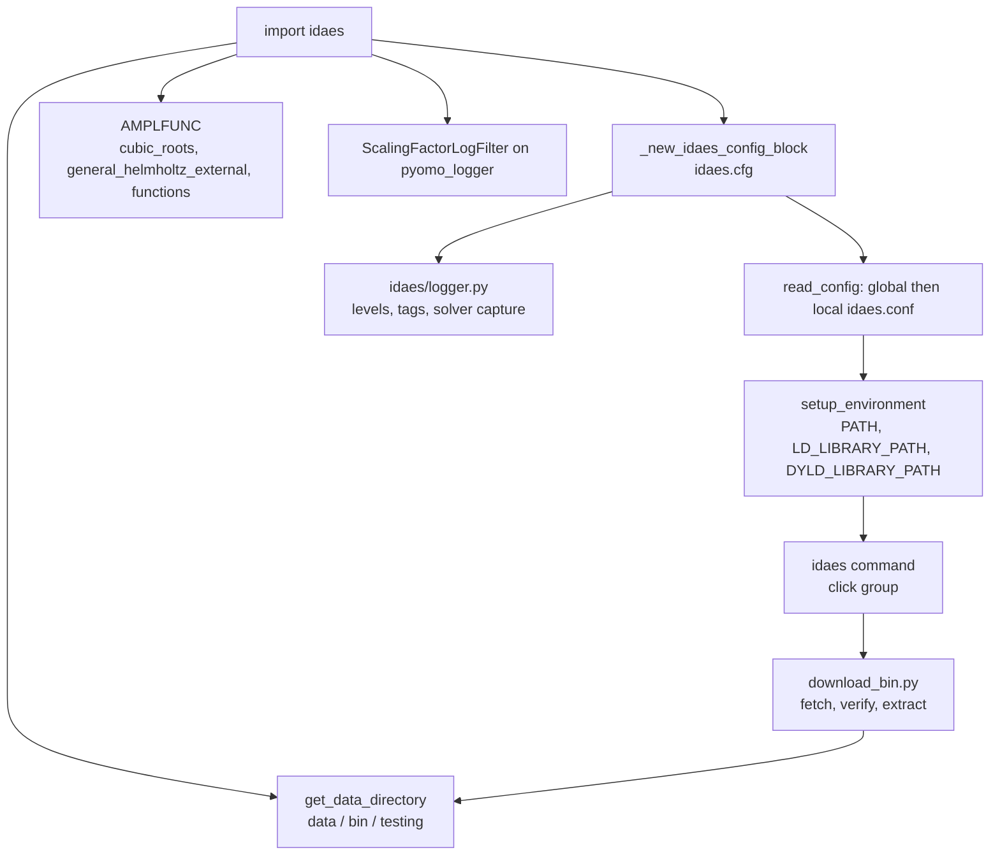
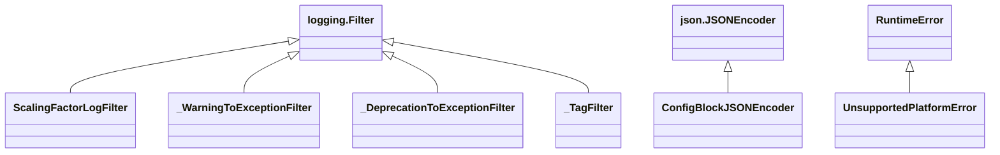
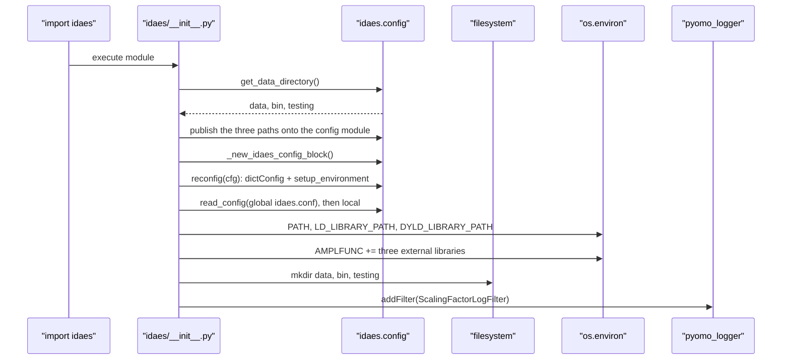
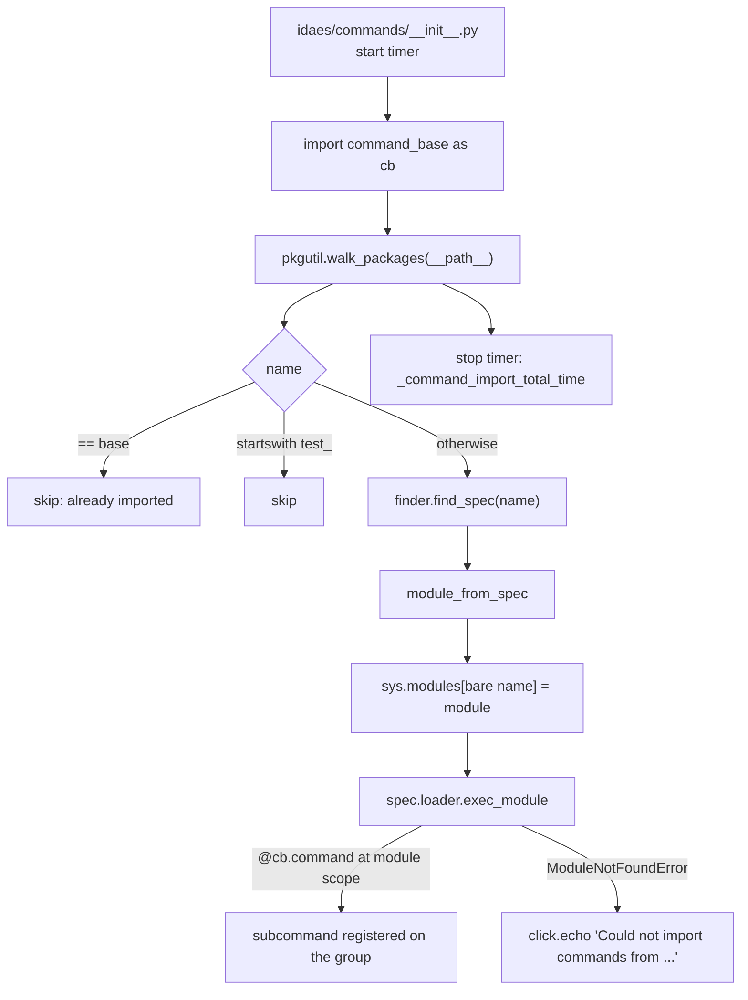
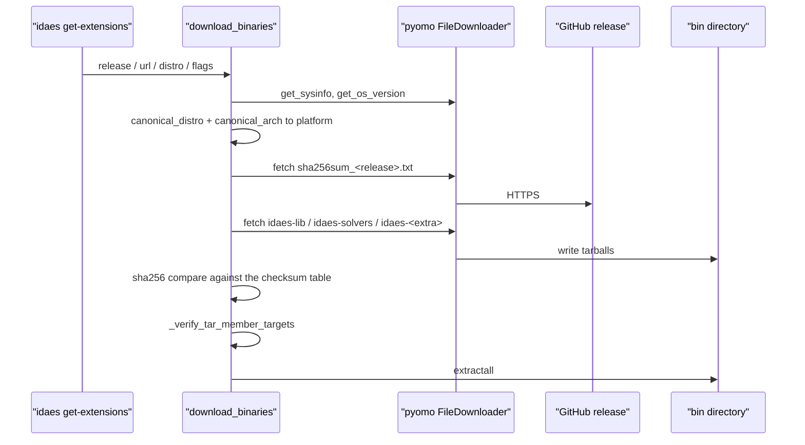

# 02 — Runtime platform and command line interface

> **Doc ID** 02 · **Repo SHA** 70a8f4fe1 (IDAES-PSE v2.13.0rc0) · **Source roots** `idaes/__init__.py`, `idaes/config.py`, `idaes/logger.py`, `idaes/beta.py`, `idaes/core/__init__.py`, `idaes/commands/**`
> **Owns** 19 modules / 2,658 LOC · **Assets** none tracked in the repository · **Siblings** [03](03_block_hierarchy_and_construction_protocol.md), [08a](08a_model_introspection_and_persistence.md), [30](30_numerics_and_solver_interface_map.md), [32](32_repository_engineering.md)

Importing `idaes` is not a neutral act. The package's `__init__.py` resolves and
creates three directories on disk, builds a global configuration tree, reads two
configuration files, rewrites `PATH` and the platform's shared-library search
path, pre-registers three external function libraries in an AMPL environment
variable, and installs a filter on Pyomo's logger. Every other document in this
set describes code that runs after that has already happened. This document
describes the platform itself: what import time does, what the global
configuration holds, how logging is layered, how beta modules are gated, and how
the `idaes` command line tool discovers and runs its subcommands.

---

## 0. Scope and source map

| File | LOC | Purpose | Covered in § |
|---|---:|---|---|
| `idaes/__init__.py` | 222 | The import-time bootstrap: directory resolution, the global configuration object, environment mutation, external function pre-registration, the Pyomo log filter | 2, 5, 6, 7, 10, 11, 12 |
| `idaes/config.py` | 763 | The global configuration schema, the binary platform taxonomy, directory resolution, environment setup, the two logger-to-exception filters | 2, 3, 4, 5, 7, 11, 12 |
| `idaes/logger.py` | 297 | Logger factories, the custom level scheme, the logger tag filter, solver output capture | 2, 3, 5, 7, 11 |
| `idaes/beta.py` | 89 | Beta-module import gating | 2, 5, 7, 9, 12 |
| `idaes/core/__init__.py` | 54 | The public import surface: 46 names re-exported from `idaes.core.base` | 2, 8 |
| `idaes/commands/__init__.py` | 48 | Subcommand auto-discovery by package walk | 5, 11, 12 |
| `idaes/commands/base.py` | 122 | The `click` group, verbosity handling, `copyright`, `import-time` | 2, 5, 7, 11 |
| `idaes/commands/extensions.py` | 284 | The five binary-extension subcommands and their reporting helpers | 2, 5, 7, 10 |
| `idaes/commands/data_directory.py` | 52 | `data-directory` and `bin-directory` | 2, 7 |
| `idaes/commands/env_info.py` | 41 | `environment-info` | 2, 7 |
| `idaes/commands/config.py` | 61 | Four subcommands that print a removal notice | 2, 12 |
| `idaes/commands/convergence.py` | 146 | Three subcommands that print a deprecation notice | 2, 12 |
| `idaes/commands/examples.py` | 49 | `get-examples`, which prints a removal notice | 2, 12 |
| `idaes/commands/run_flowsheet.py` | 20 | The `idaes-run` console script target: a re-export of an `argparse` entry point; registers no `click` subcommand | 2, 12 |
| `idaes/commands/util/__init__.py` | 0 | Empty package marker | 0 |
| `idaes/commands/util/download_bin.py` | 410 | The binary provisioning pipeline: platform resolution, download, checksum, guarded extraction | 5, 7, 9, 10, 11 |
| `idaes/apps/__init__.py` | 0 | Empty namespace marker | 0, 12 |
| `idaes/models/__init__.py` | 0 | Empty namespace marker | 0, 12 |
| `idaes/models_extra/__init__.py` | 0 | Empty namespace marker | 0, 12 |

Total 2,658 LOC, 58 configuration keys, 0 `NotImplementedError` hook sites, 8
classes, 18 registered CLI subcommands. Four of the nineteen files are
zero-byte package markers: the three top-level library namespaces and
`idaes/commands/util/`. Unlike every other file in the tree they carry no
copyright header, because they carry nothing at all.

---

## 1. Architectural role

This subsystem is the layer between the operating system and everything IDAES
models. It answers four questions, one per module.

*Where does state live on disk?* `get_data_directory` (`idaes/config.py:704`)
resolves a data directory from `$IDAES_DATA`, else `%LOCALAPPDATA%\idaes` on
Windows, else `$HOME/.idaes`, and derives `bin` and `testing` subdirectories
from it. `idaes/__init__.py:63` calls it once and publishes the three paths as
module attributes nothing reassigns afterwards.

*What can be configured?* `_new_idaes_config_block` (`idaes/config.py:141`)
declares a Pyomo `ConfigBlock` covering logging, physical-property options,
per-solver default option blocks, solver selection and logger tags. It is
instantiated once at `idaes/__init__.py:79` and published as `idaes.cfg`. A
global configuration file and a working-directory configuration file are layered
over it, in that order.

*How does the library talk?* `idaes/logger.py` supplies four logger factories,
three extra numeric levels between `INFO` and `WARNING`, a tag-based filter, and
a context manager that redirects solver output into a logger. 187 modules import
it, the most of any module in the repository.

*How does a user drive it?* `idaes/commands/` builds a `click` group and
populates it by importing every module in the package, each of which registers
its own subcommands as a side effect of being imported.

The environment mutation performed at import is the load-bearing part.
`setup_environment` (`idaes/config.py:736`) puts the IDAES `bin` directory on
`PATH` and on `LD_LIBRARY_PATH`/`DYLD_LIBRARY_PATH`, which is how a solver
executable fetched by `idaes get-extensions` becomes visible to Pyomo's solver
factory and how the compiled external function libraries become loadable by the
AMPL Solver Library. The solver side of that boundary is
[30](30_numerics_and_solver_interface_map.md)'s.



*Importing the package configures the process; the command line tool is one consumer of that configuration, and the binary downloader is what fills the directory the configuration points at.*

---

## 2. Public surface inventory

| Symbol | Kind | Declared at | Exported via | Stability signal |
|---|---|---|---|---|
| `__version__` | module attribute | `idaes/__init__.py:33` | `idaes` | read from installed distribution metadata |
| `cfg` | `ConfigBlock` | `idaes/__init__.py:79` | `idaes` | documented in `docs/reference_guides/configuration.rst` |
| `data_directory`, `bin_directory`, `testing_directory` | `str` or `None` | `idaes/__init__.py:63` | `idaes` | first two are a documented CLI surface |
| `reconfig`, `read_config`, `write_config` | functions | `idaes/__init__.py:156`, `:160`, `:164` | `idaes` | documented |
| `temporary_config_ctx`, `ScalingFactorLogFilter` | classes | `idaes/__init__.py:169`, `:181` | `idaes` | no underscore, not autodoc'd |
| `_create_data_dir`, `_create_bin_dir`, `_create_testing_dir` | functions | `idaes/__init__.py:116`, `:121`, `:133` | `idaes` | leading underscore; called from the CLI |
| `default_binary_release`, `release_base_url`, `release_checksum_url` | `str` | `idaes/config.py:26`, `:28`, `:30` | `idaes.config` | release tag `3.4.2` and two endpoints |
| `base_platforms` | `tuple`, 12 entries | `idaes/config.py:34` | `idaes.config` | iterated by `hash-extensions` |
| `binary_distro_map`, `binary_arch_map`, `extra_binaries` | `dict`, 20 / 4 / 1 entries | `idaes/config.py:49`, `:72`, `:79` | `idaes.config` | alias tables and the `petsc` extra, printed by `--info` |
| `orig_environ`, `default_uom` | `dict` | `idaes/config.py:83`, `:89` | `idaes.config` | environment snapshot; default of `reporting_units` |
| `canonical_arch`, `canonical_distro` | functions | `idaes/config.py:101`, `:115` | `idaes.config` | pinned by tests |
| `ConfigBlockJSONEncoder` | class | `idaes/config.py:130` | `idaes.config` | used by `write_config` |
| `_new_idaes_config_block` | function | `idaes/config.py:141` | `idaes.config` | underscore; its docstring restricts callers to `idaes/__init__.py` |
| `read_config`, `write_config`, `reconfig`, `create_dir` | functions | `idaes/config.py:620`, `:647`, `:675`, `:689` | `idaes.config` | wrapped by the `idaes` module |
| `get_data_directory`, `setup_environment` | functions | `idaes/config.py:704`, `:736` | `idaes.config` | pinned by tests |
| `CRITICAL`, `ERROR`, `WARNING`, `CAUTION`, `INFO_LOW`, `INFO`, `INFO_HIGH`, `DEBUG`, `NOTSET` | `int` | `idaes/logger.py:28`-`:36` | `idaes.logger` | documented in `docs/reference_guides/logging.rst` |
| `levelname` | `dict` | `idaes/logger.py:39` | `idaes.logger` | maps custom levels onto displayed names |
| `getIdaesLogger` / `getLogger` | function / alias | `idaes/logger.py:98`, `:112` | `idaes.logger` | autodoc'd |
| `getSolveLogger`, `getInitLogger`, `getModelLogger` | functions | `idaes/logger.py:115`, `:130`, `:144` | `idaes.logger` | autodoc'd |
| `condition` | function | `idaes/logger.py:160` | `idaes.logger` | autodoc'd |
| `solver_capture_on`, `solver_capture_off`, `solver_capture` | functions | `idaes/logger.py:183`, `:192`, `:201` | `idaes.logger` | — |
| `log_tags`, `set_log_tags`, `add_log_tag`, `remove_log_tag`, `valid_log_tags`, `add_valid_log_tag` | functions | `idaes/logger.py:206`, `:215`, `:230`, `:244`, `:259`, `:268` | `idaes.logger` | autodoc'd |
| `SolverLogInfo`, `solver_log` | class, context manager | `idaes/logger.py:281`, `:287` | `idaes.logger` | documented |
| `declare_beta_module`, `import_beta` | functions | `idaes/beta.py:39`, `:53` | `idaes.beta` | no in-tree production caller |
| `command_base` | `click.Group` | `idaes/commands/base.py:84` | console script `idaes` | bound in `pyproject.toml` |
| `level_from_verbosity`, `how_to_report_an_error` | functions | `idaes/commands/base.py:33`, `:50` | `idaes.commands.base` | the second has no in-tree caller |
| `cb` | alias of `command_base` | `idaes/commands/__init__.py:26` | `idaes.commands` | the registration handle every subcommand module imports |
| `_command_import_total_time` | `float` | `idaes/commands/__init__.py:48` | `idaes.commands` | reported by `import-time` |
| `UnsupportedPlatformError`, `hash_file_sha256`, `download_binaries` | exception, functions | `idaes/commands/util/download_bin.py:36`, `:40`, `:324` | `download_bin` | the one typed exception, the hasher (aliased `_hash` at `:59`) and the pipeline entry point |
| `print_extensions_version`, `print_license`, `print_build_info` | functions | `idaes/commands/extensions.py:50`, `:73`, `:87` | `extensions` | reporting helpers |

### 2.1 Registered subcommands

`pyproject.toml` declares two console scripts: `idaes`, bound to
`idaes.commands.base:command_base`, and `idaes-run`, bound to
`idaes.commands.run_flowsheet:main`. Eighteen `click` subcommands are registered
on the first, across seven modules; `run_flowsheet.py` registers none of them.

| Subcommand | Declared at | Behaviour |
|---|---|---|
| `copyright` | `idaes/commands/base.py:94` | Prints the copyright block |
| `import-time` | `idaes/commands/base.py:111` | Prints the measured subcommand import time |
| `data-directory` | `idaes/commands/data_directory.py:32` | Prints, tests or creates the data directory |
| `bin-directory` | `idaes/commands/data_directory.py:45` | The same for the binary directory |
| `environment-info` | `idaes/commands/env_info.py:31` | Prints an environment report, or writes it as JSON |
| `get-extensions` | `idaes/commands/extensions.py:164` | Downloads and installs binary extensions |
| `hash-extensions` | `idaes/commands/extensions.py:234` | Writes a `sha256sum_<release>.txt` file |
| `bin-platform` | `idaes/commands/extensions.py:263` | Prints the resolved build platform |
| `extensions-license` | `idaes/commands/extensions.py:278` | Prints `license.txt` from the binary directory |
| `extensions-version` | `idaes/commands/extensions.py:283` | Prints the two installed version files |
| `config-write`, `config-file`, `config-set`, `config-display` | `idaes/commands/config.py:33`, `:42`, `:51`, `:60` | Each prints a removal notice |
| `convergence-sample`, `convergence-eval`, `convergence-search` | `idaes/commands/convergence.py:61`, `:117`, `:142` | Each prints a deprecation notice |
| `get-examples` | `idaes/commands/examples.py:46` | Prints a removal notice and exits 0 |

Eight of the eighteen do nothing but print a message.
`idaes/commands/run_flowsheet.py:17` re-exports `runner_cli.main`, an
`argparse` entry point reachable both as the `idaes-run` console script and as
`python -m idaes.commands.run_flowsheet` through the guard at `:19`; the runner
itself belongs to [07](07_diagnostics_and_run_orchestration.md).

### 2.2 `idaes.core` as an import surface

`idaes/core/__init__.py` contains no definitions. It re-exports 46 names from
`idaes/core/base/` in sixteen statements: the block protocol
(`idaes/core/__init__.py:16`, `:17`), unit models and flowsheets (`:18`, `:19`),
the property and reaction bases (`:20`, `:21`), the control volume vocabulary
and its two geometries (`:26`, `:34`, `:35`), the extended geometries (`:36`,
`:37`), phases and chemical components (`:38`, `:46`), costing (`:47`),
`VarLikeExpression` (`:53`) and the two property sets (`:54`). 167 modules
import from `idaes.core`, second only to `idaes.logger`. Each re-exported name's
semantics belong to the document owning its defining module.

---

## 3. Class hierarchy and type taxonomy

Eight classes, none of them process blocks. Five subclass `logging.Filter` or
`json.JSONEncoder` — this is a set of adapters onto the standard library, not a
modelling hierarchy. `_generated/process_blocks.csv` and `_generated/enums.csv`
are both empty for this scope: no `declare_process_block_class` site and no
`enum` class is declared here.



*Four of the eight classes are log filters, which is the shape of a subsystem whose job is to intercept and reroute messages rather than to model anything.*

| Class | Base(s) | Declared at | Decorator | Container class | Key overrides |
|---|---|---|---|---|---|
| `temporary_config_ctx` | `object` | `idaes/__init__.py:169` | none | — | `__enter__` `:170`, `__exit__` `:173` |
| `ScalingFactorLogFilter` | `logging.Filter` | `idaes/__init__.py:181` | none | — | `filter` `:197` |
| `ConfigBlockJSONEncoder` | `json.JSONEncoder` | `idaes/config.py:130` | none | — | `default` `:135` |
| `_WarningToExceptionFilter` | `logging.Filter` | `idaes/config.py:654` | none | — | `filter` (static) `:658` |
| `_DeprecationToExceptionFilter` | `logging.Filter` | `idaes/config.py:663` | none | — | `filter` (static) `:667` |
| `_TagFilter` | `logging.Filter` | `idaes/logger.py:46` | none | — | `filter` (static) `:50` |
| `SolverLogInfo` | `object` | `idaes/logger.py:281` | none | — | `__init__` `:282` |
| `UnsupportedPlatformError` | `RuntimeError` | `idaes/commands/util/download_bin.py:36` | none | — | none |

The three filters whose `filter` is a `staticmethod` are attached to loggers as
*classes*, not instances: `idaes/logger.py:78` calls `log.addFilter(_TagFilter)`
and `idaes/config.py:679` calls `_log.addFilter(_DeprecationToExceptionFilter)`.
`logging.Filterer.filter` invokes `f.filter(record)` on anything carrying a
`filter` attribute, so a class with a static `filter` satisfies the protocol.
`ScalingFactorLogFilter` is the exception, instantiated at
`idaes/__init__.py:215` and attached as an object.

### 3.1 The logging level scheme

The three custom levels are not registered with `logging.addLevelName`. Instead
`_TagFilter` rewrites `record.levelname` from the `levelname` table
(`idaes/logger.py:39`) as each record passes through.

| Name | Value | Standard? | Displayed as | Injected method |
|---|---:|---|---|---|
| `CRITICAL` | 50 | yes | `CRITICAL` | `critical` |
| `ERROR` | 40 | yes | `ERROR` | `error` |
| `WARNING` | 30 | yes | `WARNING` | `warning` |
| `CAUTION` | 25 | no | `CAUTION` | `caution` (`idaes/logger.py:64`) |
| `INFO_LOW` | 21 | no | `INFO` | `info_low` (`idaes/logger.py:68`) |
| `INFO` | 20 | yes | `INFO` | `info` |
| `INFO_HIGH` | 19 | no | `INFO` | `info_high` (`idaes/logger.py:72`) |
| `DEBUG` | 10 | yes | `DEBUG` | `debug` |
| `NOTSET` | 0 | yes | `NOTSET` | — |

The naming is inverted relative to the numbers on purpose. `INFO_LOW` is the
*most* important informational level (21, above `INFO`) and `INFO_HIGH` the
least (19, below it), so a logger set to `INFO` emits `info_low` and `info` and
discards `info_high`. `CAUTION` at 25 survives a logger raised above `INFO` but
trips nothing keyed on `WARNING`. All three methods are bound onto a
`logging.LoggerAdapter` rather than onto the logger (`idaes/logger.py:79`), so
every factory here returns an adapter.

### 3.2 The logger tag vocabulary

A logger tag is an optional string attached to every record a logger emits, used
to filter whole categories of message. It is unrelated to a model tag or a
release tag; see [01 §3](01_glossary_and_conventions.md#3-term-collision-table).

| Tag | In `valid_logger_tags` | Enabled in `logger_tags` |
|---|---|---|
| `framework`, `model`, `flowsheet`, `unit`, `control_volume`, `properties`, `reactions` | yes | yes |
| `ui` | yes | **no** |
| `None` | added by `valid_log_tags()` | always passes the filter |

`ui` is the one member of the valid set absent from the enabled set
(`idaes/config.py:563` against `:583`), so a logger created with `tag="ui"` is
silent below `WARNING` until a caller enables it.

### 3.3 The binary platform taxonomy

| Table | Declared at | Size | Role |
|---|---|---:|---|
| `base_platforms` | `idaes/config.py:34` | 12 | The `<distro>-<arch>` strings for which builds exist |
| `binary_distro_map` | `idaes/config.py:49` | 20 | Aliases a distribution name onto a build platform |
| `binary_arch_map` | `idaes/config.py:72` | 4 | Aliases a machine type onto `x86_64` or `aarch64` |
| `extra_binaries` | `idaes/config.py:79` | 1 | `petsc`, available on every base platform |

`canonical_arch` and `canonical_distro` are lower-casing dictionary lookups
falling through to the lower-cased input when no alias exists, so an unknown
platform produces a name that later fails a membership test
(`idaes/commands/util/download_bin.py:90`) rather than a lookup error.

---

## 4. Configuration reference

58 keys in one declaration, `_new_idaes_config_block` (`idaes/config.py:141`).
Line numbers in the four tables below are lines of `idaes/config.py`. The root
is `ConfigBlock("idaes", implicit=True)` (`idaes/config.py:147`), so a
configuration file may introduce undeclared keys; the `petsc_snes` block read at
`idaes/core/solvers/petsc.py:139` is exactly such a key.

### 4.1 Root block

| Key | Domain / validator | Default | Req. | Effect on build | Anchor |
|---|---|---|---|---|---|
| `warning_to_exception` | `bool` | `False` | no | Installs `_WarningToExceptionFilter` on the `idaes` logger at the next `reconfig` | `:148` |
| `deprecation_to_exception` | `bool` | `False` | no | Installs `_DeprecationToExceptionFilter` on the `idaes` logger | `:157` |
| `logging` | `ConfigBlock`, implicit | see §4.2 | no | Passed verbatim to `logging.config.dictConfig` | `:166` |
| `properties` | `ConfigBlock`, explicit | see §4.3 | no | Physical-property options | `:250` |
| `ipopt` | `ConfigBlock`, explicit | see §4.4 | no | Default options injected into the `ipopt` solver | `:277` |
| `ipopt_v2` | `ConfigBlock`, explicit | see §4.4 | no | The same for `ipopt_v2`, plus writer options | `:324` |
| `ipopt_l1` | `ConfigBlock`, explicit | see §4.4 | no | The same for `ipopt_l1` | `:402` |
| `petsc_ts` | `ConfigBlock`, explicit | see §4.4 | no | The same for `petsc_ts` | `:450` |
| `default_solver` | `str` | `ipopt` | no | Resolved by the `default` wrapper at `idaes/core/solvers/config.py:47` | `:528` |
| `use_idaes_solvers` | `bool` | `True` | no | Selects whether the IDAES `bin` directory is prepended or appended to `PATH` | `:538` |
| `use_idaes_solver_config` | `bool` | `False` | no | Selects whether the per-solver blocks are applied | `:553` |
| `valid_logger_tags` | `set`, 8 names | see §3.2 | no | The set `set_log_tags` and `add_log_tag` validate against | `:563` |
| `logger_tags` | `set`, 7 names | see §3.2 | no | The set `_TagFilter` tests each record against | `:583` |
| `logger_capture_solver` | none declared | `True` | no | Selects whether `solver_log` captures output | `:602` |
| `reporting_units` | none declared | `default_uom` | no | Read by `idaes/core/util/units_of_measurement.py:47` | `:610` |

The last two are declared without a `domain`, so no coercion is applied to a
value read from a configuration file.

### 4.2 `logging` — the `dictConfig` payload

IDAES does not interpret this subtree. `reconfig` hands `cfg.logging.value()` to
`logging.config.dictConfig` (`idaes/config.py:676`), so the key names are the
ones the standard library defines.

| Key | Domain / validator | Default | Req. | Effect on build | Anchor |
|---|---|---|---|---|---|
| `version` | `int` | `1` | no | `dictConfig` schema version | `:175` |
| `disable_existing_loggers` | `bool` | `False` | no | Leaves loggers created before `reconfig` intact | `:178` |
| `formatters` | `ConfigBlock`, implicit | two entries | no | Container | `:182` |
| `formatters.default_format` | `ConfigBlock`, implicit | — | no | Container | `:183` |
| `formatters.default_format.format` | `str` | `%(asctime)s [%(levelname)s] %(name)s: %(message)s` | no | Timestamped console format | `:186` |
| `formatters.default_format.datefmt` | `str` | `%Y-%m-%d %H:%M:%S` | no | Timestamp format | `:192` |
| `formatters.blank_format` | `ConfigBlock`, implicit | — | no | Container | `:196` |
| `formatters.blank_format.format` | `str` | `%(message)s` | no | Message-only format | `:199` |
| `handlers` | `ConfigBlock`, implicit | two entries | no | Container | `:203` |
| `handlers.console` | `ConfigBlock`, implicit | — | no | Container | `:204` |
| `handlers.console.class` | `str` | `logging.StreamHandler` | no | Handler class | `:207` |
| `handlers.console.formatter` | `str` | `default_format` | no | Formatter selection | `:211` |
| `handlers.console.stream` | `str` | `ext://sys.stdout` | no | Destination | `:215` |
| `handlers.console_blank` | `ConfigBlock`, implicit | — | no | Container | `:219` |
| `handlers.console_blank.class` | `str` | `logging.StreamHandler` | no | Handler class | `:222` |
| `handlers.console_blank.formatter` | `str` | `blank_format` | no | Formatter selection | `:226` |
| `handlers.console_blank.stream` | `str` | `ext://sys.stdout` | no | Destination | `:230` |
| `loggers` | `dict`, five entries | see §11 | no | Levels, propagation and handlers per logger | `:234` |

`loggers` is a plain `dict` rather than a nested `ConfigBlock`; the comment at
`idaes/config.py:238` gives the reason, a dotted logger name cannot be a
`ConfigBlock` attribute. Both console handlers write to stdout; nothing in the
default configuration writes to stderr.

### 4.3 `properties.helmholtz`

| Key | Domain / validator | Default | Req. | Effect on build | Anchor |
|---|---|---|---|---|---|
| `helmholtz` | `ConfigBlock`, explicit | — | no | Container | `:258` |
| `helmholtz.parameter_file_path` | `str` | `None` | no | Overrides the parameter file directory; `None` derives it from the install location | `:266` |

Read and written by
`idaes/models/properties/general_helmholtz/components/parameters/__init__.py:39`
and `:54`; the parameter pipeline is
[16](16_general_helmholtz_property_system.md)'s.

### 4.4 Per-solver default option blocks

Four solver blocks are declared. They are applied only when
`use_idaes_solver_config` is true or the named solver is not already registered,
in the wrapper at `idaes/core/solvers/config.py:53`.

| Block | Key | Domain | Default | Anchor |
|---|---|---|---|---|
| `ipopt` | `options` | `ConfigBlock`, implicit | — | `:285` |
| `ipopt` | `options.nlp_scaling_method` | `str` | `gradient-based` | `:294` |
| `ipopt` | `options.tol` | `float` | `1e-6` | `:304` |
| `ipopt` | `options.max_iter` | `int` | `200` | `:314` |
| `ipopt_v2` | `options` | `ConfigBlock`, implicit | — | `:331` |
| `ipopt_v2` | `options.nlp_scaling_method` | `str` | `gradient-based` | `:339` |
| `ipopt_v2` | `options.tol` | `float` | `1e-6` | `:348` |
| `ipopt_v2` | `options.max_iter` | `int` | `200` | `:357` |
| `ipopt_v2` | `options.linear_solver` | `str` | `ma57` | `:366` |
| `ipopt_v2` | `writer_config` | `ConfigBlock`, implicit | — | `:375` |
| `ipopt_v2` | `writer_config.scale_model` | `Bool` | `True` | `:384` |
| `ipopt_v2` | `writer_config.linear_presolve` | `Bool` | `True` | `:393` |
| `ipopt_l1` | `options` | `ConfigBlock`, implicit | — | `:411` |
| `ipopt_l1` | `options.nlp_scaling_method` | `str` | `gradient-based` | `:420` |
| `ipopt_l1` | `options.tol` | `float` | `1e-6` | `:430` |
| `ipopt_l1` | `options.max_iter` | `int` | `200` | `:440` |
| `petsc_ts` | `options` | `ConfigBlock`, implicit | — | `:459` |
| `petsc_ts` | `options.--ts_save_trajectory` | `int` | `1` | `:468` |
| `petsc_ts` | `options.--ts_max_snes_failures` | `int` | `200` | `:478` |
| `petsc_ts` | `options.--ts_max_reject` | `int` | `20` | `:488` |
| `petsc_ts` | `options.--ts_type` | `str` | `beuler` | `:498` |
| `petsc_ts` | `options.--ts_adapt_type` | `str` | `basic` | `:508` |
| `petsc_ts` | `options.--ts_exact_final_time` | `str` | `matchstep` | `:518` |

`ipopt_v2` is the only block carrying a `linear_solver` default or a
`writer_config` subtree. The PETSc option names keep their double-dash
command-line spelling because they are forwarded to the executable verbatim. How
these blocks reach a solver object is
[30](30_numerics_and_solver_interface_map.md)'s subject.

---

## 5. Construction and call sequences

### 5.1 The import-time bootstrap

Importing `idaes` runs `idaes/__init__.py` top to bottom. Nothing is deferred
and nothing is lazy. References below are lines of `idaes/__init__.py` unless
prefixed `config.py`. Four steps are order-critical and are marked.

1. **Optional V1 compatibility.** `_handle_optional_compat_activation` (`:37`)
   is defined and immediately called (`:58`). With `IDAES_ACTIVATE_V1_COMPAT`
   set it logs a warning on the `idaes_v1_compat` logger and imports
   `_idaes_v1_compat.activate`, logging an error if that package is absent.
2. **Version.** `__version__` is read from installed distribution metadata
   (`:33`), not from a literal in the source.
3. **Directory resolution.** `config.get_data_directory()` (`:63`) tries
   `$IDAES_DATA` (`config.py:706`), then `%LOCALAPPDATA%\idaes` on Windows, then
   `$HOME/.idaes`. The parent of the result is tested for existence
   (`config.py:716`); a missing parent logs a warning and yields `None` for all
   three paths. `bin` and `testing` are subdirectories of the data directory.
4. **Directory publication.** The three paths are written back onto the `config`
   module (`:67`). *Order point one*: `config.reconfig` reads `bin_directory` as
   a module global (`config.py:686`) and that global exists only because of this
   assignment. The comment at `:64` gives the reason — `config` does not import
   `idaes`, to avoid a circular import.
5. **Configuration file paths.** `_global_config_file` is `idaes.conf` inside
   the data directory (`:73`), or `None` when there is none. `_local_config_file`
   is the bare relative name `idaes.conf` (`:76`), resolved against the process
   working directory.
6. **Configuration object.** `cfg = config._new_idaes_config_block()` (`:79`)
   builds the tree of §4 with every key at its declared default.
7. **First `reconfig`.** `config.reconfig(cfg)` (`:80`) applies `dictConfig`,
   attaches or detaches the two exception filters, and calls
   `setup_environment`. *Order point two*: this is the first mutation of `PATH`,
   before any configuration file has been read, using the declared default of
   `use_idaes_solvers`.
8. **Global then local configuration.** `config.read_config` is called with the
   global file (`:82`) then the local one (`:84`). Each call parses JSON, applies
   it with `cfg.set_value` (`config.py:641`) and reconfigures again
   (`config.py:644`). A missing file raises `IOError`, caught, logged at `DEBUG`
   and ignored (`config.py:638`). The working-directory file wins over the
   global one, and both win over declared defaults.
9. **Environment setup.** `config.setup_environment(bin_directory, cfg.use_idaes_solvers)`
   (`:87`). With `use_idaes_solvers` true the binary directory is *prepended* to
   `PATH` (`config.py:753`), with it false *appended* (`config.py:755`). Off
   Windows the directory is appended to `LD_LIBRARY_PATH` (`config.py:757`) and
   to `DYLD_LIBRARY_PATH` (`config.py:761`). Every join is against
   `orig_environ` (`config.py:83`), a snapshot taken when `idaes.config` was
   first imported, so repeated calls rebuild the variables rather than
   accumulating copies of the directory.
10. **External function pre-registration.**
    `_ensure_external_functions_libs_in_env` (`:99`) is called with
    `["cubic_roots", "general_helmholtz_external", "functions"]` (`:111`). For
    each name it calls Pyomo's `find_library` against `<bin_directory>/<name>`
    (`:105`) and appends any resolved path to a newline-separated `AMPLFUNC`
    value (`:108`), preserving what the environment already held. The reason is
    recorded in the comment block at `:93`:

    ```python
    # There appears to be a bug in the ASL which causes terminal failures
    # if you try to create multiple ASL structs with different external
    # functions in the same process. This causes pytest to crash during testing.
    # To avoid this, register all known external functions at initialization.
    ```

11. **Directory creation.** When the data directory resolved, `_create_data_dir`
    (`:116`), `_create_bin_dir` (`:121`) and `_create_testing_dir` (`:133`) are
    each called inside a `try` that swallows `FileNotFoundError` (`:139`).
    *Order point three*: importing the package creates directories on disk.
    `config.create_dir` (`config.py:689`) uses `os.mkdir`, one level only.
12. **Pyomo log filter.** `ScalingFactorLogFilter` (`:181`) is instantiated
    (`:215`) and attached both to Pyomo's `pyomo_logger` (`:216`) and to each
    handler already attached to it (`:220`), the whole block inside a
    `try`/`except ImportError` (`:221`). The filter drops records whose message
    contains `scaling_factor` together with either
    `not exported as part of the NL file` or `not Var, Constraint, Objective`
    (`:203`). *Order point four*: handlers are filtered by iteration, so a
    handler added to `pyomo_logger` afterwards does not carry it.



*Every step shown is an unconditional side effect of an `import` statement, which is why a tool that inspects the tree without running it never imports IDAES.*

The inventory tooling behind `_generated/` parses the tree with Python's `ast`
module and with tree-sitter rules and never imports `idaes`. Steps 9, 10 and 11
are the reason: an inventory run that imported the package would rewrite the
caller's `PATH`, set `AMPLFUNC`, and create three directories under the invoking
user's home directory.

### 5.2 Re-reading and restoring configuration

| Entry point | Declared at | Behaviour |
|---|---|---|
| `idaes.reconfig()` | `__init__.py:156` | Delegates to `config.reconfig(cfg)` on the live global block |
| `idaes.read_config(val)` | `__init__.py:160` | Accepts a path, a `dict` or a `ConfigBlock`; layers it onto `cfg` and reconfigures |
| `idaes.write_config(path, default=False)` | `__init__.py:164` | Serialises the live block, or a freshly built default block |
| `config.write_config` | `config.py:647` | `json.dump` of `cfg.value()` through `ConfigBlockJSONEncoder`, indent 4 |
| `temporary_config_ctx` | `__init__.py:169` | `__enter__` deep-copies `cfg`; `__exit__` rebinds the module global and reconfigures |

`ConfigBlockJSONEncoder.default` (`config.py:135`) exists for one case:
`valid_logger_tags` and `logger_tags` hold Python `set` objects, which `json`
cannot serialise. Because `temporary_config_ctx.__exit__` rebinds the
module-level name, any module that captured `idaes.cfg` by value rather than
reading it on each access keeps the block from inside the context.

### 5.3 Subcommand discovery

`idaes/commands/__init__.py` has no functions and no classes; its whole body is
a loop that imports its own siblings for their side effects. References below
are lines of that file.

| # | Step | Anchor |
|---:|---|---|
| 1 | Start a timer before any import, so `import-time` measures the imports themselves | `:22` |
| 2 | Import `command_base` as `cb`; every subcommand module reaches the group through `from idaes.commands import cb`, which works because this binding precedes the loop | `:26` |
| 3 | Walk the package with `pkgutil.walk_packages(__path__)`. No prefix is supplied, so the yielded names are bare: `base`, `config`, `convergence`, `data_directory`, `env_info`, `examples`, `extensions`, `run_flowsheet`, `tests`, `util` | `:29` |
| 4 | Skip `base`, already imported and the owner of the group, and any name beginning `test_`. The `tests` package does not match that prefix and is not skipped | `:33`, `:36` |
| 5 | Resolve a spec through the walker's finder, build a module with `importlib.util.module_from_spec`, register it in `sys.modules` under its **bare** name, and execute it | `:39`-`:42` |
| 6 | Turn a `ModuleNotFoundError` raised during execution into a `click.echo` line naming the module, so one module with an unsatisfied dependency costs its own subcommands and nothing else | `:43` |
| 7 | Record the elapsed time, which `import-time` prints | `:48` |

Registration is the decorator itself: each module applies `@cb.command(name=...)`
at module scope, so executing the module populates the group. `click` derives a
name from the function when none is given, which is how `import_time` becomes
`import-time`.



*The group is populated by side effect: a module that imports registers its subcommands, and a module that fails to import removes only its own.*

`walk_packages` recurses into a package only by importing it under the yielded
name. `__import__("util")` and `__import__("tests")` resolve against the
top-level namespace rather than against `idaes.commands`, and `walk_packages`
swallows the resulting `ImportError` when no `onerror` callback is supplied.
`idaes/commands/util/download_bin.py` is therefore never reached by the walk; it
is imported explicitly by `extensions.py:33`.

### 5.4 The binary provisioning pipeline

`download_binaries` (`idaes/commands/util/download_bin.py:324`) is the whole
pipeline, built on Pyomo's `FileDownloader`, which supplies system detection,
TLS handling and the HTTP fetch. Line references below are lines of that file.

| # | Step | What it does | Anchor |
|---:|---|---|---|
| 1 | Flags | `verbose` lowers the module logger to `DEBUG`; `no_download` forces `nochecksum` true | `:353` |
| 2 | Destination | `alt_path` is made absolute; a `None` `to_path` becomes `idaes.bin_directory`; a relative one is joined onto `idaes.data_directory`; `idaes._create_bin_dir` creates it | `:360`, `:363`, `:366` |
| 3 | System | `_get_arch_and_platform` takes the reported OS for `auto`, and refines `linux` with `fd.get_os_version()` with dots removed, so `20.04` becomes `2004` | `:68` |
| 4 | Platform | `_get_release_platform` applies `canonical_distro` and `canonical_arch`, joins with a hyphen, and raises `UnsupportedPlatformError` outside `base_platforms` | `:80`, `:91` |
| 5 | URL | `_get_release_url` joins `release_base_url` with the release tag, or takes a bare `url` with any trailing slash removed | `:97`, `:107` |
| 6 | Checksums | `_get_checksums` returns `False` under `nochecksum`; otherwise it fetches `sha256sum_<release>.txt` and parses at most 1000 lines of `<hash>  <filename>` | `:116`, `:124`, `:129`, `:144` |
| 7 | Package list | `_create_download_package` builds four parallel lists; every file name is `idaes-<name>-<platform>.tar.gz`. `lib` is added unless `extras_only`; `solvers` unless `library_only` or `extras_only`; each `--extra` is checked against `extra_binaries` and its platform tuple, with a warning and a skip on either miss | `:155`, `:162` |
| 8 | Dry run | With `no_download`, a dictionary of release, platform and URL-to-path pairs is returned and the function stops | `:388` |
| 9 | Download | `_download_package` fetches each archive, converting `urllib.error.HTTPError` into a bare `Exception` naming the package and platform | `:186`, `:196` |
| 10 | Checksum gate | `_verify_checksums` hashes each file with `hash_file_sha256`, reading 10,000-byte blocks, and raises on a mismatch | `:40`, `:199`, `:208` |
| 11 | Extraction | One `links` dictionary is shared across every archive, so a symbolic link unpacked from the first is known when the second is checked; each archive is verified and only then extracted with `extractall`, called without a `filter` argument | `:405`, `:409`, `:410` |

The three archive names are `idaes-lib-<platform>.tar.gz`,
`idaes-solvers-<platform>.tar.gz` and `idaes-<extra>-<platform>.tar.gz`.



*Checksum verification and member-path verification are separate gates: the first is skippable by flag, the second is not.*

### 5.5 Tar member verification

`_verify_tar_member_targets` (`download_bin.py:266`) defends extraction against
members whose resolved location escapes the destination. Its docstring states
the problem: an absolute-path check on each member name is insufficient, because
a chain of symbolic links inside the archive can walk out of the target
directory even when no single member name looks suspicious. The destination is
resolved once (`:302`); for each member `_resolve_path` (`:233`) walks the path
one element at a time, calling `os.path.realpath` at each step and consulting
the `links` dictionary of not-yet-extracted links, with `_splitpath` (`:211`)
supplying elements in reverse order and preserving a leading separator. A
location outside the destination raises a bare `Exception` naming the archive,
the member and the location (`:310`). A symbolic-link member is then recorded in
`links` as `(type, linkname)` (`:318`), a hard link whose name differs from its
target with the target made absolute (`:320`) — after the check, so each link is
validated before it can influence a later member. The two cases this exists for
are the two the test exercises: a symbolic-link chain (`dir1/dir2 -> ..` then
`dir1/dir2/dir3 -> ..`, making `dir1/dir2/dir3/file` into `../file`) and a
hard-link chain reaching `dir3/file` outside the destination.

### 5.6 Beta module gating

`idaes/beta.py` implements a one-way import gate over three module-level
containers: `_declared_beta_modules` (`beta.py:24`), the modules that have
announced themselves; `_declared_beta_module_imports` (`:25`), the names
currently in flight through the gate; and `_imported_beta_modules` (`:26`), the
module-object cache.

`declare_beta_module` (`beta.py:39`) is called at the top of a beta module's own
body. It determines the caller's name by walking two frames up (`:33`), records
it, and returns quietly only if that name is in the in-flight set (`:42`);
otherwise it raises `ImportError` (`:50`) naming the module and
`idaes.beta.import_beta()`.

`import_beta` (`beta.py:53`) is the gate. A leading-dot name with no explicit
package takes the caller's package (`:54`) and `importlib.util.resolve_name`
produces the absolute name (`:58`). A cache hit returns the previously imported
object without re-running it (`:60`), so repeated calls yield the identical
object. Otherwise the name is added to the in-flight set (`:65`) and
`importlib.import_module` runs the module (`:67`) — the in-flight marker is what
makes the module's own `declare_beta_module` call return rather than raise. If
the module declared itself beta it is then **deleted from `sys.modules`**
(`:76`): the object survives in `_imported_beta_modules`, but Python's import
machinery no longer has a record of it, so a later plain `import` re-executes
the module body and re-triggers the guard. If it did not declare itself beta, an
informational message is logged (`:78`) and the module is dropped from the beta
cache (`:86`), leaving it in `sys.modules` as an ordinary import. A `finally`
clause clears the in-flight marker either way (`:88`).

### 5.7 Logger construction

`_getLogger` (`logger.py:87`) is the single implementation behind the four
public factories. It asserts the requested tag is valid or `None` (`:88`),
strips a leading `idaes.` from the supplied name (`:89`) so a module passing
`__name__` does not produce `idaes.idaes.…`, joins the stripped name to the
factory's root (`:91`), optionally sets the level, and hands the logger to
`__add_methods` (`:76`). That function attaches `_TagFilter` (`:78`), wraps the
logger in a `logging.LoggerAdapter` carrying `{"tag": tag}` as its `extra`
dictionary (`:79`), and binds `caution`, `info_high` and `info_low` onto the
adapter. The `extra` dictionary is merged into every record, which is what gives
`_TagFilter` a `record.tag` to test (`:57`); a record emitted through a plain
`logging` call on the same underlying logger carries no `tag`, and the resulting
`AttributeError` is caught and treated as a pass (`:59`).

### 5.8 Solver output capture

`solver_log` (`logger.py:287`) yields a `SolverLogInfo` whose `tee` attribute
records whether the supplied logger is enabled for the requested level (`:289`);
callers pass that to a Pyomo solver's `tee` argument, so solver output is
produced only when a logger would accept it. Capture is bypassed (`:293`) when
`solver_capture()` is false and when the process is on Windows with `pytest`
already in `sys.modules` (`:292`) — a named workaround for a deadlock between
Pyomo's and pytest's output capture, recorded in the source as IDAES issue 1818.
Otherwise the body runs inside `capture_output(LogStream(level, logger))`
(`:296`).

---

## 6. Data structures, variables, constraints and invariants

This subsystem creates no Pyomo components. Its state is module-level, mutable
and process-wide.

| Component | Type | Index sets | Units | Created at | Condition |
|---|---|---|---|---|---|
| `idaes.cfg` | `ConfigBlock` | — | — | `__init__.py:79` | always, at import |
| `idaes.data_directory`, `idaes.bin_directory`, `idaes.testing_directory` | `str` or `None` | — | — | `__init__.py:63` | always |
| `config.orig_environ` | `dict` of three strings | — | — | `config.py:83` | at first import of `idaes.config` |
| `idaes.log_filter` | `ScalingFactorLogFilter` | — | — | `__init__.py:215` | when `pyomo.common.log` imports |
| `idaeslog.levelname` | `dict`, 3 entries | level number | — | `logger.py:39` | always |
| `beta._declared_beta_modules` | `set` of names | — | — | `beta.py:24` | grows per `declare_beta_module` |
| `beta._declared_beta_module_imports` | `set` of names | — | — | `beta.py:25` | in-flight names only |
| `beta._imported_beta_modules` | `dict` name to module | — | — | `beta.py:26` | one entry per gated module |
| `commands._command_import_total_time` | `float` | — | seconds | `commands/__init__.py:48` | on import of `idaes.commands` |
| `download_bin._release_base_url` | `str` | — | — | `download_bin.py:33` | bound at import from `idaes.config` |
| `links` | `dict` path to (type, target) | — | — | `download_bin.py:405` | per `download_binaries` call |

| Invariant | Enforced at |
|---|---|
| The three directory paths are fixed for the life of the process | stated at `__init__.py:64`; never reassigned |
| The three environment variables are rebuilt from a snapshot, never appended to cumulatively | `config.py:751` |
| A logger tag is a member of `valid_logger_tags` or `None` | `logger.py:88`, `:225`, `:239` |
| A valid tag name is a string | `logger.py:277` |
| A downloaded platform string is one of `base_platforms` | `download_bin.py:90` |
| Every tar member resolves inside the destination directory | `download_bin.py:310` |
| A beta module raises on any import that did not go through `import_beta` | `beta.py:50` |
| Verbosity and quietness flags are mutually exclusive | `base.py:86` |

---

## 7. Method contracts

### 7.1 `idaes/__init__.py`

| Method | Signature | Preconditions | Effects | Returns | Raises | Anchor |
|---|---|---|---|---|---|---|
| `_handle_optional_compat_activation` | `(env_var="IDAES_ACTIVATE_V1_COMPAT")` | — | Imports and calls `_idaes_v1_compat.activate` when the variable is set | `None` | logs, does not raise | `:37` |
| `_ensure_external_functions_libs_in_env` | `(ext_funcs, var_name="AMPLFUNC", sep="\n")` | `bin_directory` is a path | Appends resolved library paths to `AMPLFUNC` | `None` | `TypeError` when `bin_directory` is `None` | `:99` |
| `_create_data_dir`, `_create_bin_dir`, `_create_testing_dir` | `()`, `(bd=None)`, `()` | — | `os.mkdir` on the data directory, then on `bd` or the binary directory, or the testing directory | `None` | `FileNotFoundError` | `:116`, `:121`, `:133` |
| `reconfig` | `()` | `cfg` exists | Re-applies logging and environment | `None` | propagates | `:156` |
| `read_config` | `(val)` | — | Layers a file, `dict` or block onto `cfg` | `None` | JSON errors propagate | `:160` |
| `write_config` | `(path, default=False)` | — | Writes JSON to `path` | `None` | `OSError` | `:164` |
| `ScalingFactorLogFilter.filter` | `(self, record)` | — | none | `False` for matching Pyomo warnings, else `True` | — | `:197` |

### 7.2 `idaes/config.py`

| Method | Signature | Preconditions | Effects | Returns | Raises | Anchor |
|---|---|---|---|---|---|---|
| `canonical_arch` | `(arch)` | — | none | Mapped or lower-cased machine type | — | `:101` |
| `canonical_distro` | `(dist)` | — | none | Mapped or lower-cased platform name | — | `:115` |
| `ConfigBlockJSONEncoder.default` | `(self, obj)` | — | none | `list` for a `set`, else the object | — | `:135` |
| `_new_idaes_config_block` | `()` | called only from `idaes/__init__.py` | none | A fresh `ConfigBlock` with 58 declared keys | — | `:141` |
| `read_config` | `(val, cfg)` | — | Mutates `cfg`, then reconfigures | `None` | JSON decode errors; `IOError` is caught | `:620` |
| `write_config` | `(path, cfg=None)` | — | Writes JSON; builds a default block when `cfg` is `None` | `None` | `OSError` | `:647` |
| `_WarningToExceptionFilter.filter` | `(record)` | — | none | `None` on every path | `RuntimeError` at `WARNING` and above | `:658` |
| `_DeprecationToExceptionFilter.filter` | `(record)` | — | none | `None` on every path | `RuntimeError` when the message contains `deprecat` | `:667` |
| `reconfig` | `(cfg)` | `config.bin_directory` is set | `dictConfig`, filter attach or detach, `setup_environment` | `None` | `NameError` when `bin_directory` was never injected | `:675` |
| `create_dir` | `(d)` | parent exists | `os.mkdir` when absent | `None` | `FileNotFoundError` | `:689` |
| `get_data_directory` | `()` | — | none | `(data, bin, testing)`, any of which may be `None` | `KeyError` when `HOME` or `LOCALAPPDATA` is unset | `:704` |
| `setup_environment` | `(bin_directory, use_idaes_solvers)` | — | Rewrites three environment variables from `orig_environ` | `None` | — | `:736` |

### 7.3 `idaes/logger.py` and `idaes/beta.py`

| Method | Signature | Preconditions | Effects | Returns | Raises | Anchor |
|---|---|---|---|---|---|---|
| `_TagFilter.filter` | `(record)` | — | Rewrites `record.levelname` for custom levels | `True` at `WARNING` and above, for untagged records and for enabled tags; `False` otherwise | — | `logger.py:50` |
| `__add_methods` | `(log, tag=None)` | — | Attaches the filter, wraps in an adapter, binds `caution`, `info_high`, `info_low` | the adapter | — | `logger.py:76` |
| `_getLogger` | `(name, logger_name="idaes", level=None, tag=None)` | `tag` is valid | Creates or fetches a logger | adapter | `AssertionError` on an invalid tag | `logger.py:87` |
| `getIdaesLogger`, `getSolveLogger`, `getInitLogger`, `getModelLogger` | `(name, level=None, tag=None)` | — | Roots `idaes`, `idaes.solve`, `idaes.init`, `idaes.model` | adapter | — | `logger.py:98`, `:115`, `:130`, `:144` |
| `condition` | `(res)` | — | none | `"Error, no result"` for `None`, the string itself for a `str`, else termination condition plus solver message | swallows everything (`:179`) | `logger.py:160` |
| `solver_capture_on` / `solver_capture_off` / `solver_capture` | `()` | — | Sets or reads `logger_capture_solver` | `None` / `None` / the flag | — | `logger.py:183`, `:192`, `:201` |
| `log_tags` | `()` | — | none | the live enabled-tag set | — | `logger.py:206` |
| `set_log_tags` / `add_log_tag` | `(tags)` / `(tag)` | members valid | Replaces or extends the enabled set | `None` | `ValueError` | `logger.py:215`, `:230` |
| `remove_log_tag` | `(tag)` | — | Removes from the enabled set | `None` | `KeyError` for an absent tag | `logger.py:244` |
| `valid_log_tags` / `add_valid_log_tag` | `()` / `(tag: str)` | — | Reads or widens the valid set | the set unioned with `{None}` / `None` | `AssertionError` on a non-string | `logger.py:259`, `:268` |
| `solver_log` | `(logger, level=logging.ERROR)` | — | Optionally redirects output into the logger | `SolverLogInfo` | propagates from the body | `logger.py:287` |
| `declare_beta_module` | `(message=None)` | called from a module body | Records the caller as beta | `None` | `ImportError` unless in flight | `beta.py:39` |
| `import_beta` | `(name, package=None)` | — | Imports, caches, and removes a declared module from `sys.modules` | the module | propagates from the import | `beta.py:53` |

### 7.4 `idaes/commands/`

| Method | Signature | Effects | Raises | Anchor |
|---|---|---|---|---|
| `level_from_verbosity` | `(vb)` | `DEBUG` at 3 or more, `INFO` at 2, `WARN` at 1, `ERROR` at 0, `FATAL` at -1, `FATAL + 1` below | — | `base.py:33` |
| `how_to_report_an_error` | `(embed=False)` | Returns a support message, bracketed by rules unless embedded | — | `base.py:50` |
| `command_base` | `(verbose, quiet)` | Sets the level of the `idaes.commands` logger | `click.BadArgumentUsage` when both flags are given | `base.py:84` |
| `copyright` | `()` | Prints the copyright block | — | `base.py:94` |
| `import_time` | `(name="import-time")` | Prints the measured import time | — | `base.py:111` |
| `data_directory`, `bin_directory` | `(exists, create)` | Print, test or create the corresponding directory | propagates | `data_directory.py:32`, `:45` |
| `environment_info` | `(solver, json)` | Prints a report or writes JSON through `EnvironmentInfo` | propagates | `env_info.py:31` |
| `print_extensions_version`, `print_license` | `(library_only=False, bin_directory=None)`, `()` | Print `version_solvers.txt` and `version_lib.txt`, or `license.txt`; a placeholder when absent | — | `extensions.py:50`, `:73` |
| `print_build_info` | `()` | Prints the build list, both alias tables, and the resolved local build | — | `extensions.py:87` |
| `get_extensions` | 13 click options | Dispatches to `download_binaries`, or prints build information | catches `UnsupportedPlatformError` and prints guidance (`:207`) | `extensions.py:164` |
| `hash_extensions` | `(release, path)` | Writes `sha256sum_<release>.txt` over every platform and package | `FileNotFoundError` | `extensions.py:234` |
| `bin_platform` | `(distro)` | Prints the resolved build platform | catches `UnsupportedPlatformError` | `extensions.py:263` |

### 7.5 `idaes/commands/util/download_bin.py`

| Method | Signature | Effects | Returns | Raises | Anchor |
|---|---|---|---|---|---|
| `hash_file_sha256` | `(fname)` | Reads the file in 10,000-byte blocks | hex digest | `OSError` | `:40` |
| `_get_file_downloader` | `(insecure, cacert)` | Constructs a `FileDownloader` | `(fd, arch)` | propagates | `:62` |
| `_get_arch_and_platform` | `(fd, platform)` | none | `(arch, platform)` | propagates | `:68` |
| `_get_release_platform` | `(platform)` | none | `<distro>-<arch>` | `UnsupportedPlatformError` | `:80` |
| `_get_release_url` | `(release, url)` | none | base URL without a trailing slash | bare `Exception` when neither is given | `:97` |
| `_get_checksum_paths`, `_download_checksum`, `_read_checksum_file` | `(to_path, release)`, `(fd, check_to, check_from)`, `(check_to)` | Locate, fetch and parse the checksum file | paths, `None`, `dict` of file name to hash | `OSError`, propagates | `:116`, `:124`, `:129` |
| `_get_checksums` | `(fd, to_path, release, nochecksum)` | Downloads and parses, or skips | `dict` or `False` | propagates | `:144` |
| `_create_download_package` | `(platform, to_path, url, extra, extras_only, library_only)` | Warns on an unknown or unavailable extra | four parallel lists | — | `:155` |
| `_download_package` | `(fd, name, frm, to, platform)` | Writes one archive | `None` | bare `Exception` on `HTTPError` | `:186` |
| `_verify_checksums` | `(checksum, pname, ptar, ftar)` | none | `None` | bare `Exception` on mismatch | `:199` |
| `_splitpath` / `_resolve_path` | `(path)` / `(path, links)` | none | path elements reversed / the real destination of a path | — | `:211`, `:233` |
| `_verify_tar_member_targets` | `(tar, to_path, links=None)` | Records links in `links` | `None` | bare `Exception` on an escaping member | `:266` |
| `download_binaries` | 13 keyword arguments | The whole pipeline | dry-run `dict`, else `None` | see above | `:324` |

---

## 8. Cross-subsystem interactions

### Calls out to

| Target | Purpose | Anchor |
|---|---|---|
| `importlib.metadata.version` | Reads the installed distribution version | `idaes/__init__.py:33` |
| `pyomo.common.fileutils.find_library` | Resolves the three external function libraries | `idaes/__init__.py:105` |
| `pyomo.common.log.pyomo_logger` | Target of the scaling-suffix warning filter | `idaes/__init__.py:213` |
| `pyomo.common.config.ConfigBlock` / `ConfigValue` / `Bool` | The configuration schema | `idaes/config.py:147` |
| `logging.config.dictConfig` | Applies the `logging` subtree | `idaes/config.py:676` |
| `pyomo.common.tee.capture_output`, `pyomo.common.log.LogStream` | Solver output capture | `idaes/logger.py:296` |
| `pyomo.common.download.FileDownloader` | System detection and HTTPS fetch | `idaes/commands/util/download_bin.py:369` |
| `tarfile` | Archive inspection and extraction | `idaes/commands/util/download_bin.py:408` |
| `click` | Group, options, output | `idaes/commands/base.py:67` |
| `pkgutil.walk_packages`, `importlib.util.module_from_spec` | Subcommand discovery | `idaes/commands/__init__.py:29`, `:40` |
| `idaes.core.util.env_info.EnvironmentInfo` | The `environment-info` report | `idaes/commands/env_info.py:23` |
| `idaes.core.util.structfs.runner_cli.main` | The `idaes-run` console script target | `idaes/commands/run_flowsheet.py:17` |
| `pyomo.common.dependencies.attempt_import` | Deferred import of the convergence base | `idaes/commands/convergence.py:24` |

### Called by

| Caller | What it relies on | Owning doc |
|---|---|---|
| Every module in the tree | `idaeslog.getLogger` and its siblings; 187 import sites | all |
| Every model-facing module | `idaes.core` re-exports; 167 import sites | [03](03_block_hierarchy_and_construction_protocol.md) |
| `idaes/core/solvers/config.py` | `default_solver`, `use_idaes_solver_config`, the per-solver blocks | [30](30_numerics_and_solver_interface_map.md) |
| `idaes/core/solvers/petsc.py` | `idaes.cfg["petsc_ts"]`, and an undeclared `petsc_snes` | [30](30_numerics_and_solver_interface_map.md) |
| `idaes/core/util/units_of_measurement.py`, `idaes/core/util/env_info.py` | `reporting_units`; `idaes.bin_directory` and `idaes.data_directory` | [08b](08b_core_support_utilities.md) |
| The Helmholtz parameter loader | `properties.helmholtz.parameter_file_path` | [16](16_general_helmholtz_property_system.md) |
| Solver-executing code | `PATH` and the library search path set at import | [30](30_numerics_and_solver_interface_map.md) |
| External function blocks | `AMPLFUNC` pre-registration | [16](16_general_helmholtz_property_system.md) |
| Packaging and CI | The `idaes` console script and the extension download step | [32](32_repository_engineering.md) |

---

## 9. Extension and subclassing contracts

`_generated/hooks.csv` records no `NotImplementedError` site in this scope: the
subsystem has no abstract contract. Its extension seams are registration points
and environment inputs.

| Hook | Kind | Signature | Resolution order | Base behaviour | Anchor |
|---|---|---|---|---|---|
| `@cb.command(name=...)` | decorator | click command decorator | Applied at module import during the package walk | The group holds the subcommands registered so far | `idaes/commands/__init__.py:26` |
| A new module in `idaes/commands/` | package walk | any name other than `base` and not prefixed `test_` | `walk_packages` order | Imported for side effects | `idaes/commands/__init__.py:29` |
| `declare_beta_module(message=None)` | module-level call | called from the beta module's own body | Raises unless `import_beta` marked the name in flight | Raises `ImportError` | `idaes/beta.py:39` |
| `add_valid_log_tag(tag)` | function | `(tag: str)` | Widens `valid_logger_tags` for later `set_log_tags` calls | Eight names declared | `idaes/logger.py:268` |
| `tag=` on every logger factory | argument | `(name, level=None, tag=None)` | Validated at logger creation | `None`, which always passes | `idaes/logger.py:87` |
| `$IDAES_DATA` / `$IDAES_ACTIVATE_V1_COMPAT` | environment variables | path / any non-empty value | Both read once, at import | `%LOCALAPPDATA%\idaes` or `$HOME/.idaes`; no activation | `idaes/config.py:706`, `idaes/__init__.py:37` |
| `idaes.conf` | configuration file | JSON | Global file, then working-directory file, over declared defaults | Declared defaults | `idaes/__init__.py:82` |
| `alt_path` / `to_path` on `download_binaries` | arguments | `str` | `alt_path` wins; a relative `to_path` is joined onto the data directory | `idaes.bin_directory` | `idaes/commands/util/download_bin.py:360` |
| `extra_binaries` | table | `dict` of name to platform tuple | Consulted per `--extra` value | One entry, `petsc` | `idaes/config.py:79` |
| `links` on `_verify_tar_member_targets` | argument | `dict` | Threaded across archives by the caller | A fresh dictionary | `idaes/commands/util/download_bin.py:266` |

---

## 10. External assets, data files and external libraries

No file in this scope is a tracked non-Python asset; `_generated/assets.csv` has
no row for any of the nineteen modules. Every file named below is produced at
runtime or fetched over the network.

| Path | Format | Bytes | Authored/Generated | Producer | Consumer | Load site |
|---|---|---|---|---|---|---|
| `<data>/idaes.conf` | JSON | variable | user-authored or written by `write_config` | `idaes/config.py:647` | `idaes/__init__.py:82` | at import |
| `./idaes.conf` | JSON | variable | user-authored | — | `idaes/__init__.py:84` | at import |
| `<bin>/idaes-lib-<platform>.tar.gz`, `<bin>/idaes-solvers-<platform>.tar.gz`, `<bin>/idaes-<extra>-<platform>.tar.gz` | gzip tar | release-dependent | GitHub release | `idaes/commands/util/download_bin.py:162` | `:408` | `idaes get-extensions`, the third only under `--extra` |
| `<bin>/sha256sum_<release>.txt` | text | small | GitHub raw content | `idaes/commands/util/download_bin.py:124` | `:129` | during download |
| `<bin>/version_lib.txt`, `<bin>/version_solvers.txt` | text | small | unpacked from the two archives | archive | `idaes/commands/extensions.py:62`, `:55` | `extensions-version` |
| `<bin>/license.txt` | text | small | unpacked from an archive | archive | `idaes/commands/extensions.py:75` | `extensions-license` |

| External library | Binding | Purpose | Load site |
|---|---|---|---|
| `cubic_roots` | `find_library`, then `AMPLFUNC` | Cubic equation-of-state root function | `idaes/__init__.py:111` |
| `general_helmholtz_external` | the same | Helmholtz property external functions | `idaes/__init__.py:111` |
| `functions` | the same | General external function library | `idaes/__init__.py:111` |

All three resolve against `bin_directory` and are silently skipped when absent,
so importing IDAES on a machine with no downloaded extensions leaves `AMPLFUNC`
as it found it. The libraries' semantics belong to
[16](16_general_helmholtz_property_system.md) and
[13](13_modular_properties_eos_and_phase_equilibrium.md); the binary boundary to
[30](30_numerics_and_solver_interface_map.md). Two network endpoints are
hard-coded, `https://github.com/IDAES/idaes-ext/releases/download`
(`idaes/config.py:28`) and
`https://raw.githubusercontent.com/IDAES/idaes-ext/main/releases/sha256sum_{}.txt`
(`idaes/config.py:30`), and the default release tag is `3.4.2`
(`idaes/config.py:26`).

---

## 11. Errors, logging and diagnostics behaviour

| Exception | Raised for | Anchor |
|---|---|---|
| `ImportError` | A beta module imported without `import_beta` | `beta.py:50` |
| `UnsupportedPlatformError` | A platform outside `base_platforms` | `download_bin.py:91` |
| bare `Exception` | Neither a release nor a URL supplied; an archive unavailable for the platform; a checksum mismatch; a tar member resolving outside the destination | `download_bin.py:107`, `:196`, `:208`, `:313` |
| `RuntimeError` | A logged warning, when `warning_to_exception` is set | `config.py:660` |
| `RuntimeError` | A logged deprecation, when `deprecation_to_exception` is set | `config.py:670` |
| `click.BadArgumentUsage` | `-v` and `-q` given together | `base.py:86` |
| `AssertionError` | An invalid logger tag at creation, or a non-string valid tag | `logger.py:88`, `:277` |
| `ValueError` | An invalid tag passed to `set_log_tags` or `add_log_tag` | `logger.py:226`, `:240` |
| `FileNotFoundError` | Creating a directory whose parent is absent — caught at import | `config.py:689`, caught at `__init__.py:139` |
| `SystemExit(0)` | `get-examples` | `examples.py:48` |

Four of the thirteen raise a bare `Exception`, all inside the download pipeline.
`get-extensions` catches only `UnsupportedPlatformError` (`extensions.py:207`);
the others reach the user as a traceback.

| Logger name | Configured or created at | Level | Propagates | Handler |
|---|---|---|---|---|
| `idaes` | `config.py:234` | `INFO` | yes | `console` |
| `idaes.solve`, `idaes.init`, `idaes.model` | `config.py:234` | inherited | no | `console` |
| `idaes.helmholtz_parameters` | `config.py:234` | inherited | no | `console_blank` |
| `idaes.config` | `config.py:24` | inherited | yes | inherited |
| `idaes.commands` | `base.py:26` | set by `-v`/`-q` | **no** (`:30`) | its own `StreamHandler` (`:28`) |
| `idaes.commands.extensions`, `idaes.commands.util.download_bin` | `extensions.py:36`, `download_bin.py:32` | inherited; the second `DEBUG` under `--verbose` (`download_bin.py:351`) | inherited | inherited |
| `idaes_v1_compat` | `__init__.py:40` | inherited from root | yes | root's |

`idaes.commands` sits deliberately outside the IDAES logging tree: it sets
`propagate` to `False` and attaches its own handler formatted
`%(levelname)-7s %(name)s: %(message)s`, so CLI diagnostics carry no timestamp,
and because `disable_existing_loggers` is `False` a later `reconfig()` leaves
that handler in place. `download_bin.py:32` builds its logger through
`idaeslog.getLogger`, so the download logger is a `LoggerAdapter`.

---

## 12. Duplications, deprecations and sharp edges

`_generated/deprecations.csv` records 49 deprecation sites across the tree and
none is in this scope: no module here carries a `@deprecated` decorator or a
`deprecation_warning` call. The deprecated surface here is made of subcommands
emptied out rather than removed; the register of formal deprecations belongs to
[08a](08a_model_introspection_and_persistence.md). Line references below are lines of the file
named in the observation.

- **Eight subcommands exist only to print a message.** `config-write`,
  `config-file`, `config-set` and `config-display` (`commands/config.py:33`,
  `:42`, `:51`, `:60`) echo `This command has been removed.`;
  `convergence-sample`, `convergence-eval` and `convergence-search`
  (`convergence.py:61`, `:117`, `:142`) echo a deprecation notice naming the
  replacement API; `get-examples` (`examples.py:46`) prints an installation
  message. Consequence: `idaes --help` lists eighteen subcommands, of which ten
  do work. The four `config-*` commands set `ignore_unknown_options` and
  `allow_extra_args` (`commands/config.py:31`), so an old invocation with its
  old options is accepted and ignored rather than rejected.

- **The configuration reference documents a removed command.**
  `docs/reference_guides/configuration.rst:18` instructs the reader to run
  `idaes config-write --file idaes.conf --default`, which now prints a removal
  notice. Consequence: the documented route to a template configuration file no
  longer produces one; the in-process equivalent is
  `idaes.write_config(path, default=True)` (`__init__.py:164`).

- **A documented subcommand is not registered.**
  `docs/reference_guides/commands/lib_directory.rst` documents
  `idaes lib-directory` and the command index lists it in its toctree. No
  `@cb.command` in the tree declares that name; `data_directory.py` declares
  `data-directory` (`:32`) and `bin-directory` (`:45`) only.

- **`convergence-eval` still parses a `-D/--dmf` option.** `convergence.py:80`
  declares an option pointing at a Data Management Framework workspace; the
  receiving function binds `dmf` (`:117`) and never reads it. Consequence: the
  option is accepted and discarded.

- **A deferred import with no consumer.** `convergence.py:24` binds a deferred
  proxy for `idaes.core.util.convergence.convergence_base` that no function in
  the module references. `attempt_import` is lazy, so the target is never
  actually imported.

- **The package walk injects bare top-level names into `sys.modules`.**
  `commands/__init__.py:41` registers each discovered module under its bare
  name. Consequence: importing `idaes.commands` places `config`, `convergence`,
  `data_directory`, `env_info`, `examples`, `extensions`, `run_flowsheet`,
  `tests` and `util` into `sys.modules` as top-level entries, so
  `sys.modules["config"]` is `idaes/commands/config.py`.

- **`run_flowsheet.py` is executed by the walk but registers no subcommand.**
  It exists to back the separate `idaes-run` console script, and
  `run_flowsheet.py:17` imports `idaes.core.util.structfs.runner_cli` at module
  scope, so the whole `structfs` runner is pulled in whenever `idaes.commands`
  is imported. Consequence: the figure reported by `idaes import-time` includes
  a runner no `idaes` subcommand uses.

- **The two exception filters drop every record they do not raise on.**
  `_WarningToExceptionFilter.filter` (`config.py:658`) raises at `WARNING` and
  above and otherwise falls off the end, returning `None`, which
  `logging.Filterer.filter` treats as a rejection. Consequence: setting
  `warning_to_exception` also silences every `INFO` and `DEBUG` record on the
  `idaes` logger. `_DeprecationToExceptionFilter` (`config.py:667`) returns
  `None` on every path, so `deprecation_to_exception` silences that logger
  apart from the deprecations it converts.

- **`remove_log_tag` catches the wrong exception.** `logger.py:253` wraps
  `set.remove` in `try`/`except ValueError`, but `set.remove` raises `KeyError`
  for an absent member. Consequence: removing a tag that is not currently
  enabled raises `KeyError` rather than being ignored.

- **`config.reconfig` depends on a global its own module never assigns.**
  `config.py:686` reads `bin_directory` from module scope; the name is created
  by `__init__.py:67`. Consequence: `idaes.config` imported without `idaes` has
  a `reconfig` that raises `NameError`.

- **`get_data_directory` guards for the wrong exception type.**
  `config.py:714` catches `AttributeError` around subscripting `os.environ`,
  which raises `KeyError` when `HOME` or `LOCALAPPDATA` is unset. The
  `data_directory = None` branch is therefore unreachable through that path, and
  the warning at `:717` interpolates `os.path.dirname(data_directory)`, which
  raises `TypeError` on `None`. Consequence: a process with no `HOME` fails
  during `import idaes` with a `KeyError` rather than the intended warning.

- **`AMPLFUNC` registration is not guarded by the directory check.** The
  directory-creation block at `__init__.py:139` is conditional on a resolved
  data directory; the registration call at `:111` is not. Consequence: a `None`
  `bin_directory` reaches `os.path.join` at `:105`.

- **`download_binaries` relies on `os.path.join` discarding a prefix.**
  `download_bin.py:360` sets `to_path` absolute when `alt_path` is given; the
  `else` branch at `:365` then runs anyway and joins that absolute path onto
  `idaes.data_directory`. The result is correct only because `os.path.join`
  returns its second argument unchanged when that argument is absolute.

- **`print_build_info` bypasses `click`.** `extensions.py:92` onward uses the
  built-in `print` for the whole report, while `print_header` and `print_footer`
  accept an `echo` parameter defaulting to `click.echo` (`:39`, `:45`).
  Consequence: one subcommand's output takes two routes to the terminal.

- **A stray diagnostic print in the beta gate.** `beta.py:75` prints
  `removing <module name>` to stdout each time a declared beta module is removed
  from `sys.modules`, unconditionally and not through a logger.

- **The beta mechanism has no production user.** `declare_beta_module` is called
  exactly once in the tree, from `idaes/tests/beta_mod.py:20`, a test fixture.
  No shipped module is gated.

- **`petsc_ts` is declared but `petsc_snes` is not.** `config.py:450` declares
  defaults for the PETSc time-stepping solver; `idaes/core/solvers/petsc.py:139`
  reads an equivalently shaped `petsc_snes` block that `_new_idaes_config_block`
  never declares. The root block is implicit, so the read is guarded and
  silently finds nothing. Consequence: the PETSc nonlinear solver receives no
  configured defaults unless a user's `idaes.conf` supplies the undeclared key.

- **Three namespace packages are empty files.** `idaes/apps/__init__.py`,
  `idaes/models/__init__.py` and `idaes/models_extra/__init__.py` are zero bytes
  — no code and, unlike every other file in the tree, no copyright header;
  `idaes/commands/util/__init__.py` is the fourth. Consequence: the three
  top-level library namespaces re-export nothing, so every consumer imports from
  the submodule that defines a name.

- **`import_time` carries an argument `click` never supplies.** `base.py:111`
  declares `def import_time(name="import-time")`. `click` passes only declared
  parameters and no `--name` option exists, so the argument keeps its default on
  every invocation.

---

## 13. Behaviour pinned by tests

Two test files belong to this scope. Three files in `idaes/tests/` exercise it
and are owned by [32](32_repository_engineering.md); they are cited below as
evidence, not documented.

| Behaviour | Test file:line | Marker |
|---|---|---|
| `--version` and `--help` on the group both exit 0 | `test_commands.py:92` | `unit`, `parametrize` |
| `get-examples` exits 0 | `test_commands.py:103` | `unit` |
| `config-display`, `config-write` and `config-set` exit 0 | `test_commands.py:157`, `:169`, `:176` | `unit` |
| `environment-info` exits 0 | `test_commands.py:187` | `unit` |
| `get-extensions --no-download` exits 0 | `test_commands.py:112` | `integration` |
| `extensions-version`, `extensions-license` and `get-extensions --info` exit 0 | `test_commands.py:118`, `:140`, `:146` | `integration` |
| `bin-platform` exits 0; an unknown distribution produces guidance naming `--info` | `test_commands.py:124`, `:130` | `integration` |
| `FileDownloader` construction, a `cacert` error, `auto` platform detection and distribution aliasing | `test_download_bin.py:40`, `:49`, `:57`, `:71` | `unit` |
| Release URL construction, all four argument combinations | `test_download_bin.py:84`, `:91`, `:98`, `:105` | `unit` |
| Checksum path construction, download and parsing | `test_download_bin.py:111`, `:122`, `:140` | `unit` |
| Package naming for every base platform, in four flag combinations | `test_download_bin.py:166`, `:184`, `:209`, `:224` | `unit`, `parametrize` |
| Single-package download, and that an unknown platform raises | `test_download_bin.py:237`, `:255` | `unit` |
| A symbolic-link chain and a hard-link chain that escape the destination are both rejected, by member name | `test_download_bin.py:267` | `unit` |

The 18 `unit` tests in `test_download_bin.py` cover every private stage of the
pipeline separately, which is why those stages are individually named functions
rather than inline steps of `download_binaries`.

Evidence from `idaes/tests/`, owned by [32](32_repository_engineering.md):

| Behaviour | Test file:line |
|---|---|
| `write_config` round-trips, reading a default file restores defaults, and `temporary_config_ctx` plus `reconfig` changes `PATH` and restores it | `test_config.py:22`, `:31`, `:43` |
| The `canonical_arch` and `canonical_distro` alias tables | `test_config.py:54`, `:61` |
| `warning_to_exception` and `deprecation_to_exception` convert records into `RuntimeError` | `test_config.py:69`, `:79` |
| `get_data_directory` honours `IDAES_DATA` | `test_config.py:89` |
| Logger names, the `LoggerAdapter` wrapper, the three injected methods, and that `info_high` is filtered at level `INFO` | `test_logger.py:25`, `:42`, `:57` |
| `condition` for a missing result and for a string | `test_logger.py:63` |
| Tag filtering per valid tag, and tag-set mutation | `test_logger.py:70`, `:93` |
| `solver_log` capture, skipped on Windows for IDAES issue 1818 | `test_logger.py:129` |
| A plain import of a beta module raises `ImportError` | `test_beta.py:24` |
| `import_beta` returns the module, absolute and relative names both work, and a non-beta module logs a notice | `test_beta.py:34` |
| After `import_beta`, a plain import still raises, and a second call returns the identical object | `test_beta.py:62` |
| Every module under `idaes/` imports cleanly within 10 seconds each | `test_import.py:84` |

`idaes/commands/tests/test_commands.py` defines two functions named
`test_conf_file_paths`, at `:163` and `:169`. The second shadows the first, so
`config-file` is never invoked by the suite.

---

## 14. Cross-references

| Topic | Doc | Section |
|---|---|---|
| Terminology: global configuration, CONFIG block, logger tag | [01](01_glossary_and_conventions.md) | §2, §3 |
| What the 46 names re-exported by `idaes.core` mean | [03](03_block_hierarchy_and_construction_protocol.md) | §2 |
| Declaration-time side effects of the block decorator | [03](03_block_hierarchy_and_construction_protocol.md) | §5.1 |
| The `structfs` runner behind `idaes-run` | [07](07_diagnostics_and_run_orchestration.md) | §2 |
| `EnvironmentInfo`, `units_of_measurement`, and the deprecated-surface register | [08b](08b_core_support_utilities.md) | §2, §12 |
| Solver registration, option injection and the binary boundary | [30](30_numerics_and_solver_interface_map.md) | §4 |
| Packaging, the `idaes` console script, CI use of `get-extensions` | [32](32_repository_engineering.md) | §3 |
| Helmholtz parameter files and external function libraries | [16](16_general_helmholtz_property_system.md) | §10 |
| Cubic equation-of-state external functions | [13](13_modular_properties_eos_and_phase_equilibrium.md) | §10 |
| The extension-point catalogue holding the seams listed in §9 | [31](31_extension_point_catalog.md) | §3 |

---

## 15. Source anchor index

Every full anchor used above, sorted. Bare `:NNN` references elsewhere are lines
of the file named in their section lead-in — for section 4, lines of
`idaes/config.py` inside `_new_idaes_config_block`.

| Anchor | Symbol |
|---|---|
| `idaes/__init__.py:33` | `__version__` |
| `idaes/__init__.py:37` | `_handle_optional_compat_activation` |
| `idaes/__init__.py:63` | data, binary and testing directory resolution |
| `idaes/__init__.py:79` | `cfg` |
| `idaes/__init__.py:82` | global configuration file read |
| `idaes/__init__.py:84` | local configuration file read |
| `idaes/__init__.py:105` | `find_library` call |
| `idaes/__init__.py:111` | the three external function libraries |
| `idaes/__init__.py:116` | `_create_data_dir` |
| `idaes/__init__.py:156` | `reconfig` |
| `idaes/__init__.py:169` | `temporary_config_ctx` |
| `idaes/__init__.py:181` | `ScalingFactorLogFilter` |
| `idaes/__init__.py:213` | `pyomo_logger` import |
| `idaes/__init__.py:215` | `log_filter` |
| `idaes/beta.py:39` | `declare_beta_module` |
| `idaes/commands/__init__.py:26` | `cb` |
| `idaes/commands/__init__.py:29` | `pkgutil.walk_packages` loop |
| `idaes/commands/__init__.py:48` | `_command_import_total_time` |
| `idaes/commands/base.py:33` | `level_from_verbosity` |
| `idaes/commands/base.py:67` | `click.group` decorator on `command_base` |
| `idaes/commands/base.py:84` | `command_base` |
| `idaes/commands/base.py:94` | `copyright` |
| `idaes/commands/base.py:111` | `import_time` |
| `idaes/commands/config.py:33` | `config_write` |
| `idaes/commands/convergence.py:24` | `cnv` deferred import |
| `idaes/commands/convergence.py:61` | `convergence_sample` |
| `idaes/commands/data_directory.py:32` | `data_directory` |
| `idaes/commands/data_directory.py:45` | `bin_directory` |
| `idaes/commands/env_info.py:23` | `EnvironmentInfo` import |
| `idaes/commands/env_info.py:31` | `environment_info` |
| `idaes/commands/examples.py:46` | `get_examples` |
| `idaes/commands/extensions.py:50` | `print_extensions_version` |
| `idaes/commands/extensions.py:62` | `version_lib.txt` read |
| `idaes/commands/extensions.py:75` | `license.txt` read |
| `idaes/commands/extensions.py:164` | `get_extensions` |
| `idaes/commands/extensions.py:234` | `hash_extensions` |
| `idaes/commands/extensions.py:263` | `bin_platform` |
| `idaes/commands/extensions.py:278` | `extensions_license` |
| `idaes/commands/extensions.py:283` | `extensions_version` |
| `idaes/commands/run_flowsheet.py:17` | `runner_cli.main` import |
| `idaes/commands/util/download_bin.py:36` | `UnsupportedPlatformError` |
| `idaes/commands/util/download_bin.py:90` | `base_platforms` membership test |
| `idaes/commands/util/download_bin.py:124` | `_download_checksum` |
| `idaes/commands/util/download_bin.py:162` | archive file name template |
| `idaes/commands/util/download_bin.py:266` | `_verify_tar_member_targets` |
| `idaes/commands/util/download_bin.py:324` | `download_binaries` |
| `idaes/commands/util/download_bin.py:360` | `alt_path` resolution |
| `idaes/commands/util/download_bin.py:369` | `FileDownloader` construction |
| `idaes/commands/util/download_bin.py:408` | `tarfile.open` |
| `idaes/config.py:26` | `default_binary_release` |
| `idaes/config.py:28` | `release_base_url` |
| `idaes/config.py:30` | `release_checksum_url` |
| `idaes/config.py:34` | `base_platforms` |
| `idaes/config.py:49` | `binary_distro_map` |
| `idaes/config.py:72` | `binary_arch_map` |
| `idaes/config.py:79` | `extra_binaries` |
| `idaes/config.py:83` | `orig_environ` |
| `idaes/config.py:101` | `canonical_arch` |
| `idaes/config.py:130` | `ConfigBlockJSONEncoder` |
| `idaes/config.py:141` | `_new_idaes_config_block` |
| `idaes/config.py:147` | the root `ConfigBlock` |
| `idaes/config.py:238` | the `loggers` dictionary comment |
| `idaes/config.py:563` | `valid_logger_tags` key |
| `idaes/config.py:620` | `read_config` |
| `idaes/config.py:647` | `write_config` |
| `idaes/config.py:654` | `_WarningToExceptionFilter` |
| `idaes/config.py:663` | `_DeprecationToExceptionFilter` |
| `idaes/config.py:676` | `dictConfig` call |
| `idaes/config.py:679` | deprecation filter attachment |
| `idaes/config.py:704` | `get_data_directory` |
| `idaes/config.py:706` | `$IDAES_DATA` branch of `get_data_directory` |
| `idaes/config.py:736` | `setup_environment` |
| `idaes/core/__init__.py:16` | first re-export statement |
| `idaes/core/solvers/config.py:47` | `default_solver` consumer |
| `idaes/core/solvers/config.py:53` | `use_idaes_solver_config` consumer |
| `idaes/core/solvers/petsc.py:139` | undeclared `petsc_snes` read |
| `idaes/core/util/units_of_measurement.py:47` | `reporting_units` consumer |
| `idaes/logger.py:28` | `CRITICAL` and the level block |
| `idaes/logger.py:39` | `levelname` |
| `idaes/logger.py:46` | `_TagFilter` |
| `idaes/logger.py:64` | `__caution` |
| `idaes/logger.py:68` | `__info_low` |
| `idaes/logger.py:72` | `__info_high` |
| `idaes/logger.py:78` | `_TagFilter` attachment |
| `idaes/logger.py:79` | `LoggerAdapter` wrapping |
| `idaes/logger.py:87` | `_getLogger` |
| `idaes/logger.py:98` | `getIdaesLogger` |
| `idaes/logger.py:115` | `getSolveLogger` |
| `idaes/logger.py:160` | `condition` |
| `idaes/logger.py:183` | `solver_capture_on` |
| `idaes/logger.py:206` | `log_tags` |
| `idaes/logger.py:268` | `add_valid_log_tag` |
| `idaes/logger.py:281` | `SolverLogInfo` |
| `idaes/logger.py:296` | `capture_output` call |
| `idaes/models/properties/general_helmholtz/components/parameters/__init__.py:39` | `parameter_file_path` consumer |
| `idaes/tests/beta_mod.py:20` | the only `declare_beta_module` call in the tree |
