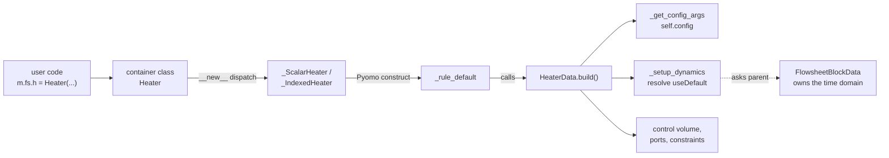
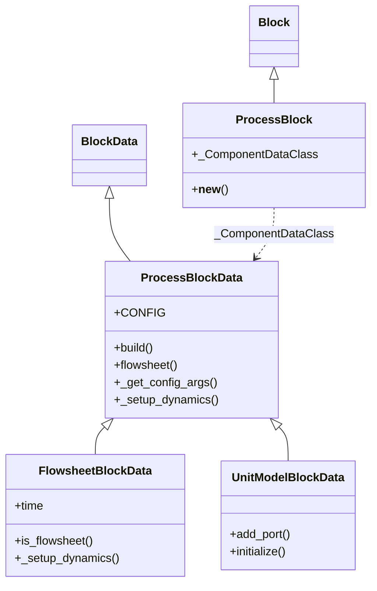
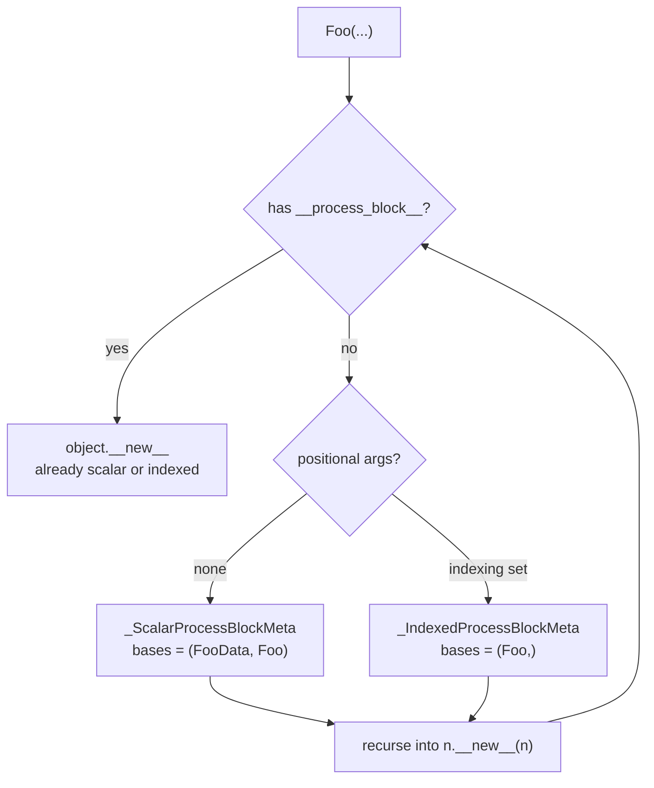
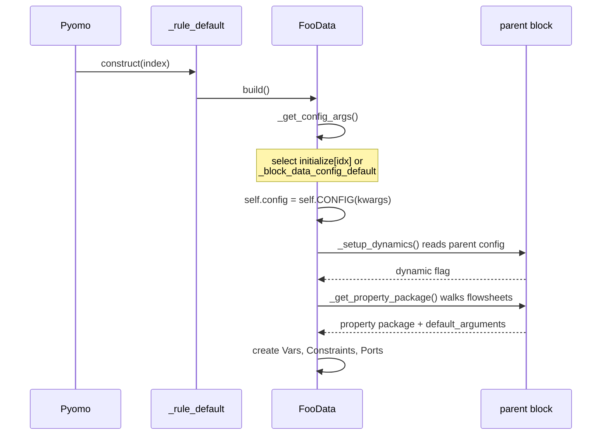
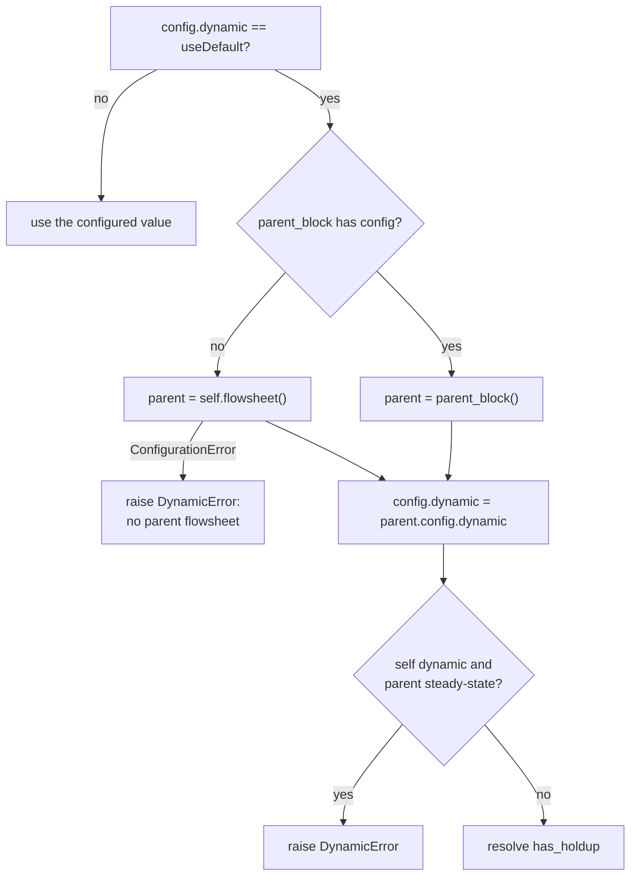
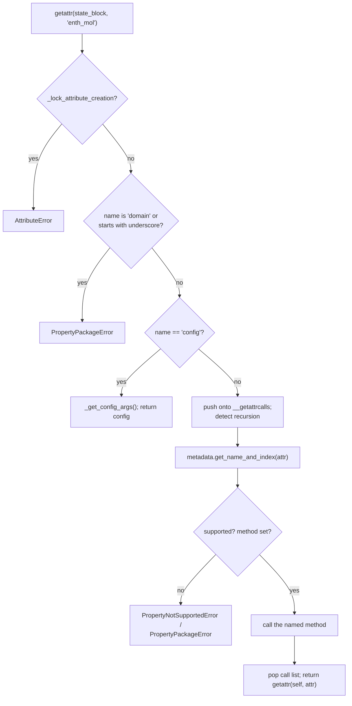

# 03 — Block hierarchy and construction protocol

> **Doc ID** 03 · **Repo SHA** 70a8f4fe1 (IDAES-PSE v2.13.0rc0) · **Source roots** `idaes/core/base/`
> **Owns** 7 modules / 2,371 LOC · **Assets** none · **Siblings** [01](01_glossary_and_conventions.md), [04](04_control_volume_framework.md), [05](05_property_and_reaction_framework.md), [31](31_extension_point_catalog.md)

This document describes the mechanism by which every modelling object in IDAES
comes into existence. Control volumes ([04](04_control_volume_framework.md)),
property packages ([05](05_property_and_reaction_framework.md)), every unit
model, and every costing block are built on the protocol described here; those
documents assume it and do not restate it.

---

## 0. Scope and source map

| File | LOC | Purpose | Covered in § |
|---|---:|---|---|
| `idaes/core/base/process_block.py` | 229 | The decorator, the two metaclasses, and the scalar/indexed dispatch that turn a data class into a Pyomo component | 3, 5, 9 |
| `idaes/core/base/process_base.py` | 660 | `ProcessBlockData` — configuration resolution, dynamic-flag resolution, property-package resolution, default-scaling registry, reporting | 4, 5, 6, 7 |
| `idaes/core/base/flowsheet_model.py` | 379 | `FlowsheetBlockData` — the time domain and the flowsheet role | 4, 5, 6 |
| `idaes/core/base/unit_model.py` | 653 | `UnitModelBlockData` — ports, state material balances, the legacy initialization entry point | 4, 5, 7 |
| `idaes/core/base/var_like_expression.py` | 213 | `VarLikeExpression` — a Pyomo `Expression` that reports Var-like misuse with a usable message | 3, 11 |
| `idaes/core/base/util.py` | 237 | `build_on_demand` — the on-demand property construction engine | 5, 7, 11 |
| `idaes/core/base/__init__.py` | 0 | Empty. The package exports nothing; re-exports happen in `idaes/core/__init__.py`, owned by [02](02_runtime_platform_and_cli.md) | 2 |

Total 2,371 LOC. The remaining twelve modules in `idaes/core/base/` belong to
[04](04_control_volume_framework.md),
[05](05_property_and_reaction_framework.md) and
[17](17_costing_framework_and_libraries.md).

---

## 1. Architectural role

IDAES is a layer on Pyomo. Its central problem is that a Pyomo `Block` is
awkward to subclass: a modelling library wants a block type that arrives with
its own equations already defined, that accepts validated keyword arguments, and
that behaves correctly whether the user creates one instance or an indexed
family of them. Pyomo's own extension point for this is the rule function, which
is a function, not a class, and so carries no configuration surface and no
inheritance.

The modules in this document supply that missing type. A developer writes one
class — a *data class* holding a `CONFIG` declaration and a `build()` method —
and applies `declare_process_block_class`. The decorator synthesizes a matching
*container class* and injects it into the developer's own module. At
instantiation the container decides whether the user asked for a scalar or an
indexed component, synthesizes the appropriate subclass, splits the user's
keyword arguments into the part Pyomo owns and the part IDAES owns, and lets
Pyomo's ordinary construction machinery call `build()` on each block data
object. 160 classes in the tree are declared this way.

Three further responsibilities sit in the same layer because every block needs
them and none of them belongs to Pyomo. First, *hierarchical configuration
resolution*: a unit model does not know whether it is dynamic, and asks its
parent flowsheet. Second, *the time domain*: a flowsheet, and only a flowsheet,
creates the set that indexes every time-varying quantity beneath it. Third,
*connectivity*: a unit model exposes its state through Pyomo ports built from a
state block, which is how two unit models are joined.

*Every IDAES model reaches its equations through this path; the rest of this document is the detail of each box.*

---

## 2. Public surface inventory

| Symbol | Kind | Declared at | Exported via | Stability signal |
|---|---|---|---|---|
| `ProcessBlock` | class | `idaes/core/base/process_block.py:141` | `__all__`, `idaes.core` | in `__all__`; autodoc'd in `docs/` |
| `declare_process_block_class` | function | `idaes/core/base/process_block.py:176` | `__all__`, `idaes.core` | in `__all__`; autodoc'd in `docs/` |
| `_rule_default` | function | `idaes/core/base/process_block.py:35` | — | leading underscore |
| `_get_pyomo_block_kwargs` | function | `idaes/core/base/process_block.py:75` | — | leading underscore |
| `_process_kwargs` | function | `idaes/core/base/process_block.py:91` | — | leading underscore |
| `_IndexedProcessBlockMeta` | class | `idaes/core/base/process_block.py:106` | — | leading underscore |
| `_ScalarProcessBlockMeta` | class | `idaes/core/base/process_block.py:123` | — | leading underscore |
| `ProcessBlockData` | class | `idaes/core/base/process_base.py:78` | `__all__`, `idaes.core` | in `__all__` |
| `MaterialFlowBasis` | enum | `idaes/core/base/process_base.py:67` | `idaes.core` | re-exported |
| `useDefault` | sentinel | `idaes/core/base/process_base.py:59` | `idaes.core` | re-exported |
| `FlowsheetBlockData` | class | `idaes/core/base/flowsheet_model.py:99` | `__all__`, `idaes.core` | in `__all__` |
| `FlowsheetBlock` | class | synthesized at `idaes/core/base/flowsheet_model.py:99` | `idaes.core` | generated by the decorator |
| `UI` | class | `idaes/core/base/flowsheet_model.py:55` | — | no underscore, absent from `__all__` |
| `UnitModelBlockData` | class | `idaes/core/base/unit_model.py:54` | `__all__`, `idaes.core` | in `__all__` |
| `UnitModelBlock` | class | synthesized at `idaes/core/base/unit_model.py:54` | `idaes.core` | generated by the decorator |
| `VarLikeExpressionData` | class | `idaes/core/base/var_like_expression.py:32` | `idaes.core` | re-exported |
| `VarLikeExpression` | class | `idaes/core/base/var_like_expression.py:116` | `idaes.core` | registered in `ModelComponentFactory` |
| `SimpleVarLikeExpression` | class | `idaes/core/base/var_like_expression.py:144` | — | — |
| `AbstractSimpleVarLikeExpression` | class | `idaes/core/base/var_like_expression.py:171` | — | — |
| `IndexedVarLikeExpression` | class | `idaes/core/base/var_like_expression.py:175` | — | — |
| `build_on_demand` | function | `idaes/core/base/util.py:28` | — | the module's only public name |

`idaes/core/base/__init__.py` is empty, so nothing in this package is importable
from `idaes.core.base` as a package attribute. The public import path is
`idaes.core`.

---

## 3. Class hierarchy and type taxonomy

Every IDAES modelling type exists as a pair. The data class carries the
behaviour and subclasses Pyomo's `BlockData`; the container class is
synthesized by the decorator and subclasses `ProcessBlock`, which subclasses
Pyomo's `Block`.

*The two inheritance chains are separate; the decorator links them through the `_ComponentDataClass` attribute.*

| Class | Base(s) | Declared at | Decorator | Container class | Key overrides |
|---|---|---|---|---|---|
| `ProcessBlockData` | `BlockData` | `idaes/core/base/process_base.py:78` | `@declare_process_block_class("ProcessBaseBlock")` | `ProcessBaseBlock` | `__init__`, `build` |
| `ProcessBlock` | `Block` | `idaes/core/base/process_block.py:141` | none | — | `__new__` |
| `_IndexedProcessBlockMeta` | `type` | `idaes/core/base/process_block.py:106` | none | — | `__new__` |
| `_ScalarProcessBlockMeta` | `type` | `idaes/core/base/process_block.py:123` | none | — | `__new__` |
| `FlowsheetBlockData` | `ProcessBlockData` | `idaes/core/base/flowsheet_model.py:99` | `@declare_process_block_class("FlowsheetBlock")` | `FlowsheetBlock` | `build`, `_setup_dynamics`, `_get_stream_table_contents` |
| `UnitModelBlockData` | `ProcessBlockData` | `idaes/core/base/unit_model.py:54` | `@declare_process_block_class("UnitModelBlock")` | `UnitModelBlock` | `build`, `del_component`, `_get_stream_table_contents` |
| `UI` | `object` | `idaes/core/base/flowsheet_model.py:55` | none | — | — |
| `VarLikeExpressionData` | `ExpressionData` | `idaes/core/base/var_like_expression.py:32` | none | — | `set_value`, `value`, `setlb`, `setub`, `fix`, `unfix` |
| `VarLikeExpression` | `pyo.Expression` | `idaes/core/base/var_like_expression.py:116` | `@ModelComponentFactory.register(...)` | — | `__new__` |
| `SimpleVarLikeExpression` | `VarLikeExpressionData`, `VarLikeExpression` | `idaes/core/base/var_like_expression.py:144` | none | — | `__init__`, `add` |
| `AbstractSimpleVarLikeExpression` | `SimpleVarLikeExpression` | `idaes/core/base/var_like_expression.py:171` | `@disable_methods(...)` | — | — |
| `IndexedVarLikeExpression` | `VarLikeExpression` | `idaes/core/base/var_like_expression.py:175` | none | — | `add`, `setlb`, `setub`, `fix`, `unfix` |

### 3.1 The generated types

Three class names exist for every declared model, and only one of them appears
in source:

| Name | Origin | Created when |
|---|---|---|
| `FooData` | written by the developer | import time |
| `Foo` | `type(name, (block_class,), {...})` at `idaes/core/base/process_block.py:221` | import time, at decoration |
| `_ScalarFoo` or `_IndexedFoo` | `_ScalarProcessBlockMeta` / `_IndexedProcessBlockMeta` at `idaes/core/base/process_block.py:167` and `:172` | first instantiation |

The decorator writes `Foo` into the defining module with
`setattr(sys.modules[cls.__module__], name, c)`
(`idaes/core/base/process_block.py:226`). This is why a module that appears to
define only `HeaterData` nonetheless exports `Heater`, and why the pylint
astroid plugin at `.pylint/idaes_transform.py` exists — static analysers have no
other way to see these names.

### 3.2 Enumerations

| Member | Value | Meaning | Consumed at |
|---|---|---|---|
| `MaterialFlowBasis.molar` | 0 | Material flow terms are molar | `idaes/core/base/control_volume0d.py`, reaction rate conversion |
| `MaterialFlowBasis.mass` | 1 | Material flow terms are mass | same |
| `MaterialFlowBasis.other` | 2 | Neither; no automatic conversion is available | same |

Declared at `idaes/core/base/process_base.py:67`. A property package reports its
basis from `get_material_flow_basis`, and control volumes use the answer to
decide whether a reaction rate needs a molecular-weight conversion.

---

## 4. Configuration reference

Only two of the seven modules declare configuration keys. The count for this
document's scope is seven keys, all reproduced here.

### 4.1 `UnitModelBlockData.CONFIG`

Declared from `ProcessBlockData.CONFIG()` at `idaes/core/base/unit_model.py:64`.
Calling a Pyomo `ConfigBlock` produces a copy, so a subclass extends rather than
mutates its parent's declaration.

| Key | Domain / validator | Default | Req. | Effect on build | Anchor |
|---|---|---|---|---|---|
| `dynamic` | `DefaultBool` | `useDefault` | no | Resolved against the parent in `_setup_dynamics`; selects whether accumulation terms are created | `idaes/core/base/unit_model.py:65` |
| `has_holdup` | `DefaultBool` | `useDefault` | no | Defaults to the resolved `dynamic` value; controls creation of holdup variables | `idaes/core/base/unit_model.py:79` |

`DefaultBool` (`idaes/core/util/config.py`) accepts `True`, `False` or the
`useDefault` sentinel, which is what distinguishes "the user asked for
steady-state" from "the user said nothing".

### 4.2 `FlowsheetBlockData.CONFIG`

Declared from `ProcessBlockData.CONFIG()` at
`idaes/core/base/flowsheet_model.py:111`.

| Key | Domain / validator | Default | Req. | Effect on build | Anchor |
|---|---|---|---|---|---|
| `dynamic` | `DefaultBool` | `useDefault` | no | A top-level flowsheet resolves `useDefault` to `False` and logs a warning; a nested one inherits from its parent | `idaes/core/base/flowsheet_model.py:112` |
| `time` | `is_time_domain` | `None` | no | An externally created time domain to reference instead of constructing one. Under `dynamic=True` it is required to be a `ContinuousSet` | `idaes/core/base/flowsheet_model.py:126` |
| `time_set` | `ListOf(float)` | `[0]` | no | Points used to initialize a constructed time domain | `idaes/core/base/flowsheet_model.py:138` |
| `time_units` | none declared | none declared | conditional | Required when `dynamic=True` and there is no parent flowsheet; validated to be a `_PyomoUnit` | `idaes/core/base/flowsheet_model.py:149` |
| `default_property_package` | `is_physical_parameter_block` | `None` | no | Consulted by `_get_default_prop_pack` when a descendant leaves `property_package` at `useDefault` | `idaes/core/base/flowsheet_model.py:157` |

### 4.3 `ProcessBlockData.CONFIG`

`ConfigBlock("ProcessBlockData", implicit=False)`
(`idaes/core/base/process_base.py:90`). It declares no keys. `implicit=False`
means an unrecognised keyword argument raises rather than being silently
accepted, which is what makes a misspelled option a build-time error.

### 4.4 Keyword arguments consumed by the container, not the CONFIG block

These are handled in `_process_kwargs` (`idaes/core/base/process_block.py:91`)
and never reach `self.config`.

| Argument | Handling | Anchor |
|---|---|---|
| `rule` | Defaults to `_rule_default` | `idaes/core/base/process_block.py:92` |
| `initialize` | Popped into `_block_data_config_initialize`, an implicit `ConfigBlock` of per-index configuration | `idaes/core/base/process_block.py:93` |
| `idx_map` | Popped into `_idx_map`, a callable mapping a block index to a key in `initialize` | `idaes/core/base/process_block.py:95` |
| Pyomo `Block` keywords | Matched against `_pyomo_block_keywords` and forwarded to Pyomo | `idaes/core/base/process_block.py:98` |
| everything else | Stored as `_block_data_config_default` and later passed to `CONFIG` | `idaes/core/base/process_block.py:102` |

The set of Pyomo keywords is computed at import time rather than hard-coded:
`_get_pyomo_block_kwargs` (`idaes/core/base/process_block.py:75`) introspects the
overloads of `Block.__init__` through `pyomo.common.pyomo_typing.get_overloads_for`
and collects their keyword-only argument names. The split between "Pyomo's
arguments" and "IDAES's arguments" therefore tracks the installed Pyomo version
instead of a list that can fall behind it.

---

## 5. Construction and call sequences

### 5.1 Declaration, at import time

1. The developer defines `class FooData(ParentData)` with a `CONFIG` built by
   calling the parent's — `CONFIG = ProcessBlockData.CONFIG()` — and extended
   through `CONFIG.declare`.
2. `@declare_process_block_class("Foo")` runs
   (`idaes/core/base/process_block.py:176`). It renders `cls.CONFIG` into
   reStructuredText with `generate_documentation` and a `String_ConfigFormatter`
   at `indent_spacing=4, width=66` (`idaes/core/base/process_block.py:203`),
   wrapped in a bare `except Exception` so a configuration that cannot be
   rendered yields an empty documentation block rather than an import failure
   (`idaes/core/base/process_block.py:214`).
3. It builds the container class and injects it into the developer's module
   (`idaes/core/base/process_block.py:221`, `:226`), then returns the data class
   unchanged.

### 5.2 Instantiation

*`ProcessBlock.__new__` is re-entrant: it creates the concrete class, then calls itself on it, and the `__process_block__` marker terminates the recursion.*

`ProcessBlock.__new__` (`idaes/core/base/process_block.py:151`) tests for the
`__process_block__` class attribute, which both metaclasses inject
(`idaes/core/base/process_block.py:115` and `:132`). On the first call the
attribute is absent, so the method creates `_ScalarFoo` or `_IndexedFoo` and
calls `n.__new__(n)`; on the second call the attribute is present and Pyomo's
own allocation runs.

The synthesized `__init__` differs between the two. The indexed form calls one
base initializer (`idaes/core/base/process_block.py:112`); the scalar form calls
two, the data class first with `component=self` and then the container class
(`idaes/core/base/process_block.py:129`), because a scalar Pyomo component is
simultaneously its own container and its own data object.

Both metaclasses also attach `base_class_module()` and `process_block_class()`
(`idaes/core/base/process_block.py:117`, `:119`), which report the defining
module and the original container class. They exist for the flowsheet
visualizer, which otherwise sees only a synthesized class name.

### 5.3 Per-block-data construction

*Configuration is resolved per block data object, not per component, which is what allows one indexed declaration to carry different arguments per index.*

`_rule_default` (`idaes/core/base/process_block.py:35`) wraps the `build()` call
in a `try`/`except` that logs `"Failure in build: {b}"` against the
`idaes.core.base.process_block` logger and re-raises. The log record is what
identifies *which* element of an indexed block failed, since the traceback alone
names only the rule.

`ProcessBlockData.build()` (`idaes/core/base/process_base.py:110`) performs
exactly three actions: it calls `_get_config_args()`, sets
`self.initialization_order = [self]`, and creates the empty
`self._default_scaling_factors` dict. Every subclass calls `super().build()`
first and then adds its own components.

### 5.4 Configuration resolution

`_get_config_args` (`idaes/core/base/process_base.py:232`):

1. Return immediately if `self._pb_configured` is already `True`. The flag is
   set in `__init__` (`idaes/core/base/process_base.py:108`) and the guard makes
   the method idempotent, which matters because `build_on_demand` can trigger it
   before `build()` runs (§5.6).
2. Read `self.parent_component()._idx_map`.
3. Take `self.index()`, treating an `AttributeError` as index `None`.
4. Apply `_idx_map` to the index when one was supplied.
5. If that index is a key of `_block_data_config_initialize`, use its value;
   otherwise use `_block_data_config_default`.
6. Assign `self.config = self.CONFIG(kwargs)`.

Step 5 is the whole of the per-index configuration feature: `initialize` holds a
mapping from block index to a dictionary of arguments, and `idx_map` exists for
the case where the block's own index is not the key the user wants to write in
that mapping.

### 5.5 Hierarchical resolution of `useDefault`

*The same shape — sentinel, walk upward, validate the combination — governs the dynamic flag, the property package and the reaction package.*

`ProcessBlockData._setup_dynamics` (`idaes/core/base/process_base.py:462`)
implements the flowchart. Two invariants it enforces:

- A dynamic model inside a steady-state parent raises `DynamicError`
  (`idaes/core/base/process_base.py:509`). The reverse nesting is permitted and
  is the documented way to hold part of a dynamic flowsheet at steady state.
- `has_holdup=False` together with `dynamic=True` raises `ConfigurationError`
  (`idaes/core/base/process_base.py:524`). Unset, `has_holdup` takes the
  resolved value of `dynamic` (`idaes/core/base/process_base.py:521`).

`_get_property_package` (`idaes/core/base/process_base.py:532`) resolves the
same sentinel for property packages, falling through to `_get_default_prop_pack`
(`idaes/core/base/process_base.py:572`), which walks the flowsheet chain looking
for `default_property_package`. Having found a package it merges that package's
own `default_arguments` into the local `property_package_args`, with
explicitly-supplied arguments winning. `_get_reaction_package`
(`idaes/core/base/process_base.py:630`) does the same for reactions.
`_get_indexing_sets` (`idaes/core/base/process_base.py:597`) then asserts the
resolved package exposes `phase_list` and `component_list`, raising
`PropertyPackageError` when it does not.

### 5.6 On-demand attribute construction

`build_on_demand` (`idaes/core/base/util.py:28`) is reached from
`StateBlockData.__getattr__` and `ReactionBlockDataBase.__getattr__`
(see [05](05_property_and_reaction_framework.md)). Its sequence:

*A missing property produces a message naming the property and the package, rather than a bare `AttributeError`.*

Points that matter to callers:

- The guard on names beginning with an underscore, and on `domain`
  (`idaes/core/base/util.py:80`), exists because Pyomo probes for both. Without
  it, a Pyomo internal lookup would be interpreted as a request to build a
  thermophysical property.
- `config` is special-cased (`idaes/core/base/util.py:89`): it triggers
  `_get_config_args()` and returns. A failure here raises `BurntToast`, the
  library's internal-error type, because the configuration is expected to be
  constructible whenever the block exists.
- `self.__getattrcalls` is a stack used to detect loops. Self-recursion and
  indirect recursion produce different messages
  (`idaes/core/base/util.py:107` and `:124`), the second of which names the call
  stack as the place to look.
- The method is resolved by name from the package metadata and must be a string
  naming an attribute of the state block
  (`idaes/core/base/util.py:180`). A non-string method entry, a name that does
  not resolve, and a resolved object that is not callable each raise
  `PropertyPackageError` with a distinct message.

### 5.7 Port construction

`add_port(name, block, doc)` (`idaes/core/base/unit_model.py:141`) delegates to
`block.build_port(doc)` and catches `AttributeError` to report that the object
supplied is not a state block
(`idaes/core/base/unit_model.py:160`). It then adds the returned `Port` under
`name`, and adds each returned `Reference` under the name produced by
`block.get_port_reference_name(cname, name)`, which is
`_{component}_{port}_ref`.

`add_inlet_port` (`idaes/core/base/unit_model.py:172`) and `add_outlet_port`
(`idaes/core/base/unit_model.py:270`) add control-volume awareness. Both
arguments are optional but coupled: supplying a name without a block raises
`ConfigurationError` (`idaes/core/base/unit_model.py:193`). With no arguments
they default to an attribute named `control_volume`. For a
`ControlVolume0DBlockData` they use `properties_in` or `properties_out`; for a
`ControlVolume1DBlockData` they use `properties` with a `slice_index` selecting
the first or last point of the length domain, chosen from the control volume's
`_flow_direction` so that a backward-flowing 1-D volume still exposes its
physical inlet as `inlet`.

---

## 6. Data structures, variables, constraints and invariants

The modules in this document create very few Pyomo components of their own;
their output is mostly Python state on the block.

| Component | Type | Index sets | Units | Created in | Condition |
|---|---|---|---|---|---|
| `_time` | `ContinuousSet` | — | `config.time_units` | `idaes/core/base/flowsheet_model.py:365` | top-level flowsheet, `dynamic=True` |
| `_time` | `Set` (ordered) | — | `config.time_units` | `idaes/core/base/flowsheet_model.py:368` | top-level flowsheet, `dynamic=False` |
| `_time` | object reference | — | inherited | `idaes/core/base/flowsheet_model.py:344`, `:376` | user-supplied `time`, or a nested flowsheet |
| `<name>` | `Port` | time (0-D) or time × length (1-D) | per state variable | `idaes/core/base/unit_model.py:167` | `add_port` and its wrappers |
| `_{comp}_{port}_ref` | `Reference` | as the referenced member | as referenced | `idaes/core/base/unit_model.py:169` | one per port member |
| `state_material_balances` | `Constraint` | time × (phase ×) component | material flow | `idaes/core/base/unit_model.py:370` | `add_state_material_balances` |

| Python attribute | Type | Created in | Purpose |
|---|---|---|---|
| `_pb_configured` | `bool` | `idaes/core/base/process_base.py:108` | Idempotence guard on configuration resolution |
| `config` | `ConfigBlock` | `idaes/core/base/process_base.py:252` | The resolved configuration for this block data |
| `initialization_order` | `list` | `idaes/core/base/process_base.py:144` | Blocks to initialize with this one; costing blocks append themselves |
| `_default_scaling_factors` | `dict` | `idaes/core/base/process_base.py:145` | Registry keyed `(attribute, index)` |
| `_initialization_order` | `list` | `idaes/core/base/unit_model.py:111` | Unit-model plug-ins, deactivated and restored around initialization |
| `_block_data_config_default` | `dict` | `idaes/core/base/process_block.py:102` | Keyword arguments for every index |
| `_block_data_config_initialize` | `ConfigBlock` | `idaes/core/base/process_block.py:93` | Keyword arguments per index |
| `_idx_map` | callable or `None` | `idaes/core/base/process_block.py:95` | Index to `initialize` key mapping |
| `_time_units` | `_PyomoUnit` or `None` | `idaes/core/base/flowsheet_model.py:344`, `:370` | Units of the time domain |

### 6.1 Invariants

| Invariant | Enforced at |
|---|---|
| A block data object resolves its configuration at most once | `idaes/core/base/process_base.py:236` |
| An unrecognised keyword argument raises rather than being ignored | `implicit=False`, `idaes/core/base/process_base.py:90` |
| A dynamic block has a dynamic parent | `idaes/core/base/process_base.py:509` |
| `dynamic=True` implies `has_holdup=True` | `idaes/core/base/process_base.py:524` |
| A dynamic flowsheet has time units | `idaes/core/base/flowsheet_model.py:319` |
| A dynamic flowsheet's supplied time domain is a `ContinuousSet` | `idaes/core/base/flowsheet_model.py:337` |
| A constructed dynamic time domain has at least two points | `idaes/core/base/flowsheet_model.py:353` |
| Only one `state_material_balances` constraint exists per unit | `idaes/core/base/unit_model.py:370` |
| Two state blocks joined by a state material balance share a parameter block | `idaes/core/base/unit_model.py:370` |

The two-point rule for dynamic time domains has a special case worth naming:
when `time_set` is still at its default `[0.0]`, the end point is silently
extended to `[0.0, 1.0]` (`idaes/core/base/flowsheet_model.py:358`); a
user-supplied single-element set raises `DynamicError` instead
(`idaes/core/base/flowsheet_model.py:361`).

---

## 7. Method contracts

### 7.1 `idaes/core/base/process_block.py`

| Method | Signature | Preconditions | Effects | Returns | Raises | Anchor |
|---|---|---|---|---|---|---|
| `_rule_default` | `(b, *args)` | `b` has `build` | Calls `b.build()` | `None` | re-raises after logging | `:35` |
| `_get_pyomo_block_kwargs` | `()` | Pyomo importable | none | `set[str]` | — | `:75` |
| `_process_kwargs` | `(o, kwargs)` | — | Sets `_block_data_config_initialize`, `_idx_map`, `_block_data_config_default` on `o`; mutates `kwargs` | Pyomo kwargs `dict` | — | `:91` |
| `ProcessBlock.__new__` | `(cls, *args, **kwds)` | `cls._ComponentDataClass` set | May synthesize a class | instance | — | `:151` |
| `declare_process_block_class` | `(name, block_class=ProcessBlock, doc="")` | decorated class has `CONFIG` | Injects `name` into the decorated class's module | decorator | — | `:176` |

### 7.2 `idaes/core/base/process_base.py`

| Method | Signature | Preconditions | Effects | Returns | Raises | Anchor |
|---|---|---|---|---|---|---|
| `build` | `(self)` | — | Resolves config; sets `initialization_order`, `_default_scaling_factors` | `None` | — | `:110` |
| `_get_config_args` | `(self)` | parent component configured | Sets `self.config` | `None` | Pyomo config errors | `:232` |
| `flowsheet` | `(self)` | — | none | flowsheet block or `None` | — | `:208` |
| `set_default_scaling` | `(self, attribute, value, index=None)` | — | Writes `_default_scaling_factors` | `None` | — | `:157` |
| `unset_default_scaling` | `(self, attribute, index=None)` | — | Removes an entry | `None` | — | `:172` |
| `get_default_scaling` | `(self, attribute, index=None)` | — | none | `float` or `None` | — | `:187` |
| `fix_initial_conditions` | `(self, state="steady-state")` | dynamic model | Fixes accumulation terms at `time.first()` | `None` | — | `:253` |
| `unfix_initial_conditions` | `(self)` | — | Unfixes the same terms | `None` | — | `:291` |
| `report` | `(self, time_point=0, dof=False, ostream=None, prefix="")` | — | Writes to `ostream` | `None` | — | `:319` |
| `serialize_contents` | `(self, time_point=0)` | — | none | `(dict, DataFrame)` | — | `:439` |
| `_setup_dynamics` | `(self)` | `self.config` exists | Resolves `dynamic`, `has_holdup` | `None` | `DynamicError`, `ConfigurationError` | `:462` |
| `_get_property_package` | `(self)` | — | Sets `config.property_package`, merges default arguments | `None` | `ConfigurationError` | `:532` |
| `_get_default_prop_pack` | `(self)` | — | none | parameter block | `ConfigurationError` | `:572` |
| `_get_indexing_sets` | `(self)` | package resolved | none | `None` | `PropertyPackageError` | `:597` |
| `_get_reaction_package` | `(self)` | — | Sets `config.reaction_package` | `None` | `ConfigurationError` | `:630` |
| `calculate_scaling_factors` | `(self)` | — | none in the base | `None` | — | `:655` |

`_get_performance_contents` (`:433`) and `_get_stream_table_contents` (`:436`)
return `None` in the base class. They are the two hooks `report` consults, and a
subclass that overrides neither produces a report with a header and nothing
else.

### 7.3 `idaes/core/base/flowsheet_model.py` and `unit_model.py`

| Method | Signature | Preconditions | Effects | Returns | Raises | Anchor |
|---|---|---|---|---|---|---|
| `FlowsheetBlockData.build` | `(self)` | — | Sets `_time_units = None`, resolves the time domain | `None` | — | `flowsheet_model.py:172` |
| `FlowsheetBlockData.is_flowsheet` | `(self)` | — | none | `True` | — | `flowsheet_model.py:202` |
| `FlowsheetBlockData.model_check` | `(self)` | — | Calls `model_check` on contained unit models | `None` | — | `flowsheet_model.py:215` |
| `FlowsheetBlockData.stream_table` | `(self, true_state=False, time_point=0, orient="columns")` | arcs present | none | `DataFrame` | — | `flowsheet_model.py:239` |
| `FlowsheetBlockData.visualize` | `(self, model_name, **kwargs)` | `idaes_ui` installed | opens the viewer | `VisualizeResult` | `RuntimeWarning` when absent | `flowsheet_model.py:265` |
| `FlowsheetBlockData._setup_dynamics` | `(self)` | — | Creates or references `_time` | `None` | `DynamicError`, `ConfigurationError` | `flowsheet_model.py:288` |
| `UnitModelBlockData.build` | `(self)` | — | Sets `_initialization_order`, resolves dynamics | `None` | — | `unit_model.py:95` |
| `UnitModelBlockData.add_port` | `(self, name, block, doc=None)` | `block` is a state block | Adds a `Port` and its references | `Port` | `ConfigurationError` | `unit_model.py:141` |
| `UnitModelBlockData.add_inlet_port` | `(self, name=None, block=None, doc=None)` | name and block supplied together | as above | `Port` | `ConfigurationError` | `unit_model.py:172` |
| `UnitModelBlockData.add_outlet_port` | `(self, name=None, block=None, doc=None)` | as above | as above | `Port` | `ConfigurationError` | `unit_model.py:270` |
| `UnitModelBlockData.add_state_material_balances` | `(self, balance_type, state_1, state_2)` | same parameter block | Adds `state_material_balances` | `None` | `BalanceTypeNotSupportedError`, `ConfigurationError`, `BurntToast` | `unit_model.py:370` |
| `UnitModelBlockData.initialize` | `(blk, *args, **kwargs)` | — | Deactivates plug-ins, calls `initialize_build`, reactivates and initializes them | `None` | `InitializationError` | `unit_model.py:504` |
| `UnitModelBlockData.initialize_build` | `(blk, state_args, outlvl, solver, optarg)` | a control volume exists | Initializes the control volume and solves | `None` | `InitializationError` | `unit_model.py:555` |
| `UnitModelBlockData.del_component` | `(self, name_or_object)` | — | Calls `del_costing()` on costing blocks first | `None` | — | `unit_model.py:624` |
| `UnitModelBlockData.fix_initialization_states` | `(self)` | — | Fixes every `Port` whose name contains `inlet` | `None` | — | `unit_model.py:640` |
| `build_on_demand` | `(self, attr)` | `self.config.parameters` resolved | Calls the metadata-named build method | the built component | `PropertyNotSupportedError`, `PropertyPackageError`, `BurntToast`, `AttributeError` | `util.py:28` |

`add_state_material_balances` supports `componentPhase`, `componentTotal` and
`total`. `elementTotal` and `none` raise `BalanceTypeNotSupportedError`; any
other value raises `BurntToast`, on the grounds that the enum admits no other
member.

---

## 8. Cross-subsystem interactions

### Calls out to

| Target | Purpose | Anchor |
|---|---|---|
| `pyomo.environ.Block`, `BlockData` | Base types for both halves of every pair | `process_block.py:141`, `process_base.py:78` |
| `pyomo.common.config.ConfigBlock`, `String_ConfigFormatter` | Configuration declaration and docstring rendering | `process_block.py:27` |
| `pyomo.common.pyomo_typing.get_overloads_for` | Discovering Pyomo's own `Block` keywords | `process_block.py:80` |
| `pyomo.dae.ContinuousSet` | The dynamic time domain | `flowsheet_model.py:365` |
| `pyomo.network.Port` | Connectivity, through `StateBlock.build_port` | `unit_model.py:141` |
| `idaes.core.util.config` validators | `DefaultBool`, `is_time_domain`, `is_physical_parameter_block` | `flowsheet_model.py:112` |
| `idaes.core.util.exceptions` | `DynamicError`, `ConfigurationError`, `PropertyPackageError`, `BurntToast` | throughout |
| `idaes.core.util.tables.create_stream_table_dataframe` | Flowsheet stream tables | `flowsheet_model.py:239` |
| `idaes.core.initialization` | `BlockTriangularizationInitializer`, `SingleControlVolumeUnitInitializer` as class defaults | `process_base.py:93`, `unit_model.py:61` |
| `idaes_ui` (optional) | Flowsheet visualization, behind a lazy shim | `flowsheet_model.py:55` |

### Called by

| Caller | What it relies on | Owning doc |
|---|---|---|
| Control volumes | `ProcessBlockData` lifecycle, `_setup_dynamics`, `_get_property_package` | [04](04_control_volume_framework.md) |
| Property and reaction framework | `build_on_demand`, the block pair protocol | [05](05_property_and_reaction_framework.md) |
| Initializers and Scalers | `default_initializer`, `default_scaler`, `initialization_order` | [06](06_model_preparation_initializers_and_scalers.md) |
| Every unit model | `UnitModelBlockData`, port methods | [10](10_unit_models_control_volume_based.md), [11](11_unit_models_network_contactors_and_control.md) |
| Costing | `_initialization_order`, `del_component` override | [17](17_costing_framework_and_libraries.md) |
| Extended libraries | the same protocol, unchanged | [18](18_power_generation_boiler_island.md)–[24](24_reference_flowsheets_and_demonstrations.md) |
| `pricetaker` design and operation blocks | `declare_process_block_class`, `ProcessBlockData` | [25](25_grid_integration.md) |
| The pylint astroid plugin | The decorator's class-injection behaviour | [32](32_repository_engineering.md) |

---

## 9. Extension and subclassing contracts

| Hook | Kind | Required signature | Resolution order | Base behaviour | Anchor |
|---|---|---|---|---|---|
| `build` | method override | `(self) -> None` | Called by `_rule_default`; subclass calls `super().build()` first | Resolves config, sets two attributes | `process_base.py:110` |
| `CONFIG` | class attribute | `ConfigBlock` | Subclass copies the parent's with `Parent.CONFIG()` then extends | Empty, `implicit=False` | `process_base.py:90` |
| `declare_process_block_class` | decorator | `(name, block_class=ProcessBlock, doc="")` | Applied to the data class | Synthesizes and injects the container | `process_block.py:176` |
| `block_class` | decorator argument | a `ProcessBlock` subclass | Used in place of `ProcessBlock` as the container base | `ProcessBlock` | `process_block.py:176` |
| `rule` | keyword argument | `(b, *args) -> None` | Overrides `_rule_default`; a replacement is expected to call `build()` | Calls `build()` | `process_block.py:92` |
| `idx_map` | keyword argument | `(index) -> key` | Applied before the `initialize` lookup | identity | `process_block.py:95` |
| `default_initializer` | class attribute | an `InitializerBase` subclass | Consulted by `ModularInitializerBase.get_submodel_initializer` | `BlockTriangularizationInitializer` | `process_base.py:93` |
| `default_scaler` | class attribute | a `ScalerBase` subclass | Consulted by the Scaler machinery | `None` | `process_base.py:94` |
| `_get_performance_contents` | method override | `(self, time_point=0) -> dict \| None` | Called by `report` | returns `None` | `process_base.py:433` |
| `_get_stream_table_contents` | method override | `(self, time_point=0) -> DataFrame \| None` | Called by `report` and `serialize_contents` | returns `None` | `process_base.py:436` |
| `fix_initialization_states` | method override | `(self) -> None` | Called by `InitializerBase.initialize` step 3 | Fixes ports named `inlet` | `unit_model.py:640` |
| `model_check` | method override | `(blk) -> None` | Called by `FlowsheetBlockData.model_check` | no-op | `unit_model.py:117` |
| `is_flowsheet` | method override | `(self) -> bool` | Consulted by `ProcessBlockData.flowsheet()` | `True` on flowsheets only | `flowsheet_model.py:202` |

This document's scope contains no `NotImplementedError` hooks; the abstract
surface of the framework lives in the control volume and property base classes.
The full catalogue is in [31](31_extension_point_catalog.md).

---

## 10. External assets, data files and external libraries

Not applicable: the seven modules in this document read no data files, load no
shared libraries and start no subprocesses. The one optional runtime dependency
is `idaes_ui`, imported lazily by the `UI` shim
(`idaes/core/base/flowsheet_model.py:55`); when it is absent, `visualize` is
replaced by `_visualize_null` (`idaes/core/base/flowsheet_model.py:83`), which
emits a `RuntimeWarning` with `stacklevel=3` so the warning is attributed to the
user's call site.

---

## 11. Errors, logging and diagnostics behaviour

| Exception | Raised for | Anchor |
|---|---|---|
| `DynamicError` | No parent flowsheet to inherit `dynamic` from | `process_base.py:487` |
| `DynamicError` | Dynamic model inside a steady-state parent | `process_base.py:509`, `flowsheet_model.py:307` |
| `DynamicError` | Dynamic flowsheet given a non-`ContinuousSet` time domain | `flowsheet_model.py:337` |
| `DynamicError` | Dynamic `time_set` with fewer than two user-supplied points | `flowsheet_model.py:361` |
| `ConfigurationError` | `dynamic=True` with `has_holdup=False` | `process_base.py:524` |
| `ConfigurationError` | Dynamic flowsheet without `time_units` | `flowsheet_model.py:319` |
| `ConfigurationError` | `time_units` that is not a `_PyomoUnit` | `flowsheet_model.py:328` |
| `ConfigurationError` | Object passed to `add_port` is not a state block | `unit_model.py:160` |
| `ConfigurationError` | Port name supplied without a block | `unit_model.py:193` |
| `PropertyPackageError` | Protected or reserved attribute name reached `build_on_demand` | `util.py:83` |
| `PropertyPackageError` | Recursive property construction detected | `util.py:107`, `:124` |
| `PropertyNotSupportedError` | Property absent from, or unsupported by, the package metadata | `util.py:157`, `:170` |
| `BurntToast` | `config` lookup failed inside `build_on_demand` | `util.py:93` |
| `BurntToast` | Unreachable balance-type value | `unit_model.py:370` |
| `TypeError` | Var-like mutation attempted on a `VarLikeExpression` without `force=True` | `var_like_expression.py:51` |

Loggers: `logging.getLogger("idaes.core.base.process_block")` for build failures
(`process_block.py:44`), `logging.getLogger(__name__)` in `process_base.py:63`,
and `idaeslog.getLogger(__name__)` in `flowsheet_model.py:52` and
`unit_model.py:50`. The IDAES logging layer and its extra levels are described
in [02](02_runtime_platform_and_cli.md).

`VarLikeExpression` exists purely as a diagnostic device. A user who assigns to,
fixes, or bounds what is actually an `Expression` receives a message naming the
distinction instead of a Pyomo internal error, and `force=True` performs the
operation anyway for the cases where the author knows what they are doing.

---

## 12. Duplications, deprecations and sharp edges

- **Two initialization entry points coexist on unit models.**
  `UnitModelBlockData.initialize` (`unit_model.py:504`) and
  `initialize_build` (`unit_model.py:555`) are the older path; `Initializer`
  objects named by `default_initializer` (`unit_model.py:61`) are the newer one.
  Both are live. 23 of 160 declared process block classes name an Initializer.
  Consequence: which routine runs depends on whether the caller invokes
  `model.initialize()` or constructs an Initializer, and the two do not
  necessarily leave the model in the same state. See
  [06](06_model_preparation_initializers_and_scalers.md).

- **`_initialization_order` and `initialization_order` are different
  attributes.** `ProcessBlockData.build` creates `initialization_order`
  (`process_base.py:144`); `UnitModelBlockData.build` creates
  `_initialization_order` (`unit_model.py:111`). The underscored one holds
  costing plug-ins that `initialize` deactivates and restores
  (`unit_model.py:504`); the other holds blocks to initialize alongside this
  one. Consequence: a reader who conflates them will attribute costing-block
  deactivation to the wrong list.

- **The decorator swallows every exception when rendering configuration
  documentation.** `except Exception` at `process_block.py:214` means a CONFIG
  block that cannot be rendered yields an empty documentation section rather
  than an error at import. Consequence: a broken `doc=` string in a config
  declaration produces a class whose docstring silently omits its options.

- **`ProcessBlockData` is itself decorated.** It carries
  `@declare_process_block_class("ProcessBaseBlock")`, so `ProcessBaseBlock`
  exists in `process_base.py` and is counted among the 160 declared classes even
  though no model instantiates it directly.

- **`UI` is a public name that is not exported.** It has no leading underscore
  and is absent from `__all__` (`flowsheet_model.py:49`). Consequence: its
  stability signal is ambiguous under the rule used in section 2.

- **`add_inlet_port` assumes a naming convention it does not enforce.**
  `_get_stream_table_contents` (`unit_model.py:487`) assumes ports named
  `inlet` and `outlet` and raises `ConfigurationError` otherwise, and
  `fix_initialization_states` (`unit_model.py:640`) fixes every port whose name
  merely *contains* `inlet`. Consequence: a unit with ports named
  `inlet_1`/`inlet_2` is fixed correctly by the second method but produces no
  stream table from the first.

No module in this document is deprecated. The deprecated surface of
`idaes/core` is registered in [08b](08b_core_support_utilities.md).

---

## 13. Behaviour pinned by tests

All tests for this document's scope are in `idaes/core/base/tests/`, and all
carry the `unit` marker.

| Behaviour | Test | Marker |
|---|---|---|
| No arguments produce a scalar block | `idaes/core/base/tests/test_process_block.py:39` | `unit` |
| An indexing set produces an indexed block | `idaes/core/base/tests/test_process_block.py:50` | `unit` |
| Keyword arguments reach `self.config` on a scalar block | `idaes/core/base/tests/test_process_block.py:69` | `unit` |
| Per-index arguments via `initialize` | `idaes/core/base/tests/test_process_block.py:91` | `unit` |
| `idx_map` redirects the `initialize` lookup | `idaes/core/base/tests/test_process_block.py:113` | `unit` |
| `build` sets the documented base attributes | `idaes/core/base/tests/test_process_base.py:38` | `unit` |
| `flowsheet()` walks to the owning flowsheet | `idaes/core/base/tests/test_process_base.py:49` | `unit` |
| `report` renders performance contents | `idaes/core/base/tests/test_process_base.py:114` | `unit` |
| The default-scaling registry round-trips | `idaes/core/base/tests/test_process_base.py:202`–`:243` | `unit` |
| `is_flowsheet` identifies the flowsheet | `idaes/core/base/tests/test_flowsheet_model.py:144` | `unit` |
| Steady-state time domain from `time_set` | `idaes/core/base/tests/test_flowsheet_model.py:183` | `unit` |
| Dynamic time domain is a `ContinuousSet` | `idaes/core/base/tests/test_flowsheet_model.py:196` | `unit` |
| A one-point dynamic `time_set` is rejected | `idaes/core/base/tests/test_flowsheet_model.py:220` | `unit` |
| An externally supplied time domain is referenced | `idaes/core/base/tests/test_flowsheet_model.py:234`, `:245` | `unit` |
| A non-`ContinuousSet` external domain is rejected when dynamic | `idaes/core/base/tests/test_flowsheet_model.py:267` | `unit` |
| An invalid config argument raises | `idaes/core/base/tests/test_unit_model.py:78` | `unit` |
| Dynamic flag inherited from the parent | `idaes/core/base/tests/test_unit_model.py:102` | `unit` |
| Dynamic inside steady-state rejected | `idaes/core/base/tests/test_unit_model.py:129` | `unit` |
| `has_holdup` defaults to `dynamic` | `idaes/core/base/tests/test_unit_model.py:153` | `unit` |
| `add_port` rejects a non-state-block | `idaes/core/base/tests/test_unit_model.py:192` | `unit` |
| Inlet port from a 0-D control volume | `idaes/core/base/tests/test_unit_model.py:212` | `unit` |
| Inlet port from a 1-D control volume, both flow directions | `idaes/core/base/tests/test_unit_model.py:243`, `:279` | `unit` |
| Var-like mutation of an Expression raises | `idaes/core/base/tests/test_var_like_expression.py` | `unit` |

Counts: 6 tests in `test_process_block.py`, 11 in `test_process_base.py`, 35 in
`test_flowsheet_model.py`, 36 in `test_unit_model.py`, 2 in
`test_var_like_expression.py`.

---

## 14. Cross-references

| Topic | Doc | Section |
|---|---|---|
| Terminology, the `FooData`/`Foo` rule | [01](01_glossary_and_conventions.md) | §2.1 |
| `idaes/core/__init__.py` re-exports, logging, configuration | [02](02_runtime_platform_and_cli.md) | §2 |
| What a control volume builds on this protocol | [04](04_control_volume_framework.md) | §5 |
| `StateBlock.build_port`, property metadata consumed by `build_on_demand` | [05](05_property_and_reaction_framework.md) | §5, §7 |
| Initializer and Scaler resolution from the class attributes | [06](06_model_preparation_initializers_and_scalers.md) | §5 |
| `create_stream_table_dataframe`, `report` helpers | [08a](08a_model_introspection_and_persistence.md) | §2 |
| Unit models declared with this protocol | [10](10_unit_models_control_volume_based.md), [11](11_unit_models_network_contactors_and_control.md) | §3 |
| Costing blocks in `_initialization_order` | [17](17_costing_framework_and_libraries.md) | §5 |
| `declare_process_block_class` in the price-taker application | [25](25_grid_integration.md) | §3 |
| Every hook named here, in one catalogue | [31](31_extension_point_catalog.md) | §3 |
| The pylint astroid plugin that models the decorator | [32](32_repository_engineering.md) | §4 |

---

## 15. Source anchor index

| Anchor | Symbol |
|---|---|
| `idaes/core/base/process_block.py:35` | `_rule_default` |
| `idaes/core/base/process_block.py:44` | build-failure log record |
| `idaes/core/base/process_block.py:75` | `_get_pyomo_block_kwargs` |
| `idaes/core/base/process_block.py:80` | `get_overloads_for(Block.__init__)` |
| `idaes/core/base/process_block.py:91` | `_process_kwargs` |
| `idaes/core/base/process_block.py:92` | `rule` default |
| `idaes/core/base/process_block.py:93` | `_block_data_config_initialize` |
| `idaes/core/base/process_block.py:95` | `_idx_map` |
| `idaes/core/base/process_block.py:98` | Pyomo keyword split |
| `idaes/core/base/process_block.py:102` | `_block_data_config_default` |
| `idaes/core/base/process_block.py:106` | `_IndexedProcessBlockMeta` |
| `idaes/core/base/process_block.py:112` | indexed `__init__` |
| `idaes/core/base/process_block.py:115` | `__process_block__` marker, indexed |
| `idaes/core/base/process_block.py:117` | `base_class_module` |
| `idaes/core/base/process_block.py:119` | `process_block_class` |
| `idaes/core/base/process_block.py:123` | `_ScalarProcessBlockMeta` |
| `idaes/core/base/process_block.py:129` | scalar two-base `__init__` |
| `idaes/core/base/process_block.py:132` | `__process_block__` marker, scalar |
| `idaes/core/base/process_block.py:141` | `ProcessBlock` |
| `idaes/core/base/process_block.py:151` | `ProcessBlock.__new__` |
| `idaes/core/base/process_block.py:167` | `_Scalar…` synthesis |
| `idaes/core/base/process_block.py:172` | `_Indexed…` synthesis |
| `idaes/core/base/process_block.py:176` | `declare_process_block_class` |
| `idaes/core/base/process_block.py:203` | `generate_documentation` |
| `idaes/core/base/process_block.py:214` | bare `except Exception` |
| `idaes/core/base/process_block.py:221` | container class synthesis |
| `idaes/core/base/process_block.py:226` | module injection |
| `idaes/core/base/process_base.py:59` | `useDefault` |
| `idaes/core/base/process_base.py:63` | module logger |
| `idaes/core/base/process_base.py:67` | `MaterialFlowBasis` |
| `idaes/core/base/process_base.py:78` | `ProcessBlockData` |
| `idaes/core/base/process_base.py:90` | `CONFIG`, `implicit=False` |
| `idaes/core/base/process_base.py:93` | `default_initializer` |
| `idaes/core/base/process_base.py:94` | `default_scaler` |
| `idaes/core/base/process_base.py:108` | `_pb_configured` |
| `idaes/core/base/process_base.py:110` | `build` |
| `idaes/core/base/process_base.py:144` | `initialization_order` |
| `idaes/core/base/process_base.py:145` | `_default_scaling_factors` |
| `idaes/core/base/process_base.py:157` | `set_default_scaling` |
| `idaes/core/base/process_base.py:172` | `unset_default_scaling` |
| `idaes/core/base/process_base.py:187` | `get_default_scaling` |
| `idaes/core/base/process_base.py:208` | `flowsheet` |
| `idaes/core/base/process_base.py:232` | `_get_config_args` |
| `idaes/core/base/process_base.py:236` | idempotence guard |
| `idaes/core/base/process_base.py:252` | `self.config` assignment |
| `idaes/core/base/process_base.py:253` | `fix_initial_conditions` |
| `idaes/core/base/process_base.py:291` | `unfix_initial_conditions` |
| `idaes/core/base/process_base.py:319` | `report` |
| `idaes/core/base/process_base.py:433` | `_get_performance_contents` |
| `idaes/core/base/process_base.py:436` | `_get_stream_table_contents` |
| `idaes/core/base/process_base.py:439` | `serialize_contents` |
| `idaes/core/base/process_base.py:462` | `_setup_dynamics` |
| `idaes/core/base/process_base.py:487` | no-parent `DynamicError` |
| `idaes/core/base/process_base.py:509` | dynamic-in-steady-state check |
| `idaes/core/base/process_base.py:521` | `has_holdup` default |
| `idaes/core/base/process_base.py:524` | `has_holdup` validation |
| `idaes/core/base/process_base.py:532` | `_get_property_package` |
| `idaes/core/base/process_base.py:572` | `_get_default_prop_pack` |
| `idaes/core/base/process_base.py:597` | `_get_indexing_sets` |
| `idaes/core/base/process_base.py:630` | `_get_reaction_package` |
| `idaes/core/base/process_base.py:655` | `calculate_scaling_factors` |
| `idaes/core/base/flowsheet_model.py:49` | `__all__` |
| `idaes/core/base/flowsheet_model.py:52` | module logger |
| `idaes/core/base/flowsheet_model.py:55` | `UI` |
| `idaes/core/base/flowsheet_model.py:83` | `_visualize_null` |
| `idaes/core/base/flowsheet_model.py:99` | `FlowsheetBlockData` |
| `idaes/core/base/flowsheet_model.py:111` | `CONFIG` |
| `idaes/core/base/flowsheet_model.py:112` | `dynamic` key |
| `idaes/core/base/flowsheet_model.py:126` | `time` key |
| `idaes/core/base/flowsheet_model.py:138` | `time_set` key |
| `idaes/core/base/flowsheet_model.py:149` | `time_units` key |
| `idaes/core/base/flowsheet_model.py:157` | `default_property_package` key |
| `idaes/core/base/flowsheet_model.py:172` | `build` |
| `idaes/core/base/flowsheet_model.py:202` | `is_flowsheet` |
| `idaes/core/base/flowsheet_model.py:215` | `model_check` |
| `idaes/core/base/flowsheet_model.py:239` | `stream_table` |
| `idaes/core/base/flowsheet_model.py:265` | `visualize` |
| `idaes/core/base/flowsheet_model.py:288` | `_setup_dynamics` |
| `idaes/core/base/flowsheet_model.py:307` | nested dynamic check |
| `idaes/core/base/flowsheet_model.py:319` | `time_units` requirement |
| `idaes/core/base/flowsheet_model.py:328` | `_PyomoUnit` validation |
| `idaes/core/base/flowsheet_model.py:337` | `ContinuousSet` requirement |
| `idaes/core/base/flowsheet_model.py:344` | external time reference |
| `idaes/core/base/flowsheet_model.py:353` | two-point rule |
| `idaes/core/base/flowsheet_model.py:358` | default end-point extension |
| `idaes/core/base/flowsheet_model.py:361` | invalid `time_set` |
| `idaes/core/base/flowsheet_model.py:365` | `ContinuousSet` creation |
| `idaes/core/base/flowsheet_model.py:368` | ordered `Set` creation |
| `idaes/core/base/flowsheet_model.py:370` | `_time_units` assignment |
| `idaes/core/base/flowsheet_model.py:376` | nested time reference |
| `idaes/core/base/unit_model.py:50` | module logger |
| `idaes/core/base/unit_model.py:54` | `UnitModelBlockData` |
| `idaes/core/base/unit_model.py:61` | `default_initializer` |
| `idaes/core/base/unit_model.py:64` | `CONFIG` |
| `idaes/core/base/unit_model.py:65` | `dynamic` key |
| `idaes/core/base/unit_model.py:79` | `has_holdup` key |
| `idaes/core/base/unit_model.py:95` | `build` |
| `idaes/core/base/unit_model.py:111` | `_initialization_order` |
| `idaes/core/base/unit_model.py:117` | `model_check` |
| `idaes/core/base/unit_model.py:141` | `add_port` |
| `idaes/core/base/unit_model.py:160` | non-state-block error |
| `idaes/core/base/unit_model.py:167` | `add_component(name, port)` |
| `idaes/core/base/unit_model.py:169` | reference naming |
| `idaes/core/base/unit_model.py:172` | `add_inlet_port` |
| `idaes/core/base/unit_model.py:193` | name-without-block error |
| `idaes/core/base/unit_model.py:270` | `add_outlet_port` |
| `idaes/core/base/unit_model.py:370` | `add_state_material_balances` |
| `idaes/core/base/unit_model.py:487` | `_get_stream_table_contents` |
| `idaes/core/base/unit_model.py:504` | `initialize` |
| `idaes/core/base/unit_model.py:555` | `initialize_build` |
| `idaes/core/base/unit_model.py:624` | `del_component` |
| `idaes/core/base/unit_model.py:640` | `fix_initialization_states` |
| `idaes/core/base/util.py:28` | `build_on_demand` |
| `idaes/core/base/util.py:80` | protected-name guard |
| `idaes/core/base/util.py:83` | protected-name error |
| `idaes/core/base/util.py:89` | `config` special case |
| `idaes/core/base/util.py:93` | `BurntToast` |
| `idaes/core/base/util.py:107` | self-recursion error |
| `idaes/core/base/util.py:124` | indirect-recursion error |
| `idaes/core/base/util.py:157` | unsupported property |
| `idaes/core/base/util.py:170` | absent build method |
| `idaes/core/base/util.py:180` | method-name resolution |
| `idaes/core/base/var_like_expression.py:32` | `VarLikeExpressionData` |
| `idaes/core/base/var_like_expression.py:51` | `set_value` |
| `idaes/core/base/var_like_expression.py:116` | `VarLikeExpression` |
| `idaes/core/base/var_like_expression.py:144` | `SimpleVarLikeExpression` |
| `idaes/core/base/var_like_expression.py:171` | `AbstractSimpleVarLikeExpression` |
| `idaes/core/base/var_like_expression.py:175` | `IndexedVarLikeExpression` |
