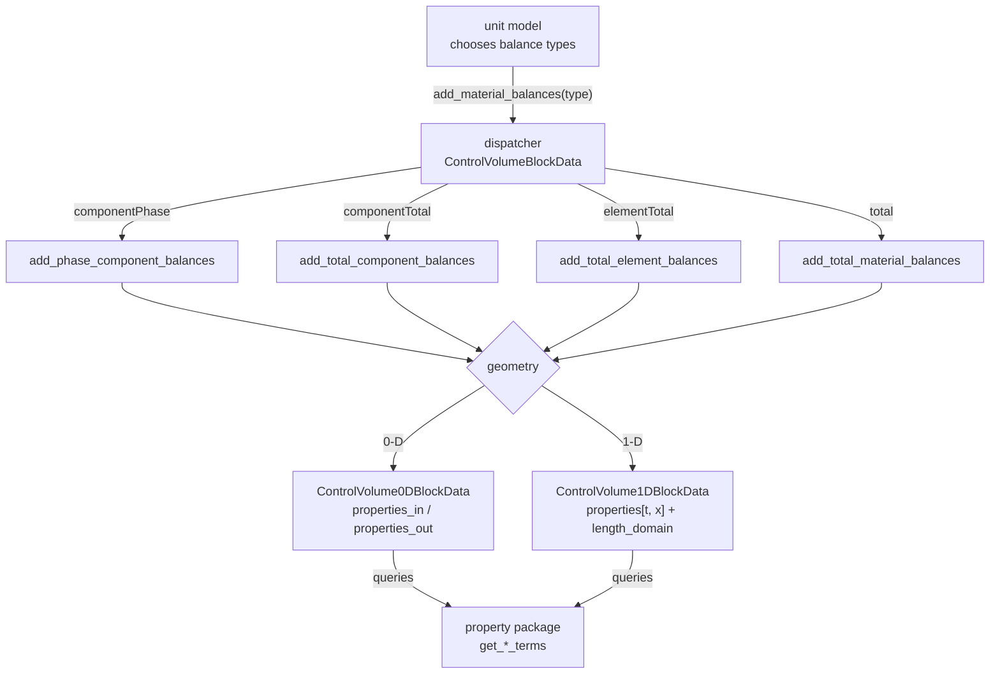
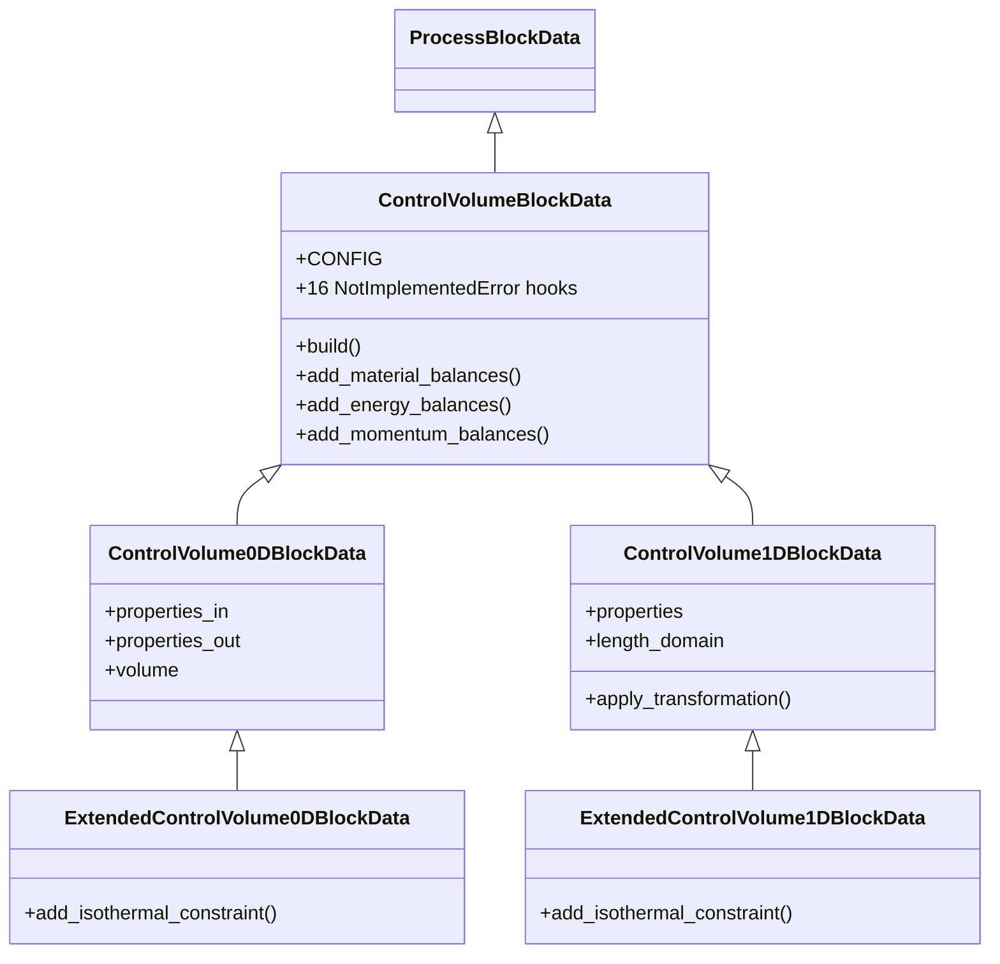
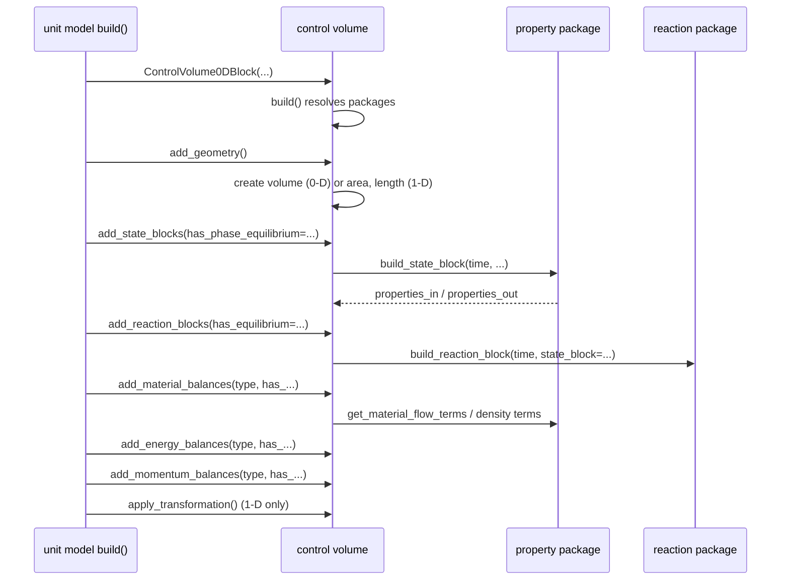

# 04 — Control volume framework

> **Doc ID** 04 · **Repo SHA** 70a8f4fe1 (IDAES-PSE v2.13.0rc0) · **Source roots** `idaes/core/base/control_volume*.py`
> **Owns** 5 modules / 6,982 LOC · **Assets** none · **Siblings** [03](03_block_hierarchy_and_construction_protocol.md), [05](05_property_and_reaction_framework.md), [06](06_model_preparation_initializers_and_scalers.md), [10](10_unit_models_control_volume_based.md)

A control volume is the reusable balance-equation engine of IDAES. It owns the
state blocks, owns the reaction blocks, and writes the material, energy and
momentum balances that relate them. Most unit models in the library are a
control volume plus a handful of performance correlations, which is why this
document is the one that unit-model documents cite most often.

---

## 0. Scope and source map

| File | LOC | Purpose | Covered in § |
|---|---:|---|---|
| `idaes/core/base/control_volume_base.py` | 1,688 | Balance-type enumerations, the shared Scaler base, the `CONFIG_Template` unit models inherit, the abstract contract, and the dispatchers that map a balance type onto a construction method | 3, 4, 5, 7, 9 |
| `idaes/core/base/control_volume0d.py` | 2,188 | The zero-dimensional implementation: lumped volume, inlet and outlet state blocks | 3, 5, 6, 7 |
| `idaes/core/base/control_volume1d.py` | 2,873 | The one-dimensional implementation: a spatial domain, distributed states, and the DAE transformation | 3, 5, 6, 7 |
| `idaes/core/base/extended_control_volume0d.py` | 112 | `ExtendedControlVolume0DBlockData` — adds isothermal energy balance support | 3, 7, 12 |
| `idaes/core/base/extended_control_volume1d.py` | 121 | `ExtendedControlVolume1DBlockData` — the same, one-dimensional | 3, 7, 12 |

Total 6,982 LOC, 30 configuration keys, 18 `NotImplementedError` hooks.

---

## 1. Architectural role

A process model is, mathematically, a set of conservation statements over a
region: what enters, what leaves, what accumulates, what is generated. Those
statements have the same shape for a flash drum, a reactor and a heat
exchanger, and they differ only in which terms are present and whether the
region is treated as well-mixed or as a profile along a length. Writing them
once is the reason this subsystem exists.

The framework separates three concerns. *Which* balances to write is a choice
expressed by four enumerations and made by the unit model
(`MaterialBalanceType`, `EnergyBalanceType`, `MomentumBalanceType`,
`FlowDirection`). *How* to write them for a given geometry is the job of the two
concrete implementations. *What the terms mean* comes from the property package,
which the control volume queries through a fixed set of methods —
`get_material_flow_terms`, `get_enthalpy_flow_terms`, `get_material_density_terms`
and their relatives, described in
[05](05_property_and_reaction_framework.md).

`ControlVolumeBlockData` (`idaes/core/base/control_volume_base.py:973`) is the
abstract half. It resolves configuration, holds the dispatchers, and declares
sixteen methods that raise `NotImplementedError`. `ControlVolume0DBlockData`
(`idaes/core/base/control_volume0d.py:164`) and `ControlVolume1DBlockData`
(`idaes/core/base/control_volume1d.py:356`) are the two implementations in the
tree; both implement exactly the same eight of those sixteen, and both raise
`BalanceTypeNotSupportedError` from the other eight.

Two further pieces sit here because they are geometry-dependent. Accumulation
terms are `DerivativeVar`s with respect to the flowsheet time domain, created
only when the resolved `dynamic` flag is true. Spatial derivatives are
`DerivativeVar`s with respect to a local `length_domain`, exist only in the
one-dimensional form, and are discretized by an explicit call to
`apply_transformation` rather than automatically.

*The unit model names a balance type; the dispatcher selects a method; the geometry decides how that method builds its constraints.*

---

## 2. Public surface inventory

| Symbol | Kind | Declared at | Exported via | Stability signal |
|---|---|---|---|---|
| `MaterialBalanceType` | enum | `idaes/core/base/control_volume_base.py:55` | `idaes.core` | re-exported; autodoc'd |
| `EnergyBalanceType` | enum | `idaes/core/base/control_volume_base.py:69` | `idaes.core` | re-exported; autodoc'd |
| `MomentumBalanceType` | enum | `idaes/core/base/control_volume_base.py:84` | `idaes.core` | re-exported; autodoc'd |
| `FlowDirection` | enum | `idaes/core/base/control_volume_base.py:97` | `idaes.core` | re-exported; autodoc'd |
| `ControlVolumeScalerBase` | class | `idaes/core/base/control_volume_base.py:107` | — | no underscore, not re-exported |
| `CONFIG_Template` | `ConfigBlock` | `idaes/core/base/control_volume_base.py:717` | `idaes.core` | re-exported; consumed by unit models |
| `ControlVolumeBlockData` | class | `idaes/core/base/control_volume_base.py:973` | `idaes.core` | re-exported |
| `ControlVolumeBlock` | class | synthesized at `idaes/core/base/control_volume_base.py:973` | — | generated by the decorator |
| `ControlVolume0DScaler` | class | `idaes/core/base/control_volume0d.py:58` | — | not re-exported |
| `ControlVolume0DBlockData` | class | `idaes/core/base/control_volume0d.py:164` | `idaes.core` | re-exported |
| `ControlVolume0DBlock` | class | synthesized at `idaes/core/base/control_volume0d.py:164` | `idaes.core` | generated by the decorator |
| `DistributedVars` | enum | `idaes/core/base/control_volume1d.py:76` | `idaes.core` | re-exported |
| `ControlVolume1DScaler` | class | `idaes/core/base/control_volume1d.py:85` | — | not re-exported |
| `ControlVolume1DBlockData` | class | `idaes/core/base/control_volume1d.py:356` | `idaes.core` | re-exported |
| `ControlVolume1DBlock` | class | synthesized at `idaes/core/base/control_volume1d.py:356` | `idaes.core` | generated by the decorator |
| `ExtendedControlVolume0DBlockData` | class | `idaes/core/base/extended_control_volume0d.py:38` | `idaes.core` | re-exported |
| `ExtendedControlVolume0DBlock` | class | synthesized at `idaes/core/base/extended_control_volume0d.py:38` | `idaes.core` | generated by the decorator |
| `ExtendedControlVolume1DBlockData` | class | `idaes/core/base/extended_control_volume1d.py:39` | `idaes.core` | re-exported |
| `ExtendedControlVolume1DBlock` | class | synthesized at `idaes/core/base/extended_control_volume1d.py:39` | `idaes.core` | generated by the decorator |

---

## 3. Class hierarchy and type taxonomy

*The extended variants differ from their parents by exactly one method each.*

| Class | Base(s) | Declared at | Decorator | Container class | Key overrides |
|---|---|---|---|---|---|
| `ControlVolumeBlockData` | `ProcessBlockData` | `idaes/core/base/control_volume_base.py:973` | `@declare_process_block_class("ControlVolumeBlock", ...)` | `ControlVolumeBlock` | `build` |
| `ControlVolume0DBlockData` | `ControlVolumeBlockData` | `idaes/core/base/control_volume0d.py:164` | `@declare_process_block_class("ControlVolume0DBlock")` | `ControlVolume0DBlock` | 8 balance methods, `add_geometry`, `add_state_blocks`, `add_reaction_blocks` |
| `ControlVolume1DBlockData` | `ControlVolumeBlockData` | `idaes/core/base/control_volume1d.py:356` | `@declare_process_block_class("ControlVolume1DBlock")` | `ControlVolume1DBlock` | the same, plus `apply_transformation`, `_validate_config_args` |
| `ExtendedControlVolume0DBlockData` | `ControlVolume0DBlockData` | `idaes/core/base/extended_control_volume0d.py:38` | `@declare_process_block_class("ExtendedControlVolume0DBlock")` | `ExtendedControlVolume0DBlock` | `add_isothermal_constraint` |
| `ExtendedControlVolume1DBlockData` | `ControlVolume1DBlockData` | `idaes/core/base/extended_control_volume1d.py:39` | `@declare_process_block_class("ExtendedControlVolume1DBlock")` | `ExtendedControlVolume1DBlock` | `add_isothermal_constraint` |
| `ControlVolumeScalerBase` | `CustomScalerBase` | `idaes/core/base/control_volume_base.py:107` | none | — | `variable_scaling_routine`, `constraint_scaling_routine` |
| `ControlVolume0DScaler` | `ControlVolumeScalerBase` | `idaes/core/base/control_volume0d.py:58` | none | — | `_get_reference_state_block`, both routines |
| `ControlVolume1DScaler` | `ControlVolumeScalerBase` | `idaes/core/base/control_volume1d.py:85` | none | — | the same, plus `_weight_attr_name = "length"` |

### 3.1 Enumerations

`MaterialBalanceType` (`idaes/core/base/control_volume_base.py:55`):

| Member | Value | Meaning | Consumed at |
|---|---|---|---|
| `useDefault` | -1 | Ask the property package for its preferred form | `control_volume_base.py:1153` |
| `none` | 0 | Write no material balance | `control_volume_base.py:1169` |
| `componentPhase` | 1 | One balance per phase and chemical component | `control_volume_base.py:1171` |
| `componentTotal` | 2 | One balance per chemical component, summed over phases | `control_volume_base.py:1173` |
| `elementTotal` | 3 | One balance per chemical element | `control_volume_base.py:1175` |
| `total` | 4 | A single overall balance | `control_volume_base.py:1177` |

`EnergyBalanceType` (`idaes/core/base/control_volume_base.py:69`): `useDefault`
(-1), `none` (0), `enthalpyPhase` (1), `enthalpyTotal` (2), `energyPhase` (3),
`energyTotal` (4), `isothermal` (5).

`MomentumBalanceType` (`idaes/core/base/control_volume_base.py:84`): `none` (0),
`pressureTotal` (1), `pressurePhase` (2), `momentumTotal` (3), `momentumPhase`
(4). This enumeration has no `useDefault` member, unlike the other two.

`FlowDirection` (`idaes/core/base/control_volume_base.py:97`): `notSet` (0),
`forward` (1), `backward` (2). Used by the one-dimensional form to orient the
spatial domain and by `add_inlet_port` to pick the correct end of it
(see [03 §5.7](03_block_hierarchy_and_construction_protocol.md#57-port-construction)).

`DistributedVars` (`idaes/core/base/control_volume1d.py:76`): `variant` (0), the
cross-sectional area varies along the domain; `uniform` (1), it does not.

### 3.2 Supported and unsupported balance forms

Both implementations support exactly the same eight construction methods and
reject the same eight. The symmetry is exact, so a unit model that works with
one geometry fails in the same way with the other.

| Method | 0-D | 1-D | Extended 0-D / 1-D |
|---|---|---|---|
| `add_geometry` | implemented `:176` | implemented `:475` | inherited |
| `add_state_blocks` | implemented `:195` | implemented `:572` | inherited |
| `add_reaction_blocks` | implemented `:253` | implemented `:630` | inherited |
| `add_phase_component_balances` | implemented `:871` | implemented `:1362` | inherited |
| `add_total_component_balances` | implemented `:917` | implemented `:1408` | inherited |
| `add_total_element_balances` | implemented `:962` | implemented `:1456` | inherited |
| `add_total_enthalpy_balances` | implemented `:1240` | implemented `:1751` | inherited |
| `add_total_pressure_balances` | implemented `:1471` | implemented `:2031` | inherited |
| `add_total_material_balances` | `BalanceTypeNotSupportedError` `:1233` | `BalanceTypeNotSupportedError` `:1744` | inherited |
| `add_phase_enthalpy_balances` | `BalanceTypeNotSupportedError` `:1440` | `BalanceTypeNotSupportedError` `:2000` | inherited |
| `add_phase_energy_balances` | `BalanceTypeNotSupportedError` `:1447` | `BalanceTypeNotSupportedError` `:2007` | inherited |
| `add_total_energy_balances` | `BalanceTypeNotSupportedError` `:1454` | `BalanceTypeNotSupportedError` `:2014` | inherited |
| `add_isothermal_constraint` | `BalanceTypeNotSupportedError` `:1461` | `BalanceTypeNotSupportedError` `:2021` | **implemented** `:46` / `:47` |
| `add_phase_pressure_balances` | `BalanceTypeNotSupportedError` `:1513` | `BalanceTypeNotSupportedError` `:2104` | inherited |
| `add_phase_momentum_balances` | `BalanceTypeNotSupportedError` `:1520` | `BalanceTypeNotSupportedError` `:2111` | inherited |
| `add_total_momentum_balances` | `BalanceTypeNotSupportedError` `:1527` | `BalanceTypeNotSupportedError` `:2118` | inherited |

The single cell that differs is `add_isothermal_constraint`, which is the entire
reason the two extended classes exist.

---

## 4. Configuration reference

30 keys across three declarations.

### 4.1 `CONFIG_Template` — the unit-model-facing template

`CONFIG_Template = ProcessBlockData.CONFIG()` at
`idaes/core/base/control_volume_base.py:717`. This is not the control volume's
own configuration. It is a standalone block that unit models copy so their users
can set balance options on the unit rather than on the control volume inside it.
Documents 10, 11 and 18 through 24 refer to this table rather than reproducing
it.

| Key | Domain / validator | Default | Req. | Effect on build | Anchor |
|---|---|---|---|---|---|
| `dynamic` | `DefaultBool` | `useDefault` | no | Selects whether accumulation terms are created | `:718` |
| `has_holdup` | `Bool` | `False` | no | Selects whether holdup variables and their defining constraints are created | `:732` |
| `material_balance_type` | `In(MaterialBalanceType)` | `componentPhase` | no | Dispatches to one of four construction methods | `:746` |
| `energy_balance_type` | `In(EnergyBalanceType)` | `enthalpyTotal` | no | Dispatches to one of five | `:762` |
| `momentum_balance_type` | `In(MomentumBalanceType)` | `pressureTotal` | no | Dispatches to one of four | `:778` |
| `has_rate_reactions` | `Bool` | `False` | no | Creates `rate_reaction_generation` and `rate_reaction_extent` | `:794` |
| `has_equilibrium_reactions` | `Bool` | `False` | no | Creates the equilibrium reaction generation and extent variables | `:808` |
| `has_phase_equilibrium` | `Bool` | `False` | no | Creates `phase_equilibrium_generation` | `:822` |
| `has_mass_transfer` | `Bool` | `False` | no | Creates `mass_transfer_term` | `:836` |
| `has_heat_of_reaction` | `Bool` | `False` | no | Adds the `heat_of_reaction` expression to the energy balance | `:849` |
| `has_heat_transfer` | `Bool` | `False` | no | Creates `heat` | `:862` |
| `has_work_transfer` | `Bool` | `False` | no | Creates `work` | `:875` |
| `has_enthalpy_transfer` | `Bool` | `False` | no | Creates `enthalpy_transfer` | `:888` |
| `has_pressure_change` | `Bool` | `False` | no | Creates `deltaP` | `:901` |
| `property_package` | `is_physical_parameter_block` | `useDefault` | no | The parameter block state blocks are built from | `:915` |
| `property_package_args` | implicit `ConfigBlock` | empty | no | Forwarded to each state block | `:928` |
| `reaction_package` | `is_reaction_parameter_block` | `None` | no | The parameter block reaction blocks are built from | `:940` |
| `reaction_package_args` | implicit `ConfigBlock` | empty | no | Forwarded to each reaction block | `:953` |

Note the difference in `has_holdup` between this template and the control
volume's own configuration below: here the domain is `Bool` with default
`False`, there it is `DefaultBool` with default `useDefault`. The template is
read by a unit model, which has already resolved its own flag; the control
volume still has to resolve one.

### 4.2 `ControlVolumeBlockData.CONFIG`

Declared at `idaes/core/base/control_volume_base.py:986`. Seven keys —
deliberately narrower than the template, because the balance options are passed
as method arguments at construction time rather than read from configuration.

| Key | Domain / validator | Default | Req. | Effect on build | Anchor |
|---|---|---|---|---|---|
| `dynamic` | `DefaultBool` | `useDefault` | no | Resolved against the parent in `_setup_dynamics` | `:987` |
| `has_holdup` | `DefaultBool` | `useDefault` | no | Defaults to the resolved `dynamic` | `:1001` |
| `property_package` | `is_physical_parameter_block` | `useDefault` | no | Resolved by `_get_property_package` | `:1015` |
| `property_package_args` | implicit `ConfigBlock` | empty | no | Merged with the package's `default_arguments` | `:1028` |
| `reaction_package` | `is_reaction_parameter_block` | `None` | no | Resolved by `_get_reaction_package` | `:1038` |
| `reaction_package_args` | implicit `ConfigBlock` | empty | no | As above | `:1051` |
| `auto_construct` | `Bool` | `False` | no | Runs `_auto_construct` at the end of `build` | `:1063` |

### 4.3 `ControlVolume1DBlockData.CONFIG`

`ControlVolumeBlockData.CONFIG()` extended at
`idaes/core/base/control_volume1d.py:368` with five spatial keys.

| Key | Domain / validator | Default | Req. | Effect on build | Anchor |
|---|---|---|---|---|---|
| `area_definition` | `In(DistributedVars)` | `DistributedVars.uniform` | no | `uniform` creates a scalar `area`; `variant` creates one indexed by time and length | `:369` |
| `transformation_method` | `is_transformation_method` | `None` | yes, at build | Validated in `_validate_config_args`; names the Pyomo transformation | `:383` |
| `transformation_scheme` | `is_transformation_scheme` | `None` | yes, at build | Validated for consistency with the method | `:393` |
| `finite_elements` | `int` | `None` | yes, at `apply_transformation` | Number of elements in the discretization | `:403` |
| `collocation_points` | `int` | `None` | conditional | Required when the method is `dae.collocation` | `:413` |

`_validate_config_args` (`idaes/core/base/control_volume1d.py:444`) is called
from `build` and enforces the pairing: `dae.finite_difference` admits only
`BACKWARD` and `FORWARD`; `dae.collocation` admits only `LAGRANGE-LEGENDRE` and
`LAGRANGE-RADAU`. A missing method or scheme raises `ConfigurationError` at
build time, not at transformation time.

The extended variants declare no additional keys.

---

## 5. Construction and call sequences

### 5.1 `build`

`ControlVolumeBlockData.build` (`idaes/core/base/control_volume_base.py:1081`)
runs five steps and then optionally a sixth:

1. `super().build()` — resolves `self.config`
   ([03 §5.4](03_block_hierarchy_and_construction_protocol.md#54-configuration-resolution)).
2. `_setup_dynamics()` — resolves `dynamic` and `has_holdup` from the parent.
3. `_get_property_package()` — resolves the property package and merges its
   `default_arguments`.
4. `_get_indexing_sets()` — asserts the package exposes `phase_list` and
   `component_list`.
5. `_get_reaction_package()` — the same for reactions, when one is configured.
6. `_auto_construct()` when `config.auto_construct` is true.

`ControlVolume1DBlockData.build` (`idaes/core/base/control_volume1d.py:431`)
adds `_validate_config_args()` and sets `_flow_direction` to
`FlowDirection.notSet`; the direction is fixed later by `add_geometry`.

Nothing in `build` creates a balance equation. A control volume that is built
and never told to add balances is an empty block — construction is explicit,
driven by the unit model.

### 5.2 The normal construction order

*The order is significant: state blocks must exist before balances, and the DAE transformation must come after every constraint it discretizes.*

### 5.3 The dispatchers

`add_material_balances(balance_type, **kwargs)`
(`idaes/core/base/control_volume_base.py:1124`):

1. When `balance_type` is `MaterialBalanceType.useDefault`, call
   `_get_representative_property_block()` and ask it for
   `default_material_balance_type()`. A property package that has not
   implemented that method causes a `ConfigurationError` naming the package as
   the thing to change (`idaes/core/base/control_volume_base.py:1158`).
2. Record the resolved value as `self._constructed_material_balance_type`.
3. Dispatch on the enumeration member. `none` builds nothing and returns `None`;
   each other member calls its construction method with `**kwargs` forwarded
   unchanged. A value outside the enumeration raises `ConfigurationError`
   describing itself as a unit-model bug
   (`idaes/core/base/control_volume_base.py:1181`).

`add_energy_balances` (`:1189`) and `add_momentum_balances` (`:1250`) follow the
same three-step shape. The momentum dispatcher has no `useDefault` step, because
`MomentumBalanceType` has no such member.

### 5.4 `_auto_construct`

`_auto_construct` (`idaes/core/base/control_volume_base.py:1291`) is the
alternative to a unit model sequencing construction itself. It reads the
**parent block's** configuration — that is, the unit model's `CONFIG_Template`
keys — and issues the calls in order: `add_geometry`, `add_state_blocks`,
`add_reaction_blocks`, then the three balance dispatchers with the `has_*` flags
forwarded, and finally `apply_transformation` inside a `try`/`except
AttributeError` so the call is a no-op for the zero-dimensional form
(`idaes/core/base/control_volume_base.py:1329`).

This couples the control volume to its parent's configuration schema: the parent
is required to carry the `CONFIG_Template` keys by those exact names.

### 5.5 Zero-dimensional construction

`add_geometry` (`idaes/core/base/control_volume0d.py:176`) creates a single
`volume` variable indexed by time (`:188`).

`add_state_blocks(information_flow=FlowDirection.forward, has_phase_equilibrium=None)`
(`idaes/core/base/control_volume0d.py:195`) builds two state blocks,
`properties_in` and `properties_out`, from
`config.property_package.build_state_block`. The `defined_state` argument is
`True` for whichever block the information flows from and `False` for the other,
inverted when the direction is `backward`. That flag is what tells a property
package whether the sum of mole fractions is already implied
(see [05](05_property_and_reaction_framework.md)).

`add_reaction_blocks(has_equilibrium=None)`
(`idaes/core/base/control_volume0d.py:253`) builds `self.reactions` with
`state_block=self.properties_out` — reaction properties are evaluated at the
outlet.

`_add_material_balance_common` (`idaes/core/base/control_volume0d.py:289`) is the
shared engine behind the phase-component and total-component forms. It creates,
each conditionally, the variables listed in section 6 and then the balance
constraint itself.

### 5.6 One-dimensional construction

`add_geometry(length_domain=None, length_domain_set=None, length_var=None, flow_direction=FlowDirection.forward)`
(`idaes/core/base/control_volume1d.py:475`) either references an externally
supplied `ContinuousSet` or creates a local
`length_domain` over bounds `(0.0, 1.0)`. It creates `area` as a scalar
(`:541`) or as an indexed variable (`:549`) according to `area_definition`, and
creates or references `length` (`:568`).

`add_state_blocks` (`idaes/core/base/control_volume1d.py:572`) builds a single
`properties` block indexed by time and the length domain.

The balance engine differs from the zero-dimensional one in that flow terms are
materialized into their own variables and tied to the property package by
linking constraints, because a `DerivativeVar` requires a `Var` to differentiate:
`_flow_terms` (`:841`) is linked by `material_flow_linking_constraints` (`:856`)
and differentiated as `material_flow_dx` (`:861`). The same pattern appears for
elements (`elemental_flow_term` `:1627`, `elemental_flow_constraint` `:1655`,
`elemental_flow_dx` `:1665`) and for enthalpy (`_enthalpy_flow` `:1827`,
`enthalpy_flow_linking_constraint` `:1842`, `enthalpy_flow_dx` `:1847`).

`apply_transformation` (`idaes/core/base/control_volume1d.py:2125`):

1. Refuse to transform a domain that belongs to another block
   (`:2131`) — an external domain is the parent's to discretize.
2. Require `finite_elements` (`:2141`).
3. Require `collocation_points` when the method is `dae.collocation` (`:2149`).
4. Construct `self.discretizer = TransformationFactory(method)` and call
   `apply_to(self, wrt=self.length_domain, nfe=..., scheme=...)`, adding `ncp`
   for collocation (`:2159`, `:2167`).
5. Any other method name raises `ConfigurationError` (`:2177`).

The flowsheet time domain is not discretized here. A dynamic flowsheet is
transformed by its author, applying a `pyomo.dae` transformation to `fs.time`
directly.

### 5.7 Reaction basis conversion

`_rxn_rate_conv` (`idaes/core/base/control_volume_base.py:1527`) reconciles a
reaction package that reports rates on one basis with a property package that
reports flows on another. It compares the two `MaterialFlowBasis` values and
multiplies or divides by molecular weight as required; when either side reports
`MaterialFlowBasis.other` no conversion is available and the method raises. The
zero-dimensional form overrides it with a two-argument signature
(`idaes/core/base/control_volume0d.py:1717`) because it has no spatial index.

---

## 6. Data structures, variables, constraints and invariants

### 6.1 Zero-dimensional components

| Component | Type | Index sets | Units | Created at | Condition |
|---|---|---|---|---|---|
| `volume` | `Var` | time | volume | `control_volume0d.py:188` | `add_geometry` |
| `properties_in`, `properties_out` | state blocks | time | — | `control_volume0d.py:195` | `add_state_blocks` |
| `reactions` | reaction blocks | time | — | `control_volume0d.py:253` | `add_reaction_blocks` |
| `material_holdup` | `Var` | time × phase × component | amount | `control_volume0d.py:465` | `has_holdup` |
| `material_accumulation` | `DerivativeVar` wrt time | time × phase × component | amount/time | `control_volume0d.py:474` | `dynamic` |
| `rate_reaction_generation` | `Var` | time × phase × component | flow | `control_volume0d.py:490` | `has_rate_reactions` |
| `equilibrium_reaction_generation` | `Var` | time × phase × component | flow | `control_volume0d.py:507` | `has_equilibrium_reactions` |
| `inherent_reaction_generation` | `Var` | time × phase × component | flow | `control_volume0d.py:525` | package has inherent reactions |
| `phase_equilibrium_generation` | `Var` | time × phase equilibrium index | flow | `control_volume0d.py:543` | `has_phase_equilibrium` |
| `mass_transfer_term` | `Var` | time × phase × component | flow | `control_volume0d.py:554` | `has_mass_transfer` |
| `rate_reaction_extent` | `Var` | time × rate reaction index | extent | `control_volume0d.py:611` | `has_rate_reactions` |
| `equilibrium_reaction_extent` | `Var` | time × equilibrium reaction index | extent | `control_volume0d.py:640` | `has_equilibrium_reactions` |
| `inherent_reaction_extent` | `Var` | time × inherent reaction index | extent | `control_volume0d.py:666` | inherent reactions |
| `element_holdup` | `Var` | time × element | amount | `control_volume0d.py:1112` | element balances with holdup |
| `element_accumulation` | `DerivativeVar` wrt time | time × element | amount/time | `control_volume0d.py:1122` | element balances, dynamic |
| `elemental_mass_transfer_term` | `Var` | time × element | flow | `control_volume0d.py:1172` | element balances with mass transfer |
| `energy_holdup` | `Var` | time × phase | energy | `control_volume0d.py:1319` | `has_holdup` |
| `energy_accumulation` | `DerivativeVar` wrt time | time × phase | energy/time | `control_volume0d.py:1329` | `dynamic` |
| `heat` | `Var` | time | power | `control_volume0d.py:1339` | `has_heat_transfer` |
| `work` | `Var` | time | power | `control_volume0d.py:1349` | `has_work_transfer` |
| `enthalpy_transfer` | `Var` | time | power | `control_volume0d.py:1359` | `has_enthalpy_transfer` |
| `deltaP` | `Var` | time | pressure | `control_volume0d.py:1490` | `has_pressure_change` |
| `phase_fraction` | `Var` | time × phase | dimensionless | `control_volume0d.py:1696` | multiphase with holdup |

| Constraint or Expression | Kind | Created at | Condition |
|---|---|---|---|
| `material_holdup_calculation` | `Constraint` | `control_volume0d.py:601` | `has_holdup` |
| `rate_reaction_stoichiometry_constraint` | `Constraint` | `control_volume0d.py:625` | `has_rate_reactions` |
| `equilibrium_reaction_stoichiometry_constraint` | `Constraint` | `control_volume0d.py:652` | `has_equilibrium_reactions` |
| `inherent_reaction_stoichiometry_constraint` | `Constraint` | `control_volume0d.py:678` | inherent reactions |
| `material_balances` | `Constraint` | `control_volume0d.py:744` (phase-component), `:830` (component-total) | always, per form |
| `elemental_flow_in`, `elemental_flow_out` | `Expression` | `control_volume0d.py:1148`, `:1162` | element balances |
| `element_balances` | `Constraint` | `control_volume0d.py:1196` | element balances |
| `elemental_holdup_calculation` | `Constraint` | `control_volume0d.py:1219` | element balances with holdup |
| `heat_of_reaction` | `Expression` | `control_volume0d.py:1371` | `has_heat_of_reaction` |
| `enthalpy_balances` | `Constraint` | `control_volume0d.py:1401` | enthalpy balance |
| `energy_holdup_calculation` | `Constraint` | `control_volume0d.py:1431` | `has_holdup` |
| `pressure_balance` | `Constraint` | `control_volume0d.py:1500` | pressure balance |
| `sum_of_phase_fractions` | `Constraint` | `control_volume0d.py:1704` | multiphase |
| `phase_fraction` | `Expression` (value 1) | `control_volume0d.py:1714` | single phase |

### 6.2 One-dimensional components

The one-dimensional form creates the same conceptual set, indexed additionally
by `length_domain`, plus the flow variables and linking constraints that make
spatial differentiation possible.

| Component | Type | Created at |
|---|---|---|
| `length_domain` | `ContinuousSet` over `(0.0, 1.0)` | `control_volume1d.py:475` |
| `area` | `Var`, scalar or time × length | `control_volume1d.py:541`, `:549` |
| `length` | `Var` | `control_volume1d.py:568` |
| `_flow_terms` | `Var` | `control_volume1d.py:841` |
| `material_flow_linking_constraints` | `Constraint` | `control_volume1d.py:856` |
| `material_flow_dx` | `DerivativeVar` wrt `length_domain` | `control_volume1d.py:861` |
| `elemental_flow_term` | `Var` | `control_volume1d.py:1627` |
| `elemental_flow_constraint` | `Constraint` | `control_volume1d.py:1655` |
| `elemental_flow_dx` | `DerivativeVar` wrt `length_domain` | `control_volume1d.py:1665` |
| `_enthalpy_flow` | `Var` | `control_volume1d.py:1827` |
| `enthalpy_flow_linking_constraint` | `Constraint` | `control_volume1d.py:1842` |
| `enthalpy_flow_dx` | `DerivativeVar` wrt `length_domain` | `control_volume1d.py:1847` |
| `pressure_dx` | `DerivativeVar` wrt `length_domain` | `control_volume1d.py:2060` |
| `discretizer` | Pyomo transformation object | `control_volume1d.py:2159` |

Time-indexed counterparts keep their zero-dimensional names:
`material_holdup` (`:822`), `material_accumulation` (`:832`), `element_holdup`
(`:1609`), `element_accumulation` (`:1620`), `energy_holdup` (`:1855`),
`energy_accumulation` (`:1866`), `heat` (`:1876`), `work` (`:1887`),
`enthalpy_transfer` (`:1898`), `deltaP` (`:2069`), `phase_fraction` (`:2388`).

### 6.3 Invariants

| Invariant | Enforced at |
|---|---|
| Transformation method and scheme are supplied and mutually consistent | `control_volume1d.py:444` |
| A DAE transformation is applied only to a locally owned domain | `control_volume1d.py:2131` |
| `finite_elements` is set before transformation | `control_volume1d.py:2141` |
| `collocation_points` is set when the method is collocation | `control_volume1d.py:2149` |
| The property package supplies `phase_list` and `component_list` | `control_volume_base.py:1081`, via `_get_indexing_sets` |
| A `useDefault` balance type is resolvable from the property package | `control_volume_base.py:1158` |
| Phase fractions sum to one in multiphase systems | `control_volume0d.py:1704`, `control_volume1d.py:2401` |

---

## 7. Method contracts

### 7.1 `ControlVolumeBlockData`

| Method | Signature | Preconditions | Effects | Returns | Raises | Anchor |
|---|---|---|---|---|---|---|
| `build` | `(self)` | — | Resolves config, packages, indexing sets | `None` | `ConfigurationError`, `PropertyPackageError`, `DynamicError` | `:1081` |
| `add_material_balances` | `(self, balance_type=useDefault, **kwargs)` | state blocks exist | Builds the selected balances | `Constraint` or `None` | `ConfigurationError` | `:1124` |
| `add_energy_balances` | `(self, balance_type=useDefault, **kwargs)` | as above | as above | `Constraint` or `None` | `ConfigurationError` | `:1189` |
| `add_momentum_balances` | `(self, balance_type=pressureTotal, **kwargs)` | as above | as above | `Constraint` or `None` | `ConfigurationError` | `:1250` |
| `_auto_construct` | `(self)` | parent carries `CONFIG_Template` keys | Full construction sequence | `None` | propagates | `:1291` |
| `_rxn_rate_conv` | `(b, t, x, j)` | both bases known | none | conversion factor | on `MaterialFlowBasis.other` | `:1527` |
| `_get_representative_property_block` | `(self)` | state blocks exist | none | a state block | — | `:1589` |
| `_estimate_next_state` | `(self, state1, state2, index, always_estimate=False)` | two state blocks | Writes values into `state2` | `None` | — | `:1612` |
| `_estimate_state_var` | `(self, v1, v2, index, always_estimate=False)` | — | Writes a value into `v2` | `None` | — | `:1639` |

The sixteen abstract methods are listed in section 9.

### 7.2 `ControlVolume0DBlockData`

| Method | Signature | Effects | Raises | Anchor |
|---|---|---|---|---|
| `add_geometry` | `(self)` | Creates `volume` | — | `:176` |
| `add_state_blocks` | `(self, information_flow=FlowDirection.forward, has_phase_equilibrium=None)` | Creates `properties_in`, `properties_out` | `ConfigurationError` | `:195` |
| `add_reaction_blocks` | `(self, has_equilibrium=None)` | Creates `reactions` | `ConfigurationError` | `:253` |
| `_add_material_balance_common` | `(self, ...)` | Creates the shared material variables and constraints | `PropertyNotSupportedError` | `:289` |
| `add_phase_component_balances` | `(self, **kwargs)` | `material_balances` per phase and component | — | `:871` |
| `add_total_component_balances` | `(self, **kwargs)` | `material_balances` per component | — | `:917` |
| `add_total_element_balances` | `(self, **kwargs)` | `element_balances` and its variables | `PropertyNotSupportedError` | `:962` |
| `add_total_enthalpy_balances` | `(self, **kwargs)` | `enthalpy_balances`, `heat`, `work`, `enthalpy_transfer` | — | `:1240` |
| `add_total_pressure_balances` | `(self, has_pressure_change=False, custom_term=None)` | `pressure_balance`, `deltaP` | — | `:1471` |
| `model_check` | `(blk)` | Calls `model_check` on both state blocks and the reaction block | — | `:1534` |
| `estimate_outlet_state` | `(self, always_estimate=False)` | Copies or estimates outlet state values | — | `:1576` |
| `initialize` | `(blk, ...)` | Legacy state-block initialization | `InitializationError` | `:1585` |
| `release_state` | `(blk, flags, outlvl=NOTSET)` | Restores fixed status recorded by `initialize` | — | `:1665` |
| `_add_phase_fractions` | `(self)` | `phase_fraction` Var and sum constraint, or an Expression of 1 | — | `:1681` |
| `calculate_scaling_factors` | `(self)` | Applies suffix-based scaling | — | `:1859` |

### 7.3 `ControlVolume1DBlockData`

| Method | Signature | Effects | Raises | Anchor |
|---|---|---|---|---|
| `flow_direction` | property | none | — | `:425` |
| `build` | `(self)` | As base plus `_validate_config_args`, `_flow_direction = notSet` | `ConfigurationError` | `:431` |
| `_validate_config_args` | `(self)` | none | `ConfigurationError` | `:444` |
| `add_geometry` | `(self, length_domain=None, length_domain_set=None, length_var=None, flow_direction=forward)` | Creates or references `length_domain`, `area`, `length` | `ConfigurationError` | `:475` |
| `add_state_blocks` | `(self, information_flow=forward, has_phase_equilibrium=None)` | Creates `properties` over time × length | `ConfigurationError` | `:572` |
| `add_reaction_blocks` | `(self, has_equilibrium=None)` | Creates `reactions` | `ConfigurationError` | `:630` |
| `apply_transformation` | `(self)` | Discretizes the length domain | `ConfigurationError` | `:2125` |
| `estimate_states` | `(self, always_estimate=False)` | Writes state estimates along the domain | — | `:2184` |
| `report` | `(self, time_point=0, dof=False, ostream=None, prefix="")` | — | `NotImplementedError` | `:2420` |

`ControlVolume1DBlockData.report` is the one `NotImplementedError` hook in this
document's scope that is not an abstract balance method: the one-dimensional
form has no text report, and calling `report()` on it raises rather than
printing a misleading single-point summary.

### 7.4 The extended variants

| Method | Signature | Effects | Raises | Anchor |
|---|---|---|---|---|
| `ExtendedControlVolume0DBlockData.add_isothermal_constraint` | `(self, has_heat_of_reaction=False, has_heat_transfer=False, has_work_transfer=False, has_enthalpy_transfer=False, custom_term=None)` | Constrains outlet temperature equal to inlet temperature | `ConfigurationError` when any flag is set | `extended_control_volume0d.py:46` |
| `ExtendedControlVolume1DBlockData.add_isothermal_constraint` | same signature | The one-dimensional equivalent | same | `extended_control_volume1d.py:47` |

The flags exist only for signature compatibility with the other energy balance
methods. Supplying any of them raises, because an isothermal constraint cannot
account for a heat or work term.

---

## 8. Cross-subsystem interactions

### Calls out to

| Target | Purpose | Anchor |
|---|---|---|
| `ProcessBlockData` lifecycle | Configuration, dynamics and package resolution | `control_volume_base.py:1081` |
| `pyomo.dae.DerivativeVar` | Time accumulation and spatial derivative terms | `control_volume0d.py:474`, `control_volume1d.py:861` |
| `pyomo.dae.ContinuousSet` | The length domain | `control_volume1d.py:475` |
| `pyomo.environ.TransformationFactory` | Spatial discretization | `control_volume1d.py:2159` |
| `PhysicalParameterBlock.build_state_block` | State block construction | `control_volume0d.py:195` |
| `ReactionParameterBlock.build_reaction_block` | Reaction block construction | `control_volume0d.py:253` |
| State block `get_*_terms` methods | Every balance term | throughout |
| `idaes.core.scaling.CustomScalerBase` | Base of `ControlVolumeScalerBase` | `control_volume_base.py:107` |
| `idaes.core.util.exceptions` | `BalanceTypeNotSupportedError`, `ConfigurationError`, `PropertyNotSupportedError` | throughout |

### Called by

| Caller | What it relies on | Owning doc |
|---|---|---|
| Control-volume-based unit models | `CONFIG_Template`, the dispatchers, `add_inlet_port` compatibility | [10](10_unit_models_control_volume_based.md) |
| Contactor and network models | `ControlVolume0DBlock` directly, or their own balance code | [11](11_unit_models_network_contactors_and_control.md) |
| Power generation units | Both geometries, extensively | [18](18_power_generation_boiler_island.md), [19](19_power_generation_heat_exchangers_and_properties.md), [20](20_power_generation_helmholtz_units_and_soc.md) |
| Column models | `ControlVolume1DBlock` with an external length domain | [21](21_column_models_and_solvent_systems.md) |
| Gas-solid contactors | `ControlVolume1DBlock` | [22](22_gas_solid_contactors.md) |
| Initializers | `estimate_outlet_state`, `estimate_states`, `initialize`, `release_state` | [06](06_model_preparation_initializers_and_scalers.md) |
| Scalers | `ControlVolumeScalerBase` and its two subclasses | [06](06_model_preparation_initializers_and_scalers.md) |
| Property packages | The `get_*_terms` contract, in the other direction | [05](05_property_and_reaction_framework.md) |

---

## 9. Extension and subclassing contracts

Sixteen methods on `ControlVolumeBlockData` raise `NotImplementedError`. They
are the abstract contract a new control volume geometry fills. Each message
names the control volume class and directs the reader to its developer.

| Hook | Kind | Signature | Base behaviour | Anchor |
|---|---|---|---|---|
| `add_geometry` | geometry | `(self, *args, **kwargs)` | raises | `:1118` |
| `add_state_blocks` | construction | `(self, *args, **kwargs)` | raises | `:1341` |
| `add_reaction_blocks` | construction | `(self, *args, **kwargs)` | raises | `:1353` |
| `add_phase_component_balances` | material balance | `(self, *args, **kwargs)` | raises | `:1368` |
| `add_total_component_balances` | material balance | `(self, *args, **kwargs)` | raises | `:1381` |
| `add_total_element_balances` | material balance | `(self, *args, **kwargs)` | raises | `:1394` |
| `add_total_material_balances` | material balance | `(self, *args, **kwargs)` | raises | `:1407` |
| `add_phase_enthalpy_balances` | energy balance | `(self, *args, **kwargs)` | raises | `:1420` |
| `add_total_enthalpy_balances` | energy balance | `(self, *args, **kwargs)` | raises | `:1433` |
| `add_phase_energy_balances` | energy balance | `(self, *args, **kwargs)` | raises | `:1446` |
| `add_total_energy_balances` | energy balance | `(self, *args, **kwargs)` | raises | `:1459` |
| `add_isothermal_constraint` | energy balance | `(self, *args, **kwargs)` | raises | `:1471` |
| `add_phase_pressure_balances` | momentum balance | `(self, *args, **kwargs)` | raises | `:1484` |
| `add_total_pressure_balances` | momentum balance | `(self, *args, **kwargs)` | raises | `:1496` |
| `add_phase_momentum_balances` | momentum balance | `(self, *args, **kwargs)` | raises | `:1509` |
| `add_total_momentum_balances` | momentum balance | `(self, *args, **kwargs)` | raises | `:1521` |

Two further hooks in this scope:

| Hook | Kind | Signature | Base behaviour | Anchor |
|---|---|---|---|---|
| `ControlVolumeScalerBase._get_reference_state_block` | Scaler | `(self, model)` | raises | `control_volume_base.py:125` |
| `ControlVolume1DBlockData.report` | reporting | `(self, time_point=0, dof=False, ostream=None, prefix="")` | raises | `control_volume1d.py:2426` |

Other extension points:

| Hook | Kind | Resolution | Base | Anchor |
|---|---|---|---|---|
| `default_scaler` | class attribute | Consulted by the Scaler machinery | `ControlVolume0DScaler` / `ControlVolume1DScaler` | `control_volume0d.py:174` |
| `custom_term` | method argument | A Pyomo `Expression` added to a balance | `None` | `control_volume0d.py:1471` |
| `custom_molar_term`, `custom_mass_term` | method arguments | Added to material balances on the named basis | `None` | `control_volume_base.py:1124` |
| `_weight_attr_name` | Scaler class attribute | Names an attribute whose scaling factor divides nominal values | `None` (0-D), `"length"` (1-D) | `control_volume_base.py:117`, `control_volume1d.py:100` |

---

## 10. External assets, data files and external libraries

Not applicable: the five modules read no data files, load no shared libraries
and start no subprocesses. Their numerical dependencies are indirect, through
the property packages they query and the solvers their callers invoke.

---

## 11. Errors, logging and diagnostics behaviour

| Exception | Raised for | Anchor |
|---|---|---|
| `NotImplementedError` | An abstract construction method reached on a geometry that does not implement it | 16 sites, section 9 |
| `NotImplementedError` | `report()` on a one-dimensional control volume | `control_volume1d.py:2426` |
| `BalanceTypeNotSupportedError` | A balance form neither geometry supports | 8 sites per geometry, section 3.2 |
| `ConfigurationError` | `useDefault` balance type with no package default | `control_volume_base.py:1158` |
| `ConfigurationError` | A balance type outside the enumeration | `control_volume_base.py:1181` |
| `ConfigurationError` | Missing or inconsistent transformation method and scheme | `control_volume1d.py:444` |
| `ConfigurationError` | Transformation of an externally owned domain | `control_volume1d.py:2131` |
| `ConfigurationError` | Missing `finite_elements` or `collocation_points` | `control_volume1d.py:2141`, `:2149` |
| `ConfigurationError` | Unrecognised transformation method | `control_volume1d.py:2177` |
| `PropertyNotSupportedError` | A balance term the property package does not provide | propagated from `build_on_demand` |

Each module has its own logger: `idaeslog.getLogger(__name__)` at
`control_volume_base.py:49`, `control_volume0d.py:52`,
`control_volume1d.py:69`, `extended_control_volume0d.py:28` and
`extended_control_volume1d.py:29`.

`model_check` (`control_volume0d.py:1534`, `control_volume1d.py:2208`) does not
raise. It delegates to the state and reaction blocks and logs, so a flowsheet
can be checked end to end without stopping at the first problem.

---

## 12. Duplications, deprecations and sharp edges

- **The extended control volumes exist to add one method each.**
  `ExtendedControlVolume0DBlockData` and `ExtendedControlVolume1DBlockData`
  override only `add_isothermal_constraint`
  (`extended_control_volume0d.py:46`, `extended_control_volume1d.py:47`).
  Consequence: `EnergyBalanceType.isothermal` is usable only if the unit model
  selected the extended class at construction; the same enumeration member
  raises `BalanceTypeNotSupportedError` on the ordinary class.

- **`has_holdup` has two different declarations.** In `CONFIG_Template` it is
  `Bool` defaulting to `False` (`control_volume_base.py:732`); on the control
  volume itself it is `DefaultBool` defaulting to `useDefault`
  (`control_volume_base.py:1001`). Consequence: reading one table and applying
  it to the other object gives the wrong default.

- **`_auto_construct` reads the parent's configuration by name.**
  `control_volume_base.py:1291` accesses `parent.config.material_balance_type`
  and eleven siblings. Consequence: `auto_construct=True` works only inside a
  parent that carries the `CONFIG_Template` keys under those exact names, and
  fails with `AttributeError` rather than a framework error otherwise.

- **`apply_transformation` is swallowed in the automatic path.**
  `control_volume_base.py:1329` wraps the call in `try`/`except AttributeError`
  so the zero-dimensional form can share the code. Consequence: a
  one-dimensional control volume whose `apply_transformation` raises
  `AttributeError` internally is indistinguishable from one that has no such
  method.

- **Reaction properties are evaluated at the outlet.**
  `add_reaction_blocks` passes `state_block=self.properties_out`
  (`control_volume0d.py:253`). Consequence: rate expressions in a
  zero-dimensional control volume see outlet conditions, which is the
  well-mixed assumption made explicit, and differs from the one-dimensional
  form where reactions are evaluated at each point.

- **Two scaling generations are present.** Each geometry carries a
  `default_scaler` naming a `ControlVolumeScalerBase` subclass
  (`control_volume0d.py:174`) and also a `calculate_scaling_factors` method
  implementing the suffix-based API (`control_volume0d.py:1859`). Both are
  live. The test suite exercises them separately, in
  `test_control_volume_0d_legacy_scaling.py` and
  `test_control_volume_0d_scaler_object.py`. See
  [06](06_model_preparation_initializers_and_scalers.md).

- **Legacy initialization survives alongside Initializer objects.**
  `initialize` and `release_state` (`control_volume0d.py:1585`, `:1665`) are
  called by `UnitModelBlockData.initialize_build`; Initializer objects call
  `estimate_outlet_state` and the state blocks directly. Consequence: the two
  paths visit the model differently.

No module in this document is deprecated.

---

## 13. Behaviour pinned by tests

306 tests across five files in `idaes/core/base/tests/`, all carrying the `unit`
marker. This is the most heavily tested subsystem in `idaes/core/base`.

| Behaviour | Test | Marker |
|---|---|---|
| Balance-type enumeration membership and values | `idaes/core/base/tests/test_control_volume_base.py:51`, `:60`, `:69` | `unit` |
| `CONFIG_Template` carries the documented keys | `idaes/core/base/tests/test_control_volume_base.py:121` | `unit` |
| `CONFIG_Template` validates its domains | `idaes/core/base/tests/test_control_volume_base.py:147`–`:196` | `unit` |
| The control volume's own config block | `idaes/core/base/tests/test_control_volume_base.py:230` | `unit` |
| Dynamic flag taken from the parent | `idaes/core/base/tests/test_control_volume_base.py:248` | `unit` |
| A Scaler without a state block reference raises | `idaes/core/base/tests/test_control_volume_base.py:87` | `unit` |
| Zero-dimensional construction and balances | `idaes/core/base/tests/test_control_volume_0d.py` (113 tests) | `unit` |
| One-dimensional construction, transformation and balances | `idaes/core/base/tests/test_control_volume_1d.py` (139 tests) | `unit` |
| Isothermal energy balance, both geometries | `idaes/core/base/tests/test_extended_control_volume_0d.py`, `test_extended_control_volume_1d.py` (7 tests each) | `unit` |
| Suffix-based scaling of both geometries | `idaes/core/base/tests/test_control_volume_0d_legacy_scaling.py`, `test_control_volume_1d_legacy_scaling.py` | `unit` |
| Scaler-object scaling of both geometries | `idaes/core/base/tests/test_control_volume_0d_scaler_object.py`, `test_control_volume_1d_scaler_object.py` | `unit` |

That the legacy and Scaler-object paths have separate test files for each
geometry is the clearest evidence in the tree that both scaling generations are
maintained rather than one being vestigial.

---

## 14. Cross-references

| Topic | Doc | Section |
|---|---|---|
| Terminology: control volume, holdup, state block | [01](01_glossary_and_conventions.md) | §2.1 |
| The block protocol these classes are built on | [03](03_block_hierarchy_and_construction_protocol.md) | §5 |
| `build_state_block`, the `get_*_terms` contract, `defined_state` | [05](05_property_and_reaction_framework.md) | §7 |
| `CustomScalerBase`, and the two scaling generations | [06](06_model_preparation_initializers_and_scalers.md) | §3 |
| Unit models that consume `CONFIG_Template` | [10](10_unit_models_control_volume_based.md) | §4 |
| Models that bypass the control volume | [11](11_unit_models_network_contactors_and_control.md) | §1 |
| Extended-library consumers of both geometries | [18](18_power_generation_boiler_island.md), [21](21_column_models_and_solvent_systems.md), [22](22_gas_solid_contactors.md) | §3 |
| DAE discretization inventory across the tree | [30](30_numerics_and_solver_interface_map.md) | §6 |
| The 18 hooks here, in the full catalogue | [31](31_extension_point_catalog.md) | §3 |

---

## 15. Source anchor index

| Anchor | Symbol |
|---|---|
| `idaes/core/base/control_volume_base.py:49` | module logger |
| `idaes/core/base/control_volume_base.py:55` | `MaterialBalanceType` |
| `idaes/core/base/control_volume_base.py:69` | `EnergyBalanceType` |
| `idaes/core/base/control_volume_base.py:84` | `MomentumBalanceType` |
| `idaes/core/base/control_volume_base.py:97` | `FlowDirection` |
| `idaes/core/base/control_volume_base.py:107` | `ControlVolumeScalerBase` |
| `idaes/core/base/control_volume_base.py:117` | `_weight_attr_name` |
| `idaes/core/base/control_volume_base.py:125` | `_get_reference_state_block` hook |
| `idaes/core/base/control_volume_base.py:130` | `variable_scaling_routine` |
| `idaes/core/base/control_volume_base.py:507` | `constraint_scaling_routine` |
| `idaes/core/base/control_volume_base.py:717` | `CONFIG_Template` |
| `idaes/core/base/control_volume_base.py:718` | `dynamic` key |
| `idaes/core/base/control_volume_base.py:732` | `has_holdup` key, template |
| `idaes/core/base/control_volume_base.py:746` | `material_balance_type` key |
| `idaes/core/base/control_volume_base.py:762` | `energy_balance_type` key |
| `idaes/core/base/control_volume_base.py:778` | `momentum_balance_type` key |
| `idaes/core/base/control_volume_base.py:794` | `has_rate_reactions` key |
| `idaes/core/base/control_volume_base.py:808` | `has_equilibrium_reactions` key |
| `idaes/core/base/control_volume_base.py:822` | `has_phase_equilibrium` key |
| `idaes/core/base/control_volume_base.py:836` | `has_mass_transfer` key |
| `idaes/core/base/control_volume_base.py:849` | `has_heat_of_reaction` key |
| `idaes/core/base/control_volume_base.py:862` | `has_heat_transfer` key |
| `idaes/core/base/control_volume_base.py:875` | `has_work_transfer` key |
| `idaes/core/base/control_volume_base.py:888` | `has_enthalpy_transfer` key |
| `idaes/core/base/control_volume_base.py:901` | `has_pressure_change` key |
| `idaes/core/base/control_volume_base.py:915` | `property_package` key, template |
| `idaes/core/base/control_volume_base.py:928` | `property_package_args` key, template |
| `idaes/core/base/control_volume_base.py:940` | `reaction_package` key, template |
| `idaes/core/base/control_volume_base.py:953` | `reaction_package_args` key, template |
| `idaes/core/base/control_volume_base.py:973` | `ControlVolumeBlockData` |
| `idaes/core/base/control_volume_base.py:986` | `CONFIG` |
| `idaes/core/base/control_volume_base.py:987` | `dynamic` key |
| `idaes/core/base/control_volume_base.py:1001` | `has_holdup` key |
| `idaes/core/base/control_volume_base.py:1015` | `property_package` key |
| `idaes/core/base/control_volume_base.py:1028` | `property_package_args` key |
| `idaes/core/base/control_volume_base.py:1038` | `reaction_package` key |
| `idaes/core/base/control_volume_base.py:1051` | `reaction_package_args` key |
| `idaes/core/base/control_volume_base.py:1063` | `auto_construct` key |
| `idaes/core/base/control_volume_base.py:1081` | `build` |
| `idaes/core/base/control_volume_base.py:1118` | `add_geometry` hook |
| `idaes/core/base/control_volume_base.py:1124` | `add_material_balances` |
| `idaes/core/base/control_volume_base.py:1153` | `useDefault` resolution |
| `idaes/core/base/control_volume_base.py:1158` | missing package default |
| `idaes/core/base/control_volume_base.py:1169` | `none` branch |
| `idaes/core/base/control_volume_base.py:1171` | `componentPhase` branch |
| `idaes/core/base/control_volume_base.py:1173` | `componentTotal` branch |
| `idaes/core/base/control_volume_base.py:1175` | `elementTotal` branch |
| `idaes/core/base/control_volume_base.py:1177` | `total` branch |
| `idaes/core/base/control_volume_base.py:1181` | invalid balance type |
| `idaes/core/base/control_volume_base.py:1189` | `add_energy_balances` |
| `idaes/core/base/control_volume_base.py:1250` | `add_momentum_balances` |
| `idaes/core/base/control_volume_base.py:1291` | `_auto_construct` |
| `idaes/core/base/control_volume_base.py:1329` | swallowed `apply_transformation` |
| `idaes/core/base/control_volume_base.py:1341` | `add_state_blocks` hook |
| `idaes/core/base/control_volume_base.py:1353` | `add_reaction_blocks` hook |
| `idaes/core/base/control_volume_base.py:1368` | `add_phase_component_balances` hook |
| `idaes/core/base/control_volume_base.py:1381` | `add_total_component_balances` hook |
| `idaes/core/base/control_volume_base.py:1394` | `add_total_element_balances` hook |
| `idaes/core/base/control_volume_base.py:1407` | `add_total_material_balances` hook |
| `idaes/core/base/control_volume_base.py:1420` | `add_phase_enthalpy_balances` hook |
| `idaes/core/base/control_volume_base.py:1433` | `add_total_enthalpy_balances` hook |
| `idaes/core/base/control_volume_base.py:1446` | `add_phase_energy_balances` hook |
| `idaes/core/base/control_volume_base.py:1459` | `add_total_energy_balances` hook |
| `idaes/core/base/control_volume_base.py:1471` | `add_isothermal_constraint` hook |
| `idaes/core/base/control_volume_base.py:1484` | `add_phase_pressure_balances` hook |
| `idaes/core/base/control_volume_base.py:1496` | `add_total_pressure_balances` hook |
| `idaes/core/base/control_volume_base.py:1509` | `add_phase_momentum_balances` hook |
| `idaes/core/base/control_volume_base.py:1521` | `add_total_momentum_balances` hook |
| `idaes/core/base/control_volume_base.py:1527` | `_rxn_rate_conv` |
| `idaes/core/base/control_volume_base.py:1589` | `_get_representative_property_block` |
| `idaes/core/base/control_volume_base.py:1612` | `_estimate_next_state` |
| `idaes/core/base/control_volume_base.py:1639` | `_estimate_state_var` |
| `idaes/core/base/control_volume0d.py:52` | module logger |
| `idaes/core/base/control_volume0d.py:58` | `ControlVolume0DScaler` |
| `idaes/core/base/control_volume0d.py:63` | `DEFAULT_SCALING_FACTORS` |
| `idaes/core/base/control_volume0d.py:164` | `ControlVolume0DBlockData` |
| `idaes/core/base/control_volume0d.py:174` | `default_scaler` |
| `idaes/core/base/control_volume0d.py:176` | `add_geometry` |
| `idaes/core/base/control_volume0d.py:188` | `volume` |
| `idaes/core/base/control_volume0d.py:195` | `add_state_blocks` |
| `idaes/core/base/control_volume0d.py:253` | `add_reaction_blocks` |
| `idaes/core/base/control_volume0d.py:289` | `_add_material_balance_common` |
| `idaes/core/base/control_volume0d.py:465` | `material_holdup` |
| `idaes/core/base/control_volume0d.py:474` | `material_accumulation` |
| `idaes/core/base/control_volume0d.py:490` | `rate_reaction_generation` |
| `idaes/core/base/control_volume0d.py:507` | `equilibrium_reaction_generation` |
| `idaes/core/base/control_volume0d.py:525` | `inherent_reaction_generation` |
| `idaes/core/base/control_volume0d.py:543` | `phase_equilibrium_generation` |
| `idaes/core/base/control_volume0d.py:554` | `mass_transfer_term` |
| `idaes/core/base/control_volume0d.py:601` | `material_holdup_calculation` |
| `idaes/core/base/control_volume0d.py:611` | `rate_reaction_extent` |
| `idaes/core/base/control_volume0d.py:625` | `rate_reaction_stoichiometry_constraint` |
| `idaes/core/base/control_volume0d.py:640` | `equilibrium_reaction_extent` |
| `idaes/core/base/control_volume0d.py:652` | `equilibrium_reaction_stoichiometry_constraint` |
| `idaes/core/base/control_volume0d.py:666` | `inherent_reaction_extent` |
| `idaes/core/base/control_volume0d.py:678` | `inherent_reaction_stoichiometry_constraint` |
| `idaes/core/base/control_volume0d.py:744` | `material_balances`, phase-component |
| `idaes/core/base/control_volume0d.py:830` | `material_balances`, component-total |
| `idaes/core/base/control_volume0d.py:871` | `add_phase_component_balances` |
| `idaes/core/base/control_volume0d.py:917` | `add_total_component_balances` |
| `idaes/core/base/control_volume0d.py:962` | `add_total_element_balances` |
| `idaes/core/base/control_volume0d.py:1112` | `element_holdup` |
| `idaes/core/base/control_volume0d.py:1122` | `element_accumulation` |
| `idaes/core/base/control_volume0d.py:1148` | `elemental_flow_in` |
| `idaes/core/base/control_volume0d.py:1162` | `elemental_flow_out` |
| `idaes/core/base/control_volume0d.py:1172` | `elemental_mass_transfer_term` |
| `idaes/core/base/control_volume0d.py:1196` | `element_balances` |
| `idaes/core/base/control_volume0d.py:1219` | `elemental_holdup_calculation` |
| `idaes/core/base/control_volume0d.py:1233` | `add_total_material_balances`, unsupported |
| `idaes/core/base/control_volume0d.py:1240` | `add_total_enthalpy_balances` |
| `idaes/core/base/control_volume0d.py:1319` | `energy_holdup` |
| `idaes/core/base/control_volume0d.py:1329` | `energy_accumulation` |
| `idaes/core/base/control_volume0d.py:1339` | `heat` |
| `idaes/core/base/control_volume0d.py:1349` | `work` |
| `idaes/core/base/control_volume0d.py:1359` | `enthalpy_transfer` |
| `idaes/core/base/control_volume0d.py:1371` | `heat_of_reaction` |
| `idaes/core/base/control_volume0d.py:1401` | `enthalpy_balances` |
| `idaes/core/base/control_volume0d.py:1431` | `energy_holdup_calculation` |
| `idaes/core/base/control_volume0d.py:1440` | `add_phase_enthalpy_balances`, unsupported |
| `idaes/core/base/control_volume0d.py:1447` | `add_phase_energy_balances`, unsupported |
| `idaes/core/base/control_volume0d.py:1454` | `add_total_energy_balances`, unsupported |
| `idaes/core/base/control_volume0d.py:1461` | `add_isothermal_constraint`, unsupported |
| `idaes/core/base/control_volume0d.py:1471` | `add_total_pressure_balances` |
| `idaes/core/base/control_volume0d.py:1490` | `deltaP` |
| `idaes/core/base/control_volume0d.py:1500` | `pressure_balance` |
| `idaes/core/base/control_volume0d.py:1513` | `add_phase_pressure_balances`, unsupported |
| `idaes/core/base/control_volume0d.py:1520` | `add_phase_momentum_balances`, unsupported |
| `idaes/core/base/control_volume0d.py:1527` | `add_total_momentum_balances`, unsupported |
| `idaes/core/base/control_volume0d.py:1534` | `model_check` |
| `idaes/core/base/control_volume0d.py:1576` | `estimate_outlet_state` |
| `idaes/core/base/control_volume0d.py:1585` | `initialize` |
| `idaes/core/base/control_volume0d.py:1665` | `release_state` |
| `idaes/core/base/control_volume0d.py:1681` | `_add_phase_fractions` |
| `idaes/core/base/control_volume0d.py:1696` | `phase_fraction` Var |
| `idaes/core/base/control_volume0d.py:1704` | `sum_of_phase_fractions` |
| `idaes/core/base/control_volume0d.py:1714` | `phase_fraction` Expression |
| `idaes/core/base/control_volume0d.py:1717` | `_rxn_rate_conv` |
| `idaes/core/base/control_volume0d.py:1859` | `calculate_scaling_factors` |
| `idaes/core/base/control_volume1d.py:69` | module logger |
| `idaes/core/base/control_volume1d.py:76` | `DistributedVars` |
| `idaes/core/base/control_volume1d.py:85` | `ControlVolume1DScaler` |
| `idaes/core/base/control_volume1d.py:100` | `_weight_attr_name = "length"` |
| `idaes/core/base/control_volume1d.py:356` | `ControlVolume1DBlockData` |
| `idaes/core/base/control_volume1d.py:368` | `CONFIG` |
| `idaes/core/base/control_volume1d.py:369` | `area_definition` key |
| `idaes/core/base/control_volume1d.py:383` | `transformation_method` key |
| `idaes/core/base/control_volume1d.py:393` | `transformation_scheme` key |
| `idaes/core/base/control_volume1d.py:403` | `finite_elements` key |
| `idaes/core/base/control_volume1d.py:413` | `collocation_points` key |
| `idaes/core/base/control_volume1d.py:425` | `flow_direction` |
| `idaes/core/base/control_volume1d.py:431` | `build` |
| `idaes/core/base/control_volume1d.py:444` | `_validate_config_args` |
| `idaes/core/base/control_volume1d.py:475` | `add_geometry` |
| `idaes/core/base/control_volume1d.py:541` | `area`, uniform |
| `idaes/core/base/control_volume1d.py:549` | `area`, variant |
| `idaes/core/base/control_volume1d.py:568` | `length` |
| `idaes/core/base/control_volume1d.py:572` | `add_state_blocks` |
| `idaes/core/base/control_volume1d.py:630` | `add_reaction_blocks` |
| `idaes/core/base/control_volume1d.py:822` | `material_holdup` |
| `idaes/core/base/control_volume1d.py:832` | `material_accumulation` |
| `idaes/core/base/control_volume1d.py:841` | `_flow_terms` |
| `idaes/core/base/control_volume1d.py:856` | `material_flow_linking_constraints` |
| `idaes/core/base/control_volume1d.py:861` | `material_flow_dx` |
| `idaes/core/base/control_volume1d.py:1190` | `material_balances`, phase-component |
| `idaes/core/base/control_volume1d.py:1302` | `material_balances`, component-total |
| `idaes/core/base/control_volume1d.py:1362` | `add_phase_component_balances` |
| `idaes/core/base/control_volume1d.py:1408` | `add_total_component_balances` |
| `idaes/core/base/control_volume1d.py:1456` | `add_total_element_balances` |
| `idaes/core/base/control_volume1d.py:1609` | `element_holdup` |
| `idaes/core/base/control_volume1d.py:1620` | `element_accumulation` |
| `idaes/core/base/control_volume1d.py:1627` | `elemental_flow_term` |
| `idaes/core/base/control_volume1d.py:1655` | `elemental_flow_constraint` |
| `idaes/core/base/control_volume1d.py:1665` | `elemental_flow_dx` |
| `idaes/core/base/control_volume1d.py:1691` | `element_balances` |
| `idaes/core/base/control_volume1d.py:1730` | `elemental_holdup_calculation` |
| `idaes/core/base/control_volume1d.py:1744` | `add_total_material_balances`, unsupported |
| `idaes/core/base/control_volume1d.py:1751` | `add_total_enthalpy_balances` |
| `idaes/core/base/control_volume1d.py:1827` | `_enthalpy_flow` |
| `idaes/core/base/control_volume1d.py:1842` | `enthalpy_flow_linking_constraint` |
| `idaes/core/base/control_volume1d.py:1847` | `enthalpy_flow_dx` |
| `idaes/core/base/control_volume1d.py:1855` | `energy_holdup` |
| `idaes/core/base/control_volume1d.py:1866` | `energy_accumulation` |
| `idaes/core/base/control_volume1d.py:1876` | `heat` |
| `idaes/core/base/control_volume1d.py:1887` | `work` |
| `idaes/core/base/control_volume1d.py:1898` | `enthalpy_transfer` |
| `idaes/core/base/control_volume1d.py:1915` | `heat_of_reaction` |
| `idaes/core/base/control_volume1d.py:1939` | `enthalpy_balances` |
| `idaes/core/base/control_volume1d.py:1991` | `energy_holdup_calculation` |
| `idaes/core/base/control_volume1d.py:2000` | `add_phase_enthalpy_balances`, unsupported |
| `idaes/core/base/control_volume1d.py:2007` | `add_phase_energy_balances`, unsupported |
| `idaes/core/base/control_volume1d.py:2014` | `add_total_energy_balances`, unsupported |
| `idaes/core/base/control_volume1d.py:2021` | `add_isothermal_constraint`, unsupported |
| `idaes/core/base/control_volume1d.py:2031` | `add_total_pressure_balances` |
| `idaes/core/base/control_volume1d.py:2060` | `pressure_dx` |
| `idaes/core/base/control_volume1d.py:2069` | `deltaP` |
| `idaes/core/base/control_volume1d.py:2082` | `pressure_balance` |
| `idaes/core/base/control_volume1d.py:2104` | `add_phase_pressure_balances`, unsupported |
| `idaes/core/base/control_volume1d.py:2111` | `add_phase_momentum_balances`, unsupported |
| `idaes/core/base/control_volume1d.py:2118` | `add_total_momentum_balances`, unsupported |
| `idaes/core/base/control_volume1d.py:2125` | `apply_transformation` |
| `idaes/core/base/control_volume1d.py:2131` | external-domain guard |
| `idaes/core/base/control_volume1d.py:2141` | `finite_elements` requirement |
| `idaes/core/base/control_volume1d.py:2149` | `collocation_points` requirement |
| `idaes/core/base/control_volume1d.py:2159` | finite-difference transformation |
| `idaes/core/base/control_volume1d.py:2167` | collocation transformation |
| `idaes/core/base/control_volume1d.py:2177` | unrecognised method |
| `idaes/core/base/control_volume1d.py:2184` | `estimate_states` |
| `idaes/core/base/control_volume1d.py:2208` | `model_check` |
| `idaes/core/base/control_volume1d.py:2388` | `phase_fraction` Var |
| `idaes/core/base/control_volume1d.py:2401` | `sum_of_phase_fractions` |
| `idaes/core/base/control_volume1d.py:2412` | `phase_fraction` Expression |
| `idaes/core/base/control_volume1d.py:2420` | `report` |
| `idaes/core/base/control_volume1d.py:2426` | `report` `NotImplementedError` |
| `idaes/core/base/extended_control_volume0d.py:28` | module logger |
| `idaes/core/base/extended_control_volume0d.py:38` | `ExtendedControlVolume0DBlockData` |
| `idaes/core/base/extended_control_volume0d.py:46` | `add_isothermal_constraint` |
| `idaes/core/base/extended_control_volume1d.py:29` | module logger |
| `idaes/core/base/extended_control_volume1d.py:39` | `ExtendedControlVolume1DBlockData` |
| `idaes/core/base/extended_control_volume1d.py:47` | `add_isothermal_constraint` |
