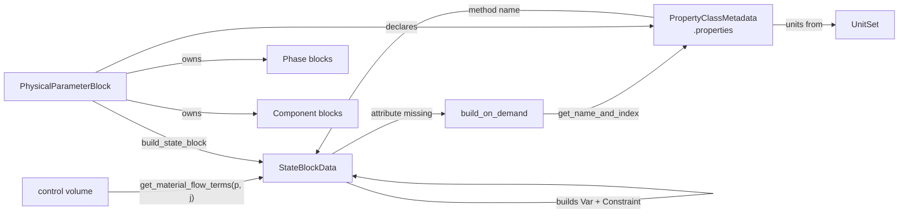
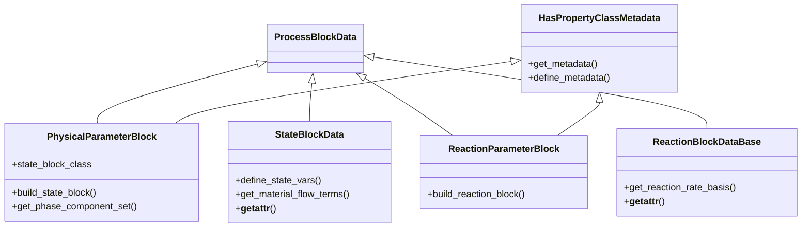
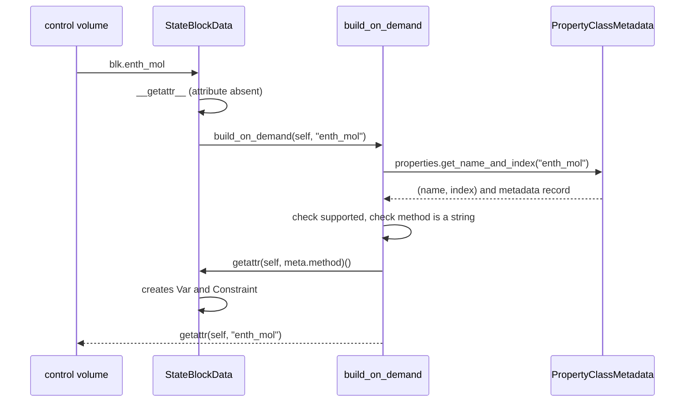

# 05 — Property and reaction framework

> **Doc ID** 05 · **Repo SHA** 70a8f4fe1 (IDAES-PSE v2.13.0rc0) · **Source roots** `idaes/core/base/`
> **Owns** 6 modules / 3,772 LOC · **Assets** none · **Siblings** [03](03_block_hierarchy_and_construction_protocol.md), [04](04_control_volume_framework.md), [12](12_modular_properties_generic_framework.md), [16](16_general_helmholtz_property_system.md)

This document describes the contract between a control volume and the
thermophysical model it queries. It defines what a property package is, what a
state block has to provide, how a package declares what it supports, and how
chemical components and phases are represented. Every property package in the
library — the modular framework, the Helmholtz packages, the
activity-coefficient packages, and every package inside `models_extra` —
implements this contract.

---

## 0. Scope and source map

| File | LOC | Purpose | Covered in § |
|---|---:|---|---|
| `idaes/core/base/property_base.py` | 860 | `PhysicalParameterBlock`, `StateBlock`, `StateBlockData` — the package, the container and the per-point state | 3, 4, 5, 7, 9 |
| `idaes/core/base/reaction_base.py` | 434 | `ReactionParameterBlock`, `ReactionBlockBase`, `ReactionBlockDataBase` — the same three roles for reactions | 3, 4, 7, 9 |
| `idaes/core/base/property_meta.py` | 602 | `HasPropertyClassMetadata`, `UnitSet`, `PropertyClassMetadata` — units of measurement and the metadata a package declares | 3, 5, 7 |
| `idaes/core/base/property_set.py` | 1,051 | `PropertySetBase`, `StandardPropertySet`, `ElectrolytePropertySet` — the vocabulary of thermophysical quantities | 3, 6 |
| `idaes/core/base/phases.py` | 232 | `Phase` and its four subclasses; `PhaseType` | 3, 4, 5 |
| `idaes/core/base/components.py` | 593 | `Component` and its six subclasses — chemical species declarations | 3, 4, 5 |

Total 3,772 LOC, 46 configuration keys, 17 `NotImplementedError` hooks.

---

## 1. Architectural role

A control volume writes conservation equations but knows nothing about
thermodynamics. It asks questions — what is the molar flow of this component in
this phase, what is the enthalpy flow, what is the density — and a property
package answers with Pyomo expressions. This document defines the vocabulary of
those questions and the obligations of anything that answers them.

Three roles, mirrored between properties and reactions:

- A **parameter block** is created once per flowsheet and holds everything
  shared: the chemical components, the phases, the numeric parameters, and the
  metadata describing what the package supports. `PhysicalParameterBlock`
  (`idaes/core/base/property_base.py:77`) and `ReactionParameterBlock`
  (`idaes/core/base/reaction_base.py:69`).
- A **state block** is created once per point in the model — per time, or per
  time and length — and holds the state variables and whatever properties have
  been asked for. `StateBlockData` (`idaes/core/base/property_base.py:535`) and
  `ReactionBlockDataBase` (`idaes/core/base/reaction_base.py:252`).
- A **container class** collects the state blocks of an indexed set and provides
  the operations that act on all of them at once — building a port, reporting,
  initializing. `StateBlock` (`idaes/core/base/property_base.py:267`) and
  `ReactionBlockBase` (`idaes/core/base/reaction_base.py:216`).

Two mechanisms make the framework extensible without requiring a package to
build everything eagerly. *Metadata* declares, per property, whether the package
supports it and which method builds it; a package that supports forty properties
does not construct forty sets of variables unless they are used. *On-demand
construction* turns an attribute access into a call to that method, through
`build_on_demand` ([03 §5.6](03_block_hierarchy_and_construction_protocol.md#56-on-demand-attribute-construction)).
The combination is why a control volume can write
`blk.properties_out[t].enth_mol` and have the enthalpy model appear.

*The parameter block declares the vocabulary; the state block answers the question; the metadata connects the two.*

---

## 2. Public surface inventory

| Symbol | Kind | Declared at | Exported via | Stability signal |
|---|---|---|---|---|
| `PhysicalParameterBlock` | class | `idaes/core/base/property_base.py:77` | `__all__`, `idaes.core` | in `__all__`; autodoc'd |
| `StateBlock` | class | `idaes/core/base/property_base.py:267` | `__all__`, `idaes.core` | in `__all__`; autodoc'd |
| `StateBlockData` | class | `idaes/core/base/property_base.py:535` | `__all__`, `idaes.core` | in `__all__`; autodoc'd |
| `_lock_attribute_creation_context` | class | `idaes/core/base/property_base.py:64` | — | leading underscore |
| `ReactionParameterBlock` | class | `idaes/core/base/reaction_base.py:69` | `__all__`, `idaes.core` | in `__all__` |
| `ReactionBlockBase` | class | `idaes/core/base/reaction_base.py:216` | `__all__`, `idaes.core` | in `__all__` |
| `ReactionBlockDataBase` | class | `idaes/core/base/reaction_base.py:252` | `__all__`, `idaes.core` | in `__all__` |
| `HasPropertyClassMetadata` | class | `idaes/core/base/property_meta.py:66` | — | not re-exported |
| `UnitSet` | class | `idaes/core/base/property_meta.py:114` | — | autodoc'd in `docs/` |
| `PropertyClassMetadata` | class | `idaes/core/base/property_meta.py:426` | — | autodoc'd in `docs/` |
| `_PropertyMetadataIndex` | class | `idaes/core/base/property_set.py:34` | — | leading underscore |
| `PropertyMetadata` | class | `idaes/core/base/property_set.py:227` | — | autodoc'd |
| `PropertySetBase` | class | `idaes/core/base/property_set.py:337` | — | autodoc'd |
| `StandardPropertySet` | class | `idaes/core/base/property_set.py:606` | `idaes.core` | re-exported |
| `ElectrolytePropertySet` | class | `idaes/core/base/property_set.py:992` | `idaes.core` | re-exported |
| `PhaseType` | enum | `idaes/core/base/phases.py:33` | `idaes.core` | re-exported |
| `PhaseData`, `Phase` | class pair | `idaes/core/base/phases.py:47` | `idaes.core` | re-exported |
| `LiquidPhaseData`, `LiquidPhase` | class pair | `idaes/core/base/phases.py:171` | `idaes.core` | re-exported |
| `SolidPhaseData`, `SolidPhase` | class pair | `idaes/core/base/phases.py:187` | `idaes.core` | re-exported |
| `VaporPhaseData`, `VaporPhase` | class pair | `idaes/core/base/phases.py:203` | `idaes.core` | re-exported |
| `AqueousPhaseData`, `AqueousPhase` | class pair | `idaes/core/base/phases.py:219` | `idaes.core` | re-exported |
| `__all_phases__` | list | `idaes/core/base/phases.py:232` | — | module-level roster |
| `ComponentData`, `Component` | class pair | `idaes/core/base/components.py:36` | `idaes.core` | re-exported |
| `SoluteData`, `Solute` | class pair | `idaes/core/base/components.py:347` | `idaes.core` | re-exported |
| `SolventData`, `Solvent` | class pair | `idaes/core/base/components.py:391` | `idaes.core` | re-exported |
| `IonData`, `Ion` | class pair | `idaes/core/base/components.py:433` | `idaes.core` | re-exported |
| `AnionData`, `Anion` | class pair | `idaes/core/base/components.py:481` | `idaes.core` | re-exported |
| `CationData`, `Cation` | class pair | `idaes/core/base/components.py:515` | `idaes.core` | re-exported |
| `ApparentData`, `Apparent` | class pair | `idaes/core/base/components.py:549` | `idaes.core` | re-exported |

---

## 3. Class hierarchy and type taxonomy

*Both parameter blocks inherit twice: once for the block protocol, once for the metadata protocol.*

| Class | Base(s) | Declared at | Decorator | Container class | Key overrides |
|---|---|---|---|---|---|
| `PhysicalParameterBlock` | `ProcessBlockData`, `HasPropertyClassMetadata` | `property_base.py:77` | none | — | `build` |
| `StateBlock` | `ProcessBlock` | `property_base.py:267` | none | — | `initialize`, `report`, `build_port` |
| `StateBlockData` | `ProcessBlockData` | `property_base.py:535` | none | — | `__init__`, `build`, `__getattr__`, `calculate_scaling_factors` |
| `ReactionParameterBlock` | `ProcessBlockData`, `HasPropertyClassMetadata` | `reaction_base.py:69` | none | — | `build` |
| `ReactionBlockBase` | `ProcessBlock` | `reaction_base.py:216` | none | — | `initialize`, `report` |
| `ReactionBlockDataBase` | `ProcessBlockData` | `reaction_base.py:252` | none | — | `__init__`, `build`, `__getattr__` |
| `PhaseData` | `ProcessBlockData` | `phases.py:47` | `@declare_process_block_class("Phase")` | `Phase` | `build` |
| `LiquidPhaseData` | `PhaseData` | `phases.py:171` | `@declare_process_block_class("LiquidPhase", block_class=Phase)` | `LiquidPhase` | three predicates |
| `SolidPhaseData` | `PhaseData` | `phases.py:187` | `@declare_process_block_class("SolidPhase", block_class=Phase)` | `SolidPhase` | three predicates |
| `VaporPhaseData` | `PhaseData` | `phases.py:203` | `@declare_process_block_class("VaporPhase", block_class=Phase)` | `VaporPhase` | three predicates |
| `AqueousPhaseData` | `LiquidPhaseData` | `phases.py:219` | `@declare_process_block_class("AqueousPhase", block_class=LiquidPhase)` | `AqueousPhase` | `is_aqueous_phase` |
| `ComponentData` | `ProcessBlockData` | `components.py:36` | `@declare_process_block_class("Component")` | `Component` | `build` |
| `SoluteData` | `ComponentData` | `components.py:347` | `@declare_process_block_class("Solute", block_class=Component)` | `Solute` | `is_solute`, list registration |
| `SolventData` | `ComponentData` | `components.py:391` | `@declare_process_block_class("Solvent", block_class=Component)` | `Solvent` | `is_solvent`, list registration |
| `IonData` | `SoluteData` | `components.py:433` | `@declare_process_block_class("Ion", block_class=Component)` | `Ion` | `_is_phase_valid`, adds `charge` |
| `AnionData` | `IonData` | `components.py:481` | `@declare_process_block_class("Anion", block_class=Component)` | `Anion` | `build` fixes charge sign |
| `CationData` | `IonData` | `components.py:515` | `@declare_process_block_class("Cation", block_class=Component)` | `Cation` | `build` fixes charge sign |
| `ApparentData` | `SoluteData` | `components.py:549` | `@declare_process_block_class("Apparent", block_class=Component)` | `Apparent` | adds `dissociation_species` |

Note the use of the decorator's `block_class` argument throughout `phases.py`
and `components.py`. Every phase subclass declares `block_class=Phase` so that
all phases share one container type, and every component subclass declares
`block_class=Component`. `AqueousPhase` declares `block_class=LiquidPhase`,
making the container hierarchy mirror the data hierarchy one level deeper.

### 3.1 `PhaseType`

| Member | Value | Meaning | Consumed at |
|---|---|---|---|
| `undefined` | 0 | No phase restriction | `components.py:294` |
| `liquidPhase` | 1 | Component may exist in a liquid phase | `components.py:294` |
| `vaporPhase` | 2 | Component may exist in a vapour phase | `components.py:294` |
| `solidPhase` | 3 | Component may exist in a solid phase | `components.py:294` |
| `aqueousPhase` | 4 | Component may exist in an aqueous phase | `components.py:338` |

Declared at `idaes/core/base/phases.py:33`. A component's `valid_phase_types`
configuration lists members of this enumeration, and `_is_phase_valid`
(`components.py:294`) uses it to decide whether a phase-component pair belongs
in the phase-component set.

### 3.2 The property vocabulary

`PropertySetBase` (`idaes/core/base/property_set.py:337`) is the container.
`StandardPropertySet` (`:606`) declares **73** properties;
`ElectrolytePropertySet` (`:992`) subclasses it and adds **9** more, for 82 in
total.

The 73 standard properties fall into three groups:

| Group | Count | Members |
|---|---:|---|
| Thermophysical quantities | 57 | `act`, `act_coeff`, `compress_fact`, `compress_fact_crit`, `conc_mass`, `conc_mol`, `cp_mass`, `cp_mol`, `cv_mass`, `cv_mol`, `dens_mass`, `dens_mass_crit`, `dens_mol`, `dens_mol_crit`, `diffus`, `energy_internal_mass`, `energy_internal_mol`, `enth_mass`, `enth_mol`, `entr_mass`, `entr_mol`, `flow_mass`, `flow_mol`, `flow_vol`, `fug`, `fug_coeff`, `heat_capacity_ratio`, `gibbs_mass`, `gibbs_mol`, `isentropic_speed_sound`, `isothermal_speed_sound`, `henry`, `mass_frac`, `mole_frac`, `molality`, `mw`, `phase_frac`, `prandtl_number`, `pressure`, `pressure_bubble`, `pressure_crit`, `pressure_dew`, `pressure_osm`, `pressure_red`, `pressure_sat`, `surf_tens`, `temperature`, `temperature_bubble`, `temperature_crit`, `temperature_dew`, `temperature_red`, `temperature_sat`, `therm_cond`, `visc_d`, `visc_k`, `vol_mol`, `vol_mol_crit` |
| Logarithmic forms | 11 | `log_act`, `log_act_coeff`, `log_conc_mol`, `log_mass_frac`, `log_molality`, `log_mole_frac`, `log_mole_frac_pbub`, `log_mole_frac_pdew`, `log_mole_frac_tbub`, `log_mole_frac_tdew`, `log_pressure` |
| Reaction quantities | 5 | `dh_rxn`, `k_eq`, `log_k_eq`, `k_rxn`, `reaction_rate` |

`ElectrolytePropertySet` adds `log_act_phase_solvents`, `ionic_strength`, `pH`,
`pK`, `pOH`, `log10_act_coeff`, `log10_molality`, `log10_k_eq` and
`saturation_index`, and redefines `_defined_indices`.

The logarithmic forms exist as first-class properties rather than being derived,
because a package that formulates in logarithms produces better-conditioned
equations and the framework has to be able to ask for either form.

Each property is a `PropertyMetadata` (`:227`) holding one or more
`_PropertyMetadataIndex` records (`:34`). The index is what distinguishes
`enth_mol_phase` from `enth_mol_phase_comp`: one property name, several indexing
schemes. `get_name_and_index` (`:337`, on `PropertySetBase`) performs the split,
and is the function `build_on_demand` calls to turn a requested attribute name
into a metadata lookup.

A `_PropertyMetadataIndex` carries `name`, `method`, `units`, `supported`,
`required` and `valid_range`, and refuses attribute assignment after
construction through a `__setattr__` guard and a `_lock_setattr` flag
(`idaes/core/base/property_set.py:34`). Mutation goes through the explicit
`set_method`, `set_supported`, `set_required` and `update_property` methods.

### 3.3 `UnitSet`

`UnitSet` (`idaes/core/base/property_meta.py:114`) is the units registry every
package declares. `set_units` (`:146`) accepts the seven SI base quantities
held in `_base_quantities` (`:127`), and the class exposes **43** quantity
properties in total — the seven base ones plus derived quantities computed from
them.

| Group | Members |
|---|---|
| Base | `TIME`, `LENGTH`, `MASS`, `AMOUNT`, `TEMPERATURE`, `CURRENT`, `LUMINOUS_INTENSITY` |
| Geometric | `AREA`, `VOLUME`, `VOLUME_MASS`, `VOLUME_MOLE`, `MOLAR_VOLUME` |
| Flow and flux | `FLOW_MASS`, `FLOW_MOLE`, `FLOW_VOL`, `FLUX_MASS`, `FLUX_MOLE`, `FLUX_ENERGY` |
| Mechanical | `VELOCITY`, `ACCELERATION`, `FORCE`, `PRESSURE`, `GAS_CONSTANT` |
| Composition | `DENSITY_MASS`, `DENSITY_MOLE`, `MOLALITY`, `MOLECULAR_WEIGHT` |
| Energy | `ENERGY`, `ENERGY_MASS`, `ENERGY_MOLE`, `POWER`, `VOLTAGE` |
| Thermal | `HEAT_CAPACITY_MASS`, `HEAT_CAPACITY_MOLE`, `HEAT_TRANSFER_COEFFICIENT`, `ENTROPY`, `ENTROPY_MASS`, `ENTROPY_MOLE`, `THERMAL_CONDUCTIVITY` |
| Transport | `DIFFUSIVITY`, `DYNAMIC_VISCOSITY`, `KINEMATIC_VISCOSITY`, `SURFACE_TENSION` |

`unitset_is_consistent` (`:210`) compares two sets, and is what
`_validate_property_parameter_units` (`reaction_base.py:183`) uses to reject a
reaction package whose units disagree with the property package it is attached
to.

---

## 4. Configuration reference

46 keys across seven declarations.

### 4.1 `PhysicalParameterBlock.CONFIG`

Declared at `idaes/core/base/property_base.py:86`.

| Key | Domain / validator | Default | Req. | Effect on build | Anchor |
|---|---|---|---|---|---|
| `default_arguments` | implicit `ConfigBlock` | empty | no | Merged into every consumer's `property_package_args`, with the consumer's own arguments winning | `:87` |

### 4.2 `StateBlockData.CONFIG`

Declared at `idaes/core/base/property_base.py:543`.

| Key | Domain / validator | Default | Req. | Effect on build | Anchor |
|---|---|---|---|---|---|
| `parameters` | `is_physical_parameter_block` | none | yes | The parameter block this state block reads from; injected by `build_state_block` | `:544` |
| `defined_state` | `Bool` | `False` | no | When true, the state is already fully determined, so the package omits the sum-of-mole-fractions constraint | `:552` |
| `has_phase_equilibrium` | `Bool` | `True` | no | Whether phase equilibrium constraints are constructed at this point | `:567` |

`defined_state` is the single most consequential flag in the framework. A
control volume sets it `True` on whichever state block the information flows
from and `False` on the other
(see [04 §5.5](04_control_volume_framework.md#55-zero-dimensional-construction)),
which is what keeps the degrees of freedom correct without the unit model
counting equations itself.

### 4.3 `ReactionParameterBlock.CONFIG`

Declared at `idaes/core/base/reaction_base.py:77`.

| Key | Domain / validator | Default | Req. | Effect on build | Anchor |
|---|---|---|---|---|---|
| `property_package` | `is_physical_parameter_block` | none | yes | The property package this reaction package is validated against | `:78` |
| `default_arguments` | implicit `ConfigBlock` | empty | no | Merged into consumers' `reaction_package_args` | `:85` |

### 4.4 `ReactionBlockDataBase.CONFIG`

Declared at `idaes/core/base/reaction_base.py:260`.

| Key | Domain / validator | Default | Req. | Effect on build | Anchor |
|---|---|---|---|---|---|
| `parameters` | `is_reaction_parameter_block` | none | yes | The reaction parameter block | `:261` |
| `state_block` | `is_state_block` | none | yes | The state block whose conditions the reaction properties are evaluated at | `:269` |
| `has_equilibrium` | `Bool` | `True` | no | Whether equilibrium reaction constraints are constructed | `:277` |

### 4.5 `PhaseData.CONFIG`

Declared at `idaes/core/base/phases.py:52` as a **fresh** `ConfigBlock()`, not a
copy of `ProcessBlockData.CONFIG`. Nine keys.

| Key | Domain / validator | Default | Req. | Effect on build | Anchor |
|---|---|---|---|---|---|
| `component_list` | `list` | `None` | no | Restricts which chemical components exist in this phase; `None` means all of them | `:53` |
| `equation_of_state` | none | `None` | no | The module or class supplying thermodynamic relations for this phase | `:63` |
| `equation_of_state_options` | none | `None` | no | Options forwarded to that module | `:73` |
| `parameter_data` | `dict` | `{}` | no | Phase-specific numeric parameters | `:82` |
| `_phase_list_exists` | none | `False` | no | Internal flag suppressing re-registration on the parent's `phase_list` | `:90` |
| `therm_cond_phase` | none | none | no | Phase thermal conductivity model | `:99` |
| `surf_tens_phase` | none | none | no | Phase surface tension model | `:103` |
| `visc_d_phase` | none | none | no | Phase dynamic viscosity model | `:107` |
| `transport_property_options` | none | none | no | Options for the transport property models | `:111` |

### 4.6 `ComponentData.CONFIG`

Declared at `idaes/core/base/components.py:41`, also a fresh `ConfigBlock()`.
26 keys. Most name a correlation to use for one property of this chemical
component; the modular property framework resolves them through `get_method`
(see [12](12_modular_properties_generic_framework.md)).

| Key | Domain / validator | Default | Req. | Effect on build | Anchor |
|---|---|---|---|---|---|
| `valid_phase_types` | `ListOf(PhaseType)` | none | no | Restricts which phases this component may appear in | `:43` |
| `elemental_composition` | `dict` | none | no | Element counts; required for element balances | `:51` |
| `henry_component` | `dict` | none | no | Phases in which the component follows Henry's law | `:61` |
| `vol_mol_liq_comp` | none | none | no | Liquid molar volume model | `:71` |
| `vol_mol_sol_comp` | none | none | no | Solid molar volume model | `:79` |
| `dens_mol_liq_comp` | none | none | no | Liquid molar density model | `:87` |
| `dens_mol_sol_comp` | none | none | no | Solid molar density model | `:95` |
| `cp_mol_liq_comp` | none | none | no | Liquid heat capacity model | `:104` |
| `cp_mol_sol_comp` | none | none | no | Solid heat capacity model | `:108` |
| `cp_mol_ig_comp` | none | none | no | Ideal-gas heat capacity model | `:112` |
| `enth_mol_liq_comp` | none | none | no | Liquid molar enthalpy model | `:118` |
| `enth_mol_sol_comp` | none | none | no | Solid molar enthalpy model | `:124` |
| `enth_mol_ig_comp` | none | none | no | Ideal-gas molar enthalpy model | `:128` |
| `entr_mol_liq_comp` | none | none | no | Liquid molar entropy model | `:134` |
| `entr_mol_sol_comp` | none | none | no | Solid molar entropy model | `:138` |
| `entr_mol_ig_comp` | none | none | no | Ideal-gas molar entropy model | `:142` |
| `diffus_phase_comp` | none | none | no | Diffusivity model | `:149` |
| `visc_d_phase_comp` | none | none | no | Component dynamic viscosity model | `:156` |
| `therm_cond_phase_comp` | none | none | no | Component thermal conductivity model | `:163` |
| `has_vapor_pressure` | `Bool` | `True` | no | Whether the component has a saturation pressure | `:170` |
| `pressure_sat_comp` | none | none | no | Saturation pressure model | `:178` |
| `relative_permittivity_liq_comp` | none | none | no | Liquid relative permittivity model | `:182` |
| `phase_equilibrium_form` | `dict` | none | no | Per phase pair, the equality form used for phase equilibrium | `:189` |
| `parameter_data` | `dict` | `{}` | no | Component-specific numeric parameters | `:197` |
| `_component_list_exists` | none | `False` | no | Internal flag suppressing re-registration | `:206` |
| `_electrolyte` | none | `False` | no | Internal flag selecting the electrolyte component lists | `:214` |

`IonData.CONFIG` (`components.py:439`) adds one key: `charge` (`int`, no
default, `:449`). `ApparentData.CONFIG` (`:556`) adds one: `dissociation_species`
(`dict`, default `None`, `:557`).

`IonData` also reads a key off its own configuration at class-definition time —
`has_psat = CONFIG.get("has_vapor_pressure")` (`components.py:444`) — which sets
the vapour-pressure default for ionic species.

---

## 5. Construction and call sequences

### 5.1 Metadata declaration, once per class

`HasPropertyClassMetadata.get_metadata` (`idaes/core/base/property_meta.py:72`)
is a classmethod that lazily constructs a `PropertyClassMetadata` and calls
`define_metadata(cls, pcm)` exactly once per class. `define_metadata` (`:98`)
raises `NotImplementedError` in the base, and is the method every property
package implements. A package typically calls, on the object it is handed:

- `add_default_units(dict)` (`:478`) — the seven base quantities;
- `add_properties(dict)` (`:504`) — which properties are supported and which
  method builds each;
- `define_custom_properties(dict)` (`:555`) — properties outside the standard
  set;
- `add_required_properties(str)` (`:581`) — what this package needs from another.

`define_property_set(propset)` (`:448`) replaces `StandardPropertySet` with
another `PropertySetBase` subclass — this is how an electrolyte package selects
`ElectrolytePropertySet`, and the method type-checks its argument.

### 5.2 Building state blocks

`PhysicalParameterBlock.build_state_block(*args, **kwargs)`
(`idaes/core/base/property_base.py:169`):

1. Force construction of the phase-component set by calling
   `get_phase_component_set()`.
2. Inject `parameters=self` into `kwargs`, or into every entry of `initialize`
   when per-index configuration was supplied.
3. Call `self.state_block_class(*args, **kwargs, initialize=initialize)`.

`state_block_class` (`:116`) is a property that returns `_state_block_class`,
raising a `PropertyPackageError` naming the package when it has not been set.
`build()` (`:94`) sets `_state_block_class = None`, `_has_inherent_reactions =
False` and `_default_state_scaler_object = None`, so a package that forgets to
assign the class fails with a message rather than an `AttributeError`.

`get_phase_component_set` (`:197`) lazily builds `self._phase_component_set` as
an ordered Pyomo `Set` of valid phase-component pairs, taking each phase's
`component_list` where one is configured and the global `component_list`
otherwise. This set is what indexes nearly every phase-dependent quantity in the
framework.

`ReactionParameterBlock.build_reaction_block` (`reaction_base.py:160`) is the
mirror image, injecting `parameters=self`. Its `build` (`:92`) additionally runs
`_validate_property_parameter_units` (`:183`) and
`_validate_property_parameter_properties` (`:198`), so a reaction package
attached to an incompatible property package fails at construction.

### 5.3 Port construction from a state block

`StateBlock.build_port(doc=None, slice_index=None, index=None)`
(`idaes/core/base/property_base.py:488`):

1. Create an empty Pyomo `Port`.
2. Call `self[index].define_port_members()` to learn which quantities the port
   carries.
3. For each member, create a `Reference` to `self[slice_index].component(local_name)`,
   adding `[...]` for indexed members.
4. Return the port and the list of `(reference, component_name)` pairs.

`slice_index` is what lets a one-dimensional control volume expose a single
spatial point as a port: the caller passes `(slice(None), x)` so the reference
spans time but fixes position
([03 §5.7](03_block_hierarchy_and_construction_protocol.md#57-port-construction)).

`get_port_reference_name` (`:474`) produces `_{component_name}_{port_name}_ref`,
the name under which the unit model stores each reference.

### 5.4 Property access

*The property appears on first access; a package declares the method name in metadata and never has to build eagerly.*

`StateBlockData.__getattr__` (`idaes/core/base/property_base.py:816`) tries
`super().__getattr__` first and falls through to `build_on_demand`.
`ReactionBlockDataBase.__getattr__` (`reaction_base.py:390`) does the same.

Two controls exist over this behaviour.
`is_property_constructed(attr)` (`property_base.py:593`) tests for an attribute
*without* triggering construction. `lock_attribute_creation_context()`
(`:586`) returns a `_lock_attribute_creation_context` (`:64`) that sets
`_lock_attribute_creation` on entry and clears it on exit; inside the context,
a missing property raises `AttributeError` instead of being built. Diagnostic
code uses this to inspect a model without changing it.

### 5.5 Phase and component registration

`PhaseData.build` (`phases.py:119`) calls `__add_to_phase_list` (`:157`), which
appends this phase's name to the parent parameter block's `phase_list`, creating
the list if necessary. The `_phase_list_exists` configuration key suppresses the
registration when the list was built another way.

`ComponentData.build` (`components.py:223`) calls `_add_to_component_list`
(`:272`) or, when `_electrolyte` is set, `_add_to_electrolyte_component_list`
(`:284`). The subclasses override both to place themselves on the correct list:
`SoluteData` (`:362`, `:377`), `SolventData` (`:406`, `:421`), `IonData`
(`:457`, `:466`), `AnionData` (`:503`) and `CationData` (`:537`).

`AnionData.build` (`:489`) and `CationData.build` (`:523`) additionally validate
the sign of the configured `charge`, so an anion with a positive charge fails at
construction.

Declaration order therefore matters: a parameter block declares its phases and
components as sub-blocks, and the lists that index the rest of the model are a
side effect of building them.

---

## 6. Data structures, variables, constraints and invariants

The modules in this document create few Pyomo components directly — building
variables is the job of the concrete packages documented in 12 through 16 and
22. What this layer creates is the indexing structure.

| Component | Type | Index sets | Units | Created at | Condition |
|---|---|---|---|---|---|
| `phase_list` | `Set` | — | — | `phases.py:157` | first `Phase` built |
| `component_list` | `Set` | — | — | `components.py:272` | first `Component` built |
| electrolyte component lists | `Set` | — | — | `components.py:284` | `_electrolyte` set |
| `_phase_component_set` | `Set` (ordered) | — | — | `property_base.py:197` | first call to `get_phase_component_set` |
| `<name>` | `Port` | as the state block | per member | `property_base.py:488` | `build_port` |

| Python structure | Type | Held on | Purpose |
|---|---|---|---|
| `_metadata` | `PropertyClassMetadata` | the package class | Declared once per class, not per instance |
| `_default_units` | `UnitSet` | `PropertyClassMetadata` | The seven base quantities and 43 accessors |
| `_properties` | `PropertySetBase` | `PropertyClassMetadata` | 73 or 82 property records |
| `_state_block_class` | class | `PhysicalParameterBlock` | Set by the package; read through a checked property |
| `_has_inherent_reactions` | `bool` | `PhysicalParameterBlock` | Whether the package carries its own equilibrium reactions |
| `_default_state_scaler_object` | `ScalerBase` or `None` | `PhysicalParameterBlock` | Type-checked on assignment |
| `_lock_attribute_creation` | `bool` | state and reaction blocks | Suppresses on-demand construction |
| `__getattrcalls` | `list` | state and reaction blocks | Recursion detection stack |

### 6.1 Invariants

| Invariant | Enforced at |
|---|---|
| A package declares its state block class before a state block is built | `property_base.py:116` |
| `get_component` returns a `Component`, not an arbitrary attribute | `property_base.py:227` |
| `get_phase` returns a `Phase` | `property_base.py:248` |
| A default state Scaler is a `ScalerBase` subclass | `property_base.py:151` |
| A reaction package's units match its property package's | `reaction_base.py:183` |
| A reaction package's required properties are supported by its property package | `reaction_base.py:198` |
| A reaction block's `state_block` is a state block | `reaction_base.py:361` |
| An anion has negative charge; a cation positive | `components.py:489`, `:523` |
| Property metadata records are immutable after construction | `property_set.py:34` |
| Metadata is defined exactly once per class | `property_meta.py:72` |

---

## 7. Method contracts

### 7.1 `PhysicalParameterBlock`

| Method | Signature | Preconditions | Effects | Returns | Raises | Anchor |
|---|---|---|---|---|---|---|
| `build` | `(self)` | — | Sets `_state_block_class`, `_has_inherent_reactions`, `_default_state_scaler_object` | `None` | — | `:94` |
| `state_block_class` | property | class assigned | none | class | `PropertyPackageError` | `:116` |
| `has_inherent_reactions` | property | — | none | `bool` | — | `:130` |
| `default_state_scaler_class` | property | — | none | class or `None` | — | `:134` |
| `default_state_scaler_object` | property + setter + deleter | — | Type-checks on set | `ScalerBase` or `None` | `TypeError` | `:138`, `:151`, `:166` |
| `build_state_block` | `(self, *args, **kwargs)` | `state_block_class` set | Builds state blocks with `parameters` injected | `StateBlock` | `PropertyPackageError` | `:169` |
| `get_phase_component_set` | `(self)` | phases and components declared | Creates `_phase_component_set` on first call | `Set` | — | `:197` |
| `get_component` | `(self, comp)` | — | none | `Component` | `PropertyPackageError` | `:227` |
| `get_phase` | `(self, phase)` | — | none | `Phase` | `PropertyPackageError` | `:248` |

### 7.2 `StateBlock` (container)

| Method | Signature | Effects | Raises | Anchor |
|---|---|---|---|---|
| `component_list`, `phase_list`, `phase_component_set` | properties | Delegate to the parameter block | — | `:279`, `:286`, `:293` |
| `has_inherent_reactions`, `include_inherent_reactions` | properties | As above | — | `:300`, `:310` |
| `_get_parameter_block` | `(self)` | none | `PropertyPackageError` | `:316` |
| `params` | property | none | — | `:344` |
| `fix_initialization_states` | `(self)` | — | `NotImplementedError` | `:347` |
| `initialize` | `(self, *args, **kwargs)` | — | `NotImplementedError` | `:356` |
| `report` | `(self, index=(0), true_state=False, dof=False, ostream=None, prefix="")` | Writes a formatted report | — | `:374` |
| `get_port_reference_name` | `(self, component_name, port_name)` | none | — | `:474` |
| `build_port` | `(self, doc=None, slice_index=None, index=None)` | Creates a `Port` and references | — | `:488` |

### 7.3 `StateBlockData`

| Method | Signature | Effects | Raises | Anchor |
|---|---|---|---|---|
| `__init__` | `(self, *args, **kwargs)` | Sets `_lock_attribute_creation = False` | — | `:582` |
| `lock_attribute_creation_context` | `(self)` | Returns a context manager | — | `:586` |
| `is_property_constructed` | `(self, attr)` | none; does not trigger construction | — | `:593` |
| `build` | `(self)` | Base construction | — | `:649` |
| `params` | property | none | — | `:663` |
| `define_state_vars` | `(self)` | — | `NotImplementedError` | `:666` |
| `define_port_members` | `(self)` | Defaults to `define_state_vars` | — | `:678` |
| `define_display_vars` | `(self)` | Defaults to `define_state_vars` | — | `:685` |
| `get_material_flow_terms` | `(self, *args, **kwargs)` | — | `NotImplementedError` | `:693` |
| `get_material_density_terms` | `(self, *args, **kwargs)` | — | `NotImplementedError` | `:704` |
| `get_material_diffusion_terms` | `(self, *args, **kwargs)` | — | `NotImplementedError` | `:715` |
| `get_enthalpy_flow_terms` | `(self, *args, **kwargs)` | — | `NotImplementedError` | `:727` |
| `get_energy_density_terms` | `(self, *args, **kwargs)` | — | `NotImplementedError` | `:738` |
| `get_energy_diffusion_terms` | `(self, *args, **kwargs)` | — | `NotImplementedError` | `:749` |
| `get_material_flow_basis` | `(self, *args, **kwargs)` | Returns `MaterialFlowBasis.other` | — | `:761` |
| `calculate_bubble_point_temperature` | `(self, *args, **kwargs)` | — | `NotImplementedError` | `:768` |
| `calculate_dew_point_temperature` | `(self, *args, **kwargs)` | — | `NotImplementedError` | `:780` |
| `calculate_bubble_point_pressure` | `(self, *args, **kwargs)` | — | `NotImplementedError` | `:792` |
| `calculate_dew_point_pressure` | `(self, *args, **kwargs)` | — | `NotImplementedError` | `:804` |
| `__getattr__` | `(self, attr)` | Falls through to `build_on_demand` | several | `:816` |
| `calculate_scaling_factors` | `(self)` | Applies package default scaling to unscaled local components | — | `:849` |

`define_port_members` and `define_display_vars` are the two hooks that default
to `define_state_vars` rather than raising. A package therefore has to implement
one method to be connectable, and overrides the other two only when the port
contents or the report contents differ from the state variables.

`get_material_flow_basis` returning `MaterialFlowBasis.other` rather than
raising is what makes the basis optional: a package that does not declare a
basis gets no automatic unit conversion in reaction terms
([04 §5.7](04_control_volume_framework.md#57-reaction-basis-conversion)).

### 7.4 Reaction classes

| Method | Signature | Effects | Raises | Anchor |
|---|---|---|---|---|
| `ReactionParameterBlock.build` | `(self)` | Sets the reaction block class placeholder and validates against the property package | `PropertyPackageError` | `reaction_base.py:92` |
| `ReactionParameterBlock.build_reaction_block` | `(self, *args, **kwargs)` | Builds reaction blocks with `parameters` injected | `PropertyPackageError` | `:160` |
| `_validate_property_parameter_units` | `(self)` | none | `PropertyPackageError` | `:183` |
| `_validate_property_parameter_properties` | `(self)` | none | `PropertyPackageError` | `:198` |
| `ReactionBlockBase.initialize` | `(self, *args)` | — | `NotImplementedError` | `:227` |
| `ReactionBlockBase.report` | `(self, index=(0), ...)` | — | `NotImplementedError` | `:245` |
| `ReactionBlockDataBase.build` | `(self)` | Validates the state block | `PropertyPackageError` | `:341` |
| `_validate_state_block` | `(self)` | none | `PropertyPackageError` | `:361` |
| `get_reaction_rate_basis` | `(self)` | Returns `MaterialFlowBasis.other` | — | `:383` |
| `__getattr__` | `(self, attr)` | Falls through to `build_on_demand` | several | `:390` |

### 7.5 `PropertyClassMetadata`

| Method | Signature | Effects | Raises | Anchor |
|---|---|---|---|---|
| `define_property_set` | `(self, propset)` | Replaces the property set | `TypeError` for a non-`PropertySetBase` | `property_meta.py:448` |
| `default_units` | property | none | — | `:465` |
| `derived_units` | property | none | — | `:470` |
| `properties` | property | none | — | `:475` |
| `add_default_units` | `(self, u: dict)` | Populates the `UnitSet` | `PropertyPackageError` | `:478` |
| `add_properties` | `(self, p: dict)` | Marks properties supported and records build methods | `PropertyPackageError` | `:504` |
| `define_custom_properties` | `(self, p: dict)` | Adds properties outside the standard set | — | `:555` |
| `add_required_properties` | `(self, p: str)` | Marks properties this package needs from another | — | `:581` |
| `get_derived_units` | `(self, units: str)` | none | `KeyError` for an unknown quantity | `:600` |

---

## 8. Cross-subsystem interactions

### Calls out to

| Target | Purpose | Anchor |
|---|---|---|
| `ProcessBlockData` | Base of every class here; configuration and lifecycle | `property_base.py:77` |
| `build_on_demand` | On-demand property construction | `property_base.py:816`, `reaction_base.py:390` |
| `declare_process_block_class` | The phase and component class pairs | `phases.py:47`, `components.py:36` |
| `pyomo.environ.Set`, `Port`, `Reference` | Indexing sets and port construction | `property_base.py:197`, `:488` |
| `pyomo.environ.units` | Every quantity in `UnitSet` | `property_meta.py:114` |
| `idaes.core.initialization.BlockTriangularizationInitializer` | Default initializer for state and reaction containers | `property_base.py:276`, `reaction_base.py:225` |
| `idaes.core.util.exceptions.PropertyPackageError`, `PropertyNotSupportedError` | Every validation failure | throughout |

### Called by

| Caller | What it relies on | Owning doc |
|---|---|---|
| Control volumes | `build_state_block`, `build_reaction_block`, the `get_*_terms` contract, `defined_state` | [04](04_control_volume_framework.md) |
| Unit models | `StateBlock.build_port`, `get_port_reference_name` | [03](03_block_hierarchy_and_construction_protocol.md) |
| The modular property framework | Every class here; it is the largest implementation of this contract | [12](12_modular_properties_generic_framework.md) |
| EoS and pure-component plug-ins | `Phase.equation_of_state`, `Component` correlation keys | [13](13_modular_properties_eos_and_phase_equilibrium.md), [14](14_modular_properties_state_definitions_and_libraries.md) |
| Helmholtz packages | `PhysicalParameterBlock`, `StateBlockData` | [16](16_general_helmholtz_property_system.md) |
| Non-modular packages | The same contract | [15](15_property_package_catalog.md) |
| Extended-library property packages | The same contract | [19](19_power_generation_heat_exchangers_and_properties.md), [21](21_column_models_and_solvent_systems.md), [22](22_gas_solid_contactors.md) |
| Initializers and Scalers | `default_state_scaler_object`, `fix_initialization_states` | [06](06_model_preparation_initializers_and_scalers.md) |
| Diagnostics | `lock_attribute_creation_context`, `is_property_constructed` | [07](07_diagnostics_and_run_orchestration.md) |

---

## 9. Extension and subclassing contracts

17 `NotImplementedError` hooks. Fourteen are the property-package author's
contract; the messages direct the reader to the package developer rather than to
the framework.

| Hook | Kind | Signature | Base behaviour | Anchor |
|---|---|---|---|---|
| `HasPropertyClassMetadata.define_metadata` | classmethod | `(cls, pcm)` | raises | `property_meta.py:111` |
| `StateBlockData.define_state_vars` | method | `(self)` | raises | `property_base.py:672` |
| `StateBlockData.get_material_flow_terms` | method | `(self, p, j)` | raises | `property_base.py:698` |
| `StateBlockData.get_material_density_terms` | method | `(self, p, j)` | raises | `property_base.py:709` |
| `StateBlockData.get_material_diffusion_terms` | method | `(self, p, j)` | raises | `property_base.py:720` |
| `StateBlockData.get_enthalpy_flow_terms` | method | `(self, p)` | raises | `property_base.py:732` |
| `StateBlockData.get_energy_density_terms` | method | `(self, p)` | raises | `property_base.py:743` |
| `StateBlockData.get_energy_diffusion_terms` | method | `(self, p)` | raises | `property_base.py:754` |
| `StateBlockData.calculate_bubble_point_temperature` | method | `(self, *args, **kwargs)` | raises | `property_base.py:773` |
| `StateBlockData.calculate_dew_point_temperature` | method | `(self, *args, **kwargs)` | raises | `property_base.py:785` |
| `StateBlockData.calculate_bubble_point_pressure` | method | `(self, *args, **kwargs)` | raises | `property_base.py:797` |
| `StateBlockData.calculate_dew_point_pressure` | method | `(self, *args, **kwargs)` | raises | `property_base.py:809` |
| `StateBlock.fix_initialization_states` | method | `(self)` | raises | `property_base.py:354` |
| `StateBlock.initialize` | method | `(self, *args, **kwargs)` | raises | `property_base.py:368` |
| `ReactionBlockBase.initialize` | method | `(self, *args)` | raises | `reaction_base.py:239` |
| `ReactionBlockBase.report` | method | `(self, index=(0), ...)` | raises | `reaction_base.py:246` |
| `IonData._add_to_electrolyte_component_list` | method | `(self)` | raises | `components.py:473` |

`IonData._add_to_electrolyte_component_list` raising is deliberate: an `Ion` is
abstract with respect to charge sign, and only `Anion` and `Cation` know which
list they belong on.

Non-raising extension points:

| Hook | Kind | Resolution | Base | Anchor |
|---|---|---|---|---|
| `_state_block_class` | class attribute | Read through the `state_block_class` property | `None` | `property_base.py:109` (assigned), `:116` (read) |
| `define_port_members` | method override | Called by `build_port` | `define_state_vars` | `property_base.py:678` |
| `define_display_vars` | method override | Called by `report` | `define_state_vars` | `property_base.py:685` |
| `get_material_flow_basis` | method override | Called by control volumes | `MaterialFlowBasis.other` | `property_base.py:761` |
| `get_reaction_rate_basis` | method override | Called by control volumes | `MaterialFlowBasis.other` | `reaction_base.py:383` |
| `default_state_scaler_class` | class attribute | Consulted by the Scaler machinery | `None` | `property_base.py:134` |
| `default_initializer` | class attribute | Consulted by submodel initializer resolution | `BlockTriangularizationInitializer` | `property_base.py:276` |
| `equation_of_state` | phase config key | Resolved by the modular framework | `None` | `phases.py:63` |
| the 20 correlation keys on `ComponentData` | component config keys | Resolved by `get_method` | none | `components.py:71`–`:182` |
| `define_property_set` | metadata call | Selects the property vocabulary | `StandardPropertySet` | `property_meta.py:448` |

---

## 10. External assets, data files and external libraries

Not applicable: the six modules read no data files, load no shared libraries and
start no subprocesses. Packages built on this contract do — the Helmholtz
packages bind a compiled library and read JSON and NL files
([16](16_general_helmholtz_property_system.md)), and the modular cubic equation
of state binds `cubic_roots`
([13](13_modular_properties_eos_and_phase_equilibrium.md)) — but the contract
itself is pure Python and Pyomo.

---

## 11. Errors, logging and diagnostics behaviour

| Exception | Raised for | Anchor |
|---|---|---|
| `NotImplementedError` | An unimplemented package obligation | 17 sites, section 9 |
| `PropertyPackageError` | `state_block_class` read before assignment | `property_base.py:116` |
| `PropertyPackageError` | `get_component` or `get_phase` given a name that is not one | `property_base.py:227`, `:248` |
| `PropertyPackageError` | A state block that cannot find its parameter block | `property_base.py:316` |
| `PropertyPackageError` | Reaction package units inconsistent with the property package | `reaction_base.py:183` |
| `PropertyPackageError` | Reaction package requires a property the package does not support | `reaction_base.py:198` |
| `PropertyPackageError` | `state_block` configuration is not a state block | `reaction_base.py:361` |
| `PropertyNotSupportedError` | A requested property is absent or marked unsupported | via `build_on_demand` |
| `TypeError` | Assigning a non-`ScalerBase` as the default state Scaler | `property_base.py:151` |
| `TypeError` | Mutating a property metadata record | `property_set.py:34` |
| `ConfigurationError` | An anion or cation with the wrong charge sign | `components.py:489`, `:523` |

Loggers: `idaeslog.getLogger(__name__)` at `property_base.py:61`,
`reaction_base.py:45`, `property_meta.py:63`, `property_set.py:31` and
`components.py:32`. `phases.py` declares no logger.

The diagnostic affordances of this layer are
`lock_attribute_creation_context` and `is_property_constructed`, which together
let tooling inspect a state block without building properties as a side effect
of looking at it.

---

## 12. Duplications, deprecations and sharp edges

- **`_lock_attribute_creation_context` is defined twice.** Identical classes
  appear at `property_base.py:64` and `reaction_base.py:56`. Consequence: the
  two are distinct types, so an `isinstance` test against one does not match the
  other.

- **Two ways to declare units exist in the same object.**
  `PropertyClassMetadata` exposes both `default_units` (`property_meta.py:465`)
  and `derived_units` (`:470`); the second is computed from the first.
  Consequence: a package that assigns to the wrong one produces a `UnitSet` that
  reports inconsistent quantities.

- **`define_port_members` and `define_display_vars` silently default.** Both
  fall back to `define_state_vars` (`property_base.py:678`, `:685`).
  Consequence: a package whose port contents differ from its state variables
  connects incorrectly without raising, and the error surfaces later as a
  degrees-of-freedom discrepancy.

- **`get_material_flow_basis` defaults to `other`.**
  `property_base.py:761` returns `MaterialFlowBasis.other` rather than raising.
  Consequence: a package that omits it works until a reaction package on a
  different basis is attached, at which point unit conversion is unavailable and
  the failure is attributed to the reaction package.

- **Phase and component lists are a side effect of block construction.**
  `phases.py:157` and `components.py:272` append to the parent's lists during
  `build`. Consequence: declaration order determines set order, and a package
  that constructs phases conditionally produces a differently ordered
  `phase_list` on different configurations.

- **`IonData` reads its own CONFIG at class-definition time.**
  `has_psat = CONFIG.get("has_vapor_pressure")` at `components.py:444` runs when
  the module is imported, not when a component is built. Consequence: the value
  is fixed for the class, not per instance.

- **Two initialization surfaces again.** `StateBlock.initialize`
  (`property_base.py:368`) and `ReactionBlockBase.initialize`
  (`reaction_base.py:227`) are the legacy hooks; both containers also carry
  `default_initializer = BlockTriangularizationInitializer`
  (`property_base.py:276`, `reaction_base.py:225`). See
  [06](06_model_preparation_initializers_and_scalers.md).

No module in this document is deprecated.

---

## 13. Behaviour pinned by tests

Tests are in `idaes/core/base/tests/`, all carrying the `unit` marker. The
shared test doubles used by the rest of the suite —
`_PhysicalParameterBlock`, `StateTestBlockData`, `_ReactionParameterBlock`,
`ReactionBlockData` — live in `idaes/core/util/testing.py` and are themselves
the most-exercised implementation of this contract
([08b](08b_core_support_utilities.md)).

| Behaviour | Test | Marker |
|---|---|---|
| Parameter block construction and `state_block_class` guard | `idaes/core/base/tests/test_property_base.py` | `unit` |
| `build_state_block` injects `parameters` | `idaes/core/base/tests/test_property_base.py` | `unit` |
| On-demand construction and its error paths | `idaes/core/base/tests/test_property_base.py` | `unit` |
| `build_port` members and reference naming | `idaes/core/base/tests/test_property_base.py` | `unit` |
| Reaction package validation against a property package | `idaes/core/base/tests/test_reaction_base.py` | `unit` |
| Metadata defined exactly once per class | `idaes/core/base/tests/test_property_meta.py` | `unit` |
| `UnitSet` derived quantities and consistency checking | `idaes/core/base/tests/test_property_meta.py` | `unit` |
| Property set membership, indices and immutability | `idaes/core/base/tests/test_property_set.py` | `unit` |
| Phase predicates and `phase_list` registration | `idaes/core/base/tests/test_phases.py` | `unit` |
| Component registration, charge validation, phase validity | `idaes/core/base/tests/test_components.py` | `unit` |

---

## 14. Cross-references

| Topic | Doc | Section |
|---|---|---|
| Terminology: property package, state block, true vs apparent species | [01](01_glossary_and_conventions.md) | §2.2 |
| `build_on_demand` in full, and the block pair protocol | [03](03_block_hierarchy_and_construction_protocol.md) | §5.6 |
| How control volumes consume this contract | [04](04_control_volume_framework.md) | §5 |
| `default_state_scaler_object`, Initializer resolution | [06](06_model_preparation_initializers_and_scalers.md) | §5 |
| Diagnostic use of attribute-creation locking | [07](07_diagnostics_and_run_orchestration.md) | §7 |
| Test doubles implementing this contract | [08b](08b_core_support_utilities.md) | §2 |
| The largest implementation of this contract | [12](12_modular_properties_generic_framework.md) | §1 |
| EoS plug-ins reached through `Phase.equation_of_state` | [13](13_modular_properties_eos_and_phase_equilibrium.md) | §3 |
| Pure-component correlations reached through component config keys | [14](14_modular_properties_state_definitions_and_libraries.md) | §4 |
| Packages outside the modular framework | [15](15_property_package_catalog.md) | §2 |
| The Helmholtz implementation | [16](16_general_helmholtz_property_system.md) | §3 |
| Property packages in the extended libraries | [19](19_power_generation_heat_exchangers_and_properties.md), [21](21_column_models_and_solvent_systems.md), [22](22_gas_solid_contactors.md) | §3 |
| The 17 hooks here, in the full catalogue | [31](31_extension_point_catalog.md) | §3 |

---

## 15. Source anchor index

| Anchor | Symbol |
|---|---|
| `idaes/core/base/property_base.py:61` | module logger |
| `idaes/core/base/property_base.py:64` | `_lock_attribute_creation_context` |
| `idaes/core/base/property_base.py:77` | `PhysicalParameterBlock` |
| `idaes/core/base/property_base.py:86` | `CONFIG` |
| `idaes/core/base/property_base.py:87` | `default_arguments` key |
| `idaes/core/base/property_base.py:94` | `build` |
| `idaes/core/base/property_base.py:109` | `_state_block_class` assignment |
| `idaes/core/base/property_base.py:116` | `state_block_class` |
| `idaes/core/base/property_base.py:130` | `has_inherent_reactions` |
| `idaes/core/base/property_base.py:134` | `default_state_scaler_class` |
| `idaes/core/base/property_base.py:138` | `default_state_scaler_object` getter |
| `idaes/core/base/property_base.py:151` | `default_state_scaler_object` setter |
| `idaes/core/base/property_base.py:166` | `default_state_scaler_object` deleter |
| `idaes/core/base/property_base.py:169` | `build_state_block` |
| `idaes/core/base/property_base.py:197` | `get_phase_component_set` |
| `idaes/core/base/property_base.py:227` | `get_component` |
| `idaes/core/base/property_base.py:248` | `get_phase` |
| `idaes/core/base/property_base.py:267` | `StateBlock` |
| `idaes/core/base/property_base.py:276` | `default_initializer` |
| `idaes/core/base/property_base.py:279` | `component_list` |
| `idaes/core/base/property_base.py:286` | `phase_list` |
| `idaes/core/base/property_base.py:293` | `phase_component_set` |
| `idaes/core/base/property_base.py:300` | `has_inherent_reactions` |
| `idaes/core/base/property_base.py:310` | `include_inherent_reactions` |
| `idaes/core/base/property_base.py:316` | `_get_parameter_block` |
| `idaes/core/base/property_base.py:344` | `params` |
| `idaes/core/base/property_base.py:347` | `fix_initialization_states` |
| `idaes/core/base/property_base.py:354` | `fix_initialization_states` hook |
| `idaes/core/base/property_base.py:356` | `initialize` |
| `idaes/core/base/property_base.py:368` | `initialize` hook |
| `idaes/core/base/property_base.py:374` | `report` |
| `idaes/core/base/property_base.py:474` | `get_port_reference_name` |
| `idaes/core/base/property_base.py:488` | `build_port` |
| `idaes/core/base/property_base.py:535` | `StateBlockData` |
| `idaes/core/base/property_base.py:543` | `CONFIG` |
| `idaes/core/base/property_base.py:544` | `parameters` key |
| `idaes/core/base/property_base.py:552` | `defined_state` key |
| `idaes/core/base/property_base.py:567` | `has_phase_equilibrium` key |
| `idaes/core/base/property_base.py:582` | `__init__` |
| `idaes/core/base/property_base.py:586` | `lock_attribute_creation_context` |
| `idaes/core/base/property_base.py:593` | `is_property_constructed` |
| `idaes/core/base/property_base.py:649` | `build` |
| `idaes/core/base/property_base.py:663` | `params` |
| `idaes/core/base/property_base.py:666` | `define_state_vars` |
| `idaes/core/base/property_base.py:672` | `define_state_vars` hook |
| `idaes/core/base/property_base.py:678` | `define_port_members` |
| `idaes/core/base/property_base.py:685` | `define_display_vars` |
| `idaes/core/base/property_base.py:693` | `get_material_flow_terms` |
| `idaes/core/base/property_base.py:698` | `get_material_flow_terms` hook |
| `idaes/core/base/property_base.py:704` | `get_material_density_terms` |
| `idaes/core/base/property_base.py:709` | `get_material_density_terms` hook |
| `idaes/core/base/property_base.py:715` | `get_material_diffusion_terms` |
| `idaes/core/base/property_base.py:720` | `get_material_diffusion_terms` hook |
| `idaes/core/base/property_base.py:727` | `get_enthalpy_flow_terms` |
| `idaes/core/base/property_base.py:732` | `get_enthalpy_flow_terms` hook |
| `idaes/core/base/property_base.py:738` | `get_energy_density_terms` |
| `idaes/core/base/property_base.py:743` | `get_energy_density_terms` hook |
| `idaes/core/base/property_base.py:749` | `get_energy_diffusion_terms` |
| `idaes/core/base/property_base.py:754` | `get_energy_diffusion_terms` hook |
| `idaes/core/base/property_base.py:761` | `get_material_flow_basis` |
| `idaes/core/base/property_base.py:768` | `calculate_bubble_point_temperature` |
| `idaes/core/base/property_base.py:773` | bubble-point temperature hook |
| `idaes/core/base/property_base.py:780` | `calculate_dew_point_temperature` |
| `idaes/core/base/property_base.py:785` | dew-point temperature hook |
| `idaes/core/base/property_base.py:792` | `calculate_bubble_point_pressure` |
| `idaes/core/base/property_base.py:797` | bubble-point pressure hook |
| `idaes/core/base/property_base.py:804` | `calculate_dew_point_pressure` |
| `idaes/core/base/property_base.py:809` | dew-point pressure hook |
| `idaes/core/base/property_base.py:816` | `__getattr__` |
| `idaes/core/base/property_base.py:849` | `calculate_scaling_factors` |
| `idaes/core/base/reaction_base.py:45` | module logger |
| `idaes/core/base/reaction_base.py:56` | `_lock_attribute_creation_context` |
| `idaes/core/base/reaction_base.py:69` | `ReactionParameterBlock` |
| `idaes/core/base/reaction_base.py:77` | `CONFIG` |
| `idaes/core/base/reaction_base.py:78` | `property_package` key |
| `idaes/core/base/reaction_base.py:85` | `default_arguments` key |
| `idaes/core/base/reaction_base.py:92` | `build` |
| `idaes/core/base/reaction_base.py:114` | `reaction_block_class` |
| `idaes/core/base/reaction_base.py:125` | `default_reaction_scaler_class` |
| `idaes/core/base/reaction_base.py:160` | `build_reaction_block` |
| `idaes/core/base/reaction_base.py:183` | `_validate_property_parameter_units` |
| `idaes/core/base/reaction_base.py:198` | `_validate_property_parameter_properties` |
| `idaes/core/base/reaction_base.py:216` | `ReactionBlockBase` |
| `idaes/core/base/reaction_base.py:225` | `default_initializer` |
| `idaes/core/base/reaction_base.py:227` | `initialize` |
| `idaes/core/base/reaction_base.py:239` | `initialize` hook |
| `idaes/core/base/reaction_base.py:245` | `report` |
| `idaes/core/base/reaction_base.py:246` | `report` hook |
| `idaes/core/base/reaction_base.py:252` | `ReactionBlockDataBase` |
| `idaes/core/base/reaction_base.py:260` | `CONFIG` |
| `idaes/core/base/reaction_base.py:261` | `parameters` key |
| `idaes/core/base/reaction_base.py:269` | `state_block` key |
| `idaes/core/base/reaction_base.py:277` | `has_equilibrium` key |
| `idaes/core/base/reaction_base.py:341` | `build` |
| `idaes/core/base/reaction_base.py:361` | `_validate_state_block` |
| `idaes/core/base/reaction_base.py:383` | `get_reaction_rate_basis` |
| `idaes/core/base/reaction_base.py:390` | `__getattr__` |
| `idaes/core/base/property_meta.py:63` | module logger |
| `idaes/core/base/property_meta.py:66` | `HasPropertyClassMetadata` |
| `idaes/core/base/property_meta.py:72` | `get_metadata` |
| `idaes/core/base/property_meta.py:111` | `define_metadata` hook |
| `idaes/core/base/property_meta.py:114` | `UnitSet` |
| `idaes/core/base/property_meta.py:127` | `_base_quantities` |
| `idaes/core/base/property_meta.py:146` | `set_units` |
| `idaes/core/base/property_meta.py:200` | `__getitem__` |
| `idaes/core/base/property_meta.py:210` | `unitset_is_consistent` |
| `idaes/core/base/property_meta.py:426` | `PropertyClassMetadata` |
| `idaes/core/base/property_meta.py:448` | `define_property_set` |
| `idaes/core/base/property_meta.py:465` | `default_units` |
| `idaes/core/base/property_meta.py:470` | `derived_units` |
| `idaes/core/base/property_meta.py:475` | `properties` |
| `idaes/core/base/property_meta.py:478` | `add_default_units` |
| `idaes/core/base/property_meta.py:504` | `add_properties` |
| `idaes/core/base/property_meta.py:555` | `define_custom_properties` |
| `idaes/core/base/property_meta.py:581` | `add_required_properties` |
| `idaes/core/base/property_meta.py:600` | `get_derived_units` |
| `idaes/core/base/property_set.py:31` | module logger |
| `idaes/core/base/property_set.py:34` | `_PropertyMetadataIndex` |
| `idaes/core/base/property_set.py:227` | `PropertyMetadata` |
| `idaes/core/base/property_set.py:337` | `PropertySetBase` |
| `idaes/core/base/property_set.py:606` | `StandardPropertySet` |
| `idaes/core/base/property_set.py:992` | `ElectrolytePropertySet` |
| `idaes/core/base/phases.py:33` | `PhaseType` |
| `idaes/core/base/phases.py:47` | `PhaseData` |
| `idaes/core/base/phases.py:52` | `CONFIG` |
| `idaes/core/base/phases.py:53` | `component_list` key |
| `idaes/core/base/phases.py:63` | `equation_of_state` key |
| `idaes/core/base/phases.py:73` | `equation_of_state_options` key |
| `idaes/core/base/phases.py:82` | `parameter_data` key |
| `idaes/core/base/phases.py:90` | `_phase_list_exists` key |
| `idaes/core/base/phases.py:99` | `therm_cond_phase` key |
| `idaes/core/base/phases.py:103` | `surf_tens_phase` key |
| `idaes/core/base/phases.py:107` | `visc_d_phase` key |
| `idaes/core/base/phases.py:111` | `transport_property_options` key |
| `idaes/core/base/phases.py:119` | `build` |
| `idaes/core/base/phases.py:157` | `__add_to_phase_list` |
| `idaes/core/base/phases.py:171` | `LiquidPhaseData` |
| `idaes/core/base/phases.py:187` | `SolidPhaseData` |
| `idaes/core/base/phases.py:203` | `VaporPhaseData` |
| `idaes/core/base/phases.py:219` | `AqueousPhaseData` |
| `idaes/core/base/phases.py:232` | `__all_phases__` |
| `idaes/core/base/components.py:32` | module logger |
| `idaes/core/base/components.py:36` | `ComponentData` |
| `idaes/core/base/components.py:41` | `CONFIG` |
| `idaes/core/base/components.py:43` | `valid_phase_types` key |
| `idaes/core/base/components.py:51` | `elemental_composition` key |
| `idaes/core/base/components.py:61` | `henry_component` key |
| `idaes/core/base/components.py:71` | `vol_mol_liq_comp` key |
| `idaes/core/base/components.py:79` | `vol_mol_sol_comp` key |
| `idaes/core/base/components.py:87` | `dens_mol_liq_comp` key |
| `idaes/core/base/components.py:95` | `dens_mol_sol_comp` key |
| `idaes/core/base/components.py:104` | `cp_mol_liq_comp` key |
| `idaes/core/base/components.py:108` | `cp_mol_sol_comp` key |
| `idaes/core/base/components.py:112` | `cp_mol_ig_comp` key |
| `idaes/core/base/components.py:118` | `enth_mol_liq_comp` key |
| `idaes/core/base/components.py:124` | `enth_mol_sol_comp` key |
| `idaes/core/base/components.py:128` | `enth_mol_ig_comp` key |
| `idaes/core/base/components.py:134` | `entr_mol_liq_comp` key |
| `idaes/core/base/components.py:138` | `entr_mol_sol_comp` key |
| `idaes/core/base/components.py:142` | `entr_mol_ig_comp` key |
| `idaes/core/base/components.py:149` | `diffus_phase_comp` key |
| `idaes/core/base/components.py:156` | `visc_d_phase_comp` key |
| `idaes/core/base/components.py:163` | `therm_cond_phase_comp` key |
| `idaes/core/base/components.py:170` | `has_vapor_pressure` key |
| `idaes/core/base/components.py:178` | `pressure_sat_comp` key |
| `idaes/core/base/components.py:182` | `relative_permittivity_liq_comp` key |
| `idaes/core/base/components.py:189` | `phase_equilibrium_form` key |
| `idaes/core/base/components.py:197` | `parameter_data` key |
| `idaes/core/base/components.py:206` | `_component_list_exists` key |
| `idaes/core/base/components.py:214` | `_electrolyte` key |
| `idaes/core/base/components.py:223` | `build` |
| `idaes/core/base/components.py:260` | `is_solute` |
| `idaes/core/base/components.py:266` | `is_solvent` |
| `idaes/core/base/components.py:272` | `_add_to_component_list` |
| `idaes/core/base/components.py:284` | `_add_to_electrolyte_component_list` |
| `idaes/core/base/components.py:294` | `_is_phase_valid` |
| `idaes/core/base/components.py:338` | `_is_aqueous_phase_valid` |
| `idaes/core/base/components.py:347` | `SoluteData` |
| `idaes/core/base/components.py:362` | `SoluteData._add_to_component_list` |
| `idaes/core/base/components.py:377` | `SoluteData._add_to_electrolyte_component_list` |
| `idaes/core/base/components.py:391` | `SolventData` |
| `idaes/core/base/components.py:406` | `SolventData._add_to_component_list` |
| `idaes/core/base/components.py:421` | `SolventData._add_to_electrolyte_component_list` |
| `idaes/core/base/components.py:433` | `IonData` |
| `idaes/core/base/components.py:439` | `IonData.CONFIG` |
| `idaes/core/base/components.py:444` | `has_psat` class attribute |
| `idaes/core/base/components.py:449` | `charge` key |
| `idaes/core/base/components.py:457` | `IonData._add_to_component_list` |
| `idaes/core/base/components.py:466` | `IonData._add_to_electrolyte_component_list` |
| `idaes/core/base/components.py:473` | electrolyte list hook |
| `idaes/core/base/components.py:481` | `AnionData` |
| `idaes/core/base/components.py:489` | `AnionData.build` |
| `idaes/core/base/components.py:503` | `AnionData._add_to_electrolyte_component_list` |
| `idaes/core/base/components.py:515` | `CationData` |
| `idaes/core/base/components.py:523` | `CationData.build` |
| `idaes/core/base/components.py:537` | `CationData._add_to_electrolyte_component_list` |
| `idaes/core/base/components.py:549` | `ApparentData` |
| `idaes/core/base/components.py:556` | `ApparentData.CONFIG` |
| `idaes/core/base/components.py:557` | `dissociation_species` key |
| `idaes/core/base/components.py:568` | `ApparentData.build` |
