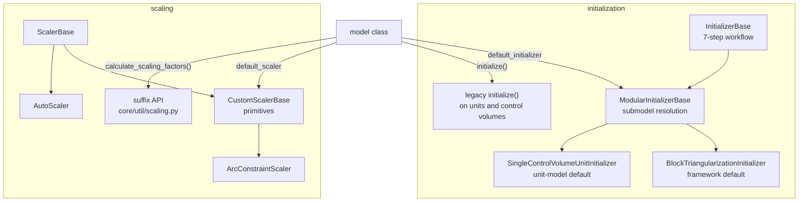
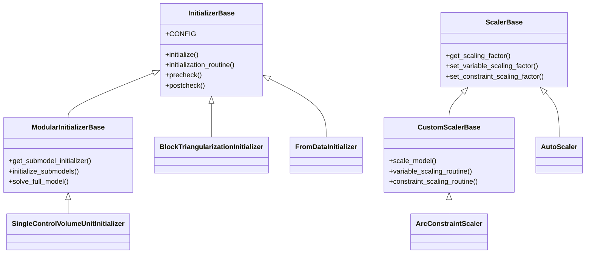
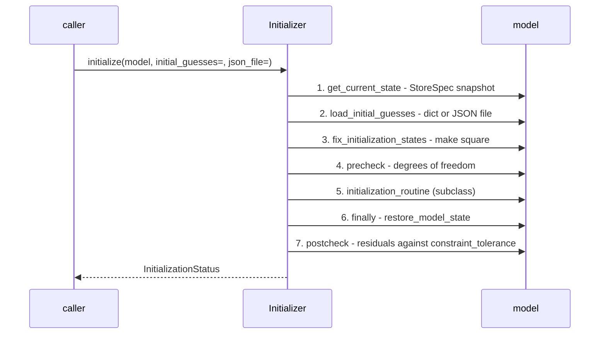
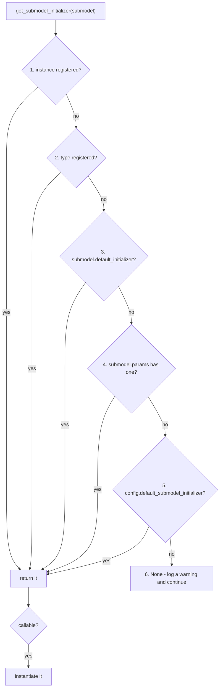

# 06 — Model preparation: Initializers and Scalers

> **Doc ID** 06 · **Repo SHA** 70a8f4fe1 (IDAES-PSE v2.13.0rc0) · **Source roots** `idaes/core/initialization/`, `idaes/core/scaling/`, `idaes/core/util/{scaling,initialization}.py`
> **Owns** 15 modules / 7,171 LOC · **Assets** none · **Siblings** [03](03_block_hierarchy_and_construction_protocol.md), [04](04_control_volume_framework.md), [05](05_property_and_reaction_framework.md), [30](30_numerics_and_solver_interface_map.md)

An equation-oriented process model is not solvable as constructed. It has to be
given a starting point and it has to be scaled. This document covers both, and
it covers them together because the two subsystems share a resolution pattern —
a class attribute on the model naming the object to use — and because each of
them exists in **two generations that are both live in the tree**.

Neither generation is called "the" API anywhere in this set. The initialization
pair is named *Initializer objects* and the *legacy initialization routine*; the
scaling pair is named *Scaler-based scaling* and *suffix-based scaling*.

---

## 0. Scope and source map

| File | LOC | Purpose | Covered in § |
|---|---:|---|---|
| `idaes/core/initialization/__init__.py` | 23 | Re-exports the six public initialization names | 2 |
| `idaes/core/initialization/initializer_base.py` | 837 | `InitializationStatus`, `StoreState`, `InitializerBase` and its seven-step workflow, `ModularInitializerBase` and submodel resolution | 3, 4, 5, 7, 9 |
| `idaes/core/initialization/block_triangularization.py` | 210 | `BlockTriangularizationInitializer` — the framework default | 4, 5, 7 |
| `idaes/core/initialization/general_hierarchical.py` | 224 | `SingleControlVolumeUnitInitializer` — the unit-model default | 4, 5, 7 |
| `idaes/core/initialization/initialize_from_data.py` | 34 | `FromDataInitializer` — loads values and does nothing else | 5, 7 |
| `idaes/core/scaling/__init__.py` | 30 | Re-exports the Scaler-based public surface | 2 |
| `idaes/core/scaling/scaling_base.py` | 347 | Module `CONFIG`, `ScalerBase` and the scaling-factor write primitives | 4, 7 |
| `idaes/core/scaling/custom_scaler_base.py` | 1,051 | `CustomScalerBase`, `ConstraintScalingScheme`, `DefaultScalingRecommendation`, and the scaling primitives models call | 3, 4, 7, 9 |
| `idaes/core/scaling/autoscaling.py` | 232 | `AutoScaler` — magnitude and Jacobian-norm scaling with no model knowledge | 5, 7 |
| `idaes/core/scaling/arc_constraint_scaler.py` | 106 | `ArcConstraintScaler` — scaling for Pyomo `Arc` equalities | 5, 7 |
| `idaes/core/scaling/nominal_value_tools.py` | 353 | `get_nominal_value`, `NominalValueExtractionVisitor` | 5, 7, 12 |
| `idaes/core/scaling/scaler_profiling.py` | 380 | `ScalingProfiler` — runs a model under several schemes and tabulates solver iterations | 5, 7, 10 |
| `idaes/core/scaling/util.py` | 1,075 | Suffix plumbing, JSON persistence of scaling factors, `get_jacobian`, `jacobian_cond` | 5, 7, 10 |
| `idaes/core/util/scaling.py` | 1,732 | The suffix-based scaling generation, complete | 3, 5, 7, 12 |
| `idaes/core/util/initialization.py` | 537 | `fix_state_vars`, `revert_state_vars`, `propagate_state`, `solve_indexed_blocks`, `initialize_by_time_element` | 5, 7 |

Total 7,171 LOC, 25 configuration keys.

---

## 1. Architectural role

A flowsheet is built as a square or under-determined system of nonlinear
equations with no values in it. Two things stand between construction and a
solve.

*Initialization* supplies a starting point. The library's approach is
hierarchical: initialize the property blocks, then the control volume, then the
unit model, then the flowsheet, each stage handing the next a better guess.
`InitializerBase` (`idaes/core/initialization/initializer_base.py:79`) turns
this into a fixed procedure with defined extension points, so that a model
author writes only the part that is specific to their model and inherits the
state save-and-restore, the degrees-of-freedom checks and the convergence check.

*Scaling* makes the system numerically tractable. Process models routinely mix
quantities spanning ten orders of magnitude — molar flows near 1, pressures near
1e5, enthalpies near 1e7 — and an unscaled Jacobian is ill-conditioned enough to
defeat the solver. Scaling factors are attached to components and used by the
solver interface to transform the problem.

The two subsystems share one structural idea. A model class names its preferred
helper in a class attribute — `default_initializer`
(`idaes/core/base/process_base.py:93`) or `default_scaler`
(`idaes/core/base/process_base.py:94`) — and a parent object walks the model
finding and invoking them. This is why they are documented together.

Both exist in two generations, and the retrofit is partial. Of the 160 declared
process block classes, **23** name a `default_initializer` and **24** name a
`default_scaler`. The remaining classes are reached by the older paths. Section
3.3 gives the adoption table.

*Four entry points into two subsystems; a given model may be reached by either generation of either.*

---

## 2. Public surface inventory

`idaes/core/initialization/__init__.py` re-exports six names;
`idaes/core/scaling/__init__.py` re-exports fourteen.

| Symbol | Kind | Declared at | Exported via | Stability signal |
|---|---|---|---|---|
| `InitializationStatus` | enum | `idaes/core/initialization/initializer_base.py:43` | `idaes.core.initialization` | re-exported; autodoc'd |
| `StoreState` | `StoreSpec` | `idaes/core/initialization/initializer_base.py:57` | — | module-level constant |
| `InitializerBase` | class | `idaes/core/initialization/initializer_base.py:79` | `idaes.core.initialization` | re-exported; autodoc'd |
| `ModularInitializerBase` | class | `idaes/core/initialization/initializer_base.py:541` | `idaes.core.initialization` | re-exported; autodoc'd |
| `BlockTriangularizationInitializer` | class | `idaes/core/initialization/block_triangularization.py:35` | `idaes.core.initialization` | re-exported |
| `SingleControlVolumeUnitInitializer` | class | `idaes/core/initialization/general_hierarchical.py:29` | `idaes.core.initialization` | re-exported |
| `FromDataInitializer` | class | `idaes/core/initialization/initialize_from_data.py:22` | `idaes.core.initialization` | re-exported |
| `CONFIG` (scaling) | `ConfigDict` | `idaes/core/scaling/scaling_base.py:37` | — | module-level |
| `ScalerBase` | class | `idaes/core/scaling/scaling_base.py:104` | `idaes.core.scaling` | re-exported |
| `CSCONFIG` | `ConfigDict` | `idaes/core/scaling/custom_scaler_base.py:46` | — | module-level |
| `DEFAULT_UNIT_SCALING` | dict | `idaes/core/scaling/custom_scaler_base.py:48` | — | module-level |
| `ConstraintScalingScheme` | `StrEnum` | `idaes/core/scaling/custom_scaler_base.py:57` | `idaes.core.scaling` | re-exported |
| `DefaultScalingRecommendation` | `StrEnum` | `idaes/core/scaling/custom_scaler_base.py:75` | `idaes.core.scaling` | re-exported |
| `CustomScalerBase` | class | `idaes/core/scaling/custom_scaler_base.py:93` | `idaes.core.scaling` | re-exported |
| `AutoScaler` | class | `idaes/core/scaling/autoscaling.py:36` | `idaes.core.scaling` | re-exported |
| `ArcConstraintScaler` | class | `idaes/core/scaling/arc_constraint_scaler.py:31` | `idaes.core.scaling` | re-exported |
| `get_nominal_value` | function | `idaes/core/scaling/nominal_value_tools.py:49` | — | not re-exported |
| `NominalValueExtractionVisitor` | class | `idaes/core/scaling/nominal_value_tools.py:136` | — | see §12 |
| `ScalingProfiler` | class | `idaes/core/scaling/scaler_profiling.py:31` | `idaes.core.scaling` | re-exported |
| `scaling_factors_to_json_file`, `scaling_factors_from_json_file`, `scaling_factors_to_dict`, `scaling_factors_from_dict` | functions | `idaes/core/scaling/util.py` | `idaes.core.scaling` | re-exported |
| `get_scaling_factor`, `set_scaling_factor`, `del_scaling_factor`, `report_scaling_factors` | functions | `idaes/core/scaling/util.py` | `idaes.core.scaling` | re-exported |
| `set_scaling_factor`, `get_scaling_factor`, `unset_scaling_factor` | functions | `idaes/core/util/scaling.py:216`, `:264`, `:339` | `idaes.core.util` (indirect) | suffix generation; same names, different module |
| `calculate_scaling_factors` | function | `idaes/core/util/scaling.py:193` | — | suffix generation |
| `constraint_scaling_transform`, `constraint_scaling_transform_undo` | functions | `idaes/core/util/scaling.py:449`, `:482` | — | suffix generation |
| `badly_scaled_var_generator`, `list_badly_scaled_variables` | functions | `idaes/core/util/scaling.py:582`, `:619` | — | suffix generation |
| `constraint_autoscale_large_jac` | function | `idaes/core/util/scaling.py:656` | — | suffix generation |
| `get_jacobian`, `jacobian_cond` | functions | `idaes/core/util/scaling.py:744`, `:858` | — | also present in `core/scaling/util.py`; see §12 |
| `extreme_jacobian_entries`, `extreme_jacobian_rows`, `extreme_jacobian_columns` | functions | `idaes/core/util/scaling.py:768`, `:795`, `:826` | — | suffix generation |
| `scale_time_discretization_equations` | function | `idaes/core/util/scaling.py:886` | — | also in `core/scaling/util.py` |
| `CacheVars` | class | `idaes/core/util/scaling.py:989` | — | context manager |
| `FlattenedScalingAssignment` | class | `idaes/core/util/scaling.py:1009` | — | dynamic-model helper |
| `report_scaling_issues` | function | `idaes/core/util/scaling.py:1678` | — | suffix generation |
| `fix_state_vars`, `revert_state_vars` | functions | `idaes/core/util/initialization.py:45`, `:108` | — | used by legacy control volume initialization |
| `propagate_state` | function | `idaes/core/util/initialization.py:136` | — | the standard way to move values across an Arc |
| `solve_indexed_blocks` | function | `idaes/core/util/initialization.py:230` | — | — |
| `initialize_by_time_element` | function | `idaes/core/util/initialization.py:298` | — | dynamic models |

---

## 3. Class hierarchy and type taxonomy

*Two shallow hierarchies. `ControlVolumeScalerBase` ([04 §3](04_control_volume_framework.md#3-class-hierarchy-and-type-taxonomy)) and the 45 model Scalers extend `CustomScalerBase`.*

| Class | Base(s) | Declared at | Decorator | Container class | Key overrides |
|---|---|---|---|---|---|
| `InitializerBase` | `object` | `initializer_base.py:79` | none | — | `__init_subclass__` |
| `ModularInitializerBase` | `InitializerBase` | `initializer_base.py:541` | none | — | `initialization_routine` |
| `BlockTriangularizationInitializer` | `InitializerBase` | `block_triangularization.py:35` | none | — | `precheck`, `initialization_routine` |
| `SingleControlVolumeUnitInitializer` | `ModularInitializerBase` | `general_hierarchical.py:29` | none | — | `initialization_routine`, `initialize_main_model` |
| `FromDataInitializer` | `InitializerBase` | `initialize_from_data.py:22` | none | — | `initialization_routine` |
| `ScalerBase` | `object` | `scaling_base.py:104` | none | — | `__init_subclass__` |
| `CustomScalerBase` | `ScalerBase` | `custom_scaler_base.py:93` | none | — | `scale_model` |
| `AutoScaler` | `ScalerBase` | `autoscaling.py:36` | none | — | `scale_model` |
| `ArcConstraintScaler` | `CustomScalerBase` | `arc_constraint_scaler.py:31` | none | — | `scale_model` |
| `NominalValueExtractionVisitor` | `StreamBasedExpressionVisitor` | `nominal_value_tools.py:136` | none | — | `beforeChild`, `exitNode` |
| `ScalingProfiler` | `object` | `scaler_profiling.py:31` | none | — | — |
| `CacheVars` | `object` | `util/scaling.py:989` | none | — | context manager |
| `FlattenedScalingAssignment` | `object` | `util/scaling.py:1009` | none | — | — |
| `NominalValueExtractionVisitor` | `StreamBasedExpressionVisitor` | `util/scaling.py:1265` | none | — | the second copy; see §12 |

Both base classes use `__init_subclass__` (`initializer_base.py:114`,
`scaling_base.py`) to append the rendered `CONFIG` documentation to every
subclass docstring automatically, the same idea as
`declare_process_block_class`
([03 §5.1](03_block_hierarchy_and_construction_protocol.md#51-declaration-at-import-time))
applied to a plain class.

### 3.1 Enumerations

`InitializationStatus` (`idaes/core/initialization/initializer_base.py:43`):

| Member | Value | Meaning | Consumed at |
|---|---|---|---|
| `Ok` | 1 | Initialization converged and passed the post-check | `initializer_base.py:351` |
| `none` | 0 | No initialization has been attempted | `initializer_base.py:533` |
| `Failed` | -1 | The routine ran but the post-check failed | `initializer_base.py:351` |
| `DoF` | -2 | The model is not square after fixing states | `initializer_base.py:286` |
| `PrecheckFailed` | -3 | A pre-check other than degrees of freedom failed | `initializer_base.py:286` |
| `Error` | -4 | The routine raised | `initializer_base.py:149` |

`ConstraintScalingScheme` (`idaes/core/scaling/custom_scaler_base.py:57`), a
`StrEnum`: `harmonicMean`, `inverseSum`, `inverseRSS`, `inverseMaximum`,
`inverseMinimum`. These name the five ways of reducing the nominal magnitudes of
a constraint's terms to a single scaling factor.

`DefaultScalingRecommendation` (`idaes/core/scaling/custom_scaler_base.py:75`),
a `StrEnum`: `userInputRecommended`, `userInputRequired`, `userSetManually`. A
Scaler uses these to record how a default scaling factor came to be, so a
diagnostic report can distinguish a considered value from a fallback.

### 3.2 Module-level constants

| Name | Value | Anchor |
|---|---|---|
| `StoreState` | `StoreSpec` capturing `Var` fixed status and value, `BooleanVar`, and `Block`/`Constraint` active status | `initializer_base.py:57` |
| `DEFAULT_UNIT_SCALING` | `{"Temperature": (units.K, 1e-2), "Pressure": (units.Pa, 1e-5)}` | `custom_scaler_base.py:48` |

`StoreState` is the link between initialization and the model serializer: the
save-and-restore of model state in steps 1 and 6 of the workflow is a
`to_json`/`from_json` round trip against an in-memory dictionary, using the
machinery documented in [08a](08a_model_introspection_and_persistence.md).

### 3.3 Retrofit adoption

Counts from `_generated/retrofit.csv`, which records whether each of the 160
declared process block classes names a `default_initializer` or a
`default_scaler`. The totals are 23 and 24 respectively.

| Owning document | Declared blocks | Declare an Initializer | Declare a Scaler |
|---|---:|---:|---:|
| [03](03_block_hierarchy_and_construction_protocol.md) core base | 3 | 2 | 1 |
| [04](04_control_volume_framework.md) control volumes | 5 | 0 | 2 |
| [05](05_property_and_reaction_framework.md) phases and components | 12 | 0 | 0 |
| [08b](08b_core_support_utilities.md) test doubles | 4 | 0 | 1 |
| [10](10_unit_models_control_volume_based.md) CV-based units | 22 | 8 | 14 |
| [11](11_unit_models_network_contactors_and_control.md) network units | 10 | 9 | 5 |
| [12](12_modular_properties_generic_framework.md) modular properties | 4 | 1 | 1 |
| [15](15_property_package_catalog.md) other packages | 12 | 0 | 0 |
| [16](16_general_helmholtz_property_system.md) Helmholtz | 6 | 0 | 0 |
| [17](17_costing_framework_and_libraries.md) costing | 6 | 0 | 0 |
| [18](18_power_generation_boiler_island.md) boiler island | 11 | 0 | 0 |
| [19](19_power_generation_heat_exchangers_and_properties.md) PG exchangers | 10 | 2 | 0 |
| [20](20_power_generation_helmholtz_units_and_soc.md) Helmholtz units and SOC | 20 | 0 | 0 |
| [21](21_column_models_and_solvent_systems.md) columns | 9 | 1 | 0 |
| [22](22_gas_solid_contactors.md) gas-solid | 16 | 0 | 0 |
| [23](23_tsa_gas_distribution_and_ccu.md) TSA, pipelines, CCU | 7 | 0 | 0 |
| [25](25_grid_integration.md) price taker | 3 | 0 | 0 |
| **Total** | **160** | **23** | **24** |

The distribution is the fact to take from this table: adoption is concentrated
in `idaes/models/unit_models` (documents 10 and 11, which together account for
17 of the 23 Initializers and 19 of the 24 Scalers), and is close to absent
across `idaes/models_extra` (documents 18 through 23, three Initializers and no
Scalers between them).

A separate count: **46** classes in the tree are named `*Scaler`. That is not
the same number as the 24 blocks that declare one, because Scalers exist for
property packages, control volumes and reaction blocks that are reached through
`call_submodel_scaler_method` rather than through a `default_scaler` attribute.

---

## 4. Configuration reference

25 keys across six declarations.

### 4.1 `InitializerBase.CONFIG`

`ConfigDict()` at `idaes/core/initialization/initializer_base.py:88`.

| Key | Domain / validator | Default | Req. | Effect on build | Anchor |
|---|---|---|---|---|---|
| `constraint_tolerance` | `float` | `1e-05` | no | Residual threshold used by `postcheck` to decide convergence | `:89` |
| `output_level` | none | `idaeslog.NOTSET` | no | Logger level for this Initializer's messages | `:97` |

### 4.2 `ModularInitializerBase.CONFIG`

`InitializerBase.CONFIG()` extended at
`idaes/core/initialization/initializer_base.py:550`.

| Key | Domain / validator | Default | Req. | Effect on build | Anchor |
|---|---|---|---|---|---|
| `solver` | none | `'ipopt_v2'` | no | Solver used for the full-model solve | `:552` |
| `solver_options` | implicit `ConfigDict` | empty | no | Options passed to that solver | `:560` |
| `writer_config` | implicit `ConfigDict` | empty | no | NL-writer options passed to that solver | `:567` |
| `default_submodel_initializer` | none | `None` | no | Fallback at level 5 of submodel resolution | `:574` |

### 4.3 `BlockTriangularizationInitializer.CONFIG`

`InitializerBase.CONFIG()` extended at
`idaes/core/initialization/block_triangularization.py:48`. Ten keys including
two nested dictionaries.

| Key | Domain / validator | Default | Req. | Effect on build | Anchor |
|---|---|---|---|---|---|
| `block_solver` | none | `'ipopt_v2'` | no | Solver used for each irreducible block | `:49` |
| `block_solver_options` | `ConfigDict` | see below | no | Options for that solver | `:56` |
| `block_solver_options.tol` | `float` | `1e-08` | no | Block solve tolerance | `:64` |
| `block_solver_options.max_iter` | `int` | `200` | no | Block iteration limit | `:72` |
| `block_solver_writer_config` | `ConfigDict` | see below | no | NL-writer options | `:80` |
| `block_solver_writer_config.linear_presolve` | `Bool` | `True` | no | Presolve linear subsystems | `:87` |
| `block_solver_writer_config.scale_model` | `Bool` | `True` | no | Apply model scaling in the writer | `:95` |
| `block_solver_call_options` | implicit `ConfigDict` | empty | no | Keyword arguments to the solve call | `:103` |
| `calculate_variable_options` | implicit `ConfigDict` | empty | no | Options for Pyomo's `calculate_variable_from_constraint` | `:112` |
| `skip_final_solve` | `Bool` | `False` | no | Omit the final full-model solve | `:121` |

### 4.4 `SingleControlVolumeUnitInitializer.CONFIG`

`ModularInitializerBase.CONFIG()` extended at
`idaes/core/initialization/general_hierarchical.py:38`.

| Key | Domain / validator | Default | Req. | Effect on build | Anchor |
|---|---|---|---|---|---|
| `always_estimate_states` | `Bool` | `False` | no | When true, outlet states are estimated even where values already exist | `:39` |

### 4.5 Scaler-based scaling: the module `CONFIG`

`ConfigDict()` at `idaes/core/scaling/scaling_base.py:37`. Every `ScalerBase`
subclass inherits it; `CSCONFIG` (`custom_scaler_base.py:46`) is a copy.

| Key | Domain / validator | Default | Req. | Effect on build | Anchor |
|---|---|---|---|---|---|
| `zero_tolerance` | `float` | `1e-12` | no | Magnitudes below this are treated as zero | `:38` |
| `max_variable_scaling_factor` | `float` | `1e10` | no | Upper clamp applied by `_filter_scaling_factor` | `:46` |
| `min_variable_scaling_factor` | `float` | `1e-10` | no | Lower clamp | `:54` |
| `max_constraint_scaling_factor` | `float` | `1e10` | no | Upper clamp for constraints | `:62` |
| `min_constraint_scaling_factor` | `float` | `1e-10` | no | Lower clamp for constraints | `:70` |
| `max_expression_scaling_hint` | `float` | `1e10` | no | Upper clamp for expression hints | `:78` |
| `min_expression_scaling_hint` | `float` | `1e-10` | no | Lower clamp for expression hints | `:86` |
| `overwrite` | `Bool` | `False` | no | Whether an existing scaling factor is replaced | `:94` |

`overwrite` defaulting to `False` is the load-bearing default of the Scaler
generation: a Scaler run over a model that a user has already scaled by hand
leaves the user's values alone.

The suffix-based generation in `idaes/core/util/scaling.py` declares no
`ConfigBlock` at all. Its behaviour is controlled by function arguments —
`set_scaling_factor(c, v, data_objects=True, overwrite=True)`
(`idaes/core/util/scaling.py:216`) — and note that the same concept carries the
opposite default there.

---

## 5. Construction and call sequences

### 5.1 The Initializer workflow

`InitializerBase.initialize` (`idaes/core/initialization/initializer_base.py:149`)
is a fixed sequence. The source numbers its steps 1 through 7 in comments; step
6 is a `finally` clause, so the restore happens whether or not step 5 raised.

*The subclass supplies step 5 only; the other six are inherited and always run.*

1. `get_current_state` (`:206`) snapshots fixed status, values and active status
   into a dictionary using the module-level `StoreState` `StoreSpec`.
2. `load_initial_guesses` (`:221`) accepts **either** a `dict` **or** a
   `json_file` path, never both. `_load_values_from_dict` (`:487`) performs the
   write and by default raises when asked to overwrite a fixed variable.
3. `fix_initialization_states` (`:268`) delegates to the model's own method of
   that name. `UnitModelBlockData` fixes every port whose name contains `inlet`
   (`idaes/core/base/unit_model.py:640`); a state block raises unless the
   package implements it (`idaes/core/base/property_base.py:354`).
4. `precheck` (`:286`) checks degrees of freedom and returns
   `InitializationStatus.DoF` when the model is not square.
5. `initialization_routine` (`:308`) raises `NotImplementedError` in the base.
6. `restore_model_state` (`:326`) reverses step 1, and also clears
   `_local_logger_level` so an `output_level` override does not leak into a
   later run.
7. `postcheck` (`:351`) evaluates constraint residuals against
   `constraint_tolerance` and returns the final `InitializationStatus`.

Plugin hooks `plugin_prepare` (`:431`), `plugin_initialize` (`:450`) and
`plugin_finalize` (`:474`) handle attached blocks — in practice costing blocks,
which register themselves on the unit model's `_initialization_order`
([17](17_costing_framework_and_libraries.md)).

### 5.2 Submodel initializer resolution

`ModularInitializerBase.get_submodel_initializer`
(`idaes/core/initialization/initializer_base.py:603`) resolves in a documented
order of six levels.

*Level 4 recurses into the parameter block, which is how a state block inherits an Initializer chosen once for its whole property package.*

Level 6 is a warning, not an error (`:646`): a submodel with no Initializer is
skipped and the routine continues. The final `callable` test (`:651`) means a
registered entry may be either a class, which is instantiated, or an already
constructed instance.

`add_submodel_initializer(submodel, initializer)` (`:590`) writes levels 1 and
2 — keying on the instance or on its type depending on what is passed.

### 5.3 The hierarchical unit-model routine

`SingleControlVolumeUnitInitializer` (`general_hierarchical.py:29`) is the
default for every `UnitModelBlockData` (`idaes/core/base/unit_model.py:61`). Its
`initialize_main_model` (`:77`) calls `initialize_control_volume` (`:115`),
which dispatches on geometry to `_init_props_0D` (`:151`) or `_init_props_1D`
(`:188`), then `_init_rxns` (`:202`). `_init_props_0D` takes a
`copy_inlet_state` flag controlling whether the outlet state block starts from
the inlet's values or from the control volume's own estimate
([04 §7.2](04_control_volume_framework.md#72-controlvolume0dblockdata)).

### 5.4 Block triangularization

`BlockTriangularizationInitializer` (`block_triangularization.py:35`) is the
value of `ProcessBlockData.default_initializer`
(`idaes/core/base/process_base.py:93`), so it is what any block without a more
specific choice gets. `precheck` (`:134`) adds `_check_matching` (`:148`), a
structural test that the block has a perfect matching before any numerical work
begins. `initialization_routine` (`:163`) decomposes the system into irreducible
blocks and solves each in dependency order, using
`calculate_variable_from_constraint` for single-equation blocks and the
configured `block_solver` for larger ones (`_solve_block_data`, `:179`).

### 5.5 Scaler-based scaling

`CustomScalerBase.scale_model` (`custom_scaler_base.py`) runs
`variable_scaling_routine` then `constraint_scaling_routine`, both of which a
model's Scaler implements. The class supplies the primitives those routines
call:

| Primitive | What it uses as the source of magnitude |
|---|---|
| `scale_variable_by_component` | Another component's existing scaling factor |
| `scale_variable_by_bounds` | The variable's own bounds |
| `scale_variable_by_default` | The Scaler's `DEFAULT_SCALING_FACTORS` class attribute |
| `scale_variable_by_units` | `DEFAULT_UNIT_SCALING`, matching on the variable's units |
| `scale_variable_by_definition_constraint` | The constraint that defines the variable |
| `scale_constraint_by_component` | Another component's factor |
| `scale_constraint_by_default` | The Scaler's defaults |
| `scale_constraint_by_nominal_value` | The nominal magnitude of the constraint body |
| `scale_constraint_by_nominal_derivative_norm` | The norm of the constraint's derivatives |

`propagate_state_scaling` and `_propagate_state_data_scaling` carry factors from
one state block to another across a unit, and `call_submodel_scaler_method`
invokes a nested model's own Scaler — the recursion that makes a flowsheet-level
scaling pass possible.

Nominal magnitudes come from `NominalValueExtractionVisitor`
(`nominal_value_tools.py:136`), a Pyomo `StreamBasedExpressionVisitor` with a
handler per expression node type: sum, product, division, power, absolute value,
negation, unary function, `Expr_if`, and external function. `get_nominal_value`
(`:49`) is the entry point.

`AutoScaler` (`autoscaling.py:36`) takes the opposite approach and uses no model
knowledge at all: `scale_variables_by_magnitude` reads current values, and
`scale_constraints_by_jacobian_norm` computes a Jacobian and scales each row by
its norm. It is the fallback for models with no Scaler of their own.

`ScalingProfiler` (`scaler_profiling.py:31`) runs a model under several scaling
schemes in turn and tabulates the resulting solver iteration counts, parsing
ipopt's output (`_parse_ipopt_output`) to do so.

### 5.6 Suffix-based scaling

The older generation stores factors in Pyomo `Suffix` objects and provides free
functions rather than objects. `set_scaling_factor`
(`idaes/core/util/scaling.py:216`), `get_scaling_factor` (`:264`) and
`unset_scaling_factor` (`:339`) are the accessors;
`calculate_scaling_factors(blk)` (`:193`) walks a block tree calling each
block's own `calculate_scaling_factors` method — the hook that control volumes
and state blocks implement
([04 §7.2](04_control_volume_framework.md#72-controlvolume0dblockdata),
[05 §7.3](05_property_and_reaction_framework.md#73-stateblockdata)).

Constraint scaling in this generation *transforms the constraint in place*:
`constraint_scaling_transform(c, s, overwrite=True)` (`:449`) multiplies the
constraint through by a factor and records it, and
`constraint_scaling_transform_undo` (`:482`) reverses it. This differs from the
Scaler generation, which writes a factor and leaves the constraint untouched.

Diagnostic entry points: `badly_scaled_var_generator` (`:582`),
`list_badly_scaled_variables` (`:619`), `unscaled_variables_generator` (`:500`),
`unscaled_constraints_generator` (`:532`), `extreme_jacobian_entries` (`:768`),
`extreme_jacobian_rows` (`:795`), `extreme_jacobian_columns` (`:826`),
`jacobian_cond` (`:858`) and `report_scaling_issues` (`:1678`).
`constraint_autoscale_large_jac` (`:656`) rescales constraints whose Jacobian
rows are extreme.

Dynamic-model support: `scale_time_discretization_equations` (`:886`) scales the
equations Pyomo's DAE transformation generates, and `FlattenedScalingAssignment`
(`:1009`) assigns factors across a flattened time-indexed model.

### 5.7 Initialization utilities

`idaes/core/util/initialization.py` holds the functions the legacy paths use and
that user flowsheets call directly:

| Function | Purpose | Anchor |
|---|---|---|
| `fix_state_vars(blk, state_args=None)` | Fix a state block's state variables, returning a flags dict | `:45` |
| `revert_state_vars(blk, flags)` | Restore from that dict | `:108` |
| `propagate_state(...)` | Copy values across a Pyomo `Arc` from source port to destination | `:136` |
| `solve_indexed_blocks(solver, blocks, **kwds)` | Solve a list of blocks as one problem | `:230` |
| `initialize_by_time_element(fs, time, **kwargs)` | Walk a dynamic flowsheet element by element in time | `:298` |

`propagate_state` is the function a hand-written flowsheet initialization script
calls between unit models, and is the most widely used name in this module.

---

## 6. Data structures, variables, constraints and invariants

These modules create no Pyomo model components. They write to `Suffix` objects,
hold Python state, and read and write JSON.

| Structure | Type | Held on | Purpose | Anchor |
|---|---|---|---|---|
| `scaling_factor` suffix | `Suffix` | any block | Where both generations ultimately store factors | `scaling/util.py`, `util/scaling.py:216` |
| `scaling_hint` suffix | `Suffix` | any block | Expression scaling hints, Scaler generation only | `scaling/util.py` |
| `constraint_transformed_scaling_factor` suffix | `Suffix` | any block | Records an in-place constraint transform so it can be undone | `util/scaling.py:397` |
| initial-state snapshot | `dict` | the Initializer | Produced by `StoreState`; consumed by `restore_model_state` | `initializer_base.py:57` |
| `submodel_initializers` | `dict` | `ModularInitializerBase` | Levels 1 and 2 of resolution, keyed by instance or type | `initializer_base.py:590` |
| `summary` | `dict` | the Initializer | Per-model status, written by `_update_summary` | `initializer_base.py:533` |
| `DEFAULT_SCALING_FACTORS` | `dict` | a `CustomScalerBase` subclass | Per-variable-name default magnitudes | `custom_scaler_base.py:93` |
| `UNIT_SCALING_FACTORS` | `dict` | a `CustomScalerBase` subclass | Per-unit default magnitudes | `custom_scaler_base.py:93` |
| `node_type_method_map` | `dict` | `NominalValueExtractionVisitor` | Expression node type to handler | `nominal_value_tools.py:136` |

### 6.1 Invariants

| Invariant | Enforced at |
|---|---|
| `initial_guesses` and `json_file` are mutually exclusive | `initializer_base.py:221` |
| Model state is restored even when the routine raises | `initializer_base.py:149`, the `finally` clause |
| A logger-level override does not survive the call | `initializer_base.py:149` |
| Loading a guess onto a fixed variable raises by default | `initializer_base.py:487` |
| A model must be square before the routine runs | `initializer_base.py:286` |
| Block triangularization requires a perfect matching | `block_triangularization.py:148` |
| Every scaling factor is clamped into the configured range | `scaling_base.py:104`, `_filter_scaling_factor` |
| An existing scaling factor is preserved unless `overwrite` is set | `scaling_base.py:94` |

---

## 7. Method contracts

### 7.1 `InitializerBase`

| Method | Signature | Preconditions | Effects | Returns | Raises | Anchor |
|---|---|---|---|---|---|---|
| `initialize` | `(self, model, initial_guesses=None, json_file=None, output_level=None, exclude_unused_vars=False)` | model built | Runs all seven steps | `InitializationStatus` | propagates from step 5 | `:149` |
| `get_current_state` | `(self, model)` | — | Stores a snapshot | `dict` | — | `:206` |
| `load_initial_guesses` | `(self, model, initial_guesses=None, json_file=None)` | at most one source | Writes values | `None` | `ValueError` for both sources | `:221` |
| `fix_initialization_states` | `(self, model)` | — | Delegates to the model | `None` | `NotImplementedError` from the model | `:268` |
| `precheck` | `(self, model)` | states fixed | — | `None` | `InitializationError` | `:286` |
| `initialization_routine` | `(self, model)` | — | — | results object | `NotImplementedError` | `:308` |
| `restore_model_state` | `(self, model)` | snapshot taken | Reverses step 1 | `None` | — | `:326` |
| `postcheck` | `(self, model, results_obj=None, exclude_unused_vars=False)` | — | — | `InitializationStatus` | `InitializationError` | `:351` |
| `plugin_prepare` | `(self, plugin)` | — | Deactivates a plug-in | `None` | — | `:431` |
| `plugin_initialize` | `(self, plugin, **kwargs)` | — | Initializes it | `None` | — | `:450` |
| `plugin_finalize` | `(self, plugin)` | — | Reactivates it | `None` | — | `:474` |
| `get_logger` | `(self, model)` | — | — | logger | — | `:145` |
| `get_output_level` | `(self)` | — | — | level | — | `:128` |

### 7.2 `ModularInitializerBase`

| Method | Signature | Effects | Raises | Anchor |
|---|---|---|---|---|
| `add_submodel_initializer` | `(self, submodel, initializer)` | Registers at level 1 or 2 | — | `:590` |
| `get_submodel_initializer` | `(self, submodel)` | Recurses into `params` at level 4 | — | `:603` |
| `initialization_routine` | `(self, model, plugin_initializer_args=None, **kwargs)` | Prepares plug-ins, initializes submodels, then the main model, then solves | propagates | `:656` |
| `prepare_plugins` | `(self, model, plugin_initializer_args)` | Deactivates plug-ins | — | `:701` |
| `initialize_submodels` | `(self, model, ...)` | Initializes each submodel with its resolved Initializer | propagates | `:732` |
| `initialize_main_model` | `(self, model, **kwargs)` | Subclass hook | — | `:767` |
| `solve_full_model` | `(self, model, results)` | Solves the whole model with the configured solver | `InitializationError` | `:785` |
| `cleanup` | `(self, model, plugin_initializer_args, sub_initializers)` | Reactivates plug-ins | — | `:810` |
| `_get_solver` | `(self)` | — | — | `:829` |

### 7.3 Scaling

| Method | Signature | Effects | Anchor |
|---|---|---|---|
| `ScalerBase.get_scaling_factor` | `(self, component)` | Reads the suffix | `scaling_base.py:104` |
| `ScalerBase.set_variable_scaling_factor` | `(self, component, factor, overwrite=None)` | Clamps then writes | `scaling_base.py:104` |
| `ScalerBase.set_constraint_scaling_factor` | `(self, component, factor, overwrite=None)` | As above | `scaling_base.py:104` |
| `ScalerBase.set_expression_scaling_hint` | `(self, component, factor, overwrite=None)` | Writes the hint suffix | `scaling_base.py:104` |
| `ScalerBase._filter_scaling_factor` | `(self, factor)` | Applies the min/max clamps | `scaling_base.py:104` |
| `CustomScalerBase.scale_model` | `(self, model, ...)` | Runs both routines | `custom_scaler_base.py:93` |
| `CustomScalerBase.variable_scaling_routine` | `(self, model, ...)` | Subclass hook | `custom_scaler_base.py:93` |
| `CustomScalerBase.constraint_scaling_routine` | `(self, model, ...)` | Subclass hook | `custom_scaler_base.py:93` |
| `CustomScalerBase.call_submodel_scaler_method` | `(self, model, submodel, method, ...)` | Recurses into a nested model's Scaler | `custom_scaler_base.py:93` |
| `AutoScaler.scale_variables_by_magnitude` | `(self, model, ...)` | Scales from current values | `autoscaling.py:36` |
| `AutoScaler.scale_constraints_by_jacobian_norm` | `(self, model, norm=2)` | Computes a Jacobian, scales rows | `autoscaling.py:36` |
| `ArcConstraintScaler.scale_model` | `(self, model, ...)` | Scales `Arc` equality constraints | `arc_constraint_scaler.py:31` |
| `get_nominal_value` | `(component)` | — | `nominal_value_tools.py:49` |
| `ScalingProfiler.profile_scaling_methods` | `(self, ...)` | Runs the model under each scheme | `scaler_profiling.py:31` |
| `ScalingProfiler.write_profile_report` | `(self, results, stream)` | Writes a text report | `scaler_profiling.py:31` |
| `set_scaling_factor` (suffix) | `(c, v, data_objects=True, overwrite=True)` | Writes the suffix | `util/scaling.py:216` |
| `calculate_scaling_factors` (suffix) | `(blk)` | Walks the tree calling each block's method | `util/scaling.py:193` |
| `constraint_scaling_transform` | `(c, s, overwrite=True)` | Multiplies the constraint in place | `util/scaling.py:449` |
| `constraint_scaling_transform_undo` | `(c)` | Reverses it | `util/scaling.py:482` |
| `jacobian_cond` | `(m=None, scaled=True, order=None, pinv=False, jac=None)` | — | `util/scaling.py:858` |

---

## 8. Cross-subsystem interactions

### Calls out to

| Target | Purpose | Anchor |
|---|---|---|
| `idaes.core.util.model_serializer.StoreSpec` | State snapshot and restore | `initializer_base.py:57` |
| `idaes.core.util.model_statistics.degrees_of_freedom` | `precheck` | `initializer_base.py:286` |
| `idaes.core.solvers.get_solver` | Every solve in both subsystems | `initializer_base.py:829` |
| `pyomo.contrib.incidence_analysis` | Block triangularization and matching | `block_triangularization.py:163` |
| `pyomo.util.calc_var_value.calculate_variable_from_constraint` | Single-equation blocks | `block_triangularization.py:179` |
| `pyomo.core.expr` visitor framework | Nominal value extraction | `nominal_value_tools.py:136` |
| `scipy`, `numpy` | Jacobian norms and condition numbers | `autoscaling.py:36`, `util/scaling.py:744` |
| `pyomo.contrib.pynumero` | Jacobian assembly | `util/scaling.py:744` |
| model `fix_initialization_states` | Step 3 | `idaes/core/base/unit_model.py:640` |
| model `calculate_scaling_factors` | Suffix generation traversal | `idaes/core/base/control_volume0d.py:1859` |

### Called by

| Caller | What it relies on | Owning doc |
|---|---|---|
| Every declared process block | `default_initializer`, `default_scaler` class attributes | [03](03_block_hierarchy_and_construction_protocol.md) |
| Control volumes | `ControlVolumeScalerBase` extends `CustomScalerBase`; `estimate_outlet_state` is called by the hierarchical Initializer | [04](04_control_volume_framework.md) |
| Property packages | `default_state_scaler_object`, level 4 of submodel resolution | [05](05_property_and_reaction_framework.md) |
| Diagnostics | `jacobian_cond`, `report_scaling_issues`, badly-scaled generators | [07](07_diagnostics_and_run_orchestration.md) |
| Unit models | 8 + 9 Initializers, 14 + 5 Scalers | [10](10_unit_models_control_volume_based.md), [11](11_unit_models_network_contactors_and_control.md) |
| Modular properties | `ModularPropertiesInitializer`, `ModularPropertiesScaler` | [12](12_modular_properties_generic_framework.md) |
| Extended libraries | Three Initializers; otherwise the legacy paths | [19](19_power_generation_heat_exchangers_and_properties.md), [21](21_column_models_and_solvent_systems.md) |
| The structured flowsheet runner | `initialize` and `set_scaling` steps | [07](07_diagnostics_and_run_orchestration.md) |

---

## 9. Extension and subclassing contracts

| Hook | Kind | Signature | Resolution order | Base behaviour | Anchor |
|---|---|---|---|---|---|
| `initialization_routine` | method override | `(self, model)` | Called as step 5 | `NotImplementedError` | `initializer_base.py:308` |
| `precheck` | method override | `(self, model)` | Step 4 | Degrees-of-freedom check | `initializer_base.py:286` |
| `postcheck` | method override | `(self, model, results_obj=None, exclude_unused_vars=False)` | Step 7 | Residual check | `initializer_base.py:351` |
| `initialize_main_model` | method override | `(self, model, **kwargs)` | Called by `ModularInitializerBase.initialization_routine` | subclass hook | `initializer_base.py:767` |
| `fix_initialization_states` | model method | `(self)` | Step 3, on the model | Ports named `inlet` | `idaes/core/base/unit_model.py:640` |
| `default_initializer` | class attribute | an `InitializerBase` subclass | Level 3 of resolution | `BlockTriangularizationInitializer` | `idaes/core/base/process_base.py:93` |
| `default_submodel_initializer` | config key | an `InitializerBase` subclass | Level 5 | `None` | `initializer_base.py:574` |
| `add_submodel_initializer` | registration call | `(submodel, initializer)` | Levels 1 and 2 | empty | `initializer_base.py:590` |
| `variable_scaling_routine` | method override | `(self, model, ...)` | Called by `scale_model` | subclass hook | `custom_scaler_base.py:93` |
| `constraint_scaling_routine` | method override | `(self, model, ...)` | Called by `scale_model` | subclass hook | `custom_scaler_base.py:93` |
| `DEFAULT_SCALING_FACTORS` | class attribute | `dict` | Read by `scale_variable_by_default` | `{}` | `custom_scaler_base.py:93` |
| `UNIT_SCALING_FACTORS` | class attribute | `dict` | Read by `scale_variable_by_units` | `DEFAULT_UNIT_SCALING` | `custom_scaler_base.py:48` |
| `default_scaler` | class attribute | a `ScalerBase` subclass | Consulted by the Scaler machinery | `None` | `idaes/core/base/process_base.py:94` |
| `default_state_scaler_object` | parameter block property | a `ScalerBase` instance | Used for state blocks | `None` | `idaes/core/base/property_base.py:138` |
| `calculate_scaling_factors` | model method | `(self)` | Suffix generation traversal | no-op in the base | `idaes/core/base/process_base.py:655` |

This document's scope contains two `NotImplementedError` sites, both in
`initializer_base.py`: `initialization_routine` (`:308`) and the base
`fix_initialization_states` path. The full catalogue is in
[31](31_extension_point_catalog.md).

---

## 10. External assets, data files and external libraries

No shipped data files. Two file-format surfaces exist:

| Path | Format | Authored/Generated | Producer | Consumer | Load site |
|---|---|---|---|---|---|
| user-supplied | JSON | user or a prior run | `to_json` via `StoreSpec` | `load_initial_guesses` | `initializer_base.py:221` |
| user-supplied | JSON | `scaling_factors_to_json_file` | `core/scaling/util.py` | `scaling_factors_from_json_file` | `core/scaling/util.py` |
| temporary files | ipopt console output | generated per run | the solver | `ScalingProfiler._parse_ipopt_output` | `scaler_profiling.py:31` |

`ScalingProfiler` writes solver output through Pyomo's `TempfileManager` and
parses it back, so a profiling run leaves temporary files for the duration of
the run. No compiled library is loaded directly by this scope; the solvers
invoked are reached through `get_solver`
([30](30_numerics_and_solver_interface_map.md)).

---

## 11. Errors, logging and diagnostics behaviour

| Exception | Raised for | Anchor |
|---|---|---|
| `NotImplementedError` | `initialization_routine` not overridden | `initializer_base.py:308` |
| `InitializationError` | Pre-check or post-check failure | `initializer_base.py:286`, `:351` |
| `ValueError` | Both `initial_guesses` and `json_file` supplied | `initializer_base.py:221` |
| `ConfigurationError` | A guess written onto a fixed variable | `initializer_base.py:487` |
| `InitializationError` | The full-model solve did not reach optimality | `initializer_base.py:785` |

Loggers: `idaeslog.getLogger(__name__)` at `initializer_base.py:40`,
`scaling_base.py:33`, `custom_scaler_base.py:44`,
`arc_constraint_scaler.py:28`, `nominal_value_tools.py:46` and
`util/scaling.py:55`.

Two behaviours worth naming. `get_submodel_initializer` logs a warning and
returns `None` rather than raising when no Initializer can be found
(`initializer_base.py:646`), so a partially retrofitted flowsheet initializes
what it can. And `InitializerBase` records per-model outcomes in a `summary`
dict through `_update_summary` (`:533`), which is what lets a caller see which
submodel failed rather than only that the flowsheet did.

The suffix generation's diagnostic surface — `report_scaling_issues`
(`util/scaling.py:1678`), the badly-scaled generators and the extreme-Jacobian
functions — is consumed by the diagnostics toolbox
([07](07_diagnostics_and_run_orchestration.md)).

---

## 12. Duplications, deprecations and sharp edges

- **Two scaling generations are both live.** Scaler-based scaling is
  `idaes/core/scaling/` (2,244 LOC across six modules); suffix-based scaling is
  `idaes/core/util/scaling.py` (1,732 LOC). Consequence: a model may carry
  both a `default_scaler` and a `calculate_scaling_factors` method, and which
  one runs depends on which entry point the caller used. The control volumes are
  the clearest case — they have separate test files for each path
  ([04 §13](04_control_volume_framework.md#13-behaviour-pinned-by-tests)).

- **`NominalValueExtractionVisitor` is defined twice**, at
  `idaes/core/scaling/nominal_value_tools.py:136` and at
  `idaes/core/util/scaling.py:1265`, with the same name and the same handler
  map. Consequence: they are distinct types, so an `isinstance` check against
  one does not match the other, and a change to one does not affect the other.

- **`get_jacobian`, `jacobian_cond` and `scale_time_discretization_equations`
  each exist in both generations** — in `idaes/core/util/scaling.py:744`,
  `:858`, `:886` and again in `idaes/core/scaling/util.py`. Consequence: the
  import path determines which implementation runs.

- **`set_scaling_factor` exists in both generations with opposite `overwrite`
  defaults.** `idaes/core/util/scaling.py:216` defaults `overwrite=True`; the
  Scaler generation's module `CONFIG` defaults `overwrite` to `False`
  (`scaling_base.py:94`). Consequence: the same conceptual call preserves or
  destroys a user's hand-set factor depending on which generation is in use.

- **Constraint scaling means two different things.** The suffix generation's
  `constraint_scaling_transform` (`util/scaling.py:449`) multiplies the
  constraint expression in place and records the factor in a separate suffix so
  it can be undone; the Scaler generation writes a factor and leaves the
  constraint unmodified. Consequence: a model scaled by the first has different
  constraint expressions than one scaled by the second, which matters to anything
  that reads residuals.

- **Two initialization generations are both live.** `Initializer` objects are
  `idaes/core/initialization/`; the legacy path is
  `UnitModelBlockData.initialize` and `initialize_build`
  (`idaes/core/base/unit_model.py:504`, `:555`) calling the control volume's own
  `initialize` and `release_state`. Consequence: `model.initialize()` and
  `SomeInitializer().initialize(model)` visit the model differently and do not
  necessarily leave it in the same state.

- **The retrofit is uneven by library.** 17 of 23 Initializers and 19 of 24
  Scalers are in `idaes/models/unit_models`; `idaes/models_extra` has three
  Initializers and no Scalers across 73 declared blocks (§3.3). Consequence: a
  flowsheet mixing core and extended-library models is initialized and scaled by
  a mixture of both generations.

- **A missing Initializer is a warning, not an error**
  (`initializer_base.py:646`). Consequence: a submodel is silently skipped and
  the failure surfaces later as a convergence problem rather than at the point
  of omission.

No module in this document is deprecated.

---

## 13. Behaviour pinned by tests

Tests are in `idaes/core/initialization/tests/` and `idaes/core/scaling/tests/`,
with the suffix generation tested from `idaes/core/util/tests/test_scaling.py`.
The clearest evidence that both generations are maintained is that the control
volumes carry four parallel test files — two per geometry, one per generation
([04 §13](04_control_volume_framework.md#13-behaviour-pinned-by-tests)).

| Behaviour | Test | Marker |
|---|---|---|
| The seven-step workflow runs in order and restores state | `idaes/core/initialization/tests/test_initializer_base.py` | `unit` |
| `initial_guesses` and `json_file` are mutually exclusive | `idaes/core/initialization/tests/test_initializer_base.py` | `unit` |
| Initial guesses load from a JSON file | `idaes/core/initialization/tests/init_example.json` | fixture |
| Submodel resolution follows the six levels | `idaes/core/initialization/tests/test_initializer_base.py` | `unit` |
| Block triangularization solves a decomposable system | `idaes/core/initialization/tests/test_block_triangularization.py` | `component` |
| The hierarchical unit routine initializes a control volume | `idaes/core/initialization/tests/test_general_hierarchical.py` | `component` |
| Scaling factors round-trip through JSON | `idaes/core/scaling/tests/load_scaling_factors.json` | fixture |
| A Gibbs-reactor solution is reproduced after scaling | `idaes/core/scaling/tests/gibbs_solution.json` | fixture |
| Clamping and the `overwrite` default | `idaes/core/scaling/tests/test_scaling_base.py` | `unit` |
| Nominal value extraction per expression node type | `idaes/core/scaling/tests/test_nominal_value_tools.py` | `unit` |
| Suffix generation accessors and transforms | `idaes/core/util/tests/test_scaling.py` | `unit` |

---

## 14. Cross-references

| Topic | Doc | Section |
|---|---|---|
| Terminology: Initializer object, Scaler object, scaling factor | [01](01_glossary_and_conventions.md) | §2.3 |
| `default_initializer` and `default_scaler` as class attributes | [03](03_block_hierarchy_and_construction_protocol.md) | §9 |
| `ControlVolumeScalerBase`; `estimate_outlet_state` | [04](04_control_volume_framework.md) | §3, §7 |
| `default_state_scaler_object`; `fix_initialization_states` on state blocks | [05](05_property_and_reaction_framework.md) | §7 |
| Diagnostic consumers of the scaling functions | [07](07_diagnostics_and_run_orchestration.md) | §5 |
| `StoreSpec`, `to_json`, `from_json` | [08a](08a_model_introspection_and_persistence.md) | §5 |
| Per-model Initializer and Scaler adoption | [10](10_unit_models_control_volume_based.md), [11](11_unit_models_network_contactors_and_control.md) | §3 |
| `ModularPropertiesInitializer` and `ModularPropertiesScaler` | [12](12_modular_properties_generic_framework.md) | §3 |
| Extended-library Initializers | [19](19_power_generation_heat_exchangers_and_properties.md), [21](21_column_models_and_solvent_systems.md) | §3 |
| `get_solver`, `ipopt_v2`, the writer configuration | [30](30_numerics_and_solver_interface_map.md) | §3 |
| Every hook here, in the full catalogue | [31](31_extension_point_catalog.md) | §3 |

---

## 15. Source anchor index

| Anchor | Symbol |
|---|---|
| `idaes/core/initialization/initializer_base.py:40` | module logger |
| `idaes/core/initialization/initializer_base.py:43` | `InitializationStatus` |
| `idaes/core/initialization/initializer_base.py:57` | `StoreState` |
| `idaes/core/initialization/initializer_base.py:79` | `InitializerBase` |
| `idaes/core/initialization/initializer_base.py:88` | `CONFIG` |
| `idaes/core/initialization/initializer_base.py:89` | `constraint_tolerance` key |
| `idaes/core/initialization/initializer_base.py:97` | `output_level` key |
| `idaes/core/initialization/initializer_base.py:114` | `__init_subclass__` |
| `idaes/core/initialization/initializer_base.py:128` | `get_output_level` |
| `idaes/core/initialization/initializer_base.py:145` | `get_logger` |
| `idaes/core/initialization/initializer_base.py:149` | `initialize` |
| `idaes/core/initialization/initializer_base.py:206` | `get_current_state` |
| `idaes/core/initialization/initializer_base.py:221` | `load_initial_guesses` |
| `idaes/core/initialization/initializer_base.py:268` | `fix_initialization_states` |
| `idaes/core/initialization/initializer_base.py:286` | `precheck` |
| `idaes/core/initialization/initializer_base.py:308` | `initialization_routine` hook |
| `idaes/core/initialization/initializer_base.py:326` | `restore_model_state` |
| `idaes/core/initialization/initializer_base.py:351` | `postcheck` |
| `idaes/core/initialization/initializer_base.py:431` | `plugin_prepare` |
| `idaes/core/initialization/initializer_base.py:450` | `plugin_initialize` |
| `idaes/core/initialization/initializer_base.py:474` | `plugin_finalize` |
| `idaes/core/initialization/initializer_base.py:487` | `_load_values_from_dict` |
| `idaes/core/initialization/initializer_base.py:533` | `_update_summary` |
| `idaes/core/initialization/initializer_base.py:541` | `ModularInitializerBase` |
| `idaes/core/initialization/initializer_base.py:550` | `CONFIG` |
| `idaes/core/initialization/initializer_base.py:552` | `solver` key |
| `idaes/core/initialization/initializer_base.py:560` | `solver_options` key |
| `idaes/core/initialization/initializer_base.py:567` | `writer_config` key |
| `idaes/core/initialization/initializer_base.py:574` | `default_submodel_initializer` key |
| `idaes/core/initialization/initializer_base.py:590` | `add_submodel_initializer` |
| `idaes/core/initialization/initializer_base.py:603` | `get_submodel_initializer` |
| `idaes/core/initialization/initializer_base.py:646` | no-Initializer warning |
| `idaes/core/initialization/initializer_base.py:651` | callable instantiation |
| `idaes/core/initialization/initializer_base.py:656` | `initialization_routine` |
| `idaes/core/initialization/initializer_base.py:701` | `prepare_plugins` |
| `idaes/core/initialization/initializer_base.py:732` | `initialize_submodels` |
| `idaes/core/initialization/initializer_base.py:767` | `initialize_main_model` |
| `idaes/core/initialization/initializer_base.py:785` | `solve_full_model` |
| `idaes/core/initialization/initializer_base.py:810` | `cleanup` |
| `idaes/core/initialization/initializer_base.py:829` | `_get_solver` |
| `idaes/core/initialization/block_triangularization.py:35` | `BlockTriangularizationInitializer` |
| `idaes/core/initialization/block_triangularization.py:48` | `CONFIG` |
| `idaes/core/initialization/block_triangularization.py:49` | `block_solver` key |
| `idaes/core/initialization/block_triangularization.py:56` | `block_solver_options` key |
| `idaes/core/initialization/block_triangularization.py:64` | `tol` key |
| `idaes/core/initialization/block_triangularization.py:72` | `max_iter` key |
| `idaes/core/initialization/block_triangularization.py:80` | `block_solver_writer_config` key |
| `idaes/core/initialization/block_triangularization.py:87` | `linear_presolve` key |
| `idaes/core/initialization/block_triangularization.py:95` | `scale_model` key |
| `idaes/core/initialization/block_triangularization.py:103` | `block_solver_call_options` key |
| `idaes/core/initialization/block_triangularization.py:112` | `calculate_variable_options` key |
| `idaes/core/initialization/block_triangularization.py:121` | `skip_final_solve` key |
| `idaes/core/initialization/block_triangularization.py:134` | `precheck` |
| `idaes/core/initialization/block_triangularization.py:148` | `_check_matching` |
| `idaes/core/initialization/block_triangularization.py:163` | `initialization_routine` |
| `idaes/core/initialization/block_triangularization.py:179` | `_solve_block_data` |
| `idaes/core/initialization/general_hierarchical.py:29` | `SingleControlVolumeUnitInitializer` |
| `idaes/core/initialization/general_hierarchical.py:38` | `CONFIG` |
| `idaes/core/initialization/general_hierarchical.py:39` | `always_estimate_states` key |
| `idaes/core/initialization/general_hierarchical.py:50` | `initialization_routine` |
| `idaes/core/initialization/general_hierarchical.py:77` | `initialize_main_model` |
| `idaes/core/initialization/general_hierarchical.py:115` | `initialize_control_volume` |
| `idaes/core/initialization/general_hierarchical.py:151` | `_init_props_0D` |
| `idaes/core/initialization/general_hierarchical.py:188` | `_init_props_1D` |
| `idaes/core/initialization/general_hierarchical.py:202` | `_init_rxns` |
| `idaes/core/initialization/initialize_from_data.py:22` | `FromDataInitializer` |
| `idaes/core/initialization/initialize_from_data.py:32` | `initialization_routine` |
| `idaes/core/scaling/scaling_base.py:33` | module logger |
| `idaes/core/scaling/scaling_base.py:37` | module `CONFIG` |
| `idaes/core/scaling/scaling_base.py:38` | `zero_tolerance` key |
| `idaes/core/scaling/scaling_base.py:46` | `max_variable_scaling_factor` key |
| `idaes/core/scaling/scaling_base.py:54` | `min_variable_scaling_factor` key |
| `idaes/core/scaling/scaling_base.py:62` | `max_constraint_scaling_factor` key |
| `idaes/core/scaling/scaling_base.py:70` | `min_constraint_scaling_factor` key |
| `idaes/core/scaling/scaling_base.py:78` | `max_expression_scaling_hint` key |
| `idaes/core/scaling/scaling_base.py:86` | `min_expression_scaling_hint` key |
| `idaes/core/scaling/scaling_base.py:94` | `overwrite` key |
| `idaes/core/scaling/scaling_base.py:104` | `ScalerBase` |
| `idaes/core/scaling/custom_scaler_base.py:44` | module logger |
| `idaes/core/scaling/custom_scaler_base.py:46` | `CSCONFIG` |
| `idaes/core/scaling/custom_scaler_base.py:48` | `DEFAULT_UNIT_SCALING` |
| `idaes/core/scaling/custom_scaler_base.py:57` | `ConstraintScalingScheme` |
| `idaes/core/scaling/custom_scaler_base.py:75` | `DefaultScalingRecommendation` |
| `idaes/core/scaling/custom_scaler_base.py:93` | `CustomScalerBase` |
| `idaes/core/scaling/autoscaling.py:36` | `AutoScaler` |
| `idaes/core/scaling/arc_constraint_scaler.py:28` | module logger |
| `idaes/core/scaling/arc_constraint_scaler.py:31` | `ArcConstraintScaler` |
| `idaes/core/scaling/nominal_value_tools.py:46` | module logger |
| `idaes/core/scaling/nominal_value_tools.py:49` | `get_nominal_value` |
| `idaes/core/scaling/nominal_value_tools.py:136` | `NominalValueExtractionVisitor` |
| `idaes/core/scaling/scaler_profiling.py:31` | `ScalingProfiler` |
| `idaes/core/util/scaling.py:55` | module logger |
| `idaes/core/util/scaling.py:75` | `scale_arc_constraints` |
| `idaes/core/util/scaling.py:193` | `calculate_scaling_factors` |
| `idaes/core/util/scaling.py:216` | `set_scaling_factor` |
| `idaes/core/util/scaling.py:264` | `get_scaling_factor` |
| `idaes/core/util/scaling.py:339` | `unset_scaling_factor` |
| `idaes/core/util/scaling.py:397` | constraint transform suffix |
| `idaes/core/util/scaling.py:449` | `constraint_scaling_transform` |
| `idaes/core/util/scaling.py:482` | `constraint_scaling_transform_undo` |
| `idaes/core/util/scaling.py:500` | `unscaled_variables_generator` |
| `idaes/core/util/scaling.py:532` | `unscaled_constraints_generator` |
| `idaes/core/util/scaling.py:582` | `badly_scaled_var_generator` |
| `idaes/core/util/scaling.py:619` | `list_badly_scaled_variables` |
| `idaes/core/util/scaling.py:656` | `constraint_autoscale_large_jac` |
| `idaes/core/util/scaling.py:744` | `get_jacobian` |
| `idaes/core/util/scaling.py:768` | `extreme_jacobian_entries` |
| `idaes/core/util/scaling.py:795` | `extreme_jacobian_rows` |
| `idaes/core/util/scaling.py:826` | `extreme_jacobian_columns` |
| `idaes/core/util/scaling.py:858` | `jacobian_cond` |
| `idaes/core/util/scaling.py:886` | `scale_time_discretization_equations` |
| `idaes/core/util/scaling.py:989` | `CacheVars` |
| `idaes/core/util/scaling.py:1009` | `FlattenedScalingAssignment` |
| `idaes/core/util/scaling.py:1265` | `NominalValueExtractionVisitor`, second copy |
| `idaes/core/util/scaling.py:1678` | `report_scaling_issues` |
| `idaes/core/util/initialization.py:45` | `fix_state_vars` |
| `idaes/core/util/initialization.py:108` | `revert_state_vars` |
| `idaes/core/util/initialization.py:136` | `propagate_state` |
| `idaes/core/util/initialization.py:230` | `solve_indexed_blocks` |
| `idaes/core/util/initialization.py:298` | `initialize_by_time_element` |
