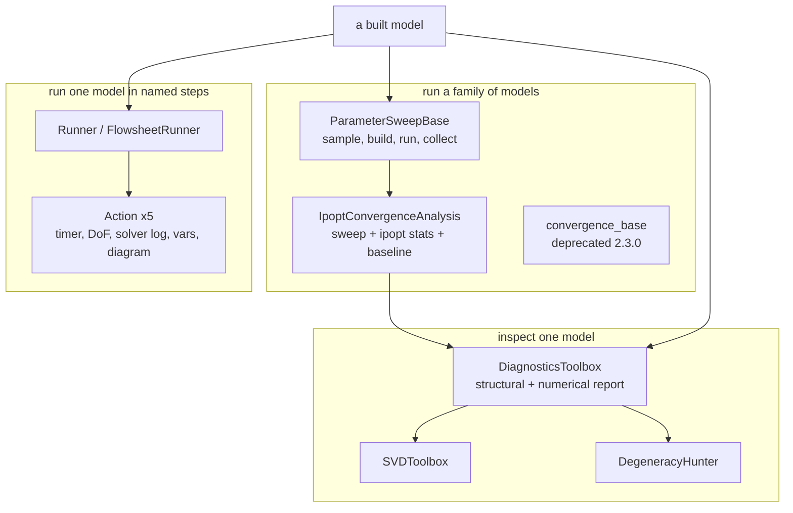
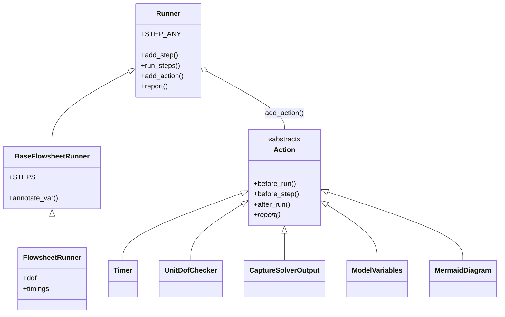
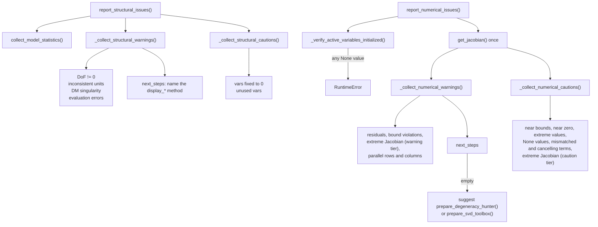

# 07 — Diagnostics and run orchestration

> **Doc ID** 07 · **Repo SHA** 70a8f4fe1 (IDAES-PSE v2.13.0rc0) · **Source roots** `idaes/core/util/diagnostics_tools/`, `idaes/core/util/convergence/`, `idaes/core/util/structfs/`, `idaes/core/util/{parameter_sweep,performance,model_diagnostics}.py`
> **Owns** 26 modules / 9,866 LOC · **Assets** 8 test fixtures (§10) · **Siblings** [04](04_control_volume_framework.md), [05](05_property_and_reaction_framework.md), [06](06_model_preparation_initializers_and_scalers.md), [08a](08a_model_introspection_and_persistence.md), [30](30_numerics_and_solver_interface_map.md)

[06](06_model_preparation_initializers_and_scalers.md) ends where a model has a
starting point and a set of scaling factors. This document begins there, and
every module in its scope answers one question: *run the model — or a family of
runs — and report what happened*. `diagnostics_tools/` runs analyses rather than
solves and reports on the model's structure and numerics; `convergence/` runs one
model over a sampled parameter space and compares the result to a stored
baseline; `parameter_sweep.py` does the same through a configuration-driven
callback API and is what superseded `convergence/`; `structfs/` runs a single
flowsheet decomposed into eleven named steps with observer objects attached to
the step boundaries. Only the last has no notion of a *family* of runs; all four
end in a report.

---

## 0. Scope and source map

| File | LOC | Purpose | Covered in § |
|---|---:|---|---|
| `idaes/core/util/diagnostics_tools/__init__.py` | 50 | Re-exports the diagnostics public surface in a fixed order to break an import cycle | 2, 12 |
| `idaes/core/util/diagnostics_tools/diagnostics_toolbox.py` | 1,814 | Module `CONFIG` (18 keys), `DiagnosticsToolbox` and its 40 methods | 2, 3, 4, 5, 7, 11 |
| `idaes/core/util/diagnostics_tools/svd_toolbox.py` | 444 | `SVDCONFIG`, `SVDToolbox`, `svd_dense`, `svd_sparse`, `svd_callback_validator` | 2, 4, 5, 7 |
| `idaes/core/util/diagnostics_tools/degeneracy_hunter.py` | 485 | `DHCONFIG`, `DegeneracyHunter` — MILP search for irreducible degenerate sets | 2, 4, 5, 7 |
| `idaes/core/util/diagnostics_tools/constraint_term_analysis.py` | 491 | `ConstraintTermAnalysisVisitor` — mismatched and cancelling additive terms | 2, 3, 5, 7 |
| `idaes/core/util/diagnostics_tools/evaluation_error.py` | 213 | `EvalErrorWalker` and six per-operator bound checks | 2, 3, 5, 6 |
| `idaes/core/util/diagnostics_tools/convergence_analysis.py` | 505 | `CACONFIG`, `IpoptConvergenceAnalysis` — parameter sweep plus ipopt statistics | 2, 4, 5, 7, 10 |
| `idaes/core/util/diagnostics_tools/ill_conditioning.py` | 182 | `compute_ill_conditioning_certificate` — LP certificate of an ill-conditioned Jacobian | 2, 5, 11 |
| `idaes/core/util/diagnostics_tools/bounds.py` | 141 | Valid-range metadata reads and writes against property metadata | 2, 7 |
| `idaes/core/util/diagnostics_tools/utils.py` | 357 | `check_parallel_jacobian`, the three `extreme_jacobian_*` functions, six variable collectors | 2, 7 |
| `idaes/core/util/diagnostics_tools/writer_utils.py` | 168 | `collect_model_statistics`, `write_report_section`, `MAX_STR_LENGTH`, `TAB` | 2, 6, 7 |
| `idaes/core/util/diagnostics_tools/ipopt_halt_on_error.py` | 49 | `ipopt_solve_halt_on_error` — one solve with AMPL error halting on | 2, 7 |
| `idaes/core/util/diagnostics_tools/deprecated/__init__.py` | 0 | Package marker | 12 |
| `idaes/core/util/diagnostics_tools/deprecated/degeneracy_hunter_legacy.py` | 732 | The superseded `DegeneracyHunter`, kept beside the current one | 3, 12, 13 |
| `idaes/core/util/convergence/__init__.py` | 12 | Licence header only; no code | 2 |
| `idaes/core/util/convergence/convergence_base.py` | 1,074 | `ConvergenceEvaluation`, sample files, ipopt statistics, `Stats`; 12 deprecation sites | 2, 3, 5, 7, 10, 12 |
| `idaes/core/util/convergence/mpi_utils.py` | 167 | `MPIInterface` with a deferred `mpi4py` import, `ParallelTaskManager` | 2, 5, 6, 10 |
| `idaes/core/util/parameter_sweep.py` | 829 | `ParameterSweepSpecification`, module `CONFIG` (12 keys), `ParameterSweepBase`, `SequentialSweepRunner` | 2, 3, 4, 5, 7, 9 |
| `idaes/core/util/performance.py` | 176 | `PerformanceBaseClass` — the pytest-integrated timing harness | 2, 9, 12, 13 |
| `idaes/core/util/structfs/__init__.py` | 238 | A MyST design document for the structured flowsheet runner; no code | 1, 5, 10 |
| `idaes/core/util/structfs/runner.py` | 532 | `Step`, `Runner`, `Action` — the step/observer engine | 2, 3, 5, 7, 9 |
| `idaes/core/util/structfs/fsrunner.py` | 326 | `Context`, `BaseFlowsheetRunner` and its `STEPS`, `FlowsheetRunner` | 2, 3, 5, 6, 7 |
| `idaes/core/util/structfs/runner_actions.py` | 525 | `Timer`, `UnitDofChecker`, `CaptureSolverOutput`, `ModelVariables`, `MermaidDiagram` | 2, 3, 5, 7 |
| `idaes/core/util/structfs/runner_cli.py` | 175 | `main` — the body of the `idaes-run` console script | 2, 5, 14 |
| `idaes/core/util/structfs/logutil.py` | 46 | `quiet` / `unquiet` — global logger level suppression | 2, 7, 11 |
| `idaes/core/util/model_diagnostics.py` | 135 | Back-compatibility shim: 30 `relocated_module_attribute` entries | 0, 12 |

Total 9,866 LOC, 44 configuration keys across five declarations, 11
`NotImplementedError` sites. `idaes/core/util/model_diagnostics.py` is a shim and
nothing else — no class, no function, no configuration key, only 30 calls to
Pyomo's `relocated_module_attribute` — and is described once, in §12.3.

---

## 1. Architectural role

A solved flowsheet is not self-explaining. When a solve fails, or succeeds and
produces something implausible, the questions are structural (is the system
square, are the units consistent, is there a singularity) or numerical (are the
residuals small, is the Jacobian conditioned, do any terms cancel). The
`diagnostics_tools` subpackage answers both and organises the answers into three
tiers: **warnings**, which the report treats as blocking; **cautions**, which may
be correct; and **next steps**, naming the method that expands a given warning.

`DiagnosticsToolbox` (`idaes/core/util/diagnostics_tools/diagnostics_toolbox.py:251`)
is the entry point: one object wrapping one `BlockData`, an 18-key `CONFIG` of
tolerances, and 40 methods. Two of those methods construct the heavier tools —
`SVDToolbox` (`idaes/core/util/diagnostics_tools/svd_toolbox.py:165`) and
`DegeneracyHunter` (`idaes/core/util/diagnostics_tools/degeneracy_hunter.py:108`)
— so escalation is explicit rather than automatic.

The other three subsystems run the model rather than inspect it.
`ParameterSweepBase` (`idaes/core/util/parameter_sweep.py:426`) samples declared
inputs, builds and solves the model once per sample, and collects outputs
through caller-supplied callbacks. `IpoptConvergenceAnalysis`
(`idaes/core/util/diagnostics_tools/convergence_analysis.py:97`) composes the
two halves: it drives a sweep whose per-sample output is an ipopt iteration
count *and* a `DiagnosticsToolbox` numerical verdict, then compares the table
against a stored baseline. `convergence_base.py` is an earlier design of the
same idea, deprecated at version 2.3.0 but still present and still tested.

`structfs/` is the newest code in the scope: rather than varying inputs, it
decomposes one flowsheet script into eleven named steps
(`idaes/core/util/structfs/fsrunner.py:70`) and lets observer objects attach to
the step boundaries. The package docstring
(`idaes/core/util/structfs/__init__.py:13`) is a 238-line MyST design document —
overview, a before/after worked example on a single-Flash flowsheet, the step
list, and directives pulling in the `Action` and `annotate_var` docstrings — with
no executable code beyond the fenced examples.



*Three ways into the same model: inspect it once, run it many times, or run it once in observable pieces.*

---

## 2. Public surface inventory

| Symbol | Kind | Declared at | Exported via | Stability signal |
|---|---|---|---|---|
| `CONFIG` (diagnostics) | `ConfigDict` | `idaes/core/util/diagnostics_tools/diagnostics_toolbox.py:97` | `idaes.core.util.model_diagnostics` (relocated) | module-level |
| `DiagnosticsToolbox` | class | `idaes/core/util/diagnostics_tools/diagnostics_toolbox.py:251` | `idaes.core.util`, `idaes.core.util.diagnostics_tools` | re-exported twice; autodoc'd |
| `SVDCONFIG`, `SVDToolbox`, `svd_dense`, `svd_sparse` | `ConfigDict`, class, functions | `idaes/core/util/diagnostics_tools/svd_toolbox.py:117`, `:165`, `:78`, `:100` | `idaes.core.util.diagnostics_tools` | re-exported; `SVDToolbox` autodoc'd |
| `svd_callback_validator` | function | `idaes/core/util/diagnostics_tools/svd_toolbox.py:56` | relocated only | CONFIG domain |
| `DHCONFIG`, `DegeneracyHunter` | `ConfigDict`, class | `idaes/core/util/diagnostics_tools/degeneracy_hunter.py:65`, `:108` | `idaes.core.util.diagnostics_tools` | re-exported; class autodoc'd |
| `ConstraintTermAnalysisVisitor` | class | `idaes/core/util/diagnostics_tools/constraint_term_analysis.py:38` | `idaes.core.util.diagnostics_tools` | re-exported; autodoc'd |
| `EvalErrorWalker` | class | `idaes/core/util/diagnostics_tools/evaluation_error.py:192` | not re-exported | imported under an alias by the toolbox |
| `CACONFIG`, `IpoptConvergenceAnalysis` | `ConfigDict`, class | `idaes/core/util/diagnostics_tools/convergence_analysis.py:64`, `:97` | `idaes.core.util.diagnostics_tools` | re-exported; class autodoc'd |
| `psweep_runner_validator` | function | `idaes/core/util/diagnostics_tools/convergence_analysis.py:49` | relocated only | CONFIG domain |
| `compute_ill_conditioning_certificate` | function | `idaes/core/util/diagnostics_tools/ill_conditioning.py:40` | `idaes.core.util.diagnostics_tools` | logs a beta-capability warning on every call |
| `get_valid_range_of_component`, `set_bounds_from_valid_range`, `list_components_with_values_outside_valid_range` | functions | `idaes/core/util/diagnostics_tools/bounds.py:31`, `:69`, `:106` | `idaes.core.util.diagnostics_tools` | re-exported |
| `ipopt_solve_halt_on_error` | function | `idaes/core/util/diagnostics_tools/ipopt_halt_on_error.py:25` | `idaes.core.util.diagnostics_tools` | re-exported; autodoc'd |
| `check_parallel_jacobian`, `extreme_jacobian_entries`, `extreme_jacobian_rows`, `extreme_jacobian_columns` | functions | `idaes/core/util/diagnostics_tools/utils.py:35`, `:140`, `:172`, `:202` | relocated only; module import | the three `extreme_*` share names with `core/util/scaling.py`; §12.6 |
| `vars_fixed_to_zero`, `vars_near_zero`, `vars_violating_bounds`, `vars_with_none_value`, `vars_with_extreme_values`, `var_in_block` | functions | `idaes/core/util/diagnostics_tools/utils.py:253`, `:270`, `:291`, `:315`, `:333`, `:234` | module import | no leading underscore, not re-exported |
| `collect_model_statistics`, `write_report_section`, `MAX_STR_LENGTH`, `TAB` | functions, constants | `idaes/core/util/diagnostics_tools/writer_utils.py:48`, `:131`, `:44`, `:45` | module import | shared report formatting; `84` and four spaces |
| `register_convergence_class` | decorator factory | `idaes/core/util/convergence/convergence_base.py:101` | module import | `@deprecated` 2.3.0 |
| `ConvergenceEvaluationSpecification`, `ConvergenceEvaluation`, `Stats` | classes | `idaes/core/util/convergence/convergence_base.py:116`, `:179`, `:897` | module import | `@deprecated` 2.3.0 |
| `write_sample_file`, `run_convergence_evaluation_from_sample_file`, `run_single_sample_from_sample_file`, `run_single_sample`, `run_convergence_evaluation` | functions | `idaes/core/util/convergence/convergence_base.py:571`, `:619`, `:656`, `:694`, `:718` | module import | `@deprecated` 2.3.0 |
| `generate_baseline_statistics`, `save_convergence_statistics` | functions | `idaes/core/util/convergence/convergence_base.py:799`, `:868` | module import | `@deprecated` 2.3.0 |
| `generate_samples` | function | `idaes/core/util/convergence/convergence_base.py:527` | module import | the one public name in the module carrying no decorator |
| `convergence_classes` | dict | `idaes/core/util/convergence/convergence_base.py:93` | module import | registry populated by the decorator |
| `MPIInterface`, `ParallelTaskManager` | classes | `idaes/core/util/convergence/mpi_utils.py:32`, `:78` | module import | `mpi4py` imported on first construction; degrades to serial without it |
| `ParameterSweepSpecification`, `ParameterSweepBase` | classes | `idaes/core/util/parameter_sweep.py:39`, `:426` | module import | autodoc'd |
| `is_psweepspec`, `CONFIG` (sweep), `SequentialSweepRunner` | function, `ConfigDict`, class | `idaes/core/util/parameter_sweep.py:295`, `:340`, `:803` | module import | CONFIG domain; 12 keys; the only shipped runner |
| `PerformanceBaseClass` | class | `idaes/core/util/performance.py:32` | module import | imports `pytest` at module scope; §12 |
| `Step`, `Runner`, `Action` | classes | `idaes/core/util/structfs/runner.py:30`, `:61`, `:380` | module import | `Runner` has 21 methods; `Action` is the only `abc.ABC` in this scope |
| `Context`, `BaseFlowsheetRunner`, `FlowsheetRunner` | classes | `idaes/core/util/structfs/fsrunner.py:35`, `:61`, `:236` | module import | `BaseFlowsheetRunner` carries `STEPS`; `FlowsheetRunner` wires the five shipped Actions |
| `Timer`, `UnitDofChecker`, `CaptureSolverOutput`, `ModelVariables`, `MermaidDiagram` | classes | `idaes/core/util/structfs/runner_actions.py:44`, `:180`, `:373`, `:406`, `:499` | module import | the shipped `Action` set |
| `main` (`idaes-run`), `quiet`, `unquiet` | functions | `idaes/core/util/structfs/runner_cli.py:40`, `logutil.py:23`, `:40` | `project.scripts`; module import | console entry point, see [02](02_runtime_platform_and_cli.md); process-global logger mutation |

`idaes/core/util/diagnostics_tools/__init__.py` re-exports in a deliberate order
— `bounds` (`:18`) through `svd_toolbox` (`:36`), then `diagnostics_toolbox`
(`:44`) and `convergence_analysis` (`:47`) under a comment marking them deferred
— because `diagnostics_toolbox.py:70` imports four names back out of the package
`__init__`.

---

## 3. Class hierarchy and type taxonomy

Most classes in this scope derive from `object`; the inheritance that exists is
confined to `structfs/`, the only part built as a framework rather than a set of
tools.



*The runner owns a named dictionary of Actions and calls all seven hooks on every one of them; the Actions know nothing about each other.*

| Class | Base(s) | Declared at | Decorator | Container class | Key overrides |
|---|---|---|---|---|---|
| `DiagnosticsToolbox`, `SVDToolbox` | `object` | `diagnostics_toolbox.py:251`, `svd_toolbox.py:165` | `document_kwargs_from_configdict` | — | — |
| `DegeneracyHunter` | `object` | `degeneracy_hunter.py:108` | `document_kwargs_from_configdict(DHCONFIG)` | — | — |
| `DegeneracyHunter` (legacy) | `object` | `deprecated/degeneracy_hunter_legacy.py:58` | none | — | same class name; §12.1 |
| `IpoptConvergenceAnalysis` | `object` | `convergence_analysis.py:97` | none | — | `CONFIG` as class attribute |
| `ConstraintTermAnalysisVisitor`, `EvalErrorWalker` | `StreamBasedExpressionVisitor` | `constraint_term_analysis.py:38`, `evaluation_error.py:192` | none | — | `exitNode`; the first also `walk_expression` |
| `ConvergenceEvaluationSpecification`, `Stats` | `object` | `convergence_base.py:116`, `:897` | `deprecated(2.3.0)` | — | — |
| `ConvergenceEvaluation` | `object` | `convergence_base.py:179` | `deprecated(2.3.0)` | — | three abstract methods |
| `MPIInterface`, `ParallelTaskManager` | `object` | `mpi_utils.py:32`, `:78` | none | — | class-level `__have_mpi__` cache |
| `ParameterSweepSpecification` | `object` | `parameter_sweep.py:39` | none | — | — |
| `ParameterSweepBase` | `object` | `parameter_sweep.py:426` | `document_kwargs_from_configdict` | — | `execute_parameter_sweep` hook |
| `SequentialSweepRunner` | `ParameterSweepBase` | `parameter_sweep.py:803` | none | — | `execute_parameter_sweep` |
| `PerformanceBaseClass` | `object` | `performance.py:32` | none | — | `__init_subclass__` |
| `Step`, `Runner` | `object` | `structfs/runner.py:30`, `:61` | none | — | — |
| `Action` | `abc.ABC` | `structfs/runner.py:380` | none | — | `report` is `@abstractmethod` |
| `Context` | `dict` | `structfs/fsrunner.py:35` | none | — | `model`, `solver` properties |
| `BaseFlowsheetRunner` | `Runner` | `structfs/fsrunner.py:61` | none | — | `run_steps`, `reset` |
| `FlowsheetRunner` | `BaseFlowsheetRunner` | `structfs/fsrunner.py:236` | none | — | two nested wrapper classes |
| `Timer`, `UnitDofChecker`, `CaptureSolverOutput`, `ModelVariables`, `MermaidDiagram` | `Action` | `runner_actions.py:44`, `:180`, `:373`, `:406`, `:499` | none | — | the hooks each overrides are in §5.8 |

No class here is a process block, so the container-class column is empty
throughout; the `FooData`/`Foo` pair rule
([01 §2.1](01_glossary_and_conventions.md#21-the-block-system)) does not apply.

### 3.1 Enumerations

This scope declares no enum classes. Two string constants act as sentinels
instead: `Runner.STEP_ANY` (`idaes/core/util/structfs/runner.py:64`), the single
character `-` meaning "the first or last *defined* step", and `Step.SEP`
(`idaes/core/util/structfs/runner.py:33`), the `::` printed between a step and a
substep.

### 3.2 Pydantic report models

`structfs/` is the only user of pydantic in the whole `idaes` tree.
`runner.py:380` types `Action.report` as returning `BaseModel | dict`, and four
of the five shipped Actions declare a nested `Report(BaseModel)`:
`Timer.Report` (`runner_actions.py:47`), `UnitDofChecker.Report` (`:193`),
`ModelVariables.Report` (`:411`) and `MermaidDiagram.Report` (`:502`);
`CaptureSolverOutput.report` (`:397`) returns a plain dict. `Runner.report`
(`runner.py:361`) calls `model_dump()` on anything that is a `BaseModel`, so the
combined report is always JSON-ready.

---

## 4. Configuration reference

44 keys across five `ConfigDict` declarations. None is required; every key has a
default except `number_of_smallest_singular_values` and the six
`ParameterSweepBase` callbacks, which are checked at call time instead.

### 4.1 `CONFIG` — the diagnostics tolerances

`ConfigDict()` at `idaes/core/util/diagnostics_tools/diagnostics_toolbox.py:97`.
The `_caution` / `_warning` pairs are the mechanism that produces the report's
two severity tiers from a single check.

| Key | Domain / validator | Default | Req. | Effect on build | Anchor |
|---|---|---|---|---|---|
| `variable_bounds_absolute_tolerance` | `NonNegativeFloat` | `1e-4` | no | Absolute margin for "near a bound" — a caution | `:98` |
| `variable_bounds_relative_tolerance` | `NonNegativeFloat` | `1e-4` | no | Relative margin for the same check | `:108` |
| `variable_bounds_violation_tolerance` | `NonNegativeFloat` | `0` | no | Margin for "at or outside a bound" — a warning | `:117` |
| `constraint_residual_tolerance` | `NonNegativeFloat` | `1e-5` | no | Threshold for a large constraint residual | `:128` |
| `constraint_term_mismatch_tolerance` | `NonNegativeFloat` | `1e6` | no | Magnitude ratio at which two additive terms are mismatched | `:136` |
| `constraint_term_cancellation_tolerance` | `NonNegativeFloat` | `1e-4` | no | Relative size below which a term sum is a cancellation | `:144` |
| `max_canceling_terms` | `NonNegativeInt` | `5` | no | Largest combination size searched for cancellations | `:152` |
| `constraint_term_zero_tolerance` | `NonNegativeFloat` | `1e-10` | no | Magnitude treated as an exact zero term | `:160` |
| `variable_large_value_tolerance` | `NonNegativeFloat` | `1e4` | no | Upper threshold for an extreme variable value | `:168` |
| `variable_small_value_tolerance` | `NonNegativeFloat` | `1e-4` | no | Lower threshold for the same | `:176` |
| `variable_zero_value_tolerance` | `NonNegativeFloat` | `1e-8` | no | Magnitude counted as "near zero" | `:184` |
| `jacobian_large_value_caution` | `NonNegativeFloat` | `1e4` | no | Jacobian norm above which a caution is issued | `:192` |
| `jacobian_large_value_warning` | `NonNegativeFloat` | `1e8` | no | Jacobian norm above which a warning is issued | `:200` |
| `jacobian_small_value_caution` | `NonNegativeFloat` | `1e-4` | no | Jacobian norm below which a caution is issued | `:208` |
| `jacobian_small_value_warning` | `NonNegativeFloat` | `1e-8` | no | Jacobian norm below which a warning is issued | `:216` |
| `warn_for_evaluation_error_at_bounds` | `bool` | `True` | no | Whether an evaluation error reachable only at a bound counts | `:224` |
| `parallel_component_tolerance` | `NonNegativeFloat` | `1e-8` | no | Tolerance for the near-parallel row/column test | `:232` |
| `absolute_feasibility_tolerance` | `NonNegativeFloat` | `1e-6` | no | Passed to Pyomo's minimal-infeasible-system routine | `:240` |

The four `jacobian_*` keys are read twice per numerical report — the `_warning`
pair in `_collect_numerical_warnings` (`:1320`), the `_caution` pair in
`_collect_numerical_cautions` (`:1440`) — against the same
`extreme_jacobian_rows` / `extreme_jacobian_columns` functions, over one Jacobian
and `PyomoNLP` pair computed in `report_numerical_issues` (`:1677`).

### 4.2 `SVDCONFIG`

`ConfigDict()` at `idaes/core/util/diagnostics_tools/svd_toolbox.py:117`.

| Key | Domain / validator | Default | Req. | Effect on build | Anchor |
|---|---|---|---|---|---|
| `number_of_smallest_singular_values` | `PositiveInt` | none | no | How many singular values to compute; when unset, `min(10, min(n_eq, n_var) - 1)` | `:118` |
| `svd_callback` | `svd_callback_validator` | `svd_dense` | no | Which decomposition routine runs | `:125` |
| `svd_callback_arguments` | `dict` | `None` | no | Extra keyword arguments forwarded to the callback | `:137` |
| `singular_value_tolerance` | `NonNegativeFloat` | `1e-6` | no | Below this a singular value counts as small | `:145` |
| `size_cutoff_in_singular_vector` | `NonNegativeFloat` | `0.1` | no | Entries smaller than this are omitted from the vector display | `:153` |

`svd_callback_validator` (`:56`) accepts any callable whose signature declares at
least two parameters and otherwise logs at `error` level and raises `ValueError`.
The shipped callbacks are `svd_dense` (`:78`), which calls `scipy.linalg.svd` on
a densified Jacobian and flips the results so singular values come out ascending,
and `svd_sparse` (`:100`), which calls `scipy.sparse.linalg.svds` with
`which="SM"`.

### 4.3 `DHCONFIG`

`ConfigDict()` at `idaes/core/util/diagnostics_tools/degeneracy_hunter.py:65`.

| Key | Domain / validator | Default | Req. | Effect on build | Anchor |
|---|---|---|---|---|---|
| `solver` | `str` | `'scip'` | no | Name passed to `SolverFactory` for the MILP solves | `:66` |
| `solver_options` | none | `None` | no | Options dict assigned to that solver | `:74` |
| `M` | `NonNegativeFloat` | `1e5` | no | Big-M constant in both MILP formulations | `:81` |
| `m_small` | `NonNegativeFloat` | `1e-5` | no | Small-m constant bounding the multipliers away from zero | `:89` |
| `trivial_constraint_tolerance` | `NonNegativeFloat` | `1e-6` | no | Rows whose entries are all below this are excluded as trivial | `:97` |

Two further constants are module-level rather than configurable: `YTOL = 0.9`
(`:61`) and `MMULT = 0.99` (`:62`).

### 4.4 `CACONFIG`

`ConfigDict()` at `idaes/core/util/diagnostics_tools/convergence_analysis.py:64`.

| Key | Domain / validator | Default | Req. | Effect on build | Anchor |
|---|---|---|---|---|---|
| `input_specification` | `is_psweepspec` | none | no | The `ParameterSweepSpecification` defining sampled inputs | `:65` |
| `workflow_runner` | `psweep_runner_validator` | `SequentialSweepRunner` | no | Which `ParameterSweepBase` subclass executes the sweep | `:72` |
| `solver_options` | `None` | none | no | Options assigned onto the ipopt solver object | `:80` |
| `halt_on_error` | `bool` | `False` | no | Forwarded to the sweep runner's key of the same name | `:87` |

`psweep_runner_validator` (`:49`) calls `issubclass` against
`ParameterSweepBase`, so it accepts a class and never an instance — the opposite
convention from `is_psweepspec` (`idaes/core/util/parameter_sweep.py:295`),
which uses `isinstance`.

### 4.5 `CONFIG` — the parameter sweep

`ConfigDict()` at `idaes/core/util/parameter_sweep.py:340`. Six of these keys
are callbacks and six modify how the callbacks are called.

| Key | Domain / validator | Default | Req. | Effect on build | Anchor |
|---|---|---|---|---|---|
| `rebuild_model` | `bool` | `True` | no | When `False`, one model instance is built and reused for every sample | `:341` |
| `build_model` | none | `None` | no | Callback returning a model; absence raises `ConfigurationError` at run time | `:350` |
| `build_model_arguments` | `dict` | `None` | no | Keyword arguments for that callback | `:354` |
| `run_model` | none | `None` | no | Callback running one sample; absence falls back to `solver.solve(model)` | `:361` |
| `run_model_arguments` | `dict` | `None` | no | Keyword arguments for that callback | `:367` |
| `build_outputs` | none | `None` | no | Callback collecting results; absence returns the raw run statistics | `:374` |
| `build_outputs_arguments` | `dict` | `None` | no | Keyword arguments for that callback | `:380` |
| `handle_solver_error` | none | `None` | no | Recourse callback invoked when a sample raises | `:387` |
| `handle_solver_error_arguments` | `dict` | `None` | no | Keyword arguments for that callback | `:393` |
| `halt_on_error` | `bool` | `False` | no | When `True` an exception propagates instead of being recorded | `:400` |
| `input_specification` | `is_psweepspec` | none | no | The sampling specification supplying per-sample values | `:408` |
| `solver` | `_is_solver` | `None` | no | Solver object passed to `run_model` | `:415` |

`_is_solver` (`:318`) is duck-typed: it returns the value if `val.solve` is
callable and raises `ValueError` on `AttributeError`, so a solver name string is
rejected and any object with a `solve` attribute is accepted. `rebuild_model`
has the largest observable effect: with the default `True`,
`get_initialized_model` (`:504`) calls `build_model` once per sample; with
`False`, the first instance is cached on `self._model` and every later sample
inherits whatever the previous solve left behind.

---

## 5. Construction and call sequences

### 5.1 The diagnostics report path

`DiagnosticsToolbox.__init__` (`idaes/core/util/diagnostics_tools/diagnostics_toolbox.py:295`)
does no analysis: it rejects a non-`BlockData` model with `TypeError`, rejects a
model containing greybox blocks with `NotImplementedError`, and resolves
`**kwargs` into `self.config`. The two summary methods share a four-part shape
and both write through `write_report_section`
(`idaes/core/util/diagnostics_tools/writer_utils.py:131`).



*Warnings carry a named next step; cautions never do — that asymmetry is what makes the two tiers actionable differently.*

1. `report_structural_issues` (`:1624`) re-runs the greybox check first, so a
   model that acquired a greybox block after construction is still rejected.
2. `_collect_structural_warnings` (`:1224`) runs `identify_inconsistent_units`,
   `get_dulmage_mendelsohn_partition` (`:688`), a degrees-of-freedom check and
   the evaluation-error walk; `ignore_evaluation_errors` and
   `ignore_unit_consistency` suppress individual checks.
3. `get_dulmage_mendelsohn_partition` (`:688`) builds an
   `IncidenceGraphInterface` with `include_inequality=False` and returns four
   lists of connected components; unmatched variables join the under-constrained
   set and unmatched constraints the over-constrained set.
4. `report_numerical_issues` (`:1677`) opens with
   `_verify_active_variables_initialized` (`:470`), which raises `RuntimeError`
   naming the count of uninitialised variables and the method listing them, so
   numerical analysis is impossible on a never-solved model.
5. The condition number comes from `jacobian_cond(jac=jac, scaled=True)`
   ([06 §5.6](06_model_preparation_initializers_and_scalers.md#56-suffix-based-scaling));
   a `RuntimeError` reading `Factor is exactly singular` is rendered as
   `Undefined (Exactly Singular)` and any other propagates.
6. `assert_no_structural_warnings` (`:1582`) and `assert_no_numerical_warnings`
   (`:1606`) call the same collectors and raise `AssertionError` carrying only
   the count. They are what unit-model test suites call.

### 5.2 Escalation: SVD and degeneracy hunting

`prepare_svd_toolbox` (`:1783`) and `prepare_degeneracy_hunter` (`:1800`)
construct the heavier tool, store it as `self.svd_toolbox` /
`self.degeneracy_hunter`, and return it; both carry
`document_kwargs_from_configdict` against the sub-tool's config, so its keys
appear in the toolbox method's rendered signature.

`SVDToolbox.__init__` (`svd_toolbox.py:179`) computes the Jacobian with
`equality_constraints_only=True` immediately and raises `ValueError` below two
equality constraints. `run_svd_analysis` (`:212`) resolves the count, raises
`ValueError` if more than `min(n_eq, n_var) - 1` were requested, calls the
configured callback and stores `u`, `s`, `v`;
`display_underdetermined_variables_and_constraints` (`:294`) is the method the
toolbox docstring points at.

`DegeneracyHunter` (`degeneracy_hunter.py:108`) runs a two-stage MILP search.
`_prepare_candidates_milp` (`:160`) builds a mixed-integer program over the
equality-constraint Jacobian whose solution identifies constraints able to carry
a non-zero multiplier in a degenerate combination; `_solve_candidates_milp`
(`:285`) solves it and `_identify_candidates` (`:272`) reads the result into
`self.degenerate_set`. `_prepare_ids_milp` (`:308`) builds a second MILP and
`_solve_ids_milp` (`:380`) is solved once per candidate to test whether that
constraint anchors an irreducible degenerate set.
`find_irreducible_degenerate_sets` (`:413`) sequences the two stages and skips
the second when the candidate set is empty;
`report_irreducible_degenerate_sets` (`:450`) runs the search and formats it.

### 5.3 The two expression walkers

`ConstraintTermAnalysisVisitor` (`constraint_term_analysis.py:38`) reports two
conditions on additive terms: **mismatch**, where the ratio of largest to smallest
term in a sum exceeds `constraint_term_mismatch_tolerance`, and **cancellation**,
where some combination sums to nearly nothing relative to the terms themselves.
Dispatch is a class-level
`node_type_method_map` (`:402`) of 21 entries covering equality, inequality and
ranged expressions, sums, linear expressions, products, monomial terms,
divisions, powers, negations, absolute values, unary functions, `Expr_if` and
external functions, each in both the regular and the non-potentially-variable
form. `exitNode` (`:427`) consults the map, falls through to `_check_base_type`
(`:191`) for a `Var` or `Param`, returns `[1]` for a `_PyomoUnit` because units
carry no value, and raises `TypeError` naming the node type otherwise.
`walk_expression` (`:464`) returns a five-tuple: values, mismatched terms,
cancelling terms, a constant flag, and a flag saying whether cancellation
collection hit its per-node cap.

Combinatorial cost is bounded twice: `max_canceling_terms` limits the size of
the combinations generated by `_generate_combinations` (`:96`), and
`max_cancellations_per_node` limits how many are collected before the walk stops
looking — `_collect_constraint_mismatches` (`diagnostics_toolbox.py:975`) sets
the latter to `1`, because the summary needs only to know whether any exists.

`EvalErrorWalker` (`evaluation_error.py:192`) asks a different question: given
the *bounds* on each subexpression, can it be evaluated at all? It uses Pyomo's
`compute_bounds_on_expr` through `_get_bounds_with_inf` (`:48`), which
substitutes `±inf` for an absent bound, and dispatches through the module-level
`_eval_err_handler` dict (`:183`).

| Operator | Condition reported | Anchor |
|---|---|---|
| division | denominator bounds straddle or touch zero | `:57` |
| power | negative base with a non-integer exponent, or zero base with a negative exponent | `:68` |
| `log`, `log10` | argument lower bound at or below zero | `:122` |
| `tan` | argument range spans an odd multiple of π/2 | `:131` |
| `asin` | argument range extends outside [-1, 1] | `:140` |
| `acos` | argument range extends outside [-1, 1] | `:149` |
| `sqrt` | argument lower bound below zero | `:158` |

Unary functions are reached through a second dict, `_unary_eval_err_handler`
(`:167`), keyed by the function's `getname()`.
`_collect_potential_eval_errors` (`diagnostics_toolbox.py:1737`) constructs a
fresh walker per constraint and per objective, prefixing each message with the
component name.

### 5.4 A parameter sweep

`SequentialSweepRunner.execute_parameter_sweep`
(`idaes/core/util/parameter_sweep.py:811`) loops over the rows of the
specification's samples DataFrame, calling `execute_single_sample` (`:461`),
storing a three-key dict — `success`, `results`, `error` — under the sample
index, and printing a progress bar (`:784`). `execute_single_sample` is the unit
of work: `get_initialized_model` (`:504`) returns a model, fresh or cached
according to `rebuild_model`; `set_input_values` (`:585`) writes each sampled
value through `model.find_component(pyomo_path)`, accepting a mutable `Param` or
a fixed `Var` and raising `ValueError` naming the component for an immutable
`Param`, an unfixed `Var`, an unfixed member of an indexed `Var`, or anything
else; `run_model` (`:653`) calls the configured callback or falls back to
`solver.solve(model)` plus `check_optimal_termination`; any exception is caught
unless `halt_on_error` is set, stringified and stored, with `handle_error`
(`:699`) supplying replacement results; and `build_outputs` (`:677`) collects
the record.

Sampling is `ParameterSweepSpecification`. `add_sampled_input` (`:55`) records a
Pyomo path, bounds and a display name; `set_sampling_method` (`:96`) accepts a
pysmo `SamplingMethods` subclass and raises `TypeError` otherwise;
`generate_samples` (`:142`) instantiates the method with
`sampling_type="creation"` and wraps `sample_points()` in a pandas DataFrame.
`UniformSampling` is special-cased: its sample size must be a list of per-input
graduation counts. Serialisation is by name — `to_dict` (`:223`) stores
`self._sampling_method.__name__` because a pysmo sampling class is not
JSON-serialisable, and `from_dict` (`:240`) rebuilds it with `__import__` against
`idaes.core.surrogate.pysmo.sampling`; samples round-trip through pandas'
`orient="tight"` form.

### 5.5 Convergence analysis over a sweep

`IpoptConvergenceAnalysis.__init__`
(`idaes/core/util/diagnostics_tools/convergence_analysis.py:106`) builds a sweep
runner whose four callbacks are its own bound methods, so the composition is
fixed at construction:

| Sweep config key | Bound to | What it does |
|---|---|---|
| `build_model` | `_build_model` (`:323`) | `self._model.clone()` |
| `run_model` | `_run_model` (`:327`) | `_run_ipopt_with_stats`, returns four counters |
| `build_outputs` | `_build_outputs` (`:349`) | Constructs a `DiagnosticsToolbox` and records whether `assert_no_numerical_warnings` raised |
| `handle_solver_error` | `_recourse` (`:369`) | Returns every counter as `-1` |

`_run_ipopt_with_stats` (`:426`) pushes a `TempfileManager` context, creates a
temporary file, passes it as ipopt's `output_file` with `max_iter=500` and
`max_cpu_time=120`, solves, parses the file, and pops with `remove=True`.
`_parse_ipopt_output` (`:380`) is a line-state machine over that file: a line
starting `iter` turns parsing on, a line starting `Number of Iterations....:`
turns it off and yields the total, and while parsing is on each line contributes
to `iters_w_regularization` (column 6 is not `-`) or `iters_in_restoration`
(column 0 ends in `r`). Two `Total CPU secs` lines are summed into the time.

`compare_convergence_to_baseline` (`:190`) loads a baseline JSON file, runs the
analysis from the same dict so the sampling is reproduced exactly, and calls
`_compare_results_to_dict` (`:450`), which compares five fields per sample:
`success` and `numerical_issues` for equality, and the three iteration counters
with `math.isclose` at `rel_tol=0.1`, `abs_tol=1`. Each lookup is retried with a
stringified key, because JSON turns integer sample indices into strings.
`assert_baseline_comparison` (`:215`) raises `AssertionError` if any of the five
difference lists is non-empty.

### 5.6 The deprecated convergence generation

`convergence_base.py` splits the same work into two phases separated by a file
on disk. A `ConvergenceEvaluation` subclass supplies a specification,
`generate_samples` (`:527`) draws `n_points` samples — normal distribution
truncated to the bounds, or uniform — and `write_sample_file` (`:571`) writes a
JSON document with five top-level keys. Then
`run_convergence_evaluation_from_sample_file` (`:619`) reads the file back,
resolves the class string through `_class_import` (`:341`) — a split on the last
dot followed by `importlib.import_module` and `getattr` — instantiates it, and
hands off to `run_convergence_evaluation` (`:718`).

That function converts the samples dict to a list because the parallel task
manager does not handle dicts, distributes it with
`ParallelTaskManager.global_to_local_data` (`mpi_utils.py:117`), and wraps each
local sample's build-set-solve sequence in both a `LoggingIntercept` at `ERROR`
over the `idaes` logger and a Pyomo `capture_output()`. Results are re-assembled
with `gather_global_data` (`:147`).

`MPIInterface` (`mpi_utils.py:32`) imports `mpi4py.MPI` on first construction and
caches the outcome in the class attribute `__have_mpi__`, writing the module into
`globals()` so later references resolve. When the import fails,
`ParallelTaskManager.__init__` (`:79`) sets `_local_map` to
`range(n_total_tasks)` and `is_root` (`:111`) returns `True`, so the serial path
is the no-MPI path rather than a separate one. `Stats`
(`convergence_base.py:897`) aggregates the per-sample records — constructible
from inputs and results, from a dict or from a JSON file — and writes a text
report (`:992`) or JSON (`:989`).

### 5.7 A structured flowsheet run

`Runner.__init__` (`idaes/core/util/structfs/runner.py:66`) takes the ordered
sequence of *permitted* step names and starts with none defined. `add_step`
(`:82`) raises `KeyError` for a name outside that sequence, so the vocabulary is
closed; `add_substep` (`:102`) raises `KeyError` for an unknown base step and
`ValueError` for one in the vocabulary with no definition.

```mermaid
sequenceDiagram
  participant C as caller
  participant R as Runner
  participant A as Actions
  participant F as step function
  C->>R: run_steps(first=, last=)
  R->>R: resolve names to indices; STEP_ANY finds first/last defined
  R->>A: before_run() on every action
  loop each defined step in range
    R->>F: wrapper -> _step_begin(name)
    R->>A: before_step(name)
    F->>F: func(context)
    R->>A: after_step(name)
  end
  R->>A: after_run() on every action
  C->>R: report()
  R->>A: report() on every action
  R-->>C: {"actions": {...}, "last_run": [...]}
```

*The step function is called with the context only; every observation is an Action reading the runner, never the step function reporting upward.*

The step and substep hooks fire from the decorator wrappers, not from the loop.
`Runner.step` (`:309`) returns a decorator whose wrapper calls `_step_begin`
(`:293`), the wrapped function, then `_step_end` (`:301`); `Runner.substep`
(`:333`) does the same with `_substep_begin` (`:297`) and `_substep_end`
(`:305`). `_run_steps` (`:167`) itself calls only `before_run` and `after_run`
and invokes `step.func(self._context)` directly, so a step registered through
`add_step` rather than the `@step` decorator fires no per-step Action hooks.
`run_steps` (`:135`) accepts two mutually exclusive pairs — `first`/`after` and
`last`/`before` — raising `ValueError` if both members of a pair are given, and
encodes inclusivity as a two-boolean tuple. Undefined steps inside the range are
skipped silently; a named step that exists in the vocabulary but was never
defined raises `KeyError` with the text `Empty step`.

`BaseFlowsheetRunner` (`fsrunner.py:61`) fixes the vocabulary to eleven names
(`:70`): `build`, `set_operating_conditions`, `set_scaling`, `initialize`,
`set_solver`, `solve_initial`, `add_costing`, `check_model_structure`,
`initialize_costing`, `solve_optimization`, `check_model_numerics`. Its
`run_steps` override (`:90`) creates a fresh `ConcreteModel` carrying one
`FlowsheetBlock(dynamic=False)` (`_create_model`, `:126`) whenever the range
starts at `build`, at `STEP_ANY`, or when the context holds no model — so
re-running from a later step preserves the model and re-running from the start
discards it. `reset` (`:123`) replaces the context with a fresh `Context`
carrying `solver`, `tee` and a null `model`.

`FlowsheetRunner.__init__` (`:299`) registers five Actions under fixed names:
`degrees_of_freedom`, `timings`, `capture_solver_output`, `model_variables` and
`mermaid_diagram`. The first two are reached through nested wrapper classes,
`DegreesOfFreedom` (`:239`) and `Timings` (`:270`), adding `_ipython_display_`
methods and, in the first case, a `__getattr__` treating any step name as a
request for that step's summary. All five imports sit inside the method body,
because `runner_actions` imports `FlowsheetRunner` from `fsrunner` at its own
module level (`runner_actions.py:41`).

### 5.8 The shipped Actions

| Action | Hooks used | What it records | Anchor |
|---|---|---|---|
| `Timer` | all four | Wall time per step and per run, as a list of per-run dicts; steps not run record `-1` | `runner_actions.py:44` |
| `UnitDofChecker` | `after_step`, `after_run` | Degrees of freedom per unit model at named steps, plus whole-model DoF at the end | `:180` |
| `CaptureSolverOutput` | `before_step`, `after_step` | Redirects `sys.stdout` into a `StringIO` for any step whose name starts `solve` | `:373` |
| `ModelVariables` | `after_run` | A nested dict tree of `Var` and `Param` values, tagged `V` or `P` | `:406` |
| `MermaidDiagram` | `after_run` | A Mermaid diagram of the flowsheet, as a list of lines | `:499` |

`UnitDofChecker._get_dof` (`:350`) is the substantive one: for each block it
finds every `ScalarPort` whose name ends `inlet` or `recycle`, fixes the unfixed
ones, calls `degrees_of_freedom`, then frees exactly the ports it fixed. That
gives a per-unit figure as if the unit were solved in isolation, which is not
the same as the unit's contribution to the flowsheet's degrees of freedom.
`CaptureSolverOutput` stashes the previous `sys.stdout` on `self._save_stdout`
and restores it in `after_step`; because the guard on restoration is
`self._solver_out is not None` rather than the step name, a step that begins
capture always ends it. `MermaidDiagram` and `FlowsheetRunner.show_diagram`
(`fsrunner.py:321`) both depend on the optional third-party
`idaes_connectivity` package, imported in a `try`/`except ImportError` that sets
`Connectivity = None` (`runner_actions.py:35`, `fsrunner.py:29`); without it,
`report` returns an empty dict and `show_diagram` an empty string.

### 5.9 `idaes-run`

`runner_cli.main` (`runner_cli.py:40`) is the body of the `idaes-run` console
script declared in `pyproject.toml`. It parses a module name or path, an output
JSON path, an object name defaulting to `FS`, a `--to` step defaulting to
`STEP_ANY` and an `--info` flag; imports the module through `_load_module`
(`:107`); checks the named object is a `Runner` instance; and either writes
`{"steps": ..., "class_name": ...}` or runs the steps and writes `obj.report()`
with a `status` key added. Every failure path goes through `_error` (`:32`),
writing a status code, a message and a formatted traceback as JSON; the codes are
`-1` for an unopenable output file, `2` for a missing module, `3` for a wrongly
typed object, `4` for a missing object and `5` for an exception during the run.
The CLI surface itself is documented in [02](02_runtime_platform_and_cli.md).

---

## 6. Data structures, variables, constraints and invariants

Two modules build Pyomo models of their own — `DegeneracyHunter` and
`compute_ill_conditioning_certificate` — and both build a *separate* optimisation
problem over the analysed model's Jacobian. Nothing in this document adds a
component to the model under study.

| Structure | Type | Held on | Purpose | Anchor |
|---|---|---|---|---|
| candidates MILP | `ConcreteModel` | `DegeneracyHunter` | Binary `y` per equality constraint plus `nu` multipliers, big-M linked | `degeneracy_hunter.py:160` |
| IDS MILP | `ConcreteModel` | `DegeneracyHunter` | Second-stage problem solved once per candidate constraint | `degeneracy_hunter.py:308` |
| `degenerate_set` | `dict` | `DegeneracyHunter` | Candidate constraints and their multipliers | `degeneracy_hunter.py:121` |
| `irreducible_degenerate_sets` | `list` | `DegeneracyHunter` | One dict of constraint-to-multiplier per set found | `degeneracy_hunter.py:121` |
| ill-conditioning LP | `ConcreteModel` | local | `y_pos`/`y_neg` split variables and a `y` Expression over rows or columns | `ill_conditioning.py:40` |
| `u`, `s`, `v` | numpy arrays | `SVDToolbox` | Left vectors, singular values, right vectors, ascending | `svd_toolbox.py:212` |
| `jacobian`, `nlp` | sparse matrix, `PyomoNLP` | `SVDToolbox`, `DegeneracyHunter` | Computed once in `__init__`, equality constraints only | `svd_toolbox.py:179` |
| `mismatched_terms`, `canceling_terms` | `ComponentMap` | `ConstraintTermAnalysisVisitor` | Node to offending values; reset per `walk_expression` | `constraint_term_analysis.py:64` |
| `node_type_method_map` | class-level `dict` | `ConstraintTermAnalysisVisitor` | 21 node types to handler methods | `constraint_term_analysis.py:402` |
| `_eval_err_handler`, `_unary_eval_err_handler` | module-level `dict` | — | Six node types and six unary function names to bound checks | `evaluation_error.py:183`, `:167` |
| `_warn_list` | `list` of `str` | `EvalErrorWalker` | Accumulated messages; returned from every `exitNode` | `evaluation_error.py:197` |
| `convergence_classes` | module-level `dict` | — | Registry name to dotted class path | `convergence_base.py:93` |
| `_results` | `dict` | `ParameterSweepBase` | Sample index to `{success, results, error}` | `parameter_sweep.py:435` |
| `_samples` | `DataFrame` | `ParameterSweepSpecification` | One row per sample, one column per input | `parameter_sweep.py:49` |
| `_local_map` | `range` or `list` | `ParallelTaskManager` | Which global indices this rank owns | `mpi_utils.py:79` |
| `_context` | `Context` (a `dict`) | `BaseFlowsheetRunner` | The only state passed between steps | `fsrunner.py:35` |
| `_steps`, `_actions` | `dict` | `Runner` | Defined steps (the vocabulary lives in `_step_names`); name to observer instance | `runner.py:66` |
| `_last_run_steps` | `list` of `str` | `Runner` | Names actually executed, reported as `last_run` | `runner.py:167` |
| `_ann` | `dict` | `BaseFlowsheetRunner` | Variable annotations keyed by caller-chosen key | `fsrunner.py:141` |
| `g_quiet` | module-level `dict` | — | Logger name to saved level, for `unquiet` | `structfs/logutil.py:20` |

### 6.1 Invariants

| Invariant | Enforced at |
|---|---|
| The analysed model is a `BlockData`, never an indexed Block | `diagnostics_toolbox.py:295`, `svd_toolbox.py:179`, `degeneracy_hunter.py:121`, `convergence_analysis.py:106` |
| The analysed model contains no greybox blocks | the same four sites, plus `diagnostics_toolbox.py:1624` |
| Numerical analysis runs only on a model with no `None` values in activated equalities | `diagnostics_toolbox.py:470` |
| SVD needs at least two equality constraints | `svd_toolbox.py:179` |
| At most `min(n_eq, n_var) - 1` singular values can be requested | `svd_toolbox.py:212` |
| A sampled input is a mutable `Param` or a fixed `Var` | `parameter_sweep.py:585` |
| A sampling method is a pysmo `SamplingMethods` subclass | `parameter_sweep.py:96` |
| A step name must be in the runner's declared vocabulary | `runner.py:82` |
| A substep's base step must already be defined | `runner.py:102` |
| Only one of `first`/`after` and one of `last`/`before` | `runner.py:135` |
| Step ranges run forward | `runner.py:167` |
| A `PerformanceBaseClass` subclass also subclasses `unittest.TestCase` | `performance.py:72` |
| An annotated variable is an input, an output, or both | `fsrunner.py:141` |

---

## 7. Method contracts

### 7.1 `DiagnosticsToolbox` — the 40 methods by what they diagnose

Anchors in this section are lines in
`idaes/core/util/diagnostics_tools/diagnostics_toolbox.py`. Every `display_*`
method takes `stream=None`, writes to `sys.stdout` when that is unset, and
returns nothing; they are grouped by the question they answer.

| Diagnoses | Methods | What they list |
|---|---|---|
| variable membership and usage | `display_external_variables` (`:317`), `display_unused_variables` (`:345`), `display_variables_fixed_to_zero` (`:367`), `display_variables_with_none_value` (`:419`), `display_variables_with_none_value_in_activated_constraints` (`:441`) | Variables used by activated constraints but absent from the model; variables in no activated constraint; variables fixed to exactly zero; variables with no value, and the subset of those that reach the mathematical program |
| variable values and bounds | `display_variables_at_or_outside_bounds` (`:389`), `display_variables_near_bounds` (`:553`), `display_variables_with_value_near_zero` (`:489`), `display_variables_with_extreme_values` (`:519`) | Bound violations to `variable_bounds_violation_tolerance` (a warning); values close to a bound by the absolute and relative tolerances (a caution); values within `variable_zero_value_tolerance` of zero; values outside the large and small value tolerances |
| structure | `display_components_with_inconsistent_units` (`:585`), `get_dulmage_mendelsohn_partition` (`:688`), `display_underconstrained_set` (`:714`), `display_overconstrained_set` (`:750`), `display_constraints_with_no_free_variables` (`:1194`) | Results of Pyomo's `identify_inconsistent_units`; the four lists of connected components and the two sets they name; constraints whose expression holds no unfixed variable |
| residuals and infeasibility | `display_constraints_with_large_residuals` (`:610`), `compute_infeasibility_explanation` (`:644`) | Constraints above `constraint_residual_tolerance`; a minimal infeasible system, delegated to Pyomo's `contrib.iis.mis` with a private logger bound to `stream` |
| the Jacobian | `display_variables_with_extreme_jacobians` (`:786`), `display_constraints_with_extreme_jacobians` (`:825`), `display_extreme_jacobian_entries` (`:864`), `display_near_parallel_constraints` (`:904`), `display_near_parallel_variables` (`:938`) | Columns and rows whose norm is outside the warning band; individual entries outside it; pairs of near-parallel rows and of near-parallel columns, to `parallel_component_tolerance` |
| constraint terms and evaluation errors | `display_constraints_with_mismatched_terms` (`:1023`), `display_constraints_with_canceling_terms` (`:1051`), `display_problematic_constraint_terms` (`:1086`), `display_potential_evaluation_errors` (`:1758`) | Constraints with additive terms of very different magnitude; constraints where a combination nearly cancels; both analyses for one named `ConstraintData` with `max_cancellations=5`; the `EvalErrorWalker` result over every constraint and objective |

| Method | Signature | Effects | Raises | Anchor |
|---|---|---|---|---|
| `__init__` | `(self, model, **kwargs)` | Stores the model, resolves `CONFIG` | `TypeError`, `NotImplementedError` | `:295` |
| `model` | property | — | — | `:311` |
| `report_structural_issues` | `(self, stream=None)` | Writes four sections | `NotImplementedError` on greybox | `:1624` |
| `report_numerical_issues` | `(self, stream=None)` | Writes four sections including the condition number | `RuntimeError` | `:1677` |
| `assert_no_structural_warnings` | `(self, ignore_evaluation_errors=False, ignore_unit_consistency=False)` | — | `AssertionError` | `:1582` |
| `assert_no_numerical_warnings` | `(self, ignore_parallel_components=False)` | — | `AssertionError` | `:1606` |
| `prepare_svd_toolbox` | `(self, **kwargs)` | Sets `self.svd_toolbox` | propagates | `:1783` |
| `prepare_degeneracy_hunter` | `(self, **kwargs)` | Sets `self.degeneracy_hunter` | propagates | `:1800` |

Seven private collectors carry the logic the public methods share:
`_verify_active_variables_initialized` (`:470`), `_collect_constraint_mismatches`
(`:975`), `_collect_structural_warnings` (`:1224`), `_collect_structural_cautions`
(`:1288`), `_collect_numerical_warnings` (`:1320`), `_collect_numerical_cautions`
(`:1440`) and `_collect_potential_eval_errors` (`:1737`).

### 7.2 The standalone diagnostic functions

| Function | Signature | Returns | Raises | Anchor |
|---|---|---|---|---|
| `check_parallel_jacobian` | `(model, tolerance=1e-4, direction="row", jac=None, nlp=None)` | List of component pairs | `ValueError` on a bad direction | `utils.py:35` |
| `extreme_jacobian_entries` | `(jac, nlp, large=1e4, small=1e-4, zero=1e-10)` | List of `(value, con, var)` | — | `utils.py:140` |
| `extreme_jacobian_rows` | `(jac, nlp, large, small)` | List of `(norm, constraint)` | — | `utils.py:172` |
| `extreme_jacobian_columns` | `(jac, nlp, large, small)` | List of `(norm, variable)` | — | `utils.py:202` |
| `var_in_block` | `(var, block)` | `bool` | — | `utils.py:234` |
| `vars_fixed_to_zero` | `(model)` | `ComponentSet` | — | `utils.py:253` |
| `vars_near_zero` | `(model, variable_zero_value_tolerance)` | `ComponentSet` | — | `utils.py:270` |
| `vars_violating_bounds` | `(model, tolerance)` | `ComponentSet` | — | `utils.py:291` |
| `vars_with_none_value` | `(model)` | `ComponentSet` | — | `utils.py:315` |
| `vars_with_extreme_values` | `(model, large, small, zero)` | `ComponentSet` | — | `utils.py:333` |
| `get_valid_range_of_component` | `(component)` | 2-tuple or `None` | `AttributeError` when no metadata | `bounds.py:31` |
| `set_bounds_from_valid_range` | `(component, descend_into=True)` | `None` | `TypeError` for a component with no bounds | `bounds.py:69` |
| `list_components_with_values_outside_valid_range` | `(component, descend_into=True)` | list of components | — | `bounds.py:106` |
| `compute_ill_conditioning_certificate` | `(model, target_feasibility_tol=1e-6, ratio_cutoff=1e-4, direction="row")` | list of strings | `ValueError` on a bad direction | `ill_conditioning.py:40` |
| `ipopt_solve_halt_on_error` | `(model, options=None)` | Pyomo results | — | `ipopt_halt_on_error.py:25` |
| `collect_model_statistics` | `(model)` | list of report lines | — | `writer_utils.py:48` |
| `write_report_section` | `(stream, lines_list, title=None, line_if_empty=None, end_line=None, header="-", footer=None)` | `None` | — | `writer_utils.py:131` |

`check_parallel_jacobian` groups vectors by sparsity pattern first — a tuple of
the indices whose entries exceed the tolerance both absolutely and relative to
the row maximum — and compares only within a group, which is what makes the
pairwise test affordable; a vector with no non-zeros is skipped, on the grounds
that the extreme-Jacobian checks already report it.
`ipopt_solve_halt_on_error` is a fixed three-setting solve: `halt_on_ampl_error`
forced to `yes`, `symbolic_solver_labels` to `True`, `export_defined_variables`
to `False`, with `tee=True`, built from `SolverFactory("ipopt")` directly rather
than through `get_solver` ([30](30_numerics_and_solver_interface_map.md)).

### 7.3 Sweep, convergence and runner methods

| Method | Signature | Effects | Raises | Anchor |
|---|---|---|---|---|
| `ParameterSweepSpecification.add_sampled_input` | `(self, pyomo_path, lower, upper, name=None)` | Records one input | — | `parameter_sweep.py:55` |
| `ParameterSweepSpecification.generate_samples` | `(self)` | Fills `_samples` | `ValueError`, `TypeError` | `parameter_sweep.py:142` |
| `ParameterSweepSpecification.to_json_file` / `from_json_file` | `(self, filename)` | JSON round trip | — | `parameter_sweep.py:267`, `:280` |
| `ParameterSweepBase.execute_parameter_sweep` | `(self)` | Subclass hook | `NotImplementedError` | `parameter_sweep.py:447` |
| `ParameterSweepBase.execute_single_sample` | `(self, sample_id)` | One build-set-run-collect cycle | propagates when `halt_on_error` | `parameter_sweep.py:461` |
| `ParameterSweepBase.get_initialized_model` | `(self)` | Builds or returns the cached model | `ConfigurationError` | `parameter_sweep.py:504` |
| `ParameterSweepBase.set_input_values` | `(self, model, sample_id)` | Writes sampled values | `ValueError` | `parameter_sweep.py:585` |
| `SequentialSweepRunner.execute_parameter_sweep` | `(self)` | Loops over samples | — | `parameter_sweep.py:811` |
| `IpoptConvergenceAnalysis.run_convergence_analysis` | `(self)` | Delegates to the runner | — | `convergence_analysis.py:154` |
| `IpoptConvergenceAnalysis.compare_convergence_to_baseline` | `(self, filename, rel_tol=0.1, abs_tol=1)` | Runs and diffs | — | `convergence_analysis.py:190` |
| `IpoptConvergenceAnalysis.assert_baseline_comparison` | `(self, filename, rel_tol=0.1, abs_tol=1)` | — | `AssertionError` | `convergence_analysis.py:215` |
| `IpoptConvergenceAnalysis.report_convergence_summary` | `(self, stream=None)` | Writes a summary table | — | `convergence_analysis.py:237` |
| `ConvergenceEvaluation.write_baseline_file` | `(self, filename, n_points, seed=None)` | Writes a sample file | — | `convergence_base.py:237` |
| `ConvergenceEvaluation.compare_to_baseline` | `(self, filename, rel_tol=0.1, abs_tol=1)` | Runs and diffs | — | `convergence_base.py:254` |
| `Runner.add_step` / `add_substep` | `(self, name, func)` / `(self, base_name, name, func)` | Registers | `KeyError`, `ValueError` | `runner.py:82`, `:102` |
| `Runner.run_step` / `run_steps` | `(self, name)` / `(self, first="", last="", after="", before="")` | Executes | `KeyError`, `ValueError` | `runner.py:131`, `:135` |
| `Runner.add_action` / `get_action` / `remove_action` | `(self, name, action_class, *args, **kwargs)` / `(self, name)` | Registry operations | `KeyError` | `runner.py:234`, `:247`, `:261` |
| `Runner.step` / `substep` | `(self, name)` / `(self, base, name)` | Decorator factories | — | `runner.py:309`, `:333` |
| `Runner.report` / `list_steps` | `(self)` / `(self, all_steps=False)` | Combined action report; defined steps or the whole vocabulary | — | `runner.py:361`, `:226` |
| `BaseFlowsheetRunner.annotate_var` | `(self, variable, key=None, title=None, desc=None, units=None, rounding=3, is_input=True, is_output=True, input_category="main", output_category="main")` | Records an annotation, returns the variable for chaining | `ValueError` | `fsrunner.py:141` |
| `quiet` / `unquiet` | `(roots=("idaes","pyomo"), level=logging.CRITICAL)` / `()` | Mutates global logger levels | — | `structfs/logutil.py:23`, `:40` |

---

## 8. Cross-subsystem interactions

### Calls out to

| Target | Purpose | Anchor |
|---|---|---|
| `idaes.core.scaling.util` | `get_jacobian` for every Jacobian in the scope; `jacobian_cond` and `get_scaling_factor` for the condition-number line and scaled displays | `diagnostics_toolbox.py:70`, `svd_toolbox.py:179`, `degeneracy_hunter.py:121`, `ill_conditioning.py:40` |
| `idaes.core.util.model_statistics` | 7 set-valued queries plus `degrees_of_freedom` and `greybox_block_set` | `diagnostics_toolbox.py:70`, `writer_utils.py:48` |
| `idaes.core.solvers.get_solver` | Default solver for `compute_infeasibility_explanation`; module-import-time solver for the performance harness | `diagnostics_toolbox.py:644`, `performance.py:29` |
| `pyomo.contrib.incidence_analysis`, `pyomo.contrib.iis.mis` | Dulmage-Mendelsohn partition; minimal infeasible system | `diagnostics_toolbox.py:688`, `:644` |
| `pyomo.contrib.fbbt.fbbt.compute_bounds_on_expr` | Bounds for the evaluation-error walker | `evaluation_error.py:48` |
| `pyomo.util.check_units.identify_inconsistent_units` | Unit consistency warning | `diagnostics_toolbox.py:1224` |
| `pyomo.common.tempfiles.TempfileManager` | ipopt output capture, both parsers | `convergence_analysis.py:426`, `convergence_base.py:409` |
| `pyomo.common.tee.capture_output`, `pyomo.common.log.LoggingIntercept` | Silencing per-sample runs | `convergence_base.py:718` |
| `idaes.core.surrogate.pysmo.sampling`, `idaes.core.util.parameter_sweep` | Sampling methods resolved by name on deserialisation; the sweep the convergence analysis drives | `parameter_sweep.py:240`, `convergence_analysis.py:106` |
| `idaes.core.base.unit_model.ProcessBlockData`, `idaes.core.FlowsheetBlock` | The unit-model test in the DoF checker; the model the flowsheet runner creates | `runner_actions.py:268`, `fsrunner.py:126` |
| `idaes_connectivity` (optional) | Mermaid diagrams | `runner_actions.py:499`, `fsrunner.py:321` |
| `mpi4py.MPI` (optional) | Distributing convergence samples | `mpi_utils.py:32` |
| `scipy`, `numpy` | SVD, sparse norms, sample generation | `svd_toolbox.py:78`, `utils.py:35` |
| `pydantic.BaseModel`, `pandas.DataFrame` | Action report models; sweep samples and results | `runner.py:380`, `parameter_sweep.py:142` |

### Called by

| Caller | What it relies on | Owning doc |
|---|---|---|
| 32 unit-model and costing test modules | `DiagnosticsToolbox.assert_no_structural_warnings` / `assert_no_numerical_warnings` | [10](10_unit_models_control_volume_based.md), [11](11_unit_models_network_contactors_and_control.md), [17](17_costing_framework_and_libraries.md) |
| `idaes/core/util/__init__.py:18` | Re-exports `DiagnosticsToolbox` at package level | [08a](08a_model_introspection_and_persistence.md) |
| `idaes.commands.convergence` | The deprecated convergence CLI, through `attempt_import` | [02](02_runtime_platform_and_cli.md) |
| `idaes.commands.run_flowsheet` | `runner_cli.main`, as the `idaes-run` script | [02](02_runtime_platform_and_cli.md) |
| Six performance test modules | `PerformanceBaseClass` | [10](10_unit_models_control_volume_based.md), [12](12_modular_properties_generic_framework.md), [21](21_column_models_and_solvent_systems.md), [22](22_gas_solid_contactors.md) |
| The scaling subsystem | Reciprocal: the toolbox consumes `get_jacobian` and `jacobian_cond` | [06](06_model_preparation_initializers_and_scalers.md) |
| `docs/examples/structfs/` | Two worked flowsheets driving `FlowsheetRunner` | [24](24_reference_flowsheets_and_demonstrations.md) |

---

## 9. Extension and subclassing contracts

| Hook | Kind | Signature | Resolution order | Base behaviour | Anchor |
|---|---|---|---|---|---|
| `execute_parameter_sweep` | method override | `(self)` | Called by the user | `NotImplementedError` | `parameter_sweep.py:447` |
| `build_model` (sweep) | config callback | `(**build_model_arguments)` | Called per sample by `get_initialized_model` | `ConfigurationError` when unset | `parameter_sweep.py:350` |
| `run_model` (sweep) | config callback | `(model, solver, **run_model_arguments)` | Called by `run_model` | Falls back to `solver.solve` | `parameter_sweep.py:361` |
| `build_outputs` | config callback | `(model, run_stats, **build_outputs_arguments)` | Called after a successful run | Returns `run_stats` unchanged | `parameter_sweep.py:374` |
| `handle_solver_error` | config callback | `(model, **handle_solver_error_arguments)` | Called when a sample raised | Returns `None` | `parameter_sweep.py:387` |
| `input_specification` | config value | a `ParameterSweepSpecification` | Read by `get_input_samples` | none | `parameter_sweep.py:408` |
| `workflow_runner` | config value | a `ParameterSweepBase` subclass | Instantiated in `IpoptConvergenceAnalysis.__init__` | `SequentialSweepRunner` | `convergence_analysis.py:72` |
| `svd_callback` | config value | `(jacobian, number_singular_values, **kwargs)` | Called by `run_svd_analysis` | `svd_dense` | `svd_toolbox.py:125` |
| `get_specification` | method override | `(self)` | Called by the sample-file writers | `NotImplementedError` | `convergence_base.py:187` |
| `get_initialized_model` | method override | `(self)` | Called once per sample | `NotImplementedError` | `convergence_base.py:207` |
| `get_solver` | method override | `(self)` | Called once per sample | Returns `idaes.core.solvers.get_solver()` | `convergence_base.py:224` |
| `build_model` (performance) | method override | `(self)` | Called first by `test_performance` | `NotImplementedError` | `performance.py:87` |
| `initialize_model` | method override | `(self, model)` | Called third by `test_performance` | `NotImplementedError` | `performance.py:102` |
| `solve_model` | method override | `(self, model)` | Called fourth | Solves with the module-level solver and asserts optimality | `performance.py:117` |
| `TEST_UNITS` | class attribute | `bool` | Read by `test_performance` | `True` | `performance.py:70` |
| `report` | abstract method | `(self) -> BaseModel \| dict` | Called by `Runner.report` | `@abstractmethod` | `runner.py:526` |
| `before_run`, `before_step`, `before_substep`, `after_step`, `after_substep`, `after_run` | method overrides | see §5.7 | Called on every registered Action in registration order | all return `None` | `runner.py:517`, `:483`, `:491`, `:500`, `:508`, `:521` |
| `STEPS` | class attribute | tuple of `str` | Passed to `Runner.__init__` by `BaseFlowsheetRunner` | the eleven flowsheet steps | `fsrunner.py:70` |
| `step_func`, `run_func` | constructor callbacks | `(step_name, units_dof)` / `(steps_dof, model_dof)` | Called by `UnitDofChecker` | `None` | `runner_actions.py:199` |

Of the 11 `NotImplementedError` sites in this scope, six are guards rather than
extension points: the identical greybox rejection in
`DiagnosticsToolbox.__init__` (`diagnostics_toolbox.py:295`) and
`.report_structural_issues` (`:1624`), `SVDToolbox.__init__`
(`svd_toolbox.py:179`), `DegeneracyHunter.__init__` (`degeneracy_hunter.py:121`)
and `IpoptConvergenceAnalysis.__init__` (`convergence_analysis.py:106`), plus the
legacy hunter's rejection of a raw Jacobian
(`deprecated/degeneracy_hunter_legacy.py:64`). The five genuine hooks are
`ConvergenceEvaluation.get_specification` and `.get_initialized_model`,
`ParameterSweepBase.execute_parameter_sweep`, and
`PerformanceBaseClass.build_model` / `.initialize_model`; the full catalogue is
in [31](31_extension_point_catalog.md).
`PerformanceBaseClass.__init_subclass__` (`performance.py:72`) is an unusual
guard, raising `TypeError` at class-definition time if the subclass does not also
inherit from `unittest.TestCase`, so the constraint is checked at import rather
than at collection.

---

## 10. External assets, data files and external libraries

| Path | Format | Bytes | Authored/Generated | Producer | Consumer | Load site |
|---|---|---:|---|---|---|---|
| `idaes/core/util/convergence/tests/ceval_fixedvar_mutableparam.3.42.baseline.json` | JSON | 881 | generated, committed | `write_sample_file` | `test_convergence.py` | `convergence_base.py:571` |
| `idaes/core/util/convergence/tests/ceval_fixedvar_immutableparam.3.42.baseline.json` | JSON | 881 | generated, committed | `write_sample_file` | `test_convergence.py` | `convergence_base.py:571` |
| `idaes/core/util/convergence/tests/ceval_unfixedvar_mutableparam.3.42.baseline.json` | JSON | 881 | generated, committed | `write_sample_file` | `test_convergence.py` | `convergence_base.py:571` |
| `idaes/core/util/convergence/tests/ceval_fixedvar_mutableparam.3.43.baseline.json` | JSON | 1,581 | generated, committed | `run_convergence_evaluation` | `test_convergence.py` | `convergence_base.py:718` |
| `idaes/core/util/convergence/tests/ipopt_output.txt` | ipopt console log | 6,989 | captured | ipopt | `_parse_ipopt_output` | `convergence_base.py:352` |
| `idaes/core/util/diagnostics_tools/tests/ipopt_output.txt` | ipopt console log | 6,989 | captured | ipopt | `_parse_ipopt_output` | `convergence_analysis.py:380` |
| `idaes/core/util/diagnostics_tools/tests/convergence_baseline.json` | JSON | 1,146 | generated, committed | `IpoptConvergenceAnalysis.to_json_file` | `test_convergence_analysis.py` | `convergence_analysis.py:299` |
| `idaes/core/util/tests/load_psweep.json` | JSON | 787 | authored | — | `test_parameter_sweep.py` | `parameter_sweep.py:280` |

The four-part convergence file names encode the call that produced them, not a
version. `ceval_fixedvar_mutableparam.3.42.baseline.json` is the output of
`write_sample_file(spec, fname, class_str, n_points=3, seed=42)`
(`idaes/core/util/convergence/tests/test_convergence.py:60`); the `.3.43.` file
comes from the same call with `seed=43`. The two sets also differ in content:
the `.3.42.` files hold a sample *specification* — keys `inputs`, `n_points`,
`seed`, `samples`, `convergence_evaluation_class_str` — while the `.3.43.` file
holds a *result* set, keys `samples`, `inputs`, `global_results`.

Three JSON schemas exist here and none shares a shape with another. The
convergence sample file is written by `write_sample_file`
(`convergence_base.py:571`) and read by
`run_convergence_evaluation_from_sample_file` (`:619`). The sweep specification
file, `ParameterSweepSpecification.to_json_file` (`parameter_sweep.py:267`),
stores the pysmo sampling method by class name plus a pandas `orient="tight"`
samples table. The convergence-analysis file
(`convergence_analysis.py:299`) is a sweep specification with a `results` block
appended, which is what makes it usable both as a baseline and as the input
reproducing the run. `structfs/` produces a fourth at run time: `runner_cli.main`
writes `Runner.report()` — an `actions` map and a `last_run` list — to the path
given on the command line, with no committed example in the source tree.

Optional third-party libraries: `mpi4py`, imported inside
`MPIInterface.__init__` (`mpi_utils.py:32`) with its absence recorded in a class
attribute rather than raised, and `idaes_connectivity`, imported at module level
inside `try`/`except ImportError` in `runner_actions.py:35` and `fsrunner.py:29`.
Unguarded module-level imports: `pydantic` at `runner.py:380`, `pandas` in
`parameter_sweep.py`, `scipy` in `svd_toolbox.py` and `utils.py`, `pytest` in
`performance.py:32`. Solvers reached are `ipopt` (by name) and whatever
`DHCONFIG.solver` names, `scip` by default; see
[30](30_numerics_and_solver_interface_map.md).

---

## 11. Errors, logging and diagnostics behaviour

| Exception | Raised for | Anchor |
|---|---|---|
| `TypeError` | Model is not a `BlockData` | `diagnostics_toolbox.py:295`, `svd_toolbox.py:179`, `degeneracy_hunter.py:121`, `convergence_analysis.py:106` |
| `NotImplementedError` | Model contains greybox blocks | the same four, plus `diagnostics_toolbox.py:1624` |
| `RuntimeError` | Numerical analysis attempted with `None`-valued variables | `diagnostics_toolbox.py:470` |
| `RuntimeError` | Propagated from `jacobian_cond` unless the text says the factor is exactly singular | `diagnostics_toolbox.py:1677` |
| `AssertionError` | `assert_no_structural_warnings`, `assert_no_numerical_warnings` | `diagnostics_toolbox.py:1582`, `:1606` |
| `AssertionError` | Convergence results differ from the baseline | `convergence_analysis.py:215` |
| `ValueError` | Fewer than two equality constraints for SVD | `svd_toolbox.py:179` |
| `ValueError` | More singular values requested than the system admits | `svd_toolbox.py:212` |
| `ValueError` | SVD callback is not a callable of at least two arguments | `svd_toolbox.py:56` |
| `ValueError` | Sweep runner is not a `ParameterSweepBase` subclass | `convergence_analysis.py:49` |
| `ValueError` | Input specification is not a `ParameterSweepSpecification` | `parameter_sweep.py:295` |
| `ValueError` | Solver object has no `solve` attribute | `parameter_sweep.py:318` |
| `ValueError` | A sampled input is an immutable `Param` or an unfixed `Var` | `parameter_sweep.py:585` |
| `ValueError` | No sampling method, no inputs, or no sample size set | `parameter_sweep.py:142` |
| `ValueError` | Unreadable or malformed convergence sample file | `convergence_base.py:619` |
| `ValueError` | `direction` is neither `row` nor `column` | `ill_conditioning.py:40`, `utils.py:35` |
| `TypeError` | Expression node type the term walker does not handle | `constraint_term_analysis.py:427` |
| `TypeError` | A performance test class that is not a `unittest.TestCase` | `performance.py:72` |
| `KeyError` | Unknown, empty or duplicate step name | `runner.py:82`, `:167` |
| `ValueError` | Contradictory or out-of-order step range | `runner.py:135`, `:167` |
| `ConfigurationError` | Sweep has no `build_model` callback | `parameter_sweep.py:504` |
| `AttributeError` | No property metadata for a component's valid range | `bounds.py:31` |

Loggers come from `idaeslog.getLogger(__name__)` at `diagnostics_toolbox.py:91`,
`svd_toolbox.py:53`, `degeneracy_hunter.py:57`, `constraint_term_analysis.py:35`,
`ill_conditioning.py:37`, `bounds.py:28`, `parameter_sweep.py:33` and
`convergence_base.py:90`. `structfs/` does not use the IDAES logging layer:
`runner.py:27` *constructs* a bare `logging.Logger(__name__)` rather than
fetching one, so it is not registered in the hierarchy, and `runner_cli.py:29`
uses `logging.getLogger` with a hard-coded dotted name.

Four logging behaviours are specific to this scope.

| Behaviour | Anchor |
|---|---|
| `compute_infeasibility_explanation` builds a private `logging.Logger` at `INFO` with a `StreamHandler` bound to the caller's `stream` and passes it to Pyomo, so the report arrives through the logging system but lands on the requested stream | `diagnostics_toolbox.py:644` |
| `compute_ill_conditioning_certificate` logs an unconditional warning, before any work, saying the capability is beta and its name, location and API may change | `ill_conditioning.py:40` |
| `run_convergence_evaluation` wraps each sample in a `LoggingIntercept` at `ERROR` over the `idaes` logger *and* a `capture_output()`, so a failing sample produces one `_log.error` line and nothing else; the progress bar prints only from rank 0 | `convergence_base.py:718` |
| `quiet` calls `warnings.filterwarnings("ignore")` and walks `logging.root.manager.loggerDict`, setting every `idaes.`/`pyomo.` logger to `CRITICAL` and saving prior levels in `g_quiet`; `unquiet` (`logutil.py:40`) restores the levels but not the warnings filter | `structfs/logutil.py:23` |

---

## 12. Duplications, deprecations and sharp edges

### 12.1 Two `DegeneracyHunter` classes

`idaes/core/util/diagnostics_tools/degeneracy_hunter.py:108` and
`idaes/core/util/diagnostics_tools/deprecated/degeneracy_hunter_legacy.py:58`
both declare a class named `DegeneracyHunter`, in sibling packages, with
different constructors and different method sets. The legacy one takes
`(block_or_jac, solver=None)` and emits a `deprecation_warning` at
`version="2.2.0"`, `remove_in="2.12.0"` from its `__init__` (`:64`); the current
one takes `(model, **kwargs)` and a `DHCONFIG`. The legacy class also carries
methods the current one lacks entirely — `check_residuals` (`:139`),
`check_variable_bounds` (`:197`), `check_rank_equality_constraints` (`:234`),
`svd_analysis` (`:536`), `underdetermined_variables_and_constraints` (`:597`) —
whose replacements are spread across `DiagnosticsToolbox` and `SVDToolbox`.
Consequence: `from ... import DegeneracyHunter` resolves to a different class
with a different signature depending on the package path, and the shim (§12.3)
maps the *old* name to the *legacy* class and `DegeneracyHunter2` to the current
one. The declared removal version, `2.12.0`, is behind the version in this tree
(v2.13.0rc0), and the module is still shipped, autodoc'd and covered by 24
marked tests.

### 12.2 Three ipopt console-output parsers

`_parse_ipopt_output` exists three times, each a private function reading an
ipopt log file and returning iteration counts and a time:
`idaes/core/util/convergence/convergence_base.py:352`,
`idaes/core/util/diagnostics_tools/convergence_analysis.py:380`, and
`ScalingProfiler._parse_ipopt_output` in
[06](06_model_preparation_initializers_and_scalers.md)'s
`idaes/core/scaling/scaler_profiling.py`. The first two are accompanied by
`_run_ipopt_with_stats` (`convergence_base.py:409`,
`convergence_analysis.py:426`), which differ in that one is a module function
returning a six-tuple and the other a method returning a five-tuple.
Consequence: a change in ipopt's log format has to be tracked in three files
owned by two documents, and the two committed `ipopt_output.txt` fixtures that
test the parsers are byte-identical copies in two test directories.

### 12.3 The `model_diagnostics` relocation shim

`idaes/core/util/model_diagnostics.py` was the original home of the diagnostics
code. Its entire body is 30 `relocated_module_attribute` calls at
`version="2.12.0"`, from `ConstraintTermAnalysisVisitor` (`:27`) through
`check_parallel_jacobian` (`:131`), each naming a dotted path into
`diagnostics_tools`. Two are notable: `DegeneracyHunter` (`:39`) points at the
legacy class and `DegeneracyHunter2` (`:44`) at the current one, so the old
module preserves a naming distinction the new package does not make.
Consequence: an import of `idaes.core.util.model_diagnostics.DegeneracyHunter`
still resolves, still warns, and still returns the superseded implementation.

### 12.4 The convergence generation

`convergence_base.py` carries 12 deprecation sites at `version="2.3.0"`, all with
the same message naming the parameter sweep tools as the replacement: three class
decorators — `ConvergenceEvaluationSpecification` (`:116`),
`ConvergenceEvaluation` (`:179`), `Stats` (`:897`) — and nine function decorators.
`generate_samples` (`:527`) is the only public name carrying no decorator, and it
is called from inside `write_sample_file` (`:571`), which does. Consequence: the
module emits one warning per decorated name touched, so a single
`run_convergence_evaluation_from_sample_file` call produces several. The
command-line front end is present but inert: all three `idaes convergence-*`
commands log a message saying the CLI has been deprecated and no longer works,
then return ([02](02_runtime_platform_and_cli.md)).

### 12.5 `performance.py` imports `pytest` at module scope

`idaes/core/util/performance.py:32` declares `PerformanceBaseClass` in a module
whose imports include `pytest` and `pyomo.common.unittest`, and which calls
`get_solver()` at module level (`:29`). The `@pytest.mark.performance` decorator
on `test_performance` (`:133`) is what requires the import. Consequence:
importing `idaes.core.util.performance` in a deployment without pytest raises
`ImportError`, and importing it at all constructs a solver before any test runs.
The module has six users, all test modules.

### 12.6 Overlapping Jacobian helpers

`extreme_jacobian_entries`, `extreme_jacobian_rows` and
`extreme_jacobian_columns` exist at
`idaes/core/util/diagnostics_tools/utils.py:140`, `:172`, `:202` and again in
`idaes/core/util/scaling.py`
([06 §2](06_model_preparation_initializers_and_scalers.md#2-public-surface-inventory)).
Consequence: the import path determines which runs, so the diagnostics report and
the suffix-based scaling report can disagree on the same model.

### 12.7 Smaller edges

| Observation | Anchor | Consequence |
|---|---|---|
| `Runner.step` wraps a function so `_step_begin`/`_step_end` fire; `add_step` registers the raw function, and `_run_steps` calls `step.func` directly either way | `runner.py:309`, `:82`, `:167` | A step registered without the decorator runs, but no Action observes it |
| `CaptureSolverOutput._is_solve_step` tests `name.startswith("solve")` | `runner_actions.py:394` | Of the eleven declared steps, `solve_initial` and `solve_optimization` are captured and the other nine are not, by name alone |
| `UnitDofChecker._get_dof` selects `ScalarPort` objects whose name ends `inlet` or `recycle` | `runner_actions.py:350` | A port named otherwise is not fixed, so that unit's reported degrees of freedom include its inlet |
| `quiet()` mutates every matching logger and installs a global warnings filter; `unquiet` restores levels only | `structfs/logutil.py:23`, `:40` | The warnings filter survives `unquiet` |
| `rebuild_model=False` caches the first built model | `parameter_sweep.py:504` | Sample *n* starts from sample *n-1*'s solution, which changes what a convergence result means |
| `Runner`'s logger is constructed with `logging.Logger(__name__)`, not fetched | `runner.py:27` | The object has no parent in the logging hierarchy and is invisible to configuration by name |
| `ipopt_solve_halt_on_error` calls `SolverFactory("ipopt")` | `ipopt_halt_on_error.py:25` | None of the IDAES-configured solver defaults apply ([30](30_numerics_and_solver_interface_map.md)) |

---

## 13. Behaviour pinned by tests

Tests live in `idaes/core/util/diagnostics_tools/tests/` (14 modules), the
`deprecated/tests/` directory beside it, `idaes/core/util/convergence/tests/`,
`idaes/core/util/structfs/tests/`, and `idaes/core/util/tests/` for the sweep and
the shim. Marker counts come from `_generated/markers.csv`.

| Behaviour | Test | Marker |
|---|---|---|
| The 40 toolbox methods and both summary reports; numerical analysis refusing a model with `None` values | `idaes/core/util/diagnostics_tools/tests/test_diagnostics_toolbox.py`, `test_diagnostics_toolbox_with_none_values.py` | `component` ×45, `unit` ×4 |
| Term mismatch and cancellation, per node type | `idaes/core/util/diagnostics_tools/tests/test_constraint_term_analysis.py` | `unit` ×54 |
| Per-operator evaluation-error bounds, and those errors reaching the toolbox report | `idaes/core/util/diagnostics_tools/tests/test_evaluation_error.py`, `test_evaluation_error_integration.py` | `unit` ×50, ×12 |
| SVD callback validation, sizing and displays | `idaes/core/util/diagnostics_tools/tests/test_svd_toolbox.py` | `unit` ×17 |
| MILP degenerate-set search | `idaes/core/util/diagnostics_tools/tests/test_degeneracy_hunter.py` | `solver` ×5 |
| Jacobian helpers and variable collectors; report section formatting; valid-range metadata | `idaes/core/util/diagnostics_tools/tests/test_utils.py`, `test_writer_utils.py`, `test_bounds.py` | `unit` ×13, ×4, ×10 |
| Ill-conditioning certificate; minimal infeasible system | `idaes/core/util/diagnostics_tools/tests/test_ill_conditioning.py`, `test_infeasibility_explanation_integration.py` | `solver` ×3, ×1 |
| Convergence analysis against a committed baseline | `idaes/core/util/diagnostics_tools/tests/test_convergence_analysis.py` | `integration` ×5 |
| Sample files reproduce byte-for-byte from a seed; `Stats` round-trips through dict and JSON | `idaes/core/util/convergence/tests/test_convergence.py` | `unit` ×11 |
| The legacy hunter still works | `idaes/core/util/diagnostics_tools/deprecated/tests/test_degeneracy_hunter_legacy.py` | `unit` ×11, `skipif` ×13 |
| Every relocated name still resolves | `idaes/core/util/tests/test_model_diagnostics.py` | `unit` ×2 |
| Sweep specification, callbacks and error recourse | `idaes/core/util/tests/test_parameter_sweep.py` | `unit` ×43 |
| Step ordering, ranges and error cases | `idaes/core/util/structfs/tests/test_runner.py` | `unit` ×11 |
| The tutorial `HelloGoodbye` Action from the `Action` docstring | `idaes/core/util/structfs/tests/test_runner.py:135` | `unit` |
| Re-running from `build` rebuilds, re-running later preserves | `idaes/core/util/structfs/tests/test_fsrunner.py:92` | `unit` |
| Variable annotation and its documented example | `idaes/core/util/structfs/tests/test_fsrunner.py:104`, `:182` | `unit` |
| The five shipped Actions; `quiet`/`unquiet` restore levels | `idaes/core/util/structfs/tests/test_runner_actions.py`, `test_logutil.py` | `unit` ×6, ×1 |

Two fixtures deserve naming.
`idaes/core/util/convergence/tests/conv_eval_classes.py` declares three
`ConvergenceEvaluation` subclasses — fixed var with a mutable param, fixed var
with an immutable param, unfixed var with a mutable param — pinning the three
`ValueError` paths in sample application; and
`idaes/core/util/structfs/tests/flash_flowsheet.py` is the executable form of the
worked example in the package docstring, so the design document and the test
suite describe the same flowsheet.

---

## 14. Cross-references

| Topic | Doc | Section |
|---|---|---|
| Terminology: solver, model tag, the `component` marker | [01](01_glossary_and_conventions.md) | §2.3, §3 |
| The `idaes-run` script and the deprecated `convergence-*` commands | [02](02_runtime_platform_and_cli.md) | §2 |
| `default_scaler` and `default_initializer`; control volumes as the usual subject of a diagnostics run | [03](03_block_hierarchy_and_construction_protocol.md), [04](04_control_volume_framework.md) | §9, §6 |
| Property metadata `valid_range`, read by `bounds.py` | [05](05_property_and_reaction_framework.md) | §3 |
| `get_jacobian`, `jacobian_cond`, the scaling functions consumed here | [06](06_model_preparation_initializers_and_scalers.md) | §5.6, §7.3 |
| `ScalingProfiler`, the third ipopt parser | [06](06_model_preparation_initializers_and_scalers.md) | §5.5, §10 |
| `model_statistics` set functions and `degrees_of_freedom` | [08a](08a_model_introspection_and_persistence.md) | §5 |
| pysmo sampling methods | [09](09_surrogate_subsystem.md) | §3 |
| Unit-model test suites calling the assertion methods | [10](10_unit_models_control_volume_based.md), [11](11_unit_models_network_contactors_and_control.md) | §13 |
| Performance-test subclasses | [12](12_modular_properties_generic_framework.md), [21](21_column_models_and_solvent_systems.md), [22](22_gas_solid_contactors.md) | §13 |
| Costing blocks in `assert_no_structural_warnings` runs | [17](17_costing_framework_and_libraries.md) | §13 |
| The `structfs` worked flowsheets under `docs/examples/` | [24](24_reference_flowsheets_and_demonstrations.md) | §2 |
| Every JSON file format named here | [28](28_data_and_file_format_inventory.md) | §2 |
| Optional dependencies: `mpi4py`, `idaes_connectivity`, `pydantic` | [29](29_dependency_and_layering_map.md) | §3 |
| `get_solver`, ipopt options, `SolverFactory` re-registration | [30](30_numerics_and_solver_interface_map.md) | §3 |
| Every hook named here, in the full catalogue | [31](31_extension_point_catalog.md) | §3 |

---

## 15. Source anchor index

Rows group anchors from one file where they name a family; every anchor used in
the body appears here with the symbol it names.

| Anchor(s) | Symbol(s) |
|---|---|
| `idaes/core/util/diagnostics_tools/__init__.py:18`, `:36`, `:44`, `:47` | `bounds` and `svd_toolbox` re-exports; the two deferred re-exports of `diagnostics_toolbox` and `convergence_analysis` |
| `idaes/core/util/diagnostics_tools/diagnostics_toolbox.py:70`, `:91`, `:97` | imports from the package `__init__`; module logger; module `CONFIG` |
| `idaes/core/util/diagnostics_tools/diagnostics_toolbox.py:98`, `:108`, `:117` | `variable_bounds_absolute_tolerance`, `variable_bounds_relative_tolerance`, `variable_bounds_violation_tolerance` keys |
| `idaes/core/util/diagnostics_tools/diagnostics_toolbox.py:128`, `:136`, `:144`, `:152`, `:160` | `constraint_residual_tolerance`, `constraint_term_mismatch_tolerance`, `constraint_term_cancellation_tolerance`, `max_canceling_terms`, `constraint_term_zero_tolerance` keys |
| `idaes/core/util/diagnostics_tools/diagnostics_toolbox.py:168`, `:176`, `:184` | `variable_large_value_tolerance`, `variable_small_value_tolerance`, `variable_zero_value_tolerance` keys |
| `idaes/core/util/diagnostics_tools/diagnostics_toolbox.py:192`, `:200`, `:208`, `:216` | `jacobian_large_value_caution`, `jacobian_large_value_warning`, `jacobian_small_value_caution`, `jacobian_small_value_warning` keys |
| `idaes/core/util/diagnostics_tools/diagnostics_toolbox.py:224`, `:232`, `:240` | `warn_for_evaluation_error_at_bounds`, `parallel_component_tolerance`, `absolute_feasibility_tolerance` keys |
| `idaes/core/util/diagnostics_tools/diagnostics_toolbox.py:251`, `:295`, `:311` | `DiagnosticsToolbox`, its `__init__`, the `model` property |
| `idaes/core/util/diagnostics_tools/diagnostics_toolbox.py:317`, `:345`, `:367`, `:419`, `:441`, `:470` | `display_external_variables`, `display_unused_variables`, `display_variables_fixed_to_zero`, `display_variables_with_none_value`, `display_variables_with_none_value_in_activated_constraints`, `_verify_active_variables_initialized` |
| `idaes/core/util/diagnostics_tools/diagnostics_toolbox.py:389`, `:489`, `:519`, `:553` | `display_variables_at_or_outside_bounds`, `display_variables_with_value_near_zero`, `display_variables_with_extreme_values`, `display_variables_near_bounds` |
| `idaes/core/util/diagnostics_tools/diagnostics_toolbox.py:585`, `:610`, `:644`, `:688`, `:714`, `:750` | `display_components_with_inconsistent_units`, `display_constraints_with_large_residuals`, `compute_infeasibility_explanation`, `get_dulmage_mendelsohn_partition`, `display_underconstrained_set`, `display_overconstrained_set` |
| `idaes/core/util/diagnostics_tools/diagnostics_toolbox.py:786`, `:825`, `:864`, `:904`, `:938` | `display_variables_with_extreme_jacobians`, `display_constraints_with_extreme_jacobians`, `display_extreme_jacobian_entries`, `display_near_parallel_constraints`, `display_near_parallel_variables` |
| `idaes/core/util/diagnostics_tools/diagnostics_toolbox.py:975`, `:1023`, `:1051`, `:1086`, `:1194` | `_collect_constraint_mismatches`, `display_constraints_with_mismatched_terms`, `display_constraints_with_canceling_terms`, `display_problematic_constraint_terms`, `display_constraints_with_no_free_variables` |
| `idaes/core/util/diagnostics_tools/diagnostics_toolbox.py:1224`, `:1288`, `:1320`, `:1440`, `:1737` | `_collect_structural_warnings`, `_collect_structural_cautions`, `_collect_numerical_warnings`, `_collect_numerical_cautions`, `_collect_potential_eval_errors` |
| `idaes/core/util/diagnostics_tools/diagnostics_toolbox.py:1582`, `:1606`, `:1624`, `:1677` | `assert_no_structural_warnings`, `assert_no_numerical_warnings`, `report_structural_issues`, `report_numerical_issues` |
| `idaes/core/util/diagnostics_tools/diagnostics_toolbox.py:1758`, `:1783`, `:1800` | `display_potential_evaluation_errors`, `prepare_svd_toolbox`, `prepare_degeneracy_hunter` |
| `idaes/core/util/diagnostics_tools/svd_toolbox.py:53`, `:56`, `:78`, `:100` | module logger, `svd_callback_validator`, `svd_dense`, `svd_sparse` |
| `idaes/core/util/diagnostics_tools/svd_toolbox.py:117`, `:118`, `:125`, `:137`, `:145`, `:153` | `SVDCONFIG` and its five keys |
| `idaes/core/util/diagnostics_tools/svd_toolbox.py:165`, `:179`, `:212`, `:294` | `SVDToolbox`, its `__init__`, `run_svd_analysis`, `display_underdetermined_variables_and_constraints` |
| `idaes/core/util/diagnostics_tools/degeneracy_hunter.py:57`, `:61`, `:62` | module logger, `YTOL`, `MMULT` |
| `idaes/core/util/diagnostics_tools/degeneracy_hunter.py:65`, `:66`, `:74`, `:81`, `:89`, `:97`, `:108`, `:121` | `DHCONFIG` and its five keys; `DegeneracyHunter` and its `__init__` |
| `idaes/core/util/diagnostics_tools/degeneracy_hunter.py:160`, `:272`, `:285`, `:308`, `:380` | `_prepare_candidates_milp`, `_identify_candidates`, `_solve_candidates_milp`, `_prepare_ids_milp`, `_solve_ids_milp` |
| `idaes/core/util/diagnostics_tools/degeneracy_hunter.py:413`, `:450` | `find_irreducible_degenerate_sets`, `report_irreducible_degenerate_sets` |
| `idaes/core/util/diagnostics_tools/constraint_term_analysis.py:35`, `:38`, `:64` | module logger, `ConstraintTermAnalysisVisitor`, its `__init__` and result holders |
| `idaes/core/util/diagnostics_tools/constraint_term_analysis.py:96`, `:191`, `:402`, `:427`, `:464` | `_generate_combinations`, `_check_base_type`, `node_type_method_map`, `exitNode`, `walk_expression` |
| `idaes/core/util/diagnostics_tools/evaluation_error.py:48`, `:57`, `:68`, `:122`, `:131`, `:140`, `:149`, `:158` | `_get_bounds_with_inf` and the seven per-operator checks for division, power, log, tan, asin, acos and sqrt |
| `idaes/core/util/diagnostics_tools/evaluation_error.py:167`, `:183`, `:192`, `:197` | `_unary_eval_err_handler`, `_eval_err_handler`, `EvalErrorWalker`, its `__init__` |
| `idaes/core/util/diagnostics_tools/convergence_analysis.py:49`, `:64`, `:65`, `:72`, `:80`, `:87` | `psweep_runner_validator`, `CACONFIG` and its four keys |
| `idaes/core/util/diagnostics_tools/convergence_analysis.py:97`, `:106`, `:154`, `:190`, `:215`, `:237`, `:299` | `IpoptConvergenceAnalysis`, its `__init__`, `run_convergence_analysis`, `compare_convergence_to_baseline`, `assert_baseline_comparison`, `report_convergence_summary`, `to_json_file` |
| `idaes/core/util/diagnostics_tools/convergence_analysis.py:323`, `:327`, `:349`, `:369` | the four bound callbacks `_build_model`, `_run_model`, `_build_outputs`, `_recourse` |
| `idaes/core/util/diagnostics_tools/convergence_analysis.py:380`, `:426`, `:450` | `_parse_ipopt_output`, `_run_ipopt_with_stats`, `_compare_results_to_dict` |
| `idaes/core/util/diagnostics_tools/ill_conditioning.py:37`, `:40`; `bounds.py:28`, `:31`, `:69`, `:106` | module loggers, `compute_ill_conditioning_certificate`, `get_valid_range_of_component`, `set_bounds_from_valid_range`, `list_components_with_values_outside_valid_range` |
| `idaes/core/util/diagnostics_tools/utils.py:35`, `:140`, `:172`, `:202`, `:234` | `check_parallel_jacobian`, `extreme_jacobian_entries`, `extreme_jacobian_rows`, `extreme_jacobian_columns`, `var_in_block` |
| `idaes/core/util/diagnostics_tools/utils.py:253`, `:270`, `:291`, `:315`, `:333` | `vars_fixed_to_zero`, `vars_near_zero`, `vars_violating_bounds`, `vars_with_none_value`, `vars_with_extreme_values` |
| `idaes/core/util/diagnostics_tools/writer_utils.py:44`, `:45`, `:48`, `:131`; `ipopt_halt_on_error.py:25` | `MAX_STR_LENGTH`, `TAB`, `collect_model_statistics`, `write_report_section`, `ipopt_solve_halt_on_error` |
| `idaes/core/util/diagnostics_tools/deprecated/degeneracy_hunter_legacy.py:58`, `:64` | legacy `DegeneracyHunter` and the `__init__` carrying its deprecation warning |
| `idaes/core/util/diagnostics_tools/deprecated/degeneracy_hunter_legacy.py:139`, `:197`, `:234`, `:536`, `:597` | `check_residuals`, `check_variable_bounds`, `check_rank_equality_constraints`, `svd_analysis`, `underdetermined_variables_and_constraints` |
| `idaes/core/util/convergence/convergence_base.py:90`, `:93`, `:101` | module logger, `convergence_classes`, `register_convergence_class` |
| `idaes/core/util/convergence/convergence_base.py:116`, `:179`, `:187`, `:207`, `:224` | `ConvergenceEvaluationSpecification`, `ConvergenceEvaluation`, its `get_specification` and `get_initialized_model` hooks, `get_solver` |
| `idaes/core/util/convergence/convergence_base.py:237`, `:254`, `:341`, `:352`, `:409`, `:461` | `write_baseline_file`, `compare_to_baseline`, `_class_import`, `_parse_ipopt_output`, `_run_ipopt_with_stats`, `_set_model_parameters_from_sample` |
| `idaes/core/util/convergence/convergence_base.py:527`, `:571`, `:619`, `:656`, `:694`, `:718` | `generate_samples`, `write_sample_file`, `run_convergence_evaluation_from_sample_file`, `run_single_sample_from_sample_file`, `run_single_sample`, `run_convergence_evaluation` |
| `idaes/core/util/convergence/convergence_base.py:799`, `:868`, `:897`, `:989`, `:992` | `generate_baseline_statistics`, `save_convergence_statistics`, `Stats`, `Stats.to_json`, `Stats.report` |
| `idaes/core/util/convergence/mpi_utils.py:32`, `:78`, `:79`, `:111`, `:117`, `:147` | `MPIInterface`, `ParallelTaskManager` and its `__init__`, `is_root`, `global_to_local_data`, `gather_global_data` |
| `idaes/core/util/parameter_sweep.py:33`, `:39`, `:49`, `:55`, `:96` | module logger, `ParameterSweepSpecification`, its `__init__`, `add_sampled_input`, `set_sampling_method` |
| `idaes/core/util/parameter_sweep.py:142`, `:223`, `:240`, `:267`, `:280` | `generate_samples`, `to_dict`, `from_dict`, `to_json_file`, `from_json_file` |
| `idaes/core/util/parameter_sweep.py:295`, `:318`, `:340` | `is_psweepspec`, `_is_solver`, the module `CONFIG` |
| `idaes/core/util/parameter_sweep.py:341`, `:350`, `:354`, `:361`, `:367`, `:374`, `:380`, `:387`, `:393`, `:400`, `:408`, `:415` | the twelve sweep keys `rebuild_model`, `build_model`, `build_model_arguments`, `run_model`, `run_model_arguments`, `build_outputs`, `build_outputs_arguments`, `handle_solver_error`, `handle_solver_error_arguments`, `halt_on_error`, `input_specification`, `solver` |
| `idaes/core/util/parameter_sweep.py:426`, `:435`, `:447`, `:461`, `:504` | `ParameterSweepBase`, its `__init__`, the `execute_parameter_sweep` hook, `execute_single_sample`, `get_initialized_model` |
| `idaes/core/util/parameter_sweep.py:585`, `:653`, `:677`, `:699`, `:784` | `set_input_values`, `run_model`, `build_outputs`, `handle_error`, `progress_bar` |
| `idaes/core/util/parameter_sweep.py:803`, `:811` | `SequentialSweepRunner` and its `execute_parameter_sweep` |
| `idaes/core/util/performance.py:29`, `:32`, `:70`, `:72` | module-level solver, `PerformanceBaseClass`, `TEST_UNITS`, `__init_subclass__` |
| `idaes/core/util/performance.py:87`, `:102`, `:117`, `:133` | the `build_model` and `initialize_model` hooks, `solve_model`, `test_performance` |
| `idaes/core/util/structfs/runner.py:27`, `:30`, `:33`, `:61`, `:64`, `:66` | module logger, `Step`, `Step.SEP`, `Runner`, `Runner.STEP_ANY`, `Runner.__init__` |
| `idaes/core/util/structfs/runner.py:82`, `:102`, `:131`, `:135`, `:167`, `:226` | `add_step`, `add_substep`, `run_step`, `run_steps`, `_run_steps`, `list_steps` |
| `idaes/core/util/structfs/runner.py:234`, `:247`, `:261`, `:293`, `:297`, `:301`, `:305`, `:309`, `:333`, `:361` | `add_action`, `get_action`, `remove_action`, `_step_begin`, `_substep_begin`, `_step_end`, `_substep_end`, the `step` and `substep` decorators, `Runner.report` |
| `idaes/core/util/structfs/runner.py:380`, `:483`, `:491`, `:500`, `:508`, `:517`, `:521`, `:526` | `Action` and its seven hooks `before_step`, `before_substep`, `after_step`, `after_substep`, `before_run`, `after_run`, `report` |
| `idaes/core/util/structfs/fsrunner.py:29`, `:35`, `:61`, `:70` | optional `idaes_connectivity` import, `Context`, `BaseFlowsheetRunner`, `STEPS` |
| `idaes/core/util/structfs/fsrunner.py:90`, `:123`, `:126`, `:141` | `BaseFlowsheetRunner.run_steps`, `reset`, `_create_model`, `annotate_var` |
| `idaes/core/util/structfs/fsrunner.py:236`, `:239`, `:270`, `:299`, `:321` | `FlowsheetRunner`, its nested `DegreesOfFreedom` and `Timings`, its `__init__`, `show_diagram` |
| `idaes/core/util/structfs/runner_actions.py:35`, `:41`, `:44`, `:47` | optional `idaes_connectivity` import, the `FlowsheetRunner` import, `Timer`, `Timer.Report` |
| `idaes/core/util/structfs/runner_actions.py:180`, `:193`, `:199`, `:268`, `:350` | `UnitDofChecker`, its `Report` and `__init__`, `_is_unit_model`, `_get_dof` |
| `idaes/core/util/structfs/runner_actions.py:373`, `:394`, `:397`, `:406`, `:411`, `:499`, `:502` | `CaptureSolverOutput`, `_is_solve_step`, its `report`; `ModelVariables` and `MermaidDiagram` with their `Report` models |
| `idaes/core/util/structfs/runner_cli.py:29`, `:32`, `:40`, `:107` | module logger, `_error`, `main`, `_load_module` |
| `idaes/core/util/structfs/logutil.py:20`, `:23`, `:40` | `g_quiet`, `quiet`, `unquiet` |
| `idaes/core/util/model_diagnostics.py:27`, `:39`, `:44`, `:131` | first relocation, the `DegeneracyHunter` relocation pointing at the legacy class, the `DegeneracyHunter2` relocation pointing at the current one, last relocation |
| `idaes/core/util/structfs/__init__.py:13`, `idaes/core/util/__init__.py:18` | the structfs package design document; the package-level `DiagnosticsToolbox` re-export |
| `idaes/core/util/convergence/tests/test_convergence.py:60`, `idaes/core/util/structfs/tests/test_runner.py:135` | the sample-file name and the seed that produced it; the `HelloGoodbye` tutorial Action |
| `idaes/core/util/structfs/tests/test_fsrunner.py:92`, `:104`, `:182` | re-run from `build`, annotation, the documented annotation example |
