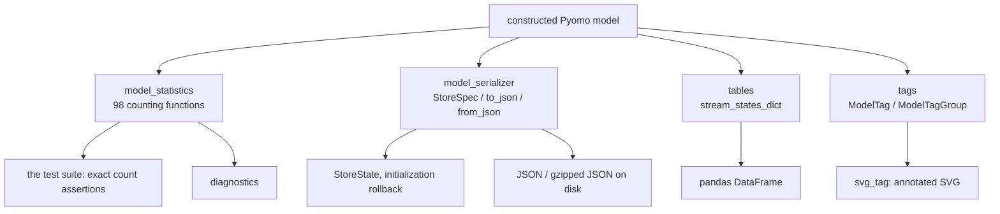
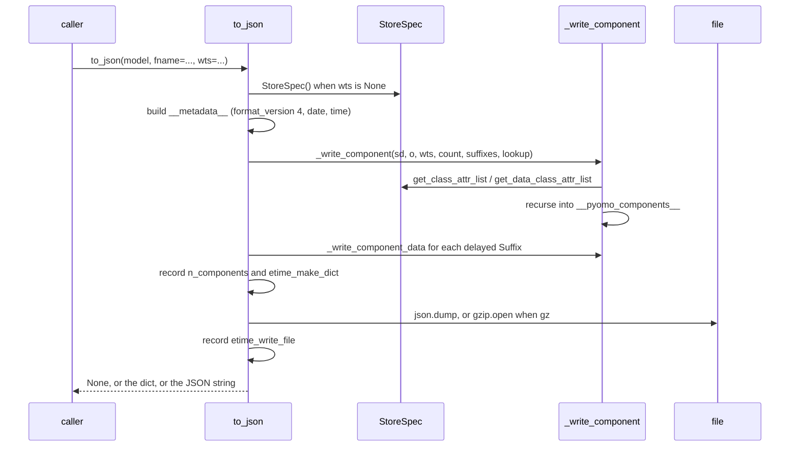
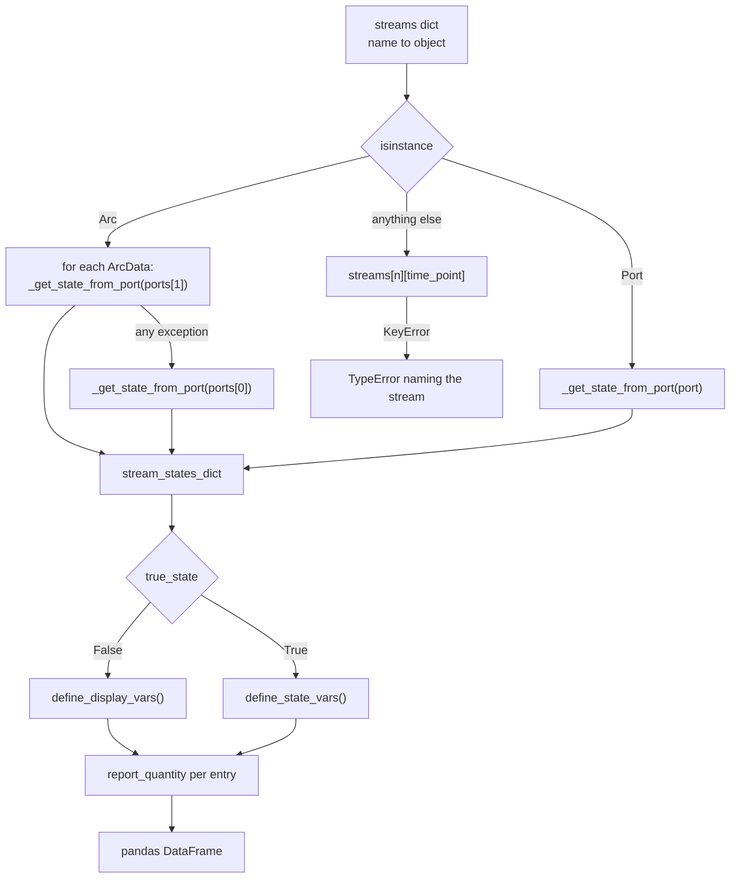

# 08a — Model introspection and state persistence

> **Doc ID** 08a · **Repo SHA** 70a8f4fe1 (IDAES-PSE v2.13.0rc0) · **Source roots** `idaes/core/util/{model_statistics,model_serializer,tables,tags}.py`, `idaes/core/util/__init__.py`
> **Owns** 5 modules / 4,128 LOC · **Assets** none · **Siblings** [08b](08b_core_support_utilities.md), [03](03_block_hierarchy_and_construction_protocol.md), [05](05_property_and_reaction_framework.md), [06](06_model_preparation_initializers_and_scalers.md), [07](07_diagnostics_and_run_orchestration.md)

This is the first half of the core utility library. It covers the four modules
that look at a constructed model and turn it into something else: a count, a
JSON document, a pandas table, or an annotated SVG. The other half — the
expression helpers, configuration validators, exceptions, dynamic-model
utilities, test doubles and Pyomo plugins — is [08b](08b_core_support_utilities.md),
which also carries the deprecated-surface register for the whole of
`idaes/core`.

Nothing here participates in model construction. Every module in this document
is a read-only or write-only observer of a model that already exists, which is
why it is the layer the test suite, the reporting code and the initialization
machinery all sit on top of.

---

## 0. Scope and source map

| File | LOC | Purpose | Covered in § |
|---|---:|---|---|
| `idaes/core/util/model_statistics.py` | 1,878 | 98 counting and collecting functions over Pyomo Blocks, constraints, variables, objectives, expressions and GreyBox blocks, plus `degrees_of_freedom` and `report_statistics` | 2.1, 5.1, 7.1, 12, 13 |
| `idaes/core/util/model_serializer.py` | 1,027 | `StoreSpec`, `to_json`, `from_json` and the component-data dictionary round trip; JSON with transparent gzip | 2.2, 5.2, 6.1, 7.2, 9 |
| `idaes/core/util/tags.py` | 786 | `ModelTag`, `ModelTagGroup`, and `svg_tag`, which rewrites an SVG process flow diagram through `xml.dom.minidom` | 2.3, 5.4, 5.5, 6.3, 7.3 |
| `idaes/core/util/tables.py` | 419 | pandas stream tables built from Arcs, Ports or state blocks | 2.3, 5.3, 7.3 |
| `idaes/core/util/__init__.py` | 18 | Re-exports six names from `model_serializer` and `tags`, plus `DiagnosticsToolbox` | 2.4, 8, 12 |

Total 4,128 LOC, no configuration keys, no `NotImplementedError` hook sites, no
shipped assets.

---

## 1. Architectural role

A process model is a Pyomo block tree. Four questions are asked of it often
enough that answering them belongs in one place: how big is it, how do I save
its state, how do I show a stream table, and how do I put numbers on a diagram.
This document is those four answers.

`model_statistics.py` is the measuring instrument the rest of the tree uses.
Tests across `idaes/` assert exact values returned by `number_variables`,
`number_total_constraints` and `degrees_of_freedom` rather than inspecting
models directly, so its counting conventions are load-bearing for behaviour
pinned in every other document. 58 source modules import from it.

`model_serializer.py` is the state layer. It writes a Pyomo component tree into
a nested dictionary and back, driven by a `StoreSpec` object that decides which
component types are visited and which attributes of each are carried. It is the
machinery under the `StoreState` specification that
[06](06_model_preparation_initializers_and_scalers.md) uses to snapshot a model
before an initialization step and restore it after a failure.

`tables.py` and `tags.py` are the two reporting paths. `tables.py` resolves a
dictionary of Arcs, Ports or state blocks into state blocks and asks each for
its display variables, producing a pandas `DataFrame`. `tags.py` wraps a single
model quantity in a `ModelTag` carrying a format string and display units,
groups tags in a `ModelTagGroup`, and — through `svg_tag` — substitutes tag
values into the text elements of an SVG process flow diagram.

The four modules do not depend on one another. `tables.py` imports
`report_quantity` from [08b](08b_core_support_utilities.md); `model_statistics.py`
imports `get_scaling_factor` from the Scaler-based scaling API in
[06](06_model_preparation_initializers_and_scalers.md); beyond that each stands
alone.

*Four independent observers of one model; none of them constructs anything on it.*

---

## 2. Public surface inventory

### 2.1 `model_statistics.py`

98 module-level functions. They follow one naming scheme: a `*_generator`
yields, a `*_set` returns a Pyomo `ComponentSet` built from that generator, and
a `number_*` returns its length. Not every family has all three forms. Every
traversal goes through the private `_iter_indexed_block_data_objects`
(`idaes/core/util/model_statistics.py:40`), which exists because an indexed
Block has no `component_data_objects` method and has to be iterated first.

| What is counted | Generator | Set | Number |
|---|---|---|---|
| Pyomo Blocks, all | — | `total_blocks_set` `:56` | `number_total_blocks` `:76` |
| Pyomo Blocks, activated | — | `activated_blocks_set` `:98` | `number_activated_blocks` `:218` |
| Pyomo Blocks, deactivated | — | `deactivated_blocks_set` `:240` | `number_deactivated_blocks` `:257` |
| GreyBox blocks, all | — | `greybox_block_set` `:120` | `number_greybox_blocks` `:190` |
| GreyBox blocks, activated | — | `activated_greybox_block_set` `:141` | `number_activated_greybox_blocks` `:204` |
| GreyBox blocks, deactivated | — | `deactivated_greybox_block_set` `:161` | `number_deactivated_greybox_block` `:176` |
| Constraints, all | — | `total_constraints_set` `:275` | `number_total_constraints` `:288` |
| Constraints, activated | `activated_constraints_generator` `:307` | `activated_constraints_set` `:322` | `number_activated_constraints` `:336` |
| Constraints, deactivated | `deactivated_constraints_generator` `:349` | `deactivated_constraints_set` `:364` | `number_deactivated_constraints` `:378` |
| Equalities, all | `total_equalities_generator` `:397` | `total_equalities_set` `:412` | `number_total_equalities` `:426` |
| Equalities, activated | `activated_equalities_generator` `:442` | `activated_equalities_set` `:465` | `number_activated_equalities` `:480` |
| Equalities, deactivated | `deactivated_equalities_generator` `:540` | `deactivated_equalities_set` `:557` | `number_deactivated_equalities` `:572` |
| GreyBox equalities | — | — | `number_activated_greybox_equalities` `:496`, `number_deactivated_greybox_equalities` `:518` |
| Inequalities, all | `total_inequalities_generator` `:590` | `total_inequalities_set` `:606` | `number_total_inequalities` `:620` |
| Inequalities, activated | `activated_inequalities_generator` `:634` | `activated_inequalities_set` `:653` | `number_activated_inequalities` `:668` |
| Inequalities, deactivated | `deactivated_inequalities_generator` `:682` | `deactivated_inequalities_set` `:699` | `number_deactivated_inequalities` `:714` |
| Variables, all | — | `variables_set` `:732` | `number_variables` `:752` |
| Variables, fixed | `fixed_variables_generator` `:765` | `fixed_variables_set` `:786` | `number_fixed_variables` `:799` |
| Variables, unfixed | `unfixed_variables_generator` `:812` | `unfixed_variables_set` `:829` | `number_unfixed_variables` `:842` |
| Variables near a bound | `variables_near_bounds_generator` `:855` | `variables_near_bounds_set` `:925` | `number_variables_near_bounds` `:956` |
| Variables in activated constraints | — | `variables_in_activated_constraints_set` `:976` | `number_variables_in_activated_constraints` `:1000` |
| Variables not in activated constraints | — | `variables_not_in_activated_constraints_set` `:1015` | `number_variables_not_in_activated_constraints` `:1039` |
| Variables in activated equalities | — | `variables_in_activated_equalities_set` `:1054` | `number_variables_in_activated_equalities` `:1076` |
| Variables in activated inequalities | — | `variables_in_activated_inequalities_set` `:1091` | `number_variables_in_activated_inequalities` `:1110` |
| Variables only in inequalities | — | `variables_only_in_inequalities` `:1125` | `number_variables_only_in_inequalities` `:1142` |
| Fixed variables in activated equalities | — | `fixed_variables_in_activated_equalities_set` `:1159` | `number_fixed_variables_in_activated_equalities` `:1178` |
| Unfixed variables in activated equalities | — | `unfixed_variables_in_activated_equalities_set` `:1193` | `number_unfixed_variables_in_activated_equalities` `:1275` |
| Fixed variables only in inequalities | — | `fixed_variables_only_in_inequalities` `:1290` | `number_fixed_variables_only_in_inequalities` `:1309` |
| GreyBox variables | — | `greybox_variables` `:1229`, `unfixed_greybox_variables` `:1212` | `number_of_greybox_variables` `:1262`, `number_of_unfixed_greybox_variables` `:1249` |
| Unused variables | — | `unused_variables_set` `:1326` | `number_unused_variables` `:1341` |
| Fixed unused variables | — | `fixed_unused_variables_set` `:1356` | `number_fixed_unused_variables` `:1375` |
| Derivative variables | — | `derivative_variables_set` `:1390` | `number_derivative_variables` `:1411` |
| Objectives, all | `total_objectives_generator` `:1429` | `total_objectives_set` `:1443` | `number_total_objectives` `:1457` |
| Objectives, activated | `activated_objectives_generator` `:1470` | `activated_objectives_set` `:1485` | `number_activated_objectives` `:1500` |
| Objectives, deactivated | `deactivated_objectives_generator` `:1514` | `deactivated_objectives_set` `:1529` | `number_deactivated_objectives` `:1544` |
| Expressions | — | `expressions_set` `:1561` | `number_expressions` `:1580` |
| Constraints with a large residual | — | `large_residuals_set` `:1611` | `number_large_residuals` `:1665` |
| Variables active in deactivated blocks | — | `active_variables_in_deactivated_blocks_set` `:1689` | `number_active_variables_in_deactivated_blocks` `:1709` |
| Variables with no value in activated equalities | — | `variables_with_none_value_in_activated_equalities_set` `:1724` | `number_variables_with_none_value_in_activated_equalities` `:1743` |

Three functions stand outside the scheme:

| Symbol | Kind | Declared at | Exported via | Stability signal |
|---|---|---|---|---|
| `degrees_of_freedom` | function | `idaes/core/util/model_statistics.py:1596` | module | `autofunction` in `docs/reference_guides/core/util/model_statistics.rst` |
| `report_statistics` | function | `idaes/core/util/model_statistics.py:1761` | module | `autofunction` |
| `activated_block_component_generator` | function | `idaes/core/util/model_statistics.py:1854` | module | `automodule` coverage |

### 2.2 `model_serializer.py`

| Symbol | Kind | Declared at | Exported via | Stability signal |
|---|---|---|---|---|
| `StoreSpec` | class | `idaes/core/util/model_serializer.py:198` | `idaes.core.util` | re-exported; autodoc'd |
| `to_json` | function | `idaes/core/util/model_serializer.py:683` | `idaes.core.util` | re-exported; autodoc'd |
| `from_json` | function | `idaes/core/util/model_serializer.py:954` | `idaes.core.util` | re-exported; autodoc'd |
| `component_data_to_dict` | function | `idaes/core/util/model_serializer.py:658` | module | autodoc'd |
| `component_data_from_dict` | function | `idaes/core/util/model_serializer.py:904` | module | autodoc'd |
| `Counter` | class | `idaes/core/util/model_serializer.py:188` | module | no underscore, not re-exported |
| `__format_version__` | module constant, value 4 | `idaes/core/util/model_serializer.py:46` | module | written into every document |

Nine module-private attribute callbacks back the read and write paths:
`_can_serialize` (`:49`), `_set_active` (`:57`), `_set_fixed` (`:77`),
`_get_value` (`:92`), `_set_value` (`:104`), `_set_lb` (`:123`), `_set_ub`
(`:135`), `_value_if_not_fixed` (`:147`) and `_only_fixed` (`:167`). The last
two are read filters rather than attribute accessors; see section 9.

### 2.3 `tables.py` and `tags.py`

| Symbol | Kind | Declared at | Exported via | Stability signal |
|---|---|---|---|---|
| `arcs_to_stream_dict` | function | `idaes/core/util/tables.py:35` | module | `automodule` coverage |
| `stream_states_dict` | function | `idaes/core/util/tables.py:77` | module | `automodule` coverage |
| `create_stream_table_dataframe` | function | `idaes/core/util/tables.py:135` | module | `automodule` coverage |
| `create_stream_table_ui` | function | `idaes/core/util/tables.py:193` | module | `automodule` coverage |
| `stream_table_dataframe_to_string` | function | `idaes/core/util/tables.py:279` | module | `automodule` coverage |
| `_get_state_from_port` | function | `idaes/core/util/tables.py:298` | module | leading underscore |
| `generate_table` | function | `idaes/core/util/tables.py:353` | module | `automodule` coverage |
| `ModelTag` | class | `idaes/core/util/tags.py:30` | `idaes.core.util` | re-exported; `autoclass` |
| `ModelTagGroup` | class | `idaes/core/util/tags.py:550` | `idaes.core.util` | re-exported; `autoclass` |
| `svg_tag` | function | `idaes/core/util/tags.py:695` | `idaes.core.util` | re-exported; `autofunction` |

`ModelTag` exposes 33 methods and properties. The ones a caller uses are
`display` (`:143`), the read-only properties `expression` (`:189`), `value`
(`:194`), `native_value` (`:205`), `doc` (`:216`), `is_var` (`:306`), `fixed`
(`:316`), `is_indexed` (`:323`), `indexes` (`:331`) and `var` (`:541`), the
read-write properties `group` (`:338`), `str_include_units` (`:352`) and
`set_in_display_units` (`:370`), and the five mutators `set` (`:397`), `setlb`
(`:434`), `setub` (`:465`), `fix` (`:496`) and `unfix` (`:524`). `ModelTagGroup`
adds `add` (`:573`), `table_heading` (`:609`) and `table_row` (`:638`).

### 2.4 The package `__init__`

`idaes/core/util/__init__.py:16` re-exports `to_json`, `from_json` and
`StoreSpec`; `:17` re-exports `svg_tag`, `ModelTag` and `ModelTagGroup`; `:18`
re-exports `DiagnosticsToolbox` from
`idaes/core/util/diagnostics_tools/diagnostics_toolbox.py`, which is owned by
[07](07_diagnostics_and_run_orchestration.md). These seven names are the entire
surface of `idaes.core.util` itself; every other symbol in this document and in
[08b](08b_core_support_utilities.md) is reached through its own module path.

---

## 3. Class hierarchy and type taxonomy

Four classes are declared in this scope and none of them extends an IDAES base.
There is no hierarchy to draw; the roster table carries the whole structure.

| Class | Base(s) | Declared at | Decorator | Container class | Key overrides |
|---|---|---|---|---|---|
| `Counter` | `object` | `idaes/core/util/model_serializer.py:188` | none | — | `__init__` |
| `StoreSpec` | `object` | `idaes/core/util/model_serializer.py:198` | none | — | six `classmethod` factories |
| `ModelTag` | none | `idaes/core/util/tags.py:30` | none | — | `__getitem__`, `__len__`, `__str__`, `__call__`, `keys`, `values`, `items` |
| `ModelTagGroup` | `dict` | `idaes/core/util/tags.py:550` | none | — | `__setitem__` |

`ModelTag` and `ModelTagGroup` both declare `__slots__`
(`idaes/core/util/tags.py:36`, `:555`), so neither carries an instance
dictionary. `ModelTagGroup` inherits `dict` deliberately, so that a tag group is
iterable and subscriptable like the mapping it is; `svg_tag` relies on that when
it iterates `tag_group` to build the id map (`idaes/core/util/tags.py:741`).

`ModelTag` implements `keys`, `values` and `items`
(`idaes/core/util/tags.py:114`, `:120`, `:126`) over the index set of the
tagged quantity, so an indexed tag also behaves like a mapping. `__len__`
(`:110`) returns the number of elements, and `__getitem__` (`:85`) returns a new
`ModelTag` for one element rather than a value.

No `declare_process_block_class` decorator appears in this document's scope, and
no enumeration is declared. The `PhysicalParameterTestBlock`,
`StateBlockForTesting`, `ReactionParameterTestBlock` and `ReactionBlock` pairs
that the test suite builds on are in
[08b §3](08b_core_support_utilities.md#3-class-hierarchy-and-type-taxonomy).

### 3.1 Enumerations

Not applicable: no `Enum` subclass is declared in these five modules.

---

## 4. Configuration reference

Not applicable: no module in this document declares a `CONFIG` block or calls
`CONFIG.declare`. The one configuration key in the core utility library belongs
to the `ReplaceVariables` transformation and is documented in
[08b §4](08b_core_support_utilities.md#4-configuration-reference).

`StoreSpec` is configuration-shaped but is a plain constructor, not a Pyomo
`ConfigBlock`; its arguments are tabulated in section 6.1.

---

## 5. Construction and call sequences

### 5.1 Counting a model

`degrees_of_freedom` (`idaes/core/util/model_statistics.py:1596`) is one
subtraction over two other counters:

1. `number_unfixed_variables_in_activated_equalities(block)` (`:1275`) — the
   length of the `ComponentSet` built by
   `unfixed_variables_in_activated_equalities_set` (`:1193`), which filters
   `variables_in_activated_equalities_set` (`:1054`).
2. minus `number_activated_equalities(block)` (`:480`).

Both terms account for GreyBox blocks, at different points.
`variables_in_activated_equalities_set` walks `identify_variables` over every
activated equality body and then adds every GreyBox input and output through
`greybox_variables` (`:1229`). `number_activated_equalities` adds
`number_activated_greybox_equalities` (`:496`), which counts one equality per
GreyBox output plus whatever `get_external_model().n_equality_constraints()`
reports. The pairing is what makes the degrees-of-freedom count come out right
for a model containing an `ExternalGreyBoxBlock`, whether that block stands
alone or is connected to the rest of the model by ordinary constraints.

`variables_near_bounds_generator` (`:855`) computes a per-variable tolerance
rather than applying one globally. It reads the variable's scaling factor
through `get_scaling_factor(v, default=1, warning=False)` (`:900`), takes the
bound span when both bounds exist and the absolute bound value when only one
does, and uses `max(abs_tol / sf, mag * rel_tol)` (`:916`). A variable with no
value is skipped (`:898`).

`report_statistics` (`:1761`) writes a fixed-format text block to an output
stream: degrees of freedom, variable totals with fixed and unused breakdowns,
constraint totals split into equalities and inequalities with deactivated
counts, objectives, blocks, expressions, and — only when
`number_activated_greybox_blocks(block)` is non-zero — four further GreyBox
lines (`:1838`). The block name is omitted from the header when it is Pyomo's
default `"unknown"` (`:1778`).

### 5.2 Saving and loading model state

*Suffixes are written last, after every component has been assigned an integer id, because a suffix key is a reference to a component.*

`to_json` (`idaes/core/util/model_serializer.py:683`), in order:

1. Resolve `gz`. When the caller left it `None` it becomes `fname.endswith(".gz")`
   for a string file name and `False` otherwise (`:748`). Compression is
   selected by file extension, not by a flag.
2. Build `sd["__metadata__"]` with `format_version` 4, the ISO date, the ISO
   time, and the caller's `metadata` dictionary under `"other"` (`:762`).
3. `_write_component` (`:513`) recursively writes the component tree. Each
   component gets a `__type__` key, its requested attributes and a `data`
   dictionary; sub-components go under `__pyomo_components__` inside the data
   entry (`:576`). A `Suffix` is appended to a deferred list instead of being
   written in place (`:558`).
4. Write the deferred suffixes (`:772`).
5. Record `n_components` and `etime_make_dict` under
   `sd["__metadata__"]["__performance__"]` (`:774`).
6. Dump to the file, gzipped or not, then record `etime_write_file` (`:786`).
   The write time is measured after the document has been serialized, so by
   construction it cannot appear inside the file.
7. Return `sd` when `return_dict`, the JSON string when `return_json_string`,
   otherwise `None`. The docstring records that returning the dictionary is
   opt-in because printing it in an interactive session is unhelpful.

`from_json` (`:954`) mirrors it and always returns a dictionary of three elapsed
times — `etime_load_file`, `etime_read_dict`, `etime_read_suffixes` (`:1023`).
It accepts the state from exactly one of `sd`, `fname` or `s`, and raises a bare
`Exception` when given none (`:1001`). The root component name is taken from the
first key of the loaded document that is not dunder-wrapped (`:1013`), so a
document saved from a model named `m1` loads into a model named `m2`.

`_read_suffixes` (`:933`) runs last. It resolves each stored integer id back to
a component through the lookup table built during the walk, skipping keys whose
component is absent from the target model (`:950`).

[06](06_model_preparation_initializers_and_scalers.md) builds its module-level
`StoreState` specification on this machinery: it is a `StoreSpec` instance, and
`InitializerBase` round-trips a model through `to_json`/`from_json` against an
in-memory dictionary rather than a file.

### 5.3 Building a stream table

*The destination port is tried first and the source port is the fallback, so a port with no state block behind it does not stop the table being built.*

`arcs_to_stream_dict` (`idaes/core/util/tables.py:35`) collects every `Arc` on a
block into a name-keyed dictionary, optionally prefixing names with a `prepend`
string to keep two sub-blocks' identically named arcs distinct (`:66`).

`stream_states_dict` (`:77`) produces an `OrderedDict` of state blocks keyed by
stream name, with `[index]` appended for each member of an indexed Arc. The
`try`/`except` around the destination port is bare and its comment lists the
cases it covers: a port with no state block behind it, a surrogate model, a unit
model handling properties without state blocks, and a translator block (`:145`).

`create_stream_table_dataframe` (`:135`) turns that into a `DataFrame` with a
`Units` column obtained from `report_quantity`
(`idaes/core/util/units_of_measurement.py:25`, owned by
[08b](08b_core_support_utilities.md)), filling any row a given stream lacks with
`"-"` (`:186`). `create_stream_table_ui` (`:193`) repeats the same walk but
stores a `(rounded value, variable type)` tuple per cell, where the type is one
of `unfixed`, `fixed`, `parameter` or `expression` from a locally declared
`VariableTypes` class (`:224`).

`_get_state_from_port` (`:298`) resolves the state block behind a Port. It takes
the parent block of the first variable on the port, keeps the spatial part of a
tuple index and substitutes `time_point` for the first position (`:339`). The
comment at `:325` records the assumption this rests on: that the time index
always comes first and every spatial index on a port is the same.

`generate_table` (`:353`) is the general form, building a `DataFrame` from an
arbitrary attribute list over an arbitrary block dictionary. With
`exception=False` a missing attribute, a bad index or an uncomputable value
becomes `None` instead of raising, which is what allows one table over blocks
whose attributes are indexed differently (`:400`, `:410`).

### 5.4 Annotating an SVG

`svg_tag` (`idaes/core/util/tags.py:695`) takes an SVG as a string, a bytes
object or a file-like object, plus a `ModelTagGroup`:

1. Normalize the SVG to a string, decoding bytes with `byte_encoding` and
   calling `read()` on a file-like object; anything else raises `TypeError`
   (`:733`).
2. When no `tag_map` is supplied, build one by replacing `@` and space in every
   tag key with `_`, because those characters are not valid in an XML id
   (`:740`).
3. Parse with `xml.dom.minidom.parseString` and collect every `text` element
   (`:746`).
4. For each text element whose `id` is in the map, take the last `tspan`, take
   its first child node — creating an empty text node when the line is blank —
   and set `nodeValue` to the tag's formatted value, or to the tag name itself
   when `show_tags` is true (`:752`).
5. `doc.toxml()`, optionally write it to `outfile`, and return the string
   (`:777`).

Returning the string rather than only writing it is what allows several
annotation passes over the same diagram without a round trip through the file
system; the comment at `:784` says so.

### 5.5 Displaying a tagged quantity

`ModelTag.display` (`idaes/core/util/tags.py:143`) formats `get_display_value`
(`:234`) with the tag's format string and appends the unit string from
`get_unit_str` (`:297`). `get_display_value` caches the converted value against
the unconverted one: `_cache_validation_value[index]` holds the raw `pyo.value`
and `_cache_display_value[index]` the converted result, so a repeated read costs
one `value()` call rather than one unit conversion (`:281`). Indexing a tag with
`__getitem__` (`:85`) returns a new `ModelTag` whose `_root` points at the
original, so the cache is shared across every element of an indexed tag (`:99`).

Two evaluation failures are absorbed rather than raised: a `ZeroDivisionError`
returns the string `"ZeroDivisionError"` and a `ValueError` — a quantity with no
value — returns `None` (`:272`, `:274`).

`ModelTagGroup.table_heading` (`:609`) and `table_row` (`:638`) share
`_table_tagkey_index_lists` (`:580`), which expands an indexed tag named without
an index into one column per index. That is why a heading and a row built from
the same `tags` argument always have the same length.

---

## 6. Data structures, variables, constraints and invariants

### 6.1 The serialized document and `StoreSpec`

`to_json` produces a nested dictionary whose shape is fixed by
`_write_component` and `_write_component_data`.

| Key | Level | Contents | Created at |
|---|---|---|---|
| `__metadata__` | document root | `format_version`, `date`, `time`, `other` | `model_serializer.py:762` |
| `__metadata__.__performance__` | document root | `n_components`, `etime_make_dict`, `etime_write_file` | `model_serializer.py:774` |
| `<component name>` | any block level | one entry per component the `StoreSpec` accepts | `model_serializer.py:546` |
| `<component>.__type__` | component | `str(type(o))` | `model_serializer.py:546` |
| `<component>.__id__` | component | sequential integer, present only when `Suffix` is in the specification | `model_serializer.py:548` |
| `<component>.data` | component | one entry per component data object, keyed by its index | `model_serializer.py:557` |
| `<data>.__pyomo_components__` | component data | sub-components of a block-like data object | `model_serializer.py:677` |

`StoreSpec` state, all set in `__init__` (`model_serializer.py:234`):

| Attribute | Type | Meaning | Set at |
|---|---|---|---|
| `classes` | dict of class → (attribute tuple, filter) | which component types are visited and what is stored for each | `model_serializer.py:243` |
| `data_classes` | dict of class → (attribute tuple, filter) | the same for component data types | `model_serializer.py:254` |
| `write_cbs` | dict of attribute → callable | per-attribute getters; `value` maps to `_get_value` | `model_serializer.py:285` |
| `read_cbs` | dict of attribute → callable | per-attribute setters for `_mutable`, `active`, `fixed`, `lb`, `ub`, `value` | `model_serializer.py:288` |
| `ignore_missing` | bool, default `True` | whether a component absent from the document is an error | `model_serializer.py:314` |
| `suffix_filter` | list or `None` | which suffixes to store | `model_serializer.py:315` |

The default `classes` covers `Param`, `Var`, `BooleanVar`, `Expression`,
`Block`, `Constraint` and `Suffix`; the default `data_classes` covers the data
classes of those plus `int`, `float` and `str` (`:243`, `:254`). Both arguments
also accept the older list-of-tuples form, which `__init__` converts (`:269`,
`:276`).

The six factory classmethods build named specifications:

| Factory | Stores | Anchor |
|---|---|---|
| `bound` | `lb`, `ub` of every `VarData` | `model_serializer.py:370` |
| `value(only_not_fixed=False)` | `value` of every `VarData` and `BooleanVarData`; with the flag, loads only unfixed ones | `model_serializer.py:380` |
| `isfixed` | `fixed` only | `model_serializer.py:399` |
| `suffix(suffix_filter=None)` | no attributes; component ids and suffix values | `model_serializer.py:410` |
| `value_isfixed(only_fixed)` | `value` and `fixed` | `model_serializer.py:431` |
| `value_isfixed_isactive(only_fixed)` | the above plus `Param` values and `active` on `Constraint` and `Block` | `model_serializer.py:456` |

### 6.2 Stream table shape

| Structure | Type | Keys | Produced by |
|---|---|---|---|
| stream dictionary | `dict` or `OrderedDict` | stream name → Arc, Port or state block | `arcs_to_stream_dict` (`tables.py:35`) |
| state dictionary | `OrderedDict` | stream name, or `name[index]` → state block data | `stream_states_dict` (`tables.py:77`) |
| stream table | `DataFrame` | a `Units` column plus one column (or row) per stream | `create_stream_table_dataframe` (`tables.py:135`) |
| UI stream table | `DataFrame` of tuples | as above, each cell `(rounded value, variable type)` | `create_stream_table_ui` (`tables.py:193`) |

### 6.3 `ModelTag` state

`ModelTag.__slots__` (`idaes/core/util/tags.py:36`) has twelve entries.

| Slot | Meaning |
|---|---|
| `_expression` | the tagged `Var`, `Expression`, `Param`, `Reference` or unnamed expression |
| `_format` | format string used by `display` |
| `_doc` | description text |
| `_display_units` | Pyomo units, or a string used as a label without conversion |
| `_cache_validation_value`, `_cache_display_value` | the unit-conversion cache described in section 5.5 |
| `_name` | the group key, used only to improve error messages |
| `_root`, `_index` | link from an element tag back to its indexed parent |
| `_group` | the owning `ModelTagGroup` |
| `_str_units` | whether `str(tag)` includes units |
| `_set_in_display_units` | whether a unitless value passed to `set`, `fix`, `setlb` or `setub` is interpreted in display units |

An `IndexedComponent_slice` passed as the expression is wrapped in a
`pyo.Reference` at construction (`idaes/core/util/tags.py:68`), so a tag may be
built from a slice across a time domain.

### 6.4 Invariants

| Invariant | Enforced at |
|---|---|
| Compression follows the `.gz` extension unless `gz` is given explicitly | `model_serializer.py:748`, `:979` |
| `Block` and `BlockData` are always in a `StoreSpec`, whatever the caller asked for | `model_serializer.py:295` |
| Every class entry has a two-element (attributes, filter) shape after construction | `model_serializer.py:308`, `:311` |
| Suffixes are written and read after every component has an id | `model_serializer.py:772`, `:1019` |
| Exactly one of `sd`, `fname`, `s` is supplied to `from_json` | `model_serializer.py:1001` |
| A `ModelTagGroup` contains only `ModelTag` values | `tags.py:565` |
| A tag's group key is also its `_name` and its `_group` is the group | `tags.py:567`, `:568` |
| A heading and a row built from the same `tags` argument have equal length | `tags.py:580` |
| A port's variables all derive from one state block | `tables.py:349` |
| A port has at least one component | `tables.py:320` |

---

## 7. Method contracts

### 7.1 `model_statistics`

| Method | Signature | Preconditions | Effects | Returns | Raises | Anchor |
|---|---|---|---|---|---|---|
| `degrees_of_freedom` | `(block)` | — | none | `int` | — | `:1596` |
| `report_statistics` | `(block, ostream=None)` | — | Writes to `ostream`, default `sys.stdout` | `None` | — | `:1761` |
| `variables_near_bounds_generator` | `(block, tol=None, relative=None, skip_lb=False, skip_ub=False, abs_tol=1e-4, rel_tol=1e-4)` | — | Emits a deprecation warning for `tol` or `relative` | generator of `VarData` | — | `:855` |
| `variables_near_bounds_set` | `(block, tol=None, relative=None, skip_lb=False, skip_ub=False, abs_tol=1e-4, rel_tol=1e-4)` | — | as above | `ComponentSet` | — | `:925` |
| `number_variables_near_bounds` | `(block, tol=None, abs_tol=1e-4, rel_tol=1e-4)` | — | as above | `int` | — | `:956` |
| `large_residuals_set` | `(block, tol=1e-5, return_residual_values=False)` | — | none | `ComponentSet`, or a `ComponentMap` of residuals | — | `:1611` |
| `number_large_residuals` | `(block, tol=1e-5)` | every constraint has a computable body | none | `int` | `ValueError` from `value()` on an uncomputable body | `:1665` |
| `number_activated_greybox_equalities` | `(block)` | GreyBox external models respond to `n_equality_constraints` | none | `int` | — | `:496` |
| `activated_block_component_generator` | `(block, ctype)` | — | none | generator | — | `:1854` |
| `_iter_indexed_block_data_objects` | `(block, ctype, active, descend_into)` | — | none | generator | — | `:40` |

`large_residuals_set` scales each residual by the constraint's scaling factor
from `get_scaling_factor` and adds any constraint whose body cannot be evaluated
(`:1645`, `:1656`). `number_large_residuals` does neither, which is the
observation in section 12.

### 7.2 `model_serializer`

| Method | Signature | Preconditions | Effects | Returns | Raises | Anchor |
|---|---|---|---|---|---|---|
| `to_json` | `(o, fname=None, human_read=False, wts=None, metadata=None, gz=None, return_dict=False, return_json_string=False)` | — | Optionally writes a file | `None`, `dict` or `str` | file-system errors | `:683` |
| `from_json` | `(o, sd=None, fname=None, s=None, wts=None, gz=None, root_name=None)` | `o` has the structure the document describes | Sets attributes on `o` | timing `dict` | `Exception` when no source given | `:954` |
| `component_data_to_dict` | `(o, wts)` | — | none | `dict`, or `None` when the type is not stored | — | `:658` |
| `component_data_from_dict` | `(sd, o, wts)` | — | Sets attributes on `o` | `None` | — | `:904` |
| `StoreSpec.get_class_attr_list` | `(self, o)` | — | none | `(attributes, filter)` | — | `:329` |
| `StoreSpec.get_data_class_attr_list` | `(self, o)` | — | none | `(attributes, filter)` | — | `:352` |
| `StoreSpec.set_read_callback` | `(self, attr, cb=None)` | — | Registers a setter | `None` | — | `:317` |
| `StoreSpec.set_write_callback` | `(self, attr, cb=None)` | — | Registers a getter | `None` | — | `:323` |

Both lookup methods walk the `classes` or `data_classes` mapping in insertion
order and take the first `isinstance` match, which is why the docstring states
that specific classes precede general ones (`:206`).

### 7.3 `tables` and `tags`

| Method | Signature | Preconditions | Effects | Returns | Raises | Anchor |
|---|---|---|---|---|---|---|
| `arcs_to_stream_dict` | `(blk, additional=None, descend_into=True, sort=False, prepend=None, s=None)` | — | none | `dict` or `OrderedDict` | — | `tables.py:35` |
| `stream_states_dict` | `(streams, time_point=0)` | each value is an Arc, Port or indexed state block | none | `OrderedDict` | `TypeError` for an unindexable value | `tables.py:77` |
| `create_stream_table_dataframe` | `(streams, true_state=False, time_point=0, orient="columns")` | state blocks implement `define_display_vars` or `define_state_vars` | none | `DataFrame` | propagates | `tables.py:135` |
| `create_stream_table_ui` | `(streams, true_state=False, time_point=0, orient="columns", precision=5)` | as above | none | `DataFrame` of `(value, type)` tuples | propagates | `tables.py:193` |
| `stream_table_dataframe_to_string` | `(stream_table, **kwargs)` | — | none | `str` | — | `tables.py:279` |
| `_get_state_from_port` | `(port, time_point)` | the port carries variables from one block | none | a state block data object | `ValueError`, `AttributeError`, `RuntimeError` | `tables.py:298` |
| `generate_table` | `(blocks, attributes, heading=None, exception=True)` | — | none | `DataFrame` | `AssertionError`, `KeyError`, `TypeError` when `exception` | `tables.py:353` |
| `svg_tag` | `(svg=None, tag_group=None, outfile=None, idx=None, tag_map=None, show_tags=False, byte_encoding="utf-8")` | `svg` is a string, bytes or file-like | Optionally writes `outfile` | SVG `str` | `RuntimeError` for no SVG, `TypeError` for a wrong type | `tags.py:695` |
| `ModelTag.display` | `(self, units=True, format_string=None, index=None)` | — | Populates the conversion cache | `str` | `KeyError` for a bad index | `tags.py:143` |
| `ModelTag.get_display_value` | `(self, index=None, convert=True)` | — | Populates the cache | number, `None`, or `"ZeroDivisionError"` | `KeyError` | `tags.py:234` |
| `ModelTag.set` | `(self, val, in_display_units=None)` | tagged object has `set_value` | Sets the value, converting from display units when asked | `None` | `AttributeError` naming the tag | `tags.py:397` |
| `ModelTag.setlb` / `setub` | `(self, val, in_display_units=None)` | tagged object is a variable | Sets a bound | `None` | `AttributeError` naming the tag | `tags.py:434`, `:465` |
| `ModelTag.fix` | `(self, val=None, in_display_units=None)` | tagged object is a variable | Fixes, optionally at a value | `None` | `AttributeError` naming the tag | `tags.py:496` |
| `ModelTag.unfix` | `(self)` | as above | Unfixes | `None` | `AttributeError` naming the tag | `tags.py:524` |
| `ModelTag.var` | property | tag is a variable | none | the variable | `TypeError` otherwise | `tags.py:541` |
| `ModelTagGroup.add` | `(self, name, expr, **kwargs)` | — | Stores a `ModelTag` under `name` | `None` | `TypeError` from `__setitem__` | `tags.py:573` |
| `ModelTagGroup.table_heading` | `(self, tags=None, units=True)` | — | none | `list` of column names | — | `tags.py:609` |
| `ModelTagGroup.table_row` | `(self, tags=None, units=True, numeric=False)` | — | none | `list` of values or strings | — | `tags.py:638` |

`ModelTag.set` has one branch that is not an error path: when the tagged object
is `None`, a `str`, a `float`, an `int` or a `tuple`, the assignment replaces the
tagged object itself rather than calling `set_value` (`tags.py:409`). That is
what lets a tag group hold a run label alongside model quantities and still
tabulate as one row.

---

## 8. Cross-subsystem interactions

### Calls out to

| Target | Purpose | Anchor |
|---|---|---|
| `pyomo.environ` component types | Every traversal | `model_statistics.py:22` |
| `pyomo.common.collections.ComponentSet` / `ComponentMap` | The return type of every `*_set` function | `model_statistics.py:25` |
| `pyomo.core.expr.identify_variables` | Variables appearing in a constraint body | `model_statistics.py:24` |
| `pyomo.dae.DerivativeVar` | `derivative_variables_set` | `model_statistics.py:23` |
| `pyomo.contrib.pynumero` `ExternalGreyBoxBlock` | GreyBox counting | `model_statistics.py:27` |
| `idaes.core.scaling.get_scaling_factor` | Residual and bound tolerances | `model_statistics.py:31` |
| `pyomo.common.deprecation.deprecation_warning` | The two deprecated arguments of the near-bounds family | `model_statistics.py:26` |
| `json`, `gzip`, `datetime`, `time` | Document serialization | `model_serializer.py:23`, `:24`, `:25`, `:26` |
| `pyomo.core.base.param.ParamData`, `ComponentData` | Default `data_classes` entries | `model_serializer.py:39`, `:40` |
| `pandas.DataFrame` | Stream tables | `tables.py:19` |
| `pyomo.network.Arc`, `Port` | Stream resolution | `tables.py:20` |
| `idaes.core.util.units_of_measurement.report_quantity` | Reporting-unit conversion | `tables.py:27` |
| `xml.dom.minidom` | SVG rewriting | `tags.py:17` |
| `pyomo.core.base.indexed_component_slice.IndexedComponent_slice` | Tagging a slice | `tags.py:21` |
| `idaes.core.util.diagnostics_tools.diagnostics_toolbox` | Re-export of `DiagnosticsToolbox` | `idaes/core/util/__init__.py:18` |

### Called by

| Caller | What it relies on | Owning doc | Import sites |
|---|---|---|---:|
| Tests and diagnostics throughout the tree | `model_statistics` counters | all | 58 |
| Unit model `report` methods and flowsheets | `tables.create_stream_table_dataframe` | [03](03_block_hierarchy_and_construction_protocol.md), [10](10_unit_models_control_volume_based.md) | 31 |
| `InitializerBase` and its `StoreState` | `StoreSpec`, `to_json`, `from_json` | [06](06_model_preparation_initializers_and_scalers.md) | 4 |
| Power-generation flowsheets | `tags.ModelTagGroup`, `tags.svg_tag` | [24](24_reference_flowsheets_and_demonstrations.md) | 3 |
| `initialization_tester` | `fixed_variables_set`, `activated_constraints_set`, `degrees_of_freedom` | [08b](08b_core_support_utilities.md) | 1 |
| The diagnostics toolbox | counting functions, and the `__init__` re-export in the other direction | [07](07_diagnostics_and_run_orchestration.md) | — |
| Scaler-based scaling | `get_scaling_factor`, in the other direction | [06](06_model_preparation_initializers_and_scalers.md) | — |

Import-site counts come from `_generated/imports.csv`, which indexes source
modules only and excludes test modules.

---

## 9. Extension and subclassing contracts

No method in this document raises `NotImplementedError`, and no class here is
designed to be subclassed. The extension points are data-driven rather than
inheritance-driven: a caller customizes behaviour by handing `StoreSpec` a
different mapping or a different callback.

| Hook | Kind | Signature | Resolution order | Base behaviour | Anchor |
|---|---|---|---|---|---|
| `StoreSpec.classes` | constructor argument | dict of class → (attribute tuple, filter) | first `isinstance` match wins, so specific classes precede general ones | seven component types | `idaes/core/util/model_serializer.py:243` |
| `StoreSpec.data_classes` | constructor argument | as above, for data classes | as above | nine data types | `idaes/core/util/model_serializer.py:254` |
| read filter | callable `(o, d) -> list[str]` | per data class, second element of the tuple | consulted on read only, never on write | `None`; `_value_if_not_fixed` and `_only_fixed` are the two shipped implementations | `idaes/core/util/model_serializer.py:147`, `:167` |
| `StoreSpec.set_write_callback` | method | `(attr, cb=None)` | replaces the getter for one attribute name | `_get_value` for `value`, plain `getattr` otherwise | `idaes/core/util/model_serializer.py:323` |
| `StoreSpec.set_read_callback` | method | `(attr, cb=None)` | replaces the setter for one attribute name | `_set_active`, `_set_fixed`, `_set_lb`, `_set_ub`, `_set_value` | `idaes/core/util/model_serializer.py:317` |
| `format_string` | `ModelTag` constructor argument | a Python format string | applied by `display` unless overridden per call | `"{}"` | `idaes/core/util/tags.py:51` |
| `display_units` | `ModelTag` constructor argument | Pyomo units, or a string label | a string label is displayed but not converted | `None`, meaning native units | `idaes/core/util/tags.py:51` |
| `tag_map` | `svg_tag` argument | dict of SVG id → tag key | supplied map wins; otherwise one is derived by character substitution | derived | `idaes/core/util/tags.py:740` |
| `define_display_vars` / `define_state_vars` | state block contract | `(self)` | selected by the `true_state` argument | supplied by the property package | `idaes/core/util/tables.py:169` |

The last row is the one inbound contract: a stream table is only as good as the
property package's `define_display_vars`, described in
[05 §7](05_property_and_reaction_framework.md#7-method-contracts).

---

## 10. External assets, data files and external libraries

No module in this document reads a shipped data file, loads a shared library or
starts a subprocess. `idaes/core/base/location_factors.json` is the only
non-Python, non-test file anywhere under `idaes/core/`, and it belongs to
[17](17_costing_framework_and_libraries.md).

The files these modules produce are all named by the caller.

| Path | Format | Bytes | Authored/Generated | Producer | Consumer | Load site |
|---|---|---|---|---|---|---|
| caller-named `.json` | JSON | varies | generated at run time | `to_json` | `from_json` | `idaes/core/util/model_serializer.py:783` |
| caller-named `.json.gz` | gzipped JSON | varies | generated at run time | `to_json` when the name ends `.gz` | `from_json` under the same rule | `idaes/core/util/model_serializer.py:781` |
| caller-named `.svg` | SVG | varies | generated at run time | `svg_tag(outfile=...)` | any SVG viewer | `idaes/core/util/tags.py:782` |

Third-party Python packages bound at import time: `pandas`
(`idaes/core/util/tables.py:19`) and the standard-library `gzip`, `json` and
`xml.dom.minidom`. `pandas` is a hard requirement of `tables.py`; there is no
guarded import and no fallback.

---

## 11. Errors, logging and diagnostics behaviour

| Exception | Raised for | Anchor |
|---|---|---|
| `Exception` (bare) | `from_json` called with no data source | `idaes/core/util/model_serializer.py:1001` |
| `ValueError` | `stream_states_dict` given an unindexable stream value | `idaes/core/util/tables.py:123` |
| `ValueError` | `_get_state_from_port` on a port with no components | `idaes/core/util/tables.py:320` |
| `AttributeError` | `_get_state_from_port` where the parent block has no index | `idaes/core/util/tables.py:334` |
| `RuntimeError` | A port whose variables come from more than one block | `idaes/core/util/tables.py:349` |
| `AssertionError` | `generate_table` given an attribute tuple with no index | `idaes/core/util/tables.py:392` |
| `KeyError` | `generate_table` with `exception=True` and a bad index | `idaes/core/util/tables.py:404` |
| `TypeError` | `generate_table` with `exception=True` and an uncomputable value | `idaes/core/util/tables.py:414` |
| `RuntimeError` | `svg_tag` called without an SVG | `idaes/core/util/tags.py:725` |
| `TypeError` | `svg_tag` given an SVG that is not a string, bytes or file-like | `idaes/core/util/tags.py:733` |
| `TypeError` | A non-`ModelTag` assigned into a `ModelTagGroup` | `idaes/core/util/tags.py:571` |
| `ValueError` | A tag key-index pair that is not two elements long | `idaes/core/util/tags.py:598` |
| `KeyError` | Indexing a `ModelTag` at an invalid index, or reading a display value there | `idaes/core/util/tags.py:96`, `:256` |
| `AttributeError` | `set`, `setlb`, `setub`, `fix` or `unfix` on a tag whose object does not support it | `idaes/core/util/tags.py:430`, `:537` |
| `TypeError` | `ModelTag.var` on a tag that is not a variable | `idaes/core/util/tags.py:544` |
| `ValueError` | Raised inside `number_large_residuals` by `value()` on an uncomputable body | `idaes/core/util/model_statistics.py:1683` |

Every message raised from `tags.py` names the tag when the tag has a group key
and gives a generic message when it does not — the two-branch pattern at
`idaes/core/util/tags.py:96` recurs at `:256`, `:430` and `:537`.

### 11.1 Loggers

| Module | Logger | Anchor |
|---|---|---|
| `model_statistics.py` | `idaeslog.getLogger(__name__)` | `idaes/core/util/model_statistics.py:33` |
| `model_serializer.py` | `logging.getLogger(__name__)` — the Python logger, not the IDAES one | `idaes/core/util/model_serializer.py:42` |
| `tables.py` | `idaeslog.getLogger(__name__)` | `idaes/core/util/tables.py:30` |
| `tags.py` | `idaeslog.getLogger(__name__)` | `idaes/core/util/tags.py:25` |

Diagnostic messages rather than exceptions:

- `svg_tag` logs two warnings and skips the element when a text element has no
  `tspan` child (`idaes/core/util/tags.py:757`).
- `generate_table` logs at ERROR immediately before each of the three
  exceptions it raises (`idaes/core/util/tables.py:390`, `:406`, `:412`).
- The near-bounds deprecation warnings are routed through the module logger
  (`idaes/core/util/model_statistics.py:885`, `:891`).

---

## 12. Duplications, deprecations and sharp edges

The register of the whole deprecated surface of `idaes/core` — 45 sites — is in
[08b §12](08b_core_support_utilities.md#122-the-deprecated-surface-of-idaescore).
Two of those rows belong to this document and are repeated here in context.

- **`large_residuals_set` and `number_large_residuals` compute different
  things.** The first scales each residual by the constraint's scaling factor
  and treats an unevaluable body as a large residual
  (`idaes/core/util/model_statistics.py:1645`, `:1656`); the second applies no
  scaling and calls `c.body()` unguarded
  (`idaes/core/util/model_statistics.py:1683`). Consequence:
  `number_large_residuals(m)` is not in general `len(large_residuals_set(m))`,
  and it raises on a model with an unevaluable constraint body where the set
  form returns.

- **Two deprecated arguments survive in the near-bounds family.**
  `variables_near_bounds_generator` accepts both the current `abs_tol`/`rel_tol`
  pair and the superseded `tol` and `relative`, warning on either
  (`idaes/core/util/model_statistics.py:885`, `:891`; version 2.2.0,
  `remove_in` 2.11.0). `variables_near_bounds_set`
  (`idaes/core/util/model_statistics.py:925`) forwards all six arguments
  positionally, while `number_variables_near_bounds`
  (`idaes/core/util/model_statistics.py:956`) forwards only `tol`, `abs_tol` and
  `rel_tol`. Consequence: `skip_lb` and `skip_ub` are reachable through the set
  form but not through the number form.

- **`svg_tag` takes the SVG first and the tag group second.** The signature is
  `svg_tag(svg=None, tag_group=None, ...)` (`idaes/core/util/tags.py:695`). The
  call at
  `idaes/models_extra/power_generation/flowsheets/supercritical_power_plant/boiler_subflowsheet_build.py:595`
  passes `svg_tag(tags, f, outfile=outfile)` positionally, binding a dictionary
  to `svg` and a file object to `tag_group`. Consequence: that path raises
  `TypeError` from `idaes/core/util/tags.py:733`. The two other call sites,
  `idaes/models_extra/power_generation/flowsheets/subcritical_power_plant/subcritical_power_plant.py:2265`
  and
  `idaes/models_extra/power_generation/flowsheets/supercritical_steam_cycle/supercritical_steam_cycle.py:967`,
  pass the arguments by keyword.

- **`stream_states_dict` catches every exception from the destination port.**
  The `except` at `idaes/core/util/tables.py:145` is bare, with a
  `pylint: disable=W0702` marker. Consequence: a genuine error inside
  `_get_state_from_port` on the destination port is indistinguishable from the
  absence of a state block, and the source port is tried instead.

- **`_get_state_from_port` assumes the time index comes first.** The index
  reconstruction at `idaes/core/util/tables.py:339` replaces position zero of a
  tuple index with `time_point` and keeps the remainder. The comment at `:325`
  records that changing the index ordering requires changing this method.
  Consequence: a state block indexed as (length, time) produces a table read at
  the wrong point without any error.

- **Importing `idaes.core.util` pulls in the diagnostics subsystem.**
  `idaes/core/util/__init__.py:18` imports `DiagnosticsToolbox` from
  `idaes/core/util/diagnostics_tools/diagnostics_toolbox.py`, which is owned by
  [07](07_diagnostics_and_run_orchestration.md). Consequence: `from
  idaes.core.util import to_json` has the transitive cost of the whole
  diagnostics import graph.

- **`model_serializer` uses the standard-library logger.** Every other module in
  the core utility library calls `idaeslog.getLogger`; this one calls
  `logging.getLogger` (`idaes/core/util/model_serializer.py:42`). Consequence:
  its output is not routed through the IDAES logging tags described in
  [02](02_runtime_platform_and_cli.md).

- **`to_json` cannot record its own write time.** `etime_write_file` is computed
  after `json.dump` has already run (`idaes/core/util/model_serializer.py:786`),
  and the source comment says so. Consequence: the value is present in the
  returned dictionary but never in the file on disk.

---

## 13. Behaviour pinned by tests

Three test modules cover this document, all carrying the `unit` marker. Marker
counts come from `_generated/markers.csv`: 74 tests in `test_model_statistics.py`,
21 in `test_model_serializer.py`, 20 in `test_tables.py` and 14 in
`test_tags.py`.

| Behaviour | Test file:line | Marker |
|---|---|---|
| Every counting function returns an exact value on a fixture model | `idaes/core/util/tests/test_model_statistics.py:130` onward | `unit` |
| Indexed-block traversal through `_iter_indexed_block_data_objects` | `idaes/core/util/tests/test_model_statistics.py:42`, `:57` | `unit` |
| `degrees_of_freedom` on a nested model, including a negative value | `idaes/core/util/tests/test_model_statistics.py:1111` | `unit` |
| `degrees_of_freedom` with an `ExternalGreyBoxBlock`, standalone and connected, active and inactive | `idaes/core/util/tests/test_model_statistics.py:1117` | `unit` |
| GreyBox block, variable and equality counts | `idaes/core/util/tests/test_model_statistics.py:1144` | `unit` |
| `large_residuals_set` including constraints with no computable value | `idaes/core/util/tests/test_model_statistics.py:1312` | `unit` |
| `number_large_residuals` | `idaes/core/util/tests/test_model_statistics.py:1328` | `unit` |
| Variables active in deactivated blocks | `idaes/core/util/tests/test_model_statistics.py:1336`, `:1351` | `unit` |
| `report_statistics` output | `idaes/core/util/tests/test_model_statistics.py:1368` | `unit` |
| Save and load across two differently named models | `idaes/core/util/tests/test_model_serializer.py:114` | `unit` |
| Round trip of values, bounds, fixed status and active status | `idaes/core/util/tests/test_model_serializer.py:132`, `:210`, `:307` | `unit` |
| `StoreSpec.bound` restores bounds and nothing else | `idaes/core/util/tests/test_model_serializer.py:419` | `unit` |
| `StoreSpec.isfixed` restores fixed status and nothing else | `idaes/core/util/tests/test_model_serializer.py:436` | `unit` |
| Suffix round trip | `idaes/core/util/tests/test_model_serializer.py:455` | `unit` |
| Stream tables from a state block, a Port and an Arc | `idaes/core/util/tests/test_tables.py:105`, `:221`, `:235` | `unit` |
| Stream table at a non-zero time point | `idaes/core/util/tests/test_tables.py:188` | `unit` |
| `true_state` selects state variables over display variables | `idaes/core/util/tests/test_tables.py:156` | `unit` |
| `orient` selects columns or rows | `idaes/core/util/tests/test_tables.py:172` | `unit` |
| `create_stream_table_ui` variable-type classification | `idaes/core/util/tests/test_tables.py:249` | `unit` |
| A stream of the wrong type raises | `idaes/core/util/tests/test_tables.py:261` | `unit` |
| `stream_table_dataframe_to_string` default formatting | `idaes/core/util/tests/test_tables.py:283` | `unit` |
| Tag display, conditional formatting and unit conversion | `idaes/core/util/tests/test_tags.py:43`, `:123`, `:156` | `unit` |
| Tag dictionary behaviour and slicing | `idaes/core/util/tests/test_tags.py:92`, `:464` | `unit` |
| Tag input paths, with and without display units | `idaes/core/util/tests/test_tags.py:195`, `:230` | `unit` |
| Tag error messages naming the tag | `idaes/core/util/tests/test_tags.py:140` | `unit` |
| `ModelTagGroup` heading and row tabulation | `idaes/core/util/tests/test_tags.py:309`, `:370` | `unit` |
| A tag over a `Reference` and over a data object | `idaes/core/util/tests/test_tags.py:271`, `:288` | `unit` |

`svg_tag` is imported by `idaes/core/util/tests/test_tags.py:22` and is not
called anywhere in that file; it has no direct test in the tree.

---

## 14. Cross-references

| Topic | Doc | Section |
|---|---|---|
| Terminology: model tag, process block, scaling factor | [01](01_glossary_and_conventions.md) | §2 |
| Counting conventions for the whole set | [01](01_glossary_and_conventions.md) | §11 |
| The other half of the core utility library | [08b](08b_core_support_utilities.md) | §0 |
| The deprecated-surface register for all of `idaes/core` | [08b](08b_core_support_utilities.md) | §12 |
| `report_quantity` and the reporting-unit configuration | [08b](08b_core_support_utilities.md) | §7 |
| The IDAES logging tags `model_serializer` does not use | [02](02_runtime_platform_and_cli.md) | §5 |
| Unit model `report` methods that build stream tables | [03](03_block_hierarchy_and_construction_protocol.md) | §5 |
| `define_display_vars` and `define_state_vars` | [05](05_property_and_reaction_framework.md) | §7 |
| `StoreState` and the initialization state round trip | [06](06_model_preparation_initializers_and_scalers.md) | §5 |
| `get_scaling_factor`, used by two counting functions | [06](06_model_preparation_initializers_and_scalers.md) | §3 |
| `DiagnosticsToolbox`, re-exported by `idaes/core/util/__init__.py` | [07](07_diagnostics_and_run_orchestration.md) | §2 |
| Unit models whose reports consume stream tables | [10](10_unit_models_control_volume_based.md) | §7 |
| `location_factors.json`, the only asset under `idaes/core/` | [17](17_costing_framework_and_libraries.md) | §10 |
| Flowsheets that call `svg_tag` and `ModelTagGroup` | [24](24_reference_flowsheets_and_demonstrations.md) | §5 |
| Shipped file inventory | [28](28_data_and_file_format_inventory.md) | §2 |
| Import layering across `idaes/core` | [29](29_dependency_and_layering_map.md) | §3 |
| Test-tree layout and marker policy | [32](32_repository_engineering.md) | §3 |

---

## 15. Source anchor index

The family table in section 2.1 is itself the line index for the 98 functions of
`model_statistics.py`, and the paragraph in section 2.3 is the line index for
the 33 methods and properties of `ModelTag`; neither set is repeated here.
Everything else cited in this document appears below.

| Anchor | Symbol |
|---|---|
| `idaes/core/util/__init__.py:16` | re-export of `to_json`, `from_json`, `StoreSpec` |
| `idaes/core/util/__init__.py:17` | re-export of `svg_tag`, `ModelTag`, `ModelTagGroup` |
| `idaes/core/util/__init__.py:18` | re-export of `DiagnosticsToolbox` |
| `idaes/core/util/model_serializer.py:23` | `import json` |
| `idaes/core/util/model_serializer.py:24` | `import datetime` |
| `idaes/core/util/model_serializer.py:25` | `import time` |
| `idaes/core/util/model_serializer.py:26` | `import gzip` |
| `idaes/core/util/model_serializer.py:39` | `ParamData` import |
| `idaes/core/util/model_serializer.py:40` | `ComponentData` import |
| `idaes/core/util/model_serializer.py:42` | module logger, `logging.getLogger` |
| `idaes/core/util/model_serializer.py:46` | `__format_version__` |
| `idaes/core/util/model_serializer.py:49` | `_can_serialize` |
| `idaes/core/util/model_serializer.py:57` | `_set_active` |
| `idaes/core/util/model_serializer.py:77` | `_set_fixed` |
| `idaes/core/util/model_serializer.py:92` | `_get_value` |
| `idaes/core/util/model_serializer.py:104` | `_set_value` |
| `idaes/core/util/model_serializer.py:123` | `_set_lb` |
| `idaes/core/util/model_serializer.py:135` | `_set_ub` |
| `idaes/core/util/model_serializer.py:147` | `_value_if_not_fixed` read filter |
| `idaes/core/util/model_serializer.py:167` | `_only_fixed` read filter |
| `idaes/core/util/model_serializer.py:188` | `Counter` |
| `idaes/core/util/model_serializer.py:198` | `StoreSpec` |
| `idaes/core/util/model_serializer.py:206` | class-ordering rule in the docstring |
| `idaes/core/util/model_serializer.py:234` | `StoreSpec.__init__` |
| `idaes/core/util/model_serializer.py:243` | default `classes` |
| `idaes/core/util/model_serializer.py:254` | default `data_classes` |
| `idaes/core/util/model_serializer.py:269` | list-form `classes` conversion |
| `idaes/core/util/model_serializer.py:276` | list-form `data_classes` conversion |
| `idaes/core/util/model_serializer.py:285` | `write_cbs` |
| `idaes/core/util/model_serializer.py:288` | `read_cbs` |
| `idaes/core/util/model_serializer.py:295` | forced `Block` entry |
| `idaes/core/util/model_serializer.py:308` | `classes` filter normalization |
| `idaes/core/util/model_serializer.py:311` | `data_classes` filter normalization |
| `idaes/core/util/model_serializer.py:314` | `ignore_missing` |
| `idaes/core/util/model_serializer.py:315` | `suffix_filter` |
| `idaes/core/util/model_serializer.py:317` | `StoreSpec.set_read_callback` |
| `idaes/core/util/model_serializer.py:323` | `StoreSpec.set_write_callback` |
| `idaes/core/util/model_serializer.py:329` | `StoreSpec.get_class_attr_list` |
| `idaes/core/util/model_serializer.py:352` | `StoreSpec.get_data_class_attr_list` |
| `idaes/core/util/model_serializer.py:370` | `StoreSpec.bound` |
| `idaes/core/util/model_serializer.py:380` | `StoreSpec.value` |
| `idaes/core/util/model_serializer.py:399` | `StoreSpec.isfixed` |
| `idaes/core/util/model_serializer.py:410` | `StoreSpec.suffix` |
| `idaes/core/util/model_serializer.py:431` | `StoreSpec.value_isfixed` |
| `idaes/core/util/model_serializer.py:456` | `StoreSpec.value_isfixed_isactive` |
| `idaes/core/util/model_serializer.py:513` | `_write_component` |
| `idaes/core/util/model_serializer.py:546` | `__type__` key |
| `idaes/core/util/model_serializer.py:548` | `__id__` key |
| `idaes/core/util/model_serializer.py:557` | `data` key |
| `idaes/core/util/model_serializer.py:558` | deferred suffix append |
| `idaes/core/util/model_serializer.py:576` | `_write_component_data` |
| `idaes/core/util/model_serializer.py:658` | `component_data_to_dict` |
| `idaes/core/util/model_serializer.py:677` | `__pyomo_components__` key |
| `idaes/core/util/model_serializer.py:683` | `to_json` |
| `idaes/core/util/model_serializer.py:748` | `gz` resolution from the file name |
| `idaes/core/util/model_serializer.py:762` | `__metadata__` construction |
| `idaes/core/util/model_serializer.py:772` | deferred suffix write |
| `idaes/core/util/model_serializer.py:774` | `__performance__` dictionary |
| `idaes/core/util/model_serializer.py:781` | gzipped write |
| `idaes/core/util/model_serializer.py:783` | plain JSON write |
| `idaes/core/util/model_serializer.py:786` | `etime_write_file` |
| `idaes/core/util/model_serializer.py:904` | `component_data_from_dict` |
| `idaes/core/util/model_serializer.py:933` | `_read_suffixes` |
| `idaes/core/util/model_serializer.py:950` | missing-component skip on suffix read |
| `idaes/core/util/model_serializer.py:954` | `from_json` |
| `idaes/core/util/model_serializer.py:979` | `gz` resolution on read |
| `idaes/core/util/model_serializer.py:1001` | no-data-source `Exception` |
| `idaes/core/util/model_serializer.py:1013` | root name discovery |
| `idaes/core/util/model_serializer.py:1019` | suffix read |
| `idaes/core/util/model_serializer.py:1023` | returned timing dictionary |
| `idaes/core/util/model_statistics.py:22` | `pyomo.environ` imports |
| `idaes/core/util/model_statistics.py:23` | `DerivativeVar` import |
| `idaes/core/util/model_statistics.py:24` | `identify_variables` import |
| `idaes/core/util/model_statistics.py:25` | `ComponentMap`, `ComponentSet` import |
| `idaes/core/util/model_statistics.py:26` | `deprecation_warning` import |
| `idaes/core/util/model_statistics.py:27` | `ExternalGreyBoxBlock` import |
| `idaes/core/util/model_statistics.py:31` | `get_scaling_factor` import |
| `idaes/core/util/model_statistics.py:33` | module logger |
| `idaes/core/util/model_statistics.py:40` | `_iter_indexed_block_data_objects` |
| `idaes/core/util/model_statistics.py:885` | `relative` deprecation warning |
| `idaes/core/util/model_statistics.py:891` | `tol` deprecation warning |
| `idaes/core/util/model_statistics.py:898` | skip of a variable with no value |
| `idaes/core/util/model_statistics.py:900` | scaling factor lookup for bounds |
| `idaes/core/util/model_statistics.py:916` | near-bounds tolerance formula |
| `idaes/core/util/model_statistics.py:925` | `variables_near_bounds_set` |
| `idaes/core/util/model_statistics.py:956` | `number_variables_near_bounds` |
| `idaes/core/util/model_statistics.py:1596` | `degrees_of_freedom` |
| `idaes/core/util/model_statistics.py:1645` | residual scaling in `large_residuals_set` |
| `idaes/core/util/model_statistics.py:1656` | unevaluable body treated as a large residual |
| `idaes/core/util/model_statistics.py:1683` | unscaled recomputation in `number_large_residuals` |
| `idaes/core/util/model_statistics.py:1761` | `report_statistics` |
| `idaes/core/util/model_statistics.py:1778` | `"unknown"` block-name branch |
| `idaes/core/util/model_statistics.py:1838` | GreyBox report lines |
| `idaes/core/util/model_statistics.py:1854` | `activated_block_component_generator` |
| `idaes/core/util/tables.py:19` | `pandas.DataFrame` import |
| `idaes/core/util/tables.py:20` | `Arc`, `Port` import |
| `idaes/core/util/tables.py:27` | `report_quantity` import |
| `idaes/core/util/tables.py:30` | module logger |
| `idaes/core/util/tables.py:35` | `arcs_to_stream_dict` |
| `idaes/core/util/tables.py:66` | `prepend` name joining |
| `idaes/core/util/tables.py:77` | `stream_states_dict` |
| `idaes/core/util/tables.py:123` | unindexable stream `TypeError` |
| `idaes/core/util/tables.py:135` | `create_stream_table_dataframe` |
| `idaes/core/util/tables.py:145` | bare `except` on the destination port |
| `idaes/core/util/tables.py:169` | `true_state` branch |
| `idaes/core/util/tables.py:186` | missing-row placeholder |
| `idaes/core/util/tables.py:193` | `create_stream_table_ui` |
| `idaes/core/util/tables.py:224` | `VariableTypes` |
| `idaes/core/util/tables.py:279` | `stream_table_dataframe_to_string` |
| `idaes/core/util/tables.py:298` | `_get_state_from_port` |
| `idaes/core/util/tables.py:320` | empty-port `ValueError` |
| `idaes/core/util/tables.py:325` | index-ordering comment |
| `idaes/core/util/tables.py:334` | unindexed parent `AttributeError` |
| `idaes/core/util/tables.py:339` | time-index substitution |
| `idaes/core/util/tables.py:349` | multiple-block `RuntimeError` |
| `idaes/core/util/tables.py:353` | `generate_table` |
| `idaes/core/util/tables.py:390` | missing-index error log |
| `idaes/core/util/tables.py:392` | missing-index `AssertionError` |
| `idaes/core/util/tables.py:400` | `exception=False` index path |
| `idaes/core/util/tables.py:404` | bad-index `KeyError` |
| `idaes/core/util/tables.py:406` | bad-index error log |
| `idaes/core/util/tables.py:410` | `exception=False` value path |
| `idaes/core/util/tables.py:412` | uncomputable-value error log |
| `idaes/core/util/tables.py:414` | uncomputable-value `TypeError` |
| `idaes/core/util/tags.py:17` | `xml.dom.minidom` import |
| `idaes/core/util/tags.py:21` | `IndexedComponent_slice` import |
| `idaes/core/util/tags.py:25` | module logger |
| `idaes/core/util/tags.py:30` | `ModelTag` |
| `idaes/core/util/tags.py:36` | `ModelTag.__slots__` |
| `idaes/core/util/tags.py:51` | `ModelTag.__init__` |
| `idaes/core/util/tags.py:68` | slice wrapped in a `Reference` |
| `idaes/core/util/tags.py:85` | `ModelTag.__getitem__` |
| `idaes/core/util/tags.py:96` | invalid-index `KeyError` |
| `idaes/core/util/tags.py:99` | `_root` caching link |
| `idaes/core/util/tags.py:110` | `ModelTag.__len__` |
| `idaes/core/util/tags.py:114` | `ModelTag.keys` |
| `idaes/core/util/tags.py:120` | `ModelTag.values` |
| `idaes/core/util/tags.py:126` | `ModelTag.items` |
| `idaes/core/util/tags.py:143` | `ModelTag.display` |
| `idaes/core/util/tags.py:234` | `ModelTag.get_display_value` |
| `idaes/core/util/tags.py:256` | display-value `KeyError` |
| `idaes/core/util/tags.py:272` | `ZeroDivisionError` string return |
| `idaes/core/util/tags.py:274` | `None` return for a valueless quantity |
| `idaes/core/util/tags.py:281` | conversion cache validation |
| `idaes/core/util/tags.py:297` | `ModelTag.get_unit_str` |
| `idaes/core/util/tags.py:397` | `ModelTag.set` |
| `idaes/core/util/tags.py:409` | immutable-object replacement branch |
| `idaes/core/util/tags.py:430` | `set` `AttributeError` |
| `idaes/core/util/tags.py:434` | `ModelTag.setlb` |
| `idaes/core/util/tags.py:465` | `ModelTag.setub` |
| `idaes/core/util/tags.py:496` | `ModelTag.fix` |
| `idaes/core/util/tags.py:524` | `ModelTag.unfix` |
| `idaes/core/util/tags.py:537` | `unfix` `AttributeError` |
| `idaes/core/util/tags.py:541` | `ModelTag.var` |
| `idaes/core/util/tags.py:544` | non-variable `TypeError` |
| `idaes/core/util/tags.py:550` | `ModelTagGroup` |
| `idaes/core/util/tags.py:555` | `ModelTagGroup.__slots__` |
| `idaes/core/util/tags.py:565` | `ModelTagGroup.__setitem__` |
| `idaes/core/util/tags.py:567` | tag `_name` assignment |
| `idaes/core/util/tags.py:568` | tag `_group` assignment |
| `idaes/core/util/tags.py:571` | non-`ModelTag` `TypeError` |
| `idaes/core/util/tags.py:573` | `ModelTagGroup.add` |
| `idaes/core/util/tags.py:580` | `_table_tagkey_index_lists` |
| `idaes/core/util/tags.py:598` | key-index pair `ValueError` |
| `idaes/core/util/tags.py:609` | `ModelTagGroup.table_heading` |
| `idaes/core/util/tags.py:638` | `ModelTagGroup.table_row` |
| `idaes/core/util/tags.py:695` | `svg_tag` |
| `idaes/core/util/tags.py:725` | missing-SVG `RuntimeError` |
| `idaes/core/util/tags.py:733` | wrong-type `TypeError` |
| `idaes/core/util/tags.py:740` | derived tag map |
| `idaes/core/util/tags.py:741` | iteration over the tag group |
| `idaes/core/util/tags.py:746` | `parseString` and text-element collection |
| `idaes/core/util/tags.py:752` | `tspan` value substitution |
| `idaes/core/util/tags.py:757` | missing-`tspan` warnings |
| `idaes/core/util/tags.py:777` | `toxml` and optional file write |
| `idaes/core/util/tags.py:782` | `outfile` write |
| `idaes/core/util/tags.py:784` | multi-pass comment |
| `idaes/core/util/units_of_measurement.py:25` | `report_quantity` |
| `idaes/core/util/tests/test_model_serializer.py:114` | differently named models |
| `idaes/core/util/tests/test_model_serializer.py:132` | value round trip |
| `idaes/core/util/tests/test_model_serializer.py:210` | bounds and fixed status round trip |
| `idaes/core/util/tests/test_model_serializer.py:307` | active status round trip |
| `idaes/core/util/tests/test_model_serializer.py:419` | `StoreSpec.bound` |
| `idaes/core/util/tests/test_model_serializer.py:436` | `StoreSpec.isfixed` |
| `idaes/core/util/tests/test_model_serializer.py:455` | suffix round trip |
| `idaes/core/util/tests/test_model_statistics.py:42` | scalar indexed-block traversal |
| `idaes/core/util/tests/test_model_statistics.py:57` | indexed-block traversal |
| `idaes/core/util/tests/test_model_statistics.py:130` | first counting assertion |
| `idaes/core/util/tests/test_model_statistics.py:1111` | `degrees_of_freedom` |
| `idaes/core/util/tests/test_model_statistics.py:1117` | `degrees_of_freedom` with a GreyBox block |
| `idaes/core/util/tests/test_model_statistics.py:1144` | GreyBox counts |
| `idaes/core/util/tests/test_model_statistics.py:1312` | `large_residuals_set` with no value |
| `idaes/core/util/tests/test_model_statistics.py:1328` | `number_large_residuals` |
| `idaes/core/util/tests/test_model_statistics.py:1336` | variables active in deactivated blocks |
| `idaes/core/util/tests/test_model_statistics.py:1351` | the number form of the same |
| `idaes/core/util/tests/test_model_statistics.py:1368` | `report_statistics` |
| `idaes/core/util/tests/test_tables.py:105` | table from a state block |
| `idaes/core/util/tests/test_tables.py:156` | `true_state` |
| `idaes/core/util/tests/test_tables.py:172` | `orient` |
| `idaes/core/util/tests/test_tables.py:188` | non-zero time point |
| `idaes/core/util/tests/test_tables.py:221` | table from a Port |
| `idaes/core/util/tests/test_tables.py:235` | table from an Arc |
| `idaes/core/util/tests/test_tables.py:249` | `create_stream_table_ui` |
| `idaes/core/util/tests/test_tables.py:261` | wrong stream type |
| `idaes/core/util/tests/test_tables.py:283` | `stream_table_dataframe_to_string` |
| `idaes/core/util/tests/test_tags.py:22` | `svg_tag` import without a test |
| `idaes/core/util/tests/test_tags.py:43` | tag display |
| `idaes/core/util/tests/test_tags.py:92` | dictionary behaviour |
| `idaes/core/util/tests/test_tags.py:123` | conditional formatting |
| `idaes/core/util/tests/test_tags.py:140` | error messages naming the tag |
| `idaes/core/util/tests/test_tags.py:156` | display unit conversion |
| `idaes/core/util/tests/test_tags.py:195` | tag input |
| `idaes/core/util/tests/test_tags.py:230` | tag input in display units |
| `idaes/core/util/tests/test_tags.py:271` | tag over a `Reference` |
| `idaes/core/util/tests/test_tags.py:288` | tag over a data object |
| `idaes/core/util/tests/test_tags.py:309` | `ModelTagGroup` |
| `idaes/core/util/tests/test_tags.py:370` | tabulated runs |
| `idaes/core/util/tests/test_tags.py:464` | tag over a slice |
| `idaes/models_extra/power_generation/flowsheets/subcritical_power_plant/subcritical_power_plant.py:2265` | keyword `svg_tag` call |
| `idaes/models_extra/power_generation/flowsheets/supercritical_power_plant/boiler_subflowsheet_build.py:595` | positional `svg_tag` call |
| `idaes/models_extra/power_generation/flowsheets/supercritical_steam_cycle/supercritical_steam_cycle.py:967` | keyword `svg_tag` call |
