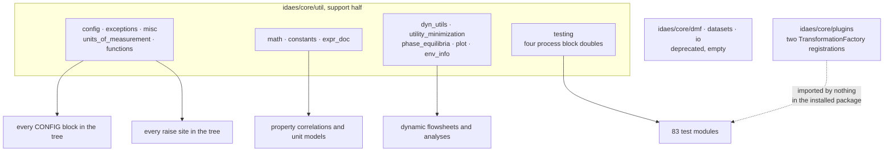
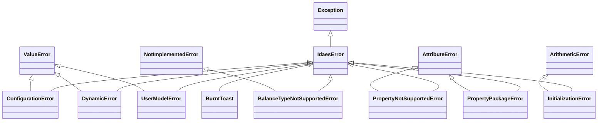

# 08b — Core support utilities

> **Doc ID** 08b · **Repo SHA** 70a8f4fe1 (IDAES-PSE v2.13.0rc0) · **Source roots** `idaes/core/util/` (support modules), `idaes/core/plugins/`, `idaes/core/dmf/`, `idaes/core/datasets.py`, `idaes/core/io/`
> **Owns** 20 modules / 4,858 LOC · **Assets** none · **Siblings** [08a](08a_model_introspection_and_persistence.md), [04](04_control_volume_framework.md), [05](05_property_and_reaction_framework.md), [06](06_model_preparation_initializers_and_scalers.md), [30](30_numerics_and_solver_interface_map.md)

This is the second half of the core utility library. [08a](08a_model_introspection_and_persistence.md)
covers the four modules that observe a model — counting, serializing, tabulating
and tagging. This one covers everything else under `idaes/core/util/`: the
smooth operators, physical constants and LaTeX documentation tools; the CONFIG
domain validators and the exception hierarchy; the dynamic-model, pinch-analysis
and plotting helpers; the property and reaction test doubles the entire test
suite is built on; the two Pyomo `TransformationFactory` registrations under
`idaes/core/plugins/`; and the three deprecated locations that contain no
functionality at all.

By set-wide convention section 12 also carries the register of the whole
deprecated surface of `idaes/core` — 45 sites across nine documents' territory.
Family documents list only their own rows and link here.

---

## 0. Scope and source map

| File | LOC | Purpose | Covered in § |
|---|---:|---|---|
| `idaes/core/util/dyn_utils.py` | 872 | Activity and fixed-status snapshots, point deactivation, index-set introspection, component location by path, value copying across time | 2.3, 5.4, 7.5 |
| `idaes/core/util/utility_minimization.py` | 738 | Duran–Grossmann pinch analysis: `min_utility` and the composite-curve helpers | 2.3, 5.5, 6.2, 7.5, 12 |
| `idaes/core/util/testing.py` | 638 | The dummy property and reaction packages the test suite builds on, `initialization_tester`, `assert_solution_equivalent`, the SCIP path helper | 2.4, 3.2, 5.6, 7.6, 9, 10 |
| `idaes/core/util/phase_equilibria.py` | 407 | T-x-y data generation and plotting, `TXYDataClass` | 2.3, 7.5, 10, 12 |
| `idaes/core/util/expr_doc.py` | 391 | Pyomo → SymPy → LaTeX documentation of constraints; the only SymPy user in `idaes/core` | 2.1, 5.3, 7.3, 9, 10 |
| `idaes/core/util/misc.py` | 267 | `add_object_reference`, `extract_data`, `set_param_from_config`, `StrEnum`, compact expression printing, `make_ordinal` | 2.2, 3.3, 7.4 |
| `idaes/core/util/config.py` | 207 | The nine CONFIG domain validators every model's CONFIG block uses | 2.2, 4.2, 7.4 |
| `idaes/core/util/math.py` | 206 | Smooth and safe operators for equation-oriented models | 2.1, 7.3 |
| `idaes/core/plugins/simple_equality_eliminator.py` | 203 | `SimpleEqualityEliminator`, a presolve that eliminates trivial linear equalities | 2.5, 5.2, 7.7 |
| `idaes/core/util/plot.py` | 187 | matplotlib grid and time-series plotting helpers | 2.3, 7.5, 10 |
| `idaes/core/util/env_info.py` | 149 | `EnvironmentInfo` — versions of IDAES, Pyomo, Python, OS, dependencies and solvers | 2.3, 7.5, 10 |
| `idaes/core/plugins/variable_replace.py` | 120 | `ReplaceVariables`, a variable-substitution transformation | 2.5, 4.1, 5.2, 7.7 |
| `idaes/core/util/doctesting.py` | 120 | `Docstring` — extracts labelled code blocks out of a markdown docstring | 2.3, 7.5 |
| `idaes/core/util/exceptions.py` | 100 | `IdaesError` and its eight subclasses | 2.2, 3.1, 11 |
| `idaes/core/util/constants.py` | 78 | `Constants` — SI physical constants as Pyomo unit expressions | 2.1, 6.3 |
| `idaes/core/util/units_of_measurement.py` | 64 | Conversion of a pint quantity into the reporting units from the global configuration | 2.2, 7.4, 12 |
| `idaes/core/datasets.py` | 36 | Tombstone: a `deprecation_warning` and nothing else | 12 |
| `idaes/core/dmf/__init__.py` | 31 | Tombstone: a `deprecation_warning` and nothing else | 12 |
| `idaes/core/util/functions.py` | 27 | Locates the compiled `functions` external library | 2.2, 10, 12 |
| `idaes/core/plugins/__init__.py` | 17 | Imports both plugin modules for their registration side effects | 2.5, 5.2, 12 |

Total 4,858 LOC, 1 declared configuration key, 2 `NotImplementedError` hook
sites, no shipped assets. `idaes/core/io/` is also in scope and contains no
source module at all; see section 12.

---

## 1. Architectural role

These modules have one thing in common and it is negative: none of them is about
a process model as such. They are the operations every part of the tree needs
and none of it owns.

Four of them are consumed almost universally, and none is over 270 lines.
`exceptions.py` defines the typed errors that 107 source modules raise.
`config.py` defines the nine callables that appear in the *Domain / validator*
column of every configuration table in this set. `constants.py` supplies the
physical constants 48 property modules use. `misc.py` supplies
`add_object_reference` and `set_param_from_config`, which parameter blocks and
unit models call during construction.

`math.py` is small and disproportionately important to the numerics: an
equation-oriented model cannot contain a `max`, an `abs` or a `log` of a
possibly-negative argument and still be solved by a gradient-based method, so
the eight smoothing and guarding operators here are what make several dozen
property correlations and valve models tractable.

`testing.py` is the outlier. It ships inside the installed package rather than
under a `tests/` directory, because the property and reaction test doubles it
defines are imported by 83 test modules across `idaes/`, and by convention a
package does not import from another package's test tree. Those four process
block pairs are the most-exercised implementation of the property and reaction
contracts in [05](05_property_and_reaction_framework.md).

The rest are self-contained tools used in a handful of places: `dyn_utils.py`
for dynamic flowsheets, `utility_minimization.py` and `phase_equilibria.py` for
two analyses, `plot.py` for matplotlib output, `env_info.py` for the
`idaes environment-info` command, `expr_doc.py` for LaTeX documentation, and
`doctesting.py` for extracting executable code from a markdown docstring. Three
locations hold no functionality at all: `idaes/core/dmf/`,
`idaes/core/datasets.py` and `idaes/core/io/`.

*The left column is consumed everywhere; the plugins and the tombstones are consumed almost nowhere.*

---

## 2. Public surface inventory

20 modules, 29 module-level classes and 68 module-level functions, grouped
below by what the module does rather than by file order. Each table is also the
line index for the symbols it names. The model-introspection and persistence
surface is in
[08a §2](08a_model_introspection_and_persistence.md#2-public-surface-inventory).

### 2.1 Expression and numerical helpers

| Symbol | Kind | Declared at | Exported via | Stability signal |
|---|---|---|---|---|
| `smooth_abs` | function | `idaes/core/util/math.py:24` | module | `automodule` in `docs/reference_guides/core/util/math.rst` |
| `smooth_minmax` | function | `idaes/core/util/math.py:53` | module | `automodule` coverage |
| `smooth_max` | function | `idaes/core/util/math.py:97` | module | `automodule` coverage |
| `smooth_min` | function | `idaes/core/util/math.py:114` | module | `automodule` coverage |
| `smooth_bound` | function | `idaes/core/util/math.py:131` | module | `automodule` coverage |
| `safe_sqrt` | function | `idaes/core/util/math.py:165` | module | `automodule` coverage |
| `safe_log` | function | `idaes/core/util/math.py:181` | module | `automodule` coverage |
| `smooth_heaviside` | function | `idaes/core/util/math.py:196` | module | `automodule` coverage |
| `Constants` | namespace class | `idaes/core/util/constants.py:28` | module | described in `docs/explanations/conventions.rst`; no autodoc directive |
| `PyomoSympyBimap` | class | `idaes/core/util/expr_doc.py:83` | module | no autodoc directive |
| `Pyomo2SympyVisitor` | class | `idaes/core/util/expr_doc.py:162` | module | no autodoc directive |
| `deduplicate_symbol` | function | `idaes/core/util/expr_doc.py:58` | module | no autodoc directive |
| `sympify_expression` | function | `idaes/core/util/expr_doc.py:208` | module | no autodoc directive |
| `to_latex` | function | `idaes/core/util/expr_doc.py:272` | module | no autodoc directive |
| `document_constraints` | function | `idaes/core/util/expr_doc.py:301` | module | no autodoc directive |

`_add_latex_subscripts` (`idaes/core/util/expr_doc.py:51`) and `_add_docs`
(`:233`) are private helpers of the LaTeX path.

### 2.2 Configuration, exceptions and miscellany

| Symbol | Kind | Declared at | Exported via | Stability signal |
|---|---|---|---|---|
| `is_physical_parameter_block` | CONFIG domain | `idaes/core/util/config.py:35` | module | 70 importing source modules |
| `is_reaction_parameter_block` | CONFIG domain | `idaes/core/util/config.py:60` | module | as above |
| `is_state_block` | CONFIG domain | `idaes/core/util/config.py:80` | module | as above |
| `is_port` | CONFIG domain | `idaes/core/util/config.py:101` | module | as above |
| `is_time_domain` | CONFIG domain | `idaes/core/util/config.py:117` | module | as above |
| `is_transformation_method` | CONFIG domain | `idaes/core/util/config.py:135` | module | as above |
| `is_transformation_scheme` | CONFIG domain | `idaes/core/util/config.py:153` | module | as above |
| `DefaultBool` | CONFIG domain | `idaes/core/util/config.py:171` | module | as above |
| `is_in_range` | CONFIG domain factory | `idaes/core/util/config.py:191` | module | as above |
| `IdaesError` | exception | `idaes/core/util/exceptions.py:21` | module | 107 importing source modules |
| `BalanceTypeNotSupportedError` | exception | `idaes/core/util/exceptions.py:31` | module | as above |
| `ConfigurationError` | exception | `idaes/core/util/exceptions.py:40` | module | as above |
| `DynamicError` | exception | `idaes/core/util/exceptions.py:49` | module | as above |
| `BurntToast` | exception | `idaes/core/util/exceptions.py:58` | module | as above |
| `PropertyNotSupportedError` | exception | `idaes/core/util/exceptions.py:66` | module | as above |
| `PropertyPackageError` | exception | `idaes/core/util/exceptions.py:77` | module | as above |
| `InitializationError` | exception | `idaes/core/util/exceptions.py:87` | module | as above |
| `UserModelError` | exception | `idaes/core/util/exceptions.py:96` | module | as above |
| `add_object_reference` | function | `idaes/core/util/misc.py:31` | module | `module` directive in `docs/reference_guides/core/util/misc.rst` |
| `extract_data` | function | `idaes/core/util/misc.py:55` | module | as above |
| `set_param_from_config` | function | `idaes/core/util/misc.py:72` | module | as above |
| `StrEnum` | enum base class | `idaes/core/util/misc.py:176` | module | as above |
| `_ToExprStringVisitor` | class | `idaes/core/util/misc.py:185` | module | leading underscore |
| `compact_expression_to_string` | function | `idaes/core/util/misc.py:202` | module | as above |
| `print_compact_form` | function | `idaes/core/util/misc.py:221` | module | as above |
| `make_ordinal` | function | `idaes/core/util/misc.py:251` | module | as above |
| `report_quantity` | function | `idaes/core/util/units_of_measurement.py:25` | module | no autodoc directive |
| `convert_quantity_to_reporting_units` | function | `idaes/core/util/units_of_measurement.py:31` | module | no autodoc directive |
| `functions_lib` | function | `idaes/core/util/functions.py:21` | module | no autodoc directive |
| `functions_available` | function | `idaes/core/util/functions.py:26` | module | no autodoc directive |

### 2.3 Dynamic-model, analysis and environment helpers

| Symbol | Kind | Declared at | Exported via | Stability signal |
|---|---|---|---|---|
| `get_activity_dict` | function | `idaes/core/util/dyn_utils.py:33` | module | `automodule` in `docs/reference_guides/core/util/dyn_utils.rst` |
| `get_fixed_dict` | function | `idaes/core/util/dyn_utils.py:53` | module | as above |
| `deactivate_model_at` | function | `idaes/core/util/dyn_utils.py:68` | module | as above |
| `deactivate_constraints_unindexed_by` | function | `idaes/core/util/dyn_utils.py:123` | module | as above |
| `fix_vars_unindexed_by` | function | `idaes/core/util/dyn_utils.py:155` | module | as above |
| `get_location_of_coordinate_set` | function | `idaes/core/util/dyn_utils.py:192` | module | as above |
| `get_index_of_set` | function | `idaes/core/util/dyn_utils.py:236` | module | as above |
| `get_implicit_index_of_set` | function | `idaes/core/util/dyn_utils.py:260` | module | as above |
| `get_derivatives_at` | function | `idaes/core/util/dyn_utils.py:297` | module | as above |
| `path_from_block` | function | `idaes/core/util/dyn_utils.py:344` | module | as above |
| `find_comp_in_block` | function | `idaes/core/util/dyn_utils.py:385` | module | as above |
| `find_comp_in_block_at_time` | function | `idaes/core/util/dyn_utils.py:459` | module | as above |
| `copy_non_time_indexed_values` | function | `idaes/core/util/dyn_utils.py:583` | module | as above |
| `copy_values_at_time` | function | `idaes/core/util/dyn_utils.py:694` | module | as above |
| `copy_values_from_point` | function | `idaes/core/util/dyn_utils.py:849` | module | as above |
| `min_utility` | function | `idaes/core/util/utility_minimization.py:37` | module | `autofunction` |
| `heat_data` | function | `idaes/core/util/utility_minimization.py:237` | module | no autodoc directive |
| `pinch_calc` | function | `idaes/core/util/utility_minimization.py:319` | module | no autodoc directive |
| `generate_curves` | function | `idaes/core/util/utility_minimization.py:425` | module | `autofunction` |
| `heat_ex_data` | function | `idaes/core/util/utility_minimization.py:479` | module | `autofunction` |
| `gen_curves` | function | `idaes/core/util/utility_minimization.py:555` | module | no autodoc directive |
| `linear_interpolation` | function | `idaes/core/util/utility_minimization.py:589` | module | no autodoc directive |
| `print_HX_results` | function | `idaes/core/util/utility_minimization.py:614` | module | no autodoc directive |
| `unique` | function | `idaes/core/util/utility_minimization.py:655` | module | no autodoc directive |
| `PinchDataClass` | class | `idaes/core/util/utility_minimization.py:675` | module | no autodoc directive |
| `CurveData` | class | `idaes/core/util/utility_minimization.py:712` | module | no autodoc directive |
| `Txy_diagram` | function | `idaes/core/util/phase_equilibria.py:35` | module | `autofunction` |
| `Txy_data` | function | `idaes/core/util/phase_equilibria.py:92` | module | `autofunction` |
| `TXYDataClass` | class | `idaes/core/util/phase_equilibria.py:218` | module | carries an `autofunction` directive despite being a class |
| `build_txy_diagrams` | function | `idaes/core/util/phase_equilibria.py:285` | module | `autofunction` |
| `dynamic_value_list` | function | `idaes/core/util/plot.py:25` | module | no autodoc directive |
| `plot_grid` | function | `idaes/core/util/plot.py:56` | module | no autodoc directive |
| `plot_grid_dynamic` | function | `idaes/core/util/plot.py:105` | module | no autodoc directive |
| `plot_dynamic` | function | `idaes/core/util/plot.py:152` | module | no autodoc directive |
| `EnvironmentInfo` | class | `idaes/core/util/env_info.py:33` | module | consumed by `idaes/commands/` |
| `Docstring` | class | `idaes/core/util/doctesting.py:22` | module | no autodoc directive |

### 2.4 Test support shipped in production code — `testing.py`

This module lives in the installed package, not under a `tests/` directory. 83
modules under `idaes/` import from it, all of them test modules.

| Symbol | Kind | Declared at | Exported via | Stability signal |
|---|---|---|---|---|
| `initialization_tester` | function | `idaes/core/util/testing.py:62` | module | imported by unit-model tests throughout |
| `PhysicalPropertiesTestScaler` | Scaler class | `idaes/core/util/testing.py:145` | module | named by `StateTestBlockData.default_scaler` |
| `_PhysicalParameterBlock` | data class | `idaes/core/util/testing.py:185` | module | leading underscore; container is public |
| `PhysicalParameterTestBlock` | container class | synthesized at `idaes/core/util/testing.py:185` | module | generated by the decorator |
| `SBlockBase` | class | `idaes/core/util/testing.py:263` | module | `block_class` of the state block pair |
| `StateTestBlockData` | data class | `idaes/core/util/testing.py:282` | module | — |
| `StateBlockForTesting` | container class | synthesized at `idaes/core/util/testing.py:282` | module | generated by the decorator |
| `ReactionTestScaler` | Scaler class | `idaes/core/util/testing.py:382` | module | named by `RBlockBase.default_scaler` |
| `_ReactionParameterBlock` | data class | `idaes/core/util/testing.py:397` | module | leading underscore; container is public |
| `ReactionParameterTestBlock` | container class | synthesized at `idaes/core/util/testing.py:397` | module | generated by the decorator |
| `RBlockBase` | class | `idaes/core/util/testing.py:450` | module | `block_class` of the reaction block pair |
| `ReactionBlockData` | data class | `idaes/core/util/testing.py:461` | module | — |
| `ReactionBlock` | container class | synthesized at `idaes/core/util/testing.py:461` | module | generated by the decorator |
| `_enable_scip_solver_for_testing` | function | `idaes/core/util/testing.py:488` | module | leading underscore |
| `assert_solution_equivalent` | function | `idaes/core/util/testing.py:521` | module | — |

### 2.5 Pyomo plugins — `idaes/core/plugins/`

| Symbol | Kind | Declared at | Exported via | Stability signal |
|---|---|---|---|---|
| `ReplaceVariables` | transformation class | `idaes/core/plugins/variable_replace.py:42` | `TransformationFactory("replace_variables")` | registered by decorator; `document_kwargs_from_configdict` |
| `_is_var` | function | `idaes/core/plugins/variable_replace.py:34` | module | leading underscore |
| `SimpleEqualityEliminator` | transformation class | `idaes/core/plugins/simple_equality_eliminator.py:36` | `TransformationFactory("simple_equality_eliminator")` | registered by decorator |

`idaes/core/plugins/__init__.py:16` and `:17` import the two modules with no
`from`-clause; the imports exist for the registration side effect only.

---

## 3. Class hierarchy and type taxonomy

Two hierarchies exist in this document: the exception tree, and the two process
block pairs in `testing.py`. Everything else is a standalone class.

### 3.1 The exception tree

Every IDAES exception inherits both `IdaesError` and a Python built-in, so that
`except ValueError` and `except IdaesError` both catch it.

*Every IDAES exception except `BurntToast` is also a built-in exception type, which is why `PropertyNotSupportedError` can be raised out of `__getattr__` without breaking the Python attribute protocol.*

`BalanceTypeNotSupportedError` is the one that matters to
[04](04_control_volume_framework.md): sixteen control volume methods raise it,
and because it is a `NotImplementedError` the caller can treat "this geometry
does not support that balance" and "this method is abstract" uniformly.

### 3.2 The test doubles

Two complete property-package pairs. `_PhysicalParameterBlock` extends
`PhysicalParameterBlock` and names `StateBlockForTesting` as its state block
class; `StateTestBlockData` extends `StateBlockData` with `SBlockBase` — itself
a `StateBlock` subclass — as its container base. `_ReactionParameterBlock` and
`ReactionBlockData` mirror that arrangement on the reaction side with
`RBlockBase`. `PhysicalPropertiesTestScaler` and `ReactionTestScaler` extend
`CustomScalerBase` and are named by `StateTestBlockData.default_scaler`
(`idaes/core/util/testing.py:284`) and `RBlockBase.default_scaler`
(`idaes/core/util/testing.py:451`). Together the four pairs implement every
contract a control volume asks of a property package.

### 3.3 Class roster

| Class | Base(s) | Declared at | Decorator | Container class | Key overrides |
|---|---|---|---|---|---|
| the nine exception classes | see section 3.1 | `idaes/core/util/exceptions.py:21`–`:96` | none | — | none; each is a bare class body |
| `Constants` | none | `idaes/core/util/constants.py:28` | none | — | class attributes only |
| `PyomoSympyBimap` | `object` | `idaes/core/util/expr_doc.py:83` | none | — | `_add_sympy` |
| `Pyomo2SympyVisitor` | `StreamBasedExpressionVisitor` | `idaes/core/util/expr_doc.py:162` | none | — | `exitNode`, `beforeChild` |
| `StrEnum` | `str`, `Enum` | `idaes/core/util/misc.py:176` | none | — | `__str__` |
| `_ToExprStringVisitor` | `_ToStringVisitor` | `idaes/core/util/misc.py:185` | none | — | `visiting_potential_leaf` |
| `EnvironmentInfo` | none | `idaes/core/util/env_info.py:33` | none | — | `to_json`, `to_dict` |
| `Docstring` | none | `idaes/core/util/doctesting.py:22` | none | — | `code` |
| `TXYDataClass` | none | `idaes/core/util/phase_equilibria.py:218` | none | — | `Temp_Bubb`, `Temp_Dew`, `composition` |
| `PinchDataClass` | none | `idaes/core/util/utility_minimization.py:675` | none | — | `HeatAbove`, `HeatBellow` |
| `CurveData` | none | `idaes/core/util/utility_minimization.py:712` | none | — | six self-replacing setters |
| `PhysicalPropertiesTestScaler` | `CustomScalerBase` | `idaes/core/util/testing.py:145` | none | — | `variable_scaling_routine`, `constraint_scaling_routine` |
| `_PhysicalParameterBlock` | `PhysicalParameterBlock` | `idaes/core/util/testing.py:185` | `@declare_process_block_class("PhysicalParameterTestBlock")` | `PhysicalParameterTestBlock` | `build`, `define_metadata` |
| `SBlockBase` | `StateBlock` | `idaes/core/util/testing.py:263` | none | — | `initialize`, `release_state` |
| `StateTestBlockData` | `StateBlockData` | `idaes/core/util/testing.py:282` | `@declare_process_block_class("StateBlockForTesting", block_class=SBlockBase)` | `StateBlockForTesting` | `build`, six term and basis methods, `define_state_vars` |
| `ReactionTestScaler` | `CustomScalerBase` | `idaes/core/util/testing.py:382` | none | — | both scaling routines |
| `_ReactionParameterBlock` | `ReactionParameterBlock` | `idaes/core/util/testing.py:397` | `@declare_process_block_class("ReactionParameterTestBlock")` | `ReactionParameterTestBlock` | `build`, `define_metadata`, `get_required_properties` |
| `RBlockBase` | `ReactionBlockBase` | `idaes/core/util/testing.py:450` | none | — | `initialize`, `default_scaler` |
| `ReactionBlockData` | `ReactionBlockDataBase` | `idaes/core/util/testing.py:461` | `@declare_process_block_class("ReactionBlock", block_class=RBlockBase)` | `ReactionBlock` | `build`, `model_check`, `get_reaction_rate_basis` |
| `ReplaceVariables` | `NonIsomorphicTransformation` | `idaes/core/plugins/variable_replace.py:42` | `@TransformationFactory.register("replace_variables")`, `@document_kwargs_from_configdict("CONFIG")` | — | `replace`, `_apply_to` |
| `SimpleEqualityEliminator` | `NonIsomorphicTransformation` | `idaes/core/plugins/simple_equality_eliminator.py:36` | `@TransformationFactory.register("simple_equality_eliminator")` | — | `_get_subs`, `_apply_to`, `revert`, `get_logger` |

Four of the 160 process block pairs in the tree are declared here; the counts by
owning document are tabulated in
[06 §3](06_model_preparation_initializers_and_scalers.md#3-class-hierarchy-and-type-taxonomy).

### 3.4 Enumerations

One `Enum` subclass is declared in this scope and it has no members.

| Member | Value | Meaning | Consumed at |
|---|---|---|---|
| — | — | `StrEnum` (`idaes/core/util/misc.py:176`) is a base mixing `str` and `Enum` so that `str(member)` yields the member value rather than `ClassName.MEMBER` (`idaes/core/util/misc.py:181`) | subclassed by enumerations elsewhere in the tree |

---

## 4. Configuration reference

One `CONFIG.declare` call exists across both halves of the core utility library,
and it is here.

### 4.1 `ReplaceVariables.CONFIG`

`CONFIG = ConfigBlock()` at `idaes/core/plugins/variable_replace.py:50`.

| Key | Domain / validator | Default | Req. | Effect on build | Anchor |
|---|---|---|---|---|---|
| `substitute` | none — a `ConfigValue` with no domain | `[]` | no | List-like of two-element pairs; each pair names a variable to replace and the variable to replace it with. Consumed by `replace` at `:63` | `idaes/core/plugins/variable_replace.py:51` |

The key's own description states that the transformation is not reversible, and
`ReplaceVariables` declares no `revert` method — unlike
`SimpleEqualityEliminator` (`idaes/core/plugins/simple_equality_eliminator.py:175`).

`SimpleEqualityEliminator` declares no CONFIG block at all. Its two options,
`max_iter` and `reversible`, are plain keyword arguments of `_apply_to`
(`idaes/core/plugins/simple_equality_eliminator.py:95`) and reach it through
Pyomo's `apply_to`.

### 4.2 The CONFIG domain validators

`config.py` declares no keys. It supplies the callables that other documents'
configuration tables name in their *Domain / validator* column, so the semantics
of that column are fixed here.

| Validator | Accepts | Rejects with | Anchor |
|---|---|---|---|
| `is_physical_parameter_block` | a `PhysicalParameterBlock` instance, or `useDefault` | `ConfigurationError`, after an `_log.error` naming the offending value | `idaes/core/util/config.py:35` |
| `is_reaction_parameter_block` | a `ReactionParameterBlock` instance | `ConfigurationError` | `idaes/core/util/config.py:60` |
| `is_state_block` | a `StateBlock` instance, or `None` | `ConfigurationError` | `idaes/core/util/config.py:80` |
| `is_port` | a Pyomo `Port` | `ConfigurationError` | `idaes/core/util/config.py:101` |
| `is_time_domain` | a Pyomo `Set` or a `ContinuousSet` | `ConfigurationError` | `idaes/core/util/config.py:117` |
| `is_transformation_method` | `"dae.finite_difference"` or `"dae.collocation"` | `ConfigurationError` | `idaes/core/util/config.py:135` |
| `is_transformation_scheme` | `"BACKWARD"`, `"FORWARD"`, `"LAGRANGE-RADAU"`, `"LAGRANGE-LEGENDRE"` | `ConfigurationError` | `idaes/core/util/config.py:153` |
| `DefaultBool` | `useDefault`, or anything Pyomo's `Bool` accepts | Pyomo's `ValueError` from `Bool` | `idaes/core/util/config.py:171` |
| `is_in_range(lb, ub)` | returns a closure accepting a value in `[lb, ub]` | `ConfigurationError` naming the admissible range | `idaes/core/util/config.py:191` |

The first three import their target class inside the function body rather than
at module scope, each with a comment recording that a top-level import creates a
circular import (`idaes/core/util/config.py:47`, `:70`, `:89`).

`is_transformation_method` and `is_transformation_scheme` validate their two
strings independently; the pairing rule that a finite-difference method admits
only `BACKWARD` and `FORWARD` is enforced separately by the one-dimensional
control volume, in
[04 §4](04_control_volume_framework.md#4-configuration-reference).

### 4.3 Implicit CONFIG blocks in the test doubles

`StateTestBlockData` (`idaes/core/util/testing.py:283`) and `ReactionBlockData`
(`idaes/core/util/testing.py:462`) each set `CONFIG = ConfigBlock(implicit=True)`,
replacing the inherited state-block and reaction-block configuration entirely.
Any keyword argument is therefore accepted and none is validated, which is what
allows a test to construct these blocks with arbitrary arguments.

---

## 5. Construction and call sequences

### 5.1 Validating and setting a parameter

`set_param_from_config(b, param, config=None, index=None)`
(`idaes/core/util/misc.py:72`) is the standard way a parameter block turns a
configuration entry into a Pyomo `Param` value:

1. Resolve the configuration source. With no `config` argument it uses `b.config`
   and raises `AttributeError` when the block has none (`:100`); a `config` that
   is not a `ConfigBlock` is rejected (`:113`).
2. Locate the parameter object — `getattr(b, param)`, or
   `getattr(b, param + "_" + index)` when an index is given (`:120`, `:140`) —
   and the matching entry in `config.parameter_data` (`:129`, `:149`).
3. When the value exposes `get_parameter_value`, call it with the block's
   `local_name` and the parameter name to obtain a `(value, units)` tuple
   (`:150`).
4. Interpret the result: a tuple becomes `value * units`, or
   `value * dimensionless` when the units are `None`; anything else is taken as
   already in the package's base units and logged at DEBUG (`:161`), then
   `param_obj.set_value` is called.

`add_object_reference` (`:31`) exists for the cases a Pyomo `Reference` does not
cover. It calls `object.__setattr__` directly, bypassing Pyomo's component
registration, which is what makes it usable for a scalar object where a
`Reference` would introduce an unwanted `None` index (`:45`).

### 5.2 Applying the two transformations

`ReplaceVariables._apply_to` (`idaes/core/plugins/variable_replace.py:103`)
resolves the CONFIG block from the keyword arguments and calls the static
`replace` (`:63`), which validates each pair — both members must be variables
(`:68`), both must agree on being indexed (`:73`), and the replaced variable's
index set must be a subset of the replacement's (`:79`) — builds a substitution
map keyed by `id()`, and walks every active `Constraint`, `Expression` and
`Objective` with Pyomo's `ExpressionReplacementVisitor` (`:91`).

`SimpleEqualityEliminator._apply_to`
(`idaes/core/plugins/simple_equality_eliminator.py:95`) iterates at most
`max_iter` times, default five. Each pass calls `_get_subs` (`:37`), which
examines every active equality constraint whose body has polynomial degree one
and at most two linear variables: one variable gives a fixing, two give a
substitution of the first in terms of the second (`:62`, `:73`). Bounds are
transferred to the surviving variable using `compute_bounds_on_expr`, keeping
whichever bound is tighter (`:84`). The pass deactivates the consumed
constraints, fixes what can be fixed, and substitutes into every active
`Constraint` and `Objective` (`:143`, `:151`). The loop stops early when a pass
consumes no constraints (`:139`).

When `reversible` — the default — the original expression of every `Expression`
is stored before the first pass (`:120`) and of every `Constraint` and
`Objective` as it is first visited (`:159`), so that `revert` (`:175`) can
restore them, reactivate the constraints, unfix the variables, and back-substitute
values into the eliminated variables in reverse pass order (`:195`).

Neither transformation is reachable until something imports
`idaes.core.plugins`; see section 12.

### 5.3 Documenting an expression in LaTeX

`to_latex` (`idaes/core/util/expr_doc.py:272`) calls `sympify_expression`
(`:208`), which differs from Pyomo's function of the same name in one respect
recorded in its docstring: it descends into a named expression when that
expression is the top-level object.

The conversion runs `Pyomo2SympyVisitor` (`:162`) over the expression tree.
`beforeChild` (`:189`) stops the descent at native types and at an
`ExternalFunctionExpression`, mapping the latter to a symbol; `exitNode`
(`:172`) maps each operator through Pyomo's `_pyomo_operator_map` and
`_functionMap`. Symbols are allocated by `PyomoSympyBimap._add_sympy` (`:113`),
which reads a component's `latex_symbol` attribute when present and otherwise
generates one, then runs it through `deduplicate_symbol` (`:58`) so two
components with the same preferred symbol get incrementing subscripts.

`to_latex` returns a four-key dictionary: the SymPy expression, a markdown table
of symbol documentation built by three `_add_docs` calls over `Var`, `Expression`
and `ExternalFunction` (`:287`), the LaTeX string, and the symbol map.
`document_constraints` (`:301`) dispatches on the component type — an
`ExpressionData`, a `ConstraintData` or a `BlockData` — and for a block walks
every active constraint and expression, optionally adding fixed variables with
their values and units (`:376`).

### 5.4 Working with a time-indexed model

`dyn_utils.py` provides the operations a dynamic initialization routine performs
between solves.

1. `get_activity_dict` (`idaes/core/util/dyn_utils.py:33`) and `get_fixed_dict`
   (`:53`) snapshot `active` and `fixed` status keyed by `id()`, so status can
   be restored after an intervening operation. The comment at `:46` records that
   an active constraint inside an inactive block is still recorded as active.
2. `deactivate_model_at` (`:68`) validates that every requested point is in the
   `ContinuousSet` (`:88`), then deactivates every Block and Constraint
   *explicitly* indexed by that set and not already inside a block indexed by
   it (`:101`). The exclusion is deliberate: deactivating an implicitly indexed
   component would be redundant with deactivating its parent. A `KeyError` from
   `Constraint.Skip` is caught and logged rather than raised (`:116`).
3. `path_from_block` (`:344`) walks up from a component to a block, recording
   `(local_name, index)` pairs. `find_comp_in_block` (`:385`) replays that path
   against a different block, and `find_comp_in_block_at_time` (`:459`) replays
   it with the time coordinate replaced.
4. `copy_non_time_indexed_values` (`:583`), `copy_values_at_time` (`:694`) and
   `copy_values_from_point` (`:849`) move values between models or between time
   points; the third uses `flatten_dae_components` (`:865`).

The index-set helpers `get_location_of_coordinate_set` (`:192`),
`get_index_of_set` (`:236`) and `get_implicit_index_of_set` (`:260`) answer
where a one-dimensional set sits inside a `SetProduct`. The first raises
`ValueError` for a multi-dimensional subset (`:205`) and again when the subset
appears more than once in the product (`:215`).

### 5.5 Minimizing utilities

`min_utility` (`idaes/core/util/utility_minimization.py:37`) adds the
Duran–Grossmann formulation to a flowsheet:

1. Convert every exchanger's `heat_duty[0]` into `DG_units` (`:79`).
2. Call `heat_data` (`:237`) for inlet and outlet temperatures, heat-capacity
   flow rates and duties, then `pinch_calc` (`:319`) to obtain initial values as
   a `PinchDataClass` (`:87`).
3. Create `Tin` and `Tout` as `Expression`s reading
   `control_volume.properties_in[0].temperature` and its outlet counterpart
   (`:101`, `:108`), then `Theta` (`:131`) and `T_` (`:139`). `Theta` uses the
   module-level `EpsT = 1` (`:34`) and the caller's `eps` inside a square-root
   smoothing term so the heat-capacity flow rate stays differentiable at zero
   temperature change.
4. Create the four variables and four constraints listed in section 6.2.

The composite-curve path is separate: `heat_ex_data` (`:479`) collects the same
exchanger data into a `CurveData` instance and reads `blk.Qw`, so it runs after
`min_utility`; `generate_curves` (`:425`) turns that into arrays through
`gen_curves` (`:555`) and `linear_interpolation` (`:589`) and calls `plt.show()`
(`:475`).

### 5.6 The test doubles

`_PhysicalParameterBlock.build` (`idaes/core/util/testing.py:186`) creates two
phases, two chemical components, a phase-equilibrium index of two members, a
three-element element list with an element composition map, two inherent
reactions with stoichiometry, and eighteen default scaling factors. It also sets
two plain Python attributes that tests mutate to steer behaviour: `basis_switch`
selects which `MaterialFlowBasis` the state block reports (`:224`) and
`default_balance_switch` selects whether `default_material_balance_type` returns
a value or raises (`:225`).

`StateTestBlockData.build` (`:288`) creates seventeen variables covering every
term a control volume can ask for. `_ReactionParameterBlock.build` (`:398`)
creates two rate reactions and two equilibrium reactions with full
stoichiometry, and `ReactionBlockData.build` (`:464`) creates `reaction_rate`
over the two rate reactions and a `dh_rxn` dictionary covering all four.

`initialization_tester` (`:62`) is the standard assertion harness for a unit
model's legacy initialization routine. It attaches six dummy components,
deactivates the four constraints among them (`:107`), records the fixed
variables and active constraints, calls `unit.initialize(**init_kwargs)`, and
then asserts that the degrees of freedom equal `dof`, that the fixed and active
sets are unchanged, and that the four dummy constraints are still deactivated
(`:117`, `:130`). Every dummy component is deleted before returning (`:136`).

`assert_solution_equivalent` (`:521`) collects every mismatch before raising,
formatting each with a precision derived from the supplied tolerance —
`ceil(-log10(rel_tol)) + 1` significant figures for a relative tolerance, the
same count of decimal places for an absolute one (`:610`) — and reports a
missing component, a missing index and a wrong component type as distinct
failure kinds.

## 6. Data structures, variables, constraints and invariants

### 6.1 Components created by the test doubles

| Component | Type | Index sets | Units | Created at | Condition |
|---|---|---|---|---|---|
| `p1`, `p2` | `Phase` | scalar | — | `testing.py:189` | always |
| `c1`, `c2` | `Component` | scalar | — | `testing.py:192` | always |
| `flow_mol` | `Var` | scalar | mol/s | `testing.py:290` | always |
| `flow_mol_phase_comp` | `Var` | phase × chemical component | mol/s | `testing.py:294` | always |
| `material_flow_mass`, `material_dens_mass` | `Var` | scalar | kg/s, kg/m³ | `testing.py:308`, `:309` | always |
| `pressure`, `temperature` | `Var` | scalar | Pa, K | `testing.py:312`, `:313` | always |
| `mole_frac_phase_comp` | `Var` | phase × chemical component | dimensionless | `testing.py:327` | always |
| `reaction_rate` | `Var` | rate reaction index | mol/m³/s | `testing.py:467` | always |

Neither double creates a `Constraint`. That is deliberate: a control volume
built on them has exactly the constraints the control volume itself wrote, which
is what makes an exact count assertion meaningful.

### 6.2 Components created by `min_utility`

| Component | Type | Index sets | Units | Created at | Condition |
|---|---|---|---|---|---|
| `Tin` | `Expression` | exchanger names | temperature | `utility_minimization.py:101` | always |
| `Tout` | `Expression` | exchanger names | temperature | `utility_minimization.py:108` | always |
| `Theta` | `Expression` | exchanger names | power/temperature | `utility_minimization.py:131` | always |
| `T_` | `Expression` | exchanger names | temperature | `utility_minimization.py:139` | always |
| `QAh` | `Var` | pinch candidates | `DG_units` | `utility_minimization.py:144` | always |
| `heat_above_pinch` | `Constraint` | pinch candidates | — | `utility_minimization.py:168` | always |
| `QAc` | `Var` | pinch candidates | `DG_units` | `utility_minimization.py:173` | always |
| `heat_below_pinch` | `Constraint` | pinch candidates | — | `utility_minimization.py:200` | always |
| `Qs` | `Var` | scalar | `DG_units` | `utility_minimization.py:205` | always |
| `heating_utility` | `Constraint` | scalar | — | `utility_minimization.py:217` | always |
| `Qw` | `Var` | scalar | `DG_units` | `utility_minimization.py:222` | always |
| `cooling_utility` | `Constraint` | scalar | — | `utility_minimization.py:234` | always |

`Qs` is the hot-utility duty and `Qw` the cold-utility duty; they are the two
quantities an objective minimizes.

The three analysis data classes hold plain Python lists rather than Pyomo
components:

| Class | Fields | Set at |
|---|---|---|
| `PinchDataClass` | `initQs`, `initQw`, `initQAh`, `initQAc` | `utility_minimization.py:689`, `:691` |
| `CurveData` | `Qw`, `T_unit`, `Q_unit`, then six cooling and heating arrays | `utility_minimization.py:718`, `:722` onward |
| `TXYDataClass` | `Component_1`, `Component_2`, `Punits`, `Tunits`, `P`, `TBubb`, `TDew`, `x` | `phase_equilibria.py:238`, `:249` |

### 6.3 Physical constants

`Constants` (`idaes/core/util/constants.py:28`) holds thirteen class attributes.
All but `pi` are Pyomo unit expressions in SI, stated to nine significant figures
where the source value has them; the module docstring records that convention
and the class comments cite the SI brochure as the source for the defining
constants.

| Attribute | Value | Units | Anchor |
|---|---|---|---|
| `pi` | `math.pi` | dimensionless | `idaes/core/util/constants.py:35` |
| `avogadro_number` | 6.02214076e23 | 1/mol | `idaes/core/util/constants.py:40` |
| `boltzmann_constant` | 1.38064900e-23 | J/K | `idaes/core/util/constants.py:42` |
| `elemental_charge` | 1.602176634e-19 | C | `idaes/core/util/constants.py:44` |
| `planck_constant` | 6.62607015e-34 | J·s | `idaes/core/util/constants.py:46` |
| `speed_light` | 299792458 | m/s | `idaes/core/util/constants.py:48` |
| `faraday_constant` | 96485.33212 | C/mol | `idaes/core/util/constants.py:54` |
| `gas_constant` | 8.314462618 | J/mol/K | `idaes/core/util/constants.py:57` |
| `stefan_constant` | 5.67037442e-8 | W/m²/K⁴ | `idaes/core/util/constants.py:61` |
| `acceleration_gravity` | 9.80665 | m/s² | `idaes/core/util/constants.py:68` |
| `gravitational_constant` | 6.67430e-11 | m³/kg/s² | `idaes/core/util/constants.py:71` |
| `mass_electron` | 9.1093837015e-31 | kg | `idaes/core/util/constants.py:74` |
| `vacuum_electric_permittivity` | 8.8541878128e-12 | F/m | `idaes/core/util/constants.py:78` |

### 6.4 Invariants

| Invariant | Enforced at |
|---|---|
| A property package argument is a `PhysicalParameterBlock` or `useDefault` | `config.py:49` |
| A transformation method and scheme are members of their two fixed string sets | `config.py:145`, `:163` |
| An `eps` argument to a smooth operator is a `float`, `int` or Pyomo `Param` | `math.py:38`, `math.py:98` |
| `smooth_minmax` accepts only `"min"` or `"max"` | `math.py:105` |
| Every point passed to `deactivate_model_at` is a member of the `ContinuousSet` | `dyn_utils.py:88` |
| A one-dimensional coordinate set appears exactly once in a `SetProduct` | `dyn_utils.py:215` |
| Both members of a `substitute` pair are variables with compatible indexing | `variable_replace.py:68`, `:73`, `:79` |

---

## 7. Method contracts

### 7.1 Expression and numerical helpers

| Method | Signature | Effects | Returns | Raises | Anchor |
|---|---|---|---|---|---|
| `smooth_abs` | `(a, eps=1e-4)` | none | `(a**2 + eps**2)**0.5` | `TypeError` for a bad `eps` or `a` | `math.py:24` |
| `smooth_minmax` | `(a, b, eps=1e-4, sense="max")` | none | `0.5*(a + b ± smooth_abs(a-b, eps))` | `TypeError`; `ValueError` for an unrecognized sense | `math.py:53` |
| `smooth_max` | `(a, b, eps=1e-4)` | none | `smooth_minmax` with `sense="max"` | propagates | `math.py:97` |
| `smooth_min` | `(a, b, eps=1e-4)` | none | `smooth_minmax` with `sense="min"` | propagates | `math.py:114` |
| `smooth_bound` | `(val, lb, ub, eps=1e-4, eps_lb=None, eps_ub=None)` | none | `smooth_min(smooth_max(val, lb, eps_lb), ub, eps_ub)` | propagates | `math.py:131` |
| `safe_sqrt` | `(a, eps=1e-4)` | none | `sqrt(smooth_max(a, 0, eps))` | propagates | `math.py:165` |
| `safe_log` | `(a, eps=1e-4)` | none | `log(smooth_max(a, eps, eps=eps))` | propagates | `math.py:181` |
| `smooth_heaviside` | `(x, k)` | none | `1/(1 + exp(-k*x))` | — | `math.py:196` |
| `sympify_expression` | `(expr)` | none | `(PyomoSympyBimap, sympy expression)` | `NameError` when SymPy is absent | `expr_doc.py:208` |
| `to_latex` | `(expr)` | none | dict with `sympy_expr`, `where`, `latex_expr`, `object_map` | as above | `expr_doc.py:272` |
| `document_constraints` | `(comp, doc=True, descend_into=True, fixed_vars=False, to_doc=None)` | none | markdown `str` | as above | `expr_doc.py:301` |
| `deduplicate_symbol` | `(x, v, used)` | mutates `used` | a unique LaTeX symbol | — | `expr_doc.py:58` |

`safe_sqrt` and `safe_log` exist for the transient states a solver visits, not
for the solution: their docstrings state the assumption that at the solution the
argument is far from the smoothing region. `smooth_bound`'s docstring gives the
worked case — a controller output driving a valve opening that has to stay in
the feasible region while remaining smooth.

### 7.2 Configuration, exceptions, miscellany

The nine CONFIG domain validators are contracted in section 4.2; each returns
its argument unchanged or raises `ConfigurationError`.

| Method | Signature | Effects | Returns | Raises | Anchor |
|---|---|---|---|---|---|
| `add_object_reference` | `(self, local_name, remote_object)` | `object.__setattr__` on the block, bypassing Pyomo's component machinery | `None` | `AttributeError` naming the block | `misc.py:31` |
| `extract_data` | `(data_dict)` | none | an `initialize` rule closure | `KeyError` at rule evaluation | `misc.py:55` |
| `set_param_from_config` | `(b, param, config=None, index=None)` | Calls `param_obj.set_value` | `None` | `AttributeError`, `TypeError`, `KeyError` | `misc.py:72` |
| `compact_expression_to_string` | `(expr)` | none | `str` naming nested `Expression`s rather than expanding them | — | `misc.py:202` |
| `print_compact_form` | `(expr, stream=None)` | Writes to `stream` or stdout | `None` | — | `misc.py:221` |
| `make_ordinal` | `(n)` | none | `"1st"`, `"2nd"`, … | — | `misc.py:251` |
| `report_quantity` | `(c)` | none | a pint quantity in reporting units | — | `units_of_measurement.py:25` |
| `convert_quantity_to_reporting_units` | `(q)` | none | a pint quantity | — | `units_of_measurement.py:31` |
| `functions_lib` | `()` | none | path string from `find_library("functions")`, or `None` | — | `functions.py:21` |
| `functions_available` | `()` | none | `bool` | `TypeError` when `functions_lib()` returns `None` | `functions.py:26` |

`convert_quantity_to_reporting_units` returns a dimensionless quantity
unchanged (`units_of_measurement.py:42`), reads `idaes.cfg.reporting_units`
(`:47`), iterates the definitions looking for a matching dimensionality, and
falls back to `to_base_units()` when none matches (`:62`). The global
configuration tree it reads is documented in
[02](02_runtime_platform_and_cli.md).

`print_compact_form` unwraps a `Constraint` or `Expression` to its `expr`
attribute before printing, so a caller can pass either the component or the
expression (`misc.py:238`).

### 7.3 Dynamic, analysis and environment helpers

| Method | Signature | Effects | Returns | Raises | Anchor |
|---|---|---|---|---|---|
| `deactivate_model_at` | `(b, cset, pts, outlvl=idaeslog.NOTSET)` | Deactivates components at the given points | dict point → list of components | `ValueError` for a point outside the set | `dyn_utils.py:68` |
| `get_location_of_coordinate_set` | `(setprod, subset)` | none | `int` position, or `None` | `ValueError` for a multi-dimensional or repeated subset | `dyn_utils.py:192` |
| `get_index_of_set` | `(comp, wrt)` | none | the index value | `ValueError` when not explicitly indexed | `dyn_utils.py:236` |
| `get_derivatives_at` | `(b, time, pts)` | none | dict point → list of `DerivativeVar` data | — | `dyn_utils.py:297` |
| `path_from_block` | `(comp, blk, include_comp=False)` | none | list of `(local_name, index)` | — | `dyn_utils.py:344` |
| `find_comp_in_block` | `(tgt_block, src_block, src_comp, allow_miss=False)` | none | component, or `None` when `allow_miss` | `AttributeError`, `KeyError`, each naming `allow_miss` | `dyn_utils.py:385` |
| `find_comp_in_block_at_time` | `(tgt_block, src_block, src_comp, time, t0, allow_miss=False)` | none | as above | as above | `dyn_utils.py:459` |
| `copy_non_time_indexed_values` | `(fs_tgt, fs_src, copy_fixed=True, outlvl=idaeslog.NOTSET)` | Sets values in the target | `None` | — | `dyn_utils.py:583` |
| `copy_values_at_time` | `(fs_tgt, fs_src, t_target, t_source, copy_fixed=True, outlvl=idaeslog.NOTSET)` | Sets values in the target | `None` | — | `dyn_utils.py:694` |
| `copy_values_from_point` | `(blk, continuous_set, t0=None)` | Sets values at every other point | `None` | — | `dyn_utils.py:849` |
| `min_utility` | `(blk, heating, cooling, DTmin, eps=1e-6, DG_units=pyunits.Mwatt)` | Adds the components in section 6.2 | `None` | `AttributeError` for a unit without a control volume | `utility_minimization.py:37` |
| `heat_ex_data` | `(blk, heating, cooling)` | none | `CurveData` | `AttributeError` when `blk.Qw` is absent | `utility_minimization.py:479` |
| `generate_curves` | `(CD)` | Calls `plt.show()` | `None` | — | `utility_minimization.py:425` |
| `print_HX_results` | `(blk, exchanger_list)` | Writes to stdout with `print` | `None` | — | `utility_minimization.py:614` |
| `Txy_data` | `(model, component_1, component_2, pressure, num_points=20, temperature=298.15, print_level=NOTSET, solver="ipopt_v2", solver_op=None)` | Solves bubble and dew points repeatedly | `TXYDataClass` | propagates solver errors | `phase_equilibria.py:92` |
| `build_txy_diagrams` | `(txy_data, figure_name=None, print_legend=True, include_pressure=False)` | Writes `<figure_name>.png` when named, then `plt.show()` | `None` | — | `phase_equilibria.py:285` |
| `plot_grid` | `(x, y, xlabel, ylabel, cols=1, rows=1, same_x=False, ylabel_title=True, to_file=None)` | `plt.savefig(to_file)` or `plt.show()` | the `pyplot` module | `AssertionError` when the grid is too small | `plot.py:56` |
| `EnvironmentInfo.to_json` | `(self, fname=None)` | Writes a JSON file when named | `str` when not | file-system errors | `env_info.py:106` |
| `EnvironmentInfo.to_dict` | `(self)` | none | nested `dict` with six top-level sections | — | `env_info.py:113` |
| `Docstring.code` | `(self, section, func_prefix=None)` | none | source text of the named block | `KeyError` for an unknown section | `doctesting.py:45` |

`EnvironmentInfo.__init__` (`env_info.py:52`) probes eight solver names from
`known_solvers` (`:37`) plus any the caller adds, calling
`SolverFactory(s, validate=False)` and recording `None` when the solver is
unavailable or raises `AttributeError` from `available()` (`:96`). It reads the
declared requirements of the installed distribution through
`importlib.metadata.requires` and records the installed version of each,
skipping Pyomo, which it reports separately (`:75`).

`Docstring` parses markdown `{code}` directives, taking the section name from a
`:name:` option, falling back to `:caption:`, and otherwise generating
`section<N>` (`doctesting.py:112`). `code` prefixes every module-scope `def` in
the returned text so that two sections extracted from one docstring can be
executed in the same namespace (`doctesting.py:64`).

### 7.4 Test support

| Method | Signature | Effects | Returns | Raises | Anchor |
|---|---|---|---|---|---|
| `initialization_tester` | `(m, dof=0, unit=None, **init_kwargs)` | Adds and removes six dummy components; calls `unit.initialize` | `None` | `AssertionError` | `testing.py:62` |
| `assert_solution_equivalent` | `(blk, expected_results)` | none | `None` | `AssertionError` carrying every mismatch | `testing.py:521` |
| `_enable_scip_solver_for_testing` | `(name="scip")` | Prepends the `ampl_module_scip` binary directory to `PATH` and calls `Executable.rehash()` | a callable that undoes it, or `None` | — | `testing.py:488` |
| `StateTestBlockData.get_material_flow_terms` | `(b, p, j)` | none | one of three variables chosen by `basis_switch` | — | `testing.py:329` |
| `StateTestBlockData.get_material_density_terms` | `(b, p, j)` | none | one of three variables chosen by `basis_switch` | — | `testing.py:337` |
| `StateTestBlockData.get_material_flow_basis` | `(b)` | none | `MaterialFlowBasis` member chosen by `basis_switch` | — | `testing.py:354` |
| `StateTestBlockData.define_state_vars` | `(self)` | none | dict of three state variables | — | `testing.py:374` |
| `ReactionBlockData.get_reaction_rate_basis` | `(b)` | none | `MaterialFlowBasis` member chosen by `basis_switch` | — | `testing.py:479` |
| `SBlockBase.initialize` | `(blk, outlvl=NOTSET, optarg=None, solver=None, hold_state=False, state_args=None)` | Sets `init_test` and `hold_state` on each element | `None` | — | `testing.py:264` |
| `SBlockBase.release_state` | `(blk, flags=None, outlvl=NOTSET)` | Inverts `hold_state` | `None` | — | `testing.py:276` |
| `PhysicalPropertiesTestScaler.variable_scaling_routine` | `(self, model, overwrite=False, submodel_scalers=None)` | Sets `model.variables_scaled` and applies default factors | `None` | — | `testing.py:168` |

### 7.5 The transformations

| Method | Signature | Effects | Returns | Raises | Anchor |
|---|---|---|---|---|---|
| `ReplaceVariables.replace` | `(instance, substitute)` static | Rewrites every active `Constraint`, `Expression` and `Objective` | `None` | `TypeError` for a non-variable or an indexing mismatch; `ValueError` for an index-set mismatch | `variable_replace.py:63` |
| `ReplaceVariables._apply_to` | `(self, instance, **kwds)` | Calls `replace` | `None` | propagates | `variable_replace.py:103` |
| `SimpleEqualityEliminator._get_subs` | `(self, instance)` | Tightens bounds on surviving variables | `(subs, cnstr, fixes, subs_map)` | — | `simple_equality_eliminator.py:37` |
| `SimpleEqualityEliminator._apply_to` | `(self, instance, max_iter=5, reversible=True)` | Deactivates constraints, fixes variables, substitutes expressions | `None` | — | `simple_equality_eliminator.py:95` |
| `SimpleEqualityEliminator.revert` | `(self)` | Restores expressions, reactivates constraints, unfixes and back-substitutes | `None` | `AttributeError` when nothing was transformed | `simple_equality_eliminator.py:175` |
| `SimpleEqualityEliminator.get_logger` | `(level=None)` static | Optionally sets the module logger level | the logger | — | `simple_equality_eliminator.py:167` |

---

## 8. Cross-subsystem interactions

### Calls out to

| Target | Purpose | Anchor |
|---|---|---|
| `idaes.core.base.property_base`, `reaction_base` | Late imports inside the three block validators | `config.py:49`, `:70`, `:89` |
| `sympy`, imported inside a `try` | LaTeX conversion | `expr_doc.py:38` |
| `pyomo.core.expr.sympy_tools` | The operator maps the visitor uses | `expr_doc.py:19` |
| `idaes.cfg.reporting_units` | Reporting unit selection | `units_of_measurement.py:47` |
| `pyomo.common.fileutils.find_library` | Locating the compiled `functions` library | `functions.py:22` |
| `pyomo.dae.flatten.flatten_dae_components` | `copy_values_from_point` | `dyn_utils.py:865` |
| `matplotlib.pyplot` | Plotting | `plot.py:19`, `phase_equilibria.py:19`, `utility_minimization.py:22` |
| `numpy` | Curve and T-x-y arrays | `phase_equilibria.py:20`, `utility_minimization.py:23` |
| `importlib.metadata`, `packaging.requirements` | Dependency version discovery | `env_info.py:22`, `:23` |
| `idaes.core` process block machinery | The four test-double pairs | `testing.py:37` |
| `idaes.core.scaling.CustomScalerBase` | The two test Scaler objects | `testing.py:51` |
| `idaes.core.util.model_statistics` | `initialization_tester` assertions | `testing.py:52` |
| `pytest` | `assert_solution_equivalent` uses `pytest.approx` | `testing.py:29` |
| `pyomo.common.Executable`, `attempt_import` | SCIP path manipulation | `testing.py:33`, `:34` |
| `pyomo.contrib.fbbt.fbbt.compute_bounds_on_expr` | Bound tightening in the eliminator | `simple_equality_eliminator.py:22` |
| `pyomo.core.expr.ExpressionReplacementVisitor` | Substitution in both transformations | `variable_replace.py:20`, `simple_equality_eliminator.py:21` |

### Called by

| Caller | What it relies on | Owning doc | Import sites |
|---|---|---|---:|
| Every module raising an IDAES error | `exceptions.py` | all | 108 |
| Every CONFIG block declaring a package or domain key | `config.py` validators | all | 71 |
| Property packages and correlations | `constants.Constants` | [12](12_modular_properties_generic_framework.md), [15](15_property_package_catalog.md), [16](16_general_helmholtz_property_system.md) | 48 |
| Parameter blocks and unit models | `misc.add_object_reference`, `misc.set_param_from_config` | [03](03_block_hierarchy_and_construction_protocol.md), [05](05_property_and_reaction_framework.md) | 47 |
| Property correlations and valve models | `math.smooth_*`, `math.safe_*` | [15](15_property_package_catalog.md), [30](30_numerics_and_solver_interface_map.md) | 20 |
| Stream tables and tag display | `units_of_measurement.report_quantity` | [08a](08a_model_introspection_and_persistence.md) | 7 |
| Dynamic-model helpers and controllers | `dyn_utils` | [27](27_dynamic_optimization_and_uncertainty.md) | 6 |
| `idaes environment-info` command | `EnvironmentInfo` | [02](02_runtime_platform_and_cli.md) | 1 |
| Helmholtz property system | `functions.functions_lib`, `functions.functions_available` | [16](16_general_helmholtz_property_system.md) | 1 |
| Control volumes, raising `BalanceTypeNotSupportedError` | `exceptions.py` | [04](04_control_volume_framework.md) | — |
| Initializers, raising `InitializationError` | `exceptions.py` | [06](06_model_preparation_initializers_and_scalers.md) | — |
| The test suite | `testing.py` doubles, `initialization_tester`, `assert_solution_equivalent` | [32](32_repository_engineering.md) | 83 test modules |

Import-site counts come from `_generated/imports.csv`, which indexes source
modules only; the `testing.py` row counts test modules instead and is the only
row in the table that does.

---

## 9. Extension and subclassing contracts

Two `NotImplementedError` sites exist across both halves of the core utility
library, both in a test double and both conditional rather than abstract.

| Hook | Kind | Signature | Resolution order | Base behaviour | Anchor |
|---|---|---|---|---|---|
| `default_material_balance_type` | property-package contract | `(self)` | called by `ControlVolumeBlockData.add_material_balances` when the balance type is `useDefault` | returns `MaterialBalanceType.componentPhase` when `params.default_balance_switch == 1`, otherwise raises | `idaes/core/util/testing.py:362` |
| `default_energy_balance_type` | property-package contract | `(self)` | called by `ControlVolumeBlockData.add_energy_balances` when the balance type is `useDefault` | returns `EnergyBalanceType.enthalpyTotal` under the same condition, otherwise raises | `idaes/core/util/testing.py:368` |

Both exist so that a test can exercise the control volume's error path by
setting `default_balance_switch` to anything other than 1; see
[04 §5](04_control_volume_framework.md#5-construction-and-call-sequences).

The other extension points in this document are not abstract methods.

| Hook | Kind | Signature | Resolution order | Base behaviour | Anchor |
|---|---|---|---|---|---|
| `basis_switch` | plain attribute on a parameter block | `int` | read by six methods of the state and reaction blocks | `1`, meaning molar | `idaes/core/util/testing.py:224` |
| `default_balance_switch` | plain attribute on a parameter block | `int` | read by the two hooks above | `1` | `idaes/core/util/testing.py:225` |
| `default_scaler` | class attribute | — | consulted by the Scaler machinery | `PhysicalPropertiesTestScaler`, `ReactionTestScaler` | `idaes/core/util/testing.py:284`, `:451` |
| `latex_symbol` | attribute looked up on a Pyomo component | — | `getattr` inside a `try` | absent means a symbol is generated and deduplicated | `idaes/core/util/expr_doc.py:310` |
| `latex_nice_expr` | attribute looked up on a Pyomo component | — | as above | absent means the generated expression is used | `idaes/core/util/expr_doc.py:317` |
| `get_parameter_value` | duck-typed method on a configuration value | `(local_name, param)` | `hasattr` check | absent means the value is taken as a tuple or a float | `idaes/core/util/misc.py:150` |
| `StrEnum` | base class | — | subclass and declare members | `__str__` returns the member value | `idaes/core/util/misc.py:176` |
| `is_in_range` | validator factory | `(lb, ub)` | called at CONFIG declaration time to build a domain | — | `idaes/core/util/config.py:191` |
| `TransformationFactory` name | decorator argument | `"replace_variables"`, `"simple_equality_eliminator"` | Pyomo's factory registry | — | `idaes/core/plugins/variable_replace.py:38`, `idaes/core/plugins/simple_equality_eliminator.py:32` |
| `additional_solvers` | `EnvironmentInfo` constructor argument | tuple of solver names | appended to `known_solvers` | `()` | `idaes/core/util/env_info.py:52` |

`Pyomo2SympyVisitor` (`idaes/core/util/expr_doc.py:162`) extends Pyomo's
`StreamBasedExpressionVisitor` and is the seam for expression forms the base
translation does not cover; see section 5.3.

---

## 10. External assets, data files and external libraries

No module in this document reads a shipped data file.
`idaes/core/base/location_factors.json` is the only non-Python, non-test file
anywhere under `idaes/core/`, and it belongs to
[17](17_costing_framework_and_libraries.md).

The files these modules produce are all named by the caller.

| Path | Format | Bytes | Authored/Generated | Producer | Consumer | Load site |
|---|---|---|---|---|---|---|
| caller-named `.json` | JSON | varies | generated at run time | `EnvironmentInfo.to_json(fname=...)` | reporting | `idaes/core/util/env_info.py:108` |
| caller-named image | chosen by matplotlib from the extension | varies | generated at run time | `plot_grid(to_file=...)`, reached from `plot_grid_dynamic` | — | `idaes/core/util/plot.py:99` |
| `<figure_name>.png` | PNG | varies | generated at run time | `build_txy_diagrams(figure_name=...)` | — | `idaes/core/util/phase_equilibria.py:404` |

`generate_curves` and `plot_dynamic` write no file; they call `plt.show()`
(`idaes/core/util/utility_minimization.py:475`, `idaes/core/util/plot.py:187`).

External libraries and binaries:

| Library | Kind | Bound at | Behaviour when absent |
|---|---|---|---|
| `functions` | compiled shared library, located by `find_library("functions")` | `idaes/core/util/functions.py:22` | `functions_lib()` returns `None`; `functions_available()` then raises `TypeError` from `os.path.isfile(None)` |
| `sympy` | optional Python package | `idaes/core/util/expr_doc.py:38` | the import fails, a warning is logged at `:42`, and every function in the module raises `NameError` on first use |
| `ampl_module_scip` | optional Python package supplying a SCIP binary | `idaes/core/util/testing.py:489` | `_enable_scip_solver_for_testing` logs a warning and returns `None` |
| `pytest` | Python package, imported by production code | `idaes/core/util/testing.py:29` | import-time failure of `idaes.core.util.testing` |

`_enable_scip_solver_for_testing` is the only function in either half of the
core utility library that mutates process state outside the model: it prepends a
directory to `os.environ["PATH"]` and rehashes Pyomo's executable cache
(`idaes/core/util/testing.py:503`), returning a closure that removes the entry
again. The `functions` library located here is the same binary extension the
Helmholtz property system loads through Pyomo `ExternalFunction` objects; its
installation path is described in [02](02_runtime_platform_and_cli.md).

---

## 11. Errors, logging and diagnostics behaviour

### 11.1 Exceptions raised

| Exception | Raised for | Anchor |
|---|---|---|
| `ConfigurationError` | Each of the nine CONFIG domain validators rejecting a value | `idaes/core/util/config.py:56`, `:76`, `:96`, `:110`, `:127`, `:145`, `:163`, `:202` |
| `TypeError` | `eps` that is not a float, int or `Param` | `idaes/core/util/math.py:38`, `:82` |
| `ValueError` | An unrecognized `sense` in `smooth_minmax` | `idaes/core/util/math.py:78` |
| `AttributeError` | `add_object_reference` where the remote object does not exist | `idaes/core/util/misc.py:47` |
| `AttributeError` | `set_param_from_config` with no config block, or a missing parameter attribute | `idaes/core/util/misc.py:100`, `:122`, `:142` |
| `TypeError` | `set_param_from_config` given something that is not a `ConfigBlock` | `idaes/core/util/misc.py:113` |
| `KeyError` | `set_param_from_config` where `parameter_data` has no entry | `idaes/core/util/misc.py:129`, `:149` |
| `ValueError` | `deactivate_model_at` given a point outside the set | `idaes/core/util/dyn_utils.py:89` |
| `ValueError` | A multi-dimensional coordinate set, or one appearing twice in a `SetProduct` | `idaes/core/util/dyn_utils.py:207`, `:216` |
| `AttributeError`, `KeyError` | `find_comp_in_block` and `find_comp_in_block_at_time` without `allow_miss` | `idaes/core/util/dyn_utils.py:412`, `:419`, `:436`, `:449` |
| `TypeError`, `ValueError` | `ReplaceVariables.replace` rejecting a substitution pair | `idaes/core/plugins/variable_replace.py:69`, `:74`, `:80` |
| `AssertionError` | `initialization_tester` and `assert_solution_equivalent` | `idaes/core/util/testing.py:119`, `:632` |
| `NotImplementedError` | The two conditional hooks in section 9 | `idaes/core/util/testing.py:366`, `:372` |
| `ValueError` | `Docstring` constructed with a style other than `"markdown"` | `idaes/core/util/doctesting.py:43` |
| `NameError` | Any `expr_doc` function used without SymPy installed | `idaes/core/util/expr_doc.py:38` |

`exceptions.py` itself raises nothing; it declares the nine classes listed in
section 3.3. Those classes are raised from 107 other modules across the tree,
which is why the multiple-inheritance pattern matters: `PropertyNotSupportedError`
is caught by code that expects an `AttributeError` from `__getattr__`, and
`InitializationError` by code that expects an `ArithmeticError`. Each class body
carries a one-line comment extending the toaster metaphor of `BurntToast`
(`idaes/core/util/exceptions.py:28`, `:38`, `:47`, `:56`, `:64`, `:75`, `:85`).

### 11.2 Loggers

| Module | Logger | Anchor |
|---|---|---|
| `config.py` | `idaeslog.getLogger(__name__)` | `idaes/core/util/config.py:32` |
| `misc.py` | `idaeslog.getLogger(__name__)` | `idaes/core/util/misc.py:27` |
| `expr_doc.py` | `logging.getLogger(__name__)` — the Python logger, not the IDAES one | `idaes/core/util/expr_doc.py:34` |
| `testing.py` | `idaeslog.getLogger(__name__)` | `idaes/core/util/testing.py:59` |
| `simple_equality_eliminator.py` | `idaeslog.getLogger(__name__)`, reachable through `get_logger` | `idaes/core/plugins/simple_equality_eliminator.py:29` |
| `dyn_utils.py` | none at module scope; `idaeslog.getInitLogger(__name__, outlvl)` is constructed per call | `idaes/core/util/dyn_utils.py:116` |
| `math.py`, `constants.py`, `exceptions.py`, `functions.py`, `units_of_measurement.py`, `plot.py`, `env_info.py`, `doctesting.py`, `phase_equilibria.py`, `utility_minimization.py`, `variable_replace.py` | none | — |

Diagnostic messages rather than exceptions:

- `is_physical_parameter_block` logs an error naming the offending value before
  raising (`idaes/core/util/config.py:52`); the other eight validators raise
  without logging.
- `set_param_from_config` logs at DEBUG when a value arrives without units
  (`idaes/core/util/misc.py:161`).
- `deactivate_model_at` and the three copy functions build an initialization
  logger per call and warn on a missing index or a component absent from the
  source (`idaes/core/util/dyn_utils.py:116`, `:626`, `:741`, `:794`).
- `SimpleEqualityEliminator` logs each substitution at DEBUG
  (`idaes/core/plugins/simple_equality_eliminator.py:81`), warns on a constraint
  with no variables (`:55`) and on nothing to revert (`:183`), and reports the
  total eliminated at INFO (`:164`).
- `print_HX_results` (`idaes/core/util/utility_minimization.py:614`) and
  `EnvironmentInfo.__init__` (`idaes/core/util/env_info.py:56`) write to stdout
  with `print` rather than through a logger.

---

## 12. Duplications, deprecations and sharp edges

### 12.1 Observations

- **`TXYDataClass.Temp_Dew` writes an attribute nothing reads.** `__init__`
  creates `self.TDew` (`idaes/core/util/phase_equilibria.py:250`) and
  `build_txy_diagrams` reads `txy_data.TDew` (`:305`), but the setter assigns
  `self.Tdew` (`:271`). Consequence: a caller that builds a `TXYDataClass` by
  hand and calls `Temp_Dew` gets an empty dew-temperature curve. `Txy_data` does
  not use the setter — it assigns `TD.TDew` directly (`:210`) — so the supported
  path is unaffected.

- **`CurveData`'s setters replace themselves.** Each of the six methods assigns
  to an attribute with the same name as the method, for example
  `self.Cooling_Tin = _list` inside `Cooling_Tin`
  (`idaes/core/util/utility_minimization.py:722`). Consequence: each setter can
  be called once; a second call raises `TypeError`, because the name now holds a
  list.

- **`functions_available` raises rather than returning `False`.**
  `functions_lib` returns `None` when `find_library("functions")` finds nothing
  (`idaes/core/util/functions.py:22`), and `functions_available` passes that
  straight into `os.path.isfile` (`:27`). Consequence: on an installation
  without the compiled binary extension, the availability check raises
  `TypeError` instead of answering the question.

- **`idaes.core.plugins` is imported by nothing in the installed package.**
  `idaes/core/plugins/__init__.py:16` and `:17` perform the registrations, and
  the only importers of the package are its own two test modules,
  `idaes/core/plugins/tests/test_replace_vars.py:19` and
  `idaes/core/plugins/tests/test_eq_elim.py:19`. Consequence: neither
  `TransformationFactory("replace_variables")` nor
  `TransformationFactory("simple_equality_eliminator")` resolves until something
  imports `idaes.core.plugins` explicitly.

- **`testing.py` imports `pytest` at module scope.**
  `idaes/core/util/testing.py:29` is an unconditional import in an installed
  module. Consequence: `pytest` is a hard import-time requirement of
  `idaes.core.util.testing`, which ships in the package rather than in a test
  tree.

- **`min_utility` reaches into the control volume by attribute name.** `Tin` and
  `Tout` are built from `control_volume.properties_in[0].temperature` and its
  outlet counterpart (`idaes/core/util/utility_minimization.py:102`, `:109`),
  and `print_HX_results` reads `control_volume.heat[0]` (`:637`). Consequence:
  the pinch analysis works only on zero-dimensional control-volume-based heat
  exchangers, and fails with `AttributeError` rather than a framework error on
  anything else.

- **`report_quantity` converts through the global configuration.**
  `convert_quantity_to_reporting_units` (`idaes/core/util/units_of_measurement.py:31`)
  reads `idaes.cfg.reporting_units`. Consequence: the numbers in a stream table
  and in a model tag display depend on process-global state, so two runs of the
  same script under different configuration files produce different tables from
  the same model.

- **`SimpleEqualityEliminator.revert` warns and then raises.** It catches the
  `AttributeError` from a missing `_instance` and logs a warning
  (`idaes/core/plugins/simple_equality_eliminator.py:183`) but continues into
  the loop over `_all_deactivate`. Consequence: calling it on an object that has
  not transformed anything raises `AttributeError` from the next statement
  rather than returning quietly.

- **`expr_doc.py` is the only SymPy user in `idaes/core`, and SymPy is optional.**
  The import is guarded (`idaes/core/util/expr_doc.py:38`) and logs a warning on
  failure (`:42`), but no function checks the flag. Consequence: on an
  installation without SymPy, `to_latex` raises `NameError` at
  `idaes/core/util/expr_doc.py:294` rather than a message naming the missing
  dependency. The module has no test file.

- **`idaes/core/io/` is a directory with no package.** It contains exactly one
  file, an empty `idaes/core/io/tests/__init__.py`, and has no `__init__.py` of
  its own; `_generated/ledger.csv` records that file with 0 LOC. Consequence:
  `idaes.core.io` is not importable, and the only thing the directory
  contributes is an empty test package.

### 12.2 The deprecated surface of `idaes/core`

`_generated/deprecations.csv` records 49 deprecation sites across the tree, 45
of them under `idaes/core/`. This table is the register for all 45; family
documents list only their own rows and link here. `Kind` records the mechanism
in the source: `deprecation_warning` is a Pyomo call executed at the point of
use, `deprecated` is a Pyomo decorator, `relocated_module_attribute` installs a
module-level `__getattr__` shim, `stub` is a module whose entire body is a
deprecation notice, and `empty` is a directory with no importable module.

| Path | Kind | Replacement | Mechanism | Anchor |
|---|---|---|---|---|
| `idaes/core/datasets.py` | stub | https://github.com/IDAES/dmf | `deprecation_warning` at import, version 2.6.0dev0, remove_in 2.6.0rc0; no other code in the module | `idaes/core/datasets.py:29` |
| `idaes/core/dmf/__init__.py` | stub | https://github.com/IDAES/dmf | `deprecation_warning` at import, version 2.6.0dev0, remove_in 2.6.0rc0; the package contains no other module | `idaes/core/dmf/__init__.py:24` |
| `idaes/core/io/` | empty | — | no `__init__.py` of its own; the tree holds one empty file, `idaes/core/io/tests/__init__.py` | directory, no line anchor |
| `idaes/core/base/control_volume0d.py` | deprecated argument | set `has_phase_equilibrium=False` | `deprecation_warning` when a single-phase package is given phase-equilibrium terms; version 2.0.0, remove_in 2.14.0 | `idaes/core/base/control_volume0d.py:341` |
| `idaes/core/base/control_volume1d.py` | deprecated argument | as above | as above | `idaes/core/base/control_volume1d.py:723` |
| `idaes/core/base/property_meta.py` | deprecated name | `VOLUME_MOL` | `deprecation_warning` inside the `MOLAR_VOLUME` property; version 2.3.0, remove_in 2.14.0 | `idaes/core/base/property_meta.py:272` |
| `idaes/core/base/property_meta.py` | deprecated behaviour | `define_custom_properties()` or `define_property_set()` | `deprecation_warning` when `add_properties` is given an unrecognized name; version 2.0.0, remove_in 2.14.0 | `idaes/core/base/property_meta.py:544` |
| `idaes/core/scaling/custom_scaler_base.py` | renamed method | `get_sum_terms_nominal_values` | `deprecation_warning` inside the old method; version 2.9, remove_in 2.10 | `idaes/core/scaling/custom_scaler_base.py:734` |
| `idaes/core/scaling/util.py` | relocated attribute | `idaes.core.scaling.nominal_value_tools.get_nominal_value` | `relocated_module_attribute`; version 2.13.0, remove_in 2.14.0 | `idaes/core/scaling/util.py:813` |
| `idaes/core/scaling/util.py` | relocated attribute | `idaes.core.scaling.nominal_value_tools.NominalValueExtractionVisitor` | as above | `idaes/core/scaling/util.py:820` |
| `idaes/core/solvers/petsc.py` | deprecated keyword | `initial_solver_options` | `deprecation_warning` when `snes_options` is passed; version 2.2.0, remove_in 2.14.0; passing both raises `RuntimeError` | `idaes/core/solvers/petsc.py:495` |
| `idaes/core/util/model_statistics.py` | deprecated arguments | `abs_tol` and `rel_tol` | two `deprecation_warning` calls, for `relative` and for `tol`; version 2.2.0, remove_in 2.11.0 | `idaes/core/util/model_statistics.py:885`, `:891` |
| `idaes/core/util/convergence/convergence_base.py` | deprecated module surface | the Parameter Sweep tools | twelve `@deprecated` decorators on nine functions and three classes; version 2.3.0, no `remove_in` | `idaes/core/util/convergence/convergence_base.py:96`, `:111`, `:174`, `:522`, `:566`, `:614`, `:651`, `:689`, `:713`, `:794`, `:863`, `:892` |
| `idaes/core/util/diagnostics_tools/deprecated/degeneracy_hunter_legacy.py` | deprecated class | `DiagnosticsToolbox` | `deprecation_warning` in `__init__`; version 2.2.0, remove_in 2.12.0 | `idaes/core/util/diagnostics_tools/deprecated/degeneracy_hunter_legacy.py:79` |
| `idaes/core/util/model_diagnostics.py` | relocated module | `idaes.core.util.diagnostics_tools.*` | twenty `relocated_module_attribute` calls; version 2.12.0, no `remove_in`. The module contains nothing else | `idaes/core/util/model_diagnostics.py:27`, `:33`, `:39`, `:44`, `:49`, `:55`, `:60`, `:67`, `:72`, `:77`, `:83`, `:89`, `:94`, `:99`, `:105`, `:110`, `:115`, `:120`, `:125`, `:131` |

Owning documents for the rows above: [04](04_control_volume_framework.md) owns
the two control volume rows, [05](05_property_and_reaction_framework.md) the two
`property_meta.py` rows, [06](06_model_preparation_initializers_and_scalers.md)
the three scaling rows, [07](07_diagnostics_and_run_orchestration.md) the
`convergence_base.py`, `degeneracy_hunter_legacy.py` and `model_diagnostics.py`
rows, [08a](08a_model_introspection_and_persistence.md) the `model_statistics.py`
row, [30](30_numerics_and_solver_interface_map.md) the `petsc.py` row, and this
document the three tombstones.

The four deprecation sites outside `idaes/core/` are registered by their own
documents and listed here only so the total reconciles:

| Path | Kind | Owning doc |
|---|---|---|
| `idaes/apps/caprese/categorize.py:320` | `@deprecated`, version 2.0.0 | [27](27_dynamic_optimization_and_uncertainty.md) |
| `idaes/models_extra/column_models/plate_heat_exchanger.py:65` | `@deprecated`, version 2.3.0 | [21](21_column_models_and_solvent_systems.md) |
| `idaes/models_extra/power_generation/unit_models/drum1D.py:393` | `deprecation_warning`, version 2.13.0, remove_in 2.14.0 | [18](18_power_generation_boiler_island.md) |
| `idaes/models_extra/power_generation/unit_models/drum1D.py:405` | `deprecation_warning`, version 2.13.0, remove_in 2.14.0 | [18](18_power_generation_boiler_island.md) |

Counting a multi-line `@deprecated(...)` both as a call and as a decorator
returns 53 rather than 49; the convention is recorded in
[01 §11](01_glossary_and_conventions.md#11-counting-conventions).

---

## 13. Behaviour pinned by tests

Thirteen test modules cover this document: eleven in `idaes/core/util/tests/`
and two in `idaes/core/plugins/tests/`. Marker counts come from
`_generated/markers.csv`.

| Behaviour | Test file:line | Marker |
|---|---|---|
| All nine CONFIG domain validators, accepting and rejecting | `idaes/core/util/tests/test_config.py:52` onward, 16 tests | `unit` |
| Smooth operator algebra | `idaes/core/util/tests/test_math.py:44`, `:90`, `:167`, `:176` | `unit` |
| `add_object_reference` and its failure | `idaes/core/util/tests/test_misc.py:37`, `:50` | `unit` |
| `set_param_from_config` in all three value forms and every error path | `idaes/core/util/tests/test_misc.py:58` onward | `unit`, `parametrize` |
| Every exception class is raisable and catchable as both its bases | `idaes/core/util/tests/test_exceptions.py:24` onward, 8 tests | `unit` |
| Reporting-unit conversion for nine dimensionalities plus dimensionless | `idaes/core/util/tests/test_units_of_measurement.py:26` onward, 10 tests | `unit` |
| Deactivation and fixing at a point in a `ContinuousSet` | `idaes/core/util/tests/test_dyn_utils.py:35` | `unit` |
| Component location by path, with and without a time index | `idaes/core/util/tests/test_dyn_utils.py:242`, `:277` | `unit` |
| Index-set introspection, explicit and implicit | `idaes/core/util/tests/test_dyn_utils.py:329`, `:351`, `:375` | `unit` |
| `PinchDataClass` field assignment | `idaes/core/util/tests/test_utility_minimization.py:58` | `unit` |
| `min_utility` degrees of freedom, solve and solution values | `idaes/core/util/tests/test_utility_minimization.py:204`, `:218`, `:227` | `solver`, `skipif` |
| T-x-y data generation, and the no-dew and no-bubble branches | `idaes/core/util/tests/test_phase_equilibria.py:90`, `:193`, `:313` | `component`, `skipif` |
| `assert_solution_equivalent` failure reporting, 12 cases | `idaes/core/util/tests/test_testing.py:54` onward | `unit` |
| `EnvironmentInfo` construction | `idaes/core/util/tests/test_env_info.py:24` | `unit` |
| SCIP `PATH` manipulation and its undo | `idaes/core/util/tests/test_scip_for_testing.py:26` | `unit` |
| `ReplaceVariables` on scalar and indexed variables | `idaes/core/plugins/tests/test_replace_vars.py` — 11 tests | `unit` |
| `SimpleEqualityEliminator` elimination and `revert` | `idaes/core/plugins/tests/test_eq_elim.py` — 6 tests | `unit` |

Five modules in this document have no test module of their own: `constants.py`,
`doctesting.py`, `expr_doc.py`, `functions.py` and `plot.py`. The four test
doubles in `testing.py` are exercised indirectly by every test that builds a
control volume, a unit model or a property framework block — the whole of
`idaes/core/base/tests/`, described in
[03 §13](03_block_hierarchy_and_construction_protocol.md#13-behaviour-pinned-by-tests),
[04 §13](04_control_volume_framework.md#13-behaviour-pinned-by-tests) and
[05 §13](05_property_and_reaction_framework.md#13-behaviour-pinned-by-tests).

---

## 14. Cross-references

| Topic | Doc | Section |
|---|---|---|
| Counting conventions, including the 49 deprecation sites | [01](01_glossary_and_conventions.md) | §11 |
| The other half of the core utility library | [08a](08a_model_introspection_and_persistence.md) | §0 |
| `report_quantity` consumed by stream tables and model tags | [08a](08a_model_introspection_and_persistence.md) | §5 |
| The global configuration tree `report_quantity` reads | [02](02_runtime_platform_and_cli.md) | §4 |
| The binary extension `functions_lib` locates | [02](02_runtime_platform_and_cli.md) | §10 |
| The block protocol the four test doubles are built on | [03](03_block_hierarchy_and_construction_protocol.md) | §5 |
| `BalanceTypeNotSupportedError` and `useDefault` balance resolution | [04](04_control_volume_framework.md) | §9 |
| The property and reaction contracts the test doubles implement | [05](05_property_and_reaction_framework.md) | §7 |
| `CustomScalerBase`, the base of both test Scaler objects | [06](06_model_preparation_initializers_and_scalers.md) | §3 |
| `InitializationError` and the initialization workflow | [06](06_model_preparation_initializers_and_scalers.md) | §5 |
| The deprecated diagnostics surface registered above | [07](07_diagnostics_and_run_orchestration.md) | §12 |
| Smooth and safe operators in the numerics inventory | [30](30_numerics_and_solver_interface_map.md) | §4 |
| The two hooks here, in the full catalogue | [31](31_extension_point_catalog.md) | §3 |
| `location_factors.json`, the only asset under `idaes/core/` | [17](17_costing_framework_and_libraries.md) | §10 |
| Dynamic flowsheets consuming `dyn_utils` | [27](27_dynamic_optimization_and_uncertainty.md) | §5 |
| Import layering across `idaes/core` | [29](29_dependency_and_layering_map.md) | §3 |

---

## 15. Source anchor index

The tables in section 2 are the line index for every symbol declared in this
scope, the table in section 12.2 for the deprecated surface, and the table in
section 13 for the test anchors; those three sets are not repeated here. Every
other anchor cited in this document appears below. Short `:NNN` forms in the
body refer to the file named immediately before them.

| Anchor | Symbol |
|---|---|
| `idaes/core/plugins/simple_equality_eliminator.py:175` | `revert` |
| `idaes/core/plugins/simple_equality_eliminator.py:183` | nothing-to-revert warning |
| `idaes/core/plugins/simple_equality_eliminator.py:29` | module logger |
| `idaes/core/plugins/simple_equality_eliminator.py:32` | `TransformationFactory.register` decorator |
| `idaes/core/plugins/simple_equality_eliminator.py:81` | substitution DEBUG log |
| `idaes/core/plugins/simple_equality_eliminator.py:95` | `_apply_to` |
| `idaes/core/plugins/tests/test_eq_elim.py:19` | `import idaes.core.plugins` |
| `idaes/core/plugins/tests/test_replace_vars.py:19` | `import idaes.core.plugins` |
| `idaes/core/plugins/variable_replace.py:103` | `ReplaceVariables._apply_to` |
| `idaes/core/plugins/variable_replace.py:38` | `TransformationFactory.register` decorator |
| `idaes/core/plugins/variable_replace.py:50` | `CONFIG` block |
| `idaes/core/plugins/variable_replace.py:51` | `substitute` key |
| `idaes/core/plugins/variable_replace.py:69` | non-variable `TypeError` |
| `idaes/core/util/config.py:32` | module logger |
| `idaes/core/util/config.py:47` | late import, property base |
| `idaes/core/util/config.py:52` | error log before raising |
| `idaes/core/util/config.py:56` | `is_physical_parameter_block` `ConfigurationError` |
| `idaes/core/util/constants.py:35` | `pi` |
| `idaes/core/util/constants.py:40` | `avogadro_number` |
| `idaes/core/util/constants.py:42` | `boltzmann_constant` |
| `idaes/core/util/constants.py:44` | `elemental_charge` |
| `idaes/core/util/constants.py:46` | `planck_constant` |
| `idaes/core/util/constants.py:48` | `speed_light` |
| `idaes/core/util/constants.py:54` | `faraday_constant` |
| `idaes/core/util/constants.py:57` | `gas_constant` |
| `idaes/core/util/constants.py:61` | `stefan_constant` |
| `idaes/core/util/constants.py:68` | `acceleration_gravity` |
| `idaes/core/util/constants.py:71` | `gravitational_constant` |
| `idaes/core/util/constants.py:74` | `mass_electron` |
| `idaes/core/util/constants.py:78` | `vacuum_electric_permittivity` |
| `idaes/core/util/doctesting.py:43` | unknown-style `ValueError` |
| `idaes/core/util/dyn_utils.py:116` | per-call initialization logger |
| `idaes/core/util/dyn_utils.py:207` | multi-dimensional subset `ValueError` |
| `idaes/core/util/dyn_utils.py:412` | `find_comp_in_block` `AttributeError` |
| `idaes/core/util/dyn_utils.py:89` | point-outside-set `ValueError` |
| `idaes/core/util/env_info.py:108` | JSON file write |
| `idaes/core/util/env_info.py:52` | `EnvironmentInfo.__init__` |
| `idaes/core/util/env_info.py:56` | `print` of metadata keys |
| `idaes/core/util/exceptions.py:28` | first toaster comment |
| `idaes/core/util/expr_doc.py:294` | `sympy.latex` call |
| `idaes/core/util/expr_doc.py:310` | `latex_symbol` lookup |
| `idaes/core/util/expr_doc.py:317` | `latex_nice_expr` lookup |
| `idaes/core/util/expr_doc.py:34` | module logger |
| `idaes/core/util/expr_doc.py:38` | guarded `import sympy` |
| `idaes/core/util/functions.py:22` | `find_library("functions")` |
| `idaes/core/util/math.py:38` | `eps` type check |
| `idaes/core/util/math.py:78` | unrecognized-sense `ValueError` |
| `idaes/core/util/misc.py:100` | missing-config `AttributeError` |
| `idaes/core/util/misc.py:113` | non-`ConfigBlock` `TypeError` |
| `idaes/core/util/misc.py:129` | missing `parameter_data` `KeyError` |
| `idaes/core/util/misc.py:150` | `get_parameter_value` protocol |
| `idaes/core/util/misc.py:161` | unitless-value DEBUG log |
| `idaes/core/util/misc.py:181` | `StrEnum.__str__` |
| `idaes/core/util/misc.py:27` | module logger |
| `idaes/core/util/misc.py:47` | missing-object `AttributeError` |
| `idaes/core/util/phase_equilibria.py:250` | `self.TDew` initialization |
| `idaes/core/util/phase_equilibria.py:404` | `plt.savefig` |
| `idaes/core/util/plot.py:187` | `plt.show()` in `plot_dynamic` |
| `idaes/core/util/plot.py:99` | `plt.savefig(to_file)` |
| `idaes/core/util/testing.py:119` | fixed and active set assertions |
| `idaes/core/util/testing.py:186` | `_PhysicalParameterBlock.build` |
| `idaes/core/util/testing.py:224` | `basis_switch` |
| `idaes/core/util/testing.py:225` | `default_balance_switch` |
| `idaes/core/util/testing.py:283` | implicit `CONFIG`, state block |
| `idaes/core/util/testing.py:284` | `default_scaler`, state block |
| `idaes/core/util/testing.py:29` | `import pytest` |
| `idaes/core/util/testing.py:362` | `default_material_balance_type` |
| `idaes/core/util/testing.py:366` | its `NotImplementedError` |
| `idaes/core/util/testing.py:368` | `default_energy_balance_type` |
| `idaes/core/util/testing.py:451` | `default_scaler`, reaction block |
| `idaes/core/util/testing.py:462` | implicit `CONFIG`, reaction block |
| `idaes/core/util/testing.py:489` | `ampl_module_scip` import attempt |
| `idaes/core/util/testing.py:503` | `PATH` mutation and `Executable.rehash` |
| `idaes/core/util/testing.py:59` | module logger |
| `idaes/core/util/utility_minimization.py:102` | inlet temperature reference |
| `idaes/core/util/utility_minimization.py:475` | `plt.show()` in `generate_curves` |
| `idaes/core/util/utility_minimization.py:722` | `Cooling_Tin` self-replacing setter |
