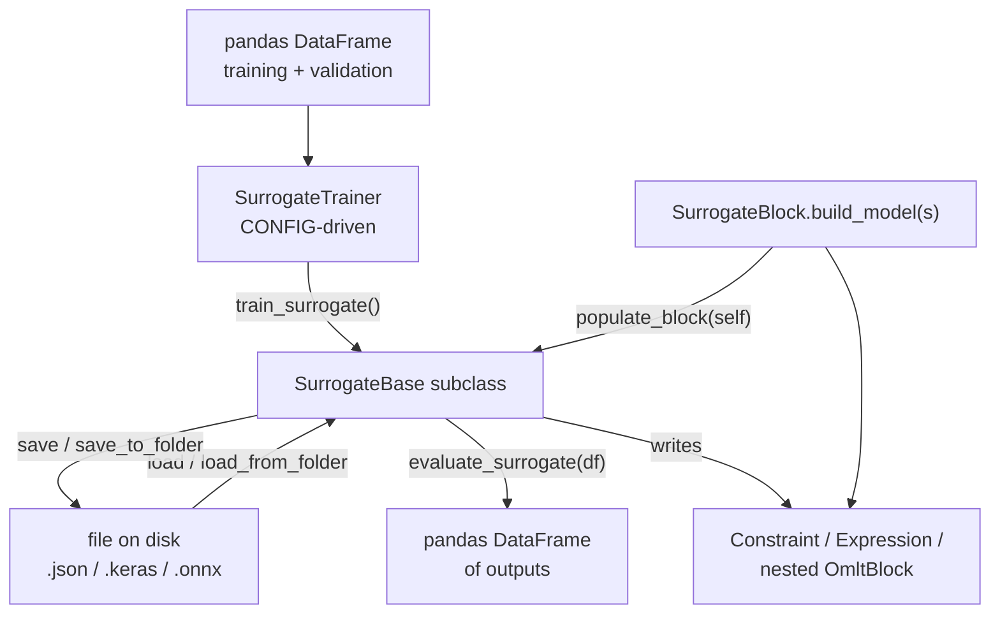
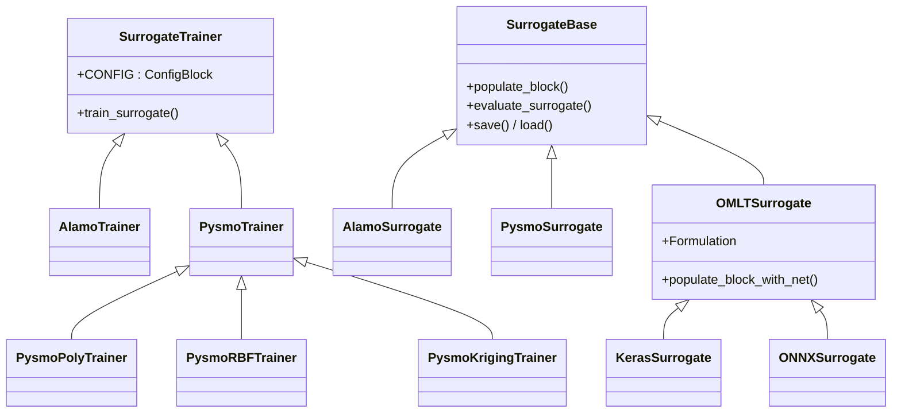
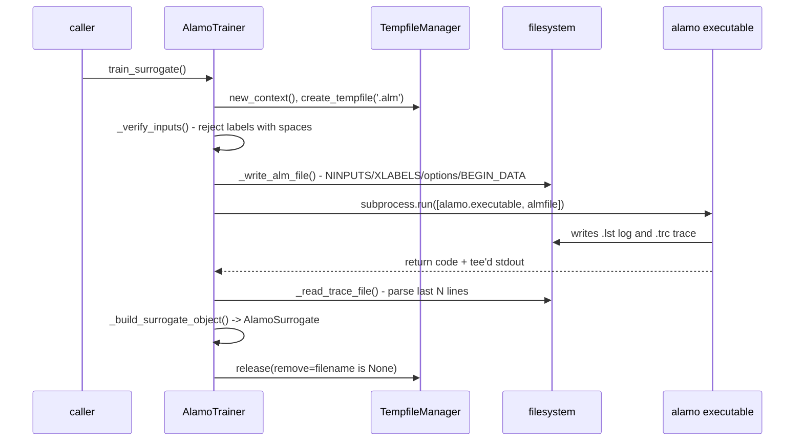

# 09 — Surrogate subsystem

> **Doc ID** 09 · **Repo SHA** 70a8f4fe1 (IDAES-PSE v2.13.0rc0) · **Source roots** `idaes/core/surrogate/**`
> **Owns** 21 modules / 10,275 LOC · **Assets** none owned; 24 shipped test fixtures inventoried in [28](28_data_and_file_format_inventory.md) · **Siblings** [03](03_block_hierarchy_and_construction_protocol.md), [28](28_data_and_file_format_inventory.md), [30](30_numerics_and_solver_interface_map.md), [31](31_extension_point_catalog.md), [32](32_repository_engineering.md)

A surrogate replaces a costly model with an algebraic one fitted to data. This
subsystem defines the one interface every such model presents to a Pyomo
flowsheet, four backends that produce models behind that interface, and the
Pyomo Block that turns any of them into variables and constraints. It is the
only part of `idaes/core` that drives an external executable, the only part that
calls `pickle`, and the part with the widest external-artifact surface in the
tree.

---

## 0. Scope and source map

| File | LOC | Purpose | Covered in § |
|---|---:|---|---|
| `idaes/core/surrogate/__init__.py` | 16 | Re-exports the four ALAMO names and nothing else | 2 |
| `idaes/core/surrogate/base/__init__.py` | 0 | Empty package marker | 2 |
| `idaes/core/surrogate/base/surrogate_base.py` | 398 | `SurrogateTrainer` and `SurrogateBase` — the contract every backend implements | 3, 4, 7, 9 |
| `idaes/core/surrogate/surrogate_block.py` | 248 | `SurrogateBlockData`/`SurrogateBlock` — the Pyomo Block that hosts a surrogate | 3, 5, 6, 7, 12 |
| `idaes/core/surrogate/alamopy.py` | 1,346 | `AlamoTrainer`, `AlamoSurrogate`, `Modelers`, `Screener`; drives the ALAMO executable | 3, 4, 5, 7, 10, 11 |
| `idaes/core/surrogate/pysmo_surrogate.py` | 884 | The four PySMO trainers, `PysmoSurrogate`, and the bespoke JSON codec | 3, 4, 5, 7, 10 |
| `idaes/core/surrogate/omlt_base_surrogate_class.py` | 189 | `OMLTSurrogate` — shared scaling and block population for the OMLT backends | 3, 5, 7, 10 |
| `idaes/core/surrogate/keras_surrogate.py` | 240 | `KerasSurrogate`; folder-based persistence plus the JSON/HDF5 helpers | 3, 5, 7, 10, 12 |
| `idaes/core/surrogate/onnx_surrogate.py` | 249 | `ONNXSurrogate`; `.onnx` plus a JSON sidecar | 3, 5, 7, 10, 12 |
| `idaes/core/surrogate/metrics.py` | 62 | `compute_fit_metrics` — six goodness-of-fit statistics per output | 7 |
| `idaes/core/surrogate/sampling/__init__.py` | 20 | Re-exports the three dataframe splitters | 2 |
| `idaes/core/surrogate/sampling/data_utils.py` | 98 | `split_dataframe` and its two named wrappers | 7 |
| `idaes/core/surrogate/sampling/scaling.py` | 168 | `OffsetScaler` — the only scaler the OMLT backends accept | 3, 6, 7 |
| `idaes/core/surrogate/plotting/__init__.py` | 0 | Empty package marker | 2 |
| `idaes/core/surrogate/plotting/sm_plotter.py` | 350 | Scatter, parity and residual plots against a surrogate | 7, 10 |
| `idaes/core/surrogate/pysmo/__init__.py` | 0 | Empty package marker | 2 |
| `idaes/core/surrogate/pysmo/sampling.py` | 1,826 | `SamplingMethods` and six design-of-experiments classes; `FeatureScaling` | 3, 7, 12 |
| `idaes/core/surrogate/pysmo/polynomial_regression.py` | 1,865 | `PolynomialRegression` — the vendored polynomial fitter | 3, 7, 10, 12 |
| `idaes/core/surrogate/pysmo/radial_basis_function.py` | 1,381 | `RadialBasisFunctions` — the vendored RBF fitter | 3, 7, 10, 12 |
| `idaes/core/surrogate/pysmo/kriging.py` | 835 | `KrigingModel` and `MyBounds` — the vendored kriging fitter | 3, 7, 10, 12 |
| `idaes/core/surrogate/pysmo/utils.py` | 100 | `NumpyEvaluator` — evaluates a Pyomo expression tree with numpy arrays | 3, 7 |

Total 10,275 LOC, 59 configuration keys, 8 `NotImplementedError` hooks, 4
enumerations, 38 classes, none declared by `declare_process_block_class`.

---

## 1. Architectural role

The subsystem is organised around one seam. A **trainer** consumes a pandas
DataFrame and produces a **surrogate object**; a surrogate object knows how to
evaluate itself on a DataFrame, how to write itself onto a Pyomo Block, and how
to serialize itself to and from a stream. `SurrogateTrainer`
(`idaes/core/surrogate/base/surrogate_base.py:20`) and `SurrogateBase`
(`idaes/core/surrogate/base/surrogate_base.py:203`) declare exactly that, and
nothing else. Neither is a process block; neither carries units of measurement;
neither knows about time.

Four backends sit behind the seam. **ALAMO** writes an input file, runs a
commercial executable through `subprocess.run`, and parses a trace file back
into symbolic expression strings (`idaes/core/surrogate/alamopy.py:149`).
**PySMO** is a fitting library vendored into the tree under
`idaes/core/surrogate/pysmo/` and wrapped by
`idaes/core/surrogate/pysmo_surrogate.py:162`. **Keras** and **ONNX** models are
imported from files and turned into constraints by OMLT
(`idaes/core/surrogate/omlt_base_surrogate_class.py:37`) rather than trained
here: ALAMO and PySMO ship trainers, Keras and ONNX ship only surrogate objects.

`SurrogateBlockData` (`idaes/core/surrogate/surrogate_block.py:29`) is the sole
consumer of the surrogate side of the seam inside the library. It creates or
adopts the input and output variables, narrows their bounds to the surrogate's
validity range, and hands itself to `populate_block`. What appears on the block
afterwards — a `Constraint`, an `Expression`, or a nested OMLT block — is the
backend's choice, not the block's.

*Every backend enters the flowsheet through the same two calls — `populate_block` for the equations, `evaluate_surrogate` for numbers — and every backend chooses its own file format on the way in and out.*

---

## 2. Public surface inventory

| Symbol | Kind | Declared at | Exported via | Stability signal |
|---|---|---|---|---|
| `SurrogateTrainer` | class | `idaes/core/surrogate/base/surrogate_base.py:20` | module path only | no underscore; not autodoc'd |
| `SurrogateBase` | class | `idaes/core/surrogate/base/surrogate_base.py:203` | module path only | no underscore; not autodoc'd |
| `SurrogateBlockData` | class | `idaes/core/surrogate/surrogate_block.py:29` | module path only | decorated by Pyomo's `declare_custom_block` |
| `SurrogateBlock` | class | synthesized at `idaes/core/surrogate/surrogate_block.py:28` | module path only | generated by the decorator |
| `AlamoTrainer` | class | `idaes/core/surrogate/alamopy.py:149` | `idaes.core.surrogate` | re-exported at `:16` |
| `AlamoSurrogate` | class | `idaes/core/surrogate/alamopy.py:1195` | `idaes.core.surrogate` | re-exported at `:16` |
| `Modelers` | enum | `idaes/core/surrogate/alamopy.py:49` | `idaes.core.surrogate` | re-exported at `:16` |
| `Screener` | enum | `idaes/core/surrogate/alamopy.py:64` | `idaes.core.surrogate` | re-exported at `:16` |
| `PysmoTrainer` | class | `idaes/core/surrogate/pysmo_surrogate.py:162` | module path only | no underscore |
| `PysmoPolyTrainer` | class | `idaes/core/surrogate/pysmo_surrogate.py:232` | module path only | documented in `docs/` prose |
| `PysmoRBFTrainer` | class | `idaes/core/surrogate/pysmo_surrogate.py:360` | module path only | documented in `docs/` prose |
| `PysmoKrigingTrainer` | class | `idaes/core/surrogate/pysmo_surrogate.py:422` | module path only | documented in `docs/` prose |
| `PysmoSurrogate` | class | `idaes/core/surrogate/pysmo_surrogate.py:472` | module path only | no underscore |
| `PysmoTrainedSurrogate` | class | `idaes/core/surrogate/pysmo_surrogate.py:104` | module path only | no underscore |
| `PysmoSurrogateTrainingResult` | class | `idaes/core/surrogate/pysmo_surrogate.py:55` | module path only | docstring names it internal |
| `TrainedSurrogateEncoder` | class | `idaes/core/surrogate/pysmo_surrogate.py:602` | module path only | no underscore |
| `TrainedSurrogateDecoder` | class | `idaes/core/surrogate/pysmo_surrogate.py:698` | module path only | no underscore |
| `OMLTSurrogate` | class | `idaes/core/surrogate/omlt_base_surrogate_class.py:37` | module path only | no underscore |
| `KerasSurrogate` | class | `idaes/core/surrogate/keras_surrogate.py:48` | module path only | auto-skipped by `idaes/conftest.py:367` |
| `save_keras_json_hd5` | function | `idaes/core/surrogate/keras_surrogate.py:229` | module path only | used by a test fixture generator |
| `load_keras_json_hd5` | function | `idaes/core/surrogate/keras_surrogate.py:237` | module path only | no underscore |
| `ONNXSurrogate` | class | `idaes/core/surrogate/onnx_surrogate.py:47` | module path only | no underscore |
| `compute_fit_metrics` | function | `idaes/core/surrogate/metrics.py:17` | module path only | no underscore |
| `split_training_validation` | function | `idaes/core/surrogate/sampling/data_utils.py:20` | `idaes.core.surrogate.sampling` | re-exported at `:16` |
| `split_training_validation_testing` | function | `idaes/core/surrogate/sampling/data_utils.py:40` | `idaes.core.surrogate.sampling` | re-exported at `:16` |
| `split_dataframe` | function | `idaes/core/surrogate/sampling/data_utils.py:67` | `idaes.core.surrogate.sampling` | re-exported at `:16` |
| `OffsetScaler` | class | `idaes/core/surrogate/sampling/scaling.py:20` | module path only | no underscore |
| `surrogate_scatter2D` | function | `idaes/core/surrogate/plotting/sm_plotter.py:32` | module path only | autodoc'd via `automodule` |
| `surrogate_scatter3D` | function | `idaes/core/surrogate/plotting/sm_plotter.py:112` | module path only | autodoc'd via `automodule` |
| `surrogate_parity` | function | `idaes/core/surrogate/plotting/sm_plotter.py:203` | module path only | autodoc'd via `automodule` |
| `surrogate_residual` | function | `idaes/core/surrogate/plotting/sm_plotter.py:274` | module path only | autodoc'd via `automodule` |
| `SamplingMethods` | class | `idaes/core/surrogate/pysmo/sampling.py:123` | module path only | base of the six samplers |
| `LatinHypercubeSampling`, `UniformSampling`, `HaltonSampling`, `HammersleySampling`, `CVTSampling`, `CustomSampling` | classes | `idaes/core/surrogate/pysmo/sampling.py:460`, `:706`, `:888`, `:1072`, `:1261`, `:1581` | module path only | one `autoclass` directive each in `docs/`; `UniformSampling` also used by `parameter_sweep` |
| `FeatureScaling` | class | three declarations, section 12 | module path only | name collision inside the package |
| `PolynomialRegression` | class | `idaes/core/surrogate/pysmo/polynomial_regression.py:155` | module path only | no underscore |
| `RadialBasisFunctions` | class | `idaes/core/surrogate/pysmo/radial_basis_function.py:157` | module path only | no underscore |
| `KrigingModel` | class | `idaes/core/surrogate/pysmo/kriging.py:59` | module path only | no underscore |
| `MyBounds` | class | `idaes/core/surrogate/pysmo/kriging.py:36` | module path only | basinhopping acceptance test |
| `NumpyEvaluator` | class | `idaes/core/surrogate/pysmo/utils.py:63` | module path only | no underscore |

`idaes/core/surrogate/__init__.py:16` imports four names and no others: `from
idaes.core.surrogate import AlamoSurrogate` succeeds while the same form for
`PysmoSurrogate` fails, and every other symbol is reached by its module path.

---

## 3. Class hierarchy and type taxonomy

*Two shallow trees, one per side of the seam; only PySMO and OMLT add an intermediate layer, and only PySMO ships more than one concrete trainer.*

| Class | Base(s) | Declared at | Decorator | Container class | Key overrides |
|---|---|---|---|---|---|
| `SurrogateTrainer` | `object` | `idaes/core/surrogate/base/surrogate_base.py:20` | none | — | — |
| `SurrogateBase` | none | `idaes/core/surrogate/base/surrogate_base.py:203` | none | — | — |
| `SurrogateBlockData` | `BlockData` | `idaes/core/surrogate/surrogate_block.py:29` | `@declare_custom_block(name="SurrogateBlock")` | `SurrogateBlock` | `__init__` |
| `AlamoTrainer` | `SurrogateTrainer` | `idaes/core/surrogate/alamopy.py:149` | none | — | `__init__`, `train_surrogate` |
| `AlamoSurrogate` | `SurrogateBase` | `idaes/core/surrogate/alamopy.py:1195` | none | — | `evaluate_surrogate`, `populate_block`, `save`, `load` |
| `PysmoTrainer` | `SurrogateTrainer` | `idaes/core/surrogate/pysmo_surrogate.py:162` | none | — | `train_surrogate`, `_create_model` hook |
| `PysmoPolyTrainer` | `PysmoTrainer` | `idaes/core/surrogate/pysmo_surrogate.py:232` | none | — | `_create_model`, `_get_metrics`, `get_confidence_intervals` |
| `PysmoRBFTrainer` | `PysmoTrainer` | `idaes/core/surrogate/pysmo_surrogate.py:360` | none | — | `__init__`, `_create_model`, `_get_metrics` |
| `PysmoKrigingTrainer` | `PysmoTrainer` | `idaes/core/surrogate/pysmo_surrogate.py:422` | none | — | `_create_model`, `_get_metrics` |
| `PysmoSurrogate` | `SurrogateBase` | `idaes/core/surrogate/pysmo_surrogate.py:472` | none | — | all four contract methods |
| `PysmoTrainedSurrogate` | none | `idaes/core/surrogate/pysmo_surrogate.py:104` | none | — | container of per-output results |
| `PysmoSurrogateTrainingResult` | none | `idaes/core/surrogate/pysmo_surrogate.py:55` | none | — | `model` property with a side effect |
| `TSEBase` | none | `idaes/core/surrogate/pysmo_surrogate.py:590` | none | — | eight JSON key constants |
| `TrainedSurrogateEncoder` | `JSONEncoder`, `TSEBase` | `idaes/core/surrogate/pysmo_surrogate.py:602` | none | — | `default` |
| `TrainedSurrogateDecoder` | `TSEBase` | `idaes/core/surrogate/pysmo_surrogate.py:698` | none | — | `decode_pairs` |
| `OMLTSurrogate` | `SurrogateBase` | `idaes/core/surrogate/omlt_base_surrogate_class.py:37` | none | — | `__init__`, plus two shared helpers |
| `KerasSurrogate` | `OMLTSurrogate` | `idaes/core/surrogate/keras_surrogate.py:48` | none | — | `populate_block`, `evaluate_surrogate` |
| `ONNXSurrogate` | `OMLTSurrogate` | `idaes/core/surrogate/onnx_surrogate.py:47` | none | — | `populate_block`, `evaluate_surrogate` |
| `OffsetScaler` | `object` | `idaes/core/surrogate/sampling/scaling.py:20` | none | — | — |
| `SamplingMethods` | none | `idaes/core/surrogate/pysmo/sampling.py:123` | none | — | eight shared helpers |
| the six sampling classes | `SamplingMethods` | `idaes/core/surrogate/pysmo/sampling.py:460`–`:1581` | none | — | `sample_points`; `CVTSampling` adds four static helpers, `CustomSampling` adds `generate_from_dist` |
| `PolynomialRegression` | none | `idaes/core/surrogate/pysmo/polynomial_regression.py:155` | none | — | 27 methods |
| `RadialBasisFunctions` | none | `idaes/core/surrogate/pysmo/radial_basis_function.py:157` | none | — | 28 methods |
| `KrigingModel` | none | `idaes/core/surrogate/pysmo/kriging.py:59` | none | — | 23 methods |
| `MyBounds` | `object` | `idaes/core/surrogate/pysmo/kriging.py:36` | none | — | `__call__` |
| `NumpyEvaluator` | `StreamBasedExpressionVisitor` | `idaes/core/surrogate/pysmo/utils.py:63` | none | — | `exitNode`, `beforeChild` |

### 3.1 `SurrogateBlock` is the tree's only `declare_custom_block`

Every other block-shaped class in IDAES is declared with
`declare_process_block_class` and inherits `ProcessBlockData`
(see [03 §3.1](03_block_hierarchy_and_construction_protocol.md#31-the-generated-types)).
`SurrogateBlockData` is not. It subclasses Pyomo's `BlockData` directly and is
decorated with Pyomo's own `declare_custom_block`
(`idaes/core/surrogate/surrogate_block.py:28`), imported from
`pyomo.core.base.block` at `idaes/core/surrogate/surrogate_block.py:19`. A
repository-wide search finds `declare_custom_block` at exactly those two lines
and nowhere else.

The observable consequences are in section 12. Structurally,
`SurrogateBlockData` has no `CONFIG` block, no `build()` method, no
`flowsheet()` lookup and no `dynamic`/`has_holdup` resolution: construction is a
plain Pyomo Block construction followed by an explicit `build_model` call.

### 3.2 Enumerations

`Modelers` (`idaes/core/surrogate/alamopy.py:49`) — the fitness metric ALAMO
optimises. The integer values are the values ALAMO's own input file expects, so
they are written through unchanged by the writer at
`idaes/core/surrogate/alamopy.py:895`.

| Member | Value | Meaning | Consumed at |
|---|---|---|---|
| `BIC` (1), `MallowsCp` (2), `AICc` (3), `HQC` (4), `MSE` (5), `RIC` (7) | as shown | Bayesian information criterion, Mallows' Cp, corrected Akaike, Hannan-Quinn, mean squared error, risk inflation criterion | `alamopy.py:315` |
| `SSEP` (6), `MADp` (8) | as shown | Sum of squared errors and maximum absolute deviation, each with a convex penalty read from `convpen` | `alamopy.py:348` |

`Screener` (`idaes/core/surrogate/alamopy.py:64`): `none` (0), `lasso` (1),
`SIS` (2). The `lasso` member is the one `ncvf` applies to and `SIS` is the one
`sismult` applies to.

`OMLTSurrogate.Formulation` (`idaes/core/surrogate/omlt_base_surrogate_class.py:115`)
and `ONNXSurrogate.Formulation` (`idaes/core/surrogate/onnx_surrogate.py:93`)
are two separate enum classes with identical members and values: `FULL_SPACE`
(1), `REDUCED_SPACE` (2), `RELU_BIGM` (3), `RELU_COMPLEMENTARITY` (4). Each
selects one OMLT formulation object. `KerasSurrogate` inherits the first and
defaults to `FULL_SPACE` (`idaes/core/surrogate/keras_surrogate.py:108`);
`ONNXSurrogate` shadows it and defaults to `REDUCED_SPACE`
(`idaes/core/surrogate/onnx_surrogate.py:112`). Section 12 records the
consequence.

---

## 4. Configuration reference

59 keys across four declarations. `SurrogateTrainer.CONFIG`
(`idaes/core/surrogate/base/surrogate_base.py:25`) is an empty `ConfigBlock`;
every key below is added by a subclass. The five values a caller supplies most
often — `input_labels`, `output_labels`, `training_dataframe`,
`validation_dataframe`, `input_bounds` — are **constructor arguments**, not
CONFIG keys (`idaes/core/surrogate/base/surrogate_base.py:27`). Everything else
is collected into `**settings` and handed to `self.CONFIG(settings)` (`:63`), so
an unrecognised keyword raises from Pyomo rather than being dropped.

### 4.1 `AlamoTrainer.CONFIG`

`SurrogateTrainer.CONFIG()` extended at `idaes/core/surrogate/alamopy.py:169`
with 48 keys. 44 of them appear in the module-level `supported_options` list
(`idaes/core/surrogate/alamopy.py:74`) and are written verbatim into the `.alm`
file by the loop at `idaes/core/surrogate/alamopy.py:891`; the remaining four
govern file handling and never reach ALAMO. No key is required.

| Key | Domain / validator | Default | Req. | Effect on build | Anchor |
|---|---|---|---|---|---|
| `xfactor` | `ListOf(float)` | `None` | no | Written as an `XFACTOR` line | `:171` |
| `xscaling` | `Bool` | `None` | no | Written as an integer 0/1 | `:179` |
| `scalez` | `Bool` | `None` | no | Written as an integer 0/1 | `:190` |
| `monomialpower` | `ListOf(int, In(Reals - {0, 1}))` | `None` | no | Also emits a `MONO <len>` count line at `:881` | `:198` |
| `multi2power` | `ListOf(float)` | `None` | no | Also emits `MULTI2 <len>` at `:883` | `:209` |
| `multi3power` | `ListOf(float)` | `None` | no | Also emits `MULTI3 <len>` at `:885` | `:218` |
| `ratiopower` | `ListOf(float)` | `None` | no | Also emits `RATIOS <len>` at `:887` | `:227` |
| `constant` | `Bool` | `True` | no | Includes a constant basis function | `:236` |
| `linfcns` | `Bool` | `True` | no | Includes linear basis functions | `:244` |
| `expfcns` | `Bool` | `None` | no | Includes exponential basis functions | `:252` |
| `logfcns` | `Bool` | `None` | no | Includes logarithmic basis functions | `:260` |
| `sinfcns` | `Bool` | `None` | no | Includes sine basis functions | `:268` |
| `cosfcns` | `Bool` | `None` | no | Includes cosine basis functions | `:276` |
| `grbfcns` | `Bool` | `None` | no | Deprecated; a non-`None` value raises in `__init__` | `:284` |
| `rbfparam` | `float` | `None` | no | Deprecated; a non-`None` value raises in `__init__` | `:292` |
| `custom_basis_functions` | `ListOf(str)` | `None` | no | Emits `NCUSTOMBAS` and a `BEGIN_CUSTOMBAS` section at `:941` | `:301` |
| `modeler` | `In(Modelers)` | `None` | no | Written as the enum's integer value | `:315` |
| `builder` | `Bool` | `None` | no | Greedy forward model building | `:324` |
| `backstepper` | `Bool` | `None` | no | Greedy backward model building | `:338` |
| `convpen` | `float` | `None` | no | Convex penalty for `SSEP` and `MADp` | `:348` |
| `screener` | `In(Screener)` | `None` | no | Written as the enum's integer value | `:362` |
| `ncvf` | `int` | `None` | no | Cross-validation folds for the lasso screener | `:372` |
| `sismult` | `int` | `None` | no | Basis-function retention factor for the SIS screener | `:382` |
| `maxiter` | `int` | `None` | no | Iteration limit | `:395` |
| `maxtime` | `float` | `1000` | no | Wall-clock limit in seconds; always written | `:408` |
| `datalimitterms` | `Bool` | `None` | no | Caps model terms at the number of measurements | `:420` |
| `maxterms` | `ListOf(int)` | `None` | no | Per-output upper term count | `:433` |
| `minterms` | `ListOf(int)` | `None` | no | Per-output lower term count | `:444` |
| `numlimitbasis` | `Bool` | `True` | no | Eliminates infeasible basis functions; always written | `:455` |
| `exclude` | `ListOf(int)` | `None` | no | Input indices excluded from building | `:469` |
| `ignore` | `ListOf(int)` | `None` | no | Output indices ignored during building | `:483` |
| `xisint` | `ListOf(int)` | `None` | no | Inputs treated as integers | `:495` |
| `zisint` | `ListOf(int)` | `None` | no | Outputs treated as integers | `:506` |
| `tolrelmetric` | `ListOf(float)` | `None` | no | Per-output relative tolerance | `:519` |
| `tolabsmetric` | `ListOf(float)` | `None` | no | Per-output absolute tolerance | `:531` |
| `tolmeanerror` | `ListOf(float)` | `None` | no | Per-output mean-error convergence tolerance | `:543` |
| `tolsse` | `float` | `None` | no | Absolute tolerance on the sum of squared errors | `:555` |
| `mipoptca` | `float` | `None` | no | Absolute MIP gap | `:567` |
| `mipoptcr` | `float` | `None` | no | Relative MIP gap | `:573` |
| `linearerror` | `Bool` | `None` | no | Linear rather than squared objective in the MIP | `:579` |
| `GAMS` | `str` | `None` | no | Path to the GAMS executable ALAMO calls | `:589` |
| `GAMSSOLVER` | `str` | `None` | no | Name of the GAMS solver for the MIQP subproblems | `:598` |
| `solvemip` | `Bool` | `None` | no | Whether ALAMO solves a MIP at all | `:610` |
| `print_to_screen` | `Bool` | `None` | no | Sends ALAMO output to stdout | `:618` |
| `alamo_path` | `Path` | `None` | no | Overrides `alamo.executable` in `__init__` at `:685` | `:629` |
| `filename` | `str` | `None` | no | Names the `.alm` file; a non-`None` value also suppresses temp-file removal | `:635` |
| `working_directory` | `str` | `None` | no | Directory the subprocess runs in; `None` creates a temp dir | `:645` |
| `overwrite_files` | `Bool` | `False` | no | Permits an existing `.alm` file to be replaced | `:654` |

A key whose value is `None` produces no line in the `.alm` file, so ALAMO's own
defaults apply (`idaes/core/surrogate/alamopy.py:892`); `Bool` values are cast to
`int`, enums are written as their `.value`, and anything else is joined with
spaces (`:895`–`:905`).

### 4.2 `PysmoPolyTrainer.CONFIG`

`PysmoTrainer.CONFIG()` extended at `idaes/core/surrogate/pysmo_surrogate.py:243`.

| Key | Domain / validator | Default | Req. | Effect on build | Anchor |
|---|---|---|---|---|---|
| `maximum_polynomial_order` | `PositiveInt` | `None` | no | Highest univariate power offered to the fit | `:245` |
| `number_of_crossvalidations` | `PositiveInt` | `3` | no | Fits repeated per candidate order | `:254` |
| `training_split` | `PositiveFloat` | `0.8` | no | Fraction held back inside PySMO's own split | `:261` |
| `solution_method` | `In(['pyomo', 'mle', 'bfgs'])` | `None` | no | Selects the least-squares solver | `:270` |
| `multinomials` | `Bool` | `False` | no | Adds pairwise cross terms | `:279` |
| `extra_features` | `list` | `None` | no | Strings `eval`'d into extra regressors at `:310` | `:288` |

### 4.3 `PysmoRBFTrainer.CONFIG`

Declared at `idaes/core/surrogate/pysmo_surrogate.py:373`. This block is built
from `SurrogateTrainer.CONFIG()`, not from `PysmoTrainer.CONFIG()`; the two are
equivalent because `PysmoTrainer` adds no keys of its own.

| Key | Domain / validator | Default | Req. | Effect on build | Anchor |
|---|---|---|---|---|---|
| `basis_function` | `In(['linear', 'cubic', 'gaussian', 'mq', 'imq', 'spline'])` | `None` | no | Chooses the transformation, and prefixes `model_type` at `:405` | `:375` |
| `solution_method` | `In(['pyomo', 'algebraic', 'bfgs'])` | `None` | no | Selects the least-squares solver | `:384` |
| `regularization` | `Bool` | `None` | no | Regression rather than interpolation | `:393` |

### 4.4 `PysmoKrigingTrainer.CONFIG`

`PysmoTrainer.CONFIG()` extended at `idaes/core/surrogate/pysmo_surrogate.py:434`.

| Key | Domain / validator | Default | Req. | Effect on build | Anchor |
|---|---|---|---|---|---|
| `numerical_gradients` | `Bool` | `True` | no | `True` selects BFGS, `False` selects basinhopping | `:436` |
| `regularization` | `Bool` | `True` | no | Regression rather than interpolation | `:448` |

### 4.5 Options that are not CONFIG keys

Three further option surfaces exist and none of them is a `ConfigBlock`.

| Surface | Where it is read | Options |
|---|---|---|
| `SurrogateBlockData.build_model` keyword arguments | `idaes/core/surrogate/surrogate_block.py:65` | `input_vars`, `output_vars`, `use_surrogate_bounds`; everything else is forwarded as `additional_options` |
| `populate_block(additional_options=...)` | `idaes/core/surrogate/alamopy.py:1272`, `keras_surrogate.py:108`, `onnx_surrogate.py:112` | `as_expression` for ALAMO; `formulation` for Keras and ONNX |
| Vendored PySMO constructors | `polynomial_regression.py:190`, `radial_basis_function.py:194`, `kriging.py:86` | Plain keyword arguments including `fname` and `overwrite`, which control a pickle file rather than a CONFIG key |

---

## 5. Construction and call sequences

### 5.1 `SurrogateBlock.build_model`

`SurrogateBlockData.build_model(surrogate_object, input_vars=None, output_vars=None, use_surrogate_bounds=True, **kwargs)`
(`idaes/core/surrogate/surrogate_block.py:65`) runs four steps.

1. `_setup_inputs_outputs(...)` (`idaes/core/surrogate/surrogate_block.py:136`),
   called with the surrogate's own `n_inputs()`, `n_outputs()`,
   `input_labels()` and `output_labels()`. It either creates
   `inputs_set`/`inputs` (`:166`, `:167`) and `outputs_set`/`outputs` (`:192`,
   `:193`), or adopts the caller's variables through `_extract_var_data`
   (`idaes/core/surrogate/surrogate_block.py:245`).
2. Bound narrowing (`idaes/core/surrogate/surrogate_block.py:112`). When
   `use_surrogate_bounds` is true and the surrogate reports bounds, each input
   variable's lower bound becomes `max(surrogate_lb, existing_lb)` and its upper
   bound `min(surrogate_ub, existing_ub)`. The narrowing is one-directional: an
   existing bound is never widened.
3. `surrogate_object.populate_block(self, additional_options=kwargs)`
   (`idaes/core/surrogate/surrogate_block.py:126`). The block passes *itself*,
   so the backend reads variables back through `input_vars_as_dict`
   (`idaes/core/surrogate/surrogate_block.py:211`) and `output_vars_as_dict`
   (`idaes/core/surrogate/surrogate_block.py:218`).
4. Leftover-keyword check (`idaes/core/surrogate/surrogate_block.py:130`). Any
   key still present in `kwargs` after `populate_block` returns raises
   `ValueError`. This is why every backend uses `dict.pop` rather than
   `dict.get` to read its options.

`_extract_var_data_gen` (`idaes/core/surrogate/surrogate_block.py:226`) flattens
whatever was handed in: a scalar `Var` yields itself, an indexed `Var` yields its
values but only if its index set is ordered (`:232`), a `Sequence` recurses, and
anything else raises (`:242`) — the ordering requirement exists because the
surrogate matches variables to labels by position.

### 5.2 ALAMO training

*The trainer's contract with ALAMO is entirely file-mediated: three files in, two files out, and a return code.*

The numbered path through `train_surrogate`
(`idaes/core/surrogate/alamopy.py:689`):

1. `_get_files()` (`idaes/core/surrogate/alamopy.py:747`). Opens a
   `TempfileManager` context. With `filename` unset it creates a temporary
   `.alm`; with `filename` set it uses that path and raises `FileExistsError`
   (`:773`) unless `overwrite_files` is true. The trace path is the `.alm` path
   with its extension replaced by `.trc` (`:779`). The working directory is a
   temporary directory unless `working_directory` is set.
2. `_verify_inputs()` (`idaes/core/surrogate/alamopy.py:794`). Raises
   `ValueError` for a space anywhere in an input (`:802`) or output (`:808`)
   label, because ALAMO's input format is whitespace-delimited.
3. `_write_alm_file()` (`idaes/core/surrogate/alamopy.py:946`) opens the file and
   delegates to `_write_alm_to_stream` (`idaes/core/surrogate/alamopy.py:813`),
   which validates the input bounds first — a missing bound (`:841`), an equal
   pair (`:845`) or a reversed pair (`:850`) each raise `ConfigurationError`.
4. `_call_alamo()` (`idaes/core/surrogate/alamopy.py:964`). Raises
   `FileNotFoundError` when `alamo.executable` is `None` (`:977`), registers the
   `.lst` path with the tempfile context (`:995`), `chdir`s into the working
   directory, and runs `subprocess.run([alamo.executable, str(self._almfile)],
   check=False)` under a `TeeStream` that captures stdout and stderr into a
   `StringIO` while echoing to `sys.stdout` (`:999`); the `chdir` is reverted in
   a `finally` block (`:1022`).
5. `_read_trace_file()` (`:1033`), then `_populate_results()` (`:1141`) and
   `_build_surrogate_object()` (`:1153`), which builds the `AlamoSurrogate` from
   `trace["Model"]`.
6. `_remove_temp_files()` (`:1171`), in a `finally` block, releases the context
   with `remove=True` only when `filename` is `None`.

`train_surrogate` returns the triple `(success, AlamoSurrogate, message)`, where
`message` is the third-from-last line of the captured ALAMO log
(`idaes/core/surrogate/alamopy.py:738`).

### 5.3 Reading the ALAMO trace file

`_read_trace_file(trcfile, has_validation_data=False)`
(`idaes/core/surrogate/alamopy.py:1033`) treats the `.trc` file as a
comma-separated table whose first line is a `#`-prefixed header.

1. Header names in the module-level `common_trace` list
   (`idaes/core/surrogate/alamopy.py:131`) map to a single shared value; every
   other header maps to a dict keyed by output label (`:1064`).
2. ALAMO *appends* to an existing trace file, so only the last block of lines is
   read, with a stride of one line per output doubled when validation data is
   present (`:1076`).
3. Two substitutions convert Fortran syntax to Python: `^` becomes `**` and `=`
   becomes `==` (`:1089`, `:1091`).
4. Four consistency checks raise `RuntimeError`: a common-trace value differing
   between output lines (`:1102`), an `OUTPUT` index out of step with the loop
   (`:1114`), a `SET` value other than `0` (`:1122`), and a `Model` expression
   whose left-hand label does not match the output (`:1132`).

### 5.4 PySMO training

`PysmoTrainer.train_surrogate` (`idaes/core/surrogate/pysmo_surrogate.py:175`)
copies the label and bound metadata onto a `PysmoTrainedSurrogate` and calls
`_training_main_loop` (`idaes/core/surrogate/pysmo_surrogate.py:210`). That loop
trains **one model per output**:

1. Build a two-part DataFrame — all input columns plus the one output column —
   because the vendored fitters expect the response in the last column
   (`idaes/core/surrogate/pysmo_surrogate.py:212`).
2. `self._create_model(pysmo_input, output_label)`, the subclass hook, then
   `model.training()` on the vendored object.
3. Wrap it in a `PysmoSurrogateTrainingResult`
   (`idaes/core/surrogate/pysmo_surrogate.py:55`) and store it. Assigning
   `result.model` is not a plain attribute write: the property setter
   (`idaes/core/surrogate/pysmo_surrogate.py:78`) calls the model's
   `generate_expression` and caches the expression's `str` in `expression_str`.
4. Log an INFO line per output (`idaes/core/surrogate/pysmo_surrogate.py:229`).

The three `_create_model` implementations each construct one vendored object —
`PolynomialRegression` (`idaes/core/surrogate/pysmo_surrogate.py:298`),
`RadialBasisFunctions` (`:408`), `KrigingModel` (`:459`) — call
`get_feature_vector()` on it, and pass `overwrite=True`, which suppresses the
vendored pickle-file renaming logic.

The polynomial trainer additionally rewrites each `extra_features` string so
that a bare column name becomes an index into the feature `Param`, then `eval`s
it with `GLOBAL_FUNCS` as the globals dict
(`idaes/core/surrogate/pysmo_surrogate.py:321`). A failure anywhere in that
block is caught by a bare `except` and re-raised as
`ValueError("Additional features could not be constructed.")`
(`idaes/core/surrogate/pysmo_surrogate.py:326`).

### 5.5 OMLT block population

Both OMLT backends follow the same three steps, differing only in the loader
they call.

1. `generate_omlt_scaling_objecets`
   (`idaes/core/surrogate/omlt_base_surrogate_class.py:121`) converts the
   `OffsetScaler` pair into an OMLT `OffsetScaling` object (`:141`), defaulting
   to zero offsets and unit factors when no scaler is set, then re-keys the
   input bounds by integer and pushes them through
   `get_scaled_input_expressions` (`:150`), because OMLT works in scaled space.
2. The backend loads its network: `load_keras_sequential`
   (`idaes/core/surrogate/keras_surrogate.py:114`) or
   `load_onnx_neural_network` (`idaes/core/surrogate/onnx_surrogate.py:123`),
   then selects one of four formulation objects by enum member.
3. `populate_block_with_net`
   (`idaes/core/surrogate/omlt_base_surrogate_class.py:154`) attaches
   `block.nn = OmltBlock()` (`:164`), calls `build_formulation`, and then ties
   the block's own variables to OMLT's positionally indexed ones with two
   `Constraint` declarations: `input_surrogate_ties`
   (`idaes/core/surrogate/omlt_base_surrogate_class.py:175`) and
   `output_surrogate_ties`
   (`idaes/core/surrogate/omlt_base_surrogate_class.py:185`).

### 5.6 Persistence round-trips

| Backend | Write entry point | Read entry point | On-disk shape |
|---|---|---|---|
| ALAMO | `save` / `save_to_file` | `load` / `load_from_file` | one JSON object: `surrogate`, `input_labels`, `output_labels`, `input_bounds` (`alamopy.py:1298`) |
| PySMO | `save` / `save_to_file` | `load` / `load_from_file` | one JSON object produced by `TrainedSurrogateEncoder` (`pysmo_surrogate.py:545`) |
| Keras | `save_to_folder` | `load_from_folder` | a directory holding `<name>.keras` and `idaes_info.json` (`keras_surrogate.py:171`, `:187`) |
| ONNX | `save_to_folder` | `load_onnx_model` | `<name>.onnx` and `<name>_idaes_info.json` in a directory (`onnx_surrogate.py:173`, `:191`) |

`save_to_file` (`idaes/core/surrogate/base/surrogate_base.py:334`) opens with
mode `"x"` unless `overwrite` is true, so a second save to the same path raises
`FileExistsError` from the standard library rather than from IDAES;
`load_from_file` (`:369`) opens in text mode `"r"`, which is why the two
folder-based backends cannot use it. `PysmoSurrogate.load`
(`idaes/core/surrogate/pysmo_surrogate.py:558`) calls `stream.seek(0)` before
reading and catches `JSONDecodeError`, logging it and returning `None` rather
than propagating (`:582`).

### 5.7 The PySMO JSON codec

`TrainedSurrogateEncoder` (`idaes/core/surrogate/pysmo_surrogate.py:602`) is a
`JSONEncoder` subclass whose `default` (`:638`) recognises exactly one type,
`PysmoTrainedSurrogate`. It emits five top-level keys, named by the constants on
`TSEBase` (`idaes/core/surrogate/pysmo_surrogate.py:590`): `model_encoding`,
`input_labels`, `output_labels`, `input_bounds` and `surrogate_type`.

Per model, `_encode_model` (`idaes/core/surrogate/pysmo_surrogate.py:659`) walks
`vars(model)` and keeps only names present in the 33-entry `attrs` set
(`idaes/core/surrogate/pysmo_surrogate.py:604`). Each surviving value goes
through `_encode_attr` (`idaes/core/surrogate/pysmo_surrogate.py:672`), which
returns a `(payload, tag)` pair: a numpy array becomes `tolist()` tagged
`"numpy"`; a pandas `Series` or `DataFrame` becomes `to_json(orient="index")`
tagged `"pandas"`; a Pyomo `Param`, `ParamData` or NPV product or division
becomes `to_json(value, return_dict=True)` tagged `"pyomo"`; a list of Pyomo
values becomes strings tagged `"other"`; any other list becomes strings tagged
`"list"`; anything else passes through tagged `"str"`. The two halves are stored
as parallel dicts under `attr` and `map`
(`idaes/core/surrogate/pysmo_surrogate.py:669`), so the decoder knows which hook
to apply to each field.

`TrainedSurrogateDecoder.decode_pairs`
(`idaes/core/surrogate/pysmo_surrogate.py:704`) is installed as
`object_pairs_hook`, so it runs on every JSON object encountered, not only the
outermost. It detects the outer level by the presence of `model_encoding`
(`:724`) and returns the plain dict otherwise. It converts each `input_bounds`
list back into a tuple (`:719`), then dispatches on the last whitespace-separated
word of `surrogate_type` (`:734`) — which is why the RBF `model_type` string
`"gaussian rbf"` resolves to `_decode_rbf_model`. A payload with no
`surrogate_type` (`:728`) or an unknown one (`:738`) raises `JSONDecodeError`.

The three decoders share a shape
(`idaes/core/surrogate/pysmo_surrogate.py:761`, `:824`, `:847`): construct the
vendored object from a ten-row dummy DataFrame of columns `x` and `y`, `setattr`
every saved attribute through `decoders.get(tag, null_decode)` (`:884`), rebuild
a mutable Pyomo `Param` over the saved column list as the feature vector, then
`delattr` every attribute the constructor created that the payload did not
carry. The hooks are `numpy_decode` (`:876`, `np.array`), `pd_decode` (`:872`,
`pd.read_json(orient="index")`) and `null_decode` (`:880`, identity). The
polynomial decoder adds `_poly_decode_vars` (`:810`), which rewrites saved
expression strings so bare variable names become `p["name"]` subscripts before
each is `eval`'d against `GLOBAL_FUNCS` (`:798`).

---

## 6. Data structures, variables, constraints and invariants

### 6.1 Components created on a `SurrogateBlock`

| Component | Type | Index sets | Units | Created at | Condition |
|---|---|---|---|---|---|
| `inputs_set` | `Set`, ordered | — | — | `surrogate_block.py:166` | `input_vars` is `None` |
| `inputs` | `Var`, `initialize=0` | `inputs_set` | none | `surrogate_block.py:167` | `input_vars` is `None` |
| `outputs_set` | `Set`, ordered | — | — | `surrogate_block.py:192` | `output_vars` is `None` |
| `outputs` | `Var`, `initialize=0` | `outputs_set` | none | `surrogate_block.py:193` | `output_vars` is `None` |
| `alamo_constraint` | `Constraint` | output labels | none | `alamopy.py:1285` | ALAMO, `as_expression` false |
| `alamo_expression` | `Expression` | output labels | none | `alamopy.py:1296` | ALAMO, `as_expression` true |
| `pysmo_constraint` | `Constraint` | output labels | none | `pysmo_surrogate.py:543` | PySMO, always |
| `nn` | `OmltBlock` | — | — | `omlt_base_surrogate_class.py:164` | Keras or ONNX |
| `input_surrogate_ties` | `Constraint` | input labels | none | `omlt_base_surrogate_class.py:175` | Keras or ONNX |
| `output_surrogate_ties` | `Constraint` | output labels | none | `omlt_base_surrogate_class.py:185` | Keras or ONNX |

No component in this subsystem carries a Pyomo unit of measurement: a surrogate
is fitted to bare numbers in whatever units the training DataFrame used, the
labels are the only record of that choice, and any conversion is the caller's.

### 6.2 Non-Pyomo data structures

| Structure | Fields | Declared at |
|---|---|---|
| `SurrogateTrainer` state | `_input_labels`, `_output_labels`, `_training_dataframe`, `_validation_dataframe`, `_input_bounds`, `config` | `surrogate_base.py:78`–`:138` |
| `SurrogateBase` state | `_input_labels`, `_output_labels`, `_input_bounds` | `surrogate_base.py:225` |
| `AlamoTrainer` state | `_temp_context`, `_almfile`, `_trcfile`, `_wrkdir`, `_results`; `PysmoSurrogateTrainingResult` carries `metrics`, `_model`, `expression_str` | `alamopy.py:679`, `pysmo_surrogate.py:67` |
| `AlamoSurrogate` state | `_surrogate_expressions` (label to string), `_fcn` (lazy lambda cache) | `alamopy.py:1209` |
| `PysmoTrainedSurrogate` | `_data`, `model_type`, `num_outputs`, `output_labels`, `input_labels`, `input_bounds` | `pysmo_surrogate.py:120` |
| `OffsetScaler` | `_expected_columns`, `_offset` (Series), `_factor` (Series) | `scaling.py:71` |
| ALAMO trace dict | header name to value, or header name to per-output dict | `alamopy.py:1063` |

### 6.3 Invariants

| Invariant | Enforced at |
|---|---|
| At least one input label and one output label | `surrogate_base.py:72`, and again at `surrogate_block.py:131` |
| Input and output label sets are disjoint | `surrogate_base.py:85` (trainer), `:233` (surrogate) |
| Every label names a column of the training DataFrame | `surrogate_base.py:96`, `:110` |
| Every label names a column of the validation DataFrame, when one is given | `surrogate_base.py:103`, `:118` |
| `input_bounds` keys equal the input labels | `surrogate_base.py:127` (trainer), `:241` (surrogate) |
| Absent `input_bounds`, bounds come from the training data extremes | `surrogate_base.py:136` |
| Label count matches variable count on a `SurrogateBlock` | `surrogate_block.py:146`, `:173`, `:184`, `:199` |
| An indexed `Var` handed to `build_model` is indexed by an ordered set | `surrogate_block.py:232` |
| No unconsumed keyword argument survives `populate_block` | `surrogate_block.py:130` |
| ALAMO labels contain no spaces | `alamopy.py:802`, `:808` |
| ALAMO input bounds exist, differ, and are correctly ordered | `alamopy.py:841`, `:845`, `:850` |
| An ALAMO trace row's model label matches its output label | `alamopy.py:1132` |
| An `OffsetScaler`'s series indices equal its expected columns | `scaling.py:74`, `:79` |
| A DataFrame handed to `scale`/`unscale` has exactly the expected columns | `scaling.py:85` |
| An OMLT scaler is an `OffsetScaler` and its columns match the labels | `omlt_base_surrogate_class.py:85`, `:89`, `:103` |
| `split_dataframe` fractions sum to less than one | `data_utils.py:84`, an `assert` |

---

## 7. Method contracts

### 7.1 `SurrogateTrainer` and `SurrogateBase`

| Method | Signature | Preconditions | Effects | Returns | Raises | Anchor |
|---|---|---|---|---|---|---|
| `SurrogateTrainer.__init__` | `(self, input_labels, output_labels, training_dataframe, validation_dataframe=None, input_bounds=None, **settings)` | labels non-empty and disjoint | Resolves `self.config`, stores frames, derives bounds | `None` | `ValueError` ×7 | `:27` |
| `n_inputs` / `n_outputs` | `(self)` | — | none | `int` | — | `:140`, `:148` |
| `input_labels` / `output_labels` | `(self)` | — | none | new `list` | — | `:156`, `:164` |
| `input_bounds` | `(self)` | — | none | new `dict`, or `None` when empty | — | `:172` |
| `train_surrogate` | `(self)` | — | subclass-defined | `(bool, SurrogateBase, str)` | `NotImplementedError` | `:183` |
| `SurrogateBase.__init__` | `(self, input_labels=None, output_labels=None, input_bounds=None)` | labels disjoint | Stores labels and bounds | `None` | `ValueError` ×2 | `:208` |
| `populate_block` | `(self, block, additional_options=None)` | block exposes the two `*_vars_as_dict` methods | subclass-defined | `None` | `NotImplementedError` | `:292` |
| `evaluate_surrogate` | `(self, dataframe)` | frame has every input column | none | output `DataFrame`, same index | `NotImplementedError` | `:312` |
| `save_to_file` | `(self, filename, overwrite=False)` | — | Opens `"x"` or `"w"`, delegates to `save` | `None` | `FileExistsError` | `:334` |
| `save` | `(self, strm)` | — | subclass-defined | `None` | `NotImplementedError` | `:353` |
| `load_from_file` | `(cls, filename)` | file is text | Opens `"r"`, delegates to `load` | instance | `OSError` | `:369` |
| `load` | `(cls, strm)` | — | subclass-defined | instance or `None` | `NotImplementedError` | `:383` |

### 7.2 `SurrogateBlockData`

| Method | Signature | Effects | Raises | Anchor |
|---|---|---|---|---|
| `__init__` | `(self, component)` | Delegates to `BlockData.__init__` | — | `:31` |
| `build_model` | `(self, surrogate_object, input_vars=None, output_vars=None, use_surrogate_bounds=True, **kwargs)` | Creates or adopts variables, narrows bounds, populates | `ValueError` | `:65` |
| `_setup_inputs_outputs` | `(self, n_inputs, n_outputs, input_vars=None, input_labels=None, output_vars=None, output_labels=None)` | Creates `inputs`/`outputs` or extracts `VarData` | `ValueError` ×6 | `:136` |
| `_input_vars_as_list` / `_output_vars_as_list` | `(self)` | none | — | `:205`, `:208` |
| `input_vars_as_dict` / `output_vars_as_dict` | `(self)` | none | — | `:211`, `:218` |
| `_extract_var_data_gen` | `(_vars)` | Generator over `VarData` | `ValueError` ×2 | `:226` |
| `_extract_var_data` | `(_vars)` | Materialises the generator | propagates | `:245` |

Labels default to `list(range(n))` when none are supplied
(`idaes/core/surrogate/surrogate_block.py:154`, `:180`), so a `SurrogateBlock`
built without labels is keyed by integers.

### 7.3 `AlamoTrainer` and `AlamoSurrogate`

| Method | Signature | Effects | Raises | Anchor |
|---|---|---|---|---|
| `AlamoTrainer.__init__` | `(self, **settings)` | Rejects the deprecated RBF options, sets `alamo.executable` | `ConfigurationError` | `:668` |
| `train_surrogate` | `(self)` | The full seven-step workflow | propagates | `:689` |
| `get_alamo_results` | `(self)` | none | — | `:743` |
| `_get_files` | `(self)` | Opens a tempfile context; fixes `.alm`, `.trc`, working dir | `FileExistsError` | `:747` |
| `_verify_inputs` | `(self)` | none | `ValueError` | `:794` |
| `_write_alm_to_stream` | `(self, stream, trace_fname=None, training_data=None, validation_data=None)` | Writes the whole `.alm` body | `ConfigurationError` | `:813` |
| `_write_alm_file` | `(self, training_data=None, validation_data=None)` | Opens the file and delegates | propagates | `:946` |
| `_call_alamo` | `(self)` | Runs the subprocess, captures output | `FileNotFoundError`, `OSError` | `:964` |
| `_read_trace_file` | `(self, trcfile, has_validation_data=False)` | none | `FileNotFoundError`, `RuntimeError` ×4 | `:1033` |
| `_populate_results` / `_build_surrogate_object` | `(self, trace_dict)` / `(self)` | Sets `self._results`; constructs the `AlamoSurrogate` from `trace["Model"]` | — | `:1141`, `:1153` |
| `_remove_temp_files` | `(self)` | Releases the tempfile context | — | `:1171` |
| `AlamoSurrogate.evaluate_surrogate` | `(self, inputs)` | Builds and caches one lambda per output, then loops rows | propagates from `eval` | `:1211` |
| `AlamoSurrogate.populate_block` | `(self, block, additional_options=None)` | `alamo_constraint` or `alamo_expression` | — | `:1251` |
| `AlamoSurrogate.save` | `(self, strm)` | `json.dump` of four keys | — | `:1298` |
| `AlamoSurrogate.load` | `(cls, strm)` | `json.load`, converts bound lists to tuples | `KeyError` | `:1319` |

`evaluate_surrogate` compiles each ALAMO expression string into a Python lambda
with `eval` (`idaes/core/surrogate/alamopy.py:1232`), using `GLOBAL_FUNCS`
(`idaes/core/surrogate/alamopy.py:45`) as the globals so `sin`, `cos`, `ln` and
`exp` resolve to Pyomo functions. `populate_block` `eval`s the same strings
against a dict of the block's variables
(`idaes/core/surrogate/alamopy.py:1281`). Both paths execute text that came out
of the trace file.

### 7.4 PySMO wrapper classes

| Method | Signature | Effects | Raises | Anchor |
|---|---|---|---|---|
| `PysmoSurrogateTrainingResult.model` (setter) | `(self, value)` | Calls `generate_expression`, caches its `str` | propagates | `:78` |
| `PysmoTrainedSurrogate.add_result` | `(self, output_name, result)` | Appends to `_data` and `output_labels` | — | `:128` |
| `PysmoTrainedSurrogate.get_result` | `(self, output_name)` | none | `KeyError` | `:137` |
| `PysmoTrainedSurrogate.display_pysmo_results` | `(self)` | Prints one expression per output | — | `:150` |
| `PysmoTrainer.__init__` | `(self, **settings)` | Creates the `PysmoTrainedSurrogate` container | propagates | `:171` |
| `PysmoTrainer.train_surrogate` | `(self)` | Runs the per-output loop | propagates | `:175` |
| `PysmoTrainer._create_model` | `(self, pysmo_input, output_label)` | subclass-defined | `NotImplementedError` | `:198` |
| `PysmoTrainer._get_metrics` | `(self, model)` | none | — | `:206` |
| `PysmoPolyTrainer.get_confidence_intervals` | `(self, model, confidence=0.95)` | none | propagates | `:332` |
| `PysmoRBFTrainer.__init__` | `(self, **settings)` | Sets `model_type` to `"<basis> rbf"` | propagates | `:403` |
| `PysmoSurrogate.evaluate_surrogate` | `(self, inputs)` | Row-by-row `predict_output` per output | propagates | `:496` |
| `PysmoSurrogate.populate_block` | `(self, block, additional_options=None)` | `pysmo_constraint` from `generate_expression` | — | `:522` |
| `PysmoSurrogate.save` | `(self, stream)` | `json.dump` with the custom encoder | — | `:545` |
| `PysmoSurrogate.load` | `(cls, stream)` | `seek(0)`, `json.load` with the pairs hook | returns `None` on `JSONDecodeError` | `:558` |

The three `_get_metrics` overrides return a two-key dict each and read different
attributes: `model.errors["MSE"]`/`["R2"]` for polynomials
(`idaes/core/surrogate/pysmo_surrogate.py:329`), `model.R2`/`model.rmse` for RBF
(`:418`), `model.training_R2`/`model.training_rmse` for kriging (`:468`).

### 7.5 OMLT-based surrogates

| Method | Signature | Effects | Raises | Anchor |
|---|---|---|---|---|
| `OMLTSurrogate.__init__` | `(self, input_labels, output_labels, input_bounds, input_scaler=None, output_scaler=None)` | Validates both scalers | `NotImplementedError`, `ValueError` ×2 | `:38` |
| `generate_omlt_scaling_objecets` | `(self)` | Builds an OMLT `OffsetScaling` and scaled bounds | propagates | `:121` |
| `populate_block_with_net` | `(self, block, formulation_object)` | `nn` plus two tying constraints | — | `:154` |
| `KerasSurrogate.populate_block` | `(self, block, additional_options=None)` | Loads the sequential net and formulates it | `ValueError` | `keras_surrogate.py:95` |
| `KerasSurrogate.evaluate_surrogate` | `(self, inputs)` | Scales, calls `keras.predict`, unscales | propagates | `keras_surrogate.py:136` |
| `KerasSurrogate.save_to_folder` | `(self, keras_folder_name, keras_model_name="idaes_keras_model")` | Writes `<name>.keras` and `idaes_info.json` | `OSError` | `keras_surrogate.py:161` |
| `KerasSurrogate.load_from_folder` | `(cls, keras_folder_name, keras_model_name="idaes_keras_model")` | Reads both files, rebuilds the scalers | `OSError`, `KeyError` | `keras_surrogate.py:191` |
| `save_keras_json_hd5` / `load_keras_json_hd5` | `(nn, path, name)` / `(path, name)` | Writes `<name>.json`, `<name>.keras` and `<name>.weights.h5`; loads the archive then overlays the weights | `OSError` | `keras_surrogate.py:229`, `:237` |
| `ONNXSurrogate.populate_block` | `(self, block, additional_options=None)` | Loads the ONNX net and formulates it | `ValueError` | `onnx_surrogate.py:99` |
| `ONNXSurrogate.evaluate_surrogate` | `(self, inputs)` | none | `NotImplementedError` | `onnx_surrogate.py:145` |
| `ONNXSurrogate.save_to_folder` | `(self, save_location, save_name)` | `write_onnx_model_with_bounds` plus a JSON sidecar | `OSError` | `onnx_surrogate.py:159` |
| `ONNXSurrogate.load_onnx_model` | `(cls, onnx_model_location, model_name)` | `onnx.load` plus the sidecar | `OSError`, `KeyError` | `onnx_surrogate.py:197` |

### 7.6 Supporting functions

| Method | Signature | Effects | Returns | Anchor |
|---|---|---|---|---|
| `compute_fit_metrics` | `(surrogate, dataframe)` | Calls `evaluate_surrogate`, asserts column order | dict of dicts: `RMSE`, `MSE`, `MAE`, `maxAE`, `SSE`, `R2` | `metrics.py:17` |
| `split_training_validation` | `(dataframe, training_fraction, seed=None)` | Delegates to `split_dataframe` | 2-tuple of frames | `data_utils.py:20` |
| `split_training_validation_testing` | `(dataframe, training_fraction, validation_fraction, seed=None)` | Delegates to `split_dataframe` | 3-tuple of frames | `data_utils.py:40` |
| `split_dataframe` | `(dataframe, fractions, seed=None)` | Shuffles with `DataFrame.sample(frac=1, random_state=seed)`, slices at floor boundaries | `len(fractions)+1` frames | `data_utils.py:67` |
| `OffsetScaler.create_normalizing_scaler` | `(dataframe)` | offset = column min, factor = range | `OffsetScaler` | `scaling.py:22` |
| `OffsetScaler.create_from_mean_std` | `(dataframe)` | offset = mean, factor = standard deviation | `OffsetScaler` | `scaling.py:37` |
| `OffsetScaler.scale` / `unscale` | `(self, dataframe)` | `(x - offset) / factor` and its inverse | `DataFrame` | `scaling.py:93`, `:109` |
| `OffsetScaler.to_dict` / `from_dict` | `(self)` / `(d)` | Three-key dict round trip | dict / `OffsetScaler` | `scaling.py:143`, `:154` |
| `surrogate_scatter2D` / `surrogate_scatter3D` | `(surrogate, dataframe, filename=None, show=True)` | Each output against each input, or against each input pair from `itertools.combinations` | matplotlib figures | `sm_plotter.py:32`, `:112` |
| `surrogate_parity` / `surrogate_residual` | as above, plus `relative_error=False` on the second | Predicted against observed; absolute or relative residual against each input | matplotlib figures | `sm_plotter.py:203`, `:274` |

### 7.7 The vendored PySMO fitters

All three vendored classes present the same five-method surface, which is what
`pysmo_surrogate.py` depends on and the only part of them the IDAES-facing API
touches.

| Method | `PolynomialRegression` | `RadialBasisFunctions` | `KrigingModel` |
|---|---|---|---|
| `get_feature_vector` | `:1560` | `:1253` | `:721` |
| `training` | `:1614` | `:1034` | `:600` |
| `predict_output` | `:1684` | `:1120` | `:569` |
| `generate_expression` | `:1638` | `:1184` | `:669` |
| `pickle_save` / `pickle_load` | `:1710` / `:1722` | `:1283` / `:1295` | `:736` / `:748` |

`PolynomialRegression` adds `set_additional_terms`
(`idaes/core/surrogate/pysmo/polynomial_regression.py:1591`), how
`extra_features` reaches the fit, and `confint_regression` (`:1813`), the only
uncertainty quantification in the subsystem. `RadialBasisFunctions` adds
`leave_one_out_crossvalidation`
(`idaes/core/surrogate/pysmo/radial_basis_function.py:914`) for shape-parameter
selection. `KrigingModel` uses `MyBounds`
(`idaes/core/surrogate/pysmo/kriging.py:36`) as a `scipy.optimize.basinhopping`
acceptance test and `parameter_optimization` (`:397`) to choose between
basinhopping and BFGS.

The six sampling classes share `sample_points()` as their only public entry
point, plus the eight helpers on `SamplingMethods`
(`idaes/core/surrogate/pysmo/sampling.py:123`). Each constructor takes a
`sampling_type` of `"selection"` — draw rows from an existing dataset — or
`"creation"` — generate points inside a box given by two corner lists (`:175`,
`:193`).

`sample_points` is implemented at `:678`, `:854`, `:1039`, `:1222`, `:1519` and
`:1811` respectively. The constructors differ only in their extra arguments:
`rand_seed` for Latin hypercube and CVT, `list_of_samples_per_variable` and
`edges` for uniform, `tolerance` for CVT, and `list_of_distributions` plus
`strictly_enforce_gaussian_bounds` for custom.

`NumpyEvaluator` (`idaes/core/surrogate/pysmo/utils.py:63`) is a Pyomo
`StreamBasedExpressionVisitor` that walks an expression tree and substitutes
numpy arrays for Pyomo variables through an object map (`:81`), mapping
nineteen unary function names onto their numpy equivalents through the
module-level `_functionMap` (`idaes/core/surrogate/pysmo/utils.py:39`). It is
used by the polynomial fitter to evaluate candidate bases over whole columns at
once.

---

## 8. Cross-subsystem interactions

### Calls out to

| Target | Purpose | Anchor |
|---|---|---|
| `pyomo.core.base.block.declare_custom_block` | Generates the `SurrogateBlock` container | `surrogate_block.py:19` |
| `pyomo.environ.Var`, `Set`, `Constraint`, `Expression`, `Param` | Every component this subsystem writes | throughout |
| `pyomo.common.config` (`ConfigBlock`, `ConfigValue`, `In`, `Path`, `ListOf`, `Bool`, `PositiveInt`, `PositiveFloat`) | The four CONFIG blocks | `surrogate_base.py:17`, `alamopy.py:28`, `pysmo_surrogate.py:38` |
| `pyomo.common.fileutils.Executable`, `.tempfiles.TempfileManager`, `.tee.TeeStream` | Locating the ALAMO binary, owning the `.alm`/`.trc`/`.lst` lifetimes, capturing its stdout | `alamopy.py:42`, `:761`, `:998` |
| `pyomo.common.dependencies.attempt_import` | Optional `tensorflow.keras`, `omlt`, `onnx` | `omlt_base_surrogate_class.py:30`, `:31`, `onnx_surrogate.py:32` |
| `subprocess.run` | The one external-process call in `idaes/core` | `alamopy.py:999` |
| `idaes.core.util.exceptions.ConfigurationError` | ALAMO argument validation | `alamopy.py:33` |
| `idaes.core.util.to_json` | Serialises Pyomo values inside the PySMO encoder | `pysmo_surrogate.py:43` |
| `idaes.logger` | Six module loggers, section 11 | section 11 |
| `omlt`, `omlt.io`, `omlt.neuralnet` | Network loading and the four formulations | `omlt_base_surrogate_class.py:34`, `keras_surrogate.py:37`, `onnx_surrogate.py:36` |
| `numpy`, `pandas` | Training data, evaluation buffers, JSON payloads | throughout |
| `scipy.optimize` | `basinhopping` and `minimize` inside the vendored fitters | `kriging.py:29`, `polynomial_regression.py:23` |
| `matplotlib` | Plot output in `sm_plotter` and in each vendored fitter's `parity_residual_plots` | `sm_plotter.py:26` |
| `pickle` | The vendored fitters' own save/load | `kriging.py:21`, `polynomial_regression.py:18`, `radial_basis_function.py:21` |

### Called by

| Caller | What it relies on | Owning doc |
|---|---|---|
| `idaes/core/util/parameter_sweep.py:27` | `SamplingMethods` and `UniformSampling` from the vendored PySMO sampling module | [07](07_diagnostics_and_run_orchestration.md) |
| `idaes/conftest.py:367` | The module path `idaes.core.surrogate.keras_surrogate`, to auto-skip when `omlt` is absent | [32](32_repository_engineering.md) |
| `docs/explanations/modeling_extensions/surrogate/**` | `automodule` on `sm_plotter`, `autoclass` on the six sampling classes | [32](32_repository_engineering.md) |
| Flowsheet authors | `SurrogateBlock` plus one surrogate object | — |

Nothing in `idaes/models`, `idaes/models_extra` or `idaes/core/base` imports
this subsystem. The single in-tree consumer outside `idaes/core/surrogate` is
`parameter_sweep`, and it uses the sampling classes only. Section 12 records the
consequence.

---

## 9. Extension and subclassing contracts

The seam is defined by eight `NotImplementedError` sites. Five of them are the
contract proper; three are refusals rather than hooks.

| Hook | Kind | Signature | Resolution order | Base behaviour | Anchor |
|---|---|---|---|---|---|
| `SurrogateTrainer.train_surrogate` | trainer contract | `(self)` | Overridden by `AlamoTrainer`, `PysmoTrainer` | raises | `surrogate_base.py:198` |
| `SurrogateBase.populate_block` | surrogate contract | `(self, block, additional_options=None)` | Overridden by all four backends | raises | `surrogate_base.py:308` |
| `SurrogateBase.evaluate_surrogate` | surrogate contract | `(self, dataframe)` | Overridden by ALAMO, PySMO, Keras | raises | `surrogate_base.py:330` |
| `SurrogateBase.save` | persistence | `(self, strm)` | Overridden by ALAMO and PySMO only | raises | `surrogate_base.py:364` |
| `SurrogateBase.load` | persistence | `(cls, strm)` | Overridden by ALAMO and PySMO only | raises | `surrogate_base.py:396` |
| `PysmoTrainer._create_model` | PySMO trainer contract | `(self, pysmo_input, output_label)` | Overridden by all three concrete trainers | raises | `pysmo_surrogate.py:202` |
| `OMLTSurrogate.__init__` | type refusal | `(self, ..., input_scaler=None, output_scaler=None)` | not overridden | raises for any scaler that is not an `OffsetScaler` | `omlt_base_surrogate_class.py:85` |
| `ONNXSurrogate.evaluate_surrogate` | capability refusal | `(self, inputs)` | overrides the base hook with a bare raise | raises unconditionally | `onnx_surrogate.py:157` |

The distinction matters for the two on the bottom rows. `OMLTSurrogate.__init__`
raises `NotImplementedError` from inside a constructor, so the failure looks
like an abstract-method error while it is a domain check on an argument; the
message names `KerasSurrogate` even when the caller constructed an
`ONNXSurrogate`. `ONNXSurrogate.evaluate_surrogate` raises a bare
`NotImplementedError` with no message, so an ONNX surrogate cannot be passed to
`compute_fit_metrics` or to any of the four plotting functions, all of which
call `evaluate_surrogate` first.

Other extension points in this scope:

| Hook | Kind | Resolution | Base | Anchor |
|---|---|---|---|---|
| `PysmoTrainer.model_type` | class attribute | Read by `__init__` into the result container, and written into the JSON `surrogate_type` key | `"base"` | `pysmo_surrogate.py:169` |
| `PysmoTrainer._get_metrics` | optional override | Called once per output after `training()` | returns `{}` | `pysmo_surrogate.py:206` |
| `TrainedSurrogateEncoder.attrs` | class attribute | The whitelist `_encode_model` walks | 33 names | `pysmo_surrogate.py:604` |
| `_decode_<type>_model` / `decoders` | name-based dispatch / module-level dict | `getattr(cls, f"_decode_{base_type}_model")` on the last word of `surrogate_type`; tag to decode function | `JSONDecodeError` when absent; `null_decode` fallback | `pysmo_surrogate.py:736`, `:884` |
| `additional_options` | method argument | A dict the backend `pop`s from; leftovers raise | `None` | `surrogate_block.py:126` |
| `OMLTSurrogate.Formulation` | nested enum | Selects one of four OMLT formulation objects | `FULL_SPACE` for Keras, `REDUCED_SPACE` for ONNX | `omlt_base_surrogate_class.py:115` |

---

## 10. External assets, data files and external libraries

This subsystem has the widest external-artifact surface in `idaes/core`: one
backend wraps a separate executable, two persist through third-party model
formats, and every backend exchanges data with the caller as a pandas DataFrame
rather than as a Pyomo component.

### 10.1 The ALAMO subprocess boundary

| Item | Detail | Anchor |
|---|---|---|
| Binary | `Executable("alamo")`, a Pyomo `Executable` resolved from `PATH` at import time | `idaes/core/surrogate/alamopy.py:42` |
| Override | `config.alamo_path` assigns `alamo.executable` | `idaes/core/surrogate/alamopy.py:685` |
| Invocation | `subprocess.run([alamo.executable, almfile], stdout=..., stderr=..., universal_newlines=True, check=False)` | `idaes/core/surrogate/alamopy.py:999` |
| Absent binary | `FileNotFoundError` naming the executable and the path option | `idaes/core/surrogate/alamopy.py:977` |
| Working directory | `os.chdir` into a temp dir or `config.working_directory`, reverted in `finally`; failure is signalled by a non-zero return code and a termination-code line in the log | `idaes/core/surrogate/alamopy.py:993`, `:1022`, `:1025` |

`check=False` means a failing ALAMO run does not raise from `subprocess`; the
return code is folded into the `success` flag of the returned triple
(`idaes/core/surrogate/alamopy.py:734`), and the missing trace file is what
actually raises (`:1056`). ALAMO is licensed separately from IDAES, and no test
runs it unconditionally: `idaes/core/surrogate/tests/test_alamopy.py` carries
four `skipif` marks keyed on `alamo.available()`.

### 10.2 File formats this subsystem reads or writes

| Format | Direction | Written by | Read by | Shape |
|---|---|---|---|---|
| `.alm` | out | `_write_alm_file` (`alamopy.py:946`) | the ALAMO executable | keyword lines, then `BEGIN_DATA`/`END_DATA`, optional `BEGIN_VALDATA` and `BEGIN_CUSTOMBAS` blocks |
| `.lst` | in (log) | the ALAMO executable | nothing; registered with `TempfileManager` only so it is removed | ALAMO's own listing file |
| `.trc` | in | the ALAMO executable | `_read_trace_file` (`alamopy.py:1033`) | one `#`-prefixed header line, then one comma-separated row per output per run, appended across runs |
| ALAMO surrogate JSON | both | `AlamoSurrogate.save` (`alamopy.py:1298`) | `AlamoSurrogate.load` (`alamopy.py:1319`) | four keys; `surrogate` maps an output label to an expression string containing `==` |
| PySMO surrogate JSON | both | `PysmoSurrogate.save` (`pysmo_surrogate.py:545`) | `PysmoSurrogate.load` (`pysmo_surrogate.py:558`) | five keys; per-model `attr`/`map` pairs, section 5.7 |
| `.keras` | both | `keras_model.save` (`keras_surrogate.py:171`) | `keras.models.load_model` (`keras_surrogate.py:204`) | the Keras v3 archive |
| `idaes_info.json` | both | `KerasSurrogate.save_to_folder` (`keras_surrogate.py:187`) | `load_from_folder` (`keras_surrogate.py:208`) | scalers, labels, bounds |
| `<name>.json` + `<name>.weights.h5` | out / both | `save_keras_json_hd5` (`keras_surrogate.py:231`, `:234`) | `load_keras_json_hd5` (`keras_surrogate.py:239`) reads the weights; nothing reads the topology JSON | `nn.to_json()` text, HDF5 weights |
| `.onnx` | both | `write_onnx_model_with_bounds` (`onnx_surrogate.py:173`) | `onnx.load` (`onnx_surrogate.py:226`) | ONNX protobuf |
| `<name>_idaes_info.json` | both | `ONNXSurrogate.save_to_folder` (`onnx_surrogate.py:191`) | `load_onnx_model` (`onnx_surrogate.py:229`) | same five keys as the Keras sidecar |
| `.pickle` | both | `pickle_save` on each vendored fitter | `pickle_load` on the same | an arbitrary Python object graph |
| `.pdf` | out | `PdfPages` in each plotting function | nothing | multi-page matplotlib output |
| pandas DataFrame | both | the caller | every trainer and every `evaluate_surrogate` | the training-data interchange format of the whole subsystem |

`h5py` is imported nowhere in the repository: HDF5 appears only as an artifact
Keras itself writes and reads through `save_weights` and `load_weights`, and
IDAES never opens such a file directly.

`pickle` is imported at exactly three sites, all inside the vendored PySMO
package (`idaes/core/surrogate/pysmo/polynomial_regression.py:18`,
`idaes/core/surrogate/pysmo/radial_basis_function.py:21`,
`idaes/core/surrogate/pysmo/kriging.py:21`), and these are the only `pickle`
imports in `idaes/` as a whole. None is on the `PysmoSurrogate` path: the IDAES
wrapper persists through JSON and never calls `pickle_save`.

### 10.3 Optional third-party libraries

| Library | Import style | Guard | Anchor |
|---|---|---|---|
| `tensorflow.keras` | `attempt_import("tensorflow.keras")` | `keras_available` gates the `omlt.io` import | `omlt_base_surrogate_class.py:30`, `keras_surrogate.py:33` |
| `omlt` | `attempt_import("omlt")` | `if omlt_available:` guards `OmltBlock`, `OffsetScaling` and the four formulations | `omlt_base_surrogate_class.py:31`, `:33` |
| `onnx` | `attempt_import("onnx")` | `onnx_available` gates `load_onnx_neural_network` | `onnx_surrogate.py:32`, `:43` |
| `matplotlib` | plain import | none | `sm_plotter.py:26` |
| `scipy` | plain import | none | `kriging.py:29` |

`attempt_import` defers the failure to first use, so importing
`idaes.core.surrogate.keras_surrogate` succeeds with neither TensorFlow nor OMLT
installed and fails only when a method touches the deferred module.
`idaes/conftest.py:367` compensates for the test suite by registering
`"idaes.core.surrogate.keras_surrogate": ["omlt"]` with its `Importorskipper`
plugin. No equivalent entry exists for `onnx_surrogate`; that module's test file
calls `pytest.importorskip` for both `onnx` and `omlt` at
`idaes/core/surrogate/tests/test_onnx_surrogate.py:19`.

### 10.4 Shipped fixtures

The 24 non-Python files under `idaes/core/surrogate/**/tests/` are assigned to
[32](32_repository_engineering.md) by the ownership ledger and inventoried in
[28](28_data_and_file_format_inventory.md). They are the only concrete examples
of the formats above that live in the repository.

| Path | Format | Bytes | Authored / Generated | Producer | Consumer |
|---|---|---:|---|---|---|
| `tests/data/PT_data.csv`, `T_data.csv` | CSV | 1,112,268 / 9,967 | generated | external | two-input and single-input Keras tests |
| `tests/data/create_keras_models.py` | Python | — | authored | hand-written | regenerates the six Keras fixtures |
| `tests/data/keras_models/*.keras`, `*.weights.h5`, `*.json` (6 each) | Keras v3 archive, HDF5, topology JSON | 22,149–22,279 / 19,112 / 2,856–2,866 | generated | `save_keras_json_hd5` | `load_from_folder` and `load_keras_json_hd5`; nothing reads the topology JSON |
| `tests/data/onnx_models/net_Calcite_ST.onnx` + `_idaes_info.json` | ONNX protobuf, JSON sidecar | 101,704 / 1,028 | generated / authored | external, hand-written | `load_onnx_model` |
| `tests/alamo_test.alm` | ALAMO input | 740 | authored | hand-written | compared against `_write_alm_to_stream` output |
| `tests/alamotrace.trc`, `alamotrace2.trc`, `alamotrace_w_validation.trc` | ALAMO trace | 1,311 / 3,282 / 2,944 | generated | ALAMO | `_read_trace_file`: single output, two outputs, validation stride |
| `plotting/tests/alamo_surrogate.json` | ALAMO surrogate JSON | 1,957 | generated | `AlamoSurrogate.save` | `load_from_file` in the plotting tests |
| `plotting/tests/reformer-data.csv` | CSV | 487,966 | generated | external | plotting test fixture |
| `plotting/tests/keras_surrogate/idaes_keras_model.keras` + `idaes_info.json` | Keras v3 archive, JSON sidecar | 30,596 / 1,288 | generated | `save_to_folder` | `load_from_folder` |

`[tool.setuptools.package-data]` in `pyproject.toml` whitelists `*.h5`,
`*.keras`, `*.onnx`, `*.trc`, `*.csv` and `*.json`, so every fixture above ships
inside the wheel. Two observations follow and are recorded in section 12: the
list also carries `*.pb`, `*.index` and `*.data-00000-of-00001` with a comment
naming the Keras surrogate folder, and it does not carry `*.alm`.

---

## 11. Errors, logging and diagnostics behaviour

| Exception | Raised for | Anchor |
|---|---|---|
| `ValueError` | Empty or overlapping label lists; labels absent from a DataFrame; `input_bounds` keys that do not match | `surrogate_base.py:72`, `:85`, `:96`, `:103`, `:110`, `:118`, `:127`, `:233`, `:241` |
| `ValueError` | Zero inputs or outputs; label/variable count mismatch; unordered index set; unknown variable type; unused keyword | `surrogate_block.py:131`, `:146`, `:158`, `:173`, `:184`, `:199`, `:232`, `:242` |
| `ValueError` | Scaler columns that do not match the labels | `omlt_base_surrogate_class.py:89`, `:103` |
| `ValueError` | An unrecognised `formulation` member; `extra_features` that fail to compile | `keras_surrogate.py:129`, `onnx_surrogate.py:138`, `pysmo_surrogate.py:326` |
| `ValueError` | An `OffsetScaler` series index that does not match its expected columns | `scaling.py:75`, `:80`, `:87` |
| `NotImplementedError` | The five contract hooks, plus two refusals | section 9 |
| `ConfigurationError` | The deprecated RBF options; invalid, equal or reversed input bounds | `alamopy.py:673`, `:841`, `:845`, `:850` |
| `FileExistsError` | An existing `.alm` file without `overwrite_files` | `alamopy.py:773` |
| `FileNotFoundError` | No ALAMO executable; no trace file after the run | `alamopy.py:977`, `:1056` |
| `RuntimeError` | Four trace-file consistency failures | `alamopy.py:1102`, `:1114`, `:1122`, `:1132` |
| `JSONDecodeError` | A PySMO JSON payload with no `surrogate_type`, or with an unknown one | `pysmo_surrogate.py:728`, `:738` |
| `IOError` / bare `Exception` | Pickle save and load failures in the vendored fitters | `kriging.py:745`, `:762` |

Six modules create a logger with `idaeslog.getLogger(__name__)`:
`alamopy.py:38`, `pysmo_surrogate.py:48`, `surrogate_block.py:25`,
`pysmo/sampling.py:24`, `pysmo/polynomial_regression.py:46` and
`pysmo/radial_basis_function.py:47`. `pysmo/kriging.py` has none and reports
through `print` instead.

Levels in use: ERROR when the ALAMO subprocess cannot start
(`alamopy.py:1014`) and when a PySMO payload fails to decode
(`pysmo_surrogate.py:582`); WARNING for a non-zero ALAMO return code
(`alamopy.py:1026`) and for poor fits in the vendored fitters
(`pysmo/polynomial_regression.py:1453`); INFO once per trained output
(`pysmo_surrogate.py:229`) and per decoded surrogate (`pysmo_surrogate.py:744`);
DEBUG for bound narrowing (`surrogate_block.py:121`) and per decoded JSON
attribute (`pysmo_surrogate.py:784`). The two decoder DEBUG sites are guarded by
`_log.isEnabledFor(logging.DEBUG)` because their messages interpolate whole
payloads (`pysmo_surrogate.py:708`, `:783`).

The vendored fitters also write to stdout directly: `print` appears 40 times in
`polynomial_regression.py`, 26 in `sampling.py`, 12 in
`radial_basis_function.py` and 8 in `kriging.py`, including the line confirming
a successful `pickle_save` (`kriging.py:743`).

---

## 12. Duplications, deprecations and sharp edges

- **`SurrogateBlock` is the only `declare_custom_block` in the tree.**
  `idaes/core/surrogate/surrogate_block.py:19` imports Pyomo's
  `declare_custom_block` and `:28` applies it; a repository search finds no
  other use. Consequence: a `SurrogateBlock` has no `CONFIG` block, no `build()`
  entry point and no part in the `useDefault` resolution of
  [03 §5.5](03_block_hierarchy_and_construction_protocol.md#55-hierarchical-resolution-of-usedefault),
  so tooling expecting `ProcessBlockData` on every IDAES block finds a plain
  Pyomo `BlockData` here.

- **Two `Formulation` enums with identical members and different defaults.**
  `OMLTSurrogate.Formulation` (`idaes/core/surrogate/omlt_base_surrogate_class.py:115`)
  and `ONNXSurrogate.Formulation` (`idaes/core/surrogate/onnx_surrogate.py:93`)
  are distinct classes. Consequence: their `FULL_SPACE` members are unequal
  objects, and passing the Keras one to `ONNXSurrogate.populate_block` falls
  through every `elif` to the `ValueError` at `:138`. The defaults differ too:
  `FULL_SPACE` for Keras (`keras_surrogate.py:108`), `REDUCED_SPACE` for ONNX
  (`onnx_surrogate.py:112`).

- **`OMLTSurrogate.__init__` raises a `NotImplementedError` naming the wrong
  class.** The message at
  `idaes/core/surrogate/omlt_base_surrogate_class.py:85` names `KerasSurrogate`,
  as do the two `ValueError` messages below it (`:89`, `:103`). Consequence: an
  `ONNXSurrogate` constructed with a non-`OffsetScaler` reports a Keras error.

- **`ONNXSurrogate.evaluate_surrogate` raises unconditionally.**
  `idaes/core/surrogate/onnx_surrogate.py:157` is a bare `raise
  NotImplementedError`. Consequence: `compute_fit_metrics`
  (`idaes/core/surrogate/metrics.py:37`) and all four plotting functions call
  `evaluate_surrogate` first, so none of them accepts an ONNX surrogate.

- **Three classes named `FeatureScaling` inside one package.**
  `idaes/core/surrogate/pysmo/sampling.py:29`, `radial_basis_function.py:56` and
  `polynomial_regression.py:72`. The two fitters that actually scale data import
  the sampling copy under the alias `fs` (`kriging.py:33`,
  `radial_basis_function.py:44`) and use it (`kriging.py:185`,
  `radial_basis_function.py:312`); the locally declared copies are never
  referenced, and the polynomial copy names its methods
  `data_scaling`/`data_unscaling` (`polynomial_regression.py:82`, `:129`) where
  the others use `data_scaling_minmax`/`data_unscaling_minmax` (`sampling.py:39`,
  `:78`). Consequence: importing `FeatureScaling` from the polynomial module
  yields a class whose method names differ from every other copy.

- **The ALAMO radial-basis options are declared, then rejected.** `grbfcns`
  (`idaes/core/surrogate/alamopy.py:284`) and `rbfparam` (`:292`) remain in
  `CONFIG` but are commented out of `supported_options` (`:74`), and supplying
  either raises `ConfigurationError` from `__init__` (`:673`). Consequence: the
  keys validate and then fail at construction rather than as unknown keys.

- **Pickle persistence lives on inside the vendored fitters.** `pickle_save`
  and `pickle_load` exist on all three (`kriging.py:736`, `:748`;
  `polynomial_regression.py:1710`, `:1722`; `radial_basis_function.py:1283`,
  `:1295`), each defaulting to a file named `solution.pickle` (`kriging.py:134`).
  Consequence: two persistence mechanisms coexist for the same objects — JSON
  through `PysmoSurrogate`, pickle through the fitter.

- **The `eval` sites.** Surrogate expressions arrive as text and are compiled at
  runtime in five places: ALAMO evaluation
  (`idaes/core/surrogate/alamopy.py:1232`), ALAMO block population (`:1281`,
  `:1292`), PySMO `extra_features`
  (`idaes/core/surrogate/pysmo_surrogate.py:321`) and PySMO polynomial decoding
  (`:795`). Consequence: loading an ALAMO or PySMO JSON file executes strings
  from that file.

- **PySMO is vendored, not depended on.** The five modules under
  `idaes/core/surrogate/pysmo/` total 6,007 LOC — 58 percent of this document's
  scope — and are maintained in this repository rather than installed from a
  separate distribution. Consequence: their 652 `unit`-marked tests are part of
  the IDAES suite, and their style diverges from the surrounding code: no
  `CONFIG` blocks, bare `except` clauses, `print` for progress, `Exception`
  raised directly.

- **The subsystem has one in-tree consumer.** Only
  `idaes/core/util/parameter_sweep.py:27` imports from `idaes.core.surrogate`,
  and it imports the sampling classes rather than the contract. Consequence: no
  unit model, property package or flowsheet in `idaes/models` or
  `idaes/models_extra` exercises `SurrogateBlock`; its only in-repository
  exercise is its own test suite.

- **`PysmoRBFTrainer` builds its CONFIG from a different base than its
  siblings.** `idaes/core/surrogate/pysmo_surrogate.py:373` calls
  `SurrogateTrainer.CONFIG()` where `PysmoPolyTrainer` (`:243`) and
  `PysmoKrigingTrainer` (`:434`) call `PysmoTrainer.CONFIG()`. The two are
  equivalent today because `PysmoTrainer` declares no keys (`:166`).
  Consequence: a key added to `PysmoTrainer.CONFIG` reaches two of the three
  concrete trainers.

- **Package data whitelists three extensions no file uses.** `*.pb`, `*.index`
  and `*.data-00000-of-00001` are listed in `pyproject.toml` with a comment
  naming the Keras surrogate folder; no file with any of those extensions exists
  under `idaes/`. `*.alm` is absent from the same list, so
  `idaes/core/surrogate/tests/alamo_test.alm` is the one surrogate fixture that
  does not ship in the wheel.

No module in this document carries a deprecation decorator; the
`deprecations.csv` inventory has no rows for this scope.

---

## 13. Behaviour pinned by tests

865 `unit`-marked tests, 4 `component` and 8 `integration`, across sixteen files
in four directories: `idaes/core/surrogate/tests/`,
`idaes/core/surrogate/base/tests/`, `idaes/core/surrogate/sampling/tests/`,
`idaes/core/surrogate/plotting/tests/` and `idaes/core/surrogate/pysmo/tests/`.
The vendored PySMO package carries 652 of the unit tests on its own.

| Behaviour | Test | Marker |
|---|---|---|
| Trainer rejects empty, overlapping or absent labels; bounds are derived from the data when not supplied | `idaes/core/surrogate/base/tests/test_surrogate_base.py:63`, `:117`, `:129`, `:189`, `:217` | `unit` |
| The five contract hooks raise `NotImplementedError` | `idaes/core/surrogate/base/tests/test_surrogate_base.py:221`, `:265`, `:273`, `:282`, `:291` | `unit` |
| `_extract_var_data` handles scalars, indexed vars and nesting, and rejects unordered sets | `idaes/core/surrogate/tests/test_surrogate_block.py:26`–`:73` | `unit` |
| `_setup_inputs_outputs` creates or adopts variables and checks counts; `build_model` narrows bounds and rejects unused keywords | `idaes/core/surrogate/tests/test_surrogate_block.py:84`–`:330`, `:437`, `:481` | `unit` |
| The deprecated ALAMO RBF options raise; spaces in labels are rejected before any file is written | `idaes/core/surrogate/tests/test_alamopy.py:76`, `:149`, `:172` | `unit` |
| `.alm` writer output, byte for byte, including validation and custom-basis blocks | `idaes/core/surrogate/tests/test_alamopy.py:195`–`:567` | `unit`, `component` |
| Trace-file parsing: single output, two outputs, validation stride, and the four mismatches | `idaes/core/surrogate/tests/test_alamopy.py:647`–`:949` | `unit` |
| The ALAMO subprocess actually runs | `idaes/core/surrogate/tests/test_alamopy.py:604`, `:623`, `:1515` | `unit`, `component`, `integration`, all `skipif` |
| `AlamoSurrogate` JSON round-trip and the no-overwrite guard | `idaes/core/surrogate/tests/test_alamopy.py:1394`–`:1460` | `unit` |
| The three PySMO trainers, their CONFIG defaults, and the JSON codec round-trip per model type | `idaes/core/surrogate/tests/test_pysmo_surrogate.py:410`, `:673`, `:856`, `:1006` | `unit` |
| End-to-end fits for polynomial, RBF and kriging | `idaes/core/surrogate/tests/test_pysmo_surrogate.py:3066`, `:3160`, `:3252` | `integration` |
| Keras construction guards, evaluation and the folder round-trip; ONNX activation coverage and its folder round-trip | `idaes/core/surrogate/tests/test_keras_surrogate.py:99`, `:163`, `:580`; `test_onnx_surrogate.py:170`, `:251` | `unit` |
| `compute_fit_metrics` against a known fit | `idaes/core/surrogate/tests/test_metrics.py:55` | `unit` |
| The four plot functions with and without PDF output; dataframe splitting and `OffsetScaler` round-trips | `idaes/core/surrogate/plotting/tests/test_alamo_plotting.py:67`–`:201`; `idaes/core/surrogate/sampling/tests/test_data_utils.py:27`, `test_scaling.py:24` | `unit` |
| Every vendored fitter and sampler, argument by argument | `idaes/core/surrogate/pysmo/tests/` (six files, 652 tests) | `unit` |

`idaes/core/surrogate/tests/test_onnx_surrogate.py:19` calls
`pytest.importorskip` for `onnx` and `omlt`; the Keras module is skipped instead
by the `Importorskipper` registration at `idaes/conftest.py:367`. Together these
are the only two mechanisms by which this subsystem's tests are skipped for a
missing optional dependency.

---

## 14. Cross-references

| Topic | Doc | Section |
|---|---|---|
| Terminology: process block, CONFIG block, on-demand construction | [01](01_glossary_and_conventions.md) | §2 |
| `declare_process_block_class`, the pattern this subsystem does not use | [03](03_block_hierarchy_and_construction_protocol.md) | §3.1, §5.1 |
| `idaes.core.util.to_json`, used by the PySMO encoder | [08a](08a_model_introspection_and_persistence.md) | §7 |
| `parameter_sweep`, the one in-tree consumer | [07](07_diagnostics_and_run_orchestration.md) | §7 |
| Every artifact named in §10, in the repository-wide census | [28](28_data_and_file_format_inventory.md) | §2, §4 |
| Solvers the vendored fitters call (`ipopt` through `SolverFactory`) | [30](30_numerics_and_solver_interface_map.md) | §3 |
| The 8 hooks here, in the full catalogue | [31](31_extension_point_catalog.md) | §3 |
| Test layout, markers, fixtures, `pyproject.toml` package data | [32](32_repository_engineering.md) | §4, §6 |

---

## 15. Source anchor index

Anchors cited in the form `:NNN` inside a section resolve against the file named
in that section's prose or heading. The index below lists every distinct file
and symbol anchored in this document; where a section itemises a contiguous run
of declarations one by one, the run is given as a range.

| Anchor | Symbol |
|---|---|
| `idaes/core/surrogate/__init__.py:16` | re-export of the four ALAMO names |
| `idaes/core/surrogate/base/surrogate_base.py:20-25` | `SurrogateTrainer` and its empty `CONFIG` |
| `idaes/core/surrogate/base/surrogate_base.py:27-138` | `__init__`, `self.CONFIG(settings)` at `:63`, the seven validations, the bound derivation |
| `idaes/core/surrogate/base/surrogate_base.py:140-198` | the five accessors, `train_surrogate` at `:183` and its `NotImplementedError` at `:198` |
| `idaes/core/surrogate/base/surrogate_base.py:203-241` | `SurrogateBase`, `__init__` at `:208`, its two validations |
| `idaes/core/surrogate/base/surrogate_base.py:292-396` | `populate_block`, `evaluate_surrogate`, `save_to_file`, `save`, `load_from_file`, `load` and their four hooks |
| `idaes/core/surrogate/surrogate_block.py:19-31` | `declare_custom_block` import, module logger, the decorator at `:28`, `SurrogateBlockData` at `:29`, `__init__` at `:31` |
| `idaes/core/surrogate/surrogate_block.py:65-131` | `build_model`, bound narrowing at `:112`, the `populate_block` call at `:126`, the leftover-keyword check at `:130` |
| `idaes/core/surrogate/surrogate_block.py:136-199` | `_setup_inputs_outputs`, its six raises and the four component creations |
| `idaes/core/surrogate/surrogate_block.py:205-218` | the four variable accessors |
| `idaes/core/surrogate/surrogate_block.py:226-245` | `_extract_var_data_gen`, `_extract_var_data` |
| `idaes/core/surrogate/alamopy.py:38-45` | module logger, `alamo = Executable("alamo")` at `:42`, `GLOBAL_FUNCS` at `:45` |
| `idaes/core/surrogate/alamopy.py:49-131` | `Modelers`, `Screener` at `:64`, `supported_options` at `:74`, `common_trace` at `:131` |
| `idaes/core/surrogate/alamopy.py:149-169` | `AlamoTrainer` and its `CONFIG` |
| `idaes/core/surrogate/alamopy.py:171-654` | the 48 `CONFIG.declare` sites, §4.1 |
| `idaes/core/surrogate/alamopy.py:668-743` | `__init__`, the RBF rejection at `:673`, the executable override at `:685`, `train_surrogate` at `:689`, its return triple, `get_alamo_results` at `:743` |
| `idaes/core/surrogate/alamopy.py:747-794` | `_get_files`, `_verify_inputs` and their raises |
| `idaes/core/surrogate/alamopy.py:813-946` | `_write_alm_to_stream`, `_write_alm_file` and every `.alm` section |
| `idaes/core/surrogate/alamopy.py:964-1026` | `_call_alamo`, the subprocess, the `chdir` pair, the log checks |
| `idaes/core/surrogate/alamopy.py:1033-1132` | `_read_trace_file` and its four `RuntimeError` sites |
| `idaes/core/surrogate/alamopy.py:1141-1171` | `_populate_results`, `_build_surrogate_object`, `_remove_temp_files` |
| `idaes/core/surrogate/alamopy.py:1195-1232` | `AlamoSurrogate`, its expression store, `evaluate_surrogate` and the lambda cache `eval` at `:1231` |
| `idaes/core/surrogate/alamopy.py:1251-1319` | `populate_block`, `as_expression`, `alamo_constraint`, `alamo_expression`, `save` at `:1298`, `load` at `:1319` |
| `idaes/core/surrogate/pysmo_surrogate.py:43-150` | `to_json` import, module logger, `GLOBAL_FUNCS` at `:52`, `PysmoSurrogateTrainingResult` at `:55`, `PysmoTrainedSurrogate` at `:104` and their methods |
| `idaes/core/surrogate/pysmo_surrogate.py:162-229` | `PysmoTrainer`, its CONFIG, `model_type`, `train_surrogate`, `_create_model` hook, `_get_metrics`, `_training_main_loop` |
| `idaes/core/surrogate/pysmo_surrogate.py:232-468` | the three concrete trainers, their eleven `CONFIG.declare` sites, and each `_create_model` and `_get_metrics` |
| `idaes/core/surrogate/pysmo_surrogate.py:472-582` | `PysmoSurrogate` and its four contract methods |
| `idaes/core/surrogate/pysmo_surrogate.py:590-672` | `TSEBase` keys, `TrainedSurrogateEncoder`, `attrs`, `default`, `_encode_*` |
| `idaes/core/surrogate/pysmo_surrogate.py:698-884` | `TrainedSurrogateDecoder`, the three model decoders, the three hooks, `decoders` |
| `idaes/core/surrogate/omlt_base_surrogate_class.py:30-103` | the `attempt_import` pair, the guarded import at `:33`, `OMLTSurrogate` at `:37` and its three validations |
| `idaes/core/surrogate/omlt_base_surrogate_class.py:115-185` | `Formulation`, `generate_omlt_scaling_objecets` at `:121`, `populate_block_with_net` at `:154`, `nn` and the two tying constraints |
| `idaes/core/surrogate/keras_surrogate.py:33-136` | the `attempt_import` pair, guarded formulation imports at `:37`, `KerasSurrogate` at `:48`, `populate_block` at `:95`, `evaluate_surrogate` at `:136` |
| `idaes/core/surrogate/keras_surrogate.py:161-239` | `save_to_folder`, `load_from_folder` at `:191`, `save_keras_json_hd5` at `:229`, `load_keras_json_hd5` at `:237` |
| `idaes/core/surrogate/onnx_surrogate.py:32-93` | the `attempt_import` pair, guarded imports at `:43`, `ONNXSurrogate` at `:47`, its nested `Formulation` at `:93` |
| `idaes/core/surrogate/onnx_surrogate.py:99-229` | `populate_block`, the `REDUCED_SPACE` default at `:112`, the bare `NotImplementedError` at `:157`, `save_to_folder` at `:159`, `load_onnx_model` at `:197` |
| `idaes/core/surrogate/metrics.py:17-37` | `compute_fit_metrics` and its `evaluate_surrogate` call |
| `idaes/core/surrogate/sampling/data_utils.py:20-84` | the three splitters, re-exported at `idaes/core/surrogate/sampling/__init__.py:16` |
| `idaes/core/surrogate/sampling/scaling.py:20-154` | `OffsetScaler`, its two factories, validations, `scale`/`unscale`, dict round-trip |
| `idaes/core/surrogate/plotting/sm_plotter.py:26-293` | the matplotlib imports and the four public plot functions with their helpers |
| `idaes/core/surrogate/pysmo/sampling.py:24-193` | module logger, `FeatureScaling` at `:29` and its two methods, `SamplingMethods` at `:123`, the `"selection"`/`"creation"` branches at `:175` and `:193` |
| `idaes/core/surrogate/pysmo/sampling.py:460-1811` | the six sampling classes and their `sample_points` implementations |
| `idaes/core/surrogate/pysmo/polynomial_regression.py:18-190` | `import pickle`, the local `FeatureScaling` at `:72` with its two differently named methods, `PolynomialRegression` at `:155` and its constructor at `:190` |
| `idaes/core/surrogate/pysmo/polynomial_regression.py:1453-1813` | the poor-fit warning, the feature vector at `:1560`, extra terms at `:1591`, `training`, `generate_expression`, `predict_output`, the pickle pair, `confint_regression` at `:1813` |
| `idaes/core/surrogate/pysmo/radial_basis_function.py:21-312` | `import pickle`, the `fs` alias import at `:44`, the shadowed `FeatureScaling` at `:56`, `RadialBasisFunctions` at `:157`, its constructor and its `fs.data_scaling_minmax` call at `:312` |
| `idaes/core/surrogate/pysmo/radial_basis_function.py:914-1295` | cross-validation, `training`, `predict_output`, `generate_expression`, feature vector, pickle pair |
| `idaes/core/surrogate/pysmo/kriging.py:21-185` | `import pickle`, the `fs` alias import at `:33`, `MyBounds` at `:36`, `KrigingModel` at `:59`, its constructor, the `solution.pickle` default at `:134`, the scaling call at `:185` |
| `idaes/core/surrogate/pysmo/kriging.py:397-759` | parameter optimisation, `predict_output`, `training`, `generate_expression`, feature vector, the pickle pair and their error paths |
| `idaes/core/surrogate/pysmo/utils.py:39-81` | `_functionMap` and `NumpyEvaluator` with its two visitor methods |
| `idaes/conftest.py:367`, `idaes/core/util/parameter_sweep.py:27` | `Importorskipper` registration for `keras_surrogate`; the one in-tree import of this subsystem |
