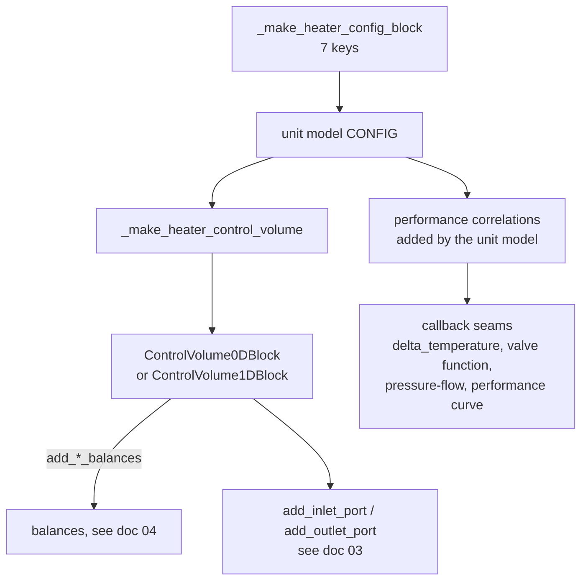
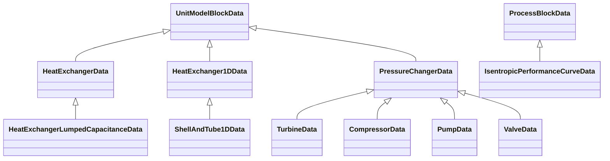
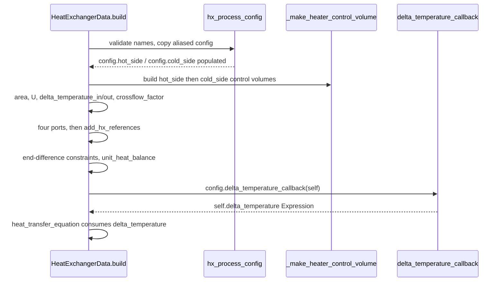

# 10 — Unit models: control-volume based

> **Doc ID** 10 · **Repo SHA** 70a8f4fe1 (IDAES-PSE v2.13.0rc0) · **Source roots** `idaes/models/unit_models/`
> **Owns** 18 modules / 9,141 LOC · **Assets** none · **Siblings** [03](03_block_hierarchy_and_construction_protocol.md), [04](04_control_volume_framework.md), [05](05_property_and_reaction_framework.md), [06](06_model_preparation_initializers_and_scalers.md), [11](11_unit_models_network_contactors_and_control.md), [17](17_costing_framework_and_libraries.md), [31](31_extension_point_catalog.md)

These eighteen modules are the general-purpose equipment library. Every one of
them is a control volume plus a small number of performance correlations, so
this document is written against [04](04_control_volume_framework.md) and never
restates it: the balance dispatchers, the `CONFIG_Template` key semantics and
the components each balance creates all live there. What lives here is the
*idiom* — how a unit model declares its configuration, hands it to a control
volume, and adds the handful of equations that make it a heater rather than a
reactor.

---

## 0. Scope and source map

| File | LOC | Purpose | Covered in § |
|---|---:|---|---|
| `idaes/models/unit_models/heater.py` | 281 | `Heater`, and the two module-level helpers — `_make_heater_config_block`, `_make_heater_control_volume` — that define the shared idiom | 4.1, 5.1, 5.2 |
| `idaes/models/unit_models/heat_exchanger.py` | 1,009 | `HeatExchanger` 0-D, the flow-pattern enumeration, the hot/cold side machinery, and the six `delta_temperature` callbacks | 3, 4.2, 5.3, 9, 10 |
| `idaes/models/unit_models/heat_exchanger_1D.py` | 1,010 | `HeatExchanger1D` — two `ControlVolume1DBlock`s with a shared length and a local heat transfer coefficient | 3, 4.3, 5.4 |
| `idaes/models/unit_models/heat_exchanger_ntu.py` | 622 | `HeatExchangerNTU` — effectiveness-NTU formulation on two 0-D control volumes | 3, 4.4, 5.5 |
| `idaes/models/unit_models/heat_exchanger_lc.py` | 295 | `HeatExchangerLumpedCapacitance` — adds wall capacitance to the 0-D exchanger | 3, 4.5, 5.5, 12 |
| `idaes/models/unit_models/shell_and_tube_1d.py` | 476 | `ShellAndTube1D` — tube-count geometry and a wall temperature on top of the 1-D exchanger | 3, 4.5, 5.4, 12 |
| `idaes/models/unit_models/pressure_changer.py` | 1,483 | `PressureChanger`, the thermodynamic-assumption branch, the performance-curve sub-block, and `Turbine`/`Compressor`/`Pump` | 3, 4.6, 5.6, 9 |
| `idaes/models/unit_models/valve.py` | 293 | `Valve` — an adiabatic pressure changer with a pluggable valve function and pressure-flow relation | 3, 4.7, 5.6, 9 |
| `idaes/models/unit_models/pipe.py` | 359 | `Pipe` — a one-dimensional control volume with a volume-area-length identity | 3, 4.8, 5.7 |
| `idaes/models/unit_models/cstr.py` | 443 | `CSTR` — 0-D with rate reactions tied to volume | 3, 4.9, 5.7 |
| `idaes/models/unit_models/plug_flow_reactor.py` | 443 | `PFR` — the same performance equation distributed along a length domain | 3, 4.8, 5.7 |
| `idaes/models/unit_models/stoichiometric_reactor.py` | 310 | `StoichiometricReactor` — extents of reaction with no rate expression | 3, 4.9, 5.7 |
| `idaes/models/unit_models/equilibrium_reactor.py` | 547 | `EquilibriumReactor`, and two Scaler generations for it | 3, 4.10, 5.7, 12 |
| `idaes/models/unit_models/gibbs_reactor.py` | 491 | `GibbsReactor` — element balances and Lagrangian multipliers instead of a reaction package | 3, 4.11, 5.8 |
| `idaes/models/unit_models/flash.py` | 411 | `Flash` — a 0-D control volume feeding an embedded `Separator` | 3, 4.12, 5.9 |
| `idaes/models/unit_models/feed.py` | 226 | `Feed`, plus the `FeedInitializer`/`FeedScaler` pair reused by three other models | 3, 4.13, 5.9 |
| `idaes/models/unit_models/feed_flash.py` | 272 | `FeedFlash` — a feed that performs a flash calculation on entry | 3, 4.13, 5.9 |
| `idaes/models/unit_models/product.py` | 170 | `Product` — the mirror image of `Feed`, importing its Initializer and Scaler under new names | 3, 4.13, 5.9 |

Total 9,141 LOC, 46 classes, 22 declared process block classes, 158
configuration keys, 4 enumerations, 0 `NotImplementedError` hook sites.

The remaining modules of `idaes/models/unit_models/` — `mixer.py`,
`separator.py`, `translator.py`, `statejunction.py`, `stream_scaler.py`,
`mscontactor.py`, `skeleton_model.py`, the `solid_liquid/` subpackage and the
shipped icon files — belong to
[11](11_unit_models_network_contactors_and_control.md). The costing methods that
consume the classes described here belong to
[17](17_costing_framework_and_libraries.md).

---

## 1. Architectural role

A unit model in this library does four things and delegates everything else.
It declares a configuration surface; it builds one or more control volumes from
that configuration; it attaches ports; and it adds the small set of equations
that distinguish the equipment. The conservation equations themselves are
written by the control volume ([04](04_control_volume_framework.md)), the
thermophysical terms come from a property package
([05](05_property_and_reaction_framework.md)), and the port and block-pair
machinery comes from
[03](03_block_hierarchy_and_construction_protocol.md).

The consequence is that the eighteen modules are structurally repetitive, and
the repetition is codified in one place: `_make_heater_config_block`
(`idaes/models/unit_models/heater.py:134`) declares seven configuration keys and
`_make_heater_control_volume` (`idaes/models/unit_models/heater.py:92`)
constructs a `ControlVolume0DBlock` and issues the four calls those keys
parameterize. Section 4.1 documents that pair once; every other configuration
table here is a delta against it.

Four groups organise the rest. The **heat exchangers** share a
hot-side/cold-side configuration pattern built from a template `ConfigBlock` and
a pair of aliasing helpers, and the zero-dimensional one exposes its
temperature-driving-force expression as a replaceable callback. The **pressure
changers** share a single data class whose `thermodynamic_assumption` key selects
one of four equation sets, with three thin subclasses that lock the key. The
**reactors** differ only in which reaction terms the control volume is asked to
create, except for `GibbsReactor`, which has no reaction package at all. The
**separations and terminal blocks** are the smallest models in the tree: `Feed`
and `Product` own a state block and a port and nothing else.

*Every model in this document is the same four boxes; the groups differ only in what goes in the performance box.*

---

## 2. Public surface inventory

`idaes/models/unit_models/__init__.py` re-exports a selected subset and declares
no `__all__`, so "`idaes.models.unit_models`" below means "bound as an attribute
of that package" (`idaes/models/unit_models/__init__.py:13`). "autodoc'd" means
an `autoclass` or `autofunction` directive under
`docs/reference_guides/model_libraries/generic/unit_models/`.

| Symbol | Kind | Declared at | Exported via | Stability signal |
|---|---|---|---|---|
| `Heater` / `HeaterData`; `_make_heater_config_block`, `_make_heater_control_volume` | pair, functions | `idaes/models/unit_models/heater.py:245`, `:134`, `:92` | `idaes.models.unit_models` (container only) | autodoc'd; the two functions carry leading underscores and are imported by two other modules |
| `HeatExchanger` / `HeatExchangerData` | pair | `idaes/models/unit_models/heat_exchanger.py:616` | `idaes.models.unit_models` | autodoc'd |
| `HeatExchangerFlowPattern`, `HX0DInitializer` | enum, Initializer | `idaes/models/unit_models/heat_exchanger.py:59`, `:178` | `idaes.models.unit_models` | re-exported; the enum is imported by five other packages |
| `delta_temperature_lmtd_smooth_callback`, `delta_temperature_lmtd_callback`, `delta_temperature_lmtd2_callback`, `delta_temperature_lmtd3_callback`, `delta_temperature_amtd_callback`, `delta_temperature_underwood_callback` | functions | `idaes/models/unit_models/heat_exchanger.py:349`, `:388`, `:411`, `:434`, `:457`, `:479` | module only | all six autodoc'd; `..._lmtd_callback` is the default |
| `hx_process_config`, `add_hx_references`, `_make_heat_exchanger_config` | functions | `idaes/models/unit_models/heat_exchanger.py:512`, `:547`, `:287` | module only | the first two are imported by three other modules; the third carries a leading underscore |
| `HeatExchanger1D` / `HeatExchanger1DData`, `HX1DInitializer`, `_log_upwinding_disclaimer` | pair, Initializer, function | `idaes/models/unit_models/heat_exchanger_1D.py:283`, `:142`, `:1003` | `idaes.models.unit_models` (the function excepted) | autodoc'd; the function has a leading underscore |
| `HeatExchangerNTU` / `HeatExchangerNTUData`, `HXNTUInitializer`; `HeatExchangerLumpedCapacitance` / `...Data` | pairs, Initializer | `idaes/models/unit_models/heat_exchanger_ntu.py:166`, `:62`; `heat_exchanger_lc.py:31` | `idaes.models.unit_models` | autodoc'd |
| `ShellAndTube1D` / `...Data`, `ShellAndTubeInitializer`; `PressureChanger` / `...Data`, `IsentropicPressureChangerInitializer`, `ThermodynamicAssumption` | pairs, Initializers, enum | `idaes/models/unit_models/shell_and_tube_1d.py:153`, `:50`; `pressure_changer.py:438`, `:76`, `:65` | `idaes.models.unit_models` (enum excepted) | autodoc'd; the enum is imported by `idaes/models/costing/SSLW.py` |
| `IsentropicPerformanceCurve` / `...Data`; `Turbine`, `Compressor`, `Pump` and their data classes | pairs | `idaes/models/unit_models/pressure_changer.py:255`, `:1445`, `:1461`, `:1475` | `idaes.models.unit_models` (the performance curve excepted) | one `docs/` page each for the last three |
| `Valve` / `ValveData`, `ValveFunctionType`; `linear_cb`, `quick_cb`, `equal_percentage_cb`, `pressure_flow_default_callback` | pair, enum, functions | `idaes/models/unit_models/valve.py:114`, `:42`, `:52`, `:62`, `:72`, `:84` | `idaes.models.unit_models` (functions excepted) | both halves of the pair re-exported and autodoc'd; the last function is the `pressure_flow_callback` default |
| `Pipe` / `PipeData`; `CSTR` / `CSTRData`; `PFR` / `PFRData`; `StoichiometricReactor` / `StoichiometricReactorData` | pairs | `idaes/models/unit_models/pipe.py:97`; `cstr.py:175`; `plug_flow_reactor.py:106`; `stoichiometric_reactor.py:83` | `idaes.models.unit_models` | all autodoc'd except `Pipe`, which has no `docs/` page |
| `EquilibriumReactor` / `...Data`, `EquilibriumReactorScaler` | pair, Scaler | `idaes/models/unit_models/equilibrium_reactor.py:247`, `:41` | `idaes.models.unit_models` (pair only) | both autodoc'd |
| `EquilibriumReactorScalerLegacy`; `GibbsReactor` / `GibbsReactorData`, `GibbsReactorScaler`; `Flash` / `FlashData` | Scaler, pairs | `idaes/models/unit_models/equilibrium_reactor.py:100`; `gibbs_reactor.py:191`, `:38`; `flash.py:97` | `idaes.models.unit_models` (both Scalers excepted) | the legacy Scaler is neither re-exported nor autodoc'd; the rest are autodoc'd |
| `Feed` / `FeedData`, `FeedInitializer`, `FeedScaler`; `FeedFlash` / `...Data`, `FlashType`; `Product` / `ProductData`, `ProductInitializer`, `ProductScaler` | pairs, Initializer, Scaler, enum, import aliases | `idaes/models/unit_models/feed.py:95`, `:62`, `:36`; `feed_flash.py:103`, `:42`; `product.py:42`, `:28` | `idaes.models.unit_models` (`FeedScaler`, `ProductScaler` and the enum excepted) | all pairs autodoc'd; the Feed Initializer and Scaler are imported under three names each, the `Product` aliases being two of them |
| `HeaterScaler`, `HX0DScaler`, `HX1DScaler`, `PressureChangerScaler`, `PipeScaler`, `CSTRScaler`, `PFRScaler`, `StoichiometricReactorScaler`, `FlashScaler`, `FeedFlashScaler` | Scalers | `heater.py:40`, `heat_exchanger.py:69`, `heat_exchanger_1D.py:60`, `pressure_changer.py:335`, `pipe.py:38`, `cstr.py:40`, `plug_flow_reactor.py:41`, `stoichiometric_reactor.py:41`, `flash.py:53`, `feed_flash.py:51` | module only | none re-exported, none autodoc'd |

`Pipe` is the one model in this document with no page under
`docs/reference_guides/model_libraries/generic/unit_models/`, and the one absent
from that directory's `index.rst` toctree.

---

## 3. Class hierarchy and type taxonomy

Three inheritance chains carry all the reuse. Everything else is a direct
`UnitModelBlockData` subclass.

*The only subclassing in this document is heat-exchanger specialisation and pressure-changer specialisation; the fourteen other unit models derive straight from `UnitModelBlockData`.*

### 3.1 Process block roster and retrofit status

The two right-hand columns carry the per-class retrofit data from
`_generated/retrofit.csv`: *declared* means the class body assigns the
attribute, *inherited* means the value comes from a base class. Of these 22
classes, 8 declare a `default_initializer` and 14 declare a `default_scaler`;
the set-wide summary is in
[06 §3.3](06_model_preparation_initializers_and_scalers.md#33-retrofit-adoption).

| Class | Base | Declared at | Container class | `default_initializer` | `default_scaler` |
|---|---|---|---|---|---|
| `HeaterData` | `UnitModelBlockData` | `heater.py:245` | `Heater` | inherited `SingleControlVolumeUnitInitializer` | **declared** `HeaterScaler` |
| `HeatExchangerData` | `UnitModelBlockData` | `heat_exchanger.py:616` | `HeatExchanger` | **declared** `HX0DInitializer` | **declared** `HX0DScaler` |
| `HeatExchanger1DData` | `UnitModelBlockData` | `heat_exchanger_1D.py:283` | `HeatExchanger1D` | **declared** `HX1DInitializer` | **declared** `HX1DScaler` |
| `HeatExchangerNTUData` | `UnitModelBlockData` | `heat_exchanger_ntu.py:166` | `HeatExchangerNTU` | **declared** `HXNTUInitializer` | inherited `None` |
| `HeatExchangerLumpedCapacitanceData` | `HeatExchangerData` | `heat_exchanger_lc.py:31` | `HeatExchangerLumpedCapacitance` | inherited `HX0DInitializer` | inherited `HX0DScaler` |
| `ShellAndTube1DData` | `HeatExchanger1DData` | `shell_and_tube_1d.py:153` | `ShellAndTube1D` | **declared** `ShellAndTubeInitializer` | inherited `HX1DScaler` |
| `PressureChangerData` | `UnitModelBlockData` | `pressure_changer.py:438` | `PressureChanger` | inherited `SingleControlVolumeUnitInitializer` | **declared** `PressureChangerScaler` |
| `TurbineData` | `PressureChangerData` | `pressure_changer.py:1445` | `Turbine` | **declared** `IsentropicPressureChangerInitializer` | inherited `PressureChangerScaler` |
| `CompressorData` | `PressureChangerData` | `pressure_changer.py:1461` | `Compressor` | **declared** `IsentropicPressureChangerInitializer` | inherited `PressureChangerScaler` |
| `PumpData` | `PressureChangerData` | `pressure_changer.py:1475` | `Pump` | inherited `SingleControlVolumeUnitInitializer` | inherited `PressureChangerScaler` |
| `ValveData` | `PressureChangerData` | `valve.py:114` | `Valve` | inherited `SingleControlVolumeUnitInitializer` | inherited `PressureChangerScaler` |
| `IsentropicPerformanceCurveData` | `ProcessBlockData` | `pressure_changer.py:255` | `IsentropicPerformanceCurve` | inherited `BlockTriangularizationInitializer` | inherited `None` |
| `PipeData` | `UnitModelBlockData` | `pipe.py:97` | `Pipe` | inherited `SingleControlVolumeUnitInitializer` | **declared** `PipeScaler` |
| `CSTRData` | `UnitModelBlockData` | `cstr.py:175` | `CSTR` | inherited `SingleControlVolumeUnitInitializer` | **declared** `CSTRScaler` |
| `PFRData` | `UnitModelBlockData` | `plug_flow_reactor.py:106` | `PFR` | inherited `SingleControlVolumeUnitInitializer` | **declared** `PFRScaler` |
| `StoichiometricReactorData` | `UnitModelBlockData` | `stoichiometric_reactor.py:83` | `StoichiometricReactor` | inherited `SingleControlVolumeUnitInitializer` | **declared** `StoichiometricReactorScaler` |
| `EquilibriumReactorData` | `UnitModelBlockData` | `equilibrium_reactor.py:247` | `EquilibriumReactor` | inherited `SingleControlVolumeUnitInitializer` | **declared** `EquilibriumReactorScaler` |
| `GibbsReactorData` | `UnitModelBlockData` | `gibbs_reactor.py:191` | `GibbsReactor` | inherited `SingleControlVolumeUnitInitializer` | **declared** `GibbsReactorScaler` |
| `FlashData` | `UnitModelBlockData` | `flash.py:97` | `Flash` | inherited `SingleControlVolumeUnitInitializer` | **declared** `FlashScaler` |
| `FeedData` | `UnitModelBlockData` | `feed.py:95` | `Feed` | **declared** `FeedInitializer` | **declared** `FeedScaler` |
| `FeedFlashData` | `UnitModelBlockData` | `feed_flash.py:103` | `FeedFlash` | inherited `SingleControlVolumeUnitInitializer` | **declared** `FeedFlashScaler` |
| `ProductData` | `UnitModelBlockData` | `product.py:42` | `Product` | **declared** `ProductInitializer` | **declared** `ProductScaler` |

`UnitModelBlockData.default_initializer` is `SingleControlVolumeUnitInitializer`
(`idaes/core/base/unit_model.py:61`); `ProcessBlockData.default_scaler` is
`None` and `ProcessBlockData.default_initializer` is
`BlockTriangularizationInitializer` (`idaes/core/base/process_base.py:92`).
`ProductData` names classes imported from `feed.py` under aliases
(`idaes/models/unit_models/product.py:28`), so the Product pair is the Feed pair
under two other names.

### 3.2 Scaler and Initializer classes

14 Scalers and 6 Initializers. None is a process block; all are plain classes
over the bases described in
[06](06_model_preparation_initializers_and_scalers.md).

| Class | Declared at | Distinguishing behaviour |
|---|---|---|
| `HeaterScaler`, `StoichiometricReactorScaler`, `FeedFlashScaler` | `heater.py:40`, `stoichiometric_reactor.py:41`, `feed_flash.py:51` | Pure delegation of both routines to `control_volume`; no unit-level components exist to scale |
| `FeedScaler` | `feed.py:36` | Delegates to `properties`; shared by `Feed`, `Product`, `StateJunction` and `StreamScaler` |
| `FlashScaler` | `flash.py:53` | Delegates to `control_volume` and to the embedded `split` block |
| `EquilibriumReactorScaler` | `equilibrium_reactor.py:41` | Delegation plus `rate_reaction_constraint` |
| `EquilibriumReactorScalerLegacy` | `equilibrium_reactor.py:100` | `UNIT_SCALING_FACTORS` keyed by report label; not the class default |
| `HX0DScaler` | `heat_exchanger.py:69` | `DEFAULT_SCALING_FACTORS` for `area` and `overall_heat_transfer_coefficient`; sets a scaling hint on the `delta_temperature` Expression to keep the LMTD form away from a zero denominator |
| `HX1DScaler` | `heat_exchanger_1D.py:60` | Propagates hot-side `length` scaling to the cold side through `length_equality` |
| `PressureChangerScaler` | `pressure_changer.py:335` | Propagates inlet state scaling into `properties_isentropic`; scales the remaining unit constraints by nominal value |
| `PipeScaler`, `PFRScaler` | `pipe.py:38`, `plug_flow_reactor.py:41` | Scale `volume` from the `geometry` definition constraint |
| `CSTRScaler` | `cstr.py:40` | `DEFAULT_SCALING_FACTORS` `{deltaP: 1e-5, volume: 1e3}`; inverse-maximum constraint scheme |
| `GibbsReactorScaler` | `gibbs_reactor.py:38` | `UNIT_SCALING_FACTORS` for the Lagrangian multipliers and the Gibbs constraint |
| `HX0DInitializer`, `HX1DInitializer`, `HXNTUInitializer`, `ShellAndTubeInitializer` | `heat_exchanger.py:178`, `heat_exchanger_1D.py:142`, `heat_exchanger_ntu.py:62`, `shell_and_tube_1d.py:50` | All four fix a heat-duty guess, deactivate the heat-transfer constraints, solve, then restore and solve again |
| `IsentropicPressureChangerInitializer` | `pressure_changer.py:76` | Five-step routine including a performance-curve activation pass |
| `FeedInitializer` | `feed.py:62` | Resolves the state block's own Initializer and calls it |

### 3.3 Enumerations

| Enum | Member | Value | Meaning | Consumed at |
|---|---|---|---|---|
| `HeatExchangerFlowPattern` (`heat_exchanger.py:59`) | `countercurrent` | 1 | Cold stream enters at the hot outlet end | `heat_exchanger.py:736`, `heat_exchanger_1D.py:617` |
| | `cocurrent` | 2 | Both streams enter at the same end | `heat_exchanger.py:735`, `heat_exchanger_1D.py:601` |
| | `crossflow` | 3 | Countercurrent driving force scaled by `crossflow_factor`; rejected by the 1-D model at `heat_exchanger_1D.py:640` | `heat_exchanger.py:697`, `:786` |
| `ThermodynamicAssumption` (`pressure_changer.py:65`) | `isothermal` | 1 | Inlet and outlet temperature equal | `pressure_changer.py:666` |
| | `isentropic` | 2 | A second state block at inlet entropy and outlet pressure | `pressure_changer.py:668` |
| | `pump` | 3 | Incompressible fluid work from volumetric flow | `pressure_changer.py:670` |
| | `adiabatic` | 4 | Mechanical work fixed at zero | `pressure_changer.py:672` |
| `ValveFunctionType` (`valve.py:42`) | `linear` | 1 | `valve_function` is the opening | `valve.py:176` |
| | `quick_opening` | 2 | `valve_function` is its square root | `valve.py:178` |
| | `equal_percentage` | 3 | `valve_function` is `alpha ** (opening − 1)` | `valve.py:180` |
| `FlashType` (`feed_flash.py:42`) | `isothermal` | 1 | Equal inlet and outlet temperature | `feed_flash.py:217` |
| | `isenthalpic` | 2 | Equal inlet and outlet enthalpy flow | `feed_flash.py:226` |

---

## 4. Configuration reference

158 keys across 21 declarations. Section 4.1 gives the shared idiom in full;
every later subsection is a delta table whose *Inherited from* column names
where the key's semantics are defined — "heater idiom", `CONFIG_Template`
([04 §4.1](04_control_volume_framework.md#41-config_template--the-unit-model-facing-template)),
or "new" — and whose *Override* column records how the declaration differs.
Anchors are line numbers within the file named in the subsection heading; a row
covering several keys lists them in declaration order.

### 4.1 The heater idiom — `_make_heater_config_block`

`_make_heater_config_block(config)` (`idaes/models/unit_models/heater.py:134`)
is a module-level function that adds seven keys to an existing `ConfigBlock`. It
is applied three times here — to `HeaterData.CONFIG`
(`idaes/models/unit_models/heater.py:254`) and to the `hot_side` and `cold_side`
sub-blocks of `HeatExchangerData.CONFIG`
(`idaes/models/unit_models/heat_exchanger.py:323`, `:324`) — and once in
`helm/condenser_ntu.py`, owned by
[20](20_power_generation_helmholtz_units_and_soc.md).

| Key | Domain / validator | Default | Req. | Effect on build | Anchor |
|---|---|---|---|---|---|
| `material_balance_type` | `In(MaterialBalanceType)` | `MaterialBalanceType.useDefault` | no | Passed to `add_material_balances` | `:138` |
| `energy_balance_type` | `In(EnergyBalanceType)` | `EnergyBalanceType.useDefault` | no | Passed to `add_energy_balances` | `:156` |
| `momentum_balance_type` | `In(MomentumBalanceType)` | `MomentumBalanceType.pressureTotal` | no | Passed to `add_momentum_balances` | `:174` |
| `has_phase_equilibrium` | `Bool` | `False` | no | Passed to `add_state_blocks` and `add_material_balances` | `:190` |
| `has_pressure_change` | `Bool` | `False` | no | Passed to `add_momentum_balances`; gates the `deltaP` reference | `:203` |
| `property_package` | `is_physical_parameter_block` | `useDefault` | no | The parameter block the control volume is built from | `:217` |
| `property_package_args` | implicit `ConfigBlock` | empty | no | Forwarded to the control volume | `:230` |

These seven are a strict subset of `CONFIG_Template` with identical domains and
defaults. What the idiom omits is as informative: no `dynamic` and no
`has_holdup`, which come from `UnitModelBlockData.CONFIG`
([03 §4.1](03_block_hierarchy_and_construction_protocol.md#41-unitmodelblockdataconfig));
no reaction keys; and no `has_heat_transfer`, because
`_make_heater_control_volume` passes `has_heat_transfer=True` unconditionally
(`idaes/models/unit_models/heater.py:124`). `HeaterData.CONFIG` is
`UnitModelBlockData.CONFIG()` (`idaes/models/unit_models/heater.py:253`) with
the idiom applied at `:254` and nothing further, so `Heater`'s whole surface is
`dynamic`, `has_holdup` and those seven keys.

### 4.2 `heat_exchanger.py` — `HeatExchangerData.CONFIG`

`UnitModelBlockData.CONFIG(implicit=True)` (`:625`) extended by
`_make_heat_exchanger_config` (`:287`). `implicit=True` is load-bearing: it is
what lets a user pass a side's configuration under the name given in
`hot_side_name` rather than under `hot_side`.

| Key | Inherited from | Override | Anchor |
|---|---|---|---|
| `hot_side_name`, `cold_side_name` | new | `str`, default `None`; aliases under which each side and its two ports are also reachable | `:291`, `:299` |
| `hot_side`, `cold_side` | new | `ConfigBlock`, each carrying one copy of the heater idiom applied at `:323` and `:324` | `:307`, `:315` |
| `delta_temperature_callback` | new | No domain; default `delta_temperature_lmtd_callback`; called once during build | `:325` |
| `flow_pattern` | new | `In(HeatExchangerFlowPattern)`, default `countercurrent` | `:332` |

### 4.3 `heat_exchanger_1D.py` — `_SideTemplate` and `HeatExchanger1DData.CONFIG`

This model does not reuse the heater idiom. It declares its own eleven-key
template `_SideTemplate = ConfigBlock()`
(`idaes/models/unit_models/heat_exchanger_1D.py:291`), instantiated twice at
`:446` and `:447`.

| Key | Inherited from | Override | Anchor |
|---|---|---|---|
| `dynamic`, `has_holdup` | `CONFIG_Template` | `DefaultBool`, `useDefault`; declared per side rather than per unit | `:292`, `:306` |
| `material_balance_type`, `energy_balance_type`, `momentum_balance_type`, `has_pressure_change`, `has_phase_equilibrium` | heater idiom | unchanged | `:321`, `:339`, `:357`, `:374`, `:388` |
| `property_package` | heater idiom | default `None` rather than `useDefault` | `:399` |
| `property_package_args` | heater idiom | `ConfigBlock(implicit=True)`, default `{}` | `:412` |
| `transformation_method`, `transformation_scheme` | `ControlVolume1DBlockData.CONFIG` | default `useDefault`, resolved in `build` to `"dae.finite_difference"` and `"BACKWARD"` | `:426`, `:435` |

Unit-level keys on `UnitModelBlockData.CONFIG(implicit=True)` (`:289`):

| Key | Inherited from | Override | Anchor |
|---|---|---|---|
| `hot_side`, `cold_side` | §4.2 | `_SideTemplate` instances, not heater-idiom blocks | `:446`, `:447` |
| `finite_elements`, `collocation_points` | `ControlVolume1DBlockData.CONFIG` | `int`, defaults 20 and 5; shared by both sides | `:450`, `:460` |
| `flow_type` | `flow_pattern` in §4.2 | Renamed; `In(HeatExchangerFlowPattern)`, default `cocurrent`; `crossflow` rejected at build | `:470` |
| `hot_side_name`, `cold_side_name` | §4.2 | unchanged | `:483`, `:492` |

Two names for one idea appear here: the 0-D model calls the key `flow_pattern`
and defaults it to `countercurrent`; the 1-D model calls it `flow_type` and
defaults it to `cocurrent`.

### 4.4 `heat_exchanger_ntu.py` — `_SideCONFIG` and `HeatExchangerNTUData.CONFIG`

A third side template, `_SideCONFIG = ConfigBlock()`
(`idaes/models/unit_models/heat_exchanger_ntu.py:174`), with six keys, on
`UnitModelBlockData.CONFIG(implicit=True)` (`:171`).

| Key | Inherited from | Override | Anchor |
|---|---|---|---|
| `material_balance_type`, `energy_balance_type`, `momentum_balance_type` | heater idiom | Domain and default only; no description or doc text | `:176`, `:194`, `:212` |
| `has_pressure_change`, `property_package`, `property_package_args` | heater idiom | unchanged | `:228`, `:242`, `:255` |
| `hot_side`, `cold_side` | §4.2 | `_SideCONFIG` instances | `:269`, `:270` |
| `hot_side_name`, `cold_side_name` | §4.2 | unchanged | `:271`, `:279` |

`has_phase_equilibrium` is absent; `build` passes `has_phase_equilibrium=False`
literally to both control volumes
(`idaes/models/unit_models/heat_exchanger_ntu.py:297`).

### 4.5 `heat_exchanger_lc.py` and `shell_and_tube_1d.py` — one key each

| Key | Declaring class | Inherited from | Override | Anchor |
|---|---|---|---|---|
| `dynamic_heat_balance` | `HeatExchangerLumpedCapacitanceData`, on `HeatExchangerData.CONFIG(implicit=True)` (`:36`) | new | `DefaultBool`, default `useDefault`; resolved against the flowsheet in an overridden `_setup_dynamics` | `heat_exchanger_lc.py:38` |
| `shell_is_hot` | `ShellAndTube1DData`, on `HeatExchanger1DData.CONFIG(implicit=True)` (`:158`) | new | `Bool`, default `True`; when the side names are unset, fills them with `"Shell"`/`"Tube"` or the reverse | `shell_and_tube_1d.py:159` |

Every other key of these two models is section 4.2 or section 4.3 unchanged.

### 4.6 `pressure_changer.py` — two CONFIG blocks

`PressureChangerData.CONFIG = UnitModelBlockData.CONFIG()` (`:445`), ten keys.

| Key | Inherited from | Override | Anchor |
|---|---|---|---|
| `material_balance_type`, `energy_balance_type`, `momentum_balance_type`, `has_phase_equilibrium`, `property_package`, `property_package_args` | heater idiom | unchanged | `:447`, `:465`, `:483`, `:499`, `:536`, `:549` |
| `compressor` | new | `Bool`, default `True`; selects the direction of the work-efficiency relation and the sense of `model_check` | `:512` |
| `thermodynamic_assumption` | new | `In(ThermodynamicAssumption)`, default `isothermal`; selects one of four `add_*` methods | `:523` |
| `support_isentropic_performance_curves` | new | `Bool`, default `False`; builds the `performance_curve` sub-block | `:561` |
| `isentropic_performance_curves` | new | `IsentropicPerformanceCurveData.CONFIG()`, forwarded verbatim to that sub-block | `:570` |

`has_pressure_change` is absent: `build` passes `has_pressure_change=True`
unconditionally (`idaes/models/unit_models/pressure_changer.py:619`).

`IsentropicPerformanceCurveData.CONFIG = ProcessBlockData.CONFIG(...)` (`:264`):

| Key | Domain / validator | Default | Req. | Effect on build | Anchor |
|---|---|---|---|---|---|
| `build_callback` | none declared | `None` | no | Called with the performance-curve block as its only argument, last in `build` | `:267` |
| `build_head_expressions` | `bool` | `True` | no | Adds the `head` and `head_isentropic` Expressions | `:273` |

`TurbineData` (`:1452`), `CompressorData` (`:1466`) and `PumpData` (`:1478`)
declare no new keys. Each copies `PressureChangerData.CONFIG()` and mutates the
copied `ConfigValue` objects in place, setting the value, the private `_default`
and — for `compressor` — `_domain` to a single-element `In([...])`. `Turbine`
locks `compressor=False` with `thermodynamic_assumption` defaulting to
`isentropic`; `Compressor` locks `compressor=True` with the same assumption;
`Pump` locks `compressor=True` with the assumption defaulting to `pump`.

### 4.7 `valve.py` — `ValveData.CONFIG`

`PressureChangerData.CONFIG()` (`:126`), mutated the same way and extended by
two keys.

| Key | Inherited from | Override | Anchor |
|---|---|---|---|
| `compressor` | §4.6 | Value, `_default` and `_domain` forced to `False` / `In([False])` | `:127`–`:129` |
| `material_balance_type` | heater idiom | Value and `_default` forced to `MaterialBalanceType.componentTotal` | `:130`–`:131` |
| `thermodynamic_assumption` | §4.6 | Value, `_default` and `_domain` forced to `adiabatic` / `In([adiabatic])` | `:132`–`:136` |
| `valve_function_callback` | new | No domain; default `ValveFunctionType.linear`; accepts an enumeration member or a callable | `:137` |
| `pressure_flow_callback` | new | No domain; default `pressure_flow_default_callback`; must be callable | `:150` |

### 4.8 `pipe.py` and `plug_flow_reactor.py` — the one-dimensional keys

`PipeData.CONFIG = UnitModelBlockData.CONFIG()` (`:104`), thirteen keys declared
inline rather than through the heater idiom.

| Key | Inherited from | Override | Anchor |
|---|---|---|---|
| `material_balance_type`, `energy_balance_type`, `momentum_balance_type`, `has_phase_equilibrium`, `has_pressure_change`, `property_package`, `property_package_args` | heater idiom | unchanged | `:105`, `:123`, `:141`, `:157`, `:184`, `:198`, `:211` |
| `has_heat_transfer` | `CONFIG_Template` | `Bool`, default `False`; passed to `add_energy_balances` | `:171` |
| `length_domain_set` | `ControlVolume1DBlockData.add_geometry` argument | `ListOf(float)`, default `[0.0, 1.0]` | `:223` |
| `transformation_method`, `transformation_scheme` | `ControlVolume1DBlockData.CONFIG` | defaults `"dae.finite_difference"` and `"BACKWARD"` rather than `None` | `:236`, `:246` |
| `finite_elements`, `collocation_points` | `ControlVolume1DBlockData.CONFIG` | defaults 20 and 3, no domain declared | `:256`, `:266` |

`PFRData.CONFIG = UnitModelBlockData.CONFIG()` (`:113`), seventeen keys: the
same seven idiom keys (`:114`, `:132`, `:150`, `:180`, `:221`, `:235`, `:248`),
the same five spatial keys (`length_domain_set` `:285`, `transformation_method`
`:298`, `transformation_scheme` `:308`, `finite_elements` `:318`,
`collocation_points` `:328`), and the five reaction and heat keys of section
4.9 (`has_equilibrium_reactions` `:166`, `has_heat_of_reaction` `:194`,
`has_heat_transfer` `:208`, `reaction_package` `:260`, `reaction_package_args`
`:273`).

### 4.9 `cstr.py` and `stoichiometric_reactor.py` — the reaction keys

`CSTRData.CONFIG = UnitModelBlockData.CONFIG()` (`:182`), twelve keys.

| Key | Inherited from | Override | Anchor |
|---|---|---|---|
| `material_balance_type`, `energy_balance_type`, `momentum_balance_type`, `has_pressure_change`, `has_phase_equilibrium`, `property_package`, `property_package_args` | heater idiom | unchanged | `:184`, `:202`, `:220`, `:249`, `:277`, `:305`, `:318` |
| `has_heat_transfer`, `has_equilibrium_reactions`, `has_heat_of_reaction`, `reaction_package_args` | `CONFIG_Template` | unchanged | `:236`, `:263`, `:291`, `:343` |
| `reaction_package` | `CONFIG_Template` | `is_reaction_parameter_block`, default `None`; also indexed directly for `rate_reaction_idx` in the performance equation | `:330` |

`has_rate_reactions` is absent: `build` passes `has_rate_reactions=True`
literally (`idaes/models/unit_models/cstr.py:389`).

`StoichiometricReactorData.CONFIG = UnitModelBlockData.CONFIG()` (`:93`), ten
keys — the CSTR set without `has_phase_equilibrium` and without
`has_equilibrium_reactions`: `material_balance_type` `:95`,
`energy_balance_type` `:113`, `momentum_balance_type` `:131`,
`has_heat_of_reaction` `:147`, `has_heat_transfer` `:161`, `has_pressure_change`
`:174`, `property_package` `:188`, `property_package_args` `:201`,
`reaction_package` `:213`, `reaction_package_args` `:226`.

### 4.10 `equilibrium_reactor.py` — `EquilibriumReactorData.CONFIG`

`ConfigBlock()` built from nothing (`:254`), fifteen keys. `dynamic` and
`has_holdup` are redeclared locally rather than inherited.

| Key | Inherited from | Override | Anchor |
|---|---|---|---|
| `dynamic`, `has_holdup` | `UnitModelBlockData.CONFIG` | `In([False])`, default `False`; steady state only | `:255`, `:265` |
| `material_balance_type`, `energy_balance_type`, `momentum_balance_type`, `has_phase_equilibrium`, `has_pressure_change`, `property_package`, `property_package_args` | heater idiom | unchanged | `:276`, `:294`, `:312`, `:356`, `:396`, `:410`, `:423` |
| `has_rate_reactions` | `CONFIG_Template` | `Bool` defaulting to **`True`**; also gates the unit-level constraint pinning every rate to zero | `:328` |
| `has_equilibrium_reactions` | `CONFIG_Template` | `Bool` defaulting to **`True`** | `:342` |
| `has_heat_transfer`, `has_heat_of_reaction`, `reaction_package`, `reaction_package_args` | §4.9 | unchanged | `:369`, `:382`, `:435`, `:448` |

### 4.11 `gibbs_reactor.py` — `GibbsReactorData.CONFIG`

`ConfigBlock()` (`:205`), nine keys. This is the only unit model in the document
with **no `material_balance_type` key**.

| Key | Inherited from | Override | Anchor |
|---|---|---|---|
| `dynamic`, `has_holdup` | `UnitModelBlockData.CONFIG` | `In([False])`, default `False` | `:206`, `:216` |
| `energy_balance_type`, `momentum_balance_type`, `has_pressure_change`, `property_package`, `property_package_args` | heater idiom | unchanged | `:226`, `:244`, `:273`, `:287`, `:300` |
| `has_heat_transfer` | `CONFIG_Template` | unchanged | `:260` |
| `inert_species` | new | `ListOf(str)`, default `[]`; validated against the component list at build, excluded from the Gibbs constraint, and given its own balances | `:312` |

The material balance is not selectable because a Gibbs reactor conserves
elements, not chemical components: `build` calls
`add_total_element_balances()` directly
(`idaes/models/unit_models/gibbs_reactor.py:355`), bypassing the
`add_material_balances` dispatcher. Section 5.8 explains the consequence for the
equation set.

### 4.12 `flash.py` — `FlashData.CONFIG`

`ConfigBlock()` (`:104`), eleven keys.

| Key | Inherited from | Override | Anchor |
|---|---|---|---|
| `dynamic`, `has_holdup` | `UnitModelBlockData.CONFIG` | `In([False])`, default `False` | `:105`, `:115` |
| `material_balance_type`, `energy_balance_type`, `momentum_balance_type`, `property_package`, `property_package_args` | heater idiom | unchanged | `:126`, `:144`, `:162`, `:239`, `:252` |
| `has_heat_transfer` | §4.9 | `Bool` defaulting to **`True`** | `:212` |
| `has_pressure_change` | heater idiom | `Bool` defaulting to **`True`** | `:225` |
| `energy_split_basis` | `SeparatorData.CONFIG`, doc [11](11_unit_models_network_contactors_and_control.md) | `EnergySplittingType` used directly as the domain, default `equal_temperature`; forwarded to the embedded `Separator` | `:178` |
| `ideal_separation` | `SeparatorData.CONFIG`, doc [11](11_unit_models_network_contactors_and_control.md) | `Bool`, default `True`; forwarded, and gates `split_fraction_eq` | `:195` |

### 4.13 `feed.py`, `product.py` and `feed_flash.py` — the terminal blocks

All three start from `ConfigBlock()` — `feed.py:104`, `product.py:51`,
`feed_flash.py:110` — and redeclare `dynamic` and `has_holdup` as `In([False])`
defaulting to `False`.

| Key | Module | Inherited from | Override | Anchor |
|---|---|---|---|---|
| `dynamic`, `has_holdup` | all three | `UnitModelBlockData.CONFIG` | `In([False])`, default `False` | `feed.py:105`, `:115`; `product.py:52`, `:62`; `feed_flash.py:111`, `:120` |
| `property_package`, `property_package_args` | all three | heater idiom | unchanged | `feed.py:124`, `:137`; `product.py:72`, `:85`; `feed_flash.py:161`, `:174` |
| `material_balance_type` | `feed_flash.py` only | heater idiom | unchanged | `feed_flash.py:130` |
| `flash_type` | `feed_flash.py` only | new | `In(FlashType)`, default `FlashType.isothermal`; selects between an equal-temperature and an equal-enthalpy-flow constraint | `feed_flash.py:148` |

`Feed` and `Product` therefore have a four-key surface, the smallest here.
`FeedFlash` has six: no `energy_balance_type` and no `momentum_balance_type`,
because the energy condition is the `flash_type` constraint and `build` calls
`add_momentum_balances(balance_type=MomentumBalanceType.pressureTotal)` with a
literal (`idaes/models/unit_models/feed_flash.py:237`).

---

## 5. Construction and call sequences

### 5.1 The shared build skeleton

Every `build` here follows the same six steps, with steps 4 and 6 carrying the
model-specific content.

1. `super().build()` — `UnitModelBlockData.build`
   (`idaes/core/base/unit_model.py:95`) resolves `self.config` and the dynamic
   flags ([03 §5.4](03_block_hierarchy_and_construction_protocol.md#54-configuration-resolution)).
2. Construct a `ControlVolume0DBlock` or `ControlVolume1DBlock`, forwarding
   `dynamic`, `has_holdup`, the property package and, where present, the
   reaction package and the spatial keys.
3. `add_geometry()` where a volume, area or length is required.
4. `add_state_blocks`, optionally `add_reaction_blocks`, then the three balance
   dispatchers — all in
   [04 §5](04_control_volume_framework.md#5-construction-and-call-sequences).
5. `apply_transformation()` for the three one-dimensional models, then
   `add_inlet_port()` / `add_outlet_port()`
   ([03 §5.7](03_block_hierarchy_and_construction_protocol.md#57-port-construction)).
6. Unit-level variables, performance constraints and `Reference` objects.

Steps 3 to 5 are elided by `_auto_construct`
([04 §5.4](04_control_volume_framework.md#54-_auto_construct)); no model here
uses it, and all eighteen sequence the calls by hand.

### 5.2 `Heater` — the reusable form of steps 2 to 4

`_make_heater_control_volume(o, name, config, dynamic=None, has_holdup=None)`
(`idaes/models/unit_models/heater.py:92`) resolves `dynamic` and `has_holdup`
from `config` when the caller passes `None` (`:97`–`:100`), adds the control
volume under `name` with `add_component` (`:103`), calls `add_geometry()` only
when holdup was requested (`:114`), then `add_state_blocks` (`:116`),
`add_material_balances` (`:118`), `add_energy_balances` with
`has_heat_transfer=True` (`:123`) and `add_momentum_balances` (`:127`), and
returns the control volume. `HeaterData.build` (`:256`) calls it for
`"control_volume"`, adds two ports, and creates `heat_duty` as a `Reference` to
`control_volume.heat` (`:272`), plus `deltaP` when `has_pressure_change` is set
and the momentum balance is not `none` (`:278`). `heat_duty` is created
unconditionally, and `add_energy_balances` creates `control_volume.heat` only
when the energy balance type is not `none`
([04 §5.3](04_control_volume_framework.md#53-the-dispatchers)).

### 5.3 `HeatExchanger` — the hot/cold side protocol

*The driving-force expression is the only part of the equation set the model does not write itself.*

`hx_process_config(self)` (`idaes/models/unit_models/heat_exchanger.py:512`)
runs first (`:633`). It rejects a side name of `"hot_side"` or `"cold_side"`
(`:517`, `:519`), two identical side names (`:526`), and any configuration key
that is neither declared nor a side name (`:533`); it then copies a side's
configuration from the aliased key into `config.hot_side` / `config.cold_side`
and binds the alias back onto the CONFIG block (`:536`–`:544`).

`add_hx_references(self)` (`:547`) does the matching work on the built model:
for each supplied side name it creates object references to the control volume
and to the two ports, under `<name>`, `<name>_inlet` and `<name>_outlet`, using
`add_object_reference` so the aliases do not appear during Pyomo component
iteration; each of the six assignments raises on a name collision
(`:564`–`:609`). `build` (`:628`) creates
`overall_heat_transfer_coefficient` (`:673`),
`area` (`:682`), the two end differences (`:686`, `:692`), `crossflow_factor`
under the crossflow pattern (`:699`), and `heat_duty` from the cold side heat
(`:707`). The two end-difference constraints branch on `cocurrent` versus
everything else (`:734`, `:749`); `unit_heat_balance` equates the two heats
(`:767`); the callback runs (`:775`); and `heat_transfer_equation` (`:783`)
multiplies `U · A · ΔT`, inserting `crossflow_factor` for crossflow.

### 5.4 `HeatExchanger1D` and `ShellAndTube1D`

`build` (`idaes/models/unit_models/heat_exchanger_1D.py:502`) spends its first
130 lines resolving the discretization: `useDefault` for
`transformation_method` becomes `"dae.finite_difference"` per side (`:518`,
`:527`); differing methods across sides raise (`:541`); collocation with an
unset (`:554`) or mismatched (`:562`) scheme raises; differing
finite-difference schemes log a caution (`:571`); `useDefault` for the scheme
becomes `"BACKWARD"` (`:588`, `:597`). `flow_type` then fixes the two
`FlowDirection` values (`:601`, `:617`), and any other pattern raises (`:640`).
Construction proper: two `ControlVolume1DBlock`s (`:647`, `:658`),
`add_geometry` with those directions (`:669`, `:670`), state blocks, balances
and `apply_transformation()` per side (`:707`, `:735`); four ports;
`add_hx_references` (`:741`); the template methods `_make_geometry` (`:749`) and
`_make_performance` (`:771`); and finally `heat_conservation` (`:736`).
`_log_upwinding_disclaimer` (`:1003`) carries the informational message when a
finite-difference scheme is not the upwind one for the chosen pattern.

`ShellAndTube1D` replaces three of those methods. `_process_config`
(`idaes/models/unit_models/shell_and_tube_1d.py:170`) fills unset side names
from `shell_is_hot` (`:174`–`:184`). `_make_geometry` (`:186`) references
`hot_side.area` as `hot_side_area`, writes a time-indexed `length_equality`
(`:199`), and adds the tube-count geometry (`:219`–`:234`) with two
cross-sectional area constraints (`:239`, `:250`). `_make_performance` (`:260`)
replaces the single overall coefficient with per-side coefficients (`:266`,
`:273`) and a `temperature_wall` (`:280`), writing two heat-transfer constraints
through the wall (`:287`, `:304`) instead of one direct one.

### 5.5 `HeatExchangerNTU` and `HeatExchangerLumpedCapacitance`

`HeatExchangerNTUData.build`
(`idaes/models/unit_models/heat_exchanger_ntu.py:288`) constructs two
`ControlVolume0DBlock`s directly rather than through
`_make_heater_control_volume`, because its side template is not the heater
idiom. It adds four ports and `heat_duty` (`:365`), then `area` (`:376`),
`heat_transfer_coefficient` (`:383`), `energy_balance_constraint` (`:397`),
`effectiveness` (`:402`), the smoothing parameter `eps_cmin` (`:411`), the
`Cmin` (`:431`) and `Cmax` (`:447`) Expressions built from `smooth_min` and
`smooth_max`, `Cratio` (`:455`), `NTU` (`:462`), and `heat_duty_constraint`
(`:480`) equating the hot side heat to `−ε · Cmin · ΔT` across the two inlets.

`HeatExchangerLumpedCapacitanceData` is the only model here that overrides
`_setup_dynamics` (`idaes/models/unit_models/heat_exchanger_lc.py:116`), because
it admits a dynamic energy balance over a static control volume: the override
resolves `dynamic_heat_balance` against the flowsheet flag (`:138`), then
`dynamic` from `dynamic_heat_balance` (`:152`), then `has_holdup` (`:164`).
`build` (`:243`) calls `super().build()`, `_add_wall_variables` (`:53`) and
`_add_wall_variable_constraints` (`:170`); under `dynamic_heat_balance` it adds
`dT_wall_dt` as a `DerivativeVar` with respect to time (`:262`), the
`dynamic_heat_balance` constraint (`:271`), and calls
`activate_dynamic_heat_eq` (`:277`), which deactivates the inherited
`unit_heat_balance` and activates the new one. `deactivate_dynamic_heat_eq`
(`:228`) reverses the swap; `initialize` (`:285`) wraps the inherited routine in
a deactivate/reactivate pair.

### 5.6 `PressureChanger`, `Turbine`, `Compressor`, `Pump`, `Valve`

`build` (`idaes/models/unit_models/pressure_changer.py:576`) constructs one
`ControlVolume0DBlock` (`:588`), adds geometry only under `has_holdup` (`:597`),
state blocks, the material balance, the energy balance with
`has_work_transfer=True` (`:613`) and the momentum balance with
`has_pressure_change=True` (`:619`). It creates `work_mechanical` (`:650`),
`deltaP` (`:653`), `ratioP` (`:656`) and `ratioP_calculation` (`:659`), then
dispatches on `thermodynamic_assumption` (`:665`–`:672`). When the assumption is
`pump` and the energy dispatcher returned `None`, `build` creates
`control_volume.work` itself (`:641`) so `work_mechanical` has a target.

| Method | Creates | Anchor |
|---|---|---|
| `add_isothermal` | `isothermal`, equating inlet and outlet temperature | `:722` |
| `add_adiabatic` | `zero_work_equation`, pinning `control_volume.work` to zero | `:744` |
| `add_pump` | `work_fluid`, `efficiency_pump`, `fluid_work_calculation`, `actual_work` | `:676` |
| `add_isentropic` | `efficiency_isentropic`, `work_isentropic`, `properties_isentropic`, `isentropic_pressure`, `state_material_balances`, `isentropic`, `isentropic_energy_balance`, `actual_work`, optionally `performance_curve` | `:759` |

`add_isentropic` builds a second state block from the same property package with
`defined_state=False` (`:790`), ties its pressure to the outlet (`:796`), calls
`add_state_material_balances`
([03 §7.3](03_block_hierarchy_and_construction_protocol.md#73-idaescorebaseflowsheet_modelpy-and-unit_modelpy))
to equate its composition to the outlet (`:806`), and equates its molar entropy
to the inlet (`:813`); `actual_work` reverses the efficiency relation according
to `compressor` (`:837`–`:844`). Under
`support_isentropic_performance_curves` the `IsentropicPerformanceCurve`
sub-block is constructed last (`:849`).
`IsentropicPerformanceCurveData.build` (`:288`) adds `head_isentropic` (`:293`)
and `head` (`:308`) when `build_head_expressions` is set — each reaching into
the parent for `work_isentropic` / `work_mechanical` and dividing by mass flow,
or by molar flow times molecular weight, with a `PropertyNotSupportedError`
logged and re-raised (`:321`) — then calls `build_callback` (`:331`).

`ValveData.build` (`idaes/models/unit_models/valve.py:161`) calls the inherited
build, which under the locked `adiabatic` assumption produces
`zero_work_equation`. It creates `valve_opening`, bounded `(0, 1)` and fixed at
1 (`:164`, `:170`), resolves an enumeration member to `linear_cb`, `quick_cb` or
`equal_percentage_cb` (`:176`–`:181`), raising for anything else that is not
callable (`:183`), then calls the valve function callback (`:184`) and the
pressure-flow callback (`:185`). `pressure_flow_default_callback` (`:84`)
creates `Cv` fixed at 0.1 (`:93`), the `flow_var` reference the Scaler requires
(`:100`), the `pressure_flow_equation_scale` lambda declaring the constraint
quadratic in flow (`:101`), and `pressure_flow_equation`
`F² = Cv² (Pi − Po) f²` (`:103`).

### 5.7 `Pipe`, `CSTR`, `PFR`, `StoichiometricReactor`, `EquilibriumReactor`

These five follow section 5.1 without deviation; the table gives what each does
differently, and section 6.1 gives the components.

| Model | Geometry and balances | Unit-level additions |
|---|---|---|
| `PipeData.build` (`pipe.py:277`) | `ControlVolume1DBlock` (`:284`), `add_geometry(length_domain_set=...)` (`:296`), three balances, `apply_transformation()` (`:319`) | References `length` and `area` (`:330`, `:331`); scalar `volume` (`:337`); `geometry` constraint `volume = area · length` (`:341`); conditional `heat_duty` and `deltaP` (`:347`, `:352`) |
| `CSTRData.build` (`cstr.py:356`) | Control volume with a reaction package (`:367`), `add_geometry()` unconditionally (`:377`), reaction blocks (`:383`), material balances with `has_rate_reactions=True` (`:387`) | `volume` as a reference (`:410`); `cstr_performance_eqn`, `ξ_r = V · r_r` over time and `reaction_package.rate_reaction_idx` (`:413`) |
| `PFRData.build` (`plug_flow_reactor.py:339`) | The CSTR sequence with a `ControlVolume1DBlock` and `apply_transformation()` (`:395`) | `performance_eqn` gains the length index and equates the extent to `reaction_rate · area` (`:403`); the `Pipe` geometry block (`:415`–`:425`) |
| `StoichiometricReactorData.build` (`stoichiometric_reactor.py:239`) | Control volume without `has_holdup` (`:251`); no `add_geometry`; both equilibrium flags `False` (`:259`, `:261`); `has_rate_reactions=True` (`:263`) | `rate_reaction_extent`, a `Reference` (`:283`). There is no rate expression, so the extents are the degrees of freedom |
| `EquilibriumReactorData.build` (`equilibrium_reactor.py:461`) | No `add_geometry`; both reaction flags forwarded from configuration (`:494`) | Under `has_rate_reactions` — the default — `rate_reaction_constraint` (`:518`) pins every rate expression to zero, which is what turns a kinetic reaction set into an equilibrium one |

### 5.8 `GibbsReactor`

`build` (`idaes/models/unit_models/gibbs_reactor.py:324`) differs from every
other reactor here. It constructs a control volume with **no reaction package**
(`:335`), adds state blocks with `has_phase_equilibrium=False` (`:341`),
validates `inert_species` against the inlet component list (`:349`), and calls
`add_total_element_balances()` (`:355`) directly rather than through
`add_material_balances`.

The equilibrium condition is then the stationarity of the Lagrangian rather than
a reaction network. `lagrange_set` (`:384`) is the subset of the property
package's `element_list` that at least one non-inert component contains;
`lagrange_mult` (`:389`) is one multiplier per time point and element, in molar
energy units; `gibbs_scaling` is a mutable `Param` (`:399`). The
`gibbs_minimization` constraint (`:405`) sets, for each phase and non-inert
component, the partial molar Gibbs energy plus the element-weighted sum of
multipliers to zero — the first-order condition for minimum total Gibbs energy
subject to the element balances. Inert components are skipped there and given
`inert_species_balance` (`:426`) instead, which is itself skipped whenever the
inert species is the only source of one of its elements, because that balance
would be linearly dependent on the element balance for that element.

This is why there is no `material_balance_type` key and no reaction package: the
conserved quantities are elements, and composition is fixed by an optimality
condition rather than by reaction extents.

### 5.9 `Flash`, `Feed`, `FeedFlash`, `Product`

`FlashData.build` (`idaes/models/unit_models/flash.py:265`) adds state blocks
and material balances with `has_phase_equilibrium=True` literally (`:285`,
`:287`), adds the inlet port only, and constructs an embedded `Separator`
([11](11_unit_models_network_contactors_and_control.md)) at `:315` with
`outlet_list=["Vap", "Liq"]`, `split_basis=SplittingType.phaseFlow` and an
`ideal_split_map` computed from each phase's `is_vapor_phase()`. When
`ideal_separation` is off, `split_fraction_eq` pins each outlet's own split
fraction to one (`:331`). The two outlets are Pyomo `Port`s extending the
separator's ports (`:336`, `:337`), not ports built by `add_outlet_port`.

`FeedData.build` (`idaes/models/unit_models/feed.py:150`) calls
`_get_property_package()` explicitly (`:164`), builds one state block with
`defined_state=True` and `has_phase_equilibrium=False` (`:167`), creates a
`Reference` on the unit for every variable named by `define_state_vars()`
(`:176`–`:185`), and adds one port named `outlet` (`:188`). There is no control
volume. `ProductData.build` (`idaes/models/unit_models/product.py:98`) is the
same with the port named `inlet` (`:136`).

`FeedFlashData.build` (`idaes/models/unit_models/feed_flash.py:187`) adds a
`ControlVolume0DBlock`, skips geometry, adds state blocks and material balances
with `has_phase_equilibrium=True`, writes either the `isothermal` (`:219`) or
the `isenthalpic` (`:226`) constraint according to `flash_type`, adds a
`pressureTotal` momentum balance (`:237`), mirrors the inlet state variables as
unit-level references (`:242`–`:254`), and adds only an outlet port (`:257`).
`fix_initialization_states` (`:265`) is overridden to fix the **inlet** state
variables, because the model exposes no inlet port for the base implementation
to find.

---

## 6. Data structures, variables, constraints and invariants

### 6.1 Unit-level components, by model

Everything the control volume creates — `heat`, `work`, `deltaP`, `volume`,
`area`, `length`, the holdup and accumulation terms, the reaction extents — is
documented in
[04 §6](04_control_volume_framework.md#6-data-structures-variables-constraints-and-invariants).
This table carries only what the unit models add on top.

| Component | Type | Index sets | Units | Created at | Condition |
|---|---|---|---|---|---|
| `heat_duty`, `deltaP` | `Reference` | time | power, pressure | `heater.py:272`, `:278`, and again at `cstr.py:428`, `:434`, `stoichiometric_reactor.py:292`, `:297`, `equilibrium_reactor.py:474`, `:480`, `gibbs_reactor.py:477`, `:482`, `flash.py:343`, `:348`, `pipe.py:347`, `:352`, `plug_flow_reactor.py:431`, `:436` | `deltaP` only under `has_pressure_change` with a momentum balance |
| `overall_heat_transfer_coefficient`, `area`, `delta_temperature_in`, `delta_temperature_out` | `Var` | time, —, time, time | `HEAT_TRANSFER_COEFFICIENT`, `AREA`, `TEMPERATURE` ×2 | `heat_exchanger.py:673`, `:682`, `:686`, `:692` | always |
| `crossflow_factor` | `Var` | time | dimensionless | `heat_exchanger.py:699` | `flow_pattern == crossflow` |
| `delta_temperature` | `Expression` | time | `TEMPERATURE` | one of `heat_exchanger.py:378`, `:406`, `:429`, `:452`, `:474`, `:507` | written by the configured callback |
| `eps_lmtd_smoothing`, `cbrt` | mutable `Param`, `ExternalFunction` | — | dimensionless, temperature argument | `heat_exchanger.py:373`, `:503` | the smooth-LMTD and Underwood callbacks respectively |
| `delta_temperature_in_equation`, `delta_temperature_out_equation`, `unit_heat_balance`, `heat_transfer_equation` | `Constraint` | time | — | `heat_exchanger.py:734`, `:749`, `:767`, `:783` | always |
| `area`, `length`, `length_equality`, `heat_transfer_coefficient`, `heat_transfer_eq`, `heat_conservation` | `Var`, reference, `Constraint`, `Var`, `Constraint` ×2 | — and time × hot length domain | `AREA`, `LENGTH`, `HEAT_TRANSFER_COEFFICIENT` | `heat_exchanger_1D.py:754`, `:758`, `:762`, `:786`, `:794`, `:736` | always (HX1D) |
| `area`, `heat_transfer_coefficient`, `effectiveness`, `eps_cmin` | `Var` ×3, mutable `Param` | —, time, time, — | `AREA`, `HEAT_TRANSFER_COEFFICIENT`, dimensionless, power/temperature | `heat_exchanger_ntu.py:376`, `:383`, `:402`, `:411` | always (NTU) |
| `Cmin`, `Cmax`, `Cratio`, `NTU` | `Expression` | time | power/temperature ×2, dimensionless ×2 | `heat_exchanger_ntu.py:431`, `:447`, `:455`, `:462` | always (NTU) |
| `energy_balance_constraint`, `heat_duty_constraint` | `Constraint` | time | — | `heat_exchanger_ntu.py:397`, `:480` | always (NTU) |
| `temperature_wall`, `ua_cold_side`, `ua_hot_side`, `ua_hot_side_to_wall` | `Var` | time | `TEMPERATURE`, then `HEAT_TRANSFER_COEFFICIENT`·`AREA` | `heat_exchanger_lc.py:64`, `:76`, `:82`, `:106` | always (LC) |
| `heat_capacity_wall`, `thermal_resistance_wall`, `thermal_fouling_cold_side`, `thermal_fouling_hot_side` | mutable `Param` | — | energy/temperature, then the inverse of the above | `heat_exchanger_lc.py:70`, `:88`, `:94`, `:100` | always (LC) |
| `ua_hot_side_to_wall_eq`, `ua_total_eq`, `wall_temperature_eq` | `Constraint` | time | — | `heat_exchanger_lc.py:171`, `:182`, `:195` | always (LC) |
| `dT_wall_dt`, `dynamic_heat_balance` | `DerivativeVar` wrt time, `Constraint` | time | temperature/time | `heat_exchanger_lc.py:262`, `:271` | `dynamic_heat_balance` set |
| `shell_diameter`, `tube_outer_diameter`, `tube_inner_diameter`, `number_of_tubes`, `tube_side_xsec_area_calc`, `shell_side_xsec_area_calc` | `Var` ×4, `Constraint` ×2 | — | `LENGTH` ×3, dimensionless | `shell_and_tube_1d.py:219`, `:224`, `:229`, `:234`, `:239`, `:250` | always (S&T) |
| `hot_side_heat_transfer_coefficient`, `cold_side_heat_transfer_coefficient`, `temperature_wall`, `hot_side_heat_transfer_eq`, `cold_side_heat_transfer_eq` | `Var` ×3, `Constraint` ×2 | time × length domain | `HEAT_TRANSFER_COEFFICIENT` ×2, `TEMPERATURE` | `shell_and_tube_1d.py:266`, `:273`, `:280`, `:287`, `:304` | always (S&T) |
| `work_mechanical`, `deltaP`, `volume` | `Reference` | time | power, pressure, volume | `pressure_changer.py:650`, `:653`, `:629` | `volume` only under `has_holdup` |
| `ratioP`, `ratioP_calculation` | `Var`, `Constraint` | time | dimensionless | `pressure_changer.py:656`, `:659` | always |
| `work_fluid`, `efficiency_pump`, `fluid_work_calculation`, `actual_work` | `Var` ×2, `Constraint` ×2 | time | power, dimensionless | `pressure_changer.py:688`, `:694`, `:698`, `:709` | `pump` |
| `isothermal`; `zero_work_equation` | `Constraint` | time | — | `pressure_changer.py:734`; `:755` | `isothermal`; `adiabatic` |
| `efficiency_isentropic`, `work_isentropic`, `properties_isentropic`, `isentropic_pressure`, `state_material_balances`, `isentropic`, `isentropic_energy_balance`, `actual_work` | `Var` ×2, state block, `Constraint` ×5 | time, and time × (phase ×) component for `state_material_balances` | dimensionless, power | `pressure_changer.py:773`, `:778`, `:790`, `:795`, `:806`, `:812`, `:820`, `:836` | `isentropic` |
| `performance_curve`; `head_isentropic`, `head` | process block; `Expression` | —; time | energy/mass | `pressure_changer.py:849`; `:293`, `:308` | `support_isentropic_performance_curves`; `build_head_expressions` |
| `valve_opening`, `valve_function`, `alpha` | `Var` bounded (0,1) and fixed, `Expression`, fixed `Var` | time, time, — | dimensionless | `valve.py:164`; `:57`, `:67` or `:79`; `:76` | `alpha` only for the equal-percentage callback |
| `Cv`, `flow_var`, `pressure_flow_equation` | fixed `Var`, `Reference`, `Constraint` | —, time, time | flow/√pressure | `valve.py:93`, `:100`, `:103` | default pressure-flow callback |
| `volume`, `geometry` | `Var`, `Constraint` | — | `VOLUME` | `pipe.py:337`, `:341`; `plug_flow_reactor.py:421`, `:425` | always (Pipe, PFR) |
| `cstr_performance_eqn`; `performance_eqn`; `rate_reaction_extent`; `rate_reaction_constraint` | `Constraint` ×2, `Reference`, `Constraint` | time × (length ×) rate reaction index | — | `cstr.py:413`; `plug_flow_reactor.py:403`; `stoichiometric_reactor.py:283`; `equilibrium_reactor.py:518` | the last under `has_rate_reactions` |
| `lagrange_set`, `lagrange_mult`, `gibbs_scaling`, `gibbs_minimization` | `Set`, `Var`, mutable `Param`, `Constraint` | —, time × `lagrange_set`, —, time × phase-component set | `ENERGY_MOLE` | `gibbs_reactor.py:384`, `:389`, `:399`, `:405` | always (Gibbs) |
| `inert_species_balance` | `Constraint` | time × phase × inert species | — | `gibbs_reactor.py:426` | `len(inert_species) > 0` |
| `split`, `split_fraction_eq`, `vap_outlet`, `liq_outlet` | `Separator` block, `Constraint`, `Port` ×2 | —, time × outlet index, time | — | `flash.py:315`, `:331`, `:336`, `:337` | `split_fraction_eq` only when not `ideal_separation` |
| `properties`; state variable references | state block; `Reference` | time; as referenced | — | `feed.py:167`, `product.py:115`; `feed.py:182`, `product.py:130`, `feed_flash.py:251` | one reference per `define_state_vars()` entry |
| `isothermal` / `isenthalpic` | `Constraint` | time | — | `feed_flash.py:219`, `:226` | per `flash_type` |

### 6.2 Invariants

| Invariant | Enforced at |
|---|---|
| A side alias is neither `"hot_side"` nor `"cold_side"`, and the two differ | `heat_exchanger.py:517`, `:519`, `:526` |
| Every supplied configuration key is declared or is a side alias | `heat_exchanger.py:533` |
| A side alias does not collide with an existing attribute | `heat_exchanger.py:564`–`:609` |
| The two sides of a 1-D exchanger share a transformation method, and a scheme under collocation | `heat_exchanger_1D.py:541`, `:554`, `:562` |
| A 1-D exchanger flow pattern is cocurrent or countercurrent | `heat_exchanger_1D.py:640` |
| Hot and cold side lengths are equal | `heat_exchanger_1D.py:762`, `shell_and_tube_1d.py:199` |
| Heat leaving the hot side equals heat entering the cold side | `heat_exchanger.py:767`, `heat_exchanger_1D.py:736`, `heat_exchanger_ntu.py:397` |
| A dynamic wall energy balance implies a dynamic flowsheet; a dynamic control volume implies a dynamic wall balance and holdup | `heat_exchanger_lc.py:138`, `:152`, `:164` |
| `ratioP · P_in = P_out`, and the isentropic state shares the outlet pressure and composition and the inlet entropy | `pressure_changer.py:659`, `:795`, `:806`, `:812` |
| A valve function callback is an enumeration member or a callable, and a pressure-flow callback defines `pressure_flow_equation` and `flow_var` | `valve.py:183`, `:256`, `:267` |
| `volume = area · length` | `pipe.py:341`, `plug_flow_reactor.py:425` |
| Every `inert_species` entry is in the property package component list | `gibbs_reactor.py:349` |
| Every rate reaction in an equilibrium reactor has zero rate | `equilibrium_reactor.py:518` |
| `Flash`, `FeedFlash`, `Feed`, `Product`, `EquilibriumReactor` and `GibbsReactor` are steady state | six `In([False])` declarations on `dynamic`, §4.10–§4.13 |

---

## 7. Method contracts

### 7.1 Module-level functions

| Method | Signature | Preconditions | Effects | Returns | Raises | Anchor |
|---|---|---|---|---|---|---|
| `_make_heater_config_block` | `(config)` | `config` is a `ConfigBlock` | Adds the seven keys of §4.1 | `None` | Pyomo config errors on a duplicate key | `heater.py:134` |
| `_make_heater_control_volume` | `(o, name, config, dynamic=None, has_holdup=None)` | `config` carries the §4.1 keys | Adds a `ControlVolume0DBlock` under `name` and issues four construction calls | the control volume | propagates | `heater.py:92` |
| `_make_heat_exchanger_config` | `(config)` | `config` is a `ConfigBlock` | Adds the six keys of §4.2 and applies §4.1 twice | `None` | — | `heat_exchanger.py:287` |
| `hx_process_config` | `(self)` | `self.config` resolved | Copies aliased side configuration into `hot_side`/`cold_side` and binds the alias back | `None` | `ConfigurationError`, `NameError`, `KeyError` | `heat_exchanger.py:512` |
| `add_hx_references` | `(self)` | Sides and ports built | Adds up to six object references | `None` | `ValueError` on any name collision | `heat_exchanger.py:547` |
| `_log_upwinding_disclaimer` | `(side, flow_config, bad_scheme, good_scheme)` | — | Logs at info level | `None` | — | `heat_exchanger_1D.py:1003` |
| `linear_cb`, `quick_cb` | `(valve)` | `valve.valve_opening` exists | Add `valve_function` as the opening, or its square root | `None` | — | `valve.py:52`, `:62` |
| `equal_percentage_cb` | `(valve)` | as above | Adds `alpha` and `valve_function` | `None` | — | `valve.py:72` |
| `pressure_flow_default_callback` | `(valve)` | control volume built; `valve_function` exists | Adds `Cv`, `flow_var`, `pressure_flow_equation_scale`, `pressure_flow_equation` | `None` | `PropertyNotSupportedError` when `flow_mol` is unsupported | `valve.py:84` |

### 7.2 Unit model methods

Every `build` listed here is described step by step in the section 5 subsection
named in the *Effects* column, and every one propagates whatever the control
volume and property package raise.

| Method | Signature | Effects | Raises | Anchor |
|---|---|---|---|---|
| `HeaterData.build` | `(self)` | §5.2 | propagates | `heater.py:256` |
| `HeatExchangerData.build` | `(self)` | §5.3 | `ConfigurationError`, `NameError`, `KeyError`, `ValueError` | `heat_exchanger.py:628` |
| `HeatExchangerData.initialize_build` | `(self, state_args_1=None, state_args_2=None, outlvl=NOTSET, solver=None, optarg=None, duty=None)` | Legacy initialization: two control volume initializations, a fixed-duty solve, a free solve, state release | `InitializationError` on non-optimal termination | `heat_exchanger.py:803` |
| `HeatExchangerData.calculate_scaling_factors` | `(self)` | Suffix-based scaling of the four unit constraints | — | `heat_exchanger.py:953` |
| `HeatExchangerData._get_stream_table_contents` | `(self, time_point=0)` | Four-column stream table labelled by the side aliases | — | `heat_exchanger.py:935` |
| `HeatExchanger1DData.build` | `(self)` | §5.4 | `ConfigurationError` | `heat_exchanger_1D.py:502` |
| `HeatExchanger1DData._process_config` / `_make_geometry` / `_make_performance` | `(self)` | Delegates to `hx_process_config`; creates `area`, `length`, `length_equality`; creates `heat_transfer_coefficient`, `heat_transfer_eq` | as `hx_process_config` | `:746`, `:749`, `:771` |
| `HeatExchanger1DData.initialize_build` | `(self, hot_side_state_args=None, cold_side_state_args=None, outlvl=NOTSET, solver=None, optarg=None, duty=None)` | Legacy initialization | `InitializationError` | `heat_exchanger_1D.py:813` |
| `HeatExchangerNTUData.build` | `(self)` | §5.5 | `ConfigurationError`, `NameError`, `KeyError` | `heat_exchanger_ntu.py:288` |
| `HeatExchangerNTUData.initialize_build` | `(self, hot_side_state_args=None, cold_side_state_args=None, outlvl=NOTSET, solver=None, optarg=None, duty=1000 W)` | Legacy initialization | `InitializationError` | `heat_exchanger_ntu.py:496` |
| `HeatExchangerLumpedCapacitanceData._setup_dynamics` | `(self)` | Resolves `dynamic_heat_balance`, `dynamic`, `has_holdup` | `DynamicError`, `ConfigurationError` | `heat_exchanger_lc.py:116` |
| `...activate_dynamic_heat_eq` / `deactivate_dynamic_heat_eq` | `(self)` | Swaps `unit_heat_balance` for `dynamic_heat_balance` and back | `IdaesError` when the option is off | `heat_exchanger_lc.py:207`, `:228` |
| `HeatExchangerLumpedCapacitanceData.initialize` | `(self, *args, **kwargs)` | Wraps the inherited routine in a deactivate/reactivate pair | propagates | `heat_exchanger_lc.py:285` |
| `ShellAndTube1DData._process_config` / `_make_geometry` / `_make_performance` | `(self)` | §5.4, last paragraph | as the parent | `shell_and_tube_1d.py:170`, `:186`, `:260` |
| `PressureChangerData.build` | `(self)` | §5.6 | propagates | `pressure_changer.py:576` |
| `PressureChangerData.add_pump` / `add_isothermal` / `add_adiabatic` / `add_isentropic` | `(self)` | The four equation sets tabulated in §5.6 | `PropertyNotSupportedError` from the property package | `:676`, `:722`, `:744`, `:759` |
| `PressureChangerData.model_check` | `(blk)` | Logs a warning for each of eight contradictions between a fixed value and `compressor`, then calls the control volume's `model_check` | never raises | `pressure_changer.py:854` |
| `PressureChangerData.initialize_build` | `(blk, state_args=None, routine=None, outlvl=NOTSET, solver=None, optarg=None)` | Dispatches to `init_isentropic`, `init_adiabatic`, or the base routine | `InitializationError` | `pressure_changer.py:948` |
| `PressureChangerData.init_adiabatic` / `init_isentropic` | `(blk, state_args, outlvl, solver, optarg)` | Legacy routines for the two non-trivial assumptions | `InitializationError` | `pressure_changer.py:996`, `:1087` |
| `IsentropicPerformanceCurveData.has_constraints` / `build` | `(self)` | Reports whether the sub-block holds constraints; adds head expressions and calls `build_callback` | re-raises `PropertyNotSupportedError` | `pressure_changer.py:283`, `:288` |
| `ValveData.build` | `(self)` | §5.6, last paragraph | `ConfigurationError` | `valve.py:161` |
| `ValveData.initialize_build` | `(self, state_args=None, outlvl=NOTSET, solver=None, optarg=None)` | Fills a pressure-drop guess, then the inherited routine | propagates | `valve.py:187` |
| `ValveData.calculate_scaling_factors` | `(self)` | Scales `pressure_flow_equation` from `flow_var` through `pressure_flow_equation_scale` | `AttributeError` when the callback omitted either | `valve.py:235` |
| `PipeData.build`, `CSTRData.build`, `PFRData.build`, `StoichiometricReactorData.build`, `EquilibriumReactorData.build` | `(self)` | §5.7 | propagate | `pipe.py:277`, `cstr.py:356`, `plug_flow_reactor.py:339`, `stoichiometric_reactor.py:239`, `equilibrium_reactor.py:461` |
| `GibbsReactorData.build` | `(self)` | §5.8 | `ConfigurationError` on an unknown inert species | `gibbs_reactor.py:324` |
| `FlashData.build` | `(self)` | §5.9 | propagates from the `Separator` | `flash.py:265` |
| `FlashData._get_stream_table_contents` | `(self, time_point=0)` | Builds the table from ports under ideal separation and from state blocks otherwise | — | `flash.py:359` |
| `FeedData.build`, `ProductData.build`, `FeedFlashData.build` | `(self)` | §5.9 | `ConfigurationError` from `_get_property_package` | `feed.py:150`, `product.py:98`, `feed_flash.py:187` |
| `FeedData.initialize_build`, `ProductData.initialize_build` | `(blk, state_args=None, outlvl=NOTSET, solver=None, optarg=None)` | Calls the state block's own `initialize` | propagates | `feed.py:190`, `product.py:139` |
| `FeedFlashData.fix_initialization_states` | `(self)` | `fix_state_vars(control_volume.properties_in)` | — | `feed_flash.py:265` |

`_get_performance_contents(self, time_point=0)` returns the dictionary
`ProcessBlockData.report` consumes
([03 §7.2](03_block_hierarchy_and_construction_protocol.md#72-idaescorebaseprocess_basepy))
and is defined at `heater.py:280`, `heat_exchanger.py:919`,
`heat_exchanger_1D.py:956`, `shell_and_tube_1d.py:424`,
`pressure_changer.py:1295`, `valve.py:283`, `pipe.py:354`, `cstr.py:436`,
`plug_flow_reactor.py:438`, `stoichiometric_reactor.py:299`,
`equilibrium_reactor.py:540`, `gibbs_reactor.py:484` and `flash.py:350`.

### 7.3 Initializer methods

| Method | Signature | Effects | Anchor |
|---|---|---|---|
| `HX0DInitializer.initialization_routine` | `(self, model, plugin_initializer_args=None, copy_inlet_state=False, duty=1000*pyunits.W)` | Bypasses the parent's single-control-volume implementation by calling `super(SingleControlVolumeUnitInitializer, self)` | `heat_exchanger.py:184` |
| `HX0DInitializer.initialize_main_model` | `(self, model, copy_inlet_state=False, duty=1000*pyunits.W)` | Two control volume initializations, a fixed-duty solve, a free solve | `heat_exchanger.py:218` |
| `HX1DInitializer.initialization_routine` / `initialize_main_model` | `(self, model, plugin_initializer_args=None, duty=None)` / `(self, model, duty=None)` | The same shape; reconciles the two lengths and fixes duty per unit length, deactivating `heat_transfer_eq` and `heat_conservation` | `heat_exchanger_1D.py:148`, `:178` |
| `HXNTUInitializer.initialization_routine` / `initialize_main_model` | as `HX0DInitializer` | Fixed-duty solve against `heat_duty_constraint` | `heat_exchanger_ntu.py:68`, `:102` |
| `ShellAndTubeInitializer.initialization_routine` / `initialize_main_model` | `(self, model, plugin_initializer_args=None)` / `(self, model)` | Deactivates both side heat-transfer equations and solves in stages | `shell_and_tube_1d.py:56`, `:81` |
| `IsentropicPressureChangerInitializer.initialization_routine` | `(self, model)` | Deactivates performance curves, fixes `ratioP` and `efficiency_isentropic` when unfixed, copies the outlet state into `properties_isentropic`, solves isothermally, solves isentropically, reactivates the curves and solves again | `pressure_changer.py:82` |
| `FeedInitializer.initialization_routine` | `(self, model)` | Resolves the state block's Initializer, copies matching configuration keys, calls it | `feed.py:72` |

### 7.4 Scaler methods

Every Scaler here implements exactly
`variable_scaling_routine(self, model, overwrite=False, submodel_scalers=None)`
and `constraint_scaling_routine` with the same signature; the contract is in
[06 §9](06_model_preparation_initializers_and_scalers.md#9-extension-and-subclassing-contracts)
and the distinguishing behaviour of each is tabulated in section 3.2. Six
declare `DEFAULT_SCALING_FACTORS` (`heat_exchanger.py:74`,
`heat_exchanger_1D.py:69`, `pressure_changer.py:344`, `cstr.py:53`,
`plug_flow_reactor.py:48`, `pipe.py:44`) and two declare `UNIT_SCALING_FACTORS`
(`equilibrium_reactor.py:113`, `gibbs_reactor.py:48`).

---

## 8. Cross-subsystem interactions

### Calls out to

| Target | Purpose | Anchor |
|---|---|---|
| `idaes.core` — `UnitModelBlockData`, `declare_process_block_class`, `ControlVolume0DBlock`, `ControlVolume1DBlock`, the four balance-type enumerations, `FlowDirection`, `useDefault` | The block pair protocol, the port methods, and every balance equation | 18 import sites; `heater.py:92`, `heat_exchanger_1D.py:647` |
| `idaes.core.util.config` — `is_physical_parameter_block`, `is_reaction_parameter_block`, `DefaultBool`, `ListOf` | CONFIG domains | 15 import sites, §4 |
| `idaes.core.util.exceptions` | `ConfigurationError`, `InitializationError`, `DynamicError`, `IdaesError`, `PropertyNotSupportedError` | 8 import sites |
| `idaes.core.util.functions.functions_lib` | The `cbrt` external function | `heat_exchanger.py:503` |
| `idaes.core.util.misc.add_object_reference` | Side aliases and 1-D geometry references | `heat_exchanger.py:566`, `heat_exchanger_1D.py:758` |
| `idaes.core.util.tables.create_stream_table_dataframe` | `_get_stream_table_contents` | 7 import sites |
| `idaes.core.util.math` — `smooth_min`, `smooth_max`; `idaes.core.util.constants` | `Cmin` and `Cmax`; `π` in the shell-and-tube geometry | `heat_exchanger_ntu.py:431`, `:447`; `shell_and_tube_1d.py:239` |
| `idaes.core.util.initialization.fix_state_vars` | `FeedFlash.fix_initialization_states` | `feed_flash.py:265` |
| `idaes.core.util.scaling` | Suffix-based `calculate_scaling_factors` on six models | `heat_exchanger.py:953` |
| `idaes.core.scaling` — `CustomScalerBase`, `DefaultScalingRecommendation` | The 14 Scaler classes | 13 import sites |
| `idaes.core.initialization` — `SingleControlVolumeUnitInitializer`, `ModularInitializerBase` | The 6 Initializer classes | 6 import sites |
| `idaes.core.solvers.get_solver` | Legacy initialization routines | 5 import sites |
| `idaes.models.unit_models.separator` — `Separator`, `SplittingType`, `EnergySplittingType` | The embedded splitter in `Flash` | `flash.py:315` |
| `pyomo.environ`; `pyomo.dae.DerivativeVar`; `pyomo.network.Port`; `pandas` | Components and units; the wall temperature derivative; the two `Flash` outlets; the flash stream table | 18 import sites; `heat_exchanger_lc.py:262`; `flash.py:336`; `flash.py:359` |

Six of the eighteen modules import from each other: `heat_exchanger.py` takes
the two heater helpers (`heat_exchanger.py:45`); `heat_exchanger_1D.py` takes
`HeatExchangerFlowPattern`, `hx_process_config` and `add_hx_references`
(`heat_exchanger_1D.py:59`); `valve.py` takes `PressureChangerData` and
`ThermodynamicAssumption` (`valve.py:30`); `product.py` takes the Feed
Initializer and Scaler (`product.py:28`); `shell_and_tube_1d.py` takes
`HeatExchanger1DData`; `heat_exchanger_lc.py` takes `HeatExchangerData`.

### Called by

| Caller | What it relies on | Owning doc |
|---|---|---|
| `statejunction.py`, `stream_scaler.py` | `FeedInitializer`, `FeedScaler` | [11](11_unit_models_network_contactors_and_control.md) |
| `solid_liquid/` | `Feed`, `Product` and the package-level re-exports | [11](11_unit_models_network_contactors_and_control.md) |
| `idaes/models/costing/SSLW.py` | `ThermodynamicAssumption`, `HeatExchangerFlowPattern` as costing-method selectors | [17](17_costing_framework_and_libraries.md) |
| `boiler_heat_exchanger.py` | `HeatExchangerData` and five of the six `delta_temperature` callbacks | [18](18_power_generation_boiler_island.md) |
| `cross_flow_heat_exchanger_1D.py`, `feedwater_heater_0D.py`, `feedwater_heater_0D_dynamic.py` | `HeatExchanger1DData`, `HeatExchangerData`, `HeatExchangerFlowPattern` | [19](19_power_generation_heat_exchangers_and_properties.md) |
| `helm/condenser_ntu.py` | `_make_heater_config_block`, `_make_heater_control_volume`, `hx_process_config`, `add_hx_references` | [20](20_power_generation_helmholtz_units_and_soc.md) |
| `soc_submodels/solid_oxide_cell.py` | `HeatExchangerFlowPattern` | [20](20_power_generation_helmholtz_units_and_soc.md) |
| `plate_heat_exchanger.py` | `HeatExchangerNTUData` | [21](21_column_models_and_solvent_systems.md) |
| `fixed_bed_tsa0d.py` | `PressureChanger`, `ThermodynamicAssumption` | [23](23_tsa_gas_distribution_and_ccu.md) |
| `supercritical_steam_cycle.py` | `delta_temperature_underwood_callback` | [24](24_reference_flowsheets_and_demonstrations.md) |
| Initializer and Scaler machinery | `default_initializer`, `default_scaler` | [06](06_model_preparation_initializers_and_scalers.md) |

---

## 9. Extension and subclassing contracts

No module here declares a `NotImplementedError` hook. The extension mechanism
is the **callback seam**: a configuration key whose value is a function the
model calls once during `build` with the block as its only argument. Four exist,
alongside the ordinary `build` override.

| Hook | Kind | Required signature | Resolution order | Base behaviour | Anchor |
|---|---|---|---|---|---|
| `delta_temperature_callback` | CONFIG key, module-level function | `(b) -> None`; must add `b.delta_temperature`, an `Expression` indexed by `b.flowsheet().time`, from `b.delta_temperature_in` and `b.delta_temperature_out` | Called once from `HeatExchangerData.build` after the two end-difference constraints and before `heat_transfer_equation` | `delta_temperature_lmtd_callback` | `heat_exchanger.py:325`, called at `:775` |
| `valve_function_callback` | CONFIG key, enumeration member or callable | `(valve) -> None`; must add `valve.valve_function`, an `Expression` indexed by time | An enumeration member is mapped to `linear_cb`, `quick_cb` or `equal_percentage_cb`; a callable is used as given; anything else raises | `ValveFunctionType.linear` → `linear_cb` | `valve.py:137`, resolved at `:176`, called at `:184` |
| `pressure_flow_callback` | CONFIG key, callable | `(valve) -> None`; must add `valve.pressure_flow_equation` indexed by time and `valve.flow_var`, a time-indexed reference; may add `valve.pressure_flow_equation_scale`, a one-argument function giving the left-hand side as a function of flow | Called immediately after the valve function callback | `pressure_flow_default_callback` | `valve.py:150`, called at `:185` |
| `IsentropicPerformanceCurve.build_callback` | nested CONFIG key, callable | `(b) -> None` where `b` is the `IsentropicPerformanceCurve` block; may add any component; reaches the pressure changer through `b.parent_block()` | Called last in `IsentropicPerformanceCurveData.build`, after the optional head expressions | `None`, meaning no call | `pressure_changer.py:267`, called at `:331` |

The six shipped `delta_temperature` callbacks are the reference
implementations of the first seam:

| Callback | Form | Adds | Anchor |
|---|---|---|---|
| `delta_temperature_lmtd_callback` | `(ΔT₁ − ΔT₂) / ln(ΔT₁/ΔT₂)` | `delta_temperature` | `:388` |
| `delta_temperature_lmtd2_callback` | `(ΔT₂ − ΔT₁) / ln(ΔT₂/ΔT₁)` | `delta_temperature` | `:411` |
| `delta_temperature_lmtd3_callback` | `(ΔT₂ − ΔT₁) / (ln ΔT₂ − ln ΔT₁)` | `delta_temperature` | `:434` |
| `delta_temperature_lmtd_smooth_callback` | Kazi smoothing with a mutable ε | `eps_lmtd_smoothing`, `delta_temperature` | `:349` |
| `delta_temperature_amtd_callback` | `(ΔT₁ + ΔT₂)/2` | `delta_temperature` | `:457` |
| `delta_temperature_underwood_callback` | `((ΔT₁^⅓ + ΔT₂^⅓)/2)³` via a real cube root | `cbrt` `ExternalFunction`, `delta_temperature` | `:479` |

Three further extension points, of a different kind:

| Hook | Kind | Resolution | Base | Anchor |
|---|---|---|---|---|
| `default_initializer` | class attribute | Read by the Initializer machinery, [06](06_model_preparation_initializers_and_scalers.md) | `SingleControlVolumeUnitInitializer` | 8 declarations, §3.1 |
| `default_scaler` | class attribute | Read by the Scaler machinery | `None` | 14 declarations, §3.1 |
| `_process_config`, `_make_geometry`, `_make_performance` | method overrides on `HeatExchanger1DData` | Called from the parent's `build` at `heat_exchanger_1D.py:513`, `:744`, `:745` | The 1-D exchanger's own implementations | `ShellAndTube1DData:170`, `:186`, `:260` |

`HeatExchanger1DData` is the one class here that publishes a template-method
contract: a subclass replaces geometry and performance without touching the
discretization logic, and `ShellAndTube1D` is the shipped demonstration.

---

## 10. External assets, data files and external libraries

No module here reads a data file, and `_generated/assets.csv` records no
shipped non-Python asset under these eighteen paths. There is one external
binding.

| Path | Format | Bytes | Authored/Generated | Producer | Consumer | Load site |
|---|---|---|---|---|---|---|
| the `functions` shared library | compiled AMPL external function library | not tracked in the repository | Generated, downloaded by `idaes get-extensions` | The IDAES binary extension build | `delta_temperature_underwood_callback` | `heat_exchanger.py:503`, through `functions_lib()` |

`functions_lib()` (`idaes/core/util/functions.py:21`) resolves the library by
name through `pyomo.common.fileutils.find_library`; `functions_available()`
(`idaes/core/util/functions.py:26`) is the availability gate, testing that the
resolved path is a file. Neither these modules nor their tests call that gate:
the Underwood callback constructs the `ExternalFunction` unconditionally, so an
absent library surfaces at solve time rather than at build time. This is one of
three external shared libraries in the tree; the gate table for all three
belongs to [30 §10](30_numerics_and_solver_interface_map.md).

---

## 11. Errors, logging and diagnostics behaviour

### Exceptions

| Exception | Raised for | Anchor |
|---|---|---|
| `ConfigurationError` | A side alias equal to `hot_side` or `cold_side` | `heat_exchanger.py:517`, `:519` |
| `NameError` | Hot and cold side aliases identical | `heat_exchanger.py:526` |
| `KeyError` | A configuration key that is neither declared nor a side alias | `heat_exchanger.py:533` |
| `ValueError` | A side alias colliding with an existing attribute, six sites | `heat_exchanger.py:564`, `:573`, `:582`, `:590`, `:600`, `:609` |
| `ConfigurationError` | Differing 1-D transformation methods, or collocation with an unset or mismatched scheme | `heat_exchanger_1D.py:541`, `:554`, `:562` |
| `ConfigurationError` | A 1-D flow pattern other than cocurrent or countercurrent | `heat_exchanger_1D.py:640` |
| `DynamicError` | `dynamic_heat_balance=True` inside a steady-state flowsheet | `heat_exchanger_lc.py:138` |
| `ConfigurationError` | `dynamic=True` with `dynamic_heat_balance=False`, or with `has_holdup=False` | `heat_exchanger_lc.py:152`, `:164` |
| `IdaesError` | `activate_dynamic_heat_eq` with the option off | `heat_exchanger_lc.py:220` |
| `ConfigurationError` | An `inert_species` entry outside the component list | `gibbs_reactor.py:349` |
| `ConfigurationError` | A `valve_function_callback` that is neither a known enumeration member nor callable | `valve.py:183` |
| `AttributeError` | A pressure-flow callback that omitted `pressure_flow_equation` or `flow_var` | `valve.py:256`, `:267` |
| `InitializationError` | A legacy initialization routine ending in a non-optimal solve | `heat_exchanger.py:914`, `heat_exchanger_1D.py:949`, `heat_exchanger_ntu.py:606`, `pressure_changer.py:1080`, `:1288`, `shell_and_tube_1d.py:417` |
| `PropertyNotSupportedError` | Head expressions on a package without mass flow or molecular weight; logged with `_log.exception` and re-raised | `pressure_changer.py:321` |

### Loggers

Nine modules create a module logger with `idaeslog.getLogger(__name__)`:
`heater.py:37`, `heat_exchanger.py:56`, `heat_exchanger_1D.py:57`,
`heat_exchanger_ntu.py:59`, `shell_and_tube_1d.py:47`,
`pressure_changer.py:62`, `valve.py:39`, `feed.py:33`, `product.py:38`.
`flash.py:50` creates one with the standard library instead, under the fixed
name `"idaes.unit_model"`. The remaining eight — `cstr.py`,
`plug_flow_reactor.py`, `stoichiometric_reactor.py`, `equilibrium_reactor.py`,
`gibbs_reactor.py`, `pipe.py`, `feed_flash.py`, `heat_exchanger_lc.py` — create
none; their initialization loggers are obtained per call inside the routines
that need them.

Initialization and solve logging follows the framework convention throughout:
`idaeslog.getInitLogger(name, outlvl, tag="unit")` and
`idaeslog.getSolveLogger(...)`, every solve wrapped in
`idaeslog.solver_log(solve_log, idaeslog.DEBUG)`, step completion reported at
`info_high` and final completion at `info`. `_log.caution` is used once, for
mismatched finite-difference schemes across the two sides of a 1-D exchanger
(`heat_exchanger_1D.py:571`); `_log.info` carries the upwinding disclaimer
(`heat_exchanger_1D.py:1004`) and the four discretization-defaulting notices.

`PressureChangerData.model_check` (`pressure_changer.py:854`) is the one
diagnostic method in this document. It never raises: it logs a warning for each
of eight contradictions between a fixed value and the `compressor` flag, then
calls the control volume's own `model_check`.

---

## 12. Duplications, deprecations and sharp edges

No module in this document carries a deprecation decorator;
`_generated/deprecations.csv` records none under these eighteen paths.

- **Six models rebuild the configuration surface from an empty block.**
  `equilibrium_reactor.py:254`, `gibbs_reactor.py:205`, `flash.py:104`,
  `feed.py:104`, `feed_flash.py:110` and `product.py:51` start from
  `ConfigBlock()` rather than `UnitModelBlockData.CONFIG()`, redeclaring
  `dynamic` and `has_holdup` with `In([False])`. Consequence: a key added to
  `UnitModelBlockData.CONFIG` reaches twelve of the eighteen, not these six.

- **`_get_performance_contents` rebinds its dictionary in two models.**
  `pipe.py:354` and `plug_flow_reactor.py:438` each assign `var_dict` three
  times in succession rather than adding three entries. Consequence: `report()`
  on a `Pipe` or a `PFR` shows the area and neither the volume nor the length.

- **`HX1DScaler` names components `ShellAndTube1D` does not have.**
  `HeatExchanger1DData` declares `default_scaler = HX1DScaler`
  (`heat_exchanger_1D.py:287`) and `ShellAndTube1DData` inherits it.
  `HX1DScaler` reads `model.area` (`heat_exchanger_1D.py:87`) and iterates
  `model.heat_transfer_eq` (`heat_exchanger_1D.py:135`), both of which
  `ShellAndTube1D` replaces in `_make_geometry` and `_make_performance`
  (`shell_and_tube_1d.py:186`, `:260`) with `hot_side_area` and two per-side
  transfer equations. It also makes `length_equality` time-indexed
  (`shell_and_tube_1d.py:199`) where the parent's is scalar
  (`heat_exchanger_1D.py:762`).

- **Two Scaler generations coexist for the equilibrium reactor.**
  `EquilibriumReactorScaler` (`equilibrium_reactor.py:41`) and
  `EquilibriumReactorScalerLegacy` (`equilibrium_reactor.py:100`) are both
  present; only the first is the class default (`equilibrium_reactor.py:252`).
  The second keys its factors by report label through `UNIT_SCALING_FACTORS`
  (`:113`); the first delegates to the control volume Scaler. The test suite
  exercises them in separate classes,
  `idaes/models/unit_models/tests/test_equilibrium_reactor.py:410` and `:773`.

- **Suffix-based and Scaler-based scaling coexist per model.** Six classes carry
  a `calculate_scaling_factors` method implementing the suffix-based API —
  `heat_exchanger.py:953`, `heat_exchanger_1D.py:981`,
  `heat_exchanger_ntu.py:482`, `shell_and_tube_1d.py:448`,
  `pressure_changer.py:1310`, `valve.py:235` — while fourteen classes name a
  Scaler object. `HeatExchangerNTU` has only the suffix-based method and no
  `default_scaler`; `Valve` has both. See
  [06](06_model_preparation_initializers_and_scalers.md).

- **Four thin subclasses mutate inherited `ConfigValue` objects in place.**
  `TurbineData` (`pressure_changer.py:1453`–`:1457`), `CompressorData`
  (`:1467`–`:1471`), `PumpData` (`:1479`–`:1483`) and `ValveData`
  (`valve.py:127`–`:136`) write `CONFIG.get("key")._default` and `._domain`
  directly; `valve.py:20` carries a lint suppression for the protected access.
  Consequence: the locked domains exist only as post-hoc mutations and are not
  visible in the declarations of section 4.6.

- **`PressureChangerData.model_check` reaches for a name the unit does not
  have.** After the compressor checks it runs
  `blk.properties_in[t].model_check()` inside a `try`/`except AttributeError`
  (`pressure_changer.py:938`). The inlet state block is
  `blk.control_volume.properties_in`, so the lookup fails and the exception is
  swallowed. Consequence: the property-level check in this method never runs.

- **`Flash` uses the standard library logger.** `flash.py:50` is
  `logging.getLogger("idaes.unit_model")`, a fixed name any other module could
  also choose, rather than `idaeslog.getLogger(__name__)`. Consequence: output
  from this module does not carry the module-scoped logger name the rest of the
  library uses, and is not reachable through the IDAES logger tag mechanism.

---

## 13. Behaviour pinned by tests

19 test modules in `idaes/models/unit_models/tests/` cover this document's
scope. Marker totals across those files, from `_generated/markers.csv`:
`component` 311, `skipif` 269, `unit` 215, `solver` 174, `ui` 72,
`integration` 68, `build` 31, `iapws` 11, `xfail` 3, `performance` 1. The
`skipif` count tracks `solver` closely because almost every solve-based test is
guarded on solver availability.

| Behaviour | Test file:line | Marker |
|---|---|---|
| Each undeclared configuration key is rejected, five variants, and repeated for all four exchangers | `idaes/models/unit_models/tests/test_heat_exchanger.py:110`–`:148`, `test_heat_exchanger_1D.py:99`–`:137`, `test_hx_ntu.py:61`–`:99`, `test_shell_and_tube_1D.py:87`–`:125` | `unit` |
| Identical side names raise, a side alias colliding with an attribute raises, and valid aliases produce reachable control volumes and ports | `idaes/models/unit_models/tests/test_heat_exchanger.py:156`, `:167`, `:186`, `:205` | `unit` |
| Each of the six `delta_temperature` callbacks builds its expression | `idaes/models/unit_models/tests/test_heat_exchanger.py:381`, `:397`, `:413`, `:427`, `:443`, `:459`, `:476` | `unit` |
| Mismatched 1-D transformation methods raise; `useDefault` resolves to backward finite difference with a log record | `idaes/models/unit_models/tests/test_heat_exchanger_1D.py:284`, `:305` | `unit` |
| Non-upwind schemes emit the disclaimer, per flow pattern; collocation requires matching schemes | `idaes/models/unit_models/tests/test_heat_exchanger_1D.py:352`, `:384`, `:425`, `:462`, `:499`, `:522` | `unit` |
| `shell_is_hot=False` swaps the default side names | `idaes/models/unit_models/tests/test_shell_and_tube_1D.py:272` | `unit` |
| `ThermodynamicAssumption` membership, and each assumption building its own equation set | `idaes/models/unit_models/tests/test_pressure_changer.py:95`, `:140`, `:155`, `:168` | `unit` |
| The isentropic path under each material balance type, including `none` | `idaes/models/unit_models/tests/test_pressure_changer.py:185`, `:202`, `:216`, `:230` | `unit` |
| A non-optimal isentropic initialization raises `InitializationError` | `idaes/models/unit_models/tests/test_pressure_changer.py:606` | `component` |
| Each valve function type solves, under both scaling generations | `idaes/models/unit_models/tests/test_valve.py:153`, `:157`, `:161`, `:273`, `:294`, `:315` | `component` |
| An unknown `inert_species` raises; inert linear dependence resolved for single and multiple phases | `idaes/models/unit_models/tests/test_gibbs.py:188`, `:137`, `:162` | `unit` |
| The Gibbs reactor solves for temperature and for duty, and its Scaler produces a solvable model | `idaes/models/unit_models/tests/test_gibbs.py:329`, `:466`, `test_gibbs_scaling.py:410`, `:435`, `:460` | `component`, `unit` |
| Both equilibrium reactor Scalers, in separate test classes | `idaes/models/unit_models/tests/test_equilibrium_reactor.py:410`, `:773` | `unit` |
| The three lumped-capacitance dynamic configuration errors, and the balance swap | `idaes/models/unit_models/tests/test_heat_exchanger_lc.py:375`, `:399`, `:457`, `:482` | `unit` |
| `Feed` and `Product` expose their state variables as unit-level references; ideal and non-ideal flash stream tables; both `flash_type` members | `idaes/models/unit_models/tests/test_feed.py:74`, `test_product.py:74`, `test_flash.py:128`, `:331`, `test_feed_flash.py:105`, `:244` | `unit`, `component` |
| The 0-D exchanger passes the structural and numerical diagnostics toolbox | `idaes/models/unit_models/tests/test_heat_exchanger.py:574`, `:729` | `component` |

`idaes/models/unit_models/tests/leach_solution.py` is not a test module. It is a
complete property package — `LeachSolutionParameterData`
(`idaes/models/unit_models/tests/leach_solution.py:91`),
`LeachSolutionStateBlockData` (`:188`), `_LeachSolutionStateBlock` (`:165`) and
`LeachSolutionScaler` (`:46`), 253 lines — that lives inside the tests directory
and is imported as a fixture by `test_mixer.py` and `test_separator.py`, both
owned by [11](11_unit_models_network_contactors_and_control.md). Its module
docstring records why it is not shipped as an example: it uses hours rather than
seconds as its time unit, so its derived pressure units are not pascals. Because
it sits under `tests/`, it is excluded from the module inventory in
[01 §11](01_glossary_and_conventions.md#11-counting-conventions) and appears in
no ledger row.

---

## 14. Cross-references

| Topic | Doc | Section |
|---|---|---|
| Terminology: unit model, control volume, port, Scaler object | [01](01_glossary_and_conventions.md) | §2 |
| The block pair protocol, `add_inlet_port` / `add_outlet_port`, `add_state_material_balances` | [03](03_block_hierarchy_and_construction_protocol.md) | §5.7, §7.3 |
| `CONFIG_Template`, the balance dispatchers, every component a balance creates | [04](04_control_volume_framework.md) | §4.1, §5, §6 |
| `build_state_block`, `defined_state`, `define_state_vars`, the `get_*_terms` contract | [05](05_property_and_reaction_framework.md) | §7 |
| `CustomScalerBase`, `SingleControlVolumeUnitInitializer`, `ModularInitializerBase`, retrofit totals | [06](06_model_preparation_initializers_and_scalers.md) | §3.3, §9 |
| `Separator`, `SplittingType`, `EnergySplittingType`, and the models excluded from this document | [11](11_unit_models_network_contactors_and_control.md) | §1, §4 |
| Costing methods keyed on `ThermodynamicAssumption` and `HeatExchangerFlowPattern` | [17](17_costing_framework_and_libraries.md) | §4 |
| Extended libraries built on these base classes | [18](18_power_generation_boiler_island.md), [19](19_power_generation_heat_exchangers_and_properties.md), [20](20_power_generation_helmholtz_units_and_soc.md), [21](21_column_models_and_solvent_systems.md), [23](23_tsa_gas_distribution_and_ccu.md) | §3 |
| `DiagnosticsToolbox` assertions used by these test suites | [07](07_diagnostics_and_run_orchestration.md) | §13 |
| `create_stream_table_dataframe`, consumed by `_get_stream_table_contents` | [08a](08a_model_introspection_and_persistence.md) | §7 |
| The `functions` library and its availability gate | [30](30_numerics_and_solver_interface_map.md) | §10 |
| The four callback seams in the full catalogue | [31](31_extension_point_catalog.md) | §3 |

---

## 15. Source anchor index

Every anchor used above, grouped by file and sorted by line. Bare line numbers
in the section 4 tables are relative to the file named in their subsection
heading and are covered by that file's row here.

| File | Line = symbol |
|---|---|
| `idaes/core/base/process_base.py` | 92 = `ProcessBlockData.default_initializer` / `default_scaler` |
| `idaes/core/base/unit_model.py` | 61 = `UnitModelBlockData.default_initializer` · 95 = `UnitModelBlockData.build` |
| `idaes/core/util/functions.py` | 21 = `functions_lib` · 26 = `functions_available` |
| `idaes/models/unit_models/__init__.py` | 13 = start of the package re-exports |
| `idaes/models/unit_models/cstr.py` | 40 = `CSTRScaler` · 53 = `DEFAULT_SCALING_FACTORS` · 175 = `CSTRData` · 182 = `CONFIG` · 184–343 = the twelve `CONFIG.declare` calls · 356 = `build` · 389 = literal `has_rate_reactions=True` · 410 = `volume` · 413 = `cstr_performance_eqn` · 428, 434 = `heat_duty`, `deltaP` · 436 = `_get_performance_contents` |
| `idaes/models/unit_models/equilibrium_reactor.py` | 41 = `EquilibriumReactorScaler` · 100 = `EquilibriumReactorScalerLegacy` · 113 = `UNIT_SCALING_FACTORS` · 247 = `EquilibriumReactorData` · 252 = `default_scaler` · 254 = `CONFIG` · 255–448 = the fifteen `CONFIG.declare` calls · 461 = `build` · 474, 480 = `heat_duty`, `deltaP` · 494 = reaction flags forwarded · 518 = `rate_reaction_constraint` · 540 = `_get_performance_contents` |
| `idaes/models/unit_models/feed.py` | 33 = module logger · 36 = `FeedScaler` · 62 = `FeedInitializer` · 72 = `initialization_routine` · 95 = `FeedData` · 104 = `CONFIG` · 105, 115, 124, 137 = the four `CONFIG.declare` calls · 150 = `build` · 164 = `_get_property_package` · 167 = `properties` · 176–185 = state variable references · 188 = `outlet` port · 190 = `initialize_build` |
| `idaes/models/unit_models/feed_flash.py` | 42 = `FlashType` · 51 = `FeedFlashScaler` · 103 = `FeedFlashData` · 110 = `CONFIG` · 111–174 = the six `CONFIG.declare` calls · 187 = `build` · 217, 219 = `isothermal` branch and constraint · 226 = `isenthalpic` constraint · 237 = literal `pressureTotal` momentum balance · 242–254 = state variable references · 251 = the reference assignment · 257 = outlet port · 265 = `fix_initialization_states` |
| `idaes/models/unit_models/flash.py` | 50 = standard-library logger `"idaes.unit_model"` · 53 = `FlashScaler` · 97 = `FlashData` · 104 = `CONFIG` · 105–252 = the eleven `CONFIG.declare` calls · 265 = `build` · 285, 287 = literal `has_phase_equilibrium=True` · 315 = embedded `Separator` · 331 = `split_fraction_eq` · 336, 337 = `vap_outlet`, `liq_outlet` · 343, 348 = `heat_duty`, `deltaP` · 350 = `_get_performance_contents` · 359 = `_get_stream_table_contents` |
| `idaes/models/unit_models/gibbs_reactor.py` | 38 = `GibbsReactorScaler` · 48 = `UNIT_SCALING_FACTORS` · 191 = `GibbsReactorData` · 205 = `CONFIG` · 206–312 = the nine `CONFIG.declare` calls · 324 = `build` · 335 = control volume without a reaction package · 341 = `add_state_blocks` · 349 = inert species validation · 355 = `add_total_element_balances` · 384 = `lagrange_set` · 389 = `lagrange_mult` · 399 = `gibbs_scaling` · 405 = `gibbs_minimization` · 426 = `inert_species_balance` · 477, 482 = `heat_duty`, `deltaP` · 484 = `_get_performance_contents` |
| `idaes/models/unit_models/heat_exchanger.py` | 45 = import of the heater helpers · 56 = module logger · 59 = `HeatExchangerFlowPattern` · 69 = `HX0DScaler` · 74 = `DEFAULT_SCALING_FACTORS` · 178 = `HX0DInitializer` · 184, 218 = its two methods · 287 = `_make_heat_exchanger_config` · 291–332 = its six `config.declare` calls · 323, 324 = the two heater-idiom applications · 349, 373, 378 = smooth-LMTD callback, its `eps_lmtd_smoothing`, its Expression · 388, 406 = LMTD callback and Expression · 411, 429 = LMTD2 · 434, 452 = LMTD3 · 457, 474 = AMTD · 479, 503, 507 = Underwood, its `cbrt`, its Expression · 512 = `hx_process_config` · 517, 519, 526, 533 = its four rejections · 536–544 = alias copy-back · 547 = `add_hx_references` · 564–609 = its six collision guards · 566 = first `add_object_reference` · 616 = `HeatExchangerData` · 623 = `default_initializer` · 625 = `CONFIG` · 628 = `build` · 633 = `hx_process_config` call · 673, 682, 686, 692, 699, 707 = the unit variables and `heat_duty` · 697, 735, 736, 786 = flow-pattern branches · 734, 749, 767, 775, 783 = the four unit constraints and the callback call · 803 = `initialize_build` · 914 = its `InitializationError` · 919, 935, 953 = report, stream table, suffix scaling |
| `idaes/models/unit_models/heat_exchanger_1D.py` | 57 = module logger · 59 = import from `heat_exchanger` · 60 = `HX1DScaler` · 69 = `DEFAULT_SCALING_FACTORS` · 87 = `model.area` read · 135 = `model.heat_transfer_eq` iteration · 142 = `HX1DInitializer` · 148, 178 = its two methods · 283 = `HeatExchanger1DData` · 287 = `default_scaler` · 289 = `CONFIG` · 291 = `_SideTemplate` · 292–435 = its eleven declarations · 446–492 = the seven unit-level declarations · 502 = `build` · 513 = `_process_config` call · 518, 527, 541, 554, 562, 571, 588, 597 = discretization resolution and its errors · 601, 617, 640 = flow-pattern handling · 647, 658 = the two control volumes · 669, 670 = `add_geometry` · 707, 735 = `apply_transformation` · 736 = `heat_conservation` · 741 = `add_hx_references` · 744, 745 = template-method calls · 746, 749, 754, 758, 762 = `_process_config`, `_make_geometry`, `area`, `length`, `length_equality` · 771, 786, 794 = `_make_performance`, `heat_transfer_coefficient`, `heat_transfer_eq` · 813 = `initialize_build` · 949 = its `InitializationError` · 956, 981 = report, suffix scaling · 1003, 1004 = `_log_upwinding_disclaimer` and its message |
| `idaes/models/unit_models/heat_exchanger_lc.py` | 31 = `HeatExchangerLumpedCapacitanceData` · 36 = `CONFIG` · 38 = `dynamic_heat_balance` key · 53 = `_add_wall_variables` · 64, 70, 76, 82, 88, 94, 100, 106 = the wall variables and parameters · 116 = `_setup_dynamics` · 138, 152, 164 = its three errors · 170 = `_add_wall_variable_constraints` · 171, 182, 195 = its three constraints · 207 = `activate_dynamic_heat_eq` · 220 = its `IdaesError` · 228 = `deactivate_dynamic_heat_eq` · 243 = `build` · 262, 271, 277 = `dT_wall_dt`, `dynamic_heat_balance`, activation · 285 = `initialize` |
| `idaes/models/unit_models/heat_exchanger_ntu.py` | 59 = module logger · 62 = `HXNTUInitializer` · 68, 102 = its two methods · 166 = `HeatExchangerNTUData` · 171 = `CONFIG` · 174 = `_SideCONFIG` · 176–279 = its ten declarations · 288 = `build` · 297 = literal `has_phase_equilibrium=False` · 365 = `heat_duty` · 376, 383, 397, 402, 411, 431, 447, 455, 462, 480 = the performance set · 482 = `calculate_scaling_factors` · 496 = `initialize_build` · 606 = its `InitializationError` · 613 = `_get_stream_table_contents` |
| `idaes/models/unit_models/heater.py` | 37 = module logger · 40 = `HeaterScaler` · 92 = `_make_heater_control_volume` · 97–127 = its resolution and four construction calls · 124 = literal `has_heat_transfer=True` · 134 = `_make_heater_config_block` · 138–230 = its seven `config.declare` calls · 245 = `HeaterData` · 253, 254 = `CONFIG` and the idiom application · 256 = `build` · 272, 278 = `heat_duty`, `deltaP` · 280 = `_get_performance_contents` |
| `idaes/models/unit_models/pipe.py` | 38 = `PipeScaler` · 44 = `DEFAULT_SCALING_FACTORS` · 97 = `PipeData` · 104 = `CONFIG` · 105–266 = the thirteen `CONFIG.declare` calls · 277 = `build` · 284, 296, 319 = control volume, geometry, transformation · 330, 331 = `length`, `area` references · 337, 341 = `volume`, `geometry` · 347, 352 = `heat_duty`, `deltaP` · 354 = `_get_performance_contents` |
| `idaes/models/unit_models/plug_flow_reactor.py` | 41 = `PFRScaler` · 48 = `DEFAULT_SCALING_FACTORS` · 106 = `PFRData` · 113 = `CONFIG` · 114–328 = the seventeen `CONFIG.declare` calls · 339 = `build` · 395 = `apply_transformation` · 403 = `performance_eqn` · 415–425 = the geometry block · 421, 425 = `volume`, `geometry` · 431, 436 = `heat_duty`, `deltaP` · 438 = `_get_performance_contents` |
| `idaes/models/unit_models/pressure_changer.py` | 62 = module logger · 65 = `ThermodynamicAssumption` · 76 = `IsentropicPressureChangerInitializer` · 82 = `initialization_routine` · 255 = `IsentropicPerformanceCurveData` · 264 = its `CONFIG` · 267, 273 = `build_callback`, `build_head_expressions` · 283 = `has_constraints` · 288 = `build` · 293, 308 = `head_isentropic`, `head` · 321 = the re-raised `PropertyNotSupportedError` · 331 = `build_callback` call · 335 = `PressureChangerScaler` · 344 = `DEFAULT_SCALING_FACTORS` · 438 = `PressureChangerData` · 445 = `CONFIG` · 447–570 = its ten declarations · 576 = `build` · 588, 597, 613, 619 = control volume and balances · 629, 641, 650, 653, 656, 659 = `volume`, the fallback `work`, `work_mechanical`, `deltaP`, `ratioP`, `ratioP_calculation` · 665–672 = the assumption dispatch · 676, 688, 694, 698, 709 = `add_pump` and its components · 722, 734 = `add_isothermal` and its constraint · 744, 755 = `add_adiabatic` and its constraint · 759, 773, 778, 790, 795, 796, 806, 812, 813, 820, 836, 837–844, 849 = `add_isentropic` and its components · 854 = `model_check` · 938 = its swallowed `AttributeError` · 948 = `initialize_build` · 996, 1080 = `init_adiabatic` and its `InitializationError` · 1087, 1288 = `init_isentropic` and its `InitializationError` · 1295, 1310 = report, suffix scaling · 1445, 1453–1457 = `TurbineData` and its config mutations · 1461, 1467–1471 = `CompressorData` · 1475, 1479–1483 = `PumpData` |
| `idaes/models/unit_models/product.py` | 28 = the `FeedInitializer`/`FeedScaler` import aliases · 38 = module logger · 42 = `ProductData` · 51 = `CONFIG` · 52, 62, 72, 85 = the four `CONFIG.declare` calls · 98 = `build` · 115 = `properties` · 130 = state variable references · 136 = `inlet` port · 139 = `initialize_build` · 167 = `_get_stream_table_contents` |
| `idaes/models/unit_models/shell_and_tube_1d.py` | 47 = module logger · 50 = `ShellAndTubeInitializer` · 56, 81 = its two methods · 153 = `ShellAndTube1DData` · 158 = `CONFIG` · 159 = `shell_is_hot` key · 170 = `_process_config` · 174–184 = default side names · 186 = `_make_geometry` · 199 = time-indexed `length_equality` · 219, 224, 229, 234 = the tube-count variables · 239, 250 = the two area constraints · 260 = `_make_performance` · 266, 273, 280 = the two coefficients and `temperature_wall` · 287, 304 = the two wall heat-transfer constraints · 417 = `InitializationError` · 424, 448 = report, suffix scaling |
| `idaes/models/unit_models/stoichiometric_reactor.py` | 41 = `StoichiometricReactorScaler` · 83 = `StoichiometricReactorData` · 93 = `CONFIG` · 95–226 = the ten `CONFIG.declare` calls · 239 = `build` · 251 = control volume without `has_holdup` · 259, 261, 263 = state blocks, reaction blocks, material balances · 283 = `rate_reaction_extent` · 292, 297 = `heat_duty`, `deltaP` · 299 = `_get_performance_contents` |
| `idaes/models/unit_models/valve.py` | 20 = the protected-access lint suppression · 30 = import from `pressure_changer` · 39 = module logger · 42 = `ValveFunctionType` · 52, 62, 72 = `linear_cb`, `quick_cb`, `equal_percentage_cb` · 57, 67, 79 = their `valve_function` Expressions · 76 = `alpha` · 84 = `pressure_flow_default_callback` · 93, 100, 101, 103 = `Cv`, `flow_var`, the scale lambda, `pressure_flow_equation` · 114 = `ValveData` · 126 = `CONFIG` · 127–136 = the inherited-key mutations · 137, 150 = the two new keys · 161 = `build` · 164, 170 = `valve_opening` and its fix · 176–183 = callback resolution and its error · 184, 185 = the two callback calls · 187 = `initialize_build` · 235 = `calculate_scaling_factors` · 256, 267 = its two `AttributeError` guards · 283 = `_get_performance_contents` · 291 = the equal-percentage report branch |
| `idaes/models/unit_models/tests/leach_solution.py` | 46 = `LeachSolutionScaler` · 91 = `LeachSolutionParameterData` · 165 = `_LeachSolutionStateBlock` · 188 = `LeachSolutionStateBlockData` |
| `idaes/models/unit_models/tests/test_cstr.py`, `test_feed.py`, `test_product.py`, `test_feed_flash.py`, `test_flash.py` | 70 = `test_config` · 74 = `TestSaponification` (both `test_feed.py` and `test_product.py`) · 105, 244 = `TestBTXIdeal`, `TestBTIdealModular` in `test_feed_flash.py` · 128, 331 = the same two in `test_flash.py` |
| `idaes/models/unit_models/tests/test_equilibrium_reactor.py` | 410 = `TestEquilibriumReactorScalerLegacy` · 773 = `TestEquilibriumReactorScaler` |
| `idaes/models/unit_models/tests/test_gibbs.py`, `test_gibbs_scaling.py` | 137, 162 = inert linear-dependence tests · 188 = `test_invalid_inert` · 329, 466 = the two solve tests · 410, 435, 460 = the three Scaler tests in `test_gibbs_scaling.py` |
| `idaes/models/unit_models/tests/test_heat_exchanger.py` | 110–148 = the five configuration rejections · 156, 167, 186, 205 = the side-name tests · 381–476 = the six callback tests · 574, 729 = the two diagnostics tests |
| `idaes/models/unit_models/tests/test_heat_exchanger_1D.py`, `test_hx_ntu.py`, `test_shell_and_tube_1D.py` | 99–137, 61–99, 87–125 = the five configuration rejections in each · 284, 305 = method mismatch and defaulting · 352, 384, 425, 462, 499, 522 = the scheme tests · 272 = `test_default_names_shell_is_cold` |
| `idaes/models/unit_models/tests/test_heat_exchanger_lc.py` | 375, 399, 457 = the three dynamic configuration errors · 482 = the balance swap |
| `idaes/models/unit_models/tests/test_pressure_changer.py`, `test_valve.py` | 95 = enumeration membership · 140, 155, 168 = the assumption tests · 185, 202, 216, 230 = the material balance variants · 606 = `test_initialization_error` · 153, 157, 161, 273, 294, 315 = the six valve scaling classes |
