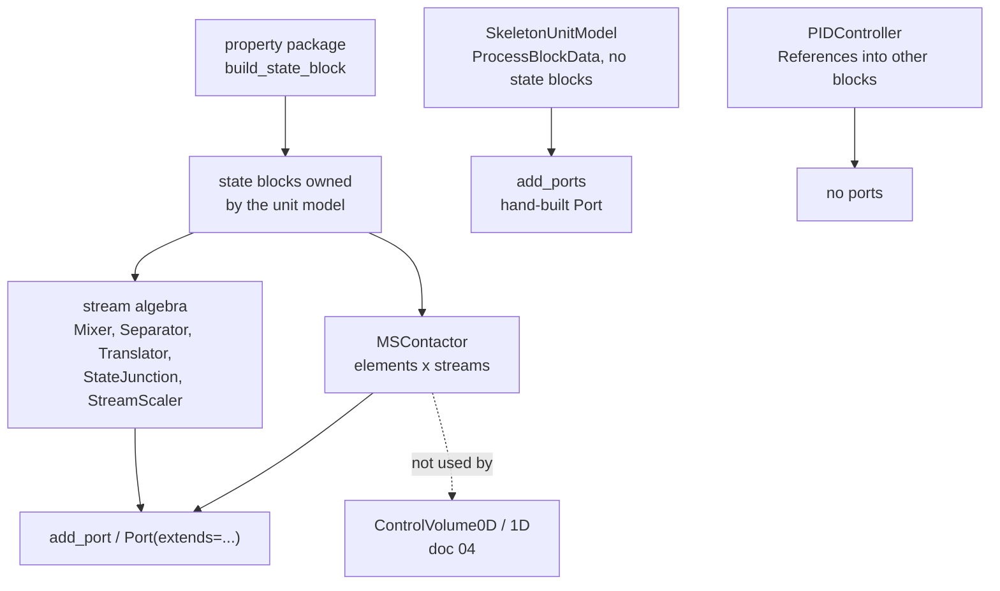
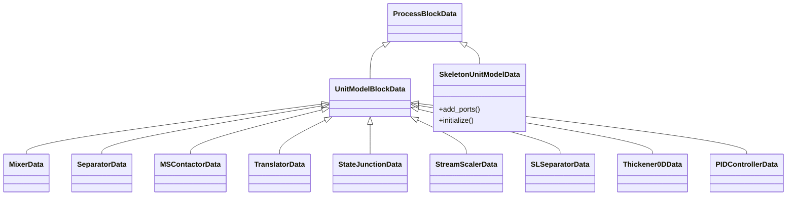
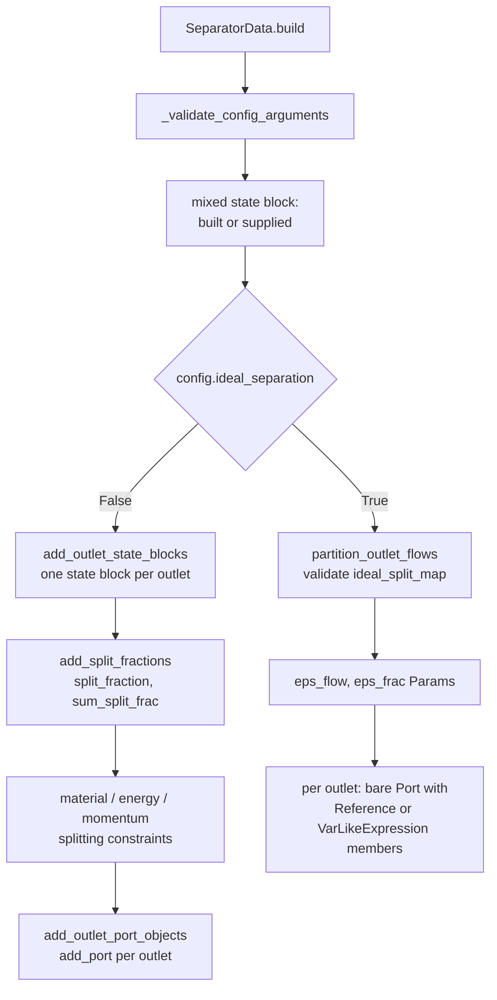
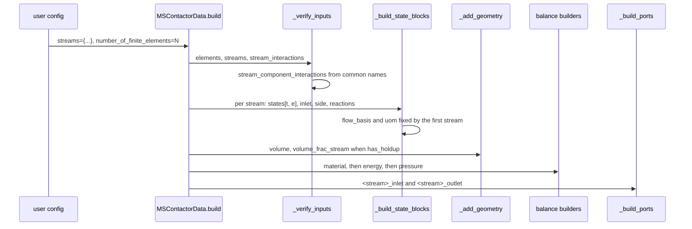

# 11 — Unit models: network, contactors and control

> **Doc ID** 11 · **Repo SHA** 70a8f4fe1 (IDAES-PSE v2.13.0rc0) · **Source roots** `idaes/models/unit_models/`, `idaes/models/control/`
> **Owns** 14 modules / 8,264 LOC · **Assets** 32 SVG icons · **Siblings** [03](03_block_hierarchy_and_construction_protocol.md), [04](04_control_volume_framework.md), [05](05_property_and_reaction_framework.md), [06](06_model_preparation_initializers_and_scalers.md), [10](10_unit_models_control_volume_based.md), [31](31_extension_point_catalog.md)

The unit models here are the ones that are not a control volume plus
correlations. They either perform stream algebra that no single control volume
expresses, implement a multi-element contacting structure of their own, or are
deliberately empty. That architectural split is why documents 10 and 11 exist
separately.

---

## 0. Scope and source map

| File | LOC | Purpose | Covered in § |
|---|---:|---|---|
| `idaes/models/unit_models/separator.py` | 2,390 | `Separator` — split fractions or ideal partitioning; the largest module in `idaes/models/unit_models` | 3, 4, 5, 6, 7, 12 |
| `idaes/models/unit_models/mscontactor.py` | 2,118 | `MSContactor` — the generic staged multi-stream contacting engine and its module-level `STREAM_CONFIG` template | 3, 4, 5, 6, 7, 9 |
| `idaes/models/unit_models/mixer.py` | 1,348 | `Mixer` — N inlets onto one mixed state, with four momentum mixing options | 3, 4, 5, 6, 7, 12 |
| `idaes/models/unit_models/solid_liquid/thickener.py` | 545 | `Thickener0D` — two `Separator` sub-models plus Kynch flux-density settling correlations | 3, 4, 5, 6 |
| `idaes/models/control/controller.py` | 571 | `PIDController` — the library's only feedback-control model | 3, 4, 5, 6, 7 |
| `idaes/models/unit_models/solid_liquid/sl_separator.py` | 362 | `SLSeparator` — a solids pass-through plus one liquid `Separator` | 3, 4, 5, 6 |
| `idaes/models/unit_models/translator.py` | 255 | `Translator` — two state blocks from two different property packages, no equations | 3, 4, 5, 7, 12 |
| `idaes/models/unit_models/stream_scaler.py` | 245 | `StreamScaler` — an outlet port of scaled `VarLikeExpression` objects | 3, 4, 5, 6, 7 |
| `idaes/models/unit_models/skeleton_model.py` | 197 | `SkeletonUnitModel` — the seam for an externally defined or surrogate model | 3, 4, 5, 7, 12 |
| `idaes/models/unit_models/statejunction.py` | 153 | `StateJunction` — one state block exposed as both inlet and outlet | 3, 4, 5, 7 |
| `idaes/models/unit_models/__init__.py` | 48 | Re-exports for the whole `unit_models` package, including models owned by [10](10_unit_models_control_volume_based.md) | 2 |
| `idaes/models/control/__init__.py` | 18 | Re-exports `PIDController` and its three enumerations | 2 |
| `idaes/models/unit_models/solid_liquid/__init__.py` | 14 | Re-exports `SLSeparator` and `Thickener0D` | 2 |
| `idaes/models/unit_models/icons/__init__.py` | 0 | Empty; makes the icon directory a package so the SVGs ship as package data | 10 |

Total 8,264 LOC over 14 modules, plus 32 SVG assets (section 10). 91
configuration keys, 4 `NotImplementedError` hook sites, 10 declared process
block classes, 7 enumerations.

---

## 1. Architectural role

Document 10 covers models that are one control volume plus a handful of
correlations: a heater, a reactor, a pressure changer. The balance equations
there come from the framework in [04](04_control_volume_framework.md), and the
model contributes geometry and performance relations. This document covers
everything in `idaes/models/unit_models` that does not fit that shape, plus the
control library. Three kinds of model sit here.

**Stream algebra.** `Mixer`, `Separator`, `Translator`, `StateJunction` and
`StreamScaler` relate state blocks directly. A control volume has one inlet and
one outlet; a mixer has N inlets and a separator has N outlets, and the relation
between them is a mixing or splitting statement, not a conservation statement
over a region. These models build their own state blocks through
`build_state_block`, write their own constraints, and attach ports with
`add_port`
([03 §5.7](03_block_hierarchy_and_construction_protocol.md#57-port-construction)).
None creates a `ControlVolume0DBlock` or a `ControlVolume1DBlock`.

**Multi-element contacting.** `MSContactor`
(`idaes/models/unit_models/mscontactor.py:972`) is a cascade of finite elements
across an arbitrary number of streams, each configured independently through the
module-level `STREAM_CONFIG` template
(`idaes/models/unit_models/mscontactor.py:831`). It writes its own material,
energy and pressure balances per stream and per element, with inter-stream
transfer terms linking them. A control volume is a fixed two-state structure; an
`MSContactor` is a structure whose shape is derived from configuration at build
time.

**The deliberately empty model.** `SkeletonUnitModel`
(`idaes/models/unit_models/skeleton_model.py:39`) derives from
`ProcessBlockData`, not `UnitModelBlockData`, declares two configuration keys,
and builds nothing. It exists so a surrogate or an externally authored set of
equations can present IDAES-compatible ports to a flowsheet.
`idaes/models/control/controller.py` is here because a PID controller is the
same kind of object: a unit model with no material stream, writing algebraic and
differential relations between two references into other blocks.

*Nothing in this document instantiates a control volume; the state blocks are owned directly by the unit model.*

---

## 2. Public surface inventory

Each `*Data` class is paired with a container class of the same name minus
`Data`, synthesized by `declare_process_block_class` at the same line; the pair
is one row here. Every container class is autodoc'd in `docs/`, and the
`Exported via` column names the package that re-exports the **container**; of
the data classes only `SkeletonUnitModelData` and `StreamScalerData` are
re-exported alongside it. No module in this document declares `__all__`.

| Symbol | Kind | Declared at | Exported via | Stability signal |
|---|---|---|---|---|
| `MixingType` | enum | `idaes/models/unit_models/mixer.py:66` | `idaes.models.unit_models` | re-exported |
| `MomentumMixingType` | enum | `idaes/models/unit_models/mixer.py:75` | `idaes.models.unit_models` | re-exported |
| `MixerScaler` | class | `idaes/models/unit_models/mixer.py:86` | — | not re-exported |
| `MixerInitializer` | class | `idaes/models/unit_models/mixer.py:182` | `idaes.models.unit_models` | re-exported; autodoc'd |
| `MixerData` / `Mixer` | pair | `idaes/models/unit_models/mixer.py:303` | `idaes.models.unit_models` | re-exported; autodoc'd |
| `SplittingType` | enum | `idaes/models/unit_models/separator.py:72` | `idaes.models.unit_models` | re-exported |
| `EnergySplittingType` | enum | `idaes/models/unit_models/separator.py:83` | `idaes.models.unit_models` | re-exported |
| `SeparatorScaler` | class | `idaes/models/unit_models/separator.py:94` | — | not re-exported |
| `SeparatorInitializer` | class | `idaes/models/unit_models/separator.py:324` | `idaes.models.unit_models` | re-exported; autodoc'd |
| `SeparatorData` / `Separator` | pair | `idaes/models/unit_models/separator.py:637` | `idaes.models.unit_models` | re-exported; autodoc'd |
| `MSContactorScaler` | class | `idaes/models/unit_models/mscontactor.py:69` | — | not re-exported |
| `MSContactorInitializer` | class | `idaes/models/unit_models/mscontactor.py:693` | `idaes.models.unit_models` | re-exported; autodoc'd |
| `STREAM_CONFIG` | `ConfigDict` | `idaes/models/unit_models/mscontactor.py:831` | — | module-level; used as an implicit domain |
| `MSContactorData` / `MSContactor` | pair | `idaes/models/unit_models/mscontactor.py:972` | `idaes.models.unit_models` | re-exported; autodoc'd |
| `TranslatorData` / `Translator` | pair | `idaes/models/unit_models/translator.py:37` | `idaes.models.unit_models` | re-exported; autodoc'd |
| `StateJunctionData` / `StateJunction` | pair | `idaes/models/unit_models/statejunction.py:39` | `idaes.models.unit_models` | re-exported; autodoc'd |
| `StateJunctionInitializer` | alias of `FeedInitializer` | `idaes/models/unit_models/statejunction.py:28` | `idaes.models.unit_models` | re-exported; autodoc'd |
| `StateJunctionScaler` | alias of `FeedScaler` | `idaes/models/unit_models/statejunction.py:29` | — | import alias |
| `StreamScalerData` / `StreamScaler` | pair | `idaes/models/unit_models/stream_scaler.py:52` | `idaes.models.unit_models` | re-exported; autodoc'd |
| `StreamScalerInitializer` | alias of `FeedInitializer` | `idaes/models/unit_models/stream_scaler.py:42` | — | autodoc'd |
| `SkeletonUnitModelData` / `SkeletonUnitModel` | pair | `idaes/models/unit_models/skeleton_model.py:39` | `idaes.models.unit_models` | re-exported; autodoc'd |
| `SLSeparatorScaler` | class | `idaes/models/unit_models/solid_liquid/sl_separator.py:67` | — | not re-exported |
| `SLSeparatorData` / `SLSeparator` | pair | `idaes/models/unit_models/solid_liquid/sl_separator.py:122` | `idaes.models.unit_models.solid_liquid` | re-exported; autodoc'd |
| `Thickener0DData` / `Thickener0D` | pair | `idaes/models/unit_models/solid_liquid/thickener.py:67` | `idaes.models.unit_models.solid_liquid` | re-exported; autodoc'd |
| `ControllerType` | enum | `idaes/models/control/controller.py:35` | `idaes.models.control` | re-exported |
| `ControllerMVBoundType` | enum | `idaes/models/control/controller.py:44` | `idaes.models.control` | re-exported |
| `ControllerAntiwindupType` | enum | `idaes/models/control/controller.py:57` | `idaes.models.control` | re-exported |
| `smooth_heaviside` | function | `idaes/models/control/controller.py:76` | — | module-level, no underscore |
| `PIDControllerData` / `PIDController` | pair | `idaes/models/control/controller.py:84` | `idaes.models.control` | re-exported; autodoc'd |

---

## 3. Class hierarchy and type taxonomy

*`SkeletonUnitModelData` is the one process block in the library's unit model packages that bypasses `UnitModelBlockData` entirely.*

| Class | Base(s) | Declared at | Container class | Key overrides |
|---|---|---|---|---|
| `MixerData` | `UnitModelBlockData` | `mixer.py:303` | `Mixer` | `build`, `model_check`, `fix_initialization_states`, `initialize_build`, `release_state`, `calculate_scaling_factors` |
| `SeparatorData` | `UnitModelBlockData` | `separator.py:637` | `Separator` | the same set, plus `_get_performance_contents` |
| `MSContactorData` | `UnitModelBlockData` | `mscontactor.py:972` | `MSContactor` | `build`, `initialize` (raises), both report hooks |
| `TranslatorData` | `UnitModelBlockData` | `translator.py:37` | `Translator` | `build`, `initialize_build` |
| `StateJunctionData` | `UnitModelBlockData` | `statejunction.py:39` | `StateJunction` | `build`, `initialize_build` |
| `StreamScalerData` | `UnitModelBlockData` | `stream_scaler.py:52` | `StreamScaler` | `build`, `initialize_build`, `release_state`, `calculate_scaling_factors` |
| `SkeletonUnitModelData` | `ProcessBlockData` | `skeleton_model.py:39` | `SkeletonUnitModel` | `build` (calls `super` only), `add_ports`, `fix_initialization_states`, `initialize` |
| `SLSeparatorData` | `UnitModelBlockData` | `sl_separator.py:122` | `SLSeparator` | `build`, `initialize` (raises), both report hooks |
| `Thickener0DData` | `UnitModelBlockData` | `thickener.py:67` | `Thickener0D` | the same |
| `PIDControllerData` | `UnitModelBlockData` | `controller.py:84` | `PIDController` | `build`, `calculate_scaling_factors` |
| `MixerScaler` | `ControlVolumeScalerBase` | `mixer.py:86` | — | `_get_reference_state_block`, both routines |
| `SeparatorScaler` | `CustomScalerBase` | `separator.py:94` | — | both routines |
| `MSContactorScaler` | `CustomScalerBase` | `mscontactor.py:69` | — | both routines, `_scale_stream_reaction_variables` |
| `SLSeparatorScaler` | `CustomScalerBase` | `sl_separator.py:67` | — | both routines, delegation only |
| `MixerInitializer` | `ModularInitializerBase` | `mixer.py:182` | — | `initialization_routine` |
| `SeparatorInitializer` | `ModularInitializerBase` | `separator.py:324` | — | `initialization_routine` |
| `MSContactorInitializer` | `ModularInitializerBase` | `mscontactor.py:693` | — | `CONFIG`, `initialization_routine` |

### 3.1 Enumerations

`MixingType` (`idaes/models/unit_models/mixer.py:66`) has two members: `none`
(0), write no energy mixing equation (`mixer.py:566`), and `extensive` (1), one
total enthalpy balance over all phases (`mixer.py:562`).

`MomentumMixingType` (`idaes/models/unit_models/mixer.py:75`):

| Member | Value | Meaning | Consumed at |
|---|---|---|---|
| `none` | 0 | Write no pressure relation | `mixer.py:598` |
| `minimize` | 1 | Mixed pressure equals a smooth-minimum cascade over the inlets | `mixer.py:579` |
| `equality` | 2 | One equality per inlet against the mixed pressure | `mixer.py:583` |
| `minimize_and_equality` | 3 | Build both sets, then deactivate the equality set | `mixer.py:587` |

`SplittingType` (`idaes/models/unit_models/separator.py:72`) — numbered from 1,
with no `none` member:

| Member | Value | Meaning | Consumed at |
|---|---|---|---|
| `totalFlow` | 1 | One split fraction per outlet | `separator.py:1099` |
| `phaseFlow` | 2 | One per outlet and phase | `separator.py:1102` |
| `componentFlow` | 3 | One per outlet and chemical component | `separator.py:1112` |
| `phaseComponentFlow` | 4 | One per outlet and phase-component pair | `separator.py:1122` |

`EnergySplittingType` (`idaes/models/unit_models/separator.py:83`):

| Member | Value | Meaning | Consumed at |
|---|---|---|---|
| `none` | 0 | Write no energy relation between outlets | `separator.py:1371` |
| `equal_temperature` | 1 | Every outlet temperature equals the mixed temperature | `separator.py:1374` |
| `equal_molar_enthalpy` | 2 | Every outlet `enth_mol` equals the mixed value | `separator.py:1385` |
| `enthalpy_split` | 3 | Enthalpy flow split by the material split fraction | `separator.py:1396` |

`ControllerType` (`idaes/models/control/controller.py:35`): `P` (1), `PI` (2),
`PD` (3), `PID` (4). `ControllerMVBoundType`
(`idaes/models/control/controller.py:44`): `NONE` (1), `SMOOTH_BOUND` (2),
`LOGISTIC` (3). `ControllerAntiwindupType`
(`idaes/models/control/controller.py:57`): `NONE` (1),
`CONDITIONAL_INTEGRATION` (2), `BACK_CALCULATION` (3). All three number their
members from 1, so no member is falsy.

### 3.2 Retrofit status

Of the ten declared process block classes here, nine name a
`default_initializer` and five name a `default_scaler` — the highest Initializer
adoption rate of any document in the set. Data from `_generated/retrofit.csv`;
the set-wide table is
[06 §3.3](06_model_preparation_initializers_and_scalers.md#33-retrofit-adoption).

| Data class | `default_initializer` | At | `default_scaler` | At |
|---|---|---|---|---|
| `MixerData` | `MixerInitializer` | `mixer.py:322` | `MixerScaler` | `mixer.py:323` |
| `SeparatorData` | `SeparatorInitializer` | `separator.py:657` | `SeparatorScaler` | `separator.py:658` |
| `MSContactorData` | `MSContactorInitializer` | `mscontactor.py:977` | `MSContactorScaler` | `mscontactor.py:978` |
| `StateJunctionData` | `StateJunctionInitializer` | `statejunction.py:44` | `StateJunctionScaler` | `statejunction.py:45` |
| `SLSeparatorData` | `BlockTriangularizationInitializer` | `sl_separator.py:127` | `SLSeparatorScaler` | `sl_separator.py:128` |
| `StreamScalerData` | `StreamScalerInitializer` | `stream_scaler.py:58` | — | — |
| `TranslatorData` | `BlockTriangularizationInitializer` | `translator.py:44` | — | — |
| `SkeletonUnitModelData` | `BlockTriangularizationInitializer` | `skeleton_model.py:48` | — | — |
| `Thickener0DData` | `BlockTriangularizationInitializer` | `thickener.py:198` | — | — |
| `PIDControllerData` | — | — | — | — |

Three of the nine name the generic `BlockTriangularizationInitializer` rather
than a purpose-built Initializer, and two name Initializers that are import
aliases of the `Feed` model's, owned by
[10](10_unit_models_control_volume_based.md).

---

## 4. Configuration reference

91 keys across eleven declarations. Anchors in these tables are line numbers
within the file named in the sub-heading.

### 4.1 `MixerData.CONFIG`

A fresh `ConfigBlock()` at `idaes/models/unit_models/mixer.py:327` — not
`UnitModelBlockData.CONFIG()`, which is why `dynamic` and `has_holdup` are
redeclared with a narrowed domain.

| Key | Domain / validator | Default | Req. | Effect on build | Anchor |
|---|---|---|---|---|---|
| `dynamic` | `In([False])` | `False` | no | Any other value fails validation; a Mixer is steady-state | `:328` |
| `has_holdup` | `In([False])` | `False` | no | The same | `:338` |
| `property_package` | `is_physical_parameter_block` | `useDefault` | no | Package every state block is built from | `:348` |
| `property_package_args` | implicit `ConfigBlock` | empty | no | Forwarded to each state block | `:361` |
| `inlet_list` | `ListOf(str)` | `None` | no | Names the inlets; mutually exclusive with `num_inlets` | `:373` |
| `num_inlets` | `int` | `None` | no | Generates `inlet_1` … `inlet_n`; defaults to 2 when neither key is set | `:385` |
| `material_balance_type` | `In(MaterialBalanceType)` | `useDefault` | no | Selects the mixing equation form; `elementTotal` raises | `:400` |
| `has_phase_equilibrium` | `Bool` | `False` | no | Creates `phase_equilibrium_generation`, phase-component form only | `:418` |
| `energy_mixing_type` | `MixingType` | `extensive` | no | `extensive` writes `enthalpy_mixing_equations`; `none` writes nothing | `:432` |
| `momentum_mixing_type` | `MomentumMixingType` | `minimize` | no | Selects one of four pressure treatments, section 5.2 | `:446` |
| `mixed_state_block` | `is_state_block` | `None` | no | When set, writes onto a caller-owned state block instead of building one | `:468` |
| `construct_ports` | `Bool` | `True` | no | When false, no `Port` is added and the model is usable only as a sub-model | `:483` |

`energy_mixing_type` and `momentum_mixing_type` use the enumeration class itself
as the CONFIG domain, so Pyomo coerces by calling `MixingType(value)`.
`material_balance_type` uses `In(...)`, which tests membership. The two
spellings behave differently on an integer input.

### 4.2 `SeparatorData.CONFIG`

`ConfigBlock()` at `idaes/models/unit_models/separator.py:660`.

| Key | Domain / validator | Default | Req. | Effect on build | Anchor |
|---|---|---|---|---|---|
| `dynamic` | `In([False])` | `False` | no | Steady-state only | `:661` |
| `has_holdup` | `In([False])` | `False` | no | The same | `:671` |
| `property_package` | `is_physical_parameter_block` | `useDefault` | no | Package for the mixed and outlet states | `:681` |
| `property_package_args` | implicit `ConfigBlock` | empty | no | Forwarded to each state block | `:695` |
| `outlet_list` | `ListOf(str)` | `None` | no | Names the outlets | `:707` |
| `num_outlets` | `int` | `None` | no | Generates `outlet_1` … `outlet_n`; defaults to 2 | `:719` |
| `split_basis` | `SplittingType` | `totalFlow` | no | Sets the index set of `split_fraction` | `:734` |
| `material_balance_type` | `In(MaterialBalanceType)` | `useDefault` | no | Selects the splitting equation form; `elementTotal` raises | `:753` |
| `momentum_balance_type` | `In(MomentumBalanceType)` | `pressureTotal` | no | `none` writes nothing; any other member raises `NotImplementedError` | `:771` |
| `has_phase_equilibrium` | `Bool` | `False` | no | Incompatible with `ideal_separation`; validated at build | `:787` |
| `energy_split_basis` | `EnergySplittingType` | `equal_temperature` | no | Selects one of four energy treatments | `:801` |
| `ideal_separation` | `Bool` | `False` | no | Selects the second construction path entirely, section 5.3 | `:819` |
| `ideal_split_map` | `dict` | `None` | no | Required under `ideal_separation`; maps an index to an outlet name | `:836` |
| `mixed_state_block` | `is_state_block` | `None` | no | Caller-owned inlet state block | `:850` |
| `construct_ports` | `Bool` | `True` | no | Cannot be false under `ideal_separation` | `:863` |

### 4.3 `STREAM_CONFIG` — the per-stream template

`STREAM_CONFIG = ConfigDict()` at `idaes/models/unit_models/mscontactor.py:831`
is a module-level object, not a class attribute, consumed as the
`implicit_domain` of the `streams` key
(`idaes/models/unit_models/mscontactor.py:982`). One copy of this dictionary
exists per stream named by the user. Models built on `MSContactor` refer to this
table rather than reproducing it.

| Key | Domain / validator | Default | Req. | Effect on build | Anchor |
|---|---|---|---|---|---|
| `property_package` | `is_physical_parameter_block` | `useDefault` | no | Package this stream's state blocks are built from | `:832` |
| `property_package_args` | implicit `ConfigDict` | empty | no | Forwarded to every state block of this stream | `:845` |
| `reaction_package` | `is_reaction_parameter_block` | `None` | no | When set, builds `<stream>_reactions` over time and element | `:857` |
| `reaction_package_args` | implicit `ConfigDict` | empty | no | Forwarded to that reaction block | `:870` |
| `flow_direction` | `In(FlowDirection)` | `forward` | no | Chooses which element is upstream and which end carries the outlet port | `:882` |
| `has_feed` | `Bool` | `True` | no | Builds `<stream>_inlet_state` and `<stream>_inlet`; when false all flow arrives by transfer | `:892` |
| `has_rate_reactions` | `Bool` | `False` | no | Creates rate reaction extent, generation and stoichiometry constraint | `:902` |
| `has_equilibrium_reactions` | `Bool` | `False` | no | The equilibrium equivalents | `:910` |
| `has_energy_balance` | `Bool` | `True` | no | When false, no energy balance is written for this stream | `:918` |
| `has_heat_transfer` | `Bool` | `False` | no | Creates `<stream>_heat` | `:926` |
| `has_heat_of_reaction` | `Bool` | `False` | no | Adds a heat-of-reaction term to this stream's energy balance | `:935` |
| `has_pressure_balance` | `Bool` | `True` | no | When false, no pressure balance is written for this stream | `:944` |
| `has_pressure_change` | `Bool` | `False` | no | Creates `<stream>_deltaP` | `:952` |
| `side_streams` | `list` | `None` | no | Elements at which a side feed state block and pressure equality are added | `:961` |

Every key applies per stream. A four-stream contactor carries four independent
copies of this dictionary, and no key in it is settable once for the whole unit.

### 4.4 `MSContactorData.CONFIG`

`UnitModelBlockData.CONFIG()` extended at
`idaes/models/unit_models/mscontactor.py:980`, so `dynamic` and `has_holdup` are
inherited unchanged from
[03 §4](03_block_hierarchy_and_construction_protocol.md#4-configuration-reference).

| Key | Domain / validator | Default | Req. | Effect on build | Anchor |
|---|---|---|---|---|---|
| `streams` | implicit `ConfigDict`, `implicit_domain=STREAM_CONFIG` | empty | yes | Each key names a stream; fewer than two raises | `:982` |
| `number_of_finite_elements` | `int` | `None` | yes | Size of the `elements` `RangeSet` | `:992` |
| `interacting_streams` | `list` | `None` | no | Pairs that exchange material; when unset every pair is assumed | `:996` |
| `heterogeneous_reactions` | none declared | `None` | no | A package supplying `build_reaction_block` and `reaction_idx` | `:1004` |
| `heterogeneous_reactions_args` | implicit `ConfigDict` | empty | no | Forwarded to that reaction block | `:1015` |

`heterogeneous_reactions` is the one key in this document with no CONFIG domain
at all; the source carries a comment noting that no base class for heterogeneous
reaction packages exists.

### 4.5 `MSContactorInitializer.CONFIG`

`ModularInitializerBase.CONFIG()` extended at
`idaes/models/unit_models/mscontactor.py:709`.

| Key | Domain / validator | Default | Req. | Effect on build | Anchor |
|---|---|---|---|---|---|
| `ssc_solver_options` | implicit `ConfigDict` | empty | no | Passed as `solve_kwds` to `solve_strongly_connected_components` | `:711` |
| `calculate_variable_options` | implicit `ConfigDict` | empty | no | Passed as `calc_var_kwds` to the same call | `:718` |

### 4.6 `SLSeparatorData.CONFIG`

`ConfigBlock()` at `idaes/models/unit_models/solid_liquid/sl_separator.py:130`.
The first of the two dual-property-package declarations here: instead of one
`property_package` key there are two, one per phase, each with its own arguments
dictionary.

| Key | Domain / validator | Default | Req. | Effect on build | Anchor |
|---|---|---|---|---|---|
| `dynamic` | `In([False])` | `False` | no | Steady-state only | `:131` |
| `has_holdup` | `In([False])` | `False` | no | The same | `:141` |
| `material_balance_type` | `In(MaterialBalanceType)` | `useDefault` | no | Forwarded to the internal `Separator` | `:152` |
| `momentum_balance_type` | `In(MomentumBalanceType)` | `pressureTotal` | no | Forwarded to the internal `Separator` | `:170` |
| `energy_split_basis` | `EnergySplittingType` | `equal_temperature` | no | Forwarded to the internal `Separator` | `:186` |
| `solid_property_package` | `is_physical_parameter_block` | `useDefault` | no | Builds `solid_state` | `:203` |
| `solid_property_package_args` | implicit `ConfigBlock` | empty | no | Forwarded to it | `:217` |
| `liquid_property_package` | `is_physical_parameter_block` | `useDefault` | no | Builds `liquid_inlet_state` and the `Separator` | `:229` |
| `liquid_property_package_args` | implicit `ConfigBlock` | empty | no | Forwarded to both | `:243` |

### 4.7 `Thickener0DData.CONFIG`

`ConfigBlock()` at `idaes/models/unit_models/solid_liquid/thickener.py:72`. The
same nine keys as section 4.6, with the same domains and defaults, differing
only in where they are forwarded.

| Key | Inherited from | Override |
|---|---|---|
| `dynamic` | the `SLSeparator` shape, `:73` | none |
| `has_holdup` | `:83` | none |
| `material_balance_type` | `:94` | forwarded to **both** internal `Separator` blocks |
| `momentum_balance_type` | `:112` | forwarded to both |
| `energy_split_basis` | `:128` | forwarded to both |
| `solid_property_package` | `:145` | builds `solid_inlet_state` and `solid_split` |
| `solid_property_package_args` | `:159` | none |
| `liquid_property_package` | `:171` | builds `liquid_inlet_state` and `liquid_split` |
| `liquid_property_package_args` | `:185` | none |

### 4.8 `TranslatorData.CONFIG`

`ConfigBlock()` at `idaes/models/unit_models/translator.py:46`. The other
dual-property-package model, and the only one whose two packages describe the
same physical stream on either side of the unit.

| Key | Domain / validator | Default | Req. | Effect on build | Anchor |
|---|---|---|---|---|---|
| `dynamic` | `In([False])` | `False` | no | Steady-state only | `:47` |
| `has_holdup` | `In([False])` | `False` | no | The same | `:56` |
| `outlet_state_defined` | `Bool` | `True` | no | Passed as `defined_state` to the outlet state block | `:65` |
| `has_phase_equilibrium` | `Bool` | `False` | no | Passed to the outlet state block; incompatible with `outlet_state_defined` | `:81` |
| `inlet_property_package` | `is_physical_parameter_block` | `None` | yes, at build | Builds `properties_in` | `:96` |
| `inlet_property_package_args` | implicit `ConfigBlock` | empty | no | Forwarded to it | `:109` |
| `outlet_property_package` | `is_physical_parameter_block` | `None` | yes, at build | Builds `properties_out` | `:122` |
| `outlet_property_package_args` | implicit `ConfigBlock` | empty | no | Forwarded to it | `:135` |

Neither package key resolves through `useDefault`: both default to `None`, and
`build` calls `build_state_block` on them directly, so an unset key raises
`AttributeError` rather than a framework error.

### 4.9 `StateJunctionData.CONFIG` and `StreamScalerData.CONFIG`

Four keys each, identical in shape: `ConfigBlock()` at
`idaes/models/unit_models/statejunction.py:47` and
`idaes/models/unit_models/stream_scaler.py:60`.

| Key | Domain / validator | Default | Effect on build | StateJunction | StreamScaler |
|---|---|---|---|---|---|
| `dynamic` | `In([False])` | `False` | Steady-state only | `:48` | `:61` |
| `has_holdup` | `In([False])` | `False` | The same | `:58` | `:71` |
| `property_package` | `is_physical_parameter_block` | `useDefault` | Builds the single `properties` state block | `:69` | `:80` |
| `property_package_args` | implicit `ConfigBlock` | empty | Forwarded to it | `:82` | `:93` |

### 4.10 `SkeletonUnitModelData.CONFIG`

`ProcessBlockData.CONFIG()` extended at
`idaes/models/unit_models/skeleton_model.py:65`. Two keys, and no property
package key of any kind.

| Key | Domain / validator | Default | Req. | Effect on build | Anchor |
|---|---|---|---|---|---|
| `dynamic` | `In([False])` | `False` | no | Nothing is built either way; time indexing is the author's responsibility | `:66` |
| `initializer` | none declared | `_default_initializer.__func__` | no | A callable invoked by `initialize`, distinct from the `default_initializer` class attribute | `:78` |

### 4.11 `PIDControllerData.CONFIG`

`UnitModelBlockData.CONFIG()` extended at `idaes/models/control/controller.py:89`.

| Key | Domain / validator | Default | Req. | Effect on build | Anchor |
|---|---|---|---|---|---|
| `process_var` | none declared | `None` | yes | Wrapped in a `Reference`; must resolve to a `Var` or `Expression` | `:90` |
| `manipulated_var` | none declared | `None` | yes | Wrapped in a `Reference`; must resolve to a `Var` | `:101` |
| `mv_bound_type` | `In([NONE, SMOOTH_BOUND, LOGISTIC])` | `NONE` | no | Creates `mv_lb`/`mv_ub` and selects the form of `mv_eqn` | `:114` |
| `calculate_initial_integral` | `Bool` | `True` | no | Adds `initial_integral_error_eqn` and deactivates `mv_eqn` at the first time point | `:136` |
| `controller_type` | `In([P, PI, PD, PID])` | `PI` | no | Selects which gain variables and which terms of `mv_unbounded` exist | `:145` |
| `antiwindup_type` | `In([NONE, CONDITIONAL_INTEGRATION, BACK_CALCULATION])` | `NONE` | no | Selects the form of `mv_integration_eqn`; requires integral action and a bounded MV | `:165` |
| `derivative_on_error` | `Bool` | `False` | no | True differentiates `error`; false differentiates `negative_pv` | `:185` |

---

## 5. Construction and call sequences

### 5.1 `Mixer.build`

`MixerData.build` (`idaes/models/unit_models/mixer.py:511`) calls
`super().build()`, then `_get_property_package()` and `_get_indexing_sets()`
borrowed from `ProcessBlockData`, then:

1. `create_inlet_list()` (`:618`) reconciles `inlet_list` and `num_inlets`; both
   supplied and inconsistent raises `ConfigurationError` (`:628`), neither
   supplied sets `num_inlets` to 2.
2. `add_inlet_state_blocks(inlet_list)` (`:650`) builds one state block per
   inlet named `<inlet>_state`, each with `defined_state=True` and
   `has_phase_equilibrium=False`, recorded in `_inlet_dict`.
3. `add_mixed_state_block()` (`:680`) builds `mixed_state` with
   `defined_state=False` and the configured `has_phase_equilibrium`, or
   `get_mixed_state_block()` (`:698`) validates a caller-supplied one — a state
   block whose `config.parameters` differs from `config.property_package` raises
   `ConfigurationError` (`:720`).
4. A `useDefault` material balance type is resolved by asking the mixed state
   block for `default_material_balance_type()` (`:548`), then
   `add_material_mixing_equations` (`:730`) writes `material_mixing_equations`
   in one of three shapes.
5. `add_energy_mixing_equations` (`:905`) when `energy_mixing_type` is
   `extensive`.
6. The momentum branch, wrapped in a `try`/`except PropertyNotSupportedError`
   that re-raises naming pressure as the missing property (`:608`).
7. `add_port_objects` (`:997`) adds one `Port` per inlet and an `outlet` port on
   the mixed state, when `construct_ports` is true.

### 5.2 The four momentum mixing paths

| `momentum_mixing_type` | Components created | Anchor |
|---|---|---|
| `minimize` | `inlet_idx`, `minimum_pressure`, `eps_pressure`, `minimum_pressure_constraint`, `mixture_pressure` | `mixer.py:926` |
| `equality` | `inlet_idx`, `pressure_equality_constraints` | `mixer.py:979` |
| `minimize_and_equality` | both sets, with `pressure_equality_constraints` deactivated at the end of build | `mixer.py:587` |
| `none` | nothing | `mixer.py:598` |

`minimize` is a sequential smooth-minimum cascade: the constraint at inlet 1
fixes `minimum_pressure[t, 1]` to the first inlet pressure and each later index
applies `smooth_min` against the running value (`mixer.py:960`). Under
`minimize_and_equality`, `use_minimum_inlet_pressure_constraint` (`:1053`) and
`use_equal_pressure_constraint` (`:1067`) swap which set is active; each logs a
warning and returns without acting if the configured type is anything else.

### 5.3 `Separator.build` — two structurally different paths

`SeparatorData.build` (`idaes/models/unit_models/separator.py:878`) begins with
`_validate_config_arguments()` (`:931`), which raises `ConfigurationError` when
`has_phase_equilibrium` and `ideal_separation` are both set, then resolves the
property package, builds the outlet name list, obtains the mixed state block by
the same two-method pattern as the Mixer (`:1003`, `:1021`) and calls
`add_inlet_port_objects` (`:1055`). The two paths then diverge and share nothing.

*The split-fraction path creates outlet state blocks and constraints; the ideal path creates neither, and builds ports out of expressions over the inlet state.*

The split-fraction path runs `add_outlet_state_blocks` (`:973`, one state block
per outlet with `defined_state=False`), `add_split_fractions` (`:1084`, creating
`outlet_idx`, `split_fraction` over an index set chosen by `split_basis`, and
`sum_split_frac`), `add_material_splitting_constraints` (`:1147`, which resolves
a `useDefault` balance type, records it in `_constructed_material_balance_type`
at `:1168` and writes `material_splitting_eqn` in one of three shapes),
`add_energy_splitting_constraints` (`:1367`, one of four forms;
`enthalpy_split` with a component-indexed `split_basis` raises at `:1402`),
`add_momentum_splitting_constraints` (`:1435`) and `add_outlet_port_objects`
(`:1068`).

The ideal path calls `partition_outlet_flows(mb, outlet_list)` (`:1460`), which
validates that ports are enabled (`:1474`), that `split_basis` is not
`totalFlow` (`:1480`), that `ideal_split_map` is present (`:1486`) and that it
has one key per index combination and one outlet per key (`:1537`). It creates
two tolerance `Param`s, `eps_flow` (`:1556`) and `eps_frac` (`:1557`), then for
each outlet builds a bare `Port` and populates it member by member: `pressure`
and `temperature` become a `Reference` into the inlet state, and every other
member becomes a `VarLikeExpression` built by one of six rules selected on the
member's name suffix (`separator.py:2157` through `:2322`). A member that maps
to this outlet returns the inlet value; one that does not returns `eps_flow` or
`eps_frac`. No outlet state block, no split fraction and no constraint is
created on the ideal path.

### 5.4 `MSContactor.build`

`MSContactorData.build` (`idaes/models/unit_models/mscontactor.py:1024`) sets
`flow_basis` and `uom` to `None` and calls six private builders in order.

*Index sets are derived before any state block exists, and the unit's flow basis and units of measurement come from whichever stream is declared first.*

1. `_verify_inputs` (`:1054`) requires at least two streams (`:1057`) and builds
   `elements` (a `RangeSet` over 1..N), `streams`, `stream_interactions` (every
   unordered pair when `interacting_streams` is unset) and
   `stream_component_interactions`, the triples `(stream1, stream2, component)`
   where a chemical component name appears in both packages. No common component
   and no heterogeneous reaction package raises (`:1100`); a stream asking for
   reactions without a reaction package raises (`:1111`).
2. `_build_state_blocks` (`:1115`) builds, per stream: the main state block over
   time and element with `defined_state=False`; an inlet state block over time
   with `defined_state=True` when `has_feed`; a side stream set and side state
   block when `side_streams` is given, with an out-of-range element raising
   (`:1148`); and a reaction block when `reaction_package` is set. The first
   stream fixes `flow_basis` and `uom` (`:1169`); a later stream with a
   different `MaterialFlowBasis` raises (`:1174`).
3. `_build_heterogeneous_reaction_blocks` (`:1195`) when configured; a package
   without `build_reaction_block` raises `ConfigurationError` (`:1207`) and one
   without `reaction_idx` raises `PropertyNotSupportedError` (`:1214`).
4. `_add_geometry` (`:1219`) creates `volume`, `volume_frac_stream`,
   `sum_volume_frac` and per-stream phase fractions, only under `has_holdup`.
5. `_build_material_balance_constraints` (`:1250`),
   `_build_energy_balance_constraints` (`:1546`) and
   `_build_pressure_balance_constraints` (`:1617`).
6. `_build_ports` (`:1656`) adds `<stream>_inlet` from the inlet state when
   `has_feed`, and `<stream>_outlet` as a slice of the main state block at the
   last element for `forward` flow or the first for `backward`.

Balance constraints are built from module-level rule functions bound with
`functools.partial`, not from closures: `_material_balance_rule` (`:1833`),
`_energy_balance_rule` (`:1952`), `_pressure_balance_rule` (`:2026`) and their
reaction counterparts (`:1771`, `:1787`, `:1803`, `:1819`). Each calls
`_get_state_blocks` (`:1732`) to resolve which state block is upstream of a
given element, honouring `flow_direction`, `has_feed` and any side stream.

### 5.5 The solid-liquid models

`SLSeparatorData.build` (`idaes/models/unit_models/solid_liquid/sl_separator.py:256`)
builds one solid state block (`:275`) and exposes it as both `solid_inlet` and
`solid_outlet` — the solid phase passes through unchanged. It builds a liquid
inlet state (`:295`) and a nested `Separator` (`:301`) configured with
`outlet_list=["recovered", "retained"]`, `split_basis=SplittingType.totalFlow`
and `ideal_separation=False`, using the liquid inlet state as that model's
`mixed_state_block`. The two liquid outlets are exposed as `Port(extends=...)`
of the nested ports (`:320`, `:321`), and `liquid_recovery` is a `Reference`
onto the recovered split fraction (`:324`).

`Thickener0DData.build` (`idaes/models/unit_models/solid_liquid/thickener.py:200`)
follows the same pattern twice, with `solid_split` (`:224`) and `liquid_split`
(`:257`) each producing `underflow` and `overflow`, then adds the settling
model of section 6.4. Neither model is built on `MSContactor`; both are built on
`Separator`, which is why they sit here rather than alongside the staged
contactors.

### 5.6 The small models

`StateJunctionData.build` (`idaes/models/unit_models/statejunction.py:95`)
builds one state block (`:109`) and calls `add_inlet_port` and `add_outlet_port`
against it, so both ports reference the same variables and no constraint exists.

`StreamScalerData.build` (`idaes/models/unit_models/stream_scaler.py:106`)
builds one state block (`:131`), an empty `Block` named `scaled_expressions`
(`:134`), a scalar `multiplier` over `PositiveReals` (`:135`) and an inlet port.
It then iterates over the inlet port's members and adds, for each, a
`VarLikeExpression` on `scaled_expressions` that is the member multiplied by
`multiplier` when the member name contains `flow` and the member unchanged
otherwise (`:156`). The `outlet` `Port` (`:142`) is populated with those
expressions, so the outlet carries no variables of its own.

`TranslatorData.build` (`idaes/models/unit_models/translator.py:149`) builds
`properties_in` from the inlet package (`:171`) and `properties_out` from the
outlet package (`:179`), adds a port to each, and stops. It writes no constraint
at all, so the equations relating the two sides are the flowsheet author's to
add on the block.

`SkeletonUnitModelData.build` (`idaes/models/unit_models/skeleton_model.py:90`)
calls `super().build()` and nothing else. Components arrive through
`add_ports(name, member_dict, doc)` (`:104`), which validates that `member_dict`
is a dictionary (`:120`), creates a `Port(noruleinit=True)` (`:127`) and adds
each supplied object under its key.

### 5.7 `PIDController.build`

`PIDControllerData.build` (`idaes/models/control/controller.py:201`) validates
before it constructs: a non-dynamic flowsheet raises `ConfigurationError`
(`:208`); a missing `process_var` or `manipulated_var` raises (`:214`); a
`process_var` that is not a `Var` or `Expression` raises `TypeError` (`:229`)
and a `manipulated_var` that is not a `Var` raises (`:233`); an antiwindup type
without integral action raises (`:242`) and one without a bounded manipulated
variable raises (`:246`).

It then derives gain units from the referenced variables, creates the bound and
smoothing parameters selected by `mv_bound_type`, the gain variables selected by
`controller_type`, the error term in one of two forms selected by
`derivative_on_error`, the integral variable and its `DerivativeVar`, the
`mv_unbounded` expression (`:424`), the `mv_eqn` constraint (`:450`) and, for
integral types, `mv_integration_eqn` (`:477`). `mv_integration_eqn` is always
deactivated at the first time point; `mv_eqn` is deactivated there only when
`calculate_initial_integral` is set.

---

## 6. Data structures, variables, constraints and invariants

### 6.1 Mixer

| Component | Type | Index sets | Units | Created at | Condition |
|---|---|---|---|---|---|
| `<inlet>_state` | state blocks | time | — | `mixer.py:650` | one per inlet |
| `mixed_state` | state block | time | — | `mixer.py:680` | `mixed_state_block` unset |
| `inherent_reaction_extent` | `Var` | time × inherent reaction index | flow | `mixer.py:762` | package has inherent reactions |
| `inherent_reaction_generation` | `Var` | time × phase-component | flow | `mixer.py:771` | the same |
| `inherent_reaction_constraint` | `Constraint` | time × phase-component | — | `mixer.py:784` | the same |
| `phase_equilibrium_generation` | `Var` | time × phase equilibrium index | flow | `mixer.py:801` | `has_phase_equilibrium`, phase-component form |
| `material_mixing_equations` | `Constraint` | time × phase-component, time × component, or time | flow | `mixer.py:821`, `:852`, `:875` | per balance type |
| `enthalpy_mixing_equations` | `Constraint` | time | power | `mixer.py:911` | `energy_mixing_type == extensive` |
| `inlet_idx` | `RangeSet` | — | — | `mixer.py:933` | minimization or equality |
| `minimum_pressure` | `Var` | time × inlet index | pressure | `mixer.py:939` | `minimize` |
| `eps_pressure` | `Param`, mutable, `1e-3` | — | pressure | `mixer.py:946` | `minimize` |
| `minimum_pressure_constraint` | `Constraint` | time × inlet index | pressure | `mixer.py:960` | `minimize` |
| `mixture_pressure` | `Constraint` | time | pressure | `mixer.py:974` | `minimize` |
| `pressure_equality_constraints` | `Constraint` | time × inlet index | pressure | `mixer.py:994` | `equality` |

### 6.2 Separator

| Component | Type | Index sets | Units | Created at | Condition |
|---|---|---|---|---|---|
| `mixed_state` | state block | time | — | `separator.py:1003` | `mixed_state_block` unset |
| `<outlet>_state` | state blocks | time | — | `separator.py:973` | split-fraction path |
| `outlet_idx` | `Set` | — | — | `separator.py:1096` | split-fraction path |
| `split_fraction` | `Var`, init 0.5 | time × outlet, plus phase and/or component per `split_basis` | dimensionless | `separator.py:1139` | split-fraction path |
| `sum_split_frac` | `Constraint` | as above without the outlet index | — | `separator.py:1145` | split-fraction path |
| `inherent_reaction_extent` | `Var` | time × outlet × reaction | flow | `separator.py:1189` | inherent reactions |
| `inherent_reaction_generation` | `Var` | time × outlet × phase-component | flow | `separator.py:1199` | inherent reactions |
| `inherent_reaction_constraint` | `Constraint` | time × outlet × phase-component | — | `separator.py:1214` | inherent reactions |
| `material_splitting_eqn` | `Constraint` | time × outlet × (phase ×) component, or time × outlet | flow | `separator.py:1251`, `:1291`, `:1321` | per balance type |
| `temperature_equality_eqn` | `Constraint` | time × outlet | temperature | `separator.py:1381` | `equal_temperature` |
| `molar_enthalpy_equality_eqn` | `Constraint` | time × outlet | molar enthalpy | `separator.py:1392` | `equal_molar_enthalpy` |
| `molar_enthalpy_splitting_eqn` | `Constraint` | time × outlet | power | `separator.py:1418` | `enthalpy_split` |
| `pressure_equality_eqn` | `Constraint` | time × outlet | pressure | `separator.py:1450` | `pressureTotal` |
| `eps_flow`, `eps_frac` | `Param`, mutable, `1e-8` | — | flow, dimensionless | `separator.py:1556`, `:1557` | ideal path |
| `_<outlet>_<member>_ref` | `Reference` or `VarLikeExpression` | per member | per member | `separator.py:1646` | ideal path |

### 6.3 MSContactor

Per-stream components are created with `add_component` under a name prefixed by
the stream name, so a model carries one set of each per stream.

| Component | Type | Index sets | Units | Created at | Condition |
|---|---|---|---|---|---|
| `elements`, `streams` | `RangeSet`, `Set` | 1..N; stream names | — | `mscontactor.py:1063`, `:1068` | always |
| `stream_interactions`, `stream_component_interactions` | `Set` | stream pairs; pairs × component | — | `mscontactor.py:1081`, `:1085` | always |
| `<stream>` | state blocks | time × element | — | `mscontactor.py:1129` | always |
| `<stream>_inlet_state` | state blocks | time | — | `mscontactor.py:1141` | `has_feed` |
| `<stream>_side_stream_set`, `_side_stream_state` | `Set`, state blocks | time × side element | — | `mscontactor.py:1154`, `:1162` | `side_streams` |
| `<stream>_reactions`, `heterogeneous_reactions` | reaction blocks | time × element | — | `mscontactor.py:1193`, `:1200` | per configuration |
| `volume`, `volume_frac_stream`, `sum_volume_frac` | `Var`, `Var`, `Constraint` | element; time × element × stream | VOLUME, dimensionless | `mscontactor.py:1223`, `:1229`, `:1238` | `has_holdup` |
| `<stream>_phase_fraction` (+ `_sum_phase_fractions`) | `Var` or `Expression` (+ `Constraint`) | time × element × phase | dimensionless | `mscontactor.py:2082`, `:2106`, `:2091` | `has_holdup`; `Var` only when multiphase |
| `material_transfer_term` | `Var` | time × element × stream-component interaction | FLOW_MOLE or FLOW_MASS | `mscontactor.py:1266` | always |
| `energy_transfer_term` | `Var` | time × element × stream interaction | POWER | `mscontactor.py:1940` | created on first use by an energy balance |
| `heterogeneous_reaction_extent` | `Var` | time × element × reaction | flow | `mscontactor.py:1278` | heterogeneous reactions |
| `<stream>_material_holdup` (+ `_constraint`) | `Var`, `Constraint` | time × element × phase-component | AMOUNT or MASS | `mscontactor.py:1300`, `:1314` | `has_holdup` |
| `<stream>_material_accumulation` | `DerivativeVar` wrt time | the same | flow | `mscontactor.py:1330` | `dynamic` |
| `<stream>_rate_reaction_extent`, `_generation`, `_constraint` | `Var`, `Var`, `Constraint` | time × element × (reaction \| phase-component) | flow | `mscontactor.py:1351`, `:1365`, `:1379` | `has_rate_reactions` |
| `<stream>_equilibrium_reaction_*` | the same three | the same | flow | `mscontactor.py:1407`, `:1421`, `:1435` | `has_equilibrium_reactions` |
| `<stream>_inherent_reaction_*` | the same three | the same | flow | `mscontactor.py:1456`, `:1470`, `:1484` | package has inherent reactions |
| `<stream>_heterogeneous_reactions_generation` (+ `_constraint`) | `Var`, `Constraint` | time × element × phase-component | flow | `mscontactor.py:1503`, `:1517` | heterogeneous reactions |
| `<stream>_material_balance` | `Constraint` | time × element × component | flow | `mscontactor.py:1544` | always |
| `<stream>_energy_holdup` (+ `_constraint`) | `Var`, `Constraint` | time × element × phase | ENERGY | `mscontactor.py:1555`, `:1569` | `has_holdup` |
| `<stream>_energy_accumulation` | `DerivativeVar` wrt time | the same | POWER | `mscontactor.py:1585` | `dynamic` |
| `<stream>_heat`, `<stream>_energy_balance` | `Var`, `Constraint` | time × element | POWER | `mscontactor.py:1597`, `:1606` | `has_heat_transfer`; `has_energy_balance` |
| `<stream>_deltaP`, `<stream>_pressure_balance` | `Var`, `Constraint` | time × element | PRESSURE | `mscontactor.py:1623`, `:1632` | `has_pressure_change`; `has_pressure_balance` |
| `<stream>_side_stream_pressure_balance` | `Constraint` | time × side element | PRESSURE | `mscontactor.py:1647` | side streams with a pressure balance |
| `<stream>_inlet`, `<stream>_outlet` | `Port` | time (× element slice) | — | `mscontactor.py:1664`, `:1676` | `has_feed`; always |

### 6.4 Solid-liquid and the small models

| Component | Type | Index sets | Units | Created at | Model |
|---|---|---|---|---|---|
| `solid_state`, `split`, `liquid_recovery` | state block, `Separator`, `Reference` | time; —; time | — | `sl_separator.py:275`, `:301`, `:324` | `SLSeparator` |
| `solid_split`, `liquid_split` | `Separator` | — | — | `thickener.py:224`, `:257` | `Thickener0D` |
| `area` | `Var` | — | AREA | `thickener.py:282` | `Thickener0D` |
| `flow_vol_feed`, `flow_vol_overflow`, `flow_vol_underflow` | `Var`, bounded below by 0 | time | FLOW_VOL | `thickener.py:289`, `:296`, `:303` | `Thickener0D` |
| `solid_fraction_feed`, `_underflow`, `_overflow` | `Var` | time | dimensionless | `thickener.py:312`, `:319`, `:326` | `Thickener0D` |
| `flux_density_underflow`, `flux_density_overflow` | `Var` | time | VELOCITY | `thickener.py:335`, `:341` | `Thickener0D` |
| `particle_size`, `v0` | `Var` | time | LENGTH, VELOCITY | `thickener.py:349`, `:355` | `Thickener0D` |
| `v1`, `C`, `solid_fraction_max` | `Var` | — | VELOCITY, dimensionless, dimensionless | `thickener.py:361`, `:366`, `:372` | `Thickener0D` |
| `properties` | state block | time | — | `statejunction.py:109`, `stream_scaler.py:131` | `StateJunction`, `StreamScaler` |
| `multiplier`, `scaled_expressions.<member>` | `Var` over `PositiveReals`, `VarLikeExpression` | —; per member | dimensionless; per member | `stream_scaler.py:135`, `:156` | `StreamScaler` |
| `properties_in`, `properties_out` | state blocks | time | — | `translator.py:171`, `:179` | `Translator` |
| `setpoint`, `gain_p`, `mv_ref` | `Var` | time | PV, MV/PV, MV | `controller.py:302`, `:305`, `:334` | `PIDController` |
| `gain_i`, `gain_d`, `gain_b` | `Var` | time | per controller and antiwindup type | `controller.py:312`, `:319`, `:327` | `PIDController` |
| `error` | `Var` or `Expression` | time | PV | `controller.py:346`, `:364` | `PIDController` |
| `negative_pv`, `negative_pv_eqn` | `Var`, `Constraint` | time | PV | `controller.py:372`, `:380` | `PIDController` |
| `derivative_term` | `DerivativeVar` wrt time | time | PV/time | `controller.py:354`, `:383` | `PIDController` |
| `mv_integral_component`, `_dot` | `Var`, `DerivativeVar` | time | MV, MV/time | `controller.py:392`, `:398` | `PIDController` |
| `mv_unbounded`, `mv_eqn`, `mv_integration_eqn` | `Expression`, `Constraint`, `Constraint` | time | MV | `controller.py:424`, `:450`, `:477` | `PIDController` |

The twelve `Thickener0D` constraints are `feed_flowrate` (`thickener.py:382`),
`overflow_flowrate` (`:389`), `underflow_flowrate` (`:398`),
`flux_density_function_overflow` (`:408`), `flux_density_function_underflow`
(`:419`), `solids_continuity` (`:430`), `solids_conservation` (`:440`),
`maximum_underflow_volume_fraction` (`:447`),
`maximum_overflow_volume_fraction` (`:451`), `inlet_volume_fraction` (`:455`),
`underflow_volume_fraction` (`:467`) and `stokes_law` (`:480`). The two flux
density constraints use `Expr_if` on an `inequality` over the solids fraction,
so the model carries two non-smooth branches by construction. Two of the twelve
are inequalities; the rest are equalities.

### 6.5 Invariants

| Invariant | Enforced at |
|---|---|
| A Mixer or Separator is steady-state and holdup-free | `mixer.py:328`, `separator.py:661` |
| `inlet_list` and `num_inlets` agree when both are given | `mixer.py:628` |
| `outlet_list` and `num_outlets` agree when both are given | `separator.py:951` |
| A supplied mixed state block uses the configured property package | `mixer.py:720`, `separator.py:1045` |
| Split fractions over the outlets sum to one | `separator.py:1145` |
| Ideal separation and phase equilibrium are mutually exclusive | `separator.py:933` |
| Ideal separation requires ports, a non-total basis and a complete split map | `separator.py:1474`, `:1480`, `:1486`, `:1537` |
| An `MSContactor` has at least two streams | `mscontactor.py:1057` |
| Streams share a `MaterialFlowBasis` | `mscontactor.py:1174` |
| Mass transfer has somewhere to go: a common component or a heterogeneous reaction | `mscontactor.py:1100` |
| Side stream elements are a subset of `elements` | `mscontactor.py:1148` |
| Volume fractions across streams sum to one; phase fractions within a stream sum to one | `mscontactor.py:1243`, `:2117` |
| A `Translator` outlet cannot be both fully defined and a phase equilibrium calculation | `translator.py:164` |
| A `PIDController` lives only on a dynamic flowsheet | `controller.py:208` |
| Antiwindup requires integral action and a bounded manipulated variable | `controller.py:242`, `:246` |
| `SkeletonUnitModel.initialize` starts at zero degrees of freedom | `skeleton_model.py:193` |

---

## 7. Method contracts

### 7.1 `MixerData` and `SeparatorData`

| Method | Signature | Effects | Raises | Anchor |
|---|---|---|---|---|
| `MixerData.inlet_blocks` | property | none; returns `dict_items` over `_inlet_dict` | — | `mixer.py:499` |
| `MixerData.build` | `(self)` | Full construction | `ConfigurationError`, `BurntToast`, `PropertyNotSupportedError` | `mixer.py:511` |
| `MixerData.create_inlet_list` | `(self)` | May set `config.num_inlets`; returns `list[str]` | `ConfigurationError` | `mixer.py:618` |
| `MixerData.add_inlet_state_blocks` | `(self, inlet_list)` | Creates `<inlet>_state`; returns the list | — | `mixer.py:650` |
| `MixerData.add_mixed_state_block` | `(self)` | Creates `mixed_state` | — | `mixer.py:680` |
| `MixerData.get_mixed_state_block` | `(self)` | Validates and returns the supplied block | `BurntToast`, `ConfigurationError` | `mixer.py:698` |
| `MixerData.add_material_mixing_equations` | `(self, inlet_blocks, mixed_block, mb_type)` | Mixing constraints and reaction terms | `ConfigurationError`, `PropertyNotSupportedError`, `BurntToast` | `mixer.py:730` |
| `MixerData.add_energy_mixing_equations` | `(self, inlet_blocks, mixed_block)` | `enthalpy_mixing_equations` | — | `mixer.py:905` |
| `MixerData.add_pressure_minimization_equations` | `(self, inlet_blocks, mixed_block)` | The smooth-minimum cascade | `PropertyNotSupportedError` | `mixer.py:926` |
| `MixerData.add_pressure_equality_equations` | `(self, inlet_blocks, mixed_block)` | `pressure_equality_constraints` | — | `mixer.py:979` |
| `MixerData.add_port_objects` | `(self, inlet_list, inlet_blocks, mixed_block)` | Ports, when `construct_ports` | — | `mixer.py:997` |
| `MixerData.model_check` | `(blk)` | Delegates to each state block; logs on absence | — | `mixer.py:1015` |
| `MixerData.use_minimum_inlet_pressure_constraint` | `(self)` | Swaps which constraint set is active | — | `mixer.py:1053` |
| `MixerData.use_equal_pressure_constraint` | `(self)` | The reverse swap | — | `mixer.py:1067` |
| `MixerData.fix_initialization_states` | `(self)` | Fixes inlet port variables, skipping `pressure` under either equality mode | — | `mixer.py:1081` |
| `MixerData.initialize_build` | `(blk, outlvl, optarg, solver, hold_state)` | Legacy initialization | `InitializationError` | `mixer.py:1106` |
| `MixerData.release_state` | `(blk, flags, outlvl)` | Restores fixed status | — | `mixer.py:1244` |
| `MixerData.calculate_scaling_factors` | `(self)` | Suffix-based scaling | — | `mixer.py:1274` |
| `SeparatorData.build` | `(self)` | Construction on one of two paths | `ConfigurationError` | `separator.py:878` |
| `SeparatorData._validate_config_arguments` | `(self)` | none | `ConfigurationError` | `separator.py:931` |
| `SeparatorData.create_outlet_list` | `(self)` | May set `config.num_outlets` | `ConfigurationError` | `separator.py:941` |
| `SeparatorData.add_outlet_state_blocks` | `(self, outlet_list)` | Creates `<outlet>_state` | — | `separator.py:973` |
| `SeparatorData.add_inlet_port_objects` | `(self, mixed_block)` | Adds `inlet` | — | `separator.py:1055` |
| `SeparatorData.add_outlet_port_objects` | `(self, outlet_list, outlet_blocks)` | One port per outlet | — | `separator.py:1068` |
| `SeparatorData.add_split_fractions` | `(self, outlet_list, mixed_block)` | `outlet_idx`, `split_fraction`, `sum_split_frac` | `BurntToast` | `separator.py:1084` |
| `SeparatorData.add_material_splitting_constraints` | `(self, mixed_block)` | `material_splitting_eqn` and reaction terms | `ConfigurationError`, `PropertyNotSupportedError`, `BurntToast` | `separator.py:1147` |
| `SeparatorData.add_energy_splitting_constraints` | `(self, mixed_block)` | One of four energy relations | `ConfigurationError`, `BurntToast` | `separator.py:1367` |
| `SeparatorData.add_momentum_splitting_constraints` | `(self, mixed_block)` | `pressure_equality_eqn` or nothing | `NotImplementedError` | `separator.py:1435` |
| `SeparatorData.partition_outlet_flows` | `(self, mb, outlet_list)` | The whole ideal path | `ConfigurationError` | `separator.py:1460` |
| `SeparatorData.model_check` | `(blk)` | Delegates to state blocks | — | `separator.py:1651` |
| `SeparatorData.initialize_build` | `(blk, outlvl, optarg, solver, hold_state)` | Legacy initialization; returns early on the ideal path | `InitializationError`, `BurntToast` | `separator.py:1690` |
| `SeparatorData.calculate_scaling_factors` | `(self)` | Suffix-based scaling | — | `separator.py:2028` |

### 7.2 `MSContactorData` and the remaining models

| Method | Signature | Effects | Raises | Anchor |
|---|---|---|---|---|
| `MSContactorData.build` | `(self)` | Six private builders in order | propagates | `mscontactor.py:1024` |
| `MSContactorData._verify_inputs` | `(self)` | Creates four index sets | `ConfigurationError` | `mscontactor.py:1054` |
| `MSContactorData._build_state_blocks` | `(self)` | Every state and reaction block; fixes `flow_basis`, `uom` | `ConfigurationError` | `mscontactor.py:1115` |
| `MSContactorData._build_heterogeneous_reaction_blocks` | `(self)` | `heterogeneous_reactions` | `ConfigurationError`, `PropertyNotSupportedError` | `mscontactor.py:1195` |
| `MSContactorData._add_geometry` | `(self)` | Holdup geometry and phase fractions | — | `mscontactor.py:1219` |
| `MSContactorData._build_material_balance_constraints` | `(self)` | Transfer terms, reaction terms, `<stream>_material_balance` | `PropertyNotSupportedError` | `mscontactor.py:1250` |
| `MSContactorData._build_energy_balance_constraints` | `(self)` | `<stream>_energy_balance` and its variables | — | `mscontactor.py:1546` |
| `MSContactorData._build_pressure_balance_constraints` | `(self)` | `<stream>_pressure_balance` and side balances | — | `mscontactor.py:1617` |
| `MSContactorData._build_ports` | `(self)` | Inlet and outlet ports per stream | `BurntToast` | `mscontactor.py:1656` |
| `MSContactorData.initialize` | `(self, **kwargs)` | none | `NotImplementedError` | `mscontactor.py:1682` |
| `MSContactorData._get_performance_contents` | `(self, time_point=0)` | Returns an empty dictionary | — | `mscontactor.py:1688` |
| `MSContactorData._get_stream_table_contents` | `(self, time_point=0)` | Builds a `DataFrame` from `define_display_vars` | `BurntToast` | `mscontactor.py:1693` |
| `SLSeparatorData.build` | `(self)` | Solid pass-through, nested `Separator`, five ports | propagates | `sl_separator.py:256` |
| `SLSeparatorData.initialize` | `(self, **kwargs)` | none | `NotImplementedError` | `sl_separator.py:326` |
| `Thickener0DData.build` | `(self)` | Two nested `Separator` blocks plus the settling model | propagates | `thickener.py:200` |
| `Thickener0DData.initialize` | `(self, **kwargs)` | none | `NotImplementedError` | `thickener.py:541` |
| `TranslatorData.build` | `(self)` | Two state blocks and two ports, no constraints | `ConfigurationError` | `translator.py:149` |
| `TranslatorData.initialize_build` | `(blk, state_args_in, state_args_out, outlvl, solver, optarg)` | Initializes both state blocks; solves only at zero degrees of freedom, otherwise logs a warning | — | `translator.py:191` |
| `StateJunctionData.build` | `(self)` | One state block, two ports onto it | — | `statejunction.py:95` |
| `StateJunctionData.initialize_build` | `(blk, state_args, outlvl, solver, optarg)` | Delegates to the state block | — | `statejunction.py:121` |
| `StreamScalerData.build` | `(self)` | State block, multiplier, expression-backed outlet port | — | `stream_scaler.py:106` |
| `StreamScalerData.initialize_build` | `(blk, outlvl, optarg, solver, hold_state)` | Delegates to the state block | — | `stream_scaler.py:162` |
| `StreamScalerData.release_state` | `(blk, flags, outlvl)` | Delegates to the state block | — | `stream_scaler.py:203` |
| `StreamScalerData.calculate_scaling_factors` | `(self)` | Propagates inlet factors onto the outlet expressions through `multiplier` | — | `stream_scaler.py:226` |
| `SkeletonUnitModelData.add_ports` | `(self, name, member_dict, doc=None)` | Creates and populates a bare `Port` | `ConfigurationError` | `skeleton_model.py:104` |
| `SkeletonUnitModelData.fix_initialization_states` | `(self)` | Fixes every `Port` whose name contains `inlet` | — | `skeleton_model.py:136` |
| `SkeletonUnitModelData.initialize` | `(self, outlvl, solver, optarg, initial_guess)` | Calls `config.initializer` | `ConfigurationError` | `skeleton_model.py:152` |
| `PIDControllerData.build` | `(self)` | Validation then the controller equations | `ConfigurationError`, `TypeError` | `controller.py:201` |
| `PIDControllerData.calculate_scaling_factors` | `(self)` | Suffix-based scaling from the referenced variables | — | `controller.py:509` |

### 7.3 Initializer and Scaler routines

| Method | Effects | Anchor |
|---|---|---|
| `MixerInitializer.initialization_routine` | Initializes each inlet, estimates the mixed state (minimum for pressure, sum for flows, average otherwise), initializes it, then solves with pressure equality deactivated | `mixer.py:188` |
| `SeparatorInitializer.initialization_routine` | Initializes the inlet, solves for split fractions alone with every other constraint deactivated, returns early on the ideal path, then estimates and initializes each outlet | `separator.py:330` |
| `MSContactorInitializer.initialization_routine` | Stores state, fixes transfer terms and reaction extents, deactivates non-base constraints, runs `solve_strongly_connected_components`, restores state, then solves the full model | `mscontactor.py:728` |
| `MixerScaler._get_reference_state_block` | Returns `mixed_state` or the supplied block | `mixer.py:91` |
| `MSContactorScaler._scale_stream_reaction_variables` | Scales a generation term from the material balance sensitivity, then the extent from the largest generation term | `mscontactor.py:89` |
| `SLSeparatorScaler.variable_scaling_routine` | Pure delegation to the two state blocks and the nested `Separator` | `sl_separator.py:72` |

`MSContactorInitializer` is the only Initializer here that snapshots the model
with `to_json`/`from_json` under `StoreState` around its first pass, and the only
one that calls `solve_strongly_connected_components`. Under `has_holdup` it
solves twice: once with holdup constraints deactivated and holdup variables
fixed, then once with them restored through
`calculate_variable_from_constraint`.

---

## 8. Cross-subsystem interactions

### Calls out to

| Target | Purpose | Anchor |
|---|---|---|
| `UnitModelBlockData` | Base of nine of the ten process blocks; `add_port`, `add_inlet_port`, `add_outlet_port` | `mixer.py:997`, `statejunction.py:118` |
| `ProcessBlockData` | Base of `SkeletonUnitModelData`; `_get_property_package`, `_get_indexing_sets` on the others | `skeleton_model.py:39`, `mixer.py:529` |
| `PhysicalParameterBlock.build_state_block` | Every state block in this document | `mixer.py:650`, `mscontactor.py:1123` |
| `ReactionParameterBlock.build_reaction_block` | Per-stream and heterogeneous reactions | `mscontactor.py:1187`, `:1200` |
| State block `get_material_flow_terms`, `get_enthalpy_flow_terms` | Every balance and mixing term | `mixer.py:821`, `mscontactor.py:1843` |
| `StateBlock.build_port`, `define_port_members`, `define_state_vars` | Ports and the ideal separation path | `mscontactor.py:1664`, `separator.py:1560` |
| `pyomo.network.Port` | Hand-built ports on the ideal path, `SkeletonUnitModel`, `StreamScaler`, and `Port(extends=...)` in the solid-liquid models | `separator.py:1567`, `skeleton_model.py:127`, `sl_separator.py:320` |
| `pyomo.dae.DerivativeVar` | `MSContactor` accumulation terms and every `PIDController` derivative | `mscontactor.py:1330`, `controller.py:398` |
| `pyomo.contrib.incidence_analysis.solve_strongly_connected_components` | The `MSContactor` first initialization pass | `mscontactor.py:792` |
| `idaes.core.util.math.smooth_min`, `smooth_bound` | Minimum inlet pressure; bounded manipulated variable | `mixer.py:965`, `controller.py:452` |
| `idaes.core.base.var_like_expression.VarLikeExpression` | Ideal separator port members and scaled stream outlets | `separator.py:1583`, `stream_scaler.py:157` |
| `idaes.core.util.model_serializer.to_json` / `from_json` | State snapshot inside `MSContactorInitializer` | `mscontactor.py:750` |
| `idaes.core.scaling.CustomScalerBase`, `DefaultScalingRecommendation` | Three of the four Scalers and the `MSContactor` default factors | `mscontactor.py:69`, `:74` |
| `idaes.core.base.control_volume_base.ControlVolumeScalerBase` | Base of `MixerScaler` | `mixer.py:86` |
| `idaes.core.initialization` | `ModularInitializerBase`, `BlockTriangularizationInitializer` | `mixer.py:182`, `translator.py:44` |
| `idaes.models.unit_models.feed` | `FeedInitializer` and `FeedScaler`, aliased | `statejunction.py:28`, `stream_scaler.py:42` |
| `idaes.core.util.constants.Constants` | Gravitational acceleration in Stokes' law | `thickener.py:491` |

### Called by

| Caller | What it relies on | Owning doc |
|---|---|---|
| `Flash` | `Separator` as a sub-model with `mixed_state_block` set to its control volume outlet, and `ideal_separation` forwarded | [10](10_unit_models_control_volume_based.md) |
| `SLSeparator`, `Thickener0D` | `Separator` with `totalFlow` splitting | this document, §5.5 |
| `HelmMixer` | `MomentumMixingType`, re-declared in its own CONFIG block | [20](20_power_generation_helmholtz_units_and_soc.md) |
| `FeedwaterHeater0D` | `Mixer` and `MomentumMixingType` | [19](19_power_generation_heat_exchangers_and_properties.md) |
| `MembraneZO`, `FixedBedTSA0D` | `MSContactor`; `SkeletonUnitModel` | [23](23_tsa_gas_distribution_and_ccu.md) |
| Boiler and steam-cycle flowsheets | `Mixer`, `Separator`, `PIDController` | [24](24_reference_flowsheets_and_demonstrations.md) |
| `ControlVolumeScalerBase` | `material_mixing_equations` and `enthalpy_mixing_equations`, by name | [04](04_control_volume_framework.md) |
| The IDAES user interface and flowsheet visualizer | The 32 SVG icons, by file name | external, §10 |

---

## 9. Extension and subclassing contracts

Four `NotImplementedError` sites exist in scope. Three are the same refusal: a
model with no legacy initialization routine declining the old API rather than
silently doing nothing.

| Hook | Kind | Signature | Resolution order | Base behaviour | Anchor |
|---|---|---|---|---|---|
| `MSContactorData.initialize` | legacy API refusal | `(self, **kwargs)` | Shadows `UnitModelBlockData.initialize` | raises, naming Initializer objects | `mscontactor.py:1683` |
| `SLSeparatorData.initialize` | the same | `(self, **kwargs)` | the same | raises | `sl_separator.py:327` |
| `Thickener0DData.initialize` | the same | `(self, **kwargs)` | the same | raises | `thickener.py:542` |
| `SeparatorData.add_momentum_splitting_constraints` | unsupported balance form | `(self, mixed_block)` | Called from `build` | raises for any `momentum_balance_type` other than `none` or `pressureTotal` | `separator.py:1455` |

Other extension points:

| Hook | Kind | Resolution | Base | Anchor |
|---|---|---|---|---|
| `default_initializer` | class attribute | Consulted by the Initializer machinery | nine values, section 3.2 | `mixer.py:322` |
| `default_scaler` | class attribute | Consulted by the Scaler machinery | five values, section 3.2 | `mixer.py:323` |
| `SkeletonUnitModelData.CONFIG.initializer` | callable configuration key | Invoked by `initialize` with `opt`, `init_log`, `solve_log`, `initial_guess` | `_default_initializer` (`skeleton_model.py:53`), a single solve | `skeleton_model.py:78` |
| `STREAM_CONFIG` as `implicit_domain` | ConfigDict template | Applied to every user-named key of `streams` | the 14 keys of section 4.3 | `mscontactor.py:982` |
| `heterogeneous_reactions` | duck-typed package | Requires `build_reaction_block`, `reaction_idx` and `params.reaction_stoichiometry` | none; no base class exists | `mscontactor.py:1004` |
| `mixed_state_block` | configuration key | Lets `Mixer` and `Separator` be embedded in a larger unit model without duplicating state | `None` | `mixer.py:468`, `separator.py:850` |
| `construct_ports` | configuration key | Suppresses port construction for that embedding case | `True` | `mixer.py:483` |
| `MixerScaler._get_reference_state_block` | Scaler method override | Supplies the parent `ControlVolumeScalerBase` routines with an index-compatible state block | raises in the base | `mixer.py:91` |

---

## 10. External assets, data files and external libraries

32 SVG files under `idaes/models/unit_models/icons/`, 834,959 bytes in total,
alongside a zero-byte `idaes/models/unit_models/icons/__init__.py` whose only
function is to make the directory an importable package so that the `*.svg`
entry in `[tool.setuptools.package-data]` picks them up.

| Path | Format | Bytes | Authored/Generated | Producer | Consumer | Load site |
|---|---|---|---|---|---|---|
| `idaes/models/unit_models/icons/*.svg` | SVG, Inkscape-authored | 834,959 total; 5,004–34,843 each | Authored | Inkscape, per the `inkscape:export-filename` metadata each file carries | The IDAES user interface and flowsheet visualizer | none inside `idaes/` |

A ripgrep sweep of the tree for a reference to this directory finds no Python
import, no path construction and no file read: nothing under `idaes/` opens
these files. They are shipped package data consumed by the separate `idaes_ui`
distribution that `FlowsheetBlockData.visualize` reaches through a lazy shim
([03 §7](03_block_hierarchy_and_construction_protocol.md#7-method-contracts)).

The 32 file names: `compressor_1`, `compressor_2`, `cooler`, `expander_1`,
`expander_2`, `fan`, `flash`, `heat_exchanger_1` through `heat_exchanger_4`,
`heater_1`, `heater_2`, `mixer`, `packed_column_1` through `packed_column_4`,
`pump`, `reactor_c`, `reactor_e`, `reactor_g`, `reactor_pfr`, `reactor_s`,
`splitter`, `tray_column_1` through `tray_column_4`, `valve_1`, `valve_2`,
`valve_3`. Only two of them — `mixer.svg` and `splitter.svg` — depict a model
this document owns; the rest depict models owned by
[10](10_unit_models_control_volume_based.md) and by the extended libraries. The
set-wide asset inventory is [28](28_data_and_file_format_inventory.md).

No module in this document loads a shared library, starts a subprocess or reads
a data file; `_generated/externals.csv` has no rows in scope.

---

## 11. Errors, logging and diagnostics behaviour

| Exception | Raised for | Anchor |
|---|---|---|
| `NotImplementedError` | Legacy `initialize` on the three models that decline it | `mscontactor.py:1683`, `sl_separator.py:327`, `thickener.py:542` |
| `NotImplementedError` | A `Separator` momentum balance type other than `none` or `pressureTotal` | `separator.py:1455` |
| `ConfigurationError` | Inconsistent inlet or outlet count arguments | `mixer.py:628`, `separator.py:951` |
| `ConfigurationError` | A supplied mixed state block from the wrong property package | `mixer.py:720`, `separator.py:1045` |
| `ConfigurationError` | Element balances requested from a `Mixer` or `Separator` | `mixer.py:892`, `separator.py:1354` |
| `ConfigurationError` | Total-flow mixing combined with inherent reactions | `mixer.py:755` |
| `ConfigurationError` | Ideal separation combined with phase equilibrium, no ports, a total-flow basis, or an incomplete split map | `separator.py:933`, `:1474`, `:1480`, `:1486` |
| `ConfigurationError` | Enthalpy splitting with a component-indexed split basis | `separator.py:1402` |
| `ConfigurationError` | A property package that cannot be partitioned on the ideal path | `separator.py:2136`, `:2148` |
| `ConfigurationError` | Fewer than two streams, no shared components, reactions without a package, a bad side stream element, inconsistent flow bases | `mscontactor.py:1057`, `:1100`, `:1111`, `:1148`, `:1174` |
| `ConfigurationError` | A heterogeneous reaction package without `build_reaction_block` | `mscontactor.py:1207` |
| `ConfigurationError` | A `Translator` outlet both fully defined and solving phase equilibrium | `translator.py:164` |
| `ConfigurationError` | `add_ports` called with something other than a dictionary; `initialize` at non-zero degrees of freedom | `skeleton_model.py:120`, `:193` |
| `ConfigurationError` | A steady-state flowsheet, a missing reference, or an unusable antiwindup combination | `controller.py:208`, `:214`, `:242`, `:246` |
| `TypeError` | A `process_var` or `manipulated_var` reference of the wrong Pyomo type | `controller.py:229`, `:233` |
| `PropertyNotSupportedError` | Phase equilibrium without `phase_equilibrium_idx`; pressure absent when momentum mixing is on | `mixer.py:809`, `:608` |
| `PropertyNotSupportedError` | A reaction package without the requested reaction index | `mscontactor.py:1344`, `:1401`, `:1214` |
| `InitializationError` | A non-optimal solve inside the legacy `Mixer` or `Separator` routine | `mixer.py:1234`, `separator.py:1991` |
| `BurntToast` | An enumeration value outside its own membership, or an if/else overrun | `mixer.py:899`, `separator.py:1133`, `mscontactor.py:1674` |

Loggers differ by package. Six `unit_models` modules and `controller.py` use
`idaeslog.getLogger(__name__)`, one logger per module (`mixer.py:62`,
`separator.py:68`, `statejunction.py:35`, `stream_scaler.py:48`,
`translator.py:33`, `skeleton_model.py:35`). `mscontactor.py` obtains loggers
per call inside the Initializer instead. The two `solid_liquid` modules use the
standard library directly with a hard-coded name,
`logging.getLogger("idaes.unit_model")` (`sl_separator.py:64`,
`thickener.py:62`), so their messages are not separable by module.

`model_check` on `Mixer` (`mixer.py:1015`) and `Separator`
(`separator.py:1651`) does not raise: a state block without a `model_check`
method produces a warning naming the missing method, and the check continues.
`_get_performance_contents` on `MSContactorData` returns an empty dictionary
(`mscontactor.py:1688`), declining to guess which configuration-dependent terms
belong in a report, and `_get_stream_table_contents` (`mscontactor.py:1693`)
builds its table from `define_display_vars` on each stream's inlet and outlet
states rather than through `create_stream_table_dataframe`.

---

## 12. Duplications, deprecations and sharp edges

- **`SkeletonUnitModelData` derives from `ProcessBlockData`, not
  `UnitModelBlockData`** (`idaes/models/unit_models/skeleton_model.py:39`). It
  is the only unit model in `idaes/models/unit_models` that does; the one other
  `ProcessBlockData` subclass in that package is the `IsentropicPerformanceCurve`
  helper block owned by [10](10_unit_models_control_volume_based.md).
  Consequence: it has
  no `add_port`, `add_inlet_port` or `add_outlet_port` and supplies its own
  `add_ports` (`:104`); it has no `initialize_build`, so the plug-in
  deactivation wrapper in `UnitModelBlockData.initialize` does not apply; and
  `fix_initialization_states` (`:136`) is reimplemented rather than inherited.

- **`MixerScaler` subclasses `ControlVolumeScalerBase` although a `Mixer` has no
  control volume** (`idaes/models/unit_models/mixer.py:86`). The base class in
  turn carries two Mixer-specific branches:
  `elif hasattr(model, "material_mixing_equations")` at
  `idaes/core/base/control_volume_base.py:579` and
  `elif hasattr(model, "enthalpy_mixing_equations")` at `:653`. Consequence: the
  coupling runs both ways — the Mixer depends on a control volume base class,
  and that base class dispatches on Mixer constraint names.

- **A `Separator` built with `ideal_separation=True` is a structurally different
  model.** The split-fraction path creates outlet state blocks,
  `split_fraction`, `sum_split_frac` and four families of constraint; the ideal
  path (`idaes/models/unit_models/separator.py:1460`) creates none of them, and
  builds ports out of `Reference` and `VarLikeExpression` objects over the inlet
  state. Consequence: `split_fraction` does not exist on an ideal separator, the
  Scaler guards every access with `if not model.config.ideal_separation`
  (`separator.py:120`), and `SeparatorInitializer` returns after its first step
  on that path (`separator.py:393`).

- **Five models carry an Initializer but no Scaler.** `StreamScalerData`,
  `TranslatorData`, `SkeletonUnitModelData` and `Thickener0DData` declare a
  `default_initializer` and no `default_scaler`; `PIDControllerData` declares
  neither. Consequence: `StreamScaler` and `PIDController` reach scaling only
  through `calculate_scaling_factors` (`stream_scaler.py:226`,
  `controller.py:509`), the suffix-based generation described in
  [06](06_model_preparation_initializers_and_scalers.md).

- **`Mixer` and `Separator` each carry both scaling generations.** Each declares
  a `default_scaler` (`mixer.py:323`, `separator.py:658`) and also implements
  `calculate_scaling_factors` (`mixer.py:1274`, `separator.py:2028`). Both are
  live, and the separator test file exercises them in adjacent tests.

- **Two Initializers and one Scaler here are import aliases of another model's.**
  `StateJunctionInitializer` and `StreamScalerInitializer` are both
  `FeedInitializer` (`statejunction.py:28`, `stream_scaler.py:42`), and
  `StateJunctionScaler` is `FeedScaler`. Consequence:
  `_generated/classes.csv` lists one class each for those two modules, and the
  behaviour of these Initializers is documented in
  [10](10_unit_models_control_volume_based.md).

- **`Translator` conserves nothing.** `translator.py:149` builds two state
  blocks and two ports and writes no constraint. Consequence: a `Translator`
  adds degrees of freedom equal to the number of outlet state variables, and
  mass, energy and momentum cross the block only if the flowsheet author writes
  the linking constraints. Its legacy `initialize_build` (`translator.py:191`)
  detects this and logs a warning instead of solving.

- **`MSContactor` derives its unit system from whichever stream is declared
  first.** `mscontactor.py:1169` sets `flow_basis` and `uom` from the first
  stream's first state block, and every balance term is converted into those
  units. Consequence: the reported units of a contactor depend on the insertion
  order of the `streams` dictionary, and a stream with a different
  `MaterialFlowBasis` raises rather than converting (`:1174`).

No module in this document is deprecated, and `_generated/deprecations.csv` has
no rows in scope.

---

## 13. Behaviour pinned by tests

451 tests across thirteen files. `test_separator.py`, with 172 of them, is the
largest single unit model test file in the tree.

| Behaviour | Test file:line | Marker |
|---|---|---|
| Mixer inlet list reconciliation, both arguments and neither | `idaes/models/unit_models/tests/test_mixer.py:159`, `:206` | `unit` |
| A supplied mixed state block from another package is rejected | `idaes/models/unit_models/tests/test_mixer.py:313` | `unit` |
| Each material mixing form, with and without phase equilibrium | `idaes/models/unit_models/tests/test_mixer.py:331`-`:484` | `unit` |
| Both pressure treatments build the documented components | `idaes/models/unit_models/tests/test_mixer.py:518`, `:541` | `unit` |
| `construct_ports=False` suppresses every port | `idaes/models/unit_models/tests/test_mixer.py:572` | `unit` |
| Split fractions and their scaling, for all four bases | `idaes/models/unit_models/tests/test_separator.py:473`-`:607` | `unit` |
| Material splitting for every balance type, with and without equilibrium | `idaes/models/unit_models/tests/test_separator.py:629`-`:906` | `unit` |
| The ideal path rejects no ports, total flow and a missing split map | `idaes/models/unit_models/tests/test_separator.py:2880`, `:2904`, `:2927` | `unit` |
| Legacy and Scaler-object scaling of a Separator, separately | `idaes/models/unit_models/tests/test_separator.py:340`, `:349` | `unit` |
| `MSContactor` input verification: stream count, common components, reaction packages | `idaes/models/unit_models/tests/test_mscontactor.py:656`, `:679`, `:707` | `unit` |
| Stream, feed and side-stream state block construction and scaling | `idaes/models/unit_models/tests/test_mscontactor.py:752`-`:977` | `unit` |
| A second stream with a different flow basis is rejected | `idaes/models/unit_models/tests/test_mscontactor.py:989` | `unit` |
| `_get_state_blocks` resolves direction, feed and side streams | `idaes/models/unit_models/tests/test_mscontactor.py:1017`-`:1085` | `unit` |
| Material, energy and pressure balances, steady-state and dynamic | `idaes/models/unit_models/tests/test_mscontactor.py:1269`-`:2377` | `unit` |
| `SkeletonUnitModel` initialization refuses non-zero degrees of freedom | `idaes/models/unit_models/tests/test_skeleton_unit_model.py:141` | `unit` |
| The default and a custom `initializer` callable both run | `idaes/models/unit_models/tests/test_skeleton_unit_model.py:154`, `:373` | `component` |
| `SLSeparator` conserves solids and liquid across the unit | `idaes/models/unit_models/solid_liquid/tests/test_sl_separator.py:296`, `:353` | `component` |
| The `SLSeparator` Scaler object runs end to end | `idaes/models/unit_models/solid_liquid/tests/test_sl_separator.py:510` | `component` |
| `Thickener0D` solves and conserves | `idaes/models/unit_models/solid_liquid/tests/test_thickener.py:361`, `:405` | `component` |
| `Thickener0D.initialize` raises the documented message | `idaes/models/unit_models/solid_liquid/tests/test_thickener.py:540` | `unit` |
| Every controller type and both bound types solve and are unit-consistent | `idaes/models/control/tests/test_controller.py:118`-`:443` | `component` |
| Both antiwindup schemes, and the two rejections | `idaes/models/control/tests/test_controller.py:463`, `:528`, `:592`, `:613` | `component` |
| A steady-state flowsheet is rejected | `idaes/models/control/tests/test_controller.py:102` | `unit` |

Eight of the thirteen files carry `ui` markers exercising the two report hooks;
`test_skeleton_unit_model.py` and the four control test files carry none. The
control flowsheet tests `test_pid_pump.py` and `test_steam_tank_pressure.py` are
`integration`-marked and gated on solver availability.

---

## 14. Cross-references

| Topic | Doc | Section |
|---|---|---|
| Terminology: unit model, state block, port, Initializer object, Scaler object | [01](01_glossary_and_conventions.md) | §2 |
| `declare_process_block_class`, `add_port`, `add_state_material_balances` | [03](03_block_hierarchy_and_construction_protocol.md) | §5 |
| What a control volume does, and why these models do not use one | [04](04_control_volume_framework.md) | §1 |
| The balance-type enumerations these models re-use | [04](04_control_volume_framework.md) | §3 |
| `build_state_block`, `defined_state`, `get_*_terms`, inherent reactions | [05](05_property_and_reaction_framework.md) | §7 |
| `ModularInitializerBase`, `BlockTriangularizationInitializer`, `CustomScalerBase` | [06](06_model_preparation_initializers_and_scalers.md) | §3 |
| `Feed`, `FeedInitializer`, `FeedScaler`, `Flash` | [10](10_unit_models_control_volume_based.md) | §3 |
| Diagnostics assertions used by these test suites | [07](07_diagnostics_and_run_orchestration.md) | §13 |
| `HelmMixer` and `FeedwaterHeater0D` | [19](19_power_generation_heat_exchangers_and_properties.md), [20](20_power_generation_helmholtz_units_and_soc.md) | §3 |
| Column models that contact streams over a length domain | [21](21_column_models_and_solvent_systems.md) | §1 |
| Gas-solid contactors | [22](22_gas_solid_contactors.md) | §1 |
| `MembraneZO` and `FixedBedTSA0D`, built on `MSContactor` and `SkeletonUnitModel` | [23](23_tsa_gas_distribution_and_ccu.md) | §3 |
| Flowsheets that instantiate these models | [24](24_reference_flowsheets_and_demonstrations.md) | §3 |
| Every shipped asset, including these 32 icons | [28](28_data_and_file_format_inventory.md) | §2 |
| Package layering and import direction | [29](29_dependency_and_layering_map.md) | §3 |
| `solve_strongly_connected_components` and the solver interface | [30](30_numerics_and_solver_interface_map.md) | §4 |
| The hooks and extension points named here, in the full catalogue | [31](31_extension_point_catalog.md) | §3 |

---

## 15. Source anchor index

493 distinct anchors, grouped by file and sorted by line so a rebase can be
reconciled one file at a time. Within a row, `:N` is a line in the file named by
that row's first column. The ten owned source modules come first, followed by
`control_volume_base.py` (owned by [04](04_control_volume_framework.md)) and the
seven test files cited in section 13.

| File | Anchors |
|---|---|
| `idaes/models/unit_models/mixer.py` | `:62` module logger · `:66` `MixingType` · `:75` `MomentumMixingType` · `:86` `MixerScaler` · `:91` `_get_reference_state_block` · `:182` `MixerInitializer` · `:188` `initialization_routine` · `:303` `MixerData` · `:322` `default_initializer` · `:323` `default_scaler` · `:327` `CONFIG` · `:328` `dynamic` key · `:338` `has_holdup` key · `:348` `property_package` key · `:361` `property_package_args` key · `:373` `inlet_list` key · `:385` `num_inlets` key · `:400` `material_balance_type` key · `:418` `has_phase_equilibrium` key · `:432` `energy_mixing_type` key · `:446` `momentum_mixing_type` key · `:468` `mixed_state_block` key · `:483` `construct_ports` key · `:499` `inlet_blocks` · `:511` `build` · `:529` `_get_property_package` call · `:548` `default_material_balance_type` call · `:562` `MixingType.extensive` branch · `:566` `MixingType.none` branch · `:579` `MomentumMixingType.minimize` branch · `:583` `MomentumMixingType.equality` branch · `:587` `minimize_and_equality` branch · `:598` `MomentumMixingType.none` branch · `:608` `PropertyNotSupportedError` in `build` · `:618` `create_inlet_list` · `:628` `ConfigurationError` in `create_inlet_list` · `:650` `add_inlet_state_blocks` · `:680` `add_mixed_state_block` · `:698` `get_mixed_state_block` · `:720` `ConfigurationError` in `get_mixed_state_block` · `:730` `add_material_mixing_equations` · `:755` `ConfigurationError` in `add_material_mixing_equations` · `:762` `inherent_reaction_extent` · `:771` `inherent_reaction_generation` · `:784` `inherent_reaction_constraint` · `:801` `phase_equilibrium_generation` · `:809` `PropertyNotSupportedError` in `add_material_mixing_equations` · `:821` `material_mixing_equations`, phase-component · `:852` `material_mixing_equations`, component-total · `:875` `material_mixing_equations`, total · `:892` `ConfigurationError` in `add_material_mixing_equations` · `:899` `BurntToast` in `add_material_mixing_equations` · `:905` `add_energy_mixing_equations` · `:911` `enthalpy_mixing_equations` · `:926` `add_pressure_minimization_equations` · `:933` `inlet_idx` · `:939` `minimum_pressure` · `:946` `eps_pressure` · `:960` `minimum_pressure_constraint` · `:965` `smooth_min` call · `:974` `mixture_pressure` · `:979` `add_pressure_equality_equations` · `:994` `pressure_equality_constraints` · `:997` `add_port_objects` · `:1015` `model_check` · `:1053` `use_minimum_inlet_pressure_constraint` · `:1067` `use_equal_pressure_constraint` · `:1081` `fix_initialization_states` · `:1106` `initialize_build` · `:1234` `InitializationError` in `initialize_build` · `:1244` `release_state` · `:1274` `calculate_scaling_factors` |
| `idaes/models/unit_models/separator.py` | `:68` module logger · `:72` `SplittingType` · `:83` `EnergySplittingType` · `:94` `SeparatorScaler` · `:120` `ideal_separation` guard · `:324` `SeparatorInitializer` · `:330` `initialization_routine` · `:393` ideal-path early return · `:637` `SeparatorData` · `:657` `default_initializer` · `:658` `default_scaler` · `:660` `CONFIG` · `:661` `dynamic` key · `:671` `has_holdup` key · `:681` `property_package` key · `:695` `property_package_args` key · `:707` `outlet_list` key · `:719` `num_outlets` key · `:734` `split_basis` key · `:753` `material_balance_type` key · `:771` `momentum_balance_type` key · `:787` `has_phase_equilibrium` key · `:801` `energy_split_basis` key · `:819` `ideal_separation` key · `:836` `ideal_split_map` key · `:850` `mixed_state_block` key · `:863` `construct_ports` key · `:878` `build` · `:931` `_validate_config_arguments` · `:933` `ConfigurationError` in `_validate_config_arguments` · `:941` `create_outlet_list` · `:951` `ConfigurationError` in `create_outlet_list` · `:973` `add_outlet_state_blocks` · `:1003` `add_mixed_state_block` · `:1021` `get_mixed_state_block` · `:1045` `ConfigurationError` in `get_mixed_state_block` · `:1055` `add_inlet_port_objects` · `:1068` `add_outlet_port_objects` · `:1084` `add_split_fractions` · `:1096` `outlet_idx` · `:1099` `SplittingType.totalFlow` branch · `:1102` `SplittingType.phaseFlow` branch · `:1112` `SplittingType.componentFlow` branch · `:1122` `phaseComponentFlow` branch · `:1133` `BurntToast` in `add_split_fractions` · `:1139` `split_fraction` · `:1145` `sum_split_frac` · `:1147` `add_material_splitting_constraints` · `:1168` `_constructed_material_balance_type` · `:1189` `inherent_reaction_extent` · `:1199` `inherent_reaction_generation` · `:1214` `inherent_reaction_constraint` · `:1251` `material_splitting_eqn`, phase-component · `:1291` `material_splitting_eqn`, component-total · `:1321` `material_splitting_eqn`, total · `:1354` `ConfigurationError` in `add_material_splitting_constraints` · `:1367` `add_energy_splitting_constraints` · `:1371` `EnergySplittingType.none` branch · `:1374` `equal_temperature` branch · `:1381` `temperature_equality_eqn` · `:1385` `equal_molar_enthalpy` branch · `:1392` `molar_enthalpy_equality_eqn` · `:1396` `enthalpy_split` branch · `:1402` `ConfigurationError` in `add_energy_splitting_constraints` · `:1418` `molar_enthalpy_splitting_eqn` · `:1435` `add_momentum_splitting_constraints` · `:1450` `pressure_equality_eqn` · `:1455` `NotImplementedError` in `add_momentum_splitting_constraints` · `:1460` `partition_outlet_flows` · `:1474` `ConfigurationError` in `partition_outlet_flows` · `:1480` `ConfigurationError` in `partition_outlet_flows` · `:1486` `ConfigurationError` in `partition_outlet_flows` · `:1537` `ConfigurationError` in `partition_outlet_flows` · `:1556` `eps_flow` · `:1557` `eps_frac` · `:1560` `define_port_members` call · `:1567` ideal outlet `Port` · `:1583` first `VarLikeExpression` member · `:1646` `_<outlet>_<member>_ref` · `:1651` `model_check` · `:1690` `initialize_build` · `:1991` `InitializationError` in `initialize_build` · `:2028` `calculate_scaling_factors` · `:2136` `ConfigurationError` in `_raise_split_indexed_fail_err` · `:2148` `ConfigurationError` in `_raise_split_unindexed_fail_err` · `:2157` first ideal-split expression rule · `:2322` last ideal-split expression rule |
| `idaes/models/unit_models/mscontactor.py` | `:69` `MSContactorScaler` · `:74` `DEFAULT_SCALING_FACTORS` · `:89` `_scale_stream_reaction_variables` · `:693` `MSContactorInitializer` · `:709` `CONFIG` · `:711` `ssc_solver_options` key · `:718` `calculate_variable_options` key · `:728` `initialization_routine` · `:750` state snapshot via `to_json` · `:792` `solve_strongly_connected_components` call · `:831` `STREAM_CONFIG` · `:832` `property_package` key · `:845` `property_package_args` key · `:857` `reaction_package` key · `:870` `reaction_package_args` key · `:882` `flow_direction` key · `:892` `has_feed` key · `:902` `has_rate_reactions` key · `:910` `has_equilibrium_reactions` key · `:918` `has_energy_balance` key · `:926` `has_heat_transfer` key · `:935` `has_heat_of_reaction` key · `:944` `has_pressure_balance` key · `:952` `has_pressure_change` key · `:961` `side_streams` key · `:972` `MSContactorData` · `:977` `default_initializer` · `:978` `default_scaler` · `:980` `CONFIG` · `:982` `streams` key · `:992` `number_of_finite_elements` key · `:996` `interacting_streams` key · `:1004` `heterogeneous_reactions` key · `:1015` `heterogeneous_reactions_args` key · `:1024` `build` · `:1054` `_verify_inputs` · `:1057` `ConfigurationError` in `_verify_inputs` · `:1063` `elements` · `:1068` `streams` · `:1081` `stream_interactions` · `:1085` `stream_component_interactions` · `:1100` `ConfigurationError` in `_verify_inputs` · `:1111` `ConfigurationError` in `_verify_inputs` · `:1115` `_build_state_blocks` · `:1123` `build_state_block` call · `:1129` `<stream>` state block · `:1141` `<stream>_inlet_state` · `:1148` `ConfigurationError` in `_build_state_blocks` · `:1154` `<stream>_side_stream_set` · `:1162` `<stream>_side_stream_state` · `:1169` `flow_basis` from the first stream · `:1174` `ConfigurationError` in `_build_state_blocks` · `:1187` `build_reaction_block` call · `:1193` `<stream>_reactions` · `:1195` `_build_heterogeneous_reaction_blocks` · `:1200` `heterogeneous_reactions` · `:1207` `ConfigurationError` in `_build_heterogeneous_reaction_blocks` · `:1214` `PropertyNotSupportedError` in `_build_heterogeneous_reaction_blocks` · `:1219` `_add_geometry` · `:1223` `volume` · `:1229` `volume_frac_stream` · `:1238` `sum_volume_frac` decorator · `:1243` `sum_volume_frac` rule · `:1250` `_build_material_balance_constraints` · `:1266` `material_transfer_term` · `:1278` `heterogeneous_reaction_extent` · `:1300` `material_holdup` · `:1314` `<stream>_material_holdup_constraint` · `:1330` `material_accumulation` · `:1344` `PropertyNotSupportedError` in `_build_material_balance_constraints` · `:1351` `rate_reaction_extent` · `:1365` `rate_reaction_generation` · `:1379` `<stream>_rate_reaction_constraint` · `:1401` `PropertyNotSupportedError` in `_build_material_balance_constraints` · `:1407` `equilibrium_reaction_extent` · `:1421` `equilibrium_reaction_generation` · `:1435` `<stream>_equilibrium_reaction_constraint` · `:1456` `inherent_reaction_extent` · `:1470` `inherent_reaction_generation` · `:1484` `<stream>_inherent_reaction_constraint` · `:1503` `heterogeneous_reactions_generation` · `:1517` `<stream>_heterogeneous_reaction_constraint` · `:1544` `<stream>_material_balance` · `:1546` `_build_energy_balance_constraints` · `:1555` `energy_holdup` · `:1569` `<stream>_energy_holdup_constraint` · `:1585` `energy_accumulation` · `:1597` `heat` · `:1606` `<stream>_energy_balance` · `:1617` `_build_pressure_balance_constraints` · `:1623` `deltaP` · `:1632` `<stream>_pressure_balance` · `:1647` `<stream>_side_stream_pressure_balance` · `:1656` `_build_ports` · `:1664` `<stream>_inlet` port · `:1674` `BurntToast` in `_build_ports` · `:1676` `<stream>_outlet` port · `:1682` `initialize` · `:1683` `NotImplementedError` in `initialize` · `:1688` `_get_performance_contents` · `:1693` `_get_stream_table_contents` · `:1732` `_get_state_blocks` · `:1771` `_rate_reaction_rule` · `:1787` `_equilibrium_reaction_rule` · `:1803` `_inherent_reaction_rule` · `:1819` `_heterogeneous_reaction_rule` · `:1833` `_material_balance_rule` · `:1843` `get_material_flow_terms` call · `:1940` `energy_transfer_term` · `:1952` `_energy_balance_rule` · `:2026` `_pressure_balance_rule` · `:2082` `<stream>_phase_fraction` Var · `:2091` `<stream>_sum_phase_fractions` · `:2106` `<stream>_phase_fraction` Expression · `:2117` `_sum_phase_frac_rule` |
| `idaes/models/unit_models/solid_liquid/sl_separator.py` | `:64` module logger · `:67` `SLSeparatorScaler` · `:72` `variable_scaling_routine` · `:122` `SLSeparatorData` · `:127` `default_initializer` · `:128` `default_scaler` · `:130` `CONFIG` · `:131` `dynamic` key · `:141` `has_holdup` key · `:152` `material_balance_type` key · `:170` `momentum_balance_type` key · `:186` `energy_split_basis` key · `:203` `solid_property_package` key · `:217` `solid_property_package_args` key · `:229` `liquid_property_package` key · `:243` `liquid_property_package_args` key · `:256` `build` · `:275` `solid_state` · `:295` `liquid_inlet_state` · `:301` `split` · `:320` `recovered_liquid_outlet` · `:321` `retained_liquid_outlet` · `:324` `liquid_recovery` · `:326` `initialize` · `:327` `NotImplementedError` in `initialize` |
| `idaes/models/unit_models/solid_liquid/thickener.py` | `:62` module logger · `:67` `Thickener0DData` · `:72` `CONFIG` · `:73` `dynamic` key · `:83` `has_holdup` key · `:94` `material_balance_type` key · `:112` `momentum_balance_type` key · `:128` `energy_split_basis` key · `:145` `solid_property_package` key · `:159` `solid_property_package_args` key · `:171` `liquid_property_package` key · `:185` `liquid_property_package_args` key · `:198` `default_initializer` · `:200` `build` · `:224` `solid_split` · `:257` `liquid_split` · `:282` `area` · `:289` `flow_vol_feed` · `:296` `flow_vol_overflow` · `:303` `flow_vol_underflow` · `:312` `solid_fraction_feed` · `:319` `solid_fraction_underflow` · `:326` `solid_fraction_overflow` · `:335` `flux_density_underflow` · `:341` `flux_density_overflow` · `:349` `particle_size` · `:355` `v0` · `:361` `v1` · `:366` `C` · `:372` `solid_fraction_max` · `:382` `feed_flowrate` · `:389` `overflow_flowrate` · `:398` `underflow_flowrate` · `:408` `flux_density_function_overflow` · `:419` `flux_density_function_underflow` · `:430` `solids_continuity` · `:440` `solids_conservation` · `:447` `maximum_underflow_volume_fraction` · `:451` `maximum_overflow_volume_fraction` · `:455` `inlet_volume_fraction` · `:467` `underflow_volume_fraction` · `:480` `stokes_law` · `:491` `Constants.acceleration_gravity` · `:541` `initialize` · `:542` `NotImplementedError` in `initialize` |
| `idaes/models/unit_models/translator.py` | `:33` module logger · `:37` `TranslatorData` · `:44` `default_initializer` · `:46` `CONFIG` · `:47` `dynamic` key · `:56` `has_holdup` key · `:65` `outlet_state_defined` key · `:81` `has_phase_equilibrium` key · `:96` `inlet_property_package` key · `:109` `inlet_property_package_args` key · `:122` `outlet_property_package` key · `:135` `outlet_property_package_args` key · `:149` `build` · `:164` `ConfigurationError` in `build` · `:171` `properties_in` · `:179` `properties_out` · `:191` `initialize_build` |
| `idaes/models/unit_models/statejunction.py` | `:28` `StateJunctionInitializer` alias · `:29` `StateJunctionScaler` alias · `:35` module logger · `:39` `StateJunctionData` · `:44` `default_initializer` · `:45` `default_scaler` · `:47` `CONFIG` · `:48` `dynamic` key · `:58` `has_holdup` key · `:69` `property_package` key · `:82` `property_package_args` key · `:95` `build` · `:109` `properties` · `:118` `add_inlet_port` call · `:121` `initialize_build` |
| `idaes/models/unit_models/stream_scaler.py` | `:42` `StreamScalerInitializer` alias · `:48` module logger · `:52` `StreamScalerData` · `:58` `default_initializer` · `:60` `CONFIG` · `:61` `dynamic` key · `:71` `has_holdup` key · `:80` `property_package` key · `:93` `property_package_args` key · `:106` `build` · `:131` `properties` · `:134` `scaled_expressions` · `:135` `multiplier` · `:142` `outlet` · `:156` `scaled_expressions` members · `:157` `VarLikeExpression` member · `:162` `initialize_build` · `:203` `release_state` · `:226` `calculate_scaling_factors` |
| `idaes/models/unit_models/skeleton_model.py` | `:35` module logger · `:39` `SkeletonUnitModelData` · `:48` `default_initializer` · `:53` `_default_initializer` · `:65` `CONFIG` · `:66` `dynamic` key · `:78` `initializer` key · `:90` `build` · `:104` `add_ports` · `:120` `ConfigurationError` in `add_ports` · `:127` `Port(noruleinit=True)` · `:136` `fix_initialization_states` · `:152` `initialize` · `:193` `ConfigurationError` in `initialize` |
| `idaes/models/control/controller.py` | `:35` `ControllerType` · `:44` `ControllerMVBoundType` · `:57` `ControllerAntiwindupType` · `:76` `smooth_heaviside` · `:84` `PIDControllerData` · `:89` `CONFIG` · `:90` `process_var` key · `:101` `manipulated_var` key · `:114` `mv_bound_type` key · `:136` `calculate_initial_integral` key · `:145` `controller_type` key · `:165` `antiwindup_type` key · `:185` `derivative_on_error` key · `:201` `build` · `:208` `ConfigurationError` in `build` · `:214` `ConfigurationError` in `build` · `:229` `TypeError` in `build` · `:233` `TypeError` in `build` · `:242` `ConfigurationError` in `build` · `:246` `ConfigurationError` in `build` · `:302` `setpoint` · `:305` `gain_p` · `:312` `gain_i` · `:319` `gain_d` · `:327` `gain_b` · `:334` `mv_ref` · `:346` `error` · `:354` `derivative_term` · `:364` `error` · `:372` `negative_pv` · `:380` `negative_pv_eqn` · `:383` `derivative_term` · `:392` `mv_integral_component` · `:398` `mv_integral_component_dot` · `:424` `mv_unbounded` · `:450` `mv_eqn` · `:452` `smooth_bound` call · `:477` `mv_integration_eqn` · `:509` `calculate_scaling_factors` |
| `idaes/core/base/control_volume_base.py` | `:579` `material_mixing_equations` branch · `:653` `enthalpy_mixing_equations` branch |
| `idaes/models/control/tests/test_controller.py` | `:102` `test_not_dynamic_exception` · `:118` `test_pi_control` · `:443` `test_smooth_mv_bound_units_consistent` · `:463` `test_conditional_integration` · `:528` `test_back_calculation` · `:592` `test_antiwindup_no_bounds` · `:613` `test_antiwindup_no_integration` |
| `idaes/models/unit_models/solid_liquid/tests/test_sl_separator.py` | `:296` `test_solid_conservation` · `:353` `test_liquid_conservation` · `:510` `test_scaler_object` |
| `idaes/models/unit_models/solid_liquid/tests/test_thickener.py` | `:361` `test_solve` · `:405` `test_conservation` · `:540` `test_deprecate_initialize` |
| `idaes/models/unit_models/tests/test_mixer.py` | `:159` `test_create_inlet_list_default` · `:206` `test_create_inlet_list_both_args_inconsistent` · `:313` `test_get_mixed_state_block_mismatch` · `:331` `test_add_material_mixing_equations_pc` · `:484` `test_add_material_mixing_equations_none` · `:518` `test_add_pressure_minimization_equations` · `:541` `test_add_pressure_equality_equations` · `:572` `test_add_port_objects_construct_ports_False` |
| `idaes/models/unit_models/tests/test_mscontactor.py` | `:656` `test_verify_inputs_too_few_streams` · `:679` `test_verify_inputs_no_common_components` · `:707` `test_verify_inputs_reactions_with_no_package` · `:752` `test_build_state_blocks` · `:977` `test_build_state_blocks_side_stream_invalid` · `:989` `test_build_state_blocks_different_flow_basis` · `:1017` `test_get_state_blocks` · `:1085` `test_get_state_blocks_side_streams` · `:1269` `test_material_balances` · `:2377` `test_energy_balances_has_energy_balance_false` |
| `idaes/models/unit_models/tests/test_separator.py` | `:340` `test_no_exception_legacy_scaling_external_mixed_state` · `:349` `test_default_scaler_object` · `:473` `test_add_split_fractions_total` · `:607` `test_scale_split_fractions_phase_component` · `:629` `test_add_material_splitting_constraints_pc_total_no_equil` · `:906` `test_add_material_splitting_constraints_pc_phase_component_equil` · `:2880` `test_ideal_w_no_ports` · `:2904` `test_ideal_w_total_flow` · `:2927` `test_ideal_w_no_split_map` |
| `idaes/models/unit_models/tests/test_skeleton_unit_model.py` | `:141` `test_initialize_exception` · `:154` `test_default_initialize` · `:373` `test_custom_initialize` |
