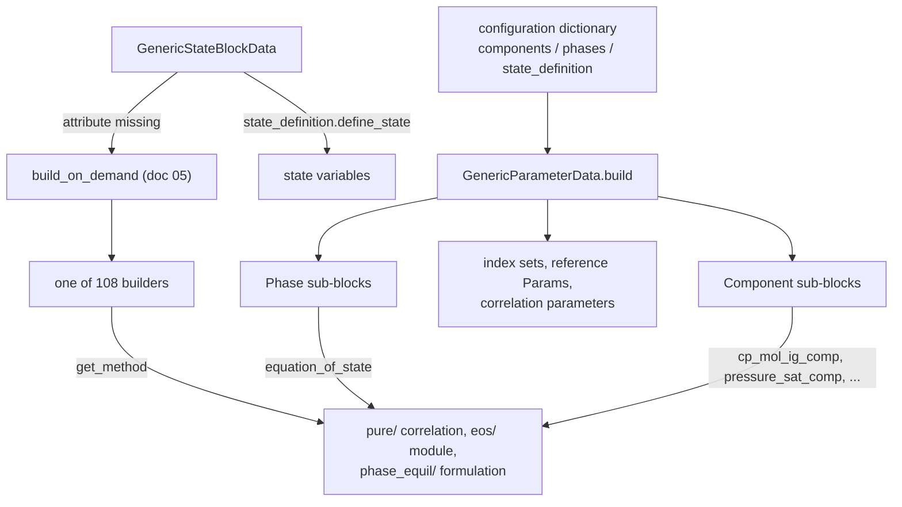
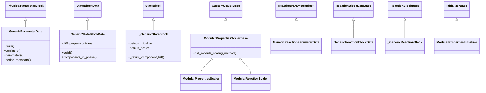
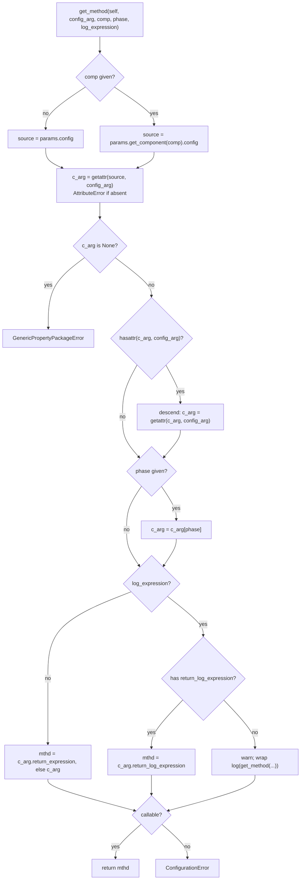

# 12 — Modular properties: the generic framework

> **Doc ID** 12 · **Repo SHA** 70a8f4fe1 (IDAES-PSE v2.13.0rc0) · **Source roots** `idaes/models/properties/modular_properties/base/`
> **Owns** 4 modules / 7,436 LOC · **Assets** none · **Siblings** [05](05_property_and_reaction_framework.md), [06](06_model_preparation_initializers_and_scalers.md), [13](13_modular_properties_eos_and_phase_equilibrium.md), [14](14_modular_properties_state_definitions_and_libraries.md), [15](15_property_package_catalog.md), [31](31_extension_point_catalog.md)

The modular framework is the largest implementation of the property and reaction
contract defined in [05](05_property_and_reaction_framework.md). A user does not
write a subclass; a user writes a configuration dictionary naming chemical
components, phases, a state definition, an equation of state per phase and a
correlation per pure-component property, and this framework assembles a working
property package from it. This document describes the four modules in `base/`
that perform the assembly; the plug-ins they assemble are documented in
[13](13_modular_properties_eos_and_phase_equilibrium.md) and
[14](14_modular_properties_state_definitions_and_libraries.md).

Because one module here is 5,942 lines, this document is table-first: the
configuration surface, the on-demand property surface and the extension seams
are tabulated in full, and the prose covers only what the tables cannot carry.

---

## 0. Scope and source map

| File | LOC | Purpose | Covered in § |
|---|---:|---|---|
| `idaes/models/properties/modular_properties/base/generic_property.py` | 5,942 | `GenericParameterData`, `GenericStateBlockData`, `_GenericStateBlock`, `ModularPropertiesScaler`, `ModularPropertiesInitializer`, and the 108 on-demand property builders | 3, 4, 5, 6, 7, 9, 11, 12 |
| `idaes/models/properties/modular_properties/base/generic_reaction.py` | 818 | `GenericReactionParameterData`, `GenericReactionBlockData`, `_GenericReactionBlock`, `ModularReactionScaler`, and the three module-level per-reaction configuration templates | 3, 4, 5, 6, 7 |
| `idaes/models/properties/modular_properties/base/utility.py` | 664 | `get_method` and the rest of the plug-in dispatch layer, `StateIndex`, `ConcentrationForm`, the bubble/dew initial-estimate helpers, `ModularPropertiesScalerBase` | 3, 5, 7, 9 |
| `idaes/models/properties/modular_properties/base/__init__.py` | 12 | Licence header only; declares no symbols and imports nothing | 2 |

Total 7,436 LOC, 33 configuration keys, 0 `NotImplementedError` hooks.

---

## 1. Architectural role

A hand-written property package answers the control volume's questions with
code. The modular framework answers them with configuration.
`GenericParameterData.build`
(`idaes/models/properties/modular_properties/base/generic_property.py:1158`)
turns a user's dictionary into `Phase` and `Component` sub-blocks, index sets,
reference-state `Param`s and correlation parameters, and `GenericStateBlockData`
(`:2985`) answers every property request by looking up the configured plug-in
and calling it. Three mechanisms carry the design.

*On-demand construction.* `GenericStateBlockData` declares 108 underscore-prefixed
builder methods and registers 112 property names against them in
`define_metadata` (`:1912`). Nothing is built until a property is read; the
route from attribute access to builder is `build_on_demand`, described in
[05 §5.4](05_property_and_reaction_framework.md#54-property-access).

*Plug-in dispatch.* `get_method`
(`idaes/models/properties/modular_properties/base/utility.py:63`) resolves a
configuration key on either the parameter block or a chemical component into a
callable expression generator. Every correlation library and every equation of
state in documents 13 and 14 is reached through this one function and its two
siblings `get_phase_method` (`:141`) and `get_concentration_term` (`:261`).

*True and apparent species.* An electrolyte package carries two species sets and
two phase-component sets at once. `state_components` selects which indexes the
state variables; the other is reachable through the `_true` and `_apparent`
variants of the property builders, which is why parts of the property surface
exist three times over.

*The parameter block converts configuration into structure; the state block converts an attribute access into a call on a configured plug-in.*

---

## 2. Public surface inventory

| Symbol | Kind | Declared at | Exported via | Stability signal |
|---|---|---|---|---|
| `GenericParameterData` | class | `generic_property.py:992` | — | data half of the pair |
| `GenericParameterBlock` | class | synthesized at `generic_property.py:992` | `idaes.models.properties.modular_properties` | generated by the decorator; `.. module::` directive in `docs/` |
| `GenericStateBlockData` | class | `generic_property.py:2985` | — | data half of the pair |
| `GenericStateBlock` | class | synthesized at `generic_property.py:2985` | `idaes.models.properties.modular_properties` | generated by the decorator |
| `_GenericStateBlock` | class | `generic_property.py:2495` | — | leading underscore; passed as `block_class` |
| `ModularPropertiesScaler` | class | `generic_property.py:143` | — | named by `default_scaler` |
| `ModularPropertiesInitializer` | class | `generic_property.py:2075` | — | named by `default_initializer` |
| `set_param_value` | function | `generic_property.py:124` | — | no underscore, not re-exported |
| `_log_form_vars` | list | `generic_property.py:101` | — | leading underscore |
| `_raise_dev_burnt_toast`, `_valid_VL_component_list`, `_temperature_pressure_bubble_dew`, `_log_mole_frac_bubble_dew`, `_initialize_critical_props`, `_init_Tbub`, `_init_Tdew`, `_init_Pbub`, `_init_Pdew` | functions | `generic_property.py:5588`, `:5595`, `:5625`, `:5693`, `:5775`, `:5802`, `:5842`, `:5881`, `:5914` | — | leading underscore |
| `GenericReactionPackageError` | exception | `generic_reaction.py:60` | — | not re-exported |
| `ModularReactionScaler` | class | `generic_reaction.py:78` | — | named by `default_scaler` |
| `rxn_config` | `ConfigBlock` | `generic_reaction.py:173` | — | module-level template |
| `rate_rxn_config` | `ConfigBlock` | `generic_reaction.py:209` | — | module-level template |
| `equil_rxn_config` | `ConfigBlock` | `generic_reaction.py:227` | imported by `generic_property.py` | module-level template |
| `GenericReactionParameterData` | class | `generic_reaction.py:247` | — | data half of the pair |
| `GenericReactionParameterBlock` | class | synthesized at `generic_reaction.py:247` | `idaes.models.properties.modular_properties` | generated by the decorator |
| `_GenericReactionBlock` | class | `generic_reaction.py:603` | — | leading underscore; passed as `block_class` |
| `GenericReactionBlockData` | class | `generic_reaction.py:624` | — | data half of the pair |
| `GenericReactionBlock` | class | synthesized at `generic_reaction.py:624` | `idaes.models.properties.modular_properties` | generated by the decorator |
| `StateIndex` | enum | `utility.py:39` | — | imported across the subpackage |
| `GenericPropertyPackageError` | exception | `utility.py:44` | — | not re-exported |
| `get_method`, `get_phase_method`, `get_component_object` | functions | `utility.py:63`, `:141`, `:193` | — | imported by `eos/`, `phase_equil/`, `state_definitions/` |
| `get_bounds_from_config` | function | `utility.py:209` | — | imported by every state definition |
| `ConcentrationForm` | enum | `utility.py:252` | — | named in `docs/explanations/` |
| `get_concentration_term` | function | `utility.py:261` | — | imported by `reactions/` |
| `identify_VL_component_list` | function | `utility.py:325` | — | imported by `phase_equil/` |
| `TOL`, `MAX_ITER` | module constants | `utility.py:405`, `:406` | — | Newton loop limits |
| `estimate_Tbub`, `estimate_Tdew`, `estimate_Pbub`, `estimate_Pdew` | functions | `utility.py:409`, `:490`, `:586`, `:606` | — | the first two are imported by `phase_equil/smooth_VLE_2.py` |
| `ModularPropertiesScalerBase` | class | `utility.py:637` | — | base of both Scalers here |

`idaes/models/properties/modular_properties/base/__init__.py` contains only the
licence header; the four public block classes are re-exported one level up, from
`idaes/models/properties/modular_properties/__init__.py:13`.

---

## 3. Class hierarchy and type taxonomy

*Both halves of the framework subclass the contract in document 05 exactly once each, and both Scalers share a base that knows how to delegate to a plug-in's own Scaler.*

| Class | Base(s) | Declared at | Decorator | Container class | Key overrides |
|---|---|---|---|---|---|
| `GenericParameterData` | `PhysicalParameterBlock` | `generic_property.py:992` | `@declare_process_block_class("GenericParameterBlock")` | `GenericParameterBlock` | `build`, `configure`, `parameters`, `define_metadata` |
| `GenericStateBlockData` | `StateBlockData` | `generic_property.py:2985` | `@declare_process_block_class("GenericStateBlock", block_class=_GenericStateBlock)` | `GenericStateBlock` | `build`, `calculate_scaling_factors`, 108 builders |
| `_GenericStateBlock` | `StateBlock` | `generic_property.py:2495` | none | — | `_return_component_list`, `_return_phase_component_set`, `_include_inherent_reactions`, `fix_initialization_states`, `initialize`, `release_state` |
| `ModularPropertiesScaler` | `ModularPropertiesScalerBase` | `generic_property.py:143` | none | — | `variable_scaling_routine`, `constraint_scaling_routine` |
| `ModularPropertiesInitializer` | `InitializerBase` | `generic_property.py:2075` | none | — | `__init__`, `initialization_routine` |
| `GenericReactionParameterData` | `ReactionParameterBlock` | `generic_reaction.py:247` | `@declare_process_block_class("GenericReactionParameterBlock")` | `GenericReactionParameterBlock` | `build`, `configure`, `parameters`, `define_metadata` |
| `GenericReactionBlockData` | `ReactionBlockDataBase` | `generic_reaction.py:624` | `@declare_process_block_class("GenericReactionBlock", block_class=_GenericReactionBlock)` | `GenericReactionBlock` | `build`, `calculate_scaling_factors`, six builders, `get_reaction_rate_basis` |
| `_GenericReactionBlock` | `ReactionBlockBase` | `generic_reaction.py:603` | none | — | `initialize` |
| `ModularReactionScaler` | `ModularPropertiesScalerBase` | `generic_reaction.py:78` | none | — | `variable_scaling_routine`, `constraint_scaling_routine` |
| `ModularPropertiesScalerBase` | `CustomScalerBase` | `utility.py:637` | none | — | `call_module_scaling_method` |
| `GenericPropertyPackageError` | `PropertyPackageError` | `utility.py:44` | none | — | `__init__`, `__str__` |
| `GenericReactionPackageError` | `PropertyPackageError` | `generic_reaction.py:60` | none | — | `__init__`, `__str__` |

The decorator's `block_class` argument matters twice here:
`GenericStateBlockData` names `_GenericStateBlock` so the synthesized
`GenericStateBlock` inherits the overridden list accessors rather than
`StateBlock`'s, and `GenericReactionBlockData` does the same.

### 3.1 `StateIndex`

| Member | Value | Meaning | Consumed at |
|---|---|---|---|
| `true` | 1 | State variables index the dissociated species set | `generic_property.py:2512`, `:2531`, `:2545` |
| `apparent` | 2 | State variables index the undissociated species set | `generic_property.py:2514`, `:2533`, `:2547` |

Declared at `idaes/models/properties/modular_properties/base/utility.py:39`.
This is the enumeration the `state_components` configuration key takes its value
from, and it is read in nine places across the framework: the three list
accessors on `_GenericStateBlock`, both Scaler routines, `GenericStateBlockData.build`
(`generic_property.py:3069`), `GenericReactionParameterData.build`
(`generic_reaction.py:331`), and the two initialization paths.

### 3.2 `ConcentrationForm`

| Member | Value | Property term selected | Consumed at |
|---|---|---|---|
| `molarity` | 1 | `conc_mol_phase_comp` | `utility.py:303` |
| `activity` | 2 | `act_phase_comp` | `utility.py:305` |
| `molality` | 3 | `molality_phase_comp` | `utility.py:307` |
| `moleFraction` | 4 | `mole_frac_phase_comp` | `utility.py:309` |
| `massFraction` | 5 | `mass_frac_phase_comp` | `utility.py:311` |
| `partialPressure` | 6 | `pressure_phase_comp` | `utility.py:313` |

Declared at `idaes/models/properties/modular_properties/base/utility.py:252`.
`get_concentration_term` (`:261`) maps a member onto an attribute name, prefixing
`log_` when asked for the logarithmic form and suffixing `_true` when the package
is an electrolyte package (`utility.py:288`). An unrecognised member raises
`BurntToast` (`:316`).

---

## 4. Configuration reference

33 keys across four declarations. The configuration surface of
`GenericParameterData` is the framework's primary interface: a modular property
package *is* a populated instance of this block.

### 4.1 `GenericParameterData.CONFIG`

`PhysicalParameterBlock.CONFIG()` extended at
`idaes/models/properties/modular_properties/base/generic_property.py:999`.
Sixteen keys.

| Key | Domain / validator | Default | Req. | Effect on build | Anchor |
|---|---|---|---|---|---|
| `components` | `dict` | none | yes | Each entry becomes a `Component` sub-block; the `type` entry selects the subclass | `:1000` |
| `phases` | none | none | yes | Each entry becomes a `Phase` sub-block; an `AqueousPhase` entry sets `_electrolyte` | `:1011` |
| `state_definition` | none | none | yes | Module whose `define_state` creates the state variables and whose `set_metadata` fills in the package metadata | `:1023` |
| `state_bounds` | `dict` | none | no | Read by `get_bounds_from_config` when each state variable is created | `:1033` |
| `state_components` | `In(StateIndex)` | `StateIndex.true` | no | Selects which species set indexes the state variables and whether inherent reactions are included | `:1041` |
| `pressure_ref` | none | none | yes | Creates the mutable `pressure_ref` Param | `:1054` |
| `temperature_ref` | none | none | yes | Creates the mutable `temperature_ref` Param | `:1057` |
| `phases_in_equilibrium` | `list` | `None` | no | Builds `_pe_pairs`, `phase_equilibrium_list` and `phase_equilibrium_idx`, and makes the state block create `_teq` and `equilibrium_constraint` | `:1062` |
| `phase_equilibrium_state` | `dict` | `None` | no | Per phase pair, the formulation module whose `phase_equil` writes the equilibrium formulation | `:1073` |
| `bubble_dew_method` | none | `LogBubbleDew` | no | Class supplying `temperature_bubble`, `temperature_dew`, `pressure_bubble` and `pressure_dew` construction | `:1087` |
| `parameter_data` | `dict` | `{}` | no | Package-level numeric parameters read by `set_param_value` and by plug-in `build_parameters` methods | `:1098` |
| `base_units` | `dict` | `{}` | no | Passed straight to `add_default_units` as the first act of `build` | `:1108` |
| `include_enthalpy_of_formation` | `Bool` | `True` | no | Read by enthalpy correlations in `pure/` and by the equations of state | `:1120` |
| `reaction_basis` | `In(MaterialFlowBasis)` | `MaterialFlowBasis.molar` | no | Basis reported for inherent reaction terms | `:1132` |
| `inherent_reactions` | `ConfigBlock(implicit=True, implicit_domain=equil_rxn_config)` | empty | no | Non-empty sets `_has_inherent_reactions` and builds `inherent_reaction_idx`, the stoichiometry dict and a parameter `Block` per reaction | `:1143` |
| `default_scaling_factors` | `dict` | none | no | Merged into the suffix-based `default_scaling_factor` dict; marked DEPRECATED in its own description | `:1149` |

`inherent_reactions` is an implicit `ConfigBlock` whose domain is the
`equil_rxn_config` template imported from `generic_reaction.py`: the property
package and the reaction package describe an equilibrium reaction with the same
six keys, documented in section 4.2.

### 4.2 The per-reaction configuration templates

Three `ConfigBlock`s are built at module level in `generic_reaction.py` and
serve as the implicit domain of every reaction entry. `rate_rxn_config` (`:209`)
and `equil_rxn_config` (`:227`) are each created by *calling* `rxn_config`
(`:173`), which copies it, and then declaring two further keys on the copy. This
is the same template-extension idiom that `CONFIG_Template` uses for control
volumes ([04 §4.1](04_control_volume_framework.md#41-config_template--the-unit-model-facing-template)),
applied one level down.

`rxn_config` — the shared four:

| Key | Domain / validator | Default | Req. | Effect on build | Anchor |
|---|---|---|---|---|---|
| `stoichiometry` | `dict` | none | yes | Populates the reaction stoichiometry dict and, absent `reaction_order`, the `reaction_order` Var | `generic_reaction.py:174` |
| `heat_of_reaction` | none | none | no | Class whose `return_expression` builds `dh_rxn` | `generic_reaction.py:182` |
| `concentration_form` | `In(ConcentrationForm)` | `None` | no | Selects the concentration term `get_concentration_term` returns | `generic_reaction.py:190` |
| `parameter_data` | `dict` | `{}` | no | Numeric parameters for this reaction; `reaction_order` is read from here | `generic_reaction.py:200` |

| Template | Inherited from | Override | Anchor |
|---|---|---|---|
| `rate_rxn_config` | `rxn_config` | adds `rate_constant` and `rate_form` | `generic_reaction.py:210`, `:218` |
| `equil_rxn_config` | `rxn_config` | adds `equilibrium_constant` and `equilibrium_form` | `generic_reaction.py:228`, `:236` |

`rate_form` absent is a debug-level log message (`generic_reaction.py:376`), on
the grounds that a stoichiometric reactor needs no rate. `equilibrium_form`
absent is a `ConfigurationError` (`generic_reaction.py:422`), and so is
`stoichiometry` absent on either kind.

### 4.3 `GenericReactionParameterData.CONFIG`

`ReactionParameterBlock.CONFIG()` extended at
`idaes/models/properties/modular_properties/base/generic_reaction.py:253`. Five
keys, on top of the two `property_package` and `default_arguments` keys inherited
from [05 §4.3](05_property_and_reaction_framework.md#43-reactionparameterblockconfig).

| Key | Domain / validator | Default | Req. | Effect on build | Anchor |
|---|---|---|---|---|---|
| `reaction_basis` | `In(MaterialFlowBasis)` | `MaterialFlowBasis.molar` | no | Returned by `get_reaction_rate_basis` | `:254` |
| `rate_reactions` | `ConfigBlock(implicit=True, implicit_domain=rate_rxn_config)` | empty | no | Builds `rate_reaction_idx`, `rate_reaction_stoichiometry` and a parameter `Block` per reaction | `:265` |
| `equilibrium_reactions` | `ConfigBlock(implicit=True, implicit_domain=equil_rxn_config)` | empty | no | The same for equilibrium reactions | `:269` |
| `base_units` | `dict` | `{}` | no | Passed to `add_default_units` before unit validation against the property package | `:275` |
| `default_scaling_factors` | `dict` | none | no | Merged into the suffix-based `default_scaling_factor` dict | `:287` |

Both reaction dicts empty is a `BurntToast` (`generic_reaction.py:440`): the
master `reaction_idx` cannot be formed.

### 4.4 `ModularPropertiesInitializer.CONFIG`

`InitializerBase.CONFIG()` extended at
`idaes/models/properties/modular_properties/base/generic_property.py:2093`.

| Key | Domain / validator | Default | Req. | Effect on build | Anchor |
|---|---|---|---|---|---|
| `solver` | none | `'ipopt_v2'` | no | Name passed to `get_solver` | `:2094` |
| `solver_options` | `ConfigDict(implicit=True)` | empty | no | Options forwarded to the solver | `:2101` |
| `solver_writer_config` | `ConfigDict(implicit=True)` | empty | no | Writer configuration forwarded to the solver | `:2108` |
| `calculate_variable_options` | `ConfigDict(implicit=True)` | empty | no | Options for the 1×1 block solves | `:2115` |

### 4.5 Keys consumed here but declared elsewhere

The framework reads the whole of `PhaseData.CONFIG` and `ComponentData.CONFIG`,
declared in `idaes/core/base/phases.py` and `idaes/core/base/components.py` and
tabulated in [05 §4.5](05_property_and_reaction_framework.md#45-phasedataconfig)
and [05 §4.6](05_property_and_reaction_framework.md#46-componentdataconfig). The
keys are not restated here; section 9 lists which of them are extension seams
and how each is reached.

---

## 5. Construction and call sequences

### 5.1 `GenericParameterData.build`

`generic_property.py:1158`, 729 lines, in thirteen stages:

| # | Stage | What it creates or validates | Anchor |
|---:|---|---|---|
| 1 | Base units | `add_default_units(self.config.base_units)`, before anything asks the metadata for derived units | `:1166` |
| 2 | `configure()` | The subclass hook of section 9.4 | `:1169` |
| 3 | State block class | `_state_block_class = GenericStateBlock` | `:1172` |
| 4 | Phases | Each `phases` entry is copied, its `type` popped and checked against `__all_phases__`, and added as a sub-block; an `AqueousPhase` sets `_electrolyte` and requires `electrolyte_support` on its equation of state | `:1184`, `:1204`, `:1211`, `:1218` |
| 5 | Electrolyte species sets | Six empty ordered `Set`s for the `Component` sub-blocks to register on | `:1222`–`:1242` |
| 6 | Components | Each `components` entry, with `_electrolyte` injected so registration picks the right list | `:1253`, `:1273` |
| 7 | Species sets | `component_list`, `true_species_set`, `apparent_species_set`, `ion_set` assembled from the six | `:1304`–`:1328` |
| 8 | Phase-component sets | One `_phase_component_set`, or the true/apparent pair with `_phase_component_set` referencing the true one; then every component checked to appear in some phase | `:1369`, `:1418`, `:1423`, `:1439` |
| 9 | Elemental composition | All components declare `elemental_composition` or none do; `element_list` and `element_comp` follow | `:1448`, `:1479`, `:1488` |
| 10 | Reference state | `pressure_ref` and `temperature_ref` as mutable `Param`s, valued through `set_param_value` (`:124`) | `:1518`, `:1528` |
| 11 | Phase equilibrium | Each pair checked against `phase_equilibrium_state` and each shared component against `phase_equilibrium_form`; `_pe_pairs`, `phase_equilibrium_list`, `phase_equilibrium_idx` | `:1543`, `:1598`–`:1602` |
| 12 | Plug-in parameters | For every key on every component and phase configuration, `build_parameters` is called if the value has one, else `getattr(value, key).build_parameters`; Henry entries and the three phase-indexed properties have their own loops | `:1605`, `:1632`, `:1695` |
| 13 | Inherent reactions, then close | `inherent_reaction_idx` and the per-reaction `Block`s, `self.parameters()`, a sweep fixing every `Var` and raising on any unvalued one, `state_definition.set_metadata`, and the three-step default-scaling assembly | `:1763`, `:1854`, `:1857`, `:1874`, `:1886` |

Stage 12 reaches into the plug-in libraries, and is why a correlation class
supplies `build_parameters` as well as `return_expression`.

### 5.2 `GenericStateBlockData.build`

`generic_property.py:2994`, five steps:

1. `state_definition.define_state(self)` (`:2998`) — the state variables, the
   sum-of-mole-fractions constraints, and `always_flash`.
2. `_teq` (`:3010`), one equilibrium temperature per phase pair, when
   `phases_in_equilibrium` is set and the block is not a fully defined state.
3. `equation_of_state.common(self, pobj)` for every phase (`:3021`) — the hook
   through which an equation of state creates its shared intermediate terms.
4. `enth_mol_eqn` (`:3026`) when the state definition produced `enth_mol`, tying
   total enthalpy to the phase enthalpies through `phase_frac`.
5. Phase equilibrium (`:3033`–`:3062`) and inherent reactions (`:3065`–`:3101`):
   `phase_equil` per pair, then `equilibrium_constraint` over pairs and chemical
   components, then `k_eq` (`:3091`) and `inherent_equilibrium_constraint`
   (`:3097`).

### 5.3 `get_method` — the plug-in dispatch

`utility.py:63`. Every extension seam in documents 13 and 14 is reached through
this function, and its tolerance of four ways of supplying a correlation is what
makes the library's configuration dictionaries look the way they do.

*Four shapes of configured value resolve to one callable: a bare function, a class or module with a `return_expression`, a namespace class holding a same-named inner class, and a dict of any of those indexed by phase.*

The descent at `utility.py:101` is what lets a user write either `RPP4` or
`RPP4.cp_mol_ig_comp` for the `cp_mol_ig_comp` key: if the supplied object has
an attribute whose name is the configuration key, the function takes that
attribute and carries on. The phase subscript at `:103` handles the keys whose
value is a per-phase dict. The final `return_expression` lookup at `:110` is a
`try`/`except AttributeError`, so a plain function is accepted unchanged. The
logarithmic branch (`:113`–`:127`) is the one place where a missing plug-in
capability is a warning rather than an error.

`get_phase_method` (`:141`) is the same walk against
`self.params.get_phase(phase).config`, without the phase subscript and without
the logarithmic branch. `get_component_object` (`:193`) wraps
`self.params.get_component(comp)`. `get_bounds_from_config` (`:209`) reads
`b.params.config.state_bounds[state]`, converts a four-tuple's values from the
supplied units into the package base units, and returns `((None, None), None)`
for a state the user did not bound.

### 5.4 On-demand property construction

`GenericStateBlockData` inherits `__getattr__` from `StateBlockData`, so a
missing property routes through `build_on_demand` and the metadata registered in
`define_metadata` (`generic_property.py:1912`). The contract, and the
`lock_attribute_creation_context` escape from it, are described once in
[05 §5.4](05_property_and_reaction_framework.md#54-property-access) and
[03 §5.6](03_block_hierarchy_and_construction_protocol.md#56-on-demand-attribute-construction).

What is specific to this framework is the shape of the builders. Nearly all 108
follow one pattern: a `try` block that defines a rule and creates an
`Expression`, or a `Var` plus a `Constraint`, and an `except AttributeError`
that deletes the half-built Pyomo component and re-raises. The deletion matters
because a partially constructed component left on the block would shadow a
retry.

### 5.5 Bubble and dew points

Eight of the 108 builders are two-line delegations to a pair of module-level
functions. `_temperature_bubble`, `_temperature_dew`, `_pressure_bubble` and
`_pressure_dew` call `_temperature_pressure_bubble_dew(b, name)` (`:5625`),
which parses the property name into an abbreviation, creates the point variable
over `_pe_pairs` (`:5662`) and the helper `_mole_frac_<abbrv>` variable
(`:5667`), and then hands over to the configured `bubble_dew_method` class
(`:5680`). The four `_log_mole_frac_*` builders call
`_log_mole_frac_bubble_dew(b, name)` (`:5693`), which creates the logarithmic
variable (`:5715`) and an exponential linking constraint (`:5755`) skipped for
any chemical component that is not in the vapour-liquid pair, and skipped
entirely when a non-condensable or non-vaporisable component is present.

`_valid_VL_component_list` (`:5595`) and `identify_VL_component_list`
(`utility.py:325`) both split a phase pair's chemical components into
Raoult's-law and Henry's-law groups; the second also returns the phase names and
the liquid-only and vapour-only lists, and raises `PropertyPackageError` when
the pair is not liquid-vapour or has no shared components.

### 5.6 `GenericReactionParameterData.build`

`generic_reaction.py:297` calls `super(ReactionParameterBlock, self).build()`
(`:306`) rather than its immediate parent's, because the base implementation
validates units before `base_units` has been applied; the comment at `:302`
names the ordering as a chicken-and-egg problem. The rest follows the
property-side shape: set base units (`:316`), run the two validations from
[05 §5.2](05_property_and_reaction_framework.md#52-building-state-blocks)
(`:319`, `:320`), `configure()` (`:323`), then select the phase-component set to
index stoichiometry against — `get_phase_component_set()` for a non-electrolyte
package, otherwise the true or apparent set according to the property package's
own `state_components` (`:331`). Rate reactions (`:341`), equilibrium reactions
(`:386`), the master `reaction_idx` (`:428`), a parameter `Block` per reaction
(`:449`) and a `reaction_order` Var per reaction (`:478`, `:517`) follow.

A `KeyError` escaping a plug-in's `build_parameters` during equilibrium reaction
construction is caught and re-raised as a `PropertyPackageError` naming
mismatched true and apparent species sets as the likely cause
(`generic_reaction.py:533`).

### 5.7 Initialization

`ModularPropertiesInitializer.initialization_routine`
(`generic_property.py:2132`) runs four solves:

| Stage | What it does | Anchor |
|---|---|---|
| Setup | Raises the constraint tolerance to infinity in two cases the state block cannot close on its own: an `inherent_equilibrium_constraint` on a non-electrolyte or true-basis block, and a phase-component flow or mole fraction state definition | `:2162`, `:2178`, `:2180`, `:2197` |
| Bubble, dew, critical | Deactivates every other constraint, seeds values through `_init_Tbub`, `_init_Tdew`, `_init_Pbub`, `_init_Pdew` and `_initialize_critical_props`, then solves with zero degrees of freedom required | `:2218`, `:2281` |
| Equilibrium temperature and state variables | Averages `_teq` across pairs as a temperature guess; on an electrolyte package computes the other species basis from the constraints relating the two | `:2294`, `:2305` |
| Phase equilibrium, then the rest | Activates every constraint not named in the state definition's `do_not_initialize`, seeds each constructed logarithmic variable from the logarithm of its counterpart with non-positive values clamped to `1e-8`, and solves | `:2372`, `:2429`, `:2469` |

The legacy routine `_GenericStateBlock.initialize` (`:2585`) covers the same
ground in the same four stages, and `release_state` (`:2969`) reverts the fixed
states. Resolution between the two surfaces is described in
[06 §5.2](06_model_preparation_initializers_and_scalers.md#52-submodel-initializer-resolution).

### 5.8 Scaling

`ModularPropertiesScaler.variable_scaling_routine` (`:190`) touches
`flow_mol_phase`, `mole_frac_phase_comp`, `temperature` and `pressure`
unconditionally (`:200`), which forces those four to be built, then delegates to
the state definition's own Scaler through `call_module_scaling_method`
(`utility.py:643`). `constraint_scaling_routine` (`:498`) delegates in turn to
the state definition, the equation of state of each phase, the phase equilibrium
formulation of each pair, each chemical component's `phase_equilibrium_form`,
and the inherent reaction forms. `call_module_scaling_method` reads
`module.default_scaler`; a module without one is logged at debug level and
skipped (`utility.py:650`).

Two pairs of private routines split on species basis:
`_true_basis_variable_scaling_routine` (`:942`) and
`_true_basis_constraint_scaling_routine` (`:967`) against
`_apparent_basis_variable_scaling_routine` (`:845`) and
`_apparent_basis_constraint_scaling_routine` (`:903`); both entry points select
between them on `state_components` and raise `BurntToast` on anything else
(`:230`, `:519`). `_volume_density_scaling` (`:619`),
`_estimate_volume_density_scaling_factors` (`:688`) and `_bubble_dew_scaling`
(`:737`) are the remaining helpers.

---

## 6. Data structures, variables, constraints and invariants

### 6.1 What `GenericParameterData.build` creates

| Component | Type | Index sets | Units | Created at | Condition |
|---|---|---|---|---|---|
| `<phase name>` | `Phase` sub-block | — | — | `generic_property.py:1218` | one per `phases` entry |
| `<component name>` | `Component` sub-block | — | — | `generic_property.py:1273` | one per `components` entry |
| `anion_set`, `cation_set`, `solvent_set`, `solute_set` | `Set` (ordered) | — | — | `generic_property.py:1222`, `:1226`, `:1230`, `:1234` | `_electrolyte` |
| `_apparent_set`, `_non_aqueous_set` | `Set` (ordered) | — | — | `generic_property.py:1238`, `:1242` | `_electrolyte` |
| `component_list` | `Set` (ordered) | — | — | `generic_property.py:1304` | `_electrolyte`; otherwise built by the `Component` blocks |
| `true_species_set`, `apparent_species_set` | `Set` (ordered) | — | — | `generic_property.py:1312`, `:1320` | `_electrolyte` |
| `ion_set` | `Set` (ordered) | — | — | `generic_property.py:1328` | `_electrolyte` |
| `_phase_component_set` | `Set` (ordered) | — | — | `generic_property.py:1369` | not `_electrolyte` |
| `true_phase_component_set` | `Set` (ordered) | — | — | `generic_property.py:1418` | `_electrolyte` |
| `apparent_phase_component_set` | `Set` (ordered) | — | — | `generic_property.py:1419` | `_electrolyte` |
| `element_list`, `element_comp` | `Set` (ordered), `dict` | — | — | `generic_property.py:1479`, `:1488` | every component declares `elemental_composition` |
| `pressure_ref` | `Param` (mutable) | — | PRESSURE | `generic_property.py:1518` | always |
| `temperature_ref` | `Param` (mutable) | — | TEMPERATURE | `generic_property.py:1528` | always |
| `_pe_pairs`, `phase_equilibrium_list`, `phase_equilibrium_idx` | `Set` (ordered), `dict`, `Set` (ordered) | — | — | `generic_property.py:1598`, `:1601`, `:1602` | `phases_in_equilibrium` |
| `inherent_reaction_idx`, `inherent_reaction_stoichiometry` | `Set`, `dict` | —, reaction × phase × component | — | `generic_property.py:1768`, `:1778` | `inherent_reactions` non-empty |
| `reaction_<r>` | `Block` | — | — | `generic_property.py:1814` | one per inherent reaction |
| `reaction_<r>.reaction_order` | `Var` | phase-component set | dimensionless | `generic_property.py:1843` | as above |

Correlation parameters — the `Var`s the `pure/` libraries create — are added to
the `Component` and `Phase` sub-blocks by their own `build_parameters` methods,
and fixed by the sweep at `generic_property.py:1857`.

### 6.2 What a built `GenericStateBlockData` contains

The state variables are not chosen here. `state_definition.define_state`
creates them, and the six state definitions in the library differ in exactly
that choice:

| `state_definition` | State variables |
|---|---|
| `FTPx` | `flow_mol`, `mole_frac_comp`, `temperature`, `pressure` |
| `FPhx` | `flow_mol`, `mole_frac_comp`, `enth_mol`, `pressure` |
| `FcTP` / `FcPh` | `flow_mol_comp`, then `temperature` or `enth_mol`, and `pressure` |
| `FpcTP` | `flow_mol_phase_comp`, `temperature`, `pressure` |
| `FpTPxpc` | `flow_mol_phase`, `mole_frac_phase_comp`, `temperature`, `pressure` |

All six are owned by
[14](14_modular_properties_state_definitions_and_libraries.md). What this module
adds on top of them:

| Component | Type | Index sets | Units | Created at | Condition |
|---|---|---|---|---|---|
| `_teq` | `Var` | `_pe_pairs` | TEMPERATURE | `generic_property.py:3010` | `phases_in_equilibrium` and not a defined state, or `always_flash` |
| `enth_mol_eqn` | `Constraint` | — | — | `generic_property.py:3026` | the state definition built `enth_mol` |
| `equilibrium_constraint` | `Constraint` | `_pe_pairs` × component | — | `generic_property.py:3060` | `phases_in_equilibrium` |
| `k_eq` | `Expression` | `inherent_reaction_idx` | — | `generic_property.py:3091` | inherent reactions active on this block |
| `inherent_equilibrium_constraint` | `Constraint` | `inherent_reaction_idx` | — | `generic_property.py:3097` | as above |
| `<point>` | `Var` | `_pe_pairs` | TEMPERATURE or PRESSURE | `generic_property.py:5662` | a bubble or dew property was requested |
| `_mole_frac_<abbrv>` | `Var` | `_pe_pairs` × component | dimensionless | `generic_property.py:5667` | as above |
| `log_mole_frac_<abbrv>` | `Var` | `_pe_pairs` × component | dimensionless | `generic_property.py:5715` | a logarithmic bubble/dew mole fraction was requested |
| `log_mole_frac_<abbrv>_eqn` | `Constraint` | `_pe_pairs` × component | — | `generic_property.py:5755` | as above |
| `compress_fact_crit`, `dens_mol_crit`, `pressure_crit`, `temperature_crit` | `Var` | — | dimensionless, DENSITY_MOLE, PRESSURE, TEMPERATURE | `generic_property.py:3606` | any critical property was requested |
| everything in section 7.5 | `Var` / `Expression` / `Constraint` | as tabulated | as tabulated | on demand | first attribute access |

Phase-dependent quantities are indexed by `self.phase_component_set`, which
`_GenericStateBlock._return_phase_component_set` (`:2523`) resolves to the true
or apparent set for an electrolyte package. `components_in_phase(phase)`
(`:3515`) and `get_mole_frac(phase)` (`:3547`) are the two accessors that let a
plug-in ask for the *other* basis: both check the phase's
`equation_of_state_options["property_basis"]` and return the apparent set when
it reads `"apparent"`.

### 6.3 The true/apparent duality

| Concern | `StateIndex.true` | `StateIndex.apparent` | Resolved at |
|---|---|---|---|
| `component_list` seen by the state block | `true_species_set` | `apparent_species_set` | `generic_property.py:2504` |
| `phase_component_set` seen by the state block | `true_phase_component_set` | `apparent_phase_component_set` | `generic_property.py:2523` |
| Inherent reactions included | yes, if the package has them | no, always `False` | `generic_property.py:2542` |
| Inherent equilibrium constraint built | when not a defined state | always, on an electrolyte package | `generic_property.py:3065` |
| Scaler routine selected | `_true_basis_*` | `_apparent_basis_*` | `generic_property.py:223`, `:512` |
| Reaction stoichiometry index | `true_phase_component_set` | `apparent_phase_component_set` | `generic_reaction.py:331` |
| Property builders available | `*_true` variants | `*_apparent` variants | section 7.5 |

A value outside the enumeration raises `BurntToast` at every one of those sites.

### 6.4 Invariants

| Invariant | Enforced at |
|---|---|
| `phases` and `components` are both supplied | `generic_property.py:1176`, `:1249` |
| A phase `type` is a member of `__all_phases__` | `generic_property.py:1197` |
| A component `type` is a member of `__all_components__` | `generic_property.py:1267` |
| An aqueous phase's equation of state declares `electrolyte_support` | `generic_property.py:1211` |
| A phase-component list names only known components, valid in that phase | `generic_property.py:1355`, `:1362` |
| Every chemical component is valid in at least one phase | `generic_property.py:1439` |
| Elemental compositions are integers, and all-or-nothing across components | `generic_property.py:1458`, `:1471` |
| `state_definition`, `pressure_ref` and `temperature_ref` are supplied | `generic_property.py:1502`, `:1512`, `:1522` |
| Every phase declares an `equation_of_state` | `generic_property.py:1534` |
| Every equilibrium pair has a `phase_equilibrium_state` entry | `generic_property.py:1552`, `:1564` |
| Every component in equilibrium has a `phase_equilibrium_form` for the pair | `generic_property.py:1584`, `:1590` |
| A Henry's law component names a liquid phase and supplies `method` and `type` | `generic_property.py:1637`, `:1643`, `:1651`, `:1657` |
| Full phase equilibrium admits only `HenryType.Kpx` | `generic_property.py:1673` |
| An electrolyte Henry entry supplies `basis` | `generic_property.py:1680` |
| Every parameter `Var` has a value, and every one is fixed | `generic_property.py:1857` |
| An inherent reaction supplies `stoichiometry` and `equilibrium_form` | `generic_property.py:1784`, `:1808` |
| A reaction package's stoichiometry names known phases and components | `generic_reaction.py:359`, `:366` |
| A reaction package declares at least one reaction | `generic_reaction.py:440` |
| A reaction block asked for equilibrium has equilibrium reactions to build | `generic_reaction.py:637` |

---

## 7. Method contracts

### 7.1 `GenericParameterData`

| Method | Signature | Preconditions | Effects | Returns | Raises | Anchor |
|---|---|---|---|---|---|---|
| `build` | `(self)` | a populated configuration | Creates everything in section 6.1 | `None` | `ConfigurationError`, `TypeError`, `PropertyNotSupportedError` | `:1158` |
| `configure` | `(self)` | — | none in the base | `None` | — | `:1888` |
| `parameters` | `(self)` | — | none in the base | `None` | — | `:1900` |
| `define_metadata` | `(cls, obj)` | — | Selects `ElectrolytePropertySet` and registers 118 property names against builder methods | `None` | — | `:1912` |

### 7.2 `_GenericStateBlock`

| Method | Signature | Effects | Raises | Anchor |
|---|---|---|---|---|
| `_return_component_list` | `(self)` | none | `BurntToast` | `:2504` |
| `_return_phase_component_set` | `(self)` | none | `BurntToast` | `:2523` |
| `_include_inherent_reactions` | `(self)` | none | `BurntToast` | `:2542` |
| `fix_initialization_states` | `(self)` | Fixes state variables and deactivates `sum_mole_frac_out`, `equilibrium_constraint` and `inherent_equilibrium_constraint` as applicable | — | `:2557` |
| `initialize` | `(blk, state_args=None, state_vars_fixed=False, hold_state=False, outlvl=NOTSET, solver=None, optarg=None)` | Legacy four-stage routine; returns the fix flags when `hold_state` | `BurntToast`, `InitializationError` | `:2585` |
| `release_state` | `(blk, flags, outlvl=NOTSET)` | Reverts the fixed states | — | `:2969` |

### 7.3 `GenericStateBlockData` — non-builder methods

| Method | Signature | Effects | Raises | Anchor |
|---|---|---|---|---|
| `build` | `(self)` | Section 5.2 | `GenericPropertyPackageError` | `:2994` |
| `calculate_scaling_factors` | `(self)` | Suffix-based scaling of state variables, phase equilibrium, bubble/dew and inherent reaction terms | — | `:3103` |
| `components_in_phase` | `(self, phase)` | none; a generator | — | `:3515` |
| `get_mole_frac` | `(self, phase=None)` | none | — | `:3547` |

### 7.4 `utility.py`

| Method | Signature | Preconditions | Effects | Returns | Raises | Anchor |
|---|---|---|---|---|---|---|
| `get_method` | `(self, config_arg, comp=None, phase=None, log_expression=False)` | `self.params` resolvable | none | a callable | `AttributeError`, `GenericPropertyPackageError`, `ConfigurationError` | `:63` |
| `get_phase_method` | `(self, config_arg, phase)` | `phase` is a declared phase | none | a callable | as above | `:141` |
| `get_component_object` | `(self, comp)` | — | none | `Component` | `PropertyPackageError` from `get_component` | `:193` |
| `get_bounds_from_config` | `(b, state, base_units)` | — | none | `((lb, ub), default)` | — | `:209` |
| `get_concentration_term` | `(blk, r_idx, log=False)` | the reaction declares `concentration_form` | may trigger on-demand construction of the term | `Var` or `Expression` | `ConfigurationError`, `BurntToast` | `:261` |
| `identify_VL_component_list` | `(blk, phase_pair)` | the pair is liquid-vapour | none | six lists | `PropertyPackageError` | `:325` |
| `estimate_Tbub` | `(blk, T_units, raoult_comps, henry_comps, liquid_phase)` | components have `temperature_crit` | none | `float` | — | `:409` |
| `estimate_Tdew` | same | as above | none | `float` | — | `:490` |
| `estimate_Pbub` | `(blk, raoult_comps, henry_comps, liquid_phase)` | `pressure_sat_comp` and `henry` built | none | `float` | — | `:586` |
| `estimate_Pdew` | same | as above | none | `float`, or `0` when any term is zero | — | `:606` |
| `ModularPropertiesScalerBase.call_module_scaling_method` | `(self, model, module, index, method, overwrite=False)` | — | Instantiates the module's `default_scaler` and calls one routine | `None` | `AttributeError` when the named method is absent | `:643`, `:658` |

`estimate_Tbub` and `estimate_Tdew` are damped Newton iterations: they start one
kelvin below the lowest component critical temperature, limit each step to fifty
kelvin (`utility.py:476`), and stop at `TOL = 1e-1` or `MAX_ITER = 30`
(`utility.py:405`, `:406`) — the only numerical loops in this scope.

### 7.5 The on-demand property surface

`GenericStateBlockData` carries **108** underscore-prefixed methods: **70** base
forms, **24** logarithmic forms, **7** `_true` variants and **7** `_apparent`
variants. `define_metadata` (`generic_property.py:1912`) registers **112**
property names against them. Four — `mole_frac_phase_comp`, `phase_frac`,
`temperature` and `pressure` — carry `method: None`, meaning the state
definition has already built them, and `_critical_props` is named by four
entries at once, so 105 of the 108 methods are reachable by name.

Three base-table entries are unreachable through metadata:
`_get_critical_ref_phase`, a helper called by `_critical_props`, and
`_make_therm_cond_phase_comp` and `_make_visc_d_phase_comp`, called directly by
the mixing rules in `transport_properties/` and `pure/Eucken.py`.

#### 7.5.1 Base forms (70)

| Builder | Family | Property built | Lines |
|---|---|---|---|
| `_flow_mass` | flow | `flow_mass` | 4203-4223 |
| `_flow_mass_phase` | flow | `flow_mass_phase` | 4225-4248 |
| `_flow_mass_comp` | flow | `flow_mass_comp` | 4250-4273 |
| `_flow_mass_phase_comp` | flow | `flow_mass_phase_comp` | 4275-4303 |
| `_flow_mol` | flow | `flow_mol` | 4305-4325 |
| `_flow_mol_phase` | flow | `flow_mol_phase` | 4327-4350 |
| `_flow_mol_comp` | flow | `flow_mol_comp` | 4352-4375 |
| `_flow_mol_phase_comp` | flow | `flow_mol_phase_comp` | 4377-4404 |
| `_flow_vol` | flow | `flow_vol` | 4406-4425 |
| `_flow_vol_phase` | flow | `flow_vol_phase` | 4427-4450 |
| `_conc_mol_comp` | composition | `conc_mol_comp` | 3781-3794 |
| `_conc_mol_phase_comp` | composition | `conc_mol_phase_comp` | 3796-3809 |
| `_mass_frac_phase_comp` | composition | `mass_frac_phase_comp` | 4573-4595 |
| `_mw` | composition | `mw` | 4645-4665 |
| `_molality_phase_comp` | composition | `molality_phase_comp` | 4667-4689 |
| `_mole_frac_comp` | composition | `mole_frac_comp` | 4739-4755 |
| `_mw_comp` | composition | `mw_comp` | 4757-4770 |
| `_mw_phase` | composition | `mw_phase` | 4772-4792 |
| `_compress_fact_phase` | volumetric | `compress_fact_phase` | 3767-3779 |
| `_dens_mass` | volumetric | `dens_mass` | 3959-3968 |
| `_dens_mass_phase` | volumetric | `dens_mass_phase` | 3970-3984 |
| `_dens_mol` | volumetric | `dens_mol` | 3986-3995 |
| `_dens_mol_phase` | volumetric | `dens_mol_phase` | 3997-4011 |
| `_vol_mol_phase` | volumetric | `vol_mol_phase` | 5009-5023 |
| `_vol_mol_phase_comp` | volumetric | `vol_mol_phase_comp` | 5025-5040 |
| `_energy_internal_mol` | energy | `energy_internal_mol` | 4085-4099 |
| `_energy_internal_mol_phase` | energy | `energy_internal_mol_phase` | 4101-4113 |
| `_energy_internal_mol_phase_comp` | energy | `energy_internal_mol_phase_comp` | 4115-4127 |
| `_enth_mol` | energy | `enth_mol` | 4129-4138 |
| `_enth_mol_phase` | energy | `enth_mol_phase` | 4140-4150 |
| `_enth_mol_phase_comp` | energy | `enth_mol_phase_comp` | 4152-4164 |
| `_entr_mol` | energy | `entr_mol` | 4166-4175 |
| `_entr_mol_phase` | energy | `entr_mol_phase` | 4177-4187 |
| `_entr_mol_phase_comp` | energy | `entr_mol_phase_comp` | 4189-4201 |
| `_gibbs_mol` | energy | `gibbs_mol` | 4480-4491 |
| `_gibbs_mol_phase` | energy | `gibbs_mol_phase` | 4493-4505 |
| `_gibbs_mol_phase_comp` | energy | `gibbs_mol_phase_comp` | 4507-4519 |
| `_cp_mass_phase` | heat capacity | `cp_mass_phase` | 3841-3851 |
| `_cp_mol` | heat capacity | `cp_mol` | 3853-3864 |
| `_cp_mol_phase` | heat capacity | `cp_mol_phase` | 3866-3876 |
| `_cp_mol_phase_comp` | heat capacity | `cp_mol_phase_comp` | 3878-3890 |
| `_cv_mol` | heat capacity | `cv_mol` | 3892-3903 |
| `_cv_mass_phase` | heat capacity | `cv_mass_phase` | 3905-3915 |
| `_cv_mol_phase` | heat capacity | `cv_mol_phase` | 3917-3927 |
| `_cv_mol_phase_comp` | heat capacity | `cv_mol_phase_comp` | 3929-3941 |
| `_heat_capacity_ratio_phase` | heat capacity | `heat_capacity_ratio_phase` | 3943-3957 |
| `_pressure_phase_comp` | pressure | `pressure_phase_comp` | 4809-4822 |
| `_pressure_osm_phase` | pressure | `pressure_osm_phase` | 4854-4872 |
| `_pressure_sat_comp` | pressure | `pressure_sat_comp` | 4874-4902 |
| `_fug_phase_comp` | fugacity | `fug_phase_comp` | 4452-4464 |
| `_fug_coeff_phase_comp` | fugacity | `fug_coeff_phase_comp` | 4466-4478 |
| `_henry` | fugacity | `henry` | 4553-4571 |
| `_act_phase_comp` | activity | `act_phase_comp` | 3671-3685 |
| `_act_coeff_phase_comp` | activity | `act_coeff_phase_comp` | 3719-3733 |
| `_diffus_phase_comp` | transport | `diffus_phase_comp` | 4013-4035 |
| `_prandtl_number_phase` | transport | `prandtl_number_phase` | 4794-4807 |
| `_surf_tens_phase` | transport | `surf_tens_phase` | 4904-4921 |
| `_therm_cond_phase` | transport | `therm_cond_phase` | 4923-4936 |
| `_make_therm_cond_phase_comp` | transport | `_therm_cond_phase_comp` | 4939-4963 |
| `_visc_d_phase` | transport | `visc_d_phase` | 4965-4979 |
| `_make_visc_d_phase_comp` | transport | `_visc_d_phase_comp` | 4982-5007 |
| `_isentropic_speed_sound_phase` | acoustic | `isentropic_speed_sound_phase` | 4521-4535 |
| `_isothermal_speed_sound_phase` | acoustic | `isothermal_speed_sound_phase` | 4537-4551 |
| `_temperature_bubble` | bubble/dew | `temperature_bubble` | 3645-3646 |
| `_temperature_dew` | bubble/dew | `temperature_dew` | 3651-3652 |
| `_pressure_bubble` | bubble/dew | `pressure_bubble` | 3657-3658 |
| `_pressure_dew` | bubble/dew | `pressure_dew` | 3663-3664 |
| `_get_critical_ref_phase` | critical point | — returns a phase name | 3574-3604 |
| `_critical_props` | critical point | `compress_fact_crit`, `dens_mol_crit`, `pressure_crit`, `temperature_crit` | 3606-3640 |
| `_dh_rxn` | reaction | `dh_rxn` | 5042-5056 |

#### 7.5.2 Logarithmic forms (24)

Twenty of these create a `Var` and an exponential linking `Constraint` rather
than an `Expression`, which is what makes a logarithmic formulation
better-conditioned than the logarithm of a computed quantity; the other four
delegate to `_log_mole_frac_bubble_dew`. The 19 base property names whose
logarithmic counterparts the initializer seeds are listed in the module-level
`_log_form_vars` (`generic_property.py:101`).

| Builder | Property built | Lines |
|---|---|---|
| `_log_mole_frac_tbub` | `log_mole_frac_tbub` | 3648-3649 |
| `_log_mole_frac_tdew` | `log_mole_frac_tdew` | 3654-3655 |
| `_log_mole_frac_pbub` | `log_mole_frac_pbub` | 3660-3661 |
| `_log_mole_frac_pdew` | `log_mole_frac_pdew` | 3666-3667 |
| `_log_act_phase_comp` | `log_act_phase_comp` | 5058-5082 |
| `_log_act_phase_solvents` | `log_act_phase_solvents` | 5084-5118 |
| `_log_act_phase_comp_true` | `log_act_phase_comp_true` | 5120-5144 |
| `_log_act_phase_comp_apparent` | `log_act_phase_comp_apparent` | 5146-5170 |
| `_log_conc_mol_phase_comp` | `log_conc_mol_phase_comp` | 5172-5196 |
| `_log_conc_mol_phase_comp_true` | `log_conc_mol_phase_comp_true` | 5198-5222 |
| `_log_mass_frac_phase_comp` | `log_mass_frac_phase_comp` | 5224-5247 |
| `_log_mass_frac_phase_comp_apparent` | `log_mass_frac_phase_comp_apparent` | 5249-5272 |
| `_log_mass_frac_phase_comp_true` | `log_mass_frac_phase_comp_true` | 5274-5297 |
| `_log_molality_phase_comp` | `log_molality_phase_comp` | 5299-5327 |
| `_log_molality_phase_comp_apparent` | `log_molality_phase_comp_apparent` | 5329-5357 |
| `_log_molality_phase_comp_true` | `log_molality_phase_comp_true` | 5359-5386 |
| `_log_mole_frac_comp` | `log_mole_frac_comp` | 5388-5409 |
| `_log_mole_frac_phase_comp` | `log_mole_frac_phase_comp` | 5411-5434 |
| `_log_mole_frac_phase_comp_apparent` | `log_mole_frac_phase_comp_apparent` | 5436-5459 |
| `_log_mole_frac_phase_comp_true` | `log_mole_frac_phase_comp_true` | 5461-5484 |
| `_log_pressure_phase_comp` | `log_pressure_phase_comp` | 5486-5509 |
| `_log_pressure_phase_comp_apparent` | `log_pressure_phase_comp_apparent` | 5511-5534 |
| `_log_pressure_phase_comp_true` | `log_pressure_phase_comp_true` | 5536-5559 |
| `_log_k_eq` | `log_k_eq` | 5561-5585 |

#### 7.5.3 True-species variants (7)

| Builder | Property built | Lines |
|---|---|---|
| `_act_phase_comp_true` | `act_phase_comp_true` | 3687-3701 |
| `_act_coeff_phase_comp_true` | `act_coeff_phase_comp_true` | 3735-3749 |
| `_conc_mol_phase_comp_true` | `conc_mol_phase_comp_true` | 3826-3839 |
| `_diffus_phase_comp_true` | `diffus_phase_comp_true` | 4061-4083 |
| `_mass_frac_phase_comp_true` | `mass_frac_phase_comp_true` | 4621-4643 |
| `_molality_phase_comp_true` | `molality_phase_comp_true` | 4715-4737 |
| `_pressure_phase_comp_true` | `pressure_phase_comp_true` | 4824-4837 |

#### 7.5.4 Apparent-species variants (7)

| Builder | Property built | Lines |
|---|---|---|
| `_act_phase_comp_apparent` | `act_phase_comp_apparent` | 3703-3717 |
| `_act_coeff_phase_comp_apparent` | `act_coeff_phase_comp_apparent` | 3751-3765 |
| `_conc_mol_phase_comp_apparent` | `conc_mol_phase_comp_apparent` | 3811-3824 |
| `_diffus_phase_comp_apparent` | `diffus_phase_comp_apparent` | 4037-4059 |
| `_mass_frac_phase_comp_apparent` | `mass_frac_phase_comp_apparent` | 4597-4619 |
| `_molality_phase_comp_apparent` | `molality_phase_comp_apparent` | 4691-4713 |
| `_pressure_phase_comp_apparent` | `pressure_phase_comp_apparent` | 4839-4852 |

Six further `_true` variants and five further `_apparent` variants appear in the
logarithmic table, so the full true/apparent duplication covers thirteen and
twelve property names respectively.

### 7.6 `GenericReactionBlockData`

| Method | Signature | Effects | Raises | Anchor |
|---|---|---|---|---|
| `build` | `(self)` | Calls `_equilibrium_constraint` when `has_equilibrium` | `PropertyPackageError` | `generic_reaction.py:631` |
| `calculate_scaling_factors` | `(self)` | Suffix-based scaling of `dh_rxn`, `k_eq`, `log_k_eq` and `equilibrium_constraint`, inside an attribute-creation lock | — | `generic_reaction.py:647` |
| `_dh_rxn` | `(self)` | `dh_rxn` Expression over `reaction_idx` | — | `generic_reaction.py:713` |
| `_k_rxn` | `(self)` | `k_rxn` Expression over `rate_reaction_idx` | — | `generic_reaction.py:728` |
| `_reaction_rate` | `(self)` | `reaction_rate` Expression over `rate_reaction_idx` | `ConfigurationError` when `rate_form` is absent (`:749`) | `generic_reaction.py:742` |
| `_k_eq` | `(self)` | `k_eq` Expression over `equilibrium_reaction_idx` | — | `generic_reaction.py:762` |
| `_log_k_eq` | `(self)` | `log_k_eq` Var and `log_k_eq_constraint` | — | `generic_reaction.py:778` |
| `_equilibrium_constraint` | `(self)` | `equilibrium_constraint` over `equilibrium_reaction_idx` | — | `generic_reaction.py:801` |
| `get_reaction_rate_basis` | `(b)` | none | — | `generic_reaction.py:817` |

`_GenericReactionBlock.initialize` (`generic_reaction.py:609`) logs
"Initialization Complete." and does nothing else: a reaction block holds only
`Expression`s and constraints over the state block's variables, so there is
nothing to converge on its own.

---

## 8. Cross-subsystem interactions

### Calls out to

| Target | Purpose | Anchor |
|---|---|---|
| `PhysicalParameterBlock`, `StateBlockData`, `StateBlock` | The contract this framework implements | `generic_property.py:992`, `:2495`, `:2985` |
| `ReactionParameterBlock`, `ReactionBlockDataBase`, `ReactionBlockBase` | The same, for reactions | `generic_reaction.py:247`, `:603`, `:624` |
| `Component`, `IonData`, `__all_components__` | Phase and component sub-block construction and validation | `generic_property.py:1267` |
| `Phase`, `AqueousPhase`, `LiquidPhase`, `VaporPhase`, `__all_phases__` | As above | `generic_property.py:1197` |
| `ElectrolytePropertySet` | The property vocabulary both parameter blocks select | `generic_property.py:1918`, `generic_reaction.py:592` |
| `idaes.core.util.initialization`, `idaes.core.util.model_statistics` | `fix_state_vars`, `revert_state_vars`, `solve_indexed_blocks`, `degrees_of_freedom`, `number_activated_constraints` | `generic_property.py:2279`, `:2651`, `:2979` |
| `pyomo.util.calc_var_value`, `idaes.core.solvers.get_solver`, `idaes.core.scaling`, `idaes.core.util.scaling` | `calculate_variable_from_constraint`, the initializer's solver, Scaler-based scaling, suffix-based `populate_default_scaling_factors` | `generic_property.py:148`, `:1886`, `:2154`, `:2313`, `utility.py:637` |
| `phase_equil.bubble_dew.LogBubbleDew`, `phase_equil.henry.HenryType` | The default `bubble_dew_method`; Henry's law entry validation | `generic_property.py:1087`, `:1663` |
| `generic_reaction.equil_rxn_config` | The implicit domain of `inherent_reactions` | `generic_property.py:1143` |
| Every plug-in in `pure/`, `eos/`, `phase_equil/`, `state_definitions/`, `reactions/`, `transport_properties/` | Reached through `get_method`, `get_phase_method` and direct configuration lookups | section 9 |

### Called by

| Caller | What it relies on | Owning doc |
|---|---|---|
| Equations of state | `get_method`, `get_component_object`, `StateIndex` | [13](13_modular_properties_eos_and_phase_equilibrium.md) |
| Phase equilibrium formulations | `get_method`, `identify_VL_component_list`, `estimate_Tbub`, `estimate_Tdew`, `StateIndex` | [13](13_modular_properties_eos_and_phase_equilibrium.md) |
| State definitions | `get_bounds_from_config`, `get_method`, `GenericPropertyPackageError`, `StateIndex` | [14](14_modular_properties_state_definitions_and_libraries.md) |
| Reaction forms and constants | `get_concentration_term`, `ConcentrationForm` | [14](14_modular_properties_state_definitions_and_libraries.md) |
| Configured example packages | `GenericParameterBlock`, `GenericReactionParameterBlock`, `StateIndex` | [15](15_property_package_catalog.md) |
| MEA and flue-gas property packages | `GenericParameterBlock`, `StateIndex`, `ConcentrationForm` | [21](21_column_models_and_solvent_systems.md) |
| Natural-gas and SOEC packages | `GenericReactionParameterBlock`, `ConcentrationForm` | [20](20_power_generation_helmholtz_units_and_soc.md) |
| Control volumes | The `get_*_terms` contract, inherited unchanged | [04](04_control_volume_framework.md) |
| Initializer and Scaler resolution | `default_initializer`, `default_scaler` on `_GenericStateBlock` | [06](06_model_preparation_initializers_and_scalers.md) |

---

## 9. Extension and subclassing contracts

No method in this document raises `NotImplementedError`. Extension happens
through configuration, not subclassing, and a missing plug-in surfaces as
`GenericPropertyPackageError` (`utility.py:44`) rather than as an abstract-method
failure.

### 9.1 Seams reached through `get_method`

Each row names a `ComponentData` configuration key declared in
`idaes/core/base/components.py` ([05 §4.6](05_property_and_reaction_framework.md#46-componentdataconfig)),
the call site that resolves it — paths relative to
`idaes/models/properties/modular_properties/` — and the library that supplies
implementations.

| Configuration key | Resolved at | Library |
|---|---|---|
| `pressure_sat_comp` | `generic_property.py:4880`, `:5818`, `:5859`; `eos/ideal.py:523`, `:556`; `phase_equil/bubble_dew.py:177`; `state_definitions/FTPx.py:471` | `pure/` |
| `cp_mol_ig_comp` | `eos/eos_base.py:152`; `eos/ideal.py:158`; `eos/ceos.py:602` | `pure/` |
| `cp_mol_liq_comp` | `eos/eos_base.py:160`; `eos/ideal.py:160` | `pure/` |
| `cp_mol_sol_comp` | `eos/eos_base.py:162`; `eos/ideal.py:162` | `pure/` |
| `enth_mol_ig_comp` | `eos/eos_base.py:213`; `eos/ideal.py:253`; `eos/ceos.py:729` | `pure/` |
| `enth_mol_liq_comp` | `eos/eos_base.py:222`; `eos/ideal.py:228` | `pure/` |
| `enth_mol_sol_comp` | `eos/eos_base.py:224`; `eos/ideal.py:239` | `pure/` |
| `entr_mol_ig_comp` | `eos/ideal.py:278`; `eos/ceos.py:777` | `pure/` |
| `entr_mol_liq_comp` | `eos/ideal.py:285` | `pure/` |
| `entr_mol_sol_comp` | `eos/ideal.py:288` | `pure/` |
| `vol_mol_liq_comp`, `vol_mol_sol_comp` | `eos/eos_base.py:81`, through the composed name `"vol_mol_" + phase + "_comp"` | `pure/` |
| `dens_mol_liq_comp`, `dens_mol_sol_comp` | `eos/eos_base.py:87`, through the composed name `"dens_mol_" + phase + "_comp"` | `pure/` |
| `relative_permittivity_liq_comp` | `eos/enrtl.py:256`, `:262` | `pure/` |

### 9.2 Seams reached through `get_phase_method`

| Configuration key | Declared on | Resolved at | Library |
|---|---|---|---|
| `visc_d_phase` | `PhaseData.CONFIG` | `generic_property.py:4969` | `transport_properties/` |
| `therm_cond_phase` | `PhaseData.CONFIG` | `generic_property.py:4927` | `transport_properties/` |
| `surf_tens_phase` | `PhaseData.CONFIG` | `generic_property.py:4910` | `pure/` |

### 9.3 Seams reached by direct configuration lookup

| Configuration key | Read at | What the plug-in supplies |
|---|---|---|
| `equation_of_state` (phase) | `generic_property.py:3021`, `:3633` | `common`, `build_critical_properties`, and one method per phase property |
| `equation_of_state_options` (phase) | `generic_property.py:3534`, `:3564` | `property_basis` selects true or apparent species for mixing rules |
| `state_definition` (package) | `generic_property.py:2998`, `:1874` | `define_state`, `set_metadata`, `do_not_initialize`, `define_default_scaling_factors` |
| `bubble_dew_method` (package) | `generic_property.py:5680` | Four same-named construction methods |
| `phase_equilibrium_state` (package) | `generic_property.py:3039`, `:2411` | `phase_equil`, `phase_equil_initialization` |
| `phase_equilibrium_form` (component) | `generic_property.py:3049` | `return_expression` for the equality form |
| `henry_component` (component) | `generic_property.py:4562`, `:1688` | `method.return_expression`, `dT_expression`, `build_parameters` |
| `diffus_phase_comp` (component) | `generic_property.py:4022` | `return_expression` per phase |
| `visc_d_phase_comp` (component) | `generic_property.py:4994` | `visc_d_phase_comp.return_expression` per phase |
| `therm_cond_phase_comp` (component) | `generic_property.py:4951` | `therm_cond_phase_comp.return_expression` per phase |
| `heat_of_reaction`, `rate_constant`, `rate_form`, `equilibrium_constant`, `equilibrium_form` | `generic_reaction.py:721`, `:734`, `:754`, `:768`, `:807` | `return_expression`, `return_log_expression`, `build_parameters`, `calculate_scaling_factors` |

### 9.4 Subclassing hooks

| Hook | Kind | Signature | Resolution order | Base behaviour | Anchor |
|---|---|---|---|---|---|
| `configure` | method override | `(self)` | Called by `build` before any component is created | no-op | `generic_property.py:1888`, `generic_reaction.py:561` |
| `parameters` | method override | `(self)` | Called by `build` after every plug-in parameter is built | no-op | `generic_property.py:1900`, `generic_reaction.py:575` |
| `define_metadata` | classmethod | `(cls, obj)` | The `HasPropertyClassMetadata` hook from [05 §5.1](05_property_and_reaction_framework.md#51-metadata-declaration-once-per-class) | Selects `ElectrolytePropertySet`, registers the builders | `generic_property.py:1912`, `generic_reaction.py:589` |
| `default_initializer` | class attribute | — | Level 3 of submodel resolution, or level 4 through the parameter block | `ModularPropertiesInitializer` | `generic_property.py:2501` |
| `default_scaler` | class attribute | — | Consulted by the Scaler machinery | `ModularPropertiesScaler`, `ModularReactionScaler` | `generic_property.py:2502`, `generic_reaction.py:629` |
| `default_scaler` on a plug-in module | module attribute | — | Read by `call_module_scaling_method`; absence is a debug log | none | `utility.py:647` |

`configure` and `parameters` are the only reason to subclass
`GenericParameterData`: a package author who prefers a class to a dictionary
overrides the first to set configuration values and the second to create extra
Pyomo components. Both are no-ops in the base.

---

## 10. External assets, data files and external libraries

Not applicable: the four modules read no data files, load no shared libraries
and start no subprocesses. Their only third-party dependencies are Pyomo's
`environ`, `common.config`, `common.collections` and `util.calc_var_value`.
Plug-ins reached from here do bind external code — a compiled cubic root solver
([13](13_modular_properties_eos_and_phase_equilibrium.md)) and CoolProp
([14](14_modular_properties_state_definitions_and_libraries.md)) — but this
assembly layer is pure Python.

---

## 11. Errors, logging and diagnostics behaviour

| Exception | Raised for | Anchor |
|---|---|---|
| `GenericPropertyPackageError` | A configuration key was consulted but left unset | `utility.py:44`, raised at `:97`, `:165`, `generic_property.py:3057` |
| `GenericReactionPackageError` | The reaction-side equivalent | `generic_reaction.py:60` |
| `ConfigurationError` | 34 sites in `GenericParameterData.build`, listed as invariants in section 6.4 | `generic_property.py:1176` and after |
| `ConfigurationError` | A configured value that is neither callable nor carries `return_expression`; `concentration_form` unset on a reaction | `utility.py:133`, `:183`, `:298` |
| `ConfigurationError` | An inherent reaction with no non-zero stoichiometric coefficient, during scaling; `rate_form` absent when `reaction_rate` is requested | `generic_property.py:893`, `generic_reaction.py:749` |
| `TypeError` | A phase or component `type` outside the known set | `generic_property.py:1197`, `:1267` |
| `PropertyPackageError` | A phase pair declared in equilibrium that is not liquid-vapour, or with no shared components | `utility.py:355`, `:365`, `:371`, `:396` |
| `PropertyPackageError` | No liquid or vapour phase to use as the critical reference; a material flow basis that is neither mass nor molar | `generic_property.py:3601`, `:4215` |
| `PropertyPackageError` | Mismatched true and apparent species between a reaction and property package | `generic_reaction.py:533` |
| `PropertyNotSupportedError` | A Henry's law type other than `Kpx` under full phase equilibrium | `generic_property.py:1673` |
| `InitializationError` | Non-zero degrees of freedom at an initialization step | `generic_property.py:2281`, `:2419`, `:2480` |
| `InitializationError` | The legacy routine's solve did not terminate optimally | `generic_property.py:2954` |
| `BurntToast` | A `StateIndex` value outside the enumeration | `generic_property.py:230`, `:519`, `:2517`, `:2536`, `:2551` |
| `BurntToast` | A `ConcentrationForm` value outside the enumeration | `utility.py:316` |
| `BurntToast` | Non-zero degrees of freedom after fixing the state variables; a reaction package with neither rate nor equilibrium reactions; a reaction in neither reaction dict during scaling | `generic_property.py:2659`, `generic_reaction.py:440`, `:94`, `:138` |
| `BurntToast` | `_raise_dev_burnt_toast`, reached from the bubble/dew name parsers | `generic_property.py:5588` |
| `ValueError` | `_bubble_dew_scaling` called on something other than a bubble or dew point | `generic_property.py:770`, `:783` |
| `AttributeError` | A configuration option absent from the block or component; a plug-in Scaler missing the requested routine | `utility.py:90`, `:158`, `:658` |
| `AttributeError` | A critical property missing from a `Component` declaration, during initialization | `generic_property.py:5795` |

Three module loggers, all `idaeslog.getLogger(__name__)`:
`generic_property.py:99`, `generic_reaction.py:57` and `utility.py:36`. The
initializer and the legacy routine additionally open init and solve loggers
tagged `"properties"` per call (`generic_property.py:2146`, `:2149`, `:2627`,
`:2628`).

Warnings rather than exceptions cover four cases: a phase or component declared
without a `type` (`generic_property.py:1191`, `:1261`), a plug-in without
`return_log_expression` (`utility.py:117`), and the two scaling warnings at
`generic_property.py:713` and `:722`.
`GenericReactionBlockData.calculate_scaling_factors` sets
`_lock_attribute_creation` around its own body (`generic_reaction.py:652`,
`:711`), so the `hasattr` tests it uses cannot themselves build properties.

---

## 12. Duplications, deprecations and sharp edges

- **One module carries 5,942 lines and five classes.** `generic_property.py`
  holds the parameter block (`:992`), the state block data class (`:2985`), its
  container (`:2495`), a Scaler (`:143`) and an Initializer (`:2075`), plus ten
  module-level functions. Consequence: the 108 property builders are 1,900 lines
  from the metadata that names them at `:1912`, and a property name has to be
  changed in both places.

- **`default_scaling_factors` is marked deprecated in its own description.**
  `generic_property.py:1149` declares the key with the description
  `DEPRECATED: Set default scaling factors on the scaler object instead`, yet
  carries no `@deprecated` decorator and emits no warning; `build` still merges
  it at `:1884`. Consequence: the key is absent from
  `_generated/deprecations.csv`, a user setting it gets the old behaviour
  silently, and `GenericReactionParameterData` declares the same key at
  `generic_reaction.py:287` without the marker.

- **The true/apparent duality triples part of the property surface.** Seven base
  properties plus eleven logarithmic ones exist in plain, `_true` and
  `_apparent` forms (section 7.5). Consequence: `act_phase_comp`,
  `act_phase_comp_true` and `act_phase_comp_apparent` are three builders with
  three metadata entries, and the plain form is correct only for whichever basis
  `state_components` selected.

- **`_raise_dev_burnt_toast` is an internal-error device with a jocular
  message.** `generic_property.py:5588` raises `BurntToast` reading
  "Users shouldn't be calling this function. If you're a dev, you know what you
  did." Five sites reach it (`:3243`, `:5639`, `:5653`, `:5705`, `:5712`) when a
  name does not split into a recognised pair.
  Consequence: a typo in such a name surfaces as that message rather than as a
  `PropertyNotSupportedError`.

- **`_log_form_vars` exists twice.** The module-level list at
  `generic_property.py:101` and an identical 19-element literal inside
  `initialization_routine` at `:2441` hold the same names. Consequence: the
  module-level list is not what the initializer reads, so adding a name to it
  has no effect on initialization.

- **A missing logarithmic expression degrades silently.** `utility.py:117` logs
  a warning and substitutes `log(expression)` for a plug-in without
  `return_log_expression`. Consequence: a logarithmic formulation asked for on
  conditioning grounds can be built with the conditioning it was chosen to
  avoid. `get_phase_method` has no logarithmic branch, and carries an
  unreachable `return mthd` at `utility.py:190`.

- **Two initialization surfaces and two scaling generations, again.**
  `ModularPropertiesInitializer.initialization_routine` (`:2132`) and
  `_GenericStateBlock.initialize` (`:2585`) implement the same four stages
  independently, and `ModularPropertiesScaler` (`:143`) coexists with
  `GenericStateBlockData.calculate_scaling_factors` (`:3103`). Consequence: a
  behavioural fix has to be applied twice on each side
  ([06 §12](06_model_preparation_initializers_and_scalers.md#12-duplications-deprecations-and-sharp-edges)).

- **The initializer mutates its own configuration.** `generic_property.py:2178`
  and `:2197` assign `self.config.constraint_tolerance = float("inf")`, so the
  relaxed tolerance persists on the instance after the routine returns.

## 13. Behaviour pinned by tests

Twelve test modules in
`idaes/models/properties/modular_properties/base/tests/`, plus the shared
`dummy_eos.py` test double that stands in for an equation of state throughout
the subpackage.

| Behaviour | Test | Marker |
|---|---|---|
| Configuration validation across all sixteen parameter keys, and end-to-end construction | `idaes/models/properties/modular_properties/base/tests/test_generic_property.py` (72 + 1 tests) | `unit`, `integration` |
| Property construction against a real flowsheet | `idaes/models/properties/modular_properties/base/tests/test_generic_property_integration.py` (4 tests) | `component` |
| `get_method` resolving all four shapes of configured value, and its error paths | `idaes/models/properties/modular_properties/base/tests/test_utility.py` (49 tests) | `unit` |
| Reaction package construction, stoichiometry and the three templates | `idaes/models/properties/modular_properties/base/tests/test_generic_reaction.py` (23 tests) | `unit` |
| Electrolyte component list assembly, true and apparent | `idaes/models/properties/modular_properties/base/tests/test_electrolyte_components.py` (4 tests) | `unit` |
| Scaler routines on both species bases | `idaes/models/properties/modular_properties/base/tests/test_modular_properties_scaler.py` (9 tests, 20 parametrized) | `unit`, `parametrize` |
| Vapour-liquid equilibrium, bubble and dew points | `idaes/models/properties/modular_properties/base/tests/test_vle.py` (16 + 3 tests) | `unit`, `component` |
| Non-condensable and non-vaporisable components, ideal and cubic | `idaes/models/properties/modular_properties/base/tests/test_noncondense.py`, `test_noncondense_PR.py`, `test_nonvap.py`, `test_nonvap_PR.py` | `unit`, `component`, `solver` |

The `test_noncondense*` and `test_nonvap*` modules exist in ideal and
Peng-Robinson pairs because the bubble/dew skip logic in
`_log_mole_frac_bubble_dew` (`generic_property.py:5693`) behaves differently
under each; all four carry `skipif` markers gating on solver availability.

---

## 14. Cross-references

| Topic | Doc | Section |
|---|---|---|
| Terminology: property package, true vs apparent species, on-demand construction | [01](01_glossary_and_conventions.md) | §2.2 |
| The block pair protocol and `build_on_demand` | [03](03_block_hierarchy_and_construction_protocol.md) | §5.6 |
| `CONFIG_Template`, the analogous template-extension idiom | [04](04_control_volume_framework.md) | §4.1 |
| The contract this document implements, in full | [05](05_property_and_reaction_framework.md) | §5, §7, §9 |
| `PhaseData.CONFIG` and `ComponentData.CONFIG` key tables | [05](05_property_and_reaction_framework.md) | §4.5, §4.6 |
| Initializer resolution, Scaler primitives, the two scaling generations | [06](06_model_preparation_initializers_and_scalers.md) | §5.2, §5.5 |
| Equations of state, phase equilibrium formulations, bubble/dew classes | [13](13_modular_properties_eos_and_phase_equilibrium.md) | §3, §4 |
| State definitions, `pure/` correlation libraries, reaction forms, CoolProp | [14](14_modular_properties_state_definitions_and_libraries.md) | §3, §4 |
| Configured example packages; the other large property implementation | [15](15_property_package_catalog.md), [16](16_general_helmholtz_property_system.md) | §2, §1 |
| MEA solvent packages; natural-gas and SOEC reaction packages | [21](21_column_models_and_solvent_systems.md), [20](20_power_generation_helmholtz_units_and_soc.md) | §3 |
| Every seam in sections 9.1 to 9.4, in the full catalogue | [31](31_extension_point_catalog.md) | §3 |

---

## 15. Source anchor index

Declaration sites, by file and line; per-line references in the tables above use
the abbreviated `<file>.py:LINE` form and resolve against these same files.

| Anchor | Symbol |
|---|---|
| `idaes/models/properties/modular_properties/base/generic_property.py:99` | module logger |
| `idaes/models/properties/modular_properties/base/generic_property.py:101` | `_log_form_vars` |
| `idaes/models/properties/modular_properties/base/generic_property.py:124` | `set_param_value` |
| `idaes/models/properties/modular_properties/base/generic_property.py:143` | `ModularPropertiesScaler` |
| `idaes/models/properties/modular_properties/base/generic_property.py:148` | `DEFAULT_SCALING_FACTORS` |
| `idaes/models/properties/modular_properties/base/generic_property.py:190` | `variable_scaling_routine` |
| `idaes/models/properties/modular_properties/base/generic_property.py:498` | `constraint_scaling_routine` |
| `idaes/models/properties/modular_properties/base/generic_property.py:619` | `_volume_density_scaling` |
| `idaes/models/properties/modular_properties/base/generic_property.py:688` | `_estimate_volume_density_scaling_factors` |
| `idaes/models/properties/modular_properties/base/generic_property.py:737` | `_bubble_dew_scaling` |
| `idaes/models/properties/modular_properties/base/generic_property.py:845` | `_apparent_basis_variable_scaling_routine` |
| `idaes/models/properties/modular_properties/base/generic_property.py:903` | `_apparent_basis_constraint_scaling_routine` |
| `idaes/models/properties/modular_properties/base/generic_property.py:942` | `_true_basis_variable_scaling_routine` |
| `idaes/models/properties/modular_properties/base/generic_property.py:967` | `_true_basis_constraint_scaling_routine` |
| `idaes/models/properties/modular_properties/base/generic_property.py:992` | `GenericParameterData` |
| `idaes/models/properties/modular_properties/base/generic_property.py:999` | `CONFIG` |
| `idaes/models/properties/modular_properties/base/generic_property.py:1000` | `components` key |
| `idaes/models/properties/modular_properties/base/generic_property.py:1011` | `phases` key |
| `idaes/models/properties/modular_properties/base/generic_property.py:1023` | `state_definition` key |
| `idaes/models/properties/modular_properties/base/generic_property.py:1033` | `state_bounds` key |
| `idaes/models/properties/modular_properties/base/generic_property.py:1041` | `state_components` key |
| `idaes/models/properties/modular_properties/base/generic_property.py:1054` | `pressure_ref` key |
| `idaes/models/properties/modular_properties/base/generic_property.py:1057` | `temperature_ref` key |
| `idaes/models/properties/modular_properties/base/generic_property.py:1062` | `phases_in_equilibrium` key |
| `idaes/models/properties/modular_properties/base/generic_property.py:1073` | `phase_equilibrium_state` key |
| `idaes/models/properties/modular_properties/base/generic_property.py:1087` | `bubble_dew_method` key |
| `idaes/models/properties/modular_properties/base/generic_property.py:1098` | `parameter_data` key |
| `idaes/models/properties/modular_properties/base/generic_property.py:1108` | `base_units` key |
| `idaes/models/properties/modular_properties/base/generic_property.py:1120` | `include_enthalpy_of_formation` key |
| `idaes/models/properties/modular_properties/base/generic_property.py:1132` | `reaction_basis` key |
| `idaes/models/properties/modular_properties/base/generic_property.py:1143` | `inherent_reactions` key |
| `idaes/models/properties/modular_properties/base/generic_property.py:1149` | `default_scaling_factors` key |
| `idaes/models/properties/modular_properties/base/generic_property.py:1158` | `build` |
| `idaes/models/properties/modular_properties/base/generic_property.py:1369` | `_phase_component_set` |
| `idaes/models/properties/modular_properties/base/generic_property.py:1418` | `true_phase_component_set` |
| `idaes/models/properties/modular_properties/base/generic_property.py:1419` | `apparent_phase_component_set` |
| `idaes/models/properties/modular_properties/base/generic_property.py:1518` | `pressure_ref` Param |
| `idaes/models/properties/modular_properties/base/generic_property.py:1528` | `temperature_ref` Param |
| `idaes/models/properties/modular_properties/base/generic_property.py:1598` | `_pe_pairs` |
| `idaes/models/properties/modular_properties/base/generic_property.py:1768` | `inherent_reaction_idx` |
| `idaes/models/properties/modular_properties/base/generic_property.py:1888` | `configure` |
| `idaes/models/properties/modular_properties/base/generic_property.py:1900` | `parameters` |
| `idaes/models/properties/modular_properties/base/generic_property.py:1912` | `define_metadata` |
| `idaes/models/properties/modular_properties/base/generic_property.py:2075` | `ModularPropertiesInitializer` |
| `idaes/models/properties/modular_properties/base/generic_property.py:2093` | `CONFIG` |
| `idaes/models/properties/modular_properties/base/generic_property.py:2094` | `solver` key |
| `idaes/models/properties/modular_properties/base/generic_property.py:2101` | `solver_options` key |
| `idaes/models/properties/modular_properties/base/generic_property.py:2108` | `solver_writer_config` key |
| `idaes/models/properties/modular_properties/base/generic_property.py:2115` | `calculate_variable_options` key |
| `idaes/models/properties/modular_properties/base/generic_property.py:2132` | `initialization_routine` |
| `idaes/models/properties/modular_properties/base/generic_property.py:2495` | `_GenericStateBlock` |
| `idaes/models/properties/modular_properties/base/generic_property.py:2501` | `default_initializer` |
| `idaes/models/properties/modular_properties/base/generic_property.py:2502` | `default_scaler` |
| `idaes/models/properties/modular_properties/base/generic_property.py:2504` | `_return_component_list` |
| `idaes/models/properties/modular_properties/base/generic_property.py:2523` | `_return_phase_component_set` |
| `idaes/models/properties/modular_properties/base/generic_property.py:2542` | `_include_inherent_reactions` |
| `idaes/models/properties/modular_properties/base/generic_property.py:2557` | `fix_initialization_states` |
| `idaes/models/properties/modular_properties/base/generic_property.py:2585` | `initialize` |
| `idaes/models/properties/modular_properties/base/generic_property.py:2969` | `release_state` |
| `idaes/models/properties/modular_properties/base/generic_property.py:2985` | `GenericStateBlockData` |
| `idaes/models/properties/modular_properties/base/generic_property.py:2994` | `build` |
| `idaes/models/properties/modular_properties/base/generic_property.py:3010` | `_teq` |
| `idaes/models/properties/modular_properties/base/generic_property.py:3060` | `equilibrium_constraint` |
| `idaes/models/properties/modular_properties/base/generic_property.py:3097` | `inherent_equilibrium_constraint` |
| `idaes/models/properties/modular_properties/base/generic_property.py:3103` | `calculate_scaling_factors` |
| `idaes/models/properties/modular_properties/base/generic_property.py:3515` | `components_in_phase` |
| `idaes/models/properties/modular_properties/base/generic_property.py:3547` | `get_mole_frac` |
| `idaes/models/properties/modular_properties/base/generic_property.py:3574` | `_get_critical_ref_phase` |
| `idaes/models/properties/modular_properties/base/generic_property.py:3606` | `_critical_props` |
| `idaes/models/properties/modular_properties/base/generic_property.py:5588` | `_raise_dev_burnt_toast` |
| `idaes/models/properties/modular_properties/base/generic_property.py:5595` | `_valid_VL_component_list` |
| `idaes/models/properties/modular_properties/base/generic_property.py:5625` | `_temperature_pressure_bubble_dew` |
| `idaes/models/properties/modular_properties/base/generic_property.py:5693` | `_log_mole_frac_bubble_dew` |
| `idaes/models/properties/modular_properties/base/generic_property.py:5775` | `_initialize_critical_props` |
| `idaes/models/properties/modular_properties/base/generic_property.py:5802` | `_init_Tbub` |
| `idaes/models/properties/modular_properties/base/generic_property.py:5842` | `_init_Tdew` |
| `idaes/models/properties/modular_properties/base/generic_property.py:5881` | `_init_Pbub` |
| `idaes/models/properties/modular_properties/base/generic_property.py:5914` | `_init_Pdew` |
| `idaes/models/properties/modular_properties/base/generic_reaction.py:57` | module logger |
| `idaes/models/properties/modular_properties/base/generic_reaction.py:60` | `GenericReactionPackageError` |
| `idaes/models/properties/modular_properties/base/generic_reaction.py:78` | `ModularReactionScaler` |
| `idaes/models/properties/modular_properties/base/generic_reaction.py:83` | `variable_scaling_routine` |
| `idaes/models/properties/modular_properties/base/generic_reaction.py:128` | `constraint_scaling_routine` |
| `idaes/models/properties/modular_properties/base/generic_reaction.py:173` | `rxn_config` |
| `idaes/models/properties/modular_properties/base/generic_reaction.py:174` | `stoichiometry` key |
| `idaes/models/properties/modular_properties/base/generic_reaction.py:182` | `heat_of_reaction` key |
| `idaes/models/properties/modular_properties/base/generic_reaction.py:190` | `concentration_form` key |
| `idaes/models/properties/modular_properties/base/generic_reaction.py:200` | `parameter_data` key |
| `idaes/models/properties/modular_properties/base/generic_reaction.py:209` | `rate_rxn_config` |
| `idaes/models/properties/modular_properties/base/generic_reaction.py:210` | `rate_constant` key |
| `idaes/models/properties/modular_properties/base/generic_reaction.py:218` | `rate_form` key |
| `idaes/models/properties/modular_properties/base/generic_reaction.py:227` | `equil_rxn_config` |
| `idaes/models/properties/modular_properties/base/generic_reaction.py:228` | `equilibrium_constant` key |
| `idaes/models/properties/modular_properties/base/generic_reaction.py:236` | `equilibrium_form` key |
| `idaes/models/properties/modular_properties/base/generic_reaction.py:247` | `GenericReactionParameterData` |
| `idaes/models/properties/modular_properties/base/generic_reaction.py:253` | `CONFIG` |
| `idaes/models/properties/modular_properties/base/generic_reaction.py:254` | `reaction_basis` key |
| `idaes/models/properties/modular_properties/base/generic_reaction.py:265` | `rate_reactions` key |
| `idaes/models/properties/modular_properties/base/generic_reaction.py:269` | `equilibrium_reactions` key |
| `idaes/models/properties/modular_properties/base/generic_reaction.py:275` | `base_units` key |
| `idaes/models/properties/modular_properties/base/generic_reaction.py:287` | `default_scaling_factors` key |
| `idaes/models/properties/modular_properties/base/generic_reaction.py:297` | `build` |
| `idaes/models/properties/modular_properties/base/generic_reaction.py:561` | `configure` |
| `idaes/models/properties/modular_properties/base/generic_reaction.py:575` | `parameters` |
| `idaes/models/properties/modular_properties/base/generic_reaction.py:589` | `define_metadata` |
| `idaes/models/properties/modular_properties/base/generic_reaction.py:603` | `_GenericReactionBlock` |
| `idaes/models/properties/modular_properties/base/generic_reaction.py:609` | `initialize` |
| `idaes/models/properties/modular_properties/base/generic_reaction.py:624` | `GenericReactionBlockData` |
| `idaes/models/properties/modular_properties/base/generic_reaction.py:629` | `default_scaler` |
| `idaes/models/properties/modular_properties/base/generic_reaction.py:631` | `build` |
| `idaes/models/properties/modular_properties/base/generic_reaction.py:647` | `calculate_scaling_factors` |
| `idaes/models/properties/modular_properties/base/generic_reaction.py:713` | `_dh_rxn` |
| `idaes/models/properties/modular_properties/base/generic_reaction.py:728` | `_k_rxn` |
| `idaes/models/properties/modular_properties/base/generic_reaction.py:742` | `_reaction_rate` |
| `idaes/models/properties/modular_properties/base/generic_reaction.py:762` | `_k_eq` |
| `idaes/models/properties/modular_properties/base/generic_reaction.py:778` | `_log_k_eq` |
| `idaes/models/properties/modular_properties/base/generic_reaction.py:801` | `_equilibrium_constraint` |
| `idaes/models/properties/modular_properties/base/generic_reaction.py:817` | `get_reaction_rate_basis` |
| `idaes/models/properties/modular_properties/base/utility.py:36` | module logger |
| `idaes/models/properties/modular_properties/base/utility.py:39` | `StateIndex` |
| `idaes/models/properties/modular_properties/base/utility.py:44` | `GenericPropertyPackageError` |
| `idaes/models/properties/modular_properties/base/utility.py:63` | `get_method` |
| `idaes/models/properties/modular_properties/base/utility.py:101` | one-level descent branch |
| `idaes/models/properties/modular_properties/base/utility.py:141` | `get_phase_method` |
| `idaes/models/properties/modular_properties/base/utility.py:193` | `get_component_object` |
| `idaes/models/properties/modular_properties/base/utility.py:209` | `get_bounds_from_config` |
| `idaes/models/properties/modular_properties/base/utility.py:252` | `ConcentrationForm` |
| `idaes/models/properties/modular_properties/base/utility.py:261` | `get_concentration_term` |
| `idaes/models/properties/modular_properties/base/utility.py:325` | `identify_VL_component_list` |
| `idaes/models/properties/modular_properties/base/utility.py:405` | `TOL` |
| `idaes/models/properties/modular_properties/base/utility.py:406` | `MAX_ITER` |
| `idaes/models/properties/modular_properties/base/utility.py:409` | `estimate_Tbub` |
| `idaes/models/properties/modular_properties/base/utility.py:490` | `estimate_Tdew` |
| `idaes/models/properties/modular_properties/base/utility.py:586` | `estimate_Pbub` |
| `idaes/models/properties/modular_properties/base/utility.py:606` | `estimate_Pdew` |
| `idaes/models/properties/modular_properties/base/utility.py:637` | `ModularPropertiesScalerBase` |
| `idaes/models/properties/modular_properties/base/utility.py:643` | `call_module_scaling_method` |
| `idaes/models/properties/modular_properties/__init__.py:13` | re-export of the four block classes |
