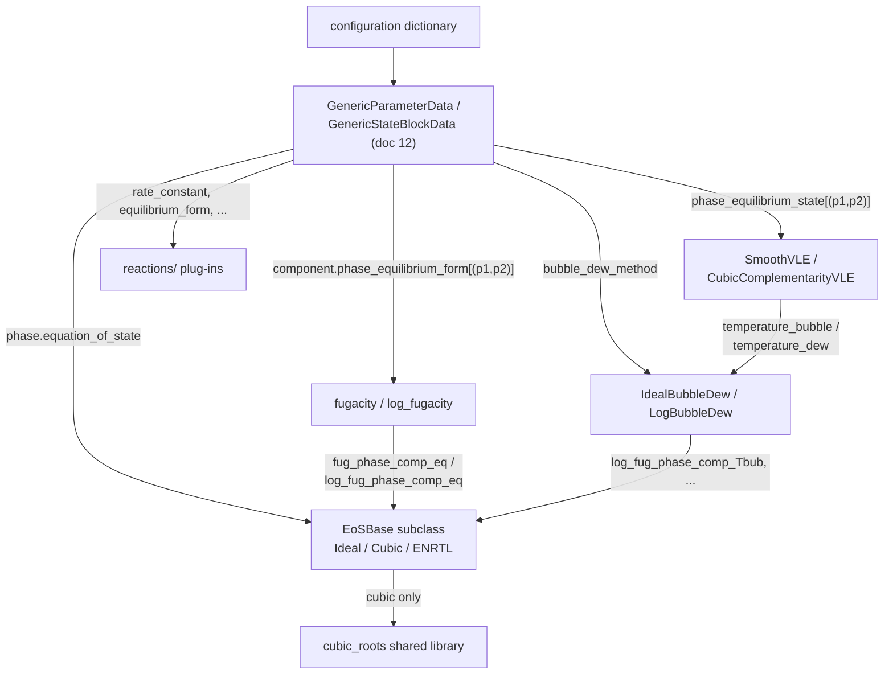
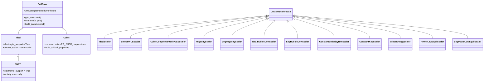
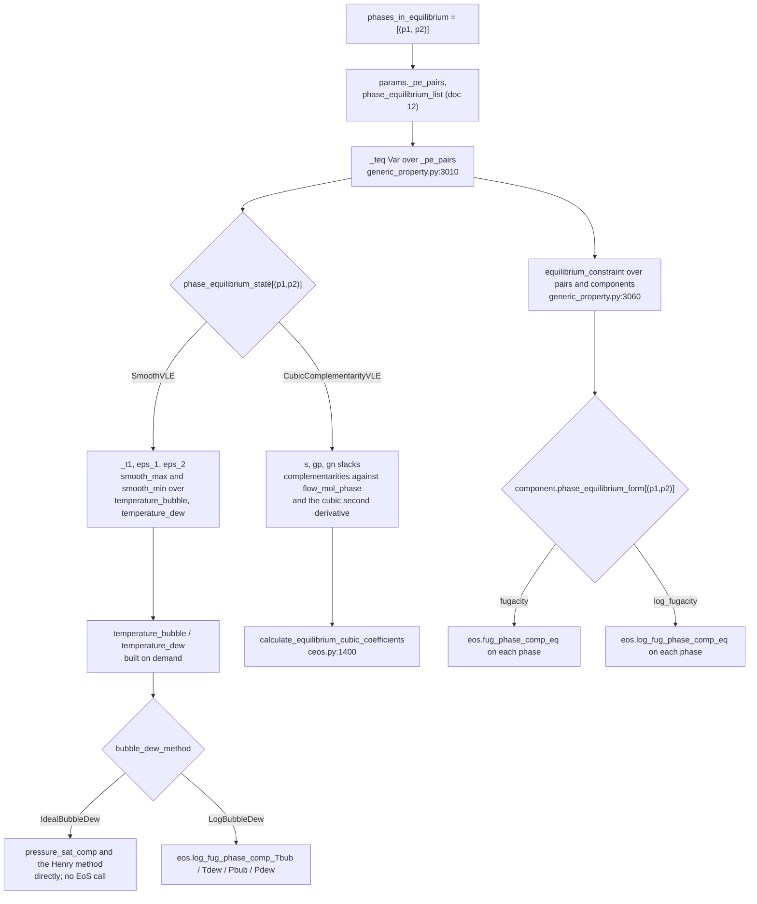

# 13 — Modular properties: equations of state and phase equilibrium

> **Doc ID** 13 · **Repo SHA** 70a8f4fe1 (IDAES-PSE v2.13.0rc0) · **Source roots** `idaes/models/properties/modular_properties/eos/`, `.../phase_equil/`, `.../reactions/`
> **Owns** 20 modules / 6,793 LOC · **Assets** none · **Siblings** [05](05_property_and_reaction_framework.md), [12](12_modular_properties_generic_framework.md), [14](14_modular_properties_state_definitions_and_libraries.md), [15](15_property_package_catalog.md), [30](30_numerics_and_solver_interface_map.md), [31](31_extension_point_catalog.md)

These three subpackages are plug-in libraries. Nothing here is a process block,
nothing here has a `CONFIG` block of its own except one module-level template,
and nothing here is instantiated: every class is a namespace holding static
methods, and every one is reached because a user named it in a configuration
dictionary. The assembly layer that reads those dictionaries and performs the
dispatch is [12](12_modular_properties_generic_framework.md); this document
describes what the dispatch arrives at.

Three families live here. `eos/` supplies thermodynamic property expressions per
phase behind the `equation_of_state` configuration key. `phase_equil/` supplies
the equilibrium formulations, the equality forms, the bubble and dew point
constructions and Henry's law. `reactions/` supplies the rate and equilibrium
expression forms that the modular reaction templates name.

**Anchor convention in this document.** Anchors written in full
(`idaes/models/properties/modular_properties/eos/ceos.py:121`) appear in
sections 2 and 15. Inside a section whose heading or prose names the file, the
abbreviated form `ceos.py:121` is used and resolves against the same path;
section 15 carries the full path for every file cited.

---

## 0. Scope and source map

| File | LOC | Purpose | Covered in § |
|---|---:|---|---|
| `idaes/models/properties/modular_properties/eos/eos_base.py` | 345 | `EoSBase` — the 46-method static contract every equation of state presents | 3, 7, 9 |
| `idaes/models/properties/modular_properties/eos/ideal.py` | 567 | `Ideal`, `IdealScaler`; ideal gas, Raoult's law and Henry's law liquids, ideal solids | 3, 6, 7, 9 |
| `idaes/models/properties/modular_properties/eos/ceos.py` | 1,555 | `Cubic`, `MixingRuleA`/`MixingRuleB`, `CubicConfig`, the alpha functions and the default mixing rules | 3, 4, 5, 6, 7, 9, 11, 12 |
| `idaes/models/properties/modular_properties/eos/ceos_common.py` | 152 | `CubicType`, the `EoS_param` table, `CubicThermoExpressions` and the `cubic_roots` binding | 3, 5, 7, 10 |
| `idaes/models/properties/modular_properties/eos/enrtl.py` | 851 | `ENRTL` — the electrolyte NRTL activity coefficient model, built on `Ideal` | 3, 5, 6, 7, 12 |
| `idaes/models/properties/modular_properties/eos/enrtl_parameters.py` | 166 | `ConstantAlpha`, `ConstantTau` — the eNRTL `alpha_rule` and `tau_rule` plug-ins | 3, 6, 7, 9 |
| `idaes/models/properties/modular_properties/eos/enrtl_reference_states.py` | 114 | `Unsymmetric`, `Symmetric` — the eNRTL `reference_state` plug-ins | 3, 7, 9 |
| `idaes/models/properties/modular_properties/eos/__init__.py` | 12 | Licence header only; declares and imports nothing | 2 |
| `idaes/models/properties/modular_properties/phase_equil/smooth_VLE.py` | 204 | `SmoothVLE`, `SmoothVLEScaler` — the smooth-maximum equilibrium temperature | 3, 5, 6, 7 |
| `idaes/models/properties/modular_properties/phase_equil/smooth_VLE_2.py` | 362 | `CubicComplementarityVLE`, its Scaler and the two slack initializers | 3, 5, 6, 7, 12 |
| `idaes/models/properties/modular_properties/phase_equil/forms.py` | 112 | `fugacity`, `log_fugacity` and their Scalers — the `phase_equilibrium_form` values | 3, 5, 7, 9 |
| `idaes/models/properties/modular_properties/phase_equil/bubble_dew.py` | 1,108 | `IdealBubbleDew`, `LogBubbleDew` and their Scalers — the `bubble_dew_method` values | 3, 5, 6, 7, 9, 12 |
| `idaes/models/properties/modular_properties/phase_equil/henry.py` | 228 | `HenryType`, `ConstantH`, and the four Henry expression helpers | 3, 5, 7, 9, 12 |
| `idaes/models/properties/modular_properties/phase_equil/__init__.py` | 14 | Re-exports `SmoothVLE` and `CubicComplementarityVLE` | 2 |
| `idaes/models/properties/modular_properties/reactions/dh_rxn.py` | 97 | `constant_dh_rxn`, `ConstantEnthalpyRxnScaler` — the `heat_of_reaction` value | 3, 6, 7, 9 |
| `idaes/models/properties/modular_properties/reactions/rate_constant.py` | 104 | `arrhenius` — the `rate_constant` value | 3, 6, 7, 9 |
| `idaes/models/properties/modular_properties/reactions/rate_forms.py` | 45 | `power_law_rate` — the `rate_form` value | 3, 7, 9 |
| `idaes/models/properties/modular_properties/reactions/equilibrium_constant.py` | 350 | `ConstantKeq`, `van_t_hoff`, `gibbs_energy` and two Scalers — the `equilibrium_constant` values | 3, 6, 7, 9, 12 |
| `idaes/models/properties/modular_properties/reactions/equilibrium_forms.py` | 395 | `power_law_equil`, `log_power_law_equil`, `solubility_product`, `log_solubility_product` — the `equilibrium_form` values | 3, 6, 7, 9, 12 |
| `idaes/models/properties/modular_properties/reactions/__init__.py` | 12 | Licence header only; every reaction plug-in is imported by module path | 2, 12 |

Total 6,793 LOC, 43 classes, 3 configuration keys, 42 `NotImplementedError`
hook sites, 3 enumerations, 0 classes declared by `declare_process_block_class`,
0 shipped assets.

---

## 1. Architectural role

A modular property package is a configuration dictionary. The framework in
[12](12_modular_properties_generic_framework.md) turns that dictionary into
`Phase` and `Component` sub-blocks and answers every property request by
resolving a configured value into a callable. This document owns the callables
for three of those configuration keys and their dependents.

*Equations of state.* Every `Phase` declares one `equation_of_state`
([05 §4.5](05_property_and_reaction_framework.md#45-phasedataconfig)). The
value is a class, never an instance. `EoSBase`
(`idaes/models/properties/modular_properties/eos/eos_base.py:32`) declares 46
static methods; 39 of them raise `NotImplementedError`, and a concrete equation
of state is a subclass that replaces some subset of them with expression
generators. Three concrete ones ship: `Ideal`
(`idaes/models/properties/modular_properties/eos/ideal.py:90`), `Cubic`
(`idaes/models/properties/modular_properties/eos/ceos.py:121`) covering
Peng-Robinson and Soave-Redlich-Kwong, and `ENRTL`
(`idaes/models/properties/modular_properties/eos/enrtl.py:64`), which subclasses
`Ideal` rather than `EoSBase` and replaces only the activity terms.

*Phase equilibrium.* Four independent configuration keys compose one
formulation: `phases_in_equilibrium` names the coupled pairs,
`phase_equilibrium_state` selects a formulation for the equilibrium temperature
`_teq`, the per-component `phase_equilibrium_form` selects the equality written
for each shared chemical component, and `bubble_dew_method` supplies the
saturation points that the equilibrium-temperature formulation reads. Section
5.4 assembles them.

*Reactions.* The three reaction configuration templates in
[12 §4.2](12_modular_properties_generic_framework.md#42-the-per-reaction-configuration-templates)
name a `heat_of_reaction`, a `rate_constant` and `rate_form`, or an
`equilibrium_constant` and `equilibrium_form`. `reactions/` holds every shipped
value for those five keys.

*Every plug-in in this document is reached from the assembly layer, and the phase equilibrium plug-ins reach back into the equation of state to obtain the fugacities they equate.*

---

## 2. Public surface inventory

No module here declares `__all__`. Only `phase_equil/__init__.py` re-exports
anything; `eos/__init__.py` and `reactions/__init__.py` carry the licence header
and nothing else, so every other symbol is reached by its full module path.

| Symbol | Kind | Declared at | Exported via | Stability signal |
|---|---|---|---|---|
| `EoSBase` | class | `idaes/models/properties/modular_properties/eos/eos_base.py:32` | module path only | base of every equation of state; not autodoc'd |
| `_msg` | function | `idaes/models/properties/modular_properties/eos/eos_base.py:339` | module path only | leading underscore |
| `IdealScaler` | class | `idaes/models/properties/modular_properties/eos/ideal.py:41` | module path only | named by `Ideal.default_scaler` |
| `Ideal` | class | `idaes/models/properties/modular_properties/eos/ideal.py:90` | module path only | prose page under `docs/explanations/components/property_package/general/eos/` |
| `_invalid_phase_msg`, `_fug_phase_comp`, `_log_fug_phase_comp` | functions | `idaes/models/properties/modular_properties/eos/ideal.py:502`, `:509`, `:532` | module path only | leading underscore |
| `MixingRuleA`, `MixingRuleB` | enums | `idaes/models/properties/modular_properties/eos/ceos.py:75`, `:82` | module path only | one member each |
| `eps_SL`, `CubicConfig` | module constant, `ConfigBlock` | `idaes/models/properties/modular_properties/eos/ceos.py:90`, `:92` | module path only | smoothing epsilon for `safe_log`; module-level template, deep-copied per package |
| `Cubic` | class | `idaes/models/properties/modular_properties/eos/ceos.py:121` | module path only | prose page under the same `eos/` directory |
| `_dZ_dT`, `_N_dZ_dNj`, `_log_fug_coeff_phase_comp_eq`, `_log_fug_coeff_phase_comp`, `_log_fug_coeff_method`, `_d_log_fug_coeff_dT_phase_comp`, `_bubble_dew_log_fug_coeff_method` | functions | `idaes/models/properties/modular_properties/eos/ceos.py:1064`, `:1090`, `:1156`, `:1188`, `:1225`, `:1239`, `:1294` | module path only | leading underscore |
| `calculate_equilibrium_cubic_coefficients` | function | `idaes/models/properties/modular_properties/eos/ceos.py:1400` | module path only | imported by `smooth_VLE_2.py` |
| `func_fw_PR`, `func_fw_SRK`, `func_alpha_soave`, `func_dalpha_dT_soave`, `func_d2alpha_dT2_soave` | functions | `idaes/models/properties/modular_properties/eos/ceos.py:1429`, `:1443`, `:1457`, `:1474`, `:1491` | module path only | assigned onto the parameter block by name |
| `rule_am_default`, `rule_am_crit_default`, `rule_bm_default`, `rule_bm_crit_default` | functions | `idaes/models/properties/modular_properties/eos/ceos.py:1510`, `:1527`, `:1544`, `:1551` | module path only | selected by the two mixing-rule enums |
| `cubic_so_path`, `cubic_roots_available` | module variable, function | `idaes/models/properties/modular_properties/eos/ceos_common.py:28`, `:34` | module path only | `None` when the library is absent; the gate, re-exported through `ceos.py:52` |
| `CubicType`, `EoS_param` | enum, module dict | `idaes/models/properties/modular_properties/eos/ceos_common.py:43`, `:50` | module path only | named in every cubic package configuration; the `u`, `w`, `omegaA`, `coeff_b` table |
| `_ExternalFunctionSpecs` | class | `idaes/models/properties/modular_properties/eos/ceos_common.py:56` | module path only | leading underscore |
| `CubicThermoExpressions` | class | `idaes/models/properties/modular_properties/eos/ceos_common.py:77` | module path only | the only instantiated class in this document |
| `DefaultAlphaRule`, `DefaultTauRule`, `DefaultRefState`, `ClosestApproach` | module constants | `idaes/models/properties/modular_properties/eos/enrtl.py:55`, `:56`, `:57`, `:61` | module path only | `ClosestApproach` is a hard-coded 14.9 |
| `ENRTL` | class | `idaes/models/properties/modular_properties/eos/enrtl.py:64` | module path only | no page in `docs/` |
| `log_gamma_lc` | function | `idaes/models/properties/modular_properties/eos/enrtl.py:705` | module path only | shared by actual and reference state |
| `ConstantAlpha`, `ConstantTau` | classes | `idaes/models/properties/modular_properties/eos/enrtl_parameters.py:31`, `:113` | module path only | the two `equation_of_state_options` rules |
| `Unsymmetric`, `Symmetric` | classes | `idaes/models/properties/modular_properties/eos/enrtl_reference_states.py:46`, `:73` | module path only | `Symmetric` is `DefaultRefState` |
| `EPS`, `ndxdn` | constant, function | `idaes/models/properties/modular_properties/eos/enrtl_reference_states.py:43`, `:102` | module path only | `EPS` is `1e-20` |
| `SmoothVLEScaler`, `SmoothVLE` | classes | `idaes/models/properties/modular_properties/phase_equil/smooth_VLE.py:34`, `:63` | `idaes.models.properties.modular_properties.phase_equil` | `SmoothVLE` re-exported at `phase_equil/__init__.py:13` |
| `EPS_INIT`, `CubicComplementarityVLEScaler` | module constant, class | `idaes/models/properties/modular_properties/phase_equil/smooth_VLE_2.py:47`, `:50` | module path only | slack initial value `1e-4`; the Scaler named by `default_scaler` |
| `CubicComplementarityVLE` | class | `idaes/models/properties/modular_properties/phase_equil/smooth_VLE_2.py:72` | `idaes.models.properties.modular_properties.phase_equil` | re-exported at `phase_equil/__init__.py:14` |
| `_calculate_temperature_slacks`, `_calculate_ceos_derivative_slacks` | functions | `idaes/models/properties/modular_properties/phase_equil/smooth_VLE_2.py:323`, `:343` | module path only | leading underscore |
| `FugacityScaler`, `fugacity` | classes | `idaes/models/properties/modular_properties/phase_equil/forms.py:24`, `:40` | module path only | prose page `general/pe/pe_forms.rst` |
| `LogFugacityScaler`, `log_fugacity` | classes | `idaes/models/properties/modular_properties/phase_equil/forms.py:71`, `:91` | module path only | as above |
| `IdealBubbleDewScaler`, `IdealBubbleDew` | classes | `idaes/models/properties/modular_properties/phase_equil/bubble_dew.py:37`, `:138` | module path only | prose page `general/bubble_dew.rst` |
| `LogBubbleDewScaler`, `LogBubbleDew` | classes | `idaes/models/properties/modular_properties/phase_equil/bubble_dew.py:624`, `:713` | module path only | `LogBubbleDew` is the framework default |
| `_non_vle_phase_check` | function | `idaes/models/properties/modular_properties/phase_equil/bubble_dew.py:1103` | module path only | leading underscore |
| `HenryType` | enum | `idaes/models/properties/modular_properties/phase_equil/henry.py:34` | module path only | imported by `generic_property.py` and `FTPx.py` |
| `get_henry_concentration_term`, `henry_pressure`, `log_henry_pressure`, `henry_equilibrium_ratio`, `henry_units` | functions | `idaes/models/properties/modular_properties/phase_equil/henry.py:55`, `:83`, `:109`, `:136`, `:178` | module path only | the middle two imported by `ideal.py:33`, the fourth by `state_definitions/FTPx.py` |
| `ConstantH`, `_raise_henry_type_error` | class, function | `idaes/models/properties/modular_properties/phase_equil/henry.py:194`, `:227` | module path only | the only shipped Henry `method`; leading underscore |
| `ConstantEnthalpyRxnScaler`, `constant_dh_rxn` | classes | `idaes/models/properties/modular_properties/reactions/dh_rxn.py:30`, `:62` | module path only | prose page `general_reactions/heat_of_reaction.rst` |
| `arrhenius` | class | `idaes/models/properties/modular_properties/reactions/rate_constant.py:34` | module path only | prose page `general_reactions/rate_constant.rst` |
| `power_law_rate` | class | `idaes/models/properties/modular_properties/reactions/rate_forms.py:26` | module path only | prose page `general_reactions/rate_form.rst` |
| `ConstantKeqScaler`, `ConstantKeq`, `van_t_hoff`, `GibbsEnergyScaler`, `gibbs_energy` | classes | `idaes/models/properties/modular_properties/reactions/equilibrium_constant.py:35`, `:68`, `:149`, `:250`, `:281` | module path only | prose page `general_reactions/equil_constant.rst` |
| `PowerLawEquilScaler`, `power_law_equil` | classes | `idaes/models/properties/modular_properties/reactions/equilibrium_forms.py:35`, `:65` | module path only | prose page `general_reactions/equil_form.rst` |
| `LogPowerLawEquilScaler`, `log_power_law_equil` | classes | `idaes/models/properties/modular_properties/reactions/equilibrium_forms.py:102`, `:132` | module path only | as above |
| `solubility_product`, `log_solubility_product` | classes | `idaes/models/properties/modular_properties/reactions/equilibrium_forms.py:166`, `:284` | module path only | no `default_scaler` |

Class names in `reactions/` and `phase_equil/forms.py` are lower case because
they are used as configuration values rather than as constructors; the Scaler
classes beside them follow the usual capitalisation.

---

## 3. Class hierarchy and type taxonomy

*The only inheritance in this document is the equation-of-state chain and the eleven Scalers; every other class is a flat namespace with no base.*

### 3.1 Class roster

The container-class column is empty for every row: no class in this document is
declared by `declare_process_block_class`, and none subclasses
`ProcessBlockData`.

| Class | Base(s) | Declared at | Decorator | Container class | Key overrides and attributes |
|---|---|---|---|---|---|
| `EoSBase` | none | `eos_base.py:32` | none | — | 46 static methods, 39 of them raising |
| `Ideal` | `EoSBase` | `ideal.py:90` | none | — | 38 methods; `electrolyte_support` (`:94`), `default_scaler` (`:95`) |
| `IdealScaler` | `CustomScalerBase` | `ideal.py:41` | none | — | `variable_scaling_routine`, `constraint_scaling_routine` |
| `Cubic` | `EoSBase` | `ceos.py:121` | none | — | 33 methods; no `electrolyte_support`, no `default_scaler` |
| `MixingRuleA` | `Enum` | `ceos.py:75` | none | — | section 3.2 |
| `MixingRuleB` | `Enum` | `ceos.py:82` | none | — | section 3.2 |
| `CubicType` | `enum.Enum` | `ceos_common.py:43` | none | — | section 3.2 |
| `_ExternalFunctionSpecs` | `object` | `ceos_common.py:56` | none | — | `__init__`, `kwargs` |
| `CubicThermoExpressions` | `object` | `ceos_common.py:77` | none | — | `_external` dict, `add_funcs`, `z_liq`, `z_vap` |
| `ENRTL` | `Ideal` | `enrtl.py:64` | none | — | 11 methods; `electrolyte_support` (`:68`) |
| `ConstantAlpha`, `ConstantTau` | `object` | `enrtl_parameters.py:31`, `:113` | none | — | `build_parameters`, `return_expression` |
| `Unsymmetric`, `Symmetric` | `object` | `enrtl_reference_states.py:46`, `:73` | none | — | `ref_state`, `ndIdn` |
| `SmoothVLE` | `object` | `smooth_VLE.py:63` | none | — | `phase_equil`, `calculate_scaling_factors`, `phase_equil_initialization`, `calculate_teq` |
| `SmoothVLEScaler` | `CustomScalerBase` | `smooth_VLE.py:34` | none | — | both routines keyed by `phase_pair` |
| `CubicComplementarityVLE` | none | `smooth_VLE_2.py:72` | none | — | the same four methods |
| `CubicComplementarityVLEScaler` | `CustomScalerBase` | `smooth_VLE_2.py:50` | none | — | both routines keyed by `phase_pair` |
| `fugacity`, `log_fugacity` | none | `forms.py:40`, `:91` | none | — | `return_expression`, `calculate_scaling_factors` |
| `FugacityScaler`, `LogFugacityScaler` | `CustomScalerBase` | `forms.py:24`, `:71` | none | — | routines keyed by `(p1, p2, j)` |
| `IdealBubbleDew` | none | `bubble_dew.py:138` | none | — | four constructors plus four `scale_*` methods |
| `IdealBubbleDewScaler` | `CustomScalerBase` | `bubble_dew.py:37` | none | — | `constraint_scaling_routine` only |
| `LogBubbleDew` | none | `bubble_dew.py:713` | none | — | the same eight methods, logarithmic |
| `LogBubbleDewScaler` | `CustomScalerBase` | `bubble_dew.py:624` | none | — | `constraint_scaling_routine` only |
| `HenryType` | `Enum` | `henry.py:34` | none | — | section 3.2 |
| `ConstantH` | none | `henry.py:194` | none | — | `build_parameters`, `return_expression`, `dT_expression` |
| `constant_dh_rxn` | none | `dh_rxn.py:62` | none | — | `build_parameters`, `return_expression`, `calculate_scaling_factors` |
| `ConstantEnthalpyRxnScaler` | `CustomScalerBase` | `dh_rxn.py:30` | none | — | `variable_scaling_routine` only |
| `arrhenius` | none | `rate_constant.py:34` | none | — | `build_parameters`, `return_expression`; no Scaler |
| `power_law_rate` | none | `rate_forms.py:26` | none | — | `build_parameters` is a no-op; no Scaler |
| `ConstantKeq` | none | `equilibrium_constant.py:68` | none | — | adds `return_log_expression` |
| `van_t_hoff` | none | `equilibrium_constant.py:149` | none | — | `default_scaler` is `ConstantKeqScaler` |
| `gibbs_energy` | none | `equilibrium_constant.py:281` | none | — | `default_scaler` is `GibbsEnergyScaler` |
| `ConstantKeqScaler` | `CustomScalerBase` | `equilibrium_constant.py:35` | none | — | shared by `ConstantKeq` and `van_t_hoff` |
| `GibbsEnergyScaler` | `CustomScalerBase` | `equilibrium_constant.py:250` | none | — | reads `rblock._keq_units` |
| `power_law_equil`, `log_power_law_equil` | none | `equilibrium_forms.py:65`, `:132` | none | — | `build_parameters` is a no-op on the first and absent on the second |
| `solubility_product`, `log_solubility_product` | none | `equilibrium_forms.py:166`, `:284` | none | — | smooth-maximum complementarity; no `default_scaler` |
| `PowerLawEquilScaler`, `LogPowerLawEquilScaler` | `CustomScalerBase` | `equilibrium_forms.py:35`, `:102` | none | — | routines take `submodel_scalers` |

### 3.2 Enumerations

`CubicType` (`ceos_common.py:43`) selects the cubic family; it is the value of
the `type` key of section 4.1 and the key of the `EoS_param` table.

| Member | Value | Meaning | Consumed at |
|---|---|---|---|
| `PR` | 0 | Peng-Robinson; `func_fw_PR` is selected | `ceos.py:484`, `:528` |
| `SRK` | 1 | Soave-Redlich-Kwong; `func_fw_SRK` is selected | `ceos.py:530` |

`MixingRuleA` (`ceos.py:75`) and `MixingRuleB` (`ceos.py:82`) each declare a
single member.

| Enum | Member | Value | Meaning | Consumed at |
|---|---|---|---|---|
| `MixingRuleA` | `default` | 0 | `rule_am_default`, the van der Waals one-fluid rule for the `a` term | `ceos.py:239`, `:401`, `:981`, `:1114` |
| `MixingRuleB` | `default` | 0 | `rule_bm_default`, the same rule for the `b` term | `ceos.py:343`, `:1001`, `:1123` |

`HenryType` (`henry.py:34`) carries its arithmetic in the member value: values
1 to 50 are "Henry constant" forms with concentration over pressure, values 51
to 100 are "Henry volatility" forms with pressure over concentration, and the
comparison `value <= 50` at `henry.py:95`, `:123` and `:167` is what decides
whether the constant multiplies or divides.

| Member | Value | Meaning | Consumed at |
|---|---|---|---|
| `Hcp` | 1 | Constant, molar concentration basis | `henry.py:71`, `:162`, `:180` |
| `Hxp` | 2 | Constant, mole fraction basis | `henry.py:73`, `:184` |
| `Kpc` | 51 | Volatility, molar concentration basis | `henry.py:71`, `:164`, `:182` |
| `Kpx` | 52 | Volatility, mole fraction basis; the only type the framework admits under full phase equilibrium | `henry.py:73`, `:186` |
| `Dummy` | 999 | Declared with the comment that it exists to test error handling | `henry.py:184`, section 12 |

### 3.3 The `EoS_param` table

`ceos_common.py:50` is a module-level dict keyed by `CubicType`, and it is the
whole of what distinguishes Peng-Robinson from Soave-Redlich-Kwong inside the
generalised cubic form.

| `CubicType` | `u` | `w` | `omegaA` | `coeff_b` |
|---|---:|---:|---:|---:|
| `PR` | 2 | -1 | 0.45724 | 0.07780 |
| `SRK` | 1 | 0 | 0.42748 | 0.08664 |

`u` and `w` enter the pressure-explicit denominator and every departure
function; `omegaA` scales the critical `a` coefficient (`ceos.py:164`) and
`coeff_b` the `b` coefficient (`ceos.py:228`). The alpha function is Soave's for
both families (`ceos.py:539`); only `func_fw_PR` (`:1429`) and `func_fw_SRK`
(`:1443`) differ.

---

## 4. Configuration reference

Three keys, all on one module-level `ConfigBlock`. Every other option surface in
this document is a plain dictionary, tabulated in section 4.2.

### 4.1 `CubicConfig`

`CubicConfig` is declared at module level (`ceos.py:92`) and never used
directly: `Cubic.build_parameters` deep-copies it onto the parameter block under
the name `<cname>_eos_options` (`ceos.py:506`) and calls `set_value` with the
phase's `equation_of_state_options` dictionary (`:508`). Validation therefore
happens once per cubic family per package, not once per phase.

| Key | Domain / validator | Default | Req. | Effect on build | Anchor |
|---|---|---|---|---|---|
| `type` | `In(CubicType)` | none | yes | Selects the `EoS_param` row, the `fw` function and the `PR`/`SRK` name prefix on every generated component | `ceos.py:93` |
| `mixing_rule_a` | `In(MixingRuleA)` | `MixingRuleA.default` | no | Selects the rule used for `<cname>_am`, `<cname>_dam_dT`, `<cname>_d2am_dT2` and `<cname>_delta` | `ceos.py:101` |
| `mixing_rule_b` | `In(MixingRuleB)` | `MixingRuleB.default` | no | Selects the rule used for `<cname>_bm` | `ceos.py:110` |

`type` carries no `default=`, so the lookup at `ceos.py:475` raises rather than
falling back; section 12 records what it raises. A second phase using the same
cubic family is checked key by key against the stored block and a differing
value raises `ConfigurationError` (`ceos.py:493`).

### 4.2 Option surfaces that are not CONFIG keys

| Surface | Read at | Keys | Value shape |
|---|---|---|---|
| `phases[p]["equation_of_state_options"]` for `Cubic` | `ceos.py:475`, `:491`, `:508` | `type`, `mixing_rule_a`, `mixing_rule_b` | validated against `CubicConfig` |
| `phases[p]["equation_of_state_options"]` for `ENRTL` | `enrtl.py:95`, `:104`, `:119`, `:130`, `:141` | `alpha_rule`, `tau_rule`, `reference_state` | a class; absent keys fall back to `DefaultAlphaRule`, `DefaultTauRule`, `DefaultRefState` |
| `phases[p]["equation_of_state_options"]["property_basis"]` | `generic_property.py:3530`, `:3560` | `property_basis` | `"apparent"` switches `components_in_phase` and `get_mole_frac` to the apparent set; owned by [12 §9.3](12_modular_properties_generic_framework.md#93-seams-reached-by-direct-configuration-lookup) |
| `components[j]["henry_component"][p]` | `henry.py:84`, `:110`, `:160`; `ideal.py:514`, `:545` | `method`, `type`, `basis` | `method` is a class such as `ConstantH`, `type` a `HenryType`, `basis` a `StateIndex` |
| `parameter_data["<cname>_kappa"]` | `ceos.py:515` | per component pair | binary interaction coefficients, initialised into a `Var` |
| `parameter_data["<phase>_alpha"]`, `["<phase>_tau"]` | `enrtl_parameters.py:28`, `:121` | per species pair | eNRTL non-randomness and interaction energies |
| Reaction `parameter_data` | `dh_rxn.py:83`; `rate_constant.py:91`, `:95`; `equilibrium_constant.py:88`, `:173`, `:179`, `:320`, `:326` | `dh_rxn_ref`, `arrhenius_const`, `energy_activation`, `k_eq_ref`, `T_eq_ref`, `ds_rxn_ref` | numbers or value-and-unit pairs read by `set_param_from_config` |

The `equation_of_state_options` key itself defaults to `None`
(`idaes/core/base/phases.py:74`), which is why every consumer above either
subscripts it directly and accepts the failure, or tests `is not None` first as
`enrtl.py:94` does.

---

## 5. Construction and call sequences

### 5.1 Where each plug-in is reached from

Every row is a call made by the assembly layer, whose dispatch rules are
[12 §5.3](12_modular_properties_generic_framework.md#53-getmethod-the-plug-in-dispatch)
and [12 §9.3](12_modular_properties_generic_framework.md#93-seams-reached-by-direct-configuration-lookup).

| Plug-in | Entry point | Called from | When |
|---|---|---|---|
| `equation_of_state` | `build_parameters(phase_block)`, then `common(state_block, phase_obj)` | the phase configuration sweep of `GenericParameterData.build`; `generic_property.py:3021` | once per phase, at parameter build and again in `GenericStateBlockData.build` |
| `equation_of_state` | one method per property | the 108 on-demand builders | first access to that property |
| `equation_of_state` | `build_critical_properties`, `list_critical_property_constraint_names` | `generic_property.py:3633`, `:2249` | first access to a critical property; during initialization |
| `equation_of_state` | `calculate_scaling_factors(b, pobj)` | `generic_property.py:3126` | suffix-based scaling |
| `phase_equilibrium_state` | `phase_equil(b, pp)`; `calculate_scaling_factors(b, pp)` | `generic_property.py:3039`, `:3192` | once per pair in `GenericStateBlockData.build`; suffix-based scaling |
| `phase_equilibrium_state` | `calculate_teq`, `phase_equil_initialization` | `generic_property.py:2299`, `:2409` and `:2763`, `:2874` | Initializer object and legacy routine |
| `phase_equilibrium_form` | `return_expression(b, p1, p2, j)`; `calculate_scaling_factors(b, p1, p2, j)` | `generic_property.py:3055`, `:3199` | building `equilibrium_constraint`; suffix-based scaling |
| `bubble_dew_method` | the four point constructors; `scale_<name>(b, overwrite)` | `generic_property.py:5680`, `:3293` | first access to that saturation point; suffix-based scaling |
| `henry_component[p]["method"]` | `build_parameters`, `return_expression`, `dT_expression` | `generic_property.py:1688`, `:4562`; `ideal.py:514`, `:545`; `bubble_dew.py:181` | parameter build, `henry` builder, fugacity |
| `heat_of_reaction` | `build_parameters`, `return_expression` | `generic_reaction.py:719` and the inherent-reaction loop | reaction parameter build, `dh_rxn` |
| `rate_constant`, `rate_form` | `build_parameters`, `return_expression` | `generic_reaction.py:734`, `:754` | `k_rxn`, `reaction_rate` |
| `equilibrium_constant` | `build_parameters`, `return_expression`, `return_log_expression`, `calculate_scaling_factors` | `generic_reaction.py:768`; `generic_property.py:3215` | `k_eq`, `log_k_eq` |
| `equilibrium_form` | `build_parameters`, `return_expression`, `calculate_scaling_factors` | `generic_reaction.py:807`; `generic_property.py:3097`, `:3220` | `equilibrium_constraint`, `inherent_equilibrium_constraint` |

### 5.2 `Cubic.build_parameters`

`ceos.py:466`, called once per phase.

1. Reject any phase that is neither vapour nor liquid —
   `PropertyNotSupportedError` (`:469`).
2. Reject a `type` outside `CubicType` — `ConfigurationError` (`:478`). Store the
   member on the phase as `_cubic_type` (`:485`) and derive `cname` from its
   name (`:486`).
3. If the parameter block already carries `<cname>_eos_options`, a previous
   phase of the same family built it: compare every option value and raise
   `ConfigurationError` on a difference (`:493`), copy `_mixing_rule_a` and
   `_mixing_rule_b` onto this phase (`:502`, `:503`), and return without
   rebuilding shared parameters (`:504`).
4. Otherwise deep-copy `CubicConfig` onto the parameter block (`:506`) and
   `set_value` the phase's options into it (`:508`).
5. Create `<cname>_kappa`, a `Var` over the component list squared, initialised
   from `parameter_data["<cname>_kappa"]` and declared with `units=None`
   (`:516`).
6. Bind the family's `fw` function (`:528`–`:537`, `BurntToast` on an
   unreachable third value) and the three Soave alpha functions onto the
   parameter block as plain attributes (`:538`–`:541`).

Steps 3 to 6 run once per cubic family per package; a vapour-liquid pair sharing
Peng-Robinson therefore has one `PR_kappa` and one `PR_eos_options`.

### 5.3 `Cubic.common`

`ceos.py:125`, called once per phase from `GenericStateBlockData.build`, and
guarded at `:147` by testing for `<cname>_fw` so the second phase of a pair
returns immediately. Before that guard it rejects Henry's law components with
`PropertyNotSupportedError` (`:137`).

The method builds nineteen `Expression`s onto the state block, named by string
concatenation. Section 6.2 tabulates them. Four properties of the construction
matter:

- The name prefix is the `CubicType` member name, so a package using
  Peng-Robinson carries `PR_am` and one using Soave-Redlich-Kwong carries
  `SRK_am`. A package may carry both.
- The mixing-rule branch is a two-way test on each enum, with the negative
  branch raising `ConfigurationError` (`:337`, `:351`).
- The equilibrium-state block (`:370`–`:459`) is built only when
  `phases_in_equilibrium` is set and the block is not a fully defined state. Its
  five components carry a leading underscore and are indexed by `_pe_pairs` in
  addition to the phase index, because they are evaluated at `_teq` rather than
  at `temperature` (`:380`, `:420`, `:430`).
- `rule_am_eq` (`:392`) and the two critical-point rules (`:972`, `:992`) re-read
  `equation_of_state_options["mixing_rule_a"]` from the phase configuration
  inside a `try` that catches `KeyError` and `TypeError`, rather than from the
  `_mixing_rule_a` attribute that step 3 of section 5.2 set.

### 5.4 Assembling a phase equilibrium formulation

*Four independent configuration keys compose one formulation: the pair list, the equilibrium-temperature formulation, the per-component equality form, and the saturation-point construction the first of those reads.*

The two equilibrium-state formulations solve the same problem differently.

**`SmoothVLE.phase_equil`** (`smooth_VLE.py:69`) implements the smooth flash of
Burgard and co-workers, cited in the module docstring. It calls
`identify_VL_component_list` (`:85`) to learn which components exist in only one
phase, then:

1. When no vapour-only component exists, create `_t1<suffix>` (`:92`), the
   smoothing `Param` `eps_1<suffix>` defaulting to 0.01 (`:103`), and the
   constraint `_t1 == smooth_max(temperature, temperature_bubble, eps_1)`
   (`:118`). Otherwise `_t1` is `temperature` itself (`:120`).
2. When no liquid-only component exists, create `eps_2<suffix>` defaulting to
   0.0005 (`:124`) and write `_teq == smooth_min(_t1, temperature_dew, eps_2)`
   (`:136`). With liquid-only but no vapour-only components, `_teq == _t1`
   (`:143`); with both, `_teq == temperature` (`:148`).
3. Add the constraint as `_teq_constraint<suffix>` (`:151`).

The suffix is the two phase names joined by underscores (`:75`), so every
component this formulation creates is named after the phase pair and multiple
pairs coexist on one block.

**`CubicComplementarityVLE.phase_equil`** (`smooth_VLE_2.py:80`) implements the
complementarity formulation of Dabadghao and co-workers, and refuses anything
that is not a vapour-liquid pair of matching cubic equations of state
(`ConfigurationError` at `:99`, `:115` and `:120`). It creates:

1. `_vle_set<suffix>`, a two-member `Set` of the phase names (`:130`), and the
   temperature slack `s<suffix>` over it, bounded below at zero (`:132`).
2. `_teq_constraint<suffix>`, the linear relation
   `_teq - temperature - s[vap] + s[liq] == 0` (`:151`), in place of a smooth
   maximum.
3. Two smoothing `Param`s carried in flow units, `eps_t<suffix>` and
   `eps_z<suffix>` (`:155`, `:163`), and the two cubic-derivative slacks
   `gp<suffix>` and `gn<suffix>` (`:171`, `:180`).
4. `temperature_slack_complementarity<suffix>`, asserting
   `smooth_min(s[p], flow_mol_phase[p], eps_t) == 0` (`:194`).
5. `cubic_second_derivative<suffix>`, the `Expression` `6*z + 2*b` where `b`
   comes from `calculate_equilibrium_cubic_coefficients` (`:202`), split into
   `gp - gn` by `cubic_root_complementarity<suffix>` (`:217`), and
   `cubic_slack_complementarity<suffix>` (`:226`), which complements `gn`
   against the vapour flow and `gp` against the liquid flow.

Neither formulation needs bubble and dew points at build time when the phase
pair has components confined to one phase; `CubicComplementarityVLE` never needs
them at all, and reads them during initialization only if they happen to exist
(`:274`, `:285`), otherwise calling `estimate_Tbub` and `estimate_Tdew` from
[12 §7.4](12_modular_properties_generic_framework.md#74-utilitypy).

### 5.5 Bubble and dew point construction

`bubble_dew.py` supplies two classes with identical eight-method surfaces. Both
are reached from the framework's `_temperature_pressure_bubble_dew`
(`generic_property.py:5680`), which has already created the point variable and
the helper mole fraction variable.

`IdealBubbleDew` writes Raoult's law directly. `temperature_bubble` (`:150`)
creates `eq_temperature_bubble` over `_pe_pairs`, summing
`mole_frac_comp[j] * pressure_sat_comp(T_bub)` over the Raoult components and
`mole_frac_comp[j] * henry_method.return_expression(...)` over the Henry
components and equating the sum to `pressure` (`:177`, `:181`); it then declares
`eq_mole_frac_tbub` over pairs and components (`:234`). Its first act is
`_non_vle_phase_check` (`:1103`), which raises `ConfigurationError` when the
package declares more than two phases. The equation of state is never consulted.

`LogBubbleDew` writes an equality of logarithmic fugacities instead.
`temperature_bubble` (`:721`) reads the two phases' `equation_of_state`
(`:744`, `:745`) and equates `l_eos.log_fug_phase_comp_Tbub(b, l_phase, j, pp)`
to `v_eos.log_fug_phase_comp_Tbub(b, v_phase, j, pp)` per component (`:748`),
with a summation constraint closing the helper mole fractions (`:779`). The
other three constructors follow the same shape against `log_fug_phase_comp_Tdew`
(`:844`), `log_fug_phase_comp_Pbub` (`:940`) and `log_fug_phase_comp_Pdew`
(`:1036`).

Both classes skip the pair entirely when `identify_VL_component_list` reports
that it is not a liquid-vapour pair, skip a bubble point when a vapour-only
component is present, and skip a dew point when a liquid-only component is
present.

### 5.6 `ENRTL.common`

`enrtl.py:111`, 536 lines, the largest single method in this document. It runs
in six stages, all writing `Expression`s prefixed with the phase's local name.

| # | Stage | What it creates | Anchor |
|---:|---|---|---|
| 1 | Rule selection | `alpha_rule`, `tau_rule` and `ref_state` resolved from `equation_of_state_options` or the three module defaults | `:117`, `:128`, `:139` |
| 2 | Reference state | `ref_state.ref_state(b, pname)` creates `
_x_ref` | `:150` |
| 3 | Composition terms | `
_ionic_strength`, `
_ionic_strength_ref`, `
_X`, `
_X_ref`, `
_Y` | `:160`, `:171`, `:187`, `:205`, `:226` |
| 4 | Solvent properties | `
_vol_mol_solvent` from `get_vol_mol_pure`, `
_relative_permittivity_solvent` from the `relative_permittivity_liq_comp` correlation | `:247`, `:272` |
| 5 | Long-range term | `
_A_DH`, the Debye-Hückel parameter, and `
_log_gamma_pdh` over the true species set | `:307`, `:336` |
| 6 | Local term | `
_alpha`, `
_G`, `
_tau`, `
_log_gamma_lc_I`, `
_log_gamma_lc_I0`, `
_log_gamma_lc`, `
_log_gamma`, `
_log_gamma_appr` | `:420`, `:514`, `:545`, `:563`, `:579`, `:596`, `:611`, `:639` |

`log_gamma_lc` (`:705`) is the single function that computes the local
contribution; stage 6 calls it twice, once with `
_X` and once with
`
_X_ref`, which is how the reference-state correction is obtained without a
second copy of the algebra. `ENRTL.build_parameters` (`:71`) runs earlier and
creates the three index sets `ion_pair_set`, `component_pair_set` and
`component_pair_set_symmetric` (`:78`, `:89`, `:90`) that `ConstantAlpha` and
`ConstantTau` index their `Var`s over.

### 5.7 Reaction plug-in construction

Every reaction plug-in presents `build_parameters(rblock, config)` and
`return_expression(b, rblock, r_idx, T)`; the equilibrium-constant classes add
`return_log_expression`. `build_parameters` is called once per reaction against
the per-reaction `Block` the framework created
([12 §5.1](12_modular_properties_generic_framework.md#51-genericparameterdatabuild),
stage 13), and creates `Var`s valued through `set_param_from_config`.

The unit derivation in `arrhenius.build_parameters` (`rate_constant.py:38`) and
in `ConstantKeq` and `van_t_hoff` (`equilibrium_constant.py:74`, `:157`) is the
non-obvious part: for the three dimensionless concentration forms the units are
fixed, and for the other three the exponent is the sum of the reaction orders
over the phase-component set, so `arrhenius_const` and `k_eq_ref` carry
composition-dependent units computed at build time (`rate_constant.py:70`,
`equilibrium_constant.py:67`). `arrhenius` sums the negated orders
(`rate_constant.py:71`) where the equilibrium classes sum them unnegated
(`equilibrium_constant.py:68`).

`ConstantKeq` and `van_t_hoff` reach the phase-component set through a `try`
that catches `AttributeError` and falls back from a reaction package's
`config.property_package._phase_component_set` to a property package's own
`_phase_component_set`, and to `true_phase_component_set` when the package is an
electrolyte package (`equilibrium_constant.py:57`, `:62`, `:65`, repeated at
`:142`, `:147`, `:150`).

`gibbs_energy.build_parameters` (`:287`) is the only one that constrains its
siblings: it rejects any concentration form other than mole fraction or activity
(`:302`) and rejects a `heat_of_reaction` that is not `constant_dh_rxn` (`:309`).

### 5.8 Scaling delegation

Two scaling generations reach this document, and both are described once in
[06 §5.5](06_model_preparation_initializers_and_scalers.md#55-scaler-based-scaling)
and [06 §5.6](06_model_preparation_initializers_and_scalers.md#56-suffix-based-scaling).

*Scaler-based.* `ModularPropertiesScaler` delegates through
`call_module_scaling_method`, which reads `module.default_scaler` and calls one
routine on it. Eleven Scalers in this document are reached that way: the
equation-of-state Scaler per phase, the phase-equilibrium Scaler per pair, the
form Scaler per pair and component, the bubble/dew Scaler once, and the
reaction Scalers per reaction. A plug-in without `default_scaler` is logged at
debug level and skipped (`utility.py:645`).

*Suffix-based.* `GenericStateBlockData.calculate_scaling_factors` calls
`equation_of_state.calculate_scaling_factors(self, pobj)`
(`generic_property.py:3126`), `phase_equilibrium_state[pp].calculate_scaling_factors(self, pp)`
(`:3192`), `phase_equilibrium_form.calculate_scaling_factors(self, p1, p2, j)`
(`:3199`), and `bubble_dew_method.scale_<name>(b, overwrite=False)` (`:3293`).
The two conventions differ: the phase-equilibrium and equation-of-state methods
set factors themselves and return nothing, while the form methods return a
factor the caller applies through `constraint_scaling_transform`.

---

## 6. Data structures, variables, constraints and invariants

### 6.1 What `Cubic.build_parameters` creates

| Component | Type | Index sets | Units | Created at | Condition |
|---|---|---|---|---|---|
| `<phase>._cubic_type` | Python attribute | — | — | `ceos.py:485` | always |
| `<phase>._mixing_rule_a`, `._mixing_rule_b` | Python attributes | — | — | `ceos.py:502`, `:503`, `:512`, `:513` | always |
| `<cname>_eos_options` | `ConfigBlock` on the parameter block | — | — | `ceos.py:506` | first phase of the family |
| `<cname>_kappa` | `Var` on the parameter block | component × component | `units=None` | `ceos.py:516` | first phase of the family |
| `<cname>_func_fw`, `<cname>_func_alpha`, `<cname>_func_dalpha_dT`, `<cname>_func_d2alpha_dT2` | plain function attributes | — | — | `ceos.py:538`–`:541` | first phase of the family |

### 6.2 What `Cubic.common` creates on a state block

`<cname>` is `PR` or `SRK`. Every entry is an `Expression`.

| Component | Index sets | Created at | Condition |
|---|---|---|---|
| `<cname>_fw`, `<cname>_a_crit`, `<cname>_a`, `<cname>_da_dT`, `<cname>_d2a_dT2`, `<cname>_b` | component list | `ceos.py:157`, `:169`, `:186`, `:199`, `:216`, `:234` | always |
| `<cname>_am`, `<cname>_dam_dT`, `<cname>_d2am_dT2` | phase list | `ceos.py:245`, `:276`, `:313` | `mixing_rule_a` is `default` |
| `<cname>_daij_dT` | component × component | `ceos.py:259` | as above |
| `<cname>_delta` | phase-component set | `ceos.py:332` | as above |
| `<cname>_bm` | phase list | `ceos.py:349` | `mixing_rule_b` is `default` |
| `<cname>_A`, `<cname>_B` | phase list | `ceos.py:361`, `:367` | always |
| `_<cname>_a_eq` | `_pe_pairs` × component | `ceos.py:382` | phase equilibrium and not a defined state |
| `_<cname>_am_eq`, `_<cname>_A_eq`, `_<cname>_B_eq` | `_pe_pairs` × phase | `ceos.py:410`, `:423`, `:432` | as above |
| `_<cname>_delta_eq` | `_pe_pairs` × phase-component set | `ceos.py:454` | as above |
| `compress_fact_liq_func`, `compress_fact_vap_func` | `ExternalFunction`, scalar | `ceos_common.py:118` | first call to `z_liq` or `z_vap` on that block |

`Cubic.build_critical_properties` (`ceos.py:944`) adds seven more, onto whichever
block carries the critical-property variables: `a_crit` (`:965`), `am_crit`
(`:990`) and `bm_crit` (`:1010`) as `Expression`s, and `A_crit` (`:1018`),
`B_crit` (`:1026`), `compress_fact_crit_eq` (`:1044`) and `dens_mol_crit_eq`
(`:1046`) as `Constraint`s. `list_critical_property_constraint_names` (`:1055`)
returns the four constraint names so the framework's Initializer object can
deactivate them.

### 6.3 What the eNRTL model creates

| Component | Type | Index sets | Units | Created at | Condition |
|---|---|---|---|---|---|
| `ion_pair_set`, `component_pair_set`, `component_pair_set_symmetric` | `Set` | — | — | `enrtl.py:78`, `:89`, `:90` | on the phase block, at parameter build |
| `alpha` | `Var` | `component_pair_set_symmetric` | dimensionless | `enrtl_parameters.py:87` | `ConstantAlpha` |
| `tau` | `Var` | `component_pair_set` | dimensionless | `enrtl_parameters.py:143` | `ConstantTau` |
| `
_x_ref` | `Expression` | true species set | dimensionless | `enrtl_reference_states.py:63`, `:89` | unsymmetric or symmetric |
| `
_ionic_strength`, `
_ionic_strength_ref`, `
_vol_mol_solvent`, `
_relative_permittivity_solvent`, `
_A_DH` | `Expression` | scalar | dimensionless, except the solvent molar volume | `enrtl.py:160`, `:171`, `:247`, `:272`, `:307` | always |
| `
_X`, `
_X_ref`, `
_log_gamma_pdh`, `
_log_gamma_lc_I`, `
_log_gamma_lc`, `
_log_gamma` | `Expression` | true species set | dimensionless | `enrtl.py:187`, `:205`, `:336`, `:563`, `:596`, `:611` | always |
| `
_Y`, `
_log_gamma_lc_I0` | `Expression` | ion set | dimensionless | `enrtl.py:226`, `:579` | always |
| `
_alpha`, `
_G`, `
_tau` | `Expression` | true species × true species | dimensionless | `enrtl.py:420`, `:514`, `:545` | always |
| `
_log_gamma_appr` | `Expression` | apparent species set | dimensionless | `enrtl.py:639` | always |

### 6.4 What the phase equilibrium formulations create

The suffix `<sfx>` is the two phase names of the pair, each preceded by an
underscore.

| Component | Type | Index sets | Units | Created at | Condition |
|---|---|---|---|---|---|
| `_t1<sfx>` | `Var` | scalar | TEMPERATURE | `smooth_VLE.py:92` | `SmoothVLE`, no vapour-only component |
| `eps_1<sfx>` | `Param`, mutable, 0.01 | scalar | TEMPERATURE | `smooth_VLE.py:103` | as above |
| `_t1_constraint<sfx>` | `Constraint` | scalar | — | `smooth_VLE.py:118` | as above |
| `eps_2<sfx>` | `Param`, mutable, 0.0005 | scalar | TEMPERATURE | `smooth_VLE.py:124` | `SmoothVLE`, no liquid-only component |
| `_teq_constraint<sfx>` | `Constraint` | scalar | — | `smooth_VLE.py:151`, `smooth_VLE_2.py:151` | both formulations |
| `_vle_set<sfx>` | `Set` | — | — | `smooth_VLE_2.py:130` | `CubicComplementarityVLE` |
| `s<sfx>` | `Var`, lower bound 0 | `_vle_set` | TEMPERATURE | `smooth_VLE_2.py:139` | as above |
| `eps_t<sfx>`, `eps_z<sfx>` | `Param`, mutable, 1 | scalar | AMOUNT / TIME | `smooth_VLE_2.py:161`, `:169` | as above |
| `gp<sfx>`, `gn<sfx>` | `Var`, lower bound 0 | `_vle_set` | dimensionless | `smooth_VLE_2.py:178`, `:187` | as above |
| `temperature_slack_complementarity<sfx>` | `Constraint` | `_vle_set` | — | `smooth_VLE_2.py:194` | as above |
| `cubic_second_derivative<sfx>` | `Expression` | `_vle_set` | — | `smooth_VLE_2.py:212` | as above |
| `cubic_root_complementarity<sfx>` | `Constraint` | `_vle_set` | — | `smooth_VLE_2.py:221` | as above |
| `cubic_slack_complementarity<sfx>` | `Constraint` | `_vle_set` | — | `smooth_VLE_2.py:233` | as above |
| `eq_temperature_bubble`, `eq_mole_frac_tbub`; `eq_temperature_dew`, `eq_mole_frac_tdew` | `Constraint` | see below | — | `bubble_dew.py:233`, `:234`, `:365`, `:366`, `:754`, `:784`, `:850`, `:880` | that saturation temperature requested |
| `eq_pressure_bubble`, `eq_mole_frac_pbub`; `eq_pressure_dew`, `eq_mole_frac_pdew` | `Constraint` | see below | — | `bubble_dew.py:476`, `:477`, `:585`, `:586`, `:946`, `:976`, `:1042`, `:1072` | that saturation pressure requested |
| `henry_ref_
` | `Var` on the `Component` block | scalar | from `henry_units` | `henry.py:203` | `ConstantH` |

The index shapes of the two bubble/dew classes are transposed. `IdealBubbleDew`
indexes the point equation by `_pe_pairs` and the mole-fraction equation by
`_pe_pairs` and the component list; `LogBubbleDew` indexes the point equation by
`_pe_pairs` and the component list and the summation by `_pe_pairs` alone.

### 6.5 What the reaction plug-ins create

| Component | Type | Units | Created at | Condition |
|---|---|---|---|---|
| `dh_rxn_ref` | `Var` | `energy_mole` or `energy_mass` by reaction basis | `dh_rxn.py:77` | `constant_dh_rxn` |
| `arrhenius_const` | `Var` | derived from the concentration form and the reaction orders | `rate_constant.py:88` | `arrhenius` |
| `energy_activation` | `Var` | ENERGY_MOLE | `rate_constant.py:93` | `arrhenius` |
| `k_eq_ref` | `Var` | dimensionless, or concentration units raised to the order sum | `equilibrium_constant.py:85`, `:170` | `ConstantKeq`, `van_t_hoff` |
| `T_eq_ref` | `Var` | TEMPERATURE | `equilibrium_constant.py:175`, `:322` | `van_t_hoff`, `gibbs_energy` |
| `ds_rxn_ref` | `Var` | ENTROPY_MOLE | `equilibrium_constant.py:316` | `gibbs_energy` |
| `eps` | `Param`, mutable, 1e-4 | dimensionless | `equilibrium_forms.py:199`, `:318` | both solubility forms |
| `s_norm` | `Param`, mutable, 1e-4 or `k_eq_ref` | dimensionless | `equilibrium_forms.py:203`, `:322` | both solubility forms |
| `s_scale` | `Param`, mutable, 1 or 10 | dimensionless | `equilibrium_forms.py:211`, `:330` | `solubility_product`, `log_solubility_product` |

### 6.6 Invariants

| Invariant | Enforced at |
|---|---|
| A cubic phase is vapour or liquid, has no Henry's law component, and names a `CubicType` | `ceos.py:468`, `:131`, `:475` |
| Every phase of one cubic family shares one set of options | `ceos.py:492` |
| The mixing rules are members of their enumerations; the cubic type reaching `fw` selection is `PR` or `SRK` | `ceos.py:337`, `:351`, `:404`, `:533`, `:984`, `:1004` |
| `compress_fact_phase` is asked for on a vapour or liquid phase; a bubble/dew property name parses into a recognised pair | `ceos.py:558`, `:1311`, `:1327`, `:1343`, `:1348` |
| The `cubic_roots` library loaded before any cubic root expression is written, and `z_liq`/`z_vap` receive a complete argument set | `ceos_common.py:106`, `:128`, `:145` |
| An ideal-phase property is asked for on a solid, liquid or vapour phase | `ideal.py:164`, `:185`, `:214`, `:247`, `:265`, `:290`, `:341`, `:348`, `:491`, `:529`, `:563` |
| A component asked for a fugacity is present in that phase | `ideal.py:297`, `:304`, `:309`, `:324` |
| A component defines `vol_mol_<phase>_comp` or `dens_mol_<phase>_comp`; internal energy with a heat of formation has an elemental composition | `eos_base.py:93`, `:191`, `:235` |
| Osmotic pressure is asked for on a package declaring solvents | `ideal.py:465` |
| An eNRTL alpha or tau parameter names a valid species pair and is not contradicted by its transpose | `enrtl_parameters.py:50`, `:62`, `:129` |
| The eNRTL model meets only molecular species or ions | `enrtl.py:332`, `:414`, `:508`, `enrtl_parameters.py:107`, `:163` |
| `IdealBubbleDew` is used on a two-phase package | `bubble_dew.py:1105` |
| A `CubicComplementarityVLE` pair is vapour-liquid, cubic, and of one cubic family | `smooth_VLE_2.py:98`, `:110`, `:119` |
| A Henry entry's `type` is a recognised `HenryType` | `henry.py:75`, `:101`, `:129`, `:173`, `:188` |
| A reaction declares a `concentration_form`, a molar or mass basis, and a known concentration form at unit derivation | `rate_constant.py:47`, `:56`, `:79`, `equilibrium_constant.py:79`, `:162`, `:198`, `:292` |
| `gibbs_energy` is paired with a mole-fraction or activity form and with `constant_dh_rxn` | `equilibrium_constant.py:298`, `:309` |
| A solubility reaction names at least one solid-phase component | `equilibrium_forms.py:253`, `:372` |

---

## 7. Method contracts

### 7.1 `EoSBase` — the seven concrete methods

The other 39 are the contract of section 9.

| Method | Signature | Preconditions | Effects | Returns | Raises | Anchor |
|---|---|---|---|---|---|---|
| `gas_constant` | `(b)` | package metadata carries default units | none | the gas constant converted to `GAS_CONSTANT` | — | `eos_base.py:36` |
| `get_vol_mol_pure` | `(b, phase, comp, temperature)` | the component declares one of two correlations | may build the correlation | a molar volume expression | `ConfigurationError` | `eos_base.py:79` |
| `heat_capacity_ratio_phase` | `(b, p)` | `cp_mol_phase` and `cv_mol_phase` constructible | triggers both | their ratio | — | `eos_base.py:143` |
| `cv_mol_ig_comp_pure` | `(b, j)` | `cp_mol_ig_comp` configured | none | `cp - R` | — | `eos_base.py:147` |
| `cv_mol_ls_comp_pure` | `(b, p, j)` | `cp_mol_liq_comp` or `cp_mol_sol_comp` configured | none | the heat capacity, or `None` on any other phase | — | `eos_base.py:155` |
| `energy_internal_mol_ig_comp_pure` | `(b, j)` | `enth_mol_ig_comp` configured; elemental composition when enthalpy of formation is included | none | the ideal-gas internal energy with the formation correction | `ConfigurationError` | `eos_base.py:181` |
| `energy_internal_mol_ls_comp_pure` | `(b, p, j)` | as above with the liquid or solid enthalpy | none | the enthalpy plus the formation correction | `ConfigurationError` | `eos_base.py:219` |

The two `energy_internal_*_pure` methods compute the change in gaseous moles for
the formation reaction by walking the elemental composition and subtracting a
half for each atom of a diatomic element and a whole for each atom of a
monatomic gas (`eos_base.py:201`–`:206`, `:245`–`:249`); the element lists are
literals in the source.

### 7.2 `Cubic`

| Method | Signature | Effects | Raises | Anchor |
|---|---|---|---|---|
| `common` | `(b, pobj)` | Section 6.2 | `PropertyNotSupportedError`, `ConfigurationError` | `ceos.py:125` |
| `calculate_scaling_factors` | `(b, pobj)` | none — the body is a bare `pass` | — | `ceos.py:462` |
| `build_parameters` | `(b)` | Section 6.1 | `PropertyNotSupportedError`, `ConfigurationError`, `BurntToast` | `ceos.py:466` |
| `compress_fact_phase` | `(b, p)` | Declares the external function on first use | `BurntToast`, `RuntimeError` | `ceos.py:544` |
| `cp_mol_phase`, `cv_mol_phase`, `cp_mass_phase`, `cv_mass_phase` | `(blk, p)` | none | propagates | `ceos.py:573`, `:624`, `:566`, `:617` |
| `dens_mass_phase`, `dens_mol_phase`, `vol_mol_phase` | `(b, p)` | none | — | `ceos.py:651`, `:658`, `:926` |
| `energy_internal_mol_phase`, `enth_mol_phase`, `entr_mol_phase`, `gibbs_mol_phase` | `(blk, p)` | none | — | `ceos.py:667`, `:708`, `:755`, `:872` |
| `energy_internal_mol_phase_comp`, `enth_mol_phase_comp` | `(blk, p, j)` | none | — | `ceos.py:699`, `:740` |
| `entr_mol_phase_comp`, `gibbs_mol_phase_comp`, `vol_mol_phase_comp` | `(blk, p, j)` | none | `NotImplementedError` from the mixing-rule guard | `ceos.py:796`, `:876`, `:935` |
| `fug_phase_comp`, `fug_phase_comp_eq`, `log_fug_phase_comp_eq` | `(b, p, j)` and `(b, p, j, pp)` | none | — | `ceos.py:817`, `:821`, `:829` |
| `fug_coeff_phase_comp`, `fug_coeff_phase_comp_eq` | as above | none | `NotImplementedError` from the guard on the first | `ceos.py:837`, `:852` |
| `log_fug_phase_comp_Tbub`, `_Tdew`, `_Pbub`, `_Pdew` | `(blk, p, j, pp)` | none | `BurntToast` | `ceos.py:856`, `:860`, `:864`, `:868` |
| `isentropic_speed_sound_phase`, `isothermal_speed_sound_phase` | `(blk, p)` | none | — | `ceos.py:899`, `:906` |
| `build_critical_properties` | `(m, ref_phase)` | Section 6.2 | `ConfigurationError`, `RuntimeError` | `ceos.py:944` |
| `list_critical_property_constraint_names` | `()` | none | — | `ceos.py:1055` |

Every departure function is written as the ideal-gas contribution plus a
correction in `A`, `B`, `Z` and `delta`, and every logarithm inside a departure
uses `safe_log` with `eps=eps_SL` (`ceos.py:590`, `:729`, `:769`, `:808`,
`:1232`, `:1235`) rather than Pyomo's `log`. The two exceptions are
`_d_log_fug_coeff_dT_phase_comp` (`:1290`) and
`_bubble_dew_log_fug_coeff_method` (`:1394`), which use the unsmoothed `log`.

`_log_fug_coeff_method` (`:1225`) is the shared kernel: given `A`, `b`, `bm`,
`B`, `delta`, `Z` and the cubic type, it returns the logarithm of the fugacity
coefficient. Four routes reach it — `fug_coeff_phase_comp` through
`_log_fug_coeff_phase_comp`, the equilibrium-state variants through
`_log_fug_coeff_phase_comp_eq`, `gibbs_mol_phase_comp` directly, and the four
bubble/dew methods through `_bubble_dew_log_fug_coeff_method`.

### 7.3 `Ideal`

| Method | Signature | Effects | Raises | Anchor |
|---|---|---|---|---|
| `common`, `calculate_scaling_factors`, `build_parameters` | `(b, pobj)` and `(b)` | none — all three bodies are a bare `pass` | — | `ideal.py:98`, `:103`, `:107` |
| `act_phase_comp`, `_true`, `_appr` | `(b, p, j)` | none | — | `ideal.py:112`, `:116`, `:120` |
| `act_coeff_phase_comp`, `_true`, `_appr` | `(b, p, j)` | none; each returns the literal 1 | — | `ideal.py:124`, `:128`, `:132` |
| `compress_fact_phase` | `(b, p)` | none; 1 for a vapour, 0 otherwise | — | `ideal.py:136` |
| `cp_mol_phase`, `cp_mol_phase_comp`, `cv_mol_phase`, `cv_mol_phase_comp` | `(b, p)` and `(b, p, j)` | none | `PropertyNotSupportedError` | `ideal.py:148`, `:155`, `:171`, `:178` |
| `dens_mass_phase`, `dens_mol_phase` | `(b, p)` | none; the ideal gas law for a vapour, the inverse molar volume otherwise | — | `ideal.py:188`, `:192` |
| `energy_internal_mol_phase`, `enth_mol_phase`, `entr_mol_phase`, and the three per-component forms | as above | none; internal energy delegates to the two `EoSBase` pure helpers | `PropertyNotSupportedError` | `ideal.py:200`, `:207`, `:217`, `:250`, `:268`, `:275` |
| `fug_phase_comp`, `fug_phase_comp_eq` | `(b, p, j)` and `(b, p, j, pp)` | none; delegate to `_fug_phase_comp` at `temperature` or `_teq` | `KeyError` | `ideal.py:293`, `:300` |
| `log_fug_phase_comp`, `log_fug_phase_comp_eq` | as above | none | `KeyError` | `ideal.py:307`, `:322` |
| `fug_coeff_phase_comp`, `fug_coeff_phase_comp_eq` | as above | none; each returns 1 | `PropertyNotSupportedError` | `ideal.py:338`, `:345` |
| `log_fug_phase_comp_Tbub`, `_Tdew`, `_Pbub`, `_Pdew` | `(b, p, j, pp)` | none | `PropertyNotSupportedError` | `ideal.py:356`, `:379`, `:402`, `:426` |
| `gibbs_mol_phase`, `gibbs_mol_phase_comp` | as above | none | — | `ideal.py:450`, `:457` |
| `pressure_osm_phase` | `(b, p)` | triggers `conc_mol_phase_comp` | `ConfigurationError` | `ideal.py:461` |
| `vol_mol_phase` | `(b, p)` | none; `get_vol_mol_pure` per component for condensed phases | `PropertyNotSupportedError` | `ideal.py:482` |

`_fug_phase_comp` (`:509`) and `_log_fug_phase_comp` (`:532`) are the two module
functions that hold the phase logic: a vapour gets the partial pressure, a
liquid gets Henry's law when the component declares `henry_component` for that
phase, Raoult's law when it declares `has_vapor_pressure`, and
`Expression.Skip` otherwise. `_log_fug_phase_comp` refuses a Henry component
whenever the pressure or the mole fraction passed in is not the state's own
(`ideal.py:550`), which is what makes the four bubble/dew methods unavailable
for Henry components; `ideal.py:351` carries a comment naming issue 718 for the
same reason. `Ideal.log_fug_phase_comp_Tbub` and its three siblings also reject
a package with inherent reactions outright (`ideal.py:359` and the equivalent in
each).

### 7.4 `ENRTL` and its rule classes

| Method | Signature | Effects | Raises | Anchor |
|---|---|---|---|---|
| `ENRTL.build_parameters` | `(b)` | Three index sets, then the alpha and tau rules' own `build_parameters` | propagates | `enrtl.py:71` |
| `ENRTL.common` | `(b, pobj)` | Section 6.3 | `BurntToast` | `enrtl.py:111` |
| `ENRTL.calculate_scaling_factors` | `(b, pobj)` | none — the body is a bare `pass` | — | `enrtl.py:649` |
| `ENRTL.act_phase_comp`, `_true`, `_appr` | `(b, p, j)` | none | — | `enrtl.py:653`, `:657`, `:662` |
| `ENRTL.act_coeff_phase_comp` | `(b, p, j)` | none; selects `
_log_gamma` or `
_log_gamma_appr` on `state_components` | — | `enrtl.py:667` |
| `ENRTL.act_coeff_phase_comp_true`, `_appr` | `(b, p, j)` | none | — | `enrtl.py:675`, `:680` |
| `ENRTL.pressure_osm_phase` | `(b, p)` | triggers `log_act_phase_solvents` and `vol_mol_phase` | — | `enrtl.py:685` |
| `ENRTL.vol_mol_phase` | `(b, p)` | none; apparent-species mole fractions against pure molar volumes | `ConfigurationError` | `enrtl.py:694` |
| `log_gamma_lc` | `(b, pname, s, X, G, tau)` | none | — | `enrtl.py:705` |
| `ConstantAlpha.build_parameters` | `(b)` | the `alpha` `Var`; validates the supplied pairs | `ConfigurationError` | `enrtl_parameters.py:35` |
| `ConstantAlpha.return_expression` | `(b, pobj, i, j, T)` | none; 0.2 on the diagonal | `BurntToast` | `enrtl_parameters.py:99` |
| `ConstantTau.build_parameters` | `(b)` | the `tau` `Var` | `ConfigurationError` | `enrtl_parameters.py:117` |
| `ConstantTau.return_expression` | `(b, pobj, i, j, T)` | none; 0 on the diagonal | `BurntToast` | `enrtl_parameters.py:155` |
| `Unsymmetric.ref_state` | `(b, pname)` | `
_x_ref` normalised over the molecular species; `EPS` for ions | — | `enrtl_reference_states.py:52` |
| `Unsymmetric.ndIdn` | `(b, pname, i)` | none; returns 0.0 | — | `enrtl_reference_states.py:68` |
| `Symmetric.ref_state` | `(b, pname)` | `
_x_ref` normalised over the ion set; 0.0 for molecules | — | `enrtl_reference_states.py:79` |
| `Symmetric.ndIdn` | `(b, pname, i)` | none | — | `enrtl_reference_states.py:94` |
| `ndxdn` | `(b, pname, i, j)` | none | — | `enrtl_reference_states.py:102` |

Both `return_expression` methods carry the signature `(b, pobj, i, j, T)` and
neither reads `T`; the temperature argument exists so a temperature-dependent
rule can be substituted without changing the call sites at `enrtl.py:358` and
`:530`.

### 7.5 Phase equilibrium formulations, forms and bubble/dew classes

| Method | Signature | Preconditions | Effects | Raises | Anchor |
|---|---|---|---|---|---|
| `SmoothVLE.phase_equil` | `(b, phase_pair)` | the pair is liquid-vapour | Section 6.4 | `PropertyPackageError` from `identify_VL_component_list` | `smooth_VLE.py:69` |
| `SmoothVLE.calculate_scaling_factors` | `(b, phase_pair)` | — | Sets suffix factors on `_t1` and both constraints | — | `smooth_VLE.py:154` |
| `SmoothVLE.phase_equil_initialization` | `(b, phase_pair)` | — | Re-activates the two named constraints | — | `smooth_VLE.py:173` |
| `SmoothVLE.calculate_teq` | `(b, phase_pair)` | — | Seeds `_t1` and `_teq` from the bubble and dew values | — | `smooth_VLE.py:185` |
| `CubicComplementarityVLE.phase_equil` | `(b, phase_pair)` | both phases cubic, same family | Section 6.4 | `ConfigurationError` | `smooth_VLE_2.py:80` |
| `CubicComplementarityVLE.calculate_scaling_factors` | `(b, phase_pair)` | — | Sets a factor on `_teq` and its constraint | — | `smooth_VLE_2.py:239` |
| `CubicComplementarityVLE.calculate_teq` | `(blk, pp)` | — | Seeds `_teq`, then the two slack helpers | — | `smooth_VLE_2.py:255` |
| `CubicComplementarityVLE.phase_equil_initialization` | `(b, phase_pair)` | — | Re-activates four named constraints | — | `smooth_VLE_2.py:306` |
| `_calculate_temperature_slacks` | `(b, phase_pair, liquid_phase, vapor_phase)` | `s` exists | Sets `s` from the sign of the temperature difference | — | `smooth_VLE_2.py:323` |
| `_calculate_ceos_derivative_slacks` | `(b, phase_pair, liquid_phase, vapor_phase)` | `gp`, `gn` and the derivative expression exist | Sets `gp` and `gn` from the sign of the second derivative | — | `smooth_VLE_2.py:343` |
| `fugacity.return_expression` | `(b, phase1, phase2, comp)` | both phases declare an equation of state | none | propagates | `forms.py:46` |
| `fugacity.calculate_scaling_factors` | `(b, phase1, phase2, comp)` | — | none | — | `forms.py:55` |
| `log_fugacity.return_expression` | `(b, phase1, phase2, comp)` | as above | none | propagates | `forms.py:97` |
| `log_fugacity.calculate_scaling_factors` | `(b, phase1, phase2, comp)` | — | none; returns the literal 1 | — | `forms.py:110` |
| `IdealBubbleDew.temperature_bubble`, `temperature_dew`, `pressure_bubble`, `pressure_dew` | `(b)` | a two-phase package | Two `Constraint`s each | `ConfigurationError`; re-raises `AttributeError` after deleting the half-built constraint | `bubble_dew.py:150`, `:278`, `:408`, `:519` |
| `LogBubbleDew`, the same four | `(b)` | — | Two `Constraint`s each, through the equation of state | re-raises `AttributeError` after deleting | `bubble_dew.py:721`, `:817`, `:913`, `:1009` |
| `scale_*` on both classes | `(b, overwrite=True)` | the constraints exist | Suffix-based transforms | — | `bubble_dew.py:239`, `:371`, `:482`, `:591`, `:789`, `:885`, `:981`, `:1077` |
| `_non_vle_phase_check` | `(blk)` | — | none | `ConfigurationError` | `bubble_dew.py:1103` |

### 7.6 Henry's law

| Method | Signature | Effects | Returns | Raises | Anchor |
|---|---|---|---|---|---|
| `get_henry_concentration_term` | `(blk, henry_dict, log=False)` | may trigger on-demand construction | the concentration term, with the `log_` prefix and the `_true`/`_apparent` suffix applied | `ConfigurationError` | `henry.py:55` |
| `henry_pressure` | `(b, p, j, T=None)` | as above | the concentration divided or multiplied by the constant | `ConfigurationError` | `henry.py:83` |
| `log_henry_pressure` | `(b, p, j, T=None)` | as above | the logarithmic form, with the logarithm of the constant added or subtracted | `ConfigurationError` | `henry.py:109` |
| `henry_equilibrium_ratio` | `(b, p, j)` | triggers `henry` and, for the two concentration types, `dens_mol_phase` | the vapour-to-liquid mole ratio | `ConfigurationError` | `henry.py:136` |
| `henry_units` | `(henry_type, units)` | none | the units of the constant for that type | `ConfigurationError` | `henry.py:178` |
| `ConstantH.build_parameters` | `(cobj, p, h_type)` | `henry_ref_
` `Var` on the component | `None` | `KeyError` on missing `parameter_data` | `henry.py:198` |
| `ConstantH.return_expression` | `(b, p, j, T=None)` | none | the `Var`, ignoring `T` | — | `henry.py:214` |
| `ConstantH.dT_expression` | `(b, p, j, T=None)` | none | the literal 0 | — | `henry.py:223` |

A `T` of `None` selects the already-constructed `henry[p, j]` property; a
supplied `T` routes through the configured method's `return_expression` instead
(`henry.py:86`, `:113`), which is how a bubble or dew point evaluates Henry's
law at a temperature other than the state temperature.

### 7.7 Reaction plug-ins

| Method | Signature | Effects | Returns | Raises | Anchor |
|---|---|---|---|---|---|
| `constant_dh_rxn.build_parameters` | `(rblock, config)` | `dh_rxn_ref` | `None` | — | `dh_rxn.py:68` |
| `constant_dh_rxn.return_expression` | `(b, rblock, r_idx, T)` | none | `dh_rxn_ref` | — | `dh_rxn.py:86` |
| `constant_dh_rxn.calculate_scaling_factors` | `(b, rblock)` | none | the reciprocal magnitude of `dh_rxn_ref`, or 1 when the value is zero | — | `dh_rxn.py:90` |
| `arrhenius.build_parameters` | `(rblock, config)` | `arrhenius_const`, `energy_activation` | `None` | `BurntToast`, `ConfigurationError` | `rate_constant.py:38` |
| `arrhenius.return_expression` | `(b, rblock, r_idx, T)` | none | the Arrhenius product | — | `rate_constant.py:98` |
| `power_law_rate.build_parameters` | `(rblock, config)` | none | `None` | — | `rate_forms.py:30` |
| `power_law_rate.return_expression` | `(b, rblock, r_idx, T)` | may trigger the concentration term | the rate constant times the product of concentrations raised to their orders | propagates | `rate_forms.py:34` |
| `ConstantKeq`, `van_t_hoff`, `gibbs_energy` `.build_parameters` | `(rblock, config)` | `k_eq_ref`; plus `T_eq_ref`; `ds_rxn_ref` and `T_eq_ref` | `None` | `ConfigurationError`, `BurntToast` | `equilibrium_constant.py:74`, `:157`, `:287` |
| `ConstantKeq.return_expression`, `return_log_expression` | `(b, rblock, r_idx, T)` | none | the `Var`; the logarithmic equality | — | `equilibrium_constant.py:130`, `:134` |
| `van_t_hoff`, `gibbs_energy` `.return_expression`, `.return_log_expression` | `(b, rblock, r_idx, T)` | trigger `log_k_eq`, and `dh_rxn` for the first | the exponential of `log_k_eq`; the van 't Hoff and Gibbs relations | — | `equilibrium_constant.py:219`, `:227`, `:329`, `:333` |
| `power_law_equil`, `log_power_law_equil` `.return_expression` | `(b, rblock, r_idx, T)` | trigger `k_eq` or `log_k_eq` and the concentration terms | the equality with the concentration product, or with the weighted logarithmic sum | propagates | `equilibrium_forms.py:75`, `:138` |
| `solubility_product`, `log_solubility_product` `.build_parameters` | `(rblock, config)` | `eps`, `s_norm`, `s_scale`, the last initialised to 1 and 10 | `None` | — | `equilibrium_forms.py:198`, `:317` |
| `solubility_product`, `log_solubility_product` `.return_expression` | `(b, rblock, r_idx, T)` | trigger `k_eq` or `log_k_eq`, the concentration terms and `flow_mol_phase_comp` | the smooth-maximum complementarity, plain or logarithmic | `ConfigurationError` | `equilibrium_forms.py:218`, `:337` |
| every `calculate_scaling_factors` on a form | `(b, sf_keq)` | none | `sf_keq` unchanged | — | `equilibrium_forms.py:97`, `:160`, `:280`, `:394` |

All four equilibrium forms select the phase-component set the same way: the
true set on an electrolyte package, the block's own set otherwise
(`equilibrium_forms.py:78`, `:145`, `:222`, `:341`). Both solubility forms strip
units from the complementarity terms before applying `smooth_max`
(`equilibrium_forms.py:262`, `:272`, `:381`), because a complementarity between
a dimensionless slack and a dimensioned residual is not unit-consistent.

---

## 8. Cross-subsystem interactions

### Calls out to

| Target | Purpose | Anchor |
|---|---|---|
| `modular_properties.base.utility.get_method`, `get_component_object` | Every pure-component correlation this document evaluates, and the component lookups inside the expression rules | `eos_base.py:25`, `ceos.py:36`, `ideal.py:29`, `enrtl.py:38`, `bubble_dew.py:24` |
| `modular_properties.base.utility.identify_VL_component_list` | Splitting a pair's components into Raoult, Henry, liquid-only and vapour-only groups | `bubble_dew.py:26`, `smooth_VLE.py:27`, `smooth_VLE_2.py:33` |
| `modular_properties.base.utility.estimate_Tbub`, `estimate_Tdew` | Initial equilibrium temperature when no bubble or dew variable exists | `smooth_VLE_2.py:36` |
| `modular_properties.base.utility.ConcentrationForm`, `get_concentration_term` | Unit derivation and expression assembly in `reactions/` | `rate_constant.py:26`, `rate_forms.py:20`, `equilibrium_constant.py:25`, `equilibrium_forms.py:28` |
| `modular_properties.base.utility.StateIndex`, and the same name re-imported through `generic_property` | Henry basis selection; eNRTL activity-coefficient basis | `henry.py:30`, `enrtl.py:42` |
| `idaes.core.util.math.safe_log` | Every cubic departure function | `ceos.py:41` |
| `idaes.core.util.math.smooth_max`, `smooth_min` | The smooth flash, the complementarities, the solubility products | `smooth_VLE.py:26`, `smooth_VLE_2.py:32`, `equilibrium_forms.py:25` |
| `idaes.core.util.constants.Constants` | Gas constant, Avogadro number, Boltzmann constant, vacuum permittivity, elementary charge | `eos_base.py:24`, `enrtl.py:43`, `dh_rxn.py:24`, `rate_constant.py:28`, `equilibrium_constant.py:27` |
| `idaes.core.util.misc.set_param_from_config` | Valuing every reaction parameter `Var` | `dh_rxn.py:25`, `rate_constant.py:27`, `equilibrium_constant.py:26` |
| `idaes.core.scaling.CustomScalerBase`, `ConstraintScalingScheme` | The eleven Scaler classes | `ideal.py:37`, `bubble_dew.py:31`, `forms.py:21`, `smooth_VLE.py:31`, `smooth_VLE_2.py:44`, `dh_rxn.py:23`, `equilibrium_constant.py:29`, `equilibrium_forms.py:31` |
| `idaes.core.util.scaling` | Suffix-based factors in the bubble/dew, form and phase-equilibrium scaling methods | `bubble_dew.py:29`, `forms.py:20`, `smooth_VLE.py:30`, `smooth_VLE_2.py:43` |
| `idaes.core.Apparent`, `idaes.core.MaterialFlowBasis`, `idaes.core.util.exceptions` | Dissociation counting in osmotic pressure; reaction basis; `BurntToast`, `ConfigurationError` and `PropertyNotSupportedError` in ten modules | `ideal.py:27`, `dh_rxn.py:22`, `rate_constant.py:25`, `eos_base.py:29`, `ceos.py:44` |
| `pyomo.common.fileutils.find_library`, `ctypes`, `pyomo.environ.ExternalFunction` | The `cubic_roots` binding of section 10 | `ceos_common.py:21`, `:22`, `:23` |
| `pyomo.common.config.ConfigBlock`, `ConfigValue`, `In`; `pyomo.environ` | `CubicConfig`; `Constraint`, `Expression`, `Param`, `Set`, `Var`, `exp`, `log`, `sqrt`, `value`, `units` | `ceos.py:35`, and throughout |

### Called by

| Caller | What it relies on | Owning doc |
|---|---|---|
| `generic_property.py` | Every entry point in section 5.1; `LogBubbleDew` as the `bubble_dew_method` default; `HenryType` for Henry entry validation | [12](12_modular_properties_generic_framework.md) |
| `generic_reaction.py` | The five reaction configuration keys, through the three templates | [12](12_modular_properties_generic_framework.md) |
| `state_definitions/FTPx.py` | `HenryType` and `henry_equilibrium_ratio`, for phase-fraction initial estimates | [14](14_modular_properties_state_definitions_and_libraries.md) |
| Ten configured packages under `modular_properties/examples/` | `Ideal`, `Cubic`, `CubicType`, `ENRTL`, `Symmetric`, `SmoothVLE`, `CubicComplementarityVLE`, `IdealBubbleDew`, `LogBubbleDew`, `fugacity`, `log_fugacity`, and all six reaction plug-ins | [15](15_property_package_catalog.md) |
| `models_extra/power_generation/properties/natural_gas_PR.py` | `Cubic`, `CubicType`, `Ideal`, `SmoothVLE`, `log_fugacity`, `constant_dh_rxn`, `arrhenius`, `power_law_rate` | [19](19_power_generation_heat_exchangers_and_properties.md) |
| `models_extra/column_models/properties/MEA_solvent.py`, `MEA_vapor.py` | `Ideal`, `HenryType`, `log_power_law_equil` | [21](21_column_models_and_solvent_systems.md) |
| `docs/explanations/components/property_package/` | Prose pages for `Ideal`, `Cubic`, the two equilibrium formulations, the two equality forms, the two bubble/dew classes and the reaction method libraries | [32](32_repository_engineering.md) |

Nothing in `idaes/core` imports this document's scope, and nothing here imports
a unit model.

---

## 9. Extension and subclassing contracts

### 9.1 The `EoSBase` static-method contract

All 46 methods are decorated `@staticmethod` except `pressure_osm_phase`
(section 12), all take the state block as their first positional argument, and
all return a Pyomo expression rather than creating a component — except
`common`, `build_parameters` and `build_critical_properties`, which create
components and return `None`. The 39 raising methods share one message built by
`_msg` (`eos_base.py:339`) naming the block and the method.

| Hook | Signature | `Ideal` | `Cubic` | `ENRTL` | Anchor |
|---|---|---|---|---|---|
| `gas_constant` | `(b)` | inherited | inherited | inherited | `eos_base.py:36` |
| `common` | `(b, pobj)` | `ideal.py:98` | `ceos.py:125` | `enrtl.py:111` | `eos_base.py:43` |
| `calculate_scaling_factors` | `(b, pobj)` | `ideal.py:103` | `ceos.py:462` | `enrtl.py:649` | `eos_base.py:47` |
| `build_parameters` | `(b)` | `ideal.py:107` | `ceos.py:466` | `enrtl.py:71` | `eos_base.py:51` |
| `build_critical_properties` | `(b, ref_phase)` | — | `ceos.py:944` | — | `eos_base.py:55` |
| `list_critical_property_constraint_names` | `()` | — | `ceos.py:1055` | — | `eos_base.py:63` |
| `get_vol_mol_pure` | `(b, phase, comp, temperature)` | inherited | inherited | inherited | `eos_base.py:79` |
| `act_phase_comp` | `(b, p, j)` | `ideal.py:112` | — | `enrtl.py:653` | `eos_base.py:103` |
| `act_phase_comp_true` | `(b, p, j)` | `ideal.py:116` | — | `enrtl.py:657` | `eos_base.py:107` |
| `act_phase_comp_appr` | `(b, p, j)` | `ideal.py:120` | — | `enrtl.py:662` | `eos_base.py:111` |
| `act_coeff_phase_comp` | `(b, p, j)` | `ideal.py:124` | — | `enrtl.py:667` | `eos_base.py:115` |
| `act_coeff_phase_comp_true` | `(b, p, j)` | `ideal.py:128` | — | `enrtl.py:675` | `eos_base.py:119` |
| `act_coeff_phase_comp_appr` | `(b, p, j)` | `ideal.py:132` | — | `enrtl.py:680` | `eos_base.py:123` |
| `cp_mol_phase` | `(b, p)` | `ideal.py:148` | `ceos.py:573` | from `Ideal` | `eos_base.py:127` |
| `cp_mol_phase_comp` | `(b, p, j)` | `ideal.py:155` | — | from `Ideal` | `eos_base.py:131` |
| `cv_mol_phase` | `(b, p)` | `ideal.py:171` | `ceos.py:624` | from `Ideal` | `eos_base.py:135` |
| `cv_mol_phase_comp` | `(b, p, j)` | `ideal.py:178` | — | from `Ideal` | `eos_base.py:139` |
| `heat_capacity_ratio_phase` | `(b, p)` | inherited | inherited | inherited | `eos_base.py:143` |
| `cv_mol_ig_comp_pure` | `(b, j)` | inherited | inherited | inherited | `eos_base.py:147` |
| `cv_mol_ls_comp_pure` | `(b, p, j)` | inherited | inherited | inherited | `eos_base.py:155` |
| `dens_mass_phase` | `(b, p)` | `ideal.py:188` | `ceos.py:651` | from `Ideal` | `eos_base.py:165` |
| `dens_mol_phase` | `(b, p)` | `ideal.py:192` | `ceos.py:658` | from `Ideal` | `eos_base.py:169` |
| `energy_internal_mol_phase` | `(b, p)` | `ideal.py:200` | `ceos.py:667` | from `Ideal` | `eos_base.py:173` |
| `energy_internal_mol_phase_comp` | `(b, p, j)` | `ideal.py:207` | `ceos.py:699` | from `Ideal` | `eos_base.py:177` |
| `energy_internal_mol_ig_comp_pure` | `(b, j)` | inherited | inherited | inherited | `eos_base.py:181` |
| `energy_internal_mol_ls_comp_pure` | `(b, p, j)` | inherited | inherited | inherited | `eos_base.py:219` |
| `enth_mol_phase` | `(b, p)` | `ideal.py:217` | `ceos.py:708` | from `Ideal` | `eos_base.py:260` |
| `enth_mol_phase_comp` | `(b, p, j)` | `ideal.py:250` | `ceos.py:740` | from `Ideal` | `eos_base.py:264` |
| `entr_mol_phase` | `(b, p)` | `ideal.py:268` | `ceos.py:755` | from `Ideal` | `eos_base.py:268` |
| `entr_mol_phase_comp` | `(b, p, j)` | `ideal.py:275` | `ceos.py:796` | from `Ideal` | `eos_base.py:272` |
| `fug_phase_comp` | `(b, p, j)` | `ideal.py:293` | `ceos.py:817` | from `Ideal` | `eos_base.py:276` |
| `fug_phase_comp_eq` | `(b, p, j, pp)` | `ideal.py:300` | `ceos.py:821` | from `Ideal` | `eos_base.py:280` |
| `log_fug_phase_comp_eq` | `(b, p, j, pp)` | `ideal.py:322` | `ceos.py:829` | from `Ideal` | `eos_base.py:284` |
| `fug_coeff_phase_comp` | `(b, p, j)` | `ideal.py:338` | `ceos.py:837` | from `Ideal` | `eos_base.py:288` |
| `fug_coeff_phase_comp_eq` | `(b, p, j, pp)` | `ideal.py:345` | `ceos.py:852` | from `Ideal` | `eos_base.py:292` |
| `fug_phase_comp_Tbub` | `(b, p, j, pp)` | — | — | — | `eos_base.py:296` |
| `fug_phase_comp_Tdew` | `(b, p, j, pp)` | — | — | — | `eos_base.py:300` |
| `fug_phase_comp_Pbub` | `(b, p, j, pp)` | — | — | — | `eos_base.py:304` |
| `fug_phase_comp_Pdew` | `(b, p, j, pp)` | — | — | — | `eos_base.py:308` |
| `gibbs_mol_phase` | `(b, p)` | `ideal.py:450` | `ceos.py:872` | from `Ideal` | `eos_base.py:312` |
| `gibbs_mol_phase_comp` | `(b, p, j)` | `ideal.py:457` | `ceos.py:876` | from `Ideal` | `eos_base.py:316` |
| `isentropic_speed_sound_phase` | `(b, p)` | — | `ceos.py:899` | — | `eos_base.py:320` |
| `isothermal_speed_sound_phase` | `(b, p)` | — | `ceos.py:906` | — | `eos_base.py:324` |
| `pressure_osm_phase` | `(b, p)` | `ideal.py:461` | — | `enrtl.py:685` | `eos_base.py:327` |
| `vol_mol_phase` | `(b, p)` | `ideal.py:482` | `ceos.py:926` | `enrtl.py:694` | `eos_base.py:331` |
| `vol_mol_phase_comp` | `(b, p, j)` | — | `ceos.py:935` | — | `eos_base.py:335` |

Eight further names are part of the effective contract without appearing on
`EoSBase`: the framework calls `compress_fact_phase`
(`generic_property.py:3772`), `cp_mass_phase` (`:3846`) and `cv_mass_phase`
(`:3910`) on the configured class; `LogBubbleDew` calls
`log_fug_phase_comp_Tbub`, `log_fug_phase_comp_Tdew`, `log_fug_phase_comp_Pbub`
and `log_fug_phase_comp_Pdew`; and `Ideal` alone declares `log_fug_phase_comp`
(`ideal.py:307`). A class supplying none of them fails with `AttributeError`
rather than with the `EoSBase` message.

Three class attributes complete the seam:

| Attribute | Kind | Read at | Values in this document |
|---|---|---|---|
| `electrolyte_support` | class attribute | `generic_property.py:1211` | `True` on `Ideal` (`ideal.py:94`) and `ENRTL` (`enrtl.py:68`); absent on `Cubic` |
| `default_scaler` | class attribute | `utility.py:645` | `IdealScaler` on `Ideal` (`ideal.py:95`), inherited by `ENRTL`; absent on `Cubic` |
| `equation_of_state_options` | phase configuration dict | each class's own reader | section 4.2 |

### 9.2 The three mixing-rule hooks in `ceos.py`

Three module functions refuse to proceed under any mixing rule other than the
single declared member, with a message naming the block and the choice of mixing
rules.

| Hook | Kind | Signature | Reached from | Anchor |
|---|---|---|---|---|
| `_N_dZ_dNj` | mixing-rule guard | `(blk, p, j)` | `Cubic.vol_mol_phase_comp` (`ceos.py:940`) | `ceos.py:1090` |
| `_log_fug_coeff_phase_comp` | mixing-rule guard | `(blk, p, j)` | `Cubic.fug_coeff_phase_comp` (`ceos.py:849`), `Cubic.gibbs_mol_phase_comp` (`:883`) | `ceos.py:1188` |
| `_d_log_fug_coeff_dT_phase_comp` | mixing-rule guard | `(blk, p, j)` | `Cubic.entr_mol_phase_comp` (`ceos.py:810`) | `ceos.py:1239` |

### 9.3 The other plug-in protocols

Each row is a duck-typed protocol: the framework calls the named methods on
whatever class the configuration supplies, and a missing method is an
`AttributeError`.

| Configuration key | Required methods | Optional | Shipped implementations |
|---|---|---|---|
| `phase_equilibrium_state[(p1,p2)]` | `phase_equil(b, pp)`, `calculate_scaling_factors(b, pp)`, `phase_equil_initialization(b, pp)`, `calculate_teq(b, pp)` | `default_scaler` | `SmoothVLE`, `CubicComplementarityVLE` |
| `phase_equilibrium_form[(p1,p2)]` per component | `return_expression(b, p1, p2, j)`, `calculate_scaling_factors(b, p1, p2, j)` | `default_scaler` | `fugacity`, `log_fugacity` |
| `bubble_dew_method` | `temperature_bubble(b)`, `temperature_dew(b)`, `pressure_bubble(b)`, `pressure_dew(b)`, and one `scale_<name>(b, overwrite)` per point | `default_scaler` | `IdealBubbleDew`, `LogBubbleDew` |
| `henry_component[p]["method"]` | `build_parameters(cobj, p, h_type)`, `return_expression(b, p, j, T=None)` | `dT_expression`, `return_log_expression` | `ConstantH` |
| `equation_of_state_options["alpha_rule"]`, `["tau_rule"]` | `build_parameters(b)`, `return_expression(b, pobj, i, j, T)` | — | `ConstantAlpha`, `ConstantTau` |
| `equation_of_state_options["reference_state"]` | `ref_state(b, pname)`, `ndIdn(b, pname, i)` | — | `Unsymmetric`, `Symmetric` |
| `heat_of_reaction` | `build_parameters(rblock, config)`, `return_expression(b, rblock, r_idx, T)` | `calculate_scaling_factors`, `default_scaler` | `constant_dh_rxn` |
| `rate_constant`, `rate_form` | `build_parameters(rblock, config)`, `return_expression(b, rblock, r_idx, T)` | `default_scaler` | `arrhenius`; `power_law_rate` |
| `equilibrium_constant` | `build_parameters`, `return_expression`, `return_log_expression`, `calculate_scaling_factors(b, rblock)` | `default_scaler` | `ConstantKeq`, `van_t_hoff`, `gibbs_energy` |
| `equilibrium_form` | `return_expression(b, rblock, r_idx, T)`, `calculate_scaling_factors(b, sf_keq)` | `build_parameters`, `default_scaler` | `power_law_equil`, `log_power_law_equil`, `solubility_product`, `log_solubility_product` |

---

## 10. External assets, data files and external libraries

No module in this document reads a data file, writes a file, or starts a
subprocess. One compiled library is bound, and `_generated/assets.csv` has no row
under any of the three source roots.

| Item | Detail | Anchor |
|---|---|---|
| Discovery | `find_library("cubic_roots")` at module import, inside a `try` | `ceos_common.py:28` |
| Load probe | `ctypes.cdll.LoadLibrary(cubic_so_path)` in the same `try` | `ceos_common.py:29` |
| Failure handling | a bare `except Exception` sets `cubic_so_path` to `None` | `ceos_common.py:31` |
| Availability gate | `cubic_roots_available()` tests `cubic_so_path` against `None` | `ceos_common.py:34` |
| Functions bound | `cubic_root_l` and `cubic_root_h`, each dimensionless with three dimensionless arguments | `ceos_common.py:83`, `:93` |
| Declaration site | `ExternalFunction` built from an `_ExternalFunctionSpecs` record, once per block, guarded by a `hasattr` test | `ceos_common.py:118` |
| Component names on the block | `compress_fact_liq_func`, `compress_fact_vap_func` | `ceos_common.py:82`, `:92` |
| Gate enforcement | `CubicThermoExpressions.__init__` raises `RuntimeError` naming the unavailable external functions | `ceos_common.py:106` |

This agrees with the library table in
[30 §10.2](30_numerics_and_solver_interface_map.md#102-index-table-1-external-shared-libraries),
which records the same discovery site, the same gate and the same `None`
fallback; `cubic_roots` shares that pattern with `general_helmholtz_external`
and not with `functions`. The library arrives through `idaes get-extensions`
into the IDAES binary directory and is pre-registered into `AMPLFUNC` at
`idaes/__init__.py:111`, but the declaration here passes the explicit path from
`find_library` rather than relying on that registration.

`z_liq` (`ceos_common.py:120`) and `z_vap` (`:137`) convert `A` and `B` into the
monic cubic coefficients using `u` and `w` from `EoS_param` (`:132`–`:134`,
`:149`–`:151`) and call the external function on those three coefficients.
Callers inside `ceos.py` are `compress_fact_phase` (`:553`),
`build_critical_properties` (`:1037`), `_log_fug_coeff_phase_comp_eq` (`:1166`),
`_log_fug_coeff_phase_comp` (`:1209`) and `_bubble_dew_log_fug_coeff_method`
(`:1384`).

---

## 11. Errors, logging and diagnostics behaviour

| Exception | Raised for | Anchor |
|---|---|---|
| `NotImplementedError` | The 39 `EoSBase` hooks through `_msg`, and `list_critical_property_constraint_names` with its own message | `eos_base.py:44`–`:336`, `:72` |
| `NotImplementedError` | A cubic property requested under a mixing rule other than `default` | `ceos.py:1100`, `:1196`, `:1247` |
| `PropertyNotSupportedError` | A Henry's law component in a cubic phase; a cubic phase that is neither vapour nor liquid | `ceos.py:137`, `:469` |
| `PropertyNotSupportedError` | An ideal property on an unrecognised phase, through `_invalid_phase_msg`; a bubble or dew fugacity on a package with inherent reactions, on a non-VLE phase, or for a Henry component | `ideal.py:164`, `:185`, `:214`, `:247`, `:265`, `:290`, `:341`, `:348`, `:359`, `:371`, `:491`, `:529`, `:550`, `:563` |
| `ConfigurationError` | An unrecognised cubic type or mixing rule; conflicting options across phases of one family | `ceos.py:337`, `:351`, `:404`, `:478`, `:493`, `:984`, `:1004` |
| `ConfigurationError` | No molar volume or density correlation for a component; internal energy without an elemental composition; osmotic pressure with no solvents | `eos_base.py:93`, `:191`, `:235`, `ideal.py:465` |
| `ConfigurationError` | An eNRTL alpha or tau parameter for an invalid or contradictory species pair | `enrtl_parameters.py:50`, `:62`, `:129` |
| `ConfigurationError` | `IdealBubbleDew` on a package with more than two phases; a `CubicComplementarityVLE` pair that is not vapour-liquid, not cubic, or of mixed cubic families; an unrecognised `HenryType` | `bubble_dew.py:1105`, `smooth_VLE_2.py:99`, `:115`, `:120`, `henry.py:228` |
| `ConfigurationError` | `concentration_form` unset; `gibbs_energy` paired with a disallowed form or a non-constant heat of reaction; a solubility reaction with no solid-phase component | `rate_constant.py:57`, `equilibrium_constant.py:80`, `:163`, `:293`, `:302`, `:310`, `equilibrium_forms.py:255`, `:374` |
| `BurntToast` | A cubic type outside the enumeration at `fw` selection; a compressibility factor asked for on a third phase type; a bubble/dew name that does not parse | `ceos.py:533`, `:558`, `:1311`, `:1327`, `:1343`, `:1348` |
| `BurntToast` | The eNRTL model meeting a species that is neither molecular nor ionic, or an index outside the declared pair sets | `enrtl.py:332`, `:414`, `:508`, `enrtl_parameters.py:107`, `:163` |
| `BurntToast` | A reaction basis that is neither molar nor mass; an unrecognised concentration form | `rate_constant.py:48`, `:80`, `equilibrium_constant.py:116`, `:199` |
| `RuntimeError` | `CubicThermoExpressions` constructed without the `cubic_roots` library; `z_liq` or `z_vap` called with an incomplete argument set | `ceos_common.py:107`, `:129`, `:146` |
| `KeyError` | A fugacity requested for a component absent from the phase | `ideal.py:297`, `:304`, `:309`, `:324` |
| `AttributeError` | Re-raised by both bubble/dew classes after deleting the half-built constraint | `bubble_dew.py:236`, `:366`, `:477`, `:586`, `:757` |

Four module loggers are created, all through `idaeslog.getLogger(__name__)`:
`ceos.py:61`, `enrtl.py:52`, `enrtl_parameters.py:28` and
`enrtl_reference_states.py:39`. One log call exists in the whole document:
`enrtl_parameters.py:68` emits an INFO line when a user supplies both
orientations of an alpha pair and the two values agree. Section 12 records the
three unused loggers.

The two bubble/dew classes are the only places in this document that delete a
Pyomo component: both wrap the first constraint of each method in a `try` whose
`except AttributeError` calls `del_component` and re-raises, which keeps a
failed on-demand build from leaving a partial constraint that shadows a retry
([12 §5.4](12_modular_properties_generic_framework.md#54-on-demand-property-construction)).

---

## 12. Duplications, deprecations and sharp edges

- **`idaes/models/properties/cubic_eos/` no longer exists.** That package and its
  documentation page were deleted in commit `00c61dc93`, and it is absent at the
  documented revision. `idaes/models/properties/modular_properties/eos/ceos.py`
  is the only cubic equation of state in the tree. Consequence: an import of
  `idaes.models.properties.cubic_eos` fails, and `ceos_common.py` — which that
  package shared — is now reached only from `ceos.py:52` and
  `eos/tests/test_cubic_root.py`.

- **Without the `cubic_roots` library the cubic equation of state degrades to a
  skipped test suite.** `cubic_roots_available()` (`ceos_common.py:34`) returns
  `False`, `CubicThermoExpressions.__init__` raises `RuntimeError`
  (`ceos_common.py:107`) at the first compressibility factor, and 21 of the 22
  `skipif` marks in this scope disable `eos/tests/test_ceos_PR.py`. Consequence:
  on a machine without `idaes get-extensions`, every cubic property raises at
  build time and no test reports the absence; the one test that still runs,
  `eos/tests/test_cubic_root.py:53`, asserts the gate's return value rather than
  the mathematics.

- **The framework asks for `act_phase_comp_apparent`; every equation of state
  supplies `act_phase_comp_appr`.** `generic_property.py:3708` calls
  `equation_of_state.act_phase_comp_apparent` and `:3756` calls
  `act_coeff_phase_comp_apparent`, while `EoSBase` (`eos_base.py:111`, `:123`),
  `Ideal` (`ideal.py:120`, `:132`) and `ENRTL` (`enrtl.py:662`, `:680`) declare
  the abbreviated names. Consequence: reading `act_phase_comp_apparent`,
  `act_coeff_phase_comp_apparent` or `log_act_phase_comp_apparent` on an
  electrolyte state block raises `AttributeError` from the builder's own
  `except` clause rather than returning an expression.

- **`pressure_osm_phase` is the one `EoSBase` method without `@staticmethod`.**
  `eos_base.py:327` declares it bare where all 45 of its neighbours carry the
  decorator. Consequence: the call works because the framework calls it on the
  class rather than on an instance, and both overrides do carry the decorator
  (`ideal.py:461`, `enrtl.py:685`), so the omission is invisible until an
  equation-of-state class is instantiated.

- **`Cubic` cannot serve an aqueous phase and is invisible to the Scaler
  machinery.** It declares neither `electrolyte_support` nor `default_scaler`,
  where `Ideal` declares both (`ideal.py:94`, `:95`). Consequence: an
  `AqueousPhase` configured with `Cubic` raises `ConfigurationError` at
  `generic_property.py:1211`, `call_module_scaling_method` logs a debug message
  and returns (`utility.py:645`), and `Cubic.calculate_scaling_factors`
  (`ceos.py:462`) is a bare `pass`, so neither scaling generation touches
  anything a cubic phase created.

- **`ENRTL` inherits `Ideal`, including `Ideal`'s Scaler.** `enrtl.py:64`
  subclasses `Ideal` and overrides eleven methods, all of them activity terms
  plus `common`, `build_parameters`, `vol_mol_phase` and `pressure_osm_phase`.
  Consequence: every enthalpy, entropy, heat capacity and fugacity of an eNRTL
  phase is the ideal expression (`ideal.py:217`, `:268`, `:148`, `:293`), and
  `ENRTL.default_scaler` resolves through the class hierarchy to `IdealScaler`
  (`ideal.py:41`), whose routine reads `enth_mol_phase_comp` and assumes ideal
  scaling.

- **Four declared hooks have no caller and no override.**
  `fug_phase_comp_Tbub`, `fug_phase_comp_Tdew`, `fug_phase_comp_Pbub` and
  `fug_phase_comp_Pdew` (`eos_base.py:296`, `:300`, `:304`, `:308`) are
  overridden by none of the three classes, and no module in the tree calls them:
  both bubble/dew classes call the `log_fug_phase_comp_*` names instead
  (`bubble_dew.py:748`, `:844`, `:940`, `:1036`), and those four names are not
  declared on `EoSBase` at all. Consequence: the base class declares a
  non-logarithmic bubble/dew contract that nothing implements or uses, while the
  contract actually in use is undeclared. `Ideal.log_fug_phase_comp`
  (`ideal.py:307`) and `fug_coeff_phase_comp_eq` on all three classes
  (`eos_base.py:292`, `ideal.py:345`, `ceos.py:852`) are likewise reached only
  from their own tests.

- **`CubicComplementarityVLE.calculate_teq` reads the bubble temperature where
  it names the dew temperature.** `smooth_VLE_2.py:286` assigns the dew variable
  from `blk.temperature_bubble[pp]` inside the branch guarded by
  `is_property_constructed("temperature_dew")` (`:285`). Consequence: on a block
  carrying both points the initial equilibrium temperature never consults the dew
  point; on a block without them the `estimate_Tdew` fallback at `:288` is used
  and the value is correct.

- **`gibbs_energy` reads an attribute nothing creates.**
  `equilibrium_constant.py:348` and `GibbsEnergyScaler` at `:263` both multiply
  by `rblock._keq_units`, and a repository-wide search finds those two reads and
  no write. Consequence: `gibbs_energy.calculate_scaling_factors` and the
  Scaler's `k_eq` branch raise `AttributeError` whenever `k_eq` has been
  constructed; the two neighbouring constants reach their factor through the
  reciprocal of `k_eq_ref` instead (`:105`, `:208`).

- **`ConstantH` has no logarithmic expression.** `henry.py:220` carries a
  comment saying one is needed, so `log_henry_pressure` (`:109`) builds the
  logarithm of the plain expression at `:125` and `:128`. Consequence: the
  logarithmic fugacity of a Henry component is the logarithm of a computed
  quantity rather than a separately conditioned variable — the degradation that
  [12 §12](12_modular_properties_generic_framework.md#12-duplications-deprecations-and-sharp-edges)
  records for the `get_method` logarithmic branch, reached by another route.

- **Both bubble/dew classes carry two scaling surfaces, and four Scaler slots are
  empty.** The eight `scale_*` methods (`bubble_dew.py:239` and after, `:789` and
  after) write suffix-based factors while
  `IdealBubbleDewScaler.constraint_scaling_routine` (`:46`) and
  `LogBubbleDewScaler.constraint_scaling_routine` (`:632`) do the same work
  through the Scaler API; `solubility_product` (`equilibrium_forms.py:166`),
  `log_solubility_product` (`:284`), `arrhenius` (`rate_constant.py:34`) and
  `power_law_rate` (`rate_forms.py:26`) declare no `default_scaler` at all,
  under a comment at `equilibrium_forms.py:165` saying scaler objects for the
  first two are wanted. Consequence: a bubble/dew constraint is scaled by two
  code paths depending on which generation the caller uses
  (`generic_property.py:3293` against `:839`), while a precipitation reaction
  and a kinetic reaction receive no Scaler-based scaling for their own terms.

- **Three of the four module loggers are never used.** `ceos.py:61`,
  `enrtl.py:52` and `enrtl_reference_states.py:39` create a logger that no
  statement in those modules calls. Consequence: the 1,555-line cubic module and
  the 851-line eNRTL module emit no diagnostics of their own.

- **The mixing-rule enumerations have one member each, and the cubic option
  dictionary defaults to `None`.** `MixingRuleA` (`ceos.py:75`) and
  `MixingRuleB` (`ceos.py:82`) declare only `default`, and the domains at
  `ceos.py:101` and `:110` reject anything else during `set_value`
  (`ceos.py:508`); `equation_of_state_options` defaults to `None`
  (`idaes/core/base/phases.py:74`) and `ceos.py:475` subscripts it before any
  test. Consequence: the `ConfigurationError` branches at `ceos.py:337`, `:351`,
  `:404`, `:984` and `:1004` and the three `NotImplementedError` guards of
  section 9.2 cannot fire from a configuration dictionary
  (`eos/tests/test_ceos_PR.py:312` asserts `ValueError` from the domain
  instead), while omitting the option dictionary entirely produces a subscript
  failure on `None`.

- **`HenryType` carries a member that exists to fail, and `Unsymmetric`
  describes itself as symmetric.** `Dummy = 999` (`henry.py:49`) is declared with
  a comment saying it tests error handling and is the value
  `phase_equil/tests/test_henry.py:184` passes; the class docstring at
  `enrtl_reference_states.py:47` is identical to `Symmetric`'s at `:74`.
  Consequence: the enumeration a user picks from contains a member that raises at
  all five branch sites, and the two reference states are distinguishable only by
  their bodies — normalisation over the molecular species and `EPS` for ions
  (`:56`, `:61`) against normalisation over the ion set (`:83`).

- **The two solubility forms are near-identical 90-line bodies.**
  `solubility_product.return_expression` (`equilibrium_forms.py:218`) and
  `log_solubility_product.return_expression` (`:337`) differ in three places:
  the concentration term is logarithmic, the product becomes a sum, and the
  residual needs no unit stripping. Their `build_parameters` bodies differ only
  in the `s_scale` default, 1 against 10 (`:211`, `:330`). Consequence: a change
  to the complementarity has to be made twice.

No module in this document carries a deprecation decorator;
`_generated/deprecations.csv` has no row under any of the three source roots.

---

## 13. Behaviour pinned by tests

Three test directories, sixteen modules, 219 `unit` tests, 7 `component`, 3
`integration` and 22 `skipif` marks.

| Behaviour | Test | Marker |
|---|---|---|
| The `cubic_roots` gate reports availability, and the root finder agrees with a reference polynomial | `idaes/models/properties/modular_properties/eos/tests/test_cubic_root.py:53`, `:59` | `unit`, `skipif` |
| A cubic phase that is not vapour or liquid is refused; a non-`CubicType` value is refused; a non-enum mixing rule is refused by the domain; conflicting options across phases are refused | `idaes/models/properties/modular_properties/eos/tests/test_ceos_PR.py:236`, `:274`, `:312`, `:421` | `unit` |
| `Cubic.common` builds the full `PR_*` expression set with the expected values | `idaes/models/properties/modular_properties/eos/tests/test_ceos_PR.py:484` | `unit` |
| Every cubic property against hand-computed Peng-Robinson values for a two-component mixture | `idaes/models/properties/modular_properties/eos/tests/test_ceos_PR.py:767-1045` | `unit`, `skipif` |
| `calculate_equilibrium_cubic_coefficients` returns the coefficients of the equilibrium-state cubic | `idaes/models/properties/modular_properties/eos/tests/test_ceos_PR.py:1086` | `unit` |
| Mixture critical properties build, initialize and solve | `idaes/models/properties/modular_properties/eos/tests/test_ceos_PR.py:1188`, `:1372`, `:1391` | `unit`, `component`, `solver` |
| Every `Ideal` method, including the invalid-phase refusals and the solid-phase path | `idaes/models/properties/modular_properties/eos/tests/test_ideal.py:156-936` | `unit` |
| eNRTL parameter assignment, symmetric duplication, unused parameters and asymmetric tau | `idaes/models/properties/modular_properties/eos/tests/test_enrtl.py:97-261` | `unit` |
| The eNRTL composition, alpha, G and tau expression sets under the symmetric reference state, and osmotic pressure | `idaes/models/properties/modular_properties/eos/tests/test_enrtl.py:295`, `:475`, `:677`, `:1017`, `:1073` | `unit` |
| `SmoothVLE` builds the intermediate temperature, both smoothing parameters and both constraints, and refuses a non-VLE pair | `idaes/models/properties/modular_properties/phase_equil/tests/test_smooth_VLE.py:96`, `:110`, `:124`, `:138` | `unit` |
| `CubicComplementarityVLE` refuses mixed cubic families and non-cubic phases; builds all seven components; both slack initializers set the expected signs; non-condensable and non-volatile components are handled | `idaes/models/properties/modular_properties/phase_equil/tests/test_smooth_VLE_2.py:52`, `:107`, `:208`, `:239`, `:262`, `:288`, `:418`, `:498` | `unit` |
| Both bubble/dew classes over all four points, with inert phases, non-condensables and non-volatiles, plus both Scalers | `idaes/models/properties/modular_properties/phase_equil/tests/test_bubble_dew.py:224-861` | `unit` |
| `fugacity` and `log_fugacity` return the expected equality against a test-double equation of state | `idaes/models/properties/modular_properties/phase_equil/tests/test_forms.py:44`, `:82` | `unit` |
| Henry entry validation, `ConstantH`, the unrecognised-type path and `henry_equilibrium_ratio` | `idaes/models/properties/modular_properties/phase_equil/tests/test_henry.py:53`, `:94`, `:135`, `:184`, `:235` | `unit`, `component` |
| `constant_dh_rxn` builds and returns its reference value | `idaes/models/properties/modular_properties/reactions/tests/test_dh_rxn.py:86` | `unit` |
| `arrhenius` unit derivation across all six concentration forms, with and without unit conversion | `idaes/models/properties/modular_properties/reactions/tests/test_rate_constant.py:67-271` | `unit` |
| `power_law_rate` with and without explicit reaction orders | `idaes/models/properties/modular_properties/reactions/tests/test_rate_forms.py:32`, `:96` | `unit` |
| `ConstantKeq`, `van_t_hoff` and `gibbs_energy` across the concentration forms, including the `gibbs_energy` refusal of a non-constant heat of reaction | `idaes/models/properties/modular_properties/reactions/tests/test_equilibrium_constant.py:72-742` | `unit` |
| All four equilibrium forms with and without reaction orders, and the no-solid-phase refusal | `idaes/models/properties/modular_properties/reactions/tests/test_equilibrium_forms.py:35-805` | `unit` |
| Solubility product against saturated, subsaturated and supersaturated states, in a single block and in a unit model | `idaes/models/properties/modular_properties/reactions/tests/test_solubility_product_verification.py:148`, `:181`, `:263`, `:292`, `:310` | `component`, `integration` |

The shared test doubles are `dummy_eos.py` in the framework's own test
directory, used wherever a phase needs an equation of state that creates
nothing, and the `DummyParameterBlock` fixtures each test module builds from the
state-definition protocol.

---

## 14. Cross-references

| Topic | Doc | Section |
|---|---|---|
| Terminology: property package, true and apparent species, on-demand construction | [01](01_glossary_and_conventions.md) | §2.2 |
| The binary pipeline that delivers `cubic_roots`, and the `AMPLFUNC` pre-registration | [02](02_runtime_platform_and_cli.md) | §5.1 |
| `build_on_demand` and the half-built-component rule | [03](03_block_hierarchy_and_construction_protocol.md) | §5.6 |
| `PhaseData.CONFIG`, where `equation_of_state` and `equation_of_state_options` are declared | [05](05_property_and_reaction_framework.md) | §4.5 |
| `ComponentData.CONFIG`, where `phase_equilibrium_form` and `henry_component` are declared | [05](05_property_and_reaction_framework.md) | §4.6 |
| The two scaling generations and the `CustomScalerBase` primitives | [06](06_model_preparation_initializers_and_scalers.md) | §5.5, §5.6 |
| `get_method` dispatch, `identify_VL_component_list`, `estimate_Tbub` and `estimate_Tdew` | [12](12_modular_properties_generic_framework.md) | §5.3, §7.4 |
| The configuration keys this document supplies values for | [12](12_modular_properties_generic_framework.md) | §4.1, §4.2, §9.3 |
| Bubble/dew variable creation, `_teq`, `equilibrium_constraint`, inherent reactions | [12](12_modular_properties_generic_framework.md) | §5.5, §6.2 |
| State definitions and the `pure/` correlation libraries every method here calls | [14](14_modular_properties_state_definitions_and_libraries.md) | §3, §4 |
| Configured packages that name these plug-ins | [15](15_property_package_catalog.md) | §2 |
| The other equation-of-state implementation in the tree | [16](16_general_helmholtz_property_system.md) | §1 |
| Natural-gas Peng-Robinson packages and their reaction sets | [19](19_power_generation_heat_exchangers_and_properties.md) | §3 |
| MEA solvent packages using `Ideal`, Henry's law and `log_power_law_equil` | [21](21_column_models_and_solvent_systems.md) | §3 |
| `cubic_roots` in the external-library table; the smooth and complementarity inventory | [30](30_numerics_and_solver_interface_map.md) | §10.2, §8.4 |
| Every hook in section 9, in the full catalogue | [31](31_extension_point_catalog.md) | §3 |
| Test layout and the documentation pages naming these classes | [32](32_repository_engineering.md) | §4, §6 |

---

## 15. Source anchor index

Declaration sites and cited spans, by file. Per-line references inside a section
use the abbreviated form and resolve against these same paths.

| Anchor | Symbols |
|---|---|
| `idaes/models/properties/modular_properties/eos/eos_base.py:32-100` | `EoSBase`, `gas_constant`, `common`, `calculate_scaling_factors`, `build_parameters`, `build_critical_properties`, `list_critical_property_constraint_names`, `get_vol_mol_pure` |
| `idaes/models/properties/modular_properties/eos/eos_base.py:103-257` | the six activity hooks, the four heat-capacity hooks, `heat_capacity_ratio_phase`, the two `cv_*_pure` helpers, the density and internal-energy hooks, the two `energy_internal_*_pure` helpers |
| `idaes/models/properties/modular_properties/eos/eos_base.py:260-345` | the enthalpy, entropy, fugacity, bubble/dew, Gibbs, speed-of-sound, osmotic-pressure and molar-volume hooks, and `_msg` |
| `idaes/models/properties/modular_properties/eos/ideal.py:27-95` | the `Apparent`, `get_method` and Henry imports, `IdealScaler`, `Ideal`, `electrolyte_support`, `default_scaler` |
| `idaes/models/properties/modular_properties/eos/ideal.py:98-349` | `common` through the six fugacity methods |
| `idaes/models/properties/modular_properties/eos/ideal.py:351-567` | the issue-718 comment, the four logarithmic bubble/dew methods, `gibbs_mol_phase`, `gibbs_mol_phase_comp`, `pressure_osm_phase`, `vol_mol_phase`, `_invalid_phase_msg`, `_fug_phase_comp`, `_log_fug_phase_comp` |
| `idaes/models/properties/modular_properties/eos/ceos.py:36-118` | the `get_method`, `safe_log` and `ceos_common` imports, module logger, `MixingRuleA`, `MixingRuleB`, `eps_SL`, `CubicConfig` and its three keys at `:93`, `:101`, `:110` |
| `idaes/models/properties/modular_properties/eos/ceos.py:121-541` | `Cubic`, `common` and the nineteen expressions of section 6.2, `calculate_scaling_factors`, `build_parameters` and the six stages of section 5.2 |
| `idaes/models/properties/modular_properties/eos/ceos.py:544-1061` | the thirty property methods of section 7.2, `build_critical_properties`, `list_critical_property_constraint_names` |
| `idaes/models/properties/modular_properties/eos/ceos.py:1064-1426` | `_dZ_dT`, `_N_dZ_dNj`, the three `_log_fug_coeff_*` functions, `_d_log_fug_coeff_dT_phase_comp`, `_bubble_dew_log_fug_coeff_method`, `calculate_equilibrium_cubic_coefficients` |
| `idaes/models/properties/modular_properties/eos/ceos.py:1429-1555` | the two `fw` functions, the three Soave alpha functions, the four mixing rules |
| `idaes/models/properties/modular_properties/eos/ceos_common.py:21-152` | the `ctypes` and `find_library` imports, `cubic_so_path`, the `except` fallback, `cubic_roots_available`, `CubicType`, `EoS_param`, `_ExternalFunctionSpecs`, `CubicThermoExpressions`, `add_funcs`, `z_liq`, `z_vap` |
| `idaes/models/properties/modular_properties/eos/enrtl.py:38-851` | the `get_method` and `StateIndex` imports, module logger, the three module defaults, `ClosestApproach`, `ENRTL`, `electrolyte_support`, `build_parameters`, `common` and the six stages of section 5.6, the nine property methods, `log_gamma_lc` |
| `idaes/models/properties/modular_properties/eos/enrtl_parameters.py:28-166` | module logger, `ConstantAlpha`, the `alpha` `Var`, the INFO line at `:68`, `ConstantTau`, the `tau` `Var`, both `return_expression` methods |
| `idaes/models/properties/modular_properties/eos/enrtl_reference_states.py:39-114` | module logger, `EPS`, `Unsymmetric`, `Symmetric`, `ndxdn` |
| `idaes/models/properties/modular_properties/phase_equil/__init__.py:13-14` | the two re-exports |
| `idaes/models/properties/modular_properties/phase_equil/smooth_VLE.py:26-204` | the `smooth_max`/`smooth_min` and scaling imports, `SmoothVLEScaler`, `SmoothVLE` and its four methods |
| `idaes/models/properties/modular_properties/phase_equil/smooth_VLE_2.py:32-362` | the imports, `EPS_INIT`, `CubicComplementarityVLEScaler`, `CubicComplementarityVLE`, its four methods and the two slack helpers |
| `idaes/models/properties/modular_properties/phase_equil/forms.py:20-112` | the scaling imports, `FugacityScaler`, `fugacity`, `LogFugacityScaler`, `log_fugacity` and their four methods |
| `idaes/models/properties/modular_properties/phase_equil/bubble_dew.py:24-1108` | the imports, both Scalers, `IdealBubbleDew` and `LogBubbleDew` with their sixteen methods, `_non_vle_phase_check` |
| `idaes/models/properties/modular_properties/phase_equil/henry.py:30-228` | the `StateIndex` import, `HenryType`, the five Henry helpers, `ConstantH` and its three methods, the missing-logarithm comment at `:220`, `_raise_henry_type_error` |
| `idaes/models/properties/modular_properties/reactions/dh_rxn.py:22-97` | the imports, `ConstantEnthalpyRxnScaler`, `constant_dh_rxn` and its three methods |
| `idaes/models/properties/modular_properties/reactions/rate_constant.py:25-104` | the imports, `arrhenius`, the unit derivation, `return_expression` |
| `idaes/models/properties/modular_properties/reactions/rate_forms.py:20-45` | the `get_concentration_term` import, `power_law_rate` and its two methods |
| `idaes/models/properties/modular_properties/reactions/equilibrium_constant.py:25-350` | the imports, `ConstantKeqScaler`, `ConstantKeq`, `van_t_hoff`, `GibbsEnergyScaler`, `gibbs_energy`, their twelve methods and the `_keq_units` reads at `:263` and `:348` |
| `idaes/models/properties/modular_properties/reactions/equilibrium_forms.py:25-395` | the imports, both power-law Scalers and forms, the missing-scaler comment at `:165`, `solubility_product`, `log_solubility_product` and their six methods |
| `idaes/core/base/phases.py:74` | the `equation_of_state_options` key |
| `idaes/models/properties/modular_properties/base/generic_property.py:1211`, `:3021`, `:3039`, `:3055` | the `electrolyte_support` check, the `common` call, the `phase_equil` call, the `phase_equilibrium_form` call |
| `idaes/models/properties/modular_properties/base/generic_property.py:3708`, `:3756`, `:5680` | the `act_phase_comp_apparent` and `act_coeff_phase_comp_apparent` calls, the `bubble_dew_method` dispatch |
| `idaes/models/properties/modular_properties/base/utility.py:645` | `call_module_scaling_method` reading `default_scaler` |
