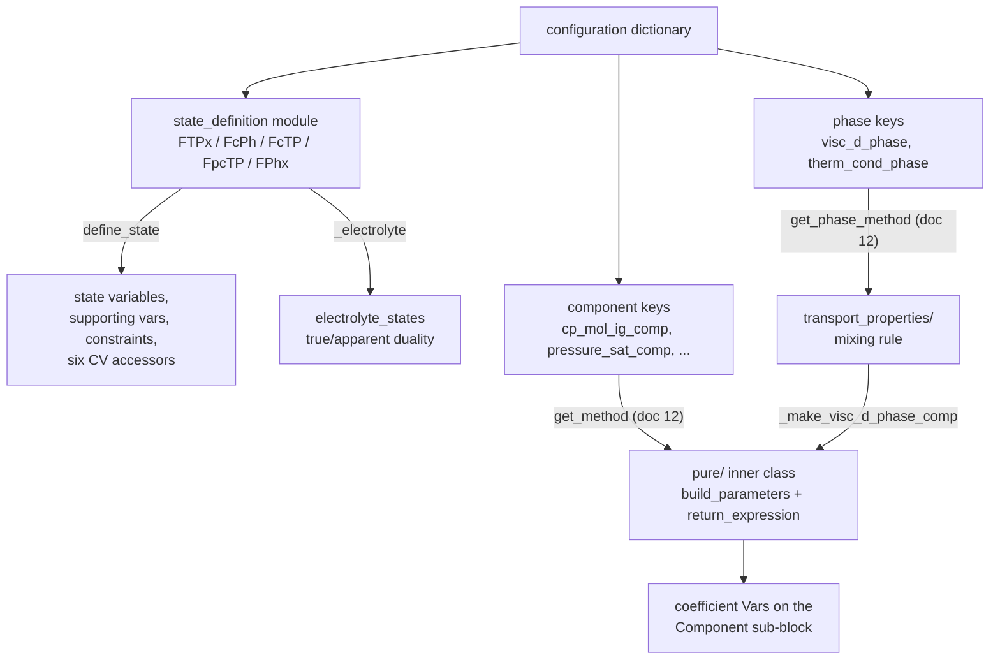
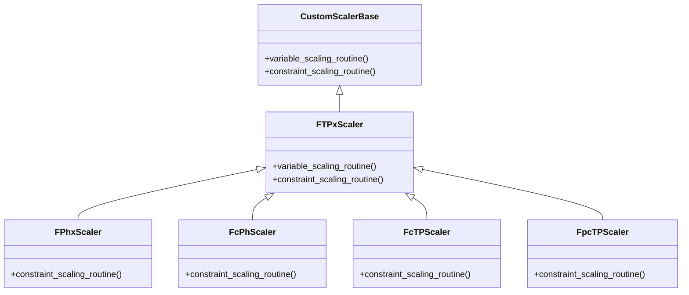
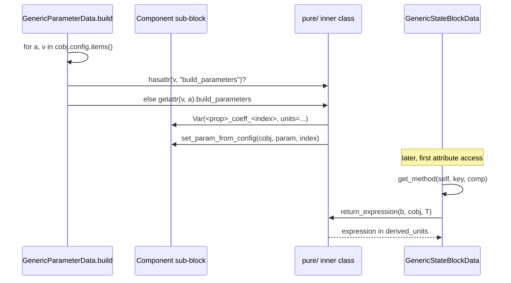

# 14 — Modular properties: state definitions and correlation libraries

> **Doc ID** 14 · **Repo SHA** 70a8f4fe1 (IDAES-PSE v2.13.0rc0) · **Source roots** `idaes/models/properties/modular_properties/state_definitions/`, `.../pure/`, `.../transport_properties/`
> **Owns** 23 modules / 5,898 LOC · **Assets** none · **Siblings** [05](05_property_and_reaction_framework.md), [12](12_modular_properties_generic_framework.md), [13](13_modular_properties_eos_and_phase_equilibrium.md), [15](15_property_package_catalog.md), [31](31_extension_point_catalog.md)

The generic framework in [12](12_modular_properties_generic_framework.md)
assembles a property package out of plug-ins named in a configuration
dictionary. This document describes two of the three plug-in families it
assembles: the **state definitions**, which decide which variables a state block
carries and therefore which constraints a control volume writes against it, and
the **pure-component and transport correlation libraries**, which supply the
algebraic form of one thermophysical property at a time. The third family —
equations of state and phase equilibrium formulations — is
[13](13_modular_properties_eos_and_phase_equilibrium.md).

Nothing in this scope subclasses anything from `idaes.core`, and nothing here
declares a CONFIG block. Every module here is a **value** that a user assigns to
a configuration key declared in [05](05_property_and_reaction_framework.md), and
every callable here is reached through `get_method` or `get_phase_method`
(`idaes/models/properties/modular_properties/base/utility.py:63`, `:141`),
described once in
[12 §5.3](12_modular_properties_generic_framework.md#53-getmethod-the-plug-in-dispatch).
The uniformity of the two shapes — the five-method state definition and the
two-static-method correlation class — is the contract, and this document states
each shape once and then tabulates every implementation of it.

---

## 0. Scope and source map

| File | LOC | Purpose | Covered in § |
|---|---:|---|---|
| `idaes/models/properties/modular_properties/state_definitions/FTPx.py` | 1,017 | `FTPx` namespace class, `FTPxScaler`, the VLE initialization path and `_modified_rachford_rice` | 3, 5, 6, 7, 11, 12 |
| `idaes/models/properties/modular_properties/state_definitions/FcPh.py` | 579 | `FcPh` namespace class and `FcPhScaler` | 3, 5, 6, 7 |
| `idaes/models/properties/modular_properties/state_definitions/FPhx.py` | 563 | `FPhx` namespace class and `FPhxScaler` | 3, 5, 6, 7 |
| `idaes/models/properties/modular_properties/state_definitions/FcTP.py` | 554 | `FcTP` namespace class and `FcTPScaler` | 3, 5, 6, 7, 12 |
| `idaes/models/properties/modular_properties/state_definitions/FpTPxpc.py` | 395 | `FpTPxpc` namespace class; not re-exported by the subpackage | 2, 3, 5, 6, 12 |
| `idaes/models/properties/modular_properties/state_definitions/FpcTP.py` | 380 | `FpcTP` namespace class and `FpcTPScaler` | 3, 5, 6, 7 |
| `idaes/models/properties/modular_properties/state_definitions/electrolyte_states.py` | 293 | `define_electrolyte_state` and the true/apparent species machinery | 3, 5, 6, 7, 11, 12 |
| `idaes/models/properties/modular_properties/state_definitions/__init__.py` | 17 | Re-exports five of the six state definitions | 2 |
| `idaes/models/properties/modular_properties/pure/ConstantProperties.py` | 301 | `Constant` — thirteen temperature-independent property forms | 3, 7 |
| `idaes/models/properties/modular_properties/pure/Perrys.py` | 288 | `Perrys` — liquid heat capacity, enthalpy, entropy, density | 3, 5, 7, 12 |
| `idaes/models/properties/modular_properties/pure/RPP5.py` | 250 | `RPP5` — ideal-gas forms plus the only logarithmic saturation pressure | 3, 7, 12 |
| `idaes/models/properties/modular_properties/pure/NIST.py` | 222 | `NIST` — Shomate ideal-gas forms and the base-10 Antoine equation | 3, 7 |
| `idaes/models/properties/modular_properties/pure/RPP4.py` | 219 | `RPP4` — ideal-gas forms and a reduced-temperature saturation pressure | 3, 7 |
| `idaes/models/properties/modular_properties/pure/RPP3.py` | 210 | `RPP3` — ideal-gas forms in calorie units and the natural Antoine equation | 3, 7 |
| `idaes/models/properties/modular_properties/pure/ChapmanEnskog.py` | 111 | `ChapmanEnskogLennardJones` and two collision-integral callbacks | 3, 7, 9 |
| `idaes/models/properties/modular_properties/pure/ChungPure.py` | 102 | `ChungViscosityPure` — pure-gas viscosity from critical properties | 3, 7 |
| `idaes/models/properties/modular_properties/pure/Eucken.py` | 79 | `Eucken` — pure-gas thermal conductivity from viscosity and heat capacity | 3, 7, 8 |
| `idaes/models/properties/modular_properties/pure/electrolyte.py` | 40 | `relative_permittivity_constant` | 3, 7 |
| `idaes/models/properties/modular_properties/pure/__init__.py` | 22 | Re-exports all nine correlation namespaces | 2 |
| `idaes/models/properties/modular_properties/transport_properties/viscosity_wilke.py` | 126 | `ViscosityWilke`, `build_phi_ij` and two mixing callbacks | 3, 5, 7, 9 |
| `idaes/models/properties/modular_properties/transport_properties/thermal_conductivity_wms.py` | 59 | `ThermalConductivityWMS` — reuses the Wilke `phi_ij` terms | 3, 7, 8 |
| `idaes/models/properties/modular_properties/transport_properties/no_method.py` | 56 | `NoMethod` — deliberate non-construction of a phase transport property | 3, 7, 11 |
| `idaes/models/properties/modular_properties/transport_properties/__init__.py` | 15 | Re-exports the three transport classes | 2 |

Total 5,898 LOC in 23 modules, holding 66 classes (24 outer, 42 inner) and 39
module-level functions. **Zero** `CONFIG.declare` keys and **zero**
`NotImplementedError` hook sites — see sections 4 and 9 for what stands in their
place.

---

## 1. Architectural role

Two questions have to be answered before a modular property package can be
solved, and neither is answered by the framework itself.

*Which variables exist?* `GenericStateBlockData.build` delegates its first act to
`state_definition.define_state(self)`
(`idaes/models/properties/modular_properties/base/generic_property.py:2998`).
The module named by the `state_definition` configuration key creates the state
variables, every supporting variable derived from them, the constraints tying
the two together, and the six control-volume accessor methods
(`get_material_flow_terms`, `get_enthalpy_flow_terms`,
`get_material_density_terms`, `get_energy_density_terms`,
`default_material_balance_type`, `default_energy_balance_type`). Six such
modules exist, and they differ only in that choice. Because the accessors are
attached as bound methods on the state block, a control volume never learns which
state definition it is talking to; it asks for a flow term and gets one.

*What is the algebraic form of one property?* A correlation library answers that.
Each library is a namespace class holding one inner class per property, and each
inner class holds exactly two static methods: `build_parameters`, which creates
the coefficient `Var`s on the `Component` or `Phase` sub-block during parameter
block construction, and `return_expression`, which assembles the Pyomo
expression during on-demand property construction. The split matters because the
two run at different times against different objects — parameters on the
parameter block at build time, expressions on the state block at first attribute
access.

The transport libraries sit one level above: a mixing rule such as
`ViscosityWilke` consumes the *pure-component* viscosities that
`ChapmanEnskogLennardJones` or `ChungViscosityPure` supply, reaching them through
a builder on the state block rather than through configuration.

*The three configuration families in this scope reach three different kinds of plug-in, and only the transport rules depend on another plug-in rather than on configuration.*

---

## 2. Public surface inventory

| Symbol | Kind | Declared at | Exported via | Stability signal |
|---|---|---|---|---|
| `FTPx`, `FcPh`, `FcTP`, `FpcTP`, `FPhx` | namespace classes | `state_definitions/FTPx.py:820`, `FcPh.py:570`, `FcTP.py:545`, `FpcTP.py:371`, `FPhx.py:554` | `...modular_properties.state_definitions` (`__init__.py:13`–`:17`) | hand-written page each in `docs/` |
| `FpTPxpc` | namespace class | `state_definitions/FpTPxpc.py:387` | **not re-exported**; importable only by module path | no page in `docs/`; no `default_scaler` |
| `FTPxScaler` | class | `state_definitions/FTPx.py:725` | module attribute; imported by four siblings | base of every other state-definition Scaler |
| `FPhxScaler`, `FcPhScaler`, `FcTPScaler`, `FpcTPScaler` | classes | `FPhx.py:508`, `FcPh.py:509`, `FcTP.py:495`, `FpcTP.py:357` | module attribute | named by `default_scaler` on the namespace class |
| `set_metadata`, `define_state`, `define_default_scaling_factors`, `calculate_scaling_factors` | functions | one set per state-definition module | module attribute, then aliased onto the namespace class | no leading underscore |
| `state_initialization` | function | `FTPx.py:365`, `FpcTP.py:279`, `FpTPxpc.py:276` | as above; `FPhx`, `FcPh` and `FcTP` import `FTPx`'s | no leading underscore |
| `do_not_initialize` | module-level `list` | `FTPx.py:817`, `FPhx.py:551`, `FcPh.py:567`, `FcTP.py:492`, `FpcTP.py:354`, `FpTPxpc.py:384` | aliased onto the namespace class | read by the framework initializer |
| `_set_mole_fractions_vle`, `_modified_rachford_rice` | functions | `FTPx.py:832`, `:854` | — | leading underscore |
| `define_electrolyte_state`, `calculate_electrolyte_scaling` | functions | `electrolyte_states.py:39`, `:52` | imported by all six state definitions | no leading underscore |
| `_apparent_species_state`, `_true_species_state`, `_apparent_species_scaling`, `_true_species_scaling` | functions | `electrolyte_states.py:65`, `:192`, `:157`, `:292` | — | leading underscore |
| `NIST`, `Perrys`, `RPP3`, `RPP4`, `RPP5`, `Constant` | namespace classes | `pure/NIST.py:33`, `Perrys.py:37`, `RPP3.py:32`, `RPP4.py:32`, `RPP5.py:34`, `ConstantProperties.py:29` | `...modular_properties.pure` (`__init__.py:13`–`:18`) | hand-written page each in `docs/` |
| `relative_permittivity_constant` | class | `pure/electrolyte.py:28` | `...pure` (`__init__.py:19`) | no inner classes; no page in `docs/` |
| `ChapmanEnskogLennardJones`, `ChungViscosityPure`, `Eucken` | namespace classes | `pure/ChapmanEnskog.py:27`, `ChungPure.py:30`, `Eucken.py:27` | `...pure` (`__init__.py:20`–`:22`) | page each under `transport_properties/` in `docs/` |
| `collision_integral_kim_ross_callback`, `collision_integral_neufeld_callback` | functions | `pure/ChapmanEnskog.py:85`, `:96` | module attribute | callback seam, section 9 |
| `ThermalConductivityWMS`, `ViscosityWilke`, `NoMethod` | namespace classes | `transport_properties/thermal_conductivity_wms.py:26`, `viscosity_wilke.py:27`, `no_method.py:25` | `...transport_properties` (`__init__.py:13`–`:15`) | hand-written page each in `docs/` |
| `wilke_phi_ij_callback`, `herring_zimmer_phi_ij_callback` | functions | `transport_properties/viscosity_wilke.py:101`, `:117` | module attribute | callback seam, section 9 |

No module in this scope declares `__all__`, and no symbol carries a deprecation
decorator. The subpackage `__init__.py` files are the only export surface; the
package-level `idaes/models/properties/modular_properties/__init__.py:13`
re-exports only the four block classes of
[12 §2](12_modular_properties_generic_framework.md#2-public-surface-inventory).

---

## 3. Class hierarchy and type taxonomy

Sixty-four of the 66 classes here derive from `object` and exist only as
namespaces; the other two are the `CustomScalerBase` chain.

*One Scaler defines the variable routine for every state definition; the other four override only the constraint routine.*

### 3.1 The state-definition shape

A state definition is a module holding up to six module-level functions and a
namespace class that aliases them as class attributes. The framework only ever
touches the namespace class, through `self.config.state_definition`.

| Module | State variables | Namespace class | Scaler | `always_flash` | `do_not_initialize` | Anchor |
|---|---|---|---|---|---|---|
| `FTPx.py` | `flow_mol`, `mole_frac_comp`, `temperature`, `pressure` | `FTPx` | `FTPxScaler` | `True` | `["sum_mole_frac_out"]` | `state_definitions/FTPx.py:820` |
| `FPhx.py` | `flow_mol`, `mole_frac_comp`, `enth_mol`, `pressure` | `FPhx` | `FPhxScaler` | `True` | `["sum_mole_frac_out"]` | `state_definitions/FPhx.py:554` |
| `FcTP.py` | `flow_mol_comp`, `temperature`, `pressure` | `FcTP` | `FcTPScaler` | `True` | `[]` | `state_definitions/FcTP.py:545` |
| `FcPh.py` | `flow_mol_comp`, `enth_mol`, `pressure` | `FcPh` | `FcPhScaler` | `True` | `[]` | `state_definitions/FcPh.py:570` |
| `FpcTP.py` | `flow_mol_phase_comp`, `temperature`, `pressure` | `FpcTP` | `FpcTPScaler` | `False` | `[]` | `state_definitions/FpcTP.py:371` |
| `FpTPxpc.py` | `flow_mol_phase`, `mole_frac_phase_comp`, `temperature`, `pressure` | `FpTPxpc` | none | `False` | `["sum_mole_frac_out"]` | `state_definitions/FpTPxpc.py:387` |

The "state variables" column is exactly the dictionary returned by the
`define_state_vars` method each module attaches to the block
(`FTPx.py:342`, `FPhx.py:342`, `FcTP.py:337`, `FcPh.py:347`, `FpcTP.py:258`,
`FpTPxpc.py:251`). That dictionary is what `StateBlock.build_port`
(`idaes/core/base/property_base.py:488`) turns into a Pyomo `Port`, and what
`fix_state_vars` fixes during initialization — so the choice of state definition
is the choice of what appears on every inlet and outlet in the flowsheet.

All six attach the same three defaults: `MaterialBalanceType.componentTotal`,
`EnergyBalanceType.enthalpyTotal` and `MaterialFlowBasis.molar`
(`FTPx.py:327`, `:332`, `:337`). All six return `flow_mol_phase_comp[p, j]` from
`get_material_flow_terms` and `flow_mol_phase[p] * enth_mol_phase[p]` from
`get_enthalpy_flow_terms` (`FTPx.py:271`, `:277`). The uniformity is deliberate:
what varies between definitions is *which* of those names is a `Var` and which
is an `Expression`, not the term the control volume reads.

### 3.2 The correlation-library shape

A correlation library is an outer namespace class with one inner class per
property name. The inner class name **is** the configuration key it satisfies,
which is what lets `get_method` accept either the outer class or the inner class
as the configured value ([12 §5.3](12_modular_properties_generic_framework.md#53-getmethod-the-plug-in-dispatch)).
Each inner class holds `build_parameters` and `return_expression` as
`staticmethod`s, and nothing else except, for four saturation-pressure classes, a
`dT_expression` derivative form.

| Outer class | Inner property classes | Anchor |
|---|---|---|
| `NIST` | `cp_mol_ig_comp`, `enth_mol_ig_comp`, `entr_mol_ig_comp`, `pressure_sat_comp` | `pure/NIST.py:33` |
| `Perrys` | `cp_mol_liq_comp`, `enth_mol_liq_comp`, `entr_mol_liq_comp`, `dens_mol_liq_comp`, `dens_mol_liq_comp_eqn_1`, `dens_mol_liq_comp_eqn_2` | `pure/Perrys.py:37` |
| `RPP3` | `cp_mol_ig_comp`, `enth_mol_ig_comp`, `entr_mol_ig_comp`, `pressure_sat_comp` | `pure/RPP3.py:32` |
| `RPP4` | `cp_mol_ig_comp`, `enth_mol_ig_comp`, `entr_mol_ig_comp`, `pressure_sat_comp` | `pure/RPP4.py:32` |
| `RPP5` | `cp_mol_ig_comp`, `enth_mol_ig_comp`, `entr_mol_ig_comp`, `pressure_sat_comp` | `pure/RPP5.py:34` |
| `Constant` | thirteen, listed in section 7.3 | `pure/ConstantProperties.py:29` |
| `ChapmanEnskogLennardJones` | `visc_d_phase_comp` | `pure/ChapmanEnskog.py:27` |
| `ChungViscosityPure` | `visc_d_phase_comp` | `pure/ChungPure.py:30` |
| `Eucken` | `therm_cond_phase_comp` | `pure/Eucken.py:27` |
| `relative_permittivity_constant` | none — the class itself carries the two methods | `pure/electrolyte.py:28` |
| `ViscosityWilke` | `visc_d_phase` | `transport_properties/viscosity_wilke.py:27` |
| `ThermalConductivityWMS` | `therm_cond_phase` | `transport_properties/thermal_conductivity_wms.py:26` |
| `NoMethod` | `visc_d_phase`, `therm_cond_phase` | `transport_properties/no_method.py:25` |

Three outer classes carry a shared-parameter helper alongside their inner
classes: `ChapmanEnskogLennardJones.build_lennard_jones_parameters`
(`pure/ChapmanEnskog.py:31`), `ChungViscosityPure.build_common_parameters`
(`pure/ChungPure.py:34`) and `ViscosityWilke.build_parameters`
(`transport_properties/viscosity_wilke.py:31`). The naming of the first two is
load-bearing — section 5.5 explains why.

### 3.3 Which family supplies which property

The five general-purpose correlation families cover disjoint parts of the
property surface, and no single one covers a liquid and a vapour phase at once.

| Configuration key | `NIST` | `Perrys` | `RPP3` | `RPP4` | `RPP5` | `Constant` |
|---|:-:|:-:|:-:|:-:|:-:|:-:|
| `cp_mol_ig_comp` | yes | — | yes | yes | yes | yes |
| `enth_mol_ig_comp` | yes | — | yes | yes | yes | yes |
| `entr_mol_ig_comp` | yes | — | yes | yes | yes | yes |
| `pressure_sat_comp` | yes | — | yes | yes | yes | — |
| `cp_mol_liq_comp` | — | yes | — | — | — | yes |
| `enth_mol_liq_comp` | — | yes | — | — | — | yes |
| `entr_mol_liq_comp` | — | yes | — | — | — | yes |
| `dens_mol_liq_comp` | — | yes | — | — | — | yes |
| `cp_mol_sol_comp`, `enth_mol_sol_comp`, `entr_mol_sol_comp`, `dens_mol_sol_comp` | — | — | — | — | — | yes |
| `visc_d_phase_comp` | — | — | — | — | — | yes |
| `therm_cond_phase_comp` | — | — | — | — | — | yes |

The remaining implementations are single-property: `ChapmanEnskogLennardJones`
and `ChungViscosityPure` for `visc_d_phase_comp`, `Eucken` for
`therm_cond_phase_comp`, `relative_permittivity_constant` for
`relative_permittivity_liq_comp`, `ViscosityWilke` and `NoMethod` for
`visc_d_phase`, `ThermalConductivityWMS` and `NoMethod` for `therm_cond_phase`.

Four keys that `ComponentData.CONFIG` and `PhaseData.CONFIG` declare have no
implementation anywhere in this scope: `vol_mol_liq_comp`, `vol_mol_sol_comp`,
`diffus_phase_comp` and `surf_tens_phase`.

### 3.4 Enumerations

Not applicable: no module in this scope declares an `Enum`. The one enumeration
these modules read is `StateIndex`
(`idaes/models/properties/modular_properties/base/utility.py:39`), tabulated in
[12 §3.1](12_modular_properties_generic_framework.md#31-stateindex);
`electrolyte_states.py:25` imports it through `generic_property` rather than
from its declaring module.

---

## 4. Configuration reference

**These 23 modules declare no `ConfigBlock` and no `CONFIG.declare` key.** The
generated inventory confirms it: `_generated/config_keys.csv` contains zero rows
for any file in this document's ledger. What a reader needs instead is the
inverse table — which configuration key, declared elsewhere, takes a class from
this scope as its value, and what the framework then does with it.

### 4.1 The `state_definition` key

| Key | Declared at | Domain | Accepted values from this scope | Read at |
|---|---|---|---|---|
| `state_definition` | `idaes/models/properties/modular_properties/base/generic_property.py:1023` | none | `FTPx`, `FPhx`, `FcTP`, `FcPh`, `FpcTP`, `FpTPxpc` | six call sites, section 5.1 |

Tabulated in full in
[12 §4.1](12_modular_properties_generic_framework.md#41-genericparameterdataconfig).
It is a required key: absence raises `ConfigurationError` at
`generic_property.py:1502`.

The `state_bounds` key (`generic_property.py:1033`) is read only through
`get_bounds_from_config` (`idaes/models/properties/modular_properties/base/utility.py:209`), and each state definition
validates the key set it accepts against its own `expected_keys` list — see
section 6.8.

### 4.2 `ComponentData.CONFIG` keys satisfied by `pure/`

Declared in `idaes/core/base/components.py` and tabulated in
[05 §4.6](05_property_and_reaction_framework.md#46-componentdataconfig). The
"supplied by" column names classes from this document.

| Key | Anchor | Supplied by |
|---|---|---|
| `cp_mol_ig_comp`, `enth_mol_ig_comp`, `entr_mol_ig_comp` | `idaes/core/base/components.py:112`, `:128`, `:142` | `NIST`, `RPP3`, `RPP4`, `RPP5`, `Constant` |
| `cp_mol_liq_comp`, `enth_mol_liq_comp`, `entr_mol_liq_comp`, `dens_mol_liq_comp` | `idaes/core/base/components.py:104`, `:118`, `:134`, `:87` | `Perrys`, `Constant` |
| `cp_mol_sol_comp`, `enth_mol_sol_comp`, `entr_mol_sol_comp`, `dens_mol_sol_comp` | `idaes/core/base/components.py:108`, `:124`, `:138`, `:95` | `Constant` |
| `pressure_sat_comp` | `idaes/core/base/components.py:178` | `NIST`, `RPP3`, `RPP4`, `RPP5` |
| `relative_permittivity_liq_comp` | `idaes/core/base/components.py:182` | `relative_permittivity_constant` |
| `visc_d_phase_comp` | `idaes/core/base/components.py:156` | `ChapmanEnskogLennardJones`, `ChungViscosityPure`, `Constant` |
| `therm_cond_phase_comp` | `idaes/core/base/components.py:163` | `Eucken`, `Constant` |
| `parameter_data` | `idaes/core/base/components.py:197` | the dictionary every `build_parameters` here reads |

`visc_d_phase_comp` and `therm_cond_phase_comp` take a dict keyed by phase name,
not a bare class: `generic_property.py:1704` iterates `cobj.config[prop].items()`.

### 4.3 `PhaseData.CONFIG` keys satisfied by `transport_properties/`

Declared in `idaes/core/base/phases.py`, tabulated in
[05 §4.5](05_property_and_reaction_framework.md#45-phasedataconfig).

| Key | Anchor | Supplied by |
|---|---|---|
| `visc_d_phase` | `idaes/core/base/phases.py:107` | `ViscosityWilke`, `NoMethod` |
| `therm_cond_phase` | `idaes/core/base/phases.py:99` | `ThermalConductivityWMS`, `NoMethod` |
| `surf_tens_phase` | `idaes/core/base/phases.py:103` | nothing in this scope |
| `transport_property_options` | `idaes/core/base/phases.py:111` | holds `viscosity_phi_ij_callback`; defaulted at `viscosity_wilke.py:40` |
| `parameter_data` | `idaes/core/base/phases.py:82` | read by phase-level `build_parameters` |

### 4.4 `parameter_data` — where the coefficient values live

Every `build_parameters` in `pure/` creates a `Var` and immediately populates it
by calling `set_param_from_config` (`idaes/core/util/misc.py:72`, owned by
[08b](08b_core_support_utilities.md)). That function reads
`config.parameter_data[param]`, or `config.parameter_data[param][index]` when an
index is given (`idaes/core/util/misc.py:120`, `:139`), and accepts **exactly
three forms** for the value it finds:

| Form | Handled at | Behaviour |
|---|---|---|
| A 2-tuple `(value, units)` | `idaes/core/util/misc.py:161` | `p_val = value * units`; a `None` in the second slot means `dimensionless` |
| A bare float | `idaes/core/util/misc.py:167` | Logged at DEBUG as "no units provided", then assigned as-is, so the number is taken to be already in the package's base units |
| An object exposing `get_parameter_value` | `idaes/core/util/misc.py:158` | `p_data = p_data.get_parameter_value(b.local_name, param)`, which returns a `(value, units)` 2-tuple, and the tuple branch then runs |

The third form is the CoolProp lookup path: the only `get_parameter_value` in
the tree is `CoolPropWrapper.get_parameter_value`
(`idaes/models/properties/modular_properties/coolprop/coolprop_wrapper.py:102`),
owned by [15](15_property_package_catalog.md).

The value finally reaches the `Var` through `param_obj.set_value(p_val)`
(`idaes/core/util/misc.py:173`), and `GenericParameterData.build` fixes every
such `Var` and raises on any that is still unvalued
(`generic_property.py:1859`). A missing entry surfaces as a `KeyError` from
`set_param_from_config`, which the dispatch loop converts to a
`ConfigurationError` naming the property and the chemical component
(`generic_property.py:1622`).

**No coefficient value is stored in a shipped data file.** There is no JSON, CSV
or other asset anywhere in this scope — `_generated/assets.csv` has no row under
any of the three source roots. Every number is a Python literal inside a
configuration dictionary in a user's or an example module, of the form shown in
`idaes/models/properties/modular_properties/examples/BT_ideal.py:36`.

---

## 5. Construction and call sequences

### 5.1 The five-method state-definition contract

The framework touches a state definition at six points. The table names each
call site and the method resolution it performs — an attribute lookup on the
namespace class, so a module object with the same attribute names works equally
well.

| # | Framework call site | Attribute reached | What it does |
|---:|---|---|---|
| 1 | `generic_property.py:2998` (`GenericStateBlockData.build`) | `define_state(b)` | Creates every component in section 6 |
| 2 | `generic_property.py:1874` (end of `GenericParameterData.build`) | `set_metadata(self)` | Adjusts the package metadata for the chosen state variables |
| 3 | `generic_property.py:1879`, inside `try`/`except AttributeError` | `define_default_scaling_factors(self)` | Populates the suffix-based default scaling dict |
| 4 | `generic_property.py:3108` | `calculate_scaling_factors(self)` | Suffix-based scaling of the constraints created in step 1 |
| 5 | `generic_property.py:2307` and `:2771` | `state_initialization(k)` | Seeds phase flows, phase mole fractions and the vapour fraction |
| 6 | `generic_property.py:2434`, `:2903`, `:2950` | `do_not_initialize` | Names of constraints left deactivated during initialization |

Two further attributes are read indirectly. `default_scaler` on the namespace
class is picked up by `ModularPropertiesScalerBase.call_module_scaling_method`
(`idaes/models/properties/modular_properties/base/utility.py:643`) from `generic_property.py:216` and `:505`; a module
without one is logged at DEBUG and skipped. `always_flash`, set by `define_state`
on the block rather than on the namespace class, gates creation of `_teq`
(`generic_property.py:3002`) and of the phase equilibrium constraint
(`generic_property.py:3034`).

Only three of the six define their own `state_initialization`: `FPhx`, `FcPh`
and `FcTP` import `FTPx`'s (`FPhx.py:38`, `FcPh.py:36`, `FcTP.py:39`) and alias
it unchanged.

### 5.2 `define_state` — the common eight steps

Every `define_state` follows the same order. `FTPx.define_state`
(`state_definitions/FTPx.py:69`) is the reference; line numbers for the other
five are in section 6.

1. Set `always_flash` (`:72`).
2. Read `b.params.get_metadata().derived_units` into a local `units` (`:74`).
3. Validate the `state_bounds` keys against `expected_keys` (`:77`): a key
   containing `mole_frac` is a warning (`:84`), any other unrecognised key is a
   `ConfigurationError` (`:90`).
4. Call `get_bounds_from_config` once per state variable (`:99`–`:101`).
5. Create the state variables (`:104`–`:123`), then the supporting variables and
   expressions (`:136`–`:159`).
6. If `b.params._electrolyte`, call `define_electrolyte_state(b)` (`:168`).
7. Create the constraints. The count and form branch on the number of phases:
   one phase (`:178`), two phases (`:199`), three or more (`:239`). The
   `sum_mole_frac_out` constraint is created only when
   `b.config.defined_state is False` (`:172`).
8. Attach the six control-volume accessors and the two display methods as bound
   methods through `types.MethodType` (`:271`–`:362`).

Step 7 is where the three branches matter. With one phase the phase composition
equals the mixture composition and the phase fraction is fixed at one. With two
phases the module writes a Rachford-Rice form: a total flow balance, a
component balance per chemical component, one `sum_mole_frac` constraint stating
that the two phase compositions sum to the same value (`:217`–`:232`), and a
phase-fraction constraint. With three or more phases there is no total flow
balance at all, and `sum_mole_frac` becomes one constraint per phase
(`:252`–`:262`).

### 5.3 The electrolyte extension

`define_electrolyte_state(b)` (`state_definitions/electrolyte_states.py:39`) is
where the true/apparent species duality of
[12 §6.3](12_modular_properties_generic_framework.md#63-the-trueapparent-duality)
is physically created. The framework has already decided which species set
indexes the state variables — `state_components` selects it, and
`_GenericStateBlock._return_phase_component_set` resolves
`b.phase_component_set` accordingly. What is missing is the *other* set, and
this module builds it as a second block of variables plus the constraints
relating the two. The function dispatches on `state_components` and raises
`BurntToast` on anything outside the enumeration (`electrolyte_states.py:45`).

**`StateIndex.true` — `_true_species_state`** (`:192`). The state variables
already index true species, so the module publishes three `Reference`s and one
object reference aliasing them under `*_true` names (`:194`–`:197`), then creates
`flow_mol_phase_comp_apparent` (`:204`) and `mole_frac_phase_comp_apparent`
(`:212`) over `apparent_phase_component_set`, plus two constraints:
`true_to_appr_species` (`:268`), which recomposes each `ApparentData` species
from its dissociation products through a total-charge denominator (`:224`,
`:230`), carries a hard-coded special case for `"H2O"` covering `H+`/`OH-` and
`H3O+`/`OH-` pairs (`:240`), and degenerates to an identity for any non-aqueous
phase (`:264`); and `appr_mole_frac_constraint` (`:285`).

**`StateIndex.apparent` — `_apparent_species_state`** (`:65`). The mirror image:
`*_apparent` references onto the existing state variables (`:67`–`:70`), then
`flow_mol_phase_comp_true` (`:77`), `mole_frac_phase_comp_true` (`:85`),
`appr_to_true_species` (`:133`) and `true_mole_frac_constraint` (`:150`). The
forward direction is simpler — an ion's true flow is the sum over apparent
species of the dissociation stoichiometry times the apparent flow (`:108`–`:114`)
— but it acquires one extra unknown: when the package has inherent reactions,
`apparent_inherent_reaction_extent` is created over `inherent_reaction_idx`
(`:95`) and enters `appr_to_true_species` through the inherent stoichiometry
(`:120`–`:125`).

`calculate_electrolyte_scaling` (`:52`) dispatches the same way. The apparent
branch (`:157`) scales each conversion constraint by the flow scaling factor of
the species that dominates it, splitting aqueous non-ionic species from
everything else (`:167`). The true branch (`:292`) is a single `pass`.

### 5.4 `state_initialization` and the modified Rachford-Rice solve

`FTPx.state_initialization` (`state_definitions/FTPx.py:365`) runs before the
framework's own solves and has to produce a usable vapour fraction without one.

1. Raise `ValueError` if any mixture mole fraction is negative (`:370`).
2. Seed every phase composition from the mixture composition and every phase flow
   from `phase_frac * flow_mol` (`:376`–`:382`).
3. Return early when the package declares no phase equilibrium (`:384`).
4. Find the single vapour-liquid pair among `_pe_pairs`, reading
   `temperature_bubble` and `temperature_dew` if the corresponding constraints
   exist, and splitting the pair's chemical components through
   `identify_VL_component_list` (`:423`). More than one such pair raises
   `InitializationError` (`:427`).
5. Build the split-ratio dictionary `K`. Henry's law components of type `Hxp` or
   `Kpx` get `henry_equilibrium_ratio`
   (`idaes/models/properties/modular_properties/phase_equil/henry.py:136`) at
   `:450`; types `Hcp` and `Kpc` are deferred to a second pass because they need
   a liquid density that needs a composition (`:452`); any other type is a
   warning and is treated as non-condensable (`:458`). Raoult's-law components
   get `pressure_sat_comp / pressure` through `get_method` (`:470`), and a
   package with no saturation pressure method abandons `K` entirely (`:476`).
6. Choose a vapour fraction (`:485`–`:504`): above the dew point, `1 - 1e-5`;
   below the bubble point, `1e-5`; between two known points, linear
   interpolation in temperature; otherwise `_modified_rachford_rice`.
7. Assign `phase_frac`, the phase flows, and the phase compositions — from the
   bubble or dew composition variables when the mixture is nearly single-phase
   (`:517`, `:526`), otherwise from `_set_mole_fractions_vle` (`:536`).
8. If any concentration-based Henry component was deferred, recompute its `K`
   now that a density estimate exists and repeat steps 6 and 7 (`:546`–`:594`).

`_modified_rachford_rice` (`state_definitions/FTPx.py:854`) is the only
numerical iteration in this document. It rejects any negative split ratio with a
warning and returns `None` (`:896`). It then computes the harmonic and arithmetic
means of the split ratios (`:906`–`:917`) and short-circuits on them: a harmonic
mean at or above one means nearly pure vapour, an arithmetic mean at or below one
means nearly pure liquid. Otherwise it defines the convex residual `B`
(`:946`) and its derivative (`:958`), bisects downward from `vap_frac = 0.5`
until `B` is positive (`:980`, capped at 40 halvings), and then runs Newton's
method to `|B| < 1e-6` (`:989`, capped at 40 iterations). A root outside `[0, 1]`
is clipped to `eps` or `1 - eps`, non-convergence returns `None`, and every
failure mode logs one warning (`:1009`).

`FpcTP.state_initialization` (`state_definitions/FpcTP.py:279`) is four lines —
phase-component flows are the state variables, so only the mole fractions need
seeding. `FpTPxpc.state_initialization`
(`state_definitions/FpTPxpc.py:276`) is three, using
`calculate_variable_from_constraint` on the one constraint that defines
`mole_frac_comp` (`:284`).

### 5.5 The correlation call path

*Parameters are created once per chemical component at parameter-block build time; expressions are assembled per state block on first access.*

**`build_parameters` — three signatures, selected by the call site.** The
framework calls it in three places, each with a different argument list:

| Call site | Signature | Applies to |
|---|---|---|
| `generic_property.py:1621` | `build_parameters(cobj)` | every `ComponentData.CONFIG` key except the three phase-indexed ones |
| `generic_property.py:1727` | `build_parameters(cobj, p)` | `diffus_phase_comp`, `visc_d_phase_comp`, `therm_cond_phase_comp` |
| `generic_property.py:1755` | `build_parameters(pobj)` | every `PhaseData.CONFIG` key |

In all three the dispatch is the same two-step test: if the configured value
itself has a `build_parameters` attribute, use it; otherwise take
`getattr(value, <key name>).build_parameters` (`generic_property.py:1609`,
`:1614`). **This is why the outer helper on a pure-component library must not be
called `build_parameters`.** `ChapmanEnskogLennardJones` names its shared helper
`build_lennard_jones_parameters` (`pure/ChapmanEnskog.py:31`) and
`ChungViscosityPure` names its `build_common_parameters`
(`pure/ChungPure.py:34`), so the first test fails and the dispatch descends to
the inner `visc_d_phase_comp` class, which takes `(cobj, p)`. `ViscosityWilke`
does the opposite deliberately: its outer `build_parameters(pobj)`
(`transport_properties/viscosity_wilke.py:31`) matches the phase-level signature,
so the first test succeeds and the inner class's identical method
(`:76`) is never reached through configuration.

**`return_expression` — the unit contract.** Every implementation converts the
temperature it is handed into the units its coefficients were declared in, builds
the expression from the coefficient `Var`s, and converts the result into the
package's derived units before returning. `Perrys.cp_mol_liq_comp`
(`pure/Perrys.py:74`) is the canonical three lines: `pyunits.convert(T,
to_units=pyunits.K)`, a fourth-order polynomial in the five
`cp_mol_liq_comp_coeff_*` variables, and
`pyunits.convert(cp, units.HEAT_CAPACITY_MOLE)` where `units` comes from
`b.params.get_metadata().derived_units` (`:85`). Because the coefficient `Var`s
carry the source publication's units — `J·kmol⁻¹·K⁻ⁿ` for Perry's,
`cal·mol⁻¹·K⁻ⁿ` for the third edition of Reid, Prausnitz and Poling, kilokelvin
powers for the NIST Shomate form — the same coefficient table can be transcribed
from the book without conversion.

**Coefficient sharing within a family.** An enthalpy or entropy class does not
declare its own coefficients; it calls the heat-capacity class's
`build_parameters` if the first coefficient is absent
(`pure/Perrys.py:91`, `pure/NIST.py:115`, `pure/RPP3.py:81`) and then adds only
the reference-state formation terms. `NIST.cp_mol_ig_comp.build_parameters`
additionally creates an `Expression` named `enth_mol_form_vap_comp_ref`
(`pure/NIST.py:90`) so that the Shomate `H` coefficient is reachable under the
standard name the equations of state use.

### 5.6 Transport mixing rules

`ViscosityWilke.visc_d_phase.return_expression`
(`transport_properties/viscosity_wilke.py:81`) does three things in order:

1. Call `ViscosityWilke.build_phi_ij(b, p)` (`:48`). That helper first ensures
   the pure-component viscosities exist by calling
   `b._make_visc_d_phase_comp()` (`:53`) — one of the three builders in
   [12 §7.5](12_modular_properties_generic_framework.md#75-the-on-demand-property-surface)
   that is not reachable through property metadata — and then creates
   `visc_d_phi_ij`, an `Expression` over the phase's chemical components squared
   (`:65`), whose rule dispatches to the configured callback (`:61`).
2. Read the callback from
   `pobj.config.transport_property_options["viscosity_phi_ij_callback"]`,
   which `ViscosityWilke.build_parameters` has already defaulted to
   `wilke_phi_ij_callback` if the dictionary was absent or the entry unset
   (`:40`).
3. Return the Wilke sum over components (`:86`).

`ThermalConductivityWMS.therm_cond_phase`
(`transport_properties/thermal_conductivity_wms.py:29`) reuses all of it: its
`build_parameters` is a one-line delegation to `ViscosityWilke.build_parameters`
(`:33`), and its `return_expression` calls `ViscosityWilke.build_phi_ij` and then
`b._make_therm_cond_phase_comp()` (`:42`, `:44`) before writing the
Wassiljew-Mason-Saxena sum over the same `visc_d_phi_ij` terms. Selecting
`ThermalConductivityWMS` therefore causes pure-component *viscosities* to be
built even when no mixture viscosity is asked for.

`Eucken.therm_cond_phase_comp.return_expression` (`pure/Eucken.py:47`) does the
same one level down: it calls `b._make_visc_d_phase_comp()` (`:64`) and reads
the component's own `cp_mol_ig_comp` configuration entry directly, accepting
either an inner class or an outer namespace (`:66`–`:69`) and raising
`ConfigurationError` when the key is unset (`:58`).

---

## 6. Data structures, variables, constraints and invariants

The tables below answer the practical question "what variables does my state
block have". Index sets are the state block's own `component_list`,
`phase_list` and `phase_component_set`, which for an electrolyte package resolve
to the true or apparent sets as
[12 §6.3](12_modular_properties_generic_framework.md#63-the-trueapparent-duality)
describes. `FLOW_MOLE`, `TEMPERATURE`, `PRESSURE` and `ENERGY_MOLE` are `UnitSet`
derived-unit names ([05 §3.3](05_property_and_reaction_framework.md#33-unitset)).
Bold rows are the state variables.

### 6.1 `FTPx`

| Component | Type | Index sets | Units | Created at | Condition |
|---|---|---|---|---|---|
| **`flow_mol`** | `Var` | — | FLOW_MOLE | `state_definitions/FTPx.py:104` | always |
| **`mole_frac_comp`** | `Var` | component | dimensionless | `state_definitions/FTPx.py:110` | always |
| **`pressure`** | `Var` | — | PRESSURE | `state_definitions/FTPx.py:117` | always |
| **`temperature`** | `Var` | — | TEMPERATURE | `state_definitions/FTPx.py:123` | always |
| `flow_mol_phase` | `Var` | phase | FLOW_MOLE | `state_definitions/FTPx.py:136` | always |
| `mole_frac_phase_comp` | `Var` | phase-component | dimensionless | `state_definitions/FTPx.py:144` | always |
| `flow_mol_phase_comp` | `Expression` | phase-component | FLOW_MOLE | `state_definitions/FTPx.py:155` | always |
| `phase_frac` | `Var` | phase | dimensionless | `state_definitions/FTPx.py:159` | always |
| `sum_mole_frac_out` | `Constraint` | — | — | `state_definitions/FTPx.py:174` | `defined_state is False` |
| `total_flow_balance` | `Constraint` | — | — | `state_definitions/FTPx.py:183`, `:204` | one or two phases only |
| `component_flow_balances` | `Constraint` | component | — | `state_definitions/FTPx.py:190`, `:213`, `:248` | always |
| `sum_mole_frac` | `Constraint` | — / phase | — | `state_definitions/FTPx.py:232`, `:262` | two phases (scalar) or three-plus (per phase) |
| `phase_fraction_constraint` | `Constraint` | phase | — | `state_definitions/FTPx.py:197`, `:237`, `:267` | always |
| `_enthalpy_flow_term`, `_material_density_term`, `_energy_density_term` | `Expression` | phase, phase-component, phase | as named | `state_definitions/FTPx.py:288`, `:304`, `:322` | first call of the matching accessor |

### 6.2 `FPhx`

Identical to `FTPx` except for the energy variable. `enth_mol` replaces
`temperature` in the state-variable set; `temperature` remains as a supporting
`Var` and is closed by the `enth_mol_eqn` constraint that the *framework*
creates at `generic_property.py:3026`, not the state definition.

| Component | Type | Index sets | Units | Created at | Condition |
|---|---|---|---|---|---|
| **`flow_mol`**, **`mole_frac_comp`**, **`pressure`** | `Var` | —, component, — | FLOW_MOLE, dimensionless, PRESSURE | `state_definitions/FPhx.py:94`, `:100`, `:107` | always |
| **`enth_mol`** | `Var` | — | ENERGY_MOLE | `state_definitions/FPhx.py:114` | always |
| `flow_mol_phase`, `mole_frac_phase_comp`, `phase_frac` | `Var` | phase, phase-component, phase | FLOW_MOLE, dimensionless, dimensionless | `state_definitions/FPhx.py:127`, `:135`, `:157` | always |
| `flow_mol_phase_comp` | `Expression` | phase-component | FLOW_MOLE | `state_definitions/FPhx.py:146` | always |
| `temperature` | `Var` | — | TEMPERATURE | `state_definitions/FPhx.py:150` | always |
| `sum_mole_frac_out`, `total_flow_balance`, `component_flow_balances`, `sum_mole_frac`, `phase_fraction_constraint` | `Constraint` | as in 6.1 | — | `state_definitions/FPhx.py:174`, `:183`, `:190`, `:232`, `:197` | as in 6.1 |

`set_metadata` calls `b.get_metadata().properties["enth_mol"].set_method(None)`
(`state_definitions/FPhx.py:56`), which stops `build_on_demand` from trying to
build a variable the state definition has already created.

### 6.3 `FcTP`

| Component | Type | Index sets | Units | Created at | Condition |
|---|---|---|---|---|---|
| **`flow_mol_comp`** | `Var` | component | FLOW_MOLE | `state_definitions/FcTP.py:88` | always |
| **`pressure`** | `Var` | — | PRESSURE | `state_definitions/FcTP.py:95` | always |
| **`temperature`** | `Var` | — | TEMPERATURE | `state_definitions/FcTP.py:101` | always |
| `flow_mol` | `Expression` | — | FLOW_MOLE | `state_definitions/FcTP.py:109` | always |
| `flow_mol_phase` | `Var` | phase | FLOW_MOLE | `state_definitions/FcTP.py:119` | always |
| `mole_frac_comp` | `Var` | component | dimensionless | `state_definitions/FcTP.py:127` | always |
| `mole_frac_phase_comp` | `Var` | phase-component | dimensionless | `state_definitions/FcTP.py:135` | always |
| `flow_mol_phase_comp` | `Expression` | phase-component | FLOW_MOLE | `state_definitions/FcTP.py:146` | always |
| `phase_frac` | `Var` | phase | dimensionless | `state_definitions/FcTP.py:150` | always |
| `mole_frac_comp_eq` | `Constraint` | component | — | `state_definitions/FcTP.py:171` | always |
| `total_flow_balance` | `Constraint` | — | — | `state_definitions/FcTP.py:178`, `:199` | one or two phases only |
| `component_flow_balances` | `Constraint` | component | — | `state_definitions/FcTP.py:185`, `:208`, `:243` | always |
| `sum_mole_frac` | `Constraint` | — / phase | — | `state_definitions/FcTP.py:227`, `:257` | two phases or three-plus |
| `phase_fraction_constraint` | `Constraint` | phase | — | `state_definitions/FcTP.py:192`, `:232`, `:262` | always |

`FcTP` is the first definition in which `flow_mol` is an `Expression` rather than
a `Var`, and the first that needs `mole_frac_comp_eq` — the mixture composition
is no longer a state variable, so a constraint has to define it.

### 6.4 `FcPh`

`FcTP` with `enth_mol` in place of `temperature` among the state variables, and
`temperature` demoted to a supporting `Var`.

| Component | Type | Index sets | Units | Created at | Condition |
|---|---|---|---|---|---|
| **`flow_mol_comp`**, **`pressure`** | `Var` | component, — | FLOW_MOLE, PRESSURE | `state_definitions/FcPh.py:89`, `:96` | always |
| **`enth_mol`** | `Var` | — | ENERGY_MOLE | `state_definitions/FcPh.py:102` | always |
| `flow_mol`, `flow_mol_phase_comp` | `Expression` | —, phase-component | FLOW_MOLE | `state_definitions/FcPh.py:110`, `:154` | always |
| `flow_mol_phase`, `mole_frac_comp`, `mole_frac_phase_comp`, `phase_frac` | `Var` | phase, component, phase-component, phase | FLOW_MOLE, dimensionless | `state_definitions/FcPh.py:120`, `:135`, `:143`, `:158` | always |
| `temperature` | `Var` | — | TEMPERATURE | `state_definitions/FcPh.py:128` | always |
| `mole_frac_comp_eq` | `Constraint` | component | — | `state_definitions/FcPh.py:181` | always |
| `total_flow_balance`, `component_flow_balances`, `sum_mole_frac`, `phase_fraction_constraint` | `Constraint` | as in 6.3 | — | `state_definitions/FcPh.py:188`, `:195`, `:237`, `:202` | as in 6.3 |

`set_metadata` suppresses the on-demand builder for `enth_mol`
(`state_definitions/FcPh.py:57`).

### 6.5 `FpcTP`

The definition with the fewest constraints: with phase-component flows as state
variables, every aggregate is an `Expression`.

| Component | Type | Index sets | Units | Created at | Condition |
|---|---|---|---|---|---|
| **`flow_mol_phase_comp`** | `Var` | phase-component | FLOW_MOLE | `state_definitions/FpcTP.py:82` | always |
| **`pressure`** | `Var` | — | PRESSURE | `state_definitions/FpcTP.py:89` | always |
| **`temperature`** | `Var` | — | TEMPERATURE | `state_definitions/FpcTP.py:95` | always |
| `flow_mol` | `Expression` | — | FLOW_MOLE | `state_definitions/FpcTP.py:103` | always |
| `flow_mol_phase` | `Expression` | phase | FLOW_MOLE | `state_definitions/FpcTP.py:115` | always |
| `flow_mol_comp` | `Expression` | component | FLOW_MOLE | `state_definitions/FpcTP.py:126` | always |
| `mole_frac_comp` | `Expression` | component | dimensionless | `state_definitions/FpcTP.py:140` | always |
| `mole_frac_phase_comp` | `Var` | phase-component | dimensionless | `state_definitions/FpcTP.py:144` | always |
| `mole_frac_phase_comp_eq` | `Constraint` | phase-component | — | `state_definitions/FpcTP.py:169` | always; degenerates to `= 1` for a single-component phase |
| `phase_frac` | `Expression` | phase | dimensionless | `state_definitions/FpcTP.py:179` | always |

There is no `sum_mole_frac_out` and no flow balance of any kind: the state
variables are already the phase-component flows the control volume asks for.
`always_flash` is `False` (`state_definitions/FpcTP.py:57`).

### 6.6 `FpTPxpc`

| Component | Type | Index sets | Units | Created at | Condition |
|---|---|---|---|---|---|
| **`flow_mol_phase`** | `Var` | phase | FLOW_MOLE | `state_definitions/FpTPxpc.py:87` | always |
| **`mole_frac_phase_comp`** | `Var` | phase-component | dimensionless | `state_definitions/FpTPxpc.py:94` | always |
| **`pressure`** | `Var` | — | PRESSURE | `state_definitions/FpTPxpc.py:101` | always |
| **`temperature`** | `Var` | — | TEMPERATURE | `state_definitions/FpTPxpc.py:107` | always |
| `flow_mol` | `Expression` | — | FLOW_MOLE | `state_definitions/FpTPxpc.py:116` | always |
| `mole_frac_comp` | `Var` | component | dimensionless | `state_definitions/FpTPxpc.py:120` | always |
| `flow_mol_phase_comp` | `Expression` | phase-component | FLOW_MOLE | `state_definitions/FpTPxpc.py:128` | always |
| `phase_frac` | `Var` | phase | dimensionless | `state_definitions/FpTPxpc.py:132` | always |
| `sum_mole_frac_out` | `Constraint` | phase | — | `state_definitions/FpTPxpc.py:149` | `defined_state is False` |
| `mole_frac_comp_eq` | `Constraint` | component | — | `state_definitions/FpTPxpc.py:157` | always |
| `phase_fraction_constraint` | `Constraint` | phase | — | `state_definitions/FpTPxpc.py:167`, `:176` | always |

This is the only definition whose `sum_mole_frac_out` is indexed by phase, and
the only one that builds its constraints with the `@blk.Constraint` decorator
form rather than an assignment.

### 6.7 Electrolyte additions

| Component | Type | Index sets | Units | Created at | `state_components` |
|---|---|---|---|---|---|
| `flow_mol_apparent`, `flow_mol_phase_apparent`, `flow_mol_phase_comp_apparent`, `mole_frac_phase_comp_apparent` | object reference / `Reference` | as the aliased variable | as aliased | `electrolyte_states.py:67`–`:70` | `apparent` |
| `flow_mol_phase_comp_true` | `Var` | true phase-component | FLOW_MOLE | `electrolyte_states.py:77` | `apparent` |
| `mole_frac_phase_comp_true` | `Var` | true phase-component | dimensionless | `electrolyte_states.py:85` | `apparent` |
| `apparent_inherent_reaction_extent` | `Var` | inherent reaction | FLOW_MOLE | `electrolyte_states.py:95` | `apparent` and inherent reactions present |
| `appr_to_true_species` | `Constraint` | true phase-component | — | `electrolyte_states.py:133` | `apparent` |
| `true_mole_frac_constraint` | `Constraint` | true phase-component | — | `electrolyte_states.py:150` | `apparent` |
| `flow_mol_true`, `flow_mol_phase_true`, `flow_mol_phase_comp_true`, `mole_frac_phase_comp_true` | object reference / `Reference` | as the aliased variable | as aliased | `electrolyte_states.py:194`–`:197` | `true` |
| `flow_mol_phase_comp_apparent` | `Var` | apparent phase-component | FLOW_MOLE | `electrolyte_states.py:204` | `true` |
| `mole_frac_phase_comp_apparent` | `Var` | apparent phase-component | dimensionless | `electrolyte_states.py:212` | `true` |
| `true_to_appr_species` | `Constraint` | apparent phase-component | — | `electrolyte_states.py:268` | `true` |
| `appr_mole_frac_constraint` | `Constraint` | apparent phase-component | — | `electrolyte_states.py:285` | `true` |

Both branches are square: each added variable set is matched by one added
constraint set over the same index.

### 6.8 State bounds and default scaling factors

| Module | `expected_keys` | Anchor | `define_default_scaling_factors` reads |
|---|---|---|---|
| `FTPx` | `flow_mol`, `temperature`, `pressure` | `state_definitions/FTPx.py:77` | `flow_mol`, `pressure`, `temperature` |
| `FPhx` | `flow_mol`, `enth_mol`, `temperature`, `pressure` | `state_definitions/FPhx.py:65` | `flow_mol`, `pressure`, `enth_mol`, `temperature` |
| `FcTP` | `flow_mol_comp`, `temperature`, `pressure` | `state_definitions/FcTP.py:66` | `flow_mol_comp`, `pressure`, `temperature` |
| `FcPh` | `flow_mol_comp`, `enth_mol`, `temperature`, `pressure` | `state_definitions/FcPh.py:66` | `flow_mol_comp`, `pressure`, `enth_mol`, `temperature` |
| `FpcTP` | `flow_mol_phase_comp`, `enth_mol`, `temperature`, `pressure` | `state_definitions/FpcTP.py:60` | `flow_mol_phase_comp`, `pressure`, `temperature` |
| `FpTPxpc` | `flow_mol_phase`, `temperature`, `pressure` | `state_definitions/FpTPxpc.py:59` | `flow_mol_phase`, `pressure`, `temperature` |

All six then register the same six default scaling names — `flow_mol`,
`flow_mol_phase`, `flow_mol_comp`, `flow_mol_phase_comp`, `pressure`,
`temperature` — as the reciprocal of the initial value taken from the bounds
tuple (`state_definitions/FTPx.py:644`–`:649`), and `FPhx` and `FcPh` add
`enth_mol` (`state_definitions/FPhx.py:429`, `state_definitions/FcPh.py:432`). A
missing bounds entry falls back to an initial value of `1`
(`state_definitions/FTPx.py:619`), and `state_bounds` unset returns immediately
(`:607`).

### 6.9 Invariants

| Invariant | Enforced at |
|---|---|
| Every `state_bounds` key names a state variable of the chosen definition | `state_definitions/FTPx.py:90` and the five siblings |
| A `mole_frac`-named `state_bounds` key is ignored, with a warning | `state_definitions/FTPx.py:84`, `FPhx.py:72`, `FpTPxpc.py:66` |
| `state_components` is a `StateIndex` member whenever the package is an electrolyte package | `electrolyte_states.py:45`, `:58` |
| Every mixture mole fraction is non-negative before VLE initialization | `state_definitions/FTPx.py:370` |
| At most one vapour-liquid pair is present during VLE initialization | `state_definitions/FTPx.py:427` |
| Every split ratio used by the Rachford-Rice solve is non-negative | `state_definitions/FTPx.py:896` |
| `dens_mol_liq_comp_coeff["eqn_type"]` is `1` or `2` | `pure/Perrys.py:270`, `:283` |
| A component using `Eucken` declares `cp_mol_ig_comp` | `pure/Eucken.py:58` |
| Every coefficient `Var` created here receives a value and is fixed | `generic_property.py:1859` |

---

## 7. Method contracts

### 7.1 State-definition module functions

Signatures are identical across the six modules; `b` is the
`GenericStateBlockData` being built, except in `set_metadata`,
`define_default_scaling_factors` and `calculate_scaling_factors`, where the
first two take the `GenericParameterData`.

| Method | Signature | Preconditions | Effects | Returns | Raises | Anchor |
|---|---|---|---|---|---|---|
| `set_metadata` | `(b)` | metadata object exists | `FPhx` and `FcPh` clear the build method for `enth_mol`; the other four are no-ops | `None` | — | `state_definitions/FTPx.py:63`, `FPhx.py:52`, `FcPh.py:53`, `FcTP.py:55`, `FpcTP.py:49`, `FpTPxpc.py:47` |
| `define_state` | `(b)` | `b.params` built, `component_list` and `phase_list` populated | Section 6 | `None` | `ConfigurationError` | `state_definitions/FTPx.py:69`, `FPhx.py:59`, `FcPh.py:60`, `FcTP.py:60`, `FpcTP.py:54`, `FpTPxpc.py:53` |
| `state_initialization` | `(b)` | state variables have values | Section 5.4 | `None` | `ValueError`, `InitializationError` | `state_definitions/FTPx.py:365`, `FpcTP.py:279`, `FpTPxpc.py:276` |
| `define_default_scaling_factors` | `(b)` | `b.config.state_bounds` readable | Populates the suffix-based default scaling dict | `None` | — | `state_definitions/FTPx.py:597`, `FPhx.py:365`, `FcPh.py:368`, `FcTP.py:358`, `FpcTP.py:286`, `FpTPxpc.py:287` |
| `calculate_scaling_factors` | `(b)` | `define_state` has run | Suffix-based `constraint_scaling_transform` over the definition's own constraints; delegates to `calculate_electrolyte_scaling` when `_electrolyte` | `None` | — | `state_definitions/FTPx.py:652`, `FPhx.py:432`, `FcPh.py:435`, `FcTP.py:413`, `FpcTP.py:341`, `FpTPxpc.py:342` |

`_set_mole_fractions_vle(b, K, vap_frac, l_phase, v_phase, vl_comps,
l_only_comps, v_only_comps)` (`state_definitions/FTPx.py:832`) assigns phase
compositions from a vapour fraction and a split-ratio dictionary; it exists as a
separate function so that the concentration-based Henry second pass can call it
twice.

`_modified_rachford_rice(b, K, vl_comps, l_only_comps, v_only_comps, eps=1e-5)`
(`state_definitions/FTPx.py:854`) returns a `float` in `[0, 1]`, or `None` when
a split ratio is negative or neither loop converges. It never raises.

### 7.2 Scaler classes

| Method | Class | Effects | Anchor |
|---|---|---|---|
| `variable_scaling_routine` | `FTPxScaler` | Derives `flow_mol` from the minimum phase flow factor, then `phase_frac`, `flow_mol_phase_comp`, `mole_frac_comp` and `flow_mol_comp` from the phase flow and phase composition factors | `state_definitions/FTPx.py:730` |
| `constraint_scaling_routine` | `FTPxScaler` | One branch for a single phase, using `scale_constraint_by_component`; one for everything else, using `ConstraintScalingScheme.inverseMaximum` | `state_definitions/FTPx.py:766` |
| `constraint_scaling_routine` | `FPhxScaler` | Adds `enth_mol_eqn`, scales `sum_mole_frac_out` at 1, guards `total_flow_balance` on two or fewer phases | `state_definitions/FPhx.py:517` |
| `constraint_scaling_routine` | `FcPhScaler` | Adds `enth_mol_eqn` and `mole_frac_comp_eq`, same two-phase guard | `state_definitions/FcPh.py:518` |
| `constraint_scaling_routine` | `FcTPScaler` | `mole_frac_comp_eq` split on the number of chemical components; `total_flow_balance`, `component_flow_balances`, `phase_fraction_constraint`, `sum_mole_frac` | `state_definitions/FcTP.py:502` |
| `constraint_scaling_routine` | `FpcTPScaler` | Four lines: nominal-value scaling of `mole_frac_phase_comp_eq` | `state_definitions/FpcTP.py:364` |

All four subclasses inherit `variable_scaling_routine` unchanged, each with a
source comment saying so. The scaling primitives — `get_scaling_factor`,
`set_component_scaling_factor`, `scale_constraint_by_component`,
`scale_constraint_by_nominal_value`, `ConstraintScalingScheme` — belong to
`CustomScalerBase` and are described in
[06 §5.5](06_model_preparation_initializers_and_scalers.md#55-scaler-based-scaling).

### 7.3 `pure/` — the correlation table

Every row is a `staticmethod` pair. "Coefficient source" names the publication
whose index letters and units the `Var` names and unit declarations follow.

| Outer class | Inner property class | `build_parameters` | `return_expression` | Coefficient source | Anchor |
|---|---|---|---|---|---|
| `NIST` | `cp_mol_ig_comp` | `cp_mol_ig_comp_coeff_A`…`_H` (8 Vars) plus `enth_mol_form_vap_comp_ref` Expression | Shomate polynomial in kilokelvin | NIST WebBook, retrieved 2019-09-13 | `pure/NIST.py:36` |
| `NIST` | `enth_mol_ig_comp` | delegates to `cp_mol_ig_comp` | Shomate integral, minus `H` when formation enthalpy is excluded | as above | `pure/NIST.py:112` |
| `NIST` | `entr_mol_ig_comp` | delegates to `cp_mol_ig_comp` | Shomate entropy integral | as above | `pure/NIST.py:143` |
| `NIST` | `pressure_sat_comp` | `pressure_sat_comp_coeff_A/B/C` | base-10 Antoine in bar; `dT_expression` at `:208` | as above | `pure/NIST.py:168` |
| `Perrys` | `cp_mol_liq_comp` | `cp_mol_liq_comp_coeff_1`…`_5`, in `J·kmol⁻¹·K⁻ⁿ` | quartic polynomial in kelvin | Perry's Handbook, 7th ed. | `pure/Perrys.py:40` |
| `Perrys` | `enth_mol_liq_comp` | delegates; adds `enth_mol_form_liq_comp_ref` when formation enthalpy is included | integral from `temperature_ref` | as above | `pure/Perrys.py:88` |
| `Perrys` | `entr_mol_liq_comp` | delegates; adds `entr_mol_form_liq_comp_ref` | entropy integral with a logarithmic term | as above | `pure/Perrys.py:131` |
| `Perrys` | `dens_mol_liq_comp_eqn_1` | `dens_mol_liq_comp_coeff_1`…`_4` | Rackett-style form, pg. 2-98 | as above | `pure/Perrys.py:170` |
| `Perrys` | `dens_mol_liq_comp_eqn_2` | same four names, different units | cubic polynomial, pg. 2-98 | as above | `pure/Perrys.py:211` |
| `Perrys` | `dens_mol_liq_comp` | `dens_mol_liq_comp_coeff_eqn_type` mutable `Param`, then dispatches to one of the two above | dispatches on the same `Param` | as above | `pure/Perrys.py:254` |
| `RPP3` | `cp_mol_ig_comp` | `cp_mol_ig_comp_coeff_A`…`_D` in `cal·mol⁻¹·K⁻ⁿ` | cubic polynomial | Reid, Prausnitz & Poling, 3rd ed. | `pure/RPP3.py:35` |
| `RPP3` | `enth_mol_ig_comp`, `entr_mol_ig_comp` | delegate; add the formation terms | polynomial integrals | as above | `pure/RPP3.py:77`, `:119` |
| `RPP3` | `pressure_sat_comp` | `pressure_sat_comp_coeff_A/B/C` | natural Antoine in mmHg; `dT_expression` at `:196` | as above | `pure/RPP3.py:157` |
| `RPP4` | `cp_mol_ig_comp` | `cp_mol_ig_comp_coeff_A`…`_D` in `J·mol⁻¹·K⁻ⁿ` | cubic polynomial | Reid, Prausnitz & Poling, 4th ed. | `pure/RPP4.py:35` |
| `RPP4` | `enth_mol_ig_comp`, `entr_mol_ig_comp` | delegate; add the formation terms | polynomial integrals | as above | `pure/RPP4.py:77`, `:119` |
| `RPP4` | `pressure_sat_comp` | four dimensionless coefficients | reduced-temperature form using `temperature_crit` and `pressure_crit`; `dT_expression` at `:201` | as above | `pure/RPP4.py:157` |
| `RPP5` | `cp_mol_ig_comp` | `cp_mol_ig_comp_coeff_a0`…`_a4`, dimensionless / `K⁻ⁿ` | polynomial scaled by the gas constant | Reid, Prausnitz & Poling, 5th ed. | `pure/RPP5.py:37` |
| `RPP5` | `enth_mol_ig_comp`, `entr_mol_ig_comp` | delegate; add the formation terms | polynomial integrals | as above | `pure/RPP5.py:85`, `:131` |
| `RPP5` | `pressure_sat_comp` | `pressure_sat_comp_coeff_A/B/C` | base-10 Antoine with a celsius offset; also `dT_expression` (`:213`), `return_log_expression` (`:226`) and `dT_log_expression` (`:244`) | as above | `pure/RPP5.py:172` |
| `Constant` | `cp_mol_liq_comp`, `dens_mol_liq_comp`, `cp_mol_ig_comp`, `cp_mol_sol_comp`, `dens_mol_sol_comp` | one `Var` in the matching derived unit | returns the `Var` | user-supplied | `pure/ConstantProperties.py:32`, `:100`, `:116`, `:184`, `:253` |
| `Constant` | `enth_mol_liq_comp`, `enth_mol_ig_comp`, `enth_mol_sol_comp` | delegate to the heat capacity class; add `enth_mol_form_*_comp_ref` when included | `cp * (T - Tref) + h_form` | user-supplied | `pure/ConstantProperties.py:47`, `:131`, `:200` |
| `Constant` | `entr_mol_liq_comp`, `entr_mol_ig_comp`, `entr_mol_sol_comp` | delegate; add `entr_mol_form_*_comp_ref` | `cp * log(T/Tref) + s_form` | user-supplied | `pure/ConstantProperties.py:76`, `:160`, `:229` |
| `Constant` | `visc_d_phase_comp`, `therm_cond_phase_comp` | `add_component(f"visc_d_{p}_comp_coeff", Var(...))` — the phase name is part of the `Var` name | returns the phase-named `Var` | user-supplied | `pure/ConstantProperties.py:268`, `:286` |
| `relative_permittivity_constant` | — | `relative_permittivity_liq_comp` `Var`, dimensionless | returns the `Var` | user-supplied | `pure/electrolyte.py:28` |
| `ChapmanEnskogLennardJones` | `visc_d_phase_comp` | `build_lennard_jones_parameters` creates `lennard_jones_sigma` and `lennard_jones_epsilon_reduced`; then defaults `viscosity_collision_integral_callback` | Eq. 9.3.9 of Poling et al., in micropoise-ångström units | Lennard-Jones parameter tables | `pure/ChapmanEnskog.py:48` |
| `ChungViscosityPure` | `visc_d_phase_comp` | `build_common_parameters` creates `dipole_moment` and `association_factor_chung`; then the same callback default | Eq. 9-4.10 to 9-4.12, using `temperature_crit`, `dens_mol_crit`, `mw` and `omega` | Poling et al., 5th ed., Table 9-1 | `pure/ChungPure.py:51` |
| `Eucken` | `therm_cond_phase_comp` | `f_int_eucken`, dimensionless | Eq. 10-3.2, from the pure viscosity and the component's own `cp_mol_ig_comp` | Poling et al., 5th ed., §10-3-1 | `pure/Eucken.py:30` |

`mw`, `omega`, `temperature_crit`, `pressure_crit` and `dens_mol_crit` are not
created here: they come from `ComponentData.build`
(`idaes/core/base/components.py:241`, `:250`) and are read straight off the
component object.

### 7.4 `transport_properties/`

| Method | Signature | Effects | Returns | Anchor |
|---|---|---|---|---|
| `ViscosityWilke.build_parameters` | `(pobj)` | Creates `transport_property_options` if absent and defaults `viscosity_phi_ij_callback` to `wilke_phi_ij_callback` | `None` | `transport_properties/viscosity_wilke.py:31` |
| `ViscosityWilke.build_phi_ij` | `(b, p)` | Forces `_visc_d_phase_comp`, then creates `visc_d_phi_ij` over the phase's components squared | `None` | `transport_properties/viscosity_wilke.py:48` |
| `ViscosityWilke.visc_d_phase.build_parameters` | `(pobj)` | Delegates to the outer method | `None` | `transport_properties/viscosity_wilke.py:76` |
| `ViscosityWilke.visc_d_phase.return_expression` | `(b, p)` | Calls `build_phi_ij` | Wilke mixture viscosity, Eq. 9-5.14 | `transport_properties/viscosity_wilke.py:81` |
| `ThermalConductivityWMS.therm_cond_phase.build_parameters` | `(pobj)` | Delegates to `ViscosityWilke.build_parameters` | `None` | `transport_properties/thermal_conductivity_wms.py:33` |
| `ThermalConductivityWMS.therm_cond_phase.return_expression` | `(b, p)` | Calls `build_phi_ij` and `_make_therm_cond_phase_comp` | Wassiljew-Mason-Saxena sum, Eq. 10-6.2 | `transport_properties/thermal_conductivity_wms.py:38` |
| `NoMethod.visc_d_phase.build_parameters` | `(pobj)` | Logs one WARNING naming the phase | `None` | `transport_properties/no_method.py:32` |
| `NoMethod.visc_d_phase.return_expression` | `(b, p)` | none | `Expression.Skip` | `transport_properties/no_method.py:39` |
| `NoMethod.therm_cond_phase.build_parameters` | `(pobj)` | Logs one WARNING naming the phase | `None` | `transport_properties/no_method.py:47` |
| `NoMethod.therm_cond_phase.return_expression` | `(b, p)` | none | `Expression.Skip` | `transport_properties/no_method.py:54` |

`Expression.Skip` is what makes `NoMethod` different from leaving the key unset:
the framework's phase-indexed `Expression` is still constructed, minus the
member for that phase, rather than raising `GenericPropertyPackageError` on
first access.

### 7.5 Callbacks

| Function | Signature | Returns | Anchor |
|---|---|---|---|
| `collision_integral_kim_ross_callback` | `(T_dim)` | `1.604 / sqrt(T*)`, Eq. 9.4.5 | `pure/ChapmanEnskog.py:85` |
| `collision_integral_neufeld_callback` | `(T_dim)` | six-constant Neufeld form, Eq. 9.4.3; the default | `pure/ChapmanEnskog.py:96` |
| `wilke_phi_ij_callback` | `(b, i, j, pname, mw_dict)` | Eq. 9.5.14, using both pure viscosities and both molecular weights | `transport_properties/viscosity_wilke.py:101` |
| `herring_zimmer_phi_ij_callback` | `(b, i, j, pname, mw_dict)` | Eq. 9.5.17, `sqrt(M_j/M_i)`, viscosity-free | `transport_properties/viscosity_wilke.py:117` |

---

## 8. Cross-subsystem interactions

### Calls out to

| Target | Purpose | Anchor |
|---|---|---|
| `get_bounds_from_config` | State variable bounds and initial values, one call per state variable | `state_definitions/FTPx.py:99`, and 17 further sites |
| `get_method` | Saturation pressure during VLE initialization | `state_definitions/FTPx.py:471` |
| `GenericPropertyPackageError` | Caught, not raised: absence of a saturation-pressure method abandons the split-ratio estimate | `state_definitions/FTPx.py:476` |
| `StateIndex` | Selecting the true or apparent branch of the electrolyte state | `electrolyte_states.py:40`, `:42`, `:53`, `:55` |
| `identify_VL_component_list` | Splitting a phase pair into Raoult, Henry, liquid-only and vapour-only groups | `state_definitions/FTPx.py:423` |
| `HenryType`, `henry_equilibrium_ratio` ([13](13_modular_properties_eos_and_phase_equilibrium.md)) | Classifying Henry components and evaluating their split ratios | `state_definitions/FTPx.py:444`, `:450` |
| `IonData`, `ApparentData` ([05](05_property_and_reaction_framework.md)) | Distinguishing ionic from undissociated species in the conversion constraints | `electrolyte_states.py:106`, `:230` |
| `set_param_from_config` ([08b](08b_core_support_utilities.md)) | Populating every coefficient `Var` in `pure/` | `pure/Perrys.py:47` and 60 further sites |
| `add_object_reference` ([08b](08b_core_support_utilities.md)) | Aliasing `flow_mol` under a basis-qualified name | `electrolyte_states.py:67`, `:194` |
| `Constants.gas_constant` ([08b](08b_core_support_utilities.md)) | `RPP5` heat capacity scaling; the Eucken formula | `pure/RPP5.py:30`, `pure/Eucken.py:53` |
| `CustomScalerBase`, `ConstraintScalingScheme` ([06](06_model_preparation_initializers_and_scalers.md)) | Base class and scheme enumeration for the five Scalers | `state_definitions/FTPx.py:725` |
| `idaes.core.util.scaling` ([06](06_model_preparation_initializers_and_scalers.md)) | Suffix-based `get_scaling_factor` and `constraint_scaling_transform` | `state_definitions/FTPx.py:653`, `electrolyte_states.py:168` |
| `GenericStateBlockData._make_visc_d_phase_comp`, `._make_therm_cond_phase_comp` | Forcing the pure-component transport properties into existence | `transport_properties/viscosity_wilke.py:53`, `transport_properties/thermal_conductivity_wms.py:44`, `pure/Eucken.py:64` |
| `pyomo.util.calc_var_value` | One-shot solve of `mole_frac_comp_eq` during `FpTPxpc` initialization | `state_definitions/FpTPxpc.py:284` |

### Called by

| Caller | What it relies on | Owning doc |
|---|---|---|
| `GenericParameterData.build` | `set_metadata`, `define_default_scaling_factors`, and `build_parameters` on every configured correlation | [12](12_modular_properties_generic_framework.md) |
| `GenericStateBlockData.build` | `define_state`, and `always_flash` as a side effect of it | [12](12_modular_properties_generic_framework.md) |
| `ModularPropertiesInitializer`, `_GenericStateBlock.initialize` | `state_initialization`, `do_not_initialize` | [12](12_modular_properties_generic_framework.md) |
| `ModularPropertiesScaler` | `default_scaler` on the namespace class, through `call_module_scaling_method` | [12](12_modular_properties_generic_framework.md) |
| Equations of state | `return_expression` on the configured `pure/` classes, reached through `get_method` | [13](13_modular_properties_eos_and_phase_equilibrium.md) |
| Bubble and dew point classes | `pressure_sat_comp.return_expression` and `return_log_expression` | [13](13_modular_properties_eos_and_phase_equilibrium.md) |
| Configured example packages | `FTPx`, `FpcTP`, `Perrys`, `RPP4`, `NIST`, `relative_permittivity_constant` | [15](15_property_package_catalog.md) |
| `natural_gas_PR.py` | `FTPx`, the `pure/` families and `ViscosityWilke` | [20](20_power_generation_helmholtz_units_and_soc.md) |
| MEA solvent and vapour packages | `FTPx`, `FpcTP` and the electrolyte state machinery | [21](21_column_models_and_solvent_systems.md) |
| Control volumes | The six accessors `define_state` attaches, never the module itself | [04](04_control_volume_framework.md) |
| Ports and initialization utilities | `define_state_vars`, through `build_port` and `fix_state_vars` | [05](05_property_and_reaction_framework.md) |

---

## 9. Extension and subclassing contracts

No method in this scope raises `NotImplementedError`; the generated hook
inventory has zero rows for these 23 files. Two commented-out raises survive in
the source at `state_definitions/FpTPxpc.py:143` and `:380`, both guarding the
electrolyte branch — the count discrepancy they cause is recorded in
[01 §11](01_glossary_and_conventions.md#11-counting-conventions).

Extension here is by duck typing: the framework reads attributes off whatever
object the configuration names, and a missing attribute surfaces as
`AttributeError` or `GenericPropertyPackageError` from the dispatch layer.

| Hook | Kind | Signature | Resolution order | Base behaviour | Anchor |
|---|---|---|---|---|---|
| `define_state` | module/class attribute | `(b)` | `self.config.state_definition.define_state` | none — every implementation is complete | `generic_property.py:2998` |
| `set_metadata` | module/class attribute | `(b)` | as above | no-op in four of six | `generic_property.py:1874` |
| `state_initialization` | module/class attribute | `(b)` | as above | none | `generic_property.py:2307` |
| `define_default_scaling_factors` | module/class attribute | `(b)` | as above, inside `try`/`except AttributeError` | absence is silently tolerated | `generic_property.py:1879` |
| `calculate_scaling_factors` | module/class attribute | `(b)` | as above | none | `generic_property.py:3108` |
| `do_not_initialize` | module/class attribute | `list[str]` | as above | none | `generic_property.py:2434` |
| `default_scaler` | class attribute | Scaler class | `call_module_scaling_method` reads it; absence is a DEBUG log | none | `state_definitions/FTPx.py:829` |
| `build_parameters` | static method | `(cobj)` / `(cobj, p)` / `(pobj)` | Outer class first, then `getattr(value, key)` | absence means no parameters | `generic_property.py:1609`, `:1614` |
| `return_expression` | static method | `(b, cobj, T)` / `(b, cobj, p, T)` / `(b, p)` | `get_method` takes it if present, else treats the value as callable | `ConfigurationError` when neither | `utility.py:110` |
| `return_log_expression` | static method | `(b, cobj, T, dT=False)` | `get_method(..., log_expression=True)`; absence is a warning and a wrapped logarithm | only `RPP5.pressure_sat_comp` implements it | `pure/RPP5.py:226` |
| `dT_expression` | static method | `(b, cobj, T)` | Called by `return_expression` itself when `dT=True` | four saturation-pressure classes | `pure/NIST.py:208` |
| `viscosity_collision_integral_callback` | attribute set on the `Component` sub-block | `(T_dim)` | Set by `build_parameters` if absent, so a user value set earlier wins | `collision_integral_neufeld_callback` | `pure/ChapmanEnskog.py:56` |
| `viscosity_phi_ij_callback` | entry in `transport_property_options` | `(b, i, j, pname, mw_dict)` | Defaulted by `ViscosityWilke.build_parameters` if unset | `wilke_phi_ij_callback` | `transport_properties/viscosity_wilke.py:40` |

The two callback seams are the only places in this scope where a user supplies a
bare function rather than a class. Both are consumed by rule bodies —
`pure/ChapmanEnskog.py:72` and `transport_properties/viscosity_wilke.py:61` — so
a replacement returns a Pyomo expression, not a number. Both appear in the full
catalogue in [31](31_extension_point_catalog.md).

---

## 10. External assets, data files and external libraries

Not applicable: these 23 modules read no data files, load no shared libraries
and start no subprocesses. `_generated/assets.csv` lists no non-Python file under
any of the three source roots, and `_generated/externals.csv` lists no binding
in them. The only third-party dependency is Pyomo — `environ`,
`util.calc_var_value` in one module, and `units`. The one path by which a
correlation coefficient can come from outside the Python source is the
`get_parameter_value` form of `set_param_from_config` (section 4.4), which
reaches CoolProp's own data through
[15](15_property_package_catalog.md).

---

## 11. Errors, logging and diagnostics behaviour

| Exception | Raised for | Anchor |
|---|---|---|
| `ConfigurationError` | A `state_bounds` key that is not a state variable of the chosen definition | `state_definitions/FTPx.py:90`, `FPhx.py:78`, `FcPh.py:73`, `FcTP.py:73`, `FpcTP.py:67`, `FpTPxpc.py:72` |
| `ConfigurationError` | `dens_mol_liq_comp_coeff["eqn_type"]` outside `{1, 2}`, at parameter build and at expression build | `pure/Perrys.py:270`, `:283` |
| `ConfigurationError` | A component configured with `Eucken` but no `cp_mol_ig_comp` | `pure/Eucken.py:58` |
| `ValueError` | A negative mixture mole fraction at the start of VLE initialization | `state_definitions/FTPx.py:370` |
| `InitializationError` | More than one vapour-liquid pair in the package | `state_definitions/FTPx.py:427` |
| `BurntToast` | `state_components` outside `StateIndex`, on either the state or the scaling path | `electrolyte_states.py:45`, `:58` |

Nine module loggers, each `idaeslog.getLogger(__name__)`:
`state_definitions/FTPx.py:60`, `FPhx.py:48`, `FcPh.py:49`, `FcTP.py:52`,
`FpcTP.py:46`, `FpTPxpc.py:44`, `electrolyte_states.py:36`,
`transport_properties/no_method.py:22` and `pure/Perrys.py:33`. No module here
opens an init or solve logger; the ones that surround these calls belong to
[12 §11](12_modular_properties_generic_framework.md#11-errors-logging-and-diagnostics-behaviour).

Five WARNING conditions, all at module-logger level: a `mole_frac`-named
`state_bounds` key, which is ignored (`state_definitions/FTPx.py:84`,
`FPhx.py:72`, `FpTPxpc.py:66`); a Henry's law type the VLE initialization does
not handle, treated as non-condensable (`state_definitions/FTPx.py:458`); a
negative split ratio, abandoning the Rachford-Rice estimate (`:897`);
Rachford-Rice non-convergence or a clipped root (`:1009`); and `NoMethod`
configured for a phase, once per property per phase at parameter build time
(`transport_properties/no_method.py:34`, `:49`). A parameter value supplied as a
bare float is logged at DEBUG rather than WARNING
(`idaes/core/util/misc.py:167`).

Four scaling helpers in `electrolyte_states.py` and the six
`calculate_scaling_factors` functions call
`iscale.get_scaling_factor(..., warning=True)`, which emits the suffix-based
scaling subsystem's own warning when a factor is missing
([06](06_model_preparation_initializers_and_scalers.md)).

---

## 12. Duplications, deprecations and sharp edges

- **`FpTPxpc` exists but is not re-exported.**
  `state_definitions/__init__.py:13`–`:17` imports five of the six namespace
  classes; `FpTPxpc` (`state_definitions/FpTPxpc.py:387`) is absent, has no
  `default_scaler` attribute, and has no page under
  `docs/explanations/components/property_package/general/state/`, which holds one
  `.rst` for each of the other five. Consequence: `from
  idaes.models.properties.modular_properties.state_definitions import FpTPxpc`
  fails, the module path has to be spelled out, and
  `call_module_scaling_method` logs a DEBUG message and skips Scaler-based
  scaling for any package using it — even though 39 unit tests and one component
  test exercise it.

- **Two commented-out `NotImplementedError` calls guard the electrolyte path in
  `FpTPxpc`.** `state_definitions/FpTPxpc.py:143` and `:380` sit immediately
  above calls to `define_electrolyte_state` and `calculate_electrolyte_scaling`.
  Consequence: a plain grep for the hook marker over the tree returns 161 sites
  where the AST-based inventory returns 159, which is why
  [01 §11](01_glossary_and_conventions.md#11-counting-conventions) fixes the
  number explicitly.

- **The five-method shape is not uniformly filled.** Three of the six modules
  define their own `state_initialization`; `FPhx`, `FcPh` and `FcTP` import
  `FTPx`'s. Five of the six declare a `default_scaler`. Two of the six adjust
  metadata in `set_metadata`; four are no-ops. Consequence: the namespace class
  is the only place the full set is visible, and reading one module end to end
  does not show which behaviour it inherits.

- **`_true_species_scaling` is a bare `pass`.**
  `electrolyte_states.py:292` is the whole function, against 33 lines in
  `_apparent_species_scaling` (`:157`). Consequence: on a package with
  `state_components = StateIndex.true`, `true_to_appr_species` and
  `appr_mole_frac_constraint` receive no suffix-based constraint scaling from
  this path at all, while their mirror images on an apparent-basis package do.

- **The `state_bounds` guard is a tautology.** `state_definitions/FTPx.py:80`
  reads `any(b.params.config.state_bounds.keys()) not in expected_keys`;
  `any(...)` produces a bool, and a bool is never a member of a list of strings,
  so the second half of the `and` is always true. The same five lines appear in
  all six modules. Consequence: the per-key loop runs whenever `state_bounds` is
  set, which is the behaviour the loop needs, but the outer test contributes
  nothing.

- **`FcTPScaler` reads a constraint that a three-phase package does not have.**
  `state_definitions/FcTP.py:516` iterates `model.total_flow_balance.items()`
  unconditionally, where `FPhxScaler` and `FcPhScaler` guard the same access with
  `if len(model.phase_list) <= 2` (`state_definitions/FPhx.py:530`,
  `FcPh.py:530`). `FcTP.define_state` creates `total_flow_balance` only in the
  one-phase and two-phase branches (`FcTP.py:178`, `:199`), not in the general
  branch at `:236`. `FTPxScaler.constraint_scaling_routine` has the same shape:
  its `else` branch at `state_definitions/FTPx.py:792` reads
  `model.total_flow_balance` and passes `model.sum_mole_frac` as a single
  constraint, and `FTPx.define_state` creates neither in that form for three or
  more phases (`:239`–`:267`).

- **`FpcTPScaler` inherits a variable routine written against a different set of
  Pyomo component types.** `state_definitions/FpcTP.py:357` subclasses
  `FTPxScaler` and carries the comment "Inherit variable_scaling_routine from
  FTPx." That routine (`state_definitions/FTPx.py:730`) reads
  `flow_mol_phase`, `flow_mol`, `phase_frac`, `mole_frac_comp` and
  `flow_mol_comp`, all of which are `Var`s under `FTPx` and all of which are
  `Expression`s under `FpcTP` (`FpcTP.py:103`, `:115`, `:126`, `:140`, `:179`),
  while `flow_mol_phase_comp` is the reverse. Consequence: the factors the
  routine derives are written against expressions rather than against the
  package's actual degrees of freedom.

- **A swapped argument silently drops a scaling factor.**
  `state_definitions/FpTPxpc.py:356` calls
  `iscale.set_scaling_factor(sf, blk.mole_frac_comp[i])` — the float first, the
  `Var` second. `set_scaling_factor` (`idaes/core/util/scaling.py:216`) returns
  immediately when its first argument is a `float` or `int`
  (`idaes/core/util/scaling.py:228`). Consequence: in the branch where
  `mole_frac_comp` has no factor yet, none is set, and the constraint transform
  on the next line uses the computed value while the variable keeps none.

- **The unit contract of section 5.5 is not honoured uniformly.** `RPP5` reads
  `b.params.get_metadata().default_units` at `pure/RPP5.py:208`, `:221` and
  `:237`, where `Perrys`, `NIST`, `RPP3`, `RPP4`, `Constant`, `Eucken`,
  `ChapmanEnskogLennardJones` and `ChungViscosityPure` all read `derived_units`
  (for example `pure/Perrys.py:85`); `RPP5.pressure_sat_comp.dT_log_expression`
  (`pure/RPP5.py:244`) and `RPP4.pressure_sat_comp.return_expression`
  (`pure/RPP4.py:181`) return with no `pyunits.convert` at all, where the three
  other saturation-pressure classes each end with one (`pure/NIST.py:205`,
  `pure/RPP3.py:193`, `pure/RPP5.py:210`). Consequence: those expressions carry
  the base unit set or the units of `pressure_crit` rather than the package's
  derived units.

- **Two cosmetic inconsistencies inside single files.** `pure/Perrys.py:279`
  calls `Perrys.dens_mol_liq_comp_eqn_1.return_expression(...)` while `:281`
  calls `Perrys.dens_mol_liq_comp_eqn_2().return_expression(...)` — both work
  because both methods are `staticmethod`s — and `pure/Perrys.py:33` creates a
  module logger that no line in the module uses. In `FPhx`, the four accessor
  functions bound at `state_definitions/FPhx.py:275`, `:291`, `:309` and `:325`
  keep the names `get_material_flow_terms_FTPx` and siblings, where the four
  other modules rename theirs. Consequence: a traceback through an `FPhx`
  control-volume accessor names `FTPx`.

- **The added electrolyte species variables are unbounded under four of the six
  definitions.** `electrolyte_states.py:74` and `:201` both read the
  `"flow_mol"` bounds entry, but `FcTP`, `FcPh` and `FpcTP` reject `"flow_mol"`
  as an unrecognised `state_bounds` key (`FcTP.py:66`, `FcPh.py:66`,
  `FpcTP.py:60`), and `FpTPxpc` expects `"flow_mol_phase"`
  (`FpTPxpc.py:59`). Consequence: on those four definitions the added species
  variables get `((None, None), None)` back from `get_bounds_from_config` and
  are created with neither bounds nor an initial value.

- **`FpcTP` accepts a `state_bounds` key for a variable it does not create.**
  `state_definitions/FpcTP.py:60` lists `"enth_mol"` among its `expected_keys`,
  but `FpcTP.define_state` creates `temperature`, not `enth_mol`, and
  `define_default_scaling_factors` never reads the entry. Consequence: the key is
  accepted and then ignored.

## 13. Behaviour pinned by tests

Twenty-five test modules across the three subpackages, plus one shared
configuration fixture. The state-definition suites come in pairs: a base suite
per definition, and an `_electrolyte` suite that runs the same construction
against the shared package in
`idaes/models/properties/modular_properties/state_definitions/tests/electrolyte_testing_config.py`.

| Behaviour | Test | Marker |
|---|---|---|
| `FTPx` construction, all three phase-count branches, the six accessors, default scaling, and the Rachford-Rice solve | `idaes/models/properties/modular_properties/state_definitions/tests/test_FTPx.py` (44 tests) | `unit` |
| `FTPx` on a true- and apparent-basis electrolyte package | `idaes/models/properties/modular_properties/state_definitions/tests/test_FTPx_electrolyte.py` (12 + 10 tests) | `unit`, `component` |
| `FPhx` construction and the `enth_mol` metadata suppression | `idaes/models/properties/modular_properties/state_definitions/tests/test_FPhx.py` (34 tests) | `unit` |
| `FcPh`, `FcTP` construction and the `mole_frac_comp_eq` definition | `idaes/models/properties/modular_properties/state_definitions/tests/test_FcPh.py`, `test_FcTP.py` (34 tests each) | `unit` |
| `FpcTP` construction, where every aggregate is an `Expression` | `idaes/models/properties/modular_properties/state_definitions/tests/test_FpcTP.py` (40 + 4 tests) | `unit`, `component` |
| `FpTPxpc` construction, despite the class not being re-exported | `idaes/models/properties/modular_properties/state_definitions/tests/test_FpTPxpc.py` (39 + 1 tests) | `unit`, `component` |
| Electrolyte true/apparent conversion for each of the five re-exported definitions plus `FpTPxpc` | `.../state_definitions/tests/test_*_electrolyte.py` (4 + 3 tests each) | `unit`, `component` |
| `Perrys` coefficient construction and all four liquid forms, including both density equation types | `idaes/models/properties/modular_properties/pure/tests/test_Perrys.py` (8 tests) | `unit` |
| `NIST` Shomate forms and the base-10 Antoine equation with its derivative | `idaes/models/properties/modular_properties/pure/tests/test_NIST.py` (6 tests) | `unit` |
| `RPP3`, `RPP4`, `RPP5` ideal-gas and saturation-pressure forms | `idaes/models/properties/modular_properties/pure/tests/test_RPP3.py`, `test_RPP4.py`, `test_RPP5.py` (6 tests each) | `unit` |
| `Constant` across all thirteen inner classes | `idaes/models/properties/modular_properties/pure/tests/test_ConstantProperties.py` (16 tests) | `unit` |
| `ChapmanEnskogLennardJones` and both collision-integral callbacks | `idaes/models/properties/modular_properties/pure/tests/test_ChapmanEnskog.py` (3 tests) | `unit` |
| `ChungViscosityPure` | `idaes/models/properties/modular_properties/pure/tests/test_ChungPure.py` (3 tests) | `unit` |
| `Eucken`, including the `cp_mol_ig_comp` dispatch and its `ConfigurationError` | `idaes/models/properties/modular_properties/pure/tests/test_Eucken.py` (4 tests) | `unit` |
| `relative_permittivity_constant` | `idaes/models/properties/modular_properties/pure/tests/test_electrolyte.py` (1 test) | `unit` |
| `ViscosityWilke` and both `phi_ij` callbacks | `idaes/models/properties/modular_properties/transport_properties/tests/test_viscosity_wilke.py` (8 tests) | `unit` |
| `ThermalConductivityWMS` reusing the Wilke terms | `idaes/models/properties/modular_properties/transport_properties/tests/test_thermal_conductivity_wms.py` (4 tests) | `unit` |
| `NoMethod` producing `Expression.Skip` | `idaes/models/properties/modular_properties/transport_properties/tests/test_no_method.py` (2 tests) | `unit` |
| Transport properties inside a solved 1-D shell-and-tube flowsheet | `idaes/models/properties/modular_properties/transport_properties/tests/test_shell_and_tube_1D_transport.py` (9 tests) | `integration`, `performance`, `skipif` |

There is no test module for `electrolyte_states.py` itself; it is covered
indirectly by the twelve `_electrolyte` suites.

---

## 14. Cross-references

| Topic | Doc | Section |
|---|---|---|
| Terminology: state definition, true vs apparent species, correlation coefficient | [01](01_glossary_and_conventions.md) | §2.2, §3 |
| The `NotImplementedError` count and its two commented-out sites | [01](01_glossary_and_conventions.md) | §11 |
| The six control-volume accessors and how a balance equation consumes them | [04](04_control_volume_framework.md) | §5, §6 |
| `ComponentData.CONFIG` and `PhaseData.CONFIG` key tables; `UnitSet` | [05](05_property_and_reaction_framework.md) | §4.5, §4.6, §3.3 |
| `build_port`, `define_state_vars` and on-demand property construction | [05](05_property_and_reaction_framework.md) | §5.3, §5.4 |
| `CustomScalerBase` primitives and `ConstraintScalingScheme` | [06](06_model_preparation_initializers_and_scalers.md) | §5.5 |
| `set_param_from_config`, `add_object_reference`, `Constants` | [08b](08b_core_support_utilities.md) | §7.4, §6.3 |
| `get_method` dispatch, `state_definition` key, the initializer that calls `state_initialization` | [12](12_modular_properties_generic_framework.md) | §4.1, §5.3, §5.7 |
| `_make_visc_d_phase_comp` and `_make_therm_cond_phase_comp`; the true/apparent property surface | [12](12_modular_properties_generic_framework.md) | §7.5, §6.3 |
| Equations of state, Henry's law forms, bubble and dew classes | [13](13_modular_properties_eos_and_phase_equilibrium.md) | §3, §7 |
| CoolProp's `get_parameter_value`; the configured example packages | [15](15_property_package_catalog.md) | §2, §5 |
| Natural-gas and MEA packages that configure these classes | [20](20_power_generation_helmholtz_units_and_soc.md), [21](21_column_models_and_solvent_systems.md) | §3 |
| Every callback and duck-typed seam named here, in the full catalogue | [31](31_extension_point_catalog.md) | §3 |

---

## 15. Source anchor index

Declaration sites, by file and line. Per-line references in the tables above use
the abbreviated `<subpackage>/<file>.py:LINE` form and resolve against these same
files.

| Anchor | Symbol |
|---|---|
| `idaes/models/properties/modular_properties/state_definitions/__init__.py:13` | `FTPx` re-export |
| `idaes/models/properties/modular_properties/state_definitions/__init__.py:17` | `FPhx` re-export |
| `idaes/models/properties/modular_properties/state_definitions/FTPx.py:60` | module logger |
| `idaes/models/properties/modular_properties/state_definitions/FTPx.py:63` | `set_metadata` |
| `idaes/models/properties/modular_properties/state_definitions/FTPx.py:69` | `define_state` |
| `idaes/models/properties/modular_properties/state_definitions/FTPx.py:104` | `flow_mol` |
| `idaes/models/properties/modular_properties/state_definitions/FTPx.py:342` | `define_state_vars` |
| `idaes/models/properties/modular_properties/state_definitions/FTPx.py:365` | `state_initialization` |
| `idaes/models/properties/modular_properties/state_definitions/FTPx.py:597` | `define_default_scaling_factors` |
| `idaes/models/properties/modular_properties/state_definitions/FTPx.py:652` | `calculate_scaling_factors` |
| `idaes/models/properties/modular_properties/state_definitions/FTPx.py:725` | `FTPxScaler` |
| `idaes/models/properties/modular_properties/state_definitions/FTPx.py:730` | `variable_scaling_routine` |
| `idaes/models/properties/modular_properties/state_definitions/FTPx.py:766` | `constraint_scaling_routine` |
| `idaes/models/properties/modular_properties/state_definitions/FTPx.py:817` | `do_not_initialize` |
| `idaes/models/properties/modular_properties/state_definitions/FTPx.py:820` | `FTPx` |
| `idaes/models/properties/modular_properties/state_definitions/FTPx.py:832` | `_set_mole_fractions_vle` |
| `idaes/models/properties/modular_properties/state_definitions/FTPx.py:854` | `_modified_rachford_rice` |
| `idaes/models/properties/modular_properties/state_definitions/FPhx.py:48`, `:52`, `:59`, `:365`, `:432` | module logger, `set_metadata`, `define_state`, `define_default_scaling_factors`, `calculate_scaling_factors` |
| `idaes/models/properties/modular_properties/state_definitions/FPhx.py:508`, `:517`, `:551`, `:554` | `FPhxScaler`, `constraint_scaling_routine`, `do_not_initialize`, `FPhx` |
| `idaes/models/properties/modular_properties/state_definitions/FcPh.py:49`, `:53`, `:60`, `:368`, `:435` | module logger, `set_metadata`, `define_state`, `define_default_scaling_factors`, `calculate_scaling_factors` |
| `idaes/models/properties/modular_properties/state_definitions/FcPh.py:509`, `:518`, `:567`, `:570` | `FcPhScaler`, `constraint_scaling_routine`, `do_not_initialize`, `FcPh` |
| `idaes/models/properties/modular_properties/state_definitions/FcTP.py:52`, `:55`, `:60`, `:358`, `:413` | module logger, `set_metadata`, `define_state`, `define_default_scaling_factors`, `calculate_scaling_factors` |
| `idaes/models/properties/modular_properties/state_definitions/FcTP.py:492`, `:495`, `:502`, `:545` | `do_not_initialize`, `FcTPScaler`, `constraint_scaling_routine`, `FcTP` |
| `idaes/models/properties/modular_properties/state_definitions/FpcTP.py:46`, `:49`, `:54`, `:279`, `:286`, `:341` | module logger, `set_metadata`, `define_state`, `state_initialization`, `define_default_scaling_factors`, `calculate_scaling_factors` |
| `idaes/models/properties/modular_properties/state_definitions/FpcTP.py:354`, `:357`, `:364`, `:371` | `do_not_initialize`, `FpcTPScaler`, `constraint_scaling_routine`, `FpcTP` |
| `idaes/models/properties/modular_properties/state_definitions/FpTPxpc.py:44`, `:47`, `:53`, `:276`, `:287`, `:342` | module logger, `set_metadata`, `define_state`, `state_initialization`, `define_default_scaling_factors`, `calculate_scaling_factors` |
| `idaes/models/properties/modular_properties/state_definitions/FpTPxpc.py:143`, `:380` | the two commented-out `NotImplementedError` calls |
| `idaes/models/properties/modular_properties/state_definitions/FpTPxpc.py:356`, `:384`, `:387` | swapped `set_scaling_factor` arguments, `do_not_initialize`, `FpTPxpc` |
| `idaes/models/properties/modular_properties/state_definitions/electrolyte_states.py:25`, `:36`, `:39`, `:52` | `StateIndex` import, module logger, `define_electrolyte_state`, `calculate_electrolyte_scaling` |
| `idaes/models/properties/modular_properties/state_definitions/electrolyte_states.py:65`, `:133`, `:157` | `_apparent_species_state`, `appr_to_true_species`, `_apparent_species_scaling` |
| `idaes/models/properties/modular_properties/state_definitions/electrolyte_states.py:192`, `:268`, `:292` | `_true_species_state`, `true_to_appr_species`, `_true_species_scaling` |
| `idaes/models/properties/modular_properties/pure/__init__.py:13` | `NIST` re-export |
| `idaes/models/properties/modular_properties/pure/__init__.py:22` | `Eucken` re-export |
| `idaes/models/properties/modular_properties/pure/NIST.py:33` | `NIST` |
| `idaes/models/properties/modular_properties/pure/NIST.py:36` | `NIST.cp_mol_ig_comp` |
| `idaes/models/properties/modular_properties/pure/NIST.py:112` | `NIST.enth_mol_ig_comp` |
| `idaes/models/properties/modular_properties/pure/NIST.py:143` | `NIST.entr_mol_ig_comp` |
| `idaes/models/properties/modular_properties/pure/NIST.py:168` | `NIST.pressure_sat_comp` |
| `idaes/models/properties/modular_properties/pure/NIST.py:208` | `dT_expression` |
| `idaes/models/properties/modular_properties/pure/Perrys.py:33` | module logger |
| `idaes/models/properties/modular_properties/pure/Perrys.py:37` | `Perrys` |
| `idaes/models/properties/modular_properties/pure/Perrys.py:40` | `Perrys.cp_mol_liq_comp` |
| `idaes/models/properties/modular_properties/pure/Perrys.py:88` | `Perrys.enth_mol_liq_comp` |
| `idaes/models/properties/modular_properties/pure/Perrys.py:131` | `Perrys.entr_mol_liq_comp` |
| `idaes/models/properties/modular_properties/pure/Perrys.py:170` | `Perrys.dens_mol_liq_comp_eqn_1` |
| `idaes/models/properties/modular_properties/pure/Perrys.py:211` | `Perrys.dens_mol_liq_comp_eqn_2` |
| `idaes/models/properties/modular_properties/pure/Perrys.py:254` | `Perrys.dens_mol_liq_comp` |
| `idaes/models/properties/modular_properties/pure/RPP3.py:32` | `RPP3` |
| `idaes/models/properties/modular_properties/pure/RPP3.py:157` | `RPP3.pressure_sat_comp` |
| `idaes/models/properties/modular_properties/pure/RPP4.py:32` | `RPP4` |
| `idaes/models/properties/modular_properties/pure/RPP4.py:157` | `RPP4.pressure_sat_comp` |
| `idaes/models/properties/modular_properties/pure/RPP5.py:34` | `RPP5` |
| `idaes/models/properties/modular_properties/pure/RPP5.py:172` | `RPP5.pressure_sat_comp` |
| `idaes/models/properties/modular_properties/pure/RPP5.py:226` | `return_log_expression` |
| `idaes/models/properties/modular_properties/pure/RPP5.py:244` | `dT_log_expression` |
| `idaes/models/properties/modular_properties/pure/ConstantProperties.py:29` | `Constant` |
| `idaes/models/properties/modular_properties/pure/ConstantProperties.py:268` | `Constant.visc_d_phase_comp` |
| `idaes/models/properties/modular_properties/pure/ConstantProperties.py:286` | `Constant.therm_cond_phase_comp` |
| `idaes/models/properties/modular_properties/pure/electrolyte.py:28` | `relative_permittivity_constant` |
| `idaes/models/properties/modular_properties/pure/ChapmanEnskog.py:27` | `ChapmanEnskogLennardJones` |
| `idaes/models/properties/modular_properties/pure/ChapmanEnskog.py:31` | `build_lennard_jones_parameters` |
| `idaes/models/properties/modular_properties/pure/ChapmanEnskog.py:48` | `ChapmanEnskogLennardJones.visc_d_phase_comp` |
| `idaes/models/properties/modular_properties/pure/ChapmanEnskog.py:85` | `collision_integral_kim_ross_callback` |
| `idaes/models/properties/modular_properties/pure/ChapmanEnskog.py:96` | `collision_integral_neufeld_callback` |
| `idaes/models/properties/modular_properties/pure/ChungPure.py:30` | `ChungViscosityPure` |
| `idaes/models/properties/modular_properties/pure/ChungPure.py:34` | `build_common_parameters` |
| `idaes/models/properties/modular_properties/pure/ChungPure.py:51` | `ChungViscosityPure.visc_d_phase_comp` |
| `idaes/models/properties/modular_properties/pure/Eucken.py:27` | `Eucken` |
| `idaes/models/properties/modular_properties/pure/Eucken.py:30` | `Eucken.therm_cond_phase_comp` |
| `idaes/models/properties/modular_properties/transport_properties/__init__.py:13` | `ThermalConductivityWMS` re-export |
| `idaes/models/properties/modular_properties/transport_properties/viscosity_wilke.py:27` | `ViscosityWilke` |
| `idaes/models/properties/modular_properties/transport_properties/viscosity_wilke.py:31` | `ViscosityWilke.build_parameters` |
| `idaes/models/properties/modular_properties/transport_properties/viscosity_wilke.py:48` | `build_phi_ij` |
| `idaes/models/properties/modular_properties/transport_properties/viscosity_wilke.py:72` | `ViscosityWilke.visc_d_phase` |
| `idaes/models/properties/modular_properties/transport_properties/viscosity_wilke.py:101` | `wilke_phi_ij_callback` |
| `idaes/models/properties/modular_properties/transport_properties/viscosity_wilke.py:117` | `herring_zimmer_phi_ij_callback` |
| `idaes/models/properties/modular_properties/transport_properties/thermal_conductivity_wms.py:26` | `ThermalConductivityWMS` |
| `idaes/models/properties/modular_properties/transport_properties/thermal_conductivity_wms.py:29` | `ThermalConductivityWMS.therm_cond_phase` |
| `idaes/models/properties/modular_properties/transport_properties/no_method.py:22` | module logger |
| `idaes/models/properties/modular_properties/transport_properties/no_method.py:25` | `NoMethod` |
| `idaes/models/properties/modular_properties/transport_properties/no_method.py:28` | `NoMethod.visc_d_phase` |
| `idaes/models/properties/modular_properties/transport_properties/no_method.py:43` | `NoMethod.therm_cond_phase` |
| `idaes/core/util/misc.py:72` | `set_param_from_config` |
| `idaes/core/util/misc.py:158` | `get_parameter_value` branch |
| `idaes/core/util/misc.py:161` | `(value, units)` tuple branch |
| `idaes/core/util/misc.py:167` | bare-float DEBUG log |
| `idaes/core/util/misc.py:173` | `param_obj.set_value` |
| `idaes/core/util/scaling.py:216` | `set_scaling_factor` |
| `idaes/core/util/scaling.py:228` | numeric first-argument early return |
| `idaes/core/base/components.py:241` | `mw` parameter declaration |
| `idaes/core/base/phases.py:111` | `transport_property_options` key |
| `idaes/models/properties/modular_properties/base/utility.py:39` | `StateIndex` |
| `idaes/models/properties/modular_properties/base/utility.py:63` | `get_method` |
| `idaes/models/properties/modular_properties/base/utility.py:209` | `get_bounds_from_config` |
| `idaes/models/properties/modular_properties/base/utility.py:643` | `call_module_scaling_method` |
| `idaes/models/properties/modular_properties/base/generic_property.py:1023` | `state_definition` key |
| `idaes/models/properties/modular_properties/base/generic_property.py:1609` | outer `build_parameters` test |
| `idaes/models/properties/modular_properties/base/generic_property.py:1614` | inner `build_parameters` descent |
| `idaes/models/properties/modular_properties/base/generic_property.py:1621` | `build_parameters(cobj)` |
| `idaes/models/properties/modular_properties/base/generic_property.py:1727` | `build_parameters(cobj, p)` |
| `idaes/models/properties/modular_properties/base/generic_property.py:1755` | `build_parameters(pobj)` |
| `idaes/models/properties/modular_properties/base/generic_property.py:1874` | `set_metadata` call |
| `idaes/models/properties/modular_properties/base/generic_property.py:1879` | `define_default_scaling_factors` call |
| `idaes/models/properties/modular_properties/base/generic_property.py:2307` | `state_initialization` call |
| `idaes/models/properties/modular_properties/base/generic_property.py:2998` | `define_state` call |
| `idaes/models/properties/modular_properties/base/generic_property.py:3108` | `calculate_scaling_factors` call |
| `idaes/models/properties/modular_properties/phase_equil/henry.py:136` | `henry_equilibrium_ratio` |
| `idaes/models/properties/modular_properties/coolprop/coolprop_wrapper.py:102` | `CoolPropWrapper.get_parameter_value` |
| `idaes/models/properties/modular_properties/examples/BT_ideal.py:36` | a `parameter_data` dict literal |
