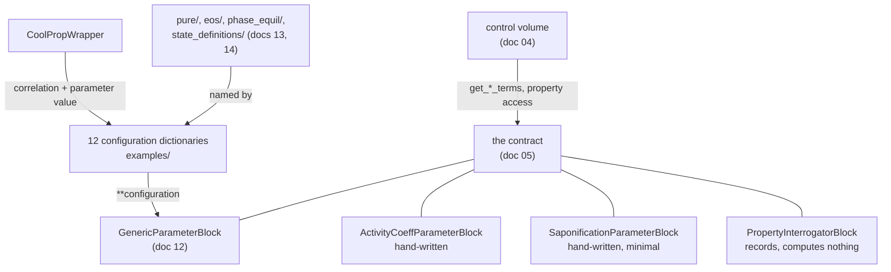
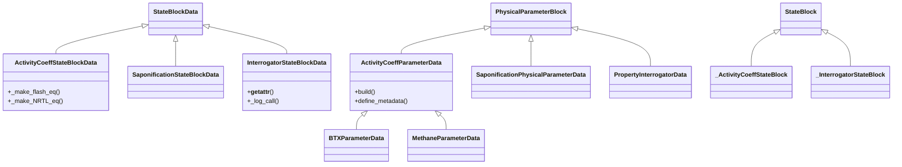
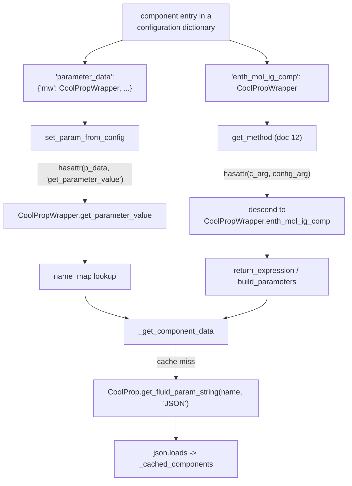
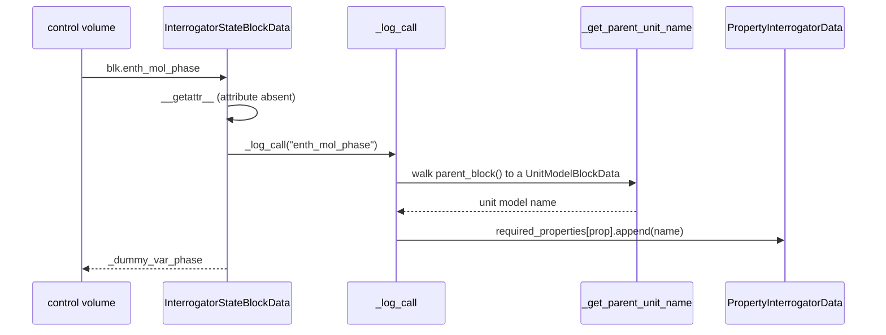

# 15 — Property package catalog

> **Doc ID** 15 · **Repo SHA** 70a8f4fe1 (IDAES-PSE v2.13.0rc0) · **Source roots** `idaes/models/properties/modular_properties/{examples,coolprop}/`, `idaes/models/properties/{activity_coeff_models,examples,interrogator}/`
> **Owns** 26 modules / 8,312 LOC · **Assets** none · **Siblings** [05](05_property_and_reaction_framework.md), [12](12_modular_properties_generic_framework.md), [13](13_modular_properties_eos_and_phase_equilibrium.md), [14](14_modular_properties_state_definitions_and_libraries.md), [16](16_general_helmholtz_property_system.md), [28](28_data_and_file_format_inventory.md)

Documents [12](12_modular_properties_generic_framework.md),
[13](13_modular_properties_eos_and_phase_equilibrium.md) and
[14](14_modular_properties_state_definitions_and_libraries.md) describe the
modular framework and the plug-ins it assembles. This document is the
**catalog**: what has actually been assembled from those parts and shipped in
the tree, plus the property packages that predate the framework or sit outside
it entirely. Twelve module-level configuration dictionaries, one bridge to an
external property database, one 2,241-line hand-written package with two
concrete subclasses, the two simplest complete packages in the library, and two
packages that implement the contract of
[05](05_property_and_reaction_framework.md) while computing nothing at all.

---

## 0. Scope and source map

| File | LOC | Purpose | Covered in § |
|---|---:|---|---|
| `idaes/models/properties/modular_properties/__init__.py` | 14 | Re-exports the four public modular block classes — the whole public entry point to the 24,089-LOC modular subsystem | 2 |
| `idaes/models/properties/modular_properties/examples/__init__.py` | 12 | Licence header only | 2 |
| `idaes/models/properties/modular_properties/examples/ASU_PR.py` | 350 | Two air-separation configuration dictionaries, Peng-Robinson | 4, 5 |
| `idaes/models/properties/modular_properties/examples/BT_ideal.py` | 168 | Benzene-toluene, ideal both phases | 4, 5, 9 |
| `idaes/models/properties/modular_properties/examples/BT_PR.py` | 163 | Benzene-toluene, Peng-Robinson with the complementarity formulation | 4, 5 |
| `idaes/models/properties/modular_properties/examples/CO2_bmimPF6_PR.py` | 158 | Carbon dioxide in an ionic liquid; a non-vaporisable component | 4, 5 |
| `idaes/models/properties/modular_properties/examples/CO2_H2O_Ideal_VLE.py` | 198 | Carbon dioxide and water, ideal; a non-condensable component | 4, 5 |
| `idaes/models/properties/modular_properties/examples/HC_PR.py` | 890 | Thirteen hydrocarbons, Peng-Robinson, vapour-liquid | 4, 5 |
| `idaes/models/properties/modular_properties/examples/HC_PR_vap.py` | 878 | The same thirteen, vapour phase only | 4, 5, 12 |
| `idaes/models/properties/modular_properties/examples/enrtl_H2O_NaCl_KCl.py` | 97 | Electrolyte configuration, two salts, symmetric reference state | 4, 5 |
| `idaes/models/properties/modular_properties/examples/enrtl_NaBr_mixed_solvent.py` | 121 | Electrolyte configuration, three solvents, one salt | 4, 5 |
| `idaes/models/properties/modular_properties/examples/reactions/__init__.py` | 12 | Licence header only | 2 |
| `idaes/models/properties/modular_properties/examples/reactions/reaction_example.py` | 164 | A paired thermophysical and reaction configuration dictionary | 4, 5 |
| `idaes/models/properties/modular_properties/coolprop/__init__.py` | 13 | Re-exports `CoolPropWrapper` | 2 |
| `idaes/models/properties/modular_properties/coolprop/coolprop_wrapper.py` | 489 | `CoolPropWrapper`, the six property sub-classes, the JSON retrieval and cache | 2, 3, 5, 7, 10, 11 |
| `idaes/models/properties/modular_properties/coolprop/coolprop_forms.py` | 235 | Six expression and parameter builders for CoolProp's correlation forms | 2, 5, 7 |
| `idaes/models/properties/activity_coeff_models/__init__.py` | 0 | Empty package marker | 2 |
| `idaes/models/properties/activity_coeff_models/activity_coeff_prop_pack.py` | 2,241 | `ActivityCoeffParameterBlock`, `ActivityCoeffStateBlock`, `ActivityCoeffInitializer` — a hand-written implementation of the document-05 contract | 2, 3, 4, 5, 6, 7, 9, 11, 12 |
| `idaes/models/properties/activity_coeff_models/BTX_activity_coeff_VLE.py` | 317 | `BTXParameterBlock` — benzene, toluene, hard-coded correlation coefficients | 4, 5, 6 |
| `idaes/models/properties/activity_coeff_models/methane_combustion_ideal.py` | 257 | `MethaneParameterBlock` — eight species, vapour only, hard-coded coefficients | 4, 5, 6 |
| `idaes/models/properties/examples/__init__.py` | 0 | Empty package marker | 2 |
| `idaes/models/properties/examples/saponification_thermo.py` | 424 | `SaponificationParameterBlock`, `SaponificationStateBlock`, `SaponificationPropertiesScaler` | 2, 3, 5, 6, 7, 13 |
| `idaes/models/properties/examples/saponification_reactions.py` | 284 | `SaponificationReactionParameterBlock`, `ReactionBlock`, `SaponificationReactionScaler` | 2, 3, 5, 6, 7, 13 |
| `idaes/models/properties/interrogator/__init__.py` | 14 | Re-exports the two interrogator parameter blocks | 2 |
| `idaes/models/properties/interrogator/properties_interrogator.py` | 447 | `PropertyInterrogatorBlock`, `InterrogatorStateBlock` — records every thermophysical property a flowsheet asks for | 2, 3, 4, 5, 7, 11, 12 |
| `idaes/models/properties/interrogator/reactions_interrogator.py` | 366 | `ReactionInterrogatorBlock`, `InterrogatorReactionBlock` — the same for reaction properties | 2, 3, 5, 7, 11, 12 |

Total 8,312 LOC, 12 configuration keys, 0 `NotImplementedError` hooks, 0
enumerations, 29 classes, 12 of them declared by
`declare_process_block_class`.

---

## 1. Architectural role

Four families sit in this document, and they answer the control volume's
questions in four different ways.

**Configuration dictionaries.** Ten modules under
`modular_properties/examples/` hold twelve module-level `dict` literals and
nothing else — no classes, no functions except three density closures, no data
files. Each is a worked example of how the plug-ins of documents 13 and 14
compose into a working package through the assembly layer of document 12. They
are data, not code: a test deep-copies one and swaps a key to obtain a different
package (`idaes/models/properties/modular_properties/examples/tests/test_BTIdeal_FpTPxpc.py:59`).

**The CoolProp bridge.** `modular_properties/coolprop/` lets a configuration
dictionary name an installed third-party database instead of literal numbers.
`CoolPropWrapper`
(`idaes/models/properties/modular_properties/coolprop/coolprop_wrapper.py:88`)
is reachable from two different places in a configuration dictionary at once: as
a correlation, resolved by `get_method`
([12 §5.3](12_modular_properties_generic_framework.md#53-get_method--the-plug-in-dispatch)),
and as a parameter value, resolved by `set_param_from_config`
(`idaes/core/util/misc.py:72`).

**Hand-written packages.** `activity_coeff_models/` implements the document-05
contract directly, in Python, with parameters as hard-coded dictionaries inside
the `.py` files. It shares no code with the modular framework. The contrast is
the reason it appears here: the same contract, satisfied twice, by two
mechanisms with nothing in common.

**Packages that compute nothing.** `interrogator/` implements the contract and
returns a dummy variable for every request, recording the request in a
dictionary on the parameter block. It works by replacing `StateBlockData.__getattr__`
outright, so the on-demand construction protocol of
[03 §5.6](03_block_hierarchy_and_construction_protocol.md#56-on-demand-attribute-construction)
never reaches `build_on_demand`.



*One contract, four implementations; the configuration dictionaries are the only family that is data rather than code.*

---

## 2. Public surface inventory

| Symbol | Kind | Declared at | Exported via | Stability signal |
|---|---|---|---|---|
| `GenericParameterBlock`, `GenericStateBlock` | re-export | `idaes/models/properties/modular_properties/__init__.py:13` | `idaes.models.properties.modular_properties` | declared in [12](12_modular_properties_generic_framework.md) |
| `GenericReactionParameterBlock`, `GenericReactionBlock` | re-export | `idaes/models/properties/modular_properties/__init__.py:14` | as above | declared in [12](12_modular_properties_generic_framework.md) |
| `configuration` | module dict | `idaes/models/properties/modular_properties/examples/ASU_PR.py:72` | module path only | module-level literal |
| `configuration_Dowling_2015` | module dict | `idaes/models/properties/modular_properties/examples/ASU_PR.py:212` | module path only | module-level literal |
| `configuration` | module dict | `idaes/models/properties/modular_properties/examples/BT_ideal.py:54`, `idaes/models/properties/modular_properties/examples/BT_PR.py:57`, `idaes/models/properties/modular_properties/examples/CO2_bmimPF6_PR.py:59`, `idaes/models/properties/modular_properties/examples/CO2_H2O_Ideal_VLE.py:67`, `idaes/models/properties/modular_properties/examples/HC_PR.py:62` | module path only | module-level literal |
| `configuration_vap` | module dict | `idaes/models/properties/modular_properties/examples/HC_PR_vap.py:58` | module path only | module-level literal |
| `constant_density` | function | `idaes/models/properties/modular_properties/examples/enrtl_H2O_NaCl_KCl.py:49` | module path only | no underscore |
| `configuration` | module dict | `idaes/models/properties/modular_properties/examples/enrtl_H2O_NaCl_KCl.py:54` | module path only | module-level literal |
| `rho_H2O`, `rho_MeOH`, `rho_EtOH` | functions | `idaes/models/properties/modular_properties/examples/enrtl_NaBr_mixed_solvent.py:37`, `:42`, `:47` | module path only | no underscore |
| `configuration` | module dict | `idaes/models/properties/modular_properties/examples/enrtl_NaBr_mixed_solvent.py:52` | module path only | module-level literal |
| `thermo_configuration` | module dict | `idaes/models/properties/modular_properties/examples/reactions/reaction_example.py:48` | module path only | module-level literal |
| `rxn_configuration` | module dict | `idaes/models/properties/modular_properties/examples/reactions/reaction_example.py:128` | module path only | module-level literal |
| `name_map` | module dict | `idaes/models/properties/modular_properties/coolprop/coolprop_wrapper.py:41` | module path only | no underscore |
| `CoolPropExpressionError` | exception | `idaes/models/properties/modular_properties/coolprop/coolprop_wrapper.py:52` | module path only | subclasses `ValueError` |
| `CoolPropPropertyError` | exception | `idaes/models/properties/modular_properties/coolprop/coolprop_wrapper.py:71` | module path only | subclasses `KeyError` |
| `CoolPropWrapper` | class | `idaes/models/properties/modular_properties/coolprop/coolprop_wrapper.py:88` | `idaes.models.properties.modular_properties.coolprop` | re-exported at `coolprop/__init__.py:13`; named in `docs/how_to_guides/opt_dependencies.rst` |
| `parameters_nt_sum`, `expression_exponential`, `dT_expression_exponential`, `expression_nonexponential`, `parameters_polynomial`, `expression_polynomial` | functions | `idaes/models/properties/modular_properties/coolprop/coolprop_forms.py:26`, `:92`, `:121`, `:145`, `:167`, `:203` | module path only | no underscore |
| `_nt_sum` | function | `idaes/models/properties/modular_properties/coolprop/coolprop_forms.py:66` | — | leading underscore |
| `ActivityCoeffParameterData` | class | `idaes/models/properties/activity_coeff_models/activity_coeff_prop_pack.py:101` | — | data half of the pair |
| `ActivityCoeffParameterBlock` | class | synthesized at `activity_coeff_prop_pack.py:101` | module path only | generated by the decorator; autodoc'd |
| `ActivityCoeffInitializer` | class | `activity_coeff_prop_pack.py:307` | module path only | autodoc'd |
| `_ActivityCoeffStateBlock`, `ActivityCoeffStateBlockData` / `ActivityCoeffStateBlock` | classes | `activity_coeff_prop_pack.py:489`, `:720` | module path only | `_ActivityCoeffStateBlock` is the `block_class`; the other two autodoc'd |
| `BTXParameterData` / `BTXParameterBlock` | class pair | `idaes/models/properties/activity_coeff_models/BTX_activity_coeff_VLE.py:43` | module path only | used by four non-test modules |
| `MethaneParameterData` / `MethaneParameterBlock` | class pair | `idaes/models/properties/activity_coeff_models/methane_combustion_ideal.py:44` | module path only | generated by the decorator |
| `PhysicalParameterData` / `SaponificationParameterBlock` | class pair | `idaes/models/properties/examples/saponification_thermo.py:58` | module path only | data class name is generic |
| `SaponificationPropertiesScaler`, `_StateBlock`, `SaponificationStateBlockData` / `SaponificationStateBlock` | classes | `saponification_thermo.py:140`, `:183`, `:318` | module path only | the Scaler is named by `default_scaler`; `_StateBlock` is the `block_class` |
| `ReactionParameterData` / `SaponificationReactionParameterBlock` | class pair | `idaes/models/properties/examples/saponification_reactions.py:47` | module path only | data class name is generic |
| `SaponificationReactionScaler`, `_ReactionBlock`, `ReactionBlockData` / `ReactionBlock` | classes | `saponification_reactions.py:116`, `:186`, `:209` | module path only | as above; both `ReactionBlock` names are unqualified |
| `PropertyInterrogatorData` | class | `idaes/models/properties/interrogator/properties_interrogator.py:55` | — | autodoc'd |
| `PropertyInterrogatorBlock` | class | synthesized at `properties_interrogator.py:55` | `idaes.models.properties.interrogator` | re-exported at `interrogator/__init__.py:13`; autodoc'd |
| `_InterrogatorStateBlock`, `InterrogatorStateBlockData` / `InterrogatorStateBlock` | classes | `properties_interrogator.py:296`, `:318` | module path only | `_InterrogatorStateBlock` is the `block_class` |
| `ReactionInterrogatorData` | class | `idaes/models/properties/interrogator/reactions_interrogator.py:43` | — | autodoc'd |
| `ReactionInterrogatorBlock` | class | synthesized at `reactions_interrogator.py:43` | `idaes.models.properties.interrogator` | re-exported at `interrogator/__init__.py:14`; autodoc'd |
| `_InterrogatorReactionBlock`, `InterrogatorReactionBlockData` / `InterrogatorReactionBlock` | classes | `reactions_interrogator.py:253`, `:275` | module path only | `_InterrogatorReactionBlock` is the `block_class` |

`idaes/models/properties/modular_properties/__init__.py` re-exports exactly four
names — `GenericParameterBlock` and `GenericStateBlock` at `:13`,
`GenericReactionParameterBlock` and `GenericReactionBlock` at `:14`. Those two
lines are the whole public entry point to a subsystem of 63 source modules and
24,089 LOC, split across documents 12 (7,436), 13 (6,793), 14 (5,898) and this
one (3,962). Everything else in the subsystem is reached by full module path or
named inside a configuration dictionary.

---

## 3. Class hierarchy and type taxonomy



*Every class here attaches directly to the contract of document 05; only the activity-coefficient family has a second level, and the three concrete packages in it differ solely in `build`.*

| Class | Base(s) | Declared at | Decorator | Container class | Key overrides |
|---|---|---|---|---|---|
| `ActivityCoeffParameterData` | `PhysicalParameterBlock` | `activity_coeff_prop_pack.py:101` | `@declare_process_block_class("ActivityCoeffParameterBlock")` | `ActivityCoeffParameterBlock` | `build`, `define_metadata` |
| `BTXParameterData` | `ActivityCoeffParameterData` | `BTX_activity_coeff_VLE.py:43` | `@declare_process_block_class("BTXParameterBlock")` | `BTXParameterBlock` | `build` |
| `MethaneParameterData` | `ActivityCoeffParameterData` | `methane_combustion_ideal.py:44` | `@declare_process_block_class("MethaneParameterBlock")` | `MethaneParameterBlock` | `CONFIG`, `build` |
| `ActivityCoeffInitializer` | `InitializerBase` | `activity_coeff_prop_pack.py:307` | none | — | `__init__`, `initialization_routine` |
| `_ActivityCoeffStateBlock` | `StateBlock` | `activity_coeff_prop_pack.py:489` | none | — | `default_initializer`, `fix_initialization_states`, `initialize`, `release_state` |
| `ActivityCoeffStateBlockData` | `StateBlockData` | `activity_coeff_prop_pack.py:720` | `@declare_process_block_class("ActivityCoeffStateBlock", block_class=_ActivityCoeffStateBlock)` | `ActivityCoeffStateBlock` | `build`, 22 builders, the six `get_*_terms`, `calculate_scaling_factors` |
| `PhysicalParameterData` | `PhysicalParameterBlock` | `saponification_thermo.py:58` | `@declare_process_block_class("SaponificationParameterBlock")` | `SaponificationParameterBlock` | `build`, `define_metadata` |
| `SaponificationPropertiesScaler` | `CustomScalerBase` | `saponification_thermo.py:140` | none | — | `UNIT_SCALING_FACTORS`, `DEFAULT_SCALING_FACTORS`, both routines |
| `_StateBlock` | `StateBlock` | `saponification_thermo.py:183` | none | — | `default_scaler`, `fix_initialization_states`, `initialize`, `release_state` |
| `SaponificationStateBlockData` | `StateBlockData` | `saponification_thermo.py:318` | `@declare_process_block_class("SaponificationStateBlock", block_class=_StateBlock)` | `SaponificationStateBlock` | `build`, the four `get_*_terms`, `define_display_vars` |
| `ReactionParameterData` | `ReactionParameterBlock` | `saponification_reactions.py:47` | `@declare_process_block_class("SaponificationReactionParameterBlock")` | `SaponificationReactionParameterBlock` | `build`, `define_metadata` |
| `SaponificationReactionScaler` | `CustomScalerBase` | `saponification_reactions.py:116` | none | — | `DEFAULT_SCALING_FACTORS`, both routines |
| `_ReactionBlock` | `ReactionBlockBase` | `saponification_reactions.py:186` | none | — | `default_scaler`, `initialize` |
| `ReactionBlockData` | `ReactionBlockDataBase` | `saponification_reactions.py:209` | `@declare_process_block_class("ReactionBlock", block_class=_ReactionBlock)` | `ReactionBlock` | `build`, `_rate_constant`, `_rxn_rate`, `get_reaction_rate_basis` |
| `PropertyInterrogatorData` | `PhysicalParameterBlock` | `properties_interrogator.py:55` | `@declare_process_block_class("PropertyInterrogatorBlock")` | `PropertyInterrogatorBlock` | `build`, `define_metadata`, six reporting methods |
| `_InterrogatorStateBlock` | `StateBlock` | `properties_interrogator.py:296` | none | — | `initialize` |
| `InterrogatorStateBlockData` | `StateBlockData` | `properties_interrogator.py:318` | `@declare_process_block_class("InterrogatorStateBlock", block_class=_InterrogatorStateBlock)` | `InterrogatorStateBlock` | `build`, `__getattr__`, the four `get_*_terms` |
| `ReactionInterrogatorData` | `ReactionParameterBlock` | `reactions_interrogator.py:43` | `@declare_process_block_class("ReactionInterrogatorBlock")` | `ReactionInterrogatorBlock` | `build`, `define_metadata`, six reporting methods |
| `_InterrogatorReactionBlock` | `ReactionBlockBase` | `reactions_interrogator.py:253` | none | — | `initialize` |
| `InterrogatorReactionBlockData` | `ReactionBlockDataBase` | `reactions_interrogator.py:275` | `@declare_process_block_class("InterrogatorReactionBlock", block_class=_InterrogatorReactionBlock)` | `InterrogatorReactionBlock` | `build`, `__getattr__`, `get_reaction_rate_basis` |
| `CoolPropWrapper` | none | `coolprop_wrapper.py:88` | none | — | namespace class; six inner property classes |
| `CoolPropExpressionError` | `ValueError` | `coolprop_wrapper.py:52` | none | — | `__init__` |
| `CoolPropPropertyError` | `KeyError` | `coolprop_wrapper.py:71` | none | — | `__init__` |

### 3.1 Initializer and Scaler declarations

All **12** rows this document owns in `_generated/retrofit.csv` report neither a
`default_initializer` nor a `default_scaler` on the data class — the largest
such group outside `models_extra`. The set-wide table is in
[06 §3.3](06_model_preparation_initializers_and_scalers.md#33-retrofit-adoption).

The attribute is not always absent from the pair, because
`declare_process_block_class` accepts a `block_class` argument and the
underscore-prefixed container base is where three of these packages put it:

| Container base | Attribute | Value | Anchor |
|---|---|---|---|
| `_ActivityCoeffStateBlock` | `default_initializer` | `ActivityCoeffInitializer` | `activity_coeff_prop_pack.py:496` |
| `_StateBlock` (saponification) | `default_scaler` | `SaponificationPropertiesScaler` | `saponification_thermo.py:189` |
| `_ReactionBlock` (saponification) | `default_scaler` | `SaponificationReactionScaler` | `saponification_reactions.py:192` |

No class in this document declares both, and the two interrogator pairs declare
neither on either half. No enumerations are declared here; `StateIndex` and
`ConcentrationForm`, named by four of the configuration dictionaries, belong to
[12 §3.1](12_modular_properties_generic_framework.md#31-stateindex) and
[12 §3.2](12_modular_properties_generic_framework.md#32-concentrationform).

---

## 4. Configuration reference

12 keys across four declarations, plus the configuration dictionary — which is
not a CONFIG block at all, and is the subject of sections 4.5 and 4.6.

### 4.1 `ActivityCoeffParameterData.CONFIG`

`PhysicalParameterBlock.CONFIG()` extended at
`idaes/models/properties/activity_coeff_models/activity_coeff_prop_pack.py:109`.

| Key | Domain / validator | Default | Req. | Effect on build | Anchor |
|---|---|---|---|---|---|
| `activity_coeff_model` | `In(["Ideal", "NRTL", "Wilson"])` | `"Ideal"` | no | Selects which of `_make_NRTL_eq` or `_make_Wilson_eq` the state block calls, and which interaction parameters the parameter block creates | `:111` |
| `state_vars` | `In(["FTPz", "FcTP"])` | `"FTPz"` | no | Selects the state variable set: total flow with mole fractions, or per-component flows | `:127` |
| `valid_phase` | `In(["Liq", "Vap", ("Vap", "Liq"), ("Liq", "Vap")])` | `("Vap", "Liq")` | no | Selects which `Phase` sub-blocks exist and whether the flash formulation is built | `:143` |

The three keys interact. A two-phase `valid_phase` with `activity_coeff_model`
other than `"Ideal"` builds the activity-coefficient equations *and* the flash
equations; a single-phase `valid_phase` builds one of the two single-phase
branches instead (`:740`, `:746`, `:757`).

### 4.2 `MethaneParameterData.CONFIG`

`PhysicalParameterBlock.CONFIG()` extended at
`idaes/models/properties/activity_coeff_models/methane_combustion_ideal.py:50`.
Three keys with the same names as section 4.1 and narrower domains — the
subclass redeclares rather than inheriting `ActivityCoeffParameterData.CONFIG`.

| Key | Inherited from | Override | Anchor |
|---|---|---|---|
| `activity_coeff_model` | redeclared | domain narrowed to `In(["Ideal"])` | `:52` |
| `state_vars` | redeclared | unchanged: `In(["FTPz", "FcTP"])`, default `"FTPz"` | `:61` |
| `valid_phase` | redeclared | domain narrowed to `In(["Vap"])`, default `"Vap"` | `:77` |

`BTXParameterData` declares no CONFIG of its own and inherits section 4.1
unchanged, which is why `BTXParameterBlock(valid_phase=("Liq", "Vap"),
activity_coeff_model="NRTL")` is a valid construction
(`idaes/apps/uncertainty_propagation/examples/NRTL_model_scripts.py:43`).

### 4.3 `ActivityCoeffInitializer.CONFIG`

`InitializerBase.CONFIG()` extended at `activity_coeff_prop_pack.py:321`. The
same four keys, with the same defaults, as
[12 §4.4](12_modular_properties_generic_framework.md#44-modularpropertiesinitializerconfig).

| Key | Domain / validator | Default | Req. | Effect on build | Anchor |
|---|---|---|---|---|---|
| `solver` | none | `'ipopt_v2'` | no | Name passed to `get_solver` at `:389` | `:322` |
| `solver_options` | `ConfigDict(implicit=True)` | empty | no | Options forwarded to the solver | `:329` |
| `solver_writer_config` | `ConfigDict(implicit=True)` | empty | no | Writer configuration forwarded to the solver | `:336` |
| `calculate_variable_options` | `ConfigDict(implicit=True)` | empty | no | Options for the 1×1 block solves | `:343` |

### 4.4 `PropertyInterrogatorData.CONFIG`

`PhysicalParameterBlock.CONFIG()` extended at
`idaes/models/properties/interrogator/properties_interrogator.py:63`.

| Key | Domain / validator | Default | Req. | Effect on build | Anchor |
|---|---|---|---|---|---|
| `phase_list` | `dict` | `None` | no | `{name: Phase subclass}`; `None` builds `Liq` and `Vap` (`:90`, `:91`), otherwise one sub-block per entry with the named type (`:101`) | `:65` |
| `component_list` | `dict` | `None` | no | `{name: Component subclass}`; `None` builds `A` and `B` (`:105`, `:106`), otherwise one sub-block per entry (`:117`) | `:72` |

A `None` value inside either dict substitutes the base `Phase` or `Component`
class; anything that is not a subclass of the corresponding base raises
`ConfigurationError` (`:97`, `:112`). `ReactionInterrogatorData` declares no
keys of its own: it takes its phase and component lists from the property
package it is attached to (`reactions_interrogator.py:63`, `:69`).

### 4.5 The anatomy of a configuration dictionary

A configuration dictionary is the keyword-argument payload of
`GenericParameterBlock(**configuration)`. Every key it sets is declared
somewhere else; this table is the map from key to owning document.

| Key | Where it sits | What the value selects | Declared / documented in |
|---|---|---|---|
| `components` | top level | one `Component` sub-block per entry; the nested `type` names the `Component` subclass | [05 §4.6](05_property_and_reaction_framework.md#46-componentdataconfig) |
| `phases` | top level | one `Phase` sub-block per entry; the nested `type` names the `Phase` subclass | [05 §4.5](05_property_and_reaction_framework.md#45-phasedataconfig) |
| `base_units` | top level | the seven base quantities handed to `add_default_units` as the first act of `build` | [05 §3.3](05_property_and_reaction_framework.md#33-unitset) |
| `state_definition` | top level | the module supplying `define_state`, `set_metadata`, `do_not_initialize` | [14](14_modular_properties_state_definitions_and_libraries.md) |
| `state_bounds` | top level | per-state-variable `(lb, nominal, ub, units)` read through `get_bounds_from_config` | [14](14_modular_properties_state_definitions_and_libraries.md) |
| `state_components` | top level | `StateIndex.true` or `StateIndex.apparent` — which species set indexes the state | [12 §3.1](12_modular_properties_generic_framework.md#31-stateindex) |
| `pressure_ref`, `temperature_ref` | top level | the two mutable reference `Param`s | [12 §4.1](12_modular_properties_generic_framework.md#41-genericparameterdataconfig) |
| `phases_in_equilibrium` | top level | the phase pairs that get `_pe_pairs` and `equilibrium_constraint` | [12 §4.1](12_modular_properties_generic_framework.md#41-genericparameterdataconfig) |
| `phase_equilibrium_state` | top level | per pair, the formulation module supplying `phase_equil` | [13](13_modular_properties_eos_and_phase_equilibrium.md) |
| `bubble_dew_method` | top level | the class supplying the four bubble and dew construction methods | [13](13_modular_properties_eos_and_phase_equilibrium.md) |
| `equation_of_state` | per phase | the module supplying `common` and one method per phase property | [13](13_modular_properties_eos_and_phase_equilibrium.md) |
| `equation_of_state_options` | per phase | cubic type, eNRTL reference state, true/apparent property basis | [13](13_modular_properties_eos_and_phase_equilibrium.md) |
| `phase_equilibrium_form` | per component | per pair, the equality form used for phase equilibrium | [13](13_modular_properties_eos_and_phase_equilibrium.md) |
| `valid_phase_types`, `elemental_composition`, `dissociation_species`, `charge`, `henry_component` | per component | phase validity, element balances, electrolyte structure | [05 §4.6](05_property_and_reaction_framework.md#46-componentdataconfig) |
| the 20 correlation keys (`dens_mol_liq_comp`, `enth_mol_ig_comp`, `pressure_sat_comp`, …) | per component | a `pure/` correlation class, a module, or a bare callable; resolved by `get_method` | [14](14_modular_properties_state_definitions_and_libraries.md) |
| `parameter_data` | top level, per phase, per component | numeric values consumed by `set_param_from_config` and by plug-in `build_parameters` methods | [14](14_modular_properties_state_definitions_and_libraries.md) |
| `rate_reactions`, `equilibrium_reactions` | top level of a reaction configuration | one parameter `Block` per reaction, against the `rate_rxn_config` / `equil_rxn_config` templates | [12 §4.2](12_modular_properties_generic_framework.md#42-the-per-reaction-configuration-templates), [12 §4.3](12_modular_properties_generic_framework.md#43-genericreactionparameterdataconfig) |

### 4.6 The shipped configurations

Twelve module-level dictionaries across ten modules. `EoS` names the value of
each phase's `equation_of_state`; `Phase equilibrium` names the
`phase_equilibrium_state` value and the `bubble_dew_method` value in that order.

| Module | Components | Phases | EoS | State definition | Phase equilibrium | Anchor |
|---|---|---|---|---|---|---|
| `examples/ASU_PR.py` (`configuration`) | nitrogen, argon, oxygen | Liq, Vap | `Cubic`, `CubicType.PR` | `FTPx` | `SmoothVLE`, `LogBubbleDew` | `:72` |
| `examples/ASU_PR.py` (`configuration_Dowling_2015`) | nitrogen, argon, oxygen | Liq, Vap | `Cubic`, `CubicType.PR` | `FTPx` | `SmoothVLE`, `LogBubbleDew` | `:212` |
| `examples/BT_ideal.py` | benzene, toluene | Liq, Vap | `Ideal` | `FTPx` | `SmoothVLE`, `IdealBubbleDew` | `:54` |
| `examples/BT_PR.py` | benzene, toluene | Liq, Vap | `Cubic`, `CubicType.PR` | `FTPx` | `CubicComplementarityVLE`, `LogBubbleDew` | `:57` |
| `examples/CO2_bmimPF6_PR.py` | bmimPF6 (`PT.liquidPhase`), carbon_dioxide | Liq, Vap | `Cubic`, `CubicType.PR` | `FTPx` | `SmoothVLE`, `LogBubbleDew` | `:59` |
| `examples/CO2_H2O_Ideal_VLE.py` | H2O, CO2 (`PT.vaporPhase`) | Liq, Vap | `Ideal` | `FTPx` | `SmoothVLE`, `IdealBubbleDew` | `:67` |
| `examples/HC_PR.py` | 13 hydrocarbons; hydrogen and methane `PT.vaporPhase` | Liq, Vap | `Cubic`, `CubicType.PR` | `FTPx` | `SmoothVLE`, `LogBubbleDew` | `:62` |
| `examples/HC_PR_vap.py` | the same 13 | Vap | `Cubic`, `CubicType.PR` | `FTPx` | none declared | `:58` |
| `examples/enrtl_H2O_NaCl_KCl.py` | H2O; NaCl, KCl (`Apparent`); Na+, K+ (`Cation`); Cl- (`Anion`) | Liq (`AqueousPhase`) | `ENRTL`, `reference_state: Symmetric` | `FTPx`, `StateIndex.true` | none declared | `:54` |
| `examples/enrtl_NaBr_mixed_solvent.py` | H2O, MeOH, EtOH; NaBr (`Apparent`); Na+ (`Cation`); Br- (`Anion`) | Liq (`AqueousPhase`) | `ENRTL` | `FTPx`, `StateIndex.true` | none declared | `:52` |
| `examples/reactions/reaction_example.py` (`thermo_configuration`) | A, B, C, D | Liq | `Ideal` | `FcTP` | none declared | `:48` |
| `examples/reactions/reaction_example.py` (`rxn_configuration`) | — | — | — | — | rate reaction `R1`, equilibrium reaction `R2` | `:128` |

Read down the columns: `FTPx` is the state definition in eleven of the twelve;
`Cubic` with `CubicType.PR` appears seven times and `Ideal` four; `SmoothVLE` is
the phase equilibrium formulation in five, and `CubicComplementarityVLE` in
exactly one. Nothing in the shipped set exercises `FPhx`, `FcPh` or `FpTPxpc`
directly — those are reached only by the test modules that deep-copy
`BT_ideal.configuration` and replace `state_definition`.

Correlation choices per component, the other half of the picture:

| Module | `dens_mol_liq_comp` | `enth_mol_liq_comp` | `enth_mol_ig_comp` | `entr_mol_ig_comp` | `pressure_sat_comp` | `phase_equilibrium_form` |
|---|---|---|---|---|---|---|
| `ASU_PR.py` (`configuration`) | — | — | `RPP4` | `RPP4` | `NIST` | `log_fugacity` |
| `ASU_PR.py` (`configuration_Dowling_2015`) | — | — | `RPP4` | `RPP4` | `RPP3` | `log_fugacity` |
| `BT_ideal.py` | `Perrys` | `Perrys` | `RPP4` | — | `RPP4` | `fugacity` |
| `BT_PR.py` | — | — | `RPP4` | `RPP4` | `RPP4` | `log_fugacity` |
| `CO2_bmimPF6_PR.py` | — | — | `RPP4` | `RPP4` | `NIST` (CO2 only) | `log_fugacity` |
| `CO2_H2O_Ideal_VLE.py` | `Perrys` (H2O) | `Perrys` (H2O) | `NIST` | — | `NIST` (H2O only) | `fugacity` (H2O only) |
| `HC_PR.py`, `HC_PR_vap.py` | `Perrys` (11 of 13) | `Perrys` (11 of 13) | `RPP4` | `RPP4` | `RPP5` (11 of 13) | `log_fugacity` (11 of 13) |
| `enrtl_H2O_NaCl_KCl.py` | `constant_density` (a local closure) | — | — | — | — | — |
| `enrtl_NaBr_mixed_solvent.py` | `rho_H2O`, `rho_MeOH`, `rho_EtOH` (local closures) | — | — | — | — | — |
| `reactions/reaction_example.py` | — | `Perrys` | — | — | — | — |

The two electrolyte configurations are where the `get_method` tolerance of a
bare callable ([12 §5.3](12_modular_properties_generic_framework.md#53-get_method--the-plug-in-dispatch))
is exercised in the shipped set. `constant_density`
(`idaes/models/properties/modular_properties/examples/enrtl_H2O_NaCl_KCl.py:49`) and the three functions `rho_H2O`,
`rho_MeOH` and `rho_EtOH` (`idaes/models/properties/modular_properties/examples/enrtl_NaBr_mixed_solvent.py:37`,
`:42`, `:47`) take `(b, *args, **kwargs)` and return a constant Pyomo
expression; they carry no `build_parameters`, so stage 12 of
`GenericParameterData.build` skips them. Both configurations also name
`relative_permittivity_constant` from `pure/electrolyte.py` and set
`relative_permittivity_liq_comp` in `parameter_data` (78.54 for water in both,
32.6146 for methanol and 24.113 for ethanol), and both supply the eNRTL binary
interaction parameters as `Liq_tau` — with `Liq_alpha` added in the
mixed-solvent case (`idaes/models/properties/modular_properties/examples/enrtl_NaBr_mixed_solvent.py:98`).

---

## 5. Construction and call sequences

### 5.1 From configuration dictionary to property package

A configuration dictionary is never executed by anything in this document. It
is handed to `GenericParameterBlock(**configuration)`, and the thirteen stages
of `GenericParameterData.build` do the rest
([12 §5.1](12_modular_properties_generic_framework.md#51-genericparameterdatabuild)).
Three consequences follow from that separation and are visible in the shipped
set.

1. **A configuration is reusable data.** `test_BTIdeal_FpTPxpc.py:59` calls
   `deepcopy` on `BT_ideal.configuration`, assigns a different
   `state_definition` at `:61` and a different `state_bounds` at `:62`, and
   builds a package from the result. Four test modules obtain four state
   definitions from the one shipped benzene-toluene dictionary this way.
2. **Nothing validates a configuration until it is built.** Every invariant in
   [12 §6.4](12_modular_properties_generic_framework.md#64-invariants) fires
   inside `build`, so a key that no stage reads is inert. `HC_PR_vap.py` carries
   eleven `phase_equilibrium_form` entries keyed on `("Vap", "Liq")` (`:111`
   and after) in a configuration whose only phase is `Vap`; stage 11 never
   reaches them because `phases_in_equilibrium` is absent.
3. **A parameter value and a correlation are resolved by different code.**
   `parameter_data` goes through `set_param_value`
   (`idaes/models/properties/modular_properties/base/generic_property.py:124`)
   and `set_param_from_config` (`idaes/core/util/misc.py:72`); a correlation key
   goes through `get_method`
   (`idaes/models/properties/modular_properties/base/utility.py:63`). Section
   5.2 is the one place in the tree where the same object is supplied to both.

### 5.2 The CoolProp bridge: two resolution paths

`CoolPropWrapper` appears in a configuration dictionary in two roles, and each
is resolved by a different function.



*One class serves as both a correlation library and a parameter source; `get_method` descends into it by attribute name, `set_param_from_config` calls a method on it.*

**As a correlation.** `get_method` tests `hasattr(c_arg, config_arg)`
(`utility.py:101`) and, when the supplied object carries an attribute named for
the configuration key, takes that attribute. `CoolPropWrapper` carries six inner
classes named exactly after six `ComponentData` configuration keys —
`dens_mol_liq_comp` (`coolprop_wrapper.py:149`), `enth_mol_liq_comp` (`:172`),
`enth_mol_ig_comp` (`:208`), `entr_mol_liq_comp` (`:240`), `entr_mol_ig_comp`
(`:281`) and `pressure_sat_comp` (`:317`) — so writing `"enth_mol_ig_comp":
CoolPropWrapper` resolves to `CoolPropWrapper.enth_mol_ig_comp`, whose
`return_expression` and `build_parameters` are what the framework calls.

**As a parameter value.** `set_param_from_config` supports three value forms:
a `(value, units)` tuple, a bare float in package base units, and a class
exposing `get_parameter_value` (`idaes/core/util/misc.py:158`). `CoolPropWrapper`
is the third form, and the only implementation of it in the tree. Writing
`"parameter_data": {"mw": CoolPropWrapper}` makes the framework call
`CoolPropWrapper.get_parameter_value(component_name, "mw")`
(`coolprop_wrapper.py:102`), which returns the `(value, units)` tuple the other
two forms supply literally. The account here matches
[14](14_modular_properties_state_definitions_and_libraries.md), which owns
`set_param_from_config`'s callers on the correlation side.

### 5.3 Parameter retrieval, caching and expression forms

`get_parameter_value` (`coolprop_wrapper.py:102`) maps an IDAES parameter name
onto a CoolProp name and a section of CoolProp's JSON fluid description through
the module-level `name_map` (`:41`):

| IDAES name | CoolProp name | JSON section | Retrieved by |
|---|---|---|---|
| `dens_mol_crit` | `rhomolar` | `CRITICAL` | `_get_critical_property` (`:409`) |
| `enth_mol_crit` | `hmolar` | `CRITICAL` | `_get_critical_property` |
| `entr_mol_crit` | `smolar` | `CRITICAL` | `_get_critical_property` |
| `mw` | `molar_mass` | `EOS` | `_get_eos_property` (`:423`) |
| `omega` | `acentric` | `EOS` | `_get_eos_property` |
| `pressure_crit` | `p` | `CRITICAL` | `_get_critical_property` |
| `temperature_crit` | `T` | `CRITICAL` | `_get_critical_property` |

A name outside the map raises `BurntToast` (`:116`), as does a section outside
`{"CRITICAL", "EOS"}` (`:126`). Both retrievers read the units from a sibling
key formed by appending `_units` to the property name (`:418`, `:431`) and
convert the string to a Pyomo unit by `getattr` on the units container; the EOS
retriever maps `"-"` to `dimensionless` (`:432`).

Everything routes through `_get_component_data` (`:355`), which consults the
class-level `_cached_components` dict (`:99`) three ways: by name, by scanning
each cached entry's `INFO.ALIASES` and `INFO.NAME` (`:373`), and, on a miss, by
calling `_load_component_data` (`:381`). That last method is the only external
call in the family: `CoolProp.get_fluid_param_string(comp_name, "JSON")`
(`:397`), `json.loads(prop_str)[0]` (`:402`), and the result cached under the
requested name (`:404`). A `RuntimeError` out of CoolProp is re-raised with the
component name (`:399`). `flush_cached_components` (`:134`) replaces the dict
with an empty one and is the only reset.

`_get_param_dicts` (`:440`) reads the coefficient lists out of the
`ANCILLARIES` section, and validates first. It checks that the form CoolProp
reports for the property is one the wrapper recognises (`:470`) and, for
saturation pressure, that `using_tau_r` is set (`:473`); either check failing
raises `CoolPropExpressionError`. It then reads `A`/`B` for a
`rational_polynomial` form and `n`/`t` otherwise (`:480`–`:485`), with any
`KeyError` converted to `CoolPropPropertyError` (`:486`).

`coolprop_forms.py` turns those lists into Pyomo components and expressions.
Six public functions, in three pairs:

| Function | Creates or returns | Form | Anchor |
|---|---|---|---|
| `parameters_nt_sum` | `<prop>_coeff_n1..nN`, `<prop>_coeff_t1..tN` as fixed dimensionless `Var`s | — | `coolprop_forms.py:26` |
| `_nt_sum` | `sum(n[i] * theta**t[i])`, walking coefficients by `getattr` until `AttributeError` | — | `:66` |
| `expression_exponential` | `yc * exp(s)`, or `yc * exp(Tc/T * s)` when `tau` | exponential | `:92` |
| `dT_expression_exponential` | the temperature derivative of the above, via Pyomo's reverse-symbolic `differentiate` | exponential | `:121` |
| `expression_nonexponential` | `yc * (1 + s)` | non-exponential | `:145` |
| `parameters_polynomial` | `<prop>_coeff_A0..An` in property units divided by `K**i`, `<prop>_coeff_B0..Bn` in `K**-i`, all fixed | rational polynomial | `:167` |
| `expression_polynomial` | `asum / bsum` over those coefficients | rational polynomial | `:203` |

`parameters_nt_sum` raises `ConfigurationError` when the `n` and `t` lists
differ in length (`:40`). Both parameter builders create one scalar `Var` per
coefficient rather than one indexed `Var`, with the comment at `:46` naming the
reason: the polynomial coefficients carry different units per index.

Two of the six property classes chain. `enth_mol_ig_comp.build_parameters`
builds the liquid coefficients too when they are absent (`:228`), and its
`return_expression` adds the liquid expression to the ideal-gas one (`:233`);
`entr_mol_ig_comp` does the same at `:305` and `:310`. Both liquid classes fix
an anchor `Var` read from `EOS[0].STATES.hs_anchor` (`:186`, `:254`) and add it
to the polynomial (`:200`, `:273`), then convert to the package's
`ENERGY_MOLE` or `ENTROPY_MOLE` derived units (`:205`, `:278`).

### 5.4 `ActivityCoeffParameterData.build` and the four state-block branches

`activity_coeff_prop_pack.py:160`, in three stages: assign
`_state_block_class` (`:164`); create `LiquidPhase` (`:172`) and `VaporPhase`
(`:179`) sub-blocks according to `valid_phase`; and, on a two-phase package,
create the interaction parameters the selected activity-coefficient model needs
— `alpha` and `tau` for NRTL (`:190`, `:197`), `vol_mol_comp` and `tau` for
Wilson (`:206`, `:213`). It closes with 24 `set_default_scaling` calls
(`:219`–`:242`), which is this family's entire scaling provision: no Scaler
object exists for it.

Everything numeric comes from the subclass. `BTXParameterData.build`
(`BTX_activity_coeff_VLE.py:46`) declares `component_list_master` (`:50`),
builds two `Component` sub-blocks (`:55`, `:56`), calls `super().build()`
(`:58`), and then creates fourteen `Param`s from Python dict literals through
`extract_data`: critical pressure and temperature (`:98`, `:115`), molecular
weight (`:132`), five liquid and five vapour heat-capacity coefficients
(`:159`, `:216`), saturation-pressure coefficients (`:268`), and formation
enthalpy and entropy (`:288`, `:310`). `MethaneParameterData.build`
(`methane_combustion_ideal.py:86`) is the same shape for eight species, and adds
`element_list` (`:103`) and an `element_comp` dict (`:106`) so that element
balances are available.

`ActivityCoeffStateBlockData.build` (`:723`) rejects a `has_phase_equilibrium`
flag inconsistent with a single-phase `valid_phase` (`:732`), then calls
`_make_state_vars` (`:763`) and `_make_vars` (`:812`) and takes exactly one of
three branches:

| Condition | Branch | Creates |
|---|---|---|
| not `has_phase_equilibrium` and `valid_phase == "Liq"` | `_make_liq_phase_eq` (`:840`) | `eq_total`, `eq_comp`, `eq_mol_frac_out`, `eq_mole_frac` |
| `has_phase_equilibrium`, or a two-phase `valid_phase` | `_make_NRTL_eq` (`:1070`) or `_make_Wilson_eq` (`:1166`), then `_make_flash_eq` (`:936`) | the activity-coefficient system, then the smooth flash |
| not `has_phase_equilibrium` and `valid_phase == "Vap"` | `_make_vap_phase_eq` (`:888`) | `eq_total`, `eq_comp`, `eq_mol_frac_out`, `eq_mole_frac` |

`_make_flash_eq` implements the smooth square flash of Burgard et al. (2018),
named in the comment at `:1008`. It creates `_temperature_equilibrium` (`:1014`)
and an intermediate `_t1` (`:1020`), two mutable smoothing `Param`s `eps_1` =
0.01 K and `eps_2` = 0.0005 K (`:1027`, `:1033`), and two constraints that
approximate `max(T, T_bubble)` (`:1049`) and `min(_t1, T_dew)` (`:1061`) by a
square-root smoothing. Equilibrium itself is the equality of vapour and liquid
fugacity per chemical component (`:1066`). Bubble and dew temperature
construction — `_temperature_bubble` at `:1698` and `_temperature_dew` at
`:1910`, 397 lines between them — carries its own copy of the NRTL and Wilson
expressions, as `Expression` objects suffixed `_bubble` and `_dew`.

### 5.5 The saponification packages

The two smallest complete packages in the tree, and the ones the rest of the
test suite uses as fixtures: 24 test modules across `idaes/models/unit_models/`,
`idaes/models/unit_models/solid_liquid/`, `idaes/core/util/` and
`idaes/models_extra/power_generation/unit_models/` import them, and no non-test
module does.

`PhysicalParameterData.build` (`saponification_thermo.py:68`) is 48 lines:
`_state_block_class` (`:74`), one `LiquidPhase` (`:77`), five `Component`
sub-blocks (`:80`–`:84`), and four mutable `Param`s — `cp_mol` at 75.327
J/mol·K (`:87`), `dens_mol` at 55,388 mol/m³ (`:95`), `pressure_ref` (`:103`)
and `temperature_ref` (`:110`). `define_metadata` (`:119`) registers five
properties, every one with `method: None`: the package builds all of them in
`build` and nothing is ever constructed on demand.

`SaponificationStateBlockData.build` (`:324`) creates `flow_vol` (`:331`),
`pressure` bounded to 1e3–1e6 Pa (`:337`), `temperature` bounded to
298.15–323.15 K (`:344`) and `conc_mol_comp` over the component list (`:351`).
When `defined_state` is `False` it adds `conc_water_eqn` (`:360`), fixing the
water concentration to the package density — the one constraint in the package,
and the reason `fix_initialization_states` (`:191`) unfixes
`conc_mol_comp["H2O"]` (`:204`) after fixing the state variables.

The reaction side is the same shape. `ReactionParameterData.build`
(`saponification_reactions.py:56`) declares a single-entry `rate_reaction_idx`
(`:65`), a hard-coded stoichiometry dict (`:68`), `arrhenius` at 3.132e6 (`:77`),
`energy_activation` at 43,000 J/mol (`:84`), and `dh_rxn` (`:90`).
`ReactionBlockData.build` (`:214`) creates three object references onto the
state block rather than variables (`:222`, `:225`, `:228`), and the two
properties are built on demand: `_rate_constant` (`:231`) creates `k_rxn` and
the Arrhenius constraint, `_rxn_rate` (`:254`) creates `reaction_rate` and a
second-order rate expression in the ethyl acetate and sodium hydroxide
concentrations. Both builders follow the framework idiom of deleting the
half-built components and re-raising on `AttributeError` (`:249`, `:276`).

### 5.6 The interrogator recording mechanism

An interrogator package satisfies the document-05 contract and computes nothing.
It works by overriding `__getattr__` on the state block
(`properties_interrogator.py:377`) so that the fall-through to
`build_on_demand` described in
[05 §5.4](05_property_and_reaction_framework.md#54-property-access) never
happens: every missing attribute is recorded and answered with a dummy variable
chosen by the name's suffix.



*The property request itself is the output; nothing is computed and nothing is built.*

`PropertyInterrogatorData.build` (`:80`) creates the phase and component
sub-blocks from section 4.4, the empty `required_properties` dict (`:120`), and
a one-entry `phase_equilibrium_idx` (`:123`) with a matching
`phase_equilibrium_list` (`:125`) — described in the comment at `:122` as a
dummy definition so that flash models construct.
`InterrogatorStateBlockData.build` (`:324`) creates six dummy `Var`s: a scalar
(`:331`), one per phase (`:332`), one per chemical component (`:333`), one per
phase-component pair (`:334`), and two carrying units, `_dummy_var_T` in K
(`:338`) and `_dummy_var_P` in Pa (`:339`), present because unit-consistency
checks in consuming unit models read temperature and pressure.

`__getattr__` (`:377`) dispatches on suffix: `_phase_comp` returns the
phase-component variable (`:388`), `_phase` the phase variable (`:390`), `_comp`
the component variable (`:392`), the exact names `temperature` and `pressure`
return the two united variables (`:395`, `:398`), and everything else returns
the scalar (`:400`). The four `get_*_terms` methods (`:342`, `:346`, `:350`,
`:354`) each log a fixed label and return the scalar.

`_log_call` (`:402`) reads `required_properties` off the parameter block, gets a
name from `_get_parent_unit_name` (`:421`), and appends it to the list for that
property, creating the entry on `KeyError`. `_get_parent_unit_name` walks
`parent_block()` upward until it finds a `UnitModelBlockData` and returns its
name; reaching the top of the tree instead means a stand-alone state block, and
the name of `parent_component()` is returned so that the time index is stripped.

The reaction interrogator is the mirror image. `ReactionInterrogatorData.build`
(`reactions_interrogator.py:51`) copies the phase and component lists off the
property package it is configured against (`:63`, `:69`), creates
`required_properties` (`:72`), a one-entry `rate_reaction_idx` (`:76`), and a
stoichiometry dict filled with 1 for every phase-component pair (`:79`–`:82`).
`InterrogatorReactionBlockData.__getattr__` (`:300`) adds one branch before the
suffix tests: `reaction_rate` and `dh_rxn` return `_dummy_reaction_idx` (`:294`,
`:311`), the variable indexed by the dummy reaction set.

Four reporting methods on each parameter block turn the recorded dict into
output: `list_required_properties` (`:127`), `list_models_requiring_property`
(`:139`), `list_properties_required_by_model` (`:159`), and three `print_*`
counterparts (`:187`, `:228`, `:254`) that default their `ostream` to
`sys.stdout` (`:200`, `:242`, `:271`).

---

## 6. Data structures, variables, constraints and invariants

### 6.1 `ActivityCoeffStateBlockData`

| Component | Type | Index sets | Units | Created at | Condition |
|---|---|---|---|---|---|
| `flow_mol` | `Var` | — | mol/s | `activity_coeff_prop_pack.py:767` | `state_vars == "FTPz"` |
| `mole_frac_comp` | `Var` | component list | dimensionless | `:773` | `state_vars == "FTPz"` |
| `flow_mol_comp` | `Var` | component list | mol/s | `:792` | `state_vars == "FcTP"` |
| `mole_frac_comp` | `Expression` | component list | dimensionless | `:830` | `state_vars == "FcTP"` |
| `pressure` | `Var` | — | Pa | `:779`, `:799` | always |
| `temperature` | `Var` | — | K | `:785`, `:805` | always |
| `flow_mol_phase` | `Var` | phase list | mol/s | `:815` | `state_vars == "FTPz"` |
| `flow_mol_phase_comp` | `Var` | phase × component | mol/s | `:819` | `state_vars == "FcTP"` |
| `mole_frac_phase_comp` | `Var` | phase × component | dimensionless | `:834` | always |
| `_temperature_equilibrium`, `_t1` | `Var` | — | K | `:1014`, `:1020` | flash branch |
| `eps_1`, `eps_2` | `Param` (mutable) | — | K | `:1027`, `:1033` | flash branch |
| `_t1_constraint`, `_teq_constraint` | `Constraint` | — | — | `:1049`, `:1061` | flash branch |
| `eq_phase_equilibrium` | `Constraint` | component list | — | `:1066` | flash branch |
| `Gij_coeff`, `activity_coeff_comp`, `A`, `B`, and their four constraints | `Var`, `Constraint` | component (× component) | dimensionless | `:1073`–`:1162`, `:1169`–`:1241` | NRTL or Wilson branch |
| `pressure_sat_comp`, `_reduced_temp` | `Var`, `Expression` | component list | Pa, dimensionless | `:1246`, `:1259` | on demand |
| `fug_phase_comp` | `Expression` | phase × component | Pa | `:1288` | on demand |
| `dens_mol` | `Var` | phase list | mol/m³ | `:1293` | on demand |
| `enth_mol_phase`, `entr_mol_phase`, `energy_internal_mol_phase`, and the three `_phase_comp` counterparts | `Var` | phase list, phase × component | J/mol | `:1324`–`:1451` | on demand |
| `gibbs_mol_phase_comp` | `Var` | phase × component | J/mol | `:1514` | on demand |
| `temperature_bubble`, `temperature_dew` | `Var` | — | K | `:1699`, `:1912` | on demand |
| `material_flow_terms`, `enthalpy_flow_terms`, `material_density_terms`, `energy_density_terms` | `Expression` | as the caller asks | per term | `:1556`, `:1600`, `:1630`, `:1654` | `state_vars == "FcTP"` |

The last row is specific to this package: on the `FcTP` state variable set the
four `get_*_terms` methods create a named `Expression` on the block the first
time they are called and return an element of it thereafter, rather than
returning a bare expression.

### 6.2 Saponification and interrogator components

| Component | Type | Index sets | Units | Created at | Condition |
|---|---|---|---|---|---|
| `cp_mol`, `dens_mol` | `Param` (mutable) | — | J/mol·K, mol/m³ | `saponification_thermo.py:87`, `:95` | always |
| `pressure_ref`, `temperature_ref` | `Param` (mutable) | — | Pa, K | `:103`, `:110` | always |
| `flow_vol` | `Var` | — | m³/s | `:331` | always |
| `pressure`, `temperature` | `Var` | — | Pa, K | `:337`, `:344` | always |
| `conc_mol_comp` | `Var` | component list | mol/m³ | `:351` | always |
| `conc_water_eqn` | `Constraint` | — | — | `:360` | `defined_state is False` |
| `rate_reaction_idx` | `Set` | — | — | `saponification_reactions.py:65` | always |
| `arrhenius`, `energy_activation` | `Param` | — | m³/mol·s, J/mol | `:77`, `:84` | always |
| `dh_rxn` | `Param` | `rate_reaction_idx` | J/mol | `:90` | always |
| `k_rxn`, `arrhenius_eqn` | `Var`, `Constraint` | — | m³/mol·s | `:232`, `:239` | on demand |
| `reaction_rate`, `rate_expression` | `Var`, `Constraint` | `rate_reaction_idx` | mol/m³·s | `:255`, `:271` | on demand |
| `required_properties` | Python `dict` | — | — | `properties_interrogator.py:120`, `reactions_interrogator.py:72` | always |
| `phase_equilibrium_idx`, `phase_equilibrium_list` | `Set`, `dict` | — | — | `properties_interrogator.py:123`, `:125` | always |
| `_dummy_var`, `_dummy_var_phase`, `_dummy_var_comp`, `_dummy_var_phase_comp` | `Var` | —, phase, component, phase × component | dimensionless | `properties_interrogator.py:331`–`:334` | always |
| `_dummy_var_T`, `_dummy_var_P` | `Var` | — | K, Pa | `:338`, `:339` | always |
| `_dummy_reaction_idx` | `Var` | `rate_reaction_idx` | dimensionless | `reactions_interrogator.py:294` | always |

### 6.3 CoolProp parameter components

| Component | Type | Index sets | Units | Created at | Condition |
|---|---|---|---|---|---|
| `<prop>_coeff_n<i>`, `<prop>_coeff_t<i>` | `Var` (fixed) | — | dimensionless | `coolprop_forms.py:50`, `:58` | `parameters_nt_sum` |
| `<prop>_coeff_A<i>` | `Var` (fixed) | — | property units / K**i | `coolprop_forms.py:188` | `parameters_polynomial` |
| `<prop>_coeff_B<i>` | `Var` (fixed) | — | K**-i | `coolprop_forms.py:198` | `parameters_polynomial` |
| `enth_mol_liq_comp_anchor` | `Var` (fixed) | — | J/mol | `coolprop_wrapper.py:192` | `enth_mol_liq_comp.build_parameters` |
| `entr_mol_liq_comp_anchor` | `Var` (fixed) | — | J/mol·K | `coolprop_wrapper.py:264` | `entr_mol_liq_comp.build_parameters` |

All of these are added to the `Component` sub-block by `add_component` under a
computed name, and fixed immediately; the sweep at
`generic_property.py:1857` then confirms every parameter `Var` carries a value.

### 6.4 Invariants

| Invariant | Enforced at |
|---|---|
| A CoolProp `n` list and `t` list are the same length | `coolprop_forms.py:40` |
| CoolProp reports an expression form the wrapper recognises | `coolprop_wrapper.py:470` |
| A saturation-pressure ancillary uses `tau_r` | `coolprop_wrapper.py:473` |
| The requested CoolProp parameter is in `name_map` and names a known section | `coolprop_wrapper.py:116`, `:126` |
| The named component exists in the CoolProp database | `coolprop_wrapper.py:399` |
| `has_phase_equilibrium` is consistent with `valid_phase` | `activity_coeff_prop_pack.py:732` |
| State variables fixed for initialization leave zero degrees of freedom | `activity_coeff_prop_pack.py:582`, `saponification_thermo.py:275` |
| An initialization solve terminates optimally | `activity_coeff_prop_pack.py:678` |
| An interrogator phase type is a `Phase` subclass, a component type a `Component` subclass | `properties_interrogator.py:97`, `:112` |
| A property named to `list_models_requiring_property` was recorded | `properties_interrogator.py:153`, `reactions_interrogator.py:110` |
| A model named to `list_properties_required_by_model` appears in the flowsheet | `properties_interrogator.py:180`, `reactions_interrogator.py:136` |

---

## 7. Method contracts

### 7.1 `CoolPropWrapper`

| Method | Signature | Preconditions | Effects | Returns | Raises | Anchor |
|---|---|---|---|---|---|---|
| `get_parameter_value` | `(comp_name, param)` | CoolProp importable | may populate the cache | `(value, units)` | `BurntToast`, `RuntimeError` | `coolprop_wrapper.py:102` |
| `flush_cached_components` | `()` | — | Replaces `_cached_components` with `{}` | `None` | — | `:134` |
| `_get_component_data` | `(comp_name)` | — | Caches by alias as well as by name | `dict` | `RuntimeError` | `:355` |
| `_load_component_data` | `(comp_name)` | CoolProp importable | Calls CoolProp; caches the parsed dict | `dict` | `RuntimeError` | `:381` |
| `_get_critical_property` | `(comp_name, prop_name)` | the component is loadable | none | `(value, units)` | `KeyError` | `:409` |
| `_get_eos_property` | `(comp_name, prop_name)` | as above | none | `(value, units)` | `KeyError` | `:423` |
| `_get_param_dicts` | `(comp_name, comp_data, prop_name, coolprop_name, expected_forms, using_tau_r=False)` | — | none | two lists | `CoolPropExpressionError`, `CoolPropPropertyError` | `:440` |
| `<prop>.build_parameters` | `(cobj)` | the component is loadable | Creates and fixes coefficient `Var`s on `cobj` | `None` | as above | `:155`, `:178`, `:214`, `:246`, `:287`, `:324` |
| `<prop>.return_expression` | `(b, cobj, T)` | `build_parameters` has run | none | Pyomo expression | — | `:167`, `:199`, `:232`, `:272`, `:309`, `:337` |
| `pressure_sat_comp.return_expression` | `(b, cobj, T, dT=False)` | as above | none | expression, or its derivative when `dT` | — | `:337` |
| `pressure_sat_comp.dT_expression` | `(b, cobj, T)` | as above | none | derivative expression | — | `:346` |

### 7.2 `ActivityCoeffStateBlockData` and its container

| Method | Signature | Effects | Raises | Anchor |
|---|---|---|---|---|
| `build` | `(self)` | Section 5.4 | `ConfigurationError` | `activity_coeff_prop_pack.py:723` |
| `_make_state_vars`, `_make_vars` | `(self)` | The two tables in section 6.1 | — | `:763`, `:812` |
| `_make_liq_phase_eq`, `_make_vap_phase_eq`, `_make_flash_eq` | `(self)` | One of the three branches | — | `:840`, `:888`, `:936` |
| `_make_NRTL_eq`, `_make_Wilson_eq` | `(self)` | The activity-coefficient system | — | `:1070`, `:1166` |
| `get_material_flow_terms`, `get_enthalpy_flow_terms`, `get_material_density_terms`, `get_energy_density_terms` | `(b, p[, j])` | On `FcTP`, each creates a named Expression on the block the first time it is called | — | `:1531`, `:1567`, `:1607`, `:1639` |
| `get_material_flow_basis` | `(b)` | Returns `MaterialFlowBasis.molar` | — | `:1661` |
| `define_state_vars` | `(b)` | Returns the four or three state variables per `state_vars` | — | `:1665` |
| `model_check` | `(blk)` | Logs four bound violations at error level | — | `:1682` |
| `default_material_balance_type`, `default_energy_balance_type` | `(self)` | `componentPhase`, `enthalpyTotal` | — | `:2096`, `:2099` |
| `calculate_scaling_factors` | `(self)` | 139 lines of suffix-based scaling | — | `:2102` |
| `_ActivityCoeffStateBlock.fix_initialization_states` | `(self)` | Fixes state variables and deactivates `eq_mol_frac_out` | — | `:498` |
| `_ActivityCoeffStateBlock.initialize` | `(blk, state_args=None, hold_state=False, state_vars_fixed=False, outlvl=NOTSET, solver=None, optarg=None)` | Five-stage legacy routine; returns the fix flags when `hold_state` | `Exception`, `InitializationError` | `:515` |
| `_ActivityCoeffStateBlock.release_state` | `(blk, flags, outlvl=NOTSET)` | Reverts the fixed states | — | `:692` |
| `ActivityCoeffInitializer.initialization_routine` | `(self, model, ...)` | The same five stages as an Initializer object | — | `:360` |

### 7.3 Saponification

| Method | Signature | Effects | Raises | Anchor |
|---|---|---|---|---|
| `PhysicalParameterData.build` | `(self)` | Section 5.5 | — | `saponification_thermo.py:68` |
| `define_metadata` | `(cls, obj)` | Registers five properties, all `method: None` | — | `:119` |
| `SaponificationPropertiesScaler.variable_scaling_routine` | `(self, model, overwrite=False, submodel_scalers=None)` | Flow by default, pressure by units, temperature by bounds, water concentration by a literal 1e-4 | — | `:160` |
| `SaponificationPropertiesScaler.constraint_scaling_routine` | same | Scales `conc_water_eqn` when it exists | — | `:172` |
| `_StateBlock.fix_initialization_states` | `(self)` | Fixes state variables, unfixes `conc_mol_comp["H2O"]` | — | `:191` |
| `_StateBlock.initialize` | `(blk, state_args=None, state_vars_fixed=False, hold_state=False, outlvl=NOTSET, solver=None, optarg=None)` | Deactivates `conc_water_eqn`, fixes states, solves nothing | `Exception` | `:206` |
| `_StateBlock.release_state` | `(blk, flags, outlvl=NOTSET)` | Reactivates `conc_water_eqn` and reverts the states | — | `:292` |
| `get_material_flow_terms` | `(b, p, j)` | Returns `flow_vol * conc_mol_comp[j]` | — | `:364` |
| `get_enthalpy_flow_terms` | `(b, p)` | Returns a sensible-heat expression against `temperature_ref` | — | `:367` |
| `define_display_vars` | `(b)` | Four labelled entries, distinct from `define_state_vars` | — | `:399` |
| `ReactionParameterData.build` | `(self)` | Section 5.5 | — | `saponification_reactions.py:56` |
| `ReactionBlockData.build` | `(self)` | Three `add_object_reference` calls | — | `:214` |
| `_rate_constant` | `(self)` | `k_rxn` and `arrhenius_eqn` | re-raises `AttributeError` | `:231` |
| `_rxn_rate` | `(self)` | `reaction_rate` and `rate_expression` | re-raises `AttributeError` | `:254` |
| `_ReactionBlock.initialize` | `(blk, outlvl=NOTSET, **kwargs)` | Logs "Initialization Complete." and returns | — | `:194` |

### 7.4 Interrogators

| Method | Signature | Effects | Returns | Raises | Anchor |
|---|---|---|---|---|---|
| `PropertyInterrogatorData.build` | `(self)` | Section 5.6 | `None` | `ConfigurationError` | `properties_interrogator.py:80` |
| `list_required_properties` | `(self)` | none | `list` of property names | — | `:127` |
| `list_models_requiring_property` | `(self, prop)` | none | `list` of unit model names | `KeyError` | `:139` |
| `list_properties_required_by_model` | `(self, model)` | Accepts a model object or a name string | `list` | `ValueError` | `:159` |
| `print_required_properties` | `(self, ostream=None)` | Writes a table to `ostream` or `sys.stdout` | `None` | — | `:187` |
| `print_models_requiring_property` | `(self, prop, ostream=None)` | As above | `None` | `KeyError` | `:228` |
| `print_properties_required_by_model` | `(self, model, ostream=None)` | As above | `None` | `ValueError` | `:254` |
| `InterrogatorStateBlockData.__getattr__` | `(self, prop)` | Records the call, returns a dummy `Var` | `Var` | — | `:377` |
| `_log_call` | `(self, prop)` | Appends to `params.required_properties` | `None` | — | `:402` |
| `_get_parent_unit_name` | `(self)` | Walks the block tree upward | `str` | — | `:421` |
| `define_display_vars` | `(b)` | — | — | `TypeError` | `:368` |
| `_InterrogatorStateBlock.initialize` | `(blk, *args, **kwargs)` | — | — | `TypeError` | `:302` |
| `ReactionInterrogatorData.build` | `(self)` | Section 5.6 | `None` | — | `reactions_interrogator.py:51` |
| `InterrogatorReactionBlockData.__getattr__` | `(self, prop)` | Records the call, returns a dummy `Var` | `Var` | — | `:300` |
| `_InterrogatorReactionBlock.initialize` | `(blk, *args, **kwargs)` | — | — | `TypeError` | `:259` |

---

## 8. Cross-subsystem interactions

### Calls out to

| Target | Purpose | Anchor |
|---|---|---|
| `GenericParameterBlock`, `GenericStateBlock`, `GenericReactionParameterBlock`, `GenericReactionBlock` | The four names this document re-exports | `idaes/models/properties/modular_properties/__init__.py:13`, `:14` |
| `StateIndex` | `state_components` in both electrolyte configurations | `idaes/models/properties/modular_properties/examples/enrtl_H2O_NaCl_KCl.py:40`, `idaes/models/properties/modular_properties/examples/enrtl_NaBr_mixed_solvent.py:28` |
| `ConcentrationForm` | `concentration_form` on both reactions of `rxn_configuration` | `idaes/models/properties/modular_properties/examples/reactions/reaction_example.py:29` |
| `state_definitions.FTPx`, `.FcTP` | Named by every shipped configuration | `idaes/models/properties/modular_properties/examples/BT_ideal.py:30`, `idaes/models/properties/modular_properties/examples/reactions/reaction_example.py:26` |
| `eos.ceos.Cubic`, `CubicType`; `eos.ideal.Ideal`; `eos.enrtl.ENRTL`; `eos.enrtl_reference_states.Symmetric` | The four equations of state exercised by the shipped set | `idaes/models/properties/modular_properties/examples/BT_PR.py:34`, `idaes/models/properties/modular_properties/examples/BT_ideal.py:31`, `idaes/models/properties/modular_properties/examples/enrtl_H2O_NaCl_KCl.py:36`, `:37` |
| `phase_equil.SmoothVLE`, `.CubicComplementarityVLE`, `.bubble_dew.LogBubbleDew`, `.IdealBubbleDew`, `.forms.fugacity`, `.log_fugacity` | Phase equilibrium formulations and equality forms | `idaes/models/properties/modular_properties/examples/BT_ideal.py:32`, `idaes/models/properties/modular_properties/examples/BT_PR.py:35` |
| `pure.Perrys`, `.RPP3`, `.RPP4`, `.RPP5`, `.NIST`, `.electrolyte.relative_permittivity_constant` | Pure-component correlation libraries | `idaes/models/properties/modular_properties/examples/HC_PR.py:41`–`:43`, `idaes/models/properties/modular_properties/examples/ASU_PR.py:52` |
| `reactions.dh_rxn.constant_dh_rxn`, `.rate_constant.arrhenius`, `.rate_forms.power_law_rate`, `.equilibrium_constant.van_t_hoff`, `.equilibrium_forms.power_law_equil` | The five reaction plug-ins the reaction example names | `idaes/models/properties/modular_properties/examples/reactions/reaction_example.py:30`–`:38` |
| `CoolProp.CoolProp` through `attempt_import` | The optional third-party fluid database | `idaes/models/properties/modular_properties/coolprop/coolprop_wrapper.py:37` |
| `pyomo.core.expr.calculus.derivatives.differentiate` | The saturation-pressure temperature derivative | `idaes/models/properties/modular_properties/coolprop/coolprop_forms.py:18` |
| `PhysicalParameterBlock`, `StateBlockData`, `StateBlock`, `ReactionParameterBlock`, `ReactionBlockDataBase`, `ReactionBlockBase` | The contract every non-modular package here implements | `activity_coeff_prop_pack.py:67`, `saponification_thermo.py:33`, `properties_interrogator.py:29` |
| `LiquidPhase`, `VaporPhase`, `AqueousPhase`, `Phase`, `Component`, `Solvent`, `Apparent`, `Anion`, `Cation`, `PhaseType` | Phase and component declarations in every family | `activity_coeff_prop_pack.py:67`, `properties_interrogator.py:29`, `idaes/models/properties/modular_properties/examples/enrtl_H2O_NaCl_KCl.py:35` |
| `idaes.core.util.initialization`, `.model_statistics`, `idaes.core.solvers`, `idaes.core.initialization` | Both legacy initialization routines and the Initializer object | `activity_coeff_prop_pack.py:78`, `:84`, `:86`, `:89`, `saponification_thermo.py:45` |
| `idaes.core.scaling.CustomScalerBase`, `idaes.core.util.scaling.get_scaling_factor` | The two saponification Scalers | `saponification_thermo.py:47`, `saponification_reactions.py:35`, `:40` |
| `idaes.core.util.misc.extract_data`, `.add_object_reference`, `idaes.core.util.constants.Constants` | Dict-to-`Param` conversion, reaction-block references, the gas constant | `BTX_activity_coeff_VLE.py:26`, `saponification_reactions.py:32`, `:33` |
| `UnitModelBlockData` | `isinstance` test in both interrogator parent walks | `properties_interrogator.py:29`, `reactions_interrogator.py:24` |
| `idaes.core.util.exceptions.ConfigurationError`, `InitializationError`, `BurntToast` | Section 11 | throughout |

### Called by

| Caller | What it relies on | Owning doc |
|---|---|---|
| Control volumes and unit models | The `get_*_terms` contract, `define_state_vars`, `build_port` | [04](04_control_volume_framework.md), [10](10_unit_models_control_volume_based.md) |
| The assembly layer | `configuration` dictionaries passed as `**kwargs`; `CoolPropWrapper` resolved by `get_method` and `set_param_from_config` | [12](12_modular_properties_generic_framework.md) |
| `idaes/models/flowsheets/demo_flowsheet.py:29` | `BTXParameterBlock` with default configuration | [24](24_reference_flowsheets_and_demonstrations.md) |
| `idaes/core/util/structfs/__init__.py:83` | `BTXParameterBlock` in the two embedded flowsheet source strings | [07](07_diagnostics_and_run_orchestration.md) |
| `idaes/apps/uncertainty_propagation/examples/NRTL_model_scripts.py:21` | `BTXParameterBlock` with `activity_coeff_model="NRTL"` | [27](27_dynamic_optimization_and_uncertainty.md) |
| 24 unit-model, contactor and utility test modules | The saponification property and reaction packages as fixtures | [10](10_unit_models_control_volume_based.md), [11](11_unit_models_network_contactors_and_control.md) |
| Eight unit-model and column test modules | `BT_ideal.configuration`, `BT_PR.configuration` and `HC_PR.configuration` as fixtures | [10](10_unit_models_control_volume_based.md), [21](21_column_models_and_solvent_systems.md) |
| The asset inventory | The fact that this family ships no data files | [28](28_data_and_file_format_inventory.md) |

---

## 9. Extension and subclassing contracts

No method in this document raises `NotImplementedError`; the generated
`_generated/hooks.csv` has no row for any file listed in section 0. Extension
happens two ways: by writing a configuration dictionary, and by subclassing
`ActivityCoeffParameterData`.

### 9.1 The configuration dictionary as the extension seam

The seam this document exists to demonstrate is assembling a property package
without writing a class. The minimal dictionary the framework accepts sets the
five required keys of
[12 §4.1](12_modular_properties_generic_framework.md#41-genericparameterdataconfig)
— `components`, `phases`, `state_definition`, `pressure_ref` and
`temperature_ref` — plus the `equation_of_state` each phase demands
(`generic_property.py:1534`):

```python
from pyomo.environ import units as pyunits
from idaes.core import LiquidPhase, VaporPhase, Component
from idaes.models.properties.modular_properties import GenericParameterBlock
from idaes.models.properties.modular_properties.state_definitions import FTPx
from idaes.models.properties.modular_properties.eos.ideal import Ideal

configuration = {
    "components": {"A": {"type": Component}, "B": {"type": Component}},
    "phases": {
        "Liq": {"type": LiquidPhase, "equation_of_state": Ideal},
        "Vap": {"type": VaporPhase, "equation_of_state": Ideal},
    },
    "base_units": {
        "time": pyunits.s,
        "length": pyunits.m,
        "mass": pyunits.kg,
        "amount": pyunits.mol,
        "temperature": pyunits.K,
    },
    "state_definition": FTPx,
    "pressure_ref": (1e5, pyunits.Pa),
    "temperature_ref": (300, pyunits.K),
}

m.fs.props = GenericParameterBlock(**configuration)
```

`thermo_configuration` in `idaes/models/properties/modular_properties/examples/reactions/reaction_example.py:48` is the
shipped dictionary closest to this shape: four chemical components, one phase,
one correlation each, and the comment at `:46` stating that a real package would
also define properties. Every key beyond the minimum widens the surface: a
correlation key per chemical component makes the matching property buildable, a
`phases_in_equilibrium` entry with a `phase_equilibrium_state` makes the package
a flash, and a `state_components` entry switches it to the electrolyte species
basis.

### 9.2 Seams a configuration dictionary reaches

| Hook | Kind | Signature the plug-in supplies | Resolution order | Base behaviour | Anchor |
|---|---|---|---|---|---|
| a correlation key value | class, module or callable | `build_parameters(cobj)`, `return_expression(b, cobj, T)` | `get_method` descends by attribute name, then subscripts by phase | `GenericPropertyPackageError` when unset | `utility.py:63` |
| `CoolPropWrapper` as a correlation | namespace class | six inner classes named for the configuration keys | `get_method`'s `hasattr` descent at `utility.py:101` | — | `coolprop_wrapper.py:88` |
| `CoolPropWrapper` in `parameter_data` | class | `get_parameter_value(comp_name, param)` | the third value form of `set_param_from_config` | a tuple or a float | `idaes/core/util/misc.py:158` |
| a bare callable as a correlation | function | `(b, *args, **kwargs)` returning an expression | `get_method`'s final `try`/`except AttributeError` at `utility.py:110` | — | `idaes/models/properties/modular_properties/examples/enrtl_H2O_NaCl_KCl.py:49` |
| `equation_of_state` | module or class | `common`, one method per phase property | phase configuration lookup | required | `idaes/models/properties/modular_properties/examples/BT_ideal.py:144` |
| `state_definition` | module | `define_state`, `set_metadata` | package configuration lookup | required | `idaes/models/properties/modular_properties/examples/BT_ideal.py:156` |

### 9.3 Subclassing hooks

| Hook | Kind | Signature | Resolution order | Base behaviour | Anchor |
|---|---|---|---|---|---|
| `ActivityCoeffParameterData.build` | method override | `(self)` | The subclass runs its own declarations before or after `super().build()` | Creates phases and interaction parameters | `activity_coeff_prop_pack.py:160` |
| `ActivityCoeffParameterData.CONFIG` | class attribute | — | A subclass may redeclare keys with narrower domains | Section 4.1 | `activity_coeff_prop_pack.py:109` |
| `default_initializer` on a state block container | class attribute | — | Level 3 of submodel resolution | `BlockTriangularizationInitializer` from [05](05_property_and_reaction_framework.md) | `activity_coeff_prop_pack.py:496` |
| `default_scaler` on a state or reaction block container | class attribute | — | Consulted by the Scaler machinery | none | `saponification_thermo.py:189`, `saponification_reactions.py:192` |
| `define_metadata` | classmethod | `(cls, obj)` | The `HasPropertyClassMetadata` hook of [05 §5.1](05_property_and_reaction_framework.md#51-metadata-declaration-once-per-class) | raises in the base | `activity_coeff_prop_pack.py:245`, `saponification_thermo.py:119`, `properties_interrogator.py:284` |
| `define_display_vars` | method override | `(b)` | Called by `report` | defaults to `define_state_vars` | `saponification_thermo.py:399`, `properties_interrogator.py:368` |

Both concrete activity-coefficient subclasses use the first two rows and nothing
else. `BTXParameterData.build` declares its sets and two `Component` sub-blocks
*before* calling `super().build()` (`BTX_activity_coeff_VLE.py:58`), because
`ActivityCoeffParameterData.build` reads `self.component_list` when it creates
the NRTL and Wilson interaction parameters; `MethaneParameterData.build` calls
`super().build()` first (`methane_combustion_ideal.py:90`) and declares its
eight components afterwards, which is consistent only because its `valid_phase`
domain admits `"Vap"` alone and the interaction-parameter branch never runs.

---

## 10. External assets, data files and external libraries

This document owns no rows in `_generated/assets.csv`: the 26 modules read no
data files, load no shared libraries and start no subprocesses. That is the
fact [28](28_data_and_file_format_inventory.md) records for the CoolProp family
in particular — it ships **no** parameter files. Everything
`CoolPropWrapper` returns comes from the installed `CoolProp` Python package at
run time, through one call to `get_fluid_param_string(name, "JSON")`
(`idaes/models/properties/modular_properties/coolprop/coolprop_wrapper.py:397`) and one `json.loads` (`:402`), with the
parsed dict held in the process-wide `_cached_components` (`:99`).

| Binding | Kind | Import site | Consumer | Gate |
|---|---|---|---|---|
| `CoolProp.CoolProp` | optional third-party package | `idaes/models/properties/modular_properties/coolprop/coolprop_wrapper.py:37` | `_load_component_data` (`:381`) | `attempt_import` returns a deferred module and a `coolprop_available` flag; the `coolprop` extra in the packaging metadata pins `coolprop>=8.0` |
| `pyomo.core.expr.calculus.derivatives` | Pyomo | `idaes/models/properties/modular_properties/coolprop/coolprop_forms.py:18` | `dT_expression_exponential` (`:121`) | none |

Every hard-coded parameter value in this document is a Python literal inside a
`.py` file: the coefficient dictionaries of `BTX_activity_coeff_VLE.py` and
`methane_combustion_ideal.py`, the four `Param` defaults of
`saponification_thermo.py`, the three of `saponification_reactions.py`, and the
`parameter_data` sub-dictionaries of all twelve configuration dictionaries.
Data-source citations appear as comments naming Reid's *The Properties of Gases
and Liquids*, Perry's handbook, the NIST Chemistry WebBook and the Engineering
Toolbox (`idaes/models/properties/modular_properties/examples/BT_ideal.py:47`–`:52`).

---

## 11. Errors, logging and diagnostics behaviour

| Exception | Raised for | Anchor |
|---|---|---|
| `BurntToast` | A CoolProp parameter name absent from `name_map`, or a section other than `CRITICAL`/`EOS` | `coolprop_wrapper.py:116`, `:126` |
| `RuntimeError` | CoolProp has no fluid of the requested name | `coolprop_wrapper.py:399` |
| `CoolPropExpressionError` | CoolProp reports an expression form the wrapper does not implement, or a saturation-pressure ancillary without `using_tau_r` | `coolprop_wrapper.py:472`, `:478` |
| `CoolPropPropertyError` | A coefficient list absent from the `ANCILLARIES` section | `coolprop_wrapper.py:487` |
| `ConfigurationError` | A CoolProp `n` list and `t` list of different lengths | `coolprop_forms.py:40` |
| `ConfigurationError` | `has_phase_equilibrium` set on a single-phase activity-coefficient package | `activity_coeff_prop_pack.py:732` |
| `ConfigurationError` | An interrogator phase or component type that is not a subclass of the corresponding base | `properties_interrogator.py:97`, `:112` |
| `Exception` (bare) | Non-zero degrees of freedom after the caller fixed the state variables | `activity_coeff_prop_pack.py:585`, `saponification_thermo.py:278` |
| `InitializationError` | The legacy activity-coefficient routine's final solve did not terminate optimally | `activity_coeff_prop_pack.py:679` |
| `TypeError` | `initialize` or `define_display_vars` called on an interrogator block | `properties_interrogator.py:308`, `:369`, `reactions_interrogator.py:265` |
| `KeyError` | `list_models_requiring_property` given a property that was never recorded | `properties_interrogator.py:153`, `reactions_interrogator.py:110` |
| `ValueError` | `list_properties_required_by_model` given a model that does not appear | `properties_interrogator.py:180`, `reactions_interrogator.py:136` |
| `PropertyPackageError` | A metadata entry naming a builder method the package does not define — see section 12 | raised by `build_on_demand` (`idaes/core/base/util.py:188`) |

Module loggers, all one per module:

| Module | Call | Anchor |
|---|---|---|
| `activity_coeff_prop_pack.py` | `idaeslog.getLogger(__name__)` | `:97` |
| `BTX_activity_coeff_VLE.py`, `methane_combustion_ideal.py` | `getIdaesLogger(__name__)` | `:39`, `:40` |
| `saponification_thermo.py`, `saponification_reactions.py` | `idaeslog.getLogger(__name__)` | `:54`, `:43` |
| `properties_interrogator.py`, `reactions_interrogator.py` | `idaeslog.getLogger(__name__)` | `:51`, `:39` |
| `ASU_PR.py`, `BT_PR.py`, `CO2_bmimPF6_PR.py`, `CO2_H2O_Ideal_VLE.py`, `HC_PR.py`, `HC_PR_vap.py` | `logging.getLogger(__name__)` — the standard library, not `idaes.logger` | `idaes/models/properties/modular_properties/examples/ASU_PR.py:55` and the same line in each |
| `BT_ideal.py` | `idaeslog.getLogger(__name__)` | `idaes/models/properties/modular_properties/examples/BT_ideal.py:41` |

Seven of the ten example modules bind a module logger and none of them ever
calls it: six bind it through the standard library rather than `idaes.logger`,
and `BT_ideal.py` binds it through `idaes.logger`. The two electrolyte
configurations and `reaction_example.py` bind no logger at all.

Init and solve loggers tagged `"properties"` are opened per call in both
initialization surfaces of the activity-coefficient package
(`activity_coeff_prop_pack.py:375`, `:378`, `:567`, `:568`, `:702`) and in the
two saponification routines (`saponification_thermo.py:259`, `:303`,
`saponification_reactions.py:204`). `ActivityCoeffInitializer.initialization_routine`
logs the termination condition after each of five solves (`:433`, `:452`,
`:464`, `:474`, `:484`), and the legacy routine does the same at `:629`, `:647`,
`:658`, `:667`, `:676`.

Two diagnostic affordances are specific to this document. `model_check` on both
hand-written state blocks logs bound violations at error level rather than
raising (`activity_coeff_prop_pack.py:1682`, `saponification_thermo.py:410`).
And the whole point of the interrogator family is diagnostic: the recorded
`required_properties` dict is read back by three list methods and printed by
three `print_*` methods (section 7.4), which is how a flowsheet author learns
which thermophysical properties a model set actually demands before choosing a
package to supply them.

---

## 12. Duplications, deprecations and sharp edges

- **Two parallel ways to write a property package, with no shared code.** The
  modular framework assembles a package from a dictionary
  (`generic_property.py:992`); `ActivityCoeffParameterData`
  (`activity_coeff_prop_pack.py:101`) and `PhysicalParameterData`
  (`saponification_thermo.py:58`) implement the same contract in Python. The two
  routes share only `idaes/core/base/`: `imports.csv` records no import of any
  `modular_properties` module by any file in `activity_coeff_models/`,
  `properties/examples/` or `interrogator/`. Consequence: a correlation added to
  `modular_properties/pure/` is unavailable to the hand-written packages, and a
  behaviour fixed in one route has to be fixed again in the other.

- **`activity_coeff_prop_pack.py` is 2,241 lines of hand-written property code
  in one module.** It holds the parameter block (`:101`), an Initializer
  (`:307`), the state block container (`:489`) and the state block data class
  (`:720`), with `_temperature_bubble` (`:1698`) and `_temperature_dew`
  (`:1910`) alone accounting for 397 lines. Consequence: the NRTL and Wilson
  expressions exist three times each — once in `_make_NRTL_eq` (`:1070`) and
  `_make_Wilson_eq` (`:1166`) as `Var`/`Constraint` pairs, and twice more inside
  the bubble and dew builders as `Expression` objects suffixed `_bubble`
  (`:1764`–`:1886`) and `_dew` (`:1959`–`:2073`).

- **Four metadata entries name builder methods that do not exist.**
  `ActivityCoeffParameterData.define_metadata` registers `mole_frac_phase_comp`
  against `_mole_frac_phase` (`:257`), `pressure_bubble` against
  `_pressure_bubble` (`:284`), `pressure_dew` against `_pressure_dew` (`:285`)
  and `ds_form` against `_ds_form` (`:292`); no method of any of those four names
  is defined anywhere in the module. Consequence: reading `pressure_bubble`,
  `pressure_dew` or `ds_form` from a state block raises `PropertyPackageError`
  from `build_on_demand` (`idaes/core/base/util.py:188`) naming the package
  developer, not `PropertyNotSupportedError`. The fourth is unreachable because
  `mole_frac_phase_comp` is created eagerly in `_make_vars` (`:834`).

- **Two packages implement the contract and compute nothing.**
  `InterrogatorStateBlockData.__getattr__` (`properties_interrogator.py:377`)
  and `InterrogatorReactionBlockData.__getattr__` (`reactions_interrogator.py:300`)
  replace `StateBlockData.__getattr__` and `ReactionBlockDataBase.__getattr__`
  outright, so no request ever reaches `build_on_demand`. Consequences: every
  attribute access succeeds, including a misspelled one, which is recorded as a
  required property; `lock_attribute_creation_context`
  ([05 §5.4](05_property_and_reaction_framework.md#54-property-access)) has no
  effect on these blocks because the flag it sets is read inside
  `build_on_demand`; and `is_property_constructed` reports `False` for names the
  block answers.

- **The interrogators reject two contract methods that the base defines as
  optional.** `define_display_vars` (`properties_interrogator.py:368`) raises
  `TypeError`, where [05 §7.3](05_property_and_reaction_framework.md#73-stateblockdata)
  defines it as defaulting to `define_state_vars`; `_InterrogatorStateBlock.initialize`
  (`:302`) and `_InterrogatorReactionBlock.initialize`
  (`reactions_interrogator.py:259`) do the same. Consequence: a flowsheet built
  on an interrogator package fails at the first `report()` or `initialize()`
  call with a message about rebuilding the flowsheet, rather than at
  construction.

- **`CoolPropWrapper._cached_components` is class-level mutable state.**
  Declared at `coolprop_wrapper.py:99` and written by `_load_component_data`
  (`:404`) and by the alias scan (`:374`). Consequence: the cache is shared by
  every model in the Python process and outlives any individual flowsheet;
  `flush_cached_components` (`:134`) is the only reset, and the test module
  calls it between cases (`idaes/models/properties/modular_properties/coolprop/tests/test_coolprop_wrapper.py:124`,
  `:242`, `:765`, `:907`).

- **Two bare `raise Exception` sites.** `activity_coeff_prop_pack.py:585` and
  `saponification_thermo.py:278` raise the built-in `Exception` when a caller
  passes `state_vars_fixed=True` on a block whose degrees of freedom are
  non-zero; both carry a `pylint: disable-next=broad-exception-raised` comment on
  the preceding line. Consequence: the condition cannot be caught by the
  `InitializationError` handlers that the rest of
  [06](06_model_preparation_initializers_and_scalers.md) uses.

- **`conc_water_eqn` stays deactivated on one initialization path.**
  `_StateBlock.initialize` (`saponification_thermo.py:206`) deactivates it for
  every block with `defined_state is False` (`:266`), and only `release_state`
  (`:292`) reactivates it (`:308`). Reaching `release_state` requires
  `state_vars_fixed is False` (`:284`). Consequence: calling `initialize` with
  `state_vars_fixed=True` leaves the water-concentration constraint deactivated
  and the model one equation short.

- **`ASU_PR.py` ships two configurations that differ in one key.**
  `configuration` (`:72`) and `configuration_Dowling_2015` (`:212`) declare the
  same three chemical components, the same two phases, the same equation of
  state, the same state definition and the same phase equilibrium; the
  saturation-pressure correlation is `NIST` in the first (`:79`) and `RPP3` in
  the second (`:219`), and the coefficient blocks differ accordingly.
  Consequence: 278 of the module's 350 lines are the second copy, and a change
  to the shared part has to be made twice.

- **`HC_PR_vap.py` carries phase-equilibrium settings for a pair it cannot
  form.** Eleven chemical components declare `phase_equilibrium_form` on
  `("Vap", "Liq")` (`:111` and after) and the module imports `log_fugacity`
  (`:35`), in a configuration whose `phases` dict holds `Vap` alone (`:680`) and
  which sets no `phases_in_equilibrium`. Consequence: stage 11 of
  `GenericParameterData.build` never reads the entries, so the settings are
  inert and there is no diagnostic pointing that out.

- **`BTX_activity_coeff_VLE.py` declares three chemical components and builds
  two.** `component_list_master` names benzene, toluene and o-xylene (`:50`) and
  `phase_equilibrium_list_master` carries three entries (`:65`), but only
  benzene (`:55`) and toluene (`:56`) become `Component` sub-blocks and
  `phase_equilibrium_list` carries two (`:71`). Consequence: the o-xylene entry
  in every one of the fourteen parameter dictionaries is discarded, because
  `extract_data` is applied against `component_list`.

- **Three data classes carry names that do not identify their package.**
  `saponification_thermo.py:58` declares `PhysicalParameterData`,
  `saponification_reactions.py:47` declares `ReactionParameterData`, and
  `saponification_reactions.py:209` declares `ReactionBlockData` with container
  `ReactionBlock`. Consequence: an import by bare name does not say which
  package it came from, and the same names occur in
  `idaes/core/base/reaction_base.py` as framework vocabulary.

No module in this document carries a deprecation: `_generated/deprecations.csv`
has no row for any file listed in section 0.

---

## 13. Behaviour pinned by tests

Twenty-three test modules across the five test directories. Nine of the
configuration-dictionary tests drive `PropertyTestHarness`
(`idaes/models/properties/tests/test_harness.py:48`), the shared harness that
builds a package from a configuration and checks the contract of
[05](05_property_and_reaction_framework.md) against it.

| Behaviour | Test | Marker |
|---|---|---|
| `BT_ideal.configuration` builds, and the same dictionary with `FPhx`, `FcPh`, `FcTP` and `FpTPxpc` substituted | `idaes/models/properties/modular_properties/examples/tests/test_BTIdeal.py`, `test_BTIdeal_FPhx.py`, `test_BTIdeal_FcPh.py`, `test_BTIdeal_FcTP.py`, `test_BTIdeal_FpTPxpc.py` | `unit`, `component`, `ui`, `solver`, `skipif`, `build` |
| Peng-Robinson benzene-toluene, complementarity and legacy smooth formulations | `idaes/models/properties/modular_properties/examples/tests/test_BT_PR.py`, `test_BT_PR_legacy_SmoothVLE.py` | `component`, `integration`, `skipif` |
| Both air-separation configurations, including the `RPP3` variant | `idaes/models/properties/modular_properties/examples/tests/test_ASU_PR.py`, `test_ASU_PR_Dowling_2015.py` | `unit`, `component`, `skipif` |
| A non-vaporisable component; a non-condensable component | `idaes/models/properties/modular_properties/examples/tests/test_CO2_bmimPF6_PR.py`, `test_CO2_H2O_Ideal_VLE.py` | `unit`, `component`, `integration`, `ui`, `skipif` |
| Thirteen hydrocarbons, two-phase and vapour-only | `idaes/models/properties/modular_properties/examples/tests/test_HC_PR.py` (also `performance`), `test_HC_PR_vap.py` | `unit`, `component`, `integration`, `performance`, `skipif`, `ui` |
| Both electrolyte configurations construct | `idaes/models/properties/modular_properties/examples/tests/test_enrtl_H2O_NaCl_KCl.py`, `test_entrl_NaBr_mixed_solvent.py` | `unit` |
| The paired thermophysical and reaction configuration, with a rate and an equilibrium reaction | `idaes/models/properties/modular_properties/examples/reactions/tests/test_reaction_example.py` | `unit`, `solver`, `skipif`, `ui` |
| CoolProp JSON retrieval, alias resolution, cache population and flushing, parameter mapping, and the two error forms | `idaes/models/properties/modular_properties/coolprop/tests/test_coolprop_wrapper.py` (19 + 4 tests) | `unit`, `integration` |
| The six expression and parameter builders against literal coefficient lists | `idaes/models/properties/modular_properties/coolprop/tests/test_coolprop_forms.py` (9 tests) | `unit` |
| Ideal, NRTL and Wilson activity-coefficient models on both state variable sets | `idaes/models/properties/activity_coeff_models/tests/test_ideal_NRTL.py`, `test_ideal_Wilson.py`, `test_ideal_ideal_FTPz.py`, `test_ideal_ideal_FcTP.py` | `unit`, `component`, `integration`, `skipif` |
| Saponification property package: construction, the four `get_*_terms`, `define_display_vars`, `model_check` bound logging, both initialization surfaces, and the Scaler | `idaes/models/properties/examples/tests/test_saponification_thermo.py` (25 + 2 tests) | `unit`, `component` |
| Saponification reaction package: construction, both on-demand builders, the Scaler | `idaes/models/properties/examples/tests/test_saponification_reaction.py` (11 tests) | `unit` |
| Property interrogation end to end: recording per unit model, the three list methods, the three `print_*` methods against `capsys`, `initialize` raising, and custom phase and component lists | `idaes/models/properties/interrogator/tests/test_properties_interrogator.py` (26 + 2 tests) | `unit`, `component` |
| Reaction interrogation, the same shape | `idaes/models/properties/interrogator/tests/test_reactions_interrogator.py` (16 + 2 tests) | `unit`, `component` |

The `skipif` markers on the Peng-Robinson and hydrocarbon modules gate on solver
availability; the `integration` markers on `test_coolprop_wrapper.py` gate on
CoolProp being installed. `test_saponification_thermo.py:128` asserts that a
state block built with `defined_state=True` has no `conc_water_eqn`, and
`:362` and `:403` assert the Scaler's literal 1e-4 factor on that constraint
when it exists — the two halves of the conditional construction in section 6.2.

---

## 14. Cross-references

| Topic | Doc | Section |
|---|---|---|
| Terminology: property package, configuration dictionary, true vs apparent species | [01](01_glossary_and_conventions.md) | §2.2, §3 |
| On-demand construction and the block pair protocol | [03](03_block_hierarchy_and_construction_protocol.md) | §5.6 |
| How a control volume consumes any of these packages | [04](04_control_volume_framework.md) | §5 |
| The contract every package here implements | [05](05_property_and_reaction_framework.md) | §5, §7, §9 |
| `PhaseData.CONFIG` and `ComponentData.CONFIG`, the keys a configuration dictionary sets | [05](05_property_and_reaction_framework.md) | §4.5, §4.6 |
| Initializer and Scaler declaration coverage across the set | [06](06_model_preparation_initializers_and_scalers.md) | §3.3, §5.2 |
| `BTXParameterBlock` in the embedded diagnostic flowsheets | [07](07_diagnostics_and_run_orchestration.md) | §2 |
| The assembly layer, `get_method`, and `GenericParameterData.build` | [12](12_modular_properties_generic_framework.md) | §4.1, §5.1, §5.3 |
| Equations of state, phase equilibrium formulations, bubble/dew classes named by the configurations | [13](13_modular_properties_eos_and_phase_equilibrium.md) | §3, §4 |
| State definitions, `pure/` correlation libraries, `set_param_from_config` value forms | [14](14_modular_properties_state_definitions_and_libraries.md) | §3, §4 |
| The other large implementation of the document-05 contract | [16](16_general_helmholtz_property_system.md) | §1 |
| Unit-model and contactor tests using the saponification fixtures | [10](10_unit_models_control_volume_based.md), [11](11_unit_models_network_contactors_and_control.md) | §13 |
| `BTXParameterBlock` in the demonstration flowsheets and in uncertainty propagation | [24](24_reference_flowsheets_and_demonstrations.md), [27](27_dynamic_optimization_and_uncertainty.md) | §2 |
| This family shipping no data files; the CoolProp run-time dependency | [28](28_data_and_file_format_inventory.md) | §2 |
| The configuration dictionary as an extension seam, in the full catalogue | [31](31_extension_point_catalog.md) | §3 |

---

## 15. Source anchor index

Declaration sites, by file and line. Per-line references in the tables above use
the abbreviated `<file>.py:LINE` form and resolve against these same files;
where a row names several related sites, the first carries the full path and the
rest are abbreviated.

| Anchor | Symbol |
|---|---|
| `idaes/models/properties/modular_properties/__init__.py:13` | `GenericParameterBlock`, `GenericStateBlock` re-export; the reaction pair `:14` |
| `idaes/models/properties/modular_properties/examples/ASU_PR.py:52` | `RPP3` import; module logger `:55` |
| `idaes/models/properties/modular_properties/examples/ASU_PR.py:72` | `configuration`; `pressure_sat_comp: NIST` `:79` |
| `idaes/models/properties/modular_properties/examples/ASU_PR.py:212` | `configuration_Dowling_2015`; `pressure_sat_comp: RPP3` `:219` |
| `idaes/models/properties/modular_properties/examples/BT_ideal.py:30` | `FTPx` import; `Ideal` `:31`, `SmoothVLE` `:32`, module logger `:41`, data-source comments `:47`–`:52` |
| `idaes/models/properties/modular_properties/examples/BT_ideal.py:54` | `configuration`; `Liq` phase entry `:144`, `state_definition` entry `:156` |
| `idaes/models/properties/modular_properties/examples/BT_PR.py:34` | `Cubic`, `CubicType` import; `CubicComplementarityVLE` `:35`, `configuration` `:57` |
| `idaes/models/properties/modular_properties/examples/CO2_bmimPF6_PR.py:59` | `configuration` |
| `idaes/models/properties/modular_properties/examples/CO2_H2O_Ideal_VLE.py:67` | `configuration` |
| `idaes/models/properties/modular_properties/examples/HC_PR.py:41` | `Perrys` import; `RPP4` `:42`, `RPP5` `:43`, `configuration` `:62` |
| `idaes/models/properties/modular_properties/examples/HC_PR_vap.py:35` | `log_fugacity` import; `configuration_vap` `:58`, first `phase_equilibrium_form` `:111`, `phases` `:680` |
| `idaes/models/properties/modular_properties/examples/enrtl_H2O_NaCl_KCl.py:35` | phase and component imports; `ENRTL` `:36`, `Symmetric` `:37`, `StateIndex` `:40` |
| `idaes/models/properties/modular_properties/examples/enrtl_H2O_NaCl_KCl.py:49` | `constant_density`; `configuration` `:54` |
| `idaes/models/properties/modular_properties/examples/enrtl_NaBr_mixed_solvent.py:28` | `StateIndex` import; `rho_H2O` `:37`, `rho_MeOH` `:42`, `rho_EtOH` `:47` |
| `idaes/models/properties/modular_properties/examples/enrtl_NaBr_mixed_solvent.py:52` | `configuration`; `Liq_alpha` `:98` |
| `idaes/models/properties/modular_properties/examples/reactions/reaction_example.py:26` | `FcTP` import; `ConcentrationForm` `:29`, the five reaction plug-ins `:30`–`:38`, scope comment `:46` |
| `idaes/models/properties/modular_properties/examples/reactions/reaction_example.py:48` | `thermo_configuration`; `rxn_configuration` `:128` |
| `idaes/models/properties/modular_properties/coolprop/__init__.py:13` | `CoolPropWrapper` re-export |
| `idaes/models/properties/modular_properties/coolprop/coolprop_forms.py:18` | `differentiate`, `Modes` import |
| `idaes/models/properties/modular_properties/coolprop/coolprop_forms.py:26` | `parameters_nt_sum`; length check `:40`, units comment `:46`, coefficient `Var`s `:50`, `:58`; `_nt_sum` `:66` |
| `idaes/models/properties/modular_properties/coolprop/coolprop_forms.py:92` | `expression_exponential`; `dT_expression_exponential` `:121`, `expression_nonexponential` `:145` |
| `idaes/models/properties/modular_properties/coolprop/coolprop_forms.py:167` | `parameters_polynomial`; `A` `:188`, `B` `:198`; `expression_polynomial` `:203` |
| `idaes/models/properties/modular_properties/coolprop/coolprop_wrapper.py:37` | `attempt_import("CoolProp.CoolProp")`; `name_map` `:41` |
| `idaes/models/properties/modular_properties/coolprop/coolprop_wrapper.py:52` | `CoolPropExpressionError`; `CoolPropPropertyError` `:71` |
| `idaes/models/properties/modular_properties/coolprop/coolprop_wrapper.py:88` | `CoolPropWrapper`; `_cached_components` `:99` |
| `idaes/models/properties/modular_properties/coolprop/coolprop_wrapper.py:102` | `get_parameter_value`; `BurntToast` sites `:116`, `:126`; `flush_cached_components` `:134` |
| `idaes/models/properties/modular_properties/coolprop/coolprop_wrapper.py:149` | `dens_mol_liq_comp`; `build_parameters` `:155`, `return_expression` `:167` |
| `idaes/models/properties/modular_properties/coolprop/coolprop_wrapper.py:172` | `enth_mol_liq_comp`; `:178`, anchor `:186`, `:192`, `:199`, `:200`, `:205`. `enth_mol_ig_comp` `:208`, `:214`, chained build `:228`, `:232`, `:233` |
| `idaes/models/properties/modular_properties/coolprop/coolprop_wrapper.py:240` | `entr_mol_liq_comp`; `:246`, anchor `:254`, `:264`, `:272`, `:273`, `:278`. `entr_mol_ig_comp` `:281`, `:287`, chained build `:305`, `:309`, `:310` |
| `idaes/models/properties/modular_properties/coolprop/coolprop_wrapper.py:317` | `pressure_sat_comp`; `:324`, `return_expression` `:337`, `dT_expression` `:346` |
| `idaes/models/properties/modular_properties/coolprop/coolprop_wrapper.py:355` | `_get_component_data`; alias scan `:373`, cache write `:374` |
| `idaes/models/properties/modular_properties/coolprop/coolprop_wrapper.py:381` | `_load_component_data`; `:397`, `:399`, `:402`, `:404` |
| `idaes/models/properties/modular_properties/coolprop/coolprop_wrapper.py:409` | `_get_critical_property`; units `:418`; `_get_eos_property` `:423`, units `:431`, dimensionless `:432` |
| `idaes/models/properties/modular_properties/coolprop/coolprop_wrapper.py:440` | `_get_param_dicts`; form checks `:470`, `:472`, `:473`, `:478`; lists `:480`–`:485`; `:486`, `:487` |
| `idaes/models/properties/activity_coeff_models/activity_coeff_prop_pack.py:67` | `idaes.core` import; initialization `:78`, exceptions `:83`, statistics `:84`, constants `:85`, solver `:86`, `InitializerBase` `:89`, logger `:97` |
| `idaes/models/properties/activity_coeff_models/activity_coeff_prop_pack.py:101` | `ActivityCoeffParameterData`; `CONFIG` `:109`, `activity_coeff_model` `:111`, `state_vars` `:127`, `valid_phase` `:143` |
| `idaes/models/properties/activity_coeff_models/activity_coeff_prop_pack.py:160` | `build`; phases `:172`, `:179`; NRTL `:190`, `:197`; Wilson `:206`, `:213`; default scaling `:219`–`:242` |
| `idaes/models/properties/activity_coeff_models/activity_coeff_prop_pack.py:245` | `define_metadata`; `_mole_frac_phase` `:257`, `_pressure_bubble` `:284`, `_pressure_dew` `:285`, `define_custom_properties` `:290`, `_ds_form` `:292`, `add_default_units` `:296` |
| `idaes/models/properties/activity_coeff_models/activity_coeff_prop_pack.py:307` | `ActivityCoeffInitializer`; `CONFIG` `:321`, `solver` `:322`, `solver_options` `:329`, `solver_writer_config` `:336`, `calculate_variable_options` `:343`, `__init__` `:355` |
| `idaes/models/properties/activity_coeff_models/activity_coeff_prop_pack.py:360` | `initialization_routine`; loggers `:375`, `:378`; solver `:389`; step logs `:433`, `:452`, `:464`, `:474`, `:484` |
| `idaes/models/properties/activity_coeff_models/activity_coeff_prop_pack.py:489` | `_ActivityCoeffStateBlock`; `default_initializer` `:496`, `fix_initialization_states` `:498` |
| `idaes/models/properties/activity_coeff_models/activity_coeff_prop_pack.py:515` | `initialize`; loggers `:567`, `:568`; dof check `:582`, bare `Exception` `:585`; step logs `:629`–`:676`; `:678`, `InitializationError` `:679`; `release_state` `:692`, logger `:702` |
| `idaes/models/properties/activity_coeff_models/activity_coeff_prop_pack.py:720` | `ActivityCoeffStateBlockData`; `build` `:723`, `ConfigurationError` `:732`, branch tests `:740`, `:746`, `:757` |
| `idaes/models/properties/activity_coeff_models/activity_coeff_prop_pack.py:763` | `_make_state_vars`, `:767`–`:805`; `_make_vars` `:812`, `:815`, `:819`, `:830`, `:834` |
| `idaes/models/properties/activity_coeff_models/activity_coeff_prop_pack.py:840` | `_make_liq_phase_eq`; `_make_vap_phase_eq` `:888`; `_make_flash_eq` `:936`, reference comment `:1008`, `:1014`, `:1020`, `:1027`, `:1033`, `:1049`, `:1061`, `:1066` |
| `idaes/models/properties/activity_coeff_models/activity_coeff_prop_pack.py:1070` | `_make_NRTL_eq`, `:1073`–`:1162`; `_make_Wilson_eq` `:1166`, `:1169`–`:1241` |
| `idaes/models/properties/activity_coeff_models/activity_coeff_prop_pack.py:1245` | `_pressure_sat_comp`, `:1246`, `:1259`; `_fug_phase_comp` `:1275`, `:1288` |
| `idaes/models/properties/activity_coeff_models/activity_coeff_prop_pack.py:1292` | `_density_mol`, `:1293`, placeholder warning `:1305`; the energy and entropy builders `:1324`–`:1514` |
| `idaes/models/properties/activity_coeff_models/activity_coeff_prop_pack.py:1531` | `get_material_flow_terms`, `:1556`; `:1567`, `:1607`, `:1639` with `:1600`, `:1630`, `:1654`; `get_material_flow_basis` `:1661`, `define_state_vars` `:1665`, `model_check` `:1682` |
| `idaes/models/properties/activity_coeff_models/activity_coeff_prop_pack.py:1698` | `_temperature_bubble`, `:1699`, `_bubble` expressions `:1764`–`:1886`; `_temperature_dew` `:1910`, `:1912`, `_dew` expressions `:1959`–`:2073` |
| `idaes/models/properties/activity_coeff_models/activity_coeff_prop_pack.py:2096` | `default_material_balance_type`; `default_energy_balance_type` `:2099`, `calculate_scaling_factors` `:2102` |
| `idaes/models/properties/activity_coeff_models/BTX_activity_coeff_VLE.py:26` | `extract_data` import; logger `:39` |
| `idaes/models/properties/activity_coeff_models/BTX_activity_coeff_VLE.py:43` | `BTXParameterData`; `build` `:46`, `component_list_master` `:50`, components `:55`, `:56`, `super().build()` `:58`, `:65`, `:71`, the fourteen `Param`s `:77`–`:310` |
| `idaes/models/properties/activity_coeff_models/methane_combustion_ideal.py:40` | module logger |
| `idaes/models/properties/activity_coeff_models/methane_combustion_ideal.py:44` | `MethaneParameterData`; `CONFIG` `:50`, `activity_coeff_model` `:52`, `state_vars` `:61`, `valid_phase` `:77` |
| `idaes/models/properties/activity_coeff_models/methane_combustion_ideal.py:86` | `build`; `super().build()` `:90`, components `:93`–`:100`, `element_list` `:103`, `element_comp` `:106`, `Param`s `:118`–`:250` |
| `idaes/models/properties/examples/saponification_thermo.py:33` | `idaes.core` import; statistics `:44`, initialization `:45`, `CustomScalerBase` `:47`, logger `:54` |
| `idaes/models/properties/examples/saponification_thermo.py:58` | `PhysicalParameterData`; `build` `:68`, `:74`, `:77`, `:80`–`:84`, `:87`, `:95`, `:103`, `:110`; `define_metadata` `:119` |
| `idaes/models/properties/examples/saponification_thermo.py:140` | `SaponificationPropertiesScaler`, `:150`, `:155`, `:160`, `:172`, `:175`; `_StateBlock` `:183`, `default_scaler` `:189`, `fix_initialization_states` `:191`, `:204` |
| `idaes/models/properties/examples/saponification_thermo.py:206` | `initialize`; logger `:259`, deactivation `:266`, dof check `:275`, bare `Exception` `:278`, `:284`; `release_state` `:292`, logger `:303`, reactivation `:308` |
| `idaes/models/properties/examples/saponification_thermo.py:318` | `SaponificationStateBlockData`; `build` `:324`, `:331`, `:337`, `:344`, `:351`, `:360` |
| `idaes/models/properties/examples/saponification_thermo.py:364` | `get_material_flow_terms`; `:367`, `:375`, `:378`, `:385`, `:388`, `:391`, `:399`, `:407`, `:410` |
| `idaes/models/properties/examples/saponification_reactions.py:32` | `add_object_reference` import; constants `:33`, `CustomScalerBase` `:35`, `get_scaling_factor` `:40`, logger `:43` |
| `idaes/models/properties/examples/saponification_reactions.py:47` | `ReactionParameterData`; `build` `:56`, `:62`, `:65`, `:68`, `:77`, `:84`, `:90`; `define_metadata` `:98` |
| `idaes/models/properties/examples/saponification_reactions.py:116` | `SaponificationReactionScaler`; `:124`, `:126`, `:167` |
| `idaes/models/properties/examples/saponification_reactions.py:186` | `_ReactionBlock`; `default_scaler` `:192`, `initialize` `:194`, logger `:204` |
| `idaes/models/properties/examples/saponification_reactions.py:209` | `ReactionBlockData`; `build` `:214`, references `:222`, `:225`, `:228` |
| `idaes/models/properties/examples/saponification_reactions.py:231` | `_rate_constant`, `:232`, `:239`, cleanup `:249`; `_rxn_rate` `:254`, `:255`, `:271`, cleanup `:276`; `get_reaction_rate_basis` `:280` |
| `idaes/models/properties/interrogator/__init__.py:13` | `PropertyInterrogatorBlock` re-export; `ReactionInterrogatorBlock` `:14` |
| `idaes/models/properties/interrogator/properties_interrogator.py:29` | `idaes.core` import; `ConfigurationError` `:43`, logger `:51` |
| `idaes/models/properties/interrogator/properties_interrogator.py:55` | `PropertyInterrogatorData`; `CONFIG` `:63`, `phase_list` `:65`, `component_list` `:72` |
| `idaes/models/properties/interrogator/properties_interrogator.py:80` | `build`; `:86`, `:90`, `:91`, `:97`, `:101`, `:105`, `:106`, `:112`, `:117`, `:120`, `:123`, `:125` |
| `idaes/models/properties/interrogator/properties_interrogator.py:127` | `list_required_properties`; `:139`, `:150`, `:153`, `:159`, `:179`, `:180` |
| `idaes/models/properties/interrogator/properties_interrogator.py:187` | `print_required_properties`; `:200`, `:228`, `:242`, `:254`, `:271`; `define_metadata` `:284` |
| `idaes/models/properties/interrogator/properties_interrogator.py:296` | `_InterrogatorStateBlock`; `initialize` `:302`, `TypeError` `:308`; `InterrogatorStateBlockData` `:318`, `build` `:324`, dummy `Var`s `:331`–`:339` |
| `idaes/models/properties/interrogator/properties_interrogator.py:342` | `get_material_flow_terms`; `:346`, `:350`, `:354`, `:359`, `:362`, `:365`, `:368`, `:369`, `:374` |
| `idaes/models/properties/interrogator/properties_interrogator.py:377` | `__getattr__`; `:388`, `:390`, `:392`, `:395`, `:398`, `:400`; `_log_call` `:402`, `_get_parent_unit_name` `:421` |
| `idaes/models/properties/interrogator/reactions_interrogator.py:24` | `idaes.core` import; logger `:39` |
| `idaes/models/properties/interrogator/reactions_interrogator.py:43` | `ReactionInterrogatorData`; `build` `:51`, `:57`, `:63`, `:69`, `:72`, `:76`, `:79`–`:82` |
| `idaes/models/properties/interrogator/reactions_interrogator.py:84` | `list_required_properties`; `:96`, `:107`, `:110`, `:116`, `:135`, `:136`; `print_*` `:143`, `:184`, `:210`; `define_metadata` `:241` |
| `idaes/models/properties/interrogator/reactions_interrogator.py:253` | `_InterrogatorReactionBlock`; `initialize` `:259`, `TypeError` `:265` |
| `idaes/models/properties/interrogator/reactions_interrogator.py:275` | `InterrogatorReactionBlockData`; `build` `:281`, dummy `Var`s `:288`–`:294`, `get_reaction_rate_basis` `:297`, `__getattr__` `:300`, `:311`–`:319`, `_log_call` `:321`, `_get_parent_unit_name` `:340` |

Sites in files owned by other documents, cited here:

| Anchor | Symbol | Owner |
|---|---|---|
| `idaes/core/base/util.py:188` | `build_on_demand`, the missing-method error | [03](03_block_hierarchy_and_construction_protocol.md) |
| `idaes/core/util/misc.py:72` | `set_param_from_config`; the `get_parameter_value` branch `:158` | [08b](08b_core_support_utilities.md) |
| `idaes/models/properties/modular_properties/base/generic_property.py:124` | `set_param_value`; `GenericParameterData` `:992`, equation-of-state check `:1534`, parameter sweep `:1857` | [12](12_modular_properties_generic_framework.md) |
| `idaes/models/properties/modular_properties/base/utility.py:63` | `get_method`; attribute descent `:101`, `return_expression` lookup `:110` | [12](12_modular_properties_generic_framework.md) |
| `idaes/models/properties/tests/test_harness.py:48` | `PropertyTestHarness` | [32](32_repository_engineering.md) |
| `idaes/models/properties/modular_properties/examples/tests/test_BTIdeal_FpTPxpc.py:59` | `deepcopy` of a shipped configuration; substitutions `:61`, `:62` | [32](32_repository_engineering.md) |
| `idaes/models/flowsheets/demo_flowsheet.py:29` | `BTXParameterBlock` import | [24](24_reference_flowsheets_and_demonstrations.md) |
| `idaes/core/util/structfs/__init__.py:83` | `BTXParameterBlock` in an embedded flowsheet source string | [07](07_diagnostics_and_run_orchestration.md) |
| `idaes/apps/uncertainty_propagation/examples/NRTL_model_scripts.py:21` | `BTXParameterBlock` import; construction `:43` | [27](27_dynamic_optimization_and_uncertainty.md) |
| `idaes/models/properties/modular_properties/coolprop/tests/test_coolprop_wrapper.py:124` | `flush_cached_components` calls; `:242`, `:765`, `:907` | [32](32_repository_engineering.md) |
| `idaes/models/properties/examples/tests/test_saponification_thermo.py:128` | absent `conc_water_eqn` on a defined state; Scaler factors `:362`, `:403` | [32](32_repository_engineering.md) |
