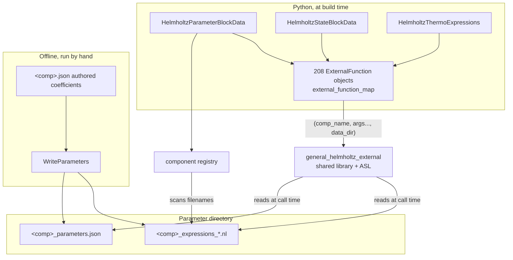
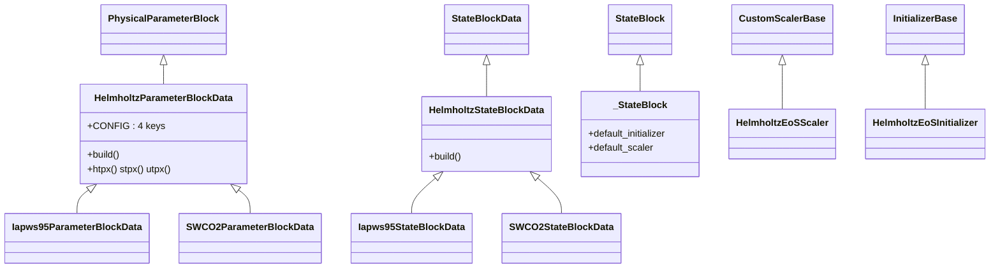
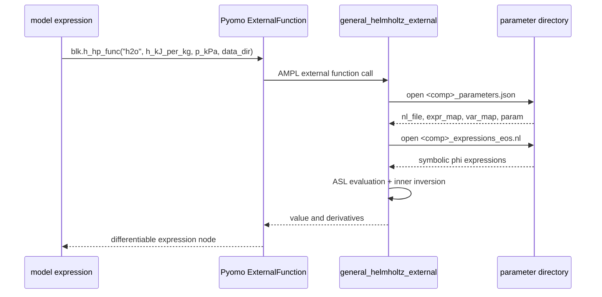
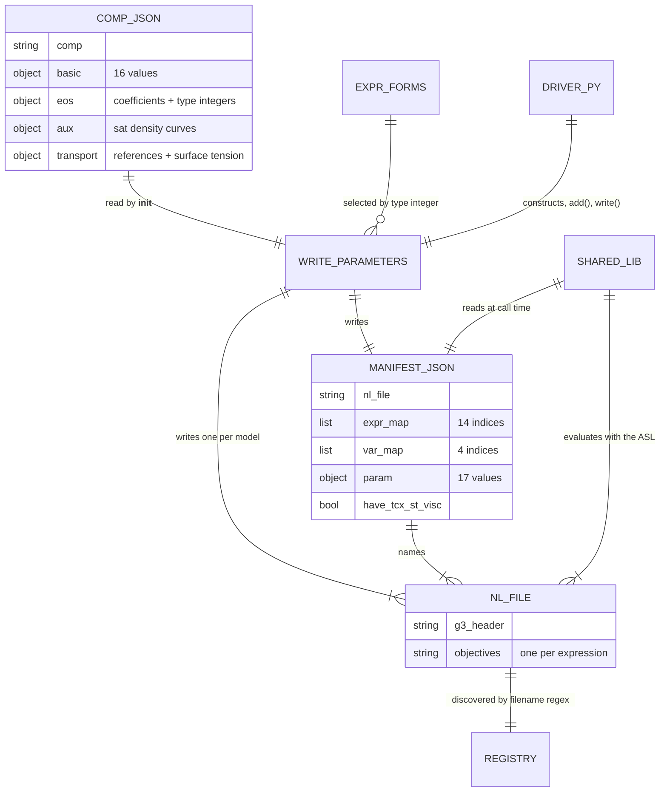

# 16 — General Helmholtz property system

> **Doc ID** 16 · **Repo SHA** 70a8f4fe1 (IDAES-PSE v2.13.0rc0) · **Source roots** `idaes/models/properties/general_helmholtz/**`, `idaes/models/properties/helmholtz/**`, `idaes/models/properties/iapws95.py`, `idaes/models/properties/swco2.py`, `idaes/models/properties/__init__.py`
> **Owns** 36 modules / 9,228 LOC · **Assets** 54 parameter files (263,772 bytes), §10 · **Siblings** [05](05_property_and_reaction_framework.md), [15](15_property_package_catalog.md), [20](20_power_generation_helmholtz_units_and_soc.md), [28](28_data_and_file_format_inventory.md), [30](30_numerics_and_solver_interface_map.md), [31](31_extension_point_catalog.md)

This package implements the property-package contract of
[05](05_property_and_reaction_framework.md) without using the modular framework
of [12](12_modular_properties_generic_framework.md). It writes almost no
thermodynamics in Python. Instead it declares 208 Pyomo `ExternalFunction`
objects bound to one compiled shared library, and that library reads its own
coefficient data from files on disk, keyed by a component name string that
travels as the first argument of every call. Those files are produced by an
offline generator that also lives in this package, and both the generator and
its output are tracked in the repository.

---

## 0. Scope and source map

| File | LOC | Purpose | Covered in § |
|---|---:|---|---|
| `idaes/models/properties/general_helmholtz/helmholtz_functions.py` | 2,466 | Library binding, the three enumerations, `HelmholtzThermoExpressions`, `HelmholtzParameterBlockData` | 2, 3, 4, 5, 6, 7, 10, 11 |
| `idaes/models/properties/general_helmholtz/helmholtz_state.py` | 1,827 | `HelmholtzStateBlockData`, `_StateBlock`, the Scaler and the Initializer | 3, 5, 6, 7, 9, 11 |
| `idaes/models/properties/general_helmholtz/helmholtz_functions_map.py` | 1,227 | `external_function_map` — 208 entries naming the compiled functions and their units | 5, 10 |
| `idaes/models/properties/general_helmholtz/helmholtz_parameters.py` | 519 | `WriteParameters` — the offline generator that writes the NL and manifest files | 5, 7, 9, 10, 11 |
| `idaes/models/properties/general_helmholtz/expressions/phi_residual_type05.py` | 285 | Residual dimensionless Helmholtz energy, form 5 | 9, 10 |
| `idaes/models/properties/general_helmholtz/components/registry.py` | 251 | `_components`, `_ComponentStruct` and the twelve registry functions | 2, 5, 7 |
| `idaes/models/properties/general_helmholtz/components/parameters/h2o.py` | 220 | Water driver; embeds the IAPWS R15-11 and R12-08 transport coefficients | 5, 10, 12 |
| `idaes/models/properties/general_helmholtz/components/parameters/propane.py` | 201 | Propane driver with transport rules | 5, 10 |
| `idaes/models/properties/general_helmholtz/components/parameters/r134a.py` | 194 | R-134a driver with transport rules | 5, 10 |
| `idaes/models/properties/general_helmholtz/expressions/phi_residual_type02.py` | 185 | Residual form 2 | 10 |
| `idaes/models/properties/general_helmholtz/expressions/phi_residual_type03.py` | 176 | Residual form 3 | 10 |
| `idaes/models/properties/general_helmholtz/components/parameters/nh3.py` | 173 | Ammonia driver with transport rules | 10, 12 |
| `idaes/models/properties/general_helmholtz/components/parameters/r1234ze.py` | 154 | R-1234ze(E) driver with transport rules | 10 |
| `idaes/models/properties/general_helmholtz/components/parameters/__init__.py` | 128 | `get_parameter_path`, `set_parameter_path`, `auto_register` | 5, 7, 12 |
| `idaes/models/properties/general_helmholtz/components/parameters/co2.py` | 127 | Carbon dioxide driver with transport rules | 10 |
| `idaes/models/properties/general_helmholtz/expressions/phi_residual_type04.py` | 118 | Residual form 4 | 10 |
| `idaes/models/properties/general_helmholtz/expressions/phi_residual_type01.py` | 113 | Residual form 1 | 10 |
| `idaes/models/properties/iapws95.py` | 87 | `Iapws95ParameterBlock`/`StateBlock`, `htpx`, `iapws95_available` | 2, 3, 4, 7, 12 |
| `idaes/models/properties/swco2.py` | 87 | `SWCO2ParameterBlock`/`StateBlock`, `htpx`, `swco2_available` | 2, 3, 4, 7, 12 |
| `idaes/models/properties/general_helmholtz/expressions/sat_delta_approx.py` | 66 | Three approximate saturated-density curves | 9, 10 |
| `idaes/models/properties/general_helmholtz/expressions/phi_ideal_type02.py` | 58 | Ideal form 2 | 10 |
| `idaes/models/properties/general_helmholtz/expressions/phi_ideal_type04.py` | 56 | Ideal form 4 | 10 |
| `idaes/models/properties/general_helmholtz/expressions/__init__.py` | 55 | The four type-integer dispatch dictionaries | 9, 10 |
| `idaes/models/properties/general_helmholtz/expressions/phi_ideal_type01.py` | 54 | Ideal form 1 | 10 |
| `idaes/models/properties/general_helmholtz/components/parameters/butane.py` | 51 | n-Butane driver, EoS only | 10 |
| `idaes/models/properties/general_helmholtz/components/parameters/isobutane.py` | 51 | Isobutane driver, EoS only | 10 |
| `idaes/models/properties/general_helmholtz/expressions/phi_ideal_type03.py` | 48 | Ideal form 3 | 10 |
| `idaes/models/properties/general_helmholtz/__init__.py` | 45 | The public export surface | 2 |
| `idaes/models/properties/general_helmholtz/components/parameters/r125.py` | 40 | R-125 driver, EoS only | 10 |
| `idaes/models/properties/general_helmholtz/components/parameters/r227ea.py` | 40 | R-227ea driver, EoS only | 10, 12 |
| `idaes/models/properties/general_helmholtz/components/parameters/r32.py` | 40 | R-32 driver, EoS only | 10 |
| `idaes/models/properties/general_helmholtz/expressions/surface_tension_type01.py` | 38 | The single surface-tension form | 10 |
| `idaes/models/properties/general_helmholtz/components/__init__.py` | 32 | Re-export of the registry API | 2 |
| `idaes/models/properties/helmholtz/helmholtz.py` | 16 | Star-import shim over `general_helmholtz` | 2, 12 |
| `idaes/models/properties/__init__.py` | 0 | Empty package marker | 2 |
| `idaes/models/properties/helmholtz/__init__.py` | 0 | Empty package marker | 2, 12 |

Total 9,228 LOC in 36 modules, plus 54 tracked data assets. Four configuration
keys, one `NotImplementedError` hook, three enumerations, fifteen classes, six
`declare_process_block_class` pairs.

---

## 1. Architectural role

A Helmholtz equation of state expresses every thermodynamic property as a
partial derivative of one dimensionless function of reduced density and reduced
temperature. Writing those derivatives as Pyomo expressions produces enormous
symbolic trees and requires an inner solve for every state-variable inversion.
This package avoids both by putting the whole equation of state behind Pyomo
`ExternalFunction` objects backed by a compiled library, so an IDAES model sees
one opaque, differentiable function call per property.

Three layers make that work. The **binding layer** is `helmholtz_functions.py`:
it resolves the library once at import
(`idaes/models/properties/general_helmholtz/helmholtz_functions.py:67`), exposes
the gate `helmholtz_available()` (`:73`), and turns the 208-entry dictionary in
`helmholtz_functions_map.py` into `ExternalFunction` declarations (`:135`). The
**data layer** is `components/`: the compiled library holds no coefficients and
reads them from a directory of JSON and AMPL NL files at call time, so the Python
side discovers what exists by filename pattern
(`idaes/models/properties/general_helmholtz/components/parameters/__init__.py:58`)
and records it in a module-level registry
(`idaes/models/properties/general_helmholtz/components/registry.py:15`). The
**model layer** is `HelmholtzParameterBlockData`
(`idaes/models/properties/general_helmholtz/helmholtz_functions.py:1101`) and
`HelmholtzStateBlockData`
(`idaes/models/properties/general_helmholtz/helmholtz_state.py:405`), the two
halves of the contract of [05](05_property_and_reaction_framework.md). The state
block builds 130 `Expression` objects and between two and four `Var` objects and
constructs no equality constraints except in the temperature-pressure-quality
formulation, which is why its Initializer is a no-op
(`idaes/models/properties/general_helmholtz/helmholtz_state.py:177`).

Beside those sits an **offline generator**, `helmholtz_parameters.py`, which is
not runtime code: it reads an authored coefficient file for one chemical
component, builds a throwaway Pyomo model of the symbolic Helmholtz expressions,
and writes the NL files and the manifest the compiled library later reads.

*Nothing in the Python layer holds a coefficient; the component name string and the data directory string are passed on every call and the compiled library does its own lookup.*

---

## 2. Public surface inventory

| Symbol | Kind | Declared at | Exported via | Stability signal |
|---|---|---|---|---|
| `StateVars` | enum | `idaes/models/properties/general_helmholtz/helmholtz_functions.py:91` | `general_helmholtz`, `iapws95`, `swco2` | `autoclass` in `docs/` |
| `PhaseType` | enum | `idaes/models/properties/general_helmholtz/helmholtz_functions.py:107` | `general_helmholtz`, `iapws95`, `swco2` | `autoclass` in `docs/`; name collides, §12 |
| `AmountBasis` | enum | `idaes/models/properties/general_helmholtz/helmholtz_functions.py:123` | `general_helmholtz`, `iapws95`, `swco2` | `autoclass` in `docs/` |
| `helmholtz_available` | function | `idaes/models/properties/general_helmholtz/helmholtz_functions.py:73` | `general_helmholtz` | no underscore; the gate in [30 §10.2](30_numerics_and_solver_interface_map.md#102-index-table-1-external-shared-libraries) |
| `add_helmholtz_external_functions` | function | `idaes/models/properties/general_helmholtz/helmholtz_functions.py:135` | `general_helmholtz` | no underscore; not autodoc'd |
| `helmholtz_data_dir` | module constant | `idaes/models/properties/general_helmholtz/helmholtz_functions.py:87` | `general_helmholtz` | evaluated once at import |
| `HelmholtzThermoExpressions` | class | `idaes/models/properties/general_helmholtz/helmholtz_functions.py:167` | `general_helmholtz`, `iapws95`, `swco2` | `autoclass` in `docs/` |
| `HelmholtzParameterBlockData` | class | `idaes/models/properties/general_helmholtz/helmholtz_functions.py:1101` | `general_helmholtz` | `autoclass` in `docs/` |
| `HelmholtzParameterBlock` | generated container | synthesized at `idaes/models/properties/general_helmholtz/helmholtz_functions.py:1101` | `general_helmholtz` | `autoclass` in `docs/` |
| `HelmholtzStateBlockData` | class | `idaes/models/properties/general_helmholtz/helmholtz_state.py:405` | `general_helmholtz` | `autoclass` in `docs/` |
| `HelmholtzStateBlock` | generated container | synthesized at `idaes/models/properties/general_helmholtz/helmholtz_state.py:405` | `general_helmholtz` | `autoclass` in `docs/` |
| `HelmholtzEoSInitializer` | class | `idaes/models/properties/general_helmholtz/helmholtz_state.py:165` | `general_helmholtz` | `autoclass` in `docs/` |
| `HelmholtzEoSScaler` | class | `idaes/models/properties/general_helmholtz/helmholtz_state.py:57` | module path only | not re-exported, not autodoc'd |
| `_StateBlock` | class | `idaes/models/properties/general_helmholtz/helmholtz_state.py:196` | module path only | leading underscore; imported by name in `iapws95.py:37` |
| `get_parameter_path` | function | `idaes/models/properties/general_helmholtz/components/parameters/__init__.py:30` | `general_helmholtz` | `autofunction` in `docs/` |
| `set_parameter_path` | function | `idaes/models/properties/general_helmholtz/components/parameters/__init__.py:45` | `general_helmholtz` | `autofunction` in `docs/` |
| `auto_register` | function | `idaes/models/properties/general_helmholtz/components/parameters/__init__.py:58` | `components.parameters` only | not re-exported by the package `__init__` |
| `register_helmholtz_component` | function | `idaes/models/properties/general_helmholtz/components/registry.py:69` | `general_helmholtz`, `components` | not autodoc'd |
| `remove_component` | function | `idaes/models/properties/general_helmholtz/components/registry.py:105` | `components` only | absent from the package `__init__` |
| `clear_component_registry` | function | `idaes/models/properties/general_helmholtz/components/registry.py:122` | `general_helmholtz`, `components` | `autofunction` in `docs/` |
| `registered_components`, `component_registered` | functions | `idaes/models/properties/general_helmholtz/components/registry.py:127`, `:177` | `general_helmholtz`, `components` | `autofunction` in `docs/` |
| `viscosity_available`, `thermal_conductivity_available`, `surface_tension_available` | functions | `idaes/models/properties/general_helmholtz/components/registry.py:132`, `:147`, `:162` | `general_helmholtz`, `components` | `autofunction` in `docs/` |
| `eos_reference`, `viscosity_reference`, `thermal_conductivity_reference`, `surface_tension_reference` | functions | `idaes/models/properties/general_helmholtz/components/registry.py:190`, `:206`, `:222`, `:238` | `general_helmholtz`, `components` | `autofunction` in `docs/` |
| `WriteParameters` | class | `idaes/models/properties/general_helmholtz/helmholtz_parameters.py:48` | module path only | `autoclass` in `docs/` |
| `external_function_map` | dict | `idaes/models/properties/general_helmholtz/helmholtz_functions_map.py:21` | module path only | imported under the alias `_external_function_map` at `helmholtz_functions.py:50` |
| `iapws95_available` | function | `idaes/models/properties/iapws95.py:43` | `iapws95` | alias for `helmholtz_available` |
| `swco2_available` | function | `idaes/models/properties/swco2.py:43` | `swco2` | alias for `helmholtz_available` |
| `htpx` | function | `idaes/models/properties/iapws95.py:50`, `idaes/models/properties/swco2.py:50` | `iapws95`, `swco2` | two functions of the same name, §12 |
| `Iapws95ParameterBlockData`/`Iapws95ParameterBlock`, `Iapws95StateBlockData`/`Iapws95StateBlock` | class pairs | `idaes/models/properties/iapws95.py:72`, `:86` | `iapws95` | `autoclass` in `docs/` |
| `SWCO2ParameterBlockData`/`SWCO2ParameterBlock`, `SWCO2StateBlockData`/`SWCO2StateBlock` | class pairs | `idaes/models/properties/swco2.py:72`, `:86` | `swco2` | `autoclass` in `docs/` |

`idaes/models/properties/general_helmholtz/__init__.py:13` re-exports ten names
from `helmholtz_functions`, three from `helmholtz_state`, two from
`components.parameters` and eleven from `components.registry`. Neither
`HelmholtzEoSScaler`, `remove_component` nor `auto_register` is among them.

---

## 3. Class hierarchy and type taxonomy

*Three parameter-block/state-block pairs sit on one implementation; the two named packages add nothing but a pinned component string.*

| Class | Base(s) | Declared at | Decorator | Container class | Key overrides |
|---|---|---|---|---|---|
| `StateVars` | `enum.Enum` | `helmholtz_functions.py:91` | none | — | four members |
| `PhaseType` | `enum.Enum` | `helmholtz_functions.py:107` | none | — | four members |
| `AmountBasis` | `enum.Enum` | `helmholtz_functions.py:123` | none | — | two members |
| `HelmholtzThermoExpressions` | `object` | `helmholtz_functions.py:167` | none | — | 57 methods, 52 of them public |
| `HelmholtzParameterBlockData` | `PhysicalParameterBlock` | `helmholtz_functions.py:1101` | `@declare_process_block_class("HelmholtzParameterBlock")` | `HelmholtzParameterBlock` | `build`, `define_metadata`, `initialize` |
| `HelmholtzEoSScaler` | `CustomScalerBase` | `helmholtz_state.py:57` | none | — | `variable_scaling_routine`, `constraint_scaling_routine` |
| `HelmholtzEoSInitializer` | `InitializerBase` | `helmholtz_state.py:165` | none | — | `initialize` |
| `_StateBlock` | `StateBlock` | `helmholtz_state.py:196` | none | — | `initialize`, `release_state`, `fix_initialization_states` |
| `HelmholtzStateBlockData` | `StateBlockData` | `helmholtz_state.py:405` | `@declare_process_block_class("HelmholtzStateBlock", block_class=_StateBlock)` | `HelmholtzStateBlock` | `build`, the four `get_*_terms`, `define_state_vars` |
| `WriteParameters` | `object` | `helmholtz_parameters.py:48` | none | — | three class-level index tables |
| `_ComponentStruct` | `object` | `components/registry.py:18` | none | — | `__init__` only |
| `Iapws95ParameterBlockData` | `HelmholtzParameterBlockData` | `iapws95.py:72` | `@declare_process_block_class("Iapws95ParameterBlock")` | `Iapws95ParameterBlock` | pins `pure_component` |
| `Iapws95StateBlockData` | `HelmholtzStateBlockData` | `iapws95.py:86` | `@declare_process_block_class("Iapws95StateBlock", block_class=_StateBlock)` | `Iapws95StateBlock` | none |
| `SWCO2ParameterBlockData` | `HelmholtzParameterBlockData` | `swco2.py:72` | `@declare_process_block_class("SWCO2ParameterBlock")` | `SWCO2ParameterBlock` | pins `pure_component` |
| `SWCO2StateBlockData` | `HelmholtzStateBlockData` | `swco2.py:86` | `@declare_process_block_class("SWCO2StateBlock", block_class=_StateBlock)` | `SWCO2StateBlock` | none |

`Iapws95StateBlockData` and `SWCO2StateBlockData` declare no methods and no
`CONFIG` at all. Their only content is the decorator, which reuses `_StateBlock`
as the container so the named packages inherit the same `initialize` and
`release_state`.

### 3.1 The three enumerations

| Class | Member | Value | Meaning | Consumed at |
|---|---|---|---|---|
| `StateVars` | `PH` | 1 | Pressure and enthalpy | `helmholtz_functions.py:316`, `helmholtz_state.py:461` |
| `StateVars` | `PS` | 2 | Pressure and entropy | `helmholtz_functions.py:316`, `helmholtz_state.py:517` |
| `StateVars` | `PU` | 3 | Pressure and internal energy | `helmholtz_functions.py:316`, `helmholtz_state.py:577` |
| `StateVars` | `TPX` | 4 | Temperature, pressure and vapour fraction | `helmholtz_state.py:635`, `:789` |
| `PhaseType` | `MIX` | 1 | One phase named `Mix`, carrying a vapour fraction | `helmholtz_functions.py:1452` |
| `PhaseType` | `LG` | 2 | Separate `Liq` and `Vap` phases | `helmholtz_functions.py:1455` |
| `PhaseType` | `L` | 3 | Liquid only | `helmholtz_functions.py:1459` |
| `PhaseType` | `G` | 4 | Vapour only | `helmholtz_functions.py:1462` |
| `AmountBasis` | `MOLE` | 1 | Extensive quantities in moles | `helmholtz_state.py:428`, `:1622` |
| `AmountBasis` | `MASS` | 2 | Extensive quantities in kilograms | `helmholtz_state.py:436`, `:1627` |

Declared at `idaes/models/properties/general_helmholtz/helmholtz_functions.py:91`,
`:107` and `:123`. `_state_vars` (`:247`) returns a `StateVars` member to say
which inversion family the caller's arguments select. `AmountBasis` selects which
of `flow_mol`/`flow_mass` is a `Var` and which an `Expression`, and that choice
runs through every extensive property. `PhaseType` is the second class of that
name in the tree and its member set is disjoint from the first; see §12.

---

## 4. Configuration reference

Four keys, all on one declaration. The state block adds nothing: it uses
`StateBlockData.CONFIG` unchanged, whose three keys are documented in
[05 §4.2](05_property_and_reaction_framework.md#42-stateblockdataconfig).

### 4.1 `HelmholtzParameterBlockData.CONFIG`

`PhysicalParameterBlock.CONFIG()` extended at
`idaes/models/properties/general_helmholtz/helmholtz_functions.py:1107`.

| Key | Domain / validator | Default | Req. | Effect on build | Anchor |
|---|---|---|---|---|---|
| `pure_component` | `str` | `None` | yes in practice | The component name string passed as the first argument of every external function call; `build` raises when it is not in the registry | `:1109` |
| `phase_presentation` | `In(PhaseType)` | `PhaseType.MIX` | no | Selects which `Phase` objects are created and how many entries `private_phase_list` holds | `:1118` |
| `state_vars` | `In(StateVars)` | `StateVars.PH` | no | Selects which two or three quantities become `Var` objects and which external function family inverts them | `:1140` |
| `amount_basis` | `In(AmountBasis)` | `AmountBasis.MOLE` | no | Selects mole or mass units for every extensive quantity | `:1159` |

`pure_component` carries no default and no required flag, so omitting it reaches
`component_registered(None)`, and `build` raises `ConfigurationError`
(`:1472`) rather than a type error.

### 4.2 The two pinned subclasses

| Key | Inherited from | Override |
|---|---|---|
| `pure_component` | `HelmholtzParameterBlockData.CONFIG` | `iapws95.py:76` sets the value to `"H2O"`, `:79` reassigns the private `_default` attribute of the `ConfigValue` so the key also reports `"H2O"` as its default |
| `pure_component` | `HelmholtzParameterBlockData.CONFIG` | `swco2.py:76` and `:79` do the same with `"CO2"` |

Neither subclass declares a key of its own. The `_default` assignment is guarded
by an explicit `pylint: disable=protected-access` in both files.

---

## 5. Construction and call sequences

### 5.1 Import-time sequence

Importing `idaes.models.properties.general_helmholtz` runs four steps at module
scope in `helmholtz_functions.py`, in this order:

1. `_flib = find_library("general_helmholtz_external")` (`:67`) followed by
   `ctypes.cdll.LoadLibrary(_flib)` (`:68`), both inside one `try`; any exception
   sets `_flib = None` (`:70`). The load is a probe — the handle is discarded and
   Pyomo later opens the library itself by path.
2. `_data_dir = _get_data_dir()` (`:86`) and the public alias
   `helmholtz_data_dir = _data_dir` (`:87`). `_get_data_dir` (`:58`) joins
   `get_parameter_path()` with `""`, appending a trailing separator.
3. `auto_register()` (`:88`), which scans that directory and fills the component
   registry — §5.2.
4. `external_function_map` arrives from `helmholtz_functions_map` under the alias
   `_external_function_map` (`:50`); that module imports only
   `pyomo.environ.units`, so the map exists whether or not the library does.

`helmholtz_available()` (`:73`) returns `False` when `_flib` is `None`, and also
when the data directory does not exist, logging an ERROR line first (`:81`).
Both halves have to hold. This matches the gate table in
[30 §10.2](30_numerics_and_solver_interface_map.md#102-index-table-1-external-shared-libraries).

### 5.2 Component discovery and registration

`auto_register`
(`idaes/models/properties/general_helmholtz/components/parameters/__init__.py:58`):

1. `pth = get_parameter_path()` (`:60`). `get_parameter_path` (`:30`) reads
   `idaes.cfg.properties.helmholtz.parameter_file_path` (declared at
   `idaes/config.py:267`, owned by
   [02 §4.3](02_runtime_platform_and_cli.md#43-propertieshelmholtz)) and falls
   back to `this_file_dir()` when it is `None`.
2. `clear_component_registry()` (`:61`), so the function is idempotent.
3. `os.listdir(pth)` (`:62`) and, per entry,
   `re.fullmatch(r"(.*)_expressions_(.*).nl", fname)` (`:68`) — first capture the
   component name, second one of `eos`, `st`, `tcx`, `visc` (`:72`–`:79`).
4. Non-matching names are tried against `r"(.*).json"` (`:81`), and the file is
   parsed (`:87`) for four literature references (`:90`–`:118`).
5. Every component in the `eos` set is registered (`:119`–`:127`) with three
   booleans derived from set membership.

`register_helmholtz_component` (`components/registry.py:69`) lower-cases the
name (`:93`) and stores a `_ComponentStruct` (`:18`) in the module-level dict
`_components` (`:15`). Every read accessor lower-cases its argument the same
way, so lookups are case-insensitive while the stored keys are not.

A component therefore exists to IDAES because a file named
`<comp>_expressions_eos.nl` is present, not because any code names it. Adding a
directory of such files and calling `set_parameter_path` (`:45`) — which
reassigns the global configuration value and re-runs `auto_register` — is the
whole extension mechanism.

### 5.3 The external function call convention

`add_helmholtz_external_functions(blk, names=None)`
(`idaes/models/properties/general_helmholtz/helmholtz_functions.py:135`) walks
`names`, or every key of the 208-entry map when `names` is `None` (`:146`), skips
any name already present on the block (`:151`), and sets a Pyomo
`ExternalFunction` (`:157`) from four fields of the map entry: `library=_flib`,
`function=fdict["fname"]`, `units=fdict["units"]` and
`arg_units=fdict["arg_units"]`. `arg_units` never includes the data directory:
every call site appends `_get_data_dir()` as one extra, undeclared argument — 143
such calls exist across the two runtime modules — so a function whose `arg_units`
list has three entries is invoked with four arguments (§10.2).

*The component name and the directory path are ordinary function arguments, so parameter selection happens inside the compiled library rather than in the model.*

### 5.4 `HelmholtzParameterBlockData.build`

`build` (`idaes/models/properties/general_helmholtz/helmholtz_functions.py:1466`):

1. `if not self.available()` raises `RuntimeError` (`:1468`); `available()`
   (`:1173`) delegates to `helmholtz_available()`. `super().build()` follows, then
   `component_registered(self.config.pure_component)`, whose negative answer
   raises `ConfigurationError` (`:1472`).
2. `HelmholtzStateBlock` is imported inside the method to break a circular import
   and assigned to `_state_block_class` (`:1482`). `component_list` becomes a
   one-element `Set` (`:1484`); `pure_component` (`:1487`) and `state_vars`
   (`:1489`) are copied onto the block.
3. `phase_equilibrium_idx` (`:1491`) and `phase_equilibrium_list` (`:1492`) are
   assigned; both carry a trailing comma, so both are one-element tuples, and the
   second hard-codes `"H2O"` — §12.
4. `_set_default_scaling()` (`:1494`) registers 62 suffix-based default scaling
   factors; `_create_component_and_phase_objects()` (`:1496`) creates the
   `Component` and `Phase` sub-blocks and `private_phase_list`.
5. `add_helmholtz_external_functions` is called with an explicit 25-entry list
   (`:1498`) naming 21 distinct functions; four repeats are absorbed by the
   `hasattr` guard.
6. 36 calls to `add_param` (`:1806`) follow, the first being `mw` (`:1541`).
   `add_param` evaluates its argument with `pyo.value(expr)` and stores the
   number in an immutable Pyomo `Param`, so **the compiled library executes
   during `build()`**, not at solve time. Twelve of the calls derive enthalpy,
   entropy and internal energy bounds from `hlpt_func`, `slpt_func` and
   `ulpt_func` at the triple point and at the maximum pressure and temperature.
7. `self.uc` (`:1614`) is a plain Python dict of 19 unit-conversion multipliers
   keyed by strings such as `"J/mol to kJ/kg"`; it is not a Pyomo component. When
   `state_vars` is `TPX`, two mutable smoothing `Param` objects close the method
   (`:1792`, `:1799`).

### 5.5 `HelmholtzStateBlockData.build`

`build` (`idaes/models/properties/general_helmholtz/helmholtz_state.py:716`):

1. `super().build(*args)`, then `add_helmholtz_external_functions(self)` (`:725`)
   **with no name list**, so all 208 `ExternalFunction` objects are attached to
   every state block.
2. `state_vars` and `amount_basis` are copied from the parameter block (`:728`,
   `:730`); `phlist` is the private phase list, `pub_phlist` the public one
   (`:732`, `:734`). Eight `Expression` objects mirror parameter-block `Param`
   values locally (`:746`–`:768`) so scaling factors can attach to them.
3. `_state_vars()` (`:411`) creates the flow variable, `pressure`, the second
   state variable and, under `TPX`, `temperature` and `vapor_frac`, and fills
   `_state_vars_dict`, `extensive_set` and `intensive_set`. `temperature_sat`
   (`:779`) and `pressure_sat` (`:784`) follow from `t_sat_func` and
   `p_sat_t_func`.
4. For `TPX` with more than one phase, `_tpx_phase_eq()` (`:673`) adds two
   smooth-max expressions, the complementarity `Constraint` (`:692`, omitted when
   `defined_state` is true) and `eq_sat` (`:711`), which is created and
   immediately deactivated (`:714`).
5. A state-variable dictionary is built (`:793`–`:801`) and copied into liquid
   and vapour variants (`:806`, `:808`); under `TPX` the copies receive different
   pressures (`:816`, `:817`).
6. `self.expression_writer = HelmholtzThermoExpressions(self, params)` (`:819`),
   then roughly a hundred `Expression` declarations, each one call to that writer
   with `convert_args=False`.
7. Transport properties are conditional: `visc_d_phase` and `visc_k_phase` under
   `viscosity_available(cmp)` (`:1550`), `therm_cond_phase` under
   `thermal_conductivity_available(cmp)` (`:1590`), `surf_tens` under
   `surface_tension_available(cmp)` (`:1608`). Three balance-term `Expression`
   objects close the method (`:1638`, `:1659`, `:1680`); the four `get_*_terms`
   methods index into them.

### 5.6 `HelmholtzThermoExpressions` dispatch

Anchors here resolve against
`idaes/models/properties/general_helmholtz/helmholtz_functions.py`.
`_validate_args` (`:218`) accepts exactly `{T, p, x}`, or one of
`{T, p}`, `{h, p}`, `{s, p}`, `{u, p}`, `{T, x}`, `{p, x}`; anything else raises
`RuntimeError` (`:231`, `:243`).

`_state_vars` (`:247`) converts pressure to kPa through `uc["Pa to kPa"]` and the
energy argument to kJ/kg, and returns a seven-tuple whose first element is the
`StateVars` member. Two branches call the library themselves: `{T, x}` obtains
pressure from `p_sat_t_func` (`:306`) and `{p, x}` obtains temperature from
`t_sat_func` (`:310`).

`_generic_prop` (`:316`) takes five function names — one per inversion family
plus a liquid/vapour pair for `TPX` — selects one by the returned enumeration
member, and multiplies by `mass_uc` or `mole_uc` according to `result_basis`.
`_generic_prop_phase` (`:351`) is the single-phase variant with one `tp` function
instead of two. The 30 property methods from `s` (`:435`) to `w_vap` (`:809`) are
one call to one of these two each. `convert_args=False`, used at every call site
inside the state block, suppresses the unit conversions because the state block
has already produced `p_kPa` and `h_kJ_per_kg`.

### 5.7 The offline generator

`WriteParameters` is not imported by any runtime module; the only in-tree
callers are the eleven per-component drivers and the test file that drives them
with `dry_run=True`.

1. `WriteParameters(parameters=<path>)` (`helmholtz_parameters.py:90`) loads the
   authored JSON with `_parse_int_key` (`:32`) as `object_pairs_hook`, turning
   `"3"` back into `3` and `"(2, 1)"` back into `(2, 1)` — JSON cannot store
   integer or tuple keys and the coefficient tables are indexed by them. The
   sixteen `basic` entries become attributes (`:115`–`:131`) and
   `reference_state_offset` defaults to `[0.0, 0.0]` when absent (`:136`).
2. `make_model` (`:278`) creates four Pyomo models: `model`, `model_tcx` and
   `model_visc` over `delta` and `tau`, and `model_st` over `tau` alone (`:147`),
   because surface tension is a function of temperature only. Each carries the
   sixteen basic values as Pyomo `Param` objects.
3. The symbolic forms are selected by integer from the four dispatch dicts in
   `expressions/__init__.py:28`: `phi_ideal_types[...]` (`:154`),
   `phi_residual_types[...]` (`:166`), `delta_sat_types[...]` (`:183`, `:195`)
   and `surface_tension_types[...]` (`:209`). A `0` or a missing key means the
   driver supplies the expression itself.
4. The driver calls `add({...})` (`:310`) with any transport rules it carries;
   `add` routes each name to the right model, wraps it in a Pyomo `Objective`
   (`:333` for a callable rule, `:335` for an expression) and records the name
   (`:336`). An unknown name raises `RuntimeError` (`:331`).
5. `write()` (`:448`) recomputes the critical pressure from the expressions and
   overwrites the authored value (`:462`, `:466`), checks that all fourteen
   required expressions are present (`:467`), then calls `write_model` (`:418`).
   `write_model` calls `model.write(f"{self.comp}_expressions_{model_name}.nl")`
   (`:429`), which returns the file name and a symbol-map identifier; symbols
   beginning `v` give NL variable indices and those beginning `o` give NL
   objective indices, and two loops invert them into `var_map` (`:434`–`:437`)
   and `expr_map` (`:440`–`:444`). `var_map` starts as `[1000] * 4` (`:433`), so
   a slot for an unused variable keeps the sentinel `1000`.
6. The manifest dict is assembled (`:473`) and the optional models written in a
   loop over `optional_expressions` (`:499`), each contributing
   `nl_file_<short>`, `var_map_<short>` and `have_<short>` or, when absent, only
   `have_<short>: false` plus a WARNING line (`:507`). `approx_sat_curves`
   (`:338`) then logs a fifteen-row check of the initial-guess curves.

---

## 6. Data structures, variables, constraints and invariants

### 6.1 Components on a `HelmholtzParameterBlock`

| Component | Type | Index sets | Units | Created at | Condition |
|---|---|---|---|---|---|
| `component_list` | `Set` | — | — | `helmholtz_functions.py:1484` | always; one member |
| `<pure_component>` | `Component` | — | — | `:1450` | one per `component_list` entry |
| `private_phase_list` | `Set` | — | — | `:1453`, `:1456`, `:1460`, `:1463` | always |
| `Mix` | `Phase` | — | — | `:1454` | `phase_presentation == MIX` |
| `Liq` | `LiquidPhase` | — | — | `:1457`, `:1461` | `LG` or `L` |
| `Vap` | `VaporPhase` | — | — | `:1458`, `:1464` | `LG` or `G` |
| 21 `*_func` | `ExternalFunction` | — | per map entry | `:1498` | always |
| `mw`, `sgc`, `sgc_mol`; the five pressure and six temperature values; the four reduced and critical densities | `Param` | — | kg/mol, J/kg/K, Pa, K, kg/m³, mol/m³ | `:1539`–`:1611` | always |
| `enthalpy_*_min/max`, `entropy_*_min/max`, `energy_internal_*_min/max` and six `default_*_value` | `Param` | — | J/mol or J/kg | `:1635`–`:1779` | always |
| `smoothing_pressure_over`, `smoothing_pressure_under` | `Param`, mutable | — | Pa | `:1792`, `:1799` | `state_vars == TPX` |

`default_pressure_bounds` and the five other `default_*_bounds` are plain Python
tuples of `Param` objects, not Pyomo components. `uc` (`:1614`) is a plain dict.

### 6.2 Components on a `HelmholtzStateBlock`

The state block creates 11 `Var` declarations across the mutually exclusive
state-variable branches, 130 `Expression` declarations and 2 `Constraint`
declarations. Which variables appear depends on `state_vars` and
`amount_basis`.

| Component | Type | Index sets | Units | Created at | Condition |
|---|---|---|---|---|---|
| `flow_mol` | `Var` | — | mol/s | `helmholtz_state.py:429` | `amount_basis == MOLE` |
| `flow_mass` | `Var` | — | kg/s | `:436` | `amount_basis == MASS` |
| the other of the pair | `Expression` | — | — | `:432`, `:439` | always |
| `pressure` | `Var`, `PositiveReals` | — | Pa | `:443` | always |
| `p_kPa` | `Expression` | — | kPa | `:450` | always |
| `enth_mol` / `enth_mass` | `Var` | — | J/mol, J/kg | `:463`, `:491` | `state_vars == PH` |
| `entr_mol` / `entr_mass` | `Var` | — | J/mol/K, J/kg/K | `:519`, `:549` | `state_vars == PS` |
| `energy_internal_mol` / `energy_internal_mass` | `Var` | — | J/mol, J/kg | `:579`, `:607` | `state_vars == PU` |
| `temperature` | `Var` under `TPX` (`:637`), else `Expression` | — | K | `:472`, `:500`, `:528`, `:558`, `:588`, `:616` | always |
| `vapor_frac` | `Var` under `TPX` with two phases (`:645`), else `Expression` | — | dimensionless | `:453`, `:457`, `:477`, `:505`, `:535`, `:565`, `:593`, `:621` | always |
| `pressure_under_sat`, `pressure_over_sat` | `Expression` | — | Pa | `:682`, `:686` | `TPX`, two phases |
| `eq_complementarity` | `Constraint` | — | — | `:692` | `TPX`, two phases, not `defined_state` |
| `pressure_phase` | `Expression` | `private_phase_list` | Pa | `:708` | `TPX`, two phases |
| `eq_sat` | `Constraint` | — | — | `:711` | `TPX`, two phases; deactivated at `:714` |
| `temperature_sat`, `pressure_sat` | `Expression` | — | K, Pa | `:779`, `:784` | always |
| eight saturated-phase families (`enth_mol_sat_phase` … `volume_mass_sat_phase`), `phase_frac` and fifteen per-phase families (`energy_internal_mol_phase` … `dens_mass_phase`) | `Expression` | `private_phase_list` | per quantity | `:832`–`:951`, `:1042`, `:1056`–`:1285` | always |
| six vaporisation deltas (`dh_vap_mol` … `du_vap_mass`) | `Expression` | — | per quantity | `:958`–`:1023` | always |
| `flow_mol_comp`, `flow_mass_comp` | `Expression` | `component_list` | mol/s, kg/s | `:1295`, `:1304` | always |
| twelve mixture quantities (`enth_mass` … `dens_mol`), `heat_capacity_ratio`, `flow_vol` | `Expression` | — | per quantity | `:1317`–`:1532` | always; four variants by state-variable set |
| `mole_frac_phase_comp`, `mass_frac_phase_comp` | `Expression` | phase-component | dimensionless | `:1543`, `:1546` | always |
| `visc_d_phase`, `visc_k_phase` | `Expression` | `private_phase_list` | Pa·s, m²/s | `:1562`, `:1584` | `viscosity_available(cmp)` |
| `therm_cond_phase` | `Expression` | `private_phase_list` | W/m/K | `:1602` | `thermal_conductivity_available(cmp)` |
| `surf_tens` | `Expression` | `private_phase_list` | N/m | `:1609` | `surface_tension_available(cmp)` |
| `material_flow_terms`, `enthalpy_flow_terms`, `energy_density_terms` | `Expression` | `phase_list` | per quantity | `:1638`, `:1659`, `:1680` | always |
| 208 `*_func` | `ExternalFunction` | — | per map entry | `:725` | always |

| Python structure | Type | Held on | Purpose |
|---|---|---|---|
| `_state_vars_dict` | `dict` | state block | Returned verbatim by `define_state_vars` (`:1748`) |
| `extensive_set`, `intensive_set` | `ComponentSet` | state block | Returned by `extensive_state_vars` (`:1771`) and `intensive_state_vars` (`:1775`) |
| `expression_writer` | `HelmholtzThermoExpressions` | state block | Source of every property expression (`:819`) |
| `uc` | `dict` of 19 multipliers | parameter block | Unit conversion between the package and the library (`helmholtz_functions.py:1614`) |
| `_components` | `dict` of `_ComponentStruct` | `registry` module | The component registry (`components/registry.py:15`) |
| `external_function_map` | `dict` of 208 dicts | `helmholtz_functions_map` module | Function names, units and argument units |
| `variables`, `expressions`, `optional_expressions` | class-level `dict` | `WriteParameters` | The NL file index contract (`helmholtz_parameters.py:55`, `:63`, `:84`) |

### 6.3 Invariants

| Invariant | Enforced at |
|---|---|
| The library loaded and the data directory exists before a parameter block or a `HelmholtzThermoExpressions` is built | `helmholtz_functions.py:1468`, `:201` |
| The configured component is present in the registry | `helmholtz_functions.py:1472` |
| The argument set of an expression-writer call is one of seven accepted sets | `helmholtz_functions.py:231`, `:243` |
| Vapour fraction is not derivable from temperature and pressure alone | `helmholtz_functions.py:340`, `:432`, `:448`, `:498`, `:548` |
| A transport property is requested only for a component that has one | `helmholtz_functions.py:825`, `:842`, `:858`, `:876`, `:893`, `:909`, `:925` |
| `htpx`/`stpx`/`utpx` receive exactly two of `T`, `p`, `x`, each inside the library's declared bounds | `helmholtz_functions.py:1229`, `:1235`, `:1238`, `:1242` |
| A component name registers in lower case and resolves in lower case | `components/registry.py:93`, and `:118`–`:248` in the nine accessors |
| Removing an unregistered component raises | `components/registry.py:119` |
| Every one of the fourteen indexed expressions is supplied before an NL file is written | `helmholtz_parameters.py:467` |
| An expression name routes to exactly one of the four generator models | `helmholtz_parameters.py:331` |
| A state block's amount basis is one of the two enumeration members | `helmholtz_state.py:131` |

---

## 7. Method contracts

### 7.1 Module-level functions

| Method | Signature | Preconditions | Effects | Returns | Raises | Anchor |
|---|---|---|---|---|---|---|
| `_get_data_dir` | `()` | — | none | `str` with a trailing separator | — | `helmholtz_functions.py:58` |
| `helmholtz_available` | `()` | — | logs ERROR when the directory is missing | `bool` | — | `helmholtz_functions.py:73` |
| `add_helmholtz_external_functions` | `(blk, names=None)` | `blk` is a Pyomo Block | Sets one `ExternalFunction` per name not already present | `None` | `KeyError` for an unknown name | `helmholtz_functions.py:135` |
| `get_parameter_path` | `()` | — | none | `str` | — | `components/parameters/__init__.py:30` |
| `set_parameter_path` | `(path)` | — | Writes the global configuration value, then re-registers | `None` | propagates from `auto_register` | `components/parameters/__init__.py:45` |
| `auto_register` | `()` | the path exists and is readable | Clears and repopulates `_components` | `None` | `FileNotFoundError`, `JSONDecodeError` | `components/parameters/__init__.py:58` |
| `iapws95_available` / `swco2_available` | `()` | — | none | `bool` | — | `iapws95.py:43`, `swco2.py:43` |
| `htpx` (module level) | `(T=None, P=None, x=None)` | two of three given | Builds a `HelmholtzParameterBlock`, calls `construct()` on it, delegates to its `htpx` | `float`, J/mol | propagates | `iapws95.py:50`, `swco2.py:50` |

### 7.2 The component registry

| Method | Signature | Effects | Returns | Raises | Anchor |
|---|---|---|---|---|---|
| `register_helmholtz_component` | `(comp_str, viscosity=False, thermal_conductivity=False, surface_tension=False, eos_ref=None, viscosity_ref=None, thermal_conductivity_ref=None, surface_tension_ref=None)` | Replaces any entry of the same lower-cased name | `None` | — | `components/registry.py:69` |
| `remove_component` | `(comp_str)` | Deletes the entry | `None` | `KeyError` | `:105` |
| `clear_component_registry` | `()` | Empties the dict | `None` | — | `:122` |
| `registered_components` | `()` | none | `list` of names | — | `:127` |
| `viscosity_available` / `thermal_conductivity_available` / `surface_tension_available` | `(comp_str)` | none | `bool`; `False` for an unregistered name | — | `:132`, `:147`, `:162` |
| `component_registered` | `(comp_str)` | none | `bool` | — | `:177` |
| `eos_reference` / `viscosity_reference` / `thermal_conductivity_reference` / `surface_tension_reference` | `(comp_str)` | none | `str` or `None` | — | `:190`, `:206`, `:222`, `:238` |

`_ComponentStruct.__init__` (`:21`) normalises each reference: a `str` or `None`
passes through, anything else is joined with newlines (`:51`, `:55`, `:62`, `:66`).

### 7.3 `HelmholtzThermoExpressions`

| Method | Signature | Preconditions | Effects | Returns | Raises | Anchor |
|---|---|---|---|---|---|---|
| `__init__` | `(self, blk, parameters, amount_basis=None)` | library available | Stores the block, the parameter block and the basis | `None` | `RuntimeError` | `helmholtz_functions.py:187` |
| `add_funcs` | `(self, names=None)` | — | Delegates to `add_helmholtz_external_functions` | `None` | — | `:208` |
| `_validate_args` | `(kwargs)` staticmethod | — | Drops `None` values | `(dict, set)` | `RuntimeError` | `:218` |
| `_state_vars` | `(self, **kwargs)` | — | May add `p_sat_t_func` or `t_sat_func` and call them | 7-tuple | propagates | `:247` |
| `_generic_prop`, `_generic_prop_phase` | `(self, hp_func, up_func, sp_func, tp_liq_func, tp_vap_func, mass_uc, mole_uc, **kwargs)` and the single-`tp` variant | — | Adds the one function each needs | expression | `RuntimeError` when `x` is absent under `TPX` | `:316`, `:351` |
| `p`, `T`, `tau`, `x` | `(self, **kwargs)` | — | `x` raises under `{T, p}` | expression | `RuntimeError` | `:379`, `:386`, `:402`, `:418` |
| 10 mixed-phase properties `s`…`w` and their `_liq`/`_vap` variants | `(self, **kwargs)` | — | one `_generic_prop*` call each | expression | — | `:435`–`:809` |
| `viscosity`, `thermal_conductivity`, `surface_tension` and variants | `(self, **kwargs)` | the component has the model | — | expression | `RuntimeError` naming the component | `:821`–`:939` |
| `p_sat`, `T_sat` | `(self, T)`, `(self, p, convert_args=True)` | — | Adds one function | expression | — | `:940`, `:948` |
| eight `*_sat` accessors | `(self, T=None, p=None, result_basis=None, convert_args=True)` | one of `T`, `p` | — | expression | — | `:955`–`:1081` |

### 7.4 `HelmholtzParameterBlockData`

| Method | Signature | Effects | Returns | Raises | Anchor |
|---|---|---|---|---|---|
| `available` | `(self)` | none | `bool` | — | `:1173` |
| `_suh_tpx` | `(self, T=None, p=None, x=None, units=None, amount_basis=None, with_units=False, prop="h")` | Builds a temporary expression writer, checks bounds, evaluates | `float` or a Pyomo quantity | `RuntimeError` ×4 | `:1179` |
| `htpx` / `stpx` / `utpx` | `(self, T=None, p=None, x=None, units=None, amount_basis=None, with_units=False)` | Delegate to `_suh_tpx` with `prop` fixed | `float` or quantity | propagates | `:1266`, `:1303`, `:1339` |
| `_set_default_scaling` | `(self)` | 62 `set_default_scaling` calls | `None` | — | `:1376` |
| `_create_component_and_phase_objects` | `(self)` | Creates the `Component` and `Phase` sub-blocks and `private_phase_list` | `None` | — | `:1446` |
| `build` | `(self)` | §5.4 | `None` | `RuntimeError`, `ConfigurationError` | `:1466` |
| `add_param` | `(self, name, expr)` | Evaluates `expr` immediately and adds an immutable `Param` | `None` | propagates from the library | `:1806` |
| `initialize` | `(self, *args, **kwargs)` | no-op | `None` | — | `:1822` |
| `dome_data` / `isotherms` | `(self, amount_basis=None, pressure_unit=kPa, energy_unit=kJ, mass_unit=kg, mol_unit=kmol, n=60)` / `(self, temperatures)` | Add external functions to a scratch block and evaluate the saturation dome or isotherms point by point | dicts of lists | — | `:1827`, `:1995` |
| `ph_diagram` / `ts_diagram` / `pt_diagram`, aliased as `hp_diagram` / `st_diagram` / `tp_diagram` | `(self, ylim=None, xlim=None, …)` | Draw with `matplotlib.pyplot` | figure, axis | — | `:2096`, `:2218`, `:2292`, `:2374`–`:2376` |
| `define_metadata` | `(cls, obj)` classmethod | 45 `add_properties` entries, 8 `define_custom_properties` entries, 5 default units | `None` | — | `:2379` |

All 45 standard entries declare `"method": None`, so every property exists
eagerly rather than through on-demand construction — except `temperature_sat`,
whose method is the four-character **string** `"None"` (`:2386`).

### 7.5 `_StateBlock` and `HelmholtzStateBlockData`

| Method | Signature | Effects | Returns | Raises | Anchor |
|---|---|---|---|---|---|
| `_StateBlock._set_fixed` | `(v, f)` staticmethod | Fixes or unfixes | `None` | — | `helmholtz_state.py:207` |
| `_StateBlock._set_not_fixed` | `(v, state, key, hold)` staticmethod | Writes a value from `state_args` if the variable is free, then optionally fixes | `None` | — | `:214` |
| `_StateBlock.fix_initialization_states` | `(self)` | `fix_state_vars(self)` | `None` | — | `:224` |
| `_StateBlock.initialize` | `(self, *args, **kwargs)` | Sets values and optionally holds; eight branches over `state_vars` × `amount_basis` | `dict` of flag tuples | — | `:234` |
| `_StateBlock.release_state` | `(self, flags, **kwargs)` | Restores the recorded fixed state | `None` | — | `:355` |
| `HelmholtzStateBlockData._state_vars` | `(self)` | §5.5 step 3; warns on `MIX` with phase equilibrium | `None` | — | `:411` |
| `_tpx_phase_eq` | `(self)` | Two expressions, one active and one deactivated constraint | `None` | — | `:673` |
| `build` | `(self, *args)` | §5.5 | `None` | propagates | `:716` |
| `get_material_flow_terms`, `get_enthalpy_flow_terms`, `get_energy_density_terms` | `(self, p, j)` / `(self, p)` | none | one `Expression` data object | `KeyError` | `:1684`, `:1695`, `:1726` |
| `get_material_density_terms` | `(self, p, j)` | none | `dens_mol`/`dens_mass` or the phase form | `KeyError` | `:1706` |
| `default_material_balance_type`, `default_energy_balance_type`, `get_material_flow_basis` | `(self)`, `(self)`, `(b)` | none | `componentTotal`, `enthalpyTotal`, `MaterialFlowBasis.molar` | — | `:1737`, `:1741`, `:1745` |
| `define_state_vars`, `define_display_vars`, `model_check` | `(self)` | the third is a no-op | `_state_vars_dict`, a six-entry dict, `None` | — | `:1748`, `:1751`, `:1779` |
| `calculate_scaling_factors` | `(self)` | Propagates suffix scaling onto the three balance-term expressions; two `AttributeError` guards | `None` | — | `:1782` |
| `HelmholtzEoSInitializer.initialize` | `(self, model, output_level=None)` | Records `InitializationStatus.Ok` and returns | status | — | `:177` |
| `HelmholtzEoSScaler.variable_scaling_routine` | `(self, model, overwrite=False, submodel_scalers=None)` | Scales the flow variable, derives a `flow_vol` factor, then walks 52 default names under `lock_attribute_creation_context` | `None` | `NotImplementedError` | `:125` |
| `HelmholtzEoSScaler.constraint_scaling_routine` | `(self, model, overwrite=False, submodel_scalers=None)` | Scales `eq_sat` and `eq_complementarity` when they exist | `None` | — | `:157` |

### 7.6 `WriteParameters`

| Method | Signature | Effects | Returns | Raises | Anchor |
|---|---|---|---|---|---|
| `__init__` | `(self, parameters)` | Loads JSON, builds four models, installs the selected symbolic forms | `None` | `KeyError` for an unknown type integer | `helmholtz_parameters.py:90` |
| `calculate_pressure` / `calculate_enthalpy` / `calculate_entropy` | `(self, rho, T)` | Sets `delta` and `tau`, evaluates | `float` | — | `:217`, `:233`, `:256` |
| `make_model` | `(self, *args)` | One `ConcreteModel` with the named `Var` and sixteen `Param` objects | model | — | `:278` |
| `add` | `(self, expressions)` | Attaches each expression as a Pyomo `Objective` on the right model | `None` | `RuntimeError` | `:310` |
| `approx_sat_curves` | `(self, trange)` | Logs a table at INFO | two lists | — | `:338` |
| `calculate_reference_offset` | `(self, delta, tau, s0, h0)` | none | `(float, float)` | — | `:384` |
| `write_model` | `(self, model, model_name, expressions=None)` | Writes one NL file and inverts the symbol map | `(str, list or None, list)` | — | `:418` |
| `write` | `(self, dry_run=False)` | Writes the NL files and the manifest; returns early when `dry_run` | `None` | `RuntimeError` | `:448` |

---

## 8. Cross-subsystem interactions

### Calls out to

| Target | Purpose | Anchor |
|---|---|---|
| `pyomo.common.fileutils.find_library` | Resolves the shared library and, separately, the library path inside the water driver | `helmholtz_functions.py:67`, `components/parameters/h2o.py:87` |
| `ctypes.cdll.LoadLibrary` | The load probe behind the availability gate | `helmholtz_functions.py:68` |
| `pyomo.environ.ExternalFunction` | All 208 declarations, plus four in the water driver | `helmholtz_functions.py:157`, `components/parameters/h2o.py:88`–`:91` |
| `pyomo.environ.units` | Units and argument units for every map entry, and the 19-entry `uc` dict | `helmholtz_functions_map.py:19`, `helmholtz_functions.py:1614` |
| `idaes.core.PhysicalParameterBlock`, `StateBlock`, `StateBlockData` | The contract this package implements | `helmholtz_functions.py:33`, `helmholtz_state.py:25` |
| `idaes.core.Component`, `Phase`, `LiquidPhase`, `VaporPhase` | Chemical component and phase sub-blocks | `helmholtz_functions.py:1450`–`:1465` |
| `idaes.core.declare_process_block_class` | Six process block pairs | `helmholtz_functions.py:1101`, `helmholtz_state.py:405`, `iapws95.py:72`, `:86`, `swco2.py:72`, `:86` |
| `idaes.core.scaling`, `idaes.core.initialization.initializer_base` | The Scaler and Initializer bases, `DefaultScalingRecommendation`, `InitializationStatus` | `helmholtz_state.py:52`, `:48` |
| `idaes.core.util.scaling`, `idaes.core.util.initialization.fix_state_vars` | Suffix-based scaling and state fixing | `helmholtz_state.py:45`, `:47` |
| `idaes.core.util.math.smooth_max` | The complementarity terms, the surface-tension form and the water thermal conductivity | `helmholtz_state.py:23`, `expressions/surface_tension_type01.py:17`, `components/parameters/h2o.py:22` |
| `idaes.core.util.exceptions.ConfigurationError` | Unsupported component | `helmholtz_functions.py:31` |
| `idaes.cfg.properties.helmholtz.parameter_file_path` | The data directory override | `components/parameters/__init__.py:39` |
| `matplotlib.pyplot` | Imported at module scope for the three diagram methods | `helmholtz_functions.py:21` |
| `idaes.logger` | Four of the five module loggers, §11 | §11 |

### Called by

| Caller | What it relies on | Owning doc |
|---|---|---|
| The Helmholtz unit models under `models_extra/power_generation/unit_models/helm/` | `idaes.models.properties.helmholtz.helmholtz`, the star-import shim | [20](20_power_generation_helmholtz_units_and_soc.md) |
| `idaes/models_extra/power_generation/unit_models/drum1D.py:61` | `HelmholtzThermoExpressions` and the `general_helmholtz` package | [18](18_power_generation_boiler_island.md) |
| `idaes/models_extra/temperature_swing_adsorption/fixed_bed_tsa0d.py` | `iapws95` | [23](23_tsa_gas_distribution_and_ccu.md) |
| The supercritical and subcritical power plant flowsheets | `iapws95` and `swco2` | [24](24_reference_flowsheets_and_demonstrations.md) |
| Control volumes | `get_material_flow_terms`, `get_enthalpy_flow_terms`, `get_material_density_terms`, `get_energy_density_terms` | [04](04_control_volume_framework.md) |
| The property test harness | `PropertyTestHarness` against all three parameter blocks | [15](15_property_package_catalog.md) |
| The external-library gate index | `helmholtz_available` and the three `ExternalFunction` sites | [30](30_numerics_and_solver_interface_map.md) |
| The asset census | The 54 parameter files of §10 | [28](28_data_and_file_format_inventory.md) |
| The global configuration tree | `properties.helmholtz.parameter_file_path` | [02](02_runtime_platform_and_cli.md) |

Nothing in `idaes/models/unit_models/` imports this package.

---

## 9. Extension and subclassing contracts

One `NotImplementedError` site exists in this scope.

| Hook | Kind | Signature | Resolution order | Base behaviour | Anchor |
|---|---|---|---|---|---|
| `HelmholtzEoSScaler.variable_scaling_routine` | refusal, not a hook | `(self, model, overwrite=False, submodel_scalers=None)` | not overridden | Raises when `model.amount_basis` is neither `MOLE` nor `MASS` | `helmholtz_state.py:131` |

The raise is a domain check inside an implemented method rather than an abstract
method: both enumeration members are handled and the `else` branch is
unreachable through the public configuration surface, because `amount_basis` is
validated by `In(AmountBasis)` (`helmholtz_functions.py:1159`).

Non-raising extension points:

| Hook | Kind | Resolution | Base | Anchor |
|---|---|---|---|---|
| `register_helmholtz_component` | module function | Adds an entry to `_components`, overwriting any of the same name | `auto_register` populates it at import | `components/registry.py:69` |
| `set_parameter_path` | module function | Re-points the data directory and re-runs discovery | the install directory | `components/parameters/__init__.py:45` |
| `properties.helmholtz.parameter_file_path` | global configuration key | Read by `get_parameter_path` on every call | `None` | `idaes/config.py:267` |
| `phi_ideal_types`, `phi_residual_types`, `delta_sat_types`, `surface_tension_types` | integer-keyed dicts | A type integer in the authored JSON selects one of four, five, three and one forms respectively; `0` means the driver supplies the expression itself | `0` in each | `expressions/__init__.py:37`, `:28`, `:45`, `:52` |
| `WriteParameters.add` | method call | A driver supplies `thermal_conductivity`, `surface_tension` or `viscosity` as a Python callable or expression | nothing added | `helmholtz_parameters.py:310` |
| `WriteParameters.expressions` | class attribute | The fourteen names every EoS NL file has to define, and their indices | fixed | `helmholtz_parameters.py:63` |
| `WriteParameters.optional_expressions` | class attribute | The three optional names and their file-name abbreviations | fixed | `helmholtz_parameters.py:84` |
| `default_initializer`, `default_scaler` | class attributes on `_StateBlock` | Consulted by the preparation machinery of [06](06_model_preparation_initializers_and_scalers.md) | `HelmholtzEoSInitializer`, `HelmholtzEoSScaler` | `helmholtz_state.py:203`, `:204` |
| `CONFIG.get("pure_component")._default` | private attribute reassignment | How a subclass pins a component | the inherited `None` | `iapws95.py:79`, `swco2.py:79` |

---

## 10. External assets, data files and external libraries

### 10.1 The shared library

| Item | Detail | Anchor |
|---|---|---|
| Library name | `general_helmholtz_external`, not vendored; installed by `idaes get-extensions` | `helmholtz_functions.py:67` |
| Discovery | `find_library`, resolved once at module import into `_flib` | `:67` |
| Load probe | `ctypes.cdll.LoadLibrary(_flib)`; the handle is discarded | `:68` |
| Failure mode | A bare `except Exception` sets `_flib = None` | `:70` |
| Gate | `helmholtz_available()`, two conditions: library and data directory | `:73`, `:80` |
| Binding | `pyo.ExternalFunction(library=_flib, …)` — Pyomo reopens the library by path | `:157` |
| Pre-registration | The name is also written into `AMPLFUNC` at `idaes/__init__.py:111`, which is what lets the water driver declare `ExternalFunction(library="", …)` — see [02 §5.1](02_runtime_platform_and_cli.md#51-the-import-time-bootstrap) |

The compiled library links the AMPL Solver Library, which is what evaluates the
NL expression files. That is why the artifacts the generator writes are NL files
rather than a bespoke format: the library reads them with the same reader a
solver uses.

### 10.2 The call convention

Two string arguments travel with every call, and neither is a number:

| Position | Argument | Declared unit | Source |
|---|---|---|---|
| first | the chemical component name, passed verbatim as configured | `pu.dimensionless` in `arg_units` | `self.param.pure_component` (`helmholtz_functions.py:1487`) |
| last | the parameter directory path | **not** in `arg_units` | `_get_data_dir()` (`:58`) |

The name is not normalised on the way out. The registry lower-cases for storage
and lookup (`components/registry.py:93`), and the data files are named in lower
case, but `Iapws95ParameterBlock` pins the configured string to `"H2O"`
(`iapws95.py:76`) and `SWCO2ParameterBlock` to `"CO2"` (`swco2.py:76`), so those
two packages hand the library an upper-case name while the harness tests hand it
`"h2o"`.

The consequence is that the compiled library performs its own parameter lookup.
No coefficient crosses the Python boundary; the model carries only a name and a
path. `arg_units` therefore always reports one fewer argument than the call
site passes — a three-entry `arg_units` list corresponds to a four-argument
call, as at `blk.p_sat_t_func(c, T, _get_data_dir())`
(`helmholtz_functions.py:306`).

### 10.3 The 208 external functions

`external_function_map` (`helmholtz_functions_map.py:21`) is one flat dictionary
whose keys are the Pyomo attribute names and whose values carry `fname`,
`units`, `arg_units` and an optional `doc`. 153 of the 208 entries carry a
`doc`; 55 do not. The file groups them with comments, and the groups are exact:

| Group | Count | Declared arguments | First entry | Members |
|---|---:|---|---|---|
| Properties of reduced density and reduced temperature | 13 | `(comp, delta, tau)` | `helmholtz_functions_map.py:23` | `p`, `u`, `s`, `h`, `g`, `f`, `cv`, `cp`, `w`, `v`, `mu`, `lambda`, `sigma` |
| Functions of enthalpy and pressure | 38 | `(comp, enthalpy, pressure)` | `:102` | `t`, `tau`, `vf` plus 11 mixture properties, then the same 12 properties with a `_liq` and a `_vap` prefix |
| Functions of entropy and pressure | 38 | `(comp, entropy, pressure)` | `:331` | the same shape with `s` as the input |
| Functions of internal energy and pressure | 38 | `(comp, internal energy, pressure)` | `:560` | the same shape with `u` as the input |
| Functions of temperature and pressure | 24 | `(comp, temperature, pressure)` | `:789` | 12 `_liq` and 12 `_vap`; no mixture forms, because temperature and pressure do not fix the phase split |
| Dimensionless Helmholtz energy and its five partials | 12 | `(comp, delta, tau)` | `:934` | `phi0`, `phi0_d`, `phi0_dd`, `phi0_t`, `phi0_dt`, `phi0_tt` and the six `phir` counterparts |
| Phase-specific functions of pressure and reduced temperature | 8 | `(comp, pressure, tau)` | `:996` | `hvpt`, `hlpt`, `svpt`, `slpt`, `uvpt`, `ulpt`, `delta_liq`, `delta_vap` |
| Saturation curve as a function of reduced temperature | 3 | `(comp, tau)` | `:1039` | `p_sat`, `delta_sat_v`, `delta_sat_l` |
| Saturation curve as a function of temperature | 9 | `(comp, temperature)` | `:1055` | `p_sat_t` plus `{h, s, u, v}` × `{liq, vap}` |
| Saturation curve as a function of pressure | 10 | `(comp, pressure)` | `:1101` | `tau_sat`, `T_sat` plus `{h, s, u, v}` × `{liq, vap}` |
| Fixed parameters | 15 | `(comp)` | `:1152` | `mw`, `sgc`, `t_star`, `rho_star`, `pc`, `tc`, `rhoc`, `pt`, `tt`, `rhot_l`, `rhot_v`, `pmin`, `tmin`, `pmax`, `tmax` |

The twelve per-phase property symbols repeated across the four inversion
families are `h`, `u`, `s`, `g`, `f`, `cv`, `cp`, `w`, `v`, `mu`, `lambda` and
`sigma`. In each of the `hp`, `sp` and `up` families the input quantity is
absent from the mixture list, which is why those three families have 14 mixture
entries and not 15.

Units are not SI: the library works in kPa, kJ/kg, kJ/kg/K, m³/kg, µPa·s, mW/m/K
and mN/m, and the parameter block's `uc` dict (`helmholtz_functions.py:1614`)
carries the 19 multipliers that convert between those and the package's declared
units.

A state block receives all 208 (`helmholtz_state.py:725`); a parameter block
receives the 21 distinct names in the explicit list at
`helmholtz_functions.py:1498`; `HelmholtzThermoExpressions` adds them one at a
time, on the line before each use.

### 10.4 The parameter data pipeline

*The authored file is the only hand-maintained artifact; everything the compiled library reads is generated, and the registry learns what exists by reading the generated filenames.*

### 10.5 The NL file contract

Three class-level dictionaries on `WriteParameters` define the contract between
the generator and the compiled library.

`variables` (`helmholtz_parameters.py:55`) fixes the position of each variable
in `var_map`:

| Name | Index |
|---|---:|
| `delta` | 0 |
| `tau` | 1 |
| `p` | 2 |
| `T` | 3 |

`expressions` (`:63`) fixes the position of each of the fourteen required
expressions in `expr_map`:

| Name | Index | Meaning |
|---|---:|---|
| `phii`, `phii_d`, `phii_dd`, `phii_t`, `phii_tt`, `phii_dt` | 0–5 | ideal part of dimensionless Helmholtz free energy and its five partials in reduced density and reduced temperature |
| `phir`, `phir_d`, `phir_dd`, `phir_t`, `phir_tt`, `phir_dt` | 6–11 | residual part and the same five partials |
| `delta_v_sat_approx`, `delta_l_sat_approx` | 12, 13 | initial guesses for saturated vapour and liquid reduced density |

`optional_expressions` (`:84`) maps three names onto the file-name
abbreviations: `thermal_conductivity` → `tcx`, `surface_tension` → `st`,
`viscosity` → `visc`. Those abbreviations are the second capture group of the
discovery regex in `auto_register`, so the naming choice here is what the
registry reads back.

Both maps are needed because Pyomo assigns NL variable and objective indices by
its own ordering, not by declaration order. `expr_map` for water is
`[0, 1, 2, 3, 4, 13, 5, 6, 7, 8, 9, 10, 12, 11]`, and `var_map` is
`[0, 1, 1000, 1000]` — the two sentinel entries record that the EoS model has no
`p` and no `T` variable. The surface-tension model's `var_map` is
`[1, 1000, 1000, 1000]`, since it carries `tau` alone.

### 10.6 The generated manifest

| Key | Always present | Content |
|---|---|---|
| `nl_file` | yes | `<comp>_expressions_eos.nl` |
| `expr_map` | yes | 14 integers, §10.5 |
| `var_map` | yes | 4 integers with `1000` as the unused sentinel |
| `param` | yes | The 16 `basic` values plus `reference_state_offset`; `Pc` is the value recomputed at `helmholtz_parameters.py:462`, not the authored one |
| `have_tcx`, `have_st`, `have_visc` | yes | Booleans |
| `nl_file_tcx`, `var_map_tcx` | only when `have_tcx` | Thermal conductivity model |
| `nl_file_st`, `var_map_st` | only when `have_st` | Surface tension model |
| `nl_file_visc`, `var_map_visc` | only when `have_visc` | Viscosity model |

All eleven components have `have_st: true`; five have `have_tcx` and `have_visc`
true (`co2`, `h2o`, `propane`, `r1234ze`, `r134a`); six have both false.

### 10.7 Asset inventory

54 tracked files, 263,772 bytes, all in
`idaes/models/properties/general_helmholtz/components/parameters/`. They are 54
of the 106 non-test shipped assets in the whole repository. The **Authored /
Generated** column is the load-bearing one: 11 files are hand-curated from the
literature and 43 are build output committed to version control.

| Path (basename) | Format | Bytes | Authored / Generated | Producer | Consumer | Load site |
|---|---|---:|---|---|---|---|
| `butane.json` | JSON | 5,578 | Authored | literature curation | `WriteParameters.__init__`, `auto_register` | `helmholtz_parameters.py:109`, `components/parameters/__init__.py:87` |
| `butane_parameters.json` | JSON | 1,004 | Generated | `WriteParameters.write` | the compiled library | `helmholtz_parameters.py:510` |
| `butane_expressions_eos.nl` | AMPL NL | 12,333 | Generated | `WriteParameters.write_model` | the compiled library (ASL) | `helmholtz_parameters.py:429` |
| `butane_expressions_st.nl` | AMPL NL | 702 | Generated | `WriteParameters.write_model` | the compiled library (ASL) | `helmholtz_parameters.py:429` |
| `co2.json` | JSON | 8,423 | Authored | literature curation | `WriteParameters.__init__`, `auto_register` | `helmholtz_parameters.py:109`, `components/parameters/__init__.py:87` |
| `co2_parameters.json` | JSON | 1,262 | Generated | `WriteParameters.write` | the compiled library | `helmholtz_parameters.py:510` |
| `co2_expressions_eos.nl` | AMPL NL | 20,268 | Generated | `WriteParameters.write_model` | the compiled library | `helmholtz_parameters.py:429` |
| `co2_expressions_st.nl` | AMPL NL | 702 | Generated | `WriteParameters.write_model` | the compiled library | `helmholtz_parameters.py:429` |
| `co2_expressions_tcx.nl` | AMPL NL | 1,283 | Generated | `co2.py` thermal conductivity rule | the compiled library | `components/parameters/co2.py:25` |
| `co2_expressions_visc.nl` | AMPL NL | 1,122 | Generated | `co2.py` viscosity rule | the compiled library | `components/parameters/co2.py:70` |
| `h2o.json` | JSON | 10,184 | Authored | literature curation | `WriteParameters.__init__`, `auto_register` | `helmholtz_parameters.py:109`, `components/parameters/__init__.py:87` |
| `h2o_parameters.json` | JSON | 1,245 | Generated | `WriteParameters.write` | the compiled library | `helmholtz_parameters.py:510` |
| `h2o_expressions_eos.nl` | AMPL NL | 27,486 | Generated | `WriteParameters.write_model` | the compiled library | `helmholtz_parameters.py:429` |
| `h2o_expressions_st.nl` | AMPL NL | 859 | Generated | `WriteParameters.write_model` | the compiled library | `helmholtz_parameters.py:429` |
| `h2o_expressions_tcx.nl` | AMPL NL | 3,439 | Generated | `h2o.py` IAPWS R15-11 rule | the compiled library | `components/parameters/h2o.py:28` |
| `h2o_expressions_visc.nl` | AMPL NL | 1,308 | Generated | `h2o.py` IAPWS R12-08 rule | the compiled library | `components/parameters/h2o.py:129` |
| `isobutane.json` | JSON | 5,652 | Authored | literature curation | `WriteParameters.__init__`, `auto_register` | `helmholtz_parameters.py:109`, `components/parameters/__init__.py:87` |
| `isobutane_parameters.json` | JSON | 1,006 | Generated | `WriteParameters.write` | the compiled library | `helmholtz_parameters.py:510` |
| `isobutane_expressions_eos.nl` | AMPL NL | 12,346 | Generated | `WriteParameters.write_model` | the compiled library | `helmholtz_parameters.py:429` |
| `isobutane_expressions_st.nl` | AMPL NL | 859 | Generated | `WriteParameters.write_model` | the compiled library | `helmholtz_parameters.py:429` |
| `nh3.json` | JSON | 6,659 | Authored | literature curation | `WriteParameters.__init__`, `auto_register` | `helmholtz_parameters.py:109`, `components/parameters/__init__.py:87` |
| `nh3_parameters.json` | JSON | 977 | Generated | `WriteParameters.write` | the compiled library | `helmholtz_parameters.py:510` |
| `nh3_expressions_eos.nl` | AMPL NL | 17,786 | Generated | `WriteParameters.write_model` | the compiled library | `helmholtz_parameters.py:429` |
| `nh3_expressions_st.nl` | AMPL NL | 847 | Generated | `WriteParameters.write_model` | the compiled library | `helmholtz_parameters.py:429` |
| `propane.json` | JSON | 6,256 | Authored | literature curation | `WriteParameters.__init__`, `auto_register` | `helmholtz_parameters.py:109`, `components/parameters/__init__.py:87` |
| `propane_parameters.json` | JSON | 1,263 | Generated | `WriteParameters.write` | the compiled library | `helmholtz_parameters.py:510` |
| `propane_expressions_eos.nl` | AMPL NL | 12,986 | Generated | `WriteParameters.write_model` | the compiled library | `helmholtz_parameters.py:429` |
| `propane_expressions_st.nl` | AMPL NL | 855 | Generated | `WriteParameters.write_model` | the compiled library | `helmholtz_parameters.py:429` |
| `propane_expressions_tcx.nl` | AMPL NL | 3,989 | Generated | `propane.py` thermal conductivity rule | the compiled library | `components/parameters/propane.py:28` |
| `propane_expressions_visc.nl` | AMPL NL | 2,642 | Generated | `propane.py` viscosity rule | the compiled library | `components/parameters/propane.py:106` |
| `r1234ze.json` | JSON | 5,710 | Authored | literature curation | `WriteParameters.__init__`, `auto_register` | `helmholtz_parameters.py:109`, `components/parameters/__init__.py:87` |
| `r1234ze_parameters.json` | JSON | 1,261 | Generated | `WriteParameters.write` | the compiled library | `helmholtz_parameters.py:510` |
| `r1234ze_expressions_eos.nl` | AMPL NL | 10,678 | Generated | `WriteParameters.write_model` | the compiled library | `helmholtz_parameters.py:429` |
| `r1234ze_expressions_st.nl` | AMPL NL | 854 | Generated | `WriteParameters.write_model` | the compiled library | `helmholtz_parameters.py:429` |
| `r1234ze_expressions_tcx.nl` | AMPL NL | 894 | Generated | `r1234ze.py` thermal conductivity rule | the compiled library | `components/parameters/r1234ze.py:24` |
| `r1234ze_expressions_visc.nl` | AMPL NL | 1,722 | Generated | `r1234ze.py` viscosity rule | the compiled library | `components/parameters/r1234ze.py:56` |
| `r125.json` | JSON | 4,585 | Authored | literature curation | `WriteParameters.__init__`, `auto_register` | `helmholtz_parameters.py:109`, `components/parameters/__init__.py:87` |
| `r125_parameters.json` | JSON | 1,022 | Generated | `WriteParameters.write` | the compiled library | `helmholtz_parameters.py:510` |
| `r125_expressions_eos.nl` | AMPL NL | 9,385 | Generated | `WriteParameters.write_model` | the compiled library | `helmholtz_parameters.py:429` |
| `r125_expressions_st.nl` | AMPL NL | 700 | Generated | `WriteParameters.write_model` | the compiled library | `helmholtz_parameters.py:429` |
| `r134a.json` | JSON | 5,355 | Authored | literature curation | `WriteParameters.__init__`, `auto_register` | `helmholtz_parameters.py:109`, `components/parameters/__init__.py:87` |
| `r134a_parameters.json` | JSON | 1,258 | Generated | `WriteParameters.write` | the compiled library | `helmholtz_parameters.py:510` |
| `r134a_expressions_eos.nl` | AMPL NL | 7,449 | Generated | `WriteParameters.write_model` | the compiled library | `helmholtz_parameters.py:429` |
| `r134a_expressions_st.nl` | AMPL NL | 698 | Generated | `WriteParameters.write_model` | the compiled library | `helmholtz_parameters.py:429` |
| `r134a_expressions_tcx.nl` | AMPL NL | 3,814 | Generated | `r134a.py` thermal conductivity rule | the compiled library | `components/parameters/r134a.py:27` |
| `r134a_expressions_visc.nl` | AMPL NL | 2,026 | Generated | `r134a.py` viscosity rule | the compiled library | `components/parameters/r134a.py:98` |
| `r227ea.json` | JSON | 5,386 | Authored | literature curation | `WriteParameters.__init__`, `auto_register` | `helmholtz_parameters.py:109`, `components/parameters/__init__.py:87` |
| `r227ea_parameters.json` | JSON | 1,030 | Generated | `WriteParameters.write` | the compiled library | `helmholtz_parameters.py:510` |
| `r227ea_expressions_eos.nl` | AMPL NL | 12,463 | Generated | `WriteParameters.write_model` | the compiled library | `helmholtz_parameters.py:429` |
| `r227ea_expressions_st.nl` | AMPL NL | 1,000 | Generated | `WriteParameters.write_model` | the compiled library | `helmholtz_parameters.py:429` |
| `r32.json` | JSON | 5,063 | Authored | literature curation | `WriteParameters.__init__`, `auto_register` | `helmholtz_parameters.py:109`, `components/parameters/__init__.py:87` |
| `r32_parameters.json` | JSON | 997 | Generated | `WriteParameters.write` | the compiled library | `helmholtz_parameters.py:510` |
| `r32_expressions_eos.nl` | AMPL NL | 8,401 | Generated | `WriteParameters.write_model` | the compiled library | `helmholtz_parameters.py:429` |
| `r32_expressions_st.nl` | AMPL NL | 700 | Generated | `WriteParameters.write_model` | the compiled library | `helmholtz_parameters.py:429` |

Totals by class: 11 authored JSON files, 68,851 bytes; 11 generated manifests,
12,325 bytes; 32 generated NL files, 182,596 bytes — 11 EoS, 11 surface tension,
5 thermal conductivity, 5 viscosity.

This is the only shipped library data in the tree produced by an in-tree build
step whose generator is also tracked. The nearest comparable case is the Keras
fixture generator of
[09 §10.4](09_surrogate_subsystem.md#104-shipped-fixtures), which regenerates
test fixtures rather than library data.

### 10.8 What the authored file holds

| Top-level key | Content |
|---|---|
| `comp` | The component name; becomes the NL file-name stem |
| `basic` | 16 numbers: `R`, `MW`, `T_star`, `rho_star`, `Tc`, `rhoc`, `Pc`, `Tt`, `Pt`, `rhot_l`, `rhot_v`, `P_min`, `P_max`, `rho_max`, `T_min`, `T_max` |
| `eos` | `reference`, the coefficient arrays `c`, `d`, `t`, `n`, `a`, `b`, `g`, `e`, the ideal-part arrays `n0`, `g0`, the term counts `last_term_ideal` and `last_term_residual`, and the two selector integers `phi_ideal_type` and `phi_residual_type` |
| `aux` | `delta_l_sat_approx` and `delta_v_sat_approx`, each with `type`, `c`, `n`, `t`; plus a `reference` |
| `transport` | `surface_tension` with `type`, `s`, `n`, `Tc` and a `reference`; `thermal_conductivity` and `viscosity` carry a `reference` only |

Ten of the eleven files carry exactly those five keys; `r1234ze.json` adds a
sixth, `full_name`, which nothing reads.

Which coefficient arrays are read depends on the selector integers: residual
form 1 reads `c`, `d`, `t`, `n`; form 2 adds `a`, `b`, `e`, `g`; form 3 reads
`b`, `c`, `d`, `n`, `t`; form 4 reads `d`, `n`, `t`; form 5 adds `bi`. All four
ideal forms read `n0`, `g0` and `last_term_ideal`. The eleven components use
ideal forms 1 (eight of them), 2, 3 and 4, and residual forms 1, 2 (seven of
them), 3, 4 and 5.

The thermal conductivity and viscosity **models** are not in the authored JSON at
all — only their literature references are. Those models live in Python, in the
per-component driver scripts: `components/parameters/h2o.py:28` carries the full
IAPWS R15-11 `L0` and `L1` coefficient tables inline and
`components/parameters/h2o.py:129` carries the R12-08 `H0` and `H1` tables.

### 10.9 Third-party libraries

| Library | Import style | Guard | Anchor |
|---|---|---|---|
| `matplotlib.pyplot` | plain module-level import | none | `helmholtz_functions.py:21` |
| `numpy` | `from pyomo.common.dependencies import numpy as np`, for Pyomo's numpy type handling | Pyomo's deferred import | `helmholtz_functions.py:30` |
| `numpy` | plain import in the offline generator | none | `helmholtz_parameters.py:19` |
| `ctypes` | plain import, used once | inside the load `try` | `helmholtz_functions.py:18` |

`matplotlib` is imported unconditionally at the top of the largest module in
this scope, so importing `idaes.models.properties.iapws95` imports matplotlib.

---

## 11. Errors, logging and diagnostics behaviour

| Exception | Raised for | Anchor |
|---|---|---|
| `RuntimeError` | Constructing `HelmholtzThermoExpressions` or building a parameter block without the library | `helmholtz_functions.py:201`, `:1468` |
| `RuntimeError` | An unsupported state-variable set in the expression writer | `helmholtz_functions.py:231`, `:243` |
| `RuntimeError` | Vapour fraction requested from temperature and pressure alone | `helmholtz_functions.py:340`, `:432`, `:448`, `:498`, `:548` |
| `RuntimeError` | A transport property requested for a component with no such model | `helmholtz_functions.py:825`, `:842`, `:858`, `:876`, `:893`, `:909`, `:925` |
| `RuntimeError` | `htpx`/`stpx`/`utpx` given the wrong number of arguments, or an out-of-range value | `helmholtz_functions.py:1229`, `:1235`, `:1238`, `:1242` |
| `ConfigurationError` | `pure_component` not in the registry | `helmholtz_functions.py:1472` |
| `NotImplementedError` | An amount basis outside the enumeration during Scaler-based scaling | `helmholtz_state.py:131` |
| `KeyError` | `remove_component` on an unregistered name | `components/registry.py:119` |
| `RuntimeError` | The generator given an unknown expression name, or missing a required one | `helmholtz_parameters.py:331`, `:469` |
| `FileNotFoundError` | `auto_register` pointed at a directory that does not exist | `components/parameters/__init__.py:62` |

Five module loggers. Four use `idaeslog.getLogger(__name__)`:
`helmholtz_functions.py:55`, `helmholtz_state.py:54`, `iapws95.py:40` and
`swco2.py:40`. The generator is the exception — `helmholtz_parameters.py:29` uses
the standard library's `logging.getLogger("idaes.helmholtz_parameters")`, a name
declared in the global logging configuration at `idaes/config.py:243` with
`propagate: False` and the `console_blank` handler, so its tables print without a
log prefix.

Levels in use: ERROR once, when the parameter data directory is missing
(`helmholtz_functions.py:81`); WARNING when a `MIX` presentation is combined
with `has_phase_equilibrium` (`helmholtz_state.py:419`) and when the generator
finds an optional expression absent (`helmholtz_parameters.py:507`); INFO for
the generator's diagnostic tables (`helmholtz_parameters.py:349`–`:379`,
`:455`–`:465`). No module in this scope logs at DEBUG.

The diagnostic affordances of this package are the three plotting methods
(`helmholtz_functions.py:2096`, `:2218`, `:2292`, plus three aliases) and
`dome_data` (`:1827`) and `isotherms` (`:1995`), which return plain dicts of
lists. The Scaler reads candidate variables under
`model.lock_attribute_creation_context()` (`helmholtz_state.py:146`) so that
inspecting a state block builds nothing — see
[05 §5.4](05_property_and_reaction_framework.md#54-property-access).

---

## 12. Duplications, deprecations and sharp edges

- **`PhaseType` names two different enumerations.**
  `idaes/core/base/phases.py:33` declares `PhaseType` with
  `undefined`, `liquidPhase`, `vaporPhase`, `solidPhase`, `aqueousPhase` (0–4);
  `idaes/models/properties/general_helmholtz/helmholtz_functions.py:107`
  declares `PhaseType` with `MIX`, `LG`, `L`, `G` (1–4). A structural search
  finds exactly these two. The first is re-exported from `idaes.core`, the
  second from `idaes.models.properties.general_helmholtz`,
  `idaes.models.properties.iapws95` and `idaes.models.properties.swco2`.
  Consequence: the member sets are disjoint, so a mix-up raises from the
  `In(PhaseType)` validator (`helmholtz_functions.py:1159`) rather than
  silently, but `from idaes.core import *` and
  `from idaes.models.properties.helmholtz.helmholtz import *` in one module
  leave whichever ran last bound to the name. See
  [01 §3](01_glossary_and_conventions.md#3-term-collision-table).

- **`idaes/models/properties/helmholtz/helmholtz.py` is a star-import shim.**
  Its only statement is `from idaes.models.properties.general_helmholtz import *`
  (`:16`), and `idaes/models/properties/helmholtz/__init__.py` is zero bytes.
  Consequence: the four Helmholtz unit models in
  [20](20_power_generation_helmholtz_units_and_soc.md) import from a module path
  that re-exports every public name of another package, including `PhaseType`,
  with no `__all__` to bound it.

- **The compiled library is not in the repository, and its absence degrades
  silently at import.** `helmholtz_functions.py:70` sets `_flib = None` inside a
  bare `except Exception`, and the 208 `ExternalFunction` declarations are still
  created with `library=None`. Consequence: importing the package always
  succeeds; the failure surfaces as the `RuntimeError` at `:1468` when a parameter
  block is built, or as an evaluation error if a function is reached otherwise.

- **43 of the 54 shipped parameter files are build output committed to version
  control**, produced by `helmholtz_parameters.py` under the eleven `<comp>.py`
  drivers that sit beside the artifacts. Consequence: an edit to an authored
  `<comp>.json` or to a driver has no effect until someone runs that driver by
  hand and commits the result; `nh3` is the observable instance of that gap.

- **Ammonia's transport models are generated by the driver but absent from the
  committed artifacts.** `components/parameters/nh3.py:162` calls
  `we.add({"viscosity": …, "thermal_conductivity": …})`, yet
  `nh3_parameters.json` records `have_tcx: false` and `have_visc: false` and no
  `nh3_expressions_tcx.nl` or `nh3_expressions_visc.nl` exists. Consequence:
  `viscosity_available("nh3")` and `thermal_conductivity_available("nh3")`
  return `False`, so `visc_d_phase`, `visc_k_phase` and `therm_cond_phase` are
  not built for an ammonia state block (`helmholtz_state.py:1550`, `:1590`).

- **`auto_register` resolves literature references outside the loop that uses
  them, and two assignments name the wrong target.**
  `components/parameters/__init__.py:82`–`:85` reset four locals inside the file
  loop, and `:119`–`:127` register every component with whatever values survived
  the last iteration; `eos_ref` is never passed at all. Within that block, `:104`
  assigns `dct["transport"]["viscosity"]["reference"]` to
  `thermal_conductivity_ref`, overwriting the value read four lines earlier, and
  the list-joining branches at `:100`, `:108` and `:116` join `eos_ref` rather
  than the variable being assigned. Consequence: `eos_reference(comp)` and
  `viscosity_reference(comp)` return `None` for every component, every component
  reports the same three transport references, and a list-valued transport
  reference raises `TypeError` when `eos_ref` is `None`.

- **`phase_equilibrium_list` hard-codes water.**
  `helmholtz_functions.py:1492` assigns `({1: ["H2O", ("Vap", "Liq")]},)`
  regardless of `pure_component`, and the trailing comma makes both it and
  `phase_equilibrium_idx` (`:1491`) one-element tuples rather than the `dict`
  and `Set` the names suggest. The state block copies the value onto itself at
  `helmholtz_state.py:736`. Consequence: a carbon dioxide package reports a
  phase equilibrium list naming `H2O`.

- **The manifest is written three times per generator run.** The
  `with open(...)` at `helmholtz_parameters.py:510` is indented inside the loop
  over the three optional expressions (`:499`). Consequence: the file is opened,
  written and closed once per optional model, and only the third pass holds the
  complete dictionary.

- **`_StateBlock.initialize` reads the wrong `state_args` keys under two state
  variable sets.** For `StateVars.PS` it looks up `"enth_mol"` and `"enth_mass"`
  for the entropy variable (`helmholtz_state.py:255`, `:260`). For `StateVars.PU`
  on a mole basis it calls `_set_not_fixed` on `energy_internal_mol` three times
  (`:268`–`:276`) and never on `flow_mol` or `pressure`. Consequence: a caller
  passing `state_args={"entr_mol": …}` or `{"flow_mol": …}` under those state
  variable sets has the value ignored, and under `PU` on a mole basis
  `hold_state=True` does not fix flow or pressure.

- **Two declaration quirks that the surrounding code does not share.**
  `helmholtz_state.py:1745` declares `get_material_flow_basis` with its first
  parameter named `b` where every sibling uses `self`; and `temperature_sat` in
  `define_metadata` declares its build method as the four-character string
  `"None"` (`helmholtz_functions.py:2386`) where the other 44 entries use the
  Python object `None`. Consequence: one metadata record holds a string where the
  framework expects `None` or a method name.

- **`r227ea` has a generator driver and committed artifacts but no test.**
  `idaes/models/properties/general_helmholtz/tests/test_parameter_util.py:55`
  imports `r227ea_main`, and the module defines a `test_*` function for the other
  ten components. Consequence: the r227ea expressions are the one set not checked
  against saturation-curve data from the source publication.

- **Five test entry points assert availability without a skip guard.**
  `idaes/models/properties/general_helmholtz/tests/test_functions_unit.py:33`
  is marked `unit` and calls `assert available()` where every other test in that
  file carries `@pytest.mark.skipif(not available(), …)`; and the last four
  harness classes in
  `idaes/models/properties/general_helmholtz/tests/test_with_harness.py:379`,
  `:394`, `:409` and `:424` carry no `skipif` where the preceding 24 do.
  Consequence: on a machine without `idaes get-extensions` those five fail rather
  than skipping.

- **Two module-level functions named `htpx`.** `iapws95.py:50` and `swco2.py:50`
  are textually identical apart from the component string, and each constructs a
  parameter block, calls `construct()` on it and throws it away. Consequence: one
  call builds and discards a whole parameter block, including the 36 `add_param`
  library evaluations of §5.4, and a module importing both keeps only the second.

No module in this scope carries a deprecation decorator; `deprecations.csv` has
no rows for this document.

---

## 13. Behaviour pinned by tests

Six test files under `idaes/models/properties/general_helmholtz/tests/` and two
under `idaes/models/properties/tests/`. `markers.csv` records 41 `unit` markers
(19 in `test_functions_unit.py`, 10 in `test_parameter_util.py`, 7 in
`test_register.py`, 5 in `test_stateblock.py`), 11 `integration` markers in
`test_with_heater.py`, and 60 `skipif` markers spread over five files; the
harness subclasses inherit their markers from `PropertyTestHarness`. Only
`test_parameter_util.py`, `test_register.py` and `test_stateblock.py` run in full
without the binary extension, so on such a machine the generator, the registry
and the Scaler are what is exercised.

| Behaviour | Test | Marker |
|---|---|---|
| `helmholtz_available()` returns `True` | `idaes/models/properties/general_helmholtz/tests/test_functions_unit.py:33` | `unit`, no skip guard |
| Adding one named external function, and the whole set | `idaes/models/properties/general_helmholtz/tests/test_functions_unit.py:49` | `unit`, `skipif` |
| `htpx` on both amount bases against tabulated values | `idaes/models/properties/general_helmholtz/tests/test_functions_unit.py:70`, `:110` | `unit`, `skipif` |
| Every expression-writer accessor on a mass basis, a mole basis, and on the saturation curve | `idaes/models/properties/general_helmholtz/tests/test_functions_unit.py:165`, `:904`, `:1242` | `unit`, `skipif` |
| Water and carbon dioxide transport properties | `idaes/models/properties/general_helmholtz/tests/test_functions_unit.py:1267`, `:1333` | `unit`, `skipif` |
| Ten of the eleven generator drivers reproduce saturation-curve pressure, enthalpy and entropy from the source publications, with `dry_run=True` | `idaes/models/properties/general_helmholtz/tests/test_parameter_util.py:116`–`:515` | `unit` |
| Registry behaviour for unregistered names, removal, listing, and list-valued references | `idaes/models/properties/general_helmholtz/tests/test_register.py:34`–`:113` | `unit` |
| `_set_not_fixed`, and the Scaler on mole, mass and TPX configurations | `idaes/models/properties/general_helmholtz/tests/test_stateblock.py:31`, `:44`, `:98`, `:155` | `unit` |
| `define_display_vars`, `extensive_state_vars`, `intensive_state_vars`, `model_check` | `idaes/models/properties/general_helmholtz/tests/test_stateblock.py:203` | `unit` |
| The generic property harness across 28 combinations of phase presentation, state-variable set and amount basis | `idaes/models/properties/general_helmholtz/tests/test_with_harness.py:28`–`:436` | `skipif` |
| The same harness against `Iapws95ParameterBlock` and `SWCO2ParameterBlock` | `idaes/models/properties/tests/test_iapws95_with_harness.py:22`, `idaes/models/properties/tests/test_swco2_with_harness.py:22` | `skipif` |
| Eleven heater flowsheets covering every phase presentation under PH and TPX | `idaes/models/properties/general_helmholtz/tests/test_with_heater.py:43`–`:386` | `integration`, `skipif` |

Each `PropertyTestHarness` subclass sets
`skip_initialization_raises_exception_test = True`
(`idaes/models/properties/general_helmholtz/tests/test_with_harness.py:35`),
because the package's Initializer object performs no solve and therefore cannot
fail. The harness itself is owned by
[15](15_property_package_catalog.md).

---

## 14. Cross-references

| Topic | Doc | Section |
|---|---|---|
| Terminology: property package, parameter block, state block, binary extension | [01](01_glossary_and_conventions.md) | §2.2, §3 |
| `properties.helmholtz.parameter_file_path`, `AMPLFUNC`, the `idaes.helmholtz_parameters` logger | [02](02_runtime_platform_and_cli.md) | §4.3, §5.1 |
| `declare_process_block_class` and the data/container pair | [03](03_block_hierarchy_and_construction_protocol.md) | §3 |
| How control volumes consume the four `get_*_terms` methods | [04](04_control_volume_framework.md) | §5 |
| The property-package contract this package implements | [05](05_property_and_reaction_framework.md) | §5, §7, §9 |
| Initializer and Scaler resolution, `default_initializer`, `default_scaler` | [06](06_model_preparation_initializers_and_scalers.md) | §5 |
| `smooth_max`, used by the complementarity form and by three expression modules | [08b](08b_core_support_utilities.md) | §2.1 |
| The other external-executable boundary, for comparison | [09](09_surrogate_subsystem.md) | §10 |
| The modular framework this package does not use | [12](12_modular_properties_generic_framework.md) | §1 |
| The other equation-of-state implementation, and the `cubic_roots` binding | [13](13_modular_properties_eos_and_phase_equilibrium.md) | §1 |
| Other non-modular property packages and the test harness | [15](15_property_package_catalog.md) | §2 |
| Unit models built on this package | [20](20_power_generation_helmholtz_units_and_soc.md) | §1 |
| Every asset in §10.7, in the repository-wide census | [28](28_data_and_file_format_inventory.md) | §2 |
| The external-library gate table and the `ExternalFunction` site index | [30](30_numerics_and_solver_interface_map.md) | §10.2, §10.3 |
| The one hook of §9, in the full catalogue | [31](31_extension_point_catalog.md) | §3 |

---

## 15. Source anchor index

Anchors written as `:NNN` inside a section resolve against the file named in
that section's prose. The index lists every distinct file and symbol anchored in
this document; a contiguous run of declarations described as a group is given as
a range.

| Anchor | Symbol |
|---|---|
| `idaes/__init__.py:111` | `AMPLFUNC` pre-registration of the three library names |
| `idaes/config.py:243` | the `idaes.helmholtz_parameters` logger declaration |
| `idaes/config.py:267` | `properties.helmholtz.parameter_file_path` |
| `idaes/core/base/phases.py:33` | the other `PhaseType` |
| `idaes/models/properties/general_helmholtz/__init__.py:13` | the package export surface |
| `idaes/models/properties/general_helmholtz/components/__init__.py:19` | re-export of the registry API |
| `idaes/models/properties/general_helmholtz/components/registry.py:15-66` | `_components`, `_ComponentStruct` at `:18`, its `__init__` at `:21` and the four reference normalisations |
| `idaes/models/properties/general_helmholtz/components/registry.py:69-251` | `register_helmholtz_component`, the lower-casing at `:93`, `remove_component` at `:105`, its `KeyError` at `:119`, `clear_component_registry` at `:122`, and the nine read accessors from `:127` |
| `idaes/models/properties/general_helmholtz/components/parameters/__init__.py:30-55` | `get_parameter_path`, the configuration read at `:39`, `set_parameter_path` at `:45` |
| `idaes/models/properties/general_helmholtz/components/parameters/__init__.py:58-128` | `auto_register`, `os.listdir` at `:62`, the NL regex at `:68`, the four sets at `:72`-`:79`, the JSON branch at `:81`-`:118`, the registration loop at `:119`-`:127` |
| `idaes/models/properties/general_helmholtz/components/parameters/h2o.py:22-209` | `smooth_max` import, `thermal_conductivity_rule` at `:28`, `find_library` at `:87`, the four `ExternalFunction` declarations at `:88`-`:91`, `viscosity_rule` at `:129`, the `add` call at `:209` |
| `idaes/models/properties/general_helmholtz/components/parameters/co2.py:25`, `:70`, `:116`; `nh3.py:162`; `propane.py:28`, `:106`; `r134a.py:27`, `:98`; `r1234ze.py:24`, `:56` | the transport rules and `add` calls of the other five drivers with transport models |
| `idaes/models/properties/general_helmholtz/expressions/__init__.py:28-52` | `phi_residual_types`, `phi_ideal_types` at `:37`, `delta_sat_types` at `:45`, `surface_tension_types` at `:52` |
| `idaes/models/properties/general_helmholtz/expressions/surface_tension_type01.py:17` | the `smooth_max` import behind the surface-tension form |
| `idaes/models/properties/general_helmholtz/helmholtz_functions.py:18-55` | `ctypes` and `matplotlib` imports, the numpy import at `:30`, `ConfigurationError` at `:31`, the `idaes.core` imports at `:33`, the function map alias at `:50`, the module logger at `:55` |
| `idaes/models/properties/general_helmholtz/helmholtz_functions.py:58-88` | `_get_data_dir`, `find_library` at `:67`, `LoadLibrary` at `:68`, `_flib = None` at `:70`, `helmholtz_available` at `:73`, the directory test at `:80` and its ERROR at `:81`, `helmholtz_data_dir` at `:87`, `auto_register()` at `:88` |
| `idaes/models/properties/general_helmholtz/helmholtz_functions.py:91-131` | `StateVars`, `PhaseType` at `:107`, `AmountBasis` at `:123` |
| `idaes/models/properties/general_helmholtz/helmholtz_functions.py:135-165` | `add_helmholtz_external_functions`, the all-names default at `:146`, the `hasattr` guard at `:151`, the `ExternalFunction` declaration at `:157` |
| `idaes/models/properties/general_helmholtz/helmholtz_functions.py:167-245` | `HelmholtzThermoExpressions`, `__init__` at `:187` and its `RuntimeError` at `:201`, `add_funcs` at `:208`, `_validate_args` at `:218` and its two raises at `:231` and `:243` |
| `idaes/models/properties/general_helmholtz/helmholtz_functions.py:247-378` | `_state_vars`, the two saturation calls at `:306` and `:310`, `_generic_prop` at `:316` and its raise at `:340`, `_generic_prop_phase` at `:351` |
| `idaes/models/properties/general_helmholtz/helmholtz_functions.py:379-809` | `p`, `T` at `:386`, `tau` at `:402`, `x` at `:418` and its raise at `:432`, and the 30 property accessors with their four `RuntimeError` sites at `:448`, `:498`, `:548` |
| `idaes/models/properties/general_helmholtz/helmholtz_functions.py:821-939` | the seven transport accessors and their availability raises at `:825`, `:842`, `:858`, `:876`, `:893`, `:909`, `:925` |
| `idaes/models/properties/general_helmholtz/helmholtz_functions.py:940-1081` | `p_sat`, `T_sat` at `:948`, the eight saturated-state accessors |
| `idaes/models/properties/general_helmholtz/helmholtz_functions.py:1101-1168` | `HelmholtzParameterBlockData`, `CONFIG` at `:1107`, and the four keys at `:1109`, `:1118`, `:1140`, `:1159` |
| `idaes/models/properties/general_helmholtz/helmholtz_functions.py:1173-1374` | `available`, `_suh_tpx` at `:1179` and its four raises at `:1229`, `:1235`, `:1238`, `:1242`, `htpx` at `:1266`, `stpx` at `:1303`, `utpx` at `:1339` |
| `idaes/models/properties/general_helmholtz/helmholtz_functions.py:1376-1465` | `_set_default_scaling`, `_create_component_and_phase_objects` at `:1446` and the phase branches at `:1450`-`:1464` |
| `idaes/models/properties/general_helmholtz/helmholtz_functions.py:1466-1498` | `build`, the availability raise at `:1468`, the registry raise at `:1472`, `_state_block_class` at `:1482`, `component_list` at `:1484`, `pure_component` at `:1487`, `state_vars` at `:1489`, `phase_equilibrium_idx` at `:1491`, `phase_equilibrium_list` at `:1492`, `_set_default_scaling()` at `:1494`, `_create_component_and_phase_objects()` at `:1496`, the 25-entry function list at `:1498` |
| `idaes/models/properties/general_helmholtz/helmholtz_functions.py:1539-1799` | the 36 `add_param` calls, `mw` at `:1541`, the `uc` dict at `:1614`, and the two smoothing parameters at `:1792` and `:1799` |
| `idaes/models/properties/general_helmholtz/helmholtz_functions.py:1806-2376` | `add_param`, the no-op `initialize` at `:1822`, `dome_data` at `:1827`, `isotherms` at `:1995`, `ph_diagram` at `:2096`, `ts_diagram` at `:2218`, `pt_diagram` at `:2292`, the three aliases at `:2374`-`:2376` |
| `idaes/models/properties/general_helmholtz/helmholtz_functions.py:2379-2466` | `define_metadata`, the 45 standard properties including `temperature_sat` at `:2386`, the eight custom properties and the five default units |
| `idaes/models/properties/general_helmholtz/helmholtz_functions_map.py:19-21` | the units import and `external_function_map` |
| `idaes/models/properties/general_helmholtz/helmholtz_functions_map.py:23-1152` | the eleven groups, first entries at `:23`, `:102`, `:331`, `:560`, `:789`, `:934`, `:996`, `:1039`, `:1055`, `:1101`, `:1152` |
| `idaes/models/properties/general_helmholtz/helmholtz_parameters.py:19-88` | the numpy import, the module logger at `:29`, `_parse_int_key` at `:32`, `WriteParameters` at `:48`, `variables` at `:55`, `expressions` at `:63`, `optional_expressions` at `:84` |
| `idaes/models/properties/general_helmholtz/helmholtz_parameters.py:90-215` | `__init__`, the JSON load at `:109`, the basic attributes at `:115`-`:131`, the offset default at `:136`, the four models at `:139`-`:147`, the four type selections at `:154`, `:166`, `:183`, `:195`, `:209` |
| `idaes/models/properties/general_helmholtz/helmholtz_parameters.py:217-384` | `calculate_pressure`, `calculate_enthalpy` at `:233`, `calculate_entropy` at `:256`, `make_model` at `:278`, `add` at `:310` with its raise at `:331` and the two `Objective` forms at `:333` and `:335`, `approx_sat_curves` at `:338` and its INFO lines, `calculate_reference_offset` at `:384` |
| `idaes/models/properties/general_helmholtz/helmholtz_parameters.py:418-519` | `write_model`, the NL write at `:429`, the `var_map` sentinel at `:433` and its loop to `:437`, the `expr_map` loop at `:440`-`:444`, `write` at `:448`, the critical-pressure recomputation at `:462` and `:466`, the completeness check at `:467`-`:469`, the manifest dict at `:473`, the optional loop at `:499`-`:508`, the manifest write at `:510` |
| `idaes/models/properties/general_helmholtz/helmholtz_state.py:23-54` | `smooth_max`, the `idaes.core` imports at `:24` and `:25`, scaling at `:45`, `fix_state_vars` at `:47`, the initializer base at `:48`, `CustomScalerBase` at `:52`, the module logger at `:54` |
| `idaes/models/properties/general_helmholtz/helmholtz_state.py:57-163` | `HelmholtzEoSScaler`, `DEFAULT_SCALING_FACTORS` at `:62`, `variable_scaling_routine` at `:125` and its `NotImplementedError` at `:131`, the locked read at `:146`, `constraint_scaling_routine` at `:157` |
| `idaes/models/properties/general_helmholtz/helmholtz_state.py:165-232` | `HelmholtzEoSInitializer` with its no-op `initialize` at `:177`, `_StateBlock` at `:196`, `default_initializer` at `:203`, `default_scaler` at `:204`, `_set_fixed` at `:207`, `_set_not_fixed` at `:214`, `fix_initialization_states` at `:224` |
| `idaes/models/properties/general_helmholtz/helmholtz_state.py:234-403` | `initialize`, the entropy key lookups at `:255` and `:260`, the three internal-energy calls at `:268`-`:276`, `release_state` at `:355` |
| `idaes/models/properties/general_helmholtz/helmholtz_state.py:405-671` | `HelmholtzStateBlockData`, `_state_vars` at `:411`, the mixed-phase warning at `:419`, and every state-variable and expression declaration from `:428` to `:655` |
| `idaes/models/properties/general_helmholtz/helmholtz_state.py:673-714` | `_tpx_phase_eq`, the two smooth-max expressions at `:682` and `:686`, `eq_complementarity` at `:692`, `pressure_phase` at `:708`, `eq_sat` at `:711` and its deactivation at `:714` |
| `idaes/models/properties/general_helmholtz/helmholtz_state.py:716-818` | `build`, `add_helmholtz_external_functions(self)` at `:725`, the basis and phase lists at `:728`-`:734`, the eight mirrored parameters at `:746`-`:768`, `temperature_sat` at `:779`, `pressure_sat` at `:784`, the state-variable dictionaries at `:793`-`:817` |
| `idaes/models/properties/general_helmholtz/helmholtz_state.py:819-1546` | `expression_writer` and the roughly one hundred property expressions, `phase_frac` at `:1042`, `flow_vol` at `:1532` |
| `idaes/models/properties/general_helmholtz/helmholtz_state.py:1550-1682` | the three availability-gated transport blocks at `:1550`, `:1590` and `:1608`, and the three balance-term expressions at `:1638`, `:1659`, `:1680` |
| `idaes/models/properties/general_helmholtz/helmholtz_state.py:1684-1826` | the four `get_*_terms`, the two default balance types at `:1737` and `:1741`, `get_material_flow_basis` at `:1745`, `define_state_vars` at `:1748`, `define_display_vars` at `:1751`, `extensive_state_vars` at `:1771`, `intensive_state_vars` at `:1775`, `model_check` at `:1779`, `calculate_scaling_factors` at `:1782` |
| `idaes/models/properties/helmholtz/helmholtz.py:16` | the star import over `general_helmholtz` |
| `idaes/models/properties/iapws95.py:37-86` | the `_StateBlock` import, `iapws95_available` at `:43`, `htpx` at `:50`, `Iapws95ParameterBlockData` at `:72`, the `_default` reassignment at `:79`, `Iapws95StateBlockData` at `:86` |
| `idaes/models/properties/swco2.py:40-86` | the module logger, `swco2_available` at `:43`, `htpx` at `:50`, `SWCO2ParameterBlockData` at `:72`, the `_default` reassignment at `:79`, `SWCO2StateBlockData` at `:86` |
| `idaes/models/properties/general_helmholtz/tests/test_functions_unit.py:33-1333` | the unguarded availability test, `test_add_function` at `:49`, the two `htpx` tests at `:70` and `:110`, the three expression-writer tests at `:165`, `:904`, `:1242`, the two transport tests at `:1267` and `:1333` |
| `idaes/models/properties/general_helmholtz/tests/test_parameter_util.py:55-515` | the `r227ea_main` import with no test, and the ten component tests from `:116` |
| `idaes/models/properties/general_helmholtz/tests/test_register.py:34-113` | the seven registry tests |
| `idaes/models/properties/general_helmholtz/tests/test_stateblock.py:31-203` | `_set_not_fixed`, the three Scaler tests at `:44`, `:98`, `:155`, the accessor test at `:203` |
| `idaes/models/properties/general_helmholtz/tests/test_with_harness.py:28-436`, `test_with_heater.py:43-386` | the 28 harness subclasses with the skip flag at `:35` and the four unguarded ones at `:379`, `:394`, `:409`, `:424`, and the eleven integration flowsheets |
| `idaes/models/properties/tests/test_iapws95_with_harness.py:22`, `idaes/models/properties/tests/test_swco2_with_harness.py:22` | the harness applied to the two named packages |
| `idaes/models_extra/power_generation/unit_models/drum1D.py:61` | the one `models_extra` import of `HelmholtzThermoExpressions` |
