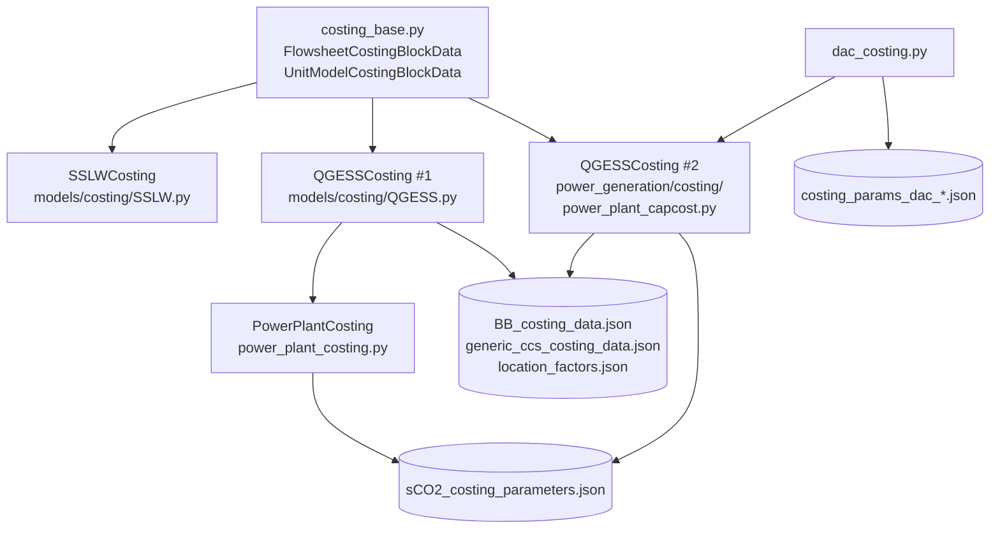
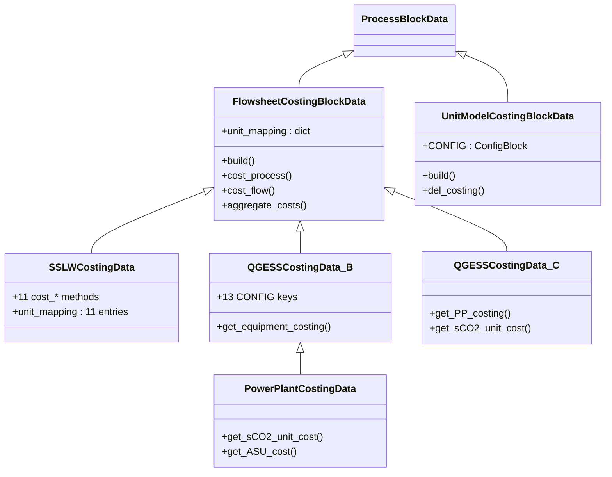
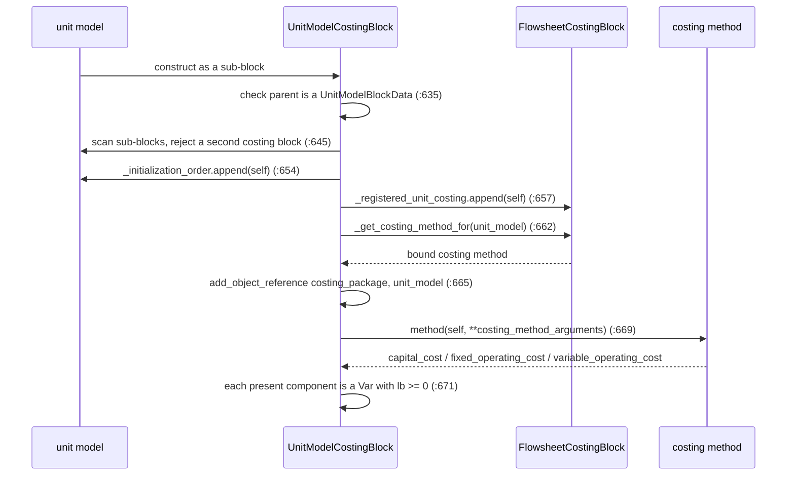
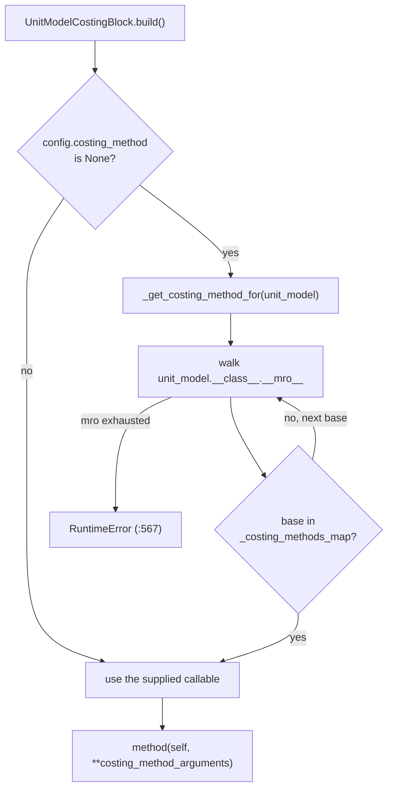

# 17 — Costing framework and libraries

> **Doc ID** 17 · **Repo SHA** 70a8f4fe1 (IDAES-PSE v2.13.0rc0) · **Source roots** `idaes/core/base/costing_base.py`, `idaes/models/costing/**`, `idaes/models_extra/power_generation/costing/**`, `idaes/models_extra/temperature_swing_adsorption/costing/**`
> **Owns** 11 modules / 11,618 LOC · **Assets** 6 JSON data files (1 under `idaes/core/`, 3 under `power_generation/costing/`, 2 under `temperature_swing_adsorption/costing/`) · **Siblings** [03](03_block_hierarchy_and_construction_protocol.md), [06](06_model_preparation_initializers_and_scalers.md), [10](10_unit_models_control_volume_based.md), [11](11_unit_models_network_contactors_and_control.md), [18](18_power_generation_boiler_island.md), [23](23_tsa_gas_distribution_and_ccu.md), [28](28_data_and_file_format_inventory.md), [29](29_dependency_and_layering_map.md)

Costing in this library exists in **three generations, all of which still build,
and two of which declare a class named `QGESSCosting`**. One shared framework in
`idaes/core/base/costing_base.py` hosts all three. Everything else here follows
from that fact, so section 1 states it first and section 12 carries the
disambiguation table the rest of the set refers to.

---

## 0. Scope and source map

| File | LOC | Purpose | Covered in § |
|---|---:|---|---|
| `idaes/core/base/costing_base.py` | 715 | The framework: currency units, location factors, `FlowsheetCostingBlockData`, `UnitModelCostingBlockData` | 2, 3, 4, 5, 6, 7, 9, 11 |
| `idaes/core/base/location_factors.json` | — | 192 country/city investment-site factors; the only non-Python data file under `idaes/core/` | 10 |
| `idaes/models/costing/__init__.py` | 0 | Empty package marker | 2 |
| `idaes/models/costing/SSLW.py` | 1,770 | Generation A — Seider, Seader, Lewin & Widagdo equipment correlations; 18 selector enums, 11 costing methods | 2, 3, 5, 6, 7, 9, 11 |
| `idaes/models/costing/QGESS.py` | 4,188 | Generation B — NETL Quality Guidelines; `QGESSCosting` #1, 13 CONFIG keys, O&M / taxes / net present value | 2, 3, 4, 6, 7, 8, 10, 11, 12 |
| `idaes/models_extra/power_generation/costing/__init__.py` | 0 | Empty package marker | 2 |
| `idaes/models_extra/power_generation/costing/power_plant_capcost.py` | 2,170 | Generation C — `QGESSCosting` #2, `get_PP_costing`, `get_sCO2_unit_cost`, `get_ASU_cost` | 2, 3, 7, 10, 12 |
| `idaes/models_extra/power_generation/costing/power_plant_costing.py` | 502 | `PowerPlantCosting` — Generation B subclass adding the sCO2 and air-separation methods | 2, 3, 7, 12 |
| `idaes/models_extra/power_generation/costing/power_plant_costing_dictionaries.py` | 359 | Data loaders plus preloaded account groups, default resource prices, fixed-O&M reference data | 2, 7, 10 |
| `idaes/models_extra/power_generation/costing/costing_dictionaries.py` | 67 | A near-duplicate of the two loaders above, read only by `power_plant_capcost` | 2, 7, 10, 12 |
| `idaes/models_extra/power_generation/costing/generic_ccs_capcost_custom_dict.py` | 694 | Carbon-capture account data as a Python literal, plus the loader that can write it out as JSON | 2, 7, 10, 12 |
| `idaes/models_extra/power_generation/costing/BB_costing_data.json` | — | NETL Bituminous Baseline, 7 technology ids, 1,063 accounts (~301 KB) | 10 |
| `idaes/models_extra/power_generation/costing/generic_ccs_costing_data.json` | — | Carbon-capture accounts, technology id 6, 45 accounts (~14 KB) | 10 |
| `idaes/models_extra/power_generation/costing/sCO2_costing_parameters.json` | — | 13 supercritical-CO2 equipment types (~2.5 KB) | 10 |
| `idaes/models_extra/temperature_swing_adsorption/costing/dac_costing.py` | 1,153 | Direct-air-capture flowsheet costing driven through Generation C | 2, 7, 8, 10 |
| `idaes/models_extra/temperature_swing_adsorption/costing/costing_params_dac_electric_boiler.json` | — | DAC accounts, technology id 8, case B, 58 accounts (~28 KB) | 10 |
| `idaes/models_extra/temperature_swing_adsorption/costing/costing_params_dac_retrofit_ngcc.json` | — | DAC accounts, technology id 8, case B, 36 accounts (~17 KB) | 10 |

Total 11,618 LOC across 11 modules and 6 shipped JSON assets: 16 configuration
keys, 3 `NotImplementedError` hook sites, 19 enumerations, 6 classes declared by
`declare_process_block_class`, and no deprecation sites.

---

## 1. Architectural role

The framework defines two process blocks and one contract between them. A
**flowsheet costing block** (`FlowsheetCostingBlockData`,
`idaes/core/base/costing_base.py:196`) is the costing package: it owns the base
currency, the base period, and the `unit_mapping` that says which costing method
costs which unit model class. A **unit model costing block**
(`UnitModelCostingBlockData`, `:594`) is attached as a sub-block of one unit
model; its `build()` resolves a costing method from the package and calls it,
and the method writes `capital_cost`, `fixed_operating_cost` and
`variable_operating_cost` onto the sub-block. Costs carry units of measurement
the same way physical quantities do, because `register_idaes_currency_units`
(`idaes/core/base/costing_base.py:46`) installs Chemical Engineering Plant Cost
Index ratios into the Pyomo unit registry.

Three costing packages subclass the flowsheet costing block, and they do not
displace one another:

- **Generation A, SSLW** (`idaes/models/costing/SSLW.py:278`) — per-equipment
  purchase-cost correlations from Seider, Seader, Lewin and Widagdo, chapter 22.
  Coefficients live in Python dictionaries inside each method; no CONFIG keys,
  no data files.
- **Generation B, QGESS** (`idaes/models/costing/QGESS.py:74`) — NETL Quality
  Guidelines account scaling, fixed and variable operating costs, taxes,
  production credits and net present value. 13 CONFIG keys; three JSON account
  libraries.
- **Generation C, the power-plant capital-cost library**
  (`idaes/models_extra/power_generation/costing/power_plant_capcost.py:112`) —
  the older NETL implementation: account scaling plus supercritical-CO2 and
  air-separation correlations. No CONFIG keys; every option is a method argument.

Generations B and C both name their container class `QGESSCosting`. Neither
carries a deprecation marker, both have their own test files, and the shipped
documentation covers Generations A and C, not B.



*One framework, three costing generations, and a data layer that Generations B and C share — including the edge from `models/costing/QGESS.py` into `models_extra`, which section 12 records.*

---

## 2. Public surface inventory

| Symbol | Kind | Declared at | Exported via | Stability signal |
|---|---|---|---|---|
| `register_idaes_currency_units` | function | `idaes/core/base/costing_base.py:46` | `idaes.core` at `idaes/core/__init__.py:47` | re-exported; named in `docs/reference_guides/core/costing/costing_framework.rst` |
| `load_location_factors` | function | `idaes/core/base/costing_base.py:105` | module path only | not re-exported from `idaes.core` |
| `DefaultCostingComponents` | enum | `idaes/core/base/costing_base.py:163` | module path only | no underscore; not autodoc'd |
| `assert_flowsheet_costing_block` | function | `idaes/core/base/costing_base.py:173` | module path only | used as a CONFIG domain at `:604` |
| `FlowsheetCostingBlockData` | class | `idaes/core/base/costing_base.py:196` | `idaes.core` at `idaes/core/__init__.py:47` | re-exported |
| `FlowsheetCostingBlock` | class | synthesized from `idaes/core/base/costing_base.py:196` | `idaes.core` at `idaes/core/__init__.py:47` | generated by `declare_process_block_class` |
| `UnitModelCostingBlockData` | class | `idaes/core/base/costing_base.py:594` | module path only | container is re-exported, data class is not |
| `UnitModelCostingBlock` | class | synthesized from `idaes/core/base/costing_base.py:594` | `idaes.core` at `idaes/core/__init__.py:47` | generated by `declare_process_block_class` |
| `SSLWCostingData` | class | `idaes/models/costing/SSLW.py:278` | module path only | `autoclass` at `process_costing_sslw.rst:911` |
| `SSLWCosting` | class | synthesized from `idaes/models/costing/SSLW.py:278` | module path only | `autoclass` at `process_costing_sslw.rst:908` |
| The 18 SSLW selector enums; `_make_common_vars` | enums, function | `idaes/models/costing/SSLW.py:64`–`:265`; `:1744` | module path only | §3.2; leading underscore |
| `QGESSCostingData` (Generation B) | class | `idaes/models/costing/QGESS.py:74` | module path only | no docs coverage |
| `QGESSCosting` (Generation B) | class | synthesized from `idaes/models/costing/QGESS.py:74` | module path only | name collision, §12 |
| `custom_power_plant_currency_units` | function | `idaes/models_extra/power_generation/costing/power_plant_capcost.py:86` | module path only | registers 2 of the 3 custom units, §12 |
| `QGESSCostingData` (Generation C) | class | `idaes/models_extra/power_generation/costing/power_plant_capcost.py:112` | module path only | used verbatim in `power_plant_costing_netl.rst:235` |
| `QGESSCosting` (Generation C) | class | synthesized from `idaes/models_extra/power_generation/costing/power_plant_capcost.py:112` | module path only | name collision, §12 |
| `PowerPlantCostingData` / `PowerPlantCosting` | class pair | `idaes/models_extra/power_generation/costing/power_plant_costing.py:58` | module path only | no docs coverage |
| `register_power_plant_currency_units` | function | `idaes/models_extra/power_generation/costing/power_plant_costing_dictionaries.py:51` | module path only | imported by Generations B and by `power_plant_costing.py` |
| `load_BB_costing_dictionary` | function | `power_plant_costing_dictionaries.py:80` **and** `costing_dictionaries.py:39` | module path only | two identical definitions, §12.3 |
| `load_sCO2_costing_dictionary` | function | `power_plant_costing_dictionaries.py:105` **and** `costing_dictionaries.py:64` | module path only | two identical definitions, §12.3 |
| `define_preloaded_accounts`, `load_default_resource_prices`, `load_fixed_OM_data`, `report` | functions | `power_plant_costing_dictionaries.py:111`, `:168`, `:226`, `:266` | module path only | account groups for technologies 1–7; 30 priced resources; labor and maintenance data; `report` is imported nowhere in `idaes/` |
| `load_generic_ccs_costing_dictionary` | function | `generic_ccs_capcost_custom_dict.py:21` | module path only | also a file generator, §10.4 |
| `get_dac_costing`; `print_dac_costing` / `dac_costing_summary` | functions | `idaes/models_extra/temperature_swing_adsorption/costing/dac_costing.py:43`; `:1069`, `:1125` | module path only | the DAC entry point; reporting |

Both `idaes/models/costing/__init__.py` and
`idaes/models_extra/power_generation/costing/__init__.py` are empty, so every
symbol above is reached by its full module path except the four re-exported
through `idaes.core`. `idaes/models_extra/temperature_swing_adsorption/costing/`
carries no `__init__.py` at all; see §12.8.

---

## 3. Class hierarchy and type taxonomy



*Three sibling costing packages descend from one base; only Generation B is itself subclassed, and the subclass supplies the two equipment families Generation B omits.*

| Class | Base(s) | Declared at | Decorator | Container class | Key overrides |
|---|---|---|---|---|---|
| `FlowsheetCostingBlockData` | `ProcessBlockData` | `idaes/core/base/costing_base.py:196` | `@declare_process_block_class("FlowsheetCostingBlock")` | `FlowsheetCostingBlock` | `build` |
| `UnitModelCostingBlockData` | `ProcessBlockData` | `idaes/core/base/costing_base.py:594` | `@declare_process_block_class("UnitModelCostingBlock")` | `UnitModelCostingBlock` | `build`, `initialize` |
| `SSLWCostingData` | `FlowsheetCostingBlockData` | `idaes/models/costing/SSLW.py:278` | `@declare_process_block_class("SSLWCosting")` | `SSLWCosting` | `build_global_params`, `build_process_costs`, `initialize_build` |
| `QGESSCostingData` (B) | `FlowsheetCostingBlockData` | `idaes/models/costing/QGESS.py:74` | `@declare_process_block_class("QGESSCosting")` | `QGESSCosting` | `build_global_params`, `build_process_costs`, `initialize` |
| `QGESSCostingData` (C) | `FlowsheetCostingBlockData` | `idaes/models_extra/power_generation/costing/power_plant_capcost.py:112` | `@declare_process_block_class("QGESSCosting")` | `QGESSCosting` | `build_global_params`, `build_process_costs`, `initialize_build`, `report` |
| `PowerPlantCostingData` | `QGESSCostingData` (B) | `idaes/models_extra/power_generation/costing/power_plant_costing.py:58` | `@declare_process_block_class("PowerPlantCosting")` | `PowerPlantCosting` | `build_global_params`, plus `get_sCO2_unit_cost`, `get_ASU_cost`, `check_sCO2_costing_bounds` |

`FlowsheetCostingBlockData` declares no CONFIG keys of its own, which is why
`QGESSCostingData.CONFIG` is built with `FlowsheetCostingBlockData.CONFIG()`
(`idaes/models/costing/QGESS.py:90`); Generations A and C add no keys at all.
Each package registers its currency units in the **class body**, not in
`build_global_params` — `SSLW.py:288`, `QGESS.py:86`,
`power_plant_capcost.py:115` and `power_plant_costing.py:60` — so import order
determines which definitions land in the registry first; §12.4 records the
consequence.

### 3.1 `DefaultCostingComponents`

`idaes/core/base/costing_base.py:163`, a `StrEnum` naming the three component
attributes the framework aggregates, validates and initializes; it is iterated
directly in four places.

| Member | Value | Meaning | Consumed at |
|---|---|---|---|
| `capital` | `capital_cost` | one-time installed cost of the unit | `costing_base.py:381`, `:672`, `:695` |
| `fixed` | `fixed_operating_cost` | recurring cost independent of throughput | same sites |
| `variable` | `variable_operating_cost` | recurring cost proportional to throughput | same sites |

### 3.2 The 18 SSLW selector enums

Every SSLW costing method takes its equipment type and material of construction
as `StrEnum` members rather than strings, validates membership on entry, and
indexes an inline coefficient dictionary with the member:

| Enum | Declared at | Members | Selects |
|---|---|---:|---|
| `HXType` | `idaes/models/costing/SSLW.py:64` | 4 | floating head, fixed head, U-tube, kettle vaporiser |
| `HXMaterial` | `:75` | 10 | shell/tube material pair |
| `HXTubeLength` | `:92` | 4 | 8, 12, 16 or 20 ft tube length factor |
| `VesselMaterial` | `:103` | 10 | vessel shell material |
| `TrayType` | `:120` | 3 | sieve, valve, bubble cap |
| `TrayMaterial` | `:130` | 5 | distillation tray material |
| `HeaterMaterial` | `:142` | 3 | fired heater material |
| `HeaterSource` | `:152` | 7 | fuel, reformer, pyrolysis, hot water, salts, Dowtherm A, steam boiler |
| `CompressorType` | `:166` | 3 | centrifugal, reciprocating, screw |
| `CompressorDriveType` | `:176` | 3 | electric motor, steam turbine, gas turbine |
| `CompressorMaterial` | `:186` | 3 | carbon steel, stainless steel, nickel alloy |
| `PumpMaterial` | `:196` | 11 | pump material of construction |
| `PumpType` | `:214` | 3 | centrifugal, external gear, reciprocating |
| `PumpMotorType` | `:224` | 3 | open, enclosed, explosion proof |
| `FanType` | `:234` | 4 | centrifugal backward/straight, vane axial, tube axial |
| `FanMaterial` | `:245` | 4 | fan material |
| `BlowerType` | `:256` | 2 | centrifugal, rotary |
| `BlowerMaterial` | `:265` | 5 | blower material |

Enum values are the strings used in the reference text and several differ from
the member name — `HeaterSource.steamBoiler` is `"SteamBoiler"`,
`CompressorDriveType.gasTurbine` is `"GasTurbine"`,
`VesselMaterial.CarbonSteel` is `"Carbon_steel"`, and the `HXTubeLength` members
are `"8ft"` through `"20ft"`, which index the length-factor dict at
`idaes/models/costing/SSLW.py:384`.

---

## 4. Configuration reference

16 declared keys in two blocks. Generations A and C declare none: every option
they accept is a keyword argument to a costing method (§7).

### 4.1 `UnitModelCostingBlockData.CONFIG`

A fresh `ConfigBlock()` (`idaes/core/base/costing_base.py:602`), not an
extension of `ProcessBlockData.CONFIG`. Three keys, all of them read once during
`build()`.

| Key | Domain / validator | Default | Req. | Effect on build | Anchor |
|---|---|---|---|---|---|
| `flowsheet_costing_block` | `assert_flowsheet_costing_block` | none | effectively yes | The package this block registers with; `build()` reads it at `:630`, appends `self` to its `_registered_unit_costing` at `:657`, and adds it as the `costing_package` object reference at `:665` | `idaes/core/base/costing_base.py:604` |
| `costing_method` | none | `None` | no | When `None`, `build()` resolves the method from `unit_mapping` at `:662`; otherwise this callable is used verbatim | `idaes/core/base/costing_base.py:611` |
| `costing_method_arguments` | `dict` | `{}` | no | Splatted into the costing method call at `:669` | `idaes/core/base/costing_base.py:620` |

`assert_flowsheet_costing_block` (`idaes/core/base/costing_base.py:173`) logs an
ERROR and raises `ConfigurationError` for anything that is not a
`FlowsheetCostingBlockData` instance, so an omitted key fails later, on the
`None` default, rather than at validation.

### 4.2 `QGESSCostingData.CONFIG` — Generation B

`FlowsheetCostingBlockData.CONFIG()` extended at `idaes/models/costing/QGESS.py:90`
with 13 keys, every one of them read inside `build_global_params`
(`:254`) — 611 lines that construct up to 41 Pyomo `Param` and `Expression`
components depending on what is set.

| Key | Domain / validator | Default | Req. | Effect on build | Anchor |
|---|---|---|---|---|---|
| `Lang_factor` | `float` | `None` | no | When set, becomes a scalar `Param` at `:397`; when `None` and `tech == 10`, an `Expression` summing 11 percentage components at `:429`; otherwise a `Param` fixed to 1 at `:440` | `idaes/models/costing/QGESS.py:92` |
| `has_fixed_OM` | `bool` | `False` | no | Loads labor rates and maintenance splits through `load_fixed_OM_data()` at `:451` and builds 14 fixed-O&M parameters | `:101` |
| `has_variable_OM` | `bool` | `False` | no | Enables the variable-cost path of `build_process_costs` at `:1171` | `:110` |
| `has_taxes_and_credits` | `bool` | `False` | no | Builds income-tax, depletion and production-incentive parameters at `:520`–`:541`, and calls `calculate_taxes()` at `:1452` | `:119` |
| `has_production_credit_phaseout` | `bool` | `False` | no | Requires a 4-digit year in `CEPCI_year`, builds `current_year` at `:302` and `phaseout_factor` at `:584` | `:128` |
| `phaseout_fractions` | `dict` | `None` | no | Fractions indexed by calendar year, validated for ascending years and descending fractions at `:554`–`:568` | `:137` |
| `has_net_present_value` | `bool` | `False` | no | Builds discount, lifetime, escalation, loan and inflation parameters at `:620`–`:702`, and calls `calculate_net_present_value()` at `:1458` | `:150` |
| `has_capital_expenditure_period` | `bool` | `False` | no | Enables the multi-year capital spread in the net-present-value constraints | `:159` |
| `capital_expenditure_percentages` | `ListOf(float)` | `None` | no | Percentages summing to 100, one per capital year; becomes an indexed `Param` at `:648` | `:168` |
| `has_economy_of_numbers` | `bool` | `False` | no | Builds `cum_num_units`, `learning_rate` and `learning_rate_exponent` at `:713`–`:725`, and the `NOAK_factor` variable and constraint at `:2546`, `:2554` | `:185` |
| `CEPCI_year` | `str` | `'2018'` | no | `base_currency` becomes `getattr(pyunits, "USD_" + value)` at `:282` and `CEPCI_units` becomes the `MUSD_` form at `:308`; an unknown value raises `AttributeError` at `:283` | `:194` |
| `tech` | `int` | `None` | **yes** | `None` raises `ValueError` at `:263`. 1–7 select Bituminous Baseline technologies, 8–9 specific case studies, 10 the University of Kentucky rare-earth study; the value picks capacity factor (`:377`/`:384`), labor structure (`:453`) and whether account contingency data is read | `:203` |
| `location` | `location_validator` | `['United States', 'Washington DC / Northeast', 'average']` | no | The default short-circuits to a factor of 1 at `:324` without opening the data file; any other value calls `load_location_factors()` at `:333` and indexes `[country][city][val]` | `:242` |

`location_validator` (`idaes/models/costing/QGESS.py:230`) accepts only a list of
strings and raises `ValueError` otherwise; length is checked separately in
`build_global_params` (`:316`), and unknown country, city or aggregation keyword
each raise `KeyError` (`:342`, `:350`, `:363`).

---

## 5. Construction and call sequences

### 5.1 `FlowsheetCostingBlockData.build`

`idaes/core/base/costing_base.py:213`, in order:

1. `super().build()`.
2. Create the registry attributes: `_registered_unit_costing` list (`:224`),
   `flow_types` and `used_flows` Pyomo `Set`s (`:225`, `:226`),
   `_registered_flows` dict (`:227`) and `defined_flows` dict (`:228`); set
   `base_currency = None` (`:231`) and `base_period = pyo.units.year` (`:232`).
3. Build `_costing_methods_map` (`:235`) by calling `_build_costing_methods_map`
   (`:546`), which walks the class attribute `unit_mapping` and re-keys it from
   the container class to `unit_class._ComponentDataClass`.
4. Call `build_global_params()` (`:239`) — the package hook that sets
   `base_currency` and everything else the package needs.
5. Raise `ValueError` if `base_currency` is still `None` (`:242`). This is the
   framework's only hard requirement on a costing package.
6. Register every entry of `defined_flows` through `register_flow_type` (`:249`).

Step 3 runs before step 4, so `unit_mapping` is read from the class and cannot
be populated inside `build_global_params`.

### 5.2 `UnitModelCostingBlockData.build`



*The costing block registers itself on both sides before any cost equation exists, which is why deletion needs the explicit `del_costing` unwind in §5.5.*

The numbered path (`idaes/core/base/costing_base.py:627`):

1. Alias the package (`:630`) and the parent block (`:633`).
2. `TypeError` if `UnitModelBlockData` is absent from the parent's method
   resolution order (`:638`).
3. `RuntimeError` if the parent already carries a `UnitModelCostingBlock`
   (`:648`). The scan is `descend_into=False`, so only direct sub-blocks count.
4. Append `self` to the unit model's `_initialization_order` (`:654`) — the list
   `UnitModelBlockData.initialize` (`idaes/core/base/unit_model.py:504`)
   deactivates before its own `initialize_build` and reactivates afterwards —
   and to the package's `_registered_unit_costing` (`:657`).
5. Resolve the method: `self.config.costing_method` when set, otherwise
   `fcb._get_costing_method_for(unit_model)` (`:662`).
6. Add `costing_package` and `unit_model` object references (`:665`, `:666`), so
   every costing method reads its inputs as `blk.unit_model.<component>`, then
   call the method with `**self.config.costing_method_arguments` (`:669`).
7. For each member of `DefaultCostingComponents`, if the attribute exists it
   must be a Pyomo `Var` — `TypeError` otherwise (`:677`) — and a lower bound
   below zero or absent logs a WARNING (`:684`). A missing attribute is silently
   accepted through the `except AttributeError` at `:689`, so a package may
   supply any subset of the three.

### 5.3 `cost_process` and `aggregate_costs`

`cost_process()` (`idaes/core/base/costing_base.py:293`) is two calls,
`aggregate_costs()` then `build_process_costs()`. `aggregate_costs()` (`:445`) reads `base_currency` and `base_period` into local
names and creates, on the flowsheet costing block: `aggregate_capital_cost`
(`:468`) with its constraint (`:471`), summing
`pyo.units.convert(u.capital_cost, ...)` over every registered unit costing
block that has the attribute; `aggregate_fixed_operating_cost` (`:481`) and
`aggregate_variable_operating_cost` (`:495`) in currency per period, built the
same way; one scalar `aggregate_flow_<type>` `Var` and constraint per flow type
that has at least one costed flow (`:525`, `:531`), added by name because flow
units differ per type, with the type added to `used_flows` (`:521`) and the
units taken from the **first** registered flow of that type (`:522`); and
`aggregate_flow_costs` indexed by `used_flows` (`:534`) with its constraint
(`:539`), each term being `aggregate_flow_<type> * <type>_cost`.

### 5.4 `initialize`

`FlowsheetCostingBlockData.initialize` (`idaes/core/base/costing_base.py:366`)
calls `u.initialize()` on every registered unit costing block, then runs
`calculate_variable_from_constraint` over the three aggregate cost variables and
over every used flow and its cost, and finally calls `initialize_build()` inside
a `try/except AttributeError` (`:399`). `UnitModelCostingBlockData.initialize`
(`:692`) runs
`calculate_variable_from_constraint` for each of the three default components
that exists, pairing `<name>` with `<name>_constraint`.

### 5.5 `del_costing`

`del_costing()` (`idaes/core/base/costing_base.py:707`) removes `self` from the
unit model's `_initialization_order` (`:714`) and from the package's
`_registered_unit_costing` (`:715`); it does not delete the block. Deletion is
driven from the other side: `UnitModelBlockData.del_component`
(`idaes/core/base/unit_model.py:624`) attempts `obj.del_costing()` inside a
`try/except AttributeError` before delegating to Pyomo, so
`unit.del_component(unit.costing)` unregisters and then removes.

### 5.6 Generation B construction

Generation B does not use `cost_process()`. A flowsheet builds it directly.
`m.fs.costing = QGESSCosting(tech=..., ...)` runs `build_global_params`
(`idaes/models/costing/QGESS.py:254`), which validates `tech`, resolves
`base_currency` and `CEPCI_units` and the location factor, and creates the
parameter set the enabled CONFIG flags call for; one `UnitModelCostingBlock` per
equipment group carries `costing_method=QGESSCostingData.get_equipment_costing`
(`:1748`) and a `costing_method_arguments` dict of `cost_accounts`,
`scaled_param`, `tech` and `ccs`; `build_process_costs(...)` (`:866`) guards
against a second call through a `built` attribute (`:1000`), calls
`get_total_BEC_and_TPC` (`:1011`) and then conditionally `get_fixed_OM_costs`
(`:1160`), `get_variable_OM_costs` (`:1171`), `calculate_taxes` (`:1452`) and
`calculate_net_present_value` (`:1458`); finally
`QGESSCostingData.initialize(m.fs.costing)` (`:3361`).

Generation C follows the same shape with `get_PP_costing`
(`idaes/models_extra/power_generation/costing/power_plant_capcost.py:533`) and
`costing_initialization` (`:2009`).

---

## 6. Data structures, variables, constraints and invariants

### 6.1 Components on a `FlowsheetCostingBlock`

| Component | Type | Index sets | Units | Created at | Condition |
|---|---|---|---|---|---|
| `flow_types` | `Set` | — | — | `costing_base.py:225` | always |
| `used_flows` | `Set` | — | — | `costing_base.py:226` | always |
| `<flow_type>_cost` | `Var`, fixed | — | units of the registered cost expression | `costing_base.py:440` | one per `register_flow_type` call |
| `aggregate_capital_cost` | `Var` | — | `base_currency` | `costing_base.py:468` | `aggregate_costs()` |
| `aggregate_fixed_operating_cost` | `Var` | — | `base_currency`/`base_period` | `costing_base.py:481` | `aggregate_costs()` |
| `aggregate_variable_operating_cost` | `Var` | — | `base_currency`/`base_period` | `costing_base.py:495` | `aggregate_costs()` |
| `aggregate_flow_<type>` | `Var` | — | units of the first registered flow of that type | `costing_base.py:525` | per used flow type |
| `aggregate_flow_costs` | `Var` | `used_flows` | `base_currency`/`base_period` | `costing_base.py:534` | `aggregate_costs()` |
| the four aggregation `Constraint`s | `Constraint` | — / `used_flows` | — | `costing_base.py:471`, `:484`, `:498`, `:539` | `aggregate_costs()` |

### 6.2 Components on a `UnitModelCostingBlock`

The framework names three and validates them; the costing method decides which
exist and what else appears beside them:

| Component | Type | Units | Created by | Condition |
|---|---|---|---|---|
| `capital_cost` | `Var`, `lb >= 0` expected | currency | the costing method | validated at `costing_base.py:671` |
| `fixed_operating_cost`, `variable_operating_cost` | `Var`, `lb >= 0` expected | currency/time | the costing method | same |
| `costing_package` | object reference | — | `costing_base.py:665` | always |
| `unit_model` | object reference | — | `costing_base.py:666` | always |

Generation A adds, through `_make_common_vars`
(`idaes/models/costing/SSLW.py:1744`): `base_cost_per_unit` and `capital_cost`
(`Var`, `USD_CE500`) and `number_of_units` (`Var` over `Integers` or `Reals`,
bounded `(1, 100)` and fixed to 1). Per-method components:

| Method | Components created | Anchor |
|---|---|---|
| `cost_heat_exchanger` | `length_factor`, `hx_oversize` (`Param`); `material_factor`, `pressure_factor` (`Var`); `base_cost` (`Expression`); `base_cost_per_unit_eq`, `hx_material_eqn`, `p_factor_eq`, `capital_cost_constraint` | `SSLW.py:385`–`:501` |
| `cost_vessel` | `shell_thickness`, `material_factor`, `material_density` (`Param`); `weight` (`Var`); `weight_eq`, `base_cost_constraint`, `capital_cost_constraint` | `SSLW.py:636`–`:719` |
| `_cost_platforms_ladders`, `_cost_distillation_trays` | `base_cost_platforms_ladders` and one of two `cost_platforms_ladders_eq` forms; `base_cost_trays`, `tray_material_factor`, `number_trays_factor`, `base_cost_per_tray` (`Var`), `tray_type_factor` (`Param`) and four constraints | `SSLW.py:734`–`:861` |
| `cost_fired_heater` | `material_factor` (`Param`); `pressure_factor` (`Var`); `base_cost` (`Expression`); three constraints | `SSLW.py:1024`–`:1075` |
| `cost_compressor` | `drive_factor`, `material_factor` (`Param`); `base_cost` (`Expression`); two constraints | `SSLW.py:1140`–`:1175` |
| `cost_fan` | `head_factor`, `material_factor` (`Param`); `base_cost`; two constraints | `SSLW.py:1226`–`:1260` |
| `cost_blower` | `material_factor` (`Param`); `base_cost`; two constraints | `SSLW.py:1312`–`:1335` |
| `cost_turbine` | `capital_cost`, `number_of_units` (`Var`); `capital_cost_constraint` | `SSLW.py:1355`–`:1379` |
| `cost_pump` | `pump_head`, `size_factor`, `base_pump_cost_per_unit`, `pump_capital_cost`, `base_motor_cost_per_unit`, `motor_capital_cost` (`Var`); `material_factor`, `FT`, `motor_FT` (`Param`); seven constraints | `SSLW.py:1491`–`:1683` |

Generation B's `get_equipment_costing` creates, indexed by the account list:
`exp`, `ref_cost`, `ref_param`, `eng_fee`, `process_conting`, `project_conting`
(`Param`, `idaes/models/costing/QGESS.py:2248`–`:2305`), `bare_erected_cost`
(`Var`, `:2313`), `total_plant_cost` (`Var`, `:2322`), `bare_erected_cost_eq`
(`:2332`) and one of two `total_plant_cost_eq` forms (`:2394`, `:2402`). At
flowsheet level it adds `total_BEC` (`:2490`), `total_TPC` (`:2498`) and
`other_plant_costs` (`:2507`), then the 33 fixed-O&M, 9 variable-O&M, 11 tax and
24 net-present-value components of §7.5.

### 6.3 Invariants

| Invariant | Enforced at |
|---|---|
| A costing package sets `base_currency` in `build_global_params` | `costing_base.py:242`, `ValueError` |
| The parent of a `UnitModelCostingBlock` is a `UnitModelBlockData` | `costing_base.py:638`, `TypeError` |
| A unit model carries at most one `UnitModelCostingBlock` | `costing_base.py:648`, `RuntimeError` |
| A unit model class, or one of its bases, appears in `unit_mapping` unless `costing_method` is given | `costing_base.py:567`, `RuntimeError` |
| `capital_cost`, `fixed_operating_cost` and `variable_operating_cost`, where present, are Pyomo `Var`s | `costing_base.py:677`, `TypeError` |
| Those three have a lower bound of zero or more | `costing_base.py:684`, WARNING only |
| A flow type is registered before it is costed; a costed flow expression is not indexed | `costing_base.py:328`, `ValueError`; `:338`, `TypeError` |
| A costed flow has a lower bound of zero or more | `costing_base.py:349` (expression, via `compute_bounds_on_expr`), `:358` (Var), WARNING only |
| Re-registering a flow type reuses the existing cost component only when it is the identical object | `costing_base.py:429`, `RuntimeError` |
| Generation B is given a `tech` value; its `CEPCI_year` names a registered currency unit | `QGESS.py:263`, `ValueError`; `:283`, `AttributeError` |
| Generation B's `location` names a country, a city and one of `min`/`max`/`average` | `QGESS.py:342`, `:350`, `:363`, `KeyError` |
| Generation B's `build_process_costs` runs once per costing block | `QGESS.py:1000`, `AttributeError` |
| All accounts in one `get_equipment_costing` call share a process parameter | `QGESS.py:2087`, `ValueError` |
| `additional_costing_params` is a list of dicts, not a bare dict | `QGESS.py:1953`, `:1962`, `TypeError` |
| An account present in both the built-in and the additional dictionary needs `use_additional_costing_params` | `QGESS.py:1998`, `ValueError` |

---

## 7. Method contracts

### 7.1 Framework — module-level functions

| Method | Signature | Preconditions | Effects | Returns | Raises | Anchor |
|---|---|---|---|---|---|---|
| `register_idaes_currency_units` | `()` | — | Loads 36 unit definitions into the Pyomo registry: `USD_CE500` as the `[currency]` base, `USD_CE394`, and `USD_1990` through `USD_2023`. A repeat call logs DEBUG and returns | `None` | — | `costing_base.py:46` |
| `load_location_factors` | `()` | `location_factors.json` beside the module | Opens the file with `this_file_dir()` + `os.path.join` and `json.load`, then pivots the list of records into `{country: {city: {min, max, average}}}` | `dict` | `OSError`, `JSONDecodeError` | `costing_base.py:105` |
| `assert_flowsheet_costing_block` | `(val)` | — | Logs ERROR on failure | `val` | `ConfigurationError` | `costing_base.py:173` |

The currency mechanism is one pint definition string per year, each fixing that
year's Chemical Engineering Plant Cost Index against a base of 500 — for example
`USD_2023 = 500/797.9 * USD_CE500` and `USD_2018 = 500/603.1 * USD_CE500`
(`costing_base.py:63`). Because `[currency]` is a genuine base dimension,
`pyo.units.convert(x, to_units=USD_2018)` performs the index conversion and
`check_units` catches a cost added to a cost rate. Pint's SI prefixes apply, so
`kUSD_2018` and `MUSD_2018` resolve without further declarations, which
Generation B relies on at `idaes/models/costing/QGESS.py:308` and when parsing
`BEC_units` strings at `:2341`.

### 7.2 `FlowsheetCostingBlockData`

| Method | Signature | Preconditions | Effects | Returns | Raises | Anchor |
|---|---|---|---|---|---|---|
| `build` | `(self)` | — | Creates the registries, sets defaults, builds the method map, calls `build_global_params`, registers `defined_flows` | `None` | `ValueError` | `costing_base.py:213` |
| `build_global_params` | `(self)` | — | subclass-defined | `None` | `NotImplementedError` | `costing_base.py:252` |
| `build_process_costs` | `(self)` | — | subclass-defined | `None` | `NotImplementedError` | `costing_base.py:265` |
| `initialize_build` | `(self)` | — | subclass-defined | `None` | `NotImplementedError` | `costing_base.py:282` |
| `cost_process` | `(self)` | costing blocks already registered | `aggregate_costs()` then `build_process_costs()` | `None` | propagates | `costing_base.py:293` |
| `cost_flow` | `(self, flow_expr, flow_type)` | `flow_type` in `flow_types` | Appends the expression to `_registered_flows[flow_type]`; native types and non-variable expressions pass through unchecked | `None` | `ValueError`, `TypeError` | `costing_base.py:306` |
| `initialize` | `(self)` | `cost_process()` has run | Initializes each unit costing block, then the aggregate variables, then `initialize_build()` | `None` | propagates | `costing_base.py:366` |
| `register_flow_type` | `(self, flow_type, cost)` | — | Adds to `flow_types`, creates and fixes a scalar `<flow_type>_cost` `Var` with the units of `cost`, resets `_registered_flows[flow_type]` | `None` | `RuntimeError` | `costing_base.py:407` |
| `aggregate_costs` | `(self)` | — | Creates the eight aggregate components of §6.1 | `None` | — | `costing_base.py:445` |
| `_build_costing_methods_map` | `(self)` | — | Re-keys `unit_mapping` from container class to `_ComponentDataClass` | `None` | `AttributeError` for a non-process-block key | `costing_base.py:546` |
| `_get_costing_method_for` | `(self, unit_model)` | — | Walks `unit_model.__class__.__mro__` and returns the first match | callable | `RuntimeError` | `costing_base.py:558` |
| `report`, `display_registered_unit_costing`, `display_registered_flow_types`, `display_registered_flows` | `(self)` | — | each body is `pass` | `None` | — | `costing_base.py:575`, `:580`, `:584`, `:588` |

### 7.3 `UnitModelCostingBlockData`

| Method | Signature | Effects | Raises | Anchor |
|---|---|---|---|---|
| `build` | `(self)` | The nine steps of §5.2 | `TypeError` ×2, `RuntimeError` | `costing_base.py:627` |
| `initialize` | `(self, *args, **kwargs)` | `calculate_variable_from_constraint` for each present default component | propagates | `costing_base.py:692` |
| `del_costing` | `(self)` | Unregisters from both lists | `ValueError` if already unregistered | `costing_base.py:707` |

### 7.4 Generation A — SSLW costing methods

All are unbound functions on `SSLWCostingData` whose first parameter is the unit
model costing block; each validates its enum arguments, calls `_make_common_vars`
where applicable, and writes `capital_cost` in `USD_CE500`.

| Method | Signature (defaults) | Effects | Raises | Anchor |
|---|---|---|---|---|
| `build_global_params` | `(self)` | `base_currency = USD_2018` (`:300`), `base_period = year` (`:302`) | — | `SSLW.py:290` |
| `build_process_costs` | `(self)` | empty body | — | `SSLW.py:304` |
| `initialize_build` | `(*args, **kwargs)` | `@staticmethod`, empty body | — | `SSLW.py:318` |
| `cost_heat_exchanger` | `(blk, hx_type=HXType.Utube, material_type=HXMaterial.StainlessSteelStainlessSteel, tube_length=HXTubeLength.TwelveFoot, integer=True)` | Reads `unit_model.area` and the hot-side inlet pressure; falls back to `tube.properties[0, x]` for a one-dimensional exchanger (`:475`) | `ConfigurationError` ×3 | `SSLW.py:327` |
| `cost_vessel` | `(blk, vertical=False, material_type=..., shell_thickness=1.25*inch, weight_limit=1, aspect_ratio_range=1, include_platforms_ladders=True, vessel_diameter=None, vessel_length=None, number_of_units=1, number_of_trays=None, tray_material=..., tray_type=...)` | Falls back to `unit_model.diameter` and `unit_model.length` when no reference is given | `ConfigurationError` ×6 | `SSLW.py:509` |
| `_cost_platforms_ladders` | `(blk, vertical, aspect_ratio_range, vessel_diameter, vessel_length)` | Adds the platform and ladder cost term | `ConfigurationError` | `SSLW.py:728` |
| `_cost_distillation_trays` | `(blk, tray_material, tray_type, vessel_diameter, number_of_trays)` | Adds four tray components | `ConfigurationError` ×2 | `SSLW.py:777` |
| `cost_vertical_vessel` | as `cost_vessel` without `vertical` | Delegates with `vertical=True` | propagates | `SSLW.py:870` |
| `cost_horizontal_vessel` | as `cost_vessel`, no tray arguments | Delegates with `vertical=False` | propagates | `SSLW.py:928` |
| `cost_fired_heater` | `(blk, heat_source=HeaterSource.Fuel, material_type=HeaterMaterial.CarbonSteel, integer=True)` | Reads `unit_model.heat_duty` and inlet pressure | `ConfigurationError` ×2 | `SSLW.py:968` |
| `cost_compressor` | `(blk, compressor_type=..., drive_type=..., material_type=..., integer=True)` | Reads `unit_model.work_mechanical` | `TypeError` ×3 | `SSLW.py:1080` |
| `cost_fan` | `(blk, fan_type=..., fan_head_factor=1.45, material_type=..., integer=True)` | Reads the inlet volumetric flow | `TypeError` | `SSLW.py:1180` |
| `cost_blower` | `(blk, blower_type=..., material_type=..., integer=True)` | Reads `unit_model.work_mechanical` | `TypeError` | `SSLW.py:1265` |
| `cost_turbine` | `(blk, integer=True)` | One constraint on `work_mechanical`; no material or type selector | — | `SSLW.py:1338` |
| `cost_pump` | `(blk, pump_type=..., material_type=..., pump_type_factor=1.4, motor_type=..., integer=True)` | Costs pump and motor separately, then sums; `pump_type_factor` selects one of six centrifugal sub-classes at `:1554` | `ConfigurationError` ×2 | `SSLW.py:1387` |
| `cost_pressure_changer` | `(blk, mover_type="compressor", **kwargs)` | Dispatches to `cost_turbine`, `cost_compressor`, `cost_pump` or `cost_fan` on `unit_model.config.compressor`, `mover_type` and `thermodynamic_assumption` | `ConfigurationError` | `SSLW.py:1686` |

**Coefficient storage.** Every correlation coefficient in Generation A is an
inline Python dictionary inside the method that uses it — 19 of them, at
`SSLW.py:384`, `:400`, `:438`, `:620`, `:673`, `:803`, `:816`, `:1019`, `:1135`,
`:1144`, `:1155`, `:1218`, `:1230`, `:1299`, `:1305`, `:1528`, `:1540`, `:1554`
and `:1625`. There is no external data file and no shared parameter block: the
dictionary is indexed by the enum member, the scalar is read at build time, and
it becomes the `initialize` value of a mutable `Param`.

### 7.5 Generation B — QGESS methods

| Method | Signature | Effects | Raises | Anchor |
|---|---|---|---|---|
| `location_validator` | `(v)` | CONFIG domain for `location` | `ValueError` | `QGESS.py:230` |
| `build_global_params` | `(self)` | 611 lines; validates `tech`, resolves currency, location factor, capacity factor, Lang factor, and the fixed-O&M, tax, net-present-value and economy-of-numbers parameter sets | `ValueError`, `AttributeError`, `TypeError`, `KeyError`, `ConfigurationError` | `QGESS.py:254` |
| `build_process_costs` | `(self, total_purchase_cost=None, annual_fixed_operating_cost=None, annual_revenue=None, debt_expression=None, feedstock_rate=None, production_rate=None, CO2_capture_rate=None, pure_product_output_rates=None, mixed_product_output_rates=None, sale_prices=None, resources=None, resource_prices=None, land_cost=None, fuel=None, feedstock=None, waste=None, additional_waste_cost=None, chemicals=None, additional_chemicals_cost=None, chemicals_inventory=None, transport_per_unit_feedstock_cost=None, transport_per_unit_production_cost=None, transport_per_unit_CO2_cost=None)` | 23 arguments; builds overnight capital, as-spent cost, annualized cost, and the three unit-cost expressions | `AttributeError`, `UnitsError` ×12, `InconsistentUnitsError` ×3 | `QGESS.py:866` |
| `get_equipment_costing` | `(blk, cost_accounts, scaled_param, tech, ccs, n_equip=1, scale_down_parallel_equip=False, CEPCI_year="2018", additional_costing_params=None, use_additional_costing_params=False, multiply_project_conting=True)` | Merges account dictionaries, then builds the account-indexed parameters, variables and two constraints of §6.2 | `AttributeError`, `TypeError` ×2, `ValueError` ×2 | `QGESS.py:1748` |
| `get_total_BEC_and_TPC` | `(b, total_purchase_cost)` | Walks the parent flowsheet for registered costing blocks, partitions them into blocks that already include total-plant-cost factors and blocks that do not, then builds `total_BEC`, `total_TPC`, `other_plant_costs` and their constraints | — | `QGESS.py:2421` |
| `get_fixed_OM_costs` | `(b, annual_fixed_operating_cost=None, annual_revenue=None, pure_product_output_rates=None, mixed_product_output_rates=None, sale_prices=None, additional_sales_price_dictionaries=None, production_rate=None)` | 33 components; two distinct branches for `tech == 10` and for power-plant technologies | `TypeError` ×3, `ValueError` | `QGESS.py:2574` |
| `get_variable_OM_costs` | `(b, resources=None, resource_prices=None, additional_resource_price_dictionaries=None)` | `variable_operating_costs` indexed by time and resource, plant overhead, and the total | `ValueError`, `UnitsError` | `QGESS.py:3057` |
| `calculate_taxes` | `(b)` | `net_tax_owed`, `income_tax`, royalty, depletion and production-incentive expressions, and two constraints | — | `QGESS.py:3233` |
| `calculate_net_present_value` | `(b, debt_expression=None)` | Present-worth variables for capital, loan interest, operating cost, revenue, taxes and production incentive, plus `npv` and its constraint | — | `QGESS.py:3519` |
| `initialize` | `(b)` | Overrides the framework method; loops registered blocks and runs `calculate_variable_from_constraint` on each cost variable | — | `QGESS.py:3361` |
| `display_total_plant_costs` | `(b)` | `print` per account | — | `QGESS.py:4154` |
| `display_bare_erected_costs` | `(b)` | `print` per account | — | `QGESS.py:4172` |

The account scaling equation is `SC = RC * (SP / RP)**Exp`, implemented in
`bare_erected_cost_eq` (`QGESS.py:2332`); the constraint parses the JSON `Units`
string into Pyomo units at `:2334` and the `BEC_units` string into `USD_`,
`kUSD_` or `MUSD_` at `:2341`, so the data file's string fields become unit
objects at build time. Total plant cost is
`BEC * (1 + eng_fee + process_conting) * (1 + project_conting)` when
`multiply_project_conting` is true (`:2394`), and
`BEC * (1 + eng_fee + process_conting + project_conting)` otherwise (`:2402`).

### 7.6 Generation C and its dependants

| Method | Signature | Effects | Anchor |
|---|---|---|---|
| `custom_power_plant_currency_units` | `()` | `register_idaes_currency_units()` then `USD_2008_Nov` and `USD_2019_Sep` | `power_plant_capcost.py:86` |
| `build_global_params` | `(self)` | `base_currency = USD_2018`, `base_period = year` | `power_plant_capcost.py:117` |
| `build_process_costs` | `(self, total_plant_cost=None, nameplate_capacity=650, capacity_factor=0.85, labor_rate=38.5, labor_burden=30, operators_per_shift=6, tech=1, land_cost=None, net_power=None, resources=None, rates=None, prices=None, fixed_OM=True, variable_OM=False, fuel=None, chemicals=None, chemicals_inventory=None, waste=None, transport_cost=None, tonne_CO2_capture=None, CE_index_year="2018")` | 21 arguments; every value Generation B takes from CONFIG is an argument here | `power_plant_capcost.py:131` |
| `get_PP_costing` | `(blk, cost_accounts, scaled_param, tech, ccs="B", CE_index_year="2018", additional_costing_params=None, use_additional_costing_params=False)` | Account scaling against `BB_costing_data.json` and `generic_ccs_costing_data.json` | `power_plant_capcost.py:533` |
| `get_sCO2_unit_cost` | `(self, equipment, scaled_param, temp_C=None, n_equip=1, CE_index_year="2018", custom_accounts=None)` | Reads `sCO2_costing_parameters.json`; `a` becomes the reference cost in `USD_2017`, `b` the exponent, `c` and `d` the linear and quadratic temperature-correction coefficients, and `Material Cost`/`Labor Cost` the installation factors | `power_plant_capcost.py:1168` |
| `get_ASU_cost` | `(self, scaled_param, CE_index_year="2018")` | Hard-coded air-separation-unit correlation; no data file | `power_plant_capcost.py:1437` |
| `get_fixed_OM_costs` / `get_variable_OM_costs`; `costing_initialization` | — | Generation C's own O&M methods, distinct from Generation B's, and its initialization walk | `power_plant_capcost.py:1568`, `:1807`, `:2009` |
| `check_sCO2_costing_bounds` | `(b)` | Compares the scaled parameter against the `Lower Bound` / `Upper Bound` fields and logs a WARNING outside the range | `power_plant_capcost.py:2145` |
| `PowerPlantCostingData.get_sCO2_unit_cost`; `.get_ASU_cost` | `(self, equipment, scaled_param, temp_C=None, n_equip=1, CEPCI_year="2018", custom_accounts=None)`; `(self, scaled_param, CEPCI_year="2018")` | Generation B's sCO2 and air-separation methods; they differ from the Generation C signatures in the year keyword name only | `power_plant_costing.py:81`, `:377` |

### 7.7 Direct-air-capture costing

`dac_costing.py` is a flowsheet script rather than a costing package: it declares
no class and adds costing to an existing temperature-swing-adsorption model.

| Method | Signature | Effects | Anchor |
|---|---|---|---|
| `get_dac_costing` | `(tsa, costing_case="electric_boiler")` | Dispatches to one of two builders | `dac_costing.py:43` |
| `_get_costing_electric_boiler` | `(tsa)` | Loads `costing_params_dac_electric_boiler.json` (`:56`), creates `fs.costing = QGESSCosting()` from Generation C (`:64`), then 12 `UnitModelBlock`/`UnitModelCostingBlock` pairs each calling `QGESSCostingData.get_PP_costing` with `tech=8`, `ccs="B"` and the loaded dictionary as `additional_costing_params` | `dac_costing.py:52` |
| `_get_costing_retrofit_ngcc` | `(tsa)` | The same shape against `costing_params_dac_retrofit_ngcc.json` (`:632`) | `dac_costing.py:628` |
| `print_dac_costing`, `_var_dict_costing`, `dac_costing_summary` | `(tsa)`, `(tsa)`, `(tsa, export=False)` | Reporting; the last raises `ConfigurationError` when no costing block exists (`:1130`) | `dac_costing.py:1069`, `:1088`, `:1125` |

Three accounts are rescaled after the fact rather than through the scaling
equation: `15.1` is divided by 120 and multiplied by the bed count, and `15.4`
and `15.5` are multiplied by half the bed count (`dac_costing.py:455`–`:461`).

---

## 8. Cross-subsystem interactions

### Calls out to

| Target | Purpose | Anchor |
|---|---|---|
| `pyomo.environ.units.load_definitions_from_strings` | Registering 36 index-based currency units, and 2 or 3 custom power-plant units | `costing_base.py:63`, `power_plant_capcost.py:102`, `power_plant_costing_dictionaries.py:70` |
| `pyomo.common.fileutils.this_file_dir` | Locating all six JSON files relative to the module | `costing_base.py:139`, `costing_dictionaries.py:36`, `power_plant_costing_dictionaries.py:46`, `generic_ccs_capcost_custom_dict.py:40`, `dac_costing.py:40` |
| `pyomo.contrib.fbbt.fbbt.compute_bounds_on_expr` | Bound check on a costed flow expression | `costing_base.py:346` |
| `pyomo.util.calc_var_value.calculate_variable_from_constraint` | Every initialization path | `costing_base.py:383`, `QGESS.py:3378`, `power_plant_capcost.py:1962` |
| `idaes.core.base.unit_model.UnitModelBlockData` | Parent type check, and the `_initialization_order` list | `costing_base.py:34`, `:638`, `:654` — see [03 §5](03_block_hierarchy_and_construction_protocol.md#5-construction-and-call-sequences) |
| `idaes.core.util.misc.add_object_reference`, `StrEnum`; `idaes.core.util.exceptions.ConfigurationError`, `BurntToast` | Object references, the 19 enums, argument validation | `costing_base.py:36`, `:37`, `QGESS.py:53` |
| `idaes.core.util.math.smooth_max`; `idaes.core.util.constants.Constants` | Smoothing in the SSLW pump size factor and Generation B revenue terms; the gravitational constant in the pump head correlation | `SSLW.py:48`, `:47`, `QGESS.py:54` |
| `idaes.core.util.scaling` | `set_scaling_factor` and `constraint_scaling_transform` on the account variables | `QGESS.py:50`, `power_plant_capcost.py:62` |
| `idaes.core.util.tables.stream_table_dataframe_to_string` | The `report` methods | `QGESS.py:55`, `power_plant_capcost.py:75` |
| `idaes.models.unit_models` (11 classes) | The Generation A `unit_mapping` keys | `SSLW.py:29` — see [10](10_unit_models_control_volume_based.md) |
| `idaes.models_extra.power_generation.costing.*` | Generation B's account and reference-data loaders | `QGESS.py:56`, `:59` — §12 |
| `pandas.DataFrame`, `sys.stdout`, `textwrap`; `pint.errors.UndefinedUnitError` | Report formatting in four modules; the error caught when parsing a `BEC_units` string | `QGESS.py:37`, `:41`, `power_plant_capcost.py:44` |
| `json`, `os` | Six data-file reads and one conditional write | §10 |

### Called by

| Caller | What it relies on | Owning doc |
|---|---|---|
| `idaes/core/__init__.py:47` | Re-exports `FlowsheetCostingBlock`, `FlowsheetCostingBlockData`, `UnitModelCostingBlock`, `register_idaes_currency_units` | [03](03_block_hierarchy_and_construction_protocol.md) |
| `idaes/core/base/unit_model.py:624` | `del_costing()` on a costing sub-block before deletion | [03](03_block_hierarchy_and_construction_protocol.md) |
| `idaes/core/base/unit_model.py:504` | `_initialization_order` entries are deactivated and reactivated around `initialize_build` | [06](06_model_preparation_initializers_and_scalers.md) |
| `idaes/models_extra/temperature_swing_adsorption/costing/dac_costing.py:35` | `QGESSCosting` and `QGESSCostingData.get_PP_costing` from Generation C | [23](23_tsa_gas_distribution_and_ccu.md) |
| `idaes/models_extra/power_generation/costing/power_plant_costing.py:44` | `QGESSCostingData` from Generation B, as a base class | this document |
| `docs/reference_guides/model_libraries/generic/costing/process_costing_sslw.rst:908` | `autoclass` on `SSLWCosting` and `SSLWCostingData` | [32](32_repository_engineering.md) |
| Flowsheet authors | A costing package plus one `UnitModelCostingBlock` per unit model | — |

No unit model, property package or flowsheet outside this scope imports a
costing module: a search over `idaes/**/*.py` excluding test files finds
`idaes/core/__init__.py:47` as the only import of
`idaes.core.base.costing_base`, and no import of `idaes.models.costing` at all.
Costing is opt-in from the flowsheet.

---

## 9. Extension and subclassing contracts

### 9.1 The three `NotImplementedError` hooks

| Hook | Kind | Signature | Resolution order | Base behaviour | Anchor |
|---|---|---|---|---|---|
| `build_global_params` | package contract | `(self)` | Overridden by `SSLWCostingData` (`SSLW.py:290`), both `QGESSCostingData` classes (`QGESS.py:254`, `power_plant_capcost.py:117`) and `PowerPlantCostingData` (`power_plant_costing.py:62`, which calls `super()`) | raises | `costing_base.py:252` |
| `build_process_costs` | package contract | `(self)` | Overridden by all three packages; Generation A's body is empty | raises | `costing_base.py:265` |
| `initialize_build` | package contract | `(self)` | Overridden by Generation A (`SSLW.py:318`, a `@staticmethod`) and Generation C (`power_plant_capcost.py:451`). **Not** overridden by Generation B | raises | `costing_base.py:282` |

`FlowsheetCostingBlockData.build` calls `build_global_params()` unconditionally
(`costing_base.py:239`), so the first hook is mandatory. `build_process_costs` is
reached only through `cost_process()` (`:304`) and `initialize_build` only
through `initialize()` (`:399`), where it sits inside `try/except
AttributeError` — a `NotImplementedError` from an unoverridden
`initialize_build` is therefore **not** absorbed by that guard.

### 9.2 `unit_mapping` — the extension seam

A costing package declares a class attribute `unit_mapping` mapping unit model
**container** classes to unbound costing methods. Generation A's
(`idaes/models/costing/SSLW.py:1728`) is the only populated one in the tree:

| Unit model class | Costing method |
|---|---|
| `CSTR` | `cost_vertical_vessel` |
| `Compressor` | `cost_compressor` |
| `Flash` | `cost_vertical_vessel` |
| `Heater` | `cost_fired_heater` |
| `HeatExchanger` | `cost_heat_exchanger` |
| `HeatExchangerNTU` | `cost_heat_exchanger` |
| `PFR` | `cost_horizontal_vessel` |
| `PressureChanger` | `cost_pressure_changer` |
| `Pump` | `cost_pump` |
| `StoichiometricReactor` | `cost_horizontal_vessel` |
| `Turbine` | `cost_turbine` |



*Method resolution walks the unit model's own inheritance chain, so a subclass inherits its parent's costing method and a per-instance `costing_method` bypasses the map entirely.*

Resolution is in two stages. At package build time,
`_build_costing_methods_map` (`costing_base.py:546`) translates each key from
the container class to `unit_class._ComponentDataClass` — the `FooData` half of
the pair described in
[03 §3.1](03_block_hierarchy_and_construction_protocol.md#31-the-generated-types) —
because the objects being costed are block data objects. At unit build time,
`_get_costing_method_for` (`:558`) iterates the concrete block's `__mro__` and
returns the first data class present in the map. `Pump` inherits from
`PressureChanger` and both appear in the map, so `Pump` resolves to `cost_pump`
rather than `cost_pressure_changer`; a subclass of `CSTR` that is not in the map
resolves to `cost_vertical_vessel` through inheritance; and a class whose whole
chain is absent raises `RuntimeError` naming the unit (`:567`).

### 9.3 Per-instance overrides

| Hook | Kind | Resolution | Base | Anchor |
|---|---|---|---|---|
| `costing_method` | CONFIG key | Takes precedence over `unit_mapping`; any callable accepting `(blk, **kwargs)` | `None` | `costing_base.py:611` |
| `costing_method_arguments` | CONFIG key | Splatted into the call; the method signature is the validator | `{}` | `costing_base.py:620` |
| `unit_mapping` | class attribute | Read once, at package build, from `self.__class__` | `{}` on the base | `costing_base.py:211` |
| `defined_flows` | instance attribute set in `build_global_params` | Each entry is passed to `register_flow_type` after the hook returns | `{}` | `costing_base.py:228`, `:249` |
| `base_currency` | instance attribute set in `build_global_params` | Mandatory; checked after the hook | `None` | `costing_base.py:231`, `:242` |
| `base_period` | instance attribute set in `build_global_params` | Optional | `units.year` | `costing_base.py:232` |

A costing method is an ordinary function taking the costing block as its first
argument. It reads its inputs through `blk.unit_model` and its package
parameters through `blk.costing_package`, both installed as object references at
`costing_base.py:665`–`:666`, and writes any subset of the three default
components plus whatever intermediate components it needs. Generation C's
methods are used exactly this way from outside the package:
`dac_costing.py:207` passes `QGESSCostingData.get_PP_costing` as
`costing_method` with a six-key `costing_method_arguments` dict, as does the
documentation example at `power_plant_costing_netl.rst:274`.

---

## 10. External assets, data files and external libraries

Six shipped JSON files, all read lazily on the first call to a loader with
`os.path.join(this_file_dir(), <name>)` and `json.load`; none is opened at
import time.

| Path | Format | Bytes | Authored / Generated | Producer | Consumer | Load site |
|---|---|---:|---|---|---|---|
| `idaes/core/base/location_factors.json` | JSON array of 192 records | 36,511 | authored | Compass International 2017 and Seider Table 16.13 | `load_location_factors` | `costing_base.py:140` |
| `idaes/models_extra/power_generation/costing/BB_costing_data.json` | nested JSON object | 300,882 | authored | NETL Bituminous Baseline / BBR4 spreadsheet | `load_BB_costing_dictionary` ×2 | `power_plant_costing_dictionaries.py:100`, `costing_dictionaries.py:59` |
| `idaes/models_extra/power_generation/costing/generic_ccs_costing_data.json` | nested JSON object | 14,035 | **both** — authored in Python, written out by its own loader | `load_generic_ccs_costing_dictionary` | the same function | `generic_ccs_capcost_custom_dict.py:686` (write), `:692` (read) |
| `idaes/models_extra/power_generation/costing/sCO2_costing_parameters.json` | flat JSON object | 2,551 | authored | supercritical-CO2 equipment correlations | `load_sCO2_costing_dictionary` ×2 | `power_plant_costing_dictionaries.py:106`, `costing_dictionaries.py:65` |
| `idaes/models_extra/temperature_swing_adsorption/costing/costing_params_dac_electric_boiler.json` | nested JSON object | 27,703 | authored | NETL direct-air-capture case study | `_get_costing_electric_boiler` | `dac_costing.py:56` |
| `idaes/models_extra/temperature_swing_adsorption/costing/costing_params_dac_retrofit_ngcc.json` | nested JSON object | 17,224 | authored | NETL direct-air-capture case study | `_get_costing_retrofit_ngcc` | `dac_costing.py:632` |

Two loader modules read the same two files; which one a costing generation uses
is decided by its import line, not by the data (§12.3).

### 10.1 `location_factors.json`

The only non-Python data file under `idaes/core/`. On disk it is a **JSON
array** of 192 records, each `{"country": str, "city": str, "location_factor":
{"min": float, "max": float, "average": float}}`; `load_location_factors`
(`costing_base.py:105`) pivots it into `{country: {city: {min, max, average}}}`
at `:144`–`:157`. The 192 records cover 139 distinct countries, most carrying a
single city named `"aggregate"`. The United States carries five regions —
`Washington DC / Northeast`, `Gulf Coast`, `Southwest`, `Midwest`,
`West Coast` — and `["United States", "Washington DC / Northeast", "average"]`
is the benchmark with a factor of 1.00, which is why Generation B short-circuits
that exact list without opening the file (`QGESS.py:318`). Country factors come
from Compass International, Inc. (2017) and United States regional factors from
Table 16.13 of Seider et al.; the docstring at `costing_base.py:105` carries both
citations and the relation `C_TPI,corrected = F_ISF × C_TPI`.

### 10.2 `BB_costing_data.json`

Nested `{tech_id: {case_letter: {account_id: {…}}}}`. Seven technology ids,
`"1"` through `"7"`; ids 1–6 carry both case `"A"` (no carbon capture) and case
`"B"` (with capture), id 7 carries only `"B"`. 1,063 accounts in total, from 60
(technology 6, case A) to 100 (technology 4, case B), except technology 7 which
has 3. Each account is a flat object with exactly ten keys:

| Key | Type | Meaning |
|---|---|---|
| `Account Name` | string | human-readable equipment description |
| `BEC` | float | bare erected cost of the reference plant |
| `BEC_units` | string | currency of `BEC`; `"K$2018"` throughout this file |
| `Eng Fee` | float | engineering fee as a fraction |
| `Exponent` | float | scaling exponent |
| `Process Contingency` | float | fraction |
| `Process Parameter` | string | the quantity the account scales on |
| `Project Contingency` | float | fraction |
| `RP Value` | float | reference value of the process parameter |
| `Units` | string | units of `RP Value`, parsed into Pyomo units at build time |

`BEC_units` is decoded by splitting on `$`: an empty prefix gives `USD_<year>`,
`K` gives `kUSD_<year>` and `M` gives `MUSD_<year>` (`QGESS.py:2341`–`:2347`).
`Units` is split on `/` and each half resolved with `getattr(pyunits, …)`
(`:2334`). Generation B also reads a `Cost scaling fraction` key when
`Process Parameter` is a list (`QGESS.py:2050`); no account in this file has a
list-valued `Process Parameter`, so that branch is exercised only by
user-supplied `additional_costing_params`.

### 10.3 `sCO2_costing_parameters.json`

A flat object keyed by equipment name, 13 entries: `Axial turbine`,
`Radial turbine`, `Barrel type compressor`, `IG centrifugal compressor`,
`Coal-fired heater`, `Natural gas-fired heater`, `Direct air cooler`,
`Recuperator`, `Gearbox`, `Generator`, `Explosion proof motor`,
`Open drip-proof motor`, `Synchronous motor`. Each carries nine fields:
`Scaling Parameter Units`, `a`, `b`, `c`, `d`, `Lower Bound`, `Upper Bound`,
`Material Cost`, `Labor Cost`. `a` becomes a reference cost in `USD_2017`, `b`
the scaling exponent, `c` and `d` the linear and quadratic temperature
corrections with units `C**-1` and `C**-2` (`power_plant_capcost.py:1240`,
`:1247`), and the two bounds feed `check_sCO2_costing_bounds` (`:2145`).

### 10.4 `generic_ccs_costing_data.json` — authored and generated

This file is the one asset in this scope with two provenances, and document 28
needs the distinction.

`generic_ccs_capcost_custom_dict.py` holds the account data as two Python
literals: `generic_ccs_costing_exponents` (`:44`), carrying `Account Name`,
`Exponent` and `Process Parameter` per account, and `generic_ccs_costing_params`
(`:274`), carrying `BEC`, `Eng Fee`, `Process Contingency`,
`Project Contingency`, `RP Value` and `Units`. The loader then checks
`os.path.exists` on the JSON file (`:646`); when it is **absent** the function
zips the two literals together, stamps `BEC_units` as `"K$2018"` for account
`5.1.a.epri` and `"K$2013"` for every other account (`:660`–`:667`), sorts each
account's keys alphabetically, writes the result with `json.dump` in mode `"w"`
(`:686`, `:688`) and prints a confirmation. It then reads the file back (`:692`)
whichever branch ran, and returns the parsed dictionary. Because the file ships
in the repository the default path never writes; the `path=None` parameter
(`:21`) overrides the directory, so calling the loader against a directory
without the file produces one there from the literals. Ground truth for this
asset is therefore the Python source, not the JSON.

On disk it holds technology id `"6"`, case `"B"`, 45 accounts: `5.1.a.epri`
plus 44 monoethanolamine capture accounts named `6.1.ccs` through `6.26.2.ccs`.
Two `BEC_units` values appear, `"K$2018"` and `"K$2013"`. The schema is the same
ten keys as `BB_costing_data.json`, which is what lets
`get_equipment_costing` merge the two dictionaries account-by-account
(`QGESS.py:1976`–`:2018`).

### 10.5 The direct-air-capture parameter files

Both DAC files use the NETL account schema of §10.2 under technology id `"8"`,
case `"B"`, with `BEC_units` of `"K$2019_Sep"` — the currency
`register_power_plant_currency_units` supplies at
`power_plant_costing_dictionaries.py:74`. `costing_params_dac_electric_boiler.json`
carries 58 accounts and `costing_params_dac_retrofit_ngcc.json` 36. Neither is
reached through a loader function: `dac_costing.py` opens each inline (`:56`,
`:632`) and passes the parsed dictionary into `get_PP_costing` as
`additional_costing_params`, which is how technology 8 accounts enter a costing
run at all — `BB_costing_data.json` has no technology 8.

### 10.6 Reference data held in Python, not in files

Three data sets sit in `power_plant_costing_dictionaries.py` as literals rather
than JSON: `define_preloaded_accounts` (`:111`) returns four named-group
dictionaries mapping labels such as `"Coal Handling"` to account lists, one each
for pulverized coal, integrated gasification combined cycle, natural gas
combined cycle and advanced ultra-supercritical plants;
`load_default_resource_prices` (`:168`) returns 30 priced resources as Pyomo
expressions carrying units, from five cited sources and spanning four currency
bases (`USD_2018`, `USD_2018_Dec`, `USD_2016`, `USD_2013`); and
`load_fixed_OM_data` (`:226`) returns seven labor types, their hourly rates, and
a per-technology maintenance split dictionary keyed 1 through 9.

### 10.7 Third-party libraries

Three, all imported unconditionally: `pyomo` in every module; `pandas` for
`DataFrame` only, in `QGESS.py:40`, `power_plant_capcost.py:47`,
`power_plant_costing_dictionaries.py:37` and `dac_costing.py:25`; and `pint`,
for `UndefinedUnitError` at `QGESS.py:41` and through `pyo.units._pint_registry`
at `costing_base.py:50`. No costing module imports an optional dependency,
drives a subprocess, or uses `pickle`.

---

## 11. Errors, logging and diagnostics behaviour

### 11.1 Exceptions

| Exception | Raised for | Anchor |
|---|---|---|
| `ValueError` | A package that leaves `base_currency` unset; an unregistered flow type | `costing_base.py:243`, `:328` |
| `TypeError` | A costing block on a non-unit-model parent; an indexed flow expression; a cost component that is not a `Var`; four pressure-changer methods called on the wrong kind of unit model | `costing_base.py:638`, `:338`, `:677`; `SSLW.py:1201`, `:1284`, `:1348`, `:1414` |
| `RuntimeError` | A second costing block on one unit model; a flow-cost component that already exists and differs; no costing method for a unit model | `costing_base.py:648`, `:429`, `:567` |
| `ConfigurationError` | A `flowsheet_costing_block` value of the wrong type; every SSLW enum and argument check (17 sites); an unknown DAC costing case | `costing_base.py:189`; `SSLW.py:363`–`:1718`; `dac_costing.py:49`, `:1130` |
| `ValueError` (Generation B) | Missing `tech`; phaseout years out of order; capital percentages not summing to 100; mixed process parameters; a conflicting additional account | `QGESS.py:263`, `:554`, `:638`, `:2087`, `:1998` |
| `AttributeError` (Generation B) | An unregistered `CEPCI_year`; `build_process_costs` called twice; a required component absent when an optional feature is switched on | `QGESS.py:283`, `:1001`, `:1869`–`:2179` |
| `KeyError` (Generation B) | An unknown country, city or aggregation keyword in `location` | `QGESS.py:342`, `:350`, `:363` |
| `UnitsError` / `InconsistentUnitsError` (Generation B) | 12 and 3 sites respectively, all checking that a caller-supplied expression carries the units the term needs | `QGESS.py:1030`–`:2240`, `:1474`, `:1493`, `:1512` |
| `Exception` (Generation C) | Raised bare in three places rather than as a typed error | `power_plant_capcost.py:445`, `:956`, `:1864` |

### 11.2 Loggers

Six modules create a module logger with `idaeslog.getLogger(__name__)` —
`costing_base.py:42`, `SSLW.py:58`, `QGESS.py:67`, `power_plant_capcost.py:79`,
`power_plant_costing.py:50`, `power_plant_costing_dictionaries.py:48` — and
`costing_dictionaries.py`, `generic_ccs_capcost_custom_dict.py` and
`dac_costing.py` have none.

| Level | Message | Anchor |
|---|---|---|
| DEBUG | Currency units already present in the registry, on a repeat `register_idaes_currency_units` or `custom_power_plant_currency_units` call | `costing_base.py:57`, `power_plant_capcost.py:97` |
| INFO | The same condition in `register_power_plant_currency_units` | `power_plant_costing_dictionaries.py:63` |
| WARNING | A cost component or a costed flow whose lower bound is absent or negative | `costing_base.py:684`, `:349`, `:358` |
| WARNING | SSLW correlation applied outside its validated range, three sites in `cost_fired_heater` | `SSLW.py:1102`, `:1113`, `:1122` |
| WARNING | Generation C O&M warnings | `power_plant_capcost.py:1635`, `:1644` |
| ERROR | A `flowsheet_costing_block` argument of the wrong type, logged immediately before the raise | `costing_base.py:185` |

### 11.3 Reporting through `print`

The reporting surface bypasses the logger. `QGESS.py` prints the global
parameter table at `:827`–`:861` and the per-account tables at `:4154` and
`:4172`; `power_plant_capcost.py` prints at `:527`, `:2052`, `:2069`, `:2089`,
`:2142` and `:2157`; `power_plant_costing.py` at `:359`–`:371`;
`power_plant_costing_dictionaries.py` at `:355`; `dac_costing.py` at `:1085` and
`:1149`. `get_equipment_costing` also prints — rather than raising or logging —
when an account is absent from the merged dictionary (`QGESS.py:2073`), so a
mistyped account id produces stdout text and a `KeyError` further down rather
than a diagnosable failure at the lookup. The four framework display methods
(`costing_base.py:575`, `:580`, `:584`, `:588`) have `pass` bodies; each costing
generation supplies its own display functions instead, and Generation C
additionally overrides `report` with a working implementation
(`power_plant_capcost.py:460`).

---

## 12. Duplications, deprecations and sharp edges

### 12.1 The three-generation disambiguation table

Every reference to a costing class in this set is keyed by **import path**; two
of the rows below expose a class named `QGESSCosting`.

| Import path | Container / data class | Generation | Entry-point methods | Data files read | Documented in `docs/` | Tests |
|---|---|---|---|---|---|---|
| `idaes.models.costing.SSLW` | `SSLWCosting` / `SSLWCostingData` (`SSLW.py:278`) | A | `cost_heat_exchanger`, `cost_vessel`, `cost_vertical_vessel`, `cost_horizontal_vessel`, `cost_fired_heater`, `cost_compressor`, `cost_fan`, `cost_blower`, `cost_turbine`, `cost_pump`, `cost_pressure_changer` | none — 19 inline coefficient dicts | yes, `process_costing_sslw.rst` with `autoclass` | `idaes/models/costing/tests/test_SSLW.py` |
| `idaes.models.costing.QGESS` | **`QGESSCosting`** / `QGESSCostingData` (`QGESS.py:74`) | B | `get_equipment_costing`, `get_total_BEC_and_TPC`, `get_fixed_OM_costs`, `get_variable_OM_costs`, `calculate_taxes`, `calculate_net_present_value`, `display_total_plant_costs`, `display_bare_erected_costs` | `BB_costing_data.json`, `generic_ccs_costing_data.json`, `location_factors.json` | no | `idaes/models/costing/tests/test_QGESS.py` |
| `idaes.models_extra.power_generation.costing.power_plant_costing` | `PowerPlantCosting` / `PowerPlantCostingData` (`power_plant_costing.py:58`) | B (subclass) | everything from Generation B, plus `get_sCO2_unit_cost`, `get_ASU_cost`, `check_sCO2_costing_bounds` | the three above plus `sCO2_costing_parameters.json` | no | `tests/test_power_plant_costing.py` |
| `idaes.models_extra.power_generation.costing.power_plant_capcost` | **`QGESSCosting`** / `QGESSCostingData` (`power_plant_capcost.py:112`) | C | `get_PP_costing`, `get_sCO2_unit_cost`, `get_ASU_cost`, `get_fixed_OM_costs`, `get_variable_OM_costs`, `costing_initialization`, `get_total_TPC`, `report` | `BB_costing_data.json`, `sCO2_costing_parameters.json`, `generic_ccs_costing_data.json` | yes, `power_plant_costing_netl.rst:234` | `tests/test_power_plant_capcost.py`, `test_CCS_capcost.py`, `test_NGCC_capcost.py` |

`from idaes.models.costing.QGESS import QGESSCosting` and
`from idaes.models_extra.power_generation.costing.power_plant_capcost import
QGESSCosting` resolve to different classes with different costing methods,
different argument names (`CEPCI_year` against `CE_index_year`) and different
configuration surfaces (13 CONFIG keys against none). Neither carries a
deprecation decorator, and `deprecations.csv` has no rows for any file in this
scope. Consequence: a flowsheet that imports one and calls a method documented
for the other fails with an `AttributeError` on the method name, and a reader
who identifies a costing package by class name cannot tell which generation a
snippet uses.

`PowerPlantCostingData` subclasses Generation B, not Generation C
(`power_plant_costing.py:44` imports `QGESSCostingData` from
`idaes.models.costing.QGESS`): it is the Generation B package plus the two
equipment families Generation B omits, and the only in-tree subclass of any
costing package.

### 12.2 A core-tier module importing an extended-tier package

`idaes/models/costing/QGESS.py` — a module under `idaes/models/`, the tier
[29](29_dependency_and_layering_map.md) treats as the general-purpose model
library — imports six names from two modules under `idaes/models_extra/`:
`load_generic_ccs_costing_dictionary` from
`...power_generation.costing.generic_ccs_capcost_custom_dict`
(`idaes/models/costing/QGESS.py:56`), and `define_preloaded_accounts`,
`load_BB_costing_dictionary`, `load_default_resource_prices`,
`load_fixed_OM_data` and `register_power_plant_currency_units` from
`...power_generation.costing.power_plant_costing_dictionaries` (`:59`).

Consequence: importing `idaes.models.costing.QGESS` imports
`idaes.models_extra.power_generation.costing`, so the power-generation account
data and its custom currency units reach any flowsheet that uses the
general-purpose NETL costing package. The reverse edge also exists —
`power_plant_costing.py:44` imports from `idaes.models.costing.QGESS` — so the
two packages depend on each other at module level, the cycle broken only because
they import from different modules in each other's package.
[29](29_dependency_and_layering_map.md) owns the set-wide layering analysis;
this section records the anchored fact.

### 12.3 Two modules, one pair of loader functions

`costing_dictionaries.py` (67 LOC) and `power_plant_costing_dictionaries.py`
(359 LOC), both in `idaes/models_extra/power_generation/costing/`, share their
opening almost exactly: the shorter file's lines 1–67 are reproduced in the
longer file's lines 1–108, the only differences being nine extra import lines
and the insertion of `register_power_plant_currency_units`
(`power_plant_costing_dictionaries.py:51`). `load_BB_costing_dictionary`
(`costing_dictionaries.py:39`, `power_plant_costing_dictionaries.py:80`) and
`load_sCO2_costing_dictionary` (`:64`, `:105`) are identical in body, docstring
and the file they open. The longer file adds five functions the shorter lacks:
`register_power_plant_currency_units` (`:51`), `define_preloaded_accounts`
(`:111`), `load_default_resource_prices` (`:168`), `load_fixed_OM_data` (`:226`)
and `report` (`:266`, imported by no module in `idaes/`). Consequence: which
module a generation imports decides whether `USD_2018_Dec` is available to it —
`power_plant_capcost.py:67` imports from the shorter file and defines only two
custom units through `custom_power_plant_currency_units` (`:86`), while
Generation B imports from the longer file (`QGESS.py:59`) and gets three.

### 12.4 Currency registration is order-dependent

The registration guards test different conditions.
`register_power_plant_currency_units` (`power_plant_costing_dictionaries.py:51`)
skips only when all three of `USD_2008_Nov`, `USD_2019_Sep` and `USD_2018_Dec`
are in the registry (`:57`–`:59`), while Generation B's class body calls it only
when **none** of the three is present:

```python
    if (
        not hasattr(pyunits, "USD_2008_Nov")
        and not hasattr(pyunits, "USD_2019_Sep")
        and not hasattr(pyunits, "USD_2018_Dec")
    ):
        register_power_plant_currency_units()
```

(`idaes/models/costing/QGESS.py:81`–`:86`), and
`custom_power_plant_currency_units` (`power_plant_capcost.py:86`) registers only
the first two (`:102`–`:105`). Consequence: importing `power_plant_capcost`
before `idaes.models.costing.QGESS` leaves `USD_2008_Nov` and `USD_2019_Sep` in
the registry, Generation B's three-way guard then evaluates false,
`register_power_plant_currency_units` is not called, and `USD_2018_Dec` is never
defined — the currency `load_default_resource_prices` uses for 12 of its 30
entries (`power_plant_costing_dictionaries.py:190`–`:221`).

### 12.5 A string tested for membership in a list of blocks

`_registered_unit_costing` holds costing **block objects**
(`costing_base.py:657`). Nine sites read it with a list comprehension over
`block.name` and compare names correctly (`QGESS.py:2443`, `:4160`, `:4178`;
`power_plant_capcost.py:2056`, `:2073`, `:2093`, `:2122`, `:2151`;
`power_plant_costing.py:353`). Seven other sites compare a name string against
the list of blocks directly: the duplicate-costing guards in
`get_equipment_costing` (`idaes/models/costing/QGESS.py:1867`),
`get_sCO2_unit_cost`
(`idaes/models_extra/power_generation/costing/power_plant_capcost.py:1196`,
`idaes/models_extra/power_generation/costing/power_plant_costing.py:109`) and
`get_ASU_cost` (`power_plant_capcost.py:1453`, `power_plant_costing.py:393`),
and the block-selection loops in `QGESSCostingData.initialize`
(`idaes/models/costing/QGESS.py:3367`) and `costing_initialization`
(`power_plant_capcost.py:2013`).

Consequence: the membership test is false for every block, so each of those
guards is inert and each of those selection loops has an empty body. The
duplicate-costing protection that does fire is the framework's own scan at
`costing_base.py:645`.

### 12.6 Generation B replaces `initialize` rather than supplying `initialize_build`

`QGESSCostingData` defines `initialize` (`idaes/models/costing/QGESS.py:3361`)
and no `initialize_build`. Consequence: the framework's `initialize`
(`costing_base.py:366`) — which calls `u.initialize()` on each registered unit
costing block and then runs `calculate_variable_from_constraint` over the three
aggregate cost variables and every aggregate flow cost — never runs for
Generation B, and the unoverridden `initialize_build` hook
(`costing_base.py:282`) is unreachable from that class. Generations A and C
override `initialize_build` and keep the framework path.

### 12.7 The flow-costing half of the framework has no in-tree implementation

`defined_flows`, `register_flow_type` and `cost_flow` (`costing_base.py:228`,
`:407`, `:306`) support costing utility and material flows at the flowsheet
level, and `aggregate_costs` creates `aggregate_flow_<type>` and
`aggregate_flow_costs` for them (`:525`, `:534`). A search over `idaes/**/*.py`
finds `defined_flows` at four lines only — `costing_base.py:228`, `:249` and
`idaes/core/base/tests/test_costing_base.py:135`, `:207` — and no shipped
costing package registers a flow type. Consequence: `cost_process()` is called
nowhere in `idaes/` outside `test_costing_base.py:636`, and the aggregate flow
machinery is exercised only by the framework's own test double.

### 12.8 Two package directories with no `__init__.py` content, one with no file

`idaes/models/costing/__init__.py` and
`idaes/models_extra/power_generation/costing/__init__.py` are both zero bytes,
and `idaes/models_extra/temperature_swing_adsorption/costing/` has no
`__init__.py` at all — the only costing directory in the tree without one, and
the only one relying on implicit namespace-package resolution. Consequence:
every reference to `dac_costing` spells the full five-segment module path, as
`idaes/models_extra/temperature_swing_adsorption/tests/test_fixed_bed_tsa0d_costing.py:33`
does.

### 12.9 Smaller edges

- **Generation A declines one-dimensional heat exchangers.** The module header
  records the limitation as a comment at `idaes/models/costing/SSLW.py:28`, and
  `cost_heat_exchanger` reads `blk.unit_model.area` (`:409`), which such a model
  does not define. The pressure lookup does have a fallback for that geometry
  (`:475`), so the failure surfaces on the area reference rather than on a type
  check, and `HeatExchanger1D` is absent from `unit_mapping` (`:1728`).
- **`_make_common_vars` fixes `number_of_units` to 1** (`SSLW.py:1770`) with
  bounds `(1, 100)`, so the parallel-train count is a fixed variable a caller
  unfixes rather than an argument.
- **Generation B's `location` default is compared by list equality**
  (`QGESS.py:318`), so the two-element short form
  `["United States", "Washington DC / Northeast"]` does not match the
  three-element default and takes the file-loading branch to reach the same value.
- **`tech` is both a CONFIG key (`QGESS.py:203`) and a `get_equipment_costing`
  argument (`:1751`).** The method uses its own argument, and nothing checks that
  the two agree.
- **Generation C raises bare `Exception` in three places**
  (`power_plant_capcost.py:445`, `:956`, `:1864`), where the equivalent
  Generation B sites raise `ValueError` or `TypeError`.

---

## 13. Behaviour pinned by tests

Eight test files: 33 `unit` in `idaes/core/base/tests/test_costing_base.py`; 52
`unit`, 3 `component` and 5 `parametrize` in
`idaes/models/costing/tests/test_QGESS.py`; 13 `component`, 1 `integration`, 29
`parametrize` and 2 `skipif` in `idaes/models/costing/tests/test_SSLW.py`; 25
`component` in `tests/test_power_plant_capcost.py`; 20 `unit` and 9 `component`
in `tests/test_power_plant_costing.py`; and three flowsheet-level files.

| Behaviour | Test | Marker |
|---|---|---|
| `register_idaes_currency_units` puts every year from 1990 to 2023 in the registry and each converts at its index ratio | `idaes/core/base/tests/test_costing_base.py:39` | `unit` |
| Every country and city in `location_factors.json` has float `min`, `max` and `average`; an unknown country or city raises `KeyError` | `idaes/core/base/tests/test_costing_base.py:91`, `:100`, `:109` | `unit` |
| A costing package that sets no `base_currency` raises with the framework's message; the base attributes and the empty `unit_mapping` are as declared | `idaes/core/base/tests/test_costing_base.py:123`, `:237` | `unit` |
| The three package hooks raise `NotImplementedError` with their exact messages | `idaes/core/base/tests/test_costing_base.py:139`, `:147`, `:155` | `unit` |
| `register_flow_type` creates and fixes `<type>_cost`; a re-registration with a different object raises `RuntimeError` | `idaes/core/base/tests/test_costing_base.py:288`, `:307` | `unit` |
| `cost_flow` rejects an unknown type and an indexed `Var`, warns on an unbounded `Var` and on an unbounded expression, and accepts both bounded forms | `idaes/core/base/tests/test_costing_base.py:319`–`:375` | `unit` |
| `_get_costing_method_for` resolves through the method resolution order: a registered class, a subclass of a registered class, and an unrelated class that raises `RuntimeError` | `idaes/core/base/tests/test_costing_base.py:385` | `unit` |
| A costing block appends itself to `_initialization_order` and `_registered_unit_costing`; `del_component` empties both; a second costing block raises | `idaes/core/base/tests/test_costing_base.py:429`, `:440`, `:448` | `unit` |
| `costing_method` overrides the map; a non-`Var` cost component raises `TypeError` and a negative lower bound logs a warning, for each of the three components | `idaes/core/base/tests/test_costing_base.py:485`, `:524`–`:634` | `unit` |
| `cost_process` builds the aggregate variables with the package's currency units, and an unused flow type stays out of `aggregate_flow_costs` | `idaes/core/base/tests/test_costing_base.py:635` | `unit` |
| The whole framework model is unit-consistent, has zero degrees of freedom and initializes | `idaes/core/base/tests/test_costing_base.py:688`, `:692`, `:700` | `unit` |
| Each SSLW method over its full enum cross-product: 4 heat-exchanger types × 10 materials × 4 tube lengths, 10 vessel materials, 5 tray materials × 3 tray types, 3 heater materials × 7 sources, 3 compressor types × 3 drives × 3 materials, 11 pump materials × 6 type factors × 3 motor types, 4 fan types × 4 materials, 2 blower types × 5 materials | `idaes/models/costing/tests/test_SSLW.py:115`–`:760` | `component`, `parametrize` |
| `unit_mapping` resolves for each of the 11 registered classes, including `Pump` resolving ahead of `PressureChanger` and an isothermal and an adiabatic compressor both reaching `cost_compressor` | `idaes/models/costing/tests/test_SSLW.py:760` (class `TestMapping`) | `component` |
| Generation B rejects a missing `tech`, an unknown `CEPCI_year`, a `CEPCI_year` with no 4-digit year when phaseout is on, and eight malformed `location` values | `idaes/models/costing/tests/test_QGESS.py:36`–`:385` | `unit` |
| Generation B's default and fully-populated CONFIG for each supported `tech`, and the phaseout, capital-expenditure and economy-of-numbers branches | `idaes/models/costing/tests/test_QGESS.py:61`, `:502`, `:567`, `:619` | `unit` |
| Generation B's `build_process_costs` with default and with all 23 arguments, per technology; a second call raises; land and chemical costs are accepted as one-time or annual and rejected without units | `idaes/models/costing/tests/test_QGESS.py:937`, `:997`, `:1566`, `:1611`–`:1722` | `unit`, `component` |
| Generation B's location factor changes the total plant cost | `idaes/models/costing/tests/test_QGESS.py:1216` | `unit` |
| Generation C's account scaling, the `CE_index_year` conversion, and the four `additional_costing_params` conflict policies | `idaes/models_extra/power_generation/costing/tests/test_power_plant_capcost.py:41`–`:927` | `component` |
| Generation C's `build_process_costs` across empty, fixed-only, variable-only and combined O&M, inventory, and scalar and rate-based transport costs | `tests/test_power_plant_capcost.py:927`–`:1683` | `component` |
| Generation C's supercritical-CO2, air-separation and O&M methods end to end | `tests/test_power_plant_capcost.py:1941`, `:2249`, `:2283` | `component` |
| The Generation B subclass in `power_plant_costing.py` over every supported technology, and its own sCO2 path | `tests/test_power_plant_costing.py:51`, `:2435` | `unit`, `component` |
| Carbon-capture and natural-gas combined-cycle flowsheets costed through Generation C, gated on a solver | `tests/test_CCS_capcost.py:623`, `tests/test_NGCC_capcost.py:82`, `:185`, `:297`, `:531` | `component`, `skipif` |
| Both direct-air-capture cases build, have the expected degrees of freedom, solve, reproduce reference values and report | `idaes/models_extra/temperature_swing_adsorption/tests/test_fixed_bed_tsa0d_costing.py:101`–`:227` | `integration`, `skipif`, `solver` |

Two SSLW tests carry `skipif` marks (`test_SSLW.py:829`, `:934`); every
flowsheet-level costing test outside `idaes/models/costing/` is solver-gated.

---

## 14. Cross-references

| Topic | Doc | Section |
|---|---|---|
| `QGESSCosting` as a term collision; currency as a unit of measurement | [01](01_glossary_and_conventions.md) | §3, §10 |
| `_initialization_order`, `del_component`, the `FooData`/`Foo` pair | [03](03_block_hierarchy_and_construction_protocol.md) | §5, §6, §7 |
| How `_initialization_order` is used during unit model initialization | [06](06_model_preparation_initializers_and_scalers.md) | §1 |
| Diagnostics runs over the costing test modules | [07](07_diagnostics_and_run_orchestration.md) | §13 |
| `location_factors.json` as the only non-Python file under `idaes/core/` | [08a](08a_model_introspection_and_persistence.md), [08b](08b_core_support_utilities.md) | §10 |
| The 11 unit model classes in the SSLW `unit_mapping` | [10](10_unit_models_control_volume_based.md) | §2 |
| `HeatExchangerNTU` and the pressure changer family | [11](11_unit_models_network_contactors_and_control.md) | §3 |
| Power generation flowsheets that attach Generation C costing | [18](18_power_generation_boiler_island.md) | §8 |
| The temperature-swing-adsorption model `dac_costing.py` costs | [23](23_tsa_gas_distribution_and_ccu.md) | §7 |
| The six JSON assets in the repository-wide census, with the authored/generated split of §10.4 | [28](28_data_and_file_format_inventory.md) | §2 |
| The `idaes/models` to `idaes/models_extra` edge of §12.2 | [29](29_dependency_and_layering_map.md) | §4 |
| Solver use in the costing test suites | [30](30_numerics_and_solver_interface_map.md) | §3 |
| The three hooks and the `unit_mapping` seam in the full catalogue | [31](31_extension_point_catalog.md) | §3 |
| Test layout, markers, `pyproject.toml` package data for `*.json` | [32](32_repository_engineering.md) | §4, §6 |

---

## 15. Source anchor index

Anchors written as `:NNN` inside a section resolve against the file named in that
section's prose, heading or table row. The index lists every distinct file and
symbol anchored in this document.

| Anchor | Symbol |
|---|---|
| `idaes/core/__init__.py:47` | re-export of the four framework names |
| `idaes/core/base/costing_base.py:42-63` | module logger, `register_idaes_currency_units` at `:46`, the 36 definition strings at `:63` |
| `idaes/core/base/costing_base.py:105-189` | `load_location_factors` with `this_file_dir` at `:139`, `json.load` at `:141` and the pivot loop; `DefaultCostingComponents` at `:163`; `assert_flowsheet_costing_block` at `:173` with its ERROR log at `:185` and raise at `:189` |
| `idaes/core/base/costing_base.py:196-249` | `FlowsheetCostingBlockData`, `unit_mapping` at `:211`, `build` at `:213`, the registries at `:224`-`:228`, the defaults at `:231`-`:232`, the method map at `:235`, the hook call at `:239`, the `ValueError` at `:243`, flow registration at `:249` |
| `idaes/core/base/costing_base.py:252-364` | the three `NotImplementedError` hooks at `:252`, `:265`, `:282` with their raise sites at `:261`, `:278`, `:289`; `cost_process` at `:293`; `cost_flow` at `:306` and its four checks at `:328`, `:338`, `:349`, `:358` |
| `idaes/core/base/costing_base.py:366-443` | `initialize`, the aggregate loop at `:383`, the used-flow loop at `:389`, the guarded `initialize_build` at `:399`, `register_flow_type` at `:407` with its duplicate check at `:429` and `Var` creation at `:440` |
| `idaes/core/base/costing_base.py:445-588` | `aggregate_costs` and its components at `:468`, `:471`, `:481`, `:484`, `:495`, `:498`, `:525`, `:531`, `:534`, `:539`; `_build_costing_methods_map` at `:546`; `_get_costing_method_for` at `:558` with the `__mro__` walk at `:564` and `RuntimeError` at `:567`; the four `pass`-bodied display methods at `:575`-`:588` |
| `idaes/core/base/costing_base.py:594-715` | `UnitModelCostingBlockData`, `CONFIG` at `:602`, the three `CONFIG.declare` sites at `:604`, `:611`, `:620`, `build` at `:627` with the parent check at `:638`, the duplicate check at `:645`-`:648`, the registrations at `:654` and `:657`, resolution at `:662`, the object references at `:665`-`:666`, the call at `:669`, the validation at `:671`-`:689`, `initialize` at `:692`, `del_costing` at `:707` |
| `idaes/core/base/unit_model.py:504`, `:624` | `UnitModelBlockData.initialize`, `UnitModelBlockData.del_component` |
| `idaes/models/costing/SSLW.py:28-265` | the one-dimensional exchanger limitation comment, the unit model imports at `:29`, the module logger at `:58`, the 18 selector enums at `:64`-`:265` |
| `idaes/models/costing/SSLW.py:278-318` | `SSLWCostingData`, `register_idaes_currency_units()` at `:288`, `build_global_params` at `:290` with `:300` and `:302`, `build_process_costs` at `:304`, `initialize_build` at `:318` |
| `idaes/models/costing/SSLW.py:327-507` | `cost_heat_exchanger`, its three validations at `:363`-`:374`, the length-factor dict at `:384`, `alpha_dict` at `:400`, `hx_material_factor_dict` at `:438`, the one-dimensional fallback at `:475`, the capital cost constraint at `:501` |
| `idaes/models/costing/SSLW.py:509-868` | `cost_vessel` and its six validations, `material_factor_dict` at `:620`, `alpha_dict` at `:673`, `_cost_platforms_ladders` at `:728`, `_cost_distillation_trays` at `:777` with `tray_type_dict` at `:803` and `alpha` at `:816` |
| `idaes/models/costing/SSLW.py:870-1078` | `cost_vertical_vessel`, `cost_horizontal_vessel` at `:928`, `cost_fired_heater` at `:968` with its material dict at `:1019` and three range warnings at `:1102`, `:1113`, `:1122` |
| `idaes/models/costing/SSLW.py:1080-1336` | `cost_compressor` with `FD_param` at `:1135`, `cost_fan` at `:1180`, `cost_blower` at `:1265`, and their coefficient dicts at `:1144`, `:1155`, `:1218`, `:1230`, `:1299`, `:1305` |
| `idaes/models/costing/SSLW.py:1338-1684` | `cost_turbine`, `cost_pump` at `:1387` with the two material dicts at `:1528` and `:1540`, `pump_type_factor_dict` at `:1554`, `pump_motor_type_dict` at `:1625` |
| `idaes/models/costing/SSLW.py:1686-1770` | `cost_pressure_changer` and its `ConfigurationError` at `:1718`, `unit_mapping` at `:1728`, `_make_common_vars` at `:1744` and the fixed `number_of_units` at `:1770` |
| `idaes/models/costing/QGESS.py:37-90` | the imports, including `load_location_factors` at `:49` and the two `models_extra` imports at `:56` and `:59`; `QGESSCostingData` at `:74`; the three-way currency guard at `:81`-`:86`; `CONFIG` at `:90` |
| `idaes/models/costing/QGESS.py:92-242` | the 13 `CONFIG.declare` sites and `location_validator` at `:230` |
| `idaes/models/costing/QGESS.py:254-864` | `build_global_params` and its 41 components, the `tech` check at `:263`, the currency lookup at `:282`-`:283`, `CEPCI_units` at `:308`, `base_period` at `:312`, the location branches at `:316`-`:368`, the Lang factor branches at `:397`-`:440`, the fixed-O&M block from `:451`, the tax parameters at `:520`-`:541`, the phaseout validation at `:554`-`:584`, the net-present-value parameters at `:620`-`:702`, the economy-of-numbers parameters at `:713`-`:725` |
| `idaes/models/costing/QGESS.py:866-1746` | `build_process_costs`, the double-build guard at `:1000`-`:1002`, the five delegate calls at `:1011`, `:1160`, `:1171`, `:1452`, `:1458`, and the land, chemicals, waste and transport unit checks |
| `idaes/models/costing/QGESS.py:1748-2419` | `get_equipment_costing`, the inert duplicate guard at `:1867`, the two dictionary loads at `:1939` and `:1943`, the merge loop and its `ValueError` at `:1998`, the missing-account `print` at `:2073`, the process-parameter check at `:2087`, the parameters at `:2248`-`:2305`, the two `Var`s at `:2313` and `:2322`, `bare_erected_cost_eq` at `:2332` with the unit parsing at `:2334` and `:2341`, the two `total_plant_cost_eq` forms at `:2394` and `:2402` |
| `idaes/models/costing/QGESS.py:2421-2572` | `get_total_BEC_and_TPC`, the correct name comparison at `:2443`, `total_BEC` at `:2490`, `total_TPC` at `:2498`, `other_plant_costs` at `:2507`, `NOAK_factor` at `:2546`, `total_TPC_eq` at `:2560` |
| `idaes/models/costing/QGESS.py:2574-3231` | `get_fixed_OM_costs` and its 33 components, `get_variable_OM_costs` at `:3057` and its 9 |
| `idaes/models/costing/QGESS.py:3233-3517` | `calculate_taxes`, `initialize` at `:3361` and its inert membership test at `:3367` |
| `idaes/models/costing/QGESS.py:3519-4188` | `calculate_net_present_value` and its 24 components, `display_total_plant_costs` at `:4154`, `display_bare_erected_costs` at `:4172` |
| `idaes/models_extra/power_generation/costing/costing_dictionaries.py:36-66` | `directory`, `load_BB_costing_dictionary` at `:39` with its open at `:59`, `load_sCO2_costing_dictionary` at `:64` with its open at `:65` |
| `idaes/models_extra/power_generation/costing/power_plant_costing_dictionaries.py:46-106` | `directory`, `register_power_plant_currency_units` at `:51` with its guard at `:57`-`:59`, INFO log at `:63` and definitions at `:73`-`:75`, `load_BB_costing_dictionary` at `:80` with its open at `:100`, `load_sCO2_costing_dictionary` at `:105` |
| `idaes/models_extra/power_generation/costing/power_plant_costing_dictionaries.py:111-359` | `define_preloaded_accounts`, `load_default_resource_prices` at `:168` with the `USD_2018_Dec` entries at `:190`-`:221`, `load_fixed_OM_data` at `:226`, the unimported `report` at `:266` and its `print` at `:355` |
| `idaes/models_extra/power_generation/costing/generic_ccs_capcost_custom_dict.py:21-693` | `load_generic_ccs_costing_dictionary`, the `path` branch at `:39`, the exponents literal at `:44`, the parameters literal at `:274`, the existence check at `:646`, the `BEC_units` stamping at `:660`-`:667`, the `json.dump` at `:686`-`:688`, the read-back at `:692`-`:693` |
| `idaes/models_extra/power_generation/costing/power_plant_capcost.py:44-115` | the imports, including `costing_dictionaries` at `:67` and `generic_ccs_capcost_custom_dict` at `:71`, the module logger at `:79`, `custom_power_plant_currency_units` at `:86` with its DEBUG log at `:97` and two definitions at `:102`, the class at `:112` and its registration call at `:115` |
| `idaes/models_extra/power_generation/costing/power_plant_capcost.py:117-460` | `build_global_params`, `build_process_costs` at `:131`, the bare `Exception` at `:445`, `initialize_build` at `:451`, `report` at `:460` |
| `idaes/models_extra/power_generation/costing/power_plant_capcost.py:533-1562` | `get_PP_costing`, its technology check at `:696`, `get_sCO2_unit_cost` at `:1168` with its inert guard at `:1196` and the temperature coefficients at `:1240` and `:1247`, `get_ASU_cost` at `:1437` with its inert guard at `:1453` |
| `idaes/models_extra/power_generation/costing/power_plant_capcost.py:1568-2169` | `get_fixed_OM_costs`, its two warnings at `:1635` and `:1644`, `get_variable_OM_costs` at `:1807` and its bare `Exception` at `:1864`, the two initializers at `:1958` and `:1988`, `costing_initialization` at `:2009` with its inert test at `:2013`, the four display methods at `:2051`-`:2140`, `check_sCO2_costing_bounds` at `:2145` |
| `idaes/models_extra/power_generation/costing/power_plant_costing.py:37-60` | the imports, including `QGESSCostingData` from Generation B at `:44` and the loader import at `:45`, the module logger at `:50`, `PowerPlantCostingData` at `:58` and its registration call at `:60` |
| `idaes/models_extra/power_generation/costing/power_plant_costing.py:62-502` | `build_global_params`, `get_sCO2_unit_cost` at `:81` with its inert guard at `:109`, `check_sCO2_costing_bounds` at `:347` with the name comparison at `:353` and prints at `:359`-`:371`, `get_ASU_cost` at `:377` with its inert guard at `:393` and the `USD_2008_Nov` reference at `:418` |
| `idaes/models_extra/temperature_swing_adsorption/costing/dac_costing.py:35-64` | the Generation C import, `directory` at `:40`, `get_dac_costing` at `:43`, `_get_costing_electric_boiler` at `:52` with its `json.load` at `:56`-`:58` and the `QGESSCosting()` construction at `:64` |
| `idaes/models_extra/temperature_swing_adsorption/costing/dac_costing.py:205-461` | the first `UnitModelCostingBlock` at `:205` with `costing_method` at `:207` and `additional_costing_params` at `:213`, the post-hoc account rescaling at `:455`-`:461` |
| `idaes/models_extra/temperature_swing_adsorption/costing/dac_costing.py:628-1153` | `_get_costing_retrofit_ngcc` with its `json.load` at `:632`-`:634`, `print_dac_costing` at `:1069`, `_var_dict_costing` at `:1088`, `dac_costing_summary` at `:1125` and its `ConfigurationError` at `:1130` |
| `idaes/core/base/tests/test_costing_base.py:39-700` | the currency, location, framework, flow, mapping, deletion, validation and aggregation tests of §13 |
| `idaes/models/costing/tests/test_SSLW.py:115-965` | the parametrized method tests and the `TestMapping` class at `:760` |
| `idaes/models/costing/tests/test_QGESS.py:36-1722` | the configuration, location, phaseout and `build_process_costs` tests of §13 |
| `idaes/models_extra/power_generation/costing/tests/test_power_plant_capcost.py:41-2283` | the Generation C account, process-cost, sCO2, air-separation and O&M tests |
| `idaes/models_extra/power_generation/costing/tests/test_power_plant_costing.py:51`, `:2435`; `test_CCS_capcost.py:623`; `test_NGCC_capcost.py:82` | the Generation B subclass tests and the solver-gated flowsheet tests |
| `idaes/models_extra/temperature_swing_adsorption/tests/test_fixed_bed_tsa0d_costing.py:33-227` | the direct-air-capture import and the two case classes |
