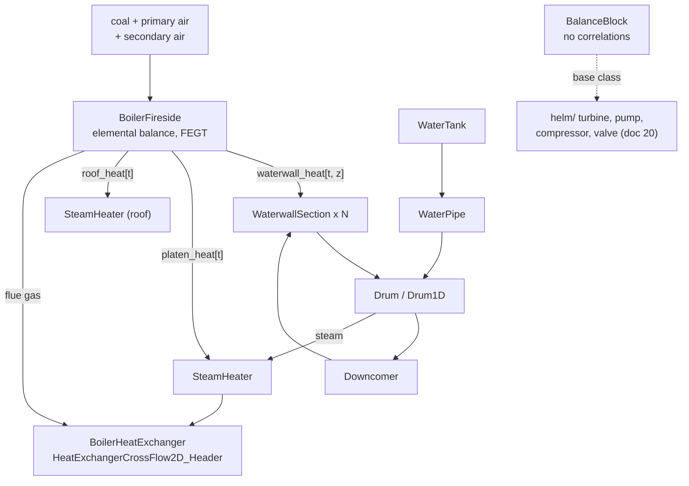
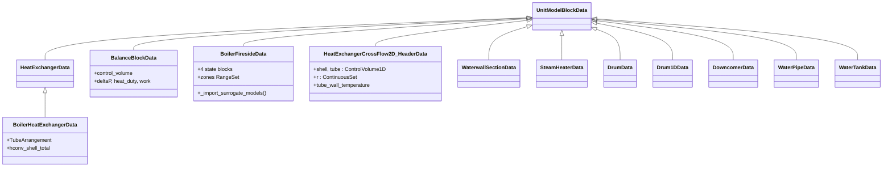
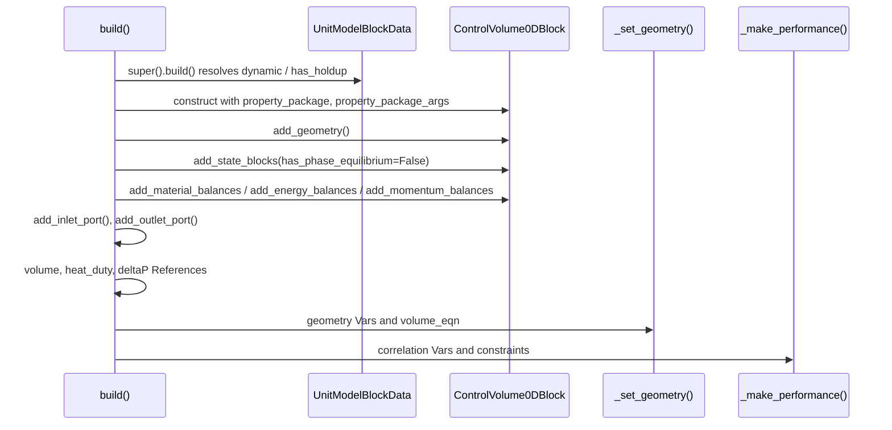
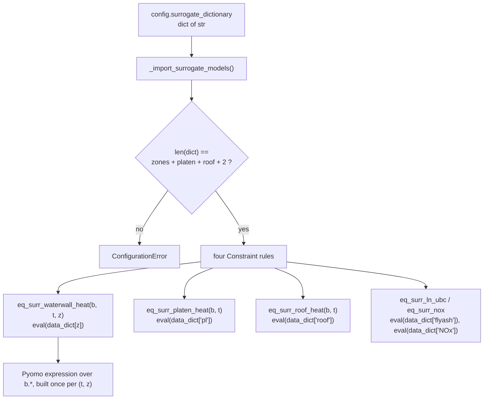

# 18 — Power generation: boiler island

> **Doc ID** 18 · **Repo SHA** 70a8f4fe1 (IDAES-PSE v2.13.0rc0) · **Source roots** `idaes/models_extra/power_generation/`, `idaes/models_extra/power_generation/unit_models/`
> **Owns** 13 modules / 11,626 LOC · **Assets** 4 SVG icons and 1 README (§10) · **Siblings** [04](04_control_volume_framework.md), [05](05_property_and_reaction_framework.md), [06](06_model_preparation_initializers_and_scalers.md), [19](19_power_generation_heat_exchangers_and_properties.md), [20](20_power_generation_helmholtz_units_and_soc.md), [24](24_reference_flowsheets_and_demonstrations.md), [28](28_data_and_file_format_inventory.md)

The boiler island is the part of a coal-fired steam plant between the coal
feeders and the superheater outlet: a furnace that burns fuel, heat-transfer
surfaces that absorb the released heat, and a natural-circulation water/steam
loop that carries it away. This document owns the eleven unit models
representing those three roles, the package initialiser that re-exports them,
and four SVG icons shipped beside them.

Every model here is a control volume from
[04](04_control_volume_framework.md) plus hand-written correlations. The control
volume writes the conservation statements; the module writes the geometry, the
heat-transfer coefficients, the friction factors and — in the fireside model — a
seam through which a user supplies correlations as Python expression source
text. This document describes the correlations and the seams, never the balance
engine, which is documented once in [04](04_control_volume_framework.md).

---

## 0. Scope and source map

| File | LOC | Purpose | Covered in § |
|---|---:|---|---|
| `idaes/models_extra/power_generation/__init__.py` | 0 | Package marker; no code | 2 |
| `idaes/models_extra/power_generation/unit_models/__init__.py` | 31 | Re-exports 20 names from 16 sibling modules, 8 of them belonging to another document | 2, 8, 12 |
| `idaes/models_extra/power_generation/unit_models/balance.py` | 251 | `make_balance_control_volume`, `make_balance_config_block`, `BalanceBlockData` — the shared balance-only block four Helmholtz models derive from | 2, 3, 4, 5, 7, 9, 12 |
| `idaes/models_extra/power_generation/unit_models/boiler_fireside.py` | 1,260 | `BoilerFiresideData` — the furnace: elemental combustion balance, zone heat duties from user-supplied surrogate expressions | 1, 4, 5, 6, 7, 9, 11, 12, 13 |
| `idaes/models_extra/power_generation/unit_models/boiler_heat_exchanger.py` | 1,288 | `BoilerHeatExchangerData` and the `TubeArrangement` enum — a `HeatExchangerData` subclass with tube-bank correlations and optional gas radiation | 2, 3, 4, 5, 6, 7, 11, 12, 13 |
| `idaes/models_extra/power_generation/unit_models/boiler_heat_exchanger_2D.py` | 3,279 | `HeatExchangerCrossFlow2D_HeaderData` — two one-dimensional control volumes plus a radial wall-conduction domain, EN 13445 stresses and a creep-rupture expression | 3, 4, 5, 6, 7, 11, 12, 13 |
| `idaes/models_extra/power_generation/unit_models/waterwall_section.py` | 1,220 | `WaterwallSectionData` — one furnace-wall zone: two-phase flow, slag and metal layers, Chen-type boiling correlation | 4, 5, 6, 7, 12, 13 |
| `idaes/models_extra/power_generation/unit_models/steamheater.py` | 791 | `SteamHeaterData` — the same slag/metal structure for a single-phase superheater panel | 4, 5, 6, 7, 13 |
| `idaes/models_extra/power_generation/unit_models/drum.py` | 601 | `DrumData` — steam drum built from an internal `HelmPhaseSeparator` and `HelmMixer` joined by a Pyomo `Arc` | 4, 5, 6, 7, 11, 13 |
| `idaes/models_extra/power_generation/unit_models/drum1D.py` | 1,529 | `Drum1DData` — the same drum with a discretized wall, free convection to ambient, and a stress expression set | 4, 5, 6, 7, 11, 12, 13 |
| `idaes/models_extra/power_generation/unit_models/downcomer.py` | 485 | `DowncomerData` — vertical pipe: friction and gravity pressure change | 4, 5, 6, 7, 11, 13 |
| `idaes/models_extra/power_generation/unit_models/waterpipe.py` | 457 | `WaterPipeData` — the same with an optional contraction or expansion at the exit | 4, 5, 6, 7, 13 |
| `idaes/models_extra/power_generation/unit_models/watertank.py` | 434 | `WaterTankData` — four tank geometries selected by one configuration key | 4, 5, 6, 7, 12, 13 |
| `idaes/models_extra/power_generation/unit_models/README.md` | — | 58-byte directory note | 10 |
| `idaes/models_extra/power_generation/unit_models/icons/attemperator_1.svg` | — | Process-flow-diagram icon | 10 |
| `idaes/models_extra/power_generation/unit_models/icons/bag_house.svg` | — | Process-flow-diagram icon | 10 |
| `idaes/models_extra/power_generation/unit_models/icons/mill_1.svg` | — | Process-flow-diagram icon | 10 |
| `idaes/models_extra/power_generation/unit_models/icons/mill_2.svg` | — | Process-flow-diagram icon | 10 |

Total 11,626 LOC, 107 configuration keys across twelve `ConfigBlock`
declarations on eleven classes, one enumeration, two deprecation sites, and
**zero** `NotImplementedError` hook sites.

---

## 1. Architectural role

Three physical roles, three groups of modules.

**The firing side.** `BoilerFiresideData`
(`idaes/models_extra/power_generation/unit_models/boiler_fireside.py:103`) is one
block with two air inlets and one flue-gas outlet. It closes an elemental
balance over C, H, O, N and S, computes the flue-gas exit temperature from an
overall energy balance, and obtains every heat duty it distributes — one per
furnace-wall zone, one for the platen superheater, one for the roof — from
correlations the user supplies as Python expression strings. It owns no control
volume; it builds four state blocks directly.

**The heat-transfer surfaces.** `BoilerHeatExchangerData`
(`boiler_heat_exchanger.py:95`) is a `HeatExchangerData` subclass
([10 §5.3](10_unit_models_control_volume_based.md#53-heatexchanger-the-hotcold-side-protocol))
carrying tube-bank velocity, Reynolds, Prandtl and Nusselt correlations on both
sides plus an optional three-band gas emissivity model.
`HeatExchangerCrossFlow2D_HeaderData` (`boiler_heat_exchanger_2D.py:74`) answers
a different question — what the tube metal is doing — by adding a radial
`ContinuousSet` through the tube wall, discretizing it itself, and evaluating
thermal and mechanical stresses over the result. `WaterwallSectionData`
(`waterwall_section.py:67`) and `SteamHeaterData` (`steamheater.py:54`) are
surfaces seen from the water side: each carries a slag layer, a metal layer and
a lumped energy holdup for both.

**The water/steam circuit.** `DrumData` (`drum.py:85`), `Drum1DData`
(`drum1D.py:118`), `DowncomerData` (`downcomer.py:56`), `WaterPipeData`
(`waterpipe.py:54`) and `WaterTankData` (`watertank.py:64`) are the hydraulic
path: a `ControlVolume0DBlock` plus a pressure-change decomposition into named
terms — friction, gravity, contraction, area change — summed by one constraint.

**The shared block.** `BalanceBlockData` (`balance.py:219`) belongs to none of
the three. It is a balance-only unit with no correlations, and its two module
functions are what four Helmholtz models in
[20](20_power_generation_helmholtz_units_and_soc.md) build their control volumes
from.

*The fireside model is the source of every heat duty in the island; the water/steam loop is closed through the drum and the downcomer.*

---

## 2. Public surface inventory

| Symbol | Kind | Declared at | Exported via | Stability signal |
|---|---|---|---|---|
| `BalanceBlockData` / `BalanceBlock` | class pair | `idaes/models_extra/power_generation/unit_models/balance.py:219` | `idaes.models_extra.power_generation.unit_models` | both re-exported; base of four `helm/` models |
| `make_balance_control_volume` | function | `idaes/models_extra/power_generation/unit_models/balance.py:40` | module import | no underscore; four call sites in `helm/` |
| `make_balance_config_block` | function | `idaes/models_extra/power_generation/unit_models/balance.py:92` | module import | no underscore; four call sites in `helm/` |
| `BoilerFiresideData` / `BoilerFireside` | class pair | `idaes/models_extra/power_generation/unit_models/boiler_fireside.py:103` | `idaes.models_extra.power_generation.unit_models` | `BoilerFireside` re-exported; the `docs/` page carries `currentmodule` but no autodoc directive |
| `TubeArrangement` | enum | `idaes/models_extra/power_generation/unit_models/boiler_heat_exchanger.py:89` | module import | imported by name in a shipped flowsheet |
| `BoilerHeatExchangerData` / `BoilerHeatExchanger` | class pair | `idaes/models_extra/power_generation/unit_models/boiler_heat_exchanger.py:95` | `idaes.models_extra.power_generation.unit_models` | both carry `autoclass` directives in `docs/` |
| `HeatExchangerCrossFlow2D_HeaderData` / `HeatExchangerCrossFlow2D_Header` | class pair | `idaes/models_extra/power_generation/unit_models/boiler_heat_exchanger_2D.py:74` | `idaes.models_extra.power_generation.unit_models` | both carry `autoclass` directives in `docs/` |
| `WaterwallSectionData` / `WaterwallSection` | class pair | `idaes/models_extra/power_generation/unit_models/waterwall_section.py:67` | `idaes.models_extra.power_generation.unit_models` | re-exported; the `docs/` page names the module `waterwall`, not `waterwall_section` |
| `SteamHeaterData` / `SteamHeater` | class pair | `idaes/models_extra/power_generation/unit_models/steamheater.py:54` | `idaes.models_extra.power_generation.unit_models` | re-exported |
| `DrumData` / `Drum` | class pair | `idaes/models_extra/power_generation/unit_models/drum.py:85` | `idaes.models_extra.power_generation.unit_models` | re-exported |
| `Drum1DData` / `Drum1D` | class pair | `idaes/models_extra/power_generation/unit_models/drum1D.py:118` | `idaes.models_extra.power_generation.unit_models` | re-exported; two `deprecation_warning` sites (§12.1) |
| `DowncomerData` / `Downcomer` | class pair | `idaes/models_extra/power_generation/unit_models/downcomer.py:56` | `idaes.models_extra.power_generation.unit_models` | re-exported |
| `WaterPipeData` / `WaterPipe` | class pair | `idaes/models_extra/power_generation/unit_models/waterpipe.py:54` | `idaes.models_extra.power_generation.unit_models` | re-exported |
| `WaterTankData` / `WaterTank` | class pair | `idaes/models_extra/power_generation/unit_models/watertank.py:64` | `idaes.models_extra.power_generation.unit_models` | re-exported; no `docs/` page |

`idaes/models_extra/power_generation/__init__.py` is an empty file. The package
surface is entirely `unit_models/__init__.py`
(`idaes/models_extra/power_generation/unit_models/__init__.py:13`), a flat list
of 16 `from .module import ...` statements pulling 20 names out of 16 sibling
modules. Eight of those names — `FWH0D`, `FWHCondensing0D`,
`CrossFlowHeatExchanger1D`, `CrossFlowHeatExchanger1DInitializer`,
`FWH0DDynamic`, `Heater1D`, `Heater1DInitializer` and
`HeatExchangerWith3Streams` — come from five modules owned by
[19](19_power_generation_heat_exchangers_and_properties.md), so importing any
model in this document imports those as well. The `helm/`, `soc_submodels/` and
`soec_design` names of [20](20_power_generation_helmholtz_units_and_soc.md) are
*not* re-exported here and are imported from their own subpackage.

`boiler_heat_exchanger.py:73` re-exports convenience imports it does not define:
`HeatExchangerData`, five `delta_temperature_*_callback` functions and
`HeatExchangerFlowPattern`, pulled out of
`idaes.models.unit_models.heat_exchanger` under a `pylint: disable=W0611`
comment, so `from ...boiler_heat_exchanger import
delta_temperature_underwood_callback` resolves. A shipped flowsheet uses exactly
that route
(`idaes/models_extra/power_generation/flowsheets/supercritical_power_plant/boiler_subflowsheet_build.py:82`).

---

## 3. Class hierarchy and type taxonomy

*Ten of the eleven process blocks derive straight from `UnitModelBlockData`; the hierarchy is one level deep everywhere except `BoilerHeatExchangerData`.*

Every class carries `@declare_process_block_class`, so the container name in the
fourth column is synthesized and injected into the module by the decorator
([03 §3](03_block_hierarchy_and_construction_protocol.md#3-class-hierarchy-and-type-taxonomy)).

| Class | Base(s) | Declared at | Container class | Key overrides |
|---|---|---|---|---|
| `BalanceBlockData` | `UnitModelBlockData` | `balance.py:219` | `BalanceBlock` | `build` |
| `BoilerFiresideData` | `UnitModelBlockData` | `boiler_fireside.py:103` | `BoilerFireside` | `build`, `initialize_build`, `calculate_scaling_factors` |
| `BoilerHeatExchangerData` | `HeatExchangerData` | `boiler_heat_exchanger.py:95` | `BoilerHeatExchanger` | `build`, `model_check`, `initialize_build`, `calculate_scaling_factors` |
| `HeatExchangerCrossFlow2D_HeaderData` | `UnitModelBlockData` | `boiler_heat_exchanger_2D.py:74` | `HeatExchangerCrossFlow2D_Header` | `build`, `set_initial_condition`, `initialize_build`, `calculate_scaling_factors` |
| `WaterwallSectionData` | `UnitModelBlockData` | `waterwall_section.py:67` | `WaterwallSection` | the same four |
| `SteamHeaterData` | `UnitModelBlockData` | `steamheater.py:54` | `SteamHeater` | the same four |
| `DrumData` | `UnitModelBlockData` | `drum.py:85` | `Drum` | the same four |
| `Drum1DData` | `UnitModelBlockData` | `drum1D.py:118` | `Drum1D` | the same four |
| `DowncomerData` | `UnitModelBlockData` | `downcomer.py:56` | `Downcomer` | the same four |
| `WaterPipeData` | `UnitModelBlockData` | `waterpipe.py:54` | `WaterPipe` | the same four |
| `WaterTankData` | `UnitModelBlockData` | `watertank.py:64` | `WaterTank` | the same four |

### 3.1 Enumerations

One enum in scope, `TubeArrangement`
(`idaes/models_extra/power_generation/unit_models/boiler_heat_exchanger.py:89`):

| Member | Value | Meaning | Consumed at |
|---|---|---|---|
| `inLine` | 0 | Tubes aligned row to row; arrangement factor 0.788 | `boiler_heat_exchanger.py:875`, `:946` |
| `staggered` | 1 | Tubes offset row to row; arrangement factor 1.0 | `boiler_heat_exchanger.py:879`, `:963` |

The two-dimensional model expresses the same choice as a string: its
`tube_arrangement` key has domain `In(["in-line", "staggered"])`
(`boiler_heat_exchanger_2D.py:223`) and is compared against string literals at
`boiler_heat_exchanger_2D.py:1427` and `:1510`. The two spellings name the same
physical configuration and are not interchangeable.

### 3.2 Neither Initializer objects nor Scaler objects

Of the eleven process block classes declared in this document's scope, **none
declares a `default_initializer` and none declares a `default_scaler`**. The
count comes from `_generated/retrofit.csv`, which records both attributes for all
160 declared process block classes; the row for every class in the roster above
is empty in both columns.

The consequence is mechanical. A model here is reachable only through the older
of each pair of preparation paths: the legacy initialization routine
`UnitModelBlockData.initialize` (`idaes/core/base/unit_model.py:504`), which
dispatches to the `initialize_build` each class defines, and suffix-based scaling
through `calculate_scaling_factors`, which every class overrides. The
Initializer-object and Scaler-object APIs of
[06](06_model_preparation_initializers_and_scalers.md) find nothing to bind to on
these blocks. The set-wide adoption table is
[06 §3.3](06_model_preparation_initializers_and_scalers.md#33-retrofit-adoption);
this document's row there reads 11 blocks, 0 Initializers, 0 Scalers.

---

## 4. Configuration reference

107 keys across twelve `ConfigBlock` declarations on eleven classes — the
two-dimensional exchanger declares both its own `CONFIG` and the `_SideTemplate`
it instantiates twice. No key in this scope is marked required by a
`ConfigValue` domain; the four that must be supplied — `surrogate_dictionary`,
`tube_inner_diameter`, `tube_thickness` and, when `has_header` is set, the two
header dimensions — default to `None` and are checked inside `build`, so the
failure is a `ConfigurationError` at construction rather than a domain
rejection.

### 4.1 Where each CONFIG block starts

| Class | `CONFIG` expression | Anchor | Declared here | Total on the block |
|---|---|---|---:|---:|
| `BalanceBlockData` | `UnitModelBlockData.CONFIG()` then `make_balance_config_block(CONFIG)` | `balance.py:224` | 9 | 11 |
| `BoilerFiresideData` | `ConfigBlock()` | `boiler_fireside.py:108` | 9 | 9 |
| `BoilerHeatExchangerData` | `HeatExchangerData.CONFIG(implicit=True)` | `boiler_heat_exchanger.py:96` | 3 | inherited plus 3 |
| `HeatExchangerCrossFlow2D_HeaderData` | `UnitModelBlockData.CONFIG()` plus a `_SideTemplate` instantiated twice | `boiler_heat_exchanger_2D.py:77` | 17 + 6 | 19 |
| `WaterwallSectionData` | `ConfigBlock()` | `waterwall_section.py:72` | 10 | 10 |
| `SteamHeaterData` | `UnitModelBlockData.CONFIG()` | `steamheater.py:59` | 8 | 10 |
| `DrumData` | `ConfigBlock()` | `drum.py:90` | 9 | 9 |
| `Drum1DData` | `UnitModelBlockData.CONFIG()` | `drum1D.py:123` | 11 | 13 |
| `DowncomerData` | `ConfigBlock()` | `downcomer.py:61` | 8 | 8 |
| `WaterPipeData` | `UnitModelBlockData.CONFIG()` | `waterpipe.py:59` | 9 | 11 |
| `WaterTankData` | `UnitModelBlockData.CONFIG()` | `watertank.py:69` | 8 | 10 |

`UnitModelBlockData.CONFIG` contributes exactly two keys, `dynamic`
(`idaes/core/base/unit_model.py:65`) and `has_holdup`
(`idaes/core/base/unit_model.py:79`), both with domain `DefaultBool` and default
`useDefault`. The four blocks that start from a bare `ConfigBlock()` re-declare
`dynamic` with the same domain and default, but declare `has_holdup` with domain
`Bool` and default `False` — see §12.6.

None of these blocks carries the full `CONFIG_Template` of
[04 §4.1](04_control_volume_framework.md#41-configtemplate-the-unit-model-facing-template).
Each picks the subset of template key names it needs and declares them itself
with the template's spellings and domains; the values are then forwarded to the
control volume by explicit method arguments in `build` rather than by
`auto_construct`.

### 4.2 `make_balance_config_block` — the shared nine

`make_balance_config_block(config)`
(`idaes/models_extra/power_generation/unit_models/balance.py:92`) declares nine
keys onto whatever `ConfigBlock` it is handed. It is applied to
`BalanceBlockData.CONFIG` at `balance.py:225` and to four
`BalanceBlockData.CONFIG()` copies in
[20](20_power_generation_helmholtz_units_and_soc.md).

| Key | Domain / validator | Default | Req. | Effect on build | Anchor |
|---|---|---|---|---|---|
| `material_balance_type` | `In(MaterialBalanceType)` | `useDefault` | no | Passed to `add_material_balances` | `balance.py:96` |
| `energy_balance_type` | `In(EnergyBalanceType)` | `useDefault` | no | Passed to `add_energy_balances` | `balance.py:114` |
| `momentum_balance_type` | `In(MomentumBalanceType)` | `pressureTotal` | no | Passed to `add_momentum_balances`; also gates the `deltaP` reference | `balance.py:132` |
| `has_phase_equilibrium` | `Bool` | `False` | no | Forwarded to `add_state_blocks` and to the material balance | `balance.py:148` |
| `has_pressure_change` | `Bool` | `False` | no | Creates `deltaP` and the unit-level `Reference` to it | `balance.py:161` |
| `property_package` | `is_physical_parameter_block` | `useDefault` | no | The parameter block the control volume builds states from | `balance.py:175` |
| `property_package_args` | implicit `ConfigBlock` | empty | no | Forwarded to each state block | `balance.py:188` |
| `has_work_transfer` | `Bool` | `True` | no | Creates `work` and the unit-level `Reference` to it | `balance.py:200` |
| `has_heat_transfer` | `Bool` | `True` | no | Creates `heat` and the unit-level `heat_duty` reference | `balance.py:208` |

The last two default to `True`, the opposite of the `CONFIG_Template` defaults
for the same key names.
`make_balance_control_volume` (`balance.py:40`) reads them defensively — it tests
`"has_heat_transfer" in config` (`balance.py:49`) and `"has_work_transfer" in
config` (`balance.py:53`) and substitutes `False` when absent — so the function
also works against a configuration block that never saw
`make_balance_config_block`.

### 4.3 `BoilerFiresideData.CONFIG`

| Key | Domain / validator | Default | Req. | Effect on build | Anchor |
|---|---|---|---|---|---|
| `dynamic` | `DefaultBool` | `useDefault` | no | Resolved against the flowsheet; no accumulation term is created either way | `boiler_fireside.py:109` |
| `has_holdup` | `Bool` | `False` | no | Declared and never read by this class | `boiler_fireside.py:123` |
| `property_package` | `is_physical_parameter_block` | `useDefault` | no | Builds all four state blocks; must expose `flow_mol_comp` over O2, N2, CO2, H2O, SO2, NO | `boiler_fireside.py:137` |
| `property_package_args` | implicit `ConfigBlock` | empty | no | Forwarded to each of the four state blocks | `boiler_fireside.py:150` |
| `calculate_PA_SA_flows` | `Bool` | `False` | no | When true, adds `molar_flow_PA_eqn` and `molar_flow_SA_eqn`, which overwrite inlet composition from a fixed air mole-fraction `Param` | `boiler_fireside.py:162` |
| `number_of_zones` | none | `16` | no | Length of the `zones` `RangeSet`, and therefore of `wall_temperature_waterwall`, `waterwall_heat` and the zone surrogate constraint | `boiler_fireside.py:177` |
| `has_platen_superheater` | `Bool` | `True` | no | Creates `platen_heat`, `wall_temperature_platen`, `fcorrection_heat_platen` and `eq_surr_platen_heat` | `boiler_fireside.py:185` |
| `has_roof_superheater` | `Bool` | `True` | no | Creates `roof_heat`, `wall_temperature_roof` and `eq_surr_roof_heat` | `boiler_fireside.py:198` |
| `surrogate_dictionary` | none | `None` | at build | The expression source map; `None` raises `ConfigurationError` at `boiler_fireside.py:227` | `boiler_fireside.py:211` |

The `mole_frac_air` `Param` that `calculate_PA_SA_flows` needs is created only
when the flag is set (`boiler_fireside.py:349`), and the two constraints skip the
`N2` component so that nitrogen closes by difference.

### 4.4 `BoilerHeatExchangerData.CONFIG` — the delta over `HeatExchangerData`

Every key of `HeatExchangerData.CONFIG` is inherited unchanged; that table is
[10 §4.2](10_unit_models_control_volume_based.md#42-heatexchangerpy-heatexchangerdataconfig).
`implicit=True` is preserved from the base declaration, so a side's options can
still be supplied under a user-chosen `hot_side_name` or `cold_side_name`.

| Key | Inherited from | Override | Anchor |
|---|---|---|---|
| `tube_arrangement` | new | `In(TubeArrangement)`, default `TubeArrangement.inLine`; selects the `f_arrangement` `Param` and one of two `friction_factor_shell_eqn` forms | `boiler_heat_exchanger.py:98` |
| `cold_side_water_phase` | new | `In(["Liq", "Vap"])`, default `"Liq"`; stored on the block as the plain string attribute `cold_side_fluid_phase` and used to index every cold-side phase-dependent property call | `boiler_heat_exchanger.py:107` |
| `has_radiation` | new | `In([False, True])`, default `False`; adds seven variables and six constraints for a three-band gas emissivity model and a radiative shell-side coefficient | `boiler_heat_exchanger.py:116` |
| `hot_side`, `cold_side`, `flow_pattern`, `delta_temperature_callback` | `HeatExchangerData` | unchanged, except that `HeatExchangerFlowPattern.crossflow` is rejected in `_process_config` (`boiler_heat_exchanger.py:133`) | [10 §4.2](10_unit_models_control_volume_based.md#42-heatexchangerpy-heatexchangerdataconfig) |

### 4.5 `HeatExchangerCrossFlow2D_HeaderData` — a side template plus 17 keys

`_SideTemplate = ConfigBlock()` (`boiler_heat_exchanger_2D.py:80`) is declared as
a class attribute and instantiated twice, as `shell_side`
(`boiler_heat_exchanger_2D.py:169`) and `tube_side`
(`boiler_heat_exchanger_2D.py:170`). It is a local template, unrelated to the
`_SideTemplate` of `heat_exchanger_1D.py`
([10 §4.3](10_unit_models_control_volume_based.md#43-heatexchanger1dpy-sidetemplate-and-heatexchanger1ddataconfig)),
which carries eleven keys rather than six.

**`shell_side` and `tube_side`, six keys each:**

| Key | Domain / validator | Default | Req. | Effect on build | Anchor |
|---|---|---|---|---|---|
| `material_balance_type` | `In(MaterialBalanceType)` | `componentTotal` | no | Passed to that side's `add_material_balances` | `boiler_heat_exchanger_2D.py:81` |
| `energy_balance_type` | `In(EnergyBalanceType)` | `enthalpyTotal` | no | Passed to `add_energy_balances`, always with `has_heat_transfer=True` | `boiler_heat_exchanger_2D.py:97` |
| `momentum_balance_type` | `In(MomentumBalanceType)` | `pressureTotal` | no | Passed to `add_momentum_balances` | `boiler_heat_exchanger_2D.py:113` |
| `has_pressure_change` | `Bool` | `False` | no | Per side; gates that side's friction and turn-loss terms | `boiler_heat_exchanger_2D.py:129` |
| `property_package` | `is_physical_parameter_block` | `None` | no | That side's parameter block | `boiler_heat_exchanger_2D.py:143` |
| `property_package_args` | none | `{}` | no | Forwarded to that side's state blocks | `boiler_heat_exchanger_2D.py:155` |

**`CONFIG`, 17 further keys:**

| Key | Domain / validator | Default | Req. | Effect on build | Anchor |
|---|---|---|---|---|---|
| `shell_side` | `_SideTemplate` | — | no | The shell-side sub-block above | `boiler_heat_exchanger_2D.py:169` |
| `tube_side` | `_SideTemplate` | — | no | The tube-side sub-block above | `boiler_heat_exchanger_2D.py:170` |
| `transformation_method` | none | `'dae.finite_difference'` | no | Forwarded to both `ControlVolume1DBlock` constructors | `boiler_heat_exchanger_2D.py:173` |
| `transformation_scheme` | none | `'BACKWARD'` | no | The same | `boiler_heat_exchanger_2D.py:182` |
| `finite_elements` | `int` | `5` | no | Elements along both flow domains | `boiler_heat_exchanger_2D.py:191` |
| `collocation_points` | `int` | `3` | no | Collocation points along both flow domains | `boiler_heat_exchanger_2D.py:201` |
| `flow_type` | `In(['co_current', 'counter_current'])` | `'co_current'` | no | Sets the tube side's `FlowDirection`; also selects one of two initialization branches | `boiler_heat_exchanger_2D.py:211` |
| `tube_arrangement` | `In(['in-line', 'staggered'])` | `'in-line'` | no | Selects `f_arrangement` and one of two shell friction-factor forms | `boiler_heat_exchanger_2D.py:223` |
| `tube_side_water_phase` | `In(['Liq', 'Vap'])` | `'Liq'` | no | Phase index for every tube-side property call | `boiler_heat_exchanger_2D.py:232` |
| `has_radiation` | `In([False, True])` | `False` | no | Adds the three-band gas emissivity model and `mbl`, `mbl_div2`, `mbl_mul2` | `boiler_heat_exchanger_2D.py:241` |
| `tube_inner_diameter` | none | `None` | at build | Initializes the immutable `tube_di` `Param`; `None` raises | `boiler_heat_exchanger_2D.py:250` |
| `tube_thickness` | none | `None` | at build | Initializes the immutable `tube_thickness` `Param`; `None` raises | `boiler_heat_exchanger_2D.py:258` |
| `radial_elements` | `int` | `5` | no | `nfe` of the `CENTRAL` finite-difference transformation over `r` | `boiler_heat_exchanger_2D.py:266` |
| `header_inner_diameter` | none | `None` | conditional | Required when `has_header`; initializes `head_di` | `boiler_heat_exchanger_2D.py:276` |
| `header_wall_thickness` | none | `None` | conditional | Required when `has_header`; initializes `head_thickness` | `boiler_heat_exchanger_2D.py:284` |
| `header_radial_elements` | `int` | `5` | no | `nfe` of the second radial transformation, over `head_r` | `boiler_heat_exchanger_2D.py:292` |
| `has_header` | `Bool` | `True` | no | Adds the whole header sub-model: a second `ContinuousSet`, its own conduction equation, stresses and creep | `boiler_heat_exchanger_2D.py:302` |

Because `tube_di` and `tube_thickness` are built as **immutable** `Param`s from
these configuration values (`boiler_heat_exchanger_2D.py:492`, `:499`), tube
geometry is fixed at construction and cannot be changed on a built model, in
contrast with every other model in this document, where the same quantities are
`Var`s.

### 4.6 The water/steam circuit and the wall surfaces — a common core

Seven classes — `DowncomerData`, `DrumData`, `Drum1DData`, `SteamHeaterData`,
`WaterPipeData`, `WaterTankData` and `WaterwallSectionData` — declare the same
core of seven key names with the same domains, each in its own module.

| Key | Domain / validator | Default | Req. | Effect on build |
|---|---|---|---|---|
| `material_balance_type` | `In(MaterialBalanceType)` | `componentPhase` everywhere | no | Passed to `add_material_balances` |
| `energy_balance_type` | `In(EnergyBalanceType)` | `enthalpyTotal` everywhere | no | Passed to `add_energy_balances` |
| `momentum_balance_type` | `In(MomentumBalanceType)` | `pressureTotal` everywhere | no | Passed to `add_momentum_balances`; also tested before creating the unit-level `deltaP` reference |
| `has_heat_transfer` | `Bool` | `False`, except `True` on `Drum1DData` | no | Creates `heat` and the unit-level `heat_duty` reference |
| `has_pressure_change` | `Bool` | `True` on `Drum1DData`, `WaterPipeData`, `WaterTankData`; `False` on the other three that declare it | no | Gates the unit-level `deltaP` reference only; the control volume is always asked for one |
| `property_package` | `is_physical_parameter_block` | `useDefault` | no | Builds the control volume's state blocks |
| `property_package_args` | implicit `ConfigBlock` | empty | no | Forwarded to those state blocks |

Anchor matrix for those keys, plus the two `dynamic`/`has_holdup` declarations
that appear only where the class starts from a bare `ConfigBlock()`. Each cell is
a line in the module named by its column; a dash means the key is not declared
there.

| Key | `downcomer.py` | `drum.py` | `drum1D.py` | `steamheater.py` | `waterpipe.py` | `watertank.py` | `waterwall_section.py` |
|---|---|---|---|---|---|---|---|
| `dynamic` | 62 | 91 | — | — | — | — | 73 |
| `has_holdup` | 76 | 105 | — | — | — | — | 87 |
| `material_balance_type` | 90 | 119 | 124 | 61 | 60 | 96 | 101 |
| `energy_balance_type` | 106 | 135 | 140 | 77 | 76 | 112 | 117 |
| `momentum_balance_type` | 122 | 151 | 156 | 93 | 92 | 128 | 133 |
| `has_heat_transfer` | 138 | 167 | 172 | 109 | 108 | 144 | 149 |
| `has_pressure_change` | — | 180 | 185 | 122 | 121 | 157 | 162 |
| `property_package` | 151 | 194 | 199 | 136 | 135 | 171 | 176 |
| `property_package_args` | 164 | 207 | 212 | 149 | 148 | 184 | 189 |

**Per-model deltas.**

| Model | Key | Domain / validator | Default | Effect on build | Anchor |
|---|---|---|---|---|---|
| `Drum1DData` | `finite_elements` | `int` | `5` | `nfe` of the `CENTRAL` finite-difference transformation over `dimensionless_radial_domain` | `drum1D.py:224` |
| `Drum1DData` | `collocation_points` | `int` | `3` | Declared; the transformation applied is always finite difference | `drum1D.py:234` |
| `Drum1DData` | `drum_inner_diameter` | none | `None` | Deprecated; when set, initializes the `drum_diameter` `Var` and emits a warning | `drum1D.py:244` |
| `Drum1DData` | `drum_thickness` | none | `None` | Deprecated; when set, initializes the `drum_thickness` `Var` and emits a warning | `drum1D.py:253` |
| `SteamHeaterData` | `single_side_only` | `Bool` | `True` | Halves `perimeter_ss` and the fireside heat-flux constraint: heat arrives on one side of the tube bank rather than both | `steamheater.py:161` |
| `WaterPipeData` | `contraction_expansion_at_end` | `In(['None', 'contraction', 'expansion'])` | `'None'` | Anything but `'None'` creates the `area_ratio` `Var`; selects one of three branches of `pressure_change_area_change_eqn` | `waterpipe.py:160` |
| `WaterPipeData` | `water_phase` | `In(['Liq', 'Vap'])` | `'Liq'` | Phase index for every density and viscosity call in the module | `waterpipe.py:170` |
| `WaterTankData` | `tank_type` | `In(['simple_tank', 'rectangular_tank', 'vertical_cylindrical_tank', 'horizontal_cylindrical_tank'])` | `'simple_tank'` | Selects which geometry variables and which volume expression are created | `watertank.py:71` |
| `WaterwallSectionData` | `rigorous_boiling` | `Bool` | `False` | Adds `martinelli_reciprocal_p86` and its constraint, and a third term in `enhancement_factor_eqn` | `waterwall_section.py:201` |

---

## 5. Construction and call sequences

### 5.1 The common skeleton

Nine of the eleven classes follow the same `build`.

*Every model in the water/steam group is the same nine calls with a different `_make_performance`; the two private methods are where the physics lives.*

Each cell is a line in the module named by its column.

| Step | `downcomer.py` | `drum.py` | `drum1D.py` | `steamheater.py` | `waterpipe.py` | `watertank.py` | `waterwall_section.py` |
|---|---|---|---|---|---|---|---|
| `build` | 177 | 220 | 262 | 175 | 181 | 197 | 216 |
| control volume | 192 | 233 | 283 | 183 | 189 | 210 | 231 |
| `_set_geometry` | 238 | 340 | 386 | 232 | 239 | 260 | 283 |
| `_make_performance` | 269 | 370 | 467 | 360 | 267 | 285 | 434 |
| `set_initial_condition` | 368 | 483 | 1341 | 690 | 396 | 362 | 1117 |
| `initialize_build` | 375 | 490 | 1350 | 701 | 403 | 369 | 1130 |
| `calculate_scaling_factors` | 440 | 578 | 1494 | 771 | 456 | 433 | 1192 |

Every one of the seven passes `has_phase_equilibrium=False` to
`add_state_blocks` and `has_pressure_change=True` to `add_momentum_balances`,
regardless of configuration — see §12.3. The comment at `downcomer.py:200`
states the reason for the first: phase transitions are handled inside the
Helmholtz property package ([16](16_general_helmholtz_property_system.md)), not
by the control volume.

`BalanceBlockData.build` (`balance.py:227`) is the same skeleton with the
control-volume half factored out. It calls `make_balance_control_volume(self,
"control_volume", self.config)` (`balance.py:238`), adds the two standard ports,
and creates the `deltaP`, `heat_duty` and `work` references conditionally
(`balance.py:247`, `:249`, `:251`). It has no geometry and no performance method.

### 5.2 The drum: two internal unit models joined by an `Arc`

`DrumData.build` (`drum.py:220`) constructs a sub-flowsheet inside the unit:

1. A `ControlVolume0DBlock` (`drum.py:233`) with the usual four construction
   calls, ending in the momentum call at `drum.py:254`.
2. `self.flash = HelmPhaseSeparator(...)` (`drum.py:258`) — the saturated
   water/steam mixture returning from the waterwall is split into phases.
3. `self.mixer = HelmMixer(..., inlet_list=["FeedWater", "SaturatedWater"])`
   (`drum.py:262`) — the separated liquid is mixed with feedwater.
4. Three ports are created by extension rather than by `add_port`:
   `feedwater_inlet` extends `mixer.FeedWater` (`drum.py:271`),
   `water_steam_inlet` extends `flash.inlet` (`drum.py:273`), and `steam_outlet`
   extends `flash.vap_outlet` (`drum.py:278`). Only `liquid_outlet` uses the
   framework call `add_outlet_port` (`drum.py:276`).
5. `mixer_pressure_eqn` (`drum.py:282`) equates the two mixer inlet pressures,
   scaled by `1e-6`.
6. `self.stream_flash_out = Arc(...)` (`drum.py:287`) joins the flash liquid
   outlet to the mixer's `SaturatedWater` inlet, and
   `TransformationFactory("network.expand_arcs").apply_to(self)` (`drum.py:292`)
   expands it immediately, inside `build`.
7. Three hand-written connection constraints — `connection_material_balance`
   (`drum.py:298`), `connection_enthalpy_balance` (`drum.py:305`) and
   `connection_pressure_balance` (`drum.py:312`) — equate the mixer's
   `mixed_state` to the control volume's `properties_in`, each with its own scale
   factor (`1e-4`, `1e-4`, `1e-6`).

`Drum1DData.build` (`drum1D.py:262`) repeats the structure with three
differences: it validates the property package first (`drum1D.py:274`), raising
`ConfigurationError` unless the package is a `HelmholtzParameterBlockData` whose
`phase_presentation` is `PhaseType.MIX`; it copies
`config.property_package_args` and forces `has_phase_equilibrium=False` into the
copy (`drum1D.py:280`); and its mixer is built with
`momentum_mixing_type=MomentumMixingType.equality` (`drum1D.py:317`), which
replaces `DrumData`'s hand-written `mixer_pressure_eqn` with the mixer's own
constraint. Its arc and expansion are at `drum1D.py:335` and `:339`.

### 5.3 The fireside model and the `surrogate_dictionary` seam

`BoilerFiresideData.build` (`boiler_fireside.py:222`) builds no control volume.
It raises `ConfigurationError` when `surrogate_dictionary` is `None`
(`boiler_fireside.py:227`), constructs four state blocks — `primary_air`,
`primary_air_moist`, `secondary_air` and `flue_gas`
(`boiler_fireside.py:233`–`:242`) — attaches three ports
(`boiler_fireside.py:246`–`:248`), and then calls six private builders:
`_make_params` (`:335`), `_make_vars` (`:363`), `_make_mass_balance` (`:784`),
`_make_energy_balance` (`:1040`), `_make_momentum_balance` (`:1021`) and
`_import_surrogate_models` (`:257`). The surrogate import runs **last**, so every
block attribute an expression can refer to already exists.

*The dictionary values are source text; `eval` turns each into a Pyomo expression at constraint-construction time, inside the rule.*

**The contract.** `_import_surrogate_models` (`boiler_fireside.py:257`) reads
`self.config.surrogate_dictionary` into the local name `data_dict`
(`boiler_fireside.py:259`) and then:

1. **Size check.** The dictionary length must equal
   `len(self.zones) + has_platen_superheater + has_roof_superheater + 2`
   (`boiler_fireside.py:260`) — the two being the flyash and NOx correlations,
   the booleans added as integers. Any other length raises `ConfigurationError`
   (`boiler_fireside.py:266`).
2. **Required keys.** The integers `1 … number_of_zones` are always read
   (`boiler_fireside.py:283`); `"pl"` when `has_platen_superheater`
   (`boiler_fireside.py:296`); `"roof"` when `has_roof_superheater`
   (`boiler_fireside.py:309`); `"flyash"` (`boiler_fireside.py:320`) and `"NOx"`
   (`boiler_fireside.py:331`) always. Nothing checks that the keys present are
   the keys read — a dictionary of the right size with the wrong keys fails with
   `KeyError` from inside the Pyomo rule.
3. **Evaluation environment.** Each value is passed to the built-in `eval` with
   no `globals` or `locals` argument, from inside the constraint rule. The names
   an expression can use are therefore the rule's own parameters — `b` (the
   `BoilerFiresideData` block), `t` (the time point) and, for the zone
   constraint, `z` — plus everything at `boiler_fireside.py` module scope. The
   mathematical functions in that scope are exactly `exp` and `log`
   (`boiler_fireside.py:79`, `:82`), imported from `pyomo.environ` for this
   purpose; the comment at `boiler_fireside.py:74` records that `log` is present
   for `eval`. `sqrt` is not imported and is not available.
4. **What each expression is equated to.** The zone expression is equated to
   `b.waterwall_heat[t, z] * b.fcorrection_heat_ww[t]`
   (`boiler_fireside.py:282`); the platen expression to `b.platen_heat[t] *
   b.fcorrection_heat_platen[t]` (`boiler_fireside.py:295`); the roof expression
   to `b.roof_heat[t] * b.fcorrection_heat_ww[t]` (`boiler_fireside.py:308`) —
   the roof reuses the waterwall correction factor. `"flyash"` is equated to
   `b.ubc_in_flyash[t]`, the unburned-carbon mass fraction
   (`boiler_fireside.py:320`); `"NOx"` to `b.frac_mol_NOx_fluegas[t] * 1e6`, so
   the expression is read as parts per million (`boiler_fireside.py:331`).
5. **Units.** No `pyunits` conversion is applied to an evaluated expression. The
   heat expressions are read as watts, and the module docstring
   (`boiler_fireside.py:13`) states the expected units for every input.

A constant is a valid expression. The shipped test dictionary
(`idaes/models_extra/power_generation/unit_models/tests/datadictionary.py:48`)
uses numeric strings such as `"2.0e7"` for every zone, which makes the surrogate
constraint a fixed heat duty. The shipped worked example
(`idaes/models_extra/power_generation/flowsheets/subcritical_power_plant/generic_surrogate_dict.py:16`,
owned by [24](24_reference_flowsheets_and_demonstrations.md)) is at the other
extreme: a 1,336-line `data_dic` whose values are multi-hundred-term polynomial,
logarithmic and exponential expressions over
`b.wall_temperature_waterwall[t, i]`, `b.wall_temperature_platen[t]`,
`b.wall_temperature_roof[t]`, `b.flowrate_coal_raw[t]`, `b.mf_H2O_coal_raw[t]`,
`b.SR[t]`, `b.SR_lf[t]`, `b.ratio_PA2coal[t]` and
`b.secondary_air_inlet.temperature[t]`.

### 5.4 The two-dimensional exchanger: two flow domains and two wall domains

`HeatExchangerCrossFlow2D_HeaderData.build` (`boiler_heat_exchanger_2D.py:313`)
reads `flow_type` to fix the two `FlowDirection` values
(`boiler_heat_exchanger_2D.py:324`) — `co_current` orients both sides forward,
`counter_current` orients the tube side backward — constructs `shell`
(`:337`) and `tube` (`:348`) as `ControlVolume1DBlock`s with `dynamic=False` and
`has_holdup=False`, adds geometry, state blocks and three balances per side with
`has_heat_transfer=True` (`:377`, `:395`), calls `apply_transformation()` on each
(`:387`, `:405`) — inside `build`, unlike the one-dimensional models of
[10](10_unit_models_control_volume_based.md), which leave that to the caller —
adds four named ports (`:408`–`:412`), runs four configuration checks (`:416`,
`:420`, `:431`, `:444`) and two informational log lines (`:426`, `:439`), and
finally calls `_make_geometry` (`:452`) and `_make_performance` (`:669`).

**How the geometry differs from a one-dimensional control volume.** A
`ControlVolume1DBlock` has one spatial coordinate, `length_domain`, running 0 to
1, and an `area`
([04 §5.6](04_control_volume_framework.md#56-one-dimensional-construction)). This
model keeps both — `length_flow_shell`, `area_flow_shell`, `length_flow_tube` and
`area_flow_tube` are `add_object_reference` aliases onto the control volumes' own
components (`boiler_heat_exchanger_2D.py:463`–`:466`) — and adds a **second,
independent** spatial dimension no control volume knows about:

- `self.r = ContinuousSet(bounds=(tube_ri / ri_scaling, tube_ro / ri_scaling))`
  (`boiler_heat_exchanger_2D.py:662`). Its bounds are numeric values computed
  from the immutable tube-geometry `Param`s and divided by `ri_scaling`, a
  mutable `Param` initialized to `0.01` (`boiler_heat_exchanger_2D.py:485`), so
  the domain is a scaled radius rather than a normalized one.
- `self.head_r` (`boiler_heat_exchanger_2D.py:654`), the same for the header,
  scaled by `head_ri_scaling = 0.1` (`boiler_heat_exchanger_2D.py:516`).

The shell-side length is a *constraint* rather than a given:
`length_flow_shell_eqn` (`boiler_heat_exchanger_2D.py:592`) sets it to
`tube_nrow * pitch_x`, and `length_flow_tube_eqn` (`:597`) sets the tube length
to `tube_nseg * tube_length_seg`. The shell-side flow area is the gross box
volume minus the tube volume, divided by length (`:610`), with a separate minimum
area (`:624`) driving the shell correlations.

`tube_wall_temperature` (`boiler_heat_exchanger_2D.py:890`) is indexed by time,
`tube.length_domain` **and** `r`. Its first and second radial derivatives are
`DerivativeVar`s (`:924`, `:925`); a time derivative `dTdt` exists only when
`config.dynamic` (`:921`). The model then discretizes the radial domain itself,
with `TransformationFactory("dae.finite_difference").apply_to(self,
nfe=self.config.radial_elements, wrt=self.r, scheme="CENTRAL")` (`:927`); a
second transformation does the same for `head_r` (`:2090`).
`heat_conduction_eqn` (`:983`) writes the cylindrical conduction equation at
every interior radial node and skips the two boundaries, which are covered by
`inner_wall_bc_eqn` (`:1000`) and its outer counterpart.

The stress and life calculations sit on that temperature field. `rindex`
(`boiler_heat_exchanger_2D.py:1662`) is a mutable `Param` over `r` filled with
the integer position of each node (`:1690`), so the EN 13445 expressions can
address neighbours positionally. `mean_temperature` (`:1670`) integrates the wall
temperature over the radius by the trapezoidal rule; `therm_sigma_r`,
`therm_sigma_theta` and `therm_sigma_z` (`:1727`, `:1751`, `:1771`) and the three
mechanical components (`:1785`, `:1816`, `:1841`) are summed into `sigma_r`,
`sigma_theta` and `sigma_z` (`:1857`, `:1871`, `:1880`) and combined into
`sigma_von_Mises` (`:1918`). `rupture_time` (`:1940`) is a Larson-Miller-style
creep expression in `log10(sigma_von_Mises)` and wall temperature, with five
coefficients fitted to steel SA 209 T1 (`:1934`–`:1938`).

### 5.5 The slag-and-metal surfaces

`WaterwallSectionData` and `SteamHeaterData` share a geometry idiom. Both treat
one membrane tube plus half of each adjacent fin as the repeating unit, and
express every area and perimeter from four dimensions — the tube inner diameter,
`tube_thickness`, `fin_thickness` and `fin_length` — plus a time-indexed
`slag_thickness`. Each cell below is a line in the module named by its column.

| Quantity | `waterwall_section.py` | `steamheater.py` |
|---|---|---|
| joint angle between tube and fin | `alpha_tube` 375 | `alpha_tube` 286 |
| angle at the slag surface | `alpha_slag` 382 | `alpha_slag` 293 |
| slag/metal interface perimeter | `perimeter_interface` 389 | `perimeter_if` 300 |
| tube-side perimeter | `perimeter_ts` 397 | `perimeter_ts` 315 |
| slag-side perimeter | `perimeter_ss` 401 | `perimeter_ss` 319 |
| metal cross-section | `area_cross_metal` 411 | `area_cross_metal` 337 |
| slag cross-section | `area_cross_slag` 421 | `area_cross_slag` 347 |

The energy path is a four-constraint chain in both. The fireside flux enters the
slag surface (`waterwall_section.py:766`, `steamheater.py:497`), conducts to the
slag/metal interface (`waterwall_section.py:773`, `steamheater.py:520`), conducts
through the metal to the tube boundary (`waterwall_section.py:791`,
`steamheater.py:547`), and leaves by convection to the fluid
(`waterwall_section.py:782`, `steamheater.py:535`). Two lumped energy holdups,
one for slag and one for metal (`waterwall_section.py:800`, `:812`;
`steamheater.py:556`, `:568`), carry the transient, with matching
`DerivativeVar`s created only when `config.dynamic` (`waterwall_section.py:593`,
`:598`; `steamheater.py:435`, `:440`).

`WaterwallSectionData._make_performance` (`waterwall_section.py:434`) adds what
`SteamHeaterData` does not: a two-phase hydraulic model. `vapor_fraction_eqn`
(`:891`), `void_fraction_eqn` (`:910`), the slip correlation `n_exp_eqn` (`:898`)
and `gamma_eqn` (`:905`), a two-phase friction multiplier
(`correction_factor_eqn`, `:918`), and a Chen-type boiling coefficient assembled
from `hconv_lo_eqn` (`:1006`), `hpool_eqn` (`:1019`), `enhancement_factor_eqn`
(`:1085`) and `suppression_factor_eqn` (`:1100`) into `hconv_eqn` (`:1110`).

### 5.6 Pressure-change decomposition

Every hydraulic model writes `deltaP` as a sum of independently named terms, so
each contribution is separately inspectable. Line numbers are in the module named
in the first column.

| Model | Terms | Summing constraint |
|---|---|---|
| `DowncomerData` | `deltaP_friction` 294, `deltaP_gravity` 302 | `pressure_change_total_eqn` 365 |
| `WaterPipeData` | `deltaP_friction` 295, `deltaP_gravity` 302, `deltaP_area_change` 307 | `pressure_change_total_eqn` 391 |
| `DrumData` | `deltaP_contraction` 393, `deltaP_gravity` 400 | `pressure_change_total_eqn` 478 |
| `Drum1DData` | `deltaP_contraction` 613, `deltaP_gravity` 620 | `pressure_change_total_eqn` 691 |
| `WaterwallSectionData` | friction 926, gravity 942 | `pressure_change_total_eqn` 969 |
| `WaterTankData` | gravity only | `pressure_change_eqn` 354 |
| `SteamHeaterData` | friction only | `pressure_change_eqn` 645 |

### 5.7 Initialization

Every class defines `initialize_build`, the method
`UnitModelBlockData.initialize` (`idaes/core/base/unit_model.py:504`) dispatches
to after deactivating and restoring constraints; none returns flags.

- **Hydraulic models** (`downcomer.py:375`, `waterpipe.py:403`,
  `watertank.py:369`, `steamheater.py:701`, `waterwall_section.py:1130`):
  initialize the inlet state, fix the outlet pressure and enthalpy to the inlet
  values, deactivate the performance constraints, solve, reactivate, solve again,
  release the inlet state. `DowncomerData` also asserts zero degrees of freedom
  after step 1, raising `ConfigurationError` otherwise (`downcomer.py:412`).
- **Drums** (`drum.py:490`, `drum1D.py:1350`): fix the feedwater state with
  `fix_state_vars`, then initialize the internal `flash` and `mixer` blocks in
  order before the control volume. `DrumData` expects exactly two degrees of
  freedom at that point — the pressure-driven constraint leaves them — and raises
  a bare `Exception` carrying only the count otherwise (`drum.py:541`).
- **`BoilerFiresideData`** (`boiler_fireside.py:1097`): initializes the three air
  state blocks, builds a `state_args` dictionary for `flue_gas` by summing the
  two inlet component flows and assuming 1350 K (`boiler_fireside.py:1152`), then
  branches on `calculate_PA_SA_flows` (`boiler_fireside.py:1185`). With the flag
  unset it fixes both inlets' component molar flows and unfixes `ratio_PA2coal`,
  `SR` and `fluegas_o2_pct_dry`; with it set it unfixes the component flows and
  leaves temperature and pressure fixed. Either way a non-zero degree-of-freedom
  count raises `ConfigurationError` (`boiler_fireside.py:1205`).
- **`BoilerHeatExchangerData`** (`boiler_heat_exchanger.py:1093`): the standard
  three-solve pattern — fix both outlet states to perturbed inlet values,
  deactivate `heat_transfer_equation`, `unit_heat_balance` and the two
  pressure-drop constraints, solve, reactivate, solve.
- **`HeatExchangerCrossFlow2D_HeaderData`** (`boiler_heat_exchanger_2D.py:2942`):
  initializes both control volumes, then estimates an outlet temperature from an
  infinite-area energy balance and half the resulting maximum duty, branching on
  `flow_type` (`boiler_heat_exchanger_2D.py:2998`). Wall temperatures are fixed
  during the intermediate solves and released afterwards.

`set_initial_condition` (nine classes define it; anchors in §5.1) is not a
framework method. Nothing in `idaes/core/` declares or calls it; it is invoked
explicitly from flowsheets, for example
`idaes/models_extra/power_generation/flowsheets/subcritical_power_plant/subcritical_boiler_flowsheet.py:702`.
Each implementation zeroes the accumulation terms and fixes them at the first
time point when `config.dynamic` is true.

---

## 6. Data structures, variables, constraints and invariants

### 6.1 `BoilerFiresideData`

| Component | Type | Index sets | Units | Created at | Condition |
|---|---|---|---|---|---|
| `primary_air`, `primary_air_moist`, `secondary_air`, `flue_gas` | state blocks | time | — | `boiler_fireside.py:233`–`:242` | always |
| `atomic_mass_C` … `atomic_mass_S` | `Param` ×5 | — | kg/mol | `boiler_fireside.py:338`–`:342` | always |
| `mole_frac_air` | `Param` | component | dimensionless | `boiler_fireside.py:349` | `calculate_PA_SA_flows` |
| `deltaP` | `Var` | time | Pa | `boiler_fireside.py:368` | always |
| `zones` | `RangeSet` | — | — | `boiler_fireside.py:374` | length `number_of_zones` |
| `fcorrection_heat_ww`, `fcorrection_heat_platen` | `Var` | time | dimensionless | `boiler_fireside.py:376`, `:383` | second under `has_platen_superheater` |
| `wall_temperature_waterwall`, `waterwall_heat` | `Var` | time × zones | K, W | `boiler_fireside.py:390`, `:398` | always |
| `platen_heat`, `wall_temperature_platen` | `Var` | time | W, K | `boiler_fireside.py:407`, `:413` | `has_platen_superheater` |
| `roof_heat`, `wall_temperature_roof` | `Var` | time | W, K | `boiler_fireside.py:421`, `:427` | `has_roof_superheater` |
| `SR`, `SR_lf`, `ratio_PA2coal` | `Var` | time | dimensionless | `boiler_fireside.py:442`, `:449`, `:458` | always |
| `flowrate_coal_raw`, `flowrate_coal_burner` | `Var` | time | kg/s | `boiler_fireside.py:464`, `:469` | always |
| `mf_H2O_coal_raw`, `mf_H2O_coal_burner`, `frac_moisture_vaporized` | `Var` | time | dimensionless | `boiler_fireside.py:479`, `:487`, `:495` | always |
| `mf_C_coal_dry` … `mf_Ash_coal_dry` | `Var` ×6 | — | dimensionless | `boiler_fireside.py:514`–`:524` | the ultimate analysis |
| `hhv_coal_dry` | `Var` | — | J/kg | `boiler_fireside.py:529` | always |
| `ubc_in_flyash`, `frac_mol_NOx_fluegas` | `Var` | time | dimensionless | `boiler_fireside.py:537`, `:545` | always |
| `gt1_flyash`, `gt2_flyash` | `Var` | time | dimensionless | `boiler_fireside.py:700`, `:724` | smooth-max helpers |
| `fluegas_o2_pct_dry` | `Var` | time | percent | `boiler_fireside.py:780` | always |

| Constraint or Expression | Created at | Condition |
|---|---|---|
| `eq_surr_waterwall_heat` (time × zones) | `boiler_fireside.py:279` | always |
| `eq_surr_platen_heat`, `eq_surr_roof_heat` | `boiler_fireside.py:292`, `:305` | the matching flag |
| `eq_surr_ln_ubc`, `eq_surr_nox` | `boiler_fireside.py:317`, `:328` | always |
| `molar_flow_PA_eqn`, `molar_flow_SA_eqn` | `boiler_fireside.py:820`, `:838` | `calculate_PA_SA_flows` |
| `primary_air_moist_comp_flow_eqn`, `SR_eqn` | `boiler_fireside.py:853`, `:877` | always |
| flue-gas component balances, NO through O2 | `boiler_fireside.py:950`–`:984` | always, 6 constraints |
| `flue_gas_pressure_eqn`, `primary_air_moist_pressure_eqn` | `boiler_fireside.py:1025`, `:1033` | always |
| `primary_air_moist_temperature_eqn` | `boiler_fireside.py:1044` | always |
| `flue_gas_temp_eqn` — the overall energy balance | `boiler_fireside.py:1051` | always |
| `heat_total_ww`, `heat_total` (`Expression`) | `boiler_fireside.py:1077`, `:1085` | always |

### 6.2 `BoilerHeatExchangerData`

Geometry is nine `Var`s (`boiler_heat_exchanger.py:167`–`:223`) plus `area_eqn`
(`:269`), defining the inherited `area` from tube outside diameter, length, row
and column counts. Two volume constraints are attached with the functional form
`self.Constraint(doc=..., rule=...)` rather than the decorator
(`boiler_heat_exchanger.py:302`, `:318`), and only when `has_holdup`.

| Group | Components | Created at |
|---|---|---|
| correction factors | `fcorrection_htc`, `fcorrection_dp_tube`, `fcorrection_dp_shell` | `:376`, `:381`, `:386` |
| mutable `Param`s | `therm_cond_wall`, `k_loss_uturn`, `tube_r_fouling`, `shell_r_fouling` | `:340`, `:349`, `:358`, `:367` |
| radiation variables | `emissivity_wall` through `hconv_shell_rad`, 7 `Var`s | `:392`–`:430`, under `has_radiation` |
| radiation constraints | `gas_emissivity_eqn` `:471`, `gas_emissivity_div2_eqn` `:528`, `gas_emissivity_mul2_eqn` `:583`, `gas_gray_fraction_eqn` `:636`, `frad_gas_shell_eqn` `:650`, `hconv_shell_rad_eqn` `:666` | under `has_radiation` |
| tube side | `hconv_tube` `:438`, `v_tube` `:691`, `N_Re_tube` `:699`, `N_Pr_tube` `:729`, `N_Nu_tube` `:734` | always |
| tube pressure drop | `friction_factor_tube` `:706`, `deltaP_tube_friction` `:713`, `deltaP_tube_uturn` `:721`, constraints `:770`, `:780`, `:799`, `:814` | `cold_side.has_pressure_change` |
| shell side | `hconv_shell_conv` `:446`, `hconv_shell_total` `:455`, `v_shell` `:888`, `N_Re_shell` `:896`, `friction_factor_shell` `:903`, `N_Pr_shell` `:908`, `N_Nu_shell` `:913` | always |
| arrangement | `f_arrangement` `Param`, 0.788 or 1.0 | `:876` / `:880` |
| wall and overall | `rcond_wall` `:463`, `rcond_wall_eqn` `:1056`, `overall_heat_transfer_coefficient_eqn` `:1065` | always |

### 6.3 `HeatExchangerCrossFlow2D_HeaderData`

| Component | Type | Index sets | Created at | Condition |
|---|---|---|---|---|
| `shell`, `tube` | `ControlVolume1DBlock` | — | `boiler_heat_exchanger_2D.py:337`, `:348` | always |
| `r`, `head_r` | `ContinuousSet` | — | `boiler_heat_exchanger_2D.py:662`, `:654` | second under `has_header` |
| `tube_di`, `tube_thickness`, `head_di`, `head_thickness` | immutable `Param` | — | `boiler_heat_exchanger_2D.py:492`, `:499`, `:503`, `:510` | last two under `has_header` |
| `ri_scaling`, `head_ri_scaling` | mutable `Param` | — | `boiler_heat_exchanger_2D.py:485`, `:516` | radial-domain scaling |
| `delta_elevation`, `tube_ncol`, `tube_nseg`, `tube_inlet_nrow`, `pitch_y`, `pitch_x`, `tube_length_seg`, `area_flow_shell_min` | `Var` | — | `boiler_heat_exchanger_2D.py:469`–`:534` | always |
| `tube_wall_temperature` | `Var` | time × tube length × `r` | `boiler_heat_exchanger_2D.py:890` | always |
| `shell_wall_temperature` | `Var` | time × shell length | `boiler_heat_exchanger_2D.py:898` | always |
| `dTdr`, `d2Tdr2` | `DerivativeVar` wrt `r` | as above | `boiler_heat_exchanger_2D.py:924`, `:925` | always |
| `dTdt` | `DerivativeVar` wrt time | as above | `boiler_heat_exchanger_2D.py:921` | `dynamic` |
| `header_wall_temperature` and its three derivatives | `Var`, `DerivativeVar` | time × `head_r` | `boiler_heat_exchanger_2D.py:2074`, `:2080`, `:2083`, `:2086` | `has_header` |
| `hconv_tube` … `hconv_shell_foul` | `Var` ×5 | time × length | `boiler_heat_exchanger_2D.py:817`–`:853` | always |
| `rindex`, `head_rindex` | mutable `Param` | `r`, `head_r` | `boiler_heat_exchanger_2D.py:1662`, `:2348` | positional index for stresses |
| `Young_modulus`, `creep_a` … `creep_e` | mutable `Param` | — | `boiler_heat_exchanger_2D.py:705`, `:1934`–`:1938` | always |

### 6.4 The water/steam circuit

Line numbers are in the module named by the row.

| Model | Geometry | Performance |
|---|---|---|
| `DowncomerData` | `number_downcomers` 236, `height` 240, `diameter` 248; `volume_eqn` 263 | `velocity` 277, `N_Re` 287, `friction_factor_darcy` 292, `deltaP_friction` 294, `deltaP_gravity` 302; five constraints 314–365 |
| `WaterPipeData` | `number_of_pipes` 244, `length` 246, `elevation_change` 248, `diameter` 252, `area_ratio` 255 (conditional); `volume_eqn` 261 | `velocity` 275, `N_Re` 280, `friction_factor_darcy` 285, `fcorrection_dp` 290, three `deltaP` terms 295–307; six constraints 315–391 |
| `WaterTankData` | one of `tank_cross_sect_area` 266, `tank_width`/`tank_length` 272, `tank_diameter` 280 (+`tank_length` 283) | `tank_level` 291, geometry `Expression`s 300–336, `volume_eqn` 346, `pressure_change_eqn` 354 |
| `DrumData` | `drum_diameter` 345, `drum_length` 352, `number_downcomers` 360, `downcomer_diameter` 365 | `drum_level` 376, `downcomer_velocity` 385, `deltaP_contraction` 393, `deltaP_gravity` 400; `drum_radius` 411, `alpha_drum` 417; five constraints 425–478 |
| `Drum1DData` | `drum_diameter` 415, `drum_thickness` 419, `insulation_thickness` 423, `drum_length` 428, `number_downcomer` 431, `downcomer_diameter` 436, `dimensionless_radial_domain` 461 | 11 material `Param`s 473–514, wall field `drum_wall_temperature` 553 and its derivatives 562, 571, 576; heat transfer 517–546; hydraulics 599–620; 23 constraints 642–883; 30 stress `Expression`s 967–1327 |

`Drum1DData` is the only model here whose wall domain is dimensionless:
`dimensionless_radial_domain` runs 0 to 1 (`drum1D.py:461`) and
`radial_coordinate` (`drum1D.py:464`) maps it back to a physical radius. The
two-dimensional exchanger instead scales its `ContinuousSet` bounds by a `Param`
(§5.4). Both are discretized by the module itself with `scheme="CENTRAL"`
(`drum1D.py:590`, `boiler_heat_exchanger_2D.py:927`).

### 6.5 Invariants

| Invariant | Enforced at |
|---|---|
| A fireside model has a surrogate dictionary | `boiler_fireside.py:227` |
| The dictionary length matches the zone count plus the optional surfaces plus two | `boiler_fireside.py:260` |
| Fireside initialization starts from zero degrees of freedom | `boiler_fireside.py:1205` |
| A boiler heat exchanger is not crossflow | `boiler_heat_exchanger.py:133` |
| A tube arrangement is one of the two supported values | `boiler_heat_exchanger.py:886`, `:978`; `boiler_heat_exchanger_2D.py:1438`, `:1548` |
| Tube inner diameter and thickness are supplied | `boiler_heat_exchanger_2D.py:416`, `:420` |
| Header dimensions are supplied when a header is requested | `boiler_heat_exchanger_2D.py:431`, `:444` |
| `Drum1D` runs only on a mixed-phase Helmholtz property package | `drum1D.py:274` |
| A downcomer has zero degrees of freedom after its first initialization step | `downcomer.py:412` |
| A drum has exactly two degrees of freedom after its feedwater state is fixed | `drum.py:541` |
| Both mixer inlets of a drum are at the same pressure | `drum.py:282`; `drum1D.py:317` |

---

## 7. Method contracts

| Method | Signature | Effects | Raises | Anchor |
|---|---|---|---|---|
| `make_balance_control_volume` | `(o, name, config, dynamic=None, has_holdup=None)` | Adds a `ControlVolume0DBlock` under `name` — geometry only when `has_holdup`, state blocks, all three balances — and returns it | propagates | `balance.py:40` |
| `make_balance_config_block` | `(config)` | Declares nine keys on the `ConfigBlock` passed in | Pyomo's duplicate-key error | `balance.py:92` |
| `BalanceBlockData.build` | `(self)` | Control volume, two ports, up to three references | propagates | `balance.py:227` |
| `BoilerFiresideData.build` | `(self)` | Four state blocks, three ports, six builders | `ConfigurationError` | `boiler_fireside.py:222` |
| `BoilerFiresideData._import_surrogate_models` | `(self)` | Two to four `Constraint`s built by `eval` | `ConfigurationError`, `KeyError`, `SyntaxError`, `NameError` | `boiler_fireside.py:257` |
| `BoilerFiresideData._make_params` / `_make_vars` | `(self)` | Atomic masses and air composition; 30 `Var`s and the `zones` `RangeSet` | — | `boiler_fireside.py:335`, `:363` |
| `BoilerFiresideData._make_mass_balance` | `(self)` | Elemental flows, `SR_eqn`, six flue-gas component balances | — | `boiler_fireside.py:784` |
| `BoilerFiresideData._make_energy_balance` / `_make_momentum_balance` | `(self)` | `flue_gas_temp_eqn` and two heat totals; two pressure equalities | — | `boiler_fireside.py:1040`, `:1021` |
| `BoilerHeatExchangerData._process_config` | `(self)` | none | `ConfigurationError` on crossflow | `boiler_heat_exchanger.py:126` |
| `BoilerHeatExchangerData.build` | `(self)` | `super().build()`, `deltaT_1`/`deltaT_2` references, geometry, performance | `ConfigurationError` | `boiler_heat_exchanger.py:135` |
| `BoilerHeatExchangerData._set_geometry` / `_make_performance` | `(self)` | Nine geometry `Var`s and `area_eqn`; the correlation set of §6.2 | `Exception` on an unsupported arrangement | `boiler_heat_exchanger.py:156`, `:321` |
| `BoilerHeatExchangerData.model_check` | `(blk)` | Calls `model_check` on both control volumes | — | `boiler_heat_exchanger.py:1078` |
| `HeatExchangerCrossFlow2D_HeaderData.build` | `(self)` | Two control volumes, four ports, four checks, geometry, performance | `ConfigurationError` | `boiler_heat_exchanger_2D.py:313` |
| `HeatExchangerCrossFlow2D_HeaderData._make_geometry` | `(self)` | Four object references, geometry `Var`s, four constraints, one or two `ContinuousSet`s | — | `boiler_heat_exchanger_2D.py:452` |
| `HeatExchangerCrossFlow2D_HeaderData._make_performance` | `(self)` | Heat-transfer coefficients, wall fields, two radial transformations, stresses, creep | `Exception` on an unsupported arrangement | `boiler_heat_exchanger_2D.py:669` |
| `<hydraulic>.build` / `_set_geometry` / `_make_performance` | `(self)` | See §5.1 | — | anchors in §5.1 |

| Method | Signature | Effects | Raises | Anchor |
|---|---|---|---|---|
| `BoilerFiresideData.initialize_build` | `(blk, state_args_PA=None, state_args_SA=None, outlvl=NOTSET, solver=None, optarg=None)` | Three state-block initializations then one full solve | `ConfigurationError` | `boiler_fireside.py:1097` |
| `BoilerHeatExchangerData.initialize_build` | `(blk, state_args_1=None, state_args_2=None, outlvl=NOTSET, solver=None, optarg=None)` | Three solves; both inlet states released at the end | propagates | `boiler_heat_exchanger.py:1093` |
| `HeatExchangerCrossFlow2D_HeaderData.initialize_build` | `(blk, shell_state_args=None, tube_state_args=None, outlvl=NOTSET, solver=None, optarg=None)` | Multi-stage solve with wall temperatures fixed then freed | propagates | `boiler_heat_exchanger_2D.py:2942` |
| `DrumData` / `Drum1DData` `.initialize_build` | `(blk, state_args_feedwater=None, state_args_water_steam=None, outlvl=NOTSET, solver=None, optarg=None)` | `fix_state_vars`, flash, mixer, control volume, full solve, `revert_state_vars` | `Exception` (`DrumData` only) | `drum.py:490`, `drum1D.py:1350` |
| The five hydraulic `.initialize_build` | `(blk, state_args=None, outlvl=NOTSET, solver=None, optarg=None)` | Two-solve deactivate/reactivate cycle | `ConfigurationError` (`DowncomerData` only) | anchors in §5.7 |
| `<all>.set_initial_condition` | `(self)` | Zeroes and fixes accumulation terms under `dynamic` | — | anchors in §5.1 |
| `<all>.calculate_scaling_factors` | `(self)` | Suffix-based defaults and `constraint_scaling_transform` calls | — | anchors in §5.1 |

Every `calculate_scaling_factors` here calls `super()` first and then applies
defaults through `iscale.set_scaling_factor` and
`iscale.constraint_scaling_transform(..., overwrite=False)`, so a user-supplied
suffix wins. `BoilerFiresideData.calculate_scaling_factors`
(`boiler_fireside.py:1212`) sets `1e-7` on every `waterwall_heat` and
`platen_heat` and `1e-6` on `roof_heat`, then transforms the three
surrogate constraints and `flue_gas_temp_eqn` by the matching factor.
`BoilerHeatExchangerData.calculate_scaling_factors`
(`boiler_heat_exchanger.py:1220`) starts from `area` with a default of `1e-4` and
a warning, and derives the shell-velocity constraint scale from the minimum
component-flow scaling factor, falling back to the total molar flow when that is
zero.

---

## 8. Cross-subsystem interactions

### Calls out to

| Target | Purpose | Anchor |
|---|---|---|
| `idaes.core` — `ControlVolume0DBlock`, `UnitModelBlockData`, `declare_process_block_class`, the three balance-type enums, `useDefault` | The construction protocol and the balance engine | every module; `balance.py:25`, `waterwall_section.py:44` |
| `idaes.core` — `ControlVolume1DBlock`, `FlowDirection` | The two flow domains of the two-dimensional exchanger | `boiler_heat_exchanger_2D.py:48` |
| `idaes.models.unit_models.heat_exchanger` | `HeatExchangerData`, `HeatExchangerFlowPattern` and five `delta_temperature_*_callback` functions | `boiler_heat_exchanger.py:75` |
| `idaes.models_extra.power_generation.unit_models.helm` | `HelmPhaseSeparator`, `HelmMixer`, `MomentumMixingType` inside both drums | `drum.py:73`, `drum1D.py:102` |
| `idaes.models.properties.general_helmholtz` | `HelmholtzParameterBlockData` and `PhaseType`, for the `Drum1D` property-package check | `drum1D.py:99` |
| `idaes.core.util.scaling` | `set_scaling_factor`, `get_scaling_factor`, `constraint_scaling_transform`, `min_scaling_factor` | eight modules |
| `idaes.core.util.config` | `is_physical_parameter_block`, `DefaultBool` | ten modules |
| `idaes.core.util.constants` | `Constants.pi`, `Constants.acceleration_gravity`, `Constants.stefan_constant` | ten modules |
| `idaes.core.util.misc.add_object_reference` | Aliasing control-volume geometry onto the unit | `boiler_heat_exchanger.py:66`, `boiler_heat_exchanger_2D.py:59` |
| `idaes.core.util.initialization` | `fix_state_vars`, `revert_state_vars` in both drums | `drum.py:71`, `drum1D.py:94` |
| `idaes.core.util.model_statistics.degrees_of_freedom` | The three initialization degree-of-freedom guards | `boiler_fireside.py:88`, `downcomer.py:44`, `drum.py:70` |
| `idaes.core.util.math.smooth_max` | Flyash smoothing in the two-dimensional exchanger | `boiler_heat_exchanger_2D.py:64` |
| `idaes.core.solvers.get_solver` | Every `initialize_build` | ten modules |
| `pyomo.dae` — `ContinuousSet`, `DerivativeVar` | Radial wall domains and time derivatives | `boiler_heat_exchanger_2D.py:45`, `drum1D.py:61`, `steamheater.py:31`, `waterwall_section.py:39` |
| `pyomo.network.Arc` and `network.expand_arcs` | The internal flash-to-mixer connection in both drums | `drum.py:287`, `drum1D.py:335` |
| `pyomo.core.expr.Expr_if` | Two-phase branch in the waterwall and steam-heater correlations | `waterwall_section.py:41`, `steamheater.py:30` |
| `pyomo.common.deprecation.deprecation_warning` | The two `Drum1D` geometry keys | `drum1D.py:393`, `:405` |
| `idaes.logger` | Module and per-run loggers | every module |
| the Python built-in `eval` | Surrogate expression evaluation | `boiler_fireside.py:282`, `:295`, `:308`, `:320`, `:331` |

### Called by

| Caller | What it relies on | Owning doc |
|---|---|---|
| `helm/turbine.py`, `helm/pump.py`, `helm/compressor.py`, `helm/valve_steam.py` | `BalanceBlockData` as a base class and `BalanceBlockData.CONFIG()` as a configuration base | [20](20_power_generation_helmholtz_units_and_soc.md) |
| `subcritical_boiler.py` | `Drum`, `Downcomer`, `WaterwallSection` | [24](24_reference_flowsheets_and_demonstrations.md) |
| `subcritical_boiler_flowsheet.py` | `Drum1D`, `WaterPipe`, `HeatExchangerCrossFlow2D_Header`, `Downcomer`, `WaterwallSection`, `SteamHeater` | [24](24_reference_flowsheets_and_demonstrations.md) |
| `steam_cycle_flowsheet.py` | `WaterTank` | [24](24_reference_flowsheets_and_demonstrations.md) |
| `boiler_subflowsheet_build.py` | `BoilerHeatExchanger`, `TubeArrangement`, and `HeatExchangerFlowPattern` re-exported through this module | [24](24_reference_flowsheets_and_demonstrations.md) |
| `generic_surrogate_dict.py` | The `surrogate_dictionary` contract of §5.3 | [24](24_reference_flowsheets_and_demonstrations.md) |
| `FlueGasParameterBlock` and `Iapws95ParameterBlock` | The property calls every correlation makes | [19](19_power_generation_heat_exchangers_and_properties.md), [15](15_property_package_catalog.md) |
| The suffix-based scaling API | Every `calculate_scaling_factors` | [06](06_model_preparation_initializers_and_scalers.md) |
| The DAE inventory | Two self-applied transformations | [30](30_numerics_and_solver_interface_map.md) |

---

## 9. Extension and subclassing contracts

This scope contains **no** `NotImplementedError` site. Nothing here declares an
abstract method, and the hook table of [31](31_extension_point_catalog.md)
carries no row from these modules. The extension surface is instead one base
class, one function pair, one data-driven correlation seam, and a convention.

| Hook | Kind | Signature | Resolution order | Base behaviour | Anchor |
|---|---|---|---|---|---|
| `BalanceBlockData` | base class | subclass and override `build` | Subclass `build` calls `super().build()`, then adds its own performance equations | Control volume, two ports, three conditional references | `balance.py:219` |
| `make_balance_control_volume` | function | `(o, name, config, dynamic=None, has_holdup=None)` | Called directly by a subclass's `build` | Builds and populates a `ControlVolume0DBlock` | `balance.py:40` |
| `make_balance_config_block` | function | `(config)` | Applied to a fresh `CONFIG` at class-definition time | Declares nine keys | `balance.py:92` |
| `surrogate_dictionary` | config value | `dict` mapping `int` and four string keys to Python expression source | Read once, in `_import_surrogate_models`, at the end of `build` | `None` raises `ConfigurationError` | `boiler_fireside.py:211` |
| `delta_temperature_callback` | inherited config value | `(self)`, setting `self.delta_temperature` | Called by `HeatExchangerData.build` | `delta_temperature_lmtd_callback` | [10 §9](10_unit_models_control_volume_based.md#9-extension-and-subclassing-contracts) |
| `set_initial_condition` | naming convention | `(self)` | Called explicitly by a flowsheet, never by the framework | No base declaration exists | `drum.py:483` and eight siblings |
| `calculate_scaling_factors` | method override | `(self)` | Called by the suffix-based scaling walk | `super()` then module defaults | `boiler_fireside.py:1212` and ten siblings |
| `initialize_build` | method override | varies by model | Called by `UnitModelBlockData.initialize` | `UnitModelBlockData.initialize_build` (`idaes/core/base/unit_model.py:555`) | `boiler_fireside.py:1097` and nine siblings |

The four `BalanceBlockData` subclasses in the tree are all in
[20](20_power_generation_helmholtz_units_and_soc.md):
`HelmIsentropicTurbineData`
(`idaes/models_extra/power_generation/unit_models/helm/turbine.py:54`),
`HelmValveData`
(`idaes/models_extra/power_generation/unit_models/helm/valve_steam.py:106`),
`HelmPumpData`
(`idaes/models_extra/power_generation/unit_models/helm/pump.py:52`) and
`HelmIsentropicCompressorData`
(`idaes/models_extra/power_generation/unit_models/helm/compressor.py:54`). Each
opens with `CONFIG = BalanceBlockData.CONFIG()`
(`idaes/models_extra/power_generation/unit_models/helm/turbine.py:73`,
`idaes/models_extra/power_generation/unit_models/helm/valve_steam.py:125`,
`idaes/models_extra/power_generation/unit_models/helm/pump.py:71`,
`idaes/models_extra/power_generation/unit_models/helm/compressor.py:73`), so the
nine keys of §4.2 are the configuration floor of all four. No class in this
document's own scope derives from `BalanceBlockData`.

The `surrogate_dictionary` seam is the widest extension point in the scope,
because the supplied text is executed rather than interpreted: an expression can
reference any attribute of the block, index any of its `Var`s, and call `exp` or
`log`, but nothing the module does not import. The full contract is §5.3.

---

## 10. External assets, data files and external libraries

| Path | Format | Bytes | Authored/Generated | Producer | Consumer | Load site |
|---|---|---:|---|---|---|---|
| `idaes/models_extra/power_generation/unit_models/README.md` | Markdown | 58 | authored | — | human reader | none |
| `idaes/models_extra/power_generation/unit_models/icons/attemperator_1.svg` | SVG 1.1 | 26,098 | authored in Inkscape 0.92.2 | — | external user interface | none |
| `idaes/models_extra/power_generation/unit_models/icons/bag_house.svg` | SVG 1.1 | 25,351 | authored in Inkscape 0.92.2 | — | external user interface | none |
| `idaes/models_extra/power_generation/unit_models/icons/mill_1.svg` | SVG 1.1 | 26,287 | authored in Inkscape 0.92.2 | — | external user interface | none |
| `idaes/models_extra/power_generation/unit_models/icons/mill_2.svg` | SVG 1.1 | 26,656 | authored in Inkscape 0.92.2 | — | external user interface | none |

The README is one sentence naming the directory's contents.

The four icons have no load site. A ripgrep over the whole tree for the four file
stems — `attemperator_1`, `bag_house`, `mill_1`, `mill_2` — returns only the
files themselves; no Python module, test, documentation page or packaging rule in
the repository names any of them. They are nonetheless installed, because
`[tool.setuptools.package-data]` in `pyproject.toml` lists `"*.svg"` under the
`"*"` package pattern alongside `include-package-data = true`, so every SVG under
`idaes/` ships in the wheel. Their consumer is outside this repository: they are
unit-operation glyphs for a process-flow-diagram editor, and each carries an
Inkscape `export-filename` attribute pointing at a shared `unit_icons.png` sheet,
the only evidence in the files of how they were produced as a set.

These are distinct from the two annotated process-flow diagrams under
`flowsheets/`, which *are* loaded at run time by the model-tag machinery and are
owned by [24](24_reference_flowsheets_and_demonstrations.md); the full
cross-document asset inventory is [28](28_data_and_file_format_inventory.md).

**External libraries.** None. No module in this scope reads a data file, loads a
shared library, starts a subprocess or imports an optional third-party package.
The only non-IDAES imports are `pyomo` and, in `drum1D.py:58`, the standard
library's `copy`. Solvers are reached indirectly, through `get_solver`
([30](30_numerics_and_solver_interface_map.md)), inside each `initialize_build`.

---

## 11. Errors, logging and diagnostics behaviour

| Exception | Raised for | Anchor |
|---|---|---|
| `ConfigurationError` | `surrogate_dictionary` is `None` | `boiler_fireside.py:227` |
| `ConfigurationError` | Surrogate dictionary of the wrong length | `boiler_fireside.py:266` |
| `ConfigurationError` | Non-zero degrees of freedom during fireside initialization | `boiler_fireside.py:1205` |
| `ConfigurationError` | `flow_pattern` is `HeatExchangerFlowPattern.crossflow` | `boiler_heat_exchanger.py:133` |
| `ConfigurationError` | `tube_inner_diameter` or `tube_thickness` unset | `boiler_heat_exchanger_2D.py:416`, `:420` |
| `ConfigurationError` | `has_header` set with a header dimension unset | `boiler_heat_exchanger_2D.py:431`, `:444` |
| `ConfigurationError` | Property package is not mixed-phase Helmholtz | `drum1D.py:274` |
| `ConfigurationError` | Non-zero degrees of freedom during downcomer initialization | `downcomer.py:413` |
| bare `Exception` | Tube arrangement outside the enumeration or the string pair | `boiler_heat_exchanger.py:886`, `:978`; `boiler_heat_exchanger_2D.py:1438`, `:1548` |
| bare `Exception` | Drum initialization does not find exactly two degrees of freedom; the message is the integer count | `drum.py:541` |
| `KeyError`, `SyntaxError`, `NameError` | Propagated from `eval` on a malformed or mis-keyed surrogate expression | `boiler_fireside.py:282` and the four sibling sites |

Five modules declare a module logger with `idaeslog.getLogger(__name__)`:
`balance.py:37`, `boiler_heat_exchanger.py:86`, `boiler_heat_exchanger_2D.py:70`,
`drum1D.py:114` and `watertank.py:60`. Only two of the five are used —
`boiler_heat_exchanger_2D.py:426` and `:439` emit `info_high` lines when a header
dimension is supplied with `has_header` unset, and `drum1D.py:396` and `:408`
pass `_log` to `deprecation_warning`. The other six modules declare no module
logger at all.

Every `initialize_build` builds two run-scoped loggers instead,
`idaeslog.getInitLogger(blk.name, outlvl, tag="unit")` and
`idaeslog.getSolveLogger(blk.name, outlvl, tag="unit")`, and wraps each solve in
`idaeslog.solver_log(solve_log, idaeslog.DEBUG)`. Progress lines are `info_low`
at the start, `info_high` per step and `info` at the end; the step count differs
per model. The `unit` tag is the one filtered by the IDAES logging configuration
([02](02_runtime_platform_and_cli.md)).
`BoilerHeatExchangerData.model_check` (`boiler_heat_exchanger.py:1078`) is the
only `model_check` override in the scope; it delegates to both control volumes
and does not raise. No model here defines a `report` method, so text reporting
falls back to `UnitModelBlockData.report`.

---

## 12. Duplications, deprecations and sharp edges

### 12.1 Two deprecated `Drum1D` configuration keys

`drum_inner_diameter` (`drum1D.py:244`) and `drum_thickness` (`drum1D.py:253`)
both default to `None` and both carry the description `DEPRECATED. Fix <name>
directly.` When either is supplied, `_set_geometry` calls `deprecation_warning`
with `version="2.13.0"` and `remove_in="2.14.0"` — `drum1D.py:393` for the
diameter and `drum1D.py:405` for the thickness — and uses the value as the
`initialize=` argument of the corresponding `Var`. When the key is left unset,
the initial value is a literal, 1.0 for the diameter (`drum1D.py:390`) and 0.1
for the thickness (`drum1D.py:401`). Either way the `Var` is created and
immediately fixed (`drum1D.py:416`, `:420`).

Consequence: the two keys change only the *initial value* of a variable that is
fixed in both paths, so a model built without them starts from 1.0 m and 0.1 m
until the caller fixes the variables to something else. These are the only two
deprecation sites in this document's scope; the tree-wide inventory is
[08b §12](08b_core_support_utilities.md#12-duplications-deprecations-and-sharp-edges).

### 12.2 No Initializer objects and no Scaler objects

None of the eleven declared process block classes names a `default_initializer`
or a `default_scaler`; the source is `_generated/retrofit.csv` and the
per-document totals are in
[06 §3.3](06_model_preparation_initializers_and_scalers.md#33-retrofit-adoption).
Consequence: these models are reached only through the legacy initialization
routine and through suffix-based scaling. A caller writing against the
Initializer-object API finds no class to instantiate here, and
`calculate_scaling_factors` is the sole scaling entry point.

### 12.3 `has_pressure_change` does not control the pressure-change term

All seven water/steam and wall models call
`self.control_volume.add_momentum_balances(balance_type=...,
has_pressure_change=True)` with the argument written as a literal —
`downcomer.py:213`, `drum.py:254`, `drum1D.py:304`, `steamheater.py:204`,
`waterpipe.py:210`, `watertank.py:231`, `waterwall_section.py:254`. The
configuration key of the same name is consulted only when deciding whether to
create the unit-level `deltaP` `Reference`. Consequence: a model configured with
`has_pressure_change=False` still carries `control_volume.deltaP` and still has
its pressure balance written with a pressure-change term, but exposes no
`unit.deltaP` alias; and `DowncomerData` — which does not declare the key at all
— creates the alias unconditionally (`downcomer.py:229`).

### 12.4 A momentum-balance guard compared against a string

Six modules guard the `deltaP` reference with
`self.config.momentum_balance_type != "none"` — `drum.py:330`, `drum1D.py:376`,
`steamheater.py:222`, `waterpipe.py:229`, `watertank.py:250`,
`waterwall_section.py:273`. `momentum_balance_type` has domain
`In(MomentumBalanceType)`, so the value is always an enumeration member and the
comparison against the string `"none"` is always true. `balance.py:245` is the
only site in the scope that compares against `MomentumBalanceType.none`.
Consequence: on those six models the second half of the guard never fires, so
`has_pressure_change` alone decides whether the reference exists.

### 12.5 The fireside scaling routine reads an optional variable unconditionally

`BoilerFiresideData.calculate_scaling_factors` guards its `platen_heat` and
`roof_heat` loops with the matching configuration flag
(`boiler_fireside.py:1221`, `:1227`, `:1240`, `:1248`) but then scales
`flue_gas_temp_eqn` from `self.platen_heat[t]` with no guard
(`boiler_fireside.py:1256`). Consequence: on a model built with
`has_platen_superheater=False` the variable does not exist and the scaling call
raises `AttributeError` rather than a framework error. Every shipped fixture and
flowsheet builds the model with the flag at its default, `True`.

### 12.6 `has_holdup` is declared two different ways inside one scope

Seven blocks take `has_holdup` from `UnitModelBlockData.CONFIG`
(`idaes/core/base/unit_model.py:79`), where its domain is `DefaultBool` and its
default is `useDefault`, so it resolves from the parent flowsheet. The four that
start from a bare `ConfigBlock()` re-declare it with domain `Bool` and default
`False` — `boiler_fireside.py:123`, `downcomer.py:76`, `drum.py:105`,
`waterwall_section.py:87`. Consequence: on those four a dynamic flowsheet does
not imply holdup; the caller supplies `has_holdup=True` explicitly or the control
volume is built without holdup variables. `BoilerFiresideData` reads the key
nowhere at all.

### 12.7 A vacuous geometry guard in `WaterTankData`

`_set_geometry` (`watertank.py:260`) branches on `tank_type`. Its third branch
reads `elif (self.config.tank_type == "horizontal_cylindrical_tank" or
"vertical_cylindrical_tank")` (`watertank.py:275`): the second operand is a
non-empty string literal, so the whole condition is true whenever the first two
branches did not match. Because the key's domain is a four-value `In(...)` and
the first two branches cover the other two values, the observable behaviour is
correct for every accepted value. Consequence: the branch is reached by the `or`
operand rather than by the comparison, and the condition cannot distinguish the
two cylindrical types — a distinction the code makes separately, in a nested `if`
at `watertank.py:281`.

### 12.8 The package initialiser imports three documents' worth of modules

`idaes/models_extra/power_generation/unit_models/__init__.py:13` imports 20 names
from 16 modules, eight of them from five modules owned by
[19](19_power_generation_heat_exchangers_and_properties.md). Consequence: `from
idaes.models_extra.power_generation.unit_models import Drum` constructs every
class in `feedwater_heater_0D`, `cross_flow_heat_exchanger_1D`,
`feedwater_heater_0D_dynamic`, `heater_1D` and `heat_exchanger_3streams` as a
side effect, and the import cost of any one model is the cost of all sixteen.

### 12.9 Three modules declare a logger nothing uses

`balance.py:37`, `boiler_heat_exchanger.py:86` and `watertank.py:60` each call
`idaeslog.getLogger(__name__)` and bind the result to `_log`. No statement in any
of the three references that name. Consequence: those three module loggers exist
in the logging hierarchy and can be configured, but nothing ever emits through
them.

### 12.10 Smaller edges

| Observation | Anchor | Consequence |
|---|---|---|
| `calculate_PA_SA_flows` is described as `"Pressure change term construction flag"` and `rigorous_boiling` as `"Heat of reaction term construction flag"` | `boiler_fireside.py:162`, `waterwall_section.py:201` | The rendered configuration documentation describes a combustion-air option and a two-phase option as, respectively, a pressure option and a reaction option |
| The roof surrogate is scaled by `fcorrection_heat_ww`, the waterwall correction factor | `boiler_fireside.py:308` | There is no separate correction factor for the roof surface; changing the waterwall factor moves the roof duty with it |
| `collocation_points` is declared on `Drum1DData`, but the transformation applied is always `dae.finite_difference` with `scheme="CENTRAL"` | `drum1D.py:234`, `:590` | The key has no effect on a built model |
| Tube geometry in the two-dimensional exchanger is an immutable `Param` built from configuration | `boiler_heat_exchanger_2D.py:492`, `:499` | Tube dimensions cannot be changed after construction and cannot be optimization variables, unlike the `Var` form every other model uses |
| `cold_side_fluid_phase` is a plain Python string assigned onto a Pyomo `Block` | `boiler_heat_exchanger.py:152` | The attribute is invisible to Pyomo component iteration and to model serialization ([08a](08a_model_introspection_and_persistence.md)) |
| Both drums expand their internal `Arc` inside `build` | `drum.py:292`, `drum1D.py:339` | The connection constraints exist before the enclosing flowsheet runs its own `expand_arcs`, so a second expansion finds nothing left to do inside the drum |

---

## 13. Behaviour pinned by tests

Tests live in `idaes/models_extra/power_generation/unit_models/tests/`, one
module per unit model plus the shared fixture `datadictionary.py`. Marker counts
come from `_generated/markers.csv`. For this library tier the tests carry
specification that appears nowhere else: the degree-of-freedom count of a
correctly specified model, and the exact size of each configuration block, are
asserted in the tests and stated in no docstring.

| Behaviour | Test | Marker |
|---|---|---|
| The fireside model builds with 12 zones, platen and roof; 29 degrees of freedom; 9 configuration keys | `idaes/models_extra/power_generation/unit_models/tests/test_boilerfireside.py:76` | `unit` |
| The same model with `calculate_PA_SA_flows=True` has 19 degrees of freedom and gains `SR` and `ratio_PA2coal` as free variables | `idaes/models_extra/power_generation/unit_models/tests/test_boilerfireside.py:256` | `unit` |
| A surrogate dictionary of constant numeric strings is a valid `surrogate_dictionary` | `idaes/models_extra/power_generation/unit_models/tests/datadictionary.py:48` | fixture |
| The fireside model initializes and solves from a fixed coal ultimate analysis | `idaes/models_extra/power_generation/unit_models/tests/test_boilerfireside.py:93`, `:167` | `component` ×2 |
| The boiler heat exchanger builds against the arithmetic, log and Underwood driving-force callbacks | `idaes/models_extra/power_generation/unit_models/tests/test_boiler_heat_exchanger.py:187`, `:193`, `:199` | `unit` ×3 |
| Each of the three solves to optimality and is unit-consistent | `idaes/models_extra/power_generation/unit_models/tests/test_boiler_heat_exchanger.py:206`, `:227` | `component` ×3, `integration` ×3 |
| The two-dimensional exchanger has 19 configuration keys and 11 degrees of freedom, and initializes and runs with a header | `idaes/models_extra/power_generation/unit_models/tests/test_heat_exchanger2D.py:114`, `:128`, `:155` | `unit`, `component` ×2 |
| The downcomer has 8 configuration keys and 7 degrees of freedom, and is unit-consistent | `idaes/models_extra/power_generation/unit_models/tests/test_downcomer.py:58`, `:74` | `unit`, `integration` |
| The drum has 9 configuration keys and 5 degrees of freedom, and is unit-consistent | `idaes/models_extra/power_generation/unit_models/tests/test_drum.py:92`, `:106` | `unit`, `integration` |
| `Drum1D` has 13 configuration keys and 5 degrees of freedom, and rejects a non-Helmholtz package *and* a Helmholtz package with `PhaseType.LG` with the same message | `idaes/models_extra/power_generation/unit_models/tests/test_drum1D.py:100`, `:113` | `unit` ×2 |
| The steam heater has 10 configuration keys and 12 degrees of freedom | `idaes/models_extra/power_generation/unit_models/tests/test_steamheater.py:66` | `unit` |
| The water pipe has 11 configuration keys and 9 degrees of freedom; all three `contraction_expansion_at_end` settings solve, as does `water_phase="Vap"` | `idaes/models_extra/power_generation/unit_models/tests/test_waterpipe.py:62`, `:135` | `unit`, `component` ×5 |
| All four `tank_type` values build with the same 10 keys and 3 degrees of freedom, and all four solve | `idaes/models_extra/power_generation/unit_models/tests/test_watertank.py:163`, `:192` | `unit`, `component` |
| Ten waterwall sections chained by `Arc`s have 103 degrees of freedom, each with 10 configuration keys, and the chain initializes and solves against IAPWS-95 | `idaes/models_extra/power_generation/unit_models/tests/test_waterwall.py:84`, `:102` | `unit`, `component` ×2 |

Marker totals for the ten test modules in scope: 14 `unit`, 24 `component`, 6
`integration` and 65 `skipif`. The `skipif` count is the largest figure and is
structural: every test in the water/steam group is guarded by
`iapws95.iapws95_available()` and most also by `solver is None`, so the whole
group is inert in an installation without the compiled property extension
([02](02_runtime_platform_and_cli.md)).

Three gaps are visible in the suite as it stands.
`idaes/models_extra/power_generation/unit_models/tests/test_waterwall.py:95`
carries a commented-out `assert_units_consistent` block. The test modules for the
steam heater, water tank, water pipe, `Drum1D` and the two-dimensional exchanger
carry no `assert_units_consistent` call at all, against the downcomer, drum and
boiler heat exchanger modules, which do. And `balance.py` has no test module of
its own: `BalanceBlockData` is covered only through the four `helm/` subclasses
in `idaes/models_extra/power_generation/unit_models/helm/tests/`
([20](20_power_generation_helmholtz_units_and_soc.md)).

---

## 14. Cross-references

| Topic | Doc | Section |
|---|---|---|
| Terminology: process block, control volume, state block, the `component` marker | [01](01_glossary_and_conventions.md) | §2, §3 |
| The IDAES logging tags used by every `initialize_build` | [02](02_runtime_platform_and_cli.md) | §2 |
| `declare_process_block_class`, the `FooData`/`Foo` pair, `add_port` | [03](03_block_hierarchy_and_construction_protocol.md) | §3, §5 |
| `CONFIG_Template`, the balance dispatchers, `ControlVolume0DBlock` and `ControlVolume1DBlock` | [04](04_control_volume_framework.md) | §4.1, §5.5, §5.6 |
| `build_state_block`, `defined_state`, the `get_*_terms` contract | [05](05_property_and_reaction_framework.md) | §7 |
| The two preparation generations, and the set-wide adoption table | [06](06_model_preparation_initializers_and_scalers.md) | §3.3 |
| `DiagnosticsToolbox` assertions used by neighbouring test suites | [07](07_diagnostics_and_run_orchestration.md) | §5.1 |
| `add_object_reference` and model serialization | [08a](08a_model_introspection_and_persistence.md) | §5 |
| `deprecation_warning` and the tree-wide deprecation inventory | [08b](08b_core_support_utilities.md) | §12 |
| `HeatExchangerData`, the `delta_temperature_*_callback` set, `HeatExchangerFlowPattern` | [10](10_unit_models_control_volume_based.md) | §4.2, §5.3, §9 |
| `Iapws95ParameterBlock`, the IAPWS-95 package the tests use | [15](15_property_package_catalog.md) | §3 |
| `HelmholtzParameterBlockData`, `PhaseType`, and phase handling inside the property package | [16](16_general_helmholtz_property_system.md) | §4 |
| `FlueGasParameterBlock`, and the exchangers not owned here | [19](19_power_generation_heat_exchangers_and_properties.md) | §2, §3 |
| `HelmMixer`, `HelmPhaseSeparator`, `MomentumMixingType`, and the four `BalanceBlockData` subclasses | [20](20_power_generation_helmholtz_units_and_soc.md) | §3, §5 |
| The shipped `data_dic`, the subcritical boiler flowsheet, and the annotated diagrams | [24](24_reference_flowsheets_and_demonstrations.md) | §2 |
| The four SVG icons in the tree-wide asset inventory | [28](28_data_and_file_format_inventory.md) | §2 |
| The two DAE transformations applied by these modules | [30](30_numerics_and_solver_interface_map.md) | §5, §6 |
| The extension points named here, in the full catalogue | [31](31_extension_point_catalog.md) | §3 |
| The test modules and markers counted in §13 | [32](32_repository_engineering.md) | §5 |

---

## 15. Source anchor index

Each row gives one file's full path once; the bare `:NNN` entries that follow
belong to that file. The matrices in §4.6, §5.1, §5.5, §5.6 and §6.4 give bare
line numbers under a column or row naming the module, and are indexed here as
families rather than cell by cell.

| Anchor(s) | Symbol(s) |
|---|---|
| `idaes/models_extra/power_generation/unit_models/__init__.py:13` | the 16-statement, 20-name re-export list |
| `idaes/models_extra/power_generation/unit_models/balance.py:25`, `:37`, `:40`, `:49`, `:53`, `:92` | the `idaes.core` import, the unused module logger, `make_balance_control_volume` and its two membership tests, `make_balance_config_block` |
| `idaes/models_extra/power_generation/unit_models/balance.py:96`, `:114`, `:132`, `:148`, `:161`, `:175`, `:188`, `:200`, `:208` | the nine keys `material_balance_type`, `energy_balance_type`, `momentum_balance_type`, `has_phase_equilibrium`, `has_pressure_change`, `property_package`, `property_package_args`, `has_work_transfer`, `has_heat_transfer` |
| `idaes/models_extra/power_generation/unit_models/balance.py:219`, `:224`, `:225`, `:227`, `:238`, `:245`, `:247`, `:249`, `:251` | `BalanceBlockData`, its `CONFIG`, the `make_balance_config_block` application, `build`, the control-volume call, the `MomentumBalanceType.none` test, and the `deltaP`, `heat_duty` and `work` references |
| `idaes/models_extra/power_generation/unit_models/boiler_fireside.py:13`, `:74`, `:79`, `:82`, `:88`, `:103`, `:108` | module docstring, the comment on `eval`, the `exp` and `log` imports, `degrees_of_freedom`, `BoilerFiresideData`, its `CONFIG` |
| `idaes/models_extra/power_generation/unit_models/boiler_fireside.py:109`, `:123`, `:137`, `:150`, `:162`, `:177`, `:185`, `:198`, `:211` | the nine keys `dynamic`, `has_holdup`, `property_package`, `property_package_args`, `calculate_PA_SA_flows`, `number_of_zones`, `has_platen_superheater`, `has_roof_superheater`, `surrogate_dictionary` |
| `idaes/models_extra/power_generation/unit_models/boiler_fireside.py:222`, `:227`, `:233`, `:242`, `:246`, `:248`, `:257`, `:259`, `:260`, `:266` | `build`, the missing-dictionary error, the first and last state blocks, the first and last ports, `_import_surrogate_models`, the `data_dict` binding, the length test and its error |
| `idaes/models_extra/power_generation/unit_models/boiler_fireside.py:279`, `:282`, `:283`, `:292`, `:295`, `:296`, `:305`, `:308`, `:309`, `:317`, `:320`, `:328`, `:331` | the four surrogate constraint rules, their five `eval` return lines and the five dictionary reads |
| `idaes/models_extra/power_generation/unit_models/boiler_fireside.py:335`, `:338`, `:342`, `:349`, `:363`, `:368`, `:374`, `:376`, `:383`, `:390`, `:398`, `:407`, `:413`, `:421`, `:427` | `_make_params`, the first and last atomic masses, `mole_frac_air`, `_make_vars`, `deltaP`, `zones`, the two correction factors, `wall_temperature_waterwall`, `waterwall_heat`, `platen_heat`, `wall_temperature_platen`, `roof_heat`, `wall_temperature_roof` |
| `idaes/models_extra/power_generation/unit_models/boiler_fireside.py:442`, `:449`, `:458`, `:464`, `:469`, `:479`, `:487`, `:495`, `:514`, `:524`, `:529`, `:537`, `:545`, `:700`, `:724`, `:780` | `SR`, `SR_lf`, `ratio_PA2coal`, the two coal flow rates, the three moisture variables, the first and last ultimate-analysis fractions, `hhv_coal_dry`, `ubc_in_flyash`, `frac_mol_NOx_fluegas`, `gt1_flyash`, `gt2_flyash`, `fluegas_o2_pct_dry` |
| `idaes/models_extra/power_generation/unit_models/boiler_fireside.py:784`, `:820`, `:838`, `:853`, `:877`, `:950`, `:984`, `:1021`, `:1025`, `:1033`, `:1040`, `:1044`, `:1051`, `:1077`, `:1085` | `_make_mass_balance`, the two air composition constraints, `primary_air_moist_comp_flow_eqn`, `SR_eqn`, the first and last flue-gas component balances, `_make_momentum_balance` and its two constraints, `_make_energy_balance`, `primary_air_moist_temperature_eqn`, `flue_gas_temp_eqn`, `heat_total_ww`, `heat_total` |
| `idaes/models_extra/power_generation/unit_models/boiler_fireside.py:1097`, `:1152`, `:1185`, `:1205`, `:1212`, `:1221`, `:1227`, `:1240`, `:1248`, `:1256` | `initialize_build`, the flue-gas `state_args`, the `calculate_PA_SA_flows` branch, the degree-of-freedom error, `calculate_scaling_factors` and its four guarded blocks and one unguarded block |
| `idaes/models_extra/power_generation/unit_models/boiler_heat_exchanger.py:66`, `:75`, `:86`, `:89`, `:95`, `:96`, `:98`, `:107`, `:116` | `add_object_reference`, the convenience re-export block, the unused module logger, `TubeArrangement`, `BoilerHeatExchangerData`, its `CONFIG` and the three keys |
| `idaes/models_extra/power_generation/unit_models/boiler_heat_exchanger.py:126`, `:133`, `:135`, `:152`, `:156`, `:167`, `:223`, `:269`, `:302`, `:318`, `:321` | `_process_config`, the crossflow rejection, `build`, the `cold_side_fluid_phase` assignment, `_set_geometry`, the first and last geometry `Var`s, `area_eqn`, the two rule-form volume constraints, `_make_performance` |
| `idaes/models_extra/power_generation/unit_models/boiler_heat_exchanger.py:340`, `:349`, `:358`, `:367`, `:376`, `:381`, `:386`, `:392`, `:430`, `:438`, `:446`, `:455`, `:463` | the four mutable `Param`s, the three correction factors, the first and last radiation `Var`s, `hconv_tube`, `hconv_shell_conv`, `hconv_shell_total`, `rcond_wall` |
| `idaes/models_extra/power_generation/unit_models/boiler_heat_exchanger.py:471`, `:528`, `:583`, `:636`, `:650`, `:666`, `:691`, `:699`, `:706`, `:713`, `:721`, `:729`, `:734`, `:770`, `:780`, `:799`, `:814` | the six radiation constraints and the tube-side variables and pressure-drop constraints |
| `idaes/models_extra/power_generation/unit_models/boiler_heat_exchanger.py:875`, `:876`, `:879`, `:880`, `:886`, `:888`, `:896`, `:903`, `:908`, `:913`, `:946`, `:963`, `:978` | the four arrangement tests, `f_arrangement`, the shell-side variables, and the two `Exception` sites |
| `idaes/models_extra/power_generation/unit_models/boiler_heat_exchanger.py:1056`, `:1065`, `:1078`, `:1093`, `:1220` | `rcond_wall_eqn`, `overall_heat_transfer_coefficient_eqn`, `model_check`, `initialize_build`, `calculate_scaling_factors` |
| `idaes/models_extra/power_generation/unit_models/boiler_heat_exchanger_2D.py:45`, `:48`, `:59`, `:64`, `:70`, `:74`, `:77`, `:80`, `:81`, `:97`, `:113`, `:129`, `:143`, `:155` | the `pyomo.dae` and `idaes.core` imports, `add_object_reference`, `smooth_max`, the module logger, `HeatExchangerCrossFlow2D_HeaderData`, its `CONFIG`, `_SideTemplate` and its six keys |
| `idaes/models_extra/power_generation/unit_models/boiler_heat_exchanger_2D.py:169`, `:170`, `:173`, `:182`, `:191`, `:201`, `:211`, `:223`, `:232`, `:241`, `:250`, `:258`, `:266`, `:276`, `:284`, `:292`, `:302` | the seventeen `CONFIG` keys from `shell_side` to `has_header` |
| `idaes/models_extra/power_generation/unit_models/boiler_heat_exchanger_2D.py:313`, `:324`, `:337`, `:348`, `:377`, `:387`, `:395`, `:405`, `:408`, `:412`, `:416`, `:420`, `:426`, `:431`, `:439`, `:444` | `build`, the `flow_type` branch, the two control volumes, the two `has_heat_transfer=True` calls, the two `apply_transformation` calls, the first and last ports, the four `ConfigurationError` sites and the two informational log lines |
| `idaes/models_extra/power_generation/unit_models/boiler_heat_exchanger_2D.py:452`, `:463`, `:466`, `:469`, `:485`, `:492`, `:499`, `:503`, `:510`, `:516`, `:534`, `:592`, `:597`, `:610`, `:624`, `:654`, `:662`, `:669` | `_make_geometry`, the first and last object references, `delta_elevation`, `ri_scaling`, `tube_di`, `tube_thickness`, `head_di`, `head_thickness`, `head_ri_scaling`, `area_flow_shell_min`, the four geometry constraints, `head_r`, `r`, `_make_performance` |
| `idaes/models_extra/power_generation/unit_models/boiler_heat_exchanger_2D.py:705`, `:817`, `:853`, `:890`, `:898`, `:921`, `:924`, `:925`, `:927`, `:983`, `:1000`, `:1427`, `:1431`, `:1438`, `:1510`, `:1530`, `:1548` | `Young_modulus`, the first and last convection coefficients, `tube_wall_temperature`, `shell_wall_temperature`, `dTdt`, `dTdr`, `d2Tdr2`, the radial transformation, `heat_conduction_eqn`, `inner_wall_bc_eqn`, the four arrangement tests and their two `Exception` sites |
| `idaes/models_extra/power_generation/unit_models/boiler_heat_exchanger_2D.py:1662`, `:1670`, `:1690`, `:1727`, `:1751`, `:1771`, `:1785`, `:1816`, `:1841`, `:1857`, `:1871`, `:1880`, `:1918`, `:1934`, `:1938`, `:1940` | `rindex`, `mean_temperature`, the `rindex` fill loop, the three thermal and three mechanical stress components, the three totals, `sigma_von_Mises`, the first and last creep coefficients, `rupture_time` |
| `idaes/models_extra/power_generation/unit_models/boiler_heat_exchanger_2D.py:2074`, `:2080`, `:2083`, `:2086`, `:2090`, `:2348`, `:2942`, `:2998`, `:3272` | `header_wall_temperature` and its three derivatives, the header transformation, `head_rindex`, `initialize_build`, its `flow_type` branch, `calculate_scaling_factors` |
| `idaes/models_extra/power_generation/unit_models/downcomer.py:44`, `:56`, `:61`, `:62`, `:76`, `:90`, `:106`, `:122`, `:138`, `:151`, `:164` | `degrees_of_freedom`, `DowncomerData`, its `CONFIG` and the eight keys |
| `idaes/models_extra/power_generation/unit_models/downcomer.py:177`, `:192`, `:200`, `:213`, `:229`, `:236`, `:238`, `:240`, `:248`, `:263`, `:269`, `:277`, `:287`, `:292`, `:294`, `:302`, `:314`, `:365`, `:368`, `:375`, `:412`, `:413`, `:440` | `build`, the control volume, the phase-equilibrium comment, the momentum call, the `deltaP` reference, `_set_geometry` and its three `Var`s, `volume_eqn`, `_make_performance` and its five `Var`s, the first and last constraints, `set_initial_condition`, `initialize_build`, the degree-of-freedom test and its error, `calculate_scaling_factors` |
| `idaes/models_extra/power_generation/unit_models/drum.py:57`, `:70`, `:71`, `:73`, `:85`, `:90`, `:91`, `:105`, `:119`, `:135`, `:151`, `:167`, `:180`, `:194`, `:207` | the `pyomo.network` import, `degrees_of_freedom`, the initialization helpers, the `helm` import, `DrumData`, its `CONFIG` and the nine keys |
| `idaes/models_extra/power_generation/unit_models/drum.py:220`, `:233`, `:254`, `:258`, `:262`, `:271`, `:273`, `:276`, `:278`, `:282`, `:287`, `:292`, `:298`, `:305`, `:312`, `:330` | `build`, the control volume, the momentum call, `flash`, `mixer`, the four ports, `mixer_pressure_eqn`, the `Arc` and its expansion, the three connection constraints, the momentum-type guard |
| `idaes/models_extra/power_generation/unit_models/drum.py:340`, `:345`, `:352`, `:360`, `:365`, `:370`, `:376`, `:385`, `:393`, `:400`, `:411`, `:417`, `:425`, `:478`, `:483`, `:490`, `:541`, `:578` | `_set_geometry` and its four `Var`s, `_make_performance`, `drum_level`, `downcomer_velocity`, `deltaP_contraction`, `deltaP_gravity`, `drum_radius`, `alpha_drum`, `volume_eqn`, `pressure_change_total_eqn`, `set_initial_condition`, `initialize_build`, the degree-of-freedom `Exception`, `calculate_scaling_factors` |
| `idaes/models_extra/power_generation/unit_models/drum1D.py:58`, `:61`, `:94`, `:99`, `:102`, `:114`, `:118`, `:123`, `:124`, `:224`, `:234`, `:244`, `:253` | the `copy` and `pyomo.dae` imports, the initialization helpers, the Helmholtz and `helm` imports, the module logger, `Drum1DData`, its `CONFIG`, the first key and the four delta keys |
| `idaes/models_extra/power_generation/unit_models/drum1D.py:262`, `:274`, `:280`, `:304`, `:317`, `:335`, `:339`, `:376`, `:386`, `:390`, `:393`, `:396`, `:401`, `:405`, `:408`, `:415`, `:416`, `:419`, `:420` | `build`, the property-package check, the argument copy, the momentum call, `MomentumMixingType.equality`, the `Arc` and its expansion, the momentum-type guard, `_set_geometry`, the two default initial values, the two `deprecation_warning` calls and their two `logger=_log` arguments, `drum_diameter` and its `fix`, `drum_thickness` and its `fix` |
| `idaes/models_extra/power_generation/unit_models/drum1D.py:461`, `:464`, `:553`, `:590`, `:642`, `:691`, `:700`, `:883`, `:1341`, `:1350`, `:1494` | `dimensionless_radial_domain`, `radial_coordinate`, `drum_wall_temperature`, the radial transformation, `volume_eqn`, `pressure_change_total_eqn`, `heat_conduction_eqn`, `heat_loss_eqn`, `set_initial_condition`, `initialize_build`, `calculate_scaling_factors` |
| `idaes/models_extra/power_generation/unit_models/steamheater.py:30`, `:31`, `:54`, `:59`, `:61`, `:161`, `:175`, `:183`, `:204`, `:222`, `:232`, `:286`, `:293`, `:300`, `:315`, `:319`, `:337`, `:347`, `:360` | the `Expr_if` and `pyomo.dae` imports, `SteamHeaterData`, its `CONFIG`, the first key, `single_side_only`, `build`, the control volume, the momentum call, the momentum-type guard, `_set_geometry`, the seven geometry `Expression`s, `_make_performance` |
| `idaes/models_extra/power_generation/unit_models/steamheater.py:435`, `:440`, `:497`, `:520`, `:535`, `:547`, `:556`, `:568`, `:645`, `:690`, `:701`, `:771` | the two energy `DerivativeVar`s, the four heat-path constraints, the two holdup constraints, `pressure_change_eqn`, `set_initial_condition`, `initialize_build`, `calculate_scaling_factors` |
| `idaes/models_extra/power_generation/unit_models/waterpipe.py:54`, `:59`, `:160`, `:170`, `:181`, `:210`, `:229`, `:403` | `WaterPipeData`, its `CONFIG`, the two delta keys, `build`, the momentum call, the momentum-type guard, `initialize_build` |
| `idaes/models_extra/power_generation/unit_models/watertank.py:60`, `:64`, `:69`, `:71`, `:197`, `:231`, `:250`, `:260`, `:275`, `:281`, `:369` | the unused module logger, `WaterTankData`, its `CONFIG`, `tank_type`, `build`, the momentum call, the momentum-type guard, `_set_geometry`, the vacuous `elif`, the nested type test, `initialize_build` |
| `idaes/models_extra/power_generation/unit_models/waterwall_section.py:39`, `:41`, `:44`, `:67`, `:72`, `:87`, `:201`, `:216`, `:231`, `:254`, `:273`, `:283`, `:375`, `:382`, `:389`, `:397`, `:401`, `:411`, `:421`, `:434` | the `pyomo.dae`, `Expr_if` and `idaes.core` imports, `WaterwallSectionData`, its `CONFIG`, `has_holdup`, `rigorous_boiling`, `build`, the control volume, the momentum call, the momentum-type guard, `_set_geometry`, the seven geometry `Expression`s, `_make_performance` |
| `idaes/models_extra/power_generation/unit_models/waterwall_section.py:593`, `:598`, `:766`, `:773`, `:782`, `:791`, `:800`, `:812`, `:891`, `:898`, `:905`, `:910`, `:918`, `:1006`, `:1019`, `:1085`, `:1100`, `:1110`, `:1130` | the two energy `DerivativeVar`s, the four heat-path constraints, the two holdup constraints, the two-phase hydraulics, the Chen-type boiling chain, `initialize_build` |
| `idaes/core/base/unit_model.py:65`, `:79`, `:504`, `:555` | the `dynamic` and `has_holdup` keys of `UnitModelBlockData.CONFIG`, `initialize`, `initialize_build` |
| `idaes/models_extra/power_generation/unit_models/helm/turbine.py:54`, `:73` | `HelmIsentropicTurbineData` and its `BalanceBlockData.CONFIG()` |
| `idaes/models_extra/power_generation/unit_models/helm/valve_steam.py:106`, `:125` | `HelmValveData` and its `BalanceBlockData.CONFIG()` |
| `idaes/models_extra/power_generation/unit_models/helm/pump.py:52`, `:71` | `HelmPumpData` and its `BalanceBlockData.CONFIG()` |
| `idaes/models_extra/power_generation/unit_models/helm/compressor.py:54`, `:73` | `HelmIsentropicCompressorData` and its `BalanceBlockData.CONFIG()` |
| `idaes/models_extra/power_generation/flowsheets/subcritical_power_plant/generic_surrogate_dict.py:16`; `idaes/models_extra/power_generation/flowsheets/subcritical_power_plant/subcritical_boiler_flowsheet.py:702`; `idaes/models_extra/power_generation/flowsheets/supercritical_power_plant/boiler_subflowsheet_build.py:82` | the shipped `data_dic`, the first `set_initial_condition` call, the `BoilerHeatExchanger` import route |
| `idaes/models_extra/power_generation/unit_models/tests/datadictionary.py:48` | the constant-valued test surrogate dictionary |
| `idaes/models_extra/power_generation/unit_models/tests/test_boilerfireside.py:76`, `:93`, `:167`, `:256` | the two build tests and the two solve tests |
| `idaes/models_extra/power_generation/unit_models/tests/test_boiler_heat_exchanger.py:187`, `:193`, `:199`, `:206`, `:227` | the three callback build tests, the first solve test, the first unit-consistency test |
| `idaes/models_extra/power_generation/unit_models/tests/test_heat_exchanger2D.py:114`, `:128`, `:155` | the build, initialize and run tests |
| `idaes/models_extra/power_generation/unit_models/tests/test_downcomer.py:58`, `:74`; `test_drum.py:92`, `:106` | the two build tests and the two unit-consistency tests |
| `idaes/models_extra/power_generation/unit_models/tests/test_drum1D.py:100`, `:113` | the build test and the property-package rejection test |
| `idaes/models_extra/power_generation/unit_models/tests/test_steamheater.py:66`; `test_waterpipe.py:62`, `:135`; `test_watertank.py:163`, `:192` | the steam-heater build test; the water-pipe build test and its first area-change test; the four-geometry build and solve tests |
| `idaes/models_extra/power_generation/unit_models/tests/test_waterwall.py:84`, `:95`, `:102` | the ten-section build test, the commented-out unit-consistency block, the initialize test |
