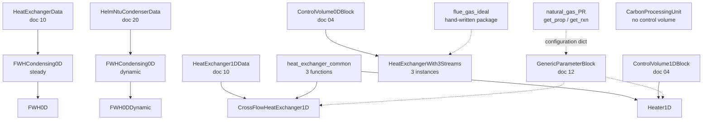
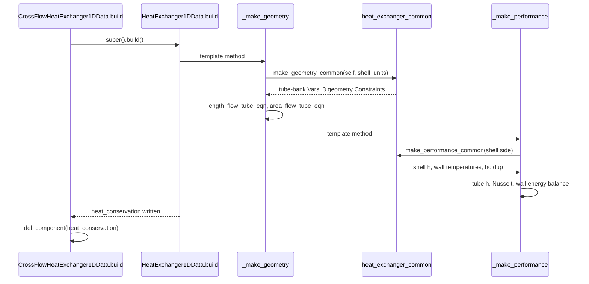

# 19 — Power generation: heat exchangers and properties

> **Doc ID** 19 · **Repo SHA** 70a8f4fe1 (IDAES-PSE v2.13.0rc0) · **Source roots** `idaes/models_extra/power_generation/unit_models/` (seven modules), `idaes/models_extra/power_generation/properties/`
> **Owns** 10 modules / 6,435 LOC · **Assets** none shipped (§10) · **Siblings** [04](04_control_volume_framework.md), [05](05_property_and_reaction_framework.md), [06](06_model_preparation_initializers_and_scalers.md), [10](10_unit_models_control_volume_based.md), [18](18_power_generation_boiler_island.md), [20](20_power_generation_helmholtz_units_and_soc.md), [24](24_reference_flowsheets_and_demonstrations.md)

Two kinds of thing live here, and they are grouped together because the second
exists to feed the first. The unit models are the heat exchangers of the power
generation library that are *not* Helmholtz-based: a one-dimensional cross-flow
exchanger and its trim-heater sibling, a three-stream air preheater, two
feedwater heater assemblies, and a surrogate carbon processing unit. The
property packages are the two non-Helmholtz thermophysical sources of the power
generation library: a hand-written ideal-gas flue gas package, and a module that
*generates* modular-framework configuration dictionaries from a component list.

Three of the seven unit model modules import classes owned by
[10](10_unit_models_control_volume_based.md), and two of them subclass one. This
document never restates what a base class does; it documents the delta.

---

## 0. Scope and source map

| File | LOC | Purpose | Covered in § |
|---|---:|---|---|
| `idaes/models_extra/power_generation/unit_models/cross_flow_heat_exchanger_1D.py` | 1,143 | `CrossFlowHeatExchanger1D` — a `HeatExchanger1DData` subclass adding tube-bank geometry, a three-temperature wall and the second-largest Initializer in `models_extra` | 2, 3, 4.1, 5.2, 6.2, 7, 9, 12 |
| `idaes/models_extra/power_generation/properties/flue_gas_ideal.py` | 1,060 | `FlueGasParameterBlock` / `FlueGasStateBlock` — a hand-written ideal-gas package for six flue gas species | 2, 3, 4.5, 5.8, 6.6, 7, 11, 12 |
| `idaes/models_extra/power_generation/unit_models/cpu.py` | 848 | `CarbonProcessingUnit` — a four-port ALAMO surrogate of a cryogenic CO₂ purification train, with no control volume and no property package | 2, 3, 5.7, 6.5, 7, 12 |
| `idaes/models_extra/power_generation/properties/natural_gas_PR.py` | 761 | `get_prop` / `get_rxn` / `EosType` — configuration-dictionary factories for the modular framework | 2, 3.3, 4.7, 5.9, 6.6, 7, 12 |
| `idaes/models_extra/power_generation/unit_models/heat_exchanger_3streams.py` | 652 | `HeatExchangerWith3Streams` — three `ControlVolume0DBlock`s with one hot side exchanging against two cold sides | 2, 3, 4.3, 5.4, 6.4, 7 |
| `idaes/models_extra/power_generation/unit_models/heater_1D.py` | 555 | `Heater1D` — a resistively heated one-dimensional shell over the same tube-bank correlations | 2, 3, 4.2, 5.3, 6.3, 7, 9 |
| `idaes/models_extra/power_generation/unit_models/heat_exchanger_common.py` | 540 | Three module-level helper functions shared by the two modules above; no classes | 2, 5.1, 6.1, 7.1, 9.2, 12 |
| `idaes/models_extra/power_generation/unit_models/feedwater_heater_0D_dynamic.py` | 460 | `FWH0DDynamic` and a second `FWHCondensing0D`, built on the Helmholtz NTU condenser | 2, 3, 4.4, 5.6, 6.5, 7, 12 |
| `idaes/models_extra/power_generation/unit_models/feedwater_heater_0D.py` | 400 | `FWH0D` and `FWHCondensing0D` — a three-section feedwater heater assembled from `HeatExchanger` blocks and Arcs | 2, 3, 4.4, 5.5, 6.5, 7, 12 |
| `idaes/models_extra/power_generation/properties/__init__.py` | 16 | Re-exports `FlueGasParameterBlock` and `FlueGasStateBlock`; does not re-export anything from `natural_gas_PR` | 2, 12 |

Total 6,435 LOC, 14 classes, 10 declared process block classes, 44
configuration keys across six declarations, 2 `NotImplementedError` hook sites,
0 enumerations recorded in `_generated/enums.csv` (see §3.3).

The rest of `idaes/models_extra/power_generation/unit_models/` is split between
[18](18_power_generation_boiler_island.md) — the boiler island, including
`boiler_heat_exchanger.py` and `boiler_heat_exchanger_2D.py` — and
[20](20_power_generation_helmholtz_units_and_soc.md) — the `helm/` subpackage and
the solid oxide cell submodels. The flowsheets that assemble these units belong
to [24](24_reference_flowsheets_and_demonstrations.md).

---

## 1. Architectural role

This document's ten modules occupy the layer where a general-purpose equipment
model becomes a specific piece of power plant hardware. The mechanism is
ordinary subclassing across the tier boundary: `CrossFlowHeatExchanger1DData`
(`idaes/models_extra/power_generation/unit_models/cross_flow_heat_exchanger_1D.py:406`)
derives from `HeatExchanger1DData` in `idaes/models/`, and
`FWHCondensing0DData` (`idaes/models_extra/power_generation/unit_models/feedwater_heater_0D.py:154`)
derives from `HeatExchangerData`. Neither base class knows about the extension;
the derived classes fill the template-method seams the base publishes
([10 §9](10_unit_models_control_volume_based.md#9-extension-and-subclassing-contracts)).

Four distinct construction idioms appear across the ten modules, and the
difference between them is the main structural fact of this document. *Subclass
a core unit model and replace its template methods*: `CrossFlowHeatExchanger1D`
overrides `_process_config`, `_make_geometry` and `_make_performance`, then
deletes one inherited constraint. *Build a control volume directly and add
correlations*: `Heater1D` (`heater_1D.py:160`) constructs a
`ControlVolume1DBlock` itself and shares its tube-bank correlations with the
cross-flow exchanger through three module-level functions rather than a common
base class. *Compose several unit models with Arcs*: `FWH0D`
(`feedwater_heater_0D.py:227`) owns up to three `HeatExchanger` blocks and a
`Mixer`, wires them with `pyomo.network.Arc`, and expands the Arcs at the end of
its own `build`. *Write the equations by hand*: `HeatExchangerWith3Streams`
(`heat_exchanger_3streams.py:42`) owns three control volumes because the
framework's exchangers are two-sided, and `CarbonProcessingUnit` (`cpu.py:64`)
owns no control volume at all and closes its ports with fitted polynomials.

The two property packages mirror the same spread. `flue_gas_ideal.py` implements
the [05](05_property_and_reaction_framework.md) contract by hand — a parameter
block, a state block, on-demand build methods and the six `get_*_terms`
accessors. `natural_gas_PR.py` implements nothing: it holds tables of correlation
choices and returns a dictionary that a `GenericParameterBlock` from
[12](12_modular_properties_generic_framework.md) consumes.



*Solid edges are inheritance or construction; dotted edges are a property package reaching a consumer, and the two packages in this document reach disjoint consumers.*

---

## 2. Public surface inventory

`idaes/models_extra/power_generation/unit_models/__init__.py:13` re-exports a
selected subset; it declares no `__all__`, so "re-exported" below means "bound as
an attribute of `idaes.models_extra.power_generation.unit_models`".
`idaes/models_extra/power_generation/properties/__init__.py:13` re-exports the
two flue gas symbols and nothing else.

| Symbol | Kind | Declared at | Exported via | Stability signal |
|---|---|---|---|---|
| `CrossFlowHeatExchanger1D` / `...Data` | pair | `cross_flow_heat_exchanger_1D.py:406` | `idaes.models_extra.power_generation.unit_models` | autodoc'd in `docs/.../cross_flow_heat_exchanger_1D.rst` |
| `CrossFlowHeatExchanger1DInitializer` | Initializer | `cross_flow_heat_exchanger_1D.py:54` | same package | autodoc'd |
| `Heater1D` / `Heater1DData` | pair | `heater_1D.py:160` | same package | autodoc'd in `docs/.../heater_1D.rst` |
| `Heater1DInitializer` | Initializer | `heater_1D.py:58` | same package | autodoc'd |
| `make_geometry_common` | function | `heat_exchanger_common.py:40` | module only | no underscore; imported by two modules |
| `make_performance_common` | function | `heat_exchanger_common.py:172` | module only | no underscore; imported by two modules |
| `scale_common` | function | `heat_exchanger_common.py:475` | module only | no underscore; imported by two modules |
| `HeatExchangerWith3Streams` / `...Data` | pair | `heat_exchanger_3streams.py:42` | same package | autodoc'd in `docs/.../boiler_heat_exchanger_3streams.rst` |
| `FWH0D` / `FWH0DData` | pair | `feedwater_heater_0D.py:227` | same package | `docs/` page exists; no `autoclass` directive |
| `FWHCondensing0D` / `...Data` | pair | `feedwater_heater_0D.py:154` | same package | autodoc'd in `docs/.../feedwater_heater_condensing_0D.rst` |
| `_define_feedwater_heater_0D_config` | function | `feedwater_heater_0D.py:54` | module only | leading underscore; a second copy exists in the dynamic module |
| `_set_port` | function | `feedwater_heater_0D.py:113` | module only | leading underscore; no counterpart in the dynamic module |
| `_set_prop_pack` | function | `feedwater_heater_0D.py:127` | module only | leading underscore; duplicated at `feedwater_heater_0D_dynamic.py:119` |
| `FWH0DDynamic` / `FWH0DDynamicData` | pair | `feedwater_heater_0D_dynamic.py:254` | same package | `docs/` page exists; no `autoclass` directive |
| `FWHCondensing0D` / `...Data` | pair | `feedwater_heater_0D_dynamic.py:146` | **not** re-exported | no `docs/` page; name collides with the steady pair |
| `CarbonProcessingUnit` / `...Data` | pair | `cpu.py:64` | **not** re-exported | no `docs/` page; reachable only by module path |
| 26 `*_fun` surrogate functions | functions | `cpu.py:675`–`:847` | module only | no underscore; 8 of them are never called (§12) |
| `FlueGasParameterBlock` / `FlueGasParameterData` | pair | `flue_gas_ideal.py:72` | `idaes.models_extra.power_generation.properties` | `docs/.../flue_gas.rst` exists but names a stale module path (§12) |
| `FlueGasStateBlock` / `FlueGasStateBlockData` | pair | `flue_gas_ideal.py:577` | same package | as above |
| `_FlueGasStateBlock` | `StateBlock` subclass | `flue_gas_ideal.py:449` | module only | leading underscore; passed as `block_class=` |
| `EosType` | enum | `natural_gas_PR.py:71` | module only | no `docs/` page |
| `get_prop` | function | `natural_gas_PR.py:538` | module only | no `docs/` page; used in three `docs/` code samples |
| `get_rxn` | function | `natural_gas_PR.py:604` | module only | no `docs/` page |
| `_component_params` | module dict | `natural_gas_PR.py:116` | module only | leading underscore; 14 chemical components |
| `_phase_dicts_pr`, `_phase_dicts_ideal` | module dicts | `natural_gas_PR.py:87`, `:104` | module only | leading underscore |

`natural_gas_PR.py` is the only property module in the tree that a user reaches
by importing two functions rather than a class, and it is not re-exported by its
own package `__init__`.

---

## 3. Class hierarchy and type taxonomy

```mermaid
classDiagram
  class UnitModelBlockData
  class HeatExchanger1DData
  class HeatExchangerData
  class HelmNtuCondenserData
  class CrossFlowHeatExchanger1DData
  class Heater1DData
  class HeatExchangerWith3StreamsData
  class FWHCondensing0DData_steady
  class FWHCondensing0DData_dynamic
  class FWH0DData
  class FWH0DDynamicData
  class CarbonProcessingUnitData
  class PhysicalParameterBlock
  class StateBlockData
  class FlueGasParameterData
  class FlueGasStateBlockData
  HeatExchanger1DData <|-- CrossFlowHeatExchanger1DData
  HeatExchangerData <|-- FWHCondensing0DData_steady
  HelmNtuCondenserData <|-- FWHCondensing0DData_dynamic
  UnitModelBlockData <|-- Heater1DData
  UnitModelBlockData <|-- HeatExchangerWith3StreamsData
  UnitModelBlockData <|-- FWH0DData
  UnitModelBlockData <|-- FWH0DDynamicData
  UnitModelBlockData <|-- CarbonProcessingUnitData
  PhysicalParameterBlock <|-- FlueGasParameterData
  StateBlockData <|-- FlueGasStateBlockData
```



*The two classes named `FWHCondensing0DData` have different bases and live in different modules; every other class derives directly from a framework base.*

### 3.1 Process block roster and retrofit status

The two right-hand columns are the per-class retrofit data from
`_generated/retrofit.csv`. *Declared* means the class body assigns the
attribute; *inherited* means the value comes from a base class. Of these ten
declared process block classes, **2 declare a `default_initializer` and none
declares a `default_scaler`** — the set-wide distribution is in
[06 §3.3](06_model_preparation_initializers_and_scalers.md#33-retrofit-adoption),
which records these two as two of the three `default_initializer` declarations
anywhere in `idaes/models_extra`.

| Class | Base | Declared at | Container class | `default_initializer` | `default_scaler` |
|---|---|---|---|---|---|
| `CrossFlowHeatExchanger1DData` | `HeatExchanger1DData` | `cross_flow_heat_exchanger_1D.py:406` | `CrossFlowHeatExchanger1D` | **declared** `CrossFlowHeatExchanger1DInitializer` | inherited `HX1DScaler` |
| `Heater1DData` | `UnitModelBlockData` | `heater_1D.py:160` | `Heater1D` | **declared** `Heater1DInitializer` | inherited `None` |
| `HeatExchangerWith3StreamsData` | `UnitModelBlockData` | `heat_exchanger_3streams.py:42` | `HeatExchangerWith3Streams` | inherited `SingleControlVolumeUnitInitializer` | inherited `None` |
| `FWHCondensing0DData` (steady) | `HeatExchangerData` | `feedwater_heater_0D.py:154` | `FWHCondensing0D` | inherited `HX0DInitializer` | inherited `HX0DScaler` |
| `FWH0DData` | `UnitModelBlockData` | `feedwater_heater_0D.py:227` | `FWH0D` | inherited `SingleControlVolumeUnitInitializer` | inherited `None` |
| `FWHCondensing0DData` (dynamic) | `HelmNtuCondenserData` | `feedwater_heater_0D_dynamic.py:146` | `FWHCondensing0D` | inherited from the condenser | inherited from the condenser |
| `FWH0DDynamicData` | `UnitModelBlockData` | `feedwater_heater_0D_dynamic.py:254` | `FWH0DDynamic` | inherited `SingleControlVolumeUnitInitializer` | inherited `None` |
| `CarbonProcessingUnitData` | `UnitModelBlockData` | `cpu.py:64` | `CarbonProcessingUnit` | inherited `SingleControlVolumeUnitInitializer` | inherited `None` |
| `FlueGasParameterData` | `PhysicalParameterBlock` | `flue_gas_ideal.py:72` | `FlueGasParameterBlock` | inherited | inherited `None` |
| `FlueGasStateBlockData` | `StateBlockData` | `flue_gas_ideal.py:577` | `FlueGasStateBlock` | inherited | inherited `None` |

`FlueGasStateBlock` is the one pair here whose container class is customised:
the decorator is given `block_class=_FlueGasStateBlock` (`flue_gas_ideal.py:576`),
so the indexed container carries the whole-block `initialize` and `release_state`
of `_FlueGasStateBlock` (`flue_gas_ideal.py:449`) rather than the generic
`StateBlock` versions
([05 §3](05_property_and_reaction_framework.md#3-class-hierarchy-and-type-taxonomy)).

### 3.2 Initializer classes

Both Initializers derive from `SingleControlVolumeUnitInitializer`
(`idaes/core/initialization/general_hierarchical.py:29`) and override exactly
one method, `initialize_main_model`. Neither overrides `initialization_routine`,
so the seven-step `InitializerBase` workflow around them is unchanged
([06 §5.3](06_model_preparation_initializers_and_scalers.md#53-the-hierarchical-unit-model-routine)).

| Class | Base | Declared at | Distinguishing behaviour |
|---|---|---|---|
| `CrossFlowHeatExchanger1DInitializer` | `SingleControlVolumeUnitInitializer` | `cross_flow_heat_exchanger_1D.py:54` | Five staged solves; temporarily reduces `therm_cond_wall` to 0.05; fixes linear temperature profiles along both length domains; raises `NotImplementedError` on a property package without a `temperature` state variable |
| `Heater1DInitializer` | `SingleControlVolumeUnitInitializer` | `heater_1D.py:58` | Three staged solves; computes shell geometry with `calculate_variable_from_constraint`; fixes the per-length duty from `electric_heat_duty` |

No Scaler object exists in this document; scaling is done the suffix-based way
instead, through `calculate_scaling_factors` overrides (§7) and the shared
`scale_common` function
([06 §1](06_model_preparation_initializers_and_scalers.md#1-architectural-role)
distinguishes the two generations).

### 3.3 Enumerations

`EosType` (`idaes/models_extra/power_generation/properties/natural_gas_PR.py:71`)
is declared with the dotted base `enum.Enum`, and the inventory's enum extractor
keys on the bare base name `Enum`, so this class appears in
`_generated/classes.csv` but not in `_generated/enums.csv`. Its members are read
from the declaration:

| Member | Value | Meaning | Consumed at |
|---|---|---|---|
| `PR` | 1 | Peng-Robinson cubic equation of state, vapour and liquid | `natural_gas_PR.py:577` |
| `IDEAL` | 2 | Ideal equation of state, vapour only | `natural_gas_PR.py:579` |

`IDEAL` combined with a `Liq` phase raises `ConfigurationError`
(`natural_gas_PR.py:581`); any other value raises `ValueError`
(`natural_gas_PR.py:586`).

Three configuration keys carry string enumerations rather than Python enums:
`tube_arrangement` is `In(["in-line", "staggered"])`, and `flow_type_side_2` and
`flow_type_side_3` are `In(["counter-current", "co-current"])` — the three-stream
model's own spelling of what
[10 §3.3](10_unit_models_control_volume_based.md#33-enumerations) expresses with
the `HeatExchangerFlowPattern` enum.

---

## 4. Configuration reference

44 keys across six declarations. Sections 4.1 through 4.4 are delta tables in
the convention of [01 §6](01_glossary_and_conventions.md#6-table-conventions):
the *Inherited from* column names where a key's semantics are defined and the
*Override* column records how this declaration differs. Anchors are line numbers
within the file named in the subsection heading.

### 4.1 `cross_flow_heat_exchanger_1D.py` — `CrossFlowHeatExchanger1DData.CONFIG`

`HeatExchanger1DData.CONFIG()` (`:411`) extended with two keys. Every other key
— the two `_SideTemplate` sub-blocks, `finite_elements`, `collocation_points`,
`flow_type`, `hot_side_name` and `cold_side_name` — is inherited unchanged from
[10 §4.3](10_unit_models_control_volume_based.md#43-heat_exchanger_1dpy--_sidetemplate-and-heatexchanger1ddataconfig).

| Key | Inherited from | Override | Anchor |
|---|---|---|---|
| `shell_is_hot` | new | `Bool`, default `True`; selects which side the tube-bank correlations treat as shell-side, and supplies the default side names in `_process_config` | `:412` |
| `tube_arrangement` | new | `In(["in-line", "staggered"])`, default `"in-line"`; read inside `make_performance_common` to pick `f_arrangement` and the friction-factor correlation | `:422` |

`hot_side_name` and `cold_side_name` keep their inherited declaration but acquire
a default they do not have in the base: `_process_config` (`:432`) fills them
with `"Shell"` and `"Tube"`, ordered by `shell_is_hot`.

### 4.2 `heater_1D.py` — `Heater1DData.CONFIG`

`UnitModelBlockData.CONFIG()` (`:165`) extended with twelve keys. This model
reuses neither the heater idiom of
[10 §4.1](10_unit_models_control_volume_based.md#41-the-heater-idiom--_make_heater_config_block)
nor the `_SideTemplate` of the 1-D exchanger; it redeclares what it needs.

| Key | Inherited from | Override | Anchor |
|---|---|---|---|
| `has_fluid_holdup` | new | `In([False])`, default `False`; the fluid control volume is unconditionally steady state, while `has_holdup` from `UnitModelBlockData.CONFIG` still governs the **wall** heat holdup | `:166` |
| `material_balance_type` | `CONFIG_Template` | default `componentTotal` rather than `componentPhase` | `:178` |
| `energy_balance_type` | `CONFIG_Template` | default `enthalpyTotal`, unchanged | `:194` |
| `momentum_balance_type` | `CONFIG_Template` | default `pressureTotal`, unchanged | `:210` |
| `has_pressure_change` | `CONFIG_Template` | domain `In([True, False])` rather than `Bool` | `:226` |
| `property_package` | `CONFIG_Template` | no default at all, so omitting it is a Pyomo configuration error rather than a `useDefault` resolution | `:240` |
| `property_package_args` | `CONFIG_Template` | plain `ConfigValue` defaulting to `None`, not an implicit `ConfigBlock`; `build` rewrites `None` to `{}` at `:334` | `:251` |
| `transformation_method` | `ControlVolume1DBlockData.CONFIG` | default `useDefault`, resolved in `build` to `"dae.finite_difference"` (`:329`) | `:263` |
| `transformation_scheme` | `ControlVolume1DBlockData.CONFIG` | default `useDefault`, resolved in `build` to `"BACKWARD"` (`:331`) | `:272` |
| `finite_elements` | `ControlVolume1DBlockData.CONFIG` | `int`, default 5 rather than the 1-D exchanger's 20 | `:283` |
| `collocation_points` | `ControlVolume1DBlockData.CONFIG` | `int`, default 3 rather than 5 | `:293` |
| `tube_arrangement` | §4.1 | identical declaration, independently written | `:303` |

### 4.3 `heat_exchanger_3streams.py` — `HeatExchangerWith3StreamsData.CONFIG`

`UnitModelBlockData.CONFIG()` (`:47`) extended with thirteen keys. The three
property package pairs are the only place in the tree where a unit model names
its property packages by ordinal rather than by role.

| Key | Inherited from | Override | Anchor |
|---|---|---|---|
| `side_1_property_package`, `side_2_property_package`, `side_3_property_package` | `CONFIG_Template` `property_package` | `is_physical_parameter_block`, `useDefault`, declared once per side; side 1 is the hot stream and sides 2 and 3 the two cold streams | `:48`, `:73`, `:98` |
| `side_1_property_package_args`, `side_2_property_package_args`, `side_3_property_package_args` | `CONFIG_Template` `property_package_args` | implicit `ConfigBlock`, one per side | `:61`, `:86`, `:111` |
| `material_balance_type` | `CONFIG_Template` | default `componentPhase`; one value applied to all three control volumes | `:123` |
| `energy_balance_type` | `CONFIG_Template` | default `enthalpyTotal`; applied to all three | `:139` |
| `momentum_balance_type` | `CONFIG_Template` | default `pressureTotal`; applied to all three | `:155` |
| `has_heat_transfer` | `CONFIG_Template` | default `True` rather than `False`, because heat transfer is the point of the model | `:171` |
| `has_pressure_change` | `CONFIG_Template` | default `False`; applied to all three | `:184` |
| `flow_type_side_2` | `flow_pattern` in [10 §4.2](10_unit_models_control_volume_based.md#42-heat_exchangerpy--heatexchangerdataconfig) | `In(["counter-current", "co-current"])` strings, default `"counter-current"`; selects one of two constraint-building methods | `:198` |
| `flow_type_side_3` | as above | the same for the third stream | `:208` |

A single `has_heat_transfer`, `has_pressure_change` and balance-type triple
parameterises all three control volumes: there is no per-side balance
configuration.

### 4.4 `feedwater_heater_0D.py` and `feedwater_heater_0D_dynamic.py` — `_define_feedwater_heater_0D_config`

Each module defines its own module-level function that adds eight keys to a
supplied `ConfigBlock`: `feedwater_heater_0D.py:54` applied to `FWH0DData.CONFIG`
at `:229`, and `feedwater_heater_0D_dynamic.py:60` applied to
`FWH0DDynamicData.CONFIG` at `:256`. The two functions declare the same eight key
names. The table gives the steady module's anchors first and the dynamic
module's second.

| Key | Inherited from | Override | Anchor |
|---|---|---|---|
| `has_drain_mixer` | new | `Bool`, default `True`; adds a `Mixer` combining an upstream heater's drain with extracted steam | `0D:55` / `dyn:61` |
| `has_desuperheat` | new | `Bool`, default `True`; adds a `HeatExchanger` upstream of the condensing section | `0D:65` / `dyn:71` |
| `has_drain_cooling` | new | `Bool`, default `True`; adds a `HeatExchanger` downstream of it | `0D:74` / `dyn:80` |
| `property_package` | `CONFIG_Template` | `useDefault`; pushed into each section by `_set_prop_pack` only where that section still holds `useDefault` | `0D:83` / `dyn:89` |
| `property_package_args` | `CONFIG_Template` | implicit `ConfigBlock`; pushed with the package | `0D:96` / `dyn:102` |
| `condense` | new | a whole nested `HeatExchangerData.CONFIG()` in the steady module; **`CondenserData.CONFIG()`** — the Helmholtz NTU condenser's — in the dynamic module | `0D:108` / `dyn:114` |
| `desuperheat` | new | `HeatExchangerData.CONFIG()` in both modules | `0D:109` / `dyn:115` |
| `cooling` | new | `HeatExchangerData.CONFIG()` in both modules | `0D:110` / `dyn:116` |

The `condense` row is the whole difference between the two configuration
surfaces: the steady assembly's condensing section is a log-mean-temperature
exchanger, the dynamic assembly's is an effectiveness-NTU condenser from
[20](20_power_generation_helmholtz_units_and_soc.md). Everything nested under
`condense`, `desuperheat` and `cooling` is documented by the owning base:
[10 §4.2](10_unit_models_control_volume_based.md#42-heat_exchangerpy--heatexchangerdataconfig)
and [20](20_power_generation_helmholtz_units_and_soc.md).

### 4.5 `flue_gas_ideal.py` — `FlueGasParameterData.CONFIG`

`PhysicalParameterBlock.CONFIG()` (`:81`) extended with one key.

| Key | Domain / validator | Default | Req. | Effect on build | Anchor |
|---|---|---|---|---|---|
| `components` | `list` | `["N2", "O2", "NO", "CO2", "H2O", "SO2"]` | no | Each entry becomes a `Component` object; every `Param` is filtered to the selected subset; an entry outside the six valid names raises `ConfigurationError` at `:99` | `:82` |

The domain is the built-in `list`, not `ListOf(str)` or `In(...)`, so
membership is checked in `build` rather than by the configuration system.

### 4.6 `cpu.py` — no CONFIG block

`CarbonProcessingUnitData` declares no configuration key and does not restate
`UnitModelBlockData.CONFIG`, so its whole surface is `dynamic` and `has_holdup`
inherited from
[03 §4.1](03_block_hierarchy_and_construction_protocol.md#41-unitmodelblockdataconfig).
Neither is read: `build` (`cpu.py:72`) does not call `super().build()` (§12).

### 4.7 `natural_gas_PR.py` — configuration dictionaries, not CONFIG blocks

This module declares no `CONFIG.declare` key, and `_generated/config_keys.csv`
records none under its path. What it produces is a plain Python dictionary of the
shape a `GenericParameterBlock` accepts
([12 §4](12_modular_properties_generic_framework.md#4-configuration-reference)).
The four arguments of `get_prop` are the module's configuration surface, and
they are ordinary function parameters:

| Argument | Domain | Default | Effect on the returned dictionary | Anchor |
|---|---|---|---|---|
| `components` | list of names, or `None` | `None` → every key of `_component_params` (14 chemical components) | Fills `configuration["components"]` with a deep copy of each named entry | `:538`, filled at `:565` |
| `phases` | `str` or iterable of `"Vap"` / `"Liq"` | `"Vap"` | Fills `configuration["phases"]`; more than one phase also sets `phases_in_equilibrium` and `phase_equilibrium_state` to `SmoothVLE` | `:538`, `:589` |
| `eos` | `EosType` | `EosType.PR` | Chooses `_phase_dicts_pr` or `_phase_dicts_ideal` as the per-phase source | `:538`, `:576` |
| `scaled` | `bool` | `False` | Rewrites `base_units["mass"]` to `Mg` and `base_units["amount"]` to `kmol` | `:538`, `:597` |

`get_rxn(property_package, reactions=None, scaled=False)` (`:604`) returns a
reaction configuration dictionary carrying eight combustion rate reactions; the
`reactions` argument, when supplied, deletes every rate reaction not named in it
(`:758`).

---

## 5. Construction and call sequences

### 5.1 The shared one-dimensional idiom — `heat_exchanger_common`

`heat_exchanger_common.py` holds three functions and no class. Its module
docstring names its two consumers, and ripgrep confirms them exactly: the only
importers anywhere in the tree are `cross_flow_heat_exchanger_1D.py:48`, which
imports the module and calls through it, and `heater_1D.py:48`, which imports the
three names directly. Both consumers are owned by this document; no module in
[18](18_power_generation_boiler_island.md) or
[20](20_power_generation_helmholtz_units_and_soc.md) uses it.

| Function | Called by `CrossFlowHeatExchanger1DData` at | Called by `Heater1DData` at |
|---|---|---|
| `make_geometry_common(blk, shell_units)` | `_make_geometry`, `cross_flow_heat_exchanger_1D.py:519` | `_make_geometry`, `heater_1D.py:397` |
| `make_performance_common(blk, shell, shell_units, shell_has_pressure_change, make_reynolds, make_nusselt)` | `_make_performance`, `cross_flow_heat_exchanger_1D.py:615` | `_make_performance`, `heater_1D.py:422` |
| `scale_common(blk, shell, shell_has_pressure_change, make_reynolds, make_nusselt)` | `calculate_scaling_factors`, `cross_flow_heat_exchanger_1D.py:1042` | `calculate_scaling_factors`, `heater_1D.py:508` |

Both consumers pass `make_reynolds=True, make_nusselt=True`, so the two boolean
seams are never exercised with a `False` value in the shipped tree, and
`make_performance_common` forces `make_reynolds` to `True` whenever
`shell_has_pressure_change` is set (`:196`) because the friction factor is a
function of the Reynolds number. A function that takes `blk` and hangs components
on it is a mixin without a class; §9.2 tabulates the contract it implicitly
requires of `blk`.

### 5.2 `CrossFlowHeatExchanger1D`

`build` (`cross_flow_heat_exchanger_1D.py:449`) is a four-step delta on the
inherited one. `super().build()` (`:461`) runs `HeatExchanger1DData.build`
([10 §5.4](10_unit_models_control_volume_based.md#54-heatexchanger1d-and-shellandtube1d)),
which resolves the discretization, builds both `ControlVolume1DBlock`s, adds four
ports, calls the overridden `_process_config`, `_make_geometry` and
`_make_performance`, and writes `heat_conservation`. That inherited constraint is
then deleted, `self.del_component(self.heat_conservation)` (`:465`): it equates
heat lost by the hot side to heat gained by the cold side, and this model routes
both heats through a wall that can accumulate energy, so the equality does not
hold. Lagrange-Legendre collocation combined with pressure change on either side
raises `NotImplementedError` (`:475`). Finally four `Port` objects extending the
inherited ports are added under `shell_inlet`, `shell_outlet`, `tube_inlet` and
`tube_outlet` (`:481`–`:489`), ordered by `shell_is_hot`; these are
`Port(extends=...)` rather than the `add_object_reference` aliases the base class
creates in `add_hx_references`.

`_process_config` (`:432`) calls the inherited implementation and then fills
`hot_side_name` and `cold_side_name` from `shell_is_hot` when the user left them
unset. `_make_geometry` (`:491`) adds object references for `area_flow_shell`,
`area_flow_tube`, `length_flow_shell` and `length_flow_tube` onto the two control
volumes' `area` and `length`, calls `make_geometry_common` (`:519`), and adds
`length_flow_tube_eqn` (`:523`) — passes times segment length — and
`area_flow_tube_eqn` (`:530`), the total bore area of the bank.

`_make_performance` (`:540`) is the bulk of the module. It rejects any property
package with more than one phase (`:572`) or whose single phase is not a vapour
phase (`:584`, `:589`); creates `heat_tube` and `heat_shell` references (`:594`,
`:595`) and the `deltaP_*` references the configuration calls for (`:602`–`:612`);
calls `make_performance_common` (`:615`) for the shell side; then builds the
tube-side correlation set and the wall (§6.2). Its last group, built only for a
steady-state model (`:937`), is three reporting `Expression`s: `total_heat_duty`
(`:942`), `log_mean_delta_temperature` (`:952`) and
`overall_heat_transfer_coefficient` (`:964`).

`lagrange_legendre_deactivation` (`:969`) deactivates the material and enthalpy
balances at each finite-element boundary of both length domains, using
`slice_component_along_sets` from `pyomo.dae.flatten` to reach them. The method's
own comment records that the operation belongs on `ControlVolume1D` and lives
here because it would otherwise need many more of the control volume's
components.



*The base class sequences the build; the subclass contributes two template methods and then removes one constraint the base wrote.*

### 5.3 `Heater1D`

`build` (`heater_1D.py:313`) sequences construction itself rather than inheriting
a sequence: `super().build()` (`:324`); resolve `transformation_method` to
`"dae.finite_difference"` (`:329`) and `transformation_scheme` to `"BACKWARD"`
(`:331`) when either is `useDefault`, and `property_package_args` from `None` to
`{}` (`:334`); construct one `ControlVolume1DBlock` (`:338`) whose `dynamic`
argument is `config.dynamic and config.has_fluid_holdup` and therefore always
`False`; `add_geometry(flow_direction=FlowDirection.forward)` (`:349`),
`add_state_blocks` (`:351`), the three balance dispatchers (`:357`, `:362`,
`:366`) with `has_heat_transfer=True` unconditionally, and
`apply_transformation()` (`:371`); two ports (`:376`, `:377`); then
`_make_geometry()` (`:379`) and `_make_performance()` (`:381`).

`_make_geometry` (`:383`) adds object references for `area_flow_shell` and
`length_flow_shell`, calls `make_geometry_common` (`:397`), and adds a
`length_flow_tube` `Expression` (`:402`) whose docstring states its reason: the
shared performance function expects that name to exist. There is no tube in a
resistively heated shell; the expression exists to satisfy the helper.

`_make_performance` (`:405`) creates `electric_heat_duty` (`:415`), calls
`make_performance_common` (`:422`), and adds four constraints: the shell-side
Nusselt correlation `N_Nu_shell_eqn` (`:440`), which the helper deliberately does
not supply; `heat_shell_eqn` (`:458`); `temp_wall_shell_eqn` (`:474`); and
`temp_wall_center_eqn` (`:492`), the wall energy balance in which the electrical
duty per unit length replaces a second fluid.

### 5.4 `HeatExchangerWith3Streams`

Three-stream contact is not something a control volume expresses: a
`ControlVolume0DBlock` has one inlet state and one outlet state, and the
two-sided exchangers of [10](10_unit_models_control_volume_based.md) pair exactly
two of them. This model reaches three streams by owning three independent control
volumes and coupling them only through unit-level constraints.

`build` (`heat_exchanger_3streams.py:219`) calls `super().build()` (`:224`);
constructs `side_1` (`:227`), `side_2` (`:234`) and `side_3` (`:241`) as
`ControlVolume0DBlock`s, each with its own property package and the unit's single
`dynamic` / `has_holdup` pair; calls `add_geometry()` on all three (`:249`
onward) unconditionally, so `volume` exists whether or not holdup was requested;
calls `add_state_blocks` (`:254`) and the three balance dispatchers (`:257`,
`:261`, `:266`) per side, repeated verbatim for sides 2 and 3; then
`_set_geometry()` (`:307`), `_make_performance()` (`:310`), one of the two side-2
flow-direction methods (`:313`) and one of the two side-3 methods (`:319`);
finally six ports named `side_N_inlet` and `side_N_outlet` (`:324`–`:329`).

The coupling is three constraints. `heat_duty_side_2_eqn` (`:446`) and
`heat_duty_side_3_eqn` (`:453`) each set a cold side's duty to a UA product times
its own driving force. `heat_duty_side_1_eqn` (`:460`) closes the unit: the hot
side's duty, reduced by `frac_heatloss`, equals the sum of the two cold duties.
That single equation is what makes the three control volumes one exchanger, and
it is also where heat loss to ambient enters — an accounting term no control
volume offers.

The driving forces use the Underwood approximation to the log-mean temperature
difference, `((ΔT_in^⅓ + ΔT_out^⅓)/2)³`, written directly in `LMTD_side_2`
(`:428`) and `LMTD_side_3` (`:439`) rather than obtained from the
`delta_temperature_callback` seam of
[10 §9](10_unit_models_control_volume_based.md#9-extension-and-subclassing-contracts).
Which end differences those are is the whole content of the four
`_make_*_current_side_*` methods: the co-current pair reads
`side_1.properties_in` against `side_N.properties_in` (`:476`, `:524`), the
counter-current pair reads `side_1.properties_out` against
`side_N.properties_in` (`:500`, `:548`).

### 5.5 `FWH0D` — assembly by Arc

`FWHCondensing0DData.build` (`feedwater_heater_0D.py:155`) is a two-component
delta on `HeatExchangerData.build`: an `enth_sub` variable (`:158`), immediately
fixed at zero, and `extraction_rate_constraint` (`:169`), which sets the hot-side
outlet molar enthalpy, less `enth_sub`, equal to the saturated liquid enthalpy.
That one equation is what makes the block a feedwater heater condensing section:
it determines the steam extraction rate such that everything fed condenses.

`FWH0DData.build` (`:231`) assembles up to four blocks and five Arcs:

| Condition | Block created | Arcs created |
|---|---|---|
| always | `condense` = `FWHCondensing0D` (`:237`) | — |
| `has_drain_mixer` | `drain_mix` = `Mixer` with inlets `steam` and `drain` (`:250`), plus `mixer_pressure_constraint` (`:253`) added onto the mixer | `SMX` (`:262`) |
| `has_desuperheat` | `desuperheat` = `HeatExchanger` (`:269`) | `SDS` (`:274` or `:279`), `FW2` (`:283`) |
| `has_drain_cooling` | `cooling` = `HeatExchanger` (`:291`) | `FW1` (`:295`), `SC` (`:299`) |

`TransformationFactory("network.expand_arcs").apply_to(self)` runs at the end of
`build` (`:304`), so the assembly is expanded before the flowsheet's own Arc
expansion. The `Mixer` is configured with `MomentumMixingType.none` (`:246`) and
`mixer_pressure_constraint` supplies the missing pressure relation by equating
the mixed-state pressure to the steam inlet's — correct only when the drain inlet
is at the higher pressure, as the constraint's own docstring records.
`_set_prop_pack(hxcfg, fwhcfg)` (`:127`) is why the sections need no property
package of their own: for each of a section's `hot_side` and `cold_side`, if the
section still holds `useDefault`, the assembly's package and arguments are copied
in; a package named explicitly on a section survives.

### 5.6 `FWH0DDynamic`

`feedwater_heater_0D_dynamic.py` is a separate module, not a subclass of the
steady one, and neither module imports the other. `FWH0DDynamicData` (`:254`)
derives from `UnitModelBlockData` directly and its `build` (`:258`) is a near-copy
of `FWH0DData.build`, with the same four blocks at `:264`, `:274`, `:293`,
`:315` and the same five Arc names. Four divergences:

- `condense` is this module's own `FWHCondensing0D`, which derives from
  `HelmNtuCondenserData` (`:146`), not from `HeatExchangerData`.
- The `Mixer` is `HelmMixer` (imported as `Mixer` at `:53`) and is constructed
  with `dynamic=False` hard-coded (`:269`) rather than forwarding the unit's flag.
- `set_initial_condition` (`:330`) zeroes and fixes the material and energy
  accumulation terms at the first time point for the condensing section and,
  where present, the drain cooler — the standard dynamic initial condition, for
  which the steady module has no counterpart.
- Initialization propagates state with `propagate_state` instead of the
  module-local `_set_port` helper the steady module uses.

`FWHCondensing0DData.build` here (`:147`) adds the geometry an inventory-holding
heater needs and the steady section does not model: `vol_frac_shell` (`:149`),
`heater_diameter` (`:152`), `cond_sect_length` (`:153`), a time-indexed `level`
(`:154`), the `heater_radius` (`:160`) and `alpha` (`:166`) expressions — `alpha`
being the water-level angle computed with `asin` — `shell_volume_eqn` (`:174`),
the circular-segment liquid volume at that level, and
`pressure_change_total_eqn` (`:186`), its static head. There is no
`extraction_rate_constraint`: the condensing duty comes from the NTU condenser's
own equation set.

### 5.7 `CarbonProcessingUnit`

`build` (`cpu.py:72`) does not call `super().build()`. It assigns a plain Python
list to `self.component_list` (`:73`), calls `_make_vars` (`:108`),
`_add_material_balances` (`:230`) and `_add_surrogates` (`:291`), then constructs
four `pyomo.network.Port` objects with `noruleinit=True` (`:80`–`:85`) and
populates each with four members by hand.

`_make_vars` creates 22 variables: per stream a total molar flow, a component
mole fraction, a component molar flow, a temperature and a pressure, plus
unit-level `heat_duty` (`:216`) and `work` (`:223`). `_add_material_balances`
creates 8 constraints: three mole-fraction summations (`:233`, `:239`, `:245`),
four flow-composition products (`:253`, `:260`, `:267`, `:274`), and
`component_material_balance_eqn` (`:282`), which closes the inlet against the
three outlets per chemical component. `_add_surrogates` creates 18 more, each
equating one model quantity to one module-level polynomial of the six inlet
quantities — `compressor_power_fun` (`:675`), `heat_duty_fun` (`:683`) and 24
others, fitted with ALAMO over 300 Latin hypercube samples of the rigorous model,
as the module docstring records. The vent stream is given no surrogate for its
component flows: it is closed by `component_material_balance_eqn` instead, which
is why eight of the 26 functions are never called (§12).

### 5.8 The flue gas property package

`FlueGasParameterData.build` (`flue_gas_ideal.py:91`) sets `_state_block_class`,
validates each configured chemical component against the six supported names and
adds a `Component` object for it (`:99`), adds one `VaporPhase`, and declares
fifteen `Param`s, every one filtered to the selected chemical component list:
`mw_comp` (`:106`), `pressure_ref` (`:125`), `temperature_ref` (`:132`),
`pressure_crit` (`:140`), `temperature_crit` (`:159`), the eight Shomate
coefficients `cp_mol_ig_comp_coeff_A` through `_H` (`:278`–`:320`), the
Chapman-Enskog prefactor `ce_param` (`:328`), the Lennard-Jones collision
diameter `sigma` (`:341`) and the reduced well depth `ep_Kappa` (`:358`). It
closes with 28 `set_default_scaling` calls (`:376` onward). `define_metadata`
(`:411`) registers 21 thermophysical properties and five base units of
measurement; five of the 21 name a build method the state block implements, and
four name methods that do not exist (§12).

`FlueGasStateBlockData.build` (`:583`) creates three bounded state variables —
`flow_mol_comp` (`:590`), `pressure` (`:598`), `temperature` (`:605`) — and
twelve `Expression`s eagerly (§6.6). Everything else is built on demand
([05 §2.2](05_property_and_reaction_framework.md#2-public-surface-inventory)):
`_heat_cap_calc` (`:669`), `_enthalpy_calc` (`:706`), `_entropy_calc` (`:744`)
and `_therm_cond` (`:783`), each creating a `Var`, a phase-indexed `Expression`
and a defining `Constraint`.

`_FlueGasStateBlock.initialize` (`:455`) fixes the state variables, asserts zero
degrees of freedom per element (`:510`), solves once with the enthalpy,
volumetric-flow and entropy correlations deactivated, activates them and solves
again, and raises `InitializationError` on a non-optimal result (`:548`). Both
solves are skipped when the block has no activated constraint.

### 5.9 `get_prop` and `get_rxn`

```python
def get_prop(components=None, phases="Vap", eos=EosType.PR, scaled=False)
def get_rxn(property_package, reactions=None, scaled=False)
```

`get_prop` (`natural_gas_PR.py:538`) builds the dictionary in five passes: a
literal skeleton carrying `base_units`, `state_definition=FTPx`, `state_bounds`,
`pressure_ref` and `temperature_ref` (`:541`); a deep copy of each requested
chemical component's entry from `_component_params` (`:568`), with water's
viscosity and thermal conductivity method maps narrowed to the requested phases
(`:570`, `:573`); a per-phase copy from `_phase_dicts_pr` or `_phase_dicts_ideal`
(`:578`, `:584`); the two-phase equilibrium keys when more than one phase was
asked for (`:589`); and a `PR_kappa` block of zeros over every chemical-component
pair (`:594`). `copy.deepcopy` on every nested entry is what keeps two parameter
blocks built from two calls independent of each other.

This is the third distinct way a property package is assembled in the tree. A
hand-written package is a pair of classes, as `flue_gas_ideal.py` is; a modular
package under `idaes/models/properties/modular_properties/examples/` ships a
module-level `configuration` dictionary a user imports as a constant
([15](15_property_package_catalog.md)); this module ships neither, holding tables
and a function so that the caller receives a dictionary tailored to the chemical
components it asked for. A caller writes
`GenericParameterBlock(**get_prop(["H2", "H2O"], {"Vap"}, eos=EosType.IDEAL))`,
the form used by `soec_design.py:148` — the only non-test consumer in the tree —
and by the code samples in `docs/.../cross_flow_heat_exchanger_1D.rst` and
`docs/.../heater_1D.rst`.

---

## 6. Data structures, variables, constraints and invariants

### 6.1 Components created by `heat_exchanger_common`

`make_geometry_common` (`:40`) adds nine scalar `Var`s, six `Expression`s and
three `Constraint`s to `blk`.

| Component | Type | Units | Created at |
|---|---|---|---|
| `number_columns_per_pass`, `number_passes`, `number_rows_per_pass` | `Var` | dimensionless | `:52`, `:57`, `:64` |
| `di_tube`, `thickness_tube`, `pitch_y`, `pitch_x`, `length_tube_seg` | `Var` | length | `:69`, `:73`, `:77`, `:83`, `:90` |
| `area_flow_shell_min` | `Var` | area | `:95` |
| `nrow_tube`, `do_tube`, `pitch_x_to_do`, `pitch_y_to_do` | `Expression` | dimensionless / length | `:101`, `:106`, `:111`, `:116` |
| `area_wall_seg`, `total_heat_transfer_area` | `Expression` | area | `:121`, `:131` |
| `length_flow_shell_eqn`, `area_flow_shell_eqn`, `area_flow_shell_min_eqn` | `Constraint` | — | `:143`, `:148`, `:165` |

`make_performance_common` (`:172`) adds the shell side and the wall. Every
time-and-length-indexed component is indexed by the flowsheet time domain and the
shell control volume's `length_domain`.

| Component | Type | Index sets | Units | Created at | Condition |
|---|---|---|---|---|---|
| `heat_shell`, `deltaP_shell` | object references | time × length | power/length, pressure/length | `:199`, `:202` | `deltaP_shell` only with pressure change |
| `therm_cond_wall`, `cp_wall`, `density_wall`, `rfouling_shell` | `Param`, mutable | — | conductivity, mass heat capacity, mass density, inverse HTC | `:206`, `:214`, `:222`, `:230` | always |
| `fcorrection_htc_shell`, `fcorrection_dp_shell` | `Var` | — | dimensionless | `:238`, `:244` | the second only with pressure change |
| `conv_heat_transfer_coeff_shell` | `Var` | time × length | heat transfer coefficient | `:250` | always |
| `temp_wall_shell`, `temp_wall_center` | `Var` | time × length | temperature | `:260`, `:269` | always |
| `heat_holdup`, `heat_holdup_eqn` | `Var`, `Constraint` | time × length | energy/length | `:279`, `:292` | `config.has_holdup` |
| `heat_accumulation` | `DerivativeVar` wrt time | time × length | energy/length/time | `:305` | `config.dynamic` |
| `f_arrangement` | `Param` | — | dimensionless | `:317` in-line, `:321` staggered | always |
| `v_shell`, `N_Re_shell` | `Var` | time × length | velocity, dimensionless | `:329`, `:338` | `make_reynolds` |
| `friction_factor_shell` | `Var` | time × length | dimensionless | `:349` | pressure change |
| `N_Nu_shell` | `Var` | time × length | dimensionless | `:358` | `make_nusselt` |
| `v_shell_eqn`, `N_Re_shell_eqn` | `Constraint` | time × length | — | `:374`, `:388` | `make_reynolds` |
| `friction_factor_shell_eqn`, `deltaP_shell_eqn` | `Constraint` | time × length | — | `:405` in-line / `:424` staggered, `:440` | pressure change |
| `conv_heat_transfer_coeff_shell_eqn` | `Constraint` | time × length | — | `:456` | `make_nusselt` |
| `total_heat_transfer_coeff_shell` | `Expression` | time × length | heat transfer coefficient | `:470` | always |

`total_heat_transfer_coeff_shell` returns `conv_heat_transfer_coeff_shell`
unchanged; its comment records that it exists in case radiation is added back.

### 6.2 `CrossFlowHeatExchanger1D` tube side and wall

| Component | Type | Index sets | Units | Created at | Condition |
|---|---|---|---|---|---|
| `heat_tube`, `heat_shell` | `Reference` | time × length | power/length | `:594`, `:595` | always |
| `deltaP_tube`, `deltaP_shell` | `Reference` | time × length | pressure/length | `:602`–`:612` | per-side `has_pressure_change` |
| `heat_transfer_coeff_tube` | `Var` | time × tube length | heat transfer coefficient | `:624` | always |
| `rfouling_tube`, `fcorrection_htc_tube` | `Param`, `Var` | — | inverse HTC, dimensionless | `:633`, `:640` | always |
| `kloss_uturn`, `fcorrection_dp_tube` | `Param`, `Var` | — | dimensionless | `:646`, `:649` | tube pressure change |
| `temp_wall_tube` | `Var` | time × tube length | temperature | `:654` | always |
| `v_tube`, `N_Re_tube`, `N_Nu_tube` | `Var` | time × tube length | velocity, dimensionless | `:666`, `:675`, `:711` | always |
| `friction_factor_tube`, `deltaP_tube_friction`, `deltaP_tube_uturn` | `Var` | time × tube length | dimensionless, pressure/length | `:686`, `:694`, `:703` | tube pressure change |
| `length_flow_tube_eqn`, `area_flow_tube_eqn` | `Constraint` | — | — | `:523`, `:530` | always |
| `v_tube_eqn`, `N_Re_tube_eqn`, `N_Nu_tube_eqn`, `heat_transfer_coeff_tube_eqn` | `Constraint` | time × tube length | — | `:726`, `:740`, `:824`, `:810` | always |
| `friction_factor_tube_eqn`, `deltaP_tube_friction_eqn`, `deltaP_tube_uturn_eqn`, `deltaP_tube_eqn` | `Constraint` | time × tube length | — | `:756`, `:768`, `:784`, `:800` | tube pressure change |
| `N_Nu_shell_eqn`, `heat_tube_eqn`, `heat_shell_eqn` | `Constraint` | time × length | — | `:837`, `:854`, `:870` | always |
| `temp_wall_tube_eqn`, `temp_wall_shell_eqn`, `temp_wall_center_eqn` | `Constraint` | time × length | — | `:885`, `:906`, `:923` | always |
| `total_heat_duty`, `log_mean_delta_temperature`, `overall_heat_transfer_coefficient` | `Expression` | time | power, temperature, HTC | `:942`, `:952`, `:964` | steady state only |

The wall is three temperatures: `temp_wall_tube` and `temp_wall_shell` are the
surfaces and `temp_wall_center` the metal mid-plane. The first two constraints
are the conduction-plus-fouling resistances from each surface to the centre, and
`temp_wall_center_eqn` is the energy balance on the metal — the negated
accumulation term equals the sum of the two per-length heats, converted into
shell units and scaled by the length ratio.

### 6.3 `Heater1D`

| Component | Type | Index sets | Units | Created at |
|---|---|---|---|---|
| `length_flow_tube` | `Expression` | — | length | `heater_1D.py:402` |
| `electric_heat_duty` | `Var` | time | W | `:415` |
| `N_Nu_shell_eqn`, `heat_shell_eqn`, `temp_wall_shell_eqn`, `temp_wall_center_eqn` | `Constraint` | time × length | — | `:440`, `:458`, `:474`, `:492` |

Everything else on a `Heater1D` comes from `heat_exchanger_common` (§6.1) or from
the `ControlVolume1DBlock`
([04 §6.2](04_control_volume_framework.md#62-one-dimensional-components)).
`electric_heat_duty` is an absolute power, and `temp_wall_center_eqn` divides it
by `length_flow_shell` to obtain the per-length source term.

### 6.4 `HeatExchangerWith3Streams`

| Component | Type | Index sets | Units | Created at | Condition |
|---|---|---|---|---|---|
| `ua_side_2`, `ua_side_3` | `Var` | time | none declared | `:339`, `:345` | always |
| `frac_heatloss` | `Var` | — | none declared | `:350` | always |
| `volume_side_1/2/3` | `Reference` | time | volume | `:355`–`:357` | `has_holdup` |
| `heat_duty_side_1/2/3` | `Reference` | time | power | `:370`–`:372` | always |
| `deltaP_side_1/2/3` | `Reference` | time | pressure | `:375`–`:377` | `has_pressure_change` |
| `temperature_driving_force_side_2/3` | `Var` | time | none declared | `:381`, `:388` | always |
| `side_2_inlet_dT`, `side_2_outlet_dT`, `side_3_inlet_dT`, `side_3_outlet_dT` | `Var` | time | none declared | `:395`, `:402`, `:409`, `:416` | always |
| `LMTD_side_2`, `LMTD_side_3` | `Constraint` | time | — | `:428`, `:439` | always |
| `heat_duty_side_2_eqn`, `heat_duty_side_3_eqn`, `heat_duty_side_1_eqn` | `Constraint` | time | — | `:446`, `:453`, `:460` | always |
| `side_2_inlet_dT_eqn`, `side_2_outlet_dT_eqn` | `Constraint` | time | — | `:476`, `:485` co-current; `:500`, `:509` counter-current | one branch |
| `side_3_inlet_dT_eqn`, `side_3_outlet_dT_eqn` | `Constraint` | time | — | `:524`, `:533` co-current; `:548`, `:557` counter-current | one branch |

Nine of this model's variables are declared with no `units` argument, so they
carry Pyomo's dimensionless default while the expressions they appear in carry
units from the state blocks (§12).

### 6.5 The feedwater heaters and the surrogate unit

| Component | Type | Index sets | Units | Created at |
|---|---|---|---|---|
| `enth_sub`, fixed at build | `Var` | time | molar energy | `feedwater_heater_0D.py:158` |
| `extraction_rate_constraint` | `Constraint` | time | — | `feedwater_heater_0D.py:169` |
| `mixer_pressure_constraint`, on `drain_mix` | `Constraint` | time | — | `feedwater_heater_0D.py:253`, `feedwater_heater_0D_dynamic.py:277` |
| `SMX`, `SDS`, `FW2`, `FW1`, `SC` | `Arc` | — | — | `feedwater_heater_0D.py:262`, `:274`/`:279`, `:283`, `:295`, `:299` |
| `vol_frac_shell`, `heater_diameter`, `cond_sect_length`, `level` | `Var` | —, —, —, time | none declared | `feedwater_heater_0D_dynamic.py:149`, `:152`, `:153`, `:154` |
| `heater_radius`, `alpha` | `Expression` | —, time | length, angle | `feedwater_heater_0D_dynamic.py:160`, `:166` |
| `shell_volume_eqn`, `pressure_change_total_eqn` | `Constraint` | time | — | `feedwater_heater_0D_dynamic.py:174`, `:186` |
| `{inlet,pureco2,water,vent}_flow_mol` | `Var` | time | mol/s | `cpu.py:127`, `:130`, `:133`, `:136` |
| `{...}_mole_frac_comp`, `{...}_flow_mol_comp` | `Var` | time × `component_list` | dimensionless, mol/s | `cpu.py:141`–`:156`, `:163`–`:181` |
| `{...}_temperature`, `{...}_pressure` | `Var` | time | K, Pa | `cpu.py:189`–`:198`, `:203`–`:212` |
| `heat_duty`, `work` | `Var` | time | J/s | `cpu.py:216`, `:223` |

`CarbonProcessingUnit` holds 22 `Var`s, 26 `Constraint`s (`cpu.py:233`–`:498`)
and four `Port`s (`:80`–`:85`). Its `component_list` is a Python list of five
chemical component names rather than a Pyomo `Set` (`:73`), so the variables
indexed by it are indexed by a list literal.

### 6.6 The flue gas state block

| Component | Type | Index sets | Units | Created at | Condition |
|---|---|---|---|---|---|
| `flow_mol_comp`, bounds (0, 1e6) | `Var` | chemical component | mol/s | `:590` | always |
| `pressure`, bounds (1, 5e7); `temperature`, bounds (200, 1500) | `Var` | — | Pa, K | `:598`, `:605` | always |
| `flow_mol`, `mole_frac_comp`, `flow_mass`, `mw_comp`, `mw` | `Expression` | — / chemical component | mol/s, dimensionless, kg/s, kg/mol | `:614`, `:619`, `:623`, `:631`, `:636` | always |
| `pressure_crit`, `temperature_crit`, `pressure_red`, `temperature_red` | `Expression` | — | Pa, K, dimensionless | `:638`, `:643`, `:648`, `:649` | always |
| `compress_fact`, `dens_mol_phase`, `flow_vol` | `Expression` | — / phase | dimensionless, mol/m³, m³/s | `:651`, `:661`, `:665` | always |
| `cp_mol`, `cp_mol_phase`, `heat_cap_correlation` | `Var`, `Expression`, `Constraint` | — / phase | J/mol/K | `:671`, `:681`, `:686` | on demand |
| `enth_mol`, `enth_mol_phase`, `enthalpy_correlation` | `Var`, `Expression`, `Constraint` | — / phase | J/mol | `:707`, `:715`, `:738` | on demand |
| `entr_mol`, `entr_mol_phase`, `entropy_correlation` | `Var`, `Expression`, `Constraint` | — / phase | J/mol/K | `:745`, `:754`, `:778` | on demand |
| `therm_cond_comp`, `therm_cond`, `visc_d_comp`, `visc_d` | `Var` | chemical component / — | W/m/K, kg/m/s | `:785`, `:791`, `:796`, `:802` | on demand |
| `theta`, `omega`, `phi_ij` | `Expression` | chemical component, pairs | dimensionless | `:836`, `:847`, `:882` | on demand |
| `therm_cond_con`, `visc_d_con`, `vis_d_mix_con`, `therm_mix_con` | `Constraint` | chemical component / — | — | `:831`, `:866`, `:892`, `:902` | on demand |
| `enthalpy_flow_terms`, `energy_density_terms` | `Expression` | phase | J/s, J/m³ | `:939`, `:958` | first `get_*` call |

Viscosity comes from Chapman-Enskog kinetic theory with the Neufeld collision
integral (`:847`), mixture viscosity and thermal conductivity from the Wilke
mixing rule (`:892`, `:902`), and per-component thermal conductivity from a
modified Eucken relation written directly against the Shomate coefficients
(`:831`).

`natural_gas_PR.py` creates no Pyomo component. Its data structures are three
module-level dictionaries — `_phase_dicts_pr` (`:87`, two phases),
`_phase_dicts_ideal` (`:104`, one phase) and `_component_params` (`:116`, 14
chemical components) — plus the two water override maps `_water_visc_d` and
`_water_therm_cond` (`:533`, `:534`).

### 6.7 Invariants

| Invariant | Enforced at |
|---|---|
| A cross-flow exchanger's property packages each have exactly one phase, and it is a vapour phase | `cross_flow_heat_exchanger_1D.py:572`, `:584`, `:589` |
| Lagrange-Legendre collocation excludes pressure change | `cross_flow_heat_exchanger_1D.py:475` |
| The flow pattern reaching the cross-flow initializer is cocurrent or countercurrent | `cross_flow_heat_exchanger_1D.py:254`, `:346` |
| Both cross-flow property packages expose `temperature` as a state variable | `cross_flow_heat_exchanger_1D.py:103` |
| A `Heater1D` fluid control volume holds no material | `heater_1D.py:166`, domain `In([False])` |
| `tube_arrangement` is in-line or staggered | `heat_exchanger_common.py:325`, `:432` |
| Hot-side duty less heat loss equals the sum of the two cold duties | `heat_exchanger_3streams.py:460` |
| A condensing section's hot outlet is saturated liquid | `feedwater_heater_0D.py:169` |
| The drain mixer's outlet pressure equals its steam inlet pressure | `feedwater_heater_0D.py:253`, `feedwater_heater_0D_dynamic.py:277` |
| A feedwater heater has zero degrees of freedom before its final solve | `feedwater_heater_0D.py:382`, `feedwater_heater_0D_dynamic.py:428` — a bare `assert` |
| Every configured flue gas chemical component is one of the six supported | `flue_gas_ideal.py:99` |
| A flue gas state block has zero degrees of freedom once its states are fixed | `flue_gas_ideal.py:510` |
| An ideal equation of state excludes a liquid phase | `natural_gas_PR.py:581` |

---

## 7. Method contracts

### 7.1 Module-level functions

| Method | Signature | Preconditions | Effects | Returns | Raises | Anchor |
|---|---|---|---|---|---|---|
| `make_geometry_common` | `(blk, shell_units)` | `blk` has `length_flow_shell` and `area_flow_shell` | Adds the components of §6.1 | `None` | — | `heat_exchanger_common.py:40` |
| `make_performance_common` | `(blk, shell, shell_units, shell_has_pressure_change, make_reynolds, make_nusselt)` | `blk` carries §9.2's attributes and config keys; `shell` is a built `ControlVolume1DBlock` | Adds the shell-side and wall components of §6.1 | `None` | `ConfigurationError` (empty message) | `heat_exchanger_common.py:172` |
| `scale_common` | `(blk, shell, shell_has_pressure_change, make_reynolds, make_nusselt)` | the two functions above have run; `blk` supplies `N_Nu_shell_eqn` | Sets suffix scaling factors and applies constraint scaling transforms | `None` | — | `heat_exchanger_common.py:475` |
| `_define_feedwater_heater_0D_config` | `(config)` | `config` is a `ConfigBlock` | Adds the eight keys of §4.4 | `None` | Pyomo config errors on a duplicate key | `feedwater_heater_0D.py:54`, `feedwater_heater_0D_dynamic.py:60` |
| `_set_port` | `(p1, p2)` | both are `Port` objects with matching member names | Copies every `Var` member's value from `p2` to `p1` | `None` | `KeyError` on a mismatched member | `feedwater_heater_0D.py:113` |
| `_set_prop_pack` | `(hxcfg, fwhcfg)` | `hxcfg` carries `hot_side` and `cold_side` | Copies the package and its arguments into each side still holding `useDefault` | `None` | — | `feedwater_heater_0D.py:127`, `feedwater_heater_0D_dynamic.py:119` |
| `get_prop` | `(components=None, phases="Vap", eos=EosType.PR, scaled=False)` | every named chemical component is a key of `_component_params` | none | a modular-framework configuration dictionary | `KeyError`, `ConfigurationError`, `ValueError` | `natural_gas_PR.py:538` |
| `get_rxn` | `(property_package, reactions=None, scaled=False)` | — | none | a reaction configuration dictionary | `KeyError` on an unknown reaction name | `natural_gas_PR.py:604` |
| 26 `*_fun` surrogates | `(x1, x2, x3, x4, x5, x6)` | — | none | a Pyomo expression in the six arguments | — | `cpu.py:675` onward |

### 7.2 Unit model methods

| Method | Signature | Effects | Raises | Anchor |
|---|---|---|---|---|
| `CrossFlowHeatExchanger1DData._process_config` | `(self)` | Parent behaviour plus default side names from `shell_is_hot` | as the parent | `cross_flow_heat_exchanger_1D.py:432` |
| `CrossFlowHeatExchanger1DData.build` | `(self)` | §5.2 | `NotImplementedError` | `cross_flow_heat_exchanger_1D.py:449` |
| `CrossFlowHeatExchanger1DData._make_geometry` / `_make_performance` | `(self)` | Tube-bank geometry and two constraints; tube-side correlations and the three-temperature wall | `ConfigurationError` | `cross_flow_heat_exchanger_1D.py:491`, `:540` |
| `CrossFlowHeatExchanger1DData.lagrange_legendre_deactivation` | `(self)` | Deactivates material and enthalpy balances at finite-element boundaries | — | `cross_flow_heat_exchanger_1D.py:969` |
| `CrossFlowHeatExchanger1DData.calculate_scaling_factors` | `(self)` | `scale_common` plus tube-side and wall scaling | — | `cross_flow_heat_exchanger_1D.py:1016` |
| `CrossFlowHeatExchanger1DData._get_performance_contents` / `_get_stream_table_contents` | `(self, time_point=0)` | Reports area, driving force, duty and overall coefficient; a four-column table from the shell and tube port aliases | `AttributeError` on a dynamic model | `cross_flow_heat_exchanger_1D.py:1121`, `:1134` |
| `CrossFlowHeatExchanger1DInitializer.initialize_main_model` | `(self, model, copy_inlet_state=False)` | §3.2; five staged solves | `NotImplementedError`, `BurntToast`, `InitializationError` | `cross_flow_heat_exchanger_1D.py:66` |
| `Heater1DData.build` | `(self)` | §5.3 | propagates | `heater_1D.py:313` |
| `Heater1DData._make_geometry` / `_make_performance` / `calculate_scaling_factors` | `(self)` | Shell references and `length_flow_tube`; `electric_heat_duty` and four constraints; `scale_common` plus wall and duty scaling | — | `heater_1D.py:383`, `:405`, `:498` |
| `Heater1DInitializer.initialize_main_model` | `(self, model, copy_inlet_state=False)` | §3.2; three staged solves | `InitializationError` | `heater_1D.py:67` |
| `HeatExchangerWith3StreamsData.build` | `(self)` | §5.4 | propagates | `heat_exchanger_3streams.py:219` |
| `HeatExchangerWith3StreamsData._set_geometry` / `_make_performance` | `(self)` | `ua_side_2`, `ua_side_3`, `frac_heatloss` and volume references; driving forces and the three duty constraints | — | `heat_exchanger_3streams.py:331`, `:359` |
| `HeatExchangerWith3StreamsData._make_co_current_side_2` and three siblings | `(self)` | Two end-difference constraints each | — | `:465`, `:491`, `:515`, `:539` |
| `HeatExchangerWith3StreamsData.initialize_build` | `(blk, state_args_1=None, state_args_2=None, state_args_3=None, outlvl=NOTSET, solver=None, optarg=None)` | Initializes three control volumes, solves the whole block once, releases state | propagates | `heat_exchanger_3streams.py:563` |
| `HeatExchangerWith3StreamsData.calculate_scaling_factors` | `(self)` | Scales the three duty constraints by their duty scaling factor | — | `heat_exchanger_3streams.py:635` |
| `FWHCondensing0DData.build` (steady) | `(self)` | `enth_sub` and `extraction_rate_constraint` | propagates | `feedwater_heater_0D.py:155` |
| `FWHCondensing0DData.initialize_build` (steady) | `(self, *args, **kwargs)` | Snapshots state to JSON, deactivates the extraction constraint, runs the inherited routine, reactivates and solves, restores the snapshot | `InitializationError` from the parent | `feedwater_heater_0D.py:175` |
| `FWH0DData.build` | `(self)` | §5.5 | propagates | `feedwater_heater_0D.py:231` |
| `FWH0DData.initialize_build` | `(self, *args, **kwargs)` | Section-by-section initialization then one whole-assembly solve | `AssertionError` on non-zero degrees of freedom | `feedwater_heater_0D.py:306` |
| `FWHCondensing0DData.build` (dynamic) | `(self)` | Level geometry, volume and static-head constraints | propagates | `feedwater_heater_0D_dynamic.py:147` |
| `FWHCondensing0DData.initialize_build` (dynamic) | `(self, *args, **kwargs)` | Fixes volume and pressure drop, deactivates both new constraints, runs the condenser routine, reactivates and solves | propagates | `feedwater_heater_0D_dynamic.py:194` |
| `FWH0DDynamicData.build` / `set_initial_condition` | `(self)` | §5.6; zeroes and fixes accumulation at the first time point | propagates | `feedwater_heater_0D_dynamic.py:258`, `:330` |
| `FWH0DDynamicData.initialize_build` / `calculate_scaling_factors` | `(self, *args, **kwargs)`; `(self)` | As the steady version, with `propagate_state`; two `hasattr`-guarded branches, neither reachable (§12) | `AssertionError` | `feedwater_heater_0D_dynamic.py:353`, `:448` |
| `CarbonProcessingUnitData.build` / `_make_vars` / `_add_material_balances` / `_add_surrogates` | `(self)` | §5.7 without a `super().build()` call; 22 variables, 8 balances, 18 surrogate constraints | — | `cpu.py:72`, `:108`, `:230`, `:291` |
| `CarbonProcessingUnitData.initialize` | `(blk, outlvl=NOTSET, solver="ipopt", optarg=None, release_state=True)` | Fixes six inlet quantities, solves once, optionally unfixes | — | `cpu.py:508` |
| `CarbonProcessingUnitData.calculate_scaling_factors` | `(self)` | 15 constraint scaling transforms per time point plus three variable factors | — | `cpu.py:562` |

### 7.3 Property package methods

| Method | Signature | Effects | Returns | Raises | Anchor |
|---|---|---|---|---|---|
| `FlueGasParameterData.build` | `(self)` | §5.8 | `None` | `ConfigurationError` | `flue_gas_ideal.py:91` |
| `FlueGasParameterData.define_metadata` | `(cls, obj)` | Registers 21 properties and five base units | `None` | — | `flue_gas_ideal.py:411` |
| `_FlueGasStateBlock.initialize` | `(self, state_args=None, hold_state=False, state_vars_fixed=False, outlvl=NOTSET, solver=None, optarg=None)` | Two staged solves | flags dict when `hold_state` | `InitializationError` | `flue_gas_ideal.py:455` |
| `_FlueGasStateBlock.release_state` | `(self, flags, outlvl=NOTSET)` | `revert_state_vars` | `None` | — | `flue_gas_ideal.py:559` |
| `FlueGasStateBlockData.build` | `(self)` | Three state variables and twelve eager expressions | `None` | — | `flue_gas_ideal.py:583` |
| `FlueGasStateBlockData._heat_cap_calc` / `_enthalpy_calc` / `_entropy_calc` / `_therm_cond` | `(self)` | On-demand property construction | `None` | `AttributeError` from the cleanup path (§12) | `:669`, `:706`, `:744`, `:783` |
| `FlueGasStateBlockData.default_material_balance_type` / `default_energy_balance_type` | `(self)` | none | `MaterialBalanceType.componentTotal`; `EnergyBalanceType.enthalpyTotal` | — | `flue_gas_ideal.py:920`, `:923` |
| `FlueGasStateBlockData.get_material_flow_terms` / `get_material_flow_basis` / `get_material_density_terms` | `(self, p, j)`; `(self)`; `(self, p, j)` | none | `flow_mol_comp[j]`; `MaterialFlowBasis.molar`; `dens_mol_phase[p]` | — | `flue_gas_ideal.py:926`, `:929`, `:946` |
| `FlueGasStateBlockData.get_enthalpy_flow_terms` / `get_energy_density_terms` | `(self, p)` | Builds `enthalpy_flow_terms` / `energy_density_terms` on first call | one member of it | — | `flue_gas_ideal.py:932`, `:949` |
| `FlueGasStateBlockData.define_state_vars` | `(self)` | none | `flow_mol_comp`, `temperature`, `pressure` | — | `flue_gas_ideal.py:965` |
| `FlueGasStateBlockData.model_check` / `calculate_scaling_factors` | `(self)` | Logs an error for every variable outside its bounds and never raises; derives component flow and energy density factors | `None` | — | `flue_gas_ideal.py:972`, `:983` |

`get_material_density_terms` returns the phase molar density irrespective of the
chemical component `j`, which is the ideal-gas mixture assumption made explicit.

---

## 8. Cross-subsystem interactions

### Calls out to

| Target | Purpose | Anchor |
|---|---|---|
| `HeatExchanger1DData` | Base class of the cross-flow exchanger; supplies the discretization logic, both control volumes, four ports and the template-method seams | `cross_flow_heat_exchanger_1D.py:406` |
| `HeatExchangerFlowPattern` | Read by the cross-flow initializer to choose which end of the cold domain is the inlet | `cross_flow_heat_exchanger_1D.py:173` |
| `HeatExchangerData` | Base class of the steady condensing section; nested `CONFIG` of the desuperheat and cooling sections | `feedwater_heater_0D.py:154`, `:109` |
| `HeatExchanger`, `Mixer`, `MomentumMixingType`, `MaterialBalanceType` | The blocks a feedwater heater assembles | `feedwater_heater_0D.py:270`, `:250` |
| `HelmNtuCondenserData`, `HelmMixer` | The dynamic assembly's condensing section and mixer | `feedwater_heater_0D_dynamic.py:48`, `:53` |
| `ControlVolume0DBlock`, `ControlVolume1DBlock` | Three instances in the three-stream exchanger; one in `Heater1D` | `heat_exchanger_3streams.py:227`, `heater_1D.py:338` |
| `SingleControlVolumeUnitInitializer` | Base of both Initializers | `cross_flow_heat_exchanger_1D.py:54`, `heater_1D.py:58` |
| `idaes.core.util.scaling` | Suffix-based scaling in six methods | `heat_exchanger_common.py:475` and five `calculate_scaling_factors` overrides |
| `idaes.core.util.misc.add_object_reference`, `idaes.core.util.tables.create_stream_table_dataframe` | Side and geometry aliases; stream tables | `cross_flow_heat_exchanger_1D.py:514`, `heat_exchanger_common.py:199`, `cross_flow_heat_exchanger_1D.py:1135`, `heater_1D.py:549` |
| `idaes.core.util.{to_json, from_json, StoreSpec}` | Initialization state snapshots in both feedwater heater modules | `feedwater_heater_0D.py:188`, `feedwater_heater_0D_dynamic.py:207` |
| `idaes.core.util.model_statistics.degrees_of_freedom` | The bare assertion before the final assembly solve; the flue gas initialization check | `feedwater_heater_0D.py:382`, `flue_gas_ideal.py:509` |
| `idaes.core.util.initialization.{fix_state_vars, revert_state_vars, propagate_state}` | Flue gas state handling; dynamic assembly state propagation | `flue_gas_ideal.py:506`, `feedwater_heater_0D_dynamic.py:372` |
| `idaes.core.util.constants.Constants` | π, the gas constant, gravitational acceleration | `heat_exchanger_common.py:123`, `flue_gas_ideal.py:657`, `feedwater_heater_0D_dynamic.py:189` |
| `pyomo.dae.DerivativeVar`, `pyomo.dae.flatten.slice_component_along_sets` | Wall heat accumulation; reaching per-element balance constraints for collocation | `heat_exchanger_common.py:305`, `cross_flow_heat_exchanger_1D.py:983` |
| `pyomo.network.{Port, Arc}` | Port aliases; assembly wiring; the surrogate unit's four ports | `cross_flow_heat_exchanger_1D.py:481`, `feedwater_heater_0D.py:262`, `cpu.py:80` |
| `pyomo.util.calc_var_value.calculate_variable_from_constraint` | Shell geometry during initialization and scaling | `heater_1D.py:108`, `heat_exchanger_common.py:503` |
| Modular property and reaction symbols | `NIST`, `RPP4`, `RPP5`, `ChapmanEnskogLennardJones`, `Eucken`, `ViscosityWilke`, `ThermalConductivityWMS`, `NoMethod`, `Cubic`, `Ideal`, `FTPx`, `SmoothVLE`, `log_fugacity`, `constant_dh_rxn`, `arrhenius`, `power_law_rate`, `ConcentrationForm` — named, not called, inside the returned dictionaries | `natural_gas_PR.py:32`–`:63` |

### Called by

| Caller | What it relies on | Owning doc |
|---|---|---|
| `subcritical_boiler_flowsheet.py`, `steam_cycle_flowsheet.py`, `supercritical_steam_cycle.py` | `HeatExchangerWith3Streams` as the air preheater; `FWH0DDynamic` imported under the name `FWH0D`; `FWH0D`, seven instances | [24](24_reference_flowsheets_and_demonstrations.md) |
| `subcritical_boiler.py`, `subcritical_boiler_flowsheet.py`, `subcritical_power_plant.py`, `boiler_subflowsheet_build.py` | `FlueGasParameterBlock` as the gas-side property package of the boiler island | [24](24_reference_flowsheets_and_demonstrations.md) |
| `soec_design.py` | `get_prop` and `get_rxn` — the only non-test consumer of either | [20](20_power_generation_helmholtz_units_and_soc.md) |
| Tests of `GibbsReactor`, `Mixer`, `PressureChanger`, `ShellAndTube1D` transport | `get_prop`, as a fixture property package | [10](10_unit_models_control_volume_based.md), [11](11_unit_models_network_contactors_and_control.md), [14](14_modular_properties_state_definitions_and_libraries.md) |
| `test_membrane_1d.py`; solid oxide cell submodel tests | `get_prop`, with `EosType.IDEAL` in both cases | [23](23_tsa_gas_distribution_and_ccu.md), [20](20_power_generation_helmholtz_units_and_soc.md) |
| Initializer machinery | `default_initializer` on two classes | [06](06_model_preparation_initializers_and_scalers.md) |

`CarbonProcessingUnit` has no consumer in the shipped tree outside its own test
module.

---

## 9. Extension and subclassing contracts

### 9.1 `NotImplementedError` hooks

Two sites, both in `cross_flow_heat_exchanger_1D.py`. Neither is an abstract
method awaiting an implementation; both are guards on a combination the model
does not cover.

| Hook | Kind | Signature | Resolution order | Base behaviour | Anchor |
|---|---|---|---|---|---|
| `CrossFlowHeatExchanger1DInitializer.initialize_main_model` | Initializer step | `(self, model, copy_inlet_state=False)` | Called by `ModularInitializerBase.initialization_routine`, step 4 of the seven-step workflow | Raises when either property package omits `temperature` from `define_state_vars`, naming `enth_mol` and `enth_mass` as the unimplemented alternatives | `cross_flow_heat_exchanger_1D.py:103` |
| `CrossFlowHeatExchanger1DData.build` | construction guard | `(self)` | Raised after `super().build()`, before the port aliases | Raises when a Lagrange-Legendre transformation scheme is combined with pressure change on either side | `cross_flow_heat_exchanger_1D.py:475` |

### 9.2 The implicit contract of `heat_exchanger_common`

The three helper functions take `blk` and hang components on it. Nothing
declares what `blk` must already carry; the requirement is discovered by reading
the attribute accesses. A third consumer would have to satisfy all of it.

| Required on `blk` | Required by | Supplied by the cross-flow exchanger at | Supplied by `Heater1D` at |
|---|---|---|---|
| `length_flow_shell` | `make_geometry_common`, `make_performance_common` | `cross_flow_heat_exchanger_1D.py:516` | `heater_1D.py:396` |
| `area_flow_shell` | `make_geometry_common` | `cross_flow_heat_exchanger_1D.py:514` | `heater_1D.py:395` |
| `length_flow_tube` | `make_performance_common` (`heat_holdup_eqn`) | `cross_flow_heat_exchanger_1D.py:517`, a reference | `heater_1D.py:402`, an `Expression` written for this purpose |
| `config.tube_arrangement` | `make_performance_common` | `cross_flow_heat_exchanger_1D.py:422` | `heater_1D.py:303` |
| `config.has_holdup`, `config.dynamic` | `make_performance_common`, `scale_common` | `UnitModelBlockData.CONFIG` | `UnitModelBlockData.CONFIG` |
| `N_Nu_shell_eqn` | `scale_common` | `cross_flow_heat_exchanger_1D.py:837` | `heater_1D.py:440` |
| a `shell` control volume whose `properties` expose `flow_mol`, `temperature`, `dens_mol_phase["Vap"]`, `dens_mass_phase["Vap"]`, `visc_d_phase["Vap"]`, `therm_cond_phase["Vap"]`, `prandtl_number_phase["Vap"]` | both performance functions and the two Nusselt correlations | the configured hot or cold side | `self.control_volume` |

`make_performance_common` deliberately stops short of the Nusselt correlation —
its comment records that the correlation belongs to the particular exchanger —
yet `scale_common` scales `N_Nu_shell_eqn` by name
(`heat_exchanger_common.py:526`), so the consumer owes the helper a constraint
under that exact name. The last row is why `flue_gas_ideal.py` cannot drive
either model: it exposes `visc_d` and `therm_cond` as scalars rather than
`visc_d_phase` / `therm_cond_phase`, and supplies neither `dens_mass_phase` nor
`prandtl_number_phase`. The two property packages here reach disjoint sets of
consumers.

### 9.3 Other extension points

| Hook | Kind | Resolution | Base | Anchor |
|---|---|---|---|---|
| `_process_config`, `_make_geometry`, `_make_performance` | method overrides on `HeatExchanger1DData` | Called from the base's `build` | the 1-D exchanger's own implementations | `cross_flow_heat_exchanger_1D.py:432`, `:491`, `:540` |
| `default_initializer` | class attribute | Read by the Initializer machinery | `SingleControlVolumeUnitInitializer` | `cross_flow_heat_exchanger_1D.py:409`, `heater_1D.py:163` |
| `block_class=` | `declare_process_block_class` argument | Selects the container class for an indexed state block | `StateBlock` | `flue_gas_ideal.py:576` |
| `components` | CONFIG key | Narrows every parameter of a flue gas package to a subset of six | all six | `flue_gas_ideal.py:82` |
| `get_prop` arguments | function parameters | Select chemical components, phases, equation of state and unit scale | 14 components, vapour only, Peng-Robinson, unscaled | `natural_gas_PR.py:538` |

`FWH0DData` and `FWH0DDynamicData` publish no seam at all: the set of sections
is fixed and selected by three boolean keys.

---

## 10. External assets, data files and external libraries

No module in this document reads a data file, loads a shared library or starts a
subprocess, and `_generated/externals.csv` records no external binding under any
of the ten paths. Two indirect dependencies exist.

| Path | Format | Bytes | Authored/Generated | Producer | Consumer | Load site |
|---|---|---|---|---|---|---|
| the `cubic_roots` shared library | compiled AMPL external function library | not tracked in the repository | Generated, downloaded by `idaes get-extensions` | The IDAES binary extension build | A `GenericParameterBlock` built from `get_prop(..., eos=EosType.PR)` | `idaes/models/properties/modular_properties/eos/ceos_common.py:34`, the availability gate |
| `idaes/models_extra/power_generation/properties/tests/pure-prop-nist-webbook.csv` | tab-separated values, five columns, seven header lines | 1,307 | Authored | Transcribed from the NIST Chemistry WebBook | `read_data` in `idaes/models_extra/power_generation/properties/tests/test_fg_prop.py:83` | that test only |

`EosType.PR` is the only one of the two members that needs a binary extension;
`EosType.IDEAL` names `Ideal`, which is pure Pyomo. The gate table for every
external library in the tree belongs to
[30 §10](30_numerics_and_solver_interface_map.md).

The CSV is a **test-role** asset, so `_generated/ledger.csv` assigns it to
[32](32_repository_engineering.md), which owns the census of everything under a
`tests/` directory; it is described here because the package it validates is.
Its first five lines are the full citation of Lemmon, McLinden and Friend,
*Thermophysical Properties of Fluid Systems*, NIST Standard Reference Database
Number 69, retrieved 24 August 2020, carried in the file rather than in a
sidecar. Line 7 is the tab-separated column header
`Temperature  Cp  S  H  Component`; the 36 data rows give molar heat capacity,
entropy and enthalpy from 700 K upward for each of the six flue gas chemical
components. `read_data` skips seven lines, adds the enthalpy of formation from
`cp_mol_ig_comp_coeff_H` to the tabulated enthalpy, and synthesises a seventh
data set — a six-component mixture — from the pure values, so the file pins both
the pure-component correlations and the mixing rules.

---

## 11. Errors, logging and diagnostics behaviour

### Exceptions

| Exception | Raised for | Anchor |
|---|---|---|
| `NotImplementedError` | A cross-flow property package without `temperature` as a state variable | `cross_flow_heat_exchanger_1D.py:103` |
| `NotImplementedError` | Lagrange-Legendre collocation with pressure change | `cross_flow_heat_exchanger_1D.py:475` |
| `BurntToast` | A flow pattern other than cocurrent or countercurrent reaching the initializer, which the parent model is expected to have excluded | `cross_flow_heat_exchanger_1D.py:254`, `:346` |
| `ConfigurationError` | A cross-flow property package with more than one phase, or whose phase is not a vapour phase | `cross_flow_heat_exchanger_1D.py:572`, `:584`, `:589` |
| `ConfigurationError`, with no message | A `tube_arrangement` value outside the two the `In` domain admits | `heat_exchanger_common.py:325`, `:432` |
| `InitializationError` | A non-optimal staged solve; a flue gas state block whose fixed states leave non-zero degrees of freedom | `cross_flow_heat_exchanger_1D.py:327`, `:373`, `:391`, `heater_1D.py:128`, `:152`, `flue_gas_ideal.py:548`, `:510` |
| `ConfigurationError` | A flue gas chemical component outside the six supported; `EosType.IDEAL` with a liquid phase | `flue_gas_ideal.py:99`, `natural_gas_PR.py:581` |
| `ValueError` | An `eos` argument that is neither `EosType` member | `natural_gas_PR.py:586` |
| `AssertionError` | A feedwater heater assembly with non-zero degrees of freedom before its final solve | `feedwater_heater_0D.py:382`, `feedwater_heater_0D_dynamic.py:428` |

### Loggers

Four of the ten modules create a module logger, and no two do it the same way.
`feedwater_heater_0D.py:51` and `feedwater_heater_0D_dynamic.py:57` use
`idaeslog.getLogger(__name__)`, the framework convention; `flue_gas_ideal.py:68`
uses `idaeslog.getLogger` with the fixed name `"idaes.unit_model.properties"`, so
its records are indistinguishable from any other property package that does the
same; `natural_gas_PR.py:68` uses the standard library's
`logging.getLogger(__name__)` and never emits a record through it. The other six
modules create none, and the two Initializers obtain their loggers per call.

Initialization and solve logging follows the framework convention:
`idaeslog.getInitLogger(name, outlvl, tag="unit")` or `tag="properties"`,
`idaeslog.getSolveLogger(...)`, and every solve wrapped in
`idaeslog.solver_log(solve_log, idaeslog.DEBUG)`. The cross-flow initializer
reports five numbered steps at `info_high` and completion at `info`
(`cross_flow_heat_exchanger_1D.py:400`); the `Heater1D` initializer reports three.

Two conditions are logged rather than raised. Both feedwater heater assemblies
warn when the saturated steam temperature is within 30 K of the feedwater inlet
temperature (`feedwater_heater_0D.py:368`,
`feedwater_heater_0D_dynamic.py:414`), a near temperature crossover; and
`FlueGasStateBlockData.model_check` (`flue_gas_ideal.py:972`) logs an error for
every variable outside its bounds without raising, in keeping with
[04 §11](04_control_volume_framework.md#11-errors-logging-and-diagnostics-behaviour).
No module here declares a `default_scaler`, so no model in this document
participates in Scaler-based scaling; the diagnostics toolbox is applied to two
of them from the test suite instead (§13).

---

## 12. Duplications, deprecations and sharp edges

No module in this document carries a deprecation decorator;
`_generated/deprecations.csv` records none under these ten paths.

- **The steady and dynamic feedwater heaters are two modules, not one model with
  a flag.** The two share no code: neither imports the other, the eight-key
  configuration function is written twice (`feedwater_heater_0D.py:54`,
  `feedwater_heater_0D_dynamic.py:60`), `_set_prop_pack` is written twice
  (`:127`, `:119`), and the two `build` methods are near-identical (`:231`,
  `:258`). The framework's own mechanism for this is the `dynamic` configuration
  key ([03 §4.1](03_block_hierarchy_and_construction_protocol.md#41-unitmodelblockdataconfig)),
  which both classes inherit and both accept. What the split actually carries is
  one key: `condense` is a `HeatExchangerData.CONFIG()` in one module and a
  `CondenserData.CONFIG()` in the other (§4.4). Consequence: a change to the
  assembly logic has to be made twice, and the two variants have no common base a
  flowsheet can name.

- **Two classes named `FWHCondensing0D` exist.**
  `from idaes.models_extra.power_generation.unit_models import FWHCondensing0D`
  resolves to `feedwater_heater_0D.py:154`, because that is what
  `idaes/models_extra/power_generation/unit_models/__init__.py:13` re-exports;
  `feedwater_heater_0D_dynamic.py:146` is reachable only by module path.
  Separately, `steam_cycle_flowsheet.py` imports `FWH0DDynamic as FWH0D`.
  Consequence: both `FWHCondensing0D` and `FWH0D` name two different classes
  depending on the importing module.

- **`natural_gas_PR.py` is a configuration factory, not a property package.** It
  declares no `PhysicalParameterBlock`, no `StateBlockData` and no
  `CONFIG.declare` key; its public surface is two functions and an enum
  (`natural_gas_PR.py:538`, `:604`, `:71`). Consequence: it is the only entry in
  the property census that cannot be named as a `property_package` argument — a
  caller has to expand its return value into a `GenericParameterBlock` first —
  and it is not re-exported by
  `idaes/models_extra/power_generation/properties/__init__.py:13`, which
  re-exports only the flue gas pair.

- **Eight of the 26 surrogate functions in `cpu.py` are never called.**
  `pureco2_n2_flow_mol_comp_fun` (`cpu.py:728`), `water_n2_flow_mol_comp_fun`
  (`:786`) and the six vent entries (`:803`–`:839`) have no reference anywhere in
  the tree; the vent stream is closed by `component_material_balance_eqn`
  (`:282`) and the two nitrogen flows by their stream's own mole-fraction
  summation. Consequence: a reader comparing the 26 fitted correlations against
  the 18 constraints finds eight fits that no equation uses.

- **`CarbonProcessingUnitData.build` does not call `super().build()`.**
  `cpu.py:72` goes straight to `self.component_list = [...]`, so
  `UnitModelBlockData.build` (`idaes/core/base/unit_model.py:95`) never runs and
  `_setup_dynamics` is never called. Consequence: `config.dynamic` stays at
  `useDefault` rather than being resolved against the flowsheet, and
  `_initialization_order` is never created. The same class overrides `initialize`
  (`:508`) rather than `initialize_build`, hard-coding the time index `0` and the
  solver name `"ipopt"` (`:534`), so its `solver` argument is accepted and
  discarded.

- **`FWH0DDynamicData.calculate_scaling_factors` guards on attributes the block
  does not own.** `feedwater_heater_0D_dynamic.py:448` tests
  `hasattr(self, "mixer_pressure_constraint")` and
  `hasattr(self, "pressure_change_total_eqn")`, but those constraints are built
  on `self.drain_mix` (`:277`) and `self.condense` (`:186`), and the
  `self.steam_state` both branches would index does not exist on the assembly
  either. Consequence: both branches are unreachable and the method sets nothing.

- **The `optarg` keyword is read under the name `oparg`.**
  `feedwater_heater_0D.py:182`, `:380` and `feedwater_heater_0D_dynamic.py:201`,
  `:426` all read `kwargs.get("oparg", {})`. Consequence: a caller passing
  `optarg=` to a feedwater heater's initialization gets the empty default.
  Both assemblies also assert their degrees of freedom with the bare Python
  statement `assert degrees_of_freedom(self) == 0`
  (`feedwater_heater_0D.py:382`, `feedwater_heater_0D_dynamic.py:428`), which
  disappears under `python -O` and carries no message when it fires.

- **`flue_gas_ideal.py` registers four build methods that do not exist.**
  `define_metadata` (`:411`) maps `compress_fact` to `_compress_fact`,
  `dens_mol_phase` to `_dens_mol_phase`, `pressure_sat` to `_vapor_pressure` and
  `flow_vol` to `_flow_volume`; none is defined on `FlueGasStateBlockData`.
  Three are harmless because `build` creates the property eagerly (`:651`,
  `:661`, `:665`), so `__getattr__` is never reached. Consequence:
  `pressure_sat` has no eager construction either, so asking for it reaches
  `build_on_demand` and fails on the missing method rather than on a missing
  property.

- **The `_therm_cond` cleanup path cannot run.** The `except AttributeError`
  branch at `flue_gas_ideal.py:904` deletes `self.sigma`, `self.ep_Kappa`,
  `self.theta_con`, `self.omega_con` and `self.phi_con`. The first two are
  parameters on the parameter block, not the state block, and the last three are
  never created — the method builds `theta`, `omega` and `phi_ij` as
  `Expression`s (`:836`, `:847`, `:882`). Consequence: a genuine `AttributeError`
  inside the try block surfaces as a different `AttributeError` from the handler.

- **Two documentation surfaces disagree with their modules.** The flue gas page
  `docs/reference_guides/model_libraries/power_generation/properties/flue_gas.rst`
  declares `.. currentmodule::` against
  `idaes.models_extra.power_generation.properties.IdealProp_FlueGas`, a module
  that does not exist at this revision, so it renders no class documentation; and
  `feedwater_heater_0D_dynamic.py:13`–`:26` reproduces the steady module's
  docstring verbatim, calling the models suitable for steady state calculations
  and naming `FWH0D` rather than `FWH0DDynamic`.

- **Two reporting methods on the cross-flow exchanger are unreliable.**
  `_get_stream_table_contents` (`cross_flow_heat_exchanger_1D.py:1134`) labels
  `shell_inlet` as "Hot Inlet" and `tube_inlet` as "Cold Inlet" unconditionally,
  while `shell_is_hot` may be `False`; and `_get_performance_contents` (`:1121`)
  indexes `log_mean_delta_temperature`, `total_heat_duty` and
  `overall_heat_transfer_coefficient`, which `_make_performance` builds only when
  `config.dynamic` is false (`:937`). Consequence: the report's hot and cold
  columns swap under `shell_is_hot=False`, and `report()` on a dynamic
  cross-flow exchanger raises `AttributeError`.

- **Nine variables in `heat_exchanger_3streams.py` carry no units.**
  `ua_side_2` (`:339`), `ua_side_3` (`:345`), `frac_heatloss` (`:350`), the two
  `temperature_driving_force_side_*` (`:381`, `:388`) and the four `side_*_dT`
  (`:395`, `:402`, `:409`, `:416`) are declared without a `units` argument, while
  the constraints relating them to state block temperatures carry units.
  Consequence: `assert_units_consistent` is not applied to this model in its
  tests, unlike `FWH0D`, whose test does apply it
  (`idaes/models_extra/power_generation/unit_models/tests/test_feedwater_heater.py:83`).

- **`heat_exchanger_common` raises `ConfigurationError` with no message.**
  `heat_exchanger_common.py:325` and `:432` are `else` branches on
  `tube_arrangement`, which both callers constrain with
  `In(["in-line", "staggered"])`. Consequence: the branches are unreachable
  through the documented interface, and a direct call produces an exception
  carrying no text.

- **`cross_flow_heat_exchanger_1D.py` imports its own package.** Line `:48` reads
  `from idaes.models_extra.power_generation.unit_models import heat_exchanger_common`,
  while `idaes/models_extra/power_generation/unit_models/__init__.py:18` imports
  `cross_flow_heat_exchanger_1D`. Consequence: the helper is resolved through a
  package object still executing its own `__init__`, and the two consumers reach
  it by two different import forms (`heater_1D.py:48` uses the module path).

- **Models subclass core unit models across the tier boundary.**
  `CrossFlowHeatExchanger1DData` derives from `HeatExchanger1DData` and
  `FWHCondensing0DData` from `HeatExchangerData`, so a change to a template
  method in `idaes/models/unit_models/` reaches `idaes/models_extra/`. The
  layering analysis of every such edge belongs to
  [29](29_dependency_and_layering_map.md); this document records four cross-tier
  edges:
  `cross_flow_heat_exchanger_1D.py:406`, `feedwater_heater_0D.py:154`,
  `feedwater_heater_0D_dynamic.py:146` (onto
  [20](20_power_generation_helmholtz_units_and_soc.md)'s condenser) and
  `natural_gas_PR.py:32`–`:63`, which imports 13 modular-property symbols.

- **Scaler adoption is zero.** None of the ten declared process block classes
  names a `default_scaler`; six methods override `calculate_scaling_factors`
  instead (`cross_flow_heat_exchanger_1D.py:1016`, `heater_1D.py:498`,
  `heat_exchanger_3streams.py:635`, `feedwater_heater_0D_dynamic.py:448`,
  `cpu.py:562` and `flue_gas_ideal.py:983`). Consequence: these models are scaled
  only through the suffix-based API of
  [06](06_model_preparation_initializers_and_scalers.md), and a flowsheet mixing
  them with Scaler-aware models runs both generations.

---

## 13. Behaviour pinned by tests

Eight test modules, all under `tests/` directories and therefore owned by
[32](32_repository_engineering.md). Marker counts come from
`_generated/markers.csv`.

| Behaviour | Test | Marker |
|---|---|---|
| A cross-flow exchanger initializes to zero degrees of freedom and known outlet temperatures, in three configurations: no pressure drop, pressure drop on both sides, and Lagrange-Legendre collocation | `idaes/models_extra/power_generation/unit_models/tests/test_cross_flow_heat_exchanger_1D.py:218`, `:270`, `:330` | `component` |
| Lagrange-Legendre with pressure drop raises `NotImplementedError` with the exact message | `idaes/models_extra/power_generation/unit_models/tests/test_cross_flow_heat_exchanger_1D.py:373` | `component` |
| The cross-flow exchanger passes `assert_no_structural_warnings` in all three configurations, and the scaled model passes `assert_no_numerical_warnings` | `idaes/models_extra/power_generation/unit_models/tests/test_cross_flow_heat_exchanger_1D.py:241`, `:300`, `:350`, `:247`, `:306`, `:356` | `integration` |
| `Heater1D` initializes with and without pressure drop, and passes both diagnostics suites | `idaes/models_extra/power_generation/unit_models/tests/test_heater_1D.py:176`, `:223`, `:194`, `:243` | `component`, `integration` |
| The three-stream exchanger builds with 30 degrees of freedom, solves to 0, and reproduces reference outlet conditions | `idaes/models_extra/power_generation/unit_models/tests/test_heat_exchanger_3streams.py:62`, `:76`, `:131` | `unit`, `component` |
| `FWH0D` builds, is unit-consistent, and solves against the general Helmholtz package | `idaes/models_extra/power_generation/unit_models/tests/test_feedwater_heater.py:31`, `:83`, `:70` | `unit`, `integration` |
| `FWH0DDynamic` builds square and initializes against IAPWS-95 | `idaes/models_extra/power_generation/unit_models/tests/test_feedwater_heater_dynamic.py:86`, `:102` | `unit`, `component` |
| A `CarbonProcessingUnit` has six degrees of freedom before the inlet is specified and zero after, and reproduces its fitted outlet flows and duties | `idaes/models_extra/power_generation/unit_models/tests/test_cpu.py:50`, `:57`, `:76` | `unit`, `component` |
| Flue gas heat capacity, enthalpy and entropy match the NIST table for six pure species and one mixture | `idaes/models_extra/power_generation/properties/tests/test_fg_prop.py:73` | `integration` |
| A flue gas package drives a lumped-capacitance exchanger through a supercritical CO₂ transient | `idaes/models_extra/power_generation/properties/tests/test_flue_gas_integration.py:118`, `:124`, `:143` | `unit`, `integration`, `solver` |
| `get_prop` output survives a temperature and a pressure sweep under Peng-Robinson, and drives a `GibbsReactor` to a known composition | `idaes/models_extra/power_generation/properties/tests/test_NG_PR.py:78`, `:115`, `:153` | `integration`, `component` |
| A two-phase CO₂/H₂O configuration yields correct `cp_mol_phase`, `cv_mol_phase`, heat capacity ratio and speed of sound | `idaes/models_extra/power_generation/properties/tests/test_NG_PR.py:256`, `:269`, `:282`, `:297` | `unit` |

Every Peng-Robinson test is guarded by
`@pytest.mark.skipif(not cubic_roots_available(), ...)`
(`idaes/models_extra/power_generation/properties/tests/test_NG_PR.py:221`), the
only place in this document's scope where the binary extension gate of §10 is
consulted. `assert_units_consistent` is applied to exactly one model, `FWH0D`;
the equivalent call in the dynamic module's test is commented out
(`idaes/models_extra/power_generation/unit_models/tests/test_feedwater_heater_dynamic.py:110`).

---

## 14. Cross-references

| Topic | Doc | Section |
|---|---|---|
| Terminology: unit model, control volume, state block, Initializer object | [01](01_glossary_and_conventions.md) | §2 |
| The block pair protocol, `add_inlet_port` / `add_outlet_port`, `UnitModelBlockData.CONFIG` | [03](03_block_hierarchy_and_construction_protocol.md) | §4.1, §5.7 |
| `CONFIG_Template`, the balance dispatchers, every component a balance creates, `model_check` conventions | [04](04_control_volume_framework.md) | §4.1, §6, §11 |
| `build_on_demand`, `define_metadata`, the `get_*_terms` contract, `StateBlock` container classes | [05](05_property_and_reaction_framework.md) | §2.2, §3 |
| `SingleControlVolumeUnitInitializer`, the seven-step workflow, retrofit totals, the two scaling generations | [06](06_model_preparation_initializers_and_scalers.md) | §1, §3.3, §5.3 |
| `HeatExchanger1DData`, `HeatExchangerData`, `HeatExchangerFlowPattern`, the template-method seams and the `delta_temperature` callbacks | [10](10_unit_models_control_volume_based.md) | §3.3, §4.2, §4.3, §5.4, §9 |
| `Mixer`, `MomentumMixingType` | [11](11_unit_models_network_contactors_and_control.md) | §4 |
| `GenericParameterBlock` and the shape of a configuration dictionary | [12](12_modular_properties_generic_framework.md) | §4 |
| `Cubic`, `Ideal`, `SmoothVLE`, the cubic-roots external library | [13](13_modular_properties_eos_and_phase_equilibrium.md) | §10 |
| `FTPx`, `NIST`, `RPP4`, `RPP5`, `ChapmanEnskogLennardJones`, `Eucken`, `ViscosityWilke`, `ThermalConductivityWMS` | [14](14_modular_properties_state_definitions_and_libraries.md) | §3 |
| The static `configuration` dictionary form of a modular package | [15](15_property_package_catalog.md) | §1 |
| Boiler island models that share the power generation unit model package | [18](18_power_generation_boiler_island.md) | §0 |
| `HelmNtuCondenserData`, `HelmMixer`, `soec_design.py` | [20](20_power_generation_helmholtz_units_and_soc.md) | §3, §5 |
| Flowsheets that instantiate `FWH0D`, `FWH0DDynamic`, `HeatExchangerWith3Streams` and `FlueGasParameterBlock` | [24](24_reference_flowsheets_and_demonstrations.md) | §5 |
| The core/extended tier edges recorded in §12 | [29](29_dependency_and_layering_map.md) | §3 |
| External library availability gates | [30](30_numerics_and_solver_interface_map.md) | §10 |
| The two hooks of §9.1 in the full catalogue | [31](31_extension_point_catalog.md) | §3 |
| Test modules and the NIST reference CSV census | [32](32_repository_engineering.md) | §10 |

---

## 15. Source anchor index

Every anchor used above, grouped by file and sorted by line. Bare line numbers in
the section 4 through 7 tables are relative to the file named in their subsection
heading and are covered by that file's row here.

| File | Line = symbol |
|---|---|
| `idaes/core/base/unit_model.py` | 95 = `UnitModelBlockData.build`, the call `cpu.py` omits |
| `idaes/core/initialization/general_hierarchical.py` | 29 = `SingleControlVolumeUnitInitializer`, base of both Initializers |
| `idaes/models/properties/modular_properties/eos/ceos_common.py` | 34 = `cubic_roots_available`, the binary extension gate |
| `idaes/models_extra/power_generation/properties/__init__.py` | 13 = the two flue gas re-exports |
| `idaes/models_extra/power_generation/properties/flue_gas_ideal.py` | 68 = module logger under the fixed name `"idaes.unit_model.properties"` · 72 = `FlueGasParameterData` · 81 = `CONFIG` · 82 = the `components` key · 91 = `build` · 99 = unsupported-component guard · 106–358 = the fifteen `Param` declarations · 376 = first `set_default_scaling` of 28 · 411 = `define_metadata` · 449 = `_FlueGasStateBlock` · 455 = its `initialize` · 506 = `fix_state_vars` · 509, 510 = the degrees-of-freedom check and its `InitializationError` · 548 = solve-failure `InitializationError` · 559 = `release_state` · 576 = the `block_class=` decorator argument · 577 = `FlueGasStateBlockData` · 583 = `build` · 590, 598, 605 = the three state variables · 614–665 = the twelve eager `Expression`s · 657 = the gas constant · 669, 706, 744, 783 = the four on-demand methods · 671–902 = their variables, expressions and constraints · 904 = the unreachable cleanup branch · 920–965 = the seven contract methods · 972 = `model_check` · 983 = `calculate_scaling_factors` |
| `idaes/models_extra/power_generation/properties/natural_gas_PR.py` | 32–63 = the thirteen modular property and four reaction imports · 68 = standard-library logger · 71 = `EosType` · 87, 104 = `_phase_dicts_pr`, `_phase_dicts_ideal` · 116 = `_component_params` · 533, 534 = `_water_visc_d`, `_water_therm_cond` · 538 = `get_prop` · 541 = the skeleton dictionary · 568–574 = the component copy and the water overrides · 576–586 = the equation-of-state branches and their two errors · 589 = phase equilibrium keys · 594 = `PR_kappa` · 597 = the `scaled` rewrite · 604 = `get_rxn` · 758 = reaction pruning |
| `idaes/models_extra/power_generation/properties/tests/pure-prop-nist-webbook.csv` | the NIST reference data file, §10 |
| `idaes/models_extra/power_generation/properties/tests/test_NG_PR.py` | 78, 115, 153 = the sweeps and the Gibbs solve · 221 = the `cubic_roots_available` guard · 256, 269, 282, 297 = the two-phase property tests |
| `idaes/models_extra/power_generation/properties/tests/test_fg_prop.py` | 73 = `test_thermo` · 83 = `read_data` call site |
| `idaes/models_extra/power_generation/properties/tests/test_flue_gas_integration.py` | 118, 124, 143 = the transient exchanger tests |
| `idaes/models_extra/power_generation/unit_models/__init__.py` | 13 = the `feedwater_heater_0D` re-export · 18 = the `cross_flow_heat_exchanger_1D` re-export |
| `idaes/models_extra/power_generation/unit_models/cpu.py` | 64 = `CarbonProcessingUnitData` · 72 = `build` without `super().build()` · 73 = `component_list` · 80–85 = the four `Port`s · 108 = `_make_vars` · 127–223 = the 22 variables · 230 = `_add_material_balances` · 233–282 = its 8 constraints · 291 = `_add_surrogates` · 294–498 = its 18 constraints · 508 = `initialize` · 534 = the hard-coded solver · 562 = `calculate_scaling_factors` · 675, 683 = the first two surrogate functions · 728, 786, 803–839 = the eight uncalled ones |
| `idaes/models_extra/power_generation/unit_models/cross_flow_heat_exchanger_1D.py` | 48 = the package-level helper import · 54 = `CrossFlowHeatExchanger1DInitializer` · 66 = `initialize_main_model` · 103 = its `NotImplementedError` · 173 = the flow-pattern branch · 254, 346 = the two `BurntToast` sites · 327, 373, 391 = the three `InitializationError` sites · 400 = the final step log · 406 = `CrossFlowHeatExchanger1DData` · 409 = `default_initializer` · 411 = `CONFIG` · 412, 422 = `shell_is_hot`, `tube_arrangement` · 432 = `_process_config` · 449 = `build` · 461 = `super().build()` · 465 = `del_component(heat_conservation)` · 475 = the collocation `NotImplementedError` · 481–489 = the four port aliases · 491 = `_make_geometry` · 514–517 = the four geometry references · 519 = `make_geometry_common` call · 523, 530 = the two tube geometry constraints · 540 = `_make_performance` · 572, 584, 589 = the three property package rejections · 594, 595 = `heat_tube`, `heat_shell` · 602–612 = the `deltaP` references · 615 = `make_performance_common` call · 624–711 = the tube-side variables · 726–923 = the tube-side and wall constraints · 937 = the steady-state guard · 942, 952, 964 = the three reporting expressions · 969 = `lagrange_legendre_deactivation` · 983 = `slice_component_along_sets` · 1016 = `calculate_scaling_factors` · 1042 = `scale_common` call · 1121, 1134, 1135 = the two reporting methods |
| `idaes/models_extra/power_generation/unit_models/feedwater_heater_0D.py` | 51 = module logger · 54 = `_define_feedwater_heater_0D_config` · 55–110 = its eight `config.declare` calls · 113 = `_set_port` · 127 = `_set_prop_pack` · 154 = `FWHCondensing0DData` · 155 = its `build` · 158, 169 = `enth_sub`, `extraction_rate_constraint` · 175 = its `initialize_build` · 182 = the `oparg` read · 188 = the state snapshot · 227 = `FWH0DData` · 229 = the configuration application · 231 = `build` · 237, 250, 269, 291 = the four sections · 253 = `mixer_pressure_constraint` · 246 = `MomentumMixingType.none` · 262–299 = the five Arcs · 304 = Arc expansion · 306 = `initialize_build` · 368 = the crossover warning · 380 = the second `oparg` read · 382 = the bare `assert` |
| `idaes/models_extra/power_generation/unit_models/feedwater_heater_0D_dynamic.py` | 13–26 = the copied module docstring · 48, 53 = the `HelmNtuCondenserData` and `HelmMixer` imports · 57 = module logger · 60 = `_define_feedwater_heater_0D_config` · 61–116 = its eight `config.declare` calls · 119 = `_set_prop_pack` · 146 = `FWHCondensing0DData` · 147 = its `build` · 149–166 = the level geometry · 174, 186 = `shell_volume_eqn`, `pressure_change_total_eqn` · 189 = gravitational acceleration · 194 = its `initialize_build` · 201 = the `oparg` read · 207 = the state snapshot · 254 = `FWH0DDynamicData` · 256 = the configuration application · 258 = `build` · 264–323 = the four sections and five Arcs · 269 = the hard-coded `dynamic=False` · 277 = `mixer_pressure_constraint` · 330 = `set_initial_condition` · 353 = `initialize_build` · 372 = `propagate_state` · 414 = the crossover warning · 426 = the second `oparg` read · 428 = the bare `assert` · 448 = `calculate_scaling_factors` |
| `idaes/models_extra/power_generation/unit_models/heat_exchanger_3streams.py` | 42 = `HeatExchangerWith3StreamsData` · 47 = `CONFIG` · 48–208 = its thirteen `CONFIG.declare` calls · 219 = `build` · 224 = `super().build()` · 227, 234, 241 = the three control volumes · 249–266 = geometry, state blocks and the three dispatchers · 307, 310 = `_set_geometry`, `_make_performance` · 313, 319 = the two flow-direction branches · 324–329 = the six ports · 331 = `_set_geometry` · 339–357 = its variables and references · 359 = `_make_performance` · 370–416 = its references and variables · 428–460 = the five performance constraints · 465, 491, 515, 539 = the four end-difference methods · 476–557 = their eight constraints · 563 = `initialize_build` · 635 = `calculate_scaling_factors` |
| `idaes/models_extra/power_generation/unit_models/heat_exchanger_common.py` | 40 = `make_geometry_common` · 52–95 = its nine variables · 101–131 = its six expressions · 143, 148, 165 = its three constraints · 172 = `make_performance_common` · 196 = the forced `make_reynolds` · 199, 202 = the two object references · 206–230 = its four parameters · 238–358 = its variables · 292 = `heat_holdup_eqn` · 305 = `heat_accumulation` · 317, 321 = the two `f_arrangement` branches · 325, 432 = the two message-free `ConfigurationError`s · 374–456 = its constraints · 470 = `total_heat_transfer_coeff_shell` · 475 = `scale_common` · 503 = `calculate_variable_from_constraint` · 526 = the `N_Nu_shell_eqn` scaling |
| `idaes/models_extra/power_generation/unit_models/heater_1D.py` | 48 = the direct helper import · 58 = `Heater1DInitializer` · 67 = `initialize_main_model` · 106, 108 = `calculate_variable_from_constraint` and its first call · 128, 152 = its two `InitializationError` sites · 160 = `Heater1DData` · 163 = `default_initializer` · 165 = `CONFIG` · 166–303 = its twelve `CONFIG.declare` calls · 313 = `build` · 324 = `super().build()` · 329, 331, 334 = the three defaulting steps · 338 = the control volume · 349–371 = geometry, state blocks, the three dispatchers and the transformation · 376, 377 = the two ports · 379, 381 = the two template calls · 383 = `_make_geometry` · 395, 396 = the two geometry references · 397 = `make_geometry_common` call · 402 = `length_flow_tube` · 405 = `_make_performance` · 415 = `electric_heat_duty` · 422 = `make_performance_common` call · 440–492 = its four constraints · 498 = `calculate_scaling_factors` · 508 = `scale_common` call · 549 = the stream table |
| `idaes/models_extra/power_generation/unit_models/soec_design.py` | 148 = the `get_prop` call · 155 = the `get_rxn` call |
| `idaes/models_extra/power_generation/unit_models/tests/test_cpu.py` | 50, 57, 76 = the three tests |
| `idaes/models_extra/power_generation/unit_models/tests/test_cross_flow_heat_exchanger_1D.py` | 218, 270, 330 = the three initialization tests · 241, 300, 350 = the structural diagnostics · 247, 306, 356 = the numerical diagnostics · 373 = `test_dP_LL_error` |
| `idaes/models_extra/power_generation/unit_models/tests/test_feedwater_heater.py` | 31, 70 = build and solve · 83 = `assert_units_consistent` |
| `idaes/models_extra/power_generation/unit_models/tests/test_feedwater_heater_dynamic.py` | 86, 102 = build and initialization · 110 = the commented-out unit-consistency call |
| `idaes/models_extra/power_generation/unit_models/tests/test_heat_exchanger_3streams.py` | 62, 76, 131 = build, initialization and solve |
| `idaes/models_extra/power_generation/unit_models/tests/test_heater_1D.py` | 176, 223 = the two initialization tests · 194, 243 = the two diagnostics tests |
