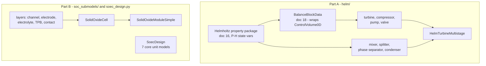
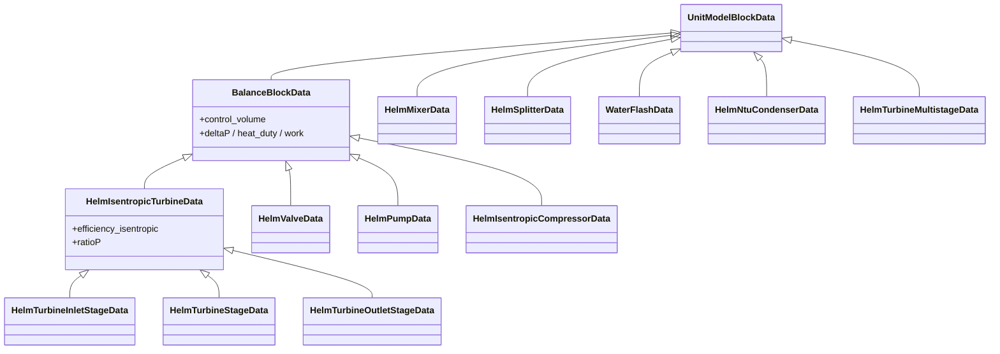
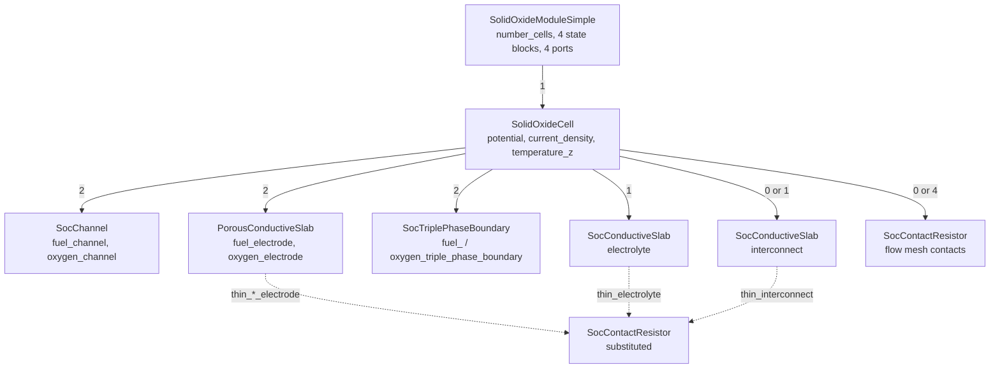
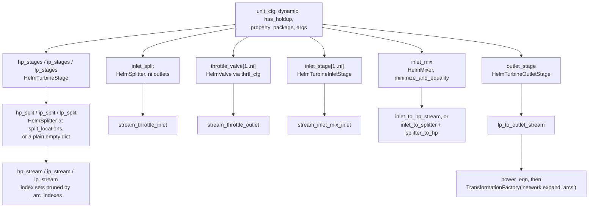
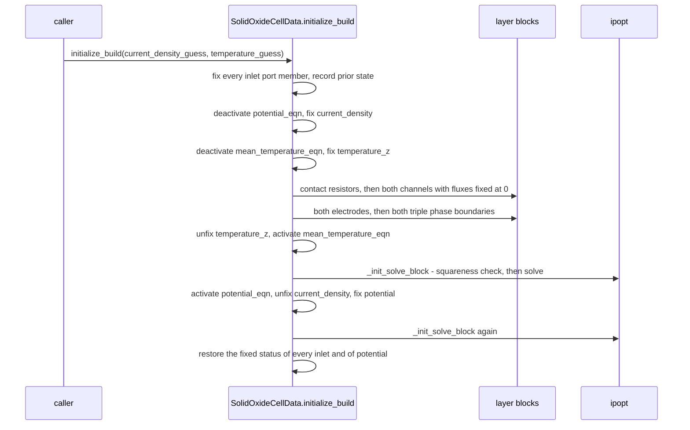

# 20 — Power generation: Helmholtz units and solid oxide cells

> **Doc ID** 20 · **Repo SHA** 70a8f4fe1 (IDAES-PSE v2.13.0rc0) · **Source roots** `idaes/models_extra/power_generation/unit_models/helm/`, `.../soc_submodels/`, `.../soec_design.py`
> **Owns** 24 modules / 10,646 LOC · **Assets** 22 test CSV files (§10) · **Siblings** [04](04_control_volume_framework.md), [06](06_model_preparation_initializers_and_scalers.md), [11](11_unit_models_network_contactors_and_control.md), [16](16_general_helmholtz_property_system.md), [18](18_power_generation_boiler_island.md), [19](19_power_generation_heat_exchangers_and_properties.md), [24](24_reference_flowsheets_and_demonstrations.md), [28](28_data_and_file_format_inventory.md)

This document covers two families of unit model that share a parent package and
nothing else. Section 1 states the split; every later section treats the two
parts under separate headings. Paths below are abbreviated from
`idaes/models_extra/power_generation/unit_models/`.

---

## 0. Scope and source map

| File | LOC | Purpose | Covered in § |
|---|---:|---|---|
| `helm/turbine_multistage.py` | 836 | `HelmTurbineMultistage` — assembles the whole turbine train from the other `helm/` models | 2, 3, 4, 5, 6, 7, 9, 12 |
| `helm/mixer.py` | 442 | `HelmMixer` — N inlets onto one mixed Helmholtz state | 2, 3, 4, 5, 6, 7, 12 |
| `helm/condenser_ntu.py` | 394 | `HelmNtuCondenser` — two heater control volumes plus an NTU effectiveness relation | 2, 3, 4, 5, 6, 7 |
| `helm/splitter.py` | 349 | `HelmSplitter` — one inlet, N outlets, split fractions only | 2, 3, 4, 5, 6, 7, 12 |
| `helm/valve_steam.py` | 296 | `HelmValve`, a local `ValveFunctionType` enum, four valve-function callbacks | 2, 3, 4, 5, 6, 7, 12 |
| `helm/turbine_outlet.py` | 258 | `HelmTurbineOutletStage` — Stodola choked flow plus an exhaust-loss curve | 2, 3, 5, 6, 7 |
| `helm/turbine_inlet.py` | 226 | `HelmTurbineInletStage` — nozzle efficiency and inlet flow correlations | 2, 3, 5, 6, 7 |
| `helm/turbine.py` | 222 | `HelmIsentropicTurbine` — the isentropic core the three stage models extend | 2, 3, 4, 5, 6, 7 |
| `helm/phase_separator.py` | 222 | `WaterFlashData` / `HelmPhaseSeparator` — vapour and liquid outlets from a mixed state | 2, 3, 4, 5, 6, 7, 12 |
| `helm/compressor.py` | 213 | `HelmIsentropicCompressor` | 2, 3, 4, 5, 6, 7 |
| `helm/pump.py` | 194 | `HelmPump` — volumetric work over a pump efficiency | 2, 3, 4, 5, 6, 7 |
| `helm/turbine_stage.py` | 86 | `HelmTurbineStage` — the isentropic core plus mechanical efficiency and specific speed | 2, 3, 5, 6, 7 |
| `helm/__init__.py` | 42 | Re-exports twelve names plus `MomentumMixingType` | 2, 12 |
| `soc_submodels/solid_oxide_cell.py` | 1,512 | `SolidOxideCell` — composes every layer and closes the potential balance | 2, 3, 4, 5, 6, 7, 11, 12 |
| `soc_submodels/porous_conductive_slab.py` | 1,078 | `PorousConductiveSlab` — an electrode: two-dimensional diffusion, conduction, ohmic drop | 2, 3, 4, 5, 6, 7 |
| `soc_submodels/common.py` | 943 | `CV_Bound`, `_SubsetOf`, species data, ideal-gas correlations, four CONFIG templates, the grid builder | 2, 3, 4, 5, 6, 7, 12 |
| `soc_submodels/channel.py` | 926 | `SocChannel` — one-dimensional convecting gas channel with transfer coefficients | 2, 3, 4, 5, 6, 7, 12 |
| `soec_design.py` | 700 | `SoecDesign` — a design-point SOEC from seven core unit models; unrelated to `soc_submodels/` | 2, 3, 4, 5, 6, 7, 12 |
| `soc_submodels/triple_phase_boundary.py` | 530 | `SocTriplePhaseBoundary` — Nernst potential, Butler-Volmer loss, reaction flux | 2, 3, 4, 5, 6, 7 |
| `soc_submodels/solid_oxide_module_simple.py` | 477 | `SolidOxideModuleSimple` — one cell scaled by `number_cells`, with state blocks at four ports | 2, 3, 4, 5, 6, 7 |
| `soc_submodels/conductive_slab.py` | 384 | `SocConductiveSlab` — electrolyte or interconnect: heat conduction and ohmic drop | 2, 3, 4, 5, 6, 7, 9 |
| `soc_submodels/contact_resistor.py` | 186 | `SocContactResistor` — zero-thickness contact: area resistance and Joule heat | 2, 3, 4, 5, 6, 7 |
| `soc_submodels/testing.py` | 96 | `_cell_flowsheet_model`, `_build_test_utility` — test scaffolding shipped in the package | 2, 7, 12, 13 |
| `soc_submodels/__init__.py` | 34 | Re-exports the seven SOC process blocks | 2 |

Part A (`helm/`): 3,780 LOC, 13 modules, 43 configuration keys, 1
`NotImplementedError` hook, 12 owned process block classes, 1 enumeration.
Part B (`soc_submodels/` and `soec_design.py`): 6,866 LOC, 11 modules, 79
configuration keys, 1 hook, 8 process block classes, 1 enumeration. Totals:
10,646 LOC, 122 keys, 2 hooks, 20 process block classes, 22 committed test CSVs.

---

## 1. Architectural role

**This document owns two unrelated subsystems.** They share the package
`idaes/models_extra/power_generation/unit_models/` and the fact that the power
generation library holds both a steam cycle and an electrolysis model. They
share no base class below `UnitModelBlockData`, no property package, no
configuration template and no test fixture.

**Part A** is a steam cycle written against one equation of state. A general
IDAES unit model asks a property package for `get_material_flow_terms` and its
relatives ([05](05_property_and_reaction_framework.md)); a `helm/` model instead
asserts that its package is a `HelmholtzParameterBlockData` with
pressure-enthalpy state variables (`idaes/models_extra/power_generation/unit_models/helm/turbine.py:35`) and then names
`flow_mol`, `enth_mol`, `pressure`, `entr_mol` and `vapor_frac` directly. That
assertion buys two things: analytic single-phase relations such as the
isentropic outlet enthalpy `te.h(s=..., p=...)` (`idaes/models_extra/power_generation/unit_models/helm/turbine.py:122`), and
mixing and splitting statements that need three scalar equations per stream
rather than one balance per phase and chemical component. Four of the twelve
models reach the balance equations through `BalanceBlockData`
(`idaes/models_extra/power_generation/unit_models/balance.py:219`, owned by
[18](18_power_generation_boiler_island.md)), which wraps a
`ControlVolume0DBlock`; three more inherit through them; the remaining five own
their state blocks and write every equation by hand.

**Part B** is an electrochemical model stack, structurally unlike anything else
in the library. Seven process blocks form a composition hierarchy: a layer knows
its own physics and a fixed set of boundary variables; a cell instantiates eight
to fifteen layers, hands each one its neighbour's boundary variable *through its
CONFIG*, and closes the circuit with one potential equation per node
(`idaes/models_extra/power_generation/unit_models/soc_submodels/solid_oxide_cell.py:896`); a module multiplies one cell by
`number_cells` and attaches state blocks at four ports. There is no control
volume anywhere in the stack and no property package below module level — gas
properties come from Shomate coefficients tabulated at
`idaes/models_extra/power_generation/unit_models/soc_submodels/common.py:360`. `soec_design.py` is a third thing again: a
design-point SOEC assembled from core unit models owned by
[10](10_unit_models_control_volume_based.md) and
[11](11_unit_models_network_contactors_and_control.md).

*The two halves touch at no point; the only shared ancestor is `UnitModelBlockData`.*

---

## 2. Public surface inventory

Each `*Data` class pairs with a container class synthesized by
`declare_process_block_class` at the same line; the pair is one row. No module
here declares `__all__`.

| Symbol | Kind | Declared at | Exported via | Stability signal |
|---|---|---|---|---|
| `HelmSplitterData` / `HelmSplitter` | pair | `idaes/models_extra/power_generation/unit_models/helm/splitter.py:51` | `...unit_models.helm` | re-exported |
| `ValveFunctionType` | enum | `idaes/models_extra/power_generation/unit_models/helm/valve_steam.py:37` | `...unit_models.helm` | re-exported; shares a name with `idaes/models/unit_models/valve.py:42` |
| `HelmValveData` / `HelmValve` | pair | `idaes/models_extra/power_generation/unit_models/helm/valve_steam.py:106` | `...unit_models.helm` | re-exported; autodoc'd |
| `HelmMixerData` / `HelmMixer` | pair | `idaes/models_extra/power_generation/unit_models/helm/mixer.py:44` | `...unit_models.helm` | re-exported |
| `MomentumMixingType` | enum | `idaes/models/unit_models/mixer.py:75` | `...unit_models.helm` | re-exported unchanged from [11](11_unit_models_network_contactors_and_control.md) |
| `HelmIsentropicCompressorData` / `HelmIsentropicCompressor` | pair | `idaes/models_extra/power_generation/unit_models/helm/compressor.py:54` | `...unit_models.helm` | re-exported |
| `HelmIsentropicTurbineData` / `HelmIsentropicTurbine` | pair | `idaes/models_extra/power_generation/unit_models/helm/turbine.py:54` | `...unit_models.helm` | re-exported; autodoc'd |
| `HelmPumpData` / `HelmPump` | pair | `idaes/models_extra/power_generation/unit_models/helm/pump.py:52` | `...unit_models.helm` | re-exported |
| `HelmTurbineInletStageData` / `HelmTurbineInletStage` | pair | `idaes/models_extra/power_generation/unit_models/helm/turbine_inlet.py:43` | `...unit_models.helm` | re-exported; autodoc'd |
| `HelmTurbineStageData` / `HelmTurbineStage` | pair | `idaes/models_extra/power_generation/unit_models/helm/turbine_stage.py:40` | `...unit_models.helm` | re-exported; autodoc'd |
| `HelmTurbineOutletStageData` / `HelmTurbineOutletStage` | pair | `idaes/models_extra/power_generation/unit_models/helm/turbine_outlet.py:44` | `...unit_models.helm` | re-exported; autodoc'd |
| `HelmTurbineMultistageData` / `HelmTurbineMultistage` | pair | `idaes/models_extra/power_generation/unit_models/helm/turbine_multistage.py:252` | `...unit_models.helm` | re-exported; autodoc'd |
| `HelmNtuCondenserData` / `HelmNtuCondenser` | pair | `idaes/models_extra/power_generation/unit_models/helm/condenser_ntu.py:84` | `...unit_models.helm` | both halves re-exported; the data class is subclassed by [19](19_power_generation_heat_exchangers_and_properties.md) |
| `WaterFlashData` / `HelmPhaseSeparator` | pair | `idaes/models_extra/power_generation/unit_models/helm/phase_separator.py:39` | module import only | **not** re-exported by `helm/__init__.py`; documented in `docs/`; the only pair here whose names do not correspond |
| `SocChannelData` / `SocChannel` | pair | `idaes/models_extra/power_generation/unit_models/soc_submodels/channel.py:83` | `...soc_submodels` | re-exported; no autodoc entry anywhere in `docs/` |
| `PorousConductiveSlabData` / `PorousConductiveSlab` | pair | `idaes/models_extra/power_generation/unit_models/soc_submodels/porous_conductive_slab.py:84` | the same | the same |
| `SocConductiveSlabData` / `SocConductiveSlab` | pair | `idaes/models_extra/power_generation/unit_models/soc_submodels/conductive_slab.py:57` | the same | the same |
| `SocTriplePhaseBoundaryData` / `SocTriplePhaseBoundary` | pair | `idaes/models_extra/power_generation/unit_models/soc_submodels/triple_phase_boundary.py:77` | the same | the same |
| `SocContactResistorData` / `SocContactResistor` | pair | `idaes/models_extra/power_generation/unit_models/soc_submodels/contact_resistor.py:53` | the same | the same |
| `SolidOxideCellData` / `SolidOxideCell` | pair | `idaes/models_extra/power_generation/unit_models/soc_submodels/solid_oxide_cell.py:141` | the same | the same |
| `SolidOxideModuleSimpleData` / `SolidOxideModuleSimple` | pair | `idaes/models_extra/power_generation/unit_models/soc_submodels/solid_oxide_module_simple.py:65` | the same | the same |
| `CV_Bound` | enum | `idaes/models_extra/power_generation/unit_models/soc_submodels/common.py:33` | module import | no underscore; not re-exported |
| `_SubsetOf` | class | `idaes/models_extra/power_generation/unit_models/soc_submodels/common.py:214` | module import | CONFIG domain factory, adapted from Pyomo's `In` |
| `_cell_flowsheet_model`, `_build_test_utility` | functions | `idaes/models_extra/power_generation/unit_models/soc_submodels/testing.py:22`, `:50` | module import | test scaffolding in production code, §12.5 |
| `SoecDesignData` / `SoecDesign` | pair | `idaes/models_extra/power_generation/unit_models/soec_design.py:46` | module import | autodoc'd at `docs/reference_guides/model_libraries/power_generation/unit_models/soec_design.rst` |

No `.rst` file in the tree names `SolidOxideCell`, `SocChannel` or
`SolidOxideModuleSimple`, and no autodoc directive reaches `soc_submodels/`.
The per-model documentation is the module docstring:
`idaes/models_extra/power_generation/unit_models/soc_submodels/solid_oxide_cell.py:13` is a 95-line description of the geometry,
the flux sign convention and the port members.

---

## 3. Class hierarchy and type taxonomy

### 3.1 Part A

*Seven of the twelve `helm/` models inherit a control volume through `BalanceBlockData`; the other five own their state blocks.*

| Class | Base(s) | Declared at | Container class | Key overrides |
|---|---|---|---|---|
| `HelmIsentropicTurbineData` | `BalanceBlockData` | `idaes/models_extra/power_generation/unit_models/helm/turbine.py:54` | `HelmIsentropicTurbine` | `build`, `initialize_build`, `calculate_scaling_factors`, `_get_performance_contents` |
| `HelmIsentropicCompressorData` | `BalanceBlockData` | `idaes/models_extra/power_generation/unit_models/helm/compressor.py:54` | `HelmIsentropicCompressor` | `build`, `initialize_build`, `calculate_scaling_factors` |
| `HelmPumpData` | `BalanceBlockData` | `idaes/models_extra/power_generation/unit_models/helm/pump.py:52` | `HelmPump` | the same three |
| `HelmValveData` | `BalanceBlockData` | `idaes/models_extra/power_generation/unit_models/helm/valve_steam.py:106` | `HelmValve` | those four, plus `_get_performance_contents` |
| `HelmTurbineInletStageData` | `HelmIsentropicTurbineData` | `idaes/models_extra/power_generation/unit_models/helm/turbine_inlet.py:43` | `HelmTurbineInletStage` | `build`, `initialize_build`, `calculate_scaling_factors` |
| `HelmTurbineStageData` | `HelmIsentropicTurbineData` | `idaes/models_extra/power_generation/unit_models/helm/turbine_stage.py:40` | `HelmTurbineStage` | `build`, `initialize_build` |
| `HelmTurbineOutletStageData` | `HelmIsentropicTurbineData` | `idaes/models_extra/power_generation/unit_models/helm/turbine_outlet.py:44` | `HelmTurbineOutletStage` | `build`, `initialize_build`, `calculate_scaling_factors` |
| `HelmMixerData` | `UnitModelBlockData` | `idaes/models_extra/power_generation/unit_models/helm/mixer.py:44` | `HelmMixer` | `build` and eleven construction and initialization methods |
| `HelmSplitterData` | `UnitModelBlockData` | `idaes/models_extra/power_generation/unit_models/helm/splitter.py:51` | `HelmSplitter` | `build` and seven others |
| `WaterFlashData` | `UnitModelBlockData` | `idaes/models_extra/power_generation/unit_models/helm/phase_separator.py:39` | `HelmPhaseSeparator` | `build`, `initialize_build`, `set_initial_condition`, `calculate_scaling_factors` |
| `HelmNtuCondenserData` | `UnitModelBlockData` | `idaes/models_extra/power_generation/unit_models/helm/condenser_ntu.py:84` | `HelmNtuCondenser` | `build`, `initialize_build`, `set_initial_condition`, both report hooks |
| `HelmTurbineMultistageData` | `UnitModelBlockData` | `idaes/models_extra/power_generation/unit_models/helm/turbine_multistage.py:252` | `HelmTurbineMultistage` | `build`, `initialize_build`, `calculate_scaling_factors`, `_get_stream_table_contents` (raises) |

**What `BalanceBlockData` supplies.** Its `build`
(`idaes/models_extra/power_generation/unit_models/balance.py:227`) calls
`make_balance_control_volume`
(`idaes/models_extra/power_generation/unit_models/balance.py:40`), which creates
a `ControlVolume0DBlock` named `control_volume`, adds its state blocks and
issues the three balance dispatchers of
[04 §5.3](04_control_volume_framework.md#53-the-dispatchers) with the configured
balance types. It then adds `inlet` and `outlet` ports and `Reference` objects
`deltaP`, `heat_duty` and `work` onto the control volume
(`idaes/models_extra/power_generation/unit_models/balance.py:247`, `:249`,
`:251`). A subclass therefore begins `build` with a mass balance, an enthalpy
balance, a pressure relation, two ports and a work term already present, and
adds only its performance correlation — which is why `HelmPumpData.build`
(`idaes/models_extra/power_generation/unit_models/helm/pump.py:90`) creates exactly two variables, two expressions and two
constraints in 43 lines.

### 3.2 Part B composition

Every Part B process block derives directly from `UnitModelBlockData`; the
structure that matters is composition, not inheritance.

*A cell holds between eight and fifteen layer blocks; three of them can be replaced by a zero-thickness `SocContactResistor` through a `thin_*` key.*

| Class | Declared at | Container class | What the layer contributes |
|---|---|---|---|
| `SocChannelData` | `idaes/models_extra/power_generation/unit_models/soc_submodels/channel.py:83` | `SocChannel` | Convective mass and enthalpy transport along z; mass- and heat-transfer coefficients to the electrode face. Carries **no** current density |
| `PorousConductiveSlabData` | `idaes/models_extra/power_generation/unit_models/soc_submodels/porous_conductive_slab.py:84` | `PorousConductiveSlab` | Two-dimensional binary diffusion through a porous solid, solid heat conduction, ohmic drop over an Arrhenius resistivity |
| `SocConductiveSlabData` | `idaes/models_extra/power_generation/unit_models/soc_submodels/conductive_slab.py:57` | `SocConductiveSlab` | Two-dimensional heat conduction and ohmic drop with no mass transport — the electrolyte and the interconnect |
| `SocContactResistorData` | `idaes/models_extra/power_generation/unit_models/soc_submodels/contact_resistor.py:53` | `SocContactResistor` | One area-specific contact resistance, its Joule heat, one heat-flux jump condition; no x dimension |
| `SocTriplePhaseBoundaryData` | `idaes/models_extra/power_generation/unit_models/soc_submodels/triple_phase_boundary.py:77` | `SocTriplePhaseBoundary` | Nernst potential, Butler-Volmer activation overpotential, reversible heat of reaction, and the species flux implied by the current density; no x dimension |
| `SolidOxideCellData` | `idaes/models_extra/power_generation/unit_models/soc_submodels/solid_oxide_cell.py:141` | `SolidOxideCell` | Instantiates the layers, wires their boundary variables, adds `potential_eqn`, `mean_temperature_eqn`, `total_current_eqn` |
| `SolidOxideModuleSimpleData` | `idaes/models_extra/power_generation/unit_models/soc_submodels/solid_oxide_module_simple.py:65` | `SolidOxideModuleSimple` | Multiplies one cell by `number_cells`; translates between cell-level variables and a general property package |
| `SoecDesignData` | `idaes/models_extra/power_generation/unit_models/soec_design.py:46` | `SoecDesign` | Unrelated to the stack: a `StoichiometricReactor`, a `Separator`, a `Mixer`, a `Heater` and three `Translator` blocks wired by six arcs |

The three physics a cell needs are distributed across the layer set.
**Charge transport** is ohmic in `PorousConductiveSlabData`
(`voltage_drop`, `idaes/models_extra/power_generation/unit_models/soc_submodels/porous_conductive_slab.py:713`),
`SocConductiveSlabData` (`idaes/models_extra/power_generation/unit_models/soc_submodels/conductive_slab.py:282`) and
`SocContactResistorData` (`voltage_drop_total`,
`idaes/models_extra/power_generation/unit_models/soc_submodels/contact_resistor.py:121`). **Mass transport** is convective in
`SocChannelData` (`material_balance_eqn`, `idaes/models_extra/power_generation/unit_models/soc_submodels/channel.py:573`) and
diffusive in `PorousConductiveSlabData`
(`idaes/models_extra/power_generation/unit_models/soc_submodels/porous_conductive_slab.py:731`). **Reaction** occurs only at
`SocTriplePhaseBoundaryData`, which converts current density into a species flux
through Faraday's constant and the stoichiometric coefficient of `"e^-"`
(`reaction_rate_per_unit_area`,
`idaes/models_extra/power_generation/unit_models/soc_submodels/triple_phase_boundary.py:399`).

### 3.3 Enumerations

`ValveFunctionType` (`idaes/models_extra/power_generation/unit_models/helm/valve_steam.py:37`):

| Member | Value | Meaning | Consumed at |
|---|---|---|---|
| `linear` | 1 | `valve_function = valve_opening` | `idaes/models_extra/power_generation/unit_models/helm/valve_steam.py:211` |
| `quick_opening` | 2 | `valve_function = sqrt(valve_opening)` | `idaes/models_extra/power_generation/unit_models/helm/valve_steam.py:213` |
| `equal_percentage` | 3 | `alpha ** (valve_opening - 1)`, adding a fixed `alpha` Var | `idaes/models_extra/power_generation/unit_models/helm/valve_steam.py:215` |
| `custom` | 4 | Calls `config.valve_function_callback`; a `None` callback raises | `idaes/models_extra/power_generation/unit_models/helm/valve_steam.py:218` |

`CV_Bound` (`idaes/models_extra/power_generation/unit_models/soc_submodels/common.py:33`): `EXTRAPOLATE` (1) and `NODE_VALUE`
(2). `_interpolate_2D` tests only `isinstance(phi_bound, CV_Bound)`
(`idaes/models_extra/power_generation/unit_models/soc_submodels/common.py:194`, `:198`), so both members select extrapolation;
no call site in the tree supplies either, and the source comment at
`idaes/models_extra/power_generation/unit_models/soc_submodels/common.py:190` records that the path is untested.

### 3.4 Retrofit status

Of the **20** declared process block classes in this document, **none** declares
a `default_initializer` and **none** declares a `default_scaler`. All 20 rows of
`_generated/retrofit.csv` carry `False` in both `declares_initializer` and
`declares_scaler`, and the set-wide table
[06 §3.3](06_model_preparation_initializers_and_scalers.md#33-retrofit-adoption)
scores this document `20 / 0 / 0` — the largest block of unretrofitted process
blocks in the set.

The consequence is that model preparation for all twenty runs through the legacy
generation only: `UnitModelBlockData.initialize` reaches each model's
`initialize_build`, and scaling reaches `calculate_scaling_factors` or, in Part
B, the parallel `recursive_scaling` method of §7.4. The numerical demands are
not small — `HelmTurbineMultistage.initialize_build` runs a multi-pass flow
iteration over every stage (`idaes/models_extra/power_generation/unit_models/helm/turbine_multistage.py:640`), and
`SolidOxideCellData.initialize_build` performs fourteen nested sub-model solves
followed by two whole-cell solves (`idaes/models_extra/power_generation/unit_models/soc_submodels/solid_oxide_cell.py:933`).

---

## 4. Configuration reference

122 keys across seventeen declarations. Anchors are line numbers within the file
named in each heading.

### 4.1 `HelmMixerData.CONFIG` — `idaes/models_extra/power_generation/unit_models/helm/mixer.py:49`

A fresh `ConfigBlock()`, not `UnitModelBlockData.CONFIG()`.

| Key | Domain / validator | Default | Req. | Effect on build | Anchor |
|---|---|---|---|---|---|
| `dynamic` | `In([False])` | `False` | no | Any other value fails validation | `:50` |
| `has_holdup` | `In([False])` | `False` | no | The same | `:60` |
| `property_package` | `is_physical_parameter_block` | `useDefault` | no | Package every state block is built from | `:70` |
| `property_package_args` | implicit `ConfigBlock` | empty | no | Forwarded to each state block | `:83` |
| `inlet_list` | `ListOf(str)` | `None` | no | Names the inlets; inconsistent with `num_inlets` raises | `:95` |
| `num_inlets` | `int` | `None` | no | Generates `inlet_1` … `inlet_n`; defaults to 2 when neither key is set | `:107` |
| `momentum_mixing_type` | `MomentumMixingType` | `minimize` | no | Selects one of four pressure treatments | `:122` |

The enumeration is used as the CONFIG domain directly, so Pyomo coerces by
calling `MomentumMixingType(value)`. There is no `material_balance_type`,
`energy_mixing_type`, `has_phase_equilibrium`, `mixed_state_block` or
`construct_ports` key: the mixing equations are fixed (§6.1).

### 4.2 `HelmSplitterData.CONFIG` and `WaterFlashData.CONFIG`

`ConfigBlock()` at `idaes/models_extra/power_generation/unit_models/helm/splitter.py:60` and `idaes/models_extra/power_generation/unit_models/helm/phase_separator.py:44`. The
first four keys are identical in shape.

| Key | Domain / validator | Default | Effect on build | Splitter | Phase separator |
|---|---|---|---|---|---|
| `dynamic` | `In([False])` | `False` | Steady-state or pseudo-steady-state only | `:61` | `:45` |
| `has_holdup` | `In([False])` | `False` | The same | `:69` | `:54` |
| `property_package` | `is_physical_parameter_block` | `useDefault` | Splitter: the inlet and every outlet state. Separator: `mixed_state`, `vap_state`, `liq_state` | `:77` | `:68` |
| `property_package_args` | implicit `ConfigBlock` | empty | Forwarded to each state block | `:91` | `:81` |
| `outlet_list` | `ListOf(str)` | `None` | Names the outlets | `:103` | — |
| `num_outlets` | `int` | `None` | Generates `outlet_1` … `outlet_n`; defaults to 2 | `:115` | — |

The splitter has no `split_basis`, no `energy_split_basis` and no
`ideal_separation`: the split is always on total molar flow.

### 4.3 The `BalanceBlockData` delta — turbine, compressor, pump, valve

`BalanceBlockData.CONFIG`
(`idaes/models_extra/power_generation/unit_models/balance.py:224`) is
`UnitModelBlockData.CONFIG()` extended by `make_balance_config_block`
(`idaes/models_extra/power_generation/unit_models/balance.py:92`) with nine
keys, and is owned by [18](18_power_generation_boiler_island.md). Each of the
four direct subclasses narrows the same five keys with three statements apiece —
a value, a `_default` and a `_domain` — reaching through the `ConfigValue`'s
private attributes (`idaes/models_extra/power_generation/unit_models/helm/turbine.py:73`, `idaes/models_extra/power_generation/unit_models/helm/compressor.py:73`,
`idaes/models_extra/power_generation/unit_models/helm/pump.py:71`, `idaes/models_extra/power_generation/unit_models/helm/valve_steam.py:125`).

| Key | Inherited from | Override in turbine / compressor / pump | Override in valve |
|---|---|---|---|
| `dynamic`, `has_holdup` | `UnitModelBlockData.CONFIG` | `In([False])`, default `False` | the same |
| `has_pressure_change` | `idaes/models_extra/power_generation/unit_models/balance.py:161` | `In([True])`, default `True` | the same |
| `has_work_transfer` | `idaes/models_extra/power_generation/unit_models/balance.py:200` | `In([True])`, default `True` | `In([False])`, default `False` |
| `has_heat_transfer` | `idaes/models_extra/power_generation/unit_models/balance.py:208` | `In([False])`, default `False` | the same |
| `material_balance_type`, `energy_balance_type`, `momentum_balance_type`, `has_phase_equilibrium`, `property_package`, `property_package_args` | `idaes/models_extra/power_generation/unit_models/balance.py:96`, `:114`, `:132`, `:148`, `:175`, `:188` | none | none |

The three turbine stage classes re-declare
`CONFIG = HelmIsentropicTurbineData.CONFIG()` (`idaes/models_extra/power_generation/unit_models/helm/turbine_inlet.py:44`,
`idaes/models_extra/power_generation/unit_models/helm/turbine_stage.py:41`, `idaes/models_extra/power_generation/unit_models/helm/turbine_outlet.py:47`) and add nothing.

### 4.4 `HelmValveData.CONFIG` — `idaes/models_extra/power_generation/unit_models/helm/valve_steam.py:125`

Three keys beyond the §4.3 delta.

| Key | Domain / validator | Default | Req. | Effect on build | Anchor |
|---|---|---|---|---|---|
| `valve_function` | `In(ValveFunctionType)` | `linear` | no | Selects one of three shipped callbacks, or defers to the next key | `:143` |
| `valve_function_callback` | none declared | `None` | conditional | Called with the valve block when `valve_function` is `custom`; must create `valve_function`, an `Expression` over time | `:159` |
| `phase` | `In(("Vap", "Liq"))` | `'Vap'` | no | Chooses `_vapor_pressure_flow_rule` (squared pressures) or `_liquid_pressure_flow_rule` (a pressure difference) | `:167` |

Supplying a callback while `valve_function` is not `custom` logs a warning and
uses the enumeration member (`idaes/models_extra/power_generation/unit_models/helm/valve_steam.py:206`).

### 4.5 `HelmNtuCondenserData.CONFIG` — `idaes/models_extra/power_generation/unit_models/helm/condenser_ntu.py:90`

`UnitModelBlockData.CONFIG(implicit=True)` extended by
`_make_heat_exchanger_config` (`idaes/models_extra/power_generation/unit_models/helm/condenser_ntu.py:41`).

| Key | Domain / validator | Default | Req. | Effect on build | Anchor |
|---|---|---|---|---|---|
| `hot_side_name` | `str` | `'shell'` | no | Alias under which `hot_side` may be given; the prefix `hx_process_config` uses | `:45` |
| `cold_side_name` | `str` | `'tube'` | no | The same for the cold side | `:53` |
| `hot_side` | implicit `ConfigBlock` | empty | no | Configures the hot control volume; carries the seven heater template keys | `:61` |
| `cold_side` | implicit `ConfigBlock` | empty | no | The same for the cold side | `:70` |

`_make_heater_config_block(config.hot_side)` and `(config.cold_side)`
(`idaes/models_extra/power_generation/unit_models/helm/condenser_ntu.py:79`,
`:80`) add the seven-key template owned by
[10 §4](10_unit_models_control_volume_based.md#4-configuration-reference) to each
side — the fourth application of that template and the only one outside
`idaes/models/unit_models`.

### 4.6 `HelmTurbineMultistageData.CONFIG` — `idaes/models_extra/power_generation/unit_models/helm/turbine_multistage.py:253`

A fresh `ConfigBlock()` filled by `_define_turbine_multistage_config`
(`idaes/models_extra/power_generation/unit_models/helm/turbine_multistage.py:52`). Nineteen keys, the largest block here.

| Key | Domain / validator | Default | Effect on build | Anchor |
|---|---|---|---|---|
| `dynamic` | `In([False])` | `False` | Forwarded to every sub-model | `:53` |
| `has_holdup` | `In([False])` | `False` | The same | `:62` |
| `property_package` | `is_physical_parameter_block` | `useDefault` | Forwarded to every sub-model | `:71` |
| `property_package_args` | implicit `ConfigBlock` | empty | The same | `:84` |
| `num_parallel_inlet_stages` | `int` | `4` | Size of `inlet_stage_idx`: throttle valves, inlet stages, inlet-split outlets and inlet-mix inlets | `:96` |
| `throttle_valve_function` | `In(ValveFunctionType)` | `linear` | Forwarded to every throttle valve as `valve_function` | `:105` |
| `throttle_valve_function_callback` | none declared | `None` | Forwarded as `valve_function_callback` | `:121` |
| `num_hp` / `num_ip` / `num_lp` | `int` | `2` / `10` / `5` | Number of `HelmTurbineStage` blocks per section | `:131`, `:140`, `:149` |
| `hp_split_locations` / `ip_split_locations` / `lp_split_locations` | `ConfigList` of `int` | `[]` | Stage indices after which an extraction `HelmSplitter` is inserted; index 0 means before the first stage | `:158`, `:169`, `:179` |
| `hp_disconnect` / `ip_disconnect` / `lp_disconnect` | `ConfigList` of `int` | `[]` | Stage indices after which no arc is created | `:189`, `:200`, `:211` |
| `hp_split_num_outlets` / `ip_split_num_outlets` / `lp_split_num_outlets` | `dict` | `{}` | Per-splitter outlet count where it is not 2 | `:222`, `:230`, `:238` |

The three disconnect lists are `ConfigList`s that `initialize_build` **appends
to** (`idaes/models_extra/power_generation/unit_models/helm/turbine_multistage.py:729`, `:742`), so initialization mutates the
configuration.

### 4.7 The `soc_submodels/common.py` CONFIG templates

Three module-level functions add keys to a submodel's CONFIG block. They are the
Part B equivalent of `CONFIG_Template`
([04 §4.1](04_control_volume_framework.md#41-config_template--the-unit-model-facing-template)),
except that most keys take *a Pyomo variable from a neighbouring block* rather
than a value: `_create_if_none` (`idaes/models_extra/power_generation/unit_models/soc_submodels/common.py:67`) builds a
`Reference` when the key is set and a local `Var` when it is `None`. That is the
entire boundary-condition mechanism of the stack.

`_submodel_boilerplate_config(CONFIG)` — `idaes/models_extra/power_generation/unit_models/soc_submodels/common.py:636`:

| Key | Domain / validator | Default | Req. | Effect on build | Anchor |
|---|---|---|---|---|---|
| `control_volume_zfaces` | none declared | none | yes | Face coordinates along the flow direction; validated by `_face_initializer` | `:638` |
| `length_z` | none declared | `None` | no | Cell length; `Reference` or local `Var` | `:646` |
| `length_y` | none declared | `None` | no | Cell width; the same | `:652` |
| `current_density` | none declared | `None` | no | Charge flux through the layer, indexed by time and z node | `:655` |
| `include_temperature_x_thermo` | `In([useDefault, True, False])` | `True` | no | When false, thermodynamic expressions use `temperature_z` and ignore the x deviation | `:659` |

`_thermal_boundary_conditions_config(CONFIG, thin)` —
`idaes/models_extra/power_generation/unit_models/soc_submodels/common.py:685` — declares `temperature_z`
(`idaes/models_extra/power_generation/unit_models/soc_submodels/common.py:689`) and `heat_flux_x0` / `heat_flux_x1`
(`idaes/models_extra/power_generation/unit_models/soc_submodels/common.py:718`, `:724`) always; `temperature_deviation_x`
(`idaes/models_extra/power_generation/unit_models/soc_submodels/common.py:696`) when `thin` is true; and
`temperature_deviation_x0` / `temperature_deviation_x1`
(`idaes/models_extra/power_generation/unit_models/soc_submodels/common.py:704`, `:711`) otherwise.
`_material_boundary_conditions_config(CONFIG, thin)` —
`idaes/models_extra/power_generation/unit_models/soc_submodels/common.py:792` — declares `material_flux_x`
(`idaes/models_extra/power_generation/unit_models/soc_submodels/common.py:797`) and `conc_mol_comp_deviation_x`
(`idaes/models_extra/power_generation/unit_models/soc_submodels/common.py:801`) when `thin` is true, and
`conc_mol_comp_deviation_x0`, `conc_mol_comp_deviation_x1`, `material_flux_x0`
and `material_flux_x1` (`idaes/models_extra/power_generation/unit_models/soc_submodels/common.py:810`, `:818`, `:826`, `:830`)
otherwise. Every one defaults to `None`.

| Class | `_submodel_boilerplate_config` | thermal template | material template |
|---|---|---|---|
| `SocChannelData` | **no** — four keys re-declared locally, §12.7 | `thin=False`, `idaes/models_extra/power_generation/unit_models/soc_submodels/channel.py:119` | none |
| `SocConductiveSlabData` | `idaes/models_extra/power_generation/unit_models/soc_submodels/conductive_slab.py:76` | `thin=False`, `idaes/models_extra/power_generation/unit_models/soc_submodels/conductive_slab.py:77` | none |
| `SocContactResistorData` | `idaes/models_extra/power_generation/unit_models/soc_submodels/contact_resistor.py:76` | `thin=True`, `idaes/models_extra/power_generation/unit_models/soc_submodels/contact_resistor.py:77` | none |
| `PorousConductiveSlabData` | `idaes/models_extra/power_generation/unit_models/soc_submodels/porous_conductive_slab.py:132` | `thin=False`, `idaes/models_extra/power_generation/unit_models/soc_submodels/porous_conductive_slab.py:133` | `thin=False`, `idaes/models_extra/power_generation/unit_models/soc_submodels/porous_conductive_slab.py:134` |
| `SocTriplePhaseBoundaryData` | `idaes/models_extra/power_generation/unit_models/soc_submodels/triple_phase_boundary.py:147` | `thin=True`, `idaes/models_extra/power_generation/unit_models/soc_submodels/triple_phase_boundary.py:148` | `thin=True`, `idaes/models_extra/power_generation/unit_models/soc_submodels/triple_phase_boundary.py:149` |

### 4.8 The five SOC layer CONFIG blocks

Keys beyond the templates of §4.7.

| Class and CONFIG | Key | Domain / validator | Default | Effect on build | Anchor |
|---|---|---|---|---|---|
| `SocChannelData`, `idaes/models_extra/power_generation/unit_models/soc_submodels/channel.py:84` | `component_list` | `common._SubsetOf(_gas_species_list)` | none | The gas species carried in this channel | `:85` |
| | `control_volume_zfaces` | `ListOf(float)` | none | Face coordinates along the flow direction | `:92` |
| | `length_z`, `length_y` | none declared | `None` | Cell length and width | `:101`, `:107` |
| | `include_temperature_x_thermo` | `In([useDefault, True, False])` | `True` | As §4.7 | `:110` |
| | `opposite_flow` | `Bool` | `False` | Reverses the upwind direction of the convection terms | `:120` |
| | `below_electrode` | `Bool` | none | Chooses which face carries the material flux `Var`s and which carries `Param`s fixed at zero | `:129` |
| `SocConductiveSlabData`, `idaes/models_extra/power_generation/unit_models/soc_submodels/conductive_slab.py:58` | `control_volume_xfaces` | none declared | none | Face coordinates across the thickness | `:59` |
| | `voltage_drop_custom` | `Bool` | `False` | Adds a `voltage_drop_custom` Var for a degradation model to drive | `:67` |
| `SocContactResistorData`, `idaes/models_extra/power_generation/unit_models/soc_submodels/contact_resistor.py:54` | `dynamic` | `In([False])` | `False` | The layer has no capacity | `:55` |
| | `has_holdup` | `In([False])` | `False` | The same; this key carries no description | `:64` |
| | `voltage_drop_custom` | `Bool` | `False` | As above | `:68` |
| `PorousConductiveSlabData`, `idaes/models_extra/power_generation/unit_models/soc_submodels/porous_conductive_slab.py:85` | `has_gas_holdup` | `Bool` | `False` | Gas-phase accumulation terms; requires `has_holdup` | `:86` |
| | `control_volume_xfaces` | `ListOf(float)` | none | Face coordinates across the electrode | `:94` |
| | `component_list` | `common._SubsetOf(_gas_species_list)` | none | The diffusing species | `:103` |
| | `conc_mol_comp_ref` | none declared | `None` | Bulk channel concentration the local deviations are measured from | `:109` |
| | `dconc_mol_comp_refdt` | none declared | `None` | Its time derivative, supplied by the channel under dynamics | `:116` |
| | `voltage_drop_custom` | `Bool` | `False` | As above | `:124` |
| `SocTriplePhaseBoundaryData`, `idaes/models_extra/power_generation/unit_models/soc_submodels/triple_phase_boundary.py:78` | `dynamic`, `has_holdup` | `In([False])` | `False` | The interface has no capacity; neither key carries a description | `:79`, `:88` |
| | `component_list` | `common._SubsetOf(_gas_species_list)` | none | Gas species present at the interface | `:92` |
| | `reaction_stoichiometry` | none declared | none | Species-to-coefficient map; a missing `"e^-"` entry raises | `:98` |
| | `inert_species` | `common._SubsetOf(_gas_species_list)` | `None` | Species excluded from the reaction; a non-zero coefficient for one raises | `:106` |
| | `conc_mol_comp_ref` | none declared | `None` | Reference concentration for the Nernst term | `:115` |
| | `below_electrolyte` | `Bool` | none | Sets the sign of `material_flux_x` and of the electron coefficient | `:122` |
| | `voltage_drop_custom` | `Bool` | `False` | As above | `:130` |
| | `log_exchange_current_modifier` | `Bool` | `False` | Adds a `Var` inside the exchange-current logarithm | `:138` |

### 4.9 `SolidOxideCellData.CONFIG` — `idaes/models_extra/power_generation/unit_models/soc_submodels/solid_oxide_cell.py:142`

Twenty-three keys, every one consumed inside `build` to decide which layers
exist and what to pass them.

| Key | Domain / validator | Default | Effect on build | Anchor |
|---|---|---|---|---|
| `has_gas_holdup` | `Bool` | `False` | Gas accumulation in channels and electrodes; without `has_holdup` it raises | `:143` |
| `control_volume_zfaces` | `ListOf(float)` | none | The z grid shared by every layer | `:151` |
| `control_volume_xfaces_fuel_electrode` / `control_volume_xfaces_oxygen_electrode` / `control_volume_xfaces_electrolyte` | `ListOf(float)` | none | Required unless the matching `thin_*` key is set; supplying both raises | `:160`, `:169`, `:178` |
| `thin_fuel_electrode` / `thin_oxygen_electrode` / `thin_electrolyte` | `Bool` | `False` | Substitutes a `SocContactResistor` for the full layer | `:187`, `:195`, `:203` |
| `fuel_component_list` / `oxygen_component_list` | `common._SubsetOf(_gas_species_list)` | `None` | Default to `["H2", "H2O"]` and `["O2"]` | `:211`, `:219` |
| `fuel_triple_phase_boundary_stoich_dict` / `oxygen_triple_phase_boundary_stoich_dict` | `common._SubsetOf(_all_species_list)` | `None` | Default to `{"H2": -0.5, "H2O": 0.5, "e^-": 1.0}` and `{"O2": -0.25, "e^-": -1.0}` | `:227`, `:246` |
| `inert_fuel_species_triple_phase_boundary` / `inert_oxygen_species_triple_phase_boundary` | `common._SubsetOf(_gas_species_list)` | `None` | Forwarded as `inert_species` to the matching triple phase boundary | `:236`, `:255` |
| `flow_pattern` | `In(HeatExchangerFlowPattern)` | `countercurrent` | Sets `opposite_flow` on the oxygen channel; any other member raises | `:264` |
| `flux_through_interconnect` | `Bool` | `False` | Builds the interconnect layer and a periodic flux condition; when false, two zero-flux constraints are written | `:272` |
| `thin_interconnect` | `Bool` | `False` | Makes the interconnect a `SocContactResistor` | `:281` |
| `control_volume_xfaces_interconnect` | `ListOf(float)` | none | Required for a non-thin interconnect | `:289` |
| `include_contact_resistance` | `Bool` | `False` | Adds four `SocContactResistor` blocks between flow mesh, interconnect and electrodes | `:298` |
| `include_temperature_x_thermo` | `In([True])` | `True` | Narrowed to a single admissible value at cell level | `:309` |
| `voltage_drop_custom` | `Bool` | `False` | Forwarded to both triple phase boundaries | `:318` |
| `has_heat_loss_term` | `Bool` | `False` | Adds `heat_loss_flux` and `total_heat_loss`; without `flux_through_interconnect` it raises | `:326` |
| `log_exchange_current_modifier` | `Bool` | `False` | Forwarded to both triple phase boundaries | `:334` |

### 4.10 `SolidOxideModuleSimpleData.CONFIG` and `SoecDesignData.CONFIG`

`UnitModelBlockData.CONFIG()` at `idaes/models_extra/power_generation/unit_models/soc_submodels/solid_oxide_module_simple.py:66`
and `UnitModelBlockData.CONFIG(implicit=True)` at `idaes/models_extra/power_generation/unit_models/soec_design.py:51`.

| Key | Domain / validator | Default | Req. | Effect on build | Anchor |
|---|---|---|---|---|---|
| `solid_oxide_cell_config` | implicit `ConfigBlock` | empty | yes | Splatted into the `SolidOxideCell` constructor; `build` writes into it | `idaes/models_extra/power_generation/unit_models/soc_submodels/solid_oxide_module_simple.py:68` |
| `fuel_property_package` / `oxygen_property_package` | `is_physical_parameter_block` | `None` | yes | Build the two state blocks on each side | `idaes/models_extra/power_generation/unit_models/soc_submodels/solid_oxide_module_simple.py:75`, `:101` |
| `fuel_property_package_args` / `oxygen_property_package_args` | implicit `ConfigBlock` | empty | no | Forwarded to them | `idaes/models_extra/power_generation/unit_models/soc_submodels/solid_oxide_module_simple.py:88`, `:114` |
| `has_heat_loss_term` | `Bool` | `False` | no | Cross-checked against the cell's key of the same name; a mismatch raises, an absent cell entry is filled in | `idaes/models_extra/power_generation/unit_models/soc_submodels/solid_oxide_module_simple.py:127` |
| `oxygen_side_property_package` | `is_physical_parameter_block` | none | yes | Builds the sweep mixer and heater; must contain `O2` | `idaes/models_extra/power_generation/unit_models/soec_design.py:52` |
| `hydrogen_side_property_package` | `is_physical_parameter_block` | none | yes | Builds the two translators; must contain exactly `H2` and `H2O` | `idaes/models_extra/power_generation/unit_models/soec_design.py:64` |
| `oxygen_side_property_package_args` / `hydrogen_side_property_package_args` | implicit `ConfigBlock` | empty | no | Forwarded to the respective sub-models | `idaes/models_extra/power_generation/unit_models/soec_design.py:76`, `:84` |
| `reaction_eos` | `In(EosType)` | `EosType.PR` | no | Equation of state of the internal electrolysis property package | `idaes/models_extra/power_generation/unit_models/soec_design.py:92` |
| `has_heat_transfer` | `Bool` | `False` | no | When false, adds `heat_transfer_eqn` fixing `heat` to zero | `idaes/models_extra/power_generation/unit_models/soec_design.py:104` |

`EosType`, `get_prop` and `get_rxn` come from
`idaes/models_extra/power_generation/properties/natural_gas_PR.py`, owned by
[19](19_power_generation_heat_exchangers_and_properties.md).

---

## 5. Construction and call sequences

### 5.1 The Helmholtz property assertion

Four modules carry a private `_assert_properties(pb)` — `idaes/models_extra/power_generation/unit_models/helm/turbine.py:35`,
`idaes/models_extra/power_generation/unit_models/helm/compressor.py:35`, `idaes/models_extra/power_generation/unit_models/helm/pump.py:33`, `idaes/models_extra/power_generation/unit_models/helm/valve_steam.py:44` — called as
the first substantive statement of the owning `build` (`idaes/models_extra/power_generation/unit_models/helm/turbine.py:103`).
It asserts that the configured parameter block is a
`HelmholtzParameterBlockData`, that its `phase_presentation` is one of `MIX`,
`L` or `G`, and that its `state_vars` is `StateVars.PH`; an `AssertionError` is
logged at `error` level and re-raised (`idaes/models_extra/power_generation/unit_models/helm/turbine.py:46`). The three names
arrive through `idaes.models.properties.helmholtz.helmholtz`, a sixteen-line
star-import shim over `idaes.models.properties.general_helmholtz`
(`idaes/models/properties/helmholtz/helmholtz.py:16`) owned by
[16](16_general_helmholtz_property_system.md). The other four Part A models make
no such assertion and fail with `AttributeError` from the state block instead.

### 5.2 `build` on a `BalanceBlockData` subclass

`HelmIsentropicTurbineData.build` (`idaes/models_extra/power_generation/unit_models/helm/turbine.py:92`) calls `super().build()`
first, which runs the whole of
`idaes/models_extra/power_generation/unit_models/balance.py:227` — control
volume, state blocks, three balance dispatchers, two ports, the `deltaP` and
`work` references. It then asserts the property package (`:103`), constructs the
expression writer `te = ThermoExpr(...)` (`:104`), creates
`efficiency_isentropic` fixed at construction (`:106`) and `ratioP` (`:111`),
and adds four expressions — `h_is` (`:122`), computed as
`te.h(s=properties_in[t].entr_mol, p=properties_out[t].pressure)`,
`delta_enth_isentropic` (`:126`), `work_isentropic` (`:130`) and `h_o` (`:136`)
— two constraints, `eq_work` (`:142`) and `eq_pressure_ratio` (`:146`), and
`work_mechanical` (`:150`).

`HelmIsentropicCompressorData.build` (`idaes/models_extra/power_generation/unit_models/helm/compressor.py:92`) repeats that
sequence with `ratioP` initialised at 1.5 and no `delta_enth_isentropic`.
`HelmPumpData.build` (`idaes/models_extra/power_generation/unit_models/helm/pump.py:90`) replaces the isentropic expressions
with `work_fluid = flow_vol * deltaP` (`:119`) and
`shaft_work = work_fluid / efficiency_pump` (`:123`), and exposes
`efficiency_isentropic` as a `Reference` to `efficiency_pump` (`:106`) so both
models present the same attribute name. `HelmValveData.build`
(`idaes/models_extra/power_generation/unit_models/helm/valve_steam.py:176`) creates `valve_opening` (`:189`) and `Cv` (`:194`),
dispatches on `valve_function`, and writes the single `pressure_flow_equation`
(`:227`) from whichever rule the `phase` key selected.

### 5.3 The three turbine stage models

Each calls `super().build()` and adds one correlation set on top of the
isentropic core.

| Model | Adds | Fixes at build | Key constraints |
|---|---|---|---|
| `HelmTurbineInletStageData` (`idaes/models_extra/power_generation/unit_models/helm/turbine_inlet.py:46`) | `flow_coeff` (`:49`), `blade_reaction` (`:55`), `blade_velocity` (`:56`), `eff_nozzle` (`:61`), `efficiency_mech` (`:66`) | all five; **unfixes** `efficiency_isentropic` (`:73`) | `inlet_flow_constraint` (`:99`), relating `flow**2 * mw**2 * Tin` to the pressure ratio through the heat capacity ratio; `efficiency_correlation` (`:118`) against a blade-velocity ratio (`:93`) |
| `HelmTurbineStageData` (`idaes/models_extra/power_generation/unit_models/helm/turbine_stage.py:43`) | `efficiency_mech` (`:46`), `shaft_speed` (`:49`) | both | none — only `specific_speed` (`:55`), `power_thermo` (`:63`) and `power_shaft` (`:67`) |
| `HelmTurbineOutletStageData` (`idaes/models_extra/power_generation/unit_models/helm/turbine_outlet.py:49`) | `flow_coeff` (`:52`), `eff_dry` (`:57`), `design_exhaust_flow_vol` (`:58`), `efficiency_mech` (`:63`), `tel_c0`…`tel_c5` (`:70`–`:100`) | all ten; unfixes `efficiency_isentropic` (`:64`) | `stodola_equation` (`:126`), the choked-flow relation; `efficiency_correlation` (`:137`), a wetness correction times the quintic exhaust-loss curve `tel` (`:114`) |

The inlet and outlet stages both unfix the `efficiency_isentropic` that
`HelmIsentropicTurbineData.build` fixed and replace it with a correlation. The
plain stage leaves it fixed, which is exactly what
`HelmTurbineMultistageData.build` relies on at
`idaes/models_extra/power_generation/unit_models/helm/turbine_multistage.py:291`–`:299`.

### 5.4 `HelmTurbineMultistage.build` — the composite construction

`HelmTurbineMultistageData.build` (`idaes/models_extra/power_generation/unit_models/helm/turbine_multistage.py:256`) is 286
lines and the most composite construction in the library.

*The turbine train is assembled from five other `helm/` models, and every arc index set is computed before any arc exists.*

1. `unit_cfg` (`idaes/models_extra/power_generation/unit_models/helm/turbine_multistage.py:259`) copies four keys and
   `thrtl_cfg` (`:268`) adds the two throttle valve function keys;
   `inlet_stage_idx = RangeSet(...)` (`:266`).
2. Sub-models: `inlet_split` (`:279`) via `_split_cfg` (`:543`),
   `throttle_valve` (`:280`, an indexed `HelmValve` imported under the local
   alias `SteamValve` at `:40`), `inlet_stage` (`:281`), `inlet_mix` (`:283`)
   via `_mix_cfg` (`:556`), which forces
   `momentum_mixing_type=MomentumMixingType.minimize_and_equality`, then
   `hp_stages`, `ip_stages`, `lp_stages` (`:286`–`:288`) and `outlet_stage`
   (`:289`). Every intermediate stage has `ratioP` and `efficiency_isentropic`
   fixed (`:291`–`:299`).
3. Extraction splitters. When a section's `*_split_locations` list is empty the
   attribute becomes a plain Python `{}` rather than a Pyomo block (`:320`,
   `:326`, `:332`), which is what makes the later `if i in splitters` tests
   work uniformly.
4. Inlet-section arcs from three rule functions, `_split_to_rule` (`:337`),
   `_valve_to_rule` (`:343`) and `_inlet_to_rule` (`:349`), giving
   `stream_throttle_inlet`, `stream_throttle_outlet` and
   `stream_inlet_mix_inlet` (`:355`–`:357`).
5. Section-internal arcs. `hp_stream_idx`, `ip_stream_idx`, `lp_stream_idx`
   (`:425`–`:427`) start as the product of the stage index set with `[1, 2]`;
   `_arc_indexes` (`:362`) then **removes** the index of every stream a
   disconnect or an absent splitter makes unnecessary, mutating the Pyomo `Set`
   in place (`:391`), and `_arc_rule` (`:393`) maps the survivors onto
   stage-to-splitter, splitter-to-stage or stage-to-stage pairs.
6. Section-joining arcs, each guarded by the disconnect lists and by whether a
   splitter sits at the boundary: `hp_to_ip_stream` (`:465` or `:470`),
   `ip_to_lp_stream` (`:478` or `:483`), the inlet connection (`:491`, `:494`
   or `:498`) and `lp_to_outlet_stream` (`:532` or `:537`).
7. `power` (`:502`) and `power_eqn` (`:510`), summing the mechanical work of the
   outlet stage and every inlet, HP, IP and LP stage; then
   `TransformationFactory("network.expand_arcs").apply_to(self)` (`:541`) — the
   arcs are expanded inside the unit model's own `build`, not by the flowsheet.

### 5.5 The four hand-written Part A models

`HelmMixerData.build` (`idaes/models_extra/power_generation/unit_models/helm/mixer.py:145`) runs `super().build()`,
`_get_property_package()`, `create_inlet_list()` (`:196`),
`add_inlet_state_blocks()` (`:227`, one state block per inlet with
`defined_state=True`, recorded in the plain dict `inlet_blocks`) and
`add_mixed_state_block()` (`:252`, `defined_state=False`); writes
`mass_balance` (`:172`) and `energy_balance` (`:178`) inline; takes the momentum
branch through `add_pressure_minimization_equations` (`:268`),
`add_pressure_equality_equations` (`:305`), or both followed by
`use_minimum_inlet_pressure_constraint` (`:336`); and closes with
`add_port_objects` (`:321`).

`HelmSplitterData.build` (`idaes/models_extra/power_generation/unit_models/helm/splitter.py:131`) runs `create_outlet_list()`
(`:188`), `add_inlet_state_and_port()` (`:178`, building `mixed_state` and the
`inlet` port together), `add_outlet_state_blocks()` (`:220`) and
`add_outlet_port_objects()` (`:246`), then creates `split_fraction` (`:151`) and
four constraints: `sum_split` (`:159`), `pressure_eqn` (`:163`),
`enthalpy_eqn` (`:168`) and `flow_eqn` (`:173`).

`WaterFlashData.build` (`idaes/models_extra/power_generation/unit_models/helm/phase_separator.py:94`) builds three state blocks
from one package — `mixed_state` (`:104`), `vap_state` (`:110`), `liq_state`
(`:114`) — adds `inlet`, `vap_outlet` and `liq_outlet` ports, and writes six
constraints splitting the mixed state by its `vapor_frac` and copying its
per-phase enthalpy and its pressure to each outlet (`:123`, `:130`, `:137`,
`:142`, `:149`, `:156`).

`HelmNtuCondenserData.build` (`idaes/models_extra/power_generation/unit_models/helm/condenser_ntu.py:93`) calls
`hx_process_config(self)` (`:106`), then `_make_heater_control_volume` twice
(`:113`, `:120`), creates `overall_heat_transfer_coefficient` (`:140`) and
`area` (`:147`), adds four ports, calls `add_hx_references(self)` (`:174`), and
writes `unit_heat_balance` (`:180`), `heat_transfer_equation` (`:235`) and
`saturation_eqn` (`:241`). The NTU chain is a cascade of expressions —
`mcp_min` on the cold side only (`:212`), `ntu` (`:220`),
`effectiveness = 1 - exp(-ntu)` (`:224`), `heat_transfer` (`:228`) — driven by
`delta_temperature_ntu` (`:202`), which uses the hot inlet's **saturation**
temperature rather than its temperature.

### 5.6 `SolidOxideCell.build` — wiring the layers

`SolidOxideCellData.build` (`idaes/models_extra/power_generation/unit_models/soc_submodels/solid_oxide_cell.py:344`) is 588
lines with a fixed shape.

1. Two cross-checks raise `ConfigurationError`: gas holdup without holdup
   (`idaes/models_extra/power_generation/unit_models/soc_submodels/solid_oxide_cell.py:353`) and a heat loss term without
   interconnect flux (`:358`). Defaults are applied for the species and
   stoichiometry keys, then `fuel_component_list` (`:378`) and
   `oxygen_component_list` (`:383`).
2. `common._face_initializer(self, control_volume_zfaces, "z")` (`:389`) creates
   `zfaces`, `znodes`, `izfaces` and `iznodes` and validates the face list
   (`idaes/models_extra/power_generation/unit_models/soc_submodels/common.py:883`).
3. The cell-level unknowns: `current_density`
   (`idaes/models_extra/power_generation/unit_models/soc_submodels/solid_oxide_cell.py:392`), `potential` (`:395`),
   `temperature_z` (`:399`), `length_z` (`:407`), `length_y` (`:413`).
4. `flow_pattern` selects `opposite_flow` (`:433`); any member but cocurrent and
   countercurrent raises (`:438`).
5. `fuel_channel` (`:444`) and `oxygen_channel` (`:456`), each receiving
   `length_z`, `length_y` and `temperature_z` **by object**, so the layer builds
   a `Reference` rather than its own `Var`. Optional contact resistors follow
   (`:469`, `:481`, `:493`, `:505`).
6. The fuel electrode (`:540` or `:563`), oxygen electrode (`:596` or `:619`),
   electrolyte (`:694` or `:717`) and interconnect (`:782` or `:805`) are each
   instantiated as either a `SocContactResistor` or the full model according to
   the matching `thin_*` key; x faces supplied for a thin layer raise (`:537`,
   `:593`, `:691`, `:779`). Both triple phase boundaries follow (`:647`,
   `:668`).
7. Ports. `state_vars` is the literal set
   `{"flow_mol", "mole_frac_comp", "temperature", "pressure"}` (`:734`), and
   four bare `Port` objects are built from the channels' inlet and outlet
   members (`:741`, `:750`). There is no state block at cell level.
8. The interconnect branch: either `heat_loss_eqn` (`:824`) and
   `total_heat_loss_eqn` (`:831`), or `no_heat_flux_fuel_interconnect_eqn`
   (`:843`) and `no_heat_flux_oxygen_interconnect_eqn` (`:850`). Then
   `mean_temperature_eqn` (`:856`), forcing the two channel deviations to sum to
   zero, deactivated at the first time point under dynamics (`:864`).
9. The potential cascade: `voltage_drop_contact` (`:867`),
   `voltage_drop_interconnect` (`:879`), `voltage_drop_ohmic` (`:886`), then
   `potential_eqn` (`:896`) — the equation that makes the model
   electrochemical, setting the cell potential equal to the two Nernst
   potentials less every ohmic and activation loss, once per z node. Finally
   `electrical_work` (`:910`), `total_current` (`:916`), `total_current_eqn`
   (`:924`) and `average_current_density` (`:930`).

`SolidOxideModuleSimpleData.build`
(`idaes/models_extra/power_generation/unit_models/soc_submodels/solid_oxide_module_simple.py:136`) reconciles its
`has_heat_loss_term` key with the cell's (`:140`), creates `number_cells`
(`:161`), instantiates one `SolidOxideCell` from
`**self.config.solid_oxide_cell_config` (`:167`), and for each side and
direction builds a state block, four families of constraint tying it to the
cell's port members through `number_cells`, and a module-level port (`:274`).
`absent_*_component_list` (`:217`) is the set difference between the property
package's components and the cell's, constrained to a flow of `1e-20` (`:171`).

`SoecDesignData.build` (`idaes/models_extra/power_generation/unit_models/soec_design.py:114`) validates the two property
packages (`:120`, `:128`) and then calls eight private builders in order:
`_add_electrolysis_properties` (`:143`), which creates an internal
`GenericParameterBlock` over `{H2O, H2, O2}` and a
`GenericReactionParameterBlock` running hydrogen combustion backwards;
`_add_unit_models` (`:159`), seven core models; `_add_arcs` (`:210`), six arcs
and an immediate `expand_arcs`; `_add_variables` (`:247`); `_add_constraints`
(`:279`); the three translator constraint builders (`:374`, `:390`, `:411`);
and `_add_ports` (`:429`).

### 5.7 Initialization

Every model here carries a legacy `initialize_build`. The `helm/` routines share
one shape: snapshot with `StoreSpec.value_isfixed_isactive(only_fixed=True)` and
`to_json`, fix the inlet, unfix the outlet, solve, restore with `from_json`
(`idaes/models_extra/power_generation/unit_models/helm/valve_steam.py:258`–`:288` is the shortest instance).
`HelmTurbineMultistageData.initialize_build` (`idaes/models_extra/power_generation/unit_models/helm/turbine_multistage.py:640`)
wraps a `flow_iterate` loop (default 2) around a walk through the whole train,
propagating state along each connection and reusing `_init_section` (`:594`) for
the three sections; between iterations it re-estimates the inlet flow as the
outlet stage's flow plus every extraction (`:765`–`:793`). The
`calculate_inlet_cf` and `calculate_outlet_cf` arguments cause the flow
coefficients computed during initialization to be captured before `from_json`
and written back afterwards (`:798`, `:807`).

*Cell initialization is a homotopy in two stages: solve at an imposed current density, then hand control to the potential equation.*

`common._init_solve_block(blk, solver, log)` (`idaes/models_extra/power_generation/unit_models/soc_submodels/common.py:103`) is
the shared solve step for the whole SOC stack: it raises `InitializationError`
if the block is not square (`idaes/models_extra/power_generation/unit_models/soc_submodels/common.py:115`) and again if the
solve does not terminate optimally (`idaes/models_extra/power_generation/unit_models/soc_submodels/common.py:125`), the first
message naming the cell initialization method as the thing that fixes degrees of
freedom. The electrolyte is never initialized in isolation — its own
`initialize_build` raises (§9).

`SoecDesignData.initialize_build`
(`idaes/models_extra/power_generation/unit_models/soec_design.py:653`) fixes both
inlets, unfixes both outlets, initializes the seven sub-models in flowsheet order
with `propagate_state` between each (`:673`–`:689`), sets `current` from
`current_expr`, solves, raises `InitializationError` on a non-optimal result
(`:697`), and restores.

---

## 6. Data structures, variables, constraints and invariants

### 6.1 Part A components

| Component | Type | Index sets | Units | Created at |
|---|---|---|---|---|
| `control_volume` | `ControlVolume0DBlock` | — | — | `idaes/models_extra/power_generation/unit_models/balance.py:59` |
| `efficiency_isentropic` | `Var`, fixed | time | dimensionless | `idaes/models_extra/power_generation/unit_models/helm/turbine.py:106`, `idaes/models_extra/power_generation/unit_models/helm/compressor.py:106` |
| `ratioP` | `Var` | time | dimensionless | `idaes/models_extra/power_generation/unit_models/helm/turbine.py:111`, `idaes/models_extra/power_generation/unit_models/helm/compressor.py:111`, `idaes/models_extra/power_generation/unit_models/helm/pump.py:108` |
| `efficiency_pump` | `Var` | time | dimensionless | `idaes/models_extra/power_generation/unit_models/helm/pump.py:103`; aliased as `efficiency_isentropic` at `idaes/models_extra/power_generation/unit_models/helm/pump.py:106` |
| `valve_opening`, `Cv` | `Var` | time; scalar | —; mol/s/Pa | `idaes/models_extra/power_generation/unit_models/helm/valve_steam.py:189`, `:194`; `alpha` at `:75` for `equal_percentage` only |
| `flow_coeff` | `Var`, fixed | time; scalar | kg·K^0.5/Pa/s | `idaes/models_extra/power_generation/unit_models/helm/turbine_inlet.py:49`; `idaes/models_extra/power_generation/unit_models/helm/turbine_outlet.py:52` |
| `split_fraction` | `Var` | time × outlet | dimensionless | `idaes/models_extra/power_generation/unit_models/helm/splitter.py:151` |
| `overall_heat_transfer_coefficient`, `area` | `Var` | time; scalar | W/m²/K; m² | `idaes/models_extra/power_generation/unit_models/helm/condenser_ntu.py:140`, `:147` |
| `inlet_stage_idx`; `hp_stream_idx`, `ip_stream_idx`, `lp_stream_idx` | `RangeSet`; `Set` pruned in place | — | — | `idaes/models_extra/power_generation/unit_models/helm/turbine_multistage.py:266`; `:425`–`:427` |
| `power` | `Var` | time | W | `idaes/models_extra/power_generation/unit_models/helm/turbine_multistage.py:502` |

Constraints by model: `eq_work` and `eq_pressure_ratio`
(`idaes/models_extra/power_generation/unit_models/helm/turbine.py:142`, `:146`; `idaes/models_extra/power_generation/unit_models/helm/compressor.py:141`, `:145`;
`idaes/models_extra/power_generation/unit_models/helm/pump.py:127`, `:131`); `pressure_flow_equation`
(`idaes/models_extra/power_generation/unit_models/helm/valve_steam.py:227`); `inlet_flow_constraint` and
`efficiency_correlation` (`idaes/models_extra/power_generation/unit_models/helm/turbine_inlet.py:99`, `:118`);
`stodola_equation` and `efficiency_correlation` (`idaes/models_extra/power_generation/unit_models/helm/turbine_outlet.py:126`,
`:137`); `mass_balance`, `energy_balance`, `minimum_pressure_constraint`,
`pressure_equality_constraints` (`idaes/models_extra/power_generation/unit_models/helm/mixer.py:172`, `:178`, `:300`, `:318`);
`sum_split`, `pressure_eqn`, `enthalpy_eqn`, `flow_eqn`
(`idaes/models_extra/power_generation/unit_models/helm/splitter.py:159`, `:163`, `:168`, `:173`); the six phase separator
balances (§5.5); `unit_heat_balance`, `heat_transfer_equation`,
`saturation_eqn` (`idaes/models_extra/power_generation/unit_models/helm/condenser_ntu.py:180`, `:235`, `:241`); `power_eqn`
(`idaes/models_extra/power_generation/unit_models/helm/turbine_multistage.py:510`).

### 6.2 Part B components

Every layer carries the same grid vocabulary, created by
`common._face_initializer` (`idaes/models_extra/power_generation/unit_models/soc_submodels/common.py:883`): `zfaces`, `znodes`,
`izfaces`, `iznodes`, and for layers with a thickness `xfaces`, `xnodes`,
`ixfaces`, `ixnodes`. The node sets hold face midpoints; the integer sets index
them.

| Component | Type | Index sets | Units | Created at |
|---|---|---|---|---|
| `flow_mol`, `conc_mol_comp`, `enth_mol`, `velocity`, `pressure`, `mole_frac_comp`, `diff_eff_coeff` | `Var` | time × z node (× component) | mol/s, mol/m³, J/mol, m/s, Pa, —, m²/s | `idaes/models_extra/power_generation/unit_models/soc_submodels/channel.py:252`–`:314` |
| `flow_mol_outlet`, `pressure_outlet`, `mole_frac_comp_outlet` | `VarLikeExpression` | time (× component) | — | `idaes/models_extra/power_generation/unit_models/soc_submodels/channel.py:640`–`:643` |
| `voltage_drop_custom` | `Var` | time × z node | V | `idaes/models_extra/power_generation/unit_models/soc_submodels/conductive_slab.py:126`, `idaes/models_extra/power_generation/unit_models/soc_submodels/contact_resistor.py:100`, `idaes/models_extra/power_generation/unit_models/soc_submodels/porous_conductive_slab.py:314`, `idaes/models_extra/power_generation/unit_models/soc_submodels/triple_phase_boundary.py:281` |
| `current_density`, `potential`, `temperature_z`, `length_z`, `length_y`, `total_current` | `Var` | time × z node; time; scalar | A/m², V, K, m, m, A | `idaes/models_extra/power_generation/unit_models/soc_submodels/solid_oxide_cell.py:392`, `:395`, `:399`, `:407`, `:413`, `:916` |
| `heat_loss_flux`, `total_heat_loss` | `Var` | time × z node; time | W/m²; W | `idaes/models_extra/power_generation/unit_models/soc_submodels/solid_oxide_cell.py:759`, `:766` |
| `number_cells` | `Var` | scalar | — | `idaes/models_extra/power_generation/unit_models/soc_submodels/solid_oxide_module_simple.py:161` |
| `current`, `water_utilization`, `cell_potential`, `heat` | `Var` | time | A, —, V, W | `idaes/models_extra/power_generation/unit_models/soec_design.py:249`, `:255`, `:260`, `:266` |

That the channel's three outlet members are `VarLikeExpression` objects rather
than `Var`s is what lets `SolidOxideCellData` lift them into a bare Pyomo `Port`
(`idaes/models_extra/power_generation/unit_models/soc_submodels/solid_oxide_cell.py:741`) with no state block anywhere in the
stack.

Layer constraints by physics. **Mass:** `material_balance_eqn`
(`idaes/models_extra/power_generation/unit_models/soc_submodels/channel.py:573`,
`idaes/models_extra/power_generation/unit_models/soc_submodels/porous_conductive_slab.py:731`), `material_flux_x0_eqn` and
`material_flux_x1_eqn` (`idaes/models_extra/power_generation/unit_models/soc_submodels/channel.py:439`, `:448`;
`idaes/models_extra/power_generation/unit_models/soc_submodels/porous_conductive_slab.py:654`, `:661`), `diff_eff_coeff_eqn`
(`idaes/models_extra/power_generation/unit_models/soc_submodels/channel.py:420`,
`idaes/models_extra/power_generation/unit_models/soc_submodels/porous_conductive_slab.py:504`). **Energy:**
`energy_balance_eqn` (`idaes/models_extra/power_generation/unit_models/soc_submodels/channel.py:584`),
`energy_balance_solid_eqn` (`idaes/models_extra/power_generation/unit_models/soc_submodels/conductive_slab.py:306`,
`idaes/models_extra/power_generation/unit_models/soc_submodels/porous_conductive_slab.py:750`), `heat_flux_x0_eqn` and
`heat_flux_x1_eqn` (`idaes/models_extra/power_generation/unit_models/soc_submodels/conductive_slab.py:255`, `:259`;
`idaes/models_extra/power_generation/unit_models/soc_submodels/porous_conductive_slab.py:680`, `:684`), `heat_flux_x_eqn`
(`idaes/models_extra/power_generation/unit_models/soc_submodels/contact_resistor.py:135`,
`idaes/models_extra/power_generation/unit_models/soc_submodels/triple_phase_boundary.py:420`). **Charge and reaction:**
`activation_potential_eqn` (`idaes/models_extra/power_generation/unit_models/soc_submodels/triple_phase_boundary.py:385`),
`material_flux_x_eqn` (`idaes/models_extra/power_generation/unit_models/soc_submodels/triple_phase_boundary.py:432`),
`potential_eqn` (`idaes/models_extra/power_generation/unit_models/soc_submodels/solid_oxide_cell.py:896`). **Continuity between
layers:** `electrolyte_temperature_continuity_eqn`
(`idaes/models_extra/power_generation/unit_models/soc_submodels/solid_oxide_cell.py:710`),
`interconnect_temperature_continuity_eqn`
(`idaes/models_extra/power_generation/unit_models/soc_submodels/solid_oxide_cell.py:798`), `mean_temperature_eqn`
(`idaes/models_extra/power_generation/unit_models/soc_submodels/solid_oxide_cell.py:856`).

### 6.3 Invariants

| Invariant | Enforced at |
|---|---|
| The property package is a Helmholtz package with `PhaseType` in `{MIX, L, G}` and `StateVars.PH` | `idaes/models_extra/power_generation/unit_models/helm/turbine.py:35`, `idaes/models_extra/power_generation/unit_models/helm/compressor.py:35`, `idaes/models_extra/power_generation/unit_models/helm/pump.py:33`, `idaes/models_extra/power_generation/unit_models/helm/valve_steam.py:44` |
| `inlet_list` and `num_inlets`, or `outlet_list` and `num_outlets`, agree | `idaes/models_extra/power_generation/unit_models/helm/mixer.py:206`, `idaes/models_extra/power_generation/unit_models/helm/splitter.py:199` |
| A `custom` valve function has a callback | `idaes/models_extra/power_generation/unit_models/helm/valve_steam.py:219` |
| The splitter reaches its solve at zero degrees of freedom | `idaes/models_extra/power_generation/unit_models/helm/splitter.py:323`, a bare `assert` |
| Control volume face coordinates start at zero, end at one and increase strictly | `idaes/models_extra/power_generation/unit_models/soc_submodels/common.py:887`, `:892`, `:898` |
| A species, inert or stoichiometry key names only known species | `idaes/models_extra/power_generation/unit_models/soc_submodels/common.py:262`, through `_SubsetOf` |
| The triple phase boundary reaction names `"e^-"`, and inert species carry a zero coefficient | `idaes/models_extra/power_generation/unit_models/soc_submodels/triple_phase_boundary.py:167`, `:194` |
| Gas holdup implies holdup; a heat loss term implies interconnect flux; a thin layer is given no x faces | `idaes/models_extra/power_generation/unit_models/soc_submodels/solid_oxide_cell.py:353`, `:358`, `:537`, `:593`, `:691`, `:779`; `idaes/models_extra/power_generation/unit_models/soc_submodels/porous_conductive_slab.py:178` |
| Module and cell agree on `has_heat_loss_term` | `idaes/models_extra/power_generation/unit_models/soc_submodels/solid_oxide_module_simple.py:143`, `:153` |
| Every SOC sub-model solve is square and terminates optimally | `idaes/models_extra/power_generation/unit_models/soc_submodels/common.py:115`, `:125` |
| The SOEC hydrogen side is exactly `{H2, H2O}` and the oxygen side contains `O2` | `idaes/models_extra/power_generation/unit_models/soec_design.py:124`, `:129` |
| Each element and total energy is conserved across a channel, an electrode and the cell | `idaes/models_extra/power_generation/unit_models/soc_submodels/channel.py:782`, `:812`; `idaes/models_extra/power_generation/unit_models/soc_submodels/porous_conductive_slab.py:912`, `:951`; `idaes/models_extra/power_generation/unit_models/soc_submodels/solid_oxide_cell.py:1282`, `:1313` |

---

## 7. Method contracts

### 7.1 Part A

| Method | Signature | Effects | Raises | Anchor |
|---|---|---|---|---|
| `HelmIsentropicTurbineData.build` | `(self)` | Isentropic expressions, `eq_work`, `eq_pressure_ratio` | `AssertionError` | `idaes/models_extra/power_generation/unit_models/helm/turbine.py:92` |
| `HelmValveData.build` | `(self)` | `valve_opening`, `Cv`, a valve function, `pressure_flow_equation` | `ConfigurationError`, `AssertionError` | `idaes/models_extra/power_generation/unit_models/helm/valve_steam.py:176` |
| `HelmTurbineOutletStageData.initialize_build` | `(self, outlvl, solver, optarg, calculate_cf=True)` | The same, defaulting to **True** rather than False | propagates | `idaes/models_extra/power_generation/unit_models/helm/turbine_outlet.py:152` |
| `HelmNtuCondenserData.initialize_build` | `(self, state_args_1, state_args_2, unfix='hot_flow', outlvl, solver, optarg)` | Initializes both sides, then solves with one of `hot_flow`, `pressure` or `temperature` freed | propagates | `idaes/models_extra/power_generation/unit_models/helm/condenser_ntu.py:258` |
| `HelmTurbineMultistageData._split_cfg` / `_mix_cfg` / `_init_section` | `(self, unit_cfg, no=2)` / `(self, unit_cfg, ni=2)` / `(self, stages, splits, disconnects, prev_port, …)` | Argument dictionaries; a walk through one section returning the last port | propagates | `idaes/models_extra/power_generation/unit_models/helm/turbine_multistage.py:543`, `:556`, `:594` |
| `HelmTurbineMultistageData._get_stream_table_contents` | `(self, time_point=0)` | — | `NotImplementedError` | `idaes/models_extra/power_generation/unit_models/helm/turbine_multistage.py:832` |

### 7.2 Part B

| Method | Signature | Effects | Raises | Anchor |
|---|---|---|---|---|
| `SocChannelData.initialize_build` | `(self, outlvl, solver, optarg)` | Fixes inlet state and both flux sets, solves, restores | `InitializationError` | `idaes/models_extra/power_generation/unit_models/soc_submodels/channel.py:670` |
| `SocConductiveSlabData.initialize_build` | `(self, outlvl, solver, optarg)` | none | `NotImplementedError` | `idaes/models_extra/power_generation/unit_models/soc_submodels/conductive_slab.py:322` |
| `PorousConductiveSlabData.initialize_build` | `(self, outlvl, solver, optarg, temperature_guess=None, pressure_guess=None, mole_frac_guess=None)` | Seeds every node from the guesses, fixes the x-face conditions, solves | `InitializationError` | `idaes/models_extra/power_generation/unit_models/soc_submodels/porous_conductive_slab.py:794` |
| `SocTriplePhaseBoundaryData.initialize_build` | `(self, outlvl, solver, optarg, fix_x0=False)` | Fixes the heat flux at one face and solves | `InitializationError` | `idaes/models_extra/power_generation/unit_models/soc_submodels/triple_phase_boundary.py:446` |
| `SolidOxideCellData.initialize_build` | `(self, outlvl, solver, optarg, current_density_guess=None, temperature_guess=None)` | The two-stage homotopy of §5.7; warns when either guess is absent | `InitializationError` | `idaes/models_extra/power_generation/unit_models/soc_submodels/solid_oxide_cell.py:933` |
| `SolidOxideModuleSimpleData.initialize_build` | `(self, state_args_fuel, state_args_oxygen, outlvl, solver, optarg, current_density_guess, temperature_guess)` | Initializes the state blocks, transfers their values into the cell's ports, initializes the cell, solves the module | `InitializationError` | `idaes/models_extra/power_generation/unit_models/soc_submodels/solid_oxide_module_simple.py:317` |
| `model_check` | `(self, steady_state=True)` or `(self)` | Element and energy balance audit; `pass` on two classes | `RuntimeError` | `idaes/models_extra/power_generation/unit_models/soc_submodels/channel.py:735`, `idaes/models_extra/power_generation/unit_models/soc_submodels/porous_conductive_slab.py:872`, `idaes/models_extra/power_generation/unit_models/soc_submodels/solid_oxide_cell.py:1239`; `idaes/models_extra/power_generation/unit_models/soc_submodels/conductive_slab.py:332`, `idaes/models_extra/power_generation/unit_models/soc_submodels/solid_oxide_module_simple.py:476` |
| `SoecDesignData._add_electrolysis_properties` … `_add_ports` | `(self)` | The eight private builders `build` calls in order | `ConfigurationError` | `idaes/models_extra/power_generation/unit_models/soec_design.py:143`, `:159`, `:210`, `:247`, `:279`, `:374`, `:390`, `:411`, `:429` |

### 7.3 `soc_submodels/common.py` helpers and `testing.py`

| Function | Signature | Returns | Anchor |
|---|---|---|---|
| `_create_if_none` | `(blk, var_name, idx_set, units)` | Sets either a local `Var` or a `Reference` to the configured object | `idaes/models_extra/power_generation/unit_models/soc_submodels/common.py:67` |
| `_init_solve_block` | `(blk, solver, log)` | Squareness check, then solve | `idaes/models_extra/power_generation/unit_models/soc_submodels/common.py:103` |
| `_face_initializer` | `(blk, faces, direction)` | Four Pyomo `Set`s; returns the two integer index sets | `idaes/models_extra/power_generation/unit_models/soc_submodels/common.py:883` |

`soc_submodels/testing.py` supplies two functions used only by the test suite.
`_cell_flowsheet_model(dynamic, time_set, zfaces)`
(`idaes/models_extra/power_generation/unit_models/soc_submodels/testing.py:22`) builds a `ConcreteModel` with a steady-state
`FlowsheetBlock` carrying `znodes`, `iznodes`, `length_z`, `length_y`,
`current_density` and `temperature_z`, all fixed — exactly the cell-level
variables a layer expects to receive through its CONFIG, so a layer can be built
in isolation. `_build_test_utility(block, comp_dict, references=None)`
(`idaes/models_extra/power_generation/unit_models/soc_submodels/testing.py:50`) asserts that a block carries every named
`Reference`, `Var`, `Constraint` and `Expression` at the stated length **and no
others**, raising `AttributeError` for a missing component and `AssertionError`
for an unexpected one.

### 7.4 Scaling

Every Part A model implements the suffix-based `calculate_scaling_factors`
(`idaes/models_extra/power_generation/unit_models/helm/turbine.py:214`, `idaes/models_extra/power_generation/unit_models/helm/compressor.py:205`, `idaes/models_extra/power_generation/unit_models/helm/pump.py:186`,
`idaes/models_extra/power_generation/unit_models/helm/valve_steam.py:290`, `idaes/models_extra/power_generation/unit_models/helm/turbine_inlet.py:219`,
`idaes/models_extra/power_generation/unit_models/helm/turbine_outlet.py:247`, `idaes/models_extra/power_generation/unit_models/helm/mixer.py:420`, `idaes/models_extra/power_generation/unit_models/helm/splitter.py:330`,
`idaes/models_extra/power_generation/unit_models/helm/condenser_ntu.py:360`, `idaes/models_extra/power_generation/unit_models/helm/turbine_multistage.py:816`);
`idaes/models_extra/power_generation/unit_models/helm/phase_separator.py:211` overrides it with a call to `super()` alone.

Part B does the reverse. `calculate_scaling_factors` is `pass` on six classes —
`idaes/models_extra/power_generation/unit_models/soc_submodels/channel.py:732`, `idaes/models_extra/power_generation/unit_models/soc_submodels/conductive_slab.py:319`,
`idaes/models_extra/power_generation/unit_models/soc_submodels/contact_resistor.py:171`,
`idaes/models_extra/power_generation/unit_models/soc_submodels/porous_conductive_slab.py:869`,
`idaes/models_extra/power_generation/unit_models/soc_submodels/triple_phase_boundary.py:484`,
`idaes/models_extra/power_generation/unit_models/soc_submodels/solid_oxide_cell.py:1236` — and the logic lives in a separate
`recursive_scaling` (`idaes/models_extra/power_generation/unit_models/soc_submodels/channel.py:817`,
`idaes/models_extra/power_generation/unit_models/soc_submodels/conductive_slab.py:335`, `idaes/models_extra/power_generation/unit_models/soc_submodels/contact_resistor.py:174`,
`idaes/models_extra/power_generation/unit_models/soc_submodels/porous_conductive_slab.py:956`,
`idaes/models_extra/power_generation/unit_models/soc_submodels/triple_phase_boundary.py:487`,
`idaes/models_extra/power_generation/unit_models/soc_submodels/solid_oxide_cell.py:1318`);
`SolidOxideCellData.recursive_scaling` calls each layer's own at
`idaes/models_extra/power_generation/unit_models/soc_submodels/solid_oxide_cell.py:1491`.
`SolidOxideModuleSimpleData.calculate_scaling_factors`
(`idaes/models_extra/power_generation/unit_models/soc_submodels/solid_oxide_module_simple.py:413`) is the only member of the
stack that both does work and carries the framework name, and it chains into
`self.solid_oxide_cell.recursive_scaling()` at
`idaes/models_extra/power_generation/unit_models/soc_submodels/solid_oxide_module_simple.py:463`. `SoecDesignData` implements
`calculate_scaling_factors` (`idaes/models_extra/power_generation/unit_models/soec_design.py:554`) and a private
`_scaling_guess` (`idaes/models_extra/power_generation/unit_models/soec_design.py:508`) run at the end of `build`.

---

## 8. Cross-subsystem interactions

### Calls out to

| Target | Purpose | Anchor |
|---|---|---|
| `...unit_models.balance.BalanceBlockData` | Base of four models; supplies the control volume, the balances and the ports | `idaes/models_extra/power_generation/unit_models/helm/turbine.py:22`, `idaes/models_extra/power_generation/unit_models/helm/compressor.py:22`, `idaes/models_extra/power_generation/unit_models/helm/pump.py:22`, `idaes/models_extra/power_generation/unit_models/helm/valve_steam.py:26` |
| `idaes.models.properties.helmholtz.helmholtz` | `HelmholtzParameterBlockData`, `PhaseType`, `StateVars`, `HelmholtzThermoExpressions` | `idaes/models_extra/power_generation/unit_models/helm/turbine.py:26` |
| `idaes.models.unit_models.MomentumMixingType` | The mixing enumeration, re-exported unchanged | `idaes/models_extra/power_generation/unit_models/helm/mixer.py:28`, `idaes/models_extra/power_generation/unit_models/helm/__init__.py:18` |
| `idaes.models.unit_models.heater`, `heat_exchanger` | `_make_heater_config_block`, `_make_heater_control_volume`, `hx_process_config`, `add_hx_references`, `HeatExchangerFlowPattern` | `idaes/models_extra/power_generation/unit_models/helm/condenser_ntu.py:32`, `:36`; `idaes/models_extra/power_generation/unit_models/soc_submodels/solid_oxide_cell.py:123` |
| `idaes.models.unit_models` (`Translator`, `StoichiometricReactor`, `Separator`, `Mixer`, `Heater`, `SplittingType`) | Every sub-model of `SoecDesign` | `idaes/models_extra/power_generation/unit_models/soec_design.py:31` |
| `pyomo.network.Arc`, `TransformationFactory("network.expand_arcs")` | The turbine train and the SOEC internals, both expanded inside `build` | `idaes/models_extra/power_generation/unit_models/helm/turbine_multistage.py:541`, `idaes/models_extra/power_generation/unit_models/soec_design.py:245` |
| `idaes.core.base.var_like_expression.VarLikeExpression` | Channel outlet members, so a bare `Port` can carry them | `idaes/models_extra/power_generation/unit_models/soc_submodels/channel.py:640` |
| `idaes.core.util` `to_json` / `from_json` / `StoreSpec`; `propagate_state` | Snapshot-and-restore in every Part A initialization; walking the turbine train and the SOEC arcs | `idaes/models_extra/power_generation/unit_models/helm/valve_steam.py:27`, `idaes/models_extra/power_generation/unit_models/helm/turbine_multistage.py:45`, `idaes/models_extra/power_generation/unit_models/soec_design.py:42`, `:32` |

### Called by

| Caller | What it relies on | Owning doc |
|---|---|---|
| `Drum`, `Drum1D` | `HelmPhaseSeparator` imported from its own module, `HelmMixer`, `MomentumMixingType` | [18](18_power_generation_boiler_island.md) |
| `FeedwaterHeater0D`, `FeedwaterHeater0DDynamic` | `HelmNtuCondenserData` as a base class, and `HelmMixer` | [19](19_power_generation_heat_exchangers_and_properties.md) |
| `steam_cycle_flowsheet`, `subcritical_boiler_flowsheet`, `supercritical_steam_cycle` | `HelmTurbineMultistage`, `HelmMixer`, `HelmSplitter`, `HelmNtuCondenser`, `HelmIsentropicCompressor`, `ValveFunctionType` | [24](24_reference_flowsheets_and_demonstrations.md) |
| `ControlVolume0DBlock` and its dispatchers | Reached indirectly, through `BalanceBlockData` | [04](04_control_volume_framework.md) |
| The core `Mixer` and `Separator` | Nothing: the duplication of §12.1 runs one way only | [11](11_unit_models_network_contactors_and_control.md) |
| The `DerivativeVar` inventory; the retrofit census | `idaes/models_extra/power_generation/unit_models/soc_submodels/channel.py:63`; twenty classes with neither attribute | [30](30_numerics_and_solver_interface_map.md), [06](06_model_preparation_initializers_and_scalers.md) |

Nothing outside this document imports `soc_submodels` or `soec_design`: the only
importers of `soc_submodels.*` are its own modules and its own tests, and
`soec_design` is imported only by
`idaes/models_extra/power_generation/unit_models/tests/test_soec_design.py`.

---

## 9. Extension and subclassing contracts

Two `NotImplementedError` sites exist in scope, and neither is an abstract
method a subclass fills. Both are refusals.

| Hook | Kind | Signature | Resolution order | Base behaviour | Anchor |
|---|---|---|---|---|---|
| `HelmTurbineMultistageData._get_stream_table_contents` | report refusal | `(self, time_point=0)` | Shadows `UnitModelBlockData._get_stream_table_contents` | raises, saying no stream table has been written for the multi-stage turbine | `idaes/models_extra/power_generation/unit_models/helm/turbine_multistage.py:832` |
| `SocConductiveSlabData.initialize_build` | initialization refusal | `(self, outlvl=idaeslog.NOTSET, solver=None, optarg=None)` | Shadows `UnitModelBlockData.initialize_build` | raises, saying there is no obvious set of boundary conditions and that the layer is not meant to be initialized in isolation | `idaes/models_extra/power_generation/unit_models/soc_submodels/conductive_slab.py:322` |

The second is a structural statement about the stack: the electrolyte is the one
layer whose two-sided Neumann boundary conditions make an isolated square
problem impossible, so `SolidOxideCellData.initialize_build` never calls it and
the electrolyte is solved only as part of the whole-cell solve.

| Other hook | Kind | Resolution | Base | Anchor |
|---|---|---|---|---|
| `valve_function_callback`, `throttle_valve_function_callback` | CONFIG callbacks | Called with the valve block when `valve_function` is `ValveFunctionType.custom`; must create `valve_function`, an `Expression` over time | `None`; the three shipped callbacks are selected by enumeration instead | `idaes/models_extra/power_generation/unit_models/helm/valve_steam.py:159`, `idaes/models_extra/power_generation/unit_models/helm/turbine_multistage.py:121` |
| `voltage_drop_custom`, `log_exchange_current_modifier` | CONFIG flags | Create a `Var` a degradation model writes into, added to `voltage_drop_total` or inside the exchange-current logarithm | `False` on four and two layer classes | `idaes/models_extra/power_generation/unit_models/soc_submodels/conductive_slab.py:67`, `idaes/models_extra/power_generation/unit_models/soc_submodels/triple_phase_boundary.py:138` |
| The boundary-variable CONFIG keys | CONFIG objects | `_create_if_none` builds a `Reference` when a neighbour's `Var` is supplied and a local `Var` otherwise | `None` throughout | `idaes/models_extra/power_generation/unit_models/soc_submodels/common.py:67` |
| `recursive_scaling` | method convention | Called by the parent block, never by the framework | implemented on six classes, §7.4 | `idaes/models_extra/power_generation/unit_models/soc_submodels/solid_oxide_cell.py:1491` |
| `solid_oxide_cell_config` | CONFIG dictionary | Splatted into the `SolidOxideCell` constructor; the module writes into it | empty | `idaes/models_extra/power_generation/unit_models/soc_submodels/solid_oxide_module_simple.py:68` |
| `_SubsetOf` | CONFIG domain factory | Validates that every member of a supplied iterable is in a fixed container | — | `idaes/models_extra/power_generation/unit_models/soc_submodels/common.py:214` |

`default_initializer` and `default_scaler` are absent from all twenty classes
(§3.4), so neither extension point of
[06](06_model_preparation_initializers_and_scalers.md) is exercised here.

---

## 10. External assets, data files and external libraries

No module in this document loads a shared library, starts a subprocess or reads
a data file at run time; `_generated/externals.csv` has no rows in scope. The
Shomate and Lennard-Jones coefficients the SOC layers need are Python literals
at `idaes/models_extra/power_generation/unit_models/soc_submodels/common.py:303` through `idaes/models_extra/power_generation/unit_models/soc_submodels/common.py:501`, not a
shipped table.

The assets in scope are the 22 CSV files under
`idaes/models_extra/power_generation/unit_models/soc_submodels/tests/data_cache/`.
Every one carries `role=test` and `kind=asset` in `_generated/ledger.csv` and is
assigned to [32](32_repository_engineering.md) for the census; this section
describes their content and how they are produced and consumed. Test paths below
are abbreviated from `soc_submodels/tests/`.

| Path | Format | Bytes | Authored/Generated | Producer | Consumer | Load site |
|---|---|---:|---|---|---|---|
| `data_cache/case_{1..5}.csv` | CSV, pandas index plus 14 columns | 3,084–3,114 each | Generated | `df.to_csv` at `idaes/models_extra/power_generation/unit_models/soc_submodels/tests/test_herring_replication.py:638`, commented out | `idaes/models_extra/power_generation/unit_models/soc_submodels/tests/test_herring_replication.py:605` | `pd.read_csv`, `idaes/models_extra/power_generation/unit_models/soc_submodels/tests/test_herring_replication.py:610` |
| `data_cache/case_{1..5}_thin.csv` | the same | the same | Generated | `df.to_csv` at `idaes/models_extra/power_generation/unit_models/soc_submodels/tests/test_herring_replication_thin.py:650`, commented out | `idaes/models_extra/power_generation/unit_models/soc_submodels/tests/test_herring_replication_thin.py:617` | `pd.read_csv`, `idaes/models_extra/power_generation/unit_models/soc_submodels/tests/test_herring_replication_thin.py:622` |
| `data_cache/case_{1..5}_interconnect.csv` | the same | the same | Generated | `df.to_csv` at `idaes/models_extra/power_generation/unit_models/soc_submodels/tests/test_herring_replication_interconnect.py:831`, live | `idaes/models_extra/power_generation/unit_models/soc_submodels/tests/test_herring_replication_interconnect.py:619`, `:797`; `idaes/models_extra/power_generation/unit_models/soc_submodels/tests/test_herring_replication_heat_loss.py:892`, `:1067` | `pd.read_csv`, `idaes/models_extra/power_generation/unit_models/soc_submodels/tests/test_herring_replication_interconnect.py:624`, `:802` |
| `data_cache/case_{1..5}_heat_loss.csv` | the same | the same | Generated | `df.to_csv` at `idaes/models_extra/power_generation/unit_models/soc_submodels/tests/test_herring_replication_heat_loss.py:1101`, live | none | none |
| `data_cache/herring-et-al-data.csv` | CSV, 5 rows, header `case,sccm_N2,sccm_H2,T_dew,T_in,V_max` | 155 | Authored | transcribed experimental conditions | all four replication modules | `pd.read_csv`, `idaes/models_extra/power_generation/unit_models/soc_submodels/tests/test_herring_replication.py:469` and its three siblings |
| `data_cache/sweep_5_kazempoor_replication.csv` | CSV, two columns, no header | 1,483 | Authored | a digitised polarisation curve; column names supplied at read time | all four replication modules | `pd.read_csv(..., names=[...])`, `idaes/models_extra/power_generation/unit_models/soc_submodels/tests/test_herring_replication.py:619` |

**Authored versus generated: two of the 22 are authored and twenty are
generated.** The two authored files are the experimental inputs — five rows of
sweep-gas flows, dew point, inlet temperature and maximum voltage, and a
digitised current-density-against-voltage curve used as the reference for case 5
— and neither has a producer inside the tree. The twenty `case_*.csv` files are
model output: each holds one row per voltage point of
`kazempoor_braun_replication`, with columns `voltage`,
`average_current_density`, `average_temperature_z` and eleven outlet state
quantities, the dictionary built at
`idaes/models_extra/power_generation/unit_models/soc_submodels/tests/test_herring_replication.py:472`. They are written by
`df.to_csv` inside the `if __name__ == "__main__":` block at the foot of each
replication module and compared against with
`pd.testing.assert_frame_equal(..., rtol=3e-3)`
(`idaes/models_extra/power_generation/unit_models/soc_submodels/tests/test_herring_replication.py:615`). The regeneration loop
is **live** in two of the four modules and **commented out** in the other two,
so running the first pair as a script overwrites its cache and running the
second pair does not.

---

## 11. Errors, logging and diagnostics behaviour

| Exception | Raised for | Anchor |
|---|---|---|
| `NotImplementedError` | The two refusals of §9 | `idaes/models_extra/power_generation/unit_models/helm/turbine_multistage.py:833`, `idaes/models_extra/power_generation/unit_models/soc_submodels/conductive_slab.py:326` |
| `AssertionError` | A property package that is not a `StateVars.PH` Helmholtz package | `idaes/models_extra/power_generation/unit_models/helm/turbine.py:54`, `idaes/models_extra/power_generation/unit_models/helm/compressor.py:54`, `idaes/models_extra/power_generation/unit_models/helm/pump.py:52`, `idaes/models_extra/power_generation/unit_models/helm/valve_steam.py:54` |
| `AssertionError` | A splitter reaching its initialization solve with non-zero degrees of freedom | `idaes/models_extra/power_generation/unit_models/helm/splitter.py:323` |
| `ConfigurationError` | Inconsistent inlet or outlet count arguments | `idaes/models_extra/power_generation/unit_models/helm/mixer.py:206`, `idaes/models_extra/power_generation/unit_models/helm/splitter.py:199` |
| `ConfigurationError` | `ValveFunctionType.custom` with no callback | `idaes/models_extra/power_generation/unit_models/helm/valve_steam.py:219` |
| `ConfigurationError` | Gas holdup without holdup; a heat loss term without interconnect flux; an unsupported flow pattern; x faces for a thin layer | `idaes/models_extra/power_generation/unit_models/soc_submodels/solid_oxide_cell.py:353`, `:358`, `:438`, `:537`, `:593`, `:691`, `:779`; `idaes/models_extra/power_generation/unit_models/soc_submodels/porous_conductive_slab.py:178` |
| `ConfigurationError` | A reaction without `"e^-"`; an unknown inert species; an inert species with a non-zero coefficient | `idaes/models_extra/power_generation/unit_models/soc_submodels/triple_phase_boundary.py:167`, `:179`, `:194` |
| `ConfigurationError` | Module and cell disagreeing on `has_heat_loss_term` | `idaes/models_extra/power_generation/unit_models/soc_submodels/solid_oxide_module_simple.py:143`, `:153` |
| `ConfigurationError` | A face list that does not start at zero, end at one, or increase strictly | `idaes/models_extra/power_generation/unit_models/soc_submodels/common.py:887`, `:892`, `:898` |
| `ConfigurationError` | A hydrogen side that is not exactly `{H2, H2O}`; an oxygen side without `O2` | `idaes/models_extra/power_generation/unit_models/soec_design.py:124`, `:129` |
| `InitializationError` | A non-square SOC sub-problem, or a non-optimal SOC solve | `idaes/models_extra/power_generation/unit_models/soc_submodels/common.py:115`, `:125` |
| `InitializationError` | A non-optimal `SoecDesign` solve | `idaes/models_extra/power_generation/unit_models/soec_design.py:697` |
| `ValueError` | A CONFIG value outside the species list, from `_SubsetOf.__call__` | `idaes/models_extra/power_generation/unit_models/soc_submodels/common.py:262` |
| `RuntimeError` | An element or the energy failing to balance in `model_check` | `idaes/models_extra/power_generation/unit_models/soc_submodels/channel.py:782`, `:812`; `idaes/models_extra/power_generation/unit_models/soc_submodels/porous_conductive_slab.py:912`, `:951`; `idaes/models_extra/power_generation/unit_models/soc_submodels/solid_oxide_cell.py:1282`, `:1313` |
| `AttributeError`, `AssertionError` | A missing or unexpected component, from the shipped test utility | `idaes/models_extra/power_generation/unit_models/soc_submodels/testing.py:63`, `:67`, `:74`, `:83`, `:86`, `:93` |

Ten of the twelve non-`__init__` modules in `helm/` declare a module logger with
`idaeslog.getLogger(__name__)` — `idaes/models_extra/power_generation/unit_models/helm/compressor.py:32`, `idaes/models_extra/power_generation/unit_models/helm/mixer.py:40`,
`idaes/models_extra/power_generation/unit_models/helm/pump.py:30`, `idaes/models_extra/power_generation/unit_models/helm/splitter.py:47`, `idaes/models_extra/power_generation/unit_models/helm/turbine.py:32`,
`idaes/models_extra/power_generation/unit_models/helm/turbine_inlet.py:36`, `idaes/models_extra/power_generation/unit_models/helm/turbine_multistage.py:49`,
`idaes/models_extra/power_generation/unit_models/helm/turbine_outlet.py:37`, `idaes/models_extra/power_generation/unit_models/helm/turbine_stage.py:36`,
`idaes/models_extra/power_generation/unit_models/helm/valve_steam.py:34` — and `condenser_ntu.py` and `phase_separator.py`
declare none. **No module in `soc_submodels/` and neither `soec_design.py`
declares a module logger at all**: every message in Part B comes from a per-call
`idaeslog.getInitLogger(self.name, outlvl, tag="unit")` or its solve counterpart
obtained inside `initialize_build`, so a condition detected during a build in
Part B has no logger to report through.

Three conditions are warned about rather than raised:
`SolidOxideCellData.initialize_build` warns when no temperature guess is given,
falling back to the mean of the two channel inlet temperatures
(`idaes/models_extra/power_generation/unit_models/soc_submodels/solid_oxide_cell.py:950`), and again when no current density
guess is given, falling back to zero (`idaes/models_extra/power_generation/unit_models/soc_submodels/solid_oxide_cell.py:956`);
`HelmMixerData` logs a warning and returns when either constraint-swapping
method is called under the wrong mixing type (`idaes/models_extra/power_generation/unit_models/helm/mixer.py:343`, `:357`); and
`HelmValveData` warns when a callback is supplied alongside a non-`custom` valve
function (`idaes/models_extra/power_generation/unit_models/helm/valve_steam.py:206`).

Unlike the control volume's `model_check`
([04 §11](04_control_volume_framework.md#11-errors-logging-and-diagnostics-behaviour)),
the three SOC audits raise `RuntimeError` on a fractional imbalance above `1e-5`
for elements and `3e-3` for energy, so a flowsheet check stops at the first
failure rather than logging and continuing.

---

## 12. Duplications, deprecations and sharp edges

No module in this document is deprecated, and `_generated/deprecations.csv` has
no rows in scope.

### 12.1 `HelmMixer` and `HelmSplitter` duplicate `Mixer` and `Separator`

`HelmMixerData` (`idaes/models_extra/power_generation/unit_models/helm/mixer.py:44`) and `MixerData`
(`idaes/models/unit_models/mixer.py:303`) solve the same problem, and so do
`HelmSplitterData` (`idaes/models_extra/power_generation/unit_models/helm/splitter.py:51`) and `SeparatorData`
(`idaes/models/unit_models/separator.py:637`). The method names match across the
pairs — `create_inlet_list`, `add_inlet_state_blocks`, `add_mixed_state_block`,
`add_pressure_minimization_equations`, `add_pressure_equality_equations`,
`add_port_objects`, `use_minimum_inlet_pressure_constraint`,
`use_equal_pressure_constraint`, `create_outlet_list`,
`add_outlet_state_blocks`, `add_outlet_port_objects` — and so do the error
messages for an inconsistent inlet or outlet count (`idaes/models_extra/power_generation/unit_models/helm/mixer.py:206` against
`idaes/models/unit_models/mixer.py:628`; `idaes/models_extra/power_generation/unit_models/helm/splitter.py:199` against
`idaes/models/unit_models/separator.py:951`). `momentum_mixing_type` is the same
key with the same enumeration
([11 §4.1](11_unit_models_network_contactors_and_control.md#41-mixerdataconfig)).

What differs is the reliance on Helmholtz properties. The core `Mixer` resolves
`material_balance_type` against the mixed state block and writes
`material_mixing_equations` in one of three shapes over phases and chemical
components (`idaes/models/unit_models/mixer.py:730`); `HelmMixer` writes two
constraints, `mass_balance` over `flow_mol` (`idaes/models_extra/power_generation/unit_models/helm/mixer.py:172`) and
`energy_balance` over `enth_mol * flow_mol` (`idaes/models_extra/power_generation/unit_models/helm/mixer.py:178`), and has no
balance-type key at all. The core `Separator` offers four `SplittingType` bases,
four `EnergySplittingType` treatments and a second construction path under
`ideal_separation` (`idaes/models/unit_models/separator.py:1460`);
`HelmSplitter` has one basis, total molar flow, and writes `pressure_eqn`,
`enthalpy_eqn` and `flow_eqn` (`idaes/models_extra/power_generation/unit_models/helm/splitter.py:163`, `:168`, `:173`).

| Concern | Core, [11](11_unit_models_network_contactors_and_control.md) | Helmholtz, this document |
|---|---|---|
| Mixing equations | `idaes/models/unit_models/mixer.py:821`, `:852`, `:875` | `idaes/models_extra/power_generation/unit_models/helm/mixer.py:172`, `:178` |
| Splitting equations | `idaes/models/unit_models/separator.py:1251`, `:1291`, `:1321` | `idaes/models_extra/power_generation/unit_models/helm/splitter.py:163`, `:168`, `:173` |
| Pressure minimisation | `idaes/models/unit_models/mixer.py:926` | `idaes/models_extra/power_generation/unit_models/helm/mixer.py:268` |
| Initializer and Scaler | `MixerInitializer`, `MixerScaler`, `SeparatorInitializer`, `SeparatorScaler` | none; legacy `initialize_build` only |

Consequence: a flowsheet mixing steam streams has two models to choose between,
the constraint names differ (`material_mixing_equations` against
`mass_balance`), and the `ControlVolumeScalerBase` branches that dispatch on
`material_mixing_equations` (`idaes/core/base/control_volume_base.py:579`) do
not fire on a `HelmMixer`.

### 12.2 Two different `ValveFunctionType` enumerations

`ValveFunctionType` is declared twice: `idaes/models_extra/power_generation/unit_models/helm/valve_steam.py:37` with four
members and `idaes/models/unit_models/valve.py:42` with three. **They are not
the same enum duplicated.** The `helm/` copy adds `custom = 4`;
`_generated/enums.csv` records
`linear=1;quick_opening=2;equal_percentage=3;custom=4` against the first and
`linear=1;quick_opening=2;equal_percentage=3` against the second. The
surrounding configuration differs too: the core `Valve` has one key,
`valve_function_callback` (`idaes/models/unit_models/valve.py:137`), whose value
is either an enumeration member or a callable, resolved at
`idaes/models/unit_models/valve.py:176`, while `HelmValve` has two,
`valve_function` (`idaes/models_extra/power_generation/unit_models/helm/valve_steam.py:143`) and `valve_function_callback`
(`idaes/models_extra/power_generation/unit_models/helm/valve_steam.py:159`), and the `custom` member exists precisely to say
which is authoritative. Consequence: the two names bind different objects with
different member sets, `ValveFunctionType.custom` exists only on the second, and
a member of one is rejected by the `In(ValveFunctionType)` domain of the other.

### 12.3 Neither Initializer nor Scaler adoption, across twenty classes

All 20 declared process block classes have empty `default_initializer` and
`default_scaler` columns in `_generated/retrofit.csv` (§3.4). Consequence: model
preparation runs entirely through the legacy generation, and the two models that
exercise it hardest — `HelmTurbineMultistage` with a multi-pass flow iteration
(`idaes/models_extra/power_generation/unit_models/helm/turbine_multistage.py:640`) and `SolidOxideCell` with a fourteen-step
homotopy (`idaes/models_extra/power_generation/unit_models/soc_submodels/solid_oxide_cell.py:933`) — are reachable only through
`initialize_build`. See
[06 §3.3](06_model_preparation_initializers_and_scalers.md#33-retrofit-adoption).

### 12.4 A third scaling mechanism in Part B

Six SOC classes implement `calculate_scaling_factors` as a bare `pass`
(`idaes/models_extra/power_generation/unit_models/soc_submodels/channel.py:732`, `idaes/models_extra/power_generation/unit_models/soc_submodels/conductive_slab.py:319`,
`idaes/models_extra/power_generation/unit_models/soc_submodels/contact_resistor.py:171`,
`idaes/models_extra/power_generation/unit_models/soc_submodels/porous_conductive_slab.py:869`,
`idaes/models_extra/power_generation/unit_models/soc_submodels/triple_phase_boundary.py:484`,
`idaes/models_extra/power_generation/unit_models/soc_submodels/solid_oxide_cell.py:1236`) and put the logic in
`recursive_scaling` instead. Consequence: the framework hook that
`iscale.calculate_scaling_factors` walks does nothing on an SOC block, and
scaling is applied only when a caller reaches
`SolidOxideModuleSimpleData.calculate_scaling_factors`
(`idaes/models_extra/power_generation/unit_models/soc_submodels/solid_oxide_module_simple.py:413`), which chains into
`self.solid_oxide_cell.recursive_scaling()`
(`idaes/models_extra/power_generation/unit_models/soc_submodels/solid_oxide_module_simple.py:463`). A bare `SolidOxideCell` used
without the module is scaled only by an explicit `recursive_scaling()` call.

### 12.5 `testing.py` ships inside the package

`soc_submodels/testing.py` carries two functions used only by the SOC test
modules and sits beside the model code rather than under `tests/`, in the same
way as `idaes/core/util/testing.py`
([08b](08b_core_support_utilities.md)). Its consumers are
`idaes/models_extra/power_generation/unit_models/soc_submodels/tests/test_channel.py:25`,
`idaes/models_extra/power_generation/unit_models/soc_submodels/tests/test_contact_resistor.py:25`,
`idaes/models_extra/power_generation/unit_models/soc_submodels/tests/test_porous_conductive_slab.py:25` and
`idaes/models_extra/power_generation/unit_models/soc_submodels/tests/test_triple_phase_boundary.py:28`. Consequence: the 96
lines install with the distribution, `_cell_flowsheet_model`
(`idaes/models_extra/power_generation/unit_models/soc_submodels/testing.py:22`) and `_build_test_utility`
(`idaes/models_extra/power_generation/unit_models/soc_submodels/testing.py:50`) are importable at run time, and the ledger
counts them as source rather than test LOC.

### 12.6 Regenerable validation data committed to version control

Twenty of the 22 CSV files in `soc_submodels/tests/data_cache/` are model output
that the tests can rewrite (§10). Consequence: the committed files are both the
expectation and a product of the code under test, and running
`test_herring_replication_interconnect.py` or
`test_herring_replication_heat_loss.py` as a script silently replaces the
baseline, because their `df.to_csv` loops are live
(`idaes/models_extra/power_generation/unit_models/soc_submodels/tests/test_herring_replication_interconnect.py:831`,
`idaes/models_extra/power_generation/unit_models/soc_submodels/tests/test_herring_replication_heat_loss.py:1101`) while the
corresponding loops in the other two modules are commented out. The five
`case_*_heat_loss.csv` files are written by that mechanism and read by nothing:
the heat-loss module's own replication tests compare against
`case_*_interconnect.csv`
(`idaes/models_extra/power_generation/unit_models/soc_submodels/tests/test_herring_replication_heat_loss.py:897`, `:1072`), and
a ripgrep sweep of the tree for `heat_loss.csv` finds exactly one site, the
`to_csv` call.

### 12.7 Smaller edges

| Observation | Anchor | Consequence |
|---|---|---|
| `_assert_properties` is defined four times with the same body | `idaes/models_extra/power_generation/unit_models/helm/turbine.py:35`, `idaes/models_extra/power_generation/unit_models/helm/compressor.py:35`, `idaes/models_extra/power_generation/unit_models/helm/pump.py:33`, `idaes/models_extra/power_generation/unit_models/helm/valve_steam.py:44` | The Helmholtz precondition is stated in four places and in none of the other eight `helm/` models |
| Four classes narrow inherited CONFIG keys through `_default` and `_domain` | `idaes/models_extra/power_generation/unit_models/helm/turbine.py:73`, `idaes/models_extra/power_generation/unit_models/helm/compressor.py:73`, `idaes/models_extra/power_generation/unit_models/helm/pump.py:71`, `idaes/models_extra/power_generation/unit_models/helm/valve_steam.py:125` | The narrowing depends on Pyomo's private `ConfigValue` attributes; each file carries a `pylint` protected-access exemption for it |
| `SocChannelData` re-declares four of the five `_submodel_boilerplate_config` keys locally and omits `current_density` | `idaes/models_extra/power_generation/unit_models/soc_submodels/channel.py:92`, `:101`, `:107`, `:110` | The copies carry different domains — `ListOf(float)` against none for `control_volume_zfaces` — so the same key name validates differently on a channel and on a slab |
| `HelmPhaseSeparator` is not re-exported by `helm/__init__.py`, and its data class is named `WaterFlashData` | `idaes/models_extra/power_generation/unit_models/helm/phase_separator.py:39` | The only `helm/` model that has to be imported from its own module, and the only pair whose names do not correspond |
| `CV_Bound` has two members that `_interpolate_2D` does not distinguish | `idaes/models_extra/power_generation/unit_models/soc_submodels/common.py:194`, `:198` | Both select extrapolation; the source comment at `idaes/models_extra/power_generation/unit_models/soc_submodels/common.py:190` records the path as untested, and no call site supplies either member |

---

## 13. Behaviour pinned by tests

Nine test modules for Part A in `helm/tests/`, eleven for Part B in
`soc_submodels/tests/`, and one for `soec_design.py`. Marker totals from
`_generated/markers.csv`: `component` 55, `skipif` 55, `unit` 34, `build` 17,
`integration` 8, `solver` 4. Almost every Part A test is gated on
`helmholtz_available()` or `iapws95_available()`, which is why `skipif` tracks
`component` so closely.

| Behaviour | Test file:line | Marker |
|---|---|---|
| A pump, a turbine and a compressor agree with the equivalent generic-property models, and the compressor agrees with the pump | `idaes/models_extra/power_generation/unit_models/helm/tests/test_compare_to_generic.py:27`, `:65`, `:104`, `:144` | `component` |
| The phase separator builds, initializes and splits a two-phase inlet | `idaes/models_extra/power_generation/unit_models/helm/tests/test_phase_separator.py:59`, `:71`, `:85` | `unit`, `component` |
| The inlet stage initializes, computes its own flow coefficient when asked, and runs both dynamic paths | `idaes/models_extra/power_generation/unit_models/helm/tests/test_turbine_inlet.py:64`, `:81`, `:108`, `:132` | `component` |
| The outlet stage initializes with `calculate_cf` true and false, steady and dynamic | `idaes/models_extra/power_generation/unit_models/helm/tests/test_turbine_outlet.py:65`, `:84`, `:109` | `component` |
| A 7-HP, 14-IP, 11-LP turbine train with extractions and disconnects initializes, and again with both flow coefficients calculated | `idaes/models_extra/power_generation/unit_models/helm/tests/test_turbine_multistage.py:71`, `:167` | `component` |
| Each layer builds exactly the documented component set and no other, through `_build_test_utility`, with and without holdup | `idaes/models_extra/power_generation/unit_models/soc_submodels/tests/test_channel.py:157`, `:187`; `idaes/models_extra/power_generation/unit_models/soc_submodels/tests/test_conductive_slab.py:158`, `:181`; `idaes/models_extra/power_generation/unit_models/soc_submodels/tests/test_contact_resistor.py:87`, `:133`; `idaes/models_extra/power_generation/unit_models/soc_submodels/tests/test_porous_conductive_slab.py:220`, `:244`; `idaes/models_extra/power_generation/unit_models/soc_submodels/tests/test_triple_phase_boundary.py:179`, `:210` | `build`, `unit` |
| `SocConductiveSlab.initialize_build` raises | `idaes/models_extra/power_generation/unit_models/soc_submodels/tests/test_conductive_slab.py:215` | `component` |
| The cell builds under six configurations: default, no contact resistance, contact resistance with interconnect, interconnect without contact resistance, interconnect with heat loss, and the exchange-current modifier | `idaes/models_extra/power_generation/unit_models/soc_submodels/tests/test_solid_oxide_cell.py:155`, `:346`, `:569`, `:836`, `:1040`, `:1309` | `build`, `unit` |
| A heat loss term without interconnect flux raises | `idaes/models_extra/power_generation/unit_models/soc_submodels/tests/test_solid_oxide_cell.py:1201` | `unit` |
| Cell and stack initialization, in each of the four replication configurations | `idaes/models_extra/power_generation/unit_models/soc_submodels/tests/test_herring_replication.py:305`, `:379`; `idaes/models_extra/power_generation/unit_models/soc_submodels/tests/test_herring_replication_thin.py:320`, `:393`; `idaes/models_extra/power_generation/unit_models/soc_submodels/tests/test_herring_replication_interconnect.py:322`, `:395`, `:687`; `idaes/models_extra/power_generation/unit_models/soc_submodels/tests/test_herring_replication_heat_loss.py:327`, `:400`, `:512`, `:592`, `:957` | `component` |
| The five Kazempoor-Braun cases reproduce the cached tables to `rtol=3e-3`, and case 5 tracks the digitised polarisation curve to `rel=3e-2` | `idaes/models_extra/power_generation/unit_models/soc_submodels/tests/test_herring_replication.py:605`; `idaes/models_extra/power_generation/unit_models/soc_submodels/tests/test_herring_replication_thin.py:617`; `idaes/models_extra/power_generation/unit_models/soc_submodels/tests/test_herring_replication_interconnect.py:619`, `:797`; `idaes/models_extra/power_generation/unit_models/soc_submodels/tests/test_herring_replication_heat_loss.py:892`, `:1067` | `integration` |
| `SoecDesign` solves with an ideal and with a Peng-Robinson reaction equation of state | `idaes/models_extra/power_generation/unit_models/tests/test_soec_design.py:79`, `:95` | `component` |

The SOC layer tests are unusually strict: `_build_test_utility`
(`idaes/models_extra/power_generation/unit_models/soc_submodels/testing.py:50`) fails on an *unexpected* component as well as a
missing one, so adding a variable to any layer breaks its build test until the
expected dictionary is updated.

---

## 14. Cross-references

| Topic | Doc | Section |
|---|---|---|
| `declare_process_block_class`, `add_port`, `initialize_build` | [03](03_block_hierarchy_and_construction_protocol.md) | §5 |
| The control volume `BalanceBlockData` wraps, and its dispatchers | [04](04_control_volume_framework.md) | §5 |
| `build_state_block`, `defined_state`, the `get_*_terms` contract these models bypass | [05](05_property_and_reaction_framework.md) | §7 |
| The retrofit census this document scores zero on; suffix-based scaling | [06](06_model_preparation_initializers_and_scalers.md) | §3.3, §5.6 |
| Diagnostics assertions these test suites do not use | [07](07_diagnostics_and_run_orchestration.md) | §13 |
| `idaes/core/util/testing.py`, the other test module shipped in production code | [08b](08b_core_support_utilities.md) | §2 |
| `_make_heater_config_block`, `_make_heater_control_volume`, `hx_process_config`, `HeatExchangerFlowPattern`, and the core `Valve` | [10](10_unit_models_control_volume_based.md) | §4, §9 |
| `Mixer`, `Separator`, `Translator`, `MomentumMixingType`, `SplittingType` | [11](11_unit_models_network_contactors_and_control.md) | §3, §4 |
| The Helmholtz property system, `PhaseType`, `StateVars`, `HelmholtzThermoExpressions` | [16](16_general_helmholtz_property_system.md) | §3 |
| `BalanceBlockData` itself, and `Drum` / `Drum1D` | [18](18_power_generation_boiler_island.md) | §3, §4 |
| `FeedwaterHeater0D`, which subclasses `HelmNtuCondenserData`; `natural_gas_PR` | [19](19_power_generation_heat_exchangers_and_properties.md) | §3 |
| Steam-cycle flowsheets that instantiate these models | [24](24_reference_flowsheets_and_demonstrations.md) | §3 |
| The 22 CSV files, in the whole-tree file inventory | [28](28_data_and_file_format_inventory.md) | §2 |
| The two hooks and the callbacks named here, in the full catalogue | [31](31_extension_point_catalog.md) | §3 |
| Test-role ownership of `tests/data_cache/`, and marker totals | [32](32_repository_engineering.md) | §2 |

---

## 15. Source anchor index

The table lists every repository-root anchor cited above, grouped by file and
sorted by line. The configuration, component and method tables in sections 4, 6
and 7, and the numbered construction sequences in section 5, additionally cite
bare `:N` line numbers; each of those is a line in the file most recently named
in full in the same heading, table row or paragraph, and every such file appears
below.

| File | Anchors |
|---|---|
| `idaes/models_extra/power_generation/unit_models/helm/__init__.py` | :18 |
| `idaes/models_extra/power_generation/unit_models/helm/turbine.py` | :22 · :26 · :32 · :35 · :46 · :54 · :73 · :92 · :103 · :106 · :111 · :122 · :142 · :160 · :214 |
| `idaes/models_extra/power_generation/unit_models/helm/turbine_inlet.py` | :36 · :43 · :44 · :46 · :49 · :55 · :99 · :129 · :219 |
| `idaes/models_extra/power_generation/unit_models/helm/turbine_stage.py` | :36 · :40 · :41 · :43 |
| `idaes/models_extra/power_generation/unit_models/helm/turbine_outlet.py` | :37 · :44 · :47 · :49 · :52 · :57 · :126 · :152 · :247 |
| `idaes/models_extra/power_generation/unit_models/helm/turbine_multistage.py` | :45 · :49 · :52 · :121 · :252 · :253 · :256 · :259 · :266 · :291 · :502 · :510 · :541 · :543 · :640 · :729 · :816 · :832 · :833 |
| `idaes/models_extra/power_generation/unit_models/helm/compressor.py` | :22 · :32 · :35 · :54 · :73 · :92 · :106 · :111 · :141 · :205 |
| `idaes/models_extra/power_generation/unit_models/helm/pump.py` | :22 · :30 · :33 · :52 · :71 · :90 · :103 · :106 · :108 · :127 · :186 |
| `idaes/models_extra/power_generation/unit_models/helm/valve_steam.py` | :26 · :27 · :34 · :37 · :44 · :54 · :106 · :125 · :143 · :159 · :176 · :189 · :206 · :211 · :213 · :215 · :218 · :219 · :227 · :236 · :258 · :290 |
| `idaes/models_extra/power_generation/unit_models/helm/mixer.py` | :28 · :40 · :44 · :49 · :145 · :172 · :178 · :206 · :268 · :275 · :343 · :420 |
| `idaes/models_extra/power_generation/unit_models/helm/splitter.py` | :47 · :51 · :60 · :131 · :151 · :159 · :163 · :199 · :261 · :323 · :330 |
| `idaes/models_extra/power_generation/unit_models/helm/phase_separator.py` | :39 · :44 · :94 · :211 |
| `idaes/models_extra/power_generation/unit_models/helm/condenser_ntu.py` | :32 · :41 · :79 · :84 · :90 · :93 · :140 · :180 · :258 · :360 |
| `idaes/models_extra/power_generation/unit_models/soc_submodels/common.py` | :33 · :67 · :103 · :115 · :125 · :190 · :194 · :214 · :262 · :267 · :303 · :360 · :501 · :504 · :577 · :636 · :685 · :689 · :696 · :704 · :718 · :792 · :797 · :801 · :810 · :883 · :887 |
| `idaes/models_extra/power_generation/unit_models/soc_submodels/channel.py` | :63 · :83 · :84 · :92 · :119 · :245 · :252 · :323 · :420 · :439 · :573 · :584 · :640 · :670 · :732 · :735 · :782 · :817 |
| `idaes/models_extra/power_generation/unit_models/soc_submodels/porous_conductive_slab.py` | :84 · :85 · :132 · :133 · :134 · :178 · :222 · :306 · :314 · :504 · :654 · :680 · :713 · :731 · :750 · :794 · :869 · :872 · :912 · :956 |
| `idaes/models_extra/power_generation/unit_models/soc_submodels/conductive_slab.py` | :57 · :58 · :67 · :76 · :77 · :118 · :126 · :255 · :282 · :306 · :319 · :322 · :326 · :332 · :335 |
| `idaes/models_extra/power_generation/unit_models/soc_submodels/contact_resistor.py` | :53 · :54 · :76 · :77 · :100 · :121 · :135 · :141 · :171 · :174 |
| `idaes/models_extra/power_generation/unit_models/soc_submodels/triple_phase_boundary.py` | :77 · :78 · :138 · :147 · :148 · :149 · :167 · :248 · :281 · :385 · :399 · :420 · :432 · :446 · :484 · :487 |
| `idaes/models_extra/power_generation/unit_models/soc_submodels/solid_oxide_cell.py` | :13 · :123 · :141 · :142 · :344 · :353 · :392 · :710 · :741 · :759 · :798 · :856 · :896 · :933 · :950 · :956 · :1236 · :1239 · :1282 · :1318 · :1491 |
| `idaes/models_extra/power_generation/unit_models/soc_submodels/solid_oxide_module_simple.py` | :65 · :66 · :68 · :75 · :88 · :127 · :136 · :143 · :161 · :317 · :413 · :463 · :476 |
| `idaes/models_extra/power_generation/unit_models/soc_submodels/testing.py` | :22 · :50 · :63 |
| `idaes/models_extra/power_generation/unit_models/soec_design.py` | :25 · :31 · :42 · :46 · :51 · :52 · :64 · :76 · :92 · :104 · :114 · :124 · :143 · :245 · :249 · :508 · :554 · :653 · :697 |
| `idaes/core/base/control_volume_base.py` | :579 |
| `idaes/models/properties/helmholtz/helmholtz.py` | :16 |
| `idaes/models/unit_models/mixer.py` | :75 · :303 · :628 · :730 · :821 · :926 |
| `idaes/models/unit_models/separator.py` | :637 · :951 · :1251 · :1460 |
| `idaes/models/unit_models/valve.py` | :42 · :137 · :176 |
| `idaes/models_extra/power_generation/unit_models/helm/tests/` | `test_compare_to_generic.py` :27 · `test_condenser_ntu.py` :29 · `test_mixer.py` :26 · `test_phase_separator.py` :59 · `test_turbine_inlet.py` :64 · `test_turbine_multistage.py` :71 · `test_turbine_outlet.py` :65 |
| `idaes/models_extra/power_generation/unit_models/soc_submodels/tests/` | `test_channel.py` :25, :157 · `test_conductive_slab.py` :158, :215 · `test_contact_resistor.py` :25, :87 · `test_herring_replication.py` :305, :469, :472, :605, :610, :615, :619, :638 · `test_herring_replication_heat_loss.py` :327, :892, :897, :1101 · `test_herring_replication_interconnect.py` :322, :619, :624, :831 · `test_herring_replication_thin.py` :320, :617, :622, :650 · `test_porous_conductive_slab.py` :25, :220 · `test_solid_oxide_cell.py` :155, :1201 · `test_triple_phase_boundary.py` :28, :179, :239 |
| `idaes/models_extra/power_generation/unit_models/tests/` | `test_soec_design.py` :79 |
