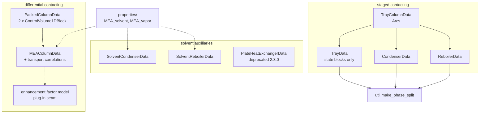
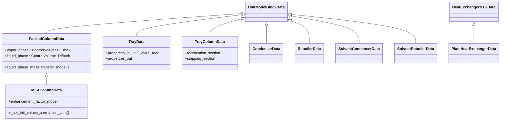
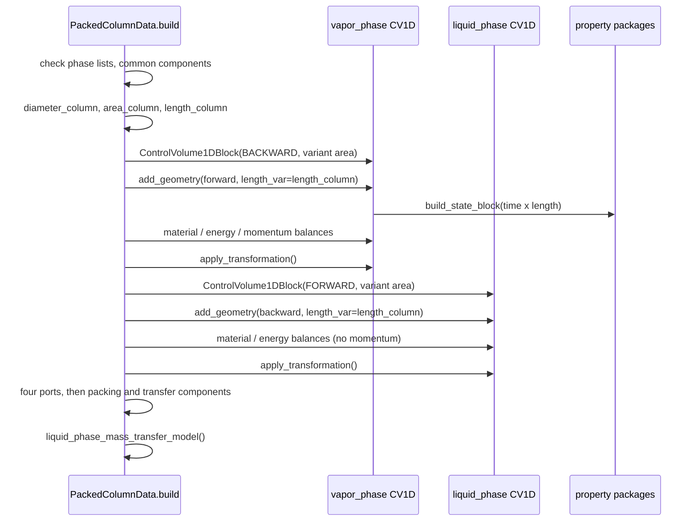
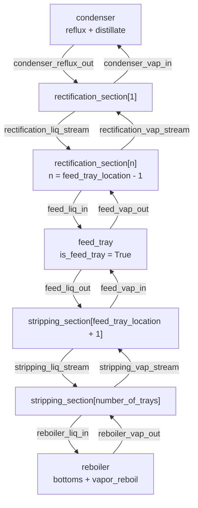

# 21 — Column models and solvent systems

> **Doc ID** 21 · **Repo SHA** 70a8f4fe1 (IDAES-PSE v2.13.0rc0) · **Source roots** `idaes/models_extra/column_models/`
> **Owns** 15 modules / 10,081 LOC · **Assets** none (§10) · **Siblings** [04](04_control_volume_framework.md), [05](05_property_and_reaction_framework.md), [06](06_model_preparation_initializers_and_scalers.md), [10](10_unit_models_control_volume_based.md), [14](14_modular_properties_state_definitions_and_libraries.md), [24](24_reference_flowsheets_and_demonstrations.md)

A column brings two counter-current streams into contact and lets material and
energy cross between them. This package contains two unrelated implementations
of that idea. The **packed** column treats contact as continuous along a length
coordinate and is built from two one-dimensional control volumes running in
opposite directions. The **tray** column treats contact as a chain of discrete
equilibrium stages and is built from indexed unit models wired together with
Pyomo arcs. Neither shares a base class with the other, and the two halves of
the package barely reference each other: only `util.make_phase_split` is used by
both families, and even then only by the staged one.

---

## 0. Scope and source map

| File | LOC | Purpose | Covered in § |
|---|---:|---|---|
| `idaes/models_extra/column_models/__init__.py` | 16 | Re-exports four names — `Condenser`, `Reboiler`, `Tray`, `TrayColumn` — and nothing else | 2, 12 |
| `idaes/models_extra/column_models/solvent_column.py` | 963 | `PackedColumnData` — the general differential-contacting column, the paired `vapor_phase` / `liquid_phase` configuration template, and the five-step legacy initialization routine | 2, 3, 4, 5, 6, 7, 9 |
| `idaes/models_extra/column_models/MEAsolvent_column.py` | 2,243 | `MEAColumnData` — the aqueous-MEA specialization: logarithmic transport correlations, Billet-Schultes mass transfer, Tsai holdup, flooding, and a twelve-step initialization | 2, 3, 4, 5, 6, 7, 9, 12 |
| `idaes/models_extra/column_models/enhancement_factor_model_pseudo_second_order_explicit.py` | 290 | `PseudoSecondOrderExplicit` — the one shipped enhancement-factor plug-in, two static methods | 2, 3, 5, 9 |
| `idaes/models_extra/column_models/tray.py` | 772 | `TrayData` — one equilibrium stage with optional feed, side draws, heat duty and pressure drop | 2, 3, 4, 5, 6, 7 |
| `idaes/models_extra/column_models/tray_column.py` | 641 | `TrayColumnData` — rectification and stripping sections, a feed tray, a condenser, a reboiler, and the arcs between them | 2, 3, 4, 5, 6, 7, 12 |
| `idaes/models_extra/column_models/condenser.py` | 466 | `CondenserType` and `TemperatureSpec` enumerations, `CondenserData` on one zero-dimensional control volume | 2, 3, 4, 5, 6, 7 |
| `idaes/models_extra/column_models/reboiler.py` | 435 | `ReboilerData` — the same shape, plus an optional boilup-ratio constraint | 2, 3, 4, 5, 6, 7, 12 |
| `idaes/models_extra/column_models/solvent_condenser.py` | 651 | `SolventCondenserData` — dual property packages, a vapor control volume and a bare liquid state block | 2, 3, 4, 5, 6, 7 |
| `idaes/models_extra/column_models/solvent_reboiler.py` | 784 | `SolventReboilerInitializer` and `SolventReboilerData` — the mirror image, plus the only Initializer object in this document | 2, 3, 4, 5, 6, 7, 9 |
| `idaes/models_extra/column_models/plate_heat_exchanger.py` | 686 | `PlateHeatExchangerData` — Chevron-plate geometry, e-NTU effectiveness and friction-factor pressure drop; carries a deprecation decorator | 2, 3, 4, 5, 6, 12 |
| `idaes/models_extra/column_models/properties/__init__.py` | 0 | Empty package marker; the two property modules are imported by full path | 2, 12 |
| `idaes/models_extra/column_models/properties/MEA_solvent.py` | 1,140 | 17 correlation namespace classes and the `configuration` dictionary for the aqueous MEA liquid phase | 2, 3, 6, 8, 12 |
| `idaes/models_extra/column_models/properties/MEA_vapor.py` | 618 | 5 correlation namespace classes, one module-level helper, and the `flue_gas` and `wet_co2` configuration dictionaries | 2, 3, 6, 8 |
| `idaes/models_extra/column_models/util.py` | 376 | `make_phase_split` and its eight private port rules | 2, 5, 7, 11 |

Total 10,081 LOC, 68 configuration keys across nine `CONFIG` declarations plus
one reusable phase template, 2 enumerations, 35 classes, 9
`declare_process_block_class` sites, and **no** `NotImplementedError` hook sites.

---

## 1. Architectural role

Two contacting abstractions live side by side here, and the split runs through
every section of this document.

**Differential contacting.** `PackedColumnData`
(`idaes/models_extra/column_models/solvent_column.py:59`) builds two
`ControlVolume1DBlock` instances — `vapor_phase` flowing forward, `liquid_phase`
flowing backward — over separate length domains that share one `length_column`
variable. Mass and heat transfer between them are unit-level constraints tying
each control volume's `mass_transfer_term`, `heat` and `enthalpy_transfer` to
the other's. `MEAColumnData`
(`idaes/models_extra/column_models/MEAsolvent_column.py:64`) subclasses it and
replaces the trivial interface-pressure model with an enhancement-factor
formulation, adding roughly forty correlation variables written in logarithmic
form.

**Staged contacting.** `TrayData`
(`idaes/models_extra/column_models/tray.py:53`) owns no control volume at all:
it builds two or three inlet state blocks and one mixed outlet state block, then
writes the mixing balances itself. `TrayColumnData`
(`idaes/models_extra/column_models/tray_column.py:48`) instantiates indexed
`Tray` blocks for the rectification and stripping sections, one feed tray, a
`Condenser` and a `Reboiler`, and connects them with `Arc` objects expanded at
the end of `build`.

**Auxiliaries and properties.** `SolventCondenserData` and
`SolventReboilerData` serve the packed family: each takes *two* property
packages, gives one phase a zero-dimensional control volume and the other a bare
state block, and equates fugacity, temperature and pressure between them at the
unit level. `properties/MEA_solvent.py` and `properties/MEA_vapor.py` supply the
modular-framework configuration dictionaries those models are exercised with,
and `plate_heat_exchanger.py` is the solvent-loop cross exchanger, deprecated at
2.3.0 but present and tested.



*The two contacting families are disjoint: nothing in the packed column touches the tray column, and only the staged family uses the shared port helper.*

---

## 2. Public surface inventory

| Symbol | Kind | Declared at | Exported via | Stability signal |
|---|---|---|---|---|
| `Condenser`, `Reboiler`, `Tray`, `TrayColumn` | classes | synthesized at `idaes/models_extra/column_models/condenser.py:79`, `reboiler.py:62`, `tray.py:53`, `tray_column.py:48` | `idaes.models_extra.column_models` | the only four names the package `__init__` re-exports |
| `CondenserData`, `ReboilerData`, `TrayData`, `TrayColumnData` | classes | the same four lines | module import | data halves of the four re-exported pairs; no underscore, not re-exported |
| `CondenserType`, `TemperatureSpec` | enums | `idaes/models_extra/column_models/condenser.py:60`, `:69` | module import | imported by name in `tray_column.py:34` |
| `PackedColumn` / `PackedColumnData` | classes | synthesized at / `idaes/models_extra/column_models/solvent_column.py:59` | module import only | **not** in the package `__init__`; the data class is subclassed by `MEAColumnData` |
| `MEAColumn` / `MEAColumnData` | classes | synthesized at / `idaes/models_extra/column_models/MEAsolvent_column.py:64` | module import only | **not** in the package `__init__` |
| `PseudoSecondOrderExplicit` | class | `idaes/models_extra/column_models/enhancement_factor_model_pseudo_second_order_explicit.py:36` | module import | the default value of the `enhancement_factor_model` key |
| `SolventCondenser` / `SolventCondenserData` | classes | synthesized at / `idaes/models_extra/column_models/solvent_condenser.py:60` | module import only | not re-exported |
| `SolventReboiler` / `SolventReboilerData` | classes | synthesized at / `idaes/models_extra/column_models/solvent_reboiler.py:193` | module import only | the data class carries `default_initializer` |
| `SolventReboilerInitializer` | class | `idaes/models_extra/column_models/solvent_reboiler.py:63` | module import | the only Initializer object in this scope |
| `PlateHeatExchanger` / `PlateHeatExchangerData` | classes | synthesized at / `idaes/models_extra/column_models/plate_heat_exchanger.py:73` | module import only | `@deprecated` 2.3.0; the only pair here carrying `autoclass` directives in `docs/` |
| `make_phase_split` | function | `idaes/models_extra/column_models/util.py:40` | module import | used by `tray.py`, `condenser.py`, `reboiler.py` |
| `_rule_mole_frac_0` … `_rule_enth_0` | functions | `idaes/models_extra/column_models/util.py:304`–`:375` | module import | leading underscore |
| `configuration` | dict | `idaes/models_extra/column_models/properties/MEA_solvent.py:914` | module import | consumed as `**aqueous_mea` by tests and flowsheets |
| `flue_gas`, `wet_co2` | dicts | `idaes/models_extra/column_models/properties/MEA_vapor.py:455`, `:555` | module import | two vapor configurations from one module |
| 17 liquid and 5 vapor correlation classes | classes | `properties/MEA_solvent.py:73`–`:876`, `properties/MEA_vapor.py:56`–`:336` | module import | referenced from the three configuration dictionaries; §3.2 |
| `visc_d_comp` | function | `idaes/models_extra/column_models/properties/MEA_vapor.py:169` | module import | no underscore; called by both `ThermalCond` and `Viscosity` |

`idaes/models_extra/column_models/__init__.py` contains exactly four import
statements (`:13`, `:14`, `:15`, `:16`). Of the nine process block pairs in this
document, four are reachable as `from idaes.models_extra.column_models import
...`; the remaining five — `PackedColumn`, `MEAColumn`, `SolventCondenser`,
`SolventReboiler` and `PlateHeatExchanger` — are reachable only by importing
their defining module. `idaes/models_extra/column_models/properties/__init__.py`
is zero bytes, so `MEA_solvent` and `MEA_vapor` are always imported by full
dotted path.

---

## 3. Class hierarchy and type taxonomy



*Only one inheritance edge exists inside this package — `MEAColumnData` over `PackedColumnData`; every other unit model derives straight from `UnitModelBlockData` or from a base owned by document 10.*

| Class | Base(s) | Declared at | Decorator | Container class | Key overrides |
|---|---|---|---|---|---|
| `PackedColumnData` | `UnitModelBlockData` | `solvent_column.py:59` | `@declare_process_block_class("PackedColumn")` | `PackedColumn` | `build`, `liquid_phase_mass_transfer_model`, `calculate_scaling_factors`, `initialize` |
| `MEAColumnData` | `PackedColumnData` | `MEAsolvent_column.py:64` | `@declare_process_block_class("MEAColumn")` | `MEAColumn` | `build`, `liquid_phase_mass_transfer_model`, `calculate_scaling_factors`, `initialize`, `_set_init_values_correlation_vars` |
| `PseudoSecondOrderExplicit` | `object` | `enhancement_factor_model_pseudo_second_order_explicit.py:36` | none | — | two `@staticmethod`s only |
| `TrayData` | `UnitModelBlockData` | `tray.py:53` | `@declare_process_block_class("Tray")` | `Tray` | `build`, `_add_material_balance`, `_add_energy_balance`, `_add_pressure_balance`, `_add_ports`, `initialize` |
| `TrayColumnData` | `UnitModelBlockData` | `tray_column.py:48` | `@declare_process_block_class("TrayColumn")` | `TrayColumn` | `build`, five `_make_*_arcs` methods, `initialize` |
| `CondenserData` | `UnitModelBlockData` | `condenser.py:79` | `@declare_process_block_class("Condenser")` | `Condenser` | `build`, `_make_ports`, `initialize`, `_get_performance_contents`, `_get_stream_table_contents` |
| `ReboilerData` | `UnitModelBlockData` | `reboiler.py:62` | `@declare_process_block_class("Reboiler")` | `Reboiler` | `build`, `initialize`, `_get_performance_contents`, `_get_stream_table_contents` (and an unreachable `_make_ports`) |
| `SolventCondenserData` | `UnitModelBlockData` | `solvent_condenser.py:60` | `@declare_process_block_class("SolventCondenser")` | `SolventCondenser` | `build`, `calculate_scaling_factors`, `initialize` |
| `SolventReboilerData` | `UnitModelBlockData` | `solvent_reboiler.py:193` | `@declare_process_block_class("SolventReboiler")` | `SolventReboiler` | `build`, `calculate_scaling_factors`, `initialize`; `default_initializer` at `:201` |
| `SolventReboilerInitializer` | `SingleControlVolumeUnitInitializer` | `solvent_reboiler.py:63` | none | — | `initialization_routine`, `_generate_boilup_guess` |
| `PlateHeatExchangerData` | `HeatExchangerNTUData` | `plate_heat_exchanger.py:73` | `@deprecated(...)` then `@declare_process_block_class("PlateHeatExchanger")` | `PlateHeatExchanger` | `build`, `initialize` |
| `CpMolCO2` … `k_eq` (17) | none (bare namespaces) | `properties/MEA_solvent.py:73`–`:876` | none | — | `build_parameters` / `return_expression` static methods; §3.2 |
| `Cp`, `EnthMol`, `Diffus`, `ThermalCond`, `Viscosity` | none | `properties/MEA_vapor.py:56`, `:88`, `:108`, `:217`, `:336` | none | — | the same pair; §3.2 |

Nine of these classes carry `declare_process_block_class`, so nine container
classes are synthesized into the modules that define their data halves
([01 §2.1](01_glossary_and_conventions.md#21-the-block-system)). The 22
correlation classes are not process blocks, declare no base, and are never
instantiated — they are namespaces holding static methods, the pattern described
in [14](14_modular_properties_state_definitions_and_libraries.md).

`SolventReboilerData` is one of only three process block classes in the whole of
`idaes/models_extra/` that names a `default_initializer`
(`idaes/models_extra/column_models/solvent_reboiler.py:201`); the other two are
in power generation. No class in `idaes/models_extra/` names a `default_scaler`.

### 3.1 Enumerations

`CondenserType` (`idaes/models_extra/column_models/condenser.py:60`):

| Member | Value | Meaning | Consumed at |
|---|---|---|---|
| `totalCondenser` | 0 | All vapor condensed; `reflux` and `distillate` ports only | `condenser.py:255`, `:395`, `:434` |
| `partialCondenser` | 1 | A `vapor_outlet` port is added alongside the two liquid ports | `condenser.py:196`, `:304`, `:353` |

`TemperatureSpec` (`idaes/models_extra/column_models/condenser.py:69`):

| Member | Value | Meaning | Consumed at |
|---|---|---|---|
| `atBubblePoint` | 0 | Outlet temperature constrained to the bubble point by `eq_total_cond_spec` | `condenser.py:273` |
| `customTemperature` | 1 | The caller fixes the outlet temperature; degrees of freedom are checked at initialization | `condenser.py:370` |

The two enumerations interact: a `partialCondenser` combined with
`atBubblePoint` raises `ConfigurationError` at `condenser.py:196`, and
`temperature_spec` left at its `None` default raises at `condenser.py:190`.

### 3.2 The correlation namespace classes

Both property modules follow the modular framework's `build_parameters` +
`return_expression` convention verbatim; the mechanism — how the framework
locates these methods, and how `set_param_from_config` turns a
`parameter_data` entry into a fixed `Var` — is described in
[14](14_modular_properties_state_definitions_and_libraries.md) and is not
restated here. `properties/MEA_solvent.py` declares 17 such classes and
`properties/MEA_vapor.py` declares 5.

Anchors in the last column are lines in the module named in the first column.

| Outer class | Inner property class | `build_parameters` | `return_expression` | Coefficient source | Anchor |
|---|---|---|---|---|---|
| `MEA_solvent` | `CpMolCO2` | absent | `:79` | none — a mole-fraction-weighted average of the two solvent `cp` values | `:73` |
| `MEA_solvent` | `CpMolSolvent` | `:94` | `:126` | `cp_mass_liq_comp_coeff` 1–5, per component | `:91` |
| `MEA_solvent` | `EnthMolCO2` | `:145` | `:152` | `dh_abs_co2` | `:142` |
| `MEA_solvent` | `EnthMolSolvent` | `:159` | `:170` | `dh_vap`, plus `CpMolSolvent`'s five | `:156` |
| `MEA_solvent` | `N2OAnalogy` | `:203` | `:229` | `lwm_coeff` 1–4, with three literal Henry constants inline | `:198` |
| `MEA_solvent` | `PressureSatSolvent` | `:266` | `:288` | `pressure_sat_comp_coeff` 1–4 | `:263` |
| `MEA_solvent` | `VolMolSolvent` | `:308` | `:328` | `dens_mol_liq_comp_coeff` 1–3 | `:304` |
| `MEA_solvent` | `VolMolMEA` | `:346` | `:378` | `dens_mol_liq_comp_coeff` 1–3, Weiland form | `:343` |
| `MEA_solvent` | `VolMolCO2` | `:403` | `:423` | `vol_mol_liq_comp_coeff` a, d, e | `:399` |
| `MEA_solvent` | `DiffusCO2` | `:441` | `:468` | `diffus_phase_comp_coeff` 1–5 | `:439` |
| `MEA_solvent` | `DiffusMEA` | `:483` | `:500` | `diffus_phase_comp_coeff` 1–3 | `:481` |
| `MEA_solvent` | `DiffusIons` | `:516` | `:533` | `diffus_phase_comp_coeff` 1–3, shared by both ions | `:514` |
| `MEA_solvent` | `DiffusNone` | `:550` (a `pass`) | `:554` returns `Expression.Skip` | none | `:547` |
| `MEA_solvent` | `Viscosity` | `:560` | `:601` | phase-level `visc_d_coeff` a–g | `:558` |
| `MEA_solvent` | `ThermalCond` | `:654` (a `pass`) | `:658` | none — critical and boiling temperatures are literals in the expression | `:652` |
| `MEA_solvent` | `SurfTens` | `:687` | `:813` | phase-level `surf_tens_H2O_coeff`, `surf_tens_MEA_coeff`, `surf_tens_CO2_coeff`, `surf_tens_F_coeff` — 20 coefficients in all | `:685` |
| `MEA_solvent` | `k_eq` | `:878` | `:895`, plus `return_log_expression` `:899` and `calculate_scaling_factors` `:908` | `k_eq_coeff` 1–3, per inherent reaction | `:876` |
| `MEA_vapor` | `Cp` | `:59` | `:79` | `cp_mol_vap_comp_coeff` 1–3, per component | `:56` |
| `MEA_vapor` | `EnthMol` | `:91` | `:96` | reuses `Cp`'s three coefficients | `:88` |
| `MEA_vapor` | `Diffus` | `:110` (a `pass`) | `:114` | phase-level `diffus_binary_param`, created on first call | `:108` |
| `MEA_vapor` | `ThermalCond` | `:219` | `:304` | `therm_cond_<comp>_coeff` 1–4 for four components | `:217` |
| `MEA_vapor` | `Viscosity` | `:338` | `:412` | `visc_d_<comp>_coeff` 1–3 for four components | `:336` |

Three classes are chained rather than independent: `EnthMolSolvent.build_parameters`
calls `CpMolSolvent.build_parameters` when the coefficients are absent
(`properties/MEA_solvent.py:160`), `EnthMol.build_parameters` calls
`Cp.build_parameters` the same way (`properties/MEA_vapor.py:92`), and
`ThermalCond.build_parameters` calls `Viscosity.build_parameters`
(`properties/MEA_vapor.py:219`) because the Wassiljewa-Mason-Saxena mixing rule
needs component viscosities — which is why `Viscosity.build_parameters` guards
against double construction by returning early when `visc_d_h2o_coeff_1` already
exists (`properties/MEA_vapor.py:338`). `k_eq` is the one reaction-side rather
than property-side correlation here: it supplies both `return_expression` and
`return_log_expression`, which is what `log_power_law_equil` consumes.

---

## 4. Configuration reference

68 keys across nine `CONFIG` declarations, plus one reusable phase template that
is declared once and instantiated twice. None of the 68 is marked required by
its declaration; four are validated at build time instead, and §11 lists where.

### 4.1 `PackedColumnData._PhaseCONFIG` — the paired-phase template

`_PhaseCONFIG = ConfigBlock()` at
`idaes/models_extra/column_models/solvent_column.py:93`. A two-key template
built for one purpose: to be declared twice under two different names so that
the user configures a vapor property package and a liquid property package
independently on one unit model. This is the packed family's equivalent of the
`CONFIG_Template` mechanism described in
[04 §4](04_control_volume_framework.md#4-configuration-reference), but it is
local to this module and shared with nothing outside it.

| Key | Domain / validator | Default | Req. | Effect on build | Anchor |
|---|---|---|---|---|---|
| `property_package` | `is_physical_parameter_block` | `None` | at build | The parameter block the phase's `ControlVolume1DBlock` is built from; dereferenced without a `None` check at `solvent_column.py:181` | `:133` |
| `property_package_args` | none | `{}` | no | Forwarded verbatim as the control volume's `property_package_args` | `:146` |

Note the difference from the control volume template: here `property_package`
defaults to `None`, not `useDefault`, so there is no walk up the block hierarchy
— an unset package fails on attribute access rather than resolving from the
flowsheet.

The template is instantiated twice, under `vapor_phase`
(`idaes/models_extra/column_models/solvent_column.py:161`) and `liquid_phase`
(`idaes/models_extra/column_models/solvent_column.py:163`). Each instantiation
produces a nested `ConfigBlock` carrying the two keys above, so the user-facing
form is `vapor_phase={"property_package": ..., "property_package_args": {...}}`.
The names collide deliberately with the two `ControlVolume1DBlock` attributes
created in `build`: `self.config.vapor_phase` is the configuration, and
`self.vapor_phase` is the control volume.

### 4.2 `PackedColumnData.CONFIG`

`ConfigBlock()` at `idaes/models_extra/column_models/solvent_column.py:64`.
Five scalar keys plus the two template instantiations above.

| Key | Domain / validator | Default | Req. | Effect on build | Anchor |
|---|---|---|---|---|---|
| `dynamic` | `In([False])` | `False` | no | Steady state only; any other value is rejected by the domain | `:66` |
| `has_holdup` | `DefaultBool` | `useDefault` | no | Forwarded to both control volumes; resolves against the flowsheet | `:76` |
| `finite_elements` | `int` | `20` | no | Number of elements in *both* length domains, and the length of the interpolation grid in `MEAColumnData` | `:95` |
| `length_domain_set` | `list` | `[0.0, 1.0]` | no | Initialization points for each new `ContinuousSet` | `:106` |
| `has_pressure_change` | `Bool` | `False` | no | Creates `deltaP` on the **vapor** control volume only; the liquid phase gets no momentum balance | `:118` |
| `vapor_phase` | `_PhaseCONFIG` | template | no | Nested block, §4.1 | `:161` |
| `liquid_phase` | `_PhaseCONFIG` | template | no | Nested block, §4.1 | `:163` |

`dynamic` and `has_holdup` disagree in spirit: the first admits only `False`,
while the second still resolves `useDefault` against the parent flowsheet and
can therefore arrive at the control volumes as `True`.

### 4.3 `MEAColumnData.CONFIG` — delta over `PackedColumnData`

`PackedColumnData.CONFIG()` extended at
`idaes/models_extra/column_models/MEAsolvent_column.py:69` with two keys. The
seven keys of §4.2 are inherited unchanged.

| Key | Inherited from | Override |
|---|---|---|
| `dynamic`, `has_holdup`, `finite_elements`, `length_domain_set`, `has_pressure_change`, `vapor_phase`, `liquid_phase` | `PackedColumnData.CONFIG` | none |

| Key | Domain / validator | Default | Req. | Effect on build | Anchor |
|---|---|---|---|---|---|
| `enhancement_factor_model` | none | `PseudoSecondOrderExplicit` | no | The class whose `make_model` is called at `MEAsolvent_column.py:1047` and whose `initialize_model` is called at `:2176` | `:71` |
| `enhancement_factor_kwargs` | none | `None` | no | Normalized to `{}` at `MEAsolvent_column.py:189` and splatted into `make_model` | `:78` |

Neither key declares a domain, so no validation happens at configuration time;
an object lacking `make_model` fails with `AttributeError` during `build`.

### 4.4 `TrayData.CONFIG`

`ConfigBlock()` at `idaes/models_extra/column_models/tray.py:58`. Nine keys.

| Key | Domain / validator | Default | Req. | Effect on build | Anchor |
|---|---|---|---|---|---|
| `dynamic` | `In([False])` | `False` | no | Steady state only | `:59` |
| `has_holdup` | `In([False])` | `False` | no | Holdup terms are not supported at all | `:69` |
| `is_feed_tray` | `Bool` | `False` | no | Adds a third inlet state block `properties_in_feed` and a `feed` port; changes every balance rule | `:80` |
| `has_liquid_side_draw` | `Bool` | `False` | no | Creates `liq_side_sf` and the `liq_side_draw` port; splits the liquid outlet | `:94` |
| `has_vapor_side_draw` | `Bool` | `False` | no | Creates `vap_side_sf` and the `vap_side_draw` port; splits the vapor outlet | `:107` |
| `has_heat_transfer` | `Bool` | `False` | no | Creates `heat_duty` and adds it to the enthalpy mixing equation | `:120` |
| `has_pressure_change` | `Bool` | `False` | no | Creates `deltaP` and subtracts it in `pressure_drop_equation` | `:133` |
| `property_package` | `is_physical_parameter_block` | `useDefault` | no | Resolved by `_get_property_package` at `tray.py:199` | `:147` |
| `property_package_args` | implicit `ConfigBlock` | empty | no | Copied into the inlet and outlet state block arguments | `:160` |

### 4.5 `TrayColumnData.CONFIG`

`ConfigBlock()` at `idaes/models_extra/column_models/tray_column.py:53`. Twelve
keys; seven of them are forwarded verbatim to every `Tray` the column builds.

| Key | Domain / validator | Default | Req. | Effect on build | Anchor |
|---|---|---|---|---|---|
| `dynamic` | `In([False])` | `False` | no | Steady state only | `:54` |
| `has_holdup` | `In([False])` | `False` | no | Not supported | `:64` |
| `number_of_trays` | `In(Integers)` | `None` | at build | Sizes `tray_index`; `None` raises `ConfigurationError` at `tray_column.py:228` | `:75` |
| `feed_tray_location` | `In(Integers)` | `None` | at build | Splits the tray index into rectification and stripping ranges | `:87` |
| `condenser_type` | `In(CondenserType)` | `CondenserType.totalCondenser` | no | Forwarded to the `Condenser` sub-block at `tray_column.py:269` | `:99` |
| `condenser_temperature_spec` | `In(TemperatureSpec)` | `None` | at build | Forwarded as the condenser's `temperature_spec`; `None` raises inside `CondenserData.build` | `:114` |
| `has_heat_transfer` | `Bool` | `False` | no | Forwarded to every `Tray` | `:130` |
| `has_pressure_change` | `Bool` | `False` | no | Forwarded to every `Tray` and to the `Reboiler` | `:143` |
| `has_liquid_side_draw` | `Bool` | `False` | no | Forwarded to every `Tray`, including the feed tray | `:157` |
| `has_vapor_side_draw` | `Bool` | `False` | no | The same | `:170` |
| `property_package` | `is_physical_parameter_block` | `useDefault` | no | Forwarded to every sub-block | `:183` |
| `property_package_args` | implicit `ConfigBlock` | empty | no | Forwarded to every sub-block | `:196` |

The two side-draw flags are column-wide: there is no per-tray selection, so
turning one on creates a draw port on every tray in both sections.

### 4.6 `CondenserData.CONFIG`

`UnitModelBlockData.CONFIG()` extended at
`idaes/models_extra/column_models/condenser.py:86`. Six keys. There is no
momentum-balance key — the condenser writes no pressure balance, on the stated
grounds that the outlet pressure is a user specification.

| Key | Domain / validator | Default | Req. | Effect on build | Anchor |
|---|---|---|---|---|---|
| `condenser_type` | `In(CondenserType)` | `CondenserType.totalCondenser` | no | Selects the port set and whether `eq_total_cond_spec` is built | `:87` |
| `temperature_spec` | `In(TemperatureSpec)` | `None` | at build | `None` raises `ConfigurationError` at `condenser.py:190` | `:102` |
| `material_balance_type` | `In(MaterialBalanceType)` | `useDefault` | no | Passed to `add_material_balances` with `has_phase_equilibrium=True` | `:118` |
| `energy_balance_type` | `In(EnergyBalanceType)` | `useDefault` | no | Passed to `add_energy_balances` with `has_heat_transfer=True` | `:134` |
| `property_package` | `is_physical_parameter_block` | `useDefault` | no | The single package the control volume uses | `:150` |
| `property_package_args` | implicit `ConfigBlock` | empty | no | Forwarded to the control volume | `:163` |

### 4.7 `ReboilerData.CONFIG`

`UnitModelBlockData.CONFIG()` extended at
`idaes/models_extra/column_models/reboiler.py:69`. Seven keys.

| Key | Domain / validator | Default | Req. | Effect on build | Anchor |
|---|---|---|---|---|---|
| `has_boilup_ratio` | `Bool` | `False` | no | Creates the `boilup_ratio` variable and `eq_boilup_ratio`; `TrayColumnData` always passes `True` | `:70` |
| `material_balance_type` | `In(MaterialBalanceType)` | `useDefault` | no | As for the condenser | `:84` |
| `energy_balance_type` | `In(EnergyBalanceType)` | `useDefault` | no | As for the condenser | `:100` |
| `momentum_balance_type` | `In(MomentumBalanceType)` | `pressureTotal` | no | Passed to `add_momentum_balances`; the reboiler does write one | `:116` |
| `has_pressure_change` | `Bool` | `False` | no | Creates `deltaP` and a `Reference` to it at `reboiler.py:301` | `:132` |
| `property_package` | `is_physical_parameter_block` | `useDefault` | no | Single package | `:146` |
| `property_package_args` | implicit `ConfigBlock` | empty | no | Forwarded | `:159` |

### 4.8 `SolventCondenserData.CONFIG`

`ConfigBlock()` at `idaes/models_extra/column_models/solvent_condenser.py:68`.
Ten keys. The last four are the dual-package pattern: one package for each
phase, each with its own arguments block.

| Key | Domain / validator | Default | Req. | Effect on build | Anchor |
|---|---|---|---|---|---|
| `dynamic` | `In([False])` | `False` | no | Steady state only | `:70` |
| `has_holdup` | `In([False])` | `False` | no | Not supported | `:80` |
| `material_balance_type` | `In(MaterialBalanceType)` | `useDefault` | no | Passed with `has_mass_transfer=True`, `has_phase_equilibrium=False` | `:92` |
| `energy_balance_type` | `In(EnergyBalanceType)` | `useDefault` | no | Passed with `has_heat_transfer=True`, `has_enthalpy_transfer=True` | `:108` |
| `momentum_balance_type` | `In(MomentumBalanceType)` | `pressureTotal` | no | Applied to the vapor control volume | `:124` |
| `has_pressure_change` | `Bool` | `False` | no | Creates `deltaP`, referenced at `solvent_condenser.py:431` only when the momentum balance is not `none` | `:140` |
| `liquid_property_package` | `is_physical_parameter_block` | `useDefault` | at build | Must expose exactly one phase named `Liq` | `:154` |
| `liquid_property_package_args` | implicit `ConfigBlock` | empty | no | Copied, then `has_phase_equilibrium=False` and `defined_state=False` are forced | `:168` |
| `vapor_property_package` | `is_physical_parameter_block` | `useDefault` | at build | Must expose exactly one phase named `Vap` | `:180` |
| `vapor_property_package_args` | implicit `ConfigBlock` | empty | no | Forwarded to the vapor control volume | `:194` |

### 4.9 `SolventReboilerData.CONFIG`

`ConfigBlock()` at `idaes/models_extra/column_models/solvent_reboiler.py:203`.
The same ten keys, with the phases swapped: the *liquid* side gets the control
volume and the *vapor* side gets the bare state block.

| Key | Domain / validator | Default | Req. | Effect on build | Anchor |
|---|---|---|---|---|---|
| `dynamic` | `In([False])` | `False` | no | Steady state only | `:205` |
| `has_holdup` | `In([False])` | `False` | no | Not supported | `:215` |
| `material_balance_type` | `In(MaterialBalanceType)` | `useDefault` | no | Applied to the liquid control volume | `:227` |
| `energy_balance_type` | `In(EnergyBalanceType)` | `useDefault` | no | The same | `:243` |
| `momentum_balance_type` | `In(MomentumBalanceType)` | `pressureTotal` | no | The same | `:259` |
| `has_pressure_change` | `Bool` | `False` | no | Creates `deltaP` on the liquid control volume | `:275` |
| `liquid_property_package` | `is_physical_parameter_block` | `useDefault` | at build | Must expose exactly one phase named `Liq` | `:289` |
| `liquid_property_package_args` | implicit `ConfigBlock` | empty | no | Forwarded to the liquid control volume | `:303` |
| `vapor_property_package` | `is_physical_parameter_block` | `useDefault` | at build | Must expose exactly one phase named `Vap` | `:315` |
| `vapor_property_package_args` | implicit `ConfigBlock` | empty | no | Copied, then `has_phase_equilibrium=False` and `defined_state=False` are forced | `:329` |

`SolventReboilerInitializer.CONFIG`
(`idaes/models_extra/column_models/solvent_reboiler.py:68`) is a plain copy of
`SingleControlVolumeUnitInitializer.CONFIG` and declares no key of its own; its
contents are documented in
[06 §4](06_model_preparation_initializers_and_scalers.md#4-configuration-reference).

### 4.10 `PlateHeatExchangerData.CONFIG`

`HeatExchangerNTUData.CONFIG()` extended at
`idaes/models_extra/column_models/plate_heat_exchanger.py:76` with three
geometry keys. Every other key comes from the NTU exchanger and is documented in
[10 §4](10_unit_models_control_volume_based.md#4-configuration-reference).

| Key | Domain / validator | Default | Req. | Effect on build | Anchor |
|---|---|---|---|---|---|
| `passes` | `Integer` | `4` | no | Initializes the `number_of_passes` mutable `Param`; its parity selects one of two effectiveness correlations | `:78` |
| `channels_per_pass` | `Integer` | `12` | no | Initializes `channels_per_pass`; divides the NTU in the effectiveness correlation | `:87` |
| `number_of_divider_plates` | `Integer` | `0` | no | Initializes `number_of_divider_plates`; enters the port-velocity and plate-count expressions | `:97` |

Beyond declaring keys, this `CONFIG` rewrites two inherited ones in place. Both
`hot_side.has_pressure_change` and `cold_side.has_pressure_change` are set to
`True` and have their domain narrowed to `In([True])`
(`idaes/models_extra/column_models/plate_heat_exchanger.py:109` and `:121`),
with the description and doc strings replaced through the private `_description`
and `_doc` attributes. The model ships pressure-drop correlations, so the flag
cannot be turned off.

---

## 5. Construction and call sequences

### 5.1 `PackedColumnData.build`

`idaes/models_extra/column_models/solvent_column.py:167`. Seven stages, in
order:

1. `super().build()`, then three configuration assertions: the vapor package's
   `phase_list` is exactly `["Vap"]` (`:181`), the liquid package's is exactly
   `["Liq"]` (`:186`), and the two `component_list`s share at least one member
   (`:193`). Each failure raises `ConfigurationError`.
2. Column geometry — `diameter_column` (`:204`), `area_column` (`:208`),
   `length_column` (`:215`) and the circle-area constraint
   `column_cross_section_area_eqn` (`:219`).
3. Flow directions are fixed in code, not configured: the vapor phase is
   `FlowDirection.forward` and the liquid phase `FlowDirection.backward`
   (`:232`–`:233`).
4. The vapor `ControlVolume1DBlock` (`:238`) is constructed with
   `transformation_method="dae.finite_difference"`,
   `transformation_scheme="BACKWARD"`, `finite_elements` from configuration and
   `area_definition=DistributedVars.variant`. Then `add_geometry` (`:249`),
   `add_state_blocks` (`:255`), `add_material_balances` with
   `MaterialBalanceType.componentTotal` and `has_mass_transfer=True` (`:259`),
   `add_energy_balances` with `EnergyBalanceType.enthalpyTotal`,
   `has_heat_transfer=True` and `has_enthalpy_transfer=True` (`:265`),
   `add_momentum_balances` with `MomentumBalanceType.pressureTotal` (`:271`),
   and `apply_transformation` (`:276`).
5. The liquid `ControlVolume1DBlock` (`:281`) repeats the sequence with
   `transformation_scheme="FORWARD"` and **no** momentum balance, ending at
   `apply_transformation` (`:314`).
6. Four ports: `vapor_inlet`, `vapor_outlet`, `liquid_inlet`, `liquid_outlet`
   (`:317`–`:322`).
7. Unit-level packing, transfer and coupling components, listed in §6.1. The
   first act of this stage is a fourth assertion — both packages must report the
   same `MaterialFlowBasis` (`:334`) — and the last is the call to
   `liquid_phase_mass_transfer_model()` (`:489`), the subclass hook.

Both control volumes call `add_geometry` with `length_var=self.length_column`
and `length_domain_set=self.config.length_domain_set`, and neither passes
`length_domain`. The two control volumes therefore **share one length variable by
reference** but own **two separate `ContinuousSet` objects** discretized
identically. Every coupling constraint consequently indexes one domain and calls
`next` or `prev` on the other — `blk.liquid_phase.length_domain.prev(x)` where
`x` came from `vapor_phase.length_domain` (`solvent_column.py:578`, `:669`), and
`blk.vapor_phase.length_domain.next(x)` in the reverse direction (`:526`,
`:602`, `:638`). That offset by one element is what makes a counter-current
stage: liquid at element *x* exchanges with vapor at element *x+1*. The
external-length-domain option of the one-dimensional control volume
([04 §5](04_control_volume_framework.md#5-construction-and-call-sequences)) is
not used; only the external-`length_var` option is.



*The two control volumes are discretized in opposite directions and share only the length variable; every transfer constraint written afterwards has to bridge their two separate length domains.*

### 5.2 `MEAColumnData.build`

`idaes/models_extra/column_models/MEAsolvent_column.py:187` calls
`super().build()` first, so the whole of §5.1 runs — including the base class's
call to the overridden `liquid_phase_mass_transfer_model` — and then adds the
MEA-specific correlation layer. The layer is organised in eight groups, each
being a `Var` in logarithmic form plus a defining constraint, and in several
cases a second `Var` in linear form plus a linking constraint:

| Group | Components | Anchor |
|---|---|---|
| Liquid transport properties | `log_dens_mass_liq`, `log_surf_tens_liq`, `log_visc_d_liq`, `log_diffus_liq_comp` | `:218`, `:243`, `:268`, `:293` |
| Vapor transport properties | `log_dens_mass_vap`, `log_visc_d_vap`, `log_diffus_vap_comp`, `log_pressure_vap`, `log_dens_mol_vap`, `log_therm_cond_vap`, `log_cp_mol_vap` | `:321`–`:471` |
| Superficial velocities | `velocity_vap`, `velocity_liq`, `log_velocity_vap`, `log_velocity_liq` | `:495`, `:504`, `:545`, `:567` |
| Interfacial area | `wetted_perimeter`, `area_interfacial_parA`, `area_interfacial_parB`, `log_area_interfacial`, `log_area_interfacial_parA` | `:597`, `:603`, `:609`, `:615`, `:639` |
| Liquid holdup (Tsai) | `holdup_parA`, `holdup_parB`, `log_holdup_parAlpha`, `log_holdup_liq`, `log_holdup_parA` | `:698`, `:702`, `:710`, `:723`, `:743` |
| Mass transfer (Billet-Schultes) | `Cv_ref`, `log_mass_transfer_coeff_vap`, `log_holdup_vap`, `log_Cv_ref`, `Cl_ref`, `log_mass_transfer_coeff_liq`, `log_Cl_ref` | `:781`–`:931` |
| Heat transfer (Chilton-Colburn) | `heat_transfer_coeff_base`, `log_heat_transfer_coeff_base` | `:986`, `:994` |
| Flooding | `log_flow_mass_ratio_Liq_Vap`, `log_flood_H`, `fourth_root_flood_H`, `gas_velocity_fld`, `log_gas_velocity_fld`, `flood_fraction` | `:1053`–`:1173` |

Between the heat transfer and flooding groups sits the plug-in call:
`self.enhancement_factor_vars, self.enhancement_factor_constraints =
self.config.enhancement_factor_model.make_model(self, **enhancement_factor_kwargs)`
at `idaes/models_extra/column_models/MEAsolvent_column.py:1047`. The two
returned lists are stored on the unit model and are the only handle the
initialization routine has on whatever the plug-in built.

`MEAColumnData.liquid_phase_mass_transfer_model`
(`idaes/models_extra/column_models/MEAsolvent_column.py:86`) runs earlier, from
inside the base class's `build`. It creates `mass_transfer_coeff_liq` (`:104`)
and `log_enhancement_factor` (`:113`, bounded above at 100 to keep `exp`
evaluable), exposes `enhancement_factor` as `exp(log_enhancement_factor)`
(`:125`), defines the intermediate `psi` as the ratio of liquid-side to
vapor-side transfer resistance (`:136`), and replaces the base class's
`pressure_at_interface` with a two-branch rule (`:152`): CO2 uses the
enhancement-factor driving-force expression against `henry`, every other
component uses Raoult's law against `pressure_sat_comp` on the *true* species
mole fraction.

### 5.3 The enhancement-factor plug-in contract

`PseudoSecondOrderExplicit`
(`idaes/models_extra/column_models/enhancement_factor_model_pseudo_second_order_explicit.py:36`)
subclasses `object` and holds two static methods. It is never instantiated: the
class object itself is the configuration value, and both methods take the
column block as their first argument.

`make_model(blk, kinetics="Putta")` (`:45`) builds, in order:

| Component | Kind | Anchor |
|---|---|---|
| `log_rate_constant_MEA` + `log_rate_constant_MEA_eqn` | `Var` over time × liquid length, `Constraint` — Arrhenius in log form | `:56`, `:63` |
| `log_rate_constant_H2O` + `log_rate_constant_H2O_eqn` | the same for the water-catalysed mechanism | `:102`, `:109` |
| `log_rate_constant` | `Expression`, log of the sum of the two mechanisms | `:148` |
| `log_hatta_number` + `hatta_number_eqn` | `Var`, `Constraint` | `:162`, `:169` |
| `diffus_ratio` | `Expression` over `["MEA_+", "MEACOO_-", "CO2"]` | `:191` |
| `E_hat` | `Expression`, the equilibrium enhancement factor | `:212` |
| `enhancement_factor_eqn` | `Constraint` tying `blk.log_enhancement_factor` to `log(E_hat)` | `:227` |

and returns the two-element tuple `(enhancement_factor_vars,
enhancement_factor_constraints)` assembled at `:236` and `:243`. The `kinetics`
keyword selects between two published parameter sets, `"Putta"` and `"Luo"`;
any other string causes the constraint rule to **return** a `ValueError` object
rather than raise it (`:86`, `:133`), so Pyomo receives a non-expression as a
constraint body.

`initialize_model(blk, outlvl, optarg, solver)` (`:252`) walks every time point
and every liquid length element except the last and calls
`calculate_variable_from_constraint` four times, in dependency order:
`log_rate_constant_MEA`, `log_rate_constant_H2O`, `log_hatta_number`,
`log_enhancement_factor` (`:279`–`:290`). It never solves; the three keyword
arguments are accepted and unused apart from the `optarg is None` normalization
at `:271`.

The contract a replacement satisfies is therefore: a class (not an instance)
exposing `make_model(blk, **kwargs)` returning `(list_of_vars,
list_of_constraints)`, and `initialize_model(blk, outlvl=, optarg=, solver=)`
returning nothing. The model reads `blk.log_enhancement_factor`,
`blk.log_mass_transfer_coeff_liq`, `blk.log_diffus_liq_comp` and the liquid
state block's true-species properties; it writes only components it adds to
`blk` itself. See §9 and
[31 §9](31_extension_point_catalog.md#9-extension-and-subclassing-contracts).

### 5.4 `PackedColumnData.initialize` and `MEAColumnData.initialize`

The base routine (`idaes/models_extra/column_models/solvent_column.py:795`) has
five steps. It deactivates eight named unit constraints (`:825`), fixes
`pressure_equil`, both `mass_transfer_term`s, both `heat` variables and both
`enthalpy_transfer` variables at zero (`:845`–`:856`), initializes each control
volume with `hold_state=True` (`:863`, `:872`), then solves four times while
progressively unfixing and reactivating: interface equilibrium (`:887`),
isothermal physical absorption (`:903`), isothermal chemical absorption
(`:915`), adiabatic absorption (`:929`). It releases both held states (`:953`)
and raises `InitializationError` on a non-optimal termination (`:960`).

The MEA routine (`idaes/models_extra/column_models/MEAsolvent_column.py:1694`)
extends the same shape to twelve steps and adds a `mode` argument taking
`"absorber"` or `"stripper"`. It records `initial_dof` (`:1730`), deactivates
six named constraint groups and the plug-in's constraints (`:1801`), then calls
`_set_init_values_correlation_vars(mode)` (`:1805`) before fixing roughly
twenty correlation variables. Steps 6 through 12 reactivate one group at a
time: flooding (`:1991`), interfacial area (`:2031`), liquid holdup (`:2062`),
vapor and then liquid mass transfer coefficients (`:2090`, `:2129`), the
enhancement factor model (`:2165`), and the heat transfer coefficient (`:2191`).
Step 11 is the plug-in handoff: the stored constraint and variable lists are
activated and unfixed (`:2171`–`:2174`) and `initialize_model` is called
(`:2176`). The routine ends by asserting that the degrees of freedom returned to
`initial_dof` (`:2232`) and that the last solve terminated optimally (`:2239`),
raising `InitializationError` for either.

`_set_init_values_correlation_vars`
(`idaes/models_extra/column_models/MEAsolvent_column.py:1368`) holds the model's
numeric starting point as Python list literals — 31-point profiles for
interfacial area, liquid holdup, both mass transfer coefficients, the heat
transfer coefficient and the enhancement factor. Two enhancement-factor profiles
exist, one for `"absorber"` (`:1555`) and one for `"stripper"` (`:1589`); any
other `mode` raises `RuntimeError` (`:1624`). When `finite_elements` differs
from the 30 elements the stored profiles assume, `interpolate_init_values`
(`:1632`) resamples them with `numpy.interp` — the only use of numpy in the
scope (`MEAsolvent_column.py:24`).

### 5.5 `TrayData.build`

`idaes/models_extra/column_models/tray.py:173`. A tray owns no control volume;
it owns state blocks and writes its own balances. `inlet_list` is
`["feed", "liq", "vap"]` when `is_feed_tray` is set and `["liq", "vap"]`
otherwise (`:188`); `_get_property_package()` resolves the package (`:199`);
one inlet state block per member is built with `defined_state=True` and
`has_phase_equilibrium=True` and attached by `setattr` as `properties_in_feed`,
`properties_in_liq` and `properties_in_vap` (`:201`); and `properties_out` is
built with `defined_state=False` (`:215`). `_add_material_balance` (`:249`),
`_add_energy_balance` (`:274`) and `_add_pressure_balance` (`:367`) follow. The
package's phases are then partitioned into `_liquid_set` and `_vapor_set` by
asking each `Phase` object whether it is vapor or liquid; anything that is
neither is treated as liquid and logged as a warning (`:237`). `_add_ports`
(`:391`) closes the build.

`_add_ports` is where `util.make_phase_split` does its work. `liq_out` is a bare
`Port` (`:403`); when `has_liquid_side_draw` is set, a `liq_side_sf` split
fraction variable (`:407`) and a `liq_side_draw` port (`:410`) are added and
`make_phase_split` is called twice, with `side_sf=liq_side_sf` and
`side_sf=1 - liq_side_sf`. Without a draw it is called once with `side_sf=1`
(`:428`). The vapor side mirrors this exactly (`:431`–`:455`).

### 5.6 `util.make_phase_split`

`idaes/models_extra/column_models/util.py:40`. One function, called seven times
across three modules, that populates a `Port` from a mixed-phase
`properties_out` state block by dispatching on the *name* of each port member.
It reads `define_port_members()` on the first time point (`:51`) and branches on
substrings of each member's `local_name`:

| Branch | Test on `local_name` | What is added to the port | Anchor |
|---|---|---|---|
| intensive | no `flow`, no `frac`, no `enth` | a `Reference` to the state block variable, unsplit | `:58` |
| composition, unindexed by phase | contains `frac`, no `phase` | an `Expression` recomputing the phase-restricted fraction from flows | `:71` |
| composition, phase-indexed | contains `frac` and `phase` | a `Reference`, since the fraction is already per phase | `:150` |
| flow | contains `flow` | an `Expression` summing the relevant phases and multiplying by `side_sf` | `:165` |
| enthalpy, unindexed | contains `enth`, no `phase` | an `Expression` summing `<name>_phase` over the phase set | `:260` |
| enthalpy, phase-indexed | contains `enth` and `phase` | a `Reference` | `:286` |

The flow branch selects one of five module-level rules by the shape of the state
variable — `_rule_flow_0` for a scalar (`:329`), `_rule_flow_1` for a
component-indexed flow (`:334`), `_rule_flow_2` for a phase-indexed flow
(`:339`), `_rule_flow_3` for a phase-and-component flow summed over phases
(`:346`), `_rule_flow_4` for one kept per phase (`:352`) — while
`_rule_mole_frac_0` (`:304`) and `_rule_mole_frac_1` (`:317`) serve the
composition branch and `_rule_enth_0` (`:375`) the enthalpy branch.

`_rule_flow_4` carries the one piece of equipment-specific behaviour in the
module. When `equipmentType` is `None` — the value passed from `TrayData` — a
phase that does not belong in the port returns the literal `1e-8` instead of the
state variable (`:369`), because the tray's ports carry every phase of the
package. When `equipmentType` is supplied — `CondenserType.totalCondenser`,
`CondenserType.partialCondenser` or the string `"Reboiler"` — the value is
passed through unchanged (`:371`).

### 5.7 `TrayColumnData.build` and the column topology

`idaes/models_extra/column_models/tray_column.py:209`.

1. `number_of_trays` is checked for `None` and `ConfigurationError` is raised if
   it is (`:228`); `tray_index`, `_rectification_index` and `_stripping_index`
   are `RangeSet`s derived from it and from `feed_tray_location` (`:221`).
2. Three `Tray` constructions: `rectification_section` indexed by
   `_rectification_index` (`:237`), a scalar `feed_tray` with `is_feed_tray=True`
   (`:247`), and `stripping_section` indexed by `_stripping_index` (`:257`).
   All three receive the same four `has_*` flags and the same property package.
3. `condenser` (`:268`) takes `condenser_type` and `condenser_temperature_spec`;
   `reboiler` (`:276`) is constructed with `has_boilup_ratio=True` unconditionally.
4. `feed` is a `Port` extending the feed tray's own `feed` port (`:284`).
5. Five arc-building methods run in sequence: `_make_rectification_arcs`
   (`:319`), `_make_stripping_arcs` (`:343`), `_make_feed_arcs` (`:368`),
   `_make_condenser_arcs` (`:396`) and `_make_reboiler_arcs` (`:408`).
6. `TransformationFactory("network.expand_arcs").apply_to(self)` (`:297`).
7. A scaling pass sets suffix scaling factors on every `Var` in the column whose
   *name* contains one of six substrings — `pressure`, `temperature`,
   `enth_mol_phase`, `heat`, `flow_mol_phase_comp`, `_t1` — and transforms two
   constraint families matched the same way (`:299`, `:313`).



*Liquid runs top to bottom and vapor bottom to top through eleven named arc families; the feed tray is the only block that is not part of an indexed section.*

`TrayColumnData.initialize`
(`idaes/models_extra/column_models/tray_column.py:420`) is a sectional
tear-down-and-rebuild. It initializes the feed tray, propagates its outlets into
the condenser and reboiler and initializes those (`:437`–`:447`), then walks each
section calling `Tray.initialize` with `hold_state_liq` or `hold_state_vap` set
at the section boundaries (`:452`, `:485`). It then builds `self._temp_block`
(`:519`), a scratch `Block` holding `Reference`s to the sections and to the
expanded arc blocks, and solves it in four widening stages — rectification alone
(`:533`), stripping alone (`:553`), both plus the feed tray (`:588`), then plus
the condenser (`:607`). `del_component(self._temp_block)` (`:624`) removes the
scratch block, explicitly so that a second call to `initialize` does not hit an
implicit-replacement error, and the whole column is solved once more (`:626`).

### 5.8 `CondenserData.build` and `ReboilerData.build`

Both follow the same four-part shape: one `ControlVolume0DBlock`, the phase
partition into `_liquid_set` and `_vapor_set`, the ports, and `Reference`s to
the control volume's balance terms.

`CondenserData.build` (`idaes/models_extra/column_models/condenser.py:176`)
validates `temperature_spec` (`:190`) and the partial-condenser/bubble-point
combination (`:196`) before anything is built. Its control volume (`:207`) gets
material balances with `has_phase_equilibrium=True` (`:216`) and energy balances
with `has_heat_transfer=True` (`:220`) but **no** momentum balance.
`_make_ports` (`:339`) adds the inlet, `reflux` and `distillate` (`:346`,
`:349`), a `vapor_outlet` for a partial condenser (`:354`), and `reflux_ratio`
(`:358`); `reflux_split_fraction` is an `Expression` in `reflux_ratio` (`:251`)
used as the `side_sf` for the two liquid ports. `eq_total_cond_spec` (`:300`)
exists only for a total condenser at the bubble point and equates the outlet
temperature to `temperature_bubble` at the first phase-equilibrium index.

`ReboilerData.build` (`idaes/models_extra/column_models/reboiler.py:172`) adds
the momentum balance the condenser omits (`:203`). When `has_boilup_ratio` is
set it creates `boilup_ratio` (`:232`) and `eq_boilup_ratio` (`:265`), whose rule
probes the outlet state block for `flow_mol_phase`, then `flow_mol_phase_comp`,
and raises `PropertyNotSupportedError` if neither exists (`:260`). `bottoms`
(`:272`) and `vapor_reboil` (`:274`) are created inline in `build` and populated
by `make_phase_split` with `equipmentType="Reboiler"`.

### 5.9 `SolventCondenserData.build` and `SolventReboilerData.build`

These two are mirror images of one another and share a distinctive asymmetry:
one phase gets a full `ControlVolume0DBlock` and the other gets a bare state
block, with the coupling written as five unit-level constraints.

| Step | `SolventCondenserData` (`solvent_condenser.py:207`) | `SolventReboilerData` (`solvent_reboiler.py:342`) |
|---|---|---|
| Phase-list assertions | `Vap` at `:219`, `Liq` at `:224`, common component at `:231` | `Vap` at `:354`, `Liq` at `:359`, common component at `:366` |
| Control volume | `vapor_phase = ControlVolume0DBlock(...)` `:243` | `liquid_phase = ControlVolume0DBlock(...)` `:378` |
| Bare state block | `liquid_phase = build_state_block(...)` `:278` | `vapor_phase = build_state_block(...)` `:413` |
| Flow-basis agreement | `:286` | `:421` |
| Accepted flow basis | molar only; mass raises `ConfigurationError` `:326` | molar or mass `:460` |
| Ports | `inlet`, `vapor_outlet`, `reflux` `:297`–`:303` | `inlet`, `bottoms`, `vapor_reboil` `:432`–`:440` |
| `zero_flow_param` | `:333`, when a non-volatile component exists | `:470`, when a non-condensable component exists |
| `unit_material_balance` | `:361` | `:500` |
| `unit_phase_equilibrium` | `:378` | `:516` |
| `unit_temperature_equality` | `:391` | `:529` |
| `unit_enthalpy_balance` | `:406` | `:544` |
| `unit_pressure_balance` | `:418` | `:556` |
| `heat_duty` reference | `:425` | `:563` |

The material balance rule has three branches in both models: a component present
in both packages has its mass transfer term equated to the other phase's flow, a
component present only in the phase without the control volume is pinned to
`zero_flow_param`, and a component present only in the control-volume phase has
its mass transfer term set to zero.

`SolventReboilerInitializer.initialization_routine`
(`idaes/models_extra/column_models/solvent_reboiler.py:137`) is the Initializer
path: `initialize_control_volume(model.liquid_phase)` (`:160`), a vapor-side
guess from `_generate_boilup_guess` (`:70`) when the caller supplied none,
`fix_state_vars` on the vapor state block (`:167`), a submodel Initializer
resolved and run for it (`:169`), `revert_state_vars` (`:175`), and one solve of
the unit (`:182`). `_generate_boilup_guess` assumes ten percent vaporization for
every flow variable and sets mole fractions from the liquid's fugacity over its
pressure, with `1e-8` for components absent from the liquid. The legacy
`SolventReboilerData.initialize` (`:632`) remains alongside it and produces its
guess the same way inline.

### 5.10 `PlateHeatExchangerData.build`

`idaes/models_extra/column_models/plate_heat_exchanger.py:133` calls
`super().build()` — so the two control volumes, the ports and the NTU equations
come from `HeatExchangerNTUData` ([10](10_unit_models_control_volume_based.md))
— then layers plate geometry onto them: three mutable `Param`s from
configuration (`:145`, `:154`, `:162`), six plate design `Var`s (`:170`–`:201`),
five channel-geometry `Expression`s (`:222`–`:236`), four velocity
`Expression`s (`:250`–`:286`), Reynolds (`:307`, `:322`) and Prandtl (`:334`,
`:346`) numbers, three `Nusselt_param_*` constants (`:353`, `:360`, `:367`) and
the two film coefficients they drive (`:385`, `:403`). Those close
`overall_heat_transfer_eq` (`:420`), while `effectiveness_correlation` (`:442`)
branches on the parity of `number_of_passes` and three
`friction_factor_param_*` constants (`:451`, `:457`, `:463`) drive
`friction_factor_hot` (`:477`) and `friction_factor_cold` (`:488`) into
`hot_side_deltaP_eq` (`:519`) and `cold_side_deltaP_eq` (`:559`). `initialize`
(`:563`) accepts a `duty` guess and otherwise follows the NTU exchanger's own
sequence.

---

## 6. Data structures, variables, constraints and invariants

### 6.1 Packed column, unit level

Anchors in this subsection are lines in
`idaes/models_extra/column_models/solvent_column.py`. `lunits` denotes the
liquid package's derived units; the liquid phase is the unit's basis and vapor
quantities are converted into it at every crossing point.

| Component | Type | Index sets | Units | Created at | Condition |
|---|---|---|---|---|---|
| `diameter_column`, `area_column`, `length_column` + `column_cross_section_area_eqn` | `Var` ×3, `Constraint` | scalar | m, m², m | `:204`, `:208`, `:215`, `:219` | always |
| `vapor_phase`, `liquid_phase` | `ControlVolume1DBlock` | — | — | `:238`, `:281` | always |
| `eps_ref`, `packing_specific_area`, `packing_channel_size`, `hydraulic_diameter` | mutable `Param` ×3, `Expression` | scalar | –, 1/length, length, length | `:348`, `:355`, `:362`, `:369` | always |
| `area_interfacial` | `Var` | time × vapor length | area/volume | `:374` | always |
| `holdup_liq`, `holdup_vap` | `Var`, `Expression` | time × length | dimensionless | `:384`, `:400` | always; the `Expression` skips the first element |
| `vapor_phase_area`, `liquid_phase_area`, `mechanical_equilibrium` | `Constraint` | time × length | — | `:408`, `:421`, `:437` | always |
| `mass_transfer_coeff_vap`, `pressure_equil` | `Var` | time × vapor length × common components | amount/(pressure·area·time), pressure | `:453`, `:468` | always |
| `interphase_mass_transfer` | `Var` | time × liquid length × common components | amount/(time·length) | `:480` | always |
| `interphase_mass_transfer_eqn`, `liquid_mass_transfer_eqn`, `vapor_mass_transfer_eqn` | `Constraint` | time × length × component | — | `:491`, `:516`, `:538` | always |
| `heat_transfer_coeff` | `Var` | time × vapor length | power/(temperature·length) | `:560` | always |
| `heat_transfer_eqn1`/`2`, `enthalpy_transfer_eqn1`/`2` | `Constraint` | time × length | — | `:569`, `:593`, `:608`, `:629` | always |
| `pressure_at_interface` | `Constraint` | time × vapor length × common | — | `:659` | base class only; replaced by the subclass |

Every constraint in the table is skipped at one end of its domain — the first
element of the vapor domain or the last of the liquid domain — because those are
the inlet boundaries where the balance has no upstream neighbour.

### 6.2 MEA column additions

`MEAColumnData` adds two unit-level `Set`s, `equilibrium_comp`
(`idaes/models_extra/column_models/MEAsolvent_column.py:198`) and
`solute_comp_list` (`:199`), then 41 `Var`s and one `Param` with their defining
constraints, grouped in the table in §5.2. The distinguishing property is that
almost every quantity carries a logarithmic partner — `velocity_vap` and
`log_velocity_vap`, `area_interfacial` and `log_area_interfacial`, `holdup_liq`
and `log_holdup_liq`, `mass_transfer_coeff_vap` and
`log_mass_transfer_coeff_vap`, `heat_transfer_coeff_base` and
`log_heat_transfer_coeff_base`. The correlations are written on the logarithmic
variable and a linking constraint ties it to the linear one, which keeps
products of powers linear in the log variables. Most of these `Var`s carry an
upper bound of 100 for the same reason `log_enhancement_factor` does — beyond
that, `exp` overflows in the AMPL evaluator. Two further members are plain
Python lists rather than Pyomo components: `enhancement_factor_vars` and
`enhancement_factor_constraints`, returned by the plug-in (`:1046`), are the
only record of what it built.

### 6.3 Tray, condenser and reboiler components

| Component | Type | Held on | Created at | Condition |
|---|---|---|---|---|
| `properties_in_liq`, `properties_in_vap`, and `properties_in_feed` when `is_feed_tray` | state blocks, `defined_state=True` | `TrayData` | `tray.py:201` | always / feed tray |
| `properties_out` | state block, `defined_state=False` | `TrayData` | `tray.py:215` | always |
| `material_mixing_equations`, `enthalpy_mixing_equations`, `pressure_drop_equation` | `Constraint` over time (the first also over component) | `TrayData` | `tray.py:252`, `:286`, `:378` | always |
| `heat_duty`, `deltaP` | `Var` over time | `TrayData` | `tray.py:279`, `:371` | `has_heat_transfer` / `has_pressure_change` |
| `_liquid_set`, `_vapor_set` | `Set` | `TrayData`, `CondenserData`, `ReboilerData` | `tray.py:244`, `condenser.py:246`, `reboiler.py:227` | always |
| `liq_out`, `vap_out` | `Port` | `TrayData` | `tray.py:403`, `:431` | always |
| `liq_side_sf` + `liq_side_draw`, `vap_side_sf` + `vap_side_draw` | `Var` + `Port` | `TrayData` | `tray.py:407`, `:410`, `:435`, `:438` | the matching side-draw flag |
| `control_volume` | `ControlVolume0DBlock` | `CondenserData`, `ReboilerData` | `condenser.py:207`, `reboiler.py:186` | always |
| `reflux_ratio`, `reflux_split_fraction` | `Var`, `Expression` | `CondenserData` | `condenser.py:358`, `:251` | always |
| `reflux`, `distillate`, and `vapor_outlet` for a partial condenser | `Port` | `CondenserData` | `condenser.py:346`, `:349`, `:354` | always / partial |
| `eq_total_cond_spec` | `Constraint` over time | `CondenserData` | `condenser.py:300` | total condenser at bubble point |
| `heat_duty`, `condenser_pressure`, `deltaP` | `Reference` | `CondenserData`, `ReboilerData` | `condenser.py:333`, `:335`, `reboiler.py:297`, `:301` | always / `has_pressure_change` |
| `boilup_ratio`, `eq_boilup_ratio` | `Var`, `Constraint` | `ReboilerData` | `reboiler.py:232`, `:265` | `has_boilup_ratio` |
| `bottoms`, `vapor_reboil` | `Port` | `ReboilerData` | `reboiler.py:272`, `:274` | always |
| `tray_index`, `_rectification_index`, `_stripping_index` | `RangeSet` | `TrayColumnData` | `tray_column.py:221` | always |
| `rectification_section`, `feed_tray`, `stripping_section`, `condenser`, `reboiler` | sub-blocks | `TrayColumnData` | `tray_column.py:237`, `:247`, `:257`, `:268`, `:276` | always |
| eleven `Arc` families; `_temp_block` | `Arc`; scratch `Block` of `Reference`s | `TrayColumnData` | `tray_column.py:336`-`:415`, `:519` | always; the scratch block only during `initialize` |

### 6.4 Property-module data structures

Both property modules store their correlation coefficients as Python dictionary
literals inside the module — `configuration`
(`idaes/models_extra/column_models/properties/MEA_solvent.py:914`), `flue_gas`
(`idaes/models_extra/column_models/properties/MEA_vapor.py:455`) and `wet_co2`
(`idaes/models_extra/column_models/properties/MEA_vapor.py:555`) — each a
modular-framework configuration dictionary carrying the standard top-level keys
documented in
[12 §4](12_modular_properties_generic_framework.md#4-configuration-reference).

| Dictionary | Components | Phase | State definition | Distinguishing content |
|---|---|---|---|---|
| `configuration` | `H2O` and `MEA` as `Solvent`, `CO2` as `Solute`, `MEA_+` as `Cation`, `MEACOO_-` and `HCO3_-` as `Anion` | one `AqueousPhase` with `Ideal` and `property_basis="apparent"` (`properties/MEA_solvent.py:1048`) | `FTPx` with `StateIndex.apparent` (`:1104`, `:1110`) | two `inherent_reactions`, `carbamate` and `bicarbonate`, both using `k_eq` and `log_power_law_equil` (`:1113`) |
| `flue_gas` | `CO2`, `H2O`, `N2`, `O2` as plain `Component` | one `VaporPhase` with `Ideal` (`properties/MEA_vapor.py:501`) | `FTPx` with `StateIndex.apparent` (`:543`, `:549`) | `diffus_binary_param` for all four species |
| `wet_co2` | `CO2` and `H2O` only | the same | the same (`:609`, `:615`) | the two-species subset used on the stripper side |

`CO2` in the liquid configuration is a Henry component: its `henry_component`
entry names `N2OAnalogy` as the method, `HenryType.Kpc` as the type and
`StateIndex.true` as the basis (`properties/MEA_solvent.py:993`). The two ionic species
share one set of `DiffusIons` coefficients (`:1029`, `:1037`), and `HCO3_-`
uses `DiffusNone` because no diffusivity is required for it (`:1043`).

### 6.5 Invariants

| Invariant | Enforced at |
|---|---|
| The vapor package declares exactly one phase named `Vap`, and the liquid package exactly one named `Liq` | `solvent_column.py:181`, `:186`, `solvent_condenser.py:219`, `:224`, `solvent_reboiler.py:354`, `:359` |
| The two packages share at least one chemical component | `solvent_column.py:193`, `solvent_condenser.py:231`, `solvent_reboiler.py:366` |
| Both packages report the same `MaterialFlowBasis`, and it is one the model supports | `solvent_column.py:334`, `solvent_condenser.py:286`, `:326`, `solvent_reboiler.py:421`, `:463` |
| `temperature_spec` is set, and a partial condenser is not specified at the bubble point | `condenser.py:190`, `:196` |
| `number_of_trays` is set before a tray column is built | `tray_column.py:228` |
| A side-draw split fraction is fixed, and the tray reaches zero degrees of freedom, before its final solve | `tray.py:481`, `:488`, `:730` |
| An MEA column returns to its initial degrees of freedom after initialization | `MEAsolvent_column.py:2232` |
| The outlet state block exposes recognisable flow variable names, and unindexed enthalpy members carry no phase token | `reboiler.py:260`, `util.py:101`, `:117`, `:123`, `:269` |

---

## 7. Method contracts

### 7.1 The packed column family

| Method | Signature | Preconditions | Effects | Returns | Raises | Anchor |
|---|---|---|---|---|---|---|
| `PackedColumnData.build` | `(self)` | both packages configured | Builds §6.1 | `None` | `ConfigurationError` | `solvent_column.py:167` |
| `PackedColumnData.liquid_phase_mass_transfer_model` | `(self)` | `pressure_equil` exists | Adds `pressure_at_interface` | `None` | — | `solvent_column.py:644` |
| `PackedColumnData.calculate_scaling_factors` | `(self)` | model built | Suffix scaling on both `heat` variables and seven constraint families | `None` | — | `solvent_column.py:675` |
| `PackedColumnData.initialize` | `(blk, vapor_phase_state_args=None, liquid_phase_state_args=None, state_vars_fixed=False, outlvl=NOTSET, solver=None, optarg=None)` | model built | Five-step solve sequence | `None` | `InitializationError` | `solvent_column.py:795` |
| `MEAColumnData.build` | `(self)` | as above | Base build plus the correlation layer and the plug-in call | `None` | `ConfigurationError`, `AttributeError` | `MEAsolvent_column.py:187` |
| `MEAColumnData.liquid_phase_mass_transfer_model` | `(self)` | called from the base `build` | Adds `mass_transfer_coeff_liq`, `log_enhancement_factor`, `enhancement_factor`, `psi`, `pressure_at_interface` | `None` | — | `MEAsolvent_column.py:86` |
| `MEAColumnData.calculate_scaling_factors` | `(self)` | model built | Sets scaling over the correlation layer, element by element | `None` | — | `MEAsolvent_column.py:1197` |
| `MEAColumnData._set_init_values_correlation_vars` | `(blk, mode)` | model built | Writes stored profiles into ~20 variables, interpolating when `finite_elements` differs from 30 | `None` | `RuntimeError` | `MEAsolvent_column.py:1368` |
| `MEAColumnData.initialize` | `(blk, vapor_phase_state_args=None, liquid_phase_state_args=None, outlvl=NOTSET, solver=None, optarg=None, mode="absorber")` | model built | Twelve-step solve sequence | `None` | `InitializationError`, `RuntimeError` | `MEAsolvent_column.py:1694` |
| `PseudoSecondOrderExplicit.make_model` | `(blk, kinetics="Putta")` static | `blk` carries `log_enhancement_factor`, `log_mass_transfer_coeff_liq`, `log_diffus_liq_comp` | Adds four `Var`s, four `Constraint`s, three `Expression`s to `blk` | `(vars, constraints)` | — | `enhancement_factor_model_pseudo_second_order_explicit.py:45` |
| `PseudoSecondOrderExplicit.initialize_model` | `(blk, outlvl=NOTSET, optarg=None, solver=None)` static | `make_model` has run | Four `calculate_variable_from_constraint` calls per element | `None` | — | `enhancement_factor_model_pseudo_second_order_explicit.py:253` |

### 7.2 The tray column family

| Method | Signature | Effects | Returns | Raises | Anchor |
|---|---|---|---|---|---|
| `TrayData.build` | `(self)` | State blocks, three balances, phase sets, ports | `None` | — | `tray.py:173` |
| `TrayData._add_material_balance`, `_add_energy_balance`, `_add_pressure_balance` | `(self)` | `material_mixing_equations`; `heat_duty` and `enthalpy_mixing_equations`; `deltaP` and `pressure_drop_equation` | `None` | — | `tray.py:249`, `:274`, `:367` |
| `TrayData._add_ports` | `(self)` | Outlet and side-draw ports through `make_phase_split` | `None` | `PropertyNotSupportedError` | `tray.py:391` |
| `TrayData.initialize` | `(self, state_args_feed=None, state_args_liq=None, state_args_vap=None, hold_state_liq=False, hold_state_vap=False, solver=None, optarg=None, outlvl=NOTSET)` | Three-stage solve; releases or holds inlet states | flags, or a tuple of flags | `ConfigurationError`, `Exception`, `InitializationError` | `tray.py:457` |
| `TrayColumnData.build` | `(self)` | Sections, condenser, reboiler, arcs, arc expansion, suffix scaling | `None` | `ConfigurationError` | `tray_column.py:209` |
| `TrayColumnData._make_rectification_arcs` … `_make_reboiler_arcs` | `(self)` | One or two `Arc` families each | `None` | — | `tray_column.py:319`, `:343`, `:368`, `:396`, `:408` |
| `TrayColumnData.initialize` | `(self, state_args_feed=None, state_args_liq=None, state_args_vap=None, solver=None, optarg=None, outlvl=NOTSET)` | Per-block, then sectional, then whole-column solves | `None` | propagates | `tray_column.py:420` |
| `CondenserData.build`, `_make_ports` | `(self)` | Control volume, phase sets, split expressions and references; the inlet, `reflux`, `distillate`, optional `vapor_outlet` and `reflux_ratio` | `None` | `ConfigurationError` | `condenser.py:176`, `:339` |
| `CondenserData.initialize` | `(self, state_args=None, solver=None, optarg=None, outlvl=NOTSET)` | Deactivates the spec, initializes the control volume, reactivates, solves | `None` | `ConfigurationError`, `InitializationError` | `condenser.py:360` |
| `ReboilerData.build` | `(self)` | Control volume with a momentum balance, boilup ratio, ports, references | `None` | `PropertyNotSupportedError` | `reboiler.py:172` |
| `ReboilerData.initialize` | `(self, state_args=None, solver=None, optarg=None, outlvl=NOTSET)` | Initializes the control volume and solves | `None` | `InitializationError` | `reboiler.py:317` |
| `_get_performance_contents`, `_get_stream_table_contents` | `(self, time_point=0)` | Report hooks on the condenser and reboiler only | dict / `DataFrame` | — | `condenser.py:422`, `:431`, `reboiler.py:401`, `:408` |
| `make_phase_split` | `(model, port=None, phase=None, side_sf=None, equipmentType=None)` | Populates `port` with references and expressions off `model.properties_out` | `None` | `PropertyNotSupportedError`, `PropertyPackageError` | `util.py:40` |

### 7.3 The solvent auxiliaries and the plate exchanger

| Method | Signature | Effects | Returns | Raises | Anchor |
|---|---|---|---|---|---|
| `SolventCondenserData.build` / `SolventReboilerData.build` | `(self)` | One control volume, one bare state block, five unit constraints, mirrored between the phases | `None` | `ConfigurationError` | `solvent_condenser.py:207`, `solvent_reboiler.py:342` |
| `SolventCondenserData.calculate_scaling_factors` / `SolventReboilerData.calculate_scaling_factors` | `(self)` | Transforms the five unit constraints | `None` | — | `solvent_condenser.py:433`, `solvent_reboiler.py:571` |
| `SolventCondenserData.initialize` / `SolventReboilerData.initialize` | `(blk, liquid_state_args=None, vapor_state_args=None, outlvl=NOTSET, solver=None, optarg=None)` | Control-volume phase first, bare phase seeded from its fugacities, then one unit solve | `None` | `InitializationError` (reboiler only) | `solvent_condenser.py:499`, `solvent_reboiler.py:632` |
| `SolventReboilerInitializer._generate_boilup_guess` | `(self, model)` | none | a state-argument dict assuming ten percent vaporization | — | `solvent_reboiler.py:70` |
| `SolventReboilerInitializer.initialization_routine` | `(self, model, boilup_guess=None)` | Control volume, vapor state block, one unit solve | solver results | propagates | `solvent_reboiler.py:137` |
| `PlateHeatExchangerData.build` | `(self)` | NTU base plus plate geometry, Nusselt and friction correlations | `None` | — | `plate_heat_exchanger.py:133` |
| `PlateHeatExchangerData.initialize` | `(self, hot_side_state_args=None, cold_side_state_args=None, outlvl=NOTSET, solver=None, optarg=None, duty=None)` | Per-side then whole-unit solve | `None` | propagates | `plate_heat_exchanger.py:563` |

---

## 8. Cross-subsystem interactions

### Calls out to

| Target | Purpose | Anchor |
|---|---|---|
| `ControlVolume1DBlock`, `DistributedVars`, `FlowDirection` | The two counter-current phases of a packed column | `solvent_column.py:238`, `:281` |
| `ControlVolume0DBlock` | The single lumped volume of every staged and auxiliary unit | `condenser.py:207`, `reboiler.py:186`, `solvent_condenser.py:243`, `solvent_reboiler.py:378` |
| `UnitModelBlockData.add_inlet_port` / `add_outlet_port`; `PhysicalParameterBlock.build_state_block` | Ports not built by `make_phase_split`; tray state blocks and the bare phase of each solvent auxiliary | `solvent_column.py:317`, `tray.py:201`, `solvent_condenser.py:278`, `solvent_reboiler.py:413` |
| `HeatExchangerNTUData`; `SingleControlVolumeUnitInitializer` | Base classes of the plate exchanger and of the one Initializer | `plate_heat_exchanger.py:73`, `solvent_reboiler.py:63` |
| `fix_state_vars` / `revert_state_vars` | Vapor-side state handling inside the Initializer | `solvent_reboiler.py:167`, `:175` |
| `idaes.core.util.scaling` | Suffix-based scaling in five modules | `solvent_column.py:675`, `MEAsolvent_column.py:1197`, `tray_column.py:299`, `solvent_condenser.py:433`, `solvent_reboiler.py:571` |
| `get_solver`, `degrees_of_freedom`, `propagate_state` | Solver acquisition, guard conditions and inlet seeding in the legacy routines | `solvent_column.py:823`, `tray.py:730`, `condenser.py:371`, `tray_column.py:441` |
| `TransformationFactory("network.expand_arcs")`, `pyomo.network.Arc`, `Port` | Column topology, arc expansion and split ports | `tray_column.py:297`, `:336`, `tray.py:403` |
| `calculate_variable_from_constraint` | Stepwise initialization in three modules | `solvent_column.py:894`, `enhancement_factor_model_pseudo_second_order_explicit.py:279` |
| Modular property framework — `FTPx`, `Ideal`, `StateIndex`, `ConcentrationForm`, `HenryType`, `log_power_law_equil`, `set_param_from_config` | The three shipped configuration dictionaries and every `build_parameters` method | `properties/MEA_solvent.py:54`-`:64`, `properties/MEA_vapor.py:43`-`:47` |
| `pandas.DataFrame`; `numpy.interp` | Stream tables on the condenser and reboiler; resampling the stored profiles | `condenser.py:431`, `reboiler.py:408`, `MEAsolvent_column.py:1635` |

### Called by

| Caller | What it relies on | Owning doc |
|---|---|---|
| `idaes/core/util/tests/test_tables.py:45` | `TrayColumn`, `CondenserType`, `TemperatureSpec` — the stream-table fixture | [08b](08b_core_support_utilities.md) |
| `idaes/models/unit_models/tests/test_hx_ntu.py:41` | `properties/MEA_solvent.configuration` as the NTU exchanger's test property package | [10](10_unit_models_control_volume_based.md) |
| `PerformanceBaseClass` subclasses | `MEAColumn` and `TrayColumn` as timed builds | [07](07_diagnostics_and_run_orchestration.md) |
| `docs/reference_guides/model_libraries/models_extra/phe.rst` | `autoclass` on `PlateHeatExchanger` and `PlateHeatExchangerData` | [32](32_repository_engineering.md) |

Nothing in `idaes/` outside this package and the two test modules above imports
from `idaes.models_extra.column_models`. The package has no consumers inside the
library; its flowsheet-level users live outside this repository, and the
reference flowsheets that exercise similar assemblies are covered in
[24](24_reference_flowsheets_and_demonstrations.md).

---

## 9. Extension and subclassing contracts

This scope contains **no** `NotImplementedError` site. Extension happens by
overriding a concrete method, by supplying a class through configuration, or by
naming an Initializer.

| Hook | Kind | Signature | Resolution order | Base behaviour | Anchor |
|---|---|---|---|---|---|
| `liquid_phase_mass_transfer_model` | template method | `(self)` | Called from `PackedColumnData.build`; Python MRO selects the subclass override | Builds `pressure_at_interface` equating the interface pressure to the bulk liquid fugacity — the fast-liquid-mass-transfer assumption | `solvent_column.py:644` |
| `enhancement_factor_model` | configuration-supplied class | class exposing `make_model` and `initialize_model` | Read from `self.config` at build and at initialize | `PseudoSecondOrderExplicit` | `MEAsolvent_column.py:71` |
| `enhancement_factor_kwargs` | configuration-supplied dict | forwarded as `**kwargs` to `make_model` | Normalized from `None` to `{}` | `None` | `MEAsolvent_column.py:78` |
| `make_model` | plug-in static method | `(blk, **kwargs)` returning `(list, list)` | Called once, at `MEAsolvent_column.py:1047` | adds the Hatta-number formulation | `enhancement_factor_model_pseudo_second_order_explicit.py:45` |
| `initialize_model` | plug-in static method | `(blk, outlvl=, optarg=, solver=)` returning `None` | Called once, at step 11 of `MEAColumnData.initialize` | four `calculate_variable_from_constraint` calls per element | `enhancement_factor_model_pseudo_second_order_explicit.py:253` |
| `kinetics` | plug-in keyword | `"Putta"` or `"Luo"` | Read inside the two rate-constant constraint rules | `"Putta"` | `enhancement_factor_model_pseudo_second_order_explicit.py:45` |
| `default_initializer` | class attribute | `SolventReboilerInitializer` | Consulted by the Initializer machinery ([06 §3.3](06_model_preparation_initializers_and_scalers.md#33-retrofit-adoption)) | none elsewhere in this scope | `solvent_reboiler.py:201` |
| `initialization_routine` | Initializer override | `(self, model, boilup_guess=None)` | Called by `InitializerBase.initialize` | base class raises; this override supplies the three-step routine | `solvent_reboiler.py:137` |
| `equipmentType` | function argument | `None`, a `CondenserType` member, or `"Reboiler"` | Branches `_rule_flow_4` | `None`, which substitutes `1e-8` for out-of-port phases | `util.py:352` |
| `build_parameters` / `return_expression` | correlation namespace methods | per the modular framework | Resolved by name from the configuration dictionary | see [14](14_modular_properties_state_definitions_and_libraries.md) | `properties/MEA_solvent.py:73` onward |

The `enhancement_factor_model` seam is the only place in this document where a
Python class is passed through configuration and called without being
instantiated. Both of its methods are `@staticmethod`, both take the column
block as their first positional argument, and neither is declared on any base
class — the contract is the shipped implementation, not a declared interface.
Its catalogue entry is in
[31 §9](31_extension_point_catalog.md#9-extension-and-subclassing-contracts).

---

## 10. External assets, data files and external libraries

Not applicable: the 33 tracked files under
`idaes/models_extra/column_models/` at `70a8f4fe1` are all Python, so the
package ships no data file, reads none at import or build, and loads no shared
library. Its third-party dependencies are `pandas` for two stream-table methods
(`condenser.py:431`, `reboiler.py:408`) and `numpy` for one interpolation call
(`MEAsolvent_column.py:1635`); both are hard dependencies of `idaes` itself.

The MEA correlation coefficients live in Python dictionary literals inside the
modules — `configuration`
(`idaes/models_extra/column_models/properties/MEA_solvent.py:914`), `flue_gas`
and `wet_co2` (`idaes/models_extra/column_models/properties/MEA_vapor.py:455`,
`:555`) — rather than in a shipped data file. That is the same storage choice
the `modular_properties/pure/` libraries make, described in
[14](14_modular_properties_state_definitions_and_libraries.md); the shipped-asset
inventory in [28](28_data_and_file_format_inventory.md) therefore has no row
pointing here.

The stored initialization profiles in `_set_init_values_correlation_vars`
(`idaes/models_extra/column_models/MEAsolvent_column.py:1368`) are the other
body of numeric data in this scope, and they are list literals in a method body
rather than a file.

---

## 11. Errors, logging and diagnostics behaviour

| Exception | Raised for | Anchor |
|---|---|---|
| `ConfigurationError` | A phase list that is not exactly `["Vap"]` or `["Liq"]` | `solvent_column.py:182`, `:187`, `solvent_condenser.py:220`, `:225`, `solvent_reboiler.py:355`, `:360` |
| `ConfigurationError` | No chemical component common to the two packages | `solvent_column.py:197`, `solvent_condenser.py:235`, `solvent_reboiler.py:370` |
| `ConfigurationError` | Disagreeing `MaterialFlowBasis`, or a flow basis the model does not support | `solvent_column.py:338`, `solvent_condenser.py:290`, `:326`, `solvent_reboiler.py:425`, `:463` |
| `ConfigurationError` | `temperature_spec` unset; partial condenser at the bubble point; non-zero degrees of freedom with `customTemperature` | `condenser.py:191`, `:199`, `:372` |
| `ConfigurationError` | `number_of_trays` left at `None`; a side draw enabled with an unfixed split fraction | `tray_column.py:228`, `tray.py:483`, `:490` |
| `InitializationError` | A non-optimal final solve | `solvent_column.py:960`, `tray.py:748`, `condenser.py:415`, `reboiler.py:390`, `solvent_reboiler.py:777`, `MEAsolvent_column.py:2240` |
| `InitializationError` | Degrees of freedom not restored after MEA initialization | `MEAsolvent_column.py:2233` |
| `RuntimeError` | A `mode` other than `"absorber"` or `"stripper"` | `MEAsolvent_column.py:1624` |
| `PropertyNotSupportedError` | Unrecognised flow variable names on the outlet state block | `reboiler.py:260`, `util.py:101`, `:117`, `:123` |
| `PropertyPackageError` | An indexed enthalpy port member whose name carries no phase token | `util.py:269` |
| bare `Exception` | Non-zero degrees of freedom at the end of tray initialization | `tray.py:741` |

Every module declares its own logger. Ten use `idaeslog.getLogger(__name__)`;
three — `reboiler.py:58`, `solvent_condenser.py:56` and `solvent_reboiler.py:60`
— use `idaeslog.getIdaesLogger(__name__)` instead, and `properties/__init__.py`
declares none because it is empty.

Three logging behaviours are specific to this scope. `TrayData.build`,
`CondenserData.build` and `ReboilerData.build` each open a model logger with
`idaeslog.getModelLogger(self.name, tag="unit")` and emit a warning when a phase
is neither vapor nor liquid, then treat it as liquid (`tray.py:237`,
`condenser.py:239`, `reboiler.py:220`). `TrayData.initialize` warns rather than
raises when the outlet state block exposes no `temperature` or no `pressure` to
fix, and continues with a possible degree of freedom (`tray.py:684`, `:699`).
Every initialization routine wraps its solves in
`idaeslog.solver_log(solve_log, idaeslog.DEBUG)` and reports the outcome through
`idaeslog.condition(res)`.

Two routines end without checking their final solve. `TrayColumnData.initialize`
and `SolventCondenserData.initialize` both carry a commented-out
`check_optimal_termination` block (`tray_column.py:638`,
`solvent_condenser.py:644`), so a failed final solve leaves the model in place
and returns normally.

---

## 12. Duplications, deprecations and sharp edges

- **The plate heat exchanger is deprecated but present.**
  `PlateHeatExchangerData` carries `@deprecated(...)` at
  `idaes/models_extra/column_models/plate_heat_exchanger.py:65`, version
  `2.3.0`, with no `remove_in`. The message reads, verbatim:

  ```
  The Plate Heat Exchanger (PHE) model is known to be affected by issues
  causing it to fail to solve on certain platforms starting with Pyomo v6.7.0.
  This might cause the model to be removed in an upcoming IDAES release if
  these failures are not resolved. For more information, see IDAES/idaes-pse#1294
  ```

  Consequence: the class is fully built, tested with four `solver`-marked tests,
  and documented with `autoclass` directives in
  `docs/reference_guides/model_libraries/models_extra/phe.rst`, while emitting a
  `DeprecationWarning` on every construction. This is the only deprecation site
  in the whole of `idaes/models_extra/column_models/`.

- **`effectiveness_correlation` names a variable that does not exist.** The
  odd-pass branch of `rule_Ecf` reads `blk.pass_num.value`
  (`idaes/models_extra/column_models/plate_heat_exchanger.py:437`) while the
  `Param` built in `build` is called `number_of_passes`
  (`:145`); `pass_num` appears nowhere else in the module. Consequence: an odd
  value of `passes` raises `AttributeError` during `build`, and the default of
  `4` is what keeps the shipped configuration on the even branch.

- **The package `__init__` exports four of nine models.**
  `idaes/models_extra/column_models/__init__.py:13`–`:16` imports `Condenser`,
  `Reboiler`, `Tray` and `TrayColumn`. Consequence: `from
  idaes.models_extra.column_models import MEAColumn` raises `ImportError`, and
  the packed-column family, the two solvent auxiliaries and the plate exchanger
  are reachable only through their defining modules. The two contacting families
  are therefore not symmetric in how they are imported, either.

- **Two contacting abstractions share no base class.** `PackedColumnData`
  (`idaes/models_extra/column_models/solvent_column.py:59`) and `TrayColumnData`
  (`idaes/models_extra/column_models/tray_column.py:48`) both derive directly
  from `UnitModelBlockData` and share no method, no configuration key name
  beyond `property_package`, and no port naming convention — `vapor_inlet` and
  `liquid_inlet` against `feed`, `liq_in` and `vap_in`. Consequence: a flowsheet
  connecting one to the other wires ports whose members were assembled by two
  different mechanisms, `add_inlet_port` and `make_phase_split`.

- **Initializer and Scaler adoption is near zero.** Of the nine process block
  classes here, one names a `default_initializer`
  (`idaes/models_extra/column_models/solvent_reboiler.py:201`) and none names a
  `default_scaler`. The other eight carry hand-written `initialize` methods, and
  five carry `calculate_scaling_factors` implementing the suffix-based API.
  Consequence: the two preparation generations described in
  [06](06_model_preparation_initializers_and_scalers.md) are both represented,
  and `SolventReboiler` is the only model here that can be prepared either way —
  which is exactly what its test suite parametrizes over.

- **`ReboilerData._make_ports` is unreachable.** The method exists at
  `idaes/models_extra/column_models/reboiler.py:303` and duplicates the port
  construction that `build` performs inline at `:269`–`:277`. Nothing calls it.
  Consequence: the `bottoms` and `vapor_reboil` ports exist once, from `build`;
  the condenser's equivalent `_make_ports` (`condenser.py:339`) *is* called, so
  the two sibling modules diverge on a method with the same name.

- **The MEA property correlations restate quantities the modular `pure/`
  libraries also provide.** `CpMolSolvent`
  (`idaes/models_extra/column_models/properties/MEA_solvent.py:91`),
  `EnthMolSolvent` (`:156`), `PressureSatSolvent` (`:263`) and `VolMolSolvent`
  (`:304`) are polynomial correlations in the same shape as the `Perrys` and
  `NIST` libraries, and `Cp`
  (`idaes/models_extra/column_models/properties/MEA_vapor.py:56`) restates the
  ideal-gas heat capacity. Consequence: a package configured from
  `MEA_solvent.configuration` and one configured from `modular_properties/pure/`
  use different coefficient names (`cp_mass_liq_comp_coeff` against
  `cp_mol_liq_comp_coeff`) for the same physical quantity, so the two coefficient
  sets are not interchangeable. Within this package the names `ThermalCond` and
  `Viscosity` are each declared twice, once per property module
  (`properties/MEA_solvent.py:652`, `:558` and `properties/MEA_vapor.py:217`,
  `:336`), with different `build_parameters` signatures, so importing both
  modules into one namespace without aliasing shadows one pair with the other.
  The `pure/` libraries are documented in
  [14](14_modular_properties_state_definitions_and_libraries.md).

- **An unknown `kinetics` value returns an exception instead of raising it.**
  Both rate-constant rules in the enhancement-factor plug-in end their `else`
  branch with `return ValueError(...)`
  (`idaes/models_extra/column_models/enhancement_factor_model_pseudo_second_order_explicit.py:86`
  and `:133`). Consequence: Pyomo receives a `ValueError` instance as a
  constraint body and reports a type error from the constraint rule, not the
  message about valid options.

- **Three routines leave a failure unreported.** `TrayData.initialize` raises a
  bare `Exception` for non-zero degrees of freedom
  (`idaes/models_extra/column_models/tray.py:741`) rather than an
  `idaes.core.util.exceptions` type, so callers cannot catch it by IDAES type;
  `TrayColumnData.initialize`
  (`idaes/models_extra/column_models/tray_column.py:638`) and
  `SolventCondenserData.initialize`
  (`idaes/models_extra/column_models/solvent_condenser.py:644`) both carry a
  commented-out `check_optimal_termination` guard, so they are the only two
  routines in the scope that return normally after a failed final solve.

- **`properties/__init__.py` is empty.** The file is zero bytes, so the two
  property modules are never re-exported and every consumer, including
  `idaes/models/unit_models/tests/test_hx_ntu.py:41`, imports them by the full
  dotted path.

---

## 13. Behaviour pinned by tests

18 test files under `idaes/models_extra/column_models/tests/` and
`idaes/models_extra/column_models/properties/tests/`. The dominant markers are
`component` (99 across the scope) and `unit` (44); 12 tests are marked `solver`,
5 `build`, 5 `ui` and 2 `performance`.

| Behaviour | Test file:line | Marker |
|---|---|---|
| A general packed absorber and stripper build, initialize, solve and conserve mass and energy | `idaes/models_extra/column_models/tests/test_solvent_column.py:101`, `:121`, `:181`, `:346`, `:366`, `:420` | `unit`, `component`, `solver` |
| The MEA absorber initializes through all twelve steps and conserves; its build time is tracked by the performance harness | `idaes/models_extra/column_models/tests/test_MEAsolvent_column.py:201`, `:237`, `:249`, `:305` | `component`, `performance` |
| A tray with no feed and no draws builds, reaches zero degrees of freedom and solves; a feed tray builds three inlet state blocks | `idaes/models_extra/column_models/tests/test_conventional_tray.py:126`, `:230`, `:250`, `test_feed_tray.py:126` | `unit`, `component` |
| Liquid and vapor side draws each produce their own port and split fraction | `idaes/models_extra/column_models/tests/test_tray_side_liq_draw.py:126`, `test_tray_side_vap_draw.py:126` | `unit` |
| A total condenser builds `reflux` and `distillate` only; a partial condenser adds `vapor_outlet`; both report | `idaes/models_extra/column_models/tests/test_total_condenser.py:122`, `:315`, `test_partial_condenser.py:125` | `unit`, `ui` |
| The reboiler builds `eq_boilup_ratio` and reports | `idaes/models_extra/column_models/tests/test_reboiler.py:120`, `:321` | `unit`, `ui` |
| `TrayColumn` configuration defaults, build-time tracking, and initialize-and-solve against three state definitions | `idaes/models_extra/column_models/tests/test_tray_column.py:49`, `:112`, `:177`, `:247`, `:352` | `unit`, `component`, `performance` |
| The solvent condenser builds, solves, conserves, scales, and raises on non-zero degrees of freedom at initialization | `idaes/models_extra/column_models/tests/test_solvent_condenser.py:110`, `:211`, `:480`, `:546` | `unit`, `component`, `solver` |
| The solvent reboiler behaves identically through the legacy routine and through `SolventReboilerInitializer`, under two specification types | `idaes/models_extra/column_models/tests/test_solvent_reboiler.py:166`, `:203`, `:248` | `parametrize`, `unit`, `component` |
| The plate exchanger configuration, build, solve and conservation | `idaes/models_extra/column_models/tests/test_plate_heat_exchanger.py:50`, `:123`, `:181`, `:231` | `unit`, `build`, `solver` |
| `make_phase_split` handles each port-member shape, and raises for each unrecognised one | `idaes/models_extra/column_models/tests/test_utilities.py:55`, `:80`, `:130`, `:177`, `:229`, `:275`, `:313`, `:344`, `:377`, `:409`, `:439` | `unit` |
| The MEA liquid package, and the `flue_gas` and `wet_co2` vapor packages, each initialize and reproduce reference values | `idaes/models_extra/column_models/properties/tests/test_mea_solvent.py:69`, `:98`, `test_mea_vapor.py:71`, `:100`, `:157`, `:186` | `component` |

`test_solvent_reboiler.py` is the one file in the scope that parametrizes over
both preparation generations: its class-scoped `parametrize` decorators
(`idaes/models_extra/column_models/tests/test_solvent_reboiler.py:166`) cross
two initialization entry points with two specification types, so every test in
the class runs four times — the clearest evidence here that the legacy routine
and the Initializer object are maintained as equivalents. `test_utilities.py` is
the only file that tests a function rather than a model, and it is why the six
dispatch branches of `make_phase_split` and all four of its exception paths are
pinned.

---

## 14. Cross-references

| Topic | Doc | Section |
|---|---|---|
| Terminology: control volume, state block, port, Initializer object | [01](01_glossary_and_conventions.md) | §2 |
| The `FooData`/`Foo` pair and `declare_process_block_class` | [03](03_block_hierarchy_and_construction_protocol.md) | §3 |
| `ControlVolume1DBlock`, `add_geometry`, `apply_transformation`, `DistributedVars`, and the `ControlVolume0DBlock` dispatchers | [04](04_control_volume_framework.md) | §4, §5 |
| `build_state_block`, `defined_state`, `MaterialFlowBasis`, the `get_*_terms` contract | [05](05_property_and_reaction_framework.md) | §7 |
| `SingleControlVolumeUnitInitializer`, `fix_state_vars`, the two scaling generations, adoption counts | [06](06_model_preparation_initializers_and_scalers.md) | §3, §5 |
| `PerformanceBaseClass` and the two performance tests here | [07](07_diagnostics_and_run_orchestration.md) | §13 |
| `TrayColumn` as the stream-table test fixture | [08b](08b_core_support_utilities.md) | §12 |
| `HeatExchangerNTUData`, the plate exchanger's base | [10](10_unit_models_control_volume_based.md) | §3 |
| Models that contact two streams without a control volume | [11](11_unit_models_network_contactors_and_control.md) | §1 |
| `GenericParameterBlock`, `StateIndex`, `ConcentrationForm`, configuration dictionaries | [12](12_modular_properties_generic_framework.md) | §4 |
| `FTPx`, `Ideal`, `HenryType`, and the `build_parameters` / `return_expression` pattern | [14](14_modular_properties_state_definitions_and_libraries.md) | §3 |
| Flowsheets that assemble columns, solvent loops and cross exchangers | [24](24_reference_flowsheets_and_demonstrations.md) | §1 |
| The shipped-asset inventory, which has no row here | [28](28_data_and_file_format_inventory.md) | §2 |
| DAE discretization inventory across the tree | [30](30_numerics_and_solver_interface_map.md) | §6 |
| The enhancement-factor seam in the full catalogue | [31](31_extension_point_catalog.md) | §9 |
| The `phe.rst` autodoc page and the deprecation register | [32](32_repository_engineering.md) | §12 |

---

## 15. Source anchor index

Rows group anchors from one file where they name a family; a section that states
its file up front cites lines as `:NNN`, and every one of those appears here.

its file up front cites lines as `:NNN`; those resolve against the file named in
the row below, and every one of them appears here.

| Anchor(s) | Symbol(s) |
|---|---|
| `idaes/models_extra/column_models/__init__.py:13`–`:16` | the four re-exports: `Condenser`, `Reboiler`, `Tray`, `TrayColumn` |
| `idaes/models_extra/column_models/solvent_column.py:59`, `:64`, `:93` | `PackedColumnData`, its `CONFIG`, the `_PhaseCONFIG` template |
| `idaes/models_extra/column_models/solvent_column.py:66`, `:76`, `:95`, `:106`, `:118`, `:133`, `:146`, `:161`, `:163` | the nine configuration keys of §4.1 and §4.2 |
| `idaes/models_extra/column_models/solvent_column.py:167`, `:181`–`:197`, `:334`, `:338` | `build` and its four configuration assertions |
| `idaes/models_extra/column_models/solvent_column.py:204`–`:322` | the geometry variables and their constraint, the two fixed flow directions, the two `ControlVolume1DBlock`s with their balance calls and transformations, and the four ports |
| `idaes/models_extra/column_models/solvent_column.py:348`–`:659` | packing parameters, interfacial area, holdups, area and mechanical-equilibrium constraints, the mass and heat transfer variables and constraints, the hook call at `:489`, and the base `pressure_at_interface` |
| `idaes/models_extra/column_models/solvent_column.py:526`, `:578`, `:602`, `:638`, `:669` | the cross-domain `next` and `prev` calls that bridge the two length domains |
| `idaes/models_extra/column_models/solvent_column.py:644`, `:675`, `:795`, `:823`–`:960` | `liquid_phase_mass_transfer_model`, `calculate_scaling_factors`, `initialize`, its five steps and the terminal `InitializationError` |
| `idaes/models_extra/column_models/MEAsolvent_column.py:24`, `:64`, `:69`, `:71`, `:78`, `:86`–`:152` | the numpy import, `MEAColumnData`, its `CONFIG`, the two enhancement-factor keys, and the overridden `liquid_phase_mass_transfer_model` with `mass_transfer_coeff_liq`, `log_enhancement_factor`, `enhancement_factor`, `psi` and `pressure_at_interface` |
| `idaes/models_extra/column_models/MEAsolvent_column.py:187`, `:189`, `:198`, `:199`, `:218`–`:994` | `build`, the kwargs normalization, the two unit-level `Set`s, and the eight correlation groups tabulated in §5.2 |
| `idaes/models_extra/column_models/MEAsolvent_column.py:1046`, `:1047`, `:1053`–`:1173` | the stored plug-in lists, the `make_model` call, and the flooding variables |
| `idaes/models_extra/column_models/MEAsolvent_column.py:1197`, `:1368`, `:1555`, `:1589`, `:1624`, `:1632`, `:1635`, `:1694`–`:2240` | `calculate_scaling_factors`, `_set_init_values_correlation_vars` with its two stored profiles, the `RuntimeError`, `interpolate_init_values` and `numpy.interp`, then the twelve initialization steps, the plug-in handoff and the two terminal checks |
| `idaes/models_extra/column_models/enhancement_factor_model_pseudo_second_order_explicit.py:36`, `:45`, `:253`, `:56`–`:243` | `PseudoSecondOrderExplicit`, `make_model`, `initialize_model`, and the ten components of §5.3 with the two returned lists |
| `idaes/models_extra/column_models/enhancement_factor_model_pseudo_second_order_explicit.py:86`, `:133`, `:271`, `:279`–`:290` | the two `return ValueError(...)` branches, the `optarg` normalization, and the four `calculate_variable_from_constraint` calls |
| `idaes/models_extra/column_models/tray.py:49`, `:53`, `:58`, `:59`, `:69`, `:80`, `:94`, `:107`, `:120`, `:133`, `:147`, `:160` | module logger, `TrayData`, its `CONFIG` and the nine keys of §4.4 |
| `idaes/models_extra/column_models/tray.py:173`–`:244` | `build`: the inlet list, package resolution, state blocks, the three balance calls, the phase partition and its warning |
| `idaes/models_extra/column_models/tray.py:249`–`:455` | the three balance builders, the components they create, `_add_ports`, and the outlet and side-draw ports with their split fractions |
| `idaes/models_extra/column_models/tray.py:457`, `:481`–`:490`, `:684`, `:699`, `:730`, `:741`, `:748` | `initialize`, the side-draw guards, the two fix-failure warnings, the degrees-of-freedom check, the bare `Exception`, the `InitializationError` |
| `idaes/models_extra/column_models/tray_column.py:34`, `:44`, `:48`, `:53`–`:196` | the `CondenserType` import, module logger, `TrayColumnData`, its `CONFIG` and the twelve keys of §4.5 |
| `idaes/models_extra/column_models/tray_column.py:209`–`:415` | `build`: the index sets, the `ConfigurationError`, the five sub-blocks, the `feed` port, arc expansion, the two scaling loops, and the five `_make_*_arcs` methods with the arc families they create |
| `idaes/models_extra/column_models/tray_column.py:420`–`:638` | `initialize`: sub-block initialization, `propagate_state`, `_temp_block`, the four widening solves, `del_component`, the commented-out final check |
| `idaes/models_extra/column_models/condenser.py:56`, `:59`, `:60`, `:69`, `:79`, `:86`–`:163` | module logger, `CondenserType`, `TemperatureSpec`, `CondenserData`, its `CONFIG` and the six keys of §4.6 |
| `idaes/models_extra/column_models/condenser.py:176`–`:358` | `build`: the two validations, the control volume, the phase partition and its warning, `reflux_split_fraction`, the `make_phase_split` calls, `eq_total_cond_spec`, `heat_duty`, `condenser_pressure`, then `_make_ports` with `reflux`, `distillate`, `vapor_outlet` and `reflux_ratio` |
| `idaes/models_extra/column_models/condenser.py:360`–`:441` | `initialize`, the `customTemperature` guard, the `InitializationError`, `_get_performance_contents`, `_get_stream_table_contents` |
| `idaes/models_extra/column_models/reboiler.py:58`, `:62`, `:69` | module logger, `ReboilerData`, its `CONFIG` |
| `idaes/models_extra/column_models/reboiler.py:70`–`:159` | the seven configuration keys of §4.7 |
| `idaes/models_extra/column_models/reboiler.py:172`–`:408` | `build` with its control volume, three balance calls, phase partition, `boilup_ratio`, `eq_boilup_ratio`, `PropertyNotSupportedError`, ports and references; then the unreachable `_make_ports` at `:303`, `initialize` at `:317`, its `InitializationError` at `:390`, and the two report hooks |
| `idaes/models_extra/column_models/solvent_condenser.py:56`, `:60`, `:68`–`:194` | module logger, `SolventCondenserData`, its `CONFIG` and the ten keys of §4.8 |
| `idaes/models_extra/column_models/solvent_condenser.py:207`–`:431` | `build`: the three assertions, the vapor control volume, the liquid state block, the flow-basis checks, the ports, `zero_flow_param`, the five unit constraints, `heat_duty` and `deltaP` |
| `idaes/models_extra/column_models/solvent_condenser.py:433`, `:499`, `:644` | `calculate_scaling_factors`, `initialize`, the commented-out final check |
| `idaes/models_extra/column_models/solvent_reboiler.py:60`, `:63`, `:68`, `:70`, `:137`–`:182` | module logger, `SolventReboilerInitializer`, its `CONFIG`, `_generate_boilup_guess`, `initialization_routine` and its five steps |
| `idaes/models_extra/column_models/solvent_reboiler.py:193`, `:201`, `:203`–`:329` | `SolventReboilerData`, `default_initializer`, its `CONFIG` and the ten keys of §4.9 |
| `idaes/models_extra/column_models/solvent_reboiler.py:342`–`:563` | `build`: the three assertions, the liquid control volume, the vapor state block, the flow-basis checks, the ports, `zero_flow_param`, the five unit constraints and `heat_duty` |
| `idaes/models_extra/column_models/solvent_reboiler.py:571`, `:632`, `:777` | `calculate_scaling_factors`, the legacy `initialize`, its `InitializationError` |
| `idaes/models_extra/column_models/plate_heat_exchanger.py:65`, `:73`, `:76`, `:78`, `:87`, `:97`, `:109`, `:121` | the `@deprecated` decorator, `PlateHeatExchangerData`, its `CONFIG`, the three geometry keys, and the two in-place `has_pressure_change` overrides |
| `idaes/models_extra/column_models/plate_heat_exchanger.py:133`–`:563` | `build` and the geometry, velocity, Nusselt and friction-factor components of §5.10, then `hot_side_deltaP_eq`, `cold_side_deltaP_eq` and `initialize` |
| `idaes/models_extra/column_models/plate_heat_exchanger.py:437` | `blk.pass_num.value`, the name that is never defined |
| `idaes/models_extra/column_models/util.py:40`, `:51`, `:58`–`:286` | `make_phase_split` and its six dispatch branches, including the four raise sites at `:101`, `:117`, `:123` and `:269` |
| `idaes/models_extra/column_models/util.py:304`–`:375` | the eight private port rules, including the `1e-8` substitution at `:369` |
| `idaes/models_extra/column_models/properties/MEA_solvent.py:54`, `:64`, `:73`–`:908`, `:914`–`:1113` | the modular-framework imports, `set_param_from_config`, the 17 correlation classes of §3.2, and `configuration` with its components, the Henry entry for CO2, the ion coefficients, the `AqueousPhase` block, `state_definition`, `state_components` and `inherent_reactions` |
| `idaes/models_extra/column_models/properties/MEA_vapor.py:43`, `:47`, `:56`–`:412` | the modular-framework imports and the five correlation classes plus `visc_d_comp` |
| `idaes/models_extra/column_models/properties/MEA_vapor.py:455`, `:501`, `:543`, `:549`, `:555`, `:609`, `:615` | `flue_gas` and `wet_co2`, their shared `VaporPhase` block and state definitions |
| `idaes/core/util/tests/test_tables.py:45`, `idaes/models/unit_models/tests/test_hx_ntu.py:41` | the only two imports of this package from elsewhere in `idaes/` |
