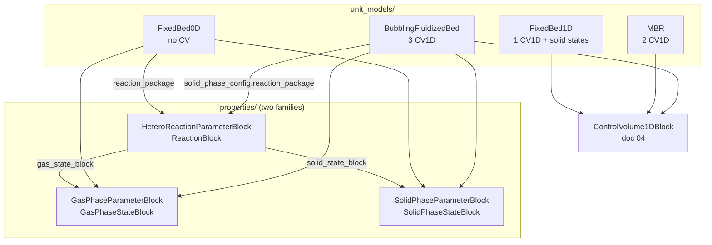
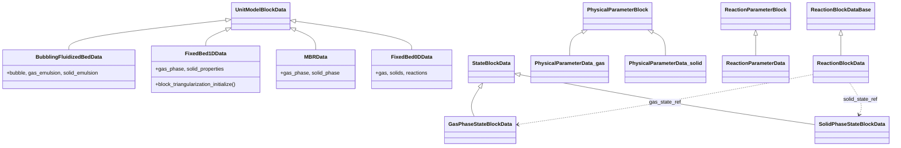
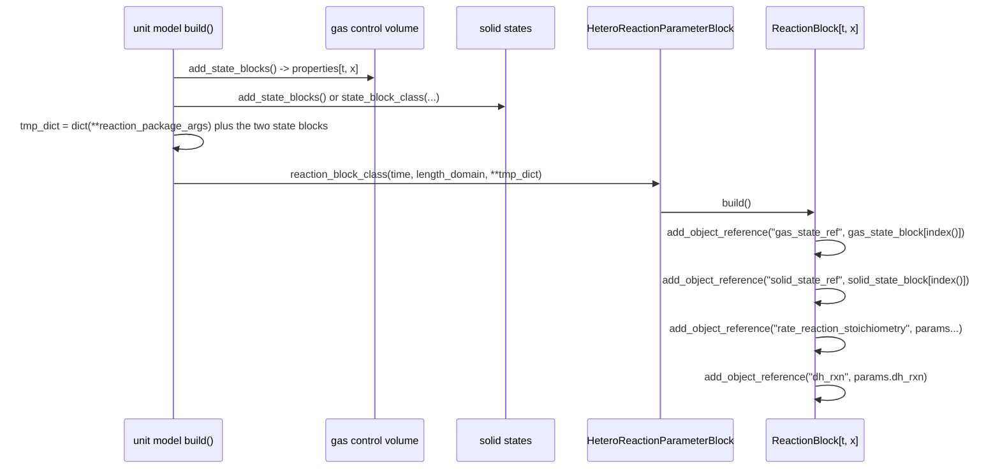

# 22 — Gas-solid contactors

> **Doc ID** 22 · **Repo SHA** 70a8f4fe1 (IDAES-PSE v2.13.0rc0) · **Source roots** `idaes/models_extra/gas_solid_contactors/{unit_models,properties}/`
> **Owns** 15 modules / 13,939 LOC · **Assets** none · **Siblings** [04](04_control_volume_framework.md), [05](05_property_and_reaction_framework.md), [06](06_model_preparation_initializers_and_scalers.md), [11](11_unit_models_network_contactors_and_control.md), [24](24_reference_flowsheets_and_demonstrations.md), [28](28_data_and_file_format_inventory.md)

This is the largest single scope in the set by source lines. It holds four
reactor models in which a gas stream and a solid stream exchange mass and heat
through a reaction that occurs at the surface of the solid, and two complete
property-and-reaction package families that supply the thermophysics for them.
The four unit models are the heaviest consumers of `ControlVolume1DBlock` in the
library; the two package families are hand-written implementations of the
document-05 contract, with every numeric coefficient in a Python dict literal.

---

## 0. Scope and source map

| File | LOC | Purpose | Covered in § |
|---|---:|---|---|
| `idaes/models_extra/gas_solid_contactors/__init__.py` | 0 | Package marker; licence header only | 2 |
| `idaes/models_extra/gas_solid_contactors/unit_models/__init__.py` | 18 | Re-exports the four unit-model container classes | 2 |
| `idaes/models_extra/gas_solid_contactors/unit_models/bubbling_fluidized_bed.py` | 3,551 | `BubblingFluidizedBedData` — a three-region bubbling fluidized bed built from three `ControlVolume1DBlock`s; the largest module in `models_extra` | 3, 4, 5, 6, 7, 11, 12 |
| `idaes/models_extra/gas_solid_contactors/unit_models/fixed_bed_1D.py` | 2,153 | `FixedBed1DData` — one gas control volume plus a stationary distributed solid phase; two initialization routines | 3, 4, 5, 6, 7, 11, 13 |
| `idaes/models_extra/gas_solid_contactors/unit_models/moving_bed.py` | 1,983 | `MBRData` — counter-current gas and solid control volumes, optionally on two separately discretized length domains | 3, 4, 5, 6, 7, 11 |
| `idaes/models_extra/gas_solid_contactors/unit_models/fixed_bed_0D.py` | 549 | `FixedBed0DData` — a batch solid charge with a well-mixed gas state; no control volume, no ports | 3, 4, 5, 6, 7, 12 |
| `idaes/models_extra/gas_solid_contactors/properties/__init__.py` | 0 | Package marker | 2 |
| `idaes/models_extra/gas_solid_contactors/properties/methane_iron_OC_reduction/__init__.py` | 24 | Re-exports the six container classes of the reduction family | 2, 12 |
| `idaes/models_extra/gas_solid_contactors/properties/methane_iron_OC_reduction/gas_phase_thermo.py` | 1,295 | Gas package for CH4/CO2/H2O: `GasPhaseParameterBlock`, `GasPhaseStateBlock` | 3, 5, 6, 7, 11 |
| `idaes/models_extra/gas_solid_contactors/properties/methane_iron_OC_reduction/solid_phase_thermo.py` | 884 | Solid package for Fe2O3/Fe3O4/Al2O3: `SolidPhaseParameterBlock`, `SolidPhaseStateBlock` | 3, 5, 6, 7, 12 |
| `idaes/models_extra/gas_solid_contactors/properties/methane_iron_OC_reduction/hetero_reactions.py` | 631 | `HeteroReactionParameterBlock`, `ReactionBlock` — the CH4 + 12Fe2O3 reduction | 3, 4, 5, 6, 7, 12 |
| `idaes/models_extra/gas_solid_contactors/properties/oxygen_iron_OC_oxidation/__init__.py` | 24 | Re-exports six container classes under the same six names | 2, 12 |
| `idaes/models_extra/gas_solid_contactors/properties/oxygen_iron_OC_oxidation/gas_phase_thermo.py` | 1,321 | Gas package for O2/N2/CO2/H2O, same class names | 3, 5, 6, 7, 12 |
| `idaes/models_extra/gas_solid_contactors/properties/oxygen_iron_OC_oxidation/solid_phase_thermo.py` | 874 | Solid package, same three chemical components and the same coefficients | 3, 5, 6, 7, 12 |
| `idaes/models_extra/gas_solid_contactors/properties/oxygen_iron_OC_oxidation/hetero_reactions.py` | 632 | `HeteroReactionParameterBlock`, `ReactionBlock` — the O2 + 4Fe3O4 oxidation | 3, 4, 5, 6, 7, 12 |

Total 13,939 LOC, 22 classes, 16 of them declared by `declare_process_block_class`,
78 configuration keys across eleven declarations, no `NotImplementedError` hook
sites, no enumerations, no deprecation sites and no shipped data files.

The four flowsheets in `idaes/models_extra/gas_solid_contactors/flowsheets/`
belong to [24](24_reference_flowsheets_and_demonstrations.md) and are named here
only as consumers.

---

## 1. Architectural role

Chemical looping combustion moves oxygen from air to a fuel through a solid
oxygen carrier rather than by mixing the two gas streams: a metal oxide is
reduced by fuel in one reactor and re-oxidised by air in another. Both halves
are gas-solid contactors — a gas stream flows through a bed of particles, the
reaction happens at the particle surface, and the two phases exchange mass,
momentum and heat along the bed.

That picture fixes the shape of every model here. Each carries **two** property
packages rather than one — a gas package and a solid package — and a reaction
package that is a function of both. The control volume framework supplies the
conservation equations for each phase separately
([04](04_control_volume_framework.md)); what these modules add is the
hydrodynamics that couple them: voidage, superficial velocities, bubble growth,
interphase mass- and heat-transfer coefficients, and pressure drop. The four
models differ in what moves:

| Model | Gas | Solid | Regions | Geometry |
|---|---|---|---|---|
| `BubblingFluidizedBed` | flows | flows | bubble, gas emulsion, solid emulsion | three `ControlVolume1DBlock`s on one length domain |
| `MBR` | flows | flows counter-current | one gas, one solid | two `ControlVolume1DBlock`s, one or two length domains |
| `FixedBed1D` | flows | stationary | one gas, one distributed solid | one `ControlVolume1DBlock` plus indexed solid state blocks |
| `FixedBed0D` | well mixed | stationary batch | none | no control volume, no length domain, no ports |

The second half of the scope is the thermophysics. Two package families —
`methane_iron_OC_reduction` for the fuel reactor and `oxygen_iron_OC_oxidation`
for the air reactor — each supply a gas package, a solid package and a
heterogeneous reaction package. They implement the document-05 contract by hand:
`define_metadata`, `build_on_demand` methods, the `get_*_terms` family, a legacy
`initialize`/`release_state` pair on the container class, and
`calculate_scaling_factors`.



*Every unit model here carries two property packages and one reaction package that reads both.*

---

## 2. Public surface inventory

### 2.1 Unit models

| Symbol | Kind | Declared at | Exported via | Stability signal |
|---|---|---|---|---|
| `BubblingFluidizedBedData` and its container `BubblingFluidizedBed` | class pair | `idaes/models_extra/gas_solid_contactors/unit_models/bubbling_fluidized_bed.py:87` | module import; `idaes.models_extra.gas_solid_contactors.unit_models` (`__init__.py:13`) | both autodoc'd |
| `EPS_BULK`, `EPS_CONV` | module constants | `idaes/models_extra/gas_solid_contactors/unit_models/bubbling_fluidized_bed.py:82`, `:83` | module import | no underscore; smoothing defaults, both `1e-8` |
| `FixedBed1DData` and its container `FixedBed1D` | class pair | `idaes/models_extra/gas_solid_contactors/unit_models/fixed_bed_1D.py:82` | module import; package `__init__.py:18` | both autodoc'd |
| `MBRData` and its container `MBR` | class pair | `idaes/models_extra/gas_solid_contactors/unit_models/moving_bed.py:91` | module import; package `__init__.py:16` | both autodoc'd; the only unit model here whose container name is not the data class name minus `Data` |
| `FixedBed0DData` and its container `FixedBed0D` | class pair | `idaes/models_extra/gas_solid_contactors/unit_models/fixed_bed_0D.py:51` | module import; package `__init__.py:17` | both autodoc'd |

### 2.2 The two property families

Every row below names **two** distinct classes, one per family, sharing a name.
The declaration columns are the disambiguator; §12.1 states the consequence.

| Symbol | Kind | `methane_iron_OC_reduction` | `oxygen_iron_OC_oxidation` | Exported via |
|---|---|---|---|---|
| `PhysicalParameterData` (gas) and its container `GasPhaseParameterBlock` | class pair | `gas_phase_thermo.py:78` | `gas_phase_thermo.py:81` | module import; family `__init__.py:13` |
| `_GasPhaseStateBlock` | class | `gas_phase_thermo.py:390` | `gas_phase_thermo.py:415` | module import; leading underscore |
| `GasPhaseStateBlockData` and its container `GasPhaseStateBlock` | class pair | `gas_phase_thermo.py:564` | `gas_phase_thermo.py:588` | module import; family `__init__.py:13` |
| `PhysicalParameterData` (solid) and its container `SolidPhaseParameterBlock` | class pair | `solid_phase_thermo.py:74` | `solid_phase_thermo.py:74` | module import; family `__init__.py:17` |
| `_SolidPhaseStateBlock` | class | `solid_phase_thermo.py:333` | `solid_phase_thermo.py:330` | module import; leading underscore |
| `SolidPhaseStateBlockData` and its container `SolidPhaseStateBlock` | class pair | `solid_phase_thermo.py:481` | `solid_phase_thermo.py:477` | module import; family `__init__.py:17` |
| `ReactionParameterData` and its container `HeteroReactionParameterBlock` | class pair | `hetero_reactions.py:79` | `hetero_reactions.py:79` | module import; family `__init__.py:21` |
| `_ReactionBlock` | class | `hetero_reactions.py:249` | `hetero_reactions.py:244` | module import; leading underscore |
| `ReactionBlockData` and its container `ReactionBlock` | class pair | `hetero_reactions.py:361` | `hetero_reactions.py:362` | module import; family `__init__.py:21` |

Paths in the last two columns are relative to
`idaes/models_extra/gas_solid_contactors/properties/<family>/`; the full anchors
appear in §15.

The four unit models carry `autoclass` directives in
`docs/reference_guides/model_libraries/gas_solid_contactors/unit_models/`. The
property and reaction classes carry none: their reference pages are narrative
tables of coefficients with an `index`/`currentmodule` preamble and no autodoc
directive, so the stability signal for the property surface is re-export from the
family `__init__.py` alone.

---

## 3. Class hierarchy and type taxonomy



*One family's shape; the second family repeats it exactly, with the same class names in a different module. The `_gas`/`_solid` suffixes are diagram labels, not source names — both classes are called `PhysicalParameterData`.*

### 3.1 Class roster

| Class | Base(s) | Declared at | Decorator | Container class | Key overrides |
|---|---|---|---|---|---|
| `BubblingFluidizedBedData` | `UnitModelBlockData` | `bubbling_fluidized_bed.py:87` | `@declare_process_block_class("BubblingFluidizedBed")` | `BubblingFluidizedBed` | `build`, `initialize_build`, `calculate_scaling_factors`, `_get_stream_table_contents` |
| `FixedBed1DData` | `UnitModelBlockData` | `fixed_bed_1D.py:82` | `@declare_process_block_class("FixedBed1D")` | `FixedBed1D` | the same, plus `block_triangularization_initialize`, `_get_performance_contents` |
| `MBRData` | `UnitModelBlockData` | `moving_bed.py:91` | `@declare_process_block_class("MBR")` | `MBR` | the same, plus `results_plot` |
| `FixedBed0DData` | `UnitModelBlockData` | `fixed_bed_0D.py:51` | `@declare_process_block_class("FixedBed0D")` | `FixedBed0D` | `build`, `initialize_build`, `calculate_scaling_factors` |
| `PhysicalParameterData` (gas) | `PhysicalParameterBlock` | `gas_phase_thermo.py:78` / `:81` | `@declare_process_block_class("GasPhaseParameterBlock")` | `GasPhaseParameterBlock` | `build`, `define_metadata` |
| `_GasPhaseStateBlock` | `StateBlock` | `gas_phase_thermo.py:390` / `:415` | none | — | `initialize`, `release_state` |
| `GasPhaseStateBlockData` | `StateBlockData` | `gas_phase_thermo.py:564` / `:588` | `@declare_process_block_class("GasPhaseStateBlock", block_class=_GasPhaseStateBlock)` | `GasPhaseStateBlock` | `build`, 13 on-demand builders, four `get_*_terms`, `define_state_vars`, `calculate_scaling_factors` |
| `PhysicalParameterData` (solid) | `PhysicalParameterBlock` | `solid_phase_thermo.py:74` | `@declare_process_block_class("SolidPhaseParameterBlock")` | `SolidPhaseParameterBlock` | `build`, `define_metadata` |
| `_SolidPhaseStateBlock` | `StateBlock` | `solid_phase_thermo.py:333` / `:330` | none | — | `initialize`, `release_state` |
| `SolidPhaseStateBlockData` | `StateBlockData` | `solid_phase_thermo.py:481` / `:477` | `@declare_process_block_class("SolidPhaseStateBlock", block_class=_SolidPhaseStateBlock)` | `SolidPhaseStateBlock` | `build`, `_make_state_vars`, 6 on-demand builders, four `get_*_terms` |
| `ReactionParameterData` | `ReactionParameterBlock` | `hetero_reactions.py:79` | `@declare_process_block_class("HeteroReactionParameterBlock")` | `HeteroReactionParameterBlock` | `CONFIG`, `build`, `define_metadata` |
| `_ReactionBlock` | `ReactionBlockBase` | `hetero_reactions.py:249` / `:244` | none | — | `initialize` |
| `ReactionBlockData` | `ReactionBlockDataBase` | `hetero_reactions.py:361` / `:362` | `@declare_process_block_class("ReactionBlock", block_class=_ReactionBlock)` | `ReactionBlock` | `CONFIG`, `build`, four on-demand builders, `get_reaction_rate_basis` |

The property rows stand for two classes each, one per family. The decorator's
`block_class` argument is what attaches the hand-written `_GasPhaseStateBlock`,
`_SolidPhaseStateBlock` and `_ReactionBlock` containers — the classes carrying
the legacy `initialize` and `release_state` — to the synthesized names.

### 3.2 Enumerations

Not applicable: this scope declares no enum classes. It consumes
`MaterialBalanceType`, `EnergyBalanceType`, `MomentumBalanceType`,
`FlowDirection`, `DistributedVars` and `MaterialFlowBasis` from `idaes.core`
([04 §3.2](04_control_volume_framework.md#32-supported-and-unsupported-balance-forms)).
Discrete choices that would elsewhere be an enumeration are string-valued
configuration keys validated by `In([...])` — `flow_type`, `pressure_drop_type`,
`transformation_method`, `transformation_scheme` — listed in §4.

### 3.3 Initializer and Scaler adoption

Of the 16 process block classes declared in this scope, **zero** name a
`default_initializer` and **zero** name a `default_scaler`. This is the largest
group of declared process block classes in the set with neither
([06 §3.3](06_model_preparation_initializers_and_scalers.md#33-retrofit-adoption)).

The consequence is that model preparation here runs entirely through the older
two mechanisms. Preparation is the legacy routine: each unit model overrides
`initialize_build`, and each state-block and reaction-block container overrides
`initialize` and `release_state`. Scaling is suffix-based: each of the eleven
classes that scales anything overrides `calculate_scaling_factors` and calls
`idaes.core.util.scaling` directly. No Initializer object and no Scaler object
in `idaes/core/initialization/` or `idaes/core/scaling/` resolves to a class in
this scope.

---

## 4. Configuration reference

78 keys across eleven declarations. Three of the four unit models share a
configuration shape, so it is documented once in §4.1 and §4.2 and the
per-model differences follow in §4.3.

### 4.1 The shared one-dimensional CONFIG block

`BubblingFluidizedBedData.CONFIG`
(`idaes/models_extra/gas_solid_contactors/unit_models/bubbling_fluidized_bed.py:93`),
`FixedBed1DData.CONFIG` (`idaes/models_extra/gas_solid_contactors/unit_models/fixed_bed_1D.py:88`)
and `MBRData.CONFIG` (`idaes/models_extra/gas_solid_contactors/unit_models/moving_bed.py:95`)
each start from `UnitModelBlockData.CONFIG()` and declare these ten keys with the
same names, in the same order, before their model-specific additions. The last
three columns give the line in each of the three modules.

| Key | Domain / validator | Default | Req. | Effect on build | BFB | FixedBed1D | MBR |
|---|---|---|---|---|---|---|---|
| `finite_elements` | `int` | `5` (BFB), `10` (others) | no | Element count passed to the DAE transformation; `None` raises at `_apply_transformation` | `:96` | `:91` | `:98` |
| `length_domain_set` | `list` | `[0.0, 1.0]` | no | Initializes the unit-level `ContinuousSet` and is forwarded to every `add_geometry` call | `:106` | `:101` | `:108` |
| `transformation_method` | `In(['dae.finite_difference','dae.collocation'])` (BFB); undeclared domain (others) | `'dae.finite_difference'` | no | Names the Pyomo transformation applied to the length domain | `:117` | `:112` | `:119` |
| `transformation_scheme` | `In([None,'BACKWARD','FORWARD','LAGRANGE-RADAU'])` | `None` | no | `None` is resolved inside `build` from the method and, in `FixedBed1D`, from `flow_type` | `:131` | `:125` | `:132` |
| `collocation_points` | `int` | `3` | no | Passed as `ncp` when the method is `dae.collocation` | `:148` | `:142` | `:187` |
| `flow_type` | `In([...])`, members differ per model | `'co_current'` / `'forward_flow'` / `'counter_current'` | no | Selects the `FlowDirection` given to each control volume's `add_geometry` | `:158` | `:152` | `:197` |
| `material_balance_type` | `In(MaterialBalanceType)` | `componentTotal` | no | Forwarded to every `add_material_balances` call | `:171` | `:165` | `:208` |
| `energy_balance_type` | `In(EnergyBalanceType)` | `enthalpyTotal` | no | `none` suppresses every heat-transfer variable and substitutes isothermal constraints | `:187` | `:181` | `:224` |
| `momentum_balance_type` | `In(MomentumBalanceType)` | `pressureTotal` | no | Forwarded to the gas-side `add_momentum_balances`; the solid side is always `none` | `:203` | `:197` | `:240` |
| `has_pressure_change` | `Bool` | `True` | no | Creates `deltaP` on the gas control volume and the correlation that defines it | `:219` | `:213` | `:256` |

Each of the three also declares the two nested phase configuration dictionaries
last: `gas_phase_config` and `solid_phase_config`, both instances of the
`_PhaseTemplate` of §4.2, at `bubbling_fluidized_bed.py:303`/`:304`,
`fixed_bed_1D.py:310`/`:311` and `moving_bed.py:353`/`:354`. The domains of
`flow_type` are the substantive difference: `['co_current','counter_current']`
for the bubbling bed, `['forward_flow','reverse_flow']` for the fixed bed —
reverse flow being the same bed with the gas entering at the far end — and a
single-member `['counter_current']` for the moving bed.

### 4.2 `_PhaseTemplate` — the nested per-phase dictionary

Each of the three one-dimensional models declares a class attribute
`_PhaseTemplate = UnitModelBlockData.CONFIG()` (`bubbling_fluidized_bed.py:235`,
`fixed_bed_1D.py:242`, `moving_bed.py:285`), adds five keys to it, and declares
`gas_phase_config` and `solid_phase_config` as two independent instances of it,
so a property package is supplied per phase rather than per unit.

| Key | Domain / validator | Default | Req. | Effect on build | BFB | FixedBed1D | MBR |
|---|---|---|---|---|---|---|---|
| `property_package` | `is_physical_parameter_block` | `None` | in practice | The parameter block the phase's state blocks are built from; reading `.get_metadata()` off it in `build` makes it effectively mandatory | `:250` | `:243` | `:300` |
| `property_package_args` | `dict` | `{}` | no | Forwarded to the control volume's `property_package_args` | `:262` | `:255` | `:312` |
| `reaction_package` | `is_reaction_parameter_block` | `None` | no | `None` on the gas phase suppresses homogeneous reaction terms; `None` on the solid phase suppresses the heterogeneous reaction block and the interphase mass transfer that depends on it | `:275` | `:268` | `:325` |
| `reaction_package_args` | implicit `ConfigBlock` | empty | no | Copied into the `tmp_dict` used to construct the heterogeneous reaction block (§5.5) | `:288` | `:281` | `:338` |
| `has_equilibrium_reactions` | `Bool` | `False` | no | Passed as `has_equilibrium` to `add_reaction_blocks` on the gas side and into the heterogeneous reaction block on the solid side | `:236` | `:294` | `:286` |

The three template declarations differ only in the order of the five keys:
`FixedBed1D` declares `has_equilibrium_reactions` last, the other two first. The
names, domains, defaults and documentation strings are otherwise the same three
times over. The top-level `CONFIG` of these three models carries no
`property_package`, `property_package_args`, `reaction_package` or
`reaction_package_args` key of its own: the only path to a property package is
`config.gas_phase_config.property_package` or its solid-side counterpart.

### 4.3 Per-model additions

| Model | Key | Domain / validator | Default | Req. | Effect on build | Anchor |
|---|---|---|---|---|---|---|
| `FixedBed1D` | `pressure_drop_type` | `In(['ergun_correlation','simple_correlation'])` | `'ergun_correlation'` | no | Selects which of two mutually exclusive `gas_phase_config_pressure_drop` constraints is built | `fixed_bed_1D.py:227` |
| `FixedBed1D` | `has_equilibrium_reactions` | `Bool` | `False` | no | Declared on `_PhaseTemplate`, not on `CONFIG` | `fixed_bed_1D.py:294` |
| `MBR` | `pressure_drop_type` | `In(['simple_correlation','ergun_correlation'])` | `'simple_correlation'` | no | The same two correlations, with the opposite default | `moving_bed.py:270` |
| `MBR` | `gas_transformation_scheme` | `In([None,'BACKWARD','FORWARD'])` | `None` | no | When set, the gas phase gets its own `ContinuousSet` and its own discretization scheme | `moving_bed.py:151` |
| `MBR` | `solid_transformation_scheme` | `In([None,'BACKWARD','FORWARD'])` | `None` | no | The matching solid-side scheme; set together with the previous key or not at all | `moving_bed.py:169` |
| `BubblingFluidizedBed` | — | — | — | — | No keys beyond §4.1 and §4.2; it has no `pressure_drop_type`, because its gas emulsion pressure drop correlation is fixed | — |

`MBRData.build` enforces three conditions on the three scheme keys
(`moving_bed.py:420`, `:428`, `:441`): the two directional schemes are settable
only with `transformation_method == "dae.finite_difference"`, are set together or
not at all, and cannot be combined with `transformation_scheme`.

### 4.4 `FixedBed0DData.CONFIG`

Declared at `idaes/models_extra/gas_solid_contactors/unit_models/fixed_bed_0D.py:56`
as a **fresh** `ConfigBlock()`, not a copy of `UnitModelBlockData.CONFIG()`, and
the one model in this scope that names its two property packages with explicit
top-level keys instead of a nested `_PhaseTemplate`; §12.2 states the consequence.

| Key | Domain / validator | Default | Req. | Effect on build | Anchor |
|---|---|---|---|---|---|
| `dynamic` | `In([True])` | `True` | no | A batch model has no steady state; the domain admits one value | `:57` |
| `has_holdup` | `In([True])` | `True` | no | The same, for holdup | `:67` |
| `energy_balance_type` | `In(EnergyBalanceType)` | `enthalpyTotal` | no | `none` replaces the solid energy holdup and accumulation with an isothermal constraint | `:78` |
| `gas_property_package` | `is_physical_parameter_block` | `None` | in practice | The gas parameter block; `state_block_class` is read off it in `build` | `:94` |
| `gas_property_package_args` | `is_physical_parameter_block` | `None` | no | Named as an arguments dictionary but validated with the parameter-block domain | `:107` |
| `solid_property_package` | `is_physical_parameter_block` | `None` | in practice | The solid parameter block, and the source of the unit's derived units | `:121` |
| `solid_property_package_args` | `is_physical_parameter_block` | `None` | no | The same mismatch as the gas-side arguments key | `:134` |
| `reaction_package` | none declared | `None` | in practice | The heterogeneous reaction parameter block; `reaction_block_class` is read off it | `:148` |
| `reaction_package_args` | implicit `ConfigBlock` | empty | no | Copied into the `tmp_dict` that constructs `self.reactions` | `:162` |

### 4.5 The heterogeneous reaction package

Both families declare the same two CONFIG blocks with the same key names. The
anchor columns give the line in each family's `hetero_reactions.py`.

`ReactionParameterData.CONFIG` — a fresh `ConfigBlock()` at
`hetero_reactions.py:89` in both families. It does **not** extend
`ReactionParameterBlock.CONFIG`, and so does not carry that block's
`property_package` key ([05 §4.4](05_property_and_reaction_framework.md#44-reactionblockdatabaseconfig)).

| Key | Domain / validator | Default | Req. | Effect on build | reduction | oxidation |
|---|---|---|---|---|---|---|
| `gas_property_package` | `is_physical_parameter_block` | none | yes in practice | The gas parameter block the reaction is written against | `:90` | `:90` |
| `solid_property_package` | `is_physical_parameter_block` | none | yes in practice | The solid parameter block | `:98` | `:98` |
| `default_arguments` | implicit `ConfigBlock` | empty | no | Merged into consumers' reaction package arguments | `:106` | `:106` |

`ReactionBlockData.CONFIG` — a fresh `ConfigBlock()` at `hetero_reactions.py:367`
(reduction) and `:368` (oxidation).

| Key | Domain / validator | Default | Req. | Effect on build | reduction | oxidation |
|---|---|---|---|---|---|---|
| `parameters` | `is_reaction_parameter_block` | none | yes | The reaction parameter block; bound as `_params` by `add_object_reference` | `:368` | `:369` |
| `solid_state_block` | `is_state_block` | none | yes | The solid state block; `self.config.solid_state_block[self.index()]` becomes `solid_state_ref` | `:378` | `:379` |
| `gas_state_block` | `is_state_block` | none | yes | The gas state block; the same, as `gas_state_ref` | `:388` | `:389` |
| `has_equilibrium` | `Bool` | `False` | no | Accepted and stored; no equilibrium term is built from it in either family | `:398` | `:399` |

The two state-block keys are the structural departure from
`ReactionBlockDataBase.CONFIG`, which declares a single `state_block` key. §5.5
describes how a unit model fills them.

### 4.6 Property packages

The four thermophysical modules declare no configuration keys of their own. They
inherit `PhysicalParameterBlock.CONFIG` (one key, `default_arguments`) and
`StateBlockData.CONFIG` (`parameters`, `defined_state`, `has_phase_equilibrium`)
unchanged; both are documented in
[05 §4](05_property_and_reaction_framework.md#4-configuration-reference).
`defined_state` is the key the unit models manipulate: `FixedBed1D` and
`FixedBed0D` build their solid state blocks with `defined_state=True`
(`fixed_bed_1D.py:547`, `fixed_bed_0D.py:202`) specifically to suppress the
package's own sum-of-mass-fractions constraint, and write their own in its place.

---

## 5. Construction and call sequences

### 5.1 `BubblingFluidizedBedData.build`

`build` (`idaes/models_extra/gas_solid_contactors/unit_models/bubbling_fluidized_bed.py:309`):

1. `super().build()`, then resolve `transformation_scheme` when it is `None` —
   `BACKWARD` for finite difference, `LAGRANGE-RADAU` for collocation — raising
   `ConfigurationError` for an inconsistent pair (`:336`, `:353`).
2. Map `flow_type` to two `FlowDirection` values: the gas always `forward`, the
   solid `forward` for `co_current` and `backward` for `counter_current`.
3. Derive four booleans from the two `reaction_package` keys and
   `energy_balance_type`: `has_rate_reaction_gas`, `has_rate_reaction_solid`,
   `has_heat_transfer`, and the two heat-of-reaction flags.
4. Create `length_domain`, a `ContinuousSet` over `(0.0, 1.0)` (`:419`), and
   `bed_height` (`:425`). Both are owned by the unit model, not by a control
   volume.
5. Build `self.bubble` (`:435`), `self.gas_emulsion` (`:483`) and
   `self.solid_emulsion` (`:532`), each a `ControlVolume1DBlock` with
   `area_definition=DistributedVars.variant` and the shared `length_domain`
   passed to `add_geometry` with `length_var=self.bed_height`. The first two take
   the gas package, the third the solid package.
6. Add balances on each. Only `gas_emulsion` gets a momentum balance; `bubble`
   and `solid_emulsion` are given `MomentumBalanceType.none` explicitly, so the
   three regions share one pressure profile.
7. Attach the heterogeneous reaction block to `solid_emulsion` by hand (§5.5).
8. Build four extra state blocks — `gas_inlet_block`, `gas_outlet_block`,
   `solid_inlet_block`, `solid_outlet_block` (`:606`–`:624`) — and four ports
   from them (`:631`–`:636`). These blocks exist because the flow entering the
   reactor splits between the bubble and emulsion regions and recombines at the
   outlet; the mixing and splitting equations are boundary constraints in
   `_make_performance`.
9. `_make_vars_params()`, `_apply_transformation()`, `_make_performance()`.

### 5.2 `FixedBed1DData.build`

`build` (`idaes/models_extra/gas_solid_contactors/unit_models/fixed_bed_1D.py:316`)
follows the same shape with three departures. Scheme resolution is a six-branch
conditional (`:347`) that couples `flow_type` to the scheme: forward flow
resolves to `BACKWARD`, reverse flow to `FORWARD`, and five combinations raise
`ConfigurationError` — among them `reverse_flow` with `dae.collocation`
(`:369`), which has no valid scheme. The gas control volume is built with
`dynamic=True` and `has_holdup=True` hard-coded (`:487`), so the flowsheet's own
`dynamic` flag does not reach it.

There is **no solid control volume**. Because the solid does not flow, the model
builds `self.solid_properties` directly as an indexed state block over time and
the length domain with `defined_state=True` (`:547`), and writes the solid
material and energy balances itself in `_make_performance` (`:947`, `:1027`).
Only two ports exist, `gas_inlet` and `gas_outlet` (`:575`, `:576`).

### 5.3 `MBRData.build`

`build` (`idaes/models_extra/gas_solid_contactors/unit_models/moving_bed.py:359`)
adds the bidirectional-discretization option. When `gas_transformation_scheme`
and `solid_transformation_scheme` are both set, it creates two `ContinuousSet`s,
`solid_length_domain` and `gas_length_domain` (`:516`, `:521`), and binds
`self.length_domain` to the solid one through `add_object_reference` (`:530`).
Otherwise it creates a single `length_domain` (`:535`) and binds both named
attributes to it (`:541`, `:542`). Downstream code therefore always has three
names available and `_gas_tr_scheme`/`_solid_tr_scheme` always hold a concrete
scheme. `flow_type` has one admissible value, so the `else` branch of the
direction switch raises `BurntToast` (`:455`) rather than `ConfigurationError`.
Both phases get a full `ControlVolume1DBlock` (`:554`, `:606`), the gas on
`gas_length_domain` and the solid on `solid_length_domain` with
`FlowDirection.backward`, and all four ports come from them (`:675`–`:680`).

### 5.4 `FixedBed0DData.build`

`build` (`idaes/models_extra/gas_solid_contactors/unit_models/fixed_bed_0D.py:175`)
builds no control volume and no port. It creates `self.gas` (`:188`) and
`self.solids` (`:202`) as time-indexed state blocks, both with
`defined_state=True`, then `self.reactions` (`:212`) from
`config.reaction_package.reaction_block_class`. Everything after that is written
inline: `volume_bed` and its constraint (`:225`, `:232`), `volume_solid`
(`:239`, `:249`), the solid material holdup, accumulation and their two
constraints (`:255`–`:287`), `mass_solids` for thermogravimetric tracking
(`:297`, `:306`), a sum-of-mass-fractions constraint that is skipped at the
initial time point (`:316`), and either the energy holdup pair (`:328`–`:362`)
or an isothermal constraint (`:380`). The gas state block exists only so that the
reaction block has a gas concentration to read; no gas balance is written.

### 5.5 Binding a heterogeneous reaction block to two state blocks

This is the structural contribution of the subsystem. The control volume
framework builds a reaction block through `add_reaction_blocks`, which passes a
single `state_block` ([05 §4.4](05_property_and_reaction_framework.md#44-reactionblockdatabaseconfig)).
A gas-solid reaction rate is a function of a gas concentration *and* a solid
composition, so one state block is not enough, and all four unit models bypass
`add_reaction_blocks` for the solid side. Each carries the same comment:

```python
# TODO - a generalization of the heterogeneous reaction block
# The heterogeneous reaction block does not use the
# add_reaction_blocks in control volumes as control volumes are
# currently setup to handle only homogeneous reaction properties.
# Thus appending the heterogeneous reaction block to the
# solid state block is currently hard coded here.
```

The construction is the same four lines in each model
(`bubbling_fluidized_bed.py:563`, `fixed_bed_1D.py:562`, `moving_bed.py:639`,
`fixed_bed_0D.py:208`): copy `reaction_package_args` into a plain dict, add
`gas_state_block`, `solid_state_block` and `parameters`, and call
`reaction_package.reaction_block_class` over the state blocks' index sets.



*The reaction block is indexed like the two state blocks and resolves each to a single point with `self.index()`, so `gas_state_ref` and `solid_state_ref` are the two states at the same place and time.*

`ReactionBlockData.build` (`hetero_reactions.py:415` / `:416`) does exactly the
four `add_object_reference` calls in the diagram and nothing else. The
stoichiometry and heat-of-reaction references exist because
`ControlVolume1DBlockData` looks for `rate_reaction_stoichiometry` and `dh_rxn`
on the reaction block when it builds the rate-reaction stoichiometry constraint
and the heat-of-reaction expression; supplying them by reference is what lets a
control volume consume a reaction block it did not build. Everything else is
built on demand, and `_reaction_rate` (`:537` / `:538`) closes the loop: it reads
`gas_state_ref.dens_mol_comp[...]` for the reacting gas species and
`solid_state_ref.mass_frac_comp[...]`, `.particle_porosity` and
`.dens_mass_skeletal` for the solid, so requesting `reaction_rate` triggers
on-demand construction in **both** state blocks.

### 5.6 The DAE transformation

Each of the three one-dimensional models owns its length domain and discretizes
it itself, rather than letting each control volume do so. `_apply_transformation`
(`bubbling_fluidized_bed.py:957`, `fixed_bed_1D.py:584`, `moving_bed.py:688`)
raises `ConfigurationError` when `finite_elements` is `None` (`:964`, `:591`,
`:695`), then constructs `self.discretizer = TransformationFactory(method)` and
calls `apply_to(self, wrt=..., nfe=..., scheme=...)` on the **unit model**, with
`ncp` added for collocation. `MBRData._apply_transformation` differs: with both
directional schemes set it calls `apply_to` twice, once per domain
(`moving_bed.py:707`, `:713`), producing a backward-differenced gas profile and a
forward-differenced solid profile on the same bed.

Because the transformation is applied to the unit model, it reaches the control
volumes' own derivative variables as well as the unit-level ones —
`ddia_bubbledx` in the bubbling bed (`bubbling_fluidized_bed.py:933`) and
`solid_material_accumulation` in the fixed bed (`fixed_bed_1D.py:719`). The
control volumes' own `apply_transformation` is never called
([04 §5.6](04_control_volume_framework.md#56-one-dimensional-construction)).

### 5.7 Legacy initialization

Every unit model overrides `initialize_build` with the same signature
`(blk, gas_phase_state_args=None, solid_phase_state_args=None, outlvl=idaeslog.NOTSET, solver=None, optarg=None)`
and the same shape: fix the state variables, deactivate every constraint except
one group, solve, reactivate the next group, solve again. The step numbering is
carried in the log messages.

| Step | `BubblingFluidizedBed` | `FixedBed1D` | `MBR` | `FixedBed0D` |
|---|---|---|---|---|
| 1 | Property block constraints (`:2057`) | Thermophysical properties (`:1246`) | Thermophysical properties (`:1248`) | Thermophysical and reaction properties (`:424`, `:439`) |
| 2 | Geometric constraints (`:2108`) | Hydrodynamics (`:1277`) | Hydrodynamics (`:1279`) | One full solve (`:448`) |
| 3 | Hydrodynamics (`:2277`) | Mass balances, 3a/3b/3c (`:1337`, `:1437`, `:1468`) | Mass balances, 3a/3b/3c (`:1329`, `:1462`, `:1493`) | — |
| 4 | Mass balances, 4a/4b (`:2399`, `:2532`) | Energy balances (`:1553`, `:1595`) | Energy balances (`:1547`, `:1575`) | — |
| 5 | Energy balances (`:2600`, `:2622`) | — | — | — |
| 6 | Outlet conditions (`:2662`) | — | — | — |
| Failure | `InitializationError` at `:2670` | `InitializationError` at `:1561`, `:1603` | `InitializationError` at `:1555`, `:1583` | `InitializationError` at `:457` |

Only the final step of each routine raises. Earlier failed solves log a warning
through `init_log.warning` or `_log.warning` and continue, so a routine that
fails at step 2 still reports step 6's outcome as the verdict.

`FixedBed1DData` carries a second, independent routine.
`block_triangularization_initialize` (`fixed_bed_1D.py:1608`) converts the
differential-algebraic system to an algebraic one rather than solving a sequence
of subproblems:

1. Raise `ValueError` if the model does not already have zero degrees of freedom
   (`:1669`).
2. Collect every `Constraint` whose local name ends `disc_eq` or
   `sum_component_eqn`, plus `isothermal_gas_phase` and `isothermal_solid_phase`
   when they exist, into a deactivation list (`:1673`).
3. Fix the gas and solid state variables with `fix_state_vars`, and fix every
   `Var` whose name ends `_flow_dx` to zero (`:1696`).
4. Inside a `TemporarySubsystemManager`, build an `IncidenceGraphInterface`, take
   a maximum matching, and raise `ValueError` for a structural singularity
   (`:1743`).
5. Call `solve_strongly_connected_components` with `calc_var_kwds={"eps": 1e-8}`
   and re-raise `RuntimeError` naming the tolerance setting (`:1749`), then
   restore both sets of state variables with `revert_state_vars` (`:1762`).

This is the only use of `pyomo.util.subsystems` and
`pyomo.contrib.incidence_analysis` in the scope; the shared machinery is in
[06 §5.4](06_model_preparation_initializers_and_scalers.md#54-block-triangularization).

### 5.8 Property and reaction package construction

`PhysicalParameterData.build` in each of the four thermophysical modules assigns
`_state_block_class`, declares one `Phase` sub-block and three or four
`Component` sub-blocks, and then declares every coefficient as a `Param` or a
fixed `Var` initialized from a module-local dict literal. The gas packages
declare `VaporPhase()` and the solid packages `SolidPhase()`
(`gas_phase_thermo.py:95`, `solid_phase_thermo.py:91`), so the phase name that
appears in every `get_*_terms` call is `"Vap"` or `"Sol"`.

`define_metadata` (`gas_phase_thermo.py:355` / `:377`,
`solid_phase_thermo.py:296` / `:293`, `hetero_reactions.py:221` / `:219`) calls
`add_properties` for names in `StandardPropertySet`, `define_custom_properties`
for names outside it — `particle_porosity`, `dens_mass_skeletal` and
`dens_mass_particle` in the solid packages, `OC_conv` and `OC_conv_temp` in the
reaction packages — and `add_default_units` with the five SI quantities `time`,
`length`, `mass`, `amount` and `temperature`.

Property construction is on demand throughout. Each `_<name>` method creates its
`Var` and its defining `Constraint` inside a `try`/`except AttributeError` that
deletes both components and, in most cases, re-raises — the pattern that lets a
`DerivativeVar` construction retry later. `get_material_flow_terms` and its three
relatives are memoized differently: each tests
`self.is_property_constructed("material_flow_terms")` and builds a Pyomo
`Expression` the first time (`gas_phase_thermo.py:1094`,
`solid_phase_thermo.py:726`), so the balance terms are expressions over the state
variables rather than new variables.

---

## 6. Data structures, variables, constraints and invariants

### 6.1 `BubblingFluidizedBed`

Anchors are lines in
`idaes/models_extra/gas_solid_contactors/unit_models/bubbling_fluidized_bed.py`.
`t` is the flowsheet time domain and `x` the unit's `length_domain`.

| Component | Type | Index sets | Units | Created at | Condition |
|---|---|---|---|---|---|
| `length_domain` | `ContinuousSet` over `(0.0, 1.0)` | — | — | `:419` | always |
| `bed_height`, `bed_diameter`, `bed_area` | `Var` | — | length, length, area | `:425`, `:677`, `:683` | always |
| `area_orifice`, `number_orifice` | `Var` | — | area, 1/area | `:691`, `:697` | distributor design |
| `bubble`, `gas_emulsion`, `solid_emulsion` | `ControlVolume1DBlock` | t × x | — | `:435`, `:483`, `:532` | always |
| `gas_inlet_block`, `gas_outlet_block`, `solid_inlet_block`, `solid_outlet_block` | state blocks | t | — | `:606`, `:612`, `:618`, `:624` | always |
| `eps_bulk`, `eps_conv` | mutable `Param` | — | mol/volume, mol/mass | `:663`, `:669` | smoothing, default `1e-8` |
| `velocity_superficial_gas`, `velocity_bubble`, `velocity_emulsion_gas`, `velocity_superficial_solid` | `Var` | t × x | velocity | `:705`, `:713`, `:721`, `:729` | always |
| `bubble_diameter`, `bubble_diameter_max` | `Var` | t × x | length | `:738`, `:786` | always |
| `delta`, `delta_e`, `voidage_average`, `voidage_emulsion`, `bubble_growth_coeff` | `Var` | t × x | dimensionless | `:746`, `:754`, `:762`, `:770`, `:778` | always |
| `velocity_bubble_rise`, `average_gas_density` | `Var` | t × x | velocity, molar density | `:794`, `:802` | always |
| `gas_emulsion_hetero_rxn`, `Kbe`, `Kgbulk_c` | `Var` | t × x × gas component | molar flux × length, 1/time, molar flow / length | `:812`, `:823`, `:832` | heterogeneous generation, bubble-to-emulsion mass transfer coefficient, bulk gas transfer rate |
| `Hbe`, `Hgbulk`, `htc_conv`, `ht_conv` | `Var` | t × x | heat transfer coeff., power/length, heat transfer coeff., power/volume | `:843`, `:853`, `:861`, `:871` | interphase and convective energy transfer |
| `_reform_var_1` … `_reform_var_5` | `Var` | t × x (`_2` also gas component) | mixed | `:881`, `:889`, `:899`, `:908`, `:922` | reformulation variables for the bubble-diameter, mass- and heat-transfer correlations |
| `ddia_bubbledx` | `DerivativeVar` wrt `length_domain` | t × x | length | `:933` | always |
| `Kd`, `deltaP_orifice` | `Var`, fixed at construction | — | length/time, Pa | `:941`, `:948` | estimable constants |

The constraints in `_make_performance` (`:990`) fall into seven groups.

| Group | Members | Anchors |
|---|---|---|
| Geometry | `orifice_area`, `bed_area_eqn`, `bubble_area`, `gas_emulsion_area`, `solid_emulsion_area`, `emulsion_vol_frac`, `average_voidage` | `:1005`, `:1010`, `:1019`, `:1031`, `:1042`, `:1056`, `:1065` |
| Bubble hydrodynamics | `bubble_growth_coefficient`, `bubble_diameter_maximum`, `bubble_diameter_eqn`, `bubble_velocity_rise`, `emulsion_voidage`, `bubble_velocity`, `bubble_vol_frac_eqn` | `:1074`, `:1098`, `:1122`, `:1158`, `:1173`, `:1183`, `:1233` |
| Velocities and density | `average_gas_density_eqn`, `velocity_gas_superficial`, `solid_super_vel` | `:1198`, `:1217`, `:1248` |
| Pressure | `gas_emulsion_pressure_drop` or `isobaric_gas_emulsion` | `:1264`, `:1282` |
| Interphase transfer | `bubble_cloud_mass_trans_coeff`, `bubble_cloud_bulk_mass_trans`, `bubble_cloud_heat_trans_coeff`, `convective_heat_trans_coeff`, `convective_heat_transfer`, `bubble_cloud_bulk_heat_trans`, `bubble_mass_transfer`, `gas_emulsion_mass_transfer`, and the three `*_heat_transfer` constraints | `:1328`, `:1348`, `:1417`, `:1440`, `:1466`, `:1486`, `:1510`, `:1534`, `:1550`, `:1568`, `:1584` |
| Reaction coupling | `bubble_rxn_ext_constraint`, `gas_emulsion_rxn_ext_constraint`, `solid_emulsion_rxn_ext_constraint`, `gas_emulsion_hetero_rxn_eqn` | `:1605`, `:1618`, `:1633`, `:1647` |
| Boundary conditions | `bubble_gas_flowrate`, `emulsion_gas_flowrate`, seven inlet constraints from `gas_mole_flow_in` to `solid_emulsion_mass_frac_in`, and six outlet constraints from `gas_pressure_out` to `solid_energy_balance_out` | `:1670`, `:1689`, `:1715`–`:1786`, `:1874`–`:1954` |

`gas_emulsion_hetero_rxn_term` (`:1521`) is an Expression rather than a
constraint; it returns `gas_emulsion_hetero_rxn[t, x, j]` when a solid reaction
package is configured and `0` otherwise, so the mass-transfer constraint has one
form in both cases. The five reformulation variables and two smoothing parameters
exist because the correlations contain square roots and minimum functions:
`smooth_min` and `smooth_max` from `idaes.core.util.math` take `eps_bulk` and
`eps_conv` as their smoothing constants.

### 6.2 `FixedBed1D`

Anchors are lines in
`idaes/models_extra/gas_solid_contactors/unit_models/fixed_bed_1D.py`.

| Component | Type | Index sets | Units | Created at | Condition |
|---|---|---|---|---|---|
| `length_domain`, `bed_height` | `ContinuousSet`, `Var` | — | —, length | `:471`, `:477` | always |
| `gas_phase` | `ControlVolume1DBlock` | t × x | — | `:487` | always, with `dynamic=True`, `has_holdup=True` |
| `solid_properties` | state block | t × x | — | `:547` | always, `defined_state=True` |
| `solid_reactions` | reaction block | t × x | — | `:566` | solid `reaction_package` set |
| `eps` | mutable `Param` | — | — | `:635` | smoothing |
| `bed_diameter`, `bed_area` | `Var` | — | length, area | `:643`, `:646` | always |
| `velocity_superficial_gas` | `Var` | t × x | velocity | `:654` | always |
| `Re_particle`, `Pr_particle`, `Nu_particle`, `gas_solid_htc` | `Var` | t × x | dimensionless ×3, heat transfer coefficient | `:664`, `:673`, `:682`, `:690` | energy balance active |
| `solid_phase_area` | `Var` | t × x | area | `:700` | always |
| `solid_material_holdup` and its `DerivativeVar` `solid_material_accumulation` | `Var` | t × x × solid component | mass | `:709`, `:719` | always |
| `solid_phase_heat`, `solid_energy_holdup` and its `DerivativeVar` `solid_energy_accumulation` | `Var` | t × x | power, energy, energy | `:730`, `:739`, `:747` | energy balance active |

| Constraint | Created at | Condition |
|---|---|---|
| `bed_area_eqn`, `gas_phase_area_constraint`, `solid_phase_area_constraint`, `gas_super_vel` | `:774`, `:779`, `:789`, `:801` | always |
| `gas_phase_config_pressure_drop` | `:820` (simple) or `:846` (Ergun) | `has_pressure_change` |
| `gas_phase_config_rxn_ext` | `:898` | gas `reaction_package` set |
| `gas_comp_hetero_rxn` | `:914` | solid `reaction_package` set |
| `solid_material_holdup_calculation`, `solid_material_balances`, `solid_sum_component_eqn` | `:934`, `:947`, `:969` | always |
| `solid_phase_heat_transfer`, `solid_energy_holdup_calculation`, `solid_enthalpy_balances` | `:986`, `:1012`, `:1027` | energy balance active |
| `reynolds_number_particle`, `prandtl_number`, `nusselt_number_particle`, `gas_solid_htc_eqn`, `gas_phase_heat_transfer` | `:1050`, `:1067`, `:1078`, `:1093`, `:1109` | energy balance active |
| `isothermal_gas_phase`, `isothermal_solid_phase` | `:1132`, `:1152` | `energy_balance_type == none` |

`gas_comp_hetero_rxn` (`:914`) is the coupling equation: it sets the gas control
volume's `mass_transfer_term` equal to the sum over reactions of the
heterogeneous stoichiometry times `solid_reactions[t, x].reaction_rate[r]`,
scaled by `solid_phase_area`. The solid material accumulation is written directly
against the same reaction rates (`:947`), so one reaction rate variable drives
both phases.

`solid_sum_component_eqn` (`:969`) is the constraint the `defined_state=True`
flag suppressed inside the state block, rewritten here so it can be skipped at
the initial time point of a dynamic run.

### 6.3 `MBR`

Anchors are lines in
`idaes/models_extra/gas_solid_contactors/unit_models/moving_bed.py`.

| Component | Type | Index sets | Units | Created at | Condition |
|---|---|---|---|---|---|
| `solid_length_domain`, `gas_length_domain` | `ContinuousSet` | — | — | `:516`, `:521` | both scheme keys set |
| `length_domain` | `ContinuousSet` | — | — | `:535` | otherwise; the other two become references to it |
| `bed_height` | `Var` | — | length | `:544` | always |
| `gas_phase`, `solid_phase` | `ControlVolume1DBlock` | t × x | — | `:554`, `:606` | always |
| `eps`; `bed_diameter`, `bed_area`, `bed_voidage` | mutable `Param`; `Var` | — | —, length, area, dimensionless | `:755`, `:763`, `:766`, `:827` | smoothing; geometry |
| `velocity_superficial_gas`, `velocity_superficial_solid` | `Var` | t × x / t | velocity | `:774`, `:782` | always |
| `Re_particle`, `Pr_particle`, `Nu_particle`, `gas_solid_htc` | `Var` | t × x | dimensionless ×3, heat transfer coefficient | `:791`, `:800`, `:809`, `:817` | energy balance active |

| Constraint | Created at | Condition |
|---|---|---|
| `bed_area_eqn`, `gas_phase_area`, `solid_phase_area`, `gas_super_vel`, `solid_super_vel` | `:840`, `:845`, `:855`, `:865`, `:880` | always |
| `gas_phase_config_pressure_drop` | `:899` (simple) or `:925` (Ergun) | `has_pressure_change` |
| `gas_phase_config_rxn_ext`, `solid_phase_config_rxn_ext` | `:994`, `:1009` | respective `reaction_package` set |
| `gas_comp_hetero_rxn` | `:1023` | solid `reaction_package` set |
| `solid_phase_heat_transfer`, `reynolds_number_particle`, `prandtl_number`, `nusselt_number_particle`, `gas_solid_htc_eqn`, `gas_phase_heat_transfer` | `:1043`, `:1069`, `:1086`, `:1097`, `:1112`, `:1128` | energy balance active |
| `isothermal_gas_phase`, `isothermal_solid_phase` | `:1150`, `:1164` | `energy_balance_type == none` |

Because the solid flows, `MBR` has a solid control volume and therefore a
`solid_phase_config_rxn_ext` constraint that `FixedBed1D` has no counterpart
for: the solid-side rate reaction extent is a control volume variable here and a
hand-written accumulation term there.

### 6.4 `FixedBed0D`

Anchors are lines in
`idaes/models_extra/gas_solid_contactors/unit_models/fixed_bed_0D.py`.

| Component | Type | Index sets | Units | Created at | Condition |
|---|---|---|---|---|---|
| `gas`, `solids` | state blocks | t | — | `:188`, `:202` | always, both `defined_state=True` |
| `reactions` | reaction block | t | — | `:212` | always |
| `bed_diameter`, `bed_height`, `volume_bed` | `Var` | — | length, length, volume | `:219`, `:222`, `:225` | always |
| `volume_solid`, `mass_solids` | `Var` | t | volume, mass | `:239`, `:297` | always |
| `solids_material_holdup` and its `DerivativeVar` `solids_material_accumulation` | `Var` | t × solid component | mass | `:255`, `:273` | always |
| `solids_energy_holdup` and its `DerivativeVar` `solids_energy_accumulation` | `Var` | t | energy | `:328`, `:349` | energy balance active |

| Constraint | Created at | Condition |
|---|---|---|
| `volume_bed_constraint`, `volume_solid_constraint` | `:232`, `:249` | always |
| `solids_material_holdup_constraints`, `solids_material_accumulation_constraints`, `mass_solids_constraint` | `:268`, `:287`, `:306` | always |
| `sum_component_constraint` | `:316` | always; `Constraint.Skip` at the first time point |
| `solids_energy_holdup_constraints`, `solids_energy_accumulation_constraints` | `:339`, `:362` | energy balance active |
| `isothermal_solid_phase` | `:380` | `energy_balance_type == none`; skipped at the first time point |

Both accumulation variables are declared with holdup units rather than
holdup-per-time units and are divided by the time unit where they are used
(`:287`, `:362`), with a source comment naming the DAE limitation that motivates
it.

### 6.5 The gas property packages

Anchors are lines in
`properties/<family>/gas_phase_thermo.py`; where the two families differ, both
are given as reduction / oxidation.

| Component | Type | Index sets | Units | Created at |
|---|---|---|---|---|
| `Vap` | `VaporPhase` sub-block | — | — | `:95` / `:97` |
| chemical components | `Component` sub-blocks | — | — | `:98`–`:100` / `:100`–`:103` |
| `mw_comp`, `enth_mol_form_comp` | immutable `Param` | component | kg/mol, J/mol | `:110` / `:107`, `:124` / `:122` |
| `cp_param_1` … `cp_param_8` | immutable `Param` | component | Shomate coefficient units | `:166`–`:215` / `:180`–`:229` |
| `visc_d_param_1` … `_4` | immutable `Param` | component | viscosity correlation units | `:239`–`:263` / `:257`–`:281` |
| `therm_cond_param_1` … `_4` | immutable `Param` | component | conductivity correlation units | `:287`–`:311` / `:309`–`:333` |
| `diff_vol_param` | immutable `Param` | component | dimensionless | `:322` / `:345` |

The state block declares four state variables — `flow_mol`, `mole_frac_comp`,
`pressure`, `temperature` (`:582`–`:601` / `:606`–`:625`) — and a
`sum_component_eqn` only when `defined_state` is false (`:615` / `:639`).
Thirteen further quantities are built on demand.

| Builder | Variable and defining constraint |
|---|---|
| `_mw` (`:617`), `_dens_mol` (`:642`), `_dens_mol_comp` (`:670`), `_dens_mass` (`:695`) | `mw`/`mw_eqn` (`:635`), `dens_mol`/`ideal_gas` (`:663`), `dens_mol_comp`/`comp_conc_eqn` (`:686`), `dens_mass`/`dens_mass_basis` (`:710`) |
| `_visc_d` (`:717`), `_diffus_comp` (`:763`), `_therm_cond` (`:839`) | `visc_d`/`visc_d_constraint` (`:756`), `diffus_comp`/`diffus_comp_constraint` (`:830`), `therm_cond`/`therm_cond_constraint` (`:890`) |
| `_cp_mol_comp` (`:897`), `_cp_mol` (`:933`), `_cp_mass` (`:958`) | `cp_mol_comp`/`cp_shomate_eqn` (`:924`), `cp_mol`/`mixture_heat_capacity_eqn` (`:951`), `cp_mass`/`cp_mass_basis` (`:974`) |
| `_enth_mol_comp` (`:981`), `_enth_mol` (`:1021`), `_entr_mol` (`:1048`) | `enth_mol_comp`/`enthalpy_shomate_eqn` (`:1012`), `enth_mol`/`mixture_enthalpy_eqn` (`:1033`), `entr_mol`/`entropy_correlation` (`:1089`) and the `entr_mol_phase` `Expression` (`:1062`) |

Anchors in this table are the reduction family; the oxidation family's lines are
uniformly 24 to 26 higher and appear in §15.

### 6.6 The solid property packages

Anchors are lines in `properties/<family>/solid_phase_thermo.py`; the two
families agree to within four lines and both sets appear in §15.

| Component | Type | Index sets | Units | Created at |
|---|---|---|---|---|
| `Sol` | `SolidPhase` sub-block | — | — | `:91` |
| `Fe2O3`, `Fe3O4`, `Al2O3` | `Component` sub-blocks | — | — | `:94`–`:96` |
| `mw_comp`, `dens_mass_comp_skeletal`, `enth_mol_form_comp` | immutable `Param` | component | kg/mol, kg/m³, J/mol | `:106`, `:116`, `:221` |
| `cp_param_1` … `cp_param_8` | immutable `Param` | component | Shomate coefficient units | `:158`–`:207` |
| `particle_dia`, `velocity_mf`, `voidage_mf`, `voidage`, `therm_cond_sol` | `Var`, fixed at construction | — | length, velocity, dimensionless ×2, thermal conductivity | `:234`, `:244`, `:254`, `:263`, `:272` |

The five fixed variables are the parameters the unit models read directly:
`voidage` is what `FixedBed0D` uses for solid volume (`fixed_bed_0D.py:249`),
`velocity_mf` is what the bubbling bed's Scaler-free scaling reads
(`bubbling_fluidized_bed.py:2698`), and `particle_dia` appears in the Reynolds
number correlation of both one-dimensional beds.

State variables are `flow_mass`, `particle_porosity`, `mass_frac_comp` and
`temperature` (`:504`–`:522`), created by `_make_state_vars` (`:498`) rather
than by `build`. Six quantities are built on demand: `dens_mass_skeletal` with
`density_skeletal_constraint` (`:538`, `:560`), `dens_mass_particle` with
`density_particle_constraint` (`:569`, `:586`), `cp_mol_comp` with
`cp_shomate_eqn` (`:595`, `:622`), `cp_mass` with `mixture_heat_capacity_eqn`
(`:631`, `:650`), `enth_mol_comp` with `enthalpy_shomate_eqn` (`:657`, `:688`)
and `enth_mass` with `mixture_enthalpy_eqn` (`:697`, `:709`).

`particle_porosity` is a state variable while `voidage` is a fixed package
parameter: the first is the void space inside a particle, which the reaction
changes, and the second is the void space between particles, which it does not.

### 6.7 The reaction packages

Anchors are lines in `properties/<family>/hetero_reactions.py`.

| Component | Type | Index sets | Units | Created at |
|---|---|---|---|---|
| `rate_reaction_idx` | `Set`, single member `"R1"` | — | — | `:122` |
| `eps`, `_scale_factor_rxn` | mutable `Param` | — | mol/m³, — | `:125`, `:132` / `:145`, `:152` |
| `rate_reaction_stoichiometry`; `dh_rxn` | Python `dict`; `Param` | (reaction, phase, component); reaction | —; J/mol | `:139` / `:125`, `:154` / `:137` |
| `grain_radius`, `dens_mol_sol`, `a_vol` | `Var`, fixed | — | m, mol/m³, dimensionless | `:165`, `:174`, `:183` / `:162`, `:171`, `:180` |
| `energy_activation`, `rxn_order`, `k0_rxn` | `Var`, fixed | reaction | J/mol, dimensionless, correlation units | `:192`, `:202`, `:211` / `:189`, `:199`, `:209` |

`rate_reaction_stoichiometry` is a Python dict rather than a Pyomo component,
and it is the object a control volume indexes when it builds the rate-reaction
stoichiometry constraint. The reduction family's entry is
`{("R1","Vap","CH4"): -1, ("R1","Vap","CO2"): 1, ("R1","Vap","H2O"): 2,
("R1","Sol","Fe2O3"): -12, ("R1","Sol","Fe3O4"): 8, ("R1","Sol","Al2O3"): 0}`
with `dh_rxn` of `136.5843e3` J/mol; the oxidation family's is
`{("R1","Vap","O2"): -1, ("R1","Vap","N2"): 0, ("R1","Vap","CO2"): 0,
("R1","Vap","H2O"): 0, ("R1","Sol","Fe2O3"): 6, ("R1","Sol","Fe3O4"): -4,
("R1","Sol","Al2O3"): 0}` with `dh_rxn` of `-469.4432e3` J/mol. The zero-valued
entries exist so that every phase-component pair of the associated property
packages has a key.

Four quantities are built on demand on the reaction block.

| Property | Builder | Variable and defining constraint | Reads |
|---|---|---|---|
| `k_rxn` | `_k_rxn` (`:443` / `:444`) | `k_rxn`, `rate_constant_eqn` | `solid_state_ref.temperature` |
| `OC_conv`, `OC_conv_temp` | `_OC_conv` (`:482` / `:483`), `_OC_conv_temp` (`:517` / `:518`) | `OC_conv`/`OC_conv_eqn`, `OC_conv_temp`/`OC_conv_temp_eqn` | two `solid_state_ref.mass_frac_comp` entries; then `OC_conv` |
| `reaction_rate` | `_reaction_rate` (`:537` / `:538`) | `reaction_rate`, `gen_rate_expression` | both state blocks |

`OC_conv_temp` exists purely as a reformulation: its constraint is
`OC_conv_temp**3 == (1 - OC_conv)**2`, replacing a fractional power of the
unconverted fraction with a polynomial relation, and the source doc string names
equation scaling as the reason. `_OC_conv` and `_OC_conv_temp` are the two
builders whose `except AttributeError` branch deletes the components without
re-raising; `_k_rxn` and `_reaction_rate` re-raise.

### 6.8 Invariants

| Invariant | Enforced at |
|---|---|
| `transformation_method` and `transformation_scheme` are a valid pair | `bubbling_fluidized_bed.py:336`, `fixed_bed_1D.py:431`, `moving_bed.py:388` |
| A reverse-flow fixed bed uses finite differences, not collocation, and the scheme matches the flow direction | `fixed_bed_1D.py:369`, `:384`, `:398` |
| The two directional schemes of a moving bed are set together, only with finite differences, and never with `transformation_scheme` | `moving_bed.py:420`, `:428`, `:441` |
| `finite_elements` has a value before the transformation is applied | `bubbling_fluidized_bed.py:964`, `fixed_bed_1D.py:591`, `moving_bed.py:695` |
| `flow_type` and `pressure_drop_type` reaching the constraint builders are values the CONFIG domain already admitted | `moving_bed.py:455`, `:977`, `fixed_bed_1D.py:881` (all `BurntToast`) |
| A fixed bed's gas control volume is dynamic with holdup regardless of the flowsheet | `fixed_bed_1D.py:487` |
| A reaction block sees the gas and solid state at the same index | `hetero_reactions.py:424`, `:427` |
| A state block with `defined_state=True` writes no sum-of-fractions constraint | `gas_phase_thermo.py:610`, `solid_phase_thermo.py:531` |
| Block-triangularization initialization starts from a square system and a complete matching | `fixed_bed_1D.py:1669`, `:1743` |
| Every unit model's final initialization solve is optimal | `bubbling_fluidized_bed.py:2670`, `fixed_bed_1D.py:1561`, `moving_bed.py:1555`, `fixed_bed_0D.py:457` |

---

## 7. Method contracts

### 7.1 Unit models

| Method | Signature | Preconditions | Effects | Returns | Raises | Anchor |
|---|---|---|---|---|---|---|
| `BubblingFluidizedBedData.build` | `(self)` | both phase packages configured | Three control volumes, four boundary state blocks, four ports | `None` | `ConfigurationError` | `bubbling_fluidized_bed.py:309` |
| `._make_vars_params` | `(self)` | `length_domain` exists | 32 variables and two smoothing parameters | `None` | — | `bubbling_fluidized_bed.py:645` |
| `._apply_transformation` | `(self)` | `finite_elements` set | Discretizes `length_domain` on the unit model | `None` | `ConfigurationError` | `bubbling_fluidized_bed.py:957` |
| `._make_performance` | `(self)` | transformation applied | The seven constraint groups of §6.1 | `None` | — | `bubbling_fluidized_bed.py:990` |
| `.initialize_build` | `(blk, gas_phase_state_args=None, solid_phase_state_args=None, outlvl=NOTSET, solver=None, optarg=None)` | model built | Six-step staged solve | `None` | `InitializationError` | `bubbling_fluidized_bed.py:1969` |
| `.calculate_scaling_factors`, `._get_stream_table_contents`, `.results_plot` | `(self)` / `(self, time_point=0)` / `(blk)` | model built; ports built; solved model | Suffix-based scaling; a four-port DataFrame; nine matplotlib figures | `None` | — | `bubbling_fluidized_bed.py:2675`, `:3436`, `:3447` |
| `FixedBed1DData.build` | `(self)` | both phase packages configured | One control volume, indexed solid states, two ports | `None` | `ConfigurationError` | `fixed_bed_1D.py:316` |
| `._apply_transformation` / `._make_performance` | `(self)` | as above | Discretization; area, velocity, pressure drop, solid balances, heat transfer | `None` | `ConfigurationError`, `BurntToast` | `fixed_bed_1D.py:584`, `:616` |
| `.initialize_build` | as the bubbling bed | model built | Four-step staged solve | `None` | `InitializationError` | `fixed_bed_1D.py:1176` |
| `.block_triangularization_initialize` | `(blk, gas_phase_state_args=None, solid_phase_state_args=None, outlvl=NOTSET, solver=None, calc_var_kwds=None)` | zero degrees of freedom | Temporarily fixes and deactivates, solves by strongly connected component, reverts | `None` | `ValueError`, `RuntimeError` | `fixed_bed_1D.py:1608` |
| `.calculate_scaling_factors`, `._get_stream_table_contents`, `._get_performance_contents` | `(self)` / `(self, time_point=0)` | model built; ports built | Suffix-based scaling; a two-port DataFrame; a four-entry `vars` dict | `None` | — | `fixed_bed_1D.py:1765`, `:2140`, `:2146` |
| `MBRData.build` | `(self)` | both phase packages configured | One or two length domains, two control volumes, four ports | `None` | `ConfigurationError`, `BurntToast` | `moving_bed.py:359` |
| `._apply_transformation` / `._make_performance` | `(self)` | as above | One or two discretizations; area, velocities, pressure drop, reaction coupling, heat transfer | `None` | `ConfigurationError`, `BurntToast` | `moving_bed.py:688`, `:736` |
| `.initialize_build` | as the bubbling bed | model built | Four-step staged solve | `None` | `InitializationError` | `moving_bed.py:1176` |
| `.calculate_scaling_factors`, `.results_plot`, `._get_stream_table_contents` | `(self)` / `(blk)` / `(self, time_point=0)` | model built; solved model; ports built | Suffix-based scaling; matplotlib figures; a four-port DataFrame | `None` | — | `moving_bed.py:1588`, `:1835`, `:1974` |
| `FixedBed0DData.build` | `(self)` | three packages configured | Two state blocks, one reaction block, the holdup and accumulation system | `None` | — | `fixed_bed_0D.py:175` |
| `.initialize_build` / `.calculate_scaling_factors` | as the bubbling bed / `(self)` | model built | Two-step solve; suffix-based scaling | `None` | `InitializationError` | `fixed_bed_0D.py:386`, `:464` |

### 7.2 Property packages

Anchors are the reduction family; the oxidation family's are in §15.

| Method | Signature | Effects | Raises | Anchor |
|---|---|---|---|---|
| `PhysicalParameterData.build` (gas) | `(self)` | Phase, components, eight parameter families | — | `gas_phase_thermo.py:86` |
| `PhysicalParameterData.define_metadata` (gas) | `(cls, obj)` | 19 properties and five default units | — | `gas_phase_thermo.py:355` |
| `_GasPhaseStateBlock.initialize` | `(blk, state_args=None, hold_state=False, state_vars_fixed=False, outlvl=NOTSET, solver=None, optarg=None)` | Fixes states, deactivates `sum_component_eqn`, computes each property from its constraint, solves through `solve_indexed_blocks` when variables remain free | `Exception` when the fixed system is not square | `gas_phase_thermo.py:396` |
| `_GasPhaseStateBlock.release_state` | `(blk, flags, outlvl=NOTSET)` | `revert_state_vars`, reactivates `sum_component_eqn` where `defined_state` is false | — | `gas_phase_thermo.py:538` |
| `GasPhaseStateBlockData.build` | `(self)` | `mw_comp` object reference, four state variables, conditional `sum_component_eqn` | — | `gas_phase_thermo.py:569` |
| `.get_material_flow_terms`, `.get_enthalpy_flow_terms`, `.get_material_density_terms`, `.get_energy_density_terms` | `(self, p, j)` / `(self, p)` | Each builds its `Expression` once and returns the member | — | `gas_phase_thermo.py:1094`, `:1108`, `:1120`, `:1135` |
| `.define_state_vars`, `.get_material_flow_basis` | `(b)` | Return the four state variables; return `MaterialFlowBasis.molar` | — | `gas_phase_thermo.py:1147`, `:1155` |
| `.model_check` | `(blk)` | Logs at `error` for temperature or pressure outside bounds | — | `gas_phase_thermo.py:1158` |
| `.default_material_balance_type` / `.default_energy_balance_type` | `(blk)` | Return `componentTotal` / `enthalpyTotal` | — | `gas_phase_thermo.py:1174`, `:1177` |
| `.calculate_scaling_factors` | `(self)` | Suffix-based defaults for 11 variables and transforms for 9 constraints | — | `gas_phase_thermo.py:1180` |
| `PhysicalParameterData.build` (solid) | `(self)` | Phase, three components, six parameter families, five fixed variables | — | `solid_phase_thermo.py:82` |
| `SolidPhaseStateBlockData._make_state_vars` | `(self)` | Four state variables and the conditional `sum_component_eqn` | — | `solid_phase_thermo.py:498` |
| `SolidPhaseStateBlockData.get_material_flow_basis` | `(b)` | Returns `MaterialFlowBasis.mass` | — | `solid_phase_thermo.py:788` |

The two packages return different `MaterialFlowBasis` values — molar for the gas,
mass for the solid — which is what makes `_rxn_rate_conv`
([04 §5.6](04_control_volume_framework.md#56-one-dimensional-construction))
convert between them when a control volume writes a reaction term.

### 7.3 Reaction packages

| Method | Signature | Effects | Raises | Anchor |
|---|---|---|---|---|
| `ReactionParameterData.build` | `(self)` | `_reaction_block_class`, `rate_reaction_idx`, the stoichiometry dict, `dh_rxn`, six estimable parameters | — | `hetero_reactions.py:113` |
| `ReactionParameterData.define_metadata` | `(cls, obj)` | Two custom properties, two standard ones, five default units | — | `hetero_reactions.py:221` |
| `_ReactionBlock.initialize` | `(blk, outlvl=NOTSET, optarg=None, solver=None)` | Computes `OC_conv`, `OC_conv_temp`, `k_rxn` and `reaction_rate` from their constraints, then solves if variables remain free | — | `hetero_reactions.py:255` |
| `ReactionBlockData.build` | `(self)` | Four `add_object_reference` calls and nothing else | — | `hetero_reactions.py:415` |
| `.get_reaction_rate_basis` | `(b)` | Returns `MaterialFlowBasis.molar` | — | `hetero_reactions.py:580` |
| `.model_check` | `(blk)` | Logs at `error` for temperature outside bounds | — | `hetero_reactions.py:583` |
| `.calculate_scaling_factors` | `(self)` | Defaults for four variables, transforms for four constraints | — | `hetero_reactions.py:593` |

`ReactionBlockData.build` calls `super(ReactionBlockDataBase, self).build()`,
skipping `ReactionBlockDataBase.build` and therefore skipping
`_validate_state_block` ([05 §7.4](05_property_and_reaction_framework.md#74-reaction-classes)).
That is what allows the two-state-block configuration: the base class validates a
single `state_block` key these blocks do not declare.

---

## 8. Cross-subsystem interactions

### Calls out to

| Target | Purpose | Anchor |
|---|---|---|
| `idaes.core.ControlVolume1DBlock` | Every balance equation in three of the four unit models | `bubbling_fluidized_bed.py:432`, `fixed_bed_1D.py:482`, `moving_bed.py:554` |
| `idaes.core.UnitModelBlockData` | Base of all four unit models; `add_inlet_port` / `add_outlet_port` | `bubbling_fluidized_bed.py:87`, `:631` |
| `idaes.core.{PhysicalParameterBlock, StateBlock, StateBlockData}` | The property contract | `gas_phase_thermo.py:78`, `:390`, `:564` |
| `idaes.core.{ReactionParameterBlock, ReactionBlockBase, ReactionBlockDataBase}` | The reaction contract | `hetero_reactions.py:79`, `:249`, `:361` |
| `idaes.core.{VaporPhase, SolidPhase, Component}` | Phase and chemical component declarations | `gas_phase_thermo.py:95`, `solid_phase_thermo.py:91` |
| `idaes.core.util.config.{is_physical_parameter_block, is_reaction_parameter_block, is_state_block}` | CONFIG domains | `hetero_reactions.py:90`, `:378` |
| `idaes.core.util.misc.add_object_reference` | The four references on a reaction block; the moving bed's domain aliases | `hetero_reactions.py:422`, `moving_bed.py:530` |
| `idaes.core.util.initialization.{fix_state_vars, revert_state_vars, solve_indexed_blocks}` | Legacy state-block initialization | `gas_phase_thermo.py:448`, `:524` |
| `idaes.core.util.scaling` | Every `calculate_scaling_factors` in the scope | `bubbling_fluidized_bed.py:2675` |
| `idaes.core.util.math.{smooth_min, smooth_max}`; `idaes.core.util.constants.Constants` | Smoothed bulk transfer and convective terms; π in the bed-area correlations and the gas constant in the rate constant | `bubbling_fluidized_bed.py:1348`, `:1486`, `fixed_bed_0D.py:232`, `hetero_reactions.py:460` |
| `idaes.core.util.tables.create_stream_table_dataframe`; `idaes.core.util.model_statistics`; `idaes.core.util.dyn_utils.get_index_set_except` | Stream tables; free-variable and degrees-of-freedom counts; indexing `_flow_dx` variables | `bubbling_fluidized_bed.py:3436`, `gas_phase_thermo.py:518`, `fixed_bed_1D.py:1660`, `:1712` |
| `idaes.core.solvers.get_solver`; `idaes.core.util.exceptions.{ConfigurationError, InitializationError, BurntToast}` | Every initialization routine; every raise in the scope | `bubbling_fluidized_bed.py:2003`, `:336`, `moving_bed.py:455` |
| `pyomo.dae.{ContinuousSet, DerivativeVar}` | The length domains and every accumulation term | `bubbling_fluidized_bed.py:419`, `:933` |
| `pyomo.environ.TransformationFactory` | The DAE discretization | `bubbling_fluidized_bed.py:972` |
| `pyomo.util.calc_var_value.calculate_variable_from_constraint` | Every property initialization and every staged unit initialization | `hetero_reactions.py:309` |
| `pyomo.util.subsystems.TemporarySubsystemManager`, `pyomo.contrib.incidence_analysis.IncidenceGraphInterface`, `solve_strongly_connected_components` | Block-triangularization initialization | `fixed_bed_1D.py:1721`, `:1724` |
| `matplotlib.pyplot` | `results_plot` on two models; imported at module scope | `bubbling_fluidized_bed.py:35`, `moving_bed.py:39` |

### Called by

| Caller | What it relies on | Owning doc |
|---|---|---|
| `ss_BFB_methane_combustion.py`, `ss_BFB_OC_oxidation.py`, `ss_MB_methane_combustion.py`, `dyn_TGA_example.py` | The four unit models and both property families | [24](24_reference_flowsheets_and_demonstrations.md) |
| The eleven test modules in this scope | Every public class, both initialization routines, the scaling methods | §13 |
| `PerformanceBaseClass` and the `--performance` gate | `Test_FixedBed1D_Performance` | [32](32_repository_engineering.md) |
| Nothing else in `idaes/` | — | — |

No module outside `idaes/models_extra/gas_solid_contactors/` imports anything
from this scope. The subsystem is a leaf: it consumes `idaes.core` and is
consumed only by its own flowsheets and tests.

---

## 9. Extension and subclassing contracts

No class in this scope raises `NotImplementedError`. There is no abstract
contract to fill, because the scope contains implementations rather than
frameworks: the four unit models fill `UnitModelBlockData`'s contract, the four
property packages fill the `StateBlockData` contract of
[05 §9](05_property_and_reaction_framework.md#9-extension-and-subclassing-contracts),
and the two reaction packages fill the `ReactionBlockDataBase` contract.

The extension points that do exist are configuration-valued.

| Hook | Kind | Signature or type | Resolution order | Base behaviour | Anchor |
|---|---|---|---|---|---|
| `gas_phase_config.property_package` | config value | a `PhysicalParameterBlock` | Read in `build` before any control volume exists | `None`; `build` fails on the first metadata access | `bubbling_fluidized_bed.py:250` |
| `solid_phase_config.property_package` | config value | a `PhysicalParameterBlock` | The same | `None` | `bubbling_fluidized_bed.py:250` |
| `gas_phase_config.reaction_package` | config value | a `ReactionParameterBlock` | Tested for `None` at four points in `build` | `None`; homogeneous reaction terms are omitted | `fixed_bed_1D.py:268` |
| `solid_phase_config.reaction_package` | config value | a `ReactionParameterBlock` exposing `reaction_block_class`, `rate_reaction_idx`, `rate_reaction_stoichiometry` and `dh_rxn` | Read in `build` to construct the heterogeneous reaction block by hand | `None`; the interphase mass-transfer constraint is omitted | `moving_bed.py:325` |
| `reaction_package` (0-D) | config value | the same | Read unconditionally in `build` | `None`; `build` fails | `fixed_bed_0D.py:148` |
| `pressure_drop_type` | config value | one of two strings | Selects one of two constraint bodies | `'ergun_correlation'` / `'simple_correlation'` | `fixed_bed_1D.py:227`, `moving_bed.py:270` |
| `transformation_method`, `transformation_scheme` | config values | strings naming a Pyomo transformation | Validated in `build`, applied in `_apply_transformation` | finite difference, scheme inferred | `moving_bed.py:119`, `:132` |
| `_state_block_class` | class attribute | a `StateBlock` subclass | Read through `PhysicalParameterBlock.state_block_class` | assigned in `build` | `gas_phase_thermo.py:92` |
| `_reaction_block_class` | class attribute | a `ReactionBlockBase` subclass | Read through `ReactionParameterBlock.reaction_block_class` | assigned in `build` | `hetero_reactions.py:119` |
| `block_class=` | decorator argument | a container class | Binds `_GasPhaseStateBlock`, `_SolidPhaseStateBlock`, `_ReactionBlock` to the synthesized names | the generic container | `gas_phase_thermo.py:564` |
| `_scale_factor_rxn` | mutable `Param` | numeric | Multiplies the whole reaction rate expression | `1` | `hetero_reactions.py:132` |
| `eps`, `eps_bulk`, `eps_conv` | mutable `Param` | numeric | Smoothing constants in square-root and min/max terms | `1e-8` | `hetero_reactions.py:125`, `bubbling_fluidized_bed.py:82`, `:83` |

The six estimable reaction parameters — `grain_radius`, `dens_mol_sol`, `a_vol`,
`energy_activation`, `rxn_order`, `k0_rxn` — are declared as `Var` and fixed at
construction rather than as `Param`, which is what makes them available as
decision variables in a parameter-estimation problem without changing the
package.

---

## 10. External assets, data files and external libraries

**Data files.** Not applicable: the fifteen modules read and write no data
files, load no shared libraries and start no subprocesses. Every numeric
coefficient — molecular weights, Shomate polynomials, viscosity and thermal
conductivity correlations, diffusion volumes, stoichiometry, heats of reaction,
activation energies — is a Python dict literal inside the `build` method that
consumes it, so the packages have no external inputs at all. The CSV files that
a text search finds under `idaes/models_extra/power_generation/.../soc_submodels/tests/data_cache/`
belong to [20](20_power_generation_helmholtz_units_and_soc.md), not here.

**External libraries.**

| Library | Binding | Imported at | Used by |
|---|---|---|---|
| `matplotlib.pyplot` | module-level import, unguarded | `bubbling_fluidized_bed.py:35`, `moving_bed.py:39` | `BubblingFluidizedBedData.results_plot` (`:3447`), `MBRData.results_plot` (`:1835`) |
| `pyomo.contrib.incidence_analysis` | module-level import | `fixed_bed_1D.py:34` | `block_triangularization_initialize` (`:1608`) |
| `pyomo.util.subsystems` | module-level import | `fixed_bed_1D.py:32` | the same |

`matplotlib` is the only third-party dependency in the scope that is not Pyomo,
and it is imported at module scope rather than inside the plotting method, so
importing the unit-model package imports `matplotlib.pyplot`.

---

## 11. Errors, logging and diagnostics behaviour

| Exception | Raised for | Anchor |
|---|---|---|
| `ConfigurationError` | Transformation method and scheme are an invalid pair | `bubbling_fluidized_bed.py:336`, `:353`, `fixed_bed_1D.py:414`, `:431`, `moving_bed.py:388`, `:405` |
| `ConfigurationError` | Flow direction incompatible with the transformation method or scheme | `fixed_bed_1D.py:369`, `:384`, `:398` |
| `ConfigurationError` | The three moving-bed scheme keys are combined inadmissibly | `moving_bed.py:420`, `:428`, `:441` |
| `ConfigurationError` | `finite_elements` is `None` at transformation time | `bubbling_fluidized_bed.py:964`, `fixed_bed_1D.py:591`, `moving_bed.py:695` |
| `BurntToast` | A `flow_type` or `pressure_drop_type` value the CONFIG domain should have excluded reached a constraint builder | `fixed_bed_1D.py:881`, `moving_bed.py:455`, `:977` |
| `InitializationError` | The final staged solve did not terminate optimally | `bubbling_fluidized_bed.py:2670`, `fixed_bed_1D.py:1561`, `:1603`, `moving_bed.py:1555`, `:1583`, `fixed_bed_0D.py:457` |
| `ValueError` | Non-zero degrees of freedom before block triangularization; maximum matching does not cover every constraint and variable | `fixed_bed_1D.py:1669`, `:1743` |
| `RuntimeError` | Re-raised from `solve_strongly_connected_components` when a derivative is near zero | `fixed_bed_1D.py:1749` |
| bare `Exception` | State variables fixed but the state block's degrees of freedom are not zero | `gas_phase_thermo.py:455`, `solid_phase_thermo.py:398` and the same two sites in the oxidation family |

Module loggers come from `idaeslog.getLogger(__name__)` at
`bubbling_fluidized_bed.py:79`, `fixed_bed_1D.py:72`, `moving_bed.py:87`,
`gas_phase_thermo.py:74` / `:77`, `solid_phase_thermo.py:70` and
`hetero_reactions.py:75`. `fixed_bed_0D.py` declares no module logger; it uses
only the per-instance `idaeslog.getInitLogger` and `getSolveLogger` objects
created inside `initialize_build` (`:417`, `:418`).

Three logging behaviours are specific to this scope.

| Behaviour | Anchor |
|---|---|
| Unit-model initialization uses `tag="unit"`, property-block initialization `tag="properties"`, so the two halves of a staged initialization can be filtered apart | `bubbling_fluidized_bed.py:1999`, `gas_phase_thermo.py:538` |
| Intermediate initialization failures log a warning and continue; only the last step raises. The bubbling bed logs through `init_log.warning`, the other two one-dimensional models through the module-level `_log.warning` for the same kind of event | `bubbling_fluidized_bed.py:2116`, `fixed_bed_1D.py:1285`, `moving_bed.py:1287` |
| `model_check` on every state block and reaction block logs at `error` level for an out-of-bounds value and never raises, so a whole flowsheet can be checked in one pass | `gas_phase_thermo.py:1158`, `solid_phase_thermo.py:791`, `hetero_reactions.py:583` |

The unit-model tests in this scope do not use `DiagnosticsToolbox`
([07](07_diagnostics_and_run_orchestration.md)); they assert on degrees of
freedom, unit consistency and conservation directly.

---

## 12. Duplications, deprecations and sharp edges

### 12.1 Two families, one set of class names

The two family packages declare **the same fifteen class names**. Six are
generated containers re-exported from each family's `__init__.py` —
`GasPhaseParameterBlock`, `GasPhaseStateBlock`, `SolidPhaseParameterBlock`,
`SolidPhaseStateBlock`, `HeteroReactionParameterBlock` and `ReactionBlock`
(`idaes/models_extra/gas_solid_contactors/properties/methane_iron_OC_reduction/__init__.py:13`,
`:17`, `:21` and the same three lines of the oxidation family's
`__init__.py:13`, `:17`, `:21`). The rest are data and container classes
reachable by module import. The name `PhysicalParameterData` alone occurs
**four** times, at `gas_phase_thermo.py:78` and `solid_phase_thermo.py:74` in the
reduction family and `gas_phase_thermo.py:81` and `solid_phase_thermo.py:74` in
the oxidation family, naming four unrelated classes.

Consequence: only the import path distinguishes them.
`from idaes.models_extra.gas_solid_contactors.properties.methane_iron_OC_reduction import GasPhaseParameterBlock`
and the same statement against `oxygen_iron_OC_oxidation` bind different classes
with different chemical component lists — `[CH4, CO2, H2O]` against
`[O2, N2, CO2, H2O]` — to the same local name, and a flowsheet that models both
halves of a chemical looping cycle imports both. This document disambiguates
every reference by import path, as
[17](17_costing_framework_and_libraries.md) does for `QGESSCosting` and
[01 §3](01_glossary_and_conventions.md#3-term-collision-table) records for the
tree as a whole. Each of the three flowsheets that use these packages imports
from one family only and aliases at the import site.

### 12.2 The 0-D model configures its packages differently

`FixedBed0DData.CONFIG` is a fresh `ConfigBlock()` (`fixed_bed_0D.py:56`) with
four flat keys — `gas_property_package` (`:94`),
`gas_property_package_args` (`:107`), `solid_property_package` (`:121`),
`solid_property_package_args` (`:134`) — while the three one-dimensional models
nest the same information under `gas_phase_config` and `solid_phase_config`
instances of a `_PhaseTemplate` (`bubbling_fluidized_bed.py:303`, `:304`).

Consequence: a configuration dictionary that builds a `FixedBed0D` cannot be
reused for any other model in this scope, and the reverse is true too — the same
property package is passed as `gas_property_package=gpp` in one case and as
`gas_phase_config={"property_package": gpp}` in the other. Because the block is
fresh rather than a copy, `FixedBed0DData.CONFIG` also does not inherit
`UnitModelBlockData.CONFIG`, and re-declares `dynamic` (`:67`) and `has_holdup`
(`:57`) with `In([True])` domains of its own. The two `*_property_package_args`
keys carry `domain=is_physical_parameter_block` (`:107`, `:134`) although their
documented purpose is an arguments dictionary, so the only value either accepts
is a parameter block or `None`.

### 12.3 Zero Initializer and Scaler adoption

None of the 16 declared process block classes in this scope names a
`default_initializer` or a `default_scaler`; `_generated/retrofit.csv` records
`False` in both columns for all 16 rows. This is the largest such group in the
set. Consequence: preparing a model here runs through `initialize_build` and
`calculate_scaling_factors` only. `UnitModelBlockData.default_initializer`
resolves to the framework default rather than to anything scope-specific, so a
flowsheet-level Initializer that walks submodels reaches these unit models
through the generic path and not through a routine that knows about staged
gas-solid initialization. See
[06 §3.3](06_model_preparation_initializers_and_scalers.md#33-retrofit-adoption).

### 12.4 Duplicated correlations between the two reaction packages

The two `hetero_reactions.py` modules are the same 631- and 632-line module.
Both declare a single-member `rate_reaction_idx` (`:122`), the same six estimable
parameters, and the same four on-demand builders `_k_rxn`, `_OC_conv`,
`_OC_conv_temp` and `_reaction_rate` with the same algebraic form. The
differences are the stoichiometry dict and `dh_rxn` (`:139`/`:154` against
`:125`/`:137`), which of `Fe2O3` and `Fe3O4` is the reactant in `_OC_conv`
(`:494` against `:495`) and in `_reaction_rate` (`:550` against `:551`), which
gas species' `dens_mol_comp` the rate reads — `CH4` (`:559`) against `O2`
(`:560`) — the six coefficient defaults, the units on `k0_rxn` and `k_rxn`, and
the three default scaling factors (`:602`–`:605` against `:603`–`:606`).

Consequence: a change to the shrinking-core rate form has to be made twice, and
the two copies have already drifted in three ways that are not chemistry: the
oxidation family's `_ReactionBlock.initialize` defaults `solver="ipopt"`
(`:250`) where the reduction family's defaults to `None` (`:255`), the oxidation
family's `define_metadata` omits the `units` entries the reduction family
supplies (`:226` against `:228`), and `rxn_order` carries
`units=pyunits.dimensionless` in one and no units argument in the other.

### 12.5 The two solid packages hold identical parameters

The two `solid_phase_thermo.py` modules declare the same three chemical
components, the same molecular weights, the same skeletal densities, the same
eight Shomate coefficient families and the same heats of formation. Ignoring
whitespace, the two files differ in 42 lines out of roughly 880, and none of
those differences is a numeric coefficient.

Consequence: the oxygen carrier is described twice, so a corrected coefficient
applies to one reactor and not the other until both files are edited. Three of
the actual differences are observable: `SolidPhaseStateBlockData.model_check`
in the reduction family checks `blk.pressure` against its bounds
(`idaes/models_extra/gas_solid_contactors/properties/methane_iron_OC_reduction/solid_phase_thermo.py:802`,
`:804`) although the solid state block declares no `pressure` variable, and the
oxidation family's copy has no such check; the oxidation family's
`_SolidPhaseStateBlock.initialize` defaults `solver="ipopt"` (`:336`) where the
reduction family defaults to `None` (`:339`); and the oxidation family's
`release_state` takes `outlvl=0` (`:451`) where the reduction family takes
`outlvl=idaeslog.NOTSET` (`:455`).

### 12.6 Duplicated hydrodynamics between `FixedBed1D` and `MBR`

The gas-solid heat transfer block — `reynolds_number_particle`,
`prandtl_number`, `nusselt_number_particle`, `gas_solid_htc_eqn` and
`gas_phase_heat_transfer` — is the same code in `fixed_bed_1D.py:1050`–`:1128`
and `moving_bed.py:1069`–`:1147`, differing only in whether the solid state is
reached as `solid_properties[t, x]` or as `solid_phase.properties[t, x]`. The
two `gas_phase_config_pressure_drop` bodies are the same pair of correlations at
`fixed_bed_1D.py:820`/`:846` and `moving_bed.py:899`/`:925`, again differing
only in that path. Consequence: the same correlation exists in four places across
two files, and the two models ship opposite defaults for the key that selects
between them — `'ergun_correlation'` for `FixedBed1D` (`fixed_bed_1D.py:227`)
and `'simple_correlation'` for `MBR` (`moving_bed.py:270`).

### 12.7 `bubbling_fluidized_bed.py` is 3,551 lines in one class

`BubblingFluidizedBedData` (`bubbling_fluidized_bed.py:87`) has eight methods,
of which four are longer than 300 lines: `build` (`:309`, 336 lines),
`_make_vars_params` (`:645`, 312), `_make_performance` (`:990`, 979) and
`initialize_build` (`:1969`, 706); `calculate_scaling_factors` (`:2675`) runs to
761. The module is the largest in `idaes/models_extra` and the fourth largest in
the tree. Consequence: the constraint rules of `_make_performance` are local
functions inside one method body, so none of them is separately importable,
separately testable or separately overridable by a subclass; extending the model
means overriding `_make_performance` whole. The file also carries
`# pylint: disable=protected-access` at module scope (`:32`) because five of its
variables are named with a leading underscore.

### 12.8 Smaller edges

| Observation | Anchor | Consequence |
|---|---|---|
| The DAE transformation is applied to the unit model, not to each control volume | `bubbling_fluidized_bed.py:972` | `ControlVolume1DBlockData.apply_transformation` is never called, so its guards on `finite_elements` and external domains do not run; the unit model re-implements them |
| `FixedBed1D` hard-codes `dynamic=True, has_holdup=True` on its gas control volume | `fixed_bed_1D.py:487` | A `FixedBed1D` inside a steady-state flowsheet still builds accumulation terms |
| `_PhaseTemplate` declares its five keys in a different order in `fixed_bed_1D.py` than in the other two | `fixed_bed_1D.py:294` | The rendered configuration documentation for the three models lists the same keys in two different orders |
| `MBR.length_domain` is an alias, bound by `add_object_reference` to the solid domain when the two schemes are set | `moving_bed.py:530` | Code reading `length_domain` on a bidirectionally discretized moving bed gets the solid domain, which is the same set only in the single-domain case |
| `ReactionBlockData.build` calls `super(ReactionBlockDataBase, self).build()` | `hetero_reactions.py:415` | `_validate_state_block` never runs, so a non-state-block passed to `gas_state_block` or `solid_state_block` is caught by the CONFIG domain alone |
| Both property families raise a bare `Exception` when `state_vars_fixed=True` leaves non-zero degrees of freedom | `gas_phase_thermo.py:455`, `solid_phase_thermo.py:398` | The failure cannot be caught by type without catching everything |
| `matplotlib.pyplot` is imported at module scope in two unit models | `bubbling_fluidized_bed.py:35` | Importing the unit model package imports a plotting backend |
| `has_equilibrium` is a declared key on both reaction blocks and is stored but never read | `hetero_reactions.py:398` | Setting it has no effect on the constructed model |

No module in this document carries a deprecation decorator.

---

## 13. Behaviour pinned by tests

Eleven test modules: five in
`idaes/models_extra/gas_solid_contactors/unit_models/tests/` and three in each
family's `properties/<family>/tests/`. Marker counts come from
`_generated/markers.csv`: 76 `unit`, 154 `component`, 1 `integration` and 1
`performance`, plus 109 `solver`/`skipif` pairs, 17 `ui`, 13 `build` and 3
`xfail`.

| Behaviour | Test | Marker |
|---|---|---|
| The bubbling bed's CONFIG carries the documented keys and both phase dictionaries | `idaes/models_extra/gas_solid_contactors/unit_models/tests/test_BFB_methane_oc.py:71` | `unit` |
| Three control volumes, four ports and the full hydrodynamic variable set are built | `idaes/models_extra/gas_solid_contactors/unit_models/tests/test_BFB_methane_oc.py:167` | `build`, `unit` |
| The built model has zero degrees of freedom | `idaes/models_extra/gas_solid_contactors/unit_models/tests/test_BFB_methane_oc.py:216` | `unit` |
| Unscaled and scaled models both initialize and solve, and give the same solution | `idaes/models_extra/gas_solid_contactors/unit_models/tests/test_BFB_methane_oc.py:265`, `:288`, `:567`, `:593` | `component`, `solver` |
| Units are consistent throughout the bubbling bed, and mass and energy are conserved across it | `idaes/models_extra/gas_solid_contactors/unit_models/tests/test_BFB_methane_oc.py:631`, `:637` | `component` |
| A failed initialization raises `InitializationError` | `idaes/models_extra/gas_solid_contactors/unit_models/tests/test_BFB_methane_oc.py:1221` | `component` |
| The same suite against the oxidation family | `idaes/models_extra/gas_solid_contactors/unit_models/tests/test_BFB_oxygen_oc.py:71` onward | `unit`, `component` |
| The collocation transformation path | `idaes/models_extra/gas_solid_contactors/unit_models/tests/test_BFB_methane_oc.py:1229` | `unit`, `component` |
| `FixedBed1D` rejects every invalid flow/method/scheme combination | `idaes/models_extra/gas_solid_contactors/unit_models/tests/test_FB1D.py:131` | `unit` |
| Block-triangularization initialization reaches the same point as the staged routine | `idaes/models_extra/gas_solid_contactors/unit_models/tests/test_FB1D.py:461` | `component`, `solver` |
| Element-by-element initialization over the time domain | `idaes/models_extra/gas_solid_contactors/unit_models/tests/test_FB1D.py:489` | `component`, `solver` |
| `_get_performance_contents` returns the four named entries | `idaes/models_extra/gas_solid_contactors/unit_models/tests/test_FB1D.py:602` | `ui`, `unit` |
| Unit consistency of the 1-D fixed bed | `idaes/models_extra/gas_solid_contactors/unit_models/tests/test_FB1D.py:587` | `component`, `xfail` |
| Build, initialize and solve timing for a scaled `FixedBed1D` | `idaes/models_extra/gas_solid_contactors/unit_models/tests/test_FB1D.py:315` | `performance` |
| Conservation across a reacting 1-D fixed bed, at integration tier | `idaes/models_extra/gas_solid_contactors/unit_models/tests/test_FB1D.py:1485` | `integration` |
| The moving bed builds, initializes, solves and conserves | `idaes/models_extra/gas_solid_contactors/unit_models/tests/test_MB.py:175`, `:430`, `:486` | `build`, `component` |
| Bidirectional discretization: the three CONFIG errors, a dynamic construction, and the variable index sets that result | `idaes/models_extra/gas_solid_contactors/unit_models/tests/test_MB.py:1139`, `:1182`, `:1249` | `unit`, `component` |
| The 0-D fixed bed builds with no ports and solves as a batch model | `idaes/models_extra/gas_solid_contactors/unit_models/tests/test_FB0D.py:143`, `:387` | `build`, `component` |
| Gas and solid property construction, on-demand properties, initialization and solution | `idaes/models_extra/gas_solid_contactors/properties/methane_iron_OC_reduction/tests/test_CLC_gas_prop.py`, `test_CLC_solid_prop.py` | `unit` ×2 each, `component` ×7 each |
| A reaction block built against a gas and a solid state block initializes and solves | `idaes/models_extra/gas_solid_contactors/properties/methane_iron_OC_reduction/tests/test_CLC_rxn_prop.py:91`, `:106`, `:129` | `unit`, `component` |
| The same three suites against the oxidation family | `idaes/models_extra/gas_solid_contactors/properties/oxygen_iron_OC_oxidation/tests/test_CLC_rxn_prop.py:106` | `unit` ×4, `component` ×4 |

`Test_FixedBed1D_Performance`
(`idaes/models_extra/gas_solid_contactors/unit_models/tests/test_FB1D.py:315`)
is one of only six `@pytest.mark.performance` classes in the tree. It subclasses
`PerformanceBaseClass` and `unittest.TestCase`, sets `TEST_UNITS = False` with a
source comment naming the Pyomo DAE units issue, and overrides `build_model`,
`initialize_model` and `solve_model` to run the scaled model with
`nlp_scaling_method="user-scaling"` inside `idaes.temporary_config_ctx()`. The
harness that collects it, the `--performance` flag and the marker gate are
described in
[32 §5.2](32_repository_engineering.md#52-the-three-gates-in-pytestruntestsetup);
the base class is in
[07 §9](07_diagnostics_and_run_orchestration.md#9-extension-and-subclassing-contracts).

Three `xfail` markers, all in `test_FB1D.py` (`:587`, `:828`, `:1385`), carry the
same reason string naming a Pyomo DAE unit-consistency issue, so unit
consistency of `FixedBed1D` is asserted and expected to fail in all three of its
test classes. The other four unit models assert unit consistency without an
`xfail`.

The `ui` marker appears 17 times, on the `report()` and
`_get_performance_contents` tests of all five unit models.

---

## 14. Cross-references

| Topic | Doc | Section |
|---|---|---|
| Terminology: property package, state block, parameter block, unit model | [01](01_glossary_and_conventions.md) | §2.1, §2.2 |
| Duplicate class names resolved by import path | [01](01_glossary_and_conventions.md) | §3 |
| `ControlVolume1DBlock`, `add_geometry`, `DistributedVars`, `FlowDirection` | [04](04_control_volume_framework.md) | §5.6 |
| The balance forms these models select, and the ones they avoid | [04](04_control_volume_framework.md) | §3.2 |
| `CONFIG_Template`, the template these models do not use | [04](04_control_volume_framework.md) | §4 |
| The contract the four property packages implement | [05](05_property_and_reaction_framework.md) | §7 |
| `ReactionBlockDataBase.CONFIG` and its single `state_block` key | [05](05_property_and_reaction_framework.md) | §4.4 |
| The reaction hooks this scope fills | [05](05_property_and_reaction_framework.md) | §9 |
| Initializer and Scaler adoption across the tree | [06](06_model_preparation_initializers_and_scalers.md) | §3.3 |
| Block triangularization as a shared utility | [06](06_model_preparation_initializers_and_scalers.md) | §5.4 |
| `PerformanceBaseClass` | [07](07_diagnostics_and_run_orchestration.md) | §9 |
| Contactor models built without a control volume | [11](11_unit_models_network_contactors_and_control.md) | §1 |
| The four flowsheets that drive these models | [24](24_reference_flowsheets_and_demonstrations.md) | §2 |
| Confirmation that this scope ships no assets | [28](28_data_and_file_format_inventory.md) | §2 |
| `matplotlib` as a dependency edge | [29](29_dependency_and_layering_map.md) | §3 |
| DAE discretization inventory, including these three models | [30](30_numerics_and_solver_interface_map.md) | §6 |
| The configuration-valued extension points named here | [31](31_extension_point_catalog.md) | §3 |
| The `performance` marker gate and `--performance` | [32](32_repository_engineering.md) | §5.2 |

---

## 15. Source anchor index

Rows group the anchors of one file; every anchor used in the body appears here
with the symbol it names. `properties/<family>/` rows give the reduction
family's line first and the oxidation family's second where they differ.

| Anchor(s) | Symbol(s) |
|---|---|
| `idaes/models_extra/gas_solid_contactors/unit_models/__init__.py:13`, `:16`, `:17`, `:18` | re-exports of `BubblingFluidizedBed`, `MBR`, `FixedBed0D`, `FixedBed1D` |
| `idaes/models_extra/gas_solid_contactors/unit_models/bubbling_fluidized_bed.py:32`, `:35`, `:79`, `:82`, `:83`, `:87`, `:93`, `:235` | module-scope pylint disable, `matplotlib.pyplot` import, module logger, `EPS_BULK`, `EPS_CONV`, `BubblingFluidizedBedData`, its `CONFIG`, its `_PhaseTemplate` |
| `idaes/models_extra/gas_solid_contactors/unit_models/bubbling_fluidized_bed.py:96`, `:106`, `:117`, `:131`, `:148`, `:158`, `:171`, `:187`, `:203`, `:219` | the ten shared CONFIG keys `finite_elements`, `length_domain_set`, `transformation_method`, `transformation_scheme`, `collocation_points`, `flow_type`, `material_balance_type`, `energy_balance_type`, `momentum_balance_type`, `has_pressure_change` |
| `idaes/models_extra/gas_solid_contactors/unit_models/bubbling_fluidized_bed.py:236`, `:250`, `:262`, `:275`, `:288`, `:303`, `:304` | the five `_PhaseTemplate` keys `has_equilibrium_reactions`, `property_package`, `property_package_args`, `reaction_package`, `reaction_package_args`, then `gas_phase_config` and `solid_phase_config` |
| `idaes/models_extra/gas_solid_contactors/unit_models/bubbling_fluidized_bed.py:309`, `:336`, `:353`, `:419`, `:425`, `:435`, `:483`, `:532`, `:563` | `build`, its two `ConfigurationError` sites, `length_domain`, `bed_height`, the `bubble`, `gas_emulsion` and `solid_emulsion` control volumes, the hand-built heterogeneous reaction block |
| `idaes/models_extra/gas_solid_contactors/unit_models/bubbling_fluidized_bed.py:606`, `:612`, `:618`, `:624`, `:631`, `:645`, `:663`, `:669`, `:677`, `:683`, `:691`, `:697` | the four boundary state blocks, the first `add_inlet_port`, `_make_vars_params`, `eps_bulk`, `eps_conv`, `bed_diameter`, `bed_area`, `area_orifice`, `number_orifice` |
| `idaes/models_extra/gas_solid_contactors/unit_models/bubbling_fluidized_bed.py:705`, `:713`, `:721`, `:729`, `:738`, `:746`, `:754`, `:762`, `:770`, `:778`, `:786`, `:794`, `:802` | `velocity_superficial_gas`, `velocity_bubble`, `velocity_emulsion_gas`, `velocity_superficial_solid`, `bubble_diameter`, `delta`, `delta_e`, `voidage_average`, `voidage_emulsion`, `bubble_growth_coeff`, `bubble_diameter_max`, `velocity_bubble_rise`, `average_gas_density` |
| `idaes/models_extra/gas_solid_contactors/unit_models/bubbling_fluidized_bed.py:812`, `:823`, `:832`, `:843`, `:853`, `:861`, `:871`, `:881`, `:889`, `:899`, `:908`, `:922`, `:933`, `:941`, `:948` | `gas_emulsion_hetero_rxn`, `Kbe`, `Kgbulk_c`, `Hbe`, `Hgbulk`, `htc_conv`, `ht_conv`, `_reform_var_1` … `_reform_var_5`, `ddia_bubbledx`, `Kd`, `deltaP_orifice` |
| `idaes/models_extra/gas_solid_contactors/unit_models/bubbling_fluidized_bed.py:957`, `:964`, `:972`, `:990`, `:1005`, `:1010`, `:1019`, `:1031`, `:1042`, `:1056`, `:1065` | `_apply_transformation`, its guard, the `TransformationFactory` call, `_make_performance`, and the seven geometry constraints |
| `idaes/models_extra/gas_solid_contactors/unit_models/bubbling_fluidized_bed.py:1074`, `:1098`, `:1122`, `:1158`, `:1173`, `:1183`, `:1198`, `:1217`, `:1233`, `:1248`, `:1264`, `:1282` | the bubble hydrodynamic, velocity, density and pressure constraints |
| `idaes/models_extra/gas_solid_contactors/unit_models/bubbling_fluidized_bed.py:1328`, `:1348`, `:1417`, `:1440`, `:1466`, `:1486`, `:1510`, `:1521`, `:1534`, `:1550`, `:1568`, `:1584` | the interphase transfer coefficient, bulk transfer and heat transfer constraints and the `gas_emulsion_hetero_rxn_term` Expression |
| `idaes/models_extra/gas_solid_contactors/unit_models/bubbling_fluidized_bed.py:1605`, `:1618`, `:1633`, `:1647`, `:1670`, `:1689`, `:1715`, `:1786`, `:1874`, `:1954` | the four reaction-coupling constraints, the two flowrate constraints, and the first and last of the inlet and outlet boundary constraints |
| `idaes/models_extra/gas_solid_contactors/unit_models/bubbling_fluidized_bed.py:1969`, `:1999`, `:2003`, `:2057`, `:2108`, `:2116`, `:2277`, `:2399`, `:2532`, `:2600`, `:2622`, `:2662`, `:2670` | `initialize_build`, its init logger and `get_solver` call, its six steps, the step-2 warning and the `InitializationError` |
| `idaes/models_extra/gas_solid_contactors/unit_models/bubbling_fluidized_bed.py:2675`, `:2698`, `:3436`, `:3447` | `calculate_scaling_factors`, its `velocity_mf` read, `_get_stream_table_contents`, `results_plot` |
| `idaes/models_extra/gas_solid_contactors/unit_models/fixed_bed_1D.py:32`, `:34`, `:72`, `:82`, `:88`, `:242` | the `pyomo.util.subsystems` and `incidence_analysis` imports, module logger, `FixedBed1DData`, its `CONFIG`, its `_PhaseTemplate` |
| `idaes/models_extra/gas_solid_contactors/unit_models/fixed_bed_1D.py:91`, `:101`, `:112`, `:125`, `:142`, `:152`, `:165`, `:181`, `:197`, `:213`, `:227` | the ten shared CONFIG keys and `pressure_drop_type` |
| `idaes/models_extra/gas_solid_contactors/unit_models/fixed_bed_1D.py:243`, `:255`, `:268`, `:281`, `:294`, `:310`, `:311` | the five `_PhaseTemplate` keys and the two phase configuration keys |
| `idaes/models_extra/gas_solid_contactors/unit_models/fixed_bed_1D.py:316`, `:347`, `:369`, `:384`, `:398`, `:414`, `:431`, `:471`, `:477`, `:487`, `:547`, `:562`, `:575`, `:576` | `build`, its scheme resolution and five `ConfigurationError` sites, `length_domain`, `bed_height`, the gas control volume, `solid_properties`, `solid_reactions`, the two ports |
| `idaes/models_extra/gas_solid_contactors/unit_models/fixed_bed_1D.py:584`, `:591`, `:616`, `:635`, `:643`, `:646`, `:654`, `:664`, `:673`, `:682`, `:690`, `:700`, `:709`, `:719`, `:730`, `:739`, `:747` | `_apply_transformation`, its guard, `_make_performance`, `eps`, and the thirteen performance variables |
| `idaes/models_extra/gas_solid_contactors/unit_models/fixed_bed_1D.py:774`, `:779`, `:789`, `:801`, `:820`, `:846`, `:881`, `:898`, `:914`, `:934`, `:947`, `:969` | the area and velocity constraints, the two pressure-drop branches, the `BurntToast`, `gas_phase_config_rxn_ext`, `gas_comp_hetero_rxn`, and the three solid material constraints |
| `idaes/models_extra/gas_solid_contactors/unit_models/fixed_bed_1D.py:986`, `:1012`, `:1027`, `:1050`, `:1067`, `:1078`, `:1093`, `:1109`, `:1128`, `:1132`, `:1152` | the energy-balance and heat-transfer constraints and the two isothermal constraints |
| `idaes/models_extra/gas_solid_contactors/unit_models/fixed_bed_1D.py:1176`, `:1246`, `:1277`, `:1285`, `:1337`, `:1437`, `:1468`, `:1553`, `:1561`, `:1595`, `:1603` | `initialize_build`, its four steps, the step-2 warning and the two `InitializationError` sites |
| `idaes/models_extra/gas_solid_contactors/unit_models/fixed_bed_1D.py:1608`, `:1660`, `:1669`, `:1673`, `:1696`, `:1712`, `:1721`, `:1724`, `:1743`, `:1749`, `:1762`, `:1765`, `:2140`, `:2146` | `block_triangularization_initialize` and its six stages, `calculate_scaling_factors`, `_get_stream_table_contents`, `_get_performance_contents` |
| `idaes/models_extra/gas_solid_contactors/unit_models/moving_bed.py:39`, `:87`, `:91`, `:95`, `:285` | `matplotlib.pyplot` import, module logger, `MBRData`, its `CONFIG`, its `_PhaseTemplate` |
| `idaes/models_extra/gas_solid_contactors/unit_models/moving_bed.py:98`, `:108`, `:119`, `:132`, `:151`, `:169`, `:187`, `:197`, `:208`, `:224`, `:240`, `:256`, `:270` | the ten shared CONFIG keys plus `gas_transformation_scheme`, `solid_transformation_scheme` and `pressure_drop_type` |
| `idaes/models_extra/gas_solid_contactors/unit_models/moving_bed.py:286`, `:300`, `:312`, `:325`, `:338`, `:353`, `:354` | the five `_PhaseTemplate` keys and the two phase configuration keys |
| `idaes/models_extra/gas_solid_contactors/unit_models/moving_bed.py:359`, `:388`, `:405`, `:420`, `:428`, `:441`, `:455`, `:516`, `:521`, `:530`, `:535`, `:541`, `:542`, `:544` | `build`, its five `ConfigurationError` sites and its `BurntToast`, the two-domain branch, the `length_domain` alias, the single-domain branch and its two aliases, `bed_height` |
| `idaes/models_extra/gas_solid_contactors/unit_models/moving_bed.py:554`, `:606`, `:639`, `:675`, `:680`, `:688`, `:695`, `:707`, `:713`, `:736`, `:755` | the gas and solid control volumes, the hand-built reaction block, the first and last port, `_apply_transformation`, its guard, the two `apply_to` calls, `_make_performance`, `eps` |
| `idaes/models_extra/gas_solid_contactors/unit_models/moving_bed.py:763`, `:766`, `:774`, `:782`, `:791`, `:800`, `:809`, `:817`, `:827`, `:840`, `:845`, `:855`, `:865`, `:880` | the nine performance variables and the area and velocity constraints |
| `idaes/models_extra/gas_solid_contactors/unit_models/moving_bed.py:899`, `:925`, `:977`, `:994`, `:1009`, `:1023`, `:1043`, `:1069`, `:1086`, `:1097`, `:1112`, `:1128`, `:1147`, `:1150`, `:1164` | the two pressure-drop branches, the `BurntToast`, the reaction-coupling and heat-transfer constraints and the two isothermal constraints |
| `idaes/models_extra/gas_solid_contactors/unit_models/moving_bed.py:1176`, `:1248`, `:1279`, `:1287`, `:1329`, `:1462`, `:1493`, `:1547`, `:1555`, `:1575`, `:1583`, `:1588`, `:1835`, `:1974` | `initialize_build`, its four steps, the step-2 warning, the two `InitializationError` sites, `calculate_scaling_factors`, `results_plot`, `_get_stream_table_contents` |
| `idaes/models_extra/gas_solid_contactors/unit_models/fixed_bed_0D.py:51`, `:56`, `:57`, `:67`, `:78`, `:94`, `:107`, `:121`, `:134`, `:148`, `:162` | `FixedBed0DData`, its fresh `CONFIG` and its nine keys `dynamic`, `has_holdup`, `energy_balance_type`, `gas_property_package`, `gas_property_package_args`, `solid_property_package`, `solid_property_package_args`, `reaction_package`, `reaction_package_args` |
| `idaes/models_extra/gas_solid_contactors/unit_models/fixed_bed_0D.py:175`, `:188`, `:202`, `:208`, `:212`, `:219`, `:222`, `:225`, `:232`, `:239`, `:249` | `build`, the gas and solid state blocks, the `tmp_dict` assembly, the reaction block, `bed_diameter`, `bed_height`, `volume_bed` and its constraint, `volume_solid` and its constraint |
| `idaes/models_extra/gas_solid_contactors/unit_models/fixed_bed_0D.py:255`, `:268`, `:273`, `:287`, `:297`, `:306`, `:316`, `:328`, `:339`, `:349`, `:362`, `:380` | the solid material and energy holdup and accumulation variables and constraints, `mass_solids` and its constraint, `sum_component_constraint`, `isothermal_solid_phase` |
| `idaes/models_extra/gas_solid_contactors/unit_models/fixed_bed_0D.py:386`, `:417`, `:418`, `:424`, `:439`, `:448`, `:457`, `:464` | `initialize_build`, its two loggers, its two property steps, its solve, the `InitializationError`, `calculate_scaling_factors` |
| `idaes/models_extra/gas_solid_contactors/properties/methane_iron_OC_reduction/__init__.py:13`, `:17`, `:21`; `idaes/models_extra/gas_solid_contactors/properties/oxygen_iron_OC_oxidation/__init__.py:13`, `:17`, `:21` | the three re-export statements of each family |
| `idaes/models_extra/gas_solid_contactors/properties/methane_iron_OC_reduction/gas_phase_thermo.py:74`, `:78`, `:86`, `:92`, `:95`, `:98`, `:100`, `:110`, `:124`, `:166`, `:215`, `:239`, `:263`, `:287`, `:311`, `:322`, `:355` | module logger, `PhysicalParameterData`, `build`, `_state_block_class`, `VaporPhase`, the first and last `Component`, `mw_comp`, `enth_mol_form_comp`, the Shomate, viscosity and conductivity coefficient families, `diff_vol_param`, `define_metadata` |
| `idaes/models_extra/gas_solid_contactors/properties/methane_iron_OC_reduction/gas_phase_thermo.py:390`, `:396`, `:448`, `:455`, `:518`, `:524`, `:538`, `:564`, `:569`, `:582`, `:601`, `:613`, `:615` | `_GasPhaseStateBlock`, `initialize`, its `fix_state_vars` call, the bare `Exception`, `release_state`, the free-variable count, `solve_indexed_blocks`, `GasPhaseStateBlockData`, `build`, the first and last state variable, the `defined_state` test, `sum_component_eqn` |
| `idaes/models_extra/gas_solid_contactors/properties/methane_iron_OC_reduction/gas_phase_thermo.py:617`, `:635`, `:642`, `:663`, `:670`, `:686`, `:695`, `:710`, `:717`, `:756`, `:763`, `:830`, `:839`, `:890` | `_mw`/`mw_eqn`, `_dens_mol`/`ideal_gas`, `_dens_mol_comp`/`comp_conc_eqn`, `_dens_mass`/`dens_mass_basis`, `_visc_d`/`visc_d_constraint`, `_diffus_comp`/`diffus_comp_constraint`, `_therm_cond`/`therm_cond_constraint` |
| `idaes/models_extra/gas_solid_contactors/properties/methane_iron_OC_reduction/gas_phase_thermo.py:897`, `:924`, `:933`, `:951`, `:958`, `:974`, `:981`, `:1012`, `:1021`, `:1033`, `:1048`, `:1062`, `:1089` | `_cp_mol_comp`/`cp_shomate_eqn`, `_cp_mol`/`mixture_heat_capacity_eqn`, `_cp_mass`/`cp_mass_basis`, `_enth_mol_comp`/`enthalpy_shomate_eqn`, `_enth_mol`/`mixture_enthalpy_eqn`, `_entr_mol`, `entr_mol_phase`, `entropy_correlation` |
| `idaes/models_extra/gas_solid_contactors/properties/methane_iron_OC_reduction/gas_phase_thermo.py:1094`, `:1108`, `:1120`, `:1135`, `:1147`, `:1155`, `:1158`, `:1174`, `:1177`, `:1180` | the four `get_*_terms`, `define_state_vars`, `get_material_flow_basis`, `model_check`, the two default balance types, `calculate_scaling_factors` |
| `idaes/models_extra/gas_solid_contactors/properties/oxygen_iron_OC_oxidation/gas_phase_thermo.py:77`, `:81`, `:88`, `:97`, `:100`, `:103`, `:107`, `:122`, `:180`, `:229`, `:257`, `:281`, `:309`, `:333`, `:345`, `:377` | the same parameter-block surface one family over |
| `idaes/models_extra/gas_solid_contactors/properties/oxygen_iron_OC_oxidation/gas_phase_thermo.py:415`, `:421`, `:479`, `:562`, `:588`, `:593`, `:606`, `:625`, `:639` | `_GasPhaseStateBlock`, `initialize`, the bare `Exception`, `release_state`, `GasPhaseStateBlockData`, `build`, the first and last state variable, `sum_component_eqn` |
| `idaes/models_extra/gas_solid_contactors/properties/oxygen_iron_OC_oxidation/gas_phase_thermo.py:641`, `:666`, `:694`, `:719`, `:741`, `:787`, `:865`, `:923`, `:959`, `:984`, `:1007`, `:1047`, `:1074` | the thirteen on-demand builders |
| `idaes/models_extra/gas_solid_contactors/properties/oxygen_iron_OC_oxidation/gas_phase_thermo.py:1120`, `:1134`, `:1146`, `:1161`, `:1173`, `:1181`, `:1184`, `:1200`, `:1203`, `:1206` | the four `get_*_terms`, `define_state_vars`, `get_material_flow_basis`, `model_check`, the two default balance types, `calculate_scaling_factors` |
| `idaes/models_extra/gas_solid_contactors/properties/methane_iron_OC_reduction/solid_phase_thermo.py:70`, `:74`, `:82`, `:91`, `:94`, `:96`, `:106`, `:116`, `:158`, `:207`, `:221`, `:234`, `:244`, `:254`, `:263`, `:272`, `:296` | module logger, `PhysicalParameterData`, `build`, `SolidPhase`, the first and last `Component`, `mw_comp`, `dens_mass_comp_skeletal`, the Shomate coefficient family, `enth_mol_form_comp`, the five fixed parameters, `define_metadata` |
| `idaes/models_extra/gas_solid_contactors/properties/methane_iron_OC_reduction/solid_phase_thermo.py:333`, `:339`, `:398`, `:455`, `:481`, `:486`, `:498`, `:504`, `:522`, `:531`, `:536` | `_SolidPhaseStateBlock`, `initialize`, the bare `Exception`, `release_state`, `SolidPhaseStateBlockData`, `build`, `_make_state_vars`, the first and last state variable, the `defined_state` test, `sum_component_eqn` |
| `idaes/models_extra/gas_solid_contactors/properties/methane_iron_OC_reduction/solid_phase_thermo.py:538`, `:560`, `:569`, `:586`, `:595`, `:622`, `:631`, `:650`, `:657`, `:688`, `:697`, `:709` | the six on-demand builders and their defining constraints |
| `idaes/models_extra/gas_solid_contactors/properties/methane_iron_OC_reduction/solid_phase_thermo.py:726`, `:741`, `:753`, `:768`, `:780`, `:788`, `:791`, `:802`, `:804`, `:807`, `:810`, `:813` | the four `get_*_terms`, `define_state_vars`, `get_material_flow_basis`, `model_check` and its two `pressure` reads, the two default balance types, `calculate_scaling_factors` |
| `idaes/models_extra/gas_solid_contactors/properties/oxygen_iron_OC_oxidation/solid_phase_thermo.py:74`, `:82`, `:293`, `:330`, `:336`, `:394`, `:451`, `:477`, `:482`, `:494` | `PhysicalParameterData`, `build`, `define_metadata`, `_SolidPhaseStateBlock`, `initialize`, the bare `Exception`, `release_state`, `SolidPhaseStateBlockData`, `build`, `_make_state_vars` |
| `idaes/models_extra/gas_solid_contactors/properties/oxygen_iron_OC_oxidation/solid_phase_thermo.py:534`, `:565`, `:591`, `:627`, `:653`, `:693`, `:722`, `:764`, `:776`, `:784`, `:787`, `:803` | the six on-demand builders, the first and last `get_*_terms`, `define_state_vars`, `get_material_flow_basis`, `model_check`, `calculate_scaling_factors` |
| `idaes/models_extra/gas_solid_contactors/properties/methane_iron_OC_reduction/hetero_reactions.py:75`, `:79`, `:89`, `:90`, `:98`, `:106`, `:113`, `:119`, `:122`, `:125`, `:132`, `:139`, `:154` | module logger, `ReactionParameterData`, its `CONFIG` and three keys, `build`, `_reaction_block_class`, `rate_reaction_idx`, `eps`, `_scale_factor_rxn`, `rate_reaction_stoichiometry`, `dh_rxn` |
| `idaes/models_extra/gas_solid_contactors/properties/methane_iron_OC_reduction/hetero_reactions.py:165`, `:174`, `:183`, `:192`, `:202`, `:211`, `:221`, `:228`, `:249`, `:255`, `:309` | the six estimable parameters, `define_metadata` and its `add_properties` call, `_ReactionBlock`, `initialize`, its `calculate_variable_from_constraint` call |
| `idaes/models_extra/gas_solid_contactors/properties/methane_iron_OC_reduction/hetero_reactions.py:361`, `:367`, `:368`, `:378`, `:388`, `:398`, `:415`, `:422`, `:424`, `:427` | `ReactionBlockData`, its `CONFIG` and four keys, `build`, the four `add_object_reference` calls |
| `idaes/models_extra/gas_solid_contactors/properties/methane_iron_OC_reduction/hetero_reactions.py:443`, `:460`, `:482`, `:494`, `:517`, `:537`, `:550`, `:559`, `:580`, `:583`, `:593`, `:602`, `:605` | `_k_rxn` and its gas-constant read, `_OC_conv` and its `Fe3O4` read, `_OC_conv_temp`, `_reaction_rate` and its two species reads, `get_reaction_rate_basis`, `model_check`, `calculate_scaling_factors` and its first and last default factor |
| `idaes/models_extra/gas_solid_contactors/properties/oxygen_iron_OC_oxidation/hetero_reactions.py:79`, `:89`, `:90`, `:98`, `:106`, `:113`, `:125`, `:137`, `:219`, `:226`, `:244`, `:250` | `ReactionParameterData`, its `CONFIG` and three keys, `build`, `rate_reaction_stoichiometry`, `dh_rxn`, `define_metadata` and its `add_properties` call, `_ReactionBlock`, `initialize` |
| `idaes/models_extra/gas_solid_contactors/properties/oxygen_iron_OC_oxidation/hetero_reactions.py:362`, `:368`, `:369`, `:379`, `:389`, `:399`, `:416`, `:444`, `:483`, `:495`, `:518`, `:538`, `:551`, `:560`, `:581`, `:584`, `:594`, `:603`, `:606` | `ReactionBlockData`, its `CONFIG` and four keys, `build`, the four on-demand builders and their species reads, `get_reaction_rate_basis`, `model_check`, `calculate_scaling_factors` and its first and last default factor |
| `idaes/models_extra/gas_solid_contactors/unit_models/tests/test_BFB_methane_oc.py:71`, `:167`, `:216`, `:265`, `:288`, `:567`, `:593`, `:631`, `:637`, `:1221`, `:1229`; `idaes/models_extra/gas_solid_contactors/unit_models/tests/test_BFB_oxygen_oc.py:71` | the bubbling-bed CONFIG, build, degrees-of-freedom, unscaled and scaled initialization, solve, solution, units, conservation, initialization-error and collocation tests, and the oxidation-family CONFIG test |
| `idaes/models_extra/gas_solid_contactors/unit_models/tests/test_FB1D.py:131`, `:315`, `:461`, `:489`, `:587`, `:602`, `:828`, `:1385`, `:1485` | config validation, the performance class, block-triangularization and by-time initialization, the three `xfail` unit-consistency tests, `_get_performance_contents`, the integration conservation test |
| `idaes/models_extra/gas_solid_contactors/unit_models/tests/test_MB.py:175`, `:430`, `:486`, `:1139`, `:1182`, `:1249`; `idaes/models_extra/gas_solid_contactors/unit_models/tests/test_FB0D.py:143`, `:387` | the moving-bed build, initialization and conservation tests, the three bidirectional-discretization tests, the 0-D build and solve tests |
| `idaes/models_extra/gas_solid_contactors/properties/methane_iron_OC_reduction/tests/test_CLC_rxn_prop.py:91`, `:106`, `:129`; `idaes/models_extra/gas_solid_contactors/properties/oxygen_iron_OC_oxidation/tests/test_CLC_rxn_prop.py:106` | reaction block construction, initialization and solve in both families |
