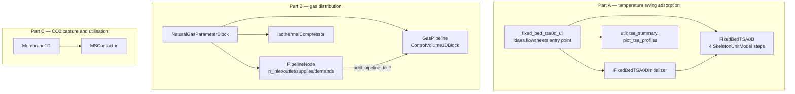
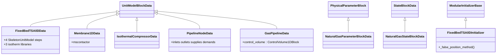
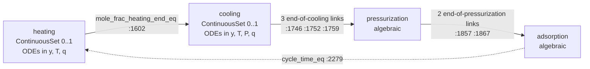
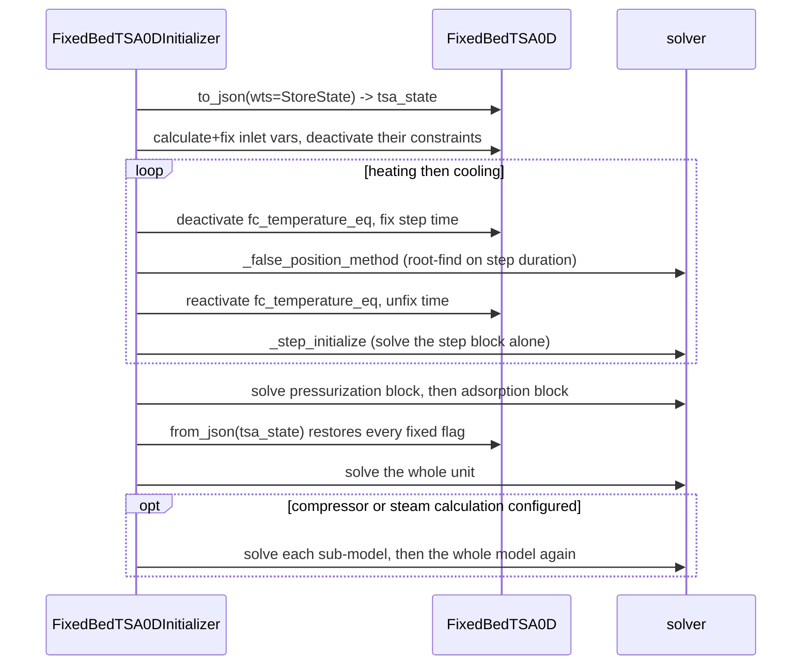
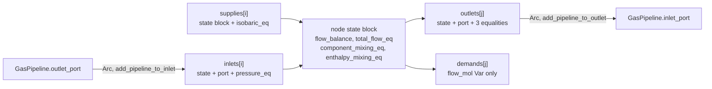

# 23 — Temperature swing adsorption, gas distribution and carbon capture utilisation

> **Doc ID** 23 · **Repo SHA** 70a8f4fe1 (IDAES-PSE v2.13.0rc0) · **Source roots** `idaes/models_extra/temperature_swing_adsorption/`, `idaes/models_extra/gas_distribution/`, `idaes/models_extra/co2_capture_and_utilization/`
> **Owns** 15 modules / 6,320 LOC · **Assets** 1 (§10) · **Siblings** [04](04_control_volume_framework.md), [05](05_property_and_reaction_framework.md), [06](06_model_preparation_initializers_and_scalers.md), [11](11_unit_models_network_contactors_and_control.md), [17](17_costing_framework_and_libraries.md), [24](24_reference_flowsheets_and_demonstrations.md)

This document covers three separate model families that share no code. They are grouped here
because each is too small to carry a document of its own: 4,544 LOC of temperature swing
adsorption, 1,463 LOC of gas pipeline networks, 313 LOC of membrane gas separation. Each
family gets its own part, and no claim is made that they form a subsystem. Section 1 records
what they do and do not have in common; sections 2 onward keep the three parts visibly
separate inside each template heading.

---

## 0. Scope and source map

| Part | File | LOC | Purpose | Covered in § |
|---|---|---:|---|---|
| A | `idaes/models_extra/temperature_swing_adsorption/__init__.py` | 19 | Re-exports `FixedBedTSA0D`, three enumerations and the Initializer object | 2 |
| A | `idaes/models_extra/temperature_swing_adsorption/fixed_bed_tsa0d.py` | 2,880 | `FixedBedTSA0DData`, the `Adsorbent`, `SteamCalculationType` and `TransformationScheme` enumerations, three adsorbent isotherm libraries, the four cycle steps | 2, 3, 4, 5, 6, 7, 11, 12 |
| A | `idaes/models_extra/temperature_swing_adsorption/initializer.py` | 926 | `FixedBedTSA0DInitializer` — an eight-stage routine with an embedded root-finding loop | 2, 3, 5, 7, 9, 11, 12 |
| A | `idaes/models_extra/temperature_swing_adsorption/fixed_bed_tsa0d_ui.py` | 549 | The module registered under the `idaes.flowsheets` entry-point group: `export_to_ui`, `build`, `export`, `initialize`, `solve` | 2, 5, 7, 8, 10, 12 |
| A | `idaes/models_extra/temperature_swing_adsorption/util.py` | 170 | `tsa_summary`, `plot_tsa_profiles` | 2, 7, 10 |
| B | `idaes/models_extra/gas_distribution/__init__.py`, `properties/__init__.py`, `unit_models/__init__.py` | 0 | Empty package markers | 2 |
| B | `idaes/models_extra/gas_distribution/properties/natural_gas.py` | 447 | `NaturalGasParameterBlockData`, `NaturalGasStateBlockData` and a hand-written `NaturalGasStateBlock` — a single-pseudo-component, isothermal-use property package | 2, 3, 5, 6, 7, 12 |
| B | `idaes/models_extra/gas_distribution/unit_models/compressor.py` | 190 | `IsothermalCompressorData` — boost pressure, compression coefficient, power | 2, 3, 4, 5, 6, 7 |
| B | `idaes/models_extra/gas_distribution/unit_models/node.py` | 423 | `PipelineNodeData` — a variable-arity junction with supplies, demands and mixing rules | 2, 3, 4, 5, 6, 7, 11, 12 |
| B | `idaes/models_extra/gas_distribution/unit_models/pipeline.py` | 403 | `GasPipelineData` — a `ControlVolume1DBlock` plus a bulk momentum balance | 2, 3, 4, 5, 6, 7, 11, 12 |
| C | `idaes/models_extra/co2_capture_and_utilization/__init__.py` | 0 | Empty package marker | 2 |
| C | `idaes/models_extra/co2_capture_and_utilization/unit_models/__init__.py` | 13 | Re-exports `Membrane1D` and `MembraneFlowPattern` | 2 |
| C | `idaes/models_extra/co2_capture_and_utilization/unit_models/membrane_1d.py` | 300 | `Membrane1DData` and the `MembraneFlowPattern` enumeration — an `MSContactor` wrapper with a permeance-driven transfer term | 2, 3, 4, 5, 6, 7, 12 |
| C | `idaes/models_extra/co2_capture_and_utilization/unit_models/README.md` | — | One line of prose; 75 bytes | 10 |

Part A is temperature swing adsorption, Part B gas distribution, Part C carbon capture and
utilisation. The sibling directory
`idaes/models_extra/temperature_swing_adsorption/costing/` is **not** in this scope: its
module and its two JSON parameter files belong to
[17](17_costing_framework_and_libraries.md); see §10.

Totals: 15 Python modules, 6,320 LOC, 1 shipped asset, 28 string-literal configuration keys
across six `CONFIG` declarations, 4 enumerations, 7 classes declared by
`declare_process_block_class`, and **zero** `NotImplementedError` hook sites,
`find_library`/`ExternalFunction` bindings and deprecation sites. Four of the fifteen
modules are empty package markers.

---

## 1. Architectural role

The three families have no source dependency on one another, no shared base class, no shared
property package and no shared helper module. `imports.csv` records exactly three import
edges anywhere in the source tree that name a module in this scope, and all three are
internal to Part A: `fixed_bed_tsa0d_ui.py:29` and `:36` and `initializer.py:36`. What they
do have in common is a shape: each is a leaf of the library, consuming the block protocol,
the control volume framework or the multi-stream contactor, adding equipment-specific
correlations, and consumed only by its own tests.

**Part A** is a cyclic process reduced to a steady algebraic model. A
temperature swing adsorption bed passes through heating, cooling, pressurisation
and adsorption; `FixedBedTSA0DData` (`idaes/models_extra/temperature_swing_adsorption/fixed_bed_tsa0d.py:124`)
builds all four as sibling `SkeletonUnitModel` blocks on one unit model, gives
the first two their own normalised `ContinuousSet` time domains, discretizes
those with a `pyomo.dae` transformation, and links the four with end-of-step
equality constraints. It owns no control volume and no state block.

**Part B** models a pipeline *network* rather than a process flowsheet. The
distinguishing object is `PipelineNodeData`
(`idaes/models_extra/gas_distribution/unit_models/node.py:40`), whose port count
is configuration rather than structure: four integer keys decide how many inlet
pipelines, outlet pipelines, supplies and demands the node carries, and the
corresponding indexed `Block`s and `Port`s are created at build time. Pipelines
are attached afterwards by method call — `add_pipeline_to_inlet` (`:385`) and
`add_pipeline_to_outlet` (`:405`) create the Pyomo `Arc` — so the network
topology is assembled imperatively rather than declared. This is a different
idea from the fixed named `inlet`/`outlet` ports that
[03 §5](03_block_hierarchy_and_construction_protocol.md#5-construction-and-call-sequences)
describes, and §5.8 sets out the consequences.

**Part C** is one unit model, `Membrane1DData`
(`idaes/models_extra/co2_capture_and_utilization/unit_models/membrane_1d.py:54`),
which delegates every balance to an `MSContactor`
([11](11_unit_models_network_contactors_and_control.md)) and contributes two
constraint families of its own: a permeance-driven material transfer term and an
isothermal link between the two sides.

*Three disjoint graphs: no edge crosses a subgraph boundary, which is the whole of the relationship between the three families.*

---

## 2. Public surface inventory

| Symbol | Kind | Declared at | Exported via | Stability signal |
|---|---|---|---|---|
| `Adsorbent` | enum | `idaes/models_extra/temperature_swing_adsorption/fixed_bed_tsa0d.py:92` | package `__init__.py:13` | re-exported; no `__all__` |
| `SteamCalculationType` | enum | `idaes/models_extra/temperature_swing_adsorption/fixed_bed_tsa0d.py:102` | package `__init__.py:13` | re-exported |
| `TransformationScheme` | enum | `idaes/models_extra/temperature_swing_adsorption/fixed_bed_tsa0d.py:112` | package `__init__.py:13` | re-exported; duplicates a concept held elsewhere as strings (§12.1) |
| `FixedBedTSA0DData` / `FixedBedTSA0D` | class pair | `idaes/models_extra/temperature_swing_adsorption/fixed_bed_tsa0d.py:124` | package `__init__.py:13` | the container is generated by the decorator; the one narrative page in `docs/` names it |
| `FixedBedTSA0DInitializer` | class | `idaes/models_extra/temperature_swing_adsorption/initializer.py:47` | package `__init__.py:19` | re-exported; not named by any `default_initializer` (§3.2) |
| `tsa_summary`, `plot_tsa_profiles` | functions | `idaes/models_extra/temperature_swing_adsorption/util.py:29`, `:69` | module import | the first is imported by the UI module (`fixed_bed_tsa0d_ui.py:36`); the second has no in-tree caller |
| `export_to_ui` | function | `idaes/models_extra/temperature_swing_adsorption/fixed_bed_tsa0d_ui.py:50` | `idaes.flowsheets` entry point | the sole in-tree member of that group (§8, §12.3) |
| `build`, `export`, `initialize`, `solve` | functions | `idaes/models_extra/temperature_swing_adsorption/fixed_bed_tsa0d_ui.py:134`, `:201`, `:507`, `:528` | referenced from `export_to_ui` | the `do_build` / `do_export` / `do_solve` callbacks |
| `model_name`, `model_name_for_ui`, `unit_name` | module constants | `idaes/models_extra/temperature_swing_adsorption/fixed_bed_tsa0d_ui.py:45`–`:47` | module import | `unit_name` is the option `category` string |
| `NaturalGasParameterBlockData` / `NaturalGasParameterBlock` | class pair | `idaes/models_extra/gas_distribution/properties/natural_gas.py:54` | module import only | the package `__init__.py` is empty; the container is generated by the decorator |
| `NaturalGasStateBlock` | class | `idaes/models_extra/gas_distribution/properties/natural_gas.py:161` | module import only | hand-written, then shadowed by the synthesized class of the same name (§12.4) |
| `NaturalGasStateBlockData` | class | `idaes/models_extra/gas_distribution/properties/natural_gas.py:176` | — | carries `block_class=` — the only such use in this scope |
| `IsothermalCompressorData` / `IsothermalCompressor`, `PipelineNodeData` / `PipelineNode`, `GasPipelineData` / `GasPipeline` | class pairs | `idaes/models_extra/gas_distribution/unit_models/compressor.py:40`, `node.py:40`, `pipeline.py:65` | module import only | none carries a class docstring; all three modules open with pylint suppressions |
| `EXPLICIT_DISCRETIZATION_SCHEMES`, `IMPLICIT_DISCRETIZATION_SCHEMES`, `UNSUPPORTED_DISCRETIZATION_SCHEMES` | module constants | `idaes/models_extra/gas_distribution/unit_models/pipeline.py:51`, `:54`, `:58` | module import | three sets of scheme name strings |
| `MembraneFlowPattern` | enum | `idaes/models_extra/co2_capture_and_utilization/unit_models/membrane_1d.py:43` | subpackage `__init__.py:13` | re-exported; duplicates a concept held elsewhere (§12.2) |
| `Membrane1DData` / `Membrane1D` | class pair | `idaes/models_extra/co2_capture_and_utilization/unit_models/membrane_1d.py:54` | subpackage `__init__.py:13` | the container is generated by the decorator |

No module in this scope declares `__all__`, carries a deprecation decorator, or is reached
by an autodoc directive. `docs/` holds one narrative page for Part A
(`.../temperature_swing_adsorption/fixed_bed_tsa0d.rst`, equations and two figures, no
`automodule`) and one for Part C (`.../membrane_model/1d_membrane.rst`); the string
`gas_distribution` does not appear anywhere under `docs/`.

---

## 3. Class hierarchy and type taxonomy

*Every class in scope is one level deep from a core base class; there is no inheritance between any two classes owned by this document.*

| Class | Base(s) | Declared at | Decorator | Container class | Key overrides |
|---|---|---|---|---|---|
| `FixedBedTSA0DData` | `UnitModelBlockData` | `idaes/models_extra/temperature_swing_adsorption/fixed_bed_tsa0d.py:124` | `@declare_process_block_class("FixedBedTSA0D")` | `FixedBedTSA0D` | `build`, `initialize_build`, `fix_initialization_states`, `calculate_scaling_factors`, `_get_performance_contents`, `_get_stream_table_contents` |
| `FixedBedTSA0DInitializer` | `ModularInitializerBase` | `idaes/models_extra/temperature_swing_adsorption/initializer.py:47` | none | — | `initialize`, `initialization_routine`; sets `CONFIG.solver` |
| `NaturalGasParameterBlockData` | `PhysicalParameterBlock` | `idaes/models_extra/gas_distribution/properties/natural_gas.py:54` | `@declare_process_block_class("NaturalGasParameterBlock")` | `NaturalGasParameterBlock` | `build`, `define_metadata` |
| `NaturalGasStateBlock` | `StateBlock` | `idaes/models_extra/gas_distribution/properties/natural_gas.py:161` | none | — | none — the body is `pass` |
| `NaturalGasStateBlockData` | `StateBlockData` | `idaes/models_extra/gas_distribution/properties/natural_gas.py:176` | `@declare_process_block_class("NaturalGasStateBlock", block_class=NaturalGasStateBlock)` | `NaturalGasStateBlock` | `build`, 15 on-demand builders, `define_state_vars`, 4 `get_*_terms` |
| `IsothermalCompressorData` | `UnitModelBlockData` | `idaes/models_extra/gas_distribution/unit_models/compressor.py:40` | `@declare_process_block_class("IsothermalCompressor")` | `IsothermalCompressor` | `build` plus four `add_*_equation` methods |
| `PipelineNodeData` | `UnitModelBlockData` | `idaes/models_extra/gas_distribution/unit_models/node.py:40` | `@declare_process_block_class("PipelineNode")` | `PipelineNode` | `build` plus 22 methods |
| `GasPipelineData` | `UnitModelBlockData` | `idaes/models_extra/gas_distribution/unit_models/pipeline.py:65` | `@declare_process_block_class("GasPipeline")` | `GasPipeline` | `build` plus eight `add_*` / `get_*` methods |
| `Membrane1DData` | `UnitModelBlockData` | `idaes/models_extra/co2_capture_and_utilization/unit_models/membrane_1d.py:54` | `@declare_process_block_class("Membrane1D")` | `Membrane1D` | `build`, `_make_geometry`, `_make_performance`, `_get_stream_table_contents` |

### 3.1 Enumerations

Four enumerations, all `Enum` subclasses with no methods. Anchors in the *Consumed at*
column are lines in the declaring module.

| Enum (declared at) | Member | Value | Meaning | Consumed at |
|---|---|---|---|---|
| `Adsorbent` (`fixed_bed_tsa0d.py:92`) | `zeolite_13x` | 1 | Zeolite 13X; Sips-type isotherm | `:342`, `:640`, `:1944` |
| | `mmen_mg_mof_74` | 2 | mmen-Mg(dobpdc); stepped weighted isotherm | `:344`, `:728`, `:2002` |
| | `polystyrene_amine` | 3 | Amine-functionalised polystyrene; Toth isotherm | `:346`, `:858`, `:2112` |
| `SteamCalculationType` (`fixed_bed_tsa0d.py:102`) | `none` | 0 | `_add_steam_calc` is not called | `:597` |
| | `simplified` | 1 | Two-coefficient surrogate from heat duty to steam mass flow | `:2641` |
| | `rigorous` | 2 | A `Heater` sub-model constrained to total saturation | `:2604`, `:2652` |
| `TransformationScheme` (`fixed_bed_tsa0d.py:112`) | `useDefault` | 0 | Resolve from `transformation_method` during `build` | `:289`, `:294` |
| | `backward` | 1 | Mapped to the Pyomo scheme name `BACKWARD` | `:1876` |
| | `forward` | 2 | Mapped to `FORWARD` | `:1877` |
| | `lagrangeRadau` | 3 | Mapped to `LAGRANGE-RADAU`; the default | `:1878` |
| `MembraneFlowPattern` (`membrane_1d.py:43`) | `COUNTERCURRENT` | 1 | Sweep side gets `FlowDirection.backward`; the default | `:162` |
| | `COCURRENT` | 2 | Sweep side gets `FlowDirection.forward` | `:160` |

`TransformationScheme` and `MembraneFlowPattern` each restate a concept the library already
spells differently elsewhere; §12.1 and §12.2 give the two cases with their consequences.

### 3.2 Initializer and Scaler adoption

`_generated/retrofit.csv` carries one row per `@declare_process_block_class` site. All seven
rows in this scope read the same way:

| Data class | Container class | `default_initializer` | `default_scaler` | Declares either |
|---|---|---|---|---|
| `FixedBedTSA0DData` | `FixedBedTSA0D` | not declared | not declared | no |
| `NaturalGasParameterBlockData` | `NaturalGasParameterBlock` | not declared | not declared | no |
| `NaturalGasStateBlockData` | `NaturalGasStateBlock` | not declared | not declared | no |
| `IsothermalCompressorData` | `IsothermalCompressor` | not declared | not declared | no |
| `PipelineNodeData` | `PipelineNode` | not declared | not declared | no |
| `GasPipelineData` | `GasPipeline` | not declared | not declared | no |
| `Membrane1DData` | `Membrane1D` | not declared | not declared | no |

Adoption is therefore 0 of 7 for Initializer objects and 0 of 7 for Scaler objects, against
23 and 24 of the 160 declared process block classes tree-wide ([01
§11](01_glossary_and_conventions.md#11-counting-conventions)). The five unit models inherit
`default_initializer = SingleControlVolumeUnitInitializer` from `UnitModelBlockData`
(`idaes/core/base/unit_model.py:61`).

`FixedBedTSA0DInitializer`
(`idaes/models_extra/temperature_swing_adsorption/initializer.py:47`) is one of four
Initializer subclasses defined anywhere under `idaes/models_extra/`; each of the other three
— `SolventReboilerInitializer`, `CrossFlowHeatExchanger1DInitializer` and
`Heater1DInitializer` — *is* named by the `default_initializer` of its own unit model, and
this one is not, so reaching it requires importing it by name, as
`fixed_bed_tsa0d_ui.initialize`
(`idaes/models_extra/temperature_swing_adsorption/fixed_bed_tsa0d_ui.py:507`) and every test
in `test_fixed_bed_tsa0d.py` do. It is also the only one of the four deriving from
`ModularInitializerBase` (`idaes/core/initialization/initializer_base.py:541`) rather than
`SingleControlVolumeUnitInitializer`
(`idaes/core/initialization/general_hierarchical.py:29`), which follows from `FixedBedTSA0D`
owning no control volume; see [06
§3.3](06_model_preparation_initializers_and_scalers.md#33-retrofit-adoption). Suffix-based
scaling is present instead: `calculate_scaling_factors`
(`idaes/models_extra/temperature_swing_adsorption/fixed_bed_tsa0d.py:2672`) is 89 lines of
`iscale.set_scaling_factor` guarded by `iscale.get_scaling_factor(...) is None`, and
`_add_compressor` (`:2541`) and `_add_steam_calc` (`:2592`) set factors on the sub-model
work and heat variables directly (`:2588`, `:2589`, `:2590`, `:2635`). No other module in
scope sets a scaling factor.

---

## 4. Configuration reference

28 string-literal keys across six declarations, plus two declared from a loop variable. None
is marked required, yet four defaults are rejected at build time: `compressor_properties`
and `steam_properties` when the matching flag is set (§5.1), and `property_package` on each
of the three gas distribution unit models, whose `None` default fails on first use (§5.7).

### 4.1 `FixedBedTSA0DData.CONFIG`

`UnitModelBlockData.CONFIG()` extended at
`idaes/models_extra/temperature_swing_adsorption/fixed_bed_tsa0d.py:131`. The inherited
`dynamic` and `has_holdup` keys are documented in [03
§4](03_block_hierarchy_and_construction_protocol.md#4-configuration-reference).

| Key | Domain / validator | Default | Req. | Effect on build | Anchor |
|---|---|---|---|---|---|
| `adsorbent` | `In(Adsorbent)` | `Adsorbent.zeolite_13x` | no | Selects one of three `_add_parameters_*` methods and one of three isotherm methods | `:131` |
| `number_of_beds` | `int` | `120` | no | `None` sets `calculate_beds`, turning `velocity_in` from an `Expression` into a bounded `Var` and `number_beds_ads` into a calculated quantity | `:143` |
| `transformation_method` | `is_transformation_method` | `'dae.collocation'` | no | Names the Pyomo transformation applied to both cycle-step time domains | `:158` |
| `transformation_scheme` | `In(TransformationScheme)` | `TransformationScheme.lagrangeRadau` | no | Resolved against the method in `build`, then mapped to a Pyomo scheme string in `_apply_transformation` | `:173` |
| `finite_elements` | `int` | `20` | no | `nfe` for both transformations | `:195` |
| `collocation_points` | `int` | `6` | no | `ncp`, used only by `dae.collocation`, checked unconditionally (§12.5) | `:205` |
| `compressor` | `Bool` | `False` | no | Adds a `PressureChanger` sub-model and four linking constraints | `:215` |
| `compressor_properties` | `is_physical_parameter_block` | `useDefault` | no | Property package for that sub-model; leaving it unset with `compressor=True` raises | `:228` |
| `steam_calculation` | `In(SteamCalculationType)` | `SteamCalculationType.none` | no | Selects no steam estimate, a surrogate, or a `Heater` sub-model | `:239` |
| `steam_properties` | `is_physical_parameter_block` | `useDefault` | no | Property package for the `Heater`; leaving it unset with `rigorous` raises | `:254` |

The docstring of `transformation_scheme` names `TransformationScheme.useDefault` as the
default while the declared default is `TransformationScheme.lagrangeRadau` (`:176`); both
are accepted, and `useDefault` is resolved at `:289`/`:294`.

### 4.2 `GasPipelineData.CONFIG`

`UnitModelBlockData.CONFIG()` extended at
`idaes/models_extra/gas_distribution/unit_models/pipeline.py:69`.

| Key | Domain / validator | Default | Req. | Effect on build | Anchor |
|---|---|---|---|---|---|
| `property_package` | `is_physical_parameter_block` | `None` | yes, in effect | Passed to `ControlVolume1DBlock`; a `None` value fails at `len(property_package.phase_list)` | `:69` |
| `transformation_method` | `is_transformation_method` | `'dae.finite_difference'` | no | Forwarded to the control volume | `:73` |
| `transformation_scheme` | `is_transformation_scheme` | `'FORWARD'` | no | Forwarded to the control volume; also read directly to decide which momentum-balance index to deactivate | `:83` |
| `finite_elements` | `int` | `1` | no | Forwarded to the control volume | `:93` |
| `collocation_points` | `int` | `None` | no | Forwarded; required by the control volume when the method is `dae.collocation` | `:103` |

The whole block is forwarded verbatim — `cv_config = config()` (`:151`) then
`ControlVolume1DBlock(**cv_config)` (`:152`) — so every key above, plus the inherited
`dynamic` and `has_holdup`, reaches [04
§4.3](04_control_volume_framework.md#43-controlvolume1dblockdataconfig) under the same
names.

### 4.3 `PipelineNodeData.CONFIG`

`UnitModelBlockData.CONFIG()` extended at
`idaes/models_extra/gas_distribution/unit_models/node.py:44`. None of the five declarations
carries a `description` or `doc` string.

| Key | Domain / validator | Default | Req. | Effect on build | Anchor |
|---|---|---|---|---|---|
| `property_package` | `is_physical_parameter_block` | `None` | yes, in effect | Builds the node state block and every inlet, outlet and supply state block | `:44` |
| `n_inlet_pipelines` | `int` | `1` | no | Size of `inlet_set`; that many inlet `Block`s, each with a state block, a `Port` and a pressure equality | `:48` |
| `n_outlet_pipelines` | `int` | `1` | no | Size of `outlet_set`; each outlet `Block` also gets mole-fraction and temperature equalities | `:52` |
| `n_supplies` | `int` | `0` | no | Size of `supply_set`; each supply carries a state block and an isobaric constraint | `:56` |
| `n_demands` | `int` | `0` | no | Size of `demand_set`; each demand carries only a time-indexed `flow_mol` variable | `:60` |

### 4.4 `IsothermalCompressorData.CONFIG`

`UnitModelBlockData.CONFIG()` extended at
`idaes/models_extra/gas_distribution/unit_models/compressor.py:43` with a single key.

| Key | Domain / validator | Default | Req. | Effect on build | Anchor |
|---|---|---|---|---|---|
| `property_package` | `is_physical_parameter_block` | `None` | yes, in effect | Builds `inlet_state` and `outlet_state` | `:43` |

### 4.5 `Membrane1DData.CONFIG`

`UnitModelBlockData.CONFIG()` extended at
`idaes/models_extra/co2_capture_and_utilization/unit_models/membrane_1d.py:104`.

| Key | Domain / validator | Default | Req. | Effect on build | Anchor |
|---|---|---|---|---|---|
| `sweep_flow` | `Bool` | `True` | no | `False` sets `has_feed=False` on the sweep stream and suppresses `sweep_side_inlet` | `:104` |
| `finite_elements` | `int` | `5` | no | `number_of_finite_elements` for the `MSContactor`; also divides `length` and `area` per cell | `:114` |
| `flow_type` | `In(MembraneFlowPattern)` | `MembraneFlowPattern.COUNTERCURRENT` | no | Sets the sweep stream's `flow_direction` | `:124` |
| `feed_side` | `Stream_Config()` | empty | no | Declared from the loop variable at `:137`; §4.6 | `:137` |
| `sweep_side` | `Stream_Config()` | empty | no | The same declaration, second pass of the loop | `:137` |

The two `*_side` keys are declared inside `for side_name in ["feed", "sweep"]` (`:136`), so
their names are computed rather than literal and do not appear in
`_generated/config_keys.csv`.

### 4.6 `Membrane1DData.Stream_Config`

A class-level `ConfigDict()` at
`idaes/models_extra/co2_capture_and_utilization/unit_models/membrane_1d.py:59`, instantiated
twice by the loop above. It is a local template, not the module-level `STREAM_CONFIG` that
`MSContactor` declares (`idaes/models/unit_models/mscontactor.py:831`), and carries four of
that template's keys.

| Key | Domain / validator | Default | Req. | Effect on build | Anchor |
|---|---|---|---|---|---|
| `property_package` | `is_physical_parameter_block` | `useDefault` | no | Property package for that side's state blocks | `:61` |
| `property_package_args` | implicit `ConfigDict` | empty | no | Forwarded to each state block | `:74` |
| `has_energy_balance` | `Bool` | `True` | no | Forwarded to the `MSContactor` stream configuration | `:87` |
| `has_pressure_balance` | `Bool` | `True` | no | The same | `:95` |

`build` converts each side's `ConfigDict` to a plain dict (`:156`, `:157`) and adds
`flow_direction`, and `has_feed` when `sweep_flow` is false, before handing the pair to
`MSContactor` (`:175`); keys that the `MSContactor` stream template supports but this one
does not declare are unreachable through `Membrane1D`. `NaturalGasParameterBlockData`
declares no configuration keys of its own.

---

## 5. Construction and call sequences

### 5.1 `FixedBedTSA0DData.build`

`build` (`idaes/models_extra/temperature_swing_adsorption/fixed_bed_tsa0d.py:266`) is 333
lines and runs in eight stages.

1. `super().build()` resolves `self.config` and the dynamic flags ([03
   §5.4](03_block_hierarchy_and_construction_protocol.md#54-configuration-resolution)).
2. Resolve `transformation_scheme`: `useDefault` becomes `backward` for
   `dae.finite_difference` (`:289`) and `lagrangeRadau` for `dae.collocation` (`:294`); a
   finite-difference method with any other scheme, or a collocation method with any scheme
   but `lagrangeRadau`, raises `ConfigurationError` (`:300`, `:310`). The resolved value is
   written back into `self.config`.
3. Reject `compressor=True` with `compressor_properties` still `useDefault` (`:318`) and
   `steam_calculation=rigorous` with `steam_properties` still `useDefault` (`:327`); set
   `self.calculate_beds` from whether `number_of_beds` is `None` (`:333`).
4. `_add_general_parameters()` (`:600`) creates the `component_list` Pyomo `Set` `{N2, CO2,
   H2O, O2}` (`:607`), the `isotherm_components` subset `{CO2, N2}` (`:610`) and five Pyomo
   `Param`s. One of `_add_parameters_zeolite_13x` (`:640`), `_add_parameters_mmen_Mg_MOF_74`
   (`:728`) or `_add_parameters_polystyrene_amine` (`:858`) follows, selected by
   `config.adsorbent`; each creates the same eight bed and particle parameters under the
   same names plus its own six to nine isotherm coefficients, so the three sets are mutually exclusive
   alternatives rather than a union.
5. Twelve design and operating `Var`s (`:350`–`:427`), seventeen `Expression`s
   (`:431`–`:523`), and the two closure constraints `velocity_mf_eq` (`:527`, Kunii and
   Levenspiel) and `pressure_drop_eq` (`:544`, Ergun). When `calculate_beds` is set,
   `velocity_in` is a bounded `Var` (`:416`); otherwise it is an `Expression` (`:487`).
6. `_add_inlet_port()` (`:948`), then the four cycle steps in order: `_add_heating_step`
   (`:1223`), `_add_cooling_step` (`:1417`), `_add_pressurization_step` (`:1628`),
   `_add_adsorption_step` (`:1762`).
7. `_apply_transformation()` (`:1870`), `_make_performance()` (`:2177`), then
   `_add_outlet_port()` (`:1010`) and `_emissions()` (`:2412`). The outlet-port constraints
   come after the performance block because they read `recovery` and
   `flue_gas_processed_year_target` (`:1063`).
8. Conditionally `_add_compressor()` (`:2541`) and `_add_steam_calc()` (`:2592`).

### 5.2 The four cycle steps

Each step is a `SkeletonUnitModel` (`idaes/models/unit_models/skeleton_model.py:39`)
attached to the unit model, so the four are sibling Pyomo Blocks rather than control
volumes. Only heating and cooling are differential.

*The cycle closes through six end-of-step equality constraints rather than through a shared time domain; the two differential steps each carry their own normalised domain.*

| Step | Block at | Time representation | Unknown fixed by the final condition |
|---|---|---|---|
| heating | `:1228` | `ContinuousSet` `(0, 1)` (`:1240`), duration `Var` (`:1237`) | `fc_temperature_eq` (`:1414`) ties the end temperature to `temperature_desorption` |
| cooling | `:1422` | `ContinuousSet` `(0, 1)` (`:1428`), duration `Var` (`:1425`) | `fc_temperature_eq` (`:1625`) ties it to `temperature_adsorption` |
| pressurization | `:1633` | scalar duration `Var` (`:1642`) | `pressurization_time_eq` (`:1720`) |
| adsorption | `:1767` | scalar duration `Var` (`:1770`) | `adsorption_time_eq` (`:1849`), from a shock-wave propagation velocity (`:1814`, `:1835`) |

Equilibrium loading is dispatched per step through `_equil_loading(i, pressure,
temperature)` (`:1924`), which selects the adsorbent's isotherm method; the four steps call
it from `equil_loading_eq` at `:1389`, `:1591`, `:1710` and `:1804`. `_apply_transformation`
(`:1870`) maps the three non-default `TransformationScheme` members onto Pyomo scheme
strings through a local dict (`:1875`), constructs `self.discretizer =
TransformationFactory(config.transformation_method)`, and applies it once per differential
step with `wrt=` that step's own `time_domain`; the collocation branch adds
`ncp=config.collocation_points` (`:1904`). Two `ConfigurationError` guards follow the
transformation rather than preceding it — `finite_elements is None` (`:1908`) and
`collocation_points is None` (`:1916`); §12.5 records what that ordering means.

### 5.3 `FixedBedTSA0DInitializer`

`initialize` (`idaes/models_extra/temperature_swing_adsorption/initializer.py:57`) adds two
keyword arguments to the base signature — `heating_time_guess=1000` and
`cooling_time_guess=500` — stores them on `self`, forces `exclude_unused_vars` to `True`
with a logged warning if the caller passed `False` (`:68`), and delegates to
`ModularInitializerBase.initialize`. `initialization_routine` (`:88`) is 568 lines and eight
numbered stages.

*Every stage asserts zero degrees of freedom before solving and raises `InitializationError` otherwise; the state snapshot taken first is what makes the per-step fixing reversible.*

`to_json(blk, wts=StoreState, return_dict=True)` (`:118`, with `StoreState` from
`idaes/core/initialization/initializer_base.py:57`) captures every value and fixed flag
first. The heating stage then calculates and fixes `flow_mol_in_total`,
`pressure_adsorption` and `mole_frac_in` from their inlet constraints (`:130`), deactivates
`heating.fc_temperature_eq`, fixes `heating.time` to the guess (`:137`, `:138`), runs
`_false_position_method` (`:142`), restores the final condition and solves the step
(`:156`–`:161`); the cooling stage repeats that shape after calculating
`mole_frac_heating_end` (`:176`, `:184`). Pressurization and adsorption skip the
root-finding — their end-of-previous-step variables are calculated and fixed, degrees of
freedom checked (`:249`, `:281`) and the block solved. `from_json(blk, sd=tsa_state,
wts=StoreState)` (`:294`) undoes every fix and deactivation in one call, `velocity_in` or
`pressure_drop` is recovered from `pressure_drop_eq` according to `calculate_beds` (`:297`,
`:299`), the sub-models are deactivated (`:303`, `:308`) and the whole unit solved (`:316`)
before stages 7 and 8 reactivate and initialize them (`:336`, `:409`) and solve the
combination (`:537`).

### 5.4 The false position method

`_false_position_method(blk, cycle_step, t_guess)`
(`idaes/models_extra/temperature_swing_adsorption/initializer.py:702`) solves for a
cycle-step duration by treating the step block as a function of its fixed `time` variable.
The residual is `temperature_desorption - temperature[1]` for the heating step and
`temperature[1] - temperature_adsorption` for any other, selected by testing the block's
local name (`:761`, `:803`, `:869`). It runs in two phases: **bracketing** (`:732`–`:825`)
fixes `time` to the guess, solves, then repeatedly multiplies by 1.2 or halves — the
direction chosen once, from the sign of the first residual — until the residual changes
sign; **regula falsi** (`:834`–`:882`) applies the secant update `x2 = x0 - (x1 - x0) * f_x0
/ (f_x1 - f_x0)` (`:842`), one solve per iteration, retaining whichever endpoint keeps the
sign change, and stops when the absolute residual falls to 1 K (`:882`). Neither loop
carries an iteration cap; §12.6 records the consequence.

### 5.5 The UI module

`fixed_bed_tsa0d_ui` is the module named by the sole entry in the `idaes.flowsheets`
entry-point group (§12.3). The group itself belongs to [32](32_repository_engineering.md)
and its place in the extension-point catalogue to [31](31_extension_point_catalog.md); what
follows is what this module supplies to it.

`export_to_ui()`
(`idaes/models_extra/temperature_swing_adsorption/fixed_bed_tsa0d_ui.py:50`) constructs an
`api.FlowsheetInterface` with `do_export=export`, `do_build=build` and `do_solve=solve`, and
five build options — `adsorbent`, `number_of_beds`, `transformation_method`,
`transformation_scheme` and `collocation_points` — each a dict of display name, allowed
values, default value and a `category` set to the module constant `unit_name`; a sixth,
`finite_elements`, survives only as commented-out text (`:108`), while `build` still reads
one if a caller supplies it (`:167`). `build(build_options=None, **kwargs)` (`:134`) creates
a `ConcreteModel` with a steady `FlowsheetBlock`, filters the options by category (`:144`),
assembles the `FixedBedTSA0D` keyword arguments, fixes a flue-gas composition and six design
variables (`:183`–`:193`), logs the degrees of freedom (`:196`) and returns the model, with
`adsorbent` converted to its enumeration member by `Adsorbent[...]` (`:148`) while
`transformation_scheme` is passed through as the option's raw string (`:153`). `export`
(`:201`) is 304 lines holding 25 `exports.add(...)` calls that register inlet flows,
operating conditions, bed geometry, step times and performance metrics with display units
and rounding. `initialize(fs, **kwargs)` (`:507`) constructs a `FixedBedTSA0DInitializer` with
`output_level=idaes_log.INFO` and two solver options and runs it on `fs.tsa`;
`solve(flowsheet, **kwargs)` (`:528`) calls `iutil.scaling.calculate_scaling_factors`, calls
`initialize` itself (`:536`), builds an `ipopt` solver with `SolverFactory` directly, solves
`fs.model()` and prints `tsa_summary`.

### 5.6 `NaturalGasStateBlockData`

`build` (`idaes/models_extra/gas_distribution/properties/natural_gas.py:177`) creates four
state variables — `flow_mol`, `pressure`, `temperature` and `mole_frac_comp` — and, only
when `config.defined_state` is false, the `sum_component_eq` closure constraint (`:212`).
Everything else is built on demand: `define_metadata` (`:94`) registers nineteen properties
through `add_properties` (`:101`) and one custom property, `speed_of_sound`, through
`define_custom_properties` (`:136`), each naming an underscore-prefixed builder method that
`build_on_demand` calls ([05
§3](05_property_and_reaction_framework.md#3-class-hierarchy-and-type-taxonomy)). Three of
those builders create something other than an `Expression`: `_compress_fact` (`:348`)
creates a `Param` fixed at 0.80, and `_dens_mol` (`:357`) and `_speed_of_sound` (`:393`)
each create a `Var` plus a defining `Constraint`, which is what lets a caller fix either
quantity. `add_default_units` (`:145`) sets time in hours, length in kilometres, mass in
kilograms, amount in kilomoles and temperature in kelvin, while the state variables carry
`kmol/hr`, `bar` and `K`, so `get_material_density_terms` (`:431`) converts to `kmol/km**3`
before returning.

### 5.7 `GasPipelineData.build`

`build` (`idaes/models_extra/gas_distribution/unit_models/pipeline.py:114`) runs eight
steps. It rejects a property package with more than one phase (`:123`) or a single phase
that is not `Vap` (`:131`), and one whose metadata does not mark `pressure` as supported
(`:142`). It constructs `ControlVolume1DBlock(**config())` (`:152`) and calls
`add_geometry()`, `add_state_blocks(has_phase_equilibrium=False)` and
`add_phase_component_balances()` (`:153`–`:157`) — the momentum and energy dispatchers of
[04 §5.3](04_control_volume_framework.md#53-the-dispatchers) are never called, because this
unit writes both itself. `add_diameter()` (`:254`) creates `diameter` and the constraint
tying it to the control volume's `area`, and `add_friction_factor()` (`:229`) creates a
mutable `rugosity` `Param` defaulting to 0.025 mm and a `friction_factor` `Var` with a
Colebrook-type defining constraint. `add_flow_mass_linking_constraint()` (`:277`) creates
`control_volume.flow_mass` as a `Var` and links it to the property package's `flow_mass`
`Expression`, because a `DerivativeVar` requires a `Var` to differentiate — the same device
the one-dimensional control volume uses for its own flow terms.
`add_momentum_balance_equation()` (`:351`) creates `pressure_dx` (`:331`), creates
`flow_mass_dt` (`:319`) when the flowsheet is dynamic, and writes
`control_volume.momentum_balance` over time and length (`:381`). Only then does
`control_volume.apply_transformation()` run (`:171`).

In a dynamic model, one index of the momentum balance is deactivated afterwards: `[t0, x0]`
for an implicit scheme, `[t0, xf]` for an explicit one, and `CENTRAL` or `LAGRANGE-LEGENDRE`
raises `ValueError` (`:191`, `:193`, `:195`). Finally `inlet_port` and `outlet_port` are
built from Pyomo `Reference`s into the first and last points of the length domain (`:202`,
`:206`, `:216`, `:221`), so the ports are indexed by time alone with no linking constraints,
and `state_isothermal_eqn` (`:387`) equates each point's temperature to its predecessor,
skipping the first.

### 5.8 `PipelineNodeData.build` and network assembly

`build` (`idaes/models_extra/gas_distribution/unit_models/node.py:65`) applies the same
three property-package checks as the pipeline (`:74`, `:82`, `:93`), builds one node state
block with `defined_state=True` (`:104`), calls eight methods in sequence (`:106`–`:113`),
and finishes by setting four plain Python attributes on the block: the counters
`n_inlet_pipelines` and `n_outlet_pipelines` initialised to zero and the dicts
`_inlet_pipelines` and `_outlet_pipelines` (`:115`–`:118`).

`add_inlets` (`:231`) creates `inlet_set = Set(range(config.n_inlet_pipelines))` and an
indexed `Block` whose rule comes from `get_port_block_rule()` (`:201`). That rule gives each
member its own state block, a `Port` built by `_get_port_and_references` (`:135`) — a copy
of `UnitModelBlockData.add_port` (`idaes/core/base/unit_model.py:141`) that returns the
`Port` and its `Reference` components instead of attaching them — a `has_pipeline` flag, and
a pressure equality against the node state. `add_outlets` (`:240`) passes `outlet=True`,
which adds mole-fraction and temperature equalities as well, because at an inlet those two
quantities are set by the mixing rules instead. Those rules are `add_flow_balance_con`
(`:311`), equating supplies plus inlets to demands plus outlets; `add_total_flow_con`
(`:329`), defining the node's own `flow_mol`; `add_component_mixing_con` (`:344`), defining
its mole fractions from the incoming component flows; and `add_enthalpy_mixing_con`
(`:365`), defining its temperature through `get_enthalpy_flow_terms`.

*A node is a mixer whose inlet and outlet counts are configuration, and whose connection to a pipeline is made after construction by a method call that creates the Pyomo `Arc`.*

`add_pipeline_to_inlet(pipeline, idx=None)` (`:385`) defaults the index to the current
counter, rejects an index outside `inlet_set` and an inlet that already carries a pipeline,
creates `inlets[idx].arc = Arc(ports=(pipeline.outlet_port, inlets[idx].port))`, sets the
flag and increments the counter; `add_pipeline_to_outlet` (`:405`) is the mirror image. Both
accept any object exposing the right port name — the test flowsheet attaches an
`IsothermalCompressor` to a node outlet through `add_pipeline_to_outlet`
(`idaes/models_extra/gas_distribution/unit_models/tests/test_flowsheet.py:128`).

The port set of a `PipelineNode` is thus not a property of the class: it is read off four
integer configuration keys, and the connections are created by imperative calls after every
block exists rather than by a rule over a declared connectivity, so a flowsheet using this
family constructs blocks, calls `add_pipeline_to_*` once per edge, and only then applies
`network.expand_arcs`
(`idaes/models_extra/gas_distribution/unit_models/tests/test_flowsheet.py:138`).

### 5.9 `Membrane1DData.build`

`build` (`idaes/models_extra/co2_capture_and_utilization/unit_models/membrane_1d.py:142`)
converts each side's configuration to a dict, sets `feed_side` to `FlowDirection.forward`
and the sweep side according to `flow_type` (`:159`–`:163`), raises `ConfigurationError` for
any other value (`:165`), sets `has_feed=False` on the sweep side when `sweep_flow` is false
(`:172`), and constructs one `MSContactor` with both streams and
`number_of_finite_elements=config.finite_elements` (`:175`). Four `Port`s are created with
`extends=` against the contactor's own ports (`:180`–`:184`), the sweep inlet only when
`sweep_flow` is true. `_make_geometry` (`:189`) creates `area`, `length` and `cell_area` as
`Var`s, a `cell_length` `Expression` (`:196`) and the `area_per_cell` constraint (`:201`).
`_make_performance` (`:204`) intersects the two sides' chemical component lists (`:208`),
creates the `permeance` `Var` over time, contactor elements and that intersection (`:213`),
a mutable `gpu_factor` `Param` converting gas permeance units to SI (`:222`), the
`permeability_calculation` constraint (`:237`) that sets the contactor's
`material_transfer_term` from a partial-pressure difference, and the `isothermal_constraint`
(`:275`) equating the two sides' temperatures at each element. `permeability_calculation`
branches on the feed side's `get_material_flow_basis()`: `MaterialFlowBasis.molar` uses
`dens_mol`, `MaterialFlowBasis.mass` uses `dens_mass`, and anything else raises `TypeError`
from inside the constraint rule (`:246`).

---

## 6. Data structures, variables, constraints and invariants

### 6.1 `FixedBedTSA0D` — unit-level components

Anchors in this subsection are lines in
`idaes/models_extra/temperature_swing_adsorption/fixed_bed_tsa0d.py`.

| Component | Type | Index sets | Units | Created at | Condition |
|---|---|---|---|---|---|
| `component_list`, `isotherm_components` | `Set`, `Set` within it | — | — | `:607`, `:610` | always; `{N2, CO2, H2O, O2}` and `{CO2, N2}` |
| `cp_wall`, `mw`, `visc_d`, `particle_sphericity`, `bed_voidage_mf` | `Param` | `mw` over `isotherm_components` | J/m³/K, kg/mol, Pa·s, —, — | `:615`–`:634` | always |
| adsorbent parameter set | `Param` ×14–17 | scalar or `isotherm_components` | mixed | `:640`, `:728`, `:858` | one set per `adsorbent` |
| `flow_mol_in_total`, `mole_frac_in` | `Var`, `PositiveReals` | —, `isotherm_components` | mol/s, — | `:350`, `:356` | always |
| `pressure_adsorption`; `temperature_adsorption`, `_desorption`, `_heating`, `_cooling` | `Var`, `PositiveReals` | — | Pa, K | `:363`–`:392` | always |
| `bed_diameter`, `bed_height`, `velocity_mf` | `Var`, `PositiveReals` | — | m, m, m/s | `:393`, `:399`, `:422` | always |
| `pressure_drop` | `Var`, bounded `(None, 0)` | — | Pa | `:409` | always |
| `velocity_in` | `Var` bounded `(0.01, 2.0)`, else `Expression` | — | m/s | `:416` / `:487` | `number_of_beds is None` or not |
| `total_voidage`, `bed_bulk_dens_mass`, `bed_diameter_outer`, `bed_area`, `bed_volume`, `area_heat_transfer`, `wall_volume`, `mass_adsorbent`, `number_beds_ads`; then `flow_mol_in_total_bed`, `dens_mol_gas`, `mw_mixture_in`, `flow_mass_in_total`, `flow_mass_in_total_bed`, `dens_mass_gas`, `Reynolds_mf` | `Expression` | — | mixed | `:431`–`:470`; `:498`–`:522` | always |
| `flow_mol_in`, `temperature_in`, `pressure_in`; `inlet` | `Var` ×3; `Port` | time (× `component_list`) | mol/s, K, Pa | `:959`, `:966`, `:972`, `:986` | always; `noruleinit=True` |
| `flow_mol_*_stream` and their temperature and pressure partners; `co2_rich_stream`, `n2_rich_stream`, `h2o_o2_stream` | `Var` ×9; `Port` ×3 | time (× `isotherm_components`) | mol/s, K, Pa | `:1024`–`:1187`; `:1051`, `:1136`, `:1195` | always |
| `mole_co2_in`, `purity`, `recovery`, `productivity`, `cycle_time`, `thermal_energy`, `specific_energy` | `Var` | — | mol, —, —, kg/tonne/hr, hr, MJ, MJ/kg | `:2190`–`:2218` | always |
| `number_beds_des`, `number_beds`, `heat_duty_bed`, `heat_duty_total`, `CO2_captured_bed_cycle`, `cycles_year`, `total_CO2_captured_year`, `flue_gas_processed_year`, `flue_gas_processed_year_target` | `Expression` | — | mixed | `:2333`–`:2398` | always |
| `emissions_co2_year`, `emissions_co2`, `mole_frac_n2_rich_stream`, `emissions_co2_ppm` | `Expression` | — or `isotherm_components` | Gmol/yr, mol/s, —, ppm | `:2428`–`:2458` | always |
| `flow_mass_steam`; `compressor`, `steam_heater` | `Var`, `PositiveReals`; `Block`s holding a `PressureChanger` and a `Heater` | — | kg/s | `:2594`; `:2543`, `:2604` | per `steam_calculation` and `compressor` |
| `discretizer` | Pyomo transformation object | — | — | `:1887`, `:1897` | always |

### 6.2 `FixedBedTSA0D` — per-step components

| Step block | Differential variables | `DerivativeVar`s | Constraints |
|---|---|---|---|
| `heating` (`:1228`) | `mole_frac` (`:1248`), `temperature` (`:1256`), `velocity_out` (`:1262`), `loading` (`:1268`) | `mole_frac_dt` (`:1276`), `temperature_dt` (`:1282`), `loading_dt` (`:1288`) | `sum_mole_frac` (`:1308`), `component_mass_balance_ode` (`:1317`), `overall_mass_balance_ode` (`:1345`), `energy_balance_ode` (`:1367`), `equil_loading_eq` (`:1389`), three initial conditions (`:1399`, `:1403`, `:1407`), `fc_temperature_eq` (`:1414`) |
| `cooling` (`:1422`) | `mole_frac` (`:1439`), `temperature` (`:1447`), `pressure` (`:1453`), `loading` (`:1460`), `mole_frac_heating_end` (`:1469`) | `mole_frac_dt` (`:1476`), `temperature_dt` (`:1482`), `pressure_dt` (`:1488`), `loading_dt` (`:1494`) | as heating plus `mole_frac_heating_end_eq` (`:1602`) and `ic_pressure_eq` (`:1618`) |
| `pressurization` (`:1633`) | `mole_frac` (`:1636`), `time` (`:1642`), `loading` (`:1645`), three end-of-cooling variables (`:1653`, `:1658`, `:1661`) | none | `sum_mole_frac` (`:1678`), `mass_balance_eq` (`:1683`), `equil_loading_eq` (`:1710`), `pressurization_time_eq` (`:1720`), three linking constraints (`:1746`, `:1752`, `:1759`) |
| `adsorption` (`:1767`) | `time` (`:1770`), `loading` (`:1773`), two end-of-pressurization variables (`:1781`, `:1786`) | none | `equil_loading_eq` (`:1804`), `adsorption_time_eq` (`:1849`), two linking constraints (`:1857`, `:1867`) |

The heating block also carries two `pyomo.dae.Integral` objects created during
`_make_performance`, `mole_co2_out` (`:2231`) and `mole_out` (`:2246`), which is how CO₂
purity and recovery are computed from the heating-step outlet profile.

### 6.3 Gas distribution components

| Component | Type | Index sets | Units | Created at |
|---|---|---|---|---|
| `Vap`, `natural_gas`, `dens_nominal`, `temperature_ref`, the eight heat-capacity coefficients | `VaporPhase`, `Component`, `Param` | — | kg/m³, K, kJ/kmol/Kⁿ | `natural_gas.py:62`, `:73`, `:64`, `:91`, `:81`–`:89` |
| `flow_mol`, `pressure`, `temperature`, `mole_frac_comp` | `Var` | — / `component_list` | kmol/hr, bar, K, — | `natural_gas.py:181`, `:186`, `:191`, `:197` |
| `sum_component_eq` | `Constraint` | — | — | `natural_gas.py:212`, only when `defined_state` is false |
| `dens_mol` + `dens_mol_eq`; `speed_of_sound` + `speed_of_sound_eq`; `compress_fact` | `Var` + `Constraint` ×2; `Param` | — | kmol/m³, m/s, — | `natural_gas.py:360`, `:373`, `:396`, `:415`, `:352` |
| `inlet_state`, `outlet_state` | state blocks | time | — | `compressor.py:69`, `:70` |
| `boost_pressure`, `beta`, `power` | `Var`, lower-bounded at 0 | time | bar, —, kW | `compressor.py:99`, `:110`, `:120` |
| `state_isothermal_eqn`, `pressure_change_eqn`, `beta_eqn`, `power_eqn` | `Constraint` | time | — | `compressor.py:137`, `:149`, `:162`, `:190` |
| `state` | state block | time | — | `node.py:104` |
| `inlet_set`, `outlet_set`, `supply_set`, `demand_set` and the four indexed `Block`s over them | `Set`, `Block` | — | — | `node.py:236`, `:238`, `:242`, `:244`, `:297`, `:299`, `:306`, `:309` |
| per-member `state`, `port`, `pressure_eq`; per-outlet `mole_frac_comp_eq`, `temperature_eq` | state block, `Port`, `Constraint` | time (× chemical component) | — | `node.py:210`, `:214`, `:219`, `:224`, `:227` |
| per-supply `flow_mol` reference and `isobaric_eq`; per-demand `flow_mol` | `Reference`, `Constraint`, `Var` | time | kmol/hr | `node.py:268`, `:272`, `:288` |
| `flow_balance`, `total_flow_eq`, `component_mixing_eq`, `enthalpy_mixing_eq` | `Constraint` | time (× chemical component) | — | `node.py:327`, `:342`, `:361`, `:383` |
| `control_volume` | `ControlVolume1DBlock` | — | — | `pipeline.py:152` |
| `control_volume.flow_mass` + linking constraint; `flow_mass_dt` | `Var` + `Constraint`; `DerivativeVar` wrt time | time × length | kg/hr, kg/hr² | `pipeline.py:284`, `:292`, `:325` (dynamic only) |
| `control_volume.pressure` + `pressure_dx`; `momentum_balance` | `Reference` + `DerivativeVar` wrt length; `Constraint` | time × length | bar, kg/m²/hr² | `pipeline.py:336`, `:343`, `:381` |
| `diameter` + `diameter_eqn`; `rugosity`, `friction_factor` + `friction_factor_eqn` | `Var` + `Constraint`; mutable `Param`, `Var` + `Constraint` | — | m, mm, — | `pipeline.py:258`, `:272`, `:234`, `:244`, `:250` |
| `state_isothermal_eqn`; `inlet_port`, `outlet_port` | `Constraint` skipped at `x0`; `Port` over `Reference`s | time × length; time | — | `pipeline.py:403`, `:216`, `:221` |

### 6.4 Membrane components

| Component | Type | Index sets | Units | Created at |
|---|---|---|---|---|
| `mscontactor` | `MSContactor` | — | — | `membrane_1d.py:175` |
| `feed_side_inlet`, `feed_side_outlet`, `sweep_side_outlet` | `Port` with `extends=` | — | — | `membrane_1d.py:180`, `:181`, `:184` |
| `sweep_side_inlet` | `Port` with `extends=` | — | — | `membrane_1d.py:183`, only when `sweep_flow` |
| `area`, `length`, `cell_area` | `Var` | — | cm², cm, cm² | `membrane_1d.py:191`, `:195`, `:198` |
| `cell_length` | `Expression` | — | cm | `membrane_1d.py:196` |
| `area_per_cell` | `Constraint` | — | — | `membrane_1d.py:201` |
| `permeance` | `Var` | time × elements × shared chemical components | dimensionless (gas permeance units) | `membrane_1d.py:213` |
| `gpu_factor` | mutable `Param` | — | m/s/Pa | `membrane_1d.py:222` |
| `permeability_calculation` | `Constraint` | time × elements × shared chemical components | — | `membrane_1d.py:237` |
| `isothermal_constraint` | `Constraint` | time × elements | — | `membrane_1d.py:275` |

### 6.5 Invariants

| Invariant | Enforced at |
|---|---|
| `transformation_method` and `transformation_scheme` are mutually consistent, `useDefault` resolved | `fixed_bed_tsa0d.py:289`, `:294`, `:300`, `:310` |
| `compressor=True` implies a compressor property package; `steam_calculation=rigorous` implies a steam property package | `fixed_bed_tsa0d.py:318`, `:327` |
| `_calculate_and_fix_variable_from_constraint` takes either `obj` or both of `obj_var`/`obj_con`, never a mixture | `fixed_bed_tsa0d.py:2489`, `:2502` |
| Degrees of freedom are zero before each of the twelve Initializer solves | `initializer.py:141`, `:160`, `:187`, `:206`, `:249`, `:281`, `:313`, `:379`, `:434`, `:456`, `:496`, `:570` |
| `exclude_unused_vars` is `True` for this model | `initializer.py:68` |
| A gas distribution unit model is built on a single-phase, `Vap`-only property package | `compressor.py:54`, `:62`; `node.py:74`, `:82`; `pipeline.py:122`, `:130` |
| That property package marks `pressure` as supported | `node.py:93`, `pipeline.py:141` |
| A dynamic pipeline does not use `CENTRAL` or `LAGRANGE-LEGENDRE` | `pipeline.py:195` |
| A node inlet or outlet carries at most one pipeline, at an index inside its set | `node.py:394`, `:397`, `:414`, `:417` |
| `flow_type` is a `MembraneFlowPattern` member, and the feed side reports a molar or mass material flow basis | `membrane_1d.py:165`, `:246` |

---

## 7. Method contracts

### 7.1 `FixedBedTSA0DData`

Anchors are lines in `idaes/models_extra/temperature_swing_adsorption/fixed_bed_tsa0d.py`.

| Method | Signature | Effects | Raises | Anchor |
|---|---|---|---|---|
| `build` | `(self)` | The eight stages of §5.1 | `ConfigurationError` | `:266` |
| `_add_general_parameters` | `(self)` | Two `Set`s and five `Param`s | — | `:600` |
| `_add_parameters_zeolite_13x` / `_mmen_Mg_MOF_74` / `_polystyrene_amine` | `(self)` | 14, 17 and 14 `Param`s respectively | — | `:640`, `:728`, `:858` |
| `_add_inlet_port` | `(self)` | Three `Var`s, the `inlet` `Port`, three linking constraints | — | `:948` |
| `_add_outlet_port` | `(self)` | Nine `Var`s, three `Port`s, nine constraints; reads `recovery` | — | `:1010` |
| `_add_heating_step` / `_add_cooling_step` | `(self)` | A `SkeletonUnitModel` with a `ContinuousSet`, four or five `Var`s, three or four `DerivativeVar`s, eight or ten constraints | — | `:1223`, `:1417` |
| `_add_pressurization_step` / `_add_adsorption_step` | `(self)` | An algebraic `SkeletonUnitModel` | — | `:1628`, `:1762` |
| `_apply_transformation` | `(self)` | Discretizes both step time domains | `ConfigurationError` | `:1870` |
| `_equil_loading` | `(self, i, pressure, temperature)` | none; returns the selected isotherm expression | — | `:1924` |
| `_isotherm_zeolite_13x` / `_mmen_Mg_MOF_74` / `_polystyrene_amine` | `(self, i, pressure, temperature)` | none; return expressions, the second using `smooth_max` | — | `:1944`, `:2002`, `:2112` |
| `_partial_pressure` | `(self, P, y)` | none; returns `P * y` bounded away from zero | — | `:2168` |
| `_make_performance` | `(self)` | Seven `Var`s, two `Integral`s, seven constraints, eleven `Expression`s | — | `:2177` |
| `_emissions` | `(self)` | Four `Expression`s | — | `:2412` |
| `_calculate_and_fix_variable_from_constraint` | `(self, variable_list=None, constraint_list=None, obj=None, obj_var=None, obj_con=None)` | Calculates, fixes variables, deactivates constraints | `ConfigurationError` | `:2461` |
| `_add_compressor` / `_add_steam_calc` | `(self)` | A `PressureChanger` with four constraints and three scaling factors; `flow_mass_steam` and optionally a `Heater` | — | `:2541`, `:2592` |
| `initialize_build` | `(blk, outlvl=NOTSET, solver=None, optarg=None)` | never returns | `DeprecationWarning`, raised as an exception | `:2658` |
| `fix_initialization_states` | `(self)` | Fixes the three inlet port members | — | `:2667` |
| `calculate_scaling_factors` | `(self)` | 18 suffix-based scaling factors, each only when unset | — | `:2672` |
| `get_var_dict` | `(self)` | none; returns a 31-entry dict of label to quantity | — | `:2762` |
| `_get_performance_contents` / `_get_stream_table_contents` | `(self, time_point=0)` | none; `{"vars": ...}` with every non-`Var` entry dropped; a `DataFrame` over the four ports with a `Units` column | — | `:2832`, `:2848` |

### 7.2 `FixedBedTSA0DInitializer` and the module-level functions

| Method or function | Signature | Effects | Raises | Anchor |
|---|---|---|---|---|
| `initialize` | `(self, model, initial_guesses=None, json_file=None, output_level=None, exclude_unused_vars=True, heating_time_guess=1000, cooling_time_guess=500)` | Stores the two guesses, forces `exclude_unused_vars`, delegates upward | propagates | `initializer.py:57` |
| `initialization_routine` | `(self, blk)` | The eight stages of §5.3 | `InitializationError` | `initializer.py:88` |
| `_step_initialize` | `(self, cycle_step=None)` | One logged solve of one step block | — | `initializer.py:657` |
| `_false_position_method` | `(self, blk, cycle_step=None, t_guess=None)` | Repeated fix-and-solve on `cycle_step.time` | — | `initializer.py:702` |
| `_calculate_and_fix_variable_from_constraint` | `(self, obj, variable_list=None, constraint_list=None)` | Calculates, fixes, deactivates | — | `initializer.py:884` |
| `tsa_summary` | `(tsa, stream=stdout, export=False)` | Writes an 84-column banner and table; writes `<local_name>_summary.csv` when `export`; returns the `DataFrame` | — | `util.py:29` |
| `plot_tsa_profiles` | `(tsa)` | Assembles temperature, pressure and CO₂ mole fraction over the cycle and calls `plt.show()` | — | `util.py:69` |
| `export_to_ui` | `()` | Returns the flowsheet interface with three callbacks and five build options | `NameError` without the optional package | `fixed_bed_tsa0d_ui.py:50` |
| `build` | `(build_options=None, **kwargs)` | Returns a steady flowsheet with one `FixedBedTSA0D`, inlet and design variables fixed | propagates | `fixed_bed_tsa0d_ui.py:134` |
| `export` | `(flowsheet=None, exports=None, build_options=None, **kwargs)` | 25 `exports.add(...)` calls against the interface | — | `fixed_bed_tsa0d_ui.py:201` |
| `initialize` (UI) | `(fs, **kwargs)` | Runs `FixedBedTSA0DInitializer` on `fs.tsa`; returns the solver option dict | propagates | `fixed_bed_tsa0d_ui.py:507` |
| `solve` | `(flowsheet=None, **kwargs)` | Scales, initializes, solves with `ipopt`, prints the summary | propagates | `fixed_bed_tsa0d_ui.py:528` |

`plot_tsa_profiles` reconstructs the pressurization and adsorption profiles as 1,000-point
constant segments between the end-of-cooling and end-of-step values (`util.py:97`, `:115`),
because those two steps carry no time domain.

### 7.3 `NaturalGasParameterBlockData` and `NaturalGasStateBlockData`

| Method | Signature | Effects or returns | Anchor |
|---|---|---|---|
| `build` (parameters) | `(self)` | Sets `_state_block_class`, creates the phase, the chemical component, ten `Param`s | `natural_gas.py:59` |
| `define_metadata` | `(cls, obj)` | 19 properties, one custom property, five default units of measurement | `natural_gas.py:94` |
| `build` (state) | `(self)` | Four state variables and, conditionally, `sum_component_eq` | `natural_gas.py:177` |
| `_flow_mol_comp`, `_mw`, `_flow_mass`, `_cp_mol_comp`, `_cp_mol`, `_cp_mass`, `_cv_mol_comp`, `_cv_mol`, `_cv_mass`, `_heat_capacity_ratio`, `_heat_capacity_ratio_phase`, `_dens_mol_comp` | `(self)` | One `Expression` each | `natural_gas.py:220`, `:233`, `:243`, `:253`, `:275`, `:284`, `:290`, `:312`, `:321`, `:327`, `:336`, `:381` |
| `_compress_fact`; `_dens_mol`, `_speed_of_sound` | `(self)` | A `Param`; a `Var` plus its defining `Constraint` | `natural_gas.py:348`, `:357`, `:393` |
| `define_state_vars`; `get_material_flow_terms`; `get_material_density_terms`; `get_material_flow_basis`; `get_enthalpy_flow_terms` | `(self)`, `(self, p, j)`, `(self, p, j)`, `(self)`, `(self, p)` | the four state variables; `flow_mol * mole_frac_comp[j]`; `dens_mol_comp[j]` in kmol/km³; `MaterialFlowBasis.molar`; sensible enthalpy above `temperature_ref` | `natural_gas.py:420`, `:428`, `:431`, `:439`, `:442` |

`_heat_capacity_ratio_phase` (`natural_gas.py:336`) exists to give a single-phase package
the phase-indexed name that `IsothermalCompressorData.add_beta_equation`
(`compressor.py:151`) reads, so the compressor can be written against a generic property
package.

### 7.4 Gas distribution unit models and `Membrane1DData`

| Method | Signature | Effects | Raises | Anchor |
|---|---|---|---|---|
| `IsothermalCompressorData.build` | `(self)` | Two state blocks, two ports, a material balance and four correlations | `ValueError` | `compressor.py:48` |
| `.add_state_isothermal_equation`, `.add_pressure_change_equation`, `.add_beta_equation`, `.add_power_equation` | `(self, state1, state2)` / `(self, inlet, outlet)` / `(self, inlet_state)` ×2 | One `Constraint` each | — | `compressor.py:129`, `:139`, `:151`, `:164` |
| `PipelineNodeData.build` | `(self)` | State block, four indexed blocks, four mixing constraints, four Python attributes | `ValueError` | `node.py:65` |
| `.inlet_pipelines`, `.outlet_pipelines`, `.get_inlet_pipeline`, `.get_outlet_pipeline`, `.get_port_name` | `(self)` / `(self, i)` | none; attached pipelines, or the literal `"port"` | — | `node.py:120`, `:123`, `:126`, `:129`, `:132` |
| `._get_port_and_references` | `(self, name, block, doc=None)` | none; returns `(Port, [(name, Reference)])` | `ConfigurationError` | `node.py:135` |
| `.get_temperature_eq_con`, `.get_pressure_eq_con`, `.get_mole_frac_comp_eq_con` | `(self, state1, state2)` | none; return unattached `Constraint`s | — | `node.py:176`, `:184`, `:192` |
| `.get_port_block_rule`, `.get_supply_block_rule`, `.get_demand_block_rule` | `(self, outlet=False)` / `(self)` | none; return block-rule closures | — | `node.py:201`, `:246`, `:276` |
| `.add_inlets`, `.add_outlets`, `.add_supplies`, `.add_demands` | `(self)` | A `Set` and an indexed `Block` each | — | `node.py:231`, `:240`, `:292`, `:301` |
| `.add_flow_balance_con`, `.add_total_flow_con`, `.add_component_mixing_con`, `.add_enthalpy_mixing_con` | `(self)` | One `Constraint` each | — | `node.py:311`, `:329`, `:344`, `:365` |
| `.add_pipeline_to_inlet`, `.add_pipeline_to_outlet` | `(self, pipeline, idx=None)` | Creates an `Arc`, sets a flag, increments a counter | `ValueError`, `RuntimeError`, both without a message | `node.py:385`, `:405` |
| `GasPipelineData.build` | `(self)` | The eight steps of §5.7 | `ValueError` | `pipeline.py:114` |
| `.add_friction_factor`, `.add_diameter`, `.add_flow_mass_linking_constraint` | `(self, rugosity=None)` / `(self)` ×2 | `rugosity`, `friction_factor` and its constraint; `diameter` and `diameter_eqn`; `flow_mass` and its linking constraint | — | `pipeline.py:229`, `:254`, `:277` |
| `.get_friction_term` | `(self, t, x)` | none; returns the Zavala friction expression, using `abs(flow)` | — | `pipeline.py:296` |
| `.add_flow_mass_dt`, `.add_pressure_dx`, `.add_momentum_balance_equation`, `.add_isothermal_constraint` | `(self)` | Two `DerivativeVar`s on the control volume; `momentum_balance`; `state_isothermal_eqn` skipped at the first length point | — | `pipeline.py:319`, `:331`, `:351`, `:387` |
| `Membrane1DData.build` | `(self)` | One `MSContactor`, three or four `Port`s, then the two private builders | `ConfigurationError` | `membrane_1d.py:142` |
| `._make_geometry`, `._make_performance`, `._get_stream_table_contents` | `(self)` ×2, `(self, time_point=0)` | Geometry components; `permeance`, `gpu_factor` and the two constraints; a three- or four-column stream table | `TypeError` at rule evaluation | `membrane_1d.py:189`, `:204`, `:281` |

`GasPipelineData.add_isothermal_constraint` shares a name with the control volume method
that the extended control volumes implement ([04
§7.4](04_control_volume_framework.md#74-the-extended-variants)), but it is a method on the
unit model, takes no arguments, and writes a point-to-point temperature chain rather than an
inlet-to-outlet equality.

---

## 8. Cross-subsystem interactions

### Calls out to

| Target | Purpose | Anchor |
|---|---|---|
| `idaes.core` block protocol — `UnitModelBlockData`, `declare_process_block_class`, `useDefault` | Base of all seven process block classes | `fixed_bed_tsa0d.py:74`, `membrane_1d.py:28`, `compressor.py:31`, `node.py:32`, `pipeline.py:38` |
| `idaes.core.base.property_base` — `PhysicalParameterBlock`, `StateBlock`, `StateBlockData` | The natural gas property package | `natural_gas.py:34`, `:39` |
| `idaes.core.base.control_volume1d.ControlVolume1DBlock`; `idaes.models.unit_models.mscontactor.MSContactor` | The pipeline's material balance and spatial domain; every balance in `Membrane1D` | `pipeline.py:152`, `membrane_1d.py:175` |
| `idaes.models.unit_models` — `SkeletonUnitModel`, `Heater`, `PressureChanger` with `ThermodynamicAssumption` | Container for each cycle step; the rigorous steam calculation; the optional isentropic compressor | `fixed_bed_tsa0d.py:1228`, `:2604`, `:2545` |
| `idaes.core.util.config` — `is_physical_parameter_block`, `is_transformation_method`, `is_transformation_scheme` | CONFIG domains | `fixed_bed_tsa0d.py:73`, `pipeline.py:44`, `node.py:34`, `compressor.py:36`, `membrane_1d.py:35` |
| `idaes.core.util.constants.Constants`; `idaes.core.util.math.smooth_max` | Gas constant, π, gravitational acceleration; the mmen-Mg(dobpdc) stepped isotherm | `fixed_bed_tsa0d.py:71`, `:76`, `natural_gas.py:47`, `pipeline.py:49` |
| `idaes.core.util.scaling`; `idaes.core.util.tables` | Suffix-based scaling factors; stream tables and the TSA summary | `fixed_bed_tsa0d.py:72`, `membrane_1d.py:38`, `util.py:26` |
| `idaes.core.initialization` — `ModularInitializerBase`, `StoreState` | Base class and the state snapshot specification | `initializer.py:30`, `:31` |
| `idaes.core.util.model_serializer` — `to_json`, `from_json` | Snapshot and restore of every fixed flag | `initializer.py:33`, `:118`, `:294` |
| `idaes.core.util.model_statistics.degrees_of_freedom`; `idaes.core.util.exceptions` | The twelve zero-degrees-of-freedom assertions and the UI build log; `ConfigurationError` and `InitializationError` | `initializer.py:34`, `:32`, `fixed_bed_tsa0d_ui.py:25`, `fixed_bed_tsa0d.py:75` |
| `pyomo.dae` — `ContinuousSet`, `DerivativeVar`, `Integral` | TSA cycle-step time domains; pipeline derivatives | `fixed_bed_tsa0d.py:67`, `pipeline.py:34` |
| `pyomo.network` — `Port`, `Arc` | TSA and node ports; node-to-pipeline connections | `fixed_bed_tsa0d.py:52`, `node.py:29`, `:30`, `membrane_1d.py:26` |
| `pyomo.util.calc_var_value.calculate_variable_from_constraint` | Both `_calculate_and_fix_variable_from_constraint` implementations | `fixed_bed_tsa0d.py:68`, `initializer.py:27` |
| `pandas.DataFrame`; `matplotlib.pyplot`; `idaes_flowsheet_processor` (optional) | TSA stream table and summary; `plot_tsa_profiles`; the flowsheet interface object | `fixed_bed_tsa0d.py:49`, `util.py:21`, `:22`, `fixed_bed_tsa0d_ui.py:39` |

### Called by

| Caller | What it relies on | Owning doc |
|---|---|---|
| The `idaes.flowsheets` entry-point group | `fixed_bed_tsa0d_ui` as a module, and `export_to_ui` by convention | [32](32_repository_engineering.md), [31](31_extension_point_catalog.md) |
| `idaes/models_extra/temperature_swing_adsorption/costing/dac_costing.py` | Nothing at import time — it imports no module in this scope; its tests build a `FixedBedTSA0D` and attach costing to it | [17](17_costing_framework_and_libraries.md) |
| Test modules in the three families | Everything else | §13 |

No source module outside these three directories imports any module in this scope.
`imports.csv` contains exactly three rows naming a module in scope, all of them internal to
Part A.

---

## 9. Extension and subclassing contracts

This scope declares **no** `NotImplementedError` sites, so it contributes nothing to the 159
counted in [01 §11](01_glossary_and_conventions.md#11-counting-conventions) and has no
abstract contract of its own. The extension points that exist are the hooks these classes
fill on the framework's behalf, plus three method-level seams.

| Hook | Kind | Signature | Resolution order | Base behaviour | Anchor |
|---|---|---|---|---|---|
| `initialization_routine` | method override | `(self, blk)` | Called by `InitializerBase.initialize` | the `ModularInitializerBase` routine | `initializer.py:88` |
| `initialize`; `CONFIG.solver` | method override; class-attribute assignment | `(self, model, ..., heating_time_guess=1000, cooling_time_guess=500)`; `str` | Called by the user; read by `_get_solver` | the base four-argument form; the configured default | `initializer.py:57`, `:55` |
| `fix_initialization_states` | method override | `(self)` | Called by an Initializer object before its routine | `UnitModelBlockData.fix_initialization_states` fixes the inlet ports it can find (`idaes/core/base/unit_model.py:640`) | `fixed_bed_tsa0d.py:2667` |
| `calculate_scaling_factors` | method override | `(self)` | Called by `idaes.core.util.scaling.calculate_scaling_factors` walking the tree | the base traversal | `fixed_bed_tsa0d.py:2672` |
| `initialize_build` | method override | `(blk, outlvl, solver, optarg)` | Called by `UnitModelBlockData.initialize` (`idaes/core/base/unit_model.py:504`) | the legacy control-volume routine | `fixed_bed_tsa0d.py:2658` — raises `DeprecationWarning` |
| `_get_performance_contents`, `_get_stream_table_contents` | method overrides | `(self, time_point=0)` | Called by `ProcessBaseBlock.report` (`idaes/core/base/process_base.py:319`) | return `None` | `fixed_bed_tsa0d.py:2832`, `:2848`; `membrane_1d.py:281` |
| `define_metadata` | classmethod override | `(cls, obj)` | Called once per parameter block by the metadata machinery | raises in the base class | `natural_gas.py:94` |
| `define_state_vars`, `get_material_flow_terms`, `get_material_density_terms`, `get_material_flow_basis`, `get_enthalpy_flow_terms` | method overrides | see §7.3 | Called by a control volume writing balances | raise in the base class | `natural_gas.py:420`, `:428`, `:431`, `:439`, `:442` |
| `rugosity`; `get_port_name` | method argument; method override | `(self, rugosity=None)`; `(self)` | Passed by a subclass calling `add_friction_factor`; called by `get_port_block_rule` | 0.025 mm; returns `"port"` | `pipeline.py:229`, `node.py:132` |
| `get_port_block_rule`, `get_supply_block_rule`, `get_demand_block_rule` | method overrides returning closures | `(self, outlet=False)` / `(self)` | Called by `add_inlets` and its three siblings | build the shipped member blocks | `node.py:201`, `:246`, `:276` |
| `block_class=` | decorator argument | a `ProcessBlock` subclass | Consumed by `declare_process_block_class` | the generated default | `natural_gas.py:176` |

The five unit models leave `default_initializer` and `default_scaler` unoverridden, so both
resolve to the `UnitModelBlockData` values; §3.2 records the counts and §12.7 the
consequence.

---

## 10. External assets, data files and external libraries

One shipped asset, taken from `_generated/assets.csv` filtered to this document's ledger
rows.

| Path | Format | Bytes | Authored/Generated | Producer | Consumer | Load site |
|---|---|---:|---|---|---|---|
| `idaes/models_extra/co2_capture_and_utilization/unit_models/README.md` | Markdown | 75 | authored | — | none in the tree | never loaded |

The file is a single line of prose naming the directory
(`idaes/models_extra/co2_capture_and_utilization/unit_models/README.md:1`); no Python module
opens it and no documentation build includes it. Two JSON files sit beside Part A but are
**not** this document's:
`idaes/models_extra/temperature_swing_adsorption/costing/costing_params_dac_electric_boiler.json`
(27,703 bytes) and
`idaes/models_extra/temperature_swing_adsorption/costing/costing_params_dac_retrofit_ngcc.json`
(17,224 bytes) — the ledger assigns both, and the `dac_costing.py` module that reads them,
to [17](17_costing_framework_and_libraries.md), and neither is read from any module in this
scope. No module here calls `find_library`, constructs a Pyomo `ExternalFunction`, loads a
shared library or starts a subprocess; `_generated/externals.csv` has no rows for any of the
fifteen files. External libraries reached directly:

| Library | Where | Guarded |
|---|---|---|
| `pandas`; `matplotlib.pyplot` | `fixed_bed_tsa0d.py:49`, `util.py:21`; `util.py:22`, at module scope | no — both are declared dependencies |
| `idaes_flowsheet_processor` | `fixed_bed_tsa0d_ui.py:39` through `attempt_import`, with the real import inside `if flowsheet_processor_available:` (`:41`) | yes, at import; not at use (§12.3) |

`matplotlib.pyplot` at module scope means importing
`idaes.models_extra.temperature_swing_adsorption.util` for `tsa_summary` alone also imports
the plotting stack; `fixed_bed_tsa0d_ui.py:36` does exactly that.

---

## 11. Errors, logging and diagnostics behaviour

| Exception | Raised for | Anchor |
|---|---|---|
| `ConfigurationError` | Transformation scheme inconsistent with the method; `compressor` or rigorous steam selected with no property package | `fixed_bed_tsa0d.py:300`, `:310`, `:318`, `:327` |
| `ConfigurationError` | `finite_elements` or `collocation_points` is `None`, checked after the transformation; `_calculate_and_fix_variable_from_constraint` given a contradictory or incomplete object triple | `fixed_bed_tsa0d.py:1909`, `:1917`, `:2489`, `:2502` |
| `DeprecationWarning`, raised | `initialize_build` called on a `FixedBedTSA0D` | `fixed_bed_tsa0d.py:2662` |
| `InitializationError` | Non-zero degrees of freedom at a guarded solve — fourteen raise sites over the twelve checks of §6.5 | `initializer.py:148`, `:163`, `:194`, `:209`, `:254`, `:284`, `:329`, `:402`, `:443`, `:480`, `:526`, `:627`, `:638`, `:649` |
| `ValueError` | Property package has more than one phase, or a single phase that is not `Vap` | `compressor.py:55`, `:63`; `node.py:75`, `:83`; `pipeline.py:123`, `:131` |
| `ValueError` | Property package metadata does not support `pressure`; a dynamic pipeline with `CENTRAL` or `LAGRANGE-LEGENDRE` | `node.py:94`, `pipeline.py:142`, `:195` |
| `ValueError` / `RuntimeError`, both without a message | Pipeline index outside the node's inlet or outlet set; a second pipeline attached to the same inlet or outlet | `node.py:396`, `:416`; `:399`, `:419` |
| `ConfigurationError` | An object passed to `_get_port_and_references` is not a `StateBlock`; `flow_type` outside `MembraneFlowPattern` | `node.py:142`, `membrane_1d.py:165` |
| `TypeError` | Feed-side material flow basis is neither molar nor mass, raised while a constraint rule is evaluated | `membrane_1d.py:246` |

Four of the fifteen modules create a logger, all through `idaeslog.getLogger(__name__)`:
`fixed_bed_tsa0d.py:89`, `initializer.py:44`, `fixed_bed_tsa0d_ui.py:43` and
`natural_gas.py:50`. The four gas distribution and membrane unit-model modules and `util.py`
create none, so every message they produce comes from the framework. Of the four loggers,
only the Initializer's and the UI module's ever emit — `_log.warning` at `initializer.py:70`
for the `exclude_unused_vars` override and at eleven places reporting a non-optimal solve,
and `_log.info` at `fixed_bed_tsa0d_ui.py:196` for the degrees of freedom of a freshly built
model — so the loggers in `fixed_bed_tsa0d.py` and `natural_gas.py` are assigned and never
used. `FixedBedTSA0DInitializer` uses the two-channel initialization convention,
`idaeslog.getInitLogger(blk.name, self.get_output_level(), tag="unit")` and
`idaeslog.getSolveLogger(...)` at `initializer.py:107` and `:108`, with each solve wrapped
in `idaeslog.solver_log(solve_log, idaeslog.DEBUG)`; progress is reported at `info` for the
four step-level stages and at `info_high` for every root-finding iteration, so a
default-level run shows the stages and not the iterations.

No model in this scope calls a diagnostics routine itself; the diagnostics contract appears
only in the tests, where `DiagnosticsToolbox.assert_no_structural_warnings` and
`assert_no_numerical_warnings` gate `Membrane1D`
([07](07_diagnostics_and_run_orchestration.md)) and the pipeline network tests assert a
perfect matching through `IncidenceGraphInterface`.

---

## 12. Duplications, deprecations and sharp edges

### 12.1 `TransformationScheme` is a fourth spelling of one concept

`idaes/models_extra/temperature_swing_adsorption/fixed_bed_tsa0d.py:112` declares an `Enum`
named `TransformationScheme` with members `useDefault`, `backward`, `forward` and
`lagrangeRadau`. The library already carries the same concept as an unconstrained string
validated by `is_transformation_scheme` (`idaes/core/util/config.py:153`), which admits
`BACKWARD`, `FORWARD`, `LAGRANGE-RADAU` and `LAGRANGE-LEGENDRE`; that validator is the
domain of the `transformation_scheme` key on `ControlVolume1DBlockData`
(`idaes/core/base/control_volume1d.py:393`) and, inside this very document's scope, of the
identically named key on `GasPipelineData`
(`idaes/models_extra/gas_distribution/unit_models/pipeline.py:83`).
`fixed_bed_tsa0d.py:1875` then holds a private dict mapping three of the four enumeration
members back onto the three string names.

Consequences, all observable: a configuration dictionary written for one model is not
portable to the other, because `GasPipeline(transformation_scheme="BACKWARD")` and
`FixedBedTSA0D(transformation_scheme=TransformationScheme.backward)` express the same choice
in incompatible types; the enumeration omits `LAGRANGE-LEGENDRE`, so the TSA model cannot
name a scheme the string validator accepts, while the validator cannot express `useDefault`,
which the enumeration adds; and `useDefault` is a second "resolve later" sentinel in the
same `CONFIG` block as the module-level `useDefault` object
(`idaes/core/base/process_base.py:59`), which that block uses for `compressor_properties`
and `steam_properties`. The mapping dict has no entry for `TransformationScheme.useDefault`;
the `build`-time resolution at `:289`/`:294` keeps that key from being looked up. Documents
[01](01_glossary_and_conventions.md), [04](04_control_volume_framework.md) and
[08b](08b_core_support_utilities.md) describe the string-valued form; this is the only
enumeration form in the tree.

### 12.2 `MembraneFlowPattern` duplicates `HeatExchangerFlowPattern`

`MembraneFlowPattern`
(`idaes/models_extra/co2_capture_and_utilization/unit_models/membrane_1d.py:43`) has two
members, `COUNTERCURRENT = 1` and `COCURRENT = 2`. `HeatExchangerFlowPattern`
(`idaes/models/unit_models/heat_exchanger.py:59`) has three, `countercurrent = 1`,
`cocurrent = 2` and `crossflow = 3`. The two carry the same concept with the same integer
values, differ in case and in whether a third member exists, and are unrelated types.
Consequence: `In(MembraneFlowPattern)` rejects `HeatExchangerFlowPattern.countercurrent` and
the reverse also fails, so a flowsheet configuring both a heat exchanger and a membrane
names the same flow arrangement twice, with two spellings, from two imports.
`Membrane1DData.build` (`:160`) tests the value with `==` against a `MembraneFlowPattern`
member and falls through to `ConfigurationError` (`:165`) for anything else;
[10](10_unit_models_control_volume_based.md) owns `HeatExchangerFlowPattern`.

### 12.3 The UI module is the only consumer of the `idaes.flowsheets` group

`pyproject.toml` declares one entry-point group beyond `project.scripts`:
`[project.entry-points."idaes.flowsheets"]`, with the single member `"0D_Fixed_Bed_TSA" =
"idaes.models_extra.temperature_swing_adsorption.fixed_bed_tsa0d_ui"` (lines 123 and 124 at
this revision). The group is [32](32_repository_engineering.md)'s and the catalogue entry is
[31](31_extension_point_catalog.md)'s; what this document owns is the module the entry point
resolves to, and three facts about it.

Nothing inside `idaes/` reads the group: no module in the tree imports
`importlib.metadata.entry_points` or `pkg_resources` naming it, so the consumer is external.
The module's own dependency is not declared either — `idaes_flowsheet_processor` is reached
through `attempt_import` (`fixed_bed_tsa0d_ui.py:39`) and the real import sits inside `if
flowsheet_processor_available:` (`:41`), so the name `api` is bound only when the package is
present, while `export_to_ui` (`:50`) references `api.FlowsheetInterface` unconditionally at
`:56` and the module head carries a pylint suppression for exactly that pattern (`:38`); the
package appears in neither `dependencies` nor any `optional-dependencies` extra of
`pyproject.toml`, whose `ui` extra names `idaes-ui` and `idaes-connectivity`. And the tests
that exercise the entry point carry no skip condition: `test_fixed_bed_tsa0d_ui.py` holds
three `component` and two `integration` tests and, per `_generated/markers.csv`, zero
`skipif` markers — the only test file in this scope with solver-independent tests and no
guard.

### 12.4 `NaturalGasStateBlock` names two classes in one module

`idaes/models_extra/gas_distribution/properties/natural_gas.py:161` declares `class
NaturalGasStateBlock(StateBlock)` with a body of `pass`. Fifteen lines later,
`declare_process_block_class("NaturalGasStateBlock", block_class=NaturalGasStateBlock)`
decorates `NaturalGasStateBlockData` (`:176`) and injects a synthesized class of the same
name into the same module (`idaes/core/base/process_block.py:176`), overwriting the
module-level binding. Consequence: after import, `natural_gas.NaturalGasStateBlock` is the
synthesized container, not the hand-written class, which survives only as the base of the
synthesized one. The source carries a four-line comment at `:162` recording that the author
observed this. `NaturalGasParameterBlockData.build` assigns `self._state_block_class =
NaturalGasStateBlock` (`:61`) at build time, which resolves to the synthesized binding.

### 12.5 `_apply_transformation` validates after it transforms

`_apply_transformation`
(`idaes/models_extra/temperature_swing_adsorption/fixed_bed_tsa0d.py:1870`) calls
`TransformationFactory(...).apply_to(...)` in both branches and only then tests
`config.finite_elements is None` (`:1908`) and `config.collocation_points is None`
(`:1916`). Consequences: the `finite_elements` guard is unreachable by any path that gets
past `apply_to`, since `nfe=None` fails inside Pyomo first; and the `collocation_points`
guard is unconditional, so `FixedBedTSA0D(transformation_method="dae.finite_difference",
collocation_points=None)` raises `ConfigurationError` naming a key the chosen method never
reads — after both time domains have already been discretized.

### 12.6 The root-finding loops have no iteration cap

`_false_position_method`
(`idaes/models_extra/temperature_swing_adsorption/initializer.py:702`) contains two `while
condition:` loops. The first (`:769`) scales the trial duration by 1.2 or by 0.5 until the
residual changes sign; the second (`:838`) applies the secant update until `(f_x2**2) ** 0.5
> 1` is false (`:882`). Neither tests the iteration counter it maintains — `count` (`:736`,
`:834`) appears only in log messages — and neither treats a non-optimal solve as terminal: a
failed solve logs a warning (`:752`, `:794`, `:860`) and the loop continues with whatever
values that solve left behind. Consequence: a model whose step temperature never brackets
the target runs indefinitely rather than raising `InitializationError` the way every
degrees-of-freedom check in the same routine does, and the 1 K stopping tolerance is a
literal rather than a configuration key.

### 12.7 `FixedBedTSA0D` has an Initializer object that nothing points at

`FixedBedTSA0DData` does not declare `default_initializer`, so it inherits
`SingleControlVolumeUnitInitializer` from `UnitModelBlockData`
(`idaes/core/base/unit_model.py:61`) — an Initializer object written for a unit model with a
`control_volume` attribute, which `FixedBedTSA0D` does not have. The legacy path is closed
in the other direction: `initialize_build`
(`idaes/models_extra/temperature_swing_adsorption/fixed_bed_tsa0d.py:2658`) raises
`DeprecationWarning` as an exception, so `UnitModelBlockData.initialize`
(`idaes/core/base/unit_model.py:504`) on this model terminates rather than warning.
Consequence: both framework-resolved initialization routes fail, and every working caller
imports `FixedBedTSA0DInitializer` by name — the test suite, the UI module
(`fixed_bed_tsa0d_ui.py:507`) and the costing tests owned by
[17](17_costing_framework_and_libraries.md). `fix_initialization_states` (`:2667`) is
overridden, so the Initializer hook consulted through the class is implemented while the
attribute naming the Initializer is not.

### 12.8 Package tier and adoption

Three families with no shared code sit at the same depth under `idaes/models_extra/`. Four
of the fifteen modules are empty `__init__.py` files, and the three `gas_distribution`
package markers export nothing, so every consumer of Part B imports a full module path; Part
A and Part C re-export through their packages
(`idaes/models_extra/temperature_swing_adsorption/__init__.py:13`,
`idaes/models_extra/co2_capture_and_utilization/unit_models/__init__.py:13`), which is why
the two enumerations in §12.1 and §12.2 are reachable by short import paths while
`EXPLICIT_DISCRETIZATION_SCHEMES` and its two siblings are not. Adoption of the two retrofit
mechanisms is zero across all seven declared process block classes (§3.2), so a caller
reaching for `model.default_scaler` gets the `UnitModelBlockData` value, and suffix-based
scaling — `FixedBedTSA0DData.calculate_scaling_factors`
(`idaes/models_extra/temperature_swing_adsorption/fixed_bed_tsa0d.py:2672`) and the 22
`iscale.set_scaling_factor` calls in that module — is the only scaling in scope.

### 12.9 Smaller edges

| Observation | Anchor | Consequence |
|---|---|---|
| `dens_mass` is registered in the property metadata with the builder name `_dens_mass`, and no such method exists on the state block | `natural_gas.py:130` | Requesting `dens_mass` reaches `build_on_demand`, which looks up a method the class does not define |
| `heating.pressure` is a `Param` initialised from `value(self.pressure_adsorption)` at build time | `fixed_bed_tsa0d.py:1230` | The heating step's pressure is frozen at the adsorption pressure's *initial value*; changing `pressure_adsorption` afterwards does not change it |
| `_calculate_and_fix_variable_from_constraint` exists twice, on the unit model and on the Initializer object, with different signatures, and both pair variables to constraints with `zip(v_list, c_list)` after collecting each list by walking `component_objects` | `fixed_bed_tsa0d.py:2461`, `:2535`; `initializer.py:884`, `:915` | Two implementations of one routine, of which the Initializer's is the one the routine calls; in both, the pairing follows component declaration order on the block, not the order of the caller's two name lists |
| The unit-model copy tests `if obj_var is None and obj_var is None:` | `fixed_bed_tsa0d.py:2511` | The second operand repeats the first; `obj_con` is never tested, so the branch is chosen by `obj_var` alone |
| `PipelineNodeData.build` assigns plain integer attributes `n_inlet_pipelines` and `n_outlet_pipelines` on the block | `node.py:115`, `:116` | Two quantities share a name: `node.n_inlet_pipelines` is a running count of attached pipelines and `node.config.n_inlet_pipelines` is the number of inlet ports built |
| `add_pipeline_to_inlet` and `add_pipeline_to_outlet` raise `ValueError()` and `RuntimeError()` with no message | `node.py:396`, `:399`, `:416`, `:419` | A misconnected network reports the exception type and a traceback and nothing about which node or index failed |
| The unsupported-scheme check in `GasPipelineData.build` sits inside `if dynamic:` | `pipeline.py:181`, `:195` | A steady pipeline configured with `CENTRAL` or `LAGRANGE-LEGENDRE` builds without complaint |
| `test_flowsheet.py` directs the reader to solving tests in `gas_distribution/flowsheets/tests/` | `idaes/models_extra/gas_distribution/unit_models/tests/test_flowsheet.py:42` | No `flowsheets` directory exists under `gas_distribution/` at this revision; the network tests in the tree construct and check structure without solving |
| The `finite_elements` UI build option is commented out while `build` still reads one if supplied | `fixed_bed_tsa0d_ui.py:108`, `:167` | `export_to_ui` never offers the option, and `test_build_with_finite_elements` supplies it by constructing a `ModelOption` directly |
| `fixed_bed_tsa0d_ui.solve` calls `initialize` itself before solving | `fixed_bed_tsa0d_ui.py:536` | A caller that has already initialized pays for a second full initialization on every solve |
| `idaes/models_extra/temperature_swing_adsorption/tests/` contains no `__init__.py`, unlike the other two families' test directories | — | The three TSA test modules are collected as top-level modules rather than as a package |

No module in this scope carries a deprecation decorator or a `relocated_module_attribute`
call; `_generated/deprecations.csv` has no rows here. The one deprecation is the raised
`DeprecationWarning` of §12.7, which is a control-flow statement rather than a registered
deprecation site.

---

## 13. Behaviour pinned by tests

Nine test modules, all under the three families. Marker counts come from
`_generated/markers.csv`.

| Behaviour | Test | Marker |
|---|---|---|
| Zeolite 13X, no compressor, no steam calculation: build, degrees of freedom, units, Initializer, solve, solution values | `idaes/models_extra/temperature_swing_adsorption/tests/test_fixed_bed_tsa0d.py:58` | `build`, `unit`, `component`, `solver` |
| mmen-Mg(dobpdc) with the simplified steam calculation | `idaes/models_extra/temperature_swing_adsorption/tests/test_fixed_bed_tsa0d.py:183` | same set |
| Polystyrene amine with `compressor=True` and the rigorous steam calculation | `idaes/models_extra/temperature_swing_adsorption/tests/test_fixed_bed_tsa0d.py:292` | same set |
| `report()` and `tsa_summary` produce output; the flowsheet interface builds and default build options round-trip | `idaes/models_extra/temperature_swing_adsorption/tests/test_fixed_bed_tsa0d.py:163`, `:176`; `idaes/models_extra/temperature_swing_adsorption/tests/test_fixed_bed_tsa0d_ui.py:39`, `:45`, `:53` | `unit`, `component` ×3 |
| A `finite_elements` option supplied by hand reaches the model's `CONFIG` together with `dae.finite_difference` | `idaes/models_extra/temperature_swing_adsorption/tests/test_fixed_bed_tsa0d_ui.py:72` | `integration` |
| The interface's exported values match a reference table | `idaes/models_extra/temperature_swing_adsorption/tests/test_fixed_bed_tsa0d_ui.py:121` | `integration` |
| Property package structure, nominal density, compressibility factor, reference temperature, and that `pprint` does not raise; compressor power against hand-computed values and a compressor on a methane package | `idaes/models_extra/gas_distribution/properties/tests/test_natural_gas.py:33`; `idaes/models_extra/gas_distribution/unit_models/tests/test_compressor.py:42`, `:220` | `unit`, `component` |
| Node construction with pipelines, two nodes sharing a pipeline, multiple inlets and outlets, and both dynamic variants | `idaes/models_extra/gas_distribution/unit_models/tests/test_node.py:37` | `unit` ×5 |
| Steady and dynamic pipeline solves, including an optimisation with a piecewise-constant control | `idaes/models_extra/gas_distribution/unit_models/tests/test_pipeline.py:57`, `:286` | `component` |
| Pipeline geometry and momentum balance structure; degrees of freedom under forward, backward and Radau discretization; `LAGRANGE-LEGENDRE` raising | `idaes/models_extra/gas_distribution/unit_models/tests/test_pipeline.py:784`, `:1042`, `:1107`, `:1172`, `:1238` | `unit` |
| Pipeline and compressor in series, dynamic simulation and construction | `idaes/models_extra/gas_distribution/unit_models/tests/test_pipeline_compressor.py:46`, `:333` | `component`, `unit` |
| Three networks — four nodes in a line, two supplies with one demand, one supply with two demands — reach zero degrees of freedom and a perfect matching | `idaes/models_extra/gas_distribution/unit_models/tests/test_flowsheet.py:48` | `unit` ×3 |
| Membrane configuration under both flow patterns; membrane ports, contactor, the two constraint families and exact variable and constraint counts | `idaes/models_extra/co2_capture_and_utilization/unit_models/tests/test_membrane_1d.py:58`, `:83`, `:150` | `unit`, `build` |
| No structural warnings before solving, no numerical warnings after | `idaes/models_extra/co2_capture_and_utilization/unit_models/tests/test_membrane_1d.py:188`, `:205` | `component` |
| Feed-side and sweep-side solutions, and closure of the energy and material balances | `idaes/models_extra/co2_capture_and_utilization/unit_models/tests/test_membrane_1d.py:212`, `:236`, `:260`, `:291` | `component`, `solver` |

Three points are worth separating out. The three TSA test classes between them cover all
three `Adsorbent` members, all three `SteamCalculationType` members and both values of
`compressor`, so every branch of §5.1 stages 4 and 8 is exercised. `test_membrane_1d.py:195`
initializes with `BlockTriangularizationInitializer` constructed in the test rather than
with the model's inherited `default_initializer`, which is the test suite recording the gap
in §3.2. And `test_flowsheet.py` builds pipeline networks and asserts a maximum matching
over the whole incidence graph
(`idaes/models_extra/gas_distribution/unit_models/tests/test_flowsheet.py:190`) without
solving — structural nonsingularity is what Part B's network tests pin. Finally, the costing
tests at
`idaes/models_extra/temperature_swing_adsorption/tests/test_fixed_bed_tsa0d_costing.py`
build a `FixedBedTSA0D` and attach a costing block to it; they belong to
[17](17_costing_framework_and_libraries.md) and are the only tests outside this scope that
construct a model owned by it.

---

## 14. Cross-references

| Topic | Doc | Section |
|---|---|---|
| Terminology: process block, state block, Initializer object, scaling factor | [01](01_glossary_and_conventions.md) | §2, §3 |
| `declare_process_block_class`, `block_class=`, `add_port`, the legacy `initialize` path | [03](03_block_hierarchy_and_construction_protocol.md) | §3, §5 |
| `ControlVolume1DBlock`, its configuration keys and `apply_transformation` | [04](04_control_volume_framework.md) | §4.3, §5.6 |
| `PhysicalParameterBlock`, `StateBlockData`, on-demand property construction, `get_*_terms` | [05](05_property_and_reaction_framework.md) | §3, §7 |
| `ModularInitializerBase`, `StoreState`, `SingleControlVolumeUnitInitializer`, retrofit adoption | [06](06_model_preparation_initializers_and_scalers.md) | §3.3, §5.1 |
| `DiagnosticsToolbox` assertions used by the membrane tests | [07](07_diagnostics_and_run_orchestration.md) | §5.1 |
| `to_json`/`from_json` and the stream-table helpers; the CONFIG validators `is_physical_parameter_block`, `is_transformation_method` and `is_transformation_scheme`, with `smooth_max` and `Constants` | [08a](08a_model_introspection_and_persistence.md), [08b](08b_core_support_utilities.md) | §4, §7 |
| `HeatExchangerFlowPattern`, `PressureChanger`, `Heater`; `MSContactor` with its stream configuration template, and `SkeletonUnitModel` | [10](10_unit_models_control_volume_based.md), [11](11_unit_models_network_contactors_and_control.md) | §3, §4, §5 |
| The TSA costing module and its two JSON parameter files | [17](17_costing_framework_and_libraries.md) | §0, §10 |
| Flowsheets built from these unit models | [24](24_reference_flowsheets_and_demonstrations.md) | §2 |
| Every JSON and Markdown asset named here; `idaes_flowsheet_processor`, `matplotlib` and `pandas` as dependencies | [28](28_data_and_file_format_inventory.md), [29](29_dependency_and_layering_map.md) | §2, §3 |
| DAE discretization across the tree; `ipopt` reached through `SolverFactory` | [30](30_numerics_and_solver_interface_map.md) | §6 |
| The `idaes.flowsheets` extension point in the full catalogue | [31](31_extension_point_catalog.md) | §3 |
| The `pyproject.toml` entry-point group declaration | [32](32_repository_engineering.md) | §2 |

---

## 15. Source anchor index

Rows group the anchors of one file by the family they name; every anchor used in the body
appears here.

| Anchor(s) | Symbol(s) |
|---|---|
| `idaes/models_extra/temperature_swing_adsorption/__init__.py:13`, `:19` | re-exports of `FixedBedTSA0D` with the three enumerations, and of `FixedBedTSA0DInitializer` |
| `idaes/models_extra/temperature_swing_adsorption/fixed_bed_tsa0d.py:89`, `:92`, `:102`, `:112`, `:124` | module logger; `Adsorbent`, `SteamCalculationType`, `TransformationScheme`; `FixedBedTSA0DData` |
| `idaes/models_extra/temperature_swing_adsorption/fixed_bed_tsa0d.py:131`, `:143`, `:158`, `:173`, `:195`, `:205`, `:215`, `:228`, `:239`, `:254` | the ten configuration keys |
| `idaes/models_extra/temperature_swing_adsorption/fixed_bed_tsa0d.py:266`, `:289`, `:294`, `:300`, `:310`, `:318`, `:327`, `:333` | `build` and its scheme, property-package and bed-count resolutions |
| `idaes/models_extra/temperature_swing_adsorption/fixed_bed_tsa0d.py:342`, `:344`, `:346`, `:350`, `:356`, `:363`, `:369`, `:375`, `:381`, `:387`, `:392`, `:393`, `:399`, `:409`, `:416`, `:422`, `:427` | the adsorbent branch tests and the twelve design and operating variables |
| `idaes/models_extra/temperature_swing_adsorption/fixed_bed_tsa0d.py:431`, `:435`, `:439`, `:443`, `:447`, `:451`, `:455`, `:464`, `:470`, `:487`, `:523`, `:527`, `:544` | the geometry and bed-count expressions, `velocity_in` as an expression, `velocity_mf_eq`, `pressure_drop_eq` |
| `idaes/models_extra/temperature_swing_adsorption/fixed_bed_tsa0d.py:597`, `:600`, `:607`, `:610`, `:615`, `:634`, `:640`, `:728`, `:858` | the `steam_calculation` test, `_add_general_parameters`, the two `Set`s, the shared parameters, the three adsorbent parameter methods |
| `idaes/models_extra/temperature_swing_adsorption/fixed_bed_tsa0d.py:948`, `:959`, `:966`, `:972`, `:986`, `:1010`, `:1024`, `:1051`, `:1063`, `:1136`, `:1187`, `:1195`; `idaes/models_extra/temperature_swing_adsorption/fixed_bed_tsa0d.py:1223`, `:1228`, `:1230`, `:1237`, `:1240`, `:1248`, `:1256`, `:1262`, `:1268`, `:1276`, `:1282`, `:1288`, `:1308`, `:1317`, `:1345`, `:1367`, `:1389`, `:1399`, `:1403`, `:1407`, `:1414` | `_add_inlet_port` and `_add_outlet_port` with their variables, ports and defining constraints; `_add_heating_step` and every component of the heating block |
| `idaes/models_extra/temperature_swing_adsorption/fixed_bed_tsa0d.py:1417`, `:1422`, `:1425`, `:1428`, `:1439`, `:1447`, `:1453`, `:1460`, `:1469`, `:1476`, `:1482`, `:1488`, `:1494`, `:1591`, `:1602`, `:1618`, `:1625` | `_add_cooling_step` and every component of the cooling block |
| `idaes/models_extra/temperature_swing_adsorption/fixed_bed_tsa0d.py:1628`, `:1633`, `:1636`, `:1642`, `:1645`, `:1653`, `:1658`, `:1661`, `:1678`, `:1683`, `:1710`, `:1720`, `:1746`, `:1752`, `:1759`; `idaes/models_extra/temperature_swing_adsorption/fixed_bed_tsa0d.py:1762`, `:1767`, `:1770`, `:1773`, `:1781`, `:1786`, `:1804`, `:1814`, `:1835`, `:1849`, `:1857`, `:1867` | `_add_pressurization_step` and every component it creates; `_add_adsorption_step` and every component it creates |
| `idaes/models_extra/temperature_swing_adsorption/fixed_bed_tsa0d.py:1870`, `:1875`, `:1876`, `:1877`, `:1878`, `:1887`, `:1897`, `:1904`, `:1908`, `:1909`, `:1916`, `:1917` | `_apply_transformation`, the scheme map, both `discretizer` constructions, `ncp`, the two trailing guards |
| `idaes/models_extra/temperature_swing_adsorption/fixed_bed_tsa0d.py:1924`, `:1944`, `:2002`, `:2112`, `:2168`; `idaes/models_extra/temperature_swing_adsorption/fixed_bed_tsa0d.py:2177`, `:2190`, `:2196`, `:2201`, `:2206`, `:2211`, `:2212`, `:2215`, `:2218`, `:2231`, `:2246`, `:2279` | `_equil_loading`, the three isotherms, `_partial_pressure`; `_make_performance`, its seven variables, the two `Integral`s, `cycle_time_eq` |
| `idaes/models_extra/temperature_swing_adsorption/fixed_bed_tsa0d.py:2333`, `:2341`, `:2349`, `:2363`, `:2367`, `:2371`, `:2375`, `:2383`, `:2398`, `:2412`, `:2428`, `:2432`, `:2450`, `:2458` | the nine performance expressions; `_emissions` and its four expressions |
| `idaes/models_extra/temperature_swing_adsorption/fixed_bed_tsa0d.py:2461`, `:2489`, `:2502`, `:2511`, `:2535`; `idaes/models_extra/temperature_swing_adsorption/fixed_bed_tsa0d.py:2541`, `:2543`, `:2545`, `:2588`, `:2589`, `:2590`, `:2592`, `:2594`, `:2604`, `:2635`, `:2641`, `:2652` | `_calculate_and_fix_variable_from_constraint`, its two guards, the repeated `obj_var` test, the `zip` pairing; `_add_compressor` and `_add_steam_calc` with their blocks, sub-models, scaling factors and the two steam branches |
| `idaes/models_extra/temperature_swing_adsorption/fixed_bed_tsa0d.py:2658`, `:2662`, `:2667`, `:2672`, `:2762`, `:2832`, `:2848` | `initialize_build` and its raise, `fix_initialization_states`, `calculate_scaling_factors`, `get_var_dict`, the two report hooks |
| `idaes/models_extra/temperature_swing_adsorption/initializer.py:44`, `:47`, `:55`, `:57`, `:68`, `:70`, `:88`, `:107`, `:108`, `:118`, `:130`, `:137`, `:138`, `:142`, `:156`, `:157`, `:161`, `:176`, `:184` | module logger, the class, `CONFIG.solver`, `initialize` and its override warning, `initialization_routine` with its two loggers, the snapshot, and the heating and cooling stages |
| `idaes/models_extra/temperature_swing_adsorption/initializer.py:141`, `:160`, `:187`, `:206`, `:249`, `:281`, `:313`, `:379`, `:434`, `:456`, `:496`, `:570`; `idaes/models_extra/temperature_swing_adsorption/initializer.py:148`, `:163`, `:194`, `:209`, `:254`, `:284`, `:329`, `:402`, `:443`, `:480`, `:526`, `:627`, `:638`, `:649` | the twelve degrees-of-freedom checks; the fourteen `InitializationError` raises |
| `idaes/models_extra/temperature_swing_adsorption/initializer.py:294`, `:297`, `:299`, `:303`, `:308`, `:316`, `:336`, `:409`, `:537` | the `from_json` restore, the two `calculate_variable_from_constraint` calls, the sub-model deactivations, the whole-unit solve, stages 7 and 8 |
| `idaes/models_extra/temperature_swing_adsorption/initializer.py:657`, `:702`, `:732`, `:736`, `:752`, `:761`, `:769`, `:794`, `:803`, `:825`, `:834`, `:838`, `:842`, `:860`, `:869`, `:882`, `:884`, `:915` | `_step_initialize`, `_false_position_method` with both phases, the secant update, the residual selections, the failed-solve warnings, the stopping test, and the Initializer's own fix-from-constraint helper |
| `idaes/models_extra/temperature_swing_adsorption/fixed_bed_tsa0d_ui.py:38`, `:39`, `:41`, `:43`, `:45`, `:46`, `:47`, `:50`, `:56`, `:108`, `:119` | the pylint suppression, `attempt_import`, the guarded `api` import, the logger, the three module constants, `export_to_ui`, the interface construction, the commented-out and live options |
| `idaes/models_extra/temperature_swing_adsorption/fixed_bed_tsa0d_ui.py:134`, `:144`, `:148`, `:153`, `:167`, `:183`, `:193`, `:196`, `:201`, `:507`, `:528`, `:536` | `build` and its option handling, `export`, `initialize`, `solve` and the nested `initialize` call |
| `idaes/models_extra/temperature_swing_adsorption/util.py:29`, `:69`, `:97`, `:115`; `idaes/models_extra/gas_distribution/properties/natural_gas.py:50`, `:54`, `:59`, `:61`, `:62`, `:64`, `:73`, `:81`, `:89`, `:91`, `:94`, `:101`, `:130`, `:136`, `:145` | `tsa_summary`, `plot_tsa_profiles`, the two reconstructed segments; module logger, `NaturalGasParameterBlockData` and its `build`, the phase, parameters and chemical component, `define_metadata`, `add_properties`, the `dens_mass` entry, `define_custom_properties`, `add_default_units` |
| `idaes/models_extra/gas_distribution/properties/natural_gas.py:161`, `:162`, `:176`, `:177`, `:181`, `:186`, `:191`, `:197`, `:212`; `idaes/models_extra/gas_distribution/properties/natural_gas.py:220`, `:233`, `:243`, `:253`, `:275`, `:284`, `:290`, `:312`, `:321`, `:327`, `:336`, `:348`, `:352`, `:357`, `:360`, `:373`, `:381`, `:393`, `:396`, `:415`, `:420`, `:428`, `:431`, `:439`, `:442` | the hand-written `NaturalGasStateBlock` with its comment, `NaturalGasStateBlockData` and its `build`, the four state variables, `sum_component_eq`; the fifteen on-demand builders, the components they create, `define_state_vars` and the four `get_*` methods |
| `idaes/models_extra/gas_distribution/unit_models/compressor.py:40`, `:43`, `:48`, `:55`, `:63`, `:69`, `:70`, `:78`, `:83`, `:89`, `:99`, `:110`, `:120`, `:129`, `:137`, `:139`, `:149`, `:151`, `:162`, `:164`, `:190` | `IsothermalCompressorData`, its key, `build` with both phase checks, the state blocks, the ports, the material balance, the three variables and the four `add_*_equation` methods with their constraints |
| `idaes/models_extra/gas_distribution/unit_models/node.py:40`, `:44`, `:48`, `:52`, `:56`, `:60`, `:65`, `:74`, `:75`, `:82`, `:83`, `:93`, `:94`, `:104`, `:106`, `:113`, `:115`, `:116`, `:118` | `PipelineNodeData`, its five keys, `build` with the three package checks, the node state block, the method sequence and the four Python attributes |
| `idaes/models_extra/gas_distribution/unit_models/node.py:120`, `:123`, `:126`, `:129`, `:132`, `:135`, `:142`, `:176`, `:184`, `:192`, `:201`, `:210`, `:214`, `:219`, `:224`, `:227`, `:246`, `:268`, `:272`, `:276`, `:288`; `idaes/models_extra/gas_distribution/unit_models/node.py:231`, `:236`, `:238`, `:240`, `:242`, `:244`, `:292`, `:297`, `:299`, `:301`, `:306`, `:309`, `:311`, `:327`, `:329`, `:342`, `:344`, `:361`, `:365`, `:383` | the four pipeline accessors, `get_port_name`, `_get_port_and_references` and its guard, the three constraint factories, the three block rules and the components they create; the four `add_*` methods with their sets and blocks, and the four mixing methods with their constraints |
| `idaes/models_extra/gas_distribution/unit_models/node.py:385`, `:394`, `:396`, `:397`, `:399`, `:405`, `:414`, `:416`, `:417`, `:419`; `idaes/models_extra/gas_distribution/unit_models/pipeline.py:51`, `:54`, `:58`, `:65`, `:69`, `:73`, `:83`, `:93`, `:103`; `idaes/models_extra/gas_distribution/unit_models/pipeline.py:114`, `:122`, `:123`, `:130`, `:131`, `:141`, `:142`, `:151`, `:152`, `:153`, `:157`, `:171`, `:181`, `:191`, `:193`, `:195` | `add_pipeline_to_inlet` and `add_pipeline_to_outlet` with their four guards; the three scheme sets, `GasPipelineData` and its five configuration keys; `build`, the three package checks, the control volume construction, the balance calls, the transformation and the dynamic deactivations |
| `idaes/models_extra/gas_distribution/unit_models/pipeline.py:202`, `:206`, `:216`, `:221`, `:229`, `:234`, `:244`, `:250`, `:254`, `:258`, `:272`, `:277`, `:284`, `:292`, `:296`, `:319`, `:325`, `:331`, `:336`, `:343`, `:351`, `:381`, `:387`, `:403` | the two state references and ports, `add_friction_factor`, `add_diameter`, the linking constraint, the friction term, the two derivative methods, the momentum balance and the isothermal chain |
| `idaes/models_extra/co2_capture_and_utilization/unit_models/__init__.py:13`; `idaes/models_extra/co2_capture_and_utilization/unit_models/README.md:1`; `idaes/models_extra/co2_capture_and_utilization/unit_models/membrane_1d.py:43`, `:54`, `:59`, `:61`, `:74`, `:87`, `:95`, `:104`, `:114`, `:124`, `:136`, `:137` | the re-export of `Membrane1D` and `MembraneFlowPattern`; the single line of the shipped README; `MembraneFlowPattern`, `Membrane1DData`, `Stream_Config` with its four keys, the three own keys and the side-key loop |
| `idaes/models_extra/co2_capture_and_utilization/unit_models/membrane_1d.py:142`, `:156`, `:157`, `:159`, `:160`, `:162`, `:165`, `:172`, `:175`, `:180`, `:181`, `:183`, `:184`, `:189`, `:191`, `:195`, `:196`, `:198`, `:201`, `:204`, `:208`, `:213`, `:222`, `:237`, `:246`, `:275`, `:281` | `build` and every component it and the two private builders create, including the flow-direction assignments, the two guards and the report hook |
| `idaes/core/base/process_base.py:59`, `:319`; `idaes/core/base/process_block.py:176`; `idaes/core/base/unit_model.py:61`, `:141`, `:504`, `:640`; `idaes/core/base/control_volume1d.py:393`; `idaes/core/util/config.py:153` | `useDefault`, `ProcessBaseBlock.report`, `declare_process_block_class`; `default_initializer`, `add_port`, the legacy `initialize`, `fix_initialization_states`; the string-valued `transformation_scheme` key; `is_transformation_scheme` |
| `idaes/core/initialization/initializer_base.py:57`, `:541`; `idaes/core/initialization/general_hierarchical.py:29`; `idaes/models/unit_models/heat_exchanger.py:59`; `idaes/models/unit_models/mscontactor.py:831`; `idaes/models/unit_models/skeleton_model.py:39` | `StoreState`, `ModularInitializerBase`, `SingleControlVolumeUnitInitializer`; `HeatExchangerFlowPattern`, the module-level `STREAM_CONFIG`, `SkeletonUnitModelData` |
| `idaes/models_extra/temperature_swing_adsorption/tests/test_fixed_bed_tsa0d.py:58`, `:163`, `:176`, `:183`, `:292`; `idaes/models_extra/temperature_swing_adsorption/tests/test_fixed_bed_tsa0d_ui.py:39`, `:45`, `:53`, `:72`, `:121` | the three adsorbent test classes with the report and summary tests; the five interface tests |
| `idaes/models_extra/gas_distribution/properties/tests/test_natural_gas.py:33`; `idaes/models_extra/gas_distribution/unit_models/tests/test_compressor.py:42`, `:220`; `idaes/models_extra/gas_distribution/unit_models/tests/test_node.py:37`; `idaes/models_extra/gas_distribution/unit_models/tests/test_pipeline.py:57`, `:286`, `:784`, `:1042`, `:1107`, `:1172`, `:1238`; `idaes/models_extra/gas_distribution/unit_models/tests/test_pipeline_compressor.py:46`, `:333` | `TestNaturalGasPropertyPackage`, the two compressor test classes, `TestConstructNode`; the three pipeline test classes with the four discretization degrees-of-freedom tests; the two pipeline-and-compressor classes |
| `idaes/models_extra/gas_distribution/unit_models/tests/test_flowsheet.py:42`, `:48`, `:128`, `:138`, `:190`; `idaes/models_extra/co2_capture_and_utilization/unit_models/tests/test_membrane_1d.py:58`, `:83`, `:150`, `:188`, `:195`, `:205`, `:212`, `:236`, `:260`, `:291` | the docstring naming an absent directory, `TestConstructFlowsheets`, the compressor attached to a node outlet, `expand_arcs`, the maximum-matching assertion; the two configuration tests and the eight tests of the built model |
| `idaes/models_extra/temperature_swing_adsorption/fixed_bed_tsa0d.py:49`, `:52`, `:67`, `:68`, `:71`, `:72`, `:73`, `:74`, `:75`, `:76`, `:78`, `:79`; `idaes/models_extra/temperature_swing_adsorption/initializer.py:27`, `:30`, `:31`, `:32`, `:33`, `:34`, `:36`; `idaes/models_extra/temperature_swing_adsorption/fixed_bed_tsa0d_ui.py:25`, `:26`, `:29`, `:36`; `idaes/models_extra/temperature_swing_adsorption/util.py:21`, `:22`, `:26`; `idaes/models_extra/gas_distribution/properties/natural_gas.py:34`, `:39`, `:47`; `idaes/models_extra/gas_distribution/unit_models/compressor.py:31`, `:36`, `:54`, `:62`; `idaes/models_extra/gas_distribution/unit_models/node.py:29`, `:30`, `:32`, `:33`, `:34`; `idaes/models_extra/gas_distribution/unit_models/pipeline.py:34`, `:38`, `:44`, `:49`; `idaes/models_extra/co2_capture_and_utilization/unit_models/membrane_1d.py:26`, `:28`, `:35`, `:36`, `:37`, `:38` | the import sites of §8 and §10, plus the two phase guards of the compressor |
