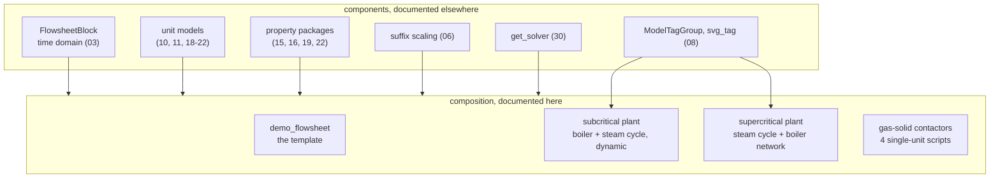
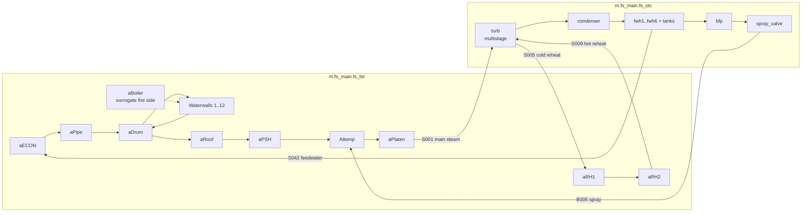

# 24 — Reference flowsheets and demonstrations

> **Doc ID** 24 · **Repo SHA** 70a8f4fe1 (IDAES-PSE v2.13.0rc0) · **Source roots** `idaes/models/flowsheets/`, `idaes/models_extra/power_generation/flowsheets/`, `idaes/models_extra/gas_solid_contactors/flowsheets/`
> **Owns** 22 modules / 11,031 LOC · **Assets** 3 SVG process flow diagrams (§10) · **Siblings** [03](03_block_hierarchy_and_construction_protocol.md), [06](06_model_preparation_initializers_and_scalers.md), [07](07_diagnostics_and_run_orchestration.md), [18](18_power_generation_boiler_island.md), [19](19_power_generation_heat_exchangers_and_properties.md), [20](20_power_generation_helmholtz_units_and_soc.md), [22](22_gas_solid_contactors.md), [28](28_data_and_file_format_inventory.md)

Every other document in this set describes a *component*: a base class, a
control volume, a property package, a unit model, a diagnostic tool. This one
describes **composition** — how those components are assembled into a plant
model that a solver can actually solve, in what order, with what initialization
and scaling recipe, and how the answer is reported.

That makes this scope different in kind from its siblings. It declares no
classes, no CONFIG blocks and no extension points; it is 11,031 lines of
procedural script. Its value is that it is the library's **only end-to-end
worked material**, and for several unit models — `BoilerFireside`, `Drum1D`,
`HeatExchangerCrossFlow2D_Header`, `HeatExchangerWith3Streams`,
`WaterwallSection`, `SteamHeater`, `WaterPipe`, `FWH0DDynamic` — the flowsheets
here are the only demonstration of intended use anywhere under `idaes/`.

---

## 0. Scope and source map

| File | LOC | Purpose | Covered in § |
|---|---:|---|---|
| `idaes/models/flowsheets/__init__.py` | 0 | Empty package marker | 2 |
| `idaes/models/flowsheets/demo_flowsheet.py` | 511 | Mixer–Heater–Flash benzene/toluene demonstration; the six-function template the other flowsheets vary | 2, 5.2, 6, 7 |
| `idaes/models_extra/power_generation/flowsheets/__init__.py` | 0 | Empty package marker | 2 |
| `idaes/models_extra/power_generation/flowsheets/subcritical_power_plant/__init__.py` | 0 | Empty package marker | 2 |
| `idaes/models_extra/power_generation/flowsheets/subcritical_power_plant/subcritical_boiler.py` | 421 | Standalone drum/downcomer/waterwall natural-recirculation loop, plus a heat-duty sensitivity sweep | 2, 5.3, 6, 10 |
| `idaes/models_extra/power_generation/flowsheets/subcritical_power_plant/subcritical_boiler_flowsheet.py` | 1,335 | The 300 MWe boiler island sub-flowsheet: fire side, drum, 12 waterwall zones, superheaters, reheaters, economizer, air preheater | 2, 5.4, 6, 11 |
| `idaes/models_extra/power_generation/flowsheets/subcritical_power_plant/steam_cycle_flowsheet.py` | 2,214 | The 300 MWe steam cycle sub-flowsheet: turbine train, condensers, six feedwater heaters, pumps, valves, seven PID controllers | 2, 5.5, 6 |
| `idaes/models_extra/power_generation/flowsheets/subcritical_power_plant/subcritical_power_plant.py` | 2,289 | The two sub-flowsheets joined into one dynamic plant; load-ramp simulation; results plotting, text export and SVG annotation | 2, 5.6, 7, 10, 11 |
| `idaes/models_extra/power_generation/flowsheets/subcritical_power_plant/generic_surrogate_dict.py` | 1,336 | `data_dic` — 16 fire-side surrogate models stored as Python expression strings | 2, 5.4.1, 10, 12 |
| `idaes/models_extra/power_generation/flowsheets/subcritical_power_plant/plant_pfd.svg` | — | Authored process flow diagram template, 156 tagged text elements | 10 |
| `idaes/models_extra/power_generation/flowsheets/subcritical_power_plant/plant_pfd_result.svg` | — | Generated: the same diagram with solved values substituted | 10 |
| `idaes/models_extra/power_generation/flowsheets/supercritical_power_plant/__init__.py` | 0 | Empty package marker | 2 |
| `idaes/models_extra/power_generation/flowsheets/supercritical_power_plant/boiler_subflowsheet_build.py` | 755 | SCPC boiler heat-exchanger network built onto an existing flowsheet block | 2, 5.8, 6, 12 |
| `idaes/models_extra/power_generation/flowsheets/supercritical_power_plant/SCPC_full_plant.py` | 205 | Composes the supercritical steam cycle and the SCPC boiler network into one ~595 MW plant | 2, 5.8, 6 |
| `idaes/models_extra/power_generation/flowsheets/supercritical_steam_cycle/__init__.py` | 16 | Re-exports `main` and `pfd_result` | 2 |
| `idaes/models_extra/power_generation/flowsheets/supercritical_steam_cycle/supercritical_steam_cycle.py` | 1,010 | ~620 MW supercritical steam cycle, eight feedwater heaters, JSON state save/restore, SVG reporting | 2, 5.7, 6, 10 |
| `idaes/models_extra/power_generation/flowsheets/supercritical_steam_cycle/supercritical_steam_cycle.svg` | — | Authored process flow diagram template read by `pfd_result` | 10 |
| `idaes/models_extra/power_generation/flowsheets/test/test_scpc_plant.py` | 72 | Four `integration` checks over the SCPC boiler and full plant | 2, 13 |
| `idaes/models_extra/power_generation/flowsheets/test/test_scsc.py` | 79 | Three `integration` checks over the supercritical steam cycle, one exercising `pfd_result` | 2, 13 |
| `idaes/models_extra/power_generation/flowsheets/test/test_subcritical_boiler.py` | 95 | Two `component` checks over the recirculation loop | 2, 13 |
| `idaes/models_extra/gas_solid_contactors/flowsheets/__init__.py` | 0 | Empty package marker | 2 |
| `idaes/models_extra/gas_solid_contactors/flowsheets/dyn_TGA_example.py` | 127 | Dynamic `FixedBed0D` thermogravimetric-analyser simulation over one hour | 2, 5.9, 6 |
| `idaes/models_extra/gas_solid_contactors/flowsheets/ss_BFB_methane_combustion.py` | 198 | Steady-state `BubblingFluidizedBed`, methane/iron-oxide reduction | 2, 5.9, 6 |
| `idaes/models_extra/gas_solid_contactors/flowsheets/ss_BFB_OC_oxidation.py` | 197 | The same bed with the oxygen-carrier oxidation property set | 2, 5.9, 6, 12 |
| `idaes/models_extra/gas_solid_contactors/flowsheets/ss_MB_methane_combustion.py` | 171 | Steady-state `MBR` moving-bed reactor | 2, 5.9, 6 |

Total 11,031 LOC across 22 modules plus three shipped SVG assets, from
`_generated/ledger.csv` (25 rows with `doc == 24`); six of the 22 modules are
empty or near-empty package markers. The three modules under
`.../power_generation/flowsheets/test/` are pytest modules by content, listed
here as owned source because the directory is named `test/` and not `tests/`;
§12.2 records the consequences.

---

## 1. Architectural role

A unit model is solvable in isolation because its inlet state is fixed. A plant
is not: every inlet but the first is an outlet, the connectivity contains
recycles, and the assembled system has no values in it. Turning a pile of unit
models into a square, scaled, converged plant model is a procedure, and nothing
in `idaes/core/` performs that procedure end to end. The modules here are where
it is written down — as modules of plain functions over a `ConcreteModel`, with
no class, no configuration block and no registry, so the composition is
expressed as call order. Read across all eleven flowsheets a common vocabulary
emerges: build the flowsheet block and property packages, instantiate unit
models, declare arcs and flowsheet-level constraints, fix inputs, set scaling
factors, initialize unit by unit propagating each outlet forward, check degrees
of freedom, solve, report. No two modules spell it identically and none uses the
named-step runner in
[07 §5.7](07_diagnostics_and_run_orchestration.md#57-a-structured-flowsheet-run);
§5.1 tabulates what each actually uses.

Composition also happens *between* these modules. `subcritical_power_plant.py`
calls the boiler and steam-cycle modules' `add_unit_models`,
`set_arcs_and_constraints`, `set_inputs` and `initialize` functions against one
shared model, then adds five arcs and deactivates three constraints to close the
loop (`idaes/models_extra/power_generation/flowsheets/subcritical_power_plant/subcritical_power_plant.py:875`);
`SCPC_full_plant.py` does the same for the supercritical pair
(`idaes/models_extra/power_generation/flowsheets/supercritical_power_plant/SCPC_full_plant.py:111`).
That composability is why those modules expose separate build, input and
initialize entry points rather than one `main`.



*Everything above the line is described by another document; this one owns only the assembly order, the specification of inputs, the numerical recipe and the reporting.*

---

## 2. Public surface inventory

The scope declares no classes and no enumerations, and no module in it defines
`__all__` (`_generated/classes.csv` and `_generated/enums.csv` return zero rows
for these files). The surface is 74 module-level functions plus one dictionary
constant, of which exactly two names are re-exported from a package
`__init__.py`.

### 2.1 `idaes/models/flowsheets/demo_flowsheet.py`

| Symbol | Kind | Declared at | Exported via | Stability signal |
|---|---|---|---|---|
| `build_flowsheet`, `set_scaling`, `set_dof` | functions | `idaes/models/flowsheets/demo_flowsheet.py:36`, `:58`, `:455` | module attributes | imported by the test module |
| `initialize_flowsheet`, `solve_flowsheet` | functions | `idaes/models/flowsheets/demo_flowsheet.py:476`, `:486` | module attributes | imported by the test module |
| `display_results` | function | `idaes/models/flowsheets/demo_flowsheet.py:492` | module attribute | not imported anywhere |

### 2.2 Subcritical power plant

| Symbol | Kind | Declared at | Exported via | Stability signal |
|---|---|---|---|---|
| `main`, `create_model`, `set_inputs`, `initialize`, `run_sensitivity` | functions | `idaes/models_extra/power_generation/flowsheets/subcritical_power_plant/subcritical_boiler.py:68`, `:91`, `:136`, `:187`, `:317` | module attributes | `main` imported by `test_subcritical_boiler.py:23` |
| `add_unit_models`, `set_arcs_and_constraints`, `set_inputs`, `initialize`, `set_scaling_factors` | functions | `idaes/models_extra/power_generation/flowsheets/subcritical_power_plant/subcritical_boiler_flowsheet.py:69`, `:257`, `:473`, `:689`, `:1015` | module attributes | all five called by `subcritical_power_plant.py` |
| `main_steady_state`, `main_dynamic`, `get_model`, `run_dynamic`, `print_dynamic_results` | functions | `idaes/models_extra/power_generation/flowsheets/subcritical_power_plant/subcritical_boiler_flowsheet.py:1116`, `:1189`, `:1212`, `:1239`, `:1258` | module attributes | `get_model` and `main_steady_state` used by tests |
| `add_unit_models`, `set_arcs_and_constraints`, `set_inputs`, `initialize`, `set_scaling_factors` | functions | `idaes/models_extra/power_generation/flowsheets/subcritical_power_plant/steam_cycle_flowsheet.py:63`, `:380`, `:625`, `:946`, `:1742` | module attributes | called by `subcritical_power_plant.py` |
| `_add_heat_transfer_correlation`, `_add_u_eq` | functions | `idaes/models_extra/power_generation/flowsheets/subcritical_power_plant/steam_cycle_flowsheet.py:934`, `:1709` | — | leading underscore |
| `main_steady_state`, `main_dynamic`, `get_model` | functions | `idaes/models_extra/power_generation/flowsheets/subcritical_power_plant/steam_cycle_flowsheet.py:1831`, `:1843`, `:2182` | module attributes | `get_model` used by tests |
| `set_scaling_factors`, `add_overall_performance_expressions`, `get_model` | functions | `idaes/models_extra/power_generation/flowsheets/subcritical_power_plant/subcritical_power_plant.py:48`, `:235`, `:699` | module attributes | `get_model` used by tests |
| `main_steady_state`, `input_profile`, `main_dynamic`, `run_dynamic` | functions | `idaes/models_extra/power_generation/flowsheets/subcritical_power_plant/subcritical_power_plant.py:324`, `:329`, `:352`, `:1397` | module attributes | `main_steady_state` used by tests |
| `plot_results`, `write_data_to_txt_file`, `print_pfd_results` | functions | `idaes/models_extra/power_generation/flowsheets/subcritical_power_plant/subcritical_power_plant.py:1875`, `:2144`, `:2218` | module attributes | reporting; see §10 |
| `_build_pfd_tag_group` | function | `idaes/models_extra/power_generation/flowsheets/subcritical_power_plant/subcritical_power_plant.py:2170` | — | leading underscore, yet directly tested (§13) |
| `data_dic` | `dict` | `idaes/models_extra/power_generation/flowsheets/subcritical_power_plant/generic_surrogate_dict.py:16` | module attribute | imported at `idaes/models_extra/power_generation/flowsheets/subcritical_power_plant/subcritical_boiler_flowsheet.py:60` |

### 2.3 Supercritical power plant and steam cycle

| Symbol | Kind | Declared at | Exported via | Stability signal |
|---|---|---|---|---|
| `main`, `build_boiler`, `initialize`, `unfix_inlets`, `print_results` | functions | `idaes/models_extra/power_generation/flowsheets/supercritical_power_plant/boiler_subflowsheet_build.py:97`, `:116`, `:219`, `:467`, `:624` | module attributes | first four used by `SCPC_full_plant.py` and `test_scpc_plant.py` |
| `pfd_result` | function | `idaes/models_extra/power_generation/flowsheets/supercritical_power_plant/boiler_subflowsheet_build.py:553` | module attribute | its only call site is commented out (§12.1) |
| `_stream_dict` | function | `idaes/models_extra/power_generation/flowsheets/supercritical_power_plant/boiler_subflowsheet_build.py:598` | — | leading underscore |
| `import_steam_cycle`, `main` | functions | `idaes/models_extra/power_generation/flowsheets/supercritical_power_plant/SCPC_full_plant.py:84`, `:94` | module attributes | `main` used by `test_scpc_plant.py:69` |
| `create_model`, `set_model_input`, `initialize`, `main` | functions | `idaes/models_extra/power_generation/flowsheets/supercritical_steam_cycle/supercritical_steam_cycle.py:69`, `:604`, `:728`, `:971` | module attributes | `main` re-exported |
| `pfd_result` | function | `idaes/models_extra/power_generation/flowsheets/supercritical_steam_cycle/supercritical_steam_cycle.py:928` | re-exported | in `supercritical_steam_cycle/__init__.py:13` |
| `_stream_dict` | function | `idaes/models_extra/power_generation/flowsheets/supercritical_steam_cycle/supercritical_steam_cycle.py:565` | — | leading underscore |

`idaes/models_extra/power_generation/flowsheets/supercritical_steam_cycle/__init__.py:13`
is the one non-empty package initializer in the scope; it re-exports `main` and
`pfd_result`, and `test_scsc.py:24` imports both through it.

### 2.4 Gas–solid contactors

| Symbol | Kind | Declared at | Exported via | Stability signal |
|---|---|---|---|---|
| `main(m)` | function | `idaes/models_extra/gas_solid_contactors/flowsheets/dyn_TGA_example.py:47` | module attribute | named in `docs/.../dyn_TGA_example.rst` |
| `main()` | function | `idaes/models_extra/gas_solid_contactors/flowsheets/ss_BFB_methane_combustion.py:57` | module attribute | named in the matching `.rst` |
| `main()` | function | `idaes/models_extra/gas_solid_contactors/flowsheets/ss_BFB_OC_oxidation.py:57` | module attribute | named in the matching `.rst` |
| `main()` | function | `idaes/models_extra/gas_solid_contactors/flowsheets/ss_MB_methane_combustion.py:51` | module attribute | named in the matching `.rst` |

`dyn_TGA_example.main` takes the `ConcreteModel` as an argument; the other three
create their own. The documentation pages under
`docs/reference_guides/model_libraries/` reference these modules by
`currentmodule` and by GitHub link only — there is no `automodule` or
`autofunction` directive anywhere in those pages, so none of the 74 functions is
rendered into the built documentation.

---

## 3. Class hierarchy and type taxonomy

Not applicable: the scope declares no classes, no enumerations and no process
blocks.

---

## 4. Configuration reference

Not applicable: the scope declares no CONFIG block and no `CONFIG.declare` call.

---

## 5. Construction and call sequences

### 5.1 The de-facto step vocabulary

Read as a set, the eleven flowsheets use a recurring sequence of stages. No two
modules name them identically and none of them adopts the eleven-name vocabulary
fixed by `BaseFlowsheetRunner.STEPS`
([07 §5.7](07_diagnostics_and_run_orchestration.md#57-a-structured-flowsheet-run)).
The table maps each `structfs` step name onto the function that performs the same
work here.

| `structfs` step | `demo_flowsheet` | `subcritical_boiler_flowsheet` / `steam_cycle_flowsheet` | `supercritical_steam_cycle` | `boiler_subflowsheet_build` | gas–solid `main()` |
|---|---|---|---|---|---|
| `build` | `build_flowsheet` | `add_unit_models` + `set_arcs_and_constraints` | `create_model` | `build_boiler` | inline |
| `set_operating_conditions` | `set_dof` | `set_inputs` | `set_model_input` | inside `initialize` | inline |
| `set_scaling` | `set_scaling` | `set_scaling_factors` | inside `initialize` | absent | inline |
| `initialize` | `initialize_flowsheet` | `initialize` | `initialize` | `initialize` | inline |
| `set_solver` | inside `solve_flowsheet` | inside `initialize` | inside `initialize` | inside `main` | inline |
| `solve_initial` | `solve_flowsheet` | inside `initialize` / `main_steady_state` | inside `main` | `__main__` block | inline |
| `add_costing`, `initialize_costing` | absent | absent | absent | absent | absent |
| `check_model_structure` | absent | `assert df == 0` | `assert degrees_of_freedom(m.fs.turb) == 0` | `print(degrees_of_freedom(m))` | absent |
| `solve_optimization` | absent | absent | absent | absent | absent |
| `check_model_numerics` | absent | absent | absent | absent | absent |
| reporting (no step) | `display_results` | `print_dynamic_results` | `pfd_result` | `print_results`, `pfd_result` | `_get_stream_table_contents` |

Three observations follow. `set_scaling` always precedes `initialize` where
both exist, matching the runner's order; no flowsheet here carries a costing
block, so the two costing steps have no counterpart; and `check_model_numerics`
— a `DiagnosticsToolbox` pass — appears in none of them. Every flowsheet in this
scope uses the **legacy initialization routine** (`unit.initialize(...)`) and
**suffix-based scaling** (`idaes.core.util.scaling`); none imports
`idaes.core.initialization` or `idaes.core.scaling`, so no Initializer object and
no Scaler object is exercised by any worked example in the library
([06 §3.3](06_model_preparation_initializers_and_scalers.md#33-retrofit-adoption)).

### 5.2 `demo_flowsheet` — the template

The simplest complete example, and the one whose function names the other
sections are measured against.

1. `build_flowsheet()` (`idaes/models/flowsheets/demo_flowsheet.py:36`) creates
   a `ConcreteModel`, one steady-state `FlowsheetBlock`
   (`:40`), one `BTXParameterBlock` (`:42`), then `Mixer` `M01` (`:44`), `Heater`
   `H02` (`:46`) and `Flash` `F03` (`:48`). Two arcs `s01` and `s02` chain them
   (`:50`, `:51`) and `network.expand_arcs` is applied to `m.fs` (`:53`).
   **Degrees of freedom after this step: 13**
   (`idaes/models/flowsheets/tests/test_demo_flowsheet.py:60`).
2. `set_scaling(m)` (`:58`) issues 136 `iscale.set_scaling_factor` calls — on
   the two mixer inlet state blocks, the mixed state, and the heater and flash
   control-volume state blocks — covering `flow_mol_phase`,
   `mole_frac_phase_comp`, `pressure_sat_comp`, `enth_mol_phase_comp`,
   `material_flow_terms` and `enthalpy_flow_terms`, and closes with
   `iscale.calculate_scaling_factors(m)` (`:452`). The factors are written per
   state block rather than per package, and differ between the two mixer inlets
   because the feeds are near-pure benzene and near-pure toluene.
3. `set_dof(m)` (`:455`) fixes both mixer inlets — molar flow, both mole
   fractions, pressure, temperature — using `eps = 1e-5` in place of zero for
   the trace component, then fixes the heater outlet temperature and the flash
   `heat_duty` and `deltaP` at `1e-6`. **Degrees of freedom: 0**
   (`test_demo_flowsheet.py:72`).
4. `initialize_flowsheet(m)` (`:476`) calls `M01.initialize`, then
   `propagate_state(m.fs.s01)`, `H02.initialize`, `propagate_state(m.fs.s02)`,
   `F03.initialize`, each at `outlvl=idaeslog.WARNING`. This is the sequential
   forward sweep every other flowsheet in the scope reproduces by hand.
5. `solve_flowsheet(m, stee=False)` (`:486`) obtains `get_solver("ipopt_v2")`
   (`:488`) and solves the whole model. It is the only flowsheet in the scope
   that names a solver explicitly rather than taking the `get_solver()` default.
6. `display_results(m)` (`:492`) calls `.display()` on the mixer outlet, heater
   outlet and both flash outlets.

The `__main__` block (`:500`) runs the six functions in exactly that order.

### 5.3 `subcritical_boiler` — the natural-recirculation loop

A standalone demonstration of `Drum`, `Downcomer` and `WaterwallSection` closed
into a recycle.

1. `main(m=None)` (`idaes/models_extra/power_generation/flowsheets/subcritical_power_plant/subcritical_boiler.py:68`) creates the model, flowsheet
   block, `Iapws95ParameterBlock` and `FlueGasParameterBlock` **only when `m` is
   `None`**; passed an existing model it assumes `m.fs`, `m.fs.prop_water` and
   `m.fs.prop_gas` already exist. This is the scope's earliest form of
   sub-flowsheet composition.
2. `create_model(m)` (`:91`) declares `m.fs.ww_zones = RangeSet(10)`, one
   `Drum`, one `Downcomer` and a ten-element indexed `WaterwallSection`. The
   recycle is closed by four arc declarations: drum liquid outlet to downcomer,
   downcomer to zone 1, an indexed `Arc(RangeSet(9), rule=arc_rule)` chaining
   zone *i* to zone *i+1*, and zone 10 back to the drum water/steam inlet.
   The indexed arc is attached to `m`, not to `m.fs`, and
   `network.expand_arcs` is applied to `m` for that reason.
3. `set_inputs(m)` (`:136`) fixes drum geometry, downcomer geometry, and per
   zone the tube diameter, thickness, fin dimensions, slag thickness, tube count
   and pressure-drop correction, followed by the ten section heights and ten
   projected areas.
4. `initialize(m, outlvl, optarg)` (`:187`) branches on whether
   `subcritical_boiler_init.json.gz` exists in the working directory (`:206`).
   When absent, it fixes the ten `heat_fireside` duties as an initial guess,
   initializes the drum with explicit `state_args_water_steam` and
   `state_args_feedwater`, then walks downcomer and zones 1–10, each time
   **fixing the inlet to the previous unit's outlet value and initializing**.
   It then unfixes the whole tear, checks degrees of freedom, raises
   `ValueError` if non-zero (`:305`), solves the full space, and writes the
   state through `model_serializer.to_json` (`:310`). When the file is present
   it restores from it instead (`:313`) and no solve happens.
5. `run_sensitivity()` (`:317`) re-fixes the feedwater inlet, sets
   `heat_flux_conv` scaling factors of `1e-5` on every zone, runs
   `calculate_scaling_factors`, solves, then sweeps the ten fire-side duties over
   twenty multipliers from 1.1 to 3.0, plotting feedwater flow against duty.

Scaling here is applied **only inside `run_sensitivity`**; `main` sets none.
`test_subcritical_boiler.py:74` supplies the same `heat_flux_conv` factors
itself, which is how the tested path acquires them.

### 5.4 `subcritical_boiler_flowsheet` — the boiler island

The largest sub-flowsheet in the scope by unit count, and the consumer of the
fire-side surrogate dictionary.

1. `add_unit_models(m)` (`idaes/models_extra/power_generation/flowsheets/subcritical_power_plant/subcritical_boiler_flowsheet.py:69`) builds onto
   `m.fs_main.fs_blr` using `m.fs_main.prop_water` and `m.fs_main.prop_gas`.
   `fs.ww_zones = RangeSet(12)` sets the zone count, then sixteen unit models
   are declared; §6.1 lists them. `BoilerFireside` (`:84`) receives
   `number_of_zones=12`, `calculate_PA_SA_flows=True`,
   `has_platen_superheater=True`, `has_roof_superheater=True` and
   `surrogate_dictionary=data_dic` (`:91`).
2. `set_arcs_and_constraints(m)` (`:257`) declares twenty arc statements — one
   of which, `fs.ww_arcs = Arc(range(1, 12), rule=ww_arc_rule)` (`:278`),
   expands to eleven zone-to-zone connections — covering the water/steam, reheat
   and flue-gas paths. `network.expand_arcs` is applied to `fs` at `:300`, after
   discretization. Thirteen flowsheet-level constraints and two expressions
   follow; §6.4 lists them. Three of them — `pa_to_coal_ratio_eqn` (`:419`),
   `dry_o2_in_flue_gas_eqn` (`:431`) and `fraction_of_ta_in_total_pa_eqn`
   (`:402`) — are themselves polynomial correlations in `flowrate_coal_raw`,
   standing in for a mill model and a combustion controller.
3. `set_inputs(m)` (`:473`) fixes the air composition, the seven dry coal
   ultimate-analysis fractions and the dry higher heating value, the coal
   temperature, and the geometry of every unit.
4. `set_scaling_factors(m)` (`:1015`) is one block of
   `iscale.set_scaling_factor` calls closing with
   `iscale.calculate_scaling_factors(m)` (`:1113`). Its shape recurs across the
   scope: a per-zone loop setting `heat_fireside` at `1e-7`, `heat_flux_conv` at
   `1e-4` below zone index 4 and `1e-5` above, holdups at `1e-4`/`1e-8` and
   `N_Re` at `1e-6`; then per-unit factors for the roof, platen, drum,
   downcomer, pipe and fire side; then, per
   `HeatExchangerCrossFlow2D_Header` unit, factors on `_enthalpy_flow` and
   `enthalpy_flow_dx` plus `iscale.constraint_scaling_transform(c, 1e-7)` over
   every member of `enthalpy_flow_dx_disc_eq` — a transform that mutates those
   discretization equations in place rather than writing a factor
   ([06 §5.6](06_model_preparation_initializers_and_scalers.md#56-suffix-based-scaling)).
5. `initialize(m)` (`:689`) is the longest routine in the scope. It calls
   `set_initial_condition()` on ten unit models when `m.dynamic` is true; fixes
   the fire-side operating point (coal flow 29 kg/s, stoichiometric ratio 1.19,
   twelve zone wall temperatures, platen and roof wall temperatures) and the
   twelve `heat_fireside` guesses; then initializes the units in physical order,
   moving state across each connection with `propagate_state`, imported under
   the local alias `_set_port` (`:33`). Several steps deliberately lower an
   inlet temperature first — the reheaters and the primary superheater are given
   shell inlet temperatures of 1350 K, 1100 K and 1000 K rather than the
   propagated value — and the reheat loop is torn by assigning flow, enthalpy
   and pressure directly to `fs.aRH2.tube_inlet`. A final block unfixes
   everything the routine fixed, asserts `df == 0` (`:971`) and, for a
   steady-state model, solves the sub-flowsheet and logs sixteen quantities.
6. `get_model(dynamic=True, init=True)` (`:1212`) is the composed entry point:
   flowsheet blocks, property packages, `add_unit_models`, the
   `dae.finite_difference` transformation with `nfe=2` and `BACKWARD` scheme
   when dynamic (`:1228`), `set_arcs_and_constraints`, `set_inputs`,
   `set_scaling_factors`, and `initialize` when `init` is true.

**Degrees of freedom before initialization: 12 steady-state, 223 dynamic**
(`idaes/models_extra/power_generation/flowsheets/subcritical_power_plant/tests/test_subcritical_flowsheets.py:33`, `:40`);
**0 after** (`:47`).

#### 5.4.1 `generic_surrogate_dict` — surrogate models as source text

`data_dic` (`idaes/models_extra/power_generation/flowsheets/subcritical_power_plant/generic_surrogate_dict.py:16`) is a dictionary of **16 keys to
Python expression strings**. Twelve integer keys `1` through `12` name the
waterwall zones (`:17` … `:941`); four string keys follow — `"pl"` (`:1036`) for
the platen superheater duty, `"roof"` (`:1136`) for the roof and backpass duty,
`"flyash"` (`:1230`) for unburned carbon in fly ash, and `"NOx"` (`:1288`) for
NOx in parts per million.

Each value is one parenthesised arithmetic expression written against `b` and
`t`, continued across lines with backslashes. The nine independent quantities
that appear are `b.wall_temperature_waterwall[t, i]` for `i` in 1…12,
`b.wall_temperature_platen[t]`, `b.wall_temperature_roof[t]`,
`b.flowrate_coal_raw[t]`, `b.mf_H2O_coal_raw[t]`, `b.SR[t]`, `b.SR_lf[t]`,
`b.secondary_air_inlet.temperature[t]` and `b.ratio_PA2coal[t]`. Terms are
linear, `log`, `exp`, powers up to cubic, and products and powers of pairs.
The sixteen strings total roughly 88,000 characters and about 1,550 additive
terms, which is why one dictionary occupies 1,336 lines.

An abbreviated row, showing the first and last terms of the `"NOx"` entry
(`idaes/models_extra/power_generation/flowsheets/subcritical_power_plant/generic_surrogate_dict.py:1288` and `:1335`):

```python
    "NOx": "(-0.00436267 * b.wall_temperature_waterwall[t, 1] \
            ...
            -3021.62 * b.mf_H2O_coal_raw[t]*b.SR_lf[t] \
            -4546.15 * b.SR[t]*b.SR_lf[t] \
            +2.61054 * b.SR_lf[t]*b.secondary_air_inlet.temperature[t] \
            -0.000160638 * (b.wall_temperature_waterwall[t, 3]*b.SR_lf[t])**2 \
            -0.161015 * (b.flowrate_coal_raw[t]*b.SR[t])**2 \
            -2.63321 * (b.flowrate_coal_raw[t]*b.SR_lf[t])**2)",
```

The consumer is `BoilerFiresideData._import_surrogate_models`
(`idaes/models_extra/power_generation/unit_models/boiler_fireside.py:255`),
reached through the `surrogate_dictionary` config key
(`idaes/models_extra/power_generation/unit_models/boiler_fireside.py:212`);
[18](18_power_generation_boiler_island.md) owns that model. Three facts about
the contract bind this document's format description to that consumer:

- **Length.** The dictionary must hold exactly
  `len(zones) + has_platen_superheater + has_roof_superheater + 2` entries, or
  `build` raises `ConfigurationError`
  (`idaes/models_extra/power_generation/unit_models/boiler_fireside.py:259`).
  With twelve zones and both superheaters enabled that is 16, which is what
  `data_dic` holds. The two unconditional extras are `"flyash"` and `"NOx"`.
- **Key spelling.** The zone entries are looked up by the zone index
  (`data_dict[z]`, `:282`), the superheater entries by the literal strings
  `"pl"` (`:295`) and `"roof"` (`:308`), and the last two by `"flyash"` (`:320`)
  and `"NOx"` (`:331`).
- **Evaluation namespace.** Each string is passed to the builtin `eval` inside
  the constraint rule, so `b` is the `BoilerFireside` block, `t` the time point,
  and the only callables reachable are `exp` and `log` as imported into
  `boiler_fireside.py` at `:79` and `:82`. A surrogate expression using any
  other function name fails at build time with a `NameError`.

The left-hand sides differ per group: the zone constraint is
`waterwall_heat[t, z] * fcorrection_heat_ww[t] == eval(...)`, the platen
constraint uses `fcorrection_heat_platen[t]`, the roof constraint uses
`fcorrection_heat_ww[t]`, the fly-ash constraint equates the expression directly
to `ubc_in_flyash[t]`, and the NOx constraint equates it to
`frac_mol_NOx_fluegas[t] * 1e6`, so the NOx surrogate is written in parts per
million and converted.

### 5.5 `steam_cycle_flowsheet` — the steam cycle island

1. `add_unit_models(m)` (`idaes/models_extra/power_generation/flowsheets/subcritical_power_plant/steam_cycle_flowsheet.py:63`) builds onto
   `m.fs_main.fs_stc`: one `HelmTurbineMultistage` (`:86`), a boiler-feed-pump
   turbine train, a main and an auxiliary `HelmNtuCondenser` (`:113`, `:120`),
   a hotwell mixer, two `WaterTank` units (`:146`, `:235`), four pumps, eight
   valves, five `FWH0DDynamic` heaters, an attemperation splitter, and the
   variables `temperature_main_steam` (`:299`) and `power_output` (`:310`) each
   with a defining constraint (`:303`, `:314`). When `m.dynamic` is true, seven
   `PIDController` blocks follow (`:320`–`:369`): four feedwater-heater level
   controllers, a deaerator level controller, a hotwell makeup controller with
   `ControllerMVBoundType.SMOOTH_BOUND`, and a PID main-steam-temperature
   controller on the spray valve.
2. `set_arcs_and_constraints(m)` (`:380`) declares 39 arcs and applies
   `network.expand_arcs` at `:479`, then adds twelve flowsheet-level
   constraints: a boiler-feed-pump power balance (`:486`), the reheat flow
   closure (`:495`), a makeup water pressure rule (`:507`), four mixer pressure
   rules, a deaerator outlet enthalpy rule (`:528`), two pump curves (`:572`,
   `:583`) and the feedwater flow closure `fw_flow_constraint` (`:596`). Two of
   these — `turb.constraint_reheat_flow` and `fw_flow_constraint` — exist only
   so the steam cycle is square in isolation, and are deactivated when the
   boiler is attached (§5.6).
3. `set_inputs(m)` (`:625`) fixes valve coefficients and openings, turbine flow
   coefficients, mechanical and nozzle efficiencies, heat-exchanger areas and
   coefficients, tank geometry and controller gains.
4. `set_scaling_factors(m)` (`:1742`) sets condenser and feedwater-heater heat
   duties at `1e-9`/`1e-7`, tank holdups, and per-time-point flow factors,
   closing with `calculate_scaling_factors(m)` (`:1828`).
5. `initialize(m)` (`:946`) sets initial conditions on the seven dynamic units,
   then walks the cycle: turbine (with the outlet-stage pressure temporarily
   fixed at 6000 Pa), boiler-feed-pump turbine chain, both condensers, hotwell,
   condensate pump, the feedwater heaters in ascending order, the deaerator and
   the boiler feed pump — moving values with `propagate_state`, again aliased
   `_set_port`. Late in the routine `_add_heat_transfer_correlation(fs)` (`:934`)
   is called on both branches (`:1686`, `:1689`); it applies `_add_u_eq`
   (`:1709`) to five condensing sections, **adding three variables and one
   constraint per section after initialization** and replacing a fixed overall
   heat transfer coefficient with a flow-to-the-0.8 correlation. Steady state
   then asserts `dof == 0` (`:1236`) and solves; dynamic instead unfixes the six
   levels and seven valve openings so the controllers take over.
6. `get_model(dynamic=True)` (`:2182`) composes the five stages and always
   initializes.

**Degrees of freedom for the dynamic steam cycle after `get_model`: 0**
(`tests/test_subcritical_flowsheets.py:210`); the comment there records that
seven degrees of freedom were absorbed when `PIDController.mv_eqn[t0]` stopped
being deactivated under `calculate_initial_integral=False`.

### 5.6 `subcritical_power_plant` — the dynamic plant

This module builds nothing of its own beyond four controllers and a handful of
expressions; its work is composition, simulation and reporting.

1. `get_model(dynamic, time_set, nstep, init)`
   (`idaes/models_extra/power_generation/flowsheets/subcritical_power_plant/subcritical_power_plant.py:699`) creates `m.fs_main` — dynamic with
   `time_set=[0, 20, 200]` and `time_units=s` by default (`:707`) — plus the two
   shared property packages and two child flowsheet blocks `fs_blr` and `fs_stc`
   (`:717`, `:718`). It then calls `blr.add_unit_models(m)` (`:721`) and
   `stc.add_unit_models(m)` (`:722`), so the two sub-flowsheets are populated by
   their own modules.
2. A plant-level `main_steam_pressure` variable (`:725`) and its constraint
   (`:733`) are added. Under `dynamic=True`, four cascaded `PIDController`
   blocks follow — a drum-level master (`:747`) and slave (`:754`), a turbine
   master on gross power (`:762`) and a boiler master on main steam pressure
   manipulating coal feed (`:770`) — the `dae.finite_difference` transformation
   is applied with `nfe=nstep` (`:778`), and a sliding-pressure expression
   (`:787`), the slave setpoint constraint (`:795`), the boiler master setpoint
   constraint (`:804`) and a dynamic dry-oxygen correlation (`:812`) are
   declared. Under `dynamic=False` a single `sliding_pressure_eqn` (`:852`)
   replaces all of that.
3. `blr.set_arcs_and_constraints` / `blr.set_inputs` and the steam-cycle pair
   are called next (`:858`–`:862`), then the plant's own `set_scaling_factors`
   (`:864`) and `add_overall_performance_expressions` (`:866`). Only then,
   guarded by `init`, are the two sub-flowsheets initialized separately
   (`:869`, `:870`).
4. The two islands are joined by five arcs (`:875`, `:879`, `:883`, `:887`,
   `:891`): main steam to the turbine inlet split, cold reheat from the HP
   split to the first reheater, hot reheat to the IP stages, final feedwater to
   the economizer, and attemperation spray to the boiler attemperator.
   `network.expand_arcs` is applied to `m.fs_main` (`:896`).
5. Three constraints that made each island square alone are deactivated —
   `fs_blr.flow_mol_steam_rh_eqn` (`:900`),
   `fs_stc.turb.constraint_reheat_flow` (`:901`) and `fs_stc.fw_flow_constraint`
   (`:903`) — and every newly connected port is unfixed, with the coal feed rate.
   Steady state then releases the throttle valve opening, solves with
   `get_solver(options={"max_iter": 50})` (`:924`) and logs thirteen headline
   quantities.

**Degrees of freedom after `get_model(init=False)`: 157 dynamic, −5
steady-state** (`tests/test_subcritical_flowsheets.py:189`, `:199`). The
steady-state figure is negative, that is, the built-but-uninitialized
steady-state plant is over-specified; the specification becomes square only
after step 5 releases the connected ports.

`add_overall_performance_expressions(m)` (`:235`) adds five time-indexed
expressions on `m.fs_main`: `boiler_heat` (`:237`), `steam_cycle_eff` (`:261`),
`gross_heat_rate` in BTU/MW (`:266`), `plant_gross_efficiency` (`:281`) and
`aux_power` (`:290`) — the last a thirteen-term polynomial surrogate in steam
mass flow, air mass flow, cooling-water flow, steam temperature and two
pressures, written inline rather than stored as a string.



*The five labelled arcs are the whole of the coupling between the two islands; everything else is internal to a sub-flowsheet built by its own module.*

`main_dynamic()` (`:352`) is the simulation driver. It initializes a 119-key
`plot_data` dictionary (`:357`–`:483`), builds one steady-state and one dynamic
model with `num_step = [2, 2]` and `step_size = [30, 60]` (`:489`–`:493`), copies
the steady state across with `copy_non_time_indexed_values` and
`copy_values_at_time`, resets every controller's `mv_ref` and integral component
to it, asserts `dof == 0` (`:620`), then runs 71 consecutive 60-second periods
(`:513`) through `run_dynamic` (`:1397`). Each call sets the turbine master
setpoint from `input_profile(t0 + t, x0)` (`:329`) — a four-segment schedule
ramping 100 % to 50 % at 5 %/min, holding 30 minutes, ramping back and holding
20 minutes — solves the period and appends 119 values per time point
(`:1415`–`:1870`), skipping the duplicate at `t == 0`. The run ends with
`write_data_to_txt_file` (`:694`) and `plot_results` (`:695`).

### 5.7 `supercritical_steam_cycle`

1. `create_model()` (`idaes/models_extra/power_generation/flowsheets/supercritical_steam_cycle/supercritical_steam_cycle.py:69`) creates a
   steady-state flowsheet (`:83`) and **two** Helmholtz parameter blocks: a
   mixed-phase `prop_water` (`:88`) and a `prop_water_tpx` with `PhaseType.LG`
   and `StateVars.TPX` (`:96`), used where vapour fraction is the known
   quantity. It then builds a `HelmTurbineMultistage` with seven HP, ten IP and
   eleven LP stages and six split locations (`:106`), a condenser mixer,
   condenser, hotwell, condensate pump, eight `FWH0D` heaters, a deaerating
   mixer, boiler feed pump and boiler-feed-pump turbine. Because the boiler is
   absent, three constraints fill the gap — reheat flow, pressure and
   temperature (`:320`, `:332`, `:344`) — together with a
   `boiler_pressure_drop_fraction` variable (`:386`) and its constraint (`:392`),
   a `close_flow` constraint (`:402`) and the expressions `boiler_heat` (`:411`)
   and `steam_cycle_eff` (`:426`). 32 arcs are declared and expanded at `:561`.
2. `_stream_dict(m)` (`:565`) attaches `m._streams`: every top-level `Arc` on
   `m.fs`, plus twelve named state blocks for points with no arc, sorted into an
   `OrderedDict`.
3. `set_model_input(m)` (`:604`) fixes the operating specification.
4. `initialize(m, fileinput=None, outlvl)` (`:728`) sets 18 scaling factors
   inline — condenser duties at `1e-9`, each feedwater-heater condensing duty at
   `1e-7` — and calls `calculate_scaling_factors(m)` (`:770`); this is the one
   flowsheet in the scope with no separate scaling function. Given `fileinput`
   it restores state with `model_serializer.from_json` (`:776`) and returns the
   solver without initializing; otherwise it fixes the turbine outlet pressure
   and eight split fractions, asserts `degrees_of_freedom(m.fs.turb) == 0`
   (`:805`), initializes and solves the turbine alone, then releases those fixes
   and walks the cycle with `propagate_state`.
5. `main(initialize_from_file=None, store_initialization=None)` (`:971`) runs
   `create_model`, `_stream_dict`, `set_model_input`, `initialize`, then solves
   the whole model and optionally writes the state with `to_json` (`:989`). The
   `__main__` block exposes both options as `argparse` flags, making this the
   only flowsheet in the scope with a command-line interface.
6. `pfd_result(m, df, svg)` (`:928`) is the reporting step; §10.2 covers it.

**Degrees of freedom after `main`: 0**, and every activated equality has a
residual below `5e-4` (`idaes/models_extra/power_generation/flowsheets/test/test_scsc.py:54`).

### 5.8 `boiler_subflowsheet_build` and `SCPC_full_plant`

`boiler_subflowsheet_build.build_boiler(fs)`
(`idaes/models_extra/power_generation/flowsheets/supercritical_power_plant/boiler_subflowsheet_build.py:116`) takes a **flowsheet block, not a
model**, and adds a `FlueGasParameterBlock` (`:118`), four
`BoilerHeatExchanger` units — economizer (`:122`), primary superheater (`:132`),
finishing superheater (`:143`), reheater (`:154`) — two `Heater` units standing
for the platen superheater (`:164`) and the water wall (`:167`), a `Separator`
splitting flue gas (`:170`), a flue-gas `Mixer` (`:176`) and an attemperator
`Mixer` (`:183`). Eleven arcs cover the steam and flue-gas routes and are
expanded at `:215`. `main()` (`:97`) wraps it in a fresh model for standalone
use.

Two structural departures from every other flowsheet in the scope. There is
**no separate input-setting function**: `initialize(m)` (`:219`) both fixes the
specification — economizer inlets, flue-gas component flows from a molar
composition, every unit's geometry, and the attemperator inlets computed through
`iapws95.htpx` — and performs the initialization. And there is **no propagation
between units**: all nine unit models are initialized back to back at
`:455`–`:463` from independently fixed inlets, `propagate_state` is not
imported, and `unfix_inlets(m)` (`:467`) then releases every inlet so the arcs
take over.

`SCPC_full_plant.main()` (`idaes/models_extra/power_generation/flowsheets/supercritical_power_plant/SCPC_full_plant.py:94`) composes the two:
`import_steam_cycle()` (`:84`) runs `supercritical_steam_cycle.main()` (`:90`)
to obtain a solved, square steam cycle; `blr.build_boiler(m.fs)` (`:111`) adds
the boiler network onto the same flowsheet block; `blr.initialize(m)` (`:113`)
initializes it; the disconnected pair is solved as one square problem (`:119`);
`blr.unfix_inlets(m)` (`:126`) releases the boiler inlets; five constraints are
deactivated (`:135`–`:139`); four arcs join the islands (`:145`, `:150`, `:152`,
`:156`) and are expanded (`:160`); the turbine inlet pressure is re-fixed and
the platen heat duty released; and the final solve runs with `ma27`, a 40
iteration cap, and `contrib.strip_var_bounds` applied reversibly (`:197`)
because, as the comment there states, square problems tend to work better
without bounds. This module never sets a scaling factor.

### 5.9 The gas–solid contactor flowsheets

Four single-unit scripts, each a `main()` with the same five stages inline and
no arcs at all. They are the worked examples for the models
[22](22_gas_solid_contactors.md) owns.

| Module | Unit model | Flowsheet | Discretization | Scaling | Initialization | Solve |
|---|---|---|---|---|---|---|
| `dyn_TGA_example.py` | `FixedBed0D` (`:56`) | dynamic, `time_set=[0, 3600]`, units s (`:48`) | `dae.finite_difference`, `nfe=100`, BACKWARD (`:64`) | `calculate_scaling_factors` (`:96`) | `TGA.initialize(optarg)` (`:100`) then `initialize_by_time_element` (`:106`) | `solver.solve(m)` (`:107`) |
| `ss_BFB_methane_combustion.py` | `BubblingFluidizedBed` (`:78`) | steady state (`:66`) | `dae.collocation`, 5 finite elements, in the model config | `calculate_scaling_factors` (`:152`) | `BFB.initialize` with explicit gas and solid state arguments (`:156`) | `solver.solve(m.fs.BFB)` (`:172`) |
| `ss_BFB_OC_oxidation.py` | `BubblingFluidizedBed` (`:78`) | steady state (`:69`) | as above | `calculate_scaling_factors` (`:153`) | `BFB.initialize` (`:157`) | `solver.solve(m.fs.BFB)` (`:171`) |
| `ss_MB_methane_combustion.py` | `MBR` (`:64`) | steady state (`:53`) | `dae.collocation`, in the model config | `calculate_scaling_factors` (`:131`) | `MB.initialize` (`:135`) | `solver.solve(m.fs.MB, options={"tol": 1e-5})` (`:148`) |

Two details generalise. The three steady-state scripts solve `m.fs.BFB` or
`m.fs.MB` — the unit model — rather than `m`, because the flowsheet holds nothing
else; and all four set the gas-phase state arguments' temperature to the *solid*
inlet temperature, on the stated ground that the thermal mass of the solid
dominates, while the dynamic example instead fixes the gas state at every time
point as an excess-flow boundary condition. Nothing here goes beyond
`iscale.calculate_scaling_factors` and the unit model's own `initialize`, so
these four modules are the shortest complete demonstration of the legacy pair in
the library.

---

## 6. Composition structure: units, property packages and arcs

Section 6 of the template records the Pyomo components a scope creates. These
modules create almost none directly — they instantiate other documents'
components. The composition itself is the structure worth tabulating.

### 6.1 Unit models instantiated, per flowsheet

Counts are of assignment statements whose right-hand side is a capitalized call,
extracted from the module ASTs at the pinned revision.

| Flowsheet | Unit models instantiated | Owning doc |
|---|---|---|
| `demo_flowsheet` | `Mixer`, `Heater`, `Flash` | [10](10_unit_models_control_volume_based.md), [11](11_unit_models_network_contactors_and_control.md) |
| `subcritical_boiler` | `Drum`, `Downcomer`, `WaterwallSection`×10 | [18](18_power_generation_boiler_island.md) |
| `subcritical_boiler_flowsheet` | `BoilerFireside`, `Drum1D`, `HelmSplitter`, `Downcomer`, `WaterwallSection`×12, `SteamHeater`×2, `HeatExchangerCrossFlow2D_Header`×4, `WaterPipe`, `Mixer`, `HelmMixer`, `HeatExchangerWith3Streams` | [18](18_power_generation_boiler_island.md), [19](19_power_generation_heat_exchangers_and_properties.md), [20](20_power_generation_helmholtz_units_and_soc.md) |
| `steam_cycle_flowsheet` | `HelmTurbineMultistage`, `HelmTurbineStage`, `HelmTurbineOutletStage`, `HelmNtuCondenser`×2, `HelmMixer`×3, `HelmValve`×8, `HelmIsentropicCompressor`×4, `HelmSplitter`, `WaterTank`×2, `FWH0DDynamic`×5, `PIDController`×7 | [20](20_power_generation_helmholtz_units_and_soc.md), [19](19_power_generation_heat_exchangers_and_properties.md), [11](11_unit_models_network_contactors_and_control.md) |
| `subcritical_power_plant` | `PIDController`×4 only; the rest by delegation | [11](11_unit_models_network_contactors_and_control.md) |
| `boiler_subflowsheet_build` | `BoilerHeatExchanger`×4, `Heater`×2, `Separator`, `Mixer`×2 | [19](19_power_generation_heat_exchangers_and_properties.md), [10](10_unit_models_control_volume_based.md), [11](11_unit_models_network_contactors_and_control.md) |
| `SCPC_full_plant` | none; composes two modules | — |
| `supercritical_steam_cycle` | `HelmTurbineMultistage`, `HelmTurbineStage`, `HelmNtuCondenser`, `HelmMixer`×4, `HelmIsentropicCompressor`×3, `FWH0D`×7 | [20](20_power_generation_helmholtz_units_and_soc.md), [19](19_power_generation_heat_exchangers_and_properties.md) |
| `dyn_TGA_example` | `FixedBed0D` | [22](22_gas_solid_contactors.md) |
| `ss_BFB_methane_combustion`, `ss_BFB_OC_oxidation` | `BubblingFluidizedBed` | [22](22_gas_solid_contactors.md) |
| `ss_MB_methane_combustion` | `MBR` | [22](22_gas_solid_contactors.md) |

Eight of these model classes — `BoilerFireside`, `Drum1D`,
`HeatExchangerCrossFlow2D_Header`, `HeatExchangerWith3Streams`,
`WaterwallSection`, `SteamHeater`, `WaterPipe` and `FWH0DDynamic` — are
instantiated nowhere else under `idaes/` outside their own test modules, so
these flowsheets are their only worked configuration.

### 6.2 Property packages, per flowsheet

| Flowsheet | Parameter blocks | Notable configuration |
|---|---|---|
| `demo_flowsheet` | `BTXParameterBlock` (`idaes/models/flowsheets/demo_flowsheet.py:42`) | defaults |
| `subcritical_boiler` | `Iapws95ParameterBlock`, `FlueGasParameterBlock` | created only when `main` is given no model |
| `subcritical_boiler_flowsheet` | `Iapws95ParameterBlock`, `FlueGasParameterBlock` on `m.fs_main` | shared with the steam cycle in the composed plant |
| `steam_cycle_flowsheet` | `Iapws95ParameterBlock` on `m.fs_main` | one package for the whole cycle |
| `boiler_subflowsheet_build` | `Iapws95ParameterBlock` on the model, `FlueGasParameterBlock` on the flowsheet (`idaes/models_extra/power_generation/flowsheets/supercritical_power_plant/boiler_subflowsheet_build.py:118`) | the water package comes from the caller |
| `supercritical_steam_cycle` | `Iapws95ParameterBlock` twice (`:88`, `:96`) | second instance is `PhaseType.LG` + `StateVars.TPX` |
| gas–solid, methane reduction | `GasPhaseParameterBlock`, `SolidPhaseParameterBlock`, `HeteroReactionParameterBlock` from `methane_iron_OC_reduction` | reaction block takes both phase packages |
| `ss_BFB_OC_oxidation` | the same three names from `oxygen_iron_OC_oxidation` | the module differs from its sibling almost only in this import |

Two parameter blocks from the same class on one flowsheet
(`idaes/models_extra/power_generation/flowsheets/supercritical_steam_cycle/supercritical_steam_cycle.py:88`, `:96`) is the scope's only instance of
that pattern; it lets units where vapour fraction is known take
temperature/pressure/vapour-fraction state variables.

### 6.3 Arcs and the connectivity closure

| Flowsheet | `Arc` statements | Indexed arcs | `expand_arcs` applied to | Anchor |
|---|---:|---|---|---|
| `demo_flowsheet` | 2 | — | `m.fs` | `idaes/models/flowsheets/demo_flowsheet.py:53` |
| `subcritical_boiler` | 4 | `m.arc` over `RangeSet(9)` | `m` | `idaes/models_extra/power_generation/flowsheets/subcritical_power_plant/subcritical_boiler.py:91` |
| `subcritical_boiler_flowsheet` | 20 | `fs.ww_arcs` over `range(1, 12)` | `fs` | `idaes/models_extra/power_generation/flowsheets/subcritical_power_plant/subcritical_boiler_flowsheet.py:300` |
| `steam_cycle_flowsheet` | 39 | — | `fs` | `idaes/models_extra/power_generation/flowsheets/subcritical_power_plant/steam_cycle_flowsheet.py:479` |
| `subcritical_power_plant` | 5 | — | `m.fs_main` | `idaes/models_extra/power_generation/flowsheets/subcritical_power_plant/subcritical_power_plant.py:896` |
| `boiler_subflowsheet_build` | 11 | — | `fs` | `idaes/models_extra/power_generation/flowsheets/supercritical_power_plant/boiler_subflowsheet_build.py:215` |
| `SCPC_full_plant` | 4 | — | `m` | `idaes/models_extra/power_generation/flowsheets/supercritical_power_plant/SCPC_full_plant.py:160` |
| `supercritical_steam_cycle` | 32 | — | `m.fs` | `idaes/models_extra/power_generation/flowsheets/supercritical_steam_cycle/supercritical_steam_cycle.py:561` |
| gas–solid flowsheets | 0 | — | not applied | — |

In `subcritical_boiler` the indexed arc is attached to the model rather than the
flowsheet block, which is why the expansion targets `m`; every other module
expands against the block owning its arcs. In `subcritical_boiler_flowsheet` the
expansion is placed **after** the DAE discretization, and
`idaes/models_extra/power_generation/flowsheets/subcritical_power_plant/subcritical_boiler_flowsheet.py:299` carries the comment recording that
ordering requirement.

### 6.4 Flowsheet-level Pyomo components created here

| Component | Type | Index sets | Units | Created at | Condition |
|---|---|---|---|---|---|
| `zone_heat_loss_eqn` | `Constraint` | time × 12 zones | W | `idaes/models_extra/power_generation/flowsheets/subcritical_power_plant/subcritical_boiler_flowsheet.py:306` | always |
| `platen_heat_loss_eqn`, `roof_heat_loss_eqn`; `zone_wall_temp_eqn`, `platen_wall_temp_eqn`, `roof_wall_temp_eqn` | `Constraint` | time (× zones) | W, K | `:314`, `:319`, `:325`, `:334`, `:340` | always |
| `flow_mol_steam_rh_eqn` | `Constraint` | time | mol/s | `:347` | deactivated when the steam cycle is attached |
| `pressure_drop_of_APH_eqn`, `pa_ta_temperature_identical_eqn`, `blowdown_flow_fraction_eqn`, `ua_side_2_eqn`, `ua_side_3_eqn` | `Constraint` | time | Pa, K, —, W/K | `:352`, `:358`, `:363`, `:373`, `:384` | always |
| `fraction_of_ta_in_total_pa_eqn` | `Constraint` | time × gas components | mol/s | `:402` | always |
| `pa_to_coal_ratio_eqn`, `dry_o2_in_flue_gas_eqn` | `Constraint` | time | — | `:419`, `:431` | steady state; the dynamic plant replaces the second |
| `boiler_efficiency_steam`, `boiler_efficiency_heat` | `Expression` | time | — | `:441`, `:457` | always |
| `temperature_main_steam`, `power_output` and their defining constraints | `Var`×2, `Constraint`×2 | time | K, MW | `idaes/models_extra/power_generation/flowsheets/subcritical_power_plant/steam_cycle_flowsheet.py:299`, `:310`, `:303`, `:314` | always |
| `constraint_bfp_power` … `booster_pump_curve_constraint` | `Constraint` | time | mixed | `:486`–`:583` | always |
| `fw_flow_constraint` | `Constraint` | time | mol/s | `:596` | deactivated when the boiler is attached |
| `U0`, `f0`, `uex`, `U_eq` | `Var`×3, `Constraint` | time | W/m²K, mol/s, — | `idaes/models_extra/power_generation/flowsheets/subcritical_power_plant/steam_cycle_flowsheet.py:1709` | per feedwater heater, added during initialization |
| `main_steam_pressure` and `main_steam_pressure_eqn` | `Var`, `Constraint` | time | MPa | `idaes/models_extra/power_generation/flowsheets/subcritical_power_plant/subcritical_power_plant.py:725`, `:733` | always |
| `flow_level_ctrl_output`, `sliding_pressure` | `Var`, `Expression` | time | mol/s, MPa | `:740`, `:787` | dynamic only |
| `drum_level_control_setpoint_eqn`, `boiler_master_setpoint_eqn`, `dry_o2_in_flue_gas_dyn_eqn` | `Constraint` | time | mixed | `:795`, `:804`, `:812` | dynamic only |
| `sliding_pressure_eqn` | `Constraint` | time | MPa | `:852` | steady state only |
| `boiler_heat`, `steam_cycle_eff`, `gross_heat_rate`, `plant_gross_efficiency`, `aux_power` | `Expression` | time | W, —, BTU/MW, —, W | `:237`, `:261`, `:266`, `:281`, `:290` | always |
| `boiler_pressure_drop_fraction` | `Var` | time | — | `idaes/models_extra/power_generation/flowsheets/supercritical_steam_cycle/supercritical_steam_cycle.py:386` | always |
| `boiler_pressure_drop`, `close_flow` | `Constraint` | time | Pa, mol/s | `:392`, `:402` | deactivated in `SCPC_full_plant` |
| `boiler_heat`, `steam_cycle_eff` | `Expression` | time | W, % | `:411`, `:426` | the supercritical pair, distinct from the subcritical ones above |
| `_streams` | Python `OrderedDict` | — | — | `idaes/models_extra/power_generation/flowsheets/supercritical_steam_cycle/supercritical_steam_cycle.py:565`, `idaes/models_extra/power_generation/flowsheets/supercritical_power_plant/boiler_subflowsheet_build.py:598` | attached to the model, not a Pyomo component |

### 6.5 Invariants

| Invariant | Enforced at |
|---|---|
| The recirculation loop is square before its full-space solve | `idaes/models_extra/power_generation/flowsheets/subcritical_power_plant/subcritical_boiler.py:303`, raising `ValueError` |
| The boiler island is square after initialization | `idaes/models_extra/power_generation/flowsheets/subcritical_power_plant/subcritical_boiler_flowsheet.py:971`, `assert` |
| The steam cycle is square before its sub-flowsheet solve | `idaes/models_extra/power_generation/flowsheets/subcritical_power_plant/steam_cycle_flowsheet.py:1236`, `assert` |
| The dynamic boiler island is square before a period solve | `idaes/models_extra/power_generation/flowsheets/subcritical_power_plant/subcritical_boiler_flowsheet.py:1252`, `assert` |
| The dynamic plant is square before the first period | `idaes/models_extra/power_generation/flowsheets/subcritical_power_plant/subcritical_power_plant.py:620`, `assert` |
| The supercritical turbine alone is square before its own solve | `idaes/models_extra/power_generation/flowsheets/supercritical_steam_cycle/supercritical_steam_cycle.py:805`, `assert` |
| `len(surrogate_dictionary) == zones + platen + roof + 2` | `idaes/models_extra/power_generation/unit_models/boiler_fireside.py:259` |
| Arc expansion follows DAE discretization | `idaes/models_extra/power_generation/flowsheets/subcritical_power_plant/subcritical_boiler_flowsheet.py:300` |
| Every port fixed to tear a recycle during initialization is released before the flowsheet solve | `idaes/models_extra/power_generation/flowsheets/subcritical_power_plant/subcritical_boiler.py:290`, `idaes/models_extra/power_generation/flowsheets/subcritical_power_plant/subcritical_boiler_flowsheet.py:928` |

Five of the nine are plain `assert` statements, so they vanish under `python -O`;
only the recirculation loop raises a library exception.

---

## 7. Method contracts

Only the contracts that a caller outside the defining module relies on are
tabulated; the remaining functions are internal stages of a single `get_model`
or `main`.

| Function | Signature | Preconditions | Effects | Returns | Raises | Anchor |
|---|---|---|---|---|---|---|
| `build_flowsheet` | `()` | none | Creates the model, flowsheet, property package, three units, two arcs; expands arcs | `ConcreteModel` | — | `idaes/models/flowsheets/demo_flowsheet.py:36` |
| `set_scaling` | `(m)` | model built | Writes 136 scaling factors; calls `calculate_scaling_factors` | `None` | — | `idaes/models/flowsheets/demo_flowsheet.py:58` |
| `set_dof` | `(m)` | model built | Fixes both feeds, heater outlet temperature, flash duty and pressure change | `None` | — | `idaes/models/flowsheets/demo_flowsheet.py:455` |
| `initialize_flowsheet` | `(m)` | square model | Initializes `M01`, `H02`, `F03` with `propagate_state` between them | `None` | propagates from unit `initialize` | `idaes/models/flowsheets/demo_flowsheet.py:476` |
| `solve_flowsheet` | `(m, stee=False)` | initialized model | Solves with `ipopt_v2` | `None` | — | `idaes/models/flowsheets/demo_flowsheet.py:486` |
| `subcritical_boiler.main` | `(m=None)` | if `m` given, it holds `fs`, `prop_water`, `prop_gas` | Builds, fixes inputs, initializes; may read or write a state file | the model | `ValueError` on non-zero DoF | `idaes/models_extra/power_generation/flowsheets/subcritical_power_plant/subcritical_boiler.py:68` |
| `blr.add_unit_models` | `(m)` | `m.fs_main.fs_blr`, `prop_water`, `prop_gas` exist | Adds 16 unit models and `ww_zones` | `m` | — | `idaes/models_extra/power_generation/flowsheets/subcritical_power_plant/subcritical_boiler_flowsheet.py:69` |
| `blr.set_arcs_and_constraints` | `(m)` | units added; discretization applied if dynamic | Adds 20 arc statements, expands them, adds 13 constraints and 2 expressions | `m` | — | `idaes/models_extra/power_generation/flowsheets/subcritical_power_plant/subcritical_boiler_flowsheet.py:257` |
| `blr.set_inputs` | `(m)` | units added | Fixes coal analysis, air composition and all geometry | `m` | — | `idaes/models_extra/power_generation/flowsheets/subcritical_power_plant/subcritical_boiler_flowsheet.py:473` |
| `blr.set_scaling_factors` | `(m)` | units added | Writes factors; transforms `enthalpy_flow_dx_disc_eq`; calls `calculate_scaling_factors` | `None` | — | `idaes/models_extra/power_generation/flowsheets/subcritical_power_plant/subcritical_boiler_flowsheet.py:1015` |
| `blr.initialize` | `(m)` | inputs set, scaling set | Initializes every unit in flow order; unfixes tears; asserts square; solves if steady state | `m` | `AssertionError`; propagates from unit `initialize` | `idaes/models_extra/power_generation/flowsheets/subcritical_power_plant/subcritical_boiler_flowsheet.py:689` |
| `blr.get_model` | `(dynamic=True, init=True)` | none | Runs the five stages above | `m` | as above | `idaes/models_extra/power_generation/flowsheets/subcritical_power_plant/subcritical_boiler_flowsheet.py:1212` |
| `stc.*` | the same five names | `m.fs_main.fs_stc`, `prop_water` exist | As for the boiler, plus seven PID controllers when dynamic | `m` / `None` | `AssertionError` | `idaes/models_extra/power_generation/flowsheets/subcritical_power_plant/steam_cycle_flowsheet.py:63`, `:380`, `:625`, `:946`, `:1742` |
| `subcrit_plant.get_model` | `(dynamic=True, time_set=None, nstep=None, init=True)` | none | Composes both islands, adds 4 controllers and 5 arcs, deactivates 3 constraints, solves when steady state and `init` | `m` | `AssertionError` | `idaes/models_extra/power_generation/flowsheets/subcritical_power_plant/subcritical_power_plant.py:699` |
| `subcrit_plant.run_dynamic` | `(m, x0, t0, pd, solver)` | dynamic model, square | Sets the load setpoint, solves one period, appends 119 series | `None` | propagates from the solve | `idaes/models_extra/power_generation/flowsheets/subcritical_power_plant/subcritical_power_plant.py:1397` |
| `_build_pfd_tag_group` | `(sd)` | `sd` maps a stream name to an object exposing the state attributes | Builds tags, format strings and a `ModelTagGroup` | `(tags, tag_formats, tag_group)` | — | `idaes/models_extra/power_generation/flowsheets/subcritical_power_plant/subcritical_power_plant.py:2170` |
| `print_pfd_results` | `(m)` | solved model | Writes `streams.csv`, reads `plant_pfd.svg`, writes `plant_pfd_result.svg`, deletes `streams.csv` | `None` | `OSError` if the SVG is unreadable | `idaes/models_extra/power_generation/flowsheets/subcritical_power_plant/subcritical_power_plant.py:2218` |
| `write_data_to_txt_file` | `(plot_data)` | `plot_data` rectangular | Writes tab-separated `case_5pct_result.txt` into the working directory | `None` | `OSError` | `idaes/models_extra/power_generation/flowsheets/subcritical_power_plant/subcritical_power_plant.py:2144` |
| `plot_results` | `(pd)` | `plot_data` populated | Opens 38 matplotlib figures, each `show(block=False)` | `None` | — | `idaes/models_extra/power_generation/flowsheets/subcritical_power_plant/subcritical_power_plant.py:1875` |
| `blr_scpc.build_boiler` | `(fs)` | `fs.prop_water` exists on the flowsheet block | Adds 9 unit models, 11 arcs, expands them | `None` | — | `idaes/models_extra/power_generation/flowsheets/supercritical_power_plant/boiler_subflowsheet_build.py:116` |
| `blr_scpc.initialize` | `(m)` | boiler built | Fixes the full specification **and** initializes nine units | `None` | propagates from unit `initialize` | `idaes/models_extra/power_generation/flowsheets/supercritical_power_plant/boiler_subflowsheet_build.py:219` |
| `blr_scpc.unfix_inlets` | `(m)` | initialized | Releases every inlet the previous step fixed | `None` | — | `idaes/models_extra/power_generation/flowsheets/supercritical_power_plant/boiler_subflowsheet_build.py:467` |
| `blr_scpc.pfd_result` | `(outfile, m, df)` | — | Builds a tag dict and calls `svg_tag` | `None` | `FileNotFoundError` (§12.1) | `idaes/models_extra/power_generation/flowsheets/supercritical_power_plant/boiler_subflowsheet_build.py:553` |
| `SCPC_full_plant.main` | `()` | none | Solves the steam cycle, adds and initializes the boiler, connects, strips bounds, solves | `(m, results)` | propagates | `idaes/models_extra/power_generation/flowsheets/supercritical_power_plant/SCPC_full_plant.py:94` |
| `scsc.create_model` | `()` | none | Builds the whole supercritical cycle and the boiler-proxy constraints | `ConcreteModel` | — | `idaes/models_extra/power_generation/flowsheets/supercritical_steam_cycle/supercritical_steam_cycle.py:69` |
| `scsc.initialize` | `(m, fileinput=None, outlvl=NOTSET)` | model built, inputs set | Sets 18 factors and scales; restores from JSON or initializes and solves unit by unit | solver object | `AssertionError` | `idaes/models_extra/power_generation/flowsheets/supercritical_steam_cycle/supercritical_steam_cycle.py:728` |
| `scsc.main` | `(initialize_from_file=None, store_initialization=None)` | none | Builds, initializes, solves, optionally writes JSON state | `(m, solver)` | propagates | `idaes/models_extra/power_generation/flowsheets/supercritical_steam_cycle/supercritical_steam_cycle.py:971` |
| `scsc.pfd_result` | `(m, df, svg)` | solved model, stream-table DataFrame | Builds a `ModelTagGroup`; reads the packaged SVG when `svg is None` | SVG string | `FileNotFoundError` | `idaes/models_extra/power_generation/flowsheets/supercritical_steam_cycle/supercritical_steam_cycle.py:928` |
| gas–solid `main` | `(m)` / `()` | none | Builds, discretizes, scales, initializes, solves | the model | propagates | `idaes/models_extra/gas_solid_contactors/flowsheets/dyn_TGA_example.py:47` and siblings |

---

## 8. Cross-subsystem interactions

### Calls out to

Fifty-two distinct modules are imported across the scope
(`_generated/imports.csv`, 181 import statements). Grouped by what the
flowsheets take from each:

| Target | Purpose | Representative anchor |
|---|---|---|
| `idaes.core.FlowsheetBlock` | The flowsheet block and, where dynamic, the time domain | `idaes/models/flowsheets/demo_flowsheet.py:40` |
| `pyomo.network.Arc`, `network.expand_arcs` | Connectivity and its expansion | `idaes/models/flowsheets/demo_flowsheet.py:50`, `:53` |
| `pyomo.dae` via `TransformationFactory("dae.finite_difference")` | Time discretization of dynamic flowsheets | `idaes/models_extra/power_generation/flowsheets/subcritical_power_plant/subcritical_power_plant.py:778` |
| `idaes.core.util.initialization.propagate_state` | Moving state across an arc during a sequential initialization; aliased `_set_port` in three modules | `idaes/models_extra/power_generation/flowsheets/subcritical_power_plant/subcritical_boiler_flowsheet.py:33` |
| `idaes.core.util.initialization.initialize_by_time_element` | Element-by-element initialization of the dynamic TGA | `idaes/models_extra/gas_solid_contactors/flowsheets/dyn_TGA_example.py:106` |
| `idaes.core.util.scaling` | `set_scaling_factor`, `constraint_scaling_transform`, `calculate_scaling_factors` | `idaes/models_extra/power_generation/flowsheets/subcritical_power_plant/subcritical_boiler_flowsheet.py:1113` |
| `idaes.core.util.model_statistics.degrees_of_freedom` | Every squareness check in §6.5 | `idaes/models_extra/power_generation/flowsheets/subcritical_power_plant/subcritical_boiler_flowsheet.py:969` |
| `idaes.core.solvers.get_solver` | Every solve; 18 call sites | `idaes/models/flowsheets/demo_flowsheet.py:488` |
| `idaes.core.util.model_serializer`, `.tables`, `.tags`, `.dyn_utils` | JSON state files; stream tables; `ModelTagGroup` and `svg_tag`; time-value copying | `idaes/models_extra/power_generation/flowsheets/subcritical_power_plant/subcritical_boiler.py:310`, `idaes/models_extra/power_generation/flowsheets/subcritical_power_plant/subcritical_power_plant.py:2219`, `:2210`, `:37` |
| `idaes.logger` | Model, init and solve loggers | `idaes/models_extra/power_generation/flowsheets/subcritical_power_plant/subcritical_power_plant.py:43` |
| Unit model packages | Every model in §6.1 | §6.1 |
| Property packages | `iapws95`, `FlueGasParameterBlock`, BTX, gas–solid packages | §6.2 |
| `matplotlib.pyplot` | Result plots in two modules | `idaes/models_extra/power_generation/flowsheets/subcritical_power_plant/subcritical_power_plant.py:1877` |
| `pyomo.common.fileutils.this_file_dir` | Locating the packaged SVG beside the module | `idaes/models_extra/power_generation/flowsheets/supercritical_steam_cycle/supercritical_steam_cycle.py:964` |
| `argparse` | The one command-line entry point | `idaes/models_extra/power_generation/flowsheets/supercritical_steam_cycle/supercritical_steam_cycle.py:994` |

### Called by

| Caller | What it relies on | Owning doc |
|---|---|---|
| `idaes/models_extra/power_generation/flowsheets/subcritical_power_plant/subcritical_power_plant.py:35`, `:36` | `subcritical_boiler_flowsheet` and `steam_cycle_flowsheet` five-function surface | this document |
| `idaes/models_extra/power_generation/flowsheets/supercritical_power_plant/SCPC_full_plant.py:88`, `:107` | `supercritical_steam_cycle.main` and `boiler_subflowsheet_build` | this document |
| `.../flowsheets/test/*.py` | `main`, `pfd_result`, `build_boiler`, `initialize`, `unfix_inlets` | this document, §13 |
| `idaes/models/flowsheets/tests/test_demo_flowsheet.py` | All five public demo functions | [32](32_repository_engineering.md) owns the test module |
| `idaes/models_extra/power_generation/flowsheets/subcritical_power_plant/tests/test_subcritical_flowsheets.py` | `get_model`, `main_steady_state`, `_build_pfd_tag_group` | [32](32_repository_engineering.md) owns the test module |
| `docs/reference_guides/model_libraries/.../flowsheets/*.rst` | Module paths and function names, in prose only | [32](32_repository_engineering.md) |
| The structured flowsheet runner's own worked examples under `docs/examples/structfs/` | A separate set of flowsheets, outside `idaes/` and outside this ledger | [07](07_diagnostics_and_run_orchestration.md) |

Nothing under `idaes/core/` or `idaes/models/` imports any module in this
document; the dependency runs one way only.

---

## 9. Extension and subclassing contracts

Not applicable: the scope declares no class, no `NotImplementedError` site and
no documented override point.

---

## 10. External assets, data files and external libraries

### 10.1 Shipped assets

| Path | Format | Bytes | Authored/Generated | Producer | Consumer | Load site |
|---|---|---:|---|---|---|---|
| `idaes/models_extra/power_generation/flowsheets/subcritical_power_plant/plant_pfd.svg` | SVG 1.1 | 249,821 | **Authored** (Inkscape) | a drawing tool | `print_pfd_results` | `idaes/models_extra/power_generation/flowsheets/subcritical_power_plant/subcritical_power_plant.py:2263` |
| `idaes/models_extra/power_generation/flowsheets/subcritical_power_plant/plant_pfd_result.svg` | SVG 1.1 | 216,222 | **Generated**, committed | `svg_tag` via `xml.dom.minidom` | none — it is output | written at `idaes/models_extra/power_generation/flowsheets/subcritical_power_plant/subcritical_power_plant.py:2268` |
| `idaes/models_extra/power_generation/flowsheets/supercritical_steam_cycle/supercritical_steam_cycle.svg` | SVG 1.1 | 372,990 | **Authored** (Inkscape) | a drawing tool | `pfd_result` | `idaes/models_extra/power_generation/flowsheets/supercritical_steam_cycle/supercritical_steam_cycle.py:964` |

The split is observable in the files. Both authored files open with
`<?xml version="1.0" encoding="UTF-8" standalone="no"?>` followed by an Inkscape
creator comment and attribute-per-line indentation. `plant_pfd_result.svg` opens
with `<?xml version="1.0" ?>` and carries the whole document on one line with
every attribute collapsed onto its element — the signature of
`xml.dom.minidom.Document.toxml()`, which is what `svg_tag` writes
(`idaes/core/util/tags.py:778`); it is 33,599 bytes smaller than its source
purely because that whitespace is gone. Both subcritical files contain 156
`<text>` elements, every one carrying an `id`. `generic_surrogate_dict.py` is a
Python module rather than a data file, so it counts in the module total and not
here; its content is nonetheless data, and §12.4 records the consequence.

### 10.2 The SVG tagging pipeline

This is the library's only mechanism for annotating a process flow diagram with
solved values. Two flowsheets use it and each uses it differently.

```mermaid
sequenceDiagram
  participant PF as print_pfd_results
  participant TB as core.util.tables
  participant TG as _build_pfd_tag_group
  participant ST as svg_tag (08)
  participant FS as filesystem
  PF->>TB: arcs_to_stream_dict(m.fs_main, additional={12 named points})
  TB-->>PF: streams
  PF->>TB: stream_states_dict(streams, 0)
  TB-->>PF: sd - name to StateBlockData
  PF->>TB: generate_table(...); sdf.to_csv("streams.csv")
  PF->>TG: _build_pfd_tag_group(sd)
  TG-->>PF: tags, tag_formats, ModelTagGroup
  PF->>FS: open plant_pfd.svg
  PF->>ST: svg_tag(svg=f, tag_group=..., outfile="plant_pfd_result.svg")
  ST->>FS: write plant_pfd_result.svg
  PF->>FS: remove streams.csv
```

*The tag names are constructed from the stream names, so the diagram and the model are joined by a string convention and nothing else.*

`print_pfd_results(m)` (`idaes/models_extra/power_generation/flowsheets/subcritical_power_plant/subcritical_power_plant.py:2218`) builds the stream
dictionary from the plant's arcs with `tables.arcs_to_stream_dict`, adding twelve
points that have no arc — turbine inlet stages, the condenser cooling-water
states, three flue-gas points and the economizer water outlet — then merges the
steam-cycle arcs in and resolves the result to state blocks at `t = 0` with
`tables.stream_states_dict`.

`_build_pfd_tag_group(sd)` (`:2170`) turns that into tags. For each stream name
`i` it emits, unconditionally, `i_Fmass`, `i_F`, `i_T` and `i_P_kPa`; then
`i_hmass`, `i_h` and `i_x`, each inside its own `try`/`except AttributeError` so
a package without mass enthalpy or vapour fraction is skipped rather than
failing; then, where the state block exposes `mole_frac_comp`, one `i_y<comp>`
tag for each of `N2`, `O2`, `NO`, `CO2`, `H2O`, `SO2` the package carries.
Format strings are fixed per suffix — `"{:,.0f}"` for molar flow, temperature and
enthalpy, `"{:.3f}"` for vapour fraction — except that `i_Fmass` and `i_P_kPa`
receive **callables** choosing a format from the magnitude; the fallback for an
unregistered tag is `"{:.3f}"`. Each tag joins a `ModelTagGroup` with its format
string (`:2210`–`:2212`). This function is the only part of the pipeline covered
by a test (§13).

`svg_tag` (`idaes/core/util/tags.py:695`, owned by
[08a](08a_model_introspection_and_persistence.md)) parses the SVG with
`xml.dom.minidom.parseString`, walks every `<text>` element, and where the
element's `id` matches a tag, replaces the text of the element's **last**
`<tspan>` with the formatted value. Tag names that are not valid XML identifiers
are mapped by replacing `@` and spaces with underscores; a text element with no
`tspan` logs a warning and is skipped. The annotated document is written to
`outfile` and also returned as a string.

The supercritical path differs in three ways. `pfd_result(m, df, svg)`
(`idaes/models_extra/power_generation/flowsheets/supercritical_steam_cycle/supercritical_steam_cycle.py:928`) takes a **stream-table DataFrame**
rather than state blocks, so its per-stream tags are `i_F`, `i_T`, `i_P` and
`i_X` read from DataFrame columns, plus eleven scalar plant tags (gross power in
W and MW, main steam mass flow, cycle efficiency, boiler heat, steam and
condenser pressures in kPa, and boiler feed pump and turbine power and
efficiency); it applies one format string `"{:.3f}"` to every tag; and it
**returns** the SVG string without writing a file, loading the packaged diagram
itself only when the caller passes `svg=None` (`:963`–`:966`). That is why no
`supercritical_steam_cycle_result.svg` is committed while `plant_pfd_result.svg`
is.

### 10.3 Files written at run time

| Path | Format | Written by | When | Read back by |
|---|---|---|---|---|
| `subcritical_boiler_init.json.gz` | gzip JSON, `model_serializer` format | `idaes/models_extra/power_generation/flowsheets/subcritical_power_plant/subcritical_boiler.py:310` | after the first successful full-space solve | `idaes/models_extra/power_generation/flowsheets/subcritical_power_plant/subcritical_boiler.py:313` on the next run |
| `case_5pct_result.txt` | tab-separated text, 119 columns | `idaes/models_extra/power_generation/flowsheets/subcritical_power_plant/subcritical_power_plant.py:2149` | at the end of `main_dynamic` | nothing in the tree |
| `streams.csv` | CSV stream table | `idaes/models_extra/power_generation/flowsheets/subcritical_power_plant/subcritical_power_plant.py:2258` | inside `print_pfd_results` | nothing; deleted at `:2270` |
| `plant_pfd_result.svg` | SVG | `idaes/models_extra/power_generation/flowsheets/subcritical_power_plant/subcritical_power_plant.py:2268` | inside `print_pfd_results` | nothing |
| user-named JSON | `model_serializer` format | `idaes/models_extra/power_generation/flowsheets/supercritical_steam_cycle/supercritical_steam_cycle.py:989` | when `--store_initialization` is given | `:776` when `--initialize_from_file` is given |

All five paths are relative to the process working directory except the SVG
*input*, which is resolved against the module directory. `write_data_to_txt_file`
writes one header row from the `plot_data` keys and one row per time point,
separating fields with a tab and ending each line with a newline. Two test
modules guard against the working-directory writes by using the
`run_in_tmp_path` and `run_module_in_tmp_path` fixtures
(`idaes/models_extra/power_generation/flowsheets/test/test_subcritical_boiler.py:38`,
`idaes/models_extra/power_generation/flowsheets/subcritical_power_plant/tests/test_subcritical_flowsheets.py:213`).

### 10.4 External libraries

`matplotlib.pyplot` is imported at module scope in four modules
(`idaes/models_extra/power_generation/flowsheets/subcritical_power_plant/subcritical_boiler.py:37`, `idaes/models_extra/power_generation/flowsheets/subcritical_power_plant/subcritical_boiler_flowsheet.py:23`,
`idaes/models_extra/power_generation/flowsheets/subcritical_power_plant/steam_cycle_flowsheet.py:22`, `idaes/models_extra/power_generation/flowsheets/subcritical_power_plant/subcritical_power_plant.py:23`), so
importing any of them imports matplotlib whether or not a plot is ever drawn.
`pandas` is reached only indirectly, through `idaes.core.util.tables`. No module
in the scope loads a compiled library, starts a subprocess, or opens a network
connection; solvers are reached through `get_solver`
([30](30_numerics_and_solver_interface_map.md)).

---

## 11. Errors, logging and diagnostics behaviour

| Exception | Raised for | Anchor |
|---|---|---|
| `ValueError` | Non-zero degrees of freedom before the recirculation-loop solve | `idaes/models_extra/power_generation/flowsheets/subcritical_power_plant/subcritical_boiler.py:305` |
| `AssertionError` | Non-zero degrees of freedom at five other checkpoints | §6.5 |
| `FileNotFoundError` | The dangling SVG path, on the dormant call path | `idaes/models_extra/power_generation/flowsheets/supercritical_power_plant/boiler_subflowsheet_build.py:594` (§12.1) |

One library exception across 11,031 lines is the whole of the deliberate error
surface; everything else propagates from the models, the solver interface or the
filesystem. Loggers, all from `idaes.logger`
([02](02_runtime_platform_and_cli.md)):

| Logger | Kind | Anchor |
|---|---|---|
| `idaes.models_extra.power_generation.flowsheets.subcritical_power_plant.subcritical_boiler` | model logger | `idaes/models_extra/power_generation/flowsheets/subcritical_power_plant/subcritical_boiler.py:65` |
| the enclosing module name | plain logger | `idaes/models_extra/power_generation/flowsheets/subcritical_power_plant/subcritical_power_plant.py:43` |
| the module name, level `INFO` | model logger | `idaes/models_extra/power_generation/flowsheets/supercritical_power_plant/SCPC_full_plant.py:81`, `idaes/models_extra/power_generation/flowsheets/supercritical_steam_cycle/supercritical_steam_cycle.py:66` |
| `<block>.name`, tag `flowsheet` | init and solve loggers | `idaes/models_extra/power_generation/flowsheets/subcritical_power_plant/subcritical_boiler.py:193`, `:194`; `idaes/models_extra/power_generation/flowsheets/supercritical_steam_cycle/supercritical_steam_cycle.py:741`, `:742` |
| `<block>.name`, tag `unit` | logger and solve logger | `idaes/models_extra/power_generation/flowsheets/subcritical_power_plant/subcritical_boiler_flowsheet.py:694`, `:695`; `idaes/models_extra/power_generation/flowsheets/subcritical_power_plant/steam_cycle_flowsheet.py:951`, `:952` |

Three modules report through `print` rather than a logger:
`boiler_subflowsheet_build.print_results` (`:624`), `SCPC_full_plant.main`
(`:97`, `:127`, `:189`) and every gas–solid `main`, which prints its
initialization and simulation wall times; `subcritical_boiler.initialize` mixes
the two (`:299`, `:307`). Where solve logging appears the idiom is consistent —
the solve is wrapped in
`with idaeslog.solver_log(solve_log, idaeslog.DEBUG) as slc:` and the outcome
reported through `idaeslog.condition(res)` (`idaes/models_extra/power_generation/flowsheets/subcritical_power_plant/subcritical_boiler.py:308`,
`idaes/models_extra/power_generation/flowsheets/subcritical_power_plant/subcritical_boiler_flowsheet.py:976`).

No module in the scope constructs a `DiagnosticsToolbox`, runs a parameter sweep,
or uses the structured flowsheet runner
([07](07_diagnostics_and_run_orchestration.md)); the diagnostics applied are
degrees-of-freedom counts and, in the tests, residual and unit-consistency
checks.

---

## 12. Duplications, deprecations and sharp edges

### 12.1 A dangling SVG reference, on a dormant path

`boiler_subflowsheet_build.pfd_result` opens
`os.path.join(this_file_dir(), "Boiler_scpc_PFD.svg")`
(`idaes/models_extra/power_generation/flowsheets/supercritical_power_plant/boiler_subflowsheet_build.py:593`). No file of that name exists anywhere in
the repository at `70a8f4fe1`: the tree holds 49 tracked `.svg` files and none
is named `Boiler_scpc_PFD.svg`. The nearest match is
`docs/reference_guides/model_libraries/power_generation/flowsheets/Boiler_scpc_PFD.png`
— a different extension, in a different tree, used as a figure in the
documentation page.

Consequence: a call to `pfd_result` raises `FileNotFoundError` at `:594`. The
path is dormant rather than broken at run time, because the function's only call
site is commented out in the module's `__main__` block
(`idaes/models_extra/power_generation/flowsheets/supercritical_power_plant/boiler_subflowsheet_build.py:755`, with the two lines above it that would
build its arguments), and nothing else in the tree calls it.

A second defect sits one line further on and would surface if the file existed.
`svg_tag(tags, f, outfile=outfile)` (`idaes/models_extra/power_generation/flowsheets/supercritical_power_plant/boiler_subflowsheet_build.py:595`)
passes its arguments positionally, but `svg_tag`'s parameter order is
`(svg, tag_group, outfile, ...)` (`idaes/core/util/tags.py:695`), so the plain
`tags` dict lands in `svg` and `svg_tag` raises `TypeError("SVG must either be a
string or a file-like object")`. The working form is the keyword call two modules
away, `svg_tag(tag_group=tag_group, svg=svg)`
(`idaes/models_extra/power_generation/flowsheets/supercritical_steam_cycle/supercritical_steam_cycle.py:967`).

A third, in the same family: the documentation page for this flowsheet declares
`.. currentmodule:: idaes.models_extra.power_generation.flowsheets.supercritical_power_plant.SCPC_power_plant`
while the module is named `SCPC_full_plant.py`. No `automodule` directive
follows it, so the mismatch produces no build error.

### 12.2 `test/` rather than `tests/`

`idaes/models_extra/power_generation/flowsheets/test/` is the only directory in
the tree named `test/` in the singular; all 409 test-role modules in
`_generated/ledger.csv` live under a `tests/` directory, except
`idaes/conftest.py`. It also has no `__init__.py`, unlike every `tests/` package
beside it.
Three consequences are observable:

- `.coveragerc:6` omits `*/tests/*`. That glob does not match `*/test/*`, so
  `test_scpc_plant.py`, `test_scsc.py` and `test_subcritical_boiler.py` are
  measured as covered source rather than excluded as tests.
- `_generated/ledger.csv` classifies files by the same `/tests/` rule, so the
  three modules carry `role == source` and `doc == 24` rather than belonging to
  [32](32_repository_engineering.md) with every other test module; they
  contribute 246 of this document's 11,031 LOC.
- `_generated/markers.csv` covers test-role files only, so the pytest markers in
  those three modules are absent from it; §13 reads them from source.

[32 §12.7](32_repository_engineering.md#12-duplications-deprecations-and-sharp-edges)
records the same observation from the repository-engineering side.

### 12.3 These flowsheets are the only demonstration of intended use

Eight unit model classes listed in §6.1 appear nowhere else under `idaes/`
outside their own test modules. `BoilerFireside` in particular cannot be built
without a `surrogate_dictionary`
(`idaes/models_extra/power_generation/unit_models/boiler_fireside.py:226` raises
`ConfigurationError` when the key is `None`), and `data_dic` is the only such
dictionary in the repository. Consequence: the worked configuration of those
models — zone counts, which flags combine, what magnitudes the inputs take —
exists only as the argument lists in `add_unit_models` and `build_boiler`.

### 12.4 Surrogate models stored as source text, evaluated with `eval`

`data_dic` holds about 88,000 characters of arithmetic in Python string
literals, which `BoilerFiresideData._import_surrogate_models` passes to the
builtin `eval` at five sites
(`idaes/models_extra/power_generation/unit_models/boiler_fireside.py:282`,
`:295`, `:308`, `:320`, `:331`). Three consequences follow from the
representation: a coefficient error is a syntax-valid string, so it is caught at
model build time at the earliest and possibly not at all; static analysis cannot
see the expressions, which is why the consuming module carries
`# pylint: disable=W0123` on each `eval` and `generic_surrogate_dict.py:13-14`
carries a blanket module-level disable; and the surrogate's provenance is
recorded nowhere, with none of the tooling in
[09](09_surrogate_subsystem.md) able to produce or reload the format, which is
specific to this one consumer.

### 12.5 Three near-identical scaling routines, with divergent constants

`subcritical_power_plant.set_scaling_factors` (`idaes/models_extra/power_generation/flowsheets/subcritical_power_plant/subcritical_power_plant.py:48`)
covers both sub-flowsheets in one body. It never calls
`blr.set_scaling_factors` (`idaes/models_extra/power_generation/flowsheets/subcritical_power_plant/subcritical_boiler_flowsheet.py:1015`) or
`stc.set_scaling_factors` (`idaes/models_extra/power_generation/flowsheets/subcritical_power_plant/steam_cycle_flowsheet.py:1742`), and restates
roughly 60 % of their lines verbatim. Two constants have drifted between the
copies:

| Quantity | Sub-flowsheet value | Plant value |
|---|---|---|
| Waterwall zone index below which `heat_flux_conv` is scaled `1e-4` rather than `1e-5` | `if i < 4` (`idaes/models_extra/power_generation/flowsheets/subcritical_power_plant/subcritical_boiler_flowsheet.py:1030`) | `if i < 3` (`idaes/models_extra/power_generation/flowsheets/subcritical_power_plant/subcritical_power_plant.py:63`) |
| `aRoof.heat_fireside` scaling factor | `1e-6` (`idaes/models_extra/power_generation/flowsheets/subcritical_power_plant/subcritical_boiler_flowsheet.py:1044`) | `1e-7` (`idaes/models_extra/power_generation/flowsheets/subcritical_power_plant/subcritical_power_plant.py:77`) |

Consequence: zone 3's convective heat flux and the roof superheater duty are
scaled differently depending on whether the boiler is solved alone or as part of
the plant, and nothing detects the divergence.

### 12.6 An initial guess three orders of magnitude from its neighbours

`subcritical_boiler.initialize` fixes ten waterwall fire-side duties as an
initial guess. Nine are between `6.8e6` and `2.3e7`; the tenth is
`m.fs.Waterwalls[9].heat_fireside[:].fix(2.1)` (`idaes/models_extra/power_generation/flowsheets/subcritical_power_plant/subcritical_boiler.py:216`),
while the same module's sensitivity sweep fixes the same quantity as `2.1e7 * i`
(`:394`). Consequence: initialization starts zone 9 from a duty seven orders of
magnitude below its neighbours; the routine still converges, because the values
are released before the full-space solve at `:307`.

### 12.7 No flowsheet follows the `structfs` canonical step list

The eleven step names fixed by `BaseFlowsheetRunner.STEPS`
(`idaes/core/util/structfs/fsrunner.py:70`) are the library's one explicit
statement of what a flowsheet script does. No module in this document imports
`idaes.core.util.structfs` or constructs a `Runner`, and §5.1 shows where the
vocabularies part: `build` is split in two in four modules;
`set_operating_conditions` is called `set_dof`, `set_inputs` or
`set_model_input`; `set_scaling` is called `set_scaling_factors` or folded into
`initialize`; `set_solver` and `solve_initial` are never separate functions; and
the four costing, optimization and numerics steps have no counterpart at all.
Consequence: the runner's step-scoped Actions — per-step timing, per-unit
degrees of freedom, captured solver output — cannot be attached to any flowsheet
in this scope without restructuring it, and the worked examples that do drive the
runner live under `docs/examples/structfs/`.

### 12.8 Smaller edges

- **`main` means two things.** In `subcritical_boiler.py:68`,
  `boiler_subflowsheet_build.py:97` and the four gas–solid modules, `main`
  builds and returns a model. In `SCPC_full_plant.py:94` and
  `supercritical_steam_cycle.py:971` it builds *and solves*. The subcritical
  plant and steam cycle modules avoid the name entirely, using
  `main_steady_state` and `main_dynamic`.
- **`initialize` means two things.** Everywhere else it initializes an
  already-specified model; in `boiler_subflowsheet_build.py:219` it also sets
  the entire specification, so calling it twice re-fixes every inlet.
- **Two sibling flowsheets differ only by import.**
  `ss_BFB_methane_combustion.py` and `ss_BFB_OC_oxidation.py` differ in their
  three property-package imports, the inlet composition, and two print
  statements; the 190-odd remaining lines are identical.
- **`streams.csv` is written and immediately deleted.**
  `print_pfd_results` writes a stream table at
  `idaes/models_extra/power_generation/flowsheets/subcritical_power_plant/subcritical_power_plant.py:2258` and removes it at `:2270`; its content
  reaches nothing in between.
- **`plot_results` opens 38 figures**, each with `plt.show(block=False)`
  (`idaes/models_extra/power_generation/flowsheets/subcritical_power_plant/subcritical_power_plant.py:1875`–`:2142`), so a `main_dynamic` run
  leaves 38 windows open and returns immediately.

---

## 13. Behaviour pinned by tests

Three test modules live under `test/` and are owned by this document (§12.2);
two more live under `tests/` and are owned by
[32](32_repository_engineering.md). Marker counts for the `tests/` pair come from
`_generated/markers.csv`, those for the `test/` trio from source (§12.2).

| Behaviour | Test | Marker |
|---|---|---|
| The demo flowsheet builds with 13 degrees of freedom, the three units and two arcs exist, `set_scaling` runs, `set_dof` makes it square and initialization keeps it square | `idaes/models/flowsheets/tests/test_demo_flowsheet.py:46`, `:64`, `:69`, `:75` | `unit` ×4 |
| The solved demo flowsheet reproduces 24 named outlet values to 1e-4 relative; the model is unit-consistent | `idaes/models/flowsheets/tests/test_demo_flowsheet.py:92`, `:86` | `unit`, `integration` |
| The boiler island builds with 12 DoF steady-state and 223 dynamic | `idaes/models_extra/power_generation/flowsheets/subcritical_power_plant/tests/test_subcritical_flowsheets.py:31`, `:38` | `component` ×2 |
| The boiler island solves square, closes its mass balance to 1e-2, and reproduces FEGT, total waterwall heat and total heat to 1e-5 | `idaes/models_extra/power_generation/flowsheets/subcritical_power_plant/tests/test_subcritical_flowsheets.py:45` | `integration` |
| The dynamic boiler island reproduces the same three quantities at both time points | `idaes/models_extra/power_generation/flowsheets/subcritical_power_plant/tests/test_subcritical_flowsheets.py:71` | `integration` |
| `_build_pfd_tag_group` emits the expected tag names, values and format strings — including that the two magnitude-dependent formats are callables returning different formats above and below their thresholds | `idaes/models_extra/power_generation/flowsheets/subcritical_power_plant/tests/test_subcritical_flowsheets.py:96` | `component` |
| The steam cycle solves square and reproduces main steam enthalpy, spray enthalpy and power output to 1e-5 | `idaes/models_extra/power_generation/flowsheets/subcritical_power_plant/tests/test_subcritical_flowsheets.py:132` | `integration` |
| The composed subcritical plant solves square at 320 MW gross | `idaes/models_extra/power_generation/flowsheets/subcritical_power_plant/tests/test_subcritical_flowsheets.py:158` | `integration` |
| The dynamic plant builds with 157 DoF; the steady-state plant with −5 | `idaes/models_extra/power_generation/flowsheets/subcritical_power_plant/tests/test_subcritical_flowsheets.py:182`, `:194` | `integration`, `component` |
| The dynamic steam cycle builds square | `idaes/models_extra/power_generation/flowsheets/subcritical_power_plant/tests/test_subcritical_flowsheets.py:204` | `integration` |
| The recirculation loop builds square from `main()`, inside a temporary directory | `idaes/models_extra/power_generation/flowsheets/subcritical_power_plant/tests/test_subcritical_flowsheets.py:216` | `component`, `usefixtures` |
| The SCPC boiler initializes square, is unit-consistent, solves, and reproduces the economizer outlet temperature; `SCPC_full_plant.main()` terminates optimally | `idaes/models_extra/power_generation/flowsheets/test/test_scpc_plant.py:40`, `:50`, `:56`, `:69` | `integration` ×4 |
| The supercritical steam cycle is square with every activated equality below 5e-4 residual, produces 622.38 MW gross with `pfd_result` running against the packaged SVG, and gives 594.66 MW at a throttle opening of 0.25 | `idaes/models_extra/power_generation/flowsheets/test/test_scsc.py:52`, `:67`, `:76` | `integration` ×3 |
| The recirculation loop's config flags and named variables exist after `main()` | `idaes/models_extra/power_generation/flowsheets/test/test_subcritical_boiler.py:48` | `component` |
| The loop solves square with zone scaling applied, gives positive downcomer pressure drop, and closes both the waterwall and the drum mass balances to 1e-3 | `idaes/models_extra/power_generation/flowsheets/test/test_subcritical_boiler.py:69` | `component` |

Three facts about coverage follow. Every test that runs a power generation
flowsheet is guarded by `@pytest.mark.skipif(not helmholtz_available())`, so the
whole power generation half of this document is skipped without the Helmholtz
binary extension ([16](16_general_helmholtz_property_system.md)). Two
unit-consistency checks are commented out rather than skipped
(`idaes/models_extra/power_generation/flowsheets/test/test_scsc.py:59` and
`test_subcritical_boiler.py:61`), so those two flowsheets have no unit
consistency guarantee. And **no test exercises any of the four gas–solid
flowsheets, or the four reporting functions `plot_results`,
`write_data_to_txt_file`, `print_pfd_results` and `print_dynamic_results`**;
`_build_pfd_tag_group` was split out of `print_pfd_results` so that the
tag-construction half could be tested without a solve.

---

## 14. Cross-references

| Topic | Doc | Section |
|---|---|---|
| Terminology: flowsheet, unit model, arc, model tag, legacy initialization routine | [01](01_glossary_and_conventions.md) | §2.1, §2.3 |
| `FlowsheetBlock`, the time domain, `dynamic` resolution, port construction | [03](03_block_hierarchy_and_construction_protocol.md) | §4.2, §5.5, §5.7, §6 |
| Legacy `initialize()`, `propagate_state`, `initialize_by_time_element`, suffix-based scaling, `constraint_scaling_transform` | [06](06_model_preparation_initializers_and_scalers.md) | §5.5, §5.6, §5.7 |
| `structfs` canonical step list, `FlowsheetRunner`, `DiagnosticsToolbox` | [07](07_diagnostics_and_run_orchestration.md) | §5.7, §5.8 |
| `ModelTag`, `ModelTagGroup`, `svg_tag`; `model_serializer` JSON state | [08a](08a_model_introspection_and_persistence.md) | §2, §5 |
| Surrogate tooling that did not produce `data_dic` | [09](09_surrogate_subsystem.md) | §1 |
| `Mixer`, `Heater`, `Flash`, `Separator`, `PIDController` | [10](10_unit_models_control_volume_based.md), [11](11_unit_models_network_contactors_and_control.md) | §3 |
| `Iapws95ParameterBlock`, `PhaseType`, `StateVars`, `helmholtz_available` | [16](16_general_helmholtz_property_system.md) | §3, §4 |
| `BoilerFireside` and its `surrogate_dictionary` key; `Drum`, `Drum1D`, `Downcomer`, `WaterwallSection`, `SteamHeater`, `WaterPipe` | [18](18_power_generation_boiler_island.md) | §4, §5 |
| `BoilerHeatExchanger`, `HeatExchangerCrossFlow2D_Header`, `HeatExchangerWith3Streams`, `FWH0D`, `FlueGasParameterBlock` | [19](19_power_generation_heat_exchangers_and_properties.md) | §3, §4 |
| The Helmholtz turbine, valve, pump, mixer, splitter and condenser family; `WaterTank` | [20](20_power_generation_helmholtz_units_and_soc.md) | §3 |
| `BubblingFluidizedBed`, `MBR`, `FixedBed0D` and the gas–solid property packages | [22](22_gas_solid_contactors.md) | §3, §5 |
| The three SVG assets and the run-time text, CSV and JSON outputs | [28](28_data_and_file_format_inventory.md) | §2 |
| `matplotlib` as a module-scope import | [29](29_dependency_and_layering_map.md) | §3 |
| `get_solver`, ipopt options, `ma27`/`ma57` linear solvers | [30](30_numerics_and_solver_interface_map.md) | §3 |
| `.coveragerc` omit patterns; the `test/` directory; the test modules under `tests/` | [32](32_repository_engineering.md) | §12 |

---
## 15. Source anchor index

Rows group the anchors from one file where they name a family; every anchor used
in the body appears here.

| Anchor(s) | Symbol(s) |
|---|---|
| `idaes/models/flowsheets/demo_flowsheet.py:36`, `:40`, `:42`, `:44`, `:46`, `:48`, `:50`, `:51`, `:53` | `build_flowsheet`; `FlowsheetBlock`, `BTXParameterBlock`, `M01`, `H02`, `F03`, arcs `s01`/`s02`, `expand_arcs` |
| `idaes/models/flowsheets/demo_flowsheet.py:58`, `:452`, `:455`, `:476`, `:486`, `:488`, `:492`, `:500` | `set_scaling`, `calculate_scaling_factors`, `set_dof`, `initialize_flowsheet`, `solve_flowsheet`, `get_solver("ipopt_v2")`, `display_results`, `__main__` |
| `idaes/models/flowsheets/tests/test_demo_flowsheet.py:46`, `:60`, `:64`, `:69`, `:75`, `:86`, `:92` | the demo flowsheet tests and their DoF assertions |
| `idaes/models_extra/power_generation/flowsheets/subcritical_power_plant/subcritical_boiler.py:65`, `:68`, `:91`, `:136`, `:187`, `:193`, `:194` | module logger, `main`, `create_model`, `set_inputs`, `initialize`, init logger, solve logger |
| `idaes/models_extra/power_generation/flowsheets/subcritical_power_plant/subcritical_boiler.py:206`, `:216`, `:290`, `:299`, `:303`, `:305`, `:307`, `:308`, `:310`, `:313` | state-file guard, the `2.1` guess, tear release, `print`, DoF check, `ValueError`, full-space solve, `condition`, `to_json`, `from_json` |
| `idaes/models_extra/power_generation/flowsheets/subcritical_power_plant/subcritical_boiler.py:317`, `:329`, `:394` | `run_sensitivity`, `get_solver`, `2.1e7 * i` |
| `idaes/models_extra/power_generation/flowsheets/subcritical_power_plant/subcritical_boiler_flowsheet.py:23`, `:33`, `:60`, `:69`, `:84`, `:91` | matplotlib import, `propagate_state as _set_port`, `data_dic` import, `add_unit_models`, `BoilerFireside`, `surrogate_dictionary` |
| `idaes/models_extra/power_generation/flowsheets/subcritical_power_plant/subcritical_boiler_flowsheet.py:95`, `:104`, `:112`, `:120`, `:129`, `:139`, `:149`, `:164`, `:179`, `:196`, `:211`, `:222`, `:230`, `:243` | `Drum1D`, `blowdown_split`, `aDowncomer`, `Waterwalls`, `aRoof`, `aPlaten`, `aRH1`, `aRH2`, `aPSH`, `aECON`, `aPipe`, `Mixer_PA`, `Attemp`, `aAPH` |
| `idaes/models_extra/power_generation/flowsheets/subcritical_power_plant/subcritical_boiler_flowsheet.py:257`, `:278`, `:299`, `:300` | `set_arcs_and_constraints`, `ww_arcs`, ordering comment, `expand_arcs` |
| `idaes/models_extra/power_generation/flowsheets/subcritical_power_plant/subcritical_boiler_flowsheet.py:306`, `:314`, `:319`, `:325`, `:334`, `:340`, `:347`, `:352`, `:358`, `:363`, `:373`, `:384`, `:402`, `:419`, `:431`, `:441`, `:457` | the thirteen flowsheet-level constraints and two efficiency expressions listed in §6.4 |
| `idaes/models_extra/power_generation/flowsheets/subcritical_power_plant/subcritical_boiler_flowsheet.py:473`, `:689`, `:694`, `:695`, `:928`, `:969`, `:971`, `:976` | `set_inputs`, `initialize`, unit logger, solve logger, tear release, DoF read, `assert df == 0`, `condition` |
| `idaes/models_extra/power_generation/flowsheets/subcritical_power_plant/subcritical_boiler_flowsheet.py:1015`, `:1030`, `:1044`, `:1113` | `set_scaling_factors`, `if i < 4`, `aRoof.heat_fireside` 1e-6, `calculate_scaling_factors` |
| `idaes/models_extra/power_generation/flowsheets/subcritical_power_plant/subcritical_boiler_flowsheet.py:1116`, `:1189`, `:1212`, `:1228`, `:1239`, `:1252`, `:1253`, `:1258` | `main_steady_state`, `main_dynamic`, `get_model`, discretizer, `run_dynamic`, `assert df == 0`, `get_solver`, `print_dynamic_results` |
| `idaes/models_extra/power_generation/flowsheets/subcritical_power_plant/generic_surrogate_dict.py:13-14`, `:16`, `:17`, `:941`, `:1036`, `:1136`, `:1230`, `:1288`, `:1335` | module pylint disable, `data_dic`, zone 1, zone 12, `"pl"`, `"roof"`, `"flyash"`, `"NOx"`, final term |
| `idaes/models_extra/power_generation/flowsheets/subcritical_power_plant/steam_cycle_flowsheet.py:22`, `:63`, `:86`, `:113`, `:120`, `:146`, `:235` | matplotlib import, `add_unit_models`, `turb`, `condenser`, `aux_condenser`, `hotwell_tank`, `da_tank` |
| `idaes/models_extra/power_generation/flowsheets/subcritical_power_plant/steam_cycle_flowsheet.py:299`, `:303`, `:310`, `:314`, `:320`-`:369` | `temperature_main_steam` and its constraint, `power_output` and its constraint, seven PID controllers |
| `idaes/models_extra/power_generation/flowsheets/subcritical_power_plant/steam_cycle_flowsheet.py:380`, `:479`, `:486`, `:495`, `:507`, `:516`, `:528`, `:572`, `:583`, `:596` | `set_arcs_and_constraints`, `expand_arcs`, BFP power, reheat flow, makeup pressure, mixer pressure, deaerator enthalpy, two pump curves, `fw_flow_constraint` |
| `idaes/models_extra/power_generation/flowsheets/subcritical_power_plant/steam_cycle_flowsheet.py:625`, `:934`, `:946`, `:951`, `:952`, `:1236`, `:1686`, `:1689`, `:1709` | `set_inputs`, `_add_heat_transfer_correlation`, `initialize`, unit logger, solve logger, `assert dof == 0`, two correlation call sites, `_add_u_eq` |
| `idaes/models_extra/power_generation/flowsheets/subcritical_power_plant/steam_cycle_flowsheet.py:1742`, `:1828`, `:1831`, `:1843`, `:2182`, `:2196` | `set_scaling_factors`, `calculate_scaling_factors`, `main_steady_state`, `main_dynamic`, `get_model`, discretizer |
| `idaes/models_extra/power_generation/flowsheets/subcritical_power_plant/subcritical_power_plant.py:23`, `:35`, `:36`, `:37`, `:43`, `:48`, `:63`, `:77`, `:232` | matplotlib, boiler import, steam-cycle import, `dyn_utils`, module logger, `set_scaling_factors`, `if i < 3`, `aRoof.heat_fireside` 1e-7, `calculate_scaling_factors` |
| `idaes/models_extra/power_generation/flowsheets/subcritical_power_plant/subcritical_power_plant.py:235`, `:237`, `:261`, `:266`, `:281`, `:290` | `add_overall_performance_expressions` and its five expressions |
| `idaes/models_extra/power_generation/flowsheets/subcritical_power_plant/subcritical_power_plant.py:324`, `:329`, `:352`, `:357`-`:483`, `:489`-`:493`, `:513`, `:615`, `:620`, `:694`, `:695` | `main_steady_state`, `input_profile`, `main_dynamic`, the 119 `plot_data` keys, period sizing, 71 periods, `get_solver`, `assert dof == 0`, text export, plotting |
| `idaes/models_extra/power_generation/flowsheets/subcritical_power_plant/subcritical_power_plant.py:699`, `:707`, `:717`, `:718`, `:721`, `:722`, `:725`, `:733`, `:740` | `get_model`, dynamic `fs_main`, `fs_blr`, `fs_stc`, two `add_unit_models` calls, `main_steam_pressure` and its constraint, `flow_level_ctrl_output` |
| `idaes/models_extra/power_generation/flowsheets/subcritical_power_plant/subcritical_power_plant.py:747`, `:754`, `:762`, `:770`, `:778`, `:787`, `:795`, `:804`, `:812`, `:852` | four PID controllers, discretizer, `sliding_pressure`, three dynamic constraints, `sliding_pressure_eqn` |
| `idaes/models_extra/power_generation/flowsheets/subcritical_power_plant/subcritical_power_plant.py:858`-`:870`, `:875`, `:879`, `:883`, `:887`, `:891`, `:896`, `:900`, `:901`, `:903`, `:921`, `:924` | sub-flowsheet stage calls, five coupling arcs, `expand_arcs`, three deactivations, DoF log, `get_solver(max_iter=50)` |
| `idaes/models_extra/power_generation/flowsheets/subcritical_power_plant/subcritical_power_plant.py:1397`, `:1415`-`:1870`, `:1875`-`:2142` | `run_dynamic`, 119 appends, 38 figures |
| `idaes/models_extra/power_generation/flowsheets/subcritical_power_plant/subcritical_power_plant.py:2144`, `:2149`, `:2170`, `:2210`-`:2212`, `:2218`, `:2219`, `:2258`, `:2263`, `:2264`, `:2268`, `:2270` | `write_data_to_txt_file` and its output file, `_build_pfd_tag_group`, `ModelTagGroup` assembly, `print_pfd_results`, `arcs_to_stream_dict`, `streams.csv`, `plant_pfd.svg` path and open, `plant_pfd_result.svg`, `os.remove` |
| `idaes/models_extra/power_generation/flowsheets/subcritical_power_plant/tests/test_subcritical_flowsheets.py:31`, `:38`, `:45`, `:71`, `:96`, `:132`, `:158`, `:182`, `:194`, `:204`, `:213`, `:216` | the twelve tests named in §13 |
| `idaes/models_extra/power_generation/flowsheets/supercritical_power_plant/boiler_subflowsheet_build.py:97`, `:116`, `:118`, `:122`, `:132`, `:143`, `:154`, `:164`, `:167`, `:170`, `:176`, `:183`, `:215` | `main`, `build_boiler`, the property block and nine unit models, `expand_arcs` |
| `idaes/models_extra/power_generation/flowsheets/supercritical_power_plant/boiler_subflowsheet_build.py:219`, `:455`-`:463`, `:467`, `:553`, `:593`, `:594`, `:595`, `:598`, `:624`, `:755` | `initialize`, nine unit initializations, `unfix_inlets`, `pfd_result`, the dangling SVG path and its open, the positional `svg_tag` call, `_stream_dict`, `print_results`, the commented call site |
| `idaes/models_extra/power_generation/flowsheets/supercritical_power_plant/SCPC_full_plant.py:81`, `:84`, `:88`, `:90`, `:94`, `:97`, `:107`, `:111`, `:113`, `:119` | logger, `import_steam_cycle`, steam-cycle import, `main()` call, `main`, DoF print, boiler import, `build_boiler`, `initialize`, disconnected solve |
| `idaes/models_extra/power_generation/flowsheets/supercritical_power_plant/SCPC_full_plant.py:126`, `:127`, `:135`-`:139`, `:145`, `:150`, `:152`, `:156`, `:160`, `:189`, `:197`, `:200` | `unfix_inlets`, DoF print, five deactivations, four arcs, `expand_arcs`, DoF print, `strip_var_bounds`, final solve |
| `idaes/models_extra/power_generation/flowsheets/supercritical_steam_cycle/__init__.py:13` | re-export of `main` and `pfd_result` |
| `idaes/models_extra/power_generation/flowsheets/supercritical_steam_cycle/supercritical_steam_cycle.py:66`, `:69`, `:83`, `:88`, `:96`, `:106` | logger, `create_model`, flowsheet, two Helmholtz packages, `HelmTurbineMultistage` |
| `idaes/models_extra/power_generation/flowsheets/supercritical_steam_cycle/supercritical_steam_cycle.py:320`, `:332`, `:344`, `:386`, `:392`, `:402`, `:411`, `:426`, `:561` | three reheat fill-in constraints, boiler pressure-drop variable and constraint, `close_flow`, `boiler_heat`, `steam_cycle_eff`, `expand_arcs` |
| `idaes/models_extra/power_generation/flowsheets/supercritical_steam_cycle/supercritical_steam_cycle.py:565`, `:604`, `:728`, `:741`, `:742`, `:770`, `:772`, `:776`, `:805` | `_stream_dict`, `set_model_input`, `initialize`, init and solve loggers, `calculate_scaling_factors`, `get_solver`, `from_json`, the turbine DoF assertion |
| `idaes/models_extra/power_generation/flowsheets/supercritical_steam_cycle/supercritical_steam_cycle.py:928`, `:963`-`:966`, `:967`, `:971`, `:989`, `:994` | `pfd_result`, the packaged-SVG fallback, the `svg_tag` keyword call, `main`, `to_json`, `argparse` |
| `idaes/models_extra/power_generation/flowsheets/test/test_scpc_plant.py:40`, `:50`, `:56`, `:69` | the four SCPC tests |
| `idaes/models_extra/power_generation/flowsheets/test/test_scsc.py:24`, `:52`, `:59`, `:67`, `:76` | re-export import, three tests, the commented-out consistency check |
| `idaes/models_extra/power_generation/flowsheets/test/test_subcritical_boiler.py:38`, `:48`, `:61`, `:69` | tmp-path fixture, two tests, the commented-out consistency check |
| `idaes/models_extra/gas_solid_contactors/flowsheets/dyn_TGA_example.py:47`, `:48`, `:50`-`:56`, `:64`, `:96`, `:100`, `:106`, `:107` | `main`, dynamic flowsheet, packages and `FixedBed0D`, discretizer, scaling, initialize, time-element initialization, solve |
| `idaes/models_extra/gas_solid_contactors/flowsheets/ss_BFB_methane_combustion.py:57`, `:66`, `:69`-`:78`, `:152`, `:156`, `:172` | `main`, flowsheet, packages and `BubblingFluidizedBed`, scaling, initialize, solve |
| `idaes/models_extra/gas_solid_contactors/flowsheets/ss_BFB_OC_oxidation.py:57`, `:69`-`:78`, `:153`, `:157`, `:171` | the oxidation sibling |
| `idaes/models_extra/gas_solid_contactors/flowsheets/ss_MB_methane_combustion.py:51`, `:53`, `:56`-`:64`, `:131`, `:135`, `:148` | `main`, flowsheet, packages and `MBR`, scaling, initialize, solve |
| `idaes/models_extra/power_generation/unit_models/boiler_fireside.py:79`, `:82`, `:212`, `:226`, `:255`, `:259`, `:282`, `:295`, `:308`, `:320`, `:331` | `exp` and `log` in the `eval` namespace, `surrogate_dictionary` and its `None` guard, `_import_surrogate_models`, the length check, the five `eval` call sites |
| `idaes/core/util/structfs/fsrunner.py:70` | `BaseFlowsheetRunner.STEPS` |
| `idaes/core/util/tags.py:695`, `:778` | `svg_tag`, its `toxml` write |
