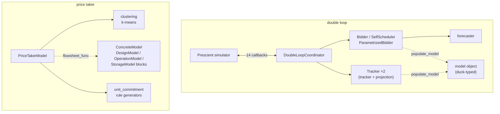
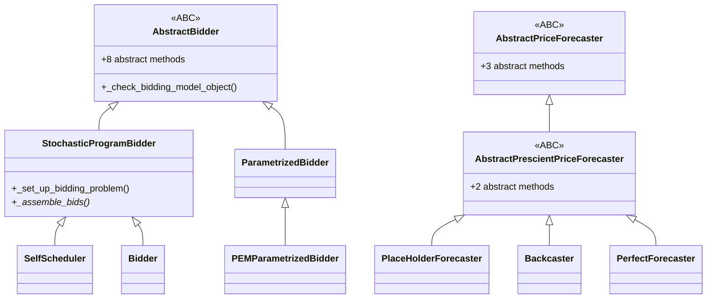
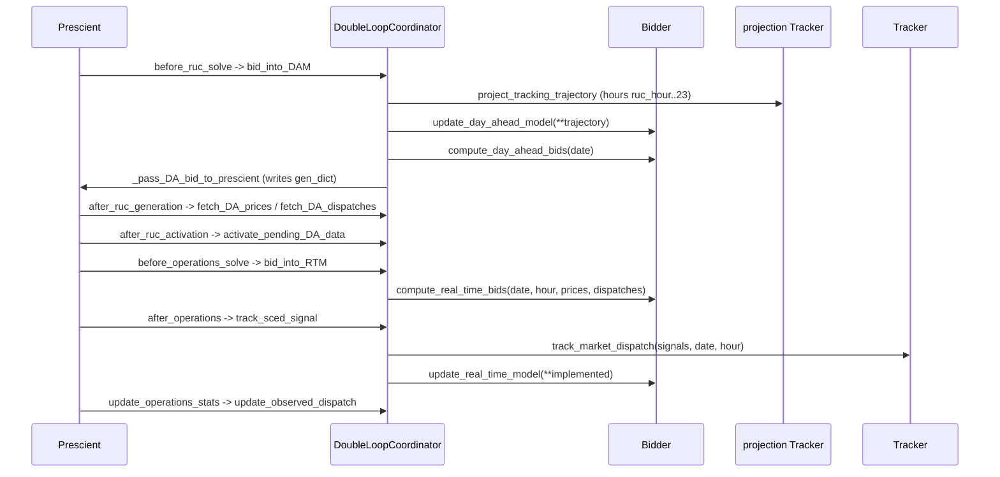
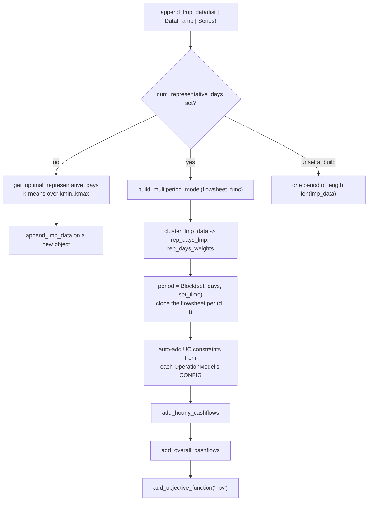

# 25 — Grid integration

> **Doc ID** 25 · **Repo SHA** 70a8f4fe1 (IDAES-PSE v2.13.0rc0) · **Source roots** `idaes/apps/grid_integration/**`
> **Owns** 18 modules / 8,673 LOC · **Assets** 1 shipped CSV fixture · **Siblings** [03](03_block_hierarchy_and_construction_protocol.md), [06](06_model_preparation_initializers_and_scalers.md), [24](24_reference_flowsheets_and_demonstrations.md), [27](27_dynamic_optimization_and_uncertainty.md), [29](29_dependency_and_layering_map.md), [31](31_extension_point_catalog.md), [32](32_repository_engineering.md)

This package connects an energy-system model to an electricity market. It holds
two independent applications that share a directory and almost nothing else: a
**double loop** that drives a process model through the Prescient production-cost
simulator as a market participant, and a **price taker** that turns a
steady-state flowsheet into a multi-period capacity-expansion problem against a
historical price signal. The single genuine coupling to `idaes/core` is in the
price-taker package, where three classes are declared with
`declare_process_block_class` ([03](03_block_hierarchy_and_construction_protocol.md));
everything else here is a plain Python class over `pyomo.environ`. The seam that
matters most is not a base class: a model object handed to `Bidder` or `Tracker`
is validated by name lookup, not by type, and the full contract exists only as
an example. Section 9 states it.

---

## 0. Scope and source map

| File | LOC | Purpose | Covered in § |
|---|---:|---|---|
| `idaes/apps/grid_integration/__init__.py` | 23 | Re-exports ten names; the package's whole public surface | 2 |
| `idaes/apps/grid_integration/bidder.py` | 1,704 | `AbstractBidder` and the five bidder implementations; the two-stage stochastic bidding program | 3, 5, 6, 7, 9, 10, 12 |
| `idaes/apps/grid_integration/tracker.py` | 451 | `Tracker` — the dispatch-following optimization and its result recorder | 3, 5, 6, 7, 9, 10 |
| `idaes/apps/grid_integration/coordinator.py` | 834 | `DoubleLoopCoordinator` — the Prescient plugin adapter and its 14 callback registrations | 3, 4, 5, 7, 9, 10 |
| `idaes/apps/grid_integration/forecaster.py` | 794 | The forecaster abstraction and its three concrete implementations | 3, 7, 9, 11 |
| `idaes/apps/grid_integration/model_data.py` | 414 | Descriptor-based validation of generator parameters | 3, 6, 7, 9, 11 |
| `idaes/apps/grid_integration/utils.py` | 44 | `convert_marginal_costs_to_actual_costs`, the one shared helper | 2, 7 |
| `idaes/apps/grid_integration/multiperiod/__init__.py` | 0 | Empty package marker | 2 |
| `idaes/apps/grid_integration/multiperiod/multiperiod.py` | 683 | `MultiPeriodModel` — callback-driven time coupling over a cloned flowsheet | 3, 5, 6, 7, 9, 11, 12 |
| `idaes/apps/grid_integration/pricetaker/__init__.py` | 0 | Empty package marker | 2 |
| `idaes/apps/grid_integration/pricetaker/price_taker_model.py` | 1,369 | `PriceTakerModel` — the price-taker workflow from LMP data to an NPV objective | 3, 4, 5, 6, 7, 12 |
| `idaes/apps/grid_integration/pricetaker/design_and_operation_models.py` | 687 | `DesignModel`, `OperationModel`, `StorageModel` — the three process block pairs in `idaes/apps` | 3, 4, 5, 6, 9, 12 |
| `idaes/apps/grid_integration/pricetaker/clustering.py` | 335 | k-means reduction of an LMP signal to representative days | 5, 7, 10, 11, 12 |
| `idaes/apps/grid_integration/pricetaker/unit_commitment.py` | 301 | `UnitCommitmentData` and the three constraint-rule generators | 4, 6, 7 |
| `idaes/apps/grid_integration/examples/__init__.py` | 0 | Empty package marker | 2 |
| `idaes/apps/grid_integration/examples/thermal_generator.py` | 800 | `ThermalGenerator` — the only complete implementation of the model-object protocol | 5, 9, 13 |
| `idaes/apps/grid_integration/examples/thermal_generator_prescient_plugin.py` | 101 | End-to-end wiring of tracker, projection tracker, bidder and coordinator | 5, 9 |
| `idaes/apps/grid_integration/examples/utils.py` | 133 | Loads the 5-bus test dataset and four hard-coded 24-element price arrays | 10 |

Total 8,673 LOC across 18 modules: 29 classes, 47 configuration keys, 5
`NotImplementedError` sites, 3 classes declared by `declare_process_block_class`,
no enumerations, no deprecation sites.

---

## 1. Architectural role

Two applications share this directory.

The **double loop** treats an IDAES model as a market participant inside a
production-cost simulation. Prescient solves a day-ahead unit commitment and a
sequence of real-time economic dispatches for a whole system; the double loop
inserts one generator whose bid curves come from an optimization over the IDAES
model rather than from static data, and whose delivered power comes from a
second optimization that tracks the dispatch the market awarded. The outer loop
is the bidder, the inner loop is the tracker, and `DoubleLoopCoordinator`
(`idaes/apps/grid_integration/coordinator.py:30`) binds both into Prescient's
callback system.

The **price taker** goes the other way: it assumes the participant is too small
to move prices, takes a price signal as given, clusters it into representative
days, replicates a steady-state flowsheet once per time period, and solves one
mixed-integer program for design and operation together. `PriceTakerModel`
(`idaes/apps/grid_integration/pricetaker/price_taker_model.py:170`) owns that
workflow; `MultiPeriodModel`
(`idaes/apps/grid_integration/multiperiod/multiperiod.py:24`) is an older,
lower-level facility that performs the same replication with user-supplied
linking callbacks.

Both applications reach an IDAES flowsheet through a callable, never through
inheritance — the double loop through an object with named methods, the price
taker through a function that populates a `ConcreteModel`. Neither imports a
unit model, a property package or a control volume.

*Two applications, two seams: the double loop calls named methods on an object it never typed, the price taker calls a function that builds a block.*

---

## 2. Public surface inventory

`idaes/apps/grid_integration/__init__.py` re-exports exactly ten names
(`:13`–`:19`). No module in this scope declares `__all__`, so every other symbol
is reachable only by its module path.

| Symbol | Kind | Declared at | Exported via | Stability signal |
|---|---|---|---|---|
| `Tracker` | class | `idaes/apps/grid_integration/tracker.py:19` | `idaes.apps.grid_integration` | re-exported at `:13`; `autoclass` in `docs/` |
| `Bidder` | class | `idaes/apps/grid_integration/bidder.py:1000` | `idaes.apps.grid_integration` | re-exported at `:14`; `autoclass` in `docs/` |
| `SelfScheduler` | class | `idaes/apps/grid_integration/bidder.py:780` | `idaes.apps.grid_integration` | re-exported at `:14`; `autoclass` in `docs/` |
| `DoubleLoopCoordinator` | class | `idaes/apps/grid_integration/coordinator.py:30` | `idaes.apps.grid_integration` | re-exported at `:15`; `autoclass` in `docs/` |
| `PlaceHolderForecaster` | class | `idaes/apps/grid_integration/forecaster.py:135` | `idaes.apps.grid_integration` | re-exported at `:16` |
| `MultiPeriodModel` | class | `idaes/apps/grid_integration/multiperiod/multiperiod.py:24` | `idaes.apps.grid_integration` | re-exported at `:17` |
| `PriceTakerModel` | class | `idaes/apps/grid_integration/pricetaker/price_taker_model.py:170` | `idaes.apps.grid_integration` | re-exported at `:18`; `autoclass` in `docs/` |
| `DesignModel` | class | synthesized at `idaes/apps/grid_integration/pricetaker/design_and_operation_models.py:136` | `idaes.apps.grid_integration` | re-exported at `:19`; generated by the decorator |
| `OperationModel` | class | synthesized at `idaes/apps/grid_integration/pricetaker/design_and_operation_models.py:288` | `idaes.apps.grid_integration` | re-exported at `:19`; generated by the decorator |
| `StorageModel` | class | synthesized at `idaes/apps/grid_integration/pricetaker/design_and_operation_models.py:562` | `idaes.apps.grid_integration` | re-exported at `:19`; generated by the decorator |
| `AbstractBidder` | class | `idaes/apps/grid_integration/bidder.py:30` | module path only | `ABC` with eight abstract methods |
| `StochasticProgramBidder` | class | `idaes/apps/grid_integration/bidder.py:219` | module path only | docstring names it a template class |
| `ParametrizedBidder` | class | `idaes/apps/grid_integration/bidder.py:1298` | module path only | no underscore |
| `PEMParametrizedBidder` | class | `idaes/apps/grid_integration/bidder.py:1502` | module path only | `autoclass` in `docs/` |
| `AbstractPriceForecaster` | class | `idaes/apps/grid_integration/forecaster.py:26` | module path only | `ABC` with three abstract methods |
| `AbstractPrescientPriceForecaster` | class | `idaes/apps/grid_integration/forecaster.py:99` | module path only | `ABC` with two further abstract methods |
| `Backcaster` | class | `idaes/apps/grid_integration/forecaster.py:321` | module path only | not re-exported |
| `PerfectForecaster` | class | `idaes/apps/grid_integration/forecaster.py:686` | module path only | not re-exported |
| `BaseValidator` | class | `idaes/apps/grid_integration/model_data.py:19` | module path only | `ABC`; a Python data descriptor |
| `StrValidator`, `RealValueValidator`, `AtLeastPminValidator` | classes | `idaes/apps/grid_integration/model_data.py:49`, `:58`, `:97` | module path only | no underscore |
| `GeneratorModelData` | class | `idaes/apps/grid_integration/model_data.py:129` | module path only | no underscore |
| `ThermalGeneratorModelData` | class | `idaes/apps/grid_integration/model_data.py:185` | module path only | imported by the example |
| `RenewableGeneratorModelData` | class | `idaes/apps/grid_integration/model_data.py:391` | module path only | no underscore |
| `DesignModelData`, `OperationModelData`, `StorageModelData` | classes | `idaes/apps/grid_integration/pricetaker/design_and_operation_models.py:136`, `:288`, `:562` | module path only | the data half of each pair |
| `is_valid_variable_design_data`, `is_valid_polynomial_surrogate_data`, `is_valid_startup_types` | functions | `idaes/apps/grid_integration/pricetaker/design_and_operation_models.py:48`, `:70`, `:88` | module path only | CONFIG domain validators |
| `startup_shutdown_constraints`, `capacity_limits`, `ramping_limits` | functions | `idaes/apps/grid_integration/pricetaker/unit_commitment.py:137`, `:240`, `:265` | module path only | rule generators |
| `generate_daily_data`, `cluster_lmp_data`, `get_optimal_num_clusters` | functions | `idaes/apps/grid_integration/pricetaker/clustering.py:35`, `:76`, `:142` | module path only | no underscore |
| `convert_marginal_costs_to_actual_costs` | function | `idaes/apps/grid_integration/utils.py:15` | module path only | the module's only name |
| `PrescientPluginModule`, `ForecastError`, `UnitCommitmentData` | classes | `idaes/apps/grid_integration/coordinator.py:24`, `forecaster.py:22`, `pricetaker/unit_commitment.py:26` | module path only | no underscore; undocumented |
| `ThermalGenerator` | class | `idaes/apps/grid_integration/examples/thermal_generator.py:26` | module path only | the reference model object |

Six classes carry an `autoclass` directive under
`docs/reference_guides/apps/grid_integration/`: `Tracker`,
`DoubleLoopCoordinator`, `Bidder`, `SelfScheduler`, `PEMParametrizedBidder` and
`PriceTakerModel`; `MultiPeriodModel`, the three process block pairs and every
forecaster appear in prose only.

---

## 3. Class hierarchy and type taxonomy

*The two `abc.ABC` hierarchies in this scope are the bidder tree and the forecaster tree; nothing else in the package uses inheritance for a contract.*

| Class | Base(s) | Declared at | Decorator | Container class | Key overrides |
|---|---|---|---|---|---|
| `AbstractBidder` | `ABC` | `idaes/apps/grid_integration/bidder.py:30` | none | — | 8 `@abstractmethod`, 4 `_check_*` |
| `StochasticProgramBidder` | `AbstractBidder` | `idaes/apps/grid_integration/bidder.py:219` | none | — | all 8 abstract methods |
| `SelfScheduler` | `StochasticProgramBidder` | `idaes/apps/grid_integration/bidder.py:780` | none | — | `_add_DA_bidding_constraints`, `_add_RT_bidding_constraints`, `_assemble_bids`, `_record_bids` |
| `Bidder` | `StochasticProgramBidder` | `idaes/apps/grid_integration/bidder.py:1000` | none | — | same four |
| `ParametrizedBidder` | `AbstractBidder` | `idaes/apps/grid_integration/bidder.py:1298` | none | — | all 8; two re-raise `NotImplementedError` |
| `PEMParametrizedBidder` | `ParametrizedBidder` | `idaes/apps/grid_integration/bidder.py:1502` | none | — | `compute_day_ahead_bids`, `compute_real_time_bids`, `_check_power` |
| `Tracker` | `object` | `idaes/apps/grid_integration/tracker.py:19` | none | — | — |
| `PrescientPluginModule` | `ModuleType` | `idaes/apps/grid_integration/coordinator.py:24` | none | — | `__init__` |
| `DoubleLoopCoordinator` | `object` | `idaes/apps/grid_integration/coordinator.py:30` | none | — | 25 methods, 12 of them registered callbacks |
| `ForecastError` | `Exception` | `idaes/apps/grid_integration/forecaster.py:22` | none | — | — |
| `AbstractPriceForecaster` | `ABC` | `idaes/apps/grid_integration/forecaster.py:26` | none | — | 3 `@abstractmethod` |
| `AbstractPrescientPriceForecaster` | `AbstractPriceForecaster` | `idaes/apps/grid_integration/forecaster.py:99` | none | — | 2 further `@abstractmethod` |
| `PlaceHolderForecaster` | `AbstractPrescientPriceForecaster` | `idaes/apps/grid_integration/forecaster.py:135` | none | — | all 5; `_forecast` draws from a normal distribution |
| `Backcaster` | `AbstractPrescientPriceForecaster` | `idaes/apps/grid_integration/forecaster.py:321` | none | — | all 5; three validated properties |
| `PerfectForecaster` | `AbstractPrescientPriceForecaster` | `idaes/apps/grid_integration/forecaster.py:686` | none | — | all 5; adds two capacity-factor methods |
| `BaseValidator` | `ABC` | `idaes/apps/grid_integration/model_data.py:19` | none | — | `__set_name__`, `__set__`, `__get__`, abstract `_validate` |
| `StrValidator` | `BaseValidator` | `idaes/apps/grid_integration/model_data.py:49` | none | — | `_validate` |
| `RealValueValidator` | `BaseValidator` | `idaes/apps/grid_integration/model_data.py:58` | none | — | `__init__(min_val, max_val)`, `_validate` |
| `AtLeastPminValidator` | `BaseValidator` | `idaes/apps/grid_integration/model_data.py:97` | none | — | `_validate` reads `instance.p_min` |
| `GeneratorModelData` | `object` | `idaes/apps/grid_integration/model_data.py:129` | none | — | `__iter__`, `__next__`; 4 descriptors |
| `ThermalGeneratorModelData` | `GeneratorModelData` | `idaes/apps/grid_integration/model_data.py:185` | none | — | 6 further descriptors, 2 validated properties |
| `RenewableGeneratorModelData` | `GeneratorModelData` | `idaes/apps/grid_integration/model_data.py:391` | none | — | 1 further descriptor |
| `MultiPeriodModel` | `pyo.ConcreteModel` | `idaes/apps/grid_integration/multiperiod/multiperiod.py:24` | none | — | `__init__`; 2 static plotting methods |
| `PriceTakerModel` | `ConcreteModel` | `idaes/apps/grid_integration/pricetaker/price_taker_model.py:170` | none | — | `__init__`; 33 methods |
| `DesignModelData` | `ProcessBlockData` | `idaes/apps/grid_integration/pricetaker/design_and_operation_models.py:136` | `@declare_process_block_class("DesignModel")` | `DesignModel` | `build`, `_build_variable_design_model` |
| `OperationModelData` | `ProcessBlockData` | `idaes/apps/grid_integration/pricetaker/design_and_operation_models.py:288` | `@declare_process_block_class("OperationModel")` | `OperationModel` | `build`, `build_polynomial_surrogates`, `build_expressions` |
| `StorageModelData` | `ProcessBlockData` | `idaes/apps/grid_integration/pricetaker/design_and_operation_models.py:562` | `@declare_process_block_class("StorageModel")` | `StorageModel` | `build` |
| `UnitCommitmentData` | `object` | `idaes/apps/grid_integration/pricetaker/unit_commitment.py:26` | none | — | `_get_config`, `update`, 3 assertions |
| `ThermalGenerator` | `object` | `idaes/apps/grid_integration/examples/thermal_generator.py:26` | none | — | the model-object protocol, §9.1 |

### 3.1 The three process block pairs

These are the only classes in `idaes/apps` declared with
`declare_process_block_class`, and therefore the only place in the applications
layer where the `FooData`/`Foo` pair rule of
[03 §3](03_block_hierarchy_and_construction_protocol.md#3-class-hierarchy-and-type-taxonomy)
applies. Both the decorator and `ProcessBlockData` are imported from
`idaes.core.base.process_base`
(`idaes/apps/grid_integration/pricetaker/design_and_operation_models.py:22`,
`:23`) rather than from `idaes.core`. `DesignModelData` declares 4 CONFIG keys
and builds at `:208`, `OperationModelData` 16 keys and `:452`,
`StorageModelData` 7 keys and `:622`.

Each `build()` calls `super().build()` first, so each block resolves its
configuration through `ProcessBlockData._get_config_args`. None of the three
declares `dynamic` or `has_holdup`, none calls `flowsheet()`, and none is placed
inside a `FlowsheetBlock`: a price-taker flowsheet is a bare `ConcreteModel`
(`idaes/apps/grid_integration/pricetaker/price_taker_model.py:358`). No class in
this scope names a `default_initializer` or a `default_scaler`; see
[06](06_model_preparation_initializers_and_scalers.md).

### 3.2 Enumerations

Not applicable: no module in this scope declares an `Enum`. Categorical choices
are plain strings validated at the point of use — `generator_type` returns
`"thermal"` (`idaes/apps/grid_integration/model_data.py:327`) or `"renewable"`
(`:410`), `objective_type` is matched by `getattr` against the cashflows block
(`idaes/apps/grid_integration/pricetaker/price_taker_model.py:1156`), and the
clustering `method` argument is compared against two literals
(`idaes/apps/grid_integration/pricetaker/clustering.py:203`, `:207`).

---

## 4. Configuration reference

47 keys across six declarations. Three belong to process block `CONFIG` blocks
in the sense of [01 §2.1](01_glossary_and_conventions.md#21-the-block-system);
the other three are `ConfigDict` instances used as plain validated bags — one on
the coordinator, one at module scope in `price_taker_model.py`, one built per
instance in `UnitCommitmentData._get_config`.

### 4.1 `DoubleLoopCoordinator.get_configuration`

Built fresh on each call (`idaes/apps/grid_integration/coordinator.py:111`) and
returned to Prescient, which merges it into its own option set.

| Key | Domain / validator | Default | Req. | Effect on build | Anchor |
|---|---|---|---|---|---|
| `bidding_generator` | `str` | `None` | no | Registered as the command-line argument `--bidding-generator` (`:121`); names the generator the plugin bids for | `idaes/apps/grid_integration/coordinator.py:114` |

The coordinator never reads this key; the generator name it uses comes from
`model_data.gen_name` on the bidding model object (`coordinator.py:462`).

### 4.2 `DesignModelData.CONFIG`

`ConfigDict()` declared at
`idaes/apps/grid_integration/pricetaker/design_and_operation_models.py:179`.
The three data-bearing keys are mutually exclusive and tested in the order
`fixed_design_data`, `variable_design_data`, `model_func` (`:216`, `:221`,
`:225`); with none set, `build()` warns and returns before the `capex`/`fom`
check.

| Key | Domain / validator | Default | Req. | Effect on build | Anchor |
|---|---|---|---|---|---|
| `model_func` | none | none | no | Called as `model_func(self, **model_args)` to build the design model | `:180` |
| `model_args` | none | `{}` | no | Keyword arguments forwarded to `model_func` | `:186` |
| `fixed_design_data` | `dict` | none | no | Each entry becomes a mutable `Param` on the block (`:219`) | `:193` |
| `variable_design_data` | `is_valid_variable_design_data` | none | no | Builds a bounded design `Var`, two bound constraints and one `Expression` per auxiliary variable (`:254`) | `:200` |

`is_valid_variable_design_data` (`:48`) rewrites the supplied dictionary: it
pops `design_var` and `design_var_bounds`, raising `ConfigurationError` if
either is absent (`:52`, `:55`), and routes every remaining entry through
`_format_data` (`:30`) into an `auxiliary_vars` sub-dictionary of polynomial
coefficient lists.

### 4.3 `OperationModelData.CONFIG`

`ConfigDict()` declared at `:323`. Sixteen keys; the nine unit-commitment keys
are not consumed by `build()` but are read off each instance by
`PriceTakerModel.build_multiperiod_model`
(`price_taker_model.py:400`–`:452`).

| Key | Domain / validator | Default | Req. | Effect on build | Anchor |
|---|---|---|---|---|---|
| `model_func` | none | none | no | Called as `model_func(self, **model_args)` when no surrogate data is given | `:324` |
| `model_args` | none | `{}` | no | Keyword arguments forwarded to `model_func` | `:330` |
| `declare_op_vars` | `Bool` | `True` | no | Creates the `op_mode`, `startup` and `shutdown` binaries (`:457`, `:462`, `:467`) | `:337` |
| `declare_lmp_param` | `Bool` | `True` | no | Creates the mutable `LMP` `Param` (`:480`) that the price taker overwrites per period | `:348` |
| `polynomial_surrogate_data` | `is_valid_polynomial_surrogate_data` | none | no | Declares the operation `Var` and calls `build_polynomial_surrogates` (`:489`) | `:359` |
| `design_block_name` | `str` | none | no | Passed as `des_block_name` to `add_startup_shutdown` | `:367` |
| `commodity` | `str` | none | no | Name of the variable the capacity and ramping limits apply to | `:374` |
| `capacity` | none | none | no | Maximum capacity; a float or a Pyomo `Param`, `Var` or `Expression` | `:381` |
| `op_range_lb` | `is_in_range(0, 1)` | none | no | Minimum stable operation as a fraction of capacity | `:385` |
| `minimum_up_time` | `PositiveInt` | none | no | Together with `minimum_down_time`, triggers `add_startup_shutdown` | `:392` |
| `minimum_down_time` | `PositiveInt` | none | no | as above | `:403` |
| `startup_rate` | `is_in_range(0, 1)` | none | no | One of the four ramping fractions | `:414` |
| `shutdown_rate` | `is_in_range(0, 1)` | none | no | as above | `:421` |
| `rampup_rate` | `is_in_range(0, 1)` | none | no | as above | `:428` |
| `rampdown_rate` | `is_in_range(0, 1)` | none | no | as above | `:435` |
| `startup_types` | `is_valid_startup_types` | none | no | Creates `startup_type_vars` indexed by the type names (`:473`) | `:443` |

`is_valid_startup_types` (`:88`) enforces a dictionary of at least two entries
whose keys are valid Python identifiers and whose integer values are distinct,
returning it sorted by value (`:112`–`:132`); one entry raises
`ConfigurationError` (`:96`).

### 4.4 `StorageModelData.CONFIG`

`ConfigDict()` declared at `:567`.

| Key | Domain / validator | Default | Req. | Effect on build | Anchor |
|---|---|---|---|---|---|
| `time_interval` | `NonNegativeFloat` | `1` | no | Multiplies the net charge term in `track_holdup_constraint` (`:677`) | `:568` |
| `charge_efficiency` | `is_in_range(0, 1)` | `1` | no | Multiplies `charge_rate` in the holdup balance | `:576` |
| `discharge_efficiency` | `is_in_range(0, 1)` | `1` | no | Divides `discharge_rate` in the holdup balance | `:584` |
| `min_holdup` | `_is_valid_data_type_for_storage_model` | none | no | A number becomes a variable lower bound; a Pyomo object becomes two constraints (`:667`, `:671`) | `:592` |
| `max_holdup` | same | none | no | Same split, applied to both holdup variables | `:599` |
| `max_charge_rate` | same | none | no | Same split, applied to `charge_rate` | `:606` |
| `max_discharge_rate` | same | none | no | Same split, applied to `discharge_rate` | `:613` |

`_is_valid_data_type_for_storage_model` (`:537`) accepts `int`, `float`,
`Param`, `Var` and `Expression` directly, then falls back to the Pyomo type
predicates so unnamed expressions and indexed components pass; anything else
raises `ConfigurationError` (`:552`, `:558`).

### 4.5 Module-level `CONFIG` in `price_taker_model.py`

A module-level `ConfigDict`
(`idaes/apps/grid_integration/pricetaker/price_taker_model.py:66`) copied per
instance into `self._config` (`:175`). It is not a process block `CONFIG` block:
`PriceTakerModel` subclasses `ConcreteModel`, not `ProcessBlockData`.

| Key | Domain / validator | Default | Req. | Effect on build | Anchor |
|---|---|---|---|---|---|
| `seed` | `NonNegativeInt` | `20` | no | `random_state` for every k-means fit | `:69` |
| `horizon_length` | `PositiveInt` | none | no | Length of a representative period; a getter substitutes 24 with a warning when unset (`:200`) | `:77` |
| `num_clusters_range` | `ListOf(int, PositiveInt)` | `(5, 30)` | no | Validates the `kmin`/`kmax` pair passed to `get_optimal_representative_days` (`:284`) | `:84` |
| `num_clusters` | `PositiveInt` | none | no | Number of representative days; write-once through the property setter (`:188`) | `:92` |
| `lmp_data` | `ListOf(float)` | none | no | The price signal; write-once, guarded at `:257` | `:99` |
| `minimum_up_time` | `PositiveInt` | none | no | Declared, but written through `self.config`, not `self._config` — §12 | `:108` |
| `minimum_down_time` | `PositiveInt` | none | no | as above | `:115` |
| `lifetime` | `PositiveInt` | none | no | as above; divides `capex` into a yearly depreciation | `:124` |
| `discount_rate` | `is_in_range(0, 1)` | none | no | as above; also the default annualization factor | `:131` |
| `corporate_tax_rate` | `is_in_range(0, 1)` | none | no | Declared; the method writes the key `corporate_tax` instead (`:1055`) — §12 | `:138` |
| `annualization_factor` | `is_in_range(0, 1)` | none | no | as above; scales `capex` in the NPV expression | `:145` |
| `cash_inflow_scale_factor` | `NonNegativeFloat` | none | no | as above; scales the summed hourly cash inflow | `:152` |
| `startup_types` | `is_valid_startup_types` | none | no | as above; forwarded to `startup_shutdown_constraints` | `:160` |

### 4.6 `UnitCommitmentData.config`

Built per instance by `_get_config`
(`idaes/apps/grid_integration/pricetaker/unit_commitment.py:35`) and populated
through `update(**kwargs)` (`:84`), which calls `config.set_value` and then two
consistency assertions.

| Key | Domain / validator | Default | Req. | Effect on build | Anchor |
|---|---|---|---|---|---|
| `startup_rate` | `is_in_range(0, 1)` | none | no | Multiplies `capacity` in `ramp_up_con` (`:282`) | `:37` |
| `shutdown_rate` | `is_in_range(0, 1)` | none | no | Multiplies `capacity` in `ramp_down_con` (`:293`) | `:44` |
| `rampup_rate` | `is_in_range(0, 1)` | none | no | Multiplies `capacity` in `ramp_up_con` | `:51` |
| `rampdown_rate` | `is_in_range(0, 1)` | none | no | Multiplies `capacity` in `ramp_down_con` | `:58` |
| `op_range_lb` | `is_in_range(0, 1)` | none | no | Lower limit fraction in `capacity_low_limit_con` (`:257`) | `:65` |
| `capacity` | none | none | no | The capacity term every limit multiplies | `:72` |

`assert_startup_rate_validity` (`:90`) and `assert_shutdown_rate_validity`
(`:103`) run on every `update` and return silently when either value in the pair
is unset; `assert_ramping_args_present` (`:116`) is called only from
`add_ramping_limits` (`price_taker_model.py:794`).

---

## 5. Construction and call sequences

### 5.1 Wiring the double loop

`thermal_generator_prescient_plugin.py` is the whole wiring, executed at import
time because Prescient imports the plugin file as a module: build a forecaster
(`idaes/apps/grid_integration/examples/thermal_generator_prescient_plugin.py:39`);
build **three** independent model objects, one each for the tracker, the
projection tracker and the bidder (`:52`, `:65`, `:78`), because each ends up in
a separate Pyomo model; construct `Tracker` twice (`:57`, `:70`) and `Bidder`
once (`:83`); construct `DoubleLoopCoordinator(bidder, tracker,
projection_tracker)` (`:93`), which stores the three objects and nothing else
(`idaes/apps/grid_integration/coordinator.py:54`); and expose
`get_configuration` and `register_plugins` as module-level names (`:100`,
`:101`) — the two attributes Prescient looks for. The alternative to the last
step is the `prescient_plugin_module` property (`coordinator.py:126`), which
returns a `PrescientPluginModule`, a `types.ModuleType` subclass whose
`__init__` (`:25`) assigns the two bound methods as attributes, so a caller can
pass the object itself where Prescient expects a module path.

### 5.2 One simulated day

*Every arrow from Prescient is one of the registered callbacks in §9.6; the coordinator holds no simulation state beyond the six `current_*`/`next_*` attributes it swaps in `activate_pending_DA_data`.*

`bid_into_DAM` (`idaes/apps/grid_integration/coordinator.py:468`) detects the
first simulated day by `simulator.time_manager.current_time is None` (`:489`)
and skips the projection and the model update, there being no implemented
history yet. `project_tracking_trajectory` (`:321`) first calls
`_clone_tracking_model` (`:366`), which walks `component_objects(Var)` then
`component_objects(Param)` on both tracking models in
`SortComponents.alphabetizeComponentAndIndex` order and copies every value
rounded to four decimals, raising `ValueError` on a name mismatch (`:390`); it
then solves the projection tracker once per remaining hour and concatenates the
projection's `daily_stats` onto the real tracker's.

### 5.3 Building a stochastic bidding program

`StochasticProgramBidder.__init__`
(`idaes/apps/grid_integration/bidder.py:224`) runs `_check_inputs()` (`:264`),
reads the generator name off `model_data` (`:266`), and builds **two** complete
models, one per market (`:269`, `:270`). `_set_up_bidding_problem(horizon)`
(`:275`) creates a `ConcreteModel` (`:287`), the scenario `Set` (`:289`) and
`model.fs = pyo.Block(model.SCENARIOS)` (`:291`), then calls
`bidding_model_object.populate_model(model.fs[i], horizon)` once per scenario
(`:293`) — every scenario gets a structurally identical copy of the process
model and they differ only in the price parameters. `_save_power_outputs`
(`:339`) reads the `power_output` name (`:353`) and attaches
`model.fs[i].power_output_ref = pyo.Reference(...)` (`:354`), whose
`index_set()` indexes every later component. `_add_bidding_params` (`:360`),
`_add_bidding_vars` (`:385`) and `_add_bidding_objective` (`:418`) then add the
components listed in §6.1; the objective accumulates, per scenario and period,
day-ahead revenue plus real-time settlement of the deviation, minus
`weight * cost[t]` read through `total_cost` (`:439`, `:441`), minus the
underbid penalty.

`formulate_DA_bidding_problem` (`:303`) adds the day-ahead constraints and fixes
`real_time_underbid_power` to zero in every scenario;
`formulate_RT_bidding_problem` (`:321`) adds the real-time constraints and
unfixes it. The two subclasses differ only in those constraints: `SelfScheduler`
imposes non-anticipativity on `day_ahead_power` (`:849`) and on
`power_output_ref` (`:878`), while `Bidder` requires the product of the power
difference and the price difference between any two scenarios to be non-negative
(`:1071`, `:1104`), which is what makes the assembled bid curve non-decreasing.

`Bidder._assemble_bids` (`:1113`) then builds a `{power: marginal_cost}`
dictionary per period across scenarios, discards any solution below `p_min`
(`:1153`), appends the whole default cost curve or only its first point
depending on `include_default_p_cost` (`:1163`), sorts by power, forces the
curve non-decreasing, converts marginal to cumulative costs with
`convert_marginal_costs_to_actual_costs`
(`idaes/apps/grid_integration/utils.py:15`), validates each curve through
Egret's `tx_utils.validate_and_clean_cost_curve` (`:1203`), and expands each
period into the dictionary Prescient expects — `p_cost`, `p_min`, `p_max`,
`p_min_agc`, `p_max_agc`, `startup_capacity`, `shutdown_capacity` and optionally
`fixed_commitment`. `SelfScheduler._assemble_bids` (`:887`) produces a different
shape: `p_max` is the solved power, `p_min` the generator's own unless
`fixed_to_schedule` raises it to `p_max` and adds a `fixed_commitment` flag, and
a thermal generator's curve is flattened to two zero-cost points.

### 5.4 Building the tracking problem

`Tracker.__init__` (`idaes/apps/grid_integration/tracker.py:25`) checks its
inputs (`:49`), creates `self.model` and `self.model.fs` (`:52`, `:53`), calls
`populate_model(self.model.fs, self.tracking_horizon)` (`:54`), resolves the
power variable by name (`:57`, `:58`), takes `self.time_set` from its index set
(`:61`) and calls `formulate_tracking_problem()` (`:63`).

The penalty schedule is what makes the rolling horizon behave: `deviation_penalty`
is `10000` for every period before `n_tracking_hour` and
`10000 / (tracking_horizon - n_tracking_hour)` afterwards (`:208`), so deviation
in the periods that are actually implemented costs far more than deviation in
the look-ahead tail. `track_market_dispatch` (`:283`) passes the dispatch signal
into the parameters — deactivating the constraint for any period the signal does
not cover (`:354`) — solves, records results, calls `get_implemented_profile` on
the model object (`:307`) and folds the answer into `daily_stats` through
`_record_daily_stats` (`:315`), which keeps a rolling 24-hour window by popping
from the left of each `deque`.

### 5.5 `MultiPeriodModel`

Two construction paths share only the flowsheet-instance helper. The
**sequential** path, `build_multi_period_model`
(`idaes/apps/grid_integration/multiperiod/multiperiod.py:135`), is called
explicitly after construction: it creates `m.TIME` and `m.blocks` (`:174`,
`:175`), then either builds one instance through `_construct_flowsheet_instance`
(`:315`) and clones it per period or — when `model_data_kwargs` is supplied —
calls `process_model_func` once per period and skips initialization with a
warning; it walks consecutive pairs, calls `linking_variable_func` on each and
turns the returned pairs into `link_constraints` (`:303`), optionally closing
the horizon with `periodic_constraints` (`:311`). `advance_time` (`:225`) rolls
that structure forward one period at a time.

The **stochastic** path runs from `__init__` when `use_stochastic_build=True`
(`:124`). `build_stochastic_multi_period` (`:351`) builds `set_period` as the
cross product of whichever of `set_time`, `set_days` and `set_years` are present
(`:366`), builds one scenario model and, given `set_scenarios`, clones it into
`self.scenario` (`:481`); linking constraints go into a separate
`m.link_constraints` `Block` whose indexing mirrors the period set (`:412`,
`:427`, `:441`, `:453`), and periodic constraints are unsupported — supplying
`periodic_variable_func` produces a warning and nothing else (`:465`). Both
paths reach `_construct_flowsheet_instance` (`:315`), which holds the optional
initialization: build a bare `ConcreteModel`, call `process_model_func`, run
`initialization_func` and a solve that raises `InitializationError` (`:334`)
unless it terminates optimally, then call `unfix_dof_func`.

### 5.6 The price-taker workflow

*The workflow is ordered by explicit guards, not by a driver: each stage raises `ConfigurationError` when the previous one has not run.*

1. `append_lmp_data` (`idaes/apps/grid_integration/pricetaker/price_taker_model.py:230`)
   asserts at least two prices and writes `lmp_data`, `num_clusters`,
   `horizon_length` and `seed` into `self._config`; a second call raises
   `ConfigurationError` (`:266`), as do the `num_representative_days` (`:191`)
   and `horizon_length` (`:215`) setters.
2. `get_optimal_representative_days` (`:271`) reshapes the signal with
   `generate_daily_data` and delegates to `get_optimal_num_clusters`; it returns
   a number and does not store it.
3. `build_multiperiod_model` (`:300`) clusters the signal (`:339`) or, with
   `num_clusters` unset, treats the whole signal as one representative day of
   full length (`:348`); it creates `set_days`, `set_time`, `rep_days_lmp` and
   `rep_days_weights` (`:353`), builds the flowsheet once into a bare
   `ConcreteModel` (`:358`, `:361`), and clones it into `period[d, t]` with
   `transfer_attributes_from` (`:367`, `:369`), overwriting every `LMP` `Param`
   at flowsheet level or on any nested block (`:373`, `:377`).
4. Still inside `build_multiperiod_model`, it scans the prototype for
   `StorageModelData` instances and adds holdup linking and periodic constraints
   (`:382`), then for `OperationModelData` instances and adds startup/shutdown,
   capacity and ramping constraints from their CONFIG values (`:400`, `:411`,
   `:429`, `:445`).
5. The three cashflow stages each guard on the previous one —
   `add_hourly_cashflows` (`:911`), `add_overall_cashflows` (`:1011`, guard at
   `:1060`) and `add_objective_function` (`:1137`, guard at `:1150`) — and build
   the components listed in §6.3.

### 5.7 Clustering

`cluster_lmp_data` (`idaes/apps/grid_integration/pricetaker/clustering.py:76`)
reshapes the signal through `generate_daily_data` (`:35`), which truncates a
trailing partial period with a warning (`:61`) and transposes so each day is a
row; it fits `KMeans(n_clusters, random_state=seed)` (`:122`), zeroes centroid
entries below `eps` (`:127`), and returns a `{day: {period: price}}` dictionary
of Python floats plus a `{day: count}` weight dictionary.

`get_optimal_num_clusters` (`:142`) validates `kmin < kmax`, `kmin > 1` and
`kmax < len(samples)` (`:184`, `:188`, `:191`), then fits one k-means per `k`,
collecting inertia and mean silhouette score (`:197`). The `silhouette` method
takes the arg-max of the scores; the `elbow` method calls `_elbow_method`
(`:238`), which implements the Kneedle procedure — invert the inertia curve,
smooth it with a cubic spline through `scipy.interpolate.splrep`/`splev`
(`:248`, `:250`), normalize both axes with `_normalize_values` (`:332`), and
walk a sensitivity threshold between the local maxima of the difference curve.
No local maximum raises `RuntimeError` (`:278`); a threshold never crossed falls
back to the first maximum with a warning (`:324`).

---

## 6. Data structures, variables, constraints and invariants

### 6.1 Components created on a bidding model

Each component below is created once per scenario on `model.fs[i]`, indexed by
`power_output_ref.index_set()` — the index set of whatever variable the model
object named in `power_output`.

| Component | Type | Index sets | Units | Created at | Condition |
|---|---|---|---|---|---|
| `SCENARIOS` | `Set` | — | — | `bidder.py:289` | always |
| `fs` | `Block` | `SCENARIOS` | — | `bidder.py:291` | always |
| `power_output_ref` | `Reference` | time | MW | `bidder.py:354` | always |
| `day_ahead_energy_price` | `Param`, mutable | time | $/MWh | `bidder.py:373` | always |
| `real_time_energy_price` | `Param`, mutable | time | $/MWh | `bidder.py:376` | always |
| `real_time_underbid_penalty` | `Param`, mutable | — | $/MWh | `bidder.py:379` | always |
| `day_ahead_power` | `Var`, `NonNegativeReals` | time | MW | `bidder.py:404` | always |
| `real_time_underbid_power` | `Var`, `NonNegativeReals` | time | MW | `bidder.py:408` | always |
| `day_ahead_power_ub` | `Constraint` | time | — | `bidder.py:412` | always |
| `obj` | `Objective`, maximize | — | $ | `bidder.py:431` | on the model, not the scenario block |
| `day_ahead_bidding_constraints` | `Constraint` | SCENARIOS × SCENARIOS × time | — | `bidder.py:849` / `:1071` | self-scheduler / bidder |
| `real_time_bidding_constraints` | `Constraint` | SCENARIOS × SCENARIOS × time | — | `bidder.py:878` / `:1104` | self-scheduler / bidder |

No component in this scope carries a Pyomo unit of measurement; MW and $/MWh are
a convention of the variable names and the result column headers only.

### 6.2 Components created on a tracking model

| Component | Type | Index sets | Units | Created at | Condition |
|---|---|---|---|---|---|
| `fs` | `Block` | — | — | `tracker.py:53` | always |
| `power_dispatch` | `Param`, mutable | `time_set` | MW | `tracker.py:200` | always |
| `deviation_penalty` | `Param`, immutable | `time_set` | $/MWh | `tracker.py:213` | always |
| `power_underdelivered` | `Var`, `NonNegativeReals` | `time_set` | MW | `tracker.py:178` | always |
| `power_overdelivered` | `Var`, `NonNegativeReals` | `time_set` | MW | `tracker.py:181` | always |
| `tracking_dispatch_constraints` | `Constraint` | `time_set` | — | `tracker.py:238` | always |
| `obj` | `Objective`, minimize | — | $ | `tracker.py:257` | always |

### 6.3 Components created by the multiperiod and price-taker models

`MultiPeriodModel` creates, on itself: `TIME` and `blocks` on the sequential
path (`multiperiod.py:174`, `:175`); `set_time`, and optionally `set_days`,
`set_years` and `set_scenarios`, in `__init__` (`:94`, `:97`, `:104`, `:111`);
`set_period` and `period` on the stochastic path (`:383`, `:394`);
`link_constraints` as a `Block` indexed to match the period set (`:412`, `:427`,
`:441`, `:453`); and `scenario` when a scenario set was given (`:481`). The
per-pair equalities themselves are `link_constraints` and `periodic_constraints`
on the earlier process block of each pair (`:303`, `:311`). The table below
covers `PriceTakerModel`.

| Component | Type | Index sets | Units | Created at | Condition |
|---|---|---|---|---|---|
| `set_days`, `set_time` | `RangeSet` | — | — | `price_taker_model.py:353`, `:354` | `build_multiperiod_model` |
| `period` | `Block` | days × time | — | `price_taker_model.py:367` | `build_multiperiod_model` |
| `variable_linking_constraints_<n>` | `Constraint` | days × time | as the linked variable | `price_taker_model.py:597` | `add_linking_constraints` |
| `variable_linking_constraints_<n>` | `Constraint` | days | as the linked variable | `price_taker_model.py:627` | `add_periodic_constraints` |
| `<blk>_<commodity>_limits` | `Block` | days | — | `price_taker_model.py:715` | `add_capacity_limits` |
| `<blk>_<commodity>_ramping` | `Block` | days | — | `price_taker_model.py:805` | `add_ramping_limits` |
| `<blk>_startup_shutdown` | `Block` | days | — | `price_taker_model.py:884` | `add_startup_shutdown` |
| `total_hourly_cost`, `total_hourly_revenue`, `net_hourly_cash_inflow` | `Expression` | per period block | $ | `price_taker_model.py:993`, `:996`, `:999` | `add_hourly_cashflows` |
| `cashflows` | `Block` | — | — | `price_taker_model.py:1083` | `add_overall_cashflows` |
| `cashflows.capex`, `.fom`, `.depreciation`, `.corporate_tax` | `Var`, `NonNegativeReals` | — | $ | `price_taker_model.py:1085`, `:1088`, `:1091`, `:1110` | as above |
| `cashflows.net_cash_inflow`, `.net_profit` | `Var` | — | $ | `price_taker_model.py:1096`, `:1116` | as above |
| `cashflows.lifetime_npv`, `.npv` | `Expression` | — | $ | `price_taker_model.py:1127`, `:1130` | as above |
| `obj` | `Objective`, maximize | — | $ | `price_taker_model.py:1156` | `add_objective_function` |

`_get_valid_block_name` (`price_taker_model.py:655`) supplies the prefixes: take
the last dotted segment, replace `[`, `]` and `,` with underscores and strip
trailing underscores, so `fs.unit[1]` yields `unit_1`.

### 6.4 Components created on the three process blocks

| Component | Type | Index sets | Units | Created at | Condition |
|---|---|---|---|---|---|
| `install_unit` | `Var`, `Binary` | — | — | `design_and_operation_models.py:211` | every `DesignModel` |
| `<name>` | `Param`, mutable | — | per entry | `design_and_operation_models.py:219` | one per `fixed_design_data` entry |
| `<design_var>` | `Var`, `NonNegativeReals`, bounded above | — | per design | `design_and_operation_models.py:258` | `variable_design_data` |
| `design_lb_constraint`, `design_ub_constraint` | `Constraint` | — | — | `design_and_operation_models.py:270`, `:274` | `variable_design_data` |
| `op_mode`, `startup`, `shutdown` | `Var`, `Binary` | — | — | `design_and_operation_models.py:457`, `:462`, `:467` | `declare_op_vars` |
| `startup_type_vars` | `Var`, `Binary` | startup-type names | — | `design_and_operation_models.py:473` | `startup_types` set |
| `LMP` | `Param`, mutable | — | $/MWh | `design_and_operation_models.py:480` | `declare_lmp_param` |
| `initial_holdup`, `final_holdup`, `charge_rate`, `discharge_rate` | `Var`, `NonNegativeReals` | — | per commodity | `design_and_operation_models.py:625`, `:629`, `:632`, `:633` | every `StorageModel` |
| `<var>_ub_con`, `final_holdup_lb_con`, `initial_holdup_lb_con` | `Constraint` | — | — | `design_and_operation_models.py:645`, `:667`, `:671` | bound supplied as a Pyomo object |
| `track_holdup_constraint` | `Constraint` | — | — | `design_and_operation_models.py:677` | every `StorageModel` |

`unit_commitment.py` adds, on a per-day block: `binary_relationship_con`
(`:156`), `minimum_up_time_con` (`:166`), `minimum_down_time_con` (`:176`),
`startup_duration` as a `Param` plus `tot_startup_type_rule` (`:200`, `:203`)
and one `Startup_Type_Constraint_<type>` per startup type beyond the first
(`:234`), `capacity_low_limit_con`/`capacity_high_limit_con` (`:257`, `:261`),
and `ramp_up_con`/`ramp_down_con` (`:282`, `:293`).

### 6.5 Invariants

| Invariant | Enforced at |
|---|---|
| A bidding model object exposes `populate_model`, `update_model`, `power_output`, `total_cost` and `model_data` | `bidder.py:172`, `:173` |
| A tracking model object exposes six methods and two attributes | `tracker.py:84`, `:92` |
| The number of LMP scenarios is a positive `int` | `bidder.py:198`, `:203` |
| The number of implemented tracking hours is a positive `int` | `tracker.py:123`, `:129` |
| Tracker and projection tracker hold structurally identical models | `coordinator.py:389` |
| `p_max` and every capacity is at least `p_min` | `model_data.py:104`–`:126` |
| `initial_status` is a non-zero real | `model_data.py:350`–`:356` |
| `initial_p_output` agrees in sign with `initial_status` | `model_data.py:371`–`:386` |
| LMP data is written at most once | `price_taker_model.py:266` |
| A multiperiod model exists before any constraint builder runs | `price_taker_model.py:294` |
| No capacity, ramping or startup block is built twice for the same block and commodity | `price_taker_model.py:710`, `:800`, `:878` |

---

## 7. Method contracts

### 7.1 `idaes/apps/grid_integration/bidder.py`

| Method | Signature | Preconditions | Effects | Returns | Raises | Anchor |
|---|---|---|---|---|---|---|
| `AbstractBidder._check_inputs` | `(self)` | `bidding_model_object`, `n_scenario`, `solver` set | none | `None` | propagates | `:158` |
| `_check_bidding_model_object` | `(self)` | — | none | `None` | `AttributeError` | `:167` |
| `_check_n_scenario` | `(self)` | — | none | `None` | `TypeError`, `ValueError` | `:192` |
| `_check_solver` | `(self)` | — | none | `None` | `TypeError` | `:208` |
| `StochasticProgramBidder.__init__` | `(self, bidding_model_object, day_ahead_horizon, real_time_horizon, n_scenario, solver, forecaster, real_time_underbid_penalty)` | model object satisfies §9.1 | Builds both market models | `None` | propagates | `:224` |
| `formulate_DA_bidding_problem` / `formulate_RT_bidding_problem` | `(self)` | — | Adds market constraints; fixes or unfixes the underbid variable | `ConcreteModel` | propagates | `:303`, `:321` |
| `compute_day_ahead_bids` | `(self, date, hour=0)` | day-ahead model built | Forecasts, solves, records | bid `dict` | propagates from the solver | `:508` |
| `compute_real_time_bids` | `(self, date, hour, realized_day_ahead_prices, realized_day_ahead_dispatches)` | real-time model built | Fixes realized dispatch, solves, records | bid `dict` | propagates | `:545` |
| `update_day_ahead_model` / `update_real_time_model` | `(self, **kwargs)` | — | Calls the model object's `update_model` per scenario | `None` | propagates | `:649`, `:662` |
| `record_bids` | `(self, bids, model, date, hour, market)` | — | Appends a bid frame and calls the model object's `record_results` per scenario | `None` | propagates | `:695` |
| `write_results` | `(self, path)` | `path` is a directory | Writes `bidder_detail.csv` and delegates `bidding_model_detail.csv` | `None` | `OSError` | `:750` |
| `SelfScheduler._assemble_bids` | `(self, model, power_var_name, energy_price_param_name, hour)` | model solved | none | bid `dict` | — | `:887` |
| `Bidder._assemble_bids` | same | model solved | none | bid `dict` | `RuntimeError` when Egret is absent | `:1113` |
| `ParametrizedBidder.formulate_DA_bidding_problem` / `_RT_` | `(self)` | — | none; both are no-ops | `None` | — | `:1349`, `:1361` |
| `ParametrizedBidder.compute_day_ahead_bids` / `compute_real_time_bids` | `(self, date, hour=0)` / `(self, date, hour, realized_day_ahead_prices, realized_day_ahead_dispatches, tracker_profile)` | — | none | — | `NotImplementedError` | `:1373`, `:1376` |
| `PEMParametrizedBidder.compute_day_ahead_bids` | `(self, date: str, hour=0)` | forecaster exposes `forecast_day_ahead_capacity_factor` | Records the bids | bid `dict` | propagates | `:1562` |
| `PEMParametrizedBidder.compute_real_time_bids` | `(self, date, hour, realized_day_ahead_dispatches, realized_day_ahead_prices)` | forecaster exposes `forecast_real_time_capacity_factor` | Records the bids inside the period loop | bid `dict` | propagates | `:1625` |
| `convert_marginal_costs_to_actual_costs` | `(power_marginal_cost_pairs)` | pairs are `(power, marginal cost)` | Sorts the input list in place | list of `(power, cost)` | — | `utils.py:15` |

### 7.2 `idaes/apps/grid_integration/tracker.py`

| Method | Signature | Preconditions | Effects | Returns | Raises | Anchor |
|---|---|---|---|---|---|---|
| `__init__` | `(self, tracking_model_object, tracking_horizon, n_tracking_hour, solver)` | model object satisfies §9.1 | Builds the tracking problem | `None` | `AttributeError`, `TypeError`, `ValueError` | `:25` |
| `_check_tracking_model_object` | `(self)` | — | none | `None` | `AttributeError` | `:79` |
| `formulate_tracking_problem` | `(self)` | `time_set` resolved | Adds params, vars, constraints, objective | `None` | — | `:147` |
| `update_model` | `(self, **profiles)` | — | Delegates to the model object | `None` | propagates | `:270` |
| `track_market_dispatch` | `(self, market_dispatch, date, hour)` | problem formulated | Solves, records, updates daily stats | profile `dict` | propagates from the solver | `:283` |
| `_record_daily_stats` | `(self, profiles)` | — | Extends and trims each `deque` to 24 entries | `None` | `KeyError` on a changed key set | `:315` |
| `get_last_delivered_power` | `(self)` | model solved | none | `float` | propagates | `:361` |
| `record_results` | `(self, **kwargs)` | `date` and `hour` in `kwargs` | Appends a tracker frame and delegates | `None` | `KeyError` | `:414` |
| `write_results` | `(self, path)` | `path` is a directory | Writes `tracker_detail.csv` and delegates `tracking_model_detail.csv` | `None` | `OSError` | `:432` |

### 7.3 `idaes/apps/grid_integration/coordinator.py`

The twelve registered callbacks are contracted in §9.6; this table covers the
rest of the class.

| Method | Signature | Effects | Raises | Anchor |
|---|---|---|---|---|
| `register_plugins` | `(self, context, options, plugin_config)` | Stores `plugin_config`; makes 14 registration calls | — | `:58` |
| `get_configuration` | `(self, key)` | Builds a fresh `ConfigDict` with one key; ignores `key` | — | `:100` |
| `prescient_plugin_module` | property | Returns a `PrescientPluginModule` wrapping the two methods above | — | `:126` |
| `_update_bids` | `(self, gen_dict, bids, start_hour, horizon)` | Rewrites twelve Prescient generator parameters through a dispatch table | `KeyError` on an unmapped bid key | `:187` |
| `_update_static_params` | `(self, gen_dict)` | Copies every `model_data` attribute that is not time-varying | `NotImplementedError` | `:399` |
| `_pass_DA_bid_to_prescient` / `_pass_RT_bid_to_prescient` | `(self, options, ruc_instance, bids)` / `(self, options, simulator, sced_instance, bids, hour)` | Locate the generator dictionary and delegate to `_update_bids` | `KeyError` | `:272`, `:587` |
| `assemble_project_tracking_signal` / `assemble_sced_tracking_market_signals` | `(self, options, simulator, hour)` / `(..., sced_instance, hour)` | none | `KeyError` | `:296`, `:648` |
| `_assemble_sced_tracking_market_signals` | `(self, hour, sced_dispatch, tracking_horizon)` | none; falls back to the stored day-ahead dispatch when `sced_dispatch` is `None` | `IndexError` | `:683` |
| `project_tracking_trajectory` | `(self, options, simulator, ruc_hour)` | Clones, solves the projection tracker once per remaining hour, merges stats | `ValueError` | `:321` |
| `_clone_tracking_model` | `(self)` | Copies every `Var` and `Param` value, rounded to 4 decimals | `ValueError` | `:366` |

### 7.4 `idaes/apps/grid_integration/forecaster.py`

| Method | Signature | Effects | Returns | Raises | Anchor |
|---|---|---|---|---|---|
| `PlaceHolderForecaster._forecast` | `(self, means, stds, hour, horizon, n_samples)` | Draws `np.random.normal` over a 24-hour cycle and clamps negatives to zero | `{sample: [float]}` | — | `:259` |
| `Backcaster._validate_input_historical_price` | `(self, historical_price)` | Trims the oldest days past `max_historical_days`, with a warning | `None` | `TypeError`, `ValueError` | `:348` |
| `Backcaster._forecast` | `(self, historical_price_dict, market, date, hour, bus, horizon, n_samples)` | Walks backwards one day per sample, wrapping modulo the stored length | `{sample: [float]}` | `ForecastError` | `:578` |
| `Backcaster.fetch_hourly_stats_from_prescient` / `fetch_day_ahead_stats_from_prescient` | `(self, prescient_hourly_stats)` / `(self, uc_date, uc_hour, day_ahead_result)` | Buffer observed and cleared prices, promote a full day into history, drop the oldest | `None` | `KeyError` | `:623`, `:654` |
| `PerfectForecaster.__init__` | `(self, data_path_or_df)` | Reads a CSV with `Datetime` as a parsed index, or adopts a DataFrame | `None` | `ValueError` | `:692` |
| `PerfectForecaster.get_column_from_data` | `(self, date, hour, horizon, col)` | Slices `horizon` rows from the first timestamp at or after `date + hour`, wrapping to the head of the frame when short | `np.ndarray` | `KeyError` | `:762` |
| the four column readers | `(self, date, hour, bus, horizon, _)` / `(self, date, hour, gen, horizon)` | Read the `{bus}-DALMP`, `{bus}-RTLMP`, `{gen}-DACF` and `{gen}-RTCF` columns | `np.ndarray` | `KeyError` | `:784`, `:787`, `:790`, `:793` |

`PerfectForecaster` discards `n_samples` — the parameter is named `_` in all
three price methods (`:734`, `:784`, `:787`) — so it returns one deterministic
path rather than a dictionary of samples.

### 7.5 `idaes/apps/grid_integration/model_data.py`

`BaseValidator` is a Python data descriptor, which is an unusual choice in this
tree: nothing else in `idaes/` validates attribute assignment this way. The
descriptor is a **class attribute** on the data class —
`p_min = RealValueValidator(min_val=0)`
(`idaes/apps/grid_integration/model_data.py:137`) — so one instance is shared by
every object of that class. `__set_name__` (`:24`) runs once at class-creation
time and records the attribute name the descriptor was bound to, which is how a
single validator class serves `p_min`, `min_up_time` and `ramp_up_60min` and
still names the offending field. `__set__` (`:27`) calls `_validate` and, on
success, writes into `instance.__dict__[self.prop_name]`; `__get__` (`:32`)
reads the same slot and returns `None` when absent. Because `__set__` is
defined, the descriptor takes precedence over the instance dictionary on every
assignment, so validation cannot be bypassed.

| Class | `_validate` checks | Anchor |
|---|---|---|
| `StrValidator` | `isinstance(value, str)` | `:50` |
| `RealValueValidator` | `isinstance(value, Real)`, then optional `min_val` and `max_val` with `math.isclose` tolerance at the bounds | `:68` |
| `AtLeastPminValidator` | reads `instance.p_min`, raising `RuntimeError` if it is not yet set, then requires `value >= p_min` within `isclose` | `:104` |

Because `AtLeastPminValidator` reads a sibling attribute, assignment order in
`__init__` is load-bearing: `p_min` precedes `p_max` (`:144`, `:145`), and
`initial_status` precedes `initial_p_output` (`:238`, `:239`) because the
`initial_p_output` setter (`:366`) branches on the sign of `initial_status`.
`GeneratorModelData.__iter__` (`:154`) builds a `_collection` list of every
public non-callable attribute name by `dir()` on first use and yields
`(name, value)` pairs from `__next__` (`:171`); that is what
`_update_static_params` iterates (`coordinator.py:420`) to copy the parameter
set into Prescient's generator dictionary. The iterator is stateful on the
instance and resets `_index` on `StopIteration` (`:178`).
`ThermalGeneratorModelData.__init__` (`:203`) derives two curves through
`_assemble_default_cost_bids` (`:267`) and
`_assemble_default_startup_cost_bids` (`:303`), whose checks are in §6.5; both
sort their input list in place through `_check_empty_and_sort_cost_pairs`
(`:245`).

### 7.6 `multiperiod.py`, `price_taker_model.py`, `unit_commitment.py`, `clustering.py`

| Method | Signature | Effects | Returns | Raises | Anchor |
|---|---|---|---|---|---|
| `MultiPeriodModel.build_multi_period_model` | `(self, model_data_kwargs=None, flowsheet_options=None, initialization_options=None, unfix_dof_options=None, solver=None)` | Creates `TIME`, `blocks`, linking and periodic constraints | `self` | propagates | `multiperiod.py:135` |
| `MultiPeriodModel.build_stochastic_multi_period` | `(self, flowsheet_options, initialization_options, unfix_dof_options, solver)` | Creates `set_period`, `period`, `link_constraints`, optionally `scenario` | `None` | propagates | `multiperiod.py:351` |
| `PriceTakerModel.append_lmp_data` | `(self, lmp_data, num_representative_days=None, horizon_length=None, seed=42)` | Write-once assignment of four config values | `None` | `AssertionError`, `ConfigurationError` | `price_taker_model.py:230` |
| `PriceTakerModel.get_optimal_representative_days` | `(self, kmin=4, kmax=30, method="silhouette", generate_elbow_plot=True)` | Fits k-means for every `k` in range; may show a plot | `int` | `ValueError`, `RuntimeError` | `price_taker_model.py:271` |
| `PriceTakerModel.build_multiperiod_model` | `(self, flowsheet_func, flowsheet_options=None, add_linking_constraints=True, add_periodic_constraints=False)` | Clusters, clones the flowsheet per period, auto-adds UC constraints | `None` | `ConfigurationError` | `price_taker_model.py:300` |
| `PriceTakerModel.update_operation_params` | `(self, params: dict)` | Writes a time series into a named parameter per period | `None` | `NotImplementedError`, `ConfigurationError` | `price_taker_model.py:540` |
| `PriceTakerModel.add_linking_constraints` / `add_periodic_constraints` | `(self, previous_time_var, current_time_var)` / `(self, initial_time_var, final_time_var)` | Adds a numbered constraint block and increments the counter | `None` | `AttributeError` | `price_taker_model.py:574`, `:608` |
| `PriceTakerModel.add_capacity_limits` | `(self, op_block_name, commodity, capacity, op_range_lb)` | One `Block` per representative day of limit constraints | `None` | `AttributeError`, `ConfigurationError` | `price_taker_model.py:664` |
| `PriceTakerModel.add_ramping_limits` | `(self, op_block_name, commodity, capacity, startup_rate, shutdown_rate, rampup_rate, rampdown_rate)` | As above, ramping | `None` | as above | `price_taker_model.py:733` |
| `PriceTakerModel.add_startup_shutdown` | `(self, op_block_name, des_block_name=None, minimum_up_time=1, minimum_down_time=1, startup_transition_time=None)` | As above, commitment; records the times on `_op_blk_uptime_downtime` | `None` | as above | `price_taker_model.py:823` |
| `PriceTakerModel.add_hourly_cashflows` | `(self, revenue_streams=None, operational_costs=None)` | Three `Expression`s per period | `None` | `ConfigurationError` | `price_taker_model.py:911` |
| `PriceTakerModel.add_overall_cashflows` | `(self, lifetime=30, discount_rate=0.08, corporate_tax_rate=0.2, annualization_factor=None, cash_inflow_scale_factor=1.0, other_costs=None, other_revenue=None)` | Builds the `cashflows` block | `None` | `ConfigurationError` | `price_taker_model.py:1011` |
| `PriceTakerModel.add_objective_function` | `(self, objective_type="npv")` | Adds a maximize `Objective` | `None` | `ConfigurationError` | `price_taker_model.py:1137` |
| `PriceTakerModel.get_num_startups` / `get_num_shutdowns` | `(self, op_block_name)` | none | weighted count | `AttributeError` | `price_taker_model.py:1196`, `:1200` |
| `PriceTakerModel.get_operation_var_values` | `(self, var_list=None)` | none | `DataFrame` with `Day`, `Time`, `LMP` and one column per quantity | propagates | `price_taker_model.py:1216` |
| `PriceTakerModel.get_design_var_values` | `(self, var_list=None)` | none | `dict` over top-level, `DesignModel` and cashflow quantities | propagates | `price_taker_model.py:1259` |
| `PriceTakerModel.plot_operation_profile` | `(self, operation_vars, day=1, time=None, include_lmp=False)` | Draws one subplot per variable | `(fig, axs)` | propagates | `price_taker_model.py:1295` |
| `PriceTakerModel.plot_lmp_histogram` | `(self)` | none | — | `NotImplementedError` | `price_taker_model.py:1366` |
| `startup_shutdown_constraints` | `(blk, op_blocks, install_unit, minimum_up_time, minimum_down_time, set_time, startup_transition_time=None)` | Adds three constraints plus per-type startup constraints | `None` | `KeyError` | `unit_commitment.py:137` |
| `capacity_limits` / `ramping_limits` | `(blk, op_blocks, uc_data, set_time)` | Adds two constraints each | `None` | `TypeError` on an unset rate | `unit_commitment.py:240`, `:265` |
| `generate_daily_data` | `(raw_data, horizon_length)` | Warns on a truncated tail | transposed `DataFrame` | `ValueError` | `clustering.py:35` |
| `cluster_lmp_data` | `(raw_data, horizon_length, n_clusters, seed=42, eps=1e-4)` | Fits one k-means | `(lmp_clusters, weights)` | propagates from scikit-learn | `clustering.py:76` |
| `get_optimal_num_clusters` | `(samples, kmin=2, kmax=30, method="silhouette", generate_elbow_plot=False, seed=42)` | Fits `kmax - kmin + 1` k-means models | `int` | `ValueError`, `RuntimeError` | `clustering.py:142` |

`PriceTakerModel.get_operation_var_values` reads variables through
`find_component(...).value` (`:1246`) but expressions through
`_get_pyomo_obj_value` (`:1205`), which returns `None` for an uninitialized
operand; the variable path has no such guard.

---

## 8. Cross-subsystem interactions

### Calls out to

| Target | Purpose | Anchor |
|---|---|---|
| `pyomo.environ` (`ConcreteModel`, `Block`, `Set`, `Var`, `Param`, `Constraint`, `Objective`, `Reference`, `RangeSet`, `Expression`) | Every model this package builds | throughout |
| `pyomo.common.config` (`ConfigDict`, `ConfigValue`, `Bool`, `PositiveInt`, `NonNegativeInt`, `NonNegativeFloat`, `ListOf`) | The six configuration declarations | `coordinator.py:17`, `design_and_operation_models.py:15`, `price_taker_model.py:32`, `unit_commitment.py:21` |
| `pyomo.common.dependencies.attempt_import` | Optional `prescient`, `egret`, `sklearn` | `coordinator.py:21`, `bidder.py:23`, `clustering.py:26` |
| `idaes.core.base.process_base.declare_process_block_class`, `ProcessBlockData` | The three process block pairs | `design_and_operation_models.py:22`, `:23` |
| `idaes.core.util.config.ConfigurationError`, `is_in_range` | Configuration validation across the price-taker package | `design_and_operation_models.py:24`, `price_taker_model.py:58`, `unit_commitment.py:23` |
| `idaes.core.solvers.get_solver` | Default solver for both `MultiPeriodModel` construction paths | `multiperiod.py:14` |
| `idaes.logger` | Five module loggers; §11 | `bidder.py:21`, `forecaster.py:17`, `clustering.py:24`, `design_and_operation_models.py:25`, `price_taker_model.py:59` |
| `logging` (standard library) | The sixth logger, in `multiperiod.py` only | `multiperiod.py:17` |
| `egret.model_library.transmission.tx_utils` | Cost-curve validation; optional, §10 | `bidder.py:25` |
| `sklearn.cluster.KMeans`, `sklearn.metrics.silhouette_score` | Representative-day clustering; optional, §10 | `clustering.py:29`, `:30` |
| `matplotlib.pyplot` | Elbow plots, LMP plots, operation profiles; imported unconditionally | `clustering.py:19`, `multiperiod.py:16`, `price_taker_model.py:16` |

### Called by

| Caller | What it relies on | Owning doc |
|---|---|---|
| Prescient (external) | `get_configuration` and `register_plugins` as module attributes | — |
| `.pylint/pylintrc` `ignore` list | Excludes this whole package from lint | [32](32_repository_engineering.md) |
| The `grid` extra in `pyproject.toml` | Declares `gridx-prescient` and nothing else | [32](32_repository_engineering.md), [29](29_dependency_and_layering_map.md) |

Nothing under `idaes/core`, `idaes/models` or `idaes/models_extra` imports this
package. The dependency runs one way: this package imports four names from
`idaes.core` and `idaes.logger`, and nothing imports back.

---

## 9. Extension and subclassing contracts

### 9.1 The model-object protocol

The single most important contract in this document has no base class, no
`abc.ABC`, no type annotation and no registry. A **model object** is any Python
object that carries a fixed set of named members. `Bidder` and `Tracker` accept
one, call its members by name, and are correct only if it behaves as described
below. The contract is documented by one example,
`ThermalGenerator` (`idaes/apps/grid_integration/examples/thermal_generator.py:26`).

| Member | Kind | Signature | Semantics | Consumed at |
|---|---|---|---|---|
| `populate_model` | method | `(self, b, horizon) -> None` | Build the whole process model on the Pyomo `Block` `b`, over `horizon` time periods. Called once per bidding scenario and once per tracker. Must be callable repeatedly on distinct blocks, and must not retain a reference to any one block. | `bidder.py:293`, `tracker.py:54` |
| `power_output` | property | `-> str` | The **name** of the power variable created by `populate_model`, not the variable. Resolved with `getattr` on the populated block. Its `index_set()` becomes the time index of every bidding and tracking component. | `bidder.py:353`, `tracker.py:57` |
| `total_cost` | property | `-> tuple[str, float]` | A 2-tuple: the **name** of a cost component on the block, indexed by the same time set, and a scalar weight. Element 0 is resolved with `getattr`, element 1 multiplies the cost in the objective. | `bidder.py:439`, `:441`, `tracker.py:259`, `:261` |
| `model_data` | property | `-> GeneratorModelData`-like | Carries at least `gen_name`, `bus`, `p_min`, `generator_type`; a thermal object also needs `p_cost` and `include_default_p_cost`, and `fixed_commitment` is read with a `None` default. Must be iterable as `(name, value)` pairs for `_update_static_params`. | `bidder.py:266`, `:529`, `:908`, `:1153`, `:1163`, `:1235`; `coordinator.py:420`, `:462` |
| `update_model` | method | `(self, b, **profiles) -> None` | Advance the model on block `b` to reflect implemented history. The bidder passes the block **by keyword** as `b=` (`bidder.py:691`); the tracker passes it **positionally** (`tracker.py:281`). The keyword names in `**profiles` are whatever `get_implemented_profile` returned. | `bidder.py:691`, `tracker.py:281` |
| `record_results` | method | `(self, b, **kwargs) -> None` | Append one result row per time period to internal storage. The bidder passes `date`, `hour`, `Scenario` and `Market`; the tracker passes `date` and `hour`. Both pass the block positionally. | `bidder.py:718`, `tracker.py:430` |
| `write_results` | method | `(self, path) -> None` | Flush stored results. `path` is a **file** path, not a directory: the bidder passes `<output>/bidding_model_detail.csv` (`bidder.py:765`) and the tracker `<output>/tracking_model_detail.csv` (`tracker.py:449`). | `bidder.py:765`, `tracker.py:449` |
| `get_implemented_profile` | method | `(b, last_implemented_time_step) -> dict[str, deque]` | Tracker only. Returns the realized history over periods `0..last_implemented_time_step`, keyed by the names `update_model` expects. Called with both arguments by keyword. The key set must be stable across calls, because `_record_daily_stats` extends the previous dictionary in place. | `tracker.py:307` |
| `get_last_delivered_power` | method | `(b, last_implemented_time_step) -> float` | Tracker only. The power actually delivered in the last implemented period; reported back to Prescient as the observed dispatch level. Called with both arguments by keyword. | `tracker.py:371` |

One expectation is implied rather than named: the component `total_cost[0]`
names must be indexed by the same set as the `power_output` variable, because
the objective loops over one and subscripts the other.

### 9.2 What the checkers actually enforce

Two methods perform the only validation that exists, and both do it with
`getattr(obj, name, None)`.

| Checker | Methods required | Attributes required | Not checked | Anchor |
|---|---|---|---|---|
| `AbstractBidder._check_bidding_model_object` | `populate_model`, `update_model` | `power_output`, `total_cost`, `model_data` | `record_results`, `write_results`; every signature; every return type | `bidder.py:167` |
| `Tracker._check_tracking_model_object` | `populate_model`, `get_implemented_profile`, `update_model`, `get_last_delivered_power`, `record_results`, `write_results` | `power_output`, `total_cost` | `model_data`; every signature; every return type | `tracker.py:79` |

Both raise `AttributeError` naming the missing member (`bidder.py:179`, `:187`;
`tracker.py:98`, `:109`). Neither checks arity, so a `populate_model` with the
wrong number of parameters passes and fails at the call; neither checks that
`power_output` names an existing component, so a wrong name surfaces from
`getattr` inside `_save_power_outputs`; and `record_results` and `write_results`
are absent from the bidder's list even though `record_bids` and `write_results`
call both, so a bidding-only model object that omits them constructs
successfully and fails at the first recorded bid.

### 9.3 `AbstractBidder` — the subclass contract

| Hook | Kind | Signature | Resolution order | Base behaviour | Anchor |
|---|---|---|---|---|---|
| `update_day_ahead_model` | `@abstractmethod` | `(self, **kwargs)` | `StochasticProgramBidder` delegates to `_update_model`; `ParametrizedBidder` is a no-op | body is a docstring only | `bidder.py:36` |
| `update_real_time_model` | `@abstractmethod` | `(self, **kwargs)` | as above | as above | `bidder.py:48` |
| `compute_day_ahead_bids` | `@abstractmethod` | `(self, date, hour, **kwargs)` | `StochasticProgramBidder` and `PEMParametrizedBidder` implement; `ParametrizedBidder` raises | as above | `bidder.py:60` |
| `compute_real_time_bids` | `@abstractmethod` | `(self, date, hour, **kwargs)` | as above | as above | `bidder.py:78` |
| `write_results` | `@abstractmethod` | `(self, path)` | `StochasticProgramBidder` and `ParametrizedBidder` implement | as above | `bidder.py:96` |
| `formulate_DA_bidding_problem` | `@abstractmethod` | `(self)` | `StochasticProgramBidder` builds a model; `ParametrizedBidder` is a no-op | as above | `bidder.py:108` |
| `formulate_RT_bidding_problem` | `@abstractmethod` | `(self)` | as above | as above | `bidder.py:121` |
| `record_bids` | `@abstractmethod` | `(self, bids, model, date, hour)` | both concrete trees add a fifth `market` parameter | as above | `bidder.py:134` |
| `generator` | `@property @abstractmethod` | `(self)` | both trees back it with `_generator` and a setter | returns the string `"AbstractGenerator"` | `bidder.py:155` |
| `_assemble_bids` | de facto hook | `(self, model, power_var_name, energy_price_param_name, hour)` | Called from `_compute_bids` (`:497`); declared on neither base | absent from `StochasticProgramBidder` | `bidder.py:887`, `:1113` |
| `_add_DA_bidding_constraints` / `_add_RT_bidding_constraints` | de facto hook | `(self, model)` | Called from `formulate_*_bidding_problem`; declared on neither base | absent from `StochasticProgramBidder` | `bidder.py:829`, `:858`, `:1047`, `:1080` |

The last two rows are the practical subclassing contract for
`StochasticProgramBidder`: three methods the base calls and does not define.

### 9.4 The forecaster contract

| Hook | Kind | Signature | Resolution order | Base behaviour | Anchor |
|---|---|---|---|---|---|
| `forecast_day_ahead_and_real_time_prices` | `@abstractmethod` | `(self, date, hour, bus, horizon, n_samples)` | all three concrete forecasters | docstring only | `forecaster.py:32` |
| `forecast_real_time_prices` | `@abstractmethod` | `(self, date, hour, bus, horizon, n_samples)` | as above | as above | `forecaster.py:57` |
| `forecast_day_ahead_prices` | `@abstractmethod` | `(self, date, hour, bus, horizon, n_samples)` | as above | as above | `forecaster.py:78` |
| `fetch_hourly_stats_from_prescient` | `@abstractmethod` | `(self, prescient_hourly_stats)` | `PlaceHolderForecaster` and `PerfectForecaster` no-op; `Backcaster` accumulates | as above | `forecaster.py:105` |
| `fetch_day_ahead_stats_from_prescient` | `@abstractmethod` | `(self, uc_date, uc_hour, day_ahead_result)` | as above | as above | `forecaster.py:118` |
| `forecast_day_ahead_capacity_factor` / `forecast_real_time_capacity_factor` | de facto hook | `(self, date, hour, gen, horizon)` | Required by `PEMParametrizedBidder`; declared on no base | only `PerfectForecaster` defines them | `forecaster.py:790`, `:793` |

A bidder calls the three price methods with keyword arguments (`bidder.py:526`,
`:562`, `:603`), so a forecaster that renames a parameter breaks the call even
though it satisfies the `abc`.

### 9.5 `NotImplementedError` sites

| Hook | Kind | Signature | Resolution order | Base behaviour | Anchor |
|---|---|---|---|---|---|
| `ParametrizedBidder.compute_day_ahead_bids` | subclass requirement | `(self, date, hour=0)` | Overridden by `PEMParametrizedBidder` (`:1562`) | raises with no message | `bidder.py:1373` |
| `ParametrizedBidder.compute_real_time_bids` | subclass requirement | `(self, date, hour, realized_day_ahead_prices, realized_day_ahead_dispatches, tracker_profile)` | Overridden by `PEMParametrizedBidder` (`:1625`) with a different parameter order | raises with no message | `bidder.py:1376` |
| `DoubleLoopCoordinator._update_static_params` | domain refusal | `(self, gen_dict)` | not a hook; the final `else` of a three-way branch on `generator_type` | raises when the type is neither thermal nor renewable | `coordinator.py:399` |
| `PriceTakerModel.update_operation_params` | capability refusal | `(self, params: dict)` | not a hook | raises whenever `num_representative_days > 1` | `price_taker_model.py:540` |
| `PriceTakerModel.plot_lmp_histogram` | capability refusal | `(self)` | not a hook | raises unconditionally, after asserting LMP data exists | `price_taker_model.py:1366` |

Only the first two are extension points; the other three are refusals.

### 9.6 The Prescient callback surface

`register_plugins` (`idaes/apps/grid_integration/coordinator.py:58`) makes 14
registration calls against 12 distinct Prescient registration methods, binding
12 distinct coordinator methods. This list is the whole integration surface
between IDAES and Prescient.

| # | Registration method | Bound method | What it does | Anchor |
|---:|---|---|---|---|
| 1 | `register_initialization_callback` | `initialize_customized_results` | Creates seven empty result lists in `simulator.data_manager.extensions`; its own docstring marks it outdated | `:75` |
| 2 | `register_for_hourly_stats` | `push_hourly_stats_to_forecaster` | Forwards the hourly stats object to `bidder.forecaster.fetch_hourly_stats_from_prescient` | `:76` |
| 3 | `register_after_get_initial_model_for_sced_callback` | `update_static_params` | Copies the generator's static parameters into the fresh SCED model | `:77` |
| 4 | `register_after_get_initial_model_for_simulation_actuals_callback` | `update_static_params` | Same, for the out-of-sample actuals model | `:80` |
| 5 | `register_after_get_initial_model_for_ruc_callback` | `update_static_params` | Same, for the RUC model | `:83` |
| 6 | `register_before_ruc_solve_callback` | `bid_into_DAM` | Projects the tracking trajectory, advances the bidding model, computes day-ahead bids, writes them into the RUC instance | `:86` |
| 7 | `register_after_ruc_generation_callback` | `fetch_DA_prices` | Stores the 24 cleared day-ahead prices at the generator's bus | `:87` |
| 8 | `register_after_ruc_generation_callback` | `fetch_DA_dispatches` | Stores the 24 cleared day-ahead dispatches, selected by generator type | `:88` |
| 9 | `register_after_ruc_generation_callback` | `push_day_ahead_stats_to_forecaster` | Forwards the RUC result to `bidder.forecaster.fetch_day_ahead_stats_from_prescient` | `:89` |
| 10 | `register_before_operations_solve_callback` | `bid_into_RTM` | Computes real-time bids from realized prices and dispatches and writes them into the SCED instance | `:92` |
| 11 | `register_after_operations_callback` | `track_sced_signal` | Tracks the cleared dispatch, then advances both the tracker's and the bidder's models | `:93` |
| 12 | `register_update_operations_stats_callback` | `update_observed_dispatch` | Replaces Prescient's observed dispatch level with the tracker's delivered power | `:94` |
| 13 | `register_after_ruc_activation_callback` | `activate_pending_DA_data` | Promotes `next_bids`, `next_DA_prices` and `next_DA_dispatches` into the `current_*` slots | `:95` |
| 14 | `register_finalization_callback` | `write_plugin_results` | Calls `write_results(path=options.output_directory)` on the bidder and the tracker | `:96` |

Rows 3, 4 and 5 bind the same method to three registration points, and rows 7, 8
and 9 use one registration point three times; ordering within a single point is
registration order, which is why `fetch_DA_prices` and `fetch_DA_dispatches` run
before `push_day_ahead_stats_to_forecaster`. `get_configuration(key)` (`:100`)
is the second half of the plugin interface: it ignores `key`, builds a one-entry
`ConfigDict` and returns it, and `declare_as_argument("--bidding-generator")`
(`:121`) is what puts the option on Prescient's command line.

### 9.7 `MultiPeriodModel` callbacks

| Hook | Kind | Signature | Resolution order | Base behaviour | Anchor |
|---|---|---|---|---|---|
| `process_model_func` | constructor argument | `(blk, **flowsheet_options) -> None` | Called once in `_construct_flowsheet_instance`, or once per period when `model_data_kwargs` is given | required; no default | `multiperiod.py:315` |
| `linking_variable_func` | constructor argument | `(b_t, b_t_plus_1) -> Sequence[tuple[Var, Var]]` | Called per consecutive pair; each pair becomes one equality constraint | `None` on the stochastic path produces a warning and no linking | `multiperiod.py:191`, `:404` |
| `periodic_variable_func` | constructor argument | `(b_last, b_first) -> Sequence[tuple[Var, Var]]` | Called once after linking on the sequential path | `None` skips; on the stochastic path a non-`None` value produces a warning and is ignored | `multiperiod.py:200`, `:465` |
| `initialization_func` | constructor argument | `(blk, **initialization_options) -> None` | Called on the prototype instance before cloning, followed by a solve | `None` produces a warning and no initialization | `multiperiod.py:324` |
| `unfix_dof_func` | constructor argument | `(blk, **unfix_dof_options) -> None` | Called on the prototype after the initialization solve | `None` produces a warning | `multiperiod.py:344` |

The five callbacks are stored as instance attributes under different names —
`create_process_model`, `get_linking_variable_pairs`,
`get_periodic_variable_pairs`, `initialization_func`, `unfix_dof_func`
(`multiperiod.py:78`–`:82`) — so a subclass can override the attribute rather
than pass the argument.

### 9.8 Price-taker callbacks

| Hook | Kind | Signature | Resolution order | Base behaviour | Anchor |
|---|---|---|---|---|---|
| `flowsheet_func` | method argument | `(blk, **flowsheet_options) -> None` | Called once on a bare `ConcreteModel`; the result is cloned into every `(day, time)` cell | required | `price_taker_model.py:360` |
| `DesignModelData.CONFIG.model_func` | CONFIG value | `(blk, **model_args) -> None` | Last of three mutually exclusive branches in `build()`; expected to set `capex` and `fom` | absent attributes default to `0` with a warning | `design_and_operation_models.py:223` |
| `OperationModelData.CONFIG.model_func` | CONFIG value | `(blk, **model_args) -> None` | Second of two branches in `build()` | absent produces a warning and an otherwise empty block | `design_and_operation_models.py:497` |
| `build_polynomial_surrogates` | method | `(self, surrogates: dict, op_var: Var, declare_variables: bool = True)` | Called from `build()` under `polynomial_surrogate_data`, or directly by a `model_func` | builds one polynomial expression per entry against `op_mode` and `op_var` | `design_and_operation_models.py:509` |
| `build_expressions` | method | `(self, expressions: dict, declare_variables: bool = False)` | Called by `build_polynomial_surrogates` or directly | `declare_variables=True` creates a `Var` plus a `compute_<name>` equality; otherwise a plain `Expression` | `design_and_operation_models.py:520` |
| `BaseValidator._validate` | `@abstractmethod` | `(self, instance, value) -> None` | Called from `__set__` before the value is stored | raises through the `abc` machinery | `model_data.py:39` |

`build_expressions` lets a `model_func` decide whether a derived quantity enters
as an `Expression`, substituted into the constraints that use it, or as a `Var`
tied by an equality constraint.

---

## 10. External assets, data files and external libraries

### 10.1 Shipped data

| Path | Format | Bytes | Authored / Generated | Producer | Consumer | Load site |
|---|---|---:|---|---|---|---|
| `idaes/apps/grid_integration/pricetaker/tests/lmp_data.csv` | CSV, 8,761 lines: a header plus 8,760 hourly rows, columns `time,BaseCase_2030` | 139,377 | generated, external | not in this repository | `idaes/apps/grid_integration/pricetaker/tests/test_clustering.py:35` | `pd.read_csv` in a test fixture |

This is the only non-Python file this document owns; it is inventoried in
[28](28_data_and_file_format_inventory.md). It carries a UTF-8 byte-order mark
before `time`, so the first column name read back is not the bare string `time`.

The examples read a dataset owned elsewhere: `examples/utils.py:20` resolves
`idaes.tests.prescient.5bus` through `importlib.resources`, then reads `gen.csv`
(`:26`) and `bus.csv` (`:27`); the other nine CSV files in that directory are
read by Prescient, not by this package. `examples/utils.py` also carries four
hard-coded 24-element float arrays — `daily_da_price_means` (`:30`),
`daily_rt_price_means` (`:56`), `daily_da_price_stds` (`:82`) and
`daily_rt_price_stds` (`:108`) — the distribution parameters
`PlaceHolderForecaster` samples from, and the only price data that ships as
Python source rather than as a data file.

### 10.2 Files written at run time

Every output goes to Prescient's `options.output_directory`, passed through
`write_plugin_results` (`idaes/apps/grid_integration/coordinator.py:816`).

| File | Written by | Shape |
|---|---|---|
| `bidder_detail.csv` | `StochasticProgramBidder.write_results` (`bidder.py:762`) or `ParametrizedBidder.write_results` (`bidder.py:1496`) | One row per generator, date and period; `Power n [MW]` / `Cost n [$]` column pairs, padded to `n_scenario` pairs by `Bidder._record_bids` (`:1282`) |
| `bidding_model_detail.csv` | the model object's `write_results`, called with a file path (`bidder.py:765`) | Model-defined; `ThermalGenerator` writes one row per horizon hour with power, three binaries, three costs and a mileage column (`thermal_generator.py:632`–`:662`) |
| `tracker_detail.csv` | `Tracker.write_results` (`tracker.py:446`) | One row per tracked period: dispatch, output, under- and over-delivery |
| `tracking_model_detail.csv` | the model object's `write_results` (`tracker.py:449`) | as `bidding_model_detail.csv` |

`PriceTakerModel`, `MultiPeriodModel` and `clustering` write no files; they
produce matplotlib figures. `get_optimal_num_clusters` calls `plt.show()`
directly when `generate_elbow_plot` is true (`clustering.py:233`), while
`plot_operation_profile` (`price_taker_model.py:1295`), `plot_lmp_signal`
(`multiperiod.py:493`) and `plot_lmp_and_schedule` (`multiperiod.py:597`) return
figure objects.

### 10.3 Optional third-party libraries

| Library | Import style | Guard | Declared in `pyproject.toml`? | Anchor |
|---|---|---|---|---|
| `prescient` | `attempt_import("prescient")` | `prescient_avail` is set but never tested in this module | yes — `gridx-prescient>=2.2.3` in the `grid` extra | `coordinator.py:21` |
| `prescient.simulator` | `attempt_import("prescient.simulator")` | `prescient_avail` gates the example's `__main__` block | as above | `examples/thermal_generator.py:23` |
| `egret` | `attempt_import("egret")`, then `if egret_avail: from egret.model_library.transmission import tx_utils` | the `tx_utils` name exists only when available | **no** — `egret` appears in no dependency, extra or requirements file | `bidder.py:23`, `:24`, `:25` |
| `sklearn` | `attempt_import("sklearn")`, then `if sklearn_avail: from sklearn.cluster import KMeans` and `from sklearn.metrics import silhouette_score` | the two names exist only when available | **no** — neither `sklearn` nor `scikit-learn` appears anywhere in `pyproject.toml` | `clustering.py:26`, `:28`, `:29`, `:30` |
| `scipy` | plain `from scipy.interpolate import splrep, splev` | none | transitively, through Pyomo and pandas | `clustering.py:22` |
| `matplotlib` | plain `import matplotlib.pyplot as plt` at module scope | none | transitively | `clustering.py:19`, `multiperiod.py:16`, `price_taker_model.py:16` |

The two undeclared cases differ in how they fail. **scikit-learn** is imported
conditionally at `clustering.py:28`, so that module and
`price_taker_model.py` — which imports three names from it (`:47`) — both import
cleanly without it; the failure appears as a `NameError` at the first
`KMeans(...)` call inside `cluster_lmp_data` (`clustering.py:122`) or
`get_optimal_num_clusters` (`clustering.py:197`). Installing `idaes-pse[all]`
does not install it, and 20 tests carry `skipif` marks keyed on `sklearn_avail`.
**Egret** follows the same pattern at `bidder.py:24`; `Bidder._assemble_bids`
catches the resulting `NameError` and re-raises a `RuntimeError` naming the
package (`bidder.py:1211`, `:1212`), while `PEMParametrizedBidder` calls the
same function twice with no guard (`:1604`, `:1684`) and `SelfScheduler` never
calls it. The `grid` extra declares `gridx-prescient` only; whether Egret
arrives alongside it is a property of that distribution, not of anything stated
in this repository. See [29](29_dependency_and_layering_map.md).

---

## 11. Errors, logging and diagnostics behaviour

| Exception | Raised for | Anchor |
|---|---|---|
| `AttributeError` | A model object missing a protocol member | `bidder.py:179`, `:187`, `tracker.py:98`, `:109` |
| `AttributeError` | A named operation block, variable or design binary absent from the multiperiod model | `price_taker_model.py:480`, `:485`, `:508`, `:867` |
| `TypeError` | Non-integer scenario or tracking-hour count; a non-`OptSolver`; a non-`str` descriptor value; a non-`Real` descriptor value; a non-`dict` startup-type argument | `bidder.py:199`, `:214`, `tracker.py:124`, `:141`, `model_data.py:53`, `:78`, `design_and_operation_models.py:92` |
| `ValueError` | Non-positive scenario or tracking-hour count; a descriptor value outside its bounds; an empty or malformed cost-pair list; a zero `initial_status`; a PEM capacity at or above the renewable capacity | `bidder.py:204`, `:1560`, `tracker.py:130`, `model_data.py:85`, `:260`, `:284`, `:354` |
| `ValueError` | Tracker and projection tracker components out of correspondence during cloning | `coordinator.py:390` |
| `ValueError` | `kmin >= kmax`, `kmin <= 1`, `kmax >= len(samples)`, an unrecognised clustering method, or a horizon longer than the signal | `clustering.py:55`, `:184`, `:188`, `:191`, `:213` |
| `RuntimeError` | Egret absent on the `Bidder` path | `bidder.py:1212` |
| `RuntimeError` | The elbow method finds no local maximum | `clustering.py:278` |
| `ConfigurationError` | Every price-taker ordering and write-once guard; every design, operation and storage CONFIG validation; the two unit-commitment rate assertions | `price_taker_model.py:191`, `:215`, `:266`, `:295`, `:711`, `:801`, `:879`, `:1060`, `:1150`, `:1162`, `design_and_operation_models.py:43`–`:130`, `unit_commitment.py:97`, `:110`, `:132` |
| `NotImplementedError` | The five sites in §9.5 | §9.5 |
| `ForecastError` | A `Backcaster` asked for a bus it holds no history for | `forecaster.py:606` |
| `InitializationError` | A `MultiPeriodModel` prototype flowsheet that does not solve to optimality | `multiperiod.py:334` |
| `AssertionError` | Fewer than two LMP values passed to `append_lmp_data`; the source comment marks the check as load-bearing | `price_taker_model.py:258` |

`ConfigurationError` and `is_in_range` come from `idaes.core.util.config`; the
exception hierarchy they belong to is described in
[08b](08b_core_support_utilities.md).

### Loggers

Five modules create a logger through `idaeslog.getLogger(__name__)`:
`bidder.py:27`, `forecaster.py:19`, `pricetaker/clustering.py:32`,
`pricetaker/design_and_operation_models.py:27` and
`pricetaker/price_taker_model.py:61`. `multiperiod/multiperiod.py:19` uses the
standard library's `logging.getLogger(__name__)` instead — the only module here
that does not route through `idaes.logger`. `tracker.py` and `coordinator.py`
create no logger; `Tracker.write_results` reports with two bare `print` calls
(`tracker.py:443`, `:444`), the only `print` statements in this scope.

| Level | Used for | Anchor |
|---|---|---|
| INFO | Each constructed flowsheet instance and scenario in `MultiPeriodModel`; the optimal cluster count; each auto-added price-taker constraint block and its location; the two bidder result-saving messages | `multiperiod.py:185`, `:397`, `clustering.py:218`, `price_taker_model.py:728`, `:818`, `:906`, `bidder.py:761`, `:1495` |
| WARNING | A truncated price-signal tail; a cluster count close to `kmax`; an unusable elbow threshold; an absent `initialization_func` or `unfix_dof_func`; `model_data_kwargs` suppressing initialization; a missing design or operation `model_func`; an absent `capex` or `fom`; an unspecified `horizon_length`; empty revenue or cost lists; no design blocks found; historical prices exceeding `max_historical_days` | `clustering.py:61`, `:221`, `:324`, `multiperiod.py:327`, `:341`, `:197`, `design_and_operation_models.py:231`, `:241`, `:248`, `:502`, `price_taker_model.py:205`, `:950`, `:957`, `:1077`, `forecaster.py:387` |
| ERROR | `model_data_kwargs` whose length does not match `n_time_points` — logged and then execution continues | `multiperiod.py:190` |

The `MultiPeriodModel` logging level is configurable through the `outlvl`
constructor argument, but the `setLevel` call sits inside the
`use_stochastic_build` branch and rebinds `_logger` as a local name first
(`multiperiod.py:120`, `:121`), so on the sequential path `outlvl` has no effect.

---

## 12. Duplications, deprecations and sharp edges

- **The model-object protocol has no base class and no complete statement in
  the source.** The two checkers (`bidder.py:167`, `tracker.py:79`) between them
  name eight members; §9.1 lists nine, and neither checker covers arity, return
  type, or the `b=` keyword the bidder uses and the tracker does not.
  Consequence: the only executable specification is
  `idaes/apps/grid_integration/examples/thermal_generator.py:26`, and a model
  object written against the bidder alone fails at the first `record_results`
  call rather than at construction.

- **scikit-learn is an undeclared runtime dependency.**
  `idaes/apps/grid_integration/pricetaker/clustering.py:26` imports it through
  `attempt_import`; `pyproject.toml` names it in no dependency list and in no
  extra, including `all`. Consequence: `PriceTakerModel.append_lmp_data` with a
  cluster count, `get_optimal_representative_days`, and
  `build_multiperiod_model` with representative days all fail with a `NameError`
  on a stock `idaes-pse[all]` installation, and 20 of this package's tests are
  skipped.

- **Egret is an undeclared runtime dependency.**
  `idaes/apps/grid_integration/bidder.py:23` imports it through
  `attempt_import`; `pyproject.toml` names it nowhere. Consequence: `Bidder` is
  unusable without it, reporting a `RuntimeError` (`:1212`);
  `PEMParametrizedBidder` reaches the same function with no guard (`:1604`,
  `:1684`) and reports a `NameError` instead.

- **`PriceTakerModel` writes to two different configuration objects.**
  `__init__` stores the module-level `ConfigDict` as `self._config`
  (`price_taker_model.py:175`), and thirteen keys are declared on it
  (`:69`–`:160`). `add_startup_shutdown` (`:854`, `:857`) and
  `add_overall_cashflows` (`:1053`, `:1055`) instead write to `self.config`,
  which resolves to `Model.config`, the `PyomoConfig` bunch Pyomo's
  `Model.__init__` creates. Consequence: the `PositiveInt` and
  `is_in_range(0, 1)` domains declared for `minimum_up_time`,
  `minimum_down_time`, `startup_types`, `lifetime`, `discount_rate`,
  `annualization_factor` and `cash_inflow_scale_factor` are not applied on those
  paths, and `:1055` writes the name `corporate_tax`, which is not a declared
  key at all.

- **`MultiPeriodModel` and `PriceTakerModel` subclass `ConcreteModel` rather
  than using the block protocol** (`multiperiod.py:24`,
  `price_taker_model.py:170`). Consequence: neither has a `CONFIG` block, a
  `build()` entry point, a `flowsheet()` lookup, or any part in the `useDefault`
  resolution of
  [03 §5.5](03_block_hierarchy_and_construction_protocol.md#55-hierarchical-resolution-of-usedefault);
  both carry a `# pylint: disable = too-many-ancestors` comment
  (`price_taker_model.py:169`); and `PriceTakerModel` inherits Pyomo's `config`
  attribute, which is the mechanism behind the previous observation.

- **`idaes/apps/grid_integration` is exempt from pylint.** The `ignore` list at
  `.pylint/pylintrc:5` excludes the directory by basename. Consequence: the
  inline `# pylint: disable=` comments in this package — for example
  `design_and_operation_models.py:133`, `:134` and `price_taker_model.py:169` —
  suppress nothing, because no pylint run reaches these files. Document 32 owns
  this fact; see
  [32 §12](32_repository_engineering.md#12-duplications-deprecations-and-sharp-edges).

- **`PEMParametrizedBidder.compute_real_time_bids` reverses two parameters and
  records inside its loop.** The base declares `(date, hour,
  realized_day_ahead_prices, realized_day_ahead_dispatches, tracker_profile)`
  (`bidder.py:1376`); the override declares `(date, hour,
  realized_day_ahead_dispatches, realized_day_ahead_prices)` (`bidder.py:1625`),
  swapping the third and fourth and dropping the fifth. `bid_into_RTM`
  (`coordinator.py:636`) calls it by keyword, so the swap is invisible there.
  Separately, `self._record_bids(...)` sits inside the per-period loop
  (`bidder.py:1702`), so the partially built bid dictionary is recorded once per
  period.

- **`write_results` means two incompatible things.** `Bidder.write_results` and
  `Tracker.write_results` take a directory (`bidder.py:762`, `tracker.py:446`)
  and pass a *file* path to the model object's method of the same name
  (`bidder.py:765`, `tracker.py:449`). Consequence: the protocol member and its
  callers share a name and disagree about the argument.

- **Two unrelated applications share one package.** `bidder.py`, `tracker.py`,
  `coordinator.py`, `forecaster.py` and `model_data.py` import nothing from
  `multiperiod/` or `pricetaker/`, and the reverse holds; `__init__.py:13`–`:19`
  imports both, so importing the package for `Tracker` also imports matplotlib,
  the scikit-learn probe and the three process block pairs. Separately,
  `StochasticProgramBidder` calls `_assemble_bids`,
  `_add_DA_bidding_constraints` and `_add_RT_bidding_constraints`
  (`bidder.py:497`, `:313`, `:331`) without defining any of them, so
  instantiating it directly reaches an `AttributeError` from inside `__init__`
  rather than a `TypeError`.

No module in this scope carries a deprecation decorator; `deprecations.csv` has
no rows for this document.

---

## 13. Behaviour pinned by tests

144 `unit` tests, 8 `component` and 1 `integration` across thirteen files in
three directories, plus 26 `skipif` marks and 9 `parametrize` marks. The
`skipif` marks split three ways: 20 on `sklearn_avail`
(`pricetaker/tests/test_clustering.py:114`), 5 on `prescient_avail`
(`tests/test_bidder.py:180`), and 1 on `cbc` availability
(`tests/test_tracker.py:161`).

| Behaviour | Test | Marker |
|---|---|---|
| A model object missing a method or an attribute is rejected at construction, for both the bidder and the tracker | `idaes/apps/grid_integration/tests/test_bidder.py:64`, `:87`; `test_tracker.py:55`, `:82` | `unit` |
| Day-ahead and real-time bid curves are assembled and are non-decreasing | `idaes/apps/grid_integration/tests/test_bidder.py:182`, `:260`, `:324` | `component` |
| `_update_static_params` copies the model data into a Prescient generator dictionary | `idaes/apps/grid_integration/tests/test_coordinator.py:90` | `unit` |
| Every descriptor rejects a non-real, a negative, or a below-`p_min` value, by parametrized name | `idaes/apps/grid_integration/tests/test_model_data.py:110`, `:129`, `:140` | `unit`, `parametrize` |
| Cost-pair curves must be non-empty, start at `p_min`, end at `p_max`, and start at the minimum down time | `idaes/apps/grid_integration/tests/test_model_data.py:177`, `:186`, `:197`, `:206` | `unit` |
| `initial_status` and `initial_p_output` validation, including the sign coupling | `idaes/apps/grid_integration/tests/test_model_data.py:265`, `:286` | `unit`, `parametrize` |
| `PEMParametrizedBidder` rejects a PEM capacity at or above the renewable capacity, and produces two- or three-segment curves | `idaes/apps/grid_integration/tests/test_PEM_Parameterized_bidder.py:34`, `:110`, `:152` | `unit`, `component` |
| A two-day Prescient simulation with the coordinator plugin, run once through a plugin module object and once through a plugin file path, produces fifteen named output files, including `bidder_detail.csv`, `bidding_model_detail.csv`, `tracker_detail.csv` and `tracking_model_detail.csv` | `idaes/apps/grid_integration/tests/test_integration.py:180` | `integration` |
| `MultiPeriodModel` builds the eight combinations of days, years, scenarios and their absence | `idaes/apps/grid_integration/multiperiod/tests/test_multiperiod.py:277`–`:406` | `unit` |
| `model_data_kwargs` of the wrong length is logged and the model is returned uninitialized | `idaes/apps/grid_integration/multiperiod/tests/test_multiperiod.py:496`, `:532` | `unit` |
| A truncated price tail warns; clustering returns centroids and weights; both cluster-count methods agree with a known answer | `idaes/apps/grid_integration/pricetaker/tests/test_clustering.py:86`, `:116`, `:134`, `:162` | `unit`, `skipif` |
| `is_valid_startup_types`, `is_valid_variable_design_data`, `is_valid_polynomial_surrogate_data` and `_format_data` accept and reject by case | `idaes/apps/grid_integration/pricetaker/tests/test_design_and_operation_models.py:32`, `:85`, `:110`, `:141` | `unit` |
| The three unit-commitment rule generators produce the documented constraint counts and expressions, with one, two and several startup types | `idaes/apps/grid_integration/pricetaker/tests/test_unit_commitment.py:84`, `:162`, `:245`, `:312`, `:470`, `:520` | `unit` |
| LMP data, cluster count and horizon length are each write-once | `idaes/apps/grid_integration/pricetaker/tests/test_price_taker_model.py:153`, `:185`, `:226` | `unit` |
| The multiperiod model builds over the full year and over representative days | `idaes/apps/grid_integration/pricetaker/tests/test_price_taker_model.py:287`, `:351` | `unit`, `skipif` |
| Capacity, ramping and startup/shutdown blocks are created once and refuse a second creation | `idaes/apps/grid_integration/pricetaker/tests/test_price_taker_model.py:713`, `:774`, `:862` | `unit` |
| The cashflow stages refuse to run out of order, and the NPV objective resolves by name | `idaes/apps/grid_integration/pricetaker/tests/test_price_taker_model.py:1051`, `:1127`, `:1215` | `unit` |

`tests/util.py` supplies `make_testing_tracker` and `make_testing_bidder`, both
building a `ThermalGenerator` from the 5-bus dataset, so the example module is
exercised by the bidder, tracker, coordinator and integration tests rather than
by tests of its own.

---

## 14. Cross-references

| Topic | Doc | Section |
|---|---|---|
| Terminology: process block, CONFIG block, the `FooData`/`Foo` pair | [01](01_glossary_and_conventions.md) | §2.1 |
| `declare_process_block_class`, `ProcessBlockData.build`, `useDefault` resolution | [03](03_block_hierarchy_and_construction_protocol.md) | §3.1, §5.5 |
| Initializer and Scaler adoption, and this package's three declared blocks | [06](06_model_preparation_initializers_and_scalers.md) | §3 |
| `ConfigurationError`, `is_in_range`, `InitializationError` | [08b](08b_core_support_utilities.md) | §2.2, §3.1 |
| Flowsheets a `MultiPeriodModel` or a price-taker `flowsheet_func` builds | [24](24_reference_flowsheets_and_demonstrations.md) | §5 |
| Multi-period formulations elsewhere in the tree | [27](27_dynamic_optimization_and_uncertainty.md) | §1 |
| `lmp_data.csv` and the 5-bus dataset in the repository-wide census | [28](28_data_and_file_format_inventory.md) | §2 |
| The two undeclared optional dependencies, in the dependency map | [29](29_dependency_and_layering_map.md) | §3 |
| `get_solver` and the solvers these models call | [30](30_numerics_and_solver_interface_map.md) | §3 |
| Every hook named here, in one catalogue | [31](31_extension_point_catalog.md) | §3 |
| The pylint `ignore` entry, the coverage omit pattern, the `grid` extra | [32](32_repository_engineering.md) | §4.2, §4.5, §12 |

---

## 15. Source anchor index

Anchors written as `:NNN` inside a section resolve against the file named in
that section's heading or its immediately preceding prose. Each row below gives
one owned file, the runs of declarations this document anchors within it, and
the symbols those runs name.

| Anchor | Symbols |
|---|---|
| `idaes/apps/grid_integration/__init__.py:13-19` | the ten re-exported names |
| `idaes/apps/grid_integration/utils.py:15` | `convert_marginal_costs_to_actual_costs` |
| `idaes/apps/grid_integration/bidder.py:23-214` | the Egret `attempt_import` and its guarded `tx_utils` import, the module logger at `:27`, `AbstractBidder` at `:30`, its eight abstract methods (`:36`–`:155`) and its four `_check_*` validators (`:158`–`:214`) |
| `idaes/apps/grid_integration/bidder.py:219-441` | `StochasticProgramBidder`, `__init__` at `:224`, `_set_up_bidding_problem` at `:275`, the scenario `Set` and `Block` at `:289`, `:291`, the `populate_model` call at `:293`, the two `formulate_*` methods at `:303`, `:321`, `_save_power_outputs` at `:339`, the bidding `Param`s, `Var`s and `Constraint` at `:373`–`:412`, the objective at `:431` and its `total_cost` reads at `:439`, `:441` |
| `idaes/apps/grid_integration/bidder.py:456-776` | `_compute_bids`, `compute_day_ahead_bids` at `:508`, `compute_real_time_bids` at `:545`, the two realized-data passers at `:584`, `:622`, the two model updaters, `_update_model` at `:675`, `record_bids` at `:695`, `write_results` at `:750`, the `generator` property at `:772` |
| `idaes/apps/grid_integration/bidder.py:780-1282` | `SelfScheduler` and `Bidder` at `:1000`, their four constraint builders at `:829`, `:858`, `:1047`, `:1080`, the two `_assemble_bids` at `:887`, `:1113`, the `p_min` and `include_default_p_cost` reads at `:1153`, `:1163`, the Egret call and its `RuntimeError` at `:1203`–`:1212`, the two `_record_bids` at `:957`, `:1242` |
| `idaes/apps/grid_integration/bidder.py:1298-1702` | `ParametrizedBidder`, its `n_scenario` comment at `:1333`, its no-op formulators, the two `NotImplementedError` hooks at `:1373`, `:1376`, `record_bids` at `:1410`, `write_results` at `:1483`, `PEMParametrizedBidder` at `:1502`, `_check_power` at `:1555`, the two bid computations at `:1562`, `:1625` and their unguarded `tx_utils` calls at `:1604`, `:1684` |
| `idaes/apps/grid_integration/tracker.py:19-141` | `Tracker`, `__init__` at `:25` and its protocol calls at `:54`–`:61`, the four `_check_*` validators at `:70`–`:141` |
| `idaes/apps/grid_integration/tracker.py:147-449` | `formulate_tracking_problem` and the six components it creates at `:178`–`:257`, `update_model` at `:270`, `track_market_dispatch` at `:283`, `_record_daily_stats` at `:315`, `_pass_market_dispatch` at `:338`, `get_last_delivered_power` at `:361`, `record_results` at `:414`, `write_results` at `:432` and its two `print` calls |
| `idaes/apps/grid_integration/coordinator.py:24-296` | `PrescientPluginModule`, `DoubleLoopCoordinator` at `:30`, `__init__` at `:35`, `register_plugins` at `:58` and its 14 registration calls at `:75`–`:96`, `get_configuration` at `:100`, the `bidding_generator` key at `:114`, `prescient_plugin_module` at `:126`, the two forecaster-push callbacks, `_update_bids` at `:187`, `_pass_DA_bid_to_prescient` at `:272`, `assemble_project_tracking_signal` at `:296` |
| `idaes/apps/grid_integration/coordinator.py:321-816` | `project_tracking_trajectory`, `_clone_tracking_model` at `:366` and its `ValueError` at `:390`, `_update_static_params` at `:399` with its `NotImplementedError` at `:442`, `update_static_params` at `:448`, `bid_into_DAM` at `:468`, the two fetch callbacks, `bid_into_RTM` at `:616`, the two signal assemblers, `track_sced_signal` at `:718`, `update_observed_dispatch` at `:759`, `activate_pending_DA_data` at `:791`, `write_plugin_results` at `:816` |
| `idaes/apps/grid_integration/forecaster.py:19-320` | the module logger, `ForecastError` at `:22`, `AbstractPriceForecaster` at `:26` and its three abstract methods, `AbstractPrescientPriceForecaster` at `:99` and its two, `PlaceHolderForecaster` at `:135`, its four forecast methods, `_forecast` at `:259`, the two no-op Prescient hooks |
| `idaes/apps/grid_integration/forecaster.py:321-793` | `Backcaster`, `_validate_input_historical_price` at `:348`, the three validated properties at `:397`–`:471`, the four forecast methods, `_forecast` at `:578` with its `ForecastError` at `:606`, the two accumulating Prescient hooks at `:623`, `:654`, `PerfectForecaster` at `:686`, `__init__` at `:692`, `get_column_from_data` at `:762`, the four column readers at `:784`–`:793` |
| `idaes/apps/grid_integration/model_data.py:19-127` | `BaseValidator` and its three descriptor methods, `StrValidator` at `:49`, `RealValueValidator` at `:58`, `AtLeastPminValidator` at `:97` and their raises |
| `idaes/apps/grid_integration/model_data.py:129-410` | `GeneratorModelData`, its four descriptors at `:134`–`:138`, `__init__` at `:140`, the iterator protocol at `:154`, `:171`, `ThermalGeneratorModelData` at `:185` with its six descriptors, `__init__` at `:203`, the three cost-curve assemblers at `:245`–`:303`, `generator_type` at `:327`, the `initial_status` and `initial_p_output` properties, `RenewableGeneratorModelData` at `:391` |
| `idaes/apps/grid_integration/multiperiod/multiperiod.py:16-632` | the unguarded matplotlib import, the standard-library logger at `:19`, `MultiPeriodModel` at `:24`, `__init__` at `:53` with its set creation and the local logger rebinding at `:120`, `build_multi_period_model` at `:135`, `advance_time` at `:225`, `get_active_process_blocks` at `:293`, the two constraint creators, `_construct_flowsheet_instance` at `:315` with its `InitializationError` at `:334`, `build_stochastic_multi_period` at `:351` and its four linking branches, the two plotting helpers at `:493`, `:597` and their `Exception` limits |
| `idaes/apps/grid_integration/pricetaker/clustering.py:19-332` | the matplotlib and scipy imports, the scikit-learn `attempt_import` at `:26` and the guarded `KMeans`/`silhouette_score` imports, the module logger, `generate_daily_data` at `:35`, `cluster_lmp_data` at `:76`, `get_optimal_num_clusters` at `:142` with its four validations and its plot call, `_elbow_method` at `:238` with its `RuntimeError` at `:278`, `_normalize_values` at `:332` |
| `idaes/apps/grid_integration/pricetaker/design_and_operation_models.py:22-286` | the two `idaes.core` imports, the module logger, `_format_data` at `:30`, the three domain validators at `:48`, `:70`, `:88` and their raises, the inert pylint pragmas at `:133`, `DesignModelData` at `:136`, its four CONFIG keys at `:180`–`:200`, `build` at `:208`, `install_unit` at `:211`, `_build_variable_design_model` at `:254` |
| `idaes/apps/grid_integration/pricetaker/design_and_operation_models.py:288-681` | `OperationModelData`, its sixteen CONFIG keys at `:324`–`:443`, `build` at `:452` and the five components it creates, `build_polynomial_surrogates` at `:509`, `build_expressions` at `:520`, `_is_valid_data_type_for_storage_model` at `:537`, `StorageModelData` at `:562`, its seven CONFIG keys, `build` at `:622` and the eight components it creates |
| `idaes/apps/grid_integration/pricetaker/price_taker_model.py:16-298` | the unguarded matplotlib import, the module logger at `:61`, the module-level `CONFIG` at `:66` and its thirteen keys, `PriceTakerModel` at `:170`, `__init__` at `:173`, the two write-once properties, `_assert_lmp_data_exists` at `:222`, `append_lmp_data` at `:230`, `get_optimal_representative_days` at `:271`, `_assert_mp_model_exists` at `:292` |
| `idaes/apps/grid_integration/pricetaker/price_taker_model.py:300-903` | `build_multiperiod_model` and its clustering branch, the four created attributes at `:353`–`:356`, the `period` block at `:367`, the storage and operation scans, the two block and variable accessors, `update_operation_params` at `:540` with its `NotImplementedError` at `:553`, the two constraint adders, `_retrieve_uc_data` at `:638`, `_get_valid_block_name` at `:655`, `add_capacity_limits` at `:664`, `add_ramping_limits` at `:733`, `add_startup_shutdown` at `:823` with its `self.config` writes at `:854`–`:857`, and the three overwrite guards |
| `idaes/apps/grid_integration/pricetaker/price_taker_model.py:911-1369` | `add_hourly_cashflows` and its three expressions, `add_overall_cashflows` at `:1011` with its `self.config` writes at `:1053`–`:1057` and the cashflows block at `:1083`, `add_objective_function` at `:1137`, `_get_num` and its two wrappers, `_get_pyomo_obj_value` at `:1205`, the two result accessors, `plot_operation_profile` at `:1295`, `plot_lmp_histogram` at `:1366` with its `NotImplementedError` at `:1369` |
| `idaes/apps/grid_integration/pricetaker/unit_commitment.py:26-296` | `UnitCommitmentData`, `_get_config` at `:35` and its six keys, `update` at `:84`, the three assertions and their raises, `startup_shutdown_constraints` at `:137` and its five constraint rules, `capacity_limits` at `:240`, `ramping_limits` at `:265` and their four rules |
| `idaes/apps/grid_integration/examples/thermal_generator.py:26-696` | `ThermalGenerator`, `assemble_model_data` at `:66`, `model_data` at `:170`, `populate_model` at `:253`, the two update helpers, `update_model` at `:545`, `get_implemented_profile` at `:568`, `get_last_delivered_power` at `:600`, `record_results` at `:613`, `write_results` at `:678`, `power_output` at `:692`, `total_cost` at `:696` |
| `idaes/apps/grid_integration/examples/thermal_generator_prescient_plugin.py:39-101` | the forecaster, the three model objects, the two trackers, the bidder, the coordinator at `:93`, the two module-level plugin attributes |
| `idaes/apps/grid_integration/examples/utils.py:20-108` | the `importlib.resources` lookup, the two CSV reads at `:26`, `:27`, the four 24-element price arrays |
| `idaes/apps/grid_integration/tests/`, `multiperiod/tests/`, `pricetaker/tests/` | every test anchor in §13, and the one shipped asset `pricetaker/tests/lmp_data.csv` of §10.1 |
