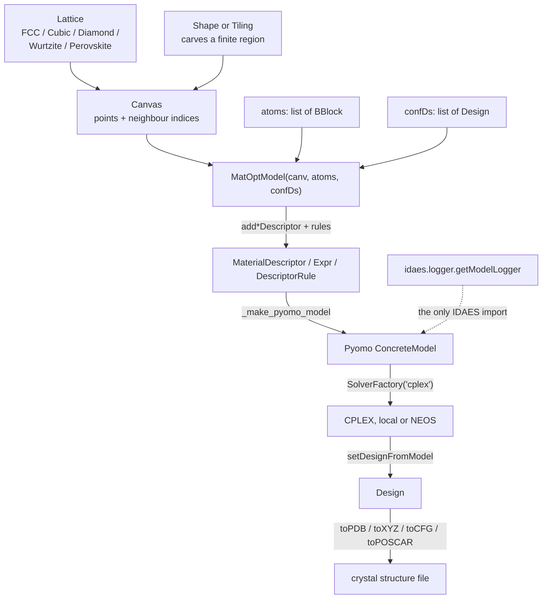
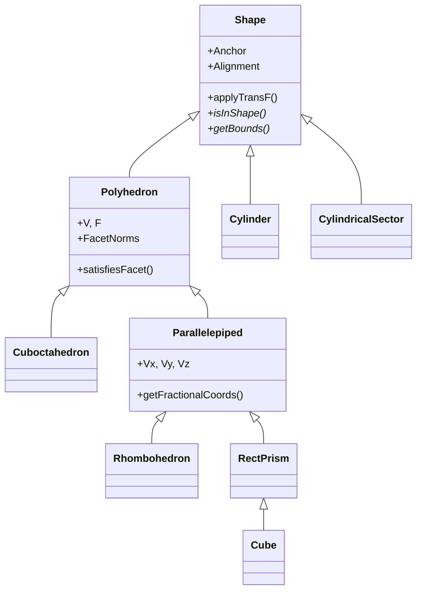
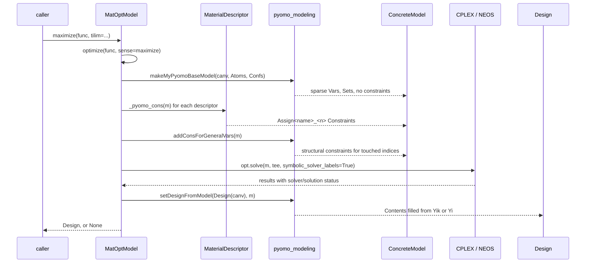

# 26 — MatOpt

> **Doc ID** 26 · **Repo SHA** 70a8f4fe1 (IDAES-PSE v2.13.0rc0) · **Source roots** `idaes/apps/matopt/**`
> **Owns** 28 modules / 10,167 LOC · **Assets** 1 authored Markdown file, `idaes/apps/matopt/README.md` · **Siblings** [01](01_glossary_and_conventions.md), [29](29_dependency_and_layering_map.md), [30](30_numerics_and_solver_interface_map.md), [31](31_extension_point_catalog.md), [32](32_repository_engineering.md)

MatOpt designs nanostructured materials by mixed-integer linear programming. A
user describes a crystal lattice, carves a finite set of candidate sites out of
it, names the building blocks that may occupy those sites, writes rules over
site- and bond-indexed *descriptors*, and asks for the assignment that maximises
or minimises one of them. The package turns that description into a Pyomo
`ConcreteModel`, hands it to CPLEX, and reads the solution back as an atomic
structure that can be written to a crystallography file.

It is architecturally the most separate thing in the repository. It builds no
flowsheet, uses no control volume, implements no property package, declares no
process block, and declares no `ConfigBlock`. Its single import from the IDAES
core is a logger.

---

## 0. Scope and source map

| File | LOC | Purpose | Covered in § |
|---|---:|---|---|
| `idaes/apps/matopt/__init__.py` | 19 | Mutates `sys.path` and re-exports the two subpackages under the bare name `matopt` | 1, 2, 5, 12 |
| `idaes/apps/matopt/materials/__init__.py` | 21 | Re-exports the materials layer; mixes bare-name and relative imports | 2, 12 |
| `idaes/apps/matopt/materials/bblock.py` | 26 | `BBlock` — the two-method abstract interface every building block satisfies | 3, 9 |
| `idaes/apps/matopt/materials/atom.py` | 425 | `Atom(BBlock)` plus three periodic-table lookup dictionaries | 3, 6, 7 |
| `idaes/apps/matopt/materials/canvas.py` | 641 | `Canvas` — the design space: an ordered point list plus a neighbour-index matrix | 3, 5, 6, 7 |
| `idaes/apps/matopt/materials/design.py` | 424 | `Design` — a `Canvas` with contents; the file readers and writers; `loadFrom*` | 3, 7, 10 |
| `idaes/apps/matopt/materials/geometry.py` | 926 | `Shape` and eight concrete solids used to carve a `Canvas` out of a lattice | 3, 7, 11 |
| `idaes/apps/matopt/materials/tiling.py` | 523 | `Tiling` and three periodicity models: linear, planar, cubic | 3, 7, 9, 12 |
| `idaes/apps/matopt/materials/transform_func.py` | 449 | `TransformFunc` and five in-place rigid-motion functors | 3, 7, 9 |
| `idaes/apps/matopt/materials/motifs.py` | 111 | Motif equivalence and conformation enumeration | 7 |
| `idaes/apps/matopt/materials/lattices/__init__.py` | 17 | Re-exports the five concrete lattices | 2 |
| `idaes/apps/matopt/materials/lattices/lattice.py` | 107 | `Lattice` — the abstract lattice interface and the transform stack | 3, 9 |
| `idaes/apps/matopt/materials/lattices/unit_cell_lattice.py` | 132 | `UnitCell` and `UnitCellLattice` — fractional positions and the scan generator | 3, 5, 7 |
| `idaes/apps/matopt/materials/lattices/fcc_lattice.py` | 129 | `FCCLattice`, with `{100}` and `{111}` alignments | 3, 7 |
| `idaes/apps/matopt/materials/lattices/cubic_lattice.py` | 99 | `CubicLattice` — the simple cubic lattice | 3, 7 |
| `idaes/apps/matopt/materials/lattices/diamond_lattice.py` | 285 | `DiamondLattice` — two-site basis, Miller-index alignment, layer spacing | 3, 7, 9, 11 |
| `idaes/apps/matopt/materials/lattices/wurtzite_lattice.py` | 221 | `WurtziteLattice` — two-site hexagonal basis; imports `DBL_TOL` from the opt layer | 3, 7, 9, 12 |
| `idaes/apps/matopt/materials/lattices/perovskite_lattice.py` | 312 | `PerovskiteLattice` (A/B/O sites) and `getOxygenSymTransFs` | 3, 7, 9, 11 |
| `idaes/apps/matopt/materials/parsers/__init__.py` | 28 | Package marker; its four imports sit inside a string literal and never execute | 2, 10, 12 |
| `idaes/apps/matopt/materials/parsers/CFG.py` | 147 | AtomEye extended CFG reader and writer | 10 |
| `idaes/apps/matopt/materials/parsers/PDB.py` | 61 | Protein Data Bank `ATOM`-record reader and writer | 10 |
| `idaes/apps/matopt/materials/parsers/POSCAR.py` | 106 | VASP POSCAR/CONTCAR reader and writer | 10, 11 |
| `idaes/apps/matopt/materials/parsers/XYZ.py` | 60 | XYZ reader and writer | 10 |
| `idaes/apps/matopt/opt/__init__.py` | 14 | Star-re-exports both optimization modules | 2 |
| `idaes/apps/matopt/opt/mat_modeling.py` | 3,100 | The modelling algebra: `IndexedElem`, twelve expressions, eleven rules, `MaterialDescriptor`, `MatOptModel` | 3, 5, 6, 7, 8, 9, 12 |
| `idaes/apps/matopt/opt/pyomo_modeling.py` | 1,673 | The Pyomo translation layer: base model, constraint generators, bound arithmetic, variable fixing, solution read-back | 5, 6, 7, 9, 11 |
| `idaes/apps/matopt/util/__init__.py` | 12 | Empty package marker | 2 |
| `idaes/apps/matopt/util/util.py` | 99 | Five absolute-tolerance float and point comparison helpers | 6, 7 |
| `idaes/apps/matopt/README.md` | — | The authors' own narrative of the package; 10,705 bytes | 0.1, 10 |

Total 10,167 LOC across 28 Python modules: 60 classes, 32 `NotImplementedError`
hook sites, and zero configuration keys, enumerations, process block classes and
deprecation sites.

### 0.1 The in-tree README

`idaes/apps/matopt/README.md` is an authored Markdown file shipped inside the
package directory — the authors' own narrative and the only in-package prose. It
covers the package's stated goals; the split into `matopt.materials` and
`matopt.opt`; the CPLEX dependency and the NEOS-CPLEX alternative; three HTML
tables naming the pre-declared descriptors, the twelve expression classes and
the nine rule classes; the statement that results are loaded back into `Design`
objects; the four crystal-structure formats; a link to external case-study
notebooks; and eight literature references, of which the 2022 *Journal of
Chemical Information and Modeling* paper is named as the package's citation. Its
descriptor table lists six descriptors; the constructor declares seven — see
section 6.1. The Sphinx page
`docs/explanations/modeling_extensions/matopt/index.rst` reproduces most of that
text and adds the five autodoc directives listed in section 2.

---

## 1. Architectural role

MatOpt is a self-contained application that happens to live inside the IDAES
tree. Every other subsystem in this set connects to the block hierarchy: a unit
model owns control volumes, a property package answers a state block, a costing
block attaches to a flowsheet. MatOpt connects to none of them. It constructs a
bare Pyomo `ConcreteModel` (`idaes/apps/matopt/opt/pyomo_modeling.py:192`), not
a `ProcessBlock`; it carries no time domain, no units of measurement and no
`CONFIG` block. Its one contact with the IDAES core is `pyomo_modeling.py:13`,
which imports `getModelLogger` from `idaes.logger`; everything else comes from
`pyomo.environ`, `numpy` and the standard library.

Internally there are two layers. The **materials layer**
(`idaes/apps/matopt/materials/`) is geometry and bookkeeping: a `Lattice` says
which Cartesian points are sites and which sites are neighbours; a `Shape` or a
`Tiling` says which points to keep; the result is a `Canvas`
(`idaes/apps/matopt/materials/canvas.py:23`), an ordered point list with a
per-site list of neighbour indices. A `Design`
(`idaes/apps/matopt/materials/design.py:24`) is a `Canvas` plus one content per
site. No Pyomo object appears in this layer.

The **optimization layer** (`idaes/apps/matopt/opt/`) is an algebra over that
`Canvas`. `MatOptModel` (`idaes/apps/matopt/opt/mat_modeling.py:2273`) holds
`MaterialDescriptor` objects — the variables — each carrying `DescriptorRule`
objects written in terms of `Expr` objects that sum over sites, bonds, types and
conformations. Nothing is translated until `optimize` is called;
`_make_pyomo_model` (`:2916`) then creates one Pyomo `Var` per descriptor, one
`Constraint` per rule and the structural constraints that tie the seven
pre-declared descriptors together. The solution is read back into a `Design`
(`idaes/apps/matopt/opt/pyomo_modeling.py:764`), closing the loop.



*The whole package is one pipeline from lattice geometry to a solved structure; the dotted edge is MatOpt's entire contact surface with the rest of IDAES.*

### 1.1 The import-name quirk

`idaes/apps/matopt/__init__.py` does three things before it imports anything of
its own:

```python
import sys, os

myPath = os.path.dirname(os.path.abspath(__file__))
sys.path.insert(0, myPath + "/../")

from matopt.materials import *
from matopt.opt import *
```

`:15` computes the package directory, `:16` inserts that directory's parent —
`idaes/apps/` — at position 0 of `sys.path`, and `:18`–`:19` then import the
package's own subpackages under the **bare top-level name `matopt`**, not under
`idaes.apps.matopt`. The subpackage does the same at
`idaes/apps/matopt/materials/__init__.py:13` and `:14`. Four consequences
follow, all observable:

1. **Importing `idaes.apps.matopt` has a global side effect.** `sys.path` gains
   `<site-packages>/idaes/apps/matopt/../` at position 0 — twice, because
   `__init__.py` runs once as `idaes.apps.matopt` and again as `matopt` when
   `:18` resolves the bare name, and each execution reaches `:16`.
2. **The same code is importable under two names.** After `import
   idaes.apps.matopt`, `sys.modules` holds both names and `import matopt`
   succeeds.
3. **Every module body can execute twice, producing two distinct class
   objects.** `idaes.apps.matopt.materials.canvas` and `matopt.materials.canvas`
   are separate module objects whose `Canvas` classes are not the same object,
   so an instance built through one path fails `isinstance` against the other.
   Within `idaes.apps.matopt.materials` the two provenances are mixed:
   `FCCLattice` arrives from the bare-name copy through the star import at
   `idaes/apps/matopt/materials/__init__.py:13`, `Canvas` from the
   `idaes.apps.*` copy through the relative import at `:17`.
4. **Static analysis cannot follow it.** A tool resolving `matopt.materials`
   against the project layout finds no such top-level package, because the name
   exists only after `:16` has run. `matopt` is one of six names in the
   `ignore=` list of `.pylint/pylintrc:5`, owned by
   [32](32_repository_engineering.md).

Section 12 repeats these as anchored sharp edges.
[01](01_glossary_and_conventions.md) names this document as the normative home
of the fact and cites it rather than restating it.

---

## 2. Public surface inventory

The package has no `__all__` anywhere except `idaes/apps/matopt/materials/geometry.py:13`,
which names seven of that module's nine classes and omits `Shape` and
`Polyhedron`. Every other re-export is an explicit `from … import` list or an
unqualified star import.

| Symbol | Kind | Declared at | Exported via | Stability signal |
|---|---|---|---|---|
| `BBlock` | class | `idaes/apps/matopt/materials/bblock.py:16` | module path only | not re-exported by any `__init__` |
| `Atom` | class | `idaes/apps/matopt/materials/atom.py:18` | `idaes.apps.matopt.materials` | named at `materials/__init__.py:16` |
| `Canvas`, `Design` | classes | `idaes/apps/matopt/materials/canvas.py:23`, `design.py:24` | `idaes.apps.matopt.materials` | one `autoclass` each in `docs/` |
| `loadFromPDBs`, `loadFromCFGs` | functions | `idaes/apps/matopt/materials/design.py:367`, `:407` | `idaes.apps.matopt.materials` | named at `materials/__init__.py:18` |
| `loadFromXYZs` | function | `idaes/apps/matopt/materials/design.py:387` | module path only | the one `loadFrom*` the package does not re-export |
| `Shape`, `Polyhedron` | classes | `idaes/apps/matopt/materials/geometry.py:33`, `:183` | module path only | both excluded from `geometry.__all__` |
| `Cuboctahedron`, `Parallelepiped`, `Rhombohedron`, `RectPrism`, `Cube`, `Cylinder`, `CylindricalSector` | classes | `idaes/apps/matopt/materials/geometry.py:334`, `:396`, `:553`, `:604`, `:675`, `:709`, `:805` | `idaes.apps.matopt.materials` | the seven names in `geometry.__all__` |
| `Tiling` | class | `idaes/apps/matopt/materials/tiling.py:20` | module path only | base class, not re-exported |
| `LinearTiling`, `PlanarTiling`, `CubicTiling` | classes | `idaes/apps/matopt/materials/tiling.py:64`, `:112`, `:296` | `idaes.apps.matopt.materials` | all three named at `materials/__init__.py:19` |
| `TransformFunc`, `CompoundTransformFunc` | classes | `idaes/apps/matopt/materials/transform_func.py:21`, `:404` | module path only | base class; the compound is produced only by `TransformFunc.__add__` |
| `ShiftFunc`, `ScaleFunc`, `RotateFunc`, `ReflectFunc` | classes | `idaes/apps/matopt/materials/transform_func.py:84`, `:121`, `:180`, `:319` | module path only | imported by the tests by module path |
| `areMotifViaTransF`, `areMotifViaTransFs`, `getEnumConfs` | functions | `idaes/apps/matopt/materials/motifs.py:17`, `:37`, `:62` | `idaes.apps.matopt.materials` | all three named at `materials/__init__.py:21` |
| `Lattice` | class | `idaes/apps/matopt/materials/lattices/lattice.py:26` | module path only | `autoclass` in `docs/` |
| `UnitCell`, `UnitCellLattice` | classes | `idaes/apps/matopt/materials/lattices/unit_cell_lattice.py:22`, `:77` | module path only | neither re-exported |
| `FCCLattice`, `PerovskiteLattice`, `CubicLattice`, `DiamondLattice`, `WurtziteLattice` | classes | `…/lattices/fcc_lattice.py:25`, `perovskite_lattice.py:23`, `cubic_lattice.py:23`, `diamond_lattice.py:25`, `wurtzite_lattice.py:26` | `…materials.lattices` | named at `lattices/__init__.py:13`–`:17` |
| `getOxygenSymTransFs` | function | `idaes/apps/matopt/materials/lattices/perovskite_lattice.py:184` | module path only | module-level, not re-exported |
| The four `readPointsAndAtomsFrom*` / `writeDesignTo*` pairs | functions | `…/parsers/CFG.py:19`, `:89`; `PDB.py:43`, `:47`; `POSCAR.py:19`, `:71`; `XYZ.py:43`, `:47` | module path only | consumed by `Canvas` and `Design`; POSCAR by `Design` only |
| `IndexedElem`, `Coef`, `Expr` | classes | `idaes/apps/matopt/opt/mat_modeling.py:23`, `:296`, `:334` | `idaes.apps.matopt.opt` | star-exported at `opt/__init__.py:14` |
| `LinearExpr`, `SiteCombination`, `SumNeighborSites`, `SumNeighborBonds`, `SumSites`, `SumBonds`, `SumSiteTypes`, `SumBondTypes`, `SumSitesAndTypes`, `SumBondsAndTypes`, `SumConfs`, `SumSitesAndConfs` | classes | `mat_modeling.py:375`, `:434`, `:561`, `:621`, `:687`, `:750`, `:814`, `:882`, `:952`, `:1031`, `:1110`, `:1176` | `idaes.apps.matopt.opt` | star-exported; all twelve named in `README.md` |
| `DescriptorRule`, `SimpleDescriptorRule`, and `LessThan`, `EqualTo`, `GreaterThan`, `FixedTo`, `Disallow`, `PiecewiseLinear`, `Implies`, `NegImplies`, `ImpliesSiteCombination`, `ImpliesNeighbors` | classes | `mat_modeling.py:1248`, `:1296`, `:1356`, `:1390`, `:1424`, `:1458`, `:1502`, `:1573`, `:1648`, `:1721`, `:1793`, `:1959` | `idaes.apps.matopt.opt` | star-exported; nine of the ten concrete rules named in `README.md` (`Disallow` is not) |
| `MaterialDescriptor`, `MatOptModel` | classes | `idaes/apps/matopt/opt/mat_modeling.py:2074`, `:2273` | `idaes.apps.matopt.opt` | one `autoclass` each in `docs/` |
| `makeMyPyomoBaseModel`, `addConsForGeneralVars`, `setDesignFromModel`, `validModelSoln` | functions | `idaes/apps/matopt/opt/pyomo_modeling.py:137`, `:328`, `:764`, `:946` | `idaes.apps.matopt.opt` | star-exported at `opt/__init__.py:13` |
| `getLB` / `getUB` | functions | `idaes/apps/matopt/opt/pyomo_modeling.py:34`, `:84` | `idaes.apps.matopt.opt` | the only two symbols with a dedicated test file |
| `isZero`, `areEqual`, `myArrayEq`, `myPointEq`, `myPointsEq`, `ListHasPoint` | functions | `idaes/apps/matopt/util/util.py:15`, `:28`, `:42`, `:63`, `:66`, `:85` | module path only | `util/__init__.py` re-exports nothing |

`idaes/apps/matopt/opt/pyomo_modeling.py` contributes 61 module-level functions
to the star export at `idaes/apps/matopt/opt/__init__.py:13`, of which 47 carry
no leading underscore and are visible as `idaes.apps.matopt.opt` attributes;
section 7.6 tabulates the families. Five symbols carry an autodoc directive in
`docs/explanations/modeling_extensions/matopt/index.rst` — `Lattice`, `Canvas`,
`Design`, `MaterialDescriptor`, `MatOptModel` — and no other symbol here appears
in the rendered documentation.

---

## 3. Class hierarchy and type taxonomy

MatOpt declares **no process block classes**. `process_blocks.csv` has no rows
for any file in this document, and `declare_process_block_class` appears nowhere
under `idaes/apps/matopt/`. There is therefore no data-class/container-class
pair, no synthesized `Foo` beside a `FooData`, no `CONFIG` block and no
`build()` entry point anywhere in this scope; see
[03](03_block_hierarchy_and_construction_protocol.md) for the pattern MatOpt
does not use.

What it uses instead is plain Python classes with hand-written `__init__`
methods and `@classmethod` alternate constructors. The abstract-method mechanism
is `abc.abstractmethod` applied to a body that raises `NotImplementedError`; the
classes that declare them are plain `object` subclasses rather than `ABCMeta`
instances, so the decorator does not block instantiation and the raise is what
enforces the contract. Section 9 tabulates all 32 sites.

There are 60 classes: 29 in `mat_modeling.py`, nine in `geometry.py`, six in
`transform_func.py`, four in `tiling.py`, one or two in each of the rest.
`enums.csv` has no rows for this scope — **MatOpt declares no enumerations**.
Where the library elsewhere uses an enum, MatOpt compares a string: `con_type`
takes `"EQ"`, `"LB"` or `"UB"` (`idaes/apps/matopt/opt/mat_modeling.py:1600`),
`solver` takes `"cplex"` or `"neos-cplex"` (`:2757`).

### 3.1 Naming

Every class, method, attribute and local here is camelCase or PascalCase —
`getNeighbors`, `NeighborhoodIndexes`, `blnPreserveIndexing`,
`addConsForGeneralVars` — where the rest of the tree is snake_case. The
convention is internally consistent; section 12 records the divergence.

### 3.2 Shapes



*Two independent branches off `Shape`: everything bounded by planar facets descends from `Polyhedron`, the two curved solids test membership directly.*

| Class | Base(s) | Declared at | Key members |
|---|---|---|---|
| `Shape` | `object` | `idaes/apps/matopt/materials/geometry.py:33` | `DBL_TOL` (`:36`), `DEFAULT_ALIGNMENT` (`:37`), `applyTransF` (`:66`), the four transform wrappers (`:85`, `:101`, `:120`, `:137`), `__contains__ = isInShape` (`:164`) |
| `Polyhedron` | `Shape`, `ABC` | `idaes/apps/matopt/materials/geometry.py:183` | vertices `V` and facets `F`; facet normals computed in `__calcFacetNorms` (`:214`); `satisfiesFacet` (`:289`); `getBounds` returns the vertex list (`:303`) |
| `Cuboctahedron` | `Polyhedron`, `ABC` | `idaes/apps/matopt/materials/geometry.py:334` | built from a circumradius `R` and a centre |
| `Parallelepiped` | `Polyhedron`, `ABC` | `idaes/apps/matopt/materials/geometry.py:396` | three edge vectors; `fromEdgesAndAngles` (`:431`), `fromPOSCAR` (`:454`), `getFractionalCoords` (`:500`), `getVolume` (`:521`) |
| `Rhombohedron` / `RectPrism` / `Cube` | `Parallelepiped` / `Parallelepiped` / `RectPrism`, all `ABC` | `idaes/apps/matopt/materials/geometry.py:553`, `:604`, `:675` | edge length and angle; `Lx`/`Ly`/`Lz` with `fromPointsBBox` (`:622`); a cube that rejects anisotropic scaling (`:697`) |
| `Cylinder` / `CylindricalSector` | `Shape`, `ABC` | `idaes/apps/matopt/materials/geometry.py:709`, `:805` | base point, radius, height, axis; the sector adds two bounding directions and `setNorms` (`:836`) |

### 3.3 Lattices

All five concrete lattices are one reference `UnitCell` — a `Tiling` plus a list
of fractional positions — wrapped in the transform stack held by `Lattice`; what
distinguishes them is those positions and the first-shell neighbour offsets.

| Class | Base(s) | Declared at | Reference cell | Neighbour definition |
|---|---|---|---|---|
| `Lattice` | `object` | `idaes/apps/matopt/materials/lattices/lattice.py:26` | — | abstract (`:80`, `:84`, `:88`) |
| `UnitCell` | `object` | `…/unit_cell_lattice.py:22` | holds a `Tiling` and a list of fractional positions | — |
| `UnitCellLattice` | `Lattice` | `…/unit_cell_lattice.py:77` | `RefUnitCell`; `Scan` (`:91`) enumerates every reference point inside a polyhedron's bounding box | still abstract (`:116`, `:120`) |
| `FCCLattice` | `UnitCellLattice` | `…/fcc_lattice.py:25` | unit cube, four positions; `RefIAD = sqrt(2)/2` (`:26`) | twelve first-shell offsets listed inline; `areNeighbors` is a distance test (`:87`) |
| `CubicLattice` | `UnitCellLattice` | `…/cubic_lattice.py:23` | unit cube, one position; `RefIAD = 1` (`:24`) | six axis offsets (`:69`, `:72`) |
| `DiamondLattice` | `UnitCellLattice` | `…/diamond_lattice.py:25` | two-site basis; `RefIAD = sqrt(3)/4` (`:26`) | neighbour set depends on the site type returned by `_getPointType` (`:159`) |
| `WurtziteLattice` | `UnitCellLattice` | `…/wurtzite_lattice.py:26` | two-site hexagonal basis; `RefIAD = sqrt(3/8)` (`:27`) | type-dependent, as for diamond (`:119`, `:126`) |
| `PerovskiteLattice` | `UnitCellLattice` | `…/perovskite_lattice.py:23` | five positions: one A, one B, three O (`:29`) | `areNeighbors` raises (`:72`); `getNeighbors` branches on A/B/O site (`:77`) |

`DiamondLattice` and `WurtziteLattice` both expose `alignedWith(IAD, MI)` taking
a Miller index string (`…/diamond_lattice.py:127`, `…/wurtzite_lattice.py:87`)
plus `getLayerSpacing`, `getShellSpacing` and `getUniqueLayerCount`, each of
which raises for an unsupported direction; `FCCLattice` instead exposes
`alignedWith100`/`alignedWith111` (`…/fcc_lattice.py:61`, `:66`) and three
layer-spacing properties (`:120`, `:124`, `:128`).

### 3.4 Tilings, transforms and building blocks

| Class | Base(s) | Declared at | Role |
|---|---|---|---|
| `Tiling` | `object` | `idaes/apps/matopt/materials/tiling.py:20` | abstract: `transformInsideTile` (`:28`), `replicateDesign` (`:41`) |
| `LinearTiling` | `Tiling`, `ABC` | `idaes/apps/matopt/materials/tiling.py:64` | one periodic direction and its negation; three alternate constructors (`:77`, `:86`, `:95`); overrides neither abstract method |
| `PlanarTiling` | `Tiling` | `idaes/apps/matopt/materials/tiling.py:112` | two periodic directions from a parallelepiped; overrides both (`:145`, `:230`) |
| `CubicTiling` | `Tiling` | `idaes/apps/matopt/materials/tiling.py:296` | three periodic directions; overrides both (`:363`, `:454`) |
| `TransformFunc` | `object` | `idaes/apps/matopt/materials/transform_func.py:21` | abstract `transform`/`undo` (`:28`, `:40`); `getTransform`/`getUndo` deep-copy first (`:51`, `:64`); `__add__` builds a compound (`:77`) |
| `ShiftFunc` / `ScaleFunc` | `TransformFunc` | `…/transform_func.py:84`, `:121` | vector translation; per-axis scale about an origin with `isIsometric` (`:175`) |
| `RotateFunc` | `TransformFunc` | `…/transform_func.py:180` | rotation matrix; `fromXYZAngles` (`:191`), `fromAxisAngle` (`:218`), direction-only variants (`:265`, `:291`) |
| `ReflectFunc` | `TransformFunc` | `…/transform_func.py:319` | mirror plane; `fromPoints` (`:330`), `acrossX`/`acrossY`/`acrossZ` (`:346`, `:351`, `:356`) |
| `CompoundTransformFunc` | `TransformFunc` | `…/transform_func.py:404` | ordered list; `undo` walks it in reverse (`:424`); `__iadd__` (`:442`) |
| `BBlock` / `Atom` | `object` / `BBlock`, `ABC` | `…/bblock.py:16`, `…/atom.py:18` | two abstract comparison operators; three class-level dictionaries and five operators |
| `Canvas` / `Design` | `object` | `…/canvas.py:23`, `…/design.py:24` | 35 and 22 methods; sections 6.2 and 6.3 |

### 3.5 The expression hierarchy

`IndexedElem` (`idaes/apps/matopt/opt/mat_modeling.py:23`) is the base of
coefficients, expressions and variables alike, so any of the three combines with
any other and the index set of the result falls out of `fromComb`. `Expr`
(`:334`) adds one abstract method, `_pyomo_expr(index)`; twelve concrete
expressions derive from it directly, one level deep and entirely flat.

| Class | Declared at | Index sets it consumes | Index sets it leaves | Extra arguments |
|---|---|---|---|---|
| `Coef` | `:296` | none — it is data, not an expression | whatever it is declared over | `vals` |
| `LinearExpr` | `:375` | none | the union of its descriptors' | `descs`, `coefs`, `offset` |
| `SiteCombination` | `:434` | `bonds` | neither site index | `coefi`, `desci`, `coefj`, `descj`, `symmetric_bonds` |
| `SumNeighborSites` | `:561` | the neighbourhood of `i` | `sites` | `coefs`, `offset` |
| `SumNeighborBonds` | `:621` | the bonds leaving `i` | `sites` | `coefs`, `offset`, `symmetric_bonds` |
| `SumSites` | `:687` | `sites` | everything else | `sites_to_sum` |
| `SumBonds` | `:750` | `bonds` | everything else | `bonds_to_sum` |
| `SumSiteTypes` | `:814` | `site_types` | everything else | `site_types_to_sum` |
| `SumBondTypes` | `:882` | `bond_types` | everything else | `bond_types_to_sum` |
| `SumSitesAndTypes` | `:952` | `sites` and `site_types` | everything else | both `*_to_sum` lists |
| `SumBondsAndTypes` | `:1031` | `bonds` and `bond_types` | everything else | both `*_to_sum` lists |
| `SumConfs` | `:1110` | `confs` | `sites` | `confs_to_sum` |
| `SumSitesAndConfs` | `:1176` | `sites` and `confs` | nothing | both `*_to_sum` lists |

`MaterialDescriptor` (`:2074`) also derives from `IndexedElem` and implements
`_pyomo_expr` (`:2215`) by subscripting its Pyomo `Var`, which is what lets a
descriptor stand wherever an expression is expected.

### 3.6 The rule hierarchy

`DescriptorRule` (`:1248`) declares one abstract method, `_pyomo_cons(var)`,
returning a list of Pyomo components. Ten concrete rules exist; only the three
relational ones share an intermediate class.

| Class | Base | Declared at | Emits | Big-M |
|---|---|---|---|---|
| `SimpleDescriptorRule` | `DescriptorRule` | `:1296` | one `Constraint` over `fromComb(var, rule)` | — |
| `LessThan` | `SimpleDescriptorRule` | `:1356` | `var <= expr` | — |
| `EqualTo` | `SimpleDescriptorRule` | `:1390` | `var == expr` | — |
| `GreaterThan` | `SimpleDescriptorRule` | `:1424` | `var >= expr` | — |
| `FixedTo` | `DescriptorRule` | `:1458` | no constraint; touches the variable index and defers the fixing | — |
| `Disallow` | `DescriptorRule` | `:1502` | one integer cut against a given `Design` | — |
| `PiecewiseLinear` | `DescriptorRule` | `:1573` | one Pyomo `Piecewise` block, `pw_repn="MC"` | — |
| `Implies` | `DescriptorRule` | `:1648` | one or two big-M rows per conclusion | `:1662` |
| `NegImplies` | `DescriptorRule` | `:1721` | the same with the indicator negated | `:1735` |
| `ImpliesSiteCombination` | `DescriptorRule` | `:1793` | conclusions at both endpoints of a bond | `:1815` |
| `ImpliesNeighbors` | `DescriptorRule` | `:1959` | conclusions at every neighbour of a site | `:1978` |

The four indicator rules each carry their own `DEFAULT_BIG_M = 9999` class
attribute rather than sharing the module constant of the same name in
`pyomo_modeling.py:27`.

---

## 4. Configuration reference

`Not applicable`: MatOpt declares no Pyomo `ConfigBlock`. `config_keys.csv` has
no rows for any file here and `CONFIG.declare` appears nowhere under
`idaes/apps/matopt/`. The package predates and sits outside the IDAES
configuration convention of [01](01_glossary_and_conventions.md) and
[03](03_block_hierarchy_and_construction_protocol.md): every option is an
ordinary keyword argument with a literal default, validated — where it is
validated at all — by an `assert` or an `if`/`raise` in the body. The two
surfaces that do a `CONFIG` block's job here are the `MatOptModel` constructor
and the `optimize`/`populate` pair, tabulated below in the shape a configuration
table would take.

### 4.1 `MatOptModel.__init__`

`MatOptModel(canv, atoms=None, confDs=None)` (`idaes/apps/matopt/opt/mat_modeling.py:2290`).

| Argument | Domain / validator | Default | Req. | Effect on model construction | Anchor |
|---|---|---|---|---|---|
| `canv` | `Canvas`; no type check | — | yes | Fixes the site index set `range(len(canv))` and the neighbour lists every bond- and neighbour-indexed descriptor uses | `:2300` |
| `atoms` | list of `BBlock`; no type check. A void type is *not* included — absence is represented by `None` | `None` | no | Becomes the Pyomo `Set` `m.K` and sets `m.nK`; with fewer than two entries the SOS1 constraint on `Yik` is skipped | `:2301`, `pyomo_modeling.py:213`, `:401` |
| `confDs` | list of `Design` | `None` | no | Becomes the conformation index set `m.C` and sets `m.nC`; when `None`, `Zic` is declared with `confs=None` | `:2302`, `:2704`, `pyomo_modeling.py:225` |

The constructor immediately calls seven `add*Descriptor` methods (`:2304`–`:2310`),
so a freshly built `MatOptModel` already carries `Yi`, `Xij`, `Ci`, `Yik`,
`Xijkl`, `Cikl` and `Zic` as attributes. Section 6.1 gives their meaning.

### 4.2 The `add*Descriptor` family

Nine methods share one argument shape. Every one of them starts with
`assert not hasattr(self, name)`, so a repeated name is a failed assertion
rather than a validation error.

| Method | Extra index arguments | Declared at |
|---|---|---|
| `addGlobalDescriptor` | none — the descriptor is scalar | `:2313` |
| `addSitesDescriptor` | `sites` | `:2337` |
| `addBondsDescriptor` | `bonds`, `symmetric_bonds` | `:2376` |
| `addNeighborsDescriptor` | `sites` | `:2425` |
| `addGlobalTypesDescriptor` | `site_types`, `bond_types` | `:2464` |
| `addSitesTypesDescriptor` | `sites`, `site_types` | `:2515` |
| `addBondsTypesDescriptor` | `bonds`, `bond_types`, `symmetric_bonds` | `:2561` |
| `addNeighborsTypesDescriptor` | `sites`, `bond_types` | `:2621` |
| `addSitesConfsDescriptor` | `sites`, `confs` | `:2671` |

| Shared argument | Domain / validator | Default | Effect | Anchor |
|---|---|---|---|---|
| `name` | `str`, unique on the model | — | Becomes the attribute name on `MatOptModel` *and* the Pyomo component name on the generated model | `:2373`, `:2952` |
| `bounds` | `tuple`, `dict`, or a callable | `(None, None)` | A tuple is passed to `Var` unchanged; a dict is wrapped in a generated rule; anything else is passed through untouched | `:2200`, `:2204` |
| `integer` | `bool` | `False` | Selects Pyomo's `Integers` domain | `:2947` |
| `binary` | `bool` | `False` | Selects `Binary`, and also forces `integer` true | `:2142`, `:2947` |
| `rules` | `DescriptorRule` or a list of them | `None` | A bare rule is wrapped in a list; `None` becomes `[]` | `:2146` |

`addSitesConfsDescriptor` is the one member whose defaults differ —
`bounds=(0, 1)`, `integer=True`, `binary=True` (`:2671`) — and the one that
omits the `assert not hasattr` guard the other eight carry (contrast `:2362`).

### 4.3 `MatOptModel.optimize` and `MatOptModel.populate`

`optimize(func, sense, nSolns=1, tee=True, disp=1, keepfiles=False, tilim=3600, trelim=None, solver="cplex")`
(`idaes/apps/matopt/opt/mat_modeling.py:2757`).

| Argument | Domain / validator | Default | Req. | Effect on the solve | Anchor |
|---|---|---|---|---|---|
| `func` | `MaterialDescriptor` or `Expr` | — | yes | Becomes the objective expression; a non-scalar argument raises `TypeError` | `:2957`, `:2960` |
| `sense` | Pyomo `minimize` / `maximize` | — | yes | Passed to `Objective(sense=…)` | `:2958` |
| `nSolns` | `int` | `1` | no | Greater than one delegates to `populate`; exactly one solves once; zero or negative returns `None` implicitly | `:2809`, `:2821` |
| `tee` | `bool` | `True` | no | Passed to `opt.solve(tee=…)` for the local solver only | `:3008` |
| `disp` | `int` | `1` | no | Controls MatOpt's own `print` output; `populate` passes `disp - 1` down | `:3043`, `:2893` |
| `keepfiles` | `bool` | `False` | no | Passed to `opt.solve(keepfiles=…)` for the local solver only | `:3008` |
| `tilim` | `float`, seconds | `3600` | no | Written as `timelimit` for both solver paths | `:3004`, `:3016` |
| `trelim` | `float`, MB | `None` | no | Written as `mip_limits_treememory` locally and `treememory` through NEOS | `:3006`, `:3018` |
| `solver` | `"cplex"` or `"neos-cplex"` | `"cplex"` | no | Selects the solve path; anything else raises `NotImplementedError` | `:2999`, `:3010`, `:3021` |

`populate(func, sense, nSolns, …)` (`:2825`) takes the same arguments with
`nSolns` promoted to required. `maximize` (`:2721`) and `minimize` (`:2739`) are
one-line wrappers supplying `sense` and forwarding the rest.

### 4.4 Module-level constants

These four literals stand in for what would elsewhere be configuration.

| Constant | Value | Declared at | Consumed by |
|---|---|---|---|
| `DBL_TOL` | `1e-5` | `idaes/apps/matopt/opt/pyomo_modeling.py:26` | every `isZero`/`areEqual` call in the fixing helpers; re-imported by `wurtzite_lattice.py:22` |
| `DEFAULT_BIG_M` | `9999` | `idaes/apps/matopt/opt/pyomo_modeling.py:27` | `addConsBoundDescriptorsWithImpl` (`:974`), `addConsIndFromDescriptors` (`:1046`) |
| `DEFAULT_EPS` | `DBL_TOL` | `idaes/apps/matopt/opt/pyomo_modeling.py:28` | the strict-inequality offset in `addConsIndFromDescriptors` |
| `DEFAULT_BIG_M` (class attribute) | `9999` | `mat_modeling.py:1662`, `:1735`, `:1815`, `:1978` | the four indicator rules, one copy each |

---

## 5. Construction and call sequences

### 5.1 Building a `Canvas`

Six alternate constructors exist; two read a file, four derive the point set
from a `Lattice`.

1. `Canvas.fromPDB(filename, Lat=None, DefaultNN=0)`
   (`idaes/apps/matopt/materials/canvas.py:51`) and its `fromXYZ` (`:71`) and
   `fromCFG` (`:91`) siblings call the matching `readPointsAndAtomsFrom*`
   parser, keep the points, discard the atoms, and wire neighbours when a `Lat`
   is supplied.
2. `Canvas.fromLatticeAndShape(Lat, S, Seed=origin, DefaultNN=0)` (`:112`) is a
   depth-first flood fill: pop a point, and if it is new and `P in S` is true,
   add it with `len(Lat.getNeighbors(P))` slots and push its neighbours. The
   `in` test is `Shape.__contains__`, aliased to `isInShape` at
   `idaes/apps/matopt/materials/geometry.py:164`.
3. `Canvas.fromLatticeAndShapeScan(Lat, argPolyhedron, DefaultNN=0)` (`:154`)
   takes the polyhedron's vertex bounding box through `RectPrism.fromPointsBBox`
   (`geometry.py:622`) and iterates `Lat.Scan(BBox)`, the generator at
   `…/unit_cell_lattice.py:91` that converts the box corners to reference
   coordinates, pads by one cell each way, and yields every unit-cell position
   in that range converted back. A `Polyhedron` is required because the
   bounding-box step needs vertices.
4. `fromLatticeAndTiling` (`:185`) and `fromLatticeAndTilingScan` (`:213`)
   delegate to those two using `T.TileShape`, then call `makePeriodic` (`:407`),
   which replaces each `None` neighbour slot with the index of the point reached
   by adding one tiling direction.

Every path ends in `setNeighborsFromFunc` (`:343`), which fills each site's
slots with a neighbour index where the neighbour is present and `None` where it
is not. The result, `NeighborhoodIndexes`, is one fixed-length list per site in
which slot `l` has the same geometric meaning everywhere.

### 5.2 Declaring the optimization problem

```python
m = MatOptModel(canv, atoms)                 # seven descriptors already exist
m.addSitesDescriptor("Ci_target", bounds=(0, 12),
                     rules=EqualTo(SumNeighborBonds(m.Xij)))
m.addGlobalDescriptor("Size", rules=EqualTo(SumSites(m.Yi)))
m.Size.rules.append(FixedTo(20))
D = m.maximize(m.Ci_target, tilim=100)
```

Reading that back through the code: `MatOptModel.__init__` (`:2290`) stores the
canvas and calls the seven pre-declaration methods (`:2304`–`:2310`), each of
which builds a `MaterialDescriptor` and `setattr`s it onto the model (`:2373`),
so `m.Yi` and `m.Xij` are descriptor objects, not Pyomo variables.
`addSitesDescriptor` (`:2337`) defaults `sites` to every canvas index and
constructs `MaterialDescriptor` (`:2102`), normalising `rules` to a plain
mutable list at `:2146` — which is why appending to `m.Size.rules` works.
`SumNeighborBonds(m.Xij)` (`:653`) copies `m.Xij`'s `index_dict` into its own
`IndexedElem` initialisation, and `EqualTo(expr)` (`:1319`) copies *that* index
set onto the rule. `maximize` (`:2721`) forwards to `optimize` with
`sense=maximize`.

### 5.3 `_make_pyomo_model`

`_make_pyomo_model(obj_expr, sense)` (`idaes/apps/matopt/opt/mat_modeling.py:2916`)
is the only place a Pyomo object is created. Six steps:

1. `makeMyPyomoBaseModel(self.canv, Atoms=self.atoms, Confs=self.confDs)`
   (`:2934`, defined at `idaes/apps/matopt/opt/pyomo_modeling.py:137`) creates
   the `ConcreteModel`, stores the canvas and neighbour matrix as plain
   attributes (`:194`, `:195`), declares the site set `m.I` (`:200`), the atom
   set `m.K` (`:213`) and the conformation set `m.C` (`:225`), and declares
   eight `Var` components — `Yi`, `Xij`, `Ci`, `Zi`, `Yik`, `Xijkl`, `Cikl`,
   `Zic` — **all with `dense=False`** (`:202`–`:226`). Sparse declaration is the
   central trick: a variable index exists only once something references it.
2. The seven pre-declared descriptors are bound to those variables by direct
   attribute assignment (`:2935`–`:2941`).
3. Every other descriptor gets a fresh `Var` whose domain is `Binary`,
   `Integers` or `Reals` according to its flags and whose bounds come from
   `_pyomo_bounds`, attached under the descriptor's own name (`:2944`–`:2952`).
4. Each descriptor's rules are expanded through `desc._pyomo_cons(m)` (`:2189`)
   and attached as `Assign<name>_<n>` (`:2955`, `:2956`). Referencing a variable
   index inside a rule is what materialises it in the sparse `Var`.
5. The objective is built (`:2958`); `sum(obj_expr.dims) == 0` is the scalar
   test, and an indexed descriptor raises `TypeError` (`:2960`).
6. `addConsForGeneralVars(m)` (`:2969`) is called **last**, deliberately, so
   only the variable indices the user's rules touched acquire defining
   constraints; then any variable carrying a `FixedTo` rule is fixed
   (`:2970`–`:2973`).

### 5.4 `addConsForGeneralVars`

`addConsForGeneralVars(m)` (`idaes/apps/matopt/opt/pyomo_modeling.py:328`) is the
structural core. It inspects how many indices each sparse `Var` has acquired and
picks a defining constraint family accordingly.

| Target | Condition | Constraint added | Anchor |
|---|---|---|---|
| `Ci` | any type-specific variable used | `Ci = sum_kl Cikl` | `:353`–`:357` |
| `Ci` | only type-agnostic variables used | `Ci = sum_j Xij` over the neighbourhood | `:358`, `:359` |
| `Ci` | neither | `NotImplementedError` | `:361` |
| `Cikl` | used | `Cikl = sum_j Xijkl` | `:366`, `:367` |
| `Xij` | `Xijkl` or `Yik` used | `Xij = sum_kl Xijkl`; with `Yi` also used, both families are added | `:370`–`:375` |
| `Xij` | only `Yi` used | `Xij <= Yi[i]`, `Xij <= Yi[j]`, `Xij >= Yi[i] + Yi[j] - 1` | `:376`, `:377` |
| `Xij` | neither | `NotImplementedError` | `:379` |
| `Xijkl` | used | the same three rows against `Yik[i,k]` and `Yik[j,l]` | `:384`, `:385` |
| `Zic` | used | `addConsZicFromYikLifted` with more than one atom type, `addConsZicFromYiLifted` otherwise | `:388`–`:391` |
| `Yi` | `Yik` used | `Yi = sum_k Yik` | `:394`, `:395` |
| `Yik` | more than one atom type | `sum_k Yik[i,k] <= 1` — the SOS1 row | `:401`, `:402` |

The two `NotImplementedError` branches are reachable: they fire when `Ci` or
`Xij` has been referenced but nothing in the model defines it, and their
messages name the remedy as an explicit `DescriptorRule`.

### 5.5 Solving



*Nothing exists as a Pyomo object until `optimize` is called, and the solution leaves the Pyomo layer immediately as a `Design`.*

`__solve_pyomo_model(tee, disp, keepfiles, tilim, trelim, solver)`
(`idaes/apps/matopt/opt/mat_modeling.py:2976`) branches on the `solver` string:

- `"cplex"` (`:2999`) builds `SolverFactory("cplex")`, sets both MIP gaps to
  zero (`:3001`, `:3002`), sets `timelimit` and `mip_limits_treememory` when
  given, and calls `opt.solve(..., symbolic_solver_labels=True)`.
- `"neos-cplex"` (`:3010`) opens `SolverManagerFactory("neos")` as a context
  manager and sets the *differently spelled* NEOS option names `absmipgap`,
  `mipgap`, `timelimit`, `treememory` (`:3013`–`:3018`).
- anything else raises `NotImplementedError` (`:3021`).

The result is then interpreted (`:3025`–`:3041`): five `SolutionStatus` members
count as having a solution, and a sixth, `SolutionStatus.unknown`, is promoted
to "has a solution" after evaluating the objective, with an in-source comment
naming that promotion a workaround for mis-flagged Pyomo statuses. With a
solution available a fresh `Design(self.canv)` is filled by `setDesignFromModel`
(`:3079`, `:3080`); otherwise the method returns `None` (`:3083`).

### 5.6 `populate`

`populate` (`:2825`) builds the model once (`:2879`), declares `iSolns` and an
empty indexed `Constraint` named `IntCuts` (`:2880`, `:2881`), then loops
`nSolns` times. Each iteration solves and, when a `Design` comes back, appends
an integer cut from `Disallow(D)._pyomo_expr(...)` — against `Yik` when that
variable has been used, otherwise `Yi` (`:2900`–`:2908`) — stating that at least
one site must differ. With neither variable used the loop raises
`NotImplementedError` (`:2909`), and a solve returning `None` breaks the loop
early, so `populate` can return fewer designs than requested.

---

## 6. Data structures, variables, constraints and invariants

### 6.1 The seven pre-declared descriptors

These are the key to reading every rule and expression in the package. `i` and
`j` range over canvas sites, `k` and `l` over building-block types, `c` over
conformations. Each is a `MaterialDescriptor` on the `MatOptModel` bound to the
identically named sparse `Var` on the generated Pyomo model.

| Descriptor | Index sets | Domain | Physical meaning | Declared at | Pyomo `Var` at |
|---|---|---|---|---|---|
| `Yi` | sites | binary | A building block of any type occupies site `i` | `mat_modeling.py:2304` | `pyomo_modeling.py:202` |
| `Xij` | ordered site pairs that are neighbours | binary | Both ends of the bond `(i,j)` are occupied | `mat_modeling.py:2305` | `pyomo_modeling.py:203` |
| `Ci` | sites | integer, bounded `[0, len(Ni[i])]` | Coordination number: how many occupied neighbours site `i` has | `mat_modeling.py:2306` | `pyomo_modeling.py:208` |
| `Yik` | sites × types | binary | A building block *of type k* occupies site `i` | `mat_modeling.py:2307` | `pyomo_modeling.py:214` |
| `Xijkl` | bonds × type pairs | binary | Type `k` at site `i` and type `l` at site `j` | `mat_modeling.py:2308` | `pyomo_modeling.py:215` |
| `Cikl` | sites × type pairs | integer, bounded `[0, len(Ni[i])]` | Count of type-`l` neighbours around a type-`k` block at site `i` | `mat_modeling.py:2309` | `pyomo_modeling.py:220` |
| `Zic` | sites × conformations | binary | Conformation `c` is realised at site `i` — the local neighbourhood matches conformation `c`'s pattern | `mat_modeling.py:2310` | `pyomo_modeling.py:226` |

The type-agnostic and type-specific rows of each pair are linked by the
summation constraints of section 5.4, so a model may be written in either
vocabulary and the other is derived. `Zic` is what lets the package express
"count the sites whose local environment looks like *this*", the form most of
the cited literature uses. `makeMyPyomoBaseModel` declares an eighth variable,
`m.Zi` (`idaes/apps/matopt/opt/pyomo_modeling.py:210`), for which no
`MaterialDescriptor` counterpart exists; section 12 records the consequence.

### 6.2 `Canvas`

| Component | Type | Index | Created at | Condition |
|---|---|---|---|---|
| `_Points` | `list<numpy.ndarray>`, each shape `(3,)`, float | position in the list is the site index | `canvas.py:44` | always |
| `_NeighborhoodIndexes` | `list<list<int or None>>` | outer index is the site; inner slot `l` is a fixed geometric direction | `canvas.py:45` | always |
| `__DefaultNN` / `DBL_TOL` | `int` / class attribute `1e-5` | — | `canvas.py:46`, `:33` | the neighbour-slot count `addLocation` uses by default, and the tolerance for every point comparison |

| Invariant | Enforced at |
|---|---|
| `len(Points) == len(NeighborhoodIndexes)` | `canvas.py:234`, asserted in `__init__` (`:47`), `addLocation` (`:257`), `setNeighbors` (`:279`), `setNeighborsIJ` (`:300`) and every other mutator |
| A point is added at most once; both endpoints of `setNeighbors` are already present | `canvas.py:254`, `:274`, `:275` |
| A `None` neighbour slot really has no matching canvas point before `makePeriodic` rewrites it | `canvas.py:423` |
| Two canvases are equal when their point lists agree within `DBL_TOL` and their neighbour matrices are identical | `canvas.py:516`, `:517` |

### 6.3 `Design`

| Component | Type | Created at | Condition |
|---|---|---|---|
| `_Canvas` | `Canvas` | `design.py:44` | a bare `Design()` creates an empty `Canvas` (`:42`) |
| `_Contents` | `list`, one entry per canvas site, each an `Atom`, any object, or `None` | `design.py:45` | a single `Atom` passed as `Contents` is broadcast to every site (`:40`) |
| `NonVoidCount` / `NonVoidElems` | derived `int` / `set` | `design.py:241`, `:246` | both discard entries that are `None` or `Atom()` |

`Atom()` — the no-argument constructor at `atom.py:373` — sets `_Number` to
`None` and is the package's explicit void marker, distinct from Python `None`;
both count as void wherever a design is counted or written out.
`Design.isEquivalentTo` (`design.py:210`) is the equality that matters for
motifs: with indexing preserved it is plain `__eq__`, otherwise it matches sites
by geometric position through `Canvas.hasPoint`/`getPointIndex`.

### 6.4 `IndexedElem` — the index algebra

Every modelling object carries five optional index lists and nothing else
(`idaes/apps/matopt/opt/mat_modeling.py:39`): `sites`, `bonds`, `site_types`,
`bond_types`, `confs`. `None` means "not indexed over this"; a list means
"indexed over exactly these".

| Operation | Rule | Anchor |
|---|---|---|
| `fromComb(*args)` / `_fromComb2(LHS, RHS)` | Fold pairwise left to right; per index type, both present → set intersection, one present → that one, neither → `None` | `:63`, `:96` |
| `dims` / `index_sets` | 5-tuple of booleans; the present lists in fixed order, or `[[None]]` when there are none | `:193`, `:209` |
| `keys()` | `itertools.product` over `index_sets`, or the single list, or `NotImplementedError` | `:276`, `:293` |
| `mask(index, Comb)` | Destructure a key generated by `Comb` and rebuild only the components this object is indexed over; `(None,)` for a scalar | `:141` |

`mask` is what lets a rule combining a site-indexed variable with a type-indexed
coefficient generate one constraint per `(site, type)` pair while handing each
operand the sub-key it understands; `index_sets` returning `[[None]]` is what
makes `None` the canonical key of a scalar, a fact `_pyomo_expr(index=(None,))`
at `:2958` relies on.

| Invariant | Enforced at |
|---|---|
| An `IndexedElem` always has at least one key | `mat_modeling.py:293`, by raising when `index_sets` is empty |
| An expression's index set is the combination of its operands' unless overridden by keyword; `SumSites` drops the `sites` index it consumes | `:411`, `:589`, `:653`, `:719`, `:720`, `:1319` |
| `ImpliesSiteCombination` and `ImpliesNeighbors` require their conclusions to be site-indexed | asserts at `mat_modeling.py:1854`, `:2002` |
| A descriptor's name is unique on the model; a `binary` descriptor is also `integer` | `assert not hasattr` at `:2362` and seven siblings; `:2142` |

### 6.5 Float comparison

`idaes/apps/matopt/util/util.py` holds the five comparisons that every
geometric predicate in the package resolves to. All are absolute-tolerance,
never relative.

| Function | Contract | Anchor |
|---|---|---|
| `isZero(x, atol)` / `areEqual(x, y, atol)` | `atol > x > -atol`; `isZero(x - y, atol)` | `:15`, `:28` |
| `myArrayEq(x, y, atol)` / `myPointEq` | Component-wise over exactly three components — it indexes `[0]`, `[1]`, `[2]` and no more; `myPointEq` is a module-level alias | `:42`, `:63` |
| `myPointsEq(x, y, atol)` / `ListHasPoint(L, P, atol)` | Length check then element-wise `myArrayEq`; linear scan with `myArrayEq` | `:66`, `:85` |

`Canvas.hasPoint` and `Canvas.getPointIndex` (`canvas.py:520`, `:537`) are
linear scans using these helpers, so canvas construction is quadratic in the
number of sites.

---

## 7. Method contracts

### 7.1 `Canvas`

| Method | Signature | Preconditions | Effects | Returns | Raises | Anchor |
|---|---|---|---|---|---|---|
| `__init__` | `(Points=None, NeighborhoodIndexes=None, DefaultNN=0)` | the two lists agree in length | Stores both lists by reference, not by copy | `None` | `AssertionError` | `:36` |
| `fromPDB` / `fromXYZ` / `fromCFG` | `(cls, filename, Lat=None, DefaultNN=0)` | file readable | Reads points, discards atoms, optionally wires neighbours | `Canvas` | from the parser | `:51`, `:71`, `:91` |
| `fromLatticeAndShape` / `…Scan` / `fromLatticeAndTiling` / `…Scan` | `(cls, Lat, S or T, …)` | seed on the lattice for the flood fills; a `Polyhedron` for the scans | Section 5.1; the two tiling forms add `makePeriodic` | `Canvas` | `AttributeError` for a non-polyhedron scan | `:112`, `:154`, `:185`, `:213` |
| `addLocation` | `(P, NNeighbors=None)` | `P` not already present | Appends a point and a neighbour row of `None`s | `None` | `AssertionError` | `:241` |
| `setNeighbors` / `setNeighborsIJ` / `setNeighborsFromFunc` | `(P1, P2, l=None)` / `(i, j, l=None)` / `(NeighborsFunc)` | points present | `l=None` appends a slot, otherwise overwrites slot `l`; the functor form fills every slot with the neighbour's index, or `None` | `None` | `AssertionError` | `:259`, `:281`, `:343` |
| `makePeriodic` / `addShells` / `addShell` | `(argTiling, NeighborsFunc)` / `(n, NeighborsFunc)` / `(NeighborsFunc)` | every `None` slot genuinely off-canvas | Rewrites `None` slots using the tiling directions; grows the canvas by one neighbour shell and re-wires | `None` | `AssertionError` | `:407`, `:432`, `:447` |
| `transform` / `getTransformed` / `addOther` | `(TransF)` / `(TransF)` / `(other, blnAssertNotAlreadyInCanvas=True)` | disjoint point sets for `addOther` | In-place transform, copy-then-transform, concatenation with re-based indices | `None` / `Canvas` / `None` | `AssertionError` | `:463`, `:476`, `:490` |
| `hasPoint` / `getPointIndex` | `(P)` | — | Linear scan at `DBL_TOL` | `bool` / `int` | `ValueError` when absent | `:520`, `:537` |
| `getNeighbors` / `getNeighborLofI` / `getShell` | `(P)` / `(l, i)` / `(NeighborsFunc)` | — | Read the neighbour matrix; `getShell` returns the points one step outside | list / point / list | — | `:554`, `:566`, `:581` |
| `getNeighborhoodIndexes` | `(Lat, layer=1, T=None)` | — | `layer == 1` returns the stored matrix; otherwise recomputes at that layer | list of lists | — | `:603` |
| `__len__` / `__eq__` | `(self)` / `(other)` | — | Site count; point-list and matrix comparison | `int` / `bool` | — | `:509`, `:513` |

### 7.2 `Design`

| Method | Signature | Effects | Returns | Anchor |
|---|---|---|---|---|
| `__init__` | `(Canvas_=None, Contents=None)` | Broadcasts a single `Atom`; a bare call builds an empty canvas | `None` | `:35` |
| `fromPDB` / `fromXYZ` / `fromCFG` / `fromPOSCAR`, and `fromCONTCAR` as an alias of the last | `(cls, filename, DefaultNN=0)` | Builds a `Canvas` from the points and fills `Contents` with the atoms | `Design` | `:49`, `:66`, `:83`, `:100`, `:115` |
| `setContent` / `setContents` | `(i, Elem)` / `(Elem)` | Writes one site / every site | `None` | `:120`, `:133` |
| `transform` / `getTransformed` / `add` / `addOther` | `(TransF)` / `(TransF)` / `(P, Elem)` / `(other, blnAssertNotAlreadyInDesign=True)` | Transform in place or on a deep copy; add one site with its content; merge two designs | `None` / `Design` / `None` / `None` | `:146`, `:158`, `:172`, `:185` |
| `isEquivalentTo` | `(other, blnPreserveIndexing=False, blnIgnoreVoid=True)` | Position-matched content comparison | `bool` | `:210` |
| `NonVoidCount` / `NonVoidElems` | properties | Counts / collects non-void contents | `int` / `set` | `:241`, `:246` |
| `toPDB` / `toXYZ` / `toCFG` / `toPOSCAR`, and the three `loadFrom*s` | `(filename, …)` / `(filenames, folder=None)` | Delegate to the matching writer; the loaders build one `Design` per file, joining `folder` when given | `None` / `list<Design>` | `:265`, `:277`, `:289`, `:322`, `:367`, `:387`, `:407` |

### 7.3 `Lattice` and `UnitCellLattice`

| Method | Signature | Contract | Anchor |
|---|---|---|---|
| `applyTransF` | `(TransF)` | Appends to the transform stack; a non-`TransformFunc` raises `TypeError` | `lattice.py:42`, `:46` |
| `shift` / `scale` / `rotate` / `reflect` | `(arg, origin=None)` | Accept either the functor or, except for `reflect`, a raw `numpy.ndarray`; anything else raises `TypeError` | `lattice.py:48`, `:56`, `:64`, `:72` |
| `_convertFromReference` / `_convertToReference` and their `_get*` forms | `(P)` | Apply the transform stack forward or in reverse, in place on `P` or on a deep copy | `lattice.py:91`, `:95`, `:99`, `:104` |
| `UnitCell.getPointType` / `UnitCellLattice.isOnLattice` / `ScanRef` / `Scan` | `(P)` / `(P)` / `(RefScanMin, RefScanMax)` / `(argPolyhedron)` | Index of the matching fractional position or `None`, and the on-lattice test built on it; two generators over reference and real-space lattice points | `unit_cell_lattice.py:69`, `:108`, `:79`, `:91` |
| `<Concrete>.getNeighbors` | `(P, layer=1)` | Converts to reference, adds the stored offsets for that shell, converts back; `FCCLattice` and `CubicLattice` extend the shell table on demand | `fcc_lattice.py:90`, `cubic_lattice.py:72`, `diamond_lattice.py:169`, `wurtzite_lattice.py:129`, `perovskite_lattice.py:77` |
| `<Concrete>.setDesign` | `(D, AType, BType[, OType])` | Writes the site-type-appropriate atom into every design site; a site not on the lattice raises `ValueError` | `diamond_lattice.py:211`, `wurtzite_lattice.py:173`, `perovskite_lattice.py:159` |

`FCCLattice._calculateNeighbors(layer)` (`fcc_lattice.py:100`) and its cubic
counterpart (`cubic_lattice.py:82`) grow the neighbour-shell table by convolving
the last shell with the first and discarding points already seen, at a tolerance
of `0.001 * RefIAD`; `DiamondLattice` and `WurtziteLattice` build their tables
in `__init__` and select by site type instead.

### 7.4 `TransformFunc`

Every `transform` and `undo` implementation mutates its argument in place and
returns `None`; `getTransform` and `getUndo` are the copying forms
(`transform_func.py:51`, `:64`). `TransformFunc.__add__` (`:77`) builds a
`CompoundTransformFunc` whose `undo` replays the list in reverse (`:424`), so
`(A + B).undo` is `B.undo` then `A.undo`. `__iadd__` (`:442`) flattens a
compound into a compound and raises `ValueError` for anything that is not a
`TransformFunc` (`:448`).

### 7.5 The algebra

| Method | Signature | Contract | Anchor |
|---|---|---|---|
| `IndexedElem.fromComb` | `(cls, *args)` | Intersect where both are indexed, inherit where one is, drop where neither | `:63` |
| `IndexedElem.mask` | `(index, Comb)` | Project a combined key onto this object's own index components | `:141` |
| `IndexedElem.keys` | `(self)` | Generator over the Cartesian product; `[None]` for a scalar | `:276` |
| `Coef.__getitem__` / `Expr._pyomo_expr` | `(k)` / `(index=None)` | Delegates to whatever `vals` is; the abstract hook every expression implements for one key | `:329`, `:362` |
| `LinearExpr._pyomo_expr` | `(index=None)` | `offset + sum(coef * desc[index])`, skipping `None` entries | `:417` |
| `SiteCombination._pyomo_expr` | `(index=None)` | Destructures the key into `(i, j)` and sums the two sites' contributions; raises when extra indices remain | `:501`, `:516` |
| `SumNeighborSites` / `SumNeighborBonds` | `_pyomo_expr(index=None)` | Sum `desc[j]` or `desc[(i, j)]` over the canvas neighbourhood of `i`, skipping `None` slots; `symmetric_bonds` re-orders each pair to `(min, max)` | `:593`, `:657` |
| The eight remaining `Sum*` classes | `_pyomo_expr(index=None)` | Sum over the index sets named in section 3.5 and drop them from the result | `:724`, `:788`, `:854`, `:924`, `:1004`, `:1083`, `:1149`, `:1221` |
| `DescriptorRule._pyomo_cons` | `(var)` | Abstract; returns a list of Pyomo components | `:1282` |
| `SimpleDescriptorRule._pyomo_cons` | `(var)` | One `Constraint` over `fromComb(var, self)`, whose rule masks both sides | `:1323`, `:1335` |
| `LessThan` / `EqualTo` / `GreaterThan` | `_pyomo_rule(desc)` | Supply `<=`, `==`, `>=` to the shared rule factory | `:1372`, `:1406`, `:1440` |
| `FixedTo._pyomo_cons` | `(var)` | Emits **no** constraint; it touches each variable index so the sparse `Var` materialises it, and the fixing happens later in `_make_pyomo_model` | `:1483` |
| `Disallow._pyomo_expr` | `(var)` | Hamming-distance expression against a given `Design`; defined for `Yi` and `Yik` only, `ValueError` otherwise | `:1528`, `:1557` |
| `PiecewiseLinear._pyomo_cons` | `(var)` | One Pyomo `Piecewise` block with `pw_repn="MC"` and the rule's `con_type` | `:1624` |
| `Implies` / `NegImplies` / `ImpliesSiteCombination` / `ImpliesNeighbors` | `_pyomo_cons(var)` | Per conclusion, a big-M row in the direction the conclusion needs, with M from `getLB`/`getUB` falling back to `DEFAULT_BIG_M`; the indicator is negated for `NegImplies`, applied at both bond endpoints for `ImpliesSiteCombination`, and at every neighbour for `ImpliesNeighbors` | `:1684`, `:1757`, `:1873`, `:2007` |
| `MaterialDescriptor._pyomo_cons` | `(m)` | Concatenates every attached rule's constraints | `:2189` |
| `MaterialDescriptor._fix_pyomo_var_by_rule` / `.values` | `(r, m)` / property | Routes the seven pre-declared names to the `fix*` helpers and anything else to `Var.fix`; `values` is `{index: value(var[index])}`, valid only after a solve | `:2152`, `:2160`, `:2224` |

### 7.6 `pyomo_modeling` function families

61 module-level functions, in six families.

| Family | Members | Contract | Anchors |
|---|---|---|---|
| Bound arithmetic | `getLB`, `getUB` | Recursive interval arithmetic over `VarData`, `MonomialTermExpression`, `SumExpression`, `NegationExpression`, `float`, `int`; a fixed variable contributes its value; an unbounded one yields `None`; any other node prints its type and raises `NotImplementedError` | `:34`, `:84`, `:78`, `:128` |
| Base model | `makeMyPyomoBaseModel` | Eight sparse `Var`s, three `Set`s, the canvas and neighbour matrix stored as attributes | `:137` |
| Structural constraints | `addConsForGeneralVars` and the eight `_addCons*` private generators | Section 5.4 | `:328`, `:230`–`:322` |
| Variable fixing | `fixYik`, `fixYi`, `fixXijkl`, `fixXij`, `fixCikl`, `fixCi`, `fixZic` and their `*Up`/`*Down` implementations, plus `checkYikSum`, `checkCiklBounds`, `checkCiBounds` | Each dispatches on `isZero(val, DBL_TOL)`; propagation upward can raise `ValueError` when the implied fixing is infeasible | `:405`–`:710`, `:461`, `:523`, `:568`, `:602` |
| Solution read-back | `setDesignFromYik`, `setDesignFromYi`, `setDesignFromModel`, `validModelSoln` and six `_valid*GivenD` checkers | `setDesignFromModel` prefers `Yik` when it has indices, falls back to `Yi`, and raises otherwise; `validModelSoln` is one-directional — it checks the design against the model, never the reverse | `:711`, `:736`, `:764`, `:946`, `:791` |
| Optional model elements | `addConsBoundDescriptorsWithImpl`, `addConsIndFromDescriptors`, `addConsLocalBudgets`, `addConGlobalBudget`, `addConsLocalBudgetsByTypes`, `addConsGlobalBudgetsByTypes`, the four `addConsZic*` generators, the three `addConsZicFrom*` families and three `addObj*` objectives | Available to a caller working at the Pyomo level; `MatOptModel` itself calls only `addConsZicFromYiLifted` and `addConsZicFromYikLifted`, through `addConsForGeneralVars` | `:974`, `:1046`, `:1137`, `:1184`, `:1218`, `:1270`, `:1317`, `:1334`, `:1352`, `:1371`, `:1426`, `:1491`, `:1547`, `:1615`, `:1628`, `:1645` |

---

## 8. Cross-subsystem interactions

### 8.1 Calls out to

| Target | What is used | Call site | Owning document |
|---|---|---|---|
| `idaes.logger` | `getModelLogger("MatOptModel")` — the single IDAES import in the package | `idaes/apps/matopt/opt/pyomo_modeling.py:13`, `:15` | [02](02_runtime_platform_and_cli.md) |
| `pyomo.environ` | Star import supplying `ConcreteModel`, `Var`, `Set`, `Constraint`, `Objective`, `Piecewise`, `Binary`, `Integers`, `Reals`, `NonNegativeIntegers`, `value`, `minimize`, `maximize`, `SolverFactory`, `SolverManagerFactory`, `SolverStatus`, `TerminationCondition` | `idaes/apps/matopt/opt/pyomo_modeling.py:17` | [30](30_numerics_and_solver_interface_map.md) |
| Pyomo internals | `VarData` and the three expression node types for the bound arithmetic; `SimpleParam` for three `type(...) is` coefficient tests; `SolutionStatus` | `idaes/apps/matopt/opt/pyomo_modeling.py:18`, `:19`; `mat_modeling.py:16`, `:17` | — |
| CPLEX | `SolverFactory("cplex")`; the only solver the package drives locally | `idaes/apps/matopt/opt/mat_modeling.py:3000` | [30](30_numerics_and_solver_interface_map.md) |
| NEOS | `SolverManagerFactory("neos")`, the only alternative | `idaes/apps/matopt/opt/mat_modeling.py:3011` | [30](30_numerics_and_solver_interface_map.md) |
| `numpy` | Point arithmetic, linear algebra and the rotation matrices throughout the materials layer | 11 modules, e.g. `idaes/apps/matopt/materials/canvas.py:13` | — |
| standard library | `abc`, `copy.deepcopy`, `itertools.product`, `math`, `os` | e.g. `idaes/apps/matopt/opt/mat_modeling.py:13`, `:14` | — |

`externals.csv` has no rows for this scope: MatOpt binds no shared library, runs
no subprocess, and opens no network connection of its own — the NEOS path is
Pyomo's.

### 8.2 Called by

| Caller | What it uses | Notes |
|---|---|---|
| `idaes/apps/matopt/tests/` | The whole public surface | The only in-repository consumer; section 13 |
| `docs/explanations/modeling_extensions/matopt/index.rst` | Five `autoclass` directives | The documentation build imports the package |
| nothing else under `idaes/` | — | A repository-wide search for `matopt` outside `idaes/apps/matopt/` returns no Python hit. No flowsheet, unit model, property package or costing module imports it. |

### 8.3 Internal layering

The materials layer sits below the optimization layer with one exception:
`idaes/apps/matopt/materials/lattices/wurtzite_lattice.py:22` reads
`from ...opt import DBL_TOL`, and `lattices/__init__.py:17` imports that module,
so importing `idaes.apps.matopt.materials` alone pulls in
`idaes.apps.matopt.opt`, hence Pyomo and `idaes.logger`. The cycle closes at
`idaes/apps/matopt/opt/mat_modeling.py:20`, `from ..materials.design import
Design`, which resolves because a submodule import does not require the
partially initialised parent package to be complete. Section 12 records it.

---

## 9. Extension and subclassing contracts

32 `NotImplementedError` sites across 24 distinct method names. Eighteen of them
are `@abstractmethod`-decorated interface declarations; the rest are guards on
unsupported arguments or undecidable model states.

| Hook | Kind | Signature | Resolution order | Base behaviour | Anchor |
|---|---|---|---|---|---|
| `BBlock.__eq__` / `BBlock.__le__` | abstract operators | `(self, other)` | `Atom` overrides `__eq__`; `__le__` is never overridden | raise | `idaes/apps/matopt/materials/bblock.py:22`, `:26` |
| `Shape.isInShape` / `Shape.getBounds` | abstract | `(self, P)` / `(self)` | `Polyhedron`, `Cylinder` and `CylindricalSector` override `isInShape`; `Polyhedron` and `Cylinder` override `getBounds` | raise | `idaes/apps/matopt/materials/geometry.py:162`, `:169` |
| `Lattice.isOnLattice` | abstract | `(self, P)` | `UnitCellLattice` overrides | raise | `…/lattices/lattice.py:81` |
| `Lattice.areNeighbors` / `Lattice.getNeighbors` | abstract | `(self, P1, P2)` / `(self, P, layer)` | re-declared abstract on `UnitCellLattice` (`unit_cell_lattice.py:116`, `:120`), then overridden by the concrete lattices; `PerovskiteLattice` re-raises `areNeighbors` | raise | `…/lattices/lattice.py:85`, `:89` |
| `PerovskiteLattice.areNeighbors` | refusal | `(self, P1, P2)` | terminal | raise, message names the absence of a universal nearest-neighbour definition | `…/lattices/perovskite_lattice.py:73` |
| `getLayerSpacing` / `getShellSpacing` / `getUniqueLayerCount` | argument guard, six sites | `(self, MI)` | terminal | raise for a Miller index outside the supported set | `…/lattices/diamond_lattice.py:252`, `:266`, `:282`; `wurtzite_lattice.py:195`, `:207`, `:219` |
| `Tiling.transformInsideTile` / `Tiling.replicateDesign` | abstract | `(self, P)` / `(self, D, nTiles, OldToNewIndices=None, AuxPropMap=None)` | `PlanarTiling` and `CubicTiling` override both; `LinearTiling` overrides neither | raise | `idaes/apps/matopt/materials/tiling.py:38`, `:61` |
| `TransformFunc.transform` / `TransformFunc.undo` | abstract | `(self, P)` | all five subclasses override both | raise | `…/transform_func.py:37`, `:49` |
| `IndexedElem.keys` | invariant guard | `(self)` | terminal | raise when `index_sets` is empty, which the `[[None]]` fallback prevents | `idaes/apps/matopt/opt/mat_modeling.py:293` |
| `Expr._pyomo_expr` | abstract | `(self, index=None)` | all twelve expression classes and `MaterialDescriptor` override | raise | `idaes/apps/matopt/opt/mat_modeling.py:372` |
| `SiteCombination._pyomo_expr` | argument guard | `(self, index=None)` | terminal | raise when the key carries indices beyond the bond pair | `idaes/apps/matopt/opt/mat_modeling.py:516` |
| `DescriptorRule._pyomo_cons` | abstract | `(self, var)` | all ten concrete rules override | raise | `idaes/apps/matopt/opt/mat_modeling.py:1293` |
| `ImpliesSiteCombination.__init__` | argument guard | `(self, canv, concis, concjs, symmetric_bonds=False, **kwargs)` | terminal | raise when a conclusion group carries more than one index dimension | `idaes/apps/matopt/opt/mat_modeling.py:1867` |
| `MatOptModel.populate` | state guard | `(self, func, sense, nSolns, …)` | terminal | raise when neither `Yik` nor `Yi` has been referenced, so no integer cut can be written | `idaes/apps/matopt/opt/mat_modeling.py:2909` |
| `MatOptModel.__solve_pyomo_model` | argument guard | `(self, tee, disp, keepfiles, tilim, trelim, solver)` | terminal | raise for any `solver` other than `"cplex"` or `"neos-cplex"` | `idaes/apps/matopt/opt/mat_modeling.py:3021` |
| `getLB` / `getUB` | type guard | `(e)` | terminal | print the offending type, then raise | `idaes/apps/matopt/opt/pyomo_modeling.py:78`, `:128` |
| `addConsForGeneralVars` / `setDesignFromModel` | state guards, three sites | `(m)` / `(D, m, blnSetNoneOtherwise=True)` | terminal | raise when `Ci` or `Xij` is referenced but undefinable, or when neither `Yik` nor `Yi` was used | `idaes/apps/matopt/opt/pyomo_modeling.py:361`, `:379`, `:791` |

Subclassing points exercised in the tree: `Shape` (eight subclasses), `Lattice`
(six), `Tiling` (three), `TransformFunc` (five), `Expr` (twelve),
`DescriptorRule` (ten), `BBlock` (one). Adding a lattice means supplying a
`UnitCell` of fractional positions, a reference scale, and `areNeighbors` and
`getNeighbors`; scanning, transformation and canvas construction are inherited.

---

## 10. External assets, data files and external libraries

### 10.1 Shipped assets

| Path | Format | Bytes | Authored / Generated | Producer | Consumer | Load site |
|---|---|---:|---|---|---|---|
| `idaes/apps/matopt/README.md` | Markdown with embedded HTML tables | 10,705 | authored | hand-written by the MatOpt authors | human readers; its text is mirrored into `docs/explanations/modeling_extensions/matopt/index.rst` | not loaded at runtime |

That is the whole of it. **MatOpt ships no data file** — no lattice parameter
table, no example structure, no test fixture, no image lives under
`idaes/apps/matopt/`. Every crystal-structure file it handles is read from or
written to a path the caller supplies at runtime; the lattice constants are
Python literals (`…/lattices/fcc_lattice.py:26` and its four counterparts) and
the periodic table is three class-level dictionaries in
`idaes/apps/matopt/materials/atom.py` at `:21`, `:143` and `:265`.

### 10.2 The four crystal-structure formats

These four parsers are the package's serialization boundary — the only places
MatOpt touches a file. Each pairs a `readPointsAndAtomsFrom<FMT>` returning
`(list<numpy.ndarray>, list<Atom>)` with a `writeDesignTo<FMT>` taking a
`Design` and a path.

| Format | Role | Reader | Writer | Shape handled |
|---|---|---|---|---|
| **XYZ** | The plainest atomic-coordinate format: a count, a comment line, then one `symbol x y z` row per atom. MatOpt's default human-readable output. | `readPointsAndAtomsFromXYZ` (`…/parsers/XYZ.py:43`), built from `readPointsFromXYZ` (`:18`) and `readAtomsFromXYZ` (`:32`), each of which reopens the file | `writeDesignToXYZ` (`:47`) | Writes `NonVoidCount` atoms with 8-decimal coordinates and an optional comment line |
| **PDB** | Protein Data Bank. MatOpt reads and writes only `ATOM` records, by fixed column offsets: element name at columns 12–16, coordinates at 30–38, 38–46, 46–54. | `readPointsAndAtomsFromPDB` (`…/parsers/PDB.py:43`); the record test is `isLineAtomRecord` (`:18`), a prefix comparison against `"ATOM"` | `writeDesignToPDB` (`:47`) | Emits the site index as the serial number and three-decimal coordinates; no `HETATM`, `CRYST1`, `CONECT` or `END` record is read or written |
| **CFG** | AtomEye extended configuration. Carries a global length scale `A` and a 3×3 cell matrix `H0(i,j)`, then fractional coordinates. | `readPointsAndAtomsFromCFG` (`…/parsers/CFG.py:19`) — a single pass that recognises `A`, the nine `H0` tags, and **both** CFG atom layouts: the older `mass symbol s1 s2 s3` row and the newer one where a mass line and a symbol line precede a run of bare coordinate triples | `writeDesignToCFG` (`:89`) | Writes `.NO_VELOCITY.`, an `entry_count`, optional `auxiliary[i]` property columns from `AuxPropMap`, and — when `blnGroupByType` is true — one mass/symbol header per element followed by its sites. The cell defaults to the design's bounding box scaled by two. |
| **POSCAR** | VASP. Comment, global scale, three lattice vectors, element names, element counts, a `Direct`/`Cartesian` flag, then coordinates. | `readPointsAndAtomsFromPOSCAR` (`…/parsers/POSCAR.py:19`); it first builds the cell through `Parallelepiped.fromPOSCAR` (`geometry.py:454`), then re-reads the file. A file whose element line is numeric requires the caller to pass `ImpliedElems`, otherwise `ValueError` (`:38`). The `Direct` branch multiplies fractional coordinates by the cell matrix; the `Cartesian` branch multiplies by the global scale. | `writeDesignToPOSCAR` (`:71`) | `Design.fromCONTCAR` (`design.py:115`) is an alias of `fromPOSCAR`, so VASP relaxation output is read by the same code |

`Canvas` can be built from three of the four — PDB, XYZ and CFG
(`canvas.py:51`, `:71`, `:91`) — discarding the atom list. `Design` can be built
from all four and written to all four (`design.py:49`–`:115`, `:265`–`:322`).
POSCAR is the one format with no `Canvas` constructor.

Three conventions run through all four writers: a `None` or `Atom()` site is
skipped, so the written atom count is `NonVoidCount`; file order follows canvas
index order unless the writer groups by element; and no writer emits neighbour
information, so a round trip loses the neighbourhood matrix.

### 10.3 Third-party libraries

| Library | Import style | Guard | Anchor |
|---|---|---|---|
| `pyomo.environ` / `numpy` | unguarded star import; plain import in 11 modules | none | `idaes/apps/matopt/opt/pyomo_modeling.py:17`; `materials/geometry.py:27` |
| CPLEX | reached only through `SolverFactory`, never imported | none — absence surfaces at solve time | `idaes/apps/matopt/opt/mat_modeling.py:3000` |

There is no `attempt_import`, no `try`/`except ImportError` and no availability
flag anywhere in this scope; every import is unconditional.

---

## 11. Errors, logging and diagnostics behaviour

### 11.1 Logging

One logger exists in the whole package:
`logging = getModelLogger("MatOptModel")` at
`idaes/apps/matopt/opt/pyomo_modeling.py:15`, resolving to the name
`idaes.model.MatOptModel`. The module-level name `logging` shadows the
standard-library module name inside that file.

| Level | Message | Sites |
|---|---|---|
| WARNING | `addConsBoundDescriptorsWithImpl used a DefaultBigM`; `addConsIndFromDescriptors used a DefaultBigM` | `pyomo_modeling.py:1021`, `:1037`, `:1117`, `:1130` |
| DEBUG | Per-variable and per-design mismatch traces from the six solution validators | `pyomo_modeling.py:801`, `:810`, `:824`, `:833`, `:847`, `:856`, `:870`, `:884`, `:907`, `:921` |

Both warning families fire when interval arithmetic could not bound an
expression and the constant `9999` was substituted. They are suppressible per
call through `blnWarnDefaultBigM=False` (`:974`, `:1046`).

Everything else MatOpt reports goes to `print`, not to the logger. The nested
`dispPrint` closures in `optimize`/`populate` (`mat_modeling.py:2883`, `:3043`)
gate their output on the `disp` integer, and `getLB`/`getUB` print the offending
expression type immediately before raising (`pyomo_modeling.py:77`, `:127`).
`Canvas.printPoints` and `Canvas.printNeighborhoodIndexes` (`canvas.py:633`,
`:638`) are print-only reporting helpers.

### 11.2 Exceptions

| Exception | Raised for | Anchor |
|---|---|---|
| `NotImplementedError` | The 32 sites of section 9 | section 9 |
| `ValueError` | An `Atom` built from something that is neither `int`, `str` nor `None`; `Disallow` on a descriptor other than `Yi` or `Yik` | `atom.py:388`; `mat_modeling.py:1557` |
| `TypeError` | An objective expression that is not scalar | `idaes/apps/matopt/opt/mat_modeling.py:2960` |
| `ValueError` | Non-isometric scaling of a `Cube`, an `FCCLattice`, a `CubicLattice`, a `DiamondLattice` or a `WurtziteLattice` | `geometry.py:697`, `fcc_lattice.py:80`, `cubic_lattice.py:60`, `diamond_lattice.py:153`, `wurtzite_lattice.py:103` |
| `ValueError` | A parallelepiped whose edge vectors have a non-positive box product | `geometry.py:389`, `:405` |
| `ValueError` | `setDesign` for a point not on the lattice; a neighbour query falling through every site-type branch; a perovskite layer beyond the second or a site that is neither A, B nor O | `diamond_lattice.py:218`, `:173`; `wurtzite_lattice.py:180`, `:133`; `perovskite_lattice.py:168`, `:79`, `:136`, `:140` |
| `ValueError` | A POSCAR whose element line is numeric and no `ImpliedElems` given | `idaes/apps/matopt/materials/parsers/POSCAR.py:38` |
| `ValueError` | Fixing a basic variable implied an infeasible model, or two type indices set to one at the same site; adding a non-`TransformFunc` to a compound | `pyomo_modeling.py:461`, `:523`, `:568`, `:570`, `:602`, `:604`; `transform_func.py:448` |
| `TypeError` | A non-`TransformFunc` passed to any `applyTransF`, or a raw value to `shift`/`scale`/`rotate`/`reflect` | `lattice.py:46`, `:54`, `:62`, `:70`, `:76`; `geometry.py:82`, `:99`, `:118`, `:135`, `:149`, `:264`, `:745`, `:865`; `unit_cell_lattice.py:46` |
| `AssertionError` | Every canvas and descriptor invariant of section 6 | section 6.2, 6.4 |

The dominant diagnostic idiom is the bare `assert`: canvas consistency, point
uniqueness, descriptor-name uniqueness and the two site-indexing preconditions
of the indicator rules are all asserts, so they vanish under `python -O`. There
is no `ConfigurationError`, no `InitializationError` and no use of
`idaes.core.util.exceptions` anywhere here.

### 11.3 Solve-time reporting

`__solve_pyomo_model` prints, rather than logs, its interpretation of the solver
result: whether the solver exited normally (`mat_modeling.py:3050`), whether the
termination condition was optimal (`:3059`), whether a feasible but unproven
solution is available (`:3067`), and the objective value of the returned design
(`:3078`).

---

## 12. Duplications, deprecations and sharp edges

`deprecations.csv` has no rows for this scope: no module here carries a
deprecation decorator or warning.

- **The package mutates `sys.path` at import time and imports itself under a
  second name.** `idaes/apps/matopt/__init__.py:16` runs
  `sys.path.insert(0, myPath + "/../")`, and `:18`, `:19` then import
  `matopt.materials` and `matopt.opt` by bare top-level name;
  `idaes/apps/matopt/materials/__init__.py:13`, `:14` do the same one level
  down. Consequence: importing `idaes.apps.matopt` changes global interpreter
  state for every other package in the process — `idaes/apps/` is prepended to
  `sys.path` twice, once per execution of `__init__.py` — and afterwards
  `import matopt` resolves.

- **The same module body executes twice and yields two sets of class objects.**
  The relative imports at `idaes/apps/matopt/materials/__init__.py:16`-`:21`
  create `idaes.apps.matopt.materials.*` modules while `:13` binds the
  already-loaded `matopt.materials.*` copies, so one namespace holds objects of
  both provenances: `Canvas` reached through `idaes.apps.matopt.materials.canvas`
  is a different class object from `Canvas` reached through
  `matopt.materials.canvas`, while `FCCLattice` is the same object either way.
  Consequence: an `isinstance` test against a class imported by one spelling
  fails for an instance built through the other.

- **Static analysis cannot follow the bare-name imports, and pylint is switched
  off for the package.** `matopt` is one of six entries in the `ignore=` list at
  `.pylint/pylintrc:5`, owned by [32](32_repository_engineering.md).
  Consequence: none of the 10,167 lines in this document is linted.

- **`mat_modeling.py` is the largest single module in the repository.** 3,100
  lines and 29 classes, from `idaes/apps/matopt/opt/mat_modeling.py:23` to
  `:3099`. Consequence: the expression algebra, the rule algebra, the descriptor
  type and the model façade are one editing and import unit, star-imported whole
  at `opt/__init__.py:14`.

- **CPLEX is the only solver.** `idaes/apps/matopt/opt/mat_modeling.py:2999`
  accepts `"cplex"`, `:3010` accepts `"neos-cplex"`, `:3021` raises
  `NotImplementedError` for anything else. Neither is obtainable through
  `idaes get-extensions`, which ships no MIP solver. Consequence: without a
  CPLEX installation on `PATH`, `optimize` and `populate` fail inside Pyomo's
  `SolverFactory` — the docstrings at `:2731` and `:2749` name
  `pyomo.common.errors.ApplicationError` — and the only alternative needs
  network access to NEOS rather than a licence. See
  [30](30_numerics_and_solver_interface_map.md).

- **Naming diverges from the rest of the library.** Every public name here is
  camelCase or PascalCase, several with Hungarian prefixes: `getNeighbors`
  (`idaes/apps/matopt/materials/lattices/lattice.py:88`), `NeighborhoodIndexes`
  (`idaes/apps/matopt/materials/canvas.py:628`), `addConsForGeneralVars`
  (`idaes/apps/matopt/opt/pyomo_modeling.py:328`), `blnPreserveIndexing`
  (`idaes/apps/matopt/materials/design.py:210`). Consequence: code using MatOpt
  beside any other IDAES subsystem carries two naming conventions in one
  expression.

- **A materials-layer module imports the optimization layer.**
  `idaes/apps/matopt/materials/lattices/wurtzite_lattice.py:22` reads
  `from ...opt import DBL_TOL`, and `lattices/__init__.py:17` imports that
  module unconditionally; the return edge is
  `idaes/apps/matopt/opt/mat_modeling.py:20`. Consequence: the two layers form
  an import cycle, and importing the geometry half alone loads Pyomo and
  `idaes.logger`. The same tolerance is independently redefined as `1e-5` on
  `Canvas` (`canvas.py:33`), `Shape` (`geometry.py:36`), `TransformFunc`
  (`transform_func.py:24`), `UnitCell` (`unit_cell_lattice.py:23`),
  `MaterialDescriptor` (`mat_modeling.py:2099`) and three `Tiling` subclasses.

- **`m.Zi` is declared on every generated model and is unreachable from
  `MatOptModel`.** `idaes/apps/matopt/opt/pyomo_modeling.py:210` declares it;
  `:1625`, inside `addObjMaxSumZi`, is the only other reference, and
  `_make_pyomo_model` never calls that function. Consequence: the base model
  carries a variable the `MatOptModel` interface cannot set, constrain or read.

- **`LinearTiling` implements neither of `Tiling`'s abstract methods.**
  `idaes/apps/matopt/materials/tiling.py:64` declares the class; the raising base
  implementations are at `:38` and `:61` and no override appears before
  `PlanarTiling` at `:112`. Consequence: both methods raise on a `LinearTiling`,
  though canvas construction still works because it uses only `TileShape` and
  `TilingDirections`.

- **A type check that is always true.**
  `idaes/apps/matopt/materials/tiling.py:88` reads
  `type(argShape) == Cylinder or CylindricalSector`, which evaluates the class
  object as a truth value whenever the comparison fails. Consequence:
  `LinearTiling.fromCylindricalShape` accepts any object and fails later as an
  `AttributeError` on `.Vh` at `:90`.

- **`printNeighborhoodIndexes` passes its `layer` into the wrong parameter.**
  `idaes/apps/matopt/materials/canvas.py:640` calls
  `self.getNeighborhoodIndexes(layer)`, whose signature at `:603` is
  `(self, Lat, layer=1, T=None)`. Consequence: the argument binds to `Lat`,
  `layer` keeps its default of `1`, and the first-shell matrix is printed for
  every argument.

- **The parsers package re-exports nothing; its four imports sit inside a
  string.** `idaes/apps/matopt/materials/parsers/__init__.py:21`-`:26` is a bare
  triple-quoted expression statement containing four `import` lines.
  Consequence: the star import at `idaes/apps/matopt/materials/__init__.py:14`
  binds no name, and every parser is reached by full module path from
  `canvas.py:17`-`:19` and `design.py:18`-`:21`.

- **`Atom` never implements `BBlock.__le__`.**
  `idaes/apps/matopt/materials/bblock.py:26` raises;
  `idaes/apps/matopt/materials/atom.py` defines `__eq__` (`:391`), `__ne__`
  (`:395`), `__lt__` (`:399`) and `__hash__` (`:403`) and no `__le__`.
  Consequence: `<` between two atoms compares symbols, `<=` raises.

- **Validation is by bare `assert`.** Canvas consistency
  (`idaes/apps/matopt/materials/canvas.py:47` and eleven sibling sites),
  descriptor-name uniqueness (`idaes/apps/matopt/opt/mat_modeling.py:2362` and
  seven siblings) and the site-indexing preconditions of the neighbourhood rules
  (`:1854`, `:2002`) are all asserts. Consequence: under `python -O` these checks
  are removed and the failures they catch surface later as an `IndexError` or a
  malformed model.

- **`myArrayEq` is fixed at three components.**
  `idaes/apps/matopt/util/util.py:42` compares indices `0`, `1` and `2`
  explicitly, so it is a point comparison rather than an array comparison, and
  `myPointEq` at `:63` is an alias of it. Consequence: `motifs.py:14` imports
  the alias and `canvas.py:16` the original for one function.

---

## 13. Behaviour pinned by tests

Four files under `idaes/apps/matopt/tests/`, 41 tests, every one marked `unit`.
There is no `component` and no `integration` test in this scope, and no test
invokes a solver: `optimize`, `populate` and `__solve_pyomo_model` are not
exercised anywhere in the repository, because CPLEX is not available to CI.
`matopt` is exempt from pylint entirely (`.pylint/pylintrc:5`), so the test
files are not linted either — they would in any case be excluded by the
`ignore-patterns=test_.*` rule at `.pylint/pylintrc:4`.

| Behaviour | Test file:line | Marker |
|---|---|---|
| `import idaes.apps.matopt` succeeds — the smoke test for the `sys.path` insertion and the bare-name imports | `idaes/apps/matopt/tests/test_matopt_smoke.py:17` | `unit` |
| `getLB` and `getUB` accept a `MonomialTermExpression` built over a bounded `Var` | `idaes/apps/matopt/tests/test_matopt_expression_bounds.py:20`, `:29` | `unit` |
| The five lattices, the nine shape classes, the three tilings and the four transform functors each construct from their own arguments | `idaes/apps/matopt/tests/test_matopt_objects_construction.py:91`, `:142`–`:183`, `:195`–`:209`, `:215`–`:230` | `unit` |
| `Coef`, `LinearExpr` and the ten remaining `Expr` subclasses construct against a live `MatOptModel` fixture | `idaes/apps/matopt/tests/test_matopt_objects_construction.py:235`–`:344` | `unit` |
| All eleven `DescriptorRule` subclasses construct, including `Disallow` against a `Design` and the three indicator rules against a `LessThan` conclusion | `idaes/apps/matopt/tests/test_matopt_objects_construction.py:348`–`:390` | `unit` |
| `FCCLattice`, `CubicLattice`, `DiamondLattice` and `WurtziteLattice` return the expected neighbour sets and spacings | `idaes/apps/matopt/tests/test_matopt_objects_functionality.py:77`, `:90`, `:100`, `:122` | `unit` |

The suite pins construction, not solution. Nothing pins the `.pdb`, `.xyz`,
`.cfg` or POSCAR round trips, the canvas constructors that read a file,
`makePeriodic`, `getEnumConfs`, `addConsForGeneralVars`, `setDesignFromModel` or
`validModelSoln`. The fixtures are imported through `idaes.apps.matopt.*` dotted
paths (`test_matopt_objects_construction.py:15`, `:23`, `:33`, `:40`, `:46`),
never through the bare `matopt` name, so the classes under test are the
`idaes.apps.*` copies of section 12; and
`test_matopt_objects_functionality.py:73` reads
`from test_matopt_objects_construction import *`, a bare-module import that
resolves through pytest's insertion of the test directory onto `sys.path`.

---

## 14. Cross-references

| Topic | Doc | Section |
|---|---|---|
| The `matopt` dual import name, stated once here and cited there | [01](01_glossary_and_conventions.md) | §3 |
| `idaes.logger` and `getModelLogger`, MatOpt's only IDAES import | [02](02_runtime_platform_and_cli.md) | §6 |
| `declare_process_block_class` and the `FooData`/`Foo` pair MatOpt does not use | [03](03_block_hierarchy_and_construction_protocol.md) | §3 |
| Package layering, the `idaes/apps/` boundary and the materials-to-opt cycle | [29](29_dependency_and_layering_map.md) | §3 |
| CPLEX and NEOS-CPLEX in the repository-wide solver index | [30](30_numerics_and_solver_interface_map.md) | §10.4 |
| The 32 hooks of §9 in the full extension-point catalogue | [31](31_extension_point_catalog.md) | §3 |
| The `.pylint/pylintrc` `ignore=` list that exempts `matopt` | [32](32_repository_engineering.md) | §4 |
| `idaes/apps/matopt/README.md` in the repository-wide asset census | [28](28_data_and_file_format_inventory.md) | §2 |

---

## 15. Source anchor index

Anchors cited as `:NNN` inside a section resolve against the file named in that
section's prose or heading. A contiguous run itemised declaration by declaration
is given here as a range.

| Anchor | Symbol |
|---|---|
| `idaes/apps/matopt/__init__.py:13-19` | `import sys, os`; `myPath` at `:15`; the `sys.path` insertion at `:16`; the two bare-name star imports at `:18`, `:19` |
| `idaes/apps/matopt/materials/__init__.py:13-21` | the two bare-name star imports at `:13`, `:14`; the six relative re-exports at `:16`-`:21` |
| `idaes/apps/matopt/materials/lattices/__init__.py:13-17` | the five concrete lattice re-exports |
| `idaes/apps/matopt/materials/parsers/__init__.py:21-26` | the four parser imports, inside a string literal |
| `idaes/apps/matopt/opt/__init__.py:13-14` | the two star re-exports |
| `idaes/apps/matopt/materials/bblock.py:16-26` | `BBlock`, `__eq__` at `:22`, `__le__` at `:26` |
| `idaes/apps/matopt/materials/motifs.py:14-62` | the `myPointEq` import at `:14`, `areMotifViaTransF` at `:17`, `areMotifViaTransFs` at `:37`, `getEnumConfs` at `:62` |
| `idaes/apps/matopt/materials/atom.py:18-423` | `Atom`; the three tables at `:21`, `:143`, `:265`; `__init__` at `:373` and its `ValueError` at `:388`; `__eq__`/`__ne__`/`__lt__`/`__hash__` at `:391`-`:403`; `Symbol`/`Number`/`Mass` at `:408`-`:418`; `__repr__` at `:423` |
| `idaes/apps/matopt/materials/canvas.py:23-47` | `Canvas`, `DBL_TOL` at `:33`, `__init__` at `:36`, the three field assignments at `:44`-`:46`, the consistency assert at `:47` |
| `idaes/apps/matopt/materials/canvas.py:51-233` | the six alternate constructors at `:51`, `:71`, `:91`, `:112`, `:154`, `:185`, `:213` |
| `idaes/apps/matopt/materials/canvas.py:234-302` | `isConsistentWithDesign`, `addLocation` at `:241` with its asserts at `:254`, `:257`, `setNeighbors` at `:259` with `:274`, `:275`, `:279`, `setNeighborsIJ` at `:281` with `:297`, `:299`, `:300`, `setNeighborLofI` at `:302` |
| `idaes/apps/matopt/materials/canvas.py:327-490` | `setNeighborsOfI`, `setNeighborsFromFunc` at `:343`, the two neighbour-query helpers at `:359`, `:380`, `makePeriodic` at `:407` with its assert at `:423`, `addShells`/`addShell` at `:432`, `:447`, `transform`/`getTransformed` at `:463`, `:476`, `addOther` at `:490` |
| `idaes/apps/matopt/materials/canvas.py:509-640` | `__len__`, `__eq__` at `:513` with `:516`, `:517`, `hasPoint` at `:520`, `getPointIndex` at `:537`, `getNeighbors` at `:554`, `getNeighborLofI` at `:566`, `getShell` at `:581`, `getNeighborhoodIndexes` at `:603`, `Points`/`NeighborhoodIndexes` at `:623`, `:628`, `printPoints` at `:633`, `printNeighborhoodIndexes` at `:638` and its call at `:640` |
| `idaes/apps/matopt/materials/design.py:24-115` | `Design`, `__init__` at `:35` with `:40`-`:45`, the four file constructors at `:49`, `:66`, `:83`, `:100`, `fromCONTCAR` at `:115` |
| `idaes/apps/matopt/materials/design.py:120-260` | `setContent`/`setContents` at `:120`, `:133`, `transform`/`getTransformed` at `:146`, `:158`, `add` at `:172`, `addOther` at `:185`, `__len__`/`__eq__` at `:202`, `:206`, `isEquivalentTo` at `:210`, `NonVoidCount`/`NonVoidElems` at `:241`, `:246`, `Canvas`/`Contents` at `:255`, `:260` |
| `idaes/apps/matopt/materials/design.py:265-407` | the four writers at `:265`, `:277`, `:289`, `:322`; `loadFromPDBs`/`loadFromXYZs`/`loadFromCFGs` at `:367`, `:387`, `:407` |
| `idaes/apps/matopt/materials/geometry.py:13-183` | `__all__` at `:13`; `Shape` at `:33` with `DBL_TOL` at `:36` and `DEFAULT_ALIGNMENT` at `:37`; `__init__` at `:40`; `applyTransF` at `:66` and the four wrappers at `:85`, `:101`, `:120`, `:137` with their `TypeError`s at `:82`, `:99`, `:118`, `:135`, `:149`; `isInShape` at `:153` and its hook at `:162`; `__contains__` at `:164`; `getBounds` at `:167` and its hook at `:169` |
| `idaes/apps/matopt/materials/geometry.py:183-334` | `Polyhedron`, `isConsistentWithDesign` at `:196`, `__calcFacetNorms` at `:214`, `applyTransF` at `:237` with `:264`, `isInShape` at `:272`, `satisfiesFacet` at `:289`, `getBounds` at `:303` |
| `idaes/apps/matopt/materials/geometry.py:334-926` | `Cuboctahedron` at `:334`; `Parallelepiped` at `:396` with `:389`, `:405`, `fromEdgesAndAngles` at `:431`, `fromPOSCAR` at `:454`, `getFractionalCoords` at `:500`, `getVolume` at `:521`, `isUnit` at `:542`; `Rhombohedron` at `:553` with `:585`; `RectPrism` at `:604` with `fromPointsBBox` at `:622`; `Cube` at `:675` with `:697`; `Cylinder` at `:709` with `:739`, `:745`; `CylindricalSector` at `:805` with `setNorms` at `:836`, `:856`, `:865` |
| `idaes/apps/matopt/materials/tiling.py:20-112` | `Tiling`, `transformInsideTile` at `:28` and its hook at `:38`, `replicateDesign` at `:41` and its hook at `:61`, `LinearTiling` at `:64`, `fromParallelepiped` at `:77`, `fromCylindricalShape` at `:86` with the always-true assert at `:88` and the attribute use at `:90`, `fromPOSCAR` at `:95` |
| `idaes/apps/matopt/materials/tiling.py:112-521` | `PlanarTiling` at `:112` with `__init__` at `:118`, `fromPOSCAR` at `:133`, `transformInsideTile` at `:145`, `getFractionalCoords` at `:180`, `getDistance` at `:212`, `replicateDesign` at `:230`; `CubicTiling` at `:296` with `:363`, `:454` |
| `idaes/apps/matopt/materials/transform_func.py:21-449` | `TransformFunc` with `DBL_TOL` at `:24`, `transform`/`undo` hooks at `:37`, `:49`, `getTransform`/`getUndo` at `:51`, `:64`, `__add__` at `:77`; `ShiftFunc` at `:84`; `ScaleFunc` at `:121` with `isIsometric` at `:175`; `RotateFunc` at `:180` with `fromXYZAngles` at `:191`, `fromAxisAngle` at `:218`, `transformDirection` at `:265`; `ReflectFunc` at `:319` with `fromPoints` at `:330` and `acrossX`/`acrossY`/`acrossZ` at `:346`, `:351`, `:356`; `CompoundTransformFunc` at `:404` with `undo` at `:424`, `__iadd__` at `:442`, `ValueError` at `:448` |
| `idaes/apps/matopt/materials/lattices/lattice.py:26-104` | `Lattice`, `__init__` at `:38`, `applyTransF` at `:42` with `:46`, the four transform wrappers at `:48`, `:56`, `:64`, `:72` with `:54`, `:62`, `:70`, `:76`, the three hooks at `:81`, `:85`, `:89`, the four conversion helpers at `:91`-`:104` |
| `idaes/apps/matopt/materials/lattices/unit_cell_lattice.py:22-128` | `UnitCell` with `DBL_TOL` at `:23`, `__init__` at `:26`, `isConsistentWithDesign` at `:31`, `applyTransF` at `:42` with `:46`, `convertToFrac` at `:57`, `getPointType` at `:69`; `UnitCellLattice` at `:77` with `ScanRef` at `:79`, `Scan` at `:91`, `isOnLattice` at `:108`, the two hooks at `:116`, `:120`, `RefUnitCell`/`UnitCell` at `:124`, `:128` |
| `idaes/apps/matopt/materials/lattices/fcc_lattice.py:25-128` and `cubic_lattice.py:23-98` | `FCCLattice` with `RefIAD` at `:26`, `__init__` at `:29`, `alignedWith100`/`alignedWith111` at `:61`, `:66`, `applyTransF` at `:75` with `:80`, `areNeighbors` at `:87`, `getNeighbors` at `:90`, `_calculateNeighbors` at `:100`, the three spacings at `:120`, `:124`, `:128`; `CubicLattice` with `RefIAD` at `:24`, `__init__` at `:27`, `applyTransF` at `:55` with `:60`, `areNeighbors` at `:69`, `getNeighbors` at `:72`, `_calculateNeighbors` at `:82`, `IAD` at `:98` |
| `idaes/apps/matopt/materials/lattices/diamond_lattice.py:25-282` | `DiamondLattice`, `RefIAD` at `:26`, `__init__` at `:29`, the four alignment constructors at `:102`, `:107`, `:117`, `:127`, `applyTransF` at `:148` with `:153`, `_getPointType` at `:159`, `areNeighbors` at `:166`, `getNeighbors` at `:169` with `:173`, `isASite`/`isBSite` at `:201`, `:206`, `setDesign` at `:211` with `:218`, the four spacings at `:226`-`:238`, the three guarded methods at `:241`, `:259`, `:271` with their raises at `:252`, `:266`, `:282` |
| `idaes/apps/matopt/materials/lattices/wurtzite_lattice.py:22-219` | the `from ...opt import DBL_TOL` at `:22`, `WurtziteLattice` at `:26`, `RefIAD` at `:27`, `__init__` at `:30`, `alignedWith` at `:87` with `:103`, `:113`, `_getPointType` at `:119`, `areNeighbors` at `:126`, `getNeighbors` at `:129` with `:133`, `isASite` at `:163`, `setDesign` at `:173` with `:180`, the three guarded methods at `:187`, `:199`, `:211` with their raises at `:195`, `:207`, `:219` |
| `idaes/apps/matopt/materials/lattices/perovskite_lattice.py:23-184` | `PerovskiteLattice`, the three reference lengths at `:24`-`:26`, `__init__` at `:29`, `applyTransF` at `:62`, `areNeighbors` at `:72` with its raise at `:73`, `getNeighbors` at `:77` with `:79`, `:136`, `:140`, `isASite`/`isBSite`/`isOSite` at `:149`-`:155`, `setDesign` at `:159` with `:168`, `getOxygenSymTransFs` at `:184` |
| `idaes/apps/matopt/materials/parsers/CFG.py:19-89` | `readPointsAndAtomsFromCFG`, `writeDesignToCFG` at `:89` |
| `idaes/apps/matopt/materials/parsers/PDB.py:18-47` | `isLineAtomRecord`, `readPointsFromPDB` at `:22`, `readAtomsFromPDB` at `:34`, `readPointsAndAtomsFromPDB` at `:43`, `writeDesignToPDB` at `:47` |
| `idaes/apps/matopt/materials/parsers/POSCAR.py:19-71` and `XYZ.py:18-47` | `readPointsAndAtomsFromPOSCAR` with its `ValueError` at `:38` and `writeDesignToPOSCAR` at `:71`; `readPointsFromXYZ`, `readAtomsFromXYZ` at `:32`, `readPointsAndAtomsFromXYZ` at `:43`, `writeDesignToXYZ` at `:47` |
| `idaes/apps/matopt/util/util.py:15-85` | `isZero`, `areEqual` at `:28`, `myArrayEq` at `:42`, `myPointEq` at `:63`, `myPointsEq` at `:66`, `ListHasPoint` at `:85` |
| `idaes/apps/matopt/opt/mat_modeling.py:13-20` | the `abstractmethod` and `product` imports, `SimpleParam` at `:16`, `SolutionStatus` at `:17`, the `pyomo_modeling` star import at `:19`, the `Design` import at `:20` |
| `idaes/apps/matopt/opt/mat_modeling.py:23-293` | `IndexedElem`, `__init__` at `:39`, `fromComb` at `:63`, `_fromComb2` at `:96`, `mask` at `:141`, `dims` at `:193`, `index_sets` at `:209`, `index_dict` at `:236`, `keys` at `:276` and its raise at `:293` |
| `idaes/apps/matopt/opt/mat_modeling.py:296-372` | `Coef` with `__init__` at `:313` and `__getitem__` at `:329`; `Expr` at `:334` with `__init__` at `:350`, `_pyomo_expr` at `:362` and its hook at `:372` |
| `idaes/apps/matopt/opt/mat_modeling.py:375-1246` | the twelve expression classes at `:375`, `:434`, `:561`, `:621`, `:687`, `:750`, `:814`, `:882`, `:952`, `:1031`, `:1110`, `:1176`, their constructors at `:392`, `:449`, `:573`, `:633`, `:700`, `:763`, `:827`, `:896`, `:967`, `:1046`, `:1123`, `:1191`, their `_pyomo_expr` bodies at `:417`, `:501`, `:593`, `:657`, `:724`, `:788`, `:854`, `:924`, `:1004`, `:1083`, `:1149`, `:1221`, and the index-propagation sites at `:411`, `:589`, `:653`, `:719`, `:720`; the `SiteCombination` raise at `:516` |
| `idaes/apps/matopt/opt/mat_modeling.py:1248-1456` | `DescriptorRule` with `_pyomo_cons` at `:1282` and its hook at `:1293`; `SimpleDescriptorRule` at `:1296` with `__init__` at `:1308`, `:1319`, `_pyomo_cons` at `:1323`, `_pyomo_rule` at `:1335`; `LessThan`/`EqualTo`/`GreaterThan` at `:1356`, `:1390`, `:1424` with their rules at `:1372`, `:1406`, `:1440` |
| `idaes/apps/matopt/opt/mat_modeling.py:1458-2072` | `FixedTo` at `:1458` with `:1471`, `:1483`; `Disallow` at `:1502` with `:1516`, `_pyomo_expr` at `:1528`, `ValueError` at `:1557`, `_pyomo_cons` at `:1560`; `PiecewiseLinear` at `:1573` with `:1600`, `:1624`; `Implies` at `:1648` with `DEFAULT_BIG_M` at `:1662`, `:1665`, `:1684`; `NegImplies` at `:1721` with `:1735`, `:1738`, `:1757`; `ImpliesSiteCombination` at `:1793` with `:1815`, `:1818`, the assert at `:1854`, the bond derivation at `:1855`, the raise at `:1867`, `_pyomo_cons` at `:1873`; `ImpliesNeighbors` at `:1959` with `:1978`, `:1981`, the assert at `:2002`, `:2007` |
| `idaes/apps/matopt/opt/mat_modeling.py:2074-2272` | `MaterialDescriptor`, `DBL_TOL` at `:2099`, `__init__` at `:2102` with `:2142`, `:2146`, `_fix_pyomo_var_by_rule` at `:2152`, `__fix_basic_pyomo_vars_by_rule` at `:2160`, `_pyomo_cons` at `:2189`, `_pyomo_bounds` at `:2198` with `:2200`, `:2204`, `_pyomo_expr` at `:2215`, `values` at `:2224`, the eight accessors at `:2237`-`:2272` |
| `idaes/apps/matopt/opt/mat_modeling.py:2273-2718` | `MatOptModel`, `__init__` at `:2290` with `:2300`-`:2310`, the nine `add*Descriptor` methods at `:2313`, `:2337`, `:2376`, `:2425`, `:2464`, `:2515`, `:2561`, `:2621`, `:2671`, the uniqueness assert at `:2362`, the `setattr` at `:2373`, the conformation default at `:2704`, the final `setattr` at `:2717` |
| `idaes/apps/matopt/opt/mat_modeling.py:2721-3099` | `maximize` at `:2721` with `:2731`, `minimize` at `:2739` with `:2749`, `optimize` at `:2757` with the dispatch at `:2809`, `:2821`, `:2823`, `populate` at `:2825` with `:2879`-`:2909`, `_make_pyomo_model` at `:2916` with `:2934`-`:2974`, `__solve_pyomo_model` at `:2976` with the two solver branches at `:2999`, `:3010`, the raise at `:3021`, the status logic at `:3025`-`:3041`, the print branches at `:3043`-`:3078`, the design construction at `:3079`, `:3080`, the `None` return at `:3083`, the four accessors at `:3086`-`:3099` |
| `idaes/apps/matopt/opt/pyomo_modeling.py:13-135` | the `idaes.logger` import, the logger at `:15`, the Pyomo imports at `:17`-`:19`, the `util` import at `:24`, the three constants at `:26`-`:28`; `getLB` at `:34` with its print at `:77` and raise at `:78`; `getUB` at `:84` with `:127`, `:128` |
| `idaes/apps/matopt/opt/pyomo_modeling.py:137-227` | `makeMyPyomoBaseModel`, the canvas attributes at `:194`, `:195`, `m.I` at `:200`, the eight sparse `Var` declarations at `:202`-`:226`, `m.K` at `:213`, `m.C` at `:225` |
| `idaes/apps/matopt/opt/pyomo_modeling.py:230-402` | the eight private constraint generators at `:230`-`:322`, `addConsForGeneralVars` at `:328` with its branches at `:352`-`:402` and its two raises at `:361`, `:379` |
| `idaes/apps/matopt/opt/pyomo_modeling.py:405-710` | the seven `fix*` dispatchers and their `Up`/`Down` implementations, with `:461`, `:523`, `:568`, `:570`, `:602`, `:604` |
| `idaes/apps/matopt/opt/pyomo_modeling.py:711-946` | `setDesignFromYik`, `setDesignFromYi` at `:736`, `setDesignFromModel` at `:764` with its raise at `:791`, the six validators at `:796`-`:930` with the DEBUG sites at `:801`-`:921`, `validModelSoln` at `:946` |
| `idaes/apps/matopt/opt/pyomo_modeling.py:974-1673` | `addConsBoundDescriptorsWithImpl` with its warnings at `:1021`, `:1037`; `addConsIndFromDescriptors` at `:1046` with `:1117`, `:1130`; the four budget helpers at `:1137`, `:1184`, `:1218`, `:1270`; the three `addConsZic*` helpers at `:1317`, `:1334`, `:1352`; the four `addConsZicFrom*` generators at `:1371`, `:1426`, `:1491`, `:1547`; the three objectives at `:1615`, `:1628`, `:1645` with `m.Zi` used at `:1625` |
