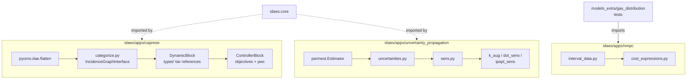
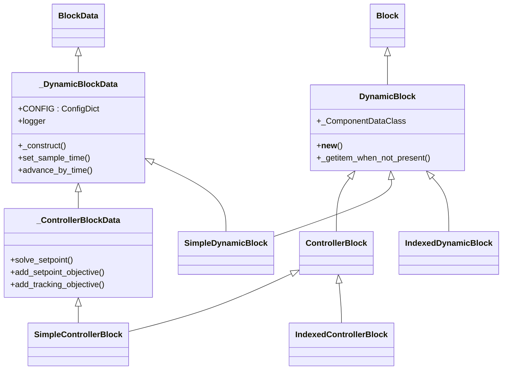
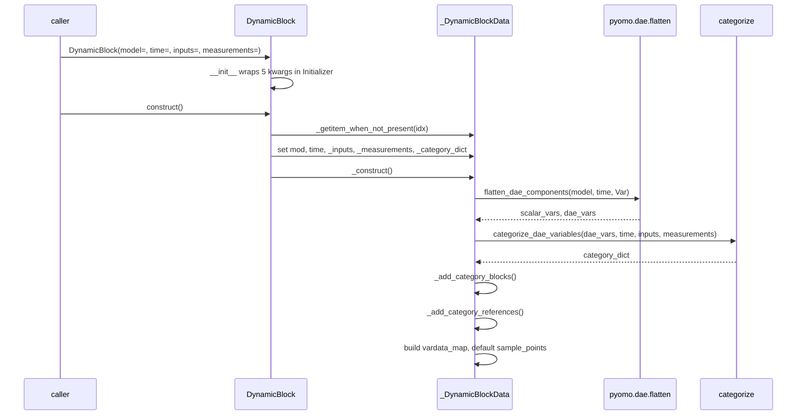
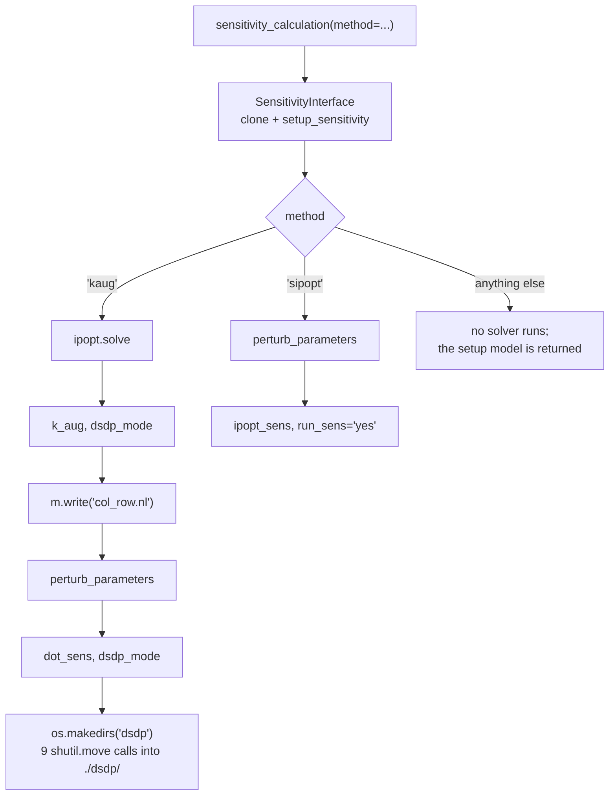

# 27 — Dynamic optimization and uncertainty

> **Doc ID** 27 · **Repo SHA** 70a8f4fe1 (IDAES-PSE v2.13.0rc0) · **Source roots** `idaes/apps/caprese/**`, `idaes/apps/nmpc/**`, `idaes/apps/uncertainty_propagation/**`
> **Owns** 22 modules / 5,732 LOC · **Assets** 4 (1 CSV, 1 Markdown, 2 Jupyter notebooks) · **Siblings** [03](03_block_hierarchy_and_construction_protocol.md), [04](04_control_volume_framework.md), [06](06_model_preparation_initializers_and_scalers.md), [29](29_dependency_and_layering_map.md), [30](30_numerics_and_solver_interface_map.md), [31](31_extension_point_catalog.md)

**This document covers three independent subsystems.** They share a theme —
advanced analysis over a dynamic or an uncertain model — and they share no code.
`idaes/apps/caprese/` and `idaes/apps/nmpc/` are two separate implementations of
nonlinear model predictive control; `idaes/apps/uncertainty_propagation/` is a
parameter-estimation and error-propagation toolbox built on external sensitivity
solvers. A repository-wide search for `idaes.apps.caprese`, `idaes.apps.nmpc` and
`idaes.apps.uncertainty_propagation` finds no import crossing from any one of the
three into either of the others, in source or in tests. The three sections of
every table below are therefore disjoint, and the reader who wants one subsystem
can read one third of this document.

---

## 0. Scope and source map

**`idaes/apps/caprese/` — 11 modules, 3,585 LOC**

| File | LOC | Purpose | Covered in § |
|---|---:|---|---|
| `idaes/apps/caprese/dynamic_block.py` | 927 | `_DynamicBlockData`/`DynamicBlock` and its scalar and indexed variants; the sample-time machinery; `SquareSolveContext` | 2, 3, 4, 5, 6, 7, 9 |
| `idaes/apps/caprese/categorize.py` | 447 | Structural decomposition of a flattened DAE model into differential, algebraic, derivative and discretization sets | 2, 5, 7, 12 |
| `idaes/apps/caprese/util.py` | 379 | Element-by-element initialization, the variable-caching context manager, and the noise machinery | 2, 5, 7, 11 |
| `idaes/apps/caprese/controller.py` | 338 | `_ControllerBlockData`/`ControllerBlock`; setpoint and tracking objectives; piecewise-constant inputs | 2, 3, 5, 6, 7 |
| `idaes/apps/caprese/rolling.py` | 288 | `TimeList` and `VectorSeries`, the rolling-horizon data containers | 2, 3, 6, 7, 12 |
| `idaes/apps/caprese/nmpc_var.py` | 145 | The seven `IndexedVar` subclasses used as classification ctypes, plus `_NmpcVector` | 2, 3, 6, 9 |
| `idaes/apps/caprese/common/config.py` | 132 | Nine enumerations, four validator callables, and `get_ncp` | 2, 3, 9, 12 |
| `idaes/apps/caprese/nmpc.py` | 108 | `NMPCSim`, the plant-plus-controller façade; the one autodoc'd module in this scope | 2, 5, 7 |
| `idaes/apps/caprese/examples/cstr_reduced.py` | 415 | A reduced-space CSTR control example driving `categorize_dae_variables_and_constraints` directly | 2, 10, 12 |
| `idaes/apps/caprese/examples/cstr_nmpc.py` | 244 | A closed-loop CSTR control example driving `NMPCSim` | 2, 10 |
| `idaes/apps/caprese/examples/cstr_model.py` | 162 | The enzyme-reaction CSTR flowsheet both examples build | 2, 8, 12 |

**`idaes/apps/nmpc/` — 4 modules, 242 LOC**

| File | LOC | Purpose | Covered in § |
|---|---:|---|---|
| `idaes/apps/nmpc/dynamic_data/interval_data.py` | 134 | Piecewise-constant interval data: validation, loading, conversion from a time series | 2, 5, 7 |
| `idaes/apps/nmpc/cost_expressions.py` | 78 | `get_tracking_cost_from_constant_setpoint` | 2, 5, 7 |
| `idaes/apps/nmpc/dynamic_data/__init__.py` | 17 | Re-exports the three interval-data functions | 2 |
| `idaes/apps/nmpc/__init__.py` | 13 | Re-exports the one cost function | 2 |

**`idaes/apps/uncertainty_propagation/` — 7 modules, 1,905 LOC**

| File | LOC | Purpose | Covered in § |
|---|---:|---|---|
| `idaes/apps/uncertainty_propagation/sens.py` | 784 | A vendored and extended copy of Pyomo's sensitivity toolbox; the `k_aug`, `dot_sens` and `ipopt_sens` boundary | 2, 3, 5, 7, 10, 11, 12 |
| `idaes/apps/uncertainty_propagation/uncertainties.py` | 452 | `quantify_propagate_uncertainty`, `propagate_uncertainty`, `clean_variable_name` | 2, 5, 7, 11 |
| `idaes/apps/uncertainty_propagation/examples/simple_opt_problem.py` | 298 | A three-variable problem with an analytic answer, checked against the toolbox | 2, 10, 12 |
| `idaes/apps/uncertainty_propagation/examples/NRTL_model_scripts.py` | 216 | A benzene–toluene flash flowsheet in three variants | 2, 10 |
| `idaes/apps/uncertainty_propagation/examples/rooney_biegler.py` | 68 | The Rooney–Biegler two-parameter regression model, in two variants | 2, 10 |
| `idaes/apps/uncertainty_propagation/examples/uncertainty_propagation_NRTL.py` | 46 | Driver script for the flash example | 2, 10 |
| `idaes/apps/uncertainty_propagation/examples/uncertainty_propagation_rooney.py` | 41 | Driver script for the regression example | 2, 10 |

**Shipped assets**

| File | Bytes | Covered in § |
|---|---:|---|
| `idaes/apps/uncertainty_propagation/examples/uncertainty_propagation_NRTL.ipynb` | 3,161 | 10 |
| `idaes/apps/uncertainty_propagation/examples/uncertainty_propagation_rooney.ipynb` | 2,939 | 10 |
| `idaes/apps/uncertainty_propagation/examples/BT_NRTL_dataset.csv` | 1,848 | 10, 12 |
| `idaes/apps/uncertainty_propagation/examples/README.md` | 131 | 10 |

Totals: 5,732 LOC, 2 configuration keys, 3 `NotImplementedError` hook sites, 9
enumerations, 35 classes, **no `@declare_process_block_class` sites** and no
rows in `_generated/retrofit.csv` or `_generated/process_blocks.csv`.

### 0.1 Two of the three packages have no `__init__.py`

`find idaes/apps/caprese -name '__init__.py'` returns nothing, and
`git ls-tree -r 70a8f4fe1 -- idaes/apps/caprese` confirms the absence at the
documented revision. The same holds for `idaes/apps/uncertainty_propagation`.

| Package | `__init__.py` files at `70a8f4fe1` | Kind |
|---|---:|---|
| `idaes/apps/caprese`, `caprese/common`, `caprese/examples`, `caprese/tests` | 0 | implicit namespace packages (PEP 420) |
| `idaes/apps/uncertainty_propagation`, `.../examples`, `.../tests` | 0 | implicit namespace packages |
| `idaes/apps/nmpc`, `nmpc/dynamic_data`, `nmpc/tests`, `nmpc/dynamic_data/tests` | 4 | regular packages |
| `idaes/apps` itself | 1, empty | regular package |

`[tool.setuptools.packages.find]` in `pyproject.toml` declares only
`include = ["idaes*"]`; that directive's `namespaces` option defaults to true,
so setuptools discovers `idaes.apps.caprese`, `idaes.apps.caprese.common`,
`idaes.apps.caprese.examples`, `idaes.apps.caprese.tests`,
`idaes.apps.uncertainty_propagation` and its two subpackages alongside the
regular ones. Both packages import and both ship. This document is the
normative home of that fact; section 12 records its observable consequences.

---

## 1. Architectural role

Three tools sit under `idaes/apps/` that operate on a model rather than build
one. None of them declares a process block, none carries units of measurement,
and none is reachable from `idaes.core` — the dependency arrow points only
inwards, from these packages to the core.

**CAPRESE** works on a dynamic flowsheet that has already been discretized in
time. It flattens the model into components indexed only by time, partitions
those components into differential, algebraic, derivative, input, fixed and
measurement categories, and attaches the partition to a Pyomo Block as typed
references. The controller subclass adds a setpoint objective, a tracking
objective and a piecewise-constant input constraint on top of that structure.
`DynamicBlock` (`idaes/apps/caprese/dynamic_block.py:764`) is a Pyomo `Block`
subclass written by hand in Pyomo's own container/data idiom, not with
`declare_process_block_class` — section 3.1 contrasts the two.

**`idaes/apps/nmpc/`** is four functions. Three convert between a time series
and piecewise-constant interval data and load such data onto a model
(`idaes/apps/nmpc/dynamic_data/interval_data.py:17`, `:44`, `:90`); the fourth
builds a weighted least-squares tracking `Expression` over a list of
time-indexed variables (`idaes/apps/nmpc/cost_expressions.py:20`). Both modules
are pure Pyomo, keyed by `ComponentUID` strings rather than by object identity,
and have no external dependency beyond `pyomo.core`.

**`idaes/apps/uncertainty_propagation/`** runs a parameter estimation through
`pyomo.contrib.parmest`, obtains the parameter covariance, differentiates the
objective and the constraints with respect to the full variable vector, and
combines the two into a variance on the objective and on each constraint. The
derivatives come from external solvers, not from Pyomo: `sens.py` drives
`k_aug` with `dot_sens`, or `ipopt_sens`, through the `nl` interface and reads
their text output back from files on disk.

*Three boxes with no edges between them: the only shared vertex is `idaes.core`, and the only in-tree consumer of any of the three is a pair of test modules that use `idaes/apps/nmpc/`.*

---

## 2. Public surface inventory

### 2.1 `idaes/apps/caprese/`

| Symbol | Kind | Declared at | Exported via | Stability signal |
|---|---|---|---|---|
| `_DynamicBlockData` | class | `idaes/apps/caprese/dynamic_block.py:60` | module path only | leading underscore |
| `DynamicBlock` | class | `idaes/apps/caprese/dynamic_block.py:764` | module path only | no underscore; not autodoc'd |
| `SimpleDynamicBlock`, `IndexedDynamicBlock`, `SimpleControllerBlock`, `IndexedControllerBlock` | classes | `idaes/apps/caprese/dynamic_block.py:820`, `:829`; `idaes/apps/caprese/controller.py:327`, `:336` | module path only | allocated by the container's `__new__` |
| `SquareSolveContext` | class | `idaes/apps/caprese/dynamic_block.py:834` | module path only | no underscore |
| `_ControllerBlockData` | class | `idaes/apps/caprese/controller.py:55` | module path only | leading underscore |
| `ControllerBlock` | class | `idaes/apps/caprese/controller.py:308` | module path only | no underscore |
| `pwc_rule` | function | `idaes/apps/caprese/controller.py:45` | module path only | module-level `Constraint` rule |
| `NmpcVar` | class | `idaes/apps/caprese/nmpc_var.py:22` | module path only | base of six ctypes |
| `DiffVar`, `DerivVar`, `AlgVar`, `InputVar`, `FixedVar`, `MeasuredVar` | classes | `idaes/apps/caprese/nmpc_var.py:60`, `:64`, `:68`, `:72`, `:76`, `:80` | module path only | each declares one `_attr` string |
| `_NmpcVector` | class | `idaes/apps/caprese/nmpc_var.py:84` | module path only | leading underscore |
| `categorize_dae_variables_and_constraints` | function | `idaes/apps/caprese/categorize.py:92` | module path only | no underscore |
| `categorize_dae_variables` | function | `idaes/apps/caprese/categorize.py:325` | module path only | `@deprecated` at `:320`, version 2.0.0 |
| `CATEGORY_TYPE_MAP`, `DAE_DISC_SUFFIX` | dict, str | `idaes/apps/caprese/categorize.py:36`, `:60` | module path only | read by `_add_category_blocks`; the `_disc_eq` naming assumption |
| `NMPCSim` | class | `idaes/apps/caprese/nmpc.py:35` | module path only | `automodule` in `docs/explanations/modeling_extensions/caprese/nmpc.rst` |
| `TimeList`, `VectorSeries` | classes | `idaes/apps/caprese/rolling.py:21`, `:183` | module path only | no underscore |
| `CachedVarsContext` | class | `idaes/apps/caprese/util.py:48` | module path only | no underscore |
| `initialize_by_element_in_range` | function | `idaes/apps/caprese/util.py:85` | module path only | the one cross-module import inside caprese |
| `get_violated_bounds`, `apply_noise` | functions | `idaes/apps/caprese/util.py:273`, `:298` | module path only | no underscore |
| `apply_bounded_noise_discard`, `_push`, `_fail`, `apply_noise_with_bounds`, `MaxDiscardError` | functions, exception | `idaes/apps/caprese/util.py:313`, `:333`, `:341`, `:349`, `:294` | module path only | the noise machinery and its one exception class |
| nine enumerations | enums | `idaes/apps/caprese/common/config.py:23`–`:87` | module path only | section 3.2 |
| `validate_list_of_vardata` | function | `idaes/apps/caprese/common/config.py:94` | module path only | no in-tree reference |
| `validate_list_of_vardata_value_tuples` | function | `idaes/apps/caprese/common/config.py:103` | module path only | no in-tree reference |
| `validate_solver` | function | `idaes/apps/caprese/common/config.py:117` | module path only | no in-tree reference |
| `get_ncp` | function | `idaes/apps/caprese/common/config.py:125` | module path only | no in-tree reference; raises, section 9 |
| `make_model` | function | `idaes/apps/caprese/examples/cstr_model.py:54` | module path only | imported by two examples and two test modules |
| `main`, `PlotData` | functions, classes | `idaes/apps/caprese/examples/cstr_nmpc.py:77`, `:46`; `cstr_reduced.py:96`, `:65` | module path only | each `main` under an `if __name__` guard; two identical `PlotData` declarations |

### 2.2 `idaes/apps/nmpc/`

| Symbol | Kind | Declared at | Exported via | Stability signal |
|---|---|---|---|---|
| `get_tracking_cost_from_constant_setpoint` | function | `idaes/apps/nmpc/cost_expressions.py:20` | `idaes.apps.nmpc`, re-exported at `idaes/apps/nmpc/__init__.py:13` | no documentation anywhere in `docs/` |
| `assert_disjoint_intervals` | function | `idaes/apps/nmpc/dynamic_data/interval_data.py:17` | `idaes.apps.nmpc.dynamic_data`, re-exported at `idaes/apps/nmpc/dynamic_data/__init__.py:13` | as above |
| `load_inputs_into_model` | function | `idaes/apps/nmpc/dynamic_data/interval_data.py:44` | as above | as above |
| `interval_data_from_time_series` | function | `idaes/apps/nmpc/dynamic_data/interval_data.py:90` | as above | as above |

The two `__init__.py` files export exactly these four names and nothing else.
A search of `docs/` for `idaes.apps.nmpc` returns no hit: there is no `.rst`
page, no `automodule` directive and no prose mention of this package anywhere in
the documentation tree. `docs/explanations/modeling_extensions/caprese/nmpc.rst`
is a caprese page and autodocs `idaes.apps.caprese.nmpc`, a different module
whose dotted path differs by one segment.

### 2.3 `idaes/apps/uncertainty_propagation/`

| Symbol | Kind | Declared at | Exported via | Stability signal |
|---|---|---|---|---|
| `quantify_propagate_uncertainty` | function | `idaes/apps/uncertainty_propagation/uncertainties.py:37` | module path only | `autofunction` in `docs/explanations/modeling_extensions/uncertainty_propagation/index.rst` |
| `propagate_uncertainty` | function | `idaes/apps/uncertainty_propagation/uncertainties.py:215` | module path only | `autofunction` |
| `clean_variable_name` | function | `idaes/apps/uncertainty_propagation/uncertainties.py:414` | module path only | `autofunction` |
| `sensitivity_calculation`, `get_dsdp`, `get_dfds_dcds`, `line_num` | functions | `idaes/apps/uncertainty_propagation/sens.py:98`, `:201`, `:312`, `:456` | module path only | no underscore |
| `SensitivityInterface` | class | `idaes/apps/uncertainty_propagation/sens.py:485` | module path only | no underscore |
| `_add_sensitivity_suffixes` | function | `idaes/apps/uncertainty_propagation/sens.py:71` | module path only | leading underscore |
| `_SIPOPT_SUFFIXES`, `_K_AUG_SUFFIXES` | dicts | `idaes/apps/uncertainty_propagation/sens.py:49`, `:60` | module path only | leading underscore |
| `_NotAnIndex`, `_generate_component_items` | class, function | `idaes/apps/uncertainty_propagation/sens.py:83`, `:87` | module path only | leading underscore; the class is a sentinel for an unindexed component |
| `NRTL_model`, `NRTL_model_opt`, `NRTL_model_opt_infeasible` | functions | `idaes/apps/uncertainty_propagation/examples/NRTL_model_scripts.py:28`, `:89`, `:157` | module path only | imported by tests and by a driver |
| `rooney_biegler_model`, `rooney_biegler_model_opt` | functions | `idaes/apps/uncertainty_propagation/examples/rooney_biegler.py:23`, `:50` | module path only | imported by tests and by a driver |

---

## 3. Class hierarchy and type taxonomy

`_generated/retrofit.csv` and `_generated/process_blocks.csv` carry **no rows**
for any file in this document. Nothing in this scope is declared with
`@declare_process_block_class`, nothing subclasses `ProcessBlockData`, and
nothing carries a `default_initializer` or `default_scaler` class attribute.
Each subsystem uses a different mechanism instead:

| Subsystem | What it uses instead of a process block |
|---|---|
| `idaes/apps/caprese/` | Pyomo's own container/data pattern, written by hand: a `Block` subclass with `_ComponentDataClass` and a `__new__` that allocates a scalar or an indexed variant (`idaes/apps/caprese/dynamic_block.py:769`) |
| `idaes/apps/nmpc/` | No classes at all — four module-level functions over plain Pyomo components |
| `idaes/apps/uncertainty_propagation/` | One plain `object` subclass holding a cloned model (`idaes/apps/uncertainty_propagation/sens.py:485`) and free functions returning `namedtuple` results |

*Each of the two block families is four classes, and the scalar variant inherits from both halves of the pair — the same shape Pyomo uses for its own components and the same shape `_ScalarProcessBlockMeta` synthesizes in [03](03_block_hierarchy_and_construction_protocol.md).*

| Class | Base(s) | Declared at | Decorator | Container class | Key overrides |
|---|---|---|---|---|---|
| `_DynamicBlockData` | `BlockData` | `idaes/apps/caprese/dynamic_block.py:60` | none | — | 27 methods; `CONFIG`, `logger` |
| `DynamicBlock` | `Block` | `idaes/apps/caprese/dynamic_block.py:764` | none | itself | `__new__`, `__init__`, `_getitem_when_not_present` |
| `SimpleDynamicBlock`, `SimpleControllerBlock` | the data class and its container | `idaes/apps/caprese/dynamic_block.py:820`, `idaes/apps/caprese/controller.py:327` | none | — | `__init__`; `display` taken from the container |
| `IndexedDynamicBlock`, `IndexedControllerBlock` | the container | `idaes/apps/caprese/dynamic_block.py:829`, `idaes/apps/caprese/controller.py:336` | none | — | `__init__` only |
| `SquareSolveContext` | `object` | `idaes/apps/caprese/dynamic_block.py:834` | none | — | `__enter__`, `__exit__` |
| `_ControllerBlockData` | `_DynamicBlockData` | `idaes/apps/caprese/controller.py:55` | none | — | 4 methods, no `build` |
| `ControllerBlock` | `DynamicBlock` | `idaes/apps/caprese/controller.py:308` | none | itself | `__new__`, `_ComponentDataClass` |
| `NmpcVar` | `IndexedVar` | `idaes/apps/caprese/nmpc_var.py:22` | none | — | `__init__` |
| `DiffVar`, `DerivVar`, `AlgVar`, `InputVar`, `FixedVar`, `MeasuredVar` | `NmpcVar` | `idaes/apps/caprese/nmpc_var.py:60`–`:80` | none | — | one class attribute `_attr` each, no methods |
| `_NmpcVector` | `IndexedVar` | `idaes/apps/caprese/nmpc_var.py:84` | none | — | `set_setpoint`, `get_setpoint`, `values` property |
| `TimeList` | `list` | `idaes/apps/caprese/rolling.py:21` | none | — | `append`, `extend`, plus 7 helpers |
| `VectorSeries` | `OrderedDict` | `idaes/apps/caprese/rolling.py:183` | none | — | `append`, `extend`, `__len__`, plus 5 helpers |
| `CachedVarsContext`, `MaxDiscardError` | `object`, `Exception` | `idaes/apps/caprese/util.py:48`, `:294` | none | — | `__enter__`/`__exit__`; nothing |
| `NMPCSim` | `object` | `idaes/apps/caprese/nmpc.py:35` | none | — | `__init__` only |
| `SensitivityInterface`, `_NotAnIndex` | `object` | `idaes/apps/uncertainty_propagation/sens.py:485`, `:83` | none | — | 10 methods; a sentinel with none |
| `PlotData` | `object` | `idaes/apps/caprese/examples/cstr_nmpc.py:46`, `cstr_reduced.py:65` | none | — | `__init__`, `plot` |

### 3.1 The block pattern here is Pyomo's, not IDAES's

Every process block in IDAES is a `FooData`/`Foo` pair generated by
`declare_process_block_class`, which synthesizes the container class and injects
it into the data class's module
([03 §3.1](03_block_hierarchy_and_construction_protocol.md#31-the-generated-types)).
CAPRESE writes the four classes out by hand and names them differently. The
observable differences:

| Aspect | IDAES process block | `DynamicBlock` |
|---|---|---|
| Container class | synthesized by the decorator | written out, `idaes/apps/caprese/dynamic_block.py:764` |
| Scalar variant name | `_Scalar<Name>` from `_ScalarProcessBlockMeta` | `SimpleDynamicBlock`, `idaes/apps/caprese/dynamic_block.py:820` |
| Indexed variant name | `_Indexed<Name>` from `_IndexedProcessBlockMeta` | `IndexedDynamicBlock`, `idaes/apps/caprese/dynamic_block.py:829` |
| Data base class | `ProcessBlockData` | Pyomo's `BlockData` directly, `idaes/apps/caprese/dynamic_block.py:60` |
| Per-data construction entry | `build()`, called by `_rule_default` | `_construct()`, called from `_getitem_when_not_present`, `idaes/apps/caprese/dynamic_block.py:819` |
| Configuration resolution | `_get_config_args` into `self.config` at construction | `self.CONFIG(kwargs)` inside individual methods, section 4 |
| `dynamic` / `has_holdup` resolution | inherited from the parent flowsheet | absent; the time set is supplied as a constructor keyword |

The consequence is that a `DynamicBlock` has no `self.config`, no
`flowsheet()` lookup, and no participation in `useDefault` resolution. It is a
plain Pyomo Block that happens to carry a `CONFIG` class attribute for two
solver-output options.

### 3.2 Enumerations

Nine enumerations, all in `idaes/apps/caprese/common/config.py`, all plain
`enum.Enum` with integer values grouped by decade. The generated
`_generated/enums.csv` does not extend to `idaes/apps/`, so the members below
are transcribed from the declarations.

`VariableCategory` (`idaes/apps/caprese/common/config.py:56`) — the partition
key for variables:

| Member | Value | Meaning | Consumed at |
|---|---|---|---|
| `DIFFERENTIAL` | 1 | State variable with a time derivative | `categorize.py:36`, `dynamic_block.py:148` |
| `ALGEBRAIC` | 2 | Variable determined by an algebraic equation | `categorize.py:36`, `dynamic_block.py:150` |
| `DERIVATIVE` | 3 | `DerivativeVar` with respect to time | `categorize.py:36`, `dynamic_block.py:152` |
| `INPUT` | 4 | Degree of freedom the controller sets | `categorize.py:36`, `dynamic_block.py:154` |
| `FIXED` | 5 | Fixed value, treated as a disturbance | `categorize.py:36`, `dynamic_block.py:156` |
| `SCALAR` | 6 | Not indexed by time | no producer in this scope |
| `UNUSED` | 7 | Present in the flattened model, absent from the incidence graph | `categorize.py:298` |
| `DISTURBANCE` | 8 | Filtered out of the square system alongside inputs | `categorize.py:297` |
| `MEASUREMENT` | 9 | Observed quantity; popped from the partition at `dynamic_block.py:158` | `categorize.py:36` |

`ConstraintCategory` (`idaes/apps/caprese/common/config.py:68`):
`DIFFERENTIAL` (1), `ALGEBRAIC` (2), `DISCRETIZATION` (3), `INPUT` (4),
`INITIAL` (5), `TERMINAL` (6), `SENSITIVITY` (7), `SCALAR` (8), `UNUSED` (9),
`INEQUALITY` (10). `categorize_dae_variables_and_constraints` populates five of
these ten at `idaes/apps/caprese/categorize.py:310`; the other five have no
producer in the tree.

`InputOption` (`idaes/apps/caprese/common/config.py:36`): `CURRENT` (20),
`INITIAL` (21), `SETPOINT` (22). Selects what value `SquareSolveContext` fixes
inputs to — `CURRENT` fixes them where they stand, `INITIAL` to their value at
`time.first()`, `SETPOINT` to the `setpoint` attribute of each `InputVar`
(`idaes/apps/caprese/dynamic_block.py:893`–`:903`).

`ControlPenaltyType` (`idaes/apps/caprese/common/config.py:50`): `ERROR` (41),
`ACTION` (42), `NONE` (43). Selects the input term of the tracking objective —
squared deviation from setpoint, squared change between consecutive sample
points, or no input term (`idaes/apps/caprese/controller.py:262`, `:270`,
`:284`).

`NoiseBoundOption` (`idaes/apps/caprese/common/config.py:81`): `FAIL` (60),
`DISCARD` (61), `PUSH` (62). Selects the bound-violation policy in
`apply_noise_with_bounds` (`idaes/apps/caprese/util.py:366`, `:370`, `:374`).

The remaining four have no consumer anywhere in the repository —
`ControlInitOption` (`:23`, four members), `ElementInitializationInputOption`
(`:30`, three), `TimeResolutionOption` (`:43`, four) and `PlantHorizonType`
(`:87`, two). Section 12 records the consequence.

### 3.3 `Var` subtypes used as a classification mechanism

`nmpc_var.py` is the distinctive piece of the CAPRESE design. Instead of keeping
the partition in a dictionary and looking variables up in it, the partition is
encoded in the Pyomo **ctype** of the reference that holds each variable.

`NmpcVar` (`idaes/apps/caprese/nmpc_var.py:22`) subclasses `IndexedVar` and its
`__init__` (`:38`) does three things: it refuses a construction with no index
set, it pops five keyword arguments into instance attributes — `setpoint`,
`weight`, `variance`, `nominal`, `noise_bounds` (`:43`–`:47`) — and it sets
`kwargs.setdefault("ctype", type(self))` (`:48`) so the component's ctype is the
class itself. The six subclasses add nothing but a `_attr` string.

Three properties follow, and are what the rest of the package relies on. First,
`self.component_objects(DiffVar)` returns exactly the differential variables,
because Pyomo's component iteration filters on ctype;
`initialize_to_setpoint` (`idaes/apps/caprese/dynamic_block.py:419`),
`advance_by_time` (`:589`) and `add_tracking_objective`
(`idaes/apps/caprese/controller.py:207`) all take a ctype tuple as their selector
argument. Second, attributes that belong to a *variable* rather than to a
*variable at a time point* — a setpoint, a tracking weight, a measurement
variance — live on the `IndexedVar` object, which is indexed only by time; a
`VarData` has no such attribute. Third, `CATEGORY_TYPE_MAP`
(`idaes/apps/caprese/categorize.py:36`) is the single translation between the
enumeration and the ctype, read once in `_add_category_blocks`
(`idaes/apps/caprese/dynamic_block.py:206`) and once in
`_add_category_references` (`:251`).

`_NmpcVector` (`idaes/apps/caprese/nmpc_var.py:84`) is a seventh `IndexedVar`
subclass used as the ctype of a two-dimensional reference — coordinate index
by time. Its `_generate_referenced_vars` (`:103`) recovers the underlying
`NmpcVar` objects by popping one call-stack frame off a duplicated
`IndexedComponent_slice` (`:113`), after four `assert` statements that pin the
exact shape of that slice (`:106`–`:111`).

---

## 4. Configuration reference

Two configuration keys in the whole scope, both on the same `ConfigDict`.

### 4.1 `_DynamicBlockData.CONFIG`

`CONFIG = ConfigDict()` at `idaes/apps/caprese/dynamic_block.py:71`. It is a
plain class attribute on a Pyomo `BlockData` subclass, not an IDAES CONFIG
block: nothing resolves it at construction, and there is no `self.config`.

| Key | Domain / validator | Default | Req. | Effect on build | Anchor |
|---|---|---|---|---|---|
| `tee` | `bool` | `True` | no | Passed as `tee=` to the solver call in `solve_setpoint` | `:73` |
| `outlvl` | none declared | `idaeslog.INFO` | no | Passed as `outlvl=` to `initialize_by_element_in_range` | `:82` |

The block is consumed by calling it on a keyword dictionary inside a method,
after that method has popped its own arguments:

| Call site | Popped first | Anchor |
|---|---|---|
| `initialize_by_solving_elements` | `strip_var_bounds`, `input_option` | `idaes/apps/caprese/dynamic_block.py:450` |
| `initialize_samples_by_element` | `strip_var_bounds`, `input_option` | `idaes/apps/caprese/dynamic_block.py:484` |
| `_ControllerBlockData.solve_setpoint` | `require_steady` | `idaes/apps/caprese/controller.py:76` |

`outlvl` is read at `idaes/apps/caprese/dynamic_block.py:475` and `:516`; `tee`
is read at `idaes/apps/caprese/controller.py:133`. An unrecognised keyword
raises from Pyomo's `ConfigDict`, because the popped names are removed before
the dictionary is applied.

`idaes/apps/nmpc/` and `idaes/apps/uncertainty_propagation/` declare no
configuration at all; every option in both is a function argument with a
literal default.

---

## 5. Construction and call sequences

### 5.1 `DynamicBlock` construction

*Construction is a two-step: the container stores five `Initializer` objects, and every per-index data object flattens, categorizes and attaches its own references.*

`DynamicBlock.__init__` (`idaes/apps/caprese/dynamic_block.py:779`) pops
`model`, `time`, `inputs`, `measurements` and `category_dict` from the keyword
arguments and wraps each in Pyomo's `Initializer`; the last four are created
with `treat_sequences_as_mappings=False` so a list stays a list. What remains is
handed to `Block.__init__`.

`_getitem_when_not_present` (`idaes/apps/caprese/dynamic_block.py:796`) calls
each initializer with `(parent, idx)`, sets the five attributes on the new
data object — `time` through `super(BlockData, block).__setattr__` (`:803`) so
Pyomo does not treat the set as a component — and then calls `_construct()`
(`:819`).

`_construct` (`idaes/apps/caprese/dynamic_block.py:90`) takes one of two paths.
With a **supplied partition**, `category_dict` is adopted as-is (`:104`),
`VC.INPUT` and `VC.MEASUREMENT` are filled from the `inputs` and `measurements`
keywords when absent (`:105`–`:108`), and `self.dae_vars` is the concatenation of
every category except `MEASUREMENT`, which is assumed to duplicate entries of
other categories (`:110`–`:114`). With an **inferred partition**,
`flatten_dae_components(model, time, ctype=Var)` (`:118`) produces `scalar_vars`
and `dae_vars` and the deprecated `categorize_dae_variables` (`:126`) produces
the partition. Either way, empty categories are removed (`:134`–`:139`) because an empty
category yields a slice of unknown dimension; `_add_category_blocks` and
`_add_category_references` follow (`:141`, `:142`); five legacy attributes
(`differential_vars`, `algebraic_vars`, `derivative_vars`, `input_vars`,
`fixed_vars`) are set when their category exists (`:148`–`:156`); and
`measurement_vars` is **popped** out of the partition (`:158`) so the remaining
categories form a partition of the time-indexed variables. `vardata_map`
(`:169`) then maps each `VarData` to the `NmpcVar` containing it, skipping
`MeasuredVar` so the map stays single-valued. `sample_points` and
`sample_point_indices` default to the two ends of the time set (`:182`, `:183`).

### 5.2 What the category blocks and vectors are

`_add_category_blocks` (`idaes/apps/caprese/dynamic_block.py:199`) builds, per
category, a `Set` over `range(len(varlist))` named `<CATEGORY>_SET` (`:214`,
`:215`), a `Block` indexed by that set named `<CATEGORY>_BLOCK` (`:220`,
`:221`), and one attribute `var` on each block data holding a `Reference` to the
time slice of one variable with the category's ctype (`:232`–`:239`). The block
is deactivated immediately (`:224`), so none of these references reaches a
solver as a constraint container.

`_add_category_references` (`idaes/apps/caprese/dynamic_block.py:245`) adds a
single deactivated `Block` named `vectors` (`:253`, `:254`) and, per category,
a `Reference` over the two-level slice `<CATEGORY>_BLOCK[:].var[:]` with ctype
`_NmpcVector`, named by the lower-cased enum member (`:282`, `:283`). The result
is that `blk.vectors.differential[i, t]` addresses the `i`th differential
variable at time `t`, and `blk.vectors.input[:, t0].fix()` fixes the whole input
vector at one time point.

### 5.3 Sample times

`set_sample_time` (`idaes/apps/caprese/dynamic_block.py:294`) delegates to
`validate_sample_time` (`:299`) and then stores the value. Validation walks the
time set and enforces four conditions in order: the minimum spacing between
adjacent time points is positive (`:326`, an `assert`); the tolerance is below
half that spacing, so at most one point satisfies equality within tolerance
(`:329`); the horizon length is an integer multiple of the sample time within
tolerance (`:337`); and every sample boundary coincides with a finite element
(`:366`). It writes `samples_per_horizon` (`:342`), `fe_per_sample` (`:371`),
`sample_points` (`:372`) and `sample_point_indices` (`:373`). Every later method
that speaks of a sample — `initialize_sample_to_setpoint` (`:375`),
`advance_one_sample` (`:615`), `generate_time_in_sample` (`:630`) — reads those
four attributes.

### 5.4 Square solves

`SquareSolveContext` (`idaes/apps/caprese/dynamic_block.py:834`) is the context
manager that turns an optimization model into a simulation model.
`__init__` (`:839`) computes the time indices to fix: every non-initial index
when `samples` is `None` (`:865`), otherwise the indices in each named sample,
deduplicated (`:869`–`:882`).

`__enter__` (`:884`) applies Pyomo's `contrib.strip_var_bounds` transformation
with `reversible=True` (`:887`), then fixes every input variable at every
selected index to a value chosen by `InputOption` (`:893`–`:903`). `__exit__`
(`:916`) unfixes those variables and reverts the bound transformation.

`initialize_by_solving_elements` (`:443`) opens the context over the whole
horizon and calls `initialize_by_element_in_range` once;
`initialize_samples_by_element` (`:479`) opens it over the named samples and
calls the same function once per sample.

`initialize_by_element_in_range` (`idaes/apps/caprese/util.py:85`) is the
integration loop. It asserts that both endpoints are finite elements (`:128`,
`:129`), records activity and fixed state for the whole model (`:153`, `:154`),
and deactivates the model at every time point (`:158`) — or at every non-initial
point followed by a solve for consistent initial conditions (`:161`–`:169`).
Then, for each finite element in range, it reactivates that element's
constraints (`:182`), fixes the linking variables at the previous element
boundary (`:212`–`:219`), copies every unfixed DAE variable forward from the
previous point (`:239`), asserts zero degrees of freedom (`:250`), solves
(`:252`), and deactivates the element again while unfixing what it fixed
(`:258`–`:263`). Everything originally active is reactivated at the end
(`:265`–`:267`). A non-optimal termination raises `ValueError` naming the
element (`:169`, `:257`).

### 5.5 Variable and constraint categorization

`categorize_dae_variables_and_constraints(model, dae_vars, dae_cons, time, index=None, input_vars=None, disturbance_vars=None, input_cons=None, active_inequalities=None)`
(`idaes/apps/caprese/categorize.py:92`) is the current categorizer. It works on
a **representative index** — `time.at(2)`, the first non-initial point, unless
one is supplied (`:105`) — so the whole analysis is done on one time slice of a
model that is structurally identical at every other point.

1. **Deduplicate**, dropping any component that resolves to an already-seen data
   object at the representative index (`:143`–`:162`), then **remove degrees of
   freedom** by filtering inputs and disturbances out of the variable list and
   input constraints and inactive inequalities out of the constraint list
   (`:166`–`:176`), leaving a square system.
2. **Find candidate differential pairs.** A constraint that is not a
   discretization equation and contains exactly one time derivative is that
   derivative's differential equation (`_identify_derivative_if_differential`,
   `:72`); two derivatives in one constraint raise `RuntimeError` (`:82`). For
   each such derivative the state variable (`_get_state_vardata`, `:54`) and the
   discretization equation (`_get_disc_eq`, `:63`, which appends the literal
   suffix declared at `:60`) are collected as a four-tuple (`:190`–`:203`).
3. **Confirm by matching.** An objective of value zero is added when the model
   has none, because PyNumero requires exactly one (`:210`–`:212`), and removed
   afterwards (`:300`). `IncidenceGraphInterface` (`:214`) computes a
   block-triangular ordering over the active variables and constraints (`:236`),
   and a candidate is accepted only when the differential variable and the
   discretization equation land in one diagonal block and the derivative and its
   differential equation land in another (`:255`–`:264`).
4. **Everything else is algebraic or unused.** A variable absent from the block
   map was not reached by any active constraint and becomes `UNUSED`; anything
   else outside an accepted four-tuple is `ALGEBRAIC` (`:276`–`:294`).

The return value is a pair of dictionaries — variable categories keyed by
`VariableCategory` (`:302`) and constraint categories keyed by
`ConstraintCategory` (`:310`). The structural point of the matching step is
recorded in the source comment at `:257`: once the differential variables are
matched to the discretization equations and the derivatives to the differential
equations, non-singularity of the whole square system reduces to non-singularity
of the algebraic sub-block.

`categorize_dae_variables` (`idaes/apps/caprese/categorize.py:325`) is the
predecessor, carrying `@deprecated(..., version="2.0.0")` at `:320`. It takes no
model and no constraints, walks the flattened variable list once, and decides by
inspecting `DerivativeVar` parentage and fixed status at two time points
(`:366`–`:408`). It has no incidence-graph step, and it is still the path
`_construct` takes when no `category_dict` is supplied
(`idaes/apps/caprese/dynamic_block.py:126`).

### 5.6 Controller construction

`_ControllerBlockData` adds no `_construct` of its own; a `ControllerBlock` is
constructed exactly like a `DynamicBlock`. The three things a controller does
afterwards are explicit calls:

`add_setpoint_objective(setpoint, weights)`
(`idaes/apps/caprese/controller.py:171`) writes each weight onto its `NmpcVar`
through `vardata_map` (`:194`), warns and substitutes `1.0` for a missing weight
(`:198`), and creates `setpoint_objective` as a weighted sum of squared
deviations at the first time point (`:205`).

`solve_setpoint(solver, **kwargs)` (`idaes/apps/caprese/controller.py:61`)
performs a single-time-point optimization. It records the active state of every
`Constraint` and `Block` (`:80`), deactivates the model at every non-initial time
point with `pyomo.dae.set_utils.deactivate_model_at` (`:88`), caches the input
and measurement vectors at `t0` (`:97`, `:101`), unfixes measurements (`:113`)
and inputs (`:118`), and fixes derivatives to zero when `require_steady` is true
(`:121`). It then activates `setpoint_objective`, solves with `tee=config.tee`,
and raises `RuntimeError` on a non-optimal termination (`:123`, `:133`, `:138`).
Finally it reverses those steps in order, copies the solution into the
`setpoint` attribute of every `NmpcVar` of six ctypes (`:150`–`:152`), and
restores the cached vectors (`:155`–`:158`).

`add_tracking_objective(weights, control_penalty_type=ControlPenaltyType.ERROR, state_ctypes=DiffVar, state_weight=1.0, input_weight=1.0, objective_weight=1.0)`
(`idaes/apps/caprese/controller.py:207`) sums the state term over
`sample_points[1:]` (`:256`) and adds an input term selected by
`ControlPenaltyType`, then creates `tracking_objective` (`:290`). A value
outside the enumeration raises `ValueError` (`:253`).

`constrain_control_inputs_piecewise_constant`
(`idaes/apps/caprese/controller.py:292`) creates `pwc_constraint` over the input
set and the whole time set with `pwc_rule` (`:300`). The rule
(`idaes/apps/caprese/controller.py:45`) returns `Constraint.Skip` at every
sample point (`:49`) and otherwise equates the input at the next time point to
the input at this one (`:52`), so each sampling interval carries one free input
value.

### 5.7 `NMPCSim`

`NMPCSim.__init__` (`idaes/apps/caprese/nmpc.py:48`) is the only method on the
class. It builds a `ComponentUID` for each measurement and each input by slicing
the component along its time set with `pyomo.util.slices.slice_component_along_sets`
(`:69`, `:73`), locates the matching component on the *other* model through that
`ComponentUID` (`:78`, `:92`), constructs a `DynamicBlock` for the plant (`:82`)
and a `ControllerBlock` for the controller (`:95`), constructs both, and sets
the sample time on both when one was supplied (`:104`–`:106`). The class exists
to guarantee that the same physical quantity is identified on two separately
built models.

### 5.8 `idaes/apps/nmpc/` call sequences

`interval_data_from_time_series(data, use_left_endpoint=False)`
(`idaes/apps/nmpc/dynamic_data/interval_data.py:90`) converts a pair of a time
list and a name-to-values dictionary into a name-to-interval-dictionary mapping.
N time points give N−1 intervals; each interval takes its right endpoint's value
unless `use_left_endpoint` is set (`:131`). A single time point yields one
degenerate interval (`:124`).

`load_inputs_into_model(model, time, input_data, time_tol=0)`
(`idaes/apps/nmpc/dynamic_data/interval_data.py:44`) resolves each key with
`model.find_component` and raises `RuntimeError` naming the model and the
`ComponentUID` when it is absent (`:69`). It calls `assert_disjoint_intervals`
on the sorted interval list (`:75`), maps each endpoint to a time index with
`find_nearest_index` within `time_tol`, **skips** the interval when either
endpoint fails to resolve (`:82`), and writes the value to the half-open index
range above the first endpoint — or to the single index when the interval is
degenerate (`:84`).

`get_tracking_cost_from_constant_setpoint(variables, time, setpoint_data, weight_data=None)`
(`idaes/apps/nmpc/cost_expressions.py:20`) builds the name of each variable from
its `ComponentUID`, taking the referent when the variable is a reference
(`:49`–`:56`); defaults every weight to `1.0` when none are supplied (`:58`);
raises `KeyError` naming both the variable and its `ComponentUID` when a
setpoint (`:61`) or a weight (`:66`) is missing; and returns an `Expression`
indexed by `time` (`:77`). Matching by `ComponentUID` string rather than by
object identity is what lets a setpoint dictionary built on one model be applied
to another.

### 5.9 Uncertainty propagation

`quantify_propagate_uncertainty(model_function, model_uncertain, data, theta_names, obj_function=None, tee=False, diagnostic_mode=False, solver_options=None, covariance_n=None)`
(`idaes/apps/uncertainty_propagation/uncertainties.py:37`)
type-checks `tee`, `diagnostic_mode` and `solver_options` (`:143`, `:145`,
`:148`); defaults `covariance_n` to the number of data rows and logs the choice
at `INFO` (`:150`–`:156`); strips apostrophes and spaces from the parameter names
with `clean_variable_name` (`:159`); builds a `parmest.Estimator` from the model
function, data, cleaned names, objective function and the three pass-through
flags (`:160`) and calls `theta_est(calc_cov=True, cov_n=covariance_n)` (`:169`);
restores the original names (`:172`–`:176`); calls `propagate_uncertainty`
(`:178`); and returns an eleven-field `namedtuple` combining the estimation and
propagation results (`:181`, `:196`).

`propagate_uncertainty(model_uncertain, theta, cov, theta_names, tee=False, solver_options=None)`
(`idaes/apps/uncertainty_propagation/uncertainties.py:215`)
accepts either a constructed `Block` or a callable that builds one (`:285`,
`:288`); converts the covariance to a numpy array and checks that it is
two-dimensional, square and correctly sized (`:296`–`:311`); cleans the names
again and **fixes each parameter by setting its lower and upper bound to the
estimated value** (`:314`–`:317`); calls `get_dsdp` for the parameter
sensitivity matrix (`:320`), transposed at `:321`, and `get_dfds_dcds` for the
objective gradient and the constraint Jacobian (`:322`); forms the objective
variance as the chained derivative times the covariance times its transpose,
asserted to be one by one and unwrapped to a scalar (`:340`, `:342`, `:349`);
forms the constraint variance the same way, or an empty array when the model has
no constraint (`:377`, `:379`); and returns a seven-field `namedtuple` (`:381`,
`:392`).

### 5.10 The external sensitivity boundary

*One function name reaches three external executables, and the `k_aug` path leaves its results in a directory created relative to the process working directory.*

`sensitivity_calculation(method, instance, paramList, perturbList, cloneModel=True, tee=False, keepfiles=False, solver_options=None)`
(`idaes/apps/uncertainty_propagation/sens.py:98`) constructs a
`SensitivityInterface` (`:150`) and calls `setup_sensitivity` (`:151`). The
`k_aug` branch is selected by the literal string `"kaug"` (`:155`): it creates
three `SolverFactory` handles (`:156`–`:158`), solves with `ipopt`, copies the
bound multipliers from the `out` suffixes into the `in` suffixes (`:161`,
`:162`), sets `dsdp_mode` and runs `k_aug` (`:164`, `:165`), and writes
`col_row.nl` with symbolic solver labels (`:166`). After `perturb_parameters`
(`:168`), the `sipopt` branch runs `ipopt_sens` with `run_sens` set to `yes`
(`:171`, `:172`, `:175`), and the `k_aug` branch runs `dot_sens` and moves nine
files into a `./dsdp/` directory (`:179`–`:194`). `perturb_parameters` (`:752`)
writes the perturbed value into `sens_state_value_1` for sIPOPT (`:775`) and the
difference into `DeltaP` for `k_aug` (`:779`).

`SensitivityInterface.setup_sensitivity(paramList)`
(`idaes/apps/uncertainty_propagation/sens.py:699`) is where the model is
rewritten:

it translates the parameter list onto the cloned model by `ComponentUID`
(`:513`); adds a `Block` named `_SENSITIVITY_TOOLBOX_DATA` (`:501`, `:554`)
holding `_sens_data_list`, `_paramList`, `_has_replaced_expressions` and a
`constList` (`:566`, `:571`, `:575`, `:578`); turns each mutable `Param` into a
new `Var` (`:589`–`:602`) and each fixed `Var` into a new mutable `Param`
(`:612`–`:628`), raising `ValueError` for a non-mutable `Param` (`:589`) or an
unfixed `Var` (`:616`); unfixes every sensitivity variable (`:712`); walks every
active objective and constraint substituting the new variables and deactivating
the originals when any `Param` was converted (`:639`–`:696`); adds `paramConst`,
one equality tying each variable to its parameter (`:732`, `:734`); and adds the
fourteen solver suffixes (`:736`, via `_add_sensitivity_suffixes` at `:71`),
indexing each variable and constraint into `sens_state_0`, `sens_state_1`,
`sens_init_constr` and `dcdp` (`:742`–`:750`).

`get_dsdp(model, theta_names, theta, var_dic={}, tee=False, solver_options=None)`
(`idaes/apps/uncertainty_propagation/sens.py:201`) clones the model, adds an
original and a perturbed `Param` per parameter plus an equality tying each named
variable to its original (`:274`–`:282`), calls `sensitivity_calculation` with
`"kaug"` (`:284`), then reads `./dsdp/col_row.col`, `./dsdp/col_row.row` and
`./dsdp/dsdp_in_.in` back from disk (`:288`–`:292`), removes the directory
(`:298`), drops the sensitivity block's own columns, and negates every entry
because `k_aug` reports the self-sensitivity as −1 (`:303`–`:308`).

`get_dfds_dcds(model, theta_names, tee=False, solver_options=None)`
(`idaes/apps/uncertainty_propagation/sens.py:312`) checks all three solvers are
available and raises `RuntimeError` naming the missing one (`:375`–`:380`),
adds the suffixes plus the two `k_aug` suffixes `dof_v` and `rh_name` (`:386`,
`:387`), sets `print_kkt` (`:388`), solves with `ipopt` and raises
`RuntimeError` carrying the solver message on a non-optimal termination
(`:393`), runs `k_aug` (`:403`), writes `col_row.nl` (`:404`), and reads
`./GJH/gradient_f_print.txt` and `./GJH/A_print.txt` back (`:411`, `:428`). It
finishes by moving the three `col_row` files into `./GJH/` and deleting that
directory (`:448`–`:451`).

---

## 6. Data structures, variables, constraints and invariants

### 6.1 Pyomo components created on a `DynamicBlock` or `ControllerBlock`

| Component | Type | Index sets | Units | Created at | Condition |
|---|---|---|---|---|---|
| `<CATEGORY>_SET` | `Set` over an integer range | — | — | `dynamic_block.py:214` | one per non-empty category |
| `<CATEGORY>_BLOCK` | `Block`, deactivated | `<CATEGORY>_SET` | — | `dynamic_block.py:220` | one per non-empty category |
| `<CATEGORY>_BLOCK[i].var` | `Reference` with an `NmpcVar` ctype | time | inherited from the referent | `dynamic_block.py:239` | one per variable |
| `vectors` | `Block`, deactivated | — | — | `dynamic_block.py:253` | always |
| `vectors.<category>` | `Reference` with ctype `_NmpcVector` | coordinate × time | inherited | `dynamic_block.py:283` | one per non-empty category |
| `ipopt_zL_out`/`ipopt_zU_out`, `ipopt_zL_in`/`ipopt_zU_in`, `dual` | `Suffix`, `IMPORT` / `EXPORT` / `IMPORT_EXPORT` | — | — | `dynamic_block.py:699`–`:705` | `add_ipopt_suffixes` |
| `setpoint_objective` | `Objective` | — | — | `controller.py:205` | `add_setpoint_objective` |
| `tracking_objective` | `Objective` | — | — | `controller.py:290` | `add_tracking_objective` |
| `pwc_constraint` | `Constraint` | `INPUT_SET` × time | — | `controller.py:300` | `constrain_control_inputs_piecewise_constant` |

No component in this document carries a Pyomo unit of measurement of its own.
Every reference inherits the units of the flowsheet variable it points at, and
every objective is a sum of squares of quantities in whatever units the
underlying model used — the weights are bare numbers.

### 6.2 Pyomo components created by the sensitivity interface

| Component | Type | Created at | Condition |
|---|---|---|---|
| `_SENSITIVITY_TOOLBOX_DATA` | `Block` | `sens.py:554` | `setup_sensitivity` |
| `.constList` | `ConstraintList` | `sens.py:578` | always; filled only when parameters were replaced |
| `.paramConst` | `ConstraintList` | `sens.py:732` | one entry per sensitivity parameter |
| one `Var` or `Param` per entry | `Var` / `Param` | `sens.py:602`, `:628` | a `Param` input yields a `Var`, a fixed `Var` input yields a `Param` |
| `extra` | `ConstraintList` | `sens.py:253` | on the clone built inside `get_dsdp` |
| `original_<i>`, `perturbed_<i>` | `Param` | `sens.py:277`, `:278` | one pair per parameter name, inside `get_dsdp` |
| 7 sIPOPT suffixes, 7 `k_aug` suffixes | `Suffix` | `sens.py:79` | `_add_sensitivity_suffixes`, skipping names already present |
| `dof_v`, `rh_name` | `Suffix` | `sens.py:386`, `:387` | `get_dfds_dcds` only |
| `_temp_dummy_obj` | `Objective` of value zero | `categorize.py:212` | when the model has no active objective; removed at `:300` |

### 6.3 Non-Pyomo data structures

| Structure | Fields | Declared at |
|---|---|---|
| `category_dict` | `VariableCategory` to list of time-indexed references | `dynamic_block.py:132`, `categorize.py:302` |
| `vardata_map` | `ComponentMap` from `VarData` to its `NmpcVar` | `dynamic_block.py:169` |
| `sample_points`, `sample_point_indices`, `fe_per_sample`, `samples_per_horizon` | list, list, dict, int | `dynamic_block.py:372`, `:373`, `:371`, `:342` |
| `NmpcVar` per-variable attributes | `setpoint`, `weight`, `variance`, `nominal`, `noise_bounds` | `nmpc_var.py:43`–`:47` |
| `TimeList`, `VectorSeries` | a `list` plus `tolerance`; an `OrderedDict` plus `name` and a `TimeList` | `rolling.py:38`, `:208`, `:209` |
| `_sens_data_list`, interval data | variable, parameter, list index, component index; name to interval-tuple to value | `sens.py:571`, `interval_data.py:127` |
| `Output` namedtuples | 11 fields from `quantify_propagate_uncertainty`, 7 from `propagate_uncertainty` | `uncertainties.py:181`, `:381` |

### 6.4 Invariants

| Invariant | Enforced at |
|---|---|
| An `NmpcVar` is indexed by at least one set | `nmpc_var.py:40` |
| A `_NmpcVector` referent is a two-level `IndexedComponent_slice` of the expected shape | `nmpc_var.py:106`–`:111`, four `assert`s |
| The categories partition the time-indexed variables, and no empty category reaches a `Reference` | `dynamic_block.py:158`, `:134`–`:139` |
| Sample time divides the horizon within tolerance, every boundary is a finite element, and the tolerance is below half the minimum spacing | `dynamic_block.py:337`, `:366`, `:329` |
| Each differential equation contains exactly one time derivative | `categorize.py:82` |
| A differential pair is confirmed by block-triangular matching, not by naming | `categorize.py:255`–`:264` |
| Appended time points are more than twice the tolerance apart, and a `VectorSeries` data list matches its time list | `rolling.py:90`, `:119`, `:206` |
| A square model is solved at each finite element; intervals are ordered and disjoint; every tracked variable has a setpoint and a weight | `util.py:250`; `interval_data.py:31`, `:37`; `cost_expressions.py:61`, `:66` |
| The covariance is two-dimensional, square, and sized to the parameter list | `uncertainties.py:300`, `:303`, `:306` |
| A sensitivity `Param` is mutable and a sensitivity `Var` is fixed | `sens.py:589`, `:616` |
| A sensitivity interface is not reused after expression replacement, and `perturbList` matches `paramList` | `sens.py:549`, `:761` |
| All three external solvers resolve before any is called | `sens.py:375`–`:380` |

---

## 7. Method contracts

### 7.1 `_DynamicBlockData`

| Method | Signature | Preconditions | Effects | Returns | Raises | Anchor |
|---|---|---|---|---|---|---|
| `_construct` | `(self)` | `mod`, `time` set by the container | Flattens, categorizes, adds blocks, references and maps | `None` | propagates | `:90` |
| `_add_category_blocks` | `(self)` | `category_dict` set | One Set and one deactivated Block per category | `None` | — | `:199` |
| `_add_category_references` | `(self)` | category blocks exist | `vectors` plus one `_NmpcVector` per category | `None` | — | `:245` |
| `set_sample_time` | `(self, sample_time, tolerance=1e-8)` | time is discretized | Validates, then stores `sample_time` | `None` | `ValueError` | `:294` |
| `validate_sample_time` | `(self, sample_time, tolerance=1e-8)` | — | Writes four sample attributes | `None` | `ValueError` ×3, `AssertionError` ×2 | `:299` |
| `initialize_sample_to_setpoint` / `..._to_initial` | `(self, sample_idx, ctype=...)` | sample points set | Writes `var.setpoint`, or the sample's first value, forward | `None` | — | `:375`, `:399` |
| `initialize_to_setpoint` / `initialize_to_initial_conditions` | `(self, ctype=...)` | as above | The two above, over every sample | `None` | — | `:419`, `:431` |
| `initialize_by_solving_elements` / `initialize_samples_by_element` | `(self, solver, **kwargs)` / `(self, samples, solver, **kwargs)` | inputs fixable to a square model | Solves element by element over the whole horizon, or per named sample | `None` | `ValueError` | `:443`, `:479` |
| `set_variance` | `(self, variance_list)` | `vardata_map` built | Writes `variance` onto each `NmpcVar` and `MeasuredVar` | `None` | `KeyError` | `:520` |
| `generate_inputs_at_time` / `generate_measurements_at_time` | `(self, t)` | the category exists | none | generator of values | `RuntimeError` | `:541`, `:550` |
| `inject_inputs` / `load_measurements` | `(self, inputs)` / `(self, measured)` | the category exists | Fixes every input at every time point; fixes measurements at `t0` | `None` | `RuntimeError` | `:560`, `:577` |
| `advance_by_time` | `(self, t_shift, ctype=..., tolerance=1e-8)` | — | Copies values back by `t_shift`; points past the horizon keep their value | `None` | — | `:589` |
| `advance_one_sample` | `(self, ctype=..., tolerance=1e-8)` | `sample_time` set | The above with `t_shift = sample_time` | `None` | `AttributeError` when unset | `:615` |
| `generate_time_in_sample` / `get_data_from_sample` | `(self, ts, ..., tolerance=1e-8, include_t0=False)` | `sample_time` set | none | time points; an `OrderedDict` keyed by `ComponentUID` | — | `:630`, `:653` |
| `add_time` | `(self)` | — | Re-sets `time` past `BlockData.__setattr__` | `None` | — | `:290` |
| `get_category_block_name` / `get_category_set_name` | `(cls, categ)` | — | none | the suffixed enum name | — | `:190`, `:195` |
| `add_ipopt_suffixes` / `update_ipopt_multipliers` | `(self)` | — / suffixes exist | Creates five suffixes; copies `out` into `in` | `None` | `AttributeError` | `:695`, `:707` |
| `advance_ipopt_multipliers` / `..._one_sample` | `(self, t_shift, ctype=(DiffVar, AlgVar, InputVar), tolerance=1e-8)` | suffixes exist | Shifts bound multipliers in time | `None` | — | `:711`, `:744` |

### 7.2 `_ControllerBlockData` and `SquareSolveContext`

| Method | Signature | Effects | Raises | Anchor |
|---|---|---|---|---|
| `solve_setpoint` | `(self, solver, **kwargs)` | Single-time-point solve; writes `setpoint` on six ctypes | `RuntimeError` | `controller.py:61` |
| `add_setpoint_objective` | `(self, setpoint, weights)` | Creates `setpoint_objective`; writes `weight` | `KeyError` | `controller.py:171` |
| `add_tracking_objective` | `(self, weights, control_penalty_type=ERROR, state_ctypes=DiffVar, state_weight=1.0, input_weight=1.0, objective_weight=1.0)` | Creates `tracking_objective` | `ValueError` | `controller.py:207` |
| `constrain_control_inputs_piecewise_constant` | `(self)` | Creates `pwc_constraint` | `RuntimeError` | `controller.py:292` |
| `pwc_rule` | `(ctrl, i, t)` | none | — | `controller.py:45` |
| `SquareSolveContext.__init__` | `(self, dynamic_block, samples=None, strip_var_bounds=True, input_option=InputOption.CURRENT)` | Computes the time indices to fix | — | `dynamic_block.py:839` |
| `SquareSolveContext.__enter__` | `(self)` | Strips bounds, fixes inputs | `NotImplementedError` | `dynamic_block.py:884` |
| `SquareSolveContext.__exit__` | `(self, ex_type, ex_val, ex_tb)` | Unfixes inputs, reverts bounds | — | `dynamic_block.py:916` |

### 7.3 `idaes/apps/caprese/util.py` and `rolling.py`

| Method | Signature | Effects | Raises | Anchor |
|---|---|---|---|---|
| `CachedVarsContext.__enter__` / `__exit__` | `(self)` / `(self, a, b, c)` | Caches, then restores, values at named time points | — | `util.py:73`, `:79` |
| `initialize_by_element_in_range` | `(model, time, t_start, t_end, time_linking_vars=[], dae_vars=[], max_linking_range=0, **kwargs)` | Solves each finite element in turn | `ValueError`, `AssertionError` | `util.py:85` |
| `get_violated_bounds` | `(val, bounds)` | none | — | `util.py:273` |
| `apply_noise` | `(val_list, noise_params, noise_function)` | none | propagates from `noise_function` | `util.py:298` |
| `apply_bounded_noise_discard` | `(val, params, noise_function, bounds, max_number_discards)` | Redraws until in bounds | `MaxDiscardError` | `util.py:313` |
| `apply_bounded_noise_push` | `(val, params, noise_function, bounds, bound_push)` | Clamps to the violated bound plus an offset | — | `util.py:333` |
| `apply_bounded_noise_fail` | `(val, params, noise_function, bounds)` | none | `RuntimeError` | `util.py:341` |
| `apply_noise_with_bounds` | `(val_list, noise_params, noise_function, bound_list, bound_option=DISCARD, max_number_discards=5, bound_push=0.0)` | Dispatches per value | `RuntimeError` on an unknown option | `util.py:349` |
| `TimeList.validate_time` | `(self, time)` | none | `ValueError` | `rolling.py:42` |
| `TimeList.append` / `extend` | `(self, t)` / `(self, tpoints)` | Appends or extends after validation | `ValueError` | `rolling.py:86`, `:127` |
| `TimeList.find_nearest_index` | `(self, target)` | none; returns `None` outside tolerance | — | `rolling.py:136` |
| `VectorSeries.append` / `extend` | `(self, t, data)` / `(self, tpoints, data)` | Appends a vector or a matrix, checking dimension and overlap | `ValueError` | `rolling.py:245`, `:254` |

### 7.4 `idaes/apps/nmpc/`

| Method | Signature | Preconditions | Effects | Returns | Raises | Anchor |
|---|---|---|---|---|---|---|
| `assert_disjoint_intervals` | `(intervals)` | iterable of 2-tuples | none | `None` | `RuntimeError` ×2 | `interval_data.py:17` |
| `load_inputs_into_model` | `(model, time, input_data, time_tol=0)` | keys resolve on `model` | Sets values on an index range per interval | `None` | `RuntimeError` | `interval_data.py:44` |
| `interval_data_from_time_series` | `(data, use_left_endpoint=False)` | a time list and a value dictionary | none | dict of dicts | — | `interval_data.py:90` |
| `get_tracking_cost_from_constant_setpoint` | `(variables, time, setpoint_data, weight_data=None)` | every name is a key of both dicts | none | `Expression` indexed by `time` | `KeyError` ×2 | `cost_expressions.py:20` |

### 7.5 `idaes/apps/uncertainty_propagation/`

| Method | Signature | Preconditions | Effects | Returns | Raises | Anchor |
|---|---|---|---|---|---|---|
| `quantify_propagate_uncertainty` | `(model_function, model_uncertain, data, theta_names, obj_function=None, tee=False, diagnostic_mode=False, solver_options=None, covariance_n=None)` | three external solvers available | Runs parmest, then propagation | 11-field namedtuple | `TypeError` ×3, propagates | `uncertainties.py:37` |
| `propagate_uncertainty` | `(model_uncertain, theta, cov, theta_names, tee=False, solver_options=None)` | covariance square and sized | Collapses parameter bounds; runs two sensitivity calls | 7-field namedtuple | `ValueError` ×4 | `uncertainties.py:215` |
| `clean_variable_name` | `(theta_names)` | — | Logs each substitution at `WARNING` | names, dictionary, flag | — | `uncertainties.py:414` |
| `sensitivity_calculation` | `(method, instance, paramList, perturbList, cloneModel=True, tee=False, keepfiles=False, solver_options=None)` | `method` matches a branch | Clones, rewrites, solves, moves files | the rewritten model | propagates | `sens.py:98` |
| `get_dsdp` | `(model, theta_names, theta, var_dic={}, tee=False, solver_options=None)` | `./dsdp/` is writable | Creates and removes `./dsdp/` | sparse matrix and column list | propagates | `sens.py:201` |
| `get_dfds_dcds` | `(model, theta_names, tee=False, solver_options=None)` | `./GJH/` created by `k_aug` | Reads and then removes `./GJH/` | gradient, Jacobian, columns, rows, index map | `RuntimeError` ×4 | `sens.py:312` |
| `line_num` | `(file_name, target)` | file exists | none | `int` | `Exception` | `sens.py:456` |
| `SensitivityInterface.__init__` | `(self, instance, clone_model=True)` | — | Clones the model unless told not to | `None` | — | `sens.py:486` |
| `SensitivityInterface.setup_sensitivity` | `(self, paramList)` | mutable `Param`s, fixed `Var`s | Adds the data block, rewrites expressions, adds suffixes | `None` | `ValueError` ×2, `RuntimeError` | `sens.py:699` |
| `SensitivityInterface.perturb_parameters` | `(self, perturbList)` | `setup_sensitivity` has run | Writes `sens_state_value_1` and `DeltaP` | `None` | `ValueError` | `sens.py:752` |
| `_add_sensitivity_suffixes` | `(block)` | — | Adds 14 suffixes, skipping existing names | `None` | — | `sens.py:71` |

---

## 8. Cross-subsystem interactions

### Calls out to

| Target | Purpose | Anchor |
|---|---|---|
| `pyomo.dae.flatten.flatten_dae_components` | Reduce a model to components indexed only by time | `dynamic_block.py:57`, `util.py:25` |
| `pyomo.contrib.incidence_analysis.interface.IncidenceGraphInterface`, `pyomo.dae.DerivativeVar` | Block-triangular decomposition behind the categorizer; identifying derivatives and their state variables | `categorize.py:24`, `:21` |
| `pyomo.dae.set_utils.deactivate_model_at` | Single-time-point solves | `controller.py:41` |
| `pyomo.core.base.initializer.Initializer` | The five constructor keywords of `DynamicBlock` | `dynamic_block.py:51` |
| `pyomo.core.base.block.BlockData`, `SubclassOf`, `pyomo.core.base.range.remainder` | The data base class, the ctype filter, and the sample-time divisibility test | `dynamic_block.py:52`, `:56` |
| `TransformationFactory("contrib.strip_var_bounds")` | Reversible bound stripping for square solves | `dynamic_block.py:887` |
| `pyomo.util.slices.slice_component_along_sets` | Build a time-agnostic `ComponentUID` in `NMPCSim` | `nmpc.py:22` |
| `idaes.core.util.dyn_utils`, `model_statistics.degrees_of_freedom` | Activity and fixed-state dictionaries, index lookups, square-model assertions | `util.py:32`, `:31`; `dynamic_block.py:40` |
| `idaes.core.solvers.get_solver` | Default `ipopt` handle inside `initialize_by_element_in_range` | `util.py:39` |
| `idaes.logger` | The `nmpc` logger family, section 11 | `dynamic_block.py:20`, `util.py:41` |
| `pyomo.contrib.parmest.parmest.Estimator` | Parameter estimation and covariance | `uncertainties.py:19` |
| `SolverFactory` for `k_aug`, `dot_sens`, `ipopt_sens`, `ipopt` | The four external solvers, all through `solver_io="nl"` | `sens.py:156`, `:157`, `:171`, `:158` |
| `numpy`, `scipy.sparse`, `pandas` | Dense and sparse gradient arithmetic, tabular data | `uncertainties.py:16`–`:18`, `sens.py:43`, `:44` |
| `pyomo.core.expr.ExpressionReplacementVisitor`; `os` and `shutil` | Substituting parameters with variables; creating, populating and deleting `./dsdp/` and `./GJH/` | `sens.py:36`, `:41`, `:42` |
| `idaes.core`, `idaes.models.unit_models` | Flowsheets built by the five example modules | `examples/cstr_model.py:25`, `examples/NRTL_model_scripts.py:19` |

### Called by

| Caller | What it relies on | Owning doc |
|---|---|---|
| `idaes/models_extra/gas_distribution/unit_models/tests/test_pipeline.py:42`, `:45` | `get_tracking_cost_from_constant_setpoint`, `load_inputs_into_model`, `interval_data_from_time_series` | [23](23_tsa_gas_distribution_and_ccu.md) |
| `idaes/models_extra/gas_distribution/unit_models/tests/test_pipeline_compressor.py:38` | `load_inputs_into_model`, `interval_data_from_time_series` | [23](23_tsa_gas_distribution_and_ccu.md) |
| `docs/explanations/modeling_extensions/caprese/nmpc.rst:17` | `automodule` on `idaes.apps.caprese.nmpc` | [32](32_repository_engineering.md) |
| `docs/explanations/modeling_extensions/uncertainty_propagation/index.rst:135` | `autofunction` on the three `uncertainties` entry points | [32](32_repository_engineering.md) |
| the three test directories | everything else | [32](32_repository_engineering.md) |

Those two gas-distribution test modules are the **only** in-tree consumers of
any module in this document outside its own tests and examples. Nothing in
`idaes/core`, `idaes/models` or `idaes/models_extra` imports
`idaes.apps.caprese` or `idaes.apps.uncertainty_propagation` at all.

---

## 9. Extension and subclassing contracts

Three `NotImplementedError` sites, none of them an abstract-method contract.
All three are refusals: two reject an argument value, one rejects a model
feature.

| Hook | Kind | Signature | Resolution order | Base behaviour | Anchor |
|---|---|---|---|---|---|
| `NmpcVar.__init__` | argument refusal | `(self, *args, **kwargs)` | Not overridden by any of the six subclasses | Raises when constructed with no index set, naming `self.__class__` | `nmpc_var.py:40` |
| `SquareSolveContext.__enter__` | value refusal | `(self)` | Not overridden | Raises for an `input_option` outside `InputOption` | `dynamic_block.py:903` |
| `get_ncp` | capability refusal | `(continuous_set)` | Not overridden | Returns `ncp` for Lagrange-Radau collocation, `1` for backward difference, raises otherwise | `common/config.py:132` |

`get_ncp` (`idaes/apps/caprese/common/config.py:125`) has no caller anywhere in
the repository, so its refusal is reachable only from user code that imports it
by module path.

The real extension seams in this scope are not `NotImplementedError` methods:

| Hook | Kind | Resolution | Base | Anchor |
|---|---|---|---|---|
| `_ComponentDataClass` | class attribute | Read by Pyomo when the container allocates a data object | `_DynamicBlockData` / `_ControllerBlockData` | `dynamic_block.py:767`, `controller.py:314` |
| `DynamicBlock.__new__` | allocator | A strict subclass is allocated as itself; otherwise scalar or indexed by argument shape | `SimpleDynamicBlock` / `IndexedDynamicBlock` | `dynamic_block.py:769` |
| `category_dict` | constructor keyword | Supplying it bypasses `flatten_dae_components` and the categorizer entirely | `None`, meaning "infer" | `dynamic_block.py:790`, consumed at `:104` |
| `CATEGORY_TYPE_MAP` | module-level dict | Maps six `VariableCategory` members to ctypes; a category absent from it falls back to `NmpcVar` | six entries | `categorize.py:36`, read at `dynamic_block.py:206` |
| `ctype=` arguments, `NmpcVar._attr` | method arguments, class attribute | Every initialization, advance and objective method takes a ctype or ctype tuple selecting which variables it touches; each ctype names itself | four-ctype tuples; six strings | `dynamic_block.py:375`, `:399`, `:589`; `controller.py:211`; `nmpc_var.py:61`–`:81` |
| `noise_function`, `bound_option` | function arguments | Any callable taking a value and parameters; `NoiseBoundOption` selects one of three private appliers | none; `DISCARD` | `util.py:298`, `:354` |
| `clone_model` | constructor argument | `False` rewrites the caller's own model in place | `True` | `sens.py:486` |
| `_SIPOPT_SUFFIXES`, `_K_AUG_SUFFIXES` | module-level dicts | The suffix set `_add_sensitivity_suffixes` adds; existing names of the same spelling are left alone | 7 entries each | `sens.py:49`, `:60`, applied at `:77` |

---

## 10. External assets, data files and external libraries

### 10.1 Shipped assets

| Path | Format | Bytes | Authored / Generated | Producer | Consumer | Load site |
|---|---|---:|---|---|---|---|
| `idaes/apps/uncertainty_propagation/examples/BT_NRTL_dataset.csv` | CSV, 3 columns × 50 rows | 1,848 | generated | external, sourced per the README | `pandas.read_csv` in the flash example | `examples/uncertainty_propagation_NRTL.py:32` |
| `idaes/apps/uncertainty_propagation/examples/uncertainty_propagation_NRTL.ipynb` | Jupyter nbformat 4.4, 5 code cells | 3,161 | authored | hand-written | a human; nothing in the repository executes it | — |
| `idaes/apps/uncertainty_propagation/examples/uncertainty_propagation_rooney.ipynb` | Jupyter nbformat 4.4, 5 code cells | 2,939 | authored | hand-written | as above | — |
| `idaes/apps/uncertainty_propagation/examples/README.md` | Markdown, 2 lines | 131 | authored | hand-written | a human; records the upstream URL of the CSV | — |

A byte-identical copy of `BT_NRTL_dataset.csv` lives at
`idaes/apps/uncertainty_propagation/tests/BT_NRTL_dataset.csv`. That copy is
assigned by the ledger to [32](32_repository_engineering.md) because it sits
under a `tests/` directory; section 12 records the duplication.

Neither notebook has a saved output, an execution count, or a kernel spec beyond
the nbformat header, and each is a five-cell transcription of the matching `.py`
driver. `*.ipynb` and `*.csv` are both on the
`[tool.setuptools.package-data]` whitelist in `pyproject.toml`, so both
notebooks and the CSV ship in the wheel. `*.md` is not on that list.

### 10.2 Files written at run time

Nothing in this document reads a data file at import. Two functions write files
to paths **relative to the process working directory**, with no temporary
directory and no `TempfileManager` context:

| Path | Written by | Read by | Removed by | Anchor |
|---|---|---|---|---|
| `col_row.nl`, `col_row.col`, `col_row.row` | `m.write` with symbolic solver labels | `line_num`, and the two `open` calls that recover column and row names | moved into `./dsdp/` or `./GJH/` | `sens.py:166`, `:404` |
| `./dsdp/` | `os.makedirs("dsdp")`; an existing directory is accepted | — | `shutil.rmtree` at the end of `get_dsdp` | `sens.py:181`, `:298` |
| `dsdp_in_.in`, `conorder.txt`, `delta_p.out`, `dot_out.out` | `k_aug` and `dot_sens` | `np.loadtxt` of `dsdp_in_.in` | with the directory | `sens.py:186`, `:190`–`:192`, `:292` |
| `timings_k_aug_dsdp.txt`, `timings_dot_driver_dsdp.txt` | `k_aug` and `dot_sens` | nothing | with the directory | `sens.py:193`, `:194` |
| `./GJH/gradient_f_print.txt`, `./GJH/A_print.txt` | `k_aug` under `print_kkt` | `np.loadtxt` | `shutil.rmtree` at `sens.py:451` | `sens.py:411`, `:428` |

The nine `shutil.move` calls that populate `./dsdp/` are wrapped in a single
`try`/`except OSError` that swallows every failure (`sens.py:185`, `:195`); the
three that populate `./GJH/` are not wrapped at all (`sens.py:448`–`:450`).

### 10.3 External solvers

| Tool | How selected | Options set | Anchor |
|---|---|---|---|
| `ipopt` | `SolverFactory("ipopt", solver_io="nl")` | `solver_options` when supplied | `sens.py:158`, `:370`, `:372` |
| `k_aug` | `SolverFactory("k_aug", solver_io="nl")` | `dsdp_mode`, `print_kkt` | `sens.py:156`, `:164`, `:388` |
| `dot_sens` | `SolverFactory("dot_sens", solver_io="nl")` | `dsdp_mode` | `sens.py:157`, `:179` |
| `ipopt_sens` | `SolverFactory("ipopt_sens", solver_io="nl")` | `run_sens` set to `yes` | `sens.py:171`, `:172` |

`k_aug`, `dot_sens` and `ipopt_sens` ship in the same `idaes get-extensions`
solver tarball as `ipopt`; the provenance table is
[30 §10](30_numerics_and_solver_interface_map.md#10-external-assets-data-files-and-external-libraries).
`get_dfds_dcds` probes all three with `available(False)` before running any of
them (`sens.py:375`–`:380`), and the test module gates its whole test class on
the same three probes (`tests/test_uncertainties.py:40`–`:44`). CAPRESE names no
solver of its own: every solve takes a solver object from its caller, and the
only default is `get_solver(solver="ipopt")` inside
`initialize_by_element_in_range` (`util.py:107`).

### 10.4 Third-party libraries

| Library | Import style | Guard | Anchor |
|---|---|---|---|
| `numpy` | plain import, and `pyomo.common.dependencies.numpy` in `sens.py` | none | `uncertainties.py:17`, `sens.py:43` |
| `scipy.sparse` | plain import | none | `uncertainties.py:18`, `sens.py:44` |
| `pandas`, `pyomo.contrib.parmest` | plain import | none | `uncertainties.py:16`, `:19` |
| `matplotlib.pyplot` | plain import, in two example modules | none | `examples/cstr_nmpc.py:26`, `examples/cstr_reduced.py:45` |
| `pytest`, `pyomo.contrib.pynumero` | plain import, each in one example module | none | `examples/simple_opt_problem.py:30`, `examples/cstr_reduced.py:35` |

`idaes/apps/caprese/` outside its examples, and all of `idaes/apps/nmpc/`,
depend on nothing beyond Pyomo and `idaes.core`. `idaes/apps/nmpc/` depends on
`pyomo.core` alone: `ComponentUID` and `Expression` in `cost_expressions.py`,
and nothing at all in `interval_data.py`, which has no import statement.

---

## 11. Errors, logging and diagnostics behaviour

| Exception | Raised for | Anchor |
|---|---|---|
| `NotImplementedError` | An `NmpcVar` with no index set; an unrecognised `InputOption`; an unsupported discretization scheme | `nmpc_var.py:40`, `dynamic_block.py:903`, `common/config.py:132` |
| `ValueError` | Tolerance too large; sample time not an integer divisor; no time point at a sample boundary | `dynamic_block.py:329`, `:337`, `:366` |
| `ValueError` | Failed solve for consistent initial conditions, or for one finite element | `util.py:169`, `:257` |
| `ValueError` | A `control_penalty_type` outside the enumeration | `controller.py:253` |
| `ValueError` | Non-increasing or too-closely-spaced time points; mismatched vector dimensions; inconsistent overlap | `rolling.py:57`, `:69`, `:91`, `:111`, `:119`, `:206`, `:239`, `:279` |
| `ValueError` | Covariance not two-dimensional, not square, or wrongly sized; parameter-length mismatch | `uncertainties.py:300`, `:303`, `:306`, `:310` |
| `ValueError` | A non-mutable `Param` or an unfixed `Var` in `paramList`; `perturbList` of the wrong length | `sens.py:589`, `:616`, `:761` |
| `TypeError` | `tee`, `diagnostic_mode` or `solver_options` of the wrong type; the four validator callables | `uncertainties.py:143`, `:145`, `:148`; `common/config.py:96`, `:99`, `:105`, `:108`, `:112`, `:121` |
| `RuntimeError` | Generating or injecting inputs or measurements with no such category | `dynamic_block.py:546`, `:555`, `:572`, `:584` |
| `RuntimeError` | Piecewise-constant constraints with no input category; a failed setpoint solve | `controller.py:302`, `:138` |
| `RuntimeError` | More than one derivative in a differential equation; an input that could not be located | `categorize.py:82`, `:412` |
| `RuntimeError` | An unrecognised noise bound option; a noise draw that violates a bound under `FAIL` | `util.py:376`, `:345` |
| `RuntimeError` | Overlapping or reversed intervals; a `ComponentUID` absent from the model | `interval_data.py:32`, `:38`, `:69` |
| `RuntimeError` | An external solver unavailable; a non-optimal `ipopt` termination; reuse of a sensitivity interface after replacement | `sens.py:376`, `:378`, `:380`, `:393`, `:549` |
| `KeyError`, `MaxDiscardError`, bare `Exception` | A variable with no setpoint or weight; an exhausted redraw budget; `line_num` finding no target | `cost_expressions.py:61`, `:66`; `util.py:330`; `sens.py:482` |
| `AssertionError` | Minimum time spacing; sample-point count; zero degrees of freedom before each element solve; the four `_NmpcVector` slice-shape checks | `dynamic_block.py:326`, `:370`, `util.py:250`, `nmpc_var.py:106`–`:111` |

### Logging

| Logger | Obtained by | Used for | Anchor |
|---|---|---|---|
| `idaes.nmpc` | `idaeslog.getLogger("nmpc")`, a class attribute on `_DynamicBlockData` | The one `warning` call, for a missing objective weight | `dynamic_block.py:69`, `controller.py:198` |
| `idaes.init.nmpc` | `idaeslog.getInitLogger("nmpc", outlvl)` | Bound to `init_log`; no call site reads it | `util.py:109` |
| `idaes.solve.nmpc` | `idaeslog.getSolveLogger("nmpc", outlvl)` | Wraps both `solver.solve` calls in `idaeslog.solver_log` at `DEBUG` | `util.py:110`, `:164`, `:252` |
| `idaes.apps.uncertainty_propagation` | `logging.getLogger`, the standard library | One `info` for a defaulted `covariance_n`; three `warning` calls from `clean_variable_name` | `uncertainties.py:34`, `:154`, `:447`, `:448`, `:451` |
| `pyomo.contrib.sensitivity_toolbox` | `logging.getLogger`, the standard library | Bound at module scope; no call site reads it | `sens.py:46` |

`idaes/apps/nmpc/` obtains no logger and emits no log record. Three diagnostic
messages in `sens.py` go to `print` rather than to a logger, at `sens.py:294`,
`:418` and `:434`.

---

## 12. Duplications, deprecations and sharp edges

- **Two independent NMPC implementations under `idaes/apps/`.**
  `idaes/apps/caprese/` (3,585 LOC) and `idaes/apps/nmpc/` (242 LOC) both
  address nonlinear model predictive control. A repository-wide search for
  `idaes.apps.caprese` and `idaes.apps.nmpc` finds no import of either package
  from the other, in source, tests or examples. They share no class, no
  function, no enumeration and no data structure: CAPRESE encodes the model
  partition in Pyomo ctypes (`idaes/apps/caprese/nmpc_var.py:22`) while
  `apps/nmpc` keys everything by `ComponentUID` string
  (`idaes/apps/nmpc/cost_expressions.py:51`). Consequence: the two packages give
  an importer two unrelated meanings for the IDAES NMPC tools, distinguished
  only by the dotted path, and
  `docs/explanations/modeling_extensions/caprese/nmpc.rst` autodocs
  `idaes.apps.caprese.nmpc`, whose module name matches the other package's
  package name.

- **`idaes/apps/caprese/` and `idaes/apps/uncertainty_propagation/` have no
  `__init__.py`.** Zero such files exist under either tree at `70a8f4fe1`,
  including their `common/`, `examples/` and `tests/` subdirectories, while
  `idaes/apps/nmpc/` has four. Consequence: both are PEP 420 implicit namespace
  packages. They are discovered and packaged, because
  `[tool.setuptools.packages.find]` in `pyproject.toml` declares only
  `include = ["idaes*"]` and that directive's `namespaces` option defaults to
  true; the editable install's package finder lists `idaes.apps.caprese`,
  `idaes.apps.caprese.common`, `idaes.apps.caprese.examples`,
  `idaes.apps.caprese.tests`, `idaes.apps.uncertainty_propagation` and its two
  subpackages. What remains is that any tool keyed on `__init__.py` — the pylint
  `ignore-patterns` entry at `.pylint/pylintrc:4` matches `__init__.*` by
  basename, and package walkers that recurse only into directories carrying one
  — treats these two trees differently from every other package under `idaes/`.

- **`sens.py` is a vendored fork of `pyomo.contrib.sensitivity_toolbox.sens`.**
  The file keeps Pyomo's copyright header alongside the IDAES one
  (`idaes/apps/uncertainty_propagation/sens.py:14-21`), names its logger
  `pyomo.contrib.sensitivity_toolbox` (`:46`), and is 784 lines against 812
  upstream. Against Pyomo 6.10.1 — the minimum `pyproject.toml` requires — the
  differences that change behaviour are:

  | Difference | Fork | Upstream |
  |---|---|---|
  | Spelling of the `k_aug` method name | the literal `"kaug"` (`sens.py:155`, `:177`) | `"k_aug"` |
  | An unrecognised method | no branch matches; the rewritten model is returned with no solver run | `ValueError` naming the two supported methods |
  | Solver invocation | `kaug.solve(m)` and `dotsens.solve(m)` directly (`sens.py:165`, `:180`) | through `K_augInterface`, which runs the solver inside a temporary directory |
  | Result files | left in the working directory, then moved into `./dsdp/` (`sens.py:181`–`:194`) | captured in memory from a temporary directory |
  | `get_dsdp` signature | adds `var_dic={}` and `solver_options=None` (`sens.py:201`) | four parameters, no name dictionary |
  | `get_dsdp` body | clones and adds `original_<i>`/`perturbed_<i>` params plus an `extra` `ConstraintList` (`sens.py:253`, `:277`) | uses `SensitivityInterface` directly on the caller's parameters |
  | Ranged-inequality replacement | `dfs_postorder_stack` on body, lower and upper separately (`sens.py:682-684`) | `walk_expression` once, splitting the result |
  | The two single-method wrapper functions | absent | present, each carrying a deprecation decorator since 6.1 |

  Consequence: `dfs_postorder_stack` has been a deprecated alias for
  `walk_expression` on `ExpressionReplacementVisitor` since Pyomo 6.2, so a
  model with a ranged inequality routes through a deprecation path; and a caller
  who writes the method name the docstring at `sens.py:117` uses matches neither
  branch and receives a model that no solver has seen.

- **Scratch files are written relative to the working directory.**
  `get_dsdp` creates `./dsdp/` (`idaes/apps/uncertainty_propagation/sens.py:181`)
  and `get_dfds_dcds` writes `col_row.nl` into the current directory (`:404`)
  and reads `./GJH/` (`:411`). Consequence: two `propagate_uncertainty` calls in
  the same working directory at the same time contend for the same nine file
  names; the two `shutil.rmtree` calls at `:298` and `:451` delete any
  pre-existing directory of either name under the caller's working directory;
  and the three unguarded `shutil.move` calls at `:448`–`:450` raise when
  `k_aug` did not create `./GJH/`.

- **`idaes/apps/nmpc/` has no documentation.** A search of `docs/` for
  `idaes.apps.nmpc` returns nothing: no `.rst` page, no `automodule` or
  `autofunction` directive, no toctree entry, no prose mention. Both modules
  carry a pylint pragma disabling the missing-module-docstring check
  (`idaes/apps/nmpc/cost_expressions.py:14`,
  `idaes/apps/nmpc/dynamic_data/interval_data.py:14`) and no module docstring.
  Consequence: the four exported functions are discoverable only by reading the
  source or the two gas-distribution test modules that use them, and the package
  appears nowhere in the published API reference. See
  [32](32_repository_engineering.md) for the documentation-coverage audit.

- **`BT_NRTL_dataset.csv` is duplicated byte for byte.**
  `idaes/apps/uncertainty_propagation/examples/BT_NRTL_dataset.csv` and
  `idaes/apps/uncertainty_propagation/tests/BT_NRTL_dataset.csv` are 1,848 bytes
  each and `cmp` reports no difference. The ledger assigns the first to this
  document and the second to [32](32_repository_engineering.md). Consequence:
  the wheel carries two copies, and the `examples/README.md` that records the
  upstream source sits beside only one of them.

- **`categorize_dae_variables` is deprecated and still on the default path.**
  The decorator at `idaes/apps/caprese/categorize.py:320` names version 2.0.0
  and points at `categorize_dae_variables_and_constraints`. It is the only row
  for this scope in `_generated/deprecations.csv`. `_construct` calls the
  deprecated function whenever `category_dict` is not supplied
  (`idaes/apps/caprese/dynamic_block.py:126`). Consequence: constructing a
  `DynamicBlock` the way `NMPCSim` does (`idaes/apps/caprese/nmpc.py:82`, `:95`)
  emits Pyomo's deprecation warning on every construction, and the replacement
  function is reachable only by categorizing separately and passing the result
  in.

- **Half of `common/config.py` has no consumer.** `ControlInitOption`
  (`idaes/apps/caprese/common/config.py:23`),
  `ElementInitializationInputOption` (`:30`), `TimeResolutionOption` (`:43`),
  `PlantHorizonType` (`:87`), `validate_list_of_vardata` (`:94`),
  `validate_list_of_vardata_value_tuples` (`:103`), `validate_solver` (`:117`)
  and `get_ncp` (`:125`) each appear exactly once in the repository, at their
  own declaration. `VariableCategory.SCALAR` (`:61`) and five of the ten
  `ConstraintCategory` members are declared and never assigned by the
  categorizer (`idaes/apps/caprese/categorize.py:302`, `:310`). Consequence:
  the module's only `NotImplementedError` site, `get_ncp`, is unreachable from
  any in-tree caller.

- **A bare string is raised as an exception.**
  `idaes/apps/uncertainty_propagation/uncertainties.py:290` raises a triple-quoted
  string literal inside the `except TypeError` handler that catches a
  `model_uncertain` that is neither a `Block` nor callable. Consequence: the
  message the author wrote never reaches the caller — Python replaces it with a
  `TypeError` about exceptions having to derive from `BaseException`, chained to
  the original.

- **`TimeList.validate_time` compares every point to the first, not to its
  predecessor.** `t0` is assigned once at `idaes/apps/caprese/rolling.py:54` and
  never reassigned inside the loop at `:55`. Consequence: with the default
  tolerance of zero, a list whose second element exceeds the first but whose
  third is smaller than the second validates, even though the docstring at
  `:44` states the list is checked for being increasing. The unit test at
  `idaes/apps/caprese/tests/test_rolling.py:40` uses a list whose second element
  fails against the first, so the loop variable is not exercised.

- **Two shipped examples behave unlike library code.**
  `idaes/apps/caprese/examples/cstr_model.py:31` imports its two property
  packages from `idaes.core.util.tests.test_initialization`, a module pytest
  collects as a test, and then star-imports a module with no `__all__` (`:39`).
  `idaes/apps/caprese/examples/cstr_reduced.py:409` imports `pdb` and `:411`
  calls `pdb.set_trace()` as the last two statements of `main()`. Consequence:
  the first ties a shipped example to a test module's contents, and the second
  stops a completed example run at an interactive prompt.

---

## 13. Behaviour pinned by tests

74 `unit`-marked tests, 12 `component` and 2 `integration`, across 14 files in
four directories. Ten of the non-`unit` tests sit behind a `skipif` on solver
availability.

| Behaviour | Test | Marker |
|---|---|---|
| `DynamicBlock` construction, scalar, indexed and by rule | `idaes/apps/caprese/tests/test_dynamic_block.py:62`, `:126`, `:196` | `unit` |
| `_construct` builds the category blocks, the sets and the `vectors` references | `idaes/apps/caprese/tests/test_dynamic_block.py:284`, `:363`, `:425` | `unit` |
| Sample-time validation rejects a non-dividing sample time and a too-large tolerance | `idaes/apps/caprese/tests/test_dynamic_block.py:468`, `:517` | `unit` |
| The four initialize-to-setpoint and initialize-to-initial paths | `idaes/apps/caprese/tests/test_dynamic_block.py:564`, `:625`, `:685`, `:737` | `unit` |
| Element-by-element and per-sample square solves run | `idaes/apps/caprese/tests/test_dynamic_block.py:780`, `:812` | `component`, `skipif` |
| `ControllerBlock` construction and `add_setpoint_objective` | `idaes/apps/caprese/tests/test_controller.py:52`, `:73`, `:117` | `unit` |
| `solve_setpoint` steady and unsteady; `add_tracking_objective` | `idaes/apps/caprese/tests/test_controller.py:160`, `:189`, `:220` | `component`, `skipif` |
| `pwc_constraint` skips sample points and ties the rest | `idaes/apps/caprese/tests/test_controller.py:296` | `unit` |
| `NmpcVar` refuses a scalar construction; the six ctypes filter `component_objects`; `_NmpcVector` round-trips setpoints and values | `idaes/apps/caprese/tests/test_nmpc_var.py:30`, `:67`, `:93` | `unit` |
| Categorization of a derivative, a fixed derivative, a model with constraints, and a space-indexed model | `idaes/apps/caprese/tests/test_categorize.py:34`, `:85`, `:173`, `:256`, `:355` | `unit` |
| Categorization of the CSTR flowsheet in four configurations, plus the two-derivative error | `idaes/apps/caprese/tests/test_categorize_cstr.py:32`, `:145`, `:281`, `:400`, `:527` | `unit` |
| Advancing values and multipliers in time, and extracting one sample | `idaes/apps/caprese/tests/test_dynamic_block.py:845`, `:891`, `:939`, `:962` | `unit` |
| `TimeList` and `VectorSeries` construction, validation, append, extend and search | `idaes/apps/caprese/tests/test_rolling.py:24`-`163`, `:210`-`337` | `unit` |
| `get_violated_bounds`, `apply_noise`, and the discard, push and fail policies | `idaes/apps/caprese/tests/test_util.py:111`, `:124`, `:141`, `:214`, `:224`, `:324` | `unit` |
| `initialize_by_element_in_range` integrates a CSTR | `idaes/apps/caprese/tests/test_util.py:58` | `component`, `skipif` |
| Interval disjointness, reversed endpoints, and the not-disjoint error | `idaes/apps/nmpc/dynamic_data/tests/test_interval_data.py:27`, `:37`, `:43` | `unit` |
| Loading inputs over some and all of the time set; singleton and empty series; left-endpoint conversion | `idaes/apps/nmpc/dynamic_data/tests/test_interval_data.py:58`, `:69`, `:108`, `:122`, `:128`, `:144` | `unit` |
| The tracking cost with and without weights, and both `KeyError` paths | `idaes/apps/nmpc/tests/test_cost_expressions.py:27`, `:55`, `:88` | `unit` |
| End-to-end estimation and propagation on the Rooney–Biegler model | `idaes/apps/uncertainty_propagation/tests/test_uncertainties.py:47`, `:91` | `unit`, `component` |
| `propagate_uncertainty` against an analytic answer, and its error path | `idaes/apps/uncertainty_propagation/tests/test_uncertainties.py:141`, `:189`, `:395` | `component` |
| The NRTL flash case end to end, and its infeasible variant | `idaes/apps/uncertainty_propagation/tests/test_uncertainties.py:431`, `:476` | `integration`, the second also `xfail` |
| The three `TypeError` guards and both `clean_variable_name` branches | `idaes/apps/uncertainty_propagation/tests/test_uncertainties.py:512`, `:546`, `:582`, `:620`, `:651` | `unit` |

`idaes/apps/uncertainty_propagation/tests/test_uncertainties.py:40`-`44` applies
three class-level `skipif` marks keyed on solver availability for `ipopt`,
`k_aug` and `dot_sens`, so the entire test class — including its six
`unit`-marked tests — is skipped when any one of the three external solvers is
absent. `idaes/apps/caprese/tests/test_simple_model.py:36` is a test module that
exists to supply a fixture: three other test modules import `make_model` from
it, and it carries one `unit` test of its own.

---

## 14. Cross-references

| Topic | Doc | Section |
|---|---|---|
| Terminology: process block, CONFIG block, flowsheet | [01](01_glossary_and_conventions.md) | §2 |
| `declare_process_block_class` and the pair pattern this scope does not use | [03](03_block_hierarchy_and_construction_protocol.md) | §3, §5 |
| Time domain, accumulation terms, the DAE structure CAPRESE flattens | [04](04_control_volume_framework.md) | §5, §6 |
| Initializer objects and the legacy initialization routine, neither of which CAPRESE uses | [06](06_model_preparation_initializers_and_scalers.md) | §1, §5 |
| `idaes.core.util.dyn_utils` and `model_statistics` | [08b](08b_core_support_utilities.md) | §7 |
| Another vendored third-party library in the tree | [09](09_surrogate_subsystem.md) | §12 |
| The gas-distribution tests that consume `idaes/apps/nmpc/` | [23](23_tsa_gas_distribution_and_ccu.md) | §13 |
| `idaes.apps.matopt`, the third package under `idaes/apps/` | [26](26_matopt.md) | §1 |
| The four assets here, in the repository-wide census | [28](28_data_and_file_format_inventory.md) | §2 |
| Namespace packages and the import graph of `idaes/apps/` | [29](29_dependency_and_layering_map.md) | §3 |
| `k_aug`, `dot_sens`, `ipopt_sens` provenance; DAE discretization inventory | [30](30_numerics_and_solver_interface_map.md) | §10, §6 |
| The 3 hooks here, in the full catalogue | [31](31_extension_point_catalog.md) | §3 |
| Test layout, markers, package data, documentation coverage | [32](32_repository_engineering.md) | §4, §6 |

---

## 15. Source anchor index

One row per file. The first anchor in each row carries the full path; the
remainder are the `:NNN` short forms used in that file's own sections, in
ascending order, each followed by the symbol it names.

| File | Anchors |
|---|---|
| `idaes/apps/caprese/dynamic_block.py` | `idaes/apps/caprese/dynamic_block.py:20` `idaes.logger` import · `:40` `degrees_of_freedom` · `:51` `Initializer` · `:52` `BlockData`, `SubclassOf` · `:56` `remainder` · `:57` `flatten_dae_components` · `:60` `_DynamicBlockData` · `:69` `logger` · `:71` `CONFIG` · `:73` `tee` key · `:82` `outlvl` key · `:90` `_construct` · `:104`–`:114` supplied-partition branch · `:118` flatten call · `:126` categorizer call · `:132` `category_dict` · `:134`–`:139` empty-category removal · `:141`, `:142` the two attach calls · `:148`, `:150`, `:152`, `:154`, `:156` the five legacy lists · `:158` `measurement_vars` pop · `:169` `vardata_map` · `:182`, `:183` default sample points · `:190`, `:195` the two name helpers · `:199` `_add_category_blocks` · `:206` ctype lookup · `:214`, `:215` category `Set` · `:220`, `:221` category `Block` · `:224` deactivation · `:232`–`:239` per-variable `Reference` · `:245` `_add_category_references` · `:251` ctype lookup · `:253`, `:254` `vectors` · `:282`, `:283` `_NmpcVector` reference · `:290` `add_time` · `:294` `set_sample_time` · `:299` `validate_sample_time` · `:326` spacing assert · `:329` tolerance error · `:337` divisibility error · `:342` `samples_per_horizon` · `:366` missing sample point · `:370` count assert · `:371`–`:373` sample attributes · `:375`, `:399`, `:419`, `:431` the four initializers · `:443` `initialize_by_solving_elements` · `:450` `CONFIG(kwargs)` · `:475` `outlvl` read · `:479` `initialize_samples_by_element` · `:484` `CONFIG(kwargs)` · `:516` `outlvl` read · `:520` `set_variance` · `:541`, `:546` inputs generator · `:550`, `:555` measurements generator · `:560`, `:572` `inject_inputs` · `:577`, `:584` `load_measurements` · `:589` `advance_by_time` · `:615` `advance_one_sample` · `:630` `generate_time_in_sample` · `:653` `get_data_from_sample` · `:695` `add_ipopt_suffixes` · `:699`–`:705` the five suffixes · `:707` `update_ipopt_multipliers` · `:711`, `:744` multiplier advance · `:764` `DynamicBlock` · `:767` `_ComponentDataClass` · `:769` `__new__` · `:779` `__init__` · `:790` `category_dict` initializer · `:796` `_getitem_when_not_present` · `:803` `time` assignment · `:819` `_construct()` call · `:820` `SimpleDynamicBlock` · `:829` `IndexedDynamicBlock` · `:834` `SquareSolveContext` · `:839` its `__init__` · `:865`, `:869`–`:882` index selection · `:884` `__enter__` · `:887` bound stripping · `:893`–`:903` `InputOption` dispatch · `:903` the `NotImplementedError` · `:916` `__exit__` |
| `idaes/apps/caprese/controller.py` | `idaes/apps/caprese/controller.py:41` `deactivate_model_at` import · `:45` `pwc_rule` · `:49` sample-point skip · `:52` the equality · `:55` `_ControllerBlockData` · `:61` `solve_setpoint` · `:76` `CONFIG(kwargs)` · `:80` activity cache · `:88` deactivation · `:97`, `:101` cached vectors · `:113`, `:118`, `:121` unfix and fix · `:123` objective activation · `:133` the solve · `:138` the `RuntimeError` · `:150`–`:152` setpoint write-back · `:155`–`:158` cache restore · `:171` `add_setpoint_objective` · `:194` weight write-back · `:198` missing-weight warning · `:205` `setpoint_objective` · `:207` `add_tracking_objective` · `:211` `state_ctypes` default · `:253` invalid penalty type · `:256` the state term · `:262`, `:270`, `:284` the three penalty branches · `:290` `tracking_objective` · `:292` `constrain_control_inputs_piecewise_constant` · `:300` `pwc_constraint` · `:302` no-input error · `:308` `ControllerBlock` · `:314` `_ComponentDataClass` · `:327` `SimpleControllerBlock` · `:336` `IndexedControllerBlock` |
| `idaes/apps/caprese/categorize.py` | `idaes/apps/caprese/categorize.py:21` `DerivativeVar` import · `:24` `IncidenceGraphInterface` import · `:36` `CATEGORY_TYPE_MAP` · `:54` `_get_state_vardata` · `:60` `DAE_DISC_SUFFIX` · `:63` `_get_disc_eq` · `:72` `_identify_derivative_if_differential` · `:82` two-derivative error · `:92` `categorize_dae_variables_and_constraints` · `:105` representative index · `:143`–`:162` deduplication · `:166`–`:176` degree-of-freedom removal · `:190`–`:203` candidate four-tuples · `:210`–`:212` dummy objective · `:214` the incidence graph · `:236` block-triangular map · `:255`–`:264` acceptance test · `:257` the non-singularity comment · `:276`–`:294` algebraic and unused split · `:297` `DISTURBANCE` · `:298` `UNUSED` · `:300` objective removal · `:302` variable categories · `:310` constraint categories · `:320` the deprecation decorator · `:325` `categorize_dae_variables` · `:366`–`:408` the legacy walk · `:412` missing-input error |
| `idaes/apps/caprese/nmpc_var.py` | `idaes/apps/caprese/nmpc_var.py:22` `NmpcVar` · `:38` its `__init__` · `:40` the `NotImplementedError` · `:43`–`:47` the five attributes · `:48` the ctype default · `:60`, `:64`, `:68`, `:72`, `:76`, `:80` the six ctypes · `:61`–`:81` the six `_attr` strings · `:84` `_NmpcVector` · `:103` `_generate_referenced_vars` · `:106`–`:111` the four asserts · `:113` the call-stack pop |
| `idaes/apps/caprese/util.py` | `idaes/apps/caprese/util.py:25` `flatten_dae_components` import · `:31` `degrees_of_freedom` · `:32` `dyn_utils` · `:39` `get_solver` · `:41` `idaes.logger` · `:48` `CachedVarsContext` · `:57` its docstring example · `:73`, `:79` enter and exit · `:85` `initialize_by_element_in_range` · `:107` the `ipopt` default · `:109` `init_log` · `:110` `solver_log` · `:128`, `:129` endpoint asserts · `:153`, `:154` state caches · `:158`, `:161`–`:169` deactivation and the initial solve · `:164` the solver-log context · `:169` the initial-condition error · `:182` reactivation · `:212`–`:219` linking-variable fixing · `:239` forward copy · `:250` the square assert · `:252` the element solve · `:257` the element error · `:258`–`:263`, `:265`–`:267` teardown · `:273` `get_violated_bounds` · `:294` `MaxDiscardError` · `:298` `apply_noise` · `:313` discard · `:330` the raise · `:333` push · `:341` fail · `:345` the bound error · `:349` `apply_noise_with_bounds` · `:354` the default · `:366`, `:370`, `:374` the three branches · `:376` the unknown-option error |
| `idaes/apps/caprese/rolling.py` | `idaes/apps/caprese/rolling.py:16` `ComponentUID` import · `:21` `TimeList` · `:38` `tolerance` · `:42` `validate_time` · `:44` its docstring · `:54` `t0` · `:55` the loop · `:57` the spacing error · `:69` the empty-list error · `:86` `append` · `:90`, `:91` the append guard · `:111`, `:119` the extend errors · `:127` `extend` · `:136` `find_nearest_index` · `:183` `VectorSeries` · `:206` the length error · `:208`, `:209` `name` and `time` · `:239` the dimension error · `:245` `append` · `:254` `extend` · `:279` the overlap error |
| `idaes/apps/caprese/common/config.py` | `idaes/apps/caprese/common/config.py:23` `ControlInitOption` · `:30` `ElementInitializationInputOption` · `:36` `InputOption` · `:43` `TimeResolutionOption` · `:50` `ControlPenaltyType` · `:56` `VariableCategory` · `:61` its `SCALAR` member · `:68` `ConstraintCategory` · `:81` `NoiseBoundOption` · `:87` `PlantHorizonType` · `:94`, `:96`, `:99` `validate_list_of_vardata` · `:103`, `:105`, `:108`, `:112` the tuple validator · `:117`, `:121` `validate_solver` · `:125` `get_ncp` · `:132` its `NotImplementedError` |
| `idaes/apps/caprese/nmpc.py` | `idaes/apps/caprese/nmpc.py:18` `random` import · `:22` `slice_component_along_sets` · `:23` `ConfigDict`, `ConfigValue` · `:35` `NMPCSim` · `:48` its `__init__` · `:69`, `:73` the two `ComponentUID` lists · `:78`, `:92` the cross-model lookups · `:82` the plant block · `:95` the controller block · `:104`–`:106` sample-time propagation |
| `idaes/apps/caprese/examples/cstr_model.py` | `idaes/apps/caprese/examples/cstr_model.py:25` `idaes.core` import · `:31` the test-module import · `:39` the star import · `:54` `make_model` |
| `idaes/apps/caprese/examples/cstr_nmpc.py` | `idaes/apps/caprese/examples/cstr_nmpc.py:17` `random` import · `:26` `matplotlib.pyplot` · `:46` `PlotData` · `:77` `main` |
| `idaes/apps/caprese/examples/cstr_reduced.py` | `idaes/apps/caprese/examples/cstr_reduced.py:35` `PyomoNLP` import · `:45` `matplotlib.pyplot` · `:65` `PlotData` · `:96` `main` · `:409` `import pdb` · `:411` `pdb.set_trace()` |
| `idaes/apps/nmpc/cost_expressions.py` | `idaes/apps/nmpc/cost_expressions.py:14` the pylint pragma · `:20` `get_tracking_cost_from_constant_setpoint` · `:49`–`:56` `ComponentUID` naming · `:51` the name expression · `:58` default weights · `:61`, `:66` the two `KeyError`s · `:77` the returned `Expression` |
| `idaes/apps/nmpc/dynamic_data/interval_data.py` | `idaes/apps/nmpc/dynamic_data/interval_data.py:14` the pylint pragma · `:17` `assert_disjoint_intervals` · `:31`, `:32` reversed endpoints · `:37`, `:38` overlap · `:44` `load_inputs_into_model` · `:69` missing component · `:75` the disjointness call · `:82` the unresolved-endpoint skip · `:84` the index range · `:90` `interval_data_from_time_series` · `:124` the single-point case · `:127` the interval dictionary · `:131` endpoint selection |
| `idaes/apps/nmpc/__init__.py`, `idaes/apps/nmpc/dynamic_data/__init__.py` | `idaes/apps/nmpc/__init__.py:13` the cost-function re-export · `idaes/apps/nmpc/dynamic_data/__init__.py:13` the three interval-data re-exports |
| `idaes/apps/uncertainty_propagation/sens.py` | `idaes/apps/uncertainty_propagation/sens.py:14-21` the retained Pyomo header · `:36` `ExpressionReplacementVisitor` · `:39` `SolverStatus` · `:41`, `:42` `os`, `shutil` · `:43`, `:44` numpy and `scipy.sparse` · `:46` the logger · `:49`, `:60` the two suffix dicts · `:71`, `:77`, `:79` `_add_sensitivity_suffixes` · `:83` `_NotAnIndex` · `:87` `_generate_component_items` · `:98` `sensitivity_calculation` · `:117` the docstring method name · `:150`, `:151` interface construction · `:155`, `:177` the `"kaug"` tests · `:156`, `:157`, `:158`, `:171` the four solver handles · `:161`, `:162` multiplier copy · `:164` `dsdp_mode` · `:165` the `k_aug` solve · `:166` the `.nl` write · `:168` `perturb_parameters` call · `:172`, `:175` `run_sens` · `:179`, `:180` `dot_sens` · `:181` `makedirs` · `:185`, `:195` the guard · `:186`, `:190`–`:194` the moves · `:201` `get_dsdp` · `:253` `extra` · `:274`–`:282`, `:277`, `:278` per-parameter construction · `:284` the nested call · `:288`–`:292` reading back · `:294` the print · `:298` `rmtree` · `:303`–`:308` sign inversion · `:312` `get_dfds_dcds` · `:370`, `:372` the `ipopt` handle · `:375`–`:380`, `:376`, `:378`, `:380` availability probes · `:386`, `:387` the two `k_aug` suffixes · `:388` `print_kkt` · `:393` the termination error · `:403` the `k_aug` solve · `:404` the `.nl` write · `:411`, `:428` the two reads · `:418`, `:434` the prints · `:448`–`:450` the unguarded moves · `:451` `rmtree` · `:456` `line_num` · `:482` its `Exception` · `:485` `SensitivityInterface` · `:486` its `__init__` · `:501` the block name · `:513` `_process_param_list` · `:549` the reuse error · `:554` block attachment · `:566`, `:571`, `:575`, `:578` the four block attributes · `:589`, `:602` the `Param` branch · `:612`, `:616`, `:628` the `Var` branch · `:639`–`:696` expression replacement · `:682-684` `dfs_postorder_stack` · `:699` `setup_sensitivity` · `:712` the unfix · `:732`, `:734` `paramConst` · `:736` suffix declaration · `:742`–`:750` suffix indexing · `:752` `perturb_parameters` · `:761` the length error · `:775` `sens_state_value_1` · `:779` `DeltaP` |
| `idaes/apps/uncertainty_propagation/uncertainties.py` | `idaes/apps/uncertainty_propagation/uncertainties.py:15` `os` import · `:16`, `:17`, `:18` pandas, numpy, `scipy.sparse` · `:19` parmest · `:21` `SolverFactory` · `:22` `shutil` · `:34` the logger · `:37` `quantify_propagate_uncertainty` · `:143`, `:145`, `:148` the three `TypeError`s · `:150`–`:156`, `:154` the `covariance_n` default · `:159` `clean_variable_name` call · `:160` `parmest.Estimator` · `:169` `theta_est` · `:172`–`:176` name restoration · `:178` the propagation call · `:181`, `:196` the 11-field result · `:215` `propagate_uncertainty` · `:285`, `:288` the two model forms · `:290` the bare-string raise · `:296`–`:311`, `:300`, `:303`, `:306`, `:310` the four checks · `:314`–`:317`, `:316`, `:317` the bound collapse · `:320`, `:321`, `:322` the two sensitivity calls · `:340`, `:342`, `:349` the objective variance · `:377`, `:379` the constraint variance · `:381`, `:392` the 7-field result · `:414` `clean_variable_name` · `:447`, `:448`, `:451` the three warnings |
| `idaes/apps/uncertainty_propagation/examples/` | `idaes/apps/uncertainty_propagation/examples/NRTL_model_scripts.py:19` `idaes.core` import · `:28`, `:89`, `:157` the three flash models · `idaes/apps/uncertainty_propagation/examples/rooney_biegler.py:23`, `:50` the two regression models · `idaes/apps/uncertainty_propagation/examples/simple_opt_problem.py:30` the pytest import · `idaes/apps/uncertainty_propagation/examples/uncertainty_propagation_NRTL.py:32` the `read_csv` call |
| test modules | `idaes/apps/caprese/tests/test_rolling.py:40` the non-increasing fixture · `idaes/apps/caprese/tests/test_simple_model.py:36` the shared `make_model`; every other test anchor appears in section 13 |
