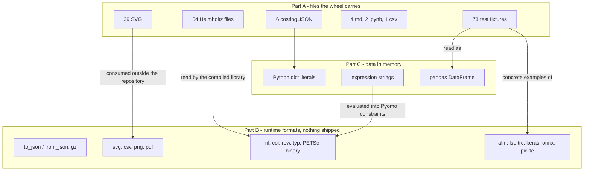
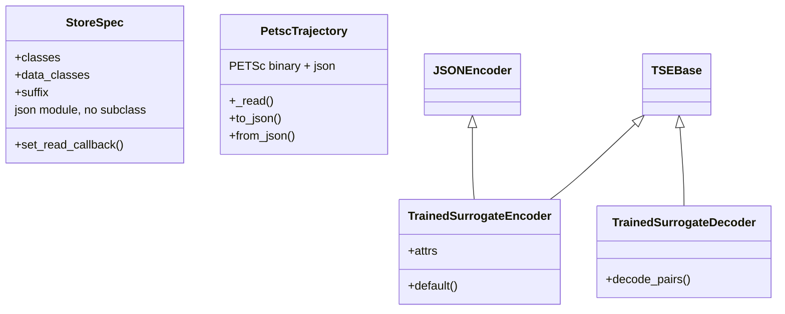

# 28 — Data and file format inventory

> **Doc ID** 28 · **Repo SHA** 70a8f4fe1 (IDAES-PSE v2.13.0rc0) · **Source roots** none (index document)
> **Owns** no source files · **Assets** all 179 tracked non-Python files under `idaes/`, by reference · **Siblings** [01](01_glossary_and_conventions.md), [08a](08a_model_introspection_and_persistence.md), [09](09_surrogate_subsystem.md), [16](16_general_helmholtz_property_system.md), [17](17_costing_framework_and_libraries.md), [20](20_power_generation_helmholtz_units_and_soc.md), [24](24_reference_flowsheets_and_demonstrations.md), [29](29_dependency_and_layering_map.md), [32](32_repository_engineering.md)

This is an **index document**. It owns no source file and no asset. Every row
points at the document that owns the thing described and states one fact about
it. Where a sibling has already established a fact, this document carries it by
reference and does not re-derive it; the Helmholtz table of
[16 §10.7](16_general_helmholtz_property_system.md#107-asset-inventory) and the
surrogate format table of
[09 §10.2](09_surrogate_subsystem.md#102-file-formats-this-subsystem-reads-or-writes)
are the two largest such carries.

The document has **three parts**, and they answer three different questions:

| Part | Question | Sections |
|---|---|---|
| **A** | Which non-Python files does the library ship, and which of them are build output committed to version control? | §10.1–§10.8 |
| **B** | Which file formats does the library read and write at run time without shipping an example? | §10.9–§10.15 |
| **C** | Where does numeric data actually live when it is not in a file? | §6 |

---

## 0. Scope and source map

This document owns no modules, so its section 0 table is a coverage contract
over **assets and formats** rather than over files.

| Subject | Count | Bytes | Part | Covered in § |
|---|---:|---:|---|---|
| Shipped source-role assets | 106 | 2,459,979 | A | 10.1–10.6 |
| Shipped test-role assets | 73 | 9,240,653 | A | 10.7 |
| Runtime formats read or written but not shipped | 24 | — | B | 10.9–10.14 |
| In-memory carriers of numeric data | 6 | — | C | 6 |

The 179 tracked non-Python files under `idaes/` total 11,700,632 bytes. The
counts come from `_generated/ledger.csv` filtered to `kind=asset`, and the split
between `role=source` and `role=test` is the ledger's, not this document's.

### 0.1 Format census

| Extension | Source-role | Test-role | Total | Bytes | On the `package-data` whitelist |
|---|---:|---:|---:|---:|---|
| `.csv` | 1 | 39 | 40 | 8,852,438 | yes |
| `.svg` | 39 | 0 | 39 | 1,778,384 | yes |
| `.json` | 28 | 17 | 45 | 548,927 | yes |
| `.nl` | 32 | 0 | 32 | 182,596 | yes |
| `.keras` | 0 | 5 | 5 | 119,450 | yes |
| `.onnx` | 0 | 1 | 1 | 101,704 | yes |
| `.h5` | 0 | 4 | 4 | 76,448 | yes |
| `.txt` | 0 | 3 | 3 | 15,339 | yes |
| `.md` | 4 | 0 | 4 | 10,969 | **no** |
| `.trc` | 0 | 3 | 3 | 7,537 | yes |
| `.ipynb` | 2 | 0 | 2 | 6,100 | yes |
| `.alm` | 0 | 1 | 1 | 740 | **no** |
| **Total** | **106** | **73** | **179** | **11,700,632** | 174 of 179 ship |

Twelve extensions exist under `idaes/`. The whitelist in
`[tool.setuptools.package-data]` carries 22 patterns, so eleven of those
patterns match no file in the tree; §12.3 records which.

### 0.2 Ownership map — source-role assets

| Owning doc | Files | Bytes | What |
|---|---:|---:|---|
| [11](11_unit_models_network_contactors_and_control.md) | 32 | 834,959 | Unit-operation icons |
| [16](16_general_helmholtz_property_system.md) | 54 | 263,772 | Helmholtz component data and generated NL models |
| [17](17_costing_framework_and_libraries.md) | 6 | 398,906 | Costing account and location-factor dictionaries |
| [18](18_power_generation_boiler_island.md) | 5 | 104,450 | Four boiler-island icons and one README |
| [23](23_tsa_gas_distribution_and_ccu.md) | 1 | 75 | One README |
| [24](24_reference_flowsheets_and_demonstrations.md) | 3 | 839,033 | Process flow diagrams |
| [26](26_matopt.md) | 1 | 10,705 | One README |
| [27](27_dynamic_optimization_and_uncertainty.md) | 4 | 8,079 | Two notebooks, one dataset, one README |

All 73 test-role assets are census-owned by
[32](32_repository_engineering.md); the documents that describe their content
are named in §10.7.

---

## 1. Architectural role

IDAES is a modelling library whose data is overwhelmingly *in the source code*.
Of 465 source modules and 179 non-Python files, the non-Python files carry
almost no model coefficients: the Helmholtz component files and the costing
account dictionaries are the whole of it. Everything else a process model needs
— equation-of-state coefficients, Shomate polynomials, transport correlations,
costing exponents, surrogate models — is a Python literal in a module body.
Part C of this document states that plainly, because a reader looking for a
data directory to edit does not find one.

The second fact this document exists to record is **provenance**. Forty-four of
the 106 shipped source-role assets are produced by a generator that is itself
tracked in the repository, and the generated artifact is committed beside its
input. One further file is written by the same function that reads it. The
`Authored / Generated` column is therefore load-bearing rather than decorative,
and §12.1 records the consequence.

The document is therefore in three parts: **Part A** (§10.1–§10.8) inventories
every file the library ships, **Part B** (§10.9–§10.15) indexes the formats it
reads and writes without shipping an example, and **Part C** (§6) records where
numeric data lives when it is not in a file.

The third fact is that the *interesting* formats mostly never appear as a
shipped file at all. Model state travels through `to_json`/`from_json` with an
optional transparent gzip; surrogate models travel through four different
persistence formats; PETSc writes a binary trajectory directory; ALAMO is
driven by writing an input file and parsing a trace file. Part B indexes those
formats and names the owning document for each.

*Almost all model data is Python source; the shipped files are a small, mostly generated, periphery, and the formats that carry real work are transient.*

---

## 2. Public surface inventory

The library's file-format surface is the set of callables that open, parse or
write a file. This is the index of them; each row names the owning document.

| Symbol | Kind | Declared at | Exported via | Stability signal |
|---|---|---|---|---|
| `to_json` | function | `idaes/core/util/model_serializer.py:683` | `idaes.core.util` | covered by autodoc in `docs/`; [08a](08a_model_introspection_and_persistence.md) |
| `from_json` | function | `idaes/core/util/model_serializer.py:954` | `idaes.core.util` | as above |
| `StoreSpec` | class | `idaes/core/util/model_serializer.py:198` | `idaes.core.util` | as above |
| `svg_tag` | function | `idaes/core/util/tags.py:695` | `idaes.core.util.tags` | [08a](08a_model_introspection_and_persistence.md) |
| `scaling_factors_to_json_file` | function | `idaes/core/scaling/util.py:304` | `idaes.core.scaling` | [06](06_model_preparation_initializers_and_scalers.md) |
| `scaling_factors_from_json_file` | function | `idaes/core/scaling/util.py:322` | `idaes.core.scaling` | [06](06_model_preparation_initializers_and_scalers.md) |
| `InitializerBase.load_initial_guesses` | method | `idaes/core/initialization/initializer_base.py:221` | `idaes.core.initialization` | [06](06_model_preparation_initializers_and_scalers.md) |
| `write_sample_file` | function | `idaes/core/util/convergence/convergence_base.py:571` | module | [07](07_diagnostics_and_run_orchestration.md) |
| `run_convergence_evaluation_from_sample_file` | function | `idaes/core/util/convergence/convergence_base.py:619` | module | [07](07_diagnostics_and_run_orchestration.md) |
| `ParameterSweepSpecification.to_json_file` | method | `idaes/core/util/parameter_sweep.py:267` | module | [07](07_diagnostics_and_run_orchestration.md) |
| `ParameterSweepSpecification.from_json_file` | method | `idaes/core/util/parameter_sweep.py:280` | module | [07](07_diagnostics_and_run_orchestration.md) |
| `ParameterSweepBase.to_json_file` | method | `idaes/core/util/parameter_sweep.py:756` | module | [07](07_diagnostics_and_run_orchestration.md) |
| `IpoptConvergenceAnalysis.to_json_file` | method | `idaes/core/util/diagnostics_tools/convergence_analysis.py:299` | module | [07](07_diagnostics_and_run_orchestration.md) |
| `AlamoSurrogate.save` / `.load` | methods | `idaes/core/surrogate/alamopy.py:1298`, `:1319` | `idaes.core.surrogate` | [09](09_surrogate_subsystem.md) |
| `PysmoSurrogate.save` / `.load` | methods | `idaes/core/surrogate/pysmo_surrogate.py:545`, `:558` | `idaes.core.surrogate` | [09](09_surrogate_subsystem.md) |
| `KerasSurrogate.save_to_folder` / `load_from_folder` | methods | `idaes/core/surrogate/keras_surrogate.py:187`, `:208` | `idaes.core.surrogate` | [09](09_surrogate_subsystem.md) |
| `ONNXSurrogate.save_to_folder` / `load_onnx_model` | methods | `idaes/core/surrogate/onnx_surrogate.py:191`, `:229` | `idaes.core.surrogate` | [09](09_surrogate_subsystem.md) |
| `PetscTrajectory.to_json` / `from_json` | methods | `idaes/core/solvers/petsc.py:992`, `:1009` | module | [30](30_numerics_and_solver_interface_map.md) |
| `load_location_factors` | function | `idaes/core/base/costing_base.py:105` | module | [17](17_costing_framework_and_libraries.md) |
| `load_BB_costing_dictionary` | function | `idaes/models_extra/power_generation/costing/costing_dictionaries.py:59` | module | [17](17_costing_framework_and_libraries.md) |
| `load_generic_ccs_costing_dictionary` | function | `idaes/models_extra/power_generation/costing/generic_ccs_capcost_custom_dict.py:646` | module | [17](17_costing_framework_and_libraries.md) |
| `WriteParameters.write` | method | `idaes/models/properties/general_helmholtz/helmholtz_parameters.py:510` | module, offline | [16](16_general_helmholtz_property_system.md) |
| `auto_register` | function | `idaes/models/properties/general_helmholtz/components/parameters/__init__.py:87` | package import | [16](16_general_helmholtz_property_system.md) |
| `CoolPropWrapper.get_parameter_value` | classmethod | `idaes/models/properties/modular_properties/coolprop/coolprop_wrapper.py:102` | class attribute | [15](15_property_package_catalog.md) |
| `set_param_from_config` | function | `idaes/core/util/misc.py:72` | `idaes.core.util.misc` | [08b](08b_core_support_utilities.md) |

Two names that look like part of this surface are not. `h5py` is imported
nowhere in the repository; HDF5 files exist only because Keras writes them
([09 §10.2](09_surrogate_subsystem.md#102-file-formats-this-subsystem-reads-or-writes)).
`pickle` is imported at exactly three sites, all in vendored PySMO, and none is
reachable from `PysmoSurrogate`.

---

## 3. Class hierarchy and type taxonomy

### 3.1 Format families

The taxonomy that matters here is by *format family*, not by class. Each family
has one carrier type and one owning document.

| Family | Concrete formats | Carrier type | Owning doc |
|---|---|---|---|
| Model state | JSON, gzipped JSON | `StoreSpec` filters, plain `dict` | [08a](08a_model_introspection_and_persistence.md) |
| Scaling and initial guesses | JSON | suffix dictionaries | [06](06_model_preparation_initializers_and_scalers.md) |
| Sweep and convergence records | JSON, four distinct schemas | `ParameterSweepSpecification`, `IpoptConvergenceAnalysis` | [07](07_diagnostics_and_run_orchestration.md) |
| Surrogate persistence | JSON, `.keras`, `.h5`, `.onnx`, `.pickle` | `SurrogateBase` subclasses | [09](09_surrogate_subsystem.md) |
| Solver interchange | `.nl`, `.col`, `.row`, `.typ`, `.sol`, PETSc binary | Pyomo's writer, `PetscTrajectory` | [30](30_numerics_and_solver_interface_map.md) |
| Thermodynamic parameter data | JSON, AMPL NL | `WriteParameters` | [16](16_general_helmholtz_property_system.md) |
| Costing account data | JSON | plain nested `dict` | [17](17_costing_framework_and_libraries.md) |
| Tabular data | CSV, tab-separated text | `pandas.DataFrame` | [09](09_surrogate_subsystem.md), [25](25_grid_integration.md) |
| Diagrams | SVG | `xml.dom.minidom` document, `ModelTagGroup` | [08a](08a_model_introspection_and_persistence.md), [24](24_reference_flowsheets_and_demonstrations.md) |
| Crystal structures | XYZ, PDB, CFG, POSCAR | `Design`, `Canvas` | [26](26_matopt.md) |
| Images | PNG, PDF, matplotlib-chosen | matplotlib figure | [08b](08b_core_support_utilities.md) |

### 3.2 The codec classes

Four classes exist whose entire purpose is to encode or decode a format. No
common base joins them; the diagram records that.

*The library has no serialization framework: four unrelated codecs each own one format.*

| Class | Base(s) | Declared at | Format | Owning doc |
|---|---|---|---|---|
| `StoreSpec` | `object` | `idaes/core/util/model_serializer.py:198` | model-state JSON | [08a](08a_model_introspection_and_persistence.md) |
| `TrainedSurrogateEncoder` | `JSONEncoder`, `TSEBase` | `idaes/core/surrogate/pysmo_surrogate.py:602` | PySMO surrogate JSON | [09](09_surrogate_subsystem.md) |
| `TrainedSurrogateDecoder` | `TSEBase` | `idaes/core/surrogate/pysmo_surrogate.py:704` | the same, reading | [09](09_surrogate_subsystem.md) |
| `PetscTrajectory` | `object` | `idaes/core/solvers/petsc.py:848` | PETSc binary trajectory | [30](30_numerics_and_solver_interface_map.md) |
| `WriteParameters` | `object` | `idaes/models/properties/general_helmholtz/helmholtz_parameters.py:55` | authored JSON in, NL and JSON out | [16](16_general_helmholtz_property_system.md) |

### 3.3 Enumerations that select a format

| Member | Value | Meaning | Consumed at |
|---|---|---|---|
| `StoreSpec.bound` | class method | Store variable bounds as well as values | [08a](08a_model_introspection_and_persistence.md) §4 |
| `StoreSpec.value` | class method | Store values only — the smallest state file | [08a](08a_model_introspection_and_persistence.md) §4 |
| `StoreSpec.isfixed` | class method | Store the fixed flag | [08a](08a_model_introspection_and_persistence.md) §4 |

No `Enum` class in the tree selects a file format; the selection is made by
file-name suffix (`.gz`) or by the class the caller instantiates.

---

## 4. Configuration reference

Seven declared configuration keys name a file or a directory. This is the whole
of the library's user-visible path configuration.

| Key | Domain / validator | Default | Req. | Effect on build | Anchor |
|---|---|---|---|---|---|
| `properties.helmholtz.parameter_file_path` | `str` | `None` | no | Overrides the directory the compiled Helmholtz library reads; `None` derives it from the install location | `idaes/config.py:266` |
| `petsc_ts.options.--ts_save_trajectory` | `int` | `1` | no | Non-zero makes the `petsc` executable write the `Visualization-data/` binary directory | `idaes/config.py:468` |
| `AlamoTrainer.alamo_path` | path or `None` | `None` | no | Assigns `alamo.executable`, overriding the `PATH` lookup | `idaes/core/surrogate/alamopy.py:629` |
| `AlamoTrainer.filename` | path to a `.alm` file | `None` | no | Names the input file; the `.lst` and `.trc` names are derived from it | `idaes/core/surrogate/alamopy.py:635` |
| `AlamoTrainer.working_directory` | path or `None` | `None` | no | Replaces the temporary directory the trainer otherwise creates | `idaes/core/surrogate/alamopy.py:645` |
| `AlamoTrainer.overwrite_files` | `bool` | `False` | no | Permits writing over an existing `.alm` or `.trc` | `idaes/core/surrogate/alamopy.py:654` |
| `AlamoTrainer.GAMS` | path or name | `None` | no | Full path of the GAMS executable passed through to ALAMO | `idaes/core/surrogate/alamopy.py:589` |

The Helmholtz key is the only one that changes where a **shipped** asset is
read from; the rest govern files created at run time. The semantics of each
belong to [16 §4](16_general_helmholtz_property_system.md#4-configuration-reference),
[30](30_numerics_and_solver_interface_map.md) and
[09 §4](09_surrogate_subsystem.md#4-configuration-reference) respectively.

---

## 5. Construction and call sequences

Three sequences in the library turn data into a file that is then committed to
version control or read back in the same process. They are indexed here; each
step names the document that owns it.

### 5.1 Generate-and-commit — the Helmholtz parameter pipeline

1. A per-component driver script constructs `WriteParameters` with the authored
   `<comp>.json` (`idaes/models/properties/general_helmholtz/helmholtz_parameters.py:109`),
   which reads the file at construction time.
2. `add()` registers the expression models; `write_model` emits one AMPL NL file
   per model (`idaes/models/properties/general_helmholtz/helmholtz_parameters.py:429`).
3. `write()` emits `<comp>_parameters.json`, the manifest naming the NL files and
   carrying the variable and expression index maps
   (`idaes/models/properties/general_helmholtz/helmholtz_parameters.py:510`).
4. Both outputs are committed. At import, `auto_register`
   (`idaes/models/properties/general_helmholtz/components/parameters/__init__.py:87`)
   discovers components by matching the **generated** file names with a regex.
5. At solve time the compiled library reads the manifest and evaluates the NL
   files through the AMPL Solver Library; no coefficient crosses the Python
   boundary. Full account: [16 §10.4](16_general_helmholtz_property_system.md#104-the-parameter-data-pipeline).

### 5.2 Annotate-and-commit — the process flow diagram pipeline

1. `print_pfd_results` builds a stream dictionary and a `ModelTagGroup` from the
   solved flowsheet (`idaes/models_extra/power_generation/flowsheets/subcritical_power_plant/subcritical_power_plant.py:2218`).
2. It opens the authored `plant_pfd.svg`
   (`idaes/models_extra/power_generation/flowsheets/subcritical_power_plant/subcritical_power_plant.py:2263`).
3. `svg_tag` parses it with `xml.dom.minidom`, rewrites the last `<tspan>` of
   each matching `<text>` element, and serialises with `toxml()`
   (`idaes/core/util/tags.py:779`).
4. The result is written to `plant_pfd_result.svg`
   (`idaes/models_extra/power_generation/flowsheets/subcritical_power_plant/subcritical_power_plant.py:2268`)
   and that output file is committed. Full account:
   [24 §10.2](24_reference_flowsheets_and_demonstrations.md#102-the-svg-tagging-pipeline).

### 5.3 Write-if-absent — the generic CCS costing dictionary

1. `load_generic_ccs_costing_dictionary` tests `os.path.exists` on the target
   JSON (`idaes/models_extra/power_generation/costing/generic_ccs_capcost_custom_dict.py:646`).
2. When absent, it zips two Python literals
   (`idaes/models_extra/power_generation/costing/generic_ccs_capcost_custom_dict.py:44`
   and `:274`) into the NETL account schema and writes the file
   (`idaes/models_extra/power_generation/costing/generic_ccs_capcost_custom_dict.py:686`).
3. Either way it reads the file back
   (`idaes/models_extra/power_generation/costing/generic_ccs_capcost_custom_dict.py:692`)
   and returns the parsed dictionary. Because the file ships, the write branch
   never runs on the default path. Full account:
   [17 §10.4](17_costing_framework_and_libraries.md#104-generic_ccs_costing_datajson--authored-and-generated).

### 5.4 Round trips that ship no file

| Sequence | Write | Read | Owning doc |
|---|---|---|---|
| Model state | `to_json(fname=...)`, gzip selected by a `.gz` suffix (`idaes/core/util/model_serializer.py:726`) | `from_json`, same suffix rule (`idaes/core/util/model_serializer.py:980`) | [08a](08a_model_introspection_and_persistence.md) |
| Scaling factors | `scaling_factors_to_json_file` (`idaes/core/scaling/util.py:304`) | `scaling_factors_from_json_file` (`idaes/core/scaling/util.py:322`) | [06](06_model_preparation_initializers_and_scalers.md) |
| Initial guesses | any `to_json` output | `load_initial_guesses` (`idaes/core/initialization/initializer_base.py:221`) | [06](06_model_preparation_initializers_and_scalers.md) |
| Sweep specification | `to_json_file` (`idaes/core/util/parameter_sweep.py:267`) | `from_json_file` (`idaes/core/util/parameter_sweep.py:280`) | [07](07_diagnostics_and_run_orchestration.md) |
| PySMO surrogate | `PysmoSurrogate.save` (`idaes/core/surrogate/pysmo_surrogate.py:545`) | `PysmoSurrogate.load` (`idaes/core/surrogate/pysmo_surrogate.py:558`) | [09](09_surrogate_subsystem.md) |
| PETSc trajectory | `to_json` (`idaes/core/solvers/petsc.py:992`) | `from_json` (`idaes/core/solvers/petsc.py:1009`) | [30](30_numerics_and_solver_interface_map.md) |

---

## 6. Data structures, variables, constraints, invariants — Part C

Part C answers the question a reader asks after Part A: *if the coefficients are
not in the files, where are they?* The answer is mostly **Python dict
literals**, and six carriers cover the whole library.

### 6.1 `parameter_data` dictionaries and the three value forms

| Component | Type | Index sets | Units | Created in | Condition |
|---|---|---|---|---|---|
| `parameter_data` | `dict` | component name, phase name, correlation coefficient index | carried in the value, not the key | a user's or an example module's configuration dictionary | always, for a modular property package |

Every `build_parameters` in `modular_properties/pure/` creates a `Var` and
values it through `set_param_from_config` (`idaes/core/util/misc.py:72`), which
accepts exactly three value forms:

| Form | Handled at | Behaviour | Owning doc |
|---|---|---|---|
| A 2-tuple `(value, units)` | `idaes/core/util/misc.py:161` | `value * units`; a `None` in the second slot means `dimensionless` | [14 §4.4](14_modular_properties_state_definitions_and_libraries.md#44-parameter_data--where-the-coefficient-values-live) |
| A bare float | `idaes/core/util/misc.py:167` | Logged at DEBUG, then assigned as-is, so the number is taken to be already in the package's base units | [14](14_modular_properties_state_definitions_and_libraries.md) |
| An object exposing `get_parameter_value` | `idaes/core/util/misc.py:158` | Calls it and re-enters the tuple branch with the result | [14](14_modular_properties_state_definitions_and_libraries.md) |

The third form has exactly one implementation in the tree,
`CoolPropWrapper.get_parameter_value`
(`idaes/models/properties/modular_properties/coolprop/coolprop_wrapper.py:102`),
owned by [15 §5.2](15_property_package_catalog.md#52-the-coolprop-bridge-two-resolution-paths).
Every other coefficient in every modular property package is a literal.

### 6.2 Costing coefficients inline in method bodies

| Carrier | Where | Content | Owning doc |
|---|---|---|---|
| `define_preloaded_accounts` | `idaes/models_extra/power_generation/costing/power_plant_costing_dictionaries.py:111` | Four named-group dictionaries mapping labels to account lists | [17 §10.6](17_costing_framework_and_libraries.md#106-reference-data-held-in-python-not-in-files) |
| `load_default_resource_prices` | `idaes/models_extra/power_generation/costing/power_plant_costing_dictionaries.py:168` | 30 priced resources as Pyomo expressions across four currency bases | [17](17_costing_framework_and_libraries.md) |
| `load_fixed_OM_data` | `idaes/models_extra/power_generation/costing/power_plant_costing_dictionaries.py:226` | Seven labor types, hourly rates, per-technology maintenance split | [17](17_costing_framework_and_libraries.md) |
| `generic_ccs_costing_exponents` / `_params` | `idaes/models_extra/power_generation/costing/generic_ccs_capcost_custom_dict.py:44`, `:274` | The ground truth behind a shipped JSON file, §5.3 | [17](17_costing_framework_and_libraries.md) |

### 6.3 CoolProp — data fetched from an installed package, never shipped

| Fact | Detail | Owning doc |
|---|---|---|
| No shipped file | The CoolProp family owns zero rows in `_generated/assets.csv` | [15 §10](15_property_package_catalog.md#10-external-assets-data-files-and-external-libraries) |
| Source of data | One call to `get_fluid_param_string(name, "JSON")` against the installed `CoolProp` package (`idaes/models/properties/modular_properties/coolprop/coolprop_wrapper.py:397`) | [15](15_property_package_catalog.md) |
| Parsing | One `json.loads` (`idaes/models/properties/modular_properties/coolprop/coolprop_wrapper.py:402`) | [15](15_property_package_catalog.md) |
| Caching | Process-wide `_cached_components` (`idaes/models/properties/modular_properties/coolprop/coolprop_wrapper.py:99`) | [15](15_property_package_catalog.md) |

This is the one path by which a coefficient reaches an IDAES model from outside
the repository without a file in the repository.

### 6.4 Surrogate models stored as Python expression strings

| Carrier | Where | Content | Owning doc |
|---|---|---|---|
| `data_dic` | `idaes/models_extra/power_generation/flowsheets/subcritical_power_plant/generic_surrogate_dict.py:16` | 16 keys to Python expression **strings**, roughly 88,000 characters and about 1,550 additive terms | [24 §5.4.1](24_reference_flowsheets_and_demonstrations.md#541-generic_surrogate_dict--surrogate-models-as-source-text) |
| the same, as a contract | consumed as `surrogate_dictionary` | The strings are `eval`'d against the boiler-island block | [18 §5.3](18_power_generation_boiler_island.md#53-the-fireside-model-and-the-surrogate_dictionary-seam) |

The file is a Python module, so it counts in the module census rather than in
the asset census; it is nonetheless the largest single body of fitted numeric
data in the tree.

### 6.5 Other literal coefficient bodies

| Carrier | Where | Content | Owning doc |
|---|---|---|---|
| MEA correlation dictionaries | `idaes/models_extra/column_models/properties/MEA_solvent.py:914`, `idaes/models_extra/column_models/properties/MEA_vapor.py:455`, `:555` | Solvent and vapour configuration dictionaries | [21 §10](21_column_models_and_solvent_systems.md#10-external-assets-data-files-and-external-libraries) |
| SOC Shomate and Lennard-Jones tables | `idaes/models_extra/power_generation/unit_models/soc_submodels/common.py:303` | Per-component thermodynamic and transport coefficients | [20](20_power_generation_helmholtz_units_and_soc.md) |
| Gas–solid contactor coefficients | inside each `build` method | Molecular weights, Shomate polynomials, diffusion volumes, kinetics | [22 §10](22_gas_solid_contactors.md#10-external-assets-data-files-and-external-libraries) |
| MatOpt periodic table | `idaes/apps/matopt/materials/atom.py:21`, `:143`, `:265` | Three class-level dictionaries | [26 §10.1](26_matopt.md#101-shipped-assets) |
| Price forecaster distributions | `idaes/apps/grid_integration/examples/utils.py:30`, `:56`, `:82`, `:108` | Four hard-coded 24-element float arrays | [25 §10.1](25_grid_integration.md#101-shipped-data) |
| IAPWS transport coefficient tables | `idaes/models/properties/general_helmholtz/components/parameters/h2o.py:28`, `:129` | R15-11 and R12-08 tables, inline in the generator driver | [16 §10.8](16_general_helmholtz_property_system.md#108-what-the-authored-file-holds) |

### 6.6 `pandas.DataFrame` as the interchange type

| Boundary | Direction | Owning doc |
|---|---|---|
| Surrogate training data and `evaluate_surrogate` results | both | [09 §10.2](09_surrogate_subsystem.md#102-file-formats-this-subsystem-reads-or-writes) |
| Parameter-sweep samples, stored with `orient="tight"` | both | [07 §10](07_diagnostics_and_run_orchestration.md#10-external-assets-data-files-and-external-libraries) |
| Grid-integration bid and tracking results | out | [25 §10.2](25_grid_integration.md#102-files-written-at-run-time) |
| Stream tables from `idaes.core.util.tables` | out | [08a](08a_model_introspection_and_persistence.md) |
| SOC replication case comparisons | both | [20 §10](20_power_generation_helmholtz_units_and_soc.md#10-external-assets-data-files-and-external-libraries) |

### 6.7 Invariants

| Invariant | Where it holds | Consequence if violated |
|---|---|---|
| A generated Helmholtz NL file is named `<comp>_expressions_<kind>.nl` | `auto_register` regex | The component is not registered and the package reports it unavailable |
| `<comp>_parameters.json` names the NL files the library opens | the generated manifest | The compiled library cannot locate the expression models |
| A `.gz` suffix selects gzip on both write and read | `idaes/core/util/model_serializer.py:726`, `:980` | A state file written with one suffix is unreadable under the other |
| `generic_ccs_costing_data.json` is only written when absent | `idaes/models_extra/power_generation/costing/generic_ccs_capcost_custom_dict.py:646` | The shipped copy would be overwritten by the Python literals |
| Every coefficient `Var` is valued before the parameter block finishes building | `set_param_from_config` callers | `GenericParameterData.build` raises on an unvalued `Var` |

---

## 7. Method contracts

The read and write entry points, in index form. The owning document carries the
full contract; this table states the file each one touches.

| Method | Signature | Preconditions | Effects | Returns | Raises | Anchor |
|---|---|---|---|---|---|---|
| `to_json` | `(o, fname=None, human_read=False, wts=None, gz=None, ...)` | a constructed model | Writes JSON, gzipped when the name ends `.gz` | a dict when no file name is given | file errors | `idaes/core/util/model_serializer.py:683` |
| `from_json` | `(o, sd=None, fname=None, s=None, wts=None, gz=None, root_name=None)` | the model has the components the file names | Sets values, bounds and flags per `StoreSpec` | a metadata dict | `KeyError` on a missing component | `idaes/core/util/model_serializer.py:954` |
| `svg_tag` | `(svg, tag_group, outfile=None, ...)` | the SVG has `<text>` elements whose `id` matches a tag | Rewrites the last `<tspan>` of each match; writes `outfile` when given | the annotated SVG as a string | none | `idaes/core/util/tags.py:695` |
| `scaling_factors_to_json_file` | `(blk_or_suffix, filename)` | a block or a scaling suffix | Writes the suffix tree as JSON | `None` | file errors | `idaes/core/scaling/util.py:304` |
| `load_initial_guesses` | `(self, model, json_file=None, json_string=None, json_dict=None)` | exactly one source given | Applies a `to_json` payload as initial values | `None` | `ValueError` on zero or several sources | `idaes/core/initialization/initializer_base.py:221` |
| `write_sample_file` | `(eval_spec, filename, convergence_evaluation_class_str, n_points, seed=None)` | a convergence evaluation class | Writes the sample specification JSON | `None` | file errors | `idaes/core/util/convergence/convergence_base.py:571` |
| `run_convergence_evaluation` | `(sample_file_dict, conv_eval)` | a parsed sample file | Runs the samples and produces the result record | a results dict | solver errors | `idaes/core/util/convergence/convergence_base.py:718` |
| `_parse_ipopt_output` | `(ipopt_file)` | a captured ipopt console log | Extracts iteration count and timings | a tuple of counters | none | `idaes/core/util/convergence/convergence_base.py:352` |
| `AlamoTrainer._write_alm_file` | `(self, almfile)` | training data present | Writes the ALAMO input file | `None` | file errors | `idaes/core/surrogate/alamopy.py:946` |
| `AlamoTrainer._read_trace_file` | `(self, trcfile, has_validation_data)` | ALAMO has run | Parses the appended trace rows | the surrogate expressions | `IOError` when the file is absent | `idaes/core/surrogate/alamopy.py:1033` |
| `save_keras_json_hd5` | `(nn, path, name)` | a Keras model | Writes a topology JSON and an HDF5 weights file | `None` | Keras errors | `idaes/core/surrogate/keras_surrogate.py:231` |
| `write_onnx_model_with_bounds` | `(filename, onnx_model=None, input_bounds=None)` | an ONNX model or bounds | Writes the protobuf and the `idaes_info.json` sidecar | `None` | `onnx` errors | `idaes/core/surrogate/onnx_surrogate.py:173` |
| `PetscTrajectory._read` | `(self)` | the solver left `Visualization-data/`, a `.col` and a `.typ` file | Reads the PETSc binary trajectory | `None` | `RuntimeError` when a file is missing | `idaes/core/solvers/petsc.py:848` |
| `load_location_factors` | `()` | none | Reads a 192-record JSON array and pivots it | a nested dict | file errors | `idaes/core/base/costing_base.py:105` |
| `set_param_from_config` | `(b, param, config=None, index=None)` | the block exposes the parameter | Calls `param_obj.set_value` | `None` | `AttributeError`, `TypeError`, `KeyError` | `idaes/core/util/misc.py:72` |

---

## 8. Cross-subsystem interactions

### 8.1 Calls out to

| This document's subject | Reaches | Through | Owning doc |
|---|---|---|---|
| Part A shipped JSON | `json.load` at first use, never at import | `os.path.join(this_file_dir(), ...)` | [17](17_costing_framework_and_libraries.md) |
| Part A shipped NL and manifest JSON | the compiled `general_helmholtz_external` library | `pyo.ExternalFunction`, path passed as the last argument | [16](16_general_helmholtz_property_system.md) |
| Part A shipped SVG icons | nothing inside `idaes/` | the `*.svg` package-data glob only | [11](11_unit_models_network_contactors_and_control.md), [18](18_power_generation_boiler_island.md) |
| Part B model state | `gzip`, `json` from the standard library | `to_json` / `from_json` | [08a](08a_model_introspection_and_persistence.md) |
| Part B ALAMO formats | the `alamo` executable | `subprocess.run` | [09](09_surrogate_subsystem.md) |
| Part B solver formats | `ipopt`, `petsc`, `k_aug`, `dot_sens` | Pyomo's NL writer and solver plugins | [30](30_numerics_and_solver_interface_map.md) |
| Part C CoolProp | the installed `CoolProp` distribution | `attempt_import`, then a JSON string | [15](15_property_package_catalog.md) |

### 8.2 Called by

| Caller | What it needs from here | Owning doc |
|---|---|---|
| The packaging metadata | the extension whitelist that decides which assets ship | [32](32_repository_engineering.md) |
| The dependency map | which formats imply which third-party package | [29](29_dependency_and_layering_map.md) |
| The Helmholtz property system | the provenance split between authored and generated files | [16](16_general_helmholtz_property_system.md) |
| The costing libraries | the dual status of one account dictionary | [17](17_costing_framework_and_libraries.md) |
| The reference flowsheets | which of the three diagrams is input and which is output | [24](24_reference_flowsheets_and_demonstrations.md) |
| The SOC replication tests | which cached case files are regenerated live | [20](20_power_generation_helmholtz_units_and_soc.md) |
| The repository-engineering census | the byte-level inventory of every fixture | [32](32_repository_engineering.md) |

---

## 9. Extension and subclassing contracts

Not applicable: this document owns no source file and therefore no
`NotImplementedError` hook; the persistence extension points belong to
[09 §9](09_surrogate_subsystem.md#9-extension-and-subclassing-contracts) and
[08a §9](08a_model_introspection_and_persistence.md#9-extension-and-subclassing-contracts).

---

## 10. External assets, data files and external libraries

### 10.1 Part A — what ships, in one table

| Group | Files | Bytes | Authored | Generated in-tree | Owning doc |
|---|---:|---:|---:|---:|---|
| Unit-operation icons | 32 | 834,959 | 32 | 0 | [11](11_unit_models_network_contactors_and_control.md) |
| Helmholtz component data | 54 | 263,772 | 11 | 43 | [16](16_general_helmholtz_property_system.md) |
| Costing dictionaries | 6 | 398,906 | 5 | 0 (one file is both) | [17](17_costing_framework_and_libraries.md) |
| Boiler-island icons and README | 5 | 104,450 | 5 | 0 | [18](18_power_generation_boiler_island.md) |
| CCU README | 1 | 75 | 1 | 0 | [23](23_tsa_gas_distribution_and_ccu.md) |
| Process flow diagrams | 3 | 839,033 | 2 | 1 | [24](24_reference_flowsheets_and_demonstrations.md) |
| MatOpt README | 1 | 10,705 | 1 | 0 | [26](26_matopt.md) |
| Uncertainty-propagation examples | 4 | 8,079 | 3 | 0 (one is external output) | [27](27_dynamic_optimization_and_uncertainty.md) |
| **Source-role total** | **106** | **2,459,979** | **60** | **44** | |
| Test fixtures | 73 | 9,240,653 | see §10.7 | see §10.7 | [32](32_repository_engineering.md) |

### 10.2 SVG — 39 files, 1,778,384 bytes

| Path | Format | Bytes | Authored/Generated | Producer | Consumer | Load site | Owning doc |
|---|---|---:|---|---|---|---|---|
| `idaes/models/unit_models/icons/*.svg` (32) | SVG, Inkscape-authored | 834,959; 5,004–34,843 each | Authored | Inkscape, per each file's `inkscape:export-filename` | the external user interface | none inside `idaes/` | [11](11_unit_models_network_contactors_and_control.md) |
| `idaes/models_extra/power_generation/unit_models/icons/*.svg` (4) | SVG 1.1 | 104,392; 25,351–26,656 each | Authored in Inkscape 0.92.2 | — | the external user interface | none inside `idaes/` | [18](18_power_generation_boiler_island.md) |
| `idaes/models_extra/power_generation/flowsheets/subcritical_power_plant/plant_pfd.svg` | SVG 1.1 | 249,821 | **Authored** (Inkscape) | a drawing tool | `print_pfd_results` | `idaes/models_extra/power_generation/flowsheets/subcritical_power_plant/subcritical_power_plant.py:2263` | [24](24_reference_flowsheets_and_demonstrations.md) |
| `idaes/models_extra/power_generation/flowsheets/subcritical_power_plant/plant_pfd_result.svg` | SVG 1.1 | 216,222 | **Generated**, committed | `svg_tag` via `xml.dom.minidom` | nothing — it is output | written at `idaes/models_extra/power_generation/flowsheets/subcritical_power_plant/subcritical_power_plant.py:2268` | [24](24_reference_flowsheets_and_demonstrations.md) |
| `idaes/models_extra/power_generation/flowsheets/supercritical_steam_cycle/supercritical_steam_cycle.svg` | SVG 1.1 | 372,990 | **Authored** (Inkscape) | a drawing tool | `pfd_result` | `idaes/models_extra/power_generation/flowsheets/supercritical_steam_cycle/supercritical_steam_cycle.py:964` | [24](24_reference_flowsheets_and_demonstrations.md) |

The 32 unit-model icon basenames: `compressor_1.svg`, `compressor_2.svg`,
`cooler.svg`, `expander_1.svg`, `expander_2.svg`, `fan.svg`, `flash.svg`,
`heat_exchanger_1.svg`, `heat_exchanger_2.svg`, `heat_exchanger_3.svg`,
`heat_exchanger_4.svg`, `heater_1.svg`, `heater_2.svg`, `mixer.svg`,
`packed_column_1.svg`, `packed_column_2.svg`, `packed_column_3.svg`,
`packed_column_4.svg`, `pump.svg`, `reactor_c.svg`, `reactor_e.svg`,
`reactor_g.svg`, `reactor_pfr.svg`, `reactor_s.svg`, `splitter.svg`,
`tray_column_1.svg`, `tray_column_2.svg`, `tray_column_3.svg`,
`tray_column_4.svg`, `valve_1.svg`, `valve_2.svg`, `valve_3.svg`. The four
boiler-island icon basenames: `attemperator_1.svg`, `bag_house.svg`,
`mill_1.svg`, `mill_2.svg`.

Nothing under `idaes/` imports, opens or names any of the 36 icons; their
consumer is the separate user-interface distribution. The one generated SVG is
distinguishable from its source by its serialisation: the authored files carry
Inkscape's attribute-per-line indentation, while `plant_pfd_result.svg` is one
line of `toxml()` output and 33,599 bytes smaller
([24 §10.1](24_reference_flowsheets_and_demonstrations.md#101-shipped-assets)).

### 10.3 Helmholtz — 54 files, 263,772 bytes

The largest asset scope in the repository, and the only place in it where a
tracked build step produces tracked artifacts. The per-file table is
[16 §10.7](16_general_helmholtz_property_system.md#107-asset-inventory); this is
the per-component summary, carried by reference. All files sit in
`idaes/models/properties/general_helmholtz/components/parameters/`.

| Component | Authored source | Generated manifest | Generated AMPL NL models | Files | Bytes |
|---|---|---|---|---:|---:|
| butane | `butane.json` 5,578 | `butane_parameters.json` 1,004 | `butane_expressions_eos.nl` 12,333, `butane_expressions_st.nl` 702 | 4 | 19,617 |
| co2 | `co2.json` 8,423 | `co2_parameters.json` 1,262 | `co2_expressions_eos.nl` 20,268, `co2_expressions_st.nl` 702, `co2_expressions_tcx.nl` 1,283, `co2_expressions_visc.nl` 1,122 | 6 | 33,060 |
| h2o | `h2o.json` 10,184 | `h2o_parameters.json` 1,245 | `h2o_expressions_eos.nl` 27,486, `h2o_expressions_st.nl` 859, `h2o_expressions_tcx.nl` 3,439, `h2o_expressions_visc.nl` 1,308 | 6 | 44,521 |
| isobutane | `isobutane.json` 5,652 | `isobutane_parameters.json` 1,006 | `isobutane_expressions_eos.nl` 12,346, `isobutane_expressions_st.nl` 859 | 4 | 19,863 |
| nh3 | `nh3.json` 6,659 | `nh3_parameters.json` 977 | `nh3_expressions_eos.nl` 17,786, `nh3_expressions_st.nl` 847 | 4 | 26,269 |
| propane | `propane.json` 6,256 | `propane_parameters.json` 1,263 | `propane_expressions_eos.nl` 12,986, `propane_expressions_st.nl` 855, `propane_expressions_tcx.nl` 3,989, `propane_expressions_visc.nl` 2,642 | 6 | 27,991 |
| r1234ze | `r1234ze.json` 5,710 | `r1234ze_parameters.json` 1,261 | `r1234ze_expressions_eos.nl` 10,678, `r1234ze_expressions_st.nl` 854, `r1234ze_expressions_tcx.nl` 894, `r1234ze_expressions_visc.nl` 1,722 | 6 | 21,119 |
| r125 | `r125.json` 4,585 | `r125_parameters.json` 1,022 | `r125_expressions_eos.nl` 9,385, `r125_expressions_st.nl` 700 | 4 | 15,692 |
| r134a | `r134a.json` 5,355 | `r134a_parameters.json` 1,258 | `r134a_expressions_eos.nl` 7,449, `r134a_expressions_st.nl` 698, `r134a_expressions_tcx.nl` 3,814, `r134a_expressions_visc.nl` 2,026 | 6 | 20,600 |
| r227ea | `r227ea.json` 5,386 | `r227ea_parameters.json` 1,030 | `r227ea_expressions_eos.nl` 12,463, `r227ea_expressions_st.nl` 1,000 | 4 | 19,879 |
| r32 | `r32.json` 5,063 | `r32_parameters.json` 997 | `r32_expressions_eos.nl` 8,401, `r32_expressions_st.nl` 700 | 4 | 15,161 |

Totals by class, as established by [16](16_general_helmholtz_property_system.md):
11 authored JSON files, 68,851 bytes; 11 generated manifests, 12,325 bytes; 32
generated NL files, 182,596 bytes — 11 equation-of-state, 11 surface tension, 5
thermal conductivity, 5 viscosity. The producer is the offline writer
`idaes/models/properties/general_helmholtz/helmholtz_parameters.py`; the
consumer is the compiled `general_helmholtz_external` library, which reads the
manifest and evaluates the NL files through the AMPL Solver Library. This
document adds one packaging fact: `.gitattributes` pins `*.nl text eol=lf`, so
those 32 files keep LF endings on every platform
([32 §10](32_repository_engineering.md#10-external-assets-data-files-and-external-libraries)).

### 10.4 Costing dictionaries — 6 files, 398,906 bytes

Every one is read lazily on the first call to a loader, with
`os.path.join(this_file_dir(), <name>)` and `json.load`; none is opened at
import time. Full account:
[17 §10](17_costing_framework_and_libraries.md#10-external-assets-data-files-and-external-libraries).

| Path | Format | Bytes | Authored/Generated | Producer | Consumer | Load site | Owning doc |
|---|---|---:|---|---|---|---|---|
| `idaes/core/base/location_factors.json` | JSON array of 192 records | 36,511 | Authored | Compass International 2017 and Seider Table 16.13 | `load_location_factors` | `idaes/core/base/costing_base.py:140` | [17](17_costing_framework_and_libraries.md) |
| `idaes/models_extra/power_generation/costing/BB_costing_data.json` | nested JSON object, 1,063 accounts | 300,882 | Authored | NETL Bituminous Baseline / BBR4 spreadsheet | `load_BB_costing_dictionary` ×2 | `idaes/models_extra/power_generation/costing/power_plant_costing_dictionaries.py:100`, `idaes/models_extra/power_generation/costing/costing_dictionaries.py:59` | [17](17_costing_framework_and_libraries.md) |
| `idaes/models_extra/power_generation/costing/generic_ccs_costing_data.json` | nested JSON object, 45 accounts | 14,035 | **Both** — authored as Python literals, written by its own loader | `load_generic_ccs_costing_dictionary` | the same function | `idaes/models_extra/power_generation/costing/generic_ccs_capcost_custom_dict.py:686` (write), `:692` (read) | [17](17_costing_framework_and_libraries.md) |
| `idaes/models_extra/power_generation/costing/sCO2_costing_parameters.json` | flat JSON object, 13 entries | 2,551 | Authored | supercritical-CO2 equipment correlations | `load_sCO2_costing_dictionary` ×2 | `idaes/models_extra/power_generation/costing/power_plant_costing_dictionaries.py:106`, `idaes/models_extra/power_generation/costing/costing_dictionaries.py:65` | [17](17_costing_framework_and_libraries.md) |
| `idaes/models_extra/temperature_swing_adsorption/costing/costing_params_dac_electric_boiler.json` | nested JSON object, 58 accounts | 27,703 | Authored | NETL direct-air-capture case study | `_get_costing_electric_boiler` | `idaes/models_extra/temperature_swing_adsorption/costing/dac_costing.py:56` | [17](17_costing_framework_and_libraries.md) |
| `idaes/models_extra/temperature_swing_adsorption/costing/costing_params_dac_retrofit_ngcc.json` | nested JSON object, 36 accounts | 17,224 | Authored | NETL direct-air-capture case study | `_get_costing_retrofit_ngcc` | `idaes/models_extra/temperature_swing_adsorption/costing/dac_costing.py:632` | [17](17_costing_framework_and_libraries.md) |

`location_factors.json` is the only non-Python file anywhere under
`idaes/core/`. `BB_costing_data.json` is the largest shipped asset in the
repository at 300,882 bytes. For `generic_ccs_costing_data.json` the ground
truth is the Python literal at
`idaes/models_extra/power_generation/costing/generic_ccs_capcost_custom_dict.py:44`
and `:274`, not the JSON; the write is guarded by an `os.path.exists` test at
`:646`, so the shipped copy survives.

### 10.5 Markdown, notebooks and the one shipped CSV — 7 files, 18,917 bytes

| Path | Format | Bytes | Authored/Generated | Producer | Consumer | Load site | Owning doc |
|---|---|---:|---|---|---|---|---|
| `idaes/models_extra/power_generation/unit_models/README.md` | Markdown, one sentence | 58 | Authored | — | a human reader | none | [18](18_power_generation_boiler_island.md) |
| `idaes/models_extra/co2_capture_and_utilization/unit_models/README.md` | Markdown, one line | 75 | Authored | — | none in the tree | never loaded | [23](23_tsa_gas_distribution_and_ccu.md) |
| `idaes/apps/matopt/README.md` | Markdown with embedded HTML tables | 10,705 | Authored | the MatOpt authors | human readers; mirrored into `docs/` | not loaded at runtime | [26](26_matopt.md) |
| `idaes/apps/uncertainty_propagation/examples/README.md` | Markdown, 2 lines | 131 | Authored | hand-written | a human; records the upstream URL of the CSV | none | [27](27_dynamic_optimization_and_uncertainty.md) |
| `idaes/apps/uncertainty_propagation/examples/BT_NRTL_dataset.csv` | CSV, 3 columns × 50 rows | 1,848 | Generated externally | sourced per the README | `pandas.read_csv` in the flash example | `idaes/apps/uncertainty_propagation/examples/uncertainty_propagation_NRTL.py:32` | [27](27_dynamic_optimization_and_uncertainty.md) |
| `idaes/apps/uncertainty_propagation/examples/uncertainty_propagation_NRTL.ipynb` | Jupyter nbformat 4.4, 5 code cells | 3,161 | Authored | hand-written | a human; nothing in the repository executes it | — | [27](27_dynamic_optimization_and_uncertainty.md) |
| `idaes/apps/uncertainty_propagation/examples/uncertainty_propagation_rooney.ipynb` | Jupyter nbformat 4.4, 5 code cells | 2,939 | Authored | hand-written | as above | — | [27](27_dynamic_optimization_and_uncertainty.md) |

These seven files plus the 39 SVG of §10.2, the 54 Helmholtz files of §10.3
and the six costing dictionaries of §10.4 are the whole of the 106 shipped
source-role assets. `*.md` is not on the package-data whitelist, so none of the
four `README.md` files ships in the wheel; `*.ipynb` and `*.csv` are, so both
notebooks and the dataset do.

### 10.6 Part A — authored versus generated, the whole shipped set

| Provenance | Files | Bytes | Share of bytes | Where |
|---|---:|---:|---:|---|
| Authored | 60 | 2,032,953 | 82.6% | 38 SVG, 11 Helmholtz component files, 5 costing JSON, 4 README, 2 notebooks |
| Generated by an in-tree producer, committed | 44 | 411,143 | 16.7% | 11 Helmholtz manifests, 32 NL models, 1 annotated PFD |
| Both authored and generated | 1 | 14,035 | 0.6% | `generic_ccs_costing_data.json` |
| Generated outside the repository | 1 | 1,848 | 0.1% | `BT_NRTL_dataset.csv` |

Forty-four of 106 shipped source-role assets are build output under version
control. Two distinct producers account for all of them: the Helmholtz offline
writer (43 files) and the SVG tagging pipeline (1 file).

### 10.7 Test-role assets — 73 files, 9,240,653 bytes

All 73 carry `role=test` in `_generated/ledger.csv` and are census-owned by
[32](32_repository_engineering.md). They are inventoried here because this is
the one place the whole picture exists; the document that describes each group's
*content* is named in the last column.

| Group | Files | Bytes | Format | Authored/Generated | Producer | Consumer | Described in |
|---|---:|---:|---|---|---|---|---|
| `idaes/tests/prescient/5bus/` | 11 | 7,034,196 | RTS-GMLC CSV | Authored externally | the RTS-GMLC dataset | the Prescient simulator; two files also read by `examples/utils.py` | [32](32_repository_engineering.md), [25](25_grid_integration.md) |
| `idaes/core/surrogate/**/tests/` | 24 | 1,931,795 | CSV, Keras, HDF5, ONNX, JSON, `.alm`, `.trc` | mixed, see below | sampling scripts, Keras, ALAMO, hand-written | the surrogate test suite | [09 §10.4](09_surrogate_subsystem.md#104-shipped-fixtures) |
| `.../soc_submodels/tests/data_cache/` | 22 | 63,661 | CSV | 20 Generated, 2 Authored | `df.to_csv` in four replication modules | `pd.read_csv` in the same modules | [20 §10](20_power_generation_helmholtz_units_and_soc.md#10-external-assets-data-files-and-external-libraries) |
| `idaes/apps/grid_integration/pricetaker/tests/lmp_data.csv` | 1 | 139,377 | CSV with a UTF-8 byte-order mark | no statement in the tree | — | `pd.read_csv` at `idaes/apps/grid_integration/pricetaker/tests/test_clustering.py:36` | [25 §10.1](25_grid_integration.md#101-shipped-data) |
| `idaes/core/util/convergence/tests/` | 5 | 10,211 | 4 JSON baselines, 1 ipopt log | Generated / captured | `write_sample_file`, `run_convergence_evaluation`, ipopt | `test_convergence.py` | [07 §10](07_diagnostics_and_run_orchestration.md#10-external-assets-data-files-and-external-libraries) |
| `idaes/core/util/diagnostics_tools/tests/` | 2 | 8,135 | 1 JSON baseline, 1 ipopt log | Generated / captured | `IpoptConvergenceAnalysis.to_json_file`, ipopt | `test_convergence_analysis.py` | [07](07_diagnostics_and_run_orchestration.md) |
| `idaes/core/util/tests/load_psweep.json`, `load_spec.json` | 2 | 2,237 | JSON | Authored | hand-written | `test_parameter_sweep.py` | [07](07_diagnostics_and_run_orchestration.md) |
| `idaes/core/scaling/tests/gibbs_solution.json` | 1 | 43,346 | model-state JSON | Generated | `to_json` | `from_json` in three test modules | [06](06_model_preparation_initializers_and_scalers.md) |
| `idaes/core/scaling/tests/load_scaling_factors.json` | 1 | 807 | scaling-suffix JSON | Authored | hand-written | `scaling_factors_from_json_file` at `idaes/core/scaling/tests/test_util.py:1519` | [06](06_model_preparation_initializers_and_scalers.md) |
| `idaes/core/initialization/tests/init_example.json` | 1 | 1,372 | model-state JSON, `format_version` 4 | Generated | `to_json`, dated 2022-11-25 in its own metadata | `load_initial_guesses` | [06](06_model_preparation_initializers_and_scalers.md) |
| `idaes/models_extra/power_generation/properties/tests/pure-prop-nist-webbook.csv` | 1 | 1,307 | tab-separated, 7 header lines | Authored | transcribed from the NIST Chemistry WebBook | `read_data` at `idaes/models_extra/power_generation/properties/tests/test_fg_prop.py:83` | [19 §10](19_power_generation_heat_exchangers_and_properties.md#10-external-assets-data-files-and-external-libraries) |
| `idaes/apps/uncertainty_propagation/tests/BT_NRTL_dataset.csv` | 1 | 1,848 | CSV | Generated externally | byte-identical copy of the examples file | the uncertainty tests | [27 §10.1](27_dynamic_optimization_and_uncertainty.md#101-shipped-assets) |
| `idaes/commands/util/tests/checksum.txt` | 1 | 1,361 | text, one SHA-256 and file name per line | Captured | an `idaes-ext` release | `test_download_bin.py:142` | [02](02_runtime_platform_and_cli.md), [32](32_repository_engineering.md) |

The 22 SOC basenames: `case_1.csv`, `case_1_heat_loss.csv`,
`case_1_interconnect.csv`, `case_1_thin.csv`, `case_2.csv`,
`case_2_heat_loss.csv`, `case_2_interconnect.csv`, `case_2_thin.csv`,
`case_3.csv`, `case_3_heat_loss.csv`, `case_3_interconnect.csv`,
`case_3_thin.csv`, `case_4.csv`, `case_4_heat_loss.csv`,
`case_4_interconnect.csv`, `case_4_thin.csv`, `case_5.csv`,
`case_5_heat_loss.csv`, `case_5_interconnect.csv`, `case_5_thin.csv`,
`herring-et-al-data.csv`, `sweep_5_kazempoor_replication.csv`. The two authored
ones are the last two; they are read with `pandas.read_csv` and the twenty
generated ones are regenerable with `df.to_csv`.

The 11 Prescient basenames: `DAY_AHEAD_load.csv`, `DAY_AHEAD_renewables.csv`,
`REAL_TIME_load.csv`, `REAL_TIME_renewables.csv`, `branch.csv`, `bus.csv`,
`gen.csv`, `initial_status.csv`, `reserves.csv`, `simulation_objects.csv`,
`timeseries_pointers.csv`. `REAL_TIME_renewables.csv` at 3,641,364 bytes and
`REAL_TIME_load.csv` at 2,888,100 bytes are the two largest files under
`idaes/`.

The 24 surrogate basenames: `PT_data.csv`, `T_data.csv`, `reformer-data.csv`,
`PT_data_2_10_10_2_relu.json`, `PT_data_2_10_10_2_relu.keras`,
`PT_data_2_10_10_2_relu.weights.h5`, `PT_data_2_10_10_2_sigmoid.json`,
`PT_data_2_10_10_2_sigmoid.keras`, `PT_data_2_10_10_2_sigmoid.weights.h5`,
`T_data_1_10_10_2_relu.json`, `T_data_1_10_10_2_relu.keras`,
`T_data_1_10_10_2_relu.weights.h5`, `T_data_1_10_10_2_sigmoid.json`,
`T_data_1_10_10_2_sigmoid.keras`, `T_data_1_10_10_2_sigmoid.weights.h5`,
`net_Calcite_ST.onnx`, `net_Calcite_ST_idaes_info.json`, `alamo_test.alm`,
`alamotrace.trc`, `alamotrace2.trc`, `alamotrace_w_validation.trc`,
`alamo_surrogate.json`, `idaes_keras_model.keras`, `idaes_info.json`. The
twelve Keras files are regenerated by the tracked script
`idaes/core/surrogate/tests/data/create_keras_models.py`. The four convergence
baselines are `ceval_fixedvar_immutableparam.3.42.baseline.json`,
`ceval_fixedvar_mutableparam.3.42.baseline.json`,
`ceval_unfixedvar_mutableparam.3.42.baseline.json` and
`ceval_fixedvar_mutableparam.3.43.baseline.json`; the two solver logs are both
named `ipopt_output.txt`.

### 10.8 What the wheel actually carries

| Rule | Value | Effect | Anchor |
|---|---|---|---|
| `include-package-data` | `true` | Honours `package-data` for every discovered package | `pyproject.toml:84` |
| `package-data."*"` | 22 extension patterns | The shipped-asset whitelist | `pyproject.toml:94` |
| `zip-safe` | `false` | Never installed as a zip egg, so `__file__`-relative data loads work | `pyproject.toml:83` |
| `.gitattributes` | `*.nl text eol=lf` | The 32 shipped NL files keep LF endings on every platform | [32](32_repository_engineering.md) §4 |

174 of the 179 tracked non-Python files match a whitelist pattern. The five that
do not are the four `README.md` files and
`idaes/core/surrogate/tests/alamo_test.alm`. Eleven of the 22 patterns match no
file in the tree; §12.3 names them.

### 10.9 Part B — model state, scaling and initial guesses

| Format | Direction | Produced / consumed by | Schema | Owning doc |
|---|---|---|---|---|
| Model-state JSON | both | `to_json` / `from_json` filtered by `StoreSpec` | a `__metadata__` header carrying `format_version`, then one nested object per block | [08a](08a_model_introspection_and_persistence.md) |
| Gzipped model-state JSON | both | the same, selected by a `.gz` file-name suffix | identical payload inside `gzip` | [08a](08a_model_introspection_and_persistence.md) |
| Scaling-factor JSON | both | `scaling_factors_to_json_file` / `..._from_json_file` | `scaling_factor_suffix`, `scaling_hint_suffix` and a recursive `subblock_suffixes` map | [06](06_model_preparation_initializers_and_scalers.md) |
| Initial-guess JSON | in | `load_initial_guesses`; also accepts a string or a dict | any `to_json` payload | [06](06_model_preparation_initializers_and_scalers.md) |

The gzip choice is made from the file name and nowhere else: `gz =
fname.endswith(".gz")` on the write side
(`idaes/core/util/model_serializer.py:726`) and the identical test on the read
side (`idaes/core/util/model_serializer.py:980`). No shipped asset uses the
`.json.gz` form, although the extension is on the package-data whitelist.

### 10.10 Part B — the four diagnostics and orchestration JSON schemas

Document 07 established that four distinct JSON schemas live in this area and
that none shares a shape with another. They are indexed here.

| Schema | Direction | Written by | Read by | Distinguishing keys | Owning doc |
|---|---|---|---|---|---|
| Convergence sample file | both | `write_sample_file` (`idaes/core/util/convergence/convergence_base.py:571`) | `run_convergence_evaluation_from_sample_file` (`:619`) | `inputs`, `n_points`, `seed`, `samples`, `convergence_evaluation_class_str` | [07](07_diagnostics_and_run_orchestration.md) |
| Parameter-sweep specification | both | `ParameterSweepSpecification.to_json_file` (`idaes/core/util/parameter_sweep.py:267`) | `from_json_file` (`:280`) | `sampling_method` stored by class **name**; `samples` in pandas `orient="tight"` | [07](07_diagnostics_and_run_orchestration.md) |
| Convergence-analysis baseline | both | `IpoptConvergenceAnalysis.to_json_file` (`idaes/core/util/diagnostics_tools/convergence_analysis.py:299`) | the same class | a sweep specification with a `results` block appended | [07](07_diagnostics_and_run_orchestration.md) |
| `idaes-run` report | out | `runner_cli.main` (`idaes/core/util/structfs/runner_cli.py:102`) | nothing in the tree | an `actions` map and a `last_run` list | [07](07_diagnostics_and_run_orchestration.md) |

The pysmo sampling method is stored **by class name**, so the specification file
names a class rather than parameters, and the sweep result schema is the
specification plus results — which is what makes one file usable both as a
baseline and as the input that reproduces the run. `runner_cli.py:35` writes a
fifth, smaller payload: the `list_steps` dump.

### 10.11 Part B — surrogate persistence

| Format | Direction | Produced / consumed by | Schema | Owning doc |
|---|---|---|---|---|
| `.alm` | out | `_write_alm_file` (`idaes/core/surrogate/alamopy.py:946`); consumed by the ALAMO executable | keyword lines, then `BEGIN_DATA`/`END_DATA`, optional `BEGIN_VALDATA` and `BEGIN_CUSTOMBAS` | [09](09_surrogate_subsystem.md) |
| `.lst` | in | written by ALAMO; registered with `TempfileManager` only so it is removed | ALAMO's listing file | [09](09_surrogate_subsystem.md) |
| `.trc` | in | written by ALAMO, parsed by `_read_trace_file` (`idaes/core/surrogate/alamopy.py:1033`) | a `#`-prefixed header, then one comma-separated row per output per run, appended across runs | [09](09_surrogate_subsystem.md) |
| ALAMO surrogate JSON | both | `AlamoSurrogate.save` / `.load` (`idaes/core/surrogate/alamopy.py:1298`, `:1319`) | four keys; `surrogate` maps an output label to an expression string containing `==` | [09](09_surrogate_subsystem.md) |
| PySMO surrogate JSON | both | `PysmoSurrogate.save` / `.load` (`idaes/core/surrogate/pysmo_surrogate.py:545`, `:558`) | five keys; per-model parallel `attr` and `map` dicts, with numpy, pandas and Pyomo hooks | [09](09_surrogate_subsystem.md) |
| `.keras` | both | `keras_model.save` (`idaes/core/surrogate/keras_surrogate.py:171`) / `keras.models.load_model` (`:204`) | the Keras v3 archive | [09](09_surrogate_subsystem.md) |
| `idaes_info.json` | both | `KerasSurrogate.save_to_folder` (`idaes/core/surrogate/keras_surrogate.py:187`) / `load_from_folder` (`:208`) | scalers, labels, bounds | [09](09_surrogate_subsystem.md) |
| `<name>.json` + `<name>.weights.h5` | out / both | `save_keras_json_hd5` (`idaes/core/surrogate/keras_surrogate.py:231`, `:234`) / `load_keras_json_hd5` (`:239`) | `nn.to_json()` text plus HDF5 weights; nothing reads the topology JSON | [09](09_surrogate_subsystem.md) |
| `.onnx` | both | `write_onnx_model_with_bounds` (`idaes/core/surrogate/onnx_surrogate.py:173`) / `onnx.load` (`:226`) | ONNX protobuf | [09](09_surrogate_subsystem.md) |
| `<name>_idaes_info.json` | both | `ONNXSurrogate.save_to_folder` (`idaes/core/surrogate/onnx_surrogate.py:191`) / `load_onnx_model` (`:229`) | the same five keys as the Keras sidecar | [09](09_surrogate_subsystem.md) |
| `.pickle` | both | `pickle_save` / `pickle_load` on each vendored PySMO fitter | an arbitrary Python object graph | [09](09_surrogate_subsystem.md) |
| `.pdf` | out | `PdfPages` in each plotting function; nothing reads it | multi-page matplotlib output | [09](09_surrogate_subsystem.md) |

The ALAMO boundary is a subprocess: `subprocess.run(..., check=False)`
(`idaes/core/surrogate/alamopy.py:999`), so a failing run does not raise from
`subprocess`; the missing trace file is what raises. `pickle` is imported at
exactly three sites, all vendored PySMO
(`idaes/core/surrogate/pysmo/polynomial_regression.py:18`,
`idaes/core/surrogate/pysmo/radial_basis_function.py:21`,
`idaes/core/surrogate/pysmo/kriging.py:21`), and these are the only `pickle`
imports anywhere in `idaes/`. None is on the `PysmoSurrogate` path.

### 10.12 Part B — solver-adjacent formats

| Format | Direction | Produced / consumed by | Schema | Owning doc |
|---|---|---|---|---|
| `<stub>.nl` | out | Pyomo's NL writer; consumed by every ASL solver | AMPL NL, text | [30](30_numerics_and_solver_interface_map.md) |
| `<stub>.col`, `<stub>.row` | out, then in | Pyomo's NL writer under `symbolic_solver_labels`; `.col` read by `PetscTrajectory._read` (`idaes/core/solvers/petsc.py:848`) | one label per line | [30](30_numerics_and_solver_interface_map.md) |
| `<stub>.typ` | in | written by the `petsc` executable, read at `idaes/core/solvers/petsc.py:850` | one integer per line, a `DaeVarTypes` value per column | [30](30_numerics_and_solver_interface_map.md) |
| `Visualization-data/` | in | written by the `petsc` executable, read by `ReadTrajectory` (`idaes/core/solvers/petsc.py:853`) | PETSc binary trajectory directory | [30](30_numerics_and_solver_interface_map.md) |
| Trajectory JSON, optionally gzipped | both | `PetscTrajectory.to_json` / `from_json` (`idaes/core/solvers/petsc.py:992`, `:1009`) | time vector plus one series per variable | [30](30_numerics_and_solver_interface_map.md) |
| ipopt console output | in | the solver; parsed by three separate parsers | free text with a fixed iteration table | [30](30_numerics_and_solver_interface_map.md), [06](06_model_preparation_initializers_and_scalers.md), [07](07_diagnostics_and_run_orchestration.md) |
| `col_row.nl`, `.col`, `.row`; `dsdp_in_.in`, `conorder.txt`, `delta_p.out`, `dot_out.out` | both | `m.write` and the `k_aug`/`dot_sens` executables | AMPL NL and k_aug's own text formats | [27](27_dynamic_optimization_and_uncertainty.md) |

The PETSc trajectory is the only binary the library reads back, and reading it
needs three artifacts the solver process leaves in three different places.
`"Visualization-data"` is a literal rather than a value derived from the stub,
so the read is relative to the current working directory.

The ipopt console log has **three** independent parsers, each named
`_parse_ipopt_output`: `idaes/core/util/convergence/convergence_base.py:352`,
`idaes/core/util/diagnostics_tools/convergence_analysis.py:380`, and the one on
`ScalingProfiler` (`idaes/core/scaling/scaler_profiling.py:31`). The two
committed `ipopt_output.txt` fixtures exercise the first two.

### 10.13 Part B — diagrams, tables and images written at run time

| Format | Direction | Produced / consumed by | Schema | Owning doc |
|---|---|---|---|---|
| Annotated SVG | out | `svg_tag(outfile=...)` (`idaes/core/util/tags.py:695`) | the input document with `<tspan>` text replaced | [08a](08a_model_introspection_and_persistence.md) |
| `plant_pfd_result.svg` | out | the subcritical flowsheet's `print_pfd_results` | the one committed instance of the above | [24](24_reference_flowsheets_and_demonstrations.md) |
| `streams.csv` | out, then deleted | `idaes/models_extra/power_generation/flowsheets/subcritical_power_plant/subcritical_power_plant.py:2258`; removed at `:2270` | a stream table | [24](24_reference_flowsheets_and_demonstrations.md) |
| `case_5pct_result.txt` | out | `idaes/models_extra/power_generation/flowsheets/subcritical_power_plant/subcritical_power_plant.py:2149` | tab-separated, 119 columns, one row per time point | [24](24_reference_flowsheets_and_demonstrations.md) |
| `subcritical_boiler_init.json.gz` | both | `idaes/models_extra/power_generation/flowsheets/subcritical_power_plant/subcritical_boiler.py:310`, read back at `:313` | gzipped model state | [24](24_reference_flowsheets_and_demonstrations.md) |
| `bidder_detail.csv` | out | `StochasticProgramBidder.write_results` (`idaes/apps/grid_integration/bidder.py:750`) or `ParametrizedBidder.write_results` (`idaes/apps/grid_integration/bidder.py:1483`) | one row per generator, date and period; `Power n [MW]` / `Cost n [$]` pairs padded to `n_scenario` | [25](25_grid_integration.md) |
| `bidding_model_detail.csv` | out | the model object's `write_results`, called at `idaes/apps/grid_integration/bidder.py:765` | model-defined | [25](25_grid_integration.md) |
| `tracker_detail.csv`, `tracking_model_detail.csv` | out | `Tracker.write_results` (`idaes/apps/grid_integration/tracker.py:446`, `:449`) | one row per tracked period | [25](25_grid_integration.md) |
| matplotlib image | out | `plot_grid(to_file=...)` (`idaes/core/util/plot.py:99`); format chosen from the extension | matplotlib's own | [08b](08b_core_support_utilities.md) |
| `<figure_name>.png` | out | `build_txy_diagrams` (`idaes/core/util/phase_equilibria.py:404`) | PNG | [08b](08b_core_support_utilities.md) |
| Environment report JSON | out | `EnvironmentInfo.to_json(fname=...)` (`idaes/core/util/env_info.py:108`) | solver and package probe results | [08b](08b_core_support_utilities.md) |
| XYZ, PDB, CFG, POSCAR | both | the four MatOpt parser pairs | crystal-structure formats; no writer emits neighbour information | [26 §10.2](26_matopt.md#102-the-four-crystal-structure-formats) |

Every grid-integration output goes to Prescient's `options.output_directory`,
passed through `write_plugin_results`
(`idaes/apps/grid_integration/coordinator.py:816`). `PriceTakerModel`,
`MultiPeriodModel` and `clustering` write no file at all; they return or show
matplotlib figures (`idaes/apps/grid_integration/pricetaker/clustering.py:233`,
`idaes/apps/grid_integration/pricetaker/price_taker_model.py:1295`,
`idaes/apps/grid_integration/multiperiod/multiperiod.py:493`, `:597`).

### 10.14 Part B — scratch directories created in the working directory

| Path | Created by | Removed by | Contents | Owning doc |
|---|---|---|---|---|
| `./dsdp/` | `os.makedirs("dsdp")` (`idaes/apps/uncertainty_propagation/sens.py:181`); an existing directory is accepted | `shutil.rmtree` at `idaes/apps/uncertainty_propagation/sens.py:298` | the `k_aug` and `dot_sens` inputs and outputs, moved in by nine `shutil.move` calls | [27](27_dynamic_optimization_and_uncertainty.md) |
| `./GJH/` | the same function under `print_kkt` | `shutil.rmtree` at `idaes/apps/uncertainty_propagation/sens.py:451` | `gradient_f_print.txt`, `A_print.txt` | [27](27_dynamic_optimization_and_uncertainty.md) |
| `<data>/idaes.conf`, `./idaes.conf` | `write_config` (`idaes/config.py:647`) or the user | never | the JSON configuration read at import (`idaes/__init__.py:82`, `:84`) | [02](02_runtime_platform_and_cli.md) |
| the IDAES binary directory | `idaes get-extensions` | `idaes get-extensions --remove` | the downloaded archives, `version_lib.txt`, `version_solvers.txt`, `license.txt` | [02](02_runtime_platform_and_cli.md) |

Both `sens.py` directories are relative to the process working directory, with
no temporary directory and no `TempfileManager` context.

### 10.15 External libraries this document indexes

| Library | Why it appears here | Owning doc |
|---|---|---|
| `general_helmholtz_external` | Reads the 43 generated Helmholtz artifacts | [16](16_general_helmholtz_property_system.md), [30](30_numerics_and_solver_interface_map.md) |
| `alamo` (executable) | The only subprocess in the library that exchanges files | [09](09_surrogate_subsystem.md) |
| `petsc` (executable) | Writes the only binary format the library reads back | [30](30_numerics_and_solver_interface_map.md) |
| `pandas` | The tabular interchange type for every CSV boundary | [09](09_surrogate_subsystem.md), [07](07_diagnostics_and_run_orchestration.md) |
| `CoolProp` | Supplies fluid data at run time so none ships | [15](15_property_package_catalog.md) |
| `tensorflow.keras`, `onnx`, `omlt` | The three optional packages whose absence makes a shipped fixture unreadable | [09](09_surrogate_subsystem.md) |
| `matplotlib` | The image writer behind every `.png` and `.pdf` output | [08b](08b_core_support_utilities.md) |
| standard-library `gzip`, `json`, `xml.dom.minidom`, `pickle` | The four codecs the library uses directly | [08a](08a_model_introspection_and_persistence.md), [09](09_surrogate_subsystem.md) |

---

## 11. Errors, logging and diagnostics behaviour

| Condition | Behaviour | Owning doc |
|---|---|---|
| The Helmholtz parameter directory is absent | `helmholtz_available()` logs at ERROR naming the directory and returns `False` | [16](16_general_helmholtz_property_system.md) |
| A costing JSON is absent | `json.load` raises the standard `FileNotFoundError`; no loader guards it | [17](17_costing_framework_and_libraries.md) |
| `generic_ccs_costing_data.json` is absent | The loader writes it from the Python literals and prints a confirmation | [17](17_costing_framework_and_libraries.md) |
| An SVG `<text>` element has no `<tspan>` | `svg_tag` logs a warning and skips the element | [08a](08a_model_introspection_and_persistence.md) |
| A model-state file names a component the model lacks | `from_json` raises `KeyError` | [08a](08a_model_introspection_and_persistence.md) |
| The ALAMO trace file is absent after a run | `_read_trace_file` raises; the non-zero return code alone does not | [09](09_surrogate_subsystem.md) |
| A PySMO payload has no or an unknown `surrogate_type` | `TrainedSurrogateDecoder` raises `JSONDecodeError` | [09](09_surrogate_subsystem.md) |
| A `parameter_data` entry is missing | `set_param_from_config` raises `KeyError`, converted to `ConfigurationError` naming the property and component | [14](14_modular_properties_state_definitions_and_libraries.md) |
| A `parameter_data` value carries no units | Logged at DEBUG, then taken to be in the package's base units | [08b](08b_core_support_utilities.md) |
| A `shutil.move` into `./dsdp/` fails | Swallowed by a single `try`/`except OSError` covering nine calls | [27](27_dynamic_optimization_and_uncertainty.md) |

No logger in the tree is dedicated to file input or output; each message is
emitted on the logger of the module that owns the operation.

---

## 12. Duplications, deprecations and sharp edges

### 12.1 Generated artifacts committed to version control

Forty-four shipped source-role assets are the output of a generator that is
itself tracked. Editing the output rather than the input loses the edit on the
next generator run, and nothing in the repository detects the divergence.

| Artifact | Generator | Input |
|---|---|---|
| 11 `<comp>_parameters.json`, 32 `<comp>_expressions_*.nl` | `idaes/models/properties/general_helmholtz/helmholtz_parameters.py:429`, `:510` | `<comp>.json` plus the per-component driver module |
| `plant_pfd_result.svg` | `idaes/core/util/tags.py:779` via `idaes/models_extra/power_generation/flowsheets/subcritical_power_plant/subcritical_power_plant.py:2268` | `plant_pfd.svg` plus a solved flowsheet |

There is no build step, test or continuous-integration job that regenerates
either artifact and compares it against the committed copy. The generated
Helmholtz names are load-bearing beyond their content: `auto_register`
(`idaes/models/properties/general_helmholtz/components/parameters/__init__.py:87`)
discovers components by matching those file names with a regex, so a renamed
generated file removes a component from the registry.

### 12.2 One file that is both authored and generated

`idaes/models_extra/power_generation/costing/generic_ccs_costing_data.json`
(14,035 bytes) is written by
`idaes/models_extra/power_generation/costing/generic_ccs_capcost_custom_dict.py:686`
and read back at `:692` by the same function. The write is guarded by
`os.path.exists` at `:646`, so the shipped copy is never overwritten on the
default path. The consequence is that the JSON and the two Python literals at
`:44` and `:274` can drift apart without any error: a user who edits the JSON
sees their edit, and a user who supplies `path=` to a directory without the file
gets the literals instead.

### 12.3 Package-data patterns that match no file

`[tool.setuptools.package-data]` carries 22 extension patterns
(`pyproject.toml:94`). Eleven match no tracked file under `idaes/`:
`*.template`, `*.yaml`, `*.png`, `*.jpg`, `*.js`, `*.css`, `*.html`,
`*.json.gz`, `*.dat`, `*.pb`, `*.data-00000-of-00001` and `*.index`. The last
three carry a comment naming the Keras surrogate folder, and the Keras v3
archive format that folder actually uses is `*.keras`, which is also listed.

Two extensions that do exist are **not** whitelisted. `*.md` is absent, so none
of the four `README.md` files ships in the wheel. `*.alm` is absent, so
`idaes/core/surrogate/tests/alamo_test.alm` does not ship even though the three
`.trc` files beside it do.

### 12.4 A byte-identical fixture stored twice

`idaes/core/util/convergence/tests/ipopt_output.txt` and
`idaes/core/util/diagnostics_tools/tests/ipopt_output.txt` are both 6,989 bytes
and share the MD5 digest `3fa4768b4ef379709029d3008845f36f`. Each is read by a
different `_parse_ipopt_output`
(`idaes/core/util/convergence/convergence_base.py:352` and
`idaes/core/util/diagnostics_tools/convergence_analysis.py:380`), so the two
parsers are pinned against the same bytes through two copies, and a change to
one copy silently stops testing the two parsers against identical input.

A second byte-identical pair exists across role boundaries:
`idaes/apps/uncertainty_propagation/examples/BT_NRTL_dataset.csv` and
`idaes/apps/uncertainty_propagation/tests/BT_NRTL_dataset.csv` are both 1,848
bytes with MD5 `019bbaa51caa148d278a1fde7ce140a9`. The ledger assigns the first
to [27](27_dynamic_optimization_and_uncertainty.md) and the second to
[32](32_repository_engineering.md) because it sits under `tests/`.

### 12.5 Committed fixtures with no reader

| File | Observation |
|---|---|
| `ceval_fixedvar_mutableparam.3.43.baseline.json` | A search of the tree at the pinned revision finds no source file naming it; the three `.3.42.` baselines are each read by `test_convergence.py` |
| `case_{1..5}_heat_loss.csv` | Written by `test_herring_replication_heat_loss.py` and never read; both replication tests in that module compare against `case_{i}_interconnect.csv` |
| the four Keras topology JSON files | `load_keras_json_hd5` reads the weights file and rebuilds the network from the folder metadata; nothing reads `nn.to_json()` output |

### 12.6 A file-name infix that is not a version number

`ceval_fixedvar_mutableparam.3.42.baseline.json` and
`ceval_fixedvar_mutableparam.3.43.baseline.json` differ in an infix that reads
like a version. It encodes the call arguments: `n_points=3, seed=42` and
`n_points=3, seed=43`, from `write_sample_file`
(`idaes/core/util/convergence/convergence_base.py:571`). The two also differ in
schema — the `.3.42.` files hold a sample *specification* and the `.3.43.` file
holds a *result* set.

### 12.7 Assets that nothing in the repository imports

The 36 SVG icons — 32 under `idaes/models/unit_models/icons/` and 4 under
`idaes/models_extra/power_generation/unit_models/icons/` — have no load site. A
search of the tree for their file stems returns only the files themselves. They
are 939,351 bytes, 38% of the shipped source-role total, installed for a
consumer outside this repository. The three `README.md` files under
`idaes/models_extra/` and `idaes/apps/uncertainty_propagation/examples/` are
likewise never opened, and they do not ship.

### 12.8 Two documents disagree about one fixture's provenance

`idaes/core/surrogate/plotting/tests/reformer-data.csv` (487,966 bytes) is
recorded as *generated, external* in
[09 §10.4](09_surrogate_subsystem.md#104-shipped-fixtures) and as *authored,
reformer case study* in
[32 §10.1](32_repository_engineering.md#101-owned-assets). The file itself
carries no provenance header and no producer exists in the tree, so neither
claim is checkable from the repository.

### 12.9 A byte-order mark in a CSV fixture

`idaes/apps/grid_integration/pricetaker/tests/lmp_data.csv` begins with the
bytes `EF BB BF` before `time`, so the first column name `pandas.read_csv`
returns at `idaes/apps/grid_integration/pricetaker/tests/test_clustering.py:36` is not the bare string
`time`. It is the one file under `idaes/` that starts with a byte-order mark.

---

## 13. Behaviour pinned by tests

| Behaviour | Test file:line | Marker |
|---|---|---|
| A `to_json` payload round-trips into a model through `from_json` | `idaes/core/scaling/tests/test_custom_scaling_integration.py:45` | `component` |
| A scaling-suffix JSON file loads back onto a block tree | `idaes/core/scaling/tests/test_util.py:1519` | `unit` |
| An initial-guess JSON file is applied by `FromDataInitializer` | `idaes/core/initialization/tests/test_initialize_from_data.py:32` | `unit` |
| `write_sample_file` reproduces its committed baseline for a given seed | `idaes/core/util/convergence/tests/test_convergence.py:60` | `unit` |
| A parameter-sweep specification round-trips through JSON | `idaes/core/util/tests/test_parameter_sweep.py:522` | `unit` |
| A sweep result file loads back and reproduces the run | `idaes/core/util/tests/test_parameter_sweep.py:1315` | `unit` |
| A convergence-analysis baseline is comparable against a fresh run | `idaes/core/util/diagnostics_tools/tests/test_convergence_analysis.py:720` | `component` |
| The ipopt console parser extracts the iteration record from the committed log | `idaes/core/util/convergence/tests/test_convergence.py:60` | `unit` |
| The ALAMO input writer reproduces the committed `.alm` file | `idaes/core/surrogate/tests/test_alamopy.py:627` | `unit` |
| Three `.trc` shapes parse: single output, two outputs, validation stride | `idaes/core/surrogate/tests/test_alamopy.py:648`, `:735`, `:859` | `unit` |
| Each PySMO model type round-trips through the JSON codec | `idaes/core/surrogate/tests/test_pysmo_surrogate.py:410` | `unit` |
| A Keras folder round-trips through `save_to_folder`/`load_from_folder` | `idaes/core/surrogate/tests/test_keras_surrogate.py:580` | `unit` |
| An ONNX model plus its sidecar loads into an OMLT formulation | `idaes/core/surrogate/tests/test_onnx_surrogate.py:251` | `unit` |
| Each SOC replication case matches its cached CSV to `rtol=3e-3` | `idaes/models_extra/power_generation/unit_models/soc_submodels/tests/test_herring_replication.py:610` | `component` |
| The NIST flue-gas table pins the pure-component correlations and the mixing rules | `idaes/models_extra/power_generation/properties/tests/test_fg_prop.py:83` | `component` |
| The release checksum file parses into the download verifier | `idaes/commands/util/tests/test_download_bin.py:142` | `unit` |
| The PFD tag group is built from a solved subcritical flowsheet | `idaes/models_extra/power_generation/flowsheets/subcritical_power_plant/tests/test_subcritical_flowsheets.py:213` | `component` |
| Two flowsheet test modules confine working-directory writes to a temporary path | `idaes/models_extra/power_generation/flowsheets/subcritical_power_plant/tests/test_subcritical_flowsheets.py:213` | `component` |

No test in the repository regenerates a committed Helmholtz artifact and
compares it against the tracked copy, and no test asserts that the shipped
`generic_ccs_costing_data.json` matches the Python literals it was produced
from.

---

## 14. Cross-references

| Topic | Doc | Section |
|---|---|---|
| Counting conventions, the 179-asset figure, the index-document rule | [01](01_glossary_and_conventions.md) | §7, §11 |
| Configuration file, binary downloads, `AMPLFUNC` pre-registration | [02](02_runtime_platform_and_cli.md) | §10 |
| Scaling-factor and initial-guess JSON | [06](06_model_preparation_initializers_and_scalers.md) | §10 |
| The four diagnostics JSON schemas and the convergence baselines | [07](07_diagnostics_and_run_orchestration.md) | §10 |
| `to_json`/`from_json`, `StoreSpec`, `svg_tag` | [08a](08a_model_introspection_and_persistence.md) | §10 |
| Environment report and matplotlib output | [08b](08b_core_support_utilities.md) | §10 |
| Every surrogate persistence format and the shipped fixtures | [09](09_surrogate_subsystem.md) | §10.2, §10.4 |
| The 32 unit-model icons | [11](11_unit_models_network_contactors_and_control.md) | §10 |
| `set_param_from_config` and the three value forms | [14](14_modular_properties_state_definitions_and_libraries.md) | §4.4 |
| CoolProp as a runtime data source | [15](15_property_package_catalog.md) | §5.2, §10 |
| The 54 Helmholtz assets, per file | [16](16_general_helmholtz_property_system.md) | §10.7 |
| The six costing dictionaries and the dual-status file | [17](17_costing_framework_and_libraries.md) | §10, §10.4 |
| The four boiler-island icons; surrogate strings as a contract | [18](18_power_generation_boiler_island.md) | §10 |
| The NIST flue-gas CSV | [19](19_power_generation_heat_exchangers_and_properties.md) | §10 |
| The 22 SOC validation CSV files | [20](20_power_generation_helmholtz_units_and_soc.md) | §10 |
| MEA correlation dictionaries as literals | [21](21_column_models_and_solvent_systems.md) | §10 |
| Gas–solid coefficients as literals | [22](22_gas_solid_contactors.md) | §10 |
| The CCU README and the two DAC costing files | [23](23_tsa_gas_distribution_and_ccu.md) | §10 |
| The three process flow diagrams and the tagging pipeline | [24](24_reference_flowsheets_and_demonstrations.md) | §10.1, §10.2 |
| Grid-integration CSV output and the price-taker fixture | [25](25_grid_integration.md) | §10 |
| The four crystal-structure formats | [26](26_matopt.md) | §10.2 |
| The notebooks, the dataset and the `./dsdp/` scratch directory | [27](27_dynamic_optimization_and_uncertainty.md) | §10 |
| Which formats imply which third-party dependency | [29](29_dependency_and_layering_map.md) | §3 |
| NL, PETSc binary and ipopt console formats | [30](30_numerics_and_solver_interface_map.md) | §10.1 |
| Packaging whitelist, `.gitattributes`, the fixture census | [32](32_repository_engineering.md) | §4, §10 |

---

## 15. Source anchor index

| Anchor | Symbol |
|---|---|
| `idaes/__init__.py:82` | import-time read of the global `idaes.conf` |
| `idaes/apps/grid_integration/bidder.py:750` | `StochasticProgramBidder.write_results` |
| `idaes/apps/grid_integration/bidder.py:765` | the bidding model object's own `write_results` call |
| `idaes/apps/grid_integration/bidder.py:1483` | `ParametrizedBidder.write_results` |
| `idaes/apps/grid_integration/coordinator.py:816` | `write_plugin_results` |
| `idaes/apps/grid_integration/examples/utils.py:30` | `daily_da_price_means`, the first of four literal price arrays |
| `idaes/apps/grid_integration/multiperiod/multiperiod.py:493` | `plot_lmp_signal` |
| `idaes/apps/grid_integration/pricetaker/clustering.py:233` | the `plt.show()` inside `get_optimal_num_clusters` |
| `idaes/apps/grid_integration/pricetaker/price_taker_model.py:1295` | `plot_operation_profile` |
| `idaes/apps/grid_integration/pricetaker/tests/test_clustering.py:36` | `pd.read_csv` of `lmp_data.csv` |
| `idaes/apps/grid_integration/tracker.py:446` | `Tracker.write_results`, the `to_csv` call |
| `idaes/apps/matopt/materials/atom.py:21` | `NumberToSymbol`, the first periodic-table literal |
| `idaes/apps/uncertainty_propagation/examples/uncertainty_propagation_NRTL.py:32` | `pd.read_csv` of `BT_NRTL_dataset.csv` |
| `idaes/apps/uncertainty_propagation/sens.py:181` | `os.makedirs("dsdp")` |
| `idaes/apps/uncertainty_propagation/sens.py:298` | `shutil.rmtree` of `./dsdp/` |
| `idaes/apps/uncertainty_propagation/sens.py:451` | `shutil.rmtree` of `./GJH/` |
| `idaes/commands/util/tests/test_download_bin.py:142` | the `checksum.txt` fixture path |
| `idaes/config.py:266` | `CONFIG.declare` of `properties.helmholtz.parameter_file_path` |
| `idaes/config.py:468` | `CONFIG.declare` of `petsc_ts.options.--ts_save_trajectory` |
| `idaes/config.py:647` | `write_config` |
| `idaes/core/base/costing_base.py:105` | `load_location_factors` |
| `idaes/core/base/costing_base.py:140` | the `open` of `location_factors.json` |
| `idaes/core/initialization/initializer_base.py:221` | `InitializerBase.load_initial_guesses` |
| `idaes/core/initialization/tests/test_initialize_from_data.py:32` | the `init_example.json` fixture path |
| `idaes/core/scaling/scaler_profiling.py:31` | `ScalingProfiler`, holder of the third ipopt-output parser |
| `idaes/core/scaling/tests/test_custom_scaling_integration.py:45` | the `gibbs_solution.json` fixture name |
| `idaes/core/scaling/tests/test_util.py:1519` | the `load_scaling_factors.json` fixture path |
| `idaes/core/scaling/util.py:304` | `scaling_factors_to_json_file` |
| `idaes/core/scaling/util.py:322` | `scaling_factors_from_json_file` |
| `idaes/core/solvers/petsc.py:848` | `PetscTrajectory._read`, the `.col` open |
| `idaes/core/solvers/petsc.py:850` | the `.typ` open |
| `idaes/core/solvers/petsc.py:853` | `ReadTrajectory("Visualization-data")` |
| `idaes/core/solvers/petsc.py:992` | `PetscTrajectory.to_json` |
| `idaes/core/solvers/petsc.py:1009` | `PetscTrajectory.from_json` |
| `idaes/core/surrogate/alamopy.py:589` | `CONFIG.declare` of `GAMS` |
| `idaes/core/surrogate/alamopy.py:629` | `CONFIG.declare` of `alamo_path` |
| `idaes/core/surrogate/alamopy.py:635` | `CONFIG.declare` of `filename` |
| `idaes/core/surrogate/alamopy.py:645` | `CONFIG.declare` of `working_directory` |
| `idaes/core/surrogate/alamopy.py:654` | `CONFIG.declare` of `overwrite_files` |
| `idaes/core/surrogate/alamopy.py:946` | `AlamoTrainer._write_alm_file` |
| `idaes/core/surrogate/alamopy.py:999` | the `subprocess.run` that drives ALAMO |
| `idaes/core/surrogate/alamopy.py:1033` | `AlamoTrainer._read_trace_file` |
| `idaes/core/surrogate/alamopy.py:1298` | `AlamoSurrogate.save` |
| `idaes/core/surrogate/keras_surrogate.py:171` | `keras_model.save` of the `.keras` archive |
| `idaes/core/surrogate/keras_surrogate.py:187` | the `idaes_info.json` sidecar write |
| `idaes/core/surrogate/keras_surrogate.py:231` | `save_keras_json_hd5`, the topology JSON write |
| `idaes/core/surrogate/onnx_surrogate.py:173` | `write_onnx_model_with_bounds` |
| `idaes/core/surrogate/onnx_surrogate.py:191` | `ONNXSurrogate.save_to_folder`, the sidecar write |
| `idaes/core/surrogate/pysmo/kriging.py:21` | one of the three `pickle` imports |
| `idaes/core/surrogate/pysmo/polynomial_regression.py:18` | one of the three `pickle` imports |
| `idaes/core/surrogate/pysmo/radial_basis_function.py:21` | one of the three `pickle` imports |
| `idaes/core/surrogate/pysmo_surrogate.py:545` | `PysmoSurrogate.save` |
| `idaes/core/surrogate/pysmo_surrogate.py:558` | `PysmoSurrogate.load` |
| `idaes/core/surrogate/pysmo_surrogate.py:602` | `TrainedSurrogateEncoder` |
| `idaes/core/surrogate/pysmo_surrogate.py:704` | `TrainedSurrogateDecoder.decode_pairs` |
| `idaes/core/surrogate/tests/test_alamopy.py:627` | the `alamo_test.alm` comparison |
| `idaes/core/surrogate/tests/test_alamopy.py:648` | the single-output `.trc` case |
| `idaes/core/surrogate/tests/test_keras_surrogate.py:580` | `test_save_load` |
| `idaes/core/surrogate/tests/test_onnx_surrogate.py:251` | `test_onnx_surrogate_load_and_save_from_file` |
| `idaes/core/surrogate/tests/test_pysmo_surrogate.py:410` | `TestPysmoPolyTrainer` |
| `idaes/core/util/convergence/convergence_base.py:352` | `_parse_ipopt_output`, the first of three |
| `idaes/core/util/convergence/convergence_base.py:571` | `write_sample_file` |
| `idaes/core/util/convergence/convergence_base.py:619` | `run_convergence_evaluation_from_sample_file` |
| `idaes/core/util/convergence/convergence_base.py:718` | `run_convergence_evaluation` |
| `idaes/core/util/convergence/tests/test_convergence.py:60` | the `write_sample_file` call that produced the `.3.42.` baselines |
| `idaes/core/util/diagnostics_tools/convergence_analysis.py:299` | `IpoptConvergenceAnalysis.to_json_file` |
| `idaes/core/util/diagnostics_tools/convergence_analysis.py:380` | `_parse_ipopt_output`, the second of three |
| `idaes/core/util/diagnostics_tools/tests/test_convergence_analysis.py:720` | the `convergence_baseline.json` fixture path |
| `idaes/core/util/env_info.py:108` | `EnvironmentInfo.to_json`, the file write |
| `idaes/core/util/misc.py:72` | `set_param_from_config` |
| `idaes/core/util/misc.py:158` | the `get_parameter_value` value form |
| `idaes/core/util/misc.py:161` | the `(value, units)` tuple value form |
| `idaes/core/util/misc.py:167` | the bare-float value form and its DEBUG log |
| `idaes/core/util/model_serializer.py:198` | `StoreSpec` |
| `idaes/core/util/model_serializer.py:683` | `to_json` |
| `idaes/core/util/model_serializer.py:726` | the `.gz` suffix test on write |
| `idaes/core/util/model_serializer.py:954` | `from_json` |
| `idaes/core/util/model_serializer.py:980` | the `.gz` suffix test on read |
| `idaes/core/util/parameter_sweep.py:267` | `ParameterSweepSpecification.to_json_file` |
| `idaes/core/util/parameter_sweep.py:280` | `ParameterSweepSpecification.from_json_file` |
| `idaes/core/util/parameter_sweep.py:756` | `ParameterSweepBase.to_json_file` |
| `idaes/core/util/phase_equilibria.py:404` | the `<figure_name>.png` write |
| `idaes/core/util/plot.py:99` | `plot_grid`, the `to_file` write |
| `idaes/core/util/structfs/runner_cli.py:102` | the `idaes-run` report write |
| `idaes/core/util/tags.py:695` | `svg_tag` |
| `idaes/core/util/tags.py:779` | the `toxml()` serialisation |
| `idaes/core/util/tests/test_parameter_sweep.py:522` | the `load_spec.json` fixture path |
| `idaes/core/util/tests/test_parameter_sweep.py:1315` | the `load_psweep.json` fixture path |
| `idaes/models/properties/general_helmholtz/components/parameters/__init__.py:87` | `auto_register`, the generated-file read |
| `idaes/models/properties/general_helmholtz/components/parameters/h2o.py:28` | the inline IAPWS R15-11 coefficient table |
| `idaes/models/properties/general_helmholtz/helmholtz_parameters.py:55` | `WriteParameters.variables`, the NL variable index map |
| `idaes/models/properties/general_helmholtz/helmholtz_parameters.py:109` | `WriteParameters.__init__`, the authored-JSON read |
| `idaes/models/properties/general_helmholtz/helmholtz_parameters.py:429` | `write_model`, the NL file write |
| `idaes/models/properties/general_helmholtz/helmholtz_parameters.py:510` | `write`, the manifest JSON write |
| `idaes/models/properties/modular_properties/coolprop/coolprop_wrapper.py:99` | `_cached_components` |
| `idaes/models/properties/modular_properties/coolprop/coolprop_wrapper.py:102` | `CoolPropWrapper.get_parameter_value` |
| `idaes/models/properties/modular_properties/coolprop/coolprop_wrapper.py:397` | `get_fluid_param_string(name, "JSON")` |
| `idaes/models/properties/modular_properties/coolprop/coolprop_wrapper.py:402` | the `json.loads` of the CoolProp fluid string |
| `idaes/models_extra/column_models/properties/MEA_solvent.py:914` | the MEA solvent `configuration` literal |
| `idaes/models_extra/column_models/properties/MEA_vapor.py:455` | the `flue_gas` configuration literal |
| `idaes/models_extra/power_generation/costing/costing_dictionaries.py:59` | the second `BB_costing_data.json` read |
| `idaes/models_extra/power_generation/costing/costing_dictionaries.py:65` | the second `sCO2_costing_parameters.json` read |
| `idaes/models_extra/power_generation/costing/generic_ccs_capcost_custom_dict.py:44` | `generic_ccs_costing_exponents` |
| `idaes/models_extra/power_generation/costing/generic_ccs_capcost_custom_dict.py:646` | the `os.path.exists` guard |
| `idaes/models_extra/power_generation/costing/generic_ccs_capcost_custom_dict.py:686` | the `generic_ccs_costing_data.json` write |
| `idaes/models_extra/power_generation/costing/generic_ccs_capcost_custom_dict.py:692` | the read that follows either branch |
| `idaes/models_extra/power_generation/costing/power_plant_costing_dictionaries.py:100` | the first `BB_costing_data.json` read |
| `idaes/models_extra/power_generation/costing/power_plant_costing_dictionaries.py:106` | the first `sCO2_costing_parameters.json` read |
| `idaes/models_extra/power_generation/costing/power_plant_costing_dictionaries.py:111` | `define_preloaded_accounts` |
| `idaes/models_extra/power_generation/costing/power_plant_costing_dictionaries.py:168` | `load_default_resource_prices` |
| `idaes/models_extra/power_generation/costing/power_plant_costing_dictionaries.py:226` | `load_fixed_OM_data` |
| `idaes/models_extra/power_generation/flowsheets/subcritical_power_plant/generic_surrogate_dict.py:16` | `data_dic`, 16 surrogate expression strings |
| `idaes/models_extra/power_generation/flowsheets/subcritical_power_plant/subcritical_boiler.py:310` | the `subcritical_boiler_init.json.gz` write |
| `idaes/models_extra/power_generation/flowsheets/subcritical_power_plant/subcritical_power_plant.py:2149` | the `case_5pct_result.txt` write |
| `idaes/models_extra/power_generation/flowsheets/subcritical_power_plant/subcritical_power_plant.py:2218` | `print_pfd_results` |
| `idaes/models_extra/power_generation/flowsheets/subcritical_power_plant/subcritical_power_plant.py:2258` | the `streams.csv` write |
| `idaes/models_extra/power_generation/flowsheets/subcritical_power_plant/subcritical_power_plant.py:2263` | the `plant_pfd.svg` read |
| `idaes/models_extra/power_generation/flowsheets/subcritical_power_plant/subcritical_power_plant.py:2268` | the `plant_pfd_result.svg` write |
| `idaes/models_extra/power_generation/flowsheets/subcritical_power_plant/tests/test_subcritical_flowsheets.py:213` | the `run_in_tmp_path` fixture use |
| `idaes/models_extra/power_generation/flowsheets/supercritical_steam_cycle/supercritical_steam_cycle.py:964` | the `supercritical_steam_cycle.svg` read |
| `idaes/models_extra/power_generation/properties/tests/test_fg_prop.py:83` | the `pure-prop-nist-webbook.csv` read |
| `idaes/models_extra/power_generation/unit_models/soc_submodels/common.py:303` | the SOC binary-diffusion coefficient literal |
| `idaes/models_extra/power_generation/unit_models/soc_submodels/tests/test_herring_replication.py:610` | the cached-case `pd.read_csv` |
| `idaes/models_extra/temperature_swing_adsorption/costing/dac_costing.py:56` | the electric-boiler DAC JSON read |
| `idaes/models_extra/temperature_swing_adsorption/costing/dac_costing.py:632` | the retrofit-NGCC DAC JSON read |
