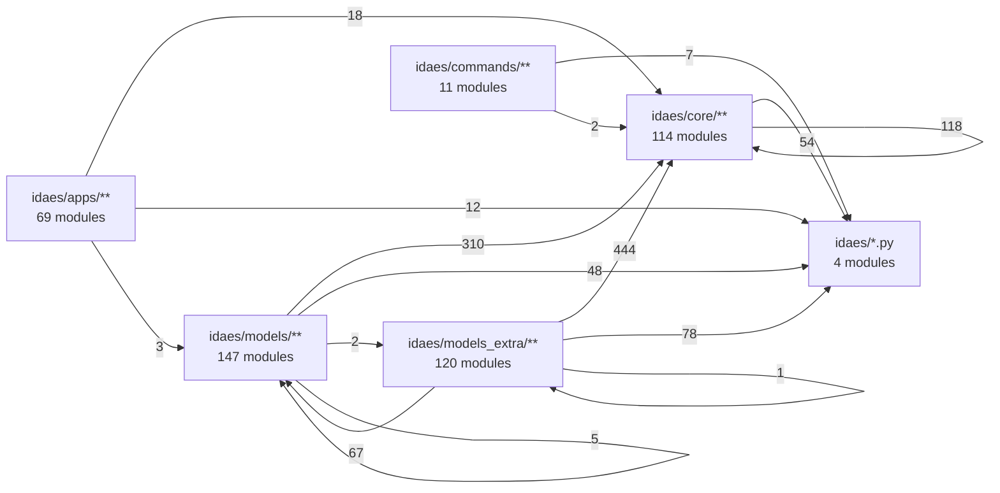
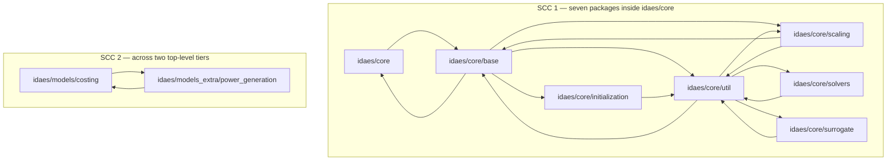

# 29 — Dependency and layering map

> **Doc ID** 29 · **Repo SHA** 70a8f4fe1 (IDAES-PSE v2.13.0rc0) · **Source roots** none (index document)
> **Owns** no source files / 0 LOC · **Assets** none · **Siblings** [01](01_glossary_and_conventions.md), [02](02_runtime_platform_and_cli.md), [03](03_block_hierarchy_and_construction_protocol.md), [08b](08b_core_support_utilities.md), [26](26_matopt.md), [30](30_numerics_and_solver_interface_map.md), [31](31_extension_point_catalog.md), [32](32_repository_engineering.md)

This document is the measured shape of the library's dependency graph: which
package imports which, which of those imports form cycles, what the distribution
declares against what the code uses, what runs when a module is imported, and
where the same implementation exists in more than one place. Every number here
comes from `_generated/imports.csv`, `modules.csv` and `ledger.csv` by way of
`_scripts/layering.py`, and every row names the document that owns the subject.

---

## 0. Scope and source map

**This document owns no source files.** The ownership ledger in
[00](00_index_and_reading_map.md) assigns all 465 source modules to documents 02
through 32; none is assigned here. Section 7 of
[01](01_glossary_and_conventions.md) fixes what that means for documents 28
through 31: a row in an index document points at the document that owns the
subject and states one fact about it. It does not restate semantics that another
document carries. Where this document names a class, a function or a
configuration key, it does so to locate it in the graph — the behaviour is
described in the owning document and nowhere else.

The table below is the coverage contract in the place a file table would
otherwise stand: it lists the subjects this document indexes, the single kind of
fact it states about each, and where the semantics live.

| Subject | The fact stated here | Semantics owned by | § |
|---|---|---|---|
| Package import graph | 103 directed edges between 30 packages, with counts | this document (measurement only) | 1, 3 |
| Package inventory | modules, LOC and owning document per package | the owning document of each package | 2 |
| Import cycles | 7 mutually dependent pairs, 2 strongly connected components of 7 and 2 packages | this document (measurement only) | 1, 3 |
| Declared dependencies | `pyproject.toml` runtime list and five extras, compared against use | [32](32_repository_engineering.md) | 4 |
| Import-time side effects | which module performs one, and what it mutates | [02](02_runtime_platform_and_cli.md), [08a](08a_model_introspection_and_persistence.md), [08b](08b_core_support_utilities.md), [26](26_matopt.md) | 5 |
| Pyomo API surface | 823 import statements split by path depth | the owning document of each call site | 6 |
| Third-party surface | import count, guard style, declaration status | the owning document of each call site | 7 |
| Document-to-document coupling | import statements between documents' scopes | each pair of documents | 8 |
| Extension points | count per package only | [31](31_extension_point_catalog.md) | 9 |
| Shipped assets | none owned; count only | [28](28_data_and_file_format_inventory.md) | 10 |
| Duplicated implementations | one row per duplication, with anchors | the documents named in each row | 12 |
| Counting basis | every count is over source modules, never tests | [01 §11](01_glossary_and_conventions.md#11-counting-conventions) | 13 |

Two mechanical consequences of owning nothing: the `config` and `hooks` coverage
checks in `_scripts/verify.py` have no rows for this document, and no anchor in
section 15 is a normative description of the line it names.

---

## 1. Architectural role

The 465 source modules hold 3,106 import statements. 1,774 of those target a
module inside `idaes`; 1,169 cross a package boundary and form the graph this
document reports. At the granularity `_scripts/layering.py` measures — 31 named
packages, longest prefix wins, so `idaes/core/util` is distinct from
`idaes/core` — the graph has 103 directed edges over the 30 packages that hold
at least one module.

**The library exhibits no strict layering.** That is not an assertion about
intent; it is what the edge set contains. Seven package pairs import each other,
and the directed graph has two strongly connected components larger than a
single package. Seven packages inside `idaes/core` form one component —
`idaes/core`, `idaes/core/base`, `idaes/core/initialization`,
`idaes/core/scaling`, `idaes/core/solvers`, `idaes/core/surrogate` and
`idaes/core/util` — so there is no ordering of those seven in which every import
runs downward. The second component spans two tiers
that a directory reading would place at different levels:
`idaes/models/costing` and `idaes/models_extra/power_generation` import each
other, at `idaes/models/costing/QGESS.py:56` and `:59` outward, and at
`idaes/models_extra/power_generation/costing/power_plant_costing.py:44` back.
That pair is the only edge in the whole tree from `idaes/models` into
`idaes/models_extra`.

Fourteen of the 103 edges — the seven pairs of §3.1 — carry a reverse edge, and
two more close a three-edge cycle through `idaes/core/initialization`, so no
topological order over the 30 packages exists and no assignment of the packages
to numbered tiers can hold. Aggregated to the six top-level packages the picture
narrows to one cycle: `idaes/models` and `idaes/models_extra` import each other,
and removing the two statements that run from `idaes/models/costing` into
`idaes/models_extra` would leave the aggregate graph acyclic. A layering
claim is therefore true at one granularity and false at the next one down, which
is why this document reports both and asserts neither as the structure.

`_scripts/layering.py` states its own discipline in its module docstring: it
declares no tier order, because a ranking chosen in advance would decide the
question the measurement is meant to answer. It reports edges and the cycles
those edges contain. This document keeps that discipline; the words "upward" and
"downward" appear below only where a cycle makes both directions observable.

*Aggregated to top-level packages the tree looks layered in every direction but one: the two import statements from `idaes/models` into `idaes/models_extra`, which close the second cycle.*

---

## 2. Public surface inventory

An index document has no symbols of its own. The inventory it carries instead is
the package census: every package the measurement distinguishes, its size, and
the document that owns its contents. Module counts and LOC come from
`_generated/modules.csv`; ownership from `_generated/ledger.csv`.

| Package | Modules | LOC | Owning document(s), modules each |
|---|---:|---:|---|
| `idaes/core/base` | 19 | 13,840 | [03](03_block_hierarchy_and_construction_protocol.md) (7), [05](05_property_and_reaction_framework.md) (6), [04](04_control_volume_framework.md) (5), [17](17_costing_framework_and_libraries.md) (1) |
| `idaes/core/util` | 48 | 20,714 | [07](07_diagnostics_and_run_orchestration.md) (26), [08a](08a_model_introspection_and_persistence.md) (20), [06](06_model_preparation_initializers_and_scalers.md) (2) |
| `idaes/core/scaling` | 8 | 3,574 | [06](06_model_preparation_initializers_and_scalers.md) (8) |
| `idaes/core/initialization` | 5 | 1,328 | [06](06_model_preparation_initializers_and_scalers.md) (5) |
| `idaes/core/solvers` | 7 | 1,805 | [30](30_numerics_and_solver_interface_map.md) (7) |
| `idaes/core/surrogate` | 21 | 10,275 | [09](09_surrogate_subsystem.md) (21) |
| `idaes/core/plugins` | 3 | 340 | [08a](08a_model_introspection_and_persistence.md) (3) |
| `idaes/core/dmf` | 1 | 31 | [08a](08a_model_introspection_and_persistence.md) (1) |
| `idaes/core` | 2 | 90 | [02](02_runtime_platform_and_cli.md) (1), [08a](08a_model_introspection_and_persistence.md) (1) |
| `idaes/models/properties` | 109 | 37,667 | [16](16_general_helmholtz_property_system.md) (36), [15](15_property_package_catalog.md) (26), [14](14_modular_properties_state_definitions_and_libraries.md) (23), [13](13_modular_properties_eos_and_phase_equilibrium.md) (20), [12](12_modular_properties_generic_framework.md) (4) |
| `idaes/models/unit_models` | 30 | 16,816 | [10](10_unit_models_control_volume_based.md) (18), [11](11_unit_models_network_contactors_and_control.md) (12) |
| `idaes/models/costing` | 3 | 5,958 | [17](17_costing_framework_and_libraries.md) (3) |
| `idaes/models/control` | 2 | 589 | [11](11_unit_models_network_contactors_and_control.md) (2) |
| `idaes/models/flowsheets` | 2 | 511 | [24](24_reference_flowsheets_and_demonstrations.md) (2) |
| `idaes/models` | 1 | 0 | [02](02_runtime_platform_and_cli.md) (1) |
| `idaes/models_extra/power_generation` | 68 | 42,326 | [20](20_power_generation_helmholtz_units_and_soc.md) (24), [24](24_reference_flowsheets_and_demonstrations.md) (15), [18](18_power_generation_boiler_island.md) (13), [19](19_power_generation_heat_exchangers_and_properties.md) (10), [17](17_costing_framework_and_libraries.md) (6) |
| `idaes/models_extra/column_models` | 15 | 10,081 | [21](21_column_models_and_solvent_systems.md) (15) |
| `idaes/models_extra/gas_solid_contactors` | 20 | 14,632 | [22](22_gas_solid_contactors.md) (15), [24](24_reference_flowsheets_and_demonstrations.md) (5) |
| `idaes/models_extra/temperature_swing_adsorption` | 6 | 5,697 | [23](23_tsa_gas_distribution_and_ccu.md) (5), [17](17_costing_framework_and_libraries.md) (1) |
| `idaes/models_extra/gas_distribution` | 7 | 1,463 | [23](23_tsa_gas_distribution_and_ccu.md) (7) |
| `idaes/models_extra/co2_capture_and_utilization` | 3 | 313 | [23](23_tsa_gas_distribution_and_ccu.md) (3) |
| `idaes/models_extra` | 1 | 0 | [02](02_runtime_platform_and_cli.md) (1) |
| `idaes/apps/grid_integration` | 18 | 8,673 | [25](25_grid_integration.md) (18) |
| `idaes/apps/matopt` | 28 | 10,167 | [26](26_matopt.md) (28) |
| `idaes/apps/caprese` | 11 | 3,585 | [27](27_dynamic_optimization_and_uncertainty.md) (11) |
| `idaes/apps/nmpc` | 4 | 242 | [27](27_dynamic_optimization_and_uncertainty.md) (4) |
| `idaes/apps/uncertainty_propagation` | 7 | 1,905 | [27](27_dynamic_optimization_and_uncertainty.md) (7) |
| `idaes/apps` | 1 | 0 | [02](02_runtime_platform_and_cli.md) (1) |
| `idaes/commands` | 11 | 1,233 | [02](02_runtime_platform_and_cli.md) (11) |
| `idaes` | 4 | 1,371 | [02](02_runtime_platform_and_cli.md) (4) |
| **total** | **465** | **215,226** | 27 documents |

Four notes on the census, each a measurement rather than a judgement:

- `idaes/core/io` appears in the package list of `_scripts/layering.py` and
  holds no module at this revision, so it carries no row.
- `idaes/apps/__init__.py`, `idaes/models/__init__.py` and
  `idaes/models_extra/__init__.py` are zero-byte files, which is why three
  packages report 0 LOC for one module; see
  [02 §12](02_runtime_platform_and_cli.md#12-duplications-deprecations-and-sharp-edges).
- Document 08 is split into [08a](08a_model_introspection_and_persistence.md)
  and [08b](08b_core_support_utilities.md); the ledger records the pair under
  one number, so the rows above link to 08a and cover both.
- `idaes/models_extra/power_generation` is the largest package by LOC (42,326)
  and is shared by five documents; `idaes/models/properties` holds the most
  modules (109) and is shared by five.

---

## 3. Package dependency graph

### 3.1 The two strongly connected components

*Eight of the nine packages sit on a two-edge cycle; `idaes/core/initialization` joins the first component only through the three-edge path `core/base → core/initialization → core/util → core/base`.*

**Mutually dependent package pairs**

| Package A | Package B | A imports B | B imports A |
|---|---|---:|---:|
| `idaes/core` | `idaes/core/base` | 16 | 9 |
| `idaes/core/base` | `idaes/core/scaling` | 5 | 2 |
| `idaes/core/base` | `idaes/core/util` | 38 | 4 |
| `idaes/core/scaling` | `idaes/core/util` | 6 | 8 |
| `idaes/core/solvers` | `idaes/core/util` | 3 | 5 |
| `idaes/core/surrogate` | `idaes/core/util` | 2 | 1 |
| `idaes/models/costing` | `idaes/models_extra/power_generation` | 2 | 1 |

`idaes/core/initialization` is in the first component without being in any pair:
nothing it imports imports it back, and it reaches `idaes/core/base` only by way
of `idaes/core/util`.

The table below locates the cycle edges that are easiest to lose sight of: the
single-file returns, the ones carried by deferred imports, and the two legs that
bring `idaes/core/initialization` into the first component. The heavy re-export
edges inside `idaes/core` are in §3.2 with the rest. The behaviour of every
symbol named belongs to the owning document.

| Cycle-closing edge | Sites | Owning document |
|---|---|---|
| `idaes/core/util` → `idaes/core/surrogate` (1) | `idaes/core/util/parameter_sweep.py:27` | [07](07_diagnostics_and_run_orchestration.md) |
| `idaes/core/surrogate` → `idaes/core/util` (2) | `idaes/core/surrogate/alamopy.py:34`, `idaes/core/surrogate/pysmo_surrogate.py:43` | [09](09_surrogate_subsystem.md) |
| `idaes/core/util` → `idaes/core/solvers` (5) | `idaes/core/util/diagnostics_tools/diagnostics_toolbox.py:44` and four more | [07](07_diagnostics_and_run_orchestration.md) |
| `idaes/core/solvers` → `idaes/core/util` (3) | `idaes/core/solvers/homotopy.py:25`, `:26`, `:27` | [30](30_numerics_and_solver_interface_map.md) |
| `idaes/core/scaling` → `idaes/core/base` (2) | `idaes/core/scaling/custom_scaler_base.py:984` and `:985`, both inside a method | [06](06_model_preparation_initializers_and_scalers.md) |
| `idaes/core/base` → `idaes/core/scaling` (5) | `idaes/core/base/control_volume_base.py:42`, `idaes/core/base/control_volume0d.py:50` and `idaes/core/base/control_volume1d.py:53` at module scope; `idaes/core/base/property_base.py:154` and `idaes/core/base/reaction_base.py:145` inside a property setter | [04](04_control_volume_framework.md), [05](05_property_and_reaction_framework.md) |
| `idaes/core/util` → `idaes/core/base` (4) | `idaes/core/util/config.py:47`, `:71`, `:92` (method-local) and `idaes/core/util/structfs/runner_actions.py:39` | [08a](08a_model_introspection_and_persistence.md), [07](07_diagnostics_and_run_orchestration.md) |
| `idaes/core/base` → `idaes/core/initialization` (4) | `idaes/core/base/process_base.py:37`, `idaes/core/base/unit_model.py:42`, `idaes/core/base/property_base.py:51`, `idaes/core/base/reaction_base.py:38` | [03](03_block_hierarchy_and_construction_protocol.md), [05](05_property_and_reaction_framework.md) |
| `idaes/core/initialization` → `idaes/core/util` (7) | `idaes/core/initialization/initializer_base.py:29`, `:30`, `:31` and four more | [06](06_model_preparation_initializers_and_scalers.md) |
| `idaes/models_extra/power_generation` → `idaes/models/costing` (1) | `idaes/models_extra/power_generation/costing/power_plant_costing.py:44` | [17](17_costing_framework_and_libraries.md) |

Seven import statements across three of those edges are deferred — written
inside a function or a method body rather than at module scope — and three of
the seven carry the comment `Top-level import creates circular import` next to a
`# pylint: disable=import-outside-toplevel` directive
(`idaes/core/util/config.py:46`, `idaes/core/base/property_base.py:153`,
`idaes/core/scaling/custom_scaler_base.py:983`); fourteen such directives exist
in the source tree. The cycles are therefore visible in the source as well as in
the graph: deferring the import is what keeps the module-level import order
acyclic while the package-level graph is not.

### 3.2 Complete edge list

103 directed edges, sorted by import count. The count is the number of `import`
statements, not the number of names imported; a `from x import a, b, c` is one.

| From package | To package | Imports |
|---|---|---:|
| `idaes/models_extra/power_generation` | `idaes/core/util` | 168 |
| `idaes/models/properties` | `idaes/core/util` | 88 |
| `idaes/models/unit_models` | `idaes/core/util` | 77 |
| `idaes/models_extra/gas_solid_contactors` | `idaes/core/util` | 61 |
| `idaes/models_extra/power_generation` | `idaes/core` | 54 |
| `idaes/models_extra/power_generation` | `idaes` | 48 |
| `idaes/models_extra/power_generation` | `idaes/core/solvers` | 40 |
| `idaes/core/base` | `idaes/core/util` | 38 |
| `idaes/models_extra/column_models` | `idaes/core/util` | 36 |
| `idaes/models/properties` | `idaes/core` | 34 |
| `idaes/models_extra/power_generation` | `idaes/models/properties` | 33 |
| `idaes/models/properties` | `idaes` | 29 |
| `idaes/models/unit_models` | `idaes/core` | 26 |
| `idaes/core/util` | `idaes` | 21 |
| `idaes/models_extra/power_generation` | `idaes/models/unit_models` | 18 |
| `idaes/core` | `idaes/core/base` | 16 |
| `idaes/models/unit_models` | `idaes/core/scaling` | 16 |
| `idaes/models/unit_models` | `idaes` | 16 |
| `idaes/models/properties` | `idaes/core/scaling` | 15 |
| `idaes/models/unit_models` | `idaes/core/initialization` | 14 |
| `idaes/models_extra/gas_solid_contactors` | `idaes/core` | 14 |
| `idaes/models_extra/gas_solid_contactors` | `idaes/core/solvers` | 14 |
| `idaes/core/base` | `idaes` | 13 |
| `idaes/models_extra/column_models` | `idaes` | 13 |
| `idaes/models_extra/gas_solid_contactors` | `idaes` | 13 |
| `idaes/models_extra/temperature_swing_adsorption` | `idaes/core/util` | 13 |
| `idaes/models_extra/column_models` | `idaes/core` | 11 |
| `idaes/core/base` | `idaes/core` | 9 |
| `idaes/models/unit_models` | `idaes/core/solvers` | 9 |
| `idaes/models_extra/column_models` | `idaes/core/solvers` | 9 |
| `idaes/models_extra/column_models` | `idaes/models/properties` | 9 |
| `idaes/core/util` | `idaes/core/scaling` | 8 |
| `idaes/models/costing` | `idaes/core/util` | 8 |
| `idaes/commands` | `idaes` | 7 |
| `idaes/core/initialization` | `idaes/core/util` | 7 |
| `idaes/core/scaling` | `idaes/core/util` | 6 |
| `idaes/core/solvers` | `idaes` | 6 |
| `idaes/core/surrogate` | `idaes` | 6 |
| `idaes/models_extra/gas_distribution` | `idaes/core/util` | 6 |
| `idaes/apps/caprese` | `idaes/core/util` | 5 |
| `idaes/apps/grid_integration` | `idaes` | 5 |
| `idaes/core/base` | `idaes/core/scaling` | 5 |
| `idaes/core/scaling` | `idaes` | 5 |
| `idaes/core/util` | `idaes/core/solvers` | 5 |
| `idaes/models_extra/gas_distribution` | `idaes/core` | 5 |
| `idaes/apps/caprese` | `idaes` | 4 |
| `idaes/apps/caprese` | `idaes/core/solvers` | 4 |
| `idaes/apps/grid_integration` | `idaes/core/util` | 4 |
| `idaes/core/base` | `idaes/core/initialization` | 4 |
| `idaes/core/util` | `idaes/core/base` | 4 |
| `idaes/core/solvers` | `idaes/core/util` | 3 |
| `idaes/core/util` | `idaes/core` | 3 |
| `idaes/models/control` | `idaes/core/util` | 3 |
| `idaes/models/costing` | `idaes/core` | 3 |
| `idaes/models/costing` | `idaes/models/unit_models` | 3 |
| `idaes/models/properties` | `idaes/core/initialization` | 3 |
| `idaes/models/properties` | `idaes/core/base` | 3 |
| `idaes/models/unit_models` | `idaes/core/base` | 3 |
| `idaes/models_extra/co2_capture_and_utilization` | `idaes/core/util` | 3 |
| `idaes/models_extra/temperature_swing_adsorption` | `idaes/core` | 3 |
| `idaes/models_extra/temperature_swing_adsorption` | `idaes` | 3 |
| `idaes/apps/grid_integration` | `idaes/core/base` | 2 |
| `idaes/apps/uncertainty_propagation` | `idaes` | 2 |
| `idaes/commands` | `idaes/core/util` | 2 |
| `idaes/core/initialization` | `idaes/core/solvers` | 2 |
| `idaes/core/initialization` | `idaes` | 2 |
| `idaes/core/scaling` | `idaes/core/base` | 2 |
| `idaes/core/surrogate` | `idaes/core/util` | 2 |
| `idaes/models/costing` | `idaes` | 2 |
| `idaes/models/costing` | `idaes/models_extra/power_generation` | 2 |
| `idaes/models/flowsheets` | `idaes/core/util` | 2 |
| `idaes/models/properties` | `idaes/core/solvers` | 2 |
| `idaes/models_extra/power_generation` | `idaes/models/control` | 2 |
| `idaes/models_extra/power_generation` | `idaes/core/initialization` | 2 |
| `idaes/models_extra/temperature_swing_adsorption` | `idaes/models/unit_models` | 2 |
| `idaes/models_extra/temperature_swing_adsorption` | `idaes/core/initialization` | 2 |
| `idaes/apps/caprese` | `idaes/core` | 1 |
| `idaes/apps/caprese` | `idaes/models/unit_models` | 1 |
| `idaes/apps/grid_integration` | `idaes/core/solvers` | 1 |
| `idaes/apps/matopt` | `idaes` | 1 |
| `idaes/apps/uncertainty_propagation` | `idaes/core` | 1 |
| `idaes/apps/uncertainty_propagation` | `idaes/models/unit_models` | 1 |
| `idaes/apps/uncertainty_propagation` | `idaes/models/properties` | 1 |
| `idaes/core/base` | `idaes/core/solvers` | 1 |
| `idaes/core/plugins` | `idaes` | 1 |
| `idaes/core/scaling` | `idaes/core/solvers` | 1 |
| `idaes/core/util` | `idaes/core/dmf` | 1 |
| `idaes/core/util` | `idaes/core/surrogate` | 1 |
| `idaes/models/control` | `idaes/core` | 1 |
| `idaes/models/costing` | `idaes/core/base` | 1 |
| `idaes/models/flowsheets` | `idaes/core` | 1 |
| `idaes/models/flowsheets` | `idaes/core/solvers` | 1 |
| `idaes/models/flowsheets` | `idaes/models/properties` | 1 |
| `idaes/models/flowsheets` | `idaes/models/unit_models` | 1 |
| `idaes/models/flowsheets` | `idaes` | 1 |
| `idaes/models_extra/co2_capture_and_utilization` | `idaes/core` | 1 |
| `idaes/models_extra/co2_capture_and_utilization` | `idaes/models/unit_models` | 1 |
| `idaes/models_extra/column_models` | `idaes/models/unit_models` | 1 |
| `idaes/models_extra/column_models` | `idaes/core/initialization` | 1 |
| `idaes/models_extra/gas_distribution` | `idaes` | 1 |
| `idaes/models_extra/power_generation` | `idaes/models/costing` | 1 |
| `idaes/models_extra/power_generation` | `idaes/core/base` | 1 |
| `idaes/models_extra/temperature_swing_adsorption` | `idaes/models_extra/power_generation` | 1 |

Reading the distribution rather than the rows: `idaes/core/util` is the single
heaviest target, receiving 532 of the 1,169 cross-package import statements from
19 distinct packages, and emitting 43 to 7. `idaes/core` is second at 167 from
15 packages, every one of them a `from idaes.core import ...` reaching the
re-export list of `idaes/core/__init__.py`, and it emits 16, all to
`idaes/core/base`. `idaes` — the four modules `__init__.py`, `config.py`,
`logger.py` and `beta.py` — is third at 199 from 21 packages: 186 statements
naming `idaes.logger`, 9 naming `idaes` itself and 4 naming `idaes.config`. It
emits nothing, because `idaes/__init__.py` imports only its own sibling
`config.py`. `idaes/models_extra/power_generation` has the largest out-degree by
volume, 367 statements over 10 targets, and receives 3 from 2.
`idaes/apps/matopt` has an out-degree of exactly 1
(`idaes/apps/matopt/__init__.py` reaching `idaes`) and an in-degree of 0, which
makes it the one package in the census coupled to the rest of the library by a
single import statement.

### 3.3 How the measurement attributes a package import

`package_of` in `_scripts/layering.py` resolves a path to a package by walking
the `PACKAGES` list and taking the first prefix that matches. The match tests
three forms — the path equal to the prefix, the path starting `prefix + "/"`, and
the path equal to `prefix + ".py"` — and the first of those three is the one that
matters here, because an import target that names a package **directory** has
neither a trailing slash nor a `.py`.

That first test was absent until it was added with the docstring the function now
carries. Without it, `idaes/core/util` as a *target* matched neither
`idaes/core/util/` nor `idaes/core/util.py` and fell through to `idaes/core`;
`idaes/core` in turn fell through to `idaes`. 412 of the 1,774 intra-`idaes`
import statements have a target of that shape — every `from idaes.core import
...`, `from idaes.core.solvers import ...`, and every other import landing on a
package's `__init__.py` — so each was counted one level too high.

Two structural facts were concealed by that, and both are in the tables above:

- **An edge that closes a cycle was invisible.** The four imports at
  `idaes/core/base/process_base.py:37`, `idaes/core/base/unit_model.py:42`,
  `idaes/core/base/property_base.py:51` and `idaes/core/base/reaction_base.py:38`
  name `idaes.core.initialization` as a package, so the edge
  `idaes/core/base` → `idaes/core/initialization` was recorded as
  `idaes/core/base` → `idaes/core`. With it restored, the path
  `core/base → core/initialization → core/util → core/base` closes and
  `idaes/core/initialization` is the seventh member of SCC 1.
- **Per-edge counts moved.** The graph is 103 edges carrying 1,169 statements,
  where the earlier attribution gave 97 edges carrying 1,190 — 6 edges appear
  and 21 statements become intra-package and drop out. `idaes/core/util`'s
  in-degree rises from 486 to 532, `idaes`'s falls from 373 to 199, and
  `idaes/core/dmf` gains its single incoming edge.

The second component is unchanged by the fix, so the cross-tier cycle of §1 was
never an artefact of how a package was named. Every number in this document comes
from the corrected function.

---

## 4. Dependency declaration surface

`pyproject.toml` is owned by [32](32_repository_engineering.md); its structure,
build backend and package-data whitelist are described there. What this section
owns is the comparison of the **declared** set against the **used** set, where
"used" means an import statement recorded in `_generated/imports.csv` over the
465 source modules.

### 4.1 Runtime dependencies

Ten entries in `[project] dependencies`. The import-site count excludes test
modules, so a dependency used only by the test suite reports zero here.

| Declared | Version constraint | Import sites in source | Where used | Owning document |
|---|---|---:|---|---|
| `pyomo` | `>= 6.10.1` | 823 | 27 of the 30 non-empty packages | every document; §6 |
| `pint` | `>= 0.24.1` | 1 | `idaes/models/costing/QGESS.py:41`, for `UndefinedUnitError` | [17](17_costing_framework_and_libraries.md) |
| `networkx` | none | 0 | no import statement in `idaes/`; the declaration's own comment names Pyomo's network package as the consumer | [32](32_repository_engineering.md) |
| `numpy` | `>=1,<3` | 41 | 10 packages, heaviest in `idaes/apps/matopt` (15) | [26](26_matopt.md), [09](09_surrogate_subsystem.md) |
| `pandas` | `!= 2.1.0` | 37 | 11 packages, heaviest in `idaes/core/surrogate` (8) | [09](09_surrogate_subsystem.md), [25](25_grid_integration.md) |
| `scipy` | none | 22 | 6 packages, heaviest in `idaes/core/util` (9) | [07](07_diagnostics_and_run_orchestration.md), [06](06_model_preparation_initializers_and_scalers.md) |
| `sympy` | none | 1 | `idaes/core/util/expr_doc.py:38`, inside a `try`/`except ModuleNotFoundError` | [08a](08a_model_introspection_and_persistence.md) |
| `matplotlib` | none | 21 | 8 packages | [09](09_surrogate_subsystem.md), [25](25_grid_integration.md) |
| `click` | `>=8` | 8 | `idaes/commands` only | [02](02_runtime_platform_and_cli.md) |
| `pydantic` | none | 2 | `idaes/core/util/structfs/runner.py:23` and `runner_actions.py:30` | [07](07_diagnostics_and_run_orchestration.md) |

### 4.2 Optional extras

Five named extras plus an aggregate. `all` expands to `idaes-pse[ui,grid,omlt,coolprop]`.

| Extra | Packages declared | Import sites in source | Guard used | Owning document of the consumer |
|---|---|---:|---|---|
| `ui` | `idaes-ui`, `idaes-connectivity` | 2, 3 | `try`/`except ImportError` at `idaes/core/base/flowsheet_model.py:70`; the same form at `idaes/core/util/structfs/fsrunner.py:26` and `runner_actions.py:33` | [03](03_block_hierarchy_and_construction_protocol.md), [07](07_diagnostics_and_run_orchestration.md) |
| `coolprop` | `coolprop>=8.0` | 1 | `attempt_import("CoolProp.CoolProp")` at `idaes/models/properties/modular_properties/coolprop/coolprop_wrapper.py:37` | [15](15_property_package_catalog.md) |
| `grid` | `gridx-prescient>=2.2.3` | 1 | `attempt_import("prescient")` at `idaes/apps/grid_integration/coordinator.py:21` | [25](25_grid_integration.md) |
| `omlt` | `omlt==1.1`, `tensorflow`, `onnx` | 5, 2, 1 | `attempt_import` at `idaes/core/surrogate/omlt_base_surrogate_class.py:30` and `:31`, `keras_surrogate.py:33`, `onnx_surrogate.py:32` | [09](09_surrogate_subsystem.md) |
| `testing` | `pytest`, `addheader`, `pyyaml` | 6, 0, 0 | none — see §7.3 | [07](07_diagnostics_and_run_orchestration.md), [08b](08b_core_support_utilities.md) |

### 4.3 Declared against used

Five observations follow from putting the two lists side by side. Each is a
counting statement; the consequence for the consumer belongs to the document
named.

| Observation | Evidence | Owning document |
|---|---|---|
| `networkx` is declared and never imported in `idaes/` | no row in `_generated/imports.csv` with a `networkx` target | [32](32_repository_engineering.md) |
| `all` omits `testing` | `all = ["idaes-pse[ui,grid,omlt,coolprop]"]` names four of the five extras | [32](32_repository_engineering.md) |
| `scikit-learn` is used and declared nowhere | `attempt_import("sklearn")` at `idaes/apps/grid_integration/pricetaker/clustering.py:26`, consumed at `:29` and `:30` | [25](25_grid_integration.md) |
| `egret` is used and declared nowhere | `attempt_import("egret")` at `idaes/apps/grid_integration/bidder.py:23`, consumed at `:25` | [25](25_grid_integration.md) |
| `idaes_flowsheet_processor` is used and declared nowhere, while an entry point names the module that uses it | `attempt_import` at `idaes/models_extra/temperature_swing_adsorption/fixed_bed_tsa0d_ui.py:39`; the `idaes.flowsheets` entry point in `pyproject.toml` names that module | [23](23_tsa_gas_distribution_and_ccu.md), [32](32_repository_engineering.md) |

Both `scikit-learn` and `egret` sit behind `attempt_import`, so their absence is
deferred to first use rather than raised at import; §7.2 lists every dependency
in that state.

---

## 5. Import-time side effects

An import-time side effect is work performed at module scope, so it runs on
`import`, before any call. 40 of the 3,106 import statements in the source tree
are themselves inside a function or a method rather than at module scope; the
remaining 3,066 execute when their module is first loaded. The sites below are
the ones whose effect reaches outside their own module's namespace.

| Site | Effect at import | Owning document |
|---|---|---|
| `idaes/__init__.py:58` | Reads `IDAES_ACTIVATE_V1_COMPAT` and, when set, imports and calls `_idaes_v1_compat.activate` | [02](02_runtime_platform_and_cli.md) |
| `idaes/__init__.py:63` | Resolves the data, binary and testing directories into module globals | [02](02_runtime_platform_and_cli.md) |
| `idaes/__init__.py:82` and `:84` | Reads the global and local `idaes.conf` files into the process-wide `cfg` block | [02](02_runtime_platform_and_cli.md) |
| `idaes/__init__.py:87` | Puts the IDAES binary directory on the executable search path | [02](02_runtime_platform_and_cli.md) |
| `idaes/__init__.py:111` | Rewrites the `AMPLFUNC` environment variable with three external-function libraries | [02](02_runtime_platform_and_cli.md) |
| `idaes/__init__.py:139` | Creates three directories on disk, each inside its own `try`/`except FileNotFoundError` | [02](02_runtime_platform_and_cli.md) |
| `idaes/__init__.py:216` | Attaches a `logging.Filter` to Pyomo's own `pyomo_logger` and to every handler already on it | [02](02_runtime_platform_and_cli.md) |
| `idaes/core/__init__.py:16`–`:54` | Re-exports 46 names from 16 `idaes/core/base` modules, so `import idaes.core` loads the whole base package | [02](02_runtime_platform_and_cli.md) |
| `idaes/core/util/__init__.py:18` | Re-exports `DiagnosticsToolbox`; see below | [08a](08a_model_introspection_and_persistence.md) |
| `idaes/core/base/process_block.py:88` | Calls `_get_pyomo_block_kwargs` (`:75`), which reads Pyomo's `Block.__init__` overloads through a private Pyomo helper | [03](03_block_hierarchy_and_construction_protocol.md) |
| `idaes/core/base/process_block.py:225` | Runs once per `@declare_process_block_class` site, 160 times across the tree, and `setattr`s the synthesized container class onto the decorated class's own module object | [03](03_block_hierarchy_and_construction_protocol.md) |
| `idaes/core/plugins/__init__.py:16` and `:17` | Imports two modules whose decorators register `replace_variables` and `simple_equality_eliminator` in Pyomo's `TransformationFactory` | [08b](08b_core_support_utilities.md) |
| `idaes/apps/matopt/__init__.py:16` | Inserts the parent directory on `sys.path`, then imports its own subpackages under the bare name `matopt` at `:18` | [26](26_matopt.md) |
| `idaes/commands/__init__.py:22` | Starts a wall-clock timer read back at `:48` as `_command_import_total_time` | [02](02_runtime_platform_and_cli.md) |
| `idaes/commands/__init__.py:29` | Walks the package and executes every command module, registering each at `:41` in `sys.modules` under its bare top-level name | [02](02_runtime_platform_and_cli.md) |

### 5.1 The namespace mutations

Three modules write to `sys.path` at module scope and one writes to
`sys.modules`, so these four change global interpreter state rather than their
own package.

| Site | Mutation | Owning document |
|---|---|---|
| `idaes/apps/matopt/__init__.py:16` | `sys.path.insert(0, ...)` of the package's parent, which is why `matopt` is importable both as `idaes.apps.matopt` and as a bare top-level name | [26](26_matopt.md) |
| `idaes/apps/uncertainty_propagation/examples/uncertainty_propagation_NRTL.py:16` | `sys.path.append(os.path.abspath(".."))`, relative to the process working directory | [27](27_dynamic_optimization_and_uncertainty.md) |
| `idaes/apps/uncertainty_propagation/examples/uncertainty_propagation_rooney.py:16` | the same call in the second example module | [27](27_dynamic_optimization_and_uncertainty.md) |
| `idaes/commands/__init__.py:41` | assigns each discovered command module into `sys.modules` under a bare name such as `config` or `extensions` | [02](02_runtime_platform_and_cli.md) |

[01 §3](01_glossary_and_conventions.md#3-term-collision-table) records the
`matopt` naming hazard and
[02 §12](02_runtime_platform_and_cli.md#12-duplications-deprecations-and-sharp-edges)
owns the `sys.modules` observation. Four further writes to `sys.path` or
`sys.modules` exist — `idaes/beta.py:76`, `idaes/core/solvers/petsc.py:78` and
`idaes/core/util/structfs/runner_cli.py:143` and `:162` — and all four sit
inside a function, so none runs at import.

### 5.2 What `import idaes.core.util` loads

`idaes/core/util/__init__.py` has three import lines. `:16` and `:17` re-export
six names from `model_serializer` and `tags`; `:18` re-exports
`DiagnosticsToolbox` from `idaes.core.util.diagnostics_tools.diagnostics_toolbox`.
Following only module-scope imports from the pinned source, the transitive
closure of `idaes/core/util/__init__.py` is **36 source modules**. Deleting the
single edge contributed by `:18` reduces that closure to **6**.

The 30 modules reachable only through line 18 span four packages: 17 more in
`idaes/core/util`, 8 in `idaes/core/scaling`, 4 in `idaes/core/solvers` and
`idaes/core/surrogate/pysmo/sampling.py`, the last reached because
`idaes/core/util/parameter_sweep.py:27` imports it. This is the
`idaes/core/util` → `idaes/core/scaling` and `idaes/core/util` →
`idaes/core/solvers` and `idaes/core/util` → `idaes/core/surrogate` edges of
§3.1, all three traversed by a plain `import idaes.core.util`. The
[08a](08a_model_introspection_and_persistence.md) and
[07](07_diagnostics_and_run_orchestration.md) documents own the two ends.

For comparison, the closure of `idaes/core/__init__.py` on the same basis is 64
modules, of `idaes/models/unit_models/__init__.py` 95, of
`idaes/core/plugins/__init__.py` 6 and of `idaes/__init__.py` 2.

---

## 6. Pyomo API surface

Pyomo is the one dependency present in every tier: 823 of the 3,106 import
statements name it, spread over 27 of the 30 non-empty packages. This section
splits those statements by the shape of the import path, because that is the
only stability signal the source carries. The rule applied is stated once here
and used for all three tables: a path whose second segment is `environ`,
`network`, `dae`, `gdp`, `opt`, `util` or `contrib` is counted **public**; a path
under `pyomo.common` is counted **semi-public**, that being Pyomo's shared
utility layer; everything else — `pyomo.core.base`, `pyomo.core.expr`,
`pyomo.core.plugins`, `pyomo.repn`, `pyomo.solvers.plugins` and bare `pyomo` —
is counted **internal**. The three buckets hold 440, 234 and 149 statements.

### 6.1 Public entry points — 440 statements

| Pyomo module | Import sites | Heaviest consumer |
|---|---:|---|
| `pyomo.environ` | 295 | every package that builds a model |
| `pyomo.network` (`+.port`, `+.arc`) | 41 | `idaes/core/base`, unit models |
| `pyomo.dae` (`+.flatten`, `.set_utils`, `.initialization`, `.diffvar`) | 42 | `idaes/apps/caprese`, control volumes |
| `pyomo.util.calc_var_value` | 27 | initialization routines throughout |
| `pyomo.util.check_units` | 5 | `idaes/core/util` |
| `pyomo.contrib.pynumero` (`.interfaces`, `.asl`) | 8 | `idaes/core/util`, `idaes/core/scaling` |
| `pyomo.contrib.incidence_analysis` | 6 | `idaes/core/util/diagnostics_tools` |
| `pyomo.contrib.fbbt.fbbt` | 3 | `idaes/core/util`, `idaes/core/plugins` |
| `pyomo.opt` (`+.base.solvers`, `.results`) | 6 | `idaes/core/solvers` |
| `pyomo.util.subsystems`, `pyomo.util.slices` | 3 | `idaes/apps/caprese` |
| `pyomo.contrib.parmest`, `pyomo.contrib.iis`, `pyomo.gdp` | 4 | `idaes/core/solvers`, `idaes/core/util` |

### 6.2 Semi-public utility layer — 234 statements

| Pyomo module | Import sites | Used for |
|---|---:|---|
| `pyomo.common.config` | 127 | every CONFIG block in the tree |
| `pyomo.common.fileutils` | 25 | `Executable`, `this_file_dir`, `find_library` |
| `pyomo.common.collections` | 25 | `ComponentMap`, `ComponentSet` |
| `pyomo.common.deprecation` | 15 | the 49 deprecation sites of `_generated/deprecations.csv` |
| `pyomo.common.dependencies` | 13 | `attempt_import`, §7.2 |
| `pyomo.common.tempfiles`, `.tee`, `.log`, `.timing` | 12 | subprocess and logging plumbing |
| `pyomo.common.modeling`, `.numeric_types`, `.formatting`, `.errors`, `.sorting`, `.download` | 12 | scattered helpers |
| `pyomo.common` (bare), `pyomo.common.unittest` | 4 | three bare imports, plus `idaes/core/util/performance.py:23` |
| `pyomo.common.pyomo_typing` | 1 | flagged in §6.4 |

### 6.3 Internal paths — 149 statements

| Pyomo module | Import sites | What is taken |
|---|---:|---|
| `pyomo.core.base.var` | 22 | `VarData`, `IndexedVar`, `ScalarVar` |
| `pyomo.core.base.block` | 14 | `BlockData`, `SubclassOf`, `declare_custom_block` |
| `pyomo.core.base.constraint` | 14 | `ConstraintData` |
| `pyomo.core.base.expression` | 14 | `ExpressionData`, `ScalarExpression` |
| `pyomo.core.base.units_container` | 13 | `_PyomoUnit`, `UnitsError`, `InconsistentUnitsError` |
| `pyomo.core` (bare) | 11 | `expr as EXPR` |
| `pyomo.core.expr.visitor` | 10 | `StreamBasedExpressionVisitor`, `_ToStringVisitor` |
| `pyomo.core.base.param` | 8 | `ParamData`, `IndexedParam`, `SimpleParam` |
| `pyomo.core.expr` and subpaths | 16 | `numeric_expr`, `numvalue`, `calculus.derivatives`, `sympy_tools` |
| `pyomo.core.base` remainder | 20 | `indexed_component`, `componentuid`, `reference`, `set`, `suffix`, `objective`, `component`, `range`, `initializer`, `disable_methods`, `indexed_component_slice`, `transformation` |
| `pyomo.core.plugins.transform.hierarchy` | 2 | `NonIsomorphicTransformation`, both in `idaes/core/plugins` |
| `pyomo.repn`, `pyomo.repn.standard_repn` | 2 | `generate_standard_repn` |
| `pyomo.solvers.plugins.solvers` | 2 | `IPOPT` at `idaes/core/solvers/ipopt_l1.py:19`, `ASL` at `idaes/core/solvers/petsc.py:37` |
| `pyomo` (bare) | 1 | `idaes/core/util/env_info.py:25`, to report the version |

### 6.4 Private-name uses

Five distinct Pyomo names beginning with an underscore are imported, over eight
import statements. Each row states where the name is taken and which document
owns the consumer.

| Private name | Sites | Owning document |
|---|---|---|
| `_PyomoUnit` | `idaes/core/base/flowsheet_model.py:26`, `idaes/core/base/property_meta.py:54`, `idaes/core/base/property_set.py:24`, `idaes/core/scaling/nominal_value_tools.py:38`, `idaes/core/util/diagnostics_tools/constraint_term_analysis.py:31`, `idaes/core/util/scaling.py:51` | [03](03_block_hierarchy_and_construction_protocol.md), [05](05_property_and_reaction_framework.md), [06](06_model_preparation_initializers_and_scalers.md), [07](07_diagnostics_and_run_orchestration.md) |
| `_ToStringVisitor` | `idaes/core/util/misc.py:22` | [08a](08a_model_introspection_and_persistence.md) |
| `_functionMap`, `_pyomo_operator_map`, `_configure_sympy` | all three at `idaes/core/util/expr_doc.py:20` | [08a](08a_model_introspection_and_persistence.md) |

Three further uses are private by placement rather than by name, and are flagged
because each is a single point of contact with Pyomo's internals.

| Use | Site | Note | Owning document |
|---|---|---|---|
| `pyomo.common.pyomo_typing.get_overloads_for` | imported at `idaes/core/base/process_block.py:29`, called at `:80` | The only `pyomo.common.pyomo_typing` import in the tree; it runs at import time from `_get_pyomo_block_kwargs` (`:75`), invoked at module scope at `:88`, to derive the reserved Pyomo `Block` keyword names rather than hard-coding them | [03](03_block_hierarchy_and_construction_protocol.md) |
| `pyomo.core.base` internals | 105 statements over 18 submodules, §6.3 | `pyomo.environ` re-exports the public constructors but not the `*Data` classes, which is what these 105 statements take | every document with an `isinstance` check |
| `declare_custom_block` | `idaes/core/surrogate/surrogate_block.py:19` | The only import of this name in the tree, and the only IDAES block not declared with `declare_process_block_class` | [09 §3.1](09_surrogate_subsystem.md#31-surrogateblock-is-the-trees-only-declare_custom_block) |

---

## 7. Third-party dependency surface

`_scripts/layering.py --section thirdparty` groups every non-`idaes` import
target by top-level name. Its `STDLIB_HINT` filter is a hint rather than a
complete standard-library list, so five standard-library modules — `pdb`,
`bisect`, `pkgutil`, `gc` and `__future__` — appear in its output and are
excluded from the tables below. `matopt` and `_idaes_v1_compat` are also
excluded: the first is `idaes/apps/matopt` reached through the `sys.path`
insertion of §5.1, the second is loaded only from inside the guard at
`idaes/__init__.py:51`.

### 7.1 Declared and used

Covered by §4.1 and §4.2. Ranked by import sites: `pyomo` 823, `numpy` 41,
`pandas` 37, `scipy` 22, `matplotlib` 21, `click` 8, `pytest` 6, `omlt` 5,
`idaes_connectivity` 3, `idaes_ui` 2, `pydantic` 2, `sympy` 1, `pint` 1, and
`networkx` 0. Every other third-party name reaching the source tree is
undeclared: `sklearn` 2, `PetscBinaryIO` and `PetscBinaryIOTrajectory` 2 each,
`egret`, `petsc_conf`, `packaging`, `idaes_flowsheet_processor` and
`ampl_module_scip` 1 each, plus `mpi4py` through the dynamic import of §7.2.

### 7.2 Guarded imports

Thirteen `attempt_import` calls name a third-party module. Eleven further sites
in shipped source wrap an import in `try`/`except ImportError` or
`try`/`except ModuleNotFoundError`; `idaes/conftest.py` and the test modules are
excluded from that count by the inventory's own rule. Both forms defer the
failure; neither raises at import.

| Module | Guard site | Guard form | Declared as | Owning document |
|---|---|---|---|---|
| `tensorflow.keras` | `idaes/core/surrogate/omlt_base_surrogate_class.py:30`, `keras_surrogate.py:33` | `attempt_import` | `omlt` extra | [09](09_surrogate_subsystem.md) |
| `omlt` | `idaes/core/surrogate/omlt_base_surrogate_class.py:31`, `keras_surrogate.py:34`, `onnx_surrogate.py:33` | `attempt_import` | `omlt` extra | [09](09_surrogate_subsystem.md) |
| `onnx` | `idaes/core/surrogate/onnx_surrogate.py:32` | `attempt_import` | `omlt` extra | [09](09_surrogate_subsystem.md) |
| `CoolProp.CoolProp` | `idaes/models/properties/modular_properties/coolprop/coolprop_wrapper.py:37` | `attempt_import` | `coolprop` extra | [15](15_property_package_catalog.md) |
| `prescient` | `idaes/apps/grid_integration/coordinator.py:21`, `examples/thermal_generator.py:23` | `attempt_import` | `grid` extra | [25](25_grid_integration.md) |
| `sklearn` | `idaes/apps/grid_integration/pricetaker/clustering.py:26` | `attempt_import` | **no extra** | [25](25_grid_integration.md) |
| `egret` | `idaes/apps/grid_integration/bidder.py:23` | `attempt_import` | **no extra** | [25](25_grid_integration.md) |
| `idaes_flowsheet_processor` | `idaes/models_extra/temperature_swing_adsorption/fixed_bed_tsa0d_ui.py:39` | `attempt_import` | **no extra** | [23](23_tsa_gas_distribution_and_ccu.md) |
| `ampl_module_scip` | `idaes/core/util/testing.py:491` | `attempt_import`, inside a function | **no extra** | [08b](08b_core_support_utilities.md) |
| `idaes_ui` | `idaes/core/base/flowsheet_model.py:70` | `try`/`except ImportError` inside `__init__` | `ui` extra | [03](03_block_hierarchy_and_construction_protocol.md) |
| `idaes_connectivity` | `idaes/core/util/structfs/fsrunner.py:26`, `runner_actions.py:33` | `try`/`except ImportError` at module scope | `ui` extra | [07](07_diagnostics_and_run_orchestration.md) |
| `PetscBinaryIO`, `PetscBinaryIOTrajectory`, `petsc_conf` | `idaes/core/solvers/petsc.py:58`, `:59`, `:84` | `try`/`except ImportError` inside `petsc_binary_io()`, with a `sys.path` insert and matching remove | **no extra** — shipped with the PETSc binary extension | [30](30_numerics_and_solver_interface_map.md) |
| `sympy` | `idaes/core/util/expr_doc.py:38` | `try`/`except ModuleNotFoundError` | runtime dependency | [08a](08a_model_introspection_and_persistence.md) |
| `_idaes_v1_compat` | `idaes/__init__.py:51` | `try`/`except ImportError` inside a function | **no extra** | [02](02_runtime_platform_and_cli.md) |
| `mpi4py.MPI` | `idaes/core/util/convergence/mpi_utils.py:44` | `importlib.import_module` inside a `try`/`except ImportError` | **no extra** | [07](07_diagnostics_and_run_orchestration.md) |

The `mpi4py` row is the one case the static scan cannot see on its own: the
target is a string handed to `importlib.import_module`, so it produces no row in
`_generated/imports.csv` and appears in no count in this document except this
one. `attempt_import` is itself reached through `pyomo.common.dependencies`, 13
import sites. One further `attempt_import` call names an in-tree module rather
than a third-party one: `idaes/commands/convergence.py:24` defers
`idaes.core.util.convergence.convergence_base`, which is why that edge does not
appear in the `idaes/commands` → `idaes/core/util` count of §3.2.

### 7.3 Unguarded module-level imports

Four third-party names are imported at module scope in shipped code with no
guard at all, so a missing distribution raises `ImportError` on `import`.

| Module | Sites | Declaration status | Owning document |
|---|---|---|---|
| `pytest` | `idaes/core/util/performance.py:18`, `idaes/core/util/testing.py:29` | `testing` extra, which `all` does not include | [07](07_diagnostics_and_run_orchestration.md), [08b](08b_core_support_utilities.md) |
| `pydantic` | `idaes/core/util/structfs/runner.py:23`, `runner_actions.py:30` | runtime dependency; these two are its only users | [07](07_diagnostics_and_run_orchestration.md) |
| `packaging` | `idaes/core/util/env_info.py:23` | declared nowhere in `pyproject.toml` | [08a](08a_model_introspection_and_persistence.md) |
| `matplotlib` | 21 sites over 8 packages | runtime dependency | [09](09_surrogate_subsystem.md) and others |

The `pytest` pair is the one worth locating precisely, because both modules ship
inside the wheel and neither is a test module by the inventory's definition:
`idaes/core/util/performance.py` also imports `pyomo.common.unittest` at `:23`,
and `idaes/core/util/testing.py` supplies the dummy property and reaction
packages that the rest of the suite builds on. `pytest` has six import sites in
source modules in total; the other four are
`idaes/apps/uncertainty_propagation/examples/simple_opt_problem.py:30` and three
files in `idaes/models_extra/power_generation/flowsheets/test/`, a directory the
inventory classifies as source because it is spelled `test` rather than `tests`.
[32](32_repository_engineering.md) owns the test-layout description.

---

## 8. Cross-subsystem interactions

The package graph of §3 restated at document granularity: an import statement is
attributed to the document that owns the importing file and to the document that
owns the imported module. Self-edges are excluded. The two tables are transposes
of each other, and together they are the code-level counterpart of the
reciprocity rule that
[01 §7](01_glossary_and_conventions.md#7-cross-referencing) states for prose
cross-references.

| Document | Import statements out | Documents it imports from, heaviest first |
|---|---:|---|
| 02 | 18 | 03 (5), 05 (5), 04 (5), 08a/08b (1), 07 (1), 17 (1) |
| 03 | 20 | 08a/08b (12), 02 (3), 06 (2), 05 (1), 04 (1), 30 (1) |
| 04 | 24 | 08a/08b (11), 02 (10), 06 (3) |
| 05 | 32 | 08a/08b (13), 03 (8), 02 (7), 06 (4) |
| 06 | 29 | 08a/08b (14), 02 (9), 30 (4), 05 (2) |
| 07 | 33 | 08a/08b (12), 02 (10), 06 (6), 30 (3), 09 (1), 03 (1) |
| 08a/08b | 20 | 02 (13), 05 (3), 06 (2), 07 (1), 30 (1) |
| 09 | 8 | 02 (6), 08a/08b (2) |
| 10 | 100 | 08a/08b (45), 02 (27), 06 (22), 30 (5), 11 (1) |
| 11 | 86 | 08a/08b (29), 10 (20), 02 (16), 06 (14), 30 (4), 03 (2), 04 (1) |
| 12 | 21 | 06 (6), 02 (5), 08a/08b (5), 05 (2), 13 (2), 30 (1) |
| 13 | 57 | 08a/08b (23), 12 (15), 06 (12), 02 (7) |
| 14 | 56 | 08a/08b (22), 02 (15), 06 (9), 12 (8), 13 (1), 05 (1) |
| 15 | 113 | 13 (35), 14 (29), 02 (25), 08a/08b (11), 06 (7), 12 (5), 30 (1) |
| 16 | 22 | 02 (11), 08a/08b (7), 06 (4) |
| 17 | 35 | 02 (15), 08a/08b (13), 06 (3), 10 (2), 03 (1), 11 (1) |
| 18 | 85 | 08a/08b (31), 02 (22), 06 (10), 30 (10), 19 (5), 20 (4), 16 (2), 10 (1) |
| 19 | 81 | 08a/08b (24), 02 (18), 06 (11), 30 (7), 13 (7), 14 (4), 10 (4), 11 (2), 20 (2), 12 (1), 18 (1) |
| 20 | 140 | 02 (43), 08a/08b (39), 06 (22), 30 (16), 16 (6), 18 (4), 11 (3), 10 (3), 12 (2), 03 (1), 19 (1) |
| 21 | 80 | 08a/08b (32), 02 (24), 30 (9), 06 (5), 13 (4), 12 (3), 14 (2), 10 (1) |
| 22 | 86 | 08a/08b (49), 02 (20), 30 (10), 06 (7) |
| 23 | 37 | 08a/08b (19), 02 (12), 06 (3), 11 (2), 10 (1) |
| 24 | 119 | 08a/08b (24), 02 (21), 22 (16), 30 (12), 06 (12), 16 (11), 11 (7), 18 (7), 19 (4), 20 (3), 15 (1), 10 (1) |
| 25 | 12 | 02 (5), 08a/08b (4), 03 (2), 30 (1) |
| 26 | 1 | 02 (1) |
| 27 | 21 | 02 (9), 08a/08b (5), 30 (4), 11 (2), 15 (1) |
| 30 | 9 | 02 (6), 08a/08b (3) |

| Document | Import statements in | Documents that import it, heaviest first |
|---|---:|---|
| 02 | 360 | 20 (43), 10 (27), 15 (25), 21 (24), 18 (22), 24 (21), 22 (20), 19 (18), 11 (16), 17 (15), 14 (15), 08a/08b (13), 23 (12), 16 (11), 04 (10), 07 (10), 27 (9), 06 (9), 05 (7), 13 (7), 30 (6), 09 (6), 25 (5), 12 (5), 03 (3), 26 (1) |
| 03 | 20 | 05 (8), 02 (5), 25 (2), 11 (2), 17 (1), 07 (1), 20 (1) |
| 04 | 7 | 02 (5), 03 (1), 11 (1) |
| 05 | 14 | 02 (5), 08a/08b (3), 06 (2), 12 (2), 03 (1), 14 (1) |
| 06 | 164 | 10 (22), 20 (22), 11 (14), 24 (12), 13 (12), 19 (11), 18 (10), 14 (9), 15 (7), 22 (7), 07 (6), 12 (6), 21 (5), 05 (4), 16 (4), 04 (3), 17 (3), 23 (3), 03 (2), 08a/08b (2) |
| 07 | 2 | 02 (1), 08a/08b (1) |
| 08a/08b | 450 | 22 (49), 10 (45), 20 (39), 21 (32), 18 (31), 11 (29), 24 (24), 19 (24), 13 (23), 14 (22), 23 (19), 06 (14), 05 (13), 17 (13), 03 (12), 07 (12), 04 (11), 15 (11), 16 (7), 27 (5), 12 (5), 25 (4), 30 (3), 09 (2), 02 (1) |
| 09 | 1 | 07 (1) |
| 10 | 33 | 11 (20), 19 (4), 20 (3), 17 (2), 24 (1), 23 (1), 21 (1), 18 (1) |
| 11 | 18 | 24 (7), 20 (3), 27 (2), 23 (2), 19 (2), 17 (1), 10 (1) |
| 12 | 34 | 13 (15), 14 (8), 15 (5), 21 (3), 20 (2), 19 (1) |
| 13 | 49 | 15 (35), 19 (7), 21 (4), 12 (2), 14 (1) |
| 14 | 35 | 15 (29), 19 (4), 21 (2) |
| 15 | 2 | 27 (1), 24 (1) |
| 16 | 19 | 24 (11), 20 (6), 18 (2) |
| 17 | 1 | 02 (1) |
| 18 | 12 | 24 (7), 20 (4), 19 (1) |
| 19 | 10 | 18 (5), 24 (4), 20 (1) |
| 20 | 9 | 18 (4), 24 (3), 19 (2) |
| 21 | 0 | — |
| 22 | 16 | 24 (16) |
| 23 | 0 | — |
| 24 | 0 | — |
| 25 | 0 | — |
| 26 | 0 | — |
| 27 | 0 | — |
| 30 | 89 | 20 (16), 24 (12), 22 (10), 18 (10), 21 (9), 19 (7), 10 (5), 27 (4), 06 (4), 11 (4), 07 (3), 25 (1), 03 (1), 08a/08b (1), 15 (1), 12 (1) |

Three shapes are visible without reading every row. Documents 02 and 08a/08b are
the two sinks — 360 incoming statements from 26 documents and 450 from 25 — and
each emits 20 or fewer; document 06 is the third at 164 from 20, and document 30
the fourth at 89 from 16. Documents 21, 23, 24, 25, 26 and 27 have an in-degree
of zero: no other document's files import theirs, which is the measured sense in
which the flowsheet, column, TSA, grid, matopt and dynamic-optimization scopes
are leaves. Document 24 has the widest out-degree, reaching 12 documents, and
document 26 the narrowest non-zero one, reaching exactly 1.

---

## 9. Extension and subclassing contracts

This document declares no extension point and owns no `NotImplementedError`
site. [31](31_extension_point_catalog.md) is the catalogue; the only fact added
here is the distribution of the 159 hook sites in `_generated/hooks.csv` across
the packages of §2, because it tells a reader which part of the graph is
designed to be subclassed.

| Package | Hook sites | Owning document |
|---|---:|---|
| `idaes/models/properties` | 43 | [12](12_modular_properties_generic_framework.md)–[16](16_general_helmholtz_property_system.md) |
| `idaes/core/base` | 38 | [03](03_block_hierarchy_and_construction_protocol.md), [04](04_control_volume_framework.md), [05](05_property_and_reaction_framework.md) |
| `idaes/apps/matopt` | 32 | [26](26_matopt.md) |
| `idaes/core/util` | 16 | [07](07_diagnostics_and_run_orchestration.md), [08a](08a_model_introspection_and_persistence.md) |
| `idaes/core/surrogate` | 8 | [09](09_surrogate_subsystem.md) |
| `idaes/apps/grid_integration` | 5 | [25](25_grid_integration.md) |
| `idaes/models/unit_models`, `idaes/models_extra/power_generation` | 4 each | [10](10_unit_models_control_volume_based.md), [18](18_power_generation_boiler_island.md) |
| `idaes/apps/caprese`, `idaes/core/scaling` | 3 each | [27](27_dynamic_optimization_and_uncertainty.md), [06](06_model_preparation_initializers_and_scalers.md) |
| `idaes/core/solvers`, `idaes/core/initialization` | 2, 1 | [30](30_numerics_and_solver_interface_map.md), [06](06_model_preparation_initializers_and_scalers.md) |

---

## 10. External assets, data files and external libraries

This document owns no asset. The 179 shipped non-Python files are inventoried in
[28](28_data_and_file_format_inventory.md) and assigned by the ledger to the
document owning their directory. Three boundaries beyond the module graph this
document counts are indexed here, each pointing at its owner:

| Boundary | Count | Owning document |
|---|---:|---|
| External-function and shared-library bindings (`ExternalFunction`, `find_library`, `Executable`, `LoadLibrary`) | 26 sites in `_generated/externals.csv` | [30](30_numerics_and_solver_interface_map.md), [16](16_general_helmholtz_property_system.md) |
| Downloaded binary extensions and the solvers they provide | — | [02](02_runtime_platform_and_cli.md), [30](30_numerics_and_solver_interface_map.md) |
| Third-party Python distributions | §4, §7 | [32](32_repository_engineering.md) |

---

## 11. Errors, logging and diagnostics behaviour

Not applicable: this document owns no code and therefore raises no exception and
emits no log record.

---

## 12. Duplications, deprecations and sharp edges

This is the register the rest of the document exists to support. Each row names
two or more implementations of the same thing, states what they share and how
they differ, gives an anchor for each, and points at the document that owns the
behaviour. The evaluative content of each row is confined to the divergence
column, which is a comparison of the code as it stands.

### 12.1 Duplicated implementations

| A | B | Overlap | Divergence | Anchors | Owning docs |
|---|---|---|---|---|---|
| `NominalValueExtractionVisitor` (Scaler-based) | `NominalValueExtractionVisitor` (suffix-based) | Same expression visitor; 13 identically named methods on both | The Scaler-based copy adds a `beforeChild` method the suffix-based copy does not define | `idaes/core/scaling/nominal_value_tools.py:136`, `idaes/core/util/scaling.py:1265` | [06](06_model_preparation_initializers_and_scalers.md) |
| `get_jacobian` (Scaler-based) | `get_jacobian` (suffix-based) | Both return a Jacobian in SciPy CSR form plus the PyNumero NLP | Six parameters against three; the Scaler-based copy takes `include_scaling_factors`, `include_ipopt_autoscaling`, `max_grad` and `min_scale` where the suffix-based copy takes `scaled` | `idaes/core/scaling/util.py:829`, `idaes/core/util/scaling.py:744` | [06](06_model_preparation_initializers_and_scalers.md) |
| `jacobian_cond` (Scaler-based) | `jacobian_cond` (suffix-based) | Both return a condition number of the Jacobian | The suffix-based copy accepts `order` and `pinv`; the Scaler-based copy drops both and is Frobenius-only | `idaes/core/scaling/util.py:920`, `idaes/core/util/scaling.py:858` | [06](06_model_preparation_initializers_and_scalers.md) |
| `scale_time_discretization_equations` (Scaler-based) | `scale_time_discretization_equations` (suffix-based) | Identical signature, identical docstring, same body structure | The suffix-based copy's own comment at `:903` records that it was copied from `solvers.petsc`; the Scaler-based copy's comment at `:969` says adapted | `idaes/core/scaling/util.py:952`, `idaes/core/util/scaling.py:886` | [06](06_model_preparation_initializers_and_scalers.md) |
| `_parse_ipopt_output` (convergence harness) | `_parse_ipopt_output` (diagnostics) and `_parse_ipopt_output` (Scaler profiling) | All three read an IPOPT log for iteration, restoration and regularization counts | Two return a 4-tuple including elapsed solver time; the Scaler-profiling copy returns a 3-tuple and never accumulates `time`, while its docstring still names it | `idaes/core/util/convergence/convergence_base.py:352`, `idaes/core/util/diagnostics_tools/convergence_analysis.py:380`, `idaes/core/scaling/scaler_profiling.py:337` | [07](07_diagnostics_and_run_orchestration.md), [06](06_model_preparation_initializers_and_scalers.md) |
| `find_discretization_equations` (PETSc) | the same `DerivativeVar` walk inside both `scale_time_discretization_equations` copies | All three walk `component_objects(Var)`, test `isinstance(var, DerivativeVar)`, and read `var.local_name + "_disc_eq"` | The second-derivative guard differs in kind: PETSc raises `NotImplementedError` at `:268`, the two scaling copies log a warning and `continue` | `idaes/core/solvers/petsc.py:250` and `:267`, `idaes/core/scaling/util.py:974`, `idaes/core/util/scaling.py:908` | [30](30_numerics_and_solver_interface_map.md), [06](06_model_preparation_initializers_and_scalers.md) |
| `_lock_attribute_creation_context` (property side) | `_lock_attribute_creation_context` (reaction side) | Byte-identical eleven-line context manager, same docstring naming a state block | None; the two definitions are textually the same and neither imports the other | `idaes/core/base/property_base.py:64`, `idaes/core/base/reaction_base.py:56` | [05](05_property_and_reaction_framework.md) |
| `QGESSCosting` (`idaes.models.costing.QGESS`) | `QGESSCosting` (`idaes.models_extra.power_generation.costing.power_plant_capcost`) | Same declared process block class name, same base `FlowsheetCostingBlockData` | Different modules, different costing methods, and each is one end of the `idaes/models/costing` ↔ `idaes/models_extra/power_generation` cycle of §3.1 | `idaes/models/costing/QGESS.py:74`, `idaes/models_extra/power_generation/costing/power_plant_capcost.py:112` | [17 §12](17_costing_framework_and_libraries.md#12-duplications-deprecations-and-sharp-edges) |
| `costing_dictionaries.py` | `power_plant_costing_dictionaries.py` | Both define `load_BB_costing_dictionary` and `load_sCO2_costing_dictionary` in the same package | 67 LOC against 359; the longer module adds currency registration, preloaded accounts, resource prices, fixed O&M data and a report function | `idaes/models_extra/power_generation/costing/costing_dictionaries.py:39` and `:64`, `power_plant_costing_dictionaries.py:80` and `:105` | [17](17_costing_framework_and_libraries.md) |
| `HelmMixer` / `HelmSplitter` | `Mixer` / `Separator` | Both pairs mix or split material streams through ports and subclass `UnitModelBlockData` directly | The Helmholtz pair declares its own CONFIG from an empty `ConfigBlock` and hard-codes Helmholtz state variables, while importing `MomentumMixingType` back from the generic mixer at `idaes/models_extra/power_generation/unit_models/helm/mixer.py:28` | `idaes/models_extra/power_generation/unit_models/helm/mixer.py:44`, `idaes/models_extra/power_generation/unit_models/helm/splitter.py:51`, `idaes/models/unit_models/mixer.py:303`, `idaes/models/unit_models/separator.py:637` | [20](20_power_generation_helmholtz_units_and_soc.md), [11](11_unit_models_network_contactors_and_control.md) |
| `ValveFunctionType` (generic valve) | `ValveFunctionType` (Helmholtz steam valve) | Three identically named and identically valued members: `linear=1`, `quick_opening=2`, `equal_percentage=3` | The Helmholtz copy adds a fourth member `custom=4`; the two enum classes are unequal objects, so a member of one does not match an `In(...)` domain built on the other | `idaes/models/unit_models/valve.py:42`, `idaes/models_extra/power_generation/unit_models/helm/valve_steam.py:37` | [10](10_unit_models_control_volume_based.md), [20](20_power_generation_helmholtz_units_and_soc.md) |
| `OMLTSurrogate.Formulation` | `ONNXSurrogate.Formulation` | Four identically named and identically valued members in both nested enums | Distinct classes with different defaults, `FULL_SPACE` for Keras and `REDUCED_SPACE` for ONNX | `idaes/core/surrogate/omlt_base_surrogate_class.py:115`, `idaes/core/surrogate/onnx_surrogate.py:93` | [09 §12](09_surrogate_subsystem.md#12-duplications-deprecations-and-sharp-edges) |
| `idaes/apps/caprese` | `idaes/apps/nmpc` | Two nonlinear model predictive control implementations in the same parent package | 11 modules / 3,585 LOC against 4 modules / 242 LOC; no import edge connects them, and `idaes/apps/nmpc` imports nothing from `idaes` at all | `idaes/apps/caprese/nmpc.py:35`, `idaes/apps/nmpc/cost_expressions.py:20` | [27](27_dynamic_optimization_and_uncertainty.md) |
| `idaes/models_extra/gas_solid_contactors/properties/methane_iron_OC_reduction` | `idaes/models_extra/gas_solid_contactors/properties/oxygen_iron_OC_oxidation` | Six identically named declared process block classes per family: `GasPhaseParameterBlock`, `GasPhaseStateBlock`, `SolidPhaseParameterBlock`, `SolidPhaseStateBlock`, `HeteroReactionParameterBlock`, `ReactionBlock` | Different chemistry and different parameter values behind the same names, so the import path is the only disambiguator | `idaes/models_extra/gas_solid_contactors/properties/methane_iron_OC_reduction/gas_phase_thermo.py:564`, `idaes/models_extra/gas_solid_contactors/properties/oxygen_iron_OC_oxidation/gas_phase_thermo.py:588`, and the matching pairs in `solid_phase_thermo.py` and `hetero_reactions.py` | [22](22_gas_solid_contactors.md) |

### 12.2 Graph-level observations

Five further observations are properties of the graph rather than of any one
module, so no other document owns them.

- **The two scaling generations are both reachable from one import.** The
  suffix-based API lives in `idaes/core/util/scaling.py` and the Scaler-based
  API in `idaes/core/scaling/`; §5.2 shows that `import idaes.core.util` loads
  all eight modules of `idaes/core/scaling` and `idaes/core/util/scaling.py`.
  Consequence: the five duplicated names of §12.1 are all resident after a
  single import, and the 6-and-8 counts for `idaes/core/scaling` ↔
  `idaes/core/util` in §3.1 are the same coupling read edge by edge.

- **Seven cycle-closing imports are deferred on purpose.** They sit on three of
  the ten edges located in §3.1, and the comment
  `Top-level import creates circular import` appears next to three of them
  (`idaes/core/util/config.py:46`, `idaes/core/base/property_base.py:153`,
  `idaes/core/scaling/custom_scaler_base.py:983`); 14
  `import-outside-toplevel` pylint directives exist in the source tree.
  Consequence: the cycles of §3.1 are recorded in the code, and moving any of
  those seven imports to module scope would make the import order itself
  cyclic.

- **A matcher keyed on a spelling rather than on a structure moved 412 import
  statements and 19 enum classes.** `package_of` matched a package prefix only
  with a trailing separator, which cost the graph one cycle-closing edge (§3.3);
  the enum extractor keyed on a base-class spelling, which is why the generated
  inventory read 55 enum classes where the tree holds 74. Consequence: both
  counts were self-consistent and both were wrong in the same way, and both are
  now cross-checked by `_scripts/crosscheck.py` against a second extractor; the
  counting conventions are owned by
  [01 §11](01_glossary_and_conventions.md#11-counting-conventions).

- **One edge runs from `idaes/models` into `idaes/models_extra`.**
  `idaes/models/costing/QGESS.py:56` and `:59` import two modules from
  `idaes/models_extra/power_generation/costing/`. Consequence: that one module
  cannot be loaded without `idaes/models_extra` present, and a third module,
  `idaes/models_extra/temperature_swing_adsorption/costing/dac_costing.py:35`,
  imports the other `QGESSCosting` directly, so all three costing entry points
  are reachable from one another.

- **`idaes/apps/nmpc` has an in-degree and an out-degree of zero within the
  library.** Its four modules import only Pyomo and each other, and no
  non-test module in `idaes/` imports them; the only importers outside its own
  test directory are two test files under
  `idaes/models_extra/gas_distribution/unit_models/tests/`. Consequence: the
  package contributes no row to the edge list of §3.2, in either direction.

- **`idaes/core/dmf` is a single 31-line module.** It is the only remaining
  module of the Data Management Framework package, its body is one
  `deprecation_warning` call, and it carries one of the 49 deprecation sites.
  Consequence: it appears in the census of §2 with one module and in no row of
  §3.2 as a source, because it imports nothing outside its own package. It
  receives exactly one statement, the function-local
  `idaes/core/util/convergence/convergence_base.py:886`, which is the whole of
  the `idaes/core/util` → `idaes/core/dmf` edge.

---

## 13. Behaviour pinned by tests

**Every count in this document is over the 465 source modules only.**
`_generated/imports.csv` records 3,106 import statements across 417 source
modules and none from the 409 test modules; `_generated/modules.csv` classifies
all 874 tracked `.py` files under `idaes/` as 465 source and 409 test, and the
two halves are almost equal in size — 215,226 source LOC against 212,886 test
LOC. A repository-wide grep for import statements under `idaes/` therefore
returns a larger figure than any table here, and the difference is the test
suite. The same exclusion
applies to the package census of §2, the edge list of §3.2, the third-party
counts of §7 and the document matrix of §8.

Four tests pin the structure this document measures.

| Behaviour | Test file:line | Marker |
|---|---|---|
| Every non-test module under `idaes/` imports successfully, and no single module takes longer than ten seconds to import | `idaes/tests/test_import.py:84` | `unit` |
| Every deprecated re-export path of the diagnostics package resolves, imported together in one test | `idaes/core/util/tests/test_model_diagnostics.py:229` | `unit` |
| `import idaes.apps.matopt` succeeds, exercising the `sys.path` insertion of §5.1 | `idaes/apps/matopt/tests/test_matopt_smoke.py:17` | `unit` |
| The PyNumero ASL interface imports and reports itself available | `idaes/core/solvers/tests/test_have_pynumero.py:41` | `unit` |

`idaes/tests/test_import.py:84` is the one that pins the whole graph: it walks
every directory whose name is a valid module name and is not `tests`, calls
`importlib.import_module` on each file, and asserts that no import raised. A new
cycle that broke module-level import order would fail there rather than in the
package that introduced it. Its own skip rule — directories named `tests`,
`Workshop*` and `Module_*` — is the same exclusion the inventory applies, which
is why the 465-module basis and the set of modules that test covers agree.

The marker census for the whole suite (4,844 `unit`, 1,192 `component`, 217
`integration`, 1,080 `skipif`) is owned by
[32](32_repository_engineering.md).

---

## 14. Cross-references

| Topic | Doc | Section |
|---|---|---|
| Ownership ledger; reading order for the whole set | [00](00_index_and_reading_map.md) | §2 |
| The index-document rule this document obeys; counting conventions | [01](01_glossary_and_conventions.md) | §7, §11 |
| `idaes/__init__.py`, the CLI, `sys.modules` injection, the three empty namespaces | [02](02_runtime_platform_and_cli.md) | §5, §12 |
| `declare_process_block_class` and `get_overloads_for` | [03](03_block_hierarchy_and_construction_protocol.md) | §3, §5 |
| `_lock_attribute_creation_context` on the property and reaction sides | [05](05_property_and_reaction_framework.md) | §12 |
| Both scaling generations and every duplicated scaling symbol | [06](06_model_preparation_initializers_and_scalers.md) | §1, §12 |
| `parameter_sweep`, the diagnostics toolbox, `structfs`, the convergence harness | [07](07_diagnostics_and_run_orchestration.md) | §7, §12 |
| `idaes/core/util/__init__.py` and its re-exports | [08a](08a_model_introspection_and_persistence.md) | §2, §12 |
| `idaes/core/plugins`, `idaes/core/util/testing.py` | [08b](08b_core_support_utilities.md) | §5, §10 |
| `declare_custom_block` and the two `Formulation` enums | [09](09_surrogate_subsystem.md) | §3.1, §12 |
| The generic `ValveFunctionType`; `Mixer` and `Separator` | [10](10_unit_models_control_volume_based.md), [11](11_unit_models_network_contactors_and_control.md) | §3, §12 |
| Both `QGESSCosting` classes and the two costing dictionary modules | [17](17_costing_framework_and_libraries.md) | §12 |
| `HelmMixer`, `HelmSplitter`, the Helmholtz `ValveFunctionType` | [20](20_power_generation_helmholtz_units_and_soc.md) | §3 |
| The two gas-solid property families | [22](22_gas_solid_contactors.md) | §3, §12 |
| `scikit-learn` and `egret` as undeclared optional dependencies | [25](25_grid_integration.md) | §10 |
| The `matopt` `sys.path` insertion | [26](26_matopt.md) | §1 |
| `caprese` and `apps/nmpc` | [27](27_dynamic_optimization_and_uncertainty.md) | §1, §12 |
| Every shipped non-Python asset | [28](28_data_and_file_format_inventory.md) | §2 |
| PETSc, IPOPT, the external-function bindings, `find_discretization_equations` | [30](30_numerics_and_solver_interface_map.md) | §3 |
| The 159 hook sites in full | [31](31_extension_point_catalog.md) | §3 |
| `pyproject.toml`, test layout, marker census | [32](32_repository_engineering.md) | §4, §6 |

---

## 15. Source anchor index

Every anchor cited above, sorted by path. No entry here is a normative
description: the document named in the section that cites it owns the symbol.

| Anchor | Symbol |
|---|---|
| `idaes/__init__.py:51` | guarded `_idaes_v1_compat` import |
| `idaes/__init__.py:58` | `_handle_optional_compat_activation()` call at module scope |
| `idaes/__init__.py:63` | data, binary and testing directory resolution |
| `idaes/__init__.py:82` | global `idaes.conf` read |
| `idaes/__init__.py:84` | local `idaes.conf` read |
| `idaes/__init__.py:87` | `config.setup_environment` call |
| `idaes/__init__.py:111` | `_ensure_external_functions_libs_in_env` call |
| `idaes/__init__.py:139` | directory-creation block |
| `idaes/__init__.py:216` | `pyomo_logger.addFilter` |
| `idaes/apps/caprese/nmpc.py:35` | `NMPCSim` |
| `idaes/apps/grid_integration/bidder.py:23` | `attempt_import("egret")` |
| `idaes/apps/grid_integration/bidder.py:25` | guarded `egret.model_library.transmission` import |
| `idaes/apps/grid_integration/coordinator.py:21` | `attempt_import("prescient")` |
| `idaes/apps/grid_integration/examples/thermal_generator.py:23` | `attempt_import("prescient.simulator")` |
| `idaes/apps/grid_integration/pricetaker/clustering.py:26` | `attempt_import("sklearn")` |
| `idaes/apps/grid_integration/pricetaker/clustering.py:29` | guarded `sklearn.cluster` import |
| `idaes/apps/grid_integration/pricetaker/clustering.py:30` | guarded `sklearn.metrics` import |
| `idaes/apps/matopt/__init__.py:16` | `sys.path` insertion |
| `idaes/apps/matopt/__init__.py:18` | bare-name `matopt` import |
| `idaes/apps/matopt/tests/test_matopt_smoke.py:17` | `test_matopt_import` |
| `idaes/apps/nmpc/cost_expressions.py:20` | `get_tracking_cost_from_constant_setpoint` |
| `idaes/apps/uncertainty_propagation/examples/simple_opt_problem.py:30` | unguarded `pytest` import |
| `idaes/apps/uncertainty_propagation/examples/uncertainty_propagation_NRTL.py:16` | module-scope `sys.path.append` |
| `idaes/apps/uncertainty_propagation/examples/uncertainty_propagation_rooney.py:16` | module-scope `sys.path.append` |
| `idaes/beta.py:76` | `sys.modules` deletion inside a function |
| `idaes/commands/__init__.py:22` | import timer start |
| `idaes/commands/__init__.py:29` | `pkgutil.walk_packages` loop |
| `idaes/commands/__init__.py:41` | `sys.modules` assignment under a bare name |
| `idaes/commands/__init__.py:48` | `_command_import_total_time` |
| `idaes/commands/convergence.py:24` | deferred in-tree `attempt_import` |
| `idaes/core/__init__.py:16` | first of the 33 re-exports |
| `idaes/core/__init__.py:54` | last of the 33 re-exports |
| `idaes/core/base/control_volume0d.py:50` | module-scope `idaes.core.scaling` import |
| `idaes/core/base/control_volume1d.py:53` | module-scope `idaes.core.scaling` import |
| `idaes/core/base/control_volume_base.py:42` | module-scope `idaes.core.scaling` import |
| `idaes/core/base/flowsheet_model.py:26` | `_PyomoUnit` import |
| `idaes/core/base/flowsheet_model.py:70` | guarded `idaes_ui` import |
| `idaes/core/base/process_base.py:37` | `idaes.core.initialization` import |
| `idaes/core/base/process_block.py:29` | `get_overloads_for` import |
| `idaes/core/base/process_block.py:75` | `_get_pyomo_block_kwargs` |
| `idaes/core/base/process_block.py:80` | `get_overloads_for(Block.__init__)` call |
| `idaes/core/base/process_block.py:88` | module-scope call producing `_pyomo_block_keywords` |
| `idaes/core/base/process_block.py:225` | container-class injection into the decorated module |
| `idaes/core/base/property_base.py:51` | `idaes.core.initialization` import |
| `idaes/core/base/property_base.py:64` | `_lock_attribute_creation_context` (property side) |
| `idaes/core/base/property_base.py:153` | `import-outside-toplevel` directive |
| `idaes/core/base/property_base.py:154` | deferred `idaes.core.scaling.scaling_base` import |
| `idaes/core/base/property_meta.py:54` | `_PyomoUnit` and `InconsistentUnitsError` import |
| `idaes/core/base/property_set.py:24` | `_PyomoUnit` import |
| `idaes/core/base/reaction_base.py:38` | `idaes.core.initialization` import |
| `idaes/core/base/reaction_base.py:56` | `_lock_attribute_creation_context` (reaction side) |
| `idaes/core/base/reaction_base.py:145` | deferred `idaes.core.scaling.scaling_base` import |
| `idaes/core/base/unit_model.py:42` | `idaes.core.initialization` import |
| `idaes/core/initialization/initializer_base.py:29` | `idaes.core.util.model_serializer` import |
| `idaes/core/initialization/initializer_base.py:30` | `idaes.core.util.exceptions` import |
| `idaes/core/initialization/initializer_base.py:31` | `idaes.core.util.model_statistics` import |
| `idaes/core/plugins/__init__.py:16` | `variable_replace` import |
| `idaes/core/plugins/__init__.py:17` | `simple_equality_eliminator` import |
| `idaes/core/scaling/custom_scaler_base.py:983` | `import-outside-toplevel` directive |
| `idaes/core/scaling/custom_scaler_base.py:984` | deferred `property_base` import |
| `idaes/core/scaling/custom_scaler_base.py:985` | deferred `reaction_base` import |
| `idaes/core/scaling/nominal_value_tools.py:38` | `_PyomoUnit` import |
| `idaes/core/scaling/nominal_value_tools.py:136` | `NominalValueExtractionVisitor` (Scaler-based) |
| `idaes/core/scaling/scaler_profiling.py:337` | `_parse_ipopt_output` (Scaler profiling) |
| `idaes/core/scaling/util.py:829` | `get_jacobian` (Scaler-based) |
| `idaes/core/scaling/util.py:920` | `jacobian_cond` (Scaler-based) |
| `idaes/core/scaling/util.py:952` | `scale_time_discretization_equations` (Scaler-based) |
| `idaes/core/scaling/util.py:969` | "Adapted from solvers.petsc" comment |
| `idaes/core/scaling/util.py:974` | second-derivative guard, warning form |
| `idaes/core/solvers/homotopy.py:25` | `idaes.core.util.model_serializer` import |
| `idaes/core/solvers/homotopy.py:26` | `idaes.core.util.model_statistics` import |
| `idaes/core/solvers/homotopy.py:27` | `idaes.core.util.exceptions` import |
| `idaes/core/solvers/ipopt_l1.py:19` | `pyomo.solvers.plugins.solvers.IPOPT` import |
| `idaes/core/solvers/petsc.py:37` | `pyomo.solvers.plugins.solvers.ASL` import |
| `idaes/core/solvers/petsc.py:58` | guarded `PetscBinaryIOTrajectory` import |
| `idaes/core/solvers/petsc.py:59` | guarded `PetscBinaryIO` import |
| `idaes/core/solvers/petsc.py:78` | `sys.path` insert inside `petsc_binary_io()` |
| `idaes/core/solvers/petsc.py:84` | guarded `petsc_conf` import |
| `idaes/core/solvers/petsc.py:250` | `find_discretization_equations` |
| `idaes/core/solvers/petsc.py:267` | second-derivative guard, raising form |
| `idaes/core/solvers/petsc.py:268` | `NotImplementedError` for higher derivatives |
| `idaes/core/solvers/tests/test_have_pynumero.py:41` | `test_import` |
| `idaes/core/surrogate/alamopy.py:34` | `idaes.core.util.exceptions` import |
| `idaes/core/surrogate/keras_surrogate.py:33` | `attempt_import("tensorflow.keras")` |
| `idaes/core/surrogate/keras_surrogate.py:34` | `attempt_import("omlt")` |
| `idaes/core/surrogate/omlt_base_surrogate_class.py:30` | `attempt_import("tensorflow.keras")` |
| `idaes/core/surrogate/omlt_base_surrogate_class.py:31` | `attempt_import("omlt")` |
| `idaes/core/surrogate/omlt_base_surrogate_class.py:115` | `OMLTSurrogate.Formulation` |
| `idaes/core/surrogate/onnx_surrogate.py:32` | `attempt_import("onnx")` |
| `idaes/core/surrogate/onnx_surrogate.py:33` | `attempt_import("omlt")` |
| `idaes/core/surrogate/onnx_surrogate.py:93` | `ONNXSurrogate.Formulation` |
| `idaes/core/surrogate/pysmo_surrogate.py:43` | `idaes.core.util` import |
| `idaes/core/surrogate/surrogate_block.py:19` | `declare_custom_block` import |
| `idaes/core/util/__init__.py:16` | `model_serializer` re-export |
| `idaes/core/util/__init__.py:17` | `tags` re-export |
| `idaes/core/util/__init__.py:18` | `DiagnosticsToolbox` re-export |
| `idaes/core/util/config.py:46` | `import-outside-toplevel` directive |
| `idaes/core/util/config.py:47` | deferred `property_base` import |
| `idaes/core/util/config.py:71` | deferred `reaction_base` import |
| `idaes/core/util/config.py:92` | deferred `property_base` import |
| `idaes/core/util/convergence/convergence_base.py:352` | `_parse_ipopt_output` (convergence harness) |
| `idaes/core/util/convergence/convergence_base.py:886` | deferred `idaes.core.dmf` import |
| `idaes/core/util/convergence/mpi_utils.py:44` | dynamic `mpi4py.MPI` import |
| `idaes/core/util/diagnostics_tools/constraint_term_analysis.py:31` | `_PyomoUnit` import |
| `idaes/core/util/diagnostics_tools/convergence_analysis.py:380` | `_parse_ipopt_output` (diagnostics) |
| `idaes/core/util/diagnostics_tools/diagnostics_toolbox.py:44` | `idaes.core.solvers.get_solver` import |
| `idaes/core/util/env_info.py:23` | unguarded `packaging.requirements` import |
| `idaes/core/util/env_info.py:25` | bare `pyomo` import |
| `idaes/core/util/expr_doc.py:20` | three private Pyomo sympy names |
| `idaes/core/util/expr_doc.py:38` | guarded `sympy` import |
| `idaes/core/util/misc.py:22` | `_ToStringVisitor` import |
| `idaes/core/util/parameter_sweep.py:27` | `idaes.core.surrogate.pysmo.sampling` import |
| `idaes/core/util/performance.py:18` | unguarded `pytest` import |
| `idaes/core/util/performance.py:23` | `pyomo.common.unittest` import |
| `idaes/core/util/scaling.py:51` | `_PyomoUnit` import |
| `idaes/core/util/scaling.py:744` | `get_jacobian` (suffix-based) |
| `idaes/core/util/scaling.py:858` | `jacobian_cond` (suffix-based) |
| `idaes/core/util/scaling.py:886` | `scale_time_discretization_equations` (suffix-based) |
| `idaes/core/util/scaling.py:903` | "Copy and pasted from solvers.petsc" comment |
| `idaes/core/util/scaling.py:908` | second-derivative guard, warning form |
| `idaes/core/util/scaling.py:1265` | `NominalValueExtractionVisitor` (suffix-based) |
| `idaes/core/util/structfs/fsrunner.py:26` | guarded `idaes_connectivity` import |
| `idaes/core/util/structfs/runner.py:23` | unguarded `pydantic` import |
| `idaes/core/util/structfs/runner_actions.py:30` | unguarded `pydantic` import |
| `idaes/core/util/structfs/runner_actions.py:33` | guarded `idaes_connectivity.base` import |
| `idaes/core/util/structfs/runner_actions.py:39` | `idaes.core.base.unit_model` import |
| `idaes/core/util/structfs/runner_cli.py:143` | `sys.path` insert inside a function |
| `idaes/core/util/structfs/runner_cli.py:162` | `sys.modules` assignment inside a function |
| `idaes/core/util/testing.py:29` | unguarded `pytest` import |
| `idaes/core/util/testing.py:491` | `attempt_import("ampl_module_scip")` |
| `idaes/core/util/tests/test_model_diagnostics.py:229` | `test_all_imports_work` |
| `idaes/models/costing/QGESS.py:41` | `pint.errors` import |
| `idaes/models/costing/QGESS.py:56` | import of `generic_ccs_capcost_custom_dict` |
| `idaes/models/costing/QGESS.py:59` | import of `power_plant_costing_dictionaries` |
| `idaes/models/costing/QGESS.py:74` | `QGESSCostingData` (`idaes/models`) |
| `idaes/models/properties/modular_properties/coolprop/coolprop_wrapper.py:37` | `attempt_import("CoolProp.CoolProp")` |
| `idaes/models/unit_models/mixer.py:303` | `MixerData` |
| `idaes/models/unit_models/separator.py:637` | `SeparatorData` |
| `idaes/models/unit_models/valve.py:42` | `ValveFunctionType` (generic) |
| `idaes/models_extra/gas_solid_contactors/properties/methane_iron_OC_reduction/gas_phase_thermo.py:564` | `GasPhaseStateBlockData` (reduction family) |
| `idaes/models_extra/gas_solid_contactors/properties/oxygen_iron_OC_oxidation/gas_phase_thermo.py:588` | `GasPhaseStateBlockData` (oxidation family) |
| `idaes/models_extra/power_generation/costing/costing_dictionaries.py:39` | `load_BB_costing_dictionary` (short module) |
| `idaes/models_extra/power_generation/costing/costing_dictionaries.py:64` | `load_sCO2_costing_dictionary` (short module) |
| `idaes/models_extra/power_generation/costing/power_plant_capcost.py:112` | `QGESSCostingData` (`idaes/models_extra`) |
| `idaes/models_extra/power_generation/costing/power_plant_costing.py:44` | `idaes.models.costing.QGESS` import |
| `idaes/models_extra/power_generation/costing/power_plant_costing_dictionaries.py:80` | `load_BB_costing_dictionary` (long module) |
| `idaes/models_extra/power_generation/costing/power_plant_costing_dictionaries.py:105` | `load_sCO2_costing_dictionary` (long module) |
| `idaes/models_extra/power_generation/unit_models/helm/mixer.py:28` | `MomentumMixingType` import |
| `idaes/models_extra/power_generation/unit_models/helm/mixer.py:44` | `HelmMixerData` |
| `idaes/models_extra/power_generation/unit_models/helm/splitter.py:51` | `HelmSplitterData` |
| `idaes/models_extra/power_generation/unit_models/helm/valve_steam.py:37` | `ValveFunctionType` (Helmholtz) |
| `idaes/models_extra/temperature_swing_adsorption/costing/dac_costing.py:35` | `power_plant_capcost` import |
| `idaes/models_extra/temperature_swing_adsorption/fixed_bed_tsa0d_ui.py:39` | `attempt_import("idaes_flowsheet_processor")` |
| `idaes/tests/test_import.py:84` | `test_import` |
