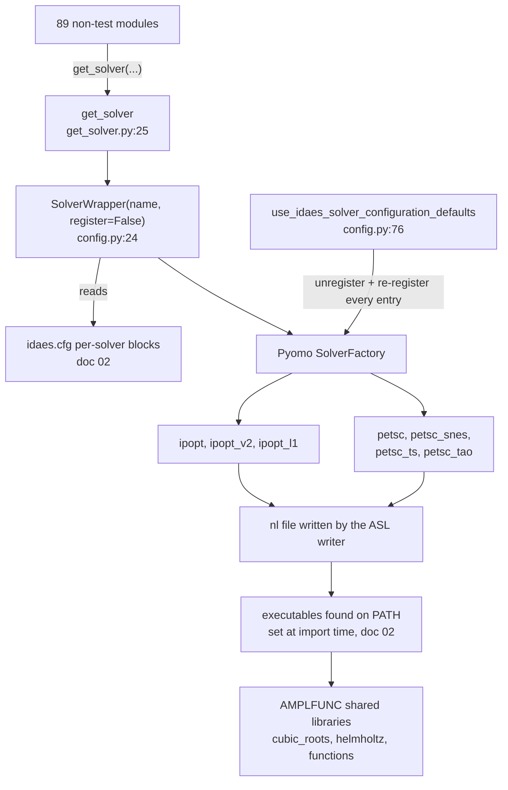
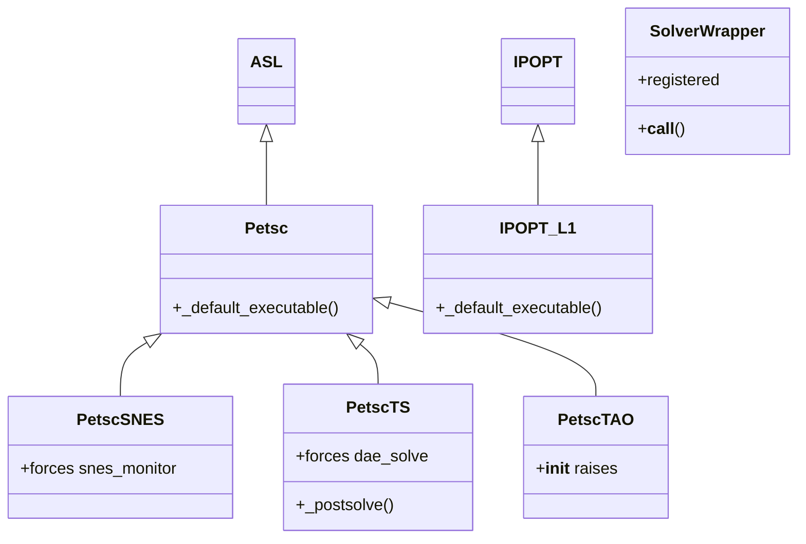
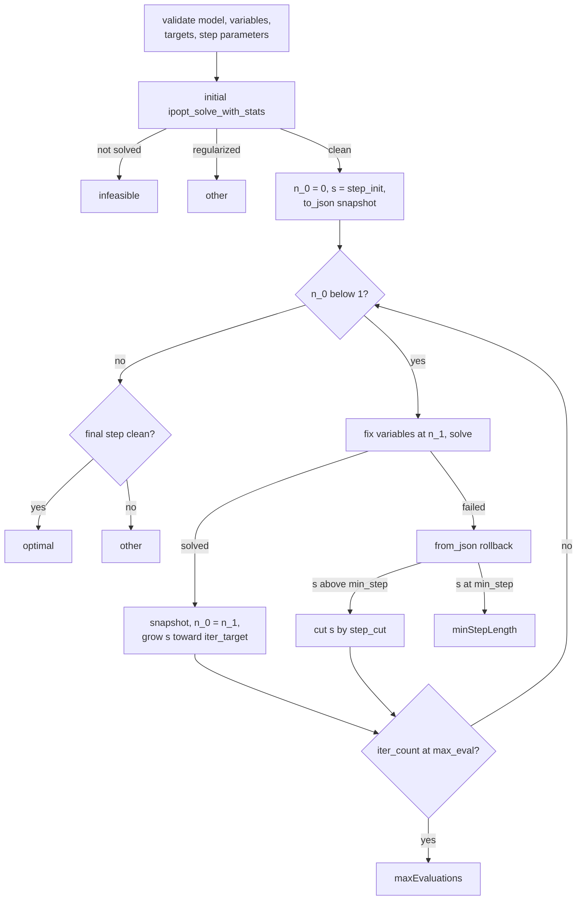
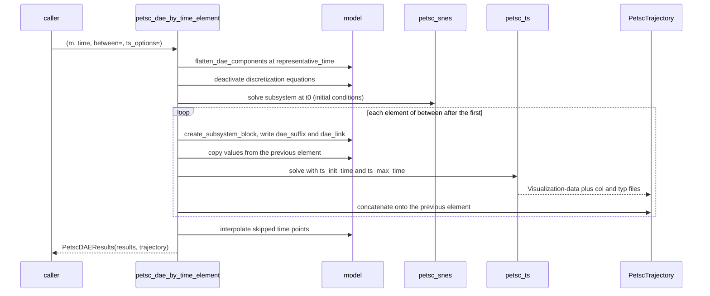
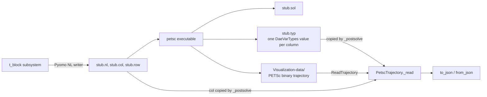

# 30 — Numerics and solver interface map

> **Doc ID** 30 · **Repo SHA** 70a8f4fe1 (IDAES-PSE v2.13.0rc0) · **Source roots** `idaes/core/solvers/`
> **Owns** 7 modules / 1,805 LOC · **Assets** none tracked; four runtime file formats in §10 · **Siblings** [04](04_control_volume_framework.md), [06](06_model_preparation_initializers_and_scalers.md), [07](07_diagnostics_and_run_orchestration.md), [13](13_modular_properties_eos_and_phase_equilibrium.md), [16](16_general_helmholtz_property_system.md), [28](28_data_and_file_format_inventory.md), [29](29_dependency_and_layering_map.md), [31](31_extension_point_catalog.md)

This document has two halves and they are kept strictly apart.

The first half is a normal subsystem document. `idaes/core/solvers/` is a small
package — seven modules, 1,805 LOC — that sits between every IDAES model and
every numerical solver the library uses. It owns the canonical solver factory,
a global re-registration of Pyomo's `SolverFactory`, a homotopy meta-solver, a
set of probe models for capability testing, and a 1,024-line PETSc interface
that registers four solvers and integrates differential-algebraic systems
element by element over the time domain. Every section documents that package.

The second half is an **index**. Numerics in IDAES is not confined to
`idaes/core/solvers/`: three compiled shared libraries are loaded through
`ExternalFunction`, ten external tools are driven as subprocesses or network
services, `pyomo.dae` appears in 35 non-test modules, and the Jacobian is
assembled by PyNumero in four places. Those facts live in eight tables inside
sections 4, 6, 8 and 10. Every row of every index table states one fact and
names the owning document. None of them restates what the owning document says.

| Index table | Subject | Section |
|---|---|---|
| 1 | External shared libraries and their availability gates | §10.2 |
| 2 | `ExternalFunction` declaration sites, all 26 | §10.3 |
| 3 | External solver executables and where they come from | §10.4 |
| 4 | PyNumero and incidence-analysis usage | §8.3 |
| 5 | DAE discretization inventory | §6.3 |
| 6 | Smooth and complementarity formulations | §8.4 |
| 7 | The scaling to Jacobian path | §8.5 |
| 8 | Solver configuration defaults in the global configuration | §4.1 |

---

## 0. Scope and source map

| File | LOC | Purpose | Covered in § |
|---|---:|---|---|
| `idaes/core/solvers/__init__.py` | 18 | Re-exports four names; does not import the solver-registering submodules | 2, 12 |
| `idaes/core/solvers/config.py` | 102 | `SolverWrapper`, the global re-registration of Pyomo's `SolverFactory`, and `use_idaes_solver_configuration_defaults` | 3, 5, 7, 12 |
| `idaes/core/solvers/get_solver.py` | 67 | `get_solver`, the canonical solver factory used by 89 modules | 2, 5, 7, 12 |
| `idaes/core/solvers/features.py` | 239 | Six probe models — `lp`, `milp`, `nle`, `nlp`, `minlp`, `dae` — and `ipopt_has_linear_solver` | 2, 6, 7 |
| `idaes/core/solvers/homotopy.py` | 318 | `homotopy`, a parameter-continuation meta-solver with adaptive step control | 5, 7, 11, 12 |
| `idaes/core/solvers/ipopt_l1.py` | 37 | `IPOPT_L1`, registered as `ipopt_l1` | 3, 7 |
| `idaes/core/solvers/petsc.py` | 1,024 | Four registered PETSc solvers, DAE suffix construction, element-by-element time integration, and binary trajectory read-back | 3, 5, 6, 7, 9, 10, 11, 12 |

Total 1,805 LOC. Zero `CONFIG.declare` keys, two `NotImplementedError` hook
sites, one deprecation, nine classes.

Test files under `idaes/core/solvers/tests/` — 2,467 LOC across six modules —
are not owned source but are the subject of section 13.

---

## 1. Architectural role

An equation-oriented process model is worthless until something solves it. This
package is the seam between the Pyomo model and the solver process, and it does
four separable jobs.

**It injects configured defaults.** `SolverWrapper`
(`idaes/core/solvers/config.py:24`) wraps a Pyomo solver class so that the
per-solver option blocks in the global configuration, owned by
[02 §4.4](02_runtime_platform_and_cli.md#44-per-solver-default-option-blocks),
become keyword arguments at instantiation. `get_solver`
(`idaes/core/solvers/get_solver.py:25`) does this per call;
`use_idaes_solver_configuration_defaults` (`idaes/core/solvers/config.py:76`)
does it globally, by unregistering and re-registering every entry in Pyomo's
`SolverFactory`.

**It registers solvers Pyomo does not ship.** `ipopt_l1`
(`idaes/core/solvers/ipopt_l1.py:27`) and the four PETSc solvers
(`idaes/core/solvers/petsc.py:108`, `:128`, `:148`, `:197`) are AMPL Solver
Library plugins bound to executables that arrive through `idaes get-extensions`.

**It provides meta-solvers.** `homotopy`
(`idaes/core/solvers/homotopy.py:33`) walks fixed variables to target values in
adaptively sized steps, rolling the model back through a JSON snapshot when a
step fails. `petsc_dae_by_time_element` (`idaes/core/solvers/petsc.py:415`)
integrates a discretized time domain one element at a time rather than solving
it simultaneously, and reads the integrator's own finer trajectory back out of
PETSc's binary output.

**It answers capability questions.** `features.py` supplies six tiny models with
known solutions, and `ipopt_has_linear_solver`
(`idaes/core/solvers/features.py:217`) answers whether a named linear solver is
usable by attempting a solve.

*Every solve in the library funnels through one of two paths into the same Pyomo factory; the binary boundary below the factory is where the external libraries and executables of the index half live.*

---

## 2. Public surface inventory

| Symbol | Kind | Declared at | Exported via | Stability signal |
|---|---|---|---|---|
| `SolverWrapper` | class | `idaes/core/solvers/config.py:24` | `idaes.core.solvers` | re-exported; not autodoc'd |
| `use_idaes_solver_configuration_defaults` | function | `idaes/core/solvers/config.py:76` | `idaes.core.solvers` | re-exported; autodoc'd in `docs/reference_guides/core/solvers.rst` |
| `get_solver` | function | `idaes/core/solvers/get_solver.py:25` | `idaes.core.solvers` | re-exported; named in prose in the reference guide, no autodoc directive |
| `lp`, `milp`, `nle`, `nlp`, `minlp`, `dae` | functions | `idaes/core/solvers/features.py:22`, `:42`, `:62`, `:78`, `:95`, `:115` | `idaes.core.solvers.features` | all six autodoc'd |
| `ipopt_has_linear_solver` | function | `idaes/core/solvers/features.py:217` | `idaes.core.solvers` | re-exported; autodoc'd; `lru_cache(maxsize=10)` |
| `homotopy` | function | `idaes/core/solvers/homotopy.py:33` | `idaes.core.solvers.homotopy` | `automodule` in `docs/reference_guides/core/homotopy.rst` |
| `IPOPT_L1` | class | `idaes/core/solvers/ipopt_l1.py:27` | registered as `ipopt_l1` | registration is the export |
| `DaeVarTypes` | `IntEnum` | `idaes/core/solvers/petsc.py:98` | `idaes.core.solvers.petsc` | not autodoc'd |
| `Petsc` | class | `idaes/core/solvers/petsc.py:108` | registered as `petsc` | registration is the export |
| `PetscSNES` | class | `idaes/core/solvers/petsc.py:128` | registered as `petsc_snes` | same |
| `PetscTS` | class | `idaes/core/solvers/petsc.py:148` | registered as `petsc_ts` | same |
| `PetscTAO` | class | `idaes/core/solvers/petsc.py:197` | registered as `petsc_tao` | same; constructor raises |
| `petsc_available` | function | `idaes/core/solvers/petsc.py:208` | `idaes.core.solvers.petsc` | used as a test gate at 29 sites in four test modules |
| `petsc_binary_io` | function | `idaes/core/solvers/petsc.py:52` | same | carries its own cache attribute at `:95` |
| `find_discretization_equations` | function | `idaes/core/solvers/petsc.py:250` | same | copied into two other modules, §12 |
| `PetscDAEResults` | class | `idaes/core/solvers/petsc.py:399` | same | the return type of the headline function |
| `petsc_dae_by_time_element` | function | `idaes/core/solvers/petsc.py:415` | same | autodoc'd |
| `calculate_time_derivatives` | function | `idaes/core/solvers/petsc.py:723` | same | not autodoc'd |
| `PetscTrajectory` | class | `idaes/core/solvers/petsc.py:787` | same | autodoc'd |

`idaes/core/solvers/__init__.py:16` re-exports exactly four names and imports
neither `petsc` nor `ipopt_l1`, so importing the package registers no solver;
see §12. Private helpers, all in `idaes/core/solvers/petsc.py`: `_copy_time`
(`:226`), `_set_dae_suffixes_from_variables` (`:280`),
`_get_derivative_differential_data_map` (`:332`) and
`_sub_problem_scaling_suffix` (`:378`).

---

## 3. Class hierarchy and type taxonomy

*The PETSc family is one ASL plugin plus three subclasses that differ only in which command-line options they force; `SolverWrapper` is not a solver at all but a callable registered where a solver class used to be.*

| Class | Base(s) | Declared at | Decorator | Container class | Key overrides |
|---|---|---|---|---|---|
| `SolverWrapper` | `object` | `idaes/core/solvers/config.py:24` | none | — | `__init__`, `__call__` |
| `IPOPT_L1` | `IPOPT` | `idaes/core/solvers/ipopt_l1.py:27` | `@SolverFactory.register("ipopt_l1", ...)` | — | `_default_executable` |
| `DaeVarTypes` | `enum.IntEnum` | `idaes/core/solvers/petsc.py:98` | none | — | — |
| `Petsc` | `ASL` | `idaes/core/solvers/petsc.py:108` | `@pyo.SolverFactory.register("petsc", ...)` | — | `__init__`, `_default_executable` |
| `PetscSNES` | `Petsc` | `idaes/core/solvers/petsc.py:128` | `@pyo.SolverFactory.register("petsc_snes", ...)` | — | `__init__` |
| `PetscTS` | `Petsc` | `idaes/core/solvers/petsc.py:148` | `@pyo.SolverFactory.register("petsc_ts", ...)` | — | `__init__`, `_postsolve` |
| `PetscTAO` | `Petsc` | `idaes/core/solvers/petsc.py:197` | `@pyo.SolverFactory.register("petsc_tao", ...)` | — | `__init__`, raises |
| `PetscDAEResults` | `object` | `idaes/core/solvers/petsc.py:399` | none | — | `__init__` |
| `PetscTrajectory` | `object` | `idaes/core/solvers/petsc.py:787` | none | — | twelve methods |

No class in this scope is a process block; `_generated/process_blocks.csv` has no
row for any file here, and none declares a `default_initializer` or a
`default_scaler`.

### 3.1 `DaeVarTypes`

`DaeVarTypes` (`idaes/core/solvers/petsc.py:98`) is the integer vocabulary
written into the `dae_suffix` export suffix and read back out of the solver's
`.typ` file.

| Member | Value | Meaning | Consumed at |
|---|---|---|---|
| `ALGEBRAIC` | 0 | A variable with no time derivative in the problem | `petsc.py:852` selects columns of type 0 or 1 for the trajectory |
| `DIFFERENTIAL` | 1 | A variable whose derivative appears | `petsc.py:313` |
| `DERIVATIVE` | 2 | The `DerivativeVar` data object itself | `petsc.py:314` |
| `TIME` | 3 | An explicit time variable supplied by the caller | `petsc.py:633` |

`_generated/enums.csv` has no row for this enumeration because the base class is
written as the dotted `enum.IntEnum` rather than a bare name; the class roster
in `_generated/classes.csv` records it.

### 3.2 Solver names registered by this package

| Registered name | Class | Registered at | Import that triggers registration |
|---|---|---|---|
| `ipopt_l1` | `IPOPT_L1` | `idaes/core/solvers/ipopt_l1.py:27` | `idaes.core.solvers.ipopt_l1` |
| `petsc` | `Petsc` | `idaes/core/solvers/petsc.py:108` | `idaes.core.solvers.petsc` |
| `petsc_snes` | `PetscSNES` | `idaes/core/solvers/petsc.py:128` | same |
| `petsc_ts` | `PetscTS` | `idaes/core/solvers/petsc.py:148` | same |
| `petsc_tao` | `PetscTAO` | `idaes/core/solvers/petsc.py:197` | same |
| `default` | `SolverWrapper("default")` | `idaes/core/solvers/config.py:101` | only through `use_idaes_solver_configuration_defaults` |

Every other solver name IDAES uses — `ipopt`, `ipopt_v2`, `ipopt_sens`, `k_aug`,
`dot_sens`, `cbc`, `clp`, `cplex`, `scip`, `bonmin`, `couenne` — is registered
by Pyomo, not here; §10.4 says where each executable comes from.

---

## 4. Configuration reference

No module in this document's scope declares a `ConfigBlock`, a `ConfigDict` or a
`CONFIG.declare` key; `_generated/config_keys.csv` has no row for any of the
seven files. Configuration reaches these modules from two directions: the global
configuration tree read by `SolverWrapper.__call__`
(`idaes/core/solvers/config.py:52`), and plain keyword arguments documented in
§7.

### 4.1 Index table 8 — solver configuration defaults in the global configuration

Declared in `idaes/config.py` and owned by
[02 §4.4](02_runtime_platform_and_cli.md#44-per-solver-default-option-blocks).
One row per block; the key-by-key tables are that document's.

| Block | Declared at | What it carries | Reaches a solver through |
|---|---|---|---|
| `ipopt` | `idaes/config.py:277` | Three `options` keys: `nlp_scaling_method`, `tol`, `max_iter` | `SolverWrapper.__call__` merging `options` key by key (`config.py:58`) |
| `ipopt_v2` | `idaes/config.py:324` | The same three plus `linear_solver`, and a `writer_config` sub-block with `scale_model` and `linear_presolve` | The same merge plus the `writer_config` branch at `config.py:65` |
| `ipopt_l1` | `idaes/config.py:402` | Three `options` keys, matching `ipopt` | As `ipopt` |
| `petsc_ts` | `idaes/config.py:450` | Six PETSc command-line `options` keys, each spelled with a double dash | Read directly by `PetscTS.__init__` (`petsc.py:166`), not by `SolverWrapper` |

Two root keys govern whether the blocks apply at all: `default_solver`
(`idaes/config.py:528`, default `"ipopt"`), resolved by the `default` wrapper at
`idaes/core/solvers/config.py:47`; and `use_idaes_solver_config`
(`idaes/config.py:553`, default `False`), tested at
`idaes/core/solvers/config.py:52`. The second is disjunctive with
`not self.registered`, which is why `get_solver` applies the defaults even
though the flag is off by default — see §5.2.

`idaes.cfg["petsc_snes"]` is read at `idaes/core/solvers/petsc.py:138` but is
never declared; the guard `if "petsc_snes" in idaes.cfg` makes the read a no-op
unless a user's configuration file creates the block. See
[02 §12](02_runtime_platform_and_cli.md#12-duplications-deprecations-and-sharp-edges).

---

## 5. Construction and call sequences

### 5.1 `SolverWrapper` and the factory re-registration

`SolverWrapper.__init__(name, register=True)`
(`idaes/core/solvers/config.py:29`) turns a `name` of `None` into `"default"`
(`:30`), captures the currently registered class and documentation string
through `SolverFactory.get_class` (`:38`) and `SolverFactory.doc` (`:39`) — for
`"default"` the captured class is `None`, because the target is resolved per
call — and then, when `register` is true, calls `SolverFactory.unregister(name)`
(`:41`) followed by `SolverFactory.register(name, doc)(self)` (`:43`).
`register` is a decorator, so applying it to `self` installs the wrapper
*instance* as the factory's constructor for that name. The `register` argument
is also stored as `self.registered` (`:33`), where it later selects whether the
configured defaults apply unconditionally.

`SolverWrapper.__call__(*args, **kwargs)` (`:45`) resolves the target — for
`"default"`, by reading `idaes.cfg.default_solver` and looking the class up
(`:47`), otherwise from the captured name and class (`:50`) — and then applies
the configured defaults when the name has a block in `idaes.cfg` **and** either
`idaes.cfg.use_idaes_solver_config` is true **or** this wrapper was constructed
with `register=False` (`:52`). Each key of the block is `deepcopy`-ed into
`kwargs` when absent (`:57`), with two keys special-cased so that individual
entries rather than whole blocks carry defaults: `options` (`:58`) and
`writer_config` (`:65`). The merged arguments then go to the underlying class
(`:73`).

`use_idaes_solver_configuration_defaults(b=True)` (`:76`) sets
`idaes.cfg.use_idaes_solver_config` (`:89`) and, when enabling, iterates every
name in `SolverFactory`, wrapping any entry that is not already a
`SolverWrapper` (`:97`), then registers a `"default"` entry if one is absent
(`:101`). The iteration is over `list(SolverFactory)`, a snapshot taken before
the mutation begins, so a solver registered afterwards is never wrapped. This is
a process-global mutation of a Pyomo singleton; its consequences are in §12.

### 5.2 `get_solver`

`get_solver(solver=None, solver_options=None, writer_config=None, options=None)`
(`idaes/core/solvers/get_solver.py:25`) rejects the combination of
`solver_options` and `options` with a `ValueError` (`:48`) — `options` is the
deprecated alias, assigned from `solver_options` when only the new name is
given (`:54`) — turns a `solver` of `None` into `"default"` (`:56`), then
constructs `SolverWrapper(solver, register=False)` and immediately calls it
(`:58`). Because `register` is false, the configured defaults apply regardless
of `use_idaes_solver_config`, and because the wrapper is never registered,
Pyomo's factory is left untouched. Caller-supplied options are then written onto
`solver_obj.options` (`:60`) and writer configuration onto
`solver_obj.config.writer_config` (`:63`).

That last step is where the two ipopt interfaces diverge: the legacy `ipopt`
plugin has no `config` attribute, so supplying `writer_config` to the default
solver raises `AttributeError`, while `ipopt_v2` accepts it. Both behaviours are
pinned by tests (§13).

### 5.3 `homotopy`

`homotopy(model, variables, targets, ...)`
(`idaes/core/solvers/homotopy.py:33`) is parameter continuation with an adaptive
step. It validates first: the model is a Pyomo `Block` (`:89`) with zero degrees
of freedom (`:94`); `variables` and `targets` have equal length (`:101`); each
variable is a `VarData` (`:106`) that is a descendant of `model` (`:113`) and is
fixed (`:120`); each variable's current value and its target lie inside its
bounds, checked against the upper bound (`:127`) and the lower bound (`:140`);
and every step-control parameter lies in its admissible interval
(`:157-209` — `step_init` in [0.05, 0.8], `step_cut` in [0.1, 0.9],
`step_accel` non-negative, `iter_target` an integer of at least 1, `max_step`
in [0.05, 1], `min_step` in [0.01, 0.1], `min_step` not above `max_step`,
`step_init` between the two, and `max_eval` an integer of at least 1).

The continuation uses a progress variable `n` running from 0 to 1 with a
convergence tolerance `eps = 1e-3` (`:83`); each variable is set to
`target*n + initial*(1-n)` (`:261`). Every solve goes through Pyomo's
`ipopt_solve_with_stats` against a plain `SolverFactory("ipopt")` object
(`:212`), which returns the iteration count and a regularization marker
alongside the results.

*The step law and the rollback are the whole algorithm; five of the six termination conditions leave from a single loop.*

On success the model state is snapshotted with `to_json(model,
return_dict=True)` (`:271`), progress advances to `n_1` (`:274`), and the next
step is `s * (1 + step_accel * (iter_target / sol_iter - 1))` (`:277`) clamped
into `[min_step, max_step]` (`:279`); a step that would overshoot within `eps`
of 1 is truncated to exactly 1 (`:252`). On failure `from_json(model,
current_state)` (`:287`) restores the last accepted point and the step is cut to
`max(min_step, s * step_cut)` (`:292`); a failure already at the minimum step
terminates (`:299`).

Termination conditions, all Pyomo `TerminationCondition` members, returned as a
three-tuple with the progress fraction and the evaluation count:

| Condition | Returned at | Meaning |
|---|---|---|
| `infeasible` | `homotopy.py:227` | The initial point did not solve |
| `other` | `homotopy.py:230` | The initial point solved with regularization |
| `minStepLength` | `homotopy.py:299` | A step failed at the minimum step size |
| `maxEvaluations` | `homotopy.py:306` | `max_eval` evaluations were attempted |
| `optimal` | `homotopy.py:312` | Reached the targets with a clean final solve |
| `other` | `homotopy.py:318` | Reached the targets, final solve regularized |

### 5.4 `petsc_dae_by_time_element`

`petsc_dae_by_time_element(m, time, ...)`
(`idaes/core/solvers/petsc.py:415`) takes a model whose time domain is already
discretized by `pyomo.dae`, deactivates the discretization equations, and hands
each time element to PETSc's TS integrator as an independent subproblem. The
Pyomo discretization supplies the element boundaries; PETSc chooses its own
internal steps inside each element.

1. **Argument reconciliation.** Supplying both `snes_options` and
   `initial_solver_options` raises `RuntimeError` (`:488`); supplying only the
   former emits a `deprecation_warning` naming version 2.2.0 and removal in
   2.14.0 (`:495`). `interpolate=True` forces
   `ts_options["--ts_save_trajectory"] = 1` (`:503`), because interpolation
   otherwise has nothing to interpolate.
2. **Time domain checks.** `between` defaults to the whole time set and an
   element outside it raises (`:513`); `time` has to be a `ContinuousSet`
   (`:522`) that has been discretized, tested by looking for `"scheme"` in
   `time.get_discretization_info()` (`:525`).
3. **Representative time.** `flatten_dae_components` needs an index at which
   every equation of the DAE is active. The default is the second element of
   `between` (`:533`), because equations such as a mole-fraction summation are
   commonly deactivated at the initial point; a caller-supplied value has to be
   an element of `between` (`:535`). Flattening then runs twice, for `Var` and
   for `Constraint` (`:538`, `:541`).
4. **Discretization equations.** `find_discretization_equations(m, time)`
   (`:544`) collects the `*_disc_eq` constraint of every `DerivativeVar` taken
   with respect to `time`, by name (`:275`).
5. **Initial conditions.** Unless `skip_initial`, the time-indexed components at
   `t0` plus the non-time-indexed ones are gathered into a
   `create_subsystem_block` (`:584`), given a scaling suffix (`:589`), and
   solved with the configured `initial_solver`, `petsc_snes` by default (`:591`).
   With `detect_initial` true the non-time-indexed components are added
   automatically (`:556`, `:572`).
6. **Element loop.** Inside a `TemporarySubsystemManager` that deactivates the
   discretization equations and fixes the initial variables (`:603`), each
   element after the first builds its own subsystem block (`:618`), receives the
   DAE suffixes (`:619`), takes its initial condition from the previous element
   through `_copy_time` (`:637`), and is solved by `petsc_ts` with
   `--ts_init_time` and `--ts_max_time` set to the element boundaries (`:645`).
7. **Trajectory assembly.** When the trajectory is saved a `PetscTrajectory` is
   read per element (`:649`), fixed variables are back-filled with their constant
   values (`:665`), and successive elements are concatenated vector by vector
   (`:682`, `:683`).
8. **Interpolation and derivatives.** With `interpolate` true, model values at
   time points skipped by `between` are filled from the trajectory (`:704`),
   skipping derivative and fixed variables (`:702`, `:709`); with
   `calculate_derivatives` true, `calculate_time_derivatives` runs (`:718`). The
   return is a `PetscDAEResults` holding the Pyomo results objects and the
   trajectory (`:720`).

*The Pyomo discretization decides where elements begin and end; everything inside an element is PETSc's own adaptive time stepping.*

### 5.5 Suffix construction

`_get_derivative_differential_data_map(m, time)`
(`idaes/core/solvers/petsc.py:332`) builds a `ComponentMap` from each
`DerivativeVar` data object to its state variable data object, raising
`RuntimeError` when a derivative is fixed at a non-zero value (`:354`) and
filtering out derivatives absent from every active constraint (`:366`), so the
map holds only derivatives the solver has to integrate.
`_set_dae_suffixes_from_variables(m, variables, deriv_diff_map)` (`:280`) then
creates two integer export suffixes on the subsystem block: `dae_suffix`
(`:296`), carrying a `DaeVarTypes` value per variable, and `dae_link` (`:302`),
carrying a shared integer that pairs each differential variable with its
derivative. It returns the unfixed differential variables and raises
`RuntimeError` when a differential variable is fixed while its derivative is not
(`:322`). `_sub_problem_scaling_suffix(m, t_block)` (`:378`) copies scaling
factors onto the subsystem block, reading the component's own parent block first
and the top-level model second, with the top level taking precedence (`:393`).

### 5.6 `calculate_time_derivatives`

`calculate_time_derivatives(m, time, between=None)`
(`idaes/core/solvers/petsc.py:723`) recovers derivative values the PETSc
interface does not return. For each `DerivativeVar` with respect to `time` it
finds the matching `*_disc_eq` constraint (`:740`), slices both along time, and
calls Pyomo's `calculate_variable_from_constraint` at every point inside the
integration range (`:766`). Two exception classes are absorbed at the edges: a
`KeyError` at the first or last time point, where a backward or forward scheme
has no equation (`:771`), and a `ValueError` at the first or last element of
`between`, where an adjacent state value may not have been populated (`:779`).

### 5.7 Reading the trajectory back

`PetscTrajectory.__init__` (`idaes/core/solvers/petsc.py:788`) accepts exactly
one of three sources — a file `stub`, a `vecs` dictionary, or a `json` path —
and raises when given none (`:845`). Reading from a stub requires the PETSc
Python helpers and raises when `petsc_binary_io()` returns `None` (`:819`).

`petsc_binary_io()` (`:52`) locates those helpers two ways: a direct import of
`PetscBinaryIOTrajectory` and `PetscBinaryIO` (`:58`), then a search for a
`petscpy` directory beside the `petsc` executable and inside the IDAES binary
directory (`:70`). That directory is on `sys.path` only for the duration of the
import, and `petsc_conf` is imported specifically so it is cached in
`sys.modules` before the path entry is removed (`:84`, `:91`). The result is
memoized on the function object itself (`:95`).

`PetscTrajectory._read` (`:847`) reads variable names from `<stub>.col`
(`:848`), variable types from `<stub>.typ` (`:850`), keeps only columns whose
type is `ALGEBRAIC` or `DIFFERENTIAL` (`:852`), and calls
`ReadTrajectory("Visualization-data")` for the numeric vectors (`:853`).
`_unscale` (`:947`) then divides each vector by the variable's scaling factor,
tracking identity in a set so a Pyomo `Reference` is not divided twice (`:967`).

## 6. Data structures, variables, constraints and invariants

### 6.1 Structures created by this scope

| Component | Type | Index sets | Units | Created at | Condition |
|---|---|---|---|---|---|
| `dae_suffix` | `Suffix`, EXPORT, INT | variable data objects | dimensionless | `petsc.py:296` | per element, inside `petsc_dae_by_time_element` |
| `dae_link` | `Suffix`, EXPORT, INT | variable data objects | dimensionless | `petsc.py:302` | same |
| `scaling_factor` | `Suffix`, EXPORT | variables and constraints | dimensionless | `petsc.py:386` | when the subsystem block has none |
| `t_block` | Pyomo `Block` from `create_subsystem_block` | — | — | `petsc.py:584`, `:618` | one per element plus one for the initial conditions |
| `PetscDAEResults.results` | `list` of Pyomo results objects | — | — | `petsc.py:411` | always |
| `PetscDAEResults.trajectory` | `PetscTrajectory` or `None` | — | — | `petsc.py:412` | when the trajectory was saved |
| `PetscTrajectory.vecs` | `dict` keyed by variable name string, plus `"_time"` | — | model units | `petsc.py:856`, `:859` | on read |
| `PetscTrajectory.id_map` | `dict` from `id(var)` to name string | — | — | `petsc.py:825` | populated lazily by `get_vec` |
| `petsc_binary_io.PetscBinaryIOTrajectory` | function attribute cache | — | — | `petsc.py:95` | module import |
| probe models | `ConcreteModel` | — | dimensionless | `features.py:22` through `:213` | per call |

The six probe models in `features.py` are the only Pyomo components this package
constructs that are not part of a caller's model. `lp` (`:22`) is a two-variable
bounded linear program; `milp` (`:42`) is the same over the integers; `nle`
(`:62`) is the single equation `x**3 == 1`; `nlp` (`:78`) is a two-variable
quadratic with one inequality; `minlp` (`:95`) adds a binary variable
multiplying the objective; `dae(nfe=1)` (`:115`) is the Chemical Akzo Nobel
test-set problem — five differential variables, one algebraic variable, eleven
constraints — discretized with `dae.finite_difference` and the `BACKWARD` scheme
(`:202`). Each returns its model with the reference solution values, which is
what makes it a capability probe rather than an example.

### 6.2 Invariants

| Invariant | Enforced at |
|---|---|
| `options` and `solver_options` are not both supplied to `get_solver` | `get_solver.py:48` |
| A homotopy model has zero degrees of freedom | `homotopy.py:94` |
| Every homotopy variable is fixed and inside its bounds | `homotopy.py:120`, `:127`, `:140` |
| Homotopy step parameters lie in their admissible intervals | `homotopy.py:157`–`:209` |
| Model state is restored from the last accepted point when a step fails | `homotopy.py:287` |
| The PETSc time set is a discretized `ContinuousSet` | `petsc.py:522`, `:525` |
| `between` is a subset of the time set | `petsc.py:513` |
| `representative_time` is an element of `between` | `petsc.py:535` |
| No derivative is taken with respect to time more than once | `petsc.py:268` |
| No derivative is fixed to a non-zero value | `petsc.py:354` |
| A differential variable is not fixed while its derivative is free | `petsc.py:322` |
| Each element has at least one differential variable | `petsc.py:628` |
| A `PetscTrajectory` is constructed from exactly one source | `petsc.py:845` |
| Trajectory read-back requires the PETSc Python helpers | `petsc.py:819` |

### 6.3 Index table 5 — DAE discretization inventory

`pyomo.dae` is imported at 42 sites across 35 non-test modules
(`_generated/imports.csv`; the count excludes tests). The framework creates
continuous sets in two places and discretizes exactly one of them.

| Domain | Created at | Discretized by | Owning doc |
|---|---|---|---|
| Flowsheet time domain | `idaes/core/base/flowsheet_model.py:365`, a `ContinuousSet` when `dynamic` is true | Nothing in the framework; the flowsheet author applies a `pyomo.dae` transformation to `fs.time` | [03](03_block_hierarchy_and_construction_protocol.md) |
| Control volume length domain | `idaes/core/base/control_volume1d.py:475` | `ControlVolume1DBlockData.apply_transformation` (`idaes/core/base/control_volume1d.py:2125`), called explicitly by the unit model | [04](04_control_volume_framework.md) |
| Radial domain of the 2-D boiler heat exchanger | `idaes/models_extra/power_generation/unit_models/boiler_heat_exchanger_2D.py:924` | The unit model itself, at `:927` | [18](18_power_generation_boiler_island.md) |
| Heating and cooling time domains of the TSA bed | `idaes/models_extra/temperature_swing_adsorption/fixed_bed_tsa0d.py:1883` | The unit model itself, at `:1882` and `:1895` | [23](23_tsa_gas_distribution_and_ccu.md) |

The distinction that matters: **the framework never discretizes the flowsheet
time domain.** Time accumulation terms are `DerivativeVar`s created by the
control volumes ([04 §6](04_control_volume_framework.md#6-data-structures-variables-constraints-and-invariants)),
but the transformation that turns them into algebraic equations is the
flowsheet author's call.

`DerivativeVar` creation sites outside the control volumes, one row per owning
document:

| Module | Differentiated with respect to | Owning doc |
|---|---|---|
| `idaes/models/unit_models/heat_exchanger_lc.py:20` | Flowsheet time | [10](10_unit_models_control_volume_based.md) |
| `idaes/models/unit_models/mscontactor.py:35` | Flowsheet time | [11](11_unit_models_network_contactors_and_control.md) |
| `idaes/models_extra/gas_distribution/unit_models/pipeline.py:34` | Time and axial position | [23](23_tsa_gas_distribution_and_ccu.md) |
| `idaes/models_extra/gas_solid_contactors/unit_models/fixed_bed_1D.py:31` | Time and bed length | [22](22_gas_solid_contactors.md) |
| `idaes/models_extra/power_generation/unit_models/drum1D.py:61`; `idaes/models_extra/power_generation/unit_models/heat_exchanger_common.py:29`; `idaes/models_extra/power_generation/unit_models/soc_submodels/channel.py:63` | Time, wall radius, flow direction | [18](18_power_generation_boiler_island.md), [19](19_power_generation_heat_exchangers_and_properties.md), [20](20_power_generation_helmholtz_units_and_soc.md) |
| `idaes/apps/caprese/categorize.py:21` | Time, for variable categorization | [27](27_dynamic_optimization_and_uncertainty.md) |

`petsc_dae_by_time_element` (`idaes/core/solvers/petsc.py:415`) is the one
consumer in the tree that **integrates** the time domain rather than
discretizing it: it requires the Pyomo discretization to exist, then deactivates
its equations (`petsc.py:576`, `:603`) and replaces them with PETSc time steps.

---

## 7. Method contracts

### 7.1 `config.py` and `get_solver.py`

| Method | Signature | Preconditions | Effects | Returns | Raises | Anchor |
|---|---|---|---|---|---|---|
| `SolverWrapper.__init__` | `(self, name, register=True)` | `name` is registered, or is `"default"` | With `register`, replaces the factory entry | `None` | propagates from `SolverFactory.get_class` | `config.py:29` |
| `SolverWrapper.__call__` | `(self, *args, **kwargs)` | — | Merges configured defaults into `kwargs` | a Pyomo solver object | propagates | `config.py:45` |
| `use_idaes_solver_configuration_defaults` | `(b=True)` | — | Sets the global flag; wraps every registered solver when enabling | `None` | — | `config.py:76` |
| `get_solver` | `(solver=None, solver_options=None, writer_config=None, options=None)` | — | Builds an unregistered wrapper and calls it | a Pyomo solver object | `ValueError` for both option arguments; `AttributeError` from `writer_config` on a solver with no `config` | `get_solver.py:25` |

### 7.2 `features.py`

| Method | Signature | Returns | Anchor |
|---|---|---|---|
| `lp`, `milp`, `nle`, `nlp` | `()` | model and the expected value of `x` | `features.py:22`, `:42`, `:62`, `:78` |
| `minlp` | `()` | model, expected `x`, expected `i` | `features.py:95` |
| `dae` | `(nfe=1)` | model and six expected values | `features.py:115` |
| `ipopt_has_linear_solver` | `(linear_solver)` | `bool` | `features.py:217` |

`ipopt_has_linear_solver` builds the `nlp` probe, solves it with
`SolverFactory("ipopt", options={"linear_solver": linear_solver})` (`:230`),
and returns `False` on either an `ApplicationError` (`:233`) or a solution that
misses the known answer by more than `1e-8` (`:236`). It answers `False` when
ipopt itself is missing, so a caller cannot distinguish "no ipopt" from "no
linear solver" through this function.

### 7.3 `homotopy.py` and `ipopt_l1.py`

| Method | Signature | Preconditions | Effects | Returns | Raises | Anchor |
|---|---|---|---|---|---|---|
| `homotopy` | `(model, variables, targets, max_solver_iterations=50, max_solver_time=10, step_init=0.1, step_cut=0.5, iter_target=4, step_accel=0.5, max_step=1, min_step=0.05, max_eval=200)` | Square model, fixed in-bounds variables | Moves variables to targets; leaves the model at the last accepted point | `(TerminationCondition, progress, iterations)` | `TypeError`, `ConfigurationError` | `homotopy.py:33` |
| `IPOPT_L1._default_executable` | `(self)` | — | Sets `self.enable = False` when the executable is absent | path or `None` | — | `ipopt_l1.py:28` |

### 7.4 `petsc.py`

| Method | Signature | Preconditions | Effects | Returns | Raises | Anchor |
|---|---|---|---|---|---|---|
| `petsc_binary_io` | `()` | — | Caches the module on the function object | module or `None` | — | `:52` |
| `Petsc._default_executable` | `(self)` | — | — | path | `RuntimeError` when absent | `:116` |
| `PetscTS._postsolve` | `(self)` | a solve has run | Registers the `.typ` temporary file; copies `.col` and `.typ` to the variable stub | ASL result | swallows copy failures | `:174` |
| `PetscTAO.__init__` | `(self, **kwds)` | — | — | — | `NotImplementedError` | `:202` |
| `petsc_available` | `()` | — | — | `bool` | absorbs `RuntimeError` | `:208` |
| `_copy_time` | `(time_vars, t_from, t_to)` | flattened time-indexed variables | Copies values into unfixed variables at `t_to` | `None` | — | `:226` |
| `find_discretization_equations` | `(m, time)` | — | — | list of constraints | `NotImplementedError` for a derivative taken with respect to time and at least one other set | `:250` |
| `_set_dae_suffixes_from_variables` | `(m, variables, deriv_diff_map)` | — | Creates `dae_suffix` and `dae_link` | list of differential variables | `RuntimeError` | `:280` |
| `_get_derivative_differential_data_map` | `(m, time)` | — | — | `ComponentMap` | `RuntimeError` | `:332` |
| `_sub_problem_scaling_suffix` | `(m, t_block)` | — | Creates or fills `t_block.scaling_factor` | `None` | — | `:378` |
| `petsc_dae_by_time_element` | `(m, time, timevar=None, initial_constraints=None, initial_variables=None, detect_initial=True, skip_initial=False, initial_solver="petsc_snes", initial_solver_options=None, ts_options=None, keepfiles=False, symbolic_solver_labels=True, between=None, interpolate=True, calculate_derivatives=False, previous_trajectory=None, representative_time=None, snes_options=None)` | Discretized time domain | Solves each element; writes model values; optionally writes derivatives | `PetscDAEResults` | `RuntimeError` | `:415` |
| `calculate_time_derivatives` | `(m, time, between=None)` | Discretization equations present | Writes derivative variable values | `None` | re-raises `KeyError`/`ValueError` away from the edges | `:723` |
| `PetscTrajectory.get_vec`, `.get_dt` | `(self, var)`, `(self)` | — | `get_vec` populates `id_map` | list | `KeyError` for an unknown variable | `:877`, `:896` |
| `PetscTrajectory.interpolate`, `.interpolate_vec` | `(self, times)`, `(self, times, var)` | increasing `times` | — | a new trajectory, or a `numpy` array | — | `:910`, `:933` |
| `PetscTrajectory.delete_files` | `(self)` | files present | Removes the visualization directory and the two stub files | `None` | propagates `OSError` | `:979` |
| `PetscTrajectory.to_json`, `.from_json` | `(self, pth)` | — | Writes or reads JSON, gzipped when the path ends `.gz` | `None` | — | `:992`, `:1009` |

`interpolate` and `interpolate_vec` both delegate to `numpy.interp` (`:930`,
`:945`), which returns the first or last recorded value for a time outside the
trajectory's range rather than raising.

---

## 8. Cross-subsystem interactions

### Calls out to

| Target | Purpose | Anchor |
|---|---|---|
| `pyomo.environ.SolverFactory` | Unregister, register, look up and instantiate | `config.py:38`, `:41`, `:43` |
| `idaes.cfg` (the global configuration) | Per-solver default option blocks | `config.py:47`, `:52`, `petsc.py:138`, `:166` |
| `pyomo.solvers.plugins.solvers.ASL` and `.IPOPT` | Bases of the PETSc family and of `IPOPT_L1` | `petsc.py:108`, `ipopt_l1.py:27` |
| `pyomo.common.Executable` | Locating `ipopt_l1` and `petsc` on `PATH` | `ipopt_l1.py:29`, `petsc.py:71`, `:121` |
| `pyomo.dae` | `ContinuousSet`, `DerivativeVar`, `flatten_dae_components`, `slice_component_along_sets` | `petsc.py:30`, `:32`, `features.py:18` |
| `pyomo.util.subsystems` | `TemporarySubsystemManager`, `create_subsystem_block` | `petsc.py:576`, `:584` |
| `pyomo.util.calc_var_value` | Recovering derivative values | `petsc.py:766` |
| `pyomo.contrib.parmest` `ipopt_solve_with_stats` | Iteration count and regularization marker per homotopy step | `homotopy.py:221` |
| `idaes.core.util.model_serializer`, `model_statistics` | Snapshot and rollback; degrees-of-freedom pre-check | `homotopy.py:246`, `:287`, `:94` |
| `idaes.logger` | `getSolveLogger("petsc-dae")` and `solver_log` | `petsc.py:528`, `:590` |
| `numpy`, PETSc Python helpers | Trajectory interpolation; `ReadTrajectory` on the binary trajectory | `petsc.py:930`, `:853` |

### Called by

| Caller | What it relies on | Owning doc |
|---|---|---|
| Every module that solves anything | `get_solver` — 89 non-test import sites | see the distribution below |
| Initializers and Scalers | `get_solver`, and `ipopt_v2` as the configured default solver name | [06](06_model_preparation_initializers_and_scalers.md) |
| The diagnostics toolbox | `get_solver` for its solve-based checks | [07](07_diagnostics_and_run_orchestration.md) |
| PID controller tests and dynamic flowsheets | `petsc_dae_by_time_element` | [11](11_unit_models_network_contactors_and_control.md) |
| The global configuration and the binary pipeline | `SolverWrapper` reads the blocks the CLI's downloads make usable | [02](02_runtime_platform_and_cli.md) |

The 89 `get_solver` import sites, by owning document
(`_generated/imports.csv`): 20 (16), 24 (12), 18 (10), 22 (10), 21 (9), 19 (7),
10 (5), 06 (4), 11 (4), 27 (4), 07 (3), 03, 08, 12, 15, 25 (1 each). The
concentration in documents 18 through 24 is the extended model libraries and
reference flowsheets, which solve during construction and testing.

### 8.3 Index table 4 — PyNumero and incidence analysis

`pyomo.contrib.pynumero` is imported at 8 sites in 5 non-test modules;
`pyomo.contrib.incidence_analysis` at 6 sites in 6 non-test modules
(`_generated/imports.csv`).

| Site | Imported name | Used for | Owning doc |
|---|---|---|---|
| `idaes/core/util/scaling.py:41`, `:42` | `PyomoNLP`, `AmplInterface` | Jacobian assembly in `constraint_autoscale_large_jac`, gated by `AmplInterface.available()` at `:697` | [06](06_model_preparation_initializers_and_scalers.md) |
| `idaes/core/scaling/util.py:53`, `:54` | The same pair | The Scaler-generation copy of `get_jacobian`, gate at `:870` | [06](06_model_preparation_initializers_and_scalers.md) |
| `idaes/core/util/model_statistics.py:28` | `ExternalGreyBoxBlock` | Recognising grey-box blocks when counting model statistics | [08a](08a_model_introspection_and_persistence.md) |
| `idaes/core/util/diagnostics_tools/deprecated/degeneracy_hunter_legacy.py:42` | `PyomoNLP` | Jacobian for the deprecated degeneracy hunter | [07](07_diagnostics_and_run_orchestration.md) |
| `idaes/apps/caprese/examples/cstr_reduced.py:35` | `PyomoNLP` | Jacobian for a reduced-space example | [27](27_dynamic_optimization_and_uncertainty.md) |
| `idaes/core/initialization/block_triangularization.py:20` | `IncidenceGraphInterface`, `solve_strongly_connected_components` | Block triangularization and the perfect-matching pre-check | [06](06_model_preparation_initializers_and_scalers.md) |
| `idaes/core/util/diagnostics_tools/diagnostics_toolbox.py:41` | `IncidenceGraphInterface` | Dulmage-Mendelsohn partitioning at `:688` | [07](07_diagnostics_and_run_orchestration.md) |
| `idaes/models/unit_models/mscontactor.py:34` | `solve_strongly_connected_components` | Sequential initialization of a contactor stage | [11](11_unit_models_network_contactors_and_control.md) |
| `idaes/models_extra/gas_solid_contactors/unit_models/fixed_bed_1D.py:35` | Both names | Structural decomposition during initialization at `:1724` | [22](22_gas_solid_contactors.md) |
| `idaes/apps/caprese/categorize.py:24` | `IncidenceGraphInterface` | Categorizing variables of a dynamic model | [27](27_dynamic_optimization_and_uncertainty.md) |

The division is clean: PyNumero supplies the **numeric** Jacobian and is always
guarded by `AmplInterface.available()`; incidence analysis supplies the
**structural** graph and is not guarded, because it needs no compiled component.

### 8.4 Index table 6 — smooth and complementarity formulations

Places where the library deliberately replaces a non-smooth or complementarity
problem with a differentiable one.

| Formulation | Declared at | One fact | Owning doc |
|---|---|---|---|
| `smooth_abs`, `smooth_minmax`, `smooth_max`, `smooth_min`, `smooth_bound`, `safe_sqrt`, `safe_log`, `smooth_heaviside` | `idaes/core/util/math.py:24`, `:53`, `:97`, `:114`, `:131`, `:165`, `:181`, `:196` | Eight expression builders, each taking a smoothing parameter `eps` defaulting to `1e-4`; imported at 20 sites across eight owning documents | [08b](08b_core_support_utilities.md) |
| `SmoothVLE` | `idaes/models/properties/modular_properties/phase_equil/smooth_VLE.py:63` | Uses `smooth_max` and `smooth_min` on an equilibrium temperature to keep a single set of equations valid in both single-phase and two-phase regions | [13](13_modular_properties_eos_and_phase_equilibrium.md) |
| `CubicComplementarityVLE` | `idaes/models/properties/modular_properties/phase_equil/smooth_VLE_2.py:72` | The complementarity form of the same problem for cubic equations of state; rejects a phase pair that is not vapour-liquid | [13](13_modular_properties_eos_and_phase_equilibrium.md) |
| `safe_log` in the cubic equation of state | `idaes/models/properties/modular_properties/eos/ceos.py:41` | Every logarithm in the departure functions is the smoothed form, so a solver iterate with a non-positive argument does not fail evaluation | [13](13_modular_properties_eos_and_phase_equilibrium.md) |
| Equilibrium reaction forms | `idaes/models/properties/modular_properties/reactions/equilibrium_forms.py:277` | `Q - smooth_max(0, Q - s, eps) == 0` is the smoothed complementarity between a reaction quotient and a solubility product | [13](13_modular_properties_eos_and_phase_equilibrium.md) |
| Gibbs reactor Lagrange formulation | `idaes/models/unit_models/gibbs_reactor.py:389` | `lagrange_mult` is one multiplier per active element; `gibbs_minimization` (`:410`) sets the element-weighted sum of multipliers against the partial molar Gibbs energy instead of minimizing an objective | [10](10_unit_models_control_volume_based.md) |
| Minimum-pressure mixing and controller clipping | `idaes/models/unit_models/mixer.py:965`, `idaes/models/control/controller.py:452` | `smooth_min` over the inlet pressures replaces a `min` over a variable-length list; `smooth_bound` replaces saturation of a manipulated variable | [11](11_unit_models_network_contactors_and_control.md) |
| NTU heat exchanger capacity rates | `idaes/models/unit_models/heat_exchanger_ntu.py:429` | `smooth_min` and `smooth_max` (`:445`) select the minimum and maximum capacity rate | [10](10_unit_models_control_volume_based.md) |
| Cube-root temperature difference | `idaes/models/unit_models/heat_exchanger.py:503` | An `ExternalFunction` named `cbrt` gives a real cube root for negative arguments, so the mean temperature difference expression is defined for a temperature cross | [10](10_unit_models_control_volume_based.md) |

### 8.5 Index table 7 — the scaling to Jacobian path

Owned by [06](06_model_preparation_initializers_and_scalers.md); §12 of that
document records the duplication between the two scaling generations. This table
records only which implementation is reachable.

| Function | Suffix generation | Scaler generation | Reached from |
|---|---|---|---|
| `get_jacobian` | `idaes/core/util/scaling.py:744` | `idaes/core/scaling/util.py:829` | Every consumer imports the suffix-generation name |
| `jacobian_cond` | `idaes/core/util/scaling.py:858` | `idaes/core/scaling/util.py:920` | Same |
| `scale_time_discretization_equations` | `idaes/core/util/scaling.py:886` | `idaes/core/scaling/util.py:952` | Same |
| `constraint_autoscale_large_jac` | `idaes/core/util/scaling.py:656` | absent | The Jacobian builder that `get_jacobian` delegates to |
| `extreme_jacobian_entries` | `idaes/core/util/scaling.py:768` | absent | `idaes/core/util/diagnostics_tools/diagnostics_toolbox.py:82` |
| `extreme_jacobian_rows` | `idaes/core/util/scaling.py:795` | absent | `idaes/core/util/diagnostics_tools/diagnostics_toolbox.py:81` |
| `extreme_jacobian_columns` | `idaes/core/util/scaling.py:826` | absent | `idaes/core/util/diagnostics_tools/diagnostics_toolbox.py:80` |

Three facts follow. Only the first three functions exist twice.
`idaes/core/scaling/__init__.py` re-exports neither `get_jacobian` nor
`jacobian_cond`, so the duplicates are reachable only by importing
`idaes.core.scaling.util` by path. And the Scaler-generation modules import the
suffix-generation implementations — `idaes/core/scaling/autoscaling.py:33` and
`idaes/core/scaling/scaler_profiling.py:22` — so the newer generation's Jacobian
work runs through the older generation's code.

---

## 9. Extension and subclassing contracts

| Hook | Kind | Signature | Resolution order | Base behaviour | Anchor |
|---|---|---|---|---|---|
| `PetscTAO.__init__` | constructor | `(self, **kwds)` | Reached by `SolverFactory("petsc_tao")` | raises `NotImplementedError` | `idaes/core/solvers/petsc.py:202` |
| `find_discretization_equations` | function | `(m, time)` | Called by `petsc_dae_by_time_element` | raises `NotImplementedError` for a derivative taken with respect to time and another set | `idaes/core/solvers/petsc.py:250` |
| `_default_executable` | ASL plugin override | `(self)` | Pyomo calls it when the executable is not set explicitly | `Petsc` raises `RuntimeError`; `IPOPT_L1` logs a warning and disables itself | `idaes/core/solvers/petsc.py:116`, `idaes/core/solvers/ipopt_l1.py:28` |
| `_postsolve` | ASL plugin override | `(self)` | Pyomo calls it after the solver process exits | `PetscTS` registers the `.typ` file and copies the label files | `idaes/core/solvers/petsc.py:174` |
| `SolverFactory.register` | registration decorator | `(name, doc)` | Import-time side effect of the declaring module | Five names, §3.2 | `idaes/core/solvers/petsc.py:108` |
| `SolverWrapper` as a factory entry | registered callable | `(*args, **kwargs)` | Replaces a class in the factory | Merges configured defaults then delegates | `idaes/core/solvers/config.py:43` |
| `initial_solver` | argument | a registered solver name | Used for the initial-condition solve only | `"petsc_snes"` | `idaes/core/solvers/petsc.py:423` |
| `previous_trajectory` | argument | a `PetscTrajectory` | New vectors are concatenated onto it | `None` | `idaes/core/solvers/petsc.py:431` |
| `representative_time` | argument | an element of `between` | Index at which components are flattened | the second element of `between` | `idaes/core/solvers/petsc.py:432` |

The two `NotImplementedError` sites are the whole abstract surface of this
scope; `_generated/hooks.csv` has exactly these two rows for
`idaes/core/solvers/`. Neither is an extension point a subclass fills:
`PetscTAO` is a registered placeholder, and
`find_discretization_equations` raises on a model shape the interface does not
support. The full catalogue is in [31](31_extension_point_catalog.md).

---

## 10. External assets, data files and external libraries

No file in this scope is a tracked non-Python asset; `_generated/assets.csv`
has no row for any of the seven modules. What this scope does have is four
runtime file formats, one of them binary, and — for the index half — three
shared libraries and ten external tools.

### 10.1 Files this scope writes and reads

| Path | Format | Bytes | Authored/Generated | Producer | Consumer | Load site |
|---|---|---|---|---|---|---|
| `<stub>.nl` | AMPL NL, text | model-dependent | generated per solve | Pyomo's NL writer | the solver executable | every ASL solve |
| `<stub>.col`, `<stub>.row` | text, one label per line | model-dependent | generated when `symbolic_solver_labels` is true | Pyomo's NL writer | `PetscTrajectory._read` for `.col` | `petsc.py:848` |
| `<stub>.typ` | text, one integer per line | model-dependent | generated by the solver | the `petsc` executable | `PetscTrajectory._read` | `petsc.py:850` |
| `tmp_vars_stub.col`, `tmp_vars_stub.typ` | as above | as above | copied out of the temporary directory | `PetscTS._postsolve` | `PetscTrajectory` | `petsc.py:186`, `:190` |
| `Visualization-data/` | PETSc binary trajectory directory | step-count dependent | generated by the solver | the `petsc` executable | `ReadTrajectory` | `petsc.py:853` |
| `<path>.json`, `<path>.json.gz` | JSON, optionally gzipped | trajectory-dependent | written on request | `PetscTrajectory.to_json` | `PetscTrajectory.from_json` | `petsc.py:992`, `:1009` |
| ipopt console output | text on stdout | per solve | generated | the solver executable | `idaeslog.solver_log`, and the scaling profiler's parser | `petsc.py:590`; [06 §10](06_model_preparation_initializers_and_scalers.md#10-external-assets-data-files-and-external-libraries) |

*The trajectory is the only binary the library reads back, and reading it needs three files the solver process leaves behind in three different places.*

Three properties are worth stating plainly. `"Visualization-data"` is a literal
passed to `ReadTrajectory` (`petsc.py:853`) rather than derived from the stub,
so the read is relative to the current working directory. The variable-label
stub defaults to the literal `"tmp_vars_stub"` (`petsc.py:154`), and
`petsc_dae_by_time_element` builds its `PetscTrajectory` with that same literal
(`petsc.py:650`). And `delete_on_read=True` is passed there too, so
`delete_files` (`petsc.py:979`) removes the directory and both stub files after
each element is read.

### 10.2 Index table 1 — external shared libraries

Three compiled libraries. None is vendored in the repository; each is resolved
at import time by `pyomo.common.fileutils.find_library` and each has a gate
function callers test before building anything that uses it. The pre-registration
of all three into the `AMPLFUNC` environment variable happens once, at
`idaes/__init__.py:111`, and is owned by
[02 §5.1](02_runtime_platform_and_cli.md#51-the-import-time-bootstrap).

| Library | Discovered by | Availability gate | Consumers | Behaviour when absent |
|---|---|---|---|---|
| `general_helmholtz_external` | `find_library("general_helmholtz_external")` at `idaes/models/properties/general_helmholtz/helmholtz_functions.py:67`, inside a `try` that also calls `ctypes.cdll.LoadLibrary` (`:68`) | `helmholtz_available()` (`:73`) | The Helmholtz property system, [16](16_general_helmholtz_property_system.md) | `_flib` is set to `None` (`:70`); the gate returns `False`, and also returns `False` when the parameter data directory is missing (`:80`) |
| `cubic_roots` | `find_library("cubic_roots")` at `idaes/models/properties/modular_properties/eos/ceos_common.py:28`, with the same `LoadLibrary` probe (`:29`) | `cubic_roots_available()` (`:34`) | The cubic equation of state, [13](13_modular_properties_eos_and_phase_equilibrium.md) | `cubic_so_path` is set to `None` (`:31`); the gate returns `False` |
| `functions` | `find_library("functions")` at `idaes/core/util/functions.py:22`, with no `try` and no load probe | `functions_available()` (`:26`) | `cbrt` in the heat exchanger mean temperature difference, [10](10_unit_models_control_volume_based.md); reached through `functions_lib()` | `functions_lib()` returns `None` and `functions_available()` evaluates `os.path.isfile(None)`, which raises `TypeError` rather than returning `False` |

The first two share a pattern the third does not: wrap discovery and a `ctypes`
load in a `try`, store `None` on failure, and have the gate test for `None`.
That is the fact documents 13 and 16 both depend on, and the reason a machine
without `idaes get-extensions` reports "not available" for two libraries and
raises for the third.

### 10.3 Index table 2 — `ExternalFunction` declaration sites

All 26 rows of `_generated/externals.csv`, cross-validated by two independent
extractors and merged here where one module declares several functions on
consecutive lines. The kind distinguishes a library lookup, a `ctypes` load, a
Pyomo `ExternalFunction` declaration and a `pyomo.common.Executable` lookup.

| Site | Kind | One fact | Owning doc |
|---|---|---|---|
| `idaes/__init__.py:105` | `find_library` | Resolves all three library names against the binary directory for `AMPLFUNC` | [02](02_runtime_platform_and_cli.md) |
| `idaes/core/solvers/ipopt_l1.py:29` | `Executable` | Locates `ipopt_l1` | this document |
| `idaes/core/solvers/petsc.py:71` | `Executable` | Locates `petsc` to find the `petscpy` helper directory beside it | this document |
| `idaes/core/solvers/petsc.py:121` | `Executable` | Locates `petsc` for the solver plugin | this document |
| `idaes/core/surrogate/alamopy.py:42` | `Executable` | Module-level lookup of `alamo`, driven as a subprocess rather than through a solver plugin | [09](09_surrogate_subsystem.md) |
| `idaes/core/util/functions.py:22` | `find_library` | `functions_lib()`, the only unguarded lookup of the three | [08b](08b_core_support_utilities.md) |
| `idaes/models/properties/general_helmholtz/helmholtz_functions.py:67` | `find_library` | Module-level resolution into `_flib` | [16](16_general_helmholtz_property_system.md) |
| `idaes/models/properties/general_helmholtz/helmholtz_functions.py:68` | `LoadLibrary` | The `ctypes` probe that makes the gate meaningful | [16](16_general_helmholtz_property_system.md) |
| `idaes/models/properties/general_helmholtz/helmholtz_functions.py:157` | `ExternalFunction` | One declaration driven from a function dictionary, carrying units and argument units | [16](16_general_helmholtz_property_system.md) |
| `idaes/models/properties/general_helmholtz/components/parameters/h2o.py:87` | `find_library` | A second, local resolution inside a parameter module; `:88`, `:89`, `:90` and `:91` bind `cp`, `cv`, `mu` and `itc` to that explicit path | [16](16_general_helmholtz_property_system.md) |
| `idaes/models/properties/general_helmholtz/components/parameters/propane.py:75` and `idaes/models/properties/general_helmholtz/components/parameters/r134a.py:65` | `ExternalFunction` | The same four functions declared with `library=""` on four consecutive lines in each module, relying on the `AMPLFUNC` pre-registration | [16](16_general_helmholtz_property_system.md) |
| `idaes/models/properties/modular_properties/eos/ceos_common.py:28` | `find_library` | Resolution of `cubic_roots` | [13](13_modular_properties_eos_and_phase_equilibrium.md) |
| `idaes/models/properties/modular_properties/eos/ceos_common.py:29` | `LoadLibrary` | The `ctypes` probe behind `cubic_roots_available()` | [13](13_modular_properties_eos_and_phase_equilibrium.md) |
| `idaes/models/properties/modular_properties/eos/ceos_common.py:118` | `ExternalFunction` | Declared from an `_ExternalFunctionSpecs` record rather than inline | [13](13_modular_properties_eos_and_phase_equilibrium.md) |
| `idaes/models/unit_models/heat_exchanger.py:503` | `ExternalFunction` | `cbrt` from the `functions` library, with the temperature unit as its argument unit | [10](10_unit_models_control_volume_based.md) |

Two of the three libraries are therefore reached by two different mechanisms:
an explicit path from `find_library`, and an empty library string that resolves
through `AMPLFUNC`. The empty-string form works only because
`idaes/__init__.py:111` ran first.

### 10.4 Index table 3 — external solver executables

| Tool | Source | How obtained | Consumers | Owning doc |
|---|---|---|---|---|
| `ipopt` and the ASL runtime | Pyomo's `IPOPT` plugin and Pyomo's newer `ipopt_v2` interface | `idaes get-extensions`, into the IDAES binary directory that `setup_environment` puts on `PATH` (`idaes/config.py:736`) | The default solver (`idaes/config.py:528`); 89 `get_solver` call sites | [02](02_runtime_platform_and_cli.md) |
| `ipopt_l1` | Registered here, `idaes/core/solvers/ipopt_l1.py:27` | Same download | Available on request; no non-test module names it | this document |
| `k_aug`, `dot_sens` | Pyomo plugins, selected by name | Same download | `idaes/apps/uncertainty_propagation/sens.py:156`, `:157` | [27](27_dynamic_optimization_and_uncertainty.md) |
| `ipopt_sens` | Pyomo plugin | Same download | `idaes/apps/uncertainty_propagation/sens.py:171`, with `run_sens` set to `yes` | [27](27_dynamic_optimization_and_uncertainty.md) |
| `petsc` | Registered here as four names, §3.2 | `idaes get-extensions --extra petsc`; `extra_binaries` (`idaes/config.py:79`) has exactly one entry | `petsc_dae_by_time_element`; gated by `petsc_available()` at 29 test sites | this document |
| `cbc` | Pyomo plugin | Not part of the IDAES download; supplied by the user | `idaes/core/util/diagnostics_tools/ill_conditioning.py:138` | [07](07_diagnostics_and_run_orchestration.md) |
| `cplex` | Pyomo plugin | User-supplied licensed installation | `idaes/apps/matopt/opt/mat_modeling.py:2999`; the default of the `solver` argument | [26](26_matopt.md) |
| NEOS-CPLEX | Pyomo `SolverManagerFactory("neos")` | Network service, no local install | `idaes/apps/matopt/opt/mat_modeling.py:3011`; the only alternative matopt accepts | [26](26_matopt.md) |
| `scip` | Pyomo plugin | The `ampl_module_scip` Python distribution, whose `bin_dir` is prepended to `PATH` by `_enable_scip_solver_for_testing` (`idaes/core/util/testing.py:488`) | The degeneracy hunter's default MILP solver (`idaes/core/util/diagnostics_tools/degeneracy_hunter.py:66`) | [07](07_diagnostics_and_run_orchestration.md) |
| `alamo` | Not a Pyomo solver | User-supplied licensed installation, located by `Executable("alamo")` | Driven as a subprocess by the ALAMO surrogate trainer (`idaes/core/surrogate/alamopy.py:42`) | [09](09_surrogate_subsystem.md) |

`idaes/core/util/env_info.py:37` lists eight solver names the environment
report probes for — `ipopt`, `ipopt_sens`, `ipopt_l1`, `bonmin`, `couenne`,
`cbc`, `k_aug`, `dot_sens` — which is the closest thing in the tree to a
declared expected solver set. It contains no PETSc entry, because PETSc is an
extra.

---

## 11. Errors, logging and diagnostics behaviour

| Exception | Raised for | Anchor |
|---|---|---|
| `ValueError` | Both `options` and `solver_options` given to `get_solver` | `get_solver.py:48` |
| `AttributeError` | `writer_config` passed to a solver object with no `config` attribute, which is the legacy `ipopt` plugin | `get_solver.py:63` |
| `TypeError` | A homotopy model that is not a Pyomo `Block`, or a variable that is not a `VarData` | `homotopy.py:89`, `:106` |
| `ConfigurationError` | Non-zero degrees of freedom, mismatched list lengths, a variable outside the model, an unfixed variable, an out-of-bounds value or target, or any step parameter outside its interval | `homotopy.py:94`, `:101`, `:113`, `:120`, `:127`, `:140`, `:157-209` |
| `NotImplementedError` | `SolverFactory("petsc_tao")`; a derivative taken with respect to time and at least one other continuous set | `petsc.py:202`, `:268` |
| `RuntimeError` | No `petsc` executable; both `snes_options` and `initial_solver_options`; an element of `between` outside the time set; a `time` that is not a discretized `ContinuousSet`; a `representative_time` outside `between` | `petsc.py:123`, `:489`, `:515`, `:523`, `:526`, `:536` |
| `RuntimeError` | A fixed derivative with a non-zero value; a fixed differential variable with an unfixed derivative; no differential variables at an element | `petsc.py:355`, `:322`, `:629` |
| `RuntimeError` | Trajectory read with no PETSc Python helpers; a `PetscTrajectory` constructed from none of `stub`, `vecs`, `json` | `petsc.py:820`, `:845` |
| `KeyError` | `PetscTrajectory.get_vec` for a variable not in the trajectory | `petsc.py:894` |
| deprecation warning | `snes_options`, version 2.2.0, removal in 2.14.0 | `petsc.py:495` |

Loggers. `idaes/core/solvers/get_solver.py:21` and
`idaes/core/solvers/homotopy.py:30` create module loggers through
`idaeslog.getLogger(__name__)`; `idaes/core/solvers/ipopt_l1.py:23` uses the
stdlib `logging.getLogger("pyomo.solvers")`, so a missing `ipopt_l1` executable
warns on Pyomo's logger rather than an IDAES one.
`idaes/core/solvers/petsc.py` has no module logger at all: it creates one inside
the function purely for the deprecation warning (`:494`) and otherwise uses
`idaeslog.getSolveLogger("petsc-dae")` (`:528`), wrapped by
`idaeslog.solver_log` at both solve sites (`:590`, `:638`) so solver stdout is
captured according to the global configuration
([02 §5.8](02_runtime_platform_and_cli.md#58-solver-output-capture)).

Two diagnostic behaviours in `homotopy` are worth naming. The routine rebinds
`_log` to a stdlib logger at `idaes/core/solvers/homotopy.py:86`, shadowing the
IDAES logger created at `:30`, so no message from inside it passes through the
IDAES logger hierarchy. And every failure path logs through `_log.exception`
(`:226`, `:295`, `:302`, `:314`) while no exception is being handled, so each of
those records carries the literal traceback text for a `None` exception.

`petsc_available()` (`petsc.py:208`) absorbs `RuntimeError` from
`solver.available()` and returns `False`, which is what makes it usable as a
`pytest.mark.skipif` expression evaluated at collection time.

---

## 12. Duplications, deprecations and sharp edges

- **`SolverWrapper` mutates a Pyomo singleton for the whole process.**
  `use_idaes_solver_configuration_defaults` calls `SolverFactory.unregister`
  and `SolverFactory.register` for every registered name
  (`idaes/core/solvers/config.py:41`, `:43`, `:97`). Consequence: after the
  call, `SolverFactory("ipopt")` returns an object built with IDAES defaults
  everywhere in the interpreter, including in code that never imported IDAES;
  and because the loop iterates a snapshot taken at call time (`:97`), a solver
  registered afterwards is not wrapped.

- **The configured defaults apply through `get_solver` even when the flag that
  governs them is off.** The gate is
  `idaes.cfg.use_idaes_solver_config or not self.registered`
  (`idaes/core/solvers/config.py:52`), and `get_solver` always builds its
  wrapper with `register=False` (`idaes/core/solvers/get_solver.py:58`).
  Consequence: `use_idaes_solver_config` defaults to `False`
  (`idaes/config.py:553`) yet `get_solver()` still returns a solver carrying
  `tol`, `max_iter` and `nlp_scaling_method` from the configuration, which is
  what `idaes/core/solvers/tests/test_solvers.py:271` asserts.

- **`ipopt` and `ipopt_v2` are both defaults, in different places.**
  `idaes.cfg.default_solver` is `"ipopt"` (`idaes/config.py:528`), so
  `get_solver()` with no argument returns the legacy plugin, while Initializer
  objects default to `"ipopt_v2"`
  (`idaes/core/initialization/initializer_base.py:552`,
  `idaes/core/initialization/block_triangularization.py:49`). Consequence: the
  legacy plugin has no `config` attribute, so `get_solver(writer_config=...)`
  raises `AttributeError` on the default solver and succeeds on `ipopt_v2`, both
  pinned at `idaes/core/solvers/tests/test_solvers.py:285` and `:310`.

- **Four solvers are registered from one module nothing in the library
  imports.** `petsc`, `petsc_snes`, `petsc_ts` and `petsc_tao` are registered by
  decorators at `idaes/core/solvers/petsc.py:108`, `:128`, `:148` and `:197`,
  and `idaes/core/solvers/__init__.py` imports only `config`, `features` and
  `get_solver` (`:16`). Consequence: `import idaes.core.solvers` registers none
  of them, and `SolverFactory("petsc_ts")` resolves only after something has
  imported `idaes.core.solvers.petsc` by name. The same holds for `ipopt_l1`;
  no non-test module in the tree imports either.

- **One of the four raises on construction.** `PetscTAO.__init__`
  (`idaes/core/solvers/petsc.py:202`) raises `NotImplementedError`, so
  `"petsc_tao"` appears in Pyomo's factory listing and in any enumeration built
  from it but cannot be instantiated.

- **The availability gates make a missing binary silent rather than loud.**
  `helmholtz_available()`, `cubic_roots_available()` and `petsc_available()`
  return `False` on a machine without `idaes get-extensions`
  (`idaes/models/properties/general_helmholtz/helmholtz_functions.py:73`,
  `idaes/models/properties/modular_properties/eos/ceos_common.py:34`,
  `idaes/core/solvers/petsc.py:208`). Consequence: the PETSc tests skip and the
  dependent property packages report unavailability, so a feature that is absent
  looks like a feature that was not exercised. `functions_available()`
  (`idaes/core/util/functions.py:26`) is the exception: it evaluates
  `os.path.isfile` on the `None` that `find_library` returns, which raises
  `TypeError`.

- **`find_discretization_equations` exists three times.** The original is
  `idaes/core/solvers/petsc.py:250`; `idaes/core/util/scaling.py:903` and
  `idaes/core/scaling/util.py:969` each carry a copy, the first with a comment
  saying so. Consequence: the second-derivative guard at
  `idaes/core/solvers/petsc.py:268` is not shared, so the three copies do not
  reject the same models. The two scaling copies are part of the wider
  duplication recorded in
  [06 §12](06_model_preparation_initializers_and_scalers.md#12-duplications-deprecations-and-sharp-edges).

- **`homotopy` bypasses `get_solver`.** It constructs `SolverFactory("ipopt")`
  directly (`idaes/core/solvers/homotopy.py:212`). Consequence: its inner solves
  take neither the configured defaults nor a caller-selected solver, and the
  solver name is not an argument of the function.

- **`petsc_dae_by_time_element` writes files into the working directory.**
  `PetscTS._postsolve` copies the label files to `tmp_vars_stub.col` and
  `tmp_vars_stub.typ` (`idaes/core/solvers/petsc.py:186`, `:190`), and
  `PetscTrajectory._read` reads `"Visualization-data"` as a literal relative
  path (`:853`). Consequence: two concurrent integrations in one working
  directory read each other's trajectory files, and the copies sit inside bare
  `except Exception` clauses (`:187`, `:191`) that make a failed copy silent.

- **One deprecation, and one deprecation without a decorator.** `snes_options`
  in favour of `initial_solver_options` is announced at
  `idaes/core/solvers/petsc.py:495`. `get_solver`'s `options` argument is
  described as deprecated in its docstring and rejected alongside
  `solver_options` (`idaes/core/solvers/get_solver.py:48`), but carries no
  deprecation decorator and so has no row in `_generated/deprecations.csv`.
  `idaes.cfg["petsc_snes"]` is read at `idaes/core/solvers/petsc.py:138` but
  never declared; see
  [02 §12](02_runtime_platform_and_cli.md#12-duplications-deprecations-and-sharp-edges).

---

## 13. Behaviour pinned by tests

Six test modules, 2,467 LOC, in `idaes/core/solvers/tests/`. The marker
distribution from `_generated/markers.csv` is 87 `unit`, 1 `integration` and 54
`skipif` — the highest ratio of availability gates to tests of any package in
`idaes/core`, because most of what is tested needs a downloaded executable.

| Behaviour | Test file:line | Marker |
|---|---|---|
| Named solvers resolve in the factory; `petsc` is optional and skips | `idaes/core/solvers/tests/test_solvers.py:39` | `unit`, `parametrize` |
| Missing ipopt raises rather than skipping; `ipopt_l1` resolves | `idaes/core/solvers/tests/test_solvers.py:46`, `:60` | `unit` |
| Each probe model solves to its known value under ipopt, cbc, clp, bonmin, couenne and petsc | `idaes/core/solvers/tests/test_solvers.py:96`, `:170`, `:211`, `:227`, `:243`, `:258` | `unit`, `skipif` |
| The DAE probe integrates under `petsc_ts` | `idaes/core/solvers/tests/test_solvers.py:185` | `unit`, `skipif` |
| `ipopt_has_linear_solver` for ma27, ma57, ma97 and mumps | `idaes/core/solvers/tests/test_solvers.py:124`, `:161` | `unit` |
| `get_solver()` carries the configured ipopt defaults with the global flag off | `idaes/core/solvers/tests/test_solvers.py:271` | `unit`, `skipif` |
| `writer_config` raises `AttributeError` on the default solver and is honoured by `ipopt_v2`, where caller overrides win | `idaes/core/solvers/tests/test_solvers.py:285`, `:295`, `:310` | `unit`, `skipif` |
| `options` and `solver_options` together raise `ValueError` | `idaes/core/solvers/tests/test_solvers.py:330` | `unit` |
| Global re-registration makes `SolverFactory("ipopt")` and `("ipopt_l1")` read `idaes.cfg`, per option | `idaes/core/solvers/tests/test_solver_config.py:22`, `:43` | `unit`, `skipif` |
| `SolverFactory("default")` resolves to `idaes.cfg.default_solver` | `idaes/core/solvers/tests/test_solver_config.py:62` | `unit`, `skipif` |
| PyNumero's ASL interface is importable and returns the expected Jacobian entries | `idaes/core/solvers/tests/test_have_pynumero.py:46` | `unit` |
| Every homotopy validation branch raises with its own message; step acceleration, cutting, target iterations and step limits each change the evaluation count | `idaes/core/solvers/tests/test_homotopy.py:56`, `:267` | `unit` |
| Overshoot is truncated to the target; `max_eval` terminates; an infeasible initial point returns before any step | `idaes/core/solvers/tests/test_homotopy.py:211`, `:240`, `:252` | `unit` |
| `_copy_time` copies only unfixed variables; `find_discretization_equations` finds the `_disc_eq` constraints; `dae_suffix` and `dae_link` carry the expected values | `idaes/core/solvers/tests/test_petsc.py:420`, `:441`, `:467` | `unit` |
| The trajectory round-trips through JSON and gzipped JSON and unscales exactly once through a `Reference` | `idaes/core/solvers/tests/test_petsc.py:521` | `unit`, `skipif` |
| Trajectories from separate `between` segments concatenate | `idaes/core/solvers/tests/test_petsc.py:578`, `:818` | `unit`, `skipif` |
| A second-order time derivative raises; `skip_initial` integrates from supplied initial conditions | `idaes/core/solvers/tests/test_petsc.py:734`, `:778` | `unit`, `skipif` |
| The `snes_options` deprecation is emitted and both option arguments raise | `idaes/core/solvers/tests/test_petsc.py:896`, `:918` | `unit`, `skipif` |
| A non-`ContinuousSet`, an undiscretized set and a bad `representative_time` each raise | `idaes/core/solvers/tests/test_petsc.py:937`, `:953`, `:975` | `unit`, `skipif` |
| `calculate_time_derivatives` reproduces derivative values for backward, forward, central and collocation schemes, and for partial ranges | `idaes/core/solvers/tests/test_petsc.py:999-1198` | `unit`, `skipif` |
| A PID-controlled flowsheet integrates end to end | `idaes/core/solvers/tests/test_petsc_pid.py:191` | `integration`, `skipif` |

The five `calculate_time_derivatives` tests are the clearest statement in the
tree of what the PETSc path does and does not return: the integrator supplies
state values, and derivative values are reconstructed afterwards from the Pyomo
discretization equations.

---

## 14. Cross-references

| Topic | Doc | Section |
|---|---|---|
| Terminology: Solver, binary extension, global configuration | [01](01_glossary_and_conventions.md) | §2.3, §3 |
| `idaes.cfg` per-solver blocks, `PATH` and `AMPLFUNC` setup, the binary pipeline | [02](02_runtime_platform_and_cli.md) | §4.4, §5.1, §5.4 |
| Flowsheet time domain as a `ContinuousSet` | [03](03_block_hierarchy_and_construction_protocol.md) | §5 |
| `apply_transformation` and the length domain | [04](04_control_volume_framework.md) | §5.6 |
| `get_jacobian`, `jacobian_cond`, the two scaling generations | [06](06_model_preparation_initializers_and_scalers.md) | §5.6, §12 |
| Dulmage-Mendelsohn partitioning, degeneracy hunting, ill conditioning | [07](07_diagnostics_and_run_orchestration.md) | §5 |
| `idaes/core/util/math.py` smooth operators; `functions_lib` | [08b](08b_core_support_utilities.md) | §2 |
| The ALAMO subprocess | [09](09_surrogate_subsystem.md) | §10 |
| `cbrt`, the Gibbs Lagrange formulation | [10](10_unit_models_control_volume_based.md) | §6 |
| `smooth_min` in mixing and control | [11](11_unit_models_network_contactors_and_control.md) | §6 |
| `cubic_roots`, `SmoothVLE`, `CubicComplementarityVLE` | [13](13_modular_properties_eos_and_phase_equilibrium.md) | §10 |
| `general_helmholtz_external` and its `ExternalFunction` declarations | [16](16_general_helmholtz_property_system.md) | §10 |
| Unit models that discretize a domain of their own | [18](18_power_generation_boiler_island.md), [22](22_gas_solid_contactors.md), [23](23_tsa_gas_distribution_and_ccu.md) | §5 |
| CPLEX and NEOS-CPLEX | [26](26_matopt.md) | §8 |
| `k_aug`, `dot_sens`, `ipopt_sens` | [27](27_dynamic_optimization_and_uncertainty.md) | §5 |
| Every file format named here, in the shipped-data inventory | [28](28_data_and_file_format_inventory.md) | §2 |
| Where `pyomo.contrib` and the compiled libraries sit in the layering | [29](29_dependency_and_layering_map.md) | §3 |
| The two hooks here, in the full catalogue | [31](31_extension_point_catalog.md) | §3 |

---

## 15. Source anchor index

### 15.1 Files this document owns

| Anchor | Symbol |
|---|---|
| `idaes/core/solvers/__init__.py:16` | the four re-exports |
| `idaes/core/solvers/config.py:24` | `SolverWrapper` |
| `idaes/core/solvers/config.py:29` | `SolverWrapper.__init__`; `:30` name default, `:33` `self.registered` |
| `idaes/core/solvers/config.py:38` | `SolverFactory.get_class`; `:39` `SolverFactory.doc` |
| `idaes/core/solvers/config.py:41` | `SolverFactory.unregister` |
| `idaes/core/solvers/config.py:43` | re-registration of the wrapper instance |
| `idaes/core/solvers/config.py:45` | `SolverWrapper.__call__`; `:50` captured name and class |
| `idaes/core/solvers/config.py:47` | `idaes.cfg.default_solver` resolution |
| `idaes/core/solvers/config.py:52` | the defaults gate; `:57` `deepcopy` merge |
| `idaes/core/solvers/config.py:58` | `options` special case; `:65` `writer_config` special case; `:73` delegation |
| `idaes/core/solvers/config.py:76` | `use_idaes_solver_configuration_defaults`; `:89` flag write |
| `idaes/core/solvers/config.py:97` | the wrap loop over `list(SolverFactory)`; `:101` the `default` entry |
| `idaes/core/solvers/get_solver.py:21` | module logger |
| `idaes/core/solvers/get_solver.py:25` | `get_solver` |
| `idaes/core/solvers/get_solver.py:48` | both-options guard; `:54` alias assignment; `:56` `"default"` |
| `idaes/core/solvers/get_solver.py:58` | `SolverWrapper(solver, register=False)` |
| `idaes/core/solvers/get_solver.py:60` | `options` write; `:63` `writer_config` write |
| `idaes/core/solvers/features.py:18` | `pyomo.dae` import |
| `idaes/core/solvers/features.py:22` | `lp`; `:42` `milp`; `:62` `nle`; `:78` `nlp`; `:95` `minlp` |
| `idaes/core/solvers/features.py:115` | `dae`; `:202` its finite-difference transformation |
| `idaes/core/solvers/features.py:217` | `ipopt_has_linear_solver`; `:230` solve; `:233` `ApplicationError`; `:236` tolerance |
| `idaes/core/solvers/homotopy.py:30` | module logger |
| `idaes/core/solvers/homotopy.py:33` | `homotopy`; `:83` `eps` |
| `idaes/core/solvers/homotopy.py:86` | local logger shadowing the module logger |
| `idaes/core/solvers/homotopy.py:89` | model type check; `:94` degrees of freedom; `:101` list lengths |
| `idaes/core/solvers/homotopy.py:106` | `VarData` check; `:113` parentage; `:120` fixed check |
| `idaes/core/solvers/homotopy.py:127` | upper-bound checks; `:140` lower-bound checks |
| `idaes/core/solvers/homotopy.py:157-209` | step-parameter validation |
| `idaes/core/solvers/homotopy.py:212` | `SolverFactory("ipopt")`; `:221` `ipopt_solve_with_stats` |
| `idaes/core/solvers/homotopy.py:226` | initial-failure log; `:227` `infeasible`; `:230` `other` |
| `idaes/core/solvers/homotopy.py:246` | `to_json` snapshot; `:252` overshoot truncation; `:261` variable update |
| `idaes/core/solvers/homotopy.py:271` | accepted-step snapshot; `:274` progress; `:277` step law; `:279` clamp |
| `idaes/core/solvers/homotopy.py:287` | `from_json` rollback; `:292` step cut; `:295` and `:299` `minStepLength` |
| `idaes/core/solvers/homotopy.py:302` | and `:306` `maxEvaluations`; `:312` `optimal`; `:314` and `:318` final `other` |
| `idaes/core/solvers/ipopt_l1.py:23` | `logging.getLogger("pyomo.solvers")` |
| `idaes/core/solvers/ipopt_l1.py:27` | `IPOPT_L1`; `:28` `_default_executable`; `:29` `Executable("ipopt_l1")` |
| `idaes/core/solvers/petsc.py:52` | `petsc_binary_io`; `:58` direct import; `:70` `petscpy` search |
| `idaes/core/solvers/petsc.py:71` | `Executable("petsc")` for the helper directory; `:84` `petsc_conf`; `:91` path removal |
| `idaes/core/solvers/petsc.py:95` | the memo attribute |
| `idaes/core/solvers/petsc.py:98` | `DaeVarTypes` |
| `idaes/core/solvers/petsc.py:108` | `Petsc`; `:116` `_default_executable`; `:121` `Executable("petsc")`; `:123` `RuntimeError` |
| `idaes/core/solvers/petsc.py:128` | `PetscSNES`; `:138` the undeclared `petsc_snes` block |
| `idaes/core/solvers/petsc.py:148` | `PetscTS`; `:154` `vars_stub`; `:166` the `petsc_ts` block |
| `idaes/core/solvers/petsc.py:174` | `PetscTS._postsolve`; `:186` and `:190` label copies; `:187` and `:191` bare excepts |
| `idaes/core/solvers/petsc.py:197` | `PetscTAO`; `:202` `NotImplementedError` |
| `idaes/core/solvers/petsc.py:208` | `petsc_available` |
| `idaes/core/solvers/petsc.py:226` | `_copy_time` |
| `idaes/core/solvers/petsc.py:250` | `find_discretization_equations`; `:268` second-derivative guard; `:275` name lookup |
| `idaes/core/solvers/petsc.py:280` | `_set_dae_suffixes_from_variables`; `:296` `dae_suffix`; `:302` `dae_link`; `:322` `RuntimeError` |
| `idaes/core/solvers/petsc.py:313` | `DIFFERENTIAL` write; `:314` `DERIVATIVE` write |
| `idaes/core/solvers/petsc.py:332` | `_get_derivative_differential_data_map`; `:354` fixed-derivative guard; `:366` active-constraint filter |
| `idaes/core/solvers/petsc.py:378` | `_sub_problem_scaling_suffix`; `:393` top-level precedence |
| `idaes/core/solvers/petsc.py:399` | `PetscDAEResults`; `:410` its `__init__` |
| `idaes/core/solvers/petsc.py:415` | `petsc_dae_by_time_element`; `:423`, `:431`, `:432` the three named arguments of §9 |
| `idaes/core/solvers/petsc.py:488` | both-options guard; `:495` `deprecation_warning`; `:503` forced trajectory option |
| `idaes/core/solvers/petsc.py:513` | `between` membership; `:522` and `:525` time-domain checks |
| `idaes/core/solvers/petsc.py:528` | `getSolveLogger("petsc-dae")`; `:533` and `:535` `representative_time` |
| `idaes/core/solvers/petsc.py:538` | and `:541` `flatten_dae_components`; `:544` discretization equations |
| `idaes/core/solvers/petsc.py:556` | and `:572` `detect_initial`; `:576` initial subsystem manager |
| `idaes/core/solvers/petsc.py:584` | initial subsystem block; `:589` scaling suffix; `:591` initial solve |
| `idaes/core/solvers/petsc.py:590` | and `:638` `idaeslog.solver_log` |
| `idaes/core/solvers/petsc.py:603` | element-loop subsystem manager; `:618` per-element block; `:619` suffixes |
| `idaes/core/solvers/petsc.py:628` | no-differential-variable guard; `:633` time-variable suffix; `:637` `_copy_time` |
| `idaes/core/solvers/petsc.py:645` | `--ts_init_time` and `--ts_max_time`; `:649` and `:650` per-element trajectory |
| `idaes/core/solvers/petsc.py:665` | fixed-variable back-fill; `:682` and `:683` concatenation |
| `idaes/core/solvers/petsc.py:702` | derivative skip; `:704` interpolation; `:709` fixed-variable skip |
| `idaes/core/solvers/petsc.py:718` | derivative calculation; `:720` `PetscDAEResults` return |
| `idaes/core/solvers/petsc.py:723` | `calculate_time_derivatives`; `:740` `_disc_eq` lookup; `:766` `calculate_variable_from_constraint` |
| `idaes/core/solvers/petsc.py:771` | edge `KeyError`; `:779` edge `ValueError` |
| `idaes/core/solvers/petsc.py:787` | `PetscTrajectory`; `:788` `__init__`; `:819` helper guard; `:845` source guard |
| `idaes/core/solvers/petsc.py:847` | `_read`; `:848` `.col`; `:850` `.typ`; `:852` type filter; `:853` `ReadTrajectory` |
| `idaes/core/solvers/petsc.py:877` | `get_vec`; `:894` `KeyError`; `:896` `get_dt` |
| `idaes/core/solvers/petsc.py:910` | `interpolate`; `:933` `interpolate_vec` |
| `idaes/core/solvers/petsc.py:947` | `_unscale`; `:967` the already-scaled set |
| `idaes/core/solvers/petsc.py:979` | `delete_files`; `:992` `to_json`; `:1009` `from_json` |

### 15.2 Anchors into files owned by other documents

| Owning doc | Anchors |
|---|---|
| [02](02_runtime_platform_and_cli.md) | `idaes/__init__.py:105`, `:111`; `idaes/config.py:79`, `:277`, `:324`, `:402`, `:450`, `:528`, `:553`, `:736` |
| [03](03_block_hierarchy_and_construction_protocol.md) | `idaes/core/base/flowsheet_model.py:365` |
| [04](04_control_volume_framework.md) | `idaes/core/base/control_volume1d.py:475`, `:2125` |
| [06](06_model_preparation_initializers_and_scalers.md) | `idaes/core/initialization/initializer_base.py:552`; `idaes/core/initialization/block_triangularization.py:20`, `:49`; `idaes/core/scaling/autoscaling.py:33`; `idaes/core/scaling/scaler_profiling.py:22`; `idaes/core/scaling/util.py:53`, `:829`, `:920`, `:952`, `:969`; `idaes/core/util/scaling.py:41`, `:656`, `:744`, `:768`, `:795`, `:826`, `:858`, `:886`, `:903` |
| [07](07_diagnostics_and_run_orchestration.md) | `idaes/core/util/diagnostics_tools/degeneracy_hunter.py:66`; `idaes/core/util/diagnostics_tools/deprecated/degeneracy_hunter_legacy.py:42`; `idaes/core/util/diagnostics_tools/diagnostics_toolbox.py:41`, `:80`, `:81`, `:82`; `idaes/core/util/diagnostics_tools/ill_conditioning.py:138` |
| [08b](08b_core_support_utilities.md) | `idaes/core/util/env_info.py:37`; `idaes/core/util/functions.py:22`, `:26`; `idaes/core/util/math.py:24`; `idaes/core/util/model_statistics.py:28`; `idaes/core/util/testing.py:488` |
| [09](09_surrogate_subsystem.md) | `idaes/core/surrogate/alamopy.py:42` |
| [10](10_unit_models_control_volume_based.md) | `idaes/models/unit_models/gibbs_reactor.py:389`; `idaes/models/unit_models/heat_exchanger.py:503`; `idaes/models/unit_models/heat_exchanger_lc.py:20`; `idaes/models/unit_models/heat_exchanger_ntu.py:429` |
| [11](11_unit_models_network_contactors_and_control.md) | `idaes/models/control/controller.py:452`; `idaes/models/unit_models/mixer.py:965`; `idaes/models/unit_models/mscontactor.py:34`, `:35` |
| [13](13_modular_properties_eos_and_phase_equilibrium.md) | `idaes/models/properties/modular_properties/eos/ceos.py:41`; `idaes/models/properties/modular_properties/eos/ceos_common.py:28`, `:29`, `:34`, `:118`; `idaes/models/properties/modular_properties/phase_equil/smooth_VLE.py:63`; `idaes/models/properties/modular_properties/phase_equil/smooth_VLE_2.py:72`; `idaes/models/properties/modular_properties/reactions/equilibrium_forms.py:277` |
| [16](16_general_helmholtz_property_system.md) | `idaes/models/properties/general_helmholtz/helmholtz_functions.py:67`, `:68`, `:73`, `:157`; `idaes/models/properties/general_helmholtz/components/parameters/h2o.py:87`; `idaes/models/properties/general_helmholtz/components/parameters/propane.py:75` |
| [18](18_power_generation_boiler_island.md) | `idaes/models_extra/power_generation/unit_models/boiler_heat_exchanger_2D.py:924`; `idaes/models_extra/power_generation/unit_models/drum1D.py:61` |
| [22](22_gas_solid_contactors.md) | `idaes/models_extra/gas_solid_contactors/unit_models/fixed_bed_1D.py:31`, `:35` |
| [23](23_tsa_gas_distribution_and_ccu.md) | `idaes/models_extra/gas_distribution/unit_models/pipeline.py:34`; `idaes/models_extra/temperature_swing_adsorption/fixed_bed_tsa0d.py:1883` |
| [26](26_matopt.md) | `idaes/apps/matopt/opt/mat_modeling.py:2999`, `:3011` |
| [27](27_dynamic_optimization_and_uncertainty.md) | `idaes/apps/caprese/categorize.py:21`, `:24`; `idaes/apps/caprese/examples/cstr_reduced.py:35`; `idaes/apps/uncertainty_propagation/sens.py:156`, `:171` |

### 15.3 Test anchors

`idaes/core/solvers/tests/test_solvers.py:39`, `:46`, `:60`, `:96`, `:124`,
`:161`, `:170`, `:185`, `:211`, `:227`, `:243`, `:258`, `:271`, `:285`, `:295`,
`:310`, `:330`; `test_solver_config.py:22`, `:43`, `:62`;
`test_have_pynumero.py:46`; `test_homotopy.py:56`, `:211`, `:240`, `:252`,
`:267`; `test_petsc.py:420`, `:441`, `:467`, `:521`, `:578`, `:734`, `:778`,
`:818`, `:896`, `:918`, `:937`, `:953`, `:975`, `:999-1198`;
`test_petsc_pid.py:191`.
