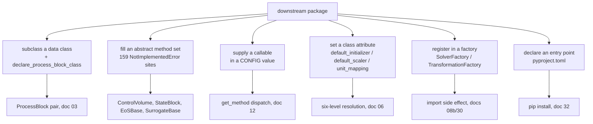
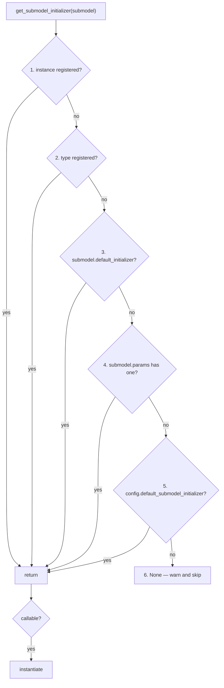
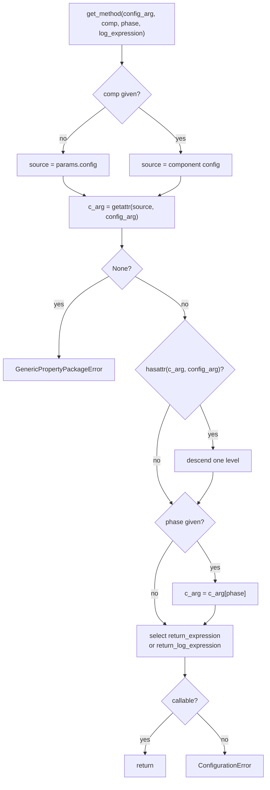

# 31 — Extension point catalog

> **Doc ID** 31 · **Repo SHA** 70a8f4fe1 (IDAES-PSE v2.13.0rc0) · **Source roots** none (index document)
> **Owns** no source files · **Assets** none · **Siblings** [01](01_glossary_and_conventions.md), [03](03_block_hierarchy_and_construction_protocol.md), [04](04_control_volume_framework.md), [05](05_property_and_reaction_framework.md), [06](06_model_preparation_initializers_and_scalers.md), [09](09_surrogate_subsystem.md), [10](10_unit_models_control_volume_based.md), [11](11_unit_models_network_contactors_and_control.md), [12](12_modular_properties_generic_framework.md), [29](29_dependency_and_layering_map.md), [30](30_numerics_and_solver_interface_map.md), [32](32_repository_engineering.md)

This is an index document. It owns no source files and carries no semantics of
its own. Every row names one seam, states its required signature, its resolution
order, its base behaviour and an anchor, and points at the document that holds
the normative description. Where a reader wants to know *what a seam means*, the
owning document is the answer; where a reader wants to know *what seams exist*,
this is.

Two facts fix the scope. IDAES declares abstract contracts by raising
`NotImplementedError` rather than through `abc.ABC`, and there are 159 such
sites ([01 §11](01_glossary_and_conventions.md#11-counting-conventions)); every
one is named here. And most of the library's plug-in surface is not abstract
methods at all — it is configuration keys whose values are callables, class
attributes consulted by a resolution walk, and factory registrations performed
as an import side effect.

---

## 0. Scope and source map

This document owns no modules. The coverage contract is over seam *categories*
rather than files: every category below is described normatively in the owning
document named, and appears here as rows only.

| # | Category | Seams catalogued | Primary mechanism | Owning documents | Covered in § |
|---|---|---:|---|---|---|
| 1 | Block construction | 13 | decorator, method override, class attribute | [03](03_block_hierarchy_and_construction_protocol.md) | 9.1 |
| 2 | Balance construction | 22 | `NotImplementedError` method set, method arguments | [04](04_control_volume_framework.md) | 9.2 |
| 3 | Property and reaction contracts | 29 | `NotImplementedError` method set, non-raising overrides | [05](05_property_and_reaction_framework.md), [08b](08b_core_support_utilities.md) | 9.3 |
| 4 | Model preparation | 17 | method override, class attribute, registration call | [06](06_model_preparation_initializers_and_scalers.md) | 9.4, 5.1 |
| 5 | Configuration-supplied callables | 79 | CONFIG value resolved by `get_method` and direct lookup | [05](05_property_and_reaction_framework.md), [12](12_modular_properties_generic_framework.md), [13](13_modular_properties_eos_and_phase_equilibrium.md), [14](14_modular_properties_state_definitions_and_libraries.md) | 4, 5.2 |
| 6 | Unit-model callbacks | 16 | CONFIG value called once during `build` | [10](10_unit_models_control_volume_based.md), [11](11_unit_models_network_contactors_and_control.md), [19](19_power_generation_heat_exchangers_and_properties.md), [20](20_power_generation_helmholtz_units_and_soc.md), [21](21_column_models_and_solvent_systems.md) | 9.5 |
| 7 | Costing | 9 | class attribute map, CONFIG value, method override | [17](17_costing_framework_and_libraries.md) | 9.6 |
| 8 | Surrogates | 12 | method override, stream protocol | [09](09_surrogate_subsystem.md) | 9.7 |
| 9 | Run orchestration | 21 | `abc.ABC`, decorator, CONFIG callback | [07](07_diagnostics_and_run_orchestration.md) | 9.8 |
| 10 | Pyomo and packaging registration | 12 | factory registry, entry point, astroid transform | [08b](08b_core_support_utilities.md), [30](30_numerics_and_solver_interface_map.md), [32](32_repository_engineering.md) | 9.9 |
| 11 | Application-level seams | 32 | duck-typed protocol, `abc.ABC`, expression string | [18](18_power_generation_boiler_island.md), [24](24_reference_flowsheets_and_demonstrations.md), [25](25_grid_integration.md), [26](26_matopt.md), [27](27_dynamic_optimization_and_uncertainty.md) | 9.10 |
| 12 | Test-time seams | 11 | pytest hook, importlib protocol | [32](32_repository_engineering.md) | 9.11 |

The 159 `NotImplementedError` sites are distributed across categories 2, 3, 4,
6, 7, 8, 9, 10 and 11; section 7 is the roster, keyed by owning document.

---

## 1. Architectural role

A downstream package extends IDAES through one of six mechanisms, and the choice
of mechanism is not uniform across subsystems. The control volume and the
property base classes publish an abstract method set. The modular property
framework publishes nothing abstract at all and reaches every plug-in through a
configuration dictionary. The unit models in
[10](10_unit_models_control_volume_based.md) publish callbacks — configuration
keys whose values are functions called once, with the block as the only
argument. The preparation layer publishes class attributes consulted by a
documented resolution walk. The solver and transformation layers publish nothing
Python-visible at all: they register into Pyomo factories as an import side
effect. And two subsystems, `idaes/core/util/structfs/` and
`idaes/apps/grid_integration/`, use `abc.ABC` — the only places in the tree that
do.

The practical consequence is that "how do I extend IDAES" has no single answer,
and the answer for a new unit model has almost nothing in common with the answer
for a new property package. Section 16 gives the four checklists that follow
from that.

*Six mechanisms, not one: the mechanism a seam uses is a property of the subsystem that publishes it, not of the kind of thing being extended.*

---

## 2. Public surface inventory

The seam *mechanisms* themselves, with the one site that defines each.

| Symbol | Kind | Declared at | Exported via | Stability signal |
|---|---|---|---|---|
| `declare_process_block_class` | decorator factory | `idaes/core/base/process_block.py:176` | `idaes.core` | used 160 times in-tree |
| `ProcessBlockData.build` | method override point | `idaes/core/base/process_base.py:110` | class attribute | called by `_rule_default` (`idaes/core/base/process_block.py:35`) |
| `CONFIG` | class attribute | `idaes/core/base/process_base.py:90` | class attribute | 1,083 declared keys in-tree |
| `default_initializer` | class attribute | `idaes/core/base/process_base.py:93` | class attribute | 23 declarations |
| `default_scaler` | class attribute | `idaes/core/base/process_base.py:94` | class attribute | 24 declarations |
| `get_method` | dispatch function | `idaes/models/properties/modular_properties/base/utility.py:63` | module path | the modular framework's whole plug-in path |
| `Action` | `abc.ABC` | `idaes/core/util/structfs/runner.py:380` | `idaes.core.util.structfs` | the only `abc.ABC` contract in `idaes/core/util` |
| `AbstractBidder` | `abc.ABC` | `idaes/apps/grid_integration/bidder.py:30` | `idaes.apps.grid_integration` | nine `@abstractmethod` members |
| `SolverFactory.register` | Pyomo factory | applied at `idaes/core/solvers/petsc.py:108` | import side effect | five names registered |
| `TransformationFactory.register` | Pyomo factory | applied at `idaes/core/plugins/variable_replace.py:38` | import side effect | two names registered |
| `declare_custom_block` | Pyomo decorator | applied at `idaes/core/surrogate/surrogate_block.py:29` | Pyomo | the tree's only use |
| `[project.entry-points."idaes.flowsheets"]` | packaging | `pyproject.toml:123` | pip install | one member |

Stability signals here record observed facts only; IDAES publishes no separate
stability policy ([01 §9](01_glossary_and_conventions.md#9-document-template)).

---

## 3. Class hierarchy and type taxonomy

Seams fall into eight kinds. The kind determines how a missing implementation
surfaces, which is the single most useful thing to know about a seam.

| Kind | How it is declared | How an omission surfaces | Count |
|---|---|---|---:|
| Abstract method (raising) | a method body that raises `NotImplementedError` | `NotImplementedError` naming the class and method | 110 |
| Defensive guard (raising) | a branch that raises `NotImplementedError` on an unsupported input or state | `NotImplementedError` naming the unsupported case | 49 |
| `@abstractmethod` | `abc.ABC` subclass | `TypeError` at instantiation | 34, of which 18 also raise and are counted in the first row |
| Method override (non-raising) | a base implementation with a usable default | silently uses the default | ~30 |
| Class attribute | a name read by a resolution walk | falls through to the next level, or a warning | ~10 |
| CONFIG-supplied callable | a `ConfigValue` whose value is called | `GenericPropertyPackageError`, `ConfigurationError` or `AttributeError` | ~78 |
| Factory registration | `@Factory.register(name)` at module scope | the name is absent from the factory | 7 |
| Entry point | `pyproject.toml` group member | the name is absent from the discovered set | 3 |

Two `abc.ABC` hierarchies exist, and they are the exception rather than the rule:

| Base | Declared at | `@abstractmethod` members | Owning doc |
|---|---|---:|---|
| `Action` | `idaes/core/util/structfs/runner.py:380` | 1 (`report`); six further hooks are no-op overrides | [07](07_diagnostics_and_run_orchestration.md) |
| `AbstractBidder` | `idaes/apps/grid_integration/bidder.py:30` | 9 | [25](25_grid_integration.md) |
| `AbstractPriceForecaster` | `idaes/apps/grid_integration/forecaster.py:26` | 5 | [25](25_grid_integration.md) |
| `BaseValidator` | `idaes/apps/grid_integration/model_data.py:19` | 1 (`_validate`) | [25](25_grid_integration.md) |
| `matopt` interface classes | `idaes/apps/matopt/materials/geometry.py:33` and six siblings | 18 across seven bases | [26](26_matopt.md) |

Everything else that behaves like an abstract base — `ControlVolumeBlockData`,
`StateBlockData`, `EoSBase`, `SurrogateBase`, `FlowsheetCostingBlockData` — is an
ordinary class whose unimplemented methods raise.

---

## 4. Configuration reference

Category 5, the configuration-supplied callables, is the largest and most
scattered seam family in the library. Almost all of it belongs to the modular
property framework, which reaches its plug-ins through `get_method`
(`idaes/models/properties/modular_properties/base/utility.py:63`) rather than
through any base class. Section 5.2 gives the dispatch order; the tables here
give the keys.

### 4.1 Package-level keys on `GenericParameterData.CONFIG`

| Key | Value shape | Required members of the value | Default | Owning doc | Anchor |
|---|---|---|---|---|---|
| `state_definition` | module or class | `define_state`, `set_metadata`, `state_initialization`, `do_not_initialize`, `define_default_scaling_factors`, `calculate_scaling_factors` | none — mandatory | [14](14_modular_properties_state_definitions_and_libraries.md) | `idaes/models/properties/modular_properties/base/generic_property.py:1023` |
| `phase_equilibrium_state` | dict keyed by phase pair | `phase_equil`, `phase_equil_initialization`, `calculate_teq`, `calculate_scaling_factors` | none | [13](13_modular_properties_eos_and_phase_equilibrium.md) | `idaes/models/properties/modular_properties/base/generic_property.py:1073` |
| `bubble_dew_method` | class | `temperature_bubble`, `temperature_dew`, `pressure_bubble`, `pressure_dew`, one `scale_<name>` each | `IdealBubbleDew` | [13](13_modular_properties_eos_and_phase_equilibrium.md) | `idaes/models/properties/modular_properties/base/generic_property.py:1087` |
| `phases_in_equilibrium` | list of phase pairs | — | `None` | [12](12_modular_properties_generic_framework.md) | `idaes/models/properties/modular_properties/base/generic_property.py:1062` |
| `reaction_basis` | `MaterialFlowBasis` member | — | `molar` | [12](12_modular_properties_generic_framework.md) | `idaes/models/properties/modular_properties/base/generic_reaction.py:254` |
| `rate_reactions`, `equilibrium_reactions` | dict of reaction dicts | per-reaction `rate_constant`, `rate_form`, `equilibrium_constant`, `equilibrium_form`, `heat_of_reaction` | `None` | [13](13_modular_properties_eos_and_phase_equilibrium.md) | `idaes/models/properties/modular_properties/base/generic_reaction.py:265`, `:269` |

### 4.2 Phase-level keys on `PhaseData.CONFIG`

| Key | Value shape | Required members | Default | Resolved at | Owning doc |
|---|---|---|---|---|---|
| `equation_of_state` | class | `common`, `build_parameters`, and one static method per phase property (section 9.3.3) | `None` | `generic_property.py:3021`, `:3633` | [13](13_modular_properties_eos_and_phase_equilibrium.md) |
| `equation_of_state_options` | dict | `property_basis`, `alpha_rule`, `tau_rule`, `reference_state`, `mixing_rule_a`/`_b` | `None` | `generic_property.py:3534`, `:3564` | [13](13_modular_properties_eos_and_phase_equilibrium.md) |
| `therm_cond_phase` | class or callable | `return_expression`, optional `build_parameters` | `None` | `generic_property.py:4927` | [14](14_modular_properties_state_definitions_and_libraries.md) |
| `surf_tens_phase` | class or callable | as above | `None` | `generic_property.py:4910` | [14](14_modular_properties_state_definitions_and_libraries.md) |
| `visc_d_phase` | class or callable | as above | `None` | `generic_property.py:4969` | [14](14_modular_properties_state_definitions_and_libraries.md) |
| `transport_property_options` | dict | `viscosity_phi_ij_callback` and siblings | `None` | `transport_properties/viscosity_wilke.py:40` | [14](14_modular_properties_state_definitions_and_libraries.md) |

Anchors for the `PhaseData` declarations themselves: `idaes/core/base/phases.py:63`
(`equation_of_state`), `:73`, `:99`, `:103`, `:107`, `:111`
([05 §4](05_property_and_reaction_framework.md#4-configuration-reference)).

### 4.3 Component-level correlation keys on `ComponentData.CONFIG`

Twenty keys on `ComponentData` name a correlation. Eighteen occupy the
contiguous span `idaes/core/base/components.py:71`–`:182`; `henry_component`
(`:61`) and `phase_equilibrium_form` (`:189`) complete the set. Every one is
resolved by `get_method` or by a direct lookup, and every one accepts the four
value shapes section 5.2 describes.

| Group | Keys | Library supplying implementations | Owning doc |
|---|---|---|---|
| Molar volume and density | `vol_mol_liq_comp`, `vol_mol_sol_comp`, `dens_mol_liq_comp`, `dens_mol_sol_comp` | `modular_properties/pure/` | [14](14_modular_properties_state_definitions_and_libraries.md) |
| Heat capacity | `cp_mol_liq_comp`, `cp_mol_sol_comp`, `cp_mol_ig_comp` | `pure/` | [14](14_modular_properties_state_definitions_and_libraries.md) |
| Enthalpy | `enth_mol_liq_comp`, `enth_mol_sol_comp`, `enth_mol_ig_comp` | `pure/` | [14](14_modular_properties_state_definitions_and_libraries.md) |
| Entropy | `entr_mol_liq_comp`, `entr_mol_sol_comp`, `entr_mol_ig_comp` | `pure/` | [14](14_modular_properties_state_definitions_and_libraries.md) |
| Transport | `diffus_phase_comp`, `visc_d_phase_comp`, `therm_cond_phase_comp` | `transport_properties/` | [14](14_modular_properties_state_definitions_and_libraries.md) |
| Saturation and electrostatics | `pressure_sat_comp`, `relative_permittivity_liq_comp` | `pure/` | [14](14_modular_properties_state_definitions_and_libraries.md) |
| Equilibrium | `henry_component`, `phase_equilibrium_form` | `phase_equil/`, `pure/ConstantH` | [13](13_modular_properties_eos_and_phase_equilibrium.md) |

The exact resolution site for each key — there are between one and seven per key
— is [12 §9.1](12_modular_properties_generic_framework.md#9-extension-and-subclassing-contracts).

### 4.4 Correlation-class member contract

Whatever a correlation key names, `get_method` extracts one callable from it.
The members it looks for:

| Member | Signature | When it is used | Absence |
|---|---|---|---|
| `return_expression` | `(b, cobj, T)` / `(b, cobj, p, T)` / `(b, p)` | the normal path | the value itself is treated as the callable |
| `return_log_expression` | `(b, cobj, T, dT=False)` | `get_method(..., log_expression=True)` | a warning, then `log()` wrapped around `return_expression` |
| `dT_expression` | `(b, cobj, T)` | called by `return_expression` itself when `dT=True` | `AttributeError` from the caller |
| `build_parameters` | `(cobj)` / `(cobj, p)` / `(pobj)` | once per component or phase during parameter construction | no parameters are created |
| `calculate_scaling_factors` | `(b, ...)` | during the Scaler walk | skipped |
| `default_scaler` | class attribute | read by `call_module_scaling_method` | a DEBUG log |

Anchors: `utility.py:110` (`return_expression` selection), `pure/RPP5.py:226`
(the only `return_log_expression` in the tree), `pure/NIST.py:208`
(`dT_expression`), `generic_property.py:1609`, `:1614` (`build_parameters`),
`utility.py:647` (`default_scaler`).

### 4.5 Reaction-form keys

| Key | Required members | Optional | Shipped implementations | Resolved at |
|---|---|---|---|---|
| `heat_of_reaction` | `build_parameters`, `return_expression` | `calculate_scaling_factors`, `default_scaler` | `constant_dh_rxn` | `generic_reaction.py:721` |
| `rate_constant` | `build_parameters`, `return_expression` | `default_scaler` | `arrhenius` | `generic_reaction.py:734` |
| `rate_form` | `return_expression` | `default_scaler` | `power_law_rate` | `generic_reaction.py:754` |
| `equilibrium_constant` | `build_parameters`, `return_expression`, `return_log_expression`, `calculate_scaling_factors` | `default_scaler` | `ConstantKeq`, `van_t_hoff`, `gibbs_energy` | `generic_reaction.py:768` |
| `equilibrium_form` | `return_expression`, `calculate_scaling_factors` | `build_parameters`, `default_scaler` | `power_law_equil`, `log_power_law_equil`, `solubility_product`, `log_solubility_product` | `generic_reaction.py:807` |

### 4.6 Callback-shaped configuration values outside the property framework

| Key | Signature | Default | Owning doc | Anchor |
|---|---|---|---|---|
| `delta_temperature_callback` | `(b) -> None`, adds `b.delta_temperature` | `delta_temperature_lmtd_callback` | [10](10_unit_models_control_volume_based.md) | `idaes/models/unit_models/heat_exchanger.py:325` |
| `valve_function_callback` | `(valve) -> None`, adds `valve.valve_function` | `ValveFunctionType.linear` | [10](10_unit_models_control_volume_based.md) | `idaes/models/unit_models/valve.py:137` |
| `pressure_flow_callback` | `(valve) -> None`, adds `valve.pressure_flow_equation` | `pressure_flow_default_callback` | [10](10_unit_models_control_volume_based.md) | `idaes/models/unit_models/valve.py:150` |
| `build_callback` | `(b) -> None` on an `IsentropicPerformanceCurve` block | `None` | [10](10_unit_models_control_volume_based.md) | `idaes/models/unit_models/pressure_changer.py:267` |
| `initializer` | `(opt, init_log, solve_log, initial_guess)` | `_default_initializer` | [11](11_unit_models_network_contactors_and_control.md) | `idaes/models/unit_models/skeleton_model.py:78` |
| `enhancement_factor_model` | class with `make_model(blk, kinetics)` and `initialize_model(...)` | `PseudoSecondOrderExplicit` | [21](21_column_models_and_solvent_systems.md) | `idaes/models_extra/column_models/MEAsolvent_column.py:71` |
| `surrogate_dictionary` | dict of Python expression source strings | `None`, which raises `ConfigurationError` | [18](18_power_generation_boiler_island.md) | `idaes/models_extra/power_generation/unit_models/boiler_fireside.py:211` |
| `svd_callback` | `(jacobian, number_singular_values, **kwargs)` | `svd_dense` | [07](07_diagnostics_and_run_orchestration.md) | `idaes/core/util/diagnostics_tools/svd_toolbox.py:125` |
| `workflow_runner` | a `ParameterSweepBase` subclass, validated by `psweep_runner_validator` | `SequentialSweepRunner` | [07](07_diagnostics_and_run_orchestration.md) | `idaes/core/util/diagnostics_tools/convergence_analysis.py:72` |
| `costing_method` | `(blk, **kwargs) -> None` | `None`, meaning use `unit_mapping` | [17](17_costing_framework_and_libraries.md) | `idaes/core/base/costing_base.py:611` |

---

## 5. Construction and call sequences

Two seams have a resolution order with more than one level. Both are reproduced
here because a reader arriving at this catalog needs the order, not a pointer to
it; the normative descriptions remain in [06](06_model_preparation_initializers_and_scalers.md)
and [12](12_modular_properties_generic_framework.md).

### 5.1 Submodel Initializer resolution — six levels

`ModularInitializerBase.get_submodel_initializer`
(`idaes/core/initialization/initializer_base.py:603`) answers "which Initializer
object handles this submodel" by descending six levels and stopping at the first
hit.

1. An Initializer registered against **this instance** by
   `add_submodel_initializer(submodel, initializer)`
   (`idaes/core/initialization/initializer_base.py:590`).
2. An Initializer registered against **this type** by the same call.
3. The submodel's own `default_initializer` class attribute
   (`idaes/core/base/process_base.py:93`).
4. `submodel.params.default_initializer` — the parameter block's, which is how a
   state block inherits an Initializer chosen once for a whole property package.
5. `config.default_submodel_initializer`
   (`idaes/core/initialization/initializer_base.py:574`).
6. `None` — a warning at `:646`, and the submodel is skipped. Not an error.

A hit at any level is tested for callability at `:651`: a class is instantiated,
an already-constructed instance is used as it stands.

*Levels 1 and 2 are per-run registrations; levels 3 and 4 are package-author choices; level 5 is a whole-model default; level 6 is silence, not failure.*

### 5.2 `get_method` — the modular framework's plug-in descent

`get_method(self, config_arg, comp=None, phase=None, log_expression=False)`
(`idaes/models/properties/modular_properties/base/utility.py:63`) turns a
configured value of any of four shapes into one callable.

1. Pick the source: `params.config` when `comp` is `None`, otherwise
   `params.get_component(comp).config`.
2. `c_arg = getattr(source, config_arg)`. An absent key is `AttributeError`.
3. `c_arg is None` → `GenericPropertyPackageError` naming the missing property.
4. **Descend**: if `hasattr(c_arg, config_arg)`, replace `c_arg` with that
   attribute (`utility.py:101`). This is what lets a user write either `RPP4` or
   `RPP4.cp_mol_ig_comp` for the `cp_mol_ig_comp` key.
5. **Subscript**: if `phase` was given, `c_arg = c_arg[phase]` (`:103`).
6. Select the member: `return_expression` if present, otherwise `c_arg` itself.
   With `log_expression=True`, `return_log_expression` if present, otherwise a
   warning and a wrapped logarithm.
7. Not callable → `ConfigurationError`.

*Four value shapes — a bare function, a class with `return_expression`, a namespace class holding a same-named inner class, and a dict of any of those keyed by phase — collapse to one callable.*

### 5.3 Three shorter orders

**Costing method** ([17 §9.2](17_costing_framework_and_libraries.md#9-extension-and-subclassing-contracts)).
A per-instance `costing_method` CONFIG value wins outright. Otherwise
`_get_costing_method_for` (`idaes/core/base/costing_base.py:558`) walks the unit
model's `__mro__` and returns the first data class present in the package's
translated `unit_mapping`; an exhausted chain is `RuntimeError` at `:567`.

**Valve function** ([10 §9](10_unit_models_control_volume_based.md#9-extension-and-subclassing-contracts)).
A `ValveFunctionType` member maps to `linear_cb`, `quick_cb` or
`equal_percentage_cb`; a callable is used as given; anything else raises. The
resolution is at `idaes/models/unit_models/valve.py:176` and the call at `:184`.

**Solver name** ([30 §5](30_numerics_and_solver_interface_map.md#5-construction-and-call-sequences)).
`get_solver` consults `SolverFactory`, whose entries IDAES has replaced wholesale
with `SolverWrapper` callables (`idaes/core/solvers/config.py:43`) that merge the
global configuration's defaults before delegating.

---

## 6. Data structures, variables, constraints, invariants

Not applicable: this document creates no Pyomo components and owns no source
files.

---

## 7. Method contracts — the 159 `NotImplementedError` sites

Every site is listed, grouped by owning document. The **Kind** column separates a
*contract* — a method a subclass is expected to supply — from a *guard*, a
defensive raise on an input, a configuration combination or a model shape the
implementation does not cover. 110 sites are contracts and 49 are guards.

| Owning doc | Class | Methods | Kind | Anchor base |
|---|---|---|---|---|
| [04](04_control_volume_framework.md) | `ControlVolumeBlockData` | `add_geometry`, `add_state_blocks`, `add_reaction_blocks` | contract ×3 | `idaes/core/base/control_volume_base.py:1118`, `:1341`, `:1353` |
| [04](04_control_volume_framework.md) | `ControlVolumeBlockData` | `add_phase_component_balances`, `add_total_component_balances`, `add_total_element_balances`, `add_total_material_balances` | contract ×4 | `:1368`, `:1381`, `:1394`, `:1407` |
| [04](04_control_volume_framework.md) | `ControlVolumeBlockData` | `add_phase_enthalpy_balances`, `add_total_enthalpy_balances`, `add_phase_energy_balances`, `add_total_energy_balances`, `add_isothermal_constraint` | contract ×5 | `:1420`, `:1433`, `:1446`, `:1459`, `:1471` |
| [04](04_control_volume_framework.md) | `ControlVolumeBlockData` | `add_phase_pressure_balances`, `add_total_pressure_balances`, `add_phase_momentum_balances`, `add_total_momentum_balances` | contract ×4 | `:1484`, `:1496`, `:1509`, `:1521` |
| [04](04_control_volume_framework.md) | `ControlVolumeScalerBase` | `_get_reference_state_block` | contract | `idaes/core/base/control_volume_base.py:125` |
| [04](04_control_volume_framework.md) | `ControlVolume1DBlockData` | `report` | guard — spatially distributed data has no tabular form | `idaes/core/base/control_volume1d.py:2426` |
| [05](05_property_and_reaction_framework.md) | `HasPropertyClassMetadata` | `define_metadata` | contract | `idaes/core/base/property_meta.py:111` |
| [05](05_property_and_reaction_framework.md) | `StateBlockData` | `define_state_vars` | contract | `idaes/core/base/property_base.py:672` |
| [05](05_property_and_reaction_framework.md) | `StateBlockData` | `get_material_flow_terms`, `get_material_density_terms`, `get_material_diffusion_terms` | contract ×3 | `idaes/core/base/property_base.py:698`, `:709`, `:720` |
| [05](05_property_and_reaction_framework.md) | `StateBlockData` | `get_enthalpy_flow_terms`, `get_energy_density_terms`, `get_energy_diffusion_terms` | contract ×3 | `idaes/core/base/property_base.py:732`, `:743`, `:754` |
| [05](05_property_and_reaction_framework.md) | `StateBlockData` | `calculate_bubble_point_temperature`, `calculate_dew_point_temperature`, `calculate_bubble_point_pressure`, `calculate_dew_point_pressure` | contract ×4 | `idaes/core/base/property_base.py:773`, `:785`, `:797`, `:809` |
| [05](05_property_and_reaction_framework.md) | `StateBlock` | `fix_initialization_states`, `initialize` | contract ×2 | `idaes/core/base/property_base.py:354`, `:368` |
| [05](05_property_and_reaction_framework.md) | `ReactionBlockBase` | `initialize`, `report` | contract ×2 | `idaes/core/base/reaction_base.py:239`, `:246` |
| [05](05_property_and_reaction_framework.md) | `IonData` | `_add_to_electrolyte_component_list` | contract — `Anion` and `Cation` supply it | `idaes/core/base/components.py:473` |
| [06](06_model_preparation_initializers_and_scalers.md) | `InitializerBase` | `initialization_routine` | contract | `idaes/core/initialization/initializer_base.py:308` |
| [06](06_model_preparation_initializers_and_scalers.md) | `CustomScalerBase` | `variable_scaling_routine`, `constraint_scaling_routine` | contract ×2 | `idaes/core/scaling/custom_scaler_base.py:166`, `:186` |
| [06](06_model_preparation_initializers_and_scalers.md) | `ArcConstraintScaler` | `scale_model` | guard — directs the caller to `scale_arc_constraints_*` | `idaes/core/scaling/arc_constraint_scaler.py:41` |
| [06](06_model_preparation_initializers_and_scalers.md) | — | `initialize_by_time_element` | guard ×3 — Legendre collocation, forward difference, central difference | `idaes/core/util/initialization.py:330`, `:337`, `:341` |
| [07](07_diagnostics_and_run_orchestration.md) | `ConvergenceEvaluation` | `get_specification`, `get_initialized_model` | contract ×2 | `idaes/core/util/convergence/convergence_base.py:202`, `:219` |
| [07](07_diagnostics_and_run_orchestration.md) | `ParameterSweepBase` | `execute_parameter_sweep` | contract | `idaes/core/util/parameter_sweep.py:457` |
| [07](07_diagnostics_and_run_orchestration.md) | `PerformanceBaseClass` | `build_model`, `initialize_model` | contract ×2 | `idaes/core/util/performance.py:98`, `:113` |
| [07](07_diagnostics_and_run_orchestration.md) | `DiagnosticsToolbox`, `SVDToolbox`, `DegeneracyHunter` ×2, `IpoptConvergenceAnalysis` | `__init__`, `report_structural_issues` | guard ×6 — the same greybox rejection repeated | `idaes/core/util/diagnostics_tools/diagnostics_toolbox.py:304`, `:1646`; `svd_toolbox.py:188`; `degeneracy_hunter.py:130`; `deprecated/degeneracy_hunter_legacy.py:106`; `convergence_analysis.py:115` |
| [08b](08b_core_support_utilities.md) | `StateTestBlockData` | `default_material_balance_type`, `default_energy_balance_type` | guard ×2 — conditional on `default_balance_switch` | `idaes/core/util/testing.py:366`, `:372` |
| [09](09_surrogate_subsystem.md) | `SurrogateTrainer` | `train_surrogate` | contract | `idaes/core/surrogate/base/surrogate_base.py:198` |
| [09](09_surrogate_subsystem.md) | `SurrogateBase` | `populate_block`, `evaluate_surrogate`, `save`, `load` | contract ×4 | `idaes/core/surrogate/base/surrogate_base.py:308`, `:330`, `:364`, `:396` |
| [09](09_surrogate_subsystem.md) | `PysmoTrainer` | `_create_model` | contract | `idaes/core/surrogate/pysmo_surrogate.py:202` |
| [09](09_surrogate_subsystem.md) | `OMLTSurrogate` | `__init__` | guard — rejects any scaler that is not an `OffsetScaler` | `idaes/core/surrogate/omlt_base_surrogate_class.py:85` |
| [09](09_surrogate_subsystem.md) | `ONNXSurrogate` | `evaluate_surrogate` | guard — unconditional, no message | `idaes/core/surrogate/onnx_surrogate.py:157` |
| [11](11_unit_models_network_contactors_and_control.md) | `MSContactorData`, `SLSeparatorData`, `Thickener0DData` | `initialize` | guard ×3 — legacy API refusal | `idaes/models/unit_models/mscontactor.py:1683`; `solid_liquid/sl_separator.py:327`; `solid_liquid/thickener.py:542` |
| [11](11_unit_models_network_contactors_and_control.md) | `SeparatorData` | `add_momentum_splitting_constraints` | guard — unsupported `momentum_balance_type` | `idaes/models/unit_models/separator.py:1455` |
| [13](13_modular_properties_eos_and_phase_equilibrium.md) | `EoSBase` | 39 static methods, section 9.3.3 | contract ×39 | `idaes/models/properties/modular_properties/eos/eos_base.py:44`–`:336` |
| [13](13_modular_properties_eos_and_phase_equilibrium.md) | `ceos` module | `_N_dZ_dNj`, `_log_fug_coeff_phase_comp`, `_d_log_fug_coeff_dT_phase_comp` | guard ×3 — non-default mixing rule | `idaes/models/properties/modular_properties/eos/ceos.py:1100`, `:1196`, `:1247` |
| [16](16_general_helmholtz_property_system.md) | `HelmholtzEoSScaler` | `variable_scaling_routine` | guard — `amount_basis` outside the two enum members | `idaes/models/properties/general_helmholtz/helmholtz_state.py:131` |
| [17](17_costing_framework_and_libraries.md) | `FlowsheetCostingBlockData` | `build_global_params`, `build_process_costs`, `initialize_build` | contract ×3 | `idaes/core/base/costing_base.py:261`, `:278`, `:289` |
| [19](19_power_generation_heat_exchangers_and_properties.md) | `CrossFlowHeatExchanger1DInitializer` | `initialize_main_model` | guard — property package without `temperature` in `define_state_vars` | `idaes/models_extra/power_generation/unit_models/cross_flow_heat_exchanger_1D.py:103` |
| [19](19_power_generation_heat_exchangers_and_properties.md) | `CrossFlowHeatExchanger1DData` | `build` | guard — Lagrange-Legendre plus pressure change | `idaes/models_extra/power_generation/unit_models/cross_flow_heat_exchanger_1D.py:475` |
| [20](20_power_generation_helmholtz_units_and_soc.md) | `HelmTurbineMultistageData` | `_get_stream_table_contents` | guard — no stream table for the multistage assembly | `idaes/models_extra/power_generation/unit_models/helm/turbine_multistage.py:833` |
| [20](20_power_generation_helmholtz_units_and_soc.md) | `SocConductiveSlabData` | `initialize_build` | guard — the submodel is not initialized in isolation | `idaes/models_extra/power_generation/unit_models/soc_submodels/conductive_slab.py:326` |
| [25](25_grid_integration.md) | `ParametrizedBidder` | `compute_day_ahead_bids`, `compute_real_time_bids` | contract ×2 | `idaes/apps/grid_integration/bidder.py:1374`, `:1384` |
| [25](25_grid_integration.md) | `DoubleLoopCoordinator` | `_update_static_params` | guard — generator type neither thermal nor renewable | `idaes/apps/grid_integration/coordinator.py:442` |
| [25](25_grid_integration.md) | `PriceTakerModel` | `update_operation_params`, `plot_lmp_histogram` | guard ×2 — capability refusals | `idaes/apps/grid_integration/pricetaker/price_taker_model.py:553`, `:1369` |
| [26](26_matopt.md) | seven interface bases | `__eq__`, `__le__`, `isInShape`, `getBounds`, `isOnLattice`, `areNeighbors`, `getNeighbors`, `transformInsideTile`, `replicateDesign`, `transform`, `undo`, `_pyomo_expr`, `_pyomo_cons` | contract ×18 (`@abstractmethod`) | `idaes/apps/matopt/materials/bblock.py:22`–`idaes/apps/matopt/opt/mat_modeling.py:1293` |
| [26](26_matopt.md) | lattices, model, Pyomo bridge | `getLayerSpacing`, `getShellSpacing`, `getUniqueLayerCount`, `keys`, `__init__`, `populate`, `__solve_pyomo_model`, `getLB`, `getUB`, `addConsForGeneralVars`, `setDesignFromModel`, `areNeighbors`, `_pyomo_expr` | guard ×14 | `idaes/apps/matopt/materials/lattices/diamond_lattice.py:252`–`idaes/apps/matopt/opt/pyomo_modeling.py:791` |
| [27](27_dynamic_optimization_and_uncertainty.md) | — | `get_ncp` | guard — unsupported discretization scheme | `idaes/apps/caprese/common/config.py:132` |
| [27](27_dynamic_optimization_and_uncertainty.md) | `SquareSolveContext` | `__enter__` | guard — unrecognized `InputOption` | `idaes/apps/caprese/dynamic_block.py:903` |
| [27](27_dynamic_optimization_and_uncertainty.md) | `NmpcVar` | `__init__` | guard — the component is unindexed | `idaes/apps/caprese/nmpc_var.py:40` |
| [30](30_numerics_and_solver_interface_map.md) | `PetscTAO` | `__init__` | guard — registered placeholder | `idaes/core/solvers/petsc.py:203` |
| [30](30_numerics_and_solver_interface_map.md) | — | `find_discretization_equations` | guard — a derivative taken with respect to time and another set | `idaes/core/solvers/petsc.py:268` |

Ten written documents contribute no site at all — [03](03_block_hierarchy_and_construction_protocol.md),
[08a](08a_model_introspection_and_persistence.md),
[10](10_unit_models_control_volume_based.md),
[12](12_modular_properties_generic_framework.md),
[14](14_modular_properties_state_definitions_and_libraries.md),
[18](18_power_generation_boiler_island.md),
[22](22_gas_solid_contactors.md),
[23](23_tsa_gas_distribution_and_ccu.md),
[24](24_reference_flowsheets_and_demonstrations.md) and
[32](32_repository_engineering.md) — and that is informative: the block
protocol, the unit-model layer and the modular property framework extend by
configuration and delegation rather than by abstract method.

---

## 8. Cross-subsystem interactions

### 8.1 Which document owns which seam family

| Seam family | Owning doc | Section there |
|---|---|---|
| `declare_process_block_class`, `build`, `CONFIG`, `rule`, `idx_map` | [03](03_block_hierarchy_and_construction_protocol.md) | §5, §9 |
| The 16 balance methods, `custom_term`, `_weight_attr_name` | [04](04_control_volume_framework.md) | §9 |
| `StateBlockData` / `StateBlock` contract, `define_metadata`, `define_property_set` | [05](05_property_and_reaction_framework.md) | §7, §9 |
| Initializer and Scaler hooks, submodel resolution | [06](06_model_preparation_initializers_and_scalers.md) | §5.2, §9 |
| `Action`, `@step`/`@substep`, parameter-sweep callbacks | [07](07_diagnostics_and_run_orchestration.md) | §5.7, §9 |
| `StoreSpec` callbacks, `ModelTag` formatting | [08a](08a_model_introspection_and_persistence.md) | §9 |
| `TransformationFactory` registrations, `StrEnum`, `is_in_range` | [08b](08b_core_support_utilities.md) | §9 |
| `SurrogateTrainer` / `SurrogateBase`, `declare_custom_block` | [09](09_surrogate_subsystem.md) | §3.1, §9 |
| `delta_temperature_callback` and the other three unit callbacks | [10](10_unit_models_control_volume_based.md) | §9 |
| `STREAM_CONFIG`, `heterogeneous_reactions`, `mixed_state_block` | [11](11_unit_models_network_contactors_and_control.md) | §9 |
| `get_method`, `get_phase_method`, `configure`, `parameters` | [12](12_modular_properties_generic_framework.md) | §5.3, §9 |
| `EoSBase`, `phase_equilibrium_state`, `bubble_dew_method`, reaction forms | [13](13_modular_properties_eos_and_phase_equilibrium.md) | §9 |
| `define_state`, `build_parameters`, `return_expression`, the two callbacks | [14](14_modular_properties_state_definitions_and_libraries.md) | §9 |
| `register_helmholtz_component`, `set_parameter_path` | [16](16_general_helmholtz_property_system.md) | §9 |
| `unit_mapping`, `costing_method`, `register_flow_type` | [17](17_costing_framework_and_libraries.md) | §9 |
| `surrogate_dictionary`, `BalanceBlockData` | [18](18_power_generation_boiler_island.md) | §9 |
| `_process_config` / `_make_geometry` / `_make_performance` on the cross-flow exchanger | [19](19_power_generation_heat_exchangers_and_properties.md) | §9 |
| `enhancement_factor_model` | [21](21_column_models_and_solvent_systems.md) | §4 |
| Model-object protocol, Prescient callbacks, `MultiPeriodModel` | [25](25_grid_integration.md) | §9 |
| `Shape`, `Lattice`, `Tiling`, `TransformFunc`, `Expr`, `DescriptorRule` | [26](26_matopt.md) | §9 |
| `SolverFactory` registrations, `_default_executable`, `_postsolve` | [30](30_numerics_and_solver_interface_map.md) | §9 |
| pytest hooks, `Importorskipper`, entry points, astroid transforms | [32](32_repository_engineering.md) | §9 |

### 8.2 Documents that cite this catalog

[01](01_glossary_and_conventions.md), [03](03_block_hierarchy_and_construction_protocol.md),
[04](04_control_volume_framework.md), [05](05_property_and_reaction_framework.md),
[06](06_model_preparation_initializers_and_scalers.md),
[07](07_diagnostics_and_run_orchestration.md), [09](09_surrogate_subsystem.md),
[13](13_modular_properties_eos_and_phase_equilibrium.md),
[14](14_modular_properties_state_definitions_and_libraries.md),
[18](18_power_generation_boiler_island.md),
[23](23_tsa_gas_distribution_and_ccu.md) and
[30](30_numerics_and_solver_interface_map.md) name this document as the place
the full seam list lives.

---

## 9. Extension and subclassing contracts

The catalog proper. Columns are uniform: `Seam | Kind | Required signature |
Resolution order | Base behaviour | Anchor`, with the owning document in the
subsection heading. No row restates semantics; the owning document does that.

### 9.1 Block construction — [03](03_block_hierarchy_and_construction_protocol.md)

| Seam | Kind | Required signature | Resolution order | Base behaviour | Anchor |
|---|---|---|---|---|---|
| `declare_process_block_class` | decorator factory | `(name, block_class=ProcessBlock, doc="")` | applied to the `FooData` class; synthesizes `Foo` and injects it into the decorated class's own module | container class created, `__module__` rewritten | `idaes/core/base/process_block.py:176` |
| `name` argument | decorator argument | `str` | the synthesized container's name | none — mandatory | `idaes/core/base/process_block.py:176` |
| `block_class` argument | decorator argument | a `ProcessBlock` subclass | used in place of `ProcessBlock` as the container's base | `ProcessBlock` | `idaes/core/base/process_block.py:176` |
| `doc` argument | decorator argument | `str` | becomes the container's docstring | `""` | `idaes/core/base/process_block.py:176` |
| `build` | method override | `(self) -> None` | Pyomo calls `_rule_default` (`idaes/core/base/process_block.py:35`), which calls `b.build()`; a subclass calls `super().build()` first | resolves `dynamic` and `has_holdup`, sets two attributes | `idaes/core/base/process_base.py:110` |
| `CONFIG` | class attribute | a `ConfigBlock` | subclass writes `CONFIG = Parent.CONFIG()` then `CONFIG.declare(...)` | empty, `implicit=False` | `idaes/core/base/process_base.py:90` |
| `rule` | keyword argument to the container | `(b, *args) -> None` | `_process_kwargs` (`idaes/core/base/process_block.py:91`) sets the default; a supplied value replaces it and is expected to call `build()` | `_rule_default` | `idaes/core/base/process_block.py:92` |
| `idx_map` | keyword argument to the container | `(index) -> key` | applied to the index before the `initialize` dictionary lookup | identity | `idaes/core/base/process_block.py:95` |
| `initialize` | keyword argument to the container | `dict` keyed by index, or one config dict for all | split per index by `_get_config_args` (`idaes/core/base/process_base.py:232`) | empty implicit `ConfigBlock` | `idaes/core/base/process_block.py:93` |
| `_get_performance_contents` | method override | `(self, time_point=0) -> dict \| None` | called by `report` | returns `None` | `idaes/core/base/process_base.py:433` |
| `_get_stream_table_contents` | method override | `(self, time_point=0) -> DataFrame \| None` | called by `report` and `serialize_contents` | returns `None` | `idaes/core/base/process_base.py:436` |
| `model_check` | method override | `(blk) -> None` | called by `FlowsheetBlockData.model_check` | no-op | `idaes/core/base/unit_model.py:117` |
| `is_flowsheet` | method override | `(self) -> bool` | consulted by the upward walk in `ProcessBlockData.flowsheet()` | `True` on flowsheets only | `idaes/core/base/flowsheet_model.py:202` |

### 9.2 Balance construction — [04](04_control_volume_framework.md)

Sixteen methods form the geometry author's contract. All take
`(self, *args, **kwargs)` in the base and all raise; the concrete signatures are
`ControlVolume0DBlockData`'s and `ControlVolume1DBlockData`'s.

| Seam | Kind | Required signature | Resolution order | Base behaviour | Anchor |
|---|---|---|---|---|---|
| `add_geometry` | contract | `(self, **kwargs)` | called by the unit model before any balance | raises | `idaes/core/base/control_volume_base.py:1118` |
| `add_state_blocks` | contract | `(self, information_flow=FlowDirection.forward, has_phase_equilibrium=None)` | called after `add_geometry` | raises | `idaes/core/base/control_volume_base.py:1341` |
| `add_reaction_blocks` | contract | `(self, has_equilibrium=None)` | called after `add_state_blocks` | raises | `idaes/core/base/control_volume_base.py:1353` |
| `add_phase_component_balances` | contract | `(self, **kwargs)` | dispatched from `add_material_balances` on `MaterialBalanceType` | raises | `idaes/core/base/control_volume_base.py:1368` |
| `add_total_component_balances` | contract | as above | as above | raises | `idaes/core/base/control_volume_base.py:1381` |
| `add_total_element_balances` | contract | as above | as above | raises | `idaes/core/base/control_volume_base.py:1394` |
| `add_total_material_balances` | contract | as above | as above | raises | `idaes/core/base/control_volume_base.py:1407` |
| `add_phase_enthalpy_balances` | contract | `(self, **kwargs)` | dispatched from `add_energy_balances` on `EnergyBalanceType` | raises | `idaes/core/base/control_volume_base.py:1420` |
| `add_total_enthalpy_balances` | contract | as above | as above | raises | `idaes/core/base/control_volume_base.py:1433` |
| `add_phase_energy_balances` | contract | as above | as above | raises | `idaes/core/base/control_volume_base.py:1446` |
| `add_total_energy_balances` | contract | as above | as above | raises | `idaes/core/base/control_volume_base.py:1459` |
| `add_isothermal_constraint` | contract | as above | as above | raises | `idaes/core/base/control_volume_base.py:1471` |
| `add_phase_pressure_balances` | contract | `(self, **kwargs)` | dispatched from `add_momentum_balances` on `MomentumBalanceType` | raises | `idaes/core/base/control_volume_base.py:1484` |
| `add_total_pressure_balances` | contract | as above | as above | raises | `idaes/core/base/control_volume_base.py:1496` |
| `add_phase_momentum_balances` | contract | as above | as above | raises | `idaes/core/base/control_volume_base.py:1509` |
| `add_total_momentum_balances` | contract | as above | as above | raises | `idaes/core/base/control_volume_base.py:1521` |
| `custom_term` | method argument | a Pyomo `Expression` rule or expression | added to the balance the method writes | `None` | `idaes/core/base/control_volume0d.py:1471` |
| `custom_molar_term`, `custom_mass_term` | method arguments | as above | added to material balances on the named basis; the basis of the property package selects which is legal | `None` | `idaes/core/base/control_volume_base.py:1124` |
| `_weight_attr_name` | Scaler class attribute | `str \| None` | names an attribute whose scaling factor divides nominal values | `None` (0-D), `"length"` (1-D) | `idaes/core/base/control_volume_base.py:117`, `idaes/core/base/control_volume1d.py:100` |
| `_get_reference_state_block` | Scaler method override | `(self, model)` | called by the `ControlVolumeScalerBase` routines | raises | `idaes/core/base/control_volume_base.py:125` |
| `report` | guard on `ControlVolume1DBlockData` | `(self, time_point=0, dof=False, ostream=None, prefix="")` | not overridden | raises | `idaes/core/base/control_volume1d.py:2426` |
| `default_scaler` | class attribute | a `ScalerBase` subclass | consulted by the Scaler machinery | `ControlVolume0DScaler` / `ControlVolume1DScaler` | `idaes/core/base/control_volume0d.py:174` |

### 9.3 Property and reaction contracts — [05](05_property_and_reaction_framework.md)

#### 9.3.1 The raising contract

| Seam | Kind | Required signature | Resolution order | Base behaviour | Anchor |
|---|---|---|---|---|---|
| `define_metadata` | contract, classmethod | `(cls, pcm)` | called once per parameter block class by the metadata machinery | raises | `idaes/core/base/property_meta.py:111` |
| `define_state_vars` | contract | `(self) -> dict[str, Var]` | called by `build_port`, `report`, and every Initializer | raises | `idaes/core/base/property_base.py:672` |
| `get_material_flow_terms` | contract | `(self, p, j)` | called per phase and chemical component by the material balance | raises | `idaes/core/base/property_base.py:698` |
| `get_material_density_terms` | contract | `(self, p, j)` | called when `has_holdup` | raises | `idaes/core/base/property_base.py:709` |
| `get_material_diffusion_terms` | contract | `(self, p, j)` | 1-D control volumes only | raises | `idaes/core/base/property_base.py:720` |
| `get_enthalpy_flow_terms` | contract | `(self, p)` | called per phase by the energy balance | raises | `idaes/core/base/property_base.py:732` |
| `get_energy_density_terms` | contract | `(self, p)` | called when `has_holdup` | raises | `idaes/core/base/property_base.py:743` |
| `get_energy_diffusion_terms` | contract | `(self, p)` | 1-D control volumes only | raises | `idaes/core/base/property_base.py:754` |
| `calculate_bubble_point_temperature` | contract | `(self, *args, **kwargs)` | called by flash and phase-equilibrium initialization | raises | `idaes/core/base/property_base.py:773` |
| `calculate_dew_point_temperature` | contract | as above | as above | raises | `idaes/core/base/property_base.py:785` |
| `calculate_bubble_point_pressure` | contract | as above | as above | raises | `idaes/core/base/property_base.py:797` |
| `calculate_dew_point_pressure` | contract | as above | as above | raises | `idaes/core/base/property_base.py:809` |
| `fix_initialization_states` | contract on `StateBlock` | `(self)` | step 3 of `InitializerBase.initialize` | raises | `idaes/core/base/property_base.py:354` |
| `initialize` | contract on `StateBlock` | `(self, *args, **kwargs)` | the legacy initialization path | raises | `idaes/core/base/property_base.py:368` |
| `initialize` | contract on `ReactionBlockBase` | `(self, *args)` | as above, reaction side | raises | `idaes/core/base/reaction_base.py:239` |
| `report` | contract on `ReactionBlockBase` | `(self, index=(0), true_state=False, dof=False, ostream=None, prefix="")` | called by the user | raises | `idaes/core/base/reaction_base.py:246` |
| `_add_to_electrolyte_component_list` | contract on `IonData` | `(self)` | called during component-list construction; `Anion` and `Cation` supply it | raises | `idaes/core/base/components.py:473` |
| `default_material_balance_type` | guard, test double | `(self)` | called by `add_material_balances` when the type is `useDefault` | returns `componentPhase` when `params.default_balance_switch == 1`, else raises | `idaes/core/util/testing.py:366` |
| `default_energy_balance_type` | guard, test double | `(self)` | called by `add_energy_balances` when the type is `useDefault` | returns `enthalpyTotal` under the same condition, else raises | `idaes/core/util/testing.py:372` |

#### 9.3.2 The non-raising contract

These have usable defaults, so omitting one is silent rather than fatal.

| Seam | Kind | Required signature | Resolution order | Base behaviour | Anchor |
|---|---|---|---|---|---|
| `_state_block_class` | class attribute | a `StateBlock` subclass | read through the `state_block_class` property (`idaes/core/base/property_base.py:116`); set to `None` if absent | `None`, and the property raises | `idaes/core/base/property_base.py:109` |
| `define_port_members` | method override | `(self) -> dict[str, Var]` | called by `build_port` (`idaes/core/base/property_base.py:488`) | falls back to `define_state_vars` | `idaes/core/base/property_base.py:678` |
| `define_display_vars` | method override | `(self) -> dict[str, Var]` | called by `report` and by the stream-table builders | falls back to `define_state_vars` | `idaes/core/base/property_base.py:685` |
| `get_material_flow_basis` | method override | `(self) -> MaterialFlowBasis` | called by control volumes choosing molar or mass terms | `MaterialFlowBasis.other` | `idaes/core/base/property_base.py:761` |
| `get_reaction_rate_basis` | method override | `(self) -> MaterialFlowBasis` | called by control volumes writing reaction terms | `MaterialFlowBasis.other` | `idaes/core/base/reaction_base.py:383` |
| `define_property_set` | metadata call | `(self, propset: PropertySetBase)` | called from inside `define_metadata` | `StandardPropertySet` | `idaes/core/base/property_meta.py:448` |
| `default_state_scaler_class` | class attribute | a `ScalerBase` subclass | consulted by the Scaler machinery | `None` | `idaes/core/base/property_base.py:134` |
| `default_initializer` | class attribute | an `InitializerBase` subclass | level 3 or level 4 of section 5.1 | `BlockTriangularizationInitializer` | `idaes/core/base/property_base.py:276` |
| `_reaction_block_class` | class attribute | a `ReactionBlock` subclass | read through `reaction_block_class` (`idaes/core/base/reaction_base.py:114`) | `None` | `idaes/core/base/reaction_base.py:106` |
| `build_reaction_block` | method | `(self, *args, **kwargs)` | called by a control volume to construct reaction blocks | constructs `reaction_block_class` | `idaes/core/base/reaction_base.py:160` |

#### 9.3.3 The `EoSBase` static-method set — [13](13_modular_properties_eos_and_phase_equilibrium.md)

Thirty-nine methods raise on `EoSBase`. All are `@staticmethod` except
`pressure_osm_phase`, all take the state block first, and all return a Pyomo
expression except `common`, `build_parameters` and `build_critical_properties`,
which create components. Anchors span
`idaes/models/properties/modular_properties/eos/eos_base.py:44`–`:336`.

| Family | Methods | Signature |
|---|---|---|
| Construction | `common`, `calculate_scaling_factors`, `build_parameters`, `build_critical_properties`, `list_critical_property_constraint_names` | `(b, pobj)`, `(b)`, `(b, ref_phase)`, `()` |
| Activity | `act_phase_comp`, `act_phase_comp_true`, `act_phase_comp_appr`, `act_coeff_phase_comp`, `act_coeff_phase_comp_true`, `act_coeff_phase_comp_appr` | `(b, p, j)` |
| Heat capacity | `cp_mol_phase`, `cp_mol_phase_comp`, `cv_mol_phase`, `cv_mol_phase_comp` | `(b, p)` / `(b, p, j)` |
| Density and volume | `dens_mass_phase`, `dens_mol_phase`, `vol_mol_phase`, `vol_mol_phase_comp` | `(b, p)` / `(b, p, j)` |
| Energy | `energy_internal_mol_phase`, `energy_internal_mol_phase_comp`, `enth_mol_phase`, `enth_mol_phase_comp`, `entr_mol_phase`, `entr_mol_phase_comp`, `gibbs_mol_phase`, `gibbs_mol_phase_comp` | `(b, p)` / `(b, p, j)` |
| Fugacity | `fug_phase_comp`, `fug_phase_comp_eq`, `log_fug_phase_comp_eq`, `fug_coeff_phase_comp`, `fug_coeff_phase_comp_eq` | `(b, p, j)` / `(b, p, j, pp)` |
| Bubble and dew fugacity | `fug_phase_comp_Tbub`, `fug_phase_comp_Tdew`, `fug_phase_comp_Pbub`, `fug_phase_comp_Pdew` | `(b, p, j, pp)` |
| Acoustic and osmotic | `isentropic_speed_sound_phase`, `isothermal_speed_sound_phase`, `pressure_osm_phase` | `(b, p)` |

Three module functions in `ceos.py` guard the mixing rule rather than declare a
contract: `_N_dZ_dNj` (`idaes/models/properties/modular_properties/eos/ceos.py:1100`),
`_log_fug_coeff_phase_comp` (`:1196`) and `_d_log_fug_coeff_dT_phase_comp`
(`:1247`) raise for any mixing rule other than the single declared member.
Eight further names are part of the effective contract without appearing on
`EoSBase` at all; [13 §9.1](13_modular_properties_eos_and_phase_equilibrium.md#9-extension-and-subclassing-contracts)
lists them.

### 9.4 Model preparation — [06](06_model_preparation_initializers_and_scalers.md)

| Seam | Kind | Required signature | Resolution order | Base behaviour | Anchor |
|---|---|---|---|---|---|
| `initialization_routine` | contract | `(self, model)` | step 5 of the seven-step `InitializerBase.initialize` | raises | `idaes/core/initialization/initializer_base.py:308` |
| `precheck` | method override | `(self, model)` | step 4 | degrees-of-freedom check | `idaes/core/initialization/initializer_base.py:286` |
| `postcheck` | method override | `(self, model, results_obj=None, exclude_unused_vars=False)` | step 7 | residual check against `constraint_tolerance` | `idaes/core/initialization/initializer_base.py:351` |
| `fix_initialization_states` | method override on the *model* | `(self)` | step 3, called on the model not the Initializer | fixes ports named `inlet` | `idaes/core/base/unit_model.py:640` |
| `initialize_main_model` | method override | `(self, model, **kwargs)` | called by `ModularInitializerBase.initialization_routine` | subclass hook | `idaes/core/initialization/initializer_base.py:767` |
| `default_initializer` | class attribute | an `InitializerBase` subclass | level 3 of section 5.1 | `BlockTriangularizationInitializer`; `SingleControlVolumeUnitInitializer` on `UnitModelBlockData` (`idaes/core/base/unit_model.py:61`) | `idaes/core/base/process_base.py:93` |
| `default_submodel_initializer` | CONFIG key | an `InitializerBase` subclass | level 5 | `None` | `idaes/core/initialization/initializer_base.py:574` |
| `add_submodel_initializer` | registration call | `(submodel, initializer)` | writes levels 1 and 2 | registry empty | `idaes/core/initialization/initializer_base.py:590` |
| `variable_scaling_routine` | contract | `(self, model, overwrite=False, submodel_scalers=None)` | called by `scale_model` | raises | `idaes/core/scaling/custom_scaler_base.py:166` |
| `constraint_scaling_routine` | contract | `(self, model, overwrite=False, submodel_scalers=None)` | called by `scale_model` after the variable pass | raises | `idaes/core/scaling/custom_scaler_base.py:186` |
| `DEFAULT_SCALING_FACTORS` | class attribute | `dict[str, float]` | read by `scale_variable_by_default` | `None` | `idaes/core/scaling/custom_scaler_base.py:103` |
| `UNIT_SCALING_FACTORS` | class attribute | `dict[str, tuple]` | read by `scale_variable_by_units` | a copy of `DEFAULT_UNIT_SCALING` (`idaes/core/scaling/custom_scaler_base.py:48`) | `idaes/core/scaling/custom_scaler_base.py:106` |
| `default_scaler` | class attribute | a `ScalerBase` subclass | consulted by the Scaler machinery | `None` | `idaes/core/base/process_base.py:94` |
| `default_state_scaler_object` | parameter-block property | returns a `ScalerBase` instance | used when scaling state blocks | built from `default_state_scaler_class` | `idaes/core/base/property_base.py:138` |
| `scale_model` | guard on `ArcConstraintScaler` | `(self, **kwargs)` | not overridden | raises, directing the caller to `scale_arc_constraints_by_nominal_value` | `idaes/core/scaling/arc_constraint_scaler.py:41` |
| `calculate_scaling_factors` | method override | `(self)` | suffix-based scaling traversal | no-op in the base | `idaes/core/base/process_base.py:655` |
| `initialize_by_time_element` | guard ×3 | `(fs, time, **kwargs)` | called directly by a flowsheet author | raises for Legendre collocation, forward difference and central difference | `idaes/core/util/initialization.py:298` |

### 9.5 Unit-model callbacks — [10](10_unit_models_control_volume_based.md), [11](11_unit_models_network_contactors_and_control.md), [19](19_power_generation_heat_exchangers_and_properties.md), [20](20_power_generation_helmholtz_units_and_soc.md), [21](21_column_models_and_solvent_systems.md)

| Seam | Kind | Required signature | Resolution order | Base behaviour | Anchor |
|---|---|---|---|---|---|
| `delta_temperature_callback` | CONFIG callback | `(b) -> None`; must add `b.delta_temperature`, an `Expression` over `b.flowsheet().time`, from `b.delta_temperature_in` and `b.delta_temperature_out` | called once from `HeatExchangerData.build` after the two end-difference constraints and before `heat_transfer_equation` (`idaes/models/unit_models/heat_exchanger.py:775`) | `delta_temperature_lmtd_callback` | `idaes/models/unit_models/heat_exchanger.py:325` |
| `valve_function_callback` | CONFIG callback or enum member | `(valve) -> None`; must add `valve.valve_function` over time | enum member mapped to one of three shipped callbacks at `idaes/models/unit_models/valve.py:176`; a callable used as given; anything else raises | `ValveFunctionType.linear` | `idaes/models/unit_models/valve.py:137` |
| `pressure_flow_callback` | CONFIG callback | `(valve) -> None`; must add `valve.pressure_flow_equation` over time and `valve.flow_var`; may add `valve.pressure_flow_equation_scale` | called at `idaes/models/unit_models/valve.py:185`, immediately after the valve function | `pressure_flow_default_callback` | `idaes/models/unit_models/valve.py:150` |
| `build_callback` | nested CONFIG callback | `(b) -> None` where `b` is the `IsentropicPerformanceCurve` block; reaches the pressure changer through `b.parent_block()` | called last in `IsentropicPerformanceCurveData.build` (`idaes/models/unit_models/pressure_changer.py:331`) | `None`, meaning no call | `idaes/models/unit_models/pressure_changer.py:267` |
| `_process_config`, `_make_geometry`, `_make_performance` | template-method trio | `(self) -> None` each | called from `HeatExchanger1DData.build` at `idaes/models/unit_models/heat_exchanger_1D.py:513`, `:744`, `:745` | the 1-D exchanger's own implementations; `ShellAndTube1D` (`:170`, `:186`, `:260`) and the cross-flow exchanger (`idaes/models_extra/power_generation/unit_models/cross_flow_heat_exchanger_1D.py:432`, `:491`, `:540`) are the two replacements | `idaes/models/unit_models/heat_exchanger_1D.py:513` |
| `initializer` | CONFIG callback | `(opt, init_log, solve_log, initial_guess)` | invoked by `SkeletonUnitModelData.initialize` | `_default_initializer`, a single solve | `idaes/models/unit_models/skeleton_model.py:78` |
| `heterogeneous_reactions` | duck-typed package | requires `build_reaction_block`, `reaction_idx`, `params.reaction_stoichiometry` | read during `MSContactorData.build` | none; no base class exists | `idaes/models/unit_models/mscontactor.py:1004` |
| `STREAM_CONFIG` | `implicit_domain` template | a 14-key `ConfigDict` | applied to every user-named key of `streams` | the 14 keys of [11 §4.3](11_unit_models_network_contactors_and_control.md#4-configuration-reference) | `idaes/models/unit_models/mscontactor.py:982` |
| `mixed_state_block` | CONFIG key | an existing `StateBlock` | lets `Mixer`/`Separator` be embedded without duplicating state | `None` | `idaes/models/unit_models/mixer.py:468` |
| `enhancement_factor_model` | CONFIG class | `make_model(blk, kinetics="Putta")` and `initialize_model(...)`, both `@staticmethod` | `make_model` at `idaes/models_extra/column_models/MEAsolvent_column.py:1047`; `initialize_model` at `:2176` | `PseudoSecondOrderExplicit` (`idaes/models_extra/column_models/enhancement_factor_model_pseudo_second_order_explicit.py:36`) | `idaes/models_extra/column_models/MEAsolvent_column.py:71` |
| `enhancement_factor_kwargs` | CONFIG key | `dict` splatted into `make_model` | read alongside the model | `None` | `idaes/models_extra/column_models/MEAsolvent_column.py:78` |
| `surrogate_dictionary` | expression-string seam | `dict` mapping zone indices and four string keys to Python expression **source** | read once in `_import_surrogate_models` at the end of `build`; the text is executed against the block | `None` raises `ConfigurationError` | `idaes/models_extra/power_generation/unit_models/boiler_fireside.py:211` |
| `initialize` | legacy-API guard ×3 | `(self, **kwargs)` | shadows `UnitModelBlockData.initialize` | raises, naming Initializer objects | `idaes/models/unit_models/mscontactor.py:1683` |
| `add_momentum_splitting_constraints` | guard | `(self, mixed_block)` | called from `SeparatorData.build` | raises for any `momentum_balance_type` other than `none` or `pressureTotal` | `idaes/models/unit_models/separator.py:1455` |

Two further guards belong to this family: `_get_stream_table_contents` on
`HelmTurbineMultistageData`
(`idaes/models_extra/power_generation/unit_models/helm/turbine_multistage.py:833`)
and `initialize_build` on `SocConductiveSlabData`
(`idaes/models_extra/power_generation/unit_models/soc_submodels/conductive_slab.py:326`),
both refusals rather than seams.

### 9.6 Costing — [17](17_costing_framework_and_libraries.md)

| Seam | Kind | Required signature | Resolution order | Base behaviour | Anchor |
|---|---|---|---|---|---|
| `build_global_params` | contract | `(self) -> None`; must set `self.base_currency`, may set `self.base_period` and `self.defined_flows` | called unconditionally by `FlowsheetCostingBlockData.build` (`idaes/core/base/costing_base.py:239`) | raises | `idaes/core/base/costing_base.py:261` |
| `build_process_costs` | contract | `(self) -> None` | reached only through `cost_process()` (`idaes/core/base/costing_base.py:304`) | raises | `idaes/core/base/costing_base.py:278` |
| `initialize_build` | contract | `(self) -> None` | reached through `initialize()` (`idaes/core/base/costing_base.py:399`), inside a `try`/`except AttributeError` that does **not** absorb `NotImplementedError` | raises | `idaes/core/base/costing_base.py:289` |
| `unit_mapping` | class attribute | `dict[container class, unbound method]` | read once at package build by `_build_costing_methods_map` (`idaes/core/base/costing_base.py:546`), which translates each key to `unit_class._ComponentDataClass` | `{}` | `idaes/core/base/costing_base.py:211` |
| `costing_method` | CONFIG key | `(blk, **kwargs) -> None` | takes precedence over `unit_mapping` | `None` | `idaes/core/base/costing_base.py:611` |
| `costing_method_arguments` | CONFIG key | `dict`, splatted into the call; the method signature is the validator | applied at the call site | `{}` | `idaes/core/base/costing_base.py:620` |
| `register_flow_type` | registration call | `(self, flow_type, cost)` | called for each entry of `defined_flows` after `build_global_params` returns (`idaes/core/base/costing_base.py:249`) | no registered flows | `idaes/core/base/costing_base.py:407` |
| `defined_flows` | instance attribute | `dict[str, expression]` | set inside `build_global_params` | `{}` | `idaes/core/base/costing_base.py:228` |
| `base_currency` | instance attribute | a registered currency unit | set inside `build_global_params`; checked after it returns | `None`, which raises | `idaes/core/base/costing_base.py:231` |

### 9.7 Surrogates — [09](09_surrogate_subsystem.md)

| Seam | Kind | Required signature | Resolution order | Base behaviour | Anchor |
|---|---|---|---|---|---|
| `train_surrogate` | contract | `(self) -> SurrogateBase` | called by the user on a `SurrogateTrainer` | raises | `idaes/core/surrogate/base/surrogate_base.py:198` |
| `populate_block` | contract | `(self, block, additional_options=None)` | called by `SurrogateBlockData.build_model` | raises | `idaes/core/surrogate/base/surrogate_base.py:308` |
| `evaluate_surrogate` | contract | `(self, dataframe) -> DataFrame` | called by `compute_fit_metrics` and the four plotting functions | raises | `idaes/core/surrogate/base/surrogate_base.py:330` |
| `save` | stream contract | `(self, strm)` — writes to an open text stream, returns `None` | called by `save_to_file`, which opens the stream | raises | `idaes/core/surrogate/base/surrogate_base.py:364` |
| `load` | stream contract, classmethod | `(cls, strm) -> SurrogateBase` | called by `load_from_file` | raises | `idaes/core/surrogate/base/surrogate_base.py:396` |
| `_create_model` | contract | `(self, pysmo_input, output_label)` | called per output by `PysmoTrainer.train_surrogate` | raises | `idaes/core/surrogate/pysmo_surrogate.py:202` |
| `model_type` | class attribute | `str` | written into the JSON `surrogate_type` key | `"base"` | `idaes/core/surrogate/pysmo_surrogate.py:169` |
| `_get_metrics` | optional override | `(self, model) -> dict` | called once per output after training | returns `{}` | `idaes/core/surrogate/pysmo_surrogate.py:206` |
| `additional_options` | method argument | `dict` the backend `pop`s from | leftover keys raise | `None` | `idaes/core/surrogate/surrogate_block.py:126` |
| `declare_custom_block` | Pyomo decorator | `(name="SurrogateBlock")` | applied to `SurrogateBlockData`; the tree's only use, and **not** `declare_process_block_class` | generates the container | `idaes/core/surrogate/surrogate_block.py:29` |
| `__init__` | guard on `OMLTSurrogate` | `(self, ..., input_scaler=None, output_scaler=None)` | not overridden | raises for any scaler that is not an `OffsetScaler`; the message names `KerasSurrogate` regardless of the concrete class | `idaes/core/surrogate/omlt_base_surrogate_class.py:85` |
| `evaluate_surrogate` | guard on `ONNXSurrogate` | `(self, inputs)` | overrides the base hook | raises unconditionally, with no message | `idaes/core/surrogate/onnx_surrogate.py:157` |

`SurrogateBlockData` subclasses Pyomo's `BlockData` directly, has no `CONFIG`
block and no `build()`, so none of the block-construction seams of section 9.1
apply to it — see [09 §3.1](09_surrogate_subsystem.md#3-class-hierarchy-and-type-taxonomy).

### 9.8 Run orchestration — [07](07_diagnostics_and_run_orchestration.md)

`Action` (`idaes/core/util/structfs/runner.py:380`) is the only `abc.ABC`
contract in `idaes/core/util`. Six of its seven hooks are no-op overrides; only
`report` is `@abstractmethod`.

| Seam | Kind | Required signature | Resolution order | Base behaviour | Anchor |
|---|---|---|---|---|---|
| `before_run` | Action hook | `(self)` | once, before the first step; every registered Action in registration order | returns `None` | `idaes/core/util/structfs/runner.py:517` |
| `before_step` | Action hook | `(self, step_name)` | before each step | returns `None` | `idaes/core/util/structfs/runner.py:483` |
| `before_substep` | Action hook | `(self, step_name, substep_name)` | before each substep | returns `None` | `idaes/core/util/structfs/runner.py:491` |
| `after_step` | Action hook | `(self, step_name)` | after each step | returns `None` | `idaes/core/util/structfs/runner.py:500` |
| `after_substep` | Action hook | `(self, step_name, substep_name)` | after each substep | returns `None` | `idaes/core/util/structfs/runner.py:508` |
| `after_run` | Action hook | `(self)` | once, after the last step | returns `None` | `idaes/core/util/structfs/runner.py:521` |
| `report` | `@abstractmethod` | `(self) -> BaseModel \| dict` | called by `Runner.report` | `TypeError` at instantiation if absent | `idaes/core/util/structfs/runner.py:526` |
| `@step` | decorator factory | `Runner.step(name)` applied to a method | wraps the call in `_step_begin`/`_step_end` | none | `idaes/core/util/structfs/runner.py:309` |
| `@substep` | decorator factory | `Runner.substep(base, name)` | wraps the call in `_substep_begin`/`_substep_end` | none | `idaes/core/util/structfs/runner.py:333` |
| `STEPS` | class attribute | `tuple[str, ...]` | passed to `Runner.__init__` by `BaseFlowsheetRunner` | the eleven flowsheet steps | `idaes/core/util/structfs/fsrunner.py:70` |
| `build_model` | sweep CONFIG callback | `(**build_model_arguments)` | called per sample by `get_initialized_model` | `ConfigurationError` when unset | `idaes/core/util/parameter_sweep.py:350` |
| `run_model` | sweep CONFIG callback | `(model, solver, **run_model_arguments)` | called by `ParameterSweepBase.run_model` | falls back to `solver.solve` | `idaes/core/util/parameter_sweep.py:361` |
| `build_outputs` | sweep CONFIG callback | `(model, run_stats, **build_outputs_arguments)` | called after a successful run | returns `run_stats` unchanged | `idaes/core/util/parameter_sweep.py:374` |
| `handle_solver_error` | sweep CONFIG callback | `(model, **handle_solver_error_arguments)` | called when a sample raised | returns `None` | `idaes/core/util/parameter_sweep.py:387` |
| `input_specification` | sweep CONFIG value | a `ParameterSweepSpecification` | read by `get_input_samples` | none | `idaes/core/util/parameter_sweep.py:408` |
| `workflow_runner` | CONFIG value | a `ParameterSweepBase` subclass, checked by `psweep_runner_validator` (`idaes/core/util/diagnostics_tools/convergence_analysis.py:49`) | instantiated in `IpoptConvergenceAnalysis.__init__` | `SequentialSweepRunner` | `idaes/core/util/diagnostics_tools/convergence_analysis.py:72` |
| `svd_callback` | CONFIG value | `(jacobian, number_singular_values, **kwargs)` | called by `run_svd_analysis` | `svd_dense` | `idaes/core/util/diagnostics_tools/svd_toolbox.py:125` |
| `execute_parameter_sweep` | contract | `(self)` | called by the user on a `ParameterSweepBase` subclass | raises | `idaes/core/util/parameter_sweep.py:457` |
| `get_specification` | contract | `(self) -> ParameterSweepSpecification` | called by the sample-file writers | raises | `idaes/core/util/convergence/convergence_base.py:202` |
| `get_initialized_model` | contract | `(self)` | called once per sample | raises | `idaes/core/util/convergence/convergence_base.py:219` |
| `build_model`, `initialize_model` | contracts on `PerformanceBaseClass` | `(self)` / `(self, model)` | called first and third by `test_performance` | raise | `idaes/core/util/performance.py:98`, `:113` |

Six of the eleven `NotImplementedError` sites in this scope are one repeated
greybox-rejection guard, not a seam: `DiagnosticsToolbox.__init__`
(`idaes/core/util/diagnostics_tools/diagnostics_toolbox.py:304`) and
`report_structural_issues` (`:1646`), `SVDToolbox.__init__`
(`idaes/core/util/diagnostics_tools/svd_toolbox.py:188`),
`DegeneracyHunter.__init__`
(`idaes/core/util/diagnostics_tools/degeneracy_hunter.py:130`), the legacy
hunter's (`idaes/core/util/diagnostics_tools/deprecated/degeneracy_hunter_legacy.py:106`)
and `IpoptConvergenceAnalysis.__init__`
(`idaes/core/util/diagnostics_tools/convergence_analysis.py:115`).

### 9.9 Pyomo and packaging registration — [08b](08b_core_support_utilities.md), [30](30_numerics_and_solver_interface_map.md), [32](32_repository_engineering.md)

| Seam | Kind | Required signature | Resolution order | Base behaviour | Anchor |
|---|---|---|---|---|---|
| `TransformationFactory.register("replace_variables")` | Pyomo factory registration | decorator on a `NonIsomorphicTransformation` subclass | import side effect of `idaes.core.plugins.variable_replace` | the name is absent until something imports the module | `idaes/core/plugins/variable_replace.py:38` |
| `TransformationFactory.register("simple_equality_eliminator")` | as above | as above | import side effect of `idaes.core.plugins.simple_equality_eliminator` | as above | `idaes/core/plugins/simple_equality_eliminator.py:32` |
| `SolverFactory.register("ipopt_l1")` | Pyomo factory registration | decorator on an `IPOPT` subclass | import side effect of `idaes.core.solvers.ipopt_l1` | the name is absent until the module is imported | `idaes/core/solvers/ipopt_l1.py:27` |
| `SolverFactory.register("petsc" \| "petsc_snes" \| "petsc_ts" \| "petsc_tao")` | Pyomo factory registration | decorator on an `ASL` subclass or a `Petsc` subclass | import side effect of `idaes.core.solvers.petsc` | four names | `idaes/core/solvers/petsc.py:108`, `:128`, `:148`, `:197` |
| `_default_executable` | ASL plugin override | `(self)` | Pyomo calls it when the executable is not set explicitly | `Petsc` raises `RuntimeError`; `IPOPT_L1` logs a warning and disables itself | `idaes/core/solvers/petsc.py:116`, `idaes/core/solvers/ipopt_l1.py:28` |
| `_postsolve` | ASL plugin override | `(self)` | Pyomo calls it after the solver process exits | `PetscTS` registers the `.typ` file and copies the label files | `idaes/core/solvers/petsc.py:174` |
| `SolverWrapper` | registered callable | `(*args, **kwargs)` | replaces a class in `SolverFactory`; merges the global configuration's defaults then delegates | applied to every factory entry by `use_idaes_solver_configuration_defaults` | `idaes/core/solvers/config.py:43` |
| `__init__` | guard on `PetscTAO` | `(self, **kwds)` | reached by `SolverFactory("petsc_tao")` | raises — a registered placeholder | `idaes/core/solvers/petsc.py:203` |
| `find_discretization_equations` | guard | `(m, time)` | called by `petsc_dae_by_time_element` | raises for a derivative taken with respect to time and another set | `idaes/core/solvers/petsc.py:268` |
| `[project.scripts]` | entry-point group | `name = "module:callable"` | resolved by pip at install; two members, `idaes` and `idaes-run` | — | `pyproject.toml:119` |
| `[project.entry-points."idaes.flowsheets"]` | entry-point group | `name = "module"` | discovered at runtime by the flowsheet loader; one member, `0D_Fixed_Bed_TSA` | — | `pyproject.toml:123` |
| `astroid.MANAGER.register_transform` | astroid protocol | `(node_type, transform, predicate)` | three registrations at plugin import, enabled by `load-plugins=idaes_transform` | teaches pylint about the class `declare_process_block_class` synthesizes | `.pylint/idaes_transform.py:223` |

Neither `TransformationFactory` name resolves in a bare interpreter:
`idaes/core/plugins/__init__.py:16` and `:17` perform the imports, and nothing in
the installed package imports `idaes.core.plugins` — only the two test modules do
([08b §12](08b_core_support_utilities.md#12-duplications-deprecations-and-sharp-edges)).
The same shape applies to the solvers: `idaes/core/solvers/__init__.py` re-exports
four names and imports neither `petsc` nor `ipopt_l1`
([30 §3.2](30_numerics_and_solver_interface_map.md#3-class-hierarchy-and-type-taxonomy)).

### 9.10 Application-level seams — [18](18_power_generation_boiler_island.md), [24](24_reference_flowsheets_and_demonstrations.md), [25](25_grid_integration.md), [26](26_matopt.md), [27](27_dynamic_optimization_and_uncertainty.md)

#### 9.10.1 The grid-integration model-object protocol

No base class, no `abc.ABC`, no registry: nine named members checked with
`getattr(obj, name, None)`.

| Seam | Kind | Required signature | Resolution order | Base behaviour | Anchor |
|---|---|---|---|---|---|
| `populate_model` | duck-typed method | `(self, b, horizon) -> None` | once per bidding scenario and once per tracker; must be callable repeatedly on distinct blocks | none | `idaes/apps/grid_integration/bidder.py:293` |
| `power_output` | duck-typed property | `-> str`, the **name** of the power variable | resolved with `getattr` on the populated block; its `index_set()` becomes the time index | none | `idaes/apps/grid_integration/bidder.py:353` |
| `total_cost` | duck-typed property | `-> tuple[str, float]` | element 0 resolved with `getattr`, element 1 multiplies the cost in the objective | none | `idaes/apps/grid_integration/bidder.py:439` |
| `model_data` | duck-typed property | a `GeneratorModelData`-like object carrying `gen_name`, `bus`, `p_min`, `generator_type` | read in seven places; iterated as `(name, value)` pairs by `_update_static_params` | none | `idaes/apps/grid_integration/bidder.py:266` |
| `update_model` | duck-typed method | `(self, b, **profiles) -> None` | the bidder passes the block by keyword as `b=`, the tracker positionally | none | `idaes/apps/grid_integration/bidder.py:691` |
| `record_results` | duck-typed method | `(self, b, **kwargs) -> None` | bidder passes `date`, `hour`, `Scenario`, `Market`; tracker passes `date`, `hour` | none | `idaes/apps/grid_integration/bidder.py:718` |
| `write_results` | duck-typed method | `(self, path) -> None`; `path` is a **file**, not a directory | bidder writes `bidding_model_detail.csv`, tracker `tracking_model_detail.csv` | none | `idaes/apps/grid_integration/bidder.py:765` |
| `get_implemented_profile` | duck-typed method, tracker only | `(b, last_implemented_time_step) -> dict[str, deque]` | both arguments passed by keyword; the key set must be stable across calls | none | `idaes/apps/grid_integration/tracker.py:307` |
| `get_last_delivered_power` | duck-typed method, tracker only | `(b, last_implemented_time_step) -> float` | both arguments by keyword | none | `idaes/apps/grid_integration/tracker.py:371` |

Enforcement is partial: `AbstractBidder._check_bidding_model_object`
(`idaes/apps/grid_integration/bidder.py:167`) checks five of the nine and
`Tracker._check_tracking_model_object` (`idaes/apps/grid_integration/tracker.py:79`)
eight; neither checks arity or return type.

#### 9.10.2 The Prescient callback surface and the period callbacks

| Seam | Kind | Required signature | Resolution order | Base behaviour | Anchor |
|---|---|---|---|---|---|
| Prescient plugin registration | 14 registration calls against 12 distinct Prescient methods | each binds one `DoubleLoopCoordinator` method | ordering within one registration point is registration order | the whole IDAES-Prescient surface | `idaes/apps/grid_integration/coordinator.py:58` |
| `get_configuration` | plugin interface | `(key) -> ConfigDict` | ignores `key`; the `declare_as_argument("--bidding-generator")` call at `:121` puts the option on Prescient's command line | one-entry dict | `idaes/apps/grid_integration/coordinator.py:100` |
| `process_model_func` | constructor callback | `(blk, **flowsheet_options) -> None` | called once in `_construct_flowsheet_instance`, or once per period when `model_data_kwargs` is given | required, no default | `idaes/apps/grid_integration/multiperiod/multiperiod.py:315` |
| `linking_variable_func` | constructor callback | `(b_t, b_t_plus_1) -> Sequence[tuple[Var, Var]]` | called per consecutive pair; each pair becomes one equality constraint | `None` warns and links nothing | `idaes/apps/grid_integration/multiperiod/multiperiod.py:191` |
| `periodic_variable_func` | constructor callback | `(b_last, b_first) -> Sequence[tuple[Var, Var]]` | called once after linking on the sequential path | `None` skips; on the stochastic path a value is warned about and ignored | `idaes/apps/grid_integration/multiperiod/multiperiod.py:200` |
| `initialization_func`, `unfix_dof_func` | constructor callbacks | `(blk, **options) -> None` | called on the prototype instance before cloning, the second after the initialization solve | `None` warns | `idaes/apps/grid_integration/multiperiod/multiperiod.py:324`, `:344` |
| `compute_day_ahead_bids` | contract on `ParametrizedBidder` | `(self, date, hour=0)` | overridden by `PEMParametrizedBidder` | raises with no message | `idaes/apps/grid_integration/bidder.py:1374` |
| `compute_real_time_bids` | contract on `ParametrizedBidder` | `(self, date, hour, realized_day_ahead_prices, realized_day_ahead_dispatches, tracker_profile)` | overridden by `PEMParametrizedBidder` with a different parameter order | raises with no message | `idaes/apps/grid_integration/bidder.py:1384` |
| `_update_static_params` | guard | `(self, gen_dict)` | the final `else` of a three-way branch on `generator_type` | raises | `idaes/apps/grid_integration/coordinator.py:442` |
| `update_operation_params` | guard | `(self, params: dict)` | raises whenever `num_representative_days > 1` | raises | `idaes/apps/grid_integration/pricetaker/price_taker_model.py:553` |
| `plot_lmp_histogram` | guard | `(self)` | raises unconditionally after asserting LMP data exists | raises | `idaes/apps/grid_integration/pricetaker/price_taker_model.py:1369` |

#### 9.10.3 matopt and caprese

| Seam | Kind | Required signature | Resolution order | Base behaviour | Anchor |
|---|---|---|---|---|---|
| `isInShape`, `getBounds` | `@abstractmethod` on `Shape` | `(self, P)` / `(self)` | eight subclasses | raise | `idaes/apps/matopt/materials/geometry.py:162`, `:169` |
| `isOnLattice`, `areNeighbors`, `getNeighbors` | `@abstractmethod` on `Lattice` | `(self, P)` / `(self, P1, P2)` / `(self, P, layer)` | re-declared abstract on `UnitCellLattice`, then supplied by the concrete lattices | raise | `idaes/apps/matopt/materials/lattices/lattice.py:81`, `:85`, `:89` |
| `transformInsideTile`, `replicateDesign` | `@abstractmethod` on `Tiling` | `(self, P)` / `(self, D, nTiles, ...)` | `PlanarTiling` and `CubicTiling` supply both | raise | `idaes/apps/matopt/materials/tiling.py:38`, `:61` |
| `transform`, `undo` | `@abstractmethod` on `TransformFunc` | `(self, P)` | five subclasses | raise | `idaes/apps/matopt/materials/transform_func.py:37`, `:49` |
| `__eq__`, `__le__` | `@abstractmethod` on `BBlock` | `(self, other)` | `Atom` supplies `__eq__` only | raise | `idaes/apps/matopt/materials/bblock.py:22`, `:26` |
| `_pyomo_expr` | `@abstractmethod` on `Expr` | `(self, index=None)` | twelve expression classes plus `MaterialDescriptor` | raises | `idaes/apps/matopt/opt/mat_modeling.py:372` |
| `_pyomo_cons` | `@abstractmethod` on `DescriptorRule` | `(self, var)` | ten concrete rules | raises | `idaes/apps/matopt/opt/mat_modeling.py:1293` |
| `getLayerSpacing`, `getShellSpacing`, `getUniqueLayerCount` | guard ×6 | `(self, MI)` | terminal | raise for a Miller index outside the supported set | `idaes/apps/matopt/materials/lattices/diamond_lattice.py:252`, `:266`, `:282`; `idaes/apps/matopt/materials/lattices/wurtzite_lattice.py:195`, `:207`, `:219` |
| `keys`, `__init__`, `populate`, `__solve_pyomo_model` | guard ×5 | various | terminal | raise on an undecidable model state or an unsupported argument | `idaes/apps/matopt/opt/mat_modeling.py:293`, `:516`, `:1867`, `:2909`, `:3021` |
| `getLB`, `getUB`, `addConsForGeneralVars`, `setDesignFromModel` | guard ×5 | `(e)` / `(m)` / `(D, m, blnSetNoneOtherwise=True)` | terminal | raise on an unsupported type or an undefinable variable | `idaes/apps/matopt/opt/pyomo_modeling.py:78`, `:128`, `:361`, `:379`, `:791` |
| `get_ncp` | guard | `(continuous_set)` | terminal | raises for a scheme other than Lagrange-Radau or backward difference | `idaes/apps/caprese/common/config.py:132` |
| `__enter__` | guard on `SquareSolveContext` | `(self)` | terminal | raises for an unrecognized `InputOption` | `idaes/apps/caprese/dynamic_block.py:903` |
| `__init__` | guard on `NmpcVar` | `(self, *args, **kwargs)` | terminal | raises when the component carries no index set | `idaes/apps/caprese/nmpc_var.py:40` |

`PerovskiteLattice.areNeighbors`
(`idaes/apps/matopt/materials/lattices/perovskite_lattice.py:73`) re-raises the
inherited abstract method rather than supplying it, and
`UnitCellLattice.areNeighbors` / `.getNeighbors`
(`idaes/apps/matopt/materials/lattices/unit_cell_lattice.py:116`, `:120`)
re-declare it abstract one level down.

### 9.11 Test-time seams — [32](32_repository_engineering.md)

| Seam | Kind | Required signature | Resolution order | Base behaviour | Anchor |
|---|---|---|---|---|---|
| `Importorskipper` registry | constructor argument | `dict[str, list[str]]` mapping a module name to the test paths it gates | literal at the registration site; the finder is inserted at `sys.meta_path[0]` | one entry | `idaes/conftest.py:367` |
| `find_spec`, `exec_module` | importlib protocol | `(*args, **kwargs)` / `(module)` | the finder delegates, the loader wraps the real one, catches and skips | delegate, catch, skip | `idaes/conftest.py:202`, `:182` |
| `pytest_addoption` | pytest hook | `(parser)` | conftest before plugins | adds `--performance` | `idaes/conftest.py:45` |
| `pytest_addhooks` | pytest hook | `(pluginmanager)` | earliest, at plugin registration | registers two plugins | `idaes/conftest.py:364` |
| `pytest_configure` | pytest hook | `(config)` | conftest, then each registered plugin | markers and `markexpr` | `idaes/conftest.py:69` |
| `pytest_runtest_setup` | pytest hook | `(item)` | default order | two validators, including the mandatory-marker rule | `idaes/conftest.py:91` |
| `pytest_runtest_protocol` | pytest hook | `(item)` | `hookwrapper=True` | file snapshot around each test | `idaes/conftest.py:333` |
| `pytest_terminal_summary`, `pytest_sessionfinish` | pytest hooks | `(terminalreporter)` / `(session, exitstatus)` | both `trylast=True` | offender report, exit-status override | `idaes/conftest.py:343`, `:359` |
| `pytest_ignore_collect`, `pytest_collection_modifyitems` | pytest hooks, examples plugin | `(collection_path, config)` / `(config, items)` | a second plugin outside `idaes/`, run with `--noconftest` | notebook filter, pattern-driven xfail and skip | `.github/actions/run-examples/examples_for_idaes_ci.py:69`, `:96` |
| `register(linter)` | pylint plugin protocol | `(linter)` | `load-plugins=idaes_transform` | version check only | `.pylint/idaes_transform.py:244` |
| `PerformanceBaseClass.__init_subclass__` | class-definition guard | `(cls, **kwargs)` | runs at import, not at collection | `TypeError` if the subclass does not also inherit `unittest.TestCase` | `idaes/core/util/performance.py:72` |

---

## 10. External assets, data files and external libraries

Not applicable: this document owns no files and loads nothing. The asset
inventory is [28](28_data_and_file_format_inventory.md).

---

## 11. Errors, logging and diagnostics behaviour

How an unfilled seam surfaces, which is the practical diagnostic question.

| Seam kind | Exception | Message shape | Where it is raised |
|---|---|---|---|
| Abstract method | `NotImplementedError` | names the block and the method, and in the control volume and property cases directs the reader to the package developer | the base-class body |
| Defensive guard | `NotImplementedError` | names the unsupported input, scheme or model shape | the branch that detected it |
| `@abstractmethod` | `TypeError` | Python's own "Can't instantiate abstract class" | instantiation |
| Missing configuration value | `GenericPropertyPackageError` | names the property and the package | `idaes/models/properties/modular_properties/base/utility.py:63` path |
| Configured value not callable | `ConfigurationError` | names the configuration key | same |
| Configuration key absent | `AttributeError` | Pyomo's `ConfigDict` message | same |
| Duck-typed member absent | `AttributeError` | names the missing member | `idaes/apps/grid_integration/bidder.py:179`, `idaes/apps/grid_integration/tracker.py:98` |
| Costing method unresolvable | `RuntimeError` | names the unit model whose `__mro__` was exhausted | `idaes/core/base/costing_base.py:567` |
| Submodel Initializer unresolvable | none — a warning | names the submodel | `idaes/core/initialization/initializer_base.py:646` |
| Plug-in module without `default_scaler` | none — a DEBUG log | names the module | `idaes/models/properties/modular_properties/base/utility.py:647` |
| Factory name not registered | `KeyError` from Pyomo | Pyomo's factory message | `SolverFactory`, `TransformationFactory` |

Two of these are silent by design and are the ones a reader loses time on: an
unresolved submodel Initializer is a warning and the routine continues, and a
plug-in module without `default_scaler` produces only a DEBUG record.

---

## 12. Duplications, deprecations and sharp edges

- **Two `initialize` traditions coexist at the same seam.** `StateBlock.initialize`
  (`idaes/core/base/property_base.py:368`) is an abstract contract, while three
  unit models override `initialize` for the sole purpose of *refusing* it
  (`idaes/models/unit_models/mscontactor.py:1683`,
  `idaes/models/unit_models/solid_liquid/sl_separator.py:327`,
  `idaes/models/unit_models/solid_liquid/thickener.py:542`). The same method name
  is therefore a contract in one place and a refusal in another.

- **The same `NotImplementedError` guard is written six times.** Five diagnostics
  entry points and one legacy one reject a greybox model with the same check
  ([07 §9](07_diagnostics_and_run_orchestration.md#9-extension-and-subclassing-contracts)).
  Consequence: a reader counting abstract methods from `hooks.csv` over-counts
  the contract surface by six in that scope alone, and by 49 across the tree.

- **`OMLTSurrogate.__init__` raises `NotImplementedError` from a constructor**
  (`idaes/core/surrogate/omlt_base_surrogate_class.py:85`), so an argument-domain
  failure is indistinguishable from an unimplemented method, and its message
  names `KerasSurrogate` even when the caller constructed an `ONNXSurrogate`.

- **Two registration families do not resolve on import.** Neither
  `idaes.core.plugins` nor the solver modules are imported by the installed
  package, so `TransformationFactory("replace_variables")`,
  `SolverFactory("ipopt_l1")` and the four PETSc names are absent until something
  imports the declaring module explicitly
  ([08b §12](08b_core_support_utilities.md#12-duplications-deprecations-and-sharp-edges),
  [30 §12](30_numerics_and_solver_interface_map.md#12-duplications-deprecations-and-sharp-edges)).

- **`SurrogateBlock` uses a different block protocol from every other block in the
  tree.** It is declared with Pyomo's `declare_custom_block`
  (`idaes/core/surrogate/surrogate_block.py:29`), not
  `declare_process_block_class`, so it has no `CONFIG` block, no `build()`, and
  none of section 9.1 applies to it.

- **`PetscTAO` is registered and then refuses to construct**
  (`idaes/core/solvers/petsc.py:203`), so `petsc_tao` appears in the factory
  listing as an available solver name.

- **The `surrogate_dictionary` seam takes executable source text.** Values are
  Python expression strings evaluated against the block
  (`idaes/models_extra/power_generation/unit_models/boiler_fireside.py:211`), so
  the seam's contract is the module's import list rather than a signature.

- **A document with no `NotImplementedError` site still publishes seams.**
  Absence from `hooks.csv` is not absence of an extension point: the modular
  property framework ([12](12_modular_properties_generic_framework.md)) reaches
  79 configuration seams with zero abstract methods, and the unit-model layer
  ([10](10_unit_models_control_volume_based.md)) publishes four callbacks and a
  template-method trio with none.

---

## 13. Behaviour pinned by tests

| Behaviour | Test file | Marker |
|---|---|---|
| Submodel Initializer resolution follows the six levels | `idaes/core/initialization/tests/test_initializer_base.py` | `unit` |
| `get_method` resolves all four value shapes, and each of its three error paths | `idaes/models/properties/modular_properties/base/tests/test_utility.py` | `unit` |
| `declare_process_block_class` synthesizes the container and honours `block_class`, `rule` and `idx_map` | `idaes/core/base/tests/test_process_block.py` | `unit` |
| Every abstract control volume method raises | `idaes/core/base/tests/test_control_volume_base.py` | `unit` |
| Every abstract `StateBlockData` method raises | `idaes/core/base/tests/test_property_base.py` | `unit` |
| `unit_mapping` resolution through `__mro__`, and the `RuntimeError` on an exhausted chain | `idaes/core/base/tests/test_costing_base.py` | `unit` |
| The four `SurrogateBase` hooks raise, and the ALAMO and PySMO `save`/`load` round-trip | `idaes/core/surrogate/tests/test_surrogate_base.py` | `unit` |
| `Action` hooks fire in registration order around every step and substep | `idaes/core/util/structfs/tests/test_runner.py` | `unit` |
| The model-object checkers raise `AttributeError` naming the missing member | `idaes/apps/grid_integration/tests/test_bidder.py` | `unit` |
| Both `TransformationFactory` names resolve once the plugin module is imported | `idaes/core/plugins/tests/test_replace_vars.py`, `idaes/core/plugins/tests/test_eq_elim.py` | `unit` |

Marker data is from `_generated/markers.csv`; the owning documents carry the
per-behaviour line references.

---

## 14. Cross-references

| Topic | Doc | Section |
|---|---|---|
| Controlled vocabulary, the `extension point` / `binary extension` collision | [01](01_glossary_and_conventions.md) | §3 |
| The `FooData`/`Foo` pair, `build`, `CONFIG` inheritance | [03](03_block_hierarchy_and_construction_protocol.md) | §5, §9 |
| The 16 balance methods in full | [04](04_control_volume_framework.md) | §9 |
| The state-block contract and property metadata | [05](05_property_and_reaction_framework.md) | §7, §9 |
| Initializer and Scaler resolution | [06](06_model_preparation_initializers_and_scalers.md) | §5.2, §9 |
| `Action`, `@step`, parameter-sweep callbacks | [07](07_diagnostics_and_run_orchestration.md) | §9 |
| `StoreSpec` and `ModelTag` callbacks | [08a](08a_model_introspection_and_persistence.md) | §9 |
| `TransformationFactory` registrations and their import problem | [08b](08b_core_support_utilities.md) | §9, §12 |
| `SurrogateBase`, `declare_custom_block` | [09](09_surrogate_subsystem.md) | §3.1, §9 |
| The four unit-model callbacks and the six shipped `delta_temperature` forms | [10](10_unit_models_control_volume_based.md) | §9 |
| `STREAM_CONFIG`, `heterogeneous_reactions` | [11](11_unit_models_network_contactors_and_control.md) | §9 |
| `get_method` and the full key-to-call-site list | [12](12_modular_properties_generic_framework.md) | §5.3, §9 |
| `EoSBase` and the phase-equilibrium plug-ins | [13](13_modular_properties_eos_and_phase_equilibrium.md) | §9 |
| `define_state` and the correlation-class protocol | [14](14_modular_properties_state_definitions_and_libraries.md) | §9 |
| Which shipped packages implement which contract | [15](15_property_package_catalog.md) | §3 |
| Helmholtz component registration | [16](16_general_helmholtz_property_system.md) | §9 |
| `unit_mapping` and the costing method protocol | [17](17_costing_framework_and_libraries.md) | §9 |
| `surrogate_dictionary` and `BalanceBlockData` | [18](18_power_generation_boiler_island.md) | §9 |
| The `HeatExchanger1DData` template trio in use | [19](19_power_generation_heat_exchangers_and_properties.md) | §9 |
| Helmholtz unit models and SOC submodels | [20](20_power_generation_helmholtz_units_and_soc.md) | §3 |
| `enhancement_factor_model` | [21](21_column_models_and_solvent_systems.md) | §4 |
| Gas-solid contactor seams | [22](22_gas_solid_contactors.md) | §9 |
| TSA and pipeline seams | [23](23_tsa_gas_distribution_and_ccu.md) | §9 |
| Flowsheets that consume `surrogate_dictionary` | [24](24_reference_flowsheets_and_demonstrations.md) | §9 |
| Model-object protocol, Prescient, `MultiPeriodModel` | [25](25_grid_integration.md) | §9 |
| The matopt interface classes | [26](26_matopt.md) | §9 |
| caprese guards | [27](27_dynamic_optimization_and_uncertainty.md) | §3 |
| Import-layering of the registration seams | [29](29_dependency_and_layering_map.md) | §2 |
| `SolverFactory` registration and `SolverWrapper` | [30](30_numerics_and_solver_interface_map.md) | §9 |
| pytest hooks, entry points, astroid transforms | [32](32_repository_engineering.md) | §9 |

---

## 15. Source anchor index

Every anchor this document uses, grouped by file and sorted, with the symbol
each line names. 251 anchors across 83 files.

| File | Anchors |
|---|---|
| `idaes/apps/caprese/common/config.py` | `:132` `get_ncp` |
| `idaes/apps/caprese/dynamic_block.py` | `:903` `SquareSolveContext.__enter__` |
| `idaes/apps/caprese/nmpc_var.py` | `:40` `NmpcVar.__init__` |
| `idaes/apps/grid_integration/bidder.py` | `:30` `AbstractBidder`; `:167` `_check_bidding_model_object`; `:179` `AbstractBidder._check_bidding_model_object`; `:266` `StochasticProgramBidder.__init__`; `:293` `StochasticProgramBidder._set_up_bidding_problem`; `:353` `power_output` read; `:439` `total_cost` read; `:691` `StochasticProgramBidder._update_model`; `:718` `StochasticProgramBidder.record_bids`; `:765` `StochasticProgramBidder.write_results`; `:1374` `ParametrizedBidder.compute_day_ahead_bids`; `:1384` `ParametrizedBidder.compute_real_time_bids` |
| `idaes/apps/grid_integration/coordinator.py` | `:58` `register_plugins`; `:100` `get_configuration`; `:442` `DoubleLoopCoordinator._update_static_params` |
| `idaes/apps/grid_integration/forecaster.py` | `:26` `AbstractPriceForecaster` |
| `idaes/apps/grid_integration/model_data.py` | `:19` `BaseValidator` |
| `idaes/apps/grid_integration/multiperiod/multiperiod.py` | `:191` `linking_variable_func` guard; `:200` `periodic_variable_func` guard; `:315` `_construct_flowsheet_instance`; `:324` `MultiPeriodModel._construct_flowsheet_instance` |
| `idaes/apps/grid_integration/pricetaker/price_taker_model.py` | `:553` `PriceTakerModel.update_operation_params`; `:1369` `PriceTakerModel.plot_lmp_histogram` |
| `idaes/apps/grid_integration/tracker.py` | `:79` `_check_tracking_model_object`; `:98` `Tracker._check_tracking_model_object`; `:307` `get_implemented_profile` call; `:371` `Tracker.get_last_delivered_power` |
| `idaes/apps/matopt/materials/bblock.py` | `:22` `BBlock.__eq__` |
| `idaes/apps/matopt/materials/geometry.py` | `:33` `Shape`; `:162` `Shape.isInShape` |
| `idaes/apps/matopt/materials/lattices/diamond_lattice.py` | `:252` `DiamondLattice.getLayerSpacing` |
| `idaes/apps/matopt/materials/lattices/lattice.py` | `:81` `Lattice.isOnLattice` |
| `idaes/apps/matopt/materials/lattices/perovskite_lattice.py` | `:73` `PerovskiteLattice.areNeighbors` |
| `idaes/apps/matopt/materials/lattices/unit_cell_lattice.py` | `:116` `UnitCellLattice.areNeighbors` |
| `idaes/apps/matopt/materials/lattices/wurtzite_lattice.py` | `:195` `WurtziteLattice.getLayerSpacing` |
| `idaes/apps/matopt/materials/tiling.py` | `:38` `Tiling.transformInsideTile` |
| `idaes/apps/matopt/materials/transform_func.py` | `:37` `TransformFunc.transform` |
| `idaes/apps/matopt/opt/mat_modeling.py` | `:293` `IndexedElem.keys`; `:372` `Expr._pyomo_expr`; `:1293` `DescriptorRule._pyomo_cons` |
| `idaes/apps/matopt/opt/pyomo_modeling.py` | `:78` `getLB`; `:791` `setDesignFromModel` |
| `idaes/conftest.py` | `:45` `pytest_addoption`; `:69` `pytest_configure`; `:91` `pytest_runtest_setup`; `:202` `find_spec`; `:333` `pytest_runtest_protocol`; `:343` `pytest_terminal_summary`; `:364` `pytest_addhooks`; `:367` `Importorskipper` registry |
| `idaes/core/base/components.py` | `:71` first of the 20 correlation keys; `:473` `IonData._add_to_electrolyte_component_list` |
| `idaes/core/base/control_volume0d.py` | `:174` `default_scaler`; `:1471` `add_total_pressure_balances` |
| `idaes/core/base/control_volume1d.py` | `:100` `_weight_attr_name`; `:2426` `ControlVolume1DBlockData.report` |
| `idaes/core/base/control_volume_base.py` | `:117` `_weight_attr_name`; `:125` `ControlVolumeScalerBase._get_reference_state_block`; `:1118` `ControlVolumeBlockData.add_geometry`; `:1124` `add_material_balances`; `:1341` `ControlVolumeBlockData.add_state_blocks`; `:1353` `ControlVolumeBlockData.add_reaction_blocks`; `:1368` `ControlVolumeBlockData.add_phase_component_balances`; `:1381` `ControlVolumeBlockData.add_total_component_balances`; `:1394` `ControlVolumeBlockData.add_total_element_balances`; `:1407` `ControlVolumeBlockData.add_total_material_balances`; `:1420` `ControlVolumeBlockData.add_phase_enthalpy_balances`; `:1433` `ControlVolumeBlockData.add_total_enthalpy_balances`; `:1446` `ControlVolumeBlockData.add_phase_energy_balances`; `:1459` `ControlVolumeBlockData.add_total_energy_balances`; `:1471` `ControlVolumeBlockData.add_isothermal_constraint`; `:1484` `ControlVolumeBlockData.add_phase_pressure_balances`; `:1496` `ControlVolumeBlockData.add_total_pressure_balances`; `:1509` `ControlVolumeBlockData.add_phase_momentum_balances`; `:1521` `ControlVolumeBlockData.add_total_momentum_balances` |
| `idaes/core/base/costing_base.py` | `:211` `unit_mapping`; `:228` `FlowsheetCostingBlockData.build`; `:231` `FlowsheetCostingBlockData.build`; `:239` `FlowsheetCostingBlockData.build`; `:249` `FlowsheetCostingBlockData.build`; `:261` `FlowsheetCostingBlockData.build_global_params`; `:278` `FlowsheetCostingBlockData.build_process_costs`; `:289` `FlowsheetCostingBlockData.initialize_build`; `:304` `FlowsheetCostingBlockData.cost_process`; `:399` `FlowsheetCostingBlockData.initialize`; `:407` `register_flow_type`; `:546` `_build_costing_methods_map`; `:558` `_get_costing_method_for`; `:567` `FlowsheetCostingBlockData._get_costing_method_for`; `:611` `costing_method key`; `:620` `costing_method_arguments key` |
| `idaes/core/base/flowsheet_model.py` | `:202` `is_flowsheet` |
| `idaes/core/base/phases.py` | `:63` `equation_of_state key` |
| `idaes/core/base/process_base.py` | `:90` `CONFIG`; `:93` `default_initializer`; `:94` `default_scaler`; `:110` `build`; `:232` `_get_config_args`; `:433` `_get_performance_contents`; `:436` `_get_stream_table_contents`; `:655` `calculate_scaling_factors` |
| `idaes/core/base/process_block.py` | `:35` `_rule_default`; `:91` `_process_kwargs`; `:92` `rule` default; `:93` `initialize` split; `:95` `idx_map` pop; `:176` `declare_process_block_class` |
| `idaes/core/base/property_base.py` | `:109` `_state_block_class` default; `:116` `state_block_class`; `:134` `default_state_scaler_class`; `:138` `default_state_scaler_object`; `:276` `default_initializer`; `:354` `StateBlock.fix_initialization_states`; `:368` `StateBlock.initialize`; `:488` `build_port`; `:672` `StateBlockData.define_state_vars`; `:678` `define_port_members`; `:685` `define_display_vars`; `:698` `StateBlockData.get_material_flow_terms`; `:709` `StateBlockData.get_material_density_terms`; `:720` `StateBlockData.get_material_diffusion_terms`; `:732` `StateBlockData.get_enthalpy_flow_terms`; `:743` `StateBlockData.get_energy_density_terms`; `:754` `StateBlockData.get_energy_diffusion_terms`; `:761` `get_material_flow_basis`; `:773` `StateBlockData.calculate_bubble_point_temperature`; `:785` `StateBlockData.calculate_dew_point_temperature`; `:797` `StateBlockData.calculate_bubble_point_pressure`; `:809` `StateBlockData.calculate_dew_point_pressure` |
| `idaes/core/base/property_meta.py` | `:111` `HasPropertyClassMetadata.define_metadata`; `:448` `define_property_set` |
| `idaes/core/base/reaction_base.py` | `:106` `_reaction_block_class` default; `:114` `reaction_block_class`; `:160` `build_reaction_block`; `:239` `ReactionBlockBase.initialize`; `:246` `ReactionBlockBase.report`; `:383` `get_reaction_rate_basis` |
| `idaes/core/base/unit_model.py` | `:61` `default_initializer`; `:117` `model_check`; `:640` `fix_initialization_states` |
| `idaes/core/initialization/initializer_base.py` | `:286` `precheck`; `:308` `initialization_routine`; `:351` `postcheck`; `:574` `default_submodel_initializer key`; `:590` `add_submodel_initializer`; `:603` `get_submodel_initializer`; `:646` `ModularInitializerBase.get_submodel_initializer`; `:767` `initialize_main_model` |
| `idaes/core/plugins/__init__.py` | `:16` plugin import for its registration side effect |
| `idaes/core/plugins/simple_equality_eliminator.py` | `:32` `register simple_equality_eliminator` |
| `idaes/core/plugins/variable_replace.py` | `:38` `register replace_variables` |
| `idaes/core/scaling/arc_constraint_scaler.py` | `:41` `scale_model` |
| `idaes/core/scaling/custom_scaler_base.py` | `:48` `DEFAULT_UNIT_SCALING`; `:103` `DEFAULT_SCALING_FACTORS`; `:106` `UNIT_SCALING_FACTORS`; `:166` `variable_scaling_routine`; `:186` `constraint_scaling_routine` |
| `idaes/core/solvers/config.py` | `:43` `SolverWrapper.__init__` |
| `idaes/core/solvers/ipopt_l1.py` | `:27` `IPOPT_L1`; `:28` `_default_executable` |
| `idaes/core/solvers/petsc.py` | `:108` `Petsc`; `:116` `_default_executable`; `:174` `_postsolve`; `:203` `PetscTAO.__init__`; `:268` `find_discretization_equations` |
| `idaes/core/surrogate/base/surrogate_base.py` | `:198` `SurrogateTrainer.train_surrogate`; `:308` `SurrogateBase.populate_block`; `:330` `SurrogateBase.evaluate_surrogate`; `:364` `SurrogateBase.save`; `:396` `SurrogateBase.load` |
| `idaes/core/surrogate/omlt_base_surrogate_class.py` | `:85` `OMLTSurrogate.__init__` |
| `idaes/core/surrogate/onnx_surrogate.py` | `:157` `ONNXSurrogate.evaluate_surrogate` |
| `idaes/core/surrogate/pysmo_surrogate.py` | `:169` `model_type`; `:202` `PysmoTrainer._create_model`; `:206` `_get_metrics` |
| `idaes/core/surrogate/surrogate_block.py` | `:29` `SurrogateBlockData`; `:126` `SurrogateBlockData.build_model` |
| `idaes/core/util/convergence/convergence_base.py` | `:202` `ConvergenceEvaluation.get_specification`; `:219` `ConvergenceEvaluation.get_initialized_model` |
| `idaes/core/util/diagnostics_tools/convergence_analysis.py` | `:49` `psweep_runner_validator`; `:72` `workflow_runner key`; `:115` `IpoptConvergenceAnalysis.__init__` |
| `idaes/core/util/diagnostics_tools/degeneracy_hunter.py` | `:130` `DegeneracyHunter.__init__` |
| `idaes/core/util/diagnostics_tools/deprecated/degeneracy_hunter_legacy.py` | `:106` `DegeneracyHunter.__init__` |
| `idaes/core/util/diagnostics_tools/diagnostics_toolbox.py` | `:304` `DiagnosticsToolbox.__init__` |
| `idaes/core/util/diagnostics_tools/svd_toolbox.py` | `:125` `svd_callback key`; `:188` `SVDToolbox.__init__` |
| `idaes/core/util/initialization.py` | `:298` `initialize_by_time_element`; `:330` `initialize_by_time_element` Legendre guard |
| `idaes/core/util/parameter_sweep.py` | `:350` `build_model key`; `:361` `run_model key`; `:374` `build_outputs key`; `:387` `handle_solver_error key`; `:408` `input_specification key`; `:457` `ParameterSweepBase.execute_parameter_sweep` |
| `idaes/core/util/performance.py` | `:72` `__init_subclass__`; `:98` `PerformanceBaseClass.build_model` |
| `idaes/core/util/structfs/fsrunner.py` | `:70` `STEPS` |
| `idaes/core/util/structfs/runner.py` | `:309` `step`; `:333` `substep`; `:380` `Action`; `:483` `before_step`; `:491` `before_substep`; `:500` `after_step`; `:508` `after_substep`; `:517` `before_run`; `:521` `after_run`; `:526` `report` |
| `idaes/core/util/testing.py` | `:366` `StateTestBlockData.default_material_balance_type`; `:372` `StateTestBlockData.default_energy_balance_type` |
| `idaes/models/properties/general_helmholtz/helmholtz_state.py` | `:131` `HelmholtzEoSScaler.variable_scaling_routine` |
| `idaes/models/properties/modular_properties/base/generic_property.py` | `:1023` `state_definition key`; `:1062` `phases_in_equilibrium key`; `:1073` `phase_equilibrium_state key`; `:1087` `bubble_dew_method key` |
| `idaes/models/properties/modular_properties/base/generic_reaction.py` | `:254` `reaction_basis key`; `:265` `rate_reactions key` |
| `idaes/models/properties/modular_properties/base/utility.py` | `:63` `get_method`; `:647` `call_module_scaling_method` reading `default_scaler` |
| `idaes/models/properties/modular_properties/eos/ceos.py` | `:1100` `_N_dZ_dNj` |
| `idaes/models/properties/modular_properties/eos/eos_base.py` | `:44` `EoSBase.common` |
| `idaes/models/unit_models/heat_exchanger.py` | `:325` `_make_heat_exchanger_config`; `:775` `HeatExchangerData.unit_heat_balance` |
| `idaes/models/unit_models/heat_exchanger_1D.py` | `:513` `HeatExchanger1DData.build` |
| `idaes/models/unit_models/mixer.py` | `:468` `mixed_state_block key` |
| `idaes/models/unit_models/mscontactor.py` | `:982` `streams key`; `:1004` `heterogeneous_reactions key`; `:1683` `MSContactorData.initialize` |
| `idaes/models/unit_models/pressure_changer.py` | `:267` `build_callback key`; `:331` `IsentropicPerformanceCurveData.head` |
| `idaes/models/unit_models/separator.py` | `:1455` `SeparatorData.add_momentum_splitting_constraints` |
| `idaes/models/unit_models/skeleton_model.py` | `:78` `initializer key` |
| `idaes/models/unit_models/solid_liquid/sl_separator.py` | `:327` `SLSeparatorData.initialize` |
| `idaes/models/unit_models/solid_liquid/thickener.py` | `:542` `Thickener0DData.initialize` |
| `idaes/models/unit_models/valve.py` | `:137` `valve_function_callback key`; `:150` `pressure_flow_callback key`; `:176` `ValveData.build`; `:185` `ValveData.build` |
| `idaes/models_extra/column_models/MEAsolvent_column.py` | `:71` `enhancement_factor_model key`; `:78` `enhancement_factor_kwargs key`; `:1047` `make_model` call site |
| `idaes/models_extra/column_models/enhancement_factor_model_pseudo_second_order_explicit.py` | `:36` `PseudoSecondOrderExplicit` |
| `idaes/models_extra/power_generation/unit_models/boiler_fireside.py` | `:211` `surrogate_dictionary key` |
| `idaes/models_extra/power_generation/unit_models/cross_flow_heat_exchanger_1D.py` | `:103` `CrossFlowHeatExchanger1DInitializer.initialize_main_model`; `:432` `_process_config` override; `:475` `CrossFlowHeatExchanger1DData.build` |
| `idaes/models_extra/power_generation/unit_models/helm/turbine_multistage.py` | `:833` `HelmTurbineMultistageData._get_stream_table_contents` |
| `idaes/models_extra/power_generation/unit_models/soc_submodels/conductive_slab.py` | `:326` `SocConductiveSlabData.initialize_build` |

---

## 16. What a downstream package implements

Four checklists. Each step names the seam by the section that catalogues it, so
the signature and the anchor are one hop away. These are the minimum sets: the
library's shipped implementations fill more.

### 16.1 A new unit model

1. **Write the data class.** Subclass `UnitModelBlockData`, apply
   `@declare_process_block_class("Foo")`, and copy the parent's configuration with
   `CONFIG = UnitModelBlockData.CONFIG()` before declaring your own keys — §9.1,
   rows `declare_process_block_class`, `CONFIG`.
2. **Override `build`.** Call `super().build()` first; everything the base
   resolves — `dynamic`, `has_holdup`, the flowsheet back-reference — is set by
   that call — §9.1, row `build`.
3. **Add a control volume, do not write one.** Construct a
   `ControlVolume0DBlock` or `ControlVolume1DBlock` and call `add_geometry`,
   `add_state_blocks`, `add_reaction_blocks`, then the `add_*_balances` methods
   your model needs. None of the 16 abstract methods of §9.2 is yours to
   implement unless you are adding a **new geometry**; the two shipped geometries
   implement all of them.
4. **Add ports.** `add_inlet_port` / `add_outlet_port` build from the control
   volume's state blocks; the state blocks' `define_port_members` decides what
   appears — §9.3.2.
5. **Optional: publish a callback seam.** If a correlation has more than one
   defensible form, declare a CONFIG key whose value is a function called once
   from `build` — the four shipped examples are §9.5, rows
   `delta_temperature_callback`, `valve_function_callback`,
   `pressure_flow_callback` and `build_callback`.
6. **Optional: reporting.** Override `_get_performance_contents` and
   `_get_stream_table_contents` — §9.1. Both return `None` in the base, so
   `report()` produces a header and nothing else without them.
7. **Optional: preparation.** Set `default_initializer` and `default_scaler` as
   class attributes, and override `fix_initialization_states` if your inlet ports
   are not named `inlet` — §9.4.
8. **Optional: costing.** Nothing is needed on the unit model itself; a costing
   package names your container class in its `unit_mapping` — §16.3.

Nothing here is an abstract method. A unit model that omits every optional step
still constructs, which is why the failure mode for a new unit model is a
structural singularity rather than a `NotImplementedError`.

### 16.2 A new property package

Two routes exist, and they share almost nothing.

**Route A — a hand-written package.** Three classes, two of them paired.

1. **Parameter block.** Subclass `PhysicalParameterBlock`, apply
   `@declare_process_block_class`, and in `build()` create `Component` and `Phase`
   objects and the Pyomo `Param`s the state block reads — §9.1.
2. **`define_metadata`.** A classmethod on the parameter block. This is
   mandatory: the base raises — §9.3.1. Inside it, call `define_property_set` if
   the standard vocabulary is wrong for the package, and declare units through
   `add_default_units` — §9.3.2.
3. **`_state_block_class`.** Point it at your `StateBlock` subclass — §9.3.2.
4. **State block data class.** Subclass `StateBlockData` and implement
   `define_state_vars` plus the term methods your consumers need:
   `get_material_flow_terms` and `get_enthalpy_flow_terms` for any flowing
   system; `get_material_density_terms` and `get_energy_density_terms` for
   holdup; `get_material_diffusion_terms` and `get_energy_diffusion_terms` for
   1-D control volumes — §9.3.1. Each unimplemented one raises only when a
   control volume asks for it, so the error arrives at flowsheet build, not at
   package import.
5. **`get_material_flow_basis`.** Non-raising, but its default
   (`MaterialFlowBasis.other`) disables the molar/mass `custom_term` checks in
   §9.2 — §9.3.2.
6. **State block container.** Subclass `StateBlock` and implement
   `initialize` and `fix_initialization_states`; both raise in the base —
   §9.3.1.
7. **Optional: flash support.** `calculate_bubble_point_temperature` and its
   three siblings are needed only by models that flash — §9.3.1.
8. **Optional: display and preparation.** `define_port_members`,
   `define_display_vars`, `default_initializer`,
   `default_state_scaler_class` — §9.3.2, §9.4.
9. **Reaction side, if any.** A `ReactionParameterBlock` with its own
   `define_metadata` and `_reaction_block_class`, and a `ReactionBlockBase`
   subclass implementing `initialize`, `report` and `get_reaction_rate_basis` —
   §9.3.1, §9.3.2.

**Route B — a configuration of the modular framework.** No subclassing at all.

1. Build a configuration dictionary naming `components`, `phases`,
   `state_definition`, `state_bounds` and `base_units` — §4.1.
2. For each phase, name an `equation_of_state` class — §4.2. `Ideal`, `Cubic`
   and `ENRTL` ship; a new one implements the `EoSBase` static-method set of
   §9.3.3, of which only the subset the configured properties reach is actually
   called.
3. For each chemical component, name a correlation class per property the model
   touches — the 20 keys of §4.3. A class satisfies the seam by carrying
   `return_expression` and, where parameters are needed, `build_parameters` —
   §4.4.
4. If phases are in equilibrium, name `phases_in_equilibrium`,
   `phase_equilibrium_state`, `phase_equilibrium_form` and `bubble_dew_method`
   — §4.1.
5. For reactions, supply `rate_reactions` or `equilibrium_reactions` whose
   entries name `rate_constant`, `rate_form`, `equilibrium_constant`,
   `equilibrium_form` and `heat_of_reaction` — §4.5.
6. **Optional: subclass `GenericParameterData`** and override `configure` and
   `parameters` if you prefer a class to a dictionary. Those two are the only
   subclassing hooks the framework publishes, and both are no-ops in the base —
   [12 §9.4](12_modular_properties_generic_framework.md#9-extension-and-subclassing-contracts).

A missing plug-in on route B surfaces as `GenericPropertyPackageError` from the
`get_method` descent of §5.2, not as a `NotImplementedError` — §11.

### 16.3 A new costing package

1. **Subclass `FlowsheetCostingBlockData`** and apply
   `@declare_process_block_class` — §9.1.
2. **Implement `build_global_params`.** Mandatory; the base raises and `build`
   calls it unconditionally. Set `self.base_currency` — the framework checks it
   after the call and raises if it is `None`. Optionally set `self.base_period`
   and `self.defined_flows`; every entry of the latter is handed to
   `register_flow_type` after the method returns — §9.6.
3. **Implement `build_process_costs`.** The base raises, but the method is
   reached only through `cost_process()`, so a package that is never asked for
   aggregate costs can carry an empty body — §9.6.
4. **Implement `initialize_build`.** The base raises, and the `try`/`except
   AttributeError` guard around the call does **not** absorb
   `NotImplementedError` — §9.6, and [17 §9.1](17_costing_framework_and_libraries.md#9-extension-and-subclassing-contracts).
5. **Declare `unit_mapping`.** A class attribute mapping unit model **container**
   classes to unbound costing methods. The framework translates each key to
   `unit_class._ComponentDataClass` at package build and resolves a concrete unit
   by walking its `__mro__` — §5.3, §9.6.
6. **Write the costing methods.** An ordinary function taking the costing block
   first, reading inputs through `blk.unit_model` and parameters through
   `blk.costing_package` — §9.6.
7. **Optional: per-instance override.** A user bypasses `unit_mapping` entirely
   with the `costing_method` and `costing_method_arguments` CONFIG keys, so a
   costing method is usable from outside the package that declares it — §9.6.
8. **Currency units.** Cost expressions carry units;
   `register_idaes_currency_units` supplies the Chemical Engineering Plant Cost
   Index-based names — [01 §10](01_glossary_and_conventions.md#10-units-and-quantities).

### 16.4 A new solver

1. **Write a Pyomo solver plugin.** IDAES adds no solver base class of its own;
   `IPOPT_L1` subclasses Pyomo's `IPOPT` and the PETSc family subclasses Pyomo's
   `ASL` — §9.9.
2. **Register it.** `@SolverFactory.register("name", doc=...)` at module scope.
   Registration is an import side effect — §9.9.
3. **Make the module import.** Neither `idaes/core/solvers/__init__.py` nor
   anything else in the installed package imports the solver modules, so the name
   is absent from the factory until the declaring module is imported explicitly.
   The same applies to `idaes/core/plugins/` for transformations — §9.9, §12.
4. **Override `_default_executable`** if the binary is not on `PATH` under its
   own name. The two shipped behaviours differ: `Petsc` raises `RuntimeError`,
   `IPOPT_L1` logs a warning and disables itself — §9.9.
5. **Override `_postsolve`** if the run leaves files the caller needs, as
   `PetscTS` does for its trajectory files — §9.9.
6. **Optional: configured defaults.** Add a block to the global configuration
   tree so `get_solver` supplies options automatically; `SolverWrapper` merges
   them before delegating — §9.9, and
   [30 §4](30_numerics_and_solver_interface_map.md#4-configuration-reference).
7. **Optional: a transformation instead.** The same pattern with
   `@TransformationFactory.register(name)` on a `NonIsomorphicTransformation`
   subclass — §9.9.

The solver path is the one place in this catalog where the seam is entirely
outside IDAES: the contract is Pyomo's, and IDAES contributes only the
configured defaults and the requirement that something import the module.
