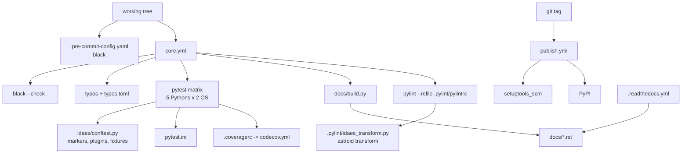
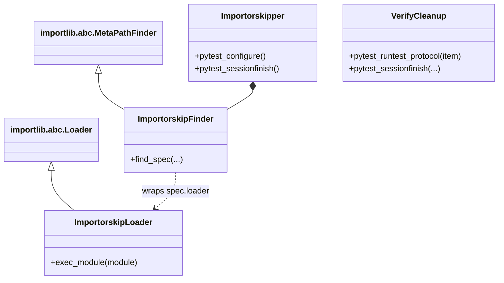
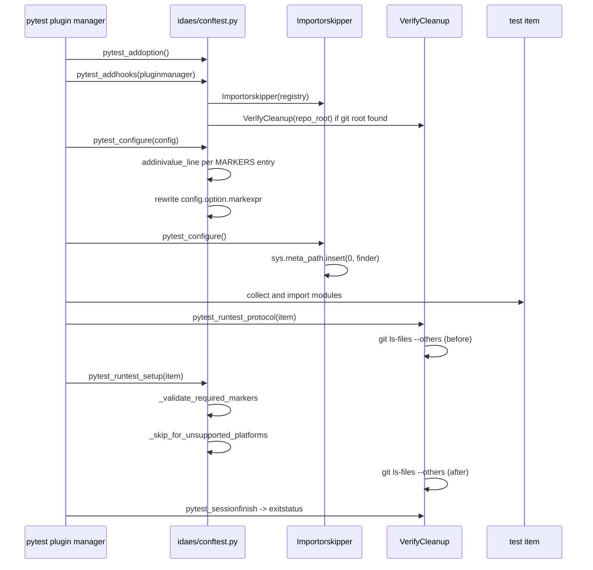
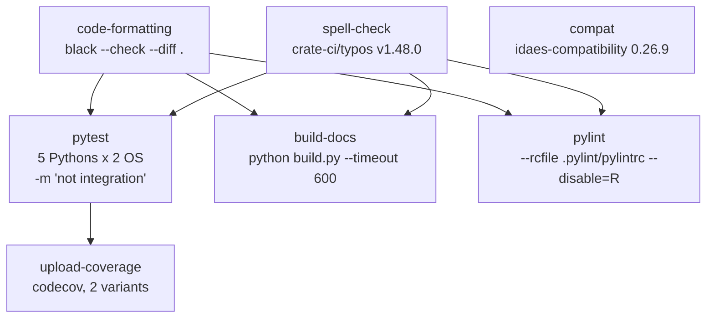

# 32 — Repository engineering

> **Doc ID** 32 · **Repo SHA** 70a8f4fe1 (IDAES-PSE v2.13.0rc0) · **Source roots** `idaes/conftest.py`, `idaes/**/tests/`, and the repository-level tooling surface
> **Owns** 409 test-role modules / 212,886 LOC · **Assets** 73 test data files (9.2 MB) · **Siblings** [02](02_runtime_platform_and_cli.md), [03](03_block_hierarchy_and_construction_protocol.md), [29](29_dependency_and_layering_map.md), [30](30_numerics_and_solver_interface_map.md)

This document covers the machinery that builds, tests, lints, documents and
publishes IDAES-PSE, plus the test suite itself. Its highest-value subject is
`idaes/conftest.py`: at `70a8f4fe1` it is the **only** `conftest.py` in the
repository, and everything the suite does beyond stock pytest — marker
registration, marker enforcement, performance gating, platform gating,
optional-dependency skipping and untracked-file detection — is defined in that
one 377-line file. Every count and anchor below is taken at that revision; see
[§12.14](#1214-working-tree-divergence-from-the-pinned-revision).

---

## 0. Scope and source map

### 0.1 Repository-level engineering files

These sit outside `idaes/` and so have no rows in the ownership ledger CSV; this
document owns them by scope. Line counts are for the pinned revision
`70a8f4fe1` (see [§12.14](#1214-working-tree-divergence-from-the-pinned-revision)).

| File | LOC | Purpose | Covered in § |
|---|---:|---|---|
| `pyproject.toml` | 151 | Build backend, metadata, runtime dependencies, extras, dynamic versioning, console scripts, the flowsheet entry-point group, package data | 4, 9, 10 |
| `pytest.ini`, `pytest-dev.ini` | 7, 9 | The **shipped** pytest configuration, fetched from `main` by the publish workflow to test an installed wheel; and the developer one adding warning suppression, coverage and `testpaths` | 4, 5 |
| `.coveragerc`, `codecov.yml` | 16, 20 | Coverage source, omissions and branch mode; Codecov targets, thresholds and the two-upload notification gate | 4 |
| `.pylint/pylintrc` | 44 | Pylint configuration; loads the astroid plugin; names the ignored directories | 4, 12 |
| `.pylint/idaes_transform.py`, `.pylint/idaes_reporters.py` | 246, 62 | Astroid transform plugin teaching pylint about decorator-generated process block classes; two reporters, a progress display and GitHub Actions check annotations | 2, 3, 7, 9, 11, 12 |
| `addheader.yml`, `file_header.txt` | 10, 10 | Configuration for the `addheader` tool (root `idaes`, pattern `*.py`, separator length 80) and the copyright block it writes, which `idaes/tests/test_headers.py` asserts | 4, 13 |
| `.pre-commit-config.yaml`, `.gitattributes` | 8, 1 | A single `black` hook version-matched to `requirements-dev.txt`; `*.nl text eol=lf`, so NL solver files keep LF endings on every platform | 4 |
| `.readthedocs.yml` | 21 | Read the Docs build: Ubuntu 22.04, Python 3.11, plain Sphinx against `docs/conf.py` | 4, 12 |
| `docs/build.py` | 254 | The real documentation entry point: `sphinx-apidoc` then `sphinx-build`, with a zero-output-line failure rule | 5, 7, 11 |
| `docs/conf.py` | 248 | Sphinx configuration: 14 extensions, the autodoc2/MyST island, the Python-version substitutions | 4, 12 |
| `docs/Makefile`, `docs/scripts/devdocs.sh`, `docs/scripts/convert_notebooks.sh` | 6, 56, 41 | A stub Makefile and two shell helpers | 5, 12 |
| `docs/` content | — | 470 tracked files: 314 `.rst`, 1 `.md`, 2 `.ipynb`, 85 `.png`, plus theme fonts and images | 5, 10, 12 |
| `.github/workflows/core.yml` | 308 | Formatting, spelling, the pytest matrix, coverage upload, doc build, pylint, compatibility | 5 |
| `.github/workflows/integration.yml` | 270 | The label/approval precheck, integration pytest, the examples job, four site-packages install modes | 5 |
| `.github/workflows/publish.yml` | 250 | Tag-triggered build, wheel test, TestPyPI round trip, PyPI upload, environment snapshot | 5 |
| `.github/workflows/util-cleanup.yml`, `typos.toml` | 19, 67 | Deletes one-shot workflow-trigger labels after they fire; spell-checker exclusions and roughly forty accepted domain words | 4, 5 |
| `.github/actions/setup-idaes/action.yml` | 79 | Force-fetch canonical tags, install, `idaes get-extensions --extra petsc`, AMPL SCIP | 5, 8 |
| `.github/actions/check-pr-approval/`, `display-debug-info/`, `environment-summary/`, `run-examples/` | 38, 17, 115, 92 | Approval query, event-payload dump, job summary and environment artifacts, examples runner | 5 |
| `.github/actions/run-examples/examples_for_idaes_ci.py` (+ `requirements-test.txt`) | 171, 2 | A standalone pytest plugin driving the examples repository, with `nbmake` and `jupyter-cache` pins | 5, 9, 10 |
| `.github/CODEOWNERS`, `PULL_REQUEST_TEMPLATE.md` | 52, 16 | Per-path reviewer assignment; the pull-request skeleton and contributor legal acknowledgement | 2, 12 |
| `scripts/mark_tests.py`, `scripts/colab_helper.py` | 156, 167 | Bulk-inserts `@pytest.mark.unit` into files listed in `testfiles.txt`; installs IDAES and solvers inside a Google Colab notebook | 7, 12 |
| `scripts/remove-idaes-from-path.sh`, `scripts/README.md` | 7, 4 | A path-cleanup shell script and a one-entry index | 12 |
| `requirements-dev.txt` | 34 | The developer environment: Sphinx stack, pytest stack, the pylint and astroid pins, black, `addheader` | 10, 12 |

### 0.2 The test surface

| Group | Modules | LOC | Purpose | Covered in § |
|---|---:|---:|---|---|
| `idaes/conftest.py` | 1 | 377 | The only pytest configuration module in the repository | 2, 3, 5, 6, 7, 9, 11 |
| `idaes/tests/` | 14 | 1,012 | The meta-test package: documentation, headers, importability, configuration, logging, beta imports, the marker rules themselves, and the Prescient 5-bus case | 5, 13 |
| Co-located `tests/` packages | 394 | 211,497 | 63 directories named `tests`, one per package that has tests | 13 |
| Owned assets | 73 files | 9.2 MB | Reference data, solver traces, surrogate models, baselines, the RTS-GMLC 5-bus dataset | 10 |

Totals from `_generated/manifest.json`: 409 test-role modules and 212,886 test
LOC against 465 source modules and 215,226 source LOC — the test tree is very
nearly the size of the library it tests. The ledger assigns these 482 rows
through three rules: `/tests/` (456 rows including assets), `^idaes/tests/`
(25 rows) and `^idaes/conftest\.py$` (1 row). No file here declares a CONFIG
key, so [§4](#4-configuration-reference) covers configuration *files*; none
raises `NotImplementedError`, so
[§9](#9-extension-and-subclassing-contracts) covers the tooling's plug-in seams.

---

## 1. Architectural role

Three control planes meet in this document and share almost no code.

The **test plane** is one `conftest.py` and 408 test modules. Its distinguishing
property is that the marker vocabulary is not declarative: `pytest.ini` has no
`markers` section and `pyproject.toml` has no `[tool.pytest.ini_options]` table.
The ten markers are registered programmatically in `pytest_configure`
(`idaes/conftest.py:69`) from a module-level dict, and one of them is
*mandatory* — `pytest_runtest_setup` (`idaes/conftest.py:91`) fails any test not
carrying exactly one of `unit`, `component`, `integration` or `performance`.
Two custom plugins ride alongside: `Importorskipper` turns a missing optional
dependency into a module-level skip, and `VerifyCleanup` fails the session if a
test leaves an untracked file behind.

The **quality plane** is `black` (enforced twice, as a pre-commit hook and a CI
job), the `typos` spell checker, and pylint driven by `.pylint/pylintrc`.
Pylint is the interesting half, because `declare_process_block_class` creates
container classes at import time that no static analyser can see. The astroid
transform plugin `.pylint/idaes_transform.py` synthesizes the same class into
the astroid tree that the decorator synthesizes at runtime, which couples this
document to [03](03_block_hierarchy_and_construction_protocol.md).

The **release plane** is `pyproject.toml` plus three GitHub Actions workflows.
Versioning is dynamic: `setuptools_scm` derives the version from git tags, so
every checkout step sets `fetch-depth: 0` and the `setup-idaes` composite action
force-fetches canonical tags into forks that lack them.

*The three planes are independent: the only file more than one of them reads is `pyproject.toml`.*

---

## 2. Public surface inventory

| Symbol | Kind | Declared at | Exported via | Stability signal |
|---|---|---|---|---|
| `MARKERS` | `dict[str, str]` | `idaes/conftest.py:55` | module global | no underscore; read only by `pytest_configure` |
| `REQUIRED_MARKERS` | `set[str]` | `idaes/conftest.py:86` | module global | no underscore |
| `ALL_PLATFORMS` | `set[str]` | `idaes/conftest.py:87` | module global | no underscore |
| `pytest_addoption` | pytest hook | `idaes/conftest.py:45` | pytest hook protocol | named by the protocol |
| `pytest_configure` | pytest hook | `idaes/conftest.py:69` | pytest hook protocol | named by the protocol |
| `pytest_runtest_setup` | pytest hook | `idaes/conftest.py:91` | pytest hook protocol | carries `@pytest.hookimpl` |
| `pytest_addhooks` | pytest hook | `idaes/conftest.py:364` | pytest hook protocol | named by the protocol |
| `run_in_tmp_path` | fixture, function scope | `idaes/conftest.py:245` | fixture lookup | used at 3 sites |
| `run_class_in_tmp_path` | fixture, class scope | `idaes/conftest.py:255` | fixture lookup | used at 3 sites |
| `run_module_in_tmp_path` | fixture, module scope | `idaes/conftest.py:273` | fixture lookup | used at 2 sites |
| `ImportorskipLoader` | class | `idaes/conftest.py:163` | — | internal to the plugin |
| `ImportorskipFinder` | class | `idaes/conftest.py:191` | — | internal to the plugin |
| `Importorskipper` | class | `idaes/conftest.py:212` | plugin name `importorskipper` | named plugin |
| `VerifyCleanup` | class | `idaes/conftest.py:300` | unnamed plugin | registered only inside a git checkout |
| `_validate_required_markers`, `_skip_for_unsupported_platforms`, `_get_repo_root_dir` | functions | `idaes/conftest.py:141`, `:102`, `:288` | — | leading underscore |
| `idaes`, `idaes-run` | console scripts | `pyproject.toml:119-121` | `[project.scripts]` | packaged entry points; see [02](02_runtime_platform_and_cli.md) |
| `0D_Fixed_Bed_TSA` | flowsheet entry point | `pyproject.toml:124` | `[project.entry-points."idaes.flowsheets"]` | the only member of the group |
| `DisplayProgress`, `GHACheckAnnotations` | pylint reporters | `.pylint/idaes_reporters.py:8`, `:37` | `register(linter)` at `:59` | reporter names `progress`, `gha` |
| `CommandError`, `run_apidoc`, `run_html` | exception, pipeline steps | `docs/build.py:37`, `:57`, `:106` | resolved by name from `globals()` | name-dispatched |
| `register` | pylint plugin entry | `.pylint/idaes_transform.py:244` | `load-plugins=idaes_transform` | required name |
| `setup-idaes`, `check-pr-approval`, `display-debug-info`, `environment-summary`, `run-examples` | composite actions | `.github/actions/*/action.yml` | `uses: ./.github/actions/<name>` | referenced by relative path |

The pull-request template and `.github/CODEOWNERS` are the repository's only
other declared process surface.

---

## 3. Class hierarchy and type taxonomy

Ten classes exist across the files this document owns. None is a process block:
`process_blocks.csv` and `classes.csv` contain no rows for any owned file,
because the inventory excludes test-role modules.

*`Importorskipper` is a pytest plugin that owns an import hook; `VerifyCleanup` is a pytest plugin that owns no imports at all — they share only the plugin protocol.*

| Class | Base(s) | Declared at | Decorator | Container class | Key overrides |
|---|---|---|---|---|---|
| `ImportorskipLoader` | `importlib.abc.Loader` | `idaes/conftest.py:163` | none | — | `module_repr`, `create_module`, `exec_module` |
| `ImportorskipFinder` | `importlib.abc.MetaPathFinder` | `idaes/conftest.py:191` | none | — | `find_spec` |
| `Importorskipper` | `object` | `idaes/conftest.py:212` | none | — | three pytest hooks |
| `VerifyCleanup` | `object` | `idaes/conftest.py:300` | none | — | four pytest hooks |
| `DisplayProgress` | `pylint.reporters.BaseReporter` | `.pylint/idaes_reporters.py:8` | none | — | `on_set_current_module`, `_display` |
| `GHACheckAnnotations` | `pylint.reporters.text.TextReporter` | `.pylint/idaes_reporters.py:37` | none | — | `write_message`, `display_reports` |

Four further classes are incidental: the test containers `Test5Bus`
(`idaes/tests/prescient/test_prescient.py:26`) and `TestIdaesConfigure`
(`idaes/tests/test_config.py:20`), the `@dataclass` `VersionCompat`
(`.pylint/idaes_transform.py:39`), and `CommandError` (`docs/build.py:37`).

### 3.1 The marker taxonomy

`MARKERS` (`idaes/conftest.py:55`) is the complete registered vocabulary,
installed at `idaes/conftest.py:71` by `config.addinivalue_line("markers", ...)`.
Occurrence counts are `@pytest.mark.<name>` decorator counts from
`_generated/manifest.json`.

| Member | Registered description | Role | Occurrences |
|---|---|---|---:|
| `build` | test of model build methods | descriptive | 98 |
| `cubic_root` | test requires the compiled cubic root finder | descriptive | 3, all via module-level `pytestmark` |
| `iapws` | test requires the compiled IAPWS95 property package | descriptive | 15 |
| `initialization` | test of initialization methods. These generally require a solver as well | descriptive | 0 |
| `solver` | test requires a solver | descriptive | 461 |
| `ui` | tests of an aspect of the ui | descriptive | 143 |
| `unit` | quick tests that do not require a solver, must run in <2s | **required tier** | 4,844 |
| `component` | quick tests that may require a solver | **required tier** | 1,192 |
| `integration` | long duration tests | **required tier** | 217 |
| `performance` | tests for the IDAES performance testing suite | **required tier**, gated | 6 |

`REQUIRED_MARKERS` (`idaes/conftest.py:86`) is the four-member subset
`{"unit", "component", "integration", "performance"}`; exactly one per test is
mandatory. `ALL_PLATFORMS` (`idaes/conftest.py:87`) is
`{"darwin", "linux", "win32"}`, the values `sys.platform` takes on the three
supported systems; the negated forms `nodarwin`, `nolinux` and `nowin32` come
from a lambda passed at `idaes/conftest.py:95`. No platform marker appears in
`MARKERS` — they are consumed but never registered.

### 3.2 Marker spread

From `_generated/markers.csv`, counting *files* rather than occurrences:
`unit` 308, `component` 168, `skipif` 152, `integration` 62, `solver` 60,
`ui` 45, `build` 39, `parametrize` 22, `iapws` 13, and `xfail`, `usefixtures`
and `performance` at 6 each. `skipif`, at 1,080 occurrences across 152 files, is
the second most common decorator in the suite and is the mechanism the tree
actually uses for conditional execution — availability of Ipopt, of the compiled
function library, of the Helmholtz external functions, of optional Python
packages — rather than the platform markers.

---

## 4. Configuration reference

No file here declares a Pyomo CONFIG block, so this section is one table per
configuration *file*.

### 4.1 `pyproject.toml` — metadata and dynamic versioning

| Key | Value | Effect on build | Anchor |
|---|---|---|---|
| `build-system.requires` | `setuptools>=64`, `setuptools_scm>=8`, `wheel` | The isolated build environment | `pyproject.toml:2` |
| `build-system.build-backend` | `setuptools.build_meta` | PEP 517 backend | `pyproject.toml:3` |
| `project.license` | `{ text = "BSD" }` | License metadata | `pyproject.toml:10` |
| `project.classifiers` | Python 3.10 through 3.14, CPython only | The only machine-readable statement of supported Pythons | `pyproject.toml:12` |
| `requires-python` | **not set**, commented out with an explanation | pip applies no interpreter constraint at install time | `pyproject.toml:40-42` |
| `project.dynamic` | `["version"]` | Hands version resolution to `setuptools_scm` | `pyproject.toml:43` |
| `version_scheme` | `guess-next-dev` | An untagged commit reports the next patch version with a `.devN` suffix | `pyproject.toml:78` |
| `local_scheme` | `node-and-date` | Appends `+g<sha>.d<date>` when the tree is dirty | `pyproject.toml:79` |
| `tag_regex` | `^(?P<version>\d+\.\d+\.\d+(?:\.dev\d+\|a\d+\|b\d+\|rc\d+)?)$` | Only bare `X.Y.Z` tags with an optional dev, alpha, beta or rc suffix count | `pyproject.toml:80` |

Two consequences follow from the tag regex. A checkout without tags produces a
version that does not match the release tag, which is why every
`actions/checkout` step sets `fetch-depth: 0` and why `setup-idaes`
force-fetches canonical tags. And the `build` job of `publish.yml` asserts that
the wheel and sdist filenames parse to exactly the pushed tag before anything is
uploaded. The comment at `pyproject.toml:40` records why `requires-python` stays
commented out: legacy projects may rely on unsupported versions, and the
classifiers carry the supported range instead.

### 4.2 `pyproject.toml` — dependencies, extras, packaging

Runtime dependencies (`pyproject.toml:45-55`): `pyomo >= 6.10.1` (the modelling
layer), `pint >= 0.24.1` (required for Pyomo units), `networkx` (required for
`pyomo.network`), `numpy>=1,<3`, `pandas != 2.1.0` (a bug in pandas 2.1, tracked
as IDAES/idaes-pse#1253), `scipy`, `sympy` (`idaes.core.util.expr_doc`),
`matplotlib`, `click>=8` (the CLI, see [02](02_runtime_platform_and_cli.md)) and
`pydantic` (`idaes.core.util.structfs`). Only three carry a constraint with a
recorded reason.

| Extra / key | Value | Consumer or effect | Anchor |
|---|---|---|---|
| `ui` | `idaes-ui`, `idaes-connectivity` | The `ui`-marked tests | `pyproject.toml:59` |
| `coolprop` | `coolprop>=8.0` | The CoolProp property wrapper | `pyproject.toml:60` |
| `grid` | `gridx-prescient>=2.2.3` | `idaes.tests.prescient` | `pyproject.toml:63` |
| `omlt` | `omlt==1.1`, `tensorflow` (only below Python 3.14), `onnx` | The Keras and ONNX surrogate paths | `pyproject.toml:66` |
| `testing` | `pytest`, `addheader`, `pyyaml` | `idaes/tests/test_headers.py`; not a member of `all` | `pyproject.toml:72` |
| `all` | `idaes-pse[ui,grid,omlt,coolprop]` | Convenience aggregate | `pyproject.toml:75` |
| `zip-safe` | `false` | Never installed as a zip egg, so `__file__`-relative data loads work | `pyproject.toml:83` |
| `include-package-data` | `true` | Honours `package-data` for every package | `pyproject.toml:84` |
| `packages.find.include` | `["idaes*"]` | Package discovery root | `pyproject.toml:91` |
| `package-data."*"` | 22 extensions | The shipped-asset whitelist | `pyproject.toml:94` |
| `project.scripts` | `idaes`, `idaes-run` | Console entry points | `pyproject.toml:119-121` |
| `entry-points."idaes.flowsheets"` | one member | The flowsheet plug-in group | `pyproject.toml:123-124` |
| `tool.pylint.main.py-version` | `3.10` | Read only when pylint runs without `--rcfile` | `pyproject.toml:87` |
| `tool.flake8` | four ignores, `exclude = "tests"`, `max-line-length = 88` | No job in the repository runs flake8 | `pyproject.toml:148` |

The `omlt` pin is exact, with the stated reason that the package is still
evolving, and its `tensorflow` entry carries an environment marker excluding
Python 3.14 until TensorFlow publishes distributions for it. The `package-data`
whitelist is an extension list, not a path list — 22 patterns from `*.template`
to `*.onnx`, three of them carrying comments naming the Keras surrogate
directory as their reason. The full shipped-asset inventory is
[28](28_data_and_file_format_inventory.md).

### 4.3 The two pytest configurations

| Key | `pytest.ini` | `pytest-dev.ini` |
|---|---|---|
| `addopts` | `--durations=100 --durations-min=2` (`:2-3`) | `-W ignore --cov=idaes --cov-config .coveragerc` (`:2-4`) |
| `testpaths` | absent | `idaes` (`:5`) |
| `log_file` / `log_file_date_format` / `log_file_format` | `pytest.log`, ISO-8601, `%(asctime)s %(levelname)-7s <%(filename)s:%(lineno)d> %(message)s` | identical |
| `log_file_level` | `INFO` (`pytest.ini:7`) | `DEBUG` (`pytest-dev.ini:9`) |
| `markers` | **absent** | **absent** |

`pytest.ini` ships with the package, and the `test-whl` and `install-test-pypi`
jobs of `publish.yml` download it with
`wget https://raw.githubusercontent.com/IDAES/idaes-pse/main/pytest.ini` before
running `pytest --pyargs idaes -m "unit"`. It wins by default during rootdir
discovery, so the developer file is selected with `-c pytest-dev.ini`.

### 4.4 Coverage: `.coveragerc` and `codecov.yml`

| File | Key | Value | Effect |
|---|---|---|---|
| `.coveragerc` | `run.source` | `idaes` | Measurement root (`:4`) |
| `.coveragerc` | `run.omit` | `/opt/*`, `*/tests/*`, `*_plugin.py` | Excludes system paths, test packages and plugin modules (`:5-11`) |
| `.coveragerc` | `run.branch` | `True` | Branch rather than statement coverage (`:13`) |
| `.coveragerc` | `report.show_missing` | `True` | Lists uncovered line numbers (`:16`) |
| `codecov.yml` | `coverage.precision` / `round` | `2` / `down` | Reporting format (`:2-3`) |
| `codecov.yml` | `status.patch` / `status.project` threshold | `0%` / `1%` | Patch coverage may not drop at all; project coverage may drop one point (`:7-13`) |
| `codecov.yml` | `require_ci_to_pass` | `false` | Codecov reports even when other jobs fail (`:15`) |
| `codecov.yml` | `notify.after_n_builds` | `2` | Waits for both uploads, one Linux and one Windows (`:20`) |

`after_n_builds: 2` is coupled to `core.yml`: `upload-coverage` runs a two-member
matrix (`linux`, `win64`), each downloading the `coverage.xml` artifact produced
by the Python 3.12 leg of the pytest matrix, which is the only leg that
generates coverage — with the stated reason of not overloading Codecov.

### 4.5 `.pylint/pylintrc`

| Key | Value | Effect | Anchor |
|---|---|---|---|
| `init-hook` | `import sys; sys.path.append('.pylint')` | Makes the two plugin modules importable | `.pylint/pylintrc:2` |
| `load-plugins` | `idaes_transform` | Loads the astroid transform | `.pylint/pylintrc:3` |
| `ignore-patterns` | `test_.*`, `__init__.*` | Excludes every `test_*.py` and `__init__.py` by basename | `.pylint/pylintrc:4` |
| `ignore` | `alamopy_depr`, `grid_integration`, `helmet`, `matopt`, `ripe`, `roundingRegression` | Excludes whole directories by basename | `.pylint/pylintrc:5` |
| `extension-pkg-allow-list` | `pyomo.core.expr.numeric_expr` | Allows introspection of the compiled Pyomo expression module | `.pylint/pylintrc:6-7` |
| `disable` | 24 checks | Suppresses Pyomo-driven false positives and style checks black owns | `.pylint/pylintrc:10-32` |
| `ignored-modules` | `cvalsim`, `almsim` | ALAMO simulator stubs that are never importable | `.pylint/pylintrc:35` |
| `generated-members` | `cm\..*` | Suppresses `no-member` on `matplotlib.cm` attributes | `.pylint/pylintrc:43` |
| `ignore-none` | `yes` | Type check treats `None` as compatible | `.pylint/pylintrc:44` |

Notable `disable` entries carry their reasons inline: `line-too-long` (black
owns it), `no-member` (false positives from Pyomo's diamond inheritance),
`unused-argument` (high-level methods pass arguments simpler overrides do not
need), `consider-using-f-string` (a large effort). The CI invocation adds
`--disable=R`, so the whole refactoring category is off in CI even though
`pylintrc` does not disable it.

### 4.6 Headers, formatting, line endings, documentation

| File | Key | Value | Effect |
|---|---|---|---|
| `addheader.yml` | `root` / `text` / `patterns` / `sep-len` | `idaes` / `file_header.txt` / `["*.py"]` / `80` | Only `*.py` under `idaes/` gets the ten-line copyright block, bracketed by 80-character separators (`:4-9`) |
| `.pre-commit-config.yaml` | `repo`, `rev`, `types` | `psf/black`, `26.3.1`, `[python]` | The only hook; version matches `requirements-dev.txt:22` |
| `.gitattributes` | `*.nl` | `text eol=lf` | The 32 shipped AMPL NL files keep LF endings on every platform |
| `.readthedocs.yml` | `build.os` / `tools.python` | `ubuntu-22.04` / `3.11` | Builder image and interpreter (`:10`, `:12`) |
| `.readthedocs.yml` | `sphinx.fail_on_warning` / `sphinx.configuration` | `false` / `docs/conf.py` | Read the Docs runs `sphinx-build` itself and tolerates warnings (`:16-17`) |
| `.readthedocs.yml` | `python.install` | `requirements: requirements-dev.txt` | Installs the developer environment, including the editable package (`:21`) |
| `docs/conf.py` | `extensions` | 14 entries including `sphinx.ext.doctest`, `nbsphinx`, `myst_parser`, `autodoc2` | The extension set (`:27`); `source_suffix` accepts `.rst` and `.md` (`:72`), `autodoc_typehints` is `description` (`:60`), `intersphinx` covers `python`, `ui` and `pyomo` (`:162`), `nbsphinx_execute` is `auto` (`:173`), and `version` comes from `importlib.metadata` so the docs require an installed package (`:95-97`) |
| `docs/conf.py` | `autodoc2_packages` / `output_dir` / `render_plugin` | `../idaes/core/util/structfs` / `reference_guides/core/util` / `myst` | One package documented by autodoc2, its generated MyST Markdown landing inside the source tree (`:47-51`) |
| `docs/conf.py` | `exclude_patterns` | `apidoc/*tests*`, the structfs package, build directories | Keeps generated test pages out of the autodoc pass (`:109`) |
| `docs/conf.py` | `IDAES_PV_MIN/MAX/DEFAULT` | `"3.9"`, `"3.13"`, `"3.10"` | Feed the Python-version substitutions (`:122`) |
| `docs/conf.py` | `setup(app)` | connects `source-read` | Applies the version substitutions inside code blocks, where Sphinx substitutions do not reach (`:247`) |

`addheader.yml` has two consumers: the tool writes headers with it, and
`idaes/tests/test_headers.py:40` parses it with `yaml.safe_load` and hands
`conf_data["patterns"]` to `addheader.add.FileFinder`
(`idaes/tests/test_headers.py:60`), so test and tool cannot disagree about which
files need headers. `.github/workflows/typos.toml` completes the surface: a
four-entry `files.extend-exclude` list (`*.eps`, `*.css`, `*.map`, `*.svg`) and
roughly forty `default.extend-words` identity mappings accepting domain
abbreviations verbatim — `IDAES`, `HEL`, `Attemp`, `Ficks`, `inh`, `suh`,
`equil`, `cocurrent`, `astroid`, `FOM`, `MIS`, `HDA` and others.

---

## 5. Construction and call sequences

### 5.1 The pytest session

*Two `git ls-files` subprocesses run around every single test, and the marker check runs before every single test.*

Three facts are not visible in the diagram. `pytest_addhooks`
(`idaes/conftest.py:364`) runs earliest of all, at plugin-registration time: it
builds the `Importorskipper` over the literal registry
`{"idaes.core.surrogate.keras_surrogate": ["omlt"]}` (`idaes/conftest.py:367`),
registers it as `importorskipper` (`idaes/conftest.py:371`), then registers a
`VerifyCleanup` only when `_get_repo_root_dir` (`idaes/conftest.py:288`)
succeeds (`idaes/conftest.py:374`) — so an installed wheel has no cleanup check
at all. `pytest_configure` (`idaes/conftest.py:69`) is the only place the ten
markers are declared, through `config.addinivalue_line`
(`idaes/conftest.py:71`). And both plugins contribute to the collection banner
(`idaes/conftest.py:231`, `:327`).

### 5.2 The three gates in `pytest_runtest_setup`

`_validate_required_markers` (`idaes/conftest.py:141`) collects
`{marker.name for marker in item.iter_markers()}` — `iter_markers` walks the full
chain, so a module-level `pytestmark`, a class decorator and a function
decorator all contribute — intersects with `REQUIRED_MARKERS`, and counts.
Fewer than one gives the reason `"Too few required markers"`
(`idaes/conftest.py:147`), more than one `"Too many required markers"`
(`idaes/conftest.py:149`), and either produces `pytest.fail(msg)`
(`idaes/conftest.py:157`) naming the test function, the expected count, the
required set and the markers found. This is a hard failure during setup, not a
skip and not a warning: a test without a tier marker cannot run.

`_skip_for_unsupported_platforms` (`idaes/conftest.py:102`) builds the negated
platform set, intersects the item's markers with both sets, and skips with the
reason `f"cannot run on platform {plat}"` (`idaes/conftest.py:138`) when the
current platform's negated tag is excluded, or a non-empty supported set does
not contain it (`idaes/conftest.py:135`). An item with no platform marker is
never skipped, because both sets are empty.

The third gate is not in `pytest_runtest_setup` at all — `pytest_configure`
rewrites `config.option.markexpr` in place before collection:

| Condition | Existing `markexpr` | Resulting `markexpr` | Anchor |
|---|---|---|---|
| `--performance` absent | non-empty | `"<existing> and not performance"` | `idaes/conftest.py:78` |
| `--performance` absent | empty | `"not performance"` | `idaes/conftest.py:81` |
| `--performance` present | anything | `"performance"` — the existing expression is discarded | `idaes/conftest.py:83` |

A default run therefore never collects performance tests, and `--performance`
runs *only* performance tests regardless of any `-m` the caller passed. The tree
has six, one per class deriving from `PerformanceBaseClass` (owned by
[07](07_diagnostics_and_run_orchestration.md)); the sixth site is the
`test_performance` method on the base class, inherited by the five concrete
subclasses.

### 5.3 The two plugins

The `Importorskipper` chain is an importlib interception, not a pytest one.
`ImportorskipFinder.find_spec` (`idaes/conftest.py:202`) delegates to
`importlib.machinery.PathFinder.find_spec`, looks the resolved `spec.name` up in
the registry (`idaes/conftest.py:206`), and on a hit replaces `spec.loader` with
an `ImportorskipLoader` wrapping the original (`idaes/conftest.py:208`).
`ImportorskipLoader.exec_module` (`idaes/conftest.py:182`) calls through inside a
`try`, catches `ModuleNotFoundError` (`idaes/conftest.py:185`), and — only when
`e.name` is one of the registered dependency names — raises
`pytest.skip(allow_module_level=True)` (`idaes/conftest.py:187`); any other
`ModuleNotFoundError` is re-raised. The registry holds exactly one entry, so
importing `idaes.core.surrogate.keras_surrogate` skips at module level when
`omlt` is absent. The class docstring (`idaes/conftest.py:213`) states the
intent: a centralized registry instead of an `importorskip()` call in every test
module that might touch the dependency.

`VerifyCleanup` (`idaes/conftest.py:300`) holds the resolved repository root and
a dict keyed by node id. `_get_files` (`idaes/conftest.py:309`) runs
`git -C <root> ls-files --others --exclude-standard`; a `CalledProcessError`
becomes a one-line pseudo-listing rather than an exception.
`pytest_runtest_protocol` (`idaes/conftest.py:333`) is a `hookwrapper` that
snapshots before, yields, snapshots after, and records the set difference;
`pytest_terminal_summary` (`idaes/conftest.py:343`, `trylast`) prints the
offender section, and `pytest_sessionfinish` (`idaes/conftest.py:359`,
`trylast`) sets `session.exitstatus = pytest.ExitCode.TESTS_FAILED`
(`idaes/conftest.py:361`). The cost is two `git` subprocesses per test; the
three temporary-directory fixtures (`idaes/conftest.py:245`, `:255`, `:273`) are
the sanctioned way for a test that writes files to stay clear of the check.

### 5.4 The `core.yml` job graph

*Formatting and spelling gate everything else; `compat` has no dependencies and runs in parallel.*

**code-formatting** extracts the `black==` line from `requirements-dev.txt` with
`grep`, installs it, and runs `black --check --diff .` over the repository root.
**pytest** matrixes Python 3.10 through 3.14 against `ubuntu-24.04` and
`windows-2022` in a conda environment named `idaes-pse-dev`, calls `setup-idaes`
with `-r requirements-dev.txt`, installs pandoc, and runs
`pytest --pyargs idaes -m "not integration"`; only the Python 3.12 leg sets
`cov-report`, appending `--cov --cov-report=xml` to `PYTEST_ADDOPTS` and
uploading `coverage.xml`. **build-docs** runs `python build.py --timeout 600`
from `docs/` and uploads `docs/build/html/` for 7 days. **pylint** runs
`pylint --rcfile=./.pylint/pylintrc --disable=R` with the output format
`idaes_reporters.DisplayProgress,colorized,idaes_reporters.GHACheckAnnotations:pylint.txt`,
then greps `idaes/` for a sentinel comment marker named by the job env var
`pylint_todo_sentinel` in a step that is `if: always()` and never fails the job;
31 files carry 77 such comments. **compat** writes an empty `pytest.ini` over
the repository's own, installs
`git+https://github.com/IDAES/idaes-compatibility@0.26.9` and runs
`pytest --pyargs idaes_compatibility`; that neutralises the repository's pytest
configuration while `idaes/conftest.py` stays active, because the compatibility
package imports IDAES. Every test or docs job calls `environment-summary` with
`if: always()`, which writes a package table to the job summary and uploads two
conda environment exports and a `pip freeze`.

### 5.5 The `integration.yml` gate

The `precheck` job decides whether the expensive jobs run. Its `if:` expression
admits the workflow when the event action is `labeled` **and** the label's
*description* contains both `triggers_workflow` and the workflow name; or a
review was `submitted` with state `APPROVED`; or the action is `synchronize`; or
the event is not a pull request. The trigger is the label's description, not its
name. `precheck` then calls `check-pr-approval`, which queries
`$GITHUB_API_URL/search/issues?q=repo:$GITHUB_REPOSITORY+is:pr+is:open+review:approved`
with `curl` — the action's comment records that `gh` and `hub` have
authentication problems under `pull_request` events from forks — and reduces the
result with `jq ".items | any(.number == <n>)"`. An inline Python step
(`shell: python {0}`) turns the event name, action and approval flag into one of
`user_dispatch`, `approved_pr`, `unapproved_pr` or `not_pr`, and emits a
workflow warning so the decision shows on the run dashboard.

Three downstream jobs run only for `user_dispatch`, `not_pr` or `approved_pr`:
`pytest` (`pytest --pyargs idaes -m integration`, 5 Pythons × 2 OS), `examples`
(the `run-examples` action against `IDAES/examples@main`, 600-second cell
timeout), and `pytest-site-packages`, which runs four non-editable install modes
on Linux — `pip-default` (`.`), `pip-complete` (`.[ui,grid]`), `pip-all`
(`.[ui,grid,omlt,coolprop]`) and `conda-like` (`.` then `pip uninstall omlt`) —
each executing `pytest --pyargs idaes -W ignore -rs` from a fresh `mktemp -d`.
That is the configuration in which `VerifyCleanup` is absent and `pytest.ini` is
not found. `util-cleanup.yml` closes the label loop: on `pull_request_target`
with action `labeled` it checks the label description for `triggers_workflow`
and deletes the label through `gh api --method DELETE`, making it one-shot.

### 5.6 The documentation build

`docs/build.py` is the entry point; the Makefile only prints a pointer to it.
`main` (`docs/build.py:192`) parses `--dirty`, `--dry-run`, `-j`, `--timeout`
(default 360 s) and `--verbose`, then calls `pipeline("apidoc", "html", ...)`
(`docs/build.py:236`), which resolves each step name to a `run_<name>` function
through `globals()` (`docs/build.py:50`). `run_apidoc` (`docs/build.py:57`)
clears `apidoc/*.rst`, sets `SPHINX_APIDOC_OPTIONS` to
`members,ignore-module-all,noindex` (`docs/build.py:66`), and runs
`sphinx-apidoc --module-first --output-dir apidoc ../idaes ../idaes/*tests*
../idaes/core/util/structfs` with a 60-second timeout, the `structfs` exclusion
carrying the comment that the package is handled by apidoc2;
`postprocess_apidoc` (`docs/build.py:85`) then strips `:noindex:` from the
generated `idaes.core.dmf.rst`. `run_html` (`docs/build.py:106`) removes the
build directory and any stale `sphinx-errors.txt`, runs
`sphinx-build -M html . build -w sphinx-errors.txt` (`docs/build.py:117`), and
counts the lines, warnings and errors in that file: **any** non-zero line count
raises `CommandError` (`docs/build.py:142`), with the warning and error counts
appearing in the message but not affecting the decision. `_run`
(`docs/build.py:151`) converts `TimeoutExpired`, `CalledProcessError` and
everything else into the same exception, which `main` catches before returning
`-1`. Both `docs/sphinx-errors.txt` and `docs/apidoc/` are gitignored, so the
generated API pages are never committed.

### 5.7 The publish pipeline and `setup-idaes`

`publish.yml` triggers on `push` to any tag and chains six jobs: `build` →
`test-whl` → `upload-test-pypi` → `install-test-pypi` → `upload-pypi` →
`env-snapshot`. Nothing reaches PyPI until the built wheel has been installed
from TestPyPI and its unit tests have passed twice.

`build` runs `python -m build`, then an inline Python step parses the wheel and
sdist filenames with `packaging.utils` and asserts both versions equal
`Version(github.ref_name)`; it also asserts `du -s dist/` is under 100,000 kB,
PyPI's per-project limit. `test-whl` installs `<wheel>[ui,coolprop,grid]`,
asserts `importlib.metadata.version("idaes-pse")` equals the normalised tag,
installs `liblapack3 libblas3 libgfortran5`, runs `idaes get-extensions --extra
petsc --verbose`, downloads `pytest.ini` from `main`, and runs
`pytest --pyargs idaes -m "unit" -x` from `/tmp` with two MSContactor
initializer test classes deselected by `-k`. `install-test-pypi` retries
`pip install` in a shell `until` loop with a 15-second sleep, because a TestPyPI
upload is not immediately installable, then repeats the same test. Both upload
jobs use `pypa/gh-action-pypi-publish` pinned to a commit SHA, request
`id-token: write`, and name the GitHub environments `test-release` and
`release`, so both are trusted publishing under environment protection.
`env-snapshot` installs the released version into a conda environment, writes
`requirements.txt` and `environment.yml`, uploads them as a 90-day artifact, and
attaches both to the GitHub Release.

The `setup-idaes` composite action, used by nine jobs across `core.yml` and
`integration.yml`, runs five steps:
`git fetch --force --prune --prune-tags --tags https://github.com/IDAES/idaes-pse.git`,
with the comment that forks do not necessarily contain the tags
`setuptools-scm` uses; `conda install --yes --quiet pip setuptools wheel`; the
install command (`pip --no-cache-dir install --progress-bar off` by default)
applied to the caller's `install-target`, followed by `conda list`, `pip list`
and `pip show pyomo idaes-pse` in collapsible groups;
`idaes get-extensions --extra petsc --verbose`, which on Ubuntu 24.04 also
`apt install`s `libgfortran5 libgomp1 liblapack3 libblas3`, lists
`$(idaes bin-directory)` and runs `ipopt -v` as a smoke test; and
`pip install --index-url https://pypi.ampl.com ampl-module-scip`, the only
package in the CI environment from a non-PyPI index. The binary-extension
download is the CLI surface described in
[02](02_runtime_platform_and_cli.md); what the downloaded solvers are and how
IDAES registers them is [30](30_numerics_and_solver_interface_map.md).

---

## 6. Data structures, variables, constraints and invariants

The components here are Python data structures in `conftest.py` and on-disk
reference files, not Pyomo components.

| Structure | Type | Contents | Created at |
|---|---|---|---|
| `MARKERS` | `dict[str, str]` | 10 marker names to descriptions | `idaes/conftest.py:55` |
| `REQUIRED_MARKERS` / `ALL_PLATFORMS` | `set[str]` | 4 tier names / 3 `sys.platform` values | `idaes/conftest.py:86`, `:87` |
| `Importorskipper._registry` / `._finder` | `dict[str, list[str]]` / `ImportorskipFinder` | one entry, `keras_surrogate` to `["omlt"]`; the finder is inserted at `sys.meta_path[0]` | `idaes/conftest.py:221` |
| `ImportorskipLoader.skip_if_not_found` | `list[str]` | dependency names for one module | `idaes/conftest.py:170` |
| `VerifyCleanup._repo_root_dir` / `._added_by_test` | `Path` / `dict[str, list[str]]` | resolved git top level; node id to sorted new paths | `idaes/conftest.py:305` |
| `config.option.markexpr` | `str` | rewritten mark expression | `idaes/conftest.py:78`, `:81`, `:83` |

### 6.1 Fixture scopes

| Fixture | Scope | Directory | Name pattern | Anchor |
|---|---|---|---|---|
| `run_in_tmp_path` | `function` | pytest's `tmp_path` | pytest default | `idaes/conftest.py:245` |
| `run_class_in_tmp_path` | `class` | `tmp_path_factory.mktemp(numbered=True)` | `f"{module}-{class}"` | `idaes/conftest.py:255` |
| `run_module_in_tmp_path` | `module` | `tmp_path_factory.mktemp(numbered=True)` | the module name | `idaes/conftest.py:273` |

All three restore the previous working directory in a `finally`, so a failing
test cannot leave the process in the temporary directory.

### 6.2 Reference and baseline files

The 73 owned assets are 39 `.csv`, 17 `.json`, 5 `.keras`, 4 `.h5`, 3 `.txt`,
3 `.trc`, 1 `.alm` and 1 `.onnx`, totalling 9.2 MB. Four families dominate: the
Prescient RTS-GMLC 5-bus case (11 `.csv` under `idaes/tests/prescient/5bus/`,
reached through `importlib.resources` at
`idaes/tests/prescient/test_prescient.py:30`); the SOC submodel data cache
(22 `.csv` of per-case solution snapshots); the surrogate fixtures (5 `.keras`,
4 `.h5`, 1 `.onnx` and 6 `.json` under `idaes/core/surrogate/tests/data/`, see
[09](09_surrogate_subsystem.md)); and the ALAMO fixtures (3 `.trc`, 1 `.alm`).

Four convergence baselines are the most structured group. Three are read, at
`idaes/core/util/convergence/tests/test_convergence.py:66`, `:94` and `:193`;
`ceval_fixedvar_mutableparam.3.43.baseline.json` has no reader. The `.3.42` and
`.3.43` infixes encode the sample-file parameters, not a version number: the
generating call is `cb.write_sample_file(spec, fname, ..., n_points=3, seed=42)`
(`idaes/core/util/convergence/tests/test_convergence.py:62`), and the `seed=43`
test (`:125`) compares against a file it writes itself.

### 6.3 Invariants

| Invariant | Enforced at | Failure mode |
|---|---|---|
| Every collected test carries exactly one of the four tier markers | `idaes/conftest.py:141` | `pytest.fail` during setup |
| A default run collects no performance test | `idaes/conftest.py:78` | performance tests would run in every CI job |
| No test leaves an untracked file in the working tree | `idaes/conftest.py:333`, `:361` | session exit status forced to failure |
| The working directory is restored after every temporary-path fixture | `idaes/conftest.py:245`, `:255`, `:273` | subsequent tests run in the wrong directory |
| Every `*.py` under `idaes/` carries the copyright block | `idaes/tests/test_headers.py:55` | assertion listing the offending files |
| Every non-test module under `idaes/` imports in under 10 s | `idaes/tests/test_import.py:84` | assertion listing the failures |
| The built distribution's version equals the pushed tag | `publish.yml`, job `build` | assertion before any upload |
| `sphinx-build` emits zero lines of output | `docs/build.py:142` | `CommandError`, exit code `-1` |

---

## 7. Method contracts

### 7.1 `idaes/conftest.py`

| Method | Signature | Preconditions | Effects | Returns | Raises | Anchor |
|---|---|---|---|---|---|---|
| `pytest_addoption` | `(parser)` | — | Registers `--performance` | `None` | — | `:45` |
| `pytest_configure` | `(config: pytest.Config)` | — | Registers 10 markers; rewrites `markexpr` | `None` | — | `:69` |
| `pytest_runtest_setup` | `(item)` | item collected | Validates markers; skips by platform | `None` | `Failed`, `Skipped` | `:91` |
| `_skip_for_unsupported_platforms` | `(item, all_platforms=None, negate_tag=None)` | — | none unless skipping | `None` | `Skipped` | `:102` |
| `_validate_required_markers` | `(item, required_markers=None, expected_count=1)` | — | none unless failing | `None` | `Failed` | `:141` |
| `_get_repo_root_dir` | `()` | — | Runs `git rev-parse --show-toplevel` | `Path` or `None` | — | `:288` |
| `pytest_addhooks` | `(pluginmanager)` | — | Registers both plugins | `None` | — | `:364` |
| `run_in_tmp_path`, `run_class_in_tmp_path`, `run_module_in_tmp_path` | `(tmp_path)`, `(request, tmp_path_factory)` | matching scope | `chdir` in, `chdir` back | generator | — | `:245`, `:255`, `:273` |
| `ImportorskipLoader.exec_module` | `(module)` | wrapped loader present | Delegates; converts a registered `ModuleNotFoundError` into a module-level skip | `None` | `Skipped`, `ModuleNotFoundError` | `:182` |
| `ImportorskipFinder.find_spec` | `(*args, **kwargs)` | — | Wraps `spec.loader` for registered names | `ModuleSpec` or `None` | — | `:202` |
| `Importorskipper.pytest_configure` | `()` | — | `sys.meta_path.insert(0, finder)` | `None` | — | `:225` |
| `Importorskipper.pytest_sessionfinish` | `()` | finder installed | `sys.meta_path.remove(finder)` | `None` | `ValueError` if removed elsewhere | `:228` |
| `VerifyCleanup._get_files` | `()` | — | Runs `git ls-files --others --exclude-standard` | `list[str]` | — | `:309` |
| `VerifyCleanup.pytest_runtest_protocol` | `(item)` | `hookwrapper=True` | Snapshots before and after; records the difference | generator | — | `:333` |
| `VerifyCleanup.pytest_sessionfinish` | `(session, exitstatus)` | `trylast=True` | Forces the session exit status | `None` | — | `:359` |

### 7.2 `docs/build.py` and `scripts/`

| Function | Signature | Effects | Raises | Anchor |
|---|---|---|---|---|
| `pipeline` | `(*commands, **params)` | Resolves and runs each `run_<cmd>` | propagates | `docs/build.py:44` |
| `run_apidoc` | `(clean=True, dry_run=False, **kwargs)` | Clears and regenerates `apidoc/*.rst` | `CommandError` | `docs/build.py:57` |
| `postprocess_apidoc` | `(root)` | Strips `:noindex:` from `idaes.core.dmf.rst` | `OSError` | `docs/build.py:85` |
| `run_html` | `(clean=True, vb=0, timeout=0, dry_run=False, nprocs=1, **kwargs)` | Runs `sphinx-build`; fails on any output line | `CommandError` | `docs/build.py:106` |
| `_run` | `(what, args, timeout, not_really)` | Runs a subprocess with a timeout | `CommandError` | `docs/build.py:151` |
| `process_testfile` | `(filename)` | Inserts `import pytest` where absent and `@pytest.mark.unit` before any `def test_` lacking a tier marker; returns `-1` and skips the file when the context is unrecognised | — | `scripts/mark_tests.py:38` |
| `install_idaes`, `install_ipopt` | `()` | Install IDAES and solvers inside Google Colab | — | `scripts/colab_helper.py:39` |

`mark_tests.py` is the backfill tool for the mandatory-marker rule: its
docstring states that it adds `@pytest.mark.unit` to every test not already
marked `component`, `integration` or `unit`. Its backtracking search enumerates
seven cases and aborts the whole file on the unrecognised one.

### 7.3 `.pylint/idaes_transform.py`

| Function | Signature | Effects | Anchor |
|---|---|---|---|
| `_check_version_compatibility` | `()` | Prints a stderr warning when the installed pylint or astroid differs from the reference version | `:49` |
| `has_declare_block_class_decorator` | `(cls_node, decorator_name="declare_process_block_class")` | Predicate: an `idaes` module, decorated with a call whose function name matches | `:74` |
| `get_base_class_node` | `()` | Builds and caches a stub `ProcessBlock` whose `__getitem__` returns `uninferable` | `:92` |
| `create_declared_class_node` | `(decorated_cls_node)` | Creates an `astroid.ClassDef` named by the decorator's first argument, based on the stub and the decorated class | `:118` |
| `register_process_block_classes` | `(mod_node)` | Applied to every `idaes` module | `:164` |
| `disable_attr_checks_on_slots` | `(node)` | Deletes `__slots__` from any class whose name contains `ConfigDict` (`:171`), because `ConfigDict.__setattr__` does support runtime attributes | `:177` |
| `has_conditional_instantiation` / `make_node_create_uninferable_instance` | `(node, context=None)` | A `pyomo` class whose `__new__` has more than one `return` gets `instantiate_class` replaced so its instances are `Uninferable` | `:196`, `:215` |
| `_suppress_inference_errors` | `(max_inferred=500)` | Sets `astroid.context.InferenceContext.max_inferred`; called at import | `:26` |
| `register` | `(linter)` | Runs the version check; required for plugin discovery | `:244` |

The three transforms are registered at module import
(`.pylint/idaes_transform.py:223`, `:232`, `:237`). The first targets
`astroid.Module` rather than `astroid.ClassDef`; the comment records that both
were tried and made no measurable difference. `_check_version_compatibility`
compares against `pylint` 3.3.9 and `astroid` 3.3.11, which
`requirements-dev.txt:20-21` pins exactly, with a comment pointing back at this
file.

---

## 8. Cross-subsystem interactions

### Calls out to

| Target | Purpose | Anchor |
|---|---|---|
| `pytest` hook protocol | Four session hooks plus seven plugin hooks | `idaes/conftest.py:45`, `:69`, `:91`, `:364` |
| `importlib.abc`, `importlib.machinery` | The finder and loader behind `Importorskipper` | `idaes/conftest.py:163`, `:191`, `:202` |
| `idaes.core.surrogate.keras_surrogate` | The one registered optional-dependency module | `idaes/conftest.py:367` |
| `addheader.add.FileFinder`, `yaml.safe_load` | Header detection in the meta-test | `idaes/tests/test_headers.py:60`, `:49` |
| `sphinx-apidoc`, `sphinx-build` | The documentation pipeline | `docs/build.py:57`, `:117` |
| `astroid.MANAGER.register_transform` | Three astroid transforms | `.pylint/idaes_transform.py:223` |
| `idaes get-extensions` | Solver binaries in every CI job | `.github/actions/setup-idaes/action.yml`, step "Install extensions" |
| `pypi.ampl.com` | The AMPL SCIP module, the only non-PyPI index | `.github/actions/setup-idaes/action.yml`, step "Install AMPL SCIP" |
| `IDAES/examples`, `IDAES/idaes-compatibility` | The examples corpus and the compatibility test package | `.github/actions/run-examples/action.yml`; `core.yml` job `compat` |

### Called by

| Caller | What it relies on | Owning doc |
|---|---|---|
| Every test module in the tree | Marker registration, the tier rule, the three fixtures, the import hook | this document |
| `idaes.core.util.testing` consumers (83 modules) | The dummy property and reaction packages | [08b](08b_core_support_utilities.md) |
| `PerformanceBaseClass` subclasses (5 test classes) | The `performance` marker and the `--performance` flag | [07](07_diagnostics_and_run_orchestration.md) |
| `idaes.core.util.model_statistics` consumers (145 test modules) | Degrees-of-freedom and component-count assertions | [08a](08a_model_introspection_and_persistence.md) |
| `declare_process_block_class` | The astroid transform mirrors its behaviour for static analysis | [03](03_block_hierarchy_and_construction_protocol.md) |
| The `idaes` and `idaes-run` console scripts, the flowsheet plug-in loader | `[project.scripts]`, `[project.entry-points."idaes.flowsheets"]` | [02](02_runtime_platform_and_cli.md) |
| Solver acquisition at test time | `idaes get-extensions --extra petsc` in CI | [30](30_numerics_and_solver_interface_map.md) |
| The layering analysis | `imports.csv`, which excludes test-role modules | [29](29_dependency_and_layering_map.md) |

---

## 9. Extension and subclassing contracts

No file here raises `NotImplementedError`; `_generated/hooks.csv` has zero rows
for any owned file. The extension surface is made of plug-in seams.

| Hook | Kind | Signature | Resolution order | Base behaviour | Anchor |
|---|---|---|---|---|---|
| `pytest_addoption` | pytest hook | `(parser)` | conftest before plugins | adds `--performance` | `idaes/conftest.py:45` |
| `pytest_addhooks` | pytest hook | `(pluginmanager)` | earliest, at plugin registration | registers two plugins | `idaes/conftest.py:364` |
| `pytest_configure` | pytest hook | `(config)` | conftest, then each registered plugin | markers and `markexpr` | `idaes/conftest.py:69` |
| `pytest_runtest_setup` | pytest hook | `(item)` | `@pytest.hookimpl`, default order | two validators | `idaes/conftest.py:91` |
| `pytest_runtest_protocol`, `pytest_terminal_summary`, `pytest_sessionfinish` | pytest hooks | `(item)`, `(terminalreporter)`, `(session, exitstatus)` | `hookwrapper=True` then two `trylast=True` | file snapshot, offender report, exit status override | `idaes/conftest.py:333`, `:343`, `:359` |
| `pytest_ignore_collect`, `pytest_collection_modifyitems` | pytest hooks | `(collection_path, config)`, `(config, items)` | examples plugin only | notebook filter, pattern-driven xfail and skip | `.github/actions/run-examples/examples_for_idaes_ci.py:69`, `:96` |
| `Importorskipper` registry | constructor argument | `dict[str, list[str]]` | literal at the registration site | one entry | `idaes/conftest.py:367` |
| `MetaPathFinder.find_spec`, `Loader.exec_module` | importlib protocol | `(*args, **kwargs)`, `(module)` | finder inserted at `sys.meta_path[0]`; loader wraps the real one | delegate, catch, skip | `idaes/conftest.py:202`, `:182` |
| `[project.scripts]` | entry-point group | `name = "module:callable"` | resolved by pip at install | two members | `pyproject.toml:119` |
| `[project.entry-points."idaes.flowsheets"]` | entry-point group | `name = "module"` | discovered at runtime by the flowsheet loader | one member | `pyproject.toml:123` |
| `register(linter)` | pylint plugin protocol | `(linter)` | `load-plugins=idaes_transform` | version check only | `.pylint/idaes_transform.py:244` |
| `register(linter)` | pylint reporter protocol | `(linter)` | named in `--output-format` | registers two reporters | `.pylint/idaes_reporters.py:59` |
| `astroid.MANAGER.register_transform` | astroid protocol | `(node_type, transform, predicate)` | three registrations at import | see §7.3 | `.pylint/idaes_transform.py:223` |

### 9.1 The astroid transform as an extension of the block protocol

`declare_process_block_class("Foo")` synthesizes a container class `Foo` and
injects it into the decorated module at import time
([03](03_block_hierarchy_and_construction_protocol.md)). Static analysis cannot
see that, so pylint reports every use of `Foo` as undefined.
`register_process_block_classes` (`.pylint/idaes_transform.py:164`) closes the
gap: for each module whose name contains `idaes` it walks the top-level
`ClassDef` nodes, tests each for the decorator
(`.pylint/idaes_transform.py:74`), and calls `create_declared_class_node`
(`.pylint/idaes_transform.py:118`), which reads the decorator's first positional
argument as the class name and bases the new node on both a stub `ProcessBlock`
and the decorated data class. The stub's `__getitem__` returns `uninferable`
(`.pylint/idaes_transform.py:92`), stopping pylint from following subscript
results into the indexed-block machinery; the comment there names astroid's own
numpy brain module as the precedent.

The coupling is tight enough that the plugin refuses to stay silent when the
analyser versions drift: `_check_version_compatibility`
(`.pylint/idaes_transform.py:49`) prints a stderr warning naming the exact
`pip install` command to restore the reference versions. That warning, not a
hard failure, is the only enforcement.

### 9.2 The examples plugin

`.github/actions/run-examples/examples_for_idaes_ci.py` is a second, independent
pytest plugin living outside `idaes/`. It maps glob patterns to marks (`:34`),
stashing them in `config.stash`, and applies them in
`pytest_collection_modifyitems` (`:96`): `*/held/*` becomes a non-running xfail,
`*/archive/*` a skip, the ALAMO surrogate notebooks a non-running xfail, and
five TensorFlow-dependent notebooks the same when `find_spec("tensorflow")`
returns `None`. `run_pytest` (`:123`) calls `pytest.main` with `--noconftest` and
`-c` pointing at a file it creates empty, so the examples run does **not** load
`idaes/conftest.py` and is not subject to the mandatory-marker rule — necessary,
because the notebooks it collects carry no markers.

---

## 10. External assets, data files and external libraries

### 10.1 Owned assets

| Path | Format | Bytes | Authored/Generated | Producer | Consumer |
|---|---|---:|---|---|---|
| `idaes/tests/prescient/5bus/REAL_TIME_renewables.csv` | RTS-GMLC CSV | 3,641,364 | authored | RTS-GMLC dataset | Prescient simulator |
| `idaes/tests/prescient/5bus/REAL_TIME_load.csv` | RTS-GMLC CSV | 2,888,100 | authored | as above | as above |
| `idaes/core/surrogate/tests/data/PT_data.csv` | CSV | 1,112,268 | generated | sampling script | surrogate training tests |
| `idaes/core/surrogate/plotting/tests/reformer-data.csv` | CSV | 487,966 | authored | reformer case study | plotting tests |
| `idaes/core/surrogate/tests/data/onnx_models/net_Calcite_ST.onnx` | ONNX | 101,704 | generated | ONNX export | ONNX surrogate tests |
| `idaes/core/surrogate/tests/data/keras_models/` (4 `.keras`, 4 `.weights.h5`, 4 `.json`) | Keras 3, HDF5, IDAES metadata | ~22 kB each | generated | `idaes/core/surrogate/tests/data/create_keras_models.py` | Keras surrogate tests |
| `idaes/core/surrogate/tests/alamotrace*.trc`, `alamo_test.alm` | ALAMO trace and input | 740–3,282 | generated | ALAMO | ALAMO surrogate tests |
| `idaes/core/util/convergence/tests/ceval_*.baseline.json` (4) | JSON | 879–1,581 | generated | `convergence.write_sample_file` | convergence tests |
| `idaes/core/util/convergence/tests/ipopt_output.txt`, `idaes/core/util/diagnostics_tools/tests/ipopt_output.txt` | solver log | 6,989 each | captured | Ipopt | log-parser tests |
| `.../soc_submodels/tests/data_cache/case_*.csv` (22) | CSV | ~3,100 each | generated | SOC submodel solves | SOC submodel tests |

The byte-level inventory of every shipped asset, test and non-test, is
[28](28_data_and_file_format_inventory.md).

### 10.2 External tooling

| Library | Constraint | Declared in | Used by |
|---|---|---|---|
| `pytest` | unconstrained | `pyproject.toml:72`, `requirements-dev.txt:16` | the whole suite |
| `pytest-cov`, `coverage` | unconstrained | `requirements-dev.txt:17-18` | `pytest-dev.ini`, the coverage matrix leg |
| `black` | `==26.3.1` | `requirements-dev.txt:22` | pre-commit hook and `code-formatting` |
| `pylint` / `astroid` | `==3.3.9` / `==3.3.11` | `requirements-dev.txt:20-21` | the `pylint` job and the transform plugin |
| `addheader` | `>=0.2.2` | `requirements-dev.txt:27`, `pyproject.toml:72` | `idaes/tests/test_headers.py` |
| `sphinx` | `>=3.0.0,!=8.2.0` | `requirements-dev.txt:5` | `docs/build.py` |
| `myst-parser`, `sphinx-autodoc2` | unconstrained, `>=0.5.0` | `requirements-dev.txt:11-12` | the `structfs` documentation island |
| `crate-ci/typos` | `v1.48.0` | `core.yml`, job `spell-check` | spelling |
| `nbmake`, `jupyter-cache` | `==1.5.5`, `==0.6.1` | `.github/actions/run-examples/requirements-test.txt` | the examples job |
| `ampl-module-scip` | unconstrained | `.github/actions/setup-idaes/action.yml` | an additional MINLP solver in CI |
| `gridx-prescient` | `>=2.2.3` | `pyproject.toml:64` | `idaes/tests/prescient/` |

---

## 11. Errors, logging and diagnostics behaviour

| Exception or outcome | Raised for | Anchor |
|---|---|---|
| `pytest.fail` (`Failed`) | A test carrying zero or more than one tier marker | `idaes/conftest.py:157` |
| `pytest.skip` (`Skipped`) | The current platform is excluded or unsupported | `idaes/conftest.py:138` |
| `pytest.skip(allow_module_level=True)` | A registered optional dependency is absent at module import | `idaes/conftest.py:187` |
| `pytest.ExitCode.TESTS_FAILED` | Any test left an untracked file behind | `idaes/conftest.py:361` |
| `CommandError` | `sphinx-apidoc` or `sphinx-build` timed out, exited non-zero, or produced any output | `docs/build.py:142`, `:151` |
| `AssertionError` | A file under `idaes/` lacks the copyright block | `idaes/tests/test_headers.py:55` |
| `AssertionError` | `sphinx-errors.txt` holds a line that is not an ignorable warning | `idaes/tests/test_docs.py:79` |
| `RuntimeError` | Global configuration promotes a warning or a deprecation to an exception | `idaes/tests/test_config.py:69`, `:79` |

| Logger name | Level | Handler | Anchor |
|---|---|---|---|
| `idaes.tests` | `WARNING`, or the value of `IDAES_TEST_LOG_LEVEL` | `StreamHandler`, `propagate = False` | `idaes/tests/__init__.py:29` |
| `build_docs` | `ERROR`, or `DEBUG` with `-v` | `StreamHandler` | `docs/build.py:30` |
| `mark_tests` | `DEBUG` | `StreamHandler` | `scripts/mark_tests.py:30` |
| `pylint.ideas_plugin` | default | none | `.pylint/idaes_transform.py:19` |

`idaes/tests/__init__.py:29` sets `propagate = False`, so meta-test log output
does not reach the root handler. `IDAES_TEST_LOG_LEVEL` is mapped through
`level_num` (`idaes/tests/__init__.py:17`), which accepts `ERROR`, `INFO`,
`WARNING` and `DEBUG` case-insensitively and falls back to `WARNING`. Both
pytest configurations write a session log to `pytest.log` in the working
directory, at `INFO` and `DEBUG` respectively; `*.log` is gitignored, so the
file does not trip `VerifyCleanup`.

Diagnostic output that is not an error: the collection banner names every entry
in the `Importorskipper` registry and the repository root `VerifyCleanup` is
watching (`idaes/conftest.py:231`, `:327`); the terminal summary lists every
test that left files behind (`idaes/conftest.py:343`); `DisplayProgress`
(`.pylint/idaes_reporters.py:8`) prints elapsed seconds formatted `07.3f` and
the path of each module pylint analyses; and `GHACheckAnnotations`
(`.pylint/idaes_reporters.py:37`) emits GitHub workflow commands, mapping
pylint's `critical` to `error`, `warning` to `warning` and `info` to `notice`,
everything else defaulting to `notice`.

---

## 12. Duplications, deprecations and sharp edges

**12.1 The marker vocabulary exists in exactly one place.** `MARKERS`
(`idaes/conftest.py:55`) is registered by `config.addinivalue_line`
(`idaes/conftest.py:71`); no ini file or pyproject table declares a marker.
Consequence: a pytest run whose rootdir does not reach `idaes/conftest.py`
produces unregistered-marker warnings for all ten names and performs no tier
enforcement. The `compat` job shows the converse — it overwrites `pytest.ini`
with an empty file and the markers still work.

**12.2 Two registered markers are effectively unused.** `initialization`
(`idaes/conftest.py:55`) has zero `@pytest.mark.initialization` occurrences in
the tree. `cubic_root` has three, all module-level `pytestmark` assignments
rather than decorators, so `_generated/markers.csv` — built from decorator
syntax — has no `cubic_root` row while a text search finds three. Consequence: a
count from `markers.csv` and one from the source disagree for that marker.

**12.3 Read the Docs builds a different document set from CI.**
`.readthedocs.yml` hands `docs/conf.py` to Read the Docs, which runs
`sphinx-build` directly, whereas `docs/build.py:236` runs `apidoc` before
`html`. Consequence: the hosted build has no `docs/apidoc/` directory, so the
API reference pages generated from docstrings are absent from it while the CI
artifact contains them. `.readthedocs.yml` also sets `fail_on_warning: false`,
whereas `docs/build.py:142` fails on any output line at all.

**12.4 The platform markers have no users.**
`_skip_for_unsupported_platforms` (`idaes/conftest.py:102`) implements `linux`,
`win32`, `darwin` and their negations. The tree contains `@pytest.mark.linux`
and `@pytest.mark.nowin32` at exactly two sites, both inside that function's own
docstring (`idaes/conftest.py:108`, `:114`). Consequence: the mechanism is live
and exercised by nothing; platform-conditional execution is done with 1,080
`@pytest.mark.skipif` decorators instead.

**12.5 Two pylint configurations exist and one is inert.** `pyproject.toml:87`
and `pyproject.toml:126` declare `[tool.pylint.main]` and
`[tool.pylint."messages control"]` with a disable-everything, enable-nine-checks
policy; the CI job passes `--rcfile=./.pylint/pylintrc`, which supersedes them
entirely. Consequence: the nine checks enabled there — including `import-error`,
`wildcard-import` and `wrong-import-order` — are not what CI runs. The
`[tool.flake8]` table at `pyproject.toml:148` is read by nothing: no job runs
flake8, and flake8 does not read `pyproject.toml` natively.

**12.6 Four of the six pylint `ignore` entries name directories that no longer
exist.** `.pylint/pylintrc:5` ignores `alamopy_depr`, `grid_integration`,
`helmet`, `matopt`, `ripe` and `roundingRegression`; only
`idaes/apps/grid_integration` and `idaes/apps/matopt` exist at this revision.
Consequence: those two packages, 68 modules and 25,254 LOC, are entirely exempt
from lint. Combined with `ignore-patterns=test_.*,__init__.*`, pylint sees 344
of the 465 source modules (194,797 LOC).

**12.7 Lint exclusion by filename does not match the ledger's notion of a
test.** `ignore-patterns=test_.*` matches on basename, so ten test-role modules
not starting with `test_` are still linted, including `idaes/conftest.py` — which
is why `idaes/conftest.py:14` carries an inline
`# pylint: disable=missing-module-docstring`. Separately, three test modules
live in a directory named `test/` rather than `tests/`
(`idaes/models_extra/power_generation/flowsheets/test/test_scpc_plant.py`,
`test_scsc.py`, `test_subcritical_boiler.py`). Consequence: the `.coveragerc`
omit pattern `*/tests/*` does not match them, so they are measured as covered
source, and the ledger classifies them as source and assigns them to
[24](24_reference_flowsheets_and_demonstrations.md) rather than here.

**12.8 Coverage omission does not follow the ledger.** `.coveragerc:5-11` omits
`*/tests/*` and `*_plugin.py`; the second pattern removes
`idaes/apps/grid_integration/examples/thermal_generator_prescient_plugin.py`,
which is source rather than test code, from measurement entirely.

**12.9 Documented tooling that is absent or inconsistent.**
`scripts/README.md:3` documents an `annotate_source` script with the usage
`python scripts/annotate_source.py idaes`; no such file exists, and the function
it describes is what `addheader.yml` and the `addheader` tool do.
`scripts/remove-idaes-from-path.sh:3` names CircleCI as its caller, and no
CircleCI configuration exists in the repository. `.github/CODEOWNERS` names
three paths absent from the tree: `setup.py`, `/idaes/core/ui/` and
`/idaes/models_extra/gas_solids_contactors/`, where the directory is
`gas_solid_contactors`. And `docs/Makefile` is a six-line stub whose only
targets are `all`, `default` and `html`, all of which print a pointer to
`build.py`, while `docs/scripts/devdocs.sh:37` calls `make clean`, `make apidoc`
and `make html` — two of those three targets do not exist in the stub.

**12.10 Duplicated and unread fixtures.**
`idaes/core/util/convergence/tests/ipopt_output.txt` and
`idaes/core/util/diagnostics_tools/tests/ipopt_output.txt` are byte-identical
(6,989 bytes, same MD5), so an Ipopt output-format change breaks both parser
tests and both files have to be updated together. In the other direction,
`idaes/core/util/convergence/tests/ceval_fixedvar_mutableparam.3.43.baseline.json`
is tracked and packaged but no test opens it.

**12.11 The doctest blocks and the doctest builder.** `sphinx.ext.doctest` is
enabled (`docs/conf.py:27`) and 24 pages carry `doctest::`, `testcode::`,
`testsetup::` or `testoutput::` directives; a further 14 carry bare `>>>`
prompts inside ordinary code blocks, where the doctest builder does not reach
them. `docs/build.py:236` runs only `apidoc` and `html`, and no workflow invokes
the doctest builder. The single invocation in the repository is
`idaes/tests/test_docs.py:130`, a `component`-marked test running
`sphinx-build -M doctest` with a 600-second wait, guarded by `_have_sphinx()`
(`idaes/tests/test_docs.py:118`), which returns `False` when the executable is
absent and makes the test a silent pass. Its sibling `test_sphinx_build_log`
(`idaes/tests/test_docs.py:79`) returns early, also passing, when
`sphinx-errors.txt` is not found — so on a machine that has not built the docs,
both documentation tests pass without checking anything.

**12.12 The documentation describes an older project.** `docs/conf.py:122` sets
`IDAES_PV_MIN`, `IDAES_PV_MAX` and `IDAES_PV_DEFAULT` to `"3.9"`, `"3.13"` and
`"3.10"`, which feed the version substitutions used across the installation
pages, through `rst_epilog` and through the `source-read` handler that reaches
inside code blocks (`docs/conf.py:247`), while `pyproject.toml:12` classifies
the package for Python 3.10 through 3.14 and `core.yml` tests that matrix.
`docs/reference_guides/developer/testing.rst:50` states that test files live in
a directory named `test/` in every Python package; 63 of the 66 test directories
are named `tests`. Line 49 points readers at
`idaes/core/tests/test_process_block.py`, a directory holding only
`__init__.py` — the file is at `idaes/core/base/tests/test_process_block.py`.
Line 72 lists three levels, `unit`, `component` and `integration`, omitting
`performance`, which `REQUIRED_MARKERS` (`idaes/conftest.py:86`) also accepts.
Lines 185-186 name Coveralls as the coverage service; the repository uses
Codecov.

**12.13 Copyright headers drift outside `idaes/`.** `addheader.yml:4` roots the
tool at `idaes`, so it never touches files outside the package. Every Python
file under `idaes/` carries the current `2018-2026` block from
`file_header.txt:5`; `docs/build.py:6`, `scripts/mark_tests.py:7` and
`scripts/colab_helper.py:7` carry a `2018-2023` block instead, with a
79-character separator rather than the 80 that `addheader.yml:9` specifies.

### 12.14 Working-tree divergence from the pinned revision

The working tree carries local modifications on top of `70a8f4fe1`, the revision
this document set pins, and `_generated/` was produced at that revision. Every
count, anchor and file list above is therefore the pinned state. The rows below
record the differences inside this document's scope.

| Path | Change at HEAD | Pinned state at `70a8f4fe1` |
|---|---|---|
| `.github/workflows/core.yml`, `integration.yml`, `publish.yml`, `util-cleanup.yml` | Every job gained a guard conjunct of the form `github.event_name != 'schedule' \|\| github.repository == 'IDAES/idaes-pse'`, or `github.repository == 'IDAES/idaes-pse'` alone in `publish.yml` and `util-cleanup.yml` | No such guards; jobs run unconditionally on their triggers. 308 / 270 / 250 / 19 lines |
| `.github/actions/setup-idaes/action.yml` | `git fetch --force --prune --prune-tags --tags` became `git fetch --force --tags`, with a comment explaining that this repository carries tags of its own | `git fetch --force --prune --prune-tags --tags https://github.com/IDAES/idaes-pse.git`; 79 lines |
| `.github/CODEOWNERS` | Reduced to 3 lines with a single wildcard owner | 52 lines, 26 path rules assigning per-directory reviewers |
| `pyproject.toml` | `[tool.setuptools.packages.find] include` changed from `["idaes*"]` to `["idaes", "idaes.*"]`; a `[tool.black] extend-exclude` table and an `accel` extra were added | `include = ["idaes*"]` at `pyproject.toml:91`; no `[tool.black]` table; no `accel` extra; 151 lines |
| `.github/workflows/typos.toml` | `files.extend-exclude` grew from four entries to ten | Four entries: `*.eps`, `*.css`, `*.map`, `*.svg`; 67 lines |
| `scripts/check_rust_headers.py` | Added at HEAD | Absent. Outside the documented scope; contains no IDAES library code |
| `rust/`, `justfile` | Added at HEAD | Absent. Outside the documented scope; contain no IDAES library code |
| `idaes/accel/` | Added at HEAD: 13 modules, including `idaes/accel/tests/conftest.py` and three test modules. Consequence for this document: at HEAD `idaes/conftest.py` is no longer the only `conftest.py` in the tree, and the 409/212,886 test-suite totals do not include those files | Absent. `idaes/` differs from HEAD in exactly these 13 additions plus one modified module, `idaes/core/surrogate/pysmo/sampling.py`; `_generated/` covers neither. Outside the documented scope |

---

## 13. Behaviour pinned by tests

Part of this suite tests the suite. `idaes/tests/` is the meta-test package.

| Behaviour | Test file:line | Marker |
|---|---|---|
| A test with no tier marker fails | `idaes/tests/test_tests.py:21` | `xfail` |
| A test with two tier markers fails | `idaes/tests/test_tests.py:28` | `xfail` |
| Every `*.py` under `idaes/` carries the copyright block, using the `addheader.yml` patterns | `idaes/tests/test_headers.py:55` | `unit` |
| `addheader` and `yaml` absent: skip rather than fail | `idaes/tests/test_headers.py:24`, `:26` | module-level `importorskip` |
| Every non-test module imports, in under 10 s | `idaes/tests/test_import.py:84` | `unit` |
| The Sphinx error log holds only ignorable warnings | `idaes/tests/test_docs.py:79` | `unit` |
| The doctest builder exits zero | `idaes/tests/test_docs.py:130` | `component`, `usefixtures("run_in_tmp_path")` |
| Configuration round-trips through JSON, `use_idaes_solvers` rewrites `PATH`, and a warning or deprecation becomes an exception when configured to | `idaes/tests/test_config.py:22`, `:43`, `:69`, `:79` | `unit` |
| Logger construction, tagging and solver-condition reporting | `idaes/tests/test_logger.py:25`–`:129` | `unit` |
| A beta module cannot be imported normally, and `import_beta` imports it silently | `idaes/tests/test_beta.py:24`, `:34` | `unit` |
| The compiled `cbrt` external function, its gradient and its Hessian | `idaes/tests/test_cbrt.py:20`, `:31`, `:46` | `unit`, `skipif` on `functions_available()` |
| A flowsheet with expanded arcs survives `clone()` | `idaes/tests/test_clone_model.py:49`, `:76` | `unit`, `skipif` on `helmholtz_available()` |
| The packaged 5-bus dataset resolves through `importlib.resources` | `idaes/tests/prescient/test_prescient.py:40` | `unit` |
| A two-day Prescient simulation over the 5-bus case produces results | `idaes/tests/prescient/test_prescient.py:101` | `component`, `importorskip` on `prescient.simulator` |

The two `xfail` tests in `test_tests.py` are the enforcement mechanism's own
regression test: each deliberately violates the rule and is expected to fail, so
if `_validate_required_markers` stopped failing, both would report `XPASS`.

Marker distribution across the whole suite, from `_generated/manifest.json`:
4,844 `unit`, 1,192 `component`, 217 `integration` and 6 `performance` decorator
occurrences, against 1,080 `skipif`, 557 `parametrize`, 461 `solver`, 143 `ui`,
98 `build`, 15 `iapws`, 9 `xfail`, 7 `filterwarnings`, 6 `usefixtures` and
2 `skip`. The shipped test-support library is used here but owned elsewhere:
83 modules import from `idaes.core.util.testing`
([08b](08b_core_support_utilities.md)), 145 test modules from
`idaes.core.util.model_statistics`
([08a](08a_model_introspection_and_persistence.md)), and 6 test classes derive
from `PerformanceBaseClass` ([07](07_diagnostics_and_run_orchestration.md)).

---

## 14. Cross-references

| Topic | Doc | Section |
|---|---|---|
| Terminology: the `unit`/`component` marker collisions, "extension", "tag" | [01](01_glossary_and_conventions.md) | §3 |
| The CLI the console scripts expose; `idaes get-extensions`; the flowsheet entry-point group | [02](02_runtime_platform_and_cli.md) | §2, §5 |
| `declare_process_block_class`, which the astroid transform mirrors | [03](03_block_hierarchy_and_construction_protocol.md) | §5 |
| Test files for the control volume framework | [04](04_control_volume_framework.md) | §13 |
| `PerformanceBaseClass` and the performance suite | [07](07_diagnostics_and_run_orchestration.md) | §2 |
| `idaes.core.util.testing` dummy packages | [08b](08b_core_support_utilities.md) | §2.6 |
| `model_statistics` assertions, and the test-tree layout seen from the utility side | [08a](08a_model_introspection_and_persistence.md) | §2.1, §13 |
| The Keras and ONNX surrogate fixtures the `omlt` extra gates | [09](09_surrogate_subsystem.md) | §10 |
| The three flowsheet tests in a `test/` directory | [24](24_reference_flowsheets_and_demonstrations.md) | §13 |
| `grid_integration`, exempt from pylint | [25](25_grid_integration.md) | §1 |
| `matopt`, exempt from pylint | [26](26_matopt.md) | §1 |
| Byte-level inventory of every shipped asset | [28](28_data_and_file_format_inventory.md) | §2 |
| Import graph, which excludes test-role modules | [29](29_dependency_and_layering_map.md) | §1 |
| Solver binaries, the `.nl` fixtures, the `solver` marker's subject | [30](30_numerics_and_solver_interface_map.md) | §2, §5 |
| Every plug-in seam named here, in the full catalogue | [31](31_extension_point_catalog.md) | §3 |

---

## 15. Source anchor index

Grouped by file so a rebase can be reconciled mechanically. Anchors into
`idaes/` are the ones `_scripts/verify.py --only anchors` resolves; the rest are
listed for the same purpose but are outside its path pattern.

| File | Lines and symbols |
|---|---|
| `idaes/conftest.py` | `:14` inline pylint disable · `:45` `pytest_addoption` · `:55` `MARKERS` · `:69` `pytest_configure` · `:71` `addinivalue_line` · `:78`, `:81`, `:83` the three `markexpr` rewrites · `:86` `REQUIRED_MARKERS` · `:87` `ALL_PLATFORMS` · `:91` `pytest_runtest_setup` · `:95` `negate_tag` argument · `:102` `_skip_for_unsupported_platforms` · `:108`, `:114` the platform markers in its docstring · `:135` skip condition · `:138` platform skip · `:141` `_validate_required_markers` · `:147`, `:149` the two failure reasons · `:157` `pytest.fail` · `:160` `ModuleName` · `:163` `ImportorskipLoader` · `:170` its `__init__` · `:176` `module_repr` · `:179` `create_module` · `:182` `exec_module` · `:185` `ModuleNotFoundError` catch and re-raise · `:187` module-level skip · `:191` `ImportorskipFinder` · `:202` `find_spec` · `:206` registry lookup · `:208` loader substitution · `:212` `Importorskipper` · `:213` its docstring · `:221` its `__init__` · `:225` its `pytest_configure` · `:228` its `pytest_sessionfinish` · `:231` its `pytest_report_collectionfinish` · `:245`, `:255`, `:273` the three temporary-path fixtures · `:288` `_get_repo_root_dir` · `:300` `VerifyCleanup` · `:305` its `__init__` · `:309` `_get_files` · `:327` its `pytest_report_collectionfinish` · `:333` `pytest_runtest_protocol` · `:343` `pytest_terminal_summary` · `:359` its `pytest_sessionfinish` · `:361` exit status override · `:364` `pytest_addhooks` · `:367` the registry · `:371` plugin name · `:374` `VerifyCleanup` registration |
| `idaes/tests/__init__.py` | `:17` `level_num` · `:29` the `idaes.tests` logger |
| `idaes/tests/test_tests.py` | `:17` commented-out module `pytestmark` · `:21` no-marker case · `:28` two-marker case |
| `idaes/tests/test_docs.py` | `:29` module logger · `:79` `test_sphinx_build_log` · `:118` `_have_sphinx` · `:130` `test_doctests` · `:140` `_cleanup_generated_files` |
| `idaes/tests/test_headers.py` | `:24`, `:26` the two `importorskip` calls · `:40` `patterns` fixture · `:49` `yaml.safe_load` · `:55` `test_headers` · `:60` `addheader_add.FileFinder` |
| `idaes/tests/test_config.py` | `:20` `TestIdaesConfigure` · `:22`, `:31` config round trip · `:43` `PATH` rewrite · `:54`, `:61` canonicalisation · `:69`, `:79` warning and deprecation escalation |
| `idaes/tests/test_beta.py`, `test_cbrt.py`, `test_clone_model.py`, `test_import.py`, `test_logger.py` | `test_beta.py:24`, `:34` · `test_cbrt.py:20`, `:31`, `:46` · `test_clone_model.py:49`, `:76` · `test_import.py:84` · `test_logger.py:25`, `:129` |
| `idaes/tests/prescient/test_prescient.py` | `:26` `Test5Bus` · `:30` `data_path` · `:40` `test_data_path_available` · `:101` `test_simulation_results` |
| `idaes/core/util/convergence/tests/test_convergence.py` | `:62` `write_sample_file(n_points=3, seed=42)` · `:66`, `:94`, `:193` the three baseline reads · `:125` the `seed=43` sample file |
| `pyproject.toml` | `:2`, `:3` build system · `:10` license · `:12` classifiers · `:40-42` the commented-out `requires-python` · `:43` `dynamic` · `:45-55` runtime dependencies · `:58-75` extras · `:77-80` `[tool.setuptools_scm]` · `:83` `zip-safe` · `:84` `include-package-data` · `:87` `[tool.pylint.main]` · `:91` `packages.find.include` · `:94` `package-data` · `:119-121` `[project.scripts]` · `:123-124` the flowsheet group · `:126` `[tool.pylint."messages control"]` · `:148` `[tool.flake8]` |
| `pytest.ini`, `pytest-dev.ini` | `pytest.ini:2-3`, `:7` · `pytest-dev.ini:2-4`, `:5`, `:9` |
| `.coveragerc`, `codecov.yml` | `.coveragerc:4`, `:5-11`, `:13`, `:16` · `codecov.yml:2-3`, `:7-13`, `:15`, `:20` |
| `.pylint/pylintrc` | `:2` `init-hook` · `:3` `load-plugins` · `:4` `ignore-patterns` · `:5` `ignore` · `:6-7` `extension-pkg-allow-list` · `:10-32` `disable` · `:35` `ignored-modules` · `:43` `generated-members` · `:44` `ignore-none` |
| `.pylint/idaes_transform.py` | `:19` logger · `:26` `_suppress_inference_errors` · `:39` `VersionCompat` · `:49` `_check_version_compatibility` · `:74` decorator predicate · `:92` `get_base_class_node` · `:118` `create_declared_class_node` · `:164` `register_process_block_classes` · `:171` `is_config_block_class` · `:177` `disable_attr_checks_on_slots` · `:196` `has_conditional_instantiation` · `:215` `make_node_create_uninferable_instance` · `:223`, `:232`, `:237` transform registrations · `:244` `register` |
| `.pylint/idaes_reporters.py` | `:8` `DisplayProgress` · `:37` `GHACheckAnnotations` · `:59` `register` |
| `addheader.yml`, `file_header.txt` | `addheader.yml:4-9` root, header file, patterns, separator length · `file_header.txt:5` copyright year range |
| `.readthedocs.yml` | `:10`, `:12` builder and interpreter · `:16-17` Sphinx settings · `:21` install target |
| `docs/build.py` | `:6` copyright block · `:30` logger · `:37` `CommandError` · `:44` `pipeline` · `:50` name dispatch · `:57` `run_apidoc` · `:66` `SPHINX_APIDOC_OPTIONS` · `:85` `postprocess_apidoc` · `:106` `run_html` · `:117` `sphinx-build` invocation · `:142` zero-output-line rule · `:151` `_run` · `:192` `main` · `:236` the two-step pipeline |
| `docs/conf.py` | `:27` extensions · `:47-51` autodoc2 · `:60` `autodoc_typehints` · `:72` `source_suffix` · `:95-97` version · `:109` `exclude_patterns` · `:122` the Python-version constants · `:162` intersphinx · `:173` `nbsphinx_execute` · `:247` `setup(app)` |
| `docs/reference_guides/developer/testing.rst`, `docs/scripts/devdocs.sh` | `testing.rst:49-50`, `:72`, `:185-186` · `devdocs.sh:37` the `make` invocations |
| `scripts/` | `mark_tests.py:7`, `:30`, `:38` · `colab_helper.py:7`, `:39` · `remove-idaes-from-path.sh:3` · `README.md:3` |
| `requirements-dev.txt` | `:5`, `:7-12` Sphinx stack · `:16-18` pytest stack · `:20-21` pylint and astroid pins · `:22` black · `:24` pre-commit · `:27` addheader · `:34` flowsheet processor |
| `.github/actions/run-examples/examples_for_idaes_ci.py` | `:34` pattern-to-mark table · `:69` `pytest_ignore_collect` · `:96` `pytest_collection_modifyitems` · `:123` `run_pytest` with `--noconftest` |
